# An Energy Effective RIS-Assisted Multi-UAV Coverage Scheme for Fairness-Aware Ground Terminals

Na Lin , Tianxiong Wu , Liang Zhao , Member, IEEE, Ammar Hawbani Shaohua Wan , Senior Member, IEEE, and Mohsen Guizani , Fellow, IEEE

Abstract—Unmanned aerial vehicle (UAV)-assisted communications are critical in regional wireless networks. Using reconfigurable intelligent surfaces (RISs) can significantly improve UAVs’ throughput and energy efficiency. Due to limited communications resources, the data transfer rate of ground terminals (GTs) could be slower, and the throughput may be low. Using RIS-assisted UAVs can effectively address these limitations. This paper focuses on optimizing the three-dimensional (3D) trajectory of the UAV and the scheduling order of the GTs and designing the phase shift of the RIS to maximize energy efficiency while meeting the limited energy and fair service constraints in the case of fair service GTs. To address the non-convexity of this problem, we propose a triple deep q-network (TDQN) algorithm, which better avoids the overestimation problem during the optimization process. We propose an improved k-densitybased spatial clustering of applications with noise (K-DBSCAN) clustering algorithm, which is characterized by the ability to output the initial movement range of the UAV and prune the deep reinforcement learning (DRL) state space by the initial movement range to speed up DRL training based on the completion of the partitioning deployment work. A fair screening mechanism is proposed to satisfy the fairness constraint. The results show that the TDQN algorithm is 2.9% more energy efficient than the baseline. The K-DBSCAN algorithm speeds up the training of the TDQN algorithm by 59.4%. The fair screening mechanism reduces the throughput variance from an average of 114099.9 to an average of 46.9.

Manuscript received 7 December 2023; revised 1 April 2024 and 28 May 2024; accepted 1 July 2024. Date of publication 8 July 2024; date of current version 17 February 2025. This work was supported in part by the National Natural Science Foundation of China under Grant 62372310 and Grant 62303331; in part by the Fundamental Research Funds for the Universities of Liaoning Province; in part by the Natural Science Foundation of Liaoning Province under Grant 2023JH2/101300194; and in part by the Liaoning Provincial Department of Education Science Foundation under Grant JTMS20230268. The work of Ammar Hawbani was supported in part by Open Fund of Anhui Engineering Research Center for Intelligent Applications and Security of Industrial Internet under Grant IASII24-04, and in part by Shenyang Aerospace University Talent Research Start-up Fund under Grant 502/120423005. The editor coordinating the review of this article was E. E. Tsiropoulou. (Corresponding authors: Liang Zhao; Ammar Hawbani.)

Na Lin, Tianxiong Wu, Liang Zhao, and Ammar Hawbani are with the School of Computer Science, Shenyang Aerospace University, Shenyang 110136, China (e-mail: linna@sau.edu.cn; wutianxiong@stu.sau.edu.cn; lzhao@sau.edu.cn; anmande@ustc.edu.cn).

Shaohua Wan is with the Shenzhen Institute for Advanced Study, University of Electronic Science and Technology of China, Shenzhen 518110, China (e-mail: shaohua.wan@ieee.org).

Mohsen Guizani is with the Machine Learning Department, Mohamed Bin Zayed University of Artificial Intelligence, Abu Dhabi, UAE (e-mail: mguizani@ieee.org).

Digital Object Identifier 10.1109/TGCN.2024.3424980

Index Terms—Reconfigurable intelligent surface (RIS), unmanned aerial vehicle (UAV), deep reinforcement learning (DRL), triple deep q network (TDQN).

## I. INTRODUCTION

devices in society and the growing demand for network communications, especially in the future 6th generation mobile networks (6G) environment [1], there are high demands on the coverage and transmission rate of wireless communications. With its great flexibility and simple deployment, unmanned aerial vehicle (UAV) can act as mobile base stations (BSs) [2] in communications tasks, significantly alleviating problems such as the high demand for communications resources. However, many obstacles (such as buildings and trees) exist in UAV-assisted wireless communications scenarios, and communications links are often obscured. These obstacles will significantly impact the channel gain of the links [3], so effectively improving the quality of UAV-assisted wireless communications in urban environments is a great challenge.

In recent years, a new UAV wireless communications mode, reconfigurable intelligent surface (RIS)-assisted UAV wireless communications system [4], emerges and attracts extensive research [5], [6]. This mode differs from traditional UAV wireless communications by utilizing a solid signal reflection capability to enhance non-line-of-sight (NLoS) communications. RIS-assisted transmission performs better in terms of increased channel gain, improved communications security, and reduced energy consumption. Although the RIS-assisted UAV communications mode can effectively improve the communications performance of the UAV in all aspects, the energy storage of the UAV is limited [7]. Therefore, developing energy-efficient and green UAV communications methods is crucial to extend the service life of UAVs in the face of the vast communications demands in communications coverage missions [8].

Lately, several studies focus on maximizing the energy efficiency of a single UAV in communications transmission work [9], [10], [11]. However, in scenarios with greater demand for communications services and a comprehensive communications range, more than a single UAV is needed to satisfy the needs of ground terminals (GTs) well due to the limitations of quantity and energy [12]. Deploying multi-UAV has the following advantages over a single UAV: carrying more energy for greater throughput, comprehensive coverage for more GTs, and scientific partitioning for higher system energy efficiency. Therefore, considering the energy efficiency optimization of multi-UAV is more relevant in real-world scenarios [13]. There are a few recent studies on optimizing the energy efficiency of multi-UAV. In [14], the authors investigate optimizing the transmission delay and energy efficiency of a multi-hop network topology in a scenario by coordinating multi-UAV auxiliary BSs to offload data for GTs. Using multi-UAV to collect data from multi-GT is formulated to minimize system deployment costs and maximize energy efficiency in [15]. In [16], the authors maximize system energy efficiency and minimize GT power interruptions in air-ground communications. According to [9], [10], [11], [14], [15], [16], the energy-efficient optimization problem can be categorized into two distinct scenarios. The first scenario involves fixed data transfer throughput with the GTs [10], [11], [14]. In contrast, the second scenario allows for all the GTs to be serviced simultaneously by one or more hovering UAVs [9], [15], [16]. In these cases, the request tasks of GTs are completed based on the specified throughput, or GTs can be served by one or more UAVs simultaneously. So, they do not need to consider service fairness. However, when the throughput of the requested services of each GT is not fixed or the GTs cannot be served simultaneously, the constraints on the fairness of the services of each GT also need to be considered. Otherwise, with the premise of maximizing energy efficiency, the UAV will preferentially serve some GTs with higher channel gains while ignoring GTs with lower channel gains, leading to service imbalance and unfairness.

In [17], the problem of maximizing the communications rate between the UAV and each GT is considered in the orthogonal frequency division multiple access (OFDMA) mode, and the constraints of fairness in the transmission rate are introduced. The UAV coverage communications problem is studied in [18] to balance the data transmission rate by optimizing the allocation of the communications bandwidth. The fairness of the data transmission rate is considered in [17], [18]. However, due to the limited coverage of UAVs, the number of times or the duration of different BSs being serviced may also vary. Therefore, just pursuing the fairness of data transmission rate does not guarantee the fairness of data throughput. It is important to consider throughput fairness to ensure the quality of service of the GTs. Energy efficiency optimization that ignores throughput fairness can make the UAV serve around one GT or a handful of GTs while ignoring the rest of the GTs. Considering the importance of throughput fairness in energy-efficient optimization problems, especially when the throughput of each GT requesting service is not fixed, or it is impossible to serve the GTs simultaneously, becomes our first challenge.

In multi-UAV energy efficiency optimization problems, clustering algorithms are often utilized for partitioned deployment [15], [16], [19], [20]. Two important factors should be considered in the partition deployment process, i.e., identifying the outlier node information and calculating the initial movement range of the UAV based on the partition location distribution in order to prune the solution space and accelerate the convergence of the algorithm. The Kmeans and Kmeansplus algorithms considered in [15], [16], [19] can not identify the outlying GTs accurately. These outlying GTs are sparsely distributed and remotely located, and servicing them increases the UAV’s flight distance and energy consumption, reducing the overall energy efficiency. Therefore, the service to a few outlying GTs is not cost-effective. The clustering algorithm that can identify outlier information is used in [20], [21], [22]. However, it does not yield the range of clusters to constrain the initial flight range of the UAV, which makes the solution space for subsequent flight exploration too large, leading to an optimization process for energy-efficient solutions with massive overheads and convergence difficulties. Therefore, the second optimization challenge is that the existing clustering algorithms can not simultaneously output the outlier GT and compute a reasonable initial UAV movement range, i.e., the range of clusters.

In addition, determining a scientific optimization problem is critical to finding an excellent decision in the limitations of complex solution space and numerous constraints. Since traditional methods rely on expertise to model dynamic systems, they lack the flexibility to address dynamic optimization problems [23]. Deep reinforcement learning (DRL) can have the advantages of fast learning and flexible autonomous decision making in large-scale solution space problems [24]. It is effective in solving optimization problems [25], [26], [27], [28]. In [25], [26], the authors use the double deep q network (DDQN) algorithm to realize the joint optimization of UAV’s trajectory and RIS’s phase shift. The system capacity of the RIS-UAV-assisted network is effectively improved. In [27], the authors use the dueling deep q network (Dueling-DQN) algo rithm to plan the task time, UAV’s trajectory, and association with the BS to reduce the system energy consumption. In [28], the use of deep q network (DQN) algorithms for planning UAV trajectories in UAV target tracking tasks to minimize tracking cost and energy. Although the DRL algorithm in [25], [26], [27], [28] can solve the optimization problem, it also faces challenges. The deep neural network (DNN) in DRL can be regarded as a function that evaluates the rewards for each action in each state, so the accuracy of the evaluation will directly affect the goodness of the final decision. The problem of over-estimation of action rewards exists at this stage, and meticulously, the over-estimation problem can be decomposed into two influencing factors: the bootstrap problem of the DNN and the maximum estimation problem. For example, the bootstrap problem and the maximum estimation problems exist in the DQN algorithm. The DDQN algorithm mitigates the bootstrap problem using a homogeneous asynchronous network but still has the maximum estimation problem. The Dueling-DQN algorithm mitigates the maximum estimation problem by using the value and dominance networks to perform dominance computation. However, the target and estimated values are still computed using the same neural network, which does not solve the bootstrap problem. So, these algorithms suffer from the presence of the overestimation problem, thus making the algorithm optimization a local optimum, which is the third challenge we face in the optimization process.

Based on the fairness challenge in energy-efficient optimization problems, the challenge of avoiding overestimation in DRL algorithms that lead to trapping in local optimums, and the challenge of refining existing clustering algorithms that cannot output outlier GTs and initial ranges simultaneously. In this paper, we specifically study the fair service energy-efficiency optimization problem under a RISassisted multi-UAV wireless communications system and use the DRL algorithm for policy optimization. Firstly, we add a layer of filtering mechanism in the output part of the DNN to filter out current actions that will further deteriorate the fairness. Then, we select the actions with optimal energy efficiency from the filtered actions to execute to ensure the optimization of energy efficiency while maintaining fairness. Secondly, we propose an improved DRL algorithm to completely solve the over-estimation problem and avoid the DRL algorithm falling into the local optimum. Finally, we propose a k-density-based spatial clustering of applications with noise (K-DBSCAN) algorithm capable of simultaneously outputting outlier GTs and the initial range of movement of the UAVs. In addition to the partitioning feature specific to clustering algorithms for UAVs, the initial range of motion of the UAV can be clipped to the state space of the DRL algorithm, thus increasing the training speed. The identified outlier GT information is used to avoid serving outlier GTs, thus reducing the impact of outlier points on the overall energy efficiency.

Contributions. The contributions of this paper are as follows.

We propose a fair screening mechanism placed in the action space to avoid uneven data transmission by overserving certain GTs and solve the problem of unfair service that occurs when RIS-assisted multi-UAV provide communications services to GTs in multiple sub-areas.

We propose an algorithm, K-DBSCAN, to accomplish the partitioned clustering of GTs and the partitioned deployment of multi-UAV. The locations of outliers and each cluster center are also determined, and the movement range of each UAV is calculated based on the distribution of cluster center locations and the size of the cluster.

We propose a triple deep q-network (TDQN) algorithm to solve the non-convex problem of RIS-assisted UAV trajectory optimization, where the planned UAV positions for each time slot are used to calculate the phase shift of the RIS to maximize the channel gain. The algorithm possesses three isomorphic DNNs and calculates the expectation of the Q-value to solve the bootstrap and maximum estimation problems.

The rest of this article is arranged in the following way. Section II explains the model of the system and puts forward the issue. Section III addresses the established non-convex problem. Section IV provides a detailed analysis of the experimental results. Section V presents conclusions and a vision for future work.

TABLE I IMPORTANT NOTATIONS
<table><tr><td>Notations</td><td>Description</td></tr><tr><td> $\mathcal { N } , \mathcal { U } , \mathcal { L } , \mathcal { H } , \mathcal { T }$ </td><td>GTs set, UAVs set, horizontal cell set, vertical cell set, time slot set</td></tr><tr><td> $W _ { n }$ </td><td>Horizontal coordinates of the  $n _ { t h } \ G T$ </td></tr><tr><td> $x _ { m } , y _ { m } , h _ { m }$ </td><td>Unit length of length, width, and height</td></tr><tr><td> $L _ { t } ^ { u } , H _ { t } ^ { u }$ </td><td>Horizontal position and height of the  $u _ { t h }$  UAV at the  $t _ { t h }$  time slot</td></tr><tr><td> $o _ { u } , r _ { u } , n _ { u }$ </td><td>The center and radius of the circle of the constraint range of the area where the  $u _ { t h }$  UAV is located, the number of GT assigned to each UAV</td></tr><tr><td> $v _ { t } ^ { u , h } , v _ { t } ^ { u , v }$ </td><td>Horizontal and vertical movement speed at time slot t</td></tr><tr><td> $V _ { m a x } ^ { h } , V _ { m a x } ^ { v }$ </td><td>Maximum speed in the horizontal and vertical directions</td></tr><tr><td> $P _ { 0 } , P _ { 1 } , P _ { 2 }$ </td><td>Blade power, induced power, vertical movement</td></tr><tr><td> $h _ { t } ^ { u } , h _ { m i n } , h _ { m a x }$ </td><td>power UAV altitude classes, minimum flight altitude</td></tr><tr><td> $e _ { t } ^ { u }$ </td><td>and maxmum flight altitude Propulsion energy consumption of time slot t</td></tr><tr><td> $g _ { t } ^ { u , r }$ </td><td>Channel gain between UAV-RIS</td></tr><tr><td> $d _ { t } ^ { u , r } , \epsilon _ { t _ { u , r } } ^ { u , r } , \eta _ { t } ^ { u , r } ,$ </td><td>Euclidean distance from UAV to RIS, sine angle of horizontal incidence and cosine angle, sine angle of vertical incidence</td></tr><tr><td> $g _ { t } ^ { r , n }$ </td><td>Channel gain between RIS-GT</td></tr><tr><td> $d _ { t } ^ { r , n } , \epsilon _ { t _ { u } , r } ^ { r , n } , \eta _ { t } ^ { r , n } ,$ </td><td>Euclidean distance from RIS to GT n, sine angle of horizontal incidence and cosine angle, sine angle of vertical incidence</td></tr><tr><td> $g _ { t } ^ { u , r , n }$ </td><td>Channel gain between UAV-RIS-GT</td></tr><tr><td> $p _ { u , n , t } , g _ { u , n , t }$ </td><td>Masking probability and average channel gain</td></tr><tr><td> $r _ { u , n , t } , c _ { u , n , t } ,$   $\omega _ { u , n , t }$ </td><td>The data rate of time slot t, the choice of GT, and the ratio of cumulative throughput of GT to total throughput</td></tr><tr><td> $T h _ { u } , E E _ { u }$ </td><td>UAV u throughput and energy efficiency</td></tr><tr><td> $V _ { t i p }$ </td><td>The tip velocity of the moving blade</td></tr><tr><td> $v _ { 0 } , f _ { 0 } , \mathbf { g } , \rho , \mathrm { ~ H ~ }$ </td><td>Average rotor speed, fuselage drag ratio, rotor solidity, air humidity, rotor disc area</td></tr><tr><td> $W _ { r } , z _ { r }$ </td><td>RIS&#x27;s horizontal position and vertical position</td></tr><tr><td> $Q _ { w } \times Q _ { e } , \theta _ { q _ { w } , q _ { e } }$ </td><td>Number of reflection units on RIS and phase shift amplitude</td></tr><tr><td> $\mathrm { B } , \nu ^ { 2 }$ </td><td>Bandwidth and the variance of the noise</td></tr><tr><td> $\phi , \varphi$ </td><td>Environmental parameters</td></tr><tr><td> $\varpi , \delta$ </td><td>Path loss at 1m, the carrier wavelength</td></tr><tr><td> $\Delta t$ </td><td>The duration of one time slot</td></tr></table>

## II. SYSTEM MODEL AND PROBLEM FORMULATION

In this section, the UAV propulsion energy, the communications channel gain, the transmission rate, and the phase shift of the RIS are modeled. In addition, our working metrics and objective functions are determined. The essential symbol definitions are indicated in Table I.

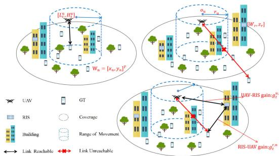  
Fig. 1. RIS-assisted multi-UAV wireless communications system.

## A. System Model

In this paper, the system of communications coverage of GTs in different regions is studied under the situation of multi-UAV being assisted by RIS, as depicted in Fig. 1, when the regular operation of the BS is paralyzed due to exceptional circumstances such as circuit interruption, disaster, or maintenance of the BS in an area, and the GTs in the area are not provided with regular communications services, the UAV can be used as a mobile BS with the aid of the RIS to provide temporary communications services to the GTs. The problem we need to address is how to plan the fligh trajectory of UAVs, GT selection, and passive phase shift of RIS in each time slot during emergency communications, ensuring service fairness while maximizing the overall energy efficiency of the communications system. In our assumption, only the positional information of GTs is known. For each $\mathrm { G T } \mathbf { \vec { s } }$ partition affiliation, outlier information, and the initial movement range of tasks will be known after executing K-DBSCAN algorithm. Then, a UAV is assigned to each partition, and an RIS is deployed on the facade of a tall building in the center of the partition. It is assumed that there are N GTs that need to be served, $\mathcal { N } \triangleq \{ 1 , 2 , \dots , N \}$ . Then the coordinates of the $n _ { t h }$ GT can be expressed as $W _ { n } \ =$ $[ x _ { n } , y _ { n } ] ^ { T } ~ \in ~ \mathbb { R } ^ { 2 \times 1 }$ . The set of UAVs is denoted as $u \in$ $\mathcal { U } \ \triangleq \ \{ 1 , 2 , \dots , U \}$ , and $U$ is the total number of UAVs. 1 2According to [25], [26], the whole map is rasterized and cut into L discrete cells of equal size, where the center of cell b is defined by the coordinates $L _ { b } ^ { a } = [ x _ { b } , y _ { b } ] ^ { T } \in \mathbb { R } ^ { 2 \times 1 }$ $x _ { m }$ and $y _ { m }$ are the cell lengths of the horizontal direction and vertical direction. The level position of the UAV in time slot t can be estimated as $L _ { t } ^ { u } \in \mathcal { L } ,$ where $\mathcal { L } \triangleq \{ 1 , 2 , \dots , L \}$ $t \in { \mathcal { T } } \triangleq \{ 1 , 2 , \dots , T \}$ 1 2, T is the total number of time slots. 1 2The initial and ending positions of the UAV are respectively denoted as $L _ { o } ^ { u }$ and $L _ { f } ^ { u }$ . The trajectory of the UAV in the horizontal direction can be approximated as a set of discrete data $\{ L _ { o } ^ { u } , L _ { 1 } ^ { u } , \ldots , L _ { f } ^ { u } \}$ . In the vertical direction, we grade the flight altitude, $h _ { t } ^ { u } \in \mathcal { H } \triangleq \{ 1 , 2 , \dots , H \}$ denotes the altitude class of the UAV at time slot t. $h _ { m } = h _ { m a x } / H$ indicates the difference in altitude between each class, so the actual altitude of the UAV $H _ { t } ^ { u } = h _ { t } ^ { u } h _ { m }$ . Additionally, the range of altitude =movement for each UAV is constrained. It is assumed that there is a minimum flight height $h _ { m i n }$ and a maximum flight height $h _ { m a x }$ for the UAV’s flight height, i.e., $h _ { m i n } \leq H _ { t } ^ { u } \leq$ $h _ { m a x }$

For the horizontal flight range, we assume that each UAV moves in a circle with $o _ { u } ~ \stackrel { - } { = } ~ [ x _ { u } , y _ { u } ] ^ { T } ~ \in ~ \mathbb { R } ^ { 2 \times 1 }$ as the center and $r _ { u } ~ \in { \textit { R } }$ as the radius in its mission area, i.e., $| o _ { u } - L _ { t } ^ { u } | \leq r _ { u }$ . The number of GTs assigned to each UAV is represented by $n _ { u }$ . For relatively remote GTs, if any GT is deemed an outlier, communications coverage is not provided to that GT. Furthermore, for each time slot $t ,$ we divide it into $T$ sufficiently small and equally long time slots $( \Delta t )$ thus considering the position of the UAV to be approximately constant within each time slot. Then the three-dimensional (3D) coordinates of the UAV in time slot t can be expressed as $[ L _ { t } ^ { u } , H _ { t } ^ { u } ]$ . The 3D trajectory is discretized by using $T$ such discrete points. Based on the above model setup, the velocity of the UAV in the horizontal direction at time slot t can be expressed as $v _ { t } ^ { u , h }$ . The speed of the UAV in the vertical direction can be expressed as $\mathbf { \sigma } _ { v _ { t } } ^ { u , v }$ . The horizontal and vertical velocities have been constrained to be within a specific range, i.e., $v _ { t } ^ { u , h } \leq V _ { m a x } ^ { h } , v _ { t } ^ { u , v } \leq V _ { m a x } ^ { v }$ , where $V _ { m a x } ^ { h }$ and $V _ { m a x } ^ { v }$ are the maximum horizontal speed and maximum vertical speed of the UAV.

The propulsive energy of the UAV at time slot t can be expressed based on [26] as in (1).

$$
\begin{array} { r } { e _ { t } ^ { u } = \Delta t \left( P _ { 0 } \left( 1 + \frac { 3 \left( v _ { t } ^ { u , h } \right) ^ { 2 } } { V _ { t i p } ^ { 2 } } \right) \right) + \frac { 1 } { 2 } f _ { 0 } \rho g H \left( v _ { t } ^ { u , h } \right) ^ { 3 } } \\ { + P _ { 1 } \left( \sqrt { 1 + \frac { \left( v _ { t } ^ { u , h } \right) ^ { 4 } } { 4 v _ { 0 } ^ { 4 } } } - \frac { \left( v _ { t } ^ { u , h } \right) ^ { 2 } } { 2 v _ { 0 } ^ { 2 } } + P _ { 2 } v _ { t } ^ { u , v } \right) , } \end{array}\tag{1}
$$

the $P _ { 0 }$ and $P _ { 1 }$ are constant blade power and induced power in hover, and $P _ { 2 }$ is a constant falling/rising power. $V _ { t i p }$ is the tip velocity of the moving blade. $v _ { 0 }$ is the average rotor-induced velocity in hover. $f _ { 0 }$ and $g$ are the fuselage resistance ratio and rotor solidity, $\rho$ and H are air density and rotor disk area. An energy limit, $e _ { m a x } ,$ is set for the UAVs. This limit represents the total energy consumed by the UAVs across all time slots, i.e., $\textstyle \sum _ { t = 1 } ^ { T } e _ { t } ^ { \bar { u } } \leq e _ { m a x } , \forall u \in \mathcal { U }$

Deployment of RIS on the outer walls of high-rise buildings is currently being considered. We assume that the reflective unit layer of RIS has $Q _ { w } \ \times \ Q _ { e }$ reflective units, and the row spacing and column spacing are $D _ { w } , \ D _ { e }$ . For each reflecting unit, it has its own independent passive phase shift, i.e., $f _ { q _ { w } , q _ { e } } ~ = ~ s e ^ { j \theta _ { q _ { w } , q _ { e } } }$ , where $\forall q _ { w } ~ \in ~ 1 , 2 , \ldots , Q _ { w }$ and $\forall q _ { e } \in \dot { 1 , 2 } , \ldots , Q _ { e } , s \in [ 0 , 1 ]$ is the reflection loss of fixed panel, $\theta _ { q _ { w } , q _ { e } } ~ \in ~ [ - \pi , \pi ]$ are the changeable phase shift amplitude of the reflection unit. We mark the position of the first reflection unit on every RIS’s panel. The horizontal position is $W _ { r } ~ = ~ \left[ x _ { r } , y _ { r } \right] ^ { T } ~ \in ~ \mathbb { R } ^ { 2 \times \hat { 1 } }$ , and the height is $z _ { r } ,$ , where $r ~ \in ~ \mathcal { T } ~ \triangleq ~ \{ 1 , 2 , \dots , I \}$ , I is the total number of RISs.

The building and other obstacles can block the UAV-GT communications link in a complex urban environment. The purpose of deploying RIS on the exterior wall of the building is to ensure that, when obstacles block the link between the UAV and the GT, the communications rate and throughput can be ensured by using the link between the UAV and the RIS, as well as the link between the RIS and the GT. When deploying in subregions, mutual interference between UAVs is not considered. Under this assumption, we express the communications gain [29] at the $t _ { t h }$ time slot for each UAV’s link to the corresponding RIS in its mission cluster as in (2).

$$
\begin{array} { r } { g _ { t } ^ { u , r } = \frac { \sqrt { w } } { d _ { t } ^ { u , r } } \left[ 1 , e ^ { - j \frac { 2 \pi } { \delta } d _ { w } \epsilon _ { t } ^ { u , r } \varepsilon _ { t } ^ { u , r } } , . , e ^ { - j \frac { 2 \pi } { \delta } ( Q _ { w } - 1 ) d _ { w } \epsilon _ { t } ^ { u , r } \varepsilon _ { t } ^ { u , r } } \right] ^ { T } } \\ { \otimes \left[ 1 , e ^ { - j \frac { 2 \pi } { \delta } d _ { e } \eta _ { t } ^ { u , r } \varepsilon _ { t } ^ { u , r } } , . , e ^ { - j \frac { 2 \pi } { \delta } ( Q _ { e } - 1 ) d _ { e } \eta _ { t } ^ { u , r } \varepsilon _ { t } ^ { u , r } } \right] ^ { T } , ~ ( 2 ) } \end{array}
$$

where  is the path loss for a reference distance of 1m. $d _ { t } ^ { u , r } =$ $\sqrt { ( H _ { t } ^ { u } - z _ { r } ) ^ { 2 } + ( L _ { t } ^ { u } - w _ { r } ) ^ { 2 } }$ . The cosine and sine of the angle at which the signal arrives at the RIS horizontally are $\epsilon _ { t } ^ { u , r } = $ $\frac { x _ { a } - x _ { r } } { d _ { t } ^ { u , r } }$ and $\begin{array} { r } { \eta _ { t } ^ { u , \overline { { r } } } = \frac { y _ { a } - y _ { r } } { d _ { t } ^ { u , r } } } \end{array}$ . The sine of the angle at which the signal arrives at the RIS vertically is $\begin{array} { r } { \varepsilon _ { t } ^ { u , r } = \frac { h _ { t } ^ { u } - z _ { r } } { d _ { * } ^ { u , r } } } \end{array}$ . δ indicates the carrier wavelength. The link channel gain from RIS to the $n _ { t h }$ GT is defined as in (3).

$$
\begin{array} { r } { g _ { t } ^ { r , n } = \frac { \sqrt { \varpi } } { d _ { t } ^ { r , n } } \left[ 1 , e ^ { - j \frac { 2 \pi } { \delta } d _ { w } \epsilon _ { t } ^ { r , n } } \varepsilon _ { t } ^ { r , n } , . . , e ^ { - j \frac { 2 \pi } { \delta } ( Q _ { w } - 1 ) d _ { w } \epsilon _ { t } ^ { r , n } \varepsilon _ { t } ^ { r , n } } \right] ^ { T } } \\ { \otimes \left[ 1 , e ^ { - j \frac { 2 \pi } { \delta } d _ { e } \epsilon _ { t } ^ { r , n } } \varepsilon _ { t } ^ { r , n } , . . , e ^ { - j \frac { 2 \pi } { \delta } ( Q _ { e } - 1 ) d _ { e } \epsilon _ { t } ^ { r , n } \varepsilon _ { t } ^ { r , n } } \right] ^ { T } , ~ ( 3 ) } \end{array}
$$

where $d _ { t } ^ { r , n } = \sqrt { ( z _ { r } ) ^ { 2 } + ( w _ { r } - w _ { n } ) ^ { 2 } }$ . The cosine and sine of the horizontal angle of departure (AoD) from the $n _ { t h }$ GT to the $r _ { t h }$ RIS can be expressed as $\begin{array} { r } { \epsilon _ { t } ^ { r , n } = \frac { x _ { n } - x _ { r } } { d _ { t } ^ { r , n } } } \end{array}$ and $\eta _ { t } ^ { r , n } =$ $\frac { y _ { n } - y _ { r } } { \ l { r } . \ l { r } }$ . Sine value of vertical AoD signal to $n _ { t h }$ GT is $\varepsilon _ { t } ^ { r , n } =$ $\frac { \mathbf { \Phi } _ { z _ { r } } ^ { d _ { t } } } { d _ { t } ^ { r , n } } , \delta$ indicates the carrier wavelength. Given the assumption mentioned above, it is possible to express the channel gain acquired at the $n _ { t h }$ GT as in (4).

$$
g _ { t } ^ { u , r , n } = \phi { \left( g _ { t } ^ { r , n } \right) } ^ { T } \cdot \Theta _ { t , r } \cdot g _ { t } ^ { u , r } ,\tag{4}
$$

among $\begin{array} { r c l r c l } { \Theta _ { t , r } } & { = } & { d i a g ( \theta _ { t , r } ) } & { \in } & { \mathbb { C } ^ { Q _ { w } } Q _ { e } \times Q _ { e } Q _ { w } } \end{array}$ is the Θ = ( )RIS’s reflection phase shift coefficient matrix, where $\theta _ { t } \ =$ $\lbrack e ^ { j \theta _ { t , r } ^ { 1 , 1 } } , \ldots , e ^ { j \theta _ { t , r } ^ { q _ { w } , q _ { e } } } , \ldots , e ^ { j \theta _ { t , r } ^ { Q _ { w } , Q _ { e } } } \rbrack \in \mathbb { C } ^ { Q _ { w } Q _ { e } \times 1 }$

]The direct link between the UAV and the GT is often blocked by buildings or other obstacles when flying in a complex urban environment. In order to calculate and evaluate the probability of the direct link being obstructed by obstacles, the formula for calculating the hindering possibility of the link between the $u _ { t h }$ UAV and the $n _ { t h }$ GT during a specific time slot t based on [30] can be stated as in (5).

$$
p _ { u , n , t } = 1 - \frac { 1 } { 1 + \phi \exp \Bigl ( - \varphi \Bigl ( \arctan \Bigl ( \frac { H _ { t } } { d ^ { u , n } } \Bigr ) \Bigr ) - \phi \Bigr ) } ,\tag{5}
$$

where $d ^ { u , n } = \sqrt { ( H _ { t } ^ { u } ) ^ { 2 } + ( L _ { t } ^ { u } - w _ { n } ) ^ { 2 } . ~ \phi , \varphi }$ are parameters based on the surrounding environment. The mean gain and communications rate of the $n _ { t h }$ GT at time slot t can be defined as in (6) and (7).

$$
g _ { u , n , t } = \left( 1 - p _ { u , n , t } \right) \frac { \varpi } { \left( d ^ { u , n } \right) ^ { 2 } } + p _ { u , n , t } g _ { t } ^ { u , r , n } ,\tag{6}
$$

$$
r _ { u , n , t } = c _ { u , n , t } B \log _ { 2 } { \left( 1 + \frac { P g _ { u , n , t } } { B \nu ^ { 2 } } \right) } ,\tag{7}
$$

the transmission power of the UAV is fixed and denoted by P. The available bandwidth is denoted by B. The noise variance is denoted by $\nu ^ { 2 } . \ c _ { u , n , t } = \{ 0 , 1 \}$ indicates whether $n _ { t h }$ GT is scheduled. According to the setup in [31], [32], since GTs go through cluster partitions, there is a certain distance between these partitions. A corresponding assigned service relationship exists between GTs and UAVs in a partition. A GT in a partition can also be served by only one UAV deployed in its partition. In time division multiple access (TDMA) modes, UAV and RIS offer communications coverage for a single GT within a single time slot.

The total throughput of each UAV is defined as in (8).

$$
T h _ { u } = \sum _ { n = 1 } ^ { N } \sum _ { t = 1 } ^ { T } \Delta t r _ { u , n , t } ,\tag{8}
$$

the energy efficiency of each UAV is defined as in (9).

$$
E E _ { u } = \frac { T h _ { u } } { \sum _ { t = 1 } ^ { T } e _ { t } ^ { u } } ,\tag{9}
$$

for the fairness achieved by the $n _ { t h }$ GT at time slot t based on [33], we express the ratio of the accumulated throughput to the total throughput at time slot t as in (10).

$$
\omega _ { u , n , t } = \frac { \sum _ { t ^ { \prime } = 1 } ^ { t } \Delta t r _ { u , n , t } } { \sum _ { n = 1 } ^ { N } \sum _ { t ^ { \prime } = 1 } ^ { t } \Delta t r _ { u , n , t } } .\tag{10}
$$

## B. Problem Formulation

The following notation is set to assist in defining the objective function. $L = \{ L _ { t } ^ { u } , t \in \mathcal { T } ; u \in \mathcal { U } \} , H = \{ h _ { t } ^ { u } , t \in$ ${ \mathcal { T } } ; u ~ \in ~ { \mathcal { U } } { \mathrm { : ~ } } , ~ C ~ = ~ \{ c _ { u , n , t } , t ~ \in ~ { \mathcal { T } } ; u ~ \in ~ { \mathcal { U } } ; n ~ \in ~ { \mathcal { N } } \}$ $\Theta = \{ \Theta _ { t , r } , t \in \mathcal { T } ; r \in \mathcal { T } \}$ , then the objective function is Θ = Θ ;established as in (11).

$$
( P ) : \operatorname* { m a x } _ { L , H , C , \Theta } \sum _ { u = 1 } ^ { U } E E _ { u } ,\tag{11}
$$

$$
\begin{array} { r l } { s . t . \ } & { { } c _ { u , n , t } = \{ 0 , 1 \} , \displaystyle \sum _ { n = 1 } ^ { N } c _ { u , n , t } = 1 , \forall t , \forall u , } \end{array}\tag{11a}
$$

$$
c _ { u , n , t } = 0 , \forall \omega _ { u , n , t } > \frac { 1 } { n _ { u } } ,\tag{11b}
$$

$$
\sum _ { t = 1 } ^ { T } e _ { t } ^ { u } \leq e _ { m a x } , \forall u ,\tag{11c}
$$

$$
| C _ { u } - L _ { t } ^ { u } | \leq r _ { u } , \forall u , \forall t ,\tag{11d}
$$

$$
v _ { t } ^ { u , h } \leq V _ { m a x } ^ { h } , v _ { t } ^ { u , v } \leq V _ { m a x } ^ { v } , \forall u , \forall t ,
$$

$$
h _ { m i n } \leq H _ { t } ^ { u } \leq h _ { m a x } , \forall u , \forall t .\tag{11e}
$$

(11f)

Under such a construction, the P problem is non-convex. This paper aims to maximize the energy efficiency of the RIS-assisted UAV communications system while ensuring fair data transmission. The characteristic of the TDMA mode is described by (11a), indicating that each UAV can only serve one GT in a time slot within their respective service area to provide communications coverage. The fairness constraint in each area is described by (11b). In our system, each UAV serves only the GTs in its area. According to (10), $\omega _ { u , n , t }$ represents the ratio of the cumulative throughput of the GT n being served by the corresponding UAV u before the time slot t to the total throughput served by the UAV u. $n _ { u }$ is the number of GTs in the corresponding area. $\begin{array} { r } { \omega _ { u , n , t } = \frac { 1 } { n _ { u } } } \end{array}$ represents the average level of the area. To ensure the fairness of the service, each time slot needs to avoid serving GTs with excessive throughput and reserve the service opportunity for GTs with insufficient throughput. Therefore, we constrain GT with a level exceeding the average not to be served at time slot $\begin{array} { r } { t . \ \mathrm { i . e . , } \ \omega _ { u , n , t } > \frac { 1 } { n _ { \ast } } \Rightarrow c _ { u , n , t } = 0 , } \end{array}$ and $c _ { u , n , t } = 0$ indicates = 0 = 0the GT n not be serviced. The maximum energy constraint to restrict the energy consumption of UAVs is described by (11c), while the movement radius of UAVs to a circle centered on the cluster center is described by (11d). Furthermore, The maximum values for the horizontal and vertical speeds of the UAV are described by (11e), and the maximum and minimum flight altitudes are described by (11f).

## III. ALGORITHM ANALYSIS AND SOLUTIONS

This section proposes an improved K-DBSCAN clustering algorithm to solve the problem of dividing regions based on GTs while limiting the range of UAV movement. In addition, an improved DRL algorithm (TDQN) is proposed to solve the problem of $P .$

The K-DBSCAN clustering algorithm is utilized to identify outliers and determine each cluster’s mean centers based on the distribution of the GTs. Subsequently, based on the clustering results, the map was divided into several ideal service areas, and the initial range of movement was calculated. In each service area, UAV and RIS equipment are deployed to provide service to the GTs situated within the cluster. Furthermore, based on the location distribution of each cluster center, the range of UAV activity radius $r _ { u }$ is determined. Because there is a specific spacing between living areas, and UAVs work in their respective jurisdictions. With such a geographical distribution, if the collaboration of inter-regional UAVs is considered, it will often involve cross-area scheduling of UAVs, and cross-area flights will consume much energy, which is more than worth the loss for maximizing energy efficiency. Accordingly, the proposed framework does not consider interference and collaboration issues between UAVs. The status of the current time slot position of the UAV and the service status of the GTs in the cluster are employed to plan the UAV’s motion and schedule the order of the GTs’ service. Our TDQN algorithm uses a DNN, and the subsequent action is accordingly determined. In addition, aligning the UAV-RIS-GT link maximizes the signal gain received between the UAV and the GT. Subsequently, the solution results are conveyed back to the DNN in reverse as per the current time slot selection, and the necessary parameters are updated to improve the system’s training. The flow of the entire work, along with the description of the two improved algorithms and the formulas employed, are presented in this section. Additionally, detailed information about the two algorithms is provided.

## A. K-DBSACN Algorithm

The improvement of the K-DBSCAN algorithm is to solve the problem of insufficient output of existing clustering algorithms, i.e., based on clustering results, it is also necessary to output the outlier GT and the initial movement range of UAV simultaneously. The identified outlier GTs can avoid serving the outlier GTs, which avoids reducing the overall energy efficiency, and the calculated initial movement range of the UAV can be used for the state space pruning of the subsequent DRL scheme to accelerate the training speed.

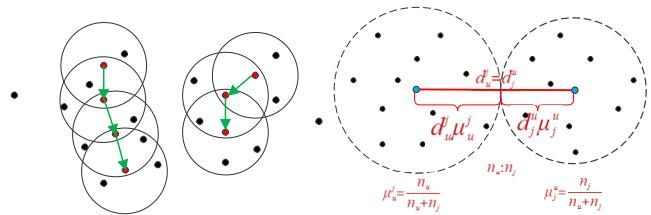  
(a) The schematic diagram for cat- (b) Schematic diagram of calculategorizing each GT (core, boundary, ing the initial radius based on the noise points) size ratio of adjacent clusters  
Fig. 2. Schematic diagram of clustering steps.

1) Concept Definitions: Core points are for a certain dataset D. If at least minpoints samples (including sample p) are contained in the picture domain of sample $p ,$ then sample $p$ is called a core point. i.e., satisfying $N _ { e p s } ( p ) \geq$ minpoints calls $p$ ( )the core point. The hyperparameters minpoints and eps represent the algorithm’s minimum number of points and domain radius. $N _ { \varepsilon } ( p )$ is represented as $N _ { \varepsilon } ( p ) = \{ q \in D \mid$ $d i s t ( p , q ) \leq e p s \}$ ( ) ( ) =. Boundary points are for a sample b that is not a core point. If b is in the eps-domain of any core point $p ,$ then b is referred to as a boundary point. Noise points are for a sample that is not a core point. If no core point $p$ is in the eps-domain of the sample, then a sample is called a noise point. Direct density reachable is that if $q$ is in the eps neighborhood of $p$ and $p$ is a core point, then $q$ is said to be directly density reachable by $p .$ Density-reachable is that if $q$ is in the eps-neighborhood of $p ,$ and $p , q$ are core points, then the neighborhood points of $q$ are said to be reached by the density of $p .$ Density-connected is that if $p , \ q$ are noncore points, and p, q are in the same cluster class, then $q$ is considered density-connected to $p .$

2) Algorithmic Steps: The K-DBSCAN algorithm has two essential steps: Step 1 is to cluster the GTs using the DBSCAN algorithm, which has adaptive values for two parameters: the neighborhood radius eps and the minimum number minpoints. This step traverses each GT and discriminates each GT into different categories (core points, boundary points, noise points) to obtain outlier information and clustering results. Step 2 uses the concept of mean in the Kmeans algorithm to determine the mean center of each cluster and calculates the UAV adaptive flight radius based on the distribution of each mean center and the cluster size’s weight to determine the UAV-constrained activity’s range. Fig. 2(a) embodies a schematic diagram of each GT discriminated into different categories, and Fig. 2(b) embodies a schematic diagram of the radius of the range of movement between neighboring clusters according to the weight of cluster size.

The K-DBSCAN algorithm is shown in Algorithm 1, where C, D, E, R are data sets, i.e., $C = \{ c _ { 1 } , \ldots , c _ { k } \} , D = \{ d _ { 1 } =$ $[ x _ { 1 } , y _ { 1 } ] , \dotsc , d _ { n } = [ x _ { n } , y _ { n } ] \} , E = \{ e _ { 1 } = [ x _ { 1 } , y _ { 1 } ] , \dotsc , e _ { k } =$ $[ x _ { k } , y _ { k } ] \} , R = \{ r _ { 1 } , \dots , r _ { u } \}$ . Line 24 is based on the samples

Algorithm 1 K-DBSCAN Algorithm   
Input: The set of GTs coordinates W; Neighborhood radiu   
eps; Minimum number of points minpoints.   
Output: Clustering of clusters C; Outlier coordinates D; Mean   
center E; UAV movement range radius R.   
1: Mark all objects as unvisited;   
2: while There are objects marked as unvisited do   
3: Randomly select an unvisited object $p ;$   
4: Mark $p$ as visited;   
5: if The eps field of $p$ has at least minpoints   
objects then   
6: Create a new cluster c, and add $p$ to c;   
7: Let G be the set of objects in the eps field of $p ;$   
8: for Each point $p ^ { \prime }$ in $G$ do   
9: if $p ^ { \prime }$ is unvisited then   
10: Mark $p ^ { \prime }$ as visited;   
11: if The eps field of $p ^ { \prime }$ has at least   
minpoints points then   
12: adding these points to $G ;$   
13: end if   
14: end if   
15: if $p ^ { \prime }$ is not yet a member of any cluster then   
16: add $p ^ { \prime }$ to c;   
17: end if   
18: end for   
19: else   
20: Add $p$ into $D ;$   
21: end if   
22: end while   
23: for i in C do   
24: Calculate the mean center $_ { e _ { i } ; }$   
25: end for   
26: for i in E do   
27: $o _ { u } = e _ { i } ;$   
28: =for j in $E - i$ do   
29: Calculate the $d _ { u } ^ { j }$ and $\mu _ { u } ^ { j } ;$   
30: end for   
31: Calculate the $r _ { u } ;$   
32: end for

$W ~ = ~ \{ w _ { 1 } , w _ { 2 } , \ldots , w _ { n } \} . ~ C ~ = ~ \{ c _ { 1 } , \ldots , c _ { k } \}$ denotes the clustering result obtained after clustering. $e _ { i } \in E$ is expressed as in (12).

$$
e _ { i } = { \frac { 1 } { c _ { i } } } \sum _ { w \in c _ { i } } w .\tag{12}
$$

The circle center of each UAV’s activity range is the coordinate of the cluster center in the cluster to which the UAV belongs, i.e., $o _ { u } ~ = ~ [ x _ { u } , y _ { u } ] ^ { T } ~ \in ~ \mathbb { R } ^ { 2 \times 1 }$ . The activity radius $r _ { u }$ is expressed as in (13).

$$
r _ { u } = m i n \Big ( \mu _ { u } ^ { 1 } d _ { u } ^ { 1 } , . , \mu _ { u } ^ { u - 1 } d _ { u } ^ { u - 1 } , \mu _ { u } ^ { u + 1 } d _ { u } ^ { u + 1 } , . , \mu _ { u } ^ { k } d _ { u } ^ { k } \Big )\tag{13}
$$

where $\{ d _ { u } ^ { 1 } , \ldots , d _ { u } ^ { u - 1 } , d _ { u } ^ { u + 1 } , \ldots , d _ { u } ^ { k } \}$ denotes the Euclidean distance between the cluster center of the cluster to which the UAV belongs and the other cluster centers, i.e., $d _ { u } ^ { \mathcal { I } } \ =$ $\begin{array} { r } { \sqrt { ( x _ { u } - x _ { j } ) ^ { 2 } + ( y _ { u } - y _ { j } ) ^ { 2 } , \mu _ { u } ^ { j } = \frac { n _ { u } } { n _ { u } + n _ { j } } } , n _ { u } } \end{array}$ and $n _ { j }$ represent the weight coefficient calculated from the number of GTs in the cluster.

## B. MDP Model

1) State: At each time slot t, the current situation and characteristics of the RIS-assisted UAV are represented by a state variable called ${ \mathrm { s ( t ) } } , \ \mathrm { i } . \mathrm { e } . , \ s ( t ) = \ \{ w _ { u } ( t ) , k _ { u } ( t ) \}$ , where $w _ { u } ( t ) \in S \triangleq \mathcal { L } \times \mathcal { H }$ is the location of UAV, S encompasses all possible states. $k _ { u } ( t )$ is a list according to 10 , i.e., $[ \omega _ { u , 1 , t } ( t ) , \ldots , \omega _ { u , n , t } ( t ) ] ^ { T } \in \mathbb { R } ^ { n \times 1 }$ , which is used to measure the fair level of data transmission of the GTs by the UAV.

2) Action: The RIS-assisted UAV system’s action space A includes the UAV’s location and the GTs’ service decisions. Then the action space at time slot t consists of the following components, $a ( t ) = \{ l _ { t } , h _ { t } , c _ { u , n , t } \} \in \mathcal { A } .$ According to [34], the lt , ht represent the movements of the UAV in the horizontal direction (forward, backward, left, right, and hover) and in the vertical direction (up, down, and hover). The $^ { c _ { u , n , t } }$ represents the scheduling decision of the GT $n .$ Due to the discrete flight movements of the UAV and the 3D map space, under the assumption that the UAV can only move to adjacent cells of the same vertical height in a time slot or remain motionless, the action space for the UAV’s location can be discretized into a set of adjacent cells. With such a discrete setup, the UAV can move in a lattice-like manner, which can simplify the optimization problem, and the relationship between the position of time slot t 1 and the position of time slot t is shown as in (14).

$$
L _ { t + 1 } ^ { u } = L _ { t } ^ { u } + l _ { t } ,\tag{14}
$$

where $\begin{array} { r c l } { l _ { t } } & { = } & { \{ ( 0 , y _ { m } ) , ( 0 , - y _ { m } ) , ( x _ { m } , 0 ) , ( - x _ { m } , 0 ) , ( 0 , 0 ) \} } \end{array}$ = (0 ) (0 ) ( 0) ( 0) (0 0)corresponds to the direction vector corresponding to the five movements in the horizontal direction (forward, backward, left, right, and hover) in the action space. Similarly, in the vertical direction, it is assumed that the UAV can only move to adjacent cells above, below, or hover during a time slot. The relationship between the position of the $t + 1$ time slot in the vertically direction and the position of the t time slot is shown as in (15).

$$
H _ { t + 1 } ^ { u } = H _ { t } ^ { u } + h _ { t } ,\tag{15}
$$

where $h _ { t } = \{ h _ { m } , - h _ { m } , 0 \}$ , corresponds to the displacement vector corresponding to the three movements in the vertical direction (up, down, and hover) in the action space.

3) Reward: For a given problem $P ,$ the rewards associated with taking action a(t) in state s(t) during the $t _ { t h }$ time slot is specified as in (16).

$$
r ( s ( t ) , a ( t ) ) = \frac { \Delta t r _ { u , n , t ^ { \prime } } } { e _ { t } ^ { u } } .\tag{16}
$$

The part of the ratio means the energy efficiency generated by the current selection action.

## C. Fair Screening Mechanisms

However, the single-minded pursuit of the maximum energy efficiency of the system may lead to the occurrence of unfair data transmission, and the GTs we serve in each time slot need to avoid the GTs with too high cumulative throughput to ensure that the GTs with less cumulative throughput can have the opportunity to be served. Therefore, we define the behavior of serving GTs services exceeding the average throughput as a violation and establish a violation set, denoted as $a ^ { f } ( t )$ , which includes behaviors meeting the following conditions.

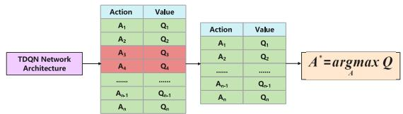  
Fig. 3. Schematic diagram of fair screening mechanism.

$$
\frac { \sum _ { t ^ { \prime } = 1 } ^ { t } \Delta t r _ { n , u , t } } { \sum _ { n = 1 } ^ { N } \sum _ { t ^ { \prime } = 1 } ^ { t } \Delta t r _ { n , u , t } } > \frac { 1 } { N } , \forall u , \forall n , \forall t .\tag{17}
$$

The specific screening mechanism process is shown in Fig. 3. In DRL, we cannot add taboos to action space A because each turn and time slot shares the actions in action space. Once taboos are added, action types will be lost in subsequent rounds and time slots. So, in order to achieve the goal of not choosing violations, we propose this filtering mechanism, as shown in Fig. 3. It can be seen that we use the network structure of the TDQN algorithm to output the value of all actions, which we record it as Table V. We make judgments on all actions. If any violations are found, we will delete them from Table V. Finally, we will identify the most valuable action from all compliant actions in Table V as a decision. As Table V is the output of the TDQN network structure, it is a temporary variable. So, filtering Table V will not result in the absence of action space A, and it can also achieve the goal of not selecting violations.

## D. TDQN Algorithm

1) Motivation for Improvement: The motivation for improving the TDQN algorithm is to solve the reward overestimation problem in the traditional DRL algorithm. The bootstrap problem and the maximum fetch problem lead to the reward overestimation problem. In DRL, DNN needs to find the optimal action and predict the reward value for the current state and the next state, and the repeated use of DNN to find the optimal and predict leads to the bootstrap problem. Secondly, when considering the reward of the following state, the action corresponding to the maximum reward value among all actions in the next state is always selected. However, the action chosen is not always the maximum reward action. Therefore, the overestimation problem also arises due to the maximum value being taken.

2) Improvement Measures: Based on the description of the algorithmic improvement motivation, to solve the overestimation problem in the traditional DRL algorithm, it is necessary to solve the bootstrap problem and the maximum value estimation problem. To improve the bootstrap problem, we construct three isomorphic DNNs with asynchronous updates in the network structure part. In traditional DRL, the same DNN needs to handle the estimation of reward value, the computation of target reward value, and the selection of actions. As shown in (20) and (24) in the algorithm design, we use these three isomorphic asynchronous DNNs to handle the computation of the estimated reward value, the computation of the target reward value, and the selection of the action, respectively, thus avoiding the bootstrap problem. Secondly, for the maximum estimation problem, as in (23), the computation of the target reward value is transformed from taking the maximum value to a mathematical expectation.

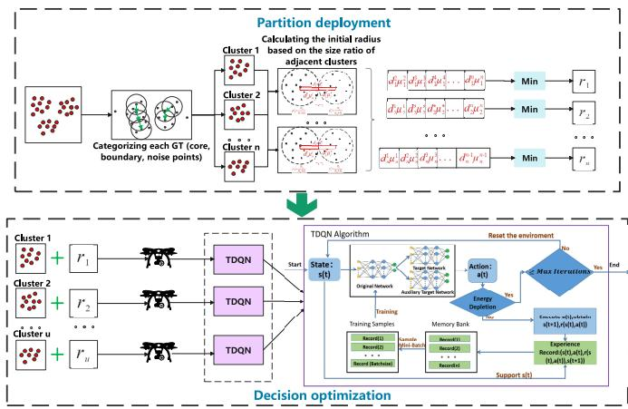  
Fig. 4. Processes for partition deployment and decision optimization.

3) Algorithm Design: After dividing the working area, each UAV uses our TDQN training in its respective working area to find the 3D position of the UAV in each time slot. The UAV flight action decision and the GT service scheduling decision are modeled as discrete actions a(t), a reward value Q is evaluated for each action, and the choice of a(t) is decided according to the magnitude of the reward value Q(s(t),a(t)). The reward value Q(s(t),a(t)) is expressed as in (18).

$$
Q ( s ( t ) , a ( t ) ) = \mathbb { E } \left[ \sum _ { t ^ { \prime } = t } ^ { T } \gamma r \big ( s \big ( t ^ { \prime } \big ) , a \big ( t ^ { \prime } \big ) \big ) \mid ( s ( t ) , a ( t ) ) \right] ,\tag{18}
$$

where Q(s(t), a (t)) denotes the estimated predicted cumulative payoff and $\gamma \in ( 0 , 1 ]$ denotes the decay factor of the inter-state payoff.

According to the definition in (18), the whole learning process adopts the idea of the greedy algorithm to find the most suitable action. The greedy strategy probability ε is set relatively low at the early stage of learning to avoid local optima. As the learning process iterates, we increase ε round by round until we take the maximum upper bound.

$$
\pi ( s ( t ) ) = a r g m a x _ { a ( t ) - a ^ { f } ( t ) } Q ( s ( t ) , a ( t ) ) .\tag{19}
$$

Our TDQN algorithm determines the best action a(t) for a given state s(t) by selecting the action with the highest Q-value.

As shown in Fig. 4, the solution to the P problem is divided into two parts: partition deployment and decision optimization. In partitioned deployment, the DBSCAN algorithm is mainly used to complete the two steps of clustering partition and calculating the initial range. Subsequently, UAVs are deployed according to the partition and initial range, and the decision optimization of each UAV is completed using the TDQN algorithm. In our TDQN algorithm, three DNNs (original network, target network, and auxiliary target network) are set up in a homogeneous manner and updated asynchronously. The weight parameters in the three DNNs are represented by $Z _ { q } , \bar { Z _ { q } ^ { \prime } } , \bar { Z _ { q } ^ { \prime \prime } }$ . In the whole training phase, the only DNN involved in training is the original network, i.e., the weight parameter $Z _ { q }$ is updated in real-time, $Z _ { q } ^ { \prime }$ and $Z _ { q } ^ { \prime \prime }$ are updated n steps apart, with 2n steps asynchronously. Meanwhile, according to the temporal difference (TD) algorithm, the calculation method for the loss value is defined as in (20).

$$
L o s s ( t ) = \frac { 1 } { 2 } \big [ y ( t ) - Q \big ( s ( t ) , a ( t ) \mid Z _ { q } \big ) \big ] ^ { 2 } .\tag{20}
$$

Most actions on the original network are estimated as in (21).

$$
a ^ { * } = a r g m a x _ { a ( t + 1 ) - a ^ { f } ( t + 1 ) } Q \big ( s ( t + 1 ) \mid Z _ { q } \big ) .\tag{21}
$$

To avoid being trapped in a local optimum, the probability of the optimal action is chosen as $\varepsilon ,$ which gradually increases to 0.9 with the number of iterations. The y(t) in (20) requires estimating the reward value for time slot $t ~ + ~ 1$ . In the +traditional DRL algorithm, this process is performed only on the target network. Our TDQN algorithm improves the calculation by jointly calculating it on the target and auxiliary target networks. The weighted sum is calculated based on the weight ratio of the two isomorphic DNNs. The estimation of the reward value at time slot $t + 1$ on the target network and the auxiliary target network are denoted as value $^ { \prime } ( t + 1 )$ and valu $\iota e ^ { \prime \prime } ( t { + } 1 )$ . i.e., the target reward value Value(t 1) at time slot $t + 1$ can be expressed as in (22).

$$
V a l u e ( t + 1 ) = \frac { v a l u e ^ { \prime } ( t + 1 ) + v a l u e ^ { \prime \prime } ( t + 1 ) } { 2 } .\tag{22}
$$

For $v a l u e ^ { \prime } ( t + 1 )$ and valu $e ^ { \prime \prime } ( t + 1 )$ , in traditional DRL algorithms, the reward value corresponding to $a ^ { * }$ is directly selected as a result due to the greedy principle. However, the value of ε is not equal to 1, i.e., the optimal action is not always chosen, so maximum estimates tend to result in overestimation. In our TDQN algorithm, the value of this process is improved by taking mathematical expectation for $\varepsilon ,$ and the formula is in (23).

$$
\begin{array} { l } { { v a l u e ^ { \prime } ( t + 1 ) = \varepsilon Q _ { m a x } ^ { \prime } + \displaystyle \frac { 1 - \varepsilon } { A - 1 } Q _ { l e f t } ^ { \prime } , } } \\ { { v a l u e ^ { \prime \prime } ( t + 1 ) = \varepsilon Q _ { m a x } ^ { \prime \prime } + \displaystyle \frac { 1 - \varepsilon } { A - 1 } Q _ { l e f t } ^ { \prime \prime } , } } \end{array}\tag{23}
$$

where $Q _ { m a x } ^ { \prime }$ and $Q _ { m a x } ^ { \prime \prime }$ represent the reward values corresponding to $a ^ { * }$ in the target and auxiliary target networks, while $Q _ { l e f t } ^ { \prime }$ and $Q _ { l e f t } ^ { \prime \prime }$ represent the sum of the reward values corresponding to the remaining actions except for $a ^ { * }$ actions, and A is the total number of actions. The definition is in (24).

$$
\begin{array} { c } { { Q _ { m a x } ^ { \prime } = Q ^ { \prime } \bigl ( s ( t + 1 ) , a ^ { * } \mid Z _ { q } ^ { \prime } \bigr ) , } } \\ { { Q _ { l e f t } ^ { \prime } = \displaystyle \sum _ { a _ { i } \in \mathcal { A } - a ^ { * } } Q ^ { \prime } \bigl ( s ( t + 1 ) , a _ { i } \mid Z _ { q } ^ { \prime } \bigr ) , } } \\ { { Q _ { m a x } ^ { \prime \prime } = Q ^ { \prime \prime } \bigl ( s ( t + 1 ) , a ^ { * } \mid Z _ { q } ^ { \prime \prime } \bigr ) , } } \end{array}
$$

Algorithm 2 TDQN Algorithm   
1: Set the experience playback bank J, time slot collection   
$T ;$   
2: Set the weight parameters $Z _ { q } , ~ Z _ { q } ^ { \prime } , ~ Z _ { q } ^ { \prime \prime }$ of the origi  
nal network $Q ( \cdot )$ , target network ${ \dot { Q } } ^ { \prime } ( \cdot )$ , auxiliary target   
network $Q ^ { \prime \prime } ( \cdot )$ and set $Z _ { q } = Z _ { q } ^ { \prime } = Z _ { q } ^ { \prime \prime } ;$   
3: for episode $\mathbf { \Sigma } = { 1 , \dots , E }$ do   
4: Set $t = 1 ,$ set the environment as s(1);   
5: =while UAV energy not used up do   
6: Random selection of action a(t) according to   
probability $1 - \varepsilon ,$ otherwise greedy selection of   
$\boldsymbol a ( t ) = \pi ( \boldsymbol s ( t ) )$   
7: ( ) = ( ( ))if UAV beyond work boundaries or uneven   
service then   
8: Penalty for the action;   
9: end if   
10: Design the RIS’s phase shift;   
11: Execute a(t) and calculate to get s(t+1),   
r(s(t), a(t));   
12: Save (s(t), a(t), r(s(t), a(t)), s(t+1)) into   
the experience playback bank J;   
13: end while   
14: Select a random mini-batch of H samples   
(s(t), a(t), r(s(t), a(t)), s(t+1)) from $J ;$   
15: Calculate y(t) and Loss $\left( Z _ { q } \right)$   
16: Update $Z _ { q }$ in the original network $Q ( \cdot )$ based on the   
loss value boost;   
17: Update target network $Q ^ { \prime } ( \cdot )$ , auxiliary target network   
${ \bar { Q } } ^ { \prime \prime } ( \cdot ) ;$   
18: end for

$$
Q _ { l e f t } ^ { \prime \prime } = \sum _ { a _ { i } \in A - a ^ { * } } Q ^ { \prime \prime } { \left( s ( t + 1 ) , a _ { i } \mid Z _ { q } ^ { \prime \prime } \right) } .\tag{24}
$$

Based on the above definition, y(t) is calculated as in (25).

$$
y ( t ) = r ( s ( t ) , a ( t ) ) + \gamma V a l u e ( t + 1 ) ,\tag{25}
$$

where $\gamma$ is the attenuation factor. For this purpose, TDQN algorithm can be defined as the following Algorithm 2.

Our TDQN algorithm is divided into two phases (the exploration phase and the learning phase). Lines (5-13) correspond to the exploration phase at the beginning of the algorithm, and lines (14-17) correspond to the learning phase at the end of the algorithm. The algorithm learns from experiences based on the greedy principle and records them in the experience pool J while exploring at the beginning. Once a certain amount of experience is available, a portion of the data is selected to enhance the DNN.

## IV. PERFORMANCE EVALUATION AND ANALYSIS

The simulation experiments are highlighted in this section, and the results are analyzed. The proposed TDQN algorithm is simulated under RIS-assisted UAVs to provide GTs with communications services. Our source code is available via the link.1 According to [26] and [34], the specific parameter settings for the simulation experiments are shown in Table II. Simulations are performed in Python 3.7 with Tensorflow 2.1.0 environment to construct propulsion models for air-ground communications and quadrotor UAV based on Fig. 1 and Table II. Among our TDQN, DDQN, and DQN algorithms, DNNs are added for training. The DNNs used in all three algorithms are homogeneous, with two layers of DNNs and two hundred neurons in each layer, where the activation function ReLu is chosen. During the training of the DNNs, the RMSProp optimizer is used in Tensorflow, and the stochastic gradient descent algorithm is chosen to boost the parameters in the DNNs. Based on the above structure of DNNs, among the three algorithms, the DQN algorithm has only one such DNN, DDQN has two, and our TDQN has three. No matter how many isomorphic DNNs each algorithm has, only one DNN is involved in real-time training. In contrast, the other DNNs are updated asynchronously. They are not involved in training, which does not increase the running overhead of the algorithm and aims to solve the bootstrap problem better. The action is modeled discretely to have the combined product of horizontal flight action, vertical flight action, and GT scheduling of the corresponding UAV, i.e., $5 * 3 * N _ { u } = 1 5 N _ { u } .$ 5 3 = 15In the implementation of the specific algorithm parameters, the size of the experience pool is set to 10000, the size of the random gradient to 256, the learning rate to 0.00001, and the greedy probability are set to 0.9. The simulation experiment assumes that 33 GTs coordinates are set up in three residential living areas in a one-kilometer by one-kilometer range, where the intra-cluster points are distributed 10:1 with the outlier points. With such a setup, we conduct subsequent simulation experiments.

TABLE II SIMULATION SETTINGS
<table><tr><td>Parameter</td><td>Symbol</td><td>Value</td></tr><tr><td>Duration of time slot</td><td>∆t</td><td>2s</td></tr><tr><td>Bandwidth</td><td>B</td><td>2MHz</td></tr><tr><td>Blocking probability parameter</td><td> $\phi , \varphi$ </td><td>9.61, 0.16</td></tr><tr><td>Number of RIS&#x27;s reflection units</td><td> $Q$ </td><td>100</td></tr><tr><td>The tip velocity of the moving blade</td><td> $V _ { t i p }$ </td><td>120</td></tr><tr><td>Average induction speed of the rotor during hovering</td><td> $v _ { 0 }$ </td><td>4.3</td></tr><tr><td>Airframe resistance ratio</td><td> $f _ { 0 }$ </td><td>0.6</td></tr><tr><td>Air Density</td><td>ρ</td><td>1.225</td></tr><tr><td>Rotor robustness</td><td>g</td><td>0.05</td></tr><tr><td>Rotor plate area</td><td>H</td><td>0.503</td></tr><tr><td>Number of GTs</td><td>N</td><td>33</td></tr><tr><td>Constant blade profile power in hover- ing condition</td><td> $P _ { 0 }$ </td><td> $\frac { 1 2 * 3 0 ^ { 3 } * 0 . 4 ^ { 3 } \rho g H } { 8 }$ </td></tr><tr><td>Constant blade induced power in hov- ering condition</td><td> $P _ { 1 }$ </td><td> $\textstyle { \frac { 1 . 1 * 2 0 ^ { \frac { 3 } { 2 } } } { \sqrt { 2 \rho H } } }$ </td></tr><tr><td>Constant down/up power</td><td> $P _ { 2 }$ </td><td>11.46</td></tr><tr><td>Number of map cells</td><td> $L$ </td><td>10000</td></tr><tr><td>Maximum movement speed in horizon- tal direction</td><td> $V _ { m a x } ^ { h }$ </td><td>10m/s</td></tr><tr><td>Maximum movement speed in vertical direction</td><td> $V _ { m a x } ^ { h }$ </td><td>10m/s</td></tr><tr><td>Density of noise</td><td> $\nu ^ { 2 }$ </td><td>-169dBm/Hz</td></tr><tr><td>Minimum flight altitude</td><td> $h _ { m i n }$ </td><td>30m</td></tr><tr><td>Maximum flight altitude</td><td> $h _ { m a x }$ </td><td>100m</td></tr><tr><td>Training episodes</td><td> $E$ </td><td>11000</td></tr><tr><td>Maximum number of time slots</td><td> $T$ </td><td>1000</td></tr></table>

## A. Evaluation Metrics

1) Reward: We use $\begin{array} { r } { \mathfrak { R } _ { t } ^ { u } = \frac { \Delta t r _ { u , n , t ^ { \prime } } } { e _ { t } ^ { u } } } \end{array}$ to represent the reward obtained by UAV u in the time slot t. Then, the reward in Fig. 5 can be represented as $\begin{array} { r } { \sum _ { u = 1 } ^ { U } \frac { \sum _ { t = 1 } ^ { T } \frac { \Re _ { t } ^ { u } - m i n ( \Re _ { t } ^ { u } ) } { m a x ( \Re _ { t } ^ { u } ) - m i n ( \Re _ { t } ^ { u } ) } } { T } } \end{array}$

2) Energy Efficiency: Representing the energy efficiency of the whole system concerning equation (9).

3) Fairness: For fairness, we use variance to calculate differentiation. Variance is used to measure the difference in throughput of GTs within a subdivision. Assuming that $n _ { c }$ denotes the number of GTs in a partition, and $T h _ { i }$ denotes the throughput of the GT i, then the variance is denoted as $\frac { \sum _ { i = 1 } ^ { n _ { c } } ( T h _ { i } - \hat { T } h ) ^ { 2 } } { n _ { c } }$

## B. Comparison Schemes

We have designed the following scenarios: the naming of each scenario is based on the name of the DRL algorithm, whether or not it is equipped with RIS, the name of the clustering algorithm, and whether or not the fairness mechanism is used.

1) DQN-noRIS-DBSCAN-Fair: This scheme provides reference without RIS assistance compared to other schemes.

2) DQN-RIS-DBSCAN-Fair: This scheme mainly recreates the DQN algorithm in [28].

3) DDQN-RIS-DBSCAN-Fair: This scheme mainly recreates the DDQN algorithm in [25].

4) Dueling-RIS-DBSCAN-Fair: This scheme mainly recreates the Dueling-DQN algorithm in [27].

5) TDQN-RIS-DBSCAN-Fair: The DRL algorithm of this scheme mainly uses our proposed TDQN algorithm, and the clustering algorithm is the DBSCAN algorithm in [20].

6) TDQN-RIS-Kmeans-Fair: The scheme mainly recreates the Kmeans clustering algorithm in [16].

7) TDQN-RIS-Kmeansplus-Fair: The scheme mainly recreates the Kmeansplus clustering algorithm in [19].

8) TDQN-RIS-K-DBSCAN-Fair: The clustering algorithm used in this scheme is our proposed K-DBSCAN algorithm.

9) TDQN-RIS-K-DBSCAN-unFair: The scheme mainly provides a reference on throughput without the constraints of the fairness mechanism.

## C. Simulation Results

Fig. 5(a) and Fig. 5(b) show the training images of the UAV’s average reward and energy efficiency in the first set of experiments. In this set of experiments, the non-convex optimization algorithm we used is the basic DQN algorithm. This set of experiments aims to demonstrate the impact of RIS’s assistance on UAV energy efficiency. The blue line represents the situation with RIS’s assistance, while the brown line represents the situation without RIS’s assistance. Both in the initial iteration and after convergence, the energy efficiency of systems with RIS’s assistance is much better than that without RIS’s assistance. This result indicates that RIS can amplify the UAV-RIS-GT link’s channel gain by passively adjusting the reflective elements of the reflective layer, thereby improving the transmission rate and amplifying the energy efficiency of the UAV.

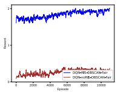

(a)  
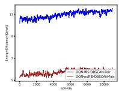

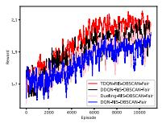  
(c)

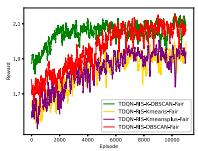

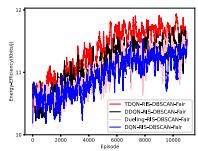  
(b)  
(d)

(e)  
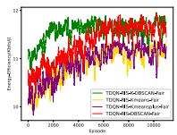  
(f)  
Fig. 5. Comparison of three groups of RIS, DRL algorithms, and clustering algorithm.

The conclusion drawn from the first set of experiments indicates that RIS can significantly improve the system’s energy efficiency. Therefore, in Fig. 5(c) and Fig. 5(d), a second set of experiments is conducted to compare the performance of our TDQN, DDQN, Dueling DQN, and DQN optimization algorithms under RIS-assisted conditions. Compared with our TDQN, DDQN, Dueling DQN, and DQN are more prone to overestimation. This overestimation of the imbalance causes the reward for suboptimal decisions to be higher than the reward for optimal decisions, leading to a local optimum in the search for the optimal policy. The experimental results show no significant difference in the performance of the four algorithms in the early stage of training. However, after a training phase, the DQN, Dueling DQN, and DDQN algorithms converge at a lower height than our TDQN algorithm converge at a slower rate than our TDQN algorithm. The changes in the convergence height and convergence speed show that during the training period, the DQN, Dueling DQN, and DDQN algorithms have an unbalanced overestimation of the reward value of the action due to bootstrapping and maximum estimation problems. This overestimation is severe with the number of training episodes, affecting the final solution’s energy efficiency. In addition, the training images of each algorithm have a certain degree of up and down jitter. This is because an episode is composed of multiple actions, and when selecting each action, it is not the absolute choice of the optimal reward. This is because the exploration mechanism of the DRL algorithm needs to have a certain degree of randomness to jump out of local optima, so it is only the probability of choosing the optimal reward action is relatively high. Therefore, the image has a certain degree of jitter due to this randomness. These findings indicate that our TDQN algorithm provides better solutions to overestimation problems and is more effective in finding the optimal strategy.

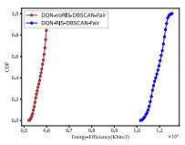  
(a) Performance and without RIS

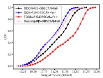  
(b) DRL algorithms performance

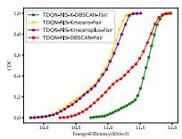  
(c) Clustering algorithm performance  
Fig. 6. CDF of the energy efficiency.

In the third set of comparison experiments, Fig. 5(e) and Fig. 5(f) compare the impact of clustering algorithms on system efficiency. Based on the experience of the first two experiments, the RIS and our TDQN algorithms are used in the third experiment. It can be seen that the Kmeans algorithm has significantly lower rewards and energy efficiency throughout the entire training process compared to the DBSCAN and K-DBSCAN algorithms. The Kmeans algorithm cannot identify outlier GTs, resulting in higher energy consumption for serving outlier GTs with meager throughput returns and leading to reduced energy efficiency. The Kmeansplus algorithm is essentially the same as Kmeans because Kmeansplus only optimizes the initialization of cluster centers and, like Kmeans, cannot identify outlier GTs. Moreover, for simple and small two-dimensional data like coordinate points, Kmeansplus cannot demonstrate improved advantages and yields clustering results similar to Kmeans, so the training images have almost no difference in rewards and energy efficiency. Compared to the Kmeans and Kmeansplus algorithms, the DBSCAN algorithm can identify outlier GTs, thereby avoiding reduced energy efficiency from serving outlier GTs. Our K-DBSCAN algorithm, built upon the DBSCAN algorithm, constrains the initial movement range of UAVs around GTs, equivalent to a pruning operation on the state space in reinforcement learning terms, avoiding massive exploration processes in DRL. Therefore, at the initial stages of training, the K-DBSCAN scheme has higher starting points for rewards and energy efficiency than the DBSCAN scheme. Furthermore, due to the pruning operation, it also converges faster than the DBSCAN scheme. These experiments demonstrate that the K-DBSCAN clustering scheme we have adopted can accelerate the training of DRL algorithms and improve average energy efficiency.

The mean energy efficiency values and cumulative distribution function (CDF) images for each group of experiments are shown in Table III and Fig. 6, reflecting the overall energy efficiency level for all training episodes of each scheme. Table III and Fig. 6 show that using our TDQN algorithm, the assistance of RIS, and the range constraints of the K-DBSCAN algorithm effectively increase the overall energy efficiency mean and move the overall distribution to a higher level. Therefore, it still proves that the assistance of RIS, our proposed TDQN algorithm, and the K-DBSCAN algorithm are practical at the overall level of the training episodes. In addition, we show the UAV trajectories in the Fig. 7, UAVs can provide communications services around the GTs in their respective sub-areas under our scheme’s optimization.

Under the current optimal scheme, we compare the cumulative transmission data throughput of each GT served by each UAV with and without the fair screening mechanism. As shown in Fig. 8, the transmission data throughput of each group of GTs with a fair screening mechanism is stable within a specific range, and there is no over-service or under-service of a single GT. Our fair screening mechanism avoids selecting GTs whose cumulative throughput has exceeded the average when deciding which GTs should be served in each time slot. On the other hand, without fairness constraints, UAVs will always select GTs with high channel gains. Once our TDQN algorithm converges, the UAV will keep serving the GT with high channel gain while ignoring the other GTs, which results in low throughput of the other GTs or even almost zero throughput of an individual GT but high cumulative transmitted data throughput of that GT. In addition, it is also evident from the variance of throughput in Table IV that the fair screening mechanism can significantly reduce the throughput variance and keep the throughput level of

TABLE III  
EXPERIMENTAL VALUES FOR EACH GROUP
<table><tr><td>Scheme</td><td>Average energy efficiency (Kbits/J)</td></tr><tr><td>DQN-noRIS-DBSCAN-Fair</td><td>5.7678</td></tr><tr><td>DQN-RIS-DBSCAN-Fair</td><td>10.8169</td></tr><tr><td>DDQN-RIS-DBSCAN-Fair</td><td>11.0393</td></tr><tr><td>Dueling-RIS-DBSCAN-Fair</td><td>10.9498</td></tr><tr><td>TDQN-RIS-DBSCAN-Fair</td><td>11.3573</td></tr><tr><td>TDQN-RIS-Kmeansplus-Fair</td><td>10.9124</td></tr><tr><td>TDQN-RIS-Kmeans-Fair</td><td>10.8974</td></tr><tr><td>TDQN-RIS-K-DBSCAN-Fair</td><td>11.5723</td></tr></table>

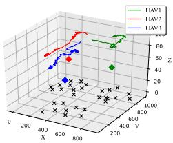

Fig. 7. The 3D trajectory of the UAVs.  
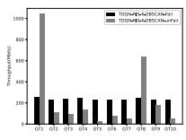  
(a) UAV1

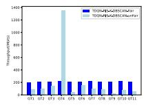  
(b) UAV2

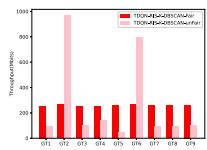  
(c) UAV3

Fig. 8. Data throughput per GT in each group being transmitted. TABLE IV  
THE FAIRNESS OF THROUGHPUT
<table><tr><td>Method</td><td>UAV</td><td>Fairness</td></tr><tr><td>TDQN-RIS- K-DBSCAN-Fair</td><td>UAV1</td><td>97.11</td></tr><tr><td>TDQN-RIS- K-DBSCAN-unFair</td><td>UAV1</td><td>100187.96</td></tr><tr><td>TDQN-RIS- K-DBSCAN-Fair</td><td>UAV2</td><td>21.56</td></tr><tr><td>TDQN-RIS- K-DBSCAN-unFair</td><td>UAV2</td><td>133261.15</td></tr><tr><td>TDQN-RIS- K-DBSCAN-Fair</td><td>UAV3</td><td>22.12</td></tr><tr><td>TDQN-RIS- K-DBSCAN-unFair</td><td>UAV3</td><td>108850.61</td></tr></table>

GTs within each group at a relatively balanced level compared to the scenario without the fair screening mechanism. So, it is not meaningful or reasonable to pursue energy efficiency maximization only in the case of unfairness. Finally, from Fig. 5, our fair screening mechanism can make the training trend converge upward stably under any scenario, so it can be proved that our proposed fair screening mechanism is practicable.

## V. CONCLUSION

In this paper, we study the problem of optimizing the energy efficiency of a RIS-assisted UAV communications system, and the experiments show that our proposed scheme can effectively improve the system’s energy efficiency not only from two aspects: the use of RIS-assisted UAVs and the improvement of the existing DRL algorithms to solve the overestimation problem. It can also speed up DRL training by using the initial moving range of the clustering partition output, and the proposed fair screening mechanism can avoid unfairness to GT services. In future work, we will consider how to improve the generalization ability of DRL models when the GTs distribution produces changes. There is also the problem of deploying more UAVs in different roles to ensure global GTs fair service.

## REFERENCES

[1] S. Dang, O. Amin, B. Shihada, and M.-S. Alouini, “What should 6G be?” Nat. Electron., vol. 3, pp. 20–29, Jan. 2020. [Online]. Available: https://api.semanticscholar.org/CorpusID:211095143

[2] Q. Zhu, J. Zheng, and A. Jamalipour, “Coverage performance analysis of a cache-enabled UAV base station assisted cellular network,” IEEE Trans. Wireless Commun., vol. 22, no. 11, pp. 8454–8467, Nov. 2023.

[3] L. Wang, K. Wang, C. Pan, and N. Aslam, “Joint trajectory and passive beamforming design for intelligent reflecting surface-aided UAV communications: A deep reinforcement learning approach,” IEEE Trans. Mobile Comput., vol. 22, no. 11, pp. 6543–6553, Nov. 2023.

[4] X. Pang, M. Sheng, N. Zhao, J. Tang, D. Niyato, and K.-K. Wong, “When UAV meets IRS: Expanding air-ground networks via passive reflection,” IEEE Wireless Commun., vol. 28, no. 5, pp. 164–170, Oct. 2021.

[5] S. Li, B. Duo, M. D. Renzo, M. Tao, and X. Yuan, “Robust secure UAV communications with the aid of reconfigurable intelligent surfaces,” IEEE Trans. Wireless Commun., vol. 20, no. 10, pp. 6402–6417, Oct. 2021.

[6] D. Tyrovolas, P.-V. Mekikis, S. A. Tegos, P. D. Diamantoulakis, C. K. Liaskos, and G. K. Karagiannidis, “Energy-aware design of UAVmounted RIS networks for IoT data collection,” IEEE Trans. Commun., vol. 71, no. 2, pp. 1168–1178, Feb. 2023.

[7] N. Gupta, D. Mishra, and S. Agarwal, “Energy-aware trajectory design for outage minimization in UAV-assisted communication systems,” IEEE Trans. Green Commun. Netw., vol. 6, no. 3, pp. 1751–1763, Sep. 2022.

[8] Y. Su, X. Pang, S. Chen, X. Jiang, N. Zhao, and F. R. Yu, “Spectrum and energy efficiency optimization in IRS-assisted UAV networks,” IEEE Trans. Commun., vol. 70, no. 10, pp. 6489–6502, Oct. 2022.

[9] T. Wang, Y. Li, and Y. Wu, “Energy-efficient UAV assisted secure relay transmission via cooperative computation offloading,” IEEE Trans. Green Commun. Netw., vol. 5, no. 4, pp. 1669–1683, Dec. 2021.

[10] G. Yang, R. Dai, and Y.-C. Liang, “Energy-efficient UAV backscatter communication with joint trajectory design and resource optimization,” IEEE Trans. Wireless Commun., vol. 20, no. 2, pp. 926–941, Feb. 2021.

[11] X. Chen, N. Zhao, Z. Chang, T. Hämäläinen, and X. Wang, “UAVaided secure short-packet data collection and transmission,” IEEE Trans. Commun., vol. 71, no. 4, pp. 2475–2486, Apr. 2023.

[12] N. Lin, Y. Fan, L. Zhao, X. Li, and M. Guizani, “GREEN: A global energy efficiency maximization strategy for multi-UAV enabled communication systems,” IEEE Trans. Mobile Comput., vol. 22, no. 12, pp. 7104–7120, Dec. 2023.

[13] S. Song, M. Choi, D.-E. Ko, and J.-M. Chung, “Multi-UAV trajectory optimization considering collisions in FSO communication networks,” IEEE J. Sel. Areas Commun., vol. 39, no. 11, pp. 3378–3394, Nov. 2021.

[14] S. Gong, M. Wang, B. Gu, W. Zhang, D. T. Hoang, and D. Niyato, “Bayesian optimization enhanced deep reinforcement learning for trajectory planning and network formation in multi-UAV networks,” IEEE Trans. Veh. Technol., vol. 72, no. 8, pp. 10933–10948, Aug. 2023.

[15] O. Ghdiri, W. Jaafar, S. Alfattani, J. B. Abderrazak, and H. Yanikomeroglu, “Offline and online UAV-enabled data collection in time-constrained IoT networks,” IEEE Trans. Green Commun. Netw., vol. 5, no. 4, pp. 1918–1933, Dec. 2021.

[16] S. Lee, H. Yu, and H. Lee, “Multiagent Q-learning-based multi-UAV wireless networks for maximizing energy efficiency: Deployment and power control strategy design,” IEEE Internet Things J., vol. 9, no. 9, pp. 6434–6442, May 2022.

[17] G. Iacovelli, A. Coluccia, and L. A. Grieco, “Multi-UAV IRSassisted communications: Multinode channel modeling and fair sum-rate optimization via deep reinforcement learning,” IEEE Internet Things J., vol. 11, no. 3, pp. 4470–4482, Feb. 2024.

[18] Q. Shen et al., “Fair communications in UAV networks for rescue applications,” IEEE Internet Things J., vol. 10, no. 23, pp. 21013–21025, Dec. 2023.

[19] J. Mi, X. Wen, C. Sun, Z. Lu, and W. Jing, “Energy-efficient and low package loss clustering in UAV-assisted WSN using Kmeans++ and fuzzy logic,” in Proc. IEEE/CIC Int. Conf. Commun. Workshops China (ICCC Workshops), 2019, pp. 210–215.

[20] S. S. Bacanli and D. Turgut, “Unmanned aerial vehicles in opportunistic networks,” in Proc. IEEE Global Commun. Conf. (GLOBECOM), 2019, pp. 1–5.

[21] G. Gan and K. P. Ng, “k -means clustering with outlier removal,” Pattern Recognit. Lett., vol. 90, no. 15, pp. 8–14, 2017.

[22] H. Liu, J. Li, Y. Wu, and Y. Fu, “Clustering with outlier removal,” IEEE Trans. Knowl. Data Eng., vol. 33, no. 6, pp. 2369–2379, Jun. 2021.

[23] X. Wang, Y. Zhang, R. Shen, Y. Xu, and F.-C. Zheng, “DRL-based energy-efficient resource allocation frameworks for uplink NOMA systems,” IEEE Internet Things J., vol. 7, no. 8, pp. 7279–7294, Aug. 2020.

[24] N. C. Luong et al., “Applications of deep reinforcement learning in communications and networking: A survey,” IEEE Commun. Surveys Tuts., vol. 21, no. 4, pp. 3133–3174, 4th Quart., 2019.

[25] H. Zhang, M. Huang, H. Zhou, X. Wang, N. Wang, and K. Long, “Capacity maximization in RIS-UAV networks: A DDQN-based trajectory and phase shift optimization approach,” IEEE Trans. Wireless Commun., vol. 22, no. 4, pp. 2583–2591, Apr. 2023.

[26] H. Mei, K. Yang, Q. Liu, and K. Wang, “3D-trajectory and phaseshift design for RIS-assisted UAV systems using deep reinforcement learning,” IEEE Trans. Veh. Technol., vol. 71, no. 3, pp. 3020–3029, Mar. 2022.

[27] C. Zhan and Y. Zeng, “Energy minimization for cellular-connected UAV: From optimization to deep reinforcement learning,” IEEE Trans. Wireless Commun., vol. 21, no. 7, pp. 5541–5555, Jul. 2022.

[28] M. Zhang, S. Wu, J. Jiao, N. Zhang, and Q. Zhang, “Energy- and costefficient transmission strategy for UAV trajectory tracking control: A deep reinforcement learning approach,” IEEE Internet Things J., vol. 10, no. 10, pp. 8958–8970, May 2023.

[29] X. Zhang, H. Zhang, W. Du, K. Long, and A. Nallanathan, “IRS empowered UAV wireless communication with resource allocation, reflecting design and trajectory optimization,” IEEE Trans. Wireless Commun., vol. 21, no. 10, pp. 7867–7880, Oct. 2022.

[30] A. Al-Hourani, S. Kandeepan, and S. Lardner, “Optimal LAP altitude for maximum coverage,” IEEE Wireless Commun. Lett., vol. 3, no. 6, pp. 569–572, Dec. 2014.

[31] S. Zhou, Y. Cheng, X. Lei, Q. Peng, J. Wang, and S. Li, “Resource allocation in UAV-assisted networks: A clustering-aided reinforcement learning approach,” IEEE Trans. Veh. Technol., vol. 71, no. 11, pp. 12088–12103, Nov. 2022.

[32] L. Zhu, J. Zhang, Z. Xiao, X.-G. Xia, and R. Zhang, “Multi-UAV aided millimeter-wave networks: Positioning, clustering, and beamforming,” IEEE Trans. Wireless Commun., vol. 21, no. 7, pp. 4637–4653, Jul. 2022.

[33] R. Ding, F. Gao, and X. S. Shen, “3D UAV trajectory design and frequency band allocation for energy-efficient and fair communication: A deep reinforcement learning approach,” IEEE Trans. Wireless Commun., vol. 19, no. 12, pp. 7796–7809, Dec. 2020.

[34] N. Lin, H. Tang, L. Zhao, S. Wan, A. Hawbani, and M. Guizani, “A PDDQNLP algorithm for energy efficient computation offloading in UAV-assisted MEC,” IEEE Trans. Wireless Commun., vol. 22, no. 12, pp. 8876–8890, Dec. 2023.

Na Lin received the M.S. degree in computer science from Shenyang University of Technology, China, in 2001, and the Ph.D. degree in computer science from Northeastern University, China, in 2005. From 2006 to 2010, she worked as a Postdoctoral Researcher with Northeastern University. She is currently a Professor with the School of Computer Science, Shenyang Aerospace University, China. She was a Visiting Scholar with the University of Leicester, U.K., from 2019 to 2020.

Tianxiong Wu received the B.S. degree in software engineering from Huaiyin Institute of Technology, China. He is currently pursuing the master’s degree in software engineering with the School of Computer Science, Shenyang Aerospace University, China. His research interests mainly include path planning and DRL.

Liang Zhao (Member, IEEE) received the Ph.D. degree from the School of Computing, Edinburgh Napier University in 2011. He is a Professor with Shenyang Aerospace University, China. Before joining Shenyang Aerospace University, he worked as an Associate Senior Researcher with the Research and Development Corporation, Hitachi, China, from 2012 to 2014. He was listed as Top 2% of scientists in the world with Standford University in 2022. He is also a JSPS Invitational Fellow in 2023.

Ammar Hawbani received the B.S., M.S., and Ph.D. degrees from the University of Science and Technology of China (USTC). He is a Full Professor with Shenyang Aerospace University, specializing in IoT, WSNs, WBANs, WMNs, VANETs, and SDN. He served as a Postdoctoral Researcher with USTC and later as an Associate Researcher in 2023. He is currently holds the position of a Full Professor with the School of Computer Science.

Shaohua Wan (Senior Member, IEEE) received the Ph.D. degree from the School of Computer, Wuhan University in 2010. He is currently a Professor with Shenzhen Institute for Advanced Study, University of Electronic Science and Technology of China. From 2016 to 2017, he was a Visiting Professor with the Department of Electrical and Computer Engineering, Technical University of Munich, Germany.

Mohsen Guizani (Fellow, IEEE) received the B.S. (with Distinction), M.S., and Ph.D. degrees in electrical and computer engineering from Syracuse University, Syracuse, NY, USA. He is currently a Professor and an Associate Provost with the Mohamed Bin Zayed University of Artificial Intelligence, Abu Dhabi, UAE. Previously, he worked in different institutions in USA. His research interests include applied machine learning and artificial intelligence, Internet of Things, intelligent systems, smart city, and cybersecurity.