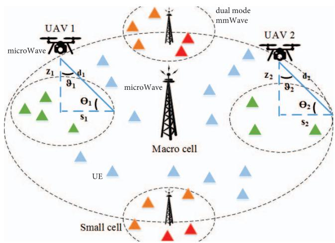
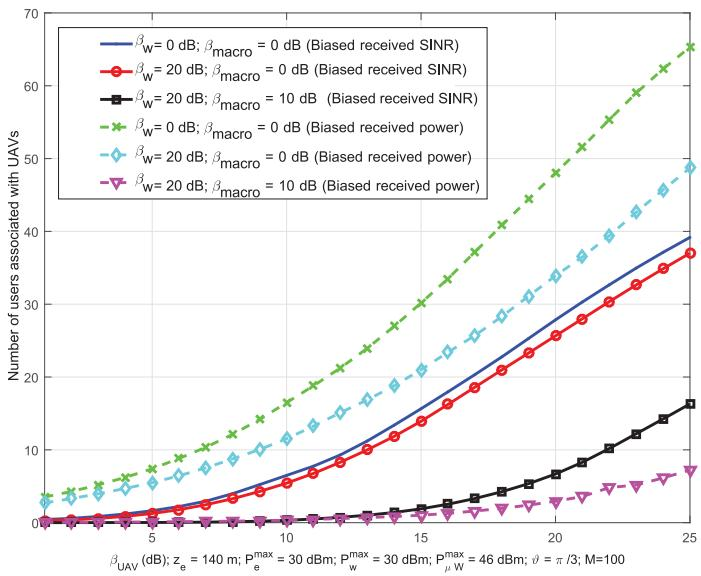
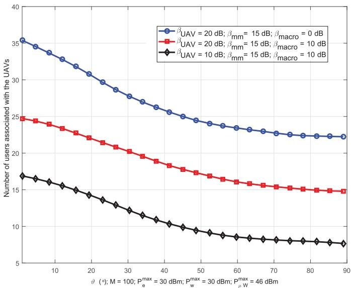
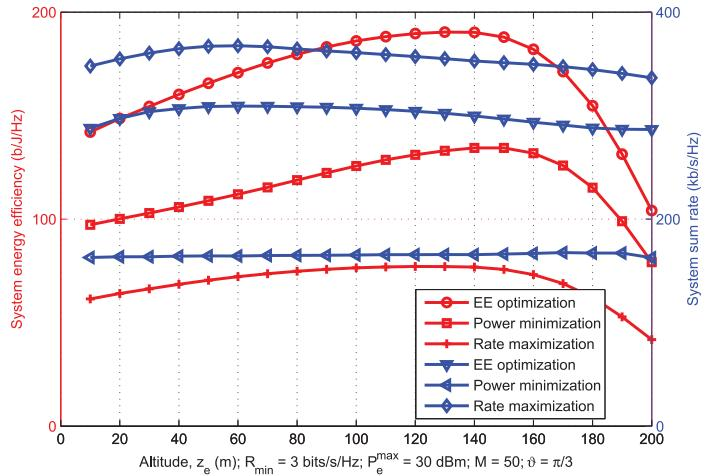
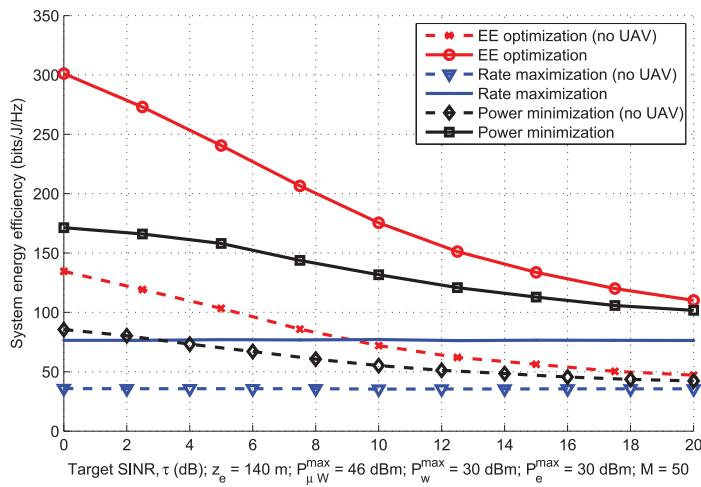
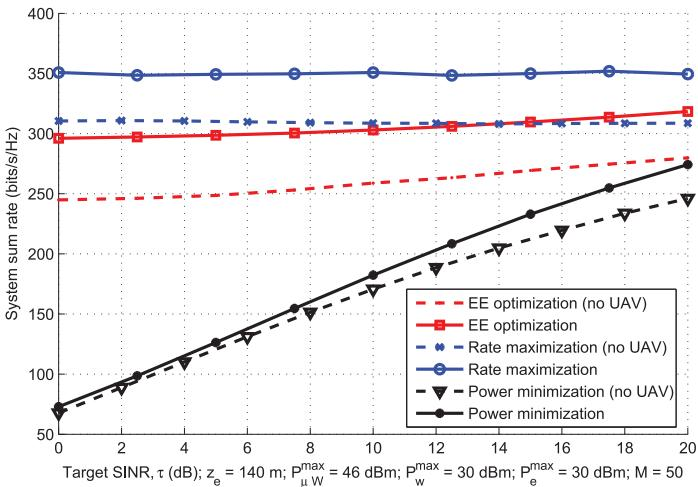
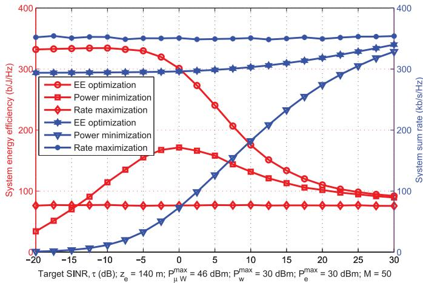

# An Energy Efficient Framework for UAV-Assisted Millimeter Wave 5G Heterogeneous Cellular Networks

Jacob Chakareski , Senior Member, IEEE, Syed Naqvi, Nicholas Mastronarde, Senior Member, IEEE, Jie Xu, Member, IEEE, Fatemeh Afghah, and Abolfazl Razi

Abstract—We study downlink transmission in a multi-band heterogeneous network comprising unmanned aerial vehicle (UAV) small base stations and ground-based dual mode mmWave small cells within the coverage area of a microwave (μW) macro base station. We formulate a two-layer optimization framework to simultaneously find efficient coverage radius for the UAVs and energy efficient radio resource management for the network, subject to minimum quality-of-service and maximum transmission power constraints. The outer layer derives an optimal coverage radius/height for each UAV as a function of the maximum allowed path loss. The inner layer formulates an optimization problem to maximize the system energy efficiency (EE), defined as the ratio between the aggregate user data rate delivered by the system and its aggregate energy consumption (downlink transmission and circuit power). We demonstrate that at certain values of the target SINR τ introducing the UAV base stations doubles the EE. We also show that an increase in τ beyond an optimal EE point decreases the EE.

Index Terms—Energy efficiency, 5G mmWave cellular networks, UAV-enabled aerial small cells, next generation networking architectures, multi-tier heterogeneous networks, green communication in 5G systems.

## I. INTRODUCTION

G HETEROGENEOUS networks (HetNets) will comprise 5 a mix of network tiers of different sizes, transmission powers, backhaul connections, and radio access technologies [1]. The use of drone small cells or wireless aerial platforms has been proposed recently to improve network coverage and capacity [2]. Additionally, UAVs are expected to prove instrumental for public safety and disaster management [3]. We consider a heterogeneous network comprising a microwave macro base station (BS), multiple ground-based dual-mode mmWave small BS (SBS), and multiple microWave-operating aerial (UAV) BS, as illustrated in Figure 1.

  
Fig. 1. The investigated system model.

Related UAV work has largely dealt with air-to-ground channel modeling, investigating line-of-sight (LoS) probability and path loss [4], [5]. In our work, we leverage the LoS probability expression from [6]. Now, despite demonstrating promising performance in extending network coverage, there are still several operational challenges of UAV BS, ranging from energy limitations and interference management to optimal 3D deployment, which merit further investiga tion. For instance, [7] determines the optimal UAV altitude to minimize transmitted power required to cover a target region. Reference [8] extends this work by determining the optimal UAV locations given their corresponding cell boundaries are known. However, both studies do not consider ground-based small and macro cells existing simultaneously. Furthermore, [9] studies proactive deployment of cacheenabled UAVs for optimizing a given QoE metric, determining user-UAV associations, the optimal UAV locations, and the cached content. Finally, [10], [11] investigate UAV-IoT data acquisition, networking, and path planning towards enabling next generation applications such as networked virtual and augmented reality. Similarly, [12] explores a game-theoretic coalition formation approach for coordinated task allocation in heterogeneous UAV networks, and [13] studies the optimal measurements policy for predicting the dynamic UAV network topology based on particle swarm optimization and Kalman filtering with intermittent observations.

Another feature of 5G networks is the use of mmWave and microWave resources simultaneously. The utilization of mmWave technology has recently gained attention due to the higher available bandwidth (in the range of 1–2 GHz) and the possibility of larger antenna arrays due to the smaller wavelength of mmWave signals [14]. Semiari et al. [15] present a novel scheduling framework for small cells operating in dual mode, i.e., in both mmWave and ultra high frequency (UHF) bands. We adopt a similar approach towards transmissions from the SBS, whereby the users in a small cell may utilize one of the two frequency bands available in the mmWave band, depending on which one maximizes their respective rate.

In contrast to related work [7], [16], we study for the first time the energy efficiency (EE) of a UAV-assisted multi-band HetNet, comprising ground-based macro BS and dual-mode mmWave SBS, and derive an optimization framework to maximize it. We propose a joint subcarrier and power allocation scheme to maximize the system EE while satisfying a minimum QoS level for the users and a maximum power transmission constraint. To solve this radio resource management problem, we propose a two-layer optimization framework. In its inner layer, the EE of the macro BS tier is maximized. In its outer layer, the power consumption of the UAV tier is optimized to satisfy its users’ minimum rate requirement, while limiting its maximum interference to the macro BS tier.

For comprehensiveness, we finally reference earlier studies that in the context of ground-based (generic/single tier) cellular networks have examined the topics of capacity analysis in multi-cell networks with co-channel interference, spatial spectrum reuse and energy efficiency of random cellular networks, and ultra-dense networks [17]–[19].

The rest of this paper is organized as follows. Section II presents our system models, formulating the considered infrastructure and air-to-ground channels. Sections III–V formulate the power allocation mechanisms for the $\mu W$ BS, the UAVs, and the SBS, respectively. In Section VII, we present our experimental results. Section VIII concludes the paper.

## II. SYSTEM MODEL

The network comprises a macro cell BS, W SBS, and $E$ UAV BS, with a total of M users distributed randomly in the region of interest. The macro cell BS is denoted as $\mu W .$ Each UAV and the $\mu W$ BS share $N _ { \mu W }$ subcarriers, whereas each mmWave SBS w has two available mmWave bands $b \in \{ H , L \}$ where H and L denote the higher/lower mmWave bands. We consider H and L to be respectively noise and interference limited, as indicated by [20]. Each user is expected to achieve a minimum data rate $R _ { \mathrm { m i n } }$ . It should be noted that all BS in the three-tier hybrid HetNet operate independently to find their optimal transmission power in a distributed manner [21]. We assume that each subcarrier can be exclusively assigned to only one user within the same BS of each tier $k .$ We assume that each user m associates to the tier k with the maximum biased received power $\begin{array} { r } { \Gamma _ { m } ^ { k } = \frac { \beta _ { k } P _ { k } ^ { \operatorname* { m a x } } G ( \theta _ { k } ) } { \mathrm { P L } _ { m } ^ { k } } } \end{array}$ , where $P _ { k } ^ { \mathrm { m a x } }$ is the maximum transmission power of tier k, $\beta _ { k }$ is the biasing factor of tier $k \in$ {macro, UAV, small}, $\theta _ { k }$ is the azimuthal angle of the BS beam alignment, $\mathrm { P L } _ { m } ^ { k }$ is the average downlink path loss experienced by user m when served by tier k (one of its BS), and $G ( \theta _ { k } )$ is the respective antenna gain. Based on this user association scheme, user m can belong to one of the following three disjoint sets: (i) m is served by the macro BS tier or the small cell tier’s mmWave band $L ,$ (ii) m is served by the UAV tier, or (iii) m is served by small cell tier’s mmWave band H. With respect to downlink transmission, the objective is to maximize the system EE in the case of (i), to minimize the power consumption in the case of (ii), and to maximize the transmission rate in the case of (iii). The achievable rate of user m on subcarrier n associated with tier $l \in$ {macro, UAV} is

$$
\boldsymbol { r } _ { m , n } ^ { ( l ) } = \Theta _ { l } B _ { l } \log _ { 2 } \Bigl ( 1 + \gamma _ { m , n } ^ { ( l ) } \times \boldsymbol { p } _ { m , n } ^ { ( l ) } \Bigr ) ,\tag{1}
$$

where $\Theta _ { l }$ is the proportion of bandwidth allocated to each subcarrier by the associated BS of tier l, $B _ { l }$ denotes the total bandwidth available to the associated BS of tier $l , p _ { m , n } ^ { ( l ) }$ denotes the power allocated to user m on subcarrier n by this BS, and $\gamma _ { m , n } ^ { ( l ) }$ is the respective (downlink) channel gain.

The distance d between user m and its associated UAV e is

$$
d = \sqrt { ( x - x _ { e } ) ^ { 2 } + ( y - y _ { e } ) ^ { 2 } + z _ { e } ^ { 2 } } ,\tag{2}
$$

where $x _ { e } , \ y _ { e }$ and $z _ { e }$ represent the $x , y$ and z coordinates of a UAV e in a cartesian plane. The altitude of the UAV e is $z _ { e } = s _ { e } \mathrm { t a n } ( \theta _ { e } )$ , where $s _ { e }$ is the 2D distance of m from e and $\theta _ { e } = \pi / 2 - \vartheta _ { \mathrm { { f } } }$ , for ϑ the UAV’s half beamwidth angle. Similarly, the LoS probability between e and m is given as $P _ { \mathrm { L o S } } = 1 / ( 1 + \mathrm { C } \cdot \exp \big [ - \mathrm { Y } ( \theta _ { e } - \mathrm { C } ) \big ] )$ [6], where C and Y are constants dependent on the environment settings (rural, urban, dense urban, or others).

## A. Dual Mode mmWave Small Cells

We consider that the SBS are using TDMA. The average achievable rate of user m on subcarrier n associated with the mmWave tier on band b across T time slots is,

$$
r _ { m , n } ^ { w , b } = \frac { 1 } { T } \sum _ { t = 1 } ^ { T } \Theta _ { w , b } B _ { w , b } \mathrm { l o g } _ { 2 } \Bigl ( 1 + \gamma _ { m , n _ { t } } ^ { w , b } \times p _ { m , n _ { t } } ^ { w , b } \Bigr ) ,\tag{3}
$$

where $\Theta _ { w , b }$ is the bandwidth share allocated to each subcarrier on band b, $B _ { w , b }$ indicates the total bandwidth available to the mmWave SBS on band $^ { b , }$ and $p _ { m , n { t } } ^ { w , b }$ indicates the power allocated to user m on the subcarrier $n _ { t }$ at time slot t. Thus, the total achieved rate of user m associated with SBS w is $\begin{array} { r } { r _ { m , n } ^ { w } = \sum _ { b \in \{ H , L \} } r _ { m , n } ^ { w , b } } \end{array}$ . Finally, the total data rate for user $m ,$ associated with either $\mu W$ BS, UAV BS, or w SBS is

$$
\overline { { R _ { m } } } = \sum _ { k \in \{ l , w \} } \sum _ { n = 1 } ^ { N _ { k } } \sigma _ { m , k } r _ { m , n } ^ { ( k ) } ,\tag{4}
$$

where $\sigma _ { m , k } = 1$ , if m is associated with tier $k ,$ and 0 otherwise, and $N _ { k }$ is the total number of subcarriers available to tier k.

We denote the total power consumed by user m as ${ \overline { { P _ { m } } } } =$ $\begin{array} { r } { \sum _ { k \in \{ l , w \} } \sum _ { n = 1 } ^ { N _ { k } } \sigma _ { m , k } p _ { m , n } ^ { ( k ) } } \end{array}$ . Then, we define the system EE as $\begin{array} { r } { \sum _ { m = 1 } ^ { M } \overline { { R _ { m } } } / ( \sum _ { m = 1 } ^ { M } \overline { { P _ { m } } } + \sum _ { k \in K } P _ { \mathrm C _ { k } } ) } \end{array}$ , where $P _ { C _ { k } }$ is the circuit power of tier k.

## B. Determining the Optimal Altitude of a UAV

We determine the UAV e’s height above ground such that its maximum path loss experienced at transmission (to its farthest user) does not exceed $\mathrm { P L } _ { \mathrm { m a x } } .$ . In particular, we first characterize the path loss between e and its associated users as

$$
\Omega _ { \varrho } \mathrm { ( d B ) } = 2 0 \log \left( \frac { 4 \pi } { \lambda _ { \mu W } } \right) + 1 0 \alpha _ { e } \log ( d ) + \eta _ { \varrho } + \chi _ { \varrho } ^ { \mu W } ,
$$

where $\varrho \in \{ \mathrm { L o S } , \ \mathrm { N L o S } \} , \ \eta _ { \mathrm { L o S } }$ and $\eta _ { \mathrm { N L o S } }$ denote the average additional loss in LoS or NLoS links relative to the free space propagation loss measured in dB, $\alpha _ { e }$ is the path loss exponent for UAV $e ,$ and $\chi ^ { \mu W }$ represents the shadowing in the microwave band (in dB), modeled as a Gaussian random variable with zero mean and variance $\xi _ { 1 } ^ { 2 } .$ . We then formulate the average path loss between e and its associated user m as $\mathrm { P L } _ { m } ^ { e } = \mathrm { P } _ { \mathrm { L o S } } \times \Omega _ { \mathrm { L o S } } + \mathrm { P } _ { \mathrm { N L o S } } \times \Omega _ { \mathrm { N L o S } }$ , where $P _ { \mathrm { N L o S } } = 1 - P _ { \mathrm { L o S } }$

Finally, given the above, we first derive $\mathrm { P L } _ { \mathrm { m a x } }$ as

$$
\begin{array} { r l } & { \mathrm { P L } _ { \mathrm { m a x } } = d ^ { \alpha _ { e } } \Big [ P _ { \mathrm { L o S } } \Big ( 1 0 ^ { 0 . 1 \times \eta _ { \mathrm { L o S } } } \Big ) } \\ & { ~ + ~ P _ { \mathrm { N L o S } } \Big ( 1 0 ^ { 0 . 1 \times \eta _ { \mathrm { N L o S } } } \Big ) \Big ] , } \end{array}\tag{5}
$$

where d in this case denotes the distance to the farthest served user. Subsequently, we can derive $z _ { e }$ from $\mathrm { P L } _ { \mathrm { m a x } }$ as

$$
z _ { e } = \cos ( \vartheta ) \bigg ( \frac { \mathrm { P L } _ { \mathrm { m a x } } } { \left[ P _ { \mathrm { L o S } } \left( 1 0 ^ { 0 . 1 \times \eta _ { \mathrm { L o S } } } \right) + P _ { \mathrm { N L o S } } \left( 1 0 ^ { 0 . 1 \times \eta _ { \mathrm { N L o S } } } \right) \right] } \bigg ) ^ { ( 1 / \alpha _ { e } ) } .\tag{6}
$$

## III. POWER ALLOCATION MECHANISM FOR $\mu W$ BS

Our objective here is to simultaneously optimize the achievable rate and EE of all users associated with the $\mu W$ BS subject to a maximum transmission power constraint and minimum required QoS level. The joint optimization is equivalent to maximizing the sum rate and minimizing the total power consumption for the users. We formulate it as a multi-objective problem which we then transform into a single objective optimization using the weighted sum method by normalizing the two objectives by $R _ { \mathrm { n o r m } }$ and $P _ { \mathrm { n o r m } } .$ , respectively, to ensure a consistent comparison, as shown below:

$$
\begin{array} { c } { { \displaystyle { \operatorname* { m a x } _ { \bf p } } \sum _ { \bf \Pi ^ { \underline { { { m a x } } } } } ^ { \sum } { \sum _ { \bf \Pi ^ { \underline { { { m a x } } } } } ^ { \sum } { { \kappa _ { \underline { { { m } } } } } , { \kappa _ { m , n } } { r _ { m , n } ^ { ( \mu , W ) } } } } } } \\ { { \mathrm { ~ } } } \\ { { \displaystyle { \mathrm { ~ } \sum _ { \bf \Pi ^ { \underline { { { - ( 1 - \phi ) } } } } } ^ { \bf \Pi ^ { \underline { { { P } } } } } { \frac { P } { P _ { { \mathrm { n o m } } } } } , } } } \\ { { \mathrm { s u b j e c t ~ t o : } \sum _ { \bf \Pi ^ { \underline { { { m } } } } \bf \Pi ^ { \underline { { { ( \mu , W ) } } } } } { \sum _ { \bf \Pi ^ { \underline { { { m a x } } } } } } ^ { \sum } { p _ { \underline { { { m , n } } } } ^ { ( \mu , W ) } } \le P _ { \mu W } ^ { \underline { { { m a x } } } } , } } \\ { { \displaystyle R _ { m } \ge R _ { \operatorname* { m i n } } , \forall m , p _ { m , n } ^ { ( \mu , W ) } \ge 0 , } } \\ { { \displaystyle { \kappa _ { m , n } \in \{ 0 , 1 \} , \forall m , n , } } } \end{array}\tag{7}
$$

where $M _ { \mu W }$ denotes the total number of users associated with $\mu W$ BS, $N _ { \mu W }$ denotes the total number of subcarriers available to this BS, $P _ { \mathrm { n o r m } }$ is the maximum transmit power of the BS, $R _ { \mathrm { n o r m } }$ is the maximum achievable rate corresponding to $\begin{array} { r } { P _ { \mathrm { n o r m } , \ P } = \sum _ { m , n } p _ { m , n } ^ { ( \mu W ) } } \end{array}$ , and $\kappa _ { m , n }$ indicates whether subcarrier n has been assigned to user m. We note that while the user association has been done beforehand, we use the subscript $\mu W$ to improve the readability here. Since user m can share at most one subcarrier with another user associated with a UAV BS, we can decompose (7) into (i) a power allocation problem for users associated with the $\mu W$ BS and a UAV, and (ii) a subcarrier allocation problem for the users associated with the $\mu W$ BS. We formulate the first problem as

```perl
Algorithm 1 Power Allocation for Users of $\mu$ <sup>W</sup> BS
1: Set $j = 0$ and $j _ { \mathrm { m a x } } = 1 0 ^ { 4 } ;$ Initialize $p _ { m , n } ^ { ( \mu W ) } = 1 0 ^ { - 6 }$
$\varphi _ { m } = 1 0 ^ { - 2 }$ , ∀<sup>m</sup>, and $\mu _ { \mu } \ l _ { W } = 1 0 ^ { - 2 }$
2: while $\varphi _ { m }$ and $\mu _ { \mu } W$ have not converged or $j < j _ { \mathrm { m a x } }$ do
3: Compute $p _ { m , n } ^ { ( \mu \dot { W } ) }$ using (9)
4: Update $\mu _ { \mu } \ / W  \left( j + 1 \right)$ and $\varphi _ { m } ( j + 1 )$ using (10)
5: end while
6: End
```

$$
\operatorname* { m a x } _ { \mathbf { p } } \phi \frac { \displaystyle \sum _ { m \in M _ { \mu W } } \sum _ { n \in N _ { \mu W } } r _ { m , n } ^ { ( \mu W ) } } { R _ { \mathrm { n o r m } } } - ( 1 - \phi ) \frac { P } { P _ { \mathrm { n o r m } } } ,\tag{8}
$$

subject to the first three constraints in (7).

We note that when $\phi ~ = ~ 1 ,$ , (8) transforms into rate maximization, while for $\phi = 0$ it transforms into power minimization. Moreover, for $\phi = \phi _ { \mathrm { E E } } \in [ 0 , 1 ] .$ , it transforms into EE maximization. We write the Lagrangian function for (8) as

$$
\begin{array} { c } { { \displaystyle T ( { \bf p } , \mu , \varphi ) = \frac { \phi } { R _ { \mathrm { n o r m } } } \sum _ { m , n } r _ { m , n } ^ { ( \mu W ) } - \frac { ( 1 - \phi ) } { P _ { \mathrm { n o r m } } } P } } \\ { { +  \mu ( P _ { \mu W } ^ { \mathrm { m a x } } - \sum _ { m , n } p _ { m , n } ^ { ( \mu W ) } )  } } \\ { { +  \sum _ { m \in { \cal M } _ { \mu W } } \varphi _ { m } ( R _ { m } - R _ { \mathrm { m i n } } ) , } } \end{array}
$$

where $P _ { \mu W } ^ { \mathrm { m a x } }$ is the maximum transmit power of the $\mu W$ BS.

The optimal value $p _ { m , n } ^ { ( \mu W ) }$ can then be computed as

$$
p _ { m , n } ^ { ( \mu W ) } = \left[ \frac { \left( \frac { \phi } { R _ { \mathrm { n o r m } } } + \varphi _ { m } \right) \Theta _ { \mu W } B _ { \mu W } } { \left( \mu + \frac { 1 - \phi } { P _ { \mathrm { n o r m } } } \right) ( \ln 2 ) } - \frac { 1 } { \gamma _ { m , n } ^ { ( \mu W ) } } \right] ^ { + } ,\tag{9}
$$

where $\mu$ and $\varphi _ { m }$ are the Lagrangian multipliers associated with the first two constraints in (7), which we update using a sub-gradient method as follows:

$$
\mu _ { \mu W } ( j + 1 ) = \left[ \mu _ { \mu W } ( j ) - s _ { 1 } \left( P _ { \mu W } ^ { \mathrm { m a x } } - \sum _ { m = 1 } ^ { M _ { \mu W } } \sum _ { n = 1 } ^ { N _ { \mu W } } p _ { m , n } ^ { ( \mu W ) } \right) \right] ^ { + } ,
$$

$$
\varphi _ { m } ( j + 1 ) = [ \varphi _ { m } ( j ) - s _ { 2 } ( R _ { m } - R _ { \mathrm { m i n } } ) ] ^ { + } ,\tag{10}
$$

where $[ x ] ^ { + } = \operatorname* { m a x } ( 0 , x )$ . Algorithm 1 provides an algorithmic description of the formulated power allocation mechanism.

The variables $s _ { 1 }$ and $s _ { 2 }$ in (9) represent the step sizes for the subgradient method. They are selected to meet convergence requirements for the method [22]. Subgradient methods are very effective in terms of convergence and computational requirements and therefore have been very popular to use.

Algorithm 1 represents a convex optimization that provably converges to the optimal solution. The requirement for $\varphi _ { m }$ and $\mu _ { \mu } W$ to have converged in Algorithm 1 indicates that their value between two subsequent iterations would not change for more than a given convergence threshold. In our experiments, we have set this convergence threshold to 1% in relative value. Moreover, we have observed that Algorithm 1 converges rapidly.

Using $p _ { m , n } ^ { * }$ as the optimal power allocation solution to (8), for the users associated with the $\mu W$ BS, we model the subcarrier allocation problem as

$$
\operatorname* { m a x } _ { \kappa _ { m , n } } \sum _ { m , n } \kappa _ { m , n } p _ { m , n } ^ { * } , \mathrm { ~ s . t . ~ } \kappa _ { m , n } \in \{ 0 , 1 \} , \forall m , n .\tag{11}
$$

We solve (11) using the Hungarian method [23], which is a combinatorial optimization algorithm that solves assignment problems efficiently (in polynomial time).

## IV. POWER ALLOCATION MECHANISM FOR UAVS

To guarantee QoS to users associated with the $\mu W$ BS, we impose a maximum interference threshold constraint $I _ { t }$ such that the total cross-tier interference caused by the UAV to the user associated with the $\mu W$ BS and sharing the same subcarrier should always be less than or equal to $I _ { t } .$ The transmission power on a reused subcarrier by the UAV should be chosen such that the $\mu W$ BS users can satisfy their minimum rate requirement. We calculate this power from

$$
\begin{array} { r l r } {  { \log _ { 2 } ( 1 + \frac { p _ { m , n } ^ { ( \mu W ) } | \mathrm { h } _ { m , n } ^ { ( \mu W ) } | ^ { 2 } } { ( \sigma ^ { 2 } + \frac { p _ { m , n } ^ { e } } { \mathrm { P L } _ { m } ^ { e } } | \mathrm { h } _ { m , n } ^ { ( e ) } | ^ { 2 } ) \mathrm { P L } _ { m } ^ { \mathrm { m a c r o } } } ) \geq R _ { \mathrm { m i n } } , } } \\ & { } & { \Rightarrow p _ { m , n } ^ { e } \leq \frac { \mathrm { P L } _ { m } ^ { e } } { | \mathrm { h } _ { m , n } ^ { ( e ) } | ^ { 2 } } ( \frac { p _ { m , n } ^ { ( \mu W ) } | \mathrm { h } _ { m , n } ^ { ( \mu W ) } | ^ { 2 } } { ( 2 ^ { R _ { \mathrm { m i n } } } - 1 ) \mathrm { P L } _ { m } ^ { \mathrm { m a c r o } } } - \sigma ^ { 2 } ) , } \end{array}
$$

where $\mathrm { h } _ { m , n } ^ { ( l ) }$ denotes the squared envelope of the multi-path fading between user m and the associated BS of tier l (macro or $\mathrm { U A V } ) , \sigma ^ { 2 }$ is the thermal noise power, $p _ { m , n } ^ { e }$ is the transmission power of UAV e to user $m \in M _ { e }$ on subcarrier $n ,$ which it shares with $\mu W$ BS user $m \in M _ { \mu W } , p _ { m , n } ^ { ( \mu W ) }$ is the transmission power of the $\mu W$ BS at the given subcarrier n to user $m \in M _ { \mu } \ / w , \mathrm { P L } _ { m } ^ { e }$ is the path loss between UAV e and user $m \in M _ { e } ,$ , and $R _ { \mathrm { m i n } }$ is the user minimum rate requirement.

Similarly, the transmission power of UAV e to user $m \in$ $M _ { e }$ on subcarrier n based on the predetermined interference threshold $I _ { t }$ can be computed as $\begin{array} { r } { \overline { { p } } _ { m , n } ^ { e } \leq \frac { I _ { t } \mathrm { P L } _ { m } ^ { e } } { | \mathrm { h } _ { m , n } ^ { ( e ) } | ^ { 2 } } } \end{array}$ , where $\mathrm { P L } _ { m } ^ { e }$ is the path loss experienced between $\mathrm { U A V } \ i$ and the user $m \in$ $M _ { \mu W }$ sharing the same subcarrier n.

Finally, the minimum transmission power that UAV e needs to use to meet the minimum rate requirement is

$$
p _ { m , n } ^ { e , \operatorname* { m i n } } = \frac { \mathrm { P L } _ { m } ^ { e } } { | \mathrm { h } _ { m , n } ^ { ( e ) } | ^ { 2 } } \Big ( 2 ^ { R _ { \mathrm { m i n } } } - 1 \Big ) \left( \sigma ^ { 2 } + \frac { p _ { m , n } ^ { ( \mu W ) } | \mathrm { h } _ { m , n } ^ { ( e ) } | ^ { 2 } } { \mathrm { P L } _ { m } ^ { e } } \right) ,\tag{12}
$$

where $\mathrm { P L } _ { m } ^ { e }$ is the path loss between UAV e and its associated user $m \in M _ { e }$ . Hence, the final constrained transmission power

of UAV e to user m on subcarrier n is,

$$
\begin{array} { r } { p _ { m , n } ^ { e \mathrm { o p t } } = \left\{ \begin{array} { l l } { \operatorname* { m i n } \Bigl ( \overline { { p } } _ { m , n } ^ { e } , \operatorname* { m a x } \Bigl ( p _ { m , n } ^ { e } , p _ { m , n } ^ { e , \mathrm { m i n } } \Bigr ) \Bigr ) , \mathrm { ~ i f ~ } \Lambda \ge p _ { m , n } ^ { e , \mathrm { m i n } } , } \\ { \mathrm { I n f e a s i b l e , ~ } } & { \mathrm { o t h e r w i s e , } } \end{array} \right. } \end{array}
$$

where $\Lambda = \operatorname* { m i n } ( p _ { m , n } ^ { e } , \overline { { p } } _ { m , n } ^ { e } )$ . Note that in some instances $p _ { m , n } ^ { e \mathrm { o p t } }$ can simplify to Λ.

## V. POWER/SUBCARRIER ALLOCATION FOR MMWAVE SBS

The SBS have the flexibility to serve their users on one of the available two mmWave bands $\{ L , H \}$ . As noted earlier, band H is assumed to be noise limited whereas the lower mmWave band L is assumed to be interference limited considering the co-tier interference among the SBS operating on this band. For band H, each subcarrier $n \in N _ { w , H }$ is allocated transmission power $p _ { m , n } ^ { w , H } = P _ { w } ^ { \mathrm { m a x } } / N _ { w , H }$ , where $P _ { w } ^ { \mathrm { m a x } }$ is the maximum transmit power of SBS w and $N _ { w , H }$ is the total number of subcarriers available at SBS w on band H.

As the users served by SBS w on the lower band L experience co-tier interference from the neighbouring mmWave SBS, there is a need for efficient power control. Similarly to the mechanism described in Section III, the transmission power of SBS w operating on band L to user m on subcarrier $n \in N _ { w , L }$ can be computed as

$$
p _ { m , n } ^ { w , L } = \left[ \frac { \Big ( \frac { \phi } { R _ { \mathrm { n o r m } } } + \varphi _ { m } \Big ) \Theta _ { w , L } B _ { w , L } } { \Big ( \mu _ { w } + \frac { 1 - \phi } { P _ { \mathrm { n o r m } } } \Big ) ( \ln 2 ) } - \frac { 1 } { \gamma _ { m , n } ^ { ( w ) } } \right] ^ { + } .
$$

Subcarrier pairing in the small cells operating on band H (noise limited regime) in TDMA is performed so as to allocate T combinations of subcarriers to each user which maximize their average achieved rate across T time slots. On the other hand, the small cells operating on band L (interference limited regime) allocate T combinations of subcarriers to each user to maximize their average achieved EE across T time slots.

Algorithm 3 outlines a step-wise procedure for user association to a particular band on the mmWave SBS as well as subcarrier allocation. Here, $\mathbf { S } _ { H } ^ { z }$ and $\mathbf { S } _ { L } ^ { z }$ represent the vectors holding the subcarriers assigned to SBS user z across T time slots, while $\Upsilon$ is the association matrix used to determine whether a user uses the higher frequency band or the lower one in the SBS, $R _ { t , H } ^ { z }$ and $R _ { t , L } ^ { z }$ the matrices representing the rates of the users associated with the two bands in each time slot, and $\mathrm { R a t e } _ { \operatorname* { m a x } , H } ^ { z }$ and $\mathrm { R a t e } _ { \mathrm { m a x , I } } ^ { z }$ are the maximum rates available to user z at any subcarrier n, for the two bands.

## VI. COMPLEXITY AND IMPLEMENTATION ASPECTS

The power and subcarrier allocation optimization techniques described heretofore are of relatively low complexity and utilize parameters and data readily available at a base station. Moreover, they are designed to operate in a decentralized fashion at every base station, as described earlier, thereby minimizing the overall system complexity. The optimization techniques formulated in Section III leverage the Lagrange multiplier method, the sub-gradient method, and the Hungarian algorithm, all of which are known to be computationally efficient and converging rapidly to the optimal solution [23], [24].

Algorithm 2 : Subcarrier Allocation and Association for Users   
Associated With mmWave BS, Using TDMA   
1: Initialize sets, $w = \{ 1 , \ldots , W \} , n = \{ 1 , \ldots , N \} , t =$   
$\{ 1 , \ldots , T \}$   
2: Initialize z to 1   
3: Initialize $\mathbf { S } _ { H } ^ { z }$ and $\mathbf { S } _ { L } ^ { z } , \ \Upsilon , \ R _ { t , H } ^ { z } , \ R _ { t , L } ^ { z } , \ \mathrm { R a t e } _ { \operatorname* { m a x } , H } ^ { z }$ and   
$\mathrm { R a t e } _ { \mathrm { m a x } , \mathrm { L } } ^ { z }$ to 0   
4: for $w = 1$ to W do   
5: Determine $M _ { w } ,$ , the set of users associated with SBS w   
6: for $z = 1$ to $M _ { w }$ do   
7: for $t = 1$ to T do   
8: for $n = 1$ to N do   
9: Compute $R _ { n , j , \mathrm { H I } } ^ { z }$ and $R _ { n , j , \mathrm { L O } } ^ { z }$ using (4)   
10: if $n = N$ then   
11: Determine $\mathrm { R a t e } _ { \operatorname* { m a x } , j , \mathrm { H I } } ^ { z }$ and $\mathrm { R a t e } _ { \mathrm { m a x } , j , \mathrm { L O } } ^ { z }$   
12: end if   
13: end for   
14: end for   
15: Determine a and b, the summation of $\mathrm { R a t e } _ { \operatorname* { m a x } , j , \mathrm { H I } } ^ { z }$   
and $\mathrm { R a t e } _ { \operatorname* { m a x } , j , \mathrm { L O } } ^ { z } ,$ across all J time slots,   
respectively   
16: if $\mathrm { ~ a ~ } >$ b then   
17: $\Upsilon ( w , z ) = 1$   
18: Populate ${ \bf S } _ { \mathrm { H I } } ^ { z }$ with the subcarriers yielding the   
highest user rates in each slot   
19: else   
20: $\Upsilon ( w , z ) = 2$   
21: Populate $\mathbf { S } _ { \mathrm { L O } } ^ { z }$ with the subcarriers yielding the   
highest user rates in each slot   
22: end if   
23: end for   
24: end for

Finally, with the advances in embedded devices and wireless technology, it is feasible to deploy a small access point or base station on a medium size UAV to extend and enhance network service, as demonstrated by earlier studies [16]. We note that the paper represents a preliminary promising study of a novel and prospectively very important network setting going into the future. Investigating large scale instances of this scenario and other more distantly related aspects, e.g., the economics of extending 5G network coverage to rural settings via UAVs, lies firmly beyond the scope of the present study.

## VII. PERFORMANCE EVALUATION

In our experiments, we consider a hybrid cellular network comprising one $\mu W$ BS coexisting with three dual mode mmWave SBS and two UAV BS. We consider 50 users uniformly distributed in a square geographical area 1 km × 1 km. The mmWave SBS are randomly deployed on the macro cell edge to cater to cell edge users. We consider a 2 GHz carrier frequency for both the $\mu W$ and UAV BS. The carrier frequencies for the SBS are 28 GHz (L band) and 73 GHz (H band). The bandwidth of both $\mu W$ and UAV BS is 20 MHz. The SBS bandwidth is 1 GHz (L band) and 2 GHz (H band).

  
Fig. 2. User association for the UAV tier versus $\beta _ { \mathrm { U A V } }$ based on biased received power and SINR.

The maximum transmission power of $\mu W$ BS, UAVs, and SBS are 46 dBm, 30 dBm, and 30 dBm. The total number of subcarriers available to each tier k is 128. The path loss exponent for the ground user-UAV link is 2 while that for $\mu W$ BSs is 3. The LoS and NLoS pathloss exponents for mmWave small cells are 2 and 3.3 [14]. The minimum rate requirement is set to 3 b/s/Hz unless otherwise stated. The thermal noise is assumed to be −174 dBm/Hz. The half power beamwidth angle for mmWave small cell is $1 0 ^ { \circ }$ [14] and the shadowing in $\mu W$ BS or UAVs are considered to be 4 dB whereas the shadowing in mmWave small cells are 5.2 dB and 7.2 dB for LoS and NLoS links [25]. All statistical results are calculated over various channel conditions and user locations averaged over $1 0 ^ { 3 }$ Monte Carlo iterations.

To examine the association of users to the UAV tier over a larger number of users, only in the first two experiments, we set the number of users M to 100. In particular, Figure 2 depicts the number of users associated with the UAV tier for increasing $\beta _ { \mathrm { U A V } }$ (biasing factor), on the basis of biased received power using $\Gamma _ { m } ^ { k }$ and biased SINR. The six graphs in the figure represent various biasing scenarios for the SBS and the $\mu W$ BS. When the biasing factors for both the mmWave SBS and the $\mu W$ BS are 0 dB, it yields the greatest number of users associated with the UAV tier, irrespective of whether the association is done on the basis of biased received power or biased SINR. In fact, for the case when biasing is performed based on the received power, increasing $\beta _ { \mathrm { U A V } }$ from 10 dB to 15 dB causes an increase by approximately 67% in the number of users associated with the UAV tier. The graphs representing the cases when both the SBS and the UAV have non-zero biasing factors show a similar increasing trend. However, the cumulative number of users associated with the UAV tier remains lower than that for the previous case, as a greater number of users are now associated with the mmWave tier. As the maximum transmission power of the $\mu W$ BS is the highest among all the tiers, therefore, introducing a non-zero biasing factor $\beta _ { \mathrm { m a c r o } }$ causes a sharp decline in the number of users associated with the UAV tier irrespective of the type of user association. The figure shows that at $\beta _ { \mathrm { U A V } } = 2 5 ~ \mathrm { d B }$ , there is a nearly 84% decrease in the number of users utilizing the UAV tier when $\beta _ { \mathrm { U A V } } ~ = ~ 1 0$ dB, relative to when only the SBS biasing factor is taken to be non-zero.

  
Fig. 3. User association for the UAV tier versus the half power beamwidth angle of the UAV.

The impact of the half power beam-width angle of the UAV, ϑ, on the number of users associated with the UAV tier is shown in Figure 3. User association is done on the basis of biased received power. All three curves demonstrate a general decrease with an increase in $\vartheta .$ This is due to the fact that an increase in $\vartheta$ causes a decrease in the elevation angle, $\theta _ { e } ,$ resulting in a small coverage radius $s _ { e }$ . Consequently, $P _ { \mathrm { L o S } }$ decreases, which in turn causes an increased path loss $\mathrm { P L } _ { m } ^ { e }$ . This increased path loss experienced by transmissions reduces association with the UAV tier. Additionally, of the three graphs in Figure 3, the one representing the scenario with the highest $\beta _ { \mathrm { U A V } }$ and lowest $\beta _ { \mathrm { m a c r o } }$ clearly outperforms the other two. For instance, the number of users associated with the UAV tier in the case involving a $\beta _ { \mathrm { m a c r o } }$ of 0 dB at $\vartheta _ { \mathrm { U A V } } = 8 9 ^ { \circ }$ is nearly three times that of the scenario with $\beta _ { \mathrm { U A V } } = \beta _ { \mathrm { m a c r o } } = 1 8 ~ \mathrm { d F }$ B.

Figure 4 describes the system sum rate and system EE versus UAV altitude $z _ { e } ,$ for all power allocation mechanisms. The graphs for system EE demonstrate that our EE maximization approach outperforms the power minimization and rate maximization power allocation mechanisms. It is also obvious that the system EE reaches a maximum point at $z _ { e } ~ = ~ 1 4 0$ m, which corresponds to $\mathrm { P L } _ { \mathrm { m a x } } = 6 8 . 8 ~ \mathrm { d B }$ . Beyond this altitude, the system EE begins to decrease. In fact, the system EE at $z _ { e } = 1 4 0 \mathrm { ~ m ~ }$ , using the EE maximization approach is 35% greater in comparison to $z _ { e } ~ = ~ 1 0$ m. Meanwhile, the system sum rate for the EE maximization approach reaches a maximum point when $z _ { e } = 5 0$ m. It is shown that at higher

  
Fig. 4. System sum rate and system EE versus UAV altitude $z _ { e } .$

  
Fig. 5. System EE versus target SINR $\tau ,$ both with and without the UAV tier.

UAV altitudes, while $P _ { \mathrm { L o S } }$ increases, $\mathrm { P L } _ { m } ^ { e }$ also increases due to an increased UAV-user distance. As a result of this all other simulations results are performed at $z _ { e } = 1 4 0 \ \mathrm { m }$

Figure 5 describes the system EE with or without the UAV tier, versus $\tau = 2 ^ { R _ { \mathrm { m i n } } } - 1$ . It is evident for the EE maximization approach that at $\tau = 0 \ \mathrm { d B }$ , the system EE with a UAV tier is almost two times greater. Similarly, for the other two considered power allocation approaches, the advantages of including the UAV tier are quite evident from Figure 5.

Figure 6 depicts the system sum rate versus τ with and without the UAV tier. The maximum achievable sum rate using the rate maximization approach with UAV tier is approximately 13% greater. The results for the other power allocation approaches are also higher when the system includes the UAV tier. For instance, at $\tau = 2 0 \mathrm { d B }$ , the achievable sum rate for the power minimization approach is approximately 10% greater.

The variations in system EE and system sum rate versus $\tau$ for all power allocation approaches is examined in Figure 7. The EE maximization approach outperforms the power minimization and rate maximization approaches in terms of system EE, expectedly. $\mathrm { A t } ~ \tau = - 2 0 ~ \mathrm { d B }$ , the system EE for the power minimization approach is approximately 88% lower. However, an increase in τ subsequently results in an increase in the system EE for this approach and reaches a maximum point at $\tau = 0 \ \mathrm { d B }$ . The achievable system EE for the rate maximization approach remains constant irrespective of the values of τ . Additionally, as τ takes higher values, greater transmission power is required to achieve the minimum required QoS level, which causes a decrease in the system EE shown by the EE maximization and power minimization approaches. The rate maximization approach achieves the highest sum rate for the considered values of τ being investigated, as expected. At $\tau = 3 0 ~ \mathrm { d B }$ , the achievable system sum rate for the EE maximization and power minimization approaches is approximately equal to the achieved sum rate for the rate maximization approach.



Fig. 6. System sum rate versus target SINR τ , with and without UAVs.  
  
Fig. 7. System sum rate and system EE versus target SINR, τ .

## VIII. CONCLUSION

We designed an efficient radio resource management optimization framework for a multi-tier multi-band mmWave cellular network integrating UAV-based aerial small cells for enhanced coverage/throughput. We analyzed the system EE and system sum rate, along with other metrics, of this setting, where a varying number of users could be associated with the

UAV tier depending on the biasing factors of all three network tiers. Our results demonstrate that including a UAV tier in the network can nearly double the system EE at certain target SINR values. Furthermore, we showed that the system EE increases with an increase in UAV altitude and after an optimal UAV altitude, it starts decreasing. Our results show that our proposed approach outperforms traditional schemes aimed at maximizing the system sum rate or minimizing the system power consumption.

We note that as this is a first study to consider this scenario, it is challenging to compare to existing methods that considered related but somewhat different network settings. Our analytical framework as border cases, rate maximization and power minimization, traditional approaches to network management that have been considered earlier. As such, we compare to them in the experimental analysis and evaluation. We also note that the formulated optimization techniques can be applied over time to adapt to prospective environmental changes. Similarly, another prospective direction of future research can be to explore spatially moveable UAV base stations in the analysis and system design, and carry out related optimization techniques over respective time horizons.

## IX. FUTURE WORK

The paper represents a motivating starting point for rich follow-up work that falls outside the scope of the paper. This includes complexity analysis and design of sub-optimal lower complexity methods, investigation of practical implementation aspects, joint solution of power allocation and user association, and investigation of horizon-based dynamic UAV placement, and economics of UAV-enabled 5G network coverage.

## ACKNOWLEDGMENT

Chakareski acknowledges Aleksandra M. for the provided support and motivation.

## REFERENCES

[1] E. Hossain, M. Rasti, H. Tabassum, and A. Abdelnasser, “Evolution toward 5G multitier cellular wireless networks: An interference management perspective,” IEEE Wireless Commun., vol. 21, no. 3, pp. 118–127, Jun. 2014.

[2] R. Yaliniz, A. El-Keyi, and H. Yanikomeroglu, “Efficient 3-D placement of an aerial base station in next generation cellular networks,” in Proc. IEEE Int. Conf. Commun. (ICC), May 2016, pp. 1–5.

[3] I. Bucaille et al., “Rapidly deployable network for tactical applications: Aerial base station with opportunistic links for unattended and temporary events ABSOLUTE example,” in Proc. IEEE Mil. Commun. Conf., San Diego, CA, USA, Nov. 2013, pp. 1116–1120.

[4] A. Al-Hourani, S. Kandeepan, and A. Jamalipour, “Modeling air-toground path loss for low altitude platforms in urban environments,” in Proc. IEEE Glob. Commun. Conf. (GLOBECOM), Austin, TX, USA, 2014, pp. 2898–2904.

[5] Q. Feng, J. McGeehan, E. K. Tameh, and A. R. Nix, “Path loss models for air-to-ground radio channels in urban environments,” in Proc. IEEE Veh. Technol. Conf. (VTC), Melbourne, VIC, Australia, 2006, pp. 2901–2905.

[6] A. Al-Hourani, S. Kandeepan, and S. Lardner, “Optimal LAP altitude for maximum coverage,” IEEE Commun. Lett., vol. 3, no. 6, pp. 569–572, Dec. 2014.

[7] M. Mozaffari, W. Saad, M. Bennis, and M. Debbah, “Drone small cells in the clouds: Design, deployment and performance analysis,” in Proc. IEEE Wireless Netw. Symp. Glob. Commun. Conf. (GLOBECOM), San Diego, CA, USA, Dec. 2015, pp. 1–6.

[8] M. Mozaffari, W. Saad, M. Bennis, and M. Debbah, “Optimal transport theory for power-efficient deployment of unmanned aerial vehicles,” in Proc. IEEE Wireless Commun. Symp. Int. Conf. Commun. (ICC), May 2016, pp. 1–6.

[9] M. Chen et al., “Caching in the sky: Proactive deployment of cacheenabled unmanned aerial vehicles for optimized quality-of-experience,” IEEE J. Sel. Areas Commun., vol. 35, no. 5, pp. 1046–1061, May 2017.

[10] J. Chakareski, “Aerial UAV-IoT sensing for ubiquitous immersive communication and virtual human teleportation,” in Proc. IEEE INFOCOM Workshop Commun. Netw. Techn. Contemp. Video, Atlanta, GA, USA, May 2017, pp. 718–723.

[11] J. Chakareski, “Drone networks for virtual human teleportation,” in Proc. ACM MobiSys Workshop Micro Aerial Veh. Netw. Syst. Appl. (DroNet), Niaga Falls, NY, USA, Jun. 2017, pp. 21–26.

[12] F. Afghah, M. Z. Amirani, A. Razi, J. Chakareski, and E. Bentley, “A coalition formation approach to coordinated task allocation in heterogeneous UAV networks,” in Proc. Amer. Control Conf., Milwaukee, WI, USA, Jun. 2018, pp. 5968–5975.

[13] A. Razi, F. Afghah, and J. Chakareski, “Optimal measurement policy for predicting UAV network topology,” in Proc. Asilomar Conf. Signals Syst. Comput., Pacific Grove, CA, USA, Nov. 2017, pp. 1374–1378.

[14] S. Singh, M. N. Kulkarni, A. Ghosh, and J. G. Andrews, “Tractable model for rate in self-backhauled millimeter wave cellular networks,” IEEE J. Sel. Areas Commun., vol. 33, no. 10, pp. 2196–2211, Oct. 2015.

[15] O. Semiari, W. Saad, and M. Bennis, “Joint millimeter wave and microwave resources allocation in cellular networks with dual-mode base stations,” IEEE Trans. Wireless Commun., vol. 16, no. 7, pp. 4802–4816, Jul. 2017.

[16] V. Sharma, M. Bennis, and R. Kumar, “UAV-assisted heterogeneous networks for capacity enhancement,” IEEE Commun. Lett., vol. 20, no. 6, pp. 1207–1210, Jun. 2016.

[17] X. Ge, K. Huang, C.-X. Wang, X. Hong, and X. Yang, “Capacity analysis of a multi-cell multi-antenna cooperative cellular network with co-channel interference,” IEEE Trans. Wireless Commun., vol. 10, no. 10, pp. 3298–3309, Oct. 2011.

[18] X. Ge et al., “Spatial spectrum and energy efficiency of random cellular networks,” IEEE Trans. Commun., vol. 63, no. 3, pp. 1019–1030, Mar. 2015.

[19] X. Ge, S. Tu, G. Mao, C.-X. Wang, and T. Han, “5G ultra-dense cellular networks,” IEEE Wireless Commun., vol. 23, no. 1, pp. 72–79, Feb. 2016.

[20] M. S. Omar, M. A. Anjum, S. A. Hassan, H. Pervaiz, and Q. Niv, “Performance analysis of hybrid 5G cellular networks exploiting mmWave capabilities in suburban areas,” in Proc. IEEE Int. Conf. Commun., 2016, pp. 1–6.

[21] N. Abuzainab and W. Saad, “Cloud radio access meets heterogeneous small cell networks: A cognitive hierarchy perspective,” in Proc. IEEE Int. Workshop Signal Process. Adv. Wireless Commun., Edinburgh, U.K., Jul. 2016, pp. 1–5.

[22] D. Bertsekas, Convex Optimization Algorithms. Belmont, MA, USA: Athena Sci., Feb. 2015.

[23] H. W. Kuhn, “The Hungarian method for the assignment problem,” Naval Res. Logist. Quart., vol. 2, nos. 1–2, pp. 83–97, 1955.

[24] D. P. Bertsekas, Constrained Optimization and Lagrange Multiplier Methods. Belmont, MA, USA: Athena Sci., Jan. 1996.

[25] T. Bai and R. W. Heath, Jr., “Coverage and rate analysis for millimeterwave cellular networks,” IEEE Trans. Wireless Commun., vol. 14, no. 2, pp. 1100–1114, Feb. 2015.


Jacob Chakareski (SM’14) is an Assistant Professor of electrical and computer engineering with the University of Alabama, where he leads the Laboratory for VR/AR Immersive Communication. His interests span networked virtual and augmented reality, UAV IoT sensing and networking, fast online machine learning, 5G wireless edge computing/caching, ubiquitous immersive communication, and societal applications. He was a recipient of the Adobe Data Science Faculty Research Award in 2017 and 2018, the Swiss NSF Career Award

Ambizione in 2009, the AFOSR Faculty Fellowship in 2016 and 2017, and Best/Fast-Track Paper Awards at IEEE ICC 2017 and IEEE Globecom 2016. He is the organizer of the first NSF visioning workshop on networked VR/AR communications. He trained as a Ph.D. student at Rice and Stanford, held research appointments with Microsoft, HP Labs, and EPFL, and sat on the advisory board of Frame, Inc., which has been acquired by Nutanix, Inc. in August 2018. His research is supported by NSF, AFOSR, Adobe, Tencent Research, NVIDIA, and Microsoft. For further info, please visit www.jakov.org.

Syed Naqvi, photograph and biography not available at the time of publication.


Nicholas Mastronarde (S’07–M’11–SM’16) received the B.S. and M.S. degrees in electrical engineering from the University of California, Davis, CA, USA, in 2005 and 2006, respectively, and the Ph.D. degree in electrical engineering from the University of California, Los Angeles, CA, USA, in 2011. He is currently an Associate Professor with the Department of Electrical Engineering, University at Buffalo, Buffalo, NY, USA. His research interests include resource allocation and scheduling in wireless networks and systems, UAV networks, 4G/5G networks, Markov decision processes, and reinforcement learning.


Jie Xu (S’09–M’15) received the B.S. and M.S. degrees in electronic engineering from Tsinghua University, China, in 2008 and 2010, respectively, and the Ph.D. degree in electrical engineering from the University of California Los Angeles in 2015. He is an Assistant Professor with the Electrical and Computer Engineering Department, University of Miami. His primary research interests include mobile edge computing, machine learning for networks, game theory, and network security.


Fatemeh Afghah received the B.Sc. and M.Sc. degrees (Hons.) in electrical engineering from the Khajeh Nassir Toosi University of Technology, Tehran, Iran, in 2005 and 2008, respectively, and the Ph.D. degree in electrical and computer engineering from the University of Maine, Orono, ME, USA, in 2013. She was a visiting student with the Department of Electrical and Computer Engineering, University of Maryland, College Park, MD, USA, from 2011 to 2012. She was an Assistant Professor with the Electrical and Computer Engineering Department,

North Carolina A&T State University, Greensboro, NC, USA, from 2013 to 2015. She is currently an Assistant Professor with the School of Informatics, Computing and Cyber Systems, Northern Arizona University, Flagstaff, AZ, USA, where she is the Director of the Wireless Networking and Information Processing Laboratory. Her research interests include wireless communication networks, decision making in multiagent systems radio spectrum management, game theoretical optimization, and biomedical signal processing.

Abolfazl Razi, photograph and biography not available at the time of publication.