# An Ensemble MARL Approach for Heterogeneous UAV Swarm Target Search in 3D Space

Xuan Zhang , Changxu Wei, Ziyuan Wang , Graduate Student Member, IEEE, Yixian Zhang, Wenbo Ding , Member, IEEE, and Xiao-Ping Zhang , Fellow, IEEE

Abstract—In recent years, unmanned aerial vehicles (UAVs) have become increasingly pivotal in cooperative searches.However, the performance of using a homogeneous UAV swarm for search is often limited because a single class of UAVs cannot guarantee accuracy and coverage simultaneously. This work tackles the challenge of target search in a large-scale three-dimensional (3D) environment using a heterogeneous UAV swarm. Specifically, we design a novel search scheme that leverages the complementary strengths of two UAV types: fixed-wing UAVs, which enable swift area coverage at high altitudes, and multi-rotor UAVs, which provide high-precision detection at low altitudes. To address the stochastic optimization problem posed by unknown targets, we develop a multi-agent reinforcement learning (MARL) scheme—where multiple agents learn to optimize their strategies through interactions with each other and the environment—for efficient target search. To ensure the safety of UAVs, an action masking scheme is integrated into the MARL framework to avoid collisions. Moreover, to further enhance decision robustness and search efficiency, we propose an Ensemble MARL framework that aggregates multiple independently trained networks via a majority voting mechanism, and further present our Ensemble QMIX (E-QMIX) algorithm. Furthermore, we provide a mathematical analysis showing that E-QMIX increases the probability that each agent selects its optimal action, thereby strengthening the robustness of joint decision-making. Simulation results demonstrate that our E-QMIX outperforms classic single-network MARL benchmarks in both search efficiency and coverage rate.

Index Terms—UAV swarm, 3D target search, heterogeneous multi-agent system, ensemble MARL.

## I. INTRODUCTION

search has become a hot topic recently because of its advantages in efficiency and security, with wide-ranging applications in disaster rescue [1], [2], [3], environmental monitoring [4], [5], [6], and broader patrol [7]. Compared to traditional manned search, the UAV swarm can autonomously and rapidly explore large-scale unknown complex environments and locate hidden targets, reducing reliance on human and material resources [8], [9], [10]. Additionally, multiple UAVs can coordinate with each other to improve overall search efficiency [11], [12].

In multi-UAV target search missions, UAVs systematically explore an environment while simultaneously maximizing target detection accuracy and minimizing search time [13], [14]. However, the common UAV types in the current research have limitations in addressing the target search problem. Fixed-wing UAVs (FUAVs), characterized by high-speed and high-altitude flight with wide coverage, struggle with maneuverability and precise target identification, whereas multi-rotor UAVs (MUAVs) can hover and perform fine-grained searches but are constrained by their lower speed and limited sensing range. Thus, current homogeneous UAV swarm-based target search, consisting solely of either FUAVs or MUAVs, often exhibits limitations in adaptability and efficiency. Integrating heterogeneous UAVs, which leverages the complementary advantages of both types of UAVs, has the potential to significantly enhance target search efficiency in complex three-dimensional (3D) environments.

However, designing an effective path-planning strategy for heterogeneous UAV swarm target search in a 3D environment poses several challenges. Firstly, the inherent complexity of 3D search spaces significantly complicates UAV motion planning and target detection compared to traditional two-dimensional (2D) scenarios [15], [16]. This complexity demands enhanced spatial perception to interpret intricate 3D environments, as well as sophisticated multi-agent scheduling techniques to coordinate the simultaneous operations of multiple UAVs. Secondly, integrating FUAVs and MUAVs within a swarm introduces additional challenges, as they are required to collaborate closely and seamlessly to fully exploit their complementary advantages. Partial observability and communication constraints further exacerbate these challenges, since each UAV can only acquire limited local information through onboard sensors and global state information is often inaccessible [13]. This restricted perception hinders coordination among UAVs and complicates path planning under uncertainty. From a system perspective, such a heterogeneous UAV swarm naturally forms a distributed mobile system, where each UAV acts as a mobile node with onboard sensing, computation and wireless communication, while interagent coordination occurs under mobility and limited communication ranges. Thirdly, scalability is a pressing challenge in the heterogeneous UAV swarm. As the number of UAVs increases, ensuring efficient area coverage while eliminating redundant searches becomes increasingly difficult.

Furthermore, real-world airspace often contains various nofly zones arising from physical obstacles and regulatory or safety constraints, such as airports and surrounding controlled airspace, dense urban areas with high-rise buildings and localized hazardous weather regions. These exclusion regions must be avoided to ensure safe flight, which further complicates 3D trajectory planning and motivates the explicit modeling of no-fly zones in our problem formulation [15]. Besides, the unknown target state often makes the search task a stochastic optimization problem, which is challenging to solve using traditional optimization methods, such as dynamic programming (DP) [17]. As a trial-and-error interactive dynamic optimization algorithm, multi-agent reinforcement learning (MARL) serves as a potential method to solve the above problems, and its introduction is expected to improve the automation and search efficiency of UAVs significantly [13], [14], [16]. Specifically, integrating deep learning techniques enhances MARL by providing strong feature extraction and environmental modeling capabilities, which are critical for processing high-dimensional search data in real time [18]. In MARL framework, each UAV is expected to optimize its search strategy while concurrently aligning with the common objectives of the UAV swarm. However, achieving the above goals remains difficult. Conventional distributed MARL techniques, such as independent Q-learning, typically underperform in these scenarios because of the inherent non-stationarity of multi-agent learning and the difficulties associated with proper credit assignment.

To tackle the above challenges and improve search efficiency, we design a heterogeneous UAV swarm-based target search scheme in complex 3D environments by exploiting the complementary capabilities of FUAVs and MUAVs. To effectively coordinate these complementary roles, we develop an MARL framework that simultaneously maximizes the number of found targets while minimizing search time. An action masking mechanism is incorporated into the framework to prevent collisions among UAVs and avoid no-fly zones, thereby reducing the complexity of trajectory planning under real-world constraints. Furthermore, to enhance decision-making robustness and overall search performance, we propose a novel approach called Ensemble MARL, which aggregates multiple policies through a voting mechanism and can be seamlessly deployed in discrete-action settings. Our main contributions are summarized as follows:

\- To enhance the overall search efficiency, we propose a novel 3D target search scheme using a heterogeneous UAV swarm, taking advantage of the complementary benefits of the two different UAVs for efficient collaboration.

We develop an MARL framework tailored for heterogeneous UAV swarm-based target search that concurrently optimizes the objectives of maximizing the number of targets found and minimizing search time. Additionally, an action masking scheme is incorporated into this framework to ensure collision avoidance.

\- To improve decision-making robustness and overall search efficiency, we propose an Ensemble MARL framework which aggregates outputs from multiple value networks through a majority voting mechanism, and further present our Ensemble QMIX (E-QMIX) algorithm. Both theoretical analysis and experimental results demonstrate the effectiveness of E-QMIX.

The rest of this paper is organized as follows. Section II reviews the related work in UAV target search. In Section III, we present the heterogeneous UAV swarm target search scenario and system model, and subsequently employ an MARL framework to address the heterogeneous UAV swarm target search problem in Section IV. In Section V, we propose our Ensemble MARL approach for target search, and provide a mathematical analysis to demonstrate the effectiveness of our algorithm. Section VI presents the experimental results which demonstrate the effectiveness of our Ensemble MARL. We discuss the limitations of our current approach and outline directions for future research in Section VII. Finally, we conclude this paper in Section VIII.

## II. RELATED WORK

Traditional optimization and heuristic-planning methods have been widely studied for UAV search missions, including local hill climbing, evolutionary algorithms [2], ant colony optimization [19], [20], particle-swarm optimization [21], pigeoninspired optimization [22], etc. While these schemes can provide satisfactory solutions in small-scale settings, they become inadequate for the large, heterogeneous UAV swarms considered in this work. First, the multi-UAV search problem is NP-hard and highly non-convex, rendering the complexity of these classical optimization methods very high. Second, their time cost escalates rapidly with the number of UAVs and quickly becomes impractical. Third, the trajectories produced by such methods lack real-time adaptability. Traditional methods often require many iterations to derive a solution, so they cannot respond to stochastic sensor outcomes or sudden environmental changes without time-consuming re-optimization.

In addition to traditional heuristic optimization techniques, deep reinforcement learning (DRL) has emerged as a promising approach for UAV target search. DRL offers significant advantages in addressing NP-hard problems and long-term optimization tasks, particularly in dynamic environments [23], [24], [25], [26]. By enabling UAVs to learn end-to-end policies from their interactions with the environment, DRL-based methods facilitate real-time decision-making in complex and rapidly changing scenarios. For instance, Wei et al. propose an enhanced DRL approach for target search in unstructured environments, which integrates depth information with segmented images and employs a Deep Q-Network (DQN) for autonomous UAV path planning [27]. Wu et al. develop a DRL approach tailored for autonomous UAV target search in disaster scenarios, incorporating odor cues and loop storm effects to improve training efficiency and decision-making accuracy [1]. Shurrab et al. design a datadriven UAV target localization system based on DQN, which leverages state-space reduction and function approximation to enhance generalization and localization performance [28]. Additionally, Ajmera et al. present a DRL framework integrated with YOLOFlow for UAV-based target search, tracking, and following, utilizing optical flow and YOLO detection for target localization [29]. While these DRL-based approaches have advanced UAV target search, they predominantly focus on single-UAV systems. An individual UAV’s limited sensing range restricts search efficiency and coverage, making it challenging to address large-scale, multi-target scenarios. Additionally, a single-agent approach lacks robustness against sensor inaccuracies or environmental uncertainties, emphasizing the need for cooperative multi-UAV solutions.

To address the multi-UAV cooperative target search tasks, Luo et al. propose a DQN-based approach for computation offloading and trajectory planning to minimize uncertainty [30]. Wang et al. propose an online distributed reinforcement learning (RL) approach for multi-UAV joint searching and tracking with refueling and no-fly constraints, leveraging a quantum probability model for target belief estimation and an Upper Confidence Tree planner with teammate prediction to improve coordination under partial observability [31]. Gao et al. propose a cooperative multi-UAV search framework that applies the Consensus-Based Bundle Algorithm for distributed task-area assignment and then employs independent DRL to improve collaboration efficiency while avoiding inter-UAV collisions [32]. Xiao et al. introduce an adaptive curriculum-embedded multistage DRL approach based on Proximal Policy Optimization (PPO) for collaborative target search with visual drone swarm, with the goal of optimizing task allocation and path planning [33]. Lee proposes a federated reinforcement learning approach for UAV swarm systems, integrating federated learning with PPO to enable distributed on-board learning with periodic model aggregation, thereby reducing repeated data exchanges and improving autonomy for aerial remote sensing tasks [34]. However, these distributed RL approaches typically rely on local observations and independently optimized policies, without explicitly leveraging centralized training signals such as a global-state critic to stabilize learning. As a result, concurrent policy updates under partial observability may induce non-stationary interactions and lead to unstable convergence. Moreover, these approaches usually do not explicitly address multi-agent credit assignment for complex cooperative objectives, which can hinder coordinated learning in large-scale multi-agent system (MAS).

To overcome these limitations, recent research has shifted toward MARL methods employing a centralized training with decentralized execution (CTDE) paradigm. These approaches leverage global state information and facilitate richer inter-agent interactions during training, thereby providing a comprehensive understanding of system dynamics and enhancing coordination among UAVs. Moreover, the incorporation of a centralized critic can address the credit assignment problem by quantifying each agent’s contribution to the global reward, which contributes to a more efficient and stable training process [35]. For example, Hou et al. propose a UAV swarm cooperative search method based on multi-agent deep deterministic policy gradient (MADDPG), which integrates local and global information through CNN processing to enhance the understanding of the environmental state [14]. Shen et al. present a QMIX-based algorithm for cooperative target search in dynamic threat environments, employing a digital twin approach during training to enhance training efficiency [13]. However, both studies are confined to 2D search scenarios and neglect the potential impact of UAV altitude on search performance. Moreover, the issue of collision avoidance is not fully addressed. To address these issues, Liu et al. introduce an action-mask-based Multi-Agent PPO algorithm for 3D cooperative search of moving targets. This work utilizes a high-low altitude collaborative architecture to improve target capture efficiency, and use an action masking technique to effectively avoid collision among UAVs [16]. Notwithstanding the progress achieved by CTDE-based MARL methods, existing approaches predominantly rely on homogeneous UAV swarms. The search efficiency can be further enhanced by employing heterogeneous UAVs that exploit their complementary capabilities. Moreover, integrating ensemble learning techniques can further bolster decision-making robustness and overall search performance.

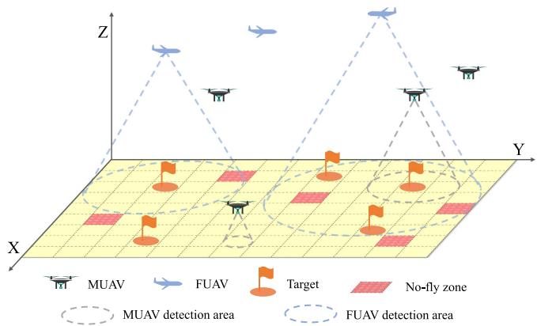  
Fig. 1. A 3D target search scenario with multiple fixed-wing UAVs and multirotor UAVs.

## III. SYSTEM MODEL AND PROBLEM FORMULATION

In this section, we consider a scenario where a heterogeneous multi-UAV system, comprising FUAVs and MUAVs, is deployed to explore an area containing multiple targets and no-fly zones, as depicted in Fig. 1. Subsequently, we develop a multi-objective optimization model for the UAV target search task, aiming to maximize search efficiency and promptly identify all targets.

## A. System Model

1) Environment Model: As shown in Fig. 1, the search area Ω is modeled as a bounded rectangular region, partitioned into $L _ { x } \times L _ { y }$ discrete cells, where $L _ { x }$ and $L _ { y }$ denote the number of rows and columns, respectively. The sets $X = \{ 1 , 2 , \ldots , L _ { x } \}$ and $Y = \{ 1 , 2 , \dots , L _ { y } \}$ represent the indices along the two spatial dimensions. Each cell $C _ { x , y } \in \Omega$ is identified by its Cartesian coordinates, denoted as $\boldsymbol { c } _ { x , y } = \left( x , y \right)$ , where $x \in X$ and $y \in Y$ The search area Ω contains $N ^ { \mathrm { T } }$ targets, represented by the set $\mathcal { G } = \{ 1 , 2 , \dots , N ^ { \mathrm { T } } \}$ , which are randomly distributed throughout the region. Each target $g \in { \mathcal { G } }$ occupies a single cell. The state of each cell, denoted by $\delta _ { x , y } \in \{ 0 , 1 \}$ , indicates the presence $( \delta _ { x , y } = 1 )$ or absence $( \delta _ { x , y } = 0 )$ of a target. The coordinates of target g are represented as $\pmb { u } ^ { g } = ( x ^ { g } , y ^ { g } )$ , where $x ^ { g }$ and $y ^ { g }$

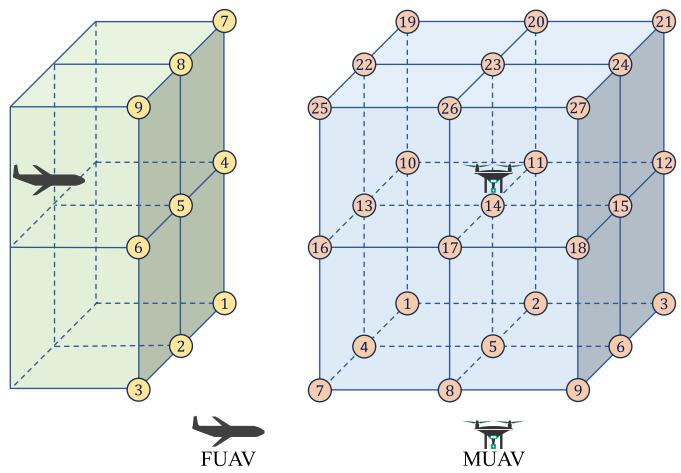  
Fig. 2. Schematic of action spaces for FUAV and MUAV.

correspond to the x- and y-coordinates of the cell occupied by the target.

The search area Ω includes $N ^ { \mathrm { O } }$ no-fly zones, represented by the set $\mathcal { D } = \{ 1 , 2 , \dots , N ^ { \mathrm { O } } \}$ . Each no-fly zone d $\in \mathcal { D }$ occupies a single cell. The coordinates of no-fly zone d are denoted as $\boldsymbol { u } ^ { \bar { d } } = ( x ^ { d } , y ^ { d } )$ , where $x ^ { d }$ and $y ^ { d }$ indicate the x- and $y -$ coordinates of the cell occupied by the no-fly zone. For safety considerations, UAVs should avoid these no-fly zones during target search operations.

2) UAV Model: The UAV swarm $\mathcal { N }$ comprises $N ^ { \mathrm { F } }$ FUAVs, denoted by $\mathcal { T } = \{ 1 , 2 , \dots , N ^ { \mathrm { F } } \}$ , and $N ^ { \mathrm { M } }$ MUAVs, denoted by $\mathcal { I } = \{ 1 , 2 , \dots , N ^ { \mathrm { M } } \}$ . FUAVs fly at higher altitudes, thereby providing a wider field of view (FOV). Moreover, they typically fly at several times the speed of MUAVs. However, the increased distance between their sensors and the ground results in lower confidence in target detection. These attributes render FUAVs well-suited for rapidly covering large search areas and conducting preliminary searches. In contrast, MUAVs, operating at lower altitudes and flying at slower speeds, offer improved maneuverability and more reliable target detection; however, their narrower FOV limits their sensing range. Consequently, MUAVs are more effective for detailed and precise searches. In cooperative target search scenarios, FUAVs can quickly gather preliminary search data, which is then shared with MUAVs to facilitate more precise searches. This collaborative approach allows both types of UAVs to complement each other’s limitations and fully capitalize on their respective strengths.

To simplify the simulation, the target search process is discretized into T time steps, during which both FUAVs and MUAVs move and perform target detection. In the 3D search scenario, FUAVs and MUAVs operate at different altitude layers to adjust their sensing range and target detection probabilities, thereby enhancing overall search efficiency. MUAVs, operating at lower altitudes, are restricted to altitude layers $\dot { Z } ^ { \mathrm { M } } =$ $\{ \breve { h _ { 1 } ^ { \mathrm { M } } } , h _ { 2 } ^ { \mathrm { M } } , \dots , h _ { \mathrm { m a x } } ^ { \mathrm { M } } \}$ , where $h _ { 1 } ^ { \mathrm { M } }$ and $h _ { \operatorname* { m a x } } ^ { \mathrm { M } }$ are the minimum and maximum flight altitudes of MUAVs, respectively. FUAVs are confined to a higher altitude band $Z ^ { \mathrm { F } } = \{ h _ { 1 } ^ { \mathrm { F } } , h _ { 2 } ^ { \mathrm { \bar { F } } } , \dots , h _ { \operatorname* { m a x } } ^ { \mathrm { F } } \}$ with $h _ { 1 } ^ { \mathrm { F } }$ and $h _ { \operatorname* { m a x } } ^ { \mathrm { F } ^ { - } }$ corresponding to their minimum and maximum flight heights. By enforcing $h _ { 1 } ^ { \mathrm { F } } > h _ { \operatorname* { m a x } } ^ { \mathrm { M } }$ , the altitude bands are non-overlapping, thereby eliminating vertical conflict and avoiding mid-air collisions between the two UAV types.

For each FUAV $i \in \mathcal { T }$ , its position at time step t is represented as $\boldsymbol { \mathbf { \mathit { u } } } _ { t } ^ { i } = ( x _ { t } ^ { i } , y _ { t } ^ { i } , z _ { t } ^ { i } )$ , where $x _ { t } ^ { i } \in X , y _ { t } ^ { i } \in Y$ , and $z _ { t } ^ { i } \in Z ^ { \operatorname { F } }$ . Due to the risk of losing lift and exceeding structural limits, FUAVs cannot perform sharp turns. Hence, the angle between the horizontal velocity components at consecutive time steps cannot exceed the maximum horizontal turning angle $\beta _ { 0 }$ . Accordingly, the movement model of each FUAV $i \in I$ in 3D space is described as follows:

$$
\begin{array} { r l } { u _ { t + 1 } ^ { i } = } & { ( x _ { t } ^ { i } + \Delta x _ { t } ^ { i } , y _ { t } ^ { i } + \Delta y _ { t } ^ { i } , z _ { t } ^ { i } + \Delta z _ { t } ^ { i } ) , } \\ { \mathrm { s . t . } \quad } & { ( a ) ~ x _ { t } ^ { i } \in X , ~ x _ { t } ^ { i } + \Delta x _ { t } ^ { i } \in X , } \\ & { ( b ) ~ y _ { t } ^ { i } \in Y , ~ y _ { t } ^ { i } + \Delta y _ { t } ^ { i } \in Y , } \\ & { ( c ) ~ z _ { t } ^ { i } \in Z ^ { \mathrm { F } } , ~ z _ { t } ^ { i } + \Delta z _ { t } ^ { i } \in Z ^ { \mathrm { F } } , } \\ & { ( d ) ~ \Delta x _ { t } ^ { i } , ~ \Delta y _ { t } ^ { i } \in \{ - d _ { x _ { y } , y } ^ { k } , 0 , d _ { x , y } ^ { k } \} , } \\ & { ( e ) ~ \Delta z _ { t } ^ { i } \in \{ - d _ { z } ^ { \mathrm { F } } , 0 , d _ { x , t } ^ { F } \} , } \\ & { ( f ) ~ \mathrm { a r c c o s } ( \frac { v _ { \mathrm { h } , t } ^ { i } \cdot v _ { \mathrm { h } , t + 1 } ^ { i } } { | v _ { \mathrm { h } , t } ^ { i } | | v _ { \mathrm { h } , t + 1 } ^ { i } | } ) \leq \beta _ { 0 } , } \\ & { ( g ) ~ | \Delta x _ { t } ^ { i } | + | \Delta y _ { t } ^ { i } | > 0 , } \end{array}\tag{1}
$$

where $\mathbf { \Delta } u _ { t + 1 } ^ { i }$ is the position of FUAV i at time step t + 1, and $( \Delta x _ { t } ^ { i } , \Delta y _ { t } ^ { i } , \Delta z _ { t } ^ { i } )$ represent its movement increments along the x, y, and z axes at time step t, respectively. $d _ { x , y } ^ { \mathrm { F } }$ defines the distance the FUAV can move along the x and y axes within one time step, and $d _ { z } ^ { \mathrm { F } }$ specifies the maximum movement distance along the z axis. ${ \pmb v } _ { \mathrm { H } , t } ^ { i }$ and ${ v _ { \mathrm { H } , t + 1 } ^ { i } }$ denote the horizontal velocity components at time step t and $t + 1$ , respectively. Constraint (a) and (b) in (1) ensure that the FUAV remains within the designated search area, while constraint (c) limits their flight altitude. Constraint (f) restricts the horizontal velocity change between consecutive time steps to at most $\beta _ { 0 } .$ , and constraint (g) prohibits the FUAV from hovering or performing vertical ascents or descents, as shown in Fig. 2.

Compared to FUAVs, MUAVs are more maneuverable. Owing to their multi-rotor architecture, lighter fuselage, and slower flight speed, MUAVs can move to any adjacent cell or hover in place at each time step. The position of each MUAV $j \in \mathcal I$ at time step t is denoted as $\boldsymbol { u } _ { t } ^ { j } = ( x _ { t } ^ { j } , y _ { t } ^ { j } , z _ { t } ^ { j } )$ , where $x _ { t } ^ { j } \in X$ $y _ { t } ^ { j } \in Y$ , and $z _ { t } ^ { j } \in Z ^ { \mathrm { M } }$ . Its movement in 3D space can be consequently described by the following model:

$$
\begin{array} { r l } { \pmb { u } _ { t + 1 } ^ { j } = } & { ( x _ { t } ^ { j } + \Delta x _ { t } ^ { j } , y _ { t } ^ { j } + \Delta y _ { t } ^ { j } , z _ { t } ^ { j } + \Delta z _ { t } ^ { j } ) , } \\ { \mathrm { s . t . } \qquad } & { ( a ) \ : x _ { t } ^ { j } \in X , \ : x _ { t } ^ { j } + \Delta x _ { t } ^ { j } \in X , } \\ & { ( b ) \ : y _ { t } ^ { j } \in Y , \ : y _ { t } ^ { j } + \Delta y _ { t } ^ { j } \in Y , } \\ & { ( c ) \ : z _ { t } ^ { j } \in Z ^ { \mathrm { M } } , \ : z _ { t } ^ { j } + \Delta z _ { t } ^ { j } \in Z ^ { \mathrm { M } } , } \\ & { ( d ) \ : \Delta x _ { t } ^ { j } , \ : \Delta y _ { t } ^ { j } \in \lbrace - d _ { x , y } ^ { \mathrm { M } } , 0 , d _ { x , y } ^ { \mathrm { M } } \rbrace , } \\ & { ( e ) \ : \Delta z _ { t } ^ { j } \in \lbrace - d _ { z } ^ { \mathrm { M } } , 0 , d _ { z } ^ { \mathrm { M } } \rbrace , } \end{array}\tag{2}
$$

where $\boldsymbol { \mathbf { \mathit { u } } } _ { t + 1 } ^ { j }$ represents the position of MUAV j at time step $t + 1$ while $( \Delta x _ { t } ^ { j } , \Delta y _ { t } ^ { j } , \Delta z _ { t } ^ { j } )$ denotes its movement increments along the $x , y ,$ and z axes at time step t, respectively. $d _ { x , y } ^ { \mathrm { M } }$ specifies the distance that each MUAV can move along the x and y axes within a single time step, while $d _ { z } ^ { \mathrm { M } }$ defines the maximum movement distance along the z axis.

3) Sensor Detection Model: At each time step t, each UAV performs local target detection using its limited onboard sensor. For each UAV $k \in \mathcal N$ , it can only observe the cells within its sensing region $\mathbf { \Delta } \Lambda _ { t } ^ { k }$ , which is determined by its sensing radius. The sensing region can be described as

$$
\Lambda _ { t } ^ { k } { = } \left\{ ( x , y ) \big | \big \| ( x , y ) { - } ( x _ { t } ^ { k } , y _ { t } ^ { k } ) \big \| _ { 2 } { \le } R _ { \mathrm { s } } ^ { k } ( z _ { t } ^ { k } ) , x \in X , y \in Y \right\}\tag{3}
$$

where $( x _ { t } ^ { k } , y _ { t } ^ { k } )$ denotes the horizontal position of UAV k at time step t, and  · 2 represents the Euclidean norm (2-norm) of vectors. Assuming that each UAV carries a sensor with a fixed detection angle α, its sensing radius is given by $R _ { \mathrm { s } } ^ { k } ( z _ { t } ^ { k } ) =$ $z _ { t } ^ { k }$ tan $\frac { \alpha } { 2 }$ , and therefore increases linearly with $z _ { t } ^ { k }$

The sensor model describes the probabilistic nature of target detection in multi-UAV cooperative search tasks, incorporating sensor imperfections and environmental noise. At each time step $t ,$ each UAV k scans its sensing region and records the detection result for each cell $C _ { x , y }$ as a binary variable $\Psi _ { k , t } ^ { x , y }$ In particular, $\Psi _ { k , t } ^ { x , y } = 1$ indicates that a target is detected in cell $( x , y )$ , while $\Psi _ { k , t } ^ { x , y } = 0$ indicates no detection. The likelihood of these outcomes depends on the true presence of a target in the cell, denoted by $\delta _ { x , y } .$ . Formally, the sensor model of FUAV is given by

$$
P \big ( \Psi _ { x , y } ^ { k , t } | \delta _ { x , y } \big ) = \left\{ \begin{array} { l l } { P \big ( \Psi _ { x , y } ^ { k , t } = 1 | \delta _ { x , y } = 1 \big ) = P _ { \mathrm { d } } ^ { k } \big ( z _ { t } ^ { k } \big ) } \\ { P \big ( \Psi _ { x , y } ^ { k , t } = 0 | \delta _ { x , y } = 1 \big ) = 1 - P _ { \mathrm { d } } ^ { k } \big ( z _ { t } ^ { k } \big ) } \\ { P \big ( \Psi _ { x , y } ^ { k , t } = 1 | \delta _ { x , y } = 0 \big ) = P _ { \mathrm { f } } ^ { k } \big ( z _ { t } ^ { k } \big ) } \\ { P \big ( \Psi _ { x , y } ^ { k , t } = 0 | \delta _ { x , y } = 0 \big ) = 1 - P _ { \mathrm { f } } ^ { k } \big ( z _ { t } ^ { k } \big ) } \end{array} \right. ,\tag{4}
$$

where $P _ { \mathrm { d } } ^ { k } ( z _ { t } ^ { k } )$ and $1 - P _ { \mathrm { d } } ^ { k } ( z _ { t } ^ { k } )$ represent the probabilities of correct detection (true positive) and missed detection (false negative), respectively, while $P _ { \mathrm { f } } ^ { k } ( z _ { t } ^ { k } )$ and $1 - P _ { \mathrm { f } } ^ { k } ( z _ { t } ^ { k } )$ correspond to the probabilities of false alarms (false positive) and correctly identifying an empty cell (true negative). Since the UAV’s altitude $z _ { t } ^ { \bar { k } }$ affects the distance between the sensor and the target plane, higher altitudes reduce sensor confidence; consequently, $P _ { \mathrm { d } } ^ { k } ( z _ { t } ^ { k } )$ declines and $P _ { \mathrm { f } } ^ { k } ( z _ { t } ^ { k } )$ rises. To maintain reliable detection under noisy conditions, the true detection probability $P _ { \mathrm { d } } ^ { k } ( z _ { t } ^ { k } )$ is constrained within the range [0.5, 1], while the false alarm probability $P _ { \mathrm { f } } ^ { k } ( z _ { t } ^ { k } )$ is limited to [0, 0.5].

4) Probability Map Update Model: At the beginning of a search task, the precise positions of targets within the search area Ω are unknown. To represent the position information of targets, a probabilistic modeling approach is adopted [22], [36], [37]. Specifically, each cell $C _ { x , y } \in \Omega$ is assigned a target probability $B _ { x , y } ^ { t } \in [ 0 , 1 ]$ , which indicates the estimated probability of a target’s presence. Collectively, these values constitute a target probability map (TPM). The TPM can be interpreted as a discretized belief over target existence across the search grid, and it provides an intuitive representation of how the swarm accumulates information and reduces uncertainty over time.

To further quantify the uncertainty of target presence in each cell $C _ { x , y }$ at a given time t, Shannon entropy is employed as a measure. The entropy of a cell, $\mathcal { H } _ { x , y } ^ { t } ,$ is given by [14]

$$
\mathcal { H } _ { x , y } ^ { t } = - B _ { x , y } ^ { t } \log _ { 2 } B _ { x , y } ^ { t } - ( 1 - B _ { x , y } ^ { t } ) \log _ { 2 } ( 1 - B _ { x , y } ^ { t } ) .\tag{5}
$$

Initially, in the absence of prior information about the target distribution, the probability for each cell is uniformly initialized to $B _ { x , y } ^ { 0 } = 0 . 5$ , reflecting maximal uncertainty. As the search progresses, UAVs use onboard sensors to gather information about adjacent cells. Given the inherent limitations of sensor accuracy, the TPM is updated in a probabilistic manner via a Bayesian approach [38]. For each UAV k at time $t ,$ the TPM within its sensing region $\mathbf { \Delta } \Lambda _ { t } ^ { k }$ is updated based on whether a target is detected $\overset { \overline { { \mathbf { \Phi } } } } { ( \Psi _ { x , y } ^ { k , t } = 1 ) }$ or not $( \Psi _ { x , y } ^ { k , t } = 0 )$ as follows:

$$
B _ { x , y } ^ { t + 1 } = \left\{ \begin{array} { l l } { \frac { P _ { \mathrm { d } } ^ { k } ( z _ { t } ^ { k } ) B _ { x , y } ^ { t } } { P _ { \mathrm { d } } ^ { k } ( z _ { t } ^ { k } ) B _ { x , y } ^ { t } + P _ { \mathrm { f } } ^ { k } ( z _ { t } ^ { k } ) \left( 1 - B _ { x , y } ^ { t } \right) } , } & { \mathrm { i f ~ } \Psi _ { x , y } ^ { i , t } = 1 } \\ { \frac { \left( 1 - P _ { \mathrm { d } } ^ { k } ( z _ { t } ^ { k } ) \right) B _ { x , y } ^ { t } } { ( 1 - P _ { \mathrm { d } } ^ { k } ( z _ { t } ^ { k } ) ) B _ { x , y } ^ { t } + ( 1 - P _ { \mathrm { f } } ^ { k } ( z _ { t } ^ { k } ) ) \left( 1 - B _ { x , y } ^ { t } \right) } , } & { \mathrm { i f ~ } \Psi _ { x , y } ^ { i , t } = 0 } \end{array} \right. ,\tag{6}
$$

where $( x , y ) \in \pmb { \Lambda } _ { t } ^ { k }$ . As the UAVs explore the mission area, the TPM is iteratively refined, with target probability values being progressively updated to reduce overall environmental uncertainty. Additionally, this dynamic updating mechanism enables UAVs to prioritize regions with high target probabilities or unexplored areas, providing a basis for coordinated path planning and decision-making across the UAV swarm.

Furthermore, to simplify the process of determining whether a cell contains a target, a binary indicator $\eta _ { x , y } ^ { t }$ is introduced to signify the presence of a target in cell $C _ { x , y }$ at time t. This indicator is computed by applying a threshold ξ to convert continuous probability values into a binary classification as follows:

$$
\eta _ { x , y } ^ { t } = \left\{ { \begin{array} { c c } { 1 , } & { B _ { x , y } ^ { t } > \xi } \\ { 0 , } & { \mathrm { o t h e r w i s e } } \end{array} } , \right.\tag{7}
$$

based on which, a target is considered successfully identified when $B _ { x , y } ^ { t }$ at a grid cell $( x , y )$ exceeds the predefined threshold ξ. The mission terminates when every target has been found or when the maximum time horizon $T$ expires. Hence, the search end time $T _ { \mathrm { e n d } }$ is defined as

$$
T _ { \mathrm { e n d } } = \operatorname* { m i n } \Bigl ( T , \ \operatorname* { m i n } \Bigl \{ t \Bigl | \sum _ { g \in \mathcal { G } } \eta _ { x ^ { g } , y ^ { g } } ^ { t } = N ^ { \mathrm { T } } \Bigr \} \Bigr ) .\tag{8}
$$

## B. Problem Formulation

In this work, the cooperative target search task for a heterogeneous UAV swarm is formulated as an optimization problem over a finite time horizon T . The first objective is to maximize the number of targets correctly discovered, quantified as

$$
J _ { 1 } = \sum _ { g \in \mathcal { G } } \mathbb { 1 } ( \eta _ { x ^ { g } , y ^ { g } } ^ { T _ { \mathrm { e n d } } } = 1 ) ,\tag{9}
$$

where $\mathbb { 1 } ( \eta _ { x ^ { g } , y ^ { g } } ^ { T _ { \mathrm { e n d } } } = 1 )$ is the binary indicator with $\begin{array} { r } { \mathbb { 1 } ( \eta _ { x ^ { g } , y ^ { g } } ^ { T _ { \mathrm { e n d } } } = 1 ) = 1 } \end{array}$ indicating the target g is correctly found and $\begin{array} { r } { \mathsf { l } ( \eta _ { x ^ { g } , y ^ { g } } ^ { T _ { \mathrm { e n d } } } = 1 ) = 0 } \end{array}$ otherwise. Meanwhile, to promote time efficiency, the second objective is to minimize the mission duration, represented by

$$
J _ { 2 } = T _ { \mathrm { e n d } } .\tag{10}
$$

Formally, the optimization problem can be mathematically represented as

$$
\begin{array} { r l } { \underset { a ^ { \mathrm { \tiny \mathrm { S } } } , a ^ { \mathrm { M } } } { \mathrm { m a x } } \quad } & { J = \lambda _ { 1 } \kappa _ { 1 } J _ { 1 } - \lambda _ { 2 } \kappa _ { 2 } J _ { 2 } , } \\ { \mathrm { s . t . } \quad } & { \left( a \right) ( 1 ) , \forall i \in \mathcal { T } } \\ & { \left( b \right) ( 2 ) , \forall j \in \mathcal { I } } \\ & { \left( c \right) \left\| \left( x _ { t } ^ { k } , y _ { t } ^ { k } \right) - u ^ { d } \right\| _ { 2 } \ge \rho _ { \mathrm { s a f e } } ^ { \mathrm { O } } , \forall k \in \mathcal { N } , \forall d \in \mathcal { D } , } \\ & { \left( d \right) \left\| u _ { t } ^ { i } - u _ { t } ^ { i ^ { \prime } } \right\| _ { 2 } \ge \rho _ { \mathrm { s a f e } } ^ { \mathrm { F } } , \forall i , i ^ { \prime } \in \mathcal { T } , } \\ & { \left( e \right) \left\| u _ { t } ^ { j } - u _ { t } ^ { j ^ { \prime } } \right\| _ { 2 } \ge \rho _ { \mathrm { s a f e } } ^ { \mathrm { M } } , \forall j , j ^ { \prime } \in \mathcal { I } , } \end{array}\tag{11}
$$

where $\mathbf { \pmb { a } } ^ { \mathrm { F } }$ and $\displaystyle \mathbf { \boldsymbol { a } } ^ { \mathrm { M } }$ denote the joint actions of FUAVs and MUAVs, respectively. $\kappa _ { 1 }$ and $\kappa _ { 2 }$ normalize $J _ { 1 }$ and $J _ { 2 }$ to comparable scales, while $\lambda _ { 1 }$ and $\lambda _ { 2 }$ are positive weighting coefficients balancing the normalized detection performance against time efficiency. Constraints (a) and (b) impose restrictions on the flight maneuvers of FUAVs and MUAVs, respectively. Constraint (c) requires each UAV to stay at least $\rho _ { \mathrm { s a f e } } ^ { \mathrm { O } }$ away from any nofly zone. Constraints (d) and $( e )$ prevent collisions by enforcing minimum separation distances of $\rho _ { \mathrm { s a f e } } ^ { \mathrm { F } }$ between FUAVs and $\rho _ { \mathrm { s a f e } } ^ { \mathrm { M } }$ between MUAVs.

Solving the optimization model in (11) directly with classical techniques such as convex programming, DP [17], and heuristic search is computationally intractable for several reasons. First, the search task is formulated under partial observability, and the belief-state evolution governed by the TPM renders the problem a highdimensional stochastic control process that cannot be captured by deterministic DP tables. Second, the coexistence of binary discovery indicators, nonlinear Bayesian belief updates, and collisionavoidance constraints makes the programme a mixedinteger, nonconvex, and NPhard problem. Hence, using these traditional methods can lead to high computational complexity. Third, heuristic algorithms are unable to make real-time decisions in dynamic environments, as they typically require multiple iterations to determine a joint action at each time step.

To address these challenges, we adopt an MARL framework. MARL optimizes policies through trialanderror interaction, circumventing the need for explicit enumeration of the exponential joint action space. Under the CTDE paradigm, agents leverage global information during training for stable credit assignment while maintaining decentralized decision-making during execution, enabling real-time decision-making within heterogeneous UAV swarms [35]. Moreover, parameter sharing across homogeneous agents in MARL can further reduce computational overhead, markedly improving the scalability of the search algorithm.

## IV. UAV TARGET SEARCH IN MARL FRAMEWORK

To optimize search efficiency in our scenario, we employ an MARL approach to solve the heterogeneous UAV swarm target search problem.

## A. Partially Observable Markov Decision Process

The decentralized partially observable Markov decision process (Dec-POMDP) is a framework for modeling cooperative

decision-making under uncertainty and partial observability. Formally, a Dec-POMDP can be defined as

$$
\mathfrak { D } \triangleq ( \mathcal { N } , S , \{ \mathcal { A } ^ { k } \} _ { k = 1 } ^ { N } , \mathcal { T } , \{ \mathcal { O } ^ { k } \} _ { k = 1 } ^ { N } , \mathcal { Z } , R , \gamma ) ,\tag{12}
$$

where N denotes the set of $N$ agents and S represents the state space of the environment. In our target search scenario, each UAV agent $k \in \mathcal N$ has its own action space $\mathcal { A } ^ { k }$ , and the joint action space is $\mathcal { A } = \mathcal { A } ^ { 1 } \times \mathcal { A } ^ { 2 } \times \cdot \cdot \cdot \times \bar { \mathcal { A } } ^ { N }$ . The state transition probability $\mathcal { T } : \mathcal { S } \times \mathcal { A }  \mathcal { P } ( \mathcal { S } )$ defines the probability of transitioning to the subsequent state based on the current state and joint actions of all agents. Observations are modeled through an observation space $\mathcal { O } ^ { k }$ for each agent $k ,$ and $\mathcal { O } = \mathcal { O } ^ { 1 } \times \mathcal { O } ^ { 2 } \times \cdot \cdot \cdot \times \mathcal { O } ^ { N }$ represents the joint observation space of all agents. The observation function Z specifies the probability distribution over joint observations, describing how agents perceive the environment given the current state and joint actions. The immediate reward function $R : S \times \mathcal { A }  \mathbb { I }$ R evaluates the immediate performance of the joint actions in a given state, where <sup>R</sup> denotes the set of real numbers [39], [40].

At each time step t, given the current environment state $s _ { t } \in S$ , each agent k receives a local observation $o ^ { k } \in \mathcal { O } ^ { k }$ and selects an action $a _ { t } ^ { k } \in \mathcal { A } ^ { k }$ based on its own policy $\pi ^ { k } : { \mathcal { O } } ^ { k } \to$ $\mathcal { A } ^ { k }$ . Subsequently, the environment transitions to the next state $s _ { t + 1 }$ based on the joint action $\mathbf { \delta } \mathbf { a } _ { t } = ( a _ { t } ^ { 1 } , a _ { t } ^ { 2 } , \ldots , a _ { t } ^ { N } )$ and the state transition probability $\tau$ , and generates a global reward $R ( s _ { t } , { \pmb a } _ { t } )$ [39]. The goal in a Dec-POMDP is to find a set of policies $\{ \pi ^ { k } \} _ { k = 1 } ^ { N }$ that maximize the expected cumulative discounted reward

$$
J = \mathbb { E } \left[ \sum _ { { t } = 0 } ^ { \infty } \gamma ^ { t } R ( s _ { t } , { \pmb a } _ { t } ) \right] ,\tag{13}
$$

where $\gamma \in [ 0 , 1 )$ is the discount factor.

## B. Observation Space

In the context of Dec-POMDP, each agent operates under partial observability, meaning it can only access information about its own state and local environment. Specifically, for each UAV $k \in \mathcal N$ , the available observations include its current 3D position $\mathbf { \Delta } u _ { t } ^ { k }$ , heading direction $\mathbf { \Delta } _ { \mathbf { \boldsymbol { v } } _ { t } ^ { k } }$ , detection probability $P _ { d } ^ { k }$ and sensing radius $\bar { R } _ { \mathrm { s } } ^ { k }$ at each time step t. In addition, UAV k can acquire the 3D positions and heading directions of adjacent FUAVs and MUAVs, denoted by $\{ \boldsymbol { u } _ { t } ^ { k ^ { \prime } } , \boldsymbol { v } _ { t } ^ { \top } \} _ { k ^ { \prime } \in \Gamma _ { \mathrm { F } } ^ { k } \cup \Gamma _ { \mathrm { M } } ^ { k } }$ , where $\Gamma _ { \mathrm { F } } ^ { k }$ and $\Gamma _ { \mathrm { M } } ^ { k }$ denote the sets of its neighboring FUAVs and MUAVs. Furthermore, to avoid no-fly zones, each UAV acquires their coordinates before initiating the search mission.

To further enhance decision-making effectiveness and search efficiency, the local TPM $\{ B _ { x , y } ^ { t } \} _ { ( x , y ) \in \Theta _ { t } ^ { k } }$ is incorporated into each $\mathrm { U A V } _ { \mathrm { \Delta } }$ observation. The region $\Theta _ { t } ^ { k }$ of the local TPM is defined as

$$
\begin{array} { r } { \Theta _ { t } ^ { k } = \{ ( x , y ) \Big | \big | ( x , y ) - ( x _ { t } ^ { k } , y _ { t } ^ { k } ) \big | \} _ { \infty } \leq R _ { \mathrm { T P M } } ^ { k } , x \in X , y \in Y \} , } \end{array}\tag{14}
$$

where $\| \cdot \| _ { \infty }$ denotes the ∞-norm. Consequently, $\Theta _ { t } ^ { k }$ forms a square region of side length $2 R _ { \mathrm { T P M } } ^ { k } + 1$ centered on the UAV’s current cell.

In our multi-UAV target search framework, non-stationarity arises during training as the strategies of individual UAVs continually evolve, which can be addressed by leveraging the fingerprint technique [41]. To mitigate this phenomenon, we integrate an -greedy exploration strategy within our MARL framework, where the exploration rate  decays linearly over training episodes. Additionally, we augment each $\mathrm { U A V } _ { \mathrm { \Delta } }$ local observation with both the current training episode e and the exploration rate , thereby providing contextual information about the learning stage [42], [43]. Accordingly, the observation of UAV k at time step t can be synthetically expressed as

$$
\begin{array} { r l } { O ^ { k } ( s _ { t } ) = } & { \left\{ \boldsymbol { u } _ { t } ^ { k } , \boldsymbol { v } _ { t } ^ { k } , P _ { \mathrm { d } } ^ { k } , P _ { \mathrm { f } } ^ { k } , { R } _ { \mathrm { s } } ^ { k } , \{ \boldsymbol { u } _ { t } ^ { k ^ { \prime } } , \boldsymbol { v } _ { t } ^ { k ^ { \prime } } \} _ { k ^ { \prime } \in \Gamma _ { \mathrm { F } } ^ { k } \cup \Gamma _ { \mathrm { M } } ^ { k } } , \right. } \\ & { \left. \{ \boldsymbol { u } ^ { d } \} _ { d \in \mathcal { D } } , \{ B _ { x , y } ^ { t } \} _ { ( x , y ) \in \Theta _ { t } ^ { k } } , t , \epsilon , e \right\} . } \end{array}\tag{15}
$$

From an implementation viewpoint, the centralized training is performed on a ground station or edge server by collecting compact experience logs from the swarm at the end of each episode, while policy execution remains decentralized on-board each UAV using local observations.

## C. State Space

In MARL, the CTDE paradigm leverages global state information during training. This comprehensive view of the environment facilitates more efficient learning by mitigating the credit assignment problem among agents and enhances coordination by enabling agents to better infer their peers’ behaviors and intentions, thereby preventing suboptimal joint strategies.

In our heterogeneous UAV target search scenario, the global state at time step t, denoted by $s _ { t } ,$ encapsulates detailed information regarding both the UAV agents and the environment. Specifically, $s _ { t }$ comprises the states of all FUAVs and MUAVs, the global target probability map, the locations of all no-fly zones, and the current training context. The global state at time step t is formulated as

$$
\begin{array} { r l } { s _ { t } = } & { \left\{ \left\{ \boldsymbol { u } _ { t } ^ { k } , \boldsymbol { v } _ { t } ^ { k } , P _ { d } ^ { k } , { R } _ { \mathrm { s } } ^ { k } \right\} _ { k \in \mathcal { N } } , \left\{ \boldsymbol { u } ^ { d } \right\} _ { d \in \mathcal { D } } , } \\ & { \left\{ B _ { x , y } ^ { t } \right\} _ { x \in X , y \in Y } , t , \epsilon , e \right\} . } \end{array}\tag{16}
$$

## D. Action Space

Since the mission environment is discretized into grid cells and a limited number of altitude layers, we design the discrete action spaces for both FUAVs and MUAVs, as shown in Fig. 2. For each FUAV agent $i \in \mathcal { T } \subset \mathcal { N }$ , its action space $\mathcal { A } ^ { i }$ is defined as

$$
\mathcal { A } ^ { i } = \{ \Delta \phi _ { \mathrm { H } } ^ { i } , \Delta z ^ { i } \} ,\tag{17}
$$

where $\Delta \phi _ { \mathrm { H } } ^ { i } \in \{ - \beta _ { 0 } , 0 , \beta _ { 0 } \}$ denotes the change in horizontal heading angle, and $\Delta z ^ { i } \in \{ - d _ { z } ^ { \mathrm { F } } , 0 , d _ { z } ^ { \mathrm { F } } \}$ represents the vertical altitude increment at one time step.

For each MUAV $j \in \mathcal { I } \subset \mathcal { N }$ , its discrete action space $\mathcal { A } ^ { j }$ is defined as

$$
\mathcal { A } ^ { j } = \big \{ \Delta x ^ { j } , \Delta y ^ { j } , \Delta z ^ { j } \big \} ,\tag{18}
$$

where $\Delta x ^ { j } , \Delta y ^ { j } \in \{ - d _ { x , y } ^ { \mathrm { M } } , 0 , d _ { x , y } ^ { \mathrm { M } } \}$ enable movement to adjacent horizontal cells or remaining stationary, and $\Delta z ^ { j } \in$

$\{ - d _ { z } ^ { \mathrm { M } } , 0 , d _ { z } ^ { \mathrm { M } } \}$ specifies ascending, descending, or hovering within the current altitude layer.

## E. Action Mask Scheme for Safe and Bounded UAV Motion

To guarantee safe and feasible motion within the UAV swarm, the MARL control policy integrates a safety-aware actionmasking mechanism that filters out any action leading to unsafe or invalid states in the next time step. For each UAV k, let the predicted post-step position under action $a ^ { k } \in { \mathcal { A } } ^ { k }$ be

$$
\begin{array} { r } { \hat { \boldsymbol { u } } _ { t + 1 } ^ { k } ( \boldsymbol { a } ^ { k } ) \ = \ \left\{ \begin{array} { l l } { \mathcal { U } ^ { \mathrm { F } } \big ( \boldsymbol { a } ^ { k } , \boldsymbol { u } _ { t } ^ { k } , \boldsymbol { v } _ { \mathrm { H } , t } ^ { k } \big ) , } & { k \in \mathcal { T } } \\ { \mathcal { U } ^ { \mathrm { M } } \big ( \boldsymbol { a } ^ { k } , \boldsymbol { u } _ { t } ^ { k } \big ) , } & { k \in \mathcal { T } } \end{array} \right. , } \end{array}\tag{19}
$$

where $\mathcal { U } ^ { \mathrm { F } } \big ( a ^ { k } , \boldsymbol { u } _ { t } ^ { k } , \boldsymbol { v } _ { \mathrm { H } , t } ^ { k } \big )$ computes the next position of an FUAV by applying action $a ^ { k }$ to its current state $( \boldsymbol { \boldsymbol { \mathbf { \mathit { u } } } } _ { t } ^ { k } , \boldsymbol { \mathbf { \mathit { v } } } _ { \mathrm { H } , t } ^ { i } )$ , whereas $\mathcal { U } ^ { \mathrm { M } } ( a ^ { k } , { \pmb u } _ { t } ^ { k } )$ provides the corresponding position prediction for an MUAV based on $\mathbf { \Delta } u _ { t } ^ { k }$

1) Collision-Avoidance Mask: The distance between two sametype UAVs k and k<sup></sup> after executing the action pair $( a ^ { k } , a ^ { k ^ { \prime } } )$ is

$$
\rho _ { t + 1 } ^ { k , k ^ { \prime } } ( a ^ { k } , a ^ { k ^ { \prime } } ) = \big \| \hat { \pmb u } _ { t + 1 } ^ { k } ( a ^ { k } ) - \hat { \pmb u } _ { t + 1 } ^ { k ^ { \prime } } ( a ^ { k ^ { \prime } } ) \big \| _ { 2 } .\tag{20}
$$

To avoid collisions among UAVs, action $a ^ { k }$ is regarded as safe if, no matter which action is chosen by every neighbor, the poststep separation never falls below the safety threshold. This yields the binary mask

$$
\begin{array} { r } { m _ { 1 , t } ^ { k } ( a ^ { k } ) = \left\{ \begin{array} { l l } { \mathbb { I } \Big ( \big ( \underset { k ^ { \prime } \in \Gamma _ { \mathrm { F } } ^ { k } } { \mathrm { m i n } } \rho _ { t + 1 } ^ { k , k ^ { \prime } } ( a ^ { k } , a ^ { k ^ { \prime } } ) \big ) \geq \rho _ { \mathrm { s a f e } } ^ { \mathrm { F } } \Big ) , \mathrm { i f } k \in \mathcal { T } } \\ { a ^ { k ^ { \prime } } \in A ^ { k ^ { \prime } } } \\ { \mathbb { I } \Big ( \big ( \underset { k ^ { \prime } \in \Gamma _ { \mathrm { F } } ^ { k } } { \mathrm { m i n } } \rho _ { t + 1 } ^ { k , k ^ { \prime } } ( a ^ { k } , a ^ { k ^ { \prime } } ) \big ) \geq \rho _ { \mathrm { s a f e } } ^ { \mathrm { M } } \Big ) , \mathrm { i f } k \in \mathcal { I } } \\ { a ^ { k ^ { \prime } } \in A ^ { k ^ { \prime } } } \end{array} \right. } \end{array}\tag{21}
$$

2) No-Fly Zone Avoidance Mask: Meanwhile, every selected action should keep the UAV outside all designated nofly zones. Given the predicted poststep position $\hat { \boldsymbol { u } } _ { t + 1 } ^ { \check { k } } ( \boldsymbol { a } ^ { k } )$ calculated in (19), the distance to no-fly zone $d \in D$ is

$$
\rho _ { t + 1 } ^ { k , d } ( a ^ { k } ) = \| \hat { \boldsymbol { u } } _ { t + 1 } ^ { k } ( a ^ { k } ) - \boldsymbol { u } ^ { d } \| _ { 2 } .\tag{22}
$$

A candidate action is deemed safe only if the UAV remains beyond the safety buffer of every nofly zone, i.e.,

$$
m _ { 2 , t } ^ { k } ( a ^ { k } ) = \mathbb { I } \Bigl ( \bigl ( \operatorname* { m i n } _ { d \in \mathcal { D } } \rho _ { t + 1 } ^ { k , d } ( a ^ { k } ) \bigr ) \geq \rho _ { \mathrm { s a f e } } ^ { \mathrm { O } } \Bigr ) .\tag{23}
$$

3) Search-Region Boundary Mask: Each UAV should remain within the mission-defined 3D search region. Let $\hat { \pmb { u } } _ { t + 1 } ^ { k } ( { \boldsymbol { a } } ^ { k } ) = ( \hat { x } , \hat { y } , \hat { z } )$ . An action is admissible only if all spatial coordinates fall within the allowed bounds:

$$
m _ { 3 , t } ^ { k } ( a ^ { k } ) = \left\{ \begin{array} { l l } { \mathbb { I } \big ( \hat { x } \in X , ~ \hat { y } \in X , ~ \hat { z } \in z ^ { \mathrm { F } } \big ) , } & { k \in \mathcal { T } } \\ { \mathbb { I } \big ( \hat { x } \in X , ~ \hat { y } \in X , ~ \hat { z } \in z ^ { \mathrm { M } } \big ) , } & { k \in \mathcal { I } . } \end{array} \right.\tag{24}
$$

4) Final Safety-Aware Action Mask: The overall mask applied to the policy output is

$$
m _ { t } ^ { k } ( a ^ { k } ) = m _ { 1 , t } ^ { k } ( a ^ { k } ) \cdot m _ { 2 , t } ^ { k } ( a ^ { k } ) \cdot m _ { 3 , t } ^ { k } ( a ^ { k } ) .\tag{25}
$$

Actions with $m _ { t } ^ { k } ( a ^ { k } ) = 0$ are removed from the action set, ensuring that every executed action prevents inter-UAV collisions, avoids all no-fly zones, and keeps the UAV inside the designated search area. This safety-aware masking plays an important role in enforcing safety constraints and can be beneficial for stabilizing MARL training under state-dependent feasible action sets, since the policy is optimized only over admissible actions at each state.

## F. Reward Design

To foster synergistic collaboration among agents, we adopt a shared reward mechanism in our fully cooperative MAS, where all agents receive an identical reward, i.e., $R _ { t } ^ { 1 } = R _ { t } ^ { 2 } =$ $\cdots = R _ { t } ^ { N } = R _ { t }$ . This unified reward function aligns individual objectives with the overall mission.

To drive the swarm toward rapid coverage and accurate target discovery, we introduce a stage reward that penalizes the residual probability of unconfirmed cells [14]:

$$
R _ { 1 , t } = - \sum _ { x = 1 } ^ { L _ { x } } \sum _ { y = 1 } ^ { L _ { y } } \Bigl ( 1 - \eta _ { x , y } ( t ) \Bigr ) B _ { x , y } ( t ) ,\tag{26}
$$

where $\left( 1 - \eta _ { x , y } ( t ) \right)$ filters out cells whose targets have been confirmed, so the summation only accounts for cells where the existence of target remains uncertain. This reward component encourages each UAV to prioritize unexplored regions and discourages leaving high-probability targets unconfirmed, thereby accelerating the overall mission completion.

Efficient search is also essential. To promote timely mission completion, we introduce a time-based penalty, with the second component imposing a constant time cost at each time step. The time efficiency penalty is defined as

$$
R _ { 2 , t } = - \mathbb { 1 } \left( \sum _ { g \in \mathcal { G } } \mathbb { 1 } ( \eta _ { x ^ { g } , y ^ { g } } ^ { t } = 1 ) < N ^ { \mathrm { T } } \right) .\tag{27}
$$

The penalty is triggered if there exist any unconfirmed targets.

The overall reward at time step t is constructed as a weighted sum of these components:

$$
R _ { t } = w _ { 1 } c _ { 1 } R _ { 1 , t } + w _ { 2 } c _ { 2 } R _ { 2 , t } ,\tag{28}
$$

where $w _ { 1 }$ and $w _ { 2 }$ are positive weighting coefficients that balance the relative importance of search progress and time efficiency. The terms $c _ { 1 }$ and $c _ { 2 }$ are normalization factors applied to $R _ { 1 , t }$ and $R _ { 2 , }$ <sub>t</sub>, respectively, to adjust their scales and ensure they are on comparable magnitudes. This reward structure motivates UAV agents to detect targets, reduce environmental uncertainty, and complete the mission promptly, thereby contributing to a more effective search strategy.

## V. ENSEMBLE MARL FOR TARGET SEARCH

This section presents our Ensemble MARL method for heterogeneous UAV target search. We begin by reviewing Value-Decomposition Networks (VDN) [44], which factorize the joint action-value function as a simple sum of individual agent Q-values under the CTDE paradigm. Next, we introduce QMIX [45], which generalizes VDN by employing a non-linear, monotonic mixing network to combine per-agent value estimates while preserving the decentralized greedy action property. Then, we introduce our Ensemble QMIX extension, in which multiple independently trained QMIX models are aggregated via a majority-voting mechanism to improve decision robustness in complex, partially observable environments.

## A. VDN

VDN [44] provides a straightforward yet effective approach for cooperative MARL under the CTDE paradigm. VDN decomposes the global action-value function $Q ^ { \mathrm { t o t } }$ into a sum of individual agent value functions:

$$
Q ^ { \mathrm { t o t } } ( \tau , a ) = \sum _ { k = 1 } ^ { N } Q ^ { k } ( \tau ^ { k } , a ^ { k } ) ,\tag{29}
$$

where $\pmb { \tau } = ( \tau ^ { 1 } , \dots , \tau ^ { N } )$ is the joint action-observation history and $\pmb { a } = ( a ^ { 1 } , \ldots , a ^ { N } )$ is the joint action. Under this additive assumption, the optimal joint action decomposes into independent maximization problems:

$$
\operatorname * { a r g m a x } _ { a } Q ^ { \mathrm { t o t } } ( \tau , a ) = \left( \begin{array} { c } { { \mathrm { a r g m a x } _ { a ^ { 1 } } Q ^ { 1 } ( \tau ^ { 1 } , a ^ { 1 } ) } } \\ { { \vdots } } \\ { { \mathrm { a r g m a x } _ { a ^ { N } } Q ^ { N } ( \tau ^ { N } , a ^ { N } ) } } \end{array} \right) .\tag{30}
$$

While this linear decomposition enables tractable decentralized policies, it may fail to capture complex, non-linear interactions among agents.

## B. QMIX

QMIX [45] addresses VDN’s limitations by learning a nonlinear yet monotonic factorization of the joint action-value. As depicted in Fig. 3, QMIX constructs the joint action-value as

$$
Q _ { \theta , \psi } ^ { \mathrm { t o t } } ( \tau , a , s ) = g _ { \psi } \big ( Q _ { \theta } ^ { 1 } ( \tau ^ { 1 } , a ^ { 1 } ) , \dots , Q _ { \theta } ^ { N } ( \tau ^ { N } , a ^ { N } ) , s \big ) ,\tag{31}
$$

where each agent network $Q _ { \theta } ^ { k } ( \tau ^ { k } , a ^ { k } )$ is implemented as a Deep Recurrent Q-Network (DRQN) [46]. The DRQN employs Gated Recurrent Units (GRU) [47] to maintain a hidden state, thereby handling the partial observability challenges inherent in Dec-POMDP settings. The mixing network $g _ { \psi }$ , whose parameters are produced by a hypernetwork, combines the individual Q-values conditioned on the global state s. To ensure that a decentralized argmax function over each $Q ^ { k }$ yields the optimal joint action, QMIX enforces the monotonicity constraint

$$
\frac { \partial Q ^ { \mathrm { t o t } } } { \partial Q ^ { k } } \geq 0 , \forall k ,\tag{32}
$$

which guarantees that an increase in any individual $Q ^ { k }$ cannot decrease $Q ^ { \mathrm { t o t } }$ . This property is realized by constraining the hypernetwork to output non-negative mixing weights.

During training, actions are selected according to an -greedy policy to balance exploration and exploitation. The parameters of both the agent networks θ and the mixing hypernetwork ψ are learned by minimizing the temporal-difference error over a

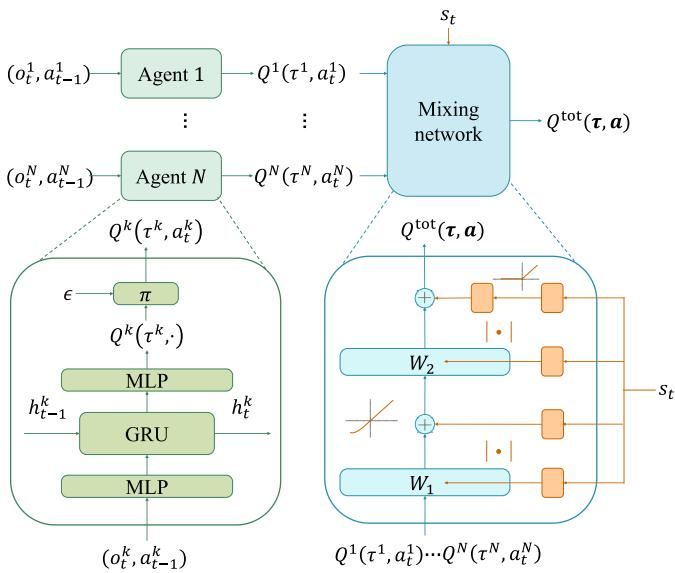  
Fig. 3. The network structure of QMIX [45]. The agent networks are shown in green, while the mixing network is shown in blue. The hypernetworks which supply parameters to the mixing network are depicted in orange. In our cooperative setting, the individual action-value $Q ^ { k }$ estimates the expected discounted return associated with agent k under its local action selection, while the joint action-value $Q ^ { \mathrm { t o t } }$ evaluates the team-level return and guides coordinated learning across agents.

batch of B transitions:

$$
L ( \pmb \theta ) = \sum _ { b = 1 } ^ { B } \left[ \left( y ^ { b } - Q _ { \pmb \theta , \psi } ^ { \mathrm { t o t } } ( \tau ^ { b } , { \pmb a } ^ { b } , s ^ { b } ) \right) ^ { 2 } \right] ,\tag{33}
$$

where each transition b consists of $\left( \tau ^ { b } , a ^ { b } , r ^ { b } , s ^ { b } , \tau ^ { \prime b } , s ^ { \prime b } \right)$ with the $\tau ^ { \prime b }$ and $s ^ { \prime b }$ denoting the joint action–observation history and global state at the next time step, respectively. The target value $y ^ { b }$ is computed using a separate target network with parameters $( \pmb \theta _ { - } , \pmb \psi _ { - } )$

$$
y ^ { b } = r ^ { b } + \gamma \operatorname* { m a x } _ { a ^ { \prime } } Q _ { \theta _ { - } , \psi _ { - } } ^ { \mathrm { t o t } } ( \pmb { \tau } ^ { \prime b } , { \pmb { a } } ^ { \prime b } , s ^ { \prime b } ) ,\tag{34}
$$

where $\gamma$ is the discount factor. To stabilize training, the target parameters $\theta _ { - }$ <sub>−</sub> and $\psi _ { - }$ are periodically updated by copying from the online networks θ and ψ [45], [48].

## C. Ensemble QMIX

To address the critical limitation of decision robustness in conventional QMIX for UAV swarm operations, we propose Ensemble QMIX (E-QMIX), a voting-enhanced architecture designed to improve policy reliability through multi-network consensus. Conventional QMIX coordinates UAV swarm behaviors via centralized value decomposition; however, its reliance on a single policy network renders it susceptible to several failure modes in complex 3D environments. In particular, the monolithic structure makes the system vulnerable to observational noise, local optima in high-dimensional action spaces, and catastrophic error propagation under partial observability, since errors in a single value estimation can compromise the entire swarm’s performance.

Algorithm 1: Training Phase of Ensemble QMIX for Het  
erogeneous UAV Swarm Target Search   
Input: Ensemble sizes M, agent classes   
$\mathcal { C } = \{ \mathrm { F U A V , M U A V } \}$ , agent numbers   
$\{ N ^ { c } \} _ { c \in { \mathcal { C } } }$ , action spaces $\{ { \mathcal { A } } ^ { c } \} _ { c \in { \mathcal { C } } } ,$ replay   
buffers $\{ \mathcal { D } ^ { c } \} _ { c \in \mathcal { C } }$ with partitions $\{ \mathcal { D } _ { m } ^ { c } \} _ { m = 1 } ^ { M } ,$   
discount factor γ   
Output: Trained parameters $\{ \pmb { \theta } _ { m } ^ { c } , \pmb { \psi } _ { m } ^ { c } \} _ { c \in \mathcal { C } , m = 1 } ^ { M }$   
1 for each agent class $c \in { \mathcal { C } }$ in parallel do   
2 for $m = 1 , 2 , \ldots , M$ in parallel do   
3 Initialize agent network $\pmb { \theta } _ { m } ^ { c }$ and mixing   
network $\psi _ { m } ^ { c }$   
4 Initialize target network $\pmb { \theta } _ { m } ^ { c - }  \pmb { \theta } _ { m } ^ { c } ,$   
${ \psi } _ { m } ^ { c - } \gets { \psi } _ { m } ^ { c }$   
5 Initialize exploration rate $\epsilon  \epsilon _ { \mathrm { i n i t } } ^ { c }$   
6 for episode $e = 1 , 2 , \ldots , E$ do   
7 Initialize state s0, joint observations $\tau _ { 0 } ^ { c }$   
8 for time step $t = 1 , \dots , T$ do   
9 for agent $k = 1 , \ldots , N ^ { c }$ do   
10 Observe $\tau _ { t } ^ { c , k }$   
11 Compute the action mask in (25)   
and discard all unsafe actions from   
the candidate actions   
12 With probability $\epsilon ,$ select a random   
action $a _ { t } ^ { c , k } \sim$ Uniform $( A ^ { c } ) ;$   
otherwise, choose action $a _ { t } ^ { c , k }$   
based on Q-function using (38)   
13 end   
14 All agents take actions simultaneously   
15 Observe $r _ { t } , \ s _ { t + 1 }$ and each agent's $\tau _ { t + 1 } ^ { c , k }$   
16 Store all agents' transition   
$( \pmb { \tau } _ { t } ^ { c } , \pmb { a } _ { t } ^ { c } , r _ { t } , \mathscr { s } _ { t } , \pmb { \tau } _ { t + 1 } ^ { c } , \mathscr { s } _ { t + 1 } )$ in $\mathcal { D } _ { m } ^ { c }$   
17 end   
18 Sample a minibatch of transitions from $\mathcal { D } _ { m } ^ { c }$   
19 Update agent network and mixing network   
20 Periodically update target networks   
21 Decay € linearly until $\epsilon _ { \mathrm { { m i n } } }$   
22 end   
23 end   
24 end

1) Training Phase: As illustrated in Fig. 4, E-QMIX extends the QMIX algorithm by integrating M parallel QMIX networks, each endowed with its own value decomposition architecture. For each ensemble member m $\in \{ 1 , 2 , \ldots , M \}$ , the total actionvalue function is computed as

$$
Q _ { m } ^ { t o t } ( \tau , a , s ) = g _ { \psi _ { m } } \left( Q _ { m } ^ { 1 } ( \tau ^ { 1 } , a ^ { 1 } ) , \dots , Q _ { m } ^ { N } ( \tau ^ { N } , a ^ { N } ) , s \right) ,\tag{35}
$$

where the mixing network $g _ { \psi _ { m } }$ is parameterized via a hypernetwork to enforce the monotonicity constraint

$$
\frac { \partial Q _ { m } ^ { t o t } } { \partial Q _ { m } ^ { k } } \geq 0 , \forall k .\tag{36}
$$

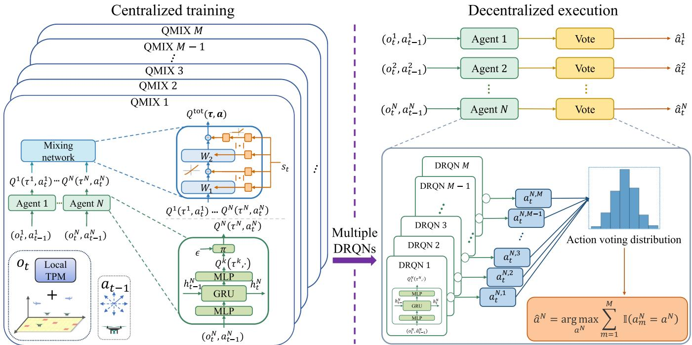  
Fig. 4. The training and execution procedure of E-QMIX. During execution, each ensemble member produces a greedy action based on its estimated action values at each time step, and the executed action is chosen as the one receiving the largest number of votes across the M members.

To promote ensemble independence, the network parameters for each member are independently initialized and updated, ensuring that the estimation error or bias in one network does not propagate to the others. Additionally, the centralized replay buffer is partitioned into M mutually exclusive segments, denoted as $\lbrace \mathcal { D } _ { m } \rbrace _ { m = 1 } ^ { M }$ , with each ensemble member trained exclusively on its designated segment. This experience stratification eliminates cross-network correlations in gradient updates, mitigating distributional shift and policy collapse, while fostering distinct exploration trajectories that promote diverse policy evolution across the ensemble.

Formally, for each network $m ,$ , the training objective is given by

$$
\nabla _ { \pmb { \theta } _ { m } } \mathcal { L } ( \pmb { \theta } _ { m } ) = \mathbb { E } _ { ( \tau , a , r , \tau ^ { \prime } ) \sim \mathcal { D } _ { m } } \left[ \nabla _ { \pmb { \theta } _ { m } } \left( y - Q _ { m } ^ { t o t } ( \tau , a ; \pmb { \theta } _ { m } ) \right) ^ { 2 } \right] ,\tag{37}
$$

where the target value y is computed by the target network. By combining independent parameter initialization, dedicated experience stratification, and individualized value decomposition, E-QMIX retains the benefits of centralized value decomposition while enhancing robustness through ensemble consensus.

In our target search scenario, two distinct UAV classes— FUAVs and MUAVs—collaborate to efficiently explore the search area. Since these UAV types differ significantly in observation and action spaces as well as in search and mobility capabilities, we deploy two separate instances of E-QMIX to control each class while facilitating inter-class cooperation. Each E-QMIX instance is trained independently using dedicated replay buffers, but they share a common reward function. This dual-instance design allows the two heterogeneous UAV classes to learn cooperative and complementary policies, ultimately enhancing overall search efficiency. The training procedure of E-QMIX for heterogeneous UAV swarm target search is presented in Algorithm 1.

```latex
Algorithm 2: Execution Phase of Ensemble QMIX for
Heterogeneous UAV Swarm Target Search
Input: Trained ensemble parameters $\{ \theta _ { m } , \psi _ { m } \} _ { m = 1 } ^ { M } ,$
agent classes $\mathcal { C } = \{ \mathrm { F U A V , M U A V } \}$ , agent
numbers $\{ N ^ { c } \} _ { c \in { \mathcal { C } } }$
1 for each agent class $c \in { \mathcal { C } }$ in parallel do
2 while not terminal do
3 for agent $k = 1 , . . . , N ^ { c }$ do
4 Observe $\tau _ { t } ^ { c , k }$
5 Compute the action mask in (25) and
discard all unsafe actions from the
candidate actions
6 for $m = 1 , \ldots , M$ in parallel do
7 Choose action $a _ { t } ^ { c , k }$ based on Q-function
using (38)
8 end
9 Get the majority-voted action $\hat { a } ^ { c , k }$
using (39)
10 end
11 All agents execute their majority-voted actions
12 end
13 end
```

2) Execution Phase: During decentralized execution, at each time step t, each UAV agent k observes the environment and inputs $\tau _ { t } ^ { k }$ into its M DRQNs, yielding a set of action-value estimates. Then, each network m selects its optimal action via greedy maximization, i.e.,

$$
a _ { m } ^ { k } = \operatorname * { a r g m a x } _ { a ^ { k } \in \mathcal { A } ^ { k } } Q _ { m } ^ { k } ( \tau _ { t } ^ { k } , a ^ { k } ) ,\tag{38}
$$

producing M candidate actions $\{ a _ { 1 } ^ { k } , \hdots , a _ { M } ^ { k } \}$ . These candidates are then aggregated by majority voting [49]:

$$
\hat { a } ^ { k } = \underset { a ^ { k } \in \mathcal { A } ^ { k } } { \operatorname { a r g m a x } } \sum _ { m = 1 } ^ { M } \mathbb { 1 } \Bigl ( a _ { m } ^ { k } = a ^ { k } \Bigr ) ,\tag{39}
$$

where $\hat { a } ^ { k }$ represents the final action and $\mathbb { 1 } ( \cdot )$ denotes the indicator function. By aggregating diverse individual predictions, the voting protocol suppresses sporadic decision errors. Suboptimal suggestions tend to offset one another, whereas the optimal action receives the majority of votes and is selected. The execution procedure of E-QMIX for heterogeneous UAV swarm target search is outlined in Algorithm 2.

## D. Theoretical Analysis of Ensemble QMIX

This subsection offers a proof that the proposed EQMIX increases the peragent probability of selecting the optimal action and therefore improves joint decision quality.

1) Notation and Setup: Let $a ^ { \star }$ denote the optimal action of an agent and $p ^ { \star } = \operatorname* { P r } \left( a _ { m } = a ^ { \star } \right)$ represent the probability that a single agent network selects the optimal action. The complementary probability that it selects a suboptimal action is therefore $q ^ { \star } = 1 - p ^ { \star }$ . Throughout this analysis we assume the M networks are independent and identically distributed (i.i.d.). Under this assumption, we denote the number of agent networks voting for the optimal action as $\begin{array} { r } { \Xi _ { M } = \sum _ { m = 1 } ^ { M } \mathbb { 1 } ( a _ { m } = a ^ { \star } ) } \end{array}$ ∼ $B ( M , p ^ { \star } )$ , with $B ( \cdot )$ representing the binomial distribution. The probability that the ensemble finally selects the optimal action is defined as $p _ { M } ^ { \star } = \operatorname* { P r } ( \hat { a } = a ^ { \star } )$ .

2) Majority Voting Amplifies Correctness: Since the exact probability $p _ { M } ^ { \star } { = } \mathrm { P r } ( \hat { a } = a ^ { \star } )$ is difficult to express in closed form, we introduce an analytically tractable strictmajority lower bound

$$
p _ { M , \ln } ^ { \star } = \mathrm { P r } \Bigl ( \Xi _ { M } > \frac { M } { 2 } \mathrm { o r } \bigl ( \Xi _ { M } = \frac { M } { 2 } \mathrm { a n d } \hat { a } = a ^ { \star } \bigr ) \Bigr ) ,\tag{40}
$$

where the first term corresponds to the classical strict-majority event, while the second term accounts for the tie-breaking scenario when M is even, resolved through a uniform random selection between two top-voted actions. A direct enumeration yields

$$
\begin{array} { l } { { \displaystyle p _ { M , \mathrm { l b } } ^ { \star } = \sum _ { h = \lceil \frac { M + 1 } { 2 } \rceil } ^ { M } \binom { M } { h } p ^ { \star h } q ^ { \star M - h } } } \\ { { \displaystyle ~ + \frac { 1 } { 2 } \cdot \mathbb { 1 } ( 2 | M ) \cdot \binom { M } { M / 2 } p ^ { \star M / 2 } q ^ { \star M / 2 } , } } \end{array}\tag{41}
$$

where $2 | M$ means that M is even $( \mathrm { i } . \mathbf { e } . , M \equiv 0$ (mod 2)).

Proposition 1 (Accuracy amplification under highestvote): For any $M \geq 3$ and $p ^ { \star } \in ( { \frac { 1 } { 2 } } , 1 ) , p _ { M } ^ { \star } \geq p _ { M , \mathrm { l b } } ^ { \star } > p ^ { \star }$

Proof. Step $I \colon p _ { M } ^ { \star } \geq p _ { M , \| \mathrm { b } } ^ { \star }$ . The event in (40) is a subset of $\{ \hat { a } = a ^ { \star } \}$ , thus $p _ { M } ^ { \star } \geq p _ { M , \mathrm { l b } } ^ { \star }$

Step $2 \colon p _ { M , \mathrm { l b } } ^ { \star } > p ^ { \star }$ for $M \geq 3$ and $p ^ { \star } \in ( \frac { 1 } { 2 } , 1 )$ (with equality at $p ^ { \star } = 1 )$ . We first consider odd $M ,$ and then extend to even $M$

(a) Odd $M \geq 3 .$ . Let $M = 2 \ell + 1$ with $\ell \geq 1$ . In this case, no tie can occur under majority voting, and hence

$$
p _ { M , \ln } ^ { \star } = \mathrm { P r } \Bigl ( \Xi _ { M } > \frac { M } { 2 } \Bigr ) = \mathrm { P r } ( \Xi _ { M } \geq \ell + 1 ) .\tag{42}
$$

Fix an arbitrary network m and define the number of correct votes among the remaining 2 networks as

$$
\chi \triangleq \sum _ { \stackrel { i = 1 } { i \neq m } } ^ { M } \mathbb { 1 } ( a _ { i } = a ^ { \star } ) \sim { \mathcal { B } } ( 2 \ell , p ^ { \star } ) .\tag{43}
$$

Conditioning on whether the fixed network m votes correctly yields

$$
\begin{array} { r l r } {  { p _ { M , \ln } ^ { \star } = \operatorname* { P r } ( a _ { m } = a ^ { \star } ) \operatorname* { P r } ( \chi \geq \ell ) + \operatorname* { P r } ( a _ { m } \neq a ^ { \star } ) \operatorname* { P r } ( \chi \geq \ell + 1 ) } } \\ & { } & \\ & { } & { = p ^ { \star } \operatorname* { P r } ( \chi \geq \ell ) + q ^ { \star } \operatorname* { P r } ( \chi \geq \ell + 1 ) . \qquad ( 4 4 ) } \end{array}
$$

Subtracting $p ^ { \star }$ from both sides of (44), using $\operatorname* { P r } ( \chi \geq \ell ) =$ $1 - \operatorname* { P r } ( \chi \leq \ell - 1 )$ , and then expanding the resulting tail probabilities under $\chi \sim B ( 2 \ell , p ^ { \star } )$ , we obtain

$$
\begin{array} { r l } & { \displaystyle p _ { M , \ln } ^ { \star } - p ^ { \star } = q ^ { \star } \operatorname* { P r } ( \chi \geq \ell + 1 ) - p ^ { \star } \operatorname* { P r } ( \chi \leq \ell - 1 ) } \\ & { \quad \quad \quad = q ^ { \star } \displaystyle \sum _ { \iota = \ell + 1 } ^ { 2 \ell } \binom { 2 \ell } { \iota } ( p ^ { \star } ) ^ { \iota } ( q ^ { \star } ) ^ { 2 \ell - \iota } } \\ & { \quad \quad \quad - p ^ { \star } \displaystyle \sum _ { \iota = 0 } ^ { \ell - 1 } \binom { 2 \ell } { \iota } ( p ^ { \star } ) ^ { \iota } ( q ^ { \star } ) ^ { 2 \ell - \iota } . } \end{array}\tag{45}
$$

We next apply a symmetric pairing argument. For each $v \in$ $\{ 1 , 2 , \ldots , \ell \}$ , consider the index pair $\iota _ { + } = \ell + v , \iota _ { - } = \ell - v .$ By the binomial symmetry $\binom { 2 \ell } { \ell + v } \doteq \binom { 2 \ell } { \ell - v }$ , the difference in (45) can be regrouped as

$$
\begin{array} { l } { { \displaystyle p _ { M , \mathrm { l b } } ^ { * } - p ^ { * } = \sum _ { v = 1 } ^ { \ell } \left( { { 2 \ell } \atop \ell + v } \right) \Big [ q ^ { * } ( p ^ { * } ) ^ { \ell + v } ( q ^ { * } ) ^ { \ell - v } } } \\ { ~ - p ^ { * } ( p ^ { * } ) ^ { \ell - v } ( q ^ { * } ) ^ { \ell + v } \Big ] }  \\ { { \displaystyle ~ = \sum _ { v = 1 } ^ { \ell } \left( { { 2 \ell } \atop \ell + v } \right) ( p ^ { \star } ) ^ { \ell - v + 1 } ( q ^ { \star } ) ^ { \ell - v + 1 } } } \\ { ~ \times \Big [ ( p ^ { \star } ) ^ { 2 v - 1 } - ( q ^ { \star } ) ^ { 2 v - 1 } \Big ] . } \end{array}\tag{46}
$$

For $p ^ { \star } \in ( \frac { 1 } { 2 } , 1 )$ , we have $p ^ { \star } > q ^ { \star }$ , which implies $( p ^ { \star } ) ^ { 2 v - 1 } >$ $( q ^ { \star } ) ^ { 2 v - 1 }$ for all $v \geq 1$ . Therefore, every summand in (46) is strictly positive, and thus

$$
p _ { M , \mathrm { l b } } ^ { \star } - p ^ { \star } > 0 ,\tag{47}
$$

for all odd $M \geq 3$ and $p ^ { \star } \in ( \frac { 1 } { 2 } , 1 )$ .

(b) Even $M \geq 4 .$ . Let $M = 2 \ell$ with $\ell \geq 2 .$ . Then, we have

$$
\Xi _ { 2 \ell } \sim \mathcal { B } ( 2 \ell , p ^ { \star } ) , \quad \ \Xi _ { 2 \ell - 1 } \sim \mathcal { B } ( 2 \ell - 1 , p ^ { \star } ) .\tag{48}
$$

Introduce the last-vote indicator

$$
\chi _ { 2 \ell } = \mathbb { 1 } ( a _ { 2 \ell } = a ^ { \star } ) \in \{ 0 , 1 \} ,\tag{49}
$$

with $\operatorname* { P r } ( \chi _ { 2 \ell } = 1 ) = p ^ { \star }$ and $\operatorname* { P r } ( \chi _ { 2 \ell } = 0 ) = q ^ { \star }$ , so that

$$
\Xi _ { 2 \ell } = \Xi _ { 2 \ell - 1 } + \chi _ { 2 \ell } ,\tag{50}
$$

with $\chi _ { 2 \ell }$ independent of $\Xi _ { 2 \ell - 1 }$ . By the definition of the lower bound in (40),

$$
p _ { 2 \ell , \mathrm { l b } } ^ { \star } = \mathrm { P r } ( \Xi _ { 2 \ell } > \ell ) + \frac { 1 } { 2 } \mathrm { P r } ( \Xi _ { 2 \ell } = \ell ) ,\tag{51}
$$

and

$$
\begin{array} { r } { p _ { 2 \ell - 1 , \mathrm { l b } } ^ { \star } = \mathrm { P r } ( \Xi _ { 2 \ell - 1 } \geq \ell ) . } \end{array}\tag{52}
$$

Conditioning on χ2<sub></sub> yields

$$
\begin{array} { r l } & { \displaystyle p _ { 2 \ell , \ln } ^ { \star } = \operatorname* { P r } ( \Xi _ { 2 \ell - 1 } + \chi _ { 2 \ell } > \ell ) + \frac { 1 } { 2 } \operatorname* { P r } ( \Xi _ { 2 \ell - 1 } + \chi _ { 2 \ell } = \ell ) } \\ & { \quad \quad \quad = p ^ { \star } \Big ( \operatorname* { P r } ( \Xi _ { 2 \ell - 1 } \geq \ell ) + \frac { 1 } { 2 } \operatorname* { P r } ( \Xi _ { 2 \ell - 1 } = \ell - 1 ) \Big ) } \\ & { \quad \quad \quad \quad + q ^ { \star } \Big ( \operatorname* { P r } ( \Xi _ { 2 \ell - 1 } \geq \ell + 1 ) + \frac { 1 } { 2 } \operatorname* { P r } ( \Xi _ { 2 \ell - 1 } = \ell ) \Big ) . } \end{array}\tag{53}
$$

Using $\operatorname* { P r } ( \Xi _ { 2 \ell - 1 } \geq \ell + 1 ) = \operatorname* { P r } ( \Xi _ { 2 \ell - 1 } \geq \ell ) - \operatorname* { P r } ( \Xi _ { 2 \ell - 1 } = \ell )$ we obtain

$$
\begin{array} { l } { { p _ { 2 \ell , \mathrm { l b } } ^ { \star } = \operatorname* { P r } ( \Xi _ { 2 \ell - 1 } \geq \ell ) } } \\ { { \displaystyle \qquad + \frac { 1 } { 2 } \Big ( p ^ { \star } \operatorname* { P r } ( \Xi _ { 2 \ell - 1 } = \ell - 1 ) - q ^ { \star } \operatorname* { P r } ( \Xi _ { 2 \ell - 1 } = \ell ) \Big ) . } } \end{array}\tag{54}
$$

Since $\Xi _ { 2 \ell - 1 } \sim \mathcal { B } ( 2 \ell - 1 , p ^ { \star } )$

$$
\mathrm { P r } ( \Xi _ { 2 \ell - 1 } = \ell - 1 ) = { \binom { 2 \ell - 1 } { \ell - 1 } } ( p ^ { \star } ) ^ { \ell - 1 } ( q ^ { \star } ) ^ { \ell } ,\tag{55}
$$

and

$$
\operatorname* { P r } ( \Xi _ { 2 \ell - 1 } = \ell ) = { \binom { 2 \ell - 1 } { \ell } } ( p ^ { \star } ) ^ { \ell } ( q ^ { \star } ) ^ { \ell - 1 } .\tag{56}
$$

Hence

$$
p ^ { \star } \operatorname* { P r } ( \Xi _ { 2 \ell - 1 } = \ell - 1 ) = { \binom { 2 \ell - 1 } { \ell - 1 } } ( p ^ { \star } ) ^ { \ell } ( q ^ { \star } ) ^ { \ell } ,\tag{57}
$$

and

$$
q ^ { \star } \operatorname* { P r } ( \Xi _ { 2 \ell - 1 } = \ell ) = { \binom { 2 \ell - 1 } { \ell } } ( p ^ { \star } ) ^ { \ell } ( q ^ { \star } ) ^ { \ell } .\tag{58}
$$

Using the symmetry $\binom { 2 \ell - 1 } { \ell - 1 } = \binom { 2 \ell - 1 } { \ell }$ , the correction term in (54) vanishes, yielding

$$
p _ { 2 \ell , \mathrm { l b } } ^ { \star } = \mathrm { P r } ( \Xi _ { 2 \ell - 1 } \geq \ell ) = p _ { 2 \ell - 1 , \mathrm { l b } } ^ { \star } .\tag{59}
$$

Combining the odd and even cases, for all $M \geq 3$ and $p ^ { \star } \in$ $\left( { \scriptstyle { \frac { 1 } { 2 } } , 1 } \right)$

$$
p _ { M } ^ { \star } \geq p _ { M , \mathrm { l b } } ^ { \star } > p ^ { \star } ,\tag{60}
$$

which completes the proof.

Remark 1: When each model’s $p ^ { \star } > 5 0 \%$ and $M \geq 3 ,$ , majority voting tends to suppress suboptimal decisions and deliver higher-quality joint decisions.

Remark 2: QMIX [45] is widely regarded as one of the most effective value-decomposition MARL algorithms, and we think an individual QMIX network is more likely to meet the assumption $p ^ { \star } > 5 0 \%$ . For this reason, we choose QMIX as the backbone of our ensemble to exploit the voting mechanism more effectively and further enhance the overall robustness and accuracy of the learned policy.

3) Computational Complexity Analysis: We analyze the computational overhead introduced by the ensemble mechanism in E-QMIX and contrast it with single-network QMIX under the CTDE paradigm. Each agent employs a DRQN-based agent network with parameters shared across agents, and centralized training further involves a mixing network. We use $\mathcal { C } _ { \mathrm { D R Q N } } ^ { \mathrm { f w } }$ and $\mathcal { C } _ { \mathrm { D R Q N } } ^ { \mathrm { b w } }$ to denote the per-agent, per-step forward and backward costs of the DRQN, respectively, and ${ \mathcal { C } } _ { \operatorname* { m i x } } ^ { \mathrm { f w } } , { \mathcal { C } } _ { \operatorname* { m i x } } ^ { \mathrm { b w } }$ to denote the corresponding per-step costs of the mixing network.

During centralized training, QMIX performs backpropagation through time over the DRQN for T steps and evaluates the mixing network at each step. For a single update with a minibatch of size B, the overall training cost of QMIX scales as

$$
\mathcal { C } _ { \mathrm { Q M I X } } ^ { \mathrm { t r a i n } } = \mathcal { O } \left( B T \left[ N \left( \mathcal { C } _ { \mathrm { D R Q N } } ^ { \mathrm { f w } } + \mathcal { C } _ { \mathrm { D R Q N } } ^ { \mathrm { b w } } \right) + \left( \mathcal { C } _ { \mathrm { m i x } } ^ { \mathrm { f w } } + \mathcal { C } _ { \mathrm { m i x } } ^ { \mathrm { b w } } \right) \right] \right) .\tag{61}
$$

E-QMIX trains M independent QMIX instances in parallel. Hence, the training cost increases approximately linearly with M:

$$
\mathcal { C } _ { \mathrm { E - Q M I X } } ^ { \mathrm { t r a i n } } = \mathcal { O } \left( M \cdot \mathcal { C } _ { \mathrm { Q M I X } } ^ { \mathrm { t r a i n } } \right) .\tag{62}
$$

In decentralized execution, the inference procedure uses only the DRQNs for action selection and does not involve the mixing network. For single-network QMIX, at each decision step, each UAV performs one DRQN forward pass, yielding

$$
\mathcal { C } _ { \mathrm { Q M I X } } ^ { \mathrm { i n f e r } } = \mathcal { O } \left( N \cdot \mathcal { C } _ { \mathrm { D R Q N } } ^ { \mathrm { f w } } \right) .\tag{63}
$$

For E-QMIX, each UAV evaluates M DRQNs in parallel per step and aggregates the M greedy actions via majority voting, leading to

$$
{ \mathcal { C } } _ { \mathrm { E - Q M I X } } ^ { \mathrm { i n f e r } } = { \mathcal { O } } \left( N \cdot M { \mathcal { C } } _ { \mathrm { D R Q N } } ^ { \mathrm { f w } } \right) .\tag{64}
$$

The voting itself is a counting operation over M selected actions, which incurs $\mathcal { O } ( M )$ complexity per agent per step and is typically dominated by the DRQN forward passes in practice. In terms of latency, the M DRQN forward passes can be executed in parallel, so the additional inference delay introduced by the ensemble can be limited in practice when sufficient parallel resources are available.

## VI. EXPERIMENTS AND RESULTS

In this section, we first introduce the simulation scenario for the UAV swarm target search task and the benchmark methods. Subsequently, we present the experimental results to validate the effectiveness of the proposed E-QMIX approach.

## A. Experiment Setting

To evaluate the performance of our EQMIX method in comparison with other benchmark approaches, we develop a 3D simulation platform for heterogeneous UAV swarm target search. We consider a square search area of 5000 m × 5000 m, which is discretized into $5 0 \times 5 0$ cells, with targets randomly distributed in this region. UAVs fly above these targets, executing detection and search tasks while avoiding designated no-fly zones. The vertical airspace is partitioned into 8 discrete altitude layers: FUAVs operate at altitudes of {300, 400, 500, 600} m, whereas MUAVs fly at lower altitudes of {50, 100, 150, 200} m. Correspondingly, the sensing radii at these respective flight altitudes (from lowest to highest) are defined as {250, 300, 350, 400} m for FUAVs and {50, 100, 150, 200} m for MUAVs. Moreover, the detection probabilities for FUAVs at the respective flight altitudes are configured as {0.79, 0.75, 0.71, 0.67}, whereas MUAVs, benefiting from lower flight altitudes, achieve higher detection probabilities of {0.95, 0.91, 0.87, 0.83}. Similarly, the false-alarm probabilities at each flight altitude are configured as {0.21, 0.25, 0.29, 0.33} for FUAVs and {0.05, 0.09, 0.13, 0.17} for MUAVs. The duration of each episode is limited to 3000 seconds, discretized into 300 planning steps.

TABLE I SIMULATION PARAMETERS
<table><tr><td>Parameters</td><td>Value</td></tr><tr><td>Number of targets  $\overline { { ( N ^ { \mathrm { T } } ) } }$ </td><td> $\overline { { \{ 5 , 1 0 , 1 5 , . . . , 3 5 \} } }$ </td></tr><tr><td>Number of no-fly zones  $( \dot { N } ^ { \mathrm { O } } )$ </td><td>10</td></tr><tr><td>Number of FUAVs  $( N ^ { \mathrm { F } } )$ </td><td> $\{ 3 , 4 , 5 , \dots , 8 \}$ </td></tr><tr><td>Number of MUAVs  $( N ^ { \mathrm { M } } )$ </td><td> $\{ 1 2 , 1 6 , 2 0 , \ldots , 3 2 \}$ </td></tr><tr><td>Number of FUAV neighbors</td><td> $^ 2$ </td></tr><tr><td>Number of MUAV neighbors</td><td>8</td></tr><tr><td>Probability threshold</td><td>0.99</td></tr><tr><td>for target detection (ξ)</td><td></td></tr><tr><td>Horizontal speed of FUAVs Climb/descend speed of FUAVs</td><td>30 m/s</td></tr><tr><td>FUAVs&#x27;maximum turning angle (β0)</td><td> $1 0 ~ \mathrm { m / s }$ </td></tr><tr><td></td><td> $4 5 ^ { \circ }$ </td></tr><tr><td>Horizontal speed of MUAVs</td><td>10 m/s</td></tr><tr><td>Climb/descend speed of MUAVs</td><td>5 m/s</td></tr><tr><td>Safe distance from FUAV neighbors  $( \rho _ { \mathrm { s a f e } } ^ { \mathrm { F } } )$ </td><td>100 m</td></tr><tr><td>Safe distance from MUAV neighbors  $( \rho _ { \mathrm { s a f e } } ^ { \mathrm { { M } } } )$ </td><td>100 m</td></tr><tr><td>Safe distance from no-fly zone  $( \rho _ { \mathrm { s a f e } } ^ { \mathrm { O } } )$ </td><td>200 m</td></tr></table>

TABLE II  
PARAMETERS OF E-QMIX
<table><tr><td>Neural Network Parameter</td><td>Value</td></tr><tr><td>Number of training episodes</td><td>12000</td></tr><tr><td>Number of testing episodes</td><td>1000</td></tr><tr><td>Maximal number of time</td><td>300</td></tr><tr><td>steps in each episode € annealing length</td><td>9600</td></tr><tr><td>GRU hidden state dimensionality</td><td>256</td></tr><tr><td>Adam [51] learning rate</td><td> $5 \times 1 0 ^ { - 4 }$ </td></tr><tr><td>Discount factor (γ)</td><td>0.99</td></tr><tr><td>Replay buffer size</td><td>4000 episodes</td></tr><tr><td>Batch size</td><td>64 episodes</td></tr><tr><td>Target network update frequency</td><td>Every 100 episodes</td></tr><tr><td>Agent network node activation</td><td>ReLU function</td></tr><tr><td>Mixing network node activation</td><td>ELU function</td></tr><tr><td>Hypernetwork node activation</td><td>ReLU function</td></tr></table>

Additionally, the no-fly zones are known a priori, and it is assumed that no targets are present within these areas. Thus, the target probabilities for cells in the no-fly zones are set to 0. More simulation parameters are provided in Table I, and the settings for EQMIX are presented in Table II.

## B. Comparisons

To validate the performance of the search approach based on E-QMIX, we compare it against QMIX [45], VDN [44], Multi-Agent PPO (MAPPO) [50], Multi-Agent DQN (MADQN), and random baseline methods. Additionally, to demonstrate that the voting policy in E-QMIX can enhance the performance of other MARL methods, we incorporate it into VDN and propose Ensemble VDN (E-VDN) for experimental evaluation. For a fair comparison, all parameters for E-VDN, except for the mixing network configuration, are identical to those used in E-QMIX.

1) QMIX: QMIX [45] has been proven to be an effective algorithm for solving multi-UAV target search problems [13]. In our experiments, the difference in QMIX settings compared to E-QMIX is that M is set to 1, which means that there is no voting decision-making mechanism during the evaluation process of QMIX. Aside from this, other settings of QMIX are identical to those used in E-QMIX.

2) VDN: VDN [44] is a cooperative MARL algorithm that decomposes the joint action-value function into the sum of individual agents’ value functions. During centralized training, the algorithm learns each agent’s individual Q-value function, assuming that the global Q-value can be expressed as a linear combination of these individual values. This simplification eases the credit assignment problem. VDN also enables decentralized execution, where each agent operates based solely on its local observations. However, the linearity assumption may limit the method’s ability to capture complex inter-agent interactions. In the context of our study, the primary distinction is that M is set to 1 in VDN, meaning there is no ensemble-based voting mechanism employed during the evaluation phase. Other parameters for VDN are consistent with those used in E-VDN for a fair comparison.

3) MAPPO: MAPPO [50] extends the single-agent PPO [52] framework to cooperative multi-agent settings by adopting the CTDE paradigm. Specifically, while each agent still executes a decentralized stochastic policy based only on its local observation, MAPPO improves PPO by introducing a centralized value function during training, which leverages global state information to estimate state values and compute advantage estimates. This centralized critic design reduces gradient variance and alleviates the partial observability challenge inherent in Dec-POMDPs, leading to more stable and effective policy learning. The policy is optimized using the PPO clipped surrogate objective with entropy regularization to ensure bounded and stable updates. In our experiments, MAPPO serves as a CTDE benchmark that does not rely on value decomposition. Compared with QMIX and VDN that learn a joint action-value function through a mixing structure, MAPPO directly optimizes the policy with a centralized critic, providing a complementary perspective for evaluating cooperative search performance.

4) MADQN: Evolved from the single-agent DQN [53], multi-agent DQN (MADQN) is a classic MARL approach that treats each UAV as an individual agent with its own policy. We adopt the Dueling Double Deep Q-Network (D3QN) [48], [54] to address the challenge of overestimation in MADQN. In our experiments, the observation and reward function for MADQN are identical to those used in E-QMIX. The difference is that MADQN adopts a decentralized training with decentralized execution (DTDE) structure, which lacks global state as input during the training phase. Moreover, MADQN adopts a purely feedforward architecture without incorporating RNN structures for modeling temporal dependencies.

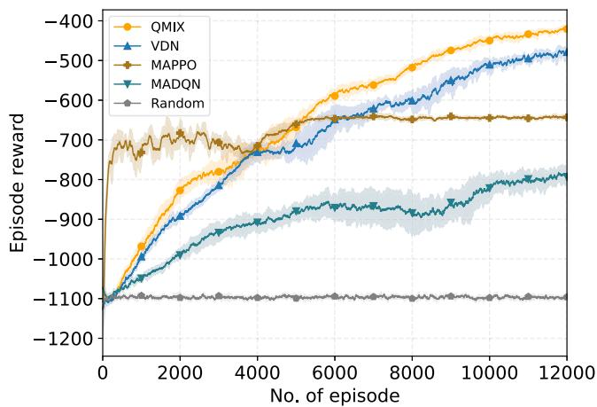  
Fig. 5. Training performance of QMIX, VDN, MAPPO and MADQN in the environment with 4 FUAVs, 16 MUAVs, 30 targets and 10 no-fly zones.

5) Random: In the random method, each UAV randomly selects its action at each time step.

It is worth noting that parameter sharing among agents is employed in E-QMIX, E-VDN, QMIX, VDN, and MAPPO to reduce computational resource consumption and improve training efficiency. Additionally, all the methods adopt the action masking scheme to avoid collisions.

## C. Training Results

We conduct training in a search area of 50 × 50 cells with 4 FUAVs, 16 MUAVs, 30 targets, and 10 no-fly zones. Fig. 5 illustrates the training performance of QMIX, VDN, MAPPO, and MADQN, with all these methods outperforming the random baseline. QMIX achieves the highest episode reward and most stable convergence, while VDN shows lower performance with higher variance compared to QMIX. Moreover, MAPPO improves rapidly in the early training stage and converges faster than the value-based MARL methods, but its converged episode reward remains lower than that of QMIX and VDN. MADQN exhibits much lower accumulated reward and the largest performance fluctuations.

The superior performance of QMIX, VDN and MAPPO over MADQN stems from their CTDE architecture. This framework enables agents to leverage global state information during training while maintaining decentralized decision-making during execution, effectively addressing the environment nonstationarity inherent in training MASs [45], [55]. QMIX further outperforms VDN by employing a hypernetwork to achieve non-linear monotonic value decomposition, which can handle complex credit assignment more effectively compared to VDN’s linear additive assumption. The mixing network in QMIX allows for sophisticated coordination patterns while preserving the monotonic relationship between individual and joint actionvalues, enabling more effective credit assignment among agents.

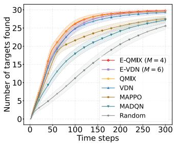  
(a)

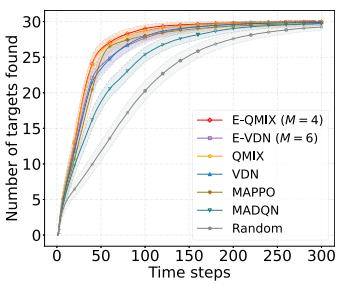  
(b)  
Fig. 6. Number of targets found over time steps, with a total of 30 targets in the search area. (a) 4 FUAVs and 16 MUAVs. (b) 8 FUAVs and 32 MUAVs.

MAPPO tends to converge faster in our experiments, which is partly due to its stochastic policy exploration without an explicit -greedy annealing schedule. However, its converged reward is lower than QMIX and VDN, likely because the value decomposition in QMIX and VDN can better capture joint-action coordination and credit assignment in large-scale cooperative search.

The performance gap between CTDE methods (QMIX, VDN and MAPPO) and DTDE approach (MADQN) highlights the importance of centralized training components. MADQN’s decentralized training process suffers from the moving target problem caused by simultaneously learning agents, resulting in higher variance and slower convergence. This challenge is mitigated in QMIX and VDN through centralized value function estimation that maintains consistency between local and global perspectives.

In addition, QMIX and VDN utilize DRQN with Gated Recurrent Unit (GRU) [47] layers to handle partial observability, which proves more effective than standard DQN architectures for sequential decision-making in partially observable environments. The recurrent architecture enables agents to maintain internal state representations that capture temporal dependencies in the observation history, crucial for effective target search strategies.

## D. Testing Results

Following the training phase, E-QMIX aggregates multiple independently trained QMIX models through a majorityvoting scheme to enhance decision robustness. To evaluate performance, we compare EQMIX and EVDN against QMIX, VDN, MAPPO, MADQN, and random baseline in the test environment.

Fig. 6 illustrates the evolution of the number of targets correctly found over time under different algorithms. In particular, Fig. 6(a) corresponds to the target search scenario with 4 FUAVs and 16 MUAVs, while Fig. 6(b) pertains to the scenario with 8 FUAVs and 32 MUAVs. Across all methods, the number of correctly identified targets increases monotonically as the mission proceeds, with E-QMIX achieving the highest search efficiency. Moreover, E-QMIX and E-VDN outperform their single-network counterparts, QMIX and VDN, respectively, which corroborates the effectiveness of the ensemble voting mechanism in improving cooperative search performance. MAPPO consistently outperforms MADQN and the random baseline, but remains inferior to the value-decomposition-based methods, indicating that explicitly learning a joint action-value function via value decomposition is more effective for coordinated search in our scenario. In contrast, the search efficiency of MADQN is inferior to that of the value-decomposition-based MARL methods, which can be attributed to the disadvantages of decentralized training, the lack of proper credit assignment, and the absence of an RNN structure to handle partial observability. Furthermore, experiments across different scales of UAV swarms demonstrate the scalability of our approach. Even when the number of UAVs varies, the same model maintains its search ability.

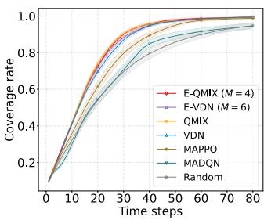  
(a)

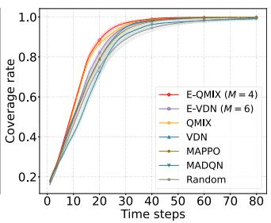  
(b)  
Fig. 7. Coverage rate over time steps. (a) 4 FUAVs and 16 MUAVs. (b) 8 FUAVs and 32 MUAVs.

Fig. 7 presents the evolution of the coverage rate over time under different algorithms, where the coverage rate is defined as the ratio of the explored area to the total area. Fig. 7(a) shows the result for a configuration of 4 FUAVs and 16 MUAVs, while Fig. 7(b) corresponds to a larger swarm comprising 8 FUAVs and 32 MUAVs. As the search progresses, the coverage rate increases steadily across all methods, with E-QMIX achieving the highest coverage efficiency. Additionally, E-QMIX and E-VDN consistently outperform their respective single-network backbones, which further corroborates the effectiveness of the ensemble voting mechanism in the proposed Ensemble MARL framework. These results demonstrate that our proposed target search algorithm can rapidly cover the search area, which facilitates the swift acquisition of preliminary search information at the outset, thereby enhancing the overall search efficiency. Additionally, valuedecomposition MARL methods cover the area much faster than MAPPO and MADQN, demonstrating that centralized training with effective credit assignment can reduce redundant searches within the UAV swarm.

Fig. 8 illustrates the global TPM at different time steps using the EQMIX method. Specifically, Fig. 8(a), (b), (c), and (d) correspond to the target probability distributions at $t = 1 , t = 2 0$ $t = 5 0$ , and t = 90, respectively. In the figures, the cell colors transition from blue to red, where a deeper red indicates a higher probability of a target being present, and a deeper blue indicates a lower probability. As the search progresses, the area explored by the UAVs increases, the uncertainty in the global TPM gradually diminishes, and the target localization becomes more accurate.

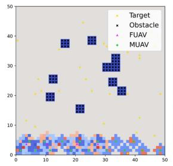

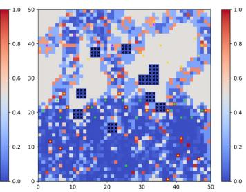  
(b)

(a)  
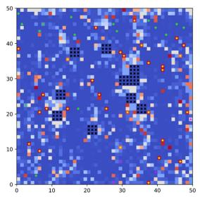  
(c)

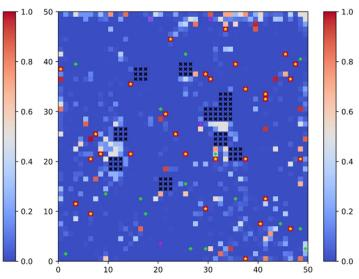  
(d)  
Fig. 8. Global TPM at different time steps using E-QMIX method. (a) t = 1. (b) t = 20. (c) t = 50. (d) t = 90.

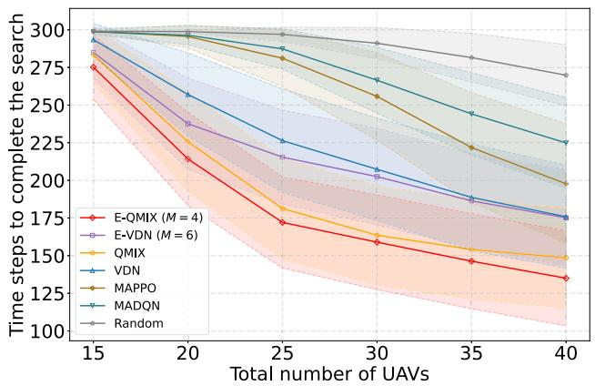  
Fig. 9. Time to complete the target search versus the total number of UAVs. The FUAV-to-MUAV ratio is fixed at 1 : 4, with a total of 30 targets in the search area.

These results demonstrate the effectiveness of EQMIX in terms of efficient information acquisition, uncertainty reduction, and overall search performance.

Our proposed E-QMIX exhibits good scalability, enabling the same MARL models to control UAV swarms of varying sizes while maintaining high search efficiency. Fig. 9 illustrates the relationship between search time and the total number of UAVs, where the ratio of FUAVs to MUAVs is fixed at 1:4. Each episode is capped at 300 time steps, terminating once all targets have been found. As the number of UAVs increases, the search time gradually decreases because a larger swarm can accelerate exploration by concurrently covering a wider area. Moreover, the voting decision-making mechanism introduced in the Ensemble MARL framework increases the likelihood of the UAVs making optimal decisions. Consequently, EQMIX consistently completes target searches in the shortest time across heterogeneous UAV swarms with various sizes, demonstrating its cooperative search ability and scalability.

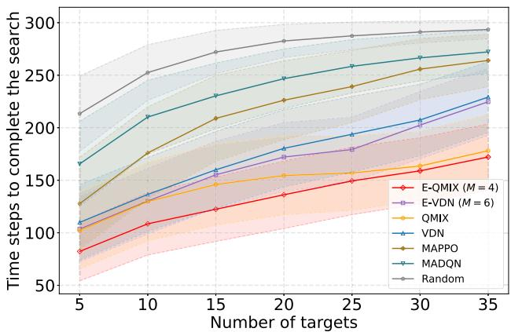  
Fig. 10. Time to complete the target search versus the number of targets. The numbers of FUAVs and MUAVs are 6 and 24, respectively.

TABLE III  
COMPARISON OF TESTING EPISODE REWARD OF E-QMIX AND E-VDN WITH DIFFERENT M VALUES
<table><tr><td rowspan="2">Algorithm</td><td rowspan="2">M</td><td colspan="4">Total number of UAVs</td></tr><tr><td>15</td><td>20</td><td>25</td><td>30</td></tr><tr><td rowspan="4">E-QMIX</td><td>6</td><td>-565.6</td><td>-399.0</td><td>-328.9</td><td>-287.1</td></tr><tr><td>5</td><td>-571.1</td><td>-400.9</td><td>-322.0</td><td>-278.3</td></tr><tr><td>4</td><td>-579.6</td><td>-402.1</td><td>-319.8</td><td>-275.4</td></tr><tr><td>3</td><td>-592.3</td><td>-404.7</td><td>-324.6</td><td>-274.9</td></tr><tr><td>QMIX</td><td>1</td><td>-599.9</td><td>-409.7</td><td>-329.1</td><td>-288.5</td></tr><tr><td rowspan="4">E-VDN</td><td>6</td><td>-629.8</td><td>-448.7</td><td>-386.4</td><td>-342.7</td></tr><tr><td>5</td><td>-642.2</td><td>-461.1</td><td>-388.2</td><td>-348.0</td></tr><tr><td>4</td><td>-658.7</td><td>-461.7</td><td>-389.3</td><td>-344.6</td></tr><tr><td>3</td><td>-681.2</td><td>-473.0</td><td>-393.0</td><td>-350.3</td></tr><tr><td>VDN</td><td>1</td><td>-700.9</td><td>-478.5</td><td>-387.5</td><td>-346.2</td></tr></table>

Additionally, our EQMIX exhibits robust performance, enabling a set of identical MARL models to effectively handle scenarios with varying numbers of targets. Fig. 10 illustrates the trend of search time as the number of targets in the area increases. As the target count rises, the search task becomes more complex, and the time required to detect and confirm each target correspondingly increases, resulting in a gradual increase in search time across all methods. Compared to other MARL benchmarks, EQMIX consistently maintains the lowest search time across different numbers of targets, demonstrating its adaptability and confirming that E-QMIX can use the same MARL models to effectively cope with the challenges posed by varying target densities.

To investigate the impact of the number of networks M on the performance of Ensemble MARL, we report the episode reward of both EQMIX and EVDN for different values of M, as shown in Table III. For E-VDN, its advantages become more evident as the number of networks M increases, and it outperforms VDN in various sizes of UAV swarm when M reaches a sufficiently large value. However, when M is small, E-VDN’s performance may slightly underperform compared to VDN. The reason we speculate is that, due to the lack of the mixing network, VDN struggles to accurately learn the non-linear credit assignment, which could lead to a lower probability of selecting the optimal action and higher decision variance. With a limited number of networks, the voting mechanism is less effective in reducing this variance. Nevertheless, our EQMIX consistently outperforms the singlenetwork QMIX benchmark, demonstrating the effectiveness of majority voting. In the test phase, the episode reward of EQMIX initially increases and then declines as M grows, indicating the presence of an optimal ensemble beyond which additional networks provide diminishing returns. This phenomenon can be explained by the details of the ensemble decision-making process. During execution, candidate actions are generated by each network, and the final action is determined through majority voting, which does not necessarily coincide with the predicted action of each individual network. Specifically, the DRQNs in E-QMIX that predict actions incorporate GRU layers, with the hidden state $h _ { t } ^ { k }$ updated based on the current observation $o _ { t } ^ { k }$ , previous hidden state $h _ { t - 1 } ^ { k }$ , and the input action $a _ { t - 1 } ^ { k }$ . To maintain trajectoryconsistent estimation in E-QMIX, we feed the ensemble action $\hat { a } _ { t - 1 } ^ { k }$ obtained from majority voting into the DRQN in place of the individual action $a _ { t - 1 } ^ { k }$ produced by each DRQN at the previous time step. This substitution can introduce hiddenstate inconsistencies that erode the GRU’s ability to model temporal dependencies. Particularly when M becomes very large, such mismatches occur more frequently and accumulate over time, ultimately degrading the overall decision performance.

## VII. LIMITATIONS AND FUTURE WORK

Although our approach demonstrates promising performance, it has several limitations. First, the simulation uses a simplified, discretized 3D model that does not fully capture the complexity of real-world dynamics. Besides, while the Ensemble MARL framework improves decision robustness, it increases computational overhead. Additionally, our E-QMIX does not fully address the potential mismatch introduced by the RNN’s hidden state updates when the ensemble’s voted action differs from individual network outputs. This hidden state inconsistency may weaken the network’s ability to capture temporal dependencies. In future work, we plan to extend the model to continuous settings, explore more efficient ensemble training methods with lower computational overhead, and validate our approach in real-world scenarios. We also aim to investigate more advanced ensemble mechanisms beyond majority voting, such as uncertainty-aware aggregation and diversity-enhancing training strategies, to further improve robustness in partially observable and dynamic environments.

## VIII. CONCLUSION

In this paper, we present a heterogeneous UAV swarm target search scenario in 3D space, which leverages the complementary strengths of FUAVs and MUAVs to achieve rapid area coverage and high-precision detection. To maximize the overall search efficiency, we model the target search task as an MARL problem. Moreover, an action masking mechanism is integrated into MARL to prevent collisions and ensure adherence to nofly zone restrictions during search. To further improve decision robustness and search efficiency, we propose an Ensemble MARL framework that aggregates multiple independently trained networks via a majority voting mechanism, and propose the E-QMIX algorithm. Furthermore, we provide a mathematical analysis showing that E-QMIX increases the peragent probability of selecting optimal actions, thereby enhancing the robustness of joint decision-making. The experiment results demonstrate that our E-QMIX method outperforms conventional MARL benchmarks, in terms of search efficiency and coverage rate. Future work will focus on extending the model to continuous domains, reducing computational overhead, and exploring uncertainty-aware and diversity-enhancing ensemble strategies for improved robustness.

## REFERENCES

[1] C. Wu et al., “UAV autonomous target search based on deep reinforcement learning in complex disaster scene,” IEEE Access, vol. 7, pp. 117227– 117245, 2019.

[2] L. Lin and M. A. Goodrich, “UAV intelligent path planning for wilderness search and rescue,” in Proc. IEEE/RSJ Int. Conf. Intell. Robots Syst., Oct. 2009, pp. 709–714.

[3] M. A. Goodrich et al., “Supporting wilderness search and rescue using a camera-equipped mini UAV,” J. Field Robot., vol. 25, no. 1-2, pp. 89–110, Jan. 2008.

[4] D. W. Casbeer, D. B. Kingston, R. W. Beard, and T. W. McLain, “Cooperative forest fire surveillance using a team of small unmanned air vehicles,” Int. J. Syst, sci., vol. 37, no. 6, pp. 351–360, Feb. 2006.

[5] M. Popovi´c, T. Vidal-Calleja, G. Hitz, I. Sa, R. Siegwart, and J. Nieto, “Multiresolution mapping and informative path planning for UAV-based terrain monitoring,” in Proc. IEEE/RSJ Int. Conf. Intell. Robots Syst., Sep. 2017, pp. 1382–1388.

[6] I. Colomina and P. Molina, “Unmanned aerial systems for photogrammetry and remote sensing: A review,” ISPRS J. Photogramm. Remote Sens., vol. 92, pp. 79–97, Jun. 2014.

[7] U. Zengin and A. Dogan, “Real-time target tracking for autonomous UAVs in adversarial environments: A gradient search algorithm,” IEEE Trans. Robot., vol. 23, no. 2, pp. 294–307, Apr. 2007.

[8] A. N. Chaves, P. S. Cugnasca, and J. Jose, “Adaptive search control applied to search and rescue operations using unmanned aerial vehicles (UAVs),” IEEE Latin Amer. Trans., vol. 12, no. 7, pp. 1278–1283, 2014.

[9] W. Yue, Y. Xi, and X. Guan, “A new searching approach using improved multi-ant colony scheme for multi-UAVs in unknown environments,” IEEE Access, vol. 7, pp. 161094–161102, 2019.

[10] Y. Jin, Y. Liao, A. A. Minai, and M. M. Polycarpou, “Balancing search and target response in cooperative unmanned aerial vehicle (UAV) teams,” IEEE Trans. Syst. Man Cybern. B Cybern., vol. 36, no. 3, pp. 571–587, Jun. 2006.

[11] S. K. Gan and S. Sukkarieh, “Multi-UAV target search using explicit decentralized gradient-based negotiation,” in Proc. IEEE Int. Conf. Robot. Autom., May 2011, pp. 751–756.

[12] T. Furukawa, F. Bourgault, B. Lavis, and H. F. Durrant-Whyte, “Recursive Bayesian search-and-tracking using coordinated UAVs for lost targets,” in Proc. IEEE Int. Conf. Robot. Autom., May 2006, pp. 2521–2526.

[13] G. Shen, L. Lei, X. Zhang, Z. Li, S. Cai, and L. Zhang, “Multi-UAV cooperative search based on reinforcement learning with a digital twin driven training framework,” IEEE Trans. Veh. Technol., vol. 72, no. 7, pp. 8354–8368, Jul. 2023.

[14] Y. Hou, J. Zhao, R. Zhang, X. Cheng, and L. Yang, “UAV swarm cooperative target search: A multi-agent reinforcement learning approach,” IEEE Trans. Intell. Veh., vol. 9, no. 1, pp. 568–578, Jan. 2024.

[15] A. A. Meera, M. Popovi´c, A. Millane, and R. Siegwart, “Obstacle-aware adaptive informative path planning for UAV-based target search,” in Proc. IEEE Int. Conf. Robot. Autom., May 2019, pp. 718–724.

[16] Y. Liu, X. Li, J. Wang, F. Wei, and J. Yang, “Reinforcement-learningbased multi-UAV cooperative search for moving targets in 3D scenarios,” Drones, vol. 8, no. 8, Aug. 2024, Art. no. 378.

[17] R. Bellman, “Dynamic programming,” Science, vol. 153, no. 3731, pp. 34–37, Jul. 1966.

[18] I. Goodfellow, Y. Bengio, and A. Courville, Deep Learning. Cambridge, MA, USA: MIT Press, 2016.

[19] S. Perez-Carabaza, E. Besada-Portas, J. A. Lopez-Orozco, and J. M. de la Cruz, “Ant colony optimization for multi-UAV minimum time search in uncertain domains,” Appl. Soft. Comput., vol. 62, pp. 789–806, Dec. 2018.

[20] Z. Zhen, Y. Chen, L. Wen, and B. Han, “An intelligent cooperative mission planning scheme of UAV swarm in uncertain dynamic environment,” Aerosp. Sci. Technol., vol. 100, Mar. 2020, Art. no. 105826.

[21] M. D. Phung and Q. P. Ha, “Motion-encoded particle swarm optimization for moving target search using UAVs,” Appl. Soft. Comput., vol. 97, Dec. 2020, Art. no. 106705.

[22] H. Duan, J. Zhao, Y. Deng, Y. Shi, and X. Ding, “Dynamic discrete pigeoninspired optimization for multi-UAV cooperative search-attack mission planning,” IEEE Trans. Aerosp. Electron. Syst., vol. 57, no. 1, pp. 706–720, Feb. 2021.

[23] R. S. Sutton and A. G. Barto, Reinforcement Learning: An Introduction. Cambridge, MA, USA: MIT Press, 2018.

[24] D. Silver et al., “Mastering the game of go without human knowledge,” Nature, vol. 550, no. 7676, pp. 354–359, Oct. 2017.

[25] P. R. Wurman et al., “Outracing champion gran turismo drivers with deep reinforcement learning,” Nature, vol. 602, no. 7896, pp. 223–228, Feb. 2022.

[26] E. Kaufmann, L. Bauersfeld, A. Loquercio, M. Müller, V. Koltun, and D. Scaramuzza, “Champion-level drone racing using deep reinforcement learning,” Nature, vol. 620, no. 7976, pp. 982–987, Aug. 2023.

[27] X. L. Wei, X. L. Huang, T. Lu, and G. G. Song, “An improved method based on deep reinforcement learning for target searching,” in Proc. Int. Conf. Robot. Autom. Eng., Nov. 2019, pp. 130–134.

[28] M. Shurrab, R. Mizouni, S. Singh, and H. Otrok, “Reinforcement learning framework for UAV-based target localization applications,” Interne Things, vol. 23, Jul. 2023, Art. no. 100867.

[29] Y. Ajmera and S. P. Singh, “Autonomous UAV-based target search, tracking and following using reinforcement learning and YOLOFlow,” in Proc. IEEE Int. Symp. Saf., Secur., Rescue Robot., Nov. 2020, pp. 15–20.

[30] Q. Luo, T. H. Luan, W. Shi, and P. Fan, “Deep reinforcement learning based computation offloading and trajectory planning for multi-UAV cooperative target search,” IEEE J. Sel. Areas Commun., vol. 41, no. 2, pp. 504–520, Feb. 2023.

[31] T. Wang, R. Qin, Y. Chen, H. Snoussi, and C. Choi, “A reinforcement learning approach for UAV target searching and tracking,” Multimed. Tools Appl., vol. 78, pp. 4347–4364, Feb. 2019.

[32] M. Gao and X. Zhang, “Cooperative search method for multiple UAVs based on deep reinforcement learning,” Sensors, vol. 22, no. 18, Sep. 2022, Art. no. 6737.

[33] J. Xiao, P. Pisutsin, and M. Feroskhan, “Collaborative target search with a visual drone swarm: An adaptive curriculum embedded multistage reinforcement learning approach,” IEEE Trans. Neural Netw. Learn. Syst., vol. 36, no. 1, pp. 313–327, Jan. 2025.

[34] W. Lee, “Federated reinforcement learning-based UAV swarm system for aerial remote sensing,” Wireless Commun. Mobile Comput., vol. 2022, no. 1, Apr. 2022, Art. no. 4327380.

[35] S. Gronauer and K. Diepold, “Multi-agent deep reinforcement learning: A survey,” Artif. Intell. Rev., vol. 55, no. 2, pp. 895–943, Apr. 2022.

[36] P. Lanillos, S. K. Gan, E. Besada-Portas, G. Pajares, and S. Sukkarieh, “Multi-UAV target search using decentralized gradient-based negotiation with expected observation,” Inf. Sci., vol. 282, pp. 92–110, Oct. 2014.

[37] L. F. Bertuccelli and J. P. How, “Search for dynamic targets with uncertain probability maps,” in Proc. Amer. Control Conf., Jun. 2006, pp. 737–742.

[38] T. H. Chung and J. W. Burdick, “Analysis of search decision making using probabilistic search strategies,” IEEE Trans. Robot., vol. 28, no. 1, pp. 132–144, Feb. 2012.

[39] F. A. Oliehoek et al., “The Decentralized POMDP Framework,” in A Concise Introduction to Decentralized POMDPs. Berlin, Germany: Springer, 2016, vol. 1, pp. 11–32.

[40] K. Zhang, Z. Yang, and T. Ba¸sar, “Multi-agent reinforcement learning: A selective overview of theories and algorithms,” in Handbook Reinforcement Learn. Control, pp. 321–384, Jun. 2021.

[41] J. Foerster et al., “Stabilising experience replay for deep multi-agent reinforcement learning,” in Proc. Int. Conf. Mach. Learn., 2017, pp. 1146–1155.

[42] L. Liang, H. Ye, and G. Y. Li, “Spectrum sharing in vehicular networks based on multi-agent reinforcement learning,” IEEE J. Sel. Areas Commun., vol. 37, no. 10, pp. 2282–2292, Oct. 2019.

[43] X. Zhang et al., “A scalable mean-field MARL framework for multiobjective V2X resource allocation,” IEEE Trans. Intell. Veh., vol. 10, no. 2, pp. 1071–1086, Feb. 2025.

[44] P. Sunehag et al., “Value-decomposition networks for cooperative multiagent learning based on team reward,” in Proc. Int. Joint Conf. Auton. Agents Multiagent Syst., Jul. 2018, pp. 2085–2087.

[45] T. Rashid, M. Samvelyan, C. S. De Witt, G. Farquhar, J. Foerster, and S. Whiteson, “Monotonic value function factorisation for deep multi-agent reinforcement learning,” J. Mach. Learn. Res., vol. 21, no. 178, pp. 1–51, Aug. 2020.

[46] M. J. Hausknecht and P. Stone, “Deep recurrent Q-learning for partially observable MDPs,” in Proc. AAAI Fall Symp., Nov. 2015, pp. 29–37.

[47] J. Chung, C. Gulcehre, K. Cho, and Y. Bengio, “Empirical evaluation of gated recurrent neural networks on sequence modeling,” 2014, arXiv:1412.3555.

[48] H. Van Hasselt, A. Guez, and D. Silver, “Deep reinforcement learning with double q-learning,” in Proc. AAAI Conf. Artif. Intell., Feb. 2016, pp. 2094–2100.

[49] I. Osband, C. Blundell, A. B. Pritzel, and B. Van Roy, “Deep exploration via bootstrapped DQN,” in Proc. Adv. Neural Inf. Process. Syst., Dec. 2016, pp. 4033–4041.

[50] C. Yu et al., “The surprising effectiveness of PPO in cooperative multiagent games,” in Proc. Adv. Neural Inf. Process. Syst., Nov. 2022, pp. 24611–24624.

[51] D. P. Kingma, “Adam: A method for stochastic optimization,” in Proc. Int. Conf. Learn. Representations, 2015, pp. 1–15.

[52] J. Schulman, F. Wolski, P. Dhariwal, A. Radford, and O. Klimov, “Proximal policy optimization algorithms,” 2017, arXiv:1707.06347.

[53] V. Mnih et al., “Human-level control through deep reinforcement learning,” Nature, vol. 518, no. 7540, pp. 529–533, Feb. 2015.

[54] Z. Wang, T. Schaul, M. Hessel, H. Hasselt, M. Lanctot, and N. Freitas, “Dueling network architectures for deep reinforcement learning,” in Proc. Int. Conf. Mach. Learn., Jun. 2016, pp. 1995–2003.

[55] R. Lowe, Y. Wu, A. Tamar, J. Harb, O. Pieter Abbeel, and I. Mordatch, “Multi-agent actor-critic for mixed cooperative-competitive environments,” in Proc. Adv. Neural Inf. Process. Syst., Dec. 2017, pp. 6382– 6393.

Xuan Zhang received the BS degree in electronic information science and technology from Sun Yat-sen University, in 2023. He is currently working toward the MS degree in data science and information technology with the Smart Sensing and Robotics (SSR) group, Tsinghua University. His research interests include on deep reinforcement learning, multi-agent systems, Internet of Things, and unmanned aerial vehicles.


Changxu Wei received the BS degree in automation engineering from Southeast University, in 2023. He is currently working toward the MS degree in data science and information technology with the Smart Sensing and Robotics (SSR) group, Tsinghua University. His research interests focus on reinforcement learning and robotic control.


Ziyuan Wang (Graduate Student Member, IEEE) received the BS degree in electronic engineering from Xidian University, Xi’an, China, in 2021, and the ME in electronic and communication engineering with the department of electronic engineering, Tsinghua University, Beijing, China, in 2024. He is currently working toward the PhD degree with Tsinghua Shenzhen International Graduate School, Tsinghua University, Shenzhen, China. His current research interests include multi-agent reinforcement learning, integrated sensing and communication of UAVs, low-altitude

economy and smart city, and applications of machine learning in Internet of Things.


Yixian Zhang received the BS degree in information and computing science from Southeast University, in 2024. He is currently working toward the MS degree in data science and information technology with the Smart Sensing and Robotics (SSR) group, Tsinghua University. His research interests focus on reinforcement learning and optimization algorithms.

Wenbo Ding (Member, IEEE) received the BS and PhD degrees (Hons.) from Tsinghua University, in 2011 and 2016, respectively. He was a postdoctoral research fellow with Georgia Tech under the supervision of Professor Z. L. Wang from 2016 to 2019. He is currently an associate professor and PhD supervisor with Tsinghua Shenzhen International Graduate School, Tsinghua University, where he leads the Smart Sensing and Robotics (SSR) group. His research interests include mechanosensing, tactile sensing and robotics with the help of signal processing and machine learning. He was the recipient of the many prestigious awards, including Gold Medal of the 47th International Exhibition of Inventions Geneva and IEEE Scott Helt Memorial Award.


Xiao-Ping Zhang (Fellow, IEEE) received the BS and PhD degrees in electronic engineering from Tsinghua University, in 1992 and 1996, respectively, and the MBA in finance, economics and entrepreneurship with Honors from the University of Chicago Booth School of Business, Chicago, IL, USA. He is currently Penrui Chair professor with Tsinghua Shenzhen International Graduate School (SIGS), Tsinghua University. He was the founding Dean of Institute of Data and Information (iDI) with Tsinghua SIGS and Chair Professor with Tsinghua-Berkeley Shenzhen

Institute (TBSI). He had been with the Department of Electrical, Computer and Biomedical Engineering, Toronto Metropolitan University (Formerly Ryerson University), Toronto, ON, Canada, as a professor and the director of the Communication and Signal Processing Applications Laboratory (CASPAL), and was the program director of Graduate Studies. His research interests include sensor networks and IoT, machine learning/AI/robotics, image and multimedia content analysis, statistical signal processing, and applications in Big Data, finance, and marketing. He is a fellow of the Canadian Academy of Engineering, fellow of the Engineering Institute of Canada, fellow of the IEEE, a registered professional engineer in Ontario, Canada, and a member of Beta Gamma Sigma Honor Society. He is also the general Co-Chair for the IEEE International Conference on Acoustics, Speech, and Signal Processing, 2021. He is the general co-chair for 2017 GlobalSIP Symposium on Signal and Information Processing for Finance and Business, and the general co-chair for 2019 GlobalSIP Symposium on Signal, Information Processing and AI for Finance and Business. He was an elected Member of the ICME steering committee. He is the general chair for ICME2024 and BioCAS2023. He is a senior editor for IEEE Signal Processing Magazine. He was an Editor-in-Chief for the IEEE Journal of Selected Topics in Signal Processing. He was senior area editor for IEEE Transactions on Image Processing and IEEE Transactions on Signal Processing. He was an associate editor for IEEE Transactions on Image Processing, IEEE Transactions on Multimedia, IEEE Transactions on Circuits and Systems for Video Technology, IEEE Transactions on Signal Processing, and IEEE Signal Processing Letters. He was selected as IEEE Distinguished Lecturer by the IEEE Signal Processing Society and by the IEEE Circuits and Systems Society. He is the Vice President of IEEE Signal Processing Society.