# An Incentive Assignment Scheme of UAV Clients for Federated Intelligent Inspection Based on Communication-Sensing-Computing Integration

Haitao Zhao , Senior Member, IEEE, Mengqi Sui , Miao Liu , Chun Zhu , and Hongbo Zhu , Member, IEEE

Abstract—The convergence of communication, sensing, and computing capabilities is a key trend in future 6th generation mobile (6G) networks. Integrating uncrewed aerial vehicles (UAVs) with federated learning can further enhance network performance in these areas while reducing resource overhead and protecting data privacy. However, due to limited spectrum resources and data heterogeneity, lack of client scheduling not only increases bandwidth pressure but also degrades training performance. Moreover, incentive allocation in federated learning directly influences whether UAVs accept client selection and participate in collaborative learning tasks. In order to solve the above problems, this paper designs an incentive assignment scheme for UAV clients in federated intelligent inspection based on communication-sensing-computing integration. This scheme comprehensively considers two dimensional metrics, client data quality and contribution value, for UAV incentive allocation and selection, hence abbreviated as the Multi Dimensional Scheme (MDS). MDS accounts for the communication, sensing, and computational energy consumption of UAVs, establishing a federated learning candidate pool through contract theory. Subsequently, UAVs that contribute more to model training are selected from the candidate pool via Bayesian optimization. Experiments conducted on multiple datasets show that, compared to existing methods, MDS effectively improves the accuracy of model training while reducing incentive costs.

Index Terms—Intelligent inspection, UAV-assisted federated learning, incentive scheme, client selection, contract theory, communication-sensing-computing integration, Bayesian optimization.

## I. INTRODUCTION

Received 8 May 2025; revised 30 November 2025; accepted 31 December 2025. Date of publication 12 January 2026; date of current version 7 May 2026. This work was supported in part by the National Natural Science Foundation of China under Grant U24B20187, in part by the Natural Science Foundation on Frontier Leading Technology Basic Research Project of Jiangsu under Grant BK20212001, in part by the National Natural Science Foundation of China under Grant 62371250, and in part by Major Science and Technology Project of Jiangsu Province under Grant BG2024002. Recommended for acceptance by Y. Shu.(Corresponding author: Miao Liu.)

Haitao Zhao is with the School of Internet of Things, Nanjing University of Posts and Telecommunications, Nanjing 210003, China (e-mail: zhaoht@njupt.edu.cn).

Mengqi Sui, Miao Liu, Chun Zhu, and Hongbo Zhu are with the School of Communications and Information Engineering, Nanjing University of Posts and Telecommunications, Nanjing 210003, China (e-mail: 1022010216@njupt.edu.cn; liumiao@njupt.edu.cn; zhuchun@njupt.edu.cn; zhuhb@njupt.edu.cn).

Digital Object Identifier 10.1109/TMC.2026.3651590 vehicles (UAVs) have been widely deployed in power equipment inspection [1], intelligent transportation [2], emergency communications [3], and crop monitoring [4], among other scenarios [5], [6]. Leveraging 5G, edge computing, and advanced image processing algorithms [7], [8], UAVs equipped with cameras, LiDAR, and various onboard sensors can both provide rich data samples for machine learning and offer flexible wireless coverage at the network edge [9], [10].

FL has emerged as a promising paradigm for UAV inspection, since it enables distributed model training over local data while only uploading model updates to a central server, thereby reducing raw data transmission and enhancing privacy [11]. However, directly applying conventional federated learning (FL) paradigms to UAV-based inspection is non-trivial. Compared with mobile phones or static IoT sensors, UAVs exhibit much stronger scenario-specific constraints. First, the battery capacity of each UAV is tightly coupled with a hard flight-time deadline [12], [13]. A sufficient amount of energy must be reserved for propulsion and safe return, and only the remaining battery after accounting for flight and sensing can be used for local training and model upload. In inspection missions, enlarging the covered area or extending the flight trajectory significantly increases propulsion and sensing energy consumption. If the client selection or incentive mechanism ignores this constraint, the model owner may end up selecting UAVs that cannot simultaneously complete the inspection task and participate in FL within the mission window. Second, air-to-ground (A2G) wireless channels are highly dynamic and sometimes intermittent [14]. Path loss and line-of-sight (LoS) conditions vary with UAV altitude, elevation angle, and surrounding blockages; when the UAV maneuvers or moves behind obstacles, the link may temporarily break, so in some FL rounds the model owner only receives updates from a subset of UAVs. Third, in UAV-enabled intelligent inspection, sensing, communication, and computation are tightly coupled rather than independent [15]. The flight trajectory and camera footprint jointly determine the inspected area and the number of captured images, which in turn affect sensing energy consumption, on-board processing load, and the amount of data to be uploaded. Expanding sensing coverage to improve inspection quality therefore simultaneously increases propulsion/sensing energy, computation load, and communication bandwidth usage. This coupled “sensing–communication–computing” nature fundamentally differentiates UAV client selection from that in conventional FL systems with static or always-on devices, where data are passively collected and channels are relatively stable.

In UAV-assisted FL, UAVs are assigned to different inspection regions, and even with similar hardware, their trajectories, flight altitudes, and environments can lead to significantly different data distributions [16]. Moreover, different sensor types, acquisition times, and illumination conditions can make images from the same physical area exhibit substantial distribution shifts [17]. Under such “many UAVs + strong heterogeneity” conditions, the model owner must carefully select a subset of UAVs to participate in FL, taking into account their energy constraints, link reliability, and contribution to model training. Existing UAV scheduling methods often focus on a single objective such as latency or communication resource usage, and typically lack a unified energy model that captures the coupling among sensing, communication, and computation, or an explicit treatment of incentive cost in client selection. In practice, UAVs are selfinterested agents and will not participate in FL for free; the model owner must provide sufficient compensation, while suffering from information asymmetry regarding each UAV’s true energy cost and data quality. This makes joint incentive design and client selection particularly challenging.

To address these challenges, we propose a multidimensional scheme (MDS) for UAV client incentive assignment in federated intelligent inspection. MDS jointly models the energy consumption of sensing, communication, and computation under a battery safety constraint, explicitly accounting for the energy share required by flight and sensing. Based on this unified cost model, we design a contract-theoretic incentive mechanism that compensates UAVs for their energy expenditure and constructs an energy-feasible and economically sustainable candidate pool. On top of this pool, we develop a Bayesian-optimization-based client selection method that evaluates each UAV’s contribution using the per-round loss variations that are already computed during FL. By employing a Gaussian-process surrogate model, the algorithm naturally encodes the uncertainty caused by intermittent A2G connectivity into the posterior variance, enabling a balance between exploiting well-connected, highly contributive UAVs and exploring potentially valuable but intermittently connected UAVs.

## II. RELATED WORK

Edge computing based on federated learning is promising, with UAVs becoming an important component of enhanced wireless access and on-demand edge services [18]. The UAV integrates communication, sensing, and computation functions, and the combined implementation with federated learning provides flexible wireless network connectivity.

## A. Applications of UAVs Integrating Communication, Sensing, and Computing (CSC)

Due to the privacy concerns of data collected by UAVs and the high load of data transmission, centralized learning is no longer applicable. The model of UAVs integrating the three functions of communication, perception, and computation— collecting information through sensors [19], performing computation locally, and delivering the results to a ground access point—is widely used [20]. Wang et al. proposed a framework for UAVs to integrate communication, computation, and sensing that minimizes the total cost of latency, accuracy, and power consumption by optimizing the proportion of communication resources and sensing thresholds [21]. Peng et al. used UAVs to provide sensing, communication, and computation services for mobile IoT, enabling real-time intelligent task scheduling, service association, and resource allocation [22]. UAVs integrating communication, sensing, and computing are widely used in multiple fields, such as telematics [23] and marine MEC networks [24].

## B. UAVs Scheduling Within Federated Intelligent Inspection

Afzal et al. [25] proposed a secure and efficient FL framework based on resource-constrained UAV swarms to maximize the energy efficiency of UAV swarms while satisfying confidentiality disruption and data imbalance constraints. Due to the heterogeneous nature of data collected by UAVs and the fact that UAVs are limited by their own power and communication resource constraints, it is particularly important to perform reasonable resource scheduling and aggregation selection for UAVs. Both Hu et al. [26] and Tang [27] consider the transmission delay constraints of each terminal and UAV while jointly optimizing the terminal selection among all terminals and the communication resource allocation of the edge computing terminals. Wu et al. [28] proposed utility-aware participant selection methods and importance-aware sample selection methods to improve training utility and reduce accuracy time. However, existing client selection is mostly limited to reducing latency through resource allocation and scheduling, and few researchers have focused on the uneven distribution of UAV collected data samples with high heterogeneity.

## C. Client-Side Incentive Design for UAV-Assisted FL

Traditional federated learning client selection overlooks federated learning incentives. UAVs, as selfish and rational agents, are unwilling to participate in federated learning without sufficient incentives [29]. Chen et al. [30] derived a contractbased incentive mechanism using the Lagrange multiplier method. Meanwhile, Xie et al. [31] proposed a new blockchainbased UAV-assisted mobile crowdsourcing reputation incentive (BCFR) framework. Contract theory combined with reputation mechanisms is also commonly used in designing federated learning incentive mechanisms for UAV participation [29], [32]. Additionally, various approaches, including auction theory [33], Shapley value [2], and deep learning [34], have been employed in designing federated learning incentive mechanisms.

In traditional work settings, incentive mechanisms are not well integrated with client selection in federated learning. Considering the above problems, this paper introduces incentive allocation into client selection to achieve a balance between model training performance and training cost.

TABLE I  
SUMMARY OF LIMITATIONS IN RELATED WORKS AND OUR CORRESPONDING CONTRIBUTIONS
<table><tr><td rowspan=1 colspan=1>Research Direction</td><td rowspan=1 colspan=1>Limitations of Existing Works</td><td rowspan=1 colspan=1>Our Contributions</td></tr><tr><td rowspan=1 colspan=1>CSC Integration</td><td rowspan=1 colspan=1>Focused on generic resources; overlooked FL-specific issues</td><td rowspan=1 colspan=1>Introduced FL-specific incentive cost model</td></tr><tr><td rowspan=1 colspan=1>UAV Scheduling in FL</td><td rowspan=1 colspan=1>One-sided client selection by the server</td><td rowspan=1 colspan=1>Two-sided selection via contract-based mechanism</td></tr><tr><td rowspan=1 colspan=1>Incentive Mechanism Design</td><td rowspan=1 colspan=1>Separated from client selection; lacks joint optimization</td><td rowspan=1 colspan=1>Unified incentive design and client selection strategy</td></tr></table>

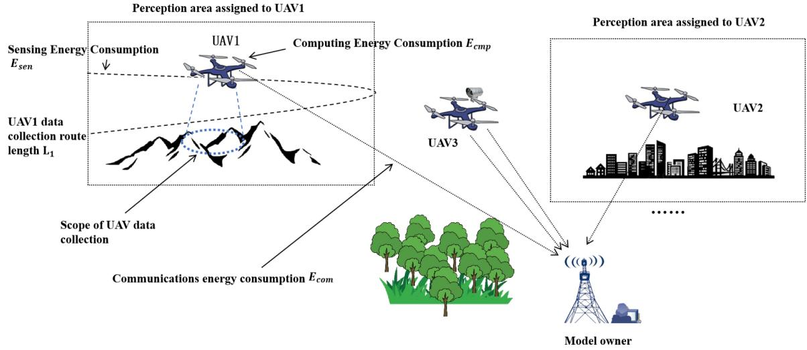  
Fig. 1. Schematic diagram of UAV intelligent inspection scene.

To highlight the gap between existing studies and our approach, we summarize the limitations of prior works and our corresponding contributions in Table I.

## A. Scene Description

UAVs are widely used in data collection and edge computing due to their characteristics such as wide field of view, flexible deployment, and applicability to data collection in multiple geographic environments. In multi-UAV scenarios such as UAV intelligent inspection, a wider area coverage can be achieved through the scheduling of UAVs, saving workforce for data collection. UAV carries out data collection in the inspection area by carrying cameras, sensors and other equipment, and uploads the collected data to the central server, where the industry personnel use machine learning and intelligent analysis and other technologies to complete all kinds of data processing, analysis work, and model training, for example, the pattern recognition aspect includes, identifying faults, defects, anomalies, hidden dangers, and violations.

As shown in Fig. 1, in the UAV intelligent inspection scenario, each UAV is assigned a distinct data collection area and flies at low altitude within its designated area to gather data. The distance it needs to cover for data collection is denoted as L. Afterward, the UAV uploads the collected data or the trained model parameters to the central system. Due to the large number of UAVs and limited communication bandwidth, not all data collected by the UAVs can be effectively used for model training in the UAV inspection network. The model owner must filter the data collected by the UAVs, or the data from different UAVs.

## B. A Federated Learning Model for UAV-Based Inspection

In order to reduce the radio costs of UAV-assisted intelligent inspection, federated learning is used for model training. The model owner issues a training task and selects a portion of UAVs to participate in federated learning. The selected UAVs use the collected data for training and upload the training parameters to the model owner to receive incentives. As shown in Fig. 2, the process can be divided into the following steps:

1) Broadcast federated learning tasks and contract items: The Artificial Intelligence (AI) model owner first designs the federated learning contract item based on the task requirements and incentive budget for its neural network model training, which is used to incentivize UAVs to collect image data, provide training services for them, and broadcast their contract item and federated learning task invitations to UAVs.

2) Candidate pool construction: The UAV selects and returns its chosen contract item to the model owner and is enrolled in the pool of model training UAV candidates for the federated learning task.

3) Model owner selects UAVs: The model owner makes a further selection from the pool of UAV candidates, prefers UAVs with higher data contribution and less required incentives to participate in federated learning, and releases the initialized (first round) or previous round of aggregated model parameters ωk to the selected UAVs.

4) Client-side local training: The UAV that receives the model training task uses local data for model training and uploads the trained local model parameters to the central server.

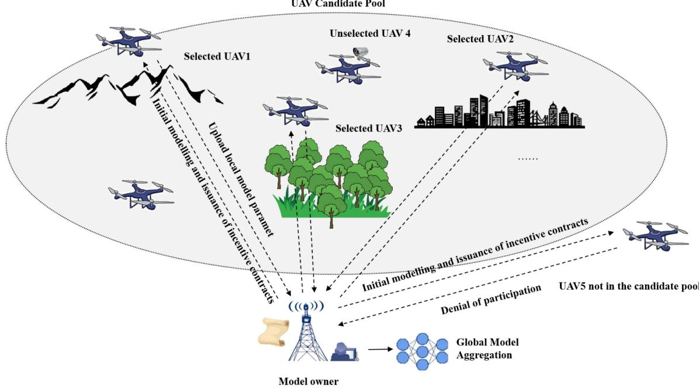  
Fig. 2. Federated Learning Architecture Based on Candidate Pool.

5) Model aggregation: The model owner aggregates the loss functions uploaded by the UAVs in that round, assuming that a total of $N ^ { \prime }$ UAVs are selected to participate in the federation training, and the loss function of the kth round of the nth UAV is used to denote $l ( \omega _ { n , k } )$ , where $l ( \omega _ { k } )$ the number of datasets possessed by the UAVs, is $D _ { n }$ The global loss function, $l ( \omega _ { k } )$ , can then be expressed as:

$$
l ( \omega _ { \mathrm { k } } ) = \frac { \sum _ { n = 0 } ^ { N ^ { \prime } - 1 } D _ { n } l _ { n } ( \omega _ { n , k } ) } { \sum _ { n = 0 } ^ { N ^ { \prime } - 1 } D _ { n } }\tag{1}
$$

Obtaining a new round of model parameters via the global loss function $\omega _ { k + 1 }$ :

$$
\omega _ { k } - \eta \bigtriangledown l \big ( \omega _ { k } \big )  \omega _ { k + 1 }\tag{2}
$$

where $\bigtriangledown l ( \omega _ { k } )$ denotes the kth round cumulative gradient and η denotes the learning rate.

6) Broadcasting New Model Parameters and Reselecting UAVs: The model owner reruns the client selection and sends down the aggregated new model parameters $\omega _ { k + 1 }$ to the selected UAV, repeating steps (3), (4), and (5) until the model converges or the budget is exhausted.

## C. UAV Cost Modeling

When setting up an incentive scheme for federated learning, we first need to specify the cost required for UAVs to participate in federated learning. A UAV may choose to participate in federated learning only if the incentive provided by the model owner can compensate the cost of the UAV. The cost required for a nth UAV to participate in federated learning is mainly composed of a perception cost $E _ { n } ^ { s e n }$ , a computation cost $E _ { n } ^ { c m p }$ and a Communication cost $E _ { n } ^ { c o m }$

1) Sensing Model Construction: We build our sensing model based on [35]. Assume that UAV n captures image frames in its assigned sensing area, and its onboard image sensor operates at a frame rate of $f _ { n } ^ { \mathrm { c a p } }$ (frames per second). During the sensing process, the total number of captured frames is denoted as $F _ { n }$ The sensing energy consumption can be modeled as follows. For each captured frame, the image sensor undergoes two stages: (1) an idle stage (exposure), during which the pixel array of the sensor performs light exposure with power consumption $P _ { n } ^ { \mathrm { i d l e } }$ and duration $T _ { n } ^ { \mathrm { i d l e . } } ;$ ; and (2) an active stage (readout and processing), during which the sensor performs image acquisition and processing (e.g., simple denoising), with power consumption $P _ { n } ^ { \mathrm { a } }$ ctive and duration $T _ { n } ^ { \mathrm { a c t i v e } }$ . Therefore, the energy consumed per frame is given by $E _ { n } ^ { \mathrm { f r a m e } } = P _ { n } ^ { \mathrm { i d l e } } \cdot T _ { n } ^ { \mathrm { i d l e } } + P _ { n } ^ { \mathrm { a c t i v e } } \cdot T _ { n } ^ { \mathrm { a c t i v e } }$ , and the total sensing energy consumption for UAV n is $E _ { n } ^ { \mathrm { s e n } } = E _ { n } ^ { \mathrm { f r a m e } } \cdot F _ { n } .$

=Next, we define the number of captured frames $F _ { n } .$ . For UAV $n ,$ its flight distance for data acquisition $L _ { n }$ is related to the sensing area $S _ { n }$ assigned by the model owner. As shown in Fig. 1, the sensing flight distance can be expressed as $L _ { n } = \gamma S _ { n }$ , where γ denotes the scaling factor between the area covered by UAV n and the distance flown. Accordingly, the sensing duration of UAV n is given as follows.

$$
T _ { n } ^ { \mathrm { s e n } } = \frac { L _ { n } } { v _ { n } } = \frac { \gamma S _ { n } } { v _ { n } }\tag{3}
$$

Where $v _ { n }$ is the flight speed of UAV n. Thus, the number of frames is $F _ { n } = f _ { n } ^ { \mathrm { c a p } } \cdot T _ { n } ^ { \mathrm { s e n } }$ . Substituting this into the energy expression, the final sensing energy consumption model becomes as follows.

$$
E _ { n } ^ { \mathrm { s e n } } = \left( P _ { n } ^ { \mathrm { i d l e } } \cdot T _ { n } ^ { \mathrm { i d l e } } + P _ { n } ^ { \mathrm { a c t i v e } } \cdot T _ { n } ^ { \mathrm { a c t i v e } } \right) \cdot f _ { n } ^ { \mathrm { c a p } } \cdot T _ { n } ^ { \mathrm { s e n } }\tag{4}
$$

In practical inspection missions, UAVs typically follow a lawn-mowing strip trajectory: they fly back and forth along a set of parallel paths at a fixed altitude $A _ { n } .$ , and use the onboard camera to sequentially cover the assigned area. Let the camera field-of-view (FOV) angle of UAV n be denoted by $\varphi _ { n }$ . At altitude $A _ { n } .$ , the instantaneous ground footprint width of the camera can be approximated as

$$
W _ { n } ^ { \mathrm { F O V } } = 2 A _ { n } \tan \Bigl ( \frac { \varphi _ { n } } { 2 } \Bigr ) .
$$

To ensure sufficient image overlap and recognition quality, adjacent flight strips usually maintain a cross-track overlap ratio $o _ { n } \in ( 0 , 1 )$ , leading to an effective swath width

$$
W _ { n } ^ { \mathrm { e f f } } = W _ { n } ^ { \mathrm { F O V } } ( 1 - o _ { n } ) .
$$

Approximating the inspection region as being covered by such parallel strips of width $W _ { n } ^ { \mathrm { e f f } }$ , the total flight distance required to cover an area $S _ { n }$ can be written as

$$
L _ { n } \approx \frac { S _ { n } } { W _ { n } ^ { \mathrm { e f f } } } = \frac { S _ { n } } { 2 A _ { n } \tan \left( \frac { \varphi _ { n } } { 2 } \right) \left( 1 - o _ { n } \right) } \triangleq \gamma _ { n } S _ { n } .
$$

Therefore, the coefficient $\gamma _ { n }$ essentially captures the combined impact of UAV flight altitude, camera field-of-view, and strip overlap ratio on the required flight distance.

2) Computing Model Construction: In this paper, we use the sampling points per second to represent the computational capability of the client simply [36]. In local training, let $f _ { n }$ (cycles/s) denote the computational capability of UAV n, measured in CPU cycles per second, and $D _ { n }$ (samples) represent the size of the data to be processed. The computation time required by UAV n to process the data is $\begin{array} { r } { T _ { n } ^ { c m p } = \frac { \ ' C y c _ { n } D _ { n } } { f _ { n } } } \end{array}$ , where $C y c _ { n }$ (cycles/sample) =is the number of CPU cycles required by UAV n to process one sample of data. The data volume $D _ { n }$ is strongly correlated with the number of frames $F _ { n }$ . Without any processing, we have $D _ { n } = F _ { n }$ . However, considering that data augmentation techniques such as slight rotation or color transformation might be applied when the original data is insufficient, or that some frames might be discarded, we generalize this relationship as $D _ { n } = q F _ { n }$ , where $q$ is a coefficient. Thus the computation time is given as follows.

$$
T _ { n } ^ { c m p } = \frac { C y c _ { n } q F _ { n } } { f _ { n } }\tag{5}
$$

In addition to the energy consumption for wireless communication, local training at the client also generates computational energy consumption. According to Lemma 1 in [37], the computational energy consumption of UAV n is as follows.

$$
E _ { n } ^ { c m p } = \kappa C y c _ { n } q F _ { n } f _ { n } ^ { 2 }\tag{6}
$$

Where κ is the effective switching capacitance depending on the chip architecture.

3) Communication Model Construction: In federated learning, after completing local training, a UAV is required to upload its intermediate model parameters to the central server or model owner. Due to the nature of air-to-ground communication, the wireless channel between the UAV and the ground receiver may exhibit either Line-of-Sight (LoS) or Non-Line-of-Sight (NLoS) conditions depending on the environment. Therefore, both channel states should be considered in the communication model.

Based on [38], the probability of having a LoS connection is modeled as a function of the elevation angle between the UAV and the ground device. Suppose the three-dimensional distance between UAV n and the receiver is $d _ { n } .$ , the horizontal distance is $r _ { n }$ , and the UAV flies at an altitude $A _ { n }$ , then the elevation angle $\theta _ { n }$ is given by: $\begin{array} { r } { \theta _ { n } = \arctan ( \frac { A _ { n } } { r _ { n } } ) } \end{array}$ . Accordingly, the LoS probability $P _ { n } ^ { \mathrm { L o S } }$ is modeled by the following sigmoid function: $\begin{array} { r } { \dot { P } _ { n } ^ { \mathrm { L o S } } = \frac { 1 } { 1 + a \cdot \exp ( - b ( \theta _ { n } - a ) ) } } \end{array}$ . Where a and b are empirical parame-1+ exp( ( ))ters determined by the specific environment, such as dense urban areas or suburban settings [39].

Based on this, we model the channel power gain $h _ { n }$ as a weighted average of the LoS and NLoS conditions. Specifically, the expected channel gain is:

$$
h _ { n } = P _ { n } ^ { \mathrm { L o S } } \cdot \beta _ { 0 } d _ { n } ^ { - \alpha _ { \mathrm { L o S } } } + ( 1 - P _ { n } ^ { \mathrm { L o S } } ) \cdot \beta _ { 0 } \eta _ { 0 } d _ { n } ^ { - \alpha _ { \mathrm { N L o S } } }\tag{7}
$$

Here, $\beta _ { 0 }$ is the reference channel gain at unit distance; $\alpha _ { \mathrm { L o S } }$ and $\alpha _ { \mathrm { N L o S } }$ are the path loss exponents under LoS and NLoS conditions, respectively; and $\eta _ { 0 } \in ( 0 , 1 )$ is an additional attenuation factor accounting for the degradation in NLoS conditions. Based on this model, assuming the data volume to be uploaded by UAV n is $\sigma ,$ the communication bandwidth is $B ,$ , the transmission power is $p _ { n } ^ { \prime }$ , and the power of Gaussian white noise is $N _ { 0 }$ , the transmission delay is given by Shannon’s theorem:

$$
T _ { n } ^ { \mathrm { c o m } } = \frac { \sigma } { B \log _ { 2 } \left( 1 + \frac { p _ { n } ^ { \prime } h _ { n } } { N _ { 0 } } \right) }\tag{8}
$$

The corresponding transmission energy consumption of UAV n is:

$$
E _ { n } ^ { \mathrm { c o m } } = T _ { n } ^ { \mathrm { c o m } } \cdot p _ { n } ^ { \prime } = { \frac { \sigma p _ { n } ^ { \prime } } { B \log _ { 2 } \left( 1 + { \frac { p _ { n } ^ { \prime } h _ { n } } { N _ { 0 } } } \right) } }\tag{9}
$$

4) Construction of the Cost Model: The local model updated by each UAV n is affected by the quality of the data in the local spatiotemporal domain that it itself perceives and collects, denoted by $\varepsilon _ { n }$ for the data quality of the UAV. The data quality $\varepsilon _ { n }$ depends mainly on the accuracy of data collection and the reliability of the data. The more accurate or reliable the data, the larger $\varepsilon _ { n }$ is. We use $\log _ { 2 } \bigl ( \frac { 1 } { \varepsilon _ { n } } \bigr )$ to denote the number of iterations for local model update when the global accuracy is fixed. Therefore, for global iterations, the total energy consumption of UAV n is expressed as:

$$
E _ { n } = \log _ { 2 } \left( \frac { 1 } { \varepsilon _ { n } } \right) E _ { n } ^ { c m p } + E _ { n } ^ { c o m } + E _ { n } ^ { s e n }\tag{10}
$$

The total time for one global iteration is expressed as:

$$
T _ { n } = \log _ { 2 } \left( \frac { 1 } { \varepsilon _ { n } } \right) T _ { n } ^ { c m p } + T _ { n } ^ { c o m } + T _ { n } ^ { s e n }\tag{11}
$$

In order to implement federated learning client selection based on UAV inspection, we first need to construct a UAV candidate pool for federated learning and perform further selection within it. The construction of the UAV candidate pool and the specific implementation of client selection will be discussed in Section IV and Section V.

## IV. MULTIDIMENSIONAL SCHEMES FOR UAVS

A. Candidate Pool Construction for UAVs Based on Contract Theory

In Section 3 we construct a model of federated learning cost for UAVs, but in reality, there is asymmetry of information between UAVs and model owners, and model owners do not know the actual training cost of UAVs. Therefore the model owner designs contract terms through contract theory to attract UAVs to participate. In order to classify the contract terms, we define a parameter about data quality as the index basis for client classification, denoted as $\begin{array} { r } { \theta _ { n } = \frac { \psi } { \log _ { 2 } \left( \frac { 1 } { \varepsilon _ { n } } \right) } } \end{array}$ , where ψ is a coefficient related to the number of local model iterations, influenced by the accuracy of the local data. It adjusts the range of $\theta _ { n }$ to aid in the subsequent classification of data quality. All clients are classified into $\bar { K }$ classes, sorted by data quality from smallest to largest: $\theta _ { 1 } < \theta _ { 2 } . . . < \theta _ { k } . . . < \theta _ { K } , k \in \{ 1 , . . . . . . K \}$

The model owner designs the contract terms so that each UAV can maximize its benefits when it chooses the contract term that best matches its situation, and we define the benefit function for class UAVs as:

$$
U _ { n , k } ^ { U A V } = R _ { n , k } - E _ { n , k } = R _ { n , k } - \left( { \frac { \psi } { \theta _ { k } } } E _ { n , k } ^ { c m p } + E _ { n , k } ^ { c o m } + E _ { n , k } ^ { s e n } \right)\tag{12}
$$

where $R _ { n , k }$ is the incentive given to UAV n belonging to class $k .$ In the UAV intelligent inspection network, different forms of incentives can be set for different UAV owners. The first one is monetary payment, for enterprise-level UAV owners, the corresponding cash can be paid as an incentive based on the setting of the federated learning incentive contract item. If the UAV owner is also a user of the model, the incentive can be in the form of a right to use the model or a time limit. In addition, if the model owner owns other resources, they can also be converted into incentives, such as a quota of computational resources for edge servers.

When designing the contract terms, the model owner must take into account both the client’s individual rationality and incentive compatibility requirements.

a) Individual rationality: Each UAV participates in the federated learning task only if its utility is not less than zero, i.e.:

$$
U _ { n , k } ^ { U A V } = R _ { n , k } - E _ { n , k } \geq 0\tag{13}
$$

where $U _ { n , k } ^ { U A V }$ denotes the benefit of the nth UAV’s participation in federated learning, $R _ { n , k }$ is the incentive given to the nth UAV by the model owner, and $E _ { n , k }$ is the cost required for UAV n to participate in federated learning.

b) Incentive compatibility: To maximize utility, each client can only select the contract designed for their type, $\theta _ { k }$ , and not any other contract, i.e.:

$$
R _ { n , k } - E _ { n , k } \geq R _ { n , m } - E _ { n , m } , \forall k , m \in \{ 1 , . . . . . , K \} , k \neq m\tag{14}
$$

where $R _ { n , k }$ denotes that the nth UAV chooses the kth class of contract items respectively, $R _ { n , m }$ denotes that the nth UAV chooses any class of contract items except k, denoted here by the subscript m, and K is the total number of classes of contract items. That is, the incentive gained by the nth UAV selecting any contract item except class k is less than that gained by selecting the nth class contract item. For revenue reasons UAVs will only choose the contract term that best suits them.

The total benefit gained by the model owner after selecting a UAV is:

$$
\begin{array} { r l } { { U ^ { o w n e r } } } & { = \displaystyle \sum _ { n = 1 } ^ { N } U _ { n , k } ^ { o w n e r } ( R _ { n , k } ) } \\ & { = \displaystyle \sum _ { n = 1 } ^ { N } \left[ \omega \ln ( T _ { \mathrm { m a x } } - T _ { n , k } ) - \lambda R _ { n , k } \right] } \end{array}\tag{15}
$$

where $\omega$ is the model owner’s satisfaction parameter for the training time, by which the latency and incentive are adjusted to the same order of magnitude. $T _ { \mathrm { m a x } }$ is the maximum tolerable latency of the UAV user, and $T _ { n , k }$ is the total latency of the UAV n belonging to class k to participate in the training.

The design of the incentive contract term needs to ensure that the benefits to the model owner are maximized within the incentive budget $R _ { \mathrm { m a x } }$ and that the need for individual UAV rationality and incentive compatibility is met. Also, in order to reduce the delay in each round, incentives will no longer be given to UAV model owners whose total delay exceeds the maximum delay, i.e.,

$$
U _ { n , k } ^ { U A V } = \left\{ \begin{array} { l l } { R _ { n , k } - E _ { n , k } } & { , T _ { n } \leq T _ { \operatorname* { m a x } } } \\ { - E _ { n , k } } & { , T _ { n } > T _ { \operatorname* { m a x } } } \end{array} \right.\tag{16}
$$

c) Battery Constraint with Safety Margin: To ensure UAVs have sufficient energy not only to complete the federated learning task but also to return safely, we introduce a battery safety factor $\xi \in ( 0 , 1 )$ . Specifically, only a fraction $\xi$ of the UAV’s residual battery $B _ { n } ^ { r e s }$ is allowed to be used for sensing, computation, and communication during the task. The remaining $( 1 - \xi ) B _ { n } ^ { r e s }$ is (1reserved for return flight and emergency operations.

$$
E _ { n } ^ { c m p } + E _ { n } ^ { c o m } + E _ { n } ^ { s e n } \leq \xi \cdot B _ { n } ^ { r e s } , 0 < \xi < 1\tag{17}
$$

A safety factor $\xi$ is introduced to reserve energy for return flight, effectively addressing flight sustainability. Therefore, the optimization function for the incentive design is:

$$
\operatorname* { m a x } _ { R _ { n , k } } \quad U ^ { o w n e r } = \sum _ { n = 1 } ^ { N } [ \omega \ln ( T _ { \operatorname* { m a x } } - T _ { n , k } ) - \lambda R _ { n , k } ]
$$

s.t.

$$
U _ { n , k } ^ { U A V } = R _ { n , k } - \frac { \psi } { \theta _ { k } } E _ { n , k } ^ { c m p } - E _ { n , k } ^ { c o m } - E _ { n , k } ^ { s e n } \geq 0 ,\tag{C}
$$

$$
\forall n \in \{ 1 , \ldots , N \}
$$

$$
( C 2 ) R _ { n , k } - \left( \frac { \psi } { \theta _ { k } } E _ { n , k } ^ { c m p } + E _ { n , k } ^ { c o m } + E _ { n , k } ^ { s e n } \right) \geq
$$

$$
R _ { n , m } - \left( \frac { \psi } { \theta _ { k } } E _ { n , m } ^ { c m p } + E _ { n , m } ^ { c o m } + E _ { n , m } ^ { s e n } \right) ,
$$

$$
\forall k , m \in \{ 1 , \ldots , K \} , k \neq m
$$

C $T _ { n } \leq T _ { \mathrm { m a x } } ,$

$$
\begin{array} { r l } { ( C 4 ) } & { \displaystyle \sum _ { n = 1 } ^ { N } R _ { n } \leq R _ { \operatorname* { m a x } } , } \\ { ( C 5 ) } & { E _ { n } ^ { c m p } + E _ { n } ^ { c o m } + E _ { n } ^ { s e n } \leq \xi \cdot B _ { n } ^ { r e s } , 0 < \xi < 1 } \end{array}\tag{18}
$$

The optimization problem is not a convex optimization and is difficult to solve directly. Since the communication cost is independent of the data quality of the UAVs, etc., without loss of generality, we consider that due to the similarity of the wireless communication environments, the communication bandwidth, communication power, and channel gain are the same for all UAVs, and only the communication distances are different. Therefore the communication time and communication energy consumption of all clients are known to the model owner. The perceived energy consumption and delay of UAVs are directly related to their coverage area, so to simplify the analysis, we assume that the ratio between the UAV’s flying power $p _ { n }$ and its speed $v _ { n }$ remains constant. Meanwhile, the sensor parameters $\bar { P } _ { n } ^ { \mathrm { i d l e } } , T _ { n } ^ { \mathrm { i d l e } } , P _ { n } ^ { \mathrm { a c t i v e } } , T _ { n } ^ { \mathrm { a c t i v e } }$ , and $f _ { n } ^ { \mathrm { c a p } }$ are also constant. Under these assumptions, we have: $\begin{array} { r } { \eta = ( P _ { n } ^ { \mathrm { i d l e } } T _ { n } ^ { \mathrm { i d l e } } + P _ { n } ^ { \mathrm { a c t i v e } } T _ { n } ^ { \mathrm { a c t i v e } } ) f _ { n } ^ { \mathrm { c a p } } \frac { \gamma } { v _ { n } } } \end{array}$ and thus for the compensation of UAV’s perceived energy consumption is:

$$
E _ { n } ^ { \mathrm { s e n } } = \eta S _ { n } .\tag{19}
$$

Moreover, the above flying-power model allows us to interpret the battery safety factor in (17) in a more UAV-specific manner. Let $E _ { n } ^ { \mathrm { r e t } }$ be the energy required for a safe return flight to the charging station. With constant flying power $p _ { n }$ and speed $v _ { n } .$ the return energy can be upper-bounded by

$$
E _ { n } ^ { \mathrm { r e t } } \leq \frac { p _ { n } } { v _ { n } } \gamma S _ { n } ,
$$

since the total flight distance is proportional to the sensing area $S _ { n }$ with proportionality factor $\gamma .$ . Therefore, the overall battery feasibility must satisfy

$$
E _ { n } ^ { \mathrm { c m p } } + E _ { n } ^ { \mathrm { c o m } } + E _ { n } ^ { \mathrm { s e n } } + E _ { n } ^ { \mathrm { r e t } } \leq B _ { n } ^ { \mathrm { r e s } } ,
$$

which, together with the safety constraint in (17),

$$
E _ { n } ^ { \mathrm { c m p } } + E _ { n } ^ { \mathrm { c o m } } + E _ { n } ^ { \mathrm { s e n } } \ \leq \ \xi B _ { n } ^ { \mathrm { r e s } } , 0 < \xi < 1 ,
$$

implies that the return energy must satisfy

$$
E _ { n } ^ { \mathrm { r e t } } \ \leq \ \left( 1 - \xi \right) B _ { n } ^ { \mathrm { r e s } } \Rightarrow B _ { n } ^ { \mathrm { r e s } } \ \geq \ \frac { p _ { n } \gamma S _ { n } } { \left( 1 - \xi \right) v _ { n } } .
$$

In other words, only UAVs whose current residual battery $B _ { n } ^ { \mathrm { r e s } }$ exceeds the trajectory-dependent threshold $\frac { p _ { n } \gamma S _ { n } } { ( 1 - \xi ) v _ { n } }$ can be ad-(1 )mitted into the candidate pool. This provides a UAV-specific, trajectory-aware interpretation of the fixed safety margin $( 1 - \xi )$ (1 )in (17) in terms of flight altitude, camera footprint, and inspection coverage.

Also when the IR constraints of the class 1 client are satisfied, the other IR constraints automatically hold [32]. By the above property we approximately simplify the requirement of incentive compatibility into a local downward incentive constraint:

$$
R _ { n , k + 1 } - \frac { \psi } { \theta _ { k + 1 } } E _ { n , k + 1 } ^ { c m p } \geq R _ { n , k } - \frac { \psi } { \theta _ { k + 1 } } E _ { n , k } ^ { c m p } \geq . . .
$$

$$
\ge R _ { n , 1 } - \frac { \psi } { \theta _ { k + 1 } } E _ { n , 1 } ^ { c m p } , \forall n \in \{ 1 , . . . , N \}\tag{20}
$$

Reduce the above optimization problem to:

$$
\operatorname* { m a x } _ { R _ { n , k } } \quad U ^ { o w n e r } = \sum _ { n = 1 } ^ { N } [ \omega \ln { ( T _ { \operatorname* { m a x } } - T _ { n , k } ) } - \lambda R _ { n , k } ]
$$

s.t.

$$
R _ { n , k } - \frac { \psi } { \theta _ { k } } E _ { n , k } ^ { c m p } - E _ { n , k } ^ { c o m } - E _ { n , k } ^ { s e n } = 0 ,\tag{C1}
$$

$$
\forall n \in \{ 1 , \ldots , N \}\tag{C2}
$$

$$
R _ { n , k } - \frac { \psi } { \theta _ { k } } E _ { n , k } ^ { c m p } = R _ { n , k - 1 } - \frac { \psi } { \theta _ { k } } E _ { n , k - 1 } ^ { c m p } ,
$$

$$
\forall k \in \{ 2 , \ldots , K \} ,
$$

$$
( C 3 ) T _ { n } \leq T _ { \mathrm { m a x } } , \forall n \in \{ 1 , \ldots , N \} ,
$$

$$
( C 4 ) \sum _ { n = 1 } ^ { N } R _ { n } \leq R _ { \mathrm { m a x } } ,
$$

$$
( C 5 ) B _ { n } ^ { \mathrm { r e s } } \ \geq \ \frac { p _ { n } \gamma S _ { n } } { ( 1 - \xi ) v _ { n } } .\tag{21}
$$

The simplified optimization problem is solved by an iterative algorithm to obtain a reward representation as [32]:

$$
R _ { n , k } = \frac { \psi } { \theta _ { 1 } } E _ { n , 1 } ^ { c m p } + E _ { n , k } ^ { c o m } + E _ { n , k } ^ { s e n } + \sum _ { j = 2 } ^ { k } \left( \frac { \psi } { \theta _ { j } } E _ { n , j } ^ { c m p } - \frac { \psi } { \theta _ { j } } E _ { n , j - 1 } ^ { c m p } \right)\tag{22}
$$

After selecting the contract item the UAV returns the participation intention and the selected contract item to the model owner and enters the UAV candidate pool. The model owner prioritizes UAVs with higher data quality for training from the UAV candidate pool.

The UAV decides whether to participate in federated learning based on the contract item given by the model owner and makes its own best decision to select the contract item that best suits its needs based on the quality of the local dataset. At the beginning of each federated learning round, the UAV also checks whether its remaining battery can support the energy required for sensing, computation, and communication. If the energy is insufficient, the UAV will withdraw and not enter the candidate pool. Otherwise, after selecting a contract item, the UAV becomes part of the candidate pool of model-trained UAVs that join the federated learning task and returns information about the selected contract item to the model owner. Constructing the candidate pool achieves the initial selection of UAVs, and in order to further enhance the accuracy of federated learning model training, the model owner needs to make further selections in the UAV candidate pool.

## B. UAV Selection Scheme Based on Bayesian Optimization

In federated learning, not all UAVs in the candidate pool will participate due to the need to save communication resources, and the model owner will select only a small number of clients in each round. Therefore, after constructing the candidate pool, the model owner must further select the UAVs. The model owner prioritizes UAVs that contribute more to the model during the selection process. Meanwhile, due to the strong heterogeneity of the data collected by UAVs, we aim to improve the quality of the information provided by the selected UAVs and make the data distribution more balanced. To achieve this, we prefer to select less relevant UAVs each time to participate in the model training, ensuring wider data coverage and a more stable model.

When making UAV selection we need a function value that reflects the value of the data in each training round of the UAV, ideally the function value should be calculated in a way that requires the least amount of additional computation thus reducing computational energy consumption. Taking the above considerations into account, we measure the value of the UAV using the loss function when the UAV is undergoing model training, and since the loss function has to be computed during model training, choosing the loss function does not entail additional computation.

In federated learning, evaluating a UAV’s contribution to model training requires actually executing local training and computing the loss function, which incurs significant computational and communication overhead. Bayesian optimization is a sequential optimization method based on probabilistic models, designed to solve global optimization problems with black-box functions. It constructs a surrogate model (e.g., Gaussian Process) to predict clients’ potential contributions, thereby avoiding exhaustive searches over all possible client combinations and significantly reducing computational burden. Therefore, we designed a loss value prediction method based on Bayesian optimization: Initially, n UAVs are randomly selected, after which one UAV that contributes more to convergence is selected at a time. Each UAV selection step in Bayesian optimization requires three phases:

1) Prediction of the value of the loss function for the selected UAV: Assuming that the UAV is selected, we first predict the loss of the UAV. Due to the stochastic nature of UAV losses in each round, in Bayesian optimization, we assume that the prior distribution of UAV losses is Gaussian, then the change in losses of all UAVs in the first round can be modeled as [40]:

$$
\Delta l ^ { k } = [ \Delta l _ { 1 } ^ { k } , \Delta l _ { 2 } ^ { k } , \dots , \Delta l _ { N } ^ { k } ] \sim N ( \mu ^ { k } , \Sigma ^ { k } )\tag{23}
$$

where $\mu ^ { k }$ is the mean vector of UAVs in round $k , \Sigma ^ { k }$ is the variance vector of UAVs, and $\Delta l _ { 1 } ^ { k } , . . . , \Delta l _ { N } ^ { k }$ denotes the loss 1function for each of the  . . . N UAV. The loss prediction for UAV z is:

$$
\Delta \hat { l } _ { z } ^ { k } = \mu _ { z } ^ { k } - \alpha _ { z } ^ { k } \sigma _ { z } ^ { k }\tag{24}
$$

where $\sigma _ { z } ^ { k } = \sqrt { \sum _ { z , z } ^ { k } }$ denotes the standard deviation of the loss function of the UAV z and $\alpha _ { z } ^ { k }$ is the conditioning parameter, i.e., the confidence bound of the loss function in round k.

(2) The model owner selects UAVs. One UAV is selected at a time to minimize the a posteriori expectation of the total loss,

and bringing in the loss prediction formula for UAV z yields.

$$
\begin{array} { l } { { \displaystyle z ^ { * } = \arg \operatorname* { m i n } \sum _ { i } p _ { i } \tilde { \mu } _ { i } \left( \Delta \hat { l } _ { z } \right) } } \\ { { \displaystyle \quad = \arg \operatorname* { m i n } \sum _ { i } p _ { i } \mu _ { i } + \sum _ { i } p _ { i } \frac { \sum _ { i , z } } { \sigma _ { z } ^ { 2 } } \left( \Delta \hat { l } _ { z } - \mu _ { z } \right) } } \\ { { \displaystyle \quad = \arg \operatorname* { m i n } \sum _ { i } p _ { i } \mu _ { i } - \alpha _ { z } \sum _ { i } p _ { i } \sigma _ { i } r _ { i , z } } } \end{array}\tag{25}
$$

where i denotes the UAV that has been selected, $z ^ { * }$ denotes the loss prediction of UAV $z , p _ { i }$ denotes the weight of UAV i, and $\begin{array} { r } { r _ { i , \mathrm { z } } = \frac { \sum _ { i , z } } { \sigma _ { i } \sigma _ { z } } } \end{array}$ is the Pearson correlation coefficient. Since $\textstyle \sum _ { i } p _ { i } \mu _ { i } ^ { k }$ is not affected by the selected UAV z, we can simplify the selection scheme for UAV as follows:

$$
c _ { z } = \arg \operatorname* { m a x } { \alpha _ { z } ^ { k } \sum _ { i } p _ { i } \sigma _ { i } ^ { k } r _ { i , z } }\tag{26}
$$

where $c _ { z }$ is a contribution indicator.

(3) After selecting the UAV, the Gaussian distribution for the next iteration is updated with the prediction of the change in the loss of z as a posteriori condition:

$$
\mu ^ { k } \gets \tilde { \mu ^ { k } } \left( \Delta \vec { I } _ { \tilde { z } } ^ { k } \right) , \Sigma ^ { k } \gets \tilde { \Sigma ^ { k } } \left( \Delta \hat { l _ { z } ^ { k } } \right)\tag{27}
$$

Updated covariance:

$$
\tilde { \Sigma } _ { i , j } \left( \Delta \hat { l } _ { z _ { 1 } } \right) = \Sigma _ { i , j } - \frac { \Sigma _ { i , z _ { 1 } } \Sigma _ { z _ { 1 } , j } } { \sigma _ { z _ { 1 } } ^ { 2 } } = \sigma _ { i } \sigma _ { j } \left( r _ { i j } - r _ { i z _ { 1 } } r _ { z _ { 1 } j } \right)\tag{28}
$$

$$
\tilde { \sigma } _ { i } \left( \Delta \hat { l } _ { z _ { 1 } } \right) = \sqrt { \tilde { \Sigma } _ { i , i } \left( \Delta \hat { l } _ { z _ { 1 } } \right) } = \sigma _ { i } \sqrt { 1 - r _ { i z _ { 1 } } ^ { 2 } }\tag{29}
$$

The Gaussian distribution model is updated after each UAV selection with a prediction of the UAV’s loss change, resulting in a more accurate prediction of the next loss change. Contribution indicator $c _ { z }$ is obtained by bringing the a posteriori covariance into the selection scheme equation:

$$
\begin{array} { c l } { \displaystyle } & { \displaystyle { c _ { z } = \arg \operatorname* { m a x } _ { z ^ { \prime } } \sum _ { i } p _ { i } \frac { \tilde { \sum } _ { i z ^ { \prime } } \left( \Delta \hat { l } _ { z } \right) } { \tilde { \sigma } _ { z ^ { \prime } } \left( \Delta \hat { l } _ { z } \right) } } } \\ { \displaystyle } & { = \arg \operatorname* { m a x } _ { z ^ { \prime } } \frac { [ \sum _ { i } p _ { i } \sigma _ { i } r _ { i z ^ { \prime } } - r _ { z z ^ { \prime } } \sum _ { i } p _ { i } \sigma _ { i } r _ { i z } ] } { \sqrt { 1 - r _ { z ^ { \prime } z } ^ { 2 } } } } \end{array}\tag{30}
$$

$z ^ { \prime }$ is the uncrewed aerial vehicle that has not yet been selected. In order to maximize $c _ { z } , r _ { z z ^ { \prime } }$ needs to be minimized, i.e. the newly selected UAVs need to have the least correlation with the already selected UAVs, thus making the selected UAVs more representative and the training sample data more balanced, while also minimizing the chances of achieving a locally optimal solution.

The model owner’s choice of UAV needs to take into account the quality of the UAV data and the representativeness of the UAV data, as well as accelerating the convergence of the model, i.e., we prefer to choose UAVs with a larger data quality indicator θ and at the same time a larger contribution indicator c. We one-dimensionalize the two-dimensional metrics as:

$$
\operatorname* { m a x } \vartheta = \alpha c + \beta \theta\tag{31}
$$

where c is the contribution indicator of the UAV, θ is the contract term selected by the UAV, and α and $\beta$ are the importance coefficients, both $\alpha$ and $\beta$ are of size between 0 and 1 and $\alpha + \beta = 1$ The values of α and $\beta$ + = 1can be configured based on actual deployment requirements. In federated learning applications, when the incentive budget is limited or fast convergence is prioritized, the system may reduce the emphasis on data quality and increase the weight of the contribution metric. Conversely, when model accuracy is critical, the weight of data quality can be enhanced. The model owner may determine these weights empirically or through statistical methods, depending on practical constraints.

That is, among all N UAVs in the candidate pool, the model owner selects the UAV that makes the model converge faster and at the same time has higher data quality. The model owner makes UAV selection based on the size of the one-dimensional metric ϑ. The model owner ranks the selection metrics $\vartheta$ and selects the top $N ^ { \prime }$ ranked UAVs among the N UAVs to participate in the training by a fast sorting algorithm. The algorithm is traversed through a loop, each time making the UAV with the largest ϑ by selection from the pool of UAV candidates.

Before federated learning commences, the model owner broadcasts contract items to UAVs. Each UAV determines its participation based on the contract terms and its own conditions (such as whether the quantity and quality of its data support federated learning participation, whether sufficient computational resources are available, and whether communication bandwidth is under pressure), and selects the contract item that best matches its type. Once UAVs select contract items and enter the candidate pool, the model owner employs Bayesian optimization algorithm to select UAVs from this pool. The selected UAVs participate in federated learning, uploading their locally trained model parameters to the server for aggregation to obtain updated global model parameters. According to the contract terms, the model owner allocates incentives among the selected UAVs for this round. The model owner then reruns client selection based on new metrics, distributes the newly aggregated model parameters to the chosen UAVs, and repeats the above steps until either model convergence is achieved or the budget is exhausted. This scheme is implemented in Algorithm 1, with its workflow illustrated in Fig. 3.

The above experimental process is divided into two main parts, including the selection part of the UAV for the contract item and the further selection of the UAV by the model owner. The UAV only needs to select the most suitable contract terms for itself, so the complexity is $O ( K )$ and K is the number of contract items. In the second step, the model owner performs UAV selection in the candidate pool by Bayesian optimization algorithm, and the Bayesian optimization requires updating the Gaussian distribution. The storage and computational complexity of the covariance matrix $\sum \in \mathbb { R } ^ { N \times N }$ (N is the number of clients) of the traditional GP is $O ( N ^ { 2 } )$ , which is not applicable to resource-constrained large-scale client scenarios. Using a linear kernel function $K ( x _ { i } , \overline { { x _ { j } } } ) = x _ { i } ^ { T } x ^ { j }$ , the covariance matrix is represented in a low-rank form $\Sigma = X ^ { T } X$ , where $X \in \mathbb { R } ^ { N \times d }$

## Algorithm 1. Federated Learning Incentive and Selection Algorithm Based on Intelligent UAV Inspection.

Require:Federated learning incentive contract item design:

$$
R _ { n , k } = \frac { \psi } { \theta _ { 1 } } E _ { n , 1 } ^ { \mathrm { c m p } } + E _ { n , k } ^ { \mathrm { c o m } } + E _ { n , k } ^ { \mathrm { s e n } }
$$

$$
+ \sum _ { j = 2 } ^ { k } \left( \frac { \psi } { \theta _ { j } } E _ { n , j } ^ { \mathrm { c m p } } - \frac { \psi } { \theta _ { j } } E _ { n , j - 1 } ^ { \mathrm { c m p } } \right)
$$

1: Initialization: set global model $\omega _ { 0 }$

02: Let U be the set of all UAVs; set round index $r \gets 1$

3: while the global model has not converged do

4: if $r = 1$ then

= 15: Model owner side:

6: Broadcast the initial model $\omega _ { 0 }$ to all UAVs in U.

7: Broadcast the incentive contract items to all UAVs.

8: UAV side:

9: Each UAV selects the contractual item that maximizes its own benefit.

10: UAVs that accept a contract return the selected item to the model owner and enter the UAV candidate pool.

11: end if

12: Model owner side: link probing and pool update

13: The model owner sends lightweight probe messages to all UAVs in the current candidate pool to check their A2G connectivity.

14: Remove UAVs that do not respond within a timeout (violating the link constraint) or reply with a “leave pool” message due to insufficient residual battery.

15: Model owner side: client selection

16: For each UAV z in the updated candidate pool, compute the one-dimensional score

$$
\vartheta _ { z } = \alpha c _ { z } + \beta \theta _ { z } ,
$$

where $c _ { z }$ is the contribution index computed according to (30).

17: Select the UAVs with the largest $\vartheta _ { z }$ to participate in federated learning in round $^ r .$

18: Local training and aggregation

19: Selected UAVs perform local federated learning and upload training parameters to the model owner.

20: The model owner aggregates the received parameters to update the global model:

$$
\omega _ { r + 1 } = \omega _ { r } - \eta \nabla l ( \omega _ { r } ) .
$$

21: Update the Gaussian-process surrogate of the losses according to (27)–(29).

22: $r \gets r + 1$

+23: end while

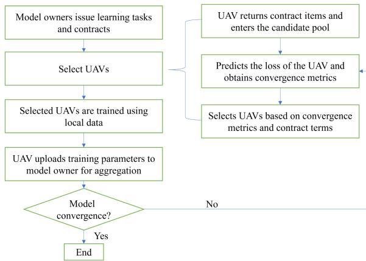  
Fig. 3. Flowchart of federated learning with UAV participation.

TABLE II  
SUMMARY TABLE OF PARAMETER SETTINGS
<table><tr><td rowspan=1 colspan=1>Parameter name</td><td rowspan=1 colspan=1>Value</td></tr><tr><td rowspan=1 colspan=1>learning rate</td><td rowspan=1 colspan=1>0.005</td></tr><tr><td rowspan=1 colspan=1>Number of local training</td><td rowspan=1 colspan=1>3</td></tr><tr><td rowspan=1 colspan=1>Local batch size</td><td rowspan=1 colspan=1>64</td></tr><tr><td rowspan=1 colspan=1>Maximum scheduled reward value</td><td rowspan=1 colspan=1>10000</td></tr><tr><td rowspan=1 colspan=1>Cycle frequency of CPU training</td><td rowspan=1 colspan=1>20</td></tr><tr><td rowspan=1 colspan=1>Maximum permissible time</td><td rowspan=1 colspan=1>60</td></tr><tr><td rowspan=1 colspan=1>Communication time and energy</td><td rowspan=1 colspan=1>[0.3,0.5],[0.3,0.5]</td></tr><tr><td rowspan=1 colspan=1>Sensing time and energy consumption</td><td rowspan=1 colspan=1>[0.5,1,5],[0.5,1.5]</td></tr><tr><td rowspan=1 colspan=1>Other parameters</td><td rowspan=1 colspan=1> $\psi = 0 . 2 , \varepsilon \in [ 0 . 2 , 0 . 8 ]$ </td></tr></table>

is the low-dimensional embedding of clients $( d < < N )$ . This reduces the computational complexity of Gaussian updating from $O ( N ^ { 2 } ) \mathrm { t o } O ( d N ) ( \mathrm { e . g . } , d = 1 5 $ in the experiment, which is much smaller than $N = 1 0 0 )$ . Meanwhile, the traditional Bayesian optimization problem needs to evaluate all client combinations, and the number of combinations $C _ { N } ^ { N ^ { \prime } }$ grows exponentially with N and N-. In this paper, the selection is performed by iterative ones, where only one UAV is selected at a time, and each selection is updated based on the a posteriori distribution of the currently selected clients, which reduces the problem from combinatorial optimization to a linear problem with a time complexity of $O ( N ^ { \prime } )$ and a total time complexity $\mathrm { o f } O ( N ^ { \prime } d N )$

In practice, the air-to-ground (A2G) links of UAVs can be intermittent, so that some clients fail to upload their local parameters or loss values in a given round. In our framework, this simply means that in round k the model owner only observes $\{ \Delta l _ { k } ^ { n } \} _ { n \in \mathcal { A } _ { k } }$ for a subset of UAVs $\mathcal { A } _ { k } \subseteq \{ 1 , \dots , N \}$ . The Gaussian-process surrogate in (23)–(29) is then updated using the available observations, while the posterior mean and variance of temporarily disconnected UAVs keep their previous values.

As a result, UAVs with unstable A2G links provide fewer effective observations and thus retain larger posterior variances $\sigma _ { k } ^ { n }$ . This uncertainty is explicitly taken into account in the acquisition function $c _ { z }$ in (26) and (30): well-connected UAVs with small variance are exploited when their predicted contribution is high, whereas intermittently connected UAVs are not over-relied on but can still be explored when their potential contribution is significant. Therefore, the Bayesian optimization component naturally captures the uncertainty caused by intermittent connectivity without requiring additional probing rounds or side information.

## V. EXPERIMENTAL ANALYSES

In this section, we validate the proposed MDS scheme using F-mnist, Cifar and UAV datasets to evaluate its performance. By comparing it with conventional schemes, we aim to provide insights into the significant advantages of the MDS scheme in terms of model training accuracy and affordability for federated learning with UAV participation. Specifically, we demonstrate through experimental analysis the superiority of the MDS scheme in improving model accuracy, optimizing UAV scheduling, and saving incentive expenditure. Through this comparative study, we are able to clarify the advantages of the MDS scheme in practical applications and further demonstrate its practical value and application potential in the field of federated learning model training based on UAV inspection.

## A. Experimental Setup

UAVs can collect many types of data, for example, UAVs collect data by carrying IoT sensors [41], cameras [42] and other devices. Therefore, we choose image type datasets Fmnist, Cifar and UAV for training during our experiments. We train the Fmnist dataset by a multilayer perceptron (MLP) model containing two hidden layers, and in order to simulate the heterogeneity of the data collected by UAVs, we set the UAV’s dataset to be non-independently isotropic. Meanwhile, by sampling the data from the distribution of Delicacy [43], we extract $q \sim D i r ( \alpha ^ { \prime } p ^ { p r i } )$ from the Delicacy distribution, where $p ^ { p r i }$ denotes the prior class distribution over N classes, and $\alpha ^ { \prime } >$ is a concentration parameter controlling the homogeneity among clients, the smaller $\alpha ^ { \prime }$ is, the stronger the heterogeneity among different UAVs’ data is. To facilitate client selection, we assume that there are 100 UAVs in the UAV candidate pool, and in order to reduce the energy consumption and communication pressure for model training, we select 5 clients from the UAV candidate pool to participate in federated learning in each round. In the real world, UAVs are mobile, so we take random values of perceived energy consumption in . , . to simulate the effects of UAV location changes and network topology changes. The settings of each parameter under the Fmnist dataset are shown in the following table:

To test the superiority of the scheme in federated learning client selection and incentive assignment, we set up comparison experiments [44], [45].

Randomized (RAND) selection scheme: 5 UAVs are randomly selected out of 100 UAVs to participate in federal training in each round.

Importance sampling (IMP) scheme [46]: the importance sampling attribute of each data sample is probabilistically proportional to the gradient of that sample.

Power-of-choice sampling (POC) scheme [47]: this scheme selects the set of UAVs by randomly sampling m UAVs, thus selecting client k with probability $p _ { k }$ , which is the proportion of data for that client.

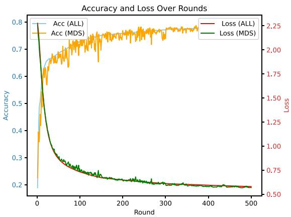  
Fig. 4. Plot of accuracy and loss under relatively balanced data division.

DivFL scheme [48]: By minimizing the upper bound of the approximation error, it enables that the aggregated updates from a subset of clients can approximate the aggregated updates from all clients. A greedy selection algorithm is employed to choose clients based on the marginal gain of a submodular function.

COR scheme [40]: By modeling the correlation of loss changes among clients, it selects in each communication round the client subset with the strongest synergy, so as to maximize the reduction of the global loss.

All selection (ALL) scheme: all UAVs participate in federated learning.

## B. Experimental Results and Analyses

We first divide the dataset using non-independently identically distributed and balanced pairs of terms, as shown in Fig. 4. Under relatively fair dataset division, the MDS scheme and all’s with all 100 clients selected are able to achieve the same accuracy and loss. Although the volatility is high, at the 500th round, the ALL scheme requires an incentive of 149210.228, while the MDS scheme requires an incentive of 6886.769. The ALL scheme requires an incentive 21.7 times higher than that of the MDS scheme.

Client-side segmentation is performed by Dirichlet to simulate the unbalanced distribution of UAV sampling data types, and experiments are conducted under this data segmentation using RAND, IMP, POC, ALL, DivFL and COR, and the MDS scheme proposed in this paper to record the accuracy value under each round and to plot the curve graphs. From the accuracy graphs in each round shown in Fig. 5, it can be seen that training the same number of rounds, the MDS scheme has higher training accuracy. At 150 rounds, several schemes have converged approximately, at this time, in order to facilitate the calculation, the average of the accuracy of the 140th round to 160th round is taken. The MDS scheme improves the accuracy at convergence by 13.7 percentage points compared to the IMP scheme, 10.7 percentage points compared to the POC scheme, 10.7 percentage points compared to the DivFL scheme, and about 16.7 percentage points compared to the RAND scheme, while achieving a convergence accuracy similar to COR but reducing the required incentive cost by about 5.2 percentage points. Compared with the ALL scheme, the MDS scheme also improves the accuracy at convergence by 4.6 percentage points, mainly because of the strong heterogeneity among clients, the local model trained by each client overfits its own data distribution, and the model parameters conflict when globally aggregated, which reduces the generalization ability. Therefore, when all clients participate in federated learning, heterogeneous data will reduce the training accuracy of the model.

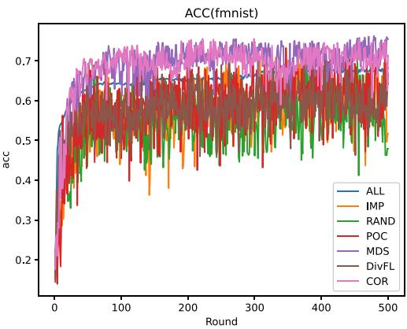  
Fig. 5. Accuracy plot under each round of the F-mnist dataset.

Except for the ALL scheme with fixed UAVs per round, the MDS scheme oscillates less and is more robust. In the ALL scheme, where all UAVs participate in the training process, the convergence occurs more quickly and smoothly. However, the accuracy after convergence is lower compared to the MDS scheme. The RAND, IMP, POC, and DivFL schemes all oscillate more and converge more slowly, requiring more incentives per round on average than the MDS scheme, while COR converges as fast as MDS but still incurs a higher incentive cost per round. Among these three schemes, the RAND scheme has the worst performance, and the IMP, POC and DivFL schemes perform similarly.

The total training latency is the accumulation of the maximum training latency in each round. Specifically, the total training time $T _ { \mathrm { t o t a l } }$ is given by:

$$
T _ { \mathrm { t o t a l } } = \sum _ { t } T _ { t } , { \mathrm { w h e r e } } T _ { t } = \operatorname* { m a x } _ { n \in \mathrm { s e l e c t e d } } T _ { n } ,
$$

with $T _ { t }$ representing the maximum latency among all selected UAVs in round t. Therefore, the fewer the total number of rounds required for convergence, the shorter the overall training latency, as a reduction in rounds directly lowers the upper limit of the summation.

From Table III, it can be seen that in terms of incentive, at 150 rounds, the MDS scheme saves about 7.8 compared to %the RAND scheme, 5.0 compared to the POC scheme, 6.0 % %compared to the DivFL scheme, 3.7 compared to the IMP scheme and 5.5% compared to the COR scheme. A histogram of incentive at 150 rounds is shown in Fig. 6. Therefore, in UAV inspection, UAV selection by MDS scheme can not only improve the model training accuracy, but also save the training cost. The accuracy and incentive can be further adjusted by adjusting the size of the two weight parameters in the formula $\operatorname* { m a x } _ { n } \vartheta _ { n } =$ $\alpha c _ { n } + \beta \theta _ { n , k }$ for the one-dimensionalisation of the indicators.

TABLE III  
STATISTICAL TABLE OF THE INCENTIVES REQUIRED FOR EACH SCHEME UNDER THE F-MNIST DATASET
<table><tr><td rowspan=1 colspan=1>arithmetic</td><td rowspan=1 colspan=1>MDS</td><td rowspan=1 colspan=1>RAND</td><td rowspan=1 colspan=1>IMP</td><td rowspan=1 colspan=1>POC</td><td rowspan=1 colspan=1>COR</td><td rowspan=1 colspan=1>ALL</td><td rowspan=1 colspan=1>DivFL</td></tr><tr><td rowspan=1 colspan=1>Average incentive required per round</td><td rowspan=1 colspan=1>13.773</td><td rowspan=1 colspan=1>14.911</td><td rowspan=1 colspan=1>14.145</td><td rowspan=1 colspan=1>14.491</td><td rowspan=1 colspan=1>14.287</td><td rowspan=1 colspan=1>298.420</td><td rowspan=1 colspan=1>13.995</td></tr><tr><td rowspan=1 colspan=1>Incentive required for 150 rounds</td><td rowspan=1 colspan=1>2093.054</td><td rowspan=1 colspan=1>2257.248</td><td rowspan=1 colspan=1>2171.365</td><td rowspan=1 colspan=1>2197.722</td><td rowspan=1 colspan=1>2201.222</td><td rowspan=1 colspan=1>44763.348</td><td rowspan=1 colspan=1>2219.156</td></tr><tr><td rowspan=1 colspan=1>Total incentives</td><td rowspan=1 colspan=1>6886.769</td><td rowspan=1 colspan=1>7455.582</td><td rowspan=1 colspan=1>7072.352</td><td rowspan=1 colspan=1>7245.559</td><td rowspan=1 colspan=1>7143.649</td><td rowspan=1 colspan=1>149210.228</td><td rowspan=1 colspan=1>7455.374</td></tr></table>

TABLE IV

TABLE OF ACCURACY AND INCENTIVE STATISTICS FOR EACH SCHEME UNDER THE CIFAR DATASET
<table><tr><td rowspan=1 colspan=1>arithmetic</td><td rowspan=1 colspan=1>MDS</td><td rowspan=1 colspan=1>RAND</td><td rowspan=1 colspan=1>IMP</td><td rowspan=1 colspan=1>POC</td><td rowspan=1 colspan=1>COR</td><td rowspan=1 colspan=1>DivFL</td></tr><tr><td rowspan=1 colspan=1>Average incentive required per round</td><td rowspan=1 colspan=1>29.495</td><td rowspan=1 colspan=1>30.257</td><td rowspan=1 colspan=1>30.074</td><td rowspan=1 colspan=1>29.894</td><td rowspan=1 colspan=1>30.213</td><td rowspan=1 colspan=1>29.663</td></tr><tr><td rowspan=1 colspan=1>Total incentives</td><td rowspan=1 colspan=1>58990.734</td><td rowspan=1 colspan=1>60519.200</td><td rowspan=1 colspan=1>60148.164</td><td rowspan=1 colspan=1>59787.831</td><td rowspan=1 colspan=1>60426.032</td><td rowspan=1 colspan=1>59326.674</td></tr><tr><td rowspan=1 colspan=1>Average of accuracy for rounds 1700 to 1800</td><td rowspan=1 colspan=1>0.558244554</td><td rowspan=1 colspan=1>0.503626733</td><td rowspan=1 colspan=1>0.518142574</td><td rowspan=1 colspan=1>0.52459703</td><td rowspan=1 colspan=1>0.559609901</td><td rowspan=1 colspan=1>0.484776238</td></tr></table>

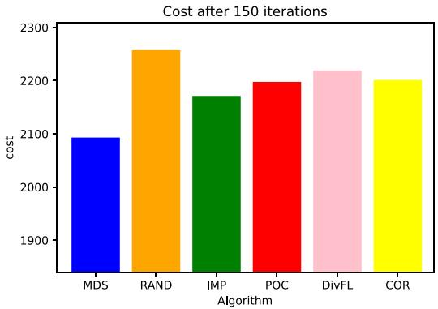  
Fig. 6. Incentive histogram at 150 rounds.

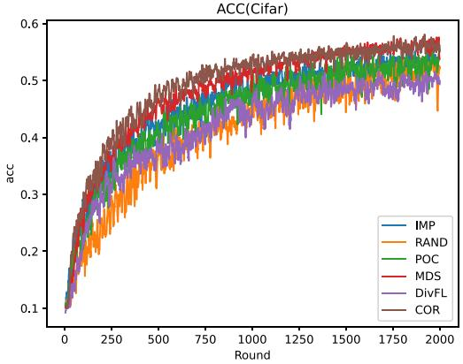  
Fig. 8. Accuracy plot under each round of the Cifar dataset after smoothing.

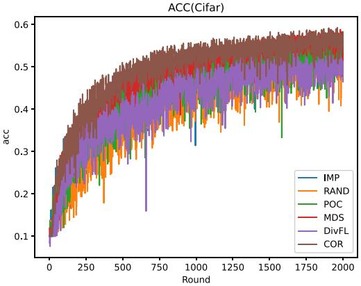  
Fig. 7. Accuracy plot under each round of the Cifar dataset.

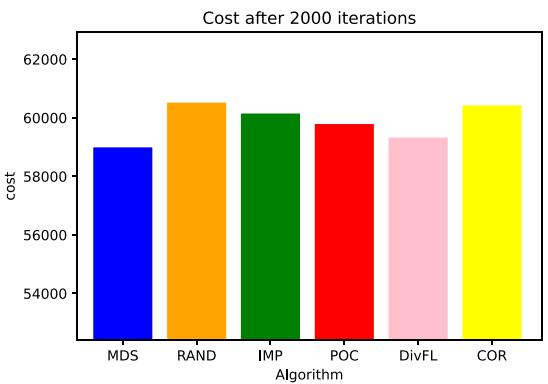  
Fig. 9. Incentive histogram at 2000 rounds.

To compare the performance of various schemes under the Cifar dataset, we use a CNN model for training, set the number of kernels to be 32, 64, and 64 for three convolutional layers, and set the learning rate to 0.01. The size of the UAV candidate pool is set to 100, from which 5 UAVs are selected to participate in federated learning, and the rest of the settings are the same as the F-mnist experiment settings. The experimental results are shown in Fig. 7, and we smooth Fig. 7 due to the high volatility. We take the average value every five rounds to get Fig. 8. From Fig. 8, it can be seen that the MDS scheme has higher training accuracy with the same experimental setup. For ease of calculation, the average of the accuracy from the 1700th round to 1800th round is taken. The accuracy of the MDS scheme at convergence is improved by 3.36 percentage points compared to the POC scheme, 4.01 percentage points compared to the IMP scheme, 7.34 percentage points compared to the DivFL scheme, and about 5.46 percentage points compared to the RAND scheme. The COR scheme converges almost as fast as MDS, and the average accuracy from rounds 1700 to 1800 is only 0.0014 higher than that of MDS. From the incentive perspective, however, the MDS scheme is more economical. It saves 2.6% incentive compared to the RAND scheme, 2% compared to the IMP scheme, 0.6% compared to the DivFL scheme, about 1.4% compared to the POC scheme, and roughly 2.4% compared to the COR scheme. The energy consumption histogram at 2000 rounds is shown in Fig. 9.

TABLE V  
TABLE OF ACCURACY AND INCENTIVE STATISTICS FOR EACH SCHEME UNDER THE UAV DATASET
<table><tr><td rowspan=1 colspan=1>arithmetic</td><td rowspan=1 colspan=1>MDS</td><td rowspan=1 colspan=1>RAND</td><td rowspan=1 colspan=1>IMP</td><td rowspan=1 colspan=1>POC</td><td rowspan=1 colspan=1>COR</td><td rowspan=1 colspan=1>DivFL</td></tr><tr><td rowspan=1 colspan=1>Incentives at 600 rounds</td><td rowspan=1 colspan=1>13700.982</td><td rowspan=1 colspan=1>14407.853</td><td rowspan=1 colspan=1>14401.071</td><td rowspan=1 colspan=1>14657.815</td><td rowspan=1 colspan=1>14691.015</td><td rowspan=1 colspan=1>14865.056</td></tr><tr><td rowspan=1 colspan=1>Average accuracy from 600 to 620 rounds</td><td rowspan=1 colspan=1>0.769476971</td><td rowspan=1 colspan=1>0.643851295</td><td rowspan=1 colspan=1>0.732999165</td><td rowspan=1 colspan=1>0.689223058</td><td rowspan=1 colspan=1>0.768930523</td><td rowspan=1 colspan=1>0.73550543</td></tr></table>

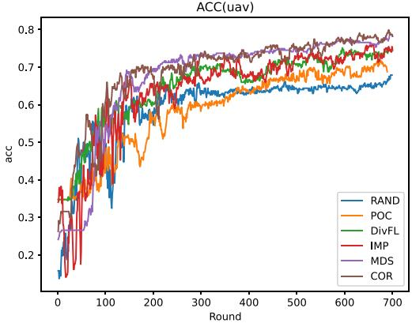

Fig. 10. Accuracy plot under each round of the UAV dataset.  
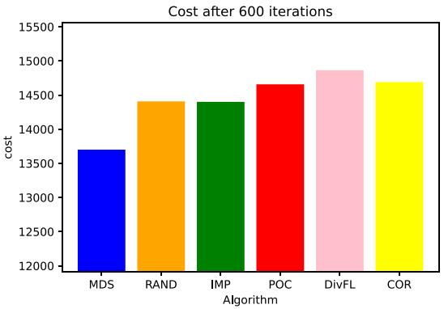  
Fig. 11. Incentive histogram at 600 rounds.

To test the generalization capability of the MDS algorithm in real-world scenarios, the experiments utilized the UAV multi-modal dataset (UAV-CM-Dataset) released by WUTCM-Lab [49]. This dataset is a comprehensive collection of images captured by low-altitude UAVs, containing six categories such as bananas, streams, and houses, with a total of 1586 images. The dataset was used for image classification, and the experimental setup was identical to that of F-MNIST. The experimental results are shown in Figs. 10 and 11. The required incentive at 600 rounds and the average accuracy from 600 to 620 rounds are shown in Table V.

Comparing the performance of various algorithms under the UAV dataset, it can be seen from Fig. 10 that the MDS algorithm has higher accuracy with the same experimental setup. Taking the average of rounds 600 to 620 for comparison, the MDS algorithm achieves an accuracy that is 12.6 percentage points higher than that of the RAND algorithm, 8 percentage points higher than that of the POC algorithm, 3.4 percentage points higher than that of DivFL, and 3.6 percentage points higher than that of IMP, while the accuracy of COR is very close to that of MDS. Comparing the incentives of each algorithm at 600 rounds, the MDS algorithm saves about 5.1% of the incentive compared to the RAND algorithm, about 5.1% compared to the IMP algorithm, 7.0% compared to the POC algorithm, about 8.5% compared to the DivFL algorithm, and approximately 7.2% compared to the COR algorithm. The incentive histograms for the 600 rounds of the UAV dataset are shown in Fig. 11.

## VI. POTENTIAL APPLICATIONS AND TECHNOLOGICAL TRENDS

From the experimental results, it can be seen that the MDS algorithm shows good performance in the UAV intelligent inspection scenario, which not only improves the accuracy of model training, but also reduces the incentive cost of federated learning. The main characteristics of this scenario are the large number of clients and the strong data heterogeneity, so the MDS algorithm also has strong generalization ability in other similar scenarios. For example, in smart transportation, ubiquitous cameras and sensors can use federated learning for model training, where the MDS algorithm handles client motivation and selection [50]. Similarly, in mobile crowdsensing, smart mobile devices carried by users collect sensory data, and the MDS algorithm motivates and selects participants [51]. Meanwhile, the proposed MDS algorithm in this paper constructs a candidate UAV pool based on contract theory combined with UAV battery residual management, and then employs Bayesian optimization to select suitable UAVs from the candidate pool for incentive allocation. The contract-theory-based bilateral selection mechanism demonstrates strong generality and can be widely applied in various scenarios such as edge computing and IoT device collaboration.

The data collected by UAVs (such as images, audio, and sensor data) exhibits multimodal and non-independent and identically distributed (non-IID) characteristics. By using multimodal foundation models to map the data collected by UAVs (e.g., images, text, and audio) into a shared semantic space, cross-modal retrieval (such as image-text matching) can be achieved. Meanwhile, in federated learning (FL), data parameters need to be periodically uploaded to a central server for aggregation, which also introduces communication overhead. The UAV collaboration technology combining AirComp (over-the-air computation) and FL uses the superposition principle of wireless channels to combine signals from multiple UAVs into a single receiver signal, thereby improving the aggregation efficiency of FL clients. By integrating the MDS algorithm with multimodal learning’s embedding alignment and AirComp’s parallel aggregation, UAV federated learning networks can achieve efficient processing of heterogeneous data, overcome communication and computational bottlenecks, and realize the highly efficient integration of communication-sensing-computation [52].

Due to the wide range of UAV inspections and long-distance communication requirements, UAVs often struggle to establish reliable connections with the model owner, increasing communication costs and delays. Hierarchical Federated Learning (HFL) [53] addresses this issue by introducing relay nodes between clients and the model owner, thereby reducing communication overhead and better supporting large-scale heterogeneous networks. Specifically, instead of uploading locally trained model parameters directly to the model owner, clients first send them to relay nodes for preliminary aggregation. The relay nodes then forward the aggregated parameters to the model owner for final aggregation [54]. Therefore, the combination of MDS algorithm and hierarchical federated learning will play a better role in large-scale UAV inspection network.

## VII. CONCLUSION

In UAV-assisted federated intelligent inspection scenarios, it is essential not only to reasonably select UAVs for training participation but also to design effective incentive mechanisms to ensure their active involvement. This paper proposes a Multi-Dimensional Selection (MDS) scheme that constructs a candidate UAV pool based on contract theory combined with UAV battery residual management, and then employs Bayesian optimization to select suitable UAVs from the candidate pool to participate in model training and receive incentives. Simulation results show that using the MDS scheme for UAV selection can achieve higher training accuracy while reducing incentive costs, effectively ensuring the accuracy and cost-efficiency of model training, saving communication bandwidth and computational resources, and significantly improving the training performance and economic benefits for the model owner.

## REFERENCES

[1] G. Jin, P. Zhang, Y. Zhang, Z. Zhou, and H. Li, “Design and implementation of UAV autonomous inspection system for UHV dense transmission channels,” in Proc. 2nd Int. Conf. Elect. Eng. Control Sci., 2022, pp. 619–622.

[2] W. Y. B. Lim et al., “Towards federated learning in uav-enabled Internet of Vehicles: A multi-dimensional contract-matching approach,” IEEE Trans. Intell. Transp. Syst., vol. 22, no. 8, pp. 5140–5154, Aug. 2021.

[3] W. Feng et al., “NOMA-based UAV-aided networks for emergency communications,” China Commun., vol. 17, no. 11, pp. 54–66, Nov. 2020.

[4] S. V. Chaudhari, S. Polepaka, M. S. Ashraf, R. Swain, A. Gvs, and R. K. Bora, “Bayesian optimization with deep learning based crop type classification on uav imagery,” in Proc. Int. Conf. Augmented Intell. Sustain. Syst., 2022, pp. 296–302.

[5] A. Raja, L. Njilla, and J. Yuan, “Blur the eyes of UAV: Effective attacks on UAV-based infrastructure inspection,” in Proc. IEEE 33 rd Int. Conf. Tools Artif. Intell., 2021, pp. 661–665.

[6] H. Haohan, Z. Hangfan, L. Junhai, L. Kuanrong, and P. Biao, “Automatic and intelligent line inspection using UAV based on Beidou navigation system,” in Proc. 6th Int. Conf. Inf. Sci. Control Eng., 2019, pp. 1004–1008.

[7] B. F. Spencer Jr, V. Hoskere, and Y. Narazaki, “Advances in computer vision-based civil infrastructure inspection and monitoring,” Engineering, vol. 5, no. 2, pp. 199–222, 2019.

[8] W. Wu, M. A. Qurishee, J. Owino, I. Fomunung, M. Onyango, and B. Atolagbe, “Coupling deep learning and UAV for infrastructure condition assessment automation,” in Proc. IEEE Int. Smart Cities Conf., 2018, pp. 1–7.

[9] Z. Cui, T. Yang, X. Wu, H. Feng, and B. Hu, “The data value based asynchronous federated learning for UAV swarm under unstable communication scenarios,” IEEE Trans. Mobile Comput., vol. 23, no. 6, pp. 7165–7179, Jun. 2024.

[10] L. Zhou, S. Leng, and Q. Wang, “A federated digital twin framework for UAVs-based mobile scenarios,” IEEE Trans. Mobile Comput., vol. 23, no. 6, pp. 7377–7393, Jun. 2024.

[11] S. Banabilah, M. Aloqaily, E. Alsayed, N. Malik, and Y. Jararweh, “Federated learning review: Fundamentals, enabling technologies, and future applications,” Inf. Process. Manage., vol. 59, no. 6, 2022, Art. no. 103061.

[12] L. H. Manjarrez, J. C. Ramos-Fernández, E. S. Espinoza, and R. Lozano, “Estimation of energy consumption and flight time margin for a UAV mission based on fuzzy systems,” Technologies, vol. 11, no. 1, 2023, Art. no. 12.

[13] G. A. Abdulrahman, N. A. Qasem, W. G. Abdelrahman, and A. M. Abdallah, “A review of powering unmanned aerial vehicles by clean and renewable energy technologies,” Sustain. Energy Technol. Assessments, vol. 73, 2025, Art. no. 104150.

[14] W. Khawaja, I. Guvenc, D. W. Matolak, U.-C. Fiebig, and N. Schneckenburger, “A survey of air-to-ground propagation channel modeling for unmanned aerial vehicles,” IEEE Commun. Surveys Tuts., vol. 21, no. 3, pp. 2361–2391, thirdquarter 2019.

[15] Z. Wang, H. Meng, Y. Cao, D. Cui, and Z. Chang, “Cost minimization of integrated sensing, communication, and computing in UAV-enabled systems,” in Proc. 2nd Int. Conf. Mobile Internet, Cloud Comput. Inf. Secur., 2024, pp. 13–18.

[16] Z. Zhou et al., “MR-FFL: A stratified community-based mutual reliability framework for fairness-aware federated learning in heterogeneous UAV networks,” IEEE Internet Things J., vol. 11, no. 12, pp. 20995–21009, Jun. 2024.

[17] J. Yu, Y. Chen, S. Li, H. Zhang, and Y. Chen, “Secondary matching algorithm: A new heterogeneous image matching algorithm for the UAV image and satellite remote sensing image,” in Proc. IEEE Int. Geosci. Remote Sens. Symp., 2022, pp. 3275–3278.

[18] A. Masood, T.-V. Nguyen, T. P. Truong, and S. Cho, “Content caching in HAP-assisted multi-UAV networks using hierarchical federated learning,” in Proc. Int. Conf. Inf. Commun. Technol. Convergence, 2021, pp. 1160–1162.

[19] H. Xie, T. Zhang, X. Xu, D. Yang, and Y. Liu, “Joint sensing, communication, and computation in UAV-assisted systems,” IEEE Internet Things J., vol. 11, no. 18, pp. 29412–29426, Sep. 2024.

[20] Y. Xu, T. Zhang, Y. Liu, and D. Yang, “UAV-enabled integrated sensing, computing, and communication: A fundamental trade-off,” IEEE Wireless Commun. Lett., vol. 12, no. 5, pp. 843–847, May 2023.

[21] Z. Wang, H. Meng, Y. Cao, D. Cui, and Z. Chang, “Cost minimization of integrated sensing, communication, and computing in UAV-enabled systems,” in Proc. 2nd Int. Conf. Mobile Internet, Cloud Comput. Inf. Secur., 2024, pp. 13–18.

[22] P. Hou, H. Zhu, Z. Lu, S.-C. Huang, Y. Yang, and H. Chai, “Learningbased over-the-air integrated sensing, communication and computation in UAV swarm-enabled intelligent transportation systems,” IEEE Trans. Green Commun. Netw., vol. 9, no. 3, pp. 1414–1428, Sep. 2025.

[23] P. Hou et al., “Distributed drl-based integrated sensing, communication and computation in cooperative UAV-enabled intelligent transportation systems,” IEEE Internet Things J., vol. 12, no. 5, pp. 5792–5806, Mar. 2025.

[24] W. Liu, Z. Jin, X. Zhang, W. Zang, S. Wang, and Y. Shen, “AoI-aware UAV-enabled marine MEC networks with integrated sensing, computation, and communication,” in Proc. IEEE/CIC Int. Conf. Commun. China, 2023, pp. 1–6.

[25] M. U. Afzal and A. A. Abdellatif, “Energy-efficient secure federated learning for UAV swarms,” in Proc. 7th Int. Conf. Energy Conservation Efficiency, 2024, pp. 1–5.

[26] B. Hu, M. Isaac, O. M. Akinola, H. Hafizh, and W. Zhang, “Federated learning empowered resource allocation in UAV-assisted edge intelligent systems,” in Proc. IEEE 3 rd Int. Conf. Comput. Commun. Artif. Intell., 2023, pp. 336–341.

[27] J. Tang, J. Nie, Y. Zhang, Z. Xiong, W. Jiang, and M. Guizani, “Multi-UAVassisted federated learning for energy-aware distributed edge training,” IEEE Trans. Netw. Service Manag., vol. 21, no. 1, pp. 280–294, Feb. 2024.

[28] F. Wu et al., “Participant and sample selection for efficient online federated learning in UAV swarms,” IEEE Internet Things J., vol. 11, no. 12, pp. 21202–21214, Jun. 2024.

[29] Y. Wang, Z. Su, T. H. Luan, R. Li, and K. Zhang, “Federated learning with fair incentives and robust aggregation for UAV-aided crowdsensing,” IEEE Trans. Netw. Sci. Eng., vol. 9, no. 5, pp. 3179–3196, Sep./Oct. 2022.

[30] C. Chen, S. Gong, W. Zhang, Y. Zheng, and Y. C. Kiat, “DRL-based contract incentive for wireless-powered and UAV-assisted backscattering MEC system,” IEEE Trans. Cloud Comput., vol. 12, no. 1, pp. 264–276, Jan.–Mar. 2024.

[31] L. Xie, Z. Su, N. Chen, and Q. Xu, “Secure data sharing in UAV-assisted crowdsensing: Integration of blockchain and reputation incentive,” in Proc. IEEE Glob. Commun. Conf., 2021, pp. 1–6.

[32] J. Kang, Z. Xiong, D. Niyato, S. Xie, and J. Zhang, “Incentive mechanism for reliable federated learning: A joint optimization approach to combining reputation and contract theory,” IEEE Internet Things J., vol. 6, no. 6, pp. 10700–10714, Dec. 2019.

[33] J. Pang, J. Yu, R. Zhou, and J. C. Lui, “An incentive auction for heterogeneous client selection in federated learning,” IEEE Trans. Mobile Comput., vol. 22, no. 10, pp. 5733–5750, Oct. 2023.

[34] H. Zhao et al., “Are you diligent, inefficient, or malicious? A selfsafeguarding incentive mechanism for large-scale federated industrial maintenance based on double-layer reinforcement learning,” IEEE Internet Things J., vol. 11, no. 11, pp. 19988–20001, Jun. 2024.

[35] M. Maheepala, M. A. Joordens, and A. Z. Kouzani, “Low power processors and image sensors for vision-based IoT devices: A review,” IEEE Sensors J., vol. 21, no. 2, pp. 1172–1186, Jan. 2021.

[36] W. Xia, T. Q. Quek, K. Guo, W. Wen, H. H. Yang, and H. Zhu, “Multiarmed bandit-based client scheduling for federated learning,” IEEE Trans. Wireless Commun., vol. 19, no. 11, pp. 7108–7123, Nov. 2020.

[37] Y. Mao, J. Zhang, and K. B. Letaief, “Dynamic computation offloading for mobile-edge computing with energy harvesting devices,” IEEE J. Sel. Areas Commun., vol. 34, no. 12, pp. 3590–3605, Dec. 2016.

[38] A. Al-Hourani, S. Kandeepan, and A. Jamalipour, “Modeling air-toground path loss for low altitude platforms in urban environments,” in Proc. IEEE Glob. Commun. Conf., 2014, pp. 2898–2904.

[39] Q. Zhu et al., “Geometry-based stochastic line-of-sight probability model for A2G channels under urban scenarios,” IEEE Trans. Antennas Propag., vol. 70, no. 7, pp. 5784–5794, Jul. 2022.

[40] M. Tang et al., “FedCor: Correlation-based active client selection strategy for heterogeneous federated learning,” in Proc. IEEE/CVF Conf. Comput. Vis. Pattern Recognit., 2022, pp. 10102–10111.

[41] Y. Zeng and J. Tang, “Real-time data acquisition and processing under mobile edge computing-assisted UAV system,” in Proc. IEEE Glob. Commun. Conf., 2022, pp. 5680–5685.

[42] R. Ke, Z. Li, J. Tang, Z. Pan, and Y. Wang, “Real-time traffic flow parameter estimation from UAV video based on ensemble classifier and optical flow,” IEEE Trans. Intell. Transp. Syst., vol. 20, no. 1, pp. 54–64, Jan. 2019.

[43] T.-M. H. Hsu, H. Qi, and M. Brown, “Measuring the effects of nonidentical data distribution for federated visual classification,” 2019, arXiv:1909.06335.

[44] J. Tan and X. Wang, “FL-Bench: A federated learning benchmark for solving image classification tasks,” GitHub Repository, 2024. Accessed: Apr. 10, 2025. [Online]. Available: https://github.com/KarhouTam/FLbench

[45] F. Lai et al., “FedScale: Benchmarking model and system performance of federated learning at scale,” in Proc. Int. Conf. Mach. Learn., 2022, pp. 11814–11827.

[46] E. Rizk, S. Vlaski, and A. H. Sayed, “Optimal importance sampling for federated learning,” in Proc. IEEE Int. Conf. Acoust., Speech Signal Process., 2021, pp. 3095–3099.

[47] Y. J. Cho, J. Wang, and G. Joshi, “Client selection in federated learning: Convergence analysis and power-of-choice selection strategies,” 2020, arXiv:2010.01243.

[48] R. Balakrishnan, T. Li, and J. Bilmes, “Diverse client selection for federated learning via submodular maximization,” Genome Biol., vol. 24, no. 1, 2023, Art. no. 4.

[49] WUTCM-Lab, “UAV-CM-Dataset,” GitHub Repository, 2024. Accessed: Apr. 10, 2025. [Online]. Available: https://github.com/WUTCM-Lab/ UAV-CM-Dataset

[50] G. Li, J. Cai, C. He, X. Zhang, and H. Chen, “Online incentive mechanism designs for asynchronous federated learning in edge computing,” IEEE Internet Things J., vol. 11, no. 5, pp. 7787–7804, Mar. 2024.

[51] R. She, “Survey on incentive strategies for mobile crowdsensing system,” in Proc. IEEE 11th Int. Conf. Softw. Eng. Service Sci., 2020, pp. 511–514.

[52] J. Du, T. Lin, C. Jiang, Q. Yang, C. F. Bader, and Z. Han, “Distributed foundation models for multi-modal learning in 6G wireless networks,” IEEE Wireless Commun., vol. 31, no. 3, pp. 20–30, Jun. 2024.

[53] T. Wang, X. Huang, Y. Wu, L. Qian, B. Lin, and Z. Su, “UAV swarmassisted two-tier hierarchical federated learning,” IEEE Trans. Netw. Sci. Eng., vol. 11, no. 1, pp. 943–956, Jan./Feb. 2024.

[54] H. Zhao, T. Xia, Y. Xia, J. Yang, M. Liu, and H. Zhu, “Safe and saving: A joint learning and energy-efficient scheduling scheme of UAV assisted hierarchical federated learning for remote inspection within large scale IIOT,” IEEE Internet Things J., vol. 12, no. 13, pp. 25357–25370, Jul. 2025.

Haitao Zhao (Senior Member, IEEE) was born in 1983. He received the MS and PhD (with Hons.) degrees from the Nanjing University of Posts and Telecommunications, Nanjing, China, in 2008 and 2011, respectively. He is currently a professor with the School of Internet of Things, Nanjing University of Posts and Telecommunications. His research interests include ubiquitous wireless communication and the Internet of Things.

Mengqi Sui received the BS degree in communication and information engineering in 2022 from the Nanjing University of Posts and Telecommunications, Nanjing, China, where she is currently working toward the MS degree in communications and information systems. Her research interests include Industrial Internet of Things and federated learning.

Miao Liu received the BSc degree in communication engineering from the University of Electric Science and Technology of China, Chengdu, China, in 2011, and the MSc and PhD degrees in communication engineering from Southeast University, Nanjing, China, in 2014 and 2019, respectively. He is currently an assistant professor with the Nanjing University of Posts and Telecommunications, Nanjing, China. His research interests include federated learning, cognitive radio networks, and heterogeneous IoT.

Chun Zhu received the bachelor’s degree in engineering from Tongda College, Nanjing University of Posts and Telecommunications (NJUPT), Nanjing, China, in 2014, and the master’s degree in engineering in 2017 from NJUPT, where he is currently working toward the PhD degree in engineering. His research interests include edge computing, artificial intelligence, heterogeneous IoT, and UAV communication.

Hongbo Zhu (Member, IEEE) received the BS degree in communications engineering from the Nanjing University of Posts and Telecommunications (NJUPT), Nanjing, China, in 1982, and the PhD degree in information and communications engineering from the Beijing University of Posts and Telecommunications, Beijing, China, in 1996. He is currently a professor with NJUPT.