# An Online Double Auction Mechanism for Dynamic Resource Allocation in Maritime Networks

Xianglong Li , Member, IEEE, Kaiwei Mo , Guang Fang , and Zongpeng Li , Senior Member, IEEE

Abstract—In maritime navigation, vessels rely on Internet access for communication and entertainment, typically provided by terrestrial-based stations via relay links. For routes that are dificult to cover from the shore, long-endurance drones are deployed to accompany ships and provide Internet connectivity. However, existing systems consider only Internet Service Provider (ISP) competition and do not incorporate the resource selection process that depends on users’ Internet service demand. Furthermore, the flexibility of user utility is limited by ISPs’ pre-defined time-slot allocation methods. To address the unique challenges of maritime environments, including variable connectivity, complex vessel mobility, UAV energy constraints, potential communication disruptions, and fluctuating user demand, we propose an enhanced double auction mechanism that explicitly accounts for real-world constraints that are not typically encountered in terrestrial networks. Our proposed Online Maritime Double Auction Mechanism (OMDAM) aims to maximize the social welfare of the maritime network. We introduce an online algorithm, $A _ { o n l i n e } ,$ to solve the social welfare maximization problem, with an inner algorithm, $A _ { c o r e } ,$ handling the selection of Internet access devices and task allocation between ships and ISPs. Theoretical analysis demonstrates that OMDAM ensures budget balance, individual rationality, and economic eficiency. Simulation results show a performance improvement of up to 17% in social welfare compared with prior art, underscoring the advantages of a maritime-specific design under realistic operational settings.

Index Terms—Maritime networks, online double auction, UAV, resource allocation, task scheduling.

## I. INTRODUCTION

RADITIONAL maritime communication networks, including maritime wireless, drones, and terrestrialbased mobile communication systems, have been fundamental to maritime exploration and operations. However, these systems face significant challenges, such as incompatible protocols, varying Internet connection capacities, coverage blind spots, and ineficient management strategies. As the demand for robust communication in maritime activities escalates, these limitations have become increasingly apparent. He et al. demonstrate a two-level relay scheme using shore-based and sea-based stations equipped with 2.1 GHz 4TR RRU wireless devices, achieving continuous coverage over 40 km [1]. Similarly, Feng et al. show that 5G NR operating at 700 MHz with physical random access channel format 1 can provide access distances of up to 103 km, supporting web browsing, 1080p live streaming, and 2K HD video at distances of 70 km, 50 km, and 40 km, respectively [2]. The height of the antenna is also critical. For instance, a terrestrial-based antenna at 30 m altitude covers 32 km, while the same antenna on a UAV at 400 m altitude expands coverage to 92 km. In regions where Low Earth Orbit (LEO) satellites are restricted, or for users requiring high bandwidth without investing in new satellite terminals, terrestrial-based stations and UAVs ofer a coordinated solution (Figure 1). Despite these advancements, traditional networks still struggle to accommodate the rapid expansion of maritime activities, becoming a critical bottleneck to the maritime sector’s growth. These observations call for jointly redesigning communication, computation, and incentive mechanisms for maritime networks, rather than merely porting terrestrial or satellite schemes to the sea.

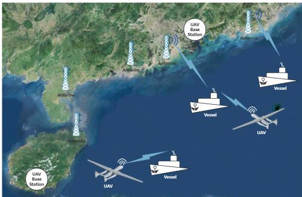  
Fig. 1. Illustration of a maritime communication network.

To address the challenges in maritime communication networks, this work aims to assess technological developments, adapt sea channel models, and network architectures that suit maritime environments (Figure 2). The end goal is to build a high-speed, reliable, fully covered, and cost-efective communication network for modern maritime operations. Three key challenges arise: 1. Coverage limitations in mid-to-far sea areas: Existing systems, terrestrial-based stations and satellite networks, struggle to provide consistent service. This afects critical activities like smart ocean applications and ofshore operations. 2. Technical and environmental challenges: Harsh maritime environments and the logistics of installing and maintaining equipment on remote platforms make network deployment complex. 3. Integration of diverse communication technologies: Seamlessly combining terrestrial 5G and UAV systems into a unified network presents technical hurdles, particularly in resource management across diferent media. Furthermore, maritime environments pose additional complications compared to land-based networks. Unstable weather patterns can disrupt UAV flight routes and degrade communication quality, while non-stationary ship positions lead to fluctuating demand. These realities demand a specialized mechanism that can adapt to rapid, large-scale variations in supply and demand across multiple ISPs. Algorithmically, the resulting resource allocation and task scheduling problem is NP-hard, time-coupled across slots, and driven by online bids from heterogeneous ships and ISPs, so static or singleprovider mechanisms are insuficient.

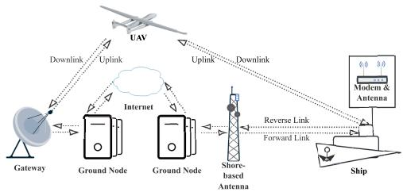  
Fig. 2. Architecture of a maritime communication network.

To meet the growing demand for robust maritime communication, we propose an advanced infrastructure that dynamically allocates resources and schedules tasks. Rather than reusing existing double-auction schemes, our new Online Maritime Double Auction Mechanism (OMDAM) is derived from a problem-specific compact-exponential reformulation of the underlying 0–1 integer linear program and a tailored primal–dual online algorithm. The core algorithm, $A _ { o n l i n e } ,$ eficiently selects Internet access devices and schedules tasks, ensuring adaptability to varying conditions. The inner algorithm, $A _ { c o r e } ,$ pursues budget balance, individual rationality, and economic eficiency. Together, $A _ { o n l i n e }$ and $A _ { c o r e }$ realize an online marginal-pricing scheme that explicitly incorporates UAV flight energy, long-range wireless coverage, multi-ISP competition, and ship mobility, going beyond standard online double-auction models. Previous research addresses aspects of maritime communication but fails to fully resolve dynamic resource allocation challenges [3], [4]. Alsolai et al. design a maritime scheduling algorithm [5], and Wei et al. present a multi-layer particle swarm optimization solution. These methods, however, either omit explicit market mechanisms or lack formal guarantees on economic properties and competitive performance in an online setting. Our work, partly inspired by Cui et al.’s spectrum allocation [6], introduces a fair and eficient allocation mechanism, significantly improving spectrum utilization and resource management in maritime environments. Unlike traditional double auction frameworks, which assume mostly stable network conditions, our approach explicitly integrates maritime-specific constraints, such as long communication ranges, weather-induced link instability, and UAV energy and recharge limitations. This yields a theoretically grounded, maritime-specific online mechanism rather than a straightforward reuse of existing techniques. We validate the eficiency (both computational and economic) of our approach through theoretical analysis and experiments, showing substantial improvements over existing methods. In particular, we prove weak budget balance, individual rationality, and a constant-factor competitive ratio with respect to the optimal ofline solution.

Our research makes four contributions: 1. Hybrid Communication Infrastructure: By integrating terrestrial antennas with UAVs, we enhance coverage and resource allocation, ensuring consistent service even in remote sea areas. The proposed architecture captures distance-aware 5G NR links at 700 MHz, energy-constrained UAV relays, and heterogeneous ISP backhaul in a unified system model for subsequent algorithm design. 2. OMDAM Mechanism: This auctionbased system dynamically allocates resources among ISPs and users, improving eficiency and interoperability. OMDAM is, to the best of our knowledge, the first online double auction specifically tailored for maritime networks that jointly handles multi-ISP competition, UAV-assisted access, and time-varying coverage within a single optimization framework. 3. Eficient Algorithms $A _ { o n l i n e }$ and $A _ { c o r e }$ : These algorithms optimize task scheduling and resource allocation while ensuring economic fairness and eficiency. $A _ { o n l i n e }$ makes on-the-fly bid acceptance and preliminary scheduling decisions, while $A _ { c o r e }$ solves the induced packing problem guided by dynamically updated dual prices, yielding a polynomial-time online algorithm with provable performance bounds. 4. Empirical Validation: Extensive simulations demonstrate a significant improvement in system eficiency compared to existing methods, providing a practical solution to maritime communication challenges. Across a wide range of load and topology settings, our mechanism achieves higher social welfare and acceptance ratios than representative baselines (e.g., random and heuristic double-auction schemes), with social-welfare gains on the order of tens of percent in typical scenarios.

Moreover, by explicitly enforcing individual rationality and weak budget balance and by examining how dynamic pricing shapes participant utilities, OMDAM is also more robust to strategic bidding, providing a realistic and implementable foundation for real-world maritime deployments.

## II. RELATED WORKS

This section reviews advancements in maritime communication, vessel control, and decision-making systems relevant to optimizing resource allocation and scheduling in maritime networks. Li et al. design a digital-twin framework for the Marine Internet of Things (M-IoT), where drones upload federated-learning models to a highaltitude platform via NOMA under secrecy and latency constraints [7]; Zhang et al. develop collaborative path planning for heterogeneous autonomous marine vehicles using metaheuristics and ocean-current-aware surface planning [8];

Dong et al. propose a distributed formation observer and adaptive fuzzy controller for time-varying formation tracking under nonlinearities and actuator faults [9]; and Guan et al. employ Proximal Policy Optimization with a BiGRU-based network to realize COLREGs-compliant collision-avoidance decisions in multi-ship encounters [10]. These works illustrate how optimization, control, and learning enhance maritime sensing, navigation, and decision making, but they usually assume a single communication infrastructure or abstract away network/economic aspects, and thus do not tackle dynamic resource allocation among heterogeneous ISP devices (e.g., terrestrial base stations and UAVs) with strategic bidding from both ships and ISPs. In contrast, our work explicitly models such a multi-ISP maritime communication ecosystem and designs an online double auction mechanism that couples communication capacity constraints with economic incentives to maximize social welfare under uncertain sea conditions. These studies highlight the importance of adaptability and eficient control in maritime environments. However, challenges remain in optimizing resource allocation for maritime networks involving multiple ISPs and users.

Building on advances in maritime control and networking, Liang et al. design a containment maneuvering strategy for marine surface vehicles that bounds tracking errors while reducing exchanged data via quantized communication [11]. Wu et al. develop an echo-state-network–based tunnel coordinated control method that achieves prescribed performance under uncertainties and actuator faults [12], Li et al. propose a robust adaptive event-triggered control scheme for USV–UAV cooperative search that lowers communication burden while ensuring stability [13], and Hu et al. introduce a collaborative routing maintenance method for marine mobile wireless sensor networks that improves energy consumption, packet delivery ratio, and delay through dynamic relay selection and route repair [14]. Collectively, these works emphasize robustness, adaptability, and communication eficiency at the control and routing layers, yet they typically rely on a single-provider communication infrastructure and do not consider incentive-compatible, multi-ISP resource allocation with strategic users, which is the focus of our online double auction mechanism.

The double auction mechanism is central to our work in managing multi-participant scenarios. In transportation and computing, many double-auction mechanisms coordinate multiple buyers and sellers under economic and capacity constraints. Yassine et al. propose a double-sided auction mechanism that matches EVs by pairing bids and asks such that the traded volume and the utilities are maximized [15], and show that the mechanism is truthful, individually rational, and computationally eficient on real V2V energy-trading data. Huang et al. introduce a multi-participant double auction for edge computing through algorithms MPRA and TRA [16], where a neutral auctioneer coordinates long- and short-term resource allocation and pricing between service and infrastructure providers, improving social welfare, provider utilities, and resource utilization. Li et al. present dynamic double auction mechanisms for cloud computing [17], formulating a Truthful Dynamic Combinatorial Double Auction (TDCDA) with a greedy allocation scheme and payment rule that achieves approximately eficient, truthful, individually rational, and budget-balanced resource allocation among multiple cloud users and providers. Zhang et al. and Zheng et al. develop auction-based algorithms for task ofloading and resource allocation in mobile edge computing [18], [19], jointly optimizing base-station selection and resource allocation via mobility-aware models and dynamic-pricing double auctions (e.g., DABM and DADPM) that enhance ofloading success rate, system revenue, and resource utilization under local energy and capacity constraints. Zavodovski et al. introduce a decentralized market framework for edge computing using a DSIC double auction [20], designing DeCloud on a distributed ledger with a truthful matching heuristic that handles heterogeneous edge resources and achieves near-optimal economic performance on cluster traces. Chu et al. provide strategies for ensuring truthfulness and incentive compatibility in double auctions [21], proposing two asymptotically eficient mechanisms (BC-LP and MBC) for exchange markets with transaction costs and proving that truthful bidding is a dominant strategy while attaining higher eficiency than prior truthful mechanisms.

These studies show that well-designed double auctions can provide strong economic guarantees—such as truthfulness, individual rationality, budget balance, and high social welfare—in EV energy trading, cloud markets, and edge computing. However, they are built on relatively stable terrestrial infrastructures and do not address maritime-specific challenges, including uncertain sea coverage, harsh environmental conditions, highly mobile ships, and UAV/antenna deployment limits. Accordingly, our proposed OMDAM framework extends double auction concepts into the maritime domain by accounting for uncertain wireless coverage, harsh environmental conditions, and UAV deployment limitations. We then develop an online maritime double auction mechanism for maritime networks, which improves resource allocation and pricing eficiency. This bridges the gap between classical double-auction theory and practical resource allocation in multi-ISP maritime communication networks.

## III. MODELING

Consider a maritime communication network composed of terrestrial-based antennas, ships, and UAVs, all providing Internet access under real-world constraints such as device capacities, coverage, deadlines, and mobility. Terrestrial antennas operating at 700 MHz can cover up to 103 km and deliver speeds of 160 Mbps within 50 km. When ships, following varying routes, move beyond antenna coverage, UAVs (e.g., the Twin-tailed Scorpion, with 40 hours of endurance and an 8,000 km range) ofer alternative connectivity. Each ISP may own multiple devices with specific capacity and coverage attributes. This maritime environment presents unique challenges—fluctuating demand, unpredictable ship and UAV mobility influenced by currents and weather, potential link disruptions, and the need for distance-based resource management. For instance, UAVs can deliver resources from a feasible distance, while energy consumption and recharge constraints guarantee continuous UAV availability. In severe weather, if UAVs become inaccessible, our algorithms dynamically reduce UAV capacity, thus accommodating real-time reallocation of terrestrial and aerial resources in open-sea operations. Note that UAV operational deadlines implicitly account for energy constraints, and the capacity function $c _ { m j } ( t )$ captures real-time fluctuations in UAV availability and environmental conditions, including adverse weather impacts: when encountering adverse environmental conditions, no service capacity is provided $( c _ { m j } = 0 )$ ; otherwise, $c _ { m j } ( t )$ equals the actual available capacity of the UAV, thereby embedding essential practical complexities of maritime communication within our optimization model.

## A. Original Problem Modeling

Before modeling the problem, we first introduce the notations for the relevant variables in Table I and then define the maritime social welfare.

The notations represent key variables related to resource allocation and task scheduling in maritime communication networks. These include sets of ships $N ,$ bids $I ,$ time slots T , and ISPs M owning antennas A or UAVs V. Important variables include the submission time $t _ { n } ,$ bid start time $t _ { n i } ,$ deadline $d _ { n i } .$ , bid price $b _ { n i } .$ , and required bandwidth $r _ { n i }$ for each ship. Furthermore, we have allocation indicators xni, $z _ { n i m j } ( t )$ antenna and UAV capacities $c _ { m j } ( t )$ , and positional gaps $g _ { n m j } ( t )$ These variables jointly capture economic factors (prices) and operational constraints (UAV range, antenna capacity), forming the basis for robust resource management in maritime networks.

Definition 1 (Social Welfare): The social welfare in the auction market with deadlines is the aggregate bidder utility $\begin{array} { r } { \sum _ { n , i } b _ { n i } x _ { n i } - \sum _ { n , i } p _ { n i } ^ { b } x _ { n i } } \end{array}$ plus the auctioneer’s utility $\begin{array} { r } { \sum _ { n , i } p _ { n i } ^ { b } x _ { n i } - \sum _ { n , i } p _ { n i } ^ { s } x _ { n i } } \end{array}$ plus the ISP’s utility $\begin{array} { r } { \sum _ { n , i } p _ { n i } ^ { s } x _ { n i } \mathrm { ~ - ~ } } \end{array}$ $\begin{array} { r } { \sum _ { n , i , m , t , j } s _ { n i m } ( t ) z _ { n i m j } ( t ) } \end{array}$ ,. Payments cancel out, and the social , , , ,welfare becomes $\begin{array} { r } { \sum _ { n , i } b _ { n i } x _ { n i } - \sum _ { n , i , m , t , j } s _ { n i m } ( t ) z _ { n i m j } ( t ) } \end{array}$

## B. Integrating Auction Model in Task Allocation

In our auction model, ships act as buyers bidding for Internet connectivity, while ISPs, owning UAVs or terrestrial-based stations, serve as sellers. Buyers submit bids, and sellers ofer unit prices in continuous time slots. If a seller’s price is lower than the buyer’s bid, a matching bid is formed. The auctioneer collects all matching bids and decides which to confirm. A confirmed bid, called a received bid, specifies the ship’s Internet connectivity demand and the allocated bandwidth from ISPs, we represent it using the bidding language and then execute it. To handle volatile maritime conditions and potential changes in ISP device load and UAV availability, we allow dynamic updates in prices, reflecting real-time network states.

## C. Bidding Language and State-Based Distance Function

Definition 2 (Bidding Language): The bidding language for maritime ships is $B _ { n i } = ( t _ { n } , ~ t _ { n i } , ~ d _ { n i } , ~ l _ { n i } , ~ r _ { n i } , ~ b _ { n i } , ~ \{ o _ { n } ( t ) \} )$ ). The bidding language for the ISP is $B ^ { s } = s _ { n i m } ( t )$

TABLE I KEY NOTATIONS
<table><tr><td rowspan=1 colspan=1>Inputs</td><td rowspan=1 colspan=1>Descriptions</td></tr><tr><td rowspan=1 colspan=1> $\overline { { N } }$ </td><td rowspan=1 colspan=1>set of ships</td></tr><tr><td rowspan=1 colspan=1> $\overline { { I } }$ </td><td rowspan=1 colspan=1>set of bids for each ship</td></tr><tr><td rowspan=1 colspan=1> $\overline { J }$ </td><td rowspan=1 colspan=1>set of antennas and UAVs owned by each ISP</td></tr><tr><td rowspan=1 colspan=1> $\overline { { T } }$ </td><td rowspan=1 colspan=1>set of time slots</td></tr><tr><td rowspan=1 colspan=1> $\overline { { A } }$ </td><td rowspan=1 colspan=1>set of ISPs that own some antennas</td></tr><tr><td rowspan=1 colspan=1> $\overline { V }$ </td><td rowspan=1 colspan=1>set of ISPs that own some UAVs</td></tr><tr><td rowspan=1 colspan=1> $\overline { { M } }$ </td><td rowspan=1 colspan=1>set of all ISPs</td></tr><tr><td rowspan=1 colspan=1> $t _ { n }$ </td><td rowspan=1 colspan=1>submission time of ship n&#x27;s bids</td></tr><tr><td rowspan=1 colspan=1> $t _ { n i }$ </td><td rowspan=1 colspan=1>start time of ship n&#x27;s $\bar { \overline { { i ^ { t h } } } }$ bid</td></tr><tr><td rowspan=1 colspan=1> $d _ { n i }$ </td><td rowspan=1 colspan=1>deadline of ship n&#x27;s $\overline { { i ^ { t h } } }$ bid</td></tr><tr><td rowspan=1 colspan=1> $d _ { m j }$ </td><td rowspan=1 colspan=1>deadline of ISP m&#x27;s ${ \overline { { j ^ { t h } } } }$ UAV device</td></tr><tr><td rowspan=1 colspan=1> $l _ { n i }$ </td><td rowspan=1 colspan=1>number of slots required by ship $\overline { { n ^ { \prime } { \mathrm { s } } \ i ^ { t h } } }$ bid</td></tr><tr><td rowspan=1 colspan=1> $b _ { n i }$ </td><td rowspan=1 colspan=1>price for the $\overline { { i ^ { t h } } }$ bid of ship n</td></tr><tr><td rowspan=1 colspan=1> $s _ { n i m } ( t )$ </td><td rowspan=1 colspan=1>unit asking price charged by ISP m for ship n&#x27;s $\overline { { i ^ { t h } } }$ bid attime t</td></tr><tr><td rowspan=1 colspan=1> $\overline { { o _ { n } ( t ) } }$ </td><td rowspan=1 colspan=1>position (latitude and longitude) of ship n in slot t</td></tr><tr><td rowspan=1 colspan=1> $o _ { m j } ( t )$ </td><td rowspan=1 colspan=1>position of ISP m&#x27;s jth UAV in slot t</td></tr><tr><td rowspan=1 colspan=1> $S _ { m j }$ </td><td rowspan=1 colspan=1>average speed of ISP m&#x27;s $\overline { { j ^ { t h } } }$ UAV</td></tr><tr><td rowspan=1 colspan=1> $x _ { n i }$ </td><td rowspan=1 colspan=1>binary variable indicating whether ship n&#x27;s $\overline { { i ^ { t h } } }$ bid is accepted(1) or not (0)</td></tr><tr><td rowspan=1 colspan=1> $z _ { n i m j } ( t )$ </td><td rowspan=1 colspan=1>binary variable indicating whether ship n&#x27;s $\overline { { i ^ { t h } } }$ bid is servedby ISP $m { \mathrm { ~ s ~ } } j ^ { t h }$ device in slot t</td></tr><tr><td rowspan=1 colspan=1> $\overline { { c _ { m j } ( t ) } }$ </td><td rowspan=1 colspan=1>available bandwidth capacity of ISP m&#x27;s $\overline { { j ^ { t h } } }$ device in slot t</td></tr><tr><td rowspan=1 colspan=1> ${ \underline { { r _ { n i } } } }$ </td><td rowspan=1 colspan=1>bandwidth demand of ship n&#x27;s $\overline { { i ^ { t h } } }$ bids</td></tr><tr><td rowspan=1 colspan=1> $y _ { m j } ( t )$ </td><td rowspan=1 colspan=1>binary variable indicating whether ISP $\overline { { m ^ { \prime } s \ j ^ { t h } } }$ UAV (m ∈[V]) can move in slot t (1 if it can move, 0 otherwise)</td></tr><tr><td rowspan=1 colspan=1> $\overline { { G _ { m j } } }$ </td><td rowspan=1 colspan=1>maximum communication range between a ship and an ISPdevice (antenna or UAV)</td></tr><tr><td rowspan=1 colspan=1> $g _ { n m j } ( t )$ </td><td rowspan=1 colspan=1>gap between ship n and $\overline { { \mathrm { I S P } \ m \ j ^ { t h } } }$ machine in slot t</td></tr><tr><td rowspan=1 colspan=1> $\overline { { U _ { m } ( L _ { m } ) } }$ </td><td rowspan=1 colspan=1>maximum (minimum) value per unit of ISP m bandwidthresource per unit of time</td></tr><tr><td rowspan=1 colspan=1> $x _ { i j t }$ </td><td rowspan=1 colspan=1>binary decision variable indicating whether device j servesship i in slot t (1) if serves, 0 otherwise)</td></tr><tr><td rowspan=1 colspan=1> $\overline { { C _ { j } ( t ) } }$ </td><td rowspan=1 colspan=1>effective bandwidth capacity of device j in time slot t, adjustedfor factors like weather</td></tr><tr><td rowspan=1 colspan=1> $\overline { { a _ { j } ( t ) } }$ </td><td rowspan=1 colspan=1>binary parameter indicating availability of UAV j in time slott (1 if available, 0 if unavailable due to weather</td></tr><tr><td rowspan=1 colspan=1> $\overline { { E _ { i } ^ { \mathrm { t o t a l } } } }$ </td><td rowspan=1 colspan=1>total available energy (battery capacity) of UAV j</td></tr><tr><td rowspan=1 colspan=1> $e _ { j }$ </td><td rowspan=1 colspan=1>energy consumption of UAV j per operational time slot</td></tr><tr><td rowspan=1 colspan=1> $y _ { j , t }$ </td><td rowspan=1 colspan=1>binary variable indicating if UAV j is operational (active) intime slot t</td></tr><tr><td rowspan=1 colspan=1> $\underline { { \gamma _ { 1 } , \gamma _ { 2 } , \gamma _ { 3 } } }$ </td><td rowspan=1 colspan=1>weighting factors for energy, coverage and latency objectives</td></tr><tr><td rowspan=1 colspan=1> $\overline { { \Delta o _ { v j } ( t ) } }$ </td><td rowspan=1 colspan=1>UAV position adjustment vector at time slot t</td></tr><tr><td rowspan=1 colspan=1> $\tau$ </td><td rowspan=1 colspan=1>RL activation confidence threshold $\overline { { ( 0 \leq \tau \leq 1 ) } }$ </td></tr><tr><td rowspan=1 colspan=1> $\overline { { { \hat { \alpha } } _ { m } ( t ) } }$ </td><td rowspan=1 colspan=1>predicted bandwidth demand</td></tr><tr><td rowspan=1 colspan=1> $\overline { { k } }$ </td><td rowspan=1 colspan=1>prediction horizon (time slots)</td></tr><tr><td rowspan=1 colspan=1> $\epsilon$ </td><td rowspan=1 colspan=1>maximum allowable prediction error</td></tr><tr><td rowspan=1 colspan=1> $\bar { \lambda }$ </td><td rowspan=1 colspan=1>payment allocation weight</td></tr></table>

Ships submit bids in real time, with prices correlating to bandwidth usage from terrestrial-based stations or UAVs per time slot. For example, bid $B _ { 1 1 } ~ = ~ ( 8 ~ : ~ 0 0 , 9 ~ : ~ 0 0 , 1 1 ~ :$ 00 4 {10Mbps} \$20 {(20 113) (19 113)}) indicates that , , , , , , . . . , ,at 8:00, a ship requests 10 Mbps for 4 time slots between 9:00 and 11:00 for 20, with locations from $2 0 ^ { \circ } N ,$ 113◦E to 19◦N 113◦E. The $\mathrm { I S P } ^ { \prime } \mathbf { s }$ bid, correlated with the ship’s, is simplified as $s _ { n i m } ( t )$

The function $D ( o _ { m j } ( t ) , o _ { n } ( t ) , y _ { m j } ( t ) , G _ { m j } )$ computes the distance a UAV must travel to serve a ship, considering its current position, availability, and communication radius. If within range, no movement is required; if outside but available, the UAV must fly the distance to reach the ship; if unavailable and out of range, the distance is infinite.

For simplicity, we use DIS T to denote $d i s t ( o _ { m j } ( t ) , o _ { n } ( t ) )$

$$
\begin{array} { r l } { D ( o _ { m j } ( t ) , o _ { n } ( t ) , y _ { m j } ( t ) , G _ { m j } ) } & { } \\ & { = \left\{ \begin{array} { l l } { 0 } & { \mathrm { i f } \ D I S T \leq G _ { m j } , } \\ { D I S T } & { \mathrm { i f } \ D I S T > G _ { m j } } \\ & { \mathrm { a n d } \ y _ { m j } ( t ) = 1 , } \\ { + \infty } & { \mathrm { i f } \ D I S T > G _ { m j } } \end{array} \right. } \end{array}\tag{1}
$$

UAV flight endurance can also be incorporated here, ensuring that long-distance missions or adverse weather do not exceed its operational limits.

## D. Problem Formulation

We aim to optimally allocate communication resources between ships and ISPs to maximize social welfare in a maritime network. Ships require an Internet connection from terrestrial base stations or UAVs owned by ISPs. The objective is to decide which requests to accept and assign resources eficiently, considering constraints including time schedules, geographical locations, bandwidth capacities, budgets, costs, and mobility of both ships and UAVs. We formulate the problem as an integer linear program (ILP), covering time slot allocation, coverage limits, and UAV route planning under dynamic maritime conditions.

## E. Primal Problem

The objective function of the primal 0–1 ILP aims to maximize social welfare by balancing the revenue from the bids accepted for communication resources and the costs of using antennas or UAVs. Below is a summary of key constraints:

• Constraint (2a): Deals with time slot allocations for ISP devices (antennas or UAVs). Resource-specific deadlines unify the time constraints for both antennas and UAVs.

• Constraint (2b): Ensures UAVs reach the ship’s position on time, considering speed and distance.

• Constraint (2c): Ensures communication only occurs if the ship is within range of the ISP device m.

• Constraint (2d): Ensures that the total allocated bandwidth for antennas and UAVs does not exceed capacity.

• Constraint (2e): Ensures that accepted bids receive enough time slots for allocated bandwidth.

• Constraint (2f): Ensures consistency between allocated resources and accepted bids.

• Constraint (2g): A ship can have at most one accepted bid.

• Constraint (2h): Defines decision variables as binary.

Based on the above definitions, we can formulate the problem of maximizing maritime social welfare as follows:

$$
\begin{array} { r l r } {  { \operatorname* { m a x } \big ( \sum _ { n \in [ N ] } \sum _ { i \in [ I ] } b _ { n i } x _ { n i } - \sum _ { n \in [ N ] } \sum _ { i \in [ I ] } } } \\ & { } & { \qquad \times \sum _ { m \in [ M ] } \sum _ { t \in [ T ] } \sum _ { j \in [ J ] } s _ { n i m } ( t ) z _ { n i m j } ( t ) \big ) , } \end{array}\tag{2}
$$

subject to : $\vdots \sum _ { i \in [ I ] } z _ { n i m j } ( t ) \cdot t$

$$
\leq \left\{ \begin{array} { l l } { \displaystyle \sum _ { i \in [ I ] } d _ { n i } x _ { n i } , } & { { \mathrm { i f ~ } } m \in A , } \\ { \displaystyle } \\ { \operatorname* { m i n } \left( \sum _ { i \in [ I ] } d _ { n i } x _ { n i } , d _ { m j } \right) , } & { { \mathrm { i f ~ } } m \in V , } \end{array} \right.
$$

$$
\forall n \in [ N ] , \ \forall m \in [ M ] , \ \forall j \in [ J ] ,
$$

$$
\forall t \in [ T ] , t _ { n i } \leq t ,\tag{2a}
$$

$$
z _ { n i m j } ( t ) \left( t _ { n } \right.
$$

$$
+ \frac { D \left( o _ { m j } ( t ) , \ o _ { n } ( t ) , \ y _ { m j } ( t ) , \ G _ { m j } \right) } { S _ { m j } } \Bigg ) \leq t _ { n i } ,
$$

$$
\forall n \in [ N ] , \ \forall m \in [ V ] , \ \forall j \in [ J ] , \ \forall t \in [ T ] ,\tag{2b}
$$

$$
g _ { n m j } ( t ) z _ { n i m j } ( t ) \leq G _ { m j } ,
$$

$$
\forall n \in [ N ] , \ \forall i \in [ I ] , \ \forall m \in [ M ] ,
$$

$$
\forall j \in [ J ] , \forall t \in [ T ] ,\tag{2c}
$$

$$
\sum _ { n \in [ N ] } \sum _ { i \in [ I ] } r _ { n i } z _ { n i m j } ( t ) \leq c _ { m j } ( t ) ,
$$

$$
\forall m \in [ M ] , \ \forall j \in [ J ] , \ \forall t \in [ T ] ,\tag{2d}
$$

$$
l _ { n i } x _ { n i } \le \sum _ { t } ^ { t + l _ { n i } - 1 } \sum _ { m \in [ M ] } \sum _ { j \in [ J ] } z _ { n i m j } ( t ) ,
$$

$$
\forall i \in [ I ] , \forall n \in [ N ] , \forall t \in [ t _ { n i } , d _ { n i } - l _ { n i } + 1 ] ,\tag{2e}
$$

$$
\sum _ { m \in [ M ] } \sum _ { j \in [ J ] } z _ { n i m j } ( t ) = x _ { n i } ,
$$

$$
\forall n \in [ N ] , \ \forall i \in [ I ] , \ \forall t \in [ T ] ,\tag{2f}
$$

$$
\sum _ { i \in [ I ] } x _ { n i } \leq 1 , \quad \forall n \in [ N ] ,\tag{2g}
$$

$$
x _ { n i } , \ z _ { n i m j } ( t ) \in \{ 0 , 1 \} ,
$$

$$
\forall n \in [ N ] , \ \forall i \in [ I ] ,
$$

$$
\forall m \in [ M ] , \ \forall j \in [ J ] , \ \forall t \in [ T ] .\tag{2h}
$$

Constraints (2a)–(2h) ensure an eficient and feasible allocation of bandwidth while respecting economic and technical limitations in maritime scenarios.

## F. NP-Hard

The given 0–1 ILP is NP-hard. We reduce the NP-hard 0–1Knapsack Problem to a simplified version of our ILP by assuming each ship has a single bid, there is only one time slot, one antenna, no UAVs, and zero costs. Under this simplification, items map to bids, item values map to bid values, weights correspond to resource requirements, and knapsack capacity corresponds to resource capacity. Since any Knapsack instance can be transformed into this special case in polynomial time, and this special case is a subset of the original problem, the original problem is at least as hard as Knapsack. Hence, our problem is NP-hard.

## IV. ONLINE OPTIMIZING PROBLEM

In maritime networks, user bids and resource availability can change drastically over time due to vessel movements, weather disruptions, UAV operational limits, and dynamic antenna coverage. To continuously adapt resource allocation decisions as new bids arrive, an online approach is essential.

Our framework explicitly incorporates these uncertainties, for example, mid-auction UAV redeployment or sudden coverage loss, to handle real-time shifts in oceanic trafic or extreme weather conditions.

## A. Reformulation of the Primal Problem

Because the primal problem is NP-hard, we resort to the primal-dual algorithm design technique. In preparation, we first design a new framework to handle the unconventional constraints arising in our modeling. More specifically, we reformulate the ILP (2) (including the objective function and constraints, same references to ILP or LP mentioned below) into a simplified compact-exponential ILP with a packing structure $\zeta ,$ at the price of involving an exponential number of variables.

The reformulated ILP also introduces a new variable $b _ { n k } ^ { + }$ which represents the net benefit of accepting a bid, factoring in the costs $s _ { n k } l _ { n k }$ related to resource usage. The goal remains to maximize the social welfare from all accepted bids while ensuring feasibility under resource constraints. Let:

$$
b _ { n k } ^ { + } = b _ { n k } - s _ { n k } l _ { n k } .\tag{3}
$$

By embedding these net benefits directly into the objective, we can account for UAV-specific costs (e.g., flight re-deployment) and fluctuating antenna capacities that arise in real maritime operations. The objective function of ILP (4) maximizes the social welfare, i.e., the sum of $b _ { n k } ^ { + }$ over bids accepted across all ships and time slots, and $\zeta _ { n }$ is the the set ζof ISP and time schedules that satisfy constraints (2a), (2b), (2e), and (2f). Constraint (4a) of ILP (4) ensures that the total bandwidth allocated in each time slot does not exceed the capacity of available antennas or UAVs. Constraint (4b) limits each ship to at most one accepted bid per auction. Constraint (4c) guarantees that the distance between the ship and the allocated communication device remains within an allowable range. Constraint (4d) defines $x _ { n k }$ as binary, indicating whether a bid is accepted (1) or not (0). The follow is the reformulation of ILP (4).

max X X b+nk xnk n∈[N] k∈ n

$$
\mathrm { S u b j e c t ~ t o : } \quad \sum _ { n \in [ N ] } \sum _ { k : t \in k , m \in k , j \in k } r _ { n k } x _ { n k } \leq c _ { m j } ( t ) ,\tag{4}
$$

$$
\forall t \in [ T ] , \ \forall m \in [ M ] , \ \forall j \in [ J ] ,\tag{4a}
$$

$$
\sum _ { k \in \zeta _ { n } } x _ { n k } \leq 1 , \quad \forall n \in [ N ] ,\tag{4b}
$$

$$
g _ { n k } ( t ) x _ { n k } \le G _ { m j }
$$

$$
\forall n \in [ N ] , \forall t \in [ T ] , \forall m \in [ M ] , \forall j \in [ J ] ,
$$

$$
\forall k : t \in k , m \in k . j \in k , k \in \zeta _ { n } ,\tag{4c}
$$

$$
x _ { n k } \in \left\{ 0 , 1 \right\} , \forall k \in \zeta _ { n } , \forall n \in [ N ] .\tag{4d}
$$

Compared to the original 0–1 ILP formulation (2), the reformulated version (4) ofers several improvements. First, it directly integrates the cost of resource usage into the objective via $b _ { n k } ^ { + }$ , ensuring that decisions focus on net benefits rather than just raw bid values. Second, it consolidates multiple constraints related to diferent devices (antennas or UAVs) into generalized forms, streamlining resource allocation logic. Third, capacity constraint (4a) now balances resource demands across time slots and ISPs more efectively. Additionally, we convert the communication cost calculation, the impact of weather conditions, and the calculation of UAV energy consumption into a series of online dual subproblems in Subsection D (Algorithm Design). Finally, the simplified structure reduces variable and constraint counts, which may speed up solution times.

## B. Dual Problem

The dual LP (5) minimizes total costs, including bid acceptance, resource usage, and penalties for communication gaps. It introduces variables for the price of accepting bids $\left( u _ { n } \right)$ marginal resource costs $( p _ { m } ( t ) )$ , and penalties for communication gaps $( w _ { n } ( m , j , t ) )$ . The constraints ensure that the cost of accepting a bid is greater than or equal to the net benefit minus resource usage and penalties. In addition, all dual variables must be non-negative.

$$
\begin{array} { l } { \displaystyle \operatorname* { m i n } _ { n \in [ N ] } u _ { n } + \sum _ { t \in [ T ] } \sum _ { m \in [ M ] } \sum _ { j \in [ J ] } c _ { m j } ( t ) p _ { m } ( t ) } \\ { \displaystyle \qquad + \sum _ { t \in [ T ] } \sum _ { m \in [ M ] } \sum _ { j \in [ J ] } \sum _ { n \in [ N ] } G _ { m j } w _ { n } ( m , j , t ) , } \end{array}\tag{5}
$$

$$
\begin{array} { l } { \displaystyle \mathrm { S u b j e c t ~ t o : } ~ u _ { n } \geq b _ { n k } ^ { + } - \sum _ { t \in k , m \in k , j \in k } r _ { n k } p _ { m } ( t ) } \\ { \displaystyle ~ - \sum _ { n \in [ N ] } \sum _ { t \in k , m \in k , j \in k } g _ { n k } ( t ) w _ { n } ( m , j , t ) } \\ { \displaystyle ~ \forall n \in [ N ] , \forall k \in \zeta _ { n } , } \\ { \displaystyle u _ { n } , p _ { m } ( t ) \geq 0 , w _ { n } ( m , j , t ) \geq 0 , } \\ { \displaystyle ~ \forall m \in [ M ] , j \in [ J ] , t \in [ T ] , \forall n \in [ N ] . } \end{array}\tag{5a}
$$

(5b)

In contrast to ILP (4), the dual focuses on minimizing costs rather than maximizing social welfare. The new variables $u _ { n } ,$ $p _ { m } ( t )$ , and $w _ { n } ( m , j , t )$ allow for dynamic resource pricing and , ,penalties, which is valuable in high-operational-cost maritime networks requiring real-time balancing of demand. By complementary slackness, the dual LP (5) and the reformulated ILP (4) are equivalent, but the dual emphasizes a cost-based viewpoint.

## C. Marginal User Payment Function Design

To solve ILP (2), we apply the primal-dual technique to the compact ILP (4) and its dual LP (5). For $x _ { n k }$ in (4), $x _ { n k }$ is zero unless its associated dual constraint (5a) is tight. Let $u _ { n }$ be the maximum of 0 and the right-hand side of (5a):

$$
\begin{array} { c } { { u _ { n i } = m a x \{ 0 , m a x \{ b _ { n k } ^ { + } - \displaystyle \sum _ { t \in k , m \in k , j \in k } r _ { n k } p _ { m } ( t ) } }  \\ { { - \displaystyle \sum _ { n \in [ N ] } \sum _ { t \in k , m \in k , j \in k } g _ { n k } ( t ) w _ { n } ( m , j , t ) \} \} . } } \end{array}\tag{6}
$$

We interpret $p _ { m } ( t )$ as the marginal user payment per unit of bandwidth at time t for ISP m. With $w _ { n } ( m , j , t )$ set to zero (assuming distance-related cost is negligible), $s _ { n k } ~ +$ $\begin{array} { r } { \sum _ { t \in k , m \in k , j \in k } r _ { n k } p _ { m } ( t ) } \end{array}$ becomes the total charge to ship n. This exponential pricing model scales costs with growing bandwidth usage, capturing potential UAV congestion, capacity constraints, and uncertain maritime channel quality:

Algorithm 2 A Core Algorithm $A _ { c o r e }$   
Require: $B _ { n } , s _ { n i a } ( t ) , s _ { n i \nu } ( t ) , c _ { a j } , o _ { \nu j } ( t ) , c _ { \nu j } ( t ) , p _ { m } ( t ) , \alpha _ { m } ( t ) ,$   
$w _ { n } ( m , j , t ) , g _ { n m j } ( t ) , G _ { m j }$   
Ensure: $x _ { n i } , p _ { n } ^ { b } , p _ { n } ^ { s } , p _ { m } ( t ) , \alpha _ { m } ( t )$   
, , , , α1: Calculate unit user payment $e _ { m } ( t ) = s _ { n i m } ( t ) + r _ { n i } p _ { m } ( t ) , \forall t \ \in$ ∈   
$[ T ] , \forall m \in [ M ] , \forall j \in [ J ] ;$   
, ,2: Calculate the average bid value for each slot: $u b _ { n i } \ =$   
$\begin{array} { r } { \frac { b _ { n i } } { l _ { n i } } , \forall n \in [ N ] , i \in [ I ] ; } \end{array}$   
,3: for $i \in [ I ]$ ,do   
Select $l _ { n i }$ continuous slots and corresponding ISP   
machines with minimum $e _ { m } ( t )$ and selected time slots and   
ISP machines should satisfy constraints (2c) and (2d), save   
schedule $\zeta _ { n i } ;$   
5: $\begin{array} { r } { p _ { n i } = \sum _ { t , m \in \zeta _ { i } } e _ { m } ( t ) ; u _ { n i } = b _ { n i } - \sum _ { t , m , j \in \zeta _ { i } } s _ { n i m } ( t ) ; } \end{array}$   
6: end for   
7: $n i * = \arg \operatorname* { m a x } _ { i \in [ I ] } \{ u _ { n i } \}$   
8: if $u _ { n i * } \geq 0$ then   
9: Update $x _ { n i * } = 1 ;$   
10: Update $x _ { n \zeta _ { i * } } = 1 ;$   
11: Update $z _ { n i * a j } ( t ) = 1 , z _ { n i * \nu j } ( t ) = 1 , \forall t , \nu , a , j \in \zeta _ { n i * } ;$   
12: Update $\begin{array} { r } { p _ { n } ^ { b } = p _ { n i * } , \{ p _ { n } ^ { s } \} = \lambda \frac { p _ { n } ^ { b } } { l _ { n i * } } + ( 1 - \lambda ) s _ { n i m } ( t ) , \forall t , m , j \in \mathbf { \Sigma } } \end{array}$   
ni∗;   
13: Update $\alpha _ { m } ( t ) = \alpha _ { m } ( t ) + r _ { n i * } , \forall t , m \in \zeta _ { n i * } ;$   
14: Update $p _ { m } ( t ) = p _ { m } ( \alpha _ { m } ( t ) ) , \forall t , m \in \zeta _ { n i * } \mathrm { ; }$   
15: Update $o _ { \nu j } ( t ) , \forall \nu \in \zeta _ { n i * } ;$   
16: end if

$$
p _ { m } ( t ) = L _ { m } \left( \frac { U _ { m } } { L _ { m } } \right) ^ { \frac { \alpha _ { m } ( t ) } { c _ { m } ( t ) } } .\tag{7}
$$

As detailed in $( 7 ) ,$ each function grows with the bandwidth usage $\alpha _ { m } ( t )$ , efectively regulating resource allocation. In practice, these marginal prices serve as real-time signals for how heavily loaded each ISP is, incentivizing tasks to postpone or reduce bandwidth usage when prices rise, thereby achieving a more eficient overall distribution of limited network resources.

## D. Algorithm Design

We developed two algorithms, $A _ { o n l i n e }$ and $A _ { c o r e } .$ . The $A _ { c o r e }$ algorithm computes optimal allocations for given bids, while $A _ { o n l i n e }$ extends this to an online setting with dynamically arriving bids, which is vital for maritime scenarios where ships may appear unexpectedly or UAVs can become unavailable.

Algorithm 1 An Online Auction Algorithm $A _ { o n l i n e }$   
Require: $B _ { n } , s _ { n i a } ( t ) , s _ { n i \nu } ( t ) , g _ { n m j } ( t ) , c _ { a j } , c _ { \nu j } ( t ) , G _ { m j }$   
1: Define a function $p _ { m } ( \alpha _ { m } ( t ) )$ according to (7);   
2: Initialize $x _ { n i } = 0 , z _ { n i a j } ( t ) = 0 , z _ { n i \nu j } ( t ) = 0 , \alpha _ { m } ( t ) = 0 , u _ { n } =$   
$0 , p _ { m } ( t ) \ = \ 0 , w _ { n } ( m , j , t ) .$ , , α , ∀m ∈ [M] ∀a ∈ [A] ∀v ∈   
$[ V ] , \forall t \in [ T ] , \forall j \in [ J ] , \forall n \in [ N ] , \forall i \in [ I ] ;$   
, , , ,3: Upon the submission of ship n’s bids;   
4: $x _ { n i } , p _ { n } ^ { b } , p _ { n } ^ { s } , p _ { m } ( t ) , z _ { n i a j } ( t ) , z _ { n i \nu j } ( t ) , \alpha _ { m } ( t )$   
= $A _ { c o r e } ( B _ { n } , s _ { n i a j } ( t ) , s _ { n i \nu j } ( t ) , o _ { \nu j } ( t ) , c _ { a j } ,right.$   
$c _ { \nu j } ( t ) , p _ { m } ( t ) , \alpha _ { m } ( t ) , \nu _ { n } ( m , j , t ) , g _ { n m j } ( t ) , G _ { m j } ) ;$   
5: if $\exists i \in [ I ] , x _ { n i } = 1$ then   
,6: Accept ship $n ^ { \prime } s ~ i ^ { t h }$ bid and allocate resources according to   
$z _ { n i a j } ( t )$ and $z _ { n i \nu j } ( t ) ;$ charge $p _ { n } ^ { b }$ for ship n and ISPs receive   
reward $\{ p _ { n } ^ { s } \}$ according to the schedule;   
7: else   
8: Reject ship $n ;$   
9: end if

1) Algorithm 1 $( A _ { O n l i n e } ) { : }$ Algorithm 1 initializes variables (bid acceptance $x _ { n i } ,$ resource allocations $z _ { n i a j } ( t ) , \ z _ { n i \nu j } ( t )$ , and price functions $p _ { m } ( t ) )$ and then invokes $A _ { c o r e }$ to evaluate new bids $B _ { n }$ (line 5). If a bid is accepted, resources are allocated, and payments $p _ { n } ^ { b }$ (to the ship) and $p _ { n } ^ { s }$ (to ISPs) are made (line 6). If no bid is accepted, the ship’s bids are rejected (line 9). This online process inherently considers multiple objectives, including energy eficiency, coverage quality, and service latency, by continuously recalculating optimal resource allocations and marginal prices at each iteration, thereby adapting immediately to real-time maritime conditions, such as UAV availability, weather variations, and unexpected ship movements. Additionally, an explicit UAV trajectory optimization heuristic can be integrated as a modular extension, periodically refining UAV trajectories based on energy consumption, coverage quality, and latency objectives.

2) Algorithm $2 ( A _ { C o r e } ) { : }$ Algorithm 2 handles core resource allocation. It first calculates the cost function $e _ { m j } ( t )$ , including service costs $s _ { n i m } ( t )$ , price $p _ { m } ( t ) .$ , and any additional penalties to find the most economical time slots (line 1). Then, it identifies for each bid the combination of time slots and resources that yield the minimum total cost while satisfying relevant constraints (line 4). Next, it selects the bid with the highest net utility $u _ { n i }$ (line 7). If the utility and bid price are nonnegative and exceed resource costs, the bid is accepted (line 8). Finally, it updates variables such as allocation indicators xni, $z _ { n i a j } ( t ) , \ z _ { n i \nu j } ( t )$ , user payment $p _ { n } ^ { b } ,$ , ISP reward $p _ { n } ^ { s } .$ , and resource demands $\alpha _ { m } ( t )$ (lines 9–16). By embedding costs αrelated to UAV energy consumption, bandwidth, and latency directly into these decisions, Algorithm 2 efectively performs implicit multi-objective optimization, balancing UAV trajectories and resource availability. For further improvements, explicit trajectory optimization heuristics may be included here as modular extensions, periodically recalculating optimized trajectories based on anticipated demands and UAV operational constraints. This ensures that the system reflects newly allocated resources and price adjustments.

By recomputing feasible slot allocations and prices at each step, the two algorithms form a practical online framework that adapts to mobility and capacity changes common in opensea deployments, promoting real-time feasibility and economic fairness in maritime communication.

## V. SIMULATIONS

In this section, we evaluate OMDAM using a maritimeadapted dataset and realistic deployment scenarios that reflect ship movements, UAV/antenna constraints, and link disruptions in open-sea conditions. By introducing parameters such as ship speed and UAV flight radius, we highlight the additional complexity maritime networks face relative to purely terrestrial settings. Our simulations focus on three questions: (i) how social welfare and acceptance ratio scale with user population and bidding activity under mobility and coverage constraints, (ii) how sensitive OMDAM is to buyers’ bidding ranges and ISPs’ asking prices, and (iii) how it compares with representative schedulers and doubleauction baselines in terms of social welfare and bandwidth utilization.

## A. Simulations Setup

Based on the preemption cluster manager Google Kubernetes [22], we customize Google Cluster Data [23] to match maritime communication networks. The original dataset includes beginning time, end time, execution length, resource demands, and constraints. In our simulations, ships set sail in alternate time slots, with bids submitted before the corresponding ships depart. To incorporate maritimespecific factors, we adapt parameters including ship speed, UAV flight endurance, and random link disruptions to better capture open-sea challenges. All simulations were conducted using Dell PowerEdge R430 with an Intel(R) Xeon(R) E5-2683 CPU, 96G RAM without GPU acceleration. These settings preserve the temporal and resourcedemand structure of the original trace while embedding maritime mobility and coverage into bid arrivals and feasibility.

We set the efective sailing range (within which connectivity is possible) to 3000 km. All ships travel within this range, with each time slot lasting 30 minutes. Each ship’s speed is assumed constant for simplicity. The number of time slots for each bid ranges from 5 to 20, and the bandwidth demand is normalized to [0,1], with specific values randomly generated. Prices are derived by multiplying resource demands by a randomly chosen unit price: [10 50] for bidding and [10 30] for asking, and the default value of  is 0.5. We further vary the upper bounds of unit bidding and asking prices, $U _ { b }$ and $U _ { s } ,$ to emulate diferent maritime market conditions from low-competition to high-cost regimes.

We assume 3 UAV ISPs and 2 antenna ISPs. Each UAV ISP has 3 UAVs, each with capacity 1.0, and each antenna ISP has 2 antennas with capacity 3.0. The UAV coverage radius is 100 km, and the antenna coverage radius is 500 km. ISP machines are placed randomly along the route. A fixed cost per Mbps/time slot is assigned to both UAVs and antennas. We also limit each UAV’s total flight distance to model endurance constraints; if a UAV approaches this limit, further assignments may be reduced or blocked in subsequent time slots. This configuration highlights the contrast between short-range, mobility-limited UAV relays and long-range but less flexible antennas, and reveals how OMDAM reallocates trafic between them as user density, bid volumes, and price parameters change.

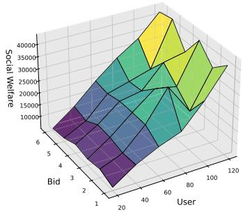  
Fig. 3. Social welfare under diferent number of bids.

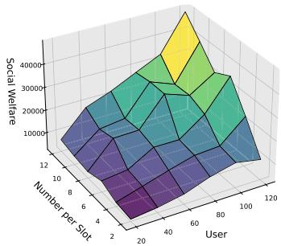  
Fig. 4. Social Welfare under diferent number of generated per slot.

## B. Benchmarks

Although no existing benchmark is designed explicitly for maritime communication with full constraints, we compare four methods to provide a baseline:

1. Random Selection (RS): ISP machines are chosen at random from those satisfying the basic constraints.

2. Tiresias: [24] A preemptive scheduler minimizing the average job completion time. Here, we allocate bandwidth by assigning the earliest available ISP machines capable of serving a request.

3. Truthful Dynamic Combinatorial Double Auction (TDCDA): [17] A greedy approach that accepts bids based on the highest diference between unit bidding and asking prices.

4. Online Maritime Double Auction Mechanism (OMDAM): Our proposed solution designed for UAV and antenna coordination under maritime conditions.1

RS and Tiresias represent generic schedulers without double-auction pricing, while TDCDA is a truthful combinatorial double-auction baseline without maritime mobility and coverage constraints. Comparing with these three methods isolates the benefit of OMDAM’s online primal–dual pricing and mobility-aware allocation under the same trafic and resource conditions.

## C. Simulation Results

Figure 3 and 4 show the social welfare varying with the number of users and two other variables: the number of bids per user and the number of bids generated per slot, respectively. In both 3D plots, social welfare grows with higher user counts and increased bidding activity. Due to UAV flight range and coverage challenges, larger user or bid volumes amplify competition, revealing OMDAM’s adaptiveness in resource allocation. At low load, social welfare grows almost linearly as most bids can be matched to nearby UAVs or antennas; under heavy load, the surface flattens due to binding capacity, coverage, and endurance constraints. This behavior indicates that the marginal price function efectively throttles overutilized ISPs and maintains feasible allocations in congested regimes.

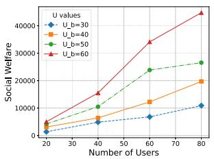  
(a) $U _ { b }$ Social welfare

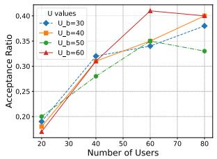  
(b) $U _ { b }$ Acceptance ratio

Fig. 5. Social welfare and acceptance ratio with diferent value of $U _ { s }$ and $U _ { b } .$  
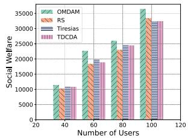  
(a) Users

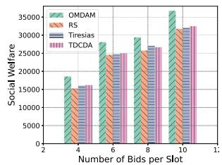  
(b) Number of bids per Slot  
Fig. 6. Social welfare with diferent settings.

Figure 5 depicts how increasing users afects social welfare and acceptance ratio for diferent $U _ { b }$ and $U _ { s }$ values (20, 40, 60, 80). Subfigure 5a shows that higher $U _ { b }$ leads to increased social welfare, while 5b indicates the acceptance ratio also trends upward but can fluctuate for higher user counts. Subfigure 5c shows rising social welfare with more users; 5d shows the acceptance ratio tends to drop at higher user numbers, especially under larger $U _ { s }$ . These outcomes confirm OMDAM’s capacity to accommodate higher bidding prices and user densities, though soaring ISP asking prices may deter some ships from participation. Here, $U _ { b }$ controls buyers maximum willingness-to-pay per unit bandwidth, while $U _ { s }$ bounds ISPs’ asking prices under high operating costs. The opposite acceptance-ratio trends under increasing $U _ { b }$ and $U _ { s }$ show that OMDAM is demand-responsive: generous buyers enlarge the surplus region and enable more matches, whereas overly high asking prices shrink it and force the mechanism to reject more bids to preserve individual rationality and weak budget balance.

Figure 6 compares social welfare across OMDAM, RS, Tiresias, and TDCDA. Subfigures 6a, 6b show that OMDAM consistently achieves higher social welfare with increasing users and the quantity of bids generated in each time slot. Subfigure 6c indicates that adding more ISPs (particularly UAV-based) further boosts welfare, with OMDAM maintaining a strong lead. In 6d, OMDAM retains high welfare initially, though performance decreases beyond certain asking price thresholds; other methods see a sharper decline. Overall, OMDAM leverages additional UAV coverage and capacity more efectively, magnifying its advantage under richer ISP resources. The gaps between OMDAM and the baselines are most evident under moderate and heavy load, where RS wastes scarce UAV capacity, Tiresias ignores auction surplus, and TDCDA overlooks mobility and coverage constraints. OMDAM’s online marginal pricing and dual updates steer bids toward ISPs with lower efective marginal cost while respecting flight-distance and coverage limits, explaining its robustness across user, bid, and ISP settings.

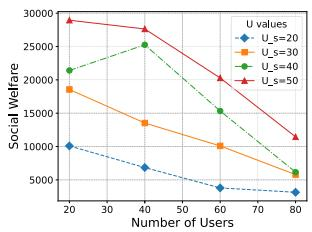  
(c) $U _ { s }$ Social welfare

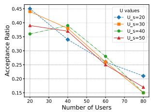  
(d) $U _ { s }$ Acceptance ratio

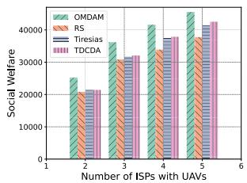  
(c) ISP

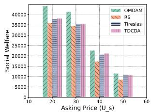  
(d) $U _ { s }$

Figure 7 displays average social welfare comparisons. Subfigures 7a, 7b demonstrate that OMDAM maintains the highest average social welfare under varying user and slot counts. Subfigures 7c, 7d confirm OMDAM’s consistent outperformance even with changing ISP and price conditions, though rising asking prices reduce overall gains. This robust distribution of resources highlights how OMDAM balance supply and demand efectively, adapting as UAV vs. antenna capacities shift or time slots expand. Together with Fig. 6, these results show that OMDAM not only improves peak performance but also stabilizes per-user welfare across diverse operating regimes, which is crucial for long-haul shipping lanes with fluctuating demand and cost conditions.

Finally, Figure 8 illustrates real-time bandwidth allocation eficiency for diferent algorithms. OMDAM surpasses RS, Tiresias, and TDCDA, especially for larger time slot counts, thanks to its maritime-oriented design that can dynamically reassign UAV and antenna resources amid ship mobility and fluctuating usage. OMDAM exhibits smoother and more sustained bandwidth utilization over time, whereas RS and Tiresias underutilize early capacity and overshoot later, and TDCDA experiences abrupt drops when mobility or coverage invalidate attractive matches. This is consistent with the online dual-variable update, which pushes the system toward a balanced operating point between ship demand and heterogeneous ISP supply.

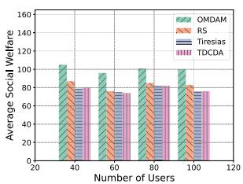  
(a) Users

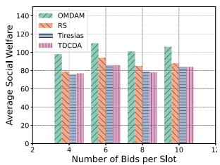  
(b) Number of bids per Slot  
(d) $U _ { s }$  
(c) ISP

Fig. 7. Average social welfare with diferent settings.  
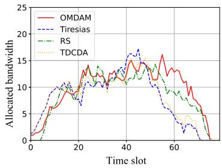

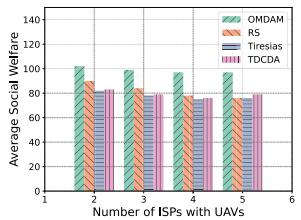  
Fig. 8. Allocated bandwidth.

Overall, by jointly varying user population, bid intensity, ISP heterogeneity, and price parameters, the simulations show that OMDAM scales with maritime trafic load, preserves social welfare under high asking prices, and utilizes UAV and antenna resources more efectively than existing schedulers and double-auction baselines.

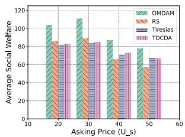

## VI. DISCUSSION AND FUTURE WORK

## A. Explicit UAV Trajectory Optimization

This section summarizes several possible extensions of our maritime communication framework and clarifies their relation to the current implementation. The mechanisms that are implemented and evaluated in this paper consist solely of the online double auction mechanism realized by Algorithms 1 and 2, together with the mathematical model and dual formulation developed in Sections III–IV. The ideas discussed below are not activated in our prototype nor included in the experimental evaluation; rather, they represent natural directions in which the proposed framework can be further enhanced, while preserving the real-time responsiveness and theoretical guarantees of the current design.

In the current design, UAV mobility and propulsion energy are handled implicitly through the cost terms and coverage constraints embedded in the optimization problem and in $A _ { c o r e } \mathrm { : }$ longer flight distances or poor coverage conditions simply lead to higher efective service costs $e _ { m } ( t )$ (as used in Line 1 of $A _ { c o r e } )$ , so the online mechanism naturally prefers cost-eficient routes and relay choices. A natural extension is to introduce an explicit trajectory-planning module that periodically refines UAV flight paths under given communication demands using multi-objective heuristics (for example, NSGA-II), by minimizing

$$
\mathrm { C o s t } = \gamma _ { 1 } \cdot \mathrm { E n e r g y } + \gamma _ { 2 } \cdot \mathrm { C o v e r a g e ~ P e n a l t y } + \gamma _ { 3 } \cdot \mathrm { L a t e n c y } ,\tag{8}
$$

where $\gamma _ { 1 } , \gamma _ { 2 }$ , and $\gamma _ { 3 }$ balance the three objectives. The module would output updated UAV positions $\{ o _ { \nu j } ( t ) \}$ and operational costs $\{ c _ { \nu j } ( t ) \}$ , which are fed into $A _ { c o r e }$ (Line 1) to update $e _ { m } ( t )$ and related parameters. This trajectory layer thus supplements, rather than replaces, the implicit optimization in $A _ { o n l i n e }$ and leaves the economic structure of the double auction unchanged; its detailed design and evaluation are left as future work.

## B. Reinforcement Learning-Based Positioning

A second extension is to complement the cost-based deci sions of $A _ { o n l i n e }$ with a reinforcement learning (RL) component that adapts UAV positioning to slowly varying environments (e.g., long-term weather patterns or seasonal trafic). One can train an RL agent ofline (for instance, via DDPG) using historical $\{ g _ { n m j } ( t ) \}$ (link states), $\{ \alpha _ { m } ( t ) \}$ (bandwidth utilization), and $\{ s _ { n i \nu } ( t ) \}$ (service indicators), with a state comprising aggregated UAV locations, link qualities, prices, and demand statistics, actions given by position increments $\Delta o _ { \nu j } ( t )$ , and reward defined as a weighted combination of social welfare, acceptance ratio, and energy expenditure. During online operation, the RL agent acts purely in an advisory mode: its suggestions are activated only when the confidence exceeds a threshold $\tau ,$ in which case $\Delta o _ { \nu j } ( t )$ is passed to $A _ { c o r e }$ (Line 1) to update the topology and coherence weights $\{ w _ { n } ( m , j , t ) \}$ otherwise, the system defaults to the purely costbased decisions of $A _ { c o r e }$ . Algorithms 1 and 2 thus retain full control over per-slot bid processing and allocation, preserving latency and competitive-ratio guarantees, while the detailed design of such an RL-enhanced controller is deferred to future work.

## C. Demand and Resource Prediction

A third extension is to augment the strictly online behavior of Algorithms 1 and 2 with data-driven prediction of future demand and resource usage. An LSTM-based module, for example, could take as inputs historical $\{ \alpha _ { m } ( t ) \}$ (resource utilization), $\{ p _ { m } ( t ) \}$ (marginal prices), ship trajectories, and weather data, and output short-horizon forecasts $\hat { \alpha } _ { m } ( t + k )$ (predicted demand) and ${ \hat { B } } _ { n }$ (anticipated bids). These forecasts can be fed into $A _ { c o r e }$ (Line 1) to precompute or adjust efective costs $\{ e _ { m } ( t ) \}$ and feasible schedule sets $\{ \zeta _ { n i } \}$ , thereby accelerating the bid-response step in $A _ { o n l i n e }$ (Line 5) and enabling more proactive marginal pricing and relay positioning. To guard against forecast errors, the predictive module would only be activated when its empirical error falls below a threshold $\epsilon ;$ otherwise, the mechanism falls back to the purely reactive mode (Lines 3–9 of $A _ { o n l i n e } )$ . Designing, training, and validating such predictive components on long-term ship trajectory and weather datasets is left for future research.

Overall, explicit UAV trajectory optimization, RL-based positioning, and demand prediction are not required for the correctness or theoretical guarantees of our current online maritime double auction. Instead, they illustrate how the proposed mechanism can serve as a stable core onto which more sophisticated control and learning modules can be layered at coarser time scales, further enhancing adaptability to richer and more dynamic maritime environments without sacrificing real-time responsiveness.

## VII. CONCLUSION

In this paper, we addressed the challenge of dynamic resource allocation and task scheduling in maritime communication networks involving multiple vessels and multiple ISPs. Unlike existing double auction approaches tailored to terrestrial networks, we explicitly incorporate critical maritime conditions into a unified optimization model. This maritime-specific design integrates realistic UAV endurance and ship trajectories, ensuring high adaptability and robust performance under open-sea operations beyond the scope of traditional terrestrial mechanisms. We designed a new online double auction mechanism (OMDAM) for eficient Internet access scheduling, considering ships as buyers and ISPs with antennas or drones as sellers. Our mechanism accounts for the mobility of both ships and UAVs, utilizing UAVs’ ability to reposition to meet communication demands within deadlines and capacity constraints.

We formulate the resource allocation problem as a social welfare maximization problem under practical constraints, and further cast it into a compact ILP from which the corresponding dual LP is derived. Based on this formulation, we develop online algorithms $A _ { c o r e }$ and $A _ { o n l i n e }$ to solve the resulting decision problem in real time. Our work provides a practical solution for dynamic bandwidth allocation in challenging maritime environments, enhancing maritime capabilities through seamless communication and coordination over extensive maritime territories. By leveraging ISP resources and accommodating the mobility of UAVs and ships, our approach improves the robustness and reliability of maritime communication infrastructure. Future research can extend the model to incorporate more complex mobility patterns, richer service types, and additional communication requirements, which could further improve resource allocation eficiency.

## APPENDIX VIII.

In this section, we provide a rigorous theoretical justification for the proposed mechanism, focusing on complexity analysis and core economic properties. Each step adheres to established mathematical principles, ensuring practical feasibility for maritime resource allocation while identifying directions for refining incentive compatibility and budget balance. These theoretical results complement Section V by clarifying OMDAM’s scalability, the guarantees ofered to ships and ISPs, and the eficiency–truthfulness–budgetbalance trade-ofs in the online maritime double-auction setting.

## A. Complexity

We provide a concise analysis of the time and space complexities of the proposed algorithms $A _ { o n l i n e }$ and $A _ { c o r e } .$ . We show that, despite the rich constraint set (mobility, coverage, capacity, and time coupling), per-bid computation remains polynomial in the problem size and thus compatible with realtime maritime decision making.

## 1) Algorithm $A _ { C o r e } \mathrm { . }$

Lemma 1: The time complexity of $A _ { c o r e }$ is $O ( I \times T \times M \times J )$ The space complexity of $A _ { c o r e }$ is $O ( I \times M \times J \times T )$

Proof: Time Complexity: The core algorithm $A _ { c o r e }$ is invoked upon each ship’s bid submission and performs several computational steps: i) Computation of $e _ { m j } ( t ) \colon e _ { m j } ( t ) = s _ { n i m } ( t ) +$ $r _ { n i } p _ { m } ( t ) { + \beta g _ { n m j } ( t ) ^ { 2 } }$ over all $m \in [ M ] , j \in [ J ] , t \in [ T ]$ . Complexity: $O ( M \times J \times T )$ . ii) Calculation of Average Bid Values $u b _ { n i } \colon$ For each bid $i \in [ I ]$ , compute $\begin{array} { r } { u b _ { n i } = \frac { b _ { n i } } { l _ { n i } } } \end{array}$ . Complexity: ${ \cal { O } } ( I )$ iii) Selection of Optimal Schedules $\zeta _ { i } \colon$ For each bid $i ,$ search for $l _ { n i }$ continuous time slots and ISP machines minimizing $e _ { m j } ( t ) .$ , while meeting constraints (2c)–(2d). Complexity per bid: $O ( T \times M \times J )$ . Overall: $O ( I \times T \times M \times J )$ . iv) Utility Computation and Selection: Compute $u _ { n i }$ for each bid, select the maximum utility bid. Complexity: O(I). v) Updating Allocation Variables: If the chosen bid is feasible, update $x _ { n i } ,$ $z _ { n i a j } ( t ) , z _ { n i \nu j } ( t )$ . Complexity: $O ( T \times M \times J )$

Space Complexity: - Storing $e _ { m j } ( t )$ needs $O ( M \times J \times T ) .$ Storing bids, schedules, and allocation variables can require up to $O ( I \times M \times J \times T )$ in total. Here $I , M , J , T$ denote the , , ,numbers of active bids, ISPs, machines per ISP, and time slots; the complexity grows linearly in each dimension, matching the moderate-scale simulation settings and indicating practical deployability of OMDAM.

## 2) Algorithm $A _ { O n l i n e } .$

Lemma 2: The total time complexity of $A _ { o n l i n e }$ is $O ( N \times$ $I \ \times \ T \ \times \ M \ \times \ J )$ . The space complexity of $A _ { o n l i n e }$ is $O ( I \times M \times J \times T )$ .

Proof: Time Complexity: Initialization: O(1). Processing each ship’s bids: For each $\textit { n } \in \textsuperscript { [ N ] }$ , invoke $A _ { c o r e }$ with complexity $O ( I \times T \times M \times J )$ . Summed over N ships gives $O ( N \times I \times T \times M \times J )$ . Space Complexity: Similar to $A _ { c o r e } .$ Since allocations are updated incrementally, overall space remains $O ( I \times M \times J \times T )$ . While nested loops and complex constraints make these algorithms computationally intensive, they remain implementable for moderate N I T M, and J. Moreover, $A _ { o n l i n e }$ processes bids sequentially without backtracking, so its runtime is proportional to the number of observed bids, aligning with online ship-arrival patterns in maritime scenarios.

TABLE II  
ADDITIONAL VARIABLE DEFINITIONS
<table><tr><td rowspan=1 colspan=1>Variable</td><td rowspan=1 colspan=1>Description</td></tr><tr><td rowspan=1 colspan=1> $\overline { { U _ { n } } }$ </td><td rowspan=1 colspan=1>Utility of ship n</td></tr><tr><td rowspan=1 colspan=1> ${ \underline { { v _ { n } } } }$ </td><td rowspan=1 colspan=1>Valuation of ship n for the allocated bandwidth</td></tr><tr><td rowspan=1 colspan=1> $\underline { { p _ { n } ^ { o } } }$ </td><td rowspan=1 colspan=1>Price paid by ship n</td></tr><tr><td rowspan=1 colspan=1> $p _ { n } ^ { s }$ </td><td rowspan=1 colspan=1>Payment received by the ISP for ship n from theauctioneer</td></tr><tr><td rowspan=1 colspan=1> $\underline { { c _ { m } } }$ </td><td rowspan=1 colspan=1>Cost for ISP m to provide the bandwidth</td></tr><tr><td rowspan=1 colspan=1> $\bar { \lambda }$ </td><td rowspan=1 colspan=1>Parameter in the payment rule, where $\overline { { 0 < \lambda < 1 } }$ </td></tr><tr><td rowspan=1 colspan=1> ${ \underline { { s _ { n } } } }$ </td><td rowspan=1 colspan=1>ISP&#x27;s asking price for ship n</td></tr><tr><td rowspan=1 colspan=1> $\overline { { R } }$ </td><td rowspan=1 colspan=1>Revenue or profit of the auctioneer</td></tr><tr><td rowspan=1 colspan=1> $\overline { { U _ { m } } }$ </td><td rowspan=1 colspan=1>Utility of ISP m</td></tr></table>

## B. Double Auction Mechanism

We analyze four economic properties of the proposed mechanism: Individual Rationality (IR), Balanced Budget (BB), Incentive Compatibility (IC), and Economic Eficiency (EE). Several auxiliary variables are introduced in Table II. These properties describe how OMDAM protects ships and ISPs from losses, manages the auctioneer’s budget, and delineates the limits of truthfulness in this double-auction setting.

## 1) Individual Rationality (IR):

Definition 3: A mechanism is individually rational if no participant is worse of by participating than by not participating.

Lemma 3: Both ships and ISPs have non-negative utilities, satisfying IR.

Proof: For Ships (Buyers): The utility of a ship n is $\begin{array} { r l r } { U _ { n } } & { { } = } & { \nu _ { n } - p _ { n } ^ { b } , } \end{array}$ where $\nu _ { n }$ is the ship’s valuation of the allocated bandwidth and $p _ { n } ^ { b }$ is the price paid by the ship. Mechanism Pricing Rule: The price charged to a marine is $\begin{array} { r l } { p _ { n } ^ { b } } & { { } = } \end{array}$ min((Unit ISP’s asking price) + Marginal Price ship’s bid per unit bandwidth). Since $p _ { n } ^ { b } \leq b _ { n }$ and $b _ { n } ~ \leq ~ \nu _ { n }$ , we have $\nu _ { n } - p _ { n } ^ { b } \ge 0$ . This ensures $U _ { n } ~ \geq ~ 0 .$ For ISPs (Sellers): The utility of an ISP m is $U _ { m } = p _ { n } ^ { s } - c _ { m } .$ where $p _ { n } ^ { s }$ is the payment received and $c _ { m }$ is the $\mathrm { I S P ^ { \prime } s }$ cost for providing bandwidth. Mechanism Payment Rule: $p _ { n } ^ { s } \ =$ $\begin{array} { r } { \lambda ( p _ { n } ^ { b } - s _ { n } ) + s _ { n } , \quad 0 < \lambda < 1 } \end{array}$ . Since $p _ { n } ^ { s } \ge s _ { n } \ge c _ { m }$ (assuming ISPs set $s _ { n } \geq c _ { m } )$ , < λ <, the ISP receives non-negative utility: $U _ { m } \geq 0$ Thus no ship or ISP is forced into a negative-utility outcome by the mechanism.

Remark: In maritime markets, where ships and ISPs interact repeatedly along long voyages, IR is crucial for sustaining participation and market stability over time.

## 2) Balanced Budget (BB):

Definition 4: A mechanism has a balanced budget if total payments collected are at least total payments made.

Lemma 4: Our mechanism guarantees Weak Balanced Budget (WBB), not Strong Balanced Budget (SBB).

Proof: Total Payment Collected from Ships: $\textstyle \sum _ { n } p _ { n } ^ { b } ,$ Total Payment Made to ISPs: $\sum _ { n } p _ { n } ^ { s }$ .Auctioneer’s revenue: $R \ =$ $\begin{array} { r c l } { ~ } & { ~ \sum _ { n } p _ { n } ^ { b } } & { - } & { \sum _ { n } p _ { n } ^ { s } } \end{array}$ . By the payment rule, $p _ { n } ^ { s } = \lambda \bigl ( p _ { n } ^ { b } - s _ { n } \bigr ) +$ $s _ { n } , \quad ( 0 < \lambda < 1 )$ . Hence, $\begin{array} { r } { R = \sum _ { n } \Big [ p _ { n } ^ { b } - \big ( \lambda ( p _ { n } ^ { b } - s _ { n } ) + s _ { n } \big ) \Big ] = } \end{array}$ $\begin{array} { r } { \sum _ { n } \bigl [ ( 1 - \lambda ) ( p _ { n } ^ { b } - s _ { n } ) \bigr ] } \end{array}$ . Since $p _ { n } ^ { b } \geq { \overline { { s } } } _ { n } .$ , we have $R \geq 0 .$ . Thus, the mechanism satisfies a weak balanced budget. Thus the auctioneer never needs external subsidies and may earn nonnegative revenue, though exact balance is not guaranteed in every instance.

Remark: Weak budget balance suits our setting: the maritime service platform can cover its operating costs from the surplus, while our evaluation in Section V focuses on social welfare rather than the platform’s revenue.

## 3) Incentive Compatibility (IC):

Definition 5: A mechanism is IC if participants’ best strategy is to bid their true valuations.

Lemma 5: The mechanism is not Dominant Strategy Incentive Compatible (DSIC) for either ships or ISPs. It may partially satisfy Nash Equilibrium Incentive Compatibility (NEIC) under certain settings.

Proof: For Ships (Buyers): Ships submit bids $b _ { n }$ based on their valuations. The mechanism charges $p _ { n } ^ { b } =$ min((Unit ISP’s asking price) + Marginal Price, ship’s bid per unit bandwidth). Overbidding could cause the ship to overpay, whereas underbidding may lead to losing an otherwise profitable allocation. This discourages extreme misreporting, but it does not fully eliminate strategic behavior in all cases. For ISPs (Sellers): ISPs declare asking prices $s _ { n } .$ The mechanism pays $p _ { n } ^ { s } = \lambda ( p _ { n } ^ { b } - s _ { n } ) + s _ { n }$ . An ISP could potentially profit from misreporting $s _ { n }$ if this influences $( p _ { n } ^ { b } - s _ { n } )$ in a favorable way.Hence, the mechanism is not DSIC for either side without further incentive-alignment design. However, because transaction prices are bounded between costs and bids and are shaped by marginal prices, large deviations from truthful reports are often unprofitable, leading to approximate Nash-type equilibria in practice.

Remark: This aligns with classic double-auction impossibility results: one cannot jointly guarantee full truthfulness, strict budget balance, and full eficiency, so our design prioritizes IR, WBB, and high allocative eficiency while leaving stronger IC guarantees to future work.

## 4) Economic Eficiency (EE):

Definition 6: A mechanism is EE if it allocates resources to maximize overall social welfare.

Lemma 6: By selecting bids that maximize $\sum b _ { n i } - \sum s _ { n i m } ( t )$ subject to constraints, the mechanism achieves high allocative eficiency.

Proof: Objective: max $\sum _ { n \in [ N ] } \sum _ { i \in [ I ] } b _ { n i } x _ { n i }$ $\begin{array} { r } { \sum _ { n \in [ N ] } \sum _ { i \in [ I ] } \sum _ { m \in [ M ] } \sum _ { t \in [ T ] } s _ { n i m } ( t ) \dot { z _ { n i m j } } ( t ) . } \end{array}$ Constraints: Resource capacities, time slots, and mobility constraints (for UAVs, etc.) limit feasible allocations. Allocation Rule: The mechanism selects bids that maximize net surplus (bids minus costs), leading to a socially eficient outcome under the feasible set. The algorithm ensures high allocative eficiency by matching highest bids with available ISP resources, subject to practical constraints. Because decisions are made online, eficiency is defined relative to the information revealed so far rather than the ofline optimum, while the primal–dual structure and marginal prices steer allocations toward high-surplus configurations.

Remark: The social-welfare results in Figs. 4–7 are consistent with this analysis: OMDAM systematically outperforms the baselines across varying trafic loads, ISP capacities, and price parameters, indicating that the theoretical allocation rule yields practically eficient outcomes.

5) Overall Results:

• Individual Rationality (IR): Satisfied for both ships and ISPs.

• Balanced Budget (BB): Satisfies Weak Balanced Budget; does not satisfy Strong Balanced Budget.

• Incentive Compatibility (IC): Not fully DSIC; may partially satisfy NEIC under certain conditions.

• Economic Eficiency (EE): Achieves eficiency within system constraints.

In summary, OMDAM provides practical eficiency and IR guarantees under real-world maritime constraints. The complexity and economic analyses explain why the mechanism is executable in real time and why the main empirical trends in Section V—scalable social welfare, robustness under varying prices, and consistent gains over baselines—are structurally supported by the underlying algorithms and payment rules.

## REFERENCES

[1] M. He, W. Han, and D. Shen, “Innovation practice of 5G ultrafar coverage of sea area based on two-site relay,” Designing Techn. Posts Telecommun., no. 1, pp. 24–28, 2024, doi: 10.12045/j.issn.1007- 3043.2024.01.006.

[2] Y. Feng and G. Wen, “Smart ocean, communication first-exploration of 5G sea surface ultra long range coverage technology and application scenarios,” Commun. World, no. 16, pp. 47–49, Jun. 2022, doi: 10.3969/ j.issn.1009-1564.2022.16.020.

[3] H. Wang, H. Tan, and Z. Peng, “Quantized communications in containment maneuvering for output constrained marine surface vehicles: Theory and experiment,” IEEE Trans. Ind. Electron., vol. 71, no. 1, pp. 880–889, Jan. 2024.

[4] S. Qiao, R. Zhu, X. Ji, J. Zhao, and H. Ding, “Optimization of covert communication in multi-sensor asymmetric noise systems,” Sensors, vol. 24, no. 3, p. 796, Jan. 2024.

[5] H. Alsolai et al., “Chaotic marine predators optimization based task scheduling scheme for resource limited cyber-physical systems,” Comput. Electr. Eng., vol. 106, Mar. 2023, Art. no. 108597.

[6] Y. Cui, L. Yang, R. Li, and X. Xu, “Online double auction for wireless spectrum allocation with general conflict graph,” IEEE Trans. Veh. Technol., vol. 71, no. 11, pp. 12222–12234, Nov. 2022.

[7] L. P. Qian et al., “Secrecy-driven energy minimization in federatedlearning-assisted marine digital twin networks,” IEEE Internet Things J., vol. 11, no. 3, pp. 5155–5168, Feb. 2024.

[8] J. Zhang, Z. Wang, G. Han, Y. Qian, and Z. Li, “A collaborative path planning method for heterogeneous autonomous marine vehicles,” IEEE Internet Things J., vol. 11, no. 1, pp. 1465–1480, Jan. 2024.

[9] S. Dong, K. Liu, M. Liu, and G. Chen, “Cooperative time-varying formation fuzzy tracking control of multiple heterogeneous uncertain marine surface vehicles with actuator failures,” IEEE Trans. Cybern., vol. 54, no. 2, pp. 667–678, Feb. 2024.

[10] W. Guan, W. Luo, and Z. Cui, “Intelligent decision-making system for multiple marine autonomous surface ships based on deep reinforcement learning,” Robot. Auto. Syst., vol. 172, Feb. 2024, Art. no. 104587.

[11] C.-D. Liang, M.-F. Ge, Z.-W. Liu, Z.-W. Gu, and Q. Chen, “Distributed predefined-time optimization control for networked marine surface vehicles subject to set constraints,” IEEE Trans. Intell. Transp. Syst., vol. 25, no. 2, pp. 2129–2138, Feb. 2024.

[12] W. Wu, R. Ji, W. Zhang, and Y. Zhang, “Transient-reinforced tunnel coordinated control of underactuated marine surface vehicles with actuator faults,” IEEE Trans. Intell. Transp. Syst., vol. 25, no. 2, pp. 1872–1881, Feb. 2024.

[13] J. Li, G. Zhang, X. Zhang, and W. Zhang, “Integrating dynamic event-triggered and sensor-tolerant control: Application to USV-UAVs cooperative formation system for maritime parallel search,” IEEE Trans. Intell. Transp. Syst., vol. 25, no. 5, pp. 3986–3998, May 2024.

[14] Y. Hu, K. Hu, Q. Wu, X. Wan, and F. Wang, “Collaborative routing maintenance method for dynamic route of marine mobile wireless sensor networks,” Ad Hoc Sens. Wireless Netw., vol. 55, nos. 1–2, pp. 95–122, 2023.

[15] A. Yassine and M. S. Hossain, “Match maximization of vehicle-tovehicle energy charging with double-sided auction,” IEEE Trans. Intell. Transp. Syst., vol. 24, no. 11, pp. 13250–13259, Nov. 2023.

[16] J. Huang, S. Li, L. Yang, J. Si, X. Ma, and S. Wang, “Multiparticipant double auction for resource allocation and pricing in edge computing,” IEEE Internet Things J., vol. 11, no. 8, pp. 14007–14016, Apr. 2024.

[17] Q. Li, X. Jia, and C. Huang, “A truthful dynamic combinatorial double auction model for cloud resource allocation,” J. Cloud Comput., vol. 12, no. 1, p. 106, Jul. 2023.

[18] L. Zhang, K. Xiao, L. Jin, P. Dong, and Z. Tong, “Mobility-aware and double auction-based joint task ofloading and resource allocation algorithm in MEC,” IEEE Trans. Netw. Service Manage., vol. 21, no. 1, pp. 821–837, Feb. 2024.

[19] X. Zheng, S. B. H. Shah, S. Usman, S. Mahfoudh, F. Shemim, and P. K. Shukla, “Resource allocation and network pricing based on double auction in mobile edge computing,” J. Cloud Comput., vol. 12, no. 1, p. 56, Apr. 2023.

[20] A. Zavodovski, S. Bayhan, N. Mohan, P. Zhou, W. Wong, and J. Kangasharju, “DeCloud: Truthful decentralized double auction for edge clouds,” in Proc. IEEE 39th Int. Conf. Distrib. Comput. Syst. (ICDCS), Dallas, TX, USA, Jul. 2019, pp. 2157–2167.

[21] L. Y. Chu and Z.-J.-M. Shen, “Truthful double auction mechanisms,” Operations Res., vol. 56, no. 1, pp. 102–120, Feb. 2008.

[22] Q. Zhang, R. Zhou, C. Wu, L. Jiao, and Z. Li, “Online scheduling of heterogeneous distributed machine learning jobs,” in Proc. 21st Int. Symp. Theory, Algorithmic Found., Protocol Design Mobile Netw. Mobile Comput., Oct. 2020, pp. 111–120.

[23] D. Fernandez-Cerero,´ A. J. Varela-Vaca, A. Fern´ andez-Montes,´ M. T. Gomez-L´ opez, and J. A. Alv´ arez-Bermejo, “Measuring data-centre´ workflows complexity through process mining: The Google cluster case,” J. Supercomput., vol. 76, no. 4, pp. 2449–2478, Apr. 2020.

[24] J. Gu et al., “Tiresias: A GPU cluster manager for distributed deep learning,” in Proc. 16th USENIX Symp. Networked Syst. Design Implement., 2019, pp. 485–500.

Xianglong Li (Member, IEEE) received the B.E. degree in computer science and technology from Wuhan University in 2019 and the M.S. degree in information technology from The Hong Kong Polytechnic University in 2020. He is currently pursuing the Ph.D. degree with the School of Computer Science, Wuhan University, China.

Kaiwei Mo received the B.E. degree in computer science from Wuhan University, China, in 2019, and the Ph.D. degree in computer science from the City University of Hong Kong in 2024.

Guang Fang received the M.S. degree from the Department of Computer Science, Kunming University of Science and Technology, Kunming, China, in 2018. He is currently pursuing the Ph.D. degree with Wuhan University, Wuhan, China.

Zongpeng Li (Senior Member, IEEE) received the B.Sc. degree in computer science and technology from Tsinghua University in 1999 and the Ph.D. degree from the University of Toronto in 2005. He is currently a Professor with Tsinghua University.