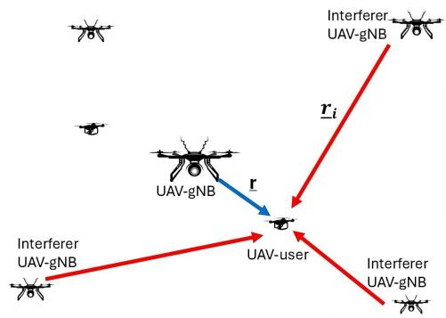
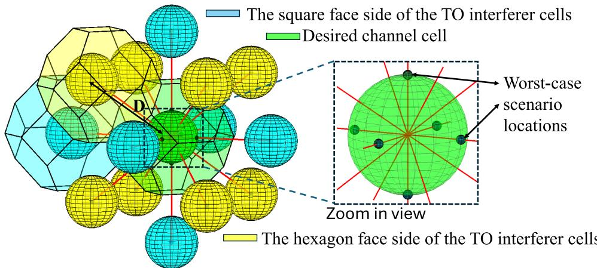
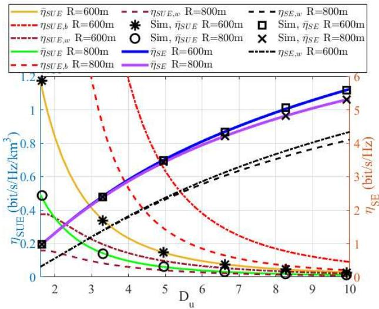
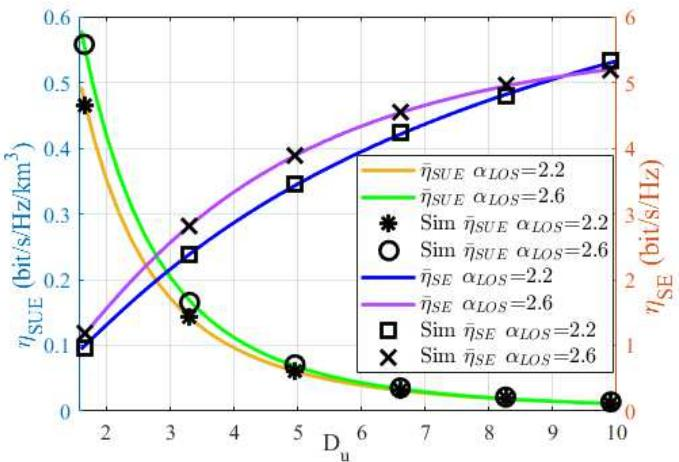
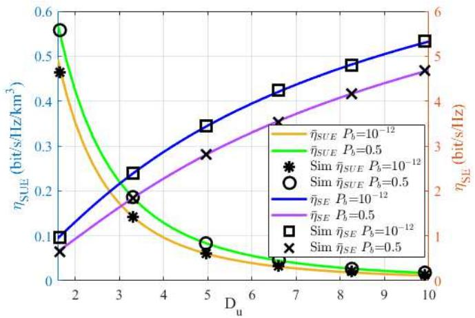
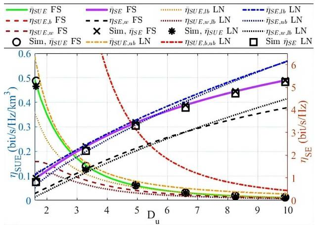
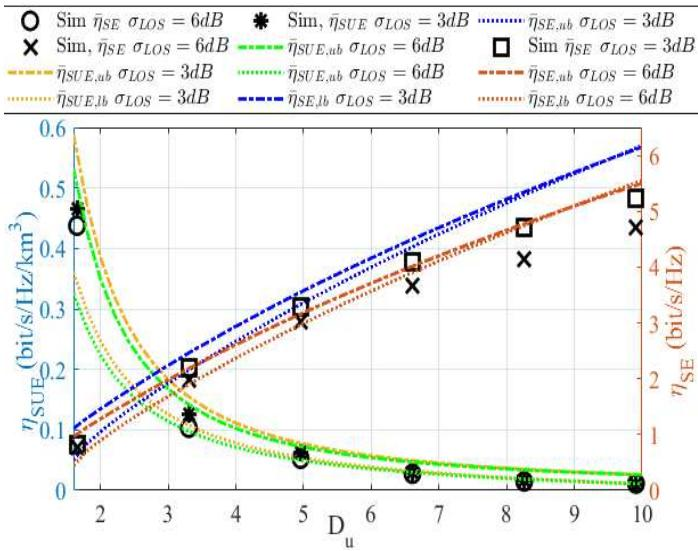
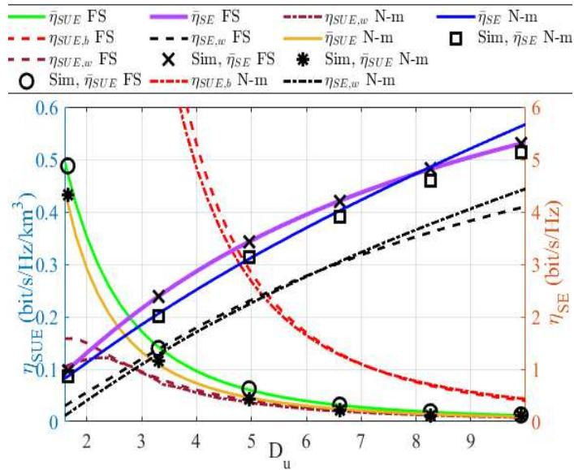
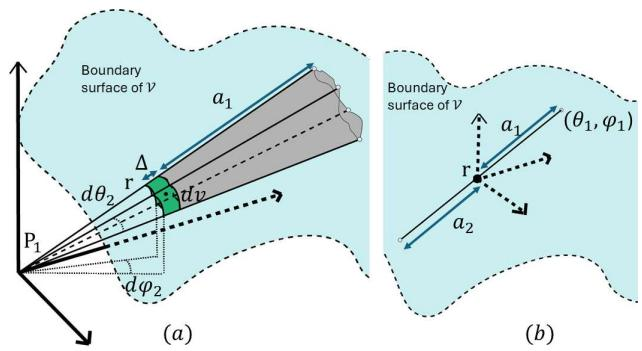

# Analysis of 3D Space Spectrum Utilization in UAV-Enabled Cellular Networks

Kasun Prabhath , Graduate Student Member, IEEE, and Sudharman K. Jayaweera , Senior Member, IEEE

Abstract—The efficient utilization of the electromagnetic spectrum is crucial for the performance and coexistence of emerging 5G-Advanced and 6G/Next-G wireless communication networks operating in 3D space such as uncrewed aerial vehicle (UAV)- assisted and high altitude platform station (HAPS)-based systems. This paper introduces a comprehensive analytical framework for evaluating spectrum utilization efficiency (SUE) and link spectral efficiency (SE) in aerial communication systems, focusing on the general scenario of partially loaded networks. Leveraging a frequency reuse architecture to model the impact of cochannel interference, closed-form expressions for the upper and lower bounds of SE and SUE under best-case and worst-case scenarios are derived. The proposed framework incorporates probabilistic modeling of user distribution and channel utilization in analyzing multi-UAV next-generation Node B (UAV-gNB) and multi-interference scenarios under different propagation models, including free-space path loss, log-normal fading, and Nakagami-m fading. Simulations validate the analytical results and the proposed framework, demonstrating its potential utility in optimizing spectrum usage and interference management in 3D communication networks. The findings provide actionable insights for designing and deploying efficient and scalable aerial communication networks with improved spectrum utilization and SE performance.

Index Terms—3D cellular, 3D frequency reuse, aerial communications, spectrum management, spectrum utilization, UAV communications, UAV-enabled networks, co-channel interference, aerial communication systems, next-generation wireless networks, multi-UAV networks, interference management, 6G/Next-G, high altitude platform stations (HAPS), log-normal channel model, Nakagami-m fading, drone-assisted wireless networks, non-terrestrial networks, smart spectrum allocation.

## I. INTRODUCTION

especially with the growing demand driven by emerging technologies including, for example, fifth-generation (5G) and next-generation (Next-G) systems, Internet of Things (IoT), and autonomous vehicles. As spectrum resources are limited, optimizing their use is crucial to manage interference and support high user densities. Emerging networks with integrated uncrewed aerial vehicles (UAVs), high altitude platform stations (HAPS), and non-terrestrial network (NTN) segments are crucial for extending coverage, enhancing capacity, and ensuring reliable connectivity in both urban and remote areas. UAV-assisted networks, in particular, have become promising solutions due to their flexibility, rapid deployment capabilities, and effectiveness in meeting dynamic traffic demands and emergency response scenarios [1]. Within the framework of Next-G systems, these platforms are essential for supporting ultra-dense networks, massive machine-type communications, and advanced applications such as smart cities, air corridor systems and intelligent transportation systems [2]. Emerging Next-G wireless and IoT technologies are transforming various vertical industries by enabling high-speed, low-latency communications and connecting a vast number of devices. Autonomous vehicles, for instance, rely on seamless connectivity to communicate with each other and with infrastructure, necessitating efficient spectrum management to ensure safety and reliability. The integration of these technologies into everyday applications underscores the importance of optimizing spectrum usage to accommodate the increasing demand [3], [4]. These emphasize the critical importance of emerging 3D space communication systems and highlight the need for a spectrum utilization framework capable of managing interference and frequency reuse in the presence of dynamic spatial user and channel environments [5].

In practice, it is essential to evaluate not only the linklevel performance through spectral efficiency (SE), but also how efficiently the spectrum is utilized across the spatial and temporal domains. While SE, typically measured in bit/s/Hz, reflects the information rate over a single communication link, it does not account for broader system-level considerations such as spatial reuse, user distribution, and co-channel interference across a three-dimensional deployment. In contrast, spectrum utilization efficiency (SUE), as defined in [5], provides a more comprehensive measure by quantifying the useful data transferred per unit bandwidth, per unit area (or volume), and per unit time. This distinction has significant implications for real world system design as discussed in [5]. For instance, a system optimized solely for high SE may employ aggressive modulation or high transmit power, inadvertently increasing interference and limiting opportunities for spatial reuse, ultimately reducing overall SUE at the network level. On the other hand, prioritizing SUE encourages strategies such as adaptive power control, and optimized frequency reuse that minimize the interference and maximize the volume normalized throughput. These considerations are particularly relevant in aerial networks, where the unique challenges of 3D deployment, such as dynamic user distributions and varying propagation environments, necessitate a volumetric perspective of spectrum efficiency. Therefore, SUE is a critical metric in guiding spectrum management and system optimization for Next-G aerial networks, motivating the need for a comprehensive framework that jointly analyzes both SE and SUE. This paper addresses this gap by developing such a framework, offering insights into how system parameters and deployment strategies affect spectrum utilization in 3D space.

In UAV-enabled cellular networks, advanced spectrum management techniques are needed to overcome the unique challenges imposed by operating in 3D space including, asymmetric and dynamic user distributions in horizontal and vertical dimensions, variations in 3D interference patterns, and integration of communication systems operating at varying altitudes. Some promising techniques include dynamic spectrum allocation, interference mitigation, and the use of artificial intelligence (AI) for predictive spectrum management [6]. However, despite the advancements in these techniques, there remains a gap in developing a comprehensive framework for frequency reuse management in 3D space and evaluating SUE and link SE in communication networks in 3D space. Such a framework is crucial for guiding the design of optimized spectrum management strategies tailored for Next-G 3D communication systems to achieve effective spectrum utilization by balancing link SE with optimized frequency reuse, ultimately enhancing network capacity, minimizing interference, and supporting the growing demands of nextgeneration applications.

## A. Related Work

Effective interference management is important for maximizing spectrum utilization in 3D communication systems, particularly in UAV-assisted networks where dynamic user distributions, varying operating altitudes, and complex co-channel interference and asymmetric antenna radiation patterns, which can significantly impact network performance. The unique characteristics of aerial communication systems, such as the increased likelihood of line-of-sight (LOS) channels and mobility-induced interference, further emphasize the need for specialized strategies to control interference while ensuring reliable connectivity and efficient resource allocation. It is worth noting that such approaches may draw insights from established interference mitigation strategies found in 2D communication systems. In particular, UAV-assisted cellular heterogeneous networks (HetNets) provide a foundation for understanding how spectrum can be optimized through efficient resource allocation, frequency reuse, and power control techniques. It is reasonable to expect that some of these approaches may play a role in a comprehensive interference management framework suited for the complexities of 3D communication environments.

Interference management in UAV-assisted cellular HetNets has been extensively studied in [7], [8], [9], [10], [11], and [12]. These studies focus on optimizing interference mitigation strategies to enhance network performance in UAV-assisted networks. For instance, [7] provides a comprehensive review of interference mitigation techniques in current and future UAV-assisted wireless networks, highlighting the challenges and potential solutions. Among those solutions provided, [8] addresses efficient resource allocation for multi-UAV communication, tackling adjacent and co-channel interference through advanced optimization methods. In [9], a multi-UAV coverage scheme guaranteed with quality of service (QoS) is proposed for IoT communications, emphasizing interference management and spectrum resource allocation. The work by [10] introduces a quality of experience (QoE) and cost-aware resource and interference management framework in aerial-terrestrial networks, specifically for vehicular applications. Additionally, [11] explores joint subchannel allocation and power control in licensed and unlicensed spectrum for multi-cell UAV-cellular networks, employing a matching game with externalities to manage interference effectively. Then, [8] presents an efficient resource allocation strategy for multi-UAV communication, addressing both adjacent and co-channel interference through non-convex optimization techniques. Additionally, link SE and SUE analyses for cellular networks have been conducted by [13] and [14]. Recent advances in AI-driven spectrum management, such as reinforcement learning-based interference mitigation, have shown promising results for dynamic and complex 3D networks by enabling autonomous and adaptive resource allocation [15], [16]. However, these approaches often overlook critical comparisons with coexistence studies involving HAPS and low earth orbit (LEO) satellites, which are crucial for developing comprehensive spectrum sharing strategies in next-generation integrated space-air-ground networks [17]. These analyses provide valuable insights into maximizing the efficiency of spectrum usage and improving overall network throughput.

Extending these approaches to 3D UAV networks involves additional complexities, such as increased interference from multi-directional propagation and the need for dynamic frequency reuse schemes suitable for volumetric coverage. Recent research has introduced several new concepts for spectrum management and frequency reuse in wireless networks operating in 3D space. For instance, a spectrum sharing model was proposed for UAV-based 3D cellular networks in [18], [19] that addresses the unique challenges posed by UAV swarms, such as maintaining reliable connectivity under node mobility and minimizing interference in a constantly changing 3D environment. By modeling the 3D frequency reuse cell as a truncated octahedron (TO), the approach ensures efficient spatial coverage and frequency reuse, which are essential for supporting high-density UAV operations and improving overall network performance. The proposed approach attempts to improve SE by optimizing interference management and resource allocation while potentially offering a scalable solution for future 6G networks [18], [19]. To comprehensively evaluate its effectiveness, the model requires statistical analysis across key performance metrics such as coverage, latency, and link SE parameters that are essential for assessing network planning strategies and cell association frameworks. In [18] and [20], the authors discuss performance metrics such as coverage probability and cell association frameworks derived from stochastic geometry-based analyses. These insights provide valuable information about the proposed frequency reuse methods under various interference and user distribution scenarios. However, while these previous works have proposed specific spectrum sharing and spectrum management approaches for networks in 3D space, there is still a need for a systematic way to evaluate and compare different approaches and systems on how efficiently they utilize available spectrum while delivering effective performance. A step in this direction was taken in [21] where SUE of a fully loaded communication network in 3D space was proposed. However, practical communication systems are not always fully loaded, necessitating a unified SUE analysis for both fully and partially loaded systems.

## B. Contributions

This paper presents a comprehensive framework for analyzing SUE and link SE in aerial communication systems, taking into account the effects of co-channel interference, frequency reuse, user distribution, mobility patterns, and propagation characteristics. Based on the TO frequency reuse architecture proposed in [18] and [21], we derive analytical expressions for SUE and link SE in a 3D aerial network, considering both best-case and worst-case scenarios. The key contributions of this work are described as follows:

1) Random waypoint user modeling in convex 3D space: To enable a realistic analysis of user locations in 3D space, we derive the probability density function (pdf) of user positions under the random waypoint mobility (RWPM) model within a convex volume. This user distribution model captures the inherent non-uniformity in UAV-UE locations due to mobility and is critical for accurate characterization of spatial interference and performance metrics.

2) Analytical framework for SUE and link SE under diverse channel models and system conditions: A key contribution of this work is the derivation of analytical expressions for the upper and lower bounds of SE and SUE in partially loaded systems. The scope of this paper focuses on downlink communications in an aerial network operating in 3D space (UAV-gNB to UAV-UE), though the developed approach can be extended to future integrated space-air-ground networks. Co-channel interference is modeled probabilistically using a binomial distribution to account for the random activation of UAV-gNBs, enabling tractable analytical expressions for partially loaded systems.

We further incorporate the effects of various channel propagation environments, including free-space path loss, log-normal fading, and Nakagami-m fading, all of which are particularly relevant to air-to-air UAV communication [22]. By modeling both static and mobile scenarios, the framework provides insight into the impact of user dynamics on system spectrum utilization and efficiency performance.

3) Parametric performance characterization and design validation: The derived metrics, SUE and link SE, under best-case, worst-case, and average user distribution conditions provide valuable guidance for evaluating and optimizing 3D frequency reuse architectures. Parametric analysis illustrates how these metrics vary with system parameters such as cell radius, propagation indices, frequency reuse distance, and channel utilization rate. Simulation results validate the analytical findings and demonstrate the applicability of the framework to realworld communication system design, particularly in enhancing spectral efficiency and interference management in aerial networks.

The rest of the paper is organized as follows: Section II describes the system model, including the assumptions and parameters used to analyze SUE and link SE in aerial communication systems. Section III presents the derivations of analytical expressions for SUE and link SE in both partially and fully loaded systems under three propagation models. Furthermore, Section III analyzes system performance using the derived metrics, illustrating the impact of user distribution, interference, and system load on SUE and link SE. Next, approaches to account for the worst-case scenarios, an important aspect of the proposed 3D space frequency management strategy are also introduced in Section III. Section IV discusses simulation results, emphasizing practical implications and insights for optimizing 3D communication networks. Finally, Section V concludes the paper, summarizing the findings.

## II. SYSTEM MODEL AND PROBLEM FORMULATION

This section presents the foundational models and assumptions used for analysis in 3D communication systems. We begin with the description of a geometric frequency reuse model specifically adapted for a 3D environment. Following this, we introduce the random user distribution model employed for characterizing the spatial locations of user terminals within a coverage area. Next, we delve into the channel assignment strategy, exploring both partially and fully loaded systems and their effects on co-channel interference. Additionally, we detail the assumptions made regarding interference modeling and system constraints under different channel conditions. The section concludes with the definitions and mathematical expressions for link SE and SUE, which serve as key performance metrics for the system under study.

While the paper focuses on UAV-to-UAV (U2U) downlink communications under prevalent LOS/non-LOS (NLOS) conditions, the TO framework for 3D frequency reuse can be extended to accommodate other communication scenarios, such as air-to-ground (A2G) links, integrated space-air-ground networks, and other 3D scenarios [2], [20]. Notably, in A2G communications and integrated space-air-ground networks, the TO framework can be adapted to manage frequency reuse effectively [2]. The TO tessellation ensures full 3D coverage without gaps or overlaps, facilitating efficient frequency planning in these environments. Furthermore, in integrated networks, TO can aid in organizing frequency reuse across different layers, although adaptations are necessary to account for varying propagation characteristics and mobility patterns [2], [18].

  
Fig. 1. UAV communication support system.

## A. Geometric Approach to Frequency Reuse in 3D Space

In conventional 2D frequency reuse schemes, the coverage area of a base station is typically modeled as a circular region, which can be approximated by a hexagon to enable efficient tessellation of the plane. Extending this concept to 3D, the coverage region of a base station is modeled as a spherical volume. A geometric approach to efficient 3D frequency reuse is presented in [19], where the use of polyhedra for optimal space tessellation is explored.

The study in [19] proposes a frequency reuse model for 3D space based on tessellations of TOs. This polyhedron, featuring 6 square faces and 8 hexagonal faces, is uniquely suited for seamless tiling in 3D space. The fundamental TO is centered at the origin, with vertices at a distance of R. Tessellation is achieved through geometric translations of this polyhedron, using two distinct lattice structures. The first lattice tessellation shifts the initial cell by multiples of $\textstyle { \frac { 2 R } { \sqrt { 5 } } } [ 2 , 0 , 0 ] , ~ { \frac { 2 R } { \sqrt { 5 } } } [ 0 , 2 , 0 ]$ and $\scriptstyle { \frac { 2 R } { \sqrt { 5 } } } [ 0 , 0 , 2 ]$ . The second tessellation layer introduces an offset by $\scriptstyle { \frac { 2 R } { \sqrt { 5 } } } [ 1 , 1 , 1 ]$ , creating an interlocking arrangement of cells.

This 3D frequency reuse framework introduces two cochannel distances based on the orientation of adjacent cells. When cells are connected via their hexagonal faces, the co-channel distance $( D _ { h } )$ is given by $\begin{array} { r } { D _ { h } \ = \ \frac { 2 \sqrt { 3 } } { \sqrt { 5 } } R _ { l } } \end{array}$ . For connections through square faces, the co-channel distance $( D _ { s } )$ is expressed as $\begin{array} { r } { D _ { s } = \frac { 4 } { \sqrt { 5 } } R _ { l } } \end{array}$ , where $R _ { l }$ is the radius of a larger TO encompassing a cluster of cells. The cluster size $N$ is derived from the volume ratio of this larger polyhedron to a single cell, and is related to $D _ { h }$ and $D _ { s }$ as follows:

$$
N = \frac { 5 \sqrt { 5 } D _ { h } ^ { 3 } } { 2 4 \sqrt { 3 } R ^ { 3 } } = \frac { 5 \sqrt { 5 } D _ { s } ^ { 3 } } { 6 4 R ^ { 3 } } .\tag{1}
$$

Unlike the 2D model, the 3D frequency reuse scheme results in 14 first-tier co-channel cells, as shown in Fig. 2, which are arranged based on the TO lattice tessellation. These cells are divided into two distinct sets, corresponding to the two tessellation layers. In Fig. 2, cells in black and yellow represent the two tessellation groups, while the target UAV-gNB cell is highlighted in green. For simplification, the analysis assumes a uniform co-channel distance D for all interfering cells, providing a basis for evaluating interference in 3D frequency reuse scenarios.

## B. Random Mobility and Static Distribution Model for UAV-UEs in Bounded 3D Space

While a stationary user location model provides analyti cal simplicity, it does not capture the dynamic behavior of UAV-UEs in realistic scenarios where users are constantly moving. To bridge this gap, we extend the analysis by incorporating the time-varying nature of user locations through a 3D mobility model. To capture the dynamic behavior of UAV-UEs, we consider a mobility-aware framework based on the RWPM within a bounded 3D region. Unlike the static user distribution model, which offers simpler analytical tractability, this model accounts for the time-varying spatial distribution of UAV-UEs and better reflects realistic operational scenarios.

A waypoint is defined as a randomly chosen location in the 3D space that serves as a temporary destination for a UAV-UE. In this model, each UAV-UE randomly selects a waypoint uniformly within the 3D simulated area and travels toward it at a constant speed $u \sim \mathcal { U } [ u _ { \mathrm { m i n } } , u _ { \mathrm { m a x } } ] .$ , where U [.] denotes uniform distribution and the $u _ { \mathrm { m i n } }$ and $u _ { \mathrm { m a x } }$ denote the minimum and maximum UAV-UE speeds, respectively. Upon reaching the waypoint, the UAV-UE pauses for a pause time $T _ { p } \sim \mathcal { U } [ T _ { p , \mathrm { m i n } } , T _ { p , \mathrm { m a x } } ]$ . Once the pause time elapses, a new waypoint is selected, and the UAV-UE resumes movement. This cyclical process of movement and pause continues throughout the operation [23], [24].

The movement results in alternating phases of mobility and pausing. The probability that a UAV-UE is in the pause phase at an arbitrary time instant is denoted by $p _ { s }$ , which is given by: $\begin{array} { r } { p _ { s } ~ = ~ \frac { \mathbb { E } [ T _ { p } ] } { \mathbb { E } [ T _ { p } ] + \mathbb { E } [ T _ { m } ] } } \end{array}$ , where $\begin{array} { r } { \mathbb { E } [ T _ { p } ] ~ = ~ \frac { \mathbf { \check { \sigma } } _ { T _ { p , \mathrm { { m a x } } } } ^ { \prime } - T _ { p , \mathrm { { m i n } } } } { 2 } } \end{array}$ is the expected pause time and $\mathbb { E } [ T _ { m } ]$ is the expected movement time between consecutive waypoints, which can be expressed as:

$$
\mathbb { E } [ T _ { m } ] = \mathbb { E } \left[ \frac { \ell } { u } \right] = \frac { \ln ( u _ { \mathrm { m a x } } / u _ { \mathrm { m i n } } ) } { u _ { \mathrm { m a x } } - u _ { \mathrm { m i n } } } \cdot \mathbb { E } [ L ] ,\tag{2}
$$

where E[L] denotes the expected distance between two randomly selected points within the spherical region. For a uniform distribution of waypoints within a spherical volume of radius R, the expected leg length is given by (96) in Appendix.

Accordingly, the overall spatial pdf of the UAV-UE location $\mathbf { r } \in \mathbb { R } ^ { 3 }$ is expressed as a convex combination of the pausephase and mobile-phase distributions [24], [25]:

$$
P _ { \mathbf { r } } ( \mathbf { r } ) = p _ { s } P ^ { \mathrm { p } } \mathbf { r } ( \mathbf { r } ) + ( 1 - p _ { s } ) P _ { \mathbf { r } } ^ { \mathrm { m } } ( \mathbf { r } ) ,\tag{3}
$$

where: $P _ { \mathbf { r } } ^ { \mathrm { p } } ( \mathbf { r } )$ is the pdf during the pause-phase, given in spherical coordinates ${ \bf r } = ( r , \theta , \varphi )$ by:

$$
P _ { \mathbf { r } } ^ { \mathrm { p } } ( r , \theta , \varphi ) = \frac { 3 r ^ { 2 } \sin \theta } { 4 \pi ( R ^ { 3 } - R _ { 0 } ^ { 3 } ) } , \quad r \in [ R _ { 0 } , R ] ,\tag{4}
$$

where $R _ { 0 }$ is the minimum radial distance permitted from the center (e.g., due to antenna clearance or safety constraints). $P _ { \mathbf { r } } ^ { \mathrm { m } } ( \mathbf { r } )$ is the pdf during the mobility phase which is given by (proof provided in Appendix):

$$
P _ { \mathbf { r } } ^ { \mathrm { m } } ( \mathbf { r } ) = \frac { 1 0 5 r ^ { 2 } \sin \theta } { 5 7 6 \pi R ^ { 7 } } \left( 1 4 R ^ { 4 } - \frac { 6 8 R ^ { 2 } r ^ { 2 } } { 3 } + \frac { 2 6 r ^ { 4 } } { 3 } \right) .\tag{5}
$$

This comprehensive mobility model enables the accurate characterization of UAV-UE spatial behavior, incorporating both dynamic movement and pauses.

  
Fig. 2. Co-channel cell locations according to the TO tessellation.

## C. Channel Assignment

We focus on a 3D communication system where each cell is allocated a fixed and equal number of channels, each with the same bandwidth. The system dynamics, such as the number of utilized channels and the number of interfering cells, are modeled as random variables (RVs) governed by traffic load. A base station assigns a free channel randomly to a new connection or handoff request, if one is available. If all channels are occupied, the request is blocked or dropped. The total number of available channels in the communication system, denoted by $N _ { T }$ , is evenly distributed among cells, so that the number of channels per cell $N _ { c }$ is related to the frequency reuse cluster size N as $N _ { c } = N _ { T } / N$

1) Partially Loaded Systems: Assuming each channel is utilized with an identical probability $p _ { u } .$ , the number of utilized channels in a cell, $n _ { u } ,$ is distributed according to a binomial distribution [13], [26]:

$$
P _ { n _ { u } } ( n _ { u } ) = { \binom { N _ { c } } { n _ { u } } } ( p _ { u } ) ^ { n _ { u } } ( 1 - p _ { u } ) ^ { N _ { c } - n _ { u } } ,\tag{6}
$$

for $n _ { u } = 0 , 1 , . . . , N _ { c }$ where $N _ { c }$ is the total number of channels per cell. According to this model, the blocking probability $p _ { b }$ is given by:

$$
p _ { b } = ( p _ { u } ) ^ { N _ { c } } .\tag{7}
$$

Hence, (6) can be expressed in terms of the blocking probability as:

$$
P _ { n _ { u } } ( n _ { u } ) = { \binom { N _ { c } } { n _ { u } } } ( p _ { b } ) ^ { n _ { u } / N _ { c } } \Big ( 1 - p _ { b } ^ { 1 / N _ { c } } \Big ) ^ { N _ { c } - n _ { u } } .\tag{8}
$$

For a cell with $n _ { u }$ utilized channels, let $n _ { I } ^ { j }$ denote the number of co-channel interferers for the j-th channel, and $\mathbf { n } _ { \mathbf { I } } = [ n _ { I } ^ { 1 } , n _ { I } ^ { 2 } , . . . , n _ { I } ^ { n _ { u } } ]$ represent the vector of number of interferers across all utilized channels. Assuming uniform traffic loading and independence of $n _ { I } ^ { j }$ across cells, the distribution of $n _ { I } ^ { j }$ also follows a binomial distribution:

$$
P _ { n _ { I } } ( n _ { I } ) = { { \binom { N _ { I } } { n _ { I } } } ( p _ { u } ) ^ { n _ { I } } ( 1 - p _ { u } ) ^ { N _ { I } - n _ { I } } } ,\tag{9}
$$

where $N _ { I }$ is the maximum number of co-channel interferers. This can also be rewritten in terms of $p _ { b } \colon$

$$
P _ { n _ { I } } ( n _ { I } ) = { \binom { N _ { I } } { n _ { I } } } ( p _ { b } ) ^ { n _ { I } / N _ { c } } \Big ( 1 - p _ { b } ^ { 1 / N _ { c } } \Big ) ^ { N _ { I } - n _ { I } } .\tag{10}
$$

In the proposed frequency reuse plan in 3D space, focusing only on first-tier co-channel interferers, we find that $N _ { I } = 1 4$

2) Fully Loaded Systems: In a fully loaded system, all available channels are utilized in every cell. Consequently, the blocking probability becomes unity and the number of utilized channels per cell, $n _ { u } ,$ , is deterministic and always equal to the total number of channels $N _ { c }$ . Therefore, the probability distribution of $n _ { u }$ is a delta function centered at $N _ { c } i$

$$
P _ { n _ { u } } ( n _ { u } ) = { \left\{ \begin{array} { l l } { 1 , } & { { \mathrm { i f ~ } } n _ { u } = N _ { c } , } \\ { 0 , } & { { \mathrm { o t h e r w i s e } } . } \end{array} \right. }\tag{11}
$$

Under these conditions, the number of co-channel interferers for each channel depends solely on the spatial arrangement of cells and interference modeling assumptions. Assuming that the interference pattern is fixed and determined by the network topology and reuse pattern, the maximum number of first-tier co-channel interference, defined as $N _ { I }$ , is also fixed for every channel.

For a first-tier interference model with $N _ { I } ~ = ~ 1 4$ , every utilized channel in a given cell has exactly $N _ { I }$ co-channel interferers. The probability distribution of $n _ { I }$ is therefore also a delta function centered at $N _ { I } ;$

$$
P _ { n _ { I } } ( n _ { I } ) = { \left\{ \begin{array} { l l } { 1 , } & { { \mathrm { i f ~ } } n _ { I } = N _ { I } , } \\ { 0 , } & { { \mathrm { o t h e r w i s e } } . } \end{array} \right. }\tag{12}
$$

## D. Interference Model and Achievable Rate Distribution

The signal-to-interference-plus-noise ratio (SINR) at a UAV-UE can be written as:

$$
\gamma = \frac { S _ { D } ( r ) } { S _ { I } + S _ { N } } = \frac { S _ { D } ( r ) } { \sum _ { i = 1 } ^ { n _ { I } } S _ { i } ( r _ { i } ) + S _ { N } } ,\tag{13}
$$

where $S _ { D } ( r )$ is the received signal power at distance r from the desired $\mathrm { U A V - g N B } , S _ { I }$ is the total interference power, $S _ { N }$ is the noise power, $S _ { i } ( r _ { i } )$ is the interfering signal power from the i-th $\mathrm { U A V - g N B }$ at distance r , and $r _ { i } ,$ $n _ { I }$ is the number of utilized co-channel interferers. The maximum value of $n _ { I }$ is determined by the 3D frequency reuse plan, which stipulates that $N _ { I } = 1 4$

The Doppler effect leads to a reduction in the power of the useful signal. The gain due to the Doppler effect on the useful signal, $G _ { d } ,$ is expressed as $G _ { d } = \mathrm { s i n c } ^ { 2 } ( T _ { s } f _ { d } )$ where $T _ { s }$ is the symbol duration, $f _ { d } = f _ { c } v / c$ is the doppler frequency shift, $c$ is the speed of the light and $f _ { c }$ is the carrier frequency. The received signal power from a UAV-gNB at distance r is given by:

$$
S _ { D } ( r ) = P _ { 0 } G _ { r } G _ { d } G _ { t } 1 0 ^ { - P L ( r ) / 1 0 } ,\tag{14}
$$

where $P _ { 0 }$ is the transmit power, $G _ { r }$ and $G _ { t }$ are the receiver and transmitter antenna gains, and $P L ( r )$ is the path loss in decibels (dB). Moreover, in [27], it was shown that the impact of the Doppler spread is negligible for a moving UAV with $v \leq$ $3 0 m / s ,$ , which makes $G _ { d } \approx 1$ . Furthermore, recent research has introduced innovative methods to mitigate Doppler effects in UAV communications [28], [29]. Hence, SINR in (13) can be written as

$$
\gamma = \frac { P _ { 0 } G _ { r } G _ { t } 1 0 ^ { - P L ( r ) / 1 0 } } { \displaystyle \sum _ { i = 1 } ^ { n _ { I } } P _ { 0 } G _ { r } G _ { t } 1 0 ^ { - P L ( r _ { i } ) / 1 0 } + S _ { n } } .\tag{15}
$$

The achievable rate for a user on the j-th channel is expressed as:

$$
C _ { j } = B \log _ { 2 } ( 1 + \gamma _ { j } ( { \bf r } , n _ { I } ^ { j } ) ) ,\tag{16}
$$

where $\gamma _ { j } ( \mathbf { r } , n _ { I } ^ { j } )$ is the SINR at location r for the j-th channel with $n _ { I } ^ { \ j }$ number of co-channel interferers. The average achievable rate for the $j -$ th channel is:

$$
\bar { C } _ { j } = B \sum _ { \mathfrak { l } _ { j } } \left( \int _ { 0 } ^ { \infty } \log _ { 2 } ( 1 + \gamma _ { j } ) p _ { \gamma _ { j } } ( \gamma _ { j } ) d \gamma _ { j } \right) P _ { \mathfrak { l } _ { j } } ( { \bf r } ) ,\tag{17}
$$

where $\vert _ { j }$ denotes the set of link types (LOS and NLOS) on desired link and interfering links on j-th channel, $P _ { \gamma _ { j } } ( \gamma _ { j } )$ is the probability density function of $\gamma _ { j }$ , conditioned on location r and the number of co-channel interferers $n _ { I } ^ { j }$ . The term $P _ { \mathrm { l , j } } ( \mathbf { r } )$ denotes the probability that the desired communication link and interference links of UAV-UE j are in state LOS or NLOS. Obtaining a closed-form solution for the above expression is numerically expensive.

## E. Modeling Line of Sight Probability

In urban environments, the probability of establishing a geometrical LOS link between a terrestrial transmitter and a receiver can be estimated using the method proposed by the International Telecommunication Union (ITU) in [30]. This model incorporates statistical characteristics of the urban environment through three key parameters: the built-up area ratio $\alpha _ { 1 } .$ , defined as the proportion of built-up land relative to the total land area; the building density $\beta ,$ representing the average number of buildings per square kilometer; and the $\tilde { \gamma }$ scale parameter of Rayleigh distribution, where the building height distribution is modeled by the Rayleigh distribution [30]. Based on this framework, the probability of LOS/NLOS between a transmitter and a receiver, separated by a horizontal distance $r _ { h } .$ , are given by [30]

$$
P _ { L O S } ( { \bf r } ) = \prod _ { n = 0 } ^ { \tilde { m } } 1 - e ^ { - { \frac { \left( m a x ( h _ { 0 } , h _ { \bf r } ) - { \frac { \left( n + { \frac { 1 } { 2 } } \right) ( | h _ { 0 } - h _ { \bf r } | ) } { { \tilde { m } } + 1 } } \right) ^ { 2 } } } { 2 \tilde { \gamma } ^ { 2 } } }\tag{18}
$$

and

$$
P _ { N L O S } ( \mathbf { r } ) = 1 - P _ { L O S } ( \mathbf { r } )\tag{19}
$$

where $\tilde { m } = \left| \sqrt { r _ { h } \alpha _ { 1 } \beta } - 1 \right|$ , h and $h _ { \mathbf { r } }$ denote the altitudes of the corresponding UAV-gNB and UAV-UE at location r. This formulation is frequency-independent, as it relies solely on geometric and environmental parameters. Moreover, it is applicable to arbitrary transmitter and receiver elevations, making it a versatile tool for modeling LOS conditions in various deployment scenarios, including those involving ground users, aerial platforms, and high-rise urban deployments. Let us assume that $\mathbf { | _ { j } } = \{ \ell _ { d } , \ell _ { 1 } , . . . , \ell _ { n _ { r } ^ { j } } \}$ denotes the set of all desired link and co-channel interference links of channel $j ,$ where $\ell _ { d }$ is the desired link and $\{ \ell _ { 1 } , . . . , \ell _ { n _ { I } ^ { j } } \}$ represent the links via $n _ { I } ^ { j }$ intermediate relay nodes or infrastructure elements. The probability of establishing all the links in $\vert _ { j }$ with LOS conditions can be expressed as a product of individual LOS probabilities:

$$
P _ { 1 _ { j } } = \prod _ { j = \{ d , 1 , . . . , n _ { I } ^ { j } \} } P _ { \ell _ { j } } ( \mathbf { r } ) .\tag{20}
$$

## F. Channel Model

Unlike in terrestrial communications, where signal propagation is significantly influenced by obstacles, multipath fading, and diffraction, U2U communication typically enjoys a clear LOS environment. The absence of significant obstructions between UAVs ensures that the dominant signal propagation mechanism is direct transmission, making the free-space path loss model an appropriate choice for characterizing the U2U communication channel. Additionally, the altitudes at which UAVs operate often place them above the clutter of buildings, trees, and other terrestrial structures, further reinforcing the predominance of LOS communication. Note that, the path loss $P L _ { \ell _ { i } } ( r )$ under LOS/NLOS condition in dB at a distance r can be written as

$$
P L _ { \ell _ { i } } ( r ) = P L _ { r e f , d B , \ell _ { i } } ( r _ { 0 } ) + 1 0 \alpha _ { \ell _ { i } } \log _ { 1 0 } ( r / r _ { 0 } )\tag{21}
$$

where $P L _ { r e f , d B , \ell _ { i } } ( r _ { 0 } )$ is a path loss under LOS/NLOS condition in dB at the reference distance $r _ { 0 }$ and $\alpha _ { i }$ is the path loss exponent. The label $\ell _ { i } ~ \in ~ \{ \mathrm { L O S } , \mathrm { N L O S } \}$ denotes the propagation condition of the link between the j-th UAV-UE and the i-th UAV-gNB, which is either an interferer or the desired gNB (denoted by $\ell _ { d } )$ . It indicates whether the link experiences LOS or NLOS conditions.

Let us assume that signals from both desired and interfering UAV-gNBs are affected by log-normal shadowing superimposed on path loss. The log-normal shadowing model is suitable for air to air (A2A) communication in UAV operations due to its ability to capture the medium-scale variations in signal strength caused by obstacles, terrain and environmental factors. Empirical studies have shown that shadow fading for

A2A channels typically ranges from 1.9 to 5.5 dB, slightly lower than the 2.1 to 7.7 dB observed in A2G channels, due to fewer scatterers near UAVs [31], [32]. However, in environments with significant obstructions, such as buildings, shadow fading can reach up to 8 dB [33]. The model’s flexibility allows it to adapt to various environments, with σ values ranging from 3.1 to 4.0 dB in open fields and from 4.3 to 5.3 dB in suburban areas. Despite its limitations of not accounting for temporal dynamics (such as those caused by moving obstacles or changing environmental conditions) and small-scale fading, the log-normal shadowing model remains a practical choice for modeling the propagation characteristics in UAV communication systems. The log-normal path loss model characterizes the signal attenuation over a given distance r and is expressed in dB as [22]:

$$
P L _ { \ell _ { i } } ( r ) = P L _ { r e f , d B , \ell _ { i } } ( r _ { 0 } ) + 1 0 \alpha _ { \ell _ { i } } \log _ { 1 0 } ( r / r _ { 0 } ) + X _ { \ell _ { i } }\tag{22}
$$

Here, $X _ { \ell _ { i } }$ represents the log-normal shadowing component, modeled as a Gaussian RV with zero mean and variance $\sigma _ { i } ^ { 2 }$ capturing signal fluctuations due to environmental obstructions. Hence, the SINR of a user utilizing the j-th channel and located at r becomes

$$
\begin{array} { c } { { \gamma _ { j } = \frac { \displaystyle e ^ { - ( g ( r ) + X _ { \ell _ { d } } ) / \kappa } } { \displaystyle \sum _ { i = 1 } ^ { n _ { I } ^ { j } } e ^ { - ( g ( r _ { i } ) + X _ { \ell _ { d } } ) / \kappa } + 1 } } } \end{array}\tag{23}
$$

where $\kappa ~ = ~ 1 0 / \ln ( 1 0 )$ and $g ( r _ { i } ) ~ = ~ P L _ { r e f , d B , \ell _ { i } } ( r _ { 0 } ) ~ +$ $1 0 \alpha _ { \ell _ { i } } \log _ { 1 0 } ( r _ { i } / r _ { 0 } ) + 1 0 \log _ { 1 0 } ( S _ { n } / P _ { 0 } G _ { t } G _ { r } )$ . This expression is valid when at least one co-channel interferer exists.

To more accurately capture the signal fluctuations in UAVassisted wireless communication systems, particularly under diverse propagation conditions, we incorporate the Nakagamim fading model to account for multi-path fading effects. This model is well-regarded for its flexibility in representing a wide range of fading scenarios, from severe fading (low m) to near LOS (high m) conditions, through a single shaping parameter m. As established in [23], [34], the Nakagami-m shaping parameter for UAV-to-ground links is characterized as a function of the elevation angle between the UAV and the ground user, which inherently depends on UAV altitude and environmental features such as urban density or terrain irregularity. However, these formulations are not directly transferable to UAV-to-UAV communication scenarios, where both transmitter and receiver are airborne and the channel characteristics differ significantly. In our framework, the instantaneous power gain due to Nakagami-m fading is modeled as a Gamma-distributed RV [13], with each link (desired and interfering) governed by potentially different m values to reflect heterogeneous propagation conditions. Hence, we assume $m _ { d }$ as the Nakagami-m parameter for the desired link and $m _ { I }$ for the interfering links. Consequently, the instantaneous SINR at a receiver is modeled as shown in (13), where $S _ { d }$ and $\{ S _ { i } \}$ are Nakagami-distributed power gains for the desired and interfering links, respectively. This integrated approach enables a unified representation of largescale effects (path loss, shadowing) and small-scale multipath fading, thereby enhancing the realism and accuracy of UAV network performance evaluations.

## G. Average Link Spectral Efficiency of Users

Link SE is a useful concept for evaluating the performance of communication systems. It measures how effectively the communication link utilizes the available bandwidth to deliver data. By analyzing link SE, system designers gain an understanding of the system’s ability to handle varying channel conditions and user demands efficiently [18]. Evaluating both the average and extreme cases of link SE is essential for designing resilient systems and optimizing spectrum management in such environments [18].

The average link SE of users conditioned on user location r, the number of utilized channels $n _ { u } ,$ and the number of co-channel interferers $\mathbf { n _ { I } }$ is the average achievable data rate per unit bandwidth, which can be written as:

$$
\begin{array} { r l r } {  { \eta _ { S E } ( { \bf r } , n _ { u } , { \bf n } _ { \mathbf { I } } ) = \frac { 1 } { n _ { u } } \sum _ { j = 1 } ^ { n _ { u } } \sum _ { { \mathbf { l } } _ { j } } } } \\ & { } & { \times ( \int _ { 0 } ^ { \infty } \mathrm { l o g } _ { 2 } ( 1 + \gamma _ { j } ) P _ { \gamma _ { j } } ( \gamma _ { j } ) d \gamma _ { j } ) P _ { \mathbf { l } _ { j } } ( { \bf r } ) . } \end{array}\tag{24}
$$

The average link SE conditioned on user location r can be written as:

$$
\eta _ { S E } ( \mathbf { r } ) = \sum _ { n _ { u } = 1 } ^ { N _ { c } } \sum _ { \mathbf { n } \mathbf { I } } \eta _ { S E } ( \mathbf { r } , n _ { u } , n _ { I } ) P ( \mathbf { n } _ { \mathbf { I } } ) P ( n _ { u } ) .\tag{25}
$$

The average link SE of users can then be expressed as:

$$
\bar { \eta } _ { S E } = \sum _ { n _ { u } = 1 } ^ { N _ { c } } \sum _ { \mathbf { n _ { I } } } \int _ { V _ { 0 } } \eta _ { S E } ( \mathbf { r } , n _ { u } , n _ { I } ) P ( \mathbf { n _ { I } } ) P ( n _ { u } ) P _ { \mathbf { r } } ( \mathbf { r } ) d \mathbf { r } .\tag{26}
$$

For robustness analysis, it is useful to examine extreme cases of link SE. The worst-case link SE is experienced by users at the cell boundary, typically where the path loss is highest. The worst-case link SE corresponds to the scenario where users are located at the edge of a cell, as shown in Fig. 2. This can be expressed as: $\eta _ { S E , w } = \eta _ { S E } ( \mathbf { r _ { w } } )$ , where ${ \bf r } _ { { \bf w } } = [ { \bf R } , { \bf 0 } , { \bf 0 } ]$ and R denotes the cell edge distance.

Conversely, the best-case link SE occurs when users are closest to the UAV-gNB, minimizing path loss. This is given by: $\eta _ { S E , b } = \eta _ { S E } ( \mathbf { r _ { b } } )$ , where $\mathbf { r _ { b } } = [ \mathbf { R _ { 0 } } , \mathbf { 0 } , \mathbf { 0 } ]$ and $R _ { 0 }$ is the minimum distance to the UAV-gNB.

## H. Spectrum Utilization Efficiency

We introduce the concept of volume SUE for communication systems and demonstrate its utility in system design and spectrum management [5], [13]. In particular, SUE characterizes the overall performance of the network in utilizing the available spectrum. System designers may improve SUE by optimizing channel allocation and reuse of frequencies. For a given communication system in 3D space, SUE can be defined as the ratio of the average achievable sum rate of the system per unit bandwidth to the volume of the system:

$$
\eta _ { S U E } = { \frac { C _ { T } } { B _ { T } V } }\tag{27}
$$

where $C _ { T }$ is the average achievable sum rate of users in the system conditioned on the user locations, $B _ { T }$ is the total bandwidth allocated to the system and V is the total volume of the communication system in 3D space. Here, $\begin{array} { r } { C _ { T } = N _ { C T } \sum _ { k = 1 } ^ { N _ { s } } \bar { C } _ { k } } \end{array}$ where $N _ { s }$ is the number of users in the cell, $\hat { C } _ { k }$ is the average achievable rate of the k-th user, $N _ { C T }$ is the number of cells in the system and $B _ { T } = N N _ { c } B$ Further, $V = N _ { C T } V _ { 0 }$ where $V _ { 0 }$ is the volume of a frequency reuse cell. Hence, (27) can be rewritten as

$$
\eta _ { S U E } = \frac { \sum _ { k = 1 } ^ { N _ { s } } \bar { C } _ { k } } { ( N _ { c } B ) ( N V _ { 0 } ) }\tag{28}
$$

where $N V _ { 0 }$ represents the volume of a frequency reuse cluster. Since frequencies are reused at a distance D, the volume covered by one of these partitions is roughly ${ \scriptstyle { \frac { 4 } { 3 } } \pi ( D / 2 ) ^ { 3 } }$ [13]. Therefore, the SUE can be written as

$$
\eta _ { S U E } = \frac { 6 \sum _ { k = 1 } ^ { N _ { s } } \bar { C } _ { k } } { N _ { c } B \pi D ^ { 3 } } .\tag{29}
$$

Since the sum of each user’s achievable rate is equal to the sum of the achievable rates over each channel and its respective users, (29) can be rewritten as

$$
\eta _ { S U E } = \frac { \sum _ { j = 1 } ^ { n _ { u } } \bar { C } _ { j } } { \frac { 4 } { 3 } N _ { c } B \pi ( D / 2 ) ^ { 3 } } .\tag{30}
$$

Substituting (17) in (30), SUE conditioned on user location, the number of utilized channels $n _ { u }$ , and the number of cochannel interferers $\mathbf { n _ { I } }$ can be written as

$$
\underset { \substack { \eta _ { S U E } ( { \bf r } , n _ { u } , { \bf n _ { I } } ) = \frac { j = 1 \mathrm { ~ l } _ { i } } { \mathrm { ~ l } _ { j } } } } { \sum _ { j = 1 } ^ { n _ { u } } \sum _ { \substack { 1 _ { j } } } \left( \int _ { 0 } ^ { \infty } \mathrm { l o g } _ { 2 } ( 1 + \gamma _ { j } ) P _ { \gamma _ { j } } ( \gamma _ { j } ) d \gamma _ { j } \right) P _ { \mathrm { l } _ { j } } ( { \bf r } ) }\tag{31}
$$

where $D _ { u }$ is the normalized frequency reuse distance defined as $D _ { u } \ = \ D / R$ . Hence, average SUE conditioned on user location can be written as

$$
\eta _ { S U E } ( \mathbf { r } ) = \sum _ { n _ { u } = 1 } ^ { N _ { c } } \sum _ { \mathbf { n } _ { \mathbf { I } } } \eta _ { S U E } ( \mathbf { r } , n _ { u } , n _ { I } ) P ( \mathbf { n } _ { \mathbf { I } } ) P ( n _ { u } ) .\tag{32}
$$

As with link ${ \mathrm { S E } } ,$ the average SUE of a system in 3D space is obtained by averaging over the user distribution, co-channel interferers, and number of channel allocations, and can be expressed as:

$$
\bar { \eta } _ { S U E } = \sum _ { n _ { u } = 1 } ^ { N _ { c } } \sum _ { \mathbf { n _ { I } } } \int _ { V _ { 0 } } \eta _ { S U E } ( \mathbf { r } , n _ { u } , n _ { I } ) P ( \mathbf { n _ { I } } ) P ( n _ { u } ) P _ { \mathbf { r } } ( \mathbf { r } ) d \mathbf { r } .\tag{33}
$$

Similar to the link SE, the worst- and best-case SUE can be expressed as $\eta _ { S U E , w } = \eta _ { S U E } ( \mathbf { r } _ { \mathbf { w } } )$ and $\eta _ { S U E , b } = \eta _ { S U E } ( \mathbf { r _ { b } } )$ respectively.

## III. SPECTRUM UTILIZATION EFFICIENCY AND LINK SPECTRAL EFFICIENCY ANALYSIS

## A. Analysis Under Free-Space Path Loss

In this section, we study SUE and link SE of partially and fully loaded systems under the free-space path loss model (ignoring the effects of shadowing and multipath fading). We obtain the reuse distance which maximizes the SUE and also determine the impact of the cell size and propagation parameters.

First, from (24), the average SE of users conditioned on user location, the number of utilized channels, and the number of co-channel interferers can be written as

$$
\eta _ { S E } ( \mathbf { r } , n _ { u } , \mathbf { n } _ { \mathbf { I } } ) { = } \frac { 1 } { n _ { u } } { \sum _ { j = 1 } ^ { n _ { u } } { f _ { f s } ( \mathbf { r } , n _ { I } ^ { j } ) } }\tag{34}
$$

where

$$
f _ { f s } ( \mathbf { r } , n _ { I } ^ { j } ) = \sum _ { \stackrel { { \textstyle \sum } } { \prod _ { j } } } \log _ { 2 } \left( 1 + \frac { \left( \frac { r } { r _ { 0 } } \right) ^ { - \alpha _ { \ell _ { d } } } 1 0 ^ { - P L _ { r e f , \ell _ { d } } ( r _ { 0 } ) / 1 0 } } { \displaystyle \sum _ { i = 1 } ^ { n _ { I } ^ { j } } \left( \frac { r } { r _ { 0 } } \right) ^ { - \alpha _ { \ell _ { i } } } 1 0 ^ { \frac { - P L _ { r e f , \ell _ { i } } ( r _ { 0 } ) } { 1 0 } + d _ { p } } } \right) I _ { 1 _ { j } } ( \mathbf { r } )\tag{35}
$$

and $\begin{array} { r } { d _ { p } = \frac { S _ { n } } { P _ { 0 } G _ { r } G _ { t } } } \end{array}$ . Then averaging over co-channel interferers $\mathbf { n } _ { \mathbf { I } } .$ , (34) can be written as

$$
\eta _ { S E } ( \mathbf { r } , n _ { u } ) { = } \frac { 1 } { n _ { u } } { \sum _ { j = 1 } ^ { n _ { u } } \sum _ { n _ { I } ^ { j } = 0 } ^ { N _ { I } } f _ { f s } ( \mathbf { r } , n _ { I } ^ { j } ) } { P _ { n _ { I } ^ { j } } ( n _ { I } ^ { j } ) } .\tag{36}
$$

Since $n _ { I } ^ { j } \mathbf { s }$ are independently and identically distributed according to the same binomial distribution $P _ { n _ { I } } ( n _ { I } )$ , (36) can be simplified as

$$
\eta _ { S E } ( \mathbf { r } , n _ { u } ) = \sum _ { n _ { I } = 0 } ^ { N _ { I } } f _ { f s } ( \mathbf { r } , n _ { I } ) P _ { n _ { I } } ( n _ { I } ) .\tag{37}
$$

Then assuming $n _ { u }$ and $n _ { I }$ are independent from each other, averaging over $n _ { u }$ , we can write

$$
\eta _ { S E } ( \mathbf { r } ) = \sum _ { n _ { u } = 1 } ^ { N _ { c } } \sum _ { n _ { I } = 0 } ^ { N _ { I } } f _ { f s } ( \mathbf { r } , n _ { I } ) P _ { n _ { I } } ( n _ { I } ) P _ { n _ { u } } ( n _ { u } ) .\tag{38}
$$

In (38), the only term dependent on $n _ { u }$ is $P _ { n _ { u } } ( n _ { u } )$ . Thus, (38) can be simplified as

$$
\eta _ { S E } ( \mathbf { r } ) = \sum _ { n _ { I } = 0 } ^ { N _ { I } } f _ { f s } ( \mathbf { r } , n _ { I } ) P _ { n _ { I } } ( n _ { I } ) .\tag{39}
$$

Therefore, the average link SE is given by

$$
\bar { \eta } _ { S E } = \int _ { V _ { 0 } } \sum _ { n _ { I } = 0 } ^ { N _ { I } } { f _ { f s } ( \mathbf { r } , n _ { I } ) P _ { n _ { I } } ( n _ { I } ) P _ { \mathbf { r } } ( \mathbf { r } ) d \mathbf { r } } .\tag{40}
$$

The worst-case link SE, $\eta _ { S E , w } ,$ , can be determined as $\eta _ { S E , w } =$ ηSE([R, 0, 0]). Similarly, the best-case SE, $\eta _ { S E , b } ,$ is given by $\eta _ { S E , b } = \eta _ { S E } ( [ R _ { 0 } , 0 , 0 ] )$

The average SUE conditioned on user location, the number of utilized channels $n _ { u } .$ , and the number of co-channel interferers $\mathbf { n _ { I } }$ in 3D space under free space path loss can be expressed using the definition in (31) as

$$
\eta _ { S U E } ( \mathbf { r } , n _ { u } , \mathbf { n } _ { \mathbf { I } } ) = \sum _ { j = 1 } ^ { n _ { u } } \frac { 6 f _ { f s } ( \mathbf { r } , n _ { I } ^ { J } ) } { N _ { c } \pi D _ { u } ^ { 3 } R ^ { 3 } } .\tag{41}
$$

Then, averaging over co-channel interferers nI, (41) can be written as

$$
\eta _ { S U E } ( \mathbf { r } , n _ { u } ) = \sum _ { j = 1 } ^ { n _ { u } } \sum _ { n _ { I } ^ { j } = 0 } ^ { N _ { I } } \frac { 6 f _ { f s } ( \mathbf { r } , n _ { I } ^ { J } ) } { N _ { c } \pi D _ { u } ^ { 3 } R ^ { 3 } } P _ { n _ { I } ^ { j } } ( n _ { I } ^ { j } ) .\tag{42}
$$

Similar to (37), since the $n _ { I } ^ { j }$ are independently and identically distributed according to the same binomial distribution $P _ { n _ { I } } ( n _ { I } )$ , (42) can be simplified as

$$
\eta _ { S U E } ( \mathbf { r } , n _ { u } ) = n _ { u } \sum _ { n _ { I } = 0 } ^ { N _ { I } } \frac { 6 f _ { f s } ( \mathbf { r } , n _ { I } ) } { N _ { c } \pi D _ { u } ^ { 3 } R ^ { 3 } } P _ { n _ { I } } ( n _ { I } ) .\tag{43}
$$

Moreover assuming $n _ { u }$ and $n _ { I }$ are independent from each other, averaging (43) over $n _ { u }$ can be expressed as

$$
\eta _ { S U E } ( \mathbf { r } ) = \sum _ { n _ { u } = 1 } ^ { N _ { c } } \sum _ { n _ { I } } ^ { N _ { I } } \frac { 6 n _ { u } f _ { f s } ( \mathbf { r } , n _ { I } ) P _ { n _ { I } } ( n _ { I } ) P _ { n _ { u } } ( n _ { u } ) } { N _ { c } \pi D _ { u } ^ { 3 } R ^ { 3 } } .\tag{44}
$$

Since $f _ { f s } ( \mathbf { r } , n _ { I } )$ and $P _ { n _ { I } } ( n _ { I } )$ are independent of $n _ { u }$ , the expression in (44) can be simplified by taking the expectation of $n _ { u } .$ , given by $\begin{array} { r } { { \bf E } \{ n _ { u } \} = \dot { \sum } _ { n _ { u } = 0 } ^ { N _ { c } } \dot { n _ { u } } P _ { n _ { u } } ( \bar { n } _ { u } ) = \dot { N } _ { c } p _ { b } ^ { 1 / N _ { c } } } \end{array}$ Thus, $\eta _ { S U E } ( \mathbf { r } )$ becomes:

$$
\eta _ { S U E } ( \mathbf { r } ) { = } p _ { b } ^ { 1 / N _ { c } } \sum _ { n _ { I } = 0 } ^ { N _ { I } } \frac { 6 f _ { f s } ( \mathbf { r } , n _ { I } ) } { { \pi } D _ { u } ^ { 3 } R ^ { 3 } } P _ { n _ { I } } ( n _ { I } ) .\tag{45}
$$

Therefore, the average SUE is given by

$$
\bar { \eta } _ { S U E } = \int _ { V _ { 0 } } p _ { b } ^ { 1 / N _ { c } } \sum _ { n _ { I } = 0 } ^ { N _ { I } } \frac { 6 f _ { f s } ( \mathbf { r } , n _ { I } ) } { \pi D _ { u } ^ { 3 } R ^ { 3 } } P _ { n _ { I } } ( n _ { I } ) P _ { \mathbf { r } } ( \mathbf { r } ) d \mathbf { r } .\tag{46}
$$

The worst-case SUE, ηSUE,w, is calculated as $\eta _ { S U E , w } =$ $\eta _ { S U E } ( [ R , 0 , 0 ] )$ . The best-case SUE, ηSUE,b, is obtained as $\eta _ { S U E , b } = \eta _ { S U E } ( [ R _ { 0 } , 0 , 0 ] )$ .

## B. Analysis Under Log-Normal Path Loss

This section examines the SUE and link SE in partially and fully loaded systems under the log-normal path loss model. The analysis explores the relationship between reuse distance, SUE, and link SE, while also evaluating the influence of cell size and propagation parameters on system performance. Additionally, analytical derivations are provided to offer insights into the system’s performance evaluation.

To obtain the distribution of the SINR under a log-normal path loss channel, we first consider the scenario where $n _ { I } ^ { j } \neq 0$ In this case, the SINR $\gamma _ { j }$ can be approximated as the signal-tointerference ratio (SIR) since our interest is in operation in the interference-limited region. Moreover, we assume that the path loss seen by the desired UAV-gNB is log-normally shadowed, as in (22), with a mean power of $\mu _ { \ell _ { d } }$ and a standard deviation of $\sigma _ { \ell _ { d } }$ . There are $n _ { I } ^ { j }$ independent, log-normally shadowed interferers, each with mean $\mu \ell _ { i }$ and standard deviation $\sigma _ { \ell _ { i } }$ Given the user location r and the number of co-channel interferers, the interference power can be represented as the sum of independent log-normal RVs. While an exact closed-form expression for the probability density function of a sum of lognormal RVs does not exist, it is generally accepted that this sum can be approximated by a log-normal distribution [35], [36]. Using the Fenton-Wilkinson method, we can determine the logarithmic mean $\mu _ { I }$ and the logarithmic variance $\sigma _ { I } ^ { 2 }$ of a sum of $n _ { I } ^ { j }$ log-normal RVs (assuming they have identical variances) by equating the first and second moments, resulting in the following expressions.

$$
\begin{array} { l } { \displaystyle \mu _ { I } = \frac { - \kappa } { 2 } \ln \left( \frac { \sum _ { i = 1 } ^ { n _ { I } ^ { j } } e ^ { - 2 g ( r _ { i } ) / \kappa + \sigma _ { \ell _ { i } } ^ { 2 } / \kappa ^ { 2 } } ( e ^ { \sigma _ { \ell _ { i } } ^ { 2 } / \kappa ^ { 2 } } - 1 ) } { \left( \sum _ { i = 1 } ^ { n _ { I } ^ { j } } e ^ { - g ( r _ { i } ) / \kappa + \sigma _ { \ell _ { i } } ^ { 2 } / ( 2 \kappa ^ { 2 } ) } \right) ^ { 2 } } + 1 \right) } \\ { \displaystyle \qquad + \kappa \ln \left( \sum _ { i = 1 } ^ { n _ { I } ^ { j } } e ^ { - g ( r _ { i } ) / \kappa + \sigma _ { \ell _ { i } } ^ { 2 } / ( 2 \kappa ^ { 2 } ) } \right) \qquad ( 4 ) } \end{array}\tag{7}
$$

and

$$
\sigma _ { I } ^ { 2 } = \kappa ^ { 2 } \mathrm { l n } \Bigg ( \frac { \sum _ { i = 1 } ^ { n _ { I } ^ { j } } e ^ { - 2 g ( r _ { i } ) / \kappa + \sigma _ { \ell _ { i } } ^ { 2 } / \kappa ^ { 2 } } \big ( e ^ { \sigma _ { \ell _ { i } } ^ { 2 } / \kappa ^ { 2 } } - 1 \big ) } { \left( \sum _ { i = 1 } ^ { n _ { I } ^ { j } } e ^ { - g ( r _ { i } ) / \kappa + \sigma _ { \ell _ { i } } ^ { 2 } / ( 2 \kappa ^ { 2 } ) } \right) ^ { 2 } } + 1 \Bigg ) .\tag{48}
$$

The SIR $\gamma _ { j } .$ , being the ratio of two log-normal RVs, can be approximated as a log-normal distribution [35]. The logarithmic mean $\mu _ { \gamma }$ and logarithmic variance $\sigma _ { \gamma } ^ { 2 }$ of $\gamma _ { j }$ can thus be expressed as:

$$
\mu _ { \gamma } ( { \bf r } , n _ { I } ^ { j } , \mathbb { I } ) = - g ( r ) - \mu _ { I } ,\tag{49}
$$

$$
\sigma _ { \gamma } ^ { 2 } ( \mathbf r , n _ { I } ^ { j } , \mathsf { I } ) = \sigma _ { \ell _ { d } } ^ { 2 } + \sigma _ { I } ^ { 2 } .\tag{50}
$$

When $n _ { I } ^ { j } = 0 $ , SINR $\gamma _ { j }$ in (13) reduces to signal-to-noise ratio (SNR), so that

$$
\gamma _ { j } = \frac { P _ { 0 } G _ { r } G _ { t } 1 0 ^ { - P L ( r ) / 1 0 } } { S _ { N } }\tag{51}
$$

which can be simplified as

$$
\begin{array} { r } { \gamma _ { j } = e ^ { \frac { - g ( r ) - X _ { D , \delta } } { \kappa } } . } \end{array}\tag{52}
$$

Therefore, SNR $\gamma _ { j }$ also follows a log-normal distribution where the logarithmic mean $\mu _ { \gamma }$ and logarithmic variance $\sigma _ { \gamma } ^ { 2 }$ of $\gamma _ { j }$ can be expressed as

$$
\mu _ { \gamma } ( { \bf r } , n _ { I } ^ { j } = 0 , 1 ) = - g ( r ) ,\tag{53}
$$

$$
\sigma _ { \gamma } ^ { 2 } ( { \bf r } , n _ { I } ^ { j } = 0 , \mathbb { I } ) = \sigma _ { \ell _ { d } } ^ { 2 } .\tag{54}
$$

Therefore the pdf of SIR $\gamma _ { j }$ conditioned on user location r and co-channel interferers $n _ { I } ^ { \ j }$ can be written as:

$$
P _ { \gamma _ { j } } ( \gamma _ { j } ) = \frac { \kappa } { \sqrt { 2 \pi } \sigma _ { \gamma } \gamma _ { j } } e ^ { - \frac { ( \kappa \ln ( \gamma _ { j } ) - \mu _ { \gamma } ) ^ { 2 } } { 2 \sigma _ { \gamma } ^ { 2 } } } .\tag{55}
$$

The average achievable rate of a user utilizing the j-th channel at location r with $n _ { I } ^ { j }$ co-channel interferers can be expressed by substituting (55) in (17)

$$
\bar { C } _ { j } ( \mathbf { r } , n _ { I } ^ { j } ) { = } { \sum _ { { 1 } _ { j } } } \int _ { 0 } ^ { \infty } { \frac { \kappa B \ln ( 1 + \gamma _ { j } ) } { \sqrt { 2 \pi } \sigma _ { \gamma } \ln ( 2 ) \gamma _ { j } } } e ^ { - { \frac { ( \kappa \ln ( \gamma _ { j } ) - { \mu } _ { \gamma } ) ^ { 2 } } { 2 \sigma _ { \gamma } ^ { 2 } } } } d \gamma _ { j } P _ { 1 _ { j } } ( \mathbf { r } ) .\tag{56}
$$

Now, the link SE of users at location r with $n _ { I } ^ { j }$ co-channel interferers and $n _ { u }$ utilized channels can be written as

$$
\eta _ { S E } ( { \bf r } , n _ { u } , { \bf n _ { I } } ) = \frac { 1 } { n _ { u } B } \sum _ { j = 1 } ^ { n _ { u } } { { { \bar { C } } _ { j } } ( { \bf r } , n _ { I } ^ { j } ) } = \frac { 1 } { n _ { u } } \sum _ { j = 1 } ^ { n _ { u } } { f ( { \bf r } , n _ { I } ^ { j } ) }\tag{57}
$$

where we have defined

$$
f ( \mathbf { r } , n _ { I } ^ { j } ) { = } { \sum _ { 1 _ { j } } } { \int _ { 0 } ^ { \infty } { \frac { \kappa \ln ( 1 { + } \gamma _ { j } ) } { \sqrt { 2 \pi } \sigma _ { \gamma } \ln ( 2 ) \gamma _ { j } } } e ^ { - \frac { ( \kappa \ln ( \gamma _ { j } ) - { \mu } _ { \gamma } ) ^ { 2 } } { 2 \sigma _ { \gamma } ^ { 2 } } } d \gamma _ { j } P _ { 1 _ { j } } ( \mathbf { r } ) } .\tag{58}
$$

Given (58) has no closed-form solution, $\eta _ { S E } ( \mathbf { r } , n _ { u } , \mathbf { n _ { I } } )$ cannot be directly evaluated. Hence, we may use the inequality:

$$
\ln ( \gamma _ { j } + 1 ) \leq \left\{ \begin{array} { l l } { \gamma _ { j } ~ } & { ~ 0 \leq \gamma _ { j } \leq 1 } \\ { \ln ( \gamma _ { j } ) + \displaystyle \frac { 1 } { \gamma _ { j } } ~ } & { ~ \gamma _ { j } \geq 1 , } \end{array} \right.\tag{59}
$$

to obtain an upper bound to (58) as

$$
\begin{array} { l } { { \displaystyle f _ { u b } ( { \bf r } , n _ { I } ^ { j } ) = \sum _ { l _ { j } } \bigg ( \frac { e ^ { \frac { \mu _ { \gamma } } { \kappa } + \frac { \sigma _ { \gamma } ^ { 2 } } { 2 \kappa ^ { 2 } } } Q \left( \frac { \mu _ { \gamma } } { \sigma _ { \gamma } } + \frac { \sigma _ { \gamma } } { \kappa } \right) } { \ln ( 2 ) } + \frac { \sigma _ { \gamma } e ^ { - \frac { \mu _ { \gamma } ^ { 2 } } { 2 \sigma _ { \gamma } ^ { 2 } } } } { \ln ( 2 ) \kappa \sqrt { 2 \pi } } } } \\ { { \displaystyle + \frac { \mu _ { \gamma } \left( 1 - Q \left( \frac { \mu _ { \gamma } } { \sigma _ { \gamma } } \right) \right) } { \kappa \ln ( 2 ) } + \frac { e ^ { - \frac { \mu _ { \gamma } } { \kappa } + \frac { \sigma _ { \gamma } ^ { 2 } } { 2 \kappa ^ { 2 } } } \left( 1 - Q \left( \frac { \mu _ { \gamma } } { \sigma _ { \gamma } } - \frac { \sigma _ { \gamma } } { \kappa } \right) \right) } { \ln ( 2 ) } \bigg ) R _ { j } ( { \bf r } ) } } \end{array}\tag{60}
$$

where $\begin{array} { r } { Q ( x ) = \frac { 1 } { \sqrt { 2 \pi } } \int _ { x } ^ { + \infty } e ^ { \frac { - t ^ { 2 } } { 2 } } \ d s . } \end{array}$ dt is the Gaussian tail probability. This selection leads to an elevated SINR and thus a tighter upper bound in (60). To obtain a lower bound for (58), we use the following inequalities

$$
\begin{array} { r } { \ln ( \gamma _ { j } + 1 ) \geq \left\{ \displaystyle \frac { \gamma _ { j } } { e } \qquad \right. \qquad 0 \leq \gamma _ { j } \leq e } \\ { \ln ( \gamma _ { j } ) \qquad \left. \gamma _ { j } \geq e , \right. } \end{array}\tag{61}
$$

so that

$$
\begin{array} { l } { { \displaystyle f _ { l b } ( { \bf r } , n _ { I } ^ { j } ) = \sum _ { 1 _ { j } } \left( \frac { 1 } { \ln ( 2 ) } e ^ { \frac { \mu _ { \gamma } } { \kappa } + \frac { \sigma _ { \gamma } ^ { 2 } } { 2 \kappa ^ { 2 } } - 1 } Q \left( \frac { \mu _ { \gamma } - \kappa } { \sigma _ { \gamma } } + \frac { \sigma _ { \gamma } } { \kappa } \right) \right. } } \\ { { \displaystyle \qquad + \left. \frac { \sigma _ { \gamma } } { \ln ( 2 ) \kappa \sqrt { 2 \pi } } e ^ { - \frac { ( \kappa - \mu _ { \gamma } ) ^ { 2 } } { 2 \sigma _ { \gamma } ^ { 2 } } } \right. } } \\ { { \displaystyle \qquad + \left. \frac { \mu _ { \gamma } } { \ln ( 2 ) \kappa } Q \left( \frac { \kappa - \mu _ { \gamma } } { \sigma _ { \gamma } } \right) \right) R _ { j } ( { \bf r } ) } . } \end{array}\tag{62}
$$

Using (60) and (62), we can express upper bound for average link SE conditioned on location r and $n _ { I } ^ { j }$ co-channels interferers as

$$
\eta _ { S E , u b } ( { \bf r } , n _ { u } , { \bf n _ { I } } ) = \frac { 1 } { n _ { u } } \sum _ { j = 1 } ^ { n _ { u } } f _ { u b } ( { \bf r } , n _ { I } ^ { j } ) .\tag{63}
$$

Following a similar simplification process as applied from (34) to (40), and under the same set of assumptions, the expressions for the log-normal fading conditions can be written as follows:

$$
\eta _ { S E , u b } ( \mathbf { r } ) = \sum _ { n _ { I } = 0 } ^ { N _ { I } } f _ { u b } ( \mathbf { r } , n _ { I } ) P _ { n _ { I } } ( n _ { I } ) .\tag{64}
$$

Therefore, the upper bound on average link SE is given by

$$
\bar { \eta } _ { S E , u b } = \int _ { V _ { 0 } } \sum _ { n _ { I } = 0 } ^ { N _ { I } } f _ { u b } ( \mathbf { r } , n _ { I } ) P _ { n _ { I } } ( n _ { I } ) P _ { \mathbf { r } } ( \mathbf { r } ) d \mathbf { r } .\tag{65}
$$

For obtaining lower-bounds $\eta _ { S E , l b } ( \mathbf { r } )$ and $\bar { \eta } _ { S E , l b }$ in terms of $f _ { l b } ( { \bf r } , n _ { I } )$ , the procedure follows the exact same steps as above.

To determine an approximation to the worst-case scenario link SE $\eta _ { S E , w } .$ , we compute the lower bound of $\eta _ { S E , w }$ as $\eta _ { S E , w , l b } ~ = ~ \eta _ { S E , l b } ( [ R , 0 , 0 ] )$ . Similarly, the best-case link SE, denoted by ηSE,b, corresponds to the scenario where users are closest to the UAV-gNB at distance $R _ { 0 }$ . Hence, the upper bound on $\eta _ { S E , b }$ can be calculated as $\eta _ { S E , b , u b } =$ $\eta _ { S E , u b } \big ( [ R _ { 0 } , 0 , 0 ] \big )$

The SUE in 3D space under log-normal shadowing can be expressed using the definition in (31) as

$$
\eta _ { S U E } ( \mathbf { r } , n _ { u } , \mathbf { n } _ { \mathbf { I } } ) = \sum _ { j = 1 } ^ { n _ { u } } \frac { 6 f ( \mathbf { r } , n _ { I } ^ { j } ) } { N _ { c } \pi D _ { u } ^ { 3 } R ^ { 3 } }\tag{66}
$$

Similar to $\eta _ { S E } ( \mathbf { r } , n _ { u } , \mathbf { n } _ { \mathbf { I } } )$ , since (66) has no closed-form solution, we can obtain an upper bound for $\eta _ { S U E } ( \mathbf { r } , n _ { u } , \mathbf { n } _ { \mathbf { I } } )$ using (60) as

$$
\eta _ { S U E , u b } ( { \bf r } , n _ { u } , { \bf n _ { I } } ) = \sum _ { j = 1 } ^ { n _ { u } } \frac { 6 f _ { u b } ( { \bf r } , n _ { I } ^ { j } ) } { N _ { c } \pi D _ { u } ^ { 3 } R ^ { 3 } } .\tag{67}
$$

By applying a similar simplification approach as used in the transition from (41) to (46), and adopting the same underlying assumptions, the expressions under log-normal fading conditions can be derived as follows:

$$
\eta _ { S U E , u b } ( \mathbf { r } ) = p _ { b } ^ { 1 / N _ { c } } \sum _ { n _ { I } = 0 } ^ { N _ { I } } \frac { 6 f _ { u b } ( \mathbf { r } , n _ { I } ) } { \pi D _ { u } ^ { 3 } R ^ { 3 } } P _ { n _ { I } } ( n _ { I } ) .\tag{68}
$$

Therefore, the upper bound on average SUE is given by

$$
\bar { \eta } _ { S U E , u b } = \int _ { V _ { 0 } } \eta _ { S U E , u b } ( \mathbf { r } ) P _ { \mathbf { r } } ( \mathbf { r } ) d \mathbf { r } .\tag{69}
$$

To calculate $\eta _ { S U E , l b } ( \mathbf { r } )$ and $\bar { \eta } _ { S U E , l b }$ using $f _ { l b } ( { \bf r } , n _ { I } )$ , we may follow the exact same steps as above. We can also obtain the lower bound on the worst-case SUE $\eta _ { S U E , w }$ as $\eta _ { S U E , w , l b } =$ $\eta _ { S U E , l b } ( [ R , 0 , 0 ] )$ . For the best-case scenario, the upper bound of ηSUE,b is $\eta _ { S U E , b , u b } = \eta _ { S U E , u b } ( [ R _ { 0 } , 0 , 0 ] )$

## C. Analysis Under Nakagami-m Channel Model

This section examines the SUE and link SE in partially loaded systems under the Nakagami-m channel model. The analysis explores the relationship between reuse distance, SUE, and link SE, while also evaluating the influence of cell size and propagation parameters on system performance. Additionally, analytical derivations are provided to offer insights into the system’s performance evaluation.

To obtain the distribution of the SINR under Nakagamim fading, we first consider the scenario where $n _ { I } ^ { j } \neq 0$ . In this case, the SINR $\gamma _ { j }$ can be approximated as the SIR, assuming an interference-limited environment. The fading of the desired user signal is modeled by a Gamma-distributed RV with Nakagami-m parameter $m _ { d }$ and mean power $\mu _ { d } ,$ , resulting in:

$$
P _ { S _ { D } } ( s _ { d } ) = \frac { m _ { d } ^ { m _ { d } } } { \Gamma ( m _ { d } ) \mu _ { d } ^ { m _ { d } } } s _ { d } ^ { m _ { d } - 1 } e ^ { - \frac { m _ { d } s _ { d } } { \mu _ { d } } } , \quad s _ { d } \ge 0\tag{70}
$$

The total interference power is the sum of $n _ { I } ^ { j }$ interferers, where each interferer experiences Nakagami-m fading with shape parameter $m _ { I }$ and possibly different mean powers $\mu _ { i }$

In this case, the individual interference components $S _ { i } ~ \sim$ $\mathrm { G a m m a } ( m _ { I } , \theta _ { i } )$ , where $\theta _ { i } ~ = ~ \mu _ { i } / m _ { I }$ , are not identically distributed. As a result, the sum $\begin{array} { r } { S _ { I } = \sum _ { i = 1 } ^ { n _ { I } ^ { y } } S _ { i } } \end{array}$ does not follow a standard Gamma distribution, and a closed-form expression for its probability density function is generally intractable.

To facilitate tractable analysis, first we assume that $S _ { i } \sim$ Gamma $( m _ { I } , \theta )$ , where $\begin{array} { r l r } { \theta } & { { } = } & { \mu _ { I } / m _ { I } } \end{array}$ and mean power $\begin{array} { r } { \mu _ { I } = \frac { 1 } { n _ { r } ^ { j } } \sum _ { i = 1 } ^ { n _ { I } ^ { \prime } } \mu _ { i } } \end{array}$ . Let $\phi _ { i } ( t )$ denote the characteristic function (CF) of the received power of the i-th interferer. For a Gammadistributed RV, the CF is given by:

$$
\phi _ { i } ( t ) = \left( 1 { - } j \theta _ { i } t \right) ^ { - m _ { I } } .\tag{71}
$$

Since the $S _ { i }$ interferers are assumed i.i.d., the CF of $S _ { I }$ becomes the product of individual CFs:

$$
\phi _ { S _ { I } } ( t ) = \prod _ { i = 1 } ^ { n _ { I } ^ { j } } \left( 1 { - } j \theta t \right) ^ { - m _ { I } } = ( 1 { - } j \theta t ) ^ { - n _ { I } ^ { j } m _ { I } } .\tag{72}
$$

We approximate the total interference power $S _ { I }$ by a Gamma distribution $S _ { I } \sim \mathrm { \ G a m m a } ( n _ { I } ^ { j } m _ { I } , \theta )$ . This approximation enables the following expression for the pdf of $S _ { I }$ follows:

$$
P _ { S _ { I } } ( s _ { I } ) = \frac { m _ { I } ^ { n _ { I } ^ { j } m _ { I } } } { \Gamma ( n _ { I } ^ { j } m _ { I } ) \mu _ { I } ^ { n _ { I } ^ { j } m _ { I } } } s _ { I } ^ { n _ { I } ^ { j } m _ { I } - 1 } e ^ { - \frac { m _ { I } s _ { I } } { \mu _ { I } } } , \quad s _ { I } \geq 0\tag{73}
$$

Consequently, the instantaneous SIR $\begin{array} { r } { \gamma = \frac { S _ { D } } { S _ { r } } } \end{array}$ is the ratio of two independent Gamma RVs, which follows a generalized beta prime distribution, which is given by [13]:

$$
P _ { \gamma } ( \gamma ) = \frac { \left( \frac { m _ { d } } { \mu _ { d } } \right) ^ { m _ { d } } \left( \frac { m _ { I } } { \mu _ { I } } \right) ^ { n _ { I } ^ { j } m _ { I } } \gamma ^ { m _ { d } - 1 } } { \mathrm { B } ( m _ { d } , n _ { I } ^ { j } m _ { I } ) \left( \frac { m _ { d } } { \mu _ { d } } \gamma + \frac { m _ { I } } { \mu _ { I } } \right) ^ { m _ { d } + n _ { I } ^ { j } m _ { I } } } , \gamma \geq 0\tag{74}
$$

where $\begin{array} { r } { \mathrm { B } ( a , b ) = \frac { \Gamma ( a ) \Gamma ( b ) } { \Gamma ( a + b ) } } \end{array}$ is the Beta function.

When $n _ { I } ^ { j } = 0 $ , SINR $\gamma _ { j }$ in (13) reduces to SNR so that $\begin{array} { r } { \gamma _ { j } = \frac { S _ { D } } { S _ { N } } } \end{array}$ and SNR distribution can be written as

$$
P _ { \gamma } ( \gamma ) = \frac { m _ { d } ^ { m _ { d } } S _ { N } ^ { m _ { d } } } { \Gamma ( m _ { d } ) \mu _ { d } ^ { m _ { d } } } \gamma ^ { m _ { d } - 1 } e ^ { - \frac { m _ { d } \gamma S _ { N } } { \mu _ { d } } } , \quad \gamma \ge 0\tag{75}
$$

Now, the link SE of users at location r with $n _ { I } ^ { j }$ co-channel interferers and $n _ { u }$ utilized channels can be written as

$$
\eta _ { S E } ( \mathbf { r } , n _ { u } , \mathbf { n } _ { \mathbf { I } } ) = \frac { 1 } { n _ { u } } \sum _ { j = 1 } ^ { n _ { u } } \sum _ { n _ { I } ^ { j } = 0 } ^ { N _ { I } } f _ { m } ( \mathbf { r } , n _ { I } ^ { j } ) P _ { n _ { I } ^ { j } } ( n _ { I } ^ { j } ) .\tag{76}
$$

where

$$
f _ { m } ( \mathbf { r } , n _ { I } ^ { j } ) = \left\{ \begin{array} { l l } { \displaystyle \int _ { 0 } ^ { \infty } \frac { \log _ { 2 } ( 1 + \gamma ) m _ { d } ^ { m _ { d } } S _ { N } ^ { m _ { d } } \gamma ^ { m _ { d } - 1 } } { \Gamma ( m _ { d } ) \mu _ { d } ^ { m _ { d } } } e ^ { - \frac { m _ { d } \gamma S _ { N } } { \mu _ { d } } } d \gamma , } \\ { \mathrm { i f ~ } n _ { I } ^ { j } = 0 } \\ { \displaystyle \int _ { 0 } ^ { \infty } \frac { \log _ { 2 } ( 1 + \gamma ) \left( \frac { m _ { d } } { \mu _ { d } } \right) ^ { m _ { d } } \left( \frac { m _ { I } } { \mu _ { I } } \right) ^ { n _ { I } ^ { j } m _ { I } } \gamma ^ { m _ { d } - 1 } } { \mathrm { B } ( m _ { d } , n _ { I } ^ { j } m _ { I } ) \left( \frac { m _ { d } } { \mu _ { d } } \gamma + \frac { m _ { I } } { \mu _ { I } } \right) ^ { m _ { d } + n _ { I } ^ { j } m _ { I } } } d \gamma . } \\ { \mathrm { i f ~ } n _ { I } ^ { j } = 1 , \ldots , N _ { I } } \end{array} \right.\tag{77}
$$

Following the same simplification steps applied in the derivation from (34) to (40),

$$
\eta _ { S E } ( \mathbf { r } ) = \sum _ { n _ { I } ^ { j } = 0 } ^ { N _ { I } } f _ { m } ( \mathbf { r } , n _ { I } ) P _ { n _ { I } } ( n _ { I } ) .\tag{78}
$$

and

$$
\bar { \eta } _ { S E } = \int _ { V _ { 0 } } \sum _ { n _ { I } = 0 } ^ { N _ { I } } f _ { m } ( \mathbf { r } , n _ { I } ) P _ { n _ { I } } ( n _ { I } ) P _ { \mathbf { r } } ( \mathbf { r } ) d \mathbf { r } .\tag{79}
$$

Now, the SUE at location r with $n _ { I } ^ { j }$ co-channel interferers and $n _ { u }$ utilized channels can be written as

$$
\eta _ { S U E } ( { \bf r } , n _ { u } , { \bf n } _ { \mathrm { I } } ) = \sum _ { j = 1 } ^ { n _ { u } } \frac { 6 f _ { m } ( { \bf r } , n _ { I } ^ { j } ) } { N _ { c } \pi D _ { u } ^ { 3 } R ^ { 3 } } ,\tag{80}
$$

Building on the simplification carried out from (41) to (46)

$$
\eta _ { S U E } ( \mathbf { r } ) = p _ { b } ^ { 1 / N _ { c } } \sum _ { n _ { I } = 0 } ^ { N _ { I } } \frac { 6 f _ { m } ( \mathbf { r } , n _ { I } ) } { \pi D _ { u } ^ { 3 } R ^ { 3 } } P _ { n _ { I } } ( n _ { I } )\tag{81}
$$

and

$$
\bar { \eta } _ { S U E } = \int _ { V _ { 0 } } p _ { b } ^ { 1 / N _ { c } } \sum _ { n _ { I } = 0 } ^ { N _ { I } } \frac { 6 f _ { m } ( \mathbf { r } , n _ { I } ) } { \pi D _ { u } ^ { 3 } R ^ { 3 } } P _ { n _ { I } } ( n _ { I } ) P _ { \mathbf { r } } ( \mathbf { r } ) d \mathbf { r } .\tag{82}
$$

## IV. SIMULATION RESULTS

In this section, we simulate a UAV network in 3D space to demonstrate how closely our analytical approximations agree with such a system. In simulations, each UAV-UE is assigned a dedicated channel, with the total number of channels, $n _ { c } ,$ matching the number of UAV-UEs in the cell. The value of $n _ { c }$ is determined based on the blocking probability. The UAV-UEs behave within the simulation area based on the RWPM model described in section II-B. Co-channel UAVgNBs are positioned according to the frequency reuse plan outlined in Section II-A. In the simulations, the average link SE is computed by dividing the achievable data rate (17) by the bandwidth and then averaging over users. Average SUE is computed in the simulation according to (30) which requires $D _ { u }$ . Since there are two distinct frequency reuse distances according to the TO based frequency reuse plan, we use the average as $\begin{array} { r } { D = \frac { 8 D _ { h } + 6 D _ { s } } { 1 4 } } \end{array}$ in our SUE evaluations. To determine SUE of a communication system, we calculate the achievable rate of a user in the cell using (17). All simulation parameters are selected based on the standardized channel model parameters defined in the 3GPP specifications [32], [37]. Furthermore, the 5030–5091 MHz frequency band, recently allocated by the FCC for UAV communications [38], is adopted as the operating band for our simulations. Unless stated otherwise, the parameters listed in Table I are used throughout the simulations. The variations of SUE and link SE with normalized frequency reuse distance for different channel and network parameters are shown in Figs. 3 to 7. The plots include the average SUE (η¯SUE), best-case SUE (ηSUE,b), worst-case SUE $( \eta _ { S U E , w } )$ , the average link SE $( \bar { \eta } _ { S E } )$ , bestcase link SE $( \eta _ { S E , b } )$ , and worst-case link SE $( \eta _ { S E , w } )$ alongside simulated values for $\bar { \eta } _ { S U E }$ and $\bar { \eta } _ { S E }$

TABLE I  
SIMULATION PARAMETERS
<table><tr><td rowspan=1 colspan=1>Parameter</td><td rowspan=1 colspan=1>Symbol</td><td rowspan=1 colspan=1>Value</td></tr><tr><td rowspan=1 colspan=1>LOS Reference path loss at 1m (dB)</td><td rowspan=1 colspan=1> $\overline { { P L _ { \mathrm { r e f } } } }$ (dB)</td><td rowspan=1 colspan=1>45.25dB</td></tr><tr><td rowspan=1 colspan=1>NLOS Reference path loss at 1m (dB)</td><td rowspan=1 colspan=1>PLref (dB)</td><td rowspan=1 colspan=1>51dB</td></tr><tr><td rowspan=1 colspan=1>Path loss exponent (LOS)</td><td rowspan=1 colspan=1> $\underline { { \alpha _ { L O S } } }$ </td><td rowspan=1 colspan=1>2.2</td></tr><tr><td rowspan=1 colspan=1>Path loss exponent (NLOS)</td><td rowspan=1 colspan=1>αNLOS</td><td rowspan=1 colspan=1>2.6</td></tr><tr><td rowspan=1 colspan=1>Reference distance</td><td rowspan=1 colspan=1> $r _ { 0 }$ </td><td rowspan=1 colspan=1>1m</td></tr><tr><td rowspan=1 colspan=1>Noise power</td><td rowspan=1 colspan=1> $\overline { { S _ { N } } }$ </td><td rowspan=1 colspan=1>-133.33 dB</td></tr><tr><td rowspan=1 colspan=1>Transmit power</td><td rowspan=1 colspan=1> $\overline { { P _ { 0 } } }$ </td><td rowspan=1 colspan=1>0.1W</td></tr><tr><td rowspan=1 colspan=1>Transmit antenna gain</td><td rowspan=1 colspan=1> $\overline { { G _ { t } } }$ </td><td rowspan=1 colspan=1>10dB</td></tr><tr><td rowspan=1 colspan=1>Receiver antenna gain</td><td rowspan=1 colspan=1> $\overline { { G _ { r } } }$ </td><td rowspan=1 colspan=1>3dB</td></tr><tr><td rowspan=1 colspan=1>Standard deviation oflog-normal path loss (LOS)</td><td rowspan=1 colspan=1> $\sigma _ { L O S }$ </td><td rowspan=1 colspan=1>3dB</td></tr><tr><td rowspan=1 colspan=1>Standard deviation oflog-normal path loss (NLOS)</td><td rowspan=1 colspan=1>σNLOS</td><td rowspan=1 colspan=1>9dB</td></tr><tr><td rowspan=1 colspan=1>Cell radius</td><td rowspan=1 colspan=1>R</td><td rowspan=1 colspan=1>800m</td></tr><tr><td rowspan=1 colspan=1>Inner radius</td><td rowspan=1 colspan=1> $\overline { { R _ { 0 } } }$ </td><td rowspan=1 colspan=1>10m</td></tr><tr><td rowspan=1 colspan=1>Number of interferers</td><td rowspan=1 colspan=1> $\overline { { N _ { I } } }$ </td><td rowspan=1 colspan=1>14</td></tr><tr><td rowspan=1 colspan=1>Probability of blockage</td><td rowspan=1 colspan=1> ${ \underline { { p _ { b } } } }$ </td><td rowspan=1 colspan=1>0.5</td></tr><tr><td rowspan=1 colspan=1>Number of channels</td><td rowspan=1 colspan=1> $\overline { { N _ { c } } }$ </td><td rowspan=1 colspan=1>100</td></tr><tr><td rowspan=1 colspan=1>Minimum pause time</td><td rowspan=1 colspan=1> $\overline { { \mathbf { \nabla } T _ { p , \mathrm { m i n } } } }$ </td><td rowspan=1 colspan=1>30 s</td></tr><tr><td rowspan=1 colspan=1>Maximum pause time</td><td rowspan=1 colspan=1> $\underline { { T _ { p , \mathrm { m a x } } } }$ </td><td rowspan=1 colspan=1>180 s</td></tr><tr><td rowspan=1 colspan=1>Minimum UAV speed</td><td rowspan=1 colspan=1>umin</td><td rowspan=1 colspan=1>5 m/s</td></tr><tr><td rowspan=1 colspan=1>Maximum UAV speed</td><td rowspan=1 colspan=1> $\underline { { u _ { \mathrm { m a x } } } }$ </td><td rowspan=1 colspan=1>30 m/s</td></tr><tr><td rowspan=1 colspan=1>Nakagami-m for desired signal</td><td rowspan=1 colspan=1> $\underline { m } _ { d }$ </td><td rowspan=1 colspan=1>3</td></tr><tr><td rowspan=1 colspan=1>Nakagami-m for interference</td><td rowspan=1 colspan=1> $m _ { I }$ </td><td rowspan=1 colspan=1>1</td></tr><tr><td rowspan=1 colspan=1>Desired UAV-gNB altitude</td><td rowspan=1 colspan=1> $\overline { { h _ { 0 } } }$ </td><td rowspan=1 colspan=1>5000m</td></tr></table>

  
Fig. 3. Variation of SUE and link SE with normalized frequency reuse distance for cell radii of R = 600 m and $R = 8 0 0 \mathrm { m }$ , excluding the impact of log-normal shadowing.

Figure 3 shows the variation of SUE and link SE with respect to the normalized frequency reuse distance under the free-space path loss channel model under identical conditions but with two different cell radii (R = 600m and R = 800m). Figure 3 shows that analytical expressions for average SUE (η¯SUE) and average link SE (η¯SE) align closely with those obtained from simulations, validating the utility of derived results. The best-case SE plots are excluded as they are significantly loose under the assumed parameters compared to the average link SE curves. In practice, the best-case scenario for SE may not be of interest, as it represents an overly optimistic bound. As can be observed, an increase in the normalized frequency reuse distance reduces average SUE while increasing the average link SE. This trend is consistent across both the worst-case and best-case scenarios for SUE and link SE as well. To optimize system performance, the frequency reuse distance can be selected to maximize SUE based on the required average link SE. For both average SUE (η¯ ) and average link SE $( \bar { \eta } _ { S E } ) .$ , the curves corresponding to $R \ = \ 8 0 0 m$ consistently lie below that of $R \ = \ 6 0 0 m$ showing that reducing the cell radius from 800m to 600m significantly improves both the average SUE and link SE. Specifically, average SUE increases by up to $0 . 7 8 \mathrm { { b i t / s / H z / k m ^ { 3 } } }$ for the same $D _ { u }$ when the cell radius is reduced from 800m to 600m. The best-case SUE $( \eta _ { S U E , b } )$ and worst-case SUE $( \eta _ { S U E , w } )$ also show improvements as the cell size decreases. This improvement is attributed to higher SUE achieved with smaller cells. Reducing cell size allows for a greater number of cells to be deployed within the same geographical area. Consequently, the same frequency bands can be reused more frequently across these cells, boosting overall SUE by enabling more users to simultaneously access the spectrum within a given area. In the worst-case and average scenarios for link SE, reducing R results in a decrease in both the distance to the cell edge and the average distance to users within the cell. This reduction leads to a more significant improvement in the received signal power compared to the increase in interference power. As a result, both $\eta _ { S E , w }$ and $\bar { \eta } _ { S E }$ are enhanced.

  
Fig. 4. SUE and link SE variation with normalized frequency reuse distance for path loss exponents $\alpha _ { L O S } = 2 . 2$ and $\alpha _ { L O S } = 2 . 6 ,$ without log-normal shadowing effects.

  
Fig. 5. Impact of normalized frequency reuse distance on SUE and link SE for $P _ { b } = 0 . 5$ and $P _ { b } = 1 0 ^ { - 1 2 }$ , without considering log-normal shadowing.

  
Fig. 6. Comparison of SUE and link SE trends with normalized frequency reuse distance, including and excluding log-normal shadowing. (FS- Free space, LN- Log-normal).

  
Fig. 7. SUE and link SE variation with normalized frequency reuse distance under the log-normal path loss model, for $\sigma _ { L O S } ~ = ~ 3 $ dB and $\sigma _ { L O S } = 6 ~ \mathrm { d B }$

Due to the higher operating altitudes of UAVs, the likelihood of LOS communication increases, which in turn has a greater influence on both SUE and link SE metrics compared to scenarios dominated by NLOS conditions. Figure 4 illustrates the variation of SUE and link SE with $D _ { u }$ in a free-space path loss channel, highlighting the impact of path loss exponents $\alpha _ { L O S } = 2 . 6$ and $\alpha _ { L O S } = 2 . 2$ on these metrics. These values of the path loss exponent fall within the typical range observed in UAV communication scenarios, where operating altitudes vary from 50m to 10km [39]. At smaller $D _ { u } ,$ the curves for $\alpha _ { L O S } = 2 . 2$ consistently fall below those for $\alpha _ { L O S } = 2 . 6$ across all metrics. This is because, at smaller $D _ { u } ,$ the interference term in the denominator of both metrics dominates over the noise term. A higher path loss exponent causes interference signals to attenuate more rapidly, reducing their contribution to the denominator and thereby improving both SUE and link SE. Conversely, at higher $D _ { u } ,$ the interference term becomes negligible compared to the noise term, which now dominates the denominator. At larger $D _ { u }$ , the behavior reverses, with the curves for $\alpha _ { L O S } = 2 . 2$ surpassing those for $\alpha _ { L O S } ~ = ~ 2 . 6$ Since a higher path loss exponent also reduces the received signal power due to greater attenuation, the overall SUE and link SE metrics decrease for $\alpha _ { L O S } = 2 . 6$ . In contrast, lower path loss exponent results in less attenuation of the received signal, leading to higher SUE and link SE at larger $D _ { u }$

Figure 5 illustrates the variation of SUE and link SE with $D _ { u }$ in a free-space path loss channel, under two distinct operational scenarios. A blocking probability of $P _ { b } ~ = ~ 0 . 5$ represents emergency UAV fleet deployments, where high channel utilization probability $( p _ { u } \approx 1 )$ is expected due to urgent and dense communication demand. In contrast, $P _ { b } =$ $1 0 ^ { - 1 2 }$ reflects routine UAV deployments with low network congestion, corresponding to $p _ { u } \approx 0 . 7 5$ , as typically observed during normal operating conditions [40]. The results indicate that average SUE increases by up to $\mathrm { 0 . 0 8 8 b i t / s / H z / k m ^ { 3 } }$ when the blocking probability is raised from $1 0 ^ { - 1 2 }$ to 0.5, as more spectrum resources are utilized in scenarios with higher $P _ { b }$ leading to improved SUE. Conversely, link SE decreases as $P _ { b }$ increases due to the increased interference caused by the increased reuse of frequency channels. In low-blockingprobability environments, the reduced co-channel interference results in better link SE.

Figure 6 shows how SUE and link SE vary with normalized frequency reuse distance under the log-normal path loss model. The simulation results indicate that the effects of the lognormal path loss model reduce the average SUE by up to $\mathrm { 0 . 0 2 4 b i t / s / H z / k m ^ { 3 } }$ with the log-normal path loss model having $\sigma _ { L O S } \ : = \ : 3 d B$ compared to the free-space path loss model. For lower $D _ { u }$ values, simulation data align closely with the upper and lower bounds of the average SUE and link SE curves, validating the model. However, for higher $D _ { u }$ values, analytical approximations deviate from simulation results possibly due to low interference power compared to noise power in such scenarios, which affects the accuracy of approximations that neglect the noise power. The comparison of metrics reveals that the inclusion of log-normal shadowing results in a noticeable degradation of both SUE and link SE. This is also consistent across best-case $( \eta _ { S U E , b } )$ and worstcase $( \eta _ { S U E , w } , \ \eta _ { S E , w } )$ scenarios, where shadowing reduces both SUE and link SE metrics in a similar manner. The reduction in both SUE and link SE under log-normal shadowing conditions can be attributed to the increased signal variability introduced by shadowing, which reduces the effective SINR. This degradation impacts both spectrum reuse efficiency and link quality, leading to lower observed values of SUE and link SE.

Figure 7 illustrates SUE and link SE as a function of the normalized frequency reuse distance, taking into account the impact of log-normal shadowing variance for $\sigma _ { L O S } = 3 \mathrm { d B }$ and $\sigma _ { L O S } = 6 \mathrm { d B } $ . The results indicate that an increase in $\sigma _ { L O S }$ from 3dB to 6dB results in a decrease in SUE by up to $\mathrm { 0 . 0 5 4 b i t / s / H z / k m ^ { 3 } }$ . Simulation values for both average SUE and link SE are shown, again lying within their respective theoretical upper and lower bounds for lower range of $D _ { u } .$ The results reveal that increasing the log-normal shadowing variance, $\sigma _ { L O S } .$ has a negative impact on both SUE and link SE. For $\sigma _ { L O S } = 6 \mathrm { d B }$ , the upper and lower bounds for all metrics are also consistently lower compared to $\sigma _ { L O S } = 3 \mathrm { d B }$ This trend indicates that higher shadowing variance leads to greater signal fluctuations, resulting in reduced SUE and link SE.

  
Fig. 8. SUE and link SE variation with normalized frequency reuse distance under the Nakagami-m fading model (FS: Free space, N-m Nakagami-m).

Figure 8 illustrates the variation of SUE and link SE with normalized frequency reuse distance, based on the Nakagami-m fading model. The simulation results reveal that incorporating Nakagami-m model leads to a reduction in average SUE by as much as 0.031 bit/s/Hz/km3 when using a Nakagami-m model with $m _ { d } \ = \ 3 .$ , compared to the idealized free-space path loss model. At smaller values of $D _ { u }$ , simulation outcomes closely follow the analytical expression of average SUE and link SE, demonstrating strong agreement with the theoretical model. In contrast, at larger $D _ { u }$ values, a noticeable discrepancy between simulation and analytical results, likely due to the diminishing impact of interference relative to noise, which limits the accuracy of approximations that ignore noise power. Overall, the results highlight that applying the Nakagami fading model introduces a clear degradation in both SUE and link SE performance.

The simulation results not only validate the analytical models but also provide actionable insights for network operators aiming to optimize UAV network deployments. While achieving simultaneously high SUE and link SE with minimal UAV-gNB deployment is ideal and desirable, the inherent trade-off between them, evident through parameter variations, makes this impossible. Reducing the cell radius has been shown to enhance average SUE and link SE. However, this approach requires a higher density of UAV-gNB deployments per unit volume, potentially increasing deployment costs, exacerbating interference, and degrading QoS. Therefore, system designers must balance the benefits of smaller cell sizes against the UAV-gNB deployment cost and interference with required SUE and link SE. The analysis of SUE and link SE concerning path loss exponents further indicates that different values of the path loss exponent provide different values for SUE and link SE at various $D _ { u }$ . This implies that to achieve the desired SUE and link SE, adjustments to the cell size and frequency reuse distance are necessary, tailored to the specific propagation environment and operational requirements.

## V. CONCLUSION

This paper developed an analytical framework to evaluate SUE and link SE in aerial communication systems operating in 3D space under the influence of co-channel interference. The analysis and simulations concentrated on downlink communications (from UAV-gNB to UAV-UE users) in an aerial network. The study derives analytical expressions for link SE and SUE, providing valuable insights into system performance under different parameters such as channel model, frequency reuse distance, cell radius, and channel utilization rate. The framework incorporates probabilistic models for user distribution and interference, enabling a tractable and robust approach to system analysis.

The results demonstrate the interplay between normalized frequency reuse distance and performance metrics. For example, increasing the normalized frequency reuse distance reduces SUE but enhances average link SE. This trade-off is consistent across best-case and worst-case scenarios, offering practical guidelines for optimizing the frequency reuse distance to balance SUE and link SE. The analysis also highlights the impact of cell radius, where reducing the radius from 800 m to 600 m significantly improves SUE and link SE due to higher spectrum reuse efficiency. However, the reduced cell size increases interference power, which can negatively impact the best-case link SE. Further exploration of the path loss exponent revealed that a higher path loss exponent improves SUE and link SE at smaller frequency reuse distances. Conversely, at larger distances, a lower path loss exponent leads to better SUE and link SE. The blocking probability also plays a critical role, as higher probabilities improve SUE by utilizing more spectrum resources but degrade link SE due to increased co-channel interference. The study also considered the effects of log-normal shadowing and Nakagami-m fading, demonstrating that fading leads to greater signal variability, which in turn reduces both SUE and link SE. Overall, the findings provide critical design guidelines for balancing frequency reuse and cell size based on propagation characteristics, to optimize 3D aerial network performance.

The analytical models, validated by simulations, provide valuable insights into the behavior of SUE and link SE under realistic operating conditions. The results underline the importance of carefully selecting system parameters to optimize network performance, particularly in scenarios with diverse propagation environments and operational constraints. This study provides a foundation for designing efficient aerial communication systems by balancing spectrum utilization and link performance.

## APPENDIX

Let us consider a convex volume V, within which a node moves according to the RWPM model at a constant speed u.

  
Fig. 9. (a) Illustration of the variables $P _ { 1 } .$ , r, $d \theta _ { 2 } ,$ $d \varphi _ { 2 } ,$ , dv, ∆, a1 (b) Illustration of the integral in (88) over $\theta _ { 1 }$ and $\varphi _ { 1 }$

The node travels from an initial waypoint $P _ { 1 }$ at position $\mathbf { r } _ { 1 }$ to a subsequent waypoint $P _ { 2 }$ at position $\mathbf { r } _ { 2 }$ . The objective is to derive the spatial probability density function $q _ { \mathbf { r } } ( \mathbf { r } )$ representing the probability per unit volume of locating the node at position r. Following the methodology used in the 2D case in [41], consider a differential volume element dv centered at r. Let $\ell = \overline { { P _ { 1 } P _ { 2 } } }$ denote the straight-line segment between the two waypoints, and let \`∩dv represent the portion of this path that intersects dv. The probability density is then defined as the expected fraction of time the node spends within dv, normalized by the volume $d \nu ,$ yielding a probability per unit volume:

$$
q _ { \mathbf { r } } ( \mathbf { r } ) = { \frac { \mathbf { E } \{ ( \ell \cap d v ) / u \} } { \mathbf { E } \{ \ell / u \} d v } } = { \frac { \mathbf { E } \{ \ell \cap d v \} } { \mathbf { E } \{ \ell \} d v } }\tag{83}
$$

To evaluate the expectation in the numerator, we condition on the initial waypoint location $\mathbf { r } _ { 1 }$ of the segment $\ell = \overline { { { P _ { 1 } } { P _ { 2 } } } } ,$ , and integrate over all feasible positions of $\mathbf { r } _ { 1 }$ and corresponding destinations $\mathbf { r } _ { 2 }$ that define valid RWPM trajectories through r.

$$
\mathbf { E } \{ \ell \cap d v \} = \frac { 1 } { V } \int _ { \mathcal { V } } \mathbf { E } \{ \ell \cap d v | \mathbf { r _ { 1 } } \} d \mathbf { r _ { 1 } }\tag{84}
$$

The conditional expectation, taken over all possible positions of the destination waypoint $P _ { 2 }$ , given a fixed starting point $P _ { 1 }$ at $\mathbf { r } _ { 1 }$ , is expressed as:

$$
\mathbf { E } \{ \ell \cap d v | \mathbf { r _ { 1 } } \} = { \frac { 1 } { V } } \int _ { \mathcal { V } } ( \ell ( \mathbf { r _ { 1 } } , \mathbf { r _ { 2 } } ) \cap d v ) d \mathbf { r _ { 2 } }\tag{85}
$$

In (85), we explicitly assume that the line segment \` extends from the initial position $\mathbf { r } _ { 1 }$ to the destination $\mathbf { r } _ { 2 } .$

Now, consider Fig. 9 (a), where the differential volume element (shown in green) dv has been shaped to simplify the derivation. (It can be shown that the final result remains invariant with respect to the specific shape of dv [41].) The segment $\ell ( { \mathbf { r } _ { 1 } } , { \mathbf { r } _ { 2 } } )$ intersects the volume element dv over a length $\Delta$ if and only if $\mathbf { r } _ { 2 }$ lies within the grey shaded region depicted in Fig. 9 (a); otherwise, the intersection length is zero. Consequently, the integral reduces to $\Delta$ multiplied by the volume of the grey color region. Using the notation introduced in Fig. 9 (a), we obtain:

$$
\mathbf { E } \{ \ell \cap d v | \mathbf { r _ { 1 } } \} = { \frac { \Delta } { 3 V } } ( ( r _ { 1 } + a _ { 1 } ) ^ { 3 } - r _ { 1 } ^ { 3 } ) s i n \theta _ { 2 } d \theta _ { 2 } d \varphi _ { 2 } .\tag{86}
$$

Since $d v = \Delta r _ { 1 } ^ { 2 } s i n \theta _ { 2 } d \theta _ { 2 } d \varphi _ { 2 }$ where $r _ { 1 }$ is the distance from $P _ { 1 }$ to r and $a _ { 1 }$ is the distance from r to the boundary as shown in Fig. 9 (a),

$$
{ \bf E } \{ \ell \cap d v | { \bf r _ { 1 } } \} = \frac { d v } { 3 V r _ { 1 } ^ { 2 } } ( 3 r _ { 1 } ^ { 2 } a _ { 1 } + 3 r _ { 1 } a _ { 1 } ^ { 2 } + a _ { 1 } ^ { 3 } ) .\tag{87}
$$

Substitution into the (83) gives

$$
q _ { \mathbf { r } } ( \mathbf { r } ) = \frac { 1 } { 3 V ^ { 2 } \mathbf { E } \{ \ell \} } \int _ { \mathcal { V } } \frac { ( 3 r _ { 1 } ^ { 2 } a _ { 1 } + 3 r _ { 1 } a _ { 1 } ^ { 2 } + a _ { 1 } ^ { 3 } ) } { r _ { 1 } ^ { 2 } } d \mathbf { r _ { 1 } }\tag{88}
$$

where the volume element given by $\begin{array} { r l } { d \mathbf { r } _ { 1 } } & { { } = } \end{array}$ $r _ { 1 } ^ { 2 }$ sin $\theta _ { 1 } d r _ { 1 } d \theta _ { 1 } d \varphi _ { 1 }$ , as illustrated in Fig. $9 ( \mathbf { b } )$ . The integration with respect to the radial component can be carried out in closed form, leading to the result

$$
q _ { \mathbf { r } } ( \mathbf { r } ) = \frac { 1 } { 3 V ^ { 2 } \mathbf { E } \{ \ell \} } \int _ { 0 } ^ { 2 \pi } \int _ { 0 } ^ { \pi } ( a _ { 1 } a _ { 2 } ^ { 3 } + 3 a _ { 1 } ^ { 2 } a _ { 2 } ^ { 2 } / 2 + a _ { 1 } ^ { 3 } a _ { 2 } ) \sin { \theta _ { 1 } } d \theta _ { 1 } d \varphi _ { 1 }\tag{89}
$$

where both $a _ { 1 }$ and $a _ { 2 }$ are functions of r, $\theta _ { 2 }$ and $\varphi _ { 2 }$ and $a _ { 2 }$ denotes the distance from point r to the boundary of the domain in the direction opposite to $\mathbf { r } _ { 1 }$ , as illustrated in Fig. 9 (b). For future purposes, we denote the latter integral in (89) by $h ( \mathbf { r } )$

$$
h ( \mathbf { r } ) = \int _ { 0 } ^ { 2 \pi } \int _ { 0 } ^ { \pi } { \frac { a _ { 1 } a _ { 2 } } { 3 } } { \Big ( } ( a _ { 1 } + a _ { 2 } ) ^ { 2 } - { \frac { a _ { 1 } a _ { 2 } } { 2 } } { \Big ) } \sin \theta _ { 1 } d \theta _ { 1 } d \varphi _ { 1 }\tag{90}
$$

Since $q _ { \mathbf { r } } ( \mathbf { r } )$ represents a probability density function over the volume V , it must integrate to one, i.e., $\begin{array} { r } { \int _ { \mathcal { V } } q _ { \mathbf { r } } ( \mathbf { r } ) d \mathbf { r } = 1 } \end{array}$ . This normalization condition directly yields the following relation:

$$
\mathbf { E } \{ \ell \} = \frac { 1 } { V ^ { 2 } } \int _ { \mathcal { V } } h ( \mathbf { r } ) d \mathbf { r }\tag{91}
$$

We now derive the spatial distribution of the node within a spherical region of radius R. Owing to the spherical symmetry of the problem, the probability density depends solely on the radial distance $r = \| \mathbf { r } \|$ . To simplify the derivation, we consider the specific point ${ \bf r } _ { 0 } = ( 0 , 0 , r )$ given in cartesian coordinates. Let the unit direction vector uˆ be expressed in spherical coordinates as

$$
\hat { \mathbf { u } } = [ \sin \theta _ { 1 } \cos \varphi _ { 1 } , \sin \theta _ { 1 } \sin \varphi _ { 1 } , \cos \theta _ { 1 } ] ,\tag{92}
$$

where $( \theta _ { 1 } , \varphi _ { 1 } )$ define the direction of travel passing through $\mathbf { r } _ { 0 }$ . Based on this orientation, the distances from ${ \bf r } = ( 0 , 0 , r )$ to the boundary of the sphere in the forward and backward directions, denoted $a _ { 1 }$ and $a _ { 2 }$ respectively, are given by:

$$
a _ { 1 } , a _ { 2 } = + \sqrt { R ^ { 2 } - r ^ { 2 } \sin ^ { 2 } \theta _ { 1 } } \pm r \cos \theta _ { 1 }\tag{93}
$$

From these expressions, two useful identities follow: $a _ { 1 } a _ { 2 } =$ $R ^ { 2 } - r ^ { 2 }$ and $a _ { 1 } + a _ { 2 } = 2 \sqrt { R ^ { 2 } - r ^ { 2 } \sin ^ { 2 } \theta _ { 1 } }$ . By integrating the expected contribution of line segments passing through $\mathbf { r } ,$ we can simplify for expression $h ( \mathbf { r } )$ given in (90):

$$
h ( { \bf r } ) = \frac { 1 4 \pi } { 3 } R ^ { 4 } - \frac { 6 8 \pi } { 9 } R ^ { 2 } r ^ { 2 } + \frac { 2 6 \pi } { 9 } r ^ { 4 }\tag{94}
$$

Using this in (91), the average length of a randomly chosen leg inside the spherical domain can be expressed as:

$$
{ \bf E } \{ \ell \} = \frac { 9 } { 1 6 \pi ^ { 2 } R ^ { 6 } } \int _ { 0 } ^ { R } \int _ { 0 } ^ { \pi } \int _ { 0 } ^ { 2 \pi } h ( { \bf r } ) r ^ { 2 } \sin \theta d r d \theta d \varphi\tag{95}
$$

which evaluates to the closed-form result:

$$
\mathbf { E } \{ \ell \} = { \frac { 3 6 R } { 3 5 } }\tag{96}
$$

Accordingly, the pdf of the node location in (89) is given by:

$$
q _ { \mathbf { r } } ( \mathbf { r } ) = { \frac { 1 0 5 } { 5 7 6 \pi R ^ { 7 } } } \left( 1 4 R ^ { 4 } - { \frac { 6 8 R ^ { 2 } r ^ { 2 } } { 3 } } + { \frac { 2 6 r ^ { 4 } } { 3 } } \right)\tag{97}
$$

To compute probabilities in spherical coordinates, we must account for the Jacobian determinant of the transformation from Cartesian to spherical coordinates. Therefore, the probability density function is: $P _ { \mathbf { r } } ^ { \mathrm { m } } ( \mathbf { r } ) = r ^ { 2 }$ sin $\theta q _ { \bf r } ( { \bf r } )$ which can be rewritten as (5).

## REFERENCES

[1] M. Ozger et al., “6G for connected sky: A vision for integrating terrestrial and non-terrestrial networks,” in Proc. Joint Eur. Conf. Netw. Commun. 6G Summit (EuCNC/6G Summit), Gothenburg, Sweden, Jun. 2023, pp. 711–716.

[2] K. Prabhath et al., “Invited paper: Ground-based communication support for air corridors,” in Proc. IEEE 34th Annu. Int. Symp. Pers., Indoor Mobile Radio Commun. (PIMRC), Toronto, ON, Canada, Sep. 2023, pp. 1–6.

[3] A. B. Bhandarkar and S. K. Jayaweera, “Optimal trajectory learning for UAV-mounted mobile base stations using RL and greedy algorithms,” in Proc. 17th Int. Conf. Wireless Mobile Comput., Netw. Commun. (WiMob), Oct. 2021, pp. 13–18.

[4] E. E. Elsayed, “Investigations on OFDM UAV-based free-space optical transmission system with scintillation mitigation for optical wireless communication-to-ground links in atmospheric turbulence,” Opt. Quantum Electron., vol. 56, no. 5, p. 837, Mar. 2024.

[5] Definition of Spectrum Use and Efficiency of a Radio System, International Telecommunication Union Radiocommunication Sector, Geneva, Switzerland, 2017.

[6] A. Biswas and H.-C. Wang, “Autonomous vehicles enabled by the integration of IoT, edge intelligence, 5G, and blockchain,” Sensors, vol. 23, no. 4, p. 1963, Feb. 2023.

[7] H. Shakhatreh, A. Sawalmeh, K. F. Hayajneh, S. Abdel-Razeq, W. Malkawi, and A. Al-Fuqaha, “A systematic review of interference mitigation techniques in current and future UAV-assisted wireless networks,” IEEE Open J. Commun. Soc., vol. 5, pp. 2815–2846, 2024.

[8] L. Zhou, X. Chen, M. Hong, S. Jin, and Q. Shi, “Efficient resource allocation for multi-UAV communication against adjacent and cochannel interference,” IEEE Trans. Veh. Technol., vol. 70, no. 10, pp. 10222–10235, Oct. 2021.

[9] R. Chen, W. Cheng, Y. Ding, and B. Wang, “QoS-guaranteed multi-UAV coverage scheme for IoT communications with interference management,” IEEE Internet Things J., vol. 11, no. 3, pp. 4116–4126, Feb. 2024.

[10] D. Ferretti, S. Mignardi, R. Marini, R. Verdone, and C. Buratti, “QoE and cost-aware resource and interference management in aerial-terrestrial networks for vehicular applications,” IEEE Trans. Veh. Technol., vol. 73, no. 8, pp. 11249–11261, Aug. 2024.

[11] A. S. Matar and X. Shen, “Joint subchannel allocation and power control in licensed and unlicensed spectrum for multi-cell UAV-cellular network,” IEEE J. Sel. Areas Commun., vol. 39, no. 11, pp. 3542–3554, Nov. 2021.

[12] S. Lee, S. Lim, S. H. Chae, B. C. Jung, C. Y. Park, and H. Lee, “Optimal frequency reuse and power control in multi-UAV wireless networks: Hierarchical multi-agent reinforcement learning perspective,” IEEE Access, vol. 10, pp. 39555–39565, 2022.

[13] M.-S. Alouini and A. J. Goldsmith, “Area spectral efficiency of cellular mobile radio systems,” IEEE Trans. Veh. Technol., vol. 48, no. 4, pp. 1047–1066, Jul. 1999.

[14] X. Yang and A. O. Fapojuwo, “Coverage probability and spectral efficiency for downlink hexagonal cellular networks with Rayleigh fading,” in Proc. IEEE 24th Annu. Int. Symp. Pers., Indoor, Mobile Radio Commun. (PIMRC), Sep. 2013, pp. 1774–1778.

[15] M. Vaezi, X. Lin, H. Zhang, W. Saad, and H. V. Poor, “Deep reinforcement learning for interference management in UAV-based 3D networks: Potentials and challenges,” IEEE Commun. Mag., vol. 62, no. 2, pp. 134–140, Feb. 2024.

[16] M. Dahal and M. Vaezi, “Selective experience sharing in reinforcement learning enhances interference management,” IEEE Commun. Lett., vol. 29, no. 3, pp. 615–619, Mar. 2025.

[17] S. B. Ati, H. Dahrouj, and M.-S. Alouini, “An overview of performance analysis and optimization in coexisting satellites and future terrestrial networks,” IEEE Open J. Commun. Soc., vol. 6, pp. 3834–3852, 2025.

[18] M. Mozaffari, A. Taleb Zadeh Kasgari, W. Saad, M. Bennis, and M. Debbah, “Beyond 5G with UAVs: Foundations of a 3D wireless cellular network,” IEEE Trans. Wireless Commun., vol. 18, no. 1, pp. 357–372, Jan. 2019.

[19] K. Prabhath and S. K. Jayaweera, “Frequency reuse planning in 3D space for DAV swarm communications,” in Proc. IEEE 98th Veh. Technol. Conf., Hong Kong, Oct. 2023, pp. 1–6.

[20] C. K. Armeniakos, P. S. Bithas, and A. G. Kanatas, “Finite point processes in a truncated octahedron-based 3D UAV network,” IEEE Trans. Veh. Technol., vol. 71, no. 7, pp. 7230–7243, Jul. 2022.

[21] K. Prabhath and S. K. Jayaweera, “Spectrum utilization efficiency analysis in 3D UAV networks,” in Proc. IEEE Mil. Commun. Conf. (MILCOM), Oct. 2024, pp. 1–6.

[22] Y. Lyu, N. Li, Y. Wang, Y. Sun, and W. Wang, “A study on radio propagation channel modeling for low altitude UAV,” in Proc. IEEE 6th Int. Conf. Electron. Commun. Eng. (ICECE), Dec. 2023, pp. 110–114.

[23] W. Navidi and T. Camp, “Stationary distributions for the random waypoint mobility model,” IEEE Trans. Mobile Comput., vol. 3, no. 1, pp. 99–108, Jan. 2004.

[24] M. Gao, G. Xu, Z. Song, Y. Cheng, and D. Niyato, “Performance analysis of random 3D mmWave-assisted UAV communication system,” IEEE Trans. Veh. Technol., vol. 73, no. 12, pp. 19169–19185, Dec. 2024.

[25] C. Bettstetter, G. Resta, and P. Santi, “The node distribution of the random waypoint mobility model for wireless ad hoc networks,” IEEE Trans. Mobile Comput., vol. 2, no. 3, pp. 257–269, Jul. 2003.

[26] N. I. Shuhaimi, Heriansyah, T. Juhana, and A. Kurniawan, “Performance analysis for uniform and binomial distribution on contention window using different hop distance,” in Proc. 1st Int. Conf. Wireless Telematics (ICWT), Nov. 2015, pp. 1–5.

[27] P. Zhou, X. Fang, Y. Fang, R. He, Y. Long, and G. Huang, “Beam management and self-healing for mmWave UAV mesh networks,” IEEE Trans. Veh. Technol., vol. 68, no. 2, pp. 1718–1732, Feb. 2019.

[28] X. Jin, J. An, C. Du, G. Pan, S. Wang, and D. Niyato, “Frequency-offset information aided self time synchronization scheme for high-dynamic multi-UAV networks,” IEEE Trans. Wireless Commun., vol. 23, no. 1, pp. 607–620, Jan. 2024.

[29] S. Yang, Z. Zhang, J. Zhang, X. Chu, and J. Zhang, “Adaptive modulation for wobbling drone air-to-ground links in millimeter-wave bands,” IEEE Internet Things J., vol. 12, no. 8, pp. 9792–9804, Apr. 2025.

[30] Propagation Data and Prediction Methods for the Design of Terrestrial Broadband Millimetric Radio Access Systems, International Telecommunication Union, Geneva, Switzerland, 2003.

[31] T. Liu et al., “Measurement-based characterization and modeling for low-altitude UAV air-to-air channels,” IEEE Access, vol. 7, pp. 98832–98840, 2019.

[32] Release 17 Description; Summary of Rel-17 Work Items, document 21.917, 3rd Generation Partnership Project, Jan. 2023.

[33] M. Polese, L. Bertizzolo, L. Bonati, A. Gosain, and T. Melodia, “An experimental mmWave channel model for UAV-to-UAV communications,” in Proc. 4th ACM Workshop Millim.-Wave Netw. Sens. Syst., Sep. 2020, pp. 1–6.

[34] P. Kumar and S. Majhi, “UAV-assisted network coded cooperation by using height-dependency shaping parameters in Nakagami-m faded channel,” IEEE Access, vol. 12, pp. 11688–11699, 2024.

[35] J. Wu, N. B. Mehta, and J. Zhang, “Flexible lognormal sum approximation method,” in Proc. IEEE Global Telecommun. Conf., Jun. 2005, pp. 3413–3417.

[36] G. L. Stuber, Principles of Mobile Communication, 4th ed., Cham, Switzerland: Springer, 2017.

[37] Study on New Radio (NR) To Support Non-terrestrial Networks, document 38.811, 3GPP, Sep. 2020.

[38] Spectrum Rules and Policies for the Operation of Unmanned Aircraft Systems, document FCC 24-91, Federal Communications Commission, Washington, DC, USA, Aug. 2024.

[39] N. Moraitis, K. Psychogios, and A. D. Panagopoulos, “A survey of path loss prediction and channel models for unmanned aerial systems for system-level simulations,” Sensors, vol. 23, no. 10, p. 4775, May 2023.

[40] S. Hwang and S. Park, “On the effects of resource usage ratio on data rate in LTE systems,” in Proc. 19th Int. Conf. Adv. Commun. Technol. (ICACT), PyeongChang, South Korea, Feb. 2017, pp. 78–80.

[41] E. Hyytia, P. Lassila, and J. Virtamo, “Spatial node distribution of the random waypoint mobility model with applications,” IEEE Trans. Mobile Comput., vol. 5, no. 6, pp. 680–694, Jun. 2006.

Kasun Prabhath (Graduate Student Member, IEEE) received the B.Sc. degree in electrical, electronic, and communication engineering from the University of Peradeniya, Sri Lanka, in 2018, the M.Sc.Eng. degree in communication engineering from the University of Peradeniya in 2021, and the M.Sc. degree. He is currently pursuing the Ph.D. degree in electrical engineering with the Department of Electrical and Computer Engineering, The University of New Mexico, Albuquerque, NM, USA. His research interests include UAV communication sys-

tems, intelligent reflecting surface-aided wireless communications, spectrum utilization, frequency reuse in 3D networks, and optimization techniques for next-generation communication systems.

Sudharman K. Jayaweera (Senior Member, IEEE) received the B.E. degree (Hons.) in electrical and electronic engineering (EEE) from The University of Melbourne, Australia, and the M.A. and Ph.D. degrees in electrical engineering (EE) from Princeton University.

He is currently a Professor with the ECE Department, The University of New Mexico (UNM), Albuquerque, NM, USA, where he was the Associate Chair and the Director of the Graduate Program. He is a Program Director with the Emerging Technologies Section in the Directorate of Technology, Innovations and Partnerships (TIP) at the National Science Foundation (NSF), Alexandria, VA, USA. He is the Founding Director of the Communications and Information Sciences Laboratory (CISL), UNM. From 2009 to 2011, he was a Faculty Fellow with the Kirtland Air Force Research Laboratory (AFRL) Space Vehicles Directorate (AFRL/RVSV), NM and was a National Academy of Sciences National Research Council (NRC) Senior Fellow at the Naval Postgraduate School (NPS), Monterey, CA, USA, in 2013. He is also the President and the CEO of Bluecom Systems and Consulting, an Research and Development startup company, Albuquerque, NM, USA that he founded in 2014. He is the author of the 2015 Wiley Book titled Signal Processing for Cognitive Radios. His research interests include open, multifunctional and integrated space-air-ground networks, next generation wireless communications, artificial intelligence and machine learning, dynamic spectrum sharing (DSS), and statistical signal processing and information theory.

Dr. Jayaweera is a fellow of European Alliance for Innovation (EAI). He is an Editor of IEEE COMMUNICATIONS LETTERS and IEEE OPEN JOURNAL IN VEHICULAR TECHNOLOGY, he has served on organizational and Technical Program Committees of numerous IEEE conferences. Previously, he also served as an editor of IEEE TRANSACTIONS IN WIRELESS COMMUNICA-TIONS and IEEE TRANSACTIONS IN VEHICULAR TECHNOLOGY.