# Angle-Insensitive Spherical T-RIS-Enabled Base Station

Jianghui Liu , Member, IEEE, Wenjun Xu , Senior Member, IEEE, and Hongtao Zhang , Senior Member, IEEE

Abstract—The powerful phase modulation capability of reconfigurable intelligent surfaces (RIS) endows them with the potential to replace future base station (BS) antenna arrays. However, current research on planar transmissive RIS-enabled BSs (PT-RIS-BSs) suffers from angle-sensitive limitations, failing to meet the demands of dynamic low-altitude communications. This paper proposes a spherical transmissive RIS-enabled BS (ST-RIS-BS) architecture, where traditional array antennas in BS are replaced by a combination of an omnidirectional antenna and a ST-RIS, achieving stable gain across all spatial directions. Specifically, considering angle-sensitive gain characteristics, three-dimensional (3D) signal incidence/departure angles, and the effective responsive elements of ST-RIS, we establish a ST-RIS-BS model tailored for dynamic low-altitude communications. Furthermore, through spatial integration methods, we derive the spatial average gain for both PT-RIS and ST-RIS, theoretically demonstrating a performance enhancement of up to 36.6% for the spherical configuration. Additionally, addressing a typical application scenario in the future low-altitude economy where uplink user communications coexist with uncrewed aerial vehicle (UAV) data collection, we verify the performance of proposed ST-RIS-BS by the joint optimization of RIS phase shifts, transmit power, user scheduling, and UAV 3D trajectory, which is solved by using block coordinate descent and successive convex approximation techniques. This approach maximizes data collection while guaranteeing uplink user rates. Simulation results validate the effectiveness of the proposed scheme, showing that the ST-RIS solution achieves a 45% increase in data collection compared to the PT-RIS configuration.

Index Terms—Spherical transmissive reconfigurable intelligent surface, antenna array, angle sensitivity, dynamic low-altitude communications, spatial average gain.

## I. INTRODUCTION

of base station (BS) antennas towards ultra-large-scale arrays [1], particularly during the booming development of the lowaltitude economy. However, in traditional digital phased array architectures, each antenna requires an independent radio frequency (RF) chain and high-precision digital-to-analog conversion module, leading to exponential growth in hardware costs and signal processing complexity [2]. Meanwhile, to meet the surging capacity demands of users, the dense deployment of BSs will further exacerbate the economic burden of network construction and operation. Against this backdrop, breaking through the traditional paradigm of “performance improvement relying on hardware stacking” to achieve innovative BS architectures with low cost and high spectral efficiency has become a major challenge.

Recent years have witnessed the emergence of reconfigurable intelligent surface (RIS) technology, which demonstrates disruptive potential to revolutionize traditional communication architectures through dynamic manipulation of electromagnetic wave propagation characteristics, as evidenced by both theoretical studies and field trials [3], [4]. Research indicates that RIS can achieve beamforming and wavefront shaping via programmable elements, delivering spectral efficiency improvements comparable to active antenna arrays while requiring significantly fewer RF chains [5]. This breakthrough offers a novel approach to addressing the hardware cost dilemma of BSs. However, most existing studies focus on RIS applications as peripheral auxiliary devices, such as reflection-based none-line-of-sight (NLoS) coverage [6] or mobility enhancement [7], while research on RIS as the core radiating module of BSs remains in its infancy. Bridging this research gap will determine whether RIS technology can transition from being an auxiliary tool to becoming the core component of BSs, thereby reshaping the fundamental infrastructure of future communication networks.

## A. Related Works

Despite extensive research on RISs, current mainstream technological approaches still position them as an auxiliary tool for signal propagation, failing to fundamentally reconfigure BS architectures. Their typical applications include: 1) Coverage enhancement: Deploying RISs on walls to strengthen NLOS links, yet relying on existing BSs to provide initial signals [8]; 2) Channel correction: Using RISs to compensate for multipath scattering to improve spectral efficiency, but unable to replace the core radiating function of BSs [9]; 3) Energy efficiency optimization: Dynamically deactivating partial BSs while maintaining edge coverage via RISs, though only applicable to low-traffic scenarios [10].

While these studies have demonstrated the flexibility of RISs, they suffer from two fundamental limitations: 1) Architectural dependence: RIS relies on traditional BSs for signal transmission [11], confining its value to performance patching rather than architectural innovation; 2) Functional singularity: Existing solutions only utilize RIS’s reflection/transmission properties [12], failing to explore its potential as an active radiating element. As highlighted by the IMT-2030 6G Promotion Group [13], if RIS is merely regarded as a far-field signal reflection/transmission panel, its technological value will be limited to marginal improvements of existing networks. This status quo urgently demands breaking through RIS’s traditional role and exploring new paradigms for its use as a core component of BSs.

To break through the constraints of traditional BS architectures, academia has gradually begun exploring novel transmitter designs featuring “a limited number of antenna feed sources combined with planar transmissive RIS (PT-RIS)”, aiming to replace massive antenna arrays in a cost-effective manner. However, such research still faces the following critical limitations:

The angle-sensitive gain of RIS has not been adequately modeled. PT-RIS exhibits significant directional dependence, with its gain showing nonlinear fluctuations as the incidence/departure angles vary [14]. However, most existing studies on PT-RIS-BS assume an ideal omnidirectional reflection model for RIS [15], [16], neglecting the detrimental effects of this characteristic on beamforming gain, which leads to notable discrepancies between theoretical analysis and practical performance.

The evaluation of spatial average gain for transmissive RIS remains lacking. Both [17] and [18], as well as our previous work [3] provide gain assessments for different incident wave directions from a trial perspective. While [19] optimizes PT-RIS system performance with position-fixed users, and [20] further considers usercentric cooperative transmission to improve the spatial gain of RIS. However, current performance evaluations focus solely on peak gains at specific directions without quantifying RIS’s average radiation capability across the entire spatial domain, which is a critical metric for assessing RIS as a novel component in BS architecture.

• PT-RIS fails to meet omnidirectional radiation requirements. Most current research on PT-RIS-BS assumes users are located on the ground within the front half space of the RIS [21], [22], which is impractical. Although our previous work [22] considers 2D conformal RIS, the 2D geometric constraint of RIS prevents it from satisfying 3D dynamic coverage, particularly in future low-altitude economy applications [23], thereby directly limiting its coverage stability in multi-user dynamic environments.

It should be noted that a new type of RIS called shape-adaptive RIS [24] has already been studied. By dynamically adjusting the shape of the RIS, it can optimize signal propagation and mitigate the blocking effects of both the transmitter-to-RIS channel and the RIS-to-user channel, thereby achieving higher beamforming gain, broader spatial coverage, and enhanced interference suppression. However, this type of RIS still fails to address the angle-sensitive effect.

## B. Contributions

To address the inherent limitations of PT-RIS mentioned above, this paper proposes an innovative ST-RIS-BS architecture. In our previous works, we have conducted research on curved metasurface performance analysis [22], [25], transmissive RIS prototype trial [3], and dynamic beamforming algorithms [26], which has laid the foundation for the ST-RIS-BS architecture presented in this paper. The proposed ST-RIS-BS architecture reduces the losses caused by the anglesensitive effect in the BS antenna-to-ST-RIS link through vertical signal incidence, while improving the ST-RIS-to-user channel gain by leveraging spatial angle integration based on effective ST-RIS element activation. It is worth mentioning that the design concepts of our ST-RIS and the shape-adaptive RIS in [24] are both aimed at mitigating double-path loss, but their implementation schemes differ. The contributions of this paper can be summarized as follows:

• An ST-RIS-BS model considering angle-sensitive gain and tailored for dynamic low-altitude communications has been established. The 3D incidence/departure angles of signals and the effective response element matrix of the ST-RIS are incorporated into the differentiated channel model. Furthermore, based on a statistical lineof-sight (LoS) probability model, we account for the non-stationary transmission rates caused by varying channel conditions in low-altitude communications.

• The gain advantage of ST-RIS is analyzed and quantified, compared with PT-RIS. Under the same RIS area and user distance conditions, we derive the spatial average gains of both PT-RIS and ST-RIS through spatial integration methods, demonstrating that ST-RIS can achieve a performance improvement of up to 36.6%.

• A joint optimization algorithm for maximizing benefits in low-altitude scenarios has been designed to verify the efficiency of ST-RIS-BS, where uplink user communications coexist with UAV data collection. Firstly, we propose a transmission protocol, and then maximize collected data while guaranteeing uplink user rates through four-dimensional co-optimization of “phase-power-scheduling-trajectory” by block coordinate descent (BCD) and successive convex approximation (SCA) techniques. Simulation results demonstrate the superiority of the proposed algorithm compared to PT-RIS-BS schemes.

## II. SYSTEM MODEL

## A. Scenario Description

As shown in Fig. 1, we consider a future low-altitude application scenario that includes an innovative ST-RIS-BS, K<sub>1</sub> remote IoT sensors, $K _ { 2 }$ uplink cellular users (CUs), and M UAVs serving as data collectors. Sensors, CUs, and UAVs are all equipped with a single antenna. The common set of sensors and CUs is denoted as $\mathcal { K } = \mathcal { K } _ { 1 } \cup \mathcal { K } _ { 2 } = \{ 1 , \cdots , K _ { 1 } , K _ { 1 } +$ $1 , \cdots , K _ { 1 } + K _ { 2 } \}$ , where ${ \cal { K } } _ { 1 } = \{ 1 , \cdots , \dot { K _ { 1 } } \}$ represents the sensor set and $\mathcal { K } _ { 2 } = \{ K _ { 1 } + 1 , \cdots , K _ { 1 } + K _ { 2 } \}$ represents the CU set. The set of UAVs is denoted as $\mathcal { M } = \overline { { { \{ 1 , 2 , \cdots , M \} } } }$ Sensor k or CU k’s location is $\mathbf { u } _ { k } \in \mathbb { R } ^ { 3 \times 1 }$ . Sensor k has data $S _ { k }$ to be collected, and M UAVs are dispatched to collect these data, which is a typical application in low-altitude economy [23].

Unlike traditional BSs, the ST-RIS-BS does not have a conventional antenna array but instead adopts an architecture comprising one omnidirectional antenna and one ST-RIS, as shown in Fig. 1, where the omnidirectional antenna is located at $\mathbf { w } _ { B } \in \bar { \mathbb { R } ^ { 3 \times 1 } }$ , and the ST-RIS with radius R consists of N elements, denoted by $\mathcal { N } = \{ 1 , 2 , \cdots , N \}$ . The coordinate of the n-th ST-RIS element is ${ \bf w } _ { R , n }$ . Unlike the PT-RIS [15], [16], [17], the ST-RIS exhibits angle-insensitive characteristics, making it more suitable for dynamic low-altitude communications.<sup>1</sup> A detailed analysis will be presented in Section III.

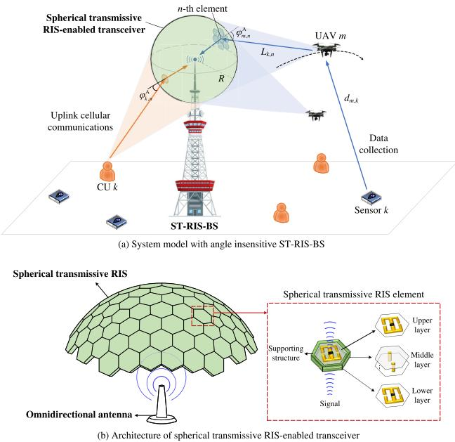  
Fig. 1. The structure of ST-RIS and the system model of a low-altitude application scenario with ST-RIS-enabled base station.

UAVs are required to collect as much data as possible within the total time T . We discretize T into L small time slots $\delta _ { t } , \mathrm { i . e . , } T = L \times \delta _ { t }$ . During each small time slot, the position of UAV m can be considered unchanged [26], [29] and is denoted as $\mathbf q _ { m } [ l ] \in \mathbb R ^ { 3 \times 1 }$ $m \in \mathcal { M } , l \ \bar { \in } \ \mathcal { L } = \{ 1 , 2 , \cdot \cdot \cdot , L \}$ Considering flight speed and collision avoidance, we have

$$
\| \mathbf { q } _ { m } [ l ] - \mathbf { q } _ { m } [ l - 1 ] \| \leq v _ { m a x } \delta _ { t } , \forall l \in \mathcal { L } , m \in \mathcal { M } ,\tag{1}
$$

$$
\begin{array} { r } { \| \mathbf { q } _ { m _ { 1 } } [ l ] - \mathbf { q } _ { m _ { 2 } } [ l ] \| \geq D _ { m i n } , \forall l \in \mathcal { L } , m _ { 1 } , m _ { 2 } \in \mathcal { M } , m 1 \neq m 2 , } \end{array}\tag{2}
$$

$$
\mathbf { q } _ { m } [ 0 ] = \mathbf { q } _ { m } [ L ] = \mathbf { q } _ { m } , \forall m \in \mathcal { M } ,\tag{3}
$$

where $v _ { m a x }$ is the maximum flight speed of UAVs, $D _ { m i n }$ is the minimum distance of collision avoidance, k · k is the L2 norm, $\mathbf { q } _ { m }$ is both the flight starting and ending points.

## B. Transmission Protocol

In the considered scenario, there are various types of communication demands, including UAVs collecting data from sensors and relaying the collected data back to the ST-RIS-BS, as well as uplink communications from CUs. In this paper, to ensure successful data transmission, we adopt a wake-up and sleep mechanism [29], [30]. $a _ { m , k } [ l ] = 1$ indicates that in time slot l, sensor k is awakened by UAV m for data transmission; otherwise, $a _ { m , k } [ l ] = 0$ . To ensure data transmission integrity and success rate, we assume that in each time slot, each sensor can only be awakened by one UAV, and each UAV can only wake up one sensor [29], [30].<sup>2</sup>

Additionally, due to the limited onboard storage capacity $S _ { m } ^ { m a x }$ UAV m needs to promptly relay excess data back to the ST-RIS-BS. Owing to payload constraints, UAVs are equipped with only one antenna for both transmission and receiving [31]. $b _ { m } [ l ] = 1$ indicates that in time slot l, UAV m transmits data back to the ST-RIS-BS; otherwise, $b _ { m } [ l ] = 0$ All transmissions share the same bandwidth resource B.

Based on the above analysis, we have following constraints

$$
\begin{array} { r l } & { a _ { m , k } [ l ] \in \{ 0 , 1 \} , \forall l \in \mathcal { L } , k \in \mathcal { K } _ { 1 } , m \in \mathcal { M } , } \\ & { ~ \displaystyle \sum _ { k \in { \cal K } _ { 1 } } a _ { m , k } [ l ] + b _ { m } [ l ] \leq 1 , b _ { m } [ l ] \in \{ 0 , 1 \} , \forall l \in \mathcal { L } , m \in \mathcal { M } , } \end{array}\tag{4}
$$

(5)

$$
\sum _ { m \in \mathcal { M } } a _ { m , k } [ l ] \leq 1 , \forall l \in \mathcal { L } , k \in \mathcal { K } _ { 1 } .\tag{6}
$$

## C. Channel Model

1) Channel Between UAVs and Sensors or CUs: Due to the significant height differences between UAVs and CUs or sensors, we model the channels between them using a statistical LoS probability model which conforms to the 3D dynamic characteristics of UAVs.

In LoS state, the complex channel between UAV m and sensor k or CU k in time slot l is modeled as

$$
\begin{array} { r } { h _ { m , k } ^ { L o S } [ l ] = \sqrt { \beta _ { 0 } \left( d _ { m , k } [ l ] \right) ^ { - \alpha _ { 1 } } } e ^ { - j \frac { 2 \pi d _ { m , k } [ l ] } { \lambda } } , } \end{array}\tag{7}
$$

where $\begin{array} { r } { \beta _ { 0 } ~ = ~ \left( \frac { c } { 4 \pi f _ { c } } \right) ^ { 2 } } \end{array}$ with c being the light speed and $f _ { c }$ being the transmission frequency, $d _ { m , k } [ l ] = \| \mathbf { q } _ { m } [ l ] - \mathbf { u } _ { k } \|$ , α<sub>1</sub> is LoS path loss exponent, λ is the wavelength.

In NLoS state, the complex channel between UAV m and sensor k or CU k in time slot l is modeled as

$$
h _ { m , k } ^ { N L o S } [ l ] = \sqrt { \beta _ { 0 } \left( d _ { m , k } [ l ] \right) ^ { - \alpha _ { 2 } } } x _ { m , k } [ l ] ,\tag{8}
$$

where $\alpha _ { 2 }$ is NLoS path loss exponent, $x _ { m , k } [ l ]$ is the smallscale NLoS fading modeled by a circularly symmetric complex Gaussian (CSCG) variable with mean 0 and variance 1.

The LoS probability of $h _ { m , k } ^ { L o S } [ l ]$ is

$$
P _ { m , k } ^ { L o S } [ l ] = \frac { 1 } { 1 + a \exp \left( - b ( \Delta _ { m , k } [ l ] - a ) \right) } ,\tag{9}
$$

where a and b are constant environmental parameters, $\Delta _ { m , k } [ l ]$ is elevation angle of UAV m relative to sensor k or CU k, and $P _ { m , k } ^ { N L o S } [ l ] = 1 ^ { \smile } P _ { m , k } ^ { L o S } [ l ]$ . The expected achievable rate from sensor k, $k \in \mathcal { K } _ { 1 }$ to UAV m in time slot l is represented by

$$
\bar { R } _ { m , k } [ l ] = P _ { m , k } ^ { L o S } [ l ] \times R _ { m , k } ^ { L o S } [ l ] + P _ { m , k } ^ { N L o S } [ l ] \times R _ { m , k } ^ { N L o S } [ l ] ,\tag{10}
$$

where $R _ { m , k } ^ { L o S } [ l ]$ and $R _ { m , k } ^ { N L o S } [ l ]$ are LoS and NLoS rates which are calculated by Eq. (11), shown at the bottom of the next page. $P _ { k } [ l ]$ is the transmit power of sensor k or CU k in time slot l, $N _ { 0 }$ is the power density of additive Gaussian white noise.

2) Channel Between UAVs and ST-RIS-BS: Due to the higher altitude of UAVs and the ST-RIS-BS, the LoS probability between them is high. Therefore, we adopt the free space propagation channel model [29] between UAV m and the ST-RIS-BS, as follows

$$
g _ { m } [ l ] = \mathbf { f } ^ { H } \left( \Phi [ l ] \odot \mathbf { C } _ { m } [ l ] \right) \mathbf { e } _ { m } [ l ] ,\tag{12}
$$

where $\mathbf { f } = \sqrt { \beta _ { 0 } \cos \varphi _ { n } ^ { \mathrm { D } } [ l ] R ^ { - 2 } } \left[ e ^ { - j \frac { 2 \pi R } { \lambda } } , \therefore \cdot \cdot , e ^ { - j \frac { 2 \pi R } { \lambda } } \right] ^ { T } \in \mathbb { C } ^ { N \times 1 }$ is the complex near-field channel from the ST-RIS to the omnidirectional antenna, $\varphi _ { n } ^ { \mathrm { D } } [ l ]$ is the signal departure angle relative to n-the ST-RIS element, and cos $\varphi _ { n } ^ { D } [ l ]$ is the oblique departure loss [14], [32], in this case, $\varphi _ { n } ^ { \mathrm { D } } [ l ] ~ = ~ 0$ due to the spherical shape of RIS; $\begin{array} { r l } { \Phi [ l ] } & { { } = } \end{array}$ diag{φ[l]}, φ[l] = $\left[ \phi _ { 1 } [ l ] , \cdots , \phi _ { N } [ l ] \right] ^ { T }$ is the transmission coefficients of the ST-RIS, where $\not \phi _ { n } [ l ] \ : = \ : e ^ { j \varepsilon _ { n } [ l ] } , \ : \varepsilon _ { n } [ l ] \ : \in \ : ( 0 , 2 \pi ]$ is the phase shift; ${ \bf C } _ { m } [ l ] \in \mathbb { R } ^ { \tilde { N } \times \tilde { N } }$ represents a real diagonal 0-1 matrix indicating which RIS elements work for the relay of UAV $m ,$ this indicator matrix is determined by specific geometric relationships and obtained in advance, $\odot$ is the Hadamard product; $\dot { \bf e } _ { m } [ l ] = \left[ e _ { m , 1 } [ l ] , \cdots , e _ { m , N } [ l ] \right] ^ { T }$ is the complex farfield channel from UAV m to the ST-RIS,

$$
e _ { m , n } [ l ] = \sqrt { \beta _ { 0 } \cos \varphi _ { m , n } ^ { \mathrm { A } } [ l ] ( D _ { m , n } [ l ] ) ^ { - 2 } } e ^ { - j \frac { 2 \pi D _ { m , n } [ l ] } { \lambda } } ,\tag{13}
$$

where $D _ { m , n } [ l ] \ = \ \| { \bf q } _ { m } [ l ] \ - \ { \bf w } _ { R , n } \| , \ \varphi _ { m , n } ^ { \mathrm { A } } [ l ]$ is the signal arrival angle of UAV m relative to n-the ST-RIS element, and cos $\varphi _ { m , n } ^ { \mathrm { A } } [ \bar { l } ]$ is the oblique incidence loss [14], [32].

3) Channel Between CUs and ST-RIS-BS: Due to the height difference between ST-RIS-BS and position-fixed CU k, we model this channel by common Rician fading model, i.e.,<sup>3</sup>

$$
\begin{array} { r } { s _ { k } [ l ] = \mathbf { f } ^ { H } \left( \Phi [ l ] \odot \mathbf { E } _ { k } \right) \mathbf { t } _ { k } [ l ] , \forall k \in \mathcal { K } _ { 2 } , } \end{array}\tag{14}
$$

where $\mathbf { E } _ { k } \in \mathbb { R } ^ { N \times N }$ is a real diagonal 0-1 indicator matrix which is similar to $\mathbf { C } _ { m } [ l ] , \mathbf { t } _ { k } [ l ] = \overline { { \left[ t _ { k , 1 } [ l ] , \cdot \cdot \cdot , t _ { k , N } [ l ] \right] ^ { T } } }$ and

$$
t _ { k , n } [ l ] = \sqrt { \beta _ { 0 } \cos \varphi _ { k , n } ^ { \mathrm { A } } \left( L _ { k , n } \right) ^ { - \alpha _ { 3 } } }\tag{15}
$$

where $\varphi _ { k , n } ^ { \mathrm { A } }$ is the signal arrival angle, $L _ { k , n } = \| \mathbf { u } _ { k } - \mathbf { w } _ { R , n } \|$ κ is the Rician factor, $y _ { k , n } [ l ]$ is the small-scale NLOS fading modeled by a CSCG variable with mean 0 and variance 1.

Then, the achievable rates from UAV m to ST-RIS-BS, from CU $k ,$ to ST-RIS-BS in time slot l are represented by

$$
\begin{array} { l } { \displaystyle \widetilde { R } _ { m } [ l ] = B \log ( 1 +  } \\ {    \sum _ { m ^ { \prime } \in \mathcal { M } \setminus \{ m ^ { \prime } \} } b _ { m } [ l ] p _ { m } [ l ] \vert g _ { m } [ l ] \vert ^ { 2 }   } \\ {   \sum _ { m ^ { \prime } \in \mathcal { M } \setminus \{ m \} } b _ { m ^ { \prime } } [ l ] p _ { m ^ { \prime } } [ l ] \vert g _ { m ^ { \prime } } [ l ] \vert ^ { 2 } + \sum _ { k \in { \cal K } _ { 2 } } P _ { k } [ l ] \vert s _ { k } [ l ] \vert ^ { 2 } + N _ { 0 } B ) ,  } \end{array}\tag{16}
$$

<sup>3</sup>Here we adopt the commonly used the assumption of independent element regulation and ignore the potential electromagnetic coupling between adjacent elements on the ST-RIS [33]. This simplification is somewhat reasonable in scenarios where the RIS element spacing is greater than half the wavelength. However, the curvature of the spherical structure leads to a significant compression of the element spacing along the tangential direction of the sphere, which may enhance the coupling effect. Besides, boundary modeling, element effectiveness, manufacturing imperfections, and non-ideal curvature effects can also affect the robustness of the channel model. These will be left for our future work.

$$
\begin{array} { l } { \displaystyle \widehat { R } _ { k } [ l ] = B \log \left( 1 + \right. } \\ { \displaystyle \left. \frac { P _ { k } [ l ] \big | s _ { k } [ l ] \big | ^ { 2 } } { { \sum _ { k ^ { \prime } \in { \cal K } _ { 2 } \setminus \{ k \} } } \big [ l ] \big | s _ { k ^ { \prime } } [ l ] \big | ^ { 2 } + { \sum _ { m \in { \cal M } } } [ l ] p _ { m } [ l ] \big | g _ { m } [ l ] \big | ^ { 2 } + N _ { 0 } B } \right) , \hfill } \end{array}\tag{17}
$$

where $p _ { m } [ l ]$ is the transmit power of UAV m in time slot l. The total stored data of UAV m is expressed as

$$
S _ { m } ^ { D } [ l ] = \sum _ { l ^ { \prime } = 1 } ^ { l } \left( \sum _ { k \in \mathcal { K } _ { 1 } } \bar { R } _ { m , k } [ l ^ { \prime } ] - \widetilde { R } _ { m } [ l ^ { \prime } ] \right) \delta _ { t } .\tag{18}
$$

## D. Energy Consumption Model

The energy consumption of UAVs can be divided into: 1) Communication-related energy consumption $P _ { c , m } [ l ] \ =$ $p _ { m } [ l ] + p _ { o t h e r s }$ , where $p _ { o t h e r s }$ is constant energy consumption of inner circuits; 2) Propulsion-related energy consumption [29]

$$
\begin{array} { r } { P _ { p , m } [ l ] = P _ { 0 } \left( 1 + \frac { 3 \left( v _ { m } [ l ] \right) ^ { 2 } } { U _ { t i p } ^ { 2 } } \right) + \frac { 1 } { 2 } d _ { 0 } \rho s A \left( v _ { m } [ l ] \right) ^ { 3 } } \\ { + P _ { i } \left( \sqrt { 1 + \frac { \left( v _ { m } [ l ] \right) ^ { 4 } } { 4 v _ { 0 } ^ { 4 } } } - \frac { \left( v _ { m } [ l ] \right) ^ { 2 } } { 2 v _ { 0 } ^ { 2 } } \right) ^ { \frac { 1 } { 2 } } , } \end{array}\tag{19}
$$

where $v _ { m } [ l ] = \| \mathbf { q } _ { m } [ l ] - \mathbf { q } _ { m } [ l - 1 ] \| / \delta _ { t }$ is the flight speed, and other parameters are fixed, as detailed in [29].

Hence, the whole energy consumption during the flight is

$$
E _ { m } = \sum _ { l \in \mathcal { L } } \left( P _ { c , m } [ l ] + P _ { p , m } [ l ] \right) \delta _ { t } .\tag{20}
$$

III. SPATIAL GAIN ANALYSIS OF ST-RIS OVER PT-RIS A. Spatial Average Gain Analysis of ST-RIS

In this section, time indication [l] is ignored for brevity. First of all, shown in Fig. 2, the signal gain of transmitter k passing through a certain tiny cell $\Delta$ in ST-RIS is

$$
\begin{array} { r l } & { G _ { s , \Delta } ( z _ { k } , \theta _ { \Delta } , \zeta _ { \Delta } ) = \left| \sqrt { \beta _ { 0 } R ^ { - 2 } } e ^ { - j \frac { 2 \pi R } { \lambda } } \times e ^ { j \varepsilon _ { s , \Delta } } \right. } \\ & { \left. \times \sqrt { \beta _ { 0 } \cos \varphi _ { \Delta } ^ { \mathrm { A } } d _ { s , \Delta } ^ { - 2 } } e ^ { - j \frac { 2 \pi d _ { s , \Delta } } { \lambda } } \right| ^ { 2 } , } \end{array}\tag{21}
$$

where $z _ { k }$ is the distance between transceivers, $\theta _ { \Delta }$ and $\zeta _ { \Delta }$ are the elevation and azimuth angles of tiny cell $\Delta , \varepsilon _ { s , \Delta }$ is its phase shift, $d _ { s , \Delta } = \sqrt { R ^ { 2 } - 2 R z _ { k } \cos \theta _ { \Delta } + z _ { k } ^ { 2 } } , \ \varphi _ { \Delta } ^ { \mathrm { A } }$ is the signal arrival angle, and the departure angle $\varphi _ { \Delta } ^ { \mathrm { D } }$ is 0 in this case. The above parameters have been identified in Fig. 2. Since the sphere is rotationally invariant, i.e., angle-insensitive characteristic, the elevation angle $\rho$ and azimuth angle η of the transmitter at any positions can be considered to be the same, so we omit them in (21).

$$
R _ { m , k } ^ { X } [ l ] = B \log \left( 1 + \frac { a _ { m , k } [ l ] P _ { k } [ l ] \left| h _ { m , k } ^ { X } [ l ] \right| ^ { 2 } } { \underset { m ^ { \prime } \in M k ^ { \prime } \in K 1 \backslash \{ k \} } { \sum } \underset { k = 1 } { \sum } a _ { m ^ { \prime } , k ^ { \prime } } [ l ] P _ { k ^ { \prime } } [ l ] \left| h _ { m ^ { \prime } , k ^ { \prime } } ^ { X } [ l ] \right| ^ { 2 } + \underset { k ^ { \prime } \in K _ { 2 } } { \sum } P _ { k ^ { \prime } } [ l ] \left| h _ { m , k ^ { \prime } } ^ { X } [ l ] \right| ^ { 2 } + N _ { 0 } B } \right) \ , X \in \{ L o S , N L o S \}\tag{11}
$$

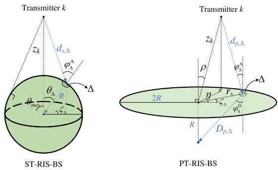  
Fig. 2. Spatial gain analysis models of ST-RIS-BS and PT-RIS-BS.

Here, we calculate the maximum gain of tiny cell $\Delta$ by letting $\begin{array} { r } { \varepsilon _ { s , \Delta } = \frac { 2 \pi ( d _ { s , \Delta } + R ) } { \lambda } } \end{array}$ , and rewrite (21) by

$$
G _ { s , \Delta } ( z _ { k } , \theta _ { \Delta } , \zeta _ { \Delta } ) = \frac { \beta _ { 0 } ^ { 2 } \cos \varphi _ { \Delta } ^ { \mathrm { A } } } { d _ { s , \Delta } ^ { 2 } R ^ { 2 } } \overset { ( a ) } { = } \frac { \beta _ { 0 } ^ { 2 } ( z _ { k } \cos \theta _ { \Delta } - R ) } { R ^ { 2 } d _ { s , \Delta } ^ { 3 } } ,\tag{22}
$$

where (a) holds due to geometric transformation. The gain of the whole ST-RIS is obtained by integration of tiny cell $\Delta$

$$
\begin{array} { c } { { G _ { s } ( z _ { k } ) = \displaystyle \int _ { 0 } ^ { 2 \pi } \displaystyle \int _ { 0 } ^ { \theta _ { m a x } } G _ { s , \Delta } ( z _ { k } , \theta _ { \Delta } , \zeta _ { \Delta } ) R ^ { 2 } \sin \theta _ { \Delta } d \theta _ { \Delta } d \zeta _ { \Delta } } } \\ { { = \displaystyle \frac { 2 \pi \beta _ { 0 } ^ { 2 } } { R ^ { 2 } } \left( 1 - \frac { \sqrt { z _ { k } ^ { 2 } - R ^ { 2 } } } { z _ { k } } \right) , ~ ( 2 \Im ^ { 2 } { \cal R } ) ~ } } \end{array}\tag{}
$$

where $\theta _ { m a x }$ is the maximum elevation angle of efficient ST-RIS area which can be seen in Fig. 2.

Next, we will calculate the spatial average gain of transmitters on a hemispherical surface at distance $z _ { k }$ , elevation angle $\rho \in [ 0 , { \frac { \pi } { 2 } } ]$ , and azimuth angle $\eta \in [ 0 , 2 \pi ]$ , shown as

$$
\begin{array} { r l r } & { } & { G _ { s , a v e } ( z _ { k } ) = \displaystyle \int _ { 0 } ^ { 2 \pi } \int _ { 0 } ^ { \pi / 2 } G _ { s } ( z _ { k } ) z _ { k } ^ { 2 } \sin \rho d \rho d \eta } \\ & { } & { = \frac { 4 \pi ^ { 2 } \beta _ { 0 } ^ { 2 } } { R ^ { 2 } } \left( z _ { k } ^ { 2 } - z _ { k } \sqrt { z _ { k } ^ { 2 } - R ^ { 2 } } \right) . } \end{array}\tag{24}
$$

## B. Spatial Average Gain Analysis of PT-RIS

For consistency of comparison, we consider a planar circular RIS with radius 2R, so that it has the same area as ST-RIS.

Similarly, the signal gain of transmitter k passing through a certain tiny cell $\Delta$ in PT-RIS is expressed by

$$
\begin{array} { r l } & { G _ { p , \Delta } ( z _ { k } , \rho , \eta , r _ { \Delta } , \zeta _ { \Delta } ) = \bigg | \sqrt { \beta _ { 0 } \cos \varphi _ { \Delta } ^ { \mathrm { D } } D _ { p , \Delta } ^ { - 2 } } e ^ { - j \frac { 2 \pi D _ { p , \Delta } } { \lambda } } } \\ & { \quad \quad \quad \quad \times e ^ { j \varepsilon _ { p , \Delta } } \times \sqrt { \beta _ { 0 } \cos \varphi _ { \Delta } ^ { \mathrm { A } } d _ { p , \Delta } ^ { - 2 } } e ^ { - j \frac { 2 \pi d _ { p , \Delta } } { \lambda } } \bigg | ^ { 2 } , } \end{array}\tag{25}
$$

where $D _ { p , \Delta } = \sqrt { R ^ { 2 } + r _ { \Delta } ^ { 2 } } , r _ { \Delta }$ is the distance between the tiny cell $\Delta$ and the center of $\mathrm { P } \overline { { \mathrm { T } } } \mathrm { - R I S } , \varepsilon _ { p , \Delta }$ is the phase shift, $d _ { p , \Delta } =$ $\sqrt { r _ { \Delta } ^ { 2 } - 2 r _ { \Delta } z _ { k } \sin \rho \cos ( \eta - \zeta _ { \Delta } ) + z _ { k } ^ { 2 } }$ , and all parameters have also been identified in Fig. 2.

Similarly, let $\begin{array} { r } { \varepsilon _ { p , \Delta } = \frac { 2 \overline { { \pi } } ( d _ { p , \Delta } + D _ { p , \Delta } ) } { \lambda } } \end{array}$ , (25) is rewritten by

$$
G _ { p , \Delta } ( z _ { k } , \rho , \eta , r _ { \Delta } , \zeta _ { \Delta } ) = \frac { \beta _ { 0 } ^ { 2 } \mathrm { c o s } \varphi _ { \Delta } ^ { \mathrm { A } } \mathrm { c o s } \varphi _ { \Delta } ^ { \mathrm { D } } } { d _ { p , \Delta } ^ { 2 } D _ { p , \Delta } ^ { 2 } } \mathrm { = } \frac { \beta _ { 0 } ^ { 2 } z _ { k } r _ { \Delta } \mathrm { c o s } \rho } { d _ { p , \Delta } ^ { 3 } D _ { p , \Delta } ^ { 3 } } ,\tag{26}
$$

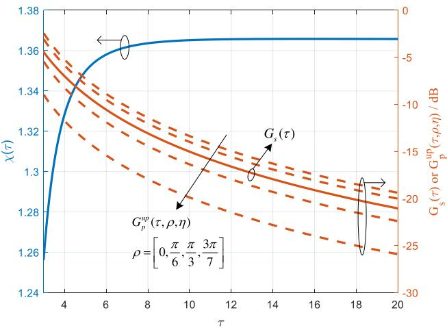  
Fig. 3. An intuitive presentation of Eq. (24), Eq. (27), and Eq. (29).

where (b) holds due to geometric transformation. The gain of the whole PT-RIS is obtained by integration of tiny cell $\Delta$

$$
\begin{array} { l } { { \displaystyle { G _ { p } ( z _ { k } , \rho , \eta ) = \int _ { 0 } ^ { 2 \pi } \int _ { 0 } ^ { 2 R } G _ { p , \Delta } ( z _ { k } , \rho , \eta , r _ { \Delta } , \zeta _ { \Delta } ) r _ { \Delta } d r _ { \Delta } d \zeta _ { \Delta } } } } \\  { \displaystyle { \begin{array} { l } { { ( c ) } } \\ { { \leq \beta _ { 0 } ^ { 2 } z _ { k } \cos \rho \int _ { 0 } ^ { 2 \pi } \int _ { 0 } ^ { 2 R } \frac { r _ { \Delta } ^ { 2 } } { ( z _ { k } - r _ { \Delta } ) ^ { 3 } ( r _ { \Delta } ^ { 2 } + R ^ { 2 } ) ^ { 3 / 2 } } d r _ { \Delta } d \zeta _ { \Delta } } } \\ { { ( \frac { d } { \leq } 2 \pi \beta _ { 0 } ^ { 2 } z _ { k } \cos \rho \int _ { 0 } ^ { 2 R } \frac { r _ { \Delta } ^ { 2 } } { ( z _ { k } ^ { 3 } - r _ { \Delta } ^ { 3 } ) ( r _ { \Delta } ^ { 3 } + R ^ { 3 } ) } d r _ { \Delta } } } \\ { { = \frac { 2 \pi \beta _ { 0 } ^ { 2 } z _ { k } \cos \rho } { 3 ( z _ { k } ^ { 3 } + R ^ { 3 } ) } \ln \frac { 9 z _ { k } ^ { 3 } } { z _ { k } ^ { 3 } - 8 R ^ { 3 } } \triangleq G _ { p } ^ { u p } ( z _ { k } , \rho , \eta ) , } \end{array} } } } \end{array}
$$

where $( c )$ holds due to sin $\rho \cos ( \eta - \zeta _ { \Delta } ) ~ \le ~ 1 , ~ ( d )$ holds because $z _ { k } \ge 2 R \ge r _ { \Delta }$ usually holds in practice. It should be noted $G _ { p } ^ { u p } \big ( z _ { k } , \rho , \eta \big )$ is a loose upper bound of $G _ { p } ( z _ { k } , \rho , \eta )$

The upper bound of spatial average gain from PT-RIS is

$$
\begin{array} { r l } & { G _ { p , a v e } ^ { u p } ( z _ { k } ) = \displaystyle \int _ { 0 } ^ { 2 \pi } \int _ { 0 } ^ { \pi / 2 } G _ { p } ^ { u p } ( z _ { k } , \rho , \eta ) z _ { k } ^ { 2 } \sin { \rho d \rho d \eta } } \\ & { \quad \quad \quad = \frac { 2 \pi ^ { 2 } \beta _ { 0 } ^ { 2 } z _ { k } ^ { 3 } } { 3 ( z _ { k } ^ { 3 } + R ^ { 3 } ) } \ln \frac { 9 z _ { k } ^ { 3 } } { z _ { k } ^ { 3 } - 8 R ^ { 3 } } . } \end{array}\tag{28}
$$

Based on (24) and (28), the lower bound of the spatial average gain advantage of ST-RIS over PT-RIS is

$$
\chi ( \tau ) = \frac { G _ { s , a v e } ( z _ { k } ) } { G _ { p , a v e } ^ { u p } ( z _ { k } ) } = \frac { 6 \left( \tau ^ { 2 } + \frac { 1 } { \tau } \right) \left( 1 - \sqrt { 1 - \frac { 1 } { \tau ^ { 2 } } } \right) } { \ln ( 9 \tau ^ { 3 } ) - \ln ( \tau ^ { 3 } - 8 ) } ,\tag{29}
$$

where $\tau = z _ { k } / R$ is the normalized distance.

To visualize the gain advantage, we plot the trend of $\chi ( \tau )$ versus $\tau ,$ as shown in Fig. 3. It shows that as τ increases, the advantage of ST-RIS becomes more pronounced. When τ exceeds 10, i.e., the distance between the transmitter and the BS receiving antenna is more than 10 times the radius of ST-RIS, the lower bound of spatial average gain of ST-RIS relative to PT-RIS stabilizes and can reach 36.6%. Importantly, due to the loose upper bound of $G _ { p } ^ { u p } ( z _ { k } , \rho , \eta )$ with respect to $G _ { p } ( z _ { k } , \rho , \eta )$ , the actual lower gain may be far more than 36.6%. Besides, we can know the gain of ST-RIS is angleinsensitive, but the gain of PT-RIS decreases sharply with the elevation angle $\rho .$

## IV. OPTIMIZATION DESIGN OF ST-RIS-BS

## A. Problem Formulation

Based on the system model in Section II, this section studies low-altitude communications based on ST-RIS-BS. Define sensors’ wake-up variable $\textbf { A } = \ \{ a _ { m , k } [ l ] , \forall l , k , m \}$ UAVs’ relay variable $\bar { \mathbf { B } } = \{ b _ { m } [ l ] , \forall l , m \}$ , sensors’ and CUs’ transmit power variable $\mathbf { P } \overset { \cdot } { = } \{ \dot { P } _ { k } [ l ] , \forall \bar { l } , k \}$ UAVs’ transmit power variable $\textbf { p } = \{ p _ { m } [ l ] , \forall \bar { l } , m \}$ , UAVs’ trajectory variable $\textbf { Q } = ~ \{ \mathbf { q } _ { m } [ l ] , \forall l , \bar { m } \}$ , and ST-RIS phase shift variable $\varepsilon = \{ \varepsilon _ { n } [ l ] , \dot { \forall } l , n \}$ . To reduce interference, power control is used, and the ST-RIS-BS can inform the sensor, CUs and UAVs of their transmit power settings through the downlink control link. Based on the above analysis, our goal is to collect as much data as possible while ensuring the rates of CUs, which raises the following problem

$$
\mathrm { P 1 : } \quad \operatorname* { m a x } _ { \substack { \mathbf { A } , \mathbf { B } , \mathbf { P } , \mathbf { p } , \mathbf { Q } , \varepsilon } } \sum _ { l \in \mathcal { L } } \sum _ { k \in \mathcal { K } _ { 1 } } \sum _ { m \in \mathcal { M } } \bar { R } _ { m , k } [ l ] \delta _ { t }\tag{30}
$$

$$
s . t . \sum _ { l \in \mathcal { L } } \sum _ { m \in \mathcal { M } } \bar { R } _ { m , k } [ l ] \delta _ { t } \leq S _ { k } , \forall k \in \mathcal { K } _ { 1 } ,\tag{30a}
$$

$$
S _ { m } ^ { D } [ l ] \leq S _ { m } ^ { m a x } , \forall m \in \mathcal { M } , l \in \mathcal { L } ,\tag{30b}
$$

$$
\frac { 1 } { L } \sum _ { l \in \mathcal { L } } \widehat { R } _ { k } [ l ] \geq \gamma _ { k } , \forall k \in \mathcal { K } _ { 2 } ,\tag{30c}
$$

(1)-(6),

(30d)

$$
\varepsilon _ { n } [ l ] \in ( 0 , 2 \pi ] , \forall n \in \mathcal { N } , l \in \mathcal { L } ,\tag{30e}
$$

$$
P _ { k } [ l ] \leq P _ { k } ^ { m a x } , \forall k \in \mathcal { K } , l \in \mathcal { L } ,\tag{30f}
$$

$$
p _ { m } [ l ] \leq p _ { m } ^ { m a x } , \forall m \in \mathcal { M } , l \in \mathcal { L } ,\tag{30g}
$$

$$
E _ { m } \leq E _ { m } ^ { m a x } , \forall m \in \mathcal { M } ,\tag{30h}
$$

where (30a) is the constraint on maximum transmission data of sensors, (30b) is the constraint for maximum stored data of UAVs, (30c) ensures the minimum average communication rate requirement of CUs, (30d) is transmission scheduling and UAVs’ trajectories constraint, (30e) is the optimization space for phase shifts of the ST-RIS, $P _ { k } ^ { m a x }$ and $p _ { m } ^ { m a x }$ are the maximum transmit powers for sensor(or CU) k and UAV m, and $E _ { m } ^ { m a x }$ is the maximum energy on board of UAV m.

It should be noted that P1 represents a novel mathematical modeling of a typical application scenario in future lowaltitude economy, which is highly significant. However, it is easily observed that P1 involves six groups of mutually coupled time-series optimization variables, and the problem is non-convex with respect to each group of variables, which cannot be easily solved by existing methods. In the next subsection, we will propose an approximate solution.

## B. Proposed Solution

Due to the coupling among the aforementioned six groups of variables, we employ the BCD to solve them iteratively. For each variable, we adopt SCA technique to address it.

1) Optimizing A, B With Fixed $\mathbf { P } ^ { ( r ) } , \mathbf { \bar { p } } ^ { ( r ) } , \varepsilon ^ { ( r ) } , \mathbf { Q } ^ { ( r ) } ; \mathbf { \Psi } ^ { 4 }$ In the r-th iteration, we have the following sub-problem from P1 by relaxing $a _ { m , k } [ l ] , b _ { m } [ l ]$ between 0 and 1

$$
\mathrm { P 1 . 1 : } \quad \operatorname* { m a x } _ { \mathbf { A , B } } \ \sum _ { l \in \mathcal { L } } \sum _ { k \in { \mathcal { K } } _ { 1 } } \sum _ { m \in { \mathcal { M } } } { \bar { R } } _ { m , k } [ l ] \delta _ { t }\tag{31}
$$

$$
s . t . ~ ( 3 0 \mathrm { a } ) , ( 3 0 \mathrm { b } ) , ( 6 ) ,\tag{31a}
$$

<sup>4</sup>The superscript <sup>(r)</sup> denotes the value of the variable in the r-th iteration.

$$
0 \leq a _ { m , k } [ l ] \leq 1 , \forall l \in \mathcal { L } , k \in \mathcal { K } _ { 1 } , m \in \mathcal { M } ,\tag{31b}
$$

$$
\begin{array} { r l } { ~ } & { \displaystyle \sum _ { k = 1 } ^ { K _ { 1 } } a _ { m , k } [ l ] + b _ { m } [ l ] \leq 1 , 0 \leq b _ { m } [ l ] \leq 1 , } \\ & { \forall l \in \mathcal { L } , m \in \mathcal { M } . } \end{array}\tag{31c}
$$

Obviously, P1.1 is a non-convex problem. According to (10), (11), and (16), the non-convexity of P1.1 mainly lies in $R _ { m , k } ^ { X } [ l ] , X \in \{ L o S , N L o S \}$ and $\widetilde { R } _ { m } [ l ]$ which is coupled in objective function, (30a), and (30b). Next, we will introduce the following Corollary to solve it.

Corollary 1: By applying the first-order Taylor expansion at $a _ { m , k } ^ { ( r ) } [ l ]$ or $b _ { m } ^ { ( r ) } [ l ]$ , the following inequalities hold:

$$
R _ { m , k } ^ { X , 1 } [ l ] + R _ { m , k } ^ { X , 2 , l b } [ l ] \leq R _ { m , k } ^ { X } [ l ] \leq R _ { m , k } ^ { X , 1 , u p } [ l ] + R _ { m , k } ^ { X , 2 } [ l ] ,\tag{32}
$$

$$
\widetilde { R } _ { m } [ l ] \geq \widetilde { R } _ { m , 1 } [ l ] + \widetilde { R } _ { m , 2 } ^ { l b } [ l ] ,\tag{33}
$$

where $R _ { m , k } ^ { X , 1 } [ l ] , \ R _ { m , k } ^ { X , 2 , l b } [ l ] , \ R _ { m , k } ^ { X , 1 , u p } [ l ] , \ R _ { m , k } ^ { X , 2 } [ l ] , \ \widetilde { R } _ { m , 1 } [ l ] .$ , and $\widetilde { R } _ { m , 2 } ^ { l b } [ l ] , X \in \{ L o S , N L o S \}$ are denoted in (69)–(71), (73), and (74). The proof of this corollary is shown in Appendix A. Based on Corollary 1, we can obtain Based on Corollary 1, we can obtain

$$
\bar { R } _ { m , k } [ l ] \geq \bar { R } _ { m , k } ^ { l b , 1 } [ l ] \triangleq P _ { m , k } ^ { L o S } [ l ] \times \Big ( R _ { m , k } ^ { L o S , 1 } [ l ] + R _ { m , k } ^ { L o S , 2 , l b } [ l ] \Big )
$$

$$
\begin{array} { r l } { + } & { { } P _ { m , k } ^ { N L o S } [ l ] \times \left( R _ { m , k } ^ { N L o S , 1 } [ l ] + R _ { m , k } ^ { N L o S , 2 , l b } [ l ] \right) , } \end{array}\tag{34}
$$

$$
\bar { R } _ { m , k } [ l ] \leq \bar { R } _ { m , k } ^ { u p , 1 } [ l ] \triangleq P _ { m , k } ^ { L o S } [ l ] \times \left( R _ { m , k } ^ { L o S , 1 , u p } [ l ] + R _ { m , k } ^ { L o S , 2 } [ l ] \right)
$$

$$
\begin{array} { r l } { + } & { { } P _ { m , k } ^ { N L o S } [ l ] \times \left( R _ { m , k } ^ { N L o S , 1 , u p } [ l ] + R _ { m , k } ^ { N L o S , 2 } [ l ] \right) , } \end{array}
$$

$$
S _ { m } ^ { D } [ l ] = \sum _ { l ^ { \prime } = 1 } ^ { l } \left( \sum _ { k \in \mathcal { K } _ { 1 } } \bar { R } _ { m , k } [ l ^ { \prime } ] - \widetilde { R } _ { m } [ l ^ { \prime } ] \right) \delta _ { t } \leq S _ { m } ^ { D , u p , 1 } [ l ]\tag{35}
$$

$$
\triangleq \sum _ { l ^ { \prime } = 1 } ^ { l } \left( \sum _ { k \in \mathcal { K } _ { 1 } } \bar { R } _ { m , k } ^ { u p , 1 } [ l ^ { \prime } ] - \left( \widetilde { R } _ { m , 1 } [ l ^ { \prime } ] + \widetilde { R } _ { m , 2 } ^ { l b } [ l ^ { \prime } ] \right) \right) \delta _ { t } .\tag{36}
$$

By replacing the objective function, (31a), and (31b) with (34), (35), and (36), respectively, we can acquire

$$
\mathrm { P } 1 . 2 : \quad \operatorname* { m a x } _ { \mathbf { A } , \mathbf { B } } \ \sum _ { l \in \mathcal { L } } \sum _ { k \in \mathcal { K } _ { 1 } } \sum _ { m \in \mathcal { M } } \bar { R } _ { m , k } ^ { l b , 1 } [ l ] \delta _ { t }\tag{37}
$$

$$
s . t . \sum _ { l \in \mathcal { L } } \sum _ { m \in \mathcal { M } } \bar { R } _ { m , k } ^ { u p , 1 } [ l ] \delta _ { t } \leq S _ { k } , \forall k \in \mathcal { K } _ { 1 } ,\tag{37a}
$$

$$
S _ { m } ^ { D , u p , 1 } [ l ] \leq S _ { m } ^ { m a x } , \forall m \in \mathcal { M } , l \in \mathcal { L } ,
$$

$$
( 6 ) , ( 3 1 \mathsf { b } ) , ( 3 1 \mathsf { c } ) ,\tag{37b}
$$

(37c)

which can be easily solved by MATLAB CVX tool [34]. Note that due to relaxation techniques, the obtained $\mathbf { A } ^ { * }$ and $\mathbf { B } ^ { \ast }$ by solving P1.2 may not satisfy the 0-1 integer constraints. Their binary reconstruction can be achieved through finer time slot partitioning. For example, if $a _ { m , k } [ l ] = 0 . { \bar { 7 } } ,$ , we can further divide time slot l into 10 sub-slots, where sensor k is awakened by UAV m for data transmission in 7 sub-slots. For details, please refer to our previous work [30].

2) Optimizing P, p With Fixed ${ \bf A } ^ { ( r ) } , { \bf B } ^ { ( r ) } , \varepsilon ^ { ( r ) } , { \bf Q } ^ { ( r ) } .$ : In this part, we focus on the following sub-problem

$$
\mathbb { P } 1 . 3 : \operatorname* { m a x } _ { \mathbf { P } , \mathbf { p } } \ \sum _ { l \in \mathcal { L } } \sum _ { k \in \mathcal { K } _ { 1 } } \sum _ { m \in \mathcal { M } } \bar { R } _ { m , k } [ l ] \delta _ { t }\tag{38}
$$

$$
s . t . ( 3 0 \mathrm { a } ) , ( 3 0 \mathrm { b } ) , ( 3 0 \mathrm { c } ) , ( 3 0 \mathrm { f } ) , ( 3 0 \mathrm { g } ) , ( 3 0 \mathrm { h } ) .\tag{38a}
$$

It is easily known that the challenges lie in the nonconvexities of objective function and (30a)–(30c), which is similar to P1.1. A closer observation reveals that in the expressions of $R _ { m , k } ^ { X } [ l ] , \widetilde { R } _ { m } [ l ]$ , and $\widehat { R } _ { k } [ l ]$ , the P or p in P1.3 holds a similar position and convex property to the A and B in P1.1. Therefore, we can use the similar method in Corollary 1 to solve this problem. Due to space limitation, the details are omitted here.

3) Optimizing ε With Fixed $\mathbf { A } ^ { ( r ) } , \mathbf { B } ^ { ( r ) } , \mathbf { P } ^ { ( r ) } , \mathbf { p } ^ { ( r ) } , \mathbf { Q } ^ { ( r ) } .$ Since the objective function of P1 is independent of $\varepsilon ,$ the sub-problem about ε is a feasibility check problem. However, the feasibility check cannot guarantee the optimality of the obtained ε. Therefore, we are committed to the following problem aiming at the maximization of sum-rate of all UAVs

$$
\mathtt { P 1 . 4 : \operatorname* { m a x } _ { \varepsilon } } \sum _ { m \in \mathcal { M } } \sum _ { l \in \mathcal { L } } \widetilde { R } _ { m } [ l ]\tag{39}
$$

$$
s . t . \ ( 3 0 \mathbf { b } ) , \ ( 3 0 \mathbf { c } ) , \ ( 3 0 \mathbf { e } ) .\tag{39a}
$$

Different from existing methods involving non-convex unitmodulus constraint for ε, we propose a novel SCA approach. Introducing $\mathbf { A } = \{ \Lambda _ { m } [ l ] , \bar { \forall } m , l \} , \Xi = \{ \Xi _ { k } [ l ] , \forall \bar { k , l } \}$ and some transformations, P1.5 is equivalently transformed by

P1.5 :

$$
\operatorname* { m a x } _ { \varepsilon , \Lambda , \Xi } \ \sum _ { m \in \mathcal { M } } \sum _ { l \in \mathcal { L } } B \log \left( 1 + \Lambda _ { m } [ l ] \right)\tag{40}
$$

$$
s . t . \sum _ { l ^ { \prime } = 1 } ^ { l } B \log \left( 1 + \Lambda _ { m } [ l ^ { \prime } ] \right) \geq \vartheta _ { m } [ l ] , \forall m \in \mathcal { M } , l \in \mathcal { L } ,\tag{40a}
$$

$$
\frac { K _ { m } [ l ] \left| \mathbf { L } _ { m } ^ { H } [ l ] \phi [ l ] \right| ^ { 2 } } { \underset { m ^ { \prime } \in \mathcal { M } \backslash \{ m \} } { \sum \big | \mathbf { \it { L } } _ { m ^ { \prime } } [ l ] \left| \mathbf { L } _ { m ^ { \prime } } ^ { H } [ l ] \phi [ l ] \right| ^ { 2 } + \underset { k \in \mathcal { K } _ { 2 } } { \sum \mathop { P _ { k } } [ l ] } \left| \mathbf { M } _ { k } ^ { H } [ l ] \phi [ l ] \right| ^ { 2 } + N _ { 0 } B } }
$$

$$
\geq \Lambda _ { m } [ l ] , \forall m \in \mathcal { M } , l \in \mathcal { L } ,\tag{40b}
$$

$$
\frac { 1 } { L } \sum _ { l \in \mathcal { L } } B \log \left( 1 + \Xi _ { k } [ l ] \right) \geq \gamma _ { k } , \forall k \in \mathcal { K } _ { 2 } ,\tag{40c}
$$

$$
\frac { P _ { k } [ l ] \left| \mathbf { M } _ { k } ^ { H } [ l ] \phi [ l ] \right| ^ { 2 } } { \underset { k ^ { \prime } \in K _ { 2 } \backslash \{ k \} } { \sum \sum P _ { k ^ { \prime } } [ l ] \left| \mathbf { M } _ { k ^ { \prime } } ^ { H } [ l ] \phi [ l ] \right| ^ { 2 } + \sum \_ K _ { m } [ l ] \left| \mathbf { L } _ { m } ^ { H } [ l ] \phi [ l ] \right| ^ { 2 } + N _ { 0 } B } }
$$

$$
\begin{array} { r } { \geq \Xi _ { k } [ l ] , \forall k \in { \cal K } _ { 2 } , l \in { \cal L } , } \end{array}\tag{40d}
$$

$$
\varepsilon _ { n } [ l ] \in ( 0 , 2 \pi ] , \forall n \in \mathcal { N } , l \in \mathcal { L } ,\tag{40e}
$$

where $\begin{array} { r l r } { \vartheta _ { m } [ l ] } & { { } = } & { \sum _ { l ^ { \prime } = 1 } ^ { l } \sum _ { k \in { \cal K } _ { 1 } } { \bar { \cal R } } _ { m , k } [ l ^ { \prime } ] - \frac { S _ { m } ^ { m a x } } { \delta _ { + } } , { \cal K } _ { m } [ l ] = } \end{array}$ $b _ { m } [ l ] p _ { m } [ l ] , \ \mathbf { L } _ { m } [ l ] \ = \ _ { . . . } \ ( \mathbf { C } _ { m } [ l ] \odot \mathrm { d i a g } \{ \mathbf { e } _ { m } [ l ] \} ) ^ { H } \mathbf { f } , \ \mathbf { M } _ { k } [ l ] \ =$ $( \mathbf { E } _ { k } \bar { \langle l \vert } \odot \bar { \mathrm { d i a g } } \{ \mathbf { t } _ { k } \bar { \lbrack l \vert } \} ) ^ { H } \mathbf { \Sigma ^ { f } }$ . Then, we use SCA-based alternating optimization (AO) to solve P1.5:

• Step 1: Optimizing Λ, Ξ with fixed $\varepsilon ^ { ( r ) }$ . This is an easily solved convex problem.

• Step 2: Optimizing ε with fixed $\mathbf { \boldsymbol { \Lambda } } ^ { ( r ) }$ and $\Xi ^ { ( r ) }$ . After solving it, return to step 1 until convergence.

Next, focusing on step 2, (40b), (40d) can be rewritten by

$$
\left( e ^ { j \varepsilon [ l ] } \right) ^ { H } \mathbf { O } _ { m } [ l ] e ^ { j \varepsilon [ l ] } + N _ { 0 } B \leq 0 , \forall m \in \mathcal { M } , l \in \mathcal { L } ,\tag{41}
$$

$$
\left( e ^ { j \varepsilon [ l ] } \right) ^ { H } \mathbf { R } _ { k } [ l ] e ^ { j \varepsilon [ l ] } + N _ { 0 } B \leq 0 , \forall k \in \mathcal { K } _ { 2 } , l \in \mathcal { L } ,\tag{42}
$$

where $\begin{array} { r l r } { { \bf O } _ { m } [ l ] } & { = } & { { \bf N } [ l ] { \bf N } ^ { H } [ l ] - \left( 1 + \frac { K _ { m } [ l ] { \bf L } _ { m } { \bf L } _ { m } ^ { H } } { \Lambda _ { m } ^ { ( r ) } [ l ] } \right) , ~ { \bf R } _ { k } [ l ] = } \end{array}$ $\begin{array} { r } { { \bf N } [ l ] { \bf N } ^ { H } [ l ] - \bigg ( 1 + \frac { P _ { k } [ l ] { \bf M } _ { k } { \bf M } _ { k } ^ { H } } { \Xi _ { k } ^ { ( r ) } [ l ] } \bigg ) , ~ { \bf N } [ l ] = \left[ \sqrt { K _ { 1 } [ l ] } { \bf L } _ { 1 } [ l ] , \cdot \cdot \cdot \right. } \end{array}$ $\sqrt { K _ { M } [ l ] } \mathbf { L } _ { M } [ l ] , \sqrt { P _ { 1 } [ l ] } \mathbf { M } _ { 1 } [ l ] , \cdots , \sqrt { P _ { K _ { 2 } } [ l ] } \mathbf { M } _ { K _ { 2 } } [ l ] \Big ] .$

To further address non-convexity in (41) and (42), we employ SCA by second-order Taylor expansion at $\varepsilon ^ { ( r ) } [ l ] , \mathrm { i . e . }$

$$
\left( e ^ { j \pmb { \varepsilon } ^ { ( r ) } [ l ] } \right) ^ { H } \mathbf { O } _ { m } [ l ] e ^ { j \pmb { \varepsilon } ^ { ( r ) } [ l ] } + \nabla f _ { 1 } ^ { T } ( \pmb { \varepsilon } ^ { ( r ) } [ l ] ) \left( \pmb { \varepsilon } [ l ] - \pmb { \varepsilon } ^ { ( r ) } [ l ] \right)
$$

$$
+ \frac { v _ { 1 } } { 2 } \| \varepsilon [ l ] - \varepsilon ^ { ( r ) } [ l ] \| ^ { 2 } + N _ { 0 } B \leq 0 , \forall m \in \mathcal { M } , l \in \mathcal { L } ,\tag{43}
$$

$$
\left( e ^ { j \varepsilon ^ { ( r ) } [ l ] } \right) ^ { H } { \bf R } _ { k } [ l ] e ^ { j \varepsilon ^ { ( r ) } [ l ] } + \nabla f _ { 2 } ^ { T } ( \varepsilon ^ { ( r ) } [ l ] ) \left( \varepsilon [ l ] - \varepsilon ^ { ( r ) } [ l ] \right)
$$

$$
+ \frac { v _ { 2 } } { 2 } \| \varepsilon [ l ] - \varepsilon ^ { ( r ) } [ l ] \| ^ { 2 } + N _ { 0 } B \leq 0 , \forall k \in \mathcal { K } _ { 2 } , l \in \mathcal { L } ,\tag{44}
$$

where $\nabla f _ { 1 } ^ { T } ( \varepsilon [ l ] ) = \left( e ^ { j \varepsilon [ l ] } \right) ^ { H } \left( \mathbf { O } _ { m } [ l ] + \mathbf { O } _ { m } ^ { H } [ l ] \right) \odot j \left( e ^ { j \varepsilon [ l ] } \right) ^ { H }$ and $\nabla f _ { 2 } ^ { T } ( \varepsilon [ l ] ) = \left( e ^ { j \varepsilon [ l ] } \right) ^ { H } \left( { \bf { R } } _ { k } [ l ] + { \bf { R } } _ { k } ^ { H } [ l ] \right) \odot j \left( e ^ { j \varepsilon [ l ] } \right) ^ { H } , \upsilon _ { 1 }$ and υ<sub>2</sub> are chosen to satisfy that left hands of (43), (44) are tight upper bounds of left hands of (41), (42), respectively. 日

Then, ε can be optimized by following problem

$$
\mathbb { P } 1 . 6 : \mathrm { ~ \ F i n d ~ } \varepsilon\tag{45}
$$

$$
s . t . ~ ( 4 3 ) , ( 4 4 ) , ( 4 0 \mathrm { e } ) ,\tag{45a}
$$

which is an easily solved convex problem.

4) Optimizing Q With Fixed $\mathbf { A } ^ { \mathsf { ( } r ) } , \mathbf { B } ^ { ( r ) } , \mathbf { P } ^ { ( r ) } , \mathbf { p } ^ { ( r ) } , \varepsilon ^ { ( r ) } .$ In this case, the following sub-problem is formulated from P1

$$
\begin{array} { c } { { \tt P 1 . 7 : ~ \operatorname* { m a x } _ { \bf Q } ~ \displaystyle \sum _ { l \in \mathcal L } \sum _ { k \in { \cal K } _ { 1 } } \sum _ { m \in \mathcal M } \bar { R } _ { m , k } [ l ] \delta _ { t } } } \\ { { s . t . ~ ( 3 0 { \bf a } ) , ~ ( 3 0 { \bf b } ) , ~ ( 3 0 { \bf c } ) , ~ ( 1 ) , ~ ( 2 ) , ~ ( 3 ) , ~ ( 3 0 { \bf h } ) . } } \end{array}\tag{46}
$$

(46a)

Unfortunately, the objective function in P1.7 and all constraints in (46a) are non-convex. This is a rather complex problem, more challenging to handle than all previous ones. Moreover, since Q affects both $P _ { m , k } ^ { L o S } [ l ]$ and $\bar { R } _ { m , k } ^ { X } [ l ] , X \ \in$ $\{ L o S , N L o S \}$ while $\bar { R } _ { m , k } [ l ]$ contains the product of $\dot { P } _ { m , k } ^ { L o S } [ l ]$ and $R _ { m , k } ^ { X } [ l ]$ , this creates intricate coupling. To our knowledge, most current studies simplify it by assuming $P _ { m , k } ^ { L o S } [ l ] = 1$ [29] to reduce coupling, which is inaccurate. Next, we will confront the difficulty directly and propose an approximate solution.

First of all, to deal with the objective function and (30a) in (46a), we introduce a relaxation variable $\mathbf { Z } = \{ Z _ { m , k } [ l ] \}$

$$
P _ { m , k } ^ { L o S } [ l ] = \frac { 1 } { 1 + c \exp \left( - b \Delta _ { m , k } [ l ] \right) } \geq Z _ { m , k } [ l ] ,\tag{47}
$$

where $c = a \exp \left( b a \right)$ . For the objective function of P1.7, $\bar { R } _ { m , k } [ l ]$ is lower bounded by

$$
\bar { R } _ { m , k } [ l ] \geq \bar { R } _ { m , k } ^ { l b , 3 } [ l ] \triangleq Z _ { m , k } [ l ] \left( R _ { m , k } ^ { L o S , 5 , l b } [ l ] + R _ { m , k } ^ { L o S , 6 , l b } [ l ] \right)
$$

$$
+ \left( 1 - Z _ { m , k } [ l ] \right) \left( R _ { m , k } ^ { N L o S , 5 , u p } [ l ] + R _ { m , k } ^ { N L o S , 6 , u p } [ l ] \right) ,\tag{48}
$$

and for constraint (30a) in (46a), $\bar { R } _ { m , k } [ l ]$ is upper bounded by

$$
\bar { R } _ { m , k } [ l ] \leq \bar { R } _ { m , k } ^ { u p , 3 } [ l ] \triangleq Z _ { m , k } [ l ] \left( R _ { m , k } ^ { L o S , 5 , u p } [ l ] + R _ { m , k } ^ { L o S , 6 , u p } [ l ] \right)
$$

$$
\left. + \left( 1 - Z _ { m , k } [ l ] \right) \left( R _ { m , k } ^ { N L o S , 5 , l b } [ l ] + R _ { m , k } ^ { N L o S , 6 , l b } [ l ] \right) , \right.\tag{49}
$$

with ${ U _ { m , k } } [ l ] \leq \| \mathbf { q } _ { m } [ l ] - \mathbf { u } _ { k } \| ^ { \alpha _ { 1 } }$ and $V _ { m , k } [ l ] \leq \| \mathbf { q } _ { m } [ l ] - \mathbf { u } _ { k } \| ^ { \alpha _ { 2 } }$ where relevant parameters are defined by corollary 2.

Corollary 2: Based on (11), $R _ { m , k } ^ { X } [ l ]$ can be rewritten by $R _ { m , k } ^ { X , 5 } [ l ] + \dot { R } _ { m , k } ^ { X , 6 } [ l ]$ . By introducing $\begin{array} { r } { U _ { m , k } [ l ] \leq \| \mathbf { q } _ { m } [ l ] - \mathbf { u } _ { k } \| ^ { \alpha _ { 1 } } } \end{array}$ and $\ddot { V } _ { m , k } [ l ] \leq \| \mathbf { q } _ { m } [ l ] - \mathbf { u } _ { k } \| ^ { \alpha _ { 2 } }$ , we can obtain the convex lower and upper bounds of $R _ { m , k } ^ { X , 5 } [ l ]$ and $R _ { m , k } ^ { X , 6 } [ l ]$ by

$$
R _ { m , k } ^ { X , 5 , l b } [ l ] \leq R _ { m , k } ^ { X , 5 } [ l ] \leq R _ { m , k } ^ { X , 5 , u p } [ l ] , X \in \{ L o S , N L o S \} ,\tag{50}
$$

$$
R _ { m , k } ^ { X , 6 , l b } [ l ] \leq R _ { m , k } ^ { X , 6 } [ l ] \leq R _ { m , k } ^ { X , 6 , u p } [ l ] , X \in \{ L o S , N L o S \} ,\tag{51}
$$

where $R _ { m , k } ^ { X , 5 , l b } [ l ] , R _ { m , k } ^ { X , 5 } [ l ] , R _ { m , k } ^ { X , 5 , u p } [ l ] , R _ { m , k } ^ { X , 6 , l b } [ l ] , R _ { m , k } ^ { X , 6 } [ l ]$ $R _ { m , k } ^ { X , 6 , u p } [ l ] , X \in \{ L o S , N L o S \}$ , and the proof of this corollary are shown in Appendix C.

Based on corollary 2, we can know $\bar { R } _ { m , k } ^ { l b , 3 } [ l ]$ is a concave function of $\mathbf { Q } , \textbf { U } = \{ U _ { m , k } [ l ] \}$ and $\textbf { V } = \{ V _ { m , k } [ l ] \}$ }, but $\bar { R } _ { m , k } ^ { u p , 3 } [ l ]$ is a convex one.

Then, for (30b) in (46a), $S _ { m } ^ { D } [ l ]$ is upper bounded by

$$
S _ { m } ^ { D , u p , 3 } [ l ] \triangleq \sum _ { l ^ { \prime } = 1 } ^ { l } \Bigg ( \sum _ { k \in \mathcal { K } _ { 1 } } \bar { R } _ { m , k } ^ { u p , 3 } [ l ^ { \prime } ] - \Big ( \widetilde { R } _ { m , 5 } ^ { l b } [ l ^ { \prime } ] + \widetilde { R } _ { m , 6 } ^ { l b } [ l ^ { \prime } ] \Big ) \Bigg ) \delta _ { t } ,\tag{52}
$$

with $W _ { m , x } [ l ] \leq \| \mathbf { q } _ { m } [ l ] - \mathbf { w } _ { R , x } \| ^ { 3 }$ , x can be selected as any integer from 1 to N, where $\widetilde { R } _ { m , 5 } ^ { l b } [ l ]$ and $\widetilde { R } _ { m , 6 } ^ { l b } [ l ]$ are defined by the following corollary 3. Note ${ \bar { S } } _ { m } ^ { \bar { D } , u p , 3 } [ l ]$ is a convex function of Q and $\mathbf { \bar { W } } = \{ W _ { m , x } [ l ] \}$

Corollary 3: Based on (16), $\widetilde { R } _ { m } [ l ]$ can be rewritten by $\widetilde { R } _ { m , 5 } [ l ] + \widetilde { R } _ { m , 6 } [ l ]$ . By introducing $W _ { m , x } [ l ] \leq \| \mathbf { q } _ { m } [ l ] - \mathbf { w } _ { R , x } \| ^ { 3 } .$ we can obtain the convex lower bounds of $\bar { R } _ { m , 5 } [ l ] , \ \bar { R } _ { m , 6 } [ l ]$ by

$$
\widetilde { R } _ { m , 5 } [ l ] \geq \widetilde { R } _ { m , 5 } ^ { l b } [ l ] , \widetilde { R } _ { m , 6 } [ l ] \geq \widetilde { R } _ { m , 6 } ^ { l b } [ l ] ,\tag{53}
$$

where $\widetilde { R } _ { m , 5 } [ l ] , \widetilde { R } _ { m , 5 } ^ { l b } [ l ] , \widetilde { R } _ { m , 6 } [ l ] , \widetilde { R } _ { m , 6 } ^ { l b } [ l ]$ , and the proof of this corollary are shown in Appendix D.

Next, for (30c) in (46a), we can rewrite $\widehat { R } _ { k } [ l ]$ by

$$
\widehat { R } _ { k } [ l ] = B \log \left( 1 + \frac { X _ { k } [ l ] } { T [ l ] - X _ { k } [ l ] + \underset { m \in { \cal M } } { \sum } \widetilde { \beta } _ { m } [ l ] \| { \bf q } _ { m } [ l ] - { \bf w } _ { R , x } \| ^ { - 3 } } \right) ,\tag{54}
$$

where $X _ { k } [ l ] { = } P _ { k } [ l ] | s _ { k } [ l ] | ^ { 2 } ; \widetilde { \beta } _ { m } [ l ]$ and T [l] are defined in (86) and (89). Following methods in Appendix D, we have

$$
\widehat { R } _ { k } [ l ] \geq \widehat { R } _ { k } ^ { l b , 2 } [ l ] \triangleq \widehat { R } _ { k , 3 } ^ { l b } [ l ] + \widehat { R } _ { k , 4 } ^ { l b } [ l ] ,\tag{55}
$$

where $\widehat { R } _ { k , 3 } ^ { l b } [ l ] = \widetilde { R } _ { m , 5 } ^ { l b } [ l ]$ , and

$$
\widehat { R } _ { k , 4 } ^ { l b } [ l ] = - B \log \left( \sum _ { m \in \mathcal { M } } \widetilde { \beta } _ { m } [ l ] W _ { m , x } ^ { - 1 } [ l ] + T [ l ] - X _ { k } [ l ] \right)\tag{56}
$$

Besides, in constraint (46a), (1) and (3) are convex constraints, but (2) is not. To address it, we use the first-order Taylor expansion at $\mathbf { q } _ { m _ { 1 } } ^ { ( r ) }$ and $\mathbf { q } _ { m _ { 2 } } ^ { ( r ) }$

$$
\| \mathbf { q } _ { m _ { 1 } } [ l ] - \mathbf { q } _ { m _ { 2 } } [ l ] \| ^ { 2 } \geq f _ { 1 } ( \mathbf { q } _ { m _ { 1 } } [ l ] , \mathbf { q } _ { m _ { 2 } } [ l ] ) \triangleq - \| \mathbf { q } _ { m _ { 1 } } ^ { ( r ) } [ l ] - \mathbf { q } _ { m _ { 2 } } ^ { ( r ) } [ l ] \| ^ { 2 }
$$

$$
+ 2 \left( { \bf q } _ { m _ { 1 } } ^ { \left( r \right) } \left[ l \right] - { \bf q } _ { m _ { 2 } } ^ { \left( r \right) } \left[ l \right] \right) ^ { T } ( { \bf q } _ { m _ { 1 } } \left[ l \right] - { \bf q } _ { m _ { 2 } } \left[ l \right] ) , \forall m _ { 1 } \neq m _ { 2 } , l .\tag{57}
$$

Moreover, for the last constraint (30h) in $( 4 6 \mathrm { a } ) , P _ { p , m } [ l ]$ in $E _ { m }$ is not convex. When $v _ { m } [ l ] = \| \mathbf { q } _ { m } [ l ] - \mathbf { q } _ { m } [ l - 1 ] \| / \dot { \delta } _ { t } \gg \dot { v } _ { 0 } ,$ we know $( 1 + x ) ^ { 1 / 2 } \approx 1 \stackrel { . } { + } \frac { 1 } { 2 } x$ for |x|  1, (19) can be approximated as the following convex function

$$
\begin{array} { l } { { \displaystyle P _ { p , m } [ l ] \approx \bar { P } _ { p , m } [ l ] \triangleq P _ { 0 } \left( 1 + \frac { 3 \| \mathbf { q } _ { m } [ l ] - \mathbf { q } _ { m } [ l - 1 ] \| ^ { 2 } } { U _ { t i p } ^ { 2 } \delta _ { t } ^ { 2 } } \right) } } \\ { { \displaystyle ~ + \frac { d _ { 0 } \rho s A } { 2 \delta _ { t } ^ { 3 } } \| \mathbf { q } _ { m } [ l ] - \mathbf { q } _ { m } [ l - 1 ] \| ^ { 3 } + P _ { i } \frac { v _ { 0 } \delta _ { t } } { \| \mathbf { q } _ { m } [ l ] - \mathbf { q } _ { m } [ l - 1 ] \| } , } } \end{array}\tag{58}
$$

which has been verified in [29].

At this point, both the objective function and all constraints in problem P1.7 have been approximately transformed into convex forms. However, it should be noted that during the transformation process, we introduced 4 additional non-convex constraints through relaxation technique, i.e.,

$$
\begin{array} { r } { U _ { m , k } [ l ] \leq \| \mathbf { q } _ { m } [ l ] - \mathbf { u } _ { k } \| ^ { \alpha _ { 1 } } , V _ { m , k } [ l ] \leq \| \mathbf { q } _ { m } [ l ] - \mathbf { u } _ { k } \| ^ { \alpha _ { 2 } } , } \end{array}
$$

$$
W _ { m , x } [ l ] \leq \| \mathbf { q } _ { m } [ l ] - \mathbf { w } _ { R , x } \| ^ { 3 } ,\tag{59}
$$

$$
Z _ { m , k } [ l ] \leq \frac { \mathbf { \delta 1 } } { 1 + c \exp \left( - b \Delta _ { m , k } [ l ] \right) } ,\tag{60}
$$

We note that 3 inequalities in (59) have the same form, thus we can deal with them by using following general method

$$
\begin{array} { r l } & { \left\| \mathbf { x } - \mathbf { a } \right\| ^ { \alpha } \geq f ( \mathbf { x } , \mathbf { a } ) \triangleq \left\| \mathbf { x } ^ { ( r ) } - \mathbf { a } \right\| ^ { \alpha } } \\ & { + \quad \alpha \| \mathbf { x } ^ { ( r ) } - \mathbf { a } \| ^ { \alpha - 2 } \left( \mathbf { x } ^ { ( r ) } - \mathbf { a } \right) ^ { T } \left( \mathbf { x } - \mathbf { x } ^ { ( r ) } \right) , } \end{array}\tag{61}
$$

Thus, we denote lower bounds of right hands of inequalities in (59) as $f _ { 2 } ( \mathbf { q } _ { m } [ l ] , \mathbf { u } _ { k } ) , f _ { 3 } ( \mathbf { q } _ { m } [ l ] , \mathbf { u } _ { k } )$ , and $f _ { 4 } ( \mathbf { q } _ { m } [ l ] , \mathbf { w } _ { R , x } )$ As for (60), since $\begin{array} { r } { \Delta _ { m , k } [ l ] \ = \ \operatorname { a r c c o s } \frac { ( \mathbf { q } _ { m } [ l ] - \mathbf { u } _ { k } ) ^ { T } \mathbf { e } _ { z } } { \| \mathbf { q } _ { m } [ l ] - \mathbf { u } _ { k } \| } , \ \mathbf { e } _ { z } \ = \ } \end{array}$ $[ 0 , 0 , 1 ] ^ { T }$ is a unit vector along the z-axis, we use following inequalities to replace it by introducing $\bar { \Delta } _ { m , k } [ l ]$ and $Y _ { m , k } [ l ]$

$$
\bar { \Delta } _ { m , k } [ l ] \leq \operatorname { a r c c o s } Y _ { m , k } [ l ] , Y _ { m , k } [ l ] \geq \frac { \left( \mathbf { q } _ { m } [ l ] - \mathbf { u } _ { k } \right) ^ { T } \mathbf { e } _ { z } } { \| \mathbf { q } _ { m } [ l ] - \mathbf { u } _ { k } \| } ,\tag{62}
$$

Based on (62), we know $\bar { \Delta } _ { m , k } [ l ] \leq \Delta _ { m , k } [ l ]$ , and we have

$$
\frac { 1 } { 1 + c \exp { ( - b \bar { \Delta } _ { m , k } [ l ] ) } } \geq f _ { 5 } ( \bar { \Delta } _ { m , k } [ l ] ) \triangleq \frac { 1 } { 1 + c \exp { ( - b \bar { \Delta } _ { m , k } ^ { ( r ) } [ l ] ) } }
$$

$$
- \frac { b c \exp { ( - b \bar { \Delta } _ { m , k } ^ { ( r ) } [ l ] ) } \left( \bar { \Delta } _ { m , k } [ l ] - \bar { \Delta } _ { m , k } ^ { ( r ) } [ l ] \right) } { \left( 1 + c \exp { ( - b \bar { \Delta } _ { m , k } ^ { ( r ) } [ l ] ) } \right) ^ { 2 } }
$$

$$
+ \frac { v _ { 3 } } { 2 } \left( \bar { \Delta } _ { m , k } [ l ] - \bar { \Delta } _ { m , k } ^ { ( r ) } [ l ] \right) ^ { 2 } ,\tag{63}
$$

$$
\operatorname { a r c c o s } Y _ { m , k } [ l ] \geq f _ { 6 } ( Y _ { m , k } [ l ] ) \triangleq \operatorname { a r c c o s } Y _ { m , k } ^ { ( r ) } [ l ]
$$

$$
- \frac { Y _ { m , k } [ l ] - Y _ { m , k } ^ { ( r ) } [ l ] } { \sqrt { 1 - \left( Y _ { m , k } ^ { ( r ) } [ l ] \right) ^ { 2 } } } + \frac { v _ { 4 } } { 2 } \left( Y _ { m , k } [ l ] - Y _ { m , k } ^ { ( r ) } [ l ] \right) ^ { 2 } ,\tag{64}
$$

where $\upsilon _ { 3 }$ and $\boldsymbol { v } _ { 4 }$ are chosen to satisfy the inequality. As for $\begin{array} { r } { Y _ { m , k } [ l ] \geq \frac { ( { \bf q } _ { m } [ l ] - { \bf u } _ { k } ) ^ { T } { \bf e } _ { z } } { \| { \bf q } _ { m } [ l ] - { \bf u } _ { k } \| } } \end{array}$ in (62), we transform it by

$$
\begin{array} { r l r } {  { \| \mathbf { q } _ { m } ^ { ( r ) } [ l ] - \mathbf { u } _ { k } \| Y _ { m , k } [ l ] + \frac { ( \mathbf { q } _ { m } ^ { ( r ) } [ l ] - \mathbf { u } _ { k } ) ^ { T } Y _ { m , k } [ l ] } { \| \mathbf { q } _ { m } ^ { ( r ) } [ l ] - \mathbf { u } _ { k } \| } } } \\ & { } & { \times ( \mathbf { q } _ { m } [ l ] - \mathbf { q } _ { m } ^ { ( r ) } [ l ] ) \geq ( \mathbf { q } _ { m } [ l ] - \mathbf { u } _ { k } ) ^ { T } \mathbf { e } _ { z } , } \end{array}\tag{65}
$$

where the left hand of (65) is the lower bound of $\| \mathbf { q } _ { m } [ l ] -$ $\mathbf { u } _ { k } \| Y _ { m , k } [ l ]$ . Thus, we can consider (60) as $Z _ { m , k } [ l ] \leq f _ { 5 } ( \bar { \Delta } _ { m , k } [ l ] ) , \bar { \Delta } _ { m , k } [ l ] \leq f _ { 6 } ( Y _ { m , k } [ l ] )$ , and (99), (66) which is convex for Q, Z, $\bar { \Delta } = \{ \bar { \Delta } _ { m , k } [ l ] \}$ , or $\mathbf { Y } = \{ Y _ { m , k } [ l ] \}$ In conclusion, P1.7 can be approximately transformed by

$$
\mathrm { P 1 . 8 : } \operatorname* { m a x } _ { \substack { \mathbf { Q } , \mathbf { Z } , \mathbf { U } , \mathbf { V } , \mathbf { W } , \bar { \Delta } , \mathbf { Y } } } \sum _ { l \in \mathcal { L } } \sum _ { k \in { \mathcal K } _ { 1 } } \sum _ { m \in \mathcal { M } } \bar { R } _ { m , k } ^ { l b , 3 } [ l ] \delta _ { t }\tag{67}
$$

$$
s . t . \sum _ { l \in \mathcal { L } } \sum _ { m \in \mathcal { M } } \bar { R } _ { m , k } ^ { u p , 3 } [ l ] \delta _ { t } \leq S _ { k } , \forall k \in \mathcal { K } _ { 1 } ,\tag{67a}
$$

$$
S _ { m } ^ { D , u p , 3 } [ l ] \leq S _ { m } ^ { m a x } , \forall m \in \mathcal { M } , l \in \mathcal { L } ,\tag{67b}
$$

$$
\frac { 1 } { L } \sum _ { l \in \mathcal { L } } \widehat { R } _ { k } ^ { l b , 2 } [ l ] \geq \gamma _ { k } , \forall k \in \mathcal { K } _ { 2 } ,\tag{67c}
$$

$$
( 1 ) , ( 3 ) , f _ { 1 } ( \mathbf { q } _ { m _ { 1 } } [ l ] , \mathbf { q } _ { m _ { 2 } } [ l ] ) \geq D _ { m i n } ,
$$

$$
\forall l \in \mathcal { L } , m _ { 1 } , m _ { 2 } \in \mathcal { M } , m 1 \neq m 2 ,\tag{67d}
$$

$$
\sum _ { l \in \mathcal { L } } \left( P _ { c , m } [ l ] + \bar { P } _ { p , m } [ l ] \right) \delta _ { t } \leq E _ { m } ^ { m a x } , \forall m \in \mathcal { M } ,\tag{67e}
$$

$$
( 6 6 ) , \forall m \in \boldsymbol { \mathcal { M } } , \forall k \in \boldsymbol { \mathcal { K } } _ { 1 } , l \in \mathcal { L } ,\tag{67f}
$$

$$
U _ { m , k } [ l ] \leq f _ { 2 } ( \mathbf { q } _ { m } [ l ] , \mathbf { u } _ { k } ) , \forall m \in \mathcal { M } , k \in \mathcal { K } _ { 1 } , l \in \mathcal { L } ,\tag{67g}
$$

$$
\begin{array} { r } { V _ { m , k } [ l ] \leq f _ { 3 } ( \mathbf { q } _ { m } [ l ] , \mathbf { u } _ { k } ) , \forall m \in \mathcal { M } , k \in \mathcal { K } _ { 1 } , l \in \mathcal { L } , } \end{array}\tag{67h}
$$

$$
W _ { m , x } [ l ] \leq f _ { 4 } ( \mathbf { q } _ { m } [ l ] , \mathbf { w } _ { R , x } ) , \forall m \in \mathcal { M } , l \in \mathcal { L } .\tag{67i}
$$

This problem can be solved by following two-step iteration: • Step 1: Optimizing $\mathbf { Z } ^ { \left( r \right) } , \mathbf { U } ^ { \left( r \right) } , \mathbf { V } ^ { \left( r \right) } , \mathbf { W } ^ { \left( r \right) } , \bar { \mathbf { \Delta } } ^ { \left( r \right) }$ , and $\mathbf { Y } ^ { ( r ) }$ with fixed $\mathbf { Q } ^ { ( r - 1 ) } , \hat { \Delta } ^ { ( r - 1 ) }$ , and $\mathbf { Y } ^ { ( r - 1 ) }$ • Step 2: Optimizing $\mathbf { Q } ^ { ( r ) }$ with fixed $\mathbf { Q } ^ { ( r - 1 ) }$ $\mathbf { Z } ^ { \left( r \right) } , \mathbf { U } ^ { \left( r \right) } , \mathbf { V } ^ { \left( r \right) } , \mathbf { W } ^ { \left( r \right) } , \bar { \mathbf { \Delta } } ^ { \left( r \right) }$ , and $\mathbf { Y } ^ { ( r ) }$ . Return to step 1 until convergence.

5) Overall Algorithm: By employing BCD framework, we solve A, B, P, p, ε, and Q alternately until the increment of the objective function is less than the threshold set. Besides, due to the use of SCA, each variable needs to be solved iteratively. The detailed description is shown in Algorithm 1.

## C. Computational Complexity

According to [35], for solving linear programming problems and convex quadratically constrained quadratic programming problems, the computational complexities are typically $\dot { \mathcal { O } } ( a ^ { 2 } b )$ and $\mathcal { O } ( a ^ { 3 } + \dot { a } ^ { 2 } b )$ by using standard solvers in the MATLAB Convex Optimization Toolbox, where a is the number of variables and b is the number of constraints. Therefore, in Algorithm 1, the complexity of: 1) solving A and B, $\mathcal { O } \left( ( \breve { K } _ { 1 } ^ { 3 } + 3 ) M ^ { 3 } L ^ { 3 } \right)$ 2) solving P and p, $\mathcal { O } \left( ( M K ^ { 2 } + K ^ { 3 } + 2 M ^ { 3 } ) L ^ { 3 } \right)$

```powershell
Algorithm 1 BCD-Based Solution for P1
Input: All initialized variables and the specified
threshold € for stopping iteration.
Output: Final optimized variables and objective value.
1 Outer iteration $r \gets 0 .$
2 repeat
3 $r \gets r + 1$ , inner iteration $i _ { 1 }  0 .$
4 repeat
5 $i _ { 1 }  i _ { 1 } + 1 .$
6 Obtain $\mathbf { A } ^ { ( r , i _ { 1 } ) }$ and $\mathbf { B } ^ { ( r , i _ { 1 } ) }$ by solving P1.2.
7 until The increment of the objective function $\leq \epsilon ;$
8 $\mathbf { A } ^ { ( r ) } \gets \mathbf { A } ^ { ( r , i _ { 1 } ) } , \mathbf { B } ^ { ( r ) } \gets \mathbf { B } ^ { ( r , i _ { 1 } ) }$ , inner iteration
$i _ { 2 } \longleftarrow 0 .$
9 repeat
10 $i _ { 2 }  i _ { 2 } + 1 .$
11 Obtain $\mathbf { P } ^ { ( r , i _ { 2 } ) }$ and $\mathbf { p } ^ { ( r , i _ { 2 } ) }$ by solving P1.3.
12 until The increment of the objective function $\leq \epsilon ;$
13 $\mathbf { P } ^ { ( r ) } \gets \mathbf { P } ^ { ( r , i _ { 2 } ) } , \mathbf { p } ^ { ( r ) } \gets \mathbf { p } ^ { ( r , i _ { 2 } ) }$ , inner iteration
$i _ { 3 } \longleftarrow 0 .$
14 repeat
15 $i _ { 3 }  i _ { 3 } + 1 .$
16 Obtain $\mathbf { \Lambda } \Lambda ^ { ( r , i _ { 3 } ) }$ and $\Xi ^ { ( r , i _ { 3 } ) }$ by solving P1.5.
17 Obtain $\varepsilon ^ { ( r , i _ { 3 } ) }$ by solving P1.6.
18 until The increment of the objective function $\leq \epsilon ;$
19 $\varepsilon ^ { ( r ) } \gets \varepsilon ^ { ( r , i _ { 3 } ) }$ , inner iteration $i _ { 4 } \gets 0 .$
20 repeat
21 $i _ { 4 }  i _ { 4 } + 1 .$
22 Obtain $\mathbf { Z } ^ { ( r , i _ { 4 } ) } , \mathbf { U } ^ { ( r , i _ { 4 } ) } , \mathbf { V } ^ { ( r , i _ { 4 } ) } , \mathbf { W } ^ { ( r , i _ { 4 } ) } , \bar { \Delta } ^ { ( r , i _ { 4 } ) }$
and $\mathbf { Y } ^ { ( r , i _ { 4 } ) }$ by solving $\mathtt { P 1 . 8 . }$
23 Obtain $\mathbf { Q } ^ { ( r , i _ { 4 } ) }$ by solving P1.8.
24 until The increment of the objective function $\leq \epsilon ;$
25 $\mathbf { Q } ^ { ( r ) } \gets \mathbf { Q } ^ { ( r , i _ { 4 } ) }$
26 until The increment of the objective function $\leq \epsilon ;$
```

3) solving ε, $\mathcal { O } \left( L ^ { 3 } N ^ { 2 } ( M + K _ { 2 } + 2 N ) \right) ; ~ 4 )$ solving Q, $\mathcal { O } \left( ( 7 K _ { 1 } + 2 N + \dot { L } + 1 ) ( 5 K _ { 1 } + N + 1 ) ^ { 2 } \dot { M } ^ { 3 } L ^ { 3 } \right)$ The overall complexity can be approximately regarded as $\mathcal { O } \left( ( K _ { 1 } ^ { 3 } + \bar { N ^ { 3 } } ) \bar { M ^ { 3 } L ^ { 3 } } + \bar { N ^ { 3 } } L ^ { 3 } + \bar { K ^ { 3 } } L ^ { 3 } \right)$ by dropping the low-degree terms. It can be found that the complexity of the proposed algorithm is proportional to the cube of the number of RIS elements $N _ { \ast }$ , which is comparable to well-known manifold optimization approach [11] with $\mathcal { O } ( N ^ { 3 } )$ and lower than the commonly used SDR method [19] with $\mathcal { O } ( N ^ { 3 . 5 } )$ .

## V. NUMERICAL RESULTS

Unless otherwise specified, simulation parameters are set as follows. $f _ { c } = 5 . 8 \bar { \mathrm { G H z } } , M = 2 , P _ { k } ^ { m a x } \bar { = } P _ { m a x } = 2 0 \mathrm { d B m } ,$ $p _ { m } ^ { m a x } = p _ { m a x } = 1 0 \mathrm { d } \mathrm { B m } , K _ { 1 } = K _ { 2 } \stackrel { \sim } { = } 4 , N = 1 0 0 , R =$ $0 . 5 \mathrm { m } , T = 1 0 0 \mathrm { s } , \delta _ { t } = 0 . 5 \mathrm { s } , v _ { m a x } = 4 0 \mathrm { m } / \mathrm { s } , D _ { m i n } = 1 0 \mathrm { m } ,$ $B \ = \ 2 0 \bf M \bf H z , \nabla \cal N _ { 0 } \ = \ - 1 7 4 d B m / H z , \nabla \cal S _ { k } \ = \ { \cal S } _ { m a x } ^ { T } \ = \ 7 0 \bf M B$ $S _ { m } ^ { m a x } = 2 5 { \bf M B }$ $E _ { m } ^ { m a x } = E _ { m a x } = 5 0 \mathbf { k J } , \gamma _ { 1 } = \cdots = \gamma _ { K _ { 2 } } =$ $\gamma = ~ .$ 1bps/Hz, α<sub>1</sub> = 2.4, α<sub>2</sub> = 3.5, α<sub>3</sub> = 2.6, κ = 5, a = $1 1 . 9 5 , b = 0 . 1 4 [ 2 9 ]$ . Assume that the minimum and maximum flying heights of UAVs are 100 m and 500 m. Locations of sensors and CUs are generated randomly. To further verify the advantage of proposed ST-RIS-BS scheme, we compare the following schemes:

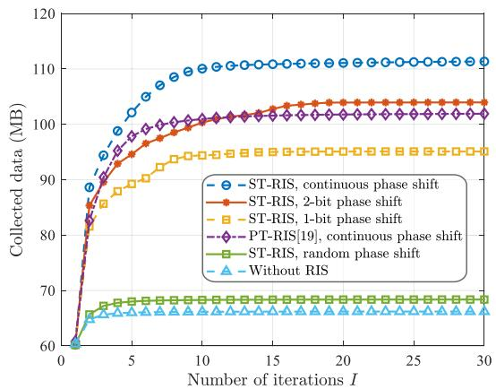

Fig. 4. Collected data versus the number of iterations I.  
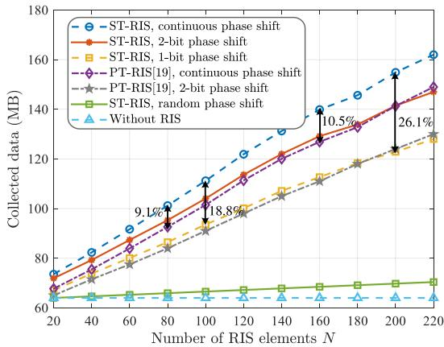  
Fig. 5. Collected data versus the number of RIS elements under different quantization bits.

• ST-RIS, continuous/1-bit/2-bit phase shift: Our proposed scheme with continuous/1-bit/2-bit RIS phase shift space.

• PT-RIS, continuous phase shift: The scheme with continuous phase shift space by using PT-RIS [19].

• ST-RIS, random phase shift: This is our proposed scheme with random RIS phase shift.

• Without RIS: This is the scheme without RIS.

Note that RIS phase shift solution $\varepsilon ^ { * } ~ = ~ \{ \varepsilon _ { n } ^ { * } [ l ] \}$ obtained directly by Algorithm 1 is optimized from continuous phase shift space. Then, we use approximation projection technique [36] to obtain discrete solution $\varepsilon ^ { d , * } = \{ \varepsilon _ { n } ^ { \dot { d } , * } [ l ] \}$ , and

$$
\varepsilon _ { n } ^ { d , * } [ l ] = \arg \operatorname* { m i n } _ { \varepsilon \in \mathcal { F } } | \varepsilon _ { n } ^ { * } [ l ] - \varepsilon | , \forall n \in \mathcal { N } , l \in \mathcal { L } ,\tag{68}
$$

where F is 1-bit/2-bit discrete phase shift space.

Fig. 4 demonstrates the convergence of all comparative schemes, where the proposed scheme exhibits rapid convergence speed. Besides, we observe that the 2-bit discrete-phase ST-RIS slightly outperforms the continuous-phase PT-RIS, as the angle insensitivity of ST-RIS compensates for the gain loss caused by discrete phase shifts.

In Fig. 5, we observe that as N increases, the performance gap between ST-RIS and PT-RIS progressively widens, and low-resolution phase shifts exhibit greater performance degradation. For instance, 2-bit phase-shift ST-RIS transitions from outperforming continuous-phase PT-RIS to underperforming it. When $N ~ = ~ 1 0 0$ , the performance loss for 1-bit phaseshift ST-RIS is 18.8%, which escalates to 26.1% at $N = 2 0 0$ Furthermore, by comparing the 2-bit phase-shift ST-RIS with the continuous phase-shift PT-RIS, we find that the critical element number where quantization loss outweighs the spherical advantage is approximately 200; when comparing the 1-bit phase-shift ST-RIS with the phase-shift 2-bit PT-RIS, we can obtain a similar result, but this critical element count changes to 180. This provides a reference for our selection of ST-RIS, PT-RIS, as well as element number and quantization bits.

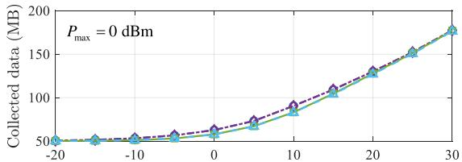

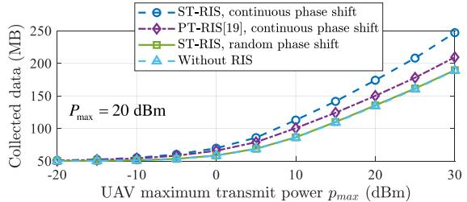

Fig. 6. Collected data versus the maximum transmit power of UAVs under different maximum transmit powers of CUs.  
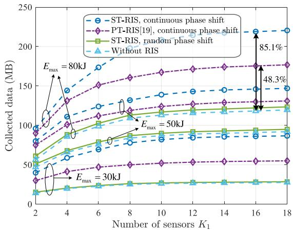  
Fig. 7. Collected data versus the number of sensors under different maximum onboard energy of UAVs.

From Fig. 6, we find when the maximum transmit power of CUs is low, the performance differences among the four schemes become negligible as $p _ { m a x }$ increases, especially when $p _ { m a x }$ is either very high or very low. Significant differences only emerge when $p _ { m a x }$ falls within a moderate range. This occurs because $P _ { m a x } = 0 \mathrm { { d } \mathrm { { B m } } }$ is relatively low, causing the RIS to primarily enhance the uplink transmission rate of CUs to satisfy constraint (30c). Moreover, when $p _ { m a x }$ is too low, the signal transmitted through the RIS becomes too weak to noticeably improve performance. Conversely, when $p _ { m a x }$ is excessively high, the resulting performance gain allows UAV data collection to be achieved without RIS assistance, rendering the advantage of ST-RIS over PT-RIS negligible.

From Fig. 7, we observe that as $K _ { 1 }$ and $E _ { m a x }$ increase, the performance of all schemes improves, with the performance gap gradually widening. This is because a larger $K _ { 1 }$ provides more data, while a greater $E _ { m a x }$ enhances the $\mathrm { U A V } ^ { \ , } \mathbf { s }$ mobility for data collection. Notably, when $E _ { m a x } = 8 0 \mathbf { k } \mathbf { J }$ and $K _ { 1 } =$ 16, the ST-RIS achieves approximately 36.8% performance improvement over the PT-RIS, which aligns with the analysis results shown in Fig. 3 of Section III.

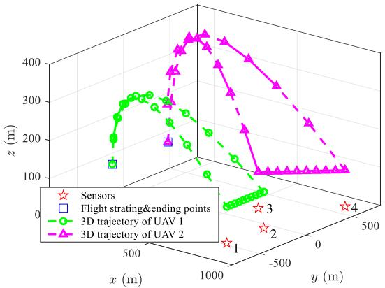

(a)  
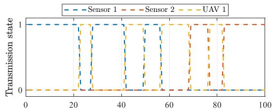

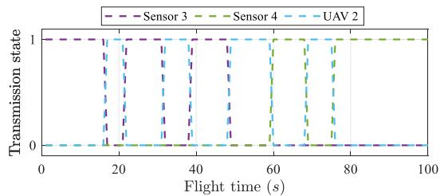  
(b)  
Fig. 8. The result of a Monte Carlo simulation: (a) 3D trajectories of UAVs; (b) Transmission scheduling of UAVs and sensors.

Fig. 8 presents the UAV trajectory and transmission scheduling results from a certain simulation. Fig. 8(a) reveals that the UAV altitude first increases and then decreases, which is determined by Eq. (8). During the initial flight, UAVs need to increase altitude to improve LoS probability, while approaching the sensors, the higher LoS probability allows altitude reduction to minimize path loss. Fig. 8(b) displays the transmission states of UAVs and sensors at different time slots. It can be observed that due to limited storage capacity, UAVs require frequent data transmission to the BS to maximize data collection from sensors.

Fig. 9 demonstrates that a linear increase in UAV quantity and data collection time does not result in a proportional increase in collected data. This occurs because too many UAVs create redundancy, while extended collection time cannot fundamentally overcome mobility constraint imposed by onboard energy limitation. Therefore, we need to make discretionary arrangements according to cost and demand.

In Fig. 10, as γ increases, the collected data gradually decreases. Besides, as $E _ { m a x }$ increases, the collected data gradually increases and tends to stabilize. The fundamental reason for this is that UAVs have more energy to support their movement closer to sensors, thereby obtaining better channel conditions. However, the data collection time constraint T limits the further increase in the amount of data collected, which can be observed in Fig. 9. Furthermore, we find that under different values of $\gamma ,$ , the value of $E _ { m a x }$ required for the collected data to reach the maximum is different, as indicated by the red pentagrams. The essential reason is that when the data collection time constraint T is fixed, an increase in γ leads to a reduction in the time slots available for data collection, even if UAVs have more energy, it cannot be utilized.

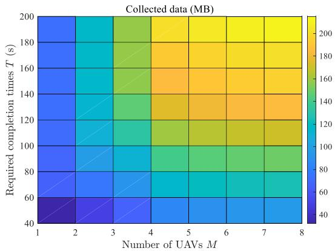

Fig. 9. Collected data versus the number of UAVs and the required completion time for data collection.  
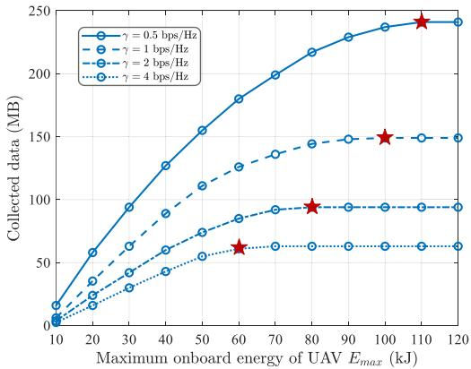  
Fig. 10. Collected data versus maximum onboard energy of UAVUAVs and minimum rate requirement of CUs.

## VI. CONCLUSION

This paper pioneers the concept of ST-RIS-BS, analyzes the theoretical gain of ST-RIS compared to PT-RIS, and proposes algorithm designs for ST-RIS-BS in future typical low-altitude application scenarios. Through BCD framework and SCA technique, we achieve “phase-power-schedulingtrajectory” joint optimization. Simulation results demonstrate the effectiveness of the proposed ST-RIS-BS architecture. It is worth noting that to enhance the performance robustness of the ST-RIS, its boundary modeling, element effectiveness, element coupling, manufacturing imperfections, and non-ideal curvature effects will be key issues requiring special attention in future research.

## APPENDIX A

Based on Eq. (11), we can rewrite $R _ { m , k } ^ { X } [ l ]$ by Eq. (69), shown at the bottom of the next page, where $R _ { m , k } ^ { X , 1 } [ l ]$ and $R _ { m , k } ^ { X , 2 } [ l ]$ are defined in Eq. (69), $A _ { m , k } ^ { X } [ l ] = P _ { k } [ l ] \left| h _ { m , k } ^ { X } [ l ] \right| ^ { 2 }$

$$
\begin{array} { r l } & { B _ { m } ^ { X } [ l ] \quad \quad = \quad \sum _ { k ^ { \prime } \in { \mathcal K } _ { 2 } } P _ { k ^ { \prime } } [ l ] \left| h _ { m , k ^ { \prime } } ^ { X } [ l ] \right| ^ { 2 } \ + \ N _ { 0 } B , X \quad \in } \\ & { \{ L o S , N L o S \} . } \end{array}
$$

By the first-order Taylor expansion for $R _ { m , k } ^ { X , 1 } [ l ]$ and $R _ { m , k } ^ { X , 2 } [ l ]$ at $a _ { m . k } ^ { ( r ) } [ l ] .$ , the inequalities (70), (71), shown at the bottom of the page. Based on (69)–(71), we can obtain

$$
R _ { m , k } ^ { X , 1 } [ l ] + R _ { m , k } ^ { X , 2 , l b } [ l ] \leq R _ { m , k } ^ { X } [ l ] \leq R _ { m , k } ^ { X , 1 , u p } [ l ] + R _ { m , k } ^ { X , 2 } [ l ] .\tag{72}
$$

Similarly, based on Eq. (16), we can obtain (73) and (74), shown at the bottom of the page, where $\widetilde { R } _ { m , 1 } [ l ]$ and $\widetilde { R } _ { m , 2 } [ l ]$ are defined in Eq. (73), ${ D } _ { m } [ l ] ~ = ~ p _ { m } [ l ] | \bar { g _ { m } } [ l ] | ^ { 2 }$ $\begin{array} { r } { E [ l ] = \sum _ { k \in \mathcal { K } _ { 2 } } P _ { k } [ l ] \left| s _ { k } [ l ] \right| ^ { 2 } + N _ { 0 } B } \end{array}$ . Based on (73), (74), we have

$$
\widetilde { R } _ { m } [ l ] \geq \widetilde { R } _ { m , 1 } [ l ] + \widetilde { R } _ { m , 2 } ^ { l b } [ l ] ,\tag{75}
$$

which completes the proof.

## APPENDIX B

The proof procedure is similar to that in Appendix VI and has been omitted here for brevity. Expressions of $R _ { m , k } ^ { X , 3 } [ l ]$ $R _ { m , k } ^ { X , 4 , l b } [ l ] , \ R _ { m , k } ^ { X , 3 , u p } [ l ] , \ R _ { m , k } ^ { X , 4 } [ l ] , \ \widetilde { R _ { m , 3 } } [ l ] , \ \widetilde { R _ { m , 4 } ^ { l b } } [ l ] , \ \widehat { R _ { m , 1 } } [ l ]$ , and $\widehat { R } _ { m , 2 } ^ { l b } [ l ]$ are also omitted due to space limitation.

## APPENDIX C

Based on $( 1 1 ) , \ R _ { m , k } ^ { X } [ l ]$ can be rewritten by $R _ { m , k } ^ { X , 5 } [ l ] ~ +$ $R _ { m , k } ^ { X , 6 } [ l ] , X \in \{ L o S , N L o S \}$ , and

$$
R _ { m , k } ^ { L o S , 5 } [ l ] = B \log ( \sum _ { m ^ { \prime } \in \mathcal { M } } \sum _ { k ^ { \prime } \in \mathcal { K } _ { 1 } } \beta _ { m ^ { \prime } , k ^ { \prime } } [ l ] \| \mathbf { q } _ { m ^ { \prime } } [ l ] - \mathbf { u } _ { k ^ { \prime } } \| ^ { - \alpha _ { 1 } }
$$

$$
\begin{array} { r l r } {  { + \sum _ { k ^ { \prime } \in \mathcal { K } _ { 2 } } \beta _ { k ^ { \prime } } [ l ] \| \mathbf { q } _ { m } [ l ] - \mathbf { u } _ { k ^ { \prime } } \| ^ { - \alpha _ { 1 } } + N _ { 0 } B \Bigg ) , } } & { { } } & { ( 7 6 ) } \\ & { } & { R _ { m , k } ^ { L o S , 6 } [ l ] = - B \log ( \sum _ { m ^ { \prime } \in \mathcal { M } _ { k ^ { \prime } } \in \mathcal { K } _ { 1 } \setminus \{ k \} } \beta _ { m ^ { \prime } , k ^ { \prime } } [ l ] \| \mathbf { q } _ { m ^ { \prime } } [ l ] - \mathbf { u } _ { k ^ { \prime } } \| ^ { - \alpha _ { 1 } }  } \\ & { } & {  + \sum _ { k ^ { \prime } \in \mathcal { K } _ { 2 } } \beta _ { k ^ { \prime } } [ l ] \| \mathbf { q } _ { m } [ l ] - \mathbf { u } _ { k ^ { \prime } } \| ^ { - \alpha _ { 1 } } + N _ { 0 } B ) , \quad { \mathrm { ( 7 7 ) } } } \end{array}
$$

where $\beta _ { m , k } [ l ] = a _ { m , k } [ l ] \beta _ { k } [ l ] , \beta _ { k } [ l ] = P _ { k } [ l ] \beta _ { 0 } , R _ { m , k } ^ { N L o S , 5 } [ l ]$ and $R _ { m , k } ^ { N L o S , 6 } [ l ]$ have similar forms to $R _ { m , k } ^ { L o S , 5 } [ l ]$ and $R _ { m , k } ^ { L o S , 6 } [ l ]$ just by replacing $\alpha _ { 1 }$ with $\alpha _ { 2 }$

Then, through the first-order Taylor expansion for $R _ { m , k } ^ { X , 5 } [ l ]$ and $R _ { m , k } ^ { X , 6 } [ l ] \ \mathrm { a t } \ \| \mathbf { q } _ { m } ^ { ( r ) } [ l ] - \mathbf { u } _ { k } \| ^ { \alpha _ { 1 } }$ , we can obtain

$$
R _ { m , k } ^ { L o S , 5 } [ l ] \ge R _ { m , k } ^ { L o S , 5 , l b } [ l ] , R _ { m , k } ^ { N L o S , 5 } [ l ] \ge R _ { m , k } ^ { N L o S , 5 , l b } [ l ] ,\tag{78}
$$

$$
\begin{array} { r } { R _ { m , k } ^ { L o S , 6 } [ l ] \leq R _ { m , k } ^ { L o S , 6 , u p } [ l ] , R _ { m , k } ^ { N L o S , 6 } [ l ] \leq R _ { m , k } ^ { N L o S , 6 , u p } [ l ] , } \end{array}\tag{79}
$$

where $R _ { m , k } ^ { L o S , 5 , l b } [ l ]$ and $R _ { m , k } ^ { L o S , 6 , u b } [ l ]$ are expressed by (80), (81), shown at the bottom of the next page. Replacing α<sub>1</sub> in (80), (81) with $\alpha _ { 2 }$ yields the expressions for $R _ { m , k } ^ { \bar { N } L o S , \breve { 5 } , l b } [ l ]$ and $R _ { m . k } ^ { N L o S , 6 , u p } [ l ]$

Furthermore, let $U _ { m , k } [ l ] \leq \| \mathbf { q } _ { m } [ l ] - \mathbf { u } _ { k } \| ^ { \alpha _ { 1 } }$ and $V _ { m , k } [ l ] \le$ $\| \mathbf { q } _ { m } [ l ] - \mathbf { u } _ { k } \| ^ { \alpha _ { 2 } }$ , we have

$$
R _ { m , k } ^ { L o S , 5 } [ l ] \leq R _ { m , k } ^ { L o S , 5 , u p } [ l ] , R _ { m , k } ^ { N L o S , 5 } [ l ] \leq R _ { m , k } ^ { N L o S , 5 , u p } [ l ] ,\tag{82}
$$

$$
\begin{array} { r } { R _ { m , k } ^ { N L o S , 6 } [ l ] \ge R _ { m , k } ^ { N L o S , 5 , l b } [ l ] , R _ { m , k } ^ { N L o S , 6 } [ l ] \ge R _ { m , k } ^ { N L o S , 6 , l b } [ l ] , } \end{array}\tag{83}
$$

$$
\begin{array} { r l } & { H _ { \mathrm { e x } , \mathrm { s } } ^ { X } [ \mathbb { I } ] = \underbrace { B \left( \sum _ { n = 1 } ^ { N } \sqrt { 1 } \sum _ { i = 1 } ^ { N } \mathbb { E } _ { n = 1 } ^ { n } [ i ] _ { i } ^ { X } \sum _ { n = 1 } ^ { n } \sum _ { \substack { i = 1 } } ^ { \infty } \sum _ { \substack { \alpha _ { n } \neq i < 1 } } \mathbb { I } _ { n = n } ^ { \alpha _ { n } } , \mathbb { I } _ { n = 1 } ^ { \alpha } [ \mathbb { I } _ { n = 1 } ^ { \alpha } X _ { n = 1 } ^ { X } [ \mathbb { I } ] \right) } _ { \alpha _ { n } ^ { * } \times \mathbb { I } _ { n } ^ { 2 } } \mathcal { M } \Bigg ( \underbrace { \sum _ { n = 1 } ^ { N } \sum _ { \substack { i = 1 } } ^ { n } \alpha _ { n } \cdots \mathbb { I } _ { n } [ i ] _ { i } ^ { A } \sum _ { n = 1 } ^ { N } \mathbb { I } _ { n = 1 } ^ { \alpha } [ i ] _ { i } ^ { \alpha } } _ { \alpha _ { n } ^ { * } \times \mathbb { I } _ { n } ^ { 2 } } \Bigg ) } \\ &  H _ { \mathrm { e x } , \mathrm { i } ^ { X } [ \mathbb { I } ] } ^ { X } \leq \underbrace { H _ { \mathrm { e x } , \mathrm { s } } ^ { X } [ \mathbb { I } ] } _ { \alpha _ { n } ^ { * } \times \mathbb { I } _ { n } ^ { 2 } } \mathcal { H } = \mathcal { H } \mathrm { I n } _ { \infty } ^ { \alpha } \Bigg \{ \alpha _ { n } ^ { * } \times \mathbb { I } _ { n } ^ { 2 } \mathbb { I } _ { n } ^ { X } \sum _ { n = 1 } ^ { \infty } \mathbb { I } _ { n = 1 } ^ { \alpha } X _ { n = 1 } ^ { \alpha } [ i ] _ { i } ^ { \alpha } \sum _ { \substack { \alpha _ { n } \neq i \leq 1 } } ^ { \infty } \sum _  \substack  \alpha _ { n } ^ { * } \times \mathbb { I } _ { n } ^  \end{array}
$$

$$
\begin{array} { l } { \displaystyle \widetilde { R } _ { m } [ l ] = \underbrace { B \log \left( \sum _ { m ^ { \prime } \in M } b _ { m ^ { \prime } } [ l ] D _ { m ^ { \prime } } [ l ] + E [ l ] \right) } _ { \widetilde { R } _ { m , 1 } [ l ] } \underbrace { - B \log \left( \sum _ { m ^ { \prime } \in M \backslash \{ m \} } b _ { m ^ { \prime } } [ l ] D _ { m ^ { \prime } } [ l ] + E [ l ] \right) } _ { \widetilde { R } _ { m , 2 } [ l ] } } \\ { \displaystyle \widetilde { R } _ { m , 2 } [ l ] \geq \widetilde { R } _ { m , 2 } ^ { l b } [ l ] = - B \log \left( \sum _ { m ^ { \prime } \in M \backslash \{ m \} } b _ { m ^ { \prime } } ^ { ( r ) } [ l ] D _ { m ^ { \prime } } [ l ] + E [ l ] \right) + \frac { - B \sum _ { m ^ { \prime } \in M \backslash \{ m \} } D _ { m ^ { \prime } } [ l ] \left( b _ { m ^ { \prime } } [ l ] - b _ { m ^ { \prime } } ^ { ( r ) } [ l ] \right) } { \left( \sum _ { m ^ { \prime } \in M \backslash \{ m \} } b _ { m ^ { \prime } } ^ { ( r ) } [ l ] D _ { m ^ { \prime } } [ l ] + E [ l ] \right) \ln 2 } } \end{array}\tag{73}
$$

(74)

where

$$
\begin{array} { r l } { R _ { m , k } ^ { L o S , 5 , w } [ l ] = \displaystyle B \log \left( \sum _ { m ^ { \prime } \in M } \sum _ { k ^ { \prime } \in K _ { 1 } } \beta _ { m ^ { \prime } , k ^ { \prime } } [ l ] U _ { m ^ { \prime } , k ^ { \prime } } ^ { - 1 } [ l ] \right. } & { } \\ { \displaystyle } & { \qquad + \left. \sum _ { k ^ { \prime } \in K _ { 2 } } \beta _ { k ^ { \prime } } [ | l | U _ { m , k ^ { \prime } } ^ { - 1 } [ l ] + N _ { 0 } B \right) , \qquad ( 8 4 } \\ { \displaystyle } & { } \\ { R _ { m , k } ^ { L o S , 6 , b } [ l ] = - B \log \left( \sum _ { m ^ { \prime } \in M } \sum _ { k ^ { \prime } \in K _ { 1 } \backslash \{ k \} } \beta _ { m ^ { \prime } , k ^ { \prime } } [ | l ] U _ { m ^ { \prime } , k ^ { \prime } } ^ { - 1 } [ l ] \right. } \\ { \displaystyle } & { \qquad + \left. \sum _ { k ^ { \prime } \in K _ { 2 } } \beta _ { k ^ { \prime } } [ | l | U _ { m , k ^ { \prime } } ^ { - 1 } [ l ] + N _ { 0 } B \right) , \qquad ( 8 5 } \end{array}
$$

and replacing $U _ { m , k } [ l ]$ in (84) and (85) with $V _ { m , k } [ l ]$ yields the expressions for $R _ { m , k } ^ { N L \bar { o } S , 5 , u p } [ l ]$ and $R _ { m . k } ^ { N L o S , 6 , l b } [ l ]$ . The proof is completed by combining $( 7 8 ) , ( 7 9 ) , ( 8 2 )$ and (83).

## APPENDIX D

Since $\begin{array} { r } { S _ { m } ^ { D } [ l ] = \sum _ { l ^ { \prime } = 1 } ^ { l } \left( \sum _ { k \in \mathcal { K } _ { 1 } } \bar { R } _ { m , k } [ l ^ { \prime } ] - \widetilde { R } _ { m } [ l ^ { \prime } ] \right) \delta _ { t } } \end{array}$ is not convex relative to $\mathbf { Q } .$ , we use $\bar { R } _ { m , k } ^ { u p } [ l ^ { \prime } ]$ to replace $\bar { R } _ { m , k } [ l ^ { \prime } ]$ based on corollary 2. As for the non-convexity of $\widetilde { R } _ { m } [ l ]$ in $S _ { m } ^ { D } [ l ]$ we first rewrite $b _ { m } [ l ] p _ { m } [ l ] \left| g _ { m } [ l ] \right| ^ { 2 }$ in $\widetilde { R } _ { m } [ l ]$ by

$$
\begin{array} { l } { { \displaystyle b _ { m } [ l ] p _ { m } [ l ] | g _ { m } [ l ] | ^ { 2 } \stackrel { ( e ) } { = } K _ { m } [ l ] \Bigg | \sum _ { n \in { \cal N } } f _ { n } \phi _ { n } [ l ] c _ { m , n } [ l ] e _ { m , n } [ l ] \Bigg | ^ { 2 } } } \\ { { \displaystyle \stackrel { ( f ) } { \approx } K _ { m } [ l ] \beta _ { 0 } \Bigg | \sum _ { n \in { \cal N } } f _ { n } \phi _ { n } [ l ] c _ { m , n } [ l ] \Bigg | ^ { 2 } } } \\ { { \displaystyle \frac { \| { \bf q } _ { m } [ l ] - { \bf w } _ { R , x } \| ^ { 2 } + R ^ { 2 } - \| { \bf q } _ { m } [ l ] - { \bf w } _ { B } \| ^ { 2 } } { 2 R \| { \bf q } _ { m } [ l ] - { \bf w } _ { R , x } \| } \| { \bf q } _ { m } [ l ] - { \bf w } _ { R , x } \| ^ { - 2 } } } \\ { { \displaystyle \stackrel { ( g ) } { \approx } \widetilde { \beta } _ { m , n } [ l ] \| { \bf q } _ { m } [ l ] - { \bf w } _ { R , x } \| ^ { - 3 } } , \qquad ( { \& } { \mathrm { ~ } } } \end{array}
$$

where (e) holds due to the definition in (12) and $( 4 0 6 ) ; f _ { n } ,$ $\phi _ { n } [ l ]$ , and $c _ { m , n } [ l ]$ are n-th element or diagonal element of $\mathbf { f } , \ \bar { \phi [ l ] }$ , and $\dot { \mathbf { C } } _ { m } [ \bar { l } ]$ , respectively; $( f )$ holds because of farfield condition and cosine law, x can be selected as any integer from 1 to $N ; \mathit { \Pi } ( g )$ holds because $\| \mathbf { q } _ { m } [ l ] - \mathbf { w } _ { R , x } \|$ and $\| \mathbf { q } _ { m } [ l ] - \mathbf { w } _ { B } \|$ are almost equal since R is much smaller than the distance between transceivers in practice; $\widetilde { \beta } _ { m } [ l ] =$ $\begin{array} { r } { K _ { m } [ l ] \beta _ { 0 } \left| \sum _ { n \in \mathcal { N } } f _ { n } \phi _ { n } [ l ] c _ { m , n } [ l ] \right| ^ { 2 } R / 2 } \end{array}$ . Then, we have

$$
\widetilde { R } _ { m } [ l ] \approx \widetilde { R } _ { m , 5 } [ l ] + \widetilde { R } _ { m , 6 } [ l ] ,\tag{87}
$$

where

$$
\widetilde { R } _ { m , 5 } [ l ] = B \log \left( \sum _ { m ^ { \prime } \in \mathcal { M } } \widetilde { \beta } _ { m ^ { \prime } } [ l ] \| \mathbf { q } _ { m ^ { \prime } } [ l ] - \mathbf { w } _ { R , x } \| ^ { - 3 } + T [ l ] \right) ,\tag{88}
$$

$$
\widetilde { R } _ { m , 6 } [ l ] = - B \log \left( \sum _ { m ^ { \prime } \in \mathcal { M } \backslash \{ m \} } \widetilde { \beta } _ { m ^ { \prime } } [ l ] \| \mathbf { q } _ { m ^ { \prime } } [ l ] - \mathbf { w } _ { R , x } \| ^ { - 3 } + T [ l ] \right) ,\tag{89}
$$

with $T [ l ] = \sum _ { k \in { \mathcal { K } } _ { 2 } } P _ { k } [ l ] \left| s _ { k } [ l ] \right| ^ { 2 } + N _ { 0 } B .$

$$
\| \mathbf { q } _ { m } ^ { ( r ) } [ l ] - \mathbf { w } _ { R , x } \| ^ { 3 } ,
$$

$$
\begin{array} { r l } { \widetilde { R } _ { m , 5 } [ l ] \ge \widetilde { R } _ { m , 5 } ^ { l b } [ l ] } & { } \\ & { \le B \log \left( \displaystyle \sum _ { m ^ { \prime } \in \mathcal { M } } \widetilde { \beta } _ { m ^ { \prime } } [ l ] \| \mathbf { q } _ { m ^ { \prime } } ^ { ( r ) } [ l ] - \mathbf { w } _ { R , x } \| ^ { - 3 } + T [ l ] \right) } \\ & { \qquad B \displaystyle \sum _ { m ^ { \prime } \in \mathcal { M } } \widetilde { \beta } _ { m ^ { \prime } } [ l ] \frac { \| \mathbf { q } _ { m } [ l ] - \mathbf { w } _ { R , x } \| ^ { 3 } - \| \mathbf { q } _ { m } ^ { ( r ) } [ l ] - \mathbf { w } _ { R , x } \| ^ { 3 } } { \| \mathbf { q } _ { m ^ { \prime } } ^ { ( r ) } [ l ] - \mathbf { w } _ { R , x } \| ^ { 6 } } } \\ & { - \frac { m ^ { \prime } \in \mathcal { M } } { \sum _ { m ^ { \prime } \in \mathcal { M } } \widetilde { \beta } _ { m ^ { \prime } } [ l ] \| \mathbf { q } _ { m ^ { \prime } } ^ { ( r ) } [ l ] - \mathbf { w } _ { R , x } \| ^ { - 3 } + T [ l ] } . } \end{array}\tag{90}
$$

By introducing $W _ { m , x } [ l ] \leq \| \mathbf { q } _ { m } [ l ] - \mathbf { w } _ { R , x } \| ^ { 3 }$

$$
\widetilde { R } _ { m , 6 } [ l ] \geq \widetilde { R } _ { m , 6 } ^ { l b } [ l ] \triangleq - B \log \left( \sum _ { m ^ { \prime } \in \mathcal { M } \backslash \{ m \} } \widetilde { \beta } _ { m ^ { \prime } } [ l ] W _ { m , x } ^ { - 1 } [ l ] + T [ l ] \right) .
$$

Therefore, we have

(91)

$$
\begin{array} { r l } & { S _ { m } ^ { D } [ l ] = \displaystyle \sum _ { l ^ { \prime } = 1 } ^ { l } \left( \sum _ { k \in { \cal K } _ { 1 } } \bar { R } _ { m , k } [ l ^ { \prime } ] - \widetilde { R } _ { m } [ l ^ { \prime } ] \right) \delta _ { t } } \\ & { \qquad \le \displaystyle \sum _ { l ^ { \prime } = 1 } ^ { l } \left( \sum _ { k \in { \cal K } _ { 1 } } \bar { R } _ { m , k } ^ { u p } [ l ^ { \prime } ] - \left( \widetilde { R } _ { m , 5 } ^ { l b } [ l ^ { \prime } ] + \widetilde { R } _ { m , 6 } ^ { l b } [ l ^ { \prime } ] \right) \right) \delta _ { t } , } \end{array}\tag{92}
$$

which completes the proof.

$$
\begin{array} { r l } { \displaystyle  \mathcal { R } _ { m , k } ^ { L o s ; \delta , b } [ | | = \mathcal { B } \log ( \sum _ { m ^ { \prime } \in A } \sum _ { i = k } ^ { n } \beta _ { m ^ { \prime } , i } | l | \mathbf { q } _ { m ^ { \prime } } ^ { ( 1 ) } [ l ] - \mathbf { u } _ { k ^ { \prime } } | ^ { - 2 \alpha _ { 1 } } + \sum _ { k ^ { \prime } \in A } \beta _ { k ^ { \prime } } | l | \mathbf { q } _ { m } ^ { ( 2 ) } [ l ] - \mathbf { u } _ { k ^ { \prime } } | ^ { - \alpha _ { 1 } } + N _ { 0 } B ) } & { } \\ { \displaystyle + \frac { - B ( \sum _ { m ^ { \prime } \in A } \sum _ { k ^ { \prime } \in A } \sum _ { k ^ { \prime } \in A } \beta _ { m ^ { \prime } , k ^ { \prime } } | l | \mathbf { q } _ { m ^ { \prime } } ^ { ( 1 ) } [ l ] - \mathbf { u } _ { k ^ { \prime } } | ^ { - \alpha _ { 1 } } - | \mathbf { q } _ { m ^ { \prime } } ^ { ( 3 ) } [ l ] - \mathbf { u } _ { k ^ { \prime } } | ^ { - \alpha _ { 1 } } + \sum _ { k ^ { \prime } \in A } \beta _ { k ^ { \prime } } | l | \mathbf { q } _ { m ^ { \prime } } ^ { ( 3 ) } [ l ] - \mathbf { u } _ { k ^ { \prime } } | ^ { \alpha _ { 1 } } - | \mathbf { q } _ { m ^ { \prime } } ^ { ( 3 ) } | l | - \mathbf { u } _ { k ^ { \prime } } | ^ { \alpha _ { 1 } } - | \mathbf { q } _ { m ^ { \prime } } ^ { ( 3 ) } | l | - \mathbf { u } _ { k ^ { \prime } } | ^ { \alpha _ { 1 } } ) } { | \mathbf { q } _ { m ^ { \prime } } ^ { ( 3 ) } [ l ] - \mathbf { u } _ { k ^ { \prime } } | ^ { - \alpha _ { 1 } } } } & { + } \\  \displaystyle + \frac  \sum _  m ^  \prime  \end{array}\tag{81}
$$

## REFERENCES

[1] S. Zeng et al., “RIS-based IMT-2030 testbed for mmWave multistream ultra-massive MIMO communications,” IEEE Wireless Commun., vol. 31, no. 3, pp. 375–382, Jun. 2024.

[2] K. Nikitopoulos, G. N. Katsaros, M. Filo, C. Jayawardena, and R. Tafazolli, “Toward software-based, MIMO, open-RAN PHY architectures with both linear and non-linear processing,” IEEE Commun. Mag., vol. 62, no. 8, pp. 133–139, Aug. 2024.

[3] Y. Liu, H. Zhang, and L. Deng, “Design and implementation of a reconfigurable transmitarray employing varactor-tuned Huygens elements for dynamic beam shaping,” IEEE Antennas Wireless Propag. Lett., vol. 24, pp. 1542–1546, Apr. 2025.

[4] J. Liu and H. Zhang, “Performance analysis of IRS-assisted networks with product-distance,” IEEE Trans. Wireless Commun., vol. 23, no. 10, pp. 15367–15379, Oct. 2024.

[5] Z. Li et al., “Transmissive reconfigurable intelligent surface-enabled transceiver systems: Architecture, design issues, and opportunities,” IEEE Veh. Technol. Mag., vol. 19, no. 4, pp. 44–53, Dec. 2024.

[6] J. Liu and H. Zhang, “Compatible deployment in multiple metasurfaces aided indoor networks with irregular blockage,” IEEE Trans. Wireless Commun., vol. 24, no. 5, pp. 4235–4249, May 2025.

[7] H. Wei and H. Zhang, “Analysis of intelligent reflecting surfaceenhanced mobility through a line-of-sight state transition model,” IEEE Trans. Veh. Technol., vol. 74, no. 8, pp. 12420–12435, Aug. 2025.

[8] J. Liu and H. Zhang, “Throughput optimization in aerial RIS-assisted networks with 3D imperfect reflection,” IEEE Trans. Veh. Technol., vol. 74, no. 7, pp. 10510–10523, Jul. 2025.

[9] W. Tang and H. Zhang, “Line process modelling and performance analysis of intelligent reflecting surface-assisted vehicular networks,” IEEE Trans. Veh. Technol., vol. 74, no. 8, pp. 13302–13307, Aug. 2025.

[10] H. Zhou, M. Elsayed, M. Bavand, R. Gaigalas, S. Furr, and M. Erol-Kantarci, “Cooperative hierarchical deep reinforcement learning-based joint sleep and power control in RIS-aided energy-efficient RAN,” IEEE Trans. Cognit. Commun. Netw., vol. 11, no. 1, pp. 489–504, Feb. 2025.

[11] C. Pan et al., “Multicell MIMO communications relying on intelligent reflecting surfaces,” IEEE Trans. Wireless Commun., vol. 19, no. 8, pp. 5218–5233, Aug. 2020.

[12] Y. Zhu, Z. Xu, and H. Zhang, “Intelligent omni-surfaces aided cell-free networks: Cooperative beamforming with coupled phase-shift,” IEEE Trans. Veh. Technol., vol. 73, no. 9, pp. 13991–13996, Sep. 2024.

[13] IMT-2030 (6G) Promotion Group. (2024). Research Report on Intelligent Metasurface Technology for 6G. [Online]. Available: https:// www.imt2030.org.cn/html/default/zhongwen/chengguofabu/yanji

[14] J. Liu and H. Zhang, “Max-min area coverage in IRS assisted networks: Rotatable design and experimental verification,” IEEE Trans. Commun., vol. 73, no. 11, pp. 12355–12365, Nov. 2025.

[15] X. Zhu, Q. Wu, and W. Chen, “Transmissive RIS transmitter enabled spatial modulation MIMO systems,” IEEE J. Sel. Areas Commun., vol. 43, no. 3, pp. 899–911, Mar. 2025.

[16] H. Wei and H. Zhang, “Discrete-time modeling and handover analysis of intelligent reflecting surface-assisted networks,” IEEE Trans. Commun., vol. 73, no. 8, pp. 6689–6704, Aug. 2025.

[17] J. Tang, M. Cui, S. Xu, L. Dai, F. Yang, and M. Li, “Transmissive RIS for B5G communications: Design, prototyping, and experimental demonstrations,” IEEE Trans. Commun., vol. 71, no. 11, pp. 6605–6615, Nov. 2023.

[18] R. Song, H. Yin, Z. Wang, T. Yang, and X. Ren, “Modeling, design, and verification of an active transmissive RIS,” IEEE Trans. Antennas Propag., vol. 72, no. 12, pp. 9239–9250, Dec. 2024.

[19] Z. Li et al., “Toward TMA-based transmissive RIS transceiver enabled downlink communication networks: A consensus-ADMM approach,” IEEE Trans. Commun., vol. 73, no. 4, pp. 2832–2846, Apr. 2025.

[20] Y. Chen and H. Zhang, “User-centric cooperative transmission in intelligent reflecting surface assisted networks,” IEEE Trans. Veh. Technol., vol. 73, no. 11, pp. 16917–16931, Nov. 2024.

[21] Y. Sun et al., “Joint transmissive and reflective RIS-aided secure MIMO systems design under spatially-correlated angular uncertainty and coupled PSEs,” IEEE Trans. Inf. Forensics Security, vol. 18, pp. 3606–3621, 2023.

[22] Y. Chen, Y. Chen, L. Hu, and H. Zhang, “Conformal intelligent reflecting surfaces-assisted networks with reflection constraints,” IEEE Trans. Wireless Commun., vol. 24, no. 3, pp. 2265–2278, Mar. 2025.

[23] Z. Li et al., “Unauthorized UAV countermeasure for low-altitude economy: Joint communications and jamming based on MIMO cellular systems,” IEEE Internet Things J., vol. 12, no. 6, pp. 6659–6672, Mar. 2025.

[24] J. Jalali, M. Darabi, and R. C. de Lamare, “Shape adaptive reconfigurable holographic surfaces,” 2025, arXiv:2503.21542.

[25] M. Zhong and H. Zhang, “Performance analysis of aerial intelligent reflecting surface-aided networks,” IEEE Trans. Veh. Technol., vol. 73, no. 10, pp. 15878–15882, Oct. 2024.

[26] J. Liu and H. Zhang, “Dynamic aerial reconfigurable intelligent surface aided multi-cell multi-user communications,” IEEE Trans. Wireless Commun., vol. 23, no. 11, pp. 16453–16465, Nov. 2024.

[27] X. Yang et al., “Combining pancharatnam-berry phase and spherical conformal transmitarray for high-efficiency beam focusing,” IEEE Trans. Antennas Propag., vol. 72, no. 11, pp. 8452–8465, Nov. 2024.

[28] Z. Wang, Y. Liu, and Y. Dong, “Beam-switchable digital conformal array with metasurface phase compensation,” IEEE Trans. Antennas Propag., vol. 73, no. 3, pp. 1523–1536, Mar. 2025.

[29] Y. Zeng, J. Xu, and R. Zhang, “Energy minimization for wireless communication with rotary-wing UAV,” IEEE Trans. Wireless Commun., vol. 18, no. 4, pp. 2329–2345, Apr. 2019.

[30] J. Liu and H. Zhang, “Height-fixed UAV enabled energy-efficient data collection in RIS-aided wireless sensor networks,” IEEE Trans. Wireless Commun., vol. 22, no. 11, pp. 7452–7463, Nov. 2023.

[31] T. Ma et al., “UAV-LEO integrated backbone: A ubiquitous data collection approach for B5G Internet of Remote Things networks,” IEEE J. Sel. Areas Commun., vol. 39, no. 11, pp. 3491–3505, Nov. 2021.

[32] T. Mi, J. Zhang, R. Xiong, Z. Wang, P. Zhang, and R. C. Qiu, “Toward analytical electromagnetic models for reconfigurable intelligent surfaces,” IEEE Trans. Wireless Commun., vol. 23, no. 5, pp. 4170–4185, May 2024.

[33] S. Shen, B. Clerckx, and R. Murch, “Modeling and architecture design of reconfigurable intelligent surfaces using scattering parameter network analysis,” IEEE Trans. Wireless Commun., vol. 21, no. 2, pp. 1229–1243, Feb. 2022.

[34] M. Grant and S. Boyd, “CVX: MATLAB software for disciplined convex programming,” CVX Research, Inc., Austin, TX, USA, Tech. Rep., 2020. [Online]. Available: https://cvxr.com/cvx/

[35] D. Xue, “4. Linear and quadratic programming,” in Solving Optimization Problems With MATLAB. Berlin, Germany: De Gruyter, 2020, pp. 103–152.

[36] Q. Wu and R. Zhang, “Beamforming optimization for wireless network aided by intelligent reflecting surface with discrete phase shifts,” IEEE Trans. Commun., vol. 68, no. 3, pp. 1838–1851, Mar. 2020.

  
Jianghui Liu (Member, IEEE) received the bachelor’s degree in communication engineering from Beijing University of Posts and Telecommunications (BUPT), Beijing, China, in 2020, where he is currently pursuing the Ph.D. degree. His research interests include B5G&6G wireless communications and convex optimization.


Wenjun Xu (Senior Member, IEEE) received the B.S. and Ph.D. degrees from BUPT, Beijing, China, in 2003 and 2008, respectively. He is currently a Professor and a Ph.D. Supervisor with the School of Artificial Intelligence, State Key Laboratory of Network and Switching Technology, BUPT. His research interests include AI driven networks and green communications.


Hongtao Zhang (Senior Member, IEEE) received the Ph.D. degree in communication and information systems from Beijing University of Posts and Telecommunications (BUPT), Beijing, China, in 2008. He is currently a Full Professor with BUPT. He has published more than 100 papers, 50 patents, and ten technical books. His research interests include B5G&6G wireless communications and signal processing.