# AoI-Aware Data Collection and Energy Replenishment for Multi-UAV-Enabled IoT Systems

Kaijin Shi, Juan Liu , Lingfu Xie , Zheng Zhou , Hua Chen, and Guinian Feng

Abstract—Autonomous Aerial Vehicles (UAVs) have emerged as crucial enablers of efficient data collection and energy providers for Internet of Things (IoT) networks. Given the inherent limitations of UAV battery capacity, it is imperative to devise effective energy replenishment strategies. This paper delves into the fresh data collection and energy replenishment problem in multi-UAV-enabled IoT networks, aiming to minimize the Age of Information (AoI) of Sensor Nodes (SNs). To ensure consistent operation, the SNs rely on wireless power transfer from the UAVs, while the UAVs, in turn, recharge their batteries at charging stations. As the UAVs fly over the SNs, they efficiently gather upto-date data in a timely manner. We model this complex problem as a Partially Observable Markov Decision Process (POMDP). Then, we employ two Multi-Agent Reinforcement Learning (MARL) algorithms: the Value-Decomposition Network (VDN) and the Q-Mixing (QMIX), to solve the problem. In these algorithms, each UAV serves as an intelligent agent, independently learning the environment to make strategic decisions regarding its flight, association with SNs, and recharging. Simulation results demonstrate significant advantages of two MARL algorithms over baseline approaches.

Index Terms—UAV, AoI, data collection, energy replenishment, MARL.

## I. INTRODUCTION

## A. Background

UTONOMOUS Aerial Vehicles (UAVs) are playing an increasingly pivotal role in the Internet of Things (IoT)   
networks, owing to their flexibility, high-altitude flight capa  
bilities, and ease of deployment and control. They specifically   
aid in enhancing the performance of wireless communications   
for IoT nodes, such as throughput, delay, power consumption.   
Equipped with advanced wireless communication technology,   
UAVs adeptly handle challenges posed by long transmission

distances and signal attenuation. They function as mobile Base Stations (BSs) or relays, extending signal coverage and facilitating seamless communications between IoT nodes [2]. Concurrently, Age of Information (AoI) serves as a critical metric for assessing the freshness and importance of information updates in time-sensitive applications [3]. It measures the time elapsed since the generation of the most recently received update. By refining information update and transmission schemes, the AoI of Sensor Nodes (SNs) can be significantly minimized, leading to improvements in the timeliness and reliability of information transmission [4], [5], [6], [7]. In IoT networks, achieving a lower AoI often involves optimizing sampling processes [8] and scheduling strategies [9].

Recently, there have been many efforts to study the AoIaware UAV trajectory design and resource allocation in UAV-enabled IoT networks. Zhu et al. tackled a UAV-aided data collection problem by jointly optimizing the selection of hovering points and the visiting order to these points [10]. They aimed to minimize the total AoI of data collected by UAVs from the IoT network. In [11], UAVs with a mounted re-configurable intelligent surface were employed to serve as relay nodes between the BS and SNs, thereby enhancing the throughput of wireless access networks. To minimize AoI in IoT, Fu et al. optimized the paths of UAVs in [12], including the sequence of visiting SNs, and the optimal hovering positions for the UAVs. However, the aforementioned studies primarily focused on signal-UAV-assisted scenarios. Given the limited capacity of a single UAV in handling complex environments, researchers now focus on exploring the potential of utilizing multiple UAVs in various scenarios. For instance, the authors of [13] considered a multi-UAVenabled wireless network utilizing non-orthogonal multiple access for upstream communication with IoT devices. They employed the Lagrange dual method to jointly optimize the positions of the UAVs and the transmit power of the IoT devices. Reference [14] studied the optimal deployment scheme that aims to place multiple UAVs to cover all ground IoT devices while maximizing the average data rate. By employing multiple UAVs, Diao et al. adopted the multi-access edge computing technique to enhance IoT communication efficiency [15].

Recharging for SNs is a critical issue in UAV-assisted IoT networks. Some research focuses on the wireless charging of SNs by UAVs to extend their operational lifespan. In [16], the utilization of UAVs for wireless charging of SNs was explored, with particular attention paid to the impact of UAV hovering positions on charging efficiency. The authors of [17] investigated a UAV-enabled wireless communication system capable of wirelessly charging SNs. Their objective was to minimize the UAV’s total energy consumption while meeting the minimum data transfer requirements of the users. However, although these studies took into account UAVs’ energy consumption, they did not consider the energy replenishment needs of the UAV. To ensure sustainable service, rechargeable UAVs can replenish energy through either stationary or mobile Charging Stations (CSs). In [18], a UAV is exploited to transmit confidential messages to an intended receiver with a probability when receiving energy replenishment from a charger by wireless power transfer. Our recent work in [19] focused on studying the optimal placement of CSs and the optimal trajectory planning for UAVs during fresh data collection and energy recharging. To minimize the total time, [20] formulated a generalized traveling salesman problem (TSP) to determine the optimal path of UAVs visiting all the sites and placed stationary or mobile CSs for UAV recharging. In [21], a scheduling approach was proposed for a team of charging robots to recharge a team of UAVs through battery swapping. However, there is a scarcity of research focusing on simultaneous energy replenishment for both UAVs and SNs.

The intricate nature of performing energy replenishment and data collection poses significant challenges to UAV-aided IoT networks, making traditional optimization methods inadequate for effective resolution. Fortunately, various learning methods were utilized to navigate UAVs intelligently to serve IoT nodes. In [22], Zhang et al. proposed a UAV navigation algorithm based on twin delayed deep deterministic policy gradient to minimize the average AoI of collecting data from IoT. In [23], Liu et al. studied the joint optimization of the trajectory planning of a UAV and the scheduling of information transmission and energy harvesting of ground nodes within the framework of Deep Reinforcement Learning (DRL). The proximal policy optimization algorithm was used in [24], in which a UAV is employed as a mobile relay between IoT devices and the BS to minimize the expected weighted sum age-of-information. To minimize the total flight time of UAVs during a mission, the authors of [25] proposed an option-based hierarchical DRL method for designing the flight trajectory of each UAV in an IoT network. In this scenario, each UAV departs from its designated CS, collects data from a subset of the backscatter SNs, and returns to the CS to recharge its battery until the data collection task is fulfilled. Additionally, [26] introduced a deep Q-network (DQN) framework that incorporates an embedded convolutional neural network for feature extraction, aiming to determine the optimal cruise paths for both the UAV and mobile CS in a mobile crowd-sourcing system. However, there has been limited research investigating AoI-optimal data collection by multiple UAVs in rechargeable IoT networks, where both UAVs and SNs receive frequent energy replenishment.

## B. Motivation and Contributions

Stationary and mobile CSs offer unique advantages for specific applications. Mobile stations provide flexibility for dynamic missions, but they come with challenges such as complex navigation and potential instability in power supply. In contrast, fixed stations seamlessly integrate into existing infrastructure, offering reliable power and greater charging capacity, making them well-suited for routine operations with predictable UAV flight paths. In our preliminary work [1] and this work, we focus on stationary charging for predictable, AoI-aware data collection missions, where fixed stations provide stable power and adaptable charging rates to ensure UAVs meet their target AoI values.

In [1], we utilized the Transfer-Fused Value-Decomposition Network (VDN) approach to tackle the challenge of optimizing AoI in multi-UAV-assisted rechargeable IoT networks, where UAVs wirelessly recharge SNs and receive their energy from reliable fixed CSs. In this study, we delve deeper into the problem of multi-UAV-aided data collection and energy recharging in practical scenarios involving multiple fixed CSs. To ensure information freshness, we utilize two Multi-Agent Reinforcement Learning (MARL) algorithms: VDN and Q-Mixing (QMIX), to determine optimal trajectories and charging decisions for UAVs, while devising scheduling and energy transfer strategies for SNs. We conduct extensive simulations to demonstrate the performance of the two MARL algorithms. Our proposed approach enables us to optimize the complex interplay between UAVs, CSs, and SNs across various scenarios, distinguishing this work from our preliminary work [1].

Our primary contributions are as follows:

We study the problem of AoI-aware data collection and energy replenishment for multiple UAVs in IoT networks. Our objective is to ensure the freshness of information in persistent data collection missions, with UAVs and SNs receiving energy from fixed CSs and UAVs, respectively.

We focus on jointly optimizing the flight trajectories and recharge schedules for UAVs, along with the scheduling and energy transfer for SNs, aiming to minimize the average AoI of SNs.

The problem of AoI-aware data collection and energy replenishment for UAVs is modeled as a Decentralized Partially Observable Markov Decision Process (Dec-POMDP). Two MARL algorithms, VDN and QMIX, are utilized to find the optimal strategies. In this MARL framework, each UAV acts as an agent that makes individual decisions on data collection and energy recharging based on its observations.

Simulation results demonstrate the convergence and effectiveness of the proposed VDN and QMIX algorithms. These two algorithms consistently outperform traditional methods across various scenarios. Notably, QMIX exhibits a higher proficiency in handling complex scenarios than VDN.

The paper is organized as follows. The system model is described in Section II, and the problem formulation is presented in Section III. The two MARL-based algorithms are proposed in Section IV. Simulation results and discussions are given in Section V. Finally, we conclude this paper in Section VI. The main notations are listed in Table I.

TABLE I MAIN NOTATIONS
<table><tr><td rowspan=1 colspan=1>Notation</td><td rowspan=1 colspan=1>Parameter</td><td rowspan=1 colspan=1>Notation</td><td rowspan=1 colspan=1>Parameter</td></tr><tr><td rowspan=1 colspan=1>N, U, E</td><td rowspan=1 colspan=1>The numbers of SNs, UAVs, and CSs</td><td rowspan=1 colspan=1> $\overline { { H _ { u } , W _ { u } } }$ </td><td rowspan=1 colspan=1>Flight altitude, weight of UAV u</td></tr><tr><td rowspan=1 colspan=1> $\overline { { \mathcal { N } , \mathcal { E } } }$ </td><td rowspan=1 colspan=1>The set of SNs, the set of CSs</td><td rowspan=1 colspan=1> $\overline { { E _ { m a x } } }$ </td><td rowspan=1 colspan=1>Battery capacity of each UAV</td></tr><tr><td rowspan=1 colspan=1> $S _ { n } , C , L _ { e }$ </td><td rowspan=1 colspan=1>Locations of SN n, the BS, and CS e</td><td rowspan=1 colspan=1> ${ \overline { { W , \sigma ^ { 2 } } } }$ </td><td rowspan=1 colspan=1>The packet size, noise power</td></tr><tr><td rowspan=1 colspan=1> $\overline { { U _ { u } ( t ) } }$ </td><td rowspan=1 colspan=1>Horizontal coordinates of UAV u in slot t</td><td rowspan=1 colspan=1> $\underbrace { t _ { t p } , \mathrm { ~ } t _ { c o } } _ { \mathrm { ~ } }$ </td><td rowspan=1 colspan=1>Energy transfer time, uploading time</td></tr><tr><td rowspan=1 colspan=1> $\overline { { d _ { u , i } ^ { U I } ( t ) } }$ </td><td rowspan=1 colspan=1>The distance between UAV u and node Ii in slot t</td><td rowspan=1 colspan=1> $t _ { c h a r g e }$ </td><td rowspan=1 colspan=1>UAV&#x27;s charging Time</td></tr><tr><td rowspan=1 colspan=1> $\overline { { \varepsilon _ { u n } ( t ) } }$ </td><td rowspan=1 colspan=1>Association between UAV u and node n in slot t</td><td rowspan=1 colspan=1> $\underline { { t _ { e f } } }$ </td><td rowspan=1 colspan=1>Time of flying to a CS</td></tr><tr><td rowspan=1 colspan=1> $\overline { { T , \tau } }$ </td><td rowspan=1 colspan=1>The number of time slots, length of each slot</td><td rowspan=1 colspan=1> $\underline { { t _ { d o w n } , t _ { u p } } }$ </td><td rowspan=1 colspan=1>UAV&#x27;s landing and takeoff time</td></tr><tr><td rowspan=1 colspan=1> $t _ { c } , t _ { f }$ </td><td rowspan=1 colspan=1>UAV&#x27;s offloading time, flight time</td><td rowspan=1 colspan=1> $\overline { { g _ { u , n } ^ { U S } ( t ) } }$ </td><td rowspan=1 colspan=1>The channel gain in slot t</td></tr><tr><td rowspan=1 colspan=1> $\beta$ </td><td rowspan=1 colspan=1>The channel gain at the reference distance</td><td rowspan=1 colspan=1> $\overline { { p _ { u , n } ^ { L o S } ( t ) } }$ </td><td rowspan=1 colspan=1>The LoS probability of the channel</td></tr><tr><td rowspan=1 colspan=1> $\kappa , \alpha$ </td><td rowspan=1 colspan=1>Attenuation factor for NLoS, path-loss exponent</td><td rowspan=1 colspan=1> $a , b$ </td><td rowspan=1 colspan=1>The environment parameters</td></tr><tr><td rowspan=1 colspan=1> $\overline { { P _ { u } ^ { T P } ( t ) } }$ </td><td rowspan=1 colspan=1>Transmit power of UAV u during energy transfer</td><td rowspan=1 colspan=1> $\overline { { P _ { n } ^ { U P } ( t ) } }$ </td><td rowspan=1 colspan=1>Transmit power of SN n in slot t</td></tr><tr><td rowspan=1 colspan=1> $\overline { { P _ { u } ^ { c } ( t ) } }$ </td><td rowspan=1 colspan=1>Transmit power of UAV u during data offloading</td><td rowspan=1 colspan=1> ${ \overline { { B , \sigma ^ { 2 } } } }$ </td><td rowspan=1 colspan=1>System bandwidth, noise power</td></tr><tr><td rowspan=1 colspan=1> $\overline { { e _ { u } ^ { t r } ( t ) } }$ </td><td rowspan=1 colspan=1>UAV&#x27;s energy consumption for data collection</td><td rowspan=1 colspan=1> $\overline { W }$ </td><td rowspan=1 colspan=1>The size of an update packet</td></tr><tr><td rowspan=1 colspan=1> $e _ { u } ^ { e f } ( t )$ </td><td rowspan=1 colspan=1>UAV&#x27;s energy consumption for flying to a CS</td><td rowspan=1 colspan=1> $C _ { u , n } ( t )$ </td><td rowspan=1 colspan=1>The UAV-SN channel capacity</td></tr><tr><td rowspan=1 colspan=1> $\overline { { c _ { n } ( t ) , r _ { n } ( t ) } }$ </td><td rowspan=1 colspan=1>Packet arrival state, service state of SN n in slot t</td><td rowspan=1 colspan=1> $\overline { { A _ { n } ( t ) } }$ </td><td rowspan=1 colspan=1>The AoI of SN n in slot t</td></tr><tr><td rowspan=1 colspan=1> $\overline { { D _ { n } ( t ) } }$ </td><td rowspan=1 colspan=1>The time-to-live of the packet of SN n in slot t</td><td rowspan=1 colspan=1> $A _ { m a x }$ </td><td rowspan=1 colspan=1>The maximum AoI value</td></tr><tr><td rowspan=1 colspan=1> $\overline { { v _ { u } ( t ) } }$ </td><td rowspan=1 colspan=1>The horizontal flight speed of UAV u in slot t</td><td rowspan=1 colspan=1> $\overline { { A _ { e } } }$ </td><td rowspan=1 colspan=1>The frontal area of the UAV</td></tr><tr><td rowspan=1 colspan=1> $\overline { { N _ { b } , \ : c _ { b } } }$ </td><td rowspan=1 colspan=1>The number of blades, the blade chord</td><td rowspan=1 colspan=1> $\overline { { \rho , C _ { D _ { o } } } }$ </td><td rowspan=1 colspan=1>The air density, the drag coefficient</td></tr><tr><td rowspan=1 colspan=1> $\omega _ { b } , R$ </td><td rowspan=1 colspan=1>The angular velocity, the rotor disk radius</td><td rowspan=1 colspan=1> $\overline { { P _ { u } ^ { d o w n } ( t ) } }$ </td><td rowspan=1 colspan=1>UAV&#x27;s power consumption in landing</td></tr><tr><td rowspan=1 colspan=1> $\overline { { P _ { u } ^ { x } , e _ { u } ^ { x } ( t ) } }$ </td><td rowspan=1 colspan=1>UAV&#x27;s power and energy consumption for flight</td><td rowspan=1 colspan=1> $\overline { { P _ { u } ^ { u p } ( t ) } }$ </td><td rowspan=1 colspan=1>UAV&#x27;s power consumption in takeoff</td></tr><tr><td rowspan=1 colspan=1> $e _ { u } ^ { r e } ( t )$ </td><td rowspan=1 colspan=1>The amount of energy received by UAV u in slot t</td><td rowspan=1 colspan=1> $\overline { { e _ { u } ^ { l o s s } ( t ) } }$ </td><td rowspan=1 colspan=1>UAV&#x27;s energy consumption in takeoff</td></tr><tr><td rowspan=1 colspan=1> $\overline { { E _ { u } ( t ) } }$ </td><td rowspan=1 colspan=1>The remaining energy of UAV u in slot t</td><td rowspan=1 colspan=1> ${ { \overline { { \iota _ { u } ( t ) } } } }$ </td><td rowspan=1 colspan=1>The charging state of UAV u</td></tr><tr><td rowspan=1 colspan=1> $\chi , \delta$ </td><td rowspan=1 colspan=1>Energy coefficient, punishment coefficient</td><td rowspan=1 colspan=1> $\overrightarrow { P ^ { e } }$ </td><td rowspan=1 colspan=1>The charging power for each UAV</td></tr><tr><td rowspan=1 colspan=1> $s ( t ) , a ( t )$ </td><td rowspan=1 colspan=1>The system state, action in slot t</td><td rowspan=1 colspan=1> $\overline { { s ^ { \mathrm { S N } } ( t ) } }$ </td><td rowspan=1 colspan=1>The SNs’ states</td></tr><tr><td rowspan=1 colspan=1> $\overline { { O ( t ) , r ( t ) } }$ </td><td rowspan=1 colspan=1>The observation, reward in slot t</td><td rowspan=1 colspan=1> $\overline { { o _ { u } ^ { \mathrm { S N } } ( t ) } }$ </td><td rowspan=1 colspan=1>The SNs&#x27; state observed by UAV u</td></tr><tr><td rowspan=1 colspan=1> $\overline { { s ^ { \mathrm { U A V } } ( t ) , \varsigma _ { u } ( t ) } }$ </td><td rowspan=1 colspan=1>The UAVs&#x27; states, operation mode in slot t</td><td rowspan=1 colspan=1> $\tilde { A } _ { u , n } ( t )$ </td><td rowspan=1 colspan=1>The AoI of SN n observed by UAV u</td></tr><tr><td rowspan=1 colspan=1> $\overline { { a _ { u } ^ { t } ( t ) , a _ { u } ^ { c } ( t ) } }$ </td><td rowspan=1 colspan=1>The UAV&#x27;s working action, recharging action</td><td rowspan=1 colspan=1> $p ( t )$ </td><td rowspan=1 colspan=1>The penalty at time t</td></tr><tr><td rowspan=1 colspan=1> $\overline { { Q ( s , a ) } }$ </td><td rowspan=1 colspan=1>The action-value function given state s and action a</td><td rowspan=1 colspan=1> $a _ { u } , \theta _ { u }$ </td><td rowspan=1 colspan=1>Action, network parameters of agent u</td></tr><tr><td rowspan=1 colspan=1> $\mathbf { \delta } _ { \theta , \hat { \mathbf { \delta } } } \hat { \mathbf { \delta } } _ { \theta }$ </td><td rowspan=1 colspan=1>Parameters of the current and target networks</td><td rowspan=1 colspan=1> $\alpha , \gamma$ </td><td rowspan=1 colspan=1>The learning rate, discount rate</td></tr><tr><td rowspan=1 colspan=1> $\overline { { Q _ { u } , O _ { u } } }$ </td><td rowspan=1 colspan=1>The local action-value function, observation of agent u</td><td rowspan=1 colspan=1> $p$ </td><td rowspan=1 colspan=1>The exploring probability</td></tr><tr><td rowspan=1 colspan=1> $\overline { { T _ { e } , T _ { s } } }$ </td><td rowspan=1 colspan=1>The number of episodes, the mini-batch size</td><td rowspan=1 colspan=1> ${ \underline { { p _ { m i n } } } }$ </td><td rowspan=1 colspan=1>The minimum exploring probability</td></tr></table>

## II. SYSTEM MODEL

## A. System Description

We consider a multi-UAV-aided IoT network comprising U UAVs, N ground SNs, E CSs, and a BS, as illustrated in Fig. 1. The UAVs gather sensing data from the SNs and transmit it to the BS. To ensure continuous data collection operations, they receive energy replenishment from the CSs as needed. The system time is divided into T discrete time slots, each with a duration of $\tau .$

The positions of the n-th SN $( n \in \mathcal { N } \triangleq \{ 1 , \dots , N \} )$ and the e-th CS $( e \in \mathcal { E } \triangleq \{ 1 , \dots , E \} )$ are represented by $S _ { n } =$ $[ x _ { n } ^ { s } , y _ { n } ^ { s } ]$ and $L _ { e } = [ x _ { e } , y _ { e } ]$ , respectively. The BS is located at $\boldsymbol { C } = [ x ^ { c } , y ^ { c } ]$ and is responsible for data processing. UAV u flies at an altitude $H _ { u } .$ . Its flight trajectory during time slot t is denoted as $U _ { u } ( t ) = [ x _ { u } ( t ) , y _ { u } ( t ) ]$ , where $x _ { u } ( t ) \in [ 0 , X _ { \operatorname* { m a x } } ]$ and $y _ { u } ( t ) \in [ 0 , Y _ { \operatorname* { m a x } } ]$ [ ( ). Here, $X _ { \mathrm { m a x } }$ )]and $Y _ { \mathrm { m a x } }$ represent the side lengths of the area along the X-axis and Y-axis, respectively. For ease of exposition, the rectangular area is divided into J equal-sized grids, and each grid is represented by its center. The coordinates of grid j are denoted as $\pmb { w } _ { j } = ( X _ { j } , Y _ { j } ) \in \mathbb { R } ^ { 2 }$ $( j = 1 , 2 , \ldots , J )$ . The set of the coordinates of all grids is ( = 1 2denoted by ${ \mathcal W } = \{ { \pmb w } _ { 1 } , \ldots , { \pmb w } _ { J } \}$ . In each slot $t ,$ each UAV u flies along the grid center and its trajectory is projected onto the horizontal plane, i.e., $U _ { u } ( t ) \in \mathcal { W }$ . To prevent collisions, ( )no two UAVs should fly to the same grid in any given time slot, i.e., $U _ { u _ { 1 } } ( t ) \neq U _ { u _ { 2 } } ( t )$ for all $u _ { 1 } ~ \ne ~ u _ { 2 }$ . In time slot $t ,$ ( ) = ( ) =the distance between UAV u and a ground node is calculated as $d _ { u . i } ^ { U I } ( t ) = \sqrt { H _ { u } ^ { 2 } + \Vert U _ { u } ( t ) - I _ { i } \Vert ^ { 2 } }$ , where $I _ { i }$ is ( ) = + ( )the location of SN n or CS e or the BS, i.e., $I _ { i } \in \{ S _ { n } , L _ { e } , C \}$ Specifically, the distances between UAV u and SN n, CS e, the BS are denoted as $d _ { u , n } ^ { U S } ( t ) , ~ d _ { u , e } ^ { U E } ( t )$ , and $d _ { u } ^ { U C } ( t )$ respectively.

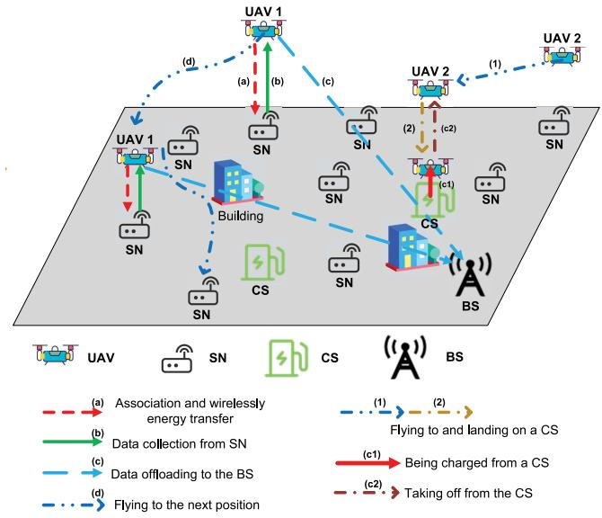  
Fig. 1. Illustration of a multi-UAV-enabled IoT system: UAV 1 operates in its working mode and UAV 2 flies to and lands on a CS, transitioning to its recharging mode. The UAVs’ working mode comprises four stages: (a) Association and wirelessly energy transfer; (b) Data collection from SN; (c) Data offloading to the BS; and (d) Flying to the next position. The UAVs’ recharging mode comprises two stages: (c1) Being charged from a CS; (c2) Taking off from the CS.

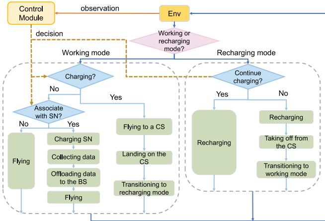

(a) UAVs' operational process  
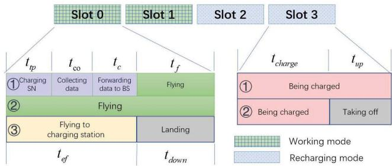  
(b) The system sequence diagram  
Fig. 2. The system flowchart and sequence diagram.

Each UAV operates in one of two modes: working mode or recharging mode, based on decisions made by the system’s control module, as shown in Fig. 2. The UAV takes different actions regarding flight, data gathering and energy recharging according to its current mode. In working mode, the UAV wirelessly transfers energy to its associated SN and collects fresh data from this SN in four stages. Following these stages, it either flies to a new SN to continue its tasks, or flies to a CS to switch to recharging mode, depending on the system decision. In recharging mode, the UAV recharges its battery, and either remains at the station for more charging or returns to the working mode to resume data collection, according to the decision. For instance, in a two-UAV-enabled IoT depicted in Fig. 1, UAV 1 is operating in its working mode, while UAV 2 has flown to and landed on a CS, transitioning into its recharging mode.

As depicted in Fig. 1, the four stages of the UAVs’ working mode are as follows. (a) Association and wirelessly energy transfer: The UAV establishes an association with an SN and wirelessly charges the SN. The association between the UAVs and SNs is represented by binary variables $\varepsilon _ { u n } ( t ) \in$ $\{ 0 , 1 \} ( \forall u , n )$ ( ). If SN n is associated with UAV u and is collected by this UAV in slot t, then $\varepsilon _ { u n } ( t ) = 1 ;$ otherwise it ( ) = 1is zero. Assume that each UAV serves at most one SN within a single time slot, i.e., $\begin{array} { r } { \sum _ { n \in \mathcal { N } } \varepsilon _ { u n } ( t ) \leq 1 . \ \mathbf { ( b ) } } \end{array}$ Data collection from SN: The SN receives energy transferred from the UAV, samples the environment, and uploads the sensed data to the

UAV using the harvested energy. (c) Data offloading to the BS: The UAV offloads the collected data to the BS. (d) Flying to the next position: After data transmission, the UAV moves to the next position to continue its data collection task. From the sequence diagram in Fig. 2(b), the durations for these four stages are denoted as $t _ { t p } , ~ t _ { c o } , ~ t _ { c } ,$ and $t _ { f }$ , respectively, satisfying $t _ { t p } + t _ { c o } + t _ { c } + t _ { f } = \tau$ . If the UAV is not associated with any SN, it spends the entire time slot in flight, so $t _ { f } = \tau$ Alternatively, the UAV may head to and lands on a CS within time $t _ { e f }$ and $t _ { d o w n } .$ respectively, and transition to recharging mode. Hence, in each time slot, each UAV flies towards either an SN or a CS. Consequently, we broaden the scope of the variable $\varepsilon _ { u n } ( t )$ to include both SNs and CSs, where node $n \in \mathcal { N } \cup \mathcal { E }$ signifies either an SN or a CS. Given that each UAV u establishes an association with either an SN or a CS in each time slot, the inequlity $\begin{array} { r } { \sum _ { n \in \mathcal { N } \cup \mathcal { E } } \varepsilon _ { u n } ( t ) \leq 1 } \end{array}$ holds true.

In recharging mode, the UAV recharges its battery. Its recharging mode comprises two stages: (c1) Being charged from a CS; (c2) Taking off from the CS. It may either spend the entire time slot recharging or complete charging within time $t _ { c h a r g e } ,$ , then take off to resume data collection within the remaining period $t _ { u p } .$ , thus returning to working mode, as shown in Fig. 2(b).

## B. UAV-Enabled Energy Transfer and Data Collection

1) Channel Model: According to the hybrid probabilistic ground-to-air channel model [27], line-of-sight (LoS) and nonline-of-sight (NLoS) links occur randomly. For the channel between UAV u and SN n, the channel gain is represented as:

$$
\begin{array} { r } { g _ { u , n } ^ { U S } ( t ) = \left\{ \begin{array} { l l } { \beta d _ { u , n } ^ { U S } ( t ) ^ { - \alpha } , ~ \mathrm { w . p . ~ L o S } } \\ { \kappa \beta d _ { u , n } ^ { U S } ( t ) ^ { - \alpha } , \mathrm { w . p . ~ N L o S } } \end{array} , \right. } \end{array}\tag{1}
$$

where ‘w.p.’ means ‘with probability’, $\beta$ denotes the channel gain at the reference distance, α is the path-loss exponent, and κ is the additional attenuation factor for NLoS. The probability of LoS is expressed as:

$$
p _ { u , n } ^ { L o S } ( t ) = \frac { 1 } { 1 + a \exp \left[ - b \left( \frac { 1 8 0 } { \pi } \arcsin \left( \frac { H _ { u } } { d _ { u , n } ^ { U S } ( t ) } \right) - a \right) \right] }\tag{,(2}
$$

where a and b are two constants reflecting the propagation environment. The NLoS probability is $p _ { u , n } ^ { \bar { N } L o S } ( \bar { t } ) ~ = ~ 1 ~ -$ $p _ { u , n } ^ { L o S } ( t )$ in time slot t.

2) Energy Transfer Model: Initially, UAV u communicates with SN n and provides wireless charging to this SN. During this stage, the transmit power of UAV u in time slot t is denoted as $P _ { u } ^ { T P } ( t )$ . The SN receives an amount of energy calculated as:

$$
\begin{array} { r } { E _ { n } ^ { t p } ( t ) = g _ { u , n } ^ { U S } ( t ) P _ { u } ^ { T P } ( t ) t _ { t p } . } \end{array}\tag{3}
$$

This energy is then used by SN n to transmit sensing data back to the UAV. Thus, the SN’s transmit power can be expressed as $P _ { n } ^ { U P } ( t ) = E _ { n } ^ { t p } ( t ) / t _ { c o }$

3) Data Collection Model: Let W denote the size of each update packet. When SN n uploads sensing data to UAV u, the channel capacity is given by $\begin{array} { r l } { C _ { u , n } ( t ) } & { { } = } \end{array}$ B $\log ( 1 + S I N R _ { u , n } ( t ) )$ , where B is the system bandwidth, and $S I N R _ { u , n } ( t )$ is the signal-to-interference-plus-noise ratio, evaluated as:

$$
S I N R _ { u , n } ( t ) = \frac { P _ { n } ^ { U P } ( t ) g _ { u , n } ^ { U S } ( t ) } { \sum _ { i \ne n } P _ { i } ^ { U P } ( t ) g _ { u , i } ^ { U S } ( t ) + \sigma ^ { 2 } } ,\tag{4}
$$

where $\textstyle \sum _ { i \neq n } P _ { i } ^ { U P } ( t ) g _ { u , i } ^ { U S } ( t )$ represents interference from other SNs, and $\sigma ^ { 2 }$ represents the noise power. If the channel capacity meets or exceeds the data rate, i.e., $C _ { u , n } ( t ) \ \geq$ $W / t _ { c o }$ , UAV u can reliably receive the update. Afterwards, the UAV offloads the collected data to the BS using transmit power adjusted based on channel conditions:

$$
P _ { u } ^ { c } ( t ) = \frac { \left[ d _ { u } ^ { U C } ( t ) \right] ^ { \alpha } \sigma ^ { 2 } } { \kappa \beta } \bigg ( 2 ^ { \frac { W } { B t _ { c } } } - 1 \bigg ) .\tag{5}
$$

The energy consumed by the UAV for wireless charging and data offloading is:

$$
e _ { u } ^ { t r } ( t ) = P _ { u } ^ { T P } ( t ) t _ { t p } + P _ { u } ^ { c } ( t ) t _ { c } .\tag{6}
$$

Let $r _ { n } ( t ) \in \{ 0 , 1 \}$ indicate whether the update packet from SN n is successfully delivered in slot $t . \ r _ { n } ( t ) \ = \ 1$ means success and $r _ { n } ( t ) = 0$ means failure.

4) AoI Model: SNs collect samples from the environment using either fixed sampling or random sampling. In fixed sampling, updates are generated periodically and stored in the SN’s buffer. In random sampling, updates arrive according to a Poisson distribution. Each update packet waits in the queue until it is either replaced or successfully delivered. The variable $c _ { n } ( t )$ indicates whether an update is generated by SN n at the beginning of slot t. The time-to-live of the latest update packet from SN n, denoted as $D _ { n } ( t )$ , is tracked and evolves as:

$$
D _ { n } ( t + 1 ) = { \left\{ \begin{array} { l l } { 0 , } & { { \mathrm { i f } } c _ { n } ( t ) = 1 } \\ { D _ { n } ( t ) + 1 , { \mathrm { o t h e r w i s e } } } \end{array} \right. } .\tag{7}
$$

This value represents the lifetime of the update packet of SN n till the end of slot t. If a new update packet is generated, i.e., $c _ { k } ( n ) = 1$ , the time-to-live is reset to zero; otherwise, it increments by one each slot. The freshness of the data received by the BS is quantified by the AoI. The maximum AoI is denoted as $A _ { \mathrm { m a x } }$ . At time slot t, the AoI of SN n evolves as:

$$
\begin{array} { r } { A _ { n } ( t ) = \left\{ \begin{array} { l l } { D _ { n } ( t ) , \quad } & { \mathrm { i f } r _ { n } ( t ) = 1 , } \\ { \operatorname* { m i n } \{ A _ { n } ( t - 1 ) + 1 , A _ { \operatorname* { m a x } } \} , \mathrm { o t h e r w i s e } . } \end{array} \right. } \end{array}\tag{8}
$$

This formula indicates that the AoI of each SN continues to increase until its update is successfully delivered. The average AoI of all SNs is given by $\begin{array} { r } { \overline { { A ( t ) } } { = } \frac { 1 } { N } \sum _ { n } A _ { n } ( t ) } \end{array}$

## C. UAVs’ Flying and Recharging Models

1) Flying Model of the UAVs: UAVs spend energy during both horizontal and vertical flight, as well as during the recharging process. The power consumption for horizontal flight of UAV u can be calculated as [28]:

$$
\begin{array} { r } { P _ { u } ^ { x } \big ( v _ { u } ( t ) \big ) = \frac { \pi } { 4 } N _ { b } c _ { b } \rho C _ { D _ { 0 } } ( \omega _ { b } ) ^ { 3 } R ^ { 4 } \Bigg [ 1 + 3 \Bigg ( \frac { v _ { u } ( t ) } { \omega _ { b } R } \Bigg ) ^ { 2 } \Bigg ] } \\ { + \omega _ { b } R W _ { u } \lambda _ { b } + \frac { 1 } { 2 } \rho C _ { D _ { 0 } } A _ { e } \big ( v _ { u } ( t ) \big ) ^ { 3 } , } \end{array}\tag{9}
$$

where $v _ { u } ( t )$ represents the horizontal flight speed of UAV u ( )in time slot t. The other UAV-related parameters include: $N _ { b }$ is the number of blades, $c _ { b }$ is the blade chord, $\rho$ is the air density, $C _ { D _ { 0 } }$ is the drag coefficient, $\omega _ { b }$ is the angular velocity, R is the rotor radius, $W _ { u }$ is the weight of $\mathrm { U A V } ~ u , ~ A _ { e }$ is the frontal area of the UAV, and $\lambda _ { b }$ is a parameter determined by solved the following equation:

$$
2 \rho \pi C _ { D _ { 0 } } ( \omega _ { b } ) ^ { 2 } R ^ { 4 } \lambda _ { b } \sqrt { \frac { \left( v _ { u } ( t ) \right) ^ { 2 } } { \left( \omega _ { b } \right) ^ { 2 } R ^ { 2 } } + \lambda _ { b } } - W _ { u } = 0 .\tag{10}
$$

During time slot t, the energy consumed by UAV u for horizontal flight is $e _ { u } ^ { x } ( t ) = P _ { u } ^ { x } ( v _ { u } ( t ) ) t _ { f }$ . For vertical landing and takeoff, the power consumption is given by:

$$
P _ { u } ^ { d o w n } ( t ) = \frac { W _ { u } } { 2 } v _ { u } ^ { d o w n } ( t ) + \frac { W _ { u } } { 2 } \sqrt { \left( v _ { u } ^ { d o w n } \right) ^ { 2 } - \frac { 2 W _ { u } } { \rho \pi R ^ { 2 } } } ,\tag{11}
$$

$$
P _ { u } ^ { u p } ( t ) = \frac { W _ { u } } { 2 } v _ { u } ^ { u p } ( t ) + \frac { W _ { u } } { 2 } \sqrt { \left( v _ { u } ^ { u p } \right) ^ { 2 } + \frac { 2 W _ { u } } { \rho \pi R ^ { 2 } } } .\tag{12}
$$

Here, $v _ { u } ^ { d o w n } = H _ { u } / t _ { d o w n }$ and $v _ { u } ^ { u p } = H _ { u } / t _ { u p }$ are the speeds for landing and takeoff, respectively.

The energy consumed by the UAV when flying to a CS and landing is:

$$
e _ { u } ^ { e f } ( t ) = P _ { u } ^ { x } \biggl ( \sqrt { \| U _ { u } ( t ) - L _ { e } \| ^ { 2 } } / t _ { e f } \biggr ) t _ { e f } + P _ { u } ^ { u p } ( t ) t _ { d o w n } .\tag{13}
$$

After recharging, the energy consumed for taking off is:

$$
e _ { u } ^ { l o s s } ( t ) = P _ { u } ^ { u p } ( t ) t _ { u p } .\tag{14}
$$

2) Recharging Model of the UAVs: As shown in Fig. 2, when a UAV needs to recharge, it flies to a CS, and lands there, taking time $t _ { e f }$ and $t _ { d o w n } ,$ respectively. CSs are capable of charging multiple UAVs simultaneously. A UAV can either charge for the entire time slot or take off to resume its data collection task after a recharge period of $t _ { r e }$ in the slot. The amount of energy received by UAV u in time slot t is calculated as:

$$
e _ { u } ^ { r e } ( t ) = P ^ { e } \big ( \tau - \iota _ { u } ( t ) t _ { u p } \big ) ,\tag{15}
$$

where $P ^ { e }$ is the charging power each UAV gets from a CS, $t _ { u p }$ is the time it takes for the UAV to ascend, and the variable $\iota _ { u } \dot { ( t ) } \in \{ 0 , 1 \}$ indicates whether the UAV has completed ( )charging $( \iota _ { u } ( t ) = 1 )$ or remains recharging $( \iota _ { u } ( t ) = 0 )$ in slot t.

## D. UAVs’ Energy Consumption

The energy consumption of UAVs is influenced by their operation modes. The variable $\varsigma _ { u } ( t ) \in \{ 0 , 1 \}$ denotes the operation mode of UAV u. Specifically, $\varsigma _ { u } ( t ) ~ = ~ 0$ and $\varsigma _ { u } ( t ) = 1$ ( ) = 0indicate that UAV u is in working mode and it is in recharging mode, respectively. According to the above description, the energy consumption of UAV u in slot t, denoted by $e _ { u } ^ { c } ( t )$ , can be expressed as:

$$
e _ { u } ^ { c } ( t ) = \left\{ \begin{array} { l l } { e _ { u } ^ { t r } ( t ) + e _ { u } ^ { x } ( t ) , \varsigma _ { u } ( t ) = 0 , \sum _ { n \in \mathcal { N } } \varepsilon _ { u n } ( t ) = 1 } \\ { e _ { u } ^ { e f } ( t ) , \qquad \quad \varsigma _ { u } ( t ) = 0 , \sum _ { n \in \mathcal { E } } \varepsilon _ { u n } ( t ) = 1 } \\ { e _ { u } ^ { l o s s } ( t ) , \qquad \quad \varsigma _ { u } ( t ) = 1 , \iota _ { u } ( t ) = 0 } \\ { 0 , \qquad \quad \varsigma _ { u } ( t ) = 1 , \iota _ { u } ( t ) = 1 } \end{array} \right.\tag{16}
$$

Here, $\textstyle \sum _ { n \in { \mathcal { N } } } \varepsilon _ { u n } ( t ) = 1$ and $\textstyle \sum _ { n \in { \mathcal { E } } } \varepsilon _ { u n } ( t ) = 1$ signifies that ( ) = 1 ( ) = 1UAV u is flying towards an SN and towards a CS, respectively. Consequently, the remaining energy of UAV u at the end of time slot t, denoted as $E _ { u } ( t )$ , evolves as follows:

$$
\begin{array} { r l } & { E _ { u } ( t ) } \\ & { = \left\{ \begin{array} { l l } { E _ { u } ( t - 1 ) - e _ { u } ^ { c } ( t ) , } & { \varsigma _ { u } ( t ) = 0 } \\ { \operatorname* { m i n } \{ E _ { u } ( t - 1 ) + e _ { u } ^ { r e } ( t ) , E _ { m a x } \} - e _ { u } ^ { c } ( t ) , \varsigma _ { u } ( t ) = 1 } \end{array} \right. } \end{array}\tag{17}
$$

where $\{ E _ { u } ( t - 1 ) + e _ { u } ^ { r e } ( t ) , E _ { m a x } \}$ ensures that the energy min ( 1)+ ( )level of UAV u after recharging does not exceed its battery’s maximum capacity $E _ { m a x }$

In this system, UAVs work together to collect data from SNs, and fly to CSs to replenish their energy when needed. The UAVs flight paths, their association with SNs for data collection, and their recharging schedules are jointly optimized to minimize AoI and enhance energy efficiency, as described below.

## III. PROBLEM FORMULATION

We first present the formulation of a combinatorial optimization problem for the multi-UAV-assisted data collection and energy replenishment scenario. This formulated problem can be effectively addressed through a collaborative MARL approach. In this framework, each UAV acts as an intelligent agent, autonomously making decisions based on its local observations and interactions with the environment. Considering the partial observability from each UAV’s perspective, the optimization problem is then reformulated as a Dec-POMDP and tackled using MARL. In this setup, after undergoing the training process, each UAV independently makes decisions regarding data collection and recharging based on its local observations in a decentralized manner.

## A. Optimization Problem

Our objective is to minimize the system cost defined as the weighted sum of the average AoI of the SNs and the energy consumption of the UAVs by jointly optimizing the $\mathrm { U A V s } '$ flight, SN association, and recharging decisions. To this end, the multi-UAV-assisted data collection and energy replenishment problem can be modeled as the following optimization problem:

$$
\begin{array} { c } { { \frac { 1 } { N T } \displaystyle \sum _ { t = 1 } ^ { T } \displaystyle \sum _ { n = 1 } ^ { N } A _ { n } ( t ) + \chi \frac { 1 } { U T } \displaystyle \sum _ { t = 1 } ^ { T } \displaystyle \sum _ { u = 1 } ^ { U } e _ { u } ( t ) } } \end{array}\tag{minminX (t}
$$

$$
U _ { u 1 } ( t ) \neq U _ { u 2 } ( t ) , \forall u 1 \neq u _ { 2 } , t ,\tag{a}
$$

$$
U _ { u } ( t ) \in \mathcal { W } , \forall u , t\tag{b}
$$

$$
\begin{array} { r } { \sum _ { n \in \mathcal { N } \cup \mathcal { E } } \varepsilon _ { u n } ( t ) \leq 1 - \varsigma _ { u } ( t ) , \forall u , t } \end{array}\tag{)c}
$$

$$
\iota _ { u } ( t ) \leq \varsigma _ { u } ( t ) , \forall u , t ,\tag{d}
$$

$$
\varepsilon _ { u n } ( t ) , \iota _ { u } ( t ) \in \{ 0 , 1 \} , \forall u , t , n \in \mathcal { N } \cup \mathcal { E } ,\tag{e}
$$

$$
{ \bigl \lfloor } ( 7 ) , ( 8 ) , ( 1 6 ) , ( 1 7 ) ,\tag{f}
$$

(18)

where $X ( t ) = [ U _ { 1 } ( t ) , \ldots , U _ { N } ( t ) , \varepsilon _ { 1 1 } ( t ) , \ldots , \varepsilon _ { U N } ( t ) , \iota _ { 1 } ( t )$ $, \ldots , \iota _ { U } ( t ) ]$ represents the optimization variables, and χ is the weight on the UAVs’ energy consumption. Constraint (18.a) ensures that no two UAVs can fly to and occupy the same position concurrently to avoid collisions, and (18.b) specifies the candidate hovering positions for each UAV. Constraint (18.c) points out that each UAV u can either collect data from one SN or fly to a CS in each slot during its working mode. Constraint (18.d) indicates that each UAV has the option to still remain in recharging mode or transition to its working mode. Constraint (18.e) shows that the variables $\{ \varepsilon _ { u n } ( t ) \}$ and $\{ \iota _ { u } ( t ) \}$ are binary. Finally, Constraint (18.f) describes the ( )evolution of the AoI value of each SN, given by (7) and (8), and presents the UAVs’ energy consumption in each slot by (16) as well as the evolution of the residual energy of each UAV by (17).

Notably, Problem (18) represents a highly challenging combinatorial optimization problem. To tackle this complicated problem particularly in the context of large-scale IoT networks, we propose an MARL approach. In this framework, each UAV operates as an intelligent agent, and independently makes its data collection and recharging decisions based on its local observations in a decentralized manner. However, in large-scale IoT networks, each UAV is unable to obtain the full system state without exchanging their observed information with the BS and other UAVs. Consequently, each UAV’s observation constitutes only a fraction of the overall system state within the environment. Considering the partial observability from each UAV’s perspective, the optimization problem (18) is then reformulated as a Dec-POMDP, as described below.

## B. Dec-POMDP for Multi-Agent DRL

1) State Space: The system state comprises the UAVs’ state $s ^ { \mathrm { U A V } } ( t )$ and the SNs’ state $s ^ { \mathrm { S N } } ( t )$ , collectively denoted as $s ( t ) \triangleq \mathsf { \widetilde { \rho } } [ s ^ { \mathrm { U A V } } ( t ) , s ^ { \mathrm { S N } } ( t ) ]$ . The UAVs’ state is $s ^ { \mathrm { U A V } } ( t ) \ \triangleq$ $[ s _ { 1 } ^ { \mathrm { U A V } } ( t ) , s _ { 2 } ^ { \mathrm { U A V } } ( t ) , \ldots , s _ { I J } ^ { \mathrm { U A V } } ( t ) ]$ , which includes each $\mathrm { U A V } _ { \mathrm { \Delta } }$ [ ( )position $U _ { u } ( t )$ , remaining energy $E _ { u } ( t )$ , and operation mode $\varsigma _ { u } ( t )$ , defined as $\begin{array} { l l l } { s _ { u } ^ { \mathrm { U A V } } ( t ) } & { \triangleq } & { \left[ U _ { u } ( t ) , E _ { u } ( t ) , \varsigma _ { u } ( t ) \right] } \end{array}$ . The remaining energy of each UAV ranges from 0 to $E _ { \mathrm { m a x } }$ , where $E _ { \mathrm { m a x } }$ is the battery capacity. The SNs’ state is represented by their AoI values, $s ^ { \mathrm { S N } } ( \bar { t } ) \triangleq [ A _ { 1 } ( t ) , A _ { 2 } ( t ) , \dots , A _ { N } ( t ) ]$

2) Observation Space: UAVs can communicate with each other at any time, but a UAV can only observe SNs within a certain range. The observation space for UAV u is denoted by $O _ { u } = [ s ^ { \mathrm { U \bar { A } V } } ( t ) , o _ { u } ^ { \mathrm { S N } } ( t ) ]$ , where $\bar { \phantom { } O } _ { u } ^ { \mathrm { S N } }$ represents the states of the SNs observed by UAV $u ,$ including the SNs’ AoI values $o _ { u } ^ { \mathrm { S N } } ( t ) ~ = ~ [ \tilde { A } _ { u , 1 } ( \dot { t } ) , \tilde { A } _ { u , 2 } ( t ) , \dots , \tilde { A } _ { u , N } ( t ) ]$ . Here, $\tilde { \boldsymbol { A } } _ { u , n } ( t )$ represents the AoI value of SN n as observed by UAV u:

$$
\tilde { A } _ { u , n } ( t ) = \left\{ \begin{array} { l } { A _ { n } ( t ) , \mathrm { i f } d _ { u , n } ^ { \mathrm { U S } } ( t ) \le d ^ { o b } } \\ { - 1 , \quad \mathrm { o t h e r w i s e } } \end{array} \right. ,\tag{19}
$$

where $d ^ { o b }$ is the maximum observation range, and $\tilde { \boldsymbol { A } } _ { u , n } ( t ) =$ − means that SN n is beyond the observation of UAV u in slot t.

3) Action Space: Each UAV operates either in working mode or recharging mode, taking different actions accordingly.

a) Working mode: The UAV u selects its actions regarding flight direction and SN association, denoted as $a _ { u } ^ { t } ( t ) =$ $[ a _ { u } ^ { f } ( t ) , \pi _ { u } ( t ) , c _ { u } ( t ) ]$ . Here, $a _ { u } ^ { f } ( t ) \ \in \ \mathcal { F } \ \triangleq \ \{ 0 , 1 , 2 , 3 , 4 , 5 \}$ [ ( ) ( ) ( )] ( ) 0 1 2 3 4represents the selected flight direction of UAV u. The set $\mathcal { F }$ comprises six options: North, South, West, East, hovering, and flying towards a CS. Specifically, when $a _ { u } ^ { f } ( t ) = 5 , \bar { \mathrm { U A V } }$ u transitions to recharging mode by flying to and landing at the CS $e = c _ { u } ( t )$ . The variable $\pi _ { u } ( t ) \in \mathcal { N } \triangleq \{ 0 , 1 , 2 , \dots , N \}$ indicates the associated SN. $\pi _ { u } ( t ) = 0$ 0 1 2signifies that UAV u is not associated with any SN, whereas $\pi _ { u } ( t ) \in \{ 1 , \ldots , N \}$ indicates that UAV u establishes an association with SN $n =$ $\pi _ { u } ( t )$ . Additionally, $c _ { u } ( t ) ~ \in ~ \mathcal { E } ~ \triangleq ~ \{ 1 , \dots , E \}$ represents the selected CS. In summary, UAV u determines its flight direction from six options, its association with an SN (or lack of association), and its recharging choice from a CS.

b) Recharging mode: UAV u selects a charging action $a _ { u } ^ { c } ( t ) ~ = ~ \iota _ { u } ( t ) ~ \in ~ \{ 0 , 1 \} . ~ a _ { u } ^ { c } ( t ) ~ = ~ 0$ indicates that UAV u continues recharging into the next slot. $a _ { u } ^ { c } ( t ) = 1$ means the ( ) = 1UAV completes recharging and takes off into the air by the end of slot t.

## C. Status Updates

In state $s ( t )$ , action $a ( t )$ is executed, causing the system to transition to the next state $s ( t + 1 )$ and resulting in an immediate reward.

1) Location Updates: In working mode, UAV u selects action $a _ { u } ^ { t } ( t )$ . Consequently, $\mathrm { S N } ~ \pi _ { u } ( t )$ is associated, and its update packet is collected by the UAV. The UAV follows the chosen flight action $a _ { u } ^ { f } ( t )$ (excluding $a _ { u } ^ { f } ( t ) = 5 ) . \mathrm { I f } ~ a _ { u } ^ { f } ( t ) = 5$ is chosen, the UAV enters the recharging mode, flies to the selected $\textrm C S \ e = c _ { u } ( t )$ , and remains there until recharging is complete. The location update of UAV u is as follows:

$$
U _ { u } ( t + 1 ) = \left\{ \begin{array} { l l } { N _ { u } ( t ) , \varsigma _ { u } ( t ) = 0 , { a } _ { u } ^ { f } ( t ) \neq 5 } \\ { L _ { e } , \varsigma _ { u } ( t ) = 0 , { a } _ { u } ^ { f } ( t ) = 5 } \\ { U _ { u } ( t ) , \varsigma _ { u } ( t ) = 1 } \end{array} \right.\tag{20}
$$

where $N _ { u } ( t )$ denotes the location update of UAV u during data collection, given by

$$
N _ { u } ( t ) = \left\{ \begin{array} { l l } { U _ { u } ( t ) + ( 0 , L ) , \quad a _ { u } ^ { f } ( t ) = 0 } \\ { U _ { u } ( t ) + ( 0 , - L ) , a _ { u } ^ { f } ( t ) = 1 } \\ { U _ { u } ( t ) + ( - L , 0 ) , a _ { u } ^ { f } ( t ) = 2 } \\ { U _ { u } ( t ) + ( L , 0 ) , \quad a _ { u } ^ { f } ( t ) = 3 } \\ { U _ { u } ( t ) , \quad \quad \quad \quad \quad a _ { u } ^ { f } ( t ) = 4 } \end{array} \right. .\tag{21}
$$

Here, L is the distance the UAV travels within a time slot.

2) Energy Updates: In their working mode, UAVs consume energy on wirelessly charging the SNs, collecting data, and performing flight operations (or landing). In their recharging mode, UAVs undergo energy replenishment and consume energy during takeoff from the CSs. Consequently, the remaining energy of UAV u is updated by (17).

3) Mode Transition: If $a _ { u } ^ { f } ( t ) = 5$ is selected in working mode, UAV u flies to the $\textrm { C S } \ e \ = \ c _ { u } ( t )$ , and transits to recharging mode. If $a _ { u } ^ { c } ( t ) = 0$ = ( )is chosen in recharging mode, the UAV completes recharging and switches back to working mode.

## D. Reward and Policy

The goal of this study is to minimize the average AoI of SNs while efficiently managing energy replenishment, which includes energy transfer to SNs and recharging UAVs from CSs. The cost function in our system is the weighted sum of the average AoI of the SNs and the energy consumption of the UAVs, as given by:

$$
C ( t ) = C ( s ( t ) , a ( t ) ) = \overline { { A ( t ) } } + \chi \frac { 1 } { U } \sum _ { u = 1 } ^ { U } e _ { u } ( t ) + \delta p ( t ) ,\tag{22}
$$

where $p ( t )$ represents the penalty at time t, and $\chi$ and $\delta$ are ( )two coefficients that balance the terms related to AoI, energy consumption, and penalty. Here, the penalty $p ( t )$ is imposed to discourage undesirable actions, such as collisions or flying out of bounds.

We aim to determine the optimal policy π that minimizes the expected discounted cost:

$$
C _ { \pi } = \operatorname* { m i n } _ { \pi } { E _ { \pi } } \left[ \sum _ { t = 1 } ^ { T } \gamma ^ { t - 1 } C ( s ( t ) , a ( t ) ) \mid s ( 1 ) \right] ,\tag{23}
$$

where $E _ { \pi }$ denotes the expectation over the dynamics of the environment following the policy π, and $\gamma ~ \in ~ [ 0 , 1 ]$ is the discount factor.

## IV. DESIGN OF TWO MARL-BASED ALGORITHMS

Solving the formulated Dec-POMDP problem using traditional methods is challenging. In the context of a collaborative data acquisition system involving multiple UAVs, single-agent DRL algorithms become inadequate, particularly for largescale networks. To effectively navigate UAVs in intricate environments, robust MARL algorithms are indispensable. Consequently, we employ MARL approaches, treating the UAVs as intelligent agents. Specifically, we adopt the popular VDN algorithm to tackle the formulated problem [29], and incorporate the enhanced QMIX algorithm into our system [30].

In this work, we opt for VDN and QMIX over policy gradient methods for designing multi-UAV data collection and energy replenishment algorithms. Our choice is based on two points. Firstly, VDN and QMIX, rooted in DQN, are wellsuited for handling discrete state and action spaces. In contrast, policy gradient methods are more suited for continuous spaces. Secondly, In VDN and QMIX, distributed Q-value functions are used to evaluate the actions for each agent. VDN learns a linear combination of local action-value functions, aligning with our problem’s cost function that is a linear weighted summation of the $\mathrm { S N s } '$ average AoI, the $\mathrm { U A V s } '$ normalized remaining energy, and the penalty, as defined in Eq. (22). QMIX utilizes a dedicated neural network to learn the global Q-value, imposing a monotonicity constraint between the global and local Q-values of agents. This allows agents to learn their local Q-values independently while still influencing global decisions appropriately. As a result, by using VDN and QMIX, each agent needs only a single agent network to approximate its local action-value function, as shown in Fig. 3, facilitating joint decision-making in complex multi-UAV data collection tasks.

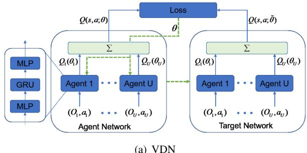  
Fig. 3. Structures of the VDN and QMIX networks.

## A. VDN-Based Multi-UAV Data Gathering and Recharging

Leveraging the DQN structure [31], we design a VDN-based algorithm for multi-UAV-aided data gathering and recharging. As intelligent agents, UAVs learn to select actions according to their individual observations to minimize the global action-value function. From [29], the global value function when taking action a under state s (or observation O) can be expressed as the summation of the agents’ local value functions:

$$
\begin{array} { l } { { \displaystyle Q ( s , a ) = \mathrm { E } _ { \pi } \left[ \sum _ { n = 0 } ^ { T - 1 } \gamma ^ { k } r _ { t + n } \mid s _ { t } = s , a _ { t } = a \right] } } \\ { { \displaystyle ~ \approx \sum _ { u = 1 } ^ { U } Q _ { u } ( O _ { u } , a _ { u } ) , } } \end{array}\tag{24}
$$

where $Q _ { u }$ is the local action-value function of agent u, and can be approximated by a deep neural network with parameters $\theta _ { u } .$ , expressed as $Q _ { u } ( O , a ; \theta _ { u } )$

As shown in Fig. 3(a), VDN comprises U agent networks that are trained centrally but executed decentrally. UAV u uses an agent network with parameters $\theta _ { u }$ to evaluate its Q-value $Q _ { u } ( O _ { u } , a _ { u } ; \theta _ { u } )$ for its action $a _ { u }$ at the local observation $O _ { u }$ . Each agent network consists of three layers: an input multi-layer perceptron (MLP) layer, a gated recurrent unit (GRU) layer, and an output MLP layer. The global actionvalue function is estimated by summing up local Q-values: $\begin{array} { r } { Q _ { u } ( O , a ; \pmb { \theta } ) = \sum _ { u } Q _ { u } ( O _ { u } , a _ { u } ; \pmb { \theta } _ { u } ) } \end{array}$ , where θ represents the combined parameters from all agents. The parameters θ are optimized by minimizing the following loss function:

$$
F _ { \mathrm { l o s s } } ( \pmb \theta ) = E \Big [ ( \Gamma _ { t } - Q ( O ( t ) , a ( t ) ; \pmb \theta ) ) ^ { 2 } \Big ] ,\tag{25}
$$

which is the mean squared error (MSE) between the predicted global Q-value $Q ( O ( t ) , a ( t ) ; \pmb \theta )$ and its target value $\Gamma _ { t }$ . Here, the target value is obtained using a target network with parameters θ:

$$
\begin{array} { r } { \Gamma _ { t } = \left\{ \begin{array} { l } { C ( t ) + \gamma \cdot \operatorname* { m i n } Q \Big [ O ( t + 1 ) , a ( t + 1 ) ; \widehat { \theta } \Big ] , \mathrm { i f } t < T - 1 } \\ { C ( t ) , \qquad \mathrm { o t h e r w i s e ~ } } \end{array} \right. } \end{array}\tag{26}
$$

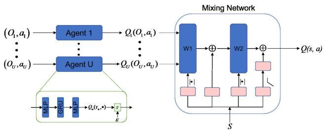  
(b) QMIX

During execution, with a trained agent network, each UAV selects an action $a _ { u } ^ { t } ( t )$ involving flight, SN association, and recharging based on the local observation $O _ { u } ( t )$

## B. QMIX-Based Multi-UAV Data Gathering and Recharging

Similar to VDN, each UAV u has its own agent network with parameters $\theta _ { u }$ to predict the Q-value $Q _ { u } ( O _ { u } , a _ { u } ; \theta _ { u } )$ for its action $a _ { u }$ based on the agent’s local observation $O _ { u } .$ , as shown in Fig. 3(b). However, unlike VDN, QMIX utilizes a Mixing network to approximate the global Q-value function $Q ( s , a )$ [30]. This Mixing network integrates inputs from all local Q-value functions $Q _ { u } ( O _ { u } , a _ { u } ) ~ ( u = 1 , \ldots , U )$ and the current state s to derive $Q ( s , a )$ ) ( = 1 ). To ensure monotonicity, the partial derivative $\begin{array} { r } { \frac { \partial Q ( s , a ) } { \partial Q _ { u } ( O _ { u } , a _ { u } ) } ~ \leq ~ 0 } \end{array}$ must hold for all agents. This guarantees a monotonic relationship between $Q ( s , a )$ and $Q _ { u } ( O _ { u } , a _ { u } )$ , ensuring that argmin $Q ( s , a ) \ =$ argmin $Q _ { 1 } ( O _ { 1 } , a _ { 1 } )$ , . . . . . . , argmin $Q _ { U } ( O _ { N } , a _ { N } ) ]$ Hence, a1 aU   
each agent’s locally optimal action argmin $Q _ { u } ( O _ { u } , a _ { u } )$ is au   
precisely a part of the globally optimal action argmin $Q ( s , a )$

As depicted in Fig. 3(b), the individual $\overset { a } { \mathrm { Q } } \mathrm { - }$ values are concatenated to form an input vector to the Mixing network. The Mixing network with parameters ψ comprises two neural networks: the parameter generation network $g ( s )$ and the inference network f. The network $g ( s )$ takes the state s as input and outputs the weights $\omega _ { 1 } ( s )$ and biases $b _ { 1 } ( s )$ . A linear network and an absolute value activation function are used to ensure the non-negativity of the weights. This inference network computes the global Q-value as a weighted combination of local Q-values: $Q ( s , a ; \pmb \theta , \psi ) = \omega _ { 1 } ( s ) \cdot Q ( O , a ; \pmb \theta ) + b _ { 1 } ( s )$

During training, the parameters $( \pmb \theta , \psi )$ are jointly optimized by minimizing the combined losses from all agents’ Q-values and the mixing network:

$$
F _ { \mathrm { Q M I X } } \left( \pmb { \theta } , \psi \right) = \sum _ { u = 1 } ^ { U } F _ { u } ( \theta _ { u } ) + F _ { m i x } ( \psi ) ,\tag{27}
$$

where $F _ { u } ( \boldsymbol { \theta } _ { u } )$ is the loss for agent u’s local Q-value and $F _ { m i x } ( \psi )$ is the loss for the Mixing network.

( )In summary, we present the VDN-based (or QMIX-based) multi-UAV-aided data collection and energy replenishment algorithm in Algorithm 1. Notably, VDN and QMIX algorithms are quite similar in addressing the problem of multi-UAV-aided data collection and energy replenishment.

Algorithm 1 The VDN/QMIX-Based Multi-UAV-Aided Data   
Collection and Energy Replenishment Algorithm   
1: Initialize the parameters $\alpha , \gamma , p ,$ pmin, $\overline { { T _ { e } , \ T _ { s } , \ T } } ,$ st ,   
$E _ { \mathrm { m a x } } ;$   
2: Initialize $Q ( O ( t ) , a ( t ) ; \pmb \theta ) = Q ( O ( t ) , a ( t ) ; \hat { \pmb \theta } ) = 0 ;$   
( ( ) ( ); ) = ( ( ) ( ); ) = 03: Initialize replay memory with capacity G, and num $= 1 ;$   
4: repeat   
5: Initialize $E _ { u } ( 0 ) = E _ { \mathrm { m a x } } , \bar { A } = 0 , \bar { E } = 0 ,$ and get an   
(0)initial observation $O _ { u } ( 0 ) ;$   
6: for Step $t = 0 , \ldots , T - 1$ do   
7: for UAV $u = 1 , \ldots , U$ do   
8: = 1Select an action on $\mathrm { U A V s } '$ flight or recharging   
based on the local action-value function: $a _ { u } ( t ) =$   
arg min $Q _ { u } ( O _ { u } ( t ) , a _ { u } ( t ) ; \theta _ { u } )$ ( ) =, or select an action   
randomly with probability $p ;$   
9: end for   
10: Update the location of each UAV $U _ { u } ( t + 1 )$ by (17),   
its remaining energy $E _ { u } ( t + 1 )$ ( + 1)by (19), and the AoI   
value of each SN $A _ { n } ( t + 1 )$ 1)by (8);   
11: Receive the immediate reward and get the next   
observation $O ( t + 1 ) ;$   
12: (Store the sample $( O ( t ) , a ( t ) , r ( t ) , O ( t + 1 ) )$ in the   
replay memory;   
13: Calculate the $\mathrm { S N s } '$ average AoI: $\begin{array} { r l r } { \bar { \boldsymbol { A } } } & { { } = } & { \bar { \boldsymbol { A } } + } \end{array}$   
$\begin{array} { r } { \frac { 1 } { N } \sum _ { n = 1 } ^ { N } A _ { n } ( t ) , } \end{array}$ and $\mathrm { U A V s } '$ energy consumption:   
$\begin{array} { r } { \dot { \bar { \boldsymbol { E } } } = \bar { \boldsymbol { E } } + \frac { 1 } { U } \sum _ { u = 1 } ^ { U } \boldsymbol { e } _ { u } ( t ) ; } \end{array}$   
14: end for   
15: Sample a mini-batch of $T _ { s }$ sequential samples from the   
replay memory using random updates;   
16: Update the parameters of the current network:   
$\pmb { \theta } = \pmb { \theta } + \alpha \nabla _ { \pmb { \theta } } F _ { \mathrm { l o s s } } \left( \pmb { \theta } \right)$ (or $\begin{array} { c c l } { { ( ( \pmb { \theta } , \psi ) } } & { { = } } & { { ( \pmb { \theta } , \psi ) } } \end{array} +$   
$\begin{array} { r } { \alpha \nabla _ { ( \theta , \psi ) } F _ { \mathrm { Q M I X } } \left( \theta , \psi \right) ) ; } \end{array}$   
17: ( ))Update the parameters of the target network every st   
time steps: $\hat { \pmb \theta } = { \pmb \theta }$ (or $( \hat { \pmb \theta } , \hat { \psi } ) = ( \pmb \theta , \psi ) ) ;$   
18: Update the exploration probability: $\begin{array} { r l r l } { p } & { { } = { } } & { p } & { { } - } \end{array}$   
$( 1 - p _ { \mathrm { m i n } } ) / T _ { e } ;$   
19: num num ;   
20: until num> $T _ { e }$   
21: Output the $\mathrm { S N s } '$ average AoI A and UAVs’ energy   
consumption ${ \bar { E } } .$

VDN focuses on aggregating independently learned local Q-values to approximate the global Q-value, whereas QMIX employs a more sophisticated approach with a Mixing network that adaptively combines the local Q-values.

## C. Implementation Considerations

In this subsection, we discuss some issues in implementing of our proposed multi-UAV data collection and energy recharging algorithms.

1) Concurrent Charging and Data Gathering of UAVs: Although this work primarily considers UAVs operating in alternating working and recharging modes, it is conceivable for a UAV to simultaneously recharge and gather data. For example, while landing on a CS to recharge its battery, a UAV can continue to sense and communicate with SNs within its observation range. Our proposed approach can be easily adapted to such scenarios with minor adjustments. Specifically, during the recharging mode, the actions of each agent should be modified to incorporate SN association. Importantly, this minor modification is unlikely to significantly impact the training efficiency of VDN and QMIX algorithms. Conversely, in the working mode, each UAV must first gather data from SNs before offloading it to the BS, resulting in a sequential process of data gathering and offloading.

TABLE II
<table><tr><td rowspan=1 colspan=1>Notation</td><td rowspan=1 colspan=1>Value</td><td rowspan=1 colspan=1>Notation</td><td rowspan=1 colspan=1>Value</td></tr><tr><td rowspan=1 colspan=1>T</td><td rowspan=1 colspan=1> $\overline { { 1 \mathrm { s } } }$ </td><td rowspan=1 colspan=1> ${ \overline { { W , \sigma ^ { 2 } } } }$ </td><td rowspan=1 colspan=1>1Mbits, -100dbm</td></tr><tr><td rowspan=1 colspan=1> $\overline { { t _ { t p } , \ t _ { c o } } }$ </td><td rowspan=1 colspan=1> $\overline { { 0 . 2 \mathrm { s } , 0 . 2 \mathrm { s } } }$ </td><td rowspan=1 colspan=1> $\overline { { \beta _ { 0 } } }$ </td><td rowspan=1 colspan=1>-30dB</td></tr><tr><td rowspan=1 colspan=1> $\overline { { t _ { c } , ~ t _ { f } } }$ </td><td rowspan=1 colspan=1>0.1s, 0.5s</td><td rowspan=1 colspan=1> $\kappa , \alpha$ </td><td rowspan=1 colspan=1> $\overline { { 0 . 2 , 2 } }$ </td></tr><tr><td rowspan=1 colspan=1> $\underline { { t _ { e f } } }$ </td><td rowspan=1 colspan=1>0.8s</td><td rowspan=1 colspan=1> $\overline { { N _ { b } , c _ { b } } }$ </td><td rowspan=1 colspan=1>4,0.1m</td></tr><tr><td rowspan=1 colspan=1> $\underline { { t _ { d o w n } , ~ t _ { u p } } }$ </td><td rowspan=1 colspan=1> $\overline { { 0 . 2 \mathrm { s } , 0 . 2 \mathrm { s } } }$ </td><td rowspan=1 colspan=1> $\underline { { \overline { { \rho , ~ C _ { D _ { o } } } } } }$ </td><td rowspan=1 colspan=1> $\overline { { 1 . 2 2 5 \mathrm { k g } / \mathrm { m ^ { 3 } } , 0 . 0 2 5 } }$ </td></tr><tr><td rowspan=1 colspan=1> ${ { t } _ { r e } }$ </td><td rowspan=1 colspan=1> $\overline { { 0 . 8 \mathrm { s } } }$ </td><td rowspan=1 colspan=1> $\overline { { \omega _ { b } , R } }$ </td><td rowspan=1 colspan=1> $\overline { { 2 0 \mathrm { r a d } / \mathrm { s } , 0 . 5 \mathrm { m } } }$ </td></tr><tr><td rowspan=1 colspan=1> $\overline { { H _ { u } , W _ { u } } }$ </td><td rowspan=1 colspan=1>10m, 50N</td><td rowspan=1 colspan=1> $A _ { e }$ </td><td rowspan=1 colspan=1> $\overline { { 5 . 5 0 3 m ^ { 2 } } }$ </td></tr><tr><td rowspan=1 colspan=1> $\underline { { E _ { m a x } } }$ </td><td rowspan=1 colspan=1>10kJ</td><td rowspan=1 colspan=1> $\underline { { \boldsymbol { \chi } , \delta } }$ </td><td rowspan=1 colspan=1> $0 . 1 , 0 . 5$ </td></tr></table>

2) Deactivation of SNs: Intuitively, collecting data from each SN that senses the environment is crucial. Typically, the propulsion energy consumption of UAVs far exceeds their communication energy consumption. When UAVs possess sufficient energy to traverse the entire IoT network, deactivating some SNs becomes unnecessary, because collecting fresh data from each SN aids in minimizing the average AoI of all SNs. In such scenarios, it is imperative to train our proposed VDN and QMIX algorithms effectively to guarantee adequate exploration by each UAV. However, in extreme circumstances where UAVs have limited battery capacities or access to CSs is limited, they may not have the energy required to visit all SNs, resulting in the unavoidable deactivation of some SNs.

## V. SIMULATION RESULTS

In this section, we evaluate the performance of the two MARL-based algorithms. The area of interest is a 400-meter by 400-meter square region, divided into 400 grids with each measuring 10 meters on each side. Within the grids, ten SNs, two CSs and one BS are deployed. The battery capacity of the UAV is set to 20kJ, with a charging rate of 4kJ per second. Key simulation settings are detailed in Table II.

In both VDN and QMIX, each agent network is composed of three layers: an input MLP layer, which is a fully-connected neural network followed by a ReLU activation, a GRU with 128 hidden units activated by ReLU, and an output MLP layer, which is a fully-connected neural network with 56 output units. In QMIX, the Mixing network consists of two fully-connected neural network layers, with the ELU activation function applied to the first hidden layer. The learning parameters are as follows: $\alpha = 0 . 0 0 0 5 , \gamma = 0 . 9 9 , p _ { m i n } = 0 . 0 5 , T _ { s } = 3 2$ = 0 0005 = 0 99G 5000, T 5, T 200, and $s t = 2 0 0$

In Fig. 4, we present the convergence curves of the multi-UAV data collection and energy replenishment algorithms based on VDN and QMIX. The results demonstrate that both VDN and QMIX exhibit stable convergence after a certain number of training episodes. However, QMIX converges more slowly than VDN due to its complex architecture. In QMIX, the global value function is a monotonic function of individual agent value functions, which requires a high level of coordination between agents due to its more sophisticated centralized training, decentralized execution structure. This complexity involves intricate dependencies between agents’ actions and rewards, making convergence more challenging and slower compared to VDN. The integration of transfer learning accelerates convergence for both VDN and QMIX by providing access to pre-trained knowledge, which reduces the time spent on exploration. Through transfer learning, the UAVs benefit from knowledge acquired in related tasks or environments. This prior knowledge provides them with a stronger starting point, such as pre-trained weights or learned policies. As a result, the agents are able to refine strategies more quickly instead of struggling with early-stage learning challenges. This is particularly important in multi-UAV scenarios, where the need for coordination and the increased task complexity often require more extensive exploration.

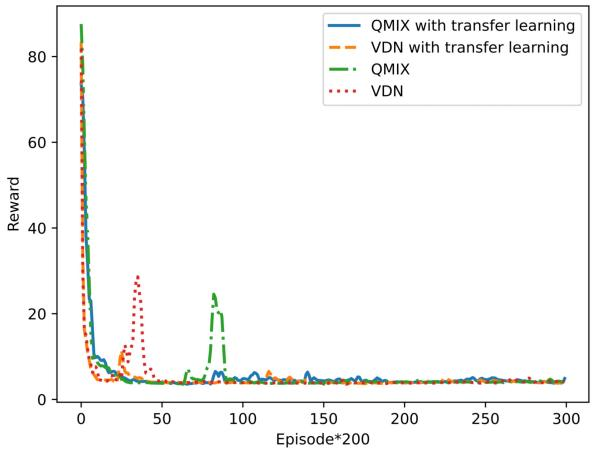  
Fig. 4. Convergence of the proposed VDN and QMIX algorithms with or without transfer learning.

Next, we will demonstrate the performance comparison of the algorithms under different UAV battery capacities, charging rates, network sizes, and the number of UAVs. Additionally, we introduce the traditional Greedy approach for comparison. The Greedy algorithm is a classic approach widely used to solve optimization problems [32]. Its core idea is to make the locally optimal choice at each step with the objective of achieving a globally optimal solution.

## A. UAV Trajectory Optimization

In this subsection, we illustrate the flight trajectories of the two UAVs during training when using the VDN and QMIX algorithms, as shown in Fig. 5. The gray dots and green dots indicate the locations of SNs and CSs, respectively, while the orange and red lines represent the flight paths of UAV 1 and UAV 2, respectively. Initially, the UAV trajectories under both algorithms are quite erratic. However, as training progresses, the UAVs gradually learn to collaborate, with each UAV collecting data from specific SNs. Upon convergence of the algorithms, the UAVs efficiently fly around designated

SNs to gather fresh information and frequently recharge at specified CSs.

## B. Impact of Charge Rate

With a battery capacity of 20kJ, we vary the charging rate from 2kJ per time slot to 10kJ per time slot. The resulting average AoI values for the SNs and the average energy consumption of the UAVs are illustrated in Fig. 6. As the charging rate increases, all three algorithms: QMIX, VDN, and Greedy, reduce recharging durations and adopt more aggressive flight strategies, thus lowering AoI but increasing energy consumption. Compared to the Greedy algorithm, both VDN and QMIX exhibit considerably superior capabilities in minimizing the average AoI. Notably, QMIX attains the lowest average AoI across all scenarios, particularly when the charging rate escalates. Although QMIX results in slightly higher energy consumption due to more frequent data collection, it consistently outperforms the Greedy algorithm, which performs the worst in terms of both AoI and energy consumption.

## C. Impact of Battery Capacity

Fig. 7 reveals the impact of UAVs’ battery capacity on algorithm performance, considering a charging rate of 2kJ per time slot. An increase in battery capacity is positively correlated with a reduction in average AoI. Both QMIX and VDN consistently outperform the Greedy algorithm, with QMIX being the superior performer in all scenarios. As battery capacity increases, the Greedy algorithm requires fewer trips to the CS. This helps avoid the rapid and significant energy consumption associated with high-speed flights to the CS, leading to a significant overall reduction in energy consumption. QMIX and VDN algorithms efficiently plan energy replenishment for UAVs, further optimizing energy consumption as battery capacity increases.

## D. Impact of Network Scale

As the number of SNs increases, the average AoI for all three algorithms rises due to the UAVs’ limited service capacity, as depicted in Fig. 8. In smaller networks, QMIX and VDN achieve similar AoI values. However, as the network size grows, QMIX demonstrates a clear advantage over VDN, maintaining a lower AoI. The Greedy algorithm, on the other hand, suffers a significant performance decline as the number of SNs increases. This leads to a substantial rise in AoI from approximately 20 to 80, which is unacceptable for fresh data collection. The energy consumption for UAVs under the Greedy algorithm remains consistently high. As the number of SNs grows, both QMIX and VDN experience increased energy consumption, with VDN showing the most favorable performance.

## E. Impact of the Number of UAVs

Fig. 9 illustrates the variations in AoI and energy consumption as the number of UAVs increases. With a single UAV, QMIX and VDN achieve similar AoI and energy consumption.

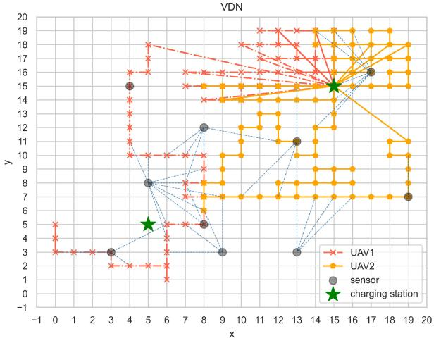

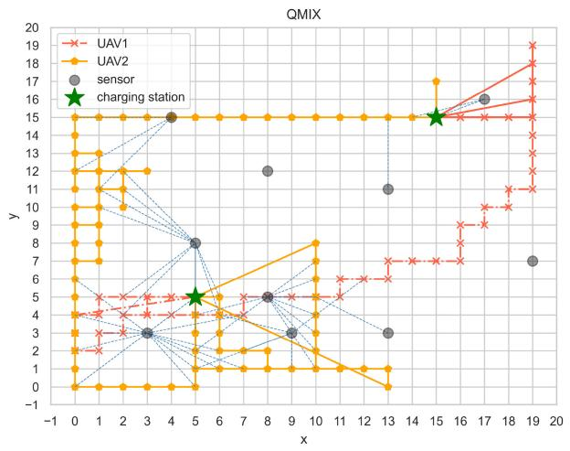  
(a) epoch=1000

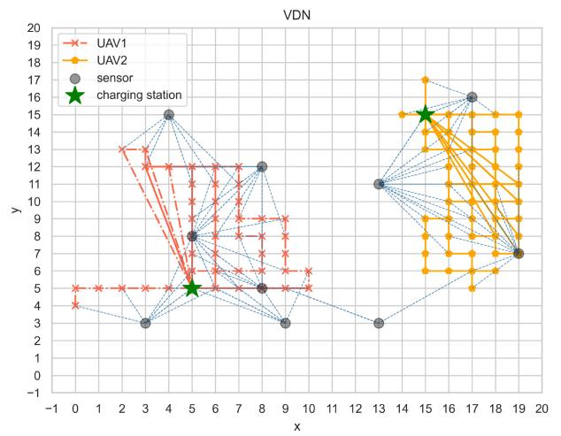

(b) epoch=20000  
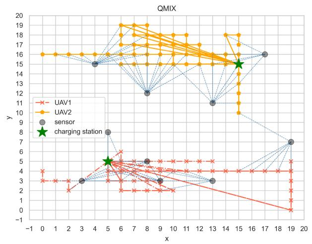

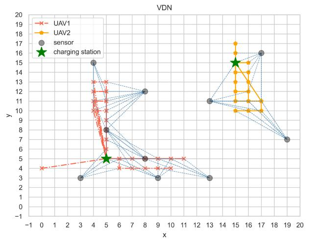  
(c) epoch=40000  
Fig. 5. The UAVs’ flight trajectories during training.

As more UAVs are deployed, both MARL algorithms adapt by optimizing UAVs’ data collection and recharging strategies, leading to reduced average AoI. QMIX outperforms VDN

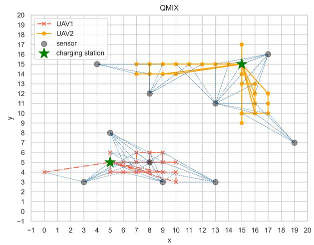

in minimizing AoI. Additionally, as each UAV serves fewer SNs, their overall energy consumption decreases. When four UAVs are deployed, the combined service capacity becomes

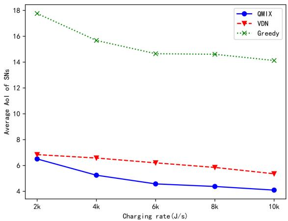  
(a) AoI

Fig. 6. Impact of UAVs’ charging rate.  
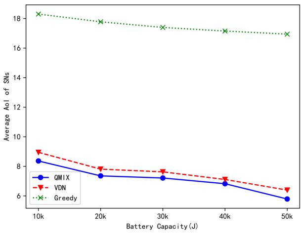  
(a) AoI

Fig. 7. Impact of UAVs’ battery capacity.  
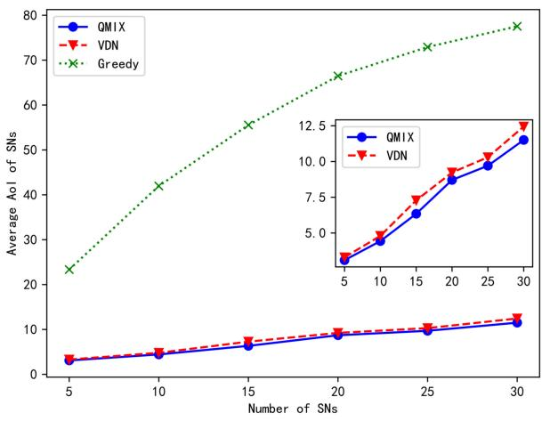  
(a) AoI  
Fig. 8. Impact of the number of SNs.

sufficient, narrowing the performance gap between QMIX and VDN. Conversely, the Greedy algorithm performs poorly with a single UAV. While increasing the number of UAVs

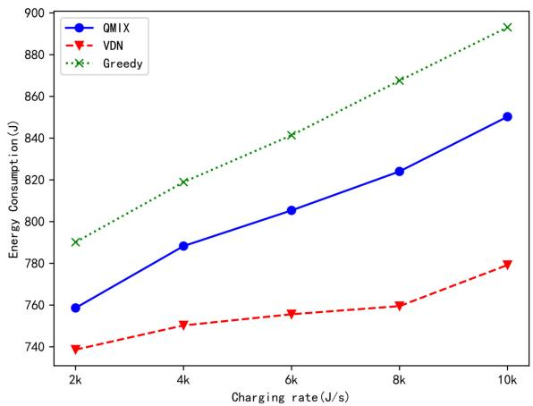  
(b) Energy Consumption

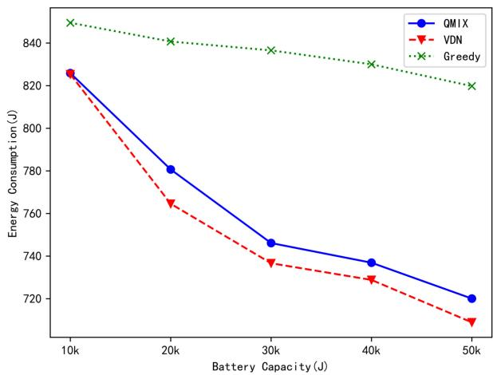  
(b) Energy Consumption

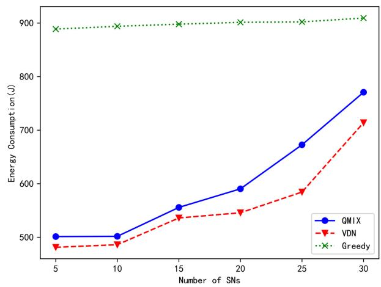  
(b) Energy Consumption

improves the AoI and energy consumption, its performance remains significantly inferior to that of the two MARL algorithms.

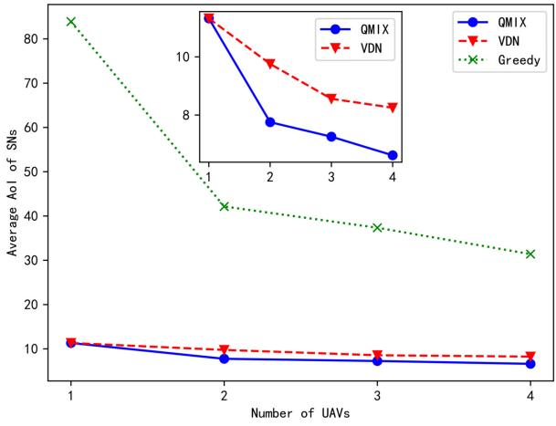  
(a) AoI  
Fig. 9. Impact of the number of UAVs.

## VI. CONCLUSION

In this work, we proposed an MARL-driven approach for multi-UAV-aided data collection and energy replenishment. This allows the UAVs to wirelessly transfer energy to IoT devices and collect their fresh data, while receiving energy recharges from CSs. Specifically we utilized two MARL algorithms, VDN and QMIX, to jointly optimize the UAVs’ flight trajectories, their association with SNs, and their recharging opportunities. These algorithms aim to maximize data freshness and energy efficiency within the IoT network. Extensive simulations demonstrated the effectiveness of VDN and QMIX in optimizing AoI and energy consumption across various scenarios with different charging rates, UAV battery capacities, numbers of SNs, and UAVs. Our results indicated that both MARL algorithms consistently outperformed the baseline Greedy algorithm in terms of AoI optimization and energy efficiency, highlighting their superiority in balancing data freshness and network sustainability. In our future work, we plan to extend this study to multi-task oriented multi-UAV-enabled IoT networks, where different UAVs are assigned distinct tasks, such as data collection and object recognition, in collaboration with IoT devices. Another interesting direction is to enhance the transfer learning assisted MARL approach to enable cross-task learning, where UAVs trained in one environment can adapt more efficiently to new environments.

## REFERENCES

[1] K. Shi, J. Liu, X. Wang, and L. Xie, “Joint optimization of multi-UAVassisted datacollection and energy replenishment via transfer learning aided deep reinforcement learning,” in Proc. IEEE Int. Conf. Commun. Technol. (ICCT), 2023, pp. 967–972.

[2] V. N. Vo, H. Tran, and C. So-In, “Enhanced intrusion detection system for an EH IoT architecture using a cooperative UAV relay and friendly UAV jammer,” IEEE/CAA J. Automatica Sinica, vol. 8, no. 11, pp. 1786–1799, Nov. 2021.

[3] Y. Gu, H. Chen, Y. Zhou, Y. Li, and B. Vucetic, “Timely status update in Internet of Things monitoring systems: An age-energy tradeoff,” IEEE Internet Things J., vol. 6, no. 3, pp. 5324–5335, Jun. 2019.

[4] H. Sun et al., “Impacts of user association and power control on AoI in multi-tier cellular-based IoT networks,” IEEE Wireless Commun. Lett., vol. 11, no. 6, pp. 1196–1200, Jun. 2022.

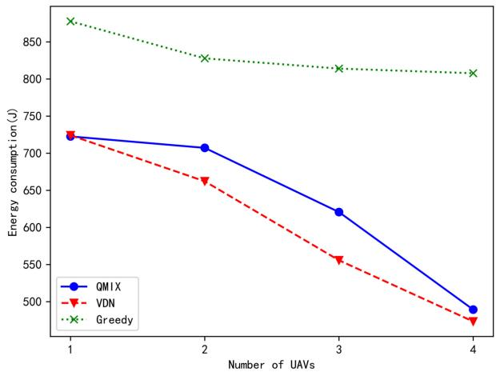  
(b) Energy Consumption

[5] C. M. Wijerathna Basnayaka, D. N. K. Jayakody, T. D. Ponnimbaduge Perera, and M. Vidal Ribeiro, “Age of information in an URLLC-enabled decode-and-forward wireless communication system,” in Proc. IEEE Veh. Technol. Conf., 2021, pp. 1–6.

[6] I. Krikidis, “Average age of information in wireless powered sensor networks,” IEEE Wireless Commun. Lett., vol. 8, no. 2, pp. 628–631, Apr. 2019.

[7] Y.-P. Hsu, E. Modiano, and L. Duan, “Scheduling algorithms for minimizing age of information in wireless broadcast networks with random arrivals,” IEEE Trans. Mobile Comput., vol. 19, no. 12, pp. 2903–2915, Dec. 2020.

[8] X. Wu, J. Yang, and J. Wu, “Optimal status update for age of information minimization with an energy harvesting source,” IEEE Trans. Green Commun. Netw., vol. 2, no. 1, pp. 193–204, Mar. 2018.

[9] Z. Jiang, B. Krishnamachari, X. Zheng, S. Zhou, and Z. Niu, “Timely status update in wireless uplinks: Analytical solutions with asymptotic optimality,” IEEE Internet Things J., vol. 6, no. 2, pp. 3885–3898, Apr. 2019.

[10] B. Zhu, E. Bedeer, H. H. Nguyen, R. Barton, and Z. Gao, “UAV trajectory planning for AoI-minimal data collection in UAV-aided IoT networks by transformer,” IEEE Trans. Wireless Commun., vol. 22, no. 2, pp. 1343–1358, Feb. 2023.

[11] M. Sherman, S. Shao, X. Sun, and J. Zheng, “Optimizing AoI in UAV-RIS-assisted IoT networks: Off policy versus on policy,” IEEE Internet Things J., vol. 10, no. 14, pp. 12401–12415, Jul. 2023.

[12] X. Fu, Q. Pan, and X. Huang, “AoI-energy-aware collaborative data collection in UAV-enabled wireless powered sensor networks,” IEEE Sensors J., vol. 23, no. 24, pp. 31307–31324, Dec. 2023.

[13] S. Barick and C. Singhal, “Multi-UAV assisted IoT NOMA uplink communication system for disaster scenario,” IEEE Access, vol. 10, pp. 34058–34068, 2022.

[14] R. Chen, Y. Sun, L. Liang, and W. Cheng, “Joint power allocation and placement scheme for UAV-assisted IoT with QoS guarantee,” IEEE Trans. Veh. Technol., vol. 71, no. 1, pp. 1066–1071, Jan. 2022.

[15] X. Diao, X. Guan, and Y. Cai, “Joint offloading and trajectory optimization for complex status updates in UAV-assisted Internet of Things,” IEEE Internet Things J., vol. 9, no. 23, pp. 23881–23896, Dec. 2022.

[16] M. Li, H. Li, P. Ma, and H. Wang, “Energy maximization for ground nodes in UAV-enabled wireless power transfer systems,” IEEE Internet Things J., vol. 10, no. 19, pp. 17096–17109, Oct. 2023.

[17] Z. Yang, W. Xu, and M. Shikh-Bahaei, “Energy efficient UAV communication with energy harvesting,” IEEE Trans. Veh. Technol., vol. 69, no. 2, pp. 1913–1927, Feb. 2020.

[18] Y. Wang, S. Yan, X. Zhou, Y. Huang, and D. W. K. Ng, “Covert communication with energy replenishment constraints in UAV networks,” IEEE Trans. Veh. Technol., vol. 71, no. 9, pp. 10143–10148, Sep. 2022.

[19] J. Liu, F. Yang, X. Wang, L. Qu, M. Jin, and H. Dai, “Joint optimization of charging station placement and UAV trajectory for fresh data collection,” IEEE Internet Things J., vol. 11, no. 14, pp. 25057–25073, Jul. 2024.

[20] K. Yu, A. K. Budhiraja, and P. Tokekar, “Algorithms for routing of unmanned aerial vehicles with mobile recharging stations,” Sep. 2017, arXiv:1704.00079.

[21] N. Mathew, S. L. Smith, and S. L. Waslander, “Multirobot rendezvous planning for recharging in persistent tasks,” IEEE Trans. Robot., vol. 31, no. 1, pp. 128–142, Feb. 2015.

[22] J. Zhang, K. Kang, M. Yang, H. Zhu, and H. Qian, “AoI-minimization in UAV-assisted IoT network with massive devices,” in Proc. IEEE Wireless Commun. Netw. Conf. (WCNC), Austin, TX, USA, 2022, pp. 1290–1295.

[23] L. Liu, K. Xiong, J. Cao, Y. Lu, P. Fan, and K. B. Letaief, “Average AoI minimization in UAV-assisted data collection with RF wireless power transfer: A deep reinforcement learning scheme,” IEEE Internet Things J., vol. 9, no. 7, pp. 5216–5228, Apr. 2022.

[24] M. Samir, C. Assi, S. Sharafeddine, and A. Ghrayeb, “Online altitude control and scheduling policy for minimizing AoI in UAV-assisted IoT wireless networks,” IEEE Trans. Mobile Comput., vol. 21, no. 7, pp. 2493–2505, Jul. 2022.

[25] Y. Zhang, Z. Mou, F. Gao, L. Xing, J. Jiang, and Z. Han, “Hierarchical deep reinforcement learning for backscattering data collection with multiple UAVs,” IEEE Internet Things J., vol. 8, no. 5, pp. 3786–3800, Mar. 2021.

[26] B. Zhang, C. H. Liu, J. Tang, Z. Xu, J. Ma, and W. Wang, “Learningbased energy-efficient data collection by unmanned vehicles in smart cities,” IEEE Trans. Ind. Informat., vol. 14, no. 4, pp. 1666–1676, Apr. 2018.

[27] M. Mozaffari, W. Saad, M. Bennis, and M. Debbah, “Unmanned aerial vehicle with underlaid device-to-device communications: Performance and tradeoffs,” IEEE Trans. Wireless Commun., vol. 15, no. 6, pp. 3949–3963, Jun. 2016.

[28] Y. Liu, K. Liu, J. Han, L. Zhu, Z. Xiao, and X.-G. Xia, “Resource allocation and 3-D placement for UAV-enabled energy-efficient IoT communications,” IEEE Internet Things J., vol. 8, no. 3, pp. 1322–1333, Feb. 2021.

[29] P. Sunehag et al., “Value-decomposition networks for cooperative multiagent learning,” Jun. 2017, arXiv:1706.05296.

[30] T. Rashid, M. Samvelyan, C. S. de Witt, G. Farquhar, J. Foerster, and S. Whiteson, “QMIX: Monotonic value function factorisation for deep multi-agent reinforcement learning,” 2018, arXiv:1803.11485.

[31] V. Mnih et al., “Playing Atari with deep reinforcement learning,” 2013, arXiv:1312.5602.

[32] D. S. Johnson, “Local optimization and the traveling salesman problem,” in Proc. Int. Colloq. Automata, Lang., Program., 1990, pp. 446–461.

  
Kaijin Shi received the B.E. and M.S. degrees in communication engineering from Ningbo University in 2021 and 2024, respectively. His research interests mainly include UAV communication and deep reinforcement learning.

Juan Liu received the B.E. degree in information and electronic engineering from Zhejiang University, Hangzhou, China, in 2000, the M.S. degree in information engineering from the Beijing University of Posts and Telecommunications, Beijing, China, in 2005, and the Ph.D. degree in electronic engineering from Tsinghua University, Beijing, in 2011. From March 2012 to June 2014, she was with the ECE Department, NC State University, Raleigh, NC, USA. From February 2015 to February 2016, she was with the ECE Department, Hong Kong

University of Science and Technology, Hong Kong. She is a currently a Professor with College of Information Science and Engineering, Ningbo University, Ningbo, China. She is currently focusing on a wide range of research topics, such as wireless communications and networking, UAV communications, and deep learning for wireless communications.

Lingfu Xie received the B.Eng. and M.Eng. degrees in communications engineering from the University of Electronic Science and Technology of China in 2006 and 2009, respectively, and the Ph.D. degree from Nanyang Technological University, Singapore, in 2014. From 2014 to 2015, he worked as a Postdoctoral Fellow with The Hong Kong Polytechnic University, Hong Kong. In October 2015, he joined the School of Electrical Engineering and Computer Science, Ningbo University, Ningbo, China. His research interests mainly include protocol design and performance analysis in mobile networks, wireless network coding, and physical-layer network coding.

Zheng Zhou received the B.S. degree in information engineering and the Ph.D. degree in information and communication engineering from the Beijing University of Posts and Telecommunications, Beijing, China, in 2012 and 2019, respectively. Since January 2020, he has been with the College of Information Science and Engineering, Ningbo University, Ningbo, China, where he is a Lecture. His research interests include simultaneous information and power transfer and cloud radio access networks and UAV communications.

Hua Chen received the M.Eng. and Ph.D. degrees in information and communication engineering from Tianjin University, Tianjin, China, in 2013 and 2017, respectively. He is currently an Associate Professor with the Faculty of Electrical Engineering and Computer Science, Ningbo University, China. His research interests include array signal processing and MIMO radar. He is currently an Associate Editor of Circuits, Systems, and Signal Processing.

Guinian Feng received the B.E. degree in space TT &C engineering from the University of Space Engineering, Beijing, China, in 2001, the M.S. degree in communication and information system from the Beijing Institute of Tracking and Telecommunications Technology, Beijing, in 2004, and the Ph.D. degree in information and communication engineering from Tsinghua University, Beijing, in 2011. In November 2006, she was with the Chinese University of Hong Kong, Hong Kong, for one year researching in wireless ad hoc networks. In

June 2016, she was with The University of British Columbia, Canada, for one year researching on space network coding, i.e., applications of network coding theory in interplanetary networks. She is currently a Senior Engineer with the Innovation Academy for Microsatellites, Chinese Academy of Science, focusing on ground management system for satellites. She is interested in a wide range of research topics including wireless communications, giant constellation management, and image processing.