# AoI-Aware Incentive Mechanism for UAV-Assisted Mobile Crowdsensing: A Contract-Theoretic Approach

Yuran Guo , Ying Chen , Senior Member, IEEE, Hongtao Li , Yuan Wu , Senior Member, IEEE, and Jiwei Huang , Senior Member, IEEE

Abstract—With the popularization of mobile devices, mobile crowdsensing (MCS) has become a paradigm with broad application prospects. However, traditional MCS face numerous challenges, such as surges in network traffic and infrastructure failures. To address these issues, we leverage flexible and low-cost uncrewed aerial vehicles (UAVs) in the MCS framework. UAV-assisted crowdsensing (UCS) provides an innovative approach to data collection that effectively addresses problems such as insufficient network coverage and congestion. In the UCS framework, UAVs can serve not only as temporary base stations (BSs) but also participate in collecting data and processing tasks. Nevertheless, the lack of adequate incentive mechanisms may lead both UAVs and mobile users to be reluctant to participate in sensing tasks. Therefore, this paper aims to investigate hierarchical incentive mechanisms for UCS. Considering the freshness of the collected data and the benefits of the platform, we adopt the Age of Information (AoI) metric to measure the quality of data. To ensure AoI of data, we model the incentive mechanisms from both the UAV and user perspectives, and we formulate them as single-dimensional and multi-dimensional contract-based incentives under scenarios of information asymmetry. Furthermore, we derive the optimal contract scheme under the constraints of individual rationality and incentive compatibility. Finally, experimental results confirm the effectiveness of the proposed contract design and maximize the utility of the model owner.

Index Terms—UAV-assisted MCS, incentive mechanism, age of information, contract theory.

Jiwei Huang is with the Beijing Key Laboratory of Petroleum Data Mining, China University of Petroleum, Beijing 102249, China (e-mail: huangjw@cup.edu.cn).

Digital Object Identifier 10.1109/TMC.2025.3604073

## I. INTRODUCTION

W <sup>ITH</sup> <sup>the</sup> <sup>development</sup> <sup>of</sup> <sup>mobile</sup> <sup>devices</sup> <sup>and</sup> <sup>wireless</sup>networks, more than two-thirds of the world’s popula- networks, more than two-thirds of the world's population already owns mobile devices. Smart handheld devices are expected to rise rapidly in the coming years, and all mobile devices are potential sensing devices. Mobile crowdsensing (MCS), which utilizes mobile devices equipped with sensors to collect data, has emerged as a transformative approach [1], [2], [3], [4]. The foundation of MCS lies in the synergistic interaction of Big Data, cloud computing, and multi-access edge computing (MEC) [5], [6], leveraging the collective power of users to gather large-scale, diverse datasets. This provides more prosperous and more dynamic data sets for various applications in fields such as the Internet of Things (IoT) [7], [8], [9]. However, traditional MCS relies on fixed infrastructure, which has limited coverage and is difficult to rapidly expand to meet temporary or sudden increases in network demand.

To address this issue, Uncrewed aerial vehicles (UAVs) have begun integrating with MEC [10], [11], [12], [13], utilizing their high mobility as dynamic mobile nodes to enhance network coverage, connectivity, and data throughput. As aerial base stations (BS) or edge servers, UAVs utilize their agility to quickly reach a designated location, effectively reduce network congestion, lower latency, and improve the distribution of computing tasks. Similarly, UAVs have been integrated into the MCS framework [14], overcoming the limitations of terrestrial sensor networks, enhancing the capability of data collection, and expanding the scope of coverage. UAV-assisted crowdsensing (UCS) has brought new efficiencies and scalability to fields such as environmental monitoring, disaster management, and network congestion. The Age of Information (AoI) is a critical performance indicator in the MCS domain, and it has been used in several recent studies to evaluate the timeliness of data [15], [16], [17], [18]. As data valuation and service quality largely depend on data timeliness, platforms prefer to obtain fresh sensory data, resulting in higher benefits. Particularly in UCS, UAVs take advantage of their mobility and timeliness to quickly reach and cover specific areas, gather updated data, and transmit it back to the processing center or edge computing nodes with minimal delay.

In this paper, we focus on the design of incentive mechanisms for UCS [19], [20], [21], [22], [23], [24], taking into account the freshness of the sensed data and the benefits to the platform. We consider a MCS scenario where the platform assigns tasks that require workers to collect data from specific points of interest regularly. Since the value and quality of service largely depend on the timeliness of the data, the platform needs to ensure the AoI of the collected data. Besides improving the frequency of data updates by workers to enhance data freshness, we also consider situations such as network congestion and high population density where UAV-assisted data collection can effectively alleviate network pressure and ensure data freshness.

In our approach, we consider both UAVs and users when designing a hierarchical contract incentive mechanism. The self-revealing property of contract theory allows the true types of UAVs and users to be obtained under information asymmetry, maximizing platform utility and incentivizing participation in sensing. At the first layer, we consider the interaction between the platform and UAVs, where the platform requires UAVs to serve as base stations (UBS) for subregions experiencing network congestion. UAVs need to contribute their resources. Hence, we use the one-dimensional contract theory according to the service slots provided by UAV, offering rewards proportional to the effort exerted, thereby motivating UAV to serve the platform. In this setup, the platform only possesses information related to the sensing tasks and the network conditions of the subregions, such as the amount of sensing data to be uploaded and the network congestion delays. Meanwhile, the UAV service provider (USP) only has information relevant to the UAV, such as their energy and capability to act as UBS. Therefore, the information asymmetry between the platform and USP creates challenges, and the contract-based incentive mechanism is an effective solution to ensure fairness under conditions of asymmetric information.

At the second level, we consider the interaction between the platform and users via UAV, where the platform desires users to provide as much fresh data as possible. Since users need to consider various cost parameters while completing sensing tasks, we use the multi-dimensional contract theory according to users’ sensing and computational costs. The platform offers rewards proportional to the effort expended by users to motivate them to participate in sensing tasks. Similarly, the platform only possesses information related to the sensing tasks, such as the required data AoI and data amount for sensing tasks. In contrast, users only have information relevant to their devices, such as the sensing costs, computational costs, and frequency of parameter updates associated with completing the sensing tasks. Therefore, the information imbalance between the platform and users leads to issues of asymmetric information. Multi-dimensional contracts not only address the problem of data AoI under information asymmetry but also consider multiple interrelated parameters of user participation in sensing tasks.

After designing the contract theory of our model, we calculate and obtain the necessary conditions for contract problems in the UCS incentive mechanism. Under the constraints of individual rationality and incentive compatibility, we verify the optimality of the contracts and determine the contract terms that maximize the platform’s benefits. Finally, numerical results demonstrate that, compared to other benchmark schemes, our contracts are designed to deliver optimal benefits to the platform within the

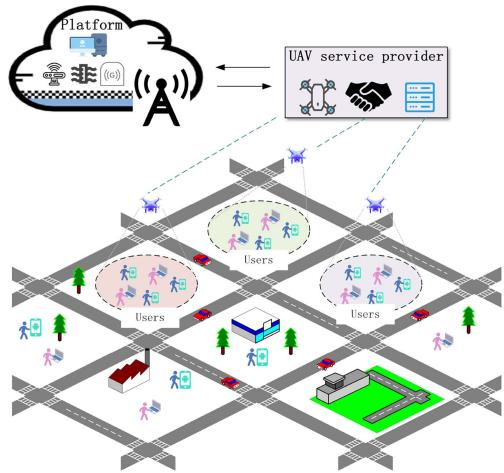  
Fig. 1. UCS system model.

constraints of incentive compatibility and individual rationality.   
Our main contributions can be summarized as follows.

1) We consider a scenario of UAV-assisted MCS divided into several subregions. UAVs move to subregions with high network latency to assist in communication, and data freshness is measured using the AoI metric.

2) We divide the entire scenario into two layers, accounting for the issues of information asymmetry between UAVs and the platform, as well as between users and the platform, respectively. We propose an incentive mechanism that encourages UAVs to assist in communication and users to increase the frequency of data updates, thereby maximizing the benefits for the platform.

3) We propose an incentive mechanism based on contract theory, utilizing constraint simplification to reduce the problem size. Accounting for the differences between the two layers, we apply a one-dimensional contract incentive mechanism to the first layer and employ multidimensional contract modeling to solve the second layer. We also obtain the optimal contractual scheme under the constraints of individual rationality and incentive compatibility derived from the model.

4) We finally consider the sufficient and necessary conditions for the feasibility of contract theory and obtain the optimal contract scheme. Through numerical results, we verify that our scheme conforms to the characteristics of contract theory, and we demonstrate that it performs better than some other baseline methods.

The remainder of this paper is organized as follows. Section II presents the system model description. Section III introduces the contract design and provides proofs. Section IV presents experimental results. We discussed related work in Section V. Finally, Section VI concludes the paper.

## II. SYSTEM MODEL

In this paper, we consider an MCS system that consists of a platform with sensing tasks, a group of UAVs, and a number of workers (as shown in Fig. 1). The platform with sensing tasks needs to employ mobile devices equipped with sensors to collect sensed data. As users utilize these devices, the devices automatically collect various types of sensed data, which are then uploaded to the platform in exchange for rewards. This approach takes advantage of the widespread presence, flexible mobility, and opportunistic connectivity of users, helping the platform collect more comprehensive sensed data.

We assume that the service area of the platform is divided into a fixed set of subregions, denoted by the set $\mathcal { A } = \{ 1 , 2 , . . . , A \}$ To balance UAV deployment efficiency and AoI optimization, according to [25], we divide the sensing area into multiple medium-sized subregions. This ensures a sufficient number of users in each subregion, which can be effectively served by a single UAV within one service period. Moreover, we set the UAV’s coverage radius slightly larger than the geographic diameter of a subregion to ensure efficient access to data even if users upload from the subregion edge. This approach mitigates AoI fluctuation caused by minor user mobility while maintaining stable UAV scheduling.

For a specific fixed sub-region, if the data transmission delay is too high, we will deploy a UAV to assist in communication. It is assumed that the platform has long-term sensing tasks, with UAVs denoted by $\mathcal { V } = \{ 1 , 2 , . . . , V \}$ , used to reduce excessive delays caused by too much sensory data in a subregion, ensuring the freshness of data. The users are marked as $\mathcal { U } = \{ 1 , 2 , . . . , U \}$ , who are some network users willing to share some data to gain additional social benefits. The system’s entire workflow is described as follows. In the initial phase, the platform broadcasts the sensing task to all workers, and the workers upload the sensing parameters according to the task. The platform monitors the AoI of the data in each subregion, and when the AoI of the data in a specific area is high, the data quality may be affected. To address excessive delays caused by data transmission, we deploy UAVs for communication assistance to ensure the AoI of the data and enhance the platform’s benefits.

In the above MCS system, the platform is dedicated to ensuring high data update frequency and freshness. Based on this, we propose a two-layer incentive mechanism. First, the platform can rent a UAV for deployment as a UBS. When the AoI value in a specific area increases, the platform will offer rewards to motivate UAVs to provide services to that area, thereby reducing data transmission delays and enhancing the platform’s benefits. Second, the platform requires workers to provide as much fresh data as possible. To encourage workers to increase the frequency of their data updates, the platform will similarly give rewards to the workers, thus bringing higher benefits to the platform. Therefore, in the design of the contracts, we consider the characteristics of both the UAVs and users, and adopt both one-dimensional and multi-dimensional hierarchical contract incentive mechanisms to motivate the UAVs and users to provide effective MCS services for the platform.

Due to the unpredictable mobility of users, the areas with high user density may experience severe transmission delay due to intense uplink competition and limited network resources. This leads to a significant increase in the average AoI in those areas. In such scenarios, on the one hand, it is necessary to design attractive incentive mechanisms that motivate UAVs to act as relay nodes to assist in communication and maximize the platform’s benefits. To address this issue, we propose an incentive mechanism according to one-dimensional contractual theory, using the UAV’s serviceable time slots as an evaluation metric and accounting for the problem of asymmetric information between the parties.

TABLE I KEY NOTATIONS
<table><tr><td rowspan=1 colspan=1>Notation</td><td rowspan=1 colspan=1>Definition</td></tr><tr><td rowspan=1 colspan=1> $\mathcal { A }$ </td><td rowspan=1 colspan=1>Number of subregions</td></tr><tr><td rowspan=1 colspan=1> $\nu$ </td><td rowspan=1 colspan=1>Number of UAVs</td></tr><tr><td rowspan=1 colspan=1> $\mathcal { U }$ </td><td rowspan=1 colspan=1>Number of Users</td></tr><tr><td rowspan=1 colspan=1> $L o S$ and $N L o S$ </td><td rowspan=1 colspan=1>Line of sight and Non Line of sight</td></tr><tr><td rowspan=1 colspan=1> $P L$ </td><td rowspan=1 colspan=1>Pathloss</td></tr><tr><td rowspan=1 colspan=1> $\sigma$ </td><td rowspan=1 colspan=1>Pathloss exponent</td></tr><tr><td rowspan=1 colspan=1> $\eta _ { \mathrm { L o S } }$ and $\eta _ { \mathrm { N L o S } }$ </td><td rowspan=1 colspan=1>Additional losses for LoS and NLoS link</td></tr><tr><td rowspan=1 colspan=1> $d _ { ( . ) }$ </td><td rowspan=1 colspan=1>The distance between UAV and user and UAV andBS</td></tr><tr><td rowspan=1 colspan=1> $\underline { { r _ { ( . ) } } }$ </td><td rowspan=1 colspan=1>The uplink transmission rate</td></tr><tr><td rowspan=1 colspan=1> $\underline { { \zeta } } _ { ( . ) }$ </td><td rowspan=1 colspan=1>The offloading time for data</td></tr><tr><td rowspan=1 colspan=1> $C _ { v } ^ { t r a n s } \left[ t \right]$ </td><td rowspan=1 colspan=1>The transmission energy consumption of UAV</td></tr><tr><td rowspan=1 colspan=1> $C _ { v } ^ { i n }$ and $C _ { v } ^ { o u t }$ </td><td rowspan=1 colspan=1>The energy consumption of UAV fly to the servicelocation and return to the USP&#x27;s base</td></tr><tr><td rowspan=1 colspan=1> $p _ { i }$ </td><td rowspan=1 colspan=1>The frequency of user collect and upload data</td></tr><tr><td rowspan=1 colspan=1> $\tau$ </td><td rowspan=1 colspan=1>Age of Information</td></tr><tr><td rowspan=1 colspan=1>α andβ</td><td rowspan=1 colspan=1>Unit sensing costs and unit computing Costs</td></tr><tr><td rowspan=1 colspan=1> $E ( . )$ </td><td rowspan=1 colspan=1>The utility function</td></tr><tr><td rowspan=1 colspan=1> $R ( . )$ </td><td rowspan=1 colspan=1>The reward function</td></tr><tr><td rowspan=1 colspan=1> $\delta _ { i }$ </td><td rowspan=1 colspan=1>The type of UAV</td></tr><tr><td rowspan=1 colspan=1> $\Phi _ { i } \left( p \right)$ </td><td rowspan=1 colspan=1>The type of user</td></tr><tr><td rowspan=1 colspan=1> $\Psi _ { i } = \left( T _ { i } , R _ { i } ^ { v } \right)$ </td><td rowspan=1 colspan=1>Contract between platform and UAVs</td></tr><tr><td rowspan=1 colspan=1> $\Omega _ { u } = \{ \Pi _ { u , x , y } \}$ </td><td rowspan=1 colspan=1>Contract between platform and users</td></tr></table>

By leveraging the self-revelation property of the optimal contract, we encourage UAVs to exert greater effort to bring higher benefits to the platform. On the other hand, we also design a contract-theoretic mechanism to incentivize users to increase the frequency of parameter updates, recognizing that users have multiple cost parameters. Therefore, we consider a multi-dimensional contract incentive mechanism, distinguishing user types based on the sensory and computational costs of data provision to obtain the optimal contract. This aims to ensure that users provide parameters as frequently as possible, generating higher benefits for the platform. Table I summarizes the critical notations used in this work. The subsequent sections will explore the communication, data freshness, and benefit models.

## A. Communication Model

This section introduces the communication model. Initially, when the average AoI of a region stays below the threshold, users upload data directly to the BS. When the platform detects that the average AoI exceeds the threshold, it deploys UAVs to assist. During this period, users upload data to the UAV. Once the average AoI meets the threshold again and the UAV’s service slot ends, the platform reassigns the communication task to the BS, and users resume direct data upload. Air-to-Ground communication refers to the method of facilitating communication between UAVs and terrestrial devices or BS. Assuming the platform has a fixed bandwidth, which could be a limited or unlimited backhaul link to the BS. Next, we establish a model to represent the interaction between UAVs and user devices.

1) User to UAV Communication: The communication between UAV and users is referenced in [26], assuming at time slot <sup>t</sup>, the Line of Sight (LoS) and Non-LoS (NLoS) losses between the UAV and users are given by the following equations

$$
\mathrm { P L } _ { \mathrm { L o S } } ^ { u , v } [ t ] = 2 \sigma \log \left( \frac { 4 \pi d _ { u , v } ^ { t } f ^ { c } } { a } \right) + \eta _ { \mathrm { L o S } } ,\tag{1}
$$

$$
\mathrm { P L } _ { \mathrm { N L o S } } ^ { u , v } [ t ] = 2 \sigma \log \left( \frac { 4 \pi d _ { u , v } ^ { t } f ^ { c } } { a } \right) + \eta _ { \mathrm { N L o S } } ,\tag{2}
$$

where $\sigma$ is the path-loss exponent. $\eta _ { \mathrm { L o S } }$ and $\eta _ { \mathrm { N L o S } }$ are average added losses for LoS and NLoS links, respectively. $f ^ { c }$ is the carrier frequency, <sup>a</sup> is the speed of light, and $d _ { u , v } ^ { t }$ is the distance between UAV <sup>v</sup> and user <sup>u</sup>. Moreover, we assume that all UAVs fly at a constant altitude of $H _ { u } ,$ with the coordinates of the user devices being $( x _ { u } ^ { t } , y _ { u } ^ { t } , 0 )$ , and the coordinates of the UAVs being $( x _ { v } ^ { t } , y _ { v } ^ { t } , H _ { u } )$ . The base station is located at the coordinates $( 0 , 0 , 0 )$ <sup>)</sup>. The distance between UAV <sup>v</sup> and user <sup>u</sup> can be calculated as

$$
d _ { u , v } ^ { t } = \sqrt { ( x _ { v } ^ { t } - x _ { u } ^ { t } ) ^ { 2 } + ( y _ { v } ^ { t } - y _ { u } ^ { t } ) ^ { 2 } + H _ { u } ^ { 2 } } .\tag{3}
$$

Additionally, the likelihood of the LoS component is influenced by both the surrounding environmental conditions and the the angle of elevation separating the UAV and the terrestrial equipment. Consequently„ the chance of an LoS component occurring in the communication link between UAV <sup>v</sup> and User device <sup>u</sup> is determined by

$$
\operatorname* { P r } _ { \mathrm { L o S } } ^ { u , v } = \frac { 1 } { 1 + K \exp \Big [ Q \left( \frac { 1 8 0 } { \pi } \tan ^ { - 1 } \frac { H _ { u } } { d _ { u , v } ^ { t } } - K \right) \Big ] } ,\tag{4}
$$

where <sup>K</sup> and $Q$ are constant coefficients dependent on the environment, and $H _ { u }$ represents the hovering altitude of the UAV. The probability of NLoS is

$$
\mathrm { P r } _ { N L o S } ^ { u , v } = 1 - \mathrm { P r } _ { L o S } ^ { u , v } .\tag{5}
$$

Thus, the mean path loss for user <sup>u</sup> in relation to UAV <sup>v</sup> during slot <sup>t</sup> can be denoted as

$$
\begin{array} { r } { \overline { { \mathrm { P L } } } _ { u , v } [ t ] = \mathrm { P r } _ { \mathrm { L o S } } ^ { u , v } \mathrm { P L } _ { \mathrm { L o S } } ^ { u , v } [ t ] + \mathrm { P r } _ { \mathrm { N L O S } } ^ { u , v } \mathrm { P L } _ { \mathrm { N L o S } } ^ { u , v } [ t ] . } \end{array}\tag{6}
$$

In addition, the channel gains of user <sup>u</sup> and UAV <sup>v</sup> in slot <sup>t</sup> can be denoted as

$$
\begin{array} { r } { G _ { u , v } \left[ t \right] = 1 0 ^ { - \frac { \overline { { P L } } u , v \left[ t \right] } { 1 0 } } . } \end{array}\tag{7}
$$

Assuming that the bandwidth is evenly distributed among devices communicating with the UAV, the uplink transmission rate uploaded from the user device to the UAV is

$$
r _ { u , v } ^ { t } = B _ { u } \log _ { 2 } { \left( 1 + \frac { P _ { u } \left[ t \right] G _ { u v } \left[ t \right] } { I _ { 0 } } \right) } ,\tag{8}
$$

where $B _ { u }$ is the bandwidth allocated by the UAV to the user for communication, $P _ { u } [ t ]$ is the transmission power of the user device, $G _ { u v } [ t ]$ <sup>[ ]</sup>represents the channel gain between the user device and the UAV. Similar to [27], [28], the bandwidth between the UAV and each user device is evenly allocated using an unweighted cyclic method. The uplink transmission rate from user device <sup>u</sup> to the UAV is expressed as

$$
I _ { 0 } = \sum _ { u ^ { \prime } \neq u } P _ { u ^ { \prime } } \left[ t \right] G _ { u ^ { \prime } v } \left[ t \right] + \varrho ^ { 2 } ,\tag{9}
$$

where $\sum { } _ { u ^ { \prime } \neq u } P _ { u ^ { \prime } } [ t ] G _ { u ^ { \prime } v } [ t ]$ represents the interference signals from other user devices, and $\varrho ^ { 2 }$ denotes the environmental noise power. Assuming that the size of the parameters generated by users is identical and the UAV offloads data packets within a fixed period without exceeding the duration of a one-time slot. The offloading time for user data is expressed as

$$
\zeta _ { u , v } = \frac { w _ { u } } { r _ { u , v } ^ { t } } ,\tag{10}
$$

where $w _ { u }$ is the size of the data packet generated by user <sup>u</sup>. The transmission cost for user data is as follows

$$
C _ { u , v } ^ { t r a n s } = P _ { u } \zeta _ { u , v } .\tag{11}
$$

2) UAV to BS Communication: In this scenario, the data rate achievable by UAV <sup>v</sup> and the BS at time slot <sup>t</sup> is

$$
r _ { v 0 } ^ { t } = B _ { 0 } \log _ { 2 } { \left( 1 + \frac { P _ { v 0 } \left[ t \right] G _ { v 0 } \left[ t \right] } { I _ { 0 } } \right) } ,\tag{12}
$$

where $B _ { 0 }$ is the transmission bandwidth between UAV and BS, $P _ { v 0 } [ t ]$ denotes the UAV’s transmission power, $G _ { v 0 } [ t ]$ represents the channel gain between the BS and the UAV. The distance between the UAV and the BS is indicated below

$$
d _ { v , b } ^ { t } = \sqrt { ( x _ { v } ^ { t } ) ^ { 2 } + ( y _ { v } ^ { t } ) ^ { 2 } + H _ { u } ^ { 2 } } .\tag{13}
$$

Similarly, the channel gain between the UAV and the BS is given by

$$
\begin{array} { r } { G _ { v 0 } [ t ] = 1 0 ^ { - \frac { \left( \Xi _ { v 0 } + \Upsilon _ { \mathrm { L o S } } \right) } { 1 0 } } , } \end{array}\tag{14}
$$

where $\Upsilon _ { L o S }$ represents the supplementary attenuation coefficient for the LoS connection, and $\Xi _ { v 0 }$ denotes the path loss element between UAV <sup>v</sup> and the BS, as defined by the following equation

$$
\Xi _ { v 0 } [ t ] = 2 0 \log _ { 1 0 } \left( d _ { v , b } ^ { t } \right) + 2 0 \log _ { 1 0 } \left( l _ { c } \right) + 1 0 \log _ { 1 0 } \left( \frac { 2 \pi } { a } \right) ^ { 2 } ,\tag{15}
$$

where $l _ { c }$ is the carrier frequency, $d _ { v , b } ^ { t }$ represents the distance between UAV and the BS at time <sup>t</sup>, and <sup>c</sup> is the speed of light. When $w _ { v }$ is the size of the data packet generated by UAV, the offloading time for UAV data is expressed as

$$
\zeta _ { v 0 } = \frac { w _ { v } } { r _ { v 0 } ^ { t } } .\tag{16}
$$

From the above communication model, we can get the energy consumption of the UAV during its operation as expressed below

$$
C _ { v } ^ { t r a n s } \left[ t \right] = \sum _ { v \in \Omega _ { v } \left[ t \right] } P _ { v 0 } \left[ t \right] \zeta _ { v 0 } ,\tag{17}
$$

where $\Omega _ { v } [ t ]$ is the set of data packets uploaded by the UAV in <sup>Ω [ ]</sup>time slot <sup>t</sup>. Assuming the UAV acts as a UBS, the total energy consumption for transmitting data is expressed as

$$
C ^ { A l l } ( T ) = C _ { v } ^ { i n } + C _ { v } ^ { o u t } + T C _ { v } ^ { t r a n s } \left[ t \right] ,\tag{18}
$$

where $C _ { v } ^ { i n }$ represents energy expenditure needed for the UAV to reach service position, and the energy expenditure of the UAV to return to USP’s base can be denoted by $C _ { v } ^ { o u t }$ . It is assumed that the total service time slot for the UAV at a specific location is <sup>T</sup> . Next, we define the AoI model.

3) User to BS Communication: Similar to [29], the rate from user <sup>i</sup> to BS is given by

$$
r _ { u , b } ^ { t } = B _ { u , b } \log _ { 2 } \bigg ( 1 + \frac { P _ { u } [ t ] G _ { u } ( d ) } { I _ { 0 , b } } \bigg ) ,\tag{19}
$$

where $P _ { u } [ t ]$ is the user’s transmission power, $B _ { u , b }$ is the band-<sup>[ ]</sup>width allocated to the user by the BS, and $G _ { u } ( d )$ denotes the distance-related channel gain. The interference term $I _ { 0 , b }$ is given by $\begin{array} { r } { I _ { 0 } = \sum _ { u ^ { \prime } \neq u } P _ { u ^ { \prime } } [ t ] G _ { u ^ { \prime } b } ( d ) + \varrho ^ { 2 } } \end{array}$ . Accordingly, the user to BS <sup>= [ ] ( ) +</sup>transmission cost is calculated as

$$
C _ { u , b } ^ { t r a n s } = P _ { u } \times \frac { \omega _ { u } } { r _ { u , b } ^ { t } } ,\tag{20}
$$

where $\omega _ { u }$ denotes the data packet size of user <sup>u</sup>.

## B. AoI Model

In the MCS system, the platform always desires a high frequency of data updates to ensure the collected data is as fresh as possible. In our proposed model, the platform records the AoI values of data in corresponding regions. When the overall AoI value of a specific region exceeds the threshold, the platform leases UAVs to assist the communication between platform and users. Considering the impact of UAV deployment costs on the platform’s benefit and the varying network environment, the thresholds should be set with a margin to ensure that the UAVs deploy at the onset of data congestion, avoiding resource waste and effectively improving the platform efficiency. Additionally, the platform provides different contracts for different types of workers to achieve higher data freshness. For clarification, we define the following essential concepts.

Definition 1 (Data Update Frequency). The data update frequency of user <sup>u</sup> refers to the frequency at which this user collects and uploads data, denoted by $p _ { u }$ . We use $\mathcal { P } =$ $\{ p _ { 1 } , p _ { 2 } , . . . , p _ { U } \}$ represent the data update frequencies of all users.

Definition 2 (AoI). AoI is a performance metric used in the field of networking and communications to measure the freshness of information. AoI quantifies the time that has elapsed since the latest received piece of information is generated at the source. Specifically, the AoI of the data uploaded to the platform by user $u ,$ is the difference between the current time <sup>t</sup> and the creation time $S _ { u } [ t ]$ of that data, which can be defined as follows

$$
\tau _ { u } \left[ t \right] = t - S _ { u } \left[ t \right] .\tag{21}
$$

Definition 3 (Average AoI and AoI Threshold). Since the AoI varies over time, the average AoI is more commonly used in practice, as the following equation provides. To maintain the freshness of each piece of data, the platform set a threshold <sup>ε</sup> to ensure data freshness falls within this range.

$$
\bar { \tau } = \frac { 1 } { T } \int _ { 0 } ^ { T } \tau _ { u } \left[ t \right] d t \bar { \tau } \leq \varepsilon .\tag{22}
$$

The AoI threshold reflects the platform’s requirement for data timeliness. It is typically set during task initialization. Different tasks have varying levels of timeliness demand. For example, in scenarios such as disaster response or traffic control, where information needs to be fresh, the platform sets a small AoI threshold. Once the threshold is exceeded, the data rapidly loses value. In contrast, tasks like environmental monitoring allow for a larger threshold due to lower time-sensitivity [30], [31].

Definition 4 (Area Average AoI). For a given area, we use the average AoI across the entire area to decide whether to dispatch UAVs. This is determined by calculating the mean sum of the average AoI for all users within a specific fixed area. This measure helps assess whether the overall AoI in that area is excessively high due to delays, as demonstrated by the following equation

$$
\hat { \tau } = \frac { 1 } { N _ { u } } \sum _ { u \in \mathcal { A } _ { u } } \tau _ { u } ,\tag{23}
$$

where $A _ { u }$ represents a specific fixed area, and $N _ { u }$ denotes the number of all users in the area.

Through the model of data freshness described above, the AoI consists of user data collection time and transmission delay. We optimize AoI indirectly by designing incentives for both phase. The following section will cover the benefit model.

## C. Utility Model

For UAVs and the platform, the benefit of a UAV is determined by the reward it obtains from the platform minus the costs associated with incentivizing users and its operational expenses. Since in MCS, the size of the transmitted parameters is the same, and the transmission cost remains constant, it can be omitted in the contract design, and its benefits for type <sup>i</sup> UAV are shown below

$$
E _ { i } ^ { u a v } = \delta _ { i } R _ { i } - C ^ { A l l } \left( T _ { i } \right) ,\tag{24}
$$

where $\delta _ { i }$ represents the service capability type of a UAV and it reflects the maximum sustainable service duration at a fixed location. From a contract-theoretic perspective, a higher $\delta _ { i }$ indicates that the UAV is capable of providing longer service time, implying higher service capacity and a stronger willingness to participate. Under the same reward conditions, such UAVs can generate greater benefits for the platform. $C ^ { A l l } ( T )$ denotes the <sup>( )</sup>total cost incurred by a UAV when serving for <sup>T</sup>i time slots. The detailed cost expression is given in (18). And $R _ { i }$ is the reward that the platform gives to the UAV.

At this point, for the UAV and platform layer, the platform’s benefit function is equal to the benefit derived from the UAV providing services minus the rewards given to the UAV is given by

$$
E _ { p } ^ { u a v _ { i } } = \kappa \log ( T _ { i } + 1 ) - R _ { i } ,\tag{25}
$$

where <sup>κ</sup> is an adjustable parameter representing the equivalent monetary value, $T _ { i }$ denotes the service time slot of the UAV device. According to [32], (25) adopts a logarithmic-type function to reflect the diminishing marginal benefit with respect to

UAV service time. This structure ensures concavity and mathematical tractability, while also maintaining numerical stability at boundary conditions.

For the user and platform layer, the user cost function is expressed as follows

$$
\Theta _ { m , n } ( p ) = \alpha _ { m } p _ { u } + \beta _ { n } p _ { u } + C _ { u } ^ { t r a n s } ,\tag{26}
$$

where $\alpha$ and $\beta$ respectively represent the sensing cost and computing cost per unit of time, and $p _ { u }$ is the data update frequency. When the users communicate directly with the BS, $C _ { u } ^ { t r a n s }$ equals $C _ { u , b } ^ { t r a n s }$ . When the users upload data to the UAV, $C _ { u } ^ { t r a n s }$ equals $C _ { u , v } ^ { t r a n s }$

Then, the user benefit function equals the reward paid by the platform to the user minus the cost function of the user, expressed as follows

$$
E _ { u } ^ { u s e r } = R _ { u } - \alpha _ { m } p _ { u } - \beta _ { n } p _ { u } - C _ { u } ^ { t r a n s } + \bar { R } ^ { u } ,\tag{27}
$$

where $R _ { u }$ is the reward given to the user by the platform, and $\bar { R } ^ { u }$ compensates for the fixed reward against the transmission cost, and the cost function is simplified as follows for the contract discussion

$$
E _ { u } ^ { u s e r } = R _ { u } - \alpha _ { m } p _ { u } - \beta _ { n } p _ { u } .\tag{28}
$$

For the second layer involving the platform and users, the platform’s benefit function equals the revenue obtained from the data collected by users minus the rewards provided to the users is referenced in [33].

$$
E _ { p } ^ { u s e r _ { u } } = \eta \left( c p _ { u } - d p _ { u } ^ { 2 } \right) - R _ { u } ,\tag{29}
$$

where $\eta$ is an adjustable parameter representing the equivalent monetary value, $p _ { u }$ denotes the data update frequency of the user’s device, parameters <sup>c</sup> and $d$ represent positive constants that characterize the concavity of the function, capturing the property of diminishing marginal returns of revenue [33], [34]. The AoI threshold acts as the decision trigger for UAV deployment. The structure of the platform’s utility function is driven by the AoI state. Initially, the utility only includes user-side utility $E _ { p } = E _ { p } ^ { u s e r }$ . When transmission delay increases and data freshness declines, UAVs are introduced, and the utility becomes $E _ { p } = E _ { p } ^ { u s e r } + E _ { p } ^ { u a v }$ . Next, we will proceed with the design of the contract theory section.

## III. CONTRACT DESIGN

To incentivize the improvement of the AoI in UCS, we suggests a hierarchical incentive mechanism utilizing contract theory involving the distribution of sensing tasks among the platform, UAVs, and user devices. The platform needs to allocate rewards to motivate users to supply sensing parameters, while UAVs are tasked with providing communication services to maintain the freshness of the sensing data. Consequently, the platform also provides a portion of the rewards to the UAVs. User devices use their resources to provide sensing parameters to the platform and thus will also receive rewards from the platform as reparation. Next, we design the contract between each of these entities, further derive the sufficient necessary conditions for the contract to be feasible, and derive the optimal contract.

## A. Platform-UAV Layer Contract Design

1) Problem Description: This section discusses the tiered structure involving a platform and multiple UAVs. The area served by the platform is divided into several subregions, and due to differences in the quantity of user equipment in different regions, the potential for data congestion and the required service duration from UAVs also differ. To address this issue, we suppose that UAVs serve at a designated location and promote the concept of UAV service slots as a metric for evaluation. We use incentives based on contract theory to motivate UAVs to provide the longest possible service time slot. In this framework, the platform acts as the principal, and the UAVs act as the agents. Within the contractual framework, the principal offers the agent a contractual package [E(·), R(·) ], where E(·) represents the effort required by the agent to earn a reward R(·).

We distinguish between types of UAVs by the length of the time slots in which the UAV provides services at a fixed location, which also represents the UAV’s preference for service provision. With a fixed reward structure, high-type UAVs are more inclined to provide longer periods of service, thereby reducing data latency and affecting the platform’s revenue. Naturally, high-type UAVs are more favored by the platform and will receive greater rewards.

Definition 5 (UAV Type). We consider that in the first layer of platform-UAV interaction, there are <sup>n</sup> UAV types, ordered in ascending way as <sup>type</sup> $- \delta _ { 1 } , t y p e - \delta _ { 2 } , t y p e - \delta _ { 3 } , . . . , t y p e -$ $\delta _ { i } , . . . , t y p e - \delta _ { n }$ , where $i \in \{ 1 , 2 , . . . , n \}$ . The symbol $\delta _ { i }$ denotes the type of UAV as follows

$$
\delta _ { 1 } < \delta _ { 2 } < \cdot \cdot \cdot < \delta _ { i } < \cdot \cdot \cdot < \delta _ { n } , i \in \{ 1 , 2 , . . . , n \} .\tag{30}
$$

If multiple UAVs exhibit the same service capability, they are grouped into a single type category and are covered by the same contract item. Then, the platform devises a one-dimensional contract consisting of <sup>n</sup> contract items for the UAVs, represented as $\theta _ { k } = \{ \Psi _ { i } , 1 \leq i \leq n \}$ , where $\Psi _ { i } = ( T _ { i } , R _ { i } )$ corresponds to the contract item for UAV type $\delta _ { i }$ . This setup allows for the expression of the UAV’s utility function in terms of these parameters as follows

$$
E _ { i } ^ { u a v } = \delta _ { i } R _ { i } - C ^ { A l l } \left( T _ { i } \right) .\tag{31}
$$

When the $\delta _ { i }$ type UAV chooses the $t y p e - i$ contract term $\Psi _ { i } = ( T _ { i } , R _ { i } )$ , it will earn rewards from the contract, while also needing to fulfill the requirements for its service slots specified in the contract. However, the UAV does not share its specific available service slots due to information asymmetry, so the platform only knows the distribution probability $q _ { i } ^ { u a v }$ of UAV types, and $\begin{array} { r } { \dot { \sum _ { i = 1 } ^ { n } } q _ { i } ^ { u a v } = 1 } \end{array}$ . Due to the self-interest of UAVs, they may select different contract terms to maximize their benefits. Therefore, contracts must ensure incentive compatibility to guarantee that UAVs optimize their benefits when selecting their corresponding type of contract, and contracts must also satisfy individual rationality to ensure that UAV utility is positive.

Definition 6 (Incentive Compatibility, IC). When the $\delta _ { i }$ type UAV selects the corresponding contract term $\Psi _ { i } = ( T _ { i } , R _ { i } )$ , its utility is greater than choosing contract terms of other types. This constraint can be represented as

$$
E _ { i } ^ { u a v } \left( \Psi _ { i } \right) \ge E _ { i } ^ { u a v } \left( \Psi _ { j } \right) 1 \le i \le n , 1 \le j \le n , i \ne j .\tag{32}
$$

Definition 7 (Individual Rationality, IR). When the $\delta _ { i }$ type UAV selects the corresponding contract term $\Psi _ { i } = ( T _ { i } , R _ { i } )$ , its utility is non-negative. This constraint can be expressed as

$$
E _ { i } ^ { u a v } \left( \delta _ { i } , T _ { i } , R _ { i } \right) \geq 0 1 \leq i \leq n .\tag{33}
$$

In conclusion, the benefit function brought by the UAV to the platform can be expressed as follows, $q _ { i } ^ { u a v }$ represents the probability that the UAV is of this type, and the first constraint is the IC constraint, and the second constraint is the IR constraint.

$$
\begin{array} { r l } { \displaystyle \operatorname* { m a x } _ { ( T _ { i } , R _ { i } ) } E _ { p } ^ { u a v } = \sum _ { i = 1 } ^ { n } q _ { i } ^ { u a v } [ \kappa \log ( T _ { i } + 1 ) - R _ { i } ] } \\ { \mathrm { s . t . ~ } } & { E _ { i } ^ { u a v } \left( \Psi _ { i } \right) \geq E _ { i } ^ { u a v } \left( \Psi _ { j } \right) , } \\ & { E _ { i } ^ { u a v } \left( \delta _ { i } , T _ { i } , R _ { i } \right) \geq 0 , } \\ & { 1 \leq i \leq n , 1 \leq j \leq n , i \neq j . } \end{array}\tag{34}
$$

To improve computational efficiency while preserving the equivalence of incentive constraints, we apply a classical constraint reduction method from contract theory to simplify the $n ( n - 1 )$ IC constraints and <sup>n</sup> IR constraints from (34), thereby enhancing tractability and clarity of the model.

2) Contract Simplification: In this section, we derive the necessary conditions for feasible contracts that satisfy the IR and IC conditions and then simplify the IR and IC constraints.

Lemma 1. For any contract item that satisfies the necessary conditions, $R _ { i } < R _ { j }$ holds if and only if $T _ { i } < T _ { j }$ . This lemma illustrates that the longer the service slot the UAV provides, the greater the reward given by the feasible contract. Similarly, when the contract offers more rewards, the UAV will provide services for a longer period.

Proof. Based on the IC constraint from Definition 6 and the $\delta _ { i }$ type UAV’s utility function from (31), we can obtain

$$
\begin{array} { r l } & { \delta _ { i } R _ { i } - C ^ { A l l } \left( T _ { i } \right) \geq \delta _ { i } R _ { j } - C ^ { A l l } \left( T _ { j } \right) , } \\ & { C ^ { A l l } \left( T _ { j } \right) - C ^ { A l l } \left( T _ { i } \right) \geq \delta _ { i } R _ { j } - \delta _ { i } R _ { i } . } \end{array}\tag{35}
$$

Because $R _ { j } > R _ { i }$ implies $C ^ { A l l } ( T _ { j } ) > C ^ { A l l } ( T _ { i } )$ , and since the cost increases with the increase of service slot, it can be derived that $\frac { \partial C ^ { A l l } ( T _ { i } ) } { \partial T _ { i } } > 0$ , therefore $T _ { j } > T _ { i }$ . Similarly, based on the IC constraint and the $\delta _ { j }$ type UAV’s utility function, we can obtain

$$
\begin{array} { l } { { \delta _ { j } R _ { j } - C ^ { A l l } \left( T _ { j } \right) \geq \delta _ { j } R _ { i } - C ^ { A l l } \left( T _ { i } \right) , } } \\ { { \delta _ { j } \left( R _ { j } - R _ { i } \right) \geq C ^ { A l l } \left( T _ { j } \right) - C ^ { A l l } \left( T _ { i } \right) . } } \end{array}\tag{36}
$$

Because $T _ { j } > T _ { i }$ implies $C ^ { A l l } ( T _ { j } ) > C ^ { A l l } ( T _ { i } )$ , then $\delta _ { j } ( R _ { j } -$ $R _ { i } ) > 0$ , which means $R _ { j } > R _ { i }$ <sup>) ( ) (</sup>. Hence, the conclusion of the Lemma 1 is proved. -

Lemma 2. For any contract item that satisfies the necessary conditions with $\delta _ { i } > \delta _ { j }$ then $T _ { i } > T _ { j }$ holds, $i , j \in \{ 1 , 2 , . . . , n \}$ <sup>1 2</sup>This lemma indicates that the higher the type of the UAV, the longer the service slot.

Proof. The previous (35) and (36) in Lemma 1 proof, we have

$$
( \delta _ { i } - \delta _ { j } ) ( R _ { i } - R _ { j } ) \geq 0 .\tag{37}
$$

From $\delta _ { i } > \delta _ { j }$ , we have $R _ { i } > R _ { j }$ . According to Lemma 1, we also have $T _ { i } > T _ { j }$ -

Next, we need to find the optimal contract, the process of solving the optimal contract is obtained by reducing the size of the constraints of the proposed problem, we can reduce the IR and IC limits by the following steps. From Lemma 1 and Lemma 2, it is inferred that the contract $\Psi _ { 1 } = ( T _ { 1 } , R _ { 1 } )$ corresponds to the $\delta _ { 1 }$ type of UAV, which has the minimum service interval.

Lemma 3 (IR Constraints Reduction). If the $\delta _ { 1 }$ type satisfies the IR constraint, then all types satisfy the IR constraint. Therefore, the IR constraint can be replaced by

$$
E _ { 1 } ^ { u a v } \left( \delta _ { 1 } , T _ { 1 } , R _ { 1 } \right) \geq 0 1 \leq i \leq n .\tag{38}
$$

Proof. According to the IC constraint, for $\delta _ { i }$ type UAV (where $i \neq 1 )$ , it holds true that

$$
E _ { i } ^ { u a v } \left( \delta _ { i } , T _ { i } , R _ { i } \right) \geq E _ { i } ^ { u a v } \left( \delta _ { i } , T _ { 1 } , R _ { 1 } \right) .\tag{39}
$$

Because $\delta _ { 1 }$ represents the type of UAVs with the shortest service time, we have $\delta _ { i } > \delta _ { 1 }$ , Then the following equation holds

$$
\delta _ { i } R _ { 1 } - C ^ { A l l } \left( T _ { 1 } \right) \geq \delta _ { 1 } R _ { 1 } - C ^ { A l l } \left( T _ { 1 } \right) .\tag{40}
$$

In other words $E _ { i } ^ { u a v } ( \delta _ { i } , T _ { 1 } , R _ { 1 } ) \ge E _ { 1 } ^ { u a v } ( \delta _ { 1 } , T _ { 1 } , R _ { 1 } )$ holds. Combined with the two equations above, we can obtain $E _ { i } ^ { u a v } ( \delta _ { i } , T _ { i } , R _ { i } ) \geq E _ { 1 } ^ { u a v } ( \delta _ { 1 } , T _ { 1 } , R _ { 1 } )$ , thus from the IR <sup>( )</sup>constraint, we have $E _ { 1 } ^ { u a v } ( \delta _ { 1 } , T _ { 1 } , R _ { 1 } ) \geq 0$ , then we have $E _ { i } ^ { u a v } ( \delta _ { i } , T _ { i } , R _ { i } ) \geq 0 .$ -

<sup>( ) 0</sup>The IC constraints consist of downward incentive compatibility (DIC) and upward incentive compatibility (UIC). We define DIC as the IC constraint between UAVs of type <sup>i</sup> and UAVs of type $j ,$ where $j \in \{ 1 , 2 , \dots i - 1 \}$ , and UIC as the IC constraint between UAVs of type <sup>i</sup> and UAVs of type $k ,$ where $k \in \{ i + 1 , i + 2 , \dots n \}$ . Next, we simplify the IC constraint.

<sup>+ 1 + 2</sup>Lemma 4 (IC Constraints Reduction). For any contract item that satisfies the necessary conditions, if DIC between $\delta _ { i }$ and $\delta _ { i - 1 }$ holds, i.e., $\delta _ { i } R _ { i } - C ^ { \dot { A } l l } ( T _ { i } ) \geq \delta _ { i } R _ { i - 1 } - C ^ { A l l } ( T _ { i - 1 } )$ , then <sup>(</sup>all DIC hold; if UIC between $\delta _ { i }$ and $\delta _ { i + 1 }$ holds, i.e., $\delta _ { i } R _ { i } -$ $C ^ { A l l } ( T _ { i } ) \geq \delta _ { i } R _ { i + 1 } - C ^ { A l l } ( T _ { i + 1 } )$ , then all UIC hold.

Proof. For $\delta _ { i } , \delta _ { i - 1 } , \delta _ { i - 2 }$ type UAVs, according to the IC constraint, we have

$$
\delta _ { i } R _ { i } - C ^ { A l l } \left( T _ { i } \right) \geq \delta _ { i } R _ { i - 1 } - C ^ { A l l } \left( T _ { i - 1 } \right) ,\tag{41}
$$

$$
\delta _ { i - 1 } R _ { i - 1 } - C ^ { A l l } \left( T _ { i - 1 } \right) \geq \delta _ { i - 1 } R _ { i - 2 } - C ^ { A l l } \left( T _ { i - 2 } \right) .\tag{42}
$$

According to (42), we have

$$
\delta _ { i - 1 } \left( R _ { i - 1 } - R _ { i - 2 } \right) \geq C ^ { A l l } \left( T _ { i - 1 } \right) - C ^ { A l l } \left( T _ { i - 2 } \right) .\tag{43}
$$

From the sorting of UAV types $\delta _ { i } > \delta _ { i - 1 }$ , we have $\delta _ { i } ( R _ { i - 1 } -$ $R _ { i - 2 } ) \geq \delta _ { i - 1 } ( R _ { i - 1 } - R _ { i - 2 } )$ then $\delta _ { i } ( R _ { i - 1 } - R _ { i - 2 } ) \geq$ $C ^ { A l l } ( T _ { i - 1 } ) - C ^ { A l l } ( T _ { i - 2 } ) \Leftrightarrow \delta _ { i } R _ { i - 1 } - C ^ { A l l } ( T _ { i - 1 } ) \geq$ $\delta _ { i } R _ { i - 2 } - C ^ { A l l } ( T _ { i - 2 } )$ . According to (41), we can get

$$
\begin{array} { r } { \delta _ { i } R _ { i } - C ^ { A l l } \left( T _ { i } \right) \geq \delta _ { i } R _ { i - 1 } - C ^ { A l l } \left( T _ { i - 1 } \right) } \\ { \qquad \geq \delta _ { i } R _ { i - 2 } - C ^ { A l l } \left( T _ { i - 2 } \right) . } \end{array}\tag{44}
$$

Therefore, we can conclude that DIC holds true for $\delta _ { i }$ type with $\delta _ { i - 1 } \mathrm { \ t y p e } .$ , and $\delta _ { i - 1 }$ type with $\delta _ { i - 2 }$ type. For the lower boundary type $i = 1$ , we take $i = 3$ and demonstrate that DIC holds recursively from $\delta _ { 3 }$ to <sup>δ</sup><sub>2</sub> to <sup>δ</sup><sub>1</sub>, thus satisfying the boundary condition by transitivity.

Similarly, the UIC proof is as follows. For UAVs of types $\delta _ { i } , \delta _ { i + 1 } , \delta _ { i + 2 }$ , by IC constraints, we have

$$
\delta _ { i } R _ { i } - C ^ { A l l } \left( T _ { i } \right) \geq \delta _ { i } R _ { i + 1 } - C ^ { A l l } \left( T _ { i + 1 } \right) ,\tag{45}
$$

$$
\delta _ { i + 1 } R _ { i + 1 } - C ^ { A l l } \left( T _ { i + 1 } \right) \geq \delta _ { i + 1 } R _ { i + 2 } - C ^ { A l l } \left( T _ { i + 2 } \right) .\tag{46}
$$

Combining the above two equations and $\delta _ { i + 1 } > \delta _ { i }$ we can conclude that $\delta _ { i + 1 } ( R _ { i + 2 } - R _ { i + 1 } ) \geq \delta _ { i } ( R _ { i + 2 } - R _ { i + 1 } ) .$ we have $C ^ { A l l } ( T _ { i + 2 } ) - C ^ { A l l } ( T _ { i + 1 } ) \geq \delta _ { i + 1 } ( R _ { i + 2 } - R _ { i + 1 } ) \geq$ $\delta _ { i } ( R _ { i + 2 } - R _ { i + 1 } )$ . Therefore, we can conclude that the following equation holds

$$
\delta _ { i } R _ { i + 1 } - C ^ { A l l } \left( T _ { i + 1 } \right) \geq \delta _ { i } R _ { i + 2 } - C ^ { A l l } \left( T _ { i + 2 } \right) .\tag{47}
$$

According to (45), we can obtain

$$
\begin{array} { r } { \delta _ { i } R _ { i } - C ^ { A l l } \left( T _ { i } \right) \geq \delta _ { i } R _ { i + 1 } - C ^ { A l l } \left( T _ { i + 1 } \right) } \\ { \qquad \geq \delta _ { i } R _ { i + 2 } - C ^ { A l l } \left( T _ { i + 2 } \right) . } \end{array}\tag{48}
$$

By repeating this reasoning, we can conclude that the IC constraint holds for $\delta _ { i }$ and $\delta _ { i + 1 }$ , and similarly, for $\delta _ { i + 1 }$ and $\delta _ { i + 2 }$ Similarly, for the upper boundary $i = n ,$ by verifying the UIC chain from $i = n - 2 \tan i = n - 1 \tan i = n ,$ it is concluded that the boundary UIC condition also holds. -

3) Contract Optimality: Based on the simplification of feasible contracts described above, the contract problem between the platform and UAV layers is reduced to

$$
\begin{array} { r l l } { { \displaystyle \operatorname* { m a x } _ { ( T _ { i } , R _ { i } ) } } } & { { \displaystyle E _ { p } ^ { u a v } = \sum _ { i = 1 } ^ { n } q _ { i } ^ { u a v } [ \kappa \log ( T _ { i } + 1 ) - R _ { i } ] } } & \\ { { \mathrm { s . t . } } } & { { \displaystyle E _ { i } ^ { u a v } \left( \Psi _ { i } \right) \geq E _ { i } ^ { u a v } \left( \Psi _ { i - 1 } \right) , ~ 1 \leq i \leq n , } } & \\ { { } } & { { \displaystyle T _ { 1 } < T _ { 2 } < \cdot \cdot \cdot < T _ { i } < \cdot \cdot \cdot < T _ { n } , } } & \\ { { } } & { { \displaystyle E _ { 1 } ^ { u a v } \left( \delta _ { 1 } , T _ { 1 } , R _ { 1 } \right) \geq 0 . } } & { } \end{array}\tag{49}
$$

Theorem 1. When the UAV service slots satisfy the sequence $T _ { 1 } < T _ { 2 } < \cdot \cdot \cdot < T _ { i } < \cdot \cdot \cdot < T _ { n }$ , we can derive the optimal reward as follows

$$
\begin{array} { r } { R _ { i } ^ { * } = \left\{ \frac { C ^ { A l l } ( T _ { 1 } ) } { \delta _ { 1 } } , \quad \mathrm { i f } i = 1 \right. } \\ { R _ { i - 1 } ^ { * } + \left. \frac { C ^ { A l l } ( T _ { i } ) - C ^ { A l l } ( T _ { i - 1 } ) } { \delta _ { i } } , \quad \mathrm { i f } i \neq 1 \right. } \end{array} .\tag{50}
$$

Proof. By contradiction, suppose there exists another reward <sup>R</sup> is superior to $R ^ { * }$ . Under the constraints, it offers lower rewards to the UAVs, resulting in higher platform profits. Then there exists a $\delta _ { i }$ type UAV such that $R _ { i } ^ { * } > \overline { { R } } _ { i }$ , which leads to the following equation

$$
R _ { i - 1 } ^ { * } + \frac { C ^ { A l l } \left( T _ { i } \right) - C ^ { A l l } \left( T _ { i - 1 } \right) } { \delta _ { i } } > \overline { { R } } _ { i } .\tag{51}
$$

From Lemma 4, we can obtain

$$
\overline { { { R } } } _ { i } \geq \overline { { { R } } } _ { i - 1 } + \frac { C ^ { A l l } \left( T _ { i } \right) - C ^ { A l l } \left( T _ { i - 1 } \right) } { \delta _ { i } } .\tag{52}
$$

From the above two equations, we have $R _ { i - 1 } ^ { * } > \overline { { R } } _ { i - 1 }$ , and by analogy we can conclude that $R _ { 1 } ^ { * } > \overline { { R } } _ { 1 }$ , this means $\frac { C ^ { A l l } ( T _ { 1 } ) } { \delta _ { 1 } } >$ $\overline { { R } } _ { 1 }$ . This implies $\begin{array} { r } { \overline { { R } } _ { 1 } - \frac { C ^ { A l l } ( T _ { 1 } ) } { \delta _ { 1 } } < 0 } \end{array}$ , which contradicts the fact that the utility of $R _ { 1 }$ is negative. Therefore, the original conclusion stands. -

```latex
Algorithm 1: “Clustering and Smoothing” Algorithm.
Initialization: Let $T _ { i } ^ { \prime } = \operatorname * { a r g m a x } { G ( T _ { i } ) } \forall i \in \{ 1 , . . . , n \}$
gmT
while The set of $T ^ { \prime } = \{ T _ { 1 } ^ { \prime } , T _ { 2 } ^ { \prime } , . . . T _ { i } ^ { \prime } , . . . , T _ { n } ^ { \prime } \}$ violates
the monotonicity constraint do
Search for the infeasible sub-sequence
$\{ T _ { m } ^ { \prime } , T _ { m + 1 } ^ { \prime } , . . . T _ { l } ^ { \prime } \}$ , where
$\bar { T } _ { m } ^ { \prime } < \bar { T } _ { m + 1 } ^ { \prime } < \ldots < T _ { l } ^ { \prime } , m , l \in \{ 1 , . . . , n \}$ and
$m < l$
Set
T -<sub>j</sub> $\begin{array} { r } { \sum _ { j = m } ^ { l } G ( T _ { j } ) \forall j \in \{ m , m + 1 , . . . , l \} } \end{array}$
end while
return the feasible set ${ T } ^ { \prime } = \{ { T } _ { i } ^ { \prime } \} , i \in \{ 1 , . . . , n \}$
```

In fact, the optimal reward is achieved because the platform offers the least possible reward to the UAV while satisfying the constraints, then the platform’s revenue is maximized. Denoting this by <sup>G T</sup>i , through the above transformation, we can simplify the problem as follows

$$
\begin{array} { r l } { \displaystyle \operatorname* { m a x } _ { T _ { i } } } & { \displaystyle \sum _ { i = 1 } ^ { n } G \left( T _ { i } \right) } \\ { \mathrm { s . t . } } & { T _ { 1 } < T _ { 2 } < \cdots < T _ { i } < \cdots < T _ { n } . } \end{array}\tag{53}
$$

When <sup>i</sup> is not equal to one, substituting the optimal reward $\begin{array} { r } { R _ { i } ^ { * } = \sum _ { j = 1 } ^ { i } \frac { C ^ { A l l } ( \hat { T _ { j } } ) } { \delta _ { j } } - \sum _ { j = 1 } ^ { i - 1 } \frac { C ^ { A l l } ( T _ { j } ) } { \delta _ { j + 1 } } } \end{array}$ into the platform’s utility function, we obtain

$$
G \left( T _ { i } \right) = q _ { i } ^ { u a v } \left[ \kappa \log ( T _ { i } + 1 ) - \sum _ { j = 1 } ^ { i } \frac { C ^ { A l l } \left( T _ { j } \right) } { \delta _ { j } } + \sum _ { j = 1 } ^ { i - 1 } \frac { C ^ { A l l } \left( T _ { j } \right) } { \delta _ { j + 1 } } \right] .\tag{54}
$$

When the monotonicity constraint on service slots is not considered, the optimal service slots are

$$
T _ { i } ^ { \prime } = \operatorname * { a r g m a x } _ { T _ { i } } G \left( T _ { i } \right) .\tag{55}
$$

We solve the relaxation problem by removing the monotonicity constraint and then check whether the problem satisfies the monotonicity constraint $T _ { 1 } ^ { \prime } < T _ { 2 } ^ { \prime } < \cdot \cdot \cdot < T _ { i } ^ { \prime } < \cdot \cdot \cdot T _ { n } ^ { \prime }$ . If the solution satisfies the monotonicity condition, then we have the optimal contract solution. Otherwise, the solution is infeasible because there are some subsequences that do not follow monotonicity. We can solve this infeasible subsequence problem by using clustering and smoothing algorithms 1.

## B. Platform-User Layer Contract Design

1) Problem Description: This section includes a platform and several users. The platform issues a sensing task that ultimately requires users to complete and upload sensor parameters. Since different types of users have varying sensing and computational costs for completing sensing tasks, users must ensure a certain data update frequency when uploading sensor parameters to maintain data freshness. If the data loses freshness, it becomes valueless, harming the platform’s benefits. To address this issue, we introduce the data update frequency of users as an evaluation metric. However, generating parameters involves multiple cost variables for users involved in sensing tasks. Therefore, we adopt an approach based on multidimensional contract theory to incentivize users to increase the frequency of data updates. In this layer, the platform is still the principal and the user is the agent. We define the user type in terms of the user’s sensing cost and computation cost to take part in the sensing task.

Definition 8 (User Type). The sensing cost per unit frequency is denoted by $\alpha ,$ with <sup>M</sup> types of computation costs assumed. User types are represented as $\mathcal { A } = \{ \alpha _ { m } : 1 \leq m \leq M \}$ , placed in sequence: $0 \leq \alpha _ { 1 } \leq \cdot \cdot \cdot \alpha _ { m } \leq \cdot \cdot \cdot \leq \alpha _ { M }$ . Similarly, computation cost per unit frequency is denoted by $\beta ,$ with $N$ types of computation costs assumed. User types are represented as $B = \{ \beta _ { n } : 1 \leq n \leq N \}$ , it also placed in sequence: $0 \leq \beta _ { 1 } \leq \cdot \cdot \cdot \leq \beta _ { n } \leq \cdot \cdot \cdot \leq \beta _ { N }$ . We design a two-dimensional contract $\Omega _ { u } = \{ \Pi _ { u , m , n } , 1 \leq m \leq M , 1 \leq n \leq N \}$ containing <sup>MN</sup> contract items.

The contract item $\Pi _ { u , m , n } ( E _ { m n } ^ { u s e r } , R _ { u } )$ corresponds to user devices of type $( m , n )$ <sup>Π</sup>, where $E _ { m n } ^ { u s e r }$ <sup>)</sup>represents the effort required to obtain the corresponding reward. Due to asymmetric information, user devices do not share specific update frequencies. Thus, the platform only has information about the probability $q _ { u } ^ { u s e r }$ of which type the user’s device belongs to, and $\begin{array} { r } { \sum _ { u = 1 } ^ { M N } q _ { u } ^ { u s e r } = 1 } \end{array}$ Due to users’ self-interest, they may select different contract items to maximize their benefits. Therefore, contracts must ensure incentive compatibility to guarantee users optimize when selecting their corresponding type of contracts. Additionally, contracts must satisfy individual rationality to ensure the user benefits are positive.

Definition 9 (Incentive Compatibility, IC). When the $\Omega _ { u }$ type user device selects the corresponding contract item $\Pi _ { u , m , n } ( E ^ { u s e r } , R _ { u } )$ , its utility is greater than choosing contract items of other types. This constraint can be represented as

$$
\begin{array} { c } { { E _ { m n } ^ { u s e r } \left( \Pi _ { u , m , n } \right) \geq E _ { m n } ^ { u s e r } \left( \Pi _ { u , m ^ { \prime } , n ^ { \prime } } \right) } } \\ { { 1 \leq m \leq M , 1 \leq n \leq N , m ^ { \prime } \not = m , n ^ { \prime } \not = n . } } \end{array}\tag{56}
$$

Definition 10 (Individual Rationality, IR). When a $\Omega _ { u }$ type user device selects the corresponding contract item $\Pi _ { u , m , n } ( E _ { m n } ^ { u s e r } , R _ { u } )$ , its utility is non-negative. This constraint can be expressed as

$$
E _ { m n } ^ { u s e r } \left( \Pi _ { u , m , n } \right) \geq 0 1 \leq m \leq M , 1 \leq n \leq N .\tag{57}
$$

In summary, the benefit function brought to the platform by the users can be expressed as follows, and the two constraints are the IR and IC constraints defined above respectively.

$$
\begin{array} { r l r } {  { \operatorname* { m a x } E _ { p } ^ { u s e r } = \sum _ { u = 1 } ^ { M N } q _ { u } ^ { u s e r } \big [ \eta ( c p _ { u } - d p _ { u } ^ { 2 } ) - R _ { u } \big ] } } \\ & { } & \\ & { \mathrm { s . t . } ~ E _ { m n } ^ { u s e r } ( \Pi _ { u , m , n } ) \geq E _ { m n } ^ { u s e r } ( \Pi _ { u , m ^ { \prime } , n ^ { \prime } } ) , } \\ & { } & { E _ { m n } ^ { u s e r } ( \Pi _ { u , m , n } ) \geq 0 , } \\ & { } & { 1 \leq m \leq M , 1 \leq n \leq N , ~ m ^ { \prime } \neq m , n ^ { \prime } \neq n . } \end{array}\tag{58}
$$

2) Contract Simplification: The complexity of the multidimensional problem coupled with many constraints makes the direct solution very challenging. Therefore, we can simplify the IR and IC constraints by simplifying the IR and IC constraints and simplifying the two-dimensional contract to a one-dimensional contract. From the cost function of the users, the marginal cost formula for a type <sup>m,</sup> <sup>n</sup> device can be derived as follows

$$
\rho \left( \partial _ { m } , \beta _ { n } \right) = \frac { \partial \Theta _ { m , n } ( p ) } { \partial p } = \partial _ { m } + \beta _ { n } .\tag{59}
$$

From the above equation, we can see that the marginal cost consists of computation and sensing costs. Based on existing works in multidimensional contract theory [28], [35], this discrete modeling can be regarded as an approximation of a continuous type space. This method reduces the complexity of solving the contract design problem and avoids the analytical and computational challenges associated with functional optimization in continuous-type settings. Therefore, the marginal cost of unit data update frequency can serve as a new criterion for sorting user devices in ascending order: $\Phi _ { 1 } ( p ) , \Phi _ { 2 } ( p ) , \ldots , \Phi _ { i } ( p ) , \ldots , \Phi _ { M N } ( p )$ . Each $\Phi _ { i } ( p )$ corresponds to a $( \partial _ { m } , \beta _ { n } )$ pair. Following an ascending order, we can obtain the following sequence of marginal costs

$$
\rho \left( \Phi _ { 1 } , p \right) \leq \rho \left( \Phi _ { 2 } , p \right) \leq \cdots \leq \rho \left( \Phi _ { i } , p \right) \leq \cdots \leq \rho \left( \Phi _ { M N } , p \right) .\tag{60}
$$

We use $\Phi _ { i }$ to indicate the type of user and $\Pi _ { i } ( p , R )$ to indicate its corresponding contract term, then all contract terms are $\Omega _ { u } =$ $\{ \Pi _ { i } , 1 \le i \le M N \}$

Lemma 5. For any contract item that satisfies the necessary conditions, $\Pi _ { i } ( p , R ) , p _ { i } < p _ { j }$ holds if and only if $R _ { i } < R _ { j }$ holds true. The lemma suggests that the higher the frequency of data updates for users, the greater the rewards they receive. The proof is similar to the above.

Lemma 6. For any contract item that satisfies the necessary conditions $( p , R ) , { \mathrm { i f } } \rho ( \Phi _ { j } , p _ { j } ) > \rho ( \Phi _ { i } , p _ { i } )$ , then $p _ { i } \geq p _ { j }$ . The Lemma is a monotonicity condition in the contract that indicates users with higher types tend to update data less frequently.

Proof. Based on the IC constraint from Definition 9 (as defined in Section III-B of the revised manuscript) and user utility, for type $\Phi _ { i }$ IC constraints and user benefit functions, we can obtain $E _ { i } ^ { u s e r } ( \Pi _ { i } ) \ge E _ { i } ^ { u s e r } ( \Pi _ { j } )$ , which implies that

$$
\begin{array} { r l } & { R _ { i } - \Theta \left( \Phi _ { i } , p _ { i } \right) \geq R _ { j } - \Theta \left( \Phi _ { i } , p _ { j } \right) } \\ & { \Rightarrow { R _ { i } - R _ { j } } \geq \Theta \left( \Phi _ { i } , p _ { i } \right) - \Theta \left( \Phi _ { i } , p _ { j } \right) . } \end{array}\tag{61}
$$

For type $\Phi _ { j }$ IC constraints and user benefit functions, we can obtain $E _ { j } ^ { u s e r } ( \Pi _ { j } ) \geq E _ { j } ^ { u s e r } ( \Pi _ { i } )$ , which implies that

$$
\begin{array} { r l } & { R _ { j } - \Theta \left( \Phi _ { j } , p _ { j } \right) \geq R _ { i } - \Theta \left( \Phi _ { j } , p _ { i } \right) } \\ & { } \\ & { \Rightarrow \Theta \left( \Phi _ { j } , p _ { i } \right) - \Theta \left( \Phi _ { j } , p _ { j } \right) \geq R _ { i } - R _ { j } . } \end{array}\tag{62}
$$

From the above two equations, we can obtain $\Theta ( \Phi _ { j } , p _ { i } ) -$ $\Theta ( \Phi _ { j } , p _ { j } ) \geq \Theta ( \Phi _ { i } , p _ { i } ) - \Theta ( \Phi _ { i } , p _ { j } )$ . Using the integral theorem, we have

$$
\begin{array} { l } { \displaystyle \int _ { p _ { j } } ^ { p _ { i } } \frac { \partial \Theta ( \Phi _ { j } , p ) } { \partial p } d p \geq \int _ { p _ { j } } ^ { p _ { i } } \frac { \partial \Theta ( \Phi _ { i } , p ) } { \partial p } d p } \\ { \displaystyle \Rightarrow \int _ { p _ { j } } ^ { p _ { i } } \frac { \partial \Theta ( \Phi _ { j } , p ) } { \partial p } d p - \int _ { p _ { j } } ^ { p _ { i } } \frac { \partial \Theta ( \Phi _ { i } , p ) } { \partial p } d p \geq 0 . } \end{array}\tag{63}
$$

Thus, $\begin{array} { r } { \int _ { p _ { i } } ^ { p _ { i } } [ \rho ( \Phi _ { j } , p ) - \rho ( \Phi _ { i } , p ) ] d p \geq 0 , } \end{array}$ , since $\rho ( \Phi _ { j } , p _ { j } ) >$ $\rho ( \Phi _ { i } , p _ { i } )$ , it can be concluded that $p _ { i } \geq p _ { j }$ -

Based on the Lemma 5 and Lemma 6, We can obtain that a feasible contract must satisfy the following conditions

$$
\begin{array} { r } { \left\{ p _ { 1 } \geq p _ { 2 } \geq \cdots \geq p _ { i } \geq \cdots \geq p _ { M N } \right. } \\ { \left. R _ { 1 } \geq R _ { 2 } \geq \cdots \geq R _ { i } \geq \cdots \geq R _ { M N } . \right. } \end{array}\tag{64}
$$

Next, we simplify IR and IC through the following two lemmas. Lemma 7 (IC Constraints Reduction). When a user of type $( m , n )$ chooses a contract item $\Pi _ { u , m , n }$ that corresponds to its type, the utility is greater than choosing another contract. Specifically, if $E _ { i } ^ { u s e r } ( \Pi _ { i } ) \geq E _ { i } ^ { u s e r } ( \Pi _ { j } )$ and $E _ { i } ^ { u s e r } ( \Pi _ { j } ) \geq$ $E _ { j } ^ { u s e r } ( \Pi _ { k } )$ hold, then $E _ { i } ^ { u s e r } ( \Pi _ { i } ) \geq \bar { E _ { i } ^ { u s e r } } ( \Pi _ { k } )$ also holds. Therefore, by the transitive property, all corresponding pairwise IC constraints among these types are also satisfied.

Proof. From $E _ { i } ^ { u s e r } ( \Pi _ { i } ) \geq E _ { i } ^ { u s e r } ( \Pi _ { j } )$ and $E _ { j } ^ { u s e r } ( \Pi _ { j } ) \geq$ $E _ { j } ^ { u s e r } ( \Pi _ { k } )$ , we have

$$
R _ { i } - \Theta \left( \Phi _ { i } , p _ { i } \right) \geq R _ { j } - \Theta \left( \Phi _ { i } , p _ { j } \right) .\tag{65}
$$

$$
R _ { j } - \Theta \left( \Phi _ { j } , p _ { j } \right) \geq R _ { k } - \Theta \left( \Phi _ { j } , p _ { k } \right) .\tag{66}
$$

Then we can obtain $R _ { i } - \Theta ( \Phi _ { i } , p _ { i } ) \geq R _ { k } - \Theta ( \Phi _ { i } , p _ { j } ) -$ $\Theta ( \Phi _ { j } , p _ { k } ) + \Theta ( \Phi _ { j } , p _ { j } )$ . Since $1 \leq i < j < k \leq M N$ , according to the marginal cost sorting, we have $\rho ( \Phi _ { i } , p ) \leq \rho ( \Phi _ { j } , p )$ then under the same $p ,$ the cost of $\Phi _ { j }$ is higher than $\Phi _ { i } .$ , which implies that $\Theta ( \Phi _ { j } , p _ { j } ) - \Theta ( \Phi _ { j } , \bar { p _ { k } } ) \geq \Theta ( \Phi _ { i } , p _ { j } ) -$ $\Theta ( \Phi _ { i } , p _ { k } )$ . Ultimately, we obtain $R _ { i } - \Theta ( \Phi _ { i } , p _ { i } ) \geq R _ { k } -$ $\Theta ( \Phi _ { i } , p _ { k } )$ , which means $E _ { i } ^ { u s e r } ( \Pi _ { i } ) \geq E _ { i } ^ { u s e r } ( \Pi _ { k } )$ holds. - Lemma 8 (IR Constraints Reduction). For any contract item that satisfies the necessary conditions, if $E _ { M N } ^ { u s e r } ( \Pi _ { M N } ) \ge 0$ holds, then any $E _ { i } ^ { u s e r } ( \Pi _ { i } ) \ge 0 , 1 \le i < M N$ also holds.

Proof. For type $\Phi _ { i }$ IC constraints and user benefit functions, we can obtain $E _ { i } ^ { u s e r } ( \Pi _ { i } ) \geq E _ { i } ^ { u s e r } ( \Pi _ { M N } )$ , that is,

$$
R _ { i } - \Theta \left( \Phi _ { i } , p _ { i } \right) \geq R _ { M N } - \Theta \left( \Phi _ { i } , p _ { M N } \right) .\tag{67}
$$

From (60), we have $\rho ( \Phi _ { M N } , p ) \geq \rho ( \Phi _ { i } , p )$ , which means $\Theta ( \Phi _ { M N } , p ) \ge \Theta ( \Phi _ { i } , p )$ , we can obtain

$$
R _ { M N } - \Theta \left( \Phi _ { i } , p _ { M N } \right) \geq R _ { M N } - \Theta \left( \Phi _ { M N } , p _ { M N } \right) .\tag{68}
$$

From (67) and (68), we can obtain $R _ { i } - \Theta ( \Phi _ { i } , p _ { i } ) \geq R _ { M N } -$ $\Theta ( \Phi _ { M N } , p _ { M N } )$ , which means $E _ { i } ^ { u s e r } ( \Pi _ { i } ) \ge E _ { M N } ^ { u s e r } ( \Pi _ { M N } )$ Therefore, if the constraint $E _ { M N } ^ { u s e r } ( \Pi _ { M N } ) \ge 0$ is satisfied, we can deduce that $E _ { i } ^ { u s e r } ( \Pi _ { i } ) \geq 0 , 1 \leq i < M N$ . The proof is then completed. -

The two theorems above simplify the IC constraints to a scale of $( M N - 1 )$ and the IR constraints to a scale of one, reducing the complexity of our problem.

3) Contract Optimality: With the simplified IR and IC conditions, the problem can be further formulated as follows

$$
\begin{array} { l } { \displaystyle \operatorname* { m a x } _ { \Pi } E _ { p } ^ { u s e r } = \sum _ { i = 1 } ^ { M N } q _ { i } ^ { u s e r } \big [ \eta \left( c p _ { i } - d p _ { i } ^ { 2 } \right) - R _ { i } \big ] } \\ { \mathrm { s . t . } \quad R _ { M N } - \Theta \left( \Phi _ { M N } , p _ { M N } \right) \geq 0 , } \\ { \qquad R _ { i } - \Theta \left( \Phi _ { i } , p _ { i } \right) \geq R _ { i + 1 } - \Theta \left( \Phi _ { i } , p _ { i + 1 } \right) , } \\ { \qquad p _ { 1 } \geq p _ { 2 } \geq \cdot \cdot \cdot \geq p _ { i } \geq \cdot \cdot \cdot \geq p _ { M N } . \qquad ( } \end{array}\tag{69}
$$

Theorem 2. When the data update frequencies satisfy $p _ { 1 } \geq$ $p _ { 2 } \geq \cdot \cdot \cdot \geq p _ { i } \geq \cdot \cdot \cdot \geq p _ { M N }$ , we can derive the optimal reward

as follows

$$
R _ { i } ^ { * } = \left\{ \stackrel { \ominus } { \theta } ( \Phi _ { M N } , p _ { M N } ) \quad \mathrm { ~ i f ~ } i = M N , \right. \qquad\tag{70}
$$

We replace the objective utility function with $G ( p _ { i } )$ , and according to the $R _ { i } ^ { * }$ above, we formulate the optimization problem as

$$
\begin{array} { r l } { \displaystyle \operatorname* { m a x } _ { p _ { i } } } & { \displaystyle \sum _ { i = 1 } ^ { M N } G \left( p _ { i } \right) } \\ { \mathrm { s . t . } } & { p _ { 1 } \geq p _ { 2 } \geq \cdots \geq p _ { i } \geq \cdots p _ { M N } , } \end{array}\tag{71}
$$

when $i \neq M N$ , substituting the optimal reward $R _ { i } ^ { * } =$ $\begin{array} { r l } & { \Theta ( \Phi _ { M N } , p _ { M N } ) + \sum _ { j = i } ^ { M N - 1 } ( \Theta ( \Phi _ { j } , p _ { j } ) - \Theta ( \Phi _ { j } , p _ { j + 1 } ) ) } \end{array}$ into the utility function yields

$$
\begin{array} { c } { { \displaystyle { \cal G } \left( p _ { i } \right) = q _ { i } ^ { u s e r } [ \eta \left( c p _ { i } - d p _ { i } ^ { 2 } \right) + \displaystyle { \sum _ { j = i } ^ { M N - 1 } \Theta \left( \Phi _ { j } , p _ { j + 1 } \right) } } } \\ { { - \displaystyle { \sum _ { j = i } ^ { M N } \Theta \left( \Phi _ { j } , p _ { j } \right) } ] . } } \end{array}\tag{72}
$$

When the monotonicity constraint on data update frequency is not considered, we can obtain the optimal update frequency.

$$
p _ { i } ^ { \prime } = \operatorname * { a r g m a x } _ { p _ { i } } G \left( p _ { i } \right) .\tag{73}
$$

Similarly to the first layer contract, when checking whether the problem satisfies the monotonicity constraint $p _ { 1 } ^ { \prime } \geq p _ { 2 } ^ { \prime } \leq$ $\cdots \le p _ { i } ^ { \prime } \le \cdots p _ { M N } ^ { \prime }$ . If the solution satisfies the monotonicity condition, then we have the optimal contract solution. Otherwise, we can use a clustering and smoothing algorithm similar to the algorithm 1 to solve this problem with the presence of infeasible subsequences.

We describe the entire process of the hierarchical incentive mechanism as algorithm 2. In the first layer, the algorithm iterates at most <sup>n</sup> times in each phase, resulting in a time complexity of $O ( n )$ . In the second layer, the algorithm iterates at most <sup>MN</sup> times in each phase, leading to a time complexity of <sup>O MN</sup> .

## IV. NUMERICAL RESULTS

## A. Experiment Setup

In this paper, to evaluate the performance of the proposed incentive mechanisms, we conducted numerical simulation experiments for both layers. For the first layer’s incentive mechanism between the platform and UAVs, we considered a platform with long-term tasks and several UAVs of six different types. For the second layer’s incentive mechanism between the platform and user devices, we considered several users of ten different types.

We use CVXPY as our tool for data experiments conducted on a system equipped with an Intel Core i7-8550 U processor at 1.8 GHz and 15 GB of memory. For the first layer, we set the parameter equivalent monetary value <sup>κ</sup> to 100, and the detailed parameters for UAV energy consumption are shown in Table II. For the second layer, we set the positive parameters $c = 4 0$ and $d = 2$ to characterize the concavity of the function, and the parameter <sup>η</sup> to transform the update frequency into earnings is set to 10. We assume that the calculation cost per unit update frequency is $\beta = 1 5$ , and the sensing cost per unit update frequency is $\alpha = 2 0$ . The experiment consider six types of UAVs, each serving one of the six subregions, with $A = V = 6$ , and $U = 1 0$ types of users in each subregion participating in MCS.

Algorithm 2: AoI-aware Algorithm in UCS Based on Hier  
archical Contract-Theoretic Incentive Mechanism.   
Input: $A , V , U , \delta , C _ { v } ^ { i n } , C _ { v } ^ { o u t } , C _ { v } ^ { t r a n s } , \hat { \tau } , \varepsilon$   
Output: $\Psi _ { i } ( T _ { i } ^ { * } , R _ { i } ^ { * } ) , 1 \leq i \leq n ,$   
$\Pi _ { j } ( p _ { j } ^ { * } , R _ { j } ^ { * } ) , 1 \le j \le M N$   
<sup>Π (</sup>1: When ${ \hat { \tau } } \geq \varepsilon ,$ the platform rents UAV-assisted   
communication   
2: Initialization the first layer   
3: for all $i \in n$ do   
4: Calculate the problem (45)   
5: Verify the monotonicity constraint according to   
Algorithm 1   
6: Obtaining optimal contract between the platform and   
the UAV $\Psi _ { i } ( T _ { i } ^ { * } , R _ { i } ^ { * } )$   
7: end for   
8: Provide contract packages to USP   
9: if USP adopts a bundled contract then   
10: USP must deploy the UAV in the location provided   
by the platform within the next required time slots   
11: end if   
12: Initialization the second layer   
13: for all $j \in M N$ do   
14: Calculate the problem (61)   
15: Verify the monotonicity constraint according to   
Algorithm 1   
16: Obtaining optimal contract between the platform and   
the user $\Pi _ { j } ( p _ { j } ^ { * } , R _ { j } ^ { * } )$   
17: end for   
18: Provide contract packages to all users   
19: if user accept a bundle contract then   
20: Users must provide data according to the   
corresponding update frequency   
21: end if  
TABLE II

EXPERIMENT PARAMETER SETTINGS
<table><tr><td rowspan=1 colspan=1>Parameter</td><td rowspan=1 colspan=1>Value</td></tr><tr><td rowspan=1 colspan=1>White noise $I _ { 0 }$ </td><td rowspan=1 colspan=1>-174 dBm</td></tr><tr><td rowspan=1 colspan=1>Transport bandwidth B</td><td rowspan=1 colspan=1>3GHz</td></tr><tr><td rowspan=1 colspan=1>Environment parameters K and E</td><td rowspan=1 colspan=1>11.95 and 0.136</td></tr><tr><td rowspan=1 colspan=1>Additional losses $\eta _ { \mathrm { L o S } }$ and $\eta _ { \mathrm { N L o S } }$ </td><td rowspan=1 colspan=1>2 and 20 dB</td></tr><tr><td rowspan=1 colspan=1>Moving energy consumption $C _ { v } ^ { i n }$ and $C _ { v } ^ { o u t }$ </td><td rowspan=1 colspan=1>[1.0, 5.0] mAh/m</td></tr><tr><td rowspan=1 colspan=1>UAV conversion parameter for platform $\kappa$ </td><td rowspan=1 colspan=1>[80, 130]</td></tr><tr><td rowspan=1 colspan=1>User conversion parameter for platform η</td><td rowspan=1 colspan=1>[10, 25]</td></tr><tr><td rowspan=1 colspan=1>Data update frequency p</td><td rowspan=1 colspan=1>[1, 10]</td></tr></table>

## B. Results and Analysis

1) Platform-UAV Layer: For the interaction between the first-layer platform and UAVs, we divide our discussion into two parts. First, we analyze the parameters in the platform utility function at this layer and the performance of incentive mechanisms based on contract theory. Second, we compare the performance of contract theory’s incentive mechanisms with other schemes, highlighting their effectiveness across different tasks. The specific results are as follows.

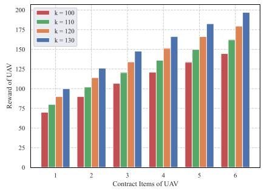

200 k = 100   
k = 110   
k = 120   
k = 130   
150   
100   
50   
0   
4 6   
Contract Items of UAV   
(a)   
k = 100   
20.0   
k = 110   
k = 120   
15.0   
12.5   
10.0   
5.0   
0.0   
2 3 4 5 6   
Contract Items of UAV   
(b)  
(b)  
Fig. 2. Analysis of the impact of varying values of parameter <sup>κ</sup> at the first layer. (a) Impact on rewards obtained by UAVs. (b) Impact on platform utility.

Parametric Analysis: We conducted a comparative analysis on certain parameters. Specifically, for the parameter <sup>κ</sup> in the first layer platform utility function, which represents the equivalent monetary value, we considered the effects on UAV rewards and platform benefits when <sup>κ</sup> is set to { <sup>, , ,</sup> }. As shown in Fig. 2(a), the optimal reward increases with an increase in $\kappa ,$ because a higher <sup>κ</sup> corresponds to increased benefits, leading to an increase in the optimal service slots and higher rewards. The comparative graph of the platform’s benefits, as illustrated in Fig. 2(b), clearly shows that the higher the monetary equivalent of the effort exerted by the UAVs, the greater the benefits to the platform. This indicates that the parameters formulated in (25) are consistent with the pattern prescribed by the platform utility function formula.

Next, we analyzed the performance of the incentive mechanism between UAVs and the platform at the first layer through Fig. 3. This is an incentive model using contract theory. It can be observed that for any type of UAV, the highest benefits are achieved when the UAV selects a contract item corresponding to its type. This demonstrates that the contract theoretical incentive scheme presented in this paper satisfies the incentive compatibility mentioned in Definition 6. Furthermore, when any type of UAV selects the item corresponding to its type, its benefit is greater than zero, indicating that our proposed incentive scheme meets the IR limitation mentioned in Definition 7. In Fig. 3, UAVs of lower types correspond to lower benefits because higher-type UAVs tend to offer longer service slots and thus receive higher rewards from the platform. Overall, Fig. 3 underscores the critical role of self-disclosure in contract design, ensuring that the decisions made by UAVs not only comply with individual rationality but also facilitate cooperation with the platform to achieve optimal benefits. This pattern is consistent with the principles of a contract-based incentive mechanism design.

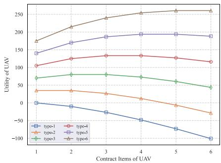  
Fig. 3. This is the benefit chart for different types of UAVs in the contract theory.

Comparison Experiment: In addition to our proposed contract-based incentive mechanism, we also compared it with discriminatory pricing, where the platform has complete information about the exact service slots available to UAVs, and uniform pricing, where the platform treats all types of UAVs equally under conditions of asymmetric information, by giving the same sponsorship coefficient. The comparison of the rewards given to UAVs, the benefits to UAVs, and the benefits to the platform are shown in Fig. 4. As depicted in Fig. 4(a), regardless of the pricing scheme, the rewards given by the platform generally show an increasing trend because higher-type UAVs offering longer service slots receive higher rewards, which aligns with objective reality. For the three pricing strategies, discriminatory pricing, which knows precisely the effort expended by UAVs, gives rewards that compensate exactly for the efforts without any excess, while uniform pricing shows a linear increase due to the same sponsorship factor for all. Contract pricing falls between these two, consistent with the nature of the contract-based incentive mechanism.

In Fig. 4(b), since discriminatory pricing rewards the exact effort expended, UAVs provide services without receiving any additional rewards, resulting in zero utility for the UAVs. Under the uniform pricing scheme adopted in this paper, which uses a higher sponsorship factor, the rewards given to UAVs are the highest as shown in Fig. 4(a), and correspondingly, the benefits to the UAVs are also the highest. Contract theory provides rewards based on the length of service slots under the constraints of IR and IC, and the utility of UAVs lies between discriminatory and uniform pricing, which aligns with the principles of contract design. In Fig. 4(c), since uniform pricing gives the most rewards to UAVs, the platform’s utility is correspondingly the lowest. Discriminatory pricing, which only pays for the effort of the UAVs, results in the least rewards and hence the highest platform utility, while contract-based outcomes lie between the two, consistent with the contrasts shown in Fig. 4(a) and (b). These three figures reflect the advantages of the contract theoretical incentive model in handling scenarios with asymmetric information, showing good performance compared to uniform and discriminatory pricing.

In Fig. 5, we compare the changes in platform benefits across different sensing tasks. Different tasks imply that the UAV assists sensing in different sub-areas, as well as the parameters of the transmission are also different leading to different transmission energy consumption. We analyzed the variation in platform utility under three different sensing tasks and found that for any given task, discriminatory pricing yields more benefits than the other two approaches because it does not offer excess rewards, making it the most beneficial for the platform. The benefits from uniform pricing are lower than the other two because the sponsorship factor is higher, leading the platform to tend to provide higher rewards, which is not favorable for platform utility. The incentive model according to contract theory, which considers both the platform and UAVs, proposes the most suitable pricing rules under the constraints of incentive compatibility and individual rationality, resulting in platform benefits that lie between the two, in accordance with the principles of contract theory.

2) Platform-User Layer: For the interaction between the second layer platform and user devices, we also divide our discussion into two parts. First, we comprehensively analyze the parameters representing the equivalent monetary value in the platform utility function at this tier and the parameters characterizing the concavity of the function depicting the frequency of updates. Additionally, we analyze the performance of incentive mechanisms according to contractual theory. Second, we compare the performance of contract-based incentive mechanisms with other approaches, highlighting their effectiveness across different tasks to showcase the favorable performance of multi-dimensional contracts. The specific results are as follows.

Parametric Analysis: In the second layer, where the platform interacts with users via UAVs, the platform’s utility function involves multiple parameters, which are collectively considered as shown in Fig. 6 and Fig. 7. We investigate the impact of parameter $c$ by observing its variation, which together with parameter <sup>d</sup>, determines the curvature of the quadratic function. This curvature reflects how marginal benefits change with task characteristics. The experimental results, as shown in Fig. 6, indicate that when parameter <sup>d</sup> is fixed, larger values of <sup>c</sup> lead to a higher growth trend in platform utility. This observation aligns with the characteristics of quadratic functions and demonstrates the utility variation pattern.

In Fig. 7, the y-axis represents the platform’s utility, and the x-axis represents a positive parameter that describes the concavity of the function depicting changes in the update frequency. We observe the parameter $\eta ,$ which translates the update frequency into equivalent utility in (29), we compare values of { <sup>, , ,</sup> }. As the value of $\eta$ increases, it translates into higher benefits, meaning that under the same conditions, the platform’s utility will be higher. Thus, the utility line for $\eta = 2 5$ is located above those of the other parameter values, aligning with objective laws. The parameter $d$ describes the degree of concavity of the function during the update frequency transformation, capturing the property of diminishing marginal returns. It is evident that higher values of <sup>d</sup> should correspond to lower benefits, and the graph generally shows a downward trend, reflecting this characteristic. Different <sup>η</sup> values all show a decreasing trend with an increase in <sup>d</sup>, consistent with the properties of the function.

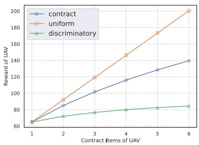  
(a)

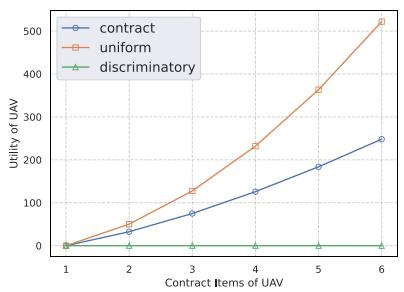  
(b)

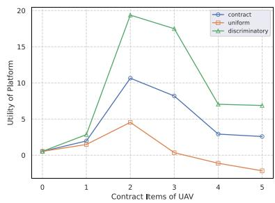  
(c)

Fig. 4. Comparison between contract incentive mechanism and other schemes. (a) Comparison of rewards obtained by UAVs. (b) Comparison of UAV benefits. (c) Comparison of platform benefits.  
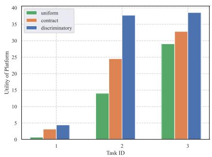  
Fig. 5. This comparison chart of platform benefits for different sensing tasks at the first layer.

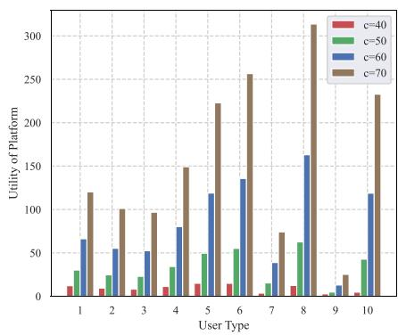

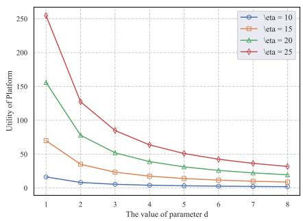  
Fig. 6. Analysis of the impact on platform utility accounting for the variation of parameters <sup>c</sup> at the second layer.

Second, through Fig. 8, we analyze the performance of the incentive mechanism between UAVs and user devices at the second layer. Similar to the first layer, this is a multi-dimensional contract-based incentive mechanism. It is observable that for any type of user device, the optimal benefits are obtained when they select contract items that match their type, indicating that the contract theoretical incentive model at this layer satisfies the IC limitation mentioned in Definition 9. Additionally, when a high-cost user chooses a contract designed for a low-cost type, the reward may not compensate for the higher task cost, resulting in a negative utility. When any type of user chooses an item corresponding to its type, its benefit is greater than zero. This shows that our proposed incentive scheme meets the IR limitation mentioned in Definition 10. In Fig. 8, lower-type users have higher corresponding benefits, with the curve for type 1 significantly above the benefits of other types. This is because lower types represent lower marginal costs, and correspondingly, users are more likely to provide higher data update frequencies, resulting in higher rewards from the platform and greater benefits for user devices. Fig. 8 reflects that under the contract incentive mechanism, decisions made by user devices not only comply with individual rationality but also facilitate cooperation with the platform to achieve optimal benefits, consistent with the design based on the contract incentive mechanism.

Fig. 7. Analysis of the impact on platform benefits accounting for the variation of parameters <sup>η</sup> and <sup>d</sup> at the second layer.  
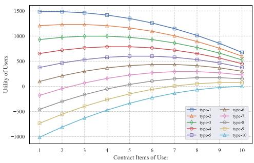  
Fig. 8. This is the benefit chart for different types of users in the contract theory.

Comparison Experiment: At the second level, we also compared the contract pricing with uniform pricing and discriminatory pricing. We examined the rewards given to user devices, the benefits to users, and the benefits users bring to the platform, as shown in Fig. 9. In Fig. 9(a), rewards similarly decrease with type since uniform pricing considers the same sponsorship factor. Discriminatory pricing pays rewards based on the effort expended, without giving excess rewards; thus, as type increases with higher costs and greater effort, discriminatory pricing rewards also increase, aligning with objective reality. The contract pricing remains between uniform and discriminatory pricing. With contract pricing, as the type increases with higher costs corresponding to lower data update frequencies, the rewards decrease, consistent with the nature of the contract incentive mechanism.

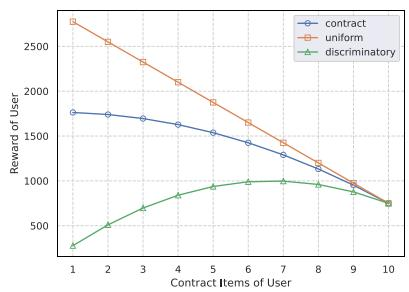  
(a)

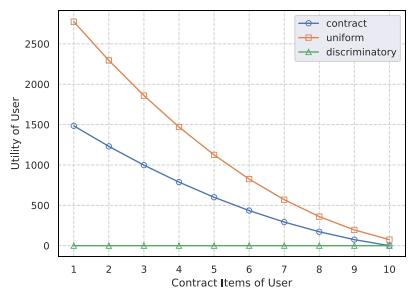  
(b)

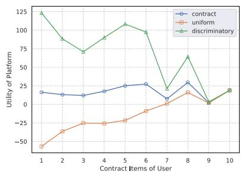  
(c)

Fig. 9. Comparison between contract incentive mechanism and other schemes. (a) Comparison of rewards obtained by users. (b) Comparison of user benefits (c) Comparison of platform benefits.  
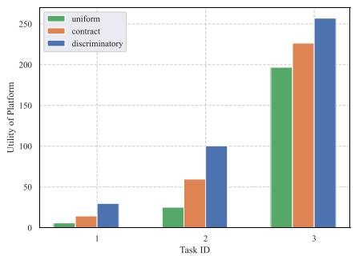  
Fig. 10. This comparison chart of platform benefits for different sensing tasks at the second layer.

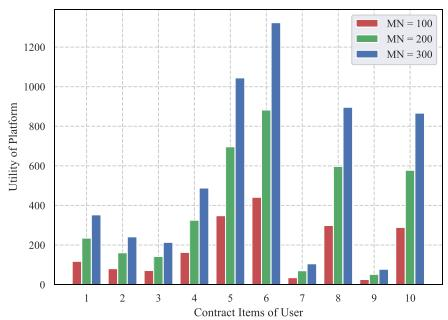

In Fig. 9(b), since discriminatory pricing rewards exactly the amount of effort expended, user devices provide sensor parameters but do not receive any additional rewards, resulting in zero utility for the users. Conversely, with its higher sponsorship factor, uniform pricing gives the highest rewards to users as shown in Fig. 9(a), and correspondingly, users’ benefits are also the highest. Under the constraints of IR and IC, contract theory offers rewards with user benefits that lie between discriminatory and uniform pricing, conforming to the principles of contract design. In Fig. 9(c), because uniform pricing provides the most rewards to user devices, the platform’s benefits are correspondingly the lowest. Discriminatory pricing pays only for the effort expended by users, thus giving the least rewards and resulting in the highest benefits for the platform, while contract-based outcomes are between the two, consistent with the contrasts shown in Fig. 9(a) and (b). These three figures also reflect the advantages of the multi-dimensional contract theory incentive mechanism in dealing with scenarios of asymmetric information, showing good performance compared to uniform and discriminatory pricing.

In Fig. 10, we compare the changes in platform benefits across different sensing tasks. We analyzed how the completion of sensing tasks by users impacts the benefits to the platform under three different tasks. We find that for any given sensing task, discriminatory pricing does not provide excess rewards and yields greater benefits than the other two approaches, offering the highest benefit to the platform. The benefits from uniform pricing are lower than those from the other two approaches, as the platform tends to provide higher rewards. The multi-dimensional contract theoretical incentive model, which considers both the platform and user devices and proposes the most suitable pricing rules under the constraints of incentive compatibility and individual rationality, results in platform benefits between the two, in line with the advantages of contract theory pricing. And in Fig. 11, within the allowable range of data processing capacity, the more users that participate in the sensing task, the greater the amount of sensing data provided, thereby significantly improving platform benefit, regardless of user type.

Fig. 11. Comparison of platform utility under different numbers of users.  
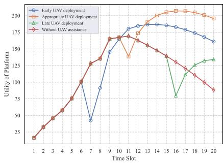  
Fig. 12. Comparison of platform utility at different UAV deployment times.

As shown in Fig. 12, we compare the impact of different UAV deployment times on platform utility when the number of users gradually increases, causing data congestion and AoI to rise beyond a given threshold. The results show that without UAV assistance, the platform utility initially grows rapidly due to active user participation. However, once the data processing capacity is reached, the data congestion causes a continual decrease in data freshness, significantly reducing the platform utility. When the UAVs are deployed to assist communication, data congestion can be effectively alleviated. However, deploying UAVs early helps reduce congestion but may lead to inefficient resource use, lowering the overall utility. On the other hand, a late deploy significantly harms data freshness and task quality. Comparatively, deploying UAVs as the AoI approaches the threshold achieves a good balance between the utility and cost, thus improving the platform performance.

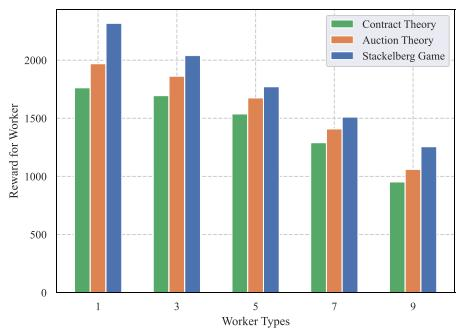

(a)  
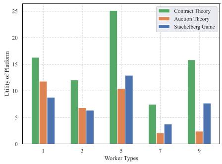  
(b)  
Fig. 13. (a) Comparison of rewards for worker under different incentive mechanisms. (b) Comparison of platform utility under different incentive mechanisms.

To further evaluate our incentive mechanism, we compare it with the following two other incentives:

\- Reverse Auction: Inspired by [36], this mechanism dynamically adjusts task frequencies and rewards based on the marginal costs of workers, who compete to participate in tasks through bidding.

\- Stackelberg Game: Based on [37], this mechanism can be applied to our model. The platform acts as the leader and designs the reward scheme, while workers act as followers, selecting optimal participation frequency based on the utility functions.

Fig. 13(a) illustrates that for various types of users, the rewards provided by the contract-based mechanism are optimal compared to the other two mechanisms. Similarly, Fig. 13(b) shows that the contract-based mechanism yields the highest platform utility across different user types. The Stackelberg game considers that worker types and utility functions are known. However, under incomplete information, the platform may struggle to predict workers’ optimal choices accurately. This can lead to deviations from the expected equilibrium and impair the effectiveness of the incentives. In the reverse auction mechanism, workers’ marginal costs are considered to be revealed through bidding. Yet, under incomplete information, workers may deliberately hide true costs to obtain higher rewards.

In contrast, contract theory designs incentive-compatible and participation-constraining mechanisms that guide workers to voluntarily reveal their true types. This approach ensures both worker utility and platform utility are maximized. Consequently, contract theory’s robustness and flexibility in handling incomplete information make it superior for balancing platform benefits and worker utilities, particularly in scenarios with information asymmetry.

## V. RELATED WORK

This study primarily reviews relevant literature from three aspects: AoI in MCS, the role of UAVs in assisting MCS, and the incentive mechanisms.

## A. Age of Information

AoI is a metric used in communication systems to measure the freshness or timeliness of data. AoI has been widely applied in fields related to MEC and IoT, and it also serves as an important metric in MCS. One of the objectives of our research is to design an effective method to improve the AoI of sensing data, thereby bringing higher utility to the platform. Numerous studies have investigated issues related to AoI in various domains, Zhou et al. [38] advanced the understanding of content freshness and latency in telecommunication networks through a pioneering contract theory-based pricing model. Their framework, rooted in the dynamics of AoI and service latency, crafts a nuanced monetization strategy for operator-managed content platforms. This work not only enriches the AoI discourse but also sets a precedent for operator-centric content delivery optimization. Yang et al. [39] introduced a mixed game-based AoI optimization framework leveraging edge computing and AI-powered diagnostic bots to enhance the COVID-19 pandemic response. This novel approach aims to optimize AoI for more timely and accurate health monitoring, which is crucial for controlling epidemic spread. Wang et al. [40] proposed a novel metric, the Age of Changed Information (AoCI), to quantify information freshness in IoT systems. Their work introduces an age-based utility that captures both the temporal freshness and content variability of status updates.

AoI also plays a crucial role in mobile sensing. By monitoring AoI, it is possible to understand the delays in data collection and transmission, thus assessing the real-time nature and availability of data. Cheng et al. [15] introduced a freshness-aware incentive mechanism tailored for MCS within a budget-constrained framework. By innovatively employing auction-based approaches, the mechanism adeptly balances the recruitment of mobile users and the freshness of information, defined through the lens of AoI, against financial constraints. Yang et al. [16] utilized Non-Orthogonal Multiple Access (NOMA) and identity-based encryption, and they develop a sophisticated analysis framework leveraging stochastic geometry to assess the AoI performance in MCS for privacy preservation. Gao et al. [17] addressed the dynamic task pricing challenge in MCS networks by proposing an Age-of-Information-based Queueing Game Scheme. This innovative approach considers the temporal dynamics of task issuance and the completion process within a crowded MCS environment, effectively integrating the AoI metric to guide task pricing strategies. Dai et al. [18] presented a centralized deep reinforcement learning (DRL) strategy, i.e., DRL-freshMCS, to orchestrate mobile agent movements and sensor node scheduling, to minimize both AoI and energy consumption, this captures the trade-off between information freshness and energy efficiency in MCS tasks.

## B. UAV-Assisted Mobile Crowdsensing

UAVs are a promising method for auxiliary communication, effectively enhancing the low-altitude economy. The integration of UAVs with MEC has been extensively studied [41], and UAV-assisted MCS has also become a promising research field in recent years. One of the research problems we address is how to effectively incentivize UAVs to provide support for sensing tasks on behalf of the platform. Rottondi et al. [42] proposed an innovative approach for scheduling emergency tasks using multiservice UAVs in post-disaster scenarios, emphasizing the efficiency of employing UAVs for simultaneous multiple tasks support over common operational areas. Their study demonstrates significant improvements in resource utilization and emergency response times by optimizing UAV task assignments. In their investigation on energy-efficient resource allocation and trajectory optimization for UAV-assisted mobile edge computing, Li et al. [43] proposed a comprehensive framework to minimize UAV energy consumption while optimizing computation offloading. By integrating UAV trajectory planning with user transmit power and computation load allocation, the study addresses the challenge of nonconvex fractional programming through the application of the Dinkelbach algorithm. Zhao et al. [44] delved into the realm of UAV-assisted mobile edge computing by proposing a multi-agent deep reinforcement learning framework to optimize task offloading. Their work meticulously addresses the challenge of minimizing cumulative execution delays and energy consumption by concurrently orchestrating UAV trajectories, task allocations, and communication resource management.

Similarly, UAVs have become essential tools in the field of MCS. They offer unique capabilities for data collection and analysis in various scenarios, contributing to the advancement of mobile sensing technologies. Gao et al. [14] introduced an innovative UAV-assisted multi-task allocation method for MCS in smart city applications, addressing the challenge of inaccessible target areas due to obstacles like traffic jams. Their approach enhances sensing coverage and data quality by strategically integrating UAVs with human participants. UMA optimizes task allocation and UAV trajectory planning, accounting for participant locations and rarely visited points of interest (PoIs). Wang et al. [45] introduced a UAV-assisted truth discovery approach paired with an incentive mechanism design for enhancing MCS security and data accuracy. Their method employs UAVs to verify the reliability of data collected from mobile devices, distinguishing between genuine and malicious contributions. By evaluating data quality and updating participant trust levels, the approach not only mitigates the impact of falsified data but also optimizes task allocation and reward mechanisms.

Further research integrating UAVs with artificial intelligence in specific fields holds great promise. Wang et al. [46] introduced an innovative framework for UCS that integrates federated learning (FL) with fair incentives and robust aggregation mechanisms to address the challenges of privacy preservation and efficient resource allocation. Their approach leverages edge computing within 5 G heterogeneous networks to enhance data rate and reduce latency, facilitating proximal FL services. Wei et al. [47] addressed the challenge of optimizing path planning in UCS systems under the constraints of incomplete environmental observations. Their DRL-based path-planning algorithm (DRL-PP) significantly improves data collection efficiency, outperforming state-of-the-art methods in terms of speed, energy efficiency, and task completion rates. This work not only advances the application of DRL in UAV crowdsensing but also contributes to the broader field of UAV path optimization in dynamic and partially observable environments. Wang et al. [30] proposed a decentralized multi-agent deep reinforcement learning framework, DRL-UCS(AoIth), to optimize trajectory planning for UCS with an emphasis on minimizing the Age of Information (AoI) within a specified threshold. By integrating a transformerbased architecture, the framework can balance data collection efficiency and AoI threshold compliance across multiple UAVs, utilizing an adaptive intrinsic reward mechanism for enhanced temporal modeling.

## C. Incentive Mechanism

In the UCS, both UAVs and users are self-interested, independent entities. Without an effective incentive mechanism, it is difficult to motivate them to complete sensing tasks for the platform. Zhao et al. [19] presented PACE, a novel privacypreserving and quality-aware incentive mechanism for MCS, addressing key challenges in participant motivation and data integrity. Their scheme integrates a dynamic incentive model that aligns rewards with data quality within a budget constraint, and PACE effectively mitigates malicious participant behaviors, ensuring the collection of high-quality, reliable data for MCS applications. Hu, Lin, and Chang. [20] unveiled a game-theoretic incentive mechanism for MCS, named Incentive-G, which harnesses a two-stage Stackelberg game to enhance data reliability and quality while encouraging user participation. Ji et al. [21] addressed the dynamic and evolving landscape of MCS by introducing two novel online incentive mechanisms tailored for both socially aware and socially unaware scenarios. Their work not only contributes to the MCS literature by addressing the limitations of existing incentive models but also highlights the potential of integrating social awareness and game-theoretical approaches in optimizing crowdsensing ecosystems. However, incentive methods such as Stackelberg games and auction theory are mostly iterative mechanisms that require long convergence times and significant information exchange among participants.

Contract theory and its self-revealing property are more suitable for the scenario information asymmetry scenarios. Contractual theory is likewise well used in MCS [22], [48]. Li et al. [22] proposed an innovative incentive mechanism tailored for federated learning in the domain of health crowdsensing, utilizing contract theory to address the critical challenge of motivating data holders to participate with high-quality data and computational resources. The proposed incentive mechanism not only accelerates the convergence of federated learning models but also fortifies against malicious behaviors such as free-riding and collusive attacks, showcasing a significant advancement in securing and incentivizing participant engagement in federated learning tasks. Dai et al. [48] proposed a trust-driven contract incentive scheme tailored for MCS networks to ensure the quality of sensing services while encouraging user participation. The contract models are meticulously designed to satisfy individual rationality and incentive compatibility, demonstrating significant enhancements in service reliability and participant motivation. One of the problems we address is how to design an efficient incentive mechanism that integrates the characteristics of UAVs and users to help improve the platform’s sensing utility. Through extensive simulations, their approach shows superior performance in improving the quality of sensing services and maximizing utilities compared to conventional schemes, making it a notable contribution to the MCS domain.

## VI. CONCLUSION

In this paper, we have investigated the design of attractive incentive mechanisms in UCS that consider data AoI and platform benefits. We proposed an optimal contract design under the problem of information asymmetry. We utilized the UAVs as UBS to assist communication in exceptional circumstances such as network congestion, ensuring AoI of data. We proposed a hierarchical model of the UCS scenario, where the interaction between the platform and UAVs was the first layer, and we employed the onedimensional contract according to the service slots of the UAVs. The interaction between the platform and user devices was considered the second layer, and the multi-dimensional contract was designed according to the sensing and computing costs of user devices. Next, we proposed contract terms that maximized platform benefits under constraints of individual rationality and incentive compatibility. Finally, numerical results demonstrated that our method can enhance the platform’s benefits. In future work, we will conduct further research on improving data freshness and UAV deployment in UAV-assisted mobile crowdsensing scenarios. We will also consider additional factors affecting UAV transmission and explore methods to differentiate contract types for achieving more efficient MCS task completion.

## REFERENCES

[1] D. Suhag and V. Jha, “A comprehensive survey on mobile crowdsensing systems,” J. Syst. Archit., vol. 142, 2023, Art. no. 102952.

[2] M. Xu, F. Qian, M. Zhu, F. Huang, S. Pushp, and X. Liu, “DeepWear: Adaptive local offloading for on-wearable deep learning,” IEEE Trans. Mobile Comput., vol. 19, no. 2, pp. 314–330, Feb. 2020.

[3] A. Capponi, C. Fiandrino, B. Kantarci, L. Foschini, D. Kliazovich, and P. Bouvry, “A survey on mobile crowdsensing systems: Challenges, solutions, and opportunities,” IEEE Commun. Surv. Tut., vol. 21, no. 3, pp. 2419–2465, Third Quarter, 2019.

[4] B. Zhao, W. Guo, B. Tian, C. Qiao, Q. Pei, and X. Liu, “RATE: Privacypreserving task assignment with bi-objective optimization for mobile crowdsensing,” IEEE Trans. Mobile Comput., vol. 23, no. 12, pp. 13851– 13865, Dec. 2024.

[5] C. Xu et al., “The case for FPGA-based edge computing,” IEEE Trans. Mobile Comput., vol. 21, no. 7, pp. 2610–2619, Jul. 2022.

[6] J. Huang, F. Liu, and J. Zhang, “Multi-dimensional QoS evaluation and optimization of mobile edge computing for IoT: A survey,” Chin. J. Electron., vol. 33, no. 4, pp. 859–874, 2024.

[7] Z. Wang, Y. Huang, X. Wang, J. Ren, Q. Wang, and L. Wu, “SocialRecruiter: Dynamic incentive mechanism for mobile crowdsourcing worker recruitment with social networks,” IEEE Trans. Mobile Comput., vol. 20, no. 5, pp. 2055–2066, May 2021.

[8] Y. Zhang, C. Ji, N. Qiao, J. Ren, Y. Zhang, and Y. Yang, “Distributed pricing and bandwidth allocation in crowdsourced wireless community networks,” IEEE Trans. Mobile Comput., vol. 22, no. 9, pp. 5170–5183, Sep. 2023.

[9] Y. Chen, J. Xu, Y. Wu, J. Gao, and L. Zhao, “Dynamic task offloading and resource allocation for NOMA-aided mobile edge computing: An energy efficient design,” IEEE Trans. Serv. Comput., vol. 17, no. 4, pp. 1492–1503, Jul./Aug. 2024.

[10] B. Li, R. Yang, L. Liu, J. Wang, N. Zhang, and M. Dong, “Robust computation offloading and trajectory optimization for multi-UAV-assisted MEC: A multiagent DRL approach,” IEEE Internet Things J., vol. 11, no. 3, pp. 4775–4786, Feb. 2024.

[11] S. Li et al., “Two-hop packet scheduling, resource allocation, and UAV trajectory design for internet of remote things in air–ground integrated network,” IEEE Internet Things J., vol. 11, no. 15, pp. 26160–26172, Aug. 2024.

[12] N. Huang, C. Dou, Y. Wu, L. Qian, B. Lin, and H. Zhou, “Unmannedaerial-vehicle-aided integrated sensing and computation with mobile-edge computing,” IEEE Internet Things J., vol. 10, no. 19, pp. 16830–16844, Oct. 2023.

[13] Y. Chen, J. Zhao, Y. Wu, J. Huang, and X. S. Shen, “Multi-user task offloading in UAV-assisted leo satellite edge computing: A game-theoretic approach,” IEEE Trans. Mobile Comput., vol. 24, no. 1, pp. 363–378, Jan. 2025.

[14] H. Gao, J. Feng, Y. Xiao, B. Zhang, and W. Wang, “A UAV-assisted multitask allocation method for mobile crowd sensing,” IEEE Trans. Mobile Comput., vol. 22, no. 7, pp. 3790–3804, Jul. 2023.

[15] Y. Cheng, X. Wang, P. Zhou, X. Zhang, and W. Wu, “Freshness-aware incentive mechanism for mobile crowdsensing with budget constraint,” IEEE Trans. Serv. Comput., vol. 16, no. 6, pp. 4248–4260, Nov./Dec. 2023.

[16] Y. Yang et al., “Stochastic geometry-based age of information performance analysis for privacy preservation-oriented mobile crowdsensing,” IEEE Trans. Veh. Technol., vol. 72, no. 7, pp. 9527–9541, Jul. 2023.

[17] H. Gao et al., “Dynamic task pricing in mobile crowdsensing: An ageof-information-based queueing game scheme,” IEEE Internet Things J., vol. 9, no. 21, pp. 21278–21291, Nov. 2022.

[18] Z. Dai, H. Wang, C. H. Liu, R. Han, J. Tang, and G. Wang, “Mobile crowdsensing for data freshness: A deep reinforcement learning approach,” in Proc. IEEE Conf. Comput. Commun., 2021, pp. 1–10.

[19] B. Zhao, S. Tang, X. Liu, and X. Zhang, “PACE: Privacy-preserving and quality-aware incentive mechanism for mobile crowdsensing,” IEEE Trans. Mobile Comput., vol. 20, no. 5, pp. 1924–1939, May 2021.

[20] C.-L. Hu, K.-Y. Lin, and C. K. Chang, “Incentive mechanism for mobile crowdsensing with two-stage Stackelberg game,” IEEE Trans. Serv. Comput., vol. 16, no. 3, pp. 1904–1918, May/Jun. 2023.

[21] G. Ji, B. Zhang, G. Zhang, and C. Li, “Online incentive mechanisms for socially-aware and socially-unaware mobile crowdsensing,” IEEE Trans. Mobile Comput., vol. 23, no. 5, pp. 6227–6242, May 2024.

[22] L. Li, X. Yu, X. Cai, X. He, and Y. Liu, “Contract-theory-based incentive mechanism for federated learning in health crowdsensing,” IEEE Internet Things J., vol. 10, no. 5, pp. 4475–4489, Mar. 2023.

[23] J. Huang et al., “Incentive mechanism design of federated learning for recommendation systems in MEC,” IEEE Trans. Consum. Electron., vol. 70, no. 1, pp. 2596–2607, Feb. 2024.

[24] X. Yan, W. W. Y. Ng, B. Zeng, B. Zhao, F. Luo, and Y. Gao, “P2SIM: Privacy-preserving and source-reliable incentive mechanism for mobile crowdsensing,” IEEE Internet Things J., vol. 9, no. 24, pp. 25424–25437, Dec. 2022.

[25] Y. Wu, Y. Suo, F. Yu, and Y. Liu, “A utility-based subcontract method for sensing task in mobile crowd sensing,” IEEE Trans. Ind. Informat., vol. 18, no. 2, pp. 1210–1219, Feb. 2022.

[26] T. Nguyen Dang, A. Manzoor, Y. K. Tun, S. M. A. Kazmi, Z. Han, and C. S. Hong, “A contract-theory-based incentive mechanism for UAV-enabled VR-based services in 5G and beyond,” IEEE Internet Things J., vol. 10, no. 18, pp. 16465–16479, Sep. 2023.

[27] L. Liu, X. Yuan, D. Chen, N. Zhang, H. Sun, and A. Taherkordi, “Multi-user dynamic computation offloading and resource allocation in 5G MEC heterogeneous networks with static and dynamic subchannels,” IEEE Trans. Veh. Technol., vol. 72, no. 11, pp. 14924–14938, Nov. 2023.

[28] G. He, C. Li, M. Song, Y. Shu, C. Lu, and Y. Luo, “A hierarchical federated learning incentive mechanism in UAV-assisted edge computing environment,” Ad Hoc Netw., vol. 149, 2023, Art. no. 103249.

[29] X. Li, G. Feng, Y. Liu, S. Qin, and Z. Zhang, “Joint sensing, communication, and computation in mobile crowdsensing enabled edge networks,” IEEE Trans. Wireless Commun., vol. 22, no. 4, pp. 2818–2832, Apr. 2023.

[30] H. Wang, C. H. Liu, H. Yang, G. Wang, and K. K. Leung, “Ensuring threshold AOI for UAV-assisted mobile crowdsensing by multi-agent deep reinforcement learning with transformer,” IEEE/ACM Trans. Netw., vol. 32, no. 1, pp. 566–581, Feb. 2024.

[31] W. Xu et al., “Minimizing the deployment cost of UAVs for delay-sensitive data collection in IoT networks,” IEEE/ACM Trans. Netw., vol. 30, no. 2, pp. 812–825, Apr. 2022.

[32] Y. Zheng, L. Zou, W. Zhang, J. Yang, L. Yang, and Z. Lin, “Contract-based cooperative computation and communication resources sharing in mobile edge computing,” J. Grid Comput., vol. 21, no. 1, 2023, Art. no. 14.

[33] Y. Xu, M. Xiao, Y. Zhu, J. Wu, S. Zhang, and J. Zhou, “AoI-guaranteed incentive mechanism for mobile crowdsensing with freshness concerns,” IEEE Trans. Mobile Comput., vol. 23, no. 5, pp. 4107–4125, May 2024.

[34] J. Nie, J. Luo, Z. Xiong, D. Niyato, P. Wang, and H. V. Poor, “A multileader multi-follower game-based analysis for incentive mechanisms in socially-aware mobile crowdsensing,” IEEE Trans. Wireless Commun., vol. 20, no. 3, pp. 1457–1471, Mar. 2021.

[35] M. Wu, D. Ye, J. Ding, Y. Guo, R. Yu, and M. Pan, “Incentivizing differentially private federated learning: A multidimensional contract approach,” IEEE Internet Things J., vol. 8, no. 13, pp. 10639–10651, Jul. 2021.

[36] X. Chen, L. Zhang, Y. Pang, B. Lin, and Y. Fang, “Timeliness-aware incentive mechanism for vehicular crowdsourcing in smart cities,” IEEE Trans. Mobile Comput., vol. 21, no. 9, pp. 3373–3387, Sep. 2022.

[37] M. Li, M. Ma, L. Wang, and B. Yang, “Quality-improved and delay-aware incentive mechanism for mobile crowdsensing with social concerns: A Stackelberg game approach,” IEEE Trans. Computat. Social Syst., vol. 11, no. 6, pp. 7618–7633, Dec. 2024.

[38] X. Zhou, W. Wang, N. U. Hassan, C. Yuen, and D. Niyato, “Towards small AoI and low latency via operator content platform: A contract theory-based pricing,” IEEE Trans. Commun., vol. 70, no. 1, pp. 366–378, Jan. 2022.

[39] Y. Yang et al., “Mixed game-based AoI optimization for combating COVID-19 with AI bots,” IEEE J. Sel. Areas Commun., vol. 40, no. 11, pp. 3122–3138, Nov. 2022.

[40] X. Wang, W. Lin, C. Xu, X. Sun, and X. Chen, “Age of changed information: Content-aware status updating in the Internet of Things,” IEEE Trans. Commun., vol. 70, no. 1, pp. 578–591, Jan. 2022.

[41] Y. Chen, K. Li, Y. Wu, J. Huang, and L. Zhao, “Energy efficient task offloading and resource allocation in air-ground integrated MEC systems: A distributed online approach,” IEEE Trans. Mobile Comput., vol. 23, no. 8, pp. 8129–8142, Aug. 2024.

[42] C. Rottondi, F. Malandrino, A. Bianco, C. F. Chiasserini, and I. Stavrakakis, “Scheduling of emergency tasks for multiservice UAVs in post-disaster scenarios,” Comput. Netw., vol. 184, 2021, Art. no. 107644.

[43] M. Li, N. Cheng, J. Gao, Y. Wang, L. Zhao, and X. Shen, “Energy-efficient UAV-assisted mobile edge computing: Resource allocation and trajectory optimization,” IEEE Trans. Veh. Technol., vol. 69, no. 3, pp. 3424–3438, Mar. 2020.

[44] N. Zhao, Z. Ye, Y. Pei, Y.-C. Liang, and D. Niyato, “Multi-agent deep reinforcement learning for task offloading in UAV-assisted mobile edge computing,” IEEE Trans. Wireless Commun., vol. 21, no. 9, pp. 6949–6960, Sep. 2022.

[45] P. Wang, Z. Li, B. Guo, S. Long, S. Guo, and J. Cao, “A UAV-assisted truth discovery approach with incentive mechanism design in mobile crowd sensing,” IEEE/ACM Trans. Netw., vol. 32, no. 2, pp. 1738–1752, Apr. 2024.

[46] Y. Wang, Z. Su, T. H. Luan, R. Li, and K. Zhang, “Federated learning with fair incentives and robust aggregation for UAV-aided crowdsensing,” IEEE Trans. Netw. Sci. Eng., vol. 9, no. 5, pp. 3179–3196, Sep./Oct. 2022.

[47] K. Wei et al., “High-performance UAV crowdsensing: A deep reinforcement learning approach,” IEEE Internet Things J., vol. 9, no. 19, pp. 18487–18499, Oct. 2022.

[48] M. Dai, Z. Su, Q. Xu, Y. Wang, and N. Lu, “A trust-driven contract incentive scheme for mobile crowd-sensing networks,” IEEE Trans. Veh. Technol., vol. 71, no. 2, pp. 1794–1806, Feb. 2022.


Yuran Guo is currently working toward the MEng degree in computer science and technology with the Beijing Information Science and Technology University, China. Her current research interests include edge computing, Internet of Things, mobile crowdsensing, game theory, and incentive mechanism design.


Ying Chen (Senior Member, IEEE) received the PhD degree in computer science and technology from Tsinghua University, Beijing, China, in 2017. She was a joint PhD student with the University of Waterloo, Waterloo, ON, Canada from 2016 to 2017. She is a professor with the Computer School, Beijing Information Science and Technology University, Beijing. Her current research interests include Internet of Things, mobile edge computing, wireless networks and communications, machine learning, etc. She is the recipient of the Best Paper Award with IEEE

SmartIoT 2019, the 2016 Google PhD Fellowship Award, and the 2014 Google Anita Borg Award, 2022 Outstanding Contribution Award in 18th EAI CollaborateCom, respectively. She was the leading guest editor of JCC, TPC member of IEEE HPCC, and PC member of IEEE Cloud, CollaborateCom, IEEE CPSCom, CSS, etc. She is also the reviewer of several journals such as IEEE Wireless Communications, IEEE TDSC, IEEE JIoT, IEEE TCC, and IEEE TSC.


Hongtao Li is currently working toward the MEng degree in computer science and technology with the Beijing Information Science and Technology University, China. His current research interests include edge computing, Internet of Things, game theory and reinforcement learning.


Yuan Wu (Senior Member, IEEE) is currently a full professor with the State Key Laboratory of Internet of Things for Smart City, University of Macau, Macau SAR, China, and also with the Department of Computer and Information Science, University of Macau. His research interests include resource management for wireless networks, mobile edge computing and edge intelligence, and integrated sensing and communications. He was the recipient of the Best Paper Award from the IEEE ICC’2016, IEEE TCGCC’2017, IWCMC’2021, and

IEEE WCNC’2023. He is on the editorial board of IEEE TVT, IEEE TNSE, and IEEE JIoT. He is the distinguished lecturer of IEEE VTS.


Jiwei Huang (Senior Member, IEEE) received the BEng and PhD degrees in computer science and technology from Tsinghua University, in 2009 and 2014, respectively. He was a visiting scholar with the Georgia Institute of Technology. Currently, he is a professor and associate dean with the College of Artificial Intelligence, China University of Petroleum (Beijing), a member of the Hainan Institute of China University of Petroleum (Beijing), and the director with the Beijing Key Laboratory of Petroleum Data Mining. His research areas include services comput-

ing, Internet of Things, and edge computing. He has published one book and more than 70 papers in international journals and conference proceedings, including IEEE TMC, IEEE TSC, IEEE TCC, IEEE TVT, ACM SIGMETRICS, IEEE ICWS, and IEEE SCC. He currently serves on the editorial boards of the CJE and Scientific Programming.