# AoI-Aware Joint Sampling-Buffering-Routing Optimization for Autonomous UAV Swarms via a MARL approach

Haoxu Wu, Graduate Student Member, IEEE, Shaohua Wu, Member, IEEE, Aimin Li, Member, IEEE, Siqi Meng, and Qinyu Zhang, Senior Member, IEEE

Abstract—Real-time monitoring in infrastructure-constrained environments presents critical challenges for time-sensitive applications. Conventional approaches relying on terrestrial sensors are impractical in remote regions, whereas UAV swarms operating as Flying Ad-hoc Networks (FANETs) offer autonomy but still depend on pre-deployed ground infrastructure. To overcome this limitation, we adopt a Leader–Follower UAV swarm architecture in which Follower UAVs serve dual roles as sensing platforms and communication relays, enabling a fully autonomous aerial monitoring system with enhanced adaptability. The effectiveness of real-time monitoring hinges on data freshness, rendering the optimization of information timeliness essential. To address this, we introduce the Adaptive Age-aware Sampling–Buffering–Routing (AASBR) framework to minimize Age of Information (AoI) through coordinated sampling, buffering, and routing. We model this problem as a Decentralized Partially Observable Markov Decision Process (Dec-POMDP) and propose a novel multi-agent reinforcement learning (MARL) approach named Curriculum-Orchestrated Multi-head Multi-Agent Proximal Policy Optimization (COMH-MAPPO) algorithm. COMH-MAPPO employs a multi-head policy architecture combined with curriculum learning to progressively address coupled decision-making challenges under partial observability. Simulation results demonstrate that COMH-MAPPO achieves over 48% and 15% improvement in average AoI compared with MARL and ablation benchmarks, respectively, while also outperforming benchmarks across key network metrics including transmission latency, packet delivery ratio, and throughput.

Index Terms—Age of information (AoI), Flying Ad-hoc Networks (FANETs), multi-agent reinforcement learning, curriculum learning.

## I. INTRODUCTION

R EAL-TIME information monitoring in environments remote maritime, complex terrains, or disaster-stricken areas, is vital for emerging 6G-enabled applications in battlefield situational awareness, emergency response, and geoscientific exploration [1], [2]. Traditional satellite remote sensing methods are fundamentally limited by long revisit cycles, low spatial resolution, and cloud occlusion [3], rendering them inadequate for the growing demand of time-sensitive missions. In recent years, Unmanned Aerial Vehicles (UAVs) have emerged as a transformative technology, directly addressing these constraints through their rapid deployment capability, on-demand high-resolution imaging, and weather-independent operation [4]. Furthermore, when UAVs are organized into Flying Adhoc Networks (FANETs) [5], UAV swarms enable coordinated operations that surpass individual platform capabilities. They can support sophisticated applications including post-disaster search and rescue [6], target tracking [7], [8] and synchronized data collection [9], thereby providing a promising solution for real-time information monitoring applications.

However, within prevailing research, UAVs are typically regarded as the roles of data relays or aerial base stations, primarily responsible for collecting data from pre-deployed terrestrial Wireless Sensor Networks (WSNs) [10]–[13]. While this air-to-ground cooperative model has proven effective in many scenarios, it suffers from a fundamental limitation: in inaccessible remote regions, vast oceans, or sudden disaster sites where human access is limited, the prior deployment and maintenance of a terrestrial sensor network are often infeasible [14]–[16]. Consequently, designing a fully autonomous information monitoring system that operates without reliance on ground-based infrastructure has become a pressing and frontier scientific problem [17].

To overcome the limitations of infrastructure-dependent monitoring, we adopt a self-contained aerial monitoring architecture. Benefiting from advances in UAV payload capacity and communication technologies [18], coupled with progress in hardware miniaturization and energy storage, modern UAV platforms can readily satisfy the Size, Weight, and Power (SWAP) requirements for multi-functional operations [19]. UAVs are thus endowed with dual roles of a mobile sensing platform and an opportunistic communication relay, thereby transforming the traditional single-purpose deployment paradigm. We implement this concept through a Leader-Follower swarm architecture [20]. In this architecture, the Leader UAV serves as a high-altitude aerial base station and the primary data collector [21], while each Follower UAV not only integrates heterogeneous sensors (e.g., highdefinition cameras, infrared detectors, gas sensors) [22], but also maintains communication relay capabilities. This design creates a fully autonomous aerial monitoring system that operates independently of ground-based infrastructure, from the information source (sensor sampling at the Follower node)

to the information sink (data collection at the Leader node). Such an “all-in-the-air” architecture significantly enhances the deployment flexibility and environmental adaptability of UAVbased monitoring systems.

In this architecture, each Follower UAV’s dual function as both a sensing platform and a communication relay inherently forms the FANETs. Within such fully airborne, infrastructurefree system, the ultimate effectiveness of collected data deteriorates rapidly with delivery delay, rendering information timeliness a decisive determinant of mission effectiveness [23]. While existing FANETs research has extensively analyzed conventional Quality of Service (QoS) metrics including transmission latency, packet delivery ratio and network throughput [24], [25], these metrics fail to explicitly capture information timeliness. To bridge this critical gap, we adopt the Age of Information (AoI) as the principal performance metric [26], [27], which directly quantifies the staleness of information at the destination, thereby aligning network optimization with the timeliness demands of time-sensitive monitoring missions.

However, optimizing AoI within this autonomous UAV system presents several key challenges. The distributed nature of our UAV swarm architecture creates a tightly coupled multi-dimensional problem that cannot be addressed through transmission decisions alone. Specifically, this complexity arises from the interdependent nature of sampling decisions (when to sense), buffer management (how to prioritize limited queue space among multiple information sources), and routing strategies (where to forward packets in a dynamic topology), which necessitate coordinated decision-making across all UAVs. Furthermore, the inherent dynamism of FANETs, characterized by rapid topological changes, intermittent connectivity, and fluctuating link quality [28], gives rise to highly unstable routing paths and transient transmission opportunities. Furthermore, the partial observability inherent in distributed UAV networks, combined with the highly dynamic topology, makes this a particularly challenging distributed optimization problem that demands novel algorithmic approaches.

To address these multi-dimensional challenges, we propose the Adaptive Age-aware Sampling–Buffering–Routing (AASBR) framework, which is designed to jointly optimize all three interdependent dimensions, enabling fully decentralized yet holistically AoI-oriented decision-making across the entire UAV swarm. The AoI performance in our framework is not governed by a single factor but emerges from the tightly coupled interplay among three key control dimensions: (a) age-aware sampling, which strategically determines when to generate new information based on its current age at the destination; (b) intelligent buffer scheduling, which intelligently prioritizes or discards queued packets to preserve freshness and prevent the transmission of stale data; (c) adaptive routing, which dynamically selects forwarding paths that optimally balance network latency with the age of candidate packets. The real-time, mutual influence among these dimensions creates a multi-dimensional decision space that requires coordinated optimization rather than isolated approaches.

For effective implementation of the proposed AASBR framework, we transform the problem as a Decentralized Partially Observable Markov Decision Process (Dec-POMDP)

model, where each UAV operates as an agent under partial observability constraints. To this end, we leverage Reinforcement Learning (RL) as our algorithmic foundation due to its model-free learning capability and environmental adaptability in complex FANETs environments [29], [30]. The distributed architecture of UAV swarms necessitates extending to Multi-Agent Reinforcement Learning (MARL).

As a result, we develop a novel Multi-Agent Reinforcement Learning approach named Curriculum-Orchestrated Multihead Multi-Agent Proximal Policy Optimization (COMH-MAPPO) to solve the sophisticated coupled decision-making problems, which employs a specialized multi-head policy architecture for each optimization dimension and progressive curriculum learning framework to achieve effective agent coordination while maintaining fully decentralized execution capabilities.

To summarize, the main contributions of this paper are summarized as follows:

• We adopt a Leader-Follower UAV swarm architecture for information monitoring. In this architecture, Follower UAVs undertake the dual roles of data sensing and opportunistic relaying, creating a fully autonomous aerial information monitoring system from the information source node to the sink node. This design operates independently of ground-based infrastructure, thereby significantly enhancing deployment flexibility and adaptability in unknown or remote environments.

• To ensure timely information delivery in fully autonomous UAV swarms, we propose AASBR (Adaptive Age-aware Sampling–Buffering–Routing), a joint optimization framework designed to minimize the Age of Information (AoI). This framework synergistically optimizes sampling decisions, buffer scheduling and routing selection under the unified objective of minimizing the average multi-source Age of Information (AoI). To effectively tackle this, we rigorously transform it as Dec-POMDP, which provides a solid theoretical foundation for deriving the optimal distributed joint policy.

• To effectively solve the Dec-POMDP, we develop Curriculum-Orchestrated Multi-head Multi-Agent Proximal Policy Optimization (COMH-MAPPO), an advanced multi-agent reinforcement learning algorithm tailored to the challenges of coupled and decentralized policy learning. The core innovation of this algorithm lies in its multi-head policy architecture, which decouples the sophisticated joint decision-making into three specialized sub-tasks—routing, buffer scheduling, and sampling—for coordinated optimization. It incorporates a curriculum learning paradigm that effectively addresses the exploration challenges in sparse-reward environments through a staged training approach, thereby ensuring efficient and stable convergence to a high-performance joint policy.

• We conduct comprehensive simulations to validate the performance of our proposed algorithm. The results demonstrate that our algorithm not only achieves great performance in minimizing the average AoI but also significantly outperforms existing benchmark protocols in terms of traditional network metrics. This provides a solid theoretical and technical foundation for autonomous monitoring missions within UAV swarms.

The rest of this paper is organized as follows, the related works are reviewed in Section II. Then the system model is introduced in Section III. Section IV describes the problem formulation and its transformation. Section V details the proposed multi-task MARL approach in this paper. The performance evaluation and analysis are discussed in Section VI. Finally, the conclusion and future works are given in Section VII.

## II. RELATED WORKS

## A. UAV-Assisted WSNs

In recent years, the integration of UAVs with terrestrial communication networks has been widely studied as the mobile data collectors for WSNs and Internet of Things (IoTs).

In the single UAV assisted scenarios, the authors in [11], [12] and [31] focus on the problem of data collection from ground sensors, aiming to enhance data freshness by optimizing the UAV’s hover positions and flight trajectories. The authors in [32] analyzes the influence of uplink and downlink AoI, which can effectively enhance the freshness of Age of Multi-Sensor Association Information. In the multi UAVs assisted scenarios, [33] decomposes the problem into joint task assignment and trajectory optimization, targeting to minimize the average AoI for users. [34] establishes the association of sensor nodes and collection points, and designs a trajectory optimization algorithm to optimize the peak AoI and average AoI. [35] proposes a coalitional formation-based group-buying auction approach for UAV-enabled data collection in WSNs.

Based on current research, it is insufficient to consider only data collection nodes, which are difficult to deploy in remote areas or emergency situations. Instead, it is necessary to consider scenarios in which UAV nodes are utilized for sensing simultaneously. In addition, since the sensor nodes are distributed across different UAVs, a distributed optimization problem can be formulated to address the challenges associated with centralized optimization. Beyond data collection and network optimization, the distributed architecture and open wireless environment inherent to UAV networks also introduce security vulnerabilities, making these systems susceptible to adversarial threats such as eavesdropping and jamming [36]. The decentralized nature of UAV swarms naturally aligns with distributed AI paradigms, where collaborative learning and adaptive decision-making capabilities of multi-agent systems can be leveraged to enable intelligent and robust defense mechanisms.

## B. Sampling and Buffer Scheduling for optimizing AoI

Sampling is a key factor to directly influence the AoI. In the seminal work [37], the authors derived an AoI-optimal sampling policy under a rate constraint, where sampling is triggered only when the AoI exceeds a certain threshold. [38] proposes a sampling-control co-design problem, referred to as an age-aware remote Markov Decision Process to achieve age-optimal policy. [39] jointly optimize link scheduling and sampling time to further improve the freshness in multi-hop system. [40] jointly optimize the sampling rate, computing scheduling and transmit power of monitoring system to minimize average AoI.

Buffer scheduling policy is also a crucial factor for the optimisation of AoI. For a single-server multi-source status update system, First-Come-First-Served (FCFS) [41] and Last-Come-First-Served (LCFS) [42] queuing disciplines have been analyzed for the impact on AoI performance, with LCFS often demonstrating superior freshness characteristics due to its preference for recent updates. Furthermore, the authors in [43] adopt a “selection-from-buffer” mechanism as the buffer scheduling policy, which inspires our design of selecting packages from the buffer.

However, existing research faces several limitations in multi-source FANETs scenarios. The complex interplay between buffer management decisions and routing choices in multi-hop networks has been largely overlooked, and the dynamic nature of FANETs topologies introduces additional complexity to buffer management.

We address these limitations by proposing an intelligent sampling and buffer scheduling mechanism, in our system, each UAV is equipped with buffer to store packets from multiple sources, enabling distributed buffer management decisions at individual nodes. The sampling and buffer scheduling component of our AASBR framework makes age-aware decisions that prioritize fresher information while adapting to the intermittent connectivity characteristic of FANETs.

## C. Routing Protocols in FANETs

FANETs routing protocols can be broadly categorized into traditional protocols and learning-based protocols.

Traditional protocols encompass three primary approaches: topology-based methods such as Ad hoc On-Demand Distance Vector (AODV) [44] and Optimized Link State Routing (OLSR) [45] that maintain routing tables through control message exchanges but suffer from high overhead due to frequent topology changes; geographic-based methods like Geolocation-Based Routing (GBR) [46] that use GPS coordinates for forwarding decisions, offering better scalability but encountering void regions; and bio-inspired methods such as Ant Colony Optimization (ACO) [47] based routing that mimics natural swarm behavior for path discovery, providing adaptive capabilities with a new pheromones mechanism for routing decisions.

Learning-based routing protocols have emerged to address dynamic network conditions through adaptive optimization approaches. [29] proposes a MARL routing algorithm for UAV swarms that adaptively decides when to share routing information and learns cooperative forwarding strategies to optimize network performance in dynamic environments. [30] proposes a DE-MADDPG based distributed routing optimization algorithm for FANETs that enables UAVs to autonomously adjust routing protocols to optimize delay and energy consumption.

The majority of existing work addresses routing optimization while neglecting its interdependence with sampling decisions and buffer scheduling strategies. The effectiveness of routing protocols in FANETs is heavily influenced by the coupling among these three decision-making processes The routing component of our AASBR framework dynamically selects forwarding paths that balance network latency with packet age, ensuring that fresher information receives prioritized treatment during multi-hop transmission to the destination.

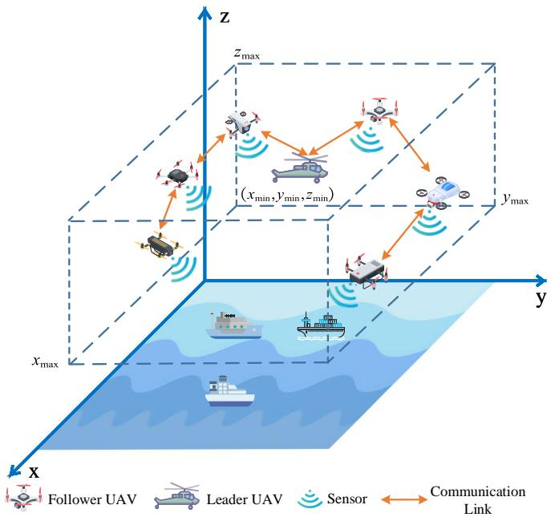  
Fig. 1. A schematic of the Leader-Follower UAV swarm network model.

## III. SYSTEM MODEL

Owing to the complexity and diversity of tasks in remote maritime environments, the unified system architecture of a leader–follower UAV swarm offers significant advantages for information collection and processing. Within this framework, the leader UAV is designated as the commanding node based on network topology and specific task requirements, while the remaining UAVs function as followers, equipped with various sensor types for information sensing and data acquisition.

## A. Environment Model

As illustrated in Fig. 1, we establish a Leader-Follower UAVs swarm communication network operating as a fullairborne closure system. In this architecture, Follower UAVs sample environmental data on demand through onboard sensors, then manage local buffers and prioritize packets, ultimately making routing decisions to forward information toward the Leader UAV through multi-hop relay paths. The Leader UAV serves as the central data aggregator, collecting information from all Follower UAVs to maintain realtime situational awareness. The operational space of the Leader-Follower UAV swarm is defined as a bounded threedimensional volume $\mathcal { Z } \subset \mathbb { R } ^ { 3 }$ , where ${ \mathcal Z } \ = \ [ x _ { \mathrm { m i n } } , x _ { \mathrm { m a x } } ] \ \times$ $[ y _ { \mathrm { m i n } } , y _ { \mathrm { m a x } } ] \times [ z _ { \mathrm { m i n } } , z _ { \mathrm { m a x } } ] .$

According to this system model, the swarm of UAVs is categorized into two types: a Leader UAV l and a set of Follower UAVs, which can be denoted as $\mathcal { N } = \{ 1 , 2 , \dots , N \}$ and thus the complete set of all UAVs is given by:

$$
\mathcal { N } _ { u } = \mathcal { N } \cup \{ l \} = \{ 1 , 2 , \dotsc , N , l \} .\tag{1}
$$

The Leader UAV l guides the positional changes of the entire UAV swarm, which is positioned at the center of the operational area Z with coordinates $[ ( x _ { \mathrm { m i n } } + x _ { \mathrm { m a x } } ) / 2 , ( y _ { \mathrm { m i n } } +$ $y _ { \mathrm { m a x } } ) / 2 , ( z _ { \mathrm { m i n } } + z _ { \mathrm { m a x } } ) / 2 ]$

Each UAV node is equipped with a GPS module to pinpoint its precise location information. The task duration is discretized into a set of time slots, $\mathcal { T } = \{ 1 , 2 , \dots , T _ { \mathrm { m a x } } \}$ and the movement of each UAV node is time-dependent, with continuous variations in velocity and direction.

Therefore, the position coordinates of any Follower UAV node $i \in \mathcal N$ at time slot t can be expressed as:

$$
L _ { i } ( t ) = ( l _ { i } ^ { x } ( t ) , l _ { i } ^ { y } ( t ) , l _ { i } ^ { z } ( t ) ) .\tag{2}
$$

## B. Mobility Model

Since this work primarily focuses on the sampling and routing process within the UAV swarm, we differentiate the mobility considerations for Leader and Follower UAVs based on their distinct functional roles. The Leader UAV, positioned at the center of the operational area $\mathcal { Z }$ with coordinates $[ ( x _ { \mathrm { m i n } } + x _ { \mathrm { m a x } } ) / 2 , ( y _ { \mathrm { m i n } } + y _ { \mathrm { m a x } } ) / 2 , ( z _ { \mathrm { m i n } } + z _ { \mathrm { m a x } } ) / 2 ]$ , guides the positional changes of the entire swarm. The Follower UAVs constitute the ad-hoc network fabric and move relative to the Leader’s position.

To realistically capture the temporal variations in Follower UAVs’ connectivity, we model their movement using the threedimensional Gauss-Markov mobility model [48], which effectively simulates correlated and quasi-random flight patterns. The motion model of Follower UAV i can be expressed as:

$$
\left\{ \begin{array} { l l } { v _ { i } ( t ) = \alpha \times v _ { i } ( t - 1 ) + ( 1 - \alpha ) \times \bar { v } + \sqrt { 1 - \alpha ^ { 2 } } \times v ^ { \prime } } \\ { a _ { i } ( t ) = \alpha \times a _ { i } ( t - 1 ) + ( 1 - \alpha ) \times \bar { a } + \sqrt { 1 - \alpha ^ { 2 } } \times a ^ { \prime } } \\ { e _ { i } ( t ) = \alpha \times e _ { i } ( t - 1 ) + ( 1 - \alpha ) \times \bar { e } + \sqrt { 1 - \alpha ^ { 2 } } \times e ^ { \prime } } \end{array} \right.\tag{3}
$$

where $v _ { i } ( t ) , a _ { i } ( t )$ , and $e _ { i } ( t )$ represent the velocity, azimuth angle, and elevation angle at time slot $t ,$ respectively, while $^ { \bar { v } , }$ ${ \bar { a } } ,$ and e¯ denote their corresponding mean values. The terms $v ^ { \prime } , a ^ { \prime } ,$ , and $e ^ { \prime }$ are zero-mean Gaussian-distributed random variables, i.e., $v ^ { \prime } \sim \mathcal { N } ( 0 , \sigma _ { v } ^ { 2 } ) , a ^ { \prime } \sim \mathcal { N } ( 0 , \sigma _ { a } ^ { 2 } )$ , and $e ^ { \prime } \sim \mathcal { N } ( 0 , \sigma _ { e } ^ { 2 } )$ and α $\in [ 0 , 1 ]$ is the tuning parameter.

The complete mobility model for Follower UAV node i incorporates its Gauss-Markov dynamics superimposed on the Leader’s velocity vector $\overrightarrow { V _ { \mathrm { L e a d e r } } }$ , which is depicted in Fig. 2. This hierarchical design ensures that the Leader UAV governs the global trajectory while the Gauss-Markov model captures local mobility variations of individual Follower UAVs within the operational area. Since the Leader’s motion function does not inherently alter the inter-node topology within the UAV swarm, in order to maintain focus on the intra-swarm dynamics and simplify the analysis, we assume the Leader UAV maintains a stationary hovering position, though the Leader’s mobility model can be extended to any arbitrary motion function in different application scenarios.

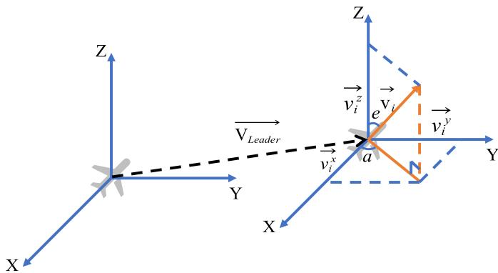  
Fig. 2. Complete mobility model combining Gauss-Markov dynamics with Leader’s velocity vector superposition. $\begin{array} { r } { \vec { v _ { i } ^ { x } } , \ \vec { v _ { i } ^ { y } } , } \end{array}$ , and $\frac { \vec { \boldsymbol { v } } _ { i } ^ { \ z } } { v _ { i } ^ { \ z } }$ denote velocity vectors along each axis, a and e represent the azimuth and elevation angles, respectively.

The velocity components of Follower UAV node i in each coordinate dimension can be described as:

$$
\begin{array} { r } { \left\{ \begin{array} { l l } { v _ { i } ^ { x } ( t ) = v _ { i } ( t ) \times \cos ( a _ { i } ( t ) ) \times \cos ( e _ { i } ( t ) ) } \\ { v _ { i } ^ { y } ( t ) = v _ { i } ( t ) \times \cos ( a _ { i } ( t ) ) \times \sin ( e _ { i } ( t ) ) } \\ { v _ { i } ^ { z } ( t ) = v _ { i } ( t ) \times \sin ( a _ { i } ( t ) ) } \end{array} \right. } \end{array}\tag{4}
$$

When Follower UAV node i moves to the boundary of ${ \mathcal { Z } } .$ the position’s updating formulation can be described by:

$$
L _ { i } ^ { \phi } ( t + 1 ) = \left\{ \begin{array} { l l } { L _ { i } ^ { \phi } ( t ) + v _ { i } ^ { \phi } ( t ) , } & { L _ { i } ^ { \phi } ( t ) + v _ { i } ^ { \phi } ( t ) \in \mathcal { Z } } \\ { 2 m - ( L _ { i } ^ { \phi } ( t ) + v _ { i } ^ { \phi } ( t ) ) , } & { \mathrm { o t h e r w i s e } } \end{array} \right. ,\tag{5}
$$

where m represents the respective boundary values of ${ \mathcal { Z } } ,$ , and $\phi \in \{ x , y , z \}$

To mitigate the risk of collisions during coordinated movements in multiple scenarios, we also incorporate a collisionavoidance mechanism with the method of Artificial Potential Field (APF) [49], which acts as an additional safety component that complements the original motion dynamics by helping maintain sufficient spacing between neighboring UAVs. We define a safety distance $r _ { s } ,$ , and when the distance between UAV nodes is less than $r _ { s } .$ , a potential energy function is constructed as:

$$
V _ { i j } = \left\{ \begin{array} { l l } { \frac { 1 } { 2 } \kappa ( r _ { s } - d _ { i , j } ) ^ { 2 } , } & { \mathrm { i f ~ } d _ { i , j } < r _ { s } , } \\ { 0 , } & { \mathrm { i f ~ } d _ { i , j } \geq r _ { s } . } \end{array} \right.\tag{6}
$$

where $d _ { i , j }$ represents the Euclidean distance between two nodes of UAV i and UAV j in space, and κ denotes the repulsion coefficient. The collision-avoidance repulsion force originates from the repulsion gradient with other UAV nodes within the swarm. The negative gradient direction represents the force direction, yielding the repulsion force expression for UAV node i as:

$$
\begin{array} { l } { { \displaystyle { \bf F } _ { i } = - \sum _ { j \in { \cal N } _ { u } , j \ne i } \nabla _ { L _ { i } } V _ { i , j } } } \\ { { \displaystyle ~ = - \sum _ { j \in { \cal N } _ { u } , j \ne i } \kappa ( r _ { s } - d _ { i , j } ) \nabla _ { L _ { i } } d _ { i , j } } } \\ { { \displaystyle ~ = - \sum _ { j \in { \cal N } _ { u } , j \ne i } \kappa \frac { r _ { s } - d _ { i , j } } { d _ { i , j } } ( L _ { i } - L _ { j } ) } . } \end{array}\tag{7}
$$

In the practical implementation, this repulsion force is converted into displacement corrections that are directly integrated with the UAV’s motion. Under this mechanism, UAV nodes maintain their original flight direction while experiencing repulsion-based displacement corrections when neighboring nodes enter the safety distance $r _ { s }$ range. The displacement correction acts along the direction $( \mathbf { L } _ { i } - \mathbf { L } _ { j } )$ , causing the UAV to move away from proximate nodes, thereby achieving dynamic collision avoidance and safe flight.

## C. Sampling Model

In this architecture, each Follower UAV is equipped with heterogeneous sensor arrays to execute diverse surveillance and monitoring missions. Rather than periodic sampling, each Follower UAV generates new packets on demand based on current network conditions, acting as the information source of the autonomous monitoring system. The strategic deployment of these multi-sensor platforms necessitates intelligent sampling mechanisms to optimize information acquisition while maintaining energy efficiency and communication resource utilization. The distributed sensing capability of Follower UAVs enables comprehensive coverage of expansive maritime domains through coordinated sampling operations.

Within each discrete time slot t, Follower UAV node i adaptively determines its sampling strategy based on current conditions. The sampling function is defined as:

$$
s _ { i } ( t ) \in \{ 0 , 1 \} ,\tag{8}
$$

where $s _ { i } ( t ) = 0$ denotes not sampling at time slot $t , s _ { i } ( t ) = 1$ represents a successful sampling execution, i.e., Follower UAV node i generates a structured information packet, which is designed to minimize transmission overhead while preserving essential information fidelity. A sampling packet $P _ { i } ( t _ { 0 } )$ generated by Follower UAV i at time $t _ { 0 }$ is structured as:

$$
P _ { i } ( t _ { 0 } ) = [ s r c , t _ { i } ^ { ( k ) } , \mathcal { { H } } a g , d a t a ] ,\tag{9}
$$

where src identifies the originating Follower UAV node i, and the destination node is invariably the Leader UAV $l , t _ { i } ^ { ( k ) }$ represents the precise timestamp of the kth samping (i.e., $t _ { i } ^ { ( \hat { k } ) } = t _ { 0 } )$ . The routing completion identifier $\mathit { { f l a g } } \in \{ 0 , 1 \}$ indicates packet status during network propagation, where $f a g \ : = \ : 0$ signifies active forwarding and $f a g \ = \ 1$ denotes successful delivery to the Leader UAV. The data field encapsulates the processed sensor measurements using adaptive compression algorithms to optimize transmission efficiency.

## D. Transmission Model

To deliver sampled data to the Leader UAV, each Follower UAV selects appropriate next-hop neighbors for packet forwarding based on the current network topology. In the FANETs routing process within remote maritime scenarios, each Follower UAV need to periodically send HELLO packets to search neighbor nodes in every time slot, thereby establishing bidirectional communication relationships. The neighbor set of any Follower UAV i can be expressed as:

$$
N _ { r } ( i ) = \{ j \mid d _ { i , j } \leq r _ { \operatorname* { m a x } } , \forall j \in \mathcal { N } _ { u } , i \neq j \} ,\tag{10}
$$

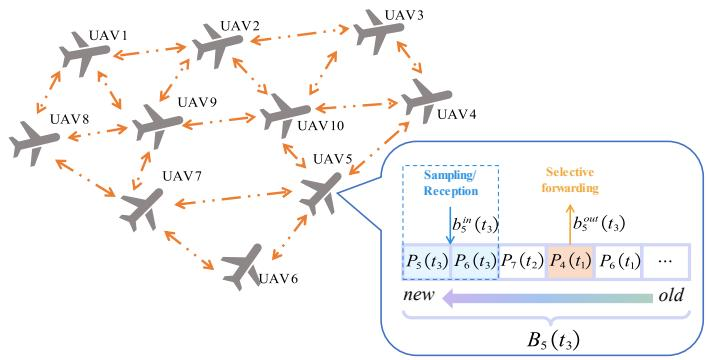  
Fig. 3. Schematic diagram of adaptive forwarding across UAV swarm routing. $\tilde { B _ { 5 } } ( t _ { 3 } )$ represents the buffer queue of UAV5 at time slot $t _ { 3 } ,$ where $b _ { 5 } ^ { \mathrm { i n } } ( t _ { 3 } )$ and $\dot { b _ { 5 } ^ { \mathrm { o u t } } ( t _ { 3 } ) }$ denote the packet inflow and outflow, respectively.

where $r _ { \mathrm { m a x } }$ is the maximum communication range of all UAV nodes. Through the periodic HELLO packets transmission, the neighbor nodes of each Follower UAV can be rapidly identified. Notably, the neighbor set of Follower UAVs includes the Leader UAV. The transmission model assumes reliable information exchange among UAV nodes. While practical wireless links may experience packet loss, transmission errors, and time-varying channel fading, UAV swarms in remote monitoring scenarios typically operate with favorable line-ofsight (LoS) propagation conditions and relatively limited inter-UAV distances, which help maintain acceptable link quality. This transmission model abstracts away the uncertainties of PHY layer and MAC layer to enable focused analysis of network-layer decision-making for AoI optimization.

## E. Buffer Queue Model

During multi-hop transmission, each Follower UAV node is equipped with information storage capability and maintains respective buffer queues, where self-generated and relayed packets are temporarily stored until a viable forwarding opportunity becomes available. The buffer queue’s length of Follower UAV node i at time slot t can be calculated as:

$$
\begin{array} { r } { \mathrm { l e n g t h } [ B _ { i } ( t ) ] = \operatorname* { m i n } ( \mathrm { l e n g t h } [ B _ { i } ( t - 1 ) ] + b _ { i } ^ { \mathrm { i n } } ( t ) - b _ { i } ^ { \mathrm { o u t } } ( t ) , B _ { i } ^ { \mathrm { m a x } } ) , } \end{array}\tag{11}
$$

where $B _ { i } ( t )$ denotes the entire buffer at time slot $t , b _ { i } ^ { \mathrm { i n } } ( t )$ and $b _ { i } ^ { \mathrm { o u t } } ( t )$ represent the number of packets entering and leaving the buffer queue, respectively, and $B _ { i } ^ { \mathrm { m a x } }$ is the maximum buffer’s size.

Remark 1. It is noteworthy that when sampling occurs at time slot t, the newly generated sampling packet is immediately incorporated into $b _ { i } ^ { \mathrm { i n } } ( t )$ , enabling simultaneous execution of $b _ { i } ^ { \mathrm { i n } } ( t )$ and $b _ { i } ^ { \mathrm { o u t } } ( t )$ within a single time slot, i.e., packet sampling, reception, and transmission can be executed concurrently.

Moreover, a fundamental FCFS [41] or LCFS [42] queuing discipline is often suboptimal, as such which are inherently agnostic to the data’s origin or urgency, potentially delaying a critical update relayed from a neighboring UAV behind the node’s own routine, less valuable sensor data. As a result, at each transmission opportunity, the Follower UAV nodes need to employ a selective packet forwarding mechanism from their buffer queues, enabling prioritized delivery of time-critical information. The design is grounded in advanced age-aware networking theories, ensuring timely transmission of more suitable packets to the Leader UAV. The adaptive routing forwarding process is illustrated in Fig. 3.

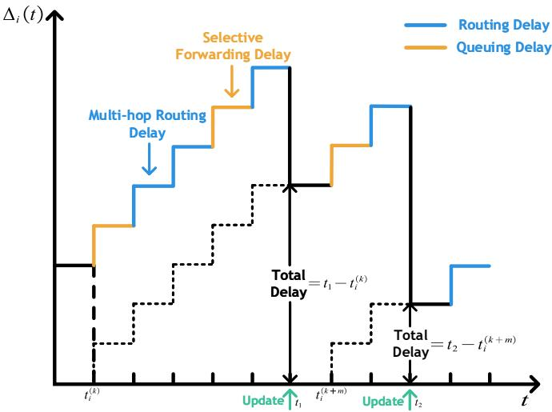  
Fig. 4. AoI evolution diagram of Follower UAV i. The blue lines represent the routing delay caused by multi-hop routing, the orange lines represent the queuing delay caused by selective forwarding.

## F. AoI Evolution Model

AoI provides a direct measure of data freshness, a paramount concern for maintaining real-time situational awareness in our proposed Leader-Follower UAV swarm. The superiority over AoI has gained much attention for its simplicity of calculation and wide range of applications. When packet $P _ { i } ( t _ { 0 } )$ arrives at the Leader UAV node at time t, the AoI of the corresponding source node i can be calculated as:

$$
\begin{array} { r } { \Delta _ { i } \left( t + 1 \right) = \left\{ \begin{array} { l l } { t - t _ { i } ^ { ( k ) } , } & { \mathrm { i f ~ r e c e i v e ~ } t _ { i } ^ { ( k ) } } \\ { \Delta _ { i } \left( t \right) + 1 , } & { \mathrm { e l s e } } \end{array} \right. , } \end{array}\tag{12}
$$

where $t _ { i } ^ { ( k ) }$ denotes the timestamp when the Leader UAV last received information generated by source node i. Small AoI values indicate fresh information, while large AoI values suggest that information from node i has not been updated for an extended period, representing stale information.

The AoI evolution diagram at the Leader UAV with respect to the Follower UAV node i in the proposed discrete-time architecture is illustrated in Fig. 4.

## IV. PROBLEM FORMULATION AND TRANSFORMATION

## A. Problem Formulation

In remote surveillance and monitoring applications within FANETs architecture, the system can be characterized as a multi-source single-sink sampling-aggregation computation system with ad-hoc network routing capabilities. In this framework, the Leader UAV’s aggregation and computation of information transmitted by Follower UAVs exhibit strong temporal sensitivity. The primary challenge lies in that each

JOURNAL OF LAT X CLASS FILES, VOL. 14, NO. 8, AUGUST 2021

Follower UAV not only need to consider the optimal timing of its own sampling operations, but also ensures that both self-generated and neighbor-forwarded transmission packets are delivered to the destination node as quickly as possible, thereby maximizing the timeliness of each source-sink pair throughout the entire system. During system execution, AoI updates face multiple cascading challenges including sampling timing optimization, forwarding delays, and queuing delays at intermediate nodes.

When multiple UAVs have simultaneous routing transmission requirements, buffer queues of UAV nodes frequently operate under high-load conditions. Consequently, FANETs routing requires rapid information transmission to the Leader UAV through appropriate multi-hop routing strategies and reasonable buffer queue scheduling mechanisms, with the ultimate goal of minimizing the average AoI across the entire FANETs system.

During this process, the Leader UAV can broadcast the current AoI values of each node to all Follower UAV nodes in the network, since these packets contain only minimal status information, the downlink transmission time is negligible. As a result, the optimization problem in the timeliness-oriented FANETs system can be formulated as:

$$
\mathcal { P } 1 : \operatorname* { m i n } _ { \Pi = \{ \pi _ { 1 } , . . . , \pi _ { N } \} } \operatorname* { l i m } _ { t \to + \infty } \frac { 1 } { t } \operatorname* { s u p } _ { \mathbf { u } } \mathbb { E } _ { \Pi } \left[ \sum _ { t = 1 } ^ { T _ { \operatorname* { m a x } } } \sum _ { i = 1 } ^ { N } \Delta _ { i } ( t ) \right] ,\tag{13a}
$$

$$
\mathrm { s . t . } \quad \mathcal { C } 1 : \quad 0 \leq B _ { i } ( t ) \leq B _ { i } ^ { \operatorname* { m a x } } , \quad \forall i \in \mathcal { N } , \forall t \in \mathcal { T } ,\tag{13b}
$$

$$
\mathcal { C } 2 : 0 \leq \frac { \sum _ { t = 1 } ^ { T _ { \operatorname* { m a x } } } s _ { i } \left( t \right) } { T _ { \operatorname* { m a x } } } \leq 1 , \forall i \in \mathcal { N } ,\tag{13c}
$$

where $\Pi = \{ \pi _ { 1 } , \ldots , \pi _ { N } \}$ represents the set of policies for all Follower UAV nodes, $\pi _ { i }$ denotes the decision policy of Follower UAV node i that jointly determines the sampling, buffer scheduling, and routing strategy at each time slot. The optimization objective is to minimize the long-term average AoI across the entire network while satisfying two key constraints for each node: constraint C1 ensures that the buffer occupancy remains within the physical storage capacity limits, while constraint C2 limits each UAV to sample at most one packet per time slot. This optimization problem is inherently NP-hard due to the exponential growth of the joint state-action space and the partial observability of individual nodes. Moreover, conventional optimization methods struggle to jointly handle multiple coupled decision variables including sampling, routing, and buffer scheduling under the system constraints, making them inadequate for solving this problem efficiently.

The fundamental challenge lies in the intricate interdependencies among three decision variables, making independent optimization ineffective and necessitating a unified joint optimization approach. To address the complexity and coupling inherent in Problem P1, we propose the Adaptive Age-aware Sampling-Buffering-Routing (AASBR) joint optimization framework. The AASBR framework recognizes that achieving minimal average AoI requires coordinated decisionmaking across three interdependent dimensions, each critically affecting information freshness from different perspectives.

Sampling decisions directly control the injection rate of fresh information into the network, where excessive sampling can lead to network congestion while insufficient sampling results in stale information. Buffer scheduling decisions determine the prioritization strategy for packet transmission from local queues, where improper scheduling can cause valuable fresh packets to be delayed behind outdated ones, significantly degrading overall information timeliness. Routing target selection governs the forwarding paths through the dynamic network topology, where suboptimal routing choices can introduce unnecessary delays and contribute to network bottlenecks that affect the entire swarm’s communication efficiency.

Therefore, an advanced approach is required to enable coordinated and adaptive policy optimization across multiple UAV nodes under partial observability and constraints.

## B. Dec-POMDP Formulation

The challenges outlined above stem from the distributed architecture where each Follower UAV can only access local observations, and the tightly coupled decisions across UAVs with mutual dependencies, which together point to a multi-agent formulation. To this end, we adopt a Multi-Agent Reinforcement Learning (MARL) approach to solve the optimization problem $\mathcal { P } 1$ , each Follower UAV node can be regarded as an intelligent agent that makes corresponding decisions at each time slot. The procedure of system model can be transformed as a Decentralized Partially Observable Markov Decision Process (Dec-POMDP). The Dec-POMDP can be modeled as a tuple $\langle \mathcal { N } , \mathcal { S } , \mathcal { A } , \mathcal { P } , \mathcal { R } , \mathcal { O } , \gamma \rangle$ , where $\mathcal { N }$ represents the set of agents, S denotes the set of global states, $\mathcal { A }$ is the action spaces of all agents, P represents the state transition function, R is the global reward function, O is the local observation space of each agent, and $\gamma$ is the discount factor.

1) Observation Space $\mathcal { O } { : }$ In the Dec-POMDP system, each UAV node i can only observe part of the network, including the information of local node and neighbor nodes within of $N _ { r } ( i )$ . Specifically, the local observation space of each UAV node i consists of the node state $o _ { i } ^ { S }$ , queue state $o _ { i } ^ { T }$ , and the current AoI value of each Follower UAV node within the UAV swarm from the Leader UAV.

The node state comprises the self-node state and the states of all neighboring node sets. At time slot t, the node state $o _ { i } ^ { S } \left( t \right)$ can be expressed as:

$$
o _ { i } ^ { S } \left( t \right) = \left[ p o s _ { i } \left( t \right) , p o s _ { N _ { r } \left( i \right) } \left( t \right) \right] ,\tag{14}
$$

where $p o s _ { i } \left( t \right)$ and $p o s _ { N _ { r } ( i ) } \left( t \right)$ represent the position coordinates of UAV node i and all its neighbor node sets at time slot t, respectively.

The queue state $o _ { i } ^ { T }$ represents the comprehensive set of packets currently in the buffer queue of agent i, encompassing both locally sampled packet and relayed packets received from neighboring UAVs, which can be characterized by:

$$
o _ { i } ^ { T } ( t ) = B _ { i } ( t ) = [ p k t _ { 1 } , p k t _ { 2 } , \cdots , p k t _ { k } ] ,\tag{15}
$$

where $p k t _ { k } = P _ { j } \left( t _ { 0 } \right)$ denotes each specific packet of buffer queue. In summary, the local observation space of agent i at time slot t can be given by:

$$
o _ { i } \left( t \right) = \left[ o _ { i } ^ { S } \left( t \right) , o _ { i } ^ { T } \left( t \right) , \mathrm { A o I } _ { 1 } , \cdot \cdot \cdot , \mathrm { A o I } _ { N } \right] .\tag{16}
$$

2) State Space S: In general, we define the system’s state space as the combination of local observation values of all agents and eliminating redundancy. The state space at time slot t is formulated as:

$$
s \left( t \right) = \left\{ o _ { 1 } \left( t \right) , \cdots , o _ { N } \left( t \right) \right\} .\tag{17}
$$

3) Action Space A: In the proposed framework, each Follower UAV agent makes joint decisions across three critical dimensions to optimize network performance. The sampling decision $s _ { i } \left( t \right)$ determines whether to generate fresh data packet and is denoted by (8) , directly controlling the rate of information freshness injection into the network. The transmission target selection specifies the neighboring node for packet forwarding, influencing routing paths and mitigating network congestion through strategic load distribution. The packet selection identifies which buffered packet to transmit, prioritizing information delivery based on age-of-information requirements and queue management policies. Considering the limited communication resources and onboard processing constraints of UAV platforms, each UAV node can only select one packet for transmission at each time slot, i.e., $b _ { i } ^ { o u t } \left( t \right) = 1$

The joint optimization of three decision components enables agents to simultaneously balance information freshness optimization, congestion avoidance, and network throughput enhancement, creating coordinated decision-making that outperforms individual optimizations and addresses the inherent trade-offs in multi-objective FANETs scenarios. Therefore, the action space of agent i at time slot t can be expressed as:

$$
a _ { i } \left( t \right) = \left[ s _ { i } \left( t \right) , j , p k t _ { k } \right] , j \in N _ { r } \left( i \right) , p k t _ { k } \in B _ { i } \left( t \right) ,\tag{18}
$$

where $s _ { i } ( t )$ represents the sampling strategy, j denotes the neighbor selection, and $p k t _ { k }$ implements intelligent buffer management, exactly corresponding to the three core dimensions of our AASBR framework. This joint action design enables coordinated optimization across sampling, buffer scheduling, and routing to minimize the average AoI.

4) Reward Function $\mathcal { R } \left( s , a \right) :$ The reward function R takes system state s and action a as arguments, representing the reward that can be obtained in one time slot given s and a. According to the optimization objective in the routing process within the Leader-Follower UAV swarm, it is necessary to reduce the average AoI corresponding to each Follower UAV node. Based on this, we propose a reward function suitable for multi-agents that encourages cooperation among UAVs to maximize team rewards. For the proposed systems aimed at optimizing timeliness, the reward function can be set as:

$$
r \left( t \right) = - \frac { 1 } { N } \sum _ { i = 1 } ^ { N } \Delta _ { i } \left( t \right) .\tag{19}
$$

Therefore, the accumulate rewards of the entire UAV swarm in one episode can be calculated as:

$$
\mathcal { R } = \sum _ { t = 1 } ^ { T _ { \operatorname* { m a x } } } r \left( t \right) .\tag{20}
$$

## V. MULTI-AGENT REINFORCEMENT LEARNING SOLUTION

In this section, we propose an enhanced MARL algorithm named Curriculum-Orchestrated Multi-head Multi-Agent Proximal Policy Optimization (COMH-MAPPO) to address the intricate multi-objective optimization challenges inherent in UAV swarm communication system. The proposed algorithm represents a sophisticated evolutionary advancement over the conventional Multi-Agent Proximal Policy Optimization (MAPPO) [50], seamlessly integrating curriculum learning principles with multi-head policy architectures to enable progressive training and specialized decision-making across diverse agents’ behaviors. We initially present the multi-head network architecture including both the policy networks and centralized critic, and then describe the three-phase curriculum learning framework that guides progressive training, finally we elaborate the policy update mechanism. The proposed COMH-MAPPO algorithm is described detailed in this section.

## A. Multi-head Network Architecture

The fundamental motivation behind COMH-MAPPO stems from the complexity inherent in the AASBR framework. AASBR requires coordinated optimization across packet sampling, buffer scheduling and neighbor selection, then creating a multi-faceted decision-making problem.

Because of the credit assignment ambiguity and policy gradient interference, traditional single-head policy networks often struggle with such multi-objective scenario, leading to suboptimal trade-offs and unstable convergence. Our multihead architecture addresses this challenge by explicitly decomposing the joint action space into specialized decision components, each of which is being optimised for specific aspects of AASBR.

1) Policy Network Formulation:

By employing COMH-MAPPO, each agent node i maintains a three-head policy network architecture $\pi _ { i } ( \cdot | \theta _ { i } )$ , which can be separately represented as:

• Neighbor selection head $( \pi _ { i } ^ { n b r } ) !$ : This head determines the next-hop UAV node from the set of neighboring nodes, the corresponding policy probability is denoted as:

$$
\pi _ { i } ^ { n b r } ( a _ { i } ^ { n b r } | o _ { i } ) = \frac { \exp ( \ell _ { i } ^ { n b r } [ a _ { i } ^ { n b r } ] ) \cdot m _ { i } ^ { n b r } [ a _ { i } ^ { n b r } ] } { \sum _ { k \in \mathcal { A } ^ { n b r } } \exp ( \ell _ { i } ^ { n b r } [ k ] ) \cdot m _ { i } ^ { n b r } [ k ] } ,\tag{21}
$$

where ${ \mathcal { A } } ^ { n b r }$ denotes the action space for neighbor selection, $\ell _ { i } ^ { n b r }$ represents the neighbor selection logits, and $m _ { i } ^ { n b r } \in$ $\{ 0 , 1 \}$ is the binary availability mask that dynamically filters out unavailable neighbor nodes, i.e., non-selectable actions, which is calculated by:

$$
m _ { i } ^ { n b r } [ j ] = \left\{ { \begin{array} { l l } { 1 , } & { { \mathrm { i f ~ } } j \in N _ { r } ( i ) } \\ { 0 , } & { { \mathrm { o t h e r w i s e } } } \end{array} } \right. .\tag{22}
$$

Remark 2. The introduction of the availability mask serves a critical role in maintaining a fixed-dimensional action space while ensuring policy validity. By setting the neighbor selection action space dimension as $| { \mathcal { A } } ^ { n b r } | = { \mathcal { N } }$ , the neural network maintains consistent dimensionality across varying network topologies. The mask mechanism eliminates infeasible actions from the probability distribution, enabling stable training while adapting to dynamic communication constraints.

• Buffer scheduling head $( \pi _ { i } ^ { p k t } )$ : This head selects which packet from the local buffer $B _ { i } ( t )$ to transmit at current time slot, the corresponding policy probability is expressed as:

$$
\pi _ { i } ^ { p k t } ( a _ { i } ^ { p k t } | o _ { i } ) = \frac { \exp ( \ell _ { i } ^ { p k t } [ a _ { i } ^ { p k t } ] ) \cdot m _ { i } ^ { p k t } [ a _ { i } ^ { p k t } ] } { \sum _ { k \in \mathcal { A } ^ { p k t } } \exp ( \ell _ { i } ^ { p k t } [ k ] ) \cdot m _ { i } ^ { p k t } [ k ] } ,\tag{23}
$$

where $\mathcal { A } ^ { p k t }$ denotes the action space for buffer scheduling and $| \mathcal { A } ^ { p k t } | = B _ { i } ^ { \operatorname* { m a x } } , \ell _ { i } ^ { p k t }$ represents the packet selection logits, similarly, $m _ { i } ^ { \bar { p } k t } \in \{ 0 , 1 \}$ is the mask that adaptively filters out unoccupied buffer positions, which is computed by:

$$
m _ { i } ^ { p k t } [ j ] = \left\{ { \begin{array} { l l } { 1 , } & { { \mathrm { i f ~ } } j \in B _ { i } ( t ) } \\ { 0 , } & { { \mathrm { o t h e r w i s e } } } \end{array} } \right. .\tag{24}
$$

• Packet generation head $( \pi _ { i } ^ { g e n } )$ : This head makes binary decisions about new packet generation based on current condition at this time slot, the corresponding policy probability is defined as:

$$
\pi _ { i } ^ { g e n } ( a _ { i } ^ { g e n } | o _ { i } ) = \mathrm { B e r n o u l l i } ( \sigma ( \ell _ { i } ^ { g e n } ) ) ,\tag{25}
$$

where $\sigma ( \cdot )$ is the sigmoid activation function that maps the generation logit to probability space, and $\ell _ { i } ^ { g e n }$ is the generation logit. The Bernoulli distribution can be denoted as:

$$
\left\{ \begin{array} { l l } { P ( a _ { i } ^ { g e n } = 1 | s _ { i } ) = \sigma ( \ell _ { i } ^ { g e n } ) = \displaystyle \frac { 1 } { 1 + \exp ( - \ell _ { i } ^ { g e n } ) } . } \\ { P ( a _ { i } ^ { g e n } = 0 | s _ { i } ) = 1 - \sigma ( \ell _ { i } ^ { g e n } ) } \end{array} \right.\tag{26}
$$

## 2) Centralized Value Function:

The COMH-MAPPO also implements the centralized training with decentralized execution (CTDE) framework to address coordinated FANETs challenges [51]. During training, the global state vector $s _ { g } ( t )$ in the centralized critic network can be denoted by:

$$
s _ { g } ( t ) = \mathrm { C o n c a t } ( [ o _ { 1 } ( t ) , o _ { 2 } ( t ) , \dots , o _ { N } ( t ) ] ) ,\tag{27}
$$

which aggregates individual node’s observatios to capture complex multi-agent interactions and temporal dependencies. CTDE framework enables the critic network to leverage complete system knowledge for accurate value estimation while each UAV’s policy network operates autonomously using only local observations during execution. Such architecture ensures deployability in realistic scenarios where continuous inter-UAV communication may be limited, while preserving computational efficiency for real-time decision-making without global coordination overhead, thereby facilitating coordinated learning without sacrificing execution autonomy.

## B. Curriculum Learning Framework

The training process in this system faces a critical challenge when attempting to train three interdependent heads simultaneously from random initialization. During the initial training phases, the instability of untrained generation policies creates a fundamental bootstrap problem where insufficient packet generation leads to sparse network traffic, thereby depriving routing and scheduling policies of the necessary training signals required for effective learning. This scarcity of packets in the network prevents the neighbor selection head from learning optimal forwarding strategies and inhibits the packet scheduling head from developing efficient queue management protocols, which collectively impedes the overall system convergence.

To overcome this fundamental limitation, we adopt a curriculum learning framework that spans multiple episodes strategically divided into distinct phases [52], establishing stable network conditions through a fixed generation strategy during the initial training phase. This approach ensures adequate packet circulation that enables effective learning of routing and scheduling behaviors before gradually transitioning to adaptive generation policies. By establishing reliable communication patterns as a foundational layer, this sequential approach allows for the introduction of more sophisticated adaptive generation strategies without compromising the stability of previously learned routing and scheduling protocols that require consistent packet flow to maintain their effectiveness. The proposed curriculum learning methodology systematically decomposes the complex multi-objective optimization problem into three sequential episode of lengths $E _ { 1 } , \ E _ { 2 }$ , and $E _ { 3 }$ respectively, the detailed design approach of each episode is illustrated as follows:

## • Phase I Foundation Building:

The first phase establishes a stable communication pattern through a fixed packet generation strategy, where the generation action follows a predetermined sampling probability $p _ { b a s e }$ and the packet generation action is governed by:

$$
a _ { i } ^ { g e n } ( t ) \sim \mathrm { B e r n o u l l i } ( p _ { b a s e } ) .\tag{28}
$$

During this phase, the generation decision follows a simple fixed strategy to maintain system stability while other components develop.

## • Phase II Progressive Integration:

The second phase implements a sophisticated curriculum mixing strategy that probabilistically combines fixed and learned generation policies, ensuring smooth transitions without destabilizing established routing strategy. The mixed probability $p _ { m i x e d }$ follows a linear decay that gradually reduces reliance on the fixed strategy:

$$
p _ { m i x e d } ( e p i s o d e ) = p _ { b a s e } \times \left( 1 - \frac { e p i s o d e - E _ { 1 } } { E _ { 2 } } \right) .\tag{29}
$$

At each time slot, the agents should choose between two packet generation approaches. With probability $p _ { m i x e d : }$ , they employ the same approach as Phase I. Alternatively, with probability $1 - p _ { m i x e d } ,$ they adopt a neural network-based generation decisions. This probabilistic selection mechanism allows the agents to balance between the stability of fixed policies and the adaptability of learning-based approaches throughout the decision-making process.

## • Phase III Full Learning:

The final phase enables comprehensive multi-objective optimization and all heads operate with complete learning capacity, and the complete policy gradient incorporates three deci-

sion components. The detailed implementation of three-phase curriculum learning approach is presented in Algorithm 1.

Algorithm 1: Curriculum Learning Framework   
Input: $\{ o _ { i } \} _ { i = 1 } ^ { N } ,$ current episode, E1, E2, E3, pbase   
Output: $\{ a _ { i } \} _ { i = 1 } ^ { \bar { N } } , \{ \log \pi _ { i } \} _ { i = 1 } ^ { N }$   
1 Phase Determination:   
2 if $e p i s o d e \le E _ { 1 }$ then   
phase = “Foundation Building”;   
4 else   
5 if episode $\leq E _ { 1 } + E _ { 2 }$ then   
6 $p h a s e = \mathbf { \ddot { F } }$ rogressive Integration”;   
7 Calculate $p _ { m i x e d }$ by equation (29);   
8 else   
9 phase = “Full Learning”;   
10 end   
11 end   
12 for agent $i = 1$ to $N$ do   
13 Obtain $\ell _ { i } ^ { n b r } , \ell _ { i } ^ { p k t }$ from policy network;   
14 Compute $\pi _ { i } ^ { n b r } , \pi _ { i } ^ { p k t }$ by equation (21) and (23);   
15 Sample $a _ { i } ^ { n b r } , a _ { i } ^ { p k t } \sim$ Categorical $( \pi _ { i } ^ { n b r } , \pi _ { i } ^ { p k t } ) ;$   
16 switch phase do   
17 case “Foundation Building” do   
18 fixed generation policy:   
19 Compute $a _ { i } ^ { g e n }$ by equation (28);   
20 Set log $\pi _ { i } ^ { g e \bar { n } } = 0 ;$   
21 end   
22 case “Progressive Integration” do   
23 if with $p _ { m i x e d }$ then   
24 Apply fixed generation policy;   
25 else   
26 neural generation policy:   
27 Obtain $\not \ell _ { i } ^ { g e n }$ from policy network;   
28 Compute $\pi _ { i } ^ { g e n }$ by equation (25);   
Sample $a _ { i } ^ { g e n }$   
29 end   
30 end   
31 case “Full Learning” do   
32 Apply neural generation policy;   
33 end   
34 end   
35 Combine actions: $a _ { i } = ( a _ { i } ^ { n b r } , a _ { i } ^ { p k t } , a _ { i } ^ { g e n } ) \mathrm { ; }$   
36 Compute log $\pi _ { i } ^ { n b r }$ , log πpkti , log $\pi _ { i } ^ { g e n } ;$   
37 end   
38 return $\{ a _ { i } \} _ { i = 1 } ^ { N } , \{ \log \pi _ { i } \} _ { i = 1 } ^ { N }$

## C. Policy Update Mechanism

The policy update mechanism extends MAPPO with multihead specific adaptations and curriculum-aware weighting. The core update mechanism maintains the stability guarantees of MAPPO while accommodating the multi-head architecture and progressive learning framework established by the curriculum learning approach.

1) Multi-Head Policy Loss Computation:

For each agent i and each head $h \in \{ n b r , p k t , g e n \}$ , the loss function for each head of actor network is formulated as:

$$
\mathcal { L } _ { i } ^ { h } = - \mathbb { E } _ { t } [ \operatorname* { m i n } ( \rho _ { i , t } ^ { h } A _ { i } ( t ) , \operatorname { c l i p } ( \rho _ { i , t } ^ { h } , 1 - \epsilon , 1 + \epsilon ) A _ { i } ( t ) ) ] ,\tag{30}
$$

$$
\rho _ { i , t } ^ { h } = \frac { \pi _ { i } ^ { h } ( a _ { i , t } ^ { h } | s _ { i , t } ; \theta _ { i } ^ { h } ) } { \pi _ { i , o l d } ^ { h } ( a _ { i , t } ^ { h } | s _ { i , t } ; \theta _ { i , o l d } ^ { h } ) } ,\tag{31}
$$

$$
c l i p ( x , 1 - \epsilon , 1 + \epsilon ) = \left\{ { 1 - \epsilon } \begin{array} { l l } { { 1 - \epsilon } } & { { \mathrm { i f ~ } x < 1 - \epsilon } } \\ { { 1 + \epsilon } } & { { \mathrm { i f ~ } x > 1 + \epsilon , } } \\ { { x } } & { { \mathrm { o t h e r w i s e } } } \end{array} \right.\tag{32}
$$

where $\rho _ { i , t } ^ { h }$ is the policy ratio, the clipping function ensures policy updates remain within a trust region, ϵ is the clipping parameter, $A _ { i } ( t )$ is the advantage function with Generalized Advantage Estimation (GAE) [53], which can be calculated as:

$$
A _ { i } ( t ) = \sum _ { l = 0 } ^ { T _ { m a x } - t - 1 } ( \gamma \lambda ) ^ { l } \delta ( t + l ) ,\tag{33}
$$

where $\gamma$ represents the discounting factor, λ denotes the GAE parameter, $\delta ( t )$ is the temporal difference error, which is computed by:

$$
\delta ( t ) = r _ { i } ( t ) + \gamma V ( s _ { g } ( t + 1 ) ) - V ( s _ { g } ( t ) ) .\tag{34}
$$

During Phase I, only neighbor selection and packet scheduling policies contribute to the loss:

$$
\begin{array} { r } { \mathcal { L } _ { i } = \mathcal { L } _ { i } ^ { n b r } + \mathcal { L } _ { i } ^ { p k t } . } \end{array}\tag{35}
$$

For other phases, the generation policy loss is gradually introduced with curriculum weighting:

$$
\mathcal { L } _ { i } = \mathcal { L } _ { i } ^ { n b r } + \mathcal { L } _ { i } ^ { p k t } + w _ { g e n } ( e p i s o d e ) \cdot \mathcal { L } _ { i } ^ { g e n } ,\tag{36}
$$

where $w _ { g e n }$ is the curriculum weight for packet generation head and can be illustrated as:

$$
w _ { g e n } ( e e p i s o d e ) = \operatorname* { m i n } ( 1 , \frac { e p i s o d e - E _ { 1 } } { E _ { 2 } } ) .\tag{37}
$$

As a result, $w _ { g e n }$ grows linearly from 0 to 1 during Phase II and all heads contribute equally at Phase III.

To maintain exploration diversity, we incorporate phasedependent entropy regularization:

$$
\mathcal { H } _ { i } = \alpha _ { e } \sum _ { h \in \mathcal { H } _ { a c t i v e } } H ( \pi _ { i } ^ { h } ) ,\tag{38}
$$

$$
H ( \pi _ { i } ^ { h } ) = - \mathbb { E } _ { a ^ { h } \sim \pi _ { i } ^ { h } } [ \log \pi _ { i } ^ { h } ( a ^ { h } | s _ { i } ) ] ,\tag{39}
$$

where $\alpha _ { e }$ denotes the entropy parameter, $\mathcal { H } _ { a c t i v e }$ represents the set of active heads in the current phase:

$$
\mathcal { H } _ { a c t i v e } = \left\{ \begin{array} { l l } { \{ n b r , p k t \} } & { \mathrm { P h a s e ~ I } } \\ { \{ n b r , p k t , g e n \} } & { \mathrm { P h a s e ~ I I ~ \& ~ I I I } } \end{array} \right. .\tag{40}
$$

The entropy regularization directly modifies the total loss by encouraging exploration. The complete loss function becomes:

$$
\begin{array} { r } { \mathcal { L } _ { t o t a l , i } = \mathcal { L } _ { i } - \mathcal { H } _ { i } . } \end{array}\tag{41}
$$

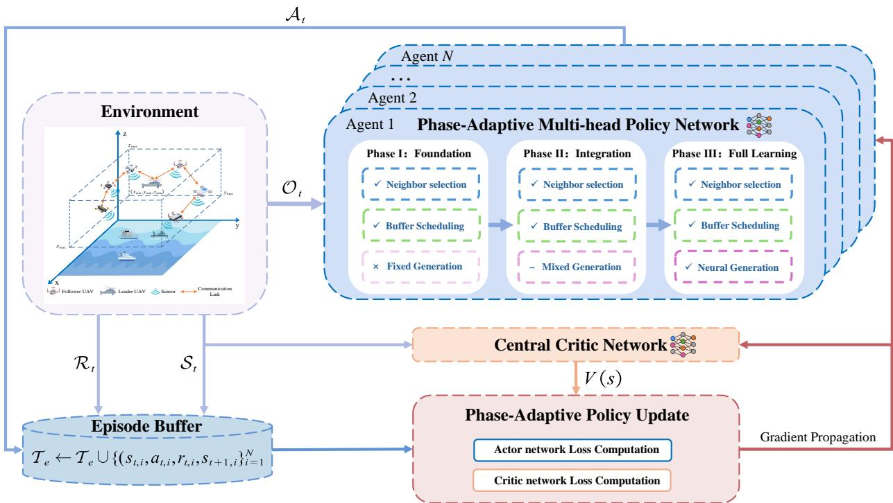  
Fig. 5. The framework of the proposed COMH-MAPPO algorithm.

This entropy regularization ensures that the policy maintains sufficient exploration throughout all training phases, with the regularization strength controlled by $\alpha _ { e }$ and applied only to active heads at each phase.

In summary, the comprehensive algorithmic framework establishes COMH-MAPPO as a robust and efficient solution for large-scale UAV swarm communication optimization, providing both theoretical soundness and practical effectiveness. The entire pseudocode of proposed COMH-MAPPO algorithm is shown as Algorithm 2, and the corresponding workflow is illustrated in Fig. 5.

## D. Complexity Analysis

The computational complexity of COMH-MAPPO can be analyzed from both time and space complexity perspectives for the proposed UAV swarm deployments.

1) Time Complexity: For the training phase, The time complexity is dominated by the actor-critic architecture. The time complexity per training iteration is denoted as $\mathcal { O } ( T _ { \mathrm { m a x } } \cdot N$ $\left| d _ { \theta } \right| { + } T _ { \operatorname* { m a x } } { \cdot } \left| d _ { \phi } \right| )$ , where $| d _ { \theta } |$ and $| d _ { \phi } |$ represent the parameter size of the multi-head actor networks and the centralized critic network, respectively. For the execution phase, only actor network forward passes are involved, the time complexity reduces to $\mathcal { O } ( T _ { \operatorname* { m a x } } \cdot N \cdot | d _ { \theta } | )$ . It is worth mentioning that the curriculum learning framework introduces no additional computational complexity overhead during execution phase, as phase determination and policy mixing are eliminated after training phase completion.

2) Space Complexity: In the training phase, the space complexity of COMH-MAPPO can be encompassed by the network parameters and trajectory buffer requirements. The network parameters are characterized by $\mathcal { O } ( N \cdot | d _ { \theta } | + | d _ { \phi } | )$

and all UAV agents need to maintain the trajectory buffer containing current states and next states, action tuples, rewards, and termination flags, resulting in trajectory buffer requirements that scale as $O ( N \cdot T _ { \operatorname* { m a x } } \cdot ( 2 | d _ { s } | + | d _ { a } | + 2 ) )$ , where $| d _ { s } |$ is the local observation dimension and $\left| d _ { a } \right|$ is the action space dimension. In the execution phase, the space complexity reduces to $O ( N \cdot | d _ { \theta } | )$

## VI. PERFORMANCE EVALUATION AND ANALYSIS

In this section, we conduct comprehensive simulations to evaluate the performance of the proposed COMH-MAPPO algorithm and validate the effectiveness of each component in the AASBR framework through systematic ablation studies. First, the experimental environment and DRL parameter settings are introduced, then convergence performances during both training and testing phases are analyzed. Subsequently, AoI performances are evaluated through comprehensive comparisons with benchmark algorithms. Furthermore, the network performance metrics are analyzed in detail. Finally, the robustness under varying UAV velocities and scalability across different UAV network sizes are systematically evaluated.

## A. Simulation Setup

1) Environment Configuration: We implement the simulation environment using Python 3.8 with PyTorch 1.12.0. The neural networks are implemented using the Adam optimizer with ReLU activation functions for hidden layers. The UAV swarm operates in a three-dimensional airspace defined as $\mathcal { Z } = [ 1 0 0 m , 2 0 0 m ] \times [ 1 0 0 m , 2 0 0 m ] \times [ 1 0 0 m , 2 0 0 m ]$

The key environment parameters and algorithm hyperparameters are summarized in Table I and Table II respectively.

Algorithm 2: COMH-MAPPO   
Input: agent team size N, $E _ { m a x } ,$ $T _ { m a x } ,$ pbase, $\alpha _ { e }$   
Output: Trained multi-head policy networks $\{ \pi _ { i } \} _ { i = 1 } ^ { N }$   
1 Initialization: Multi-head policy networks $\pi _ { i } ( \cdot | \theta _ { i } )$ for   
$i = 1 , \ldots , N ;$ ; Central value network $V ( \cdot | \phi ) ;$   
2 while episode ≤ $E _ { m a x }$ do   
3 Phase Selection:   
4 Initialize episode buffer $\begin{array} { r } { \mathcal { T } _ { e } = \emptyset ; } \end{array}$ Reset environment   
and get initial states $\{ s _ { 0 , i } \} _ { i = 1 } ^ { N } ;$   
5 for timestep $t = 0$ to $T _ { m a x } - 1$ do   
6 Obtain $\{ a _ { t , i } \} _ { i = 1 } ^ { N } , \{ \log \pi _ { t , i } \} _ { i = 1 } ^ { N }$ by   
Algorithm 1;   
7 Execute $a _ { t }$ in environment and get $\{ r _ { t , i } \} _ { i = 1 } ^ { N } ;$   
8 $\mathcal { T } _ { e } \gets \mathcal { T } _ { e } \cup \{ ( s _ { t , i } , a _ { t , i } , r _ { t , i } , s _ { t + 1 , i } \} _ { i = 1 } ^ { N } ;$   
9 end   
10 Update Central Critic:   
11 Compute critic loss $\mathcal { L } _ { c r i t i c } ;$   
12 Gradient update: $\phi  \phi - \nabla _ { \phi } \mathcal { L } _ { c r i t i c } ;$   
13 Update Multi-Head Policies:   
14 for agent $i = 1$ to N do   
15 Multi-Head Policy Loss:   
16 for $h \in \{ n b r$ pkt, gen} do   
17 Compute $\mathcal { L } _ { i } ^ { h }$ by equation $( 3 0 ) ;$   
18 end   
19 Phase-Aware Policy Loss:   
20 if phase $\mathit { \Pi } = \mathit { \Pi } ^ { \cdots } F ($ oundation $B u i l d i n g ^ { \prime \prime }$ then   
21 Compute $\mathcal { L } _ { i }$ via equation (35);   
22 else   
23 Compute $\mathcal { L } _ { i }$ via equation (36);   
24 end   
25 Entropy regularization:   
26 Compute Total loss $\mathcal { L } _ { t o t a l }$ by equation (41);   
27 Gradient update: $\begin{array} { r } { \theta _ { i }  \theta _ { i } - \nabla _ { \theta _ { i } } \mathcal { L } _ { t o t a l } ; } \end{array}$   
28 end   
29 Clear episode buffer $\textstyle { \mathcal { T } } _ { e } ;$   
30 end   
31 return Optimized policies $\{ \pi _ { i } ^ { * } \} _ { i = 1 } ^ { N }$

2) MARL Benchmark Algorithms: To evaluate COMH-MAPPO against representative MARL approaches, we implement the following benchmarks for comparison:

• Vanilla MAPPO: The standard MAPPO without multihead architecture and curriculum learning framework.

• MADDPG [54]: The off-policy actor-critic algorithm that employs centralized critics during training while maintaining decentralized policy execution.

• MATD3 [55]: The multi-agent extension of TD3 that employs twin Q networks to mitigate value overestimation while utilizing delayed policy updates for stable training.

3) Ablation Study Design: To systematically evaluate the individual contribution of each component within our AASBR framework, we conduct comprehensive ablation experiments that isolate the impact of specific decision-making head while maintaining the integrity of other framework components. The ablation methodology follows a controlled experimental design where individual heads are replaced with conventional strategies while preserving the neural network-based implementation of remaining components. The benchmarks are summarized as follows:

TABLE I  
ENVIRONMENT PARAMETERS SETTING
<table><tr><td>Parameter</td><td>Value</td></tr><tr><td>Number of Follower  $\mathrm { U A V s }$ </td><td>16</td></tr><tr><td>Mean velocity ()</td><td>2 m/step ~ 4 m/step</td></tr><tr><td>Mean azimuth angle (ā)</td><td> $\bar { 0 } \sim 2 \pi$ </td></tr><tr><td>Mean elevation angle (ē)</td><td> $- \pi / 2 \sim \pi / 2$ </td></tr><tr><td>Gauss-Markov tuning parameter  $( \alpha )$ </td><td>0.5</td></tr><tr><td>Gaussian random variables  $( \sigma _ { v } ^ { 2 } , \sigma _ { a } ^ { 2 } , \bar { \sigma } _ { e } ^ { 2 } )$ </td><td>1.0</td></tr><tr><td>Safe distance  $( r _ { s } )$ </td><td>2 m</td></tr><tr><td>Repulsion coefficient (κ)</td><td>0.2</td></tr><tr><td>Communication range  $\left( r _ { \operatorname* { m a x } } \right)$ </td><td>40 m</td></tr><tr><td>maximum buffer size  $( B _ { i } ^ { \mathrm { m a x } } )$ </td><td>8</td></tr></table>

TABLE II  
ALGORITHM HYPER-PARAMETERS SETTING
<table><tr><td>Parameter</td><td>Value</td></tr><tr><td>Max steps per episode  $( T _ { m a x } )$ </td><td>100</td></tr><tr><td>Actor network learning rate</td><td> $5 \times 1 0 ^ { - 5 }$ </td></tr><tr><td>Critic network learning rate</td><td> $1 \times 1 0 ^ { - 4 }$ </td></tr><tr><td>Hidden layer size</td><td> $1 2 8 \times 1 2 8$ </td></tr><tr><td>Discount factor (γ)</td><td>0.99</td></tr><tr><td>GAE parameter (λ)</td><td>0.95</td></tr><tr><td>Clipping parameter (€)</td><td>0.2</td></tr><tr><td>Entropy coefficient  $( \alpha _ { e } )$ </td><td>0.2</td></tr><tr><td>Fixed generation prob  $( p _ { b a s e } )$ </td><td>0.4</td></tr><tr><td>Phase length  $( \hat { E 1 } / \hat { E 2 / E 3 } )$ </td><td>2000</td></tr><tr><td>Max training episodes  $( E _ { m a x } )$ </td><td>6000</td></tr></table>

Sampling Strategy Ablation: Replace the packet sampling head with:

• FPS: Stochastic sampling with probability $p _ { b a s e }$ applied consistently throughout the entire training process.

• ATFPS: AoI-Triggered FPS (ATFPS) implements stochastic sampling with probability $p _ { b a s e }$ combined with mandatory sampling triggered when the source’s AoI exceeds a predefined threshold $\tau \left( \tau = 5 \right)$ [56].

• PS: Periodical sampling with fixed intervals of 1 time slot, representing conventional time-triggered sampling approaches commonly employed in monitoring systems.

Buffer Scheduling Ablation: Replace the buffer scheduling head with:

• FCFS [41] : First-in-first-out queuing discipline.

• LCFS [42]: Last-in-first-out queuing discipline.

Routing Strategy Ablation: Replace the neighbor selection head with:

• AODV [44]: Reactive topology-based routing method.

• GBR [46]: Geographic routing using GPS coordinates.

## B. Convergence Evaluation

To rigorously evaluate the learning dynamics and generalization capability, Fig. 6 illustrates the convergence analysis of COMH-MAPPO compared with both MARL and ablation benchmarks in training and testing respectively.

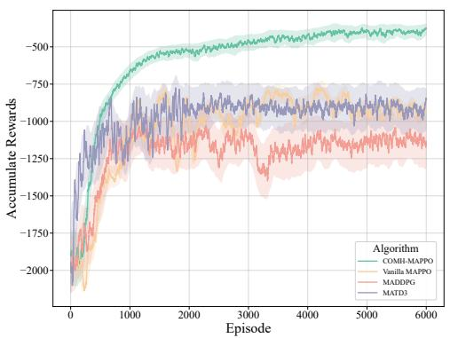  
(a)

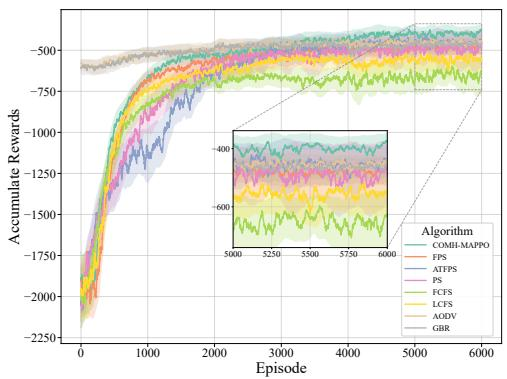  
(b)

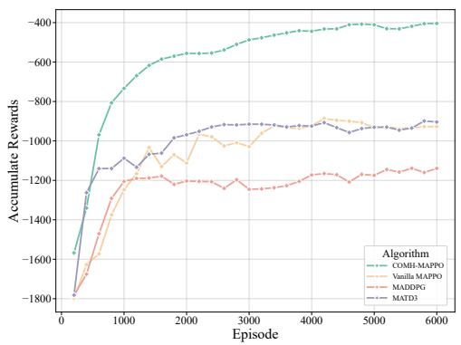  
(c)

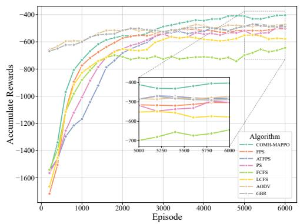  
(d)  
Fig. 6. Convergence performance comparison of accumulate rewards. (a) Training convergence with MARL benchmarks. (b) Training convergence with ablation benchmarks. (c) Testing convergence with MARL benchmarks. (d) Testing convergence with ablation benchmarks.

1) Training Stage: During training, the UAV agents interact with the environment under the curriculum learning framework. As shown in Fig. 6(a) Fig. 6(b), each training is independently repeated with five random initialization seeds, and the shaded areas represent variations across these runs. The results demonstrate a clear staged convergence process. In the foundation building phase, COMH-MAPPO steadily improves its reward performance, establishing stable routing and buffer scheduling strategies under a fixed packet generation probability. In the progressive integration phase, the rewards exhibit further enhancement, indicating that the gradual introduction of neural packet generation does not destabilize the previously acquired strategies. In the full learning stage, the rewards achieve stable convergence with significantly better performance than all benchmark approaches. Additionally, MARL benchmarks exhibit substantially inferior convergence performance compared with ablation benchmarks, the performance validates that our multi-head architecture and curriculum learning framework are essential for solving this complex joint optimization problem.

2) Testing Stage: Since the training process only encounters a finite number of system state sequences, there is a potential risk of overfitting. To assess generalization, we evaluate the latest model every 200 episodes on a separate test set composed of unseen initial environment states, including independently sampled UAV mobility patterns and network topologies. For each algorithm, a random seed is selected for testing, and the procedure is repeated multiple times to obtain averaged results. The testing curves in Fig. 6(c) and Fig. 6(d) exhibit strong consistency with the training results in terms of both trend and performance. These results demonstrate that the proposed COMH-MAPPO algorithm generalizes effectively to new environments and maintains superior reward performance and stability compared with all benchmark algorithms.

## C. AoI Performance Analysis

Fig. 7 indicates the performance comparison between COMH-MAPPO and benchmark algorithms across average AoI and average peak AoI metrics, which directly quantify information freshness and provide intuitive system evaluation.

As illustrated in Fig. 7(a), consistent with the reward convergence results, COMH-MAPPO achieves substantially lower average AoI values compared with MARL benchmarks throughout the training process, further validating the effectiveness of our proposed algorithm. Fig. 7(b) also indicates that our proposed COMH-MAPPO consistently outperforms all ablation benchmark approaches across different decisionmaking dimensions. The following analysis validates the impact of each component within the AASBR framework through systematic ablation studies.

The comparative analysis of sampling strategies reveals critical insights into adaptive sampling mechanisms. Fig. 8 indicates that the sampling rate of COMH-MAPPO stabilizes at approximately 0.76 upon the convergence of training. The full-time sampling approach of the PS strategy exhibits notably degraded AoI performance. This counterintuitive result demonstrates that excessive sampling frequency does not necessarily improve information freshness but instead exacerbates network congestion and packet loss, ultimately deteriorating the system performance. Moreover, such redundant sampling leads to unnecessary energy consumption, further compromising system efficiency. The ATFPS algorithm converges to a slightly higher sampling rate compared to COMH-MAPPO, indicating that its threshold-based adaptation mechanism tends to trigger more frequent sampling decisions, which reflects suboptimal sampling timing that fails to fully exploit network conditions and dynamics, resulting in inferior system performance. In contrast, our adaptive sampling strategy substantially outperforms the PS and ATFPS benchmark, not only achieving superior AoI optimization but also minimizing energy consumption by intelligent sampling decisions. The FPS approach represents the scenario where our algorithm operates with fixed sampling probability throughout the entire training process, and its inferior performance validates the necessity of our curriculum learning framework, which enables the system to learn optimal sampling strategies.

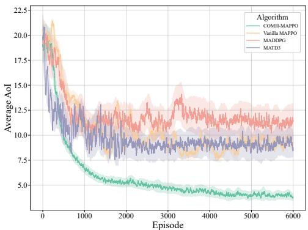  
(a)

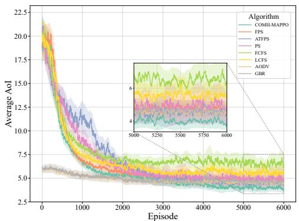  
(b)

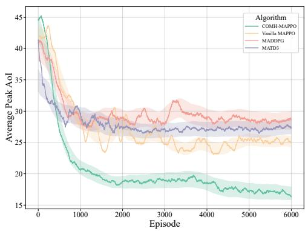  
(c)

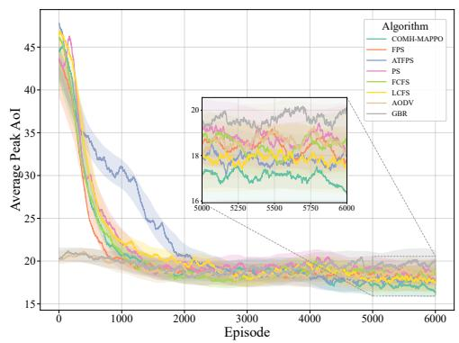  
(d)  
Fig. 7. Testing performance of metrics for information timeliness. (a) Average AoI comparison with MARL benchmarks. (b) Average AoI comparison with ablation benchmarks. (c) Average Peak AoI comparison with MARL benchmarks. (d) Average Peak AoI comparison with ablation benchmarks.

The comparison of buffer management shows nuanced performance characteristics between conventional queuing disciplines. While LCFS typically demonstrates superior AoI performance compared to FCFS in static scenarios, both strategies fail to achieve optimal results in our highly dynamic UAV network environment. The key limitation lies in their inability to adaptively prioritize packets from sources with prolonged update intervals. Our intelligent buffer scheduling mechanism addresses this challenge by learning to expedite transmission of packets from UAV sources that have experienced extended periods without successful delivery, thereby maintaining balanced information freshness across all UAV nodes. This adaptive prioritization capability proves essential for achieving system-wide AoI optimization.

For the routing ablation comparison, both AODV and GBR initially achieve lower AoI values due to their established routing frameworks, but their performance plateaus as training progresses. This limitation stems from their isolated optimization approach, which fails to account for the interdependencies between routing decisions and other decisionmaking strategies. The superior final performance validates that routing effectiveness in dynamic UAV networks cannot be maximized through independent optimization but requires holistic consideration of all three decision dimensions.

Furthermore, the narrower confidence intervals observed throughout the training process indicate exceptional algorithmic stability and robustness. The consistent performance across multiple random initializations and environmental conditions highlights the reliability of the proposed algorithm, essential characteristics for practical deployment in real-world autonomous monitoring scenarios.

As shown in Fig. 7(c) and Fig. 7(d), the average peak AoI metric provides additional confirmation of our approach’s effectiveness. Average peak AoI measures the mean of maximum staleness values experienced by each source, representing the system’s performance in worst-case scenarios. MARL benchmarks exhibit significantly higher peak AoI values, indicating their inability to prevent worst-case information staleness. COMH-MAPPO consistently achieves the lowest average peak AoI values across all experimental conditions. This superior performance indicates that we effectively balances the competing demands of all UAV nodes, ensuring no single source experiences excessive information staleness while maintaining overall system efficiency.

TABLE III  
COMPREHENSIVE PERFORMANCE SUMMARY (MEAN ± STANDARD DEVIATION)
<table><tr><td rowspan="2">Algorithm</td><td colspan="2">AoI Performance</td><td colspan="3">Network Performance</td></tr><tr><td>Avg. AoI ↓</td><td>Avg. Peak AoI ↓</td><td>Avg. E2E Latency (time slots) ↓</td><td>PDR (%) ↑</td><td>Throughput (pkts/time slot) ↑</td></tr><tr><td>COMH-MAPPO</td><td>3.84±0.33</td><td>16.32±1.28</td><td>1.51±0.11</td><td>79.5±4.2</td><td>9.80±0.52</td></tr><tr><td>FPS</td><td>4.89±0.48</td><td>18.38±2.02</td><td>1.81±0.09</td><td>69.3±4.2</td><td>4.47±0.42</td></tr><tr><td>ATFPS</td><td>4.57±0.52</td><td>17.79±2.85</td><td>1.76±0.14</td><td>50.8±4.7</td><td>6.58±0.61</td></tr><tr><td>PS</td><td>5.10±1.50</td><td>18.96±3.38</td><td>1.99±0.19</td><td>43.7±2.8</td><td>6.99±0.45</td></tr><tr><td>FCFS</td><td>6.54±1.16</td><td>18.38±2.97</td><td>1.96±0.19</td><td>58.4±5.3</td><td>7.11±0.65</td></tr><tr><td>LCFS</td><td>5.49±0.78</td><td>17.56±2.91</td><td>1.99±0.08</td><td>65.1±5.2</td><td>6.56±0.53</td></tr><tr><td>AODV</td><td>4.52±0.43</td><td>18.55±3.54</td><td>1.96±0.13</td><td>78.5±4.1</td><td>5.56±0.42</td></tr><tr><td>GBR</td><td>4.75±0.21</td><td>20.80±1.76</td><td>2.21±0.18</td><td>79.2±4.3</td><td>5.48±0.42</td></tr></table>

In summary, COMH-MAPPO converges to an average AoI of 3.84, while all ablation benchmarks converge within 7.0. In contrast, MARL benchmarks only converge to around 10. COMH-MAPPO achieves 48% and 15% improvement compared with MARL and ablation benchmarks respectively, and the ablation variants also outperform MARL algorithms. These results demonstrate that our problem-specific designs including the multi-head architecture and curriculum learning framework are essential for effective AoI optimization. Given this substantial performance gap, the subsequent analysis focuses exclusively on ablation studies to provide deeper insights into the contribution of each decision-making component.

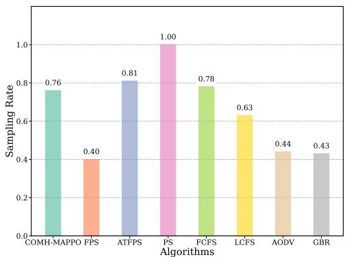  
Fig. 8. Sampling rate at training convergence.

## D. Network Performance Analysis

To comprehensively evaluate system effectiveness beyond AoI optimization, we further analyze three fundamental network performance metrics. Fig. 9 presents the comparative results across all algorithms from 10 independent simulation runs with different random seeds.

1) Average End-to-End (E2E) Latency: End-to-End latency measures the time required for packet transmission from source to destination, directly reflecting routing efficiency and queuing delay. As shown in Fig. 9(a), COMH-MAPPO consistently achieves the lowest latency with minimal variance. This demonstrates that the joint optimization across AASBR framework effectively prevents network congestion and accelerates the delivery process of each packet.

2) Packet Delivery Ratio (PDR): PDR captures the reliability of data transmission by quantifying the proportion of successfully delivered packets. Fig. 9(b) shows that COMH-MAPPO demonstrates superior reliability with the PDR close to 80%, significantly outperforming alternative approaches. In contrast, PS shows the poorest performance (43.7%) due to aggressive sampling causing frequent buffer overflow and significant packet drops. These results highlight the advantage of adaptive sampling and intelligent buffer scheduling in maintaining robust transmission performance.

3) Network Throughput: Throughput measures the effective data rate delivered to the destination in a time slot, reflecting overall utilization of network resources. As illustrated in Fig. 9(c), COMH-MAPPO yields the highest value (9.80 pkts/time slot) with stable results. The proposed algorithm enables discovery of optimal operating points that maximize sustainable data delivery without inducing congestion, while other approaches show notably lower throughput, with FPS achieving only 4.47 packets per time slot due to conservative sampling strategies.

Overall, Table III consolidates the detailed quantitative results of AoI and network performance. The consistent superiority of COMH-MAPPO across 10 independent runs validates its robustness and practical significance. The simultaneous improvement across network metrics validates the strong correlation between AoI optimization and network performance enhancement. The results confirm that minimizing information staleness inherently requires reducing packet delays, ensuring reliable delivery, and maximizing transmission efficiency. This correlation demonstrates that our AoI-oriented AASBR framework provides a unified approach for multi-objective optimization, where information freshness optimization naturally leads to enhanced overall network performance.

## E. Robustness and Scalability Analysis

To comprehensively evaluate the robustness and scalability under varying operational conditions across various algorithms, we further conduct experiments of varying UAVs velocities and UAV network sizes, as depicted in Fig. 10.

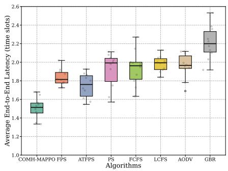  
(a)

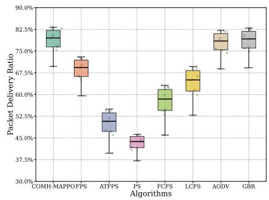  
(b)

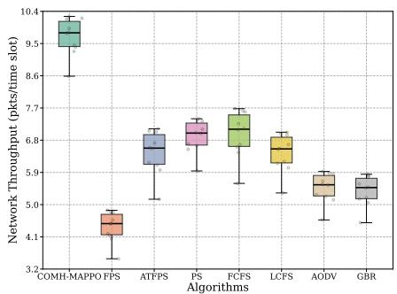  
(c)  
Fig. 9. Network performance comparison. (a) Average End-to-End latency. (b) Packet delivery ratio. (c) Network throughput.

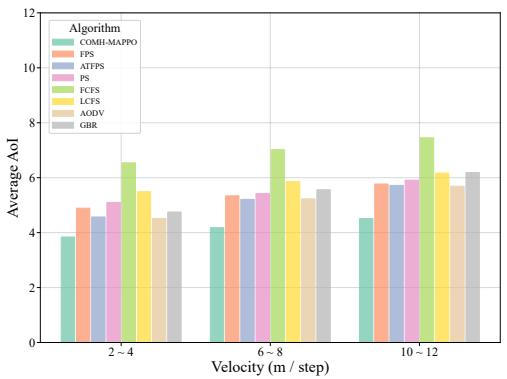  
(a)

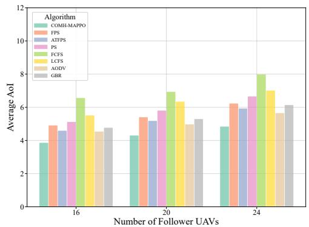  
(b)  
Fig. 10. Comparison of average AoI with varying velocities and numbers of Follower UAVs. (a) Average AoI performance across different UAVs’ velocities. (b) Average AoI performance across different UAV network sizes.

Fast UAV movements intensify topology dynamics and increase the frequency of link disruptions, posing significant challenges for neighbor discovery and routing stability. Fig. 10(a) indicates AoI performance comparison of all algorithms under different UAVs’ velocities. The results reveal an inherent trade-off between UAV mobility and AoI, while increasing velocity degrades AoI performance across all algorithms, COMH-MAPPO exhibits the smallest performance degradation, maintaining consistently lower AoI value than all benchmarks. This robustness is attributed to the learned routing policy that dynamically adjusts neighbor selection strategies in response to topology changes and the intelligent buffer scheduling mechanism prioritizes packets that prioritizes packets with optimal delivery feasibility under the prevailing network conditions.

Scaling network size introduces more complex network topologies, intensified competition for transmission resources, and substantially expanded state-action spaces, posing considerable challenges for multi-agent coordination and policy learning. Fig. 10(b) illustrates the AoI performance comparison across different algorithms with varying UAV network sizes. Although AoI increases with the growing number of Follower UAVs for all algorithms, COMH-MAPPO exhibits progressively distinct advantages over benchmark in largescale network scenarios, primarily because the joint optimization architecture enables simultaneous coordination of sampling, buffer scheduling, and routing decisions, maintaining effective policy learning capability even as the stateaction space expands significantly. This coordinated decisionmaking automatically balances traffic load to prevent localized congestion in larger UAV networks.

## VII. CONCLUSION AND FUTURE WORKS

In this paper, we have presented a comprehensive solution for autonomous UAV swarm-based information monitoring through the AASBR framework and COMH-MAPPO algorithm. By enabling Follower UAVs to serve dual roles as sensing platforms and communication relays, our Leader-Follower architecture eliminates dependency on terrestrial infrastructure while optimizing information freshness. The rigorous Dec-POMDP formulation provides theoretical foundation for joint optimization across sampling, buffer scheduling, and routing dimensions. The proposed COMH-MAPPO algorithm effectively addresses multi-objective complexity through specialized multi-head architectures and progressive curriculum learning, achieving superior AoI performance while maintaining decentralized execution capabilities. Comprehensive simulations validate the framework’s effectiveness, demonstrating significant improvements in both information timeliness and traditional network metrics, thereby establishing a robust foundation for practical autonomous monitoring missions.

JOURNAL OF LAT X CLASS FILES, VOL. 14, NO. 8, AUGUST 2021

Future research will pursue several promising directions to further advance the proposed framework. First, extending the approach to heterogeneous sensor modalities with adaptive selection mechanisms, incorporating energy optimization to increase system operating duration, and enhancing scalability for larger swarms with diverse capabilities. Moreover, investigating channel-aware mechanisms to enhance robustness against communication imperfections such as packet loss, channel fading, and transmission errors would strengthen practical deployment reliability. The distributed AI framework proposed in this work could also be extended to incorporate secure communication strategies, enabling intelligent defense against eavesdropping and jamming threats in hostile environments. Furthermore, jointly optimizing AoI and mobility-related energy consumption through integrated trajectory planning represents another valuable research direction. Additionally, transitioning to real-world implementations requires addressing computational limitations, developing robust communication protocols under realistic channel conditions, and dynamic environmental adaptability. Field validation in maritime and disaster response scenarios will be critical to demonstrate practical deployment viability and operational effectiveness in real-world environments.

## REFERENCES

[1] M. M. Azari, S. Solanki, S. Chatzinotas, et al., “Evolution of nonterrestrial networks from 5G to 6G: A survey,” IEEE Commun. Surv. Tutor., vol. 24, no. 4, pp. 2633–2672, 2022.

[2] S. Meng, S. Wu, J. Zhang, et al., “Semantics-empowered Space-Air-Ground-Sea integrated network: New paradigm, frameworks, and challenges,” IEEE Commun. Surv. Tutor., vol. 27, no. 1, pp. 140–183, 2025.

[3] J. Liu, X. Liao, H. Ye, et al., “UAV swarm scheduling method for remote sensing observations during emergency scenarios,” Remote Sensing, vol. 14, no. 6, 2022.

[4] M. Mozaffari, W. Saad, M. Bennis, et al., “A tutorial on UAVs for wireless networks: Applications, challenges, and open problems,” IEEE Commun. Surv. Tutor., vol. 21, no. 3, pp. 2334–2360, 2019.

[5] D. Shumeye Lakew, U. Sa’ad, N.-N. Dao, et al., “Routing in flying ad hoc networks: A comprehensive survey,” IEEE Commun. Surv. Tutor., vol. 22, no. 2, pp. 1071–1120, 2020.

[6] X. Tang, Q. Chen, W. Weng, et al., “Task assignment and exploration optimization for low altitude uav rescue via generative ai enhanced multi-agent reinforcement learning,” IEEE Trans. Mobile Comput., 2025, early access, doi:10.1109/TMC.2025.3594188.

[7] C. Lei, S. Wu, Y. Yang, et al., “Joint trajectory and communication optimization for heterogeneous vehicles in maritime SAR: Multi-agent reinforcement learning,” IEEE Trans. Veh. Technol., vol. 73, no. 9, pp. 12 328–12 344, 2024.

[8] S. Cheng, Y. Zhu, and S. Wu, “Deep learning based efficient ship detection from drone-captured images for maritime surveillance,” Ocean Engineering, vol. 285, p. 115440, 2023.

[9] C. Sun, X. Xiong, Z. Zhai, et al., “Max–min fair 3D trajectory design and transmission scheduling for solar-powered fixed-wing UAV-assisted data collection,” IEEE Trans. Wireless Commun., vol. 22, no. 12, pp. 8650–8665, 2023.

[10] G. Sun, J. Xiao, J. Li, et al., “Aerial reliable collaborative communications for terrestrial mobile users via evolutionary multi-objective deep reinforcement learning,” IEEE Trans. Mobile Comput., vol. 24, no. 7, pp. 5731–5748, 2025.

[11] J. Liu, P. Tong, X. Wang, et al., “UAV-aided data collection for information freshness in wireless sensor networks,” IEEE Trans. Wireless Commun., vol. 20, no. 4, pp. 2368–2382, 2021.

[12] B. Zhu, E. Bedeer, H. H. Nguyen, et al., “UAV trajectory planning for AoI-minimal data collection in UAV-aided IoT networks by transformer,” IEEE Trans. Wireless Commun., vol. 22, no. 2, pp. 1343–1358, 2023.

[13] G. Sun, L. Zhang, J. Li, et al., “Age of information optimization in laser-charged UAV-assisted IoT networks: A multi-agent deep reinforcement learning method,” IEEE Trans. Netw. Sci. Eng., early access, doi:10.1109/TNSE.2025.3596172.

[14] G. Sun, L. He, Z. Sun, et al., “Joint task offloading and resource allocation in aerial-terrestrial UAV networks with edge and fog computing for post-disaster rescue,” IEEE Trans. Mobile Comput., vol. 23, no. 9, pp. 8582–8600, 2024.

[15] Y. Wang, Q. Hu, Z. Li, et al., “Blockchain-envisioned UAV-aided disaster relief networks: Challenges and solutions,” IEEE Commun. Mag., vol. 63, no. 5, pp. 214–221, 2025.

[16] M. Matracia, M. A. Kishk, and M.-S. Alouini, “On the topological aspects of UAV-assisted post-disaster wireless communication networks,” IEEE Commun. Mag., vol. 59, no. 11, pp. 59–64, 2021.

[17] X. Zheng, G. Sun, J. Li, et al., “UAV swarm-enabled collaborative post-disaster communications in low altitude economy via a two-stage optimization approach,” IEEE Trans. Mobile Comput., 2025, early access, doi:10.1109/TMC.2025.3583510.

[18] X. Zheng, Y. Wu, L. Fan, et al., “Dual-functional UAV-empowered Space-Air-Ground networks: Joint communication and sensing,” IEEE J. Sel. Areas Commun., vol. 42, no. 12, pp. 3412–3427, 2024.

[19] K. Meng, Q. Wu, J. Xu, et al., “UAV-Enabled integrated sensing and communication: Opportunities and challenges,” IEEE Wireless Communications, vol. 31, no. 2, pp. 97–104, 2024.

[20] B. Yun, B. M. Chen, K. Y. Lum, et al., “Design and implementation of a leader-follower cooperative control system for unmanned helicopters,” J. Control Theory Appl., vol. 8, no. 1, pp. 61–68, 2010.

[21] A. Fotouhi, H. Qiang, M. Ding, et al., “Survey on UAV cellular communications: Practical aspects, standardization advancements, regulation, and security challenges,” IEEE Commun. Surv. Tutor., vol. 21, no. 4, pp. 3417–3442, 2019.

[22] A. Wilson, A. Kumar, A. Jha, et al., “Embedded sensors, communication technologies, computing platforms and machine learning for UAVs: A review,” IEEE Sensors J., vol. 22, no. 3, pp. 1807–1826, 2022.

[23] J. Zhao, Y. Wang, X. Qin, et al., “Timely device status updates in industrial wireless monitoring systems under resource constraints,” IEEE Internet Things J., vol. 9, no. 19, pp. 18 791–18 805, 2022.

[24] J. Li, L. Xiao, X. Qi, et al., “Reinforcement learning based energyefficient fast routing for FANETs,” IEEE Trans. Commun., vol. 72, no. 11, pp. 7063–7076, 2024.

[25] M. Zhang, H. Cheng, P. Yang, et al., “Adaptive routing design for flying ad hoc networks: a joint prediction approach,” IEEE Trans. Veh. Technol., vol. 73, no. 2, pp. 2593–2604, 2024.

[26] R. D. Yates, Y. Sun, D. R. Brown, et al., “Age of information: An introduction and survey,” IEEE J. Sel. Areas Commun., vol. 39, no. 5, pp. 1183–1210, 2021.

[27] Y. Wang, S. Wu, C. Lei, et al., “A review on wireless networked control system: The communication perspective,” IEEE Internet of Things Journal, vol. 11, no. 5, pp. 7499–7524, 2024.

[28] T. Li, C. Yang, Y. Wang, et al., “A survey on network management for xANET: Evolution, challenges, future directions,” IEEE Commun. Surv. Tutor., 2025.

[29] Z. Wang, H. Yao, T. Mai, et al., “Learning to routing in UAV swarm network: A multi-agent reinforcement learning approach,” IEEE Trans. Veh. Technol., vol. 72, no. 5, pp. 6611–6624, 2023.

[30] Y. Ke, K. Huang, X. Qiu, et al., “Distributed routing optimization algorithm for FANET based on multiagent reinforcement learning,” IEEE Sensors J., vol. 24, no. 15, pp. 24 851–24 864, 2024.

[31] T. Wu, J. Liu, J. Liu, et al., “A novel AI-based framework for AoIoptimal trajectory planning in UAV-assisted wireless sensor networks,” IEEE Trans. Wireless Commun., vol. 21, no. 4, pp. 2462–2475, 2022.

[32] M. Zhao, Y. Xiao, J. Yao, et al., “Up-downlink AoI-driven multi-source data collection in UAV-assisted wireless sensor networks,” IEEE Trans. Wireless Commun., 2024.

[33] C. Liu, Y. Guo, N. Li, et al., “AoI-minimal task assignment and trajectory optimization in multi-UAV-assisted IoT networks,” IEEE Internet Things J., vol. 9, no. 21, pp. 21 777–21 791, 2022.

[34] X. Gao, X. Zhu, and L. Zhai, “AoI-sensitive data collection in multi-UAV-assisted wireless sensor networks,” IEEE Trans. Wireless Commun., vol. 22, no. 8, pp. 5185–5197, 2023.

[35] N. Qi, Z. Huang, W. Sun, et al., “Coalitional formation-based groupbuying for UAV-enabled data collection: An auction game approach,” IEEE Trans. Mobile Comput., vol. 22, no. 12, pp. 7420–7437, 2022.

[36] J. Du, H. Wang, C. Jiang, et al., “Distributed AI-based secure communications in space-air-ground-sea integrated networks,” IEEE Communications Magazine, vol. 63, no. 7, pp. 48–55, 2025.

[37] Y. Sun, E. Uysal-Biyikoglu, R. D. Yates, et al., “Update or wait: How to keep your data fresh,” IEEE Trans. Inf. Theory, vol. 63, no. 11, pp. 7492–7508, 2017.

[38] A. Li, S. Wu, G. C. Lee, et al., “Sampling to achieve the goal: An age-aware remote markov decision process,” in 2024 IEEE Information Theory Workshop (ITW). IEEE, 2024, pp. 121–126.

[39] Z. Wang, X. Qin, B. Liu, et al., “Joint data sampling and link scheduling for age minimization in multihop cyber-physical systems,” IEEE Wireless Commun. Lett., vol. 8, no. 3, pp. 765–768, 2019.

[40] G. Zhang, C. Shen, Q. Shi, et al., “AoI minimization for WSN data collection with periodic updating scheme,” IEEE Trans. Wireless Commun., vol. 22, no. 1, pp. 32–46, 2023.

[41] M. Moltafet, M. Leinonen, and M. Codreanu, “On the age of information in multi-source queueing models,” IEEE Trans. Commun., vol. 68, no. 8, pp. 5003–5017, 2020.

[42] A. Javani, M. Zorgui, and Z. Wang, “Age of information for multiplesource multiple-server networks,” IEEE/ACM Trans. Netw., 2024.

[43] M. K. C. Shisher, Y. Sun, and I.-H. Hou, “Timely communications for remote inference,” IEEE/ACM Trans. Netw., vol. 32, no. 5, pp. 3824– 3839, 2024.

[44] C. Perkins, E. Belding-Royer, and S. Das, “RFC3561: Ad hoc ondemand distance vector (AODV) routing,” USA, 2003.

[45] T. Clausen and P. Jacquet, “RFC3626: Optimized link state routing protocol (OLSR),” USA, 2003.

[46] S.-C. Choi, H. R. Hussen, J.-H. Park, et al., “Geolocation-based routing protocol for flying ad hoc networks (FANETs),” in 2018 Tenth international conference on ubiquitous and future networks (ICUFN). IEEE, 2018, pp. 50–52.

[47] Y. Yu, L. Ru, W. Chi, et al., “Ant colony optimization based polymorphism-aware routing algorithm for ad hoc UAV network,” Multimedia Tools Appl., vol. 75, no. 22, pp. 14 451–14 476, 2016.

[48] D. Broyles and A. Jabbar, “Design and analysis of a 3-d gauss-markov model for highly dynamic airborne networks.” International Foundation for Telemetering, 2010.

[49] E. Rimon and D. Koditschek, “Exact robot navigation using artificial potential functions,” IEEE Trans. Robot. Autom., vol. 8, no. 5, pp. 501– 518, 1992.

[50] C. Yu, A. Velu, E. Vinitsky, et al., “The surprising effectiveness of PPO in cooperative multi-agent games,” in Proceedings of the 36th International Conference on Neural Information Processing Systems, ser. NIPS ’22. Red Hook, NY, USA: Curran Associates Inc., 2022.

[51] T. Rashid, M. Samvelyan, C. S. De Witt, et al., “Monotonic value function factorisation for deep multi-agent reinforcement learning,” J. Mach. Learn. Res., vol. 21, no. 178, pp. 1–51, 2020.

[52] X. Wang, Y. Chen, and W. Zhu, “A survey on curriculum learning,” IEEE Trans. Pattern Anal. Mach. Intell., vol. 44, no. 9, pp. 4555–4576, 2021.

[53] J. Schulman, P. Moritz, S. Levine, et al., “High-dimensional continuous control using generalized advantage estimation,” in 4th International Conference on Learning Representations, ICLR 2016, San Juan, Puerto Rico, May 2-4, 2016, Conference Track Proceedings, 2016.

[54] R. Lowe, Y. Wu, A. Tamar, et al., “Multi-agent Actor-Critic for mixed cooperative-competitive environments,” in Advances in Neural Information Processing Systems, vol. 30, 2017, pp. 6379–6390.

[55] J. Ackermann, V. Gabler, T. Osa, et al., “Reducing overestimation bias in multi-agent domains using double centralized critics,” 2019, arXiv:1910.01465.

[56] A. U. Atasayar, A. Li, c. Arı, et al., “Fresh data delivery: Joint sampling and routing for minimizing the age of information,” ser. MobiHoc ’25. New York, NY, USA: Association for Computing Machinery, 2025, p. 291–300.

Haoxu Wu (Graduate Student Member, IEEE) received the B.S. degree in electronic information engineering from Jilin University, Changchun, China, in 2021, and the M.S. degree in information and communication engineering from Beijing University of Posts and Telecommunications, Beijing, China, in 2024. He is currently working toward the Ph.D. degree in information and communication engineering with the Harbin Institute of Technology (Shenzhen), Shenzhen, China. His research interests include UAV swarms, age of information, reinforcement learning,

and multi-agent systems.  

Shaohua Wu (Member, IEEE) received the Ph.D. degree in communication engineering from Harbin Institute of Technology in 2009. From 2009 to 2011, he held a post-doctoral position at the Department of Electronics and Information Engineering, Shenzhen Graduate School, Harbin Institute of Technology, where he has been with since 2012. From 2014 to 2015, he was a Visiting Researcher with BBCR, University of Waterloo, Canada. He is currently a full professor with Harbin Institute of Technology (Shenzhen), China. He is also a Professor with

Peng Cheng Laboratory, Shenzhen, China. His research interests include satellite and space communications, advanced channel coding techniques, space-air-ground-sea integrated networks, and B5G/6G wireless transmission technologies. He has authored or coauthored over 100 papers in these fields and holds over 40 Chinese patents.

Aimin Li (Member, IEEE) received the B.S. degree (Best Thesis Award) and the Ph.D. degree (Best Dissertation Nomination) in electronic engineering from Harbin Institute of Technology (Shenzhen) in 2020 and 2025, respectively. From 2023 to 2024, he was a visiting researcher with the Institute for Infocomm Research (I2R), Agency for Science, Technology and Research (A\*STAR), Singapore. He is currently a postdoctoral researcher with Middle East Technical University (METU). His research interests include advanced channel coding techniques, information theory, and wireless communications. He has served as a reviewer for IEEE TIT, IEEE JSAC, IEEE TWC, IEEE TMC, IEEE TCOM, IEEE ISIT, among others, and as a session chair for IEEE Information Theory Workshop 2024 and IEEE Globecom 2024.

Siqi Meng received the B.E. degree in electronic and information engineering from Harbin Institute of Technology (Shenzhen) in 2021. He is currently pursuing the Ph.D. degree with the Department of Electronic Engineering, Harbin Institute of Technology (Shenzhen). His research interests include advanced channel coding techniques, age of information, semantic communications, and task-oriented communications.

Qinyu Zhang (Senior Member, IEEE) received the bachelor’s degree in communication engineering from the Harbin Institute of Technology (HIT), Harbin, China, in 1994 and the Ph.D. degree in biomedical and electrical engineering from the University of Tokushima, Tokushima, Japan, in 2003. From 1999 to 2003, he was an Assistant Professor with the University of Tokushima. From 2003 to 2005, he was an Associate Professor with the Shenzhen Graduate School, HIT, and was the Founding Director of the Communication Engineering Re-

search Center, School of Electronic and Information Engineering (EIE). Since 2005, he has been a Full Professor and the Dean of EIE School, HIT. He is also a Professor with Peng Cheng Laboratory, Shenzhen, China. His research interests include aerospace communications and networks, wireless communications and networks, cognitive radios, signal processing, and biomedical engineering. Dr. Zhang has been a TPC Member for the Infocom, IEEE ICC, IEEE Globecom, IEEE Wireless Communications and Networking Conference, and other flagship conferences in communications. He was an Associate Chair for Finance of the International Conference on Materials and Manufacturing Technologies 2012, the TPC Co-Chair of the IEEE/CIC ICCC 2015, and the Symposium Co-Chair of the CHINACOM 2011, and the IEEE Vehicular Technology Conference 2016 (Spring). He was the Founding Chair of the IEEE Communications Society Shenzhen Chapter. He is on the Editorial Board of some academic journals, such as Journal of Communication, KSII Transactions on Internet and Information Systems, and Science China Information Sciences.