# AoI and Energy Tradeoff for Aerial-Ground Collaborative MEC: A Multi-Objective Learning Approach

Fuhong Song , Qixun Yang , Mingsen Deng , Member, IEEE, Huanlai Xing , Member, IEEE, Yanping Liu , Xi Yu , Kaiju Li , and Lexi Xu

Abstract—This paper studies the age of information (AoI) and energy tradeoff (AET) problem in an aerial-ground collaborative mobile edge computing system, where a high-altitude platform and an unmanned aerial vehicle (UAV) work together to offer computing services for ground devices (GDs). The AET problem is formulated as a multi-objective optimization problem (MOP) that aims at simultaneously minimizing the total AoI of GDs and total energy consumption of the UAV by optimizing its flight paths and task offloading ratios. Addressing the AET problem poses a significant challenge due to the inherent conflict between the two objectives. The existing methods cannot well address the MOP because they adopt the linear combination to transform an MOP into a single-objective optimization problem using fixed weights (i.e., preferences), ignoring the conflict between objectives. Moreover, user preferences may change over time in dynamic MEC systems. To overcome these challenges, we first build a multi-objective Markov decision process model with a vectorial reward for the AET problem. There are one-to-one relationships between each component of the reward and one of the two objectives. Then, we propose a multi-objective learning algorithm based on proximal policy optimization (PPO), which primarily comprises a training phase and an evolutionary phase. The former adopts multi-objective PPO to iteratively optimize multiple learning individuals, aiming to obtain a nondominated policy set. The latter employs a genetic operator to further improve the quality of each policy in the set. Specifically, the crossover and mutation operators operate at the parameter level of policy networks, avoiding stagnation and premature convergence.

Manuscript received 17 December 2023; revised 25 March 2024; accepted 22 April 2024. Date of publication 29 April 2024; date of current version 5 November 2024. This work was supported in part by the National Natural Science Foundation of China under Grant 62061007, in part by Guizhou Provincial Science and Technology Project under Grant ZK[2024]693 and under Grant ZK[2023]028, in part by Guizhou Provincial Key Technology R&D Program under Grant QKHZC[2023]YB185, and in part by the Guizhou University of Finance and Economics Introduced Talent Research Start-Up under Grant 2022YJ039. Recommended for acceptance by Haipeng Yao. (Corresponding author: Mingsen Deng.)

Fuhong Song, Qixun Yang, Mingsen Deng, Xi Yu, and Kaiju Li are with the School of Information, Guizhou University of Finance and Economics, Guiyang 550025, China (e-mail: fhsong@mail.gufe.edu.cn; qixunyang@mail.gufe.edu. cn; msdeng@mail.gufe.edu.cn; yuxi@mail.gufe.edu.cn; likaiju@mail.gufe.ed u.cn).

Huanlai Xing is with the School of Computing and Artificial Intelligence, Southwest Jiaotong University, Chengdu 611756, China (e-mail: hxx@home. swjtu.edu.cn).

Yanping Liu is with the College of Big Data Statistics, Guizhou University of Finance and Economics, Guiyang 550025, China (e-mail: liuyanping6@126. com).

Lexi Xu is with the Research Institute, China United Network Communications Corporation, Beijing 100048, China, and also with the Queen Mary University of London, E1 4NS London, U.K. (e-mail: davidlexi@hotmail.com).

Digital Object Identifier 10.1109/TMC.2024.3394568

The experiment results validate that the proposed approach obtains a set of excellent nondominated policies and a favorable balance between objectives. Moreover, the proposed approach achieves improvements of at least 39.8%, 2.1%, and 15.3% regarding AoI, energy consumption, and cost compared with several algorithms.

Index Terms—Age of information, mobile edge computing, path planning, proximal policy optimization, reinforcement learning, task offloading, unmanned aerial vehicle.

# I. INTRODUCTION

W ITH the popularization of Internet of Things (IoT) andthe fast development of artificial intelligence, ground the fast development of artificial intelligence, ground devices (GDs) play a significant role in diverse intelligent applications, such as intelligent transportation and environmental monitoring. These applications are usually computing-intensive and delay-sensitive, resulting in a surging demand for computing resources. However, GDs often suffer from low computing capability and restricted battery life, due to small physical sizes and stringent production cost limits. Mobile edge computing (MEC) has been introduced to address the above resourceconstrained problem by relocating computing resources to the network edge [1]. Within this paradigm, GDs are empowered to migrate their applications to ground base stations (BSs) situated nearby, thereby enabling them to efficiently support such applications [2]. Nevertheless, the wireless communication coverage of a ground BS is limited and fixed, failing to connect to users located beyond the BS’s coverage area. Particularly, BSs may encounter damage due to military attacks or natural disasters, resulting in scarce computing resources and poor service performance [3]. Unmanned aerial vehicles (UAVs) have emerged as an efficient solution for extending communication coverage and enhancing deployment efficiency due to their high mobility and excellent maneuverability [4], [5], [6]. For example, UAVs can provide vital communication support when BS-based infrastructures are either unavailable during disaster rescue operations or sparsely distributed in remote mountainous areas. Equipped with communication and computing resources, UAVs can collect computation tasks from GDs nearby and handle them.

The quality of experience (QoE) is largely influenced by the freshness of collected data in various delay-sensitive applications. For instance, in forest fire monitoring applications, rapid collection and processing of temperature and humidity data are crucial for the accurate prediction of forest fires. In automatic drive applications, instantaneous image data handling is imperative to guarantee driving security. In emerging industrial applications, the freshness of sensing data has an important effect on the QoE of users. In these delay-sensitive applications, outdated information may result in erroneous control decisions and catastrophic accidents. To rigorously assess the timeliness of collected data in UAV-assisted MEC systems, a novel criterion known as the age of information (AoI) has been established. This criterion provides a precise quantification of data freshness, enabling the evaluation of system performance [7], [8].

# A. Related Work

Considerable researchers have devoted significant attention to investigating diverse aspects of UAV-assisted networks with information freshness. Recently, traditional methods, such as iterative algorithms, linear programming, convex optimization, genetic algorithms, and game theory, have been employed to optimize UAV-assisted networks involving information freshness, yielding satisfactory optimization outcomes. Qin et al. investigated an AoI-based task scheduling problem for aerialground collaborative MEC [7]. They proposed an iterative method to minimize the linear combination of each GD’s AoI. The researchers in [9] also presented an iterative algorithm to decrease the average AoI of all GDs by planning the UAV’s flying paths and bandwidth allocation. Liu et al. investigated the UAV-assisted task collection involving information freshness, and they proposed a two-phase-based iterative method to reduce GDs’ maximal AoI and average AoI. In [10], an AoI and energy efficiency tradeoff problem in a UAV-aided network was investigated. The researchers presented a multi-objective mixed integer linear programming approach to obtain nondominated policies of UAV paths [10]. The authors in [11] employed convex optimization and genetic algorithm to plan the UAV’s flight paths, aiming at minimizing the UAV’s mission completion time, subject to AoI constraints of collected data. To overcome security issues, Yang et al. studied an AoI-aware channel access problem in MEC networks [12]. They proposed a game theory based learning method to achieve channel access schemes. In a follow-up study, they considered the AoI minimization problem in a UAV-assisted traffic monitoring network from the perspective of the Stackelberg game [13]. Han et al. also adopted the game theory to decrease the system’s AoI in a UAV-assisted vehicular MEC system [14]. Chen et al. investigated a task offloading and resource allocation problem in an aerial-ground network including a high-altitude platform (HAP) and multiple UAVs [15]. They proposed a distributed online method to lower the energy consumption of all GDs. Jia et al. presented the hierarchical aerial computing system, where HAPs and UAVs worked together to offer computing supports for GDs [16]. They adopted the game theory to maximize the total data amount processed.

An increasing number of researchers adopt reinforcement learning (RL) to optimize UAV-assisted networks involving AoI. To reduce the average AoI, the researchers in [8] presented a deep Q-network (DQN) based approach in a UAV-enabled data collection network. Eldeeb et al. also adopted DQN to lower the average AoI in IoT networks by planning the UAV’s flight paths [17]. Choudhury et al. developed an AoI minimization scheduling method based on DQN in a two-hop UAV-relayed system [18]. The researchers in [19] proposed an actor-criticbased framework to optimize the UAV’s paths and data transmission time, aiming at reducing AoI of all GDs. In [20], the researchers considered an AoI-aware UAV-assisted wireless power transfer network. They presented a DQN-based path optimization method to decrease the total AoI of all GDs. Yi et al. studied a fresh data collection problem with wireless charging in UAV-enabled networks [21]. They developed a dueling double DQN (D3QN) approach to decrease the linear combination of the AoI and recharging cost using fixed weights. Chen et al. also introduced a D3QN-based method to optimize the flight paths of UAVs to decrease the energy consumption of GDs, subject to the AoI updating constraints [22]. Samir et al. modeled the UAV flight altitude and communication scheduling problem by Markov decision process (MDP) [23]. They adopted the proximal policy optimization (PPO) method to lower the expected linear combination of AoI. In [24], a UAV path optimization problem was researched in a cluster-based wireless network. The authors presented a transformer-based RL algorithm to minimize the total AoI of collected data. The authors in [25] formulated the UAV-assisted AoI-energy-aware path planning problem as an MDP. They proposed a twin-delayed deep deterministic (TD3) method to lower the linear combination of average AoI and energy consumption. Chen et al. investigated the AoI-oriented task offloading in an aerial-ground MEC network [26]. They proposed an online RL method based on double DQN to minimize AoI. Multi-agent RL methods were adopted to jointly optimize the AoI-based wireless network with multiple UAVs. For example, Wu et al. formulated an AoI-aware sensor data transmission problem by an MDP model [27]. They adopted a multi-agent deep deterministic policy gradient (MADDPG) to reduce the average AoI by planning UAVs’ flight paths. Oubbati et al. developed a multi-agent DQN based UAV path planning method to simultaneously minimize the expected AoI and UAVs’ energy consumption [28]. The authors in [29] investigated a UAV-aided MEC disaster system to reduce the linear combination of AoI and energy consumption by a multi-agent RL method. Cheng et al. studied the task and energy offloading problem in an HAPs and UAVs assisted MEC network [30]. They presented a soft actor-critic based multi-agent RL approach to maximize the total system utility. Kang et al. studied a hierarchical aerial MEC network consisting of HAPs and UAVs, where UAVs collected tasks from GDs and offloaded them to HAPs [31]. They developed a PPO based multi-agent approach to maximize the amount of completed tasks.

Recently, deep learning has been applied to various fields, such as classification and robot [32], [33], [34]. Jiang et al. presented a multiple graph learning neural networks framework to address multi-view semi-supervised classification problems [33]. The framework aimed at learning an optimal graph structure from a set of graphs. However, the graph learning framework was unsuitable for the problem concerned in this paper. This was because a computation task couldn’t usually be represented as a task graph. Singh et al. introduced ”Tinku”, a cost-efficient robot designed for teaching special needs children [34]. Tinku incorporated offline speech processing, computer vision for obstacle avoidance, and anthropomorphic expressions, presenting a promising solution for improving interaction and learning experiences in autism therapy. Although Tinku was a very effective robot for autism spectrum disorder problems, it didn’t consider the robot’s path planning. The obstacle avoidance method in Tinku could be used for reference in multi-UAV network scenarios.

TABLE I COMPREHENSIVE COMPARISON BETWEEN THE RELATED WORKS AND OURS 

<table><tr><td></td><td>Reference</td><td>[7]</td><td>[8]</td><td>[9]</td><td>[10]</td><td>[11]</td><td>[12]</td><td>[13]</td><td>[14]</td><td>[15]</td><td>[16]</td><td>[17]</td><td>[18]</td><td>[19]</td></tr><tr><td>System model</td><td>High-altitude platformSingle-objectiveMulti-objective</td><td>√</td><td>√</td><td>√</td><td>√</td><td>√</td><td>√</td><td>√</td><td>√</td><td>√</td><td>√</td><td>√</td><td>√</td><td>√</td></tr><tr><td>Optimization technique</td><td>Traditional methodSORL methodMulti-objective method</td><td>√</td><td>√</td><td>√</td><td>√</td><td>√</td><td>√</td><td>√</td><td>√</td><td>√</td><td>√</td><td>√</td><td>√</td><td>√</td></tr><tr><td></td><td>Reference</td><td>[20]</td><td>[21]</td><td>[22]</td><td>[23]</td><td>[24]</td><td>[25]</td><td>[26]</td><td>[27]</td><td>[28]</td><td>[29]</td><td>[30]</td><td>[31]</td><td>Ours</td></tr><tr><td>System model</td><td>High-altitude platformSingle-objectiveMulti-objective</td><td>√</td><td>√</td><td>√</td><td>√</td><td>√</td><td>√</td><td>√</td><td>√</td><td>√</td><td>√</td><td>√</td><td>√</td><td>√</td></tr><tr><td>Optimization technique</td><td>Traditional methodSORL methodMulti-objective method</td><td>√</td><td>√</td><td>√</td><td>√</td><td>√</td><td>√</td><td>√</td><td>√</td><td>√</td><td>√</td><td>√</td><td>√</td><td>√</td></tr></table>

Table I shows the comprehensive comparison between related works and ours regarding system model and optimization technique. We consider an HAP and UAV collaborative network scenario, where a multi-objective optimization problem (MOP) is investigated. The following section outlines the key distinctions between our work and prior research.

With respect to system model, most aforementioned studies adopt one or more UAVs to provide computing resources in wireless networks. However, a UAV’s energy capacity and computing resources are limited, making it challenging to support the computational demands of large-scale tasks from GDs. Although BSs can serve as auxiliary computing platforms, they are often unavailable in extreme scenarios such as natural disasters or military attacks. To address this challenge, some studies concentrate on the integration of HAP into UAV-assisted MEC systems [30]. By establishing effective collaboration between HAP and UAV, the computation tasks collected by UAVs can be offloaded to HAPs for remote processing. On the other hand, a significant portion of existing research focuses on single-objective optimization problems (SOPs) primarily aimed at minimizing AoI, disregarding other crucial objectives. In UAV-assisted networks, for instance, the UAV’s energy consumption remains a critical concern. However, the literature only provides a limited exploration of simultaneously minimizing both AoI and energy consumption.

In terms of optimization technique, some studies employ traditional optimization methods such as iterative algorithms [7], [9], convex optimization [11], and game theory [13], [14]. However, these methods struggle to adapt to dynamic network environments, especially when UAVs exhibit rapid mobility and task arrivals are unpredictable. The dynamics and uncertainty often necessitate the repetitive execution of these methods, leading to substantial computational overhead and hampering responsiveness. Unlike traditional methods, RL based methods can address complex optimization problems using limited prior information by rapidly adjusting their behavior to adapt to dynamic MEC environments. Nevertheless, all existing methods are based on single-objective reinforcement learning (SORL), employing linear aggregation approaches with fixed weights to transform an MOP into an SOP. This overlooks the conflict relationships between objectives, thus failing to obtain balanced optimization results across multiple objectives.

# B. Contribution

This paper considers an aerial-ground collaborative MEC system involving information freshness, where an HAP and a UAV cooperate with each other to provide computing services to GDs. The UAV cruises with planned paths to gather computation tasks from GDs. These tasks can be both processed on the local UAV or partly migrated to the HAP for offloading execution when needed. In the proposed system, we study the AoI and energy tradeoff (AET) problem. Unlike previous studies that concentrate on SOP or MOP using the linear combination method, we focus on the simultaneous minimization of two conflicting objectives, i.e., AoI and energy consumption. We propose a novel multi-objective learning (MOL) algorithm to solve the AET problem. The primary contributions of the paper are outlined as follows.

\- We consider an aerial-ground collaborative MEC system consisting of an HAP and a UAV. The two work together to offer computing support for GDs. The AET problem is formulated as an MOP problem, and its aim is to simultaneously minimize the total AoI and total energy consumption of the UAV via optimizing the UAV’s flight paths and task offloading ratios. Addressing this MOP poses significant challenges due to the inherent conflict between the objectives, making it difficult to strike a balance between them. For example, task collection can decrease AoI while increasing energy consumption.

\- We establish a multi-objective Markov decision process model featuring a vectorial reward comprising two components, each of which corresponds to an optimization objective of the AET problem. A multi-objective learning algorithm based on PPO is proposed to address the AET problem, namely MOL-AET. The algorithm mainly consists of the training and evolutionary phases. In the training phase, multiple learning individuals are optimized iteratively by multi-objective PPO. To avoid premature convergence, the evolutionary phase adopts the genetic operator (i.e., crossover and mutation) on each learning individual and its matched individual, aiming at further improving the nondominated policies obtained in the training phase. MOL-AET can output multiple nondominated policies to meet diverse user preferences.

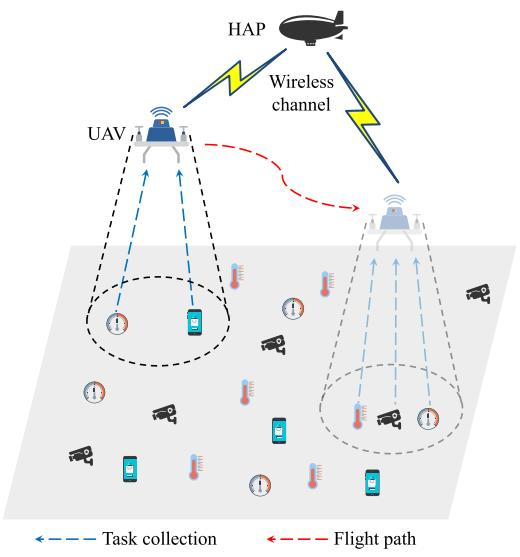

flowchart

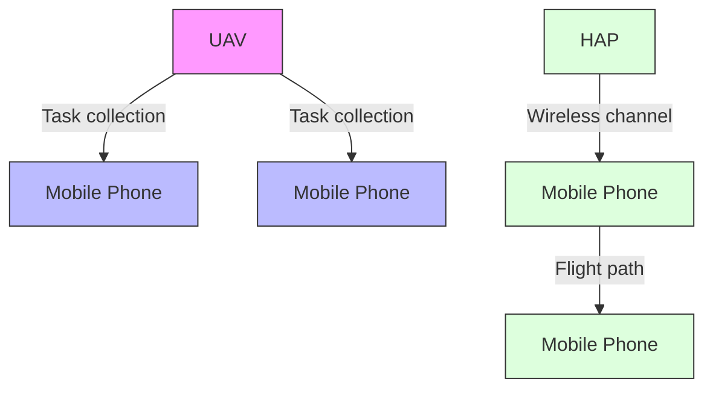

Fig. 1. Aerial-ground collaborative MEC system.

We perform extensive experiments on a large number of generated test instances, each of which has two different system parameters, i.e., the number of GDs and the UAV’s flight height. The results validate that MOL-AET obtains a set of excellent nondominated policies and surpasses two well-known multi-objective evolutionary algorithms and three exclusively developed multi-objective RL algorithms against the inverted generational distance and generational distance. Furthermore, MOL-AET achieves gains of at least 39.8%, 2.1%, and 15.3% regarding average AoI, average energy consumption, and average cost compared with the above five algorithms.

The remainder of this paper is structured as follows. Section II introduces the system model and formally defines the AET problem. To facilitate subsequent analysis, Section III offers a concise overview of MOMDP and MOP. Section IV then delves into the proposed algorithm specifically designed to address the AET problem. Section V presents and analyzes the experimental results obtained, highlighting the effectiveness of the proposed approach. Finally, Section VI concludes the paper and introduces future work.

# II. SYSTEM MODEL AND PROBLEM FORMULATION

This paper studies an aerial-ground collaborative MEC system, illustrated in Fig. 1. The system comprises an HAP and a UAV that cooperatively deliver computing services to a set of GDs, represented by the set $\mathcal { I } = \{ 1 , . . . , J \}$ . These GDs are ran-= 1domly scattered in a rectangular area to sense the environmental information, like humidity and temperature. Assume there is

TABLE II MAIN NOTATIONS USED IN THE SYSTEM MODEL AND PROPOSED ALGORITHM 

<table><tr><td>Notation</td><td>Description</td></tr><tr><td></td><td>Notation used in the system model</td></tr><tr><td> $j, J, \mathcal{J}$ </td><td>Index, number, and set of GDs</td></tr><tr><td> $t, T, \mathcal{T}$ </td><td>Index, number, and set of time slots</td></tr><tr><td> $\mathcal{I}, \mathcal{C}$ </td><td>Input data size and computation intensity of a task</td></tr><tr><td> $A_{\text{max}}$ </td><td>Maximal AoI that the MEC system can tolerate</td></tr><tr><td> $A_t$ </td><td>AoI of the MEC system in time slot  $t$ </td></tr><tr><td> $A_{\text{total}}$ </td><td>Total AoI of the MEC system during  $T$  time slots</td></tr><tr><td> $A_t^j$ </td><td>AoI of GD  $j$  in time slot  $t$ </td></tr><tr><td> $E_t$ </td><td>Energy consumption of the UAV in time slot  $t$ </td></tr><tr><td> $E_{\text{total}}$ </td><td>Total energy consumption of the UAV</td></tr><tr><td> $f_{\text{UAV}}$ </td><td>Computing capability of the UAV</td></tr><tr><td> $g_0$ </td><td>Channel power gain for 1 m reference distance</td></tr><tr><td> $\mathcal{N}_t^{\text{C}}$ </td><td>Number of collected tasks</td></tr><tr><td> $\mathcal{N}_t^{\text{L}}$ </td><td>Number of tasks processed locally on the UAV</td></tr><tr><td> $\mathcal{N}_t^{\text{O}}$ </td><td>Number of tasks offloaded by the UAV</td></tr><tr><td> $\mathcal{N}_t^{\text{Q}}$ </td><td>Number of queued tasks</td></tr><tr><td> $\mathcal{N}_t^{\text{U}}$ </td><td>Number of uncompleted tasks</td></tr><tr><td> $\mathcal{N}_{\text{max}}$ </td><td>Maximal number of tasks the UAV can store</td></tr><tr><td> $P_{\text{UAV}}$ </td><td>Transmission power of the UAV</td></tr><tr><td> $R_{\text{max}}$ </td><td>Maximal horizontal coverage of the UAV</td></tr><tr><td> $\delta$ </td><td>Time duration of a time slot</td></tr><tr><td> $\vartheta_{\text{max}}$ </td><td>Maximal azimuth angle</td></tr><tr><td> $\kappa$ </td><td>Effective capacitance coefficient</td></tr><tr><td colspan="2">Notation used in the proposed algorithm</td></tr><tr><td> $a, \mathcal{A}$ </td><td>Action and action space</td></tr><tr><td> $s, \mathcal{S}$ </td><td>State and state space</td></tr><tr><td> $P_{\text{cro}}, P_{\text{mut}}$ </td><td>Crossover and mutation probabilities</td></tr><tr><td> $m, n$ </td><td>Number of objectives and learning individuals</td></tr><tr><td> $M_{\text{str}}$ </td><td>Mutation strength</td></tr><tr><td> $\mathbf{r}_t$ </td><td>Vectorial reward</td></tr><tr><td> $\gamma$ </td><td>Discount factor</td></tr><tr><td> $\Phi_{\text{evo}}$ </td><td>Maximal number of evolution generations</td></tr><tr><td> $\Phi_{\text{tra}}$ </td><td>Maximal number of training times</td></tr></table>

no available ground cellular communication system for GDs, such as a remote area. This paper adopts a rotary-wing UAV for task collection from GDs and subsequent computational support since this kind of UAVs can maintain close proximity to the GDs at a low height. The HAP floats in the stratosphere in a quasi-static manner and its floating height is fixed. The HAP has powerful computing ability and acts as a collaborative computing scheme to handle tasks offloaded by the UAV. All collected computation tasks can be processed either locally on the UAV or partially migrated to the HAP for offloading execution when necessary. In this paper, we employ the time division multiple access protocol for the fresh task collection in the MEC system.

In general, a computation task can be modeled as a two-tuple -I, C, where I and C indicate the input data size and computation intensity of the task, respectively. Note that C reflects how many CPU cycles are needed to handle one-bit input data. We focus on a discrete-time system, where each time slot has a fixed duration denoted by δ. Assume the whole flight mission (i.e., a task collection period) has T time slots, represented by the set $\mathcal { T } = \{ 1 , . . . , T \}$ . Table II summarizes the main notations used = 1in the system model and proposed algorithm.

# A. UAV Movement Model

Similar to previous works [3], [35], we employ the Cartesian coordinate system to indicate the spatial positions of the HAP, UAV, and GDs. The UAV cruises with a constant speed and its flight height U is fixed. We assume that the locations of GDs are static, i.e., their locations are unchanged during the whole flight mission. The coordinates of the HAP and GD j are represented as $\mathcal { M } ^ { \mathrm { H } } = ( X ^ { \mathrm { H } } , Y ^ { \mathrm { H } } , H )$ and $\mathcal { M } ^ { j } = ( X ^ { j } , Y ^ { j } , 0 )$ , respectively, = ( ) = ( 0)where H is the HAP’s floating height. The UAV’s coordinate is denoted as $\mathcal { M } _ { t } ^ { \mathrm { U } } = ( X _ { t } ^ { \mathrm { U } } , Y _ { t } ^ { \mathrm { U } } , U )$ and it may change over time = ( )since the UAV flies over GDs to collect their computation tasks. Suppose that the UAV can move with a horizontal direction $b _ { t }$ and a horizontal distance $d _ { t }$ in time slot t. The constraints of the two variables need to be satisfied as follow.

$$
0 \leq b _ {t} \leq 2 \pi , 0 \leq d _ {t} \leq d _ {\max}, \tag {1}
$$

where $d _ { \mathrm { m a x } }$ is the maximal flight distance that the UAV can move in each time slot because of the finite energy cost. On the basis of $b _ { t }$ and $d _ { t }$ , the horizontal coordinate of the UAV in time slot $t + 1$ is calculated as

$$
\left\{ \begin{array}{l} X _ {t + 1} ^ {\mathrm{U}} = X _ {t} ^ {\mathrm{U}} + d _ {t} \cdot \cos (b _ {t}) \\ Y _ {t + 1} ^ {\mathrm{U}} = Y _ {t} ^ {\mathrm{U}} + d _ {t} \cdot \sin (b _ {t}). \end{array} \right. \tag {2}
$$

We assume the UAV operates at a fixed speed $\nu _ { t } = d _ { t } / \delta$ , bounded by a predefined maximal flight speed $\nu _ { \mathrm { m a x } }$ =. In addition, the UAV’s movement is confined within a rectangular area with side lengths $X _ { \mathrm { m a x } }$ and $Y _ { \mathrm { m a x } }$ .

According to [35], when the rotary-wing UAV flies at speed $\nu ,$ the corresponding propulsive energy consumption is defined as

$$
\begin{array}{l} P (\nu) = \underbrace {P _ {\mathrm{bla}} \left(1 + \frac {3 \nu^ {2}}{\nu_ {\mathrm{tip}} ^ {2}}\right)} _ {\text {Blade profile}} + \underbrace {P _ {\mathrm{ind}} \left(\sqrt {1 + \frac {\nu^ {4}}{4 \nu_ {\mathrm{rot}} ^ {4}}} - \frac {\nu^ {2}}{2 \nu_ {\mathrm{rot}} ^ {2}}\right) ^ {\frac {1}{2}}} _ {\text {Induced power}} \\ + \underbrace {\frac {1}{2} d _ {0} \epsilon \psi \eta \nu^ {3}} _ {\text { Parasite   power }}. \tag {3} \\ \end{array}
$$

It is observed that $P ( \nu )$ comprises the blade profile, induced ( )power, and parasite power. In the blade profile, $P _ { \mathrm { b l a } }$ and $\nu _ { \mathrm { t i p } }$ are the blade profile power under hovering status and tip speed of the rotor blade, respectively. In the induced power, $P _ { \mathrm { i n d } }$ and $\nu _ { \mathrm { r o t } }$ denote the induced power and mean rotor-induced speed in hovering, respectively. In the parasite power, $d _ { 0 } , \epsilon , \psi ,$ , and η represent the fuselage drag ratio, air density, rotor solidity, and rotor disc area, respectively. Based on (3), the energy consumption, $E _ { \mathrm { { f l y } } }$ , incurred by the UAV during a flight and hovering period of T is obtained by

$$
E _ {\text { fly }} = \int_ {0} ^ {T} P (\nu_ {t}) d t. \tag {4}
$$

# B. AoI Model

We utilize the AoI indicator to quantify the timeliness of collected tasks. AoI is known as the elapsed time since a GD produces its most recent task [8]. In time slot t, we define the task’s AoI of GD $j$ as

$$
A _ {t} ^ {j} = \delta (t - L _ {t} ^ {j}), \tag {5}
$$

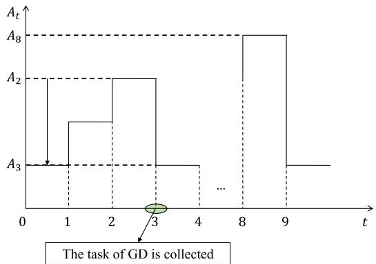

line

| t | At     |
|---|--------|
| 0 | A3     |
| 1 | A2     |
| 2 | A2     |
| 3 | A3     |
| 4 | ...    |
| 8 | A8     |
| 9 | A3     |

Fig. 2. AoI changing process of a GD.

where $L _ { t } ^ { j }$ represents the time when the UAV collects the task from GD j last time.

The range of task collection is limited because the UAV owns limited communication coverage. Thus, the UAV is only able to gather computation tasks from GDs within its coverage. This depends on its maximal azimuth angle $\vartheta _ { \mathrm { m a x } }$ and fixed flight height U . Let $\mathcal { J } _ { t } ^ { \mathrm { C } }$ denote the set of GDs covered by the UAV in t, given by

$$
\mathcal {J} _ {t} ^ {\mathrm{C}} = \{j | d _ {t} ^ {j} \leq R _ {\max}, j \in \mathcal {J} \}, \tag {6}
$$

where $d _ { t } ^ { j } = \sqrt { ( X _ { t } ^ { \mathrm { U } } - X ^ { j } ) ^ { 2 } + ( Y _ { t } ^ { \mathrm { U } } - Y ^ { j } ) ^ { 2 } }$ is the horizontal = ( ) + ( )distance between the UAV and GD j in t. $R _ { \mathrm { m a x } } = U$ · $\tan ( \vartheta _ { \mathrm { m a x } } )$ =is the maximal horizontal coverage of the UAV.

n( )According to whether the task of GD $j \in \mathcal I$ is collected, the GD’s AoI in $t + 1$ is defined as

$$
A _ {t + 1} ^ {j} = \left\{ \begin{array}{l l} \delta , & \text { if   } j \in \mathcal {J} _ {t} ^ {\mathrm{C}} \\ \min \{A _ {\max}, A _ {t} ^ {j} + \delta \}, & \text { otherwise } \end{array} \right. \tag {7}
$$

where $A _ { \mathrm { m a x } }$ denotes the maximal AoI that the MEC system can tolerate, and it is the same for all GDs. According to $( 7 ) ,$ when the UAV collects a task from GD $j \in \mathcal { I } _ { t } ^ { \mathrm { C } }$ , the GD’s AoI value decreases to $\delta ;$ otherwise, its AoI value increased by δ but the value can not exceed $A _ { \mathrm { m a x } }$ . Note that if the AoI $A _ { t } ^ { \dot { j } }$ is greater than the largest AoI $A _ { \mathrm { m a x } }$ , the corresponding task of GD j is deemed to be invalid. Therefore, the UAV should follow an appropriate path to collect the computation tasks from GDs in time, lowering the AoI of each GD as much as possible.

Fig. 2 depicts an example of the AoI changing process of a GD. It is seen that the GD generates a computation task in time slot $t = 0$ and its AoI $A _ { 0 }$ is initially set to δ. After two time = 0slots, the GD’s task is still not collected by the UAV, thus the AoI increases to $A _ { 2 } = 2 \delta$ . In time slot $t = 3 ,$ , the UAV collects = 2 = 3the GD’s computation task, hence the corresponding AoI is reset to $A _ { 3 } = \delta .$ .

# C. Computing Model

We consider that the UAV keeps a computing queue in order to store the collected tasks, which are awaiting for further handling. It should be noted that task collection delay and associated energy consumption can be neglected because the UAV can sufficiently approach GDs. The UAV can only store the specified number of computation tasks due to its limited storage capacity, denoted by $\mathcal { N } _ { \mathrm { m a x } }$ . Furthermore, it has to execute the unfinished tasks stored in the computing queue in each time slot. Let $\mathcal { N } _ { t } ^ { \mathrm { U } }$ represent the number of unfinished tasks in the queue, and its value is an integer limited between 0 and $\mathcal { N } _ { \mathrm { m a x } }$ . Denote the task offloading ratio by $o _ { t } \in [ 0 , 1 ]$ in time slot t. To be specific, $\mathcal { N } _ { t } ^ { \mathrm { O } } = \left\lfloor o _ { t } \mathcal { N } _ { t } ^ { \mathrm { U } } \right\rfloor$ [0 1]computation tasks are to be migrated to the HAP =for offloading execution, where · indicates the floor function. The UAV locally executes the remaining $\mathcal { N } _ { t } ^ { \mathrm { L } } = \mathcal { N } _ { t } ^ { \mathrm { U } } - \mathcal { N } _ { t } ^ { \mathrm { O } }$ =computation tasks. Within a time slot, the UAV can only process a finite number of computation tasks due to its limited computing capability, denoted by fUAV. Thus, the number of tasks executed by the UAV within a time slot can be obtained by $\{ \mathcal { N } _ { t } ^ { \mathrm { L } } , \phi \}$ , where $\phi = \lfloor \tau f _ { \mathrm { U A V } } / \mathcal { I C } \rfloor$ minis the maximal number of tasks that =the UAV can process in each time slot.

Based on the above definitions, the number of queued tasks at the end of t is obtained by

$$
\mathcal {N} _ {t} ^ {\mathrm{Q}} = \max \{\mathcal {N} _ {t} ^ {\mathrm{U}} - \phi - \mathcal {N} _ {t} ^ {\mathrm{O}}, 0 \}. \tag {8}
$$

According to (8), the number of tasks removed from the queue is $\phi + \bar { \mathcal { N } _ { t } ^ { \mathrm { O } } }$ , which includes φ processed tasks and $\mathcal { N } _ { t } ^ { \mathrm { O } }$ offloaded +tasks.

At the beginning of $t + 1$ , the number of uncompleted tasks, $\mathcal { N } _ { t + 1 } ^ { \mathrm { U } }$ , is updated as

$$
\mathcal {N} _ {t + 1} ^ {\mathrm{U}} = \min \{\mathcal {N} _ {t} ^ {\mathrm{Q}} + \mathcal {N} _ {t} ^ {\mathrm{C}}, \mathcal {N} _ {\max} \}, \tag {9}
$$

where $\mathcal { N } _ { t } ^ { \mathrm { C } } = | \mathcal { T } _ { t } ^ { \mathrm { C } } |$ is the number of collected tasks from $\mathrm { G D } j \in$ $\mathcal { J } _ { t } ^ { \mathrm { C } }$ =. The UAV’s energy consumption for executing $\{ \mathcal { N } _ { t } ^ { \mathrm { L } } , \phi \}$ tasks in t is calculated as

$$
E _ {t} ^ {\mathrm{L}} = \kappa \cdot \min \{\mathcal {N} _ {t} ^ {\mathrm{L}}, \phi \} \mathcal {I C} \cdot (f _ {\mathrm{UAV}}) ^ {2}, \tag {10}
$$

where κ is the effective capacitance coefficient.

On the basis of the Shannon-Hartley theorem [3], the transmission rate from the UAV to the HAP in time slot t is obtained by

$$
\varphi_ {t} = \omega \cdot \log_ {2} \left(1 + \frac {P _ {\mathrm{UAV}} \cdot g _ {t}}{\xi^ {2}}\right), \tag {11}
$$

where $\omega$ is the system bandwidth, and $P _ { \mathrm { U A V } }$ and $\xi ^ { 2 }$ are the $\mathrm { U A V } _ { \mathrm { \Delta } }$ transmission and noise powers, respectively. $g _ { t }$ denotes the channel gain between the UAV and HAP in time slot $^ { \cdot \ t , }$ which is obtained by the free-space path loss model as follows

$$
g _ {t} = g _ {0} (d _ {t} ^ {\mathrm{UH}}) ^ {- 2} = \frac {g _ {0}}{\| \mathcal {M} _ {t} ^ {\mathrm{U}} - \mathcal {M} ^ {\mathrm{H}} \| ^ {2}}, \tag {12}
$$

where $g _ { 0 }$ indicates the channel power gain for the 1 m reference distance, $d _ { t } ^ { \mathrm { U H } }$ is the distance between the UAV and HAP in t, and  ·  is the euclidean norm.

The UAV needs to transmit the input data of $\mathcal { N } _ { t } ^ { \mathrm { O } }$ computation tasks to the HAP via a wireless channel. Let $\eta _ { t }$ represent the elapsed time since the UAV initiated the transmission at the beginning of t and is calculated as

$$
\eta_ {t} = \underset {l} {\operatorname{argmax}} \left(\sum_ {i = t} ^ {t + l} \delta \varphi_ {i} \geq \mathcal {L} _ {t}\right). \tag {13}
$$

where $\mathcal { L } _ { t } = \mathcal { I } \mathcal { C } \mathcal { N } _ { t } ^ { \mathrm { O } }$ denotes the total input data size for transmitting $\mathcal { N } _ { t } ^ { \mathrm { O } }$ tasks. Based on $\eta _ { t }$ , the transmission delay that the UAV finishes the offloading of $\mathcal { N } _ { t } ^ { \mathrm { O } }$ tasks is obtained by

$$
D _ {t} ^ {\mathrm{O}} = \left\{ \begin{array}{l l} (\eta_ {t} - 1) \delta + \frac {\mathcal {L} _ {t} - \sum_ {i = t} ^ {\eta_ {t} + t - 1} \delta \varphi_ {i}}{\varphi_ {t + \eta_ {t}}}, & \text { if   } \mathcal {L} _ {t} <   \sum_ {i = t} ^ {\eta_ {t} + t} \delta \varphi_ {i} \\ \delta \eta_ {t}, & \text { if   } \mathcal {L} _ {t} = \sum_ {i = t} ^ {\eta_ {t} + t} \delta \varphi_ {i} \end{array} \right. \tag {14}
$$

where $\varphi _ { i }$ is the transmission rate in time slot $i ( = t , . . . , \eta _ { t } + t )$ and δ is the duration of a time slot. The size of data transmitted by the UAV is $\delta \varphi _ { i }$ within a time slot. Therefore, the total size of data transmitted by the UAV is $\textstyle \sum _ { i = t } ^ { \eta _ { t } + t } \delta \varphi _ { i }$ after $\eta _ { t }$ time slots.

The UAV’s energy consumption for transmitting these tasks to the HAP is given by

$$
E _ {t} ^ {\mathrm{O}} = P _ {\mathrm{UAV}} \cdot D _ {t} ^ {\mathrm{O}}. \tag {15}
$$

We suppose the HAP is equipped with extensive computing resources, the delay incurred in processing offloaded tasks on the HAP can be ignored. Additionally, the delay for returning these task’s results to GDs is also neglected since the output data size of a task is generally significantly smaller than its input data size.

# D. Problem Formulation

On the basis of (7), in time slot t, we define the MEC system’s AoI as the average value of each GD’s AoI $A _ { t } ^ { j }$ , which is calculated by

$$
A _ {t} = \frac {1}{J} \sum_ {j = 1} ^ {J} A _ {t} ^ {j}. \tag {16}
$$

The total AoI $A _ { \mathrm { t o t a l } }$ of the MEC system during T time slots is calculated by

$$
A _ {\text { total }} = \sum_ {t = 1} ^ {T} A _ {t}. \tag {17}
$$

According to (10) and (15), the $\mathrm { U A V } _ { \mathrm { \Delta } }$ energy consumption (except for propulsion energy consumption) $E _ { t }$ encompasses both the energy consumption generated for local processing $E _ { t } ^ { \mathrm { L } }$ and energy consumption incurred for task offloading $E _ { t } ^ { \mathrm { O } }$ . Therefore, the energy consumption $E _ { t }$ is calculated by

$$
E _ {t} = E _ {t} ^ {\mathrm{L}} + E _ {t} ^ {\mathrm{O}}. \tag {18}
$$

The total energy consumption of the UAV during the whole flight mission, $E _ { \mathrm { t o t a l } } .$ , is comprised of the execution energy consumption, offloading energy consumption, and propulsion energy consumption. Thus, $E _ { \mathrm { t o t a l } }$ is calculated as

$$
E _ {\text { total }} = \sum_ {t = 1} ^ {T} E _ {t} + E _ {\text { fly }}. \tag {19}
$$

Let $\mathbf { U } = \{ ( b _ { t } , d _ { t } ) | \forall t \in \mathcal { T } \}$ and $\mathbf { O } = \{ o _ { t } | \forall t \in \mathcal { T } \}$ denote the = ( ) =UAV’s flight path and offloading ratio during the whole flight mission, respectively. We formulate the AET problem as an MOP, with $A _ { \mathrm { t o t a l } }$ and $E _ { \mathrm { t o t a l } }$ minimized simultaneously, via optimizing U and O. The MOP is defined as

$$
\min _ {\mathbf {U}, \mathbf {O}} (A _ {\text { total }}, E _ {\text { total }}) \tag {20a}
$$

subject to:

$$
0 \leq b _ {t} \leq 2 \pi , \quad \forall t \in \mathcal {T}, \tag {20b}
$$

$$
0 \leq d _ {t} \leq d _ {\max}, \quad \forall t \in \mathcal {T}, \tag {20c}
$$

$$
o _ {t} \in [ 0, 1 ], \quad \forall t \in \mathcal {T}, \tag {20d}
$$

$$
0 \leq X _ {t} ^ {\mathrm{U}} \leq X _ {\max}, \quad \forall t \in \mathcal {T}, \tag {20e}
$$

$$
0 \leq Y _ {t} ^ {\mathrm{U}} \leq Y _ {\max}, \quad \forall t \in \mathcal {T}, \tag {20f}
$$

$$
d _ {t} ^ {j} \leq R _ {\max}, \quad \forall j \in \mathcal {J} _ {t} ^ {\mathrm{C}}, t \in \mathcal {T}, \tag {20g}
$$

$$
A _ {t} ^ {j} \leq A _ {\max}, \quad \forall j \in \mathcal {J}, t \in \mathcal {T}. \tag {20h}
$$

Inequalities (20b) and (20c) constrain the UAV’s flight direction and distance in each time slot. Eq (20d) specifies the task offloading ratio is a variable in the range of 0 to 1. Inequalities (20e) and (20f) together stipulate that the UAV’s flight region can not exceed the rectangle’s boundary. Inequality $( 2 0 \mathrm { g } )$ specifies that the UAV is only capable of collecting tasks from GDs within the communication coverage. Inequality (20h) specifies that each GD’s AoI can not exceed the maximal AoI $A _ { \mathrm { m a x } }$ that the MEC system can tolerate. One can understand that to maximize $A _ { \mathrm { t o t a l } }$ , the UAV should follow an appropriate path during its flight mission so that it can cover as many GDs and collect their tasks as possible. A positive correlation exists between the number of tasks collected and the AoI reduction. In simple terms, collecting a greater number of tasks from GDs leads to a more rapid decrease in their AoI. Nevertheless, the UAV has to process these collected tasks, incurring its high energy consumption. Hence, it is easily understood that two objectives, i.e., the minimization of $A _ { \mathrm { t o t a l } }$ and minimization of $E _ { \mathrm { t o t a l } }$ , are inherently conflicting with each other.

# III. OVERVIEW OF MOMDP AND MOP

# A. MOMDP

An MOMDP comprises the state space $s ,$ action space A, vectorial reward function r, initial state distribution U , and discount factor $\gamma \in [ 0 , 1 ] . \mathrm { A }$ policy $\pi : { \mathcal { S } }  A$ is a state-to-action [0 1] :mapping which corresponds to an expected vectorial return ${ \bf R } _ { \pi } = ( R _ { \pi } ^ { 1 } , . . . , R _ { \pi } ^ { m } )$ , where m is the number of objectives. = ( )The k-th expected return $R _ { \pi } ^ { k }$ in $\mathbf { R } _ { \pi }$ is associated with the k-th optimization objective of an MOP. $R _ { \pi } ^ { k }$ is defined as

$$
R _ {\pi} ^ {k} = \mathbb {E} _ {\pi} \left[ \sum_ {t = 1} ^ {T} \gamma^ {t - 1} r _ {t} ^ {k} (s _ {t}, a _ {t}) | s _ {1} \smile \mathcal {U}, a _ {t} \smile \pi (s _ {t}) \right], \tag {21}
$$

where $r _ { t } ^ { k }$ is the k-th element of the vectorial reward $\mathbf { r } _ { t } =$ $( r _ { t } ^ { 1 } , . . . , r _ { t } ^ { m } )$ received at time step $t . s _ { t } \in S$ and $a _ { t } \in \mathcal A$ =are the ( )state and action at time step t, respectively. The AET problem has two optimization objectives $A _ { \mathrm { t o t a l } }$ and $E _ { \mathrm { t o t a l } }$ , thus we have $m = 2$ . In other words, $R _ { \pi } ^ { 1 }$ and $R _ { \pi } ^ { 2 }$ correspond to objectives $A _ { \mathrm { t o t a l } }$ and $E _ { \mathrm { t o t a l } }$ , respectively.

# B. MOP

An MOP can be formulated as

$$
\left\{ \begin{array}{l l} \min & \mathbf {F} (\pi) = (f ^ {1} (\pi), \dots , f ^ {m} (\pi)), \\ \text { s.t. } & \pi \in \Pi . \end{array} \right. \tag {22}
$$

where π is a policy in search space $\Pi . \mathbf { F } ( \pi )$ is the objective vector Π ( )including m objective functions which generally conflict with each other. The AET problem is an MOP that can be modeled by MOMDP. That is to say, we need to set the objective value $f ^ { k } ( \pi )$ to the expected return $R _ { \pi } ^ { k } , k = 1 , . . . , m$ .

( )Let $\pi _ { 1 }$ and $\pi _ { 2 }$ = 1represent two different policies in . $\pi _ { 1 }$ is said to dominate $\pi _ { 2 }$ if and only if $f ^ { k } ( \pi _ { 1 } ) \leq f ^ { k } ( \pi _ { 2 } )$ for all $k = 1 , . . . , m$ , and $f ^ { l } ( \pi _ { 1 } ) < f ^ { l } ( \pi _ { 2 } )$ ( ) ( )for at least one index $l \in \{ 1 , . . . , m \}$ ( ) ( ). If there is no one policy in  dominating the 1policy $\pi ^ { * }$ Π, it is Pareto optimal. All Pareto optimal policies, also referred to as nondominated policies, collectively form a Pareto optimal set, and their projection onto the objective space is recognized as the Pareto front.

In general, two primary approaches exist for addressing an MOP. The first method is to convert the MOP into an SOP via the weighted sum. Although the method has simple mathematical models and high computational efficiency, it can only obtain one compromised policy in a single run. The single policy fails to capture the inherent balance between objectives. In simpler terms, the resulting policy is optimal only for the specific weight configuration (i.e., preference) used. The other approach to address MOPs is to employ multi-objective algorithms [3], [36]. These approaches enable the acquisition of numerous nondominated policies in a single run, thereby illustrating the Pareto-dominance relationship between them, which is crucial information for decision-makers. Despite potential fluctuations in user preferences, the obtained nondominated policies remain in effect. Therefore, the ultimate aim of addressing an MOP is to acquire numerous excellent nondominated policies, where each policy caters to a specific preference. By exploring this set, the decision-makers can identify the policy that best aligns with their current preference, thereby better balancing multiple objectives.

# IV. THE PROPOSED ALGORITHM

# A. MOMDP Model

To tackle the AET problem using an MORL algorithm, it is imperative to establish a dedicated MOMDP model tailored to the problem at hand. This involves systematically defining the state space, action space, and reward function.

1) State Space: A state space is the set of possible states in which the MEC environment can be. The state space is defined as

$$
\mathcal {S} = \{s _ {t} | s _ {t} = (d _ {t} ^ {1}, \dots , d _ {t} ^ {J}, A _ {t} ^ {1}, \dots , A _ {t} ^ {J}, s _ {t} ^ {\mathrm{U}}), \forall t \in \mathcal {T} \}, \tag {23}
$$

where $d _ { t } ^ { j }$ is the horizontal distance between the UAV and GD $j \in \mathcal I$ in t and $A _ { t } ^ { j }$ is the AoI of GD $j \in \mathcal I$ in t. The position and AoI data of all GDs can guide the UAV to follow an appropriate path to collect tasks from GDs and reduce their AoI. $\hat { s _ { t } ^ { \mathrm { U } } } = \hat { ( t , \mathbb { 1 } _ { t - 1 } , \mathcal { M } _ { t } ^ { \mathrm { U } } , C _ { t } ^ { \mathrm { U } } , \mathcal { N } _ { t } ^ { \mathrm { U } } , \mathcal { N } _ { t } ^ { \mathrm { C } } ) }$ is the state of the UAV in t, where t indicates that the current state is in the t-th time slot; $\mathbb { 1 } _ { t - 1 }$ is an indicator variable that is equal to one if the UAV moves outside of the restricted region in $t - 1$ , otherwise it is equivalent to zero; $\mathcal { M } _ { t } ^ { \mathrm { U } }$ is the UAV’s coordinate; $C _ { t } ^ { \mathrm { U } }$ represents the number of times that the UAV moves outside of the rectangular region so far. The first four elements in $s _ { t } ^ { \mathrm { U } }$ can help to keep the UAV from flying out of the restricted region, avoiding unnecessary waste of resources. $\mathcal { N } _ { t } ^ { \mathrm { U } }$ and $\mathcal { N } _ { t } ^ { \mathrm { C } }$ are the numbers of unfinished tasks and collected tasks in the computing queue, respectively. The latter two elements help to guide the UAV to make proper task offloading decisions.

2) Action Space: The AET problem aims at optimizing the $\mathrm { U A V } _ { \mathrm { \Delta } }$ flight path and task offloading ratios to minimize $A _ { \mathrm { t o t a l } }$ and $E _ { \mathrm { t o t a l } }$ . Thus, the action space is defined as

$$
\mathcal {A} = \{a _ {t} | a _ {t} = (b _ {t}, d _ {t}, o _ {t}), \forall t \in \mathcal {T} \}, \tag {24}
$$

where $b _ { t }$ and $d _ { t }$ indicate the horizontal flight direction and distance, respectively, and $o _ { t }$ represents the task offloading ratio. Assume that the UAV can select one of eight directions to move at its current location in each time slot. We have east, $\begin{array} { r } { b _ { t } \in \mathcal { B } = \{ 0 , \frac { \pi } { 4 } , \frac { 2 \pi } { 4 } , . . . , \frac { 7 \pi } { 4 } \} } \end{array}$ , where ast, and $b _ { t } = 0$ denotes therepresents $\begin{array} { r } { b _ { t } = \frac { \pi } { 4 } } \end{array}$ $\begin{array} { r } { b _ { t } = \frac { 2 \pi } { 4 } } \end{array}$ = =the north, etc. Similarly, the continue values $d _ { t }$ and $o _ { t }$ are discretized into seven actions and eleven actions, respectively. Thus, we have $\begin{array} { r } { d _ { t } \in \mathcal { D } = \{ 0 , \frac { d _ { \operatorname* { m a x } } } { 6 } , \frac { 2 d _ { \operatorname* { m a x } } } { 6 } , . . . , d _ { \operatorname* { m a x } } \} } \end{array}$ and $o _ { t } \in$ $\mathcal { O } = \{ 0 , 0 . 1 , 0 . 2 , . . . , 1 \}$ =.

= 0 0 1 0 2 13) Reward Function: The AET problem aims to minimize $A _ { \mathrm { t o t a l } }$ and $E _ { \mathrm { t o t a l } }$ , simultaneously. As a result, after the agent takes action $a _ { t } ,$ the received vectorial reward is defined as

$$
\mathbf {r} _ {t} = (r _ {t} ^ {\mathrm{A}}, r _ {t} ^ {\mathrm{E}}) = \left\{ \begin{array}{l l} (\Delta_ {t} ^ {\mathrm{A}}, - E _ {t} ^ {\prime}), & \text { if } \mathbb {1} _ {t} = 0 \\ (\Delta_ {t} ^ {\mathrm{A}} - \varepsilon_ {\mathrm{p}}, - E _ {t} ^ {\prime} - \varepsilon_ {\mathrm{p}}), & \text { if } \mathbb {1} _ {t} = 1 \end{array} \right. \tag {25}
$$

where $r _ { t } ^ { \mathrm { A } }$ and $r _ { t } ^ { \mathrm { E } }$ are two scalar rewards that are associated with $A _ { \mathrm { t o t a l } }$ and $E _ { \mathrm { t o t a l } }$ , respectively. To minimize $A _ { \mathrm { t o t a l } }$ , we set $r _ { t } ^ { \mathrm { A } }$ to $\Delta _ { t } ^ { \mathrm { A } } = A _ { t - 1 } - A _ { \ t }$ t that indicates the negative increment of the ΔAoI $A _ { t - 1 }$ after finishing the task collection process in time slot t. We give a positive reward to the agent for its smaller AoI and punish it for its larger AoI. To minimize $E _ { \mathrm { t o t a l } }$ , we set $r _ { t } ^ { \mathrm { E } }$ to $- E _ { t } ^ { \prime } = - ( E _ { t } + \varepsilon _ { \mathrm { b } } )$ , where $\varepsilon _ { \mathrm { b } }$ is a scaling factor used to ensure that $r _ { t } ^ { \mathrm { A } }$ (and $r _ { t } ^ { \mathrm { E } }$ )have the same order of magnitude. This can enable the simultaneous optimization of two objectives without introducing any biases, thus obtaining a good balance between them. Based on the positive or negative results of $E _ { t }$ , the agent can know how good or how bad the current action decision is, adjusting its actions accordingly in the subsequent time slots. The penalty factor $\varepsilon _ { \mathrm { p } }$ is adopted to reduce $r _ { t } ^ { \mathrm { A } }$ and $r _ { t } ^ { \mathrm { E } }$ if the UAV moves outside of the restricted region in t.

# B. MOL-AET Algorithm

A learning individual can be represented as a three-tuple $\Upsilon =$ $\langle \mathbf { w } , \pi _ { \theta } , v _ { \phi } \rangle$ , where

\- $\mathbf { w } = ( w ^ { 1 } , . . . , w ^ { m } )$ : The weight vector used to denote = ( )a user preference between m objectives, satisfying  mk=1 wk  . $\textstyle \sum _ { k = 1 } ^ { m } w ^ { \bar { k } } = 1$

= 1πθ: The policy network, parameterized by θ, which interacts with the MEC environment to determine actions based on the current state.

$v _ { \phi } \colon$ The value network, parameterized by $\phi ,$ which evaluates the value of the environmental states observed by the agent.

The framework of MOL-AET is shown in Fig. 3, comprising the initialization phase, training phase, and evolutionary phase. During the initialization phase, n learning individuals are generated, each of which includes a weight vector, a policy network, and a value network. In the training phase, each learning individual is trained using proximal policy optimization (PPO) through interaction with the MEC system environment. A set of nondominated policies are obtained at the end of the training phase. Subsequently, in the evolutionary phase, the genetic operators are employed to further enhance the quality of the nondominated policy set. Next, we explain the reason for launching the evolutionary phase after the training phase.

RL algorithms have been successfully applied to diverse domains, such as UAV path planning [10] and intelligent transportation systems [37]. However, the parameter updating of RL algorithms heavily depends on gradient descent, making it easy to fall into local optimum. Evolutionary algorithms (EAs), characterized by gradient-free, belong to a category of black-box optimization methods inspired by principles of natural evolution [38]. EAs maintain a population of learning individuals and iteratively search for satisfying policies. Thus, EAs have good global exploration abilities and stable convergence. However, they suffer from low sample efficiency and struggle to address high-dimensional problems, such as the modeled AET problem. Therefore, we integrate the heterogeneous policy optimization methods of RL and EA, because both of them have distinct and complementary advantages. In the training phase, we first train each learning individual by PPO. This phase can take full advantage of $\mathrm { P P O ^ { \circ } s }$ local exploitation ability to obtain good optimization results. Then, the evolutionary phase adopts the genetic operators to further improve each learning individual. To be specific, uniform crossover and Gaussian mutation directly operate at the parameter level of a learning individual’s policy network. The two operators can enhance the MOL-AET’s global exploration ability, avoiding stagnation and premature convergence.

Algorithm 1 shows the pseudo-code of MOL-AET. We elaborate on its three phases in detail.

1) Initialization Phase: To simultaneously optimize two objectives $A _ { \mathrm { t o t a l } }$ and $E _ { \mathrm { t o t a l } }$ , MOL-AET maintains n learning individuals which have different weight vectors. Note that each weight vector represents a preference between objectives, meaning these learning individuals can simultaneously optimize them from the perspective of different preferences.

Similar to [3], we employ the systematic approach to produce n uniformly distributed weight vectors, denoted by the set ${ \mathcal { W } } = \{ \mathbf { w } _ { 1 } , . . . , \mathbf { w } _ { n } \}$ (step 2 of Algorithm 1). There are two =important parameters m and $\beta$ in the approach, where m and $\beta$ represent the numbers of objectives and divisions. Based on the two parameters, the systematic approach can generate n  m−1m+β− $n =  { \mathrm { C } } _ { m + \beta - 1 } ^ { m - 1 }$ evenly distributed weight vectors. For example, = Cwe have $\dot { m } = 2$ for the AET problem with two objectives. If $\beta = 2 9$ = 2, thirty weight vectors can be generated. The distribution = 29of weight vectors has a great effect on the action schemes of learning individuals. These uniformly distributed weight vectors can guide learning individuals to obtain various nondominated policies. In steps 3 and 4, we randomly initialize n policy networks, $\{ \pi _ { \theta _ { 1 } } , . . . , \pi _ { \theta _ { n } } \}$ , and n value networks, $\{ v _ { \phi _ { 1 } } , . . . , v _ { \phi _ { n } } \}$ . We represent the population $\mathcal { P } = \{ \Upsilon _ { 1 } , . . . , \Upsilon _ { n } \}$ , where $\Upsilon _ { i } =$ $\langle \mathbf { w } _ { i } , \pi _ { \theta _ { i } } , v _ { \phi _ { i } } \rangle$ = Υ Υ Υ =is the i-th learning individual. As described in Section IV-A2, the action decision $a _ { t }$ consists of the flight direction $b _ { t }$ , flight distance $d _ { t }$ , and offloading ratio $o _ { t }$ , which have |B|, |D|, and |O| discrete values, respectively. The traditional neural network architecture needs to build a neuron in its output layer for each alternative action. Thus, the number of neurons in the output layer is $\begin{array} { r } { | \boldsymbol { \mathcal { A } } | = | \boldsymbol { \mathcal { B } } | \times | \boldsymbol { \mathcal { D } } | \times | \boldsymbol { \mathcal { O } } | = 6 1 6 } \end{array}$ . This may result in the curse of dimensionality, making it difficult to obtain optimal action policies. To overcome the challenge, this paper adopts three subnetworks to establish the output layer of the policy networks. The policy network architecture is shown in Fig. 4, which includes a state input layer, $Z$ fully connected layers, and an output layer (i.e., action decision layer). The state $s _ { t }$ undergoes normalization prior to being fed into the input layer of the policy network. This pre-processing step is necessary

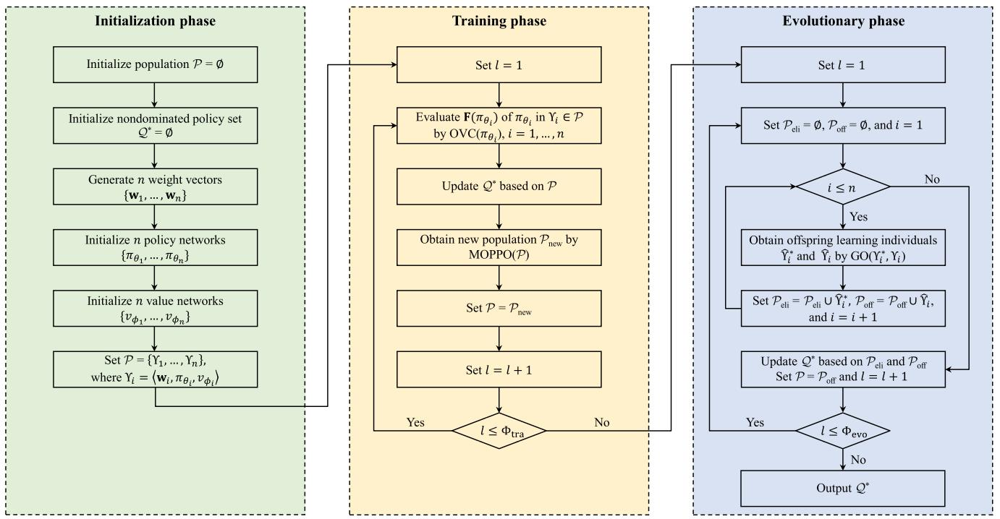

flowchart

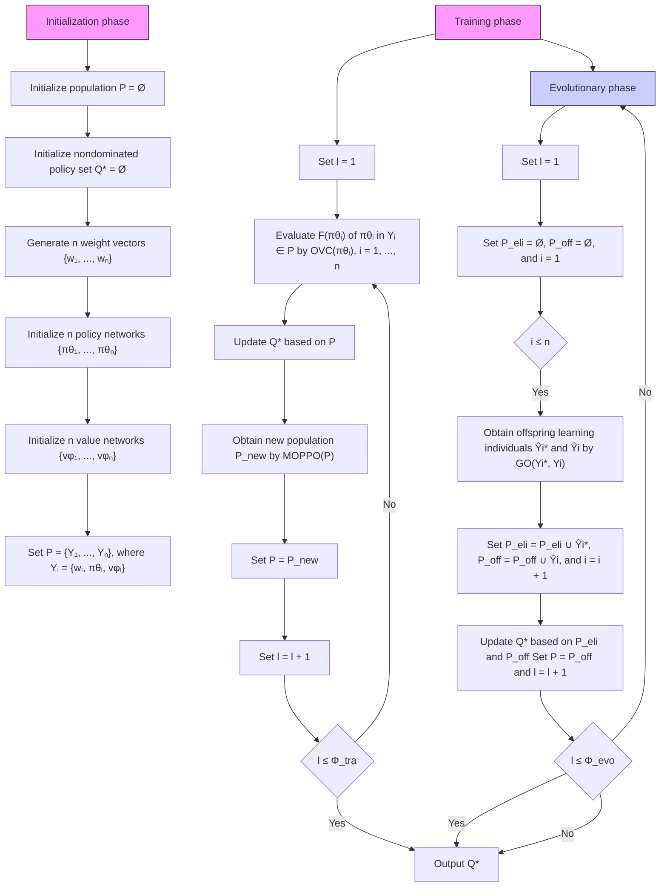

Fig. 3. Framework of MOL-AET.

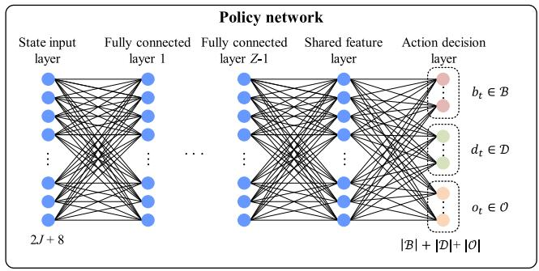

flowchart

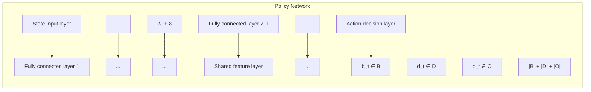

Fig. 4. Policy network architecture.

because the state’s elements have disparate value ranges. Each subnetwork is corresponding to an action decision variables. The action decision $a _ { t }$ consists of the flight direction $b _ { t }$ , flight distance $d _ { t } ,$ , and offloading ratio $o _ { t } .$ , which have |B|, |D|, and $| { \mathcal O } |$ discrete values, respectively. Thus, the numbers of neurons of three subnetworks are equal to |B|, |D|, and |O|, respectively. The Z-th fully connected layer is the shared feature layer which separately connects each subnetwork.

2) Training Phase: In this phase, MOL-AET starts training each learning individual in the population $\mathcal { P }$ by multi-objective proximal policy optimization (MOPPO). First, we adopt Algorithm 2 to evaluate $\mathbf { F } ( \pi _ { \theta _ { i } } )$ of the policy network $\pi _ { \boldsymbol { \theta } _ { i } }$ in the learning individual $\Upsilon _ { i } \in \mathcal { P } , i = 1 , . . . , n .$ Then, the nondominated policy set $\mathcal { Q } ^ { * }$ Υ = 1is updated based on $\mathcal { P } .$ To be specific, we remove any policy dominated by $\pi _ { \boldsymbol { \theta } _ { i } }$ from $\mathcal { Q } ^ { * }$ , and add $\pi _ { \boldsymbol { \theta } _ { i } }$ to $\mathcal { Q } ^ { * }$ if it is not dominated by any existing policy in $\mathcal { Q } ^ { * }$ . By doing so, all policies in $\mathcal { Q } ^ { * }$ are Pareto optimal.

To train each learning individual $\Upsilon _ { i } \in \mathcal { P }$ , a trajectory in-Υcluding multiple transitions need to be collected by interacting with the MEC system environment (steps 3-10 of Algorithm 3). Before inputting the policy network $\pi _ { \boldsymbol { \theta } _ { i } }$ , the observed state $s _ { t }$ should be normalized because of different dimensionality. Then, the normalized outcomes are fed into the policy network and it outputs action $a _ { t } = ( b _ { t } , d _ { t } , o _ { t } )$ . The learning individual $\Upsilon _ { i }$ executes $a _ { t }$ to transition the UAV from its current position to the next position based on the observation of the next state $s _ { t + 1 }$ . Meanwhile, it obtains a vectorial reward $\mathbf { r } _ { t }$ from the environment. The transition $\left( s _ { t } , a _ { t } , \mathbf { w } _ { i } \mathbf { r } _ { t } , s _ { t + 1 } \right)$ is added to the trajectory $\Gamma _ { i : }$ , where $\mathbf { w } _ { i } \mathbf { r } _ { t }$ (is the dot product of $\mathbf { w } _ { i }$ and $\mathbf { r } _ { t }$ . Repeat Γthe process above until the maximal time step $T$ is reached.

This paper employs MOPPO to train each police network and value network. To prevent excessive updates to the policy network and ensure stable learning, a clipped surrogate objective function is implemented, as follows

Algorithm 1: MOL-AET.   
Input: number of learning individuals n, number of maximal training times $\Phi_{tra}$ , number of maximal evolution generations $\Phi_{evo}$ .

// Initialization phase

1: Initialize population $P = \emptyset$ and nondominated policy set $Q^{*} = \emptyset$ ;

2: Generate n weight vectors $W = \{w_{1}, \ldots, w_{n}\}$ ;

3: Initialize n policy networks $\{\pi_{\theta_{1}}, \ldots, \pi_{\theta_{n}}\}$ ;

4: Initialize n value networks $\{v_{\phi_{1}}, \ldots, v_{\phi_{n}}\}$ ;

5: Set $P = \{\Upsilon_{1}, \ldots, \Upsilon_{n}\}$ , where $\Upsilon_{i} = \langle w_{i}, \pi_{\theta_{i}}, v_{\phi_{i}} \rangle$ ;

// Training phase

6: for $l = 1, \ldots, \Phi_{tra}$ do

7: Evaluate objective vector $F(\pi_{\theta_{i}})$ of policy network $\pi_{\theta_{i}}$ in $\Upsilon_{i}$ by OVC( $\pi_{\theta_{i}}$ ), $i = 1, \ldots, n$ ;

8: Update $Q^{*}$ based on P;

9: Obtain new population $P_{new}$ by MOPPO(P);

10: Set $P = P_{new}$ ;

11: end for

// Evolutionary phase

12: for $l = 1, \ldots, \Phi_{evo}$ do

13: Initialize elite population $P_{eli} = \emptyset$ and offspring population $P_{off} = \emptyset$ ;

14: for $\Upsilon_{i} \in P$ do

15: Obtain matched individual $\Upsilon_{i}^{*}$ of $\Upsilon_{i}$ from $Q^{*}$ ;

16: Obtain offspring learning individuals $\widehat{\Upsilon}_{i}^{*}$ and $\widehat{\Upsilon}_{i}$ by performing genetic operator in GO( $\Upsilon_{i}^{*}, \Upsilon_{i}$ );

17: Set $P_{eli} = P_{eli} \cup \widehat{\Upsilon}_{i}^{*}$ and $P_{off} = P_{off} \cup \widehat{\Upsilon}_{i}$ ;

18: end for

19: Update $Q^{*}$ based on $P_{eli}$ and $P_{off}$ ;

20: Set $P = P_{off}$ ;

21: end for

Output: nondominated policy set $Q^{*}$ .

Algorithm 2: Objective Vector Evaluation (OVC).   
Input: policy network $\pi_{\theta_{i}}$ .
1: Initialize objective vector $\mathbf{F}(\pi_{\theta_{i}})=(0,\ldots,0)$ ;
2: Observe initial state $s_{1}$ ;
3: for $t=1,\ldots,T$ do
4: Select action $a_{t}$ by policy network $\pi_{\theta_{i}}(s_{t})$ ;
5: Take action $a_{t}$ and move the UAV to next location;
6: Receive reward $r_{t}$ and observe new state $s_{t+1}$ ;
7: Calculate $\mathbf{F}(\pi_{\theta_{i}})=\mathbf{F}(\pi_{\theta_{i}})+\mathbf{r}_{t}$ ;
8: end for
Output: objective vector $\mathbf{F}(\pi_{\theta_{i}})$ .

$$
\begin{array}{l} \mathcal {L} _ {\mathrm{P}} (\mathbf {w} _ {i}, \theta_ {i}) = \\ \mathbb {E} \left[ \sum_ {t = 1} ^ {T} \min \left(\frac {\pi_ {\theta_ {i}} (a _ {t} | s _ {t})}{\pi_ {\theta_ {i} ^ {\text { old }}} (a _ {t} | s _ {t})} G _ {t} ^ {\mathbf {w} _ {i}}, \operatorname{clip} _ {1 - \alpha} ^ {1 + \alpha} \left(\frac {\pi_ {\theta_ {i}} (a _ {t} | s _ {t})}{\pi_ {\theta_ {i} ^ {\text { old }}} (a _ {t} | s _ {t})}\right) G _ {t} ^ {\mathbf {w} _ {i}}\right) \right], \end{array} \tag {26}
$$

Algorithm 3: Multi-Objective PPO (MOPPO).   
Input: population P.
1: Initialize the new population $P_{new} = \emptyset$ ;
2: for $\Upsilon_{i} = \langle w_{i}, \pi_{\theta_{i}}, v_{\phi_{i}} \rangle \in P$ do
3: Initialize the trajectory $\Gamma_{i} = \emptyset$ ;
4: Observe initial state $s_{1}$ ;
5: for $t = 1, \ldots, T$ do
6: Select action $a_{t}$ by policy network $\pi_{\theta_{i}}(s_{t})$ ;
7: Take action $a_{t}$ and move the UAV to next location;
8: Receive reward $r_{t}$ and observe new state $s_{t+1}$ ;
9: Add transition $(s_{t}, a_{t}, w_{i}r_{t}, s_{t+1})$ to $\Gamma_{i}$ ;
10: end for
11: Update $\pi_{\theta_{i}}$ by (26) using the trajectory $\Gamma_{i}$ ;
12: Update $v_{\phi_{i}}$ by (28) using the trajectory $\Gamma_{i}$ ;
13: Set $P_{new} = P_{new} \cup \Upsilon_{i}$ ;
14: end for
Output: new population $P_{new}$ .

where $\pi _ { \theta _ { i } ^ { \mathrm { o l d } } }$ is the old policy network before updating $\pi _ { \theta _ { i } }$ . $\mathrm { c l i p } _ { 1 - \alpha } ^ { 1 + \alpha } ( \dot { \Lambda } )$ is the clip function that limits the value of . $G _ { t } ^ { \mathbf { w } _ { i } }$ clip (Λ) Λis the general advantage estimator (GAE) [39], which is defined as

$$
G _ {t} ^ {\mathbf {w} _ {i}} = \sum_ {l = 0} ^ {T - t + 1} (\gamma \lambda) ^ {l} \left(\mathbf {w} _ {i} \mathbf {r} _ {t + l} + \gamma v _ {\phi_ {i}} \left(s _ {t + l + 1}\right) - v _ {\phi_ {i}} \left(s _ {t + l}\right)\right), \tag {27}
$$

where $\mathbf { w } _ { i } \mathbf { r } _ { t + l }$ is the dot product of $\mathbf { w } _ { i }$ and $\mathbf { r } _ { t + l } .$

The loss of the value function is defined as

$$
\mathcal {L} _ {\mathrm{V}} \left(\mathbf {w} _ {i}, \phi_ {i}\right) = \mathbb {E} \left[ \sum_ {t = 1} ^ {T} \left(v _ {\phi_ {i}} \left(s _ {t}\right) - \left(\mathbf {w} _ {i} \mathbf {r} _ {t} + \gamma v _ {\phi_ {i}} \left(s _ {t + 1}\right)\right)\right) ^ {2} \right], \tag {28}
$$

Based on (26) and (28), two networks $\pi _ { \boldsymbol { \theta } _ { i } }$ and $v _ { \phi _ { i } }$ are updated (steps 11 and 12 of Algorithm 3). The trained learning individual $\Upsilon _ { i }$ is added to the new population $\mathcal { P } _ { \mathrm { n e w } }$ . In step 9 of Algorithm $^ { 3 , }$ Υthe new population $\mathcal { P } _ { \mathrm { n e w } }$ is obtained and it is regarded as the next training’s population.

The training phase can offer multiple promising learning individuals, each of which resides in a high-performance area of the search space. Leveraging these individuals as the initial population, the MOL-AET’s evolutionary procedure is of low noise, thus more possibly to obtain favorable multi-objective optimization outcomes.

3) Evolutionary Phase: The evolutionary phase maintains an elite population $\mathcal { P } _ { \mathrm { e l i } }$ and an offspring population ${ \mathcal { P } } _ { \mathrm { o f f } } .$ , to further update the nondominated policy set $\mathcal { Q } ^ { * }$ . In steps 14-18, MOL-AET performs the genetic operator on each learning individual $\Upsilon _ { i } \in \mathcal { P }$ and its matched individual $\Upsilon _ { i } ^ { * } \in Q ^ { * }$ . For each $\Upsilon _ { i }$ in ${ \mathcal P } ,$ Υ Υ we first compute the euclidean distances between its weight vector $\mathbf { w } _ { i }$ and the weight vectors of all learning individuals in $\mathcal { Q } ^ { * }$ . Then, that individual in $\mathcal { Q } ^ { * }$ with the smallest distance is regarded as the matched individual of $\Upsilon _ { i }$ . We adopt Algo-Υrithm 4 to perform the genetic operator on two parent learning individuals, where rand(0,1) indicates a random number within the range of (0,1). The genetic operator consists of the crossover and mutation operators.

Algorithm 4: Genetic Operator (GO).   
Input: two parent learning individuals $\Upsilon_{i}=\langle w_{i},\pi_{\theta_{i}},v_{\phi_{i}}\rangle$ and $\Upsilon_{i}^{*}=\langle w_{i}^{*},\pi_{\theta_{i}^{*}}^{*},v_{\phi_{i}^{*}}^{*}\rangle$ .

// Crossover operator

1: for $l=1,\ldots,N_{gen}$ do

2: if rand(0,1) < $P_{cro}$ then

3: Set $\theta_{i,l}=\theta_{i,l}^{*}$ ;

4: else

5: Set $\theta_{i,l}^{*}=\theta_{i,l}$ ;

6: end if

7: end for

// Mutation operator

8: for $l=1,\ldots,N_{gen}$ do

9: if rand(0,1) < $P_{mut}$ then

10: if rand(0,1) < 0.05 then

11: Set $\theta_{i,l}=G(0,100*M_{str})$ and $\theta_{i,l}^{*}=G(0,100*M_{str})$ ;

12: else if rand(0,1) < 0.1 then

13: Set $\theta_{i,l}=G(0,1)$ and $\theta_{i,l}^{*}=G(0,1)$ ;

14: else

15: Set $\theta_{i,l}=G(0,M_{str})$ and $\theta_{i,l}^{*}=G(0,M_{str})$ ;

16: end if

17: end if

18: end for

19: Set $\widehat{\Upsilon}_{i}=\Upsilon_{i}$ and $\widehat{\Upsilon}_{i}^{*}=\Upsilon_{i}^{*}$ ;

Output: offspring learning individuals $\widehat{\Upsilon}_{i}$ and $\widehat{\Upsilon}_{i}^{*}$ .

For pair $\Upsilon _ { i }$ and $\Upsilon _ { i } ^ { \ast }$ , the crossover operator is applied to Υ Υthe corresponding policy networks, i.e., $\pi _ { \boldsymbol { \theta } _ { i } }$ and $\pi _ { \boldsymbol { \theta } _ { i } ^ { * } }$ . Let $N _ { \mathrm { g e n } }$ denote the number of parameters for each policy network. Let $\theta _ { i , l }$ and $\theta _ { i , l } ^ { * }$ denote the l-th parameter of $\pi _ { \boldsymbol { \theta } _ { i } }$ and $\pi _ { \boldsymbol { \theta } _ { i } ^ { * } } .$ , respectively. For each parameter $\theta _ { i , l }$ (or $\theta _ { i , l } ^ { * } )$ , there is a probability $P _ { \mathrm { c r o } }$ that $\theta _ { i , l }$ (or $\theta _ { i , l } ^ { * } )$ is replaced with the parameter $\theta _ { i , l } ^ { * }$ (or $\theta _ { i , l } )$ . Specifically, we first randomly generate a number rand(0,1) in the range of (0,1). If rand $0 , 1 ) < P _ { \mathrm { c r o } } .$ the parameter $\theta _ { i , l }$ is replaced with the parameter $\theta _ { i , l } ^ { * }$ , otherwise $\theta _ { i , l } ^ { * }$ is set to $\theta _ { i , l }$ . In other words, after the crossover operator, a portion of parameters of the policy network $\pi _ { \theta _ { i } }$ are replaced with that of the policy network $\pi _ { \theta _ { i } } ^ { * }$ , so does $\pi _ { \theta _ { i } } ^ { * }$ .

The mutation operator plays a significant role in enhancing diversity in evolution. Similar to [38], we also adopt the Gaussian distribution to mutate the parameters of networks. The mutation operator is also applied to the policy networks (steps 8-18 of Algorithm 4). Let $M _ { \mathrm { s t r } }$ and $\mathcal { G } ( 0 , \sigma )$ be the mutation strength and Gaussian distribution with the mean 0 and standard deviation $\sigma ,$ respectively. For example, for the policy network $\pi _ { \boldsymbol { \theta } _ { i } }$ , we perform mutation on its each parameter $\theta _ { i , l }$ with probability $P _ { \mathrm { m u t } } .$ . If a random number rand(0,1) is smaller than the mutation probability $P _ { \mathrm { m u t } }$ , the parameter $\theta _ { i , l }$ is changed by performing a drastic Gaussian perturbation (step 11), resetting the parameter (step 13), or a minor Gaussian perturbation (step 15), with probabilities 5%, 5%, and 90%, respectively.

At the end of the genetic operator, the two offspring learning individuals, $\widehat { \Upsilon } _ { i } ^ { \ast }$ and $\widehat { \Upsilon } _ { i }$ , are generated. $\widehat { \Upsilon } _ { i } ^ { \ast }$ and $\widehat { \Upsilon } _ { i }$ are added to $\mathcal { P } _ { \mathrm { e l i } }$ and $\mathcal { P } _ { \mathrm { o f f } }$ Υ Υ Υ, respectively (step 17). The nondominated policy set $\mathcal { Q } ^ { * }$ is updated based on $\mathcal { P } _ { \mathrm { e l i } }$ and $\mathcal { P } _ { \mathrm { o f f } }$ , thereby further improving its quality.

4) Complexity Analysis: MOL-AET consists of the initialization phase, training phase, and evolutionary phase. Compared with the training and evolutionary phases, the time complexity (TC) of the initialization phase is trivial and can be neglected. We first analyze the TC of the training phase that has a $\mathrm { " } \mathrm { f o r } ^ { \mathrm { " } }$ loop. The loop’s TC mainly relies on the generation of the new population $\mathcal { P } _ { \mathrm { n e w } }$ (i.e., step 9 in Algorithm 1), and thus the other steps (i.e., steps 7,8,10 in Algorithm 1) can be neglected. As shown in Algorithm 3, MOPPO optimizes each learning individual in $\mathcal { P }$ to generate a new population $\mathcal { P } _ { \mathrm { n e w } }$ , and its TC depends on the training of policy networks. Let z indicate the number of neurons in the z-th layer, and $\Phi _ { 0 }$ and $\Phi _ { Z + 1 }$ denote the Φ Φnumbers of neurons in the input and output layers, respectively. Hence, the MOPPO’s TC is $\begin{array} { r } { \dot { O } ( n \times T \times ( \sum _ { z = 1 } ^ { \bar { Z } + 1 } \Phi _ { z - 1 } \times \Phi _ { z } ) ) } \end{array}$ .

( ( Φ Φ ))Then, we analyze the TC of the evolutionary phase that has two ’for’ loops. The outer ’for’ loop is that the population $\mathcal { P }$ evolves $\Phi _ { \mathrm { e v o } }$ generations. The TC of the inner loop primarily depends on the genetic operator on two learning individuals (i.e., step 16 in Algorithm 1). According to Algorithm 4, the genetic operator includes the crossover and mutation operators, and their TCs are ${ \cal O } ( N _ { \mathrm { g e n } } )$ . Note that $N _ { \mathrm { g e n } }$ is the number of parameters ( )for each policy network. Based on ${ \cal O } ( N _ { \mathrm { g e n } } )$ , the TC of the inner loop is $O ( n \times N _ { \mathrm { g e n } } )$ ( ). Therefore, the evolutionary phase’s TC is $O ( \Phi _ { \mathrm { e v o } } \times n \times N _ { \mathrm { g e n } } )$ .

(Φ )Based on the TCs of the training and evolutionary phases, MOL-AET’s TC is $\begin{array} { r } { O ( n \times ( T \times ( \bar { \sum _ { z = 1 } ^ { Z + 1 } } \Phi _ { z - 1 } \times \Phi _ { z } ) \stackrel { \ } { + } } \end{array}$ Z+1z=1 z−1 × z $\Phi _ { \mathrm { e v o } } \times N _ { \mathrm { g e n } } ) )$ .

# V. SIMULATION RESULT AND ANALYSIS

# A. Experiment Setup

To assess the optimization performance of MOL-AET, we implement comprehensive experiments using a custom Python simulator built on PyTorch 1.3. This simulator enables us to comprehensively evaluate and analyze the performance in diverse experimental scenarios. In our experimental setup, we consider a square region and its side lengths, $X _ { \mathrm { m a x } }$ and $Y _ { \mathrm { m a x } }$ are both restricted to 200 m. Assume that the number of time slots $T = 3 0 0$ , and each time slot’s duration is set to one second [3]. = 300Thus, we have five minutes for the UAV’s mission period. A computation task’s input data size I and computation intensity C are set to 5 MB and 10 cycles/bit, respectively [40].

The number of learning individuals n is configured as 30 for the proposed MOL-AET. Each learning individual corresponds to a weight vector. Thus, we need to generate 30 uniformly distributed weight vectors. For each learning individual, its policy network has three fully connected layers. Each layer comprises 500 neurons and utilizes the rectified linear unit (ReLU) as the activation function. Note that the output layer of the policy network adopts the Softmax activation function to select actions. The value network shares the same architecture as the policy network except for the output layers. The Adam optimizer is employed with a learning rate of 0.0003 for training the neural networks. For the genetic operator, the crossover probability $P _ { \mathrm { c r o } }$ is set to 0.5. The mutation probability $P _ { \mathrm { m u t } }$ for each parameter of a policy network is randomly produced within the range of (0,1) [38]. The related parameters of the UAV’s propulsive energy consumption defined in (3) refer to [41]. Table III lists other parameter values used in the experiment.

TABLE III SIMULATION PARAMETER SETTINGS 

<table><tr><td>Parameter</td><td>Value</td><td>Parameter</td><td>Value</td></tr><tr><td> $A_{\text{max}}$ </td><td>300</td><td> $\varepsilon_{\text{p}}$ </td><td>100</td></tr><tr><td> $d_0$ </td><td>0.6</td><td> $\eta$ </td><td>0.503 m2</td></tr><tr><td> $d_{\text{max}}$ </td><td>30 m</td><td> $\vartheta_{\text{max}}$ </td><td> $\pi/4$ </td></tr><tr><td> $f_{\text{UAV}}$ </td><td>1 GHz</td><td> $\kappa$ </td><td> $10^{-26}$  dBm</td></tr><tr><td> $g_0$ </td><td> $10^{-3}$  GHz</td><td> $\lambda$ </td><td>0.95</td></tr><tr><td> $H$ </td><td>20 km</td><td> $\nu_{\text{max}}$ </td><td>30 m/s</td></tr><tr><td> $P_{\text{cro}}$ </td><td>0.5</td><td> $\nu_{\text{rot}}$ </td><td>4.03 m/s</td></tr><tr><td> $P_{\text{bla}}$ </td><td>79.86 W</td><td> $\nu_{\text{tip}}$ </td><td>120 m/s</td></tr><tr><td> $P_{\text{ind}}$ </td><td>88.63 W</td><td> $\xi^2$ </td><td>-174 dBm</td></tr><tr><td> $P_{\text{UAV}}$ </td><td>5 W</td><td> $\rho$ </td><td>1.225 km/m3</td></tr><tr><td> $M_{\text{str}}$ </td><td>0.1</td><td> $\Phi_{\text{evo}}$ </td><td>100</td></tr><tr><td> $\mathcal{N}_{\text{max}}$ </td><td>10</td><td> $\Phi_{\text{tra}}$ </td><td>100</td></tr><tr><td> $\alpha$ </td><td>0.2</td><td> $\psi$ </td><td>0.05</td></tr><tr><td> $\gamma$ </td><td>0.99</td><td> $\omega$ </td><td>10 MHz</td></tr></table>

TABLE IV TEST INSTANCES 

<table><tr><td>Instance (J,U)</td><td>Number of GDs (J)</td><td>Flight height (U)</td></tr><tr><td>Ins-(60,30)</td><td>60</td><td>30</td></tr><tr><td>Ins-(60,40)</td><td>60</td><td>40</td></tr><tr><td>Ins-(60,50)</td><td>60</td><td>50</td></tr><tr><td>Ins-(100,30)</td><td>100</td><td>30</td></tr><tr><td>Ins-(100,40)</td><td>100</td><td>40</td></tr><tr><td>Ins-(100,50)</td><td>100</td><td>50</td></tr><tr><td>Ins-(140,30)</td><td>140</td><td>30</td></tr><tr><td>Ins-(140,40)</td><td>140</td><td>40</td></tr><tr><td>Ins-(140,50)</td><td>140</td><td>50</td></tr></table>

For the modeled AET problem, there exist no benchmark datasets in the literature. A set of test instances are thus produced to validate MOL-AET’s performance. To be specific, we generate various test instances using two significant parameters, including the number of GDs J and the UAV’s flight height U . We specify $J \in \{ 6 0 , 1 0 0 , 1 4 0 \}$ and $U \in \{ 3 0 , 4 0 , 5 0 \}$ . On 60 100 140 30 40 50the basis of different combinations between J and U, we can produce nine test instances to simulate different MEC networks, as depicted in Table IV.

Six extensively used evaluation indicators are adopted to measure the performance of MOL-AET, consisting of two algorithm-related indicators (i.e., the inverted generational distance (IGD) [3] and generational distance (GED) [41]), three system-related indicators (i.e., average AoI (AAoI), average energy consumption (AEC), and average cost (AC) [3]), and a non-parametric test (i.e., Friedman test [42]).

# B. Performance Evaluation

We utilize Ins-(140,50) in Table IV as a case study to examine the UAV’s flight paths. Suppose the decision-maker’s current preferences can be indicated by $\mathbf { w } _ { 1 } = ( 0 . 2 , 0 . 8 )$ and $\mathbf { w } _ { 2 } = ( 0 . 8 , 0 . 2 )$ . Preference $\mathbf { w } _ { 1 }$ = (0 2 0 8)denotes that the decision-= (0 8 0 2)maker should pay more attention to reducing the total energy consumption $\mathrm { ( i . e . , } E _ { \mathrm { t o t a l } } )$ . Preference $\mathbf { w } _ { 2 }$ means that one is more concerned with decreasing the total AoI $\left( \mathrm { i . e . , } A _ { \mathrm { t o t a l } } \right)$ ) than $E _ { \mathrm { t o t a l } }$ .

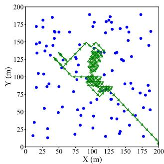

scatter

| X (m) | Y (m) |
|-------|-------|
| 25    | 175   |
| 50    | 150   |
| 75    | 125   |
| 100   | 100   |
| 125   | 75    |
| 150   | 50    |
| 175   | 25    |
| 200   | 0     |

(a)w1= (0.2,0.8)

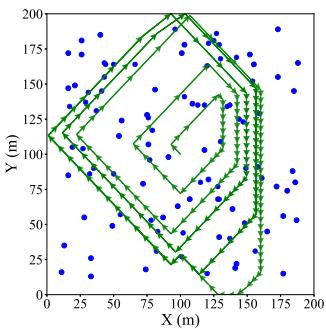

scatter

| X (m) | Y (m) |
|-------|-------|
| 0     | 125   |
| 25    | 150   |
| 50    | 175   |
| 75    | 150   |
| 100   | 125   |
| 125   | 100   |
| 150   | 75    |
| 175   | 50    |
| 200   | 25    |

(b) ${ \bf w } _ { 2 } = ( 0 . 8 , 0 . 2 )$   
Fig. 5. Two flight paths corresponding to $\mathbf { w } _ { 1 }$ and $\mathbf { w } _ { 2 } .$

After running MOL-AET, we obtain multiple nondominated policies (i.e., Q∗), each of which optimization a certain preference. We select two policies from $\mathcal { Q } ^ { * }$ , which are best matched with $\mathbf { w } _ { 1 }$ and $\mathbf { w } _ { 2 }$ . Based on the two policies, the UAV’s two flight paths are obtained by simple algebraic calculations, as illustrated in Fig. 5, where blue circles denote GDs. Note that the UAV’s take-off point is set to the central point. Fig. 5(a) shows the UAV’s flight path associated with $\mathbf { w } _ { 1 }$ that prefers to minimize $E _ { \mathrm { t o t a l } }$ . The UAV moves a short distance in almost all time slots, reducing its propulsion power consumption. Moreover, the UAV can not cover overmuch GDs and collect their tasks, decreasing its processing energy consumption. Fig. 5(b) depicts the flight path corresponding to $\mathbf { w } _ { 2 }$ that places more focus on the AoI reduction. It is seen that the UAV travels long distances in the rectangle region, thus it can collect more tasks from GDs and decrease their AoIs. But long-distance travel results in higher propulsion power consumption.

In order to fully investigate MOL-AET’s performance, we implement five state-of-the-art algorithms for comparison, including two multi-objective evolutionary algorithms (MOEAs), namely NSGA-II and MOEA/D, and three multi-objective reinforcement learning (MORL) algorithms, namely MODQN, MOPG, and MOPPO. NSGA-II and MOEA/D are two widely acknowledged MOEAs in the field of multi-objective optimization. They can obtain multiple nondominated policies after a run, each of which optimizes a certain preference. MODQN is the multi-objective DQN that is a representative RL method among value function based methods. MOPG and MOPPO are policybased RL methods. The three state-of-the-art RL algorithms have been widely used to address complex control problems. The compared algorithms are briefly described as follows.

- NSGA-II: The nondominated sorting genetic algorithm II is employed to balance the task delay and energy consumption, aiming at meeting user requirements of diverse applications [43].   
MOEA/D: The multi-objective evolutionary algorithm based on decomposition is adopted to decrease the application delay and energy consumption in an MEC system [41].   
- MODQN: The multi-objective deep Q-network (DQN), a variant of MOL-AET that adopts DQN [44] instead

TABLE V IGD VALUES OF SIX ALGORITHMS 

<table><tr><td>Algorithm</td><td>Ins-(60,30)</td><td>Ins-(60,40)</td><td>Ins-(60,50)</td><td>Ins-(100,30)</td><td>Ins-(100,40)</td><td>Ins-(100,50)</td><td>Ins-(140,30)</td><td>Ins-(140,40)</td><td>Ins-(140,50)</td></tr><tr><td>NSGA-II</td><td>11627.26</td><td>11782.18</td><td>13220.51</td><td>11516.77</td><td>12595.62</td><td>14424.34</td><td>11750.16</td><td>12202.07</td><td>12338.36</td></tr><tr><td>MOEA/D</td><td>12337.19</td><td>13748.40</td><td>14495.31</td><td>12560.11</td><td>13849.50</td><td>14252.87</td><td>14314.24</td><td>12440.83</td><td>11744.59</td></tr><tr><td>MODQN</td><td>7168.83</td><td>3752.79</td><td>8543.76</td><td>6408.52</td><td>6394.54</td><td>7556.20</td><td>6554.33</td><td>4706.70</td><td>6619.62</td></tr><tr><td>MOPG</td><td>4575.39</td><td>1086.36</td><td>4757.04</td><td>2068.15</td><td>3469.19</td><td>5254.30</td><td>4691.42</td><td>2433.92</td><td>5141.54</td></tr><tr><td>MOPPO</td><td>2668.02</td><td>684.77</td><td>2504.46</td><td>2980.25</td><td>2149.29</td><td>4747.21</td><td>2660.24</td><td>2494.04</td><td>3623.75</td></tr><tr><td>MOL-AET</td><td>0.22</td><td>0.00</td><td>66.72</td><td>61.68</td><td>125.96</td><td>0.00</td><td>4.15</td><td>71.94</td><td>59.26</td></tr></table>

TABLE VI GED VALUES OF SIX ALGORITHMS 

<table><tr><td>Algorithm</td><td>Ins-(60,30)</td><td>Ins-(60,40)</td><td>Ins-(60,50)</td><td>Ins-(100,30)</td><td>Ins-(100,40)</td><td>Ins-(100,50)</td><td>Ins-(140,30)</td><td>Ins-(140,40)</td><td>Ins-(140,50)</td></tr><tr><td>NSGA-II</td><td>105.28</td><td>111.95</td><td>112.08</td><td>104.89</td><td>110.30</td><td>105.78</td><td>106.93</td><td>109.75</td><td>104.75</td></tr><tr><td>MOEA/D</td><td>110.63</td><td>114.02</td><td>111.43</td><td>108.01</td><td>108.76</td><td>112.16</td><td>112.17</td><td>109.87</td><td>103.32</td></tr><tr><td>MODQN</td><td>81.53</td><td>82.25</td><td>82.29</td><td>77.89</td><td>79.84</td><td>88.83</td><td>30.00</td><td>81.30</td><td>86.19</td></tr><tr><td>MOPG</td><td>48.57</td><td>86.62</td><td>48.95</td><td>38.19</td><td>48.20</td><td>43.54</td><td>60.67</td><td>40.45</td><td>55.79</td></tr><tr><td>MOPPO</td><td>28.34</td><td>28.55</td><td>27.52</td><td>24.10</td><td>25.45</td><td>36.89</td><td>44.93</td><td>60.94</td><td>39.28</td></tr><tr><td>MOL-AET</td><td>0.00</td><td>0.00</td><td>7.29</td><td>5.99</td><td>11.01</td><td>9.98</td><td>2.00</td><td>0.00</td><td>0.00</td></tr></table>

of MOPPO, i.e., Algorithm 3. We design MODQN for performance comparison purpose.

- MOPG: The multi-objective policy gradient (PG), a variant of MOL-AET that employs PG [24] instead of MOPPO, i.e., Algorithm 3. We develop MOPG for performance comparison purpose.   
MOPPO: The multi-objective proximal policy optimization (PPO), a variant of MOL-AET without the evolutionary phase. We create MOPPO for performance comparison purpose.   
- MOL-AET: The proposed algorithm.

In the above two MOEAs, the population size and maximal number of evolution generations are set to 30 and 200, respectively. The crossover and mutation probabilities are set to 0.8 and 1/300, respectively. Note that a chromosome denotes a solution to the AET problem, and each gene in the chromosome indicates a path planning and an offloading ratio in a time slot. Thus, the chromosome’s coding length is 900, which has a highdimensional search space. It is quite challenging to find optimal solutions. Besides, MODQN, MOPG, MOPPO, and MOL-AET adopt identical parameter configurations for the purpose of fair comparison.

The results of IGD and GED are illustrated in Tables V and VI. The IGD indicator reflects the diversification and convergence of multiple nondominated policies. It is observed that two widely acknowledged MOEAs, NSGA-II and MOEA/D, exhibit very poor performance, manifesting a failure to obtain satisfactory nondominated policies. This inadequacy can be principally ascribed to the inherent challenges associated with high-dimensional MOPs within dynamic environments, exemplified by the AET problem. MOEAs often expend a considerable amount of time in their pursuit of viable nondominated policies, rendering the achievement of convergence challenging within stringent temporal constraints. Specifically, MOEAs characterized by large encoding lengths (i.e., 900) undergo a time-intensive process in generating acceptable nondominated policies. Moreover, the dynamic and uncertain characteristics of the UAV-assisted MEC environment exacerbate these challenges. These dynamics and uncertainties frequently necessitate the relaunch of MOEAs from the beginning, increasing computational overhead and slowing convergence speed.

Second, in all test instances, both MOL-AET and three MORLs outperform NSGA-II and MOEA/D. MOEAs rely on a single chromosome to make decisions for all time slots, while MORLs engage in real-time decision-making for each time slot on the basis of current environments. Significantly, MORLs integrate RL with deep neural networks, equipping them to navigate sequential decision-making challenges in dynamic MEC environments. This adaptability to environmental changes is realized through iterative interactions with the environment. Consequently, MORLs demonstrate swift convergence and responsiveness to user requirements. These attributes position RL as the best choice for addressing the AET problem in comparison to MOEAs.

Finally, MOPPO performs better than MODQN and MOPG in almost all test instances. This is because MOPPO adopts the clipped surrogate objective and general advantage estimator to train the policy networks, avoiding a large update of the neural networks. This is why we choose PPO to optimize each learning individual. MOL-AET integrates the evolutionary phase into MOPPO, thus it outperforms MOPPO in all test instances. After the training phase, MOL-AET iteratively performs the genetic operator on each learning individual $\Upsilon _ { i } \in \mathcal { P }$ and its matched individual $\Upsilon _ { i } ^ { * } \in Q ^ { * }$ Υ. The generated offspring learning Υindividuals are adopted to further improve the quality of the nondominated policy set Q∗. Thus, the proposed MOL-AET can obtain the best multi-objective optimization performance in all test instances.

To further substantiate the aforementioned observations, we draw the convergence curves of IGD achieved by all algorithms in Fig. 6. Note that the IGD values of all algorithms are normalized for the purpose of presentation. It is evident that MOL-AET consistently outperforms the other five algorithms in all test instances. Furthermore, after launching the evolutionary iteration in the 100th generation, the MOL-AET’s performance is further improved. This demonstrates once again the effectiveness of the evolutionary phase.

Tables VII and VIII collect the results of AAoI and AEC obtained by all algorithms, respectively, with the optimal results highlighted in bold. It is noted that the parameters J and U in Ins-(J, U ) represent the number of GDs and the UAV’s flight height, respectively. For instance, Ins-(60,30) denotes J and U

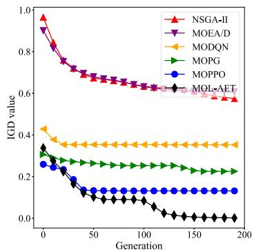

line

| Generation | NSGA-II | MOEA/D | MODQN | MOPG | MOPPO | MOL-AET |
| ---------- | ------- | ------ | ----- | ---- | ----- | ------- |
| 0          | 1.0     | 1.0    | 0.4   | 0.3  | 0.2   | 0.3     |
| 50         | 0.7     | 0.7    | 0.35  | 0.25 | 0.15  | 0.15    |
| 100        | 0.65    | 0.65   | 0.35  | 0.25 | 0.15  | 0.05    |
| 150        | 0.6     | 0.6    | 0.35  | 0.25 | 0.15  | 0.0     |
| 200        | 0.6     | 0.6    | 0.35  | 0.25 | 0.15  | 0.0     |

(a) Ins-(60,30)

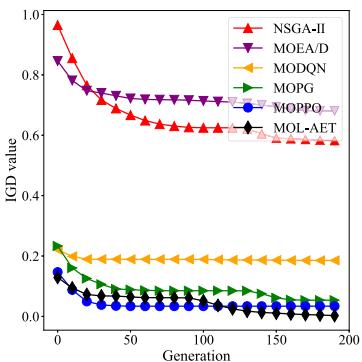

line

| Generation | NSGA-II | MOEA/D | MODQN | MOPG | MOPPO | MOL-AET |
| ---------- | ------- | ------ | ----- | ---- | ----- | ------- |
| 0          | 1.0     | 0.85   | 0.2   | 0.2  | 0.15  | 0.1     |
| 50         | 0.7     | 0.75   | 0.15  | 0.1  | 0.05  | 0.05    |
| 100        | 0.65    | 0.7    | 0.15  | 0.05 | 0.05  | 0.05    |
| 150        | 0.6     | 0.7    | 0.15  | 0.05 | 0.05  | 0.05    |
| 200        | 0.6     | 0.7    | 0.15  | 0.05 | 0.05  | 0.05    |

(b) Ins-(60,40)

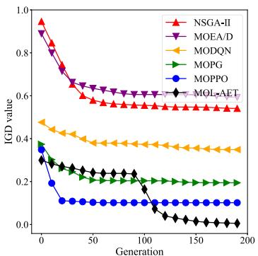

line

| Generation | NSGA-II | MOEA/D | MODQN | MOPG | MOPPO | MOL-AET |
| ---------- | ------- | ------ | ----- | ---- | ----- | ------- |
| 0          | 1.0     | 1.0    | 0.45  | 0.35 | 0.3   | 0.3     |
| 50         | 0.6     | 0.65   | 0.4   | 0.25 | 0.15  | 0.25    |
| 100        | 0.55    | 0.6    | 0.35  | 0.2  | 0.1   | 0.2     |
| 150        | 0.55    | 0.6    | 0.35  | 0.2  | 0.1   | 0.1     |
| 200        | 0.55    | 0.6    | 0.35  | 0.2  | 0.1   | 0.1     |

(c) Ins-(60,50)

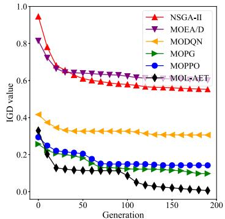

line

| Generation | NSGA-II | MOEA/D | MODQN | MOPG | MOPPO | MOLxAET |
| ---------- | ------- | ------ | ----- | ---- | ----- | ------- |
| 0          | 0.95    | 0.85   | 0.45  | 0.30 | 0.25  | 0.35    |
| 50         | 0.65    | 0.65   | 0.35  | 0.20 | 0.15  | 0.15    |
| 100        | 0.60    | 0.60   | 0.30  | 0.15 | 0.15  | 0.10    |
| 150        | 0.55    | 0.60   | 0.30  | 0.15 | 0.15  | 0.05    |
| 200        | 0.55    | 0.60   | 0.30  | 0.15 | 0.15  | 0.05    |

(d) Ins-(100,30)

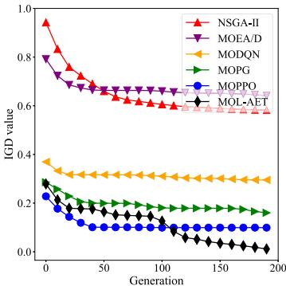

line

| Generation | NSGA-II | MOEA/D | MODQN | MOPG | MOPPO | MOL-AET |
| ---------- | ------- | ------ | ----- | ---- | ----- | ------- |
| 0          | 0.95    | 0.80   | 0.35  | 0.25 | 0.20  | 0.25    |
| 50         | 0.65    | 0.65   | 0.30  | 0.20 | 0.15  | 0.15    |
| 100        | 0.60    | 0.65   | 0.30  | 0.15 | 0.10  | 0.10    |
| 150        | 0.60    | 0.65   | 0.30  | 0.15 | 0.10  | 0.10    |
| 200        | 0.60    | 0.65   | 0.30  | 0.15 | 0.10  | 0.10    |

(e) Ins-(100,40)

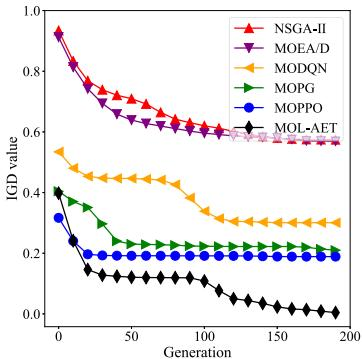

line

| Generation | NSGA-II | MOEA/D | MODQN | MOPG | MOPPO | MOL-AET |
| ---------- | ------- | ------ | ----- | ---- | ----- | ------- |
| 0          | 0.95    | 0.95   | 0.55  | 0.40 | 0.35  | 0.40    |
| 50         | 0.75    | 0.75   | 0.45  | 0.30 | 0.25  | 0.20    |
| 100        | 0.65    | 0.65   | 0.40  | 0.25 | 0.20  | 0.15    |
| 150        | 0.60    | 0.60   | 0.35  | 0.25 | 0.20  | 0.10    |
| 200        | 0.60    | 0.60   | 0.35  | 0.25 | 0.20  | 0.10    |

(f) Ins-(100,50)

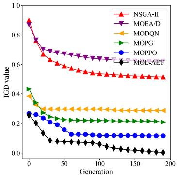

line

| Generation | NSGA-II | MOEA/D | MODQN | MOPG | MOPPO | MOL-AET |
| ---------- | ------- | ------ | ----- | ---- | ----- | ------- |
| 0          | 0.9     | 0.9    | 0.4   | 0.4  | 0.25  | 0.25    |
| 50         | 0.6     | 0.7    | 0.3   | 0.25 | 0.15  | 0.1     |
| 100        | 0.55    | 0.65   | 0.3   | 0.2  | 0.1   | 0.05    |
| 150        | 0.5     | 0.6    | 0.3   | 0.2  | 0.1   | 0.0     |
| 200        | 0.5     | 0.6    | 0.3   | 0.2  | 0.1   | 0.0     |

(g) Ins-(140,30)

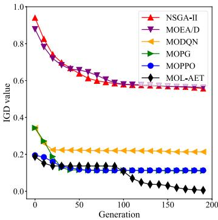

line

| Generation | NSGA-II | MOEA/D | MODQN | MOPG | MOPPO | MOL-AET |
| ---------- | ------- | ------ | ----- | ---- | ----- | ------- |
| 0          | 0.95    | 0.90   | 0.22  | 0.35 | 0.20  | 0.20    |
| 50         | 0.65    | 0.68   | 0.22  | 0.15 | 0.12  | 0.12    |
| 100        | 0.60    | 0.62   | 0.22  | 0.12 | 0.10  | 0.10    |
| 150        | 0.58    | 0.60   | 0.22  | 0.11 | 0.10  | 0.08    |
| 200        | 0.57    | 0.58   | 0.22  | 0.11 | 0.10  | 0.05    |

(h) Ins-(140,40)

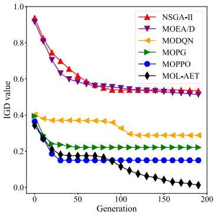

line

| Generation | NSGA-II | MOEA/D | MODQN | MOPG | MOPPO | MOL-AET |
| ---------- | ------- | ------ | ----- | ---- | ----- | ------- |
| 0          | 0.95    | 0.95   | 0.4   | 0.4  | 0.4   | 0.4     |
| 50         | 0.6     | 0.6    | 0.35  | 0.25 | 0.2   | 0.15    |
| 100        | 0.55    | 0.55   | 0.3   | 0.2  | 0.15  | 0.1     |
| 150        | 0.55    | 0.55   | 0.3   | 0.2  | 0.15  | 0.05    |
| 200        | 0.55    | 0.55   | 0.3   | 0.2  | 0.15  | 0.0     |

(i) Ins-(140,50)

Fig. 6. Convergence curves of six algorithms in terms of IGD.   
TABLE VII AAOI VALUES OF SIX ALGORITHMS 

<table><tr><td>Algorithm</td><td>Ins-(60,30)</td><td>Ins-(60,40)</td><td>Ins-(60,50)</td><td>Ins-(100,30)</td><td>Ins-(100,40)</td><td>Ins-(100,50)</td><td>Ins-(140,30)</td><td>Ins-(140,40)</td><td>Ins-(140,50)</td></tr><tr><td>NSGA-II</td><td>33811.23</td><td>25334.02</td><td>20676.00</td><td>35751.64</td><td>29857.80</td><td>30350.71</td><td>36048.29</td><td>28986.07</td><td>21291.87</td></tr><tr><td>MOEA/D</td><td>32566.29</td><td>26041.13</td><td>23824.29</td><td>34865.15</td><td>27203.08</td><td>21980.71</td><td>32831.62</td><td>22843.16</td><td>18774.48</td></tr><tr><td>MODQN</td><td>37139.82</td><td>33356.09</td><td>26930.04</td><td>31422.25</td><td>29747.30</td><td>22250.62</td><td>34555.71</td><td>29529.53</td><td>25895.61</td></tr><tr><td>MOPG</td><td>33800.18</td><td>26844.56</td><td>23654.66</td><td>25187.30</td><td>29162.18</td><td>21739.94</td><td>29836.84</td><td>24057.69</td><td>24873.38</td></tr><tr><td>MOPPO</td><td>29289.40</td><td>23781.18</td><td>15911.59</td><td>31847.97</td><td>20526.60</td><td>22224.68</td><td>28050.30</td><td>24557.37</td><td>19090.80</td></tr><tr><td>MOL-AET</td><td>18683.62</td><td>15855.36</td><td>10405.48</td><td>19675.29</td><td>12136.68</td><td>9164.67</td><td>20216.61</td><td>11937.98</td><td>11346.65</td></tr></table>

TABLE VIII AEC VALUES OF SIX ALGORITHMS 

<table><tr><td>Algorithm</td><td>Ins-(60,30)</td><td>Ins-(60,40)</td><td>Ins-(60,50)</td><td>Ins-(100,30)</td><td>Ins-(100,40)</td><td>Ins-(100,50)</td><td>Ins-(140,30)</td><td>Ins-(140,40)</td><td>Ins-(140,50)</td></tr><tr><td>NSGA-II</td><td>50613.21</td><td>52658.89</td><td>53555.05</td><td>50950.56</td><td>52563.00</td><td>52485.80</td><td>50663.43</td><td>53439.90</td><td>53445.53</td></tr><tr><td>MOEA/D</td><td>51195.70</td><td>52090.43</td><td>52399.55</td><td>50769.44</td><td>52032.02</td><td>52938.84</td><td>52185.68</td><td>52898.90</td><td>52688.09</td></tr><tr><td>MODQN</td><td>46129.61</td><td>47443.88</td><td>50493.29</td><td>48630.59</td><td>49836.52</td><td>50819.30</td><td>47443.92</td><td>48407.81</td><td>50104.89</td></tr><tr><td>MOPG</td><td>46972.98</td><td>43668.32</td><td>47027.10</td><td>43524.06</td><td>47397.17</td><td>43756.20</td><td>48016.35</td><td>42856.68</td><td>45638.94</td></tr><tr><td>MOPPO</td><td>40931.31</td><td>41968.26</td><td>43105.82</td><td>42063.50</td><td>42363.10</td><td>43596.43</td><td>45136.70</td><td>45963.32</td><td>43864.43</td></tr><tr><td>MOL-AET</td><td>40952.13</td><td>42720.17</td><td>43011.35</td><td>41971.25</td><td>40755.60</td><td>42888.46</td><td>42366.46</td><td>40705.95</td><td>45341.62</td></tr></table>

TABLE IX AC VALUES OF SIX ALGORITHMS 

<table><tr><td>Algorithm</td><td>Ins-(60,30)</td><td>Ins-(60,40)</td><td>Ins-(60,50)</td><td>Ins-(100,30)</td><td>Ins-(100,40)</td><td>Ins-(100,50)</td><td>Ins-(140,30)</td><td>Ins-(140,40)</td><td>Ins-(140,50)</td></tr><tr><td>NSGA-II</td><td>40135.17</td><td>37050.35</td><td>35185.83</td><td>41056.82</td><td>39689.15</td><td>38892.07</td><td>41241.95</td><td>39247.40</td><td>35599.90</td></tr><tr><td>MOEA/D</td><td>40245.68</td><td>38409.00</td><td>37612.73</td><td>41857.64</td><td>39208.82</td><td>36803.57</td><td>42071.58</td><td>36940.09</td><td>34920.51</td></tr><tr><td>MODQN</td><td>37657.73</td><td>36240.30</td><td>33062.55</td><td>34654.75</td><td>34628.95</td><td>31261.60</td><td>36102.22</td><td>34297.42</td><td>32572.44</td></tr><tr><td>MOPG</td><td>35666.49</td><td>32218.57</td><td>31172.48</td><td>31281.32</td><td>33834.02</td><td>30574.21</td><td>33585.83</td><td>31379.32</td><td>31858.63</td></tr><tr><td>MOPPO</td><td>33317.07</td><td>30563.17</td><td>26662.47</td><td>34776.10</td><td>29179.61</td><td>30366.48</td><td>32826.26</td><td>31632.98</td><td>29300.16</td></tr><tr><td>MOL-AET</td><td>28097.25</td><td>26806.33</td><td>24256.11</td><td>28572.23</td><td>25251.10</td><td>23539.93</td><td>28790.80</td><td>25171.12</td><td>25476.27</td></tr></table>

TABLE X AVERAGE RANKS AND POSITIONS OF SIX ALGORITHMS BASED ON IGD, GED, AAOI, AEC, AND AC 

<table><tr><td rowspan="2">Algorithm</td><td colspan="2">IGD</td><td colspan="2">GED</td><td colspan="2">AAoI</td><td colspan="2">AEC</td><td colspan="2">AC</td></tr><tr><td>Average rank</td><td>Position</td><td>Average rank</td><td>Position</td><td>Average rank</td><td>Position</td><td>Average rank</td><td>Position</td><td>Average rank</td><td>Position</td></tr><tr><td>NSGA-II</td><td>5.22</td><td>5</td><td>5.55</td><td>6</td><td>5.00</td><td>5</td><td>5.66</td><td>6</td><td>5.44</td><td>5</td></tr><tr><td>MOEA/D</td><td>5.77</td><td>6</td><td>5.44</td><td>5</td><td>3.44</td><td>3</td><td>5.33</td><td>5</td><td>5.55</td><td>6</td></tr><tr><td>MODQN</td><td>4.00</td><td>4</td><td>3.66</td><td>4</td><td>5.22</td><td>6</td><td>3.77</td><td>4</td><td>3.88</td><td>4</td></tr><tr><td>MOPG</td><td>2.77</td><td>3</td><td>3.11</td><td>3</td><td>3.55</td><td>4</td><td>3.11</td><td>3</td><td>2.77</td><td>3</td></tr><tr><td>MOPPO</td><td>2.22</td><td>2</td><td>2.22</td><td>2</td><td>2.77</td><td>2</td><td>1.77</td><td>2</td><td>2.33</td><td>2</td></tr><tr><td>MOL-AET</td><td>1.00</td><td>1</td><td>1.00</td><td>1</td><td>1.00</td><td>1</td><td>1.33</td><td>1</td><td>1.00</td><td>1</td></tr></table>

are 60 and 30, respectively. In Table VII, what is interesting is that the corresponding AAoI values show a tendency to decrease as the parameter U increases when the parameter J is kept constant. This is because the UAV flies at a higher altitude, the more GDs can be covered by the UAV so that it can collect plenty of computation tasks. Thus, the AoI of each GD within the UAV’s coverage can be reduced. On the other hand, MOL-AET is the optimal one because it obtains the smallest AAoI values in all test instances. This means MOL-AET can collect computation tasks from GDs as early as possible via properly planning the UAV’s flight paths, thereby reducing the AoI of GDs. In addition, the average AoI obtained by MOL-AET can be reduced on average by 50.6%, 46.3%, 52.2%, 45.9%, and 39.9%, compared with NSGA-II, MOEA/D, MODQN, MOPG, and MOPPO, respectively.

As for the results of AEC shown in Table VIII, MOL-AET surpasses the other five algorithms in almost all instances except for Ins-(60,30), Ins-(60,40), and Ins-(140,50), demonstrating its effectiveness in decreasing the energy consumption. Although MOPPO achieves optimal AEC values in the above three instances, the algorithm exhibits inferior performance compared to MOL-AET in terms of AAoI in these instances. For example, while MOPPO has the smallest AEC value (i.e., 40931.31) in Ins-(60,30), it is worse than MOL-AET with respect to AAoI in the instance since MOL-AET obtains the optimal AAoI value (i.e., 18683.62). A similar phenomenon can be observed on MOPPO in Ins-(60,40) and Ins-(140,50). The average energy consumption achieved by MOL-AET can be decreased on average by 19.1%, 18.9%, 13.3%, 6.9%, and 2.1%, compared with NSGA-II, MOEA/D, MODQN, MOPG, and MOPPO, respectively.

Table IX highlights the AC values achieved by six algorithms. Although MOL-AET does not always reach optimal results in all test instances with respect to AEC, it outperforms the other five algorithms regarding AC. Moreover, the average cost obtained by MOL-AET is reduced on average by 32.2%, 32.2%, 24.0%, 19.1%, and 15.3%, compared with NSGA-II, MOEA/D, MODQN, MOPG, and MOPPO, respectively. The AC indicator can reflect the overall performance of a multi-objective algorithm. Therefore, MOL-AET can strike a tradeoff between the two objectives $A _ { \mathrm { t o t a l } }$ and $E _ { \mathrm { t o t a l } }$ . Based on the results of IGD, GED, AAoI, AEC, and AC, Table X shows the average ranks and positions of six algorithms. It is apparent that MOL-AET achieves optimal comprehensive performance.

# VI. CONCLUSION

This paper proposes a novel multi-objective learning algorithm consisting of the training and evolutionary phases, namely MOL-AET, to address the tradeoff between AoI and energy consumption. We first transform the AET problem into an MOMDP by designing the state space, action space, and reward function. MOL-AET obtains a set of excellent nondominated policies, catering to diverse user preferences and achieving a desirable balance between AoI and energy consumption. Compared with NSGA-II, MOEA/D, MODQN, MOPG, and MOPPO, our algorithm achieves better multi-objective optimization performance in all test instances regarding algorithmrelated indicators, including the inverted generational distance and generational distance. Compared with the five algorithms, MOL-AET also achieves improvements of at least 39.8%, 2.1%, and 15.3% across several system-related indicators, comprising the average AoI, average energy consumption, and average cost. Moreover, MOL-AET locates the optimal rank in the Friedman test for both algorithm- and system-related indicators. Hence, the performance comparison highlights the excellent performance of MOL-AET and its potential suitability to address the AET problem.

In the future, we will consider a multi-UAV collaborative MEC system, where multiple UAVs are dispatched to collect tasks of GDs and handle them. An MOP problem will be formulated, aiming at minimizing the AoI of GDs and energy consumption of UAVs by jointly optimizing their flight paths and task offloading ratios. Nevertheless, owing to the intricate nature of collision avoidance and collaboration services among UAVs, planning flight paths and determining offloading ratios for the multiple UAV scenario remains a huge challenge. To tackle this issue, we will develop a multi-agent multi-objective approach incorporating the game theory, where each UAV is treated as an agent. Within this multi-agent system, each UAV takes into account the flying situations of other UAVs to decide their flight paths. This multi-agent approach can reduce computational complexity and prevent collisions among UAVs.

# REFERENCES

[1] P. Mach and Z. Becvar, “Mobile edge computing: A survey on architecture and computation offloading,” IEEE Commun. Surveys Tut., vol. 19, no. 3, pp. 1628–1656, Third Quarter, 2017.   
[2] X. Chen, C. Wu, Z. Liu, N. Zhang, and Y. Ji, “Computation offloading in beyond 5G networks: A distributed learning framework and applications,” IEEE Wireless Commun., vol. 28, no. 2, pp. 56–62, Apr. 2021.   
[3] F. Song et al., “Evolutionary multi-objective reinforcement learning based trajectory control and task offloading in UAV-assisted mobile edge computing,” IEEE Trans. Mobile Comput., vol. 22, no. 12, pp. 7387–7405, Dec. 2023.   
[4] K. Zhang, X. Gui, D. Ren, and D. Li, “Energy-latency tradeoff for computation offloading in UAV-assisted multiaccess edge computing system,” IEEE Internet Things J., vol. 8, no. 8, pp. 6709–6719, Apr. 2021.   
[5] Z. Ning et al., “Dynamic computation offloading and server deployment for UAV-enabled multi-access edge computing,” IEEE Trans. Mobile Comput., vol. 22, no. 5, pp. 2628–2644, May 2023.   
[6] X. Pang, N. Zhao, J. Tang, C. Wu, D. Niyato, and K.-K. Wong, “IRSassisted secure UAV transmission via joint trajectory and beamforming design,” IEEE Trans. Commun., vol. 70, no. 2, pp. 1140–1152, Feb. 2022.   
[7] Z. Qin et al., “AoI-aware scheduling for air-ground collaborative mobile edge computing,” IEEE Trans. Wireless Commun., vol. 22, no. 5, pp. 2989–3005, May 2023.   
[8] L. Liu, K. Xiong, J. Cao, Y. Lu, P. Fan, and K. B. Letaief, “Average AoI minimization in UAV-assisted data collection with RF wireless power transfer: A deep reinforcement learning scheme,” IEEE Internet Things J., vol. 9, no. 7, pp. 5216–5228, Apr. 2022.   
[9] T. Liang, W. Liu, J. Yang, and T. Zhang, “Age of information based scheduling for UAV aided emergency communication networks,” in Proc. IEEE Int. Conf. Commun., 2022, pp. 5128–5133.   
[10] Y. Liao and V. Friderikos, “Energy and age pareto optimal trajectories in UAV-assisted wireless data collection,” IEEE Trans. Veh. Technol., vol. 71, no. 8, pp. 9101–9106, Aug. 2022.   
[11] J. Liu, P. Tong, X. Wang, B. Bai, and H. Dai, “UAV-aided data collection for information freshness in wireless sensor networks,” IEEE Trans. Wireless Commun., vol. 20, no. 4, pp. 2368–2382, Apr. 2021.   
[12] Y. Yang et al., “AoI optimization for UAV-aided MEC networks under channel access attacks: A game theoretic viewpoint,” in Proc. IEEE Int. Conf. Commun., 2022, pp. 1–6.   
[13] Y. Yang, W. Wang, L. Liu, K. Dev, and N. M. F. Qureshi, “AoI optimization in the UAV-aided traffic monitoring network under attack: A Stackelberg game viewpoint,” IEEE Trans. Intell. Transp. Syst., vol. 24, no. 1, pp. 932–941, Jan. 2023.   
[14] Z. Han, Y. Yang, W. Wang, L. Zhou, T. N. Nguyen, and C. Su, “Age efficient optimization in UAV-aided VEC network: A game theory viewpoint,” IEEE Trans. Intell. Transp. Syst., vol. 23, no. 12, pp. 25 287–25 296, Dec. 2022.   
[15] Y. Chen, K. Li, Y. Wu, J. Huang, and L. Zhao, “Energy efficient task offloading and resource allocation in air-ground integrated MEC systems: A distributed online approach,” IEEE Trans. Mobile Comput., early access, Dec. 25, 2023, doi: 10.1109/TMC.2023.3346431.   
[16] Z. Jia, Q. Wu, C. Dong, C. Yuen, and Z. Han, “Hierarchical aerial computing for Internet of Things via cooperation of HAPs and UAVs,” IEEE Internet Things J., vol. 10, no. 7, pp. 5676–5688, Apr. 2023.   
[17] E. Eldeeb et al., “A learning-based trajectory planning of multiple UAVs for AoI minimization in IoT networks,” in Proc. IEEE Joint Eur. Conf. Netw. Commun. 6G Summit, 2022, pp. 172–177.   
[18] B. Choudhury, V. K. Shah, A. Ferdowsi, J. H. Reed, and Y. T. Hou, “AoIminimizing scheduling in UAV-relayed IoT networks,” in Proc. IEEE Int. Conf. Mobile Ad Hoc Smart Syst., 2021, pp. 117–126.   
[19] T. Wu et al., “A novel AI-based framework for AoI-optimal trajectory planning in UAV-assisted wireless sensor networks,” IEEE Trans. Wireless Commun., vol. 21, no. 4, pp. 2462–2475, Apr. 2022.

[20] Q. Dang, Q. Cui, Z. Gong, X. Zhang, X. Huang, and X. Tao, “AoI oriented UAV trajectory planning in wireless powered IoT networks,” in Proc. IEEE Wireless Commun. Netw. Conf., 2022, pp. 884–889.   
[21] M. Yi, X. Wang, J. Liu, Y. Zhang, and B. Bai, “Deep reinforcement learning for fresh data collection in UAV-assisted IoT networks,” in Proc. IEEE Conf. Comput. Commun. Workshops, 2020, pp. 716–721.   
[22] H. Chen, X. Qin, Y. Li, and N. Ma, “Energy-aware path planning for obtaining fresh updates in UAV-IoT MEC systems,” in Proc. IEEE Wireless Commun. Netw. Conf., 2022, pp. 1791–1796.   
[23] M. Samir, C. Assi, S. Sharafeddine, and A. Ghrayeb, “Online altitude control and scheduling policy for minimizing AoI in UAV-assisted IoT wireless networks,” IEEE Trans. Mobile Comput., vol. 21, no. 7, pp. 2493–2505, Jul. 2022.   
[24] B. Zhu, E. Bedeer, H. H. Nguyen, R. Barton, and Z. Gao, “UAV trajectory planning for AoI-minimal data collection in UAV-aided IoT networks by transformer,” IEEE Trans. Wireless Commun., vol. 22, no. 2, pp. 1343– 1358, Feb. 2023.   
[25] M. Sun, X. Xu, X. Qin, and P. Zhang, “AoI-energy-aware UAVassisted data collection for IoT networks: A deep reinforcement learning method,” IEEE Internet Things J., vol. 8, no. 24, pp. 17 275–17 289, Dec. 2021.   
[26] X. Chen et al., “Information freshness-aware task offloading in air-ground integrated edge computing systems,” IEEE J. Sel. Areas Commun., vol. 40, no. 1, pp. 243–258, Jan. 2022.   
[27] F. Wu, H. Zhang, J. Wu, Z. Han, H. V. Poor, and L. Song, “UAV-to-device underlay communications: Age of information minimization by multiagent deep reinforcement learning,” IEEE Trans. Commun., vol. 69, no. 7, pp. 4461–4475, Jul. 2021.   
[28] O. S. Oubbati, M. Atiquzzaman, A. Lakas, A. Baz, H. Alhakami, and W. Alhakami, “Multi-UAV-enabled AoI-aware WPCN: A multi-agent reinforcement learning strategy,” in Proc. IEEE Conf. Comput. Commun. Workshops, 2021, pp. 1–6.   
[29] Y. Yang, J. Yang, H. Xu, J. Hu, and T. Song, “Trajectory and offloading policy optimization in age-of-information-aware UAV-assisted MEC systems,” in Proc. IEEE Int. Conf. Netw. Appl., 2023, pp. 175–180.   
[30] Z. Cheng, M. Liwang, N. Chen, L. Huang, X. Du, and M. Guizani, “Deep reinforcement learning-based joint task and energy offloading in UAV-aided 6G intelligent edge networks,” Comput. Commun., vol. 192, pp. 234–244, Jun. 2022.   
[31] H. Kang, X. Chang, J. Miši´c, V. B. Miši´c, J. Fan, and Y. Liu, “Cooperative UAV resource allocation and task offloading in hierarchical aerial computing systems: A MAPPO based approach,” IEEE Internet Things J., vol. 10, no. 12, pp. 10 497–10 509, Jun. 2023.   
[32] L. Li and H. He, “Bipartite graph based multi-view clustering,” IEEE Trans. Knowl. Data Eng., vol. 34, no. 7, pp. 3111–3125, Jul. 2022.   
[33] B. Jiang, S. Chen, B. Wang, and B. Luo, “MGLNN: Semi-supervised learning via multiple graph cooperative learning neural networks,” Neural Netw., vol. 153, pp. 204–214, 2022.   
[34] A. Singh, K. Raj, T. Kumar, S. Verma, and A. M. Roy, “Deep learningbased cost-effective and responsive robot for autism treatment,” Drones, vol. 7, no. 2, 2023, Art. no. 81.   
[35] Y. Yu, J. Tang, J. Huang, X. Zhang, D. K. C. So, and K.-K. Wong, “Multiobjective optimization for UAV-assisted wireless powered IoT networks based on extended DDPG Algorithm,” IEEE Trans. Commun., vol. 69, no. 9, pp. 6361–6374, Sep. 2021.   
[36] Y. Gong, K. Bian, F. Hao, Y. Sun, and Y. Wu, “Dependent tasks offloading in mobile edge computing: A multi-objective evolutionary optimization strategy,” Future Gener. Comput. Syst, vol. 148, pp. 314–325, Nov. 2023.   
[37] X. Liu, C. Sun, K.-L. A. Yau, and C. Wu, “Joint collaborative big spectrum data sensing and reinforcement learning based dynamic spectrum access for cognitive Internet of Vehicles,” IEEE Trans. Intell. Transp. Syst., vol. 25, no. 1, pp. 805–815, Jan. 2024.   
[38] S. Khadka and K. Tumer, “Evolution-guided policy gradient in reinforcement learning,” in Proc. Int. Conf. Neural Inf. Process. Syst., 2018, pp. 1–13.   
[39] J. Schulman, P. Moritz, S. Levine, M. Jordan, and P. Abbeel, “Highdimensional continuous control using generalized advantage estimation,” in Proc. Int. Conf. Learn. Representations, 2016, pp. 1–14.   
[40] C. Zhou et al., “Deep reinforcement learning for delay-oriented IoT task scheduling in SAGIN,” IEEE Trans. Wireless Commun., vol. 20, no. 2, pp. 911–925, Feb. 2021.   
[41] F. Song, H. Xing, S. Luo, D. Zhan, P. Dai, and R. Qu, “A multiobjective computation offloading algorithm for mobile-edge computing,” IEEE Internet Things J., vol. 7, no. 9, pp. 8780–8799, Sep. 2020.

[42] X. Wang, H. Xing, F. Song, S. Luo, P. Dai, and B. Zhao, “On jointly optimizing partial offloading and SFC mapping: A cooperative dual-agent deep reinforcement learning approach,” IEEE Trans. Parallel Distrib. Syst., vol. 34, no. 8, pp. 2479–2497, Aug. 2023.   
[43] L. Cui et al., “Joint optimization of energy consumption and latency in mobile edge computing for Internet of Things,” IEEE Internet Things J., vol. 6, no. 3, pp. 4791–4803, Jun. 2019.   
[44] V. Mnih et al., “Human-level control through deep reinforcement learning,” Nature, vol. 518, no. 7540, pp. 529–533, Feb. 2015.

natural_image

Portrait photo of a man wearing glasses and a suit (no text or symbols visible)

Yanping Liu received the BE degree in electronic and information engineering and the ME degree in communication engineering from Chongqing University, Chongqing, China, in 2006 and 2009, and the PhD degree in information and communication engineering from Southwest Jiaotong University, Chengdu, China, in 2018. He is currently an associate professor with the School of Big Data Statistics, Guizhou University of Finance and Economics. His research interests include game theory, learning theory, and optimization theory for the resource management on

UAV communication, and mmWave communication.

natural_image

Portrait of a man wearing glasses and a suit against a blue background (no text or symbols visible)

Fuhong Song received the MEng degree in computer technology and the PhD degree in computer science and technology from Southwest Jiaotong University, Chengdu, China, in 2018 and 2022, respectively. He is currently a lecturer with the School of Information, Guizhou University of Finance and Economics. His research interests include mobile edge computing, multi-objective optimization, and reinforcement learning.

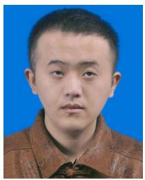

natural_image

Portrait photo of a man in a brown collared shirt against a blue background (no text or symbols visible)

Qixun Yang is currently working toward the MS degree in computer science and technology with the Guizhou University of Finance and Economics, China. His current research interests include deep reinforcement learning, edge computing, multiobjective optimization, and unmanned aerial vehicles.

natural_image

Portrait of a man wearing glasses and a suit (no text or symbols visible)

Mingsen Deng (Member, IEEE) is a professor of computer science with the School of Information, Guizhou University of Finance and Economics in China. He has published more the 100 papers in prestigious journals and distinguished international conferences. He has been an executive member of Technical Committee of High-Performance Computing of China Computer Federation since 2010, and received numerous awards, including Outstanding Scientists and Technologists of the Chinese Institute of Electronics (2020), One Hundred Person Project

of the Guizhou Province (2016), Young Scientist Award of Guizhou Province (2018). His research interests focus on parallel and distributed computing, electronic structure calculations, and network analysis for big-data.

natural_image

Portrait photo of a woman in a red collared shirt (no text or symbols visible)

Xi Yu received the MS degree from the School of Information, Guizhou University of Finance and Economics. She is currently an associate professor with the School of Information, Guizhou University of Finance and Economics. She is an expert in the Guian New Area. She is also a member of the AIS Asia Pacific Information Systems Special Group and a director of the Guizhou Society for Scientific and Technical Information. Her research focuses on data mining and feature extraction.

natural_image

Portrait of a woman with long dark hair and glasses against a red background (no text or symbols visible)

Kaiju Li received the PhD degree from the School of Computer Science and Technology, Chongqing University, Chongqing, China, in 2023. She is currently a lecturer with the School of Information, Guizhou University of Finance and Economics. Her current research interests include federated learning, edge computing, and privacy-preserving.

natural_image

Portrait photo of a man in a striped shirt (no text or symbols visible)

Lexi Xu received the PhD degree from the Queen Mary University of London, London, U.K., in 2013. He is now a senior engineer with Research Institute, China United Network Communications Corporation (China Unicom). He is also a China Unicom delegate in ITU, ETSI, 3GPP, CCSA. His research interests include Big Data, self-organizing networks, satellite system, radio resource management in wireless system, etc.

natural_image

Portrait of a man wearing glasses and a red sweater over a blue shirt (no text or symbols visible)

Huanlai Xing (Member, IEEE) received the PhD degree in computer science from the University of Nottingham (Supervisor: Dr Rong Qu), Nottingham, U.K., in 2013. He was a visiting scholar in computer science with the University of Rhode Island (Supervisor: Dr. Haibo He), USA, in 2020–2021. He is with the School of Computing and Artificial Intelligence, Southwest Jiaotong University (SWJTU), and Tangshan Institute of SWJTU. He was on editorial board of the Science China Information Sciences. He was a member of several international conference program

and senior program committees, such as ECML-PKDD, MobiMedia, ISCIT, ICCC, TrustCom, IJCNN, and ICSINC. His research interests include semantic communication, representation learning, reinforcement learning, machine learning, network function virtualization, and software defined networking.