# AoI and Latency-Aware Air-Ground Vehicular Crowdsensing by Sequential Multi-Agent Deep Reinforcement Learning

Fan Zhou, Chi Harold Liu, Fellow, IEEE, Jianxin Zhao, Chen Fang, Hao Wang, Guozheng Li, Guangpeng Qi, Dapeng Wu, Fellow, IEEE, Kin K. Leung, Fellow, IEEE, and Jon Crowcroft, Fellow, IEEE

Abstract—Low-latency data sensing and transmission is critical for many city-level applications like traffic incident management to mitigate congestion and enhance road safety. Vehicular crowdsensing (VCS) emerges as a powerful paradigm to provide real-time traffic sensing services from points-of-interest (PoIs) by leveraging the collaboration of unmanned ground vehicles (UGVs) and unmanned aerial vehicles (UAVs). In this paper, we first introduce two novel metrics: sensing capability-aware ageof-information (sAoI) and latency-weighted data collection ratio, to measure the data freshness and amount under the condition of non-uniform status packet size, respectively. We propose an auto-regressive sequential multi-agent deep reinforcement learning framework called “A2G-MADRL”, which consists of an interaction-aware heterogeneous vehicular graph convolution network (HVGCN) for feature extractions, and a dynamically ordered masked policy generator (DOMPG) for coordinating UAVs and UGVs. Extensive experiments on two real-world datasets in KAIST and Roma demonstrate that A2G-MADRL significantly improves the attained sAoI and latency-weighted data collection ratio, outperforming seven baselines when varying the number of UAV-UGV pairs, data generation speed in a timeslot, and the number of communication channels.

Index Terms—Vehicular crowdsensing, Age-of-information, Multi-agent deep reinforcement learning, Sequential policy

## I. INTRODUCTION

The rapid pace of urbanization dramatically increases the demand for smart transportation services, like traffic congestion and incident management. Traditional methods, which are highly dependent on manual monitoring and scheduling, have proven ineffective in addressing large-scale, complex traffic scenarios and struggle to keep pace with the evolving traffic landscape. This context underscores the need for vehicular crowdsensing (VCS [1]), which uses unmanned aerial vehicles (UAVs) and unmanned ground vehicles (UGVs) to offer a more agile and adaptive approach for urban data collections.

Air-ground VCS combines the mobility of UAVs and the data processing ability of UGVs. The UAVs fly to collect information from distant points-of-interests (PoIs) and relay data to UGVs, whereas UGVs serve as the integrated hubs for sensing PoIs as well as communicating with UAVs. The UAVs and UGVs collaborate to collect real-time sensory data, and efficiently transmit data by using NOMA [2] communication technology. NOMA is particularly advantageous under this context because it is able to accommodate multiple users on the same spectrum by superimposing the user signals in the power domain, thus improving spectrum efficiency. It is also more energy efficient, enabling longer service time for the UAV-UGV network.

Age-of-Information (AoI [3]) is an end-to-end metric quantifying the timeliness of information, critical for real-time applications such as air-ground VCS enabled traffic monitoring. Prior works [4], [5] typically assume uniform-sized status packet updates with fixed transmission quotas per timeslot (e.g., one discrete packet is transmitted per timeslot). However, in VCS scenarios, PoIs like surveillance cameras generate continuous bit-streams, whereas the UAVs/UGVs collect nonuniform data volumes per timeslot [6], [7]. Thus, evaluating Quality of Service (QoS) solely via data freshness is inadequate. For example, transmitting 20 Mbits of data at peak AoI of 3 timeslots may carry substantially more Shannon self-information [8] than 5 Mbits at 1-timeslot peak AoI. Inspired by mutual-information based freshness metrics [9], we propose “sensing capability-aware AoI” (sAoI), a weighted average peak-age metric, considering both timeliness and selfinformation of collected data.

Meanwhile, the significance of sensing data may vary depending on the severity of a particular event and associated data requirements. Traditional metrics like latency and throughput are insufficient for evaluating QoS in VCS systems with non-uniform status packet sizes. This is because some PoIs may exhibit high throughput and low latency under favorable conditions, while others may suffer from poor performance due to long distances or interferences. Merely summing up throughput across PoIs hides QoS degradation caused by varying latency requirements, and averaging latency ignores the varying amount of collected data. For example, timely traffic incident detection and reporting at intersections are crucial to prevent casualties, since delays in clearing crash scenes can increase the probability of secondary accidents approximately linearly. In contrast, latency requirements are lower in low-traffic areas with rare incidents. Hence, inspired by data utility and nonlinear age functions defined in [9], [10], we propose a data-centric metric called the “latencyweighted data collection ratio” that measures quality of data collections by incorporating penalties on latency. Note that latency-weighted data collection ratio operates within the traditional Shannon paradigm and is fundamentally distinct from the notion of semantics of information in semantic communications [11], which extracts the most salient information features and only transmits the information that is the most relevant to the specific tasks at the receiver.

To this end, we explicitly consider the problem of navigating multiple UAV-UGV pairs in a work zone with varying sensing urgencies by efficiently assigning NOMA communication channels to numerous PoIs, optimizing three key objectives: maximizing the latency-weighted data collection ratio, while minimizing the sAoI and energy consumption ratio of UAVs and UGVs. It is difficult to solve due to several key challenges: (a) the heterogeneous sensing capabilities and objectives of UAVs and UGVs make it challenging to model their interactions, resulting in the lack of team-oriented route planning strategies; (b) collaboration strategies relying on implicit modeling or communication mechanisms fail to fully account for real-time environmental dynamics and agent behavior uncertainty, where such non-stationarity impedes UAVs and UGVs from learning efficient collaboration patterns; (c) the solution space for channel assignment strategies is enormous based on the current environmental state, vehicle positions, and communications resources, with hundreds of potential PoIs selectable at each timeslot.

Recently, deep reinforcement learning (DRL) has shown its potential in solving integrated sensing and communication problems [12] and enhancing large language models. Despite these advancements, the application of DRL in NOMAbased air-ground VCS remains underexplored. While existing research mainly focused on optimizing sensing trajectories for UAVs and UGVs [13], [14], the critical role of channel assignment strategy for communicating with different PoIs in NOMA and the model training order of UAVs and UGVs are often overlooked, which is the key gap our work aims to bridge.

Our contribution is three-fold.

• We introduce two novel metrics, called “sensing capability-aware AoI (sAoI)” and “latency-weighted data collection ratio”. We use these two concepts as the optimization objectives in an auto-regressive sequential multiagent deep reinforcement learning (MADRL) framework called “A2G-MADRL”, which is tailored for joint route planning and channel assignment of multiple UAV-UGV pairs.

• We propose a UAV-UGV-PoI interaction-aware heterogeneous vehicular graph convolution network (HVGCN) for extracting interaction-aware features in NOMAbased communication systems and a dynamically ordered masked policy generator (DOMPG) for coordinating UAVs and UGVs, which reduces the complexity of the joint policy and balances exploration and exploitation.

• We perform extensive experiments on two real-world datasets in KAIST and Roma. Experimental results demonstrate that, A2G-MADRL outperforms seven baselines in both sAoI and latency-weighted data collection ratio across various system configurations, including the number of UAV-UGV pairs, data generation speed in a timeslot, and the number of communication channels.

The rest of this paper is organized as follows. First, we review related works in Section II. Then, we present system model in Section III. Problem definition and formulation are given in Section IV-B. After, we introduce our proposed method A2G-MADRL in Section V. Then, we validate the effectiveness of the proposed method through simulation experiments and visualization in Section VI. Finally, we conclude the paper in Section VII.

## II. RELATED WORK

## A. Vehicular Crowdsensing (VCS)

VCS leverages the mobility of vehicles to collect city-scale data for monitoring and management purposes. Recent works in VCS have explored the heterogeneity of environment and used graph neural networks to model the VCS problem. Lu et al. [24] considered heterogeneous task allocation using environment-cost models to ensure fairness and efficiency. Wang et al. [15] uses a graph convolutional network (GCN) with spatiotemporal attention to predict future maps in sparse mobile crowdsensing. However, these works fail to consider the heterogeneous relationship of PoIs, UAVs and UGVs altogether, which motivates us to address this in this paper. Along the direction of air-ground VCS, [25] proposed the AGMEN framework, which utilizes UAVs to facilitate communication, caching, and computing at edge. However, it lacks collaborative decision-making between UAVs and UGVs, including joint route planning and channel assignment. Similarly, [26] integrated crowd computing into satellite-airground networks and applied a Q-learning-based strategy to enhance task cooperation efficiency. Nevertheless, this method relies on simplistic Q-table reinforcement learning for taskworker matching, emphasizing payment maximization and cost reduction without adapting UAVs or UGVs for VCS applications.

## B. DRL and Sequential Policy

Recent works have increasingly applied DRL to VCS. For instance, [27] proposed a human-vehicle hybrid framework; however, it did not adequately consider UAV/UGV mobility, energy consumption, or communication modeling. Their gridcell coverage metric, which did not incorporate AoI considerations, along with a decentralized proximal policy optimization structure, introduce noise into the input. Similarly, groundair-space VCS approach [1] that employed MIMO communications and hierarchical reinforcement learning, failed to model the heterogeneous interactions among UAVs, UGVs, and PoIs, and overlooked the impact of decision-making order. Other NOMA-based works [18], [28], [29] have focused primarily on isolated aspects, such as UAV route planning, device pairing, or channel and power allocation optimization. These works also overlooked the potential of NOMAbased interaction features for enhancing state observations and the influence of decision-making order. In contrast, our approach leverages heterogeneous GCNs to extract interactionaware features in NOMA-based systems and employs an autoregressive MADRL framework with dynamic order optimization to jointly optimize both route planning and channel assignment.

TABLE I: Comparison of A2G-MADRL and related works.
<table><tr><td rowspan="2">Work</td><td colspan="5">System Model</td><td colspan="4">Optimization Objective</td><td colspan="4">Methodology</td></tr><tr><td>Heterogeneous Coordination</td><td>Movement Modeling</td><td>NOMA Comm.</td><td>Channel Assignment</td><td>Non-uniform Packet Size</td><td>AoI-based Metric</td><td>Energy Consumption</td><td>Data Collect. Ratio</td><td>Content-aware Extension</td><td>Multi-agent DRL</td><td>GCN- based</td><td>Sequential Decision</td><td>Sequential Update</td></tr><tr><td colspan="10">A. Vehicular Crowdsensing (VCS)</td><td colspan="3"></td></tr><tr><td>Zhao et al. [1] (JSAC&#x27;24)</td><td></td><td></td><td>×××</td><td></td><td></td><td></td><td></td><td></td><td></td><td></td><td></td><td></td><td></td></tr><tr><td colspan="10">Wang et al. [15] (TMC&#x27;23)</td><td colspan="3"></td></tr><tr><td>Ye et al. [16] (JSAC&#x27;24)</td><td>√××</td><td>v△√</td><td></td><td>×××</td><td>×△×</td><td>××&gt;</td><td>ハンン</td><td>ンンン</td><td>×××</td><td>√×ン</td><td>× √×</td><td>×××</td><td>×××</td></tr><tr><td></td><td></td><td></td><td></td><td></td><td></td><td></td><td></td><td></td><td></td><td></td><td></td><td></td><td></td></tr><tr><td>B. DRL &amp; Sequential Policy</td><td></td><td></td><td></td><td></td><td></td><td></td><td></td><td></td><td></td><td></td><td></td><td></td><td></td></tr><tr><td>Zhu et al. [17] (TWC&#x27;23)</td><td>××××</td><td></td><td></td><td></td><td>△×××</td><td>&gt;×××</td><td>ンン××</td><td>ハン××</td><td>X×××</td><td>×ンンン</td><td>××××</td><td>××V×</td><td></td></tr><tr><td>Dai et al. [18] (IoTJ&#x27;23) Wen et al. [19] (NeurIPS&#x27;22)</td><td></td><td></td><td>×ン××</td><td></td><td></td><td></td><td></td><td></td><td></td><td></td><td></td><td></td><td>×××√</td></tr><tr><td>Wang et al. [20] (ICLR’23)</td><td></td><td>ン××</td><td></td><td>△√××</td><td></td><td></td><td></td><td></td><td></td><td></td><td></td><td></td><td></td></tr><tr><td>C. Age of Information (AoI)</td><td></td><td></td><td></td><td></td><td></td><td></td><td></td><td></td><td></td><td></td><td></td><td></td><td></td></tr><tr><td></td><td></td><td></td><td></td><td></td><td></td><td></td><td></td><td></td><td></td><td></td><td></td><td></td><td></td></tr><tr><td>Maatouk et al. [21] (ToN&#x27;20) Maatouk et al. [11] (TWC&#x27;22)</td><td>××××</td><td>××××</td><td></td><td></td><td></td><td></td><td>V</td><td></td><td></td><td></td><td></td><td></td><td>××X×</td></tr><tr><td>Peng et al. [22] (INFOCOM&#x27;24)</td><td></td><td></td><td></td><td></td><td>×××</td><td>ハンン</td><td>ンン</td><td></td><td>△√△×</td><td>X×××</td><td>××××</td><td>X×××</td><td></td></tr><tr><td>Zhou et al. [23] (TWC&#x27;19)</td><td></td><td></td><td>××××</td><td>× ××△</td><td>V</td><td>V</td><td>x</td><td>ハンン×</td><td></td><td></td><td></td><td></td><td></td></tr><tr><td>D. A2G-MADRL (this work)</td><td>V</td><td>V</td><td>V</td><td>V</td><td>V</td><td>V</td><td>L</td><td>V</td><td>x</td><td>V</td><td>V</td><td>V</td><td>V</td></tr></table>

Legend: : explicitly addressed; △: partially/implicitly addressed; : not addressed. Column details: Heterogeneous Coordination: joint coordination of UAVs and UGVs with distinct capabilities; NOMA Comm.: NOMA communication scheme; Non-uniform Packet Size: models variable-sized data collection; AoIbased Metric: AoI or its variants; Content-aware Extension: incorporates data semantics/content; GCN-based: uses graph convolutional networks for feature extraction; Sequential Decision: auto-regressive action generation; Sequential update: optimizes the order of agent training/update.

The transformer model and sequential policy have been utilized in DRL for their ability to capture long-range dependencies and optimize sequential decision-making processes. In [17], the challenge of minimizing the total AoI in UAVaided IoT networks is considered, where the visiting sequence of hovering points is optimized using the Transformer combined with a weighted $\mathbf { A } ^ { * }$ search. Ye et al. [16] used a transformer-based mobility prediction module and a relational graph learning mechanism to optimize data collection from mobile users. However, none of the above works successfully addressed the complex UAV/UGV coordination patterns. Also, they neglected the importance of training order, which is crucial for ensuring that UAVs and UGVs learn effective policies in a coordinated manner.

## C. Age of Information

AoI is an end-to-end metric widely used to evaluate the timeliness of information in monitoring and control systems. It has been applied in diverse contexts, including singleserver queues [4] and various single-hop and multi-hop wireless networks [5]. Common analytical approaches for AoI encompass time-average age, peak age, and nonlinear age functions [30]. However, these methods typically assume uniform packet sizes and single-packet retrieval per collection, which do not apply to the air-ground VCS scenarios, where sensors at PoIs generate continuous data streams, and UAVs or UGVs collect packets of non-uniform sizes. Although [23] proposed a recursive definition of AoI for varying-size packets at receivers, their model still relies on discrete-time transmissions with fixed-sized packets. Several content-aware extensions of AoI are developed to enhance the characterization of update content. These include error-minimized data acquisition scheduling [11], nonlinear age functions [9] that incorporate source autocorrelation and estimation accuracy, age of changed information [22] which emphasizes content relevance by penalizing redundant updates in goal-oriented communication, and age of incorrect information [21] that prioritizes the delivery of new and accurate information. However, these metrics still do not simultaneously address both the non-uniform sizes and the timeliness of data collected in air-ground VCS scenarios.

TABLE II: Important notations used in this paper.
<table><tr><td>Notation</td><td>Explanation</td></tr><tr><td> $t , T , \tau$ </td><td>Index, total number of timeslots and dura- tion of a timeslot.</td></tr><tr><td> $g , G , { \mathcal { G } }$ </td><td>Index, total number and set of UGVs.</td></tr><tr><td> $u , U , u$ </td><td>Index, total number and set of UAVs.</td></tr><tr><td> $p , P , \mathcal { P }$ </td><td>Index, total number and set PoIs.</td></tr><tr><td> $\boldsymbol { e } _ { t } ^ { u } , \boldsymbol { e } _ { t } ^ { g }$ </td><td>Energy consumed by a UAV u and a UGV g in a timeslot t</td></tr><tr><td> $\gamma _ { \mathrm { G 2 G } } ^ { g , p } , \gamma _ { \mathrm { G 2 A } } ^ { u , p } , \gamma _ { \mathrm { R E } } ^ { u , g }$ </td><td>SINR of PoI-UGV, PoI-UAV uplink channel and UAV-UGV relay channel.</td></tr><tr><td> $\tau _ { t , m } ^ { u } , \tau _ { t , m } ^ { g }$ </td><td>Time consumed by a UAV u and a UGV g</td></tr><tr><td> $l _ { t } ^ { u } , \theta _ { t } ^ { u }$ </td><td>in a timeslot t for movements. Movement distance and angle of a UAV u</td></tr><tr><td> $\mathbf { } o _ { t } , \mathbf { } a _ { t } , r _ { t }$ </td><td>in a timeslot t. Observation, action and reward over all</td></tr><tr><td> $d _ { 0 } ^ { p } , d _ { t } ^ { p } , \lambda$ </td><td>UAVs and UGVs in a timeslot t. Initial data of a PoI  $p ,$  current data of a PoI</td></tr><tr><td> $d _ { t } ^ { u , p } , d _ { t } ^ { g , p }$ </td><td>p in a timeslot t, data generation speed. Data collected by a UAV u and a UGV g</td></tr><tr><td> $w _ { t } ^ { u , p } , w _ { t } ^ { g , p }$ </td><td>from a PoI p in a timeslot t. Waiting time of data collected by a UAV u</td></tr><tr><td> $\Delta w _ { t } ^ { u , p } , \Delta w _ { t } ^ { g , p }$ </td><td>and a UGV g from a PoI p in a timeslot t. Duration that is spent to generate the  $d _ { t } ^ { u , p }$ </td></tr><tr><td> $\mathrm { d i s t } ( \cdot , \cdot ) , l _ { t } ^ { u } , l _ { t } ^ { g }$ </td><td>and  $d _ { t } ^ { g , p }$  amount of data. Distance between a PoI or UAV/UGV, travel</td></tr><tr><td> $\delta _ { t } ^ { p } , s \mathrm { A o I } _ { t _ { 1 } , t _ { 2 } } ^ { p }$ </td><td>distance of a UAV/UGV in a timeslot t. collected latency-weighted data from a PoI</td></tr><tr><td></td><td>p in a timeslot t and sAoI for a PoI p over the time interval from timeslot t1 to  $t _ { 2 } .$ </td></tr><tr><td> $s \mathrm { A o I } , \nu , \eta , \xi$ </td><td>sensing capability-aware AoI, latency- weighted data collection ratio, energy consumption ratio and sensing efficiency.</td></tr></table>

Recent works on UAV-enabled data collection systems have extensively investigated AoI optimization, focusing on the core challenge of synchronizing data generation at PoIs with timely UAV collection under onboard energy constraints. A prevalent approach involves formulating joint optimization problems that coordinate UAV trajectory with other critical variables, such as sensor association, task scheduling, beamforming [7], and adaptive sensing frequency [31]. The objectives typically include minimizing AoI [6], [17], [32], minimizing energy consumption under AoI constraints [7], or maximizing composite metrics like quality-of-information [16]. To solve these problems, advanced methodologies are employed, including DRL [32], Multi-Agent DRL for distributed collaboration [16], [31], federated learning for privacy preservation [32], and hybrid algorithms combining learning and search techniques [17]. However, existing works often overlook the sequential decision-making and update mechanisms within the MADRL framework and fail to simultaneously address the challenges of non-uniform data sizes and the timeliness of data collected in air-ground VCS scenarios, which is the key gap our work aims to bridge.

## III. SYSTEM MODEL

We assume that a group of UAVs $\mathcal { U } \triangleq \{ u | 1 , 2 , \dots , U \}$ and a group of UGVs $\mathcal { G } \triangleq \{ g \vert 1 , 2 , \ldots , G \}$ are jointly navigated in the workzone to collect data from PoIs $\mathcal { P } \triangleq \{ p | 1 , 2 , \dots , P \}$ We denote the set of UAVs and UGVs as $N \ \triangleq \mathcal { U } \cup \mathcal { G }$ During the sensing task, each UAV u maintains a constant flying altitude $H _ { u }$ while collecting data and avoiding potential obstacles (e.g., no-fly zones or high-rise buildings). In contrast, UGVs move along the road network and collaborate with UAVs to complete the sensing task. As time progresses, the PoIs continuously generate data at a rate of d (for example, surveillance cameras continuously generate real-time video frames). We consider a time-slotted system that divides the entire sensing task into t equal-length timeslots, each with length τ .

## A. UAVs and UGVs Movement

In each timeslot, a UAV u and a UGV $g$ first perform their movements and position adjustments, using $\tau _ { t , m } ^ { u }$ and $\tau _ { t , m } ^ { g }$ time, respectively. The remaining time, $\tau _ { t , c } ^ { u } = \tau - \tau _ { t , m } ^ { u }$ and $\tau _ { t , c } ^ { g } = \tau - \tau _ { t , m } ^ { g }$ , are used for data collections by the UAV u and the UGV $g$ from PoIs, respectively. Specifically, for each UAV $u ,$ the movement in each timeslot consists of a distance $l _ { t } ^ { u }$ and an angle $\theta _ { t } ^ { u }$ . Considering that the average speed of a UAV is $v _ { u } ,$ the time consumed for movement is $\tau _ { t , m } ^ { u } = l _ { t } ^ { u } / v _ { u }$ . We can calculate the energy consumption of a UAV u in a timeslot by $e _ { t } ^ { u } = c _ { \mathrm { m o v } } \tau _ { t , m } ^ { u } + c _ { \mathrm { c o l } } ( \tau - \tau _ { t , m } ^ { u } )$ , where $c _ { m o v }$ and $c _ { c o l }$ represent the propulsion energy consumption per second when a UAV u is flying or hovering, respectively. Following [33], we have:

$$
c _ { \mathrm { m o v } } = c _ { 1 } \left( 1 + \frac { 3 v _ { u } ^ { 2 } } { v _ { \mathrm { t i p } } ^ { 2 } } \right) + c _ { 2 } \left( \sqrt { 1 + \frac { v _ { u } ^ { 4 } } { 4 v _ { 0 } ^ { 4 } } } - \frac { v _ { u } ^ { 2 } } { 2 v _ { 0 } ^ { 2 } } \right) ^ { \frac { 1 } { 2 } } + \frac { 1 } { 2 } c _ { 3 } v _ { u } ^ { 3 } ,\tag{1}
$$

where $c _ { 1 } , c _ { 2 }$ and $c _ { 3 }$ are constants which depend on the UAV’s weight, rotor’s speed, rotor disc area, blade angular velocity, and air density; $v _ { \mathrm { t i p } }$ is the tip speed of the rotor and $v _ { 0 }$ is the mean rotor speed. $c _ { \mathrm { c o l } } = c _ { 1 } + c _ { 2 }$ because $v _ { u } = 0$ while collecting data.

For a UGV $g \in \mathcal G$ , assuming that it moves along a predefined road network, and considering its maximum speed $v _ { g } ,$ we can calculate the energy consumption of a UGV g in a timeslot t by $e _ { t } ^ { g } = { c _ { 4 } } \tau _ { t , m } ^ { g } v _ { g }$ , where $c _ { 4 }$ is the average energy consumption per meter of travel. Additionally, the maximum distance a UGV $g$ can travel in each timeslot is $l _ { \mathrm { m a x } } ^ { g } = v _ { g } \tau$ Therefore, the nodes of the road network that the vehicle can reach must lie within a distance less or equal than $l _ { \mathrm { m a x } } ^ { g }$ from the current node.

## B. UAV-UGV Communications with NOMA

Since the bandwidth resources of a UAV-UGV network are highly limited, we introduce NOMA [2] communications technology to optimize data transmission efficiency between UAVs and UGVs. NOMA significantly improves the spectral efficiency by allowing multiple UAVs/UGVs to transmit data over the same channel. Although UAVs have limited computational resources and power supply, aerial communication channel usually have better conditions when compared with those on the ground. Thus, UAVs become ideal dynamic wireless relays for UGVs. In this mode, UAVs are primarily responsible for collecting data from PoIs and forwarding it to UGVs. Equipped with high-performance computing devices like GPUs, UGVs can not only decode and process relayed data but also upload the collected data to the nearby data center for further analysis. Next, we introduce the channel models used by a UAV-UGV network.

The data collection process by UAVs involves two sequential steps. Initially, data is transmitted from a PoI to a UAV through the ground-to-air (G2A) uplink channel; Then, the collected data is relayed to a UGV via the air-to-ground (A2G) relay channel. For UGVs, data collection occurs through both the ground-to-ground (G2G) uplink channel and the A2G relay channel. Without loss of generality, we assume that the available spectrum for data transmission between PoIs and UGVs (or UAVs) is evenly divided into $C$ channels, each with a bandwidth of B and the power spectral density of the noise is $N _ { 0 }$ . In the subsequent discussion, the analysis will be based on the data transmission conditions on a channel c.

According to the air-ground cooperative NOMA scheme [34], the $C$ channels allocated for UGV communications are mutually orthogonal. Similarly, the same set of C channels assigned for UAV communications with C PoIs also maintain orthogonality. Furthermore, different UAV-UGV pairs utilize distinct orthogonal channels. Let $\chi _ { t , c } ^ { n , p } \in \{ 0 , 1 \}$ be a binary decision variable for a timeslot $t ,$ a channel $c ,$ and an agent $n \in \mathcal { U } \cup \mathcal { G }$ regarding a PoI $p . \chi _ { t . c } ^ { n , p } = 1$ indicates that an agent n is assigned to collect data from a PoI p using a channel c in a timeslot t. Otherwise, $\chi _ { t , c } ^ { n , p } = 0$ . Each agent n can be assigned at most C channels per timeslot $\begin{array} { r } { ( \sum _ { c = 1 } ^ { C } \sum _ { p = 1 } ^ { P } \chi _ { t , c } ^ { n , p } \leq C ) } \end{array}$ and each channel c for a given agent n is assigned to at most one PoI per timeslot $\begin{array} { r } { ( \sum _ { p = 1 } ^ { P } \hat { \chi } _ { t , c } ^ { n , p } \le 1 ) } \end{array}$ . We adopt the “generate-at-will” model [35], where PoIs without assigned channels remain inactive and thus do not introduce interference. Therefore, interference is constrained to the paired UAV and UGV sharing the same channel, meaning that at most two PoIs and their associated UAV simultaneously accessing the same channel contribute to interference.

1) Ground-to-Air (G2A) Uplink Channel: Without loss of generality, we model the G2A uplink propagation channel by considering both large-scale and small-scale channel fading. Specifically, we jointly consider Line-of-Sight (LoS) and Non-Line-of-Sight (NLoS) effects, as well as the probabilities of each occurrence. The probability of a LoS connection and NLoS connection between a UAV u and a PoI $p$ is given by [36]:

$$
\mathbf { P r } _ { \mathrm { L o S } } ^ { u , p } = \frac { 1 } { 1 + \beta _ { 1 } \exp \left( - \beta _ { 2 } \big ( \theta ^ { u , p } - \beta _ { 1 } \big ) \right) } , \mathbf { P r } _ { \mathrm { N L o S } } ^ { u , p } = 1 - \mathbf { P r } _ { \mathrm { L o S } } ^ { u , p } ,\tag{2}
$$

where $\theta ^ { u , p }$ is the elevation angle between a UAV u and a PoI $p .$ Then, the path loss (in dB) for the large-scale fading of the G2A uplink channel can be calculated as [36]:

$$
\begin{array} { r l } & { \mathrm { P L } _ { \mathrm { G 2 A } } ^ { u , p } = 1 0 \alpha _ { 1 } \log \left( \mathrm { d i s t } ( u , p ) \right) + ( \omega _ { \mathrm { L o S } } ^ { u , p } - \omega _ { \mathrm { N L o S } } ^ { u , p } ) \mathrm { P r } _ { \mathrm { L o S } } ^ { u , p } } \\ & { \qquad + \omega _ { \mathrm { N L o S } } ^ { u , p } + 2 0 \log \big ( \frac { 4 \pi f _ { c } } { c } \big ) , } \end{array}\tag{3}
$$

where $\alpha _ { 1 }$ is the path loss exponent for the G2A channel, $\operatorname { d i s t } ( u , p )$ is the Euclidean distance between a PoI $p$ and a UAV $u , ~ \omega _ { \mathrm { L o S } } ^ { u , p }$ and $\omega _ { \mathrm { N L o S } } ^ { u , p }$ denote the additional attenuation fading factors for LoS and NLoS channels, respectively. $f _ { c }$ is the carrier frequency and c is the speed of light. Then, we have the channel gain $P _ { \mathrm { G 2 A } } ^ { u , p }$ as [1]:

$$
P _ { \mathrm { G 2 A } } ^ { u , p } = 1 0 ^ { - \mathrm { P L } _ { \mathrm { G 2 A } } ^ { u , p } / 1 0 } \left| \vartheta _ { \mathrm { G 2 A } } ^ { u , p } \right| ^ { 2 } ,\tag{4}
$$

where $\vartheta _ { \mathrm { G 2 A } } ^ { u , p }$ denotes the small-scale channel fading. We apply the F-factor Rician fading with $\mathbb { E } \left| \vartheta _ { \mathrm { G 2 A } } ^ { ( u , p ) } \right| ^ { 2 } = 1$ to consider both LoS and NLoS links in data transmission.

Considering that both the UAV and UGV share the same channel c, the data received by a UAV u from a PoI $p$ will be subject to interference from other PoIs (denoted as $q$ where $\chi _ { t , c } ^ { g , q } = 1 )$ transmitting on the same channel. Therefore, by using Shannon Capacity [8], the maximum transmission rate for the G2A uplink channel is calculated as:

$$
R _ { \mathrm { G 2 A } } ^ { u , p } = B \log \left( 1 + \gamma _ { \mathrm { G 2 A } } ^ { u , p } \right) , \ \gamma _ { \mathrm { G 2 A } } ^ { u , p } = \frac { P _ { \mathrm { G 2 A } } ^ { u , p } \cdot \phi ^ { p } } { N _ { 0 } B + \sum _ { q \in \mathcal { P } } \chi _ { t , c } ^ { g , q } \cdot P _ { \mathrm { G 2 A } } ^ { u , q } \cdot \phi ^ { q } } ,\tag{5}
$$

where $\gamma _ { \mathrm { G 2 A } } ^ { u , p }$ denotes the SINR of G2A uplink channel, $\phi ^ { p }$ is the average transmission power of a PoI $p , \sum _ { q \in \mathcal { P } } \chi _ { t , c } ^ { g , q } \cdot P _ { \mathrm { G 2 A } } ^ { u , q } \cdot \phi ^ { q }$ is interference from PoIs communicating with the paired UGV $g$ on the same channel c. Due to the system constraint that each UGV is assigned at most one PoI per channel per timeslot $\begin{array} { r } { ( \mathrm { i . e . , } \sum _ { q = 1 } ^ { P } \breve { \chi _ { t , c } ^ { g , q } } \leq 1 ) } \end{array}$ , the summation reduces to at most one interfering PoI $p ^ { \prime }$ satisfying $\chi _ { t , c } ^ { g , p ^ { \prime } } = 1$

2) Air-to-Ground (A2G) Relay Channel: We assume that the UAV uses decode-and-forward (DF) full-duplex scheme for data relaying [34]. Similarly, the path loss (in dB) for the large-scale fading of the relay channel between a UAV u and a UGV $g$ is computed as:

$$
\begin{array} { r l } & { \mathrm { P L } _ { \mathrm { A 2 G } } ^ { u , p } = 1 0 \alpha _ { 2 } \log \left( \mathrm { d i s t } ( u , g ) \right) + ( \omega _ { \mathrm { L o S } } ^ { u , g } - \omega _ { \mathrm { N L o S } } ^ { u , g } ) \mathrm { P r } _ { \mathrm { L o S } } ^ { u , g } } \\ & { \qquad + \omega _ { \mathrm { N L o S } } ^ { u , g } + 2 0 \log \big ( \frac { 4 \pi f _ { c } } { c } \big ) , } \end{array}\tag{6}
$$

where $\alpha _ { 2 }$ is the path loss exponent of the relay channel and dist $( u , g )$ is the distance between a UAV u and a UGV $g ; \omega _ { \mathrm { L o S } } ^ { u , g }$ and $\omega _ { \mathrm { N L o S } } ^ { u , g }$ denote the channel attenuation factors under LoS and NLoS conditions, respectively; $\mathrm { P r } _ { \mathrm { L o S } } ^ { u , g }$ and $\mathrm { P r } _ { \mathrm { N L o S } } ^ { u , g }$ denote the probabilities of LoS and NLoS connections between a

UAV u and a UGV $^ { g , }$ respectively. Then, we can obtain the channel gain $P _ { \mathrm { A 2 G } } ^ { u , g } = 1 0 ^ { - \mathrm { P L } _ { \mathrm { A 2 G } } ^ { \star } / 1 0 } \left| \overset { \bullet } { \vartheta } _ { \mathrm { A 2 G } } ^ { u , g } \right| ^ { 2 }$ , where $\vartheta _ { \mathrm { A 2 G } } ^ { u , g }$ denotes the small-scale Rician fading.

We consider that the data received by a UGV g contains two parts: relayed data from a UAV $u ,$ and directly-sensed data from a PoI $p .$ Therefore, the maximum transmission rate for the relay channel is [37]:

$$
R _ { \mathrm { R E } } ^ { u , g } = B \log \left( 1 + \gamma _ { \mathrm { R E } } ^ { u , g } \right) , \gamma _ { \mathrm { R E } } ^ { u , g } = \frac { P _ { \mathrm { R E } } ^ { u , g } \cdot \phi ^ { u } + P _ { \mathrm { G 2 G } } ^ { g , p } \cdot \phi ^ { p } } { N _ { 0 } B + \sum _ { q \in \mathcal { P } } \chi _ { t , c } ^ { g , q } \cdot P _ { \mathrm { G 2 G } } ^ { g , q } \cdot \phi ^ { q } } ,\tag{7}
$$

where $\gamma _ { \mathrm { R E } } ^ { u , g }$ denotes the SINR for the relay channel, $\phi ^ { u }$ is the relay transmission power of the UAV $u ,$ and $\sum _ { q \in \mathcal { P } } \chi _ { t , c } ^ { g , q } { \cdot } P _ { \mathrm { G 2 G } } ^ { g , q } { \cdot } \phi ^ { q }$ reduces to $P _ { \mathrm { G 2 G } } ^ { g , p ^ { \prime } } \cdot \phi ^ { p ^ { \prime } }$ , as interference from the PoI $p ^ { \prime }$ in the same frequent G2G channel.

Finally, the transmission rate between a UAV u and a PoI p is determined by the lower bound of the rates from the G2A channel and the relay channel as:

$$
R ^ { u , p } = \operatorname* { m i n } \left( R _ { \mathrm { G 2 A } } ^ { u , p } , R _ { \mathrm { R E } } ^ { u , g } \right) .\tag{8}
$$

3) Ground-to-Ground (G2G) Uplink Channel: Considering both large-scale path loss and small-scale Rayleigh fading, the channel gain from a PoI $p ^ { \prime }$ to a UGV $g$ in a timeslot t is given by [13]:

$$
P _ { \mathrm { G 2 G } } ^ { g , p ^ { \prime } } = \left| h _ { c } \cdot \vartheta _ { \mathrm { G 2 G } } ^ { g , p } \right| ^ { 2 } \left( \mathrm { d i s t } ( g , p ^ { \prime } ) \right) ^ { - \alpha _ { 3 } } ,\tag{9}
$$

where $h _ { c }$ is the amplitude gain of the signals on channel $c ,$ $\vartheta _ { \mathrm { G 2 G } } ^ { g , p }$ is the Rayleigh fading channel component for NLoS links, dist $( g , p ^ { \prime } )$ is the Euclidean distance between a UGV g and a PoI $p ^ { \prime } .$ , and $\alpha _ { 3 }$ is the average path loss exponent for the G2G channel.

NOMA systems exploit the power domain for multiple access, where distinct users are allocated different power levels. Specifically, each UGV $g \in { \mathcal { G } }$ collects data from C PoIs through $C$ orthogonal channels, while its paired UAV u simultaneously collects data from another set of C PoIs using the same $C$ orthogonal channels. Consequently, each channel multiplexes three “users” in the power domain: (a) the PoI $p$ transmitting to the UAV u, (b) the PoI $p ^ { \prime }$ transmitting to the UGV $^ { g , }$ and (c) the UAV u relaying collected data. To manage this multi-user interference, each UGV employs successive interference cancellation (SIC) technology [34], decoding the superimposed signals sequentially based on their received signal power. The relayed data from the associated UAV is generally decoded and subtracted from the composite received signal first as it usually has a higher received power at the UGV due to more favorable aerial channel conditions, and the transmitted data directly from the PoI $p ^ { \prime }$ is subsequently decoded. By using Shannon Capacity, the maximum data transmission rate between a UGV g and a PoI $p ^ { \prime }$ on channel c can be calculated as [8]:

$$
R _ { \mathrm { G 2 G } } ^ { g , p ^ { \prime } } = B \log ( 1 + \gamma _ { \mathrm { G 2 G } } ^ { g , p ^ { \prime } } ) , \quad \gamma _ { \mathrm { G 2 G } } ^ { g , p ^ { \prime } } = \frac { P _ { \mathrm { G 2 G } } ^ { g , p ^ { \prime } } \cdot \phi ^ { p ^ { \prime } } } { N _ { 0 } B } ,\tag{10}
$$

where $\gamma _ { \mathrm { G 2 G } } ^ { g , p ^ { \prime } }$ denotes the uplink SINR from a PoI $p ^ { \prime }$ to a UGV $^ { g , }$ and $\phi ^ { p ^ { \prime } }$ denotes the average transmission power of a PoI $p ^ { \prime }$

4) Data Collection at PoIs: It is worth noting that since UAVs and UGVs share the transmission channels when collecting data, the channel assignment strategy for communicating with different PoIs is crucial. Proper assignment can effectively reduce interference, thereby improving capacity and sensing efficiency. After one timeslot of collection, the remaining data of a PoI $p$ in a timeslot t + 1 is given by:

$$
d _ { t + 1 } ^ { p } = d _ { t } ^ { p } - \sum _ { u = 1 } ^ { U } d _ { t } ^ { u , p } - \sum _ { g = 1 } ^ { G } d _ { t } ^ { g , p } + \tau \cdot \lambda ,\tag{11}
$$

where the second and third term denote the total amount of data collected by the UAVs and UGVs, respectively, and the last term is the amount of data generated by the PoI during the previous timeslot. Each PoI maintains a first-in-first-out (FIFO) queue.

## IV. PROBLEM DEFINITION AND FORMULATION

## A. Problem Definition and Performance Metrics

In air-ground VCS scenario, UAVs and UGVs work together to collect data from PoIs and optimize the following metrics.

1) Sensing Capability-Aware AoI (sAoI): To quantify the timeliness of information updates, Kaul et al. [3] introduced the concept of AoI, which measures the time elapsed since the last received update was generated at the source. Each PoI maintains a first-in-first-out (FIFO) queue that stores sensor-generated data over time, such as video streams from surveillance cameras. As illustrated in Fig. 1a, the AoI process for a PoI p evolves in a sawtooth pattern: data packets are generated at time slots $t _ { 1 } , t _ { 2 } , t _ { 3 } , t _ { 4 }$ and collected at $t _ { 1 } ^ { \prime } , t _ { 2 } ^ { \prime } , t _ { 3 } ^ { \prime } , t _ { 4 } ^ { \prime } ,$ with the AoI peaking at each collection event. For instance, the peak $A _ { 2 }$ consists of two components: $Y _ { 2 } ~ = ~ t _ { 2 } - t _ { 1 }$ representing the inter-generation time of packets at PoI $p ^ { \prime } .$ , and $T _ { 2 } = t _ { 2 } ^ { \prime } - t _ { 2 }$ , denoting the latency of the packet generated at $t _ { 2 }$ As illustrated in Fig.1b, assuming the generation time of the collected data corresponds to the data with minimum waiting time and the packet generated at $t _ { 1 }$ is collected by a UAV u, the inter-generation time is given by $Y _ { 2 } = t _ { 2 } - t _ { 1 } = d _ { t _ { \mathrm { - } } ^ { \prime } } ^ { u , p } / \lambda$ where λ is data generation speed. The latency of the packet generated at $t _ { 2 }$ is $T _ { 2 } = t _ { 2 } ^ { \prime } - t _ { 2 } = w _ { t _ { \mathrm { { c } } } ^ { \prime } , \operatorname* { m i n } } ^ { u , p }$ . Therefore, the age peak is $A _ { 2 } = w _ { t _ { \mathrm { 2 } } ^ { \prime } , \operatorname* { m i n } } ^ { u , p } + d _ { t _ { \mathrm { 2 } } ^ { \prime } } ^ { u , p } / \lambda = w _ { t _ { \mathrm { 2 } } ^ { \prime } , \operatorname* { m a x } } ^ { u , \ddot { p } } .$

The conventional average peak AoI for a PoI $p$ is $p \mathrm { A o l } ^ { p } =$ lim $\textstyle \sum _ { n = 1 } ^ { N ( T ) } { \frac { 1 } { N ( T ) } } A _ { n }$ , where N(T ) is the number of peaks T→∞ (i.e., data collection events) until timeslot T . However, in airground VCS, the volume of data collected at each peak varies significantly, resulting in unequal contributions to the receiver. Consequently, directly averaging these peaks introduces bias. To address this, we propose a weighted average peak AoI for a PoI $p$ over the time interval from timeslot i to $j \colon$

$$
s \mathrm { A o I } _ { i , j } ^ { p } = \sum _ { n = N ( i ) } ^ { N ( j ) } f ( A _ { n } ) ,\tag{12}
$$

where the weight function $\begin{array} { r l r } { f \left( A _ { n } \right) } & { { } = } & { A _ { n } ( d _ { t _ { n } ^ { \prime } } ^ { u , p } + } \end{array}$ $d _ { t _ { n } ^ { \prime } } ^ { g , p } ) / \sum _ { k = N ( i ) } ^ { N ( j ) } ( d _ { t _ { k } ^ { \prime } } ^ { u , p } ~ + ~ d _ { t _ { k } ^ { \prime } } ^ { g , p } )$ represents the proportion of data collected at peak ${ \hat { A _ { n } } } .$ . Therefore, the episodic sAoI for a PoI $p$ is $s \mathrm { A o I } _ { 0 , T } ^ { p } .$ . Note that in systems with fixed packet sizes and uniform data collection amount, $f ( A _ { n } )$ reduces to $\frac { 1 } { N ( T ) } A _ { n }$ , making the conventional pAoI a special case of our definition. The overall sAoI for all PoIs in a whole episode is calculated by:

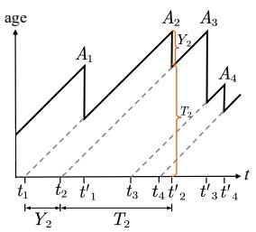

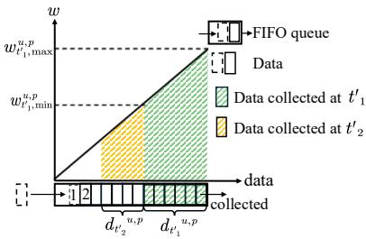  
(a)  
(b)  
Fig. 1: (a) Age process of a PoI $p .$ (b) FIFO queue of a PoI $p$ at timeslot $t _ { 1 } ^ { \prime }$

$$
s \mathrm { A o I } = \frac { 1 } { P } \sum _ { p = 1 } ^ { P } s \mathrm { A o I } _ { 0 , T } ^ { p } .\tag{13}
$$

Proposition 1: Let $\begin{array} { r } { \begin{array} { l l l } { h } & { = } & { \frac { P } { ( U + G ) C } } \end{array} } \end{array}$ denote the minimum number of timeslots required for UAVs/UGVs to visit all the PoIs. The lower bound for the episodic sAoI is ⌊h⌋.

Proof 1: With large communications capacity, sufficient energy reserve, and fast enough flying speed, U UAVs and G UGVs can fully collect the data from $( U + G ) C$ PoIs within a single timeslot, and the optimal strategy is to visit all the PoIs sequentially, i.e., it takes at least ⌈h⌉ timeslots to collect the data from $P$ PoIs.

Therefore, under the optimal strategy, the age process for any PoI follows a sawtooth pattern. Specifically, the period of this pattern is at least $\lfloor h \rfloor$ timeslots, the peak age is bounded above by ⌊h⌋, and the age resets to zero at the end of each period (assuming sufficiently high data transmission rates). Consequently, the episodic sAoI satisfies: $s \mathbf { A o I } \ =$ $\begin{array} { r } { \frac 1 P \sum _ { p = 1 } ^ { P } s \mathrm { A o I } _ { 0 , T } ^ { \bar { p } } \geq \frac 1 P \sum _ { p = 1 } ^ { P } \lfloor h \rfloor = \lfloor h \rfloor } \end{array}$ □

2) latency-weighted data collection ratio(ν): As shown in Fig. 1b, sensors like surveillance cameras at PoIs continuously generate data. The collected latency-weighted data peaks at the moment of generation when the waiting time is zero, and then decays over time due to its time-sensitive nature [38]. To formalize it, we put the collected latency-weighted data on an infinitesimal scale, characterizing its continuous temporal decay. Specifically, similar to [10], assuming that an infinitesimal amount of data is generated during an infinitesimal time interval dw and its waiting time in a timeslot t is $w ,$ the collected latency-weighted data is defined as:

$$
\begin{array} { r } { \delta ( w ) = c _ { p } \lambda \mathrm { d } w + ( 1 - c _ { p } ) f _ { w } \lambda \mathrm { d } w , } \end{array}\tag{14}
$$

where $c _ { p }$ is the weight that measures the tradeoff between the intrinsic importance and the time-sensitive utility of a task [39]; λdw quantifies the infinitesimal amount of data generated within this interval; $f _ { w }$ is a time-decay function based on the waiting time w. Note that $f$ needs to satisfy several properties: (a) monotonically decreasing on $[ 0 , + \infty ]$ , (b) $f _ { 0 } = 1$ , which guarantees collected latency-weighted data is the highest when generated, and (c) measurable and has primitive function so that integration is well defined.

□

As shown in Fig. 1b, the waiting time of collected data at timeslot $t _ { 1 } ^ { \prime }$ ranges between $w _ { t _ { 1 } ^ { \prime } , \mathrm { m i n } } ^ { u , p ^ { - } }$ and $w _ { t _ { 1 } ^ { \prime } , \operatorname* { m a x } } ^ { u , p }$ . Define $\Delta w _ { t _ { 1 } ^ { \prime } } ^ { u , p } : = w _ { t _ { 1 } ^ { \prime } , \operatorname* { m a x } } ^ { u , p } - w _ { t _ { 1 } ^ { \prime } , \operatorname* { m i n } } ^ { u , p } .$ . For simplicity, we drop time, UAV and PoI indexes of $w _ { t _ { 1 } ^ { \prime } , \operatorname* { m i n } } ^ { u , p } , w _ { t _ { 1 } ^ { \prime } , \operatorname* { m a x } } ^ { u , p }$ and $\Delta w _ { t _ { 1 } ^ { \prime } } ^ { u , p }$ as $w _ { \mathrm { m i n } } ,$ $w _ { \mathrm { m a x } }$ and $\Delta w .$ , respectively. Therefore, the collected latencyweighted data ranges between $\delta ( w _ { \mathrm { m i n } } )$ and $\delta ( w _ { \mathrm { m a x } } )$ , and the average collected latency-weighted data is given by:

$$
\begin{array} { r l r } {  { \delta _ { t } ^ { u , p } = \int _ { w _ { \operatorname* { m i n } } } ^ { w _ { \operatorname* { m a x } } } \delta ( w ) = \lambda \int _ { w _ { \operatorname* { m i n } } } ^ { w _ { \operatorname* { m a x } } } [ c _ { p } + ( 1 - c _ { p } ) f _ { w } ] \mathrm { d } w } } \\ & { } & { = \lambda \bigg [ c _ { p } \Delta w + ( 1 - c _ { p } ) \int _ { w _ { \operatorname* { m i n } } } ^ { w _ { \operatorname* { m a x } } } f _ { w } \mathrm { d } w \bigg ] . } \end{array}\tag{15}
$$

The latency-weighted data collection ratio ν in a whole episode is computed by:

$$
\nu = \sum _ { t = 1 } ^ { T } \sum _ { p = 1 } ^ { P } \frac { \bigl ( \sum _ { u = 1 } ^ { U } \delta _ { t } ^ { u , p } + \sum _ { g = 1 } ^ { G } \delta _ { t } ^ { g , p } \bigr ) } { \lambda T P } ,\tag{16}
$$

where $\delta _ { t } ^ { u , p }$ and $\delta _ { t } ^ { g , p }$ are the collected latency-weighted data by a UAV u and a UGV g in a timeslot t from a PoI $p ,$ respectively. ν can be written as:

$$
\nu = \frac { \displaystyle \sum _ { t , p } \biggl ( \sum _ { u } d _ { t } ^ { u , p } + \sum _ { g } d _ { t } ^ { g , p } \biggr ) } { { \lambda T P } } . \frac { \displaystyle \sum _ { t , p } \biggl ( \sum _ { u } \delta _ { t } ^ { u , p } + \sum _ { g } \delta _ { t } ^ { g , p } \biggr ) } { \displaystyle \sum _ { t , p } \biggl ( \sum _ { u } d _ { t } ^ { u , p } + \sum _ { g } d _ { t } ^ { g , p } \biggr ) } ,\tag{17}
$$

where the first term represents the data collection ratio in a whole episode, and the second term is the ratio of the collected latency-weighted data to all collected data in a whole episode.

Proposition 2: Let $\begin{array} { r } { h \ = \ \frac { P } { ( U + G ) C } } \end{array}$ denote the minimum number of timeslots required for UAVs/UGVs to visit all the PoIs. The upper bound for the obtained data collection ratio is $1 - { \frac { \lfloor h \rfloor \lfloor h ^ { - 1 } \rfloor } { 2 h T } }$

Proof 2: With large communications capacity, sufficient energy reserve, and fast enough flying speed, U UAVs and G UGVs can fully collect the data from $( U + G ) C$ PoIs within a single timeslot, and the optimal strategy is to visit all the PoIs sequentially, i.e., it takes at least ⌈h⌉ timeslots to collect the data from P PoIs.

When completed, at least $( U + G ) C$ PoIs will suffer from the maximum waiting time exceeding $\lfloor h - 1 \rfloor$ , and at least the same number of PoIs will suffer from a maximum waiting time that surpasses $\lfloor h - 2 \rfloor , \lfloor h - 2 \rfloor$ , and so forth. Therefore, the amount of uncollected data is at least $\lambda ( U { + } G ) C \lfloor h \rfloor \lfloor h { - } 1 \rfloor / 2$ The upper bound for the obtained data collection ratio is:

$$
\frac { \sum _ { t , p } \left( \sum _ { u } d _ { t } ^ { u , p } + \sum _ { g } d _ { t } ^ { g , p } \right) } { \lambda T P } \leq 1 - \frac { \lambda ( U + G ) C \lfloor h \rfloor \lfloor h - 1 \rfloor } { 2 \lambda T P }
$$

The bound in Proposition 2 is tight if there exists a feasible joint UAV-UGV traversal route and channel assignment strategy $( \chi _ { t } ) _ { t = 1 } ^ { T }$ . Here, $\ d \chi _ { t } = \left( \{ \chi _ { t } ^ { u } \} _ { u = 1 } ^ { U } , \{ \chi _ { t } ^ { g } \} _ { g = 1 } ^ { G } \right)$ denotes the PoI-to-channel assignments for all UAVs and UGVs in a timeslot t, with $\boldsymbol { \chi } _ { t } ^ { u }$ and $\boldsymbol { x } _ { t } ^ { g }$ being the channel assignment vectors defined in Section IV-B2. This strategy must satisfy three conditions: (a) the energy budget constraint is met:

$\begin{array} { r } { \sum _ { t = 1 } ^ { T } e _ { t } ^ { n } \ \le \ e _ { 0 } ^ { n } , \forall n \ \in \ \mathcal { U } \cup \mathcal { G } ; \ ( \mathfrak { b } ) } \end{array}$ the mobility constraints are satisfied: $l _ { \mathrm { m a x } } ^ { u } \geq l _ { \mathrm { t h r } } ^ { u }$ and $l _ { \mathrm { m a x } } ^ { g } \ge l _ { \mathrm { t h r } } ^ { g }$ , ensuring agents can travel between consecutively scheduled nodes along the route within one timeslot; and (c) the data rate sufficiency condition holds: $R _ { t , c } ^ { n , p } \cdot \tau _ { t , c } ^ { n } \geq d _ { t } ^ { p } , \forall t , c , n \in \mathcal { U } \cup \mathcal { G } , p \in \mathcal { P } \mathrm { ~ s . t . ~ } \chi _ { t , c } ^ { n , p } = 1$ In practice, the bound typically becomes loose when these conditions are not met. For instance, if $\exists t , c , n , p$ such that $R _ { t , c } ^ { n , p } \cdot \tau _ { t , c } ^ { n } \leq d _ { t } ^ { p }$ , an amount of data $\epsilon = d _ { t } ^ { p } - { R } _ { t , c } ^ { n , p } \cdot \tau _ { t , c } ^ { n }$ may remain uncollected by the end of the task. Accounting for this accumulated shortfall ϵ yields a tighter bound: $\begin{array} { r } { 1 - \frac { \lfloor h \rfloor \lfloor h - 1 \rfloor } { 2 h T } - \frac { \epsilon } { 2 \lambda T P } } \end{array}$

Lemma 1: Assuming $N = U + G$ , the following inequality must hold:

$$
\frac { \sum _ { t , p , n } \int _ { 0 } ^ { \Delta w } f _ { w } \mathrm { d } w } { \sum _ { t , p , n } \Delta w } \leq \frac { \int _ { 0 } ^ { \Delta \overline { { w } } } f _ { w } \mathrm { d } w } { \Delta \overline { { w } } } ,\tag{18}
$$

where $\begin{array} { r } { \Delta \overline { { w } } = \frac { 1 } { T P N } \sum _ { t , p , n } \Delta w . } \end{array}$

Proof 3: We define an auxiliary function $\begin{array} { r } { g ( t ) = \int _ { 0 } ^ { t } f _ { w } \mathrm { d } w } \end{array}$ and consider $f _ { w }$ is monotonically decreasing with respect to w. Then $g ( t )$ is a concave function. By applying Jensen’s inequality, We have:

$$
\begin{array} { r l } & { \cfrac { \sum _ { t , p , n } \int _ { 0 } ^ { \Delta w } f _ { w } \mathrm { d } w } { \sum _ { t , p , n } \Delta w } = \cfrac { \sum _ { t , p , n } g ( \Delta w ) } { \sum _ { t , p , n } \Delta w } } \\ & { \qquad \leq \cfrac { g \big ( \Delta \overline { { w } } \big ) } { \Delta \overline { { w } } } = \cfrac { \int _ { 0 } ^ { \Delta \overline { { w } } } f _ { w } \mathrm { d } w } { \Delta \overline { { w } } } . } \end{array}
$$

Proposition 3: The upper bound for the ratio of collected latency-weighted data to collected data in a whole episode is: $c _ { p } + ( 1 - c _ { p } ) \int _ { 0 } ^ { \Delta \overline { { w } } } f _ { w } \mathrm { d } w / \Delta \overline { { w } }$

Proof 4:

$$
\begin{array} { r l } & { \frac { \sum _ { t , p , n } \delta _ { t } ^ { n , p } } { \sum _ { t , p , n } d _ { t } ^ { n , p } } = \frac { \sum _ { t , p , n } \lambda c _ { p } \Delta w + ( 1 - c _ { p } ) \lambda \int _ { w _ { \operatorname* { m i n } } } ^ { w _ { \operatorname* { m a x } } } f _ { w } \mathrm { d } w } { \sum _ { t , p , n } \lambda \Delta w } } \\ & { \phantom { m m m m m m m m m } = c _ { p } + ( 1 - c _ { p } ) \frac { \sum _ { t , p , n } \int _ { w _ { \operatorname* { m i n } } } ^ { w _ { \operatorname* { m i n } } + \Delta w } f _ { w } \mathrm { d } w } { \sum _ { t , p , n } \Delta w } } \\ & { \phantom { m m m m m m m m m } \leq c _ { p } + ( 1 - c _ { p } ) \frac { \int _ { 0 } ^ { \Delta \overline { { w } } } f _ { w } \mathrm { d } w } { \Delta \overline { { w } } } . } \end{array}
$$

Theorem 1: The upper bound for the latency-weighted data collection ratio ν is: $\begin{array} { r } { ( 1 ~ - ~ \frac { \lfloor h \rfloor \lfloor h - 1 \rfloor } { 2 h T } ) ( \dot { c _ { p } } ~ + ~ \overline { { ( 1 ~ - ~ } } } \end{array}$ $\begin{array} { r } { c _ { p } ) \int _ { 0 } ^ { \Delta \overline { { w } } } f _ { w } \mathrm { d } w / \Delta \overline { { w } } ) } \end{array}$

Proof 5: According to Eqn. (17), the first term has an upper bound $\begin{array} { r } { 1 - \frac { \lfloor h \rfloor \lfloor h - 1 \rfloor } { 2 h T } } \end{array}$ , and the second term has an upper bound $c _ { p } + ( 1 - c _ { p } ) \int _ { 0 } ^ { \Delta \overline { { w } } } f _ { w } \mathrm { d } w / \Delta \overline { { w } }$ □

3) Energy Consumption Ratio (η): It is defined as the ratio of consumed energy by UAVs and UGVs at the end of the task relative to the initial energy reserve:

$$
\eta = \frac { \sum _ { t = 1 } ^ { T } \left( \sum _ { u = 1 } ^ { U } e _ { t } ^ { u } + \sum _ { g = 1 } ^ { G } e _ { t } ^ { g } \right) } { \sum _ { u = 1 } ^ { U } e _ { 0 } ^ { u } + \sum _ { g = 1 } ^ { G } e _ { 0 } ^ { g } } ,\tag{19}
$$

where $e _ { t } ^ { u }$ and $e _ { t } ^ { g }$ denote the energy consumed by a UAV u and a UGV g in a timeslot t, respectively, and $e _ { 0 } ^ { u }$ and $e _ { 0 } ^ { g }$ are the initial energy reserve for UAVs and UGVs, respectively.

4) Sensing Efficiency (ξ): Finally, we propose an integrated metric ξ to comprehensively evaluate the sensing efficiency in air-ground VCS. It considers sAoI of collected data, latencyweighted data collection ratio, and the energy consumption of UAVs/UGVs, as:

$$
\xi = \frac { \sum _ { p = 1 } ^ { P } \sum _ { t = 1 } ^ { T } \big ( \sum _ { \boldsymbol { u } = 1 } ^ { U } \delta _ { t } ^ { \boldsymbol { u } , p } + \sum _ { \boldsymbol { g } = 1 } ^ { G } \delta _ { t } ^ { \boldsymbol { g } , p } \big ) } { s \mathrm { A o I } \cdot \sum _ { t = 1 } ^ { T } \left( \sum _ { \boldsymbol { u } = 1 } ^ { U } e _ { t } ^ { \boldsymbol { u } } + \sum _ { \boldsymbol { g } = 1 } ^ { G } e _ { t } ^ { \boldsymbol { g } } \right) } .\tag{20}
$$

## B. Problem Formulation as a POMDP

We formulate the air-ground VCS as a partially observable markov decision process (POMDP), represented by a tuple $\langle \mathcal { N } , \mathcal { O } , \mathcal { A } , R , \Omega , \gamma \rangle$ . Recall that ${ \mathcal { N } } = { \mathcal { U } } \cup { \mathcal { G } }$ is the ordered set of all UAVs and UGVs, and O and A are the local observations and actions.

1) Observation Space ${ \mathcal { O } } \triangleq \{ \mathcal { O } ^ { u } , \mathcal { O } ^ { g } \}$

• UAV observation space $O ^ { u . } \mathrm { : }$ It includes the position of the UAVs, UGVs, PoIs, the data amount and delay requirement of PoIs within the observable range.

• UGV observation space $\mathcal { O } ^ { g }$ : In addition to $O ^ { u }$ , it also includes the reachable nodes of the road network, and the position of the UAV relay.

2) Action Space ${ \mathcal { A } } \triangleq \{ { \mathcal { A } } ^ { c } , { \mathcal { A } } ^ { g } \}$

• UAV Movement and Channel Assignment Space ${ \mathcal { A } } ^ { u } ;$ : For each UAV, its movement is a 2-tuple: $( \theta _ { t } ^ { u } , l _ { t } ^ { u } )$ , where $\theta _ { t } ^ { u }$ denotes the angle which controls the direction of movement and $l _ { t } ^ { u }$ is the traveling distance, bounded by a maximum distance $l _ { \mathrm { m a x } } ^ { u }$ . Also, each UAV assigns $C$ channels to PoIs as a subset of all available ones to collect data from for data transmissions, represented by the vector $\chi _ { t } ^ { u } \ = \ \big ( a _ { t } ^ { u } ( 1 ) , a _ { t } ^ { u } ( 2 ) , \ldots , a _ { t } ^ { u } ( C ) \big ) ^ { \top }$ , where each element $a _ { t } ^ { u } ( c ) \stackrel { \cdot } { = } \underset { p \in \{ 1 , . . . , P \} } { \arg \operatorname* { m a x } } \ : \chi _ { t , c } ^ { u , p }$ is the index of the selected PoI on channel c.

• UGV Movement and Channel Assignment Space ${ \mathcal { A } } ^ { g } ;$ The movement of each UGV is defined as the set of nodes in a road network reachable within a single timeslot from the current position. Similar to UAVs, each UGV assigns C channels to PoIs as a subset of all available ones to collect data from for data transmissions, represented by the vector $\chi _ { t } ^ { g } = \big ( a _ { t } ^ { g } ( 1 ) , a _ { t } ^ { g } ( 2 ) , \dots , a _ { t } ^ { g } ( C ) \big )$ , where each element $a _ { t } ^ { g } ( c ) = \arg \operatorname* { m a x } _ { m } \chi _ { t , c } ^ { g , p }$ is the index of the p∈{1,...,P } selected PoI on channel c.

3) Reward Function: Since UAVs and UGVs collaboratively collect data, they share a global reward function in a timeslot t, which is defined as:

$$
r _ { t } = \frac { \sum _ { p = 1 } ^ { P } \big ( \sum _ { u = 1 } ^ { U } \delta _ { t } ^ { u , p } + \sum _ { g = 1 } ^ { G } \delta _ { t } ^ { g , p } \big ) } { \sum _ { p = 1 } ^ { P } s \mathrm { A o I } _ { t - 1 , t } ^ { p } } - h _ { t } ,\tag{21}
$$

where the first term is fraction of the collected latencyweighted data and sAoI of all PoIs; $h _ { t }$ is a positive constant to penalize UVs when running out of energy.

## V. PROPOSED SOLUTION: A2G-MADRL

We propose an auto-regressive sequential MADRL framework called “A2G-MADRL”, consisted of two modules as shown in Fig. 2. The first is a UAV-UGV-PoI interaction-aware heterogeneous vehicular graph convolution network (HVGCN) for feature extractions. The second is dynamically ordered masked policy generator (DOMPG) for coordinating UAVs and UGVs.

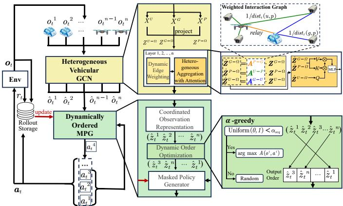  
Fig. 2: Proposed solution: A2G-MADRL.

## A. UAV-UGV-PoI Interaction-Aware Heterogeneous Vehicular Graph Convolution Network for Feature Extractions

Three types of heterogeneous nodes, UAVs, UGVs and PoIs, form an interaction graph. In this graph, each UAV-UGV pair is responsible for collecting data form multiple PoIs and each UAV is responsible for relaying data to the corresponding UGV. The interactions between three heterogeneous nodes provide valuable features for decision-making. Capturing this interaction is challenging by using conventional methods like MLPs or LSTMs.

We use an auto-regressive sequential policy to jointly plan the trajectories of UAVs and UGVs and assign NOMA communication channels to multiple PoIs, where UAV and UGV actions need to be explicitly modeled. This is because directly using their actions as the input may reduce their significance due to the non-stationary nature, and these actions may even be misinterpreted as noise in some extreme cases. By mapping the interactions between UAVs, UGVs and PoIs into edges and utilizing GCNs to aggregate features, we can improve the representation of the observation, thus enhancing the policy network more effectively.

Inspired by [40], we propose HVGCN to model the heterogeneous interaction-aware features in UAV–UGV cooperative communication via utilizing NOMA, where UAVs, UGVs, and PoIs form a dynamic heterogeneous interaction graph. The pipeline consists of three main steps: feature projection, dynamic edge weighting, and heterogeneous aggregation with attention.

1) Feature Projection: Without projection, heterogeneous graph nodes exist in different semantic spaces. To facilitate feature aggregation, it is essential to project the feature representations into a shared latent space Ω, with the dimensionality |Ω|. Specifically, observations from all UAVs and UGVs are divided into three distinct feature matrices $\mathbf { X } ^ { U } , \mathbf { X } ^ { G }$ , and $\mathbf { X } ^ { P } ,$ representing the feature matrices of UAVs, UGVs, and PoIs, respectively. Subsequently, three separate MLPs are used to project the input features into the latent space:

$$
\begin{array} { r } { { \pmb { Z } } ^ { U - \Omega } = { \pmb { X } } ^ { U } \cdot { \pmb { W } } ^ { U - \Omega } , } \\ { { \pmb { Z } } ^ { G - \Omega } = { \pmb { X } } ^ { G } \cdot { \pmb { W } } ^ { G - \Omega } , } \\ { { \pmb { Z } } ^ { P - \Omega } = { \pmb { X } } ^ { P } \cdot { \pmb { W } } ^ { P - \Omega } , } \end{array}\tag{22}
$$

where $\pmb { W } ^ { U - \Omega } \ \in \ \mathbb { R } ^ { | \pmb { X } ^ { U } | \times | \Omega | } , \ \pmb { W } ^ { G - \Omega } \ \in \ \mathbb { R } ^ { | \pmb { X } ^ { G } | \times | \Omega | } .$ , and $W ^ { P - \Omega } \in \mathbb { R } ^ { | { \cal X } ^ { P } | \times | \Omega | }$ are the weights of the projecting MLPs.

2) Dynamic Edge Weighting: The interactions can be categorized into three types of adjacency matrices: $A ^ { P - G }$ $\check { A } ^ { P - U }$ and $A ^ { G - U }$ . For a PoI $p$ and a UGV g, the edge weight is defined as the inverse of their Euclidean distance: $1 / ( \mathrm { d i s t } _ { t } ( u , p ) )$ . This means that PoIs that are closer to UGVs have stronger relationship, and PoIs with higher weights are more likely to be assigned channels for data transmissions. Furthermore, if a UGV $g$ has already collected data from a PoI $p$ in a timeslot t, the weight between them is reset to $0 , \bar { \mathbf { \nabla } } A ^ { P - U }$ is calculated in the same way to represent the relationship between UAVs and PoIs. $A ^ { G - U }$ denotes the interaction relationship matrix between UAVs and UGVs. In a timeslot $t ,$ if the data of a UAV u is relayed to a UGV $^ { g , }$ the edge weight between them is set to 1; otherwise 0. Then, the graph convolution process in the UAV feature space is:

$$
\begin{array} { r c l } { { } } & { { } } & { { \hat { \pmb { Z } } ^ { U - \Omega } = \pmb { Z } ^ { U - \Omega } , } } \\ { { } } & { { } } & { { \hat { \pmb { Z } } ^ { G - \Omega } = \pmb { A } ^ { U - G } \cdot \pmb { Z } ^ { G - \Omega } , } } \\ { { } } & { { } } & { { \hat { \pmb { Z } } ^ { P - \Omega } = \pmb { A } ^ { U - P } \cdot \pmb { Z } ^ { P - \Omega } , } } \end{array}\tag{23}
$$

where $\hat { \pmb { Z } } ^ { U - \Omega } , \hat { \pmb { Z } } ^ { G - \Omega }$ and $\hat { Z } ^ { P - \Omega }$ denote the node feature representations of UAVs, UGVs and PoIs after the edge weighting, respectively. As time progresses, the interactions among nodes within the heterogeneous graph will also evolve (i.e., the edges and their weights). Dynamic edge weighting enables the heterogeneous interaction graph to be updated in response to the spatiotemporal variations of UAVs and UGVs. This process accurately captures the evolving UAV-UGV-PoI communication network that utilizes NOMA, thereby supplying valuable information from current observations to facilitate effective decision-making.

3) Heterogeneous Aggregation with Attention: Considering that UAVs will focus on different PoIs based on their distances and sensing task urgency, as well as their attention to different relay UGVs, we aggregate heterogeneous node features with attention module, where the query matrices, key matrices and value matrices of UAV nodes are calculated as:

$$
\begin{array} { r l } & { \pmb { Q } ^ { U - \Omega } = \hat { \pmb { Z } } ^ { U - \Omega } \cdot \pmb { W } _ { Q , } ^ { \Omega } } \\ & { \pmb { K } ^ { U - \Omega } = [ ( \hat { \pmb { Z } } ^ { G - \Omega } ) ^ { \top } , ( \hat { \pmb { Z } } ^ { P - \Omega } ) ^ { \top } ] ^ { \top } \cdot \pmb { W } _ { K } ^ { \Omega } , } \\ & { \pmb { V } ^ { U - \Omega } = [ ( \hat { \pmb { Z } } ^ { G - \Omega } ) ^ { \top } , ( \hat { \pmb { Z } } ^ { P - \Omega } ) ^ { \top } ] ^ { \top } \cdot \pmb { W } _ { V } ^ { \Omega } . } \end{array}\tag{24}
$$

The final feature matrix ${ \hat { X } } ^ { U }$ for UAVs after one layer of graph convolution is calculated as:

$$
\hat { X } ^ { U } = \operatorname { s o f t m a x } ( \frac { { \pmb Q } ^ { U - \Omega } \cdot ( { \pmb K } ^ { U - \Omega } ) ^ { \top } } { | \Omega | } ) { \pmb V } ^ { U - \Omega } .\tag{25}
$$

The UGV feature matrix ${ \hat { X } } ^ { G }$ is calculated in the same way. Through heterogeneous aggregation with attention mechanisms, features extracted from UAVs and UGVs, which possess distinct sensing capabilities and communication resources, are adaptively integrated to guide the auto-regressive sequential decision-making process. This design enables HVGCN to capture air-ground communication dependencies and channel resource assignment patterns that are not addressed in conventional graph neural network frameworks.

## B. Dynamically Ordered Masked Policy Generator for Coordinating UAVs and UGVs

In air-ground VCS, efficient collaboration between UAVs and UGVs is crucial for optimizing sAoI, latency-weighted data collection ratio and energy consumption by UAVs and UGVs. However, traditional multi-agent sequential decisionmaking frameworks encounter difficulties with massive parameter learning. UAV or UGV actions are contingent on the outputs of previous UAVs or UGVs, which complicates the process and increases computational overhead, particularly in non-shared network structures.

Inspired by MAT [19], we design a dynamically ordered masked policy generator, consisted of a coordinated observation representation module and a masked policy generator with dynamic order optimization. It treats each UAV and UGV as a node in a sequence, using attention mechanism to output feature representations for each decision-making order. The multi-agent sequential decision-making framework achieves a significant reduction in the joint policy complexity, decreasing it from the exponential scale $\prod _ { i = 1 } ^ { N } \left| \mathcal { A } ^ { i } \right|$ to the linear scale $\textstyle \sum _ { i = 1 } ^ { N } | A ^ { i } |$ . Furthermore, this allows to learn the policy under the current decision-making order within a shared parameter network. The coordinated observation representation module maps the output of the HVGCN to the feature space of the UAVs and UGVs, which then serves as the input for the state value function. The masked policy generator, on the other hand, is responsible for weighting the observation representation according to the decision-making order and generates the final action distribution.

Coordinated Observation Representation (COR): The ordered set of all UAVs and UGVs, is denoted as $\mathcal { N } \ =$ ${ \mathcal { G } } \cup { \mathcal { U } } .$ The feature set extracted by HVGCN is represented as $\{ \hat { o } _ { t } ^ { N _ { i } } \} _ { i = 1 } ^ { N }$ , which is further processed by the COR module for coordinated representation. It includes several coordinated representation blocks, similar to Transformer [41]. Each block includes a self-attention network, a feed-forward network, and layer normalization to maintain training stability. We utilize MAPPO [42] as the start point of our design for A2G-MADRL and on the top of it, we enhance the input of the centralized critic by using the output $\{ \hat { z } _ { t } ^ { \mathcal { N } _ { i } } \} _ { i = 1 } ^ { N }$ to the state value network $V _ { \phi _ { 2 } }$ . The loss is calculated by:

$$
\mathcal { L } _ { \mathrm { C O R , v } } ( \phi _ { 1 , 2 } ) = \frac { 1 } { T N } \sum _ { t = 1 } ^ { T } \sum _ { i = 1 } ^ { N } \left[ r _ { t } + \gamma V _ { \phi _ { 2 } } ( \hat { o } _ { t + 1 } ^ {  { N _ { i } } } ) - V _ { \phi _ { 2 } } ( \hat { o } _ { t } ^ {  { N _ { i } } } ) \right] ^ { 2 } ,\tag{26}
$$

where T is the total number of timeslots and N is the number of all UAVs and UGVs; network parameters $\phi _ { 1 }$ and $\phi _ { 2 }$ are updated using temporal difference loss.

Dynamic Order Optimization of Training and Update by Advantage Function: In real-world applications, UAVs and UGVs must rapidly make decisions and communicate their actions for collaborative route planning and channel assignment. A fixed-order decision-making strategy prolongs UAV and UGV waiting time and prevents sensing efficiency. Furthermore, decision errors originating from earlier-acting agents in auto-regressive sequential MADRL may accumulate and severely affect subsequent agents’ decisions, ultimately degrading the overall policy performance. To address this, we randomly shuffle the decision-making order of UAVs and UGVs, denoted as $\mathcal { N }$ to reduce reliance on a fixed decisionmaking order. Although random shuffling is a common approach, the permutation grows by factorial with the number of UAV-UGV pairs.

In our proposed auto-regressive sequential decision-making process, the update order needs to be consistent with decisionmaking order during training. Wang et al. [20] confirmed that policy networks learn more effectively from samples with large advantage function value and greedy sampling. However, purely greedy strategies may lead to overfitting, and we introduce an $^ { \bullet \bullet } \alpha \mathrm { - g r e e d y } ^ { \bullet }$ method to optimize the training process. When $\alpha _ { \mathrm { s e q } } ~ = ~ 1$ , it is purely greedy, while $\alpha _ { \mathrm { s e q } } ~ = ~ 0$ represents purely random strategy. When $\mathrm { U n i f o r m } ( 0 , 1 ) \ < \ \alpha _ { \mathrm { s e q } } ,$ , we select a decision-making order according to arg max $\begin{array} { r l } { } & { { } \ N _ { j } \in { \mathcal N } - { \mathcal N } _ { 1 : i - 1 } ^ { \prime } \ \hat { A } \big ( o _ { t } ^ { { \mathcal N } _ { j } } , a _ { t } ^ { { \mathcal N } _ { j } } \big ) } \end{array}$ . We randomly choose an unselected UAV or UGV otherwise.

This approach ensures that UAVs and UGVs with higher expected advantage function value are more likely to make decisions earlier during training and are prioritized for updates. Consequently, this approach not only enhances more effective collaboration of route planning and channel assignment, but also balances fast convergence with sufficient exploration in dynamic environments.

Masked Policy Generator: The current UAV or UGV ${ \mathcal { N } } _ { i }$ generates an action probability distribution only after obtaining actions from the previous UAVs and UGVs. This is expressed as $a _ { t } ^ { \mathcal { N } _ { i } } = \mathbf { M P G } ( [ \hat { z } _ { t } ^ { \mathcal { N } _ { i } } , a _ { t } ^ { \mathcal { N } _ { 1 : i - 1 } } ] )$ . To facilitate the parallel network inference and training, we generate actions with masked cross-attention mechanism. Specifically, the query matrix for the masked cross-attention mechanism is mapped from the actions of previous UAVs and UGVs $\{ a _ { t } ^ { \mathcal { N } _ { j } } \} _ { j = 1 } ^ { i - 1 }$ , while both the key and value matrices are mapped from the observation representation vectors $\{ \hat { z } _ { t } ^ { \mathcal { N } _ { j } } \} _ { j = 1 } ^ { N }$ , which is the output of COR. The masked cross-attention matrix is calculated as:

$$
\begin{array} { c } { Q = \mathrm { M L P } \big ( \{ \pmb { a } _ { t } ^ { \mathcal { N } _ { j } } \} _ { j = 1 } ^ { i - 1 } \big ) , \quad K , V = \mathrm { M L P } \big ( \{ \hat { \boldsymbol { z } } _ { t } ^ { \mathcal { N } _ { j } } \} _ { j = 1 } ^ { N } \big ) , } \\ { Z = \mathrm { s o f t m a x } \Big ( \frac { { \pmb { Q } } K ^ { \top } } { \sqrt { N } } + M \Big ) \cdot V , } \end{array}\tag{27}
$$

where M is a mask matrix with elements equal to 0 in the lower triangle and −∞ elsewhere, ensuring that the current UAV or UGV can only receive the actions of UAVs and UGVs that came before it in the decision-making order, guaranteeing an auto-regressive sequential decision-making process. MLP denotes the fully connected neural network mapping layer.

The action of the current UAV or UGV implicitly models the actions of previous UAVs and UGVs $a _ { t } ^ { \mathcal { N } _ { 1 : i - 1 } }$ based on the masked cross-attention mechanism, which enhances collaboration among UAVs and UGVs. Changing permutations of decision-making order allows the current UAV or UGV to focus on different observation information, which in turn adjusts its strategy. At the end of MPG, the output of multiple masked cross-attention block is passed through an MLP to produce the final action distribution. During policy update, instead of using Generalized Advantage Estimation [43] in MAPPO to calculate advantage function, we use sequential weighted importance sampling factors to adjust the contribution of each agent’s action to the global reward, addressing the credit assignment problem in multi-agent systems, ensuring monotonic improvement of the joint policy and ultimately enhancing the collaboration of UAVs and UGVs. The advantage function for the i-th UAV or UGV in the ordered set $\mathcal { N }$ is defined as:

Algorithm 1: A2G-MADRL   
1 Input: $\begin{array} { r } { \mathrm { H V G C N } _ { \phi _ { 0 } } , \mathrm { C O R } _ { \phi _ { 1 } } , V _ { \phi _ { 2 } } , \pi _ { \phi _ { 3 } } ; } \end{array}$   
2 Initialize network weights $( \phi _ { 0 } , \phi _ { 1 } , \phi _ { 2 } , \phi _ { 3 } ) ;$   
3 Initialize decision-making order of UAVs/UGVs ${ \mathcal { N } } ;$   
4 for update iteration $\mathit { \Theta } = l , 2 , \ldots$ . do   
5 Clear roll-out storage;   
6 for timeslot $t = 1 , 2 , \dots , T$ do   
7 Obtain local observations $\{ o _ { t } ^ { \mathcal { N } _ { i } } \} _ { i = 1 } ^ { N }$ for all   
UAVs and UGVs from the environment and   
get interaction-aware feature $\{ \hat { o } _ { t } ^ { \mathcal { N } _ { i } } \} _ { i = 1 } ^ { N }$ using   
$\mathrm { H V G C N } _ { \phi _ { 0 } } ;$   
8 Use $\mathrm { C O R } _ { \phi 1 }$ to obtain the representation set   
$\{ \hat { z } _ { t } ^ { N _ { i } } \} _ { i = 1 } ^ { N }$   
9 for $i = I , 2 , \dots , N$ do   
10 Use $ { \mathbf { M P G } } _ { \phi _ { 3 } }$ to generate the current $\mathrm { U A V } _ { \mathrm { \Delta } }$   
or UGV’s action $a _ { t } ^ { \mathcal { N } _ { i } }$ based on the action   
set $\{ a _ { t } ^ { \mathcal { N } _ { j } } \} _ { j = 1 } ^ { i - 1 }$ and the representation set   
$\{ \hat { z } _ { t } ^ { N _ { j } } \} _ { j = 1 } ^ { i - 1 } ;$   
11 Return all actions $\{ a _ { t } ^ { \mathcal { N } _ { i } } \} _ { i = 1 } ^ { N }$ to the environment   
and receive the reward $r _ { t }$ for the current   
timeslot ;   
12 Store the experience sample   
$( \{ o _ { t } ^ { N ^ { i } } \} _ { i = 1 } ^ { N } , \{ a _ { t } ^ { \mathcal { N } _ { i } } \} _ { i = 1 } ^ { N } , r _ { t } \ )$ in the roll-out   
storage;   
13 Sample a batch of experience samples from the   
roll-out storage;   
14 Update decision-making order $\mathcal { N }  \mathcal { N } ^ { \prime }$ according   
to α-greedy method.   
15 for $i = I , 2 , \dots , N$ do   
16 Calculate loss $\mathcal { L } _ { \mathrm { C O R } }$ using Eqn.(??);   
17 Calculate order-weighted importance sampling   
factors using Eqn.(28);   
18 Calculate loss LMPG using Eqn.(29);   
19 Use stochastic gradient descent to minimize the   
weighted loss function $\mathcal { L } _ { \mathrm { C O R } } + \mathcal { L } _ { \mathrm { M P G } } ;$

$$
\hat { A } ( o _ { t } ^ { \mathcal { N } _ { i } } , a _ { t } ^ { \mathcal { N } _ { i } } ) = \mathrm { c l i p } \left( \prod _ { j = 1 } ^ { i - 1 } c _ { t } ^ { \mathcal { N } _ { i } } , 1 + \epsilon , 1 - \epsilon \right) \mathrm { T D } _ { t } ^ { \mathcal { N } _ { i } } ,\tag{28}
$$

where $c _ { t } ^ { \mathcal { N } _ { i } } = \Big ( \pi _ { \phi _ { 3 } } ( a _ { t } ^ { \mathcal { N } _ { j } } | o _ { t } ^ { \mathcal { N } _ { j } } ) / \pi _ { \phi _ { 3 } ^ { \prime } } ( a _ { t } ^ { \mathcal { N } _ { j } } | o _ { t } ^ { \mathcal { N } _ { j } } ) \Big ) ; \mathrm { T D } _ { t } ^ { \mathcal { N } _ { i } } = r _ { t } +$ $\gamma V _ { \phi _ { 2 } } ( \hat { o } _ { t + 1 } ^ { \mathcal { N } _ { i } } ) - \dot { V } _ { \phi _ { 2 } } ( \hat { o } _ { t } ^ { \mathcal { N } _ { i } } ) ; r _ { t }$ is the shared reward for all UAVs and $\mathrm { U G V s } ;$ ϕ3 and $\phi _ { 3 } ^ { \prime }$ are the parameters of the MPG network during policy update and experience collection, respectively; $V _ { \phi _ { 2 } } ( \bar { \partial _ { t } } ^ { \sqrt { _ { i } } } )$ is the state value function and $c _ { t } ^ { \mathcal { N } _ { i } }$ is the joint importance sampling factor for the current decision-making order, which adjusts the policy gradient and reduces the nonstationary interference caused by multi-agent actions. Finally, MPG uses the same policy optimization loss function as MAPPO, defined as:

$$
\begin{array} { r } { \mathcal { L } _ { \mathrm { M P G } } ( \phi _ { 3 } ) = \displaystyle \frac { 1 } { T N } \sum _ { t = 1 } ^ { T } \sum _ { i = 1 } ^ { N } \Big [ \operatorname* { m i n } ( c _ { t } ^ { \mathcal { N } _ { i } } \cdot \hat { A } ( o _ { t } ^ { \mathcal { N } _ { i } } , a _ { t } ^ { \mathcal { N } _ { i } } ) , } \\ { \mathrm { c l i p } ( c _ { t } ^ { \mathcal { N } _ { i } } , 1 + \epsilon , 1 - \epsilon ) \hat { A } ( o _ { t } ^ { \mathcal { N } _ { i } } , a _ { t } ^ { \mathcal { N } _ { i } } ) ) \Big ] . } \end{array}\tag{29}
$$

## C. Algorithm Descriptions

The pseudo-code for A2G-MADRL is provided in $\mathrm { \sf A l g o - }$ rithm 1. At the beginning, $\small \mathrm { H V G C N } _ { \phi _ { 0 } } , \mathrm { C O R } _ { \phi _ { 1 } }$ , state value network $V _ { \phi _ { 3 } }$ and MPG network $\pi _ { \phi _ { 3 } }$ , as well as the decisionmaking order ${ \mathcal { N } } ,$ are initialized (lines 1-2). The algorithm, as multiple sub-threads, interacts with the environment in parallel like MAPPO to collect experiences. Local observations $\{ o _ { t } ^ { \mathcal { N } _ { i } } \} _ { i = 1 } ^ { N }$ for all UAVs and UGVs in a timeslot t are generated. Based on the current training order, the MPG sequentially generates actions $a _ { t } ^ { \mathcal { N } _ { i } }$ for each UAV or UGV ${ \mathcal { N } } _ { i }$ . After all actions are decided, reward $r _ { t }$ and local observations in the timeslot t + 1 are collected. The experiences for the current timeslot is stored in the roll-out storage (lines 5-12).

After T interactions, the policy update phase begins. A batch of experiences are sampled from the roll-out storage for updating (lines 13-14). The current decision order $\mathcal { N }$ is updated based on α-greedy method. For each UAV and UGV, the COR loss $\mathcal { L } _ { \mathrm { C O R } }$ is calculated using Eqn. (??). The importance sampling factors, weighted by the training order, are calculated using Eqn. (28). The MPG loss $\mathcal { L } _ { \mathrm { M P G } }$ is then calculated using the importance sampling factors and advantage functions. Finally, the network parameters are updated using stochastic gradient descent based on the weighted loss function. The process is repeated for all UAVs and UGVs in the ordered set $\mathcal { N }$ then the current update cycle completes (lines 15-19).

## D. Complexity Analysis

1) Complexity of HVGCN: Consider a weighted interaction graph with $| \mathcal { V } | = N + P$ nodes and $| \mathcal { E } | = N \cdot P + N / 2$ edges, and a latent space dimension of |Ω|. The feature projection step, dominated by matrix multiplications, has a complexity of $\mathcal { O } ( | \mathcal { V } | \cdot | \Omega | ^ { 2 } )$ . The complexity for computing dynamic edge weights is |E| · |Ω|. The calculation and normalization of attention coefficients during heterogeneous aggregation cost $\mathcal { O } \big ( | \mathcal { V } | \cdot | \Omega | \cdot D _ { \mathrm { a t t } } \big )$ , where $D _ { \mathrm { a t t } }$ is the hidden dimension of the attention mechanism. Summing across all $L _ { G }$ layers, the overall time complexity is $\mathcal { O } \bigl ( L _ { G } . ( | \mathcal { E } | + | \mathcal { V } | ) \bigr ) = \mathcal { O } ( L _ { G } . N . P )$

2) Complexity of DOMPG: Let $H _ { \mathrm { O C R } }$ denote the number of coordinated representation blocks in the COR module. Its computational complexity is $\mathcal { O } \big ( H _ { \mathrm { O C R } } \cdot ( N ^ { 2 } \cdot | \Omega | + N \cdot | \Omega | ^ { 2 } ) \big )$ For the MPG module with $H _ { \mathrm { M P G } }$ blocks, generating the action for the n-th agent has a per-step complexity of $\mathcal { O } ( H _ { \mathrm { M P G } } \cdot ( n$ $| \Omega | ^ { 2 } + n ^ { 2 } \cdot | \hat { \Omega | } + n \cdot N \cdot | \Omega | ) \big )$ . Summing from $n = 1$ to $N ,$ the total complexity for the MPG module is $\mathcal { O } ( H _ { \mathrm { M P G } } \cdot ( N ^ { 2 }$ $| \Omega | ^ { 2 } + N ^ { 3 } \cdot | \bar { \Omega } | ) \big )$ .

TABLE III: Simulation setting.
<table><tr><td>Notation</td><td>Value</td><td>Notation</td><td>Value</td><td>Notation</td><td>Value</td></tr><tr><td>T</td><td>120</td><td>U</td><td>2</td><td> $N _ { 0 }$ </td><td>-163dBm</td></tr><tr><td>T</td><td>20s</td><td>G</td><td>2</td><td> $\phi ^ { p }$ </td><td>20dBm</td></tr><tr><td> $v _ { u }$ </td><td>20m/s</td><td>C</td><td>5</td><td> $\overset { \cdot } { \phi ^ { u } }$ </td><td>34.7dBm</td></tr><tr><td> $v _ { g }$ </td><td>10m/s</td><td>B</td><td>40MHz</td><td> $\alpha _ { 1 } , \alpha _ { 2 } , \alpha _ { 3 }$ </td><td>2,4,4</td></tr><tr><td> $\boldsymbol { v } _ { \mathrm { t i p } }$ </td><td>120m/s</td><td>λ</td><td>2Mbps</td><td> $\beta _ { 1 } , \beta _ { 2 }$ </td><td>9.6,0.16</td></tr><tr><td> $H _ { u }$ </td><td>100m</td><td>eu</td><td>359.64kJ</td><td>ωNLoS</td><td>0.1dBm</td></tr><tr><td> $c _ { p }$ </td><td>0.5</td><td>eo</td><td>311.04kJ</td><td>ωLoS</td><td>21dBm</td></tr></table>

## VI. EXPERIMENTAL RESULTS

## A. Setup

We use two traces from the KAIST and Roma datasets by CRAWDAD [44], which uses Google Maps to obtain the locations and shapes of buildings and obstacles in real world scenarios, combined with OpenStreetMap to label the nodes of the road network. Specifically, the workzone on KAIST dataset is 2,174.9 meters long, 2,100.2 meters wide, covering a total area of approximately 4,565,400 square meters; and for Roma dataset, it is 2,241.1 meters long, 2,176.9 meters wide, covering 4,878,726 square meters.

There are $P = 1 8 7$ PoIs on KAIST and $P = 1 9 1$ PoIs on Roma, and the data generation speed is $\lambda = 2 \mathrm { { M b p s } }$ in a timeslot. The initial positions of the UAVs and UGVs are set to the center of the workzone. The entire task is divided into 120 equal timeslots, where each timeslot lasts for 20 seconds. The maximum movement speed of a UAV and a UGV is 20m/s, 10m/s, respectively. Since one UAV can only relay data to one UGV, we set an equal number of UAVs and UGVs $U =$ $G = 2$ . We define time-decay function of collected latencyweighted data as $f _ { w } \ = \ e ^ { - k w } \ [ 1 0 ] .$ , [38], where k controls the decaying speed for different PoIs. We choose three areas with high delay requirements on both datasets, based on road network and building density. The delay requirement factor k for three areas are 0.12, 0.18 and 0.24, respectively; and $k = 0 . 0 3$ for the rest of the map.

All algorithms are implemented in Python 3.8.16 with PyTorch 2.0.1 and CUDA 11.7, and all experiments are conducted on an Ubuntu 18.04.6 LTS server equipped with 8 NVIDIA GeForce RTX 3090 GPUs and an Intel(R) Xeon(R) Platinum 8280 CPU @ 2.70 GHz with 112 CPU cores. To ensure fairness and reproducibility, all learning-based methods are trained in the same simulator with five independent random seeds, using identical mobility constraints, energy budgets, communication parameters, reward function, observation space, action constraints. The training hyperparameters follow Table IV. Specifically, each learning-based method uses 16 parallel environments for rollout collection and is trained for 15,000 update iterations under the same training budget. The checkpoint with the best validation performance is selected for final testing.

## B. Hyperparameter Tuning

As shown in Table V, we tune the factor $\alpha _ { \mathrm { s e q } }$ to study the impact of decision-making order according to the value of advantage function. We also tune the number of layers $L _ { \mathrm { G } }$ in HVGCN to study the impact of number of neighborhood aggregations.

TABLE IV: Hyperparameter setting.
<table><tr><td>Parameter</td><td>Value</td><td>Parameter</td><td>Value</td></tr><tr><td>Value Network LR</td><td>5e-4</td><td>Number of Mini-batch</td><td>1</td></tr><tr><td>Batch Size</td><td>512</td><td>Feature Blocks</td><td>2</td></tr><tr><td>Discount Factor</td><td>0.99</td><td>LR Decay</td><td>Cosine</td></tr><tr><td>Policy Network LR</td><td>1e-4</td><td>Max Gradient Norm</td><td>0.5</td></tr><tr><td>Parallel Environments</td><td>16</td><td>Entropy Coefficient</td><td>0.01</td></tr><tr><td>Hidden Layer Dimension</td><td>32</td><td>Optimizer Epsilon</td><td>1e-5</td></tr><tr><td>Optimizer</td><td>Adam</td><td>PPO Clip Range</td><td>0.2</td></tr><tr><td>Weight Initialization</td><td>Xavier</td><td>Attention Heads</td><td>2</td></tr><tr><td>GAÉ Parameter (λ)</td><td>0.95</td><td>Episode Horizon</td><td>120</td></tr><tr><td>PPO Update Epochs</td><td>10</td><td>Total Training Iterations</td><td>15000</td></tr></table>

TABLE V: Impact of hyperparameter.
<table><tr><td>Dataset</td><td colspan="2">Hyperparameter</td><td>sAoI</td><td>ν</td><td>η</td><td>ξ</td></tr><tr><td rowspan="9">KAIST</td><td rowspan="2"> $\alpha _ { \mathrm { { s e q } } } = 0$ </td><td> $L _ { G } = 1$ </td><td>19.070</td><td>0.729</td><td>0.638</td><td>2.003</td></tr><tr><td> $L _ { G } = 2$ </td><td>15.576</td><td>0.753</td><td>0.659</td><td>2.449</td></tr><tr><td rowspan="2"> $\mathbf { \alpha } \mathbf { \alpha } \mathbf { \alpha } \mathbf { \alpha } \mathbf { \alpha } \mathbf { \alpha } \mathbf { \alpha } \mathbf { \alpha } \mathbf { \alpha } \mathbf { \alpha } \mathbf { \alpha } \mathbf { \alpha } \mathbf { \alpha } \mathbf { \alpha } \mathbf { \alpha } \mathbf { \alpha } \mathbf { \alpha } \mathbf { \alpha } \mathbf { \alpha } \mathbf { \alpha } \mathbf { \alpha } \mathbf { \alpha } \mathbf { \alpha } \mathbf { \alpha } \mathbf { \alpha } \mathbf { \alpha } \mathbf { \alpha } \mathbf { \alpha } \mathbf { \alpha } \mathbf { \alpha } \mathbf { \alpha } \mathbf { \alpha } \mathbf { \beta } \mathbf { \alpha } \mathbf { \alpha } \mathbf { \alpha } \mathbf { \beta } \mathbf { \alpha } \mathbf { \alpha } \mathbf { \beta } \mathbf { \alpha } \mathbf { \alpha } \mathbf { \beta } \mathbf { \alpha } \mathbf { \alpha } \mathbf { \beta } \mathbf { \alpha } \mathbf { \alpha } \mathbf { \beta \alpha } \mathbf { \alpha } \mathbf { \beta \alpha } \mathbf { \alpha } \mathbf { \beta \alpha } \mathbf { \beta \alpha } \mathbf { \beta \alpha \beta } \mathbf \mathbf  \alpha \alpha \beta \mathbf { \alpha } \mathbf \beta \alpha \mathbf \alpha \mathbf { \alpha } \mathbf \beta \beta \mathbf \alpha \mathbf \beta \mathbf \alpha \mathbf \alpha \mathbf \beta \mathbf \alpha \mathbf \beta \beta \mathbf \alpha \mathbf \beta \mathbf \mathbf \alpha \mathbf \beta \mathbf \alpha \mathbf \beta \mathbf \mathbf \alpha \mathbf \beta \mathbf \mathbf \alpha \mathbf \mathbf \beta \mathbf \mathbf \alpha \mathbf \alpha \mathbf \mathbf \mathbf \mathbf \beta \mathbf \alpha \mathbf \mathbf \mathbf \mathbf \alpha \mathbf \mathbf \mathbf \mathbf \alpha \mathbf \mathbf \mathbf \mathbf \alpha \mathbf \mathbf \mathbf \mathbf \mathbf \mathbf \mathbf \alpha \mathbf \mathbf \mathbf \mathbf \mathbf \mathbf \mathbf \mathbf \mathbf \mathbf \mathbf \mathbf \alpha \mathbf \mathbf \mathbf \mathbf \mathbf \mathbf \mathbf \mathbf \mathbf \mathbf \mathbf \mathbf \mathbf \mathbf \mathbf \mathbf \mathbf \mathbf \mathbf \mathbf \mathbf \mathbf \mathbf \mathbf \mathbf \mathbf \mathbf \mathbf \mathbf \mathbf \mathbf \mathbf \mathbf \mathbf \mathbf \mathbf \mathbf \mathbf \mathbf \mathbf \mathbf \mathbf \mathbf \mathbf \mathbf \mathbf \mathbf \mathbf \mathbf \mathbf \mathbf \mathbf \mathbf \mathbf \mathbf \mathbf \mathbf \mathbf \mathbf \mathbf \mathbf \mathbf \mathbf \mathbf \mathbf \mathbf \mathbf \mathbf \mathbf \mathbf \mathbf \mathbf \mathbf \mathbf \mathbf \mathbf \mathbf \mathbf \mathbf \mathbf \mathbf \mathbf \mathbf \mathbf \mathbf \mathbf \mathbf $ </td><td> $L _ { G } = 3$ </td><td>16.248</td><td>0.744</td><td>0.675</td><td>2.265</td></tr><tr><td> $\overline { { L _ { G } = 1 } }$ </td><td>14.456</td><td>0.772</td><td>0.663</td><td>2.694</td></tr><tr><td rowspan="2"></td><td> $L _ { G } = 2$ </td><td>14.904</td><td>0.760</td><td>0.676</td><td>2.518</td></tr><tr><td> $L _ { G } = 3$ </td><td>16.696</td><td>0.748</td><td>0.667</td><td>2.242</td></tr><tr><td rowspan="2"> $\alpha _ { \mathrm { s e q } } = 0 . 5$ </td><td> $\overline { { L _ { G } = 1 } }$ </td><td>15.710 17.816</td><td>0.758 0.737</td><td>0.668 0.671</td><td>2.415 2.058</td></tr><tr><td> $L _ { G } = 2$   $L _ { G } = 3$ </td><td>16.696</td><td>0.738</td><td>0.673</td><td>2.192</td></tr><tr><td rowspan="2"> $\alpha _ { \mathrm { s e q } } = 0 . 7$ </td><td> $\overline { { L _ { G } = 1 } }$ </td><td>16.024</td><td>0.752</td><td>0.664</td><td>2.360</td></tr><tr><td> $L _ { G } = 2$ </td><td>16.382</td><td>0.745</td><td>0.655</td><td>2.321</td></tr><tr><td rowspan="3"> $\alpha _ { \mathrm { s e q } } = 1$ </td><td> $L _ { G } = 3$ </td><td>17.144</td><td>0.738</td><td>0.674</td><td>2.133</td></tr><tr><td> $\overline { { L _ { G } = 1 } }$ </td><td>15.800</td><td>0.759</td><td>0.665</td><td>2.412</td></tr><tr><td> $L _ { G } = 2$ </td><td>16.248</td><td>0.729</td><td>0.678</td><td>2.210</td></tr><tr><td rowspan="4"></td><td> $L _ { G } = 3$ </td><td>16.382</td><td>0.741</td><td>0.680</td><td>2.223</td></tr><tr><td> $\alpha _ { \mathrm { s e q } } = 0$ </td><td> $L _ { G } = 1$ </td><td>15.132 0.741</td><td>0.673</td><td>2.481</td></tr><tr><td> $L _ { G } = 2$   $L _ { G } = 3$ </td><td>16.618 17.642</td><td>0.752 0.760</td><td>0.673 0.655</td><td>2.293 2.241</td></tr><tr><td> $\mathbf { Z } _ { G } = \mathbf { 1 }$ </td><td>14.672</td><td>0.769</td><td>0.677</td><td>2.645</td></tr><tr><td rowspan="3"> $\mathbf { \alpha } \mathbf { \alpha } \mathbf { \alpha } \mathbf { \alpha } \mathbf { \alpha } \mathbf { \alpha } \mathbf { \alpha } \mathbf { \alpha } \mathbf { \alpha } \mathbf { \alpha } \mathbf { \alpha } \mathbf { \alpha } \mathbf { \alpha } \mathbf { \alpha } \mathbf { \alpha } \mathbf { \alpha } \mathbf { \alpha } \mathbf { \alpha } \mathbf { \alpha } \mathbf { \alpha } \mathbf { \alpha } \mathbf { \alpha } \mathbf { \alpha } \mathbf { \alpha } \mathbf { \alpha } \mathbf { \alpha } \mathbf { \alpha } \mathbf { \alpha } \mathbf { \alpha } \mathbf { \alpha } \mathbf { \alpha } \mathbf { \alpha } \mathbf { \beta } \mathbf { \alpha } \mathbf { \alpha } \mathbf { \alpha } \mathbf { \beta } \mathbf { \alpha } \mathbf { \alpha } \mathbf { \beta } \mathbf { \alpha } \mathbf { \alpha } \mathbf { \beta } \mathbf { \alpha } \mathbf { \alpha } \mathbf { \beta } \mathbf { \alpha } \mathbf { \alpha } \mathbf { \beta \alpha } \mathbf { \alpha } \mathbf { \beta \alpha } \mathbf { \alpha } \mathbf { \beta \alpha } \mathbf { \beta \alpha } \mathbf { \beta \alpha \beta } \mathbf \mathbf  \alpha \alpha \beta \mathbf { \alpha } \mathbf \beta \alpha \mathbf \alpha \mathbf { \alpha } \mathbf \beta \beta \mathbf \alpha \mathbf \beta \mathbf \alpha \mathbf \alpha \mathbf \beta \mathbf \alpha \mathbf \beta \beta \mathbf \alpha \mathbf \beta \mathbf \mathbf \alpha \mathbf \beta \mathbf \alpha \mathbf \beta \mathbf \mathbf \alpha \mathbf \beta \mathbf \mathbf \alpha \mathbf \mathbf \beta \mathbf \mathbf \alpha \mathbf \alpha \mathbf \mathbf \mathbf \mathbf \beta \mathbf \alpha \mathbf \mathbf \mathbf \mathbf \alpha \mathbf \mathbf \mathbf \mathbf \alpha \mathbf \mathbf \mathbf \mathbf \alpha \mathbf \mathbf \mathbf \mathbf \mathbf \mathbf \mathbf \alpha \mathbf \mathbf \mathbf \mathbf \mathbf \mathbf \mathbf \mathbf \mathbf \mathbf \mathbf \mathbf \alpha \mathbf \mathbf \mathbf \mathbf \mathbf \mathbf \mathbf \mathbf \mathbf \mathbf \mathbf \mathbf \mathbf \mathbf \mathbf \mathbf \mathbf \mathbf \mathbf \mathbf \mathbf \mathbf \mathbf \mathbf \mathbf \mathbf \mathbf \mathbf \mathbf \mathbf \mathbf \mathbf \mathbf \mathbf \mathbf \mathbf \mathbf \mathbf \mathbf \mathbf \mathbf \mathbf \mathbf \mathbf \mathbf \mathbf \mathbf \mathbf \mathbf \mathbf \mathbf \mathbf \mathbf \mathbf \mathbf \mathbf \mathbf \mathbf \mathbf \mathbf \mathbf \mathbf \mathbf \mathbf \mathbf \mathbf \mathbf \mathbf \mathbf \mathbf \mathbf \mathbf \mathbf \mathbf \mathbf \mathbf \mathbf \mathbf \mathbf \mathbf \mathbf \mathbf \mathbf \mathbf \mathbf \mathbf \mathbf $  Roma</td><td> $L _ { G } = 2$ </td><td>15.952</td><td>0.735</td><td>0.667</td><td>2.358</td></tr><tr><td> $L _ { G } = 3$ </td><td>17.642</td><td>0.736</td><td>0.673</td><td>2.112</td></tr><tr><td> $\overline { { L _ { G } = 1 } }$ </td><td>16.156</td><td>0.752</td><td>0.656</td><td>2.419</td></tr><tr><td rowspan="3"> $\alpha _ { \mathrm { s e q } } = 0 . 5$ </td><td> $L _ { G } = 2$ </td><td>16.412</td><td>0.748</td><td>0.661</td><td>2.354</td></tr><tr><td> $L _ { G } = 3$ </td><td>16.976</td><td>0.744</td><td>0.669</td><td>2.235</td></tr><tr><td> $\overline { { L _ { G } = 1 } }$ </td><td>16.514</td><td>0.726</td><td>0.663</td><td>2.262</td></tr><tr><td rowspan="3"> $\alpha _ { \mathrm { s e q } } = 0 . 7$ </td><td> $L _ { G } = 2$ </td><td>16.412</td><td>0.730</td><td>0.658</td><td>2.308</td></tr><tr><td> $L _ { G } = 3$ </td><td>16.464</td><td>0.726</td><td>0.673</td><td>2.243</td></tr><tr><td> $\overline { { L _ { G } = 1 } }$ </td><td>16.566</td><td>0.751</td><td>0.664</td><td>2.364</td></tr><tr><td rowspan="3"> $\alpha _ { \mathrm { s e q } } = 1$ </td><td> $L _ { G } = 2$ </td><td>15.696</td><td>0.735</td><td>0.661</td><td>2.415</td></tr><tr><td></td><td></td><td></td><td></td><td></td></tr><tr><td> $L _ { G } = 3$ </td><td>16.874</td><td>0.728</td><td>0.667</td><td>2.209</td></tr></table>

Results indicate that when $\alpha _ { \mathrm { s e q } } = 1$ , the algorithm overly relies on the advantage function to determine the decisionmaking order, particularly during the initial training stages when UAVs have insufficient environmental exploration. As $\alpha _ { \mathrm { s e q } }$ gradually decreases, the probability of using a random order for decision-making increases, enhancing the exploration of different orders. Notably, $\alpha _ { \mathrm { s e q } } = 0 . 3$ achieves peak sensing efficiency ξ and A2G-MADRL achieves the optimal ν 0.772 on KAIST and 0.769 on Roma, and the optimal sAoI 14.456 on KAIST and 14.672 on Roma. As $\alpha _ { \mathrm { s e q } }$ continues to increases, decision-making order tends to be completely random, which makes the convergence more difficult and leads to a decrease in sensing efficiency.

When tuning the number of convolutional layers in HVGCN, we find that the sensing efficiency of HVGCN with one layer is worse than that with multiple layer except $\alpha _ { \mathrm { s e q } } = 1$ on KAIST. On Roma, the single-layer HVGCN outperforms the multi-layer HVGCN when $\alpha _ { \mathrm { s e q } } = ( 0 , 0 . 3 , 0 . 5 )$ . As $L _ { \mathrm { G } }$ increases, the sensing efficiency becomes roughly worse. This is because the UAVs and UGVs are sparse relative to the number of PoIs in the heterogeneous graph, and when the number of neighborhood aggregation increases, the feature of a large number of homogeneous PoIs will be utilized multiple times, which results in the loss of feature uniqueness, leading to poor feature extraction performance. Results show that sAoI and ν are highest when $L _ { \mathrm { G } } = 1$ . We will use $L _ { G } = 1$ and $\alpha _ { \mathrm { s e q } } = 0 . 3$ for subsequent experiments since they yield the best performance.

TABLE VI: Ablation study.
<table><tr><td></td><td>Method</td><td>sAoI</td><td>ν</td><td>η</td><td>3</td></tr><tr><td>KAIST</td><td>A2G-MADRL A2G-MADRL w/o HVGCN A2G-MADRL w/o DOMPG A2G-MADRL w/o both</td><td>14.456 19.832 18.488 22.744</td><td>0.772 0.719 0.721 0.655</td><td>0.663 0.660 0.669 0.656</td><td>2.694 1.837 1.949 1.467</td></tr><tr><td>Roma</td><td>A2G-MADRL A2G-MADRL w/o HVGCN A2G-MADRL w/o DOMPG A2G-MADRL w/o both</td><td>14.672 20.612 20.510 30.600</td><td>0.769 0.709 0.695 0.681</td><td>0.677 0.667 0.692 0.681</td><td>2.645 1.761 1.672 1.115</td></tr></table>

## C. Ablation Study

We next prove the effectiveness of A2G-MADRL by gradually removing two modules: the HVGCN and DOMPG. Specifically, when we remove the HVGCN, sAoI increases 37.2% on KAIST and 40.5% on Roma, and latency-weighted data collection ratio ν decreases 6.8% on KAIST and 7.8% on Roma. This demonstrates HVGCN successfully extracts the complex interaction features of UAVs, UGVs and PoIs. When HVGCN is removed, it lacks the ability to capture interactions between heterogeneous nodes and leads to poor collaboration patterns.

When DOMPG is removed, sAoI increases 27.9% on KAIST and 39.8% on Roma, and ν decreases 6.6% on KAIST and 9.6% on Roma, and η increases 2.2% on Roma. This confirms that the auto-regressive sequential decision-making process allows UAVs to learn an effective collaborative pattern with UGVs. Without DOMPG, the UAVs will ignore the UGV actions and fall into a local optimum that reduces sensing efficiency.

The addition of two modules achieves an 83.6% improvement in sensing efficiency on KAIST and an 137.2% improvement on Roma, proving the effectiveness of A2G-MADRL in the air-ground VCS.

## D. Comparing with Seven Baselines

We compare the performance of A2G-MADRL with seven baselines:

• A2PO [20]: It proposes a stable policy update objective, ensuring monotonic improvement of the multi-agent joint policy while enhancing sample sampling efficiency and convergence. It is considered as the state-of-the-art (SOTA) MADRL method under the centralized training decentralized execution (CTDE) framework.

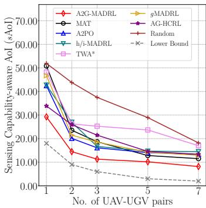  
(a) sAoI

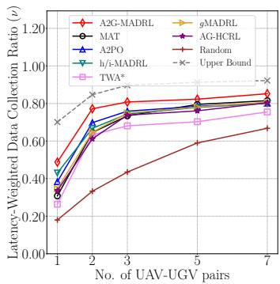  
(b) ν

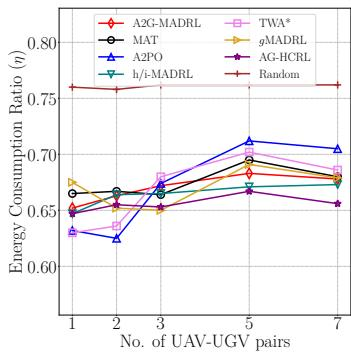  
(c) η

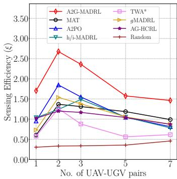  
(d) ξ

Fig. 3: Impact of number of UAV-UGV pairs (KAIST).  
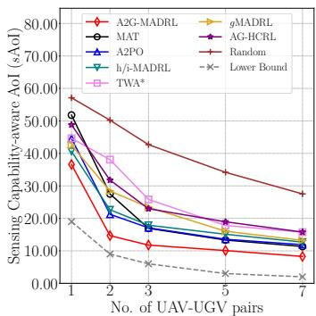  
(a) sAoI

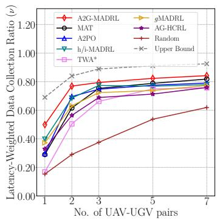  
(b) ν

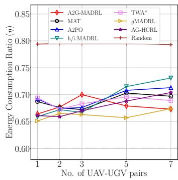  
(c) η

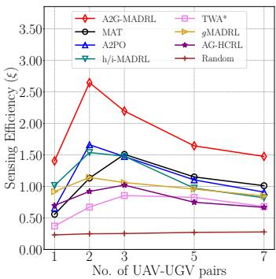  
(d) ξ  
Fig. 4: Impact of number of UAV-UGV pairs (Roma).

• MAT [19]: It is the first to use the encoder-decoder architecture and considered as the SOTA MADRL method under sequential decision-making frameworks.

• h/i-MADRL [13]: It is considered as the SOTA solution for air-ground VCS to maximize data collection ratio.

• TWA\* [17]: It proposes a Transformer-based optimization algorithm for UAV route planning in UAV-assisted IoT networks to minimize AoI. It combines a Transformer model and traditional path search algorithms to optimize the flight trajectories of UAVs.

• AG-HCRL [27]: It proposes an air-ground heterogeneous crowdsensing framework based on DRL, achieving city sensing in a cost-effective way.

• gMADRL-VCS [1]: It proposes a goal-conditioned hierarchical MADRL approach with diffusion models to address energy-efficient ground-air-space VCS.

• Random: UAVs and UGVs randomly sample actions from the action space A.

1) Impact of No. of UAV-UGV pairs: We fix data generation speed in a timeslot λ = 2Mbps, number of channels C = 5, and vary the number of UAV-UGV pairs ∈ [1, 2, 3, 5, 7]. As shown in Fig. 3 and Fig. 4, we see that when the number of UAV-UGV pairs increases, for all methods, the sensing capability improves, as the sAoI decreases and ν increases sharply first and then slows down. Meanwhile, the sensing efficiency increases first and then decreases, which confirms that a proper number of UAV-UGV pairs can improve the performance. This is because more UAV-UGV pairs result in reaching the the upper limit of latency-weighted data collection ratio ν, and incur more energy consumption, leading to a decrease in overall sensing efficiency.

The sensing efficiency of A2G-MADRL improves by an average of 57.50%, 79.02%, 74.68%, 75.20%, 84.51% and 150.93% compared to A2PO, MAT, h/i-MADRL, gMADRL-VCS, AG-HCRL and TWA\* on KAIST, and 61.38%, 74.77%, 60.86%, 90.13%, 131.06% and 175.03% on Roma. The gap between A2G-MADRL and the upper bound of latencyweighted data collection ratio ν is 10.74% on average on KAIST and 10.56% on Roma, and the average gap between A2G-MADRL and the lower bound of sAoI is 7.07 timeslots on KAIST and 8.48 timeslots on Roma, respectively. This is because our proposed auto-regressive sequential decisionmaking process allows multiple UAVs and UGVs to fully collaborate and dynamic order optimization enable multiple UAVs and UGVs to adapt to different decision orders.

From Fig. 3, we observe that although h/i-MADRL, A2PO and MAT all receive high latency-weighted data collection ratio and low sAoI when the 3 pairs of UAVs-UGVs are deployed, A2G-MADRL is always better. This is because despite A2PO and h/i-MADRL both use truncated advantage functions to ensure monotonic policy improvement, the nonstationary nature of actions leads to policy improvement conflicts, making it challenging to achieve collaboration among multiple UAVs and UGVs. On the other hand, MAT is trapped in local optimum due to the fixed decision-making order, which leads to suboptimal performance when more UAVs-

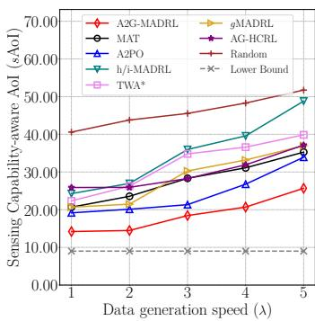  
(a) sAoI

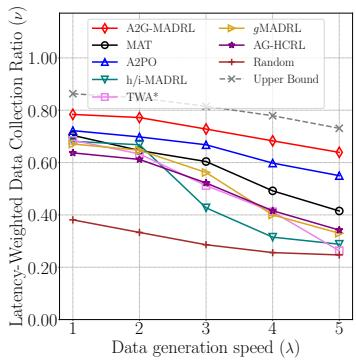  
(b) ν

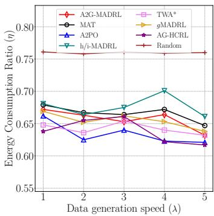  
(c) η

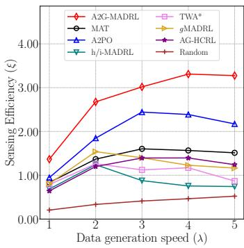  
(d) ξ  
Fig. 5: Impact of data generation speed in a timeslot λ (KAIST).

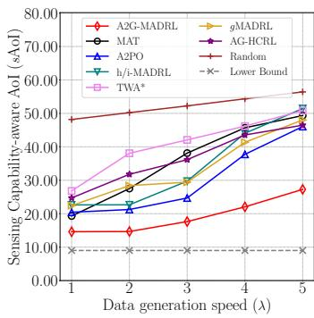  
(a) sAoI

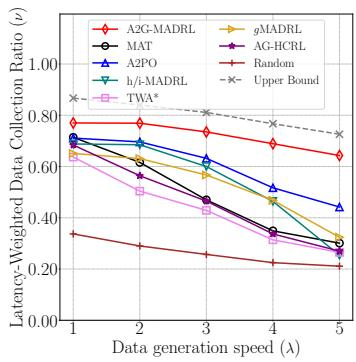  
(b) ν

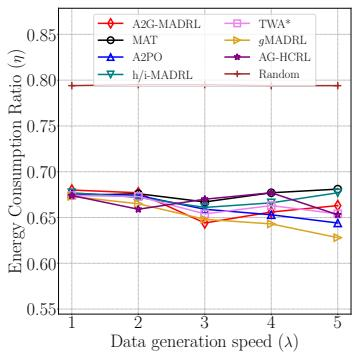  
(c) η

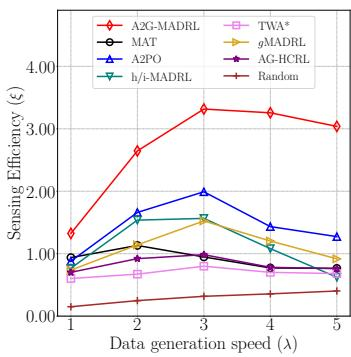  
(d) ξ  
Fig. 6: Impact of data generation speed in a timeslot λ (Roma).

UGVs are deployed. The $\mathrm { T W } \mathrm { A } ^ { * }$ method performs only better than Random since it clusters PoIs, and large clusters can result in insufficient sensing coverage, while small clusters expand the decision space for route planning.

2) Impact of Data Generation Speed in a Timeslot λ: We fix the number of UAV-UGV pairs to $U = G = 2 ,$ , the number of channels $C = 5 ,$ and vary $\lambda \in [ 1 , 2 , 3 , 4 , 5 ] \mathrm { M b p s }$ Results are shown in Fig. 5 and Fig. 6. As λ increases, the sAoI increases and ν decreases for all methods on both datasets. The sensing efficiency increases and then decreases, because as the workload of a sensing task increases, although the total collected latency-weighted data continues to increase, the sAoI also increases. When the data generate speed exceeds 3Mbps in a timeslot, the sAoI increases rapidly, thus reducing sensing efficiency. In the extreme case when λ = 5Mbps, A2G-MADRL still achieves the best performance, by an average of 39.29%, 98.17%, 217.09%, 122.31%, 132.36% and 161.84% higher on KAIST, and 87.62%, 198.29%, 143.66%, 145.89%, 227.43% and 292.94% higher on Roma, compared with A2PO, MAT, h/i-MADRL, gMADRL-VCS, AG-HCRL and TWA\*, respectively. The gap between A2G-MADRL and the upper bound of latency-weighted data collection ratio is 8.58% on KAIST and 8.10% on Roma on average, and the average gap between A2G-MADRL and the lower bound of sAoI is 9.70 timeslots on KAIST and 10.25 timeslots on Roma, respectively.

There is a gap on sAoI and latency-weighted data collection ratio between A2PO and A2G-MADRL. This is because although A2PO uses a sequentially weighted advantage function to update the policy network, the interactions of UAVs and UGVs are not sufficiently captured, so that UAVs are uncertain about the UGV movement intentions, thus not possible to efficiently update policy network.

For h/i-MADRL, the attained sAoI increases rapidly and latency-weighted data collection ratio decreases rapidly as λ increases on both datasets. This is because although h/i-MADRL uses auxiliary reward to guide the UAVs and UGVs in spatial exploration and task division, its lack of explicit modeling of collaborative actions results in suboptimal collaborations, especially when task demands escalate.

3) Impact of No. of Channels C: We fix the number of UAV-UGV pairs $U = G = 2 ,$ the data generated speed in a time slot λ = 2Mbps, and vary the number of channels $C \in \{ 1 , 3 , 5 , 7 , 1 0 \}$ . Results are shown in Fig. 7 and Fig. 8. We observe that when more channels are available, it helps sAoI decrease, latency-weighted data collection ratio and sensing efficiency increase for all methods on both datasets. The sensing efficiency of A2G-MADRL improves by an average of 49.95%, 68.10%, 48.76%, 76.88%, 114.26% and 135.39% on KAIST, and by an average of 64.40%, 100.52%, 61.68%, 121.53%, 108.33% and 240.83% on Roma, compared to A2PO, MAT, h/i-MADRL, gMADRL-VCS, AG-HCRL and

This article has been accepted for publication in IEEE Transactions on Mobile Computing. This is the author's version which has not been fully edited and content may change prior to final publication. Citation information: DOI 10.1109/TMC.2026.3708370

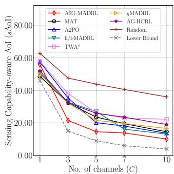  
(a) sAoI

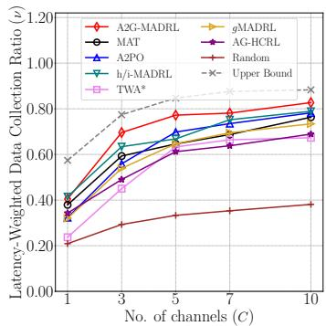  
(b) ν

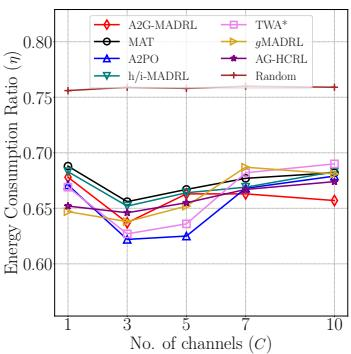  
(c) η

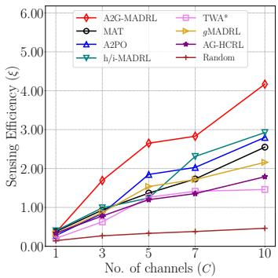  
(d) ξ  
Fig. 7: Impact of number of channels C (KAIST).

TWA\*, respectively. The gap between A2G-MADRL and the upper bound of latency-weighted data collection ratio is 9.28% on KAIST and 9.06% on Roma on average, and the average gap between A2G-MADRL and the lower bound of sAoI is 7.15 timeslots on KAIST and 7.30 timeslots on Roma, respectively.

When the number of channels increases, although the decision space for channel assignment grows exponentially that is challenging to the method optimization, A2G-MADRL explicitly models the interactions of UAVs, UGVs and PoIs, and then auto-regressively assign channels for UAVs and UGVs to collect data from different PoIs, achieving better performance. When C = 10, the attained sAoI and latencyweighted data collection ratio of A2G-MADRL are 10.048 and 0.827 on KAIST, decreased by 21.90% and improved by 4.81% compared to h/i-MADRL, respectively. On Roma, the sAoI and latency-weighted data collection ratio of A2G-MADRL is 10.188 and 0.822, decreasing by 27.43% and improving by 6.47% compared to h/i-MADRL, respectively. We also observe that when C = 10, both gMADRL-VCS and AG-HCRL underperform A2G-MADRL, A2PO, MAT and h/i-MADRL methods. This can be attributed to several factors: although gMADRL-VCS employs goal-conditioned diffusion models to generate action for channel assignment, its iterative sampling process is computationally intensive, and the denoising phase is unstable in highly dynamic environments with numerous selectable PoIs. On the other hand, AG-HCRL relies solely on a local observation mechanism and lacks explicit inter-agent communication capabilities. Furthermore, its reward design is primarily based on map grid coverage, overlooking critical objectives such as the data collection ratio and AoI. Additionally, neither method explicitly models the heterogeneous interactions among UAVs, UGVs, and PoIs in NOMA-based systems.

## E. UAV-UGV Trajectory Visualization

To better illustrate the effective collaboration of UAVs and UGVs by A2G-MADRL, we visualize their trajectories and the attained sAoI and latency-weighted data collection ratio on two datasets, as shown in Fig. 9. The attained sAoI and latency-weighted data collection ratio in those areas with different delay requirements are given in Table VIIa and

TABLE VII: sAoI and latency-weighted data collection ratio in different areas  
(a) KAIST
<table><tr><td rowspan=1 colspan=1></td><td rowspan=1 colspan=1>Area</td><td rowspan=1 colspan=1>sAoI     ν</td></tr><tr><td rowspan=1 colspan=1>A2G</td><td rowspan=1 colspan=1>123other</td><td rowspan=1 colspan=1>13.694  0.69410.424  0.6729.170  0.65316.202  0.796</td></tr><tr><td rowspan=2 colspan=1>VVAA*</td><td rowspan=2 colspan=1>123other</td><td rowspan=1 colspan=1>27.718  0.49828.524  0.42429.554  0.367</td></tr><tr><td rowspan=1 colspan=1>24.626  0.648</td></tr></table>

(b) Roma
<table><tr><td rowspan=1 colspan=1></td><td rowspan=1 colspan=1>Area</td><td rowspan=1 colspan=1>sAoI     ν</td></tr><tr><td rowspan=3 colspan=1>A2G</td><td rowspan=3 colspan=1>123other</td><td rowspan=1 colspan=1>12.008  0.71310.266  0.681</td></tr><tr><td rowspan=1 colspan=1>9.704   0.652</td></tr><tr><td rowspan=1 colspan=1>15.184  0.795</td></tr><tr><td rowspan=4 colspan=1>VWA*</td><td rowspan=4 colspan=1>123other</td><td rowspan=1 colspan=1>39.766  0.434</td></tr><tr><td rowspan=1 colspan=1>40.638  0.355</td></tr><tr><td rowspan=1 colspan=1>42.328  0.284</td></tr><tr><td rowspan=1 colspan=1>36.080  0.576</td></tr></table>

Table VIIb. We show the trajectory of A2G-MADRL and TWA\* when two UAV-UGV pairs are deployed.

On KAIST, two UAVs are responsible for upper area and two UGVs take care of the lower part. On Roma, two UAVs fly along the same elliptical route in the upper area, maintaining a 180-degree phase difference and two UGVs are responsible for the lower area in a similar pattern. This division of labor is enabled by higher data transmission capacity of the A2G relay channel, compared to the G2G and G2A channels.

Leveraging the capability of HVGCN to extract heterogeneous interaction features among UAVs, UGVs, and PoIs, we focus on three areas with high delay requirements, despite their scattered distribution in the workzone. The attained sAoI in Area 3 with highest delay requirement is 43.40% lower than other areas on KAIST, and 36.09% lower than other area in Roma. As illustrated in the lower part of Fig. 9, the age process of PoIs in Area 3 on KAIST dataset is updated more frequently using A2G-MADRL, evidenced by denser age peaks. In contrast, the age process when using the TWA\* method shows a near-consistent increase, with no channels assigned and consequently no data are collected during timeslots (30, 45) and (75, 120). This is because our proposed channel assignment strategy places strong emphasis on PoIs with high delay requirement, but poor channel assignment strategy of TWA\* leads PoIs to experience an extended period of time without data collection.

It is important to highlight that A2G-MADRL navigates UAVs and UGVs to take care of both high delay requirement areas as well as the entire region. This avoids redundant sensing efforts as seen in TWA\*, where UAVs and UGVs concurrently collect data from the same area. This is because with DOMPG, each UAV or UGV adjusts its task allocation based on the actions of previous ones. Additionally, dynamic order optimization allows UAVs and UGVs to adapt to shifting decision-making orders and to collaborate effectively.

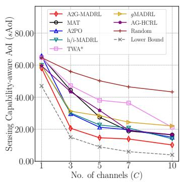  
(a) sAoI

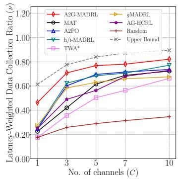  
(b) ν

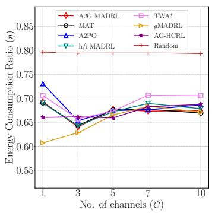  
(c) η

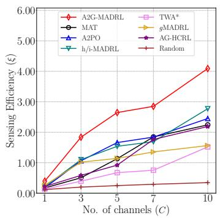  
(d) ξ

Fig. 8: Impact of number of channels C (Roma).  
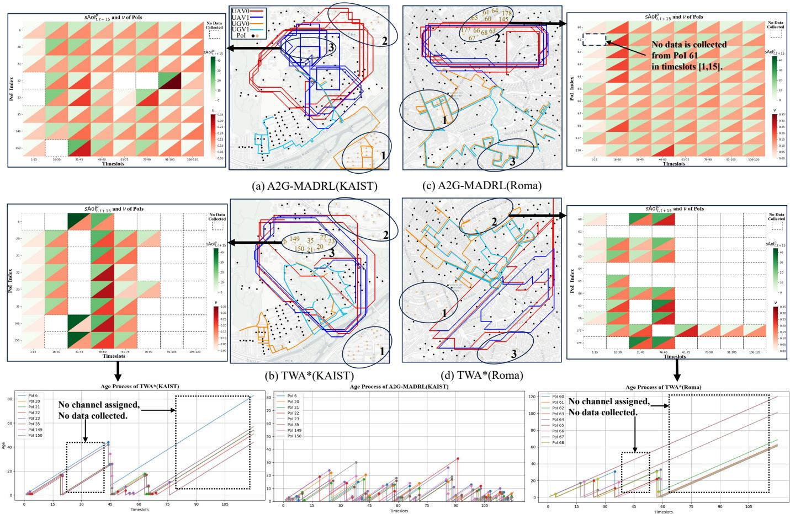

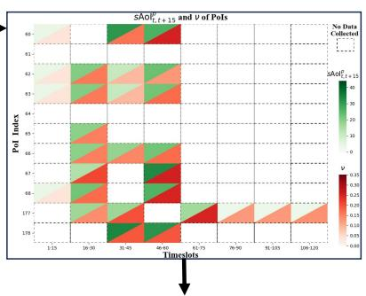

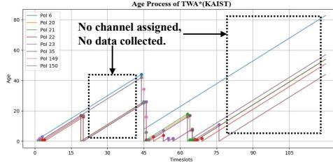

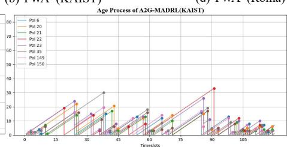

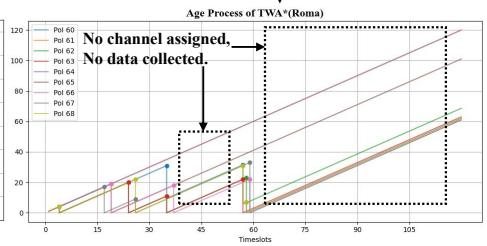  
Fig. 9: Illustrative UAVs and UGVs’ trajectory on KAIST and Roma.

We assessed A2G-MADRLin dynamic scenarios where new PoIs can emerge unexpectedly. During training, we randomly selected a subset of PoIs to become active at random timeslots in each episode. Results on KAIST are given in Fig.10a (where ↓ indicates that lower values are better). We see that A2G-MADRL outperforms all other baselines in sAoI, latencyweighted data collection ratio (ν) and sensing efficiency (ξ) while maintaining a low energy consumption ratio, demonstrating its adaptability to dynamic environments. To illustrate how A2G-MADRL effectively balances the sensing of both static and dynamic PoIs, we selected two subsets of PoIs in the bottom-left and bottom-right regions of KAIST as dynamic PoIs, which emerged at timeslot 90. The trajectories during different time intervals are visualized in Fig. 10b. From timeslots 1 to 89, UAVs and UGVs collected data only from static PoIs, with no activity in the bottom regions due to the absence of dynamic PoIs. After timeslot 90, UGV 0 moved to the bottom-left area and remained there for data collection

This article has been accepted for publication in IEEE Transactions on Mobile Computing. This is the author's version which has not been fully edited and content may change prior to final publication. Citation information: DOI 10.1109/TMC.2026.3708370

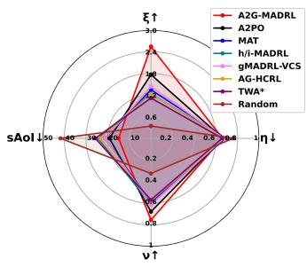  
(a)

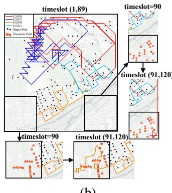  
(b)

Fig. 10: (a) Performance comparison in dynamic scenarios. (b) Illustrative UAVs and UGVs’ trajectory in dynamic scenarios.  
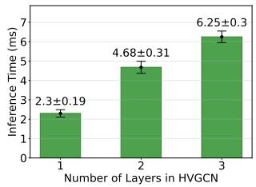  
(a)

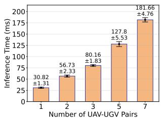  
(b)  
Fig. 11: (a) Inference time of HVGCN versus the number of convolutional layers. (b) Inference time of DOMPG versus the number of UAV-UGV pairs. Here error bars represent the standard deviation over 5 runs.

until timeslot 120, while UAV 0 flew to the bottom-right region. Meanwhile, the paired UGV 1 and UAV 1 continued to operate collaboratively in the upper area. This behavior confirms that HVGCN captures dynamic interaction-aware features based on real-time states, and the DOMPG enables effective route planning and exploration through sequential decision-making with dynamic order optimization.

Finally, we deployed A2G-MADRL on Jetson TX2 - an energy-efficient embedded AI computing device with a 256- core NVIDIA Pascal GPU and 8 GB memory, consuming only 7.5 watts. Its standard hardware interfaces enable seamless integration into UAVs and UGVs. We evaluated the inference time of HVGCN and DOMPG as the number of UAV-UGV pairs and convolutional layers varied. As shown in Fig. 11, HVGCN consistently achieves millisecond-scale inference speeds, while DOMPG maintains a maximum inference time below 200 milliseconds. This performance guarantees realtime decision-making in practical applications.

## VII. DISCUSSION AND CONCLUSION

In this paper, we proposed A2G-MADRL, an autoregressive sequential MADRL framework for traffic incident management in air-ground VCS. We introduced two novel metrics: sensing capability-aware (sAoI) and latency-weighted data collection ratio, to measure the data freshness and amount under the condition of non-uniform status packet size, respectively. To optimize them simultaneously, we proposed an interaction-aware heterogeneous vehicular graph convolution network (HVGCN) for feature extractions, and a dynamically ordered masked policy generator (DOMPG) for coordinating UAVs and UGVs. Extensive experiments on both KAIST and Roma datasets demonstrate that A2G-MADRL significantly improves the attained sAoI, latency-weighted data collection ratio and sensing efficiency compared to other seven baselines.

In our future work, we aim to enhance this A2G-MADRL system by investigating 3D flexible UAV trajectory design. This would involve extending the observation and action spaces for 3D mobility control, adapting the model to incorporate altitude-dependent channel states, and refining the reward function and safety constraints to account for the benefits and requirements of vertical motion.

## REFERENCES

[1] Y. Zhao, C. H. Liu, T. Yi et al., “Energy-efficient ground-air-space vehicular crowdsensing by hierarchical multi-agent deep reinforcement learning with diffusion models,” IEEE Journal on Selected Areas in Communications, vol. 42, no. 12, pp. 3566–3580, 2024.

[2] L. Dai, B. Wang, Y. Yuan et al., “Non-orthogonal multiple access for 5g: solutions, challenges, opportunities, and future research trends,” IEEE Communications Magazine, vol. 53, no. 9, pp. 74–81, 2015.

[3] S. Kaul, M. Gruteser, V. Rai et al., “Minimizing age of information in vehicular networks,” in IEEE SECON’11, 2011, pp. 350–358.

[4] J. P. Champati, H. Al-Zubaidy, and J. Gross, “Statistical guarantee optimization for age of information for the d/g/1 queue,” in IEEE INFOCOM’18, 2018, pp. 130–135.

[5] A. M. Bedewy, Y. Sun, and N. B. Shroff, “The age of information in multihop networks,” IEEE/ACM Transactions on Networking, vol. 27, no. 3, pp. 1248–1257, 2019.

[6] T. Liang, T. Zhang, Q. Wu et al., “Age of information based scheduling for uav aided localization and communication,” IEEE Transactions on Wireless Communications, vol. 23, no. 5, pp. 4610–4626, 2024.

[7] B. Yang, Y. Yu, X. Hao et al., “Oh-drl: An aoi-guaranteed energyefficient approach for uav-assisted iot data collection,” IEEE Transactions on Wireless Communications, 2025.

[8] C. E. Shannon, “A mathematical theory of communication,” The Bell system technical journal, vol. 27, no. 3, pp. 379–423, 1948.

[9] A. Kosta, N. Pappas, A. Ephremides et al., “The cost of delay in status updates and their value: Non-linear ageing,” IEEE Transactions on Communications, vol. 68, no. 8, pp. 4905–4918, 2020.

[10] P. Gjanci, C. Petrioli, S. Basagni et al., “Path finding for maximum value of information in multi-modal underwater wireless sensor networks,” IEEE Transactions on Mobile Computing, vol. 17, no. 2, pp. 404–418, 2018.

[11] A. Maatouk, M. Assaad, and A. Ephremides, “The age of incorrect information: An enabler of semantics-empowered communication,” IEEE Transactions on Wireless Communications, vol. 22, no. 4, pp. 2621– 2635, 2022.

[12] J. Liu, C. Zhou, M. Sheng et al., “Resource allocation for adaptive beam alignment in uav-assisted integrated sensing and communication networks,” IEEE Journal on Selected Areas in Communications, vol. 43, no. 1, pp. 350–363, 2025.

[13] Y. Ye, C. H. Liu, Z. Dai et al., “Exploring both individuality and cooperation for air-ground spatial crowdsourcing by multi-agent deep reinforcement learning,” in IEEE ICDE’23, 2023, pp. 205–217.

[14] C. Huang, G. Chen, P. Xiao et al., “Joint offloading and resource allocation for hybrid cloud and edge computing in sagins: A decision assisted hybrid action space deep reinforcement learning approach,” IEEE Journal on Selected Areas in Communications, vol. 42, no. 5, pp. 1029–1043, 2024.

[15] E. Wang, W. Liu, W. Liu et al., “Spatiotemporal urban inference and prediction in sparse mobile crowdsensing: A graph neural network approach,” IEEE Transactions on Mobile Computing, vol. 22, no. 11, pp. 6784–6799, 2023.

[16] Y. Ye, H. Wang, C. H. Liu et al., “Qoi-aware mobile crowdsensing for metaverse by multi-agent deep reinforcement learning,” IEEE Journal on Selected Areas in Communications, vol. 42, no. 3, pp. 783–798, 2024.

[17] B. Zhu, E. Bedeer, H. H. Nguyen et al., “Uav trajectory planning for aoiminimal data collection in uav-aided iot networks by transformer,” IEEE Transactions on Wireless Communications, vol. 22, no. 2, pp. 1343– 1358, 2023.

[18] X. Dai, Z. Lu, X. Chen et al., “Multiagent rl-based joint trajectory scheduling and resource allocation in noma-assisted uav swarm network,” IEEE Internet of Things Journal, vol. 11, no. 8, pp. 14 153– 14 167, 2023.

[19] M. Wen, J. Kuba, R. Lin et al., “Multi-agent reinforcement learning is a sequence modeling problem,” NeurIPS’22, vol. 35, pp. 16 509–16 521, 2022.

[20] X. Wang, Z. Tian, Z. Wan et al., “Order matters: Agent-by-agent policy optimization,” in ICLR’23, 2023.

[21] A. Maatouk, S. Kriouile, M. Assaad et al., “The age of incorrect information: A new performance metric for status updates,” IEEE/ACM Transactions on Networking, vol. 28, no. 5, pp. 2215–2228, 2020.

[22] F. Peng, X. Wang, and X. Chen, “Goal-oriented communication for status updating over random delay channel,” in IEEE INFOCOM’24, 2024, pp. 1–6.

[23] B. Zhou and W. Saad, “Minimum age of information in the internet of things with non-uniform status packet sizes,” IEEE Transactions on Wireless Communications, vol. 19, no. 3, pp. 1933–1947, 2019.

[24] Y. Lu, X. Wang, A. Hawbani et al., “Ehta: An environment-costbased heterogeneous task allocation in vehicular crowdsensing,” IEEE Transactions on Mobile Computing, vol. 23, no. 12, pp. 11 535–11 548, 2024.

[25] N. Cheng, W. Xu, W. Shi et al., “Air-ground integrated mobile edge networks: Architecture, challenges, and opportunities,” IEEE Communications Magazine, vol. 56, no. 8, pp. 26–32, 2018.

[26] Y. Wang, M. Wang, L. Meng et al., “New crowd sensing computing in space-air-ground integrated networks,” in SAGC’21, 2021, pp. 143–149.

[27] K. Zhao, Y. Zhou, H. Xue et al., “Ag-hcrl: Air-ground collaborative crowdsensing based on deep reinforcement learning in city sensing,” in SWC’24, 2024, pp. 1074–1082.

[28] M. Hosam, M. Ehab, B. Mohammed et al., “Reinforcement learning based sum rate maximization for uav-assisted noma system,” in JAC-ECC’23, 2023, pp. 244–248.

[29] A. Gendia, O. Muta, S. Hashima et al., “Energy-efficient trajectory planning with joint device selection and power splitting for mmwavesenabled uav-noma networks,” IEEE Transactions on Machine Learning in Communications and Networking, vol. 2, pp. 617–632, 2024.

[30] R. D. Yates, Y. Sun, D. R. Brown et al., “Age of information: An introduction and survey,” IEEE Journal on Selected Areas in Communications, vol. 39, no. 5, pp. 1183–1210, 2021.

[31] T. Li, S. Leng, K. Xiong et al., “Aoi-sensitive collaborative data generation and collection for multi-uav-assisted iot networks,” in IEEE ICC’25, 2025, pp. 1–6.

[32] X. Zhang, H. Xing, Y. Shen et al., “Age of information minimization in uav-enabled iot networks via federated reinforcement learning,” IEEE Transactions on Wireless Communications, 2025.

[33] M. Mozaffari, W. Saad, M. Bennis et al., “A tutorial on uavs for wireless networks: Applications, challenges, and open problems,” IEEE Communications Surveys & Tutorials, vol. 21, no. 3, pp. 2334–2360, 2019.

[34] M. Liu, G. Gui, N. Zhao et al., “Uav-aided air-to-ground cooperative nonorthogonal multiple access,” IEEE Internet of Things Journal, vol. 7, no. 4, pp. 2704–2715, 2020.

[35] H. Chen, Q. Wang, Z. Dong et al., “Multiuser scheduling for minimizing age of information in uplink mimo systems,” in IEEE ICCC’20, 2020, pp. 1162–1167.

[36] J. Li, H. Zhao, H. Wang, F. Gu, J. Wei, H. Yin, and B. Ren, “Joint optimization on trajectory, altitude, velocity, and link scheduling for minimum mission time in uav-aided data collection,” IEEE Internet of Things Journal, vol. 7, no. 2, pp. 1464–1475, 2019.

[37] Z. Xue, J. Wang, G. Ding et al., “Device-to-device communications underlying uav-supported social networking,” IEEE Access, vol. 6, pp. 34 488–34 502, 2018.

[38] J. Yan, X. Yang, X. Luo, and C. Chen, “Energy-efficient data collection over auv-assisted underwater acoustic sensor network,” IEEE Systems Journal, vol. 12, no. 4, pp. 3519–3530, 2018.

[39] R. Duan, J. Du, C. Jiang, and Y. Ren, “Value-based hierarchical information collection for auv-enabled internet of underwater things,” IEEE internet of things journal, vol. 7, no. 10, pp. 9870–9883, 2020.

[40] Y. Yang, Z. Guan, J. Li et al., “Interpretable and efficient heterogeneous graph convolutional network,” IEEE Transactions on Knowledge and Data Engineering, vol. 35, no. 2, pp. 1637–1650, 2021.

[41] A. Waswani, N. Shazeer, N. Parmar et al., “Attention is all you need,” in NeurIPS’17, 2017.

[42] C. Yu, A. Velu, E. Vinitsky et al., “The surprising effectiveness of ppo in cooperative multi-agent games,” Advances in neural information processing systems, vol. 35, pp. 24 611–24 624, 2022.

[43] J. Schulman, P. Moritz, S. Levine et al., “High-dimensional continuous control using generalized advantage estimation,” arXiv preprint arXiv:1506.02438, 2015.

[44] I. Rhee, M. Shin, S. Hong et al., “Crawdad data set ncsu/mobilitymodels (v. 2009-07-23),” 2009.

Fan Zhou received a B.Eng. degree from Beijing Institute of Technology, China, in 2025, where he is currently pursuing a Ph.D. degree under the supervision of Prof. Chi Harold Liu. His research interests include mobile crowdsensing and reinforcement learning.

Chi Harold Liu (F’26) received a Ph.D. degree in Electronic Engineering from Imperial College, UK in 2010, and a B.Eng. degree in Electronic and Information Engineering from Tsinghua University, China in 2006. He is currently a Full Professor and Vice Dean at the School of Computer Science and Technology, Beijing Institute of Technology, China. His current research interests include mobile crowdsensing by reinforcement learning. He serves as the Associate Editor for IEEE TRANSACTIONS ON MOBILE COMPUTING. He is a Fellow of IEEE, IET and British Computer Society.

Jianxin Zhao received a B.Eng. and M.S. degrees in software engineering from the Beijing Institute of Technology, Beijing, China, in 2013 and 2015, respectively, and a Ph.D. degree in computer science from the University of Cambridge, Cambridge, U.K., supervised by Professor Jon Crowcroft. He worded as a PostDoc with the Beijing Institute of Technology, supervised by Prof. Chi H. Liu. His research interests include numerical computation and machine learning.

Chen Fang received a B.Eng. degree from Beijing Institute of Technology, China, in 2024, where he is currently pursuing the M.Sc. degree under the supervision of Prof. Chi Harold Liu. His research interests include mobile crowdsensing and reinforcement learning.

Hao Wang received a M.Sc. and B.Eng. degrees from Beijing Institute of Technology, China, in 2024 and 2021, respectively. He is currently pursuing the Ph.D. degree under the supervision of Prof. Dapeng Oliver Wu at City University of Hong Kong. His research interests include reinforcement learning and large language model.

Guozheng Li received a Ph.D. degree in Computer Science from the School of EECS, Peking University in 2021. He is currently an Assistant Professor with the School of Computer Science and Technology, Beijing Institute of Technology, China. His major research interests include IoT and humancomputer interaction. He is the recipient of the Gold Medal for Invention Performance Award at Nuremburg International Trade Fair, Germany in 2025.

Guangpeng Qi is the Vice President of INSPUR Group and Chairman of INSPUR Yunzhou Industrial Internet. He receives the honors of 2023-2024 Industrial Internet Pilot, Cloud Computing Industry Leader, and Shandong Youth “Internet +” Top Ten Leaders.

Dapeng Wu (F‘13) received a Ph.D. degree in electrical and computer engineering from Carnegie Mellon University, Pittsburgh, PA in 2003. He is currently Yeung Kin Man Chair Professor of Network Science, and Chair Professor of Data Engineering at the Department of Computer Science, City University of Hong Kong. He was elected as a Distinguished Lecturer by IEEE Vehicular Technology Society in 2016, and an IEEE Fellow.

Kin K. Leung received a Ph.D. degrees from the University of California, Los Angeles, in 1985. He is currently the Tanaka Chair Professor with the Departments of Electrical and Electronic Engineering and Computing and Co-Director of the School of Convergence Science in Space, Security and Telecoms at Imperial College London. He is a Fellow of the Royal Academy of Engineering, IEEE, and IET. His research interests include distributed optimization, machine learning and communication networks.

Jon Crowcroft (F’16) received an M.Sc. and Ph.D. degrees from University College London, London, U.K., in 1981 and 1993, respectively. He is currently a Researcher with the Alan Turing Institute. Since October 2001, he has been a Marconi Professor of Communications Systems with the Department of Computer Science and Technology, University of Cambridge. His research interests include internet support for multimedia communications. He is a fellow of the Royal Society, ACM, British Computer Society, IET, and the Royal Academy of Engineering.