# Asynchronous UAV Trajectory Monitoring With Multi-BS Feature Fusion in Cellular ISAC

Shaoqiang Yan , Mei Chen, Hongliang Luo , Graduate Student Member, IEEE, Ping Yang, and Feifei Gao , Fellow, IEEE

Abstract—In this paper, we propose an asynchronous uncrewed aerial vehicle (UAV) trajectory monitoring scheme with multibase station (BS) feature fusion in a cellular integrated sensing and communications (ISAC) system. Different from distributed radar systems that rely on wideband radar waveforms and synchronous joint processing, the proposed scheme considers practical cellular ISAC settings such as narrowband orthogonal frequency division multiplexing (OFDM) signaling and transceiver discrepancies-induced offsets. We develop a single-BS signal pre-processing method that estimates target motion parameters and effectively compensates for time offsets (TOs) and carrier frequency offsets (CFOs) caused by transceiver discrepancies. Next, we design a multi-BS feature fusion method that aligns spatial features across BSs and accurately estimates the positions and velocities of targets based on time delay and Doppler frequency features. By operating at the feature level, the fusion process circumvents the need for coherent signal-level processing as well as the extensive data-level fusion commonly required in distributed radar systems. Furthermore, we propose a cooperative trajectory tracking method that associates asynchronous trajectory observations into consistent local and global trajectories, thereby enabling reliable cross-BS trajectory fusion. Simulation results demonstrate that the proposed cooperative scheme significantly enhances the accuracy of UAV trajectory monitoring compared to traditional algorithms.

Index Terms—Cellular integrated sensing and communications, multi-base station, UAV trajectory monitoring, feature fusion, asynchronous trajectory tracking.

## I. INTRODUCTION

omy (LAE), uncrewed aerial vehicles (UAVs) have been extensively deployed in diverse fields such as logistics delivery, sightseeing tourism, environmental monitoring, emergency rescue, and traffic management [1]. Industry analyses predict that the global UAV market will grow at an annual rate exceeding 20% over the next five years [2], underscoring the increasingly pivotal role of UAVs in the emerging LAE. However, the surge in the number of UAVs has also brought severe challenges in airspace management and safety monitoring [3]. A particularly critical issue is the dual requirement to ensure reliable communication with authorized UAVs while simultaneously monitoring unauthorized ones, which is essential for the sustainable development of the LAE [4].

The core of monitoring unauthorized UAVs lies in the realtime sensing of key information such as device model, shape contour, flight attitude, and motion state [5], [6]. Since UAVs operate in a highly dynamic state, including continuous motion and temporary hovering, additional trajectory monitoring is necessary to achieve comprehensive situational sensing [7], [8]. The functionalities of UAV trajectory monitoring include both the analysis of historical trajectories and the prediction of future motion states and trends [9], [10].

Traditional UAV trajectory monitoring predominantly depends on radar systems [11]. Although these systems offer reliable monitoring performance, the significant costs associated with large-scale implementation render them impractical for LAE applications, which require cost-efficient and widearea monitoring solutions [12]. The advent of integrated sensing and communications (ISAC) technology offers an alternative solution to the monitoring requirements [13], [14]. By unifying sensing and communication capability within a single system, ISAC enables base stations (BSs) to achieve high-precision target sensing using existing communication signals without additional hardware costs [15], [16]. Thus, ISAC provides a more efficient and cost-effective approach for UAV trajectory monitoring [17], [18].

Current ISAC research primarily focuses on two system architectures: single-BS ISAC system and multi-BS ISAC system [19], [20]. Single-BS ISAC system can estimate UAV’s positions and radial velocities by optimizing beam management and signal processing, thereby constructing local trajectories [21], [22]. For example, Liu et al. propose a predictive beamforming method to sense the trajectories of multiple targets in a single-BS ISAC system while maintaining continuous motion state estimation [23]. Luo et al. propose a single-BS ISAC signal processing scheme to detect the presence of dynamic targets and estimate their angles, distances, and velocities in a cluttered environment [24]. Du et al. develop an extended Kalman filter (EKF) beam-tracking approach to improve the estimation accuracy of the targets’ motion parameters, particularly in dynamic environments [25]. Meng et al. employ intelligent reflecting surfaces to dynamically adjust beam directions and maintain stable trajectory tracking for fast-moving targets [26]. Liu et al. develop a sensing signal processing algorithm to distinguish multiple UAVs’ echo signals, which allows a single-BS to simultaneously locate and predict UAV trajectories [27]. However, the single-BS ISAC system is constrained by limited coverage and low monitoring accuracy, which restricts its application to localized observations only [21], [22]. As a result, the single-BS ISAC system fails to continuously track UAVs and construct their global trajectories across wide areas [28], [29].

Multi-BS ISAC system extends the capabilities of the single-BS ISAC system by multi-perspective observation and expanded spatial coverage [30], [31], [32]. By fusing observations from distributed BSs, the multi-BS ISAC system can not only synthesize global trajectories of the targets but also enhance sensing robustness in large-scale or occluded environments [33], [34]. For example, Wei et al. propose a multi-BS ISAC system that uses a symbol-level fusion method to estimate the positions and velocities of targets [35]. Feng et al. introduce a centralized EKF data fusion scheme under a networked ISAC system, which allows seamless global trajectory tracking for multiple UAVs across cells [36]. Wei et al. propose a cross-correlation method to mitigate inter-BS time synchronization errors in a multi-BS ISAC system, which fuses multiple BSs’ observations for high-precision estimation of the targets’ positions and velocities [37]. Diaz-Vilor et al. propose a distributed joint optimization method based on a multi-BS ISAC system, which efficiently monitors target global trajectories by cooperatively optimizing the power allocation and scheduling strategies of each BS [38]. Cheng et al. develop a joint beamforming framework for a multi-BS ISAC system, which dynamically optimizes the sensing-communication power trade-off and ensures reliable global trajectory monitoring of unauthorized UAVs [39].

However, most existing multi-BS cooperative monitoring methods neglect the issue of temporal asynchrony in observed trajectories across different time slots and BSs [30], [31], [32], [33], [34], [35], [36], [37], [38], [39]. Specifically, individual BSs typically do not sense the same target at exactly the same time, resulting in asynchronous and misaligned state observations. This temporal asynchrony introduces significant challenges for accurate multi-BS trajectory fusion and tracking, as it causes inconsistencies in estimated motion states such as position and velocity. Consequently, an effective cooperative trajectory monitoring scheme must simultaneously address three critical challenges: accurately estimating motion parameters (such as angle, Doppler frequency, and time delay) at each individual BS; robustly fusing motion states across BSs in the presence of temporal misalignment; and reliably associating and integrating asynchronous local trajectories into a coherent global trajectory. Failure to tackle these issues can significantly undermine the accuracy and reliability of multi-BS cooperative trajectory monitoring.

In this paper, we propose a cooperative UAV trajectory monitoring scheme with multi-BS feature fusion in a cellular ISAC system that addresses the issue of observed trajectory asynchrony across different time slots and BSs. The key contributions of the proposed scheme are as follows:

We propose a single-BS signal preprocessing method for cellular OFDM-based ISAC. Specifically, we design a local discrete Fourier transform (LDFT) algorithm to estimate the angles of the targets from the echo signals. Then, we incorporate a line-of-sight (LOS) reference signal and leverage cross-correlation to compensate for the time offsets (TOs) and carrier frequency offsets (CFOs) caused by transceiver discrepancies. We also apply a coherent compression operation to extract the time delay and Doppler frequency feature vectors.

• We propose a multi-BS feature fusion method to spatially align the estimated parameters and obtain the rough positions and velocities of the targets. Subsequently, we design a compressed sensing (CS)-based feature fusion algorithm that further refines the estimations of target positions and velocities using the time delay and Doppler frequency features, which circumvents the need for coherent signal-level processing and the extensive data-level fusion commonly required in distributed radar systems.

• We propose a cooperative trajectory tracking method to associate the observed trajectory points of the targets with local trajectories, based on which we further associate the local trajectories with existing global trajectories. Subsequently, we employ a sequential unscented Kalman filter (SUKF) to track asynchronous trajectories and fuse them into globally consistent ones, which conventional distributed radar systems generally lack due to their strict synchronization requirements.

• Simulation results show that the proposed single-BS processing module achieves higher parameter estimation accuracy than the classical DFT-based approach, the proposed multi-BS feature fusion method outperforms conventional data fusion methods [10], and the proposed cooperative tracking module delivers more accurate longterm trajectories than existing tracking techniques [40].

The rest of the paper is organized as follows: Section II presents the ISAC cooperative sensing scenario and the signal model. Section III describes the pre-processing of the single-BS signals, including angle estimation, TO and CFO compensation, time delay and Doppler frequency estimation, and feature vector extraction. Section IV addresses the fusion of the multi-BS feature information, including position estimation and velocity estimation. Section V focuses on multi-BS cooperative trajectory tracking, including trajectory association and asynchronous trajectory fusion. Section VI presents the simulation results, while Section VII concludes the paper.

Notation: Lower-case and upper-case boldface letters a and A denote a vector and a matrix; $\mathbf { a } ^ { * } , \mathbf { a } ^ { T }$ and $\mathbf { a } ^ { H }$ denote the conjugate, the transpose, and the conjugate transpose of vector a, respectively; ◦, ⊗, and  denote the Hadamard product, Kronecker product, and Khatri-Rao product, respectively; a[n] denotes the n-th element of the vector a; $\mathbf { A } [ i , j ]$ denotes the (i, j)-th element of the matrix A; |·| represents the absolute value function; k · k represents the norm function; mean(·) represents the mean value function; $\langle \cdot \rangle$ represents the Dot product function; b·c represents the floor function;a mod b represents the mod function; R and C represent the real field and the complex field, respectively; dac denotes rounding a to the nearest integer; diag{a} denotes creating a matrix with the elements as a on the main diagonal. For two sets A and

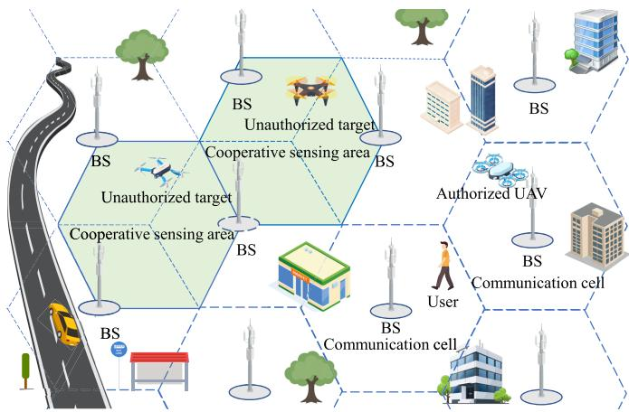

Fig. 1. The sensing scenario in a cellular ISAC system.  
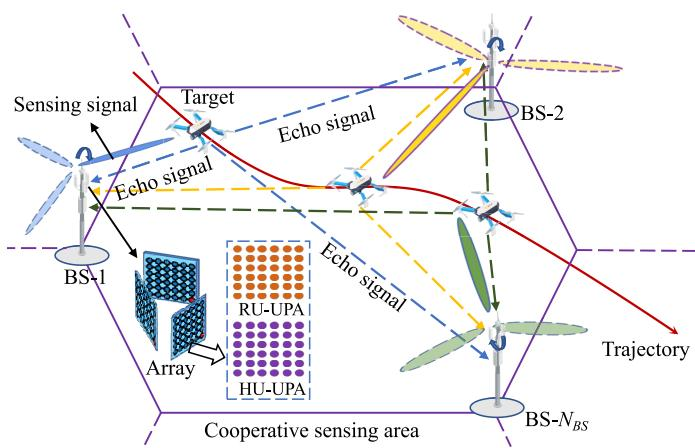  
Fig. 2. The sensing scenario in the cooperative sensing area.

$B , A \cup B$ denotes the set $\{ x \mid x \in \mathcal { A } \ \mathrm { o r } \ x \in \mathcal { B } \}$ , and $\mathcal { A } \backslash \mathcal { B }$ denotes the set $\{ x \mid x \in A$ and $x \notin B \}$

## II. SYSTEM MODEL

In this section, we present the multi-BS cooperative sensing scenario and the signal model with a cellular ISAC system.

## A. Multi-BS Cooperative Sensing Scenario

Fig. 1 illustrates the considered cellular ISAC system, where multiple BSs are uniformly distributed in a hexagonal cellular layout. The communication coverage of each BS forms adjacent communication cells, which ensures stable services for ground users and authorized UAVs within their respective areas. Note that due to the enhanced penetration capability and the extended propagation range of sensing signals in cellular ISAC systems [35], the sensing coverage of a single BS significantly exceeds its communication coverage. This characteristic gives rise to overlapped sensing areas among neighboring BSs, which we refer to as cooperative sensing areas (CSAs). Within the CSAs, multiple BSs can cooperate to sense unauthorized targets.

Fig. 2 depicts the cooperative sensing scenario with $N _ { B S } ( N _ { B S } \ge \bar { 3 } )$ ISAC BSs. Specifically, each BS is equipped with three sets of uniform planar arrays (UPAs), where each UPA consists of a hybrid unit (HU) and a radar unit (RU).

Moreover, the HU-UPA and RU-UPA contain $N _ { H } = N _ { H } ^ { x } \times N _ { H } ^ { z }$ and $N _ { R } ~ = ~ N _ { R } ^ { x } \times N _ { R } ^ { z }$ antenna elements with an interantenna spacing of $\begin{array} { r } { d = \frac { \bar { \lambda } } { 2 } } \end{array}$ , where λ expresses the wavelength. All BSs perform beam-scanning to sense dynamic targets cooperatively. The time taken for a BS to complete one full beam-scanning cycle constitutes its one sensing cycle, and the duration of the sensing cycle is set as the same $T$ for all BSs. Moreover, each BS sequentially acts as a transmitter (Tx) while all BSs act as receivers (Rx) during its respective sensing cycle. For example, during the sensing cycle of BS-$i ( i = \bar { 1 } , \bar { 2 } , . . . , N _ { B S } )$ , it acts as a Tx to transmit sensing signals toward the targets, and then the reflected echo signals are received by all $N _ { B S }$ BSs. Meanwhile, BS-i also acts as an Rx to receive the echo signals transmitted from all other BSs that have reflected off the targets.

## B. Signal Model

Each BS employs a narrowband orthogonal frequencydivision multiplexing (OFDM) signal that comprises of M subcarriers, with the lowest frequency and subcarrier spacing denoted as $f _ { 0 }$ and $\Delta f .$ , respectively. The transmission bandwidth is $W { \overset { \cdot } { = } } M \Delta f ,$ and the frequency of the m-th subcarrier is $f _ { m } = f _ { 0 } + m \Delta f .$ , where $m = 0 , 1 , \ldots , M - 1$ . Additionally, the OFDM frame contains N consecutive symbols. Each OFDM symbol has a total duration $T _ { s } = T _ { d } + T _ { g } ,$ where $\begin{array} { r } { T _ { d } = \frac { 1 } { \Delta f } } \end{array}$ is the OFDM symbol duration and $T _ { g }$ represents the cyclic prefix duration. The starting time of the n-th OFDM symbol in one frame is $t _ { n } = n T _ { s } , n = 0 , 1 , \dots , N - 1$ . Let us denote the sensing signal transmitted by BS-i during its sensing cycle as

$$
x ^ { i } ( t ) = \sum _ { n = 0 } ^ { N - 1 } \sum _ { m = 0 } ^ { M - 1 } s _ { m , n } ^ { i } e ^ { j 2 \pi f _ { m } t } \mathrm { \mathbf r e c t } \left( t - n T _ { s } \right) ,\tag{1}
$$

where $s _ { m , n } ^ { i }$ represents the modulated symbol; rect(·) denotes the rectangular function, which is 1 for the duration of each symbol and 0 for the others. Assume the physical direction of the beam transmitted by BS-i as $( \theta ^ { i } , \phi ^ { i } )$ , where $\theta ^ { i }$ and $\phi ^ { i }$ represent the azimuth angle and elevation angle. Denote the transmit beamforming vector of BS-i as

$$
{ \bf w } _ { T } \left( \Psi ^ { i } , \Omega ^ { i } \right) = \sqrt { \frac { 1 } { N _ { H } } } { \bf a } _ { T } \left( \Psi ^ { i } , \Omega ^ { i } \right) ,\tag{2}
$$

where $\begin{array} { r c l } { \Psi ^ { i } } & { = } & { \cos \phi ^ { i } } \end{array}$ cos $\theta ^ { i }$ and $\Omega ^ { i } = \sin \phi ^ { i }$ . Moreover, ${ \bf a } _ { T } \left( \Psi ^ { i } , \Omega ^ { i } \right)$ represents the transmit steering vector with the form

$$
\mathbf { a } _ { T } ( \Psi ^ { i } , \Omega ^ { i } ) = \mathbf { a } _ { T } ^ { x } ( \Psi ^ { i } ) \otimes \mathbf { a } _ { T } ^ { z } ( \Omega ^ { i } ) \in \mathbb { C } ^ { N _ { H } \times 1 } ,\tag{3}
$$

where $\otimes$ denotes the Kronecker product, and

$$
\begin{array} { r l } & { { \mathbf { a } } _ { T } ^ { x } ( \Psi ^ { i } ) = \left[ 1 , e ^ { j \frac { 2 \pi f _ { 0 } d \Psi ^ { i } } { c } } , \dots , e ^ { j \frac { 2 \pi f _ { 0 } d \Psi ^ { i } } { c } ( N _ { H } ^ { x } - 1 ) } \right] ^ { T } \in { \mathbb { C } } ^ { N _ { H } ^ { x } \times 1 } , } \\ & { { \mathbf { a } } _ { T } ^ { z } ( \Omega ^ { i } ) = \left[ 1 , e ^ { j \frac { 2 \pi f _ { 0 } d \Omega ^ { i } } { c } } , \dots , e ^ { j \frac { 2 \pi f _ { 0 } d \Omega ^ { i } } { c } ( N _ { H } ^ { z } - 1 ) } \right] ^ { T } \in { \mathbb { C } } ^ { N _ { H } ^ { z } \times 1 } . } \end{array}\tag{4}
$$

Denote the propagation path of the sensing signals from BS-i that are reflected by the target and received by BS-u as the $( i , u )$ -th propagation path, $u = 1 , 2 , \ldots , N _ { B S }$ . Moreover, represent the motion parameters of the target relative to BS-u as $\{ r ^ { u } , \theta ^ { u } , \phi ^ { u } , v ^ { \dot { u } } \}$ , where $r ^ { u } , \theta ^ { u } , \phi ^ { u }$ , and $v ^ { u }$ denote the distance, the azimuth angle, the elevation angle, and the radial velocity of the target. Then, the echo channel matrix for the (i, u)-th propagation path on the m-th subcarrier of the n-th OFDM symbol can be modeled as

$$
\begin{array} { l } { { { \bf H } _ { m , n } ^ { i , u } = \alpha ^ { i , u } e ^ { - j 2 \pi m \Delta f ( \tau ^ { i , u } + \delta _ { \tau } ^ { i , u } ) } e ^ { j 2 \pi n T _ { s } ( f _ { D } ^ { i , u } + \delta _ { f } ^ { i , u } ) } } } \\ { { \mathrm { } ~ \times { } ~ { \bf a } _ { R } \left( \Psi ^ { u } , \Omega ^ { u } \right) { \bf a } _ { T } ^ { H } \left( \Psi ^ { i } , \Omega ^ { i } \right) , } } \end{array}\tag{5}
$$

where $\alpha ^ { i , u }$ represents the channel fading factor. Additionally, $\begin{array} { r } { \tau ^ { i , u } \ = \ \frac { r ^ { i } + r ^ { u } } { c } } \end{array}$ is the time delay, $r ^ { i }$ expresses the distance from the target to BS-i, c represents the speed of light, and $\delta _ { \tau } ^ { i , u }$ denotes the time offset (TO) caused by transceiver discrepancies. Then, $\begin{array} { r } { f _ { D } ^ { i , u } = f _ { 0 } \frac { v ^ { i } + v ^ { u } } { c } } \end{array}$ is the Doppler frequency, $v ^ { i }$ represents the radial velocity of the target relative to BS-i, and $\hat { \delta } _ { f } ^ { i , u }$ denotes the carrier frequency offset (CFO) caused by transceiver discrepancies. Moreover, ${ \bf a } _ { R } \left( \Psi ^ { u } , \Omega ^ { u } \right)$ denotes the receive steering vector, given by

$$
\mathbf { a } _ { R } ( \Psi ^ { u } , \Omega ^ { u } ) = \mathbf { a } _ { R } ^ { x } ( \Psi ^ { u } ) \otimes \mathbf { a } _ { R } ^ { z } ( \Omega ^ { u } ) \in { \mathbb C } ^ { N _ { R } \times 1 } ,\tag{6}
$$

where $\mathbf { a } _ { R } ^ { x } ( \Psi ^ { u } )$ and ${ \bf a } _ { R } ^ { z } ( \Omega ^ { u } )$ follow the same form as (4). According to (2) and (5), the echo signals for the $( i , u )$ -th propagation path on the m-th subcarrier of the n-th OFDM symbol can be expressed as

$$
\begin{array} { r l } & { \mathbf { y } _ { m , n } ^ { i , u } = \mathbf { H } _ { m , n } ^ { i , u } \mathbf { w } _ { T } \left( \Psi ^ { i } , \Omega ^ { i } \right) s _ { m , n } ^ { i } + \mathbf { n } _ { m , n } ^ { i , u } } \\ & { \qquad = \beta ^ { i , u } e ^ { - j 2 \pi m \Delta f ( \tau ^ { i , u } + \delta _ { \tau } ^ { i , u } ) } e ^ { j 2 \pi n T _ { s } ( f _ { D } ^ { i , u } + \delta _ { f } ^ { i , u } ) } } \\ & { \qquad \times \mathbf { a } _ { R } \left( \Psi ^ { u } , \Omega ^ { u } \right) + \mathbf { n } _ { m , n } ^ { i , u } , } \end{array}\tag{7}
$$

where $\begin{array} { r } { \beta ^ { i , u } \ = \ \alpha ^ { i , u } \mathbf { a } _ { T } ^ { H } \left( \Psi ^ { i } , \Omega ^ { i } \right) \sqrt { \frac { 1 } { N _ { H } } } \mathbf { a } _ { T } \left( \Psi ^ { i } , \Omega ^ { i } \right) s _ { m , n } ^ { i } } \end{array}$ , and $ { \mathbf { n } } _ { m , n } ^ { i , u }$ represents additive the white Gaussian noise.

## III. SINGLE-BS SIGNAL PRE-PROCESSING

In this section, we estimate the angles of the targets and compensate for TOs and CFOs induced by transceiver discrepancies. Subsequently, we estimate time delays and Doppler frequencies of the targets, and extract their feature vectors.

## A. Angle Estimation

Let us store the received echo signals $\mathbf { y } _ { m , n } ^ { i , u }$ into a signal matrix $\mathbf { Y } _ { m , n } ^ { i , u } \in \mathbb { C } ^ { N _ { R } ^ { x } \times N _ { R } ^ { z } }$ whose $( a _ { R } ^ { x } , a _ { R } ^ { z } ) .$ -th element is

$$
\begin{array} { r l } & { { \bf Y } _ { m , n } ^ { i , u } [ a _ { R } ^ { x } , a _ { R } ^ { z } ] = \gamma _ { m , n } ^ { i , u } e ^ { j \frac { 2 \pi f _ { 0 } d } { c } a _ { R } ^ { z } \sin \phi ^ { u } } e ^ { j \frac { 2 \pi f _ { 0 } d } { c } a _ { R } ^ { x } \cos \phi ^ { u } \cos \theta ^ { u } } } \\ & { \quad \quad \quad \quad \quad \quad \quad \quad \quad \quad \quad \quad \quad \quad \quad \quad \quad ( \vphantom { \frac { \sin \theta ^ { u } \sin \phi ^ { u } } { c } a _ { R } ^ { x } a _ { R } ^ { z } } + n _ { m , n , a _ { R } ^ { x } , a _ { R } ^ { z } } ^ { i , u } , } \end{array}\tag{8}
$$

where $\begin{array} { r l r } { \gamma _ { m . n } ^ { i , u } } & { { } = } & { \beta ^ { i , u } e ^ { - j 2 \pi m \Delta f ( \tau ^ { i , u } + \delta _ { \tau } ^ { i , u } ) } e ^ { j 2 \pi n T _ { s } ( f _ { D } ^ { i , u } + \delta _ { f } ^ { i , u } ) } } \end{array}$ $a _ { R } ^ { x } = 0 , 1 , \ldots , N _ { R } ^ { x } - 1$ , and $a _ { R } ^ { z } = 0 , 1 , \ldots , N _ { R } ^ { z } - 1$ . Moreover, $n _ { m , n , a _ { R } ^ { x } , a _ { R } ^ { z } } ^ { i , u }$ represents the noise of the echo signals received from the $( \overset { \vartriangle } { \boldsymbol { a } _ { R } ^ { x } } , \boldsymbol { a } _ { R } ^ { z } )$ -th antenna.

Since the echo signals on every subcarrier of every OFDM symbol contain the angle phase information of the target, we utilize the signal matrix on the 1st subcarrier of the 1st OFDM symbol to estimate the azimuth angle and elevation angle of the target. For simplicity, let us define $\mathbf { Y } ^ { i , u } = \mathbf { Y } _ { 1 , 1 } ^ { i , u }$ and $\gamma ^ { i , u } =$ $\gamma _ { 1 , 1 } ^ { i , u }$ , thereby omitting the subcarrier and symbol indices in subsequent derivations. Then, we perform a two-dimensional discrete Fourier transform (2D-DFT) on $\mathbf { Y } ^ { i , u }$ to obtain the angle spectrum matrix as

$$
\mathbf { A } ^ { i , u } = \mathrm { D F T } _ { \mathrm { c o l } } \left( \mathrm { D F T } _ { \mathrm { r o w } } \left( \mathbf { Y } ^ { i , u } , N _ { R } ^ { x } \right) , N _ { R } ^ { z } \right) \in \mathbb { C } ^ { N _ { R } ^ { x } \times N _ { R } ^ { z } } ,\tag{9}
$$

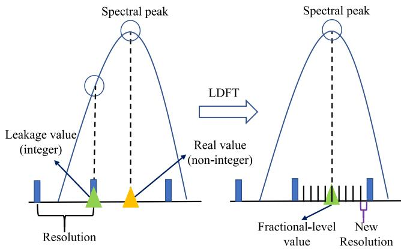  
Fig. 3. The schematic diagram of the LDFT algorithm.

where $\mathrm { D F T } _ { \mathrm { r o w } } ( \mathbf { Y } ^ { i , u } , N _ { R } ^ { x } )$ applies an $N _ { R } ^ { x } \cdot$ -point DFT to each row of $\mathbf { Y } ^ { i , u }$ , while DF $\ddot { \mathrm { T } _ { c o l } } ( { \bf A } , N _ { R } ^ { z } )$ applies an $N _ { R } ^ { z }$ -point DFT to each column of A. By searching for the global maximum of $\mathbf { A } ^ { i , u }$ , also known as the spectral peak, we can obtain the spectral peak’s position, denoted as $( \eta _ { \theta } , \eta _ { \phi } )$

Since the resolution of DFT is limited to integer grid points, the estimation accuracy of $\eta _ { \theta }$ and $\eta _ { \phi }$ is constrained to integer levels. Therefore, we propose a local DFT (LDFT) algorithm to achieve fractional-level resolution by interpolating the local spectral region near the leakage integer value of the DFT, as illustrated in Fig. 3. Specifically, we construct a LDFT matrix $\mathbf { F } _ { \theta }$ whose $( p _ { \theta } , q _ { \theta } ) \ – \mathrm { t h }$ element is given by

$$
\mathbf { F } _ { \theta } [ p _ { \theta } , q _ { \theta } ] = e ^ { j 2 \pi \left( \eta _ { \theta } + \frac { p _ { \theta } } { N _ { R } ^ { x } } - \frac { 1 } { 2 } \right) \frac { q _ { \theta } } { N _ { R } ^ { x } } } \in \mathbb { C } ^ { N _ { R } ^ { x } \times N _ { R } ^ { x } } ,\tag{10}
$$

where $p _ { \theta } , q _ { \theta } = 1 , 2 , . . . , N _ { R } ^ { x }$ . Similarly, we construct a LDFT matrix $\mathbf { F } _ { \phi }$ whose $( p _ { \phi } , q _ { \phi } )$ -th element is given by

$$
\mathbf { F } _ { \phi } [ p _ { \phi } , q _ { \phi } ] = e ^ { j 2 \pi \left( \eta _ { \phi } + \frac { q _ { \phi } } { N _ { R } ^ { z } } - \frac { 1 } { 2 } \right) \frac { p _ { \phi } } { N _ { R } ^ { z } } } \in \mathbb { C } ^ { N _ { R } ^ { z } \times N _ { R } ^ { z } } ,\tag{11}
$$

where $p _ { \phi } , q _ { \phi } = 1 , 2 , \ldots , N _ { R } ^ { z }$

From (8), (10), and (11), the local transformed signal matrix can be expressed as

$$
\mathbf { E } _ { \theta , \phi } ^ { i , u } = \mathbf { F } _ { \theta } \mathbf { Y } ^ { i , u } \mathbf { F } _ { \phi } \in { \mathbb { C } } ^ { N _ { R } ^ { x } \times N _ { R } ^ { z } } ,\tag{12}
$$

whose $( p _ { \theta } , q _ { \phi } )$ -th element (without considering the noise) is given by

$$
\begin{array} { r } { \mathbf { E } _ { \theta , \phi } ^ { i , u } [ p _ { \theta } , q _ { \phi } ] = \gamma ^ { i , u } \sum _ { a _ { R } ^ { \prime } = 1 } ^ { N _ { R } ^ { \prime } } e ^ { j 2 \pi a _ { R } ^ { \prime } \left( \frac { f _ { 0 } d \sin \phi ^ { u } } { c } - \frac { \eta _ { \phi } + \frac { q _ { \theta } } { N _ { R } ^ { \prime } } - \frac { 1 } { 2 } } { N _ { R } ^ { \prime } } \right) } } \\ { \times \sum _ { a _ { R } ^ { \prime } = 1 } ^ { N _ { R } ^ { \prime } } e ^ { j 2 \pi a _ { R } ^ { \prime } \left( \frac { f _ { 0 } d \cos \phi ^ { u } \cos \theta ^ { u } } { c } - \frac { \eta _ { \phi } + \frac { p _ { \theta } } { N _ { R } ^ { \prime } } - \frac { 1 } { 2 } } { N _ { R } ^ { \prime } } \right) } } \end{array}\tag{13}
$$

By searching for the spectral peak of $\mathbf { E } _ { \theta , \phi } ^ { i , u }$ , we can obtain the spectral peak’s position, denoted as $( \tilde { p } _ { \theta } , \tilde { q } _ { \phi } )$ . Then, we can estimate the target’s azimuth angle and elevation angle relative to BS-u as

$$
\tilde { \phi } ^ { u } = \arcsin \left( \frac { \eta _ { \phi } + \frac { \tilde { q } _ { \phi } } { N _ { R } ^ { z } } - \frac { 1 } { 2 } } { N _ { R } ^ { z } } \cdot \frac { c } { f _ { 0 } d } \right) ,\tag{14}
$$

$$
\tilde { \theta } ^ { u } = \operatorname { a r c c o s } \left( \left( \frac { \eta _ { \theta } + \frac { \tilde { p } _ { \theta } } { N _ { R } ^ { x } } - \frac { 1 } { 2 } } { N _ { R } ^ { x } } \cdot \frac { c } { f _ { 0 } d } \right) / \cos \tilde { \phi } ^ { u } \right) .\tag{15}
$$

## B. TO and CFO Compensation

From (8), (14), and (15), we can compensate for the estimated angles in a matrix $\mathbf { Y } _ { m , n } ^ { i , u } .$ Then, the angle compensated matrix can be expressed as $\hat { \mathbf { Y } } _ { m , n } ^ { i , u } \in \mathbb { C } ^ { N _ { R } ^ { x } \times N _ { R } ^ { z } }$ whose $( a _ { R } ^ { x } , a _ { R } ^ { z } ) \cdot$ th element is

$$
\begin{array} { r l } & { \hat { \mathbf { Y } } _ { m , n } ^ { i , u } [ a _ { R } ^ { x } , a _ { R } ^ { z } ] = \epsilon _ { a _ { R } ^ { x } , a _ { R } ^ { z } } ^ { i , u } e ^ { - j 2 \pi m \Delta f ( \tau ^ { i , u } + \delta _ { \tau } ^ { i , u } ) } } \\ & { \qquad \times \ : e ^ { j 2 \pi n T _ { s } ( f _ { D } ^ { i , u } + \delta _ { f } ^ { i , u } ) } + \hat { n } _ { m , n , a _ { R } ^ { x } , a _ { R } ^ { z } } ^ { i , u } , } \end{array}\tag{16}
$$

where $\epsilon _ { a _ { R } ^ { x } , a _ { R } ^ { z } } ^ { i , u } \ = \ \gamma ^ { i , u } e ^ { j \frac { 2 \pi f _ { 0 } d } { c } a _ { R } ^ { z } \sin \tilde { \phi } ^ { u } } e ^ { j \frac { 2 \pi f _ { 0 } d } { c } a _ { R } ^ { x } \cos \tilde { \phi } ^ { u } \cos \tilde { \theta } ^ { u } }$ is the compensation factor, and $\hat { n } _ { m , n , a _ { R } ^ { x } , a _ { R } ^ { z } } ^ { i , u }$ represents the noise after angle compensation.

To further compensate for TO and CFO in (16), we take the line-of-sight (LOS) path signals between the corresponding Tx BS and RX BS as the reference signals [37]. The echo channel matrix of the LOS path between BS-i and BS-u at the m-th subcarrier of the n-th OFDM symbol can be modeled as

$$
\begin{array} { r l } & { \mathbf { H } _ { L , m , n } ^ { i , u } = \alpha _ { L } ^ { i , u } e ^ { - j 2 \pi m \Delta f ( \tau _ { L } ^ { i , u } + \delta _ { \tau } ^ { i , u } ) } e ^ { j 2 \pi n T _ { s } \delta _ { f } ^ { i , u } } } \\ & { \qquad \times \mathbf { a } _ { R } \left( \boldsymbol { \Psi } _ { L } ^ { u } , \boldsymbol { \Omega } _ { L } ^ { u } \right) \mathbf { a } _ { T } ^ { H } \left( \boldsymbol { \Psi } _ { L } ^ { i } , \boldsymbol { \Omega } _ { L } ^ { i } \right) , } \end{array}\tag{17}
$$

where $\begin{array} { r } { \alpha _ { L } ^ { i , u } = \sqrt { \frac { \lambda ^ { 2 } } { ( 4 \pi ) ^ { 3 } ( r _ { L } ^ { i , u } ) ^ { 4 } } } e ^ { - j 2 \pi f _ { 0 } ( \tau _ { L } ^ { i , u } + \delta _ { \tau } ^ { i , u } ) } } \end{array}$ is the channel fading factor, $r _ { L } ^ { i , u }$ expresses the distance between BS-i and $\mathrm { B S } \ – u , \ \tau _ { L } ^ { i , u }$ denotes the time delay of the LOS path, and $( \Psi _ { L } ^ { i } , \Omega _ { L } ^ { i } )$ represents the physical direction of the LOS path beam. Then, the received LOS path signals between BS-i and BS-u on the m-th subcarrier of the n-th OFDM symbol can be expressed as

$$
\begin{array} { r l } & { { \bf y } _ { L , m , n } ^ { i , u } = { \bf H } _ { L , m , n } ^ { i , u } { \bf w } _ { T } \left( \Psi _ { L } ^ { i } , \Omega _ { L } ^ { i } \right) s _ { m , n } ^ { i } + { \bf n } _ { L , m , n } ^ { i , u } } \\ & { \quad \quad \quad \quad \quad \quad \quad \quad \quad \quad \quad \quad \quad \quad \quad \quad \quad \quad \quad \quad \quad \quad } \\ & { \quad \quad \quad \quad \quad \quad \quad \quad \quad \quad \quad \quad \quad \quad \quad \quad \quad \quad \times { \bf a } _ { L } ^ { i , u } e ^ { - j 2 \pi m \Delta f ( \tau _ { L } ^ { i , u } + \delta _ { \tau } ^ { i , u } ) } e ^ { j 2 \pi n T _ { s } \delta _ { f } ^ { i , u } } } \\ & { \quad \quad \quad \quad \quad \quad \quad \quad \quad \quad \quad \times { \bf a } _ { R } \left( \Psi _ { L } ^ { u } , \Omega _ { L } ^ { u } \right) + { \bf n } _ { L , m , n } ^ { i , u } , } \end{array}\tag{18}
$$

where $\begin{array} { r } { \beta _ { L } ^ { i , u } = \alpha _ { L } ^ { i , u } \mathbf { a } _ { T } ^ { H } \left( \Psi _ { L } ^ { i } , \Omega _ { L } ^ { i } \right) \sqrt { \frac { 1 } { N _ { H } } } \mathbf { a } _ { T } \left( \Psi _ { L } ^ { i } , \Omega _ { L } ^ { i } \right) s _ { m , n } ^ { i } } \end{array}$ , and $\mathbf { n } _ { L , m , n } ^ { i , u }$ represents the LOS path noise.

Since the time delay and angle information of the LOS path are fixed and can be easily obtained, we assume they are known and can be taken into (18) for compensation [37]. Then, the compensated LOS path signal matrix can be expressed as $\hat { \mathbf { Y } } _ { L , m , n } ^ { i , u } \in \mathbb { C } ^ { N _ { R } ^ { x } \times N _ { R } ^ { z } }$ whose $( a _ { R } ^ { x } , a _ { R } ^ { z } )$ -th element is given by

$$
\begin{array} { r l } & { \hat { \mathbf { Y } } _ { L , m , n } ^ { i , u } [ a _ { R } ^ { x } , a _ { R } ^ { z } ] = \epsilon _ { L , a _ { R } ^ { x } , a _ { R } ^ { z } } ^ { i , u } e ^ { - j 2 \pi m \Delta f \delta _ { \tau } ^ { i , u } } e ^ { j 2 \pi n T _ { s } \delta _ { f } ^ { i , u } } } \\ & { \qquad + \hat { n } _ { L , m , n , a _ { R } ^ { x } , a _ { R } ^ { z } } ^ { i , u } , } \end{array}\tag{19}
$$

where $\begin{array} { r } { \epsilon _ { L , a _ { R } ^ { x } , a _ { R } ^ { z } } ^ { i , u } = \beta _ { L } ^ { i , u } e ^ { j 2 \pi f _ { 0 } d \frac { a _ { R } ^ { x } \Psi _ { L } ^ { u } + a _ { R } ^ { z } \Omega _ { L } ^ { u } } { c } } e ^ { - j 2 \pi m \Delta f \tau ^ { i , u } } } \end{array}$ is the LOS path compensation factor, while $\hat { n } _ { L , m , n , a _ { R } ^ { x } , a _ { R } ^ { z } } ^ { i , u }$ denotes the LOS path noise after time delay and angle compensation. Moreover, the compensated LOS path signal matrix received from the $( a _ { R } ^ { x } , a _ { R } ^ { z } )$ )-th antenna can be expressed as $\mathbf { B } _ { L , a _ { R } ^ { x } , a _ { R } ^ { z } } ^ { i , u } \in$ $\mathbb { C } ^ { M \times N }$ whose $( m , n )$ -th element is given by

$$
\mathbf { B } _ { L , a _ { R } ^ { x } , a _ { R } ^ { z } } ^ { i , u } [ m , n ] = \hat { \mathbf { Y } } _ { L , m , n } ^ { i , u } [ a _ { R } ^ { x } , a _ { R } ^ { z } ] .\tag{20}
$$

From (16), the echo signal matrix received from the $( a _ { R } ^ { x } , a _ { R } ^ { z } ) \ – \mathrm { t h }$ antenna after angle compensation can be

expressed as $\mathbf { B } _ { a _ { R } ^ { x } , a _ { R } ^ { z } } ^ { i , u } \in \mathbb { C } ^ { M \times N }$ whose $( m , n )$ -th element is given by

$$
\mathbf { B } _ { a _ { R } ^ { x } , a _ { R } ^ { z } } ^ { i , u } [ m , n ] = \hat { \mathbf { Y } } _ { m , n } ^ { i , u } [ a _ { R } ^ { x } , a _ { R } ^ { z } ] .\tag{21}
$$

Without considering noise, from (16), (19), (20), and (21), we can use the cross-correlation method [41] to obtain the TO and CFO compensated signal matrix as

$$
\begin{array} { r l } { \mathbf { D } _ { a _ { R } ^ { x } , a _ { R } ^ { z } } ^ { i , u } = \mathbf { B } _ { a _ { R } ^ { x } , a _ { R } ^ { z } } ^ { i , u } \circ ( \mathbf { B } _ { L , a _ { R } ^ { x } , a _ { R } ^ { z } } ^ { i , u } ) ^ { * } \in \mathbb { C } ^ { M \times N } } & { } \\ { = \varepsilon _ { a _ { R } ^ { x } , a _ { R } ^ { z } } ^ { i , u } \left[ \begin{array} { c c c c } { u _ { 0 , 0 } ^ { i , u } } & { u _ { 0 , 1 } ^ { i , u } } & { \cdots } & { u _ { 0 , N - 1 } ^ { i , u } } \\ { u _ { 1 , 0 } ^ { i , u } } & { u _ { 1 , u } ^ { i , u } } & { \cdots } & { u _ { 1 , N - 1 } ^ { i , u } } \\ { \vdots } & { \vdots } & { \ddots } & { \vdots } \\ { u _ { M - 1 , 0 } ^ { i , u } } & { u _ { M - 1 , 1 } ^ { i , u } \cdots } & { u _ { M - 1 , N - 1 } ^ { i , u } } \end{array} \right] , } \end{array}\tag{22}
$$

where εax ,az i,u = i,uax , (∈L,ax i,uL,axR,azR)∗ and ui,um,n = $e ^ { - j 2 \pi m \Delta f \tau ^ { \ddot { a } , u } } e ^ { j 2 \pi n T _ { s } f _ { D } ^ { i , u } }$

## C. Time Delay and Doppler Frequency Estimation

Since the echo signals received from every antenna contain the time delay and Doppler frequency phase information of the propagation path, we utilize the TO and CFO compensated signal matrix received from the 1st antenna to estimate the time delay and Doppler frequency of the propagation path. For simplicity, let us define $\mathbf { \bar { D } } ^ { i , u } = \mathbf { D } _ { 1 , 1 } ^ { i , u }$ and $\bar { \varepsilon } ^ { i , u } = \stackrel { \cdot } { \varepsilon } _ { 1 , 1 } ^ { i , u }$ thereby omitting the antenna indices in subsequent derivations. Then, we employ a 2D-DFT on $\mathbf { D } ^ { i , u }$ to obtain the time delay-Doppler frequency spectrum matrix as

$$
\mathbf { G } ^ { i , u } = \mathrm { D F T } _ { \mathrm { c o l } } ( \mathrm { I D F T } _ { \mathrm { r o w } } ( \mathbf { D } ^ { i , u } , M ) , N ) ,\tag{23}
$$

where $\mathrm { I D F T } _ { \mathrm { r o w } } ( \mathbf { D } ^ { i , u } , M )$ applies an M-point inverse DFT (IDFT) to each row of $\mathbf { D } ^ { i , u }$ , while $\mathrm { D F T } _ { \mathrm { c o l } } ( \mathbf { A } , N )$ applies an N-point DFT to each column of A. By searching for the spectral peak of $\mathbf { G } ^ { i , u }$ , we can obtain the spectral peak’s position, denoted as $( \eta _ { r } , \eta _ { v } )$

Following similar steps from (9) to (15), we utilize the LDFT algorithm to enhance the resolution of the time delay and Doppler frequency. Specifically, we construct a local IDFT matrix $\mathbf { \bar { F } } _ { r } \in \mathbb { C } ^ { \bar { M } \times M }$ whose $( p _ { r } , q _ { r } )$ -th element is given by

$$
\begin{array} { r } { { \bf F } _ { r } [ p _ { r } , q _ { r } ] = e ^ { - j 2 \pi \left( \eta _ { r } + \frac { p _ { r } } { M } - \frac { 1 } { 2 } \right) \frac { q _ { r } } { M } } , } \end{array}\tag{24}
$$

where $p _ { r } , q _ { r } = 1 , 2 , \ldots , M$ . Then, we construct a local DFT matrix $\mathbf { \bar { F } } _ { v } \in \mathbb { C } ^ { N \times N }$ whose $( p _ { v } , q _ { v } )$ -th element is given by

$$
\begin{array} { r } { { \bf F } _ { v } [ p _ { v } , q _ { v } ] = e ^ { j 2 \pi \left( \eta _ { v } + \frac { q _ { v } } { N } - \frac { 1 } { 2 } \right) \frac { p _ { v } } { N } } , } \end{array}\tag{25}
$$

where $p _ { v } , q _ { v } = 1 , 2 , \cdot \cdot \cdot , N .$

From (22), (24), and (25), the local transformed signal matrix can be expressed as

$$
\mathbf { E } _ { r , v } ^ { i , u } = \mathbf { F } _ { r } \mathbf { D } ^ { i , u } \mathbf { F } _ { v } \in { \mathbb { C } } ^ { M \times N } ,\tag{26}
$$

whose $( p _ { r } , q _ { v } )$ -th element is expressed as

$$
\begin{array} { r } { { \bf E } _ { r , v } ^ { i , u } [ p _ { r } , q _ { v } ] = \varepsilon ^ { i , u } \sum _ { m = 1 } ^ { M } e ^ { - j 2 \pi m \left( \Delta f \tau ^ { i , u } - \frac { \eta _ { r } + \frac { p _ { r } } { M } - \frac { 1 } { 2 } } { M } \right) } } \\ { \times \sum _ { n = 1 } ^ { N } e ^ { j 2 \pi n \left( T _ { s } f _ { D } ^ { i , u } - \frac { \eta _ { v } + \frac { q _ { v } } { N } - \frac { 1 } { 2 } } { N } \right) } . } \end{array}\tag{27}
$$

By searching for the spectral peak of $\mathbf { E } _ { r , v } ^ { i , u }$ , we can obtain the spectral peak’s position, denoted as $( \tilde { p } _ { r } , \tilde { q } _ { v } )$ . Then, we can estimate the $( i , u )$ -th propagation path’s time delay and Doppler frequency as

$$
\tilde { \tau } ^ { i , u } = \frac { \eta _ { r } + \frac { \tilde { p } _ { r } } { M } - \frac { 1 } { 2 } } { M \Delta f } ,
$$

$$
\tilde { f } _ { D } ^ { i , u } = \frac { \eta _ { v } + \frac { \tilde { q } _ { v } } { N } - \frac { 1 } { 2 } } { N T _ { s } } .\tag{28}
$$

(29)

## D. Feature Vector Extraction

To enhance the gain of multi-BS cooperative sensing, we extract the feature vectors containing the time delay and Doppler frequency phase information of the propagation path. Additionally, we apply the coherent compression operation [42] to improve the signal-to-noise ratio (SNR) and maintain phase consistency. Specifically, we take the 1st row of $\mathbf { D } ^ { i , u }$ as the reference vector. Then, the a-th coherent row vector can be computed as

$$
\begin{array} { r l } & { \mathbf { f } _ { p , a } ^ { i , u } = \left( { \mathbf { D } } ^ { i , u } [ a + 1 , : ] \circ ( { \mathbf { D } } ^ { i , u } [ 1 , : ] ) ^ { * } \right) ^ { T } \in \mathbb { C } ^ { N \times 1 } } \\ & { \quad \quad = \varepsilon ^ { i , u } ( \varepsilon ^ { i , u } ) ^ { * } [ u _ { a , 0 } ^ { i , u } ( u _ { 0 , 0 } ^ { i , u } ) ^ { * } , \cdot \cdot \cdot , u _ { a , N - 1 } ^ { i , u } ( u _ { 0 , N - 1 } ^ { i , u } ) ^ { * } ] ^ { T } } \\ & { \quad \quad = \left| \varepsilon ^ { i , u } \right| ^ { 2 } [ e ^ { - j 2 \pi a \Delta f \tau ^ { i , u } } , \cdot \cdot \cdot , e ^ { - j 2 \pi a \Delta f \tau ^ { i , u } } ] ^ { T } , \qquad ( } \end{array}\tag{30}
$$

where $a = 1 , 2 , \cdots , M - 1$ . Next, the mean phase response across the subcarriers can be computed as $g _ { r , a } ^ { i , u } = \mathrm { m e a n } ( \mathbf { f } _ { p , a } ^ { i , u } )$ Then, we can obtain the time delay feature vector of the $( i , u ) \ –$ th propagation path as

$$
\begin{array} { r l } & { \mathbf { h } _ { p } ^ { i , u } = [ g _ { p , 1 } ^ { i , u } , g _ { p , 2 } ^ { i , u } \cdot \cdot \cdot , g _ { p , M - 1 } ^ { i , u } ] ^ { T } \in \mathbb { C } ^ { ( M - 1 ) \times 1 } } \\ & { \qquad = \big | \varepsilon ^ { i , u } \big | ^ { 2 } [ e ^ { - j 2 \pi \Delta f \tau ^ { i , u } } , \cdot \cdot \cdot , e ^ { - j 2 \pi ( M - 1 ) \Delta f \tau ^ { i , u } } ] ^ { T } . } \end{array}\tag{31}
$$

Similarly, we take the 1st column of $\mathbf { D } ^ { i , u }$ as the reference vector to extract the Doppler frequency feature vector. Then, the b-th coherent column vector can be computed as

$$
\begin{array} { r l } & { \mathbf { f } _ { v , b } ^ { i , u } = \mathbf { D } ^ { i , u } [ : , b + 1 ] \circ ( \mathbf { D } ^ { i , u } [ : , 1 ] ) ^ { * } \in \mathbb { C } ^ { M \times 1 } } \\ & { \quad \quad = { \varepsilon } ^ { i , u } ( { \varepsilon } ^ { i , u } ) ^ { * } [ u _ { 0 , b } ^ { i , u } ( u _ { 0 , 0 } ^ { i , u } ) ^ { * } , \cdots , u _ { M - 1 , b } ^ { i , u } ( u _ { M - 1 , 0 } ^ { i , u } ) ^ { * } ] ^ { T } } \\ & { \quad \quad = \left| { \varepsilon } ^ { i , u } \right| ^ { 2 } [ e ^ { j 2 \pi b T _ { s } f _ { D } ^ { i , u } } , \cdots , e ^ { j 2 \pi b T _ { s } f _ { D } ^ { i , u } } ] ^ { T } , } \end{array}\tag{32}
$$

where $b = 1 , 2 , \cdots , N - 1$ . Next, the mean phase response across the OFDM symbols can be computed as $g _ { v , b } ^ { i , u } ~ =$ mean $( \mathbf { f } _ { v , b } ^ { i , u } )$ . Then, we can obtain the Doppler frequency feature vector of the $( i , u )$ -th propagation path as

$$
\begin{array} { r l } & { \mathbf { h } _ { v } ^ { i , u } = [ g _ { v , 1 } ^ { i , u } , g _ { v , 2 } ^ { i , u } \cdot \cdot \cdot , g _ { v , N - 1 } ^ { i , u } ] ^ { T } \in \mathbb { C } ^ { ( N - 1 ) \times 1 } } \\ & { \qquad = \left. \varepsilon ^ { i , u } \right. ^ { 2 } [ e ^ { j 2 \pi T _ { s } f _ { D } ^ { i , u } } , \cdot \cdot \cdot , e ^ { j 2 \pi ( N - 1 ) T _ { s } f _ { D } ^ { i , u } } ] ^ { T } . } \end{array}\tag{33}
$$

After pre-processing the echo signals within each BS, the estimated azimuth angles, elevation angles, time delays, Doppler frequencies, time delay feature vectors, and Doppler frequency feature vectors of the targets are sent via optical fiber to the data center for further processing.

## IV. MULTI-BS FEATURE INFORMATION FUSION

In this section, we spatially align the estimated motion parameters and obtain the rough positions and velocities of the targets. Moreover, we fuse the feature vectors to estimate the fine positions and velocities of the targets.

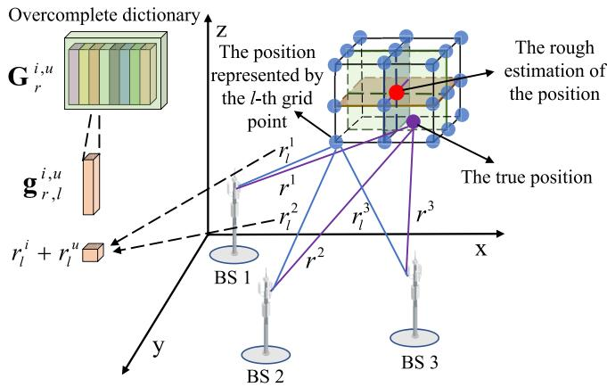  
Fig. 4. The schematic diagram of the position fusion with the CS algorithm.

## A. Multi-BS Position Fusion

1) Rough Estimation of Target’s Position: Let us sequentially identify the Tx and Rx BSs in the estimated time delays $\tilde { \tau } ^ { i , u }$ (refer to (28)) sent from all BSs. By finding out the case where the Rx BS is the same as the Tx BS $( \mathrm { i } . \mathrm { e } . , u = i )$ , we can estimate the target’s distance relative to BS-i as $\begin{array} { r } { \tilde { r } ^ { i } = \frac { \tilde { \tau } ^ { i , u } c } { 2 } } \end{array}$ Next, we can estimate the target’s distance relative to BS-u as

$$
\tilde { r } ^ { u } = \tilde { \tau } ^ { i , u } c - \tilde { r } ^ { i } .\tag{34}
$$

Since the estimated angles and distance of the target in (14), (15), and (34) are represented in each Rx BS’s local polar coordinate system, we need to transform them into a global Cartesian coordinate system. Denote the global Cartesian coordinate system as $\dot { \mathcal { C } } ^ { 0 } .$ , and represent the local Cartesian coordinate system of BS-u as $\mathcal { C } ^ { u }$ . Moreover, define the rotation matrix about the $z -$ axis from $\mathcal { C } ^ { u }$ to $\mathcal { C } ^ { 0 }$ as

$$
\begin{array} { r } { { \bf R } ^ { u , 0 } = \left[ \begin{array} { c c c } { \cos ( \xi ^ { u , 0 } ) - \sin ( \xi ^ { u , 0 } ) } & { 0 } \\ { \sin ( \xi ^ { u , 0 } ) } & { \cos ( \xi ^ { u , 0 } ) } & { 0 } \\ { 0 } & { 0 } & { 1 } \end{array} \right] , } \end{array}\tag{35}
$$

where $\xi ^ { u , 0 }$ represents the rotation angle. Additionally, denote the positions of BS-i and BS-u in $\mathcal { C } ^ { 0 }$ as $ { \mathbf { p } } ^ { i , 0 }$ and $\mathbf { p } ^ { u , 0 }$ respectively. Subsequently, from (13), (14), (34), and (35), we can estimate the target’s position observed by BS-u as

$$
\begin{array} { r } { \tilde { \mathbf { p } } ^ { u } = \tilde { r } ^ { u } \mathbf { R } ^ { u , 0 } \mathbf { t } ( \tilde { \theta } ^ { u } , \tilde { \phi } ^ { u } ) + \mathbf { p } ^ { u , 0 } \in \mathbb { R } ^ { 3 \times 1 } , } \end{array}\tag{36}
$$

where $\mathbf { t } ( \tilde { \theta } ^ { u } , \tilde { \phi } ^ { u } ) = [ \cos \tilde { \theta } ^ { u } \cos \tilde { \phi } ^ { u } , \sin \tilde { \theta } ^ { u } \cos \tilde { \phi } ^ { u } , \sin \tilde { \phi } ^ { u } ] ^ { T } .$

Then, we can use the mean fusion method [35] to obtain the rough estimation of the target’s position as

$$
\tilde { { \bf p } } _ { r o u g h } = \frac { \sum _ { u = 1 } ^ { N _ { B S } } \tilde { { \bf p } } ^ { u } } { N _ { B S } } \in \mathbb { R } ^ { 3 \times 1 } .\tag{37}
$$

2) Fine Estimation of Target’s Position: Fig. 4 shows multi-BS position fusion with the compressed sensing (CS) algorithm. As indicated by (31), since the value of the time delay associated with the (i, u)-th propagation path is unique, $\mathbf { h } _ { p } ^ { i , u }$ exhibits sparsity. To exploit this sparsity, we need to construct an overcomplete dictionary that encompasses all possible time delays.

From $\begin{array} { r } { \tau ^ { i , u } = \frac { r ^ { i } + r ^ { u } } { c } } \end{array}$ , (31) can be rewritten as

$$
\begin{array} { r } { \mathbf { h } _ { p } ^ { i , u } = \left| \varepsilon ^ { i , u } \right| ^ { 2 } \left[ e ^ { - j 2 \pi \Delta f \frac { r ^ { i } + r ^ { u } } { c } } , \cdot \cdot , e ^ { - j 2 \pi ( M - 1 ) \Delta f \frac { r ^ { i } + r ^ { u } } { c } } \right] ^ { T } . } \end{array}\tag{38}
$$

Since c is fixed, we only need to consider all possible lengths of the (i, u)-th propagation path, i.e., $( r ^ { i } + r ^ { u } )$ . Then, we uniformly generate $\bar { L } \stackrel { \bf { \bar { \Delta } } } { = } G ^ { 3 }$ grid points within a square cube of side length $D ,$ , which is centered at the rough estimation of the target’s position in (37). Here, G represents the maximum index in the direction of each Cartesian coordinate system axis. Moreover, denote the position vector of the l-th grid point as $\mathbf { p } _ { l } ,$ which can be computed by

$$
\begin{array}{c} \begin{array} { r } { \mathbf p _ { l } = \tilde { \mathbf p } _ { r o u g h } + [ [ \frac { | - 1 | - 1 } { G } | \frac { D } { G } - \frac { D } { 2 } ] \in \mathbb { R } ^ { 3 \times 1 } , } \\ { ( ( l - 1 ) \mod { G } ) \frac { D } { G } - \frac { D } { 2 } } \end{array} ] \in \mathbb { R } ^ { 3 \times 1 } ,  \end{array}\tag{39}
$$

where $l = 1 , 2 , \ldots , L$ . Then, the distances between the l-th grid point and BS-i and BS-u can be expressed as $r _ { l } ^ { i } = \Vert \mathbf { p } _ { l } -$ $\mathbf { p } ^ { i , 0 } \vert$ k2 and $r _ { l } ^ { u } = \| \mathbf { p } _ { l } - \mathbf { p } ^ { u , 0 } \| _ { 2 }$ , respectively.

Subsequently, the overcomplete dictionary matrix that encompasses all possible time delays of the $( i , u ) \ – \mathrm { t h }$ propagation path can be constructed as

$$
\mathbf { G } _ { p } ^ { i , u } = [ \mathbf { g } _ { r , 1 } ^ { i , u } , \mathbf { g } _ { r , 2 } ^ { i , u } , \cdot \cdot \cdot , \mathbf { g } _ { r , L } ^ { i , u } ] \in \mathbb { C } ^ { ( M - 1 ) \times L } ,\tag{40}
$$

where

$$
\begin{array} { r } { \mathbf { g } _ { p , l } ^ { i , u } = \left[ e ^ { - j 2 \pi \Delta f \frac { r _ { l } ^ { i } + r _ { l } ^ { u } } { c } } , \cdot \cdot , e ^ { - j 2 \pi ( M - 1 ) \Delta f \frac { r _ { l } ^ { i } + r _ { l } ^ { u } } { c } } \right] ^ { T } \in \mathbb { C } ^ { ( M - 1 ) \times 1 } . } \end{array}\tag{41}
$$

Denote the time delay sparse representation vector as $\delta _ { p } ( l , \psi ) \in \mathbb { R } ^ { L \times 1 }$ with the l-th element being the non-zero value ψ and all other elements being zero. Next, $\mathbf { h } _ { p } ^ { i , u }$ can be sparsely represented as

$$
\mathbf { h } _ { p } ^ { i , u } = \mathbf { G } _ { p } ^ { i , u } \delta _ { p } ( l , \psi ) + \mathbf { n } _ { p } ^ { i , u } ,\tag{42}
$$

Additionally, $\mathbf { n } _ { p } ^ { i , u } \in \mathbb { C } ^ { ( M - 1 ) \times 1 }$ represents the noise of the sparse representation. Clearly, (42) is an underdetermined equation, which can be solved by

$$
( \hat { l } , \hat { \psi } ) = \arg \operatorname* { m i n } _ { ( l , \psi ) } \| \mathbf { h } _ { p } ^ { i , u } - \mathbf { G } _ { p } ^ { i , u } \pmb { \delta } _ { p } ( l , \psi ) \| _ { 2 } ^ { 2 } ,\tag{43}
$$

where $\hat { l }$ and $\hat { \psi }$ represent estimations of the position and value of the non-zero element, respectively. From (38), we know that $\hat { \psi }$ closely approximate $\left| \varepsilon ^ { i , \stackrel { \star } { u } } \right| ^ { 2 }$ . Since $\left| \varepsilon ^ { i , u } \right| ^ { 2 }$ is an unknown variable, we adopt the inner product method [42] to simplify the computation of $\hat { \psi } .$ . Specifically, we fix ψ to 1 and compute the weight of the l-th grid point for the $( i , u )$ -th propagation path as

$$
g _ { p , l } ^ { i , u } = \left. \mathbf { h } _ { p } ^ { i , u } , \left( \mathbf { G } _ { p } ^ { i , u } \delta _ { p } ( l , 1 ) \right) ^ { * } \right. = \left| \varepsilon ^ { i , u } \right| ^ { 2 } \sum _ { a = 1 } ^ { M - 1 } e ^ { - j 2 \pi a \Delta f \frac { \Delta r _ { l } ^ { i } + \Delta r _ { l } ^ { u } } { c } } ,\tag{44}
$$

where $\Delta r _ { l } ^ { i } = r ^ { i } - r _ { l } ^ { i }$ and $\Delta r _ { l } ^ { u } = r ^ { u } - r _ { l } ^ { u }$ . Clearly, when $( \Delta r _ { l } ^ { i } + \Delta \dot { r } _ { l } ^ { u } )$ approaches zero, i.e., when the position of the l-th grid point is close to the true position of the target, $g _ { p , l } ^ { i , u }$ will be larger.

Since (44) is only the weight of the grid point for a single propagation path, we further compute the weight of the l-th grid point for all propagation paths beginning with BS-i as

$$
g _ { p , l } ^ { i } = \sum _ { u } ^ { N _ { B S } } g _ { p , l } ^ { i , u } .\tag{45}
$$

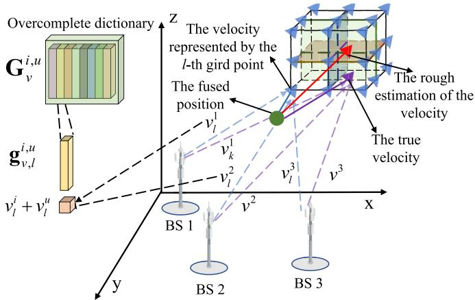  
Fig. 5. The schematic diagram of the velocity fusion with the CS algorithm.

Then, we can obtain the index of the grid point with the maximum weight as

$$
\boldsymbol { \widetilde { l } } = \arg \operatorname* { m a x } _ { \boldsymbol { l } } g _ { p , \boldsymbol { l } } ^ { i } .\tag{46}
$$

Subsequently, we can obtain the fine estimation of the target’s position as

$$
\tilde { \mathbf { p } } = \mathbf { p } _ { \tilde { l } } \in \mathbb { R } ^ { 3 \times 1 } .\tag{47}
$$

## B. Multi-BS Velocity Fusion

1) Rough Estimation of Target’s Velocity: Let us sequentially identify the Tx and Rx BSs in the estimated Doppler frequency (refer to (29)) sent from all BSs. By finding out the case where the Rx BS is the same as the Tx BS (i.e., u = i), we can estimate the target’s radial velocity relative to BS-i as $\begin{array} { r } { \tilde { v } ^ { i } = \frac { \tilde { f } _ { D } ^ { i , u } c } { 2 f _ { 0 } } } \end{array}$ . Next, we can estimate the target’s radial velocity relative to BS-u as

$$
\tilde { v } ^ { u } = \frac { \tilde { f } _ { D } ^ { i , u } c } { f _ { 0 } } - \tilde { v } ^ { i } .\tag{48}
$$

Let us store the estimated radial velocities of the target relative to all Rx BSs into a vector $\tilde { \mathbf { v } } _ { r } = [ \tilde { v } ^ { 1 } , \tilde { v } ^ { 2 } , \cdots , \tilde { v } ^ { N _ { B S } ^ { - } } ] ^ { T } \in$ $\mathbb { R } ^ { N _ { B S } \times 1 }$ . Denote the projection vector from the velocity of the target onto the radial velocity relative to BS-u as $\mathbf { w } ^ { u } \ = \ \mathbf { R } ^ { \breve { u } , 0 } \mathbf { t } ( \tilde { \theta } ^ { u } , \tilde { \phi } ^ { u } ) \ \in \ \mathbb { R } ^ { 3 \times 1 }$ . Moreover, let us store the projection vectors between the velocity of the target to the radial velocity relative to all Rx BSs into a matrix $\mathbf { W } _ { r } \ =$ $[ { \bf w } ^ { 1 } { \bf w } ^ { 2 } \mathrm { ~ } \cdot \mathrm { ~ } \cdot \bar { \bf w } ^ { N _ { B S } } ] \in \mathbb { R } ^ { 3 \times N _ { B S } }$ . Then, we can use the least squares method [43] to obtain the rough estimation of the target’s velocity as

$$
\boldsymbol { \widetilde { \mathbf { v } } } _ { r o u g h } = \left( \mathbf { W } _ { r } ^ { T } \mathbf { W } _ { r } \right) ^ { - 1 } \mathbf { W } _ { r } ^ { T } \boldsymbol { \widetilde { \mathbf { v } } } _ { r } \in \mathbb { R } ^ { 3 \times 1 } .\tag{49}
$$

2) Fine Estimation of Target’s Velocity: Fig. 5 shows the multi-BS velocity fusion with the CS algorithm. As indicated by (33), since the value of the Doppler frequency associated with the (i, u)-th propagation path is unique, $\mathbf { h } _ { v } ^ { i , u }$ also exhibits sparsity. From $\begin{array} { r } { f _ { D } ^ { i , u } = \bar { f } _ { 0 } \frac { v ^ { i } + v ^ { \bar { u } } } { c } } \end{array}$ , (33) can be rewritten as

$$
\begin{array} { r } { \mathbf { h } _ { v } ^ { i , u } = \left| \varepsilon ^ { i , u } \right| ^ { 2 } \left[ e ^ { - j 2 \pi T _ { s } f _ { 0 } \frac { v ^ { i } + v ^ { u } } { c } } , \cdot \cdot , e ^ { - j 2 \pi ( N - 1 ) T _ { s } f _ { 0 } \frac { v ^ { i } + v ^ { u } } { c } } \right] ^ { T } . } \end{array}\tag{50}
$$

Since c is fixed, we only need to consider the sum of the target’s radial velocities relative to BS-i and BS-u, i.e., $( v ^ { i } + v ^ { u } )$ . Then, we uniformly generate $L = G ^ { 3 }$ grid points within a square cube of side length D, which is centered at the rough estimation of the target’s velocity in (49). Moreover, denote the velocity vector of the l-th $( l \dot { } = 1 , 2 , \dots , L )$ grid point as $\mathbf { v } _ { l } ,$ , which can be compute by

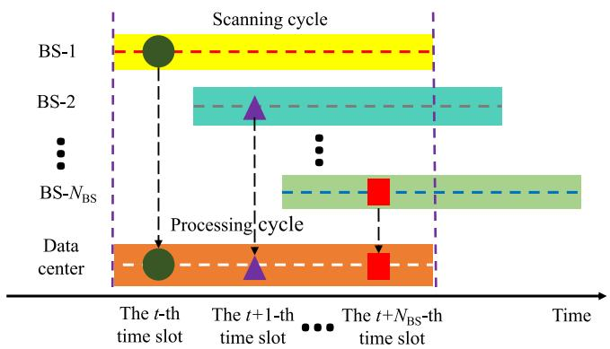  
Fig. 6. Relationship between BS’s scanning cycles and data center’s processing cycle.

$$
\begin{array}{c} \begin{array} { r } { \mathbf { v } _ { l } = \tilde { \mathbf { v } } _ { r o u g h } + \left[ \left. \frac { \left\lfloor \frac { l - 1 } { G ^ { 2 } } \right\rfloor \frac { D } { G } - \frac { D } { 2 } } { G } \right] \frac { D } { G } - \frac { D } { 2 } \right]} \\ { \left( \left( l - 1 \right) \mod G \right) \frac { D } { G } - \frac { D } { 2 } } \end{array}  \in \mathbb { R } ^ { 3 \times 1 } .  \end{array}\tag{51}
$$

Based on the fine estimation of the target’s position in (47), the radial velocities of the l-th grid point relative to BS-i and BS-u can be expressed as $\begin{array} { r } { v _ { l } ^ { i } = \mathbf { v } _ { l } \frac { \tilde { \mathbf { p } } - \mathbf { p } ^ { i , 0 } } { \lVert \tilde { \mathbf { p } } - \mathbf { p } ^ { i , 0 } \rVert _ { 2 } } } \end{array}$ and $\begin{array} { r } { v _ { l } ^ { u } = \mathbf { v } _ { l } \frac { \tilde { \mathbf { p } } - \mathbf { p } ^ { u , 0 } } { \lVert \tilde { \mathbf { p } } - \mathbf { p } ^ { u , 0 } \rVert _ { 2 } } } \end{array}$ , respectively. Then, the overcomplete dictionary matrix that includes all possible Doppler frequencies can be constructed as

$$
\mathbf { G } _ { v } ^ { i , u } = [ \mathbf { g } _ { v , 1 } , \mathbf { g } _ { v , 2 } , \cdot \cdot \cdot , \mathbf { g } _ { v , L } ] \in \mathbb { C } ^ { ( N - 1 ) \times L } ,\tag{52}
$$

where

$$
\begin{array} { r } { \mathbf { g } _ { v , l } = \left[ e ^ { j 2 \pi T _ { s } f _ { 0 } \frac { v _ { l } ^ { i } + v _ { l } ^ { u } } { c } , \cdot \cdot } , e ^ { j 2 \pi ( N - 1 ) T _ { s } f _ { 0 } \frac { v _ { l } ^ { i } + v _ { l } ^ { u } } { c } } \right] ^ { T } \in \mathbb { C } ^ { ( N - 1 ) \times 1 } . } \end{array}\tag{53}
$$

The remaining steps, including computing the inner-product weights, aggregating over all paths, and selecting the strongest grid point ˜l, are identical to (44)–(47) and are omitted here for brevity. Then, we can obtain the fine estimation of the target’s position as

$$
\begin{array} { r } { \tilde { \mathbf v } = { \mathbf v } _ { \tilde { l } } \in \mathbb { R } ^ { 3 \times 1 } . } \end{array}\tag{54}
$$

## V. MULTI-BS COOPERATIVE TRAJECTORY TRACKING

In this section, we design a multi-BS cooperative trajectory tracking method to associate local trajectories with existing global trajectories and fuse asynchronous trajectories into globally consistent trajectories.

## A. Trajectory Association

Fig. 6 illustrates the relationship between the sensing cycles of all BSs and the processing cycle of the data center. Although the scanning cycle duration $T$ is identical for each BS, their starting time slots differ, which leads to asynchronous observation collection. Moreover, the same target is sensed at different time slots by different BSs, which further exacerbates the asynchrony phenomenon and provides the data center with multiple asynchronous observations of the same target within a single processing cycle.

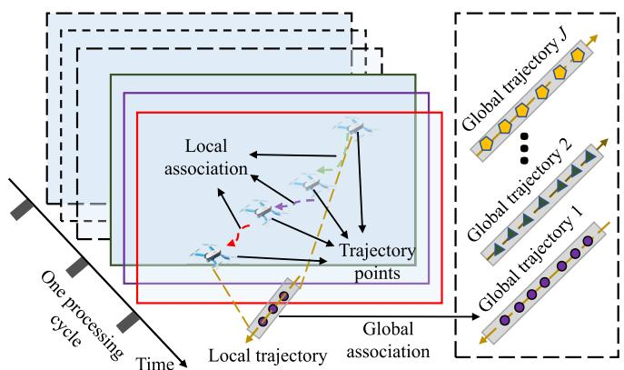  
Fig. 7. The process of asynchronous trajectory association.

Fig. 7 depicts the process of trajectory association within one processing cycle under asynchronous conditions. Specifically, the trajectory points of the same target within the same processing cycle are first associated to obtain the local trajectories. Then, the local trajectories are associated with the existing global trajectories to obtain the updated global trajectories.

1) Local Association: Assume K fused positions-velocities pairs are obtained from (47) and (54) during the processing cycle. For ease of differentiation, we assign incremental subscripts $k = 1 , 2 , . . . , K$ to each pair in sequential order. Then, the k-th trajectory point’s motion state can be denoted as

$$
{ \bf z } _ { k } = \left[ \tilde { \bf p } _ { k } \right] \in \mathbb { R } ^ { 6 \times 1 } ,\tag{55}
$$

where $\tilde { \bf p } _ { k }$ and $\tilde { \mathbf { v } } _ { k }$ represent the fused position and velocity of the target after adding the subscripts. Moreover, denote the set of all trajectory points as $\mathcal { Z } = \{ { \bf z } _ { 1 } , \cdots , { \bf z } _ { K } \}$

To partition Z into coherent local trajectories, we first initialize an unvisited set $\mathcal { O } = \mathcal { Z }$ . For each unvisited trajectory point $\mathbf { z } _ { k } \in \mathcal { O } .$ , we create a new local trajectory set $B _ { j } = \left\{ \mathbf { z } _ { k } \right\}$ and remove the point from the unvisited set $\mathcal { O } = \mathcal { O } \backslash \{ \bar { \mathbf { z } _ { k } } \}$

The local trajectory $B _ { j }$ is then expanded by associating the trajectory points with similar positions and velocities. Specifically, for each $\mathbf { z } _ { k } \in B _ { j }$ , we evaluate all unvisited points $\mathbf { z } _ { k ^ { \prime } } \in \mathcal { O }$ using the local association condition function given by

$$
\mathcal { F } _ { l } ( \mathbf { z } _ { k } , \mathbf { z } _ { k ^ { \prime } } ) = \left\{ \begin{array} { l l } { \mathrm { T r u e } , } & { \mathrm { i f ~ } \| \tilde { \mathbf { p } } _ { k } - \tilde { \mathbf { p } } _ { k ^ { \prime } } \| _ { 2 } ^ { 2 } \leq \rho _ { d } } \\ & { \mathrm { a n d ~ } \| \tilde { \mathbf { v } } _ { k } - \tilde { \mathbf { v } } _ { k ^ { \prime } } \| _ { 2 } ^ { 2 } \leq \rho _ { v } } \\ { \mathrm { F a l s e } , } & { \mathrm { o t h e r w i s e } } \end{array} \right.\tag{56}
$$

where $\rho _ { d }$ and $\rho _ { v }$ represent the association thresholds for position and velocity, respectively, $k ^ { \prime } \neq k = 1 , 2 , \ldots , K$ . If $\mathcal { F } _ { l } ( \mathbf { z } _ { k } , \mathbf { z } _ { k ^ { \prime } } ) = \mathrm { T r u e }$ , then $\mathbf { z } _ { k ^ { \prime } }$ is added to the local trajectory $B _ { j } \ = \ B _ { j } \ \cup \ \{ { \bf z } _ { k ^ { \prime } } \}$ , and is removed from the unvisited set $\mathcal { O } = \mathcal { O } \setminus \{ { \bf z } _ { k ^ { \prime } } \}$ . The expansion repeats until no further point in O satisfies the association condition for any $\mathbf { z } _ { k } \in B _ { j }$ . Then, the extended local trajectory $B _ { j }$ is added to the local trajectory set $B = B \cup \{ B _ { j } \}$ . The process continues iteratively until O is empty. Next, we can obtain an associated set of local trajectories $B = \{ B _ { 1 } , . . . , B _ { J } \}$ , where each $B _ { j }$ represents a local trajectory, with $j = 1 , 2 , \dots , J .$

2) Global Association: Let the existing global trajectory set be $\mathcal { G } = \{ \mathcal { G } _ { 1 } , \mathcal { G } _ { 2 } , . . . , \mathcal { G } _ { J ^ { \prime } } \}$ , where each global trajectory $\mathcal { G } _ { j \prime }$ represents the historical trajectory of a target, with $j ^ { \prime } =$ $1 , 2 , \cdots , J ^ { \prime } { \mathrm { ~ } }$

For each local trajectory $\begin{array} { r } { B _ { j } \in \mathcal { B } _ { \mathrm { ~ \tiny ~ \mathscr ~ } } } \end{array}$ , we traverse all global trajectories $\mathcal { G } _ { j ^ { \prime } } \in \bar { \mathcal { G } }$ and evaluate them using the global association condition function given by

$$
\mathcal { F } _ { g } ( \mathcal { B } _ { j } , \mathcal { G } _ { j ^ { \prime } } ) = \left\{ \begin{array} { l l } { \mathrm { T r u e } , } & { \mathrm { ~ i f ~ } \| \mathbf { p } _ { \mathrm { l a s t } } ( \mathcal { G } _ { j ^ { \prime } } ) - \mathbf { p } _ { \mathrm { f i r s t } } ( \mathcal { B } _ { j } ) \| _ { 2 } ^ { 2 } \le \rho _ { d } } \\ & { \mathrm { ~ a n d ~ } \| \mathbf { v } _ { \mathrm { l a s t } } ( \mathcal { G } _ { j ^ { \prime } } ) - \mathbf { v } _ { \mathrm { f i r s t } } ( \mathcal { B } _ { j } ) \| _ { 2 } ^ { 2 } \le \rho _ { v } } \\ { \mathrm { F a l s e } , } & { \mathrm { ~ o t h e r w i s e } } \end{array} \right.\tag{57}
$$

where $\mathbf { p } _ { \mathrm { l a s t } } ( \mathcal { G } _ { j ^ { \prime } } )$ and $\mathbf { v } _ { \mathrm { l a s t } } ( \mathcal { G } _ { j ^ { \prime } } )$ represent the position and velocity of the last trajectory point in the global trajectory $\mathcal { G } _ { j ^ { \prime } ; }$ respectively; ${ \bf p } _ { \mathrm { f i r s t } } ( B _ { j } )$ and ${ \bf v } _ { \mathrm { f i r s t } } ( B _ { j } )$ ) represent the position and velocity of the first trajectory point in the local trajectory $B _ { j } ,$ respectively. If $\mathcal { F } _ { g } ( B _ { j } , \mathcal { G } _ { j ^ { \prime } } ) =$ True, then the local trajectory $B _ { j }$ is associated with the global trajectory $\mathcal { G } _ { j ^ { \prime } } = \mathcal { G } _ { j ^ { \prime } } \cup B _ { j }$ , and $\bar { B _ { j } }$ is removed from the local trajectory set $\check { B } = B \check { \{ B _ { j } \} }$ . If no matching global trajectory is found, then $B _ { j }$ is added as a new global trajectory to the global trajectory set ${ \mathcal { G } } = { \mathcal { G } } \cup \{ B _ { j } \}$

Then, we can obtain the updated global trajectory set as $\mathcal { G } =$ $\{ \mathcal { G } _ { 1 } , \mathcal { G } _ { 2 } , . . . , \mathcal { G } _ { J ^ { \prime } } , \mathcal { G } _ { J ^ { \prime } + 1 } , . . . , \mathcal { G } _ { J ^ { \prime } + E } \}$ , where $E$ is the number of newly added global trajectories.

## B. Asynchronous Trajectory Fusion

Since the tracking processes for all targets are similar, we omit the labels of the targets in the following discussion. Define the time interval between each observed trajectory point in the global trajectory as a time slot. Moreover, represent the motion state of the target at the t-th time slot in the global trajectory as $\mathbf { x } ^ { t } = [ x ^ { t } , y ^ { t } , z ^ { t } , v _ { x } ^ { t } , v _ { y } ^ { t } , v _ { z } ^ { t } , a _ { x } ^ { t } a _ { y } ^ { t } , a _ { z } ^ { t } ] ^ { T }$ , where each component corresponds to position, velocity, and acceleration along the Cartesian coordinate axes, respectively. Then, the discrete-time state transition equation of the target can be expressed as

$$
\mathbf { x } ^ { t \mid t - 1 } = \mathbf { F } \mathbf { x } ^ { t - 1 } + \mathbf { w } \in \mathbb { R } ^ { 9 \times 1 } ,\tag{58}
$$

where $\mathbf { F } \in \mathbb { R } ^ { 9 \times 9 }$ denotes the state transition matrix and ${ \textbf { w } } \in$ $\mathbb { R } ^ { 9 \times 1 }$ represents the process noise with covariance matrix $\mathbf { Q } \in$ $\mathbb { R } ^ { 9 \times 9 }$

Then, we employ a three-dimensional coordinated spiral motion model to describe the motion of the target in the next time slot. The state transition matrix of the coordinated spiral motion model can be expressed as

$$
\mathbf { F } _ { \mathrm { C S } } = \left( \mathbf { \frac { I _ { 3 } } { 0 _ { 3 } } } \ \mathbf { B } _ { \omega ^ { \prime } } \ \mathbf { 0 } _ { 3 } \right) \in \mathbb { R } ^ { 9 \times 9 } ,\tag{59}
$$

where $\begin{array} { r l r } { { \bf A } _ { \omega ^ { \prime } } } & { = } & { \left[ \frac { \sin \omega ^ { \prime } \triangle T } { \omega ^ { \prime } } \frac { 1 - \cos \omega ^ { \prime } \triangle T } { \omega ^ { \prime } } \frac { 0 } { 0 } \right] } \\ { \frac { 1 - \cos \omega ^ { \prime } \triangle T } { \omega ^ { \prime } } } & { \frac { \sin \omega ^ { \prime } \triangle T } { \omega ^ { \prime } } \Delta } \\ & { } & { 0 \Delta T } \end{array}$ and $\begin{array} { r l } { \mathbf { B } _ { \omega ^ { \prime } } } & { { } = } \end{array}$

$\begin{array} { r } { \left\lceil \cos ( \omega ^ { \prime } \Delta T ) - \sin ( \omega ^ { \prime } \Delta T ) \ 0 \right\rceil } \\ { \sin ( \omega ^ { \prime } \Delta T ) \ \cos ( \omega ^ { \prime } \Delta T ) \ 0 } \\ { 0 \ \qquad 0 \qquad 1 \qquad } \end{array}$ . Moreover, $\omega ^ { \prime }$ denotes the

angular velocity in the horizontal direction, $\mathbf { I } _ { 3 }$ expresses a

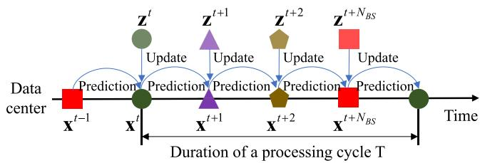  
Fig. 8. The process of asynchronous trajectory fusion.

$3 \times 3$ identity matrix, ${ \bf 0 } _ { 3 }$ indicates a $3 \times 3$ zero matrix, and $\Delta T$ represents the time slot interval.

Since the position and the velocity of the target can be observed from (55), the observation state of the target at the t-th time slot can be expressed as $\mathbf { z } ^ { t } = [ x ^ { t } , y ^ { t } , z ^ { t } , v _ { x , t } ^ { t } , v _ { y } ^ { t } , v _ { z } ^ { t } ] ^ { \mathrm { T } }$ and the observation matrix can be expressed as

$$
\mathbf { H } = \left[ \mathbf { I } _ { 3 } \ { \mathbf { 0 } } _ { 3 } \ { \mathbf { 0 } } _ { 3 } \right] \in \mathbb { R } ^ { 6 \times 9 } .\tag{60}
$$

Then, the state observation equation of the BS can be represented as

$$
\mathbf { z } ^ { t } = \mathbf { H } \mathbf { x } ^ { t } + \mathbf { v } \in \mathbb { R } ^ { 6 \times 1 } ,\tag{61}
$$

where $\mathbf { v } \in \mathbb { R } ^ { 6 \times 1 }$ denotes the observation noise with covariance matrix $\mathbf { R } \in \mathbb { R } ^ { 9 \times 9 }$

Fig. 8 illustrates the sequential fusion process with the sequential unscented Kalman filter (SUKF). Specifically, we iteratively input the trajectory points’ observation state to update the filter model and predict the next state. Notably, the SUKF framework naturally suppresses the impact of observation noise by adaptively balancing prior predictions and current measurements through the Kalman gain. Denote the state of the target and covariance at the previous time slot as $\mathbf { x } ^ { t - 1 }$ and $\mathbf { P } ^ { t - \tilde { 1 } }$ , respectively. We first use the unscented transform (UT) [40] to generate a set of $2 n ^ { \prime }$ sigma points $\{ \mathcal { X } _ { i ^ { \prime } } ^ { t - 1 } \}$ , where $n ^ { \prime }$ represents the dimension of the state vector. Then, we employ the SUKF to track and fuse the asynchronous trajectories of the targets with the iterative steps as

$$
\chi _ { i ^ { \prime } } ^ { t | t - 1 } = \mathbf { F } \chi _ { i ^ { \prime } } ^ { t - 1 } , \quad i ^ { \prime } = 0 , \ldots , 2 n ^ { \prime } ,\tag{62a}
$$

$$
\hat { \mathbf { x } } ^ { t \mid t - 1 } = et { } { ' } \sum _ { i = 0 } ^ { 2 n ^ { \prime } } W _ { i ^ { \prime } } \boldsymbol { x } _ { i ^ { \prime } } ^ { t \mid t - 1 } ,\tag{62b}
$$

$$
\mathbf { P } ^ { t \mid t - 1 } = \sum _ { i ^ { \prime } = 0 } ^ { 2 n ^ { \prime } } W _ { i ^ { \prime } } \Big ( \chi _ { i ^ { \prime } } ^ { t \mid t - 1 } \hat { \mathbf { x } } ^ { t \mid t - 1 } \Big ) \Big ( \chi _ { i ^ { \prime } } ^ { t \mid t - 1 } - \hat { \mathbf { x } } ^ { t \mid t - 1 } \Big ) ^ { T } \mathbf { + Q } ,\tag{62c}
$$

$$
\mathcal { Z } _ { i ^ { \prime } } ^ { t | t - 1 } = \mathbf { H } \chi _ { i ^ { \prime } } ^ { t | t - 1 } , \quad i ^ { \prime } = 0 , \ldots , 2 n ^ { \prime } ,
$$

$$
\hat { \mathbf { z } } ^ { t \mid t - 1 } = et { } { ' } \sum _ { i ^ { \prime } = 0 } ^ { 2 n ^ { \prime } } W _ { i ^ { \prime } } \mathcal { Z } _ { i ^ { \prime } } ^ { t \mid t - 1 } ,\tag{62d}
$$

(62e)

$$
\mathbf P _ { z z } ^ { t } = \sum _ { i ^ { \prime } = 0 } ^ { 2 n ^ { \prime } } W _ { i ^ { \prime } } \Big ( \mathcal { Z } _ { i ^ { \prime } } ^ { t | t - 1 } - \hat { \mathbf { z } } ^ { t | t - 1 } \Big ) \Big ( \mathcal { Z } _ { i ^ { \prime } } ^ { t | t - \perp } \hat { \mathbf { z } } ^ { t | t - 1 } \Big ) ^ { T } \mathbf { R } ,\tag{62f}
$$

$$
\mathbf { P } _ { x z } ^ { t } = \sum _ { i ^ { \prime } = 0 } ^ { 2 n ^ { \prime } } W _ { i ^ { \prime } } \Big ( \boldsymbol { \chi } _ { i ^ { \prime } } ^ { t | t - \underline { { 1 } } } \hat { \mathbf { x } } ^ { t | t - 1 } \Big ) \Big ( \mathcal { Z } _ { i ^ { \prime } } ^ { t | t - \underline { { 1 } } } \hat { \mathbf { z } } ^ { t | t - 1 } \Big ) _ { , } ^ { T }\tag{62g}
$$

$$
\mathbf { K } ^ { t } = \mathbf { P } _ { x z } ^ { t } \left( \mathbf { P } _ { z z } ^ { t } \right) ^ { - 1 } ,\tag{62h}
$$

$$
\mathbf { x } ^ { t } = \hat { \mathbf { x } } ^ { t \mid t - 1 } + \mathbf { K } ^ { t } \left( \mathbf { z } ^ { t } - \hat { \mathbf { z } } ^ { t \mid t - 1 } \right) ,\tag{62i}
$$

$$
\mathbf { P } ^ { t } = \mathbf { P } ^ { t \mid t - 1 } - \mathbf { K } ^ { t } \mathbf { P } _ { z z } ^ { t } \left( \mathbf { K } ^ { t } \right) ^ { T } ,\tag{62j}
$$

where $W _ { i ^ { \prime } }$ represents the weights of the sigma points; $\hat { \mathbf { x } } ^ { t | t - 1 }$ and $\hat { \mathbf { z } } ^ { t \mid t - \mathrm { \bar { 1 } } }$ express the predicted state and observation based on the sigma points; $\bar { \mathbf { P } } _ { z z } ^ { t }$ and $\mathbf { P } _ { x z } ^ { t }$ denote the observation

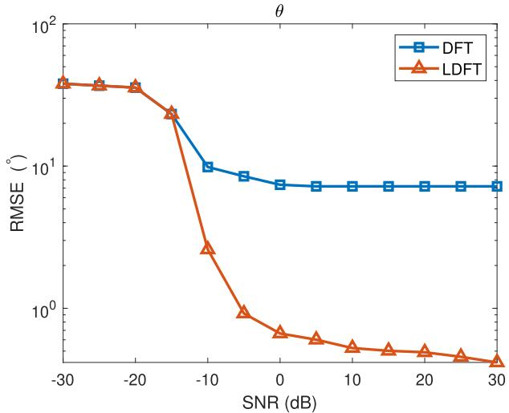  
Fig. 9. The RMSE of the azimuth angle estimation.

covariance and state-observation covariance, respectively; $\mathbf { K } ^ { t }$   
represents the Kalman gain.

From (58) and (62i), we can predict the state of the target for the next time slot as $\mathbf { x } ^ { t + 1 | t } = \mathbf { F } \mathbf { x } ^ { t }$ . Moreover, by iteratively applying the tracking process in (62) to the multiple observations within a processing cycle, we can progressively integrate the local asynchronous trajectory information obtained from different BSs into a unified global trajectory.

## VI. SIMULATION RESULTS

In the simulations, we set the minimum carrier frequency as $f _ { 0 } = 2 8 ~ \mathrm { G H z } ,$ , the subcarrier frequency interval as $\bar { \Delta } f = \mathrm { \bar { 1 2 0 } }$ kHz, the number of subcarriers as $M = 1 2 8$ , the number of OFDM symbols as $N = 6 4$ , the number of antennas in HU-UPA as $N _ { H } ^ { x } = 8$ and $N _ { H } ^ { z } = 8$ , and the number of antennas in RU-UPA as $N _ { R } ^ { x } = \bar { 1 6 }$ and $N _ { R } ^ { z } = 1 6$ , which follow the NR FR2 settings defined in 3GPP TS 38.104/38.101, and the propagation model follows the 3GPP TR 38.901 Urban Micro (UMi) scenario [44].

## A. Performance of Angle Estimation

Denote the root mean square error (RMSE) of the parameter s as $\begin{array} { r } { \mathrm { R M S E } _ { s } \ = \ \sqrt { \frac { \sum _ { a ^ { \prime } = 1 } ^ { N _ { \mathrm { m c } } } ( \tilde { s } _ { a ^ { \prime } } - s ) ^ { 2 } } { N _ { \mathrm { m c } } } } } \end{array}$ , where $N _ { \mathrm { m c } }$ represents the number of the Monte Carlo runs and $\tilde { s } _ { a ^ { \prime } }$ represents the estimated parameter of the target in the $a ^ { \prime } { \mathrm { - } } { \mathrm { } } { \mathrm { i h } }$ Monte Carlo run. We take the target with motion parameters $( r = 3 0 ~ m , \theta = 4 0 ^ { \circ }$ $\phi = 5 0 ^ { \circ } , v _ { r } = 3 0 \ m / s )$ as an example, and investigate the performance of different algorithms on parameter estimation.

Fig. 9 and Fig. 10 illustrate the RMSE of the DFT algorithm and the LDFT algorithm in estimating the azimuth and elevation angles under different SNR conditions. As shown in both figures, the estimation accuracy of the DFT algorithm is insensitive to SNR variations due to the resolution limitations. Consequently, the DFT algorithm sustains a high error level regardless of SNR conditions. In contrast, the LDFT algorithm progressively approaches a more accurate solution through iterative local DFT optimization, with its estimation precision significantly improving as SNR increases. The simulation results demonstrate that the LDFT algorithm significantly outperforms the traditional DFT algorithm.

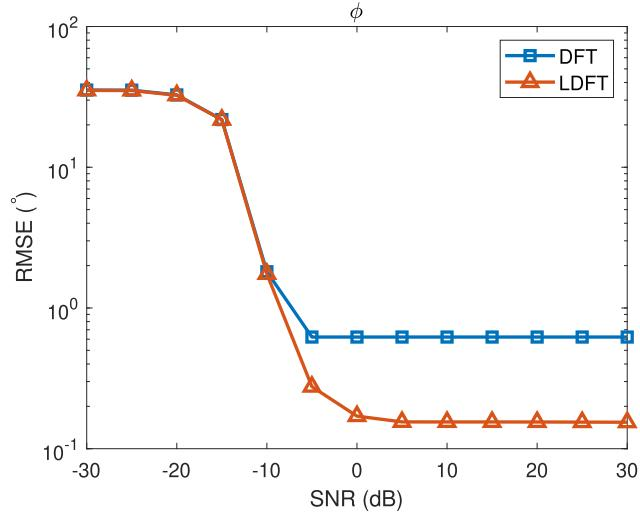  
Fig. 10. The RMSE of the elevation angle estimation.

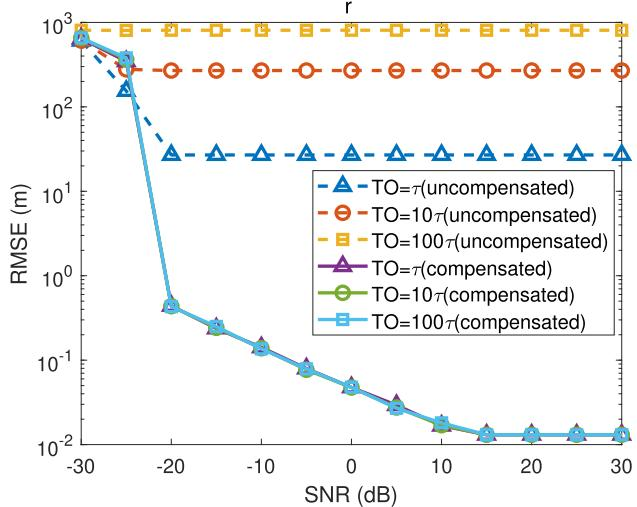  
Fig. 11. The RMSE of the distance Estimation.

## B. Performance of Distance and Radial Velocity Estimation After Compensating TOs and CFOs

Denote the true time delay as τ , and TOs are set to τ , 10τ , and 100τ . Fig. 11 presents the RMSE of distance estimation under different TO conditions. The dashed lines represent the RMSE of the distance estimation in the presence of TOs, while the solid lines depict the RMSE after applying the proposed TO compensation method. It is evident that as TO increases, the distance estimation accuracy deteriorates significantly, and the RMSE is insensitive to SNR variations. However, the proposed TO compensation method and the LDFT algorithm substantially improve the distance estimation accuracy, with the results becoming increasingly precise as SNR increases.

Denote the true Doppler frequency as $f _ { D } ,$ and CFOs are set to $f _ { D } , \ 1 0 f _ { D } ,$ and $1 0 0 f _ { D }$ . Fig. 12 shows the RMSE of radial velocity estimation under different CFO conditions. The dashed lines represent the RMSE of the radial velocity estimation in the presence of CFOs, while the solid lines illustrate the RMSE after applying the proposed CFO compensation method. The results indicate that as CFO increases, the radial velocity estimation accuracy degrades significantly, and the RMSE is similarly insensitive to SNR variations. However, the proposed CFO compensation method and the LDFT algorithm markedly enhance the radial velocity estimation accuracy, with the results becoming increasingly precise as SNR increases. The simulation results confirm that TO and CFO compensation methods effectively improve the estimation accuracy of distance and radial velocity.

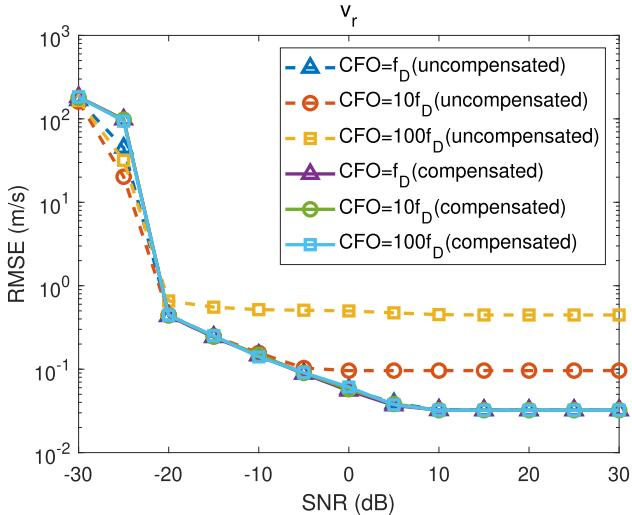

Fig. 12. The RMSE of the radial velocity estimation.  
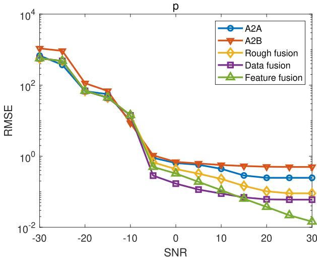  
Fig. 13. The RMSE of the position fusion.

## C. Performance of Multi-BS Feature Fusion

We set a target’s state as $[ 3 0 , 4 0 , 5 0 , 3 0 , 3 0 , 3 0 , 0 , 0 , 0 ] ^ { T }$ with BS-1 transmitting the sensing signal and BS-1, BS-2, and BS-3 receiving the echo signals for fusion. The positions of BS-1, BS-2, and BS-3 are $[ 0 , 6 0 , 1 0 ] ^ { T } , [ 0 , - 6 0 , \bar { 1 0 } ] ^ { T }$ , and $[ 6 0 \sqrt { 3 } , 0 , 1 0 ] ^ { T }$ , respectively.

Fig. 13 compares the position estimation accuracy of five methods under different SNR conditions, including direct observation from the (1, 1)-th propagation path (A2A), direct observation from the (1, 2)-th propagation path (A2B), rough fusion, data fusion, and feature fusion. The data fusion method employs the weighted averaging strategy [45], where the weight of the l-th grid point is defined as $\begin{array} { r } { \mathbf { \tilde { { W } } } _ { r , l } = \sum _ { u = 1 } ^ { N _ { B S } } | r ^ { u } - \rrangle } \end{array}$ $r _ { l } ^ { u }$ |. It is observed that the estimation accuracy of all methods improves significantly with the increase of SNR. However, there are notable differences among these methods. Specifically, the A2A method outperforms the A2B method, while the rough fusion method exhibits higher estimation accuracy than both. Note that the feature fusion method demonstrates the best performance by extracting and fusing time delay features, which surpasses the data fusion method and continuously improves with the increase of SNR. In contrast, the data fusion method reaches performance saturation at $\mathrm { S N R } = 5 ,$ which is unable to further enhance estimation accuracy.

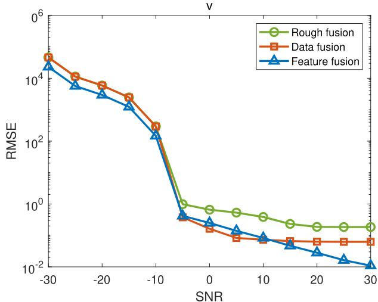  
Fig. 14. The RMSE of the velocity fusion.

Fig. 14 compares the velocity estimation accuracy of rough fusion, data fusion, and feature fusion methods under different SNR conditions. Since a single BS can only obtain the radial velocity of the target and cannot accurately determine the velocity of the target, the A2A and A2B methods are excluded from the comparison. In the data fusion method [45], the weight of the h-th grid point is defined as $\begin{array} { r } { W _ { v , h } = \sum _ { u = 1 } ^ { N _ { B S } } | v ^ { u } - } \end{array}$ $v _ { h } ^ { u } |$ . The simulation results show that the feature fusion method leverages multi-BS information to enhance velocity estimation accuracy by effectively fusing Doppler frequency features. The feature fusion method’s precision not only surpasses that of the data fusion and rough fusion methods but also continues to improve with the increase of SNR, which demonstrates excellent adaptability. In contrast, the data fusion method reaches performance saturation at $\mathrm { S N R } = 5 , $ , while the rough fusion method consistently underperforms compared to the feature fusion method. The simulation results indicate that the feature fusion method offers superior accuracy and stronger robustness, which makes it the optimal choice among all five methods.

D. Performance of Feature Fusion With Different Number of BSs

To further investigate the impact of the number of BSs on fusion performance, we add BS-4 and BS-5, located at $[ 6 0 , 3 0 , 1 0 ] ^ { \frac { \cdot } { T } }$ and $[ 4 0 , - 3 0 , 1 0 ] ^ { T }$ , respectively.

Fig. 15 and Fig. 16 present the position and velocity estimation accuracy under different numbers of BSs and SNR conditions. The results indicate that increasing the number of BSs and improving the SNR both improve the estimation accuracy of position and velocity. Specifically, as the number of BSs increases, the system can access richer multi-BS information and effectively enhance estimation accuracy.

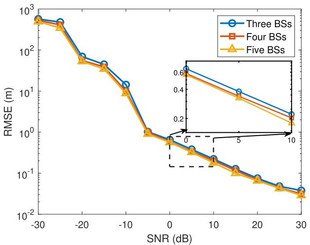  
Fig. 15. The RMSE of the position fusion with different numbers of BSs.

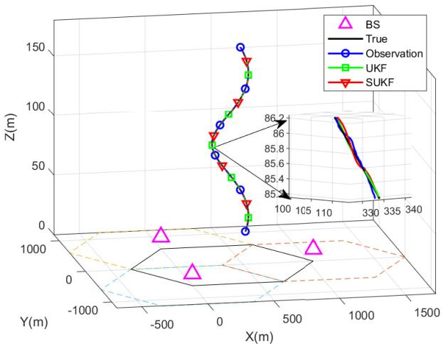  
Fig. 17. The performance of the trajectory monitoring.

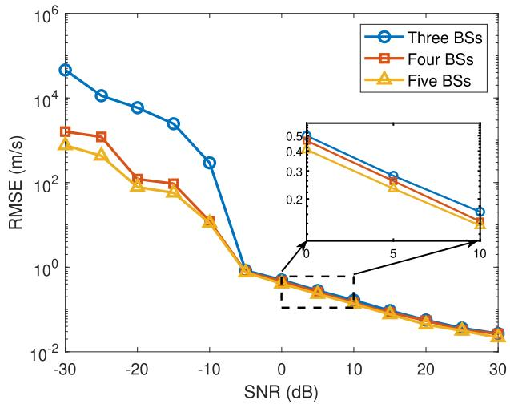  
Fig. 16. The RMSE of the velocity fusion with different numbers of BSs.

## E. Performance of Cooperative Trajectory Fusion

We set a target with an initial state vector as $[ 1 0 , 1 0 , 1 0 , 1 0 , 1 0 , \overbar { 1 0 } , 1 , 1 , 1 ] ^ { T }$ , over a duration of 1000 time slots. The covariance matrix of the process noise w is $\mathbf { Q } =$ $\left\lceil \mathbf { 0 . 1 I _ { 3 } \ 0 _ { 3 } \qquad 0 _ { 3 } } \right\rceil$ and the covariance matrix of the observation noise v is $\begin{array} { r } { \mathbf { \bar { R } } = \left\lceil \mathbf { 0 . 1 1 _ { 3 } } \ \mathbf { 0 _ { 3 } } \ \qquad \mathbf { 0 _ { 3 } } \right\rceil } \\ { \mathbf { 0 . } \qquad \mathbf { 0 . 0 1 I _ { 3 } } \ \mathbf { 0 _ { 3 } } } \\ { \mathbf { 0 _ { 3 } } \qquad \mathbf { 0 _ { 3 } } \qquad \mathbf { 0 _ { 3 } } } \end{array}$

Fig. 17 displays the true trajectory of the target, the trajectory observed by the multiple BSs, the trajectory estimated by UKF, and the trajectory estimated by SUKF. During the target tracking process, we associate the discrete trajectory points observed by each BS with local trajectories, which are further associated with global trajectories. It is seen that we can effectively capture the complete global trajectory of the target within the cooperative sensing area. Moreover, the trajectory estimated by SUKF significantly outperforms the trajectory observed by multiple BSs and the trajectory estimated by UKF in accuracy, and closely approximates the true trajectory of the target.

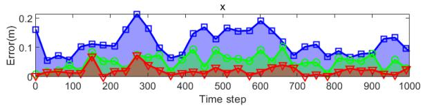

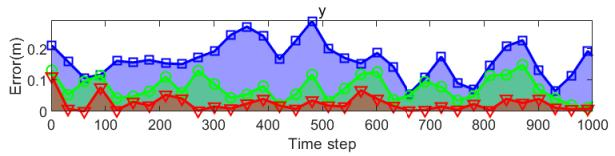

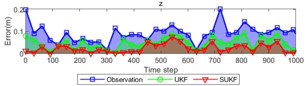  
Fig. 18. The error of the observed position, the estimated position by UKF, and the estimated position by SUKF with respect to the true position in the trajectory.

Fig. 18 shows the error between the observed position, the position estimated by UKF, and the position estimated by SUKF with respect to the true position of the target at each time slot. The simulation data reveal that the RMSE of the observed position is (0.2525, 0.2509, 0.2523) m, the RMSE of the estimated position by UKF is (0.1816, 0.1363, 0.1332) m, and the RMSE of the estimated position by SUKF is significantly reduced to (0.1146, 0.1098, 0.0958) m.

Fig. 19 further compares the error between the observed velocity, the velocity estimated by UKF, and the velocity estimated by SUKF with respect to the true velocity of the target at each time slot. The results indicate that the RMSE of the observed velocity is (0.2476, 0.2516, 0.2492) m/s, the RMSE of the estimated velocity by UKF is (0.2031, 0.1816, 0.1363) m/s, and the RMSE of the estimated velocity by SUKF is further reduced to (0.1336, 0.1070, 0.1064) m/s.

Simulation results demonstrate that the SUKF method achieves significantly higher accuracy than both direct observation and the standard UKF in estimating position and velocity. The advantage primarily stems from the SUKF method’s ability to reduce multi-BS observation errors by fusing the asynchronous trajectories from multiple BSs.

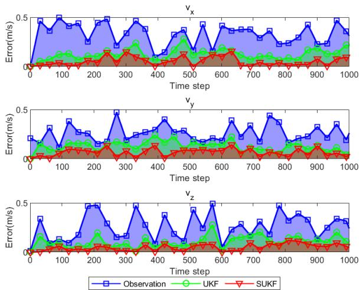  
Fig. 19. The error of the observed velocity, the estimated velocity by UKF, and the estimated velocity by SUKF with respect to the true velocity in the trajectory.

## VII. CONCLUSION

In this paper, we have proposed an asynchronous UAV trajectory monitoring scheme with multi-BS feature fusion in a cellular ISAC system. Specifically, we propose a single-BS signal pre-processing method to estimate the motion parameters of the targets and compensate for TOs and CFOs. Then, we propose a multi-BS feature fusion method to accurately estimate the positions and velocities of the targets in terms of time delay and Doppler frequency features. Moreover, we propose a cooperative trajectory tracking method to associate local trajectories with global trajectories and effectively address the fusion of the asynchronous trajectories. Simulation results demonstrate that the proposed scheme achieves significant performance improvements over conventional methods, enhancing the accuracy of single-BS pre-processing, multi-BS feature fusion, and multi-BS trajectory tracking. The proposed scheme provides a cost-effective solution for UAV trajectory monitoring and can be extended to other applications requiring distributed cooperative sensing and tracking, such as urban traffic management and intrusion detection.

## REFERENCES

[1] Y. Jiang, X. Li, G. Zhu, H. Li, J. Deng, and Q. Shi, “6G non-terrestrial networks enabled low-altitude economy: Opportunities and challenges,” 2023, arXiv:2311.09047.

[2] B. Zheng and F. Liu, “Random signal design for joint communication and SAR imaging towards low-altitude economy,” IEEE Wireless Commun. Lett., vol. 13, no. 10, pp. 2662–2666, Oct. 2024.

[3] H. Luo et al., “Integrated sensing and communications framework for 6G networks,” 2024, arXiv:2405.19925.

[4] L. Li, W. Chen, Z. Chen, T. Hu, W. Mei, and B. Ning, “Enhancing terahertz communications coverage with ISAC-assisted beam management,” IEEE Wireless Commun., vol. 31, no. 1, pp. 34–40, Feb. 2024.

[5] J. Zhao, F. Gao, W. Jia, W. Yuan, and W. Jin, “Integrated sensing and communications for UAV communications with jittering effect,” IEEE Wireless Commun. Lett., vol. 12, no. 4, pp. 758–762, Apr. 2023.

[6] M. Giordani and M. Zorzi, “Non-terrestrial networks in the 6G era: Challenges and opportunities,” IEEE Netw., vol. 35, no. 2, pp. 244–251, Mar. 2021.

[7] A. Khalili, A. Rezaei, D. Xu, and R. Schober, “Energy-aware resource allocation and trajectory design for UAV-enabled ISAC,” in Proc. GLOBECOM IEEE Global Commun. Conf., Dec. 2023, pp. 4193–4198.

[8] A. Khalili, A. Rezaei, D. Xu, F. Dressler, and R. Schober, “Efficient UAV hovering, resource allocation, and trajectory design for ISAC with limited backhaul capacity,” IEEE Trans. Wireless Commun., vol. 23, no. 11, pp. 17635–17650, Nov. 2024.

[9] K. Meng et al., “UAV-enabled integrated sensing and communication: Opportunities and challenges,” IEEE Wireless Commun., vol. 31, no. 2, pp. 97–104, Apr. 2024.

[10] S. Lu et al., “Integrated sensing and communications: Recent advances and ten open challenges,” IEEE Internet Things J., vol. 11, no. 11, pp. 19094–19120, Jun. 2024.

[11] Z. Zhang, Y. Zhang, J. Zhang, and F. Gao, “Adversarial trainingaided time-varying channel prediction for TDD/FDD systems,” China Commun., vol. 20, no. 6, pp. 100–115, Jun. 2023.

[12] K. Zhang, Z. Li, W. Yuan, Y. Cai, and F. Gao, “Radar sensing via OTFS signaling,” China Commun., vol. 20, no. 9, pp. 34–45, Sep. 2023.

[13] F. Liu et al., “Integrated sensing and communications: Toward dualfunctional wireless networks for 6G and beyond,” IEEE J. Sel. Areas Commun., vol. 40, no. 6, pp. 1728–1767, Jun. 2022.

[14] K. Meng, Q. Wu, S. Ma, W. Chen, and T. Q. S. Quek, “UAV trajectory and beamforming optimization for integrated periodic sensing and communication,” IEEE Wireless Commun. Lett., vol. 11, no. 6, pp. 1211–1215, Jun. 2022.

[15] Z. Zhang, W. Chen, Q. Wu, Z. Li, X. Zhu, and J. Yuan, “Intelligent omni surfaces assisted integrated multi-target sensing and multiuser MIMO communications,” IEEE Trans. Commun., vol. 72, no. 8, pp. 4591–4606, Aug. 2024.

[16] Y. Zhang, J. Wang, Q. Li, J. Chen, H. Feng, and S. He, “Joint communication, sensing, and computing in space–air–ground integrated networks: System architecture and handover procedure,” IEEE Veh. Technol. Mag., vol. 19, no. 2, pp. 70–78, Jun. 2024.

[17] C. Chaccour, M. N. Soorki, W. Saad, M. Bennis, P. Popovski, and M. Debbah, “Seven defining features of terahertz (THz) wireless systems: A fellowship of communication and sensing,” IEEE Commun. Surveys Tuts., vol. 24, no. 2, pp. 967–993, 2nd Quart., 2022.

[18] Z. Wei, F. Liu, C. Masouros, N. Su, and A. P. Petropulu, “Toward multifunctional 6G wireless networks: Integrating sensing, communication, and security,” IEEE Commun. Mag., vol. 60, no. 4, pp. 65–71, Apr. 2022.

[19] Y. Li, X. Wang, and Z. Ding, “Multi-target position and velocity estimation using OFDM communication signals,” IEEE Trans. Commun., vol. 68, no. 2, pp. 1160–1174, Feb. 2020.

[20] H. Luo, F. Gao, F. Liu, and S. Jin, “6D radar sensing and tracking in monostatic integrated sensing and communications system,” 2023, arXiv:2312.16441.

[21] Z. Liu, X. Liu, Y. Liu, V. C. M. Leung, and T. S. Durrani, “UAV assisted integrated sensing and communications for Internet of Things: 3D trajectory optimization and resource allocation,” IEEE Trans. Wireless Commun., vol. 23, no. 8, pp. 8654–8667, Aug. 2024.

[22] Y. Pan et al., “Cooperative trajectory planning and resource allocation for UAV-enabled integrated sensing and communication systems,” IEEE Trans. Veh. Technol., vol. 73, no. 5, pp. 6502–6516, May 2024.

[23] F. Liu, W. Yuan, C. Masouros, and J. Yuan, “Radar-assisted predictive beamforming for vehicular links: Communication served by sensing,” IEEE Trans. Wireless Commun., vol. 19, no. 11, pp. 7704–7719, Nov. 2020.

[24] H. Luo et al., “Integrated sensing and communications in clutter environment,” IEEE Trans. Wireless Commun., vol. 23, no. 9, pp. 10941–10956, Sep. 2024.

[25] Z. Du et al., “Integrated sensing and communications for V2I networks: Dynamic predictive beamforming for extended vehicle targets,” IEEE Trans. Wireless Commun., vol. 22, no. 6, pp. 3612–3627, Jun. 2023.

[26] X. Meng, F. Liu, C. Masouros, W. Yuan, Q. Zhang, and Z. Feng, “Vehicular connectivity on complex trajectories: Roadway-geometry aware ISAC beam-tracking,” IEEE Trans. Wireless Commun., vol. 22, no. 11, pp. 7408–7423, Nov. 2023.

[27] R. Liu et al., “Integrated sensing and communication based outdoor multi-target detection, tracking, and localization in practical 5G networks,” Intell. Converged Netw., vol. 4, no. 3, pp. 261–272, Sep. 2023.

[28] X. Jing, F. Liu, C. Masouros, and Y. Zeng, “ISAC from the sky: UAV trajectory design for joint communication and target localization,” IEEE Trans. Wireless Commun., vol. 23, no. 10, pp. 12857–12872, Oct. 2024.

[29] J. Wu, W. Yuan, and L. Hanzo, “When UAVs meet ISAC: Realtime trajectory design for secure communications,” IEEE Trans. Veh. Technol., vol. 72, no. 12, pp. 16766–16771, Dec. 2023.

[30] Y. Wang et al., “ISAC enabled cooperative detection for cellularconnected UAV network,” IEEE Trans. Wireless Commun., vol. 24, no. 2, pp. 1541–1554, Feb. 2025.

[31] K. Meng, C. Masouros, A. P. Petropulu, and L. Hanzo, “Cooperative ISAC networks: Performance analysis, scaling laws, and optimization,” IEEE Trans. Wireless Commun., vol. 24, no. 2, pp. 877–892, Feb. 2025.

[32] Y. Zhang, H. Shan, Y. Zhou, Z. Shi, L. Sheng, and Y. Liu, “Cooperative beamforming design for anti-UAV ISAC systems,” IEEE Trans. Wireless Commun., vol. 24, no. 3, pp. 2249–2264, Mar. 2025.

[33] N. Zhao, Q. Chang, X. Shen, Y. Wang, and Y. Shen, “Joint target localization and data detection in bistatic ISAC networks,” IEEE Trans. Commun., vol. 73, no. 5, pp. 3531–3546, May 2025.

[34] X. Yu, J. Xu, X. Qin, J. Tang, N. Zhao, and D. Niyato, “Multistatic cooperative sensing assisted secure transmission via IRS,” IEEE Trans. Wireless Commun., vol. 24, no. 7, pp. 5752–5764, Jul. 2025.

[35] Z. Wei et al., “Symbol-level integrated sensing and communication enabled multiple base stations cooperative sensing,” IEEE Trans. Veh. Technol., vol. 73, no. 1, pp. 724–738, Jan. 2024.

[36] C. Zhao, Y. Feng, H. Luo, F. Gao, F. Liu, and S. Jin, “Networked ISACbased UAV tracking and handover toward low-altitude economy,” IEEE Trans. Wireless Commun., vol. 24, no. 9, pp. 7670–7685, Sep. 2025.

[37] Z. Wei et al., “Integrated sensing and communication enabled cooperative passive sensing using mobile communication system,” IEEE Trans Mobile Comput., vol. 24, no. 9, pp. 7805–7821, Sep. 2025.

[38] C. Diaz-Vilor, M. A. Almasi, A. M. Abdelhady, A. Celik, A. M. Eltawil, and H. Jafarkhani, “Sensing and communication in UAV cellular networks: Design and optimization,” IEEE Trans. Wireless Commun., vol. 23, no. 6, pp. 5456–5472, Jun. 2024.

[39] G. Cheng, X. Song, Z. Lyu, and J. Xu, “Networked ISAC for lowaltitude economy: Transmit beamforming and UAV trajectory design,” 2024, arXiv:2405.07568.

[40] C. Nie, Z. Ju, Z. Sun, and H. Zhang, “3D object detection and tracking based on LiDAR-camera fusion and IMM-UKF algorithm towards highway driving,” IEEE Trans. Emerg. Topics Comput. Intell., vol. 7, no. 4, pp. 1242–1252, Aug. 2023.

[41] Y. Liu et al., “Analysis of Pareto boundary in MIMO ISAC: From the perspective of instantaneous covariance mismatch,” IEEE Trans. Wireless Commun., vol. 24, no. 1, pp. 555–570, Jan. 2025.

[42] Z. Gao et al., “Integrated sensing and communication with mmWave massive MIMO: A compressed sampling perspective,” IEEE Trans. Wireless Commun., vol. 22, no. 3, pp. 1745–1762, Mar. 2023.

[43] Y. Cao, L. Duan, and R. Zhang, “Sensing for secure communication in ISAC: Protocol design and beamforming optimization,” IEEE Trans. Wireless Commun., vol. 24, no. 2, pp. 1207–1220, Feb. 2025.

[44] Study on Channel Model for Frequencies From 0.5 to 100 GHz, Standard TR 38.901, 3rd Generation Partnership Project (3GPP), Jan. 2020. [Online]. Available: https://www.3gpp.org/

[45] X. Lu, Z. Wei, R. Xu, L. Wang, B. Lu, and J. Piao, “Integrated sensing and communication enabled multiple base stations cooperative UAV detection,” in Proc. IEEE Int. Conf. Commun. Workshops (ICC Workshops), Jun. 2024, pp. 1882–1887.

Shaoqiang Yan received the B.Eng. degree from the University of Science and Technology Beijing, Beijing, China, in 2020. He is currently pursuing the joint Ph.D. degree with Tsinghua University, Beijing, and the Rocket Force University of Engineering, Xi’an, China.

His research interests include integrated sensing and communications (ISAC), intelligent computing, and reinforcement learning.

Mei Chen is currently the Director of the Innovation and Technology Center, China Telecom Unmanned Technology (Jiangsu) Company Ltd., a Senior Engineer, the Doctor of electronic information with Nanjing University of Aeronautics and Astronautics, and an Industry and Data Expert with Jiangsu Telecom. She has 15 years of working experience in a major communication company, specializing in research in areas, such as wireless communication networks, low-altitude intelligent networking, low-altitude regulatory security, and technological

innovation.

Dr. Chen is a member of the Standardization Technical Committee for Civil Uncrewed Aerial Vehicle Systems in Jiangsu Province. She led/participated in over ten major national and provincial-level scientific and technological projects, applied for over ten invention patents, and received numerous honors, including the First Prize of Science and Technology from China Communications Society, the First Prize of Science and Technology from Jiangsu Communications Society, the National Second Prize of the World 5G Conference, and the Top Ten Science and Technology Achievements of the National Internet of Things Conference.

Hongliang Luo (Graduate Student Member, IEEE) received the B.Eng. degree from Xidian University, Xi’an, China, in 2023. He is currently pursuing the Ph.D. degree with the Department of Automation, Tsinghua University, Beijing, China.

His research interests include wireless communication, radar sensing, array signal processing, massive MIMO, and beamforming design.

Ping Yang received the B.S. degree from Southwest University, Chongqing, China, in 1992, and the Ph.D. degree from the Rocket Force University of Engineering, Xi’an, China, in 2010.

Her research interests include integrated sensing and communications (ISAC), intelligent computing, reinforcement learning, convex optimization, and machine learning.

Feifei Gao (Fellow, IEEE) received the B.Eng. degree from Xi’an Jiaotong University, Xi’an, China, in 2002, the M.Sc. degree from McMaster University, Hamilton, ON, Canada, in 2004, and the Ph.D. degree from the National University of Singapore, Singapore, in 2007.

In 2011, he joined the Department of Automation, Tsinghua University, Beijing, China, where he is currently a tenured Full Professor. He has authored/co-authored more than 200 refereed IEEE journal articles and more than 150 IEEE conference proceeding papers that are cited more than 25 000 times in Google Scholar. His research interests include signal processing for communications, array signal processing, convex optimizations, and artificial intelligence-assisted communications. He has served as the Symposium Co-Chair for the 2019 IEEE Conference on Communications (ICC), the 2018 IEEE Vehicular Technology Conference Spring (VTC), the 2015 IEEE Conference on Communications (ICC), the 2014 IEEE Global Communications Conference (GLOBECOM), the 2014 IEEE Vehicular Technology Conference Fall (VTC), as well as the technical committee members for more than 50 IEEE conferences. He has served as an Editor for IEEE TRANSACTIONS ON WIRELESS COMMUNI-CATIONS, IEEE JOURNAL OF SELECTED TOPICS IN SIGNAL PROCESSING (the Lead Guest Editor), IEEE TRANSACTIONS ON COGNITIVE COMMU-NICATIONS AND NETWORKING, IEEE SIGNAL PROCESSING LETTERS (a Senior Editor), IEEE COMMUNICATIONS LETTERS (a Senior Editor), IEEE WIRELESS COMMUNICATIONS LETTERS, and China Communications.