# Attention-Based Hierarchical-DRL With Mask for Multi-Timescale Caching, Association, and Secure Content Delivery in UAV-Enabled ISAC Networks

Gezahegn Abdissa Bayessa , Rong Chai , Senior Member, IEEE, Chengchao Liang , Qinyuan Wang Jun Li , Fellow, IEEE, and Qianbin Chen

Abstract—In this research, we investigate the long-term secure content delivery problem in uncrewed aerial vehicle (UAV)-enabled integrated sensing and communication (ISAC) networks. We consider that ISAC-assisted UAVs are allowed to store user-requested contents, provide content delivering service to users, and perform eavesdropper detection. However, the openness of UAV-enabled networks makes the content delivery network more susceptible to security threats. To address the eavesdropper detection, we propose a Cramer-Rao Lower´ Bound (CRLB) and an extended Kalman Filter (EKF)-based location estimation algorithm. We then examine the secrecy throughput of users and formulate the joint user association, UAV deployment, content caching, communication, and sensing beamforming problem as a long-term secure throughput maximization problem. As the formulated problem is a mixed-integer non-linear programming problem (MINLP) and cannot be solved conveniently, we decompose it into two subproblems, namely, a long-timescale content caching subproblem, and a shorttimescale user association, UAV deployment, communication and sensing beamforming subproblem. To solve the subproblems, we transform it into a Markov decision process (MDP) and we propose an attention-based hierarchical deep reinforcement learning (HDRL) with an action mask and design a double deep Q-network (DDQN) algorithm to obtain the long-timescale and an attention-based DDQN with an action mask for short-timescale strategies. Specifically, we first obtain a long-timescale strategy for content caching. Given the long-timescale strategy, we then obtain the short-timescale user association, UAV deployment, communication, and sensing beamforming strategy. Simulation results demonstrate the efectiveness of the proposed algorithms.

Index Terms—Uncrewed aerial vehicles (UAV), user association, UAV deployment, eavesdropper detection, secure content delivery.

## I. INTRODUCTION

N THE past few decades, the rapidly growing dataintensive tasks, data sharing applications and multimedia services, such as video streaming and online gaming, has fueled exponentially increasing volume of data trafic, causing significant congestion in content delivery networks [1]. In addition, the openness of wireless transmission links combined with the increasing unauthorized access and eavesdropping threats make the content delivery network more susceptible to security threats [2]. To tackle this problem, integrated sensing and communication (ISAC) technology has been introduced to simultaneously provide communication and sensing services, and enhance resource utilization eficiency [3]. Specifically, an ISAC system can be deployed at the content delivery networks to detect eavesdroppers and provide communication services. However, the diferent service requirements of sensing, eavesdropper detection and communication applications, combined with the limitations of available spectrum and power resources, pose challenges to the design of eficient and secure content delivery strategies [4].

In recent years, uncrewed aerial vehicles (UAVs) have gained significant attention to enhance the performance of wireless networks [5]. Combined with ISAC, UAV-enabled network jointly provides communication and sensing services and addresses the challenges posed by increasing data demands and sensing applications [6]. Hence, leveraging the flexibility and cost-efectiveness of UAVs, and the resourcesharing capabilities of ISAC, the UAV-ISAC network has become a promising aerial platform for eficient use of limited resources while providing secure content delivery [7]. In particular, one or multiple ISAC-enabled UAVs can be deployed at the regions closer to the users to store userrequested content, detect eavesdropping threats, and conduct content delivery in an eficient manner.

While UAV-ISAC networks are expected to enhance communication and sensing performance, the eficiency of secure content delivery is closely coupled with eavesdropper detection, UAV deployment, and resource allocation strategies. Specifically, determining the accurate location of eavesdroppers plays a crucial role in designing UAV deployment and resource allocation strategies, and enhance content delivery performance, thus designing eavesdropper detection and UAV deployment strategy is highly desirable [8]. Furthermore, the limitations on the available communication resources and the user content demands pose challenges on the eficiency of content delivery [9]. By jointly designing eavesdropper detection, UAV deployment, and resource allocation strategy the content delivery performance can be enhanced [10].

In recent research work, although eavesdropper detection, UAV deployment, and resource allocation have been studied for secure content delivery, the existing solutions mainly consider single UAV and static eavesdroppers, and fail to investigate the impact of multiple UAVs and eavesdropper mobility on UAV deployment and resource allocation. Under these circumstances, the lack of accurate location information of eavesdroppers increases the risk of data transmission interception and reduces content delivery performance. In this research, we first address eavesdropper location estimation. Based on the obtained eavesdropper location, we then jointly investigate the user association, UAV deployment, content caching, and resource allocation problems to enhance the content delivery performance.

## A. Literature Review

Secure content delivery problem has been researched in wireless networks [11], [12], [13], [14], [15], [16]. Authors in [11] propose a multipath selection and bandwidth allocation strategy to maximize secure throughput in wireless Ad-Hoc networks. Researchers in [12] design a joint power and radio resources allocation strategy to maximize secrecy rate and spectral energy eficiency (SEE) in wireless body area networks. The researchers in [13] propose secure channel establishment scheme for task delivery in vehicular cloud computing network. In [14], the authors propose secure edge caching scheme for video contents to maximize the utilities of content provider and edge caching devices in heterogeneous networks. Joint service caching placement, transmit power, and computation ofloading optimization is studied to minimize delay in [15] for mobile edge computing networks. The research work in [16] jointly optimizes service caching, computation ofloading, beamforming, and transmit power to minimize task completion delay in RIS-assisted MEC networks.

In recent years, the UAV-assisted secure content delivery problem has been widely studied [17], [18], [19], [20], [21], [22], [23], [24]. Researchers in [17] propose a secure 3D UAV relay deployment strategy to maximize secure signal-to-noise ratio (SNR) in hybrid satellite-terrestrial networks. To enhance the secure communication performance, the research works in [18], [19], [20], and [21] investigate joint optimization of resource allocation and UAV deployment for UAV-enabled networks. The authors in [18] examine secure caching and jamming performance, and jointly optimize transmit power, UAV jammer location, and jamming power to minimize the sum of the outage probability and intercept probability in a UAV-enabled jamming communication system with an active eavesdropper. In [19], the authors jointly design transmit power, jamming power, and UAV deployment to minimize the sum of the intercept probability and the maximum outage probability in a caching and UAV-enabled jamming communication system. The researchers in [20] propose UAV deployment, transmit power control, and a user scheduling scheme to maximize the minimum average secrecy rate in a UAV-enabled secure communication system. The authors in [21] propose a joint optimization strategy for transmit power, UAV deployment, and time-splitting ratio to maximize the average secrecy rate in dual UAV-enabled secure IoT communications. Researchers in [22] jointly optimize the communication resources, computation resources, and UAV deployment in UAV-assisted mobile edge computing systems. In [23], the authors propose a joint UAV trajectory design, sensor scheduling, and jammer selection optimization strategy to maximize the worst-case secrecy rate in UAV-assisted secure data collection. In [24], the authors design a joint UAV trajectory, transmit power, computation, and time-slot allocation factor to maximize the minimum secure computing capacity in a UAV-relay-assisted secure maritime MEC system.

The ISAC system that jointly performs communication and sensing tasks, and enhances resource utilization eficiency has attracted contributions in a secure communication scenario. The research works in [25], [26], [27], [28], [29], [30], and [31] exploited ISAC and investigated secure communication in ISAC-enabled UAV networks. The researchers in [25] design a joint transmit power allocation, user and target scheduling, and UAV deployment to maximize the average achievable rate in UAV-ISAC networks. In [26], the authors propose a joint UAV deployment, transmission, and sensing beamforming strategy to maximize the average secrecy rate in a UAV-enabled secure ISAC system. Researchers in [27] design a UAV deployment algorithm to maximize the real-time secrecy rate in a UAV-enabled ISAC system. The authors in [28] propose a joint beamforming and UAV deployment algorithm to maximize the instantaneous secrecy rate in secure UAV networks. In [29], the authors jointly optimize the UAV deployment, transmit beamforming, and artificial noise power to maximize the sum secrecy rate in IRS-UAV-assisted secure transmission of ISAC. The authors in [30] design a joint UAV deployment, user scheduling, and transmit beamforming strategy to minimize total energy consumption in an ISAC-based UAV-assisted secure MEC system. The authors in [31] design a joint user scheduling, transmit power, and UAV deployment to maximize the secure data transmit rate in an ISAC-UAV assisted secure communication system.

## B. Motivation and Contributions

Although the research works in [25], [26], [27], [28], [29], [30], and [31] consider the presence of eavesdroppers and study secure communication in UAV-assisted ISAC networks, in [25] the researchers fail to utilize the potential benefit of multi-antenna in content delivery networks. While the authors [26] address multi-antenna and design beamforming to enhance secure communication performance, they consider a single eavesdropper scenario with a perfectly known location, which increases the risk of transmission interception under a mobile multi-eavesdropping scenario. Furthermore, although the authors in [27], [28], [29], and [30] address eavesdropper mobility, the authors in [29] and [30] leverage multi-antenna and examine the secure communication performance, yet these research works fail to investigate the impact of multiple eavesdroppers on secure communication. In [31], the researchers considered multiple eavesdroppers. However, the authors consider predefined locations of eavesdroppers and use a single antenna for secure communication and sensing. Indeed, it can be demonstrated that designing multi-UAV deployment, eavesdropper detection, and resource allocation taking into account UEs and mobility of eavesdroppers is expected to improve secure communication and content delivery performance.

In this paper, we consider the secure content delivery problem in a UAV-enabled ISAC network and jointly design user association, eavesdropper detection, UAV deployment, content caching, communication, and sensing beamforming strategy. The main contributions of this paper are summarized as follows.

• In this work, we investigate the multi-timescale caching, user association, and UAV deployment problem in UAV-enabled ISAC networks with multi-UE and multieavesdropper mobility, and address the long-term secure content delivery problem. To tackle the challenges of eavesdropper mobility and acquire their accurate location, we propose Cramer-Rao Lower Bound (CRLB) and´ extended Kalman Filter (EKF)-based location estimation algorithm. Specifically, we examine the maximum likelihood estimation (MLE) of the received echo signals of each eavesdropper and estimate their location based on EKF. We then formulate the Fisher Information Matrix (FIM) and apply CRLB to obtain the lower bound of the unbiased estimator.

Given the obtained eavesdropper location estimation, we define the objective function as secure throughput and formulate the joint user association, UAV deployment, content caching, communication, and sensing beamforming as a long-term secure throughput maximization problem. However, the formulated problem is mixed-integer non-linear programming (MINLP), which is challenging to solve. To tackle the formulated problem, we transform it into a Markov decision process (MDP) and propose an attention-based hierarchical deep reinforcement learning (HDRL) algorithm. HDRL decouples the original problem into two subproblems, namely, a long-timescale content caching subproblem, and a short-timescale user association, UAV deployment, and communication and sensing beamforming subproblems, and adopts a sub-agent to obtain an optimal strategy.

• To obtain a short-timescale joint user association, UAV deployment, communication, and sensing beamforming strategy, we propose an attention-based deep double Q-network (DDQN) algorithm with an action mask. Specifically, we introduce an attention network in the DDQN architecture to selectively focus on relevant features of the input state and then design an action mask that constructs a feasible set of potential action vectors to improve the decision-making process. To obtain a longtimescale content caching strategy, we design a DDQN algorithm. Specifically, we examine the backhaul delay of contents between UAVs and the content server, and sort the backhaul delay in descending order. The UAVs then obtain their strategy by caching the highest-ranking content files.

To verify the efectiveness of our proposed approach, we carry out extensive simulations and compare the proposed algorithms with baseline algorithms. It is demonstrated that the proposed algorithm yields the best performance in terms of secure throughput compared with reference algorithms.

## II. SYSTEM MODEL

In this section, we discuss the system model considered in this paper, including network model, channel model, signal transmission model, sensing model and eavesdropper detection model.

## A. Network Model

In this paper, we consider a UAV-enabled ISAC network that consists of multi-antenna UAVs, a UAV controller, multiple UAV eavesdroppers, an attacker, and single-antenna UEs. Suppose that UEs have certain content-fetching requirements and need to fetch their requested contents from the content server. However, content servers in general are deployed at the core network, which is far from the UEs. To tackle this problem, we deploy a number of UAVs, which are equipped with a certain cache capacity to serve as an aerial base station (BS). Accordingly, the UAVs may download the user-required contents from the content server and store the content locally in their own storage. We assume that UAVs are equipped with ISAC modules and capable of performing content delivery to UEs. Suppose that an attacker deploys UAV eavesdroppers to intercept the content delivery from the UAVs to the UEs. To enhance the reliability of content delivery, the UAVs conduct sensing, process the sensed signals and send them to the UAV controller to estimate the position of eavesdroppers.

We denote the number of UAVs as J, the number of eavesdroppers as K and the number of UEs as I. Let $\mathrm { U A V } _ { j }$ denote the j-th UAV, $\mathrm { E } _ { k }$ as denote the k-th eavesdropper and UE denote the i-th UE, $1 \leq j \leq J , 1 \leq k \leq K , 1 \leq i \leq I .$ To leverage the benefits of multiple antennas, we deploy a uniform linear array (ULA) on UAVs. We assume the antenna array is shared between communication and target sensing. We denote N as the number of antennas of the UAVs.

Suppose that the total time duration is divided into discrete time-slots and time-frames. Let T denote the total time duration of the system and $N ^ { \mathrm { T } }$ denote the total number of time-slots. We assume a time frame as the duration of each long-timescale, and L denotes the total number of time-frames available. To describe the time-frame, we introduce $\ell ,$ where $1 \leq \ell \leq L ,$ and let the number of time-slots in each time-frame as $N ^ { \tau } , \mathrm { i . e . , } N ^ { \mathrm { T } } = N ^ { \tau } L , T = N ^ { \mathrm { T } } \Delta t .$ , where ∆t is the duration of each time-slot.

In our system model, we consider that UEs are mobile, and their content demand remains feasible only for a certain duration of time. We further assume UEs maintain a record of their historical content-fetching requirements. During each time slot, UEs select content items from their recorded request history and send requests to the UAVs. We denote $\mathcal { F } = \{ 1 , 2 , \cdots , f , \cdots , F \}$ as the set of content files, where F is the total number of files. Let $\eta _ { f }$ denote the size of file $f .$ Suppose each UAV is equipped with a limited cache capacity, we denote $\rho _ { j }$ as the cache capacity of $\mathrm { U A V } _ { j }$ . Let $\delta _ { j , f } ^ { \ell }$ denote the content caching variable of $\mathrm { U A V } _ { j }$ <sup>,</sup>at time-frame . We set $\delta _ { j , f } ^ { \ell } = 1$ , if $\mathrm { U A V } _ { j }$ caches content $f$ at time-frame $\ell ,$ otherwise, $\delta _ { i , f } ^ { \bar { \ell } ^ { - } } = 0$ . To represent content request of users, we denote $\gamma _ { i , f } ^ { \ell }$ <sup>, ,</sup>as the content request index of UE at time-frame , i.e., if UE requires content $f$ at time-frame $\ell , \gamma _ { i , f } ^ { \ell } = 1$ , otherwise, $\gamma _ { i , f } ^ { \ell } = 0$

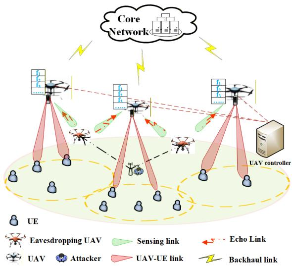  
Fig. 1. UAV-enabled ISAC network for secure content delivery.

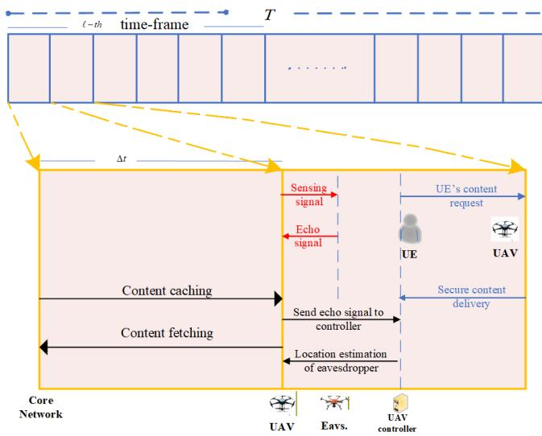  
Fig. 2. Illustration of content caching within a time-frame, and communication and sensing tasks within a time-slot.

Assuming that one time-slot is suficient to cache all user-requested contents, we consider content caching to be performed at the first time-slot of the -th time-frame. In the <sup>\`</sup>subsequent time-slots, a fraction of each time-slot is allocated for sensing, while the remaining fraction is used for content delivery. The content caching, sensing, and content delivery of the -th time-frame are shown in Fig. 2.

To enable multi-user accessing on UAVs, we apply orthogonal frequency division multiple access (OFDMA) scheme which allows multiple UEs to access one UAV using orthogonal subcarriers. Suppose that the total available bandwidth of the system is divided into $N _ { \mathrm { c } }$ orthogonal subcarriers, with the bandwidth of each subcarrier being B. Without loss of generality, we assume that each link can be assigned one or multiple subcarriers. To enhance spectrum eficiency, multiple links are allowed to share subcarriers. We assume that UAVs and UAV eavesdroppers are deployed in a 3D environment. Let $\mathbf { q } _ { j } ^ { t } = ( x _ { j } ^ { t } , y _ { j } ^ { t } , z _ { j } ^ { t } )$ denote the deployment coordinate of $\mathrm { U A V } _ { j }$ for the t-th time-slot. We denote ${ \bf q } _ { k } ^ { \mathrm { e } , t } = ( x _ { k } ^ { \mathrm { e } , t } , y _ { k } ^ { \mathrm { e } , t } , z _ { k } ^ { \mathrm { e } , t } )$ as the coordinate of $\mathrm { E } _ { k }$ for the t-th time-slot, $\mathbf { n } = ( \bar { x } _ { i } ^ { t } , \bar { y } _ { i } ^ { t } )$ denote the coordinate of $\mathrm { U E } _ { i }$ at the t-th time-slot, and $\mathbf { m } = ( \hat { x } , \hat { y } )$ denote the coordinate of an attacker.

## B. Channel Model

In this subsection, we formulate the channel model of UEs and eavesdroppers. Suppose the channel characteristics of the content delivery and sensing links from UAVs to UEs and UAVs to eavesdroppers have Line-of-Sight (LoS) and Non-Line-of-Sight (NLoS) transmission link. Hence, in this research, we use a probability-based transmission model to represent the communication channel gain. Let $\mathbf { h } _ { i , j } ^ { t } \in \mathbb { C } ^ { 1 \times N }$ denote the channel vector from $\mathrm { U A V } _ { j }$ <sup>,</sup>to UE at the t-th timeslot, which can be expressed as

$$
\mathbf { h } _ { i , j } ^ { t } = { \cal P } _ { i , j } ^ { \mathrm { L } , t } \mathbf { g } _ { i , j } ^ { \mathrm { L } , t } + ( 1 - { \cal P } _ { i , j } ^ { \mathrm { L } , t } ) \mathbf { g } _ { i , j } ^ { \mathrm { N L } , t } ,\tag{1}
$$

where $P _ { i , j } ^ { \mathrm { L } , t }$ is the probability of LoS link between $\mathrm { U A V } _ { j }$ to UE<sub>i</sub> <sup>,</sup>at the t-th time-slot, which can be expressed as

$$
P _ { i , j } ^ { \mathrm { L } , t } = \frac { 1 } { 1 + \mu \mathrm { e } ^ { \omega \left( \mu - \theta _ { i , j } ^ { t } \right) } } ,\tag{2}
$$

where $\omega$ and $\mu$ are the constants related to propagation environment. $\theta _ { i , j } ^ { t }$ is the elevation angle between $\mathrm { U A V } _ { j }$ to UE <sup>,</sup>at the t-th time-slot, which can be expressed as

$$
\theta _ { i , j } ^ { t } = \frac { 1 8 0 } { \pi } \sin ^ { - 1 } \left( \frac { z _ { j } ^ { t } } { d _ { i , j } ^ { t } } \right) ,\tag{3}
$$

where $d _ { i , j } ^ { t } = \sqrt { \left\| \mathbf { q } _ { j } ^ { t } - \mathbf { n } _ { i } ^ { t } \right\| ^ { 2 } + ( z _ { j } ^ { t } ) ^ { 2 } } .$

$\mathbf { g } _ { i , j } ^ { \mathrm { L } , t }$ in (1) denotes the LoS path-loss of the link between $\mathrm { U A V } _ { j }$ to UE<sub>i</sub> at the t-th time-slot, which can be expressed as

$$
\mathbf { g } _ { i , j } ^ { \mathrm { L } , t } = \frac { c ( d _ { i , j } ^ { t } ) ^ { - \alpha _ { \mathrm { L } } / 2 } } { 4 \pi f _ { c } } \mathbf { a } ( \theta _ { i , j } ^ { t } ) ,\tag{4}
$$

where c and $f _ { c }$ respectively denote the speed of light and carrier frequency, $\alpha _ { \mathrm { { L } } }$ is the LoS path-loss exponent. $\mathbf { a } ( \mathcal { \bar { \theta } } _ { i . i } ^ { t } ) \in \mathbb { C } ^ { N \times 1 }$ is the antenna steering vector of LoS link from $\mathrm { U A } \check { \mathbf { V } } _ { j }$ to UE<sub>i</sub> at the t-th time-slot, which can be expressed as

$$
\mathbf { a } ( \theta _ { i , j } ^ { t } ) = \left[ 1 , e ^ { j \pi \cos { \theta _ { i , j } ^ { t } } } , \cdot \cdot \cdot , e ^ { j \pi ( N - 1 ) \cos { \theta _ { i , j } ^ { t } } } \right] .\tag{5}
$$

$\mathbf { g } _ { i , j } ^ { \mathrm { { N L } } , t }$ in (1) denote the NLoS path-loss of the link between $\mathrm { U A V } _ { j }$ to UE<sub>i</sub> at the t-th time-slot. Let M denote the number of NLoS multipath components, $\mathbf { g } _ { i , j } ^ { \mathrm { { N L } } , t }$ can be given as

$$
\mathbf { g } _ { i , j } ^ { \mathrm { N L } , t } = \sum _ { m = 1 } ^ { M } \frac { \xi _ { i , j , m } c ( d _ { i , j } ^ { t } ) ^ { - \alpha _ { \mathrm { N L } } / 2 } } { 4 \pi f _ { c } \sqrt { M } } \mathbf { a } ( \theta _ { i , j , m } ^ { t } ) ,\tag{6}
$$

where $\xi _ { i , j , m } \sim \mathcal { C N } ( 0 , 1 )$ $\alpha _ { \mathrm { N I } }$ is the NLoS path-loss exponent, $\theta _ { i , i , m } ^ { t } ~ = ~ \theta _ { i , j } ^ { t } + \Delta \theta _ { m }$ <sup>, α</sup>is the antenna steering vector of m-th <sup>θ , , θ ,</sup>NLoS link from $\mathrm { U A V } _ { j }$ to $\mathrm { U E } _ { i }$ at the t-th time-slot, where $\Delta \theta _ { m } \sim \mathcal { N } ( 0 , \sigma _ { \theta } ^ { 2 } )$

<sup>θ</sup>Let $\mathbf { h } _ { k , j } ^ { \mathrm { e } , t } \in \mathbb { C } ^ { \mathrm { 1 } \times N }$ denote the link from $\mathrm { U A V } _ { j }$ to $\mathrm { E } _ { k }$ at the t-th <sup>,</sup>time-slot, which can be expressed as

$$
\mathbf { h } _ { k , j } ^ { \mathrm { e } , t } = \frac { g _ { 0 } } { \left\| \mathbf { q } _ { j } ^ { t } - \mathbf { q } _ { k } ^ { \mathrm { e } , t } \right\| } \varphi _ { k , j } ^ { \mathrm { e } , t } ,\tag{7}
$$

where $g _ { 0 }$ is the channel gain at the reference distance of 1m, $\boldsymbol { \varphi } _ { k , j } ^ { \mathrm { e } , t } \in \mathring { \mathbb { C } } ^ { 1 \times N }$ is the small-scale fading coeficient from $\mathrm { U A V } _ { j }$ to <sup>,</sup>E at the t-th time-slot.

The sensing process between UAVs and eavesdroppers constitute a round-transmission of sensing signal, from UAVs to eavesdroppers and the reflected echo signals by the eavesdroppers back to UAVs. Let $\mathbf { h } _ { k , j } ^ { s , t } \in \mathbb { C } ^ { 1 \times N }$ denote the sensing link from $\mathrm { U A V } _ { j }$ to $\mathrm { E } _ { k }$ <sup>,</sup>at the t-th time-slot, which can be expressed as

$$
\mathbf { h } _ { k , j } ^ { \mathrm { s } , t } = \frac { g _ { 0 } } { 2 \left\| \mathbf { q } _ { j } ^ { t } - \mathbf { q } _ { k } ^ { \mathrm { e } , t } \right\| } \varphi _ { k , j } ^ { \mathrm { s } , t } ,\tag{8}
$$

where $\varphi _ { k , i } ^ { s , t } \in \mathbb { C } ^ { 1 \times N }$ is the small-scale fading coeficient from $\mathrm { U A V } _ { j }$ to $\check { \mathrm { E } } _ { k }$ at the t-th time-slot.

## C. Signal Transmission Model

In this subsection, we formulate the transmitted and received signal models of content delivery links from UAVs to UEs.

1) Transmitted Signals: Let $s _ { i } ^ { \mathrm { u } , t }$ denote the signal transmitted from the UAVs to $\mathrm { U E } _ { i }$ at the t-th time-slot, and we set $\mathrm { E } [ | s _ { i } ^ { \mathrm { u } , t } | ^ { 2 } ] = 1$ . At time-slot $t ,$ suppose UE is associated with $\mathrm { U A V } _ { j }$ and receive contents from $\mathrm { U A V } _ { j }$ . We denote $\mathbf { x } _ { i , j } ^ { \mathrm { u } , t } \in \mathbb { C } ^ { N \times 1 }$ <sup>,</sup>as the transmitted signal from UAV to UE at the t-th timeslot, which can be expressed as

$$
\mathbf { x } _ { i , j } ^ { \mathrm { u } , t } = \mathbf { w } _ { i , j } ^ { \mathrm { u } , t } s _ { i } ^ { \mathrm { u } , t } ,\tag{9}
$$

where $\mathbf { w } _ { i , j } ^ { \mathrm { u } , t } \in \mathbb { C } ^ { N \times 1 }$ is the beamforming vector of $\mathrm { U A V } _ { j }$ to UE<sub>i</sub> <sup>,</sup>at the t-th time-slot.

2) Received Signals: Let $y _ { i , j } ^ { \mathrm { u } , t }$ denote the received signal of $\mathrm { U E } _ { i }$ from $\mathrm { U A V } _ { j }$ <sup>,</sup>at the t-th time-slot, which can be expressed as

$$
y _ { i , j } ^ { \mathrm { u } , t } = \alpha _ { i , j } ^ { t } \mathbf { h } _ { i , j } ^ { \mathrm { u } , t } \mathbf { x } _ { i , j } ^ { \mathrm { u } , t } + \sum _ { i ^ { \prime } = 1 , \atop i ^ { \prime } \neq i } ^ { I } \alpha _ { i ^ { \prime } , j } ^ { t } \mathbf { h } _ { i ^ { \prime } , j } ^ { \mathrm { u } , t } \mathbf { x } _ { i ^ { \prime } , j } ^ { \mathrm { u } , t } + \omega _ { i } ^ { \mathrm { u } , t } ,\tag{10}
$$

where $\alpha _ { i , j } ^ { t }$ denotes the UAV association variable of $\mathrm { U E } _ { i }$ at the <sup>,</sup>t-th time-slot, i.e., $\alpha _ { i , j } ^ { t } = 1$ if $\mathrm { U E } _ { i }$ is associated with $\mathrm { U A V } _ { j }$ at <sup>,</sup>the t-th time-slot, otherwise $\alpha _ { i , j } ^ { t } = 0$

Let $y _ { k , j } ^ { \mathrm { e } , t }$ <sup>,</sup>denote the received signal at $\mathrm { E } _ { k }$ from $\mathrm { U A V } _ { j }$ at the <sup>,</sup>t-th time-slot, which can be expressed as

$$
y _ { k , j } ^ { \mathrm { e } , t } = \mathbf { h } _ { k , j } ^ { \mathrm { e } , t } \mathbf { x } _ { i , j } ^ { \mathrm { u } , t } + \sum _ { i = 1 } ^ { I } \alpha _ { i ^ { \prime } , j } ^ { t } \mathbf { h } _ { i , j } ^ { \mathrm { u } , t } \mathbf { x } _ { i , j } ^ { \mathrm { u } , t } + \omega _ { k } ^ { \mathrm { e } , t } ,\tag{11}
$$

where $\omega _ { k } ^ { \mathrm { e } , t }$ denotes the channel noise at $\mathrm { E } _ { k }$ at the t-th time-slot.

## D. Sensing Model

In this subsection, we formulate the signal models of sensing links from UAVs to eavesdroppers. Let $s _ { k } ^ { \mathrm { s } , t }$ denote the sensing signal transmitted from $\mathrm { U A V } _ { j }$ to $\mathrm { E } _ { k }$ at the t-th time-slot with average unit power $\mathrm { E } [ | s _ { k } ^ { \mathrm { s } , t } | ^ { 2 } ] = 1$ . We denote the transmitted sensing signal from UAV<sub>j</sub> to $\mathrm { E } _ { k }$ as $\mathbf { x } _ { k , j } ^ { \mathrm { s } , t } \in \mathbb { C } ^ { N \times 1 }$ which can be expressed as

$$
\mathbf { x } _ { k , j } ^ { \mathrm { s } , t } = \mathbf { w } _ { k , j } ^ { \mathrm { s } , t } s _ { k } ^ { \mathrm { s } , t } ,\tag{12}
$$

where $\mathbf { w } _ { k , j } ^ { \mathrm { s } , t } \in \mathbb { C } ^ { N \times 1 }$ is the sensing beamforming vector of $\mathrm { U A V } _ { j }$ <sup>,</sup>when sensing the information of $\mathrm { E } _ { k }$ at the t-th time-slot.

Let $y _ { k , j } ^ { s , t }$ denote the received echo signal at $\mathrm { U A V } _ { j }$ from $\mathrm { E } _ { k }$ at <sup>,</sup>the t-th time-slot, which can be expressed as

$$
y _ { k , j } ^ { \mathrm { s } , t } = \beta _ { k , j } ^ { t } \mathbf { h } _ { k , j } ^ { \mathrm { s } , t } ( \mathbf { h } _ { k , j } ^ { \mathrm { s } , t } ) ^ { H } \mathbf { x } _ { k , j } ^ { \mathrm { s } , t - \tau _ { k , j } } + \omega _ { k } ^ { \mathrm { s } , t } ,\tag{13}
$$

where $\beta _ { k , j } ^ { t }$ is the eavesdropper detection variable at the t-th <sup>,</sup>time-slot, i.e., $\beta _ { k , j } ^ { t } = 1$ if $\mathrm { U A V } _ { j }$ detects $\mathrm { E } _ { k }$ at the t-th time-slot, otherwise, $\begin{array} { r } { \beta _ { k , j } ^ { t } = 0 . \tau _ { k , j } = \frac { \| \mathbf { q } _ { j } ^ { t } + \mathbf { q } _ { k } ^ { \mathrm { e , t } } \| } { c } + \vartheta _ { k , j } ^ { t } } \end{array}$ denotes the round-trip <sup>,</sup>delay of the sensing signal between $\mathsf { \bar { U } A V } _ { j }$ and $\mathrm { E } _ { k } .$ , where c and $\vartheta _ { k , j } ^ { t }$ are respectively the speed of light and measurement noise.

## E. Eavesdropper Detection Model

In this subsection, we formulate an eavesdropper detection model based on the time of arrival (TOA) of the sensing signal between eavesdroppers and UAVs. To obtain the TOA estimation, we employ the MLE approach. Let $\tau _ { j } = \left[ \tau _ { 1 , j } , \cdot \cdot \cdot , \tau _ { k , j } , \cdot \cdot \cdot , \tau _ { K , j } \right]$ denote the TOA measurement <sup>τ τ , , ,</sup> <sup>τ , , ,</sup> <sup>τ ,</sup>vector of all eavesdroppers and $\mathbf { y } _ { j } ^ { \mathrm { s } , t } = \left[ \boldsymbol { y } _ { 1 , j } ^ { \mathrm { s } , t } , \cdots , \boldsymbol { y } _ { k , j } ^ { \mathrm { s } , t } , \cdots , \boldsymbol { y } _ { K , j } ^ { \mathrm { s } , t } \right]$ <sup>, , ,</sup>is the vector of received echo signals at the t-th time-slot. Let $\lambda ( \mathbf { y } _ { j } ^ { \mathrm { s } , t } ; \pmb { \tau } _ { j } )$ denote the log-likelihood function (LLF) of $\tau _ { j }$ which can be expressed as

$$
\begin{array} { r l } & { \lambda ( \boldsymbol { y } _ { j } ^ { s , t } ; \tau _ { j } ) } \\ & { = \displaystyle \prod _ { k = 1 , + 1 } ^ { K } \left( - \frac { 1 } { 2 } ( \boldsymbol { y } _ { k , j } ^ { s , t } - \hat { \tau } _ { k , j } ) ^ { T } ( \boldsymbol { \Sigma } _ { k , j } ^ { t } ) ^ { - 1 } ( \boldsymbol { y } _ { k , j } ^ { s , t } - \hat { \tau } _ { k , j } ) \right) + C . } \\ & { \beta _ { k , j } ^ { t } = 1 } \end{array}\tag{14}
$$

where $\Sigma _ { k , j } ^ { t }$ is the covariance matrix that captures the uncer-<sup>,</sup>tainties in the measurements of $\mathbf { y } _ { j } ^ { \mathrm { s } , t }$ at the t-th time-slot, C is constant. Based on $\lambda ( \mathbf { y } _ { j } ^ { \mathrm { s } , t } ; \pmb { \tau } _ { j } )$ in (14), we obtain $\hat { \tau } _ { j } ~ =$ arg ma $\mathbf { X } _ { \mathbf { q } ^ { \mathrm { e } , t } } \lambda ( \mathbf { y } _ { j } ^ { \mathrm { s } , t } ; \pmb { \tau } _ { j } )$ . is the estimated TOA vector of $\mathrm { U A V } _ { j }$ at <sup>λ τ</sup>the t-th time-slot. We define $\psi _ { j }$ as the estimation error vector, which can be expressed as

$$
\boldsymbol { \psi } _ { j } = \boldsymbol { \tau } _ { j } - \boldsymbol { \hat { \tau } } _ { j } ,\tag{15}
$$

where $\begin{array} { r } { \hat { \boldsymbol { \tau } } _ { j } = \left[ \hat { \tau } _ { 1 , j } , \cdots , \hat { \tau } _ { k , j } , \cdots , \hat { \tau } _ { K , j } \right] , \hat { \boldsymbol { \tau } } _ { k , j } = \frac { \| \mathbf { q } _ { j } ^ { t } + \hat { \mathbf { q } } _ { k } ^ { \mathrm { e , t } } \| } { c } + \vartheta _ { k , j } ^ { t } , \hat { \mathbf { q } } _ { k } ^ { \mathrm { e , t } } } \end{array}$ <sup>τ τ , , , τ , ,</sup>is the location estimation of $\mathrm { E } _ { k }$ <sup>, τ ,</sup>at the t-th time-slot.

To determine the position of the eavesdroppers, we utilize the measured TOA of the received signals and compute EKF for location estimation [32]. To compute the amount of information available from the TOA measurements about the eavesdropper positions and enhance the accuracy of the location estimation, we formulate FIM and utilize CRLB to provide a lower bound on the accuracy of the position estimate. Let $\hat { \mathbf { q } } ^ { \mathrm { e } , t } = [ \hat { \mathbf { q } } _ { 1 } ^ { \mathrm { e } , t } , \cdot \cdot \cdot , \hat { \mathbf { q } } _ { k } ^ { \mathrm { e } , t } , \cdot \cdot \cdot , \hat { \mathbf { q } } _ { K } ^ { \mathrm { e } , t } ]$ denote the vector that contains the location estimation of eavesdroppers, $\hat { \mathbf { q } } ^ { \mathrm { e } , t }$ can be expressed as

$$
\hat { \mathbf { q } } ^ { \mathrm { e } , t } = \mathbf { q } ^ { \mathrm { e } , t - 1 } + K _ { j } ^ { t } ( \pmb { \psi } _ { j } - \pmb { \psi } _ { j } ^ { t - 1 } ) ,\tag{16}
$$

where $K _ { j } ^ { t }$ denotes the Kalman Gain, which can be expressed as

$$
K _ { j } ^ { t } = \Sigma _ { j } ^ { t } J _ { j , \hat { \mathbf { q } } ^ { \mathrm { e } , t } } ^ { T } \left( J _ { j , \hat { \mathbf { q } } ^ { \mathrm { e } , t } } \Sigma _ { j } ^ { t } J _ { j , \hat { \mathbf { q } } ^ { \mathrm { e } , t } } ^ { T } + \mathbf { R } _ { j } ^ { t } \right) ^ { - 1 } ,\tag{17}
$$

where $\Sigma _ { j } ^ { t }$ is the covariance matrix that captures the uncertainties in the measurements of $\hat { \tau } _ { j }$ at the t-th time-slot, $\mathbf { R } _ { j } ^ { t }$ is the noise covariance of the measurement at $\mathrm { U A V } _ { j }$ $\boldsymbol { J } _ { j , \hat { \mathbf { q } } ^ { \mathrm { e } , t } } ^ { - } = \operatorname { d i a g } ( \left[ \boldsymbol { J } _ { j , \hat { \mathbf { q } } _ { 1 } ^ { \mathrm { e } , t } } , \cdots , \boldsymbol { J } _ { j , \hat { \mathbf { q } } _ { k } ^ { \mathrm { e } , t } } , \cdots , \boldsymbol { J } _ { j , \hat { \mathbf { q } } _ { K } ^ { \mathrm { e } , t } } \right] )$ is the FIM of $\mathrm { U A V } _ { j }$ <sup>, , , , , , , ,</sup>for received echo signal vector, which can be expressed as

$$
J _ { j , \hat { \mathbf { q } } ^ { \mathrm { e } , t } } = \mathbb { E } \left[ \left( \frac { \partial \log p ( \tau _ { j } | y _ { j } ^ { \mathrm { s } , t } ) } { \partial y _ { j } ^ { \mathrm { s } , t } } \right) \left( \frac { \partial \log p ( \tau _ { j } | y _ { j } ^ { \mathrm { s } , t } ) } { \partial y _ { j } ^ { \mathrm { s } , t } } \right) ^ { T } \right] ,\tag{18}
$$

where $p ( \tau _ { j } | \mathbf { y } _ { i } ^ { \mathrm { s } , t } )$ is the conditional probability of estimating $\hat { \tau } _ { j }$ given $\mathbf { y } _ { j } ^ { \mathrm { s } , t }$ at the t-th time-slot, which can be expressed as

$$
\begin{array} { l } { \displaystyle p ( \tau _ { j } | \boldsymbol { y } _ { j } ^ { s , t } ) = \prod _ { k = 1 , \atop \beta _ { k , j } ^ { t } = 1 } ^ { K } \frac { 1 } { ( 2 \pi ) ^ { 3 / 2 } | \Sigma _ { j , k } ^ { t } | ^ { 1 / 2 } } } \\ { \displaystyle \exp \left( - \frac { 1 } { 2 } ( \tau _ { k , j } - \hat { \tau } _ { k , j } ) ^ { T } ( \Sigma _ { j , k } ^ { t } ) ^ { - 1 } ( \tau _ { k , j } - \hat { \tau } _ { k , j } ) \right) . } \end{array}\tag{19}
$$

The CRLB provide a lower bound on the variance of the location estimation error, which can be expressed as

$$
\mathrm { v a r } ( \hat { \mathbf { q } } ^ { \mathrm { e } , t } ) \geq \sum _ { k = 1 } ^ { K } \mathrm { T r } \left( J _ { \hat { \mathbf { q } } ^ { \mathrm { e } , t } } ^ { - 1 } \right) ,\tag{20}
$$

where $\mathrm { v a r } ( . )$ denotes the variance, Tr ( ) and $J _ { \widehat { \mathbf { q } } _ { k } ^ { \mathrm { e } , t } } ^ { - 1 }$ are respectively the trace of a square matrix and the inverse of FIM of the eavesdroppers location vector. Then, given the obtained eavesdroppers location estimation, we further design eavesdropper detection strategy.

We then obtain $\beta _ { k , j } ^ { t }$ from (20). Let denote a threshold for the maximum squared estimation error, if $\mathrm { T r } \left( J _ { \hat { \mathbf { q } } _ { k } ^ { \mathrm { e } , t } } ^ { - 1 } \right) \leq \kappa$ , we set $\beta _ { k , j } ^ { t } = 1$ , otherwise, $\beta _ { k , j } ^ { t } = 0$

## III. OPTIMIZATION PROBLEM FORMULATION

Based on the obtained eavesdropper’s location estimation, we now design content caching, user association, UAV deployment, communication and sensing beamforming strategy. In this section, we first examine the secure content delivery in the network.

## A. Performance of Content Delivery

In this subsection, we examine the content delivery performance of the links from UAVs to UEs in terms of transmission data rate and formulate as the sum of the content delivery rate of all UEs as the secure content delivery throughput. Let $R _ { i , j } ^ { \mathrm { u } , t }$ <sup>,</sup>denote the data rate received by UE<sub>i</sub> when receiving contents from $\mathrm { U A V } _ { j }$ at the t-th time-slot, which can be expressed as

$$
R _ { i , j } ^ { \mathbf { u } , t } = B \log \left( 1 + \frac { \left| \mathbf { h } _ { i , j } ^ { \mathbf { u } , t } \mathbf { w } _ { i , j } ^ { \mathbf { u } , t } \right| ^ { 2 } } { \mathbb { I } _ { j } + \sigma ^ { 2 } } \right) .\tag{21}
$$

where $\mathbb { I } _ { j } = \sum _ { \stackrel { i ^ { \prime } = 1 } { i ^ { \prime } \neq i } } ^ { I } \alpha _ { i ^ { \prime } , j } ^ { t } \left| \mathbf { h } _ { i ^ { \prime } , j } ^ { \mathbf { u } , t } \mathbf { w } _ { i ^ { \prime } , j } ^ { \mathbf { u } , t } \right| ^ { 2 } + \sum _ { k = 1 } ^ { K } \beta _ { k , j } ^ { t } \left| \mathbf { h } _ { k , j } ^ { \mathbf { s } , t } \mathbf { w } _ { i , j } ^ { \mathbf { u } , t } \right| ^ { 2 }$ is the total interference of $\mathrm { U A V } _ { j }$ at the at the t-th time-slot.

Let $R _ { k , j } ^ { \mathrm { e } , t }$ denote the received data rate at $\mathrm { E } _ { k }$ from $\mathrm { U A V } _ { j }$ at <sup>,</sup>the t-th time-slot, which can be expressed as

$$
R _ { k , j } ^ { \mathrm { e } , t } = B \log \left( 1 + \frac { \left| \mathbf { h } _ { k , j } ^ { \mathrm { e } , t } \mathbf { w } _ { k , j } ^ { \mathrm { s } , t } \right| ^ { 2 } } { \sum _ { i = 1 } ^ { I } \left| \mathbf { h } _ { k , j } ^ { \mathrm { e } , t } \mathbf { w } _ { i , j } ^ { \mathrm { u } , t } \right| ^ { 2 } + \sigma ^ { 2 } } \right) .\tag{22}
$$

## B. Objective Function Formulation

In this subsection, we define and formulate the objective function. We define R as the objective function, which denotes the long-term secrecy throughput. R can be expressed as

$$
R = \operatorname* { l i m } _ { T  \infty } \mathbb { E } \Bigg [ \frac { 1 } { T } \sum _ { t = 1 } ^ { T } R ^ { \mathrm { s c } , t } \Bigg ] ,\tag{23}
$$

where $R ^ { \mathrm { s c } , t }$ denotes the secure content delivery throughput of the system at the t-th time-slot, which is expressed as

$$
R ^ { \mathrm { s c } , t } = \sum _ { j = 1 } ^ { J } \sum _ { i = 1 } ^ { I } \alpha _ { i , j } ^ { t } R _ { i , j } ^ { \mathrm { s c } , t } ,\tag{24}
$$

where $R _ { i , j } ^ { \mathrm { s c } , t }$ denotes the minimum achievable secure content <sup>,</sup>delivery rate of UE from $\mathrm { U A V } _ { j }$ at the t-th time-slot. Given $\hat { \mathbf { q } } _ { k } ^ { \mathrm { e } , t }$ , from $R _ { i , j } ^ { \mathrm { u } , t }$ in (21) and $R _ { k , j } ^ { \mathrm { e } , t }$ in (22), $R _ { i , j } ^ { \mathrm { s c } , t }$ can be expressed as

$$
R _ { i , j } ^ { \mathrm { s c } , t } = \left[ R _ { i , j } ^ { \mathrm { u } , t } - \underset { \forall k } { \operatorname* { m a x } } \beta _ { k , j } ^ { t } R _ { k , j } ^ { \mathrm { e } , t } \right] ^ { + } ,\tag{25}
$$

where $[ Q ] ^ { + } = \operatorname* { m a x } \{ Q , 0 \}$

## C. Optimization Problem

In this subsection, we formulate the joint optimization of content caching, user association, UAV deployment, communication and sensing beamforming problem as the long-term secrecy throughput maximization problem. We define $\mathbf { W } _ { j } ^ { t } = { }$ $\left\lceil \mathbf { w } _ { i , j } ^ { \mathrm { u } , t } , \mathbf { w } _ { k , j } ^ { \mathrm { s } , t } \right\rceil \in \mathbb { C } ^ { N \times ( I + K ) }$ as the beamforming matrix of com-<sup>,</sup>munication and sensing, the optimization problem can be expressed as

$$
\begin{array} { r l } { \| \Gamma \| : } & { \| \partial _ { t } \Lambda ( \boldsymbol { x } , \boldsymbol { y } ) \| _ { L ^ { 2 } ( \Omega _ { t } ^ { 2 } ) } \| \boldsymbol { x } \| _ { L ^ { 2 } ( \Omega _ { t } ^ { 2 } ) } \| } \\ & { \qquad \mathrm { s . t . } \ C 1 : \displaystyle \sum _ { j = 1 } ^ { N } \alpha _ { j , j } ^ { 2 } \leq 1 , \forall i , } \\ & { \qquad \mathrm { s . t . } \ C 1 : \displaystyle \sum _ { j = 1 } ^ { N } \alpha _ { j , j } ^ { 2 } \leq 1 , \forall i , } \\ & { \qquad \mathrm { c . t . } \displaystyle \sum _ { k = 1 } ^ { N } \alpha _ { j , j } ^ { 2 } \leq N , \forall j , } \\ &  \qquad \mathrm { c . t . } \partial _ { t , j } \leq x _ { \boldsymbol { x } , \boldsymbol { u } , \boldsymbol { u } , \boldsymbol { u } , \boldsymbol { u } , \boldsymbol { u } , \boldsymbol { u } , \boldsymbol { u } , \boldsymbol { u } , \boldsymbol { u } , \boldsymbol { u } , \boldsymbol { u } , } \\ & { \qquad \mathrm { C 4 : } \partial _ { t } \mathrm { S } _ { j } ^ { \prime } \leq S \operatorname* { s u p } _ { i , j } \forall _ { i , } } \\ & { \qquad \mathrm { C 5 : } \left| q _ { i , j } ^ { 2 } - \mathrm { q . } \partial _ { i , j } ^ { 2 } \right| ^ { 2 } \geq d _ { \operatorname* { m a x } } ^ { \prime } , \forall j \neq \hat { j } , } \\ & { \qquad \mathrm { G 6 : } \left| q _ { i } ^ { \prime } - \mathrm { i } q _ { i , j } ^ { \prime } \right| \geq d _ { \operatorname* { m a x } } ^ { \prime } , \forall j , } \\ & { \qquad \mathrm { C 7 : } \frac { d _ { \operatorname* { m a x } } ^ { \prime } } { \sqrt { \pi } } \leq \xi _ { j } ^ { \prime } \leq \alpha _ { i , j } ^ { 2 } , } \end{array}
$$

$$
\begin{array} { r } { \mathbf { C } \boldsymbol { 8 } : R _ { i , j } ^ { \mathrm { s c } , t } \geq R _ { i } ^ { \mathrm { t h } } , \forall i , j , } \end{array}
$$

$$
\mathbf { C } 9 : \mathrm { T r } \left( J _ { \hat { \mathbf { q } } _ { k } ^ { e , t } } ^ { - 1 } \right) \leq \kappa , \forall i , j ,
$$

$$
\mathbf { C } 1 0 : \left\| \mathbf { W } _ { j } ^ { t } \right\| ^ { 2 } \leq P _ { j , \operatorname* { m a x } } , \forall j ,
$$

$$
\mathrm { C 1 1 : } \sum _ { f = 1 } ^ { F } \frac { \gamma _ { i , f } ^ { \ell } \alpha _ { i , j } ^ { t } \delta _ { j , f } ^ { \ell } \eta _ { f } } { R _ { i , j } ^ { \mathrm { s c } , t } } \le D _ { i } ^ { \mathrm { t h } } , \forall i , j ,
$$

$$
{ \bf C } 1 2 : \sum _ { i = 1 } ^ { I } \sum _ { f = 1 } ^ { F } \eta _ { f } \gamma _ { i , f } ^ { \ell } \delta _ { j , f } ^ { \ell } \le \rho _ { j } , \forall j ,\tag{26}
$$

where C1 and C2 are user association constraints, C1 indicating that each UE at most can be associated with one UAV, and C2 limits the maximum number of UEs associated with a UAV. C3 - C7 are UAV deployment constraints, where $x _ { \mathrm { m a x } }$ and $y _ { \mathrm { { m a x } } }$ denote the maximum values of the positions of users in x and y coordinates, respectively. C5 and C6 are respectively the collision avoidance constraints between UAVs, and between UAVs and eavesdroppers, where $d _ { \mathrm { m i n } }$ is the required minimum distance. C7 limits the hovering height of UAVs, where $z _ { j } ^ { \mathrm { m i n } }$ and $z _ { j } ^ { \operatorname* { m a x } }$ are respectively the minimum and maximum hovering altitude limits of $\mathrm { U A V } _ { j }$ . C8 guarantees the minimum data rate threshold of $\mathrm { U E } _ { i } , R _ { i } ^ { \mathrm { t h } }$ is the minimum data rate requirement of UE . C9 ensure that the CRLB remains below a desired threshold. C10 ensures the total power does not exceed the maximum power of $\mathrm { U A V } _ { j } ,$ where $P _ { j , \mathrm { m a x } }$ is the maximum transmit power of $\mathrm { U A V } _ { j } .$ . C11 guarantees the maximum delay tolerance of $\operatorname { U E } _ { i } ,$ where $D _ { i } ^ { \mathrm { t h } }$ is the maximum tolerable delay of $\mathrm { U E } _ { i } ,$ C12 is the constraint for the available cache capacity of UAVs.

## IV. SOLUTION TO THE OPTIMIZATION PROBLEM

In problem (26), we aim to maximize long-term secrecy throughput by jointly optimizing content caching, user association, UAV deployment, communication and sensing beamforming. However, in the objective function of (26), $R _ { i , j } ^ { \mathrm { s c } , t }$ in (25) involves an expression $( \cdot ) ^ { + }$ , which makes P1 <sup>,</sup>non-convex. To address the expression $( \cdot ) ^ { + }$ , we transform (25) into linear form. Since, $R _ { i , j } ^ { \mathrm { u } , t } ~ = ~ 0$ when $\left. \mathbf { w } _ { i , j } ^ { \mathbf { u } , t } \right. ^ { 2 } = 0$ i.e., $R _ { i , j } ^ { \mathrm { u } , t } \ - \ \operatorname* { m a x } _ { \forall k } R _ { k , j } ^ { \mathrm { e } , t } \ \leq \ 0$ . Denote $\hat { R } _ { i , j } ^ { \mathrm { s c } , t }$ as the minimum <sup>, ,</sup>secure content delivery rate of $\mathrm { U E } _ { i }$ <sup>,</sup>from $\mathrm { U A V } _ { j } .$ , which can be formulated as

$$
\hat { R } _ { i , j } ^ { \mathrm { s c } , t } = R _ { i , j } ^ { \mathrm { u } , t } - \operatorname* { m a x } _ { \forall k } R _ { k , j } ^ { \mathrm { e } , t } .\tag{27}
$$

By substituting $\hat { R } _ { i , j } ^ { \mathrm { s c } , t }$ into (24), the optimization problem in <sup>,</sup>(26) can be expressed as

$$
\mathbf { P } 2 : \operatorname* { m a x } _ { \left\{ \delta _ { j , f } ^ { \ell } \right\} , \left\{ \alpha _ { i , j } ^ { t } \right\} , \left\{ \mathbf { q } _ { j } ^ { t } \right\} , \left\{ \mathbf { W } _ { j } ^ { t } \right\} } \operatorname* { l i m } _ { \left\{ \mathbf { W } _ { j } ^ { t } \right\} } \mathbb { E } \left[ \frac { 1 } { T } \sum _ { t = 1 } ^ { N ^ { \tau } } \sum _ { j = 1 } ^ { J } \sum _ { i = 1 } ^ { I } \alpha _ { i , j } ^ { t } \hat { R } _ { i , j } ^ { \mathrm { s c } , t } \right]\tag{28}
$$

The optimization problem P2 formulated in (28) is a MINLP, which is dificult to solve. Since the content caching is performed over a relatively long time and user association, UAV deployment, communication, and sensing beamforming are updated in each time slot, we propose a two-timescale solution to solve the optimization problem P2. Specifically, we decompose it into two subproblems, namely, long-timescale content caching and short-timescale user association, UAV deployment, communication, and sensing beamforming subproblems.

Furthermore, since UEs are mobile and their content demand remains feasible only for a certain duration of time. This makes problem P2 more challenging to address. To tackle this problem, we first consider content caching as a long time decision variable, and UAV deployment, user association, and communication and sensing beamforming as a short time decision variables, we problem P2 becomes a two-timescale problem. To address that, we decouple the original problem into two subproblems, namely, a long-timescale content caching subproblem, and a short-timescale user association, UAV deployment, and communication and sensing beamforming subproblems. We then transform the formulated subproblems into a Markov decision process (MDP) and propose an attention-based hierarchical deep reinforcement learning (HDRL) algorithm with action mask that adopts a sub-agent to obtain a strategy for content caching, user association, UAV deployment, and communication and sensing beamforming.

## A. Short-Timescale Subproblem Formulation and Solution

In this subsection, we formulate and solve the shorttimescale user association, UAV deployment, communication, and sensing beamforming subproblem under the assumption that users’ requested contents are cached at the UAVs.

1) Subproblem Formulation: From Section IV in (28), user association, UAV deployment, communication, and sensing beamforming are coupled. While an eficient user association strategy enhances achievable data rates, the UAV deployment strategy afects the transmission and sensing performance of UAVs-UEs links, and the links between UAVs and eavesdroppers. Furthermore, communication and sensing beamforming strategies are crucial for delivering content to intended users and efectively sensing eavesdroppers. Therefore, joint optimization of user association, UAV deployment, communication, and sensing beamforming becomes a crucial problem. The short-timescale user association, UAV deployment, communication, and sensing beamforming subproblem can be expressed as

$$
\mathbb { P } 3 : \operatorname* { m a x } _ { \{ \alpha _ { i , j } ^ { t } \} , \{ \mathbf { q } _ { j } \} , \{ \mathbf { W } _ { j } ^ { t } \} } \operatorname* { l i m } _ { T  \infty } \mathbb { E } [ \frac { 1 } { T } \sum _ { t = 1 } ^ { T } \sum _ { j = 1 } ^ { J } \sum _ { i = 1 } ^ { I } \alpha _ { i , j } ^ { t } \hat { R } _ { i , j } ^ { \mathrm { s c } , t } ]\tag{29}
$$

To solve P3, we represent the subproblem as a shorttimescale MDP and propose an attention-based DDQN algorithm with action mask. We define the short-timescale state space, action, and reward for user association, UAV deployment, communication and sensing beamforming, which can be represented by the tuple $\big \langle \mathbf { s } ^ { \ell , t } , \pmb { a } ^ { \breve { \ell } , t } , r ^ { \ell , t } \big \rangle .$ , where $\mathbf { \widetilde { s } } ^ { \ell , t } , \mathbf { a } ^ { \ell , t }$ and $\mathbf { r } ^ { \ell , t }$ denote the short-timescale state, action, and reward, respectively, at the t-th time-slot of the -th time-frame. At the t-th time-slot, the action $\mathbf { a } ^ { \ell , t }$ is taken after observing the shorttimescale state $\mathbf { s } ^ { \ell , t }$ . Subsequently, the short-timescale reward $r ^ { \ell , t }$ is computed, and the short-timescale state is updated to $\mathbf { s } ^ { \ell , t + 1 }$

a) State Space: Given the eavesdropper detection strategy, $\beta _ { k , j } ^ { t } ,$ and the -th time-frame content caching strategy, $\delta _ { j , f } ^ { \ell } ,$ <sup>,</sup>, the short-timescale state $\mathbf { s } ^ { \ell , t }$ consists of the set of $\beta _ { k , j } ^ { t } ,$ $\delta _ { j , f } ^ { \bar { \ell } ^ { - } } ,$ <sup>,</sup> the UAV-UE and UAV-eavesdropper channel vectors, as <sup>,</sup>well as the locations of UEs and eavesdroppers, which can be expressed as

$$
\begin{array} { r l r } & { } & { { \bf s } ^ { \ell , t } = \left( \left\{ \beta _ { k , j } ^ { t } \right\} , \left\{ \gamma _ { i , j } ^ { \ell } \right\} , \left\{ \delta _ { j , f } ^ { \ell } \right\} , \left\{ \hat { \bf q } _ { k } ^ { \mathrm { e , t } } \right\} , \right. } \\ & { } & { \left. \left\{ { \bf n } _ { i } \right\} , \left\{ { \bf h } _ { i , j } ^ { \mathrm { u , \ell } } \right\} , \left\{ { \bf h } _ { k , j } ^ { \mathrm { s , \ell } } \right\} , \forall i , j , k \right) . } \end{array}\tag{30}
$$

b) Action: The short-timescale action for joint user association, UAV deployment, communication and sensing beamforming is selected after observing $\mathbf { s } ^ { \ell , t }$ , which can be expressed as

$$
a ^ { \ell , t } = \left( \left\{ \alpha _ { i , j } ^ { t } \right\} , \left\{ \mathbf { q } _ { j } ^ { t } \right\} , \left\{ \mathbf { W } _ { j } ^ { t } \right\} \right) .\tag{31}
$$

c) Reward: Let $r ^ { \ell , t }$ denote the short-timescale reward to the observed state $\mathbf { s } ^ { \ell , t }$ at the t-th time-slot of the -th timeframe, which can be expressed as

$$
\begin{array} { r l } & { \boldsymbol { r } ^ { \ell , t } = \displaystyle \sum _ { j = 1 } ^ { J } \sum _ { i = 1 } ^ { I } \alpha _ { i , j } ^ { t } \hat { R } _ { i , j } ^ { \mathrm { s c } , t } + \xi _ { 1 } \mathbb { I } _ { \{ \mathbf { C } 1 - \mathbf { C } 2 \} } + \xi _ { 2 } \mathbb { I } _ { \{ \mathbf { C } 3 - \mathbf { C } 7 \} } } \\ & { \quad \quad + \xi _ { 3 } \mathbb { I } _ { \{ \mathbf { C } 8 \} } + \xi _ { 4 } \mathbb { I } _ { \{ \mathbf { C } 9 \} } + \xi _ { 5 } \mathbb { I } _ { \{ \mathbf { C } 1 0 \} } , } \end{array}\tag{32}
$$

where $\xi _ { 1 } , \xi _ { 2 } , \xi _ { 3 } , \xi _ { 4 }$ and $\xi _ { 5 }$ are the penalty imposed on UAVs if <sup>ξ ξ ξ ξ ξ</sup>the constraints C1 - C10 are not satisfied. $\mathbb { I } _ { \{ . \} }$ is an indication function for the constraints, $\mathbb { I } _ { \downarrow . \downarrow } = 1$ if the constraint is violated, otherwise, $\mathbb { I } _ { \{ . \} } = 0$

2) Subproblem Solution: In this subsection, we design an attention-based DDQN algorithm with action mask for short-timescale user association, UAV deployment, and communication and sensing beamforming strategy. The backbone of the DDQN is the deep Q-network (DQN) algorithm. In recent years, DQN algorithms have been designed to obtain optimal state-action combinations for complex problems. However, the traditional DQN algorithm is limited to relatively simple or low-dimensional state spaces [35], while the formulated state and action in (30) and (31) constitute a highdimensional state space. In addition, the traditional DQN uses the same network to select an action and evaluate the Q-values, which results in an overestimated maximum Q-value during updates, suboptimal decisions, and instability in learning. To address this challenge and mitigate the overestimation bias in traditional DQN, decouple the action selection and target evaluation process during Q-value updates. Specifically, while the conventional DQN uses the same network for both selection and evaluation of actions, in DDQN, the evaluation network selects the action that maximizes the Q-value, and the target network provides the Q-value estimate for that selected action, reducing overestimation and improving learning. Although DDQN enhances decision-making and convergence, DDQN lacks a mechanism to focus on the most relevant components of the input state. Thus, it treats all features equally, leading to noisy learning updates in high-dimensional environments, which results in increased variance in the Q-value estimates, leading to unstable learning, slower convergence. To tackle this problem, we introduce an attention mechanism into the DDQN network to selectively focus on relevant features of the input state and improve the decision-making process. Instead of treating all state-action pairs equally, the attention mechanism finds inter-dependency between input elements, computes their relationship, and assigns diferent weights to each feature based on its relevance to decision-making [36].

To integrate an attention mechanism into DDQN, we introduce an attention network before the Q-value computation in DDQN architecture. Specifically, at the t-th time slot, the agent first interacts with the environment to observe the current state $\mathbf { s } ^ { \ell , t }$ . To describe the input features of $\mathbf { s } ^ { \ell , t }$ , we introduce m, $1 \ \leq \ m \ \leq \ M$ , where M denote the dimension of the input state $\mathbf { s } ^ { \ell , t } , e _ { m } ^ { \ell , t } \in \mathbf { s } ^ { \ell , t }$ is the m-th input feature. The state then passes through an attention network instead of directly feeding into the evaluation and target Q-networks. Let $\mathbf { \Delta } _ { \mathbf { \boldsymbol { x } } ^ { \ell , t } }$ denote the weighted feature vector of state $\mathbf { s } ^ { \ell , t }$ at the t-th time-slot of -th time-frame, which can be expressed as

$$
\pmb { x } ^ { \ell , t } = \sum _ { m \neq m ^ { \prime } } \mu _ { m , m ^ { \prime } } ^ { \ell , t } h ( V g _ { m } ( \mathbf { s } ^ { \ell , t } ) ) ,\tag{33}
$$

where $\mu _ { m , m ^ { \prime } } ^ { \ell , t }$ is the attention weight, which can be computed as

$$
\mu _ { m , m ^ { \prime } } ^ { \ell , t } = \mathrm { s o f t m a x } \left( \frac { ( e _ { m } ^ { \ell , t } ) ^ { T } W _ { k } ^ { T } W _ { q } e _ { m ^ { \prime } } ^ { \ell , t } } { \sqrt { d _ { k } } } \right) , m \neq m ^ { \prime } ,\tag{34}
$$

where softmax(·) is an operation to normalize the attention scores, $W _ { k }$ and $W _ { q }$ are the weight matrix that map $e _ { m } ^ { \ell , t }$ and $e _ { m ^ { \prime } } ^ { \ell , t }$ into key and query vectors, $d _ { k }$ denote the dimension of the key vector. $h ( \cdot )$ in (33) is a ReLU function, $V \in \mathbb { R } ^ { M \times M }$ denote the transformation matrix that map the extracted state-action features into a latent space. g(·) is a one-layer perception that extracts key state features from $\mathbf { s } ^ { \ell , t }$

Given $\mathbf { \Delta } _ { \mathbf { \boldsymbol { x } } ^ { \ell , t } }$ from (33), the evaluation network selects an action $a ^ { \ell , t }$ , while the target network provides the Q-value. To ensure that the selected action, $a ^ { \ell , t }$ satisfies the constraints of user association, UAV deployment, communication and sensing beamforming in P3, we introduce action mask in DDQN architecture. In particular, action mask constructs a binary feasibility vector, where each entry corresponds to a potential action in the discrete action space such that, the evaluation network avoid choosing actions that violate the constraints in P3 before they are evaluated. Let $\mathcal { M } ^ { t } = \left\{ \mathcal { M } ^ { \ell , t } ( a ^ { \ell , t } | \mathbf { x } ^ { \ell , t } ) , \forall \ell \right\}$ denote the set of feasible actions at the t-th time-slot, where $\mathcal { M } ^ { \ell , t } ( a ^ { \ell , t } | \mathbf { x } ^ { \ell , t } )$ is the action mask at the t-th time slot of -th time-frame, we set $\mathcal { M } ^ { \ell , t } ( a ^ { \ell , t } | \pmb { x } ^ { \ell , t } ) = 1$ , if $a ^ { \ell , t }$ <sup>\`</sup>satisfies C1−C10, otherwise, $\mathcal { M } ^ { \ell , t } ( a ^ { \ell , t } | \boldsymbol { x } ^ { \ell , t } ) = 0$ . To ensure that infeasible actions are ignored during both exploration and exploitation, the masked Q-values are computed. Let $Q _ { \mathrm { m a s k } } ( \pmb { x } ^ { \ell , t } , \pmb { a } ^ { \ell , t } )$ denote the masked Q-value of $\mathbf { \Delta } _ { \mathbf { \boldsymbol { x } } ^ { \ell , t } }$ for action $\mathbf { \nabla } _ { \mathbf { \pmb { a } } } \ell , t _ { \mathrm { \pmb { t } } }$ the t-th time-slot of -th time-frame, which can be expressed as

$$
Q _ { \operatorname* { m a x } } ( \boldsymbol { x } ^ { \ell , t } , \boldsymbol { a } ^ { \ell , t } ) = \left\{ \begin{array} { l l } { Q ( \boldsymbol { x } ^ { \ell , t } , \boldsymbol { a } ^ { \ell , t } ) , } & { \mathrm { i f ~ } \mathcal { M } ^ { \ell , t } ( \boldsymbol { a } ^ { \ell , t } | \boldsymbol { x } ^ { \ell , t } ) = 1 , } \\ { - \infty , } & { \mathrm { i f ~ } \mathcal { M } ^ { \ell , t } ( \boldsymbol { a } ^ { \ell , t } | \boldsymbol { x } ^ { \ell , t } ) = 0 . } \end{array} \right.\tag{35}
$$

The reward $r ^ { \ell , t }$ is calculated and then transition to the next state $\mathbf { s } ^ { \ell , t + 1 }$ . This interaction is represented as a tuple

$\left( { \pmb x } ^ { \ell , t } , a ^ { \ell , t } , { \pmb r } ^ { \ell , t } , { \pmb x } ^ { \ell , t + 1 } \right)$ , which is stored in the replay bufer to enhance learning stability. Let  denote the weight of the evaluation network.

The action of the $t + 1 \mathrm { - t h }$ time-slot, $\pmb { a } ^ { \ell , t + 1 }$ can be expressed as

$$
\pmb { a } ^ { \ell , t + 1 } = \arg \operatorname* { m a x } _ { \pmb { a } ^ { \ell , t } } \mathcal { Q } _ { \mathrm { m a s k } } ( \pmb { x } ^ { \ell , t + 1 } , \pmb { a } ^ { \ell , t } ; \theta ) ,\tag{36}
$$

where $Q _ { \mathrm { m a s k } } ( \boldsymbol { x } ^ { \ell , t + 1 } , \boldsymbol { a } ^ { \ell , t } ; \boldsymbol { \theta } )$ is the Q-function for $\mathbf { \Delta } _ { \mathbf { \Delta } x } \ell , t { + } 1$ and action $\pmb { a } ^ { \ell , t }$ , which can be expressed as

$$
\begin{array} { r } { Q _ { \mathrm { m a s k } } ( \pmb { x } ^ { \ell , t + 1 } , \pmb { a } ^ { \ell , t } ; \theta ) = f \left( \pmb { x } ^ { \ell , t + 1 } , \pmb { a } ^ { \ell , t } \right) , } \end{array}\tag{37}
$$

where $f ( \cdot )$ is a multi-layer perception (MLP) that computes the Q-value.

Let $Q _ { \div } ^ { \ell , t + 1 }$ denotes the target Q-value at t-th time-slot of the -th time-frame, which can be expressed as

$$
\begin{array} { r } { Q _ { \dagger } ^ { \ell , t + 1 } = r ^ { \ell , t } + \gamma Q _ { \mathrm { m a s k } } ( { \pmb x } ^ { \ell , t + 1 } , { \pmb a } ^ { \ell , t + 1 } ; { \pmb \theta } ^ { \dagger } ) , } \end{array}\tag{38}
$$

where $\gamma$ is the discount factor of the attention-based DDQN algorithm, $\boldsymbol { \theta } ^ { \dagger }$ denote the parameter of the target network.

From (37) and (38), the Q-values are updated iteratively using the Bellman equation [37], which can be expressed as

$$
\begin{array} { r l } & { Q _ { \operatorname* { m a s k } } ( \pmb { x } ^ { \ell , t + 1 } , \pmb { a } ^ { \ell , t + 1 } ; \theta )  } \\ & { Q ( \pmb { x } ^ { \ell , t } , \pmb { a } ^ { \ell , t } ; \theta ) + \alpha ( Q _ { \dagger } ^ { \ell , t + 1 } - Q _ { \operatorname* { m a s k } } ( \pmb { x } ^ { \ell , t } , \pmb { a } ^ { \ell , t } ; \theta ) ) , } \end{array}\tag{39}
$$

where $\alpha$ is the learning rate of the attention-based DDQN algorithm.

Let D denote a replay bufer that stores past experiences. At each training step, a mini-batch of past experiences $\left( { \pmb x } ^ { \ell , t } , a ^ { \ell , t } , { \pmb r } ^ { \ell , t } , { \pmb x } ^ { \ell , t + 1 } \right)$ is sampled from $\mathcal { D }$ to update by minimizing the loss function, which can be expressed as

$$
L ^ { \ell , t } ( \theta ) =
$$

$$
\mathbb { E } _ { ( \boldsymbol { x } ^ { \ell , t } , a ^ { \ell , t } , \boldsymbol { r } ^ { \ell , t } , \boldsymbol { x } ^ { \ell , t + 1 } ) \sim \mathcal { D } } \left[ \left( \boldsymbol { Q } _ { \dagger } ^ { \ell , t + 1 } - \boldsymbol { Q } _ { \mathrm { m a s k } } ( \boldsymbol { x } ^ { \ell , t } , a ^ { \ell , t } ; \boldsymbol { \theta ) } \right) ^ { 2 } \right] .\tag{40}
$$

## B. Long-Timescale Subproblem Formulation and Solution

In Subsection (IV-A), user association, UAV deployment, communication, and sensing beamforming strategies are designed under the assumption that users’ content requests are cached at the UAVs. However, this assumption may not hold due to the limited storage capacity of the UAVs. Hence, designing an eficient content caching strategy becomes a crucial problem. In this subsection, we formulate and solve the long-timescale content caching subproblem.

1) Subproblem Formulation: Given $\alpha _ { i , j } ^ { t } , ~ \mathbf { q } _ { j } ^ { t } , ~ \mathbf { w } _ { i , j } ^ { \mathbf { u } , t }$ and $\mathbf { w } _ { k , j } ^ { \mathrm { s } , t }$ <sup>, , ,</sup>obtained from Section (IV-A), the optimization problem P1 in (26) is reduced to a content caching subproblem, which can be expressed as

$$
\begin{array} { r l } & { \mathbb { P } 4 : \operatorname* { m a x } _ { \left\{ \delta _ { j , f } ^ { \ell } \right\} } \operatorname* { l i m } _ { - \infty } \mathbb { E } \left[ \frac { 1 } { T } \sum _ { t = 1 } ^ { T } \sum _ { j = 1 } ^ { J } \sum _ { i = 1 } ^ { I } \alpha _ { i , j } ^ { t } \hat { R } _ { i , j } ^ { \mathrm { s c } , t } \right] } \\ & { \mathrm { s } . \mathrm { t } . \mathrm { ~ } \mathbb { C } 1 1 - \mathrm { C } 1 2 . } \end{array}\tag{41}
$$

To solve P4, we model the long-timescale content caching subproblem as an MDP and design a DDQN algorithm. We define the long-timescale state, action, and reward, which can be represented by the tuple $\big \langle \mathbf { S } ^ { \ell } , \pmb { A } ^ { \ell } , \pmb { R } ^ { \ell } \big \rangle$ , where S , A , and $\pmb { R } ^ { \ell }$ denote the long-timescale state, action, and reward, respectively, at the -th time-frame. At the beginning of each time-frame, the agent observes the long-timescale state $\mathbf { S } ^ { \ell } ,$ selects an action $\displaystyle { \bar { A } } ^ { \ell } .$ , compute reward $\pmb { R } ^ { \bar { \ell } }$ and then transitions to a new state $\mathbf { S } ^ { \ell + 1 }$ . The experience tuple $\left( \mathbf { S } ^ { \ell } , \pmb { A } ^ { \ell } , \pmb { R } ^ { \ell } , \mathbf { S } ^ { \ell + 1 } \right)$ is stored in the replay bufer. The agent updates the evaluation network using a loss function based on the Bellman equation, enabling eficient content caching decisions over long-timescales.

a) State Space: The -th time-frame state space, $\mathbf { S } ^ { \ell }$ comprise of the set of backhaul delay, which can be expressed as

$$
\mathbf { S } ^ { \ell } = \biggl ( \bigl \{ \epsilon _ { j , f } ^ { \ell } \bigr \} , \forall j , f \biggr ) ,\tag{42}
$$

where $\epsilon _ { j , f } ^ { \ell }$ denote the backhaul delay when $\mathrm { U A V } _ { j }$ fetches content $\bar { \boldsymbol { f } }$ from the content server at the -th time-frame, which is expressed as

$$
\epsilon _ { j , f } ^ { \ell } = \sum _ { i = 1 } ^ { I } \alpha _ { i , j } ^ { t } \eta _ { f } D _ { j } ^ { \mathrm { c s } } ,\tag{43}
$$

where $D _ { j } ^ { \mathrm { c s } }$ denote the backhaul delay of UAV<sub>j</sub> for fetching a unit of content from the content server. Without loss of generality, we consider $D _ { j } ^ { \mathrm { c s } }$ as a constant.

By caching the content with a higher value of $\epsilon _ { j , f } ^ { \ell }$ in $\mathrm { U A V } _ { j }$ <sup>,</sup>the condition for constraints C11 and C12 can be satisfied.

b) Action: The long-timescale action is taken at the first time-slot of each long-timescale to determine the caching decision, which can be expressed as

$$
A ^ { \ell } = \big ( \big \{ \delta _ { j , f } ^ { \ell } \big \} , \forall j , f \big ) .\tag{44}
$$

c) Reward: We define the long-timescale reward to evaluate the performance of action taken for user association, eavesdroppers detection, UAV deployment and content caching by observing state $\mathbf { S } ^ { \ell }$ , which can be expressed as

$$
R ^ { \ell } = \sum _ { t = 1 } ^ { N ^ { \tau } } \sum _ { j = 1 } ^ { J } \sum _ { i = 1 } ^ { I } \alpha _ { i , j } ^ { t } \hat { R } _ { i , j } ^ { \mathrm { s c } , t } + \xi _ { 5 } \mathbb { I } _ { \{ \mathbf { C } 1 1 \} } + \xi _ { 6 } \mathbb { I } _ { \{ \mathbf { C } 1 2 \} } ,\tag{45}
$$

where $\xi _ { 5 }$ and $\xi _ { 6 }$ is the penalty imposed on UAVs if the constraint C11 is not satisfied.

From the formulated long-timescale and short-timescale subproblems, the cumulative reward can be given as the summation of the long-timescale and short-timescale rewards. Let $\pmb { R } ^ { \mathrm { c } }$ denote the cumulative reward, which can be expressed as

$$
\pmb { R } ^ { \mathrm { c } } = \frac { 1 } { L } \sum _ { \ell = 1 } ^ { L } \pmb { R } ^ { \ell } + \frac { 1 } { T } \sum _ { \ell = 1 } ^ { L } \sum _ { t = 1 } ^ { T } \pmb { r } ^ { \ell , t } .\tag{46}
$$

2) Subproblem Solution: In this subsection, we design a DDQN algorithm for the long-timescale content caching. We define Θ as the weight of the evaluation network, the action selection for the + 1-th time-frame can be expressed as

$$
\pmb { A } ^ { \ell + 1 } = \arg \operatorname* { m a x } _ { \pmb { A } ^ { \ell } } \mathcal { Q } ( \mathbf { S } ^ { \ell + 1 } , \pmb { A } ^ { \ell } ; \boldsymbol { \Theta } ) ,\tag{47}
$$

where $Q ( \mathbf { S } ^ { \ell + 1 } , A ^ { \ell } ; \Theta )$ is the Q-function for the long-timescale state $\mathbf { S } ^ { \ell + 1 }$ and action $A ^ { \ell }$

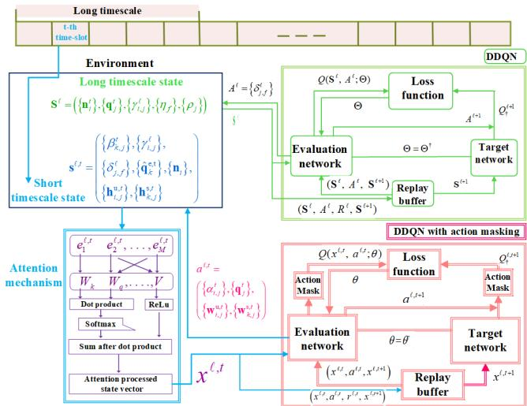  
Fig. 3. Overall flowchart of the proposed attention-based HDRL with action mask.

We define $\boldsymbol { Q } _ { \dagger } ^ { \ell + 1 }$ as the target Q-value of the + 1-th timeframe, which can be expressed as

$$
\mathcal { Q } _ { \dagger } ^ { \ell + 1 } = \pmb { R } ^ { \ell } + \gamma \pmb { Q } ( \mathbf { S } ^ { \ell + 1 } , \pmb { A } ^ { \ell + 1 } ; \Theta ^ { \dagger } ) ,\tag{48}
$$

$$
\Theta ^ { \dagger }
$$

From (47) and (48), the Q-values are updated iteratively using the Bellman equation, which can be expressed as

$$
\begin{array} { r l } & { \boldsymbol { { Q } } ( \mathbf { S } ^ { \ell + 1 } , A ^ { \ell + 1 } ; \Theta )  \boldsymbol { { Q } } ( \mathbf { S } ^ { \ell } , A ^ { \ell } ; \Theta ) } \\ & { \quad + \hat { \alpha } ( \boldsymbol { { Q } } _ { \dagger } ^ { \ell + 1 } - \boldsymbol { { Q } } ( \mathbf { S } ^ { \ell } , A ^ { \ell } ; \Theta ) ) . } \end{array}\tag{49}
$$

<sup>α</sup>At each time-frame, Θ is updated by computing the loss function to minimize the diference between the target Q-value and the estimated Q-value. Let $\mathcal { L } ( \Theta )$ denote the loss function, which can be expressed as

$$
\mathcal { L } ( \boldsymbol { \Theta } ) = \mathbb { E } \left[ \left( Q _ { \dagger } ^ { \ell + 1 } - Q ( \mathbf { S } ^ { \ell } , A ^ { \ell } ; \boldsymbol { \Theta } ) \right) ^ { 2 } \right] .\tag{50}
$$

In Fig. 3, we show the architecture of the proposed attention-based HDRL with an action mask, and in Algorithm 1, we summarize the proposed attention-based HDRL algorithm is described.

Given the received echo signal measurements, we first obtain eavesdropper detection strategy based on (12)-(20). Based on the eavesdropper detection strategy, we then design an attention-based HDRL with action mask to obtain the strategies for the short-timescale and long-timescale. We first design a DDQN algorithm for long-timescale content caching. Given the long-timescale strategy, we then propose an attentionbased DDQN algorithm to obtain the short-timescale user association, UAV deployment, communication, and sensing beamforming as shown in Fig. 3. The figure shows the overall process of state-action-reward transitions by interacting with the environment and updating the Q-value. During the model training, at the -th time-frame, the observed state of the long timescale is fed into the DDQN network to estimate the Q-value to obtain the long-timescale strategy. The neural network receives the state from the environment and inputs it into the evaluation network to obtain an action. The target network receives the selected action, computes the Q-value, and the long timescale reward is calculated. Based on the obtained long-timescale strategy, an attention-based DDQN with an action mask computes the q-values for the subsequent time-slots of the short timescale. Specifically, an attention network assigns a weight to the input vector and input to the evaluation network and target network to select an action and compute the Q-value. The designed action mask evaluation and target networks identify the set of feasible actions and omits the actions that violate the constraints C1-C12 in P1. The short timescale action is then returned to the environment, and the short timescale reward is calculated. Accordingly, the agent apply penalty on the actions that violate constraints, discouraging violations. This ensures that the agent experiences an immediate drop in reward. We then, obtain the cumulative reward as the summation of the long-timescale and the subsequent short-timescale rewards.

```latex
Algorithm 1 Proposed Attention-Based HDRL With Action
Mask
Input: $\left\{ \mathbf { h } _ { i , j } ^ { \mathrm { u } , 0 } \right\} , \left\{ \mathbf { h } _ { k , j } ^ { \mathrm { s } , 0 } \right\} , \quad \left\{ \mathbf { q } _ { j } ^ { 0 } \right\} , \quad \left\{ \mathbf { q } _ { k } ^ { \mathrm { e } , 0 } \right\} , \{ \mathbf { n } _ { i } \} , \{ \mathbf { m } _ { i } \} , \left\{ \psi _ { j , k } ^ { t } \right\}$
$\left\{ \gamma _ { i , f } ^ { 0 } \right\} , T , N ^ { \tau } , \rho _ { j } , D ^ { \mathrm { i h } } , x _ { \mathrm { m i n } } , y _ { \mathrm { m a x } } , z _ { j } ^ { \mathrm { m i n } } , z _ { j } ^ { \mathrm { m a x } } , \Theta ^ { 0 } , Q ( \tilde { \bf S } ^ { 0 } , A ^ { 0 } ,$
$\begin{array} { r } { \dot { \Theta } ^ { 0 } ) } \end{array}$ , set $\Theta ^ { \dagger , 0 } = \Theta ^ { 0 } , Q ^ { \dagger } ( { \bf S } ^ { 0 } , { \cal A } ^ { 0 } ; \Theta ^ { \dagger , 0 } ) , \theta ^ { 0 , 0 } , Q ( { \bf s } ^ { 0 , 0 } , { \pmb a } ^ { 0 , 0 } ; \theta ^ { 0 , 0 } ) .$
set $\boldsymbol { \theta } ^ { \dagger , 0 } = \boldsymbol { \theta } ^ { 0 , 0 } , \boldsymbol { Q } ^ { \dagger } ( \mathbf { s } ^ { 0 , 0 } , \mathbf { a } ^ { 0 , 0 } ; \boldsymbol { \theta } ^ { \dagger , 0 } ) , \forall i , j , k .$ , where $\Theta ^ { 0 }$ <sup>θ</sup>and $\theta ^ { 0 , 0 }$
are random weights. Let $t = 0 , \ell = 0 ;$
1: for $t = 1$ to T do
2: Compute (12)-(20) for given $\left\{ \mathbf { q } _ { k } ^ { \mathrm { e } , t } , \psi _ { j , k } ^ { t } \right\}$ and obtain $\hat { \mathbf { q } } _ { k } ^ { \mathrm { e } , t } .$
$\beta _ { k , j } ^ { t } ,$
3: <sup>β ,</sup>if t% $T ^ { \ell } = 0$ then
4: for $j = 1$ to J do
5: Select a long-timescale action $A ^ { \ell }$ in (47) and
obtain $\left\{ \alpha _ { j } ^ { t } , \mathbf { q } _ { j } ^ { t } , \delta _ { j } ^ { t } , \beta _ { j } ^ { t } \right\}$
6: Compute reward $\pmb { R } ^ { \ell }$ from (45);
7: Update state $\mathbf { S } ^ { \ell + 1 } \mathbf { \Psi } ;$
8: From (48) compute target values,
$\begin{array} { r l } { Q ^ { \dagger } ( \mathbf { S } ^ { \ell + 1 } , A ^ { \ell + 1 } ; \Theta ^ { \dagger , \ell } ) ; } \end{array}$
9: <sup>,</sup>Compute $Q ( \mathbf { S } ^ { \ell } , A ^ { \ell } ; \Theta ^ { \ell } )$ in (49) for given $A ^ { \ell } ;$
10: From (50) compute $L ( \Theta ^ { \ell } ) ;$
11: Store the transition $( \dot { \mathbf { S } ^ { \ell } } , \dot { A } ^ { \ell } , \pmb { R } ^ { \ell } , \mathbf { S } ^ { \ell + 1 } )$
12: end for
13: return $\left\{ \delta _ { j } ^ { t } \right\} :$
14: end if
15: From (33) obtain $\mathbf { \Delta } _ { \mathbf { \mathscr { X } } } { } ^ { \ell , t } ;$
16: Select a short-timescale action $\pmb { a } ^ { \ell , t }$ in (31);
17: From (32) short time-scale reward, $r ^ { \ell , t } ;$
18: Compute $Q ( { \pmb x } ^ { \ell , t } , { \pmb a } ^ { \ell , t } ; { \pmb \theta } ^ { \ell , t } )$ in (36) for given $\pmb { a } ^ { \ell , t }$ and
obtain $\left\{ \alpha _ { j } ^ { t } , \mathbf { q } _ { j } ^ { t } , \mathbf { W } _ { j } ^ { t } \right\} ;$
19: Update state $\mathbf { \Delta } _ { \mathbf { x } ^ { \ell + 1 , t } ; \ell }$
20: From (40) compute $L ( \theta ^ { \ell , t } ) ;$
21: Store the transition $\left( { { \pmb x } ^ { \ell , t } } , { { \pmb a } ^ { \ell , t } } , { { \pmb r } ^ { \ell , t } } , { { \pmb x } ^ { \ell + 1 , t } } \right)$
22: return $\left\{ \alpha _ { j } ^ { t } , \mathbf { q } _ { j } ^ { t } , \mathbf { W } _ { j } ^ { t } \right\}$ ;
23: From (46) compute cumulative reward, $\pmb { R } ^ { \mathrm { c . } }$
24: $\ell = \ell + 1$
<sup>` `</sup>25: end for
26: return $\left\{ \left\{ \delta _ { j } ^ { t * } \right\} , \left\{ \alpha _ { j } ^ { t * } \right\} , \left\{ \mathbf { q } _ { j } ^ { t * } \right\} , \left\{ \mathbf { W } _ { j } ^ { t * } \right\} \right\} ;$
Let $\alpha _ { j } ^ { t * } , \mathbf { q } _ { j } ^ { t * } , \delta _ { j } ^ { t * } , \hat { \mathbf { q } } _ { k } ^ { \mathrm { e } , t * } , \beta _ { j } ^ { t * } , \left\{ \mathbf { W } _ { j } ^ { t * } \right\}$ represent the obtained
strategies for user association, UAV deployment, content
caching, eavesdropper location estimation and detection,
communication and sensing beamforming.
```

## V. COMPUTATIONAL COMPLEXITY OF THE PROPOSED ALGORITHMS

In this section, we analyze the computational complexity of the proposed attention-based HDRL algorithm with an action mask. The algorithm consists of two hierarchies, longtimescale and short-timescale, i.e., long-timescale with L time frames, where each time frame constitutes $N ^ { \tau }$ time frames and $N ^ { \tau } - 1$ time slots of short-timescales within each longtimescale. In the long timescale, the computational complexity arises from long timescale content caching, action selection, and DDQN network updates. Whereas, the content caching action is obtained at the first time slot of -th time-frame. Hence, the complexity of content caching action selection in each iteration can be expressed as $\begin{array} { r } { O \left( \frac { L } { N ^ { \tau } } F J \right) } \end{array}$ , and the computational complexity of DDQN network update can be computed as $\begin{array} { r } { O \left( \frac { L } { N ^ { \tau } } \left| \Theta ^ { \ell } \right| \right) } \end{array}$

Given the long-timescale decision, the short-timescale location estimation, caching, user association, UAV deployment, communication, and sensing beamforming actions are obtained. In the short-timescale, the total computational complexity arises from EKF-based location eavesdroppers estimation and action selection of the attention-based DDQN algorithm network. According to the proposed EKF-based location eavesdroppers estimation, for every eavesdropper TOA of the received echo signal at $\mathrm { U A V } _ { j }$ from $\mathrm { E } _ { k }$ is measured, FIM is employed to compute the Kalman Gain, location estimation is obtained, and CRLB is employed to enhance the estimation accuracy. Thus, the computational complexity of steps from (15) to (20) can be expressed as $O \left( L ( N ^ { \tau } - 1 ) K ^ { 3 } J \right)$ In a short-timescale, the algorithm applies an action mask, chooses feasible actions, and updates the DDQN network, reducing the action space, with computational complexity of $O \left( L ( N ^ { \tau } - 1 ) \left| \mathcal { M } ^ { t } \right| J \right)$ . The computational complexity of the DDQN network update in short timescales can be computed as $O ( L ( N ^ { \tau } - 1 ) \left| \theta ^ { \bar { \ell } , t } \right| )$

## VI. SIMULATION RESULTS

In this section, we evaluate the performance of the proposed joint eavesdropper detection, content caching, user association, UAV deployment, communication and sensing beamforming algorithm. Specifically, we consider a UAV-assisted ISAC network, in which $I ~ = ~ 9$ UEs and $K \ = \ 2$ eavesdroppers are randomly scattered in the area of 1000 m × 1000m. The detailed simulation parameters unless otherwise mentioned are described in Table I.

In Fig. 4 and Fig. 5, we evaluate the performance of the proposed attention-based HDRL algorithm. Fig. 4 shows the 2D UAV deployment result and user association result obtained from the long-timescale strategy. In Fig. 4, the two numbers in the bracket represent user ID and the requested content ID. For instance, (9 4) represents that $\mathrm { { U E } _ { 9 } }$ requests content 4. Fig. 5 shows the eavesdropper detection and UAV deployment result. We use blue stars to denote the deployment strategy of UAVs and the lines from UAV to eavesdropper represent the eavesdropper detection strategy.

TABLE I  
SIMULATION PARAMETERS
<table><tr><td>Simulation Parameters</td><td>Notations</td><td>Values</td></tr><tr><td>Number of antennas Carrier frequency Bandwidth of each subcarrier Noise power Total number of files File size</td><td> $\overline { { N } }$   $f _ { m }$   $B$   $\sigma ^ { 2 }$   $F$   $\eta _ { f }$   $\dot { R } _ { \dot { \alpha } } ^ { \mathrm { t h } }$ </td><td>4 2.4 GHz 40 MHz -179 dB 10 [5, 10] Mbits 1 Mbps 0.5e-6 spbit</td></tr></table>

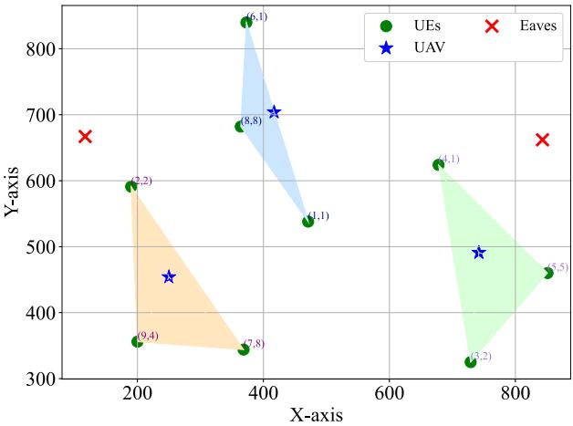

Fig. 4. User association strategy.  
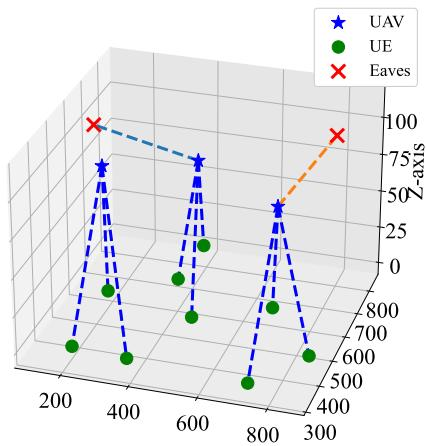  
Fig. 5. UAV deployment & eavesdropper detection strategy.

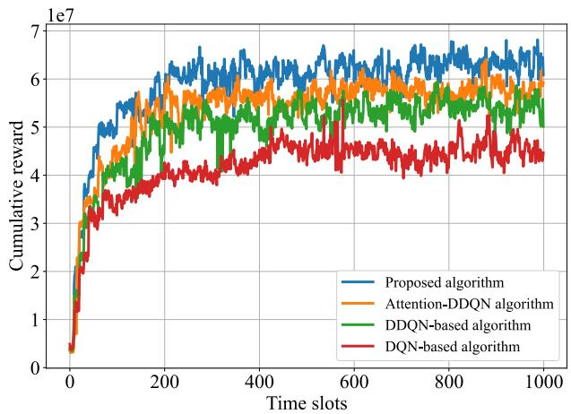  
Fig. 6. Cumulative reward vs number of time-slots for diferent algorithms.

In Fig. 6, we plot the cumulative reward versus the number of time-slots obtained from the proposed multi-timescale HDRL algorithm with action mask compared with that from the baseline algorithms, namely, the attention-based DDQN algorithm, DDQN, and DQN-based algorithm. The basic ideas of the baseline algorithms are summarized below. In the attention-based DDQN, DDQN, and DQN-based algorithms, we respectively apply the attention mechanism, traditional DDQN, and DQN to obtain the short-timescale strategies. From the figure, we can observe that, as the time-slots increase, all three models progressively improve their rewards, indicating that they are learning and adapting to the environment. Notably, the proposed attention-based HDRL algorithm with action mask achieves the highest cumulative reward compared to the other three algorithms. The reason is that the incorporation of the attention mechanism helps the model to focus on relevant features across the time slots, and action masking reduces the action selection space. Over successive training episodes, this allows the agents to learn avoiding infeasible actions, compliance with all constraints and optimize within the feasible boundaries, leading to convergence, while maximizing secrecy throughput and higher cumulative reward, indicating the efectiveness of the attention mechanism in improving learning performance.

In Fig. 7, we plot the cumulative reward of the proposed attention-based HDRL with action mask for diferent learning rates . The model was trained over 1000 time slots. During training, the algorithm iteratively updated its weights to optimize the reward function. As shown in the figure, the reward tends to increase rapidly in the initial time slots for all values of , indicating fast learning in the early stages. However, as training progresses, the rewards begin to fluctuate and stabilize at diferent levels depending on the learning rate. Notably, learning rates in the range of $1 \times 1 0 ^ { - 4 }$ to $5 \times 1 0 ^ { - 4 }$ provide smoother and more stable convergence in reward, indicating better overall performance for smaller learning rates. In contrast, higher learning rates, such as $\alpha = 0 . 0 0 1$ and $\alpha = 0 . 0 0 5$ exhibit more volatile reward behavior, leading to a drop in performance towards the end of the time slots, highlighting the instability caused by larger updates. This indicates, an increase in the learning rate might give a temporary boost in rewards, but it’s not guaranteed to improve performance and could even hinder learning by causing instability.

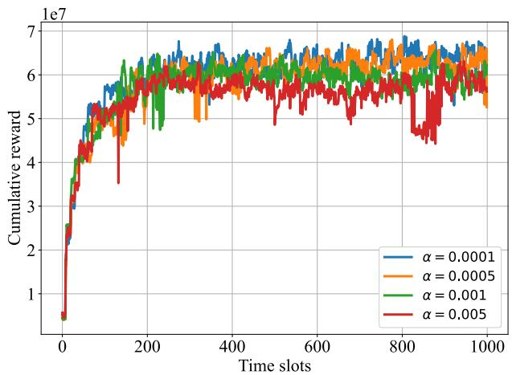  
Fig. 7. Cumulative reward vs number of time-slots for diferent learning rates.

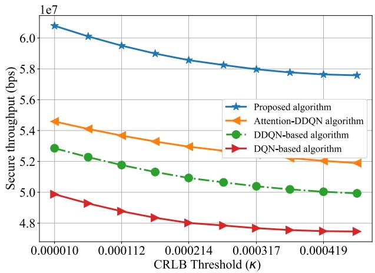  
Fig. 8. Secure throughput vs CRLB threshold for diferent algorithms.

In Fig. 8, we plot the secure throughput versus CRLB threshold and the secure throughput versus transmit power of UAVs. For comparison, we show the results obtained from the proposed attention-based HDRL with action mask, attentionbased DDQN, and DQN-based algorithms. To get the results, we first obtain the long timescale content caching based on DDQN. For the short timescale user association, UAV deployment, communication, and sensing beamforming, we apply the attention mechanism to get the weighted feature vector of states, then we apply action masking to choose the feasible actions. Comparing the proposed algorithm with baseline algorithms, the proposed algorithm outperforms the other two algorithms, achieving the highest secure throughput. This is because the proposed attention-based HDRL algorithm captures the state of location estimation and detects eavesdroppers more accurately than the baseline algorithms.

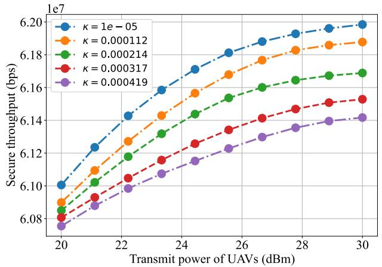  
Fig. 9. Secure throughput vs transmit power of UAVs for various CRLB thresholds.

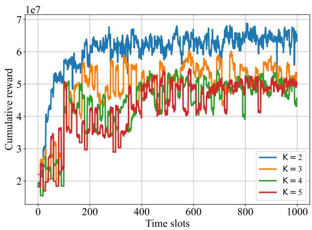  
Fig. 10. Cumulative reward vs number of time slots for diferent number of eavesdroppers.

In Fig. 9, we evaluate the performance of the proposed attention-based HDRL algorithm with an action mask for various CRLB thresholds. In the figure, we show secure throughput versus transmit power of UAVs for various CRLB thresholds. It can be observed from the figure that the secure throughput increases as the transmit power of UAVs increases. This is because, as transmit power increases, the transmission rates of the links between UAVs and UEs increase accordingly, leading to higher secure throughput. The figure also shows that the decrease in the value of the CRLB threshold results in increased secure throughput. This is because a strict CRLB threshold poses a higher sensing requirement, resulting in efective eavesdropper location estimation and higher throughput.

In Fig. 10, we plot the cumulative reward versus the number of time-slots for diferent number of eavesdroppers obtained from the proposed attention-based HDRL with action mask. From the figure, we can observe that, as the time-slots increase, the cumulative reward increases. This is because the algorithm improves its strategy over time as it learns and adapts to the environment, achieving higher rewards with longer training durations. The figure also shows that as the number of eavesdroppers increases, the cumulative reward decreases. The reason is that, the eavesdroppers intercept the communication link between UAVs and UEs, leading to lower communication performance and reduced cumulative reward.

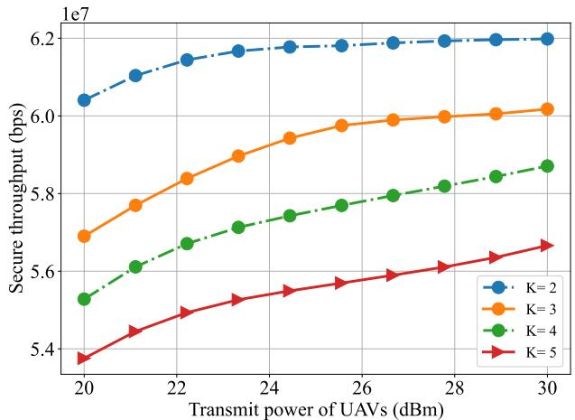  
Fig. 11. Secure throughput vs transmit power of UAVs for diferent number of eavesdroppers.

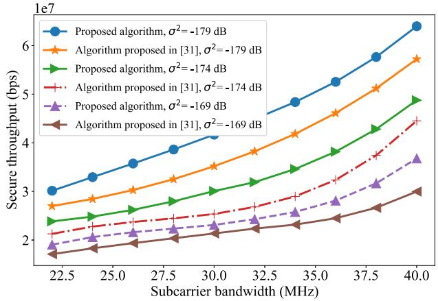  
Fig. 12. Secure throughput vs subcarrier bandwidth for diferent noise power.

Fig. 11 shows secure throughput versus transmit power of UAVs for diferent number of eavesdroppers. We can observe from the figure that, as the transmit power of the UAVs increases, the secure throughput increases. The reason is that the higher transmit power of UAVs increases the transmission rates of the links between UAVs and UEs. It can also be observed that as the number of eavesdroppers increases, the secure throughput decreases. This is because additional eavesdroppers increase the risk of data transmission, resulting in lower received data rate and reduced secure throughput.

In Fig. 12, we plot the secure throughput versus the subcarrier bandwidth of UAVs for various noise power. The figure shows that as the subcarrier bandwidth increase the secure throughput increases. This is because higher subcarrier bandwidth results higher transmission rate of the links between UAVs and UEs. We can also see from the figure that the increase in noise power results in a lower secure throughput. The reason is that the increase in noise power causes decreases in the signal-to-noise ratio (SNR), leading to reduced transmission rates and, consequently, lower secure throughput. It can also be observed from the figure that our proposed algorithm achieves higher secure throughput compared to the algorithm proposed in [31]. The reason is that the algorithm in [31] mainly addresses the eavesdropper sensing and resource allocation issues rather than estimating eavesdroppers location and optimizing UAV deployment, thus leading to ineficient resource utilization and lower overall system performance.

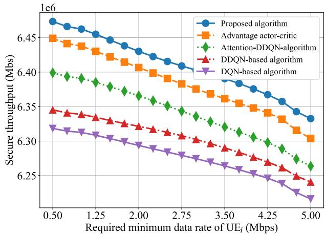  
Fig. 13. Secure throughput vs required minimum data rate of UEs for diferent algorithms.

In Fig. 13, we plot the secure throughput versus the required minimum data rate of UEs, comparing the proposed multitimescale HDRL algorithm with an action mask to diferent baseline algorithms, namely, the advantage actor-critic-based algorithm, the attention-based DDQN algorithm, DDQN, and the DQN-based algorithm. As shown in the figure, the proposed algorithm achieves better performance compared to the baseline algorithms. The reason is that the attention network focuses on relevant features across the time slots, and action masking avoids infeasible actions, resulting in enhanced action selection decisions and higher secrecy throughput. The figure also shows that the secrecy throughput decreases as the required minimum data rate of UEs increases. The reason is that the increased minimum data rate of UEs poses a higher requirement for the user association, UAV deployment, communication, and sensing beamforming design, resulting in decreased secrecy throughput.

## VII. CONCLUSION

In this paper, we have studied the joint eavesdropper detection, user association, UAV deployment, content caching, communication and sensing beamforming problem in a UAV-enabled ISAC network. Considering the eavesdropper’s mobility, we have designed an EKF and CRLB-based location estimation strategy. Based on the obtained eavesdroppers location estimation, we have computed the secure throughput and formulated the joint eavesdropper detection, user association, UAV deployment, content caching, communication and sensing beamforming problem as a long-term secure throughput maximization problem. To solve the formulated problem, we have proposed an attention-based HDRL with action mask. Simulation results have demonstrated the efectiveness of the proposed content caching, user association, UAV deployment, communication and sensing beamforming strategies in enhancing the overall secure throughput and improving secure content delivery performance. In future work, we may extend our current work to a scenario where mobile UAVs, aerial and ground eavesdroppers can be employed, to detect transmission from legitimate UAVs and improve the interception accuracy of ground eavesdroppers. The adversary between them can be modeled using game theory, and their trajectories can be optimized to enhance the secure content delivery performance for UEs. Moreover, a jamming beamformer can be strategically designed. Specifically, communication, sensing, and jamming beamforming can be jointly optimized to create noise for eavesdroppers and prevent potential eavesdroppers from intercepting the actual communication signal to further improve secrecy throughput. Furthermore, the integration of caching, computation, and target detection at the UAVs can also be considered so as to improve the performance of task execution and secure content delivery.

## REFERENCES

[1] L. Li, G. Zhao, and R. S. Blum, “A survey of caching techniques in cellular networks: Research issues and challenges in content placement and delivery strategies,” IEEE Commun. Surveys Tuts., vol. 20, no. 3, pp. 1710–1732, 3rd Quart., 2018.

[2] E. G. AbdAllah, H. S. Hassanein, and M. Zulkernine, “A survey of security attacks in information-centric networking,” IEEE Commun. Surveys Tuts., vol. 17, no. 3, pp. 1441–1454, 3rd Quart., 2015.

[3] Z. Wei et al., “Integrated sensing and communication signals toward 5G-A and 6G: A survey,” IEEE Internet Things J., vol. 10, no. 13, pp. 11068–11092, Jul. 2023.

[4] F. E. Subhan, A. Yaqoob, C. H. Muntean, and G.-M. Muntean, “A survey on artificial intelligence techniques for improved rich media content delivery in a 5G and beyond network slicing context,” IEEE Commun. Surveys Tuts., vol. 27, no. 2, pp. 1427–1487, Apr. 2025.

[5] W. Xu, Z. Yang, D. W. K. Ng, M. Levorato, Y. C. Eldar, and M. Debbah, “Edge learning for B5G networks with distributed signal processing: Semantic communication, edge computing, and wireless sensing,” IEEE J. Sel. Topics Signal Process., vol. 17, no. 1, pp. 9–39, Jan. 2023.

[6] Q. Wu et al., “A comprehensive overview on 5G-and-beyond networks with UAVs: From communications to sensing and intelligence,” IEEE J. Sel. Areas Commun., vol. 39, no. 10, pp. 2912–2945, Oct. 2021.

[7] Z. Fei, X. Wang, N. Wu, J. Huang, and J. A. Zhang, “Air-ground integrated sensing and communications: Opportunities and challenges,” IEEE Commun. Mag., vol. 61, no. 5, pp. 55–61, May 2023.

[8] G. K. Pandey, D. S. Gurjar, H. H. Nguyen, and S. Yadav, “Security threats and mitigation techniques in UAV communications: A comprehensive survey,” IEEE Access, vol. 10, pp. 112858–112897, 2022.

[9] C. Dong et al., “UAVs as an intelligent service: Boosting edge intelligence for air-ground integrated networks,” IEEE Netw., vol. 35, no. 4, pp. 167–175, Jul. 2021.

[10] Y. Cui, Z. Feng, Q. Zhang, Z. Wei, C. Xu, and P. Zhang, “Toward trusted and swift UAV communication: ISAC-enabled dual identity mapping,” IEEE Wireless Commun., vol. 30, no. 1, pp. 58–66, Feb. 2023.

[11] L. Bai, P. Han, J. Wang, and J. Wang, “Throughput maximization for multipath secure transmission in wireless ad-hoc networks,” IEEE Trans Commun., vol. 72, no. 11, pp. 6810–6821, Nov. 2024.

[12] S. Soderi and A. Zappone, “Secrecy energy eficiency of hybrid wireless body area networks,” IEEE Trans. Mobile Comput., early access, Oct. 6, 2025, doi: 10.1109/TMC.2025.3618098.

[13] R. Zhang, L. Zhang, Q. Wu, and J. Zhou, “Secure channel establishment scheme for task delivery in vehicular cloud computing,” IEEE Trans. Inf. Forensics Security, vol. 19, pp. 2865–2880, 2024.

[14] Q. Xu, Z. Su, and J. Ni, “Incentivizing secure edge caching for scalable coded videos in heterogeneous networks,” IEEE Trans. Inf. Forensics Security, vol. 18, pp. 2480–2492, 2023.

[15] M. Wu, K. Li, L. Qian, Y. Wu, and I. Lee, “Secure computation ofloading and service caching in mobile edge computing networks,” IEEE Commun. Lett., vol. 28, no. 2, pp. 432–436, Feb. 2024.

[16] M. Wu, W. Chen, L. Qian, L. Guo, and I. Lee, “Joint service caching and secure computation ofloading for reconfigurable-intelligent-surfaceassisted edge computing networks,” IEEE Internet Things J., vol. 11, no. 19, pp. 30469–30482, Oct. 2024.

[17] P. K. Sharma and D. I. Kim, “Secure 3D mobile UAV relaying for hybrid satellite-terrestrial networks,” IEEE Trans. Wireless Commun., vol. 19, no. 4, pp. 2770–2784, Apr. 2020.

[18] Y. Zhou et al., “Caching and UAV friendly jamming for secure communications with active eavesdropping attacks,” IEEE Trans. Veh. Technol., vol. 71, no. 10, pp. 11251–11256, Oct. 2022.

[19] R. Li, Z. Wei, L. Yang, D. W. K. Ng, J. Yuan, and J. An, “Resource allocation for secure multi-UAV communication systems with multieavesdropper,” IEEE Trans. Commun., vol. 68, no. 7, pp. 4490–4506, Jul. 2020.

[20] C. Wen, L. Qiu, and X. Liang, “Securing UAV communication with mobile UAV eavesdroppers: Joint trajectory and communication design,” in Proc. IEEE Wireless Commun. Netw. Conf. (WCNC), Nanjing, China, Mar. 2021, pp. 1–6.

[21] G. K. Pandey, D. S. Gurjar, S. Yadav, R. Gour, and J. Gazda, “Dual UAVassisted secure IoT networks: Resource allocation and 3D trajectory design,” IEEE Trans. Veh. Technol., early access, Sep. 18, 2025, doi: 10.1109/TVT.2025.3611962.

[22] Y. Xu, T. Zhang, D. Yang, Y. Liu, and M. Tao, “Joint resource and trajectory optimization for security in UAV-assisted MEC systems,” IEEE Trans. Commun., vol. 69, no. 1, pp. 573–588, Jan. 2021.

[23] M. Wu et al., “Energy-constrained multidimensional optimization for UAV-aided secure data collection with cooperative jamming,” IEEE Trans. Veh. Technol., vol. 74, no. 12, pp. 1–13, Dec. 2025.

[24] F. Lu et al., “Resource and trajectory optimization for UAV-relayassisted secure maritime MEC,” IEEE Trans. Commun., vol. 72, no. 3, pp. 1641–1652, Mar. 2024.

[25] J. Zhang, J. Xu, W. Lu, N. Zhao, X. Wang, and D. Niyato, “Secure transmission for IRS-aided UAV-ISAC networks,” IEEE Trans. Wireless Commun., vol. 23, no. 9, pp. 12256–12269, Sep. 2024.

[26] J. Yao, Z. Yang, Z. Yang, J. Xu, and T. Q. S. Quek, “UAV-enabled secure ISAC against dual eavesdropping threats: Joint beamforming and trajectory design,” IEEE Wireless Commun. Lett., vol. 14, no. 10, pp. 3199–3203, Oct. 2025.

[27] J. Wu, W. Yuan, and L. Hanzo, “When UAVs meet ISAC: Realtime trajectory design for secure communications,” IEEE Trans. Veh. Technol., vol. 72, no. 12, pp. 16766–16771, Dec. 2023.

[28] J. Zhao, S. Xue, K. Cai, X. Mu, Y. Liu, and Y. Zhu, “Near-field integrated sensing and communications for secure UAV networks,” IEEE J. Sel. Areas Commun., early access, Sep. 11, 2025, doi: 10.1109/ JSAC.2025.3608737.

[29] X. Yu, J. Xu, N. Zhao, X. Wang, and D. Niyato, “Security enhancement of ISAC via IRS-UAV,” IEEE Trans. Wireless Commun., vol. 23, no. 10, pp. 15601–15612, Oct. 2024.

[30] H. Lei, C. Jiang, K.-H. Park, M. A. Aboulhassan, S. Zhou, and G. Pan, “On secure UAV-aided ISCC systems,” IEEE Internet Things J., vol. 12, no. 19, pp. 40851–40862, Oct. 2025.

[31] Y. Liu et al., “Secure rate maximization for ISAC-UAV assisted communication amidst multiple eavesdroppers,” IEEE Trans. Veh. Technol., vol. 73, no. 10, pp. 15843–15847, Oct. 2024.

[32] M. S. Grewal, A. P. Andrews, and C. G. Bartone, “Kalman filtering,” in Global Navigation Satellite Systems, Inertial Navigation, and Integration. Hoboken, NJ, USA: Wiley, 2020, pp. 355–417.

[33] T. Liang, T. Zhang, J. Yang, D. Feng, and Q. Zhang, “UAV-aided positioning systems for ground devices: Fundamental limits and algorithms,” IEEE Internet Things J., vol. 9, no. 15, pp. 13470–13485, Aug. 2022.

[34] J. Moon, S. Papaioannou, C. Laoudias, P. Kolios, and S. Kim, “Deep reinforcement learning multi-UAV trajectory control for target tracking,” IEEE Internet Things J., vol. 8, no. 20, pp. 15441–15455, Oct. 2021.

[35] H. Zhou, K. Jiang, X. Liu, X. Li, and V. C. M. Leung, “Deep reinforcement learning for energy-eficient computation ofloading in mobile-edge computing,” IEEE Internet Things J., vol. 9, no. 2, pp. 1517–1530, Jan. 2022.

[36] A.-B. Mohamed, M. Nour, and H. Hossam, “Attention neural networks,” in Deep Learning Approaches for Security Threats in IoT Environments. NJ, USA: Wiley-IEEE Press, Nov. 2022.

[37] J. Liu and M. Farsi, “Reinforcement learning,” in Model-Based Reinforcement Learning: From Data to Continuous Actions With a Python-Based Toolbox. West Sussex, U.K.: Wiley, Dec. 2022.


Gezahegn Abdissa Bayessa received the B.Sc. degree in electrical engineering from Jimma University, Ethiopia, in 2008, the M.S. degree in information and communication engineering from the Huazhong University of Science and Technology, Wuhan, China, in June 2016, and the Ph.D. degree in information and communication engineering from Chongqing University of Posts and Telecommunications, Chongqing, China, in December 2024. From August 2011 to August 2020, he was a Lecturer at the Department of Electrical and Computer Engi-

neering, Wollega University, Nekemte, Ethiopia. His main research interests include B5G and 6G mobile communications, UAV-enabled communications, NTN communications, integrated sensing and communication, resource allocation, edge computing, and task ofloading.


Rong Chai (Senior Member, IEEE) received the B.E. and M.S. degrees from the University of Electronic Science and Technology of China, Chengdu, China, in 1995 and 1998, respectively, and the Ph.D. degree in electrical engineering from McMaster University, ON, Canada, in 2008. In 2008, she joined the School of Communication and Information Engineering, Chongqing University of Posts and Technology, where she is currently a Professor. She has authored or co-authored more than 90 research articles. Her research interests include wireless comthe

munication and network theory.


Chengchao Liang received the Ph.D. degree in electrical and computer engineering from Carleton University, Canada, in 2017. He is currently a Full Professor with the School of Communications and Information Engineering, Chongqing University of Posts and Telecommunications. His research interests include wireless communications, satellite networks, internet protocols, and optimization theory. He received the Senate Medal for the Ph.D. degree. He has served as a reviewer and a TPC member for many IEEE journals and conferences. He is

on the Editorial Boards of EURASIP Journal on Wireless Communications and Networking and Transactions on Emerging Telecommunications Technologies.

  
Qinyuan Wang received the M.S. degree from Chongqing University of Posts and Telecommunications, Chongqing. His research interests include space-air-ground integrated communication, UAV-enabled communications, integrated communication and sensing, and wireless resource allocation.


Jun Li (Fellow, IEEE) received the Ph.D. degree in electronic engineering from Shanghai Jiao Tong University, Shanghai, China, in 2009. From January 2009 to June 2009, he was with the Department of Research and Innovation, Alcatel Lucent Shanghai Bell, as a Research Scientist. From June 2009 to April 2012, he was a Post-Doctoral Fellow at the School of Electrical Engineering and Telecommunications, University of New South Wales, Australia. From April 2012 to June 2015, he was a Research Fellow at the School of Electrical Engineering, The

University of Sydney, Australia. From June 2015 to June 2024, he was a Professor at the School of Electronic and Optical Engineering, Nanjing University of Science and Technology, Nanjing, China. From 2018 to 2019, he was a Visiting Professor at Princeton University. He is a Professor at the School of Information Science and Engineering, Southeast University, Nanjing. He has co-authored more than 300 articles in IEEE journals and conferences. His research interests include distributed intelligence, multiple agent reinforcement learning, and their applications in ultra-dense wireless networks, mobile edge computing, network privacy and security, and industrial Internet of Things. He was a TPC member for several flagship IEEE conferences. He was serving as an Editor for IEEE TRANSACTIONS ON WIRELESS COMMUNICATIONS.

Qianbin Chen received the B.S. degree from Sichuan University, Chengdu, China, in 1988, and the Ph.D. degree in electrical engineering from the University of Electronic Science and Technology of China, Chengdu, in 2006. He joined the School of Communication and Information Engineering, Chongqing University of Posts and Technology, where he is currently a Professor. He has been working in the areas of wireless and mobile networking for more than 30 years and has authored more than 150 international journals and conference articles.

His research interests include wireless communication, network theory, and multi-media technology.