# Autonomous UAV Trajectory for Localizing Ground Objects: A Reinforcement Learning Approach

Dariush Ebrahimi, Sanaa Sharafeddine , Pin-Han Ho , Fellow, IEEE, and Chadi Assi , Fellow, IEEE

Abstract—Disaster management, search and rescue missions, and health monitoring are examples of critical applications that reguire object localization with high precision and sometimes in a timely manner. In the absence of the global positioning system (GPS), the radio received signal strength index (RSSI) can be used for localization purposes due to its simplicity and cost-effectiveness. However., due to the low accuracy of RSSI, unmanned aerial vehicles (UAVs) or drones may be used as an efficient solution for improved localization accuracy due to their agility and higher probability of line-of-sight (LoS). Hence, in this context, we propose a novel framework based on reinforcement learning (RL) to enable a UAV (agent) to autonomously find its trajectory that results in improving the localization accuracy of multiple objects in shortest time and path length, fewer signal-strength measurements (waypoints), and/or lower UAVenergy consumption. In particular, we first control the agent through initial scan trajectory on the whole region to 1) know the number of nodes and estimate their initial locations, and 2) train the agent online during operation. Then, the agent forms its trajectory by using RL to choose the next waypoints in order to minimize the average location errors of all objects. Our framework includes detailed UAV to ground channel characteristics with an empirical path loss and log-normal shadowing model, and also with an elaborate energy consumption model. We investigate and compare the localization precision of our approach with existing methods from the literature by varying the UAV’s trajectory length, energy, number of waypoints, and time. Furthermore, we study the impact of the UAV’s velocity, altitude, hovering time, communication range, number of maximum RSSI measurements, and number of objects. The results show the superiority of our method over the state-of-art and demonstrates its fast reduction of the localization error.

Index Terms—Localization, reinforcement learning, Q-Learning, unmanned aerial vehicles (UAVs), drones, trajectory planning, received signa strength (RSS)

## 1 INTRODUCTION

and meaningful, require to know the location of their component devices. Since not all communicating devices are equipped with a global positioning system (GPS) due to its expensive cost and vulnerability to jamming, in addition to its bad performance in poor weather conditions [1], and also due to unavailability of a base station in a disaster situation to collect objects’ locations using GPS, hence, alternative localization techniques have been extensively studied in the literature [2]. Among those, the radio received signal strength (RSS) is more attractive due to its simplicity and cheap functionality (does not require extra antennas or time synchronization) [3]. However, its localization accuracy is significantly affected by the randomness of the received signal and shadowing, particularly in urban areas. As an enhancement, an unmanned aerial vehicle (UAV) or drone may be used to localize ground objects [4]. The UAV has the ability to measure the RSS of multiple objects from different angles (or waypoints) with higher probability of line-of-sight (LoS), and thus better localization accuracy [5]. Examples of such application can vary from delivering packages to different addresses to finding expensive devices in an area.

In addition to the accurate positioning, timely localization is also indispensable for many operations such as in search and rescue missions. For example, finding locations of trapped people after a disaster or a patient who needs rescue in a serious life threat [6]. Therefore, finding the right flight path (trajectory) and aerial anchors (waypoints) is crucial for both timely and accuracy of the objects’ localization. On the other hand, a UAV has limited energy which restricts its operational lifetime. Therefore, different criteria such as UAV’s velocity, hovering time, and path length impact the energy consumption of the UAV, and hence affect the localization accuracy due to fewer collected RSSI measurements. Another challenge is that the UAV, before its mission, does not know the number and locations of the objects, therefore, none of the existing pre-path planing algorithms from the literature are efficient for the fast localization operation. To this end, the necessity in creating an autonomous UAV so as to observe the environment while localizing becomes crucial [7].

In this paper, a framework using reinforcement learning (RL) is proposed to optimize the operation of the UAV in urban areas. Based on the capacity factors, whether it is the UAV energy, operational time, number of waypoints, or allowed path length, a Markov decision process (MDP) model is formulated. Then, the proposed RL algorithm (known as Qlearning algorithm) grant the UAV the required artificial intelligence to autonomously find the trajectory and consecutive waypoints so as to optimize the localization precision with considered capacity factor. The novelty of our work concentrates on the fact that a smart UAV autonomously observes the environment and finds the trajectory that will result in the fastest multi-object localization with minimum errors, by only relying on RSS information, and taking into account the variation of shadowing with UAV elevation angle in urban areas. The RL of the UAV operation is summarized as follows.

1) Initiate initial scan over the region to know the number of objects and estimate their initial positions, in addition, to training the RL agent online in a real scenario. Note that unlike the other works in the literature, since we assumed the number of objects is unknown, this phase is crucial.

2) Divide the region into equal cells (where the center of each cell is considered as a waypoint), observe the environment from the current UAV location (current state or cell), and estimate the probability of reward (i.e., the average localization error deduction) that may be gained by choosing any of the available actions (neighbor cells).

3) Exploit the optimal estimated policy by choosing the best action that maximizes the localization accuracy.

Note that, in the first step, through fast initial scan, the UAV will find the number of objects and their positions, however with low accuracy. In the next step, based on the time given to the UAV, it will improve the location accuracy of the objects. Therefore, in the rescue mission, the UAV through initial scan will find all the objects within shortest time possible, and then, will try to localize their positions more accurately. It should be noted that the proposed algorithm does not localize objects one by one. Instead, it does localization for multiple objects simultaneously based on UAV’s communication range. When the algorithm through the initial scan finds the inaccurate position of all objects, the rescue mission can be started. Consequently, as we give more time to the algorithm, the location precision gets better, and the rescuers, in case they have not found trapped people yet, get more accurate information in their rescue mission.

In our proposed framework, we use detailed UAV to ground channel characteristics with an empirical path loss and log-normal shadowing model, in addition to an elaborate energy consumption model. We investigate the impact of different factors that affect the performance of UAV operation in localizing multiple objects. These factors range from UAV’s altitude, velocity, hovering time, communication range, number of waypoints to the number of objects to be localized. Furthermore, we compare the performance of our proposed RL approach with methods from the literature that rely on pre-path algorithm. The results of our performance evaluation show that RL significantly helps in achieving better localization accuracy faster with available UAV energy, time, path length, or number of waypoints. Moreover, the results show that increasing the UAV’s velocity, hovering time, communication range, and number of waypoints can remarkably decrease the localization error at the cost of longer path, higher energy consumption, or operational time. However, increasing the UAV’s altitude does not always improve the localization performance. Although, higher altitude increases the probability of LoS and hence better localization accuracy, but, at the same time, it decreases the coverage area of the UAV and consequently results in fewer number of objects to be localized.

The remainder of this paper is organized as follows. Section 2 summarizes related work from the literature. Section 3 presents the system model and introduces the employed channel and energy models. The complete proposed RL framework is explained in Section 4, followed by UAV localization procedure in Section 5. The performance evaluation and analysis are presented in Section 6. Finally, Section 7 concludes the paper and proposes future directions.

## 2 RELATED WORK

There is a quite number of works in the literature that investigated the localization problem. Among those, [3], [8], [9], [10], [11], [12] studied object(s) localization using terrestrial anchors based on RSS measurements. In [3], the authors analyzed the main factors that affect the accuracy of the RSS measurements and suggested some techniques to alleviate the negative impacts of these factors. [8] proposed a distributedbased localization technique to achieve high accuracy without dense deployment. In [9], new schemes (cooperative and noncooperative) based on convex optimization are proposed to improve the localization accuracy. The authors of [10] evaluated the accuracy obtained through changing the height and distance of the anchors to terrestrial objects. While, [11] and [12] showed the importance of anchors’ position and the requirement for their replacement in the objects localization accuracy.

Furthermore, several research studies addressed the localization problem using mobile anchors [2], [13], [14], [15], [16], [17], [18], [19]. A survey of mobile node assisted localization problem is presented in [2]. [13] proposed a location verification using a random anchor movement. In [14], the authors studied three different pre-determined trajectories for a mobile anchor to traverse the whole area, and showed that any deterministic trajectory offers significant benefits compared to a random movement. In [15], a novel trajectory is proposed, where in this method, all deployed nodes are localized with high precision and short required time. In [16], another trajectory, named LMAT, is proposed. The authors in [17] presented a novel localization algorithm, where in their method, one mobile anchor incorporates least square method to estimate the location of terrestrial nodes. In [18], multiple location-aware mobile anchors localize the unknown nodes. For this purpose, the authors proposed two algorithms; one to control the trajectory of the mobile anchor, and another to extract the direction and distance of unknown nodes. In [19], the authors proposed a distributed technique using multiple mobile anchors which periodically broadcast beacon messages for localizing static sensors.

Localizing terrestrial objects using UAV or drone anchor (s) is studied thoroughly in the literature. [20] studied the advantages of using drone anchor. The authors of [21] proposed multiple path planing algorithms based on traveling salesman problem (TPS) for a UAV to localize all objects’ positions. They used multilateration [22] to measure the position. Similarly, [23] presented a technique using triangulation that guarantees the localization precision. However, in both approaches, only the instrumental error is considered. [24] improved the localization approach by equipping a UAV with directional antennas. [25] extended the approach even further by using omnidirectional antenna. Nonetheless, none of these works consider the characteristic model of UAV to ground channel (i.e., ground error due to UAV’s altitude).

Different from the above studies, [26] proposed a solution on basis of an empirical path loss and log-normal shadowing model. In [27], the authors expressed the measurement error through conducting real experiments. The authors in [28] proposed a generic framework for the air-to-ground channel model that incorporates both height-dependent path loss exponent and small-scale fading. Moreover, they derived the optimal UAV height that minimizes the outage probability of an arbitrary air-to-ground link. In the same context, [29] introduced a scenario which results in an optimum UAV altitude for minimum localization error. The same authors of [29], in their new work [30], included a highly detailed UAV energy consumption model [31]. This enabled them to explore different tradeoffs between optimizing UAV trajectory and minimizing localization error. However, they did not consider the importance of timely localization. In addition, in their work, the number of terrestrial objects is known in advance, which is not the case in our work. Furthermore, our work is different from them in such, the autonomous UAV, by observing the environment, can better localize multiple objects simultaneously. Whereas, in [30], the UAV moves in circular trajectory to localize one object, with the objective of optimizing the energy consumption of the UAV subject to the number of waypoints and trajectory radius, while the distance between any two waypoints is fixed. In [4], the authors, not directly considering the path loss and shadowing characteristics, proposed a hybrid path planning algorithm to maximize the localization accuracy and minimize the energy cost represented by the length of the trajectory taken by a drone.

On the other hand, [6], [32], [33] discussed the importance of timely localization. The authors in [32] presented a study on smart phone localization of missing persons in search and rescue operations. However, they considered mobile anchors. Whereas, [33] used UAV system for search, rescue and surveillance based on RSS information. Moreover, the authors in [6], in order to improve the accuracy of radiolocalization technology, introduced GuideLoc, a highly efficient aerial wireless localization system. GuideLoc allows a UAV, by getting RSS and angle-of-arrival (AOA) information, flies over a target device and provides positioning coordinates. The cost of installation of multiple antennas is one of the disadvantages of GuideLoc. Also, a UAV has to locate one target at a time which delays the process of localizing multiple objects.

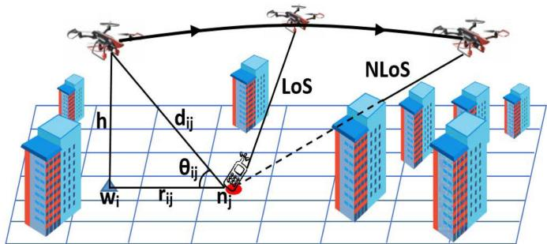  
Fig. 1. Illustration example of collecting RSSI measurements using one UAV in localizing a terrestrial object. The arrows show the moving direction of the UAV.

To the best of our knowledge, no work has considered using a smart UAV to autonomously observe the environment and find the trajectory that results in faster multipleobject localization with minimum errors, by only relying on RSS information, and taking into account the variation of shadowing with UAV elevation angle in urban areas. There are several researches in the literature that focused on automating a UAV to navigate [34], or track object(s) [35]. However, few research works, like [36] and [37], have investigated in automating UAV to localize objects. In [36], the authors divided the geographical area into multiple zones, and based on continuously capturing the WiFi probe requests at different locations, using random-forest based machine learning technique, the UAV finds the zone where the terrestrial device is located. In [37] illegal radio station localization using a Q-learning technique is developed to process RSS values collected by a directional antenna, and determine the UAV’s trajectory. Nevertheless, none of the autonomous UAV work presented in the literature considered the dependency of path loss and shadowing characteristics on the UAV altitude.

## 3 SYSTEM MODEL

In this paper, we consider a UAV flying over an urban area at a fixed altitude $h ,$ acting as an aerial anchor to localize multiple terrestrial objects $N = \{ n _ { 1 } , n _ { 2 } , n _ { 3 } , \ldots , n _ { j } , \ldots \}$ . These <sup>1 2 3 . . .</sup>objects are equipped with a wireless communication device which periodically broadcast a probe request. The UAV, in its trajectory, hovers for few seconds ( ) over certain points (referred to as waypoints $W = \{ w _ { 1 } , w _ { 2 } , w _ { 3 } , \ldots , w _ { i } , \ldots \} )$ to col-<sup>1 2 3 . . .</sup>lect RSSI measurements from different objects in its communication range. The UAV obtains its distance to the object from the well-known path loss model equation [5]. Subsequently, the location of each object is estimated by the RSS measurements collected at different waypoints using the multilateration technique. As illustrated in Fig. 1, at each waypoint, a UAV may have a line-of-sight $\left( \mathrm { L o S } \right)$ or non-lineof-sight (NLoS) link with an object. In the figure, the direct distance between the UAV at waypoint $w _ { i }$ and object $n _ { j }$ is denoted by $d _ { i j } ,$ , and the ground distance is represented by $r _ { i j } .$ Moreover, the elevation angle is denoted by $\theta _ { i j }$ . The search <sup>u</sup>area is divided into equal cells. Each cell represents a waypoint (at the center of the cell). These cells are used for the UAV to traverse to maximize the localization precision. However, in our method, in order to train the agent (auto controller) of the UAV, and also to know the number of objects for July 05,2026 at 12:38:43 UTC from IEEE Xplore. Restrictions apply.

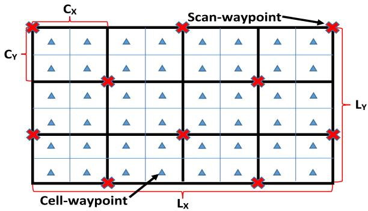  
Fig. 2. Illustration example of dividing the area into RL-cells and finding initial scan waypoints.

better autonomous localization, an initial scan is needed. Hence, first we find a minimum number of initial scan waypoints (or scan-waypoints in short) and its shortest trajectory. Then, we let the UAV, using the RL method, autonomously find the optimal trajectory through the specified cell-waypoints (also referred as RL cells). In the following subsections, we define the initial scan, RL cells, and thoroughly explain the channel and energy consumption models used in our localization procedure.

## 3.1 Initial Scan

In order to know the number of objects in the search area, a UAV has to scan and cover the whole area using a minimum number of waypoints so as to optimize the cost $( \mathrm { i . e . , }$ cost of energy consumption, number of waypoints, path length, or time to scan the area). To do that, we first divide the area into minimum number of equal cells, where each cell is covered by the communication range of one UAV when placed in the middle of the cell. As depicted in Fig. 2, if we let $L _ { x }$ and $L _ { y }$ respectively be the length and width of the area. Then, the length $C _ { x }$ and width $\bar { C } _ { y }$ of the guaranteed covered cell is obtained from the following:

$$
\begin{array} { r } { C _ { x } = \frac { L _ { x } } { \lceil \frac { L _ { x } } { R } \rceil } } \end{array}\tag{}
$$

$$
\begin{array} { r } { C _ { y } = \frac { L _ { y } } { \lceil \frac { L _ { y } } { R } \rceil } , } \end{array}\tag{}
$$

where $R = \sqrt { D ^ { 2 } - h ^ { 2 } }$ is the ground coverage range of the UAV, and D is the actual communication range of the UAV. The location of the scan-waypoints is obtained through Algorithm 1, and illustrated in Fig. 2 by red X-signs. As shown in Fig. 3 by blue circles, all the search area has been covered by the UAV’s communication range using scanwaypoints. Moreover, the trajectory of the UAV over the scan-waypoints is shown in the figure by a black line, where it sequentially follows the nearest scan-waypoint.

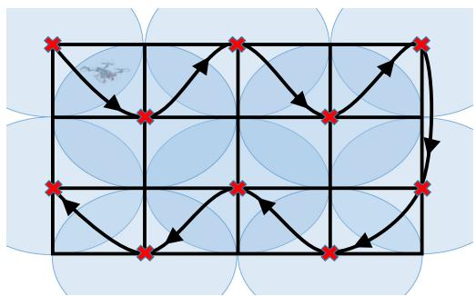

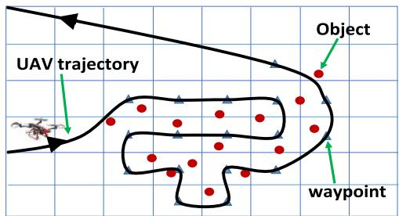  
Fig. 4. Illustration example of RL trajectory.

```perl
Algorithm 1. Finding Initial Scan Waypoints
Data: $L _ { x } , L _ { y } , C _ { x } ,$ and $C _ { y }$
Result: Set of initial scan waypoints Snodes
1 Snodes ¼ ;
2 $x = 0 , y = 0$
<sup>0</sup>3 while $x \leq L _ { x }$ do
4 $\scriptstyle t e m p = y$
5 while $y \le L _ { y }$ do
6 Snodes:append $\left( \left( x , y \right) \right)$
7 $y = y + 2 C _ { y }$
8 <sup>2</sup>if temp ¼ then
9 $y = C _ { y }$
10 else
11 $y = 0$
12 $x = x + C _ { x }$
```

## 3.2 Reinforcement Learning Cells

To get the RL cells, it is as simple as dividing each coverage cell $( \mathrm { i . e . }$ , length $C _ { x }$ and width $C _ { y } )$ into equal multiple cells. The minimum number of possible RL cells in a coverage cell is four $( \mathrm { i . e . , }$ , dividing the edges into two equal parts, $\omega = 2 ) .$ , as illustrated in Fig. 2. Alternatively, the number of <sup>v 2</sup>edge partitions $\omega$ can be increased as needed. We analyze <sup>v</sup>the effect of the number of RL cells on localization precision in the numerical result section (Section 6). Algorithm 2 demonstrates the steps to find the RL cell waypoints, and Fig. 4 shows an example of RL trajectory.

Algorithm 2. Finding RL Cell Waypoints   
Data: $L _ { x } , L _ { y } , C _ { x } , C _ { y } ,$ and   
<sup>v</sup>Result: Set of initial scan nodes Snodes   
1 Cnodes ¼ ;   
2 $x = C _ { x } / 2 \omega$   
3 $y = C _ { y } / 2 \omega$   
4 while $x \leq L _ { x }$ do   
5 while $y \le L _ { y }$ do   
6 Cnodes:appendððx; yÞÞ   
7 $y = y + C _ { y } / \omega$   
8 $y = C _ { y } / 2 \omega$   
9 $x = x + C _ { x } / \omega$

## 3.3 Channel Model

The air to ground channel model, by incorporating the dependencies of shadowing and path loss exponent with the elevation angle elevation angle $\theta = \tan ^ { - 1 } ( h / r ) )$ , is given by [38]: , is given by [38]:

Fig. 3. Initial scan-waypoints, their coverage range, and trajectory. u tanAuthorized licensed use limited to: Guangxi University. Downloaded on July 05,2026 at 12:38:43 UTC from IEEE Xplore. Restrictions apply.

$$
\begin{array} { r } { P L = 2 0 l o g \left( d \right) + 2 0 l o g \left( \frac { 4 \pi f } { c } \right) + \Psi ( \theta ) , } \end{array}\tag{}
$$

where f and c are respectively the system frequency and speed of light, and $\Psi ( \bar { \theta } )$ is a log-normal distributed random <sup>u</sup>variable with mean and variance $\sigma ^ { 2 } ( \theta )$ [5], i.e.,

$$
\Psi ( \theta ) \sim \mathcal { N } ( \mu , \sigma ^ { 2 } ( \theta ) ) ,\tag{}
$$

given that $\mu = 0 .$ , and $\sigma ^ { 2 } ( \theta )$ can be written as:

$$
\sigma ^ { 2 } ( \theta ) = \mathbb { P } _ { L o S } ^ { 2 } ( \theta ) \sigma _ { L o S } ^ { 2 } ( \theta ) + \left[ 1 - \mathbb { P } _ { L o S } ( \theta ) \right] ^ { 2 } \sigma _ { N L o S } ^ { 2 } ( \theta ) ,\tag{}
$$

where $\sigma _ { L o S } ( \theta )$ and $\sigma _ { N L o S } ( \theta )$ correspond respectively to the <sup>s u s u</sup>shadowing effect of LoS and NLoS links between the UAV and object, and they are expressed as:

$$
\sigma _ { L o S } ( \theta ) = a _ { L o S } \exp ( - b _ { L o S } , \theta )\tag{}
$$

$$
\sigma _ { N L o S } ( \theta ) = a _ { N L o S } \exp ( - b _ { N L o S } , \theta ) ,\tag{}
$$

and $\mathbb { P } _ { L o S } ( \theta )$ is the probability of having LoS link, which is given by:

$$
\begin{array} { r } { \mathbb { P } _ { L o S } ( \theta ) = \frac { 1 } { 1 + a _ { 0 } \exp ( - b _ { 0 } , \theta ) } , } \end{array}\tag{}
$$

where $a _ { 0 } , \ b _ { 0 } , \ a _ { L o S } , \ b _ { L o S } , \ a _ { N L o S } ,$ and $b _ { N L o S }$ are environment <sup>0 0</sup>dependent parameters. The reader is referred to [38] for more insights regarding the channel model.

## 3.4 Power Consumption Model

In this subsection, we present a suitable simple power consumption model for a UAV following the work presented in [30] and [39]. From the fact that the energy consumption of data communication is negligible compared to the energy required to keep the UAV aloft and fly, we compound the model into three main power consumption sources:

## 3.4.1 Blade Profile Power

This power is required to turn the rotors’ blade, and it is given by:

$$
\begin{array} { r } { \mathbf { P } _ { b l a d e } = K \bigg ( 1 + 3 \frac { v ^ { 2 } } { v _ { b } ^ { 2 } } \bigg ) , } \end{array}\tag{}
$$

where v is the UAV velocity, v<sub>b</sub> is the blade’s rotor speed, and K represents a constant which depends on the dimensions of the blade.

## 3.4.2 Parasite Power

The power is used to overcome the drag force resulted from moving through the air.

$$
\begin{array} { r } { { \bf P } _ { p a r a s i t e } = \frac { 1 } { 2 } \rho v ^ { 3 } { \cal F } , } \end{array}\tag{}
$$

$\rho$ is the air density, and F represents a constant that depends on the UAV drag coefficient and reference area. Note that this power is proportional to the UAV velocity v; it is zero when hovering and gradually increases by the speed of the UAV.

## 3.4.3 Induced Power

This power is required to lift the UAV and overcome the drag caused by the gravity. Whenever a UAV is moving, the Authorized lic so limitod t axi Univorsity

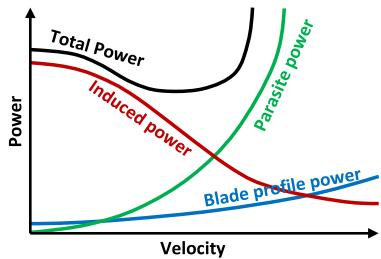  
Fig. 5. Three main sources of power consumption versus UAV velocity [30], [39].

airflow coming at it redirects the UAV and helps to lift it. Hence, the induced power has inverse proportion to the airspeed. When hovering, all the airflow needed to lift the UAV has to be created by the blade rotors, which results in more power consumption. The induced power can be written as follows:

$$
\mathbf { P } _ { i n d u c e d } = m g v _ { i } ,\tag{}
$$

where m and g respectively denote the mass of the UAV and the standard gravity, whereas, v represents the mean propellers’ induced velocity in the forward flight, and it is given by:

$$
\begin{array} { r } { v _ { i } = \sqrt { \frac { - v ^ { 2 } + \sqrt { v ^ { 4 } + ( \frac { m g } { \rho A } ) ^ { 2 } } } { 2 } } , } \end{array}\tag{}
$$

with A being the area of the UAV.

Now, when the UAV is flying from one waypoint to another, the total power consumption is obtained from the following:

$$
\mathbf { P } _ { t o t a l } = \mathbf { P } _ { b l a d e } + \mathbf { P } _ { p a r a s i t e } + \mathbf { P } _ { i n d u c e d } .\tag{}
$$

However, in case of hovering, when the UAV needs to collect RSSI measurements (i.e., when $\mathbf { v } = 0 )$ , the total power consumption is limited to hovering power and is calculated accordingly:

$$
\begin{array} { r } { \mathbf { P } _ { t o t a l } = \mathbf { P } _ { h o v e r } = K + \sqrt { \frac { ( m g ) ^ { 3 } } { 2 \rho A } } . } \end{array}\tag{}
$$

In Fig. 5, we demonstrate the trend of the three power consumption factors along with the total power versus the UAV velocity. From the figure, we can conclude that at optimal speed, the UAV consumes less power compared to hovering time (when v ¼ ). Therefore, in order to maximize the <sup>0</sup>localization precision with the knowledge of limited UAV energy, it is not always advisable to maximize the number of waypoints.

## 4 THE REINFORCEMENT LEARNING APPROACH

As mentioned, using the multilateration technique, in order to find the position of objects with less localization errors, a UAV has to follow more waypoints. However, with limited number of waypoints, UAV energy, flying time, or path length, a certain UAV trajectory results in optimal localization precision. Hence, in this section, we let the UAV, by observing the environment and using RL, learn and autonomously find the best trajectory that leads to minimum localization errors. In the following, we first briefly review RL, a July 05,2026 at 12:38:43 UTC from IEEE Xplore. Restrictions apply.

machine learning technique which is suitable for controlling an autonomous machine such as UAV. Then, we introduce our approach using RL for efficient UAV localization.

## 4.1 Reinforcement Learning Background

RL is a branch of machine learning paradigm, which deals with multi-state decision process of a software agent (UAV in our case) while interacting with an environment. In general, RL assumes the system consists of multiple states $S$ (waypoints in this case), where at each state $s _ { t } \in S ,$ the agent has a finite number of actions A $( \mathrm { i . e . , }$ neighboring waypoints) to choose from. After choosing an action $a _ { t } \in A _ { i }$ , the agent receives a reward $r ( s _ { t } , a _ { t } )$ , and moves to the next state $s _ { t + 1 }$ . The goal of RL is to learn from the transition tuple $\langle s _ { t } , a _ { t } , r ( s _ { t } , a _ { t } ) , s _ { t + 1 } \rangle$ , and find an optimal policy $\pi ^ { * }$ that will <sup>1 p</sup>maximize the cumulative sum of all future rewards. Note that the policy $\pi = \{ a _ { 1 } , a _ { 2 } , \ldots , a _ { T } \}$ defines which action $a _ { t }$ <sup>p 1</sup>should be applied at state $s _ { t } .$ <sup>. .</sup>. If we let $r ( s _ { t } , \pi ( a _ { t } ) )$ denote the reward obtained by choosing policy $\pi ,$ <sup>p</sup>the cumulative dis-<sup>p</sup>count sum of all future rewards using policy is given by:

$$
R _ { \pi } = \sum _ { t = 1 } ^ { T } \gamma ^ { t - 1 } r ( s _ { t } , \pi ( a _ { t } ) ) ,\tag{}
$$

where $\gamma \in [ 0 , 1 )$ is a discount factor, which measures the <sup>g 0 1</sup>weight given to the future rewards $( \mathrm { i . e . , }$ when $\gamma = 0 ,$ the <sup>g 0</sup>agent considers only the current received rewards, whereas, when the factor approaches one, the agent strives for future higher reward). Now, let L denote the set of all admissible policies. Then, the optimal policy is given by:

$$
\pi ^ { * } = \operatorname * { a r g m a x } _ { \pi \in \Lambda } R _ { \pi } .\tag{}
$$

Note that RL is modeled as a Markov Decision Process (MDP), where the tuple $\langle s _ { t } , a _ { t } , r ( s _ { t } , a _ { t } ) , s _ { t + 1 } \rangle$ is conditionally <sup>1</sup>independent of all previous states and actions. Therefore, the agent does not need to memorize or save all the state-action tuples, just the last one, and subsequently updates it at each cycle or iteration. In this work, we use Q-learning [40], one of the widely used RL algorithms, which allows the agent to optimally act in an environment represented by an MDP. Q-learning iteratively improves the state-action value function (also known as Q-function or Q-value), and by estimating the future reward if action $a _ { t }$ is taken, presents the probability of going from state $s _ { t }$ to $s _ { t + 1 }$ using policy . The optimal Q-value function is given by:

$$
Q ^ { * } ( s _ { t } , a _ { t } ) = E [ R ( s _ { t } , a _ { t } ) + \gamma \operatorname* { m a x } _ { a _ { t + 1 } } Q ^ { * } ( s _ { t + 1 } , a _ { t + 1 } ) ] .\tag{}
$$

Once we have the optimal Q-function at state $s _ { t } ,$ it is easy to obtain the optimal policy simply by choosing the best $\mathrm { Q - }$ value from the current available action as follows:

$$
\pi ^ { * } ( s _ { t } ) = \arg \operatorname* { m a x } _ { a _ { t } } Q ^ { * } ( s _ { t } , a _ { t } ) .\tag{}
$$

It should be noted that, the Q-value function is usually stored in a table. Now, starting from an arbitrary Q-value, each time the agent wants to take an action, it approximates the optimal Q-function based on the observations of the environment, updates the Q-value according to Equation (19) and stores it into the table. The parameter $\alpha \in [ 0 , 1 ]$ denotes the learning rate. In other words, it determines to what extent the old Q-values are overridden (i.e., when $\alpha = 0 , \ Q$ -value is <sup>a 0</sup>not updated and thus nothing is learnt, whereas, when $\alpha = 1 .$ , it means the agent learns quickly).

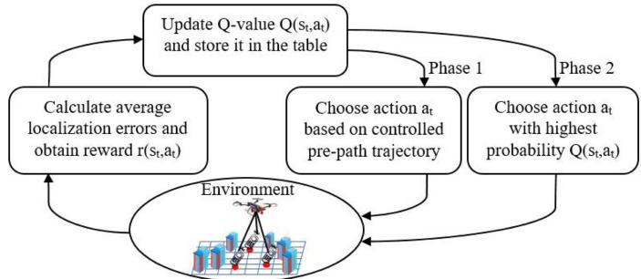  
Fig. 6. Learning policy using two phases: 1) initial controlled scan trajectory, and 2) standard RL implementation.

$$
\begin{array} { r l } & { Q ( s _ { t } , a _ { t } ) \gets ( 1 - \alpha ) Q ( s _ { t } , a _ { t } ) } \\ & { \qquad + \alpha [ r ( s _ { t } , a _ { t } ) + \gamma \underset { a _ { t + 1 } } { \operatorname* { m a x } } Q ( s _ { t + 1 } , a _ { t + 1 } ) ] . } \end{array}\tag{}
$$

From the fact that Q-learning is an iterative algorithm, under certain conditions [40], the Q-value function will converge to optimal policy $Q ^ { * } ( s _ { t } , a _ { t } )$ , if the number of iterations approaches infinity. For more background information on RL, the reader is referred to [41].

## 4.2 Proposed Solution Approach

In this subsection, we introduce our RL approach for UAV multi-object localization. As explained earlier, the current RL state $s _ { t }$ is the waypoint (or cell) that the UAV is hovering at time t to measure RSSI from all objects in its communication range. Subsequently, all available neighbor waypoints (cells) are actions to choose from to move to a next waypoint in state $s _ { t + 1 }$ . While visiting a waypoint, the UAV by taking <sup>1</sup>the RSSI measurements, observes the environment and calculates the reward $r ( s _ { t } , a _ { t } )$ obtained from choosing action $a _ { t } .$ Concurrently, for each available action $\displaystyle a _ { t } ,$ the probability of going from state $s _ { t }$ to state $s _ { t + 1 } , \mathrm { i . e . , } Q ( s _ { t } , a _ { t } )$ , is estimated <sup>1</sup>through Equation (19). The way to obtain the reward and Q-value for our RL-UAV localization is explained thoroughly in Section 5.

The main problem with RL on autonomous UAV localization is in the early stage of the learning process. It is obvious that the agent, at the early stage, knows very few or nothing about the environment, and thus, somehow chooses an arbitrary action. As the agent starts learning by iteratively taking more actions and receiving rewards from the environment, it can improve its approximation value $Q ( s _ { t } , a _ { t } )$ and better decide on its next step. Hence, similar to the work in [42] for mobile robots, to boost the learning curve of the RL system, as illustrated in Fig. 6, we split the learning policy into two phases: 1) initial controlled scan trajectory, and 2) standard RL implementation.

In Phase 1, the UAV is controlled by a pre-path trajectory algorithm. The algorithm is designed to let the UAV visit scan waypoints (as shown in Fig. 3) in order to train the agent online and get information from the environment for learning. During Phase 1, the agent by observing the environment $( \mathrm { i . e . , }$ watching the states, actions, and rewards), bootstraps July 05,2026 at 12:38:43 UTC from IEEE Xplore. Restrictions apply.

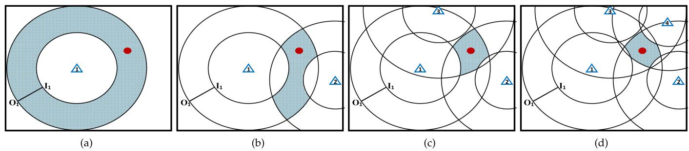  
Fig. 7. Illustration of localization error reduction for one object using four UAV measurements.

information into its Q-value function approximation $Q ( s _ { t } , a _ { t } )$ Subsequently, after this learning phase, the agent will be ready to control the UAV. In Phase 2, the UAV, using the information of Q-value function approximation, autonomously traverses the area and visits waypoints to increase the average localization accuracy. In this learning phase, as the standard RL implementation, the learning policy is in the control of the UAV.

## 5 THE UAV LOCALIZATION ERROR

In this section, we explain how the UAV estimates the position of multiple objects through received RSSI, and regularly using multilateration minimizes the average location errors. In other words, this section describes how to obtain the reward $r ( s _ { t } , a _ { t } )$ and estimated future Q-value function $Q ( s _ { t + 1 } , a _ { t + 1 } )$ for RL implementation. Here, we illustrate the localization procedure for one object and similarly is done for other objects. Eventually, the average localization errors from all objects will be our measured quantity for the RL reward and Q-value at each state.

Fig. 7 shows the localization error reduction of an object using the multilateration technique. The object is shown by a red point, waypoints by blue triangles, and object estimated location area by shaded blue color. In the first step (depicted in Fig. 7a), by getting RSSI measurement at one waypoint, following the air to ground channel model (3) in Section 3.3, the position of the object is estimated in the shaded blue area between the inner $\left( I _ { 1 } \right)$ and outer $( O _ { 1 } )$ circles. The radius of <sup>1 1</sup>these circles is dependent on the shadowing and path loss exponent. Next, when the UAV moves to the next waypoint and takes another RSSI measurement (Fig. 7b), the localization area shrinks. Whenever the number of measurements becomes three (Fig. 7c), the position of the object can be estimated using trilateration, and subsequently, the calculation of the localization error. As the number of waypoints and RSSI measurements increase, the localization error likely decreases (as illustrated in Fig. 7d.

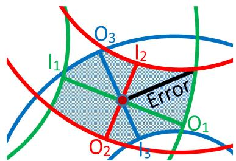  
Fig. 8. Illustration of position estimation and error calculation for one object.

Fig. 8 shows how we obtain the error for one object using three waypoints. The intersection point between three lines that connect inner and outer circles presents the estimated location of the object. Consequently, the localization error can be obtained by finding the farthest border point to the estimated object point as shown by the black line in the figure. Let us assume that the Cartesian coordinate for the estimated location of the object is $( \hat { x } , \hat { y } )$ . Let $( x _ { w _ { i } } , y _ { w _ { i } } )$ be the known <sup>^ ^</sup>ground position of the UAV at waypoint $i ,$ and $\begin{array} { r } { \bar { r _ { i } } = \frac { O _ { i } + I _ { i } } { 2 } } \end{array}$ be <sup>- 2</sup>the distance from waypoint i to the middle of the two circles, then the estimated position ðx; yÞ using M number of way-<sup>^ ^</sup>points can be obtained from the following optimization model:

$$
( \hat { x } , \hat { y } ) = \underset { \hat { x } , \hat { y } } { \mathrm { a r g m i n } } \Biggl \{ \sum _ { i = 1 } ^ { M } ( \sqrt { \left( x _ { w _ { i } } - \hat { x } \right) ^ { 2 } + \left( y _ { w _ { i } } - \hat { y } \right) ^ { 2 } } - \bar { r _ { i } } ) ^ { 2 } \Biggr \} .\tag{}
$$

<sup>20</sup>The border points of the estimated area of the object are created each by the intersection of two communication circles. Fig. 9 illustrates how a border point is found. From the figure, $r _ { 1 }$ and $r _ { 2 }$ are respectively the communication <sup>1</sup>radius of waypoints $w _ { 1 }$ and $w _ { 2 } ,$ and k is the distance between the two waypoints. $P _ { 1 }$ and $P _ { 2 }$ are the required intersection <sup>1 2</sup>points between two circles, and $P _ { 0 }$ is the intersection point of <sup>0</sup>the perpendicular line connecting $P _ { 1 }$ and $P _ { 2 }$ with line $k .$ Respectively, $q _ { 1 }$ and $q _ { 2 }$ <sup>1 2</sup>denote the distances from $w _ { 1 }$ to $P _ { 0 } ,$ and from $\dot { P _ { 0 } }$ <sup>1</sup>to $w _ { 2 } ,$ <sup>2</sup>, respectively. Now, if we let $( x _ { w _ { 1 } } , y _ { w _ { 1 } } ) ,$ $( x _ { w _ { 2 } } , y _ { w _ { 2 } } ) , ( x _ { P _ { 0 } } , y _ { P _ { 0 } } ) , ( x _ { P _ { 1 } } , y _ { P _ { 1 } } )$ , and $( x _ { P _ { 2 } } , y _ { P _ { 2 } } )$ <sup>1 1</sup>denote respec-<sup>2 2 0 0 1 1 2 2</sup>tively the Cartesian coordinates for points w , $w _ { 2 } , P _ { 0 } , P _ { 1 }$ , and $P _ { 2 }$ <sup>1 2 0 1</sup>, then the border points are calculated through the following equations:

$$
\begin{array} { r } { x _ { P _ { 1 } , P _ { 2 } } = x _ { P _ { 0 } } \pm \frac { ( y _ { w _ { 2 } } - y _ { w _ { 1 } } ) h } { k } } \end{array}\tag{}
$$

$$
\begin{array} { r } { y _ { P _ { 1 } , P _ { 2 } } = y _ { P _ { 0 } } \mp \frac { ( x _ { w _ { 2 } } - x _ { w _ { 1 } } ) h } { k } , } \end{array}\tag{}
$$

where $\begin{array} { r } { ( x _ { P _ { 0 } } , y _ { P _ { 0 } } ) = ( x _ { w _ { 1 } } + \frac { ( x _ { w _ { 2 } } - x _ { w _ { 1 } } ) q _ { 1 } } { k } , y _ { w _ { 1 } } + \frac { ( y _ { w _ { 2 } } - y _ { w _ { 1 } } ) q _ { 1 } } { k } ) . } \end{array}$ $q _ { 1 } =$ $\frac { r _ { 1 } ^ { 2 } - r _ { 2 } ^ { 2 } + k ^ { 2 } } { 2 k }$ and $h = \sqrt { r _ { 1 } ^ { 2 } - q _ { 1 } ^ { 2 } }$

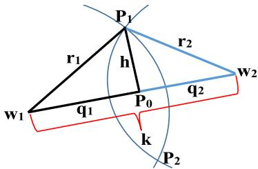  
Fig. 9. Illustration of obtaining the intersection point of two communication circles.

(a)  
(b)  
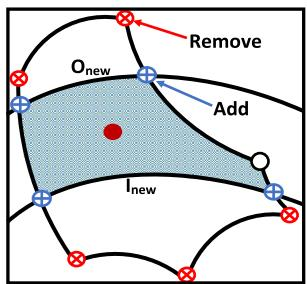  
Fig. 10. Example of how the border nodes are updated after a new UAV measurement.

After a new RSSI measurement, the accuracy of the estimated object localization area is updated through the following steps and illustrated in Fig. 10:

1) Remove border points, if any, that position outside the outer circle $( O _ { n e w } )$ and inside the inner circle $( I _ { n e w } )$ as shown in the figure as red points.

2) Add new intersection points (shown in the figure as blue points) if they do not reside inside and outside of any inner and outer circles of old measurements.

3) Find distances from all obtained area points to the estimated object point, and the one with farthest distance is the object’s localization error.

After obtaining the localization error, as explained earlier, for all terrestrial objects which are within the UAV’s communication radius in current state $s _ { t } ,$ we average over all these error values. We retrieve then the stored localization error values from previous state $s _ { t - 1 }$ and compute their average. <sup>1</sup>The difference between these two average errors is considered as the current reward $r ( s _ { t } ; a _ { t } )$ . Then, we store the <sup>;</sup>obtained error values from current state into the table, which will be used for subsequent reward computation. Similarly, we estimate the future average localization errors for all available neighbor waypoints or actions, and we update the approximated Q-value function for all actions and store them into the table. Subsequently, for the next iteration, we choose the action that results in higher reward by looking at the stored Q-value functions. To be noted that the future estimated average localization errors is not obtained through the RSSI measurements, however, it is calculated based on estimation of RSSI without visiting the new waypoint or taking the action.

## 6 PERFORMANCE EVALUATION

In this section, we evaluate the performance of our RL approach in localizing terrestrial objects numerically. We generate at random the locations of the IoT devices which we want the UAV to localize. Based on UAV’s altitude and the probability of LoS, as explained in Section 3.3 for variance ${ \bar { \sigma } } ^ { 2 } ( \theta )$ , we compute the range (between inner-circle $I _ { i }$ and <sup>s u</sup>outer-circle O ) where the object is located from the ground position of UAV’s waypoint i. Consequently, the area obtained from the intersection of multiple inner and outer circles (or ranges) is considered as the location area of the object. Hence, the localization error or accuracy can be measured by calculating the distance from the farthest border node in this area to the center of the area. Subsequently, by adding more UAV waypoints, the location error is minimized.

We compare the performance of our RL approach with a method that chooses a random direction for a UAV to localize objects (Random Path), and three other state-of-the-art prepath trajectory methods: 1) SCAN path [25] (see Fig. 11a): the UAV follows a path formed by vertical straight lines interconnected by horizontal lines. 2) LMAT path [16] (see Fig. 11b): the UAV follows a path formed by equilateral triangles such that all the waypoints are visited once. This path here is updated to fit our region and cell division. Algorithm 3 illustrates the UAV traverse steps to create the LMAT path for our environment. 3) MAZE path (see Fig. 11c): the UAV follows a path which eventually creates a shape of maze. This path is deduced from the path planing algorithm named Localizer-Bee [21]. Algorithm 4 presents the steps to build up the MAZE path for UAV trajectory.

<table><tr><td>Algorithm 3. LMAT Traverse Steps From the Down Right Most Cell</td></tr><tr><td>1 From the current location, if there is no neighbor cell to</td></tr><tr><td>traverse, terminate. 2 Else if there is one untraversed neighbor cell, choose it as the</td></tr><tr><td>next traverse node (cell). 3 Else if the down corner cell is untraversed, choose it.</td></tr><tr><td>4 Else if the down cell is untraversed, choose it.</td></tr><tr><td>5 Else if upper cell is untraversed, choose it.</td></tr><tr><td>6 Else traverse any available upper corner cell.</td></tr></table>

In this section, we first study the performance of all mentioned methods above for localizing 20 and 30 terrestrial objects by varying UAV’s energy, trajectory length, number of waypoints, and UAV flying time. We then study the performance of our RL method by varying the UAV altitude and communication range. We further evaluate the localization accuracy by modifying the UAV velocity and hovering time. Finally, we observe the localization error by changing the number of terrestrial nodes and cells.

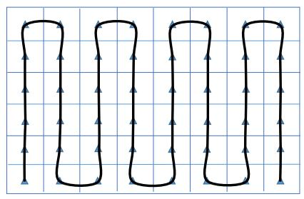

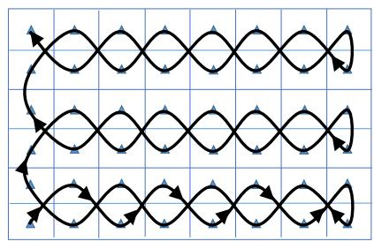

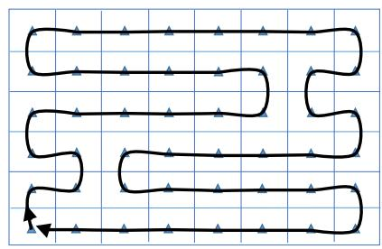  
(c)  
Fig. 11. Three different pre-path trajectory methods from the literature: (a) SCAN, (b) LMAT, and (c) MAZE. Authorized licensed use limited to: Guangxi University. Downloaded on July 05,2026 at 12:38:43 UTC from IEEE Xplore. Restrictions apply.

TABLE 1  
Description of the Parameters Used and Their Corresponding Values
<table><tr><td>Parameter</td><td>Description</td><td>Value</td></tr><tr><td> $L _ { x } \times L _ { y }$ </td><td>Area dimensions [m*m]</td><td> $9 0 0 \times 7 0 0$ </td></tr><tr><td> $h$ </td><td>UAV&#x27;s altitude [m]</td><td>100</td></tr><tr><td> $D$ </td><td>UAV&#x27;s com. range [m]</td><td>200</td></tr><tr><td>τ</td><td>Hovering time [sec]</td><td>5</td></tr><tr><td> $v$ </td><td>UAV&#x27;s velocity [Km/h]</td><td>40</td></tr><tr><td> $v _ { b }$ </td><td>Rotor speed</td><td>100</td></tr><tr><td> $K$ </td><td>Blade dimension constant</td><td>570</td></tr><tr><td> $\rho$ </td><td>Air density</td><td>1.225</td></tr><tr><td> $F$ </td><td>Drag and reference area coefficient</td><td>0.4</td></tr><tr><td> $m$ </td><td>UAV mass [Kg]</td><td>5</td></tr><tr><td> $A$ </td><td>UAV surface area  $[ m ^ { 2 } ]$ </td><td>0.25</td></tr><tr><td> $a _ { 0 }$ </td><td>Environment parameter for  $P _ { L o S }$ </td><td>45</td></tr><tr><td> $b _ { 0 }$ </td><td>Environment parameter for  $P _ { L o S }$ </td><td>10</td></tr><tr><td> $a _ { L o S }$ </td><td>shadowing constant for LoS</td><td>10</td></tr><tr><td> $b _ { L o S }$ </td><td>shadowing constant for LoS</td><td>2</td></tr><tr><td> $a _ { N L o S }$ </td><td>shadowing constant for NLoS</td><td>30</td></tr><tr><td> $b _ { N L o S }$ </td><td>shadowing constant for NLoS</td><td>1.7</td></tr></table>

Algorithm 4. MAZE Traverse Steps From the Down Right   
Most Cell   
1 Traverse to the upper cell if the number of X-axis cells is even.   
2 Let the number of allowed moves be equal to one $( \mathrm { i . e . , }$   
NoMove ¼ ).   
<sup>1</sup>3 while we did not reach the most upper cell do   
4 Based on the NoMove, traverse to the right cells.   
5 Traverse one cell up.   
6 Traverse to the left most cell.   
7 $N o M o v e + + ;$   
8 if NoMove = number of Y-axis -2 then   
9 $N o M o v e = 1 ;$   
10 <sup>1</sup>Traverse one cell up.   
11 Traverse to the right most cell.   
12 Traverse one cell down.   
13 NoMove = Number of Y-axis cells - 2;   
14 while we did not reach the most down cell do   
15 Do the same procedure similar to traversing upwards but   
in opposite direction.

For the numerical study, we assume N terrestrial nodes which are randomly distributed in a region of $9 0 0 \times 7 0 0 ~ \mathrm { m ^ { 2 } } .$ <sup>900 700 m</sup>where the region is divided into M equal cells. We also assume a UAV is flying at a fixed altitude h, and the hovering time is equal at each waypoint. Further, we assume the communication range of all nodes is equal and the UAV can measure the RSSI from nodes within radius D. The parameters used in these numerical results and their corresponding values (taken and recommended by [5], [28], [30], [38] for urban environments) are listed in Table 1, unless otherwise stated. We use Python as a programming language to simulate the operation of the proposed methods, and the numerical results are averaged over ten runs.

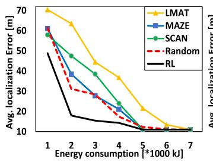  
(a)

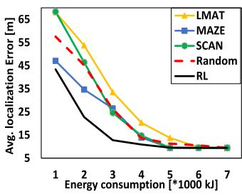  
(b)  
Fig. 12. Average localization error in meter versus UAV energy consumption. Number of localizing objects is (a) 20 nodes, and (b) 30 nodes. Authorized licensed use limited to: Guangxi University. Downloaded o

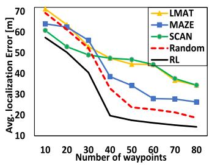  
(a)

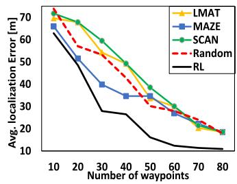  
(b)  
Fig. 13. Average localization error in meter versus number of UAV waypoints. Number of localizing objects is (a) 20 nodes, and (b) 30 nodes.

## 6.1 Comparing the Performance of Different Methods With Limited UAV Energy, Path Length, Number of Waypoints, or Flying Time

We start by examining the results obtained by solving the RL approach and compare it with the results obtained from the random path, SCAN, LMAT, and MAZE. For comparison we acquire the localization error of 20 and 30 terrestrial objects, and the region is divided into M ¼ equal cells <sup>120</sup>(or waypoints). Fig. 12 shows the average localization error by varying the energy consumption of the UAV from to . As depicted in the figure, if the UAV’s <sup>1000 kJ 7000 kJ</sup>energy is sufficient to traverse all the waypoints (for example 7000 kJ), all methods eventually perform equally (the ultimate average localization error for 20 (respectively 30) nodes is around (res. : ) for a total of 120 waypoints). Note <sup>11 m 9 4 m</sup>that this shows the fairness for all methods. However, when the UAV’s energy is limited, the performance of different methods varies. For instance, for localizing 20 nodes, when the energy is limited by (respectively ), the RL approach, Random, SCAN, LMAT, and MAZE perform (res. : ), : (res. : ), : (res. ), <sup>18 m 14 3 m 31 2 m 17 4 m 47 5 m 24 m</sup>: (res. : ), and : (res. ) respectively. The <sup>63 5 m 36 8 m 38 5 m 21 m</sup>RL approach, as expected, always outperforms the other methods for both 20 (Fig. 12a) and 30 (Fig. 12b) terrestrial nodes. It should be noted here that such gains are attributed to the intelligent movement and trajectory of the UAV. As for the Random method, because of randomness, we can not predict its behavior. Whereas, for the other methods, their performance depends on the random distribution of terrestrial nodes. However, in all of the methods, the localization accuracy improves by consuming more energy and hence traversing more waypoints. This improvement is also shown in Fig. 13. In Fig. 13a (res. Fig. 13b), the average localization error for the RL approach reduces from : (res. : ) to : (res. : ).

<sup>14 3 m 10 9 m</sup>Fig. 14 depicts the localization accuracy by varying the path length of the UAV trajectory from one to seven kilometers. As plotted in the figure, the RL approach, for localizing 20 (respectively 30) nodes, shown in Fig. 14a (res. Fig. 14b) respectively performs in the worst case 14.9 percent July 05,2026 at 12:38:43 UTC from IEEE Xplore. Restrictions apply.

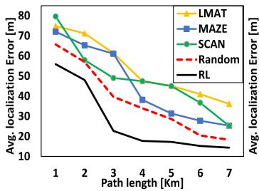  
(a)

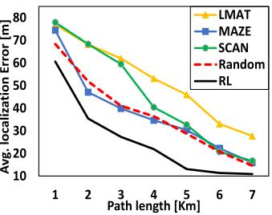  
(b)

Fig. 14. Average localization error in meter versus UAV trajectory distance. Number of localizing objects is (a) 20 nodes, and (b) 30 nodes.  
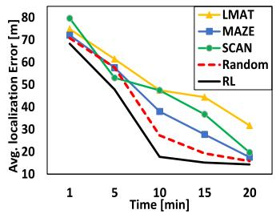  
(a)

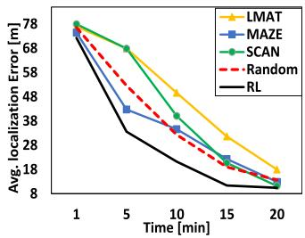  
(b)  
Fig. 15. Average localization error in meter versus UAV flying time. Number of localizing objects is (a) 20 nodes, and (b) 30 nodes.

(res. 11.3 percent), 17.1 percent (res. 22.2 percent), 25.3 percent (res. 21.2 percent), and 22.5 percent (res. 18.6 percent), and in the best case the RL approach performs 47.8 percent (res. 54.6 percent), 62.7 percent (res. 60 percent), 63 percent (res. 71.6 percent), and 62.9 percent (res. 57 percent) better than Random, SCAN, LMAT, and MAZE. The figure also shows that the average localization error for 20 nodes, by increasing the path length of UAV trajectory, reduces faster than localizing for 30 nodes. However, the latter shows better accuracy than the former one. Fig. 15 illustrates the average localization error by varying the UAV flying time from one to 20 minutes. Similar to the above figures, as the UAV invests more time in localizing terrestrial nodes, the average localization error decreases. For instance, the average localization error for 30 nodes after five minutes fly using the RL approach is : , whereas, after 15 minutes fly, the average <sup>33 6 m</sup>localization error reaches : .

## 6.2 The Effect of UAV Altitude and Communication Range on the Performance of RL Approach

In this subsection, we study the performance of our RL approach in terms of average localization error, and we set the number of terrestrial nodes to 30. Fig. 16a shows the effect of UAV communication range on the localization accuracy by varying the range from to with 50 <sup>150 m 300 m</sup>meters interval. For comparison, we limit the number of waypoints to 20 and 40. As shown in the figure, by increasing the communication range of a UAV, the average localization error decreases exponentially. It should be noted that when the communication range increases, a UAV can measure the RSSI from more terrestrial nodes and hence the average localization error decreases. The figure also shows that the localization accuracy is enhanced by increasing the number of waypoints. For instance, when the communication range of a UAV is 200 meters, the average localization errors are : and : after visiting 20 and 40 waypoints respec-<sup>48 6 m 26 5 m</sup>tively, and when the communication range is 300 meters, the localization errors are and : respectively.

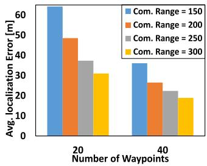  
(a)

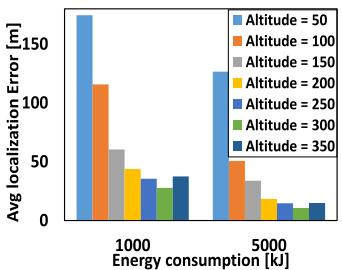  
(b)  
Fig. 16. Performance of the Reinforcement Learning (RL) method. Here the number of localizing objects is 30 nodes. The UAV communication range for figure (b) is 400 meters.

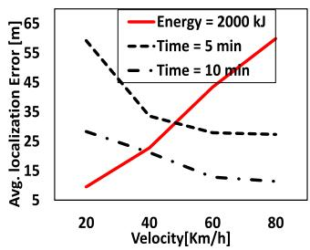  
(a)

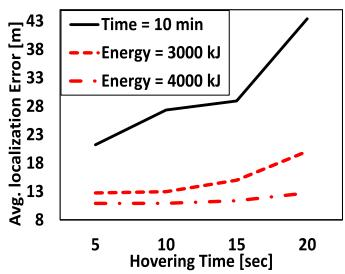  
(b)  
Fig. 17. Performance of the Reinforcement Learning (RL) method. Here the number of localizing objects is 30 nodes.

<sup>31 m 18 9 m</sup>In Fig. 16b, we illustrate the localization accuracy by varying the UAV’s altitude from to with interval of 50 <sup>50 m 350 m</sup>meters. Here, we set the communication range of the UAV to 400 meters, and for comparison purposes, we limit the UAV’s energy consumption to and . As the <sup>1000 kJ 5000 kJ</sup>figure shows, increasing the UAV’s altitude does not always improve the localization performance. It should be noted that although higher altitude increases the probability of LoS and thus better localization accuracy, but, at the same time, it decreases the coverage area of the UAV and consequently results in fewer number of objects to be localized. In this example, the optimal altitude is 300 meters; as seen from the figure, the average localization error after consuming (res. ) is : (res. : ).

## 6.3 Localization Accuracy Versus UAV Velocity and Hovering Time

In this subsection, we evaluate the performance of RL approach by varying the UAV velocity and hovering time. Here, the number of localized objects is set to 30 nodes. We start by evaluating the performance by changing the UAV velocity (20, 40, 60 , and 80 Km/h) in Fig. 17a. The figure plots the average localization error and UAV velocity under three different stopping criteria: 1) five minutes flying time, 2) ten minutes flying time, and 3) stopping after consuming 2000 kJ UAV energy. It is clear that with limited energy the localization error increases along with increasing the UAV velocity. Since, the UAV, in order to move from one waypoint to another, requires more energy to accelerate and maintain higher speed. Therefore, as shown in the figure, the error increases linearly (e.g., : error with velocity = , July 05,2026 at 12:38:43 UTC from IEEE Xplore. Restrictions apply.

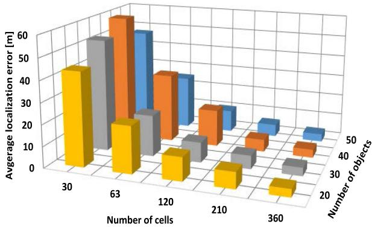

<table><tr><td rowspan=1 colspan=1></td><td rowspan=1 colspan=1>30</td><td rowspan=1 colspan=1>63</td><td rowspan=1 colspan=1>120</td><td rowspan=1 colspan=1>210</td><td rowspan=1 colspan=1>360</td></tr><tr><td rowspan=1 colspan=1>20</td><td rowspan=1 colspan=1>43.849</td><td rowspan=1 colspan=1>21.961</td><td rowspan=1 colspan=1>10.992</td><td rowspan=1 colspan=1>7.659</td><td rowspan=1 colspan=1>3.663</td></tr><tr><td rowspan=1 colspan=1>30</td><td rowspan=1 colspan=1>52.719</td><td rowspan=1 colspan=1>19.391</td><td rowspan=1 colspan=1>9.428</td><td rowspan=1 colspan=1>6.294</td><td rowspan=1 colspan=1>3.908</td></tr><tr><td rowspan=1 colspan=1>40</td><td rowspan=1 colspan=1>59.034</td><td rowspan=1 colspan=1>32.434</td><td rowspan=1 colspan=1>17.382</td><td rowspan=1 colspan=1>5.769</td><td rowspan=1 colspan=1>3.832</td></tr><tr><td rowspan=1 colspan=1>50</td><td rowspan=1 colspan=1>47.336</td><td rowspan=1 colspan=1>25.301</td><td rowspan=1 colspan=1>10.401</td><td rowspan=1 colspan=1>5.774</td><td rowspan=1 colspan=1>3.652</td></tr></table>

Fig. 18. Performance of the RL method by varying the number of localization objects and the total number of waypoint cells.

: error with velocity = , and : error with <sup>22 7 m</sup>velocity $6 0 k m / h )$ <sup>40 km h 43 4 m</sup>. From the figure, we can also observe that, <sup>60</sup>with five or ten minutes flying time, the localization error decreases with the increasing of UAV velocity. This is expected since, with higher speed and fixed flying time, the UAV can visit more waypoints and take more RSSI measurements, and thus, more chances to enhance the localization accuracy. In addition, the longer the flying time, the better the accuracy is. For instance, with five (res. ten) minutes flying time, when we change the UAV velocity from = to <sup>20 km h</sup>= , the localization accuracy enhances 53.8 percent (res. 59.8 percent).

Fig. 17b shows the performance of our approach by varying the hovering time (5 to 20 with 5 seconds interval) of the UAV to take RSSI measurements. The figure plots the average localization error for and UAV energy, and ten minutes flying time. In fact, whenever we increase the hovering time, the average localization error increases. Recall that from Section 3.4 and Equation (14), the UAV consumes power even when it is hovering. Hence, by increasing the hovering time, more energy is depleted and consequently, with limited available energy (whether or as illustrated in the figure), fewer way-<sup>3000 kJ 4000 kJ</sup>points can be visited and therefore the accuracy will not be enhanced intensively. However, as explained earlier, the system can achieve better accuracy when it has energy to traverse more waypoints. Furthermore, by looking at the figure, it is clear that, with a total of ten minutes flying time, the performance of the system degrades by increasing the hovering time.

## 6.4 Localization Error Versus Number of Terrestrial Nodes and RL Cells

Finally, we study the performance of our approach by considering changing the number of terrestrial objects to be localized (20 to 50 nodes with 10 nodes interval), and number of RL cells (30, 63, 120, 210, and 360 cells) for RSSI measurements. The results are shown in Fig. 18. Note that the number of cells depends on region’s dimensions $( L _ { x }$ and $L _ { y } )$ . The plots in the figure show that, for any number of terrestrial objects, the localization error decreases exponentially with increasing the number of cells. The reason goes for taking more RSSI measurements, and consequently shrinking the localization area for most of objects. For instance, for 50 objects, the average localization error decreases 46.5 percent from 30 to 63 cells, 58.9 percent from 63 to 120 cells, 44.5 percent from 120 to 210 cells, and 36.8 percent from 210 to 360 cells. However, as shown in the figure, the average localization accuracy does not depend on the number of terrestrial objects distributed randomly in the region. So, localizing larger number of objects does not mean the average localization accuracy is better. For example, as plotted in the figure, for 120 cells, the average localization error for localizing 40 objects is 45.8 percent worse than localizing 30 objects, and 36.8 percent worse than 20 objects. Whereas, for 210 cells, the average localization error for localizing 40 objects is 8.3 percent better than localizing 30 objects, and 24.7 percent better than 20 objects.

## 7 CONCLUSION

In this paper we proposed a novel framework using RL to let a UAV autonomously traverse a trajectory that results in finding the position of multiple ground objects with minimum average localization error under fixed amount of UAV energy consumption, trajectory length, number of waypoints, or flying time. The framework for localization considers detailed UAV to ground channel characteristics along with an empirical path loss and log-normal shadowing model, in addition to an elaborate energy consumption model. Our RL approach consists of two phases: In phase one, the UAV is controlled through an initial scan trajectory to know the number of terrestrial objects and to train the UAV’s agent online, in a real scenario. In the second phase, the UAV, based on what it learned in phase one, controls its movement. Through numerical evaluation we showed the superiority of our approach in terms of average localization error compared to existing methods in the literature. Furthermore, we studied the impact of UAV’s velocity, altitude, hovering time, communication range, number of maximum RSSI measurements, and number of objects on the localization accuracy. For future work, we intend to study the situation where a UAV can change its altitude based on probability of LoS and on communication range to better localize multiple objects. In addition, we would like to see the impact of using multiple collaborative UAVs in localizing ground objects.

## ACKNOWLEDGMENTS

This article was supported by FRQNT.

## REFERENCES

[1] W. Alshrafi, U. Engel, and T. Bertuch, “Compact controlled reception pattern antenna for interference mitigation tasks of global navigation satellite system receivers,” IET Microwaves Antennas Propagation, vol. 9, no. 6, pp. 593–601, 2014.

[2] G. Han, J. Jiang, C. Zhang, T. Q. Duong, M. Guizani, and G. K. Karagiannidis, “A survey on mobile anchor node assisted localization in wireless sensor networks,” IEEE Commun. Surveys Tutorials, vol. 18, no. 3, pp. 2220–2243, Third Quarter 2016.

[3] A. Zanella, “Best practice in RSS measurements and ranging,” IEEE Commun. Surveys Tuts., vol. 18, no. 4, pp. 2662–2686, Fourth Quarter 2016.

[4] A. Rubina, O. Artemenko, O. Andryeyev, and A. Mitschele-Thiel, “A novel hybrid path planning algorithm for localization in wireless networks,” in Proc. 3rd Workshop Micro Aerial Vehicle Netw. Syst. Appl., 2017, pp. 13–16.

[5] A. Al-Hourani, S. Kandeepan, and A. Jamalipour, “Modeling airto-ground path loss for low altitude platforms in urban environments,” in Proc. IEEE Global Commun. Conf., 2014, pp. 2898–2904.

[6] A. Wang et al., “Guideloc: UAV-assisted multitarget localization system for disaster rescue,” Mobile Inf. Syst., vol. 2017, pp. 1–13, 2017.

[7] T. Tomic et al., “Toward a fully autonomous UAV: Research platform for indoor and outdoor urban search and rescue,” IEEE Robot. Autom. Magazine, vol. 19, no. 3, pp. 46–56, Sep. 2012.

[8] C. Liu et al., “RSS distribution-based passive localization and its application in sensor networks,” IEEE Trans. Wireless Commun., vol. 15, no. 4, pp. 2883–2895, Apr. 2016.

[9] S. Tomic, M. Beko, and R. Dinis, “RSS-based localization in wireless sensor networks using convex relaxation: Noncooperative and cooperative schemes,” IEEE Trans. Veh. Technol., vol. 64, no. 5, pp. 2037–2050, May 2015.

[10] T. Stoyanova, F. Kerasiotis, C. Antonopoulos, and G. Papadopoulos, “RSS-based localization for wireless sensor networks in practice,” in Proc. 9th Int. Symp. Commun. Syst. Netw. Digital Signal Process., 2014, pp. 134–139.

[11] R. Zhang, W. Xia, Z. Jia, L. Shen, and J. Guo, “The optimal placement method of anchor nodes toward RSS-based localization systems,” in Proc. 6th Int. Conf. Wireless Commun. Signal Process., 2014, pp. 1–6.

[12] W. Suwansantisuk and H. Lu, “Localization in the unknown environments and the principle of anchor placement,” in Proc. IEEE Int. Conf. Commun., 2015, pp. 2488–2494.

[13] S. Capkun, K. Rasmussen, M. Cagalj, and M. Srivastava,"Secure location verification with hidden and mobile base stations,” IEEE Trans. Mobile Comput., vol. 7, no. 4, pp. 470–483, Apr. 2008.

[14] D. Koutsonikolas, S. M. Das, and Y. C. Hu, “Path planning of mobile landmarks for localization in wireless sensor networks,” Comput. Commun.

[15] J. Rezazadeh, M. Moradi, A. S. Ismail, and E. Dutkiewicz, “Superior path planning mechanism for mobile beacon-assisted localization in wireless sensor networks,” IEEE Sensors J., vol. 14, no. 9, pp. 3052–3064, Sep. 2014.

[16] J. Jiang, G. Han, H. Xu, L. Shu, and M. Guizani, “LMAT: Localization with a mobile anchor node based on trilateration in wireless sensor networks,” in Proc. IEEE Global Telecommun. Conf., 2011, pp. 1–6.

[17] R. Sumathi and R. Srinivasan, “RSS-based location estimation in mobility assisted wireless sensor networks,” in Proc. IEEE 6th Int. Conf. Intell. Data Acquisition Advanced Comput. Syst., 2011, vol. 2, pp. 848–852.

[18] X. Zhang, Z. Duan, L. Tao, and D. K. Sung, “Localization algorithms based on a mobile anchor in wireless sensor networks,” in Proc. 23rd Int. Conf. Comput. Commun. Netw., 2014, pp. 1–6.

[19] S. K. Rout, A. Mehta, A. R. Swain, A. K. Rath, and M. R. Lenka, “Algorithm aspects of dynamic coordination of beacons in localization of wireless sensor networks,” in Proc. IEEE Int. Conf. Comput. Graph. Vis. Inf. Secur., 2015, pp. 157–162.

[20] Z. Gong et al., “Design, analysis, and field testing of an innovative drone-assisted zero-configuration localization framework for wireless sensor networks,” IEEE Trans. Veh. Technol., vol. 66, no. 11, pp. 10 322–10 335, Nov. 2017.

[21] P. Perazzo, F. B. Sorbelli, M. Conti, G. Dini, and C. M. Pinotti, “Drone path planning for secure positioning and secure position verification,” IEEE Trans. Mobile Comput., vol. 16, no. 9, pp. 2478–2493, Sep. 2017.

[22] S. Capkun and J.-P. Hubaux, “Secure positioning in wireless networks,” IEEE J. Sel. Areas Commun., vol. 24, no. 2, pp. 221–232, Feb. 2006.

[23] C. M. Pinotti, F. Betti Sorbelli, P. Perazzo, and G. Dini, “Localization with guaranteed bound on the position error using a drone,” in Proc. 14th ACM Int. Symp. Mobility Manage. Wireless Access, 2016, pp. 147–154.

[24] F. B. Sorbelli, S. K. Das, C. M. Pinotti, and S. Silvestri, “Precise localization in sparse sensor networks using a drone with directional antennas,” in Proc. 19th Int. Conf. Distrib. Comput. Netw., 2018, Art. no. 34.

[25] F. B. Sorbelli, S. K. Das, C. M. Pinotti, and S. Silvestri, “Range based algorithms for precise localization of terrestrial objects using a drone,” Pervasive Mobile Comput., vol. 48, pp. 20–42, 2018.

[26] J. Liang and Q. Liang, “RF emitter location using a network of small unmanned aerial vehicles (suavs),” in Proc. IEEE Int. Conf. Commun., 2011, pp. 1–6.

[27] F. B. Sorbelli, S. K. Das, C. M. Pinotti, and S. Silvestri, "On the accuracy of localizing terrestrial objects using drones,” in Proc. IEEE Int. Conf. Commun., 2018, pp. 1–7.

[28] M. M. Azari, F. Rosas, K.-C. Chen, and S. Pollin, “Ultra reliable UAV communication using altitude and cooperation diversity,” IEEE Trans. Commun., vol. 66, no. 1, pp. 330–344, Jan. 2018.

[29] H. Sallouha, M. M. Azari, A. Chiumento, and S. Pollin, “Aerial anchors positioning for reliable RSS-based outdoor localization in urban environments,” IEEE Wireless Commun. Lett., vol. 7, no. 3, pp. 376–379, Jun. 2018.

[30] H. Sallouha, M. M. Azari, and S. Pollin, “Energy-constrained UAV trajectory design for ground node localization,” in Proc. IEEE Global Commun. Conf., 2018, pp. 1–7.

[31] Y. Zeng and R. Zhang, “Energy-efficient UAV communication with trajectory optimization,” IEEE Trans. Wireless Commun., vol. 16, no. 6, pp. 3747–3760, Jun. 2017.

[32] J. Sundqvist, J. Ekskog, B. J. Dil, F. Gustafsson, J. Tordenlid, and M. Petterstedt, “Feasibility study on smartphone localization using mobile anchors in search and rescue operations,” in Proc. 19th Int. Conf. Inf. Fusion, 2016, pp. 1448–1453.

[33] Z. Liu, Y. Chen, B. Liu, C. Cao, and X. Fu, "HAWK: An unmanned mini-helicopter-based aerial wireless kit for localization,” IEEE Trans. Mobile Comput., vol. 13, no. 2, pp. 287–298, Feb. 2014.

[34] C. Wang, J. Wang, Y. Shen, and X. Zhang, “Autonomous navigation of UAVs in large-scale complex environments: A deep reinforcement learning approach,” IEEE Trans. Veh. Technol., vol. 68, no. 3, pp. 2124–2136, Mar. 2019.

[35] F. Koohifar, I. Guvenc, and M. Sichitiu, “Autonomous tracking of intermittent RF source using a UAV swarm,” IEEE Access, vol. 6, pp. 15 884–15 897, 2018.

[36] V. Acuna, A. Kumbhar, E. Vattapparamban, F. Rajabli, and I. Guvenc, “Localization of Wi-Fi devices using probe requests captured at unmanned aerial vehicles,” in Proc. IEEE Wireless Commun. Netw. Conf., 2017, pp. 1–6.

[37] S. Wu, “Illegal radio station localization with UAV-based Q-learning,” China Commun., vol. 15, no. 12, pp. 122–131, 2018.

[38] A. Al-Hourani, S. Kandeepan, and S. Lardner, “Optimal lap altitude for maximum coverage,” IEEE Wireless Commun. Lett., vol. 3, no. 6, pp. 569–572, Dec. 2014.

[39] L. Sankar, “Steady, level forward flight,” 2002, Accessed: Feb. 2019. [Online]. Available: www.wpri.info/wpcontent/uploads/ 2013/08/Part2.ppt

[40] C. J. Watkins and P. Dayan, “Q-learning,” Mach. Learn., vol. 8, no. 3–4, pp. 279–292, 1992.

[41] R. S. Sutton and A. G. Barto, Introduction to Reinforcement Learning, vol. 135, Cambridge, MA, USA: MIT Press, 1998.

[42] W. D. Smart and L. P. Kaelbling, “Effective reinforcement learning for mobile robots,” in Proc. IEEE Int. Conf. Robot. Automat., 2002, pp. 3404–3410.


Dariush Ebrahimi received the BSc degree in computer science, mathematics, and statistics from Bangalore University, Bangalore, India, the master’s degree in computer engineering from Kuwait University, Kuwait, and the PhD degree in computer science from Concordia University, Montreal, Quebec, Canada, in 2016. He is currently an assistant professor with the Department of Computer Science, Lakehead University, Thunder Bay, Ontario, Canada. Before joining Lakehead University he was a postdoctoral fellow at the Uni-

versity of Waterloo in the Department of Electrical and Computer Engineering. He is the recipient of multiple prestigious awards, such as Full PhD Scholarship Award from Concordia university, in 2011, and Postdoctoral Fellowship Award from the Quebec Research Fund - Nature and Technologies, in 2017. His research interests include wireless networks, cloud and edge computing, vehicular networks, algorithm design, optimization, Internet of Things, and machine learning.


Sanaa Sharafeddine received the doctoral degree in communications engineering from the Munich University of Technology (TUM), in 2005, in collaboration with Siemens AG research labs in Munich. She is currently an associate professor of Computer Science at the Lebanese American University. She received L’Oreal-UNESCO’s International Rising Talent Award, in 2015, and Pan-Arab regional fellowship Award, in 2013. She is an area editor for Elsevier Ad Hoc Networks and associate editor for IEEE Access. Her research interests include UAV-assisted solutions in 5G, wireless networking, and multimedia services.

Pin Han Ho (Fellow, IEEE) received the PhD degree from Queens University, in 2002. He is currently a full professor with the Department of Electrical and Computer Engineering, University of Waterloo, Canada. He has authored or coauthored more than 350 refereed technical papers and several book chapters, and coauthored two books on optical networking and survivability. His current research interests cover a wide range of topics in broadband wired and wireless communication networks.


Chadi Assi (Fellow, IEEE) received the PhD degree from the City University of New York, (CUNY), where he received the prestigious Mina Rees Dissertation Award for his research on wavelength-division multiplexing optical networks. He is currently a full professor at Concordia University. Before joining Concordia University, in August 2003, as an assistant professor, he was a visiting researcher with Nokia Research Center, Boston, Massachusetts, where he worked on quality of service in passive optical access networks. He is on

the editorial Board of the IEEE Communications Surveys & Tutorials, the IEEE Transactions on Communications, and the IEEE Transactions on Vehicular Technologies. His current research interests include areas of network design and optimization, network modeling and network reliability, smart grids.

" For more information on this or any other computing topic, please visit our Digital Library at www.computer.org/csdl.