# Bayesian Learning-Based Spectrum Mapping With UAV Path Dynamic Optimization Under 3-D Unknown Environments

Jie Wang , Graduate Student Member, IEEE, Qiuming Zhu , Senior Member, IEEE, Yuanjin Zheng , Senior Member, IEEE, Zhipeng Lin , Member, IEEE, Qihui Wu , Fellow, IEEE, Kai-Kuang Ma , Life Fellow, IEEE, Qianhao Gao, and Yiran Chen , Graduate Student Member, IEEE

Abstract—Spectrum mapping (SM) visualizes spectrum information across a geographical area, constructing radio environment maps (REMs), which serve as a foundation for spectrum monitoring, management, and security. Most existing SM schemes rely on spatially distributed sensors or vehiclemounted equipment, and assume prior environmental knowledge, limiting their applicability in dynamic or unknown 3D environments. In this paper, we propose a Bayesian learning-based three-dimensional (3D) SM framework that enables accurate REM construction through adaptive UAV sampling in complex and unknown environments. First, a mutual-information-driven UAV path planner is designed by integrating an enhanced sampling-based optimization scheme, enabling efficient data collection according to the maximum mutual information criterion and recent sensing data. Second, a semi-deterministic channel dictionary, refined with sampled field data, is established to model the correlation between observed spectrum values and environmental features. Based on this dictionary, a Bayesian learning-based recovery algorithm reconstructs the spectrum distribution at unsampled positions, producing the corresponding 3D REM. Experimental results on open simulated and measured datasets demonstrate that the proposed framework reduces the mean absolute error by over 60% compared with CS-based methods and by 35% with data-driven interpolation. It also improves sampling efficiency by up to 70% for a given recovery accuracy, highlighting the effectiveness in unknown 3D environments.

Yuanjin Zheng is with the School of Electrical and Electronic Engineering, Nanyang Technological University, Singapore 639798 (e-mail: yjzheng@ntu.edu.sg).

Digital Object Identifier 10.1109/TWC.2026.3694148

Index Terms—3D spectrum mapping, radio environment map, Bayesian learning, sampling path, channel model, mutual information.

## I. INTRODUCTION

## A. Background and Motivation

radios, radars, and navigation systems, has led to increasingly dynamic and complex electromagnetic environments [1], [2]. The Defense Advanced Research Projects Agency (DARPA) launched the RadioMap program to promote spectrum mapping (SM), which visualizes spectrum information such as occupancy status, received signal strength (RSS), power spectral density, and access protocols [3], [4]. The resulting spectrum situational map (SSM) or radio environment map (REM) is crucial for dynamic spectrum access, interference management, spectrum sharing, anomaly detection, and emitter localization [5], [6], [7].

Early studies focused on two-dimensional (2D) ground SM [8]. With the rise of space-air-ground integrated networks, REMs must now extend to three dimensions (3D) [4]. Accurate 3D REMs are essential for applications such as the Internet of Things (IoT) and smart cities, where dense device deployments in complex 3D environments demand reliable connectivity and efficient spectrum utilization. Uncrewed aerial vehicles (UAVs) equipped with spectrum sensors have emerged as practical tools for 3D data collection [9]. However, naive sampling strategies, such as random or uniform flights, are inefficient, as sampling density should adapt to environmental variability. Although some prior works optimize UAV paths using environmental knowledge [10], [11], such information is typically unavailable in unknown environments. Accurate spectrum recovery at unsampled positions also requires environmental-dependent channel models. Common models, including free-space path loss and standard air-to-ground (A2G) formulations [12], [13], may fail in complex scenarios.

In a known environment, based on given emitter information and accurate channel model, REM can be theoretically calculated and measured data are used to improve precision. In contrast, in an unknown environment, the collected sparse samples serve as the source to learn the emitters and channel model, and are used to reconstruct the REM. The high dimensionality of 3D space introduces several new challenges, including cubic growth of computational complexity, altitude-dependent propagation effects, and sparse and uneven sampling distribution. These issues call for efficient UAV sampling strategies and robust data recovery algorithms that can adapt to dynamic 3D environments.

Motivated by these challenges, we investigate SM in unknown 3D environments. By leveraging sampled field data, we aim to improve both UAV sampling efficiency and REM accuracy. Specifically, we develop an optimized 3D UAV path planning method and propose an environment-adaptive channel model that captures correlations between spectrum measurements and environmental features. Through UAVassisted spectrum sensing, the proposed scheme enables accurate 3D REM construction in previously unknown 3D environments.

## B. Related Work

REM construction methods from sampled data can be broadly classified into three categories: data-driven, modeldriven, and hybrid approaches. Data-driven methods utilize sampled data to model the spectrum conditions in a region of interest (ROI) as an explicit or implicit function expression, often exploiting spatial interpolation or machine learning (ML) techniques [8]. For example, the authors in [14] evaluated spatial interpolation methods for 3D REMs. The authors in [15] developed a Kriging-based 3D indoor REM for an active ultra-high frequency TV channel. High-dimensional spectrum data have also motivated matrix and tensor completion methods, e.g., a tensor completion approach was proposed in [16] with irregularly sampled data. ML-based techniques formulate REM construction as an optimization problem. For example, a deep learning-based REM construction method was proposed in [17], which used long-short term memory cells for data filling. Similarly, the authors in [18] integrated a radio propagation model with a conditional generative adversarial network (cGAN) for REM generation. In [19], a deep neural network (DNN)-based completion method was developed to reconstruct incomplete REM. However, these data-driven approaches are sensitive to data sparsity, as they mainly exploit spatial correlations and lack mechanisms to capture deeper propagation features. Their performance also heavily depends on the diversity and quality of training datasets [20], limiting applicability in unknown environments.

Model-driven methods leverage prior knowledge, such as channel propagation model or emitter information, to overcome challenges posed by sparse and noisy data. Compressed sensing (CS) technology has been widely adopted for its capability to operate with limited samples. Shen et al. [21] proposed a CS-based construction method with an enhanced orthogonal matching pursuit (OMP) algorithm, and later introduced the least absolute shrinkage and selection operator (Lasso) for wideband REM construction [22].

Despite operating under sparse conditions, traditional CS methods are sensitive to measurement noise, high correlations in sensing matrices, and often fail to adapt to dynamic, complex propagation characteristics. Sparse Bayesian learning (SBL) addresses these limitations by providing probabilistic recovery with hyperparameter estimation and uncertainty quantification [23]. For example, the authors in [24] proposed an SBL-based 2D REM construction method that combined an empirical path-loss model with random sampling under a single-emitter assumption. In [25], a Bayesian compressive framework was developed to handle crowdsourced 2D REM construction. Additionally, hybrid methods combine data-driven and model-driven advantages. The authors in [26] presented a scenario-dependent SBL method for 3D REMs. More recently, an SBL-based hierarchical construction model incorporating channel shadowing was proposed in [27].

Note that most of aforementioned construction methods depend on data collected from spatially distributed sensors, which is often impractical for large-scale mapping. To address this, the authors in [10] developed an ROI-driven UAV trajectory planning scheme for SM. In [28], a block-term decomposition model was employed for REM construction with grid-based UAV sampling. Shrestha et al. [19] proposed a spectrum surveying approach that employed an uncertainty metric and the Bellman-Ford algorithm for trajectory design. Nevertheless, these UAV sampling strategies are often static, assume prior environmental knowledge, or exhibit high computational complexity, making them inefficient in unknown and complex 3D environments.

In summary, while existing methods have advanced REM construction, challenges remain for sparse, unknown 3D environments, efficient UAV sampling and robust, environmentadaptive recovery.

## C. Contributions

To fill these research gaps, this paper proposes a novel Bayesian learning (BL)-based 3D dynamic SM scheme for unknown environments. It encompasses the optimization of UAV-assisted 3D sampling path to efficiently collect spectrum data, and REM construction that fully accounts for the propagation characteristic of undergoing environments. The main novelties and contributions are summarized as follows.

• A UAV-assisted 3D dynamic SM scheme for unknown environments is proposed. The UAV path and channel dictionary are dynamically optimized by exploiting the spectrum situation sparsity, propagation rules, and sampled data correlations. This enables accurate 3D SM in the ROI without prior environmental information.

• A mutual information-driven dynamic path optimization algorithm is designed. A BL utility–based maximum mutual information (MI) criterion is introduced to guide path selection in 3D space. An enhanced informationdriven planner with a dynamic neighborhood radius further improves sampling efficiency, ensuring that UAVs effectively explore informative regions and maintain high reconstruction fidelity.

• A hybrid-driven spectrum data dynamic recovery method is developed. Due to the dynamics and complexity of channel propagation in unknown environments, a semideterministic channel dictionary is built and updated in real-time using field measurements. By incorporating a

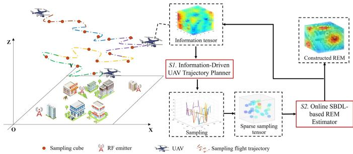  
Fig. 1. Overview of UAV-assisted 3D REM sampling and construction.

Laplace prior to capture spectrum sparsity, the proposed SBL-based recovery algorithm achieves accurate data completion under extremely sparse sampling conditions.

The rest of this paper is organized as follows. Section II presents the proposed 3D SM model. In Section III, the details of proposed SM scheme are discussed and demonstrated. Then, Section IV provides the simulation results and comparisons and Section V concludes the paper.

## II. 3D SPECTRUM MAPPING PROBLEM

## A. 3D Compressed REM Model

The 3D ROI is initially discretized into a set of small cubes. Consequently, it can be represented as a 3D spectrum tensor, denoted by $\dot { \boldsymbol { x } } \in \mathbb { R } ^ { N _ { x } \times N _ { y } \times N _ { z } }$ , where $N _ { x } , N _ { y }$ , and $N _ { z }$ indicate the grid number along $x , y ,$ and $z$ dimensions, respectively. The positions of all cubes are denoted as $\{ \nu _ { n } \} _ { n = 1 } ^ { N ^ { \ast } }$ , where $\nu _ { n } = ( x _ { n } ^ { v } , y _ { n } ^ { v } , z _ { n } ^ { v } )$ . Technically, 3D REM construction aims to recover all RSS values of $N = N _ { x } \times N _ { y } \times N _ { z }$ cubes, from the sampled data obtained at a subset of them. In this study, a self-developed UAV equipped with a spectrum-sensing device is employed to acquire RSS data along its flight trajectory, as shown in Fig. 1. The UAV collects spectrum data along its optimized trajectory. Each sample is mapped to the nearest cube for subsequent processing. Our goal is to reconstruct the complete 3D REM while minimizing the number of cubes in which RSS measurements need to be taken.

Let a vector $\omega ~ = ~ \left[ \omega _ { 1 } , \omega _ { 2 } , \ldots , \omega _ { n } , \ldots , \omega _ { N } \right] ^ { \mathrm { { T } } } ~ \in ~ \mathbb { R } ^ { N \times 1 }$ denote the radio frequency (RF) emitter information of each cube as

$$
\omega _ { n } = \left\{ { \begin{array} { l l } { P _ { n } ^ { t } , } & { { \mathrm { i f ~ t h e r e ~ i s ~ a ~ R F ~ e m i t t e r ~ a t ~ t h e } } \ n { \mathrm { - } } { \mathrm { t h ~ c u b e } } , } \\ { 0 , } & { { \mathrm { o t h e r w i s e } } , } \end{array} } \right.\tag{1}
$$

where $P _ { n } ^ { t }$ is the transmitting power if there is an emitter at the n-th cube. Considering that there are K stationary emitters denoted by $\{ { \mathbf { u } } _ { k } \} _ { k = 1 } ^ { K }$ , where $\mathbf { u } _ { k } = ( x _ { k } ^ { u } , y _ { k } ^ { u } , z _ { k } ^ { u } )$ is the position of the k-th emitter. The number of RF emitter is much smaller compared with the total cubes, $\mathrm { i . e . , } K \ll N$ . Therefore, $\omega$ is a K-sparse vector with $\| \omega \| _ { 0 } = K$

Within the 3D ROI, the RSS in each cube arises from the superposition of signals from multiple emitters, depending on their positions, spatial distribution, transmitting powers, and channel propagation characteristics. By vectorizing the spectrum tensor $\chi$ into $\mathbf { x } \in \mathbb { R } ^ { N \times 1 }$ , x can be expressed as

$$
\mathbf { x } = \pmb { \xi } \circ \varphi \pmb { \omega } ,\tag{2}
$$

where $\varphi ~ \in ~ \mathbb { R } ^ { N \times N }$ is the dictionary matrix, $\xi ~ \in ~ \mathbb { R } ^ { N \times 1 }$ represents the cumulative shadow fading vector across all cubes, and ◦ denotes the element-wise (Hadamard) product. We define the channel dictionary as $M = \pmb { \xi } \circ \varphi _ { \ast }$ , where $\varphi _ { i , j }$ corresponds to the path loss from the i-th cube to the j-th cube, as

$$
\varphi _ { i , j } = 1 0 ^ { L _ { F S } ^ { R E M } ( 1 m , f _ { c } ) } / 1 0 d _ { \nu _ { i } , \nu _ { j } } ^ { - \eta _ { p } }\tag{3}
$$

where $L _ { F S } ^ { R E M } ( 1 m , f _ { c } )$ is the free space path loss at 1 m, $f _ { c }$ is the carrier frequency, $d _ { \pmb { \nu } _ { i } , \pmb { \nu } _ { j } } = \| \pmb { \nu } _ { i } - \pmb { \nu } _ { j } \| _ { 2 }$ is the distance between cubes $\nu _ { i }$ and $\nu _ { j } , \eta _ { p }$ is the path loss exponent.

Suppose that there are M sampled cubes, denoted by $\pmb { \nu } ^ { s } = \bar { \{ \pmb { \nu } _ { m } ^ { s } \} } _ { m = 1 } ^ { M }$ , where $\nu _ { m } ^ { s } = ( x _ { m } ^ { s } , y _ { m } ^ { s } , z _ { m } ^ { s } )$ is the position of m-th sampled cube. The unsampled cubes can be denoted as $\pmb { \nu } ^ { u n } \left( \pmb { \nu } ^ { u n } = \{ \pmb { \nu } _ { q } | \pmb { \nu } _ { q } \in \pmb { \nu } , \pmb { \nu } _ { q } \notin \pmb { \nu } ^ { s } \} \right)$ ). Thus, the sampling rate is $r = M / N$ . All sampled positions can be represented by a measurement matrix $\bar { \psi } \in \bar { \mathbb { R } ^ { M \times N } }$ as

$$
\psi _ { i , j } = { \left\{ \begin{array} { l l } { 1 , { \mathrm { ~ i f ~ t h e ~ } } i { \mathrm { - t h ~ s a m p l e ~ i s ~ a t ~ t h e ~ } } j { \mathrm { - t h ~ c u b e , } } } \\ { 0 , { \mathrm { ~ o t h e r w i s e , } } } \end{array} \right. }\tag{4}
$$

where each row of ψ has a nonzero element denoting the sampling position in 3D ROI. It is a linear mapping operator denoting the position indexes of all samples. Then, the sampled RSS vector $\pmb { t } ^ { s } \in \mathbb { R } ^ { M \times 1 }$ is defined as

$$
\begin{array} { c } { { { \pmb t } ^ { s } = \pmb { \psi } \left( \pmb { \xi } \circ \pmb { \varphi } \omega \right) + \pmb { \varepsilon } = \pmb { \xi } ^ { s } \circ ( \pmb { \psi } \pmb { \varphi } \omega ) + \pmb { \varepsilon } } } \\ { { = \pmb { \xi } ^ { s } \circ ( \pmb { \Phi } \pmb { \omega } ) + \pmb { \varepsilon } = \pmb { \Phi } \pmb { \omega } + \pmb { \varepsilon } ^ { \ast } , } } \end{array}\tag{5}
$$

with

$$
t _ { m } ^ { s } = \xi _ { m } ^ { s } \sum _ { n = 1 } ^ { N } \omega _ { n } \Phi _ { m , n } + \varepsilon _ { m } ,\tag{6}
$$

where $\varepsilon _ { m } ^ { * } = ( \xi _ { m } ^ { s } - 1 ) \sum _ { n = 1 } ^ { N } \left( \omega _ { n } \Phi _ { m , n } \right) + \varepsilon _ { m } , \varepsilon \in \mathbb { R } ^ { M \times 1 }$ is the measurement noise vector, $\Phi$ is the sensing matrix, and $\pmb { \xi } ^ { s }$ is the shadow fading vector at sampled cubes.

## B. Spectrum Data Recovery Model

The spectrum data of unsampled positions in the CS model (5) can be recovered by estimating the sparse signal ω as

$$
\begin{array} { r } { \hat { \boldsymbol { \omega } } = \arg \operatorname* { m i n } _ { \mathbf { \epsilon } } \| \boldsymbol { \omega } \| _ { 1 } , \quad } \\ { \mathrm { s . t . } \quad t ^ { s } = \Phi \boldsymbol { \omega } + \boldsymbol { \epsilon } ^ { * } . } \end{array}\tag{7}
$$

To solve this problem, a SBL approach is adopted, which performs well even when the columns of Φ are highly correlated [23]. Specifically, $t ^ { s }$ is modeled as a Gaussian random process with likelihood $p ( t ^ { s } | \omega , \sigma _ { 0 } ^ { 2 } )$ , where $\sigma _ { 0 } ^ { 2 }$ is the noise variance. The unknown sparse vector $\omega$ is then estimated via Bayesian inference based on the posterior distribution $p \left( \omega | t ^ { s } , \alpha , \beta \right)$ where $\alpha , \beta \left( \beta = \left( \sigma _ { 0 } ^ { 2 } \right) ^ { - 1 } \right)$ are the hyperparameters of prior and likelihood.

First, the Gaussian likelihood of $t ^ { s }$ is expressed as

$$
p \left( \pmb { t } ^ { s } | \omega , \sigma _ { 0 } ^ { 2 } \right) = \left( 2 \pi \sigma _ { 0 } ^ { 2 } \right) ^ { - M / 2 } \exp \left\{ - \frac { \| \pmb { t } ^ { s } - \pmb { \Phi } \omega \| ^ { 2 } } { 2 \sigma _ { 0 } ^ { 2 } } \right\} .\tag{8}
$$

A Gamma distribution is assigned to $\beta ,$ as

$$
p \left( \beta ; c _ { 0 } , d _ { 0 } \right) = \Gamma \left( \beta | c _ { 0 } , d _ { 0 } \right) ,\tag{9}
$$

where $c _ { 0 } \geq 0$ and $d _ { 0 } \geq 0$ are the shape parameter and scale parameter, respectively. $\Gamma \left( \cdot \right)$ is the Gamma function.

RF emitters are typically sparsely distributed over the ROI. To exploit this property, a sparse Laplace prior is imposed on ω. This prior is chosen for its strong sparsity-inducing capability and computational tractability, enabling efficient Bayesian inference suitable for large-scale SM [29]. Specifically, each element of ω is modeled with a zero-mean Gaussian prior, as

$$
p \left( \omega | \alpha \right) = \prod _ { i = 0 } ^ { N } \mathcal { N } \left( \omega _ { i } | 0 , \alpha _ { i } \right) ,\tag{10}
$$

where $\mathbf { \alpha } \propto \left[ \alpha _ { 1 } , \alpha _ { 2 } , \ldots , \alpha _ { N } \right] ^ { \mathrm { T } }$ . Then, a Gamma hyperprior over α can be expressed as

$$
p \left( \pmb { \alpha } | \gamma \right) = \prod _ { i = 1 } ^ { N } \Gamma \left( \alpha _ { i } | 1 , \gamma _ { / 2 } \right) ,\tag{11}
$$

where $\alpha _ { i } \geq 0 , \gamma \geq 0$ . The overall prior $p \left( \omega \right)$ is

$$
p \left( \omega | \gamma \right) = \int p \left( \omega | \alpha \right) p \left( \alpha | \gamma \right) d \alpha\tag{12}
$$

Finally, a Gamma hyperprior is posed to γ

$$
p \left( \gamma | \theta \right) = \Gamma \left( \gamma | ^ { \theta } / _ { 2 } , ^ { \theta } / _ { 2 } \right) .\tag{13}
$$

The above model constitutes a three-layer hierarchical form. The first two layers of (10) and (11) result in a Laplace distribution for ω, and the last stage (13) is embedded to calculate parameter γ [29].

Given the prior and likelihood, following the Bayesian inference, the weight posterior of ω is a multivariate Gaussian distribution as

$$
p \left( \omega | t ^ { s } , \alpha , \beta \right) = \mathcal { N } \left( \omega | \mu _ { \omega } , \Sigma _ { \omega } \right) ,\tag{14}
$$

with

$$
\begin{array} { r } { \pmb { \mu } _ { \omega } = \beta \pmb { \Sigma } _ { \omega } \Phi ^ { \mathrm { T } } \pmb { t } ^ { s } , } \end{array}\tag{15}
$$

and

$$
\pmb { \Sigma } _ { \omega } = \big ( \beta \pmb { \Phi } ^ { \mathrm { T } } \pmb { \Phi } + \pmb { A } \big ) ^ { - 1 } ,\tag{16}
$$

where $\mathcal { A } = \mathrm { d i a g } \left( \alpha _ { 1 } , \alpha _ { 2 } , . . . , \alpha _ { N } \right)$ . By calculating hyperparameters α and $\beta ,$ we can estimate the $\hat { \omega }$ with the mean $\mu _ { \omega }$ Finally, the spectrum vector x can be recovered by $\mathbf { x } = M { \hat { \boldsymbol { \omega } } }$

## C. Sampling Path Optimization Model

Path planning aims to maximize information gain about an unknown environment under energy and time constraints. We employ an information-driven sampling strategy by using MI as the criterion. MI quantifies the expected reduction in uncertainty about the entire REM from a candidate measurement. By iteratively maximizing MI between candidate and unsampled regions, the UAV path is adaptively adjusted to prioritize locations that effectively reduce estimation error and improve mapping accuracy.

Specifically, the aim is to choose a path $\mathcal { G }$ from all possible paths R according to a designated information-theoretic measure as

$$
\mathcal { G } _ { I } = \mathop { \mathrm { a r g } \mathrm { m a x } } _ { \mathcal { G } \in \mathcal { R } } I \left( \mathcal { G } \right) ,\tag{17}
$$

where $\mathcal { G } = ( \pmb { w } _ { 1 } , \dots , \pmb { w } _ { g } , \dots , \pmb { w } _ { G } ) \in$ R defined by G control waypoints ${ \pmb w } _ { g } = \left( w _ { g } ^ { x } , w _ { g } ^ { y } , w _ { g } ^ { z } \right) , g = 1 , 2 , \ldots , G$ , and $B \geq 0$ is the mission budget. $\bar { I } \left( \mathcal { G } \right)$ denotes the MI between the measurements collected along G and undergoing environments. The function $C : \mathbb { R } \to \mathbb { R } ^ { + }$ defines the corresponding cost as

$$
C \left( \mathcal { G } \right) = \sum _ { g = 1 } ^ { G - 1 } c \left( \pmb { w } _ { g } , \pmb { w } _ { g + 1 } \right) ,\tag{18}
$$

where $c : \mathbb { R } ^ { 3 } \times \mathbb { R } ^ { 3 } \to \mathbb { R } ^ { + }$ computes the distance between two waypoints. Note that finding such a path is challenging since the collected information is time-variant and unpredictable. Thus, the ideal path should be updated online after calculating every new position, but it has high computational costs and may introduce unpredictable UAV behavior. A reasonable approach is to replan the path after every $m _ { u p }$ measurements [19], which strikes a balance between computational efficiency and environmental adaptability.

## III. UAV-ASSISTED 3D SM SCHEME

## A. Overview of Proposed 3D SM Scheme

The flowchart of the proposed sparse Bayesian dictionary learning (SBDL)-based 3D SM scheme is shown in Fig. 2, consisting of two main steps: UAV sampling path optimization and 3D spectrum data recovery. In [10] and [19], the authors used a fixed environment-match channel model or assumed emitter information known, while our scheme is designed for unknown and dynamic 3D environments. It jointly optimizes MI-driven UAV sampling path and refines channel dictionary, improving spectrum data recovery accuracy.

In the first step, the UAV path is dynamically optimized by an improved rapidly-exploring random tree star (RRT\*) planner, guided by a BL-based utility function designed under the MI criterion. In the second step, the channel dictionary is updated with sampled data to recover unknown spectrum data. The sparse signal is first estimated via SBDL, which combines SBL and dictionary learning to exploit the intrinsic sparsity of spectrum data. Gaussian process regression (GPR) is then applied to model shadow fading, further refining the dictionary. The final REM is constructed from the recovered sparse signal and the updated channel dictionary.

## B. Channel Dictionary Construction and Updating

The channel model is critical for sampling path planning and spectrum data recovery. Most standardized models are based on extensive terrestrial measurements and are unsuitable for A2G environments, especially when the operational scenario differs from the one in which the measurements were collected. Moreover, fixed channel models in traditional SBL methods fail to capture the time-variant propagation characteristic. To address this issue, we adopt the modified close-in (CI) A2G model, which incorporates the factors of frequency, distance, and altitude, and can be flexibly adjusted to adapt to different environments [30]. In the proposed framework, the CI model is used as the initial channel dictionary, and then it is refined with real-time UAV measured data, enabling adaptation to the undergoing unknown and dynamic environment. The CI channel model between any two cubes can be expressed as

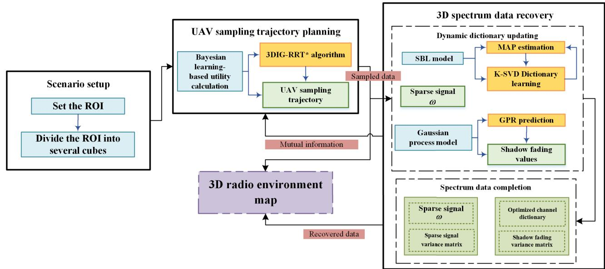  
Fig. 2. Flowchart of the proposed 3D SM scheme.

$$
\begin{array} { r } { L _ { \mathrm { C I } } ^ { \mathrm { R E M } } ( d _ { v _ { i } , v _ { j } } , f _ { c } ) [ \mathrm { d B } ] = 1 0 { \log } _ { 1 0 } ( \varphi _ { i , j } ) + \bar { \xi } _ { i j } , } \end{array}\tag{19}
$$

where $\xi _ { i j } ^ { v }$ denotes the shadow fading factor in dB which follows a normal distribution. The cumulative shadow fading resulting from the sum of multiple log-normal random variables, is denoted by ξ in (2), which can be well approximated by another log-normal distribution [31].

Model parameters from standardized CI models may not fully reflect the characteristics of specific scenarios. In heterogeneous environments, these parameters often vary across regions [30]. To improve adaptability, the initial channel dictionary Φ is refined using sampled data. The SBDL has two stages: sparse coding with the current dictionary and dictionary refinement with estimated sparse signal. Specifically, SBL is applied to recover the sparse signal, after which the K-singular value decomposition (SVD) algorithm updates the dictionary atoms. Given the sparse estimate $\hat { \omega } ^ { i t }$ from the it-th iteration, the optimization problem becomes

$$
\tilde { \Phi } = \underset { \Phi } { \arg \operatorname* { m i n } } \left\| t ^ { s } - \Phi \hat { \boldsymbol { \omega } } ^ { i t } \right\| _ { F } ^ { 2 } ,\tag{20}
$$

with

$$
\left\| t ^ { s } - \sum _ { n = 1 } ^ { N } \phi _ { n } \hat { \omega } _ { n } ^ { i t } \right\| _ { F } ^ { 2 } = \left\| \mathbf { E } _ { d } ^ { i t } - \phi _ { d } \hat { \omega } _ { d } ^ { i t } \right\| _ { F } ^ { 2 } ,\tag{21}
$$

where $\mathbf { E } _ { d } ^ { i t } = \left( { t } ^ { s } - \sum _ { n \neq d } \phi _ { n } \hat { \omega } _ { n } ^ { i t } \right)$ . The objective of updating atom $\phi _ { d }$ can be replaced by

$$
\tilde { \boldsymbol { \phi } } _ { d } ^ { i t } = \underset { \boldsymbol { \phi } _ { d } } { \arg \operatorname* { m i n } } \left\| \mathbf { E } _ { d } ^ { i t } - \boldsymbol { \phi } _ { d } \boldsymbol { \hat { \omega } } _ { d } ^ { i t } \right\| _ { F } ^ { 2 } .\tag{22}
$$

Moreover, as for shadow fading in (5), it typically exhibits a fundamental statistical property where nearby observations show a higher degree of similarity than distant ones [32]. In our case, the multiplicative shadow fading term is $\xi _ { m } ^ { s } =$ exp $\left\{ \ln 1 0 / 1 0 ^ { \bar { \xi } _ { m } ^ { s } } \right\}$ , where $\bar { \xi } _ { m } ^ { s }$ denotes the shadow fading variable in dB. Based on a first-order Taylor expansion of the exponential function, we can obtain

$$
\xi _ { m } ^ { s } - 1 = \exp \left\{ \ln 1 0 / _ { 1 0 } \bar { \xi } _ { m } ^ { s } \right\} - 1 \approx \ln 1 0 / _ { 1 0 } \bar { \xi } _ { m } ^ { s } .\tag{23}
$$

It assumes that the marginal standard deviation of shadow fading is small enough, then the characteristic of original multiplicative noise is similar to that of the additive Gaussian noise [11]. Therefore, the $\varepsilon _ { m } ^ { * }$ is approximated as a Gaussian distribution with variance $\sigma _ { 0 } ^ { 2 } .$

Since the correlation of shadow fading is scenariodependent, we can exploit the characteristic pattern derived from sampled data to accurately estimate the fading in unsampled positions. Then, the spatially correlated shadow fading components of M samples obey M-dimensional Gaussian distributions. In order to capture the effect of obstacles on shadow fading, a distance feature D is introduced. Notably, spatial coordinates cannot fully characterize shadow fading. Introducing the distance feature allows the model to learn the interactions between positions and obstacles, and improves its prediction accuracy. Given the positions of obstacles $\nu ^ { c } =$ $\big \{ \nu _ { o } ^ { c } \big \} _ { o = 1 } ^ { O } ,$ where O denotes the number of cubes occupied by obstacles, the m-th distance feature $\mathbf { D } _ { m } ^ { s }$ of $\nu _ { m } ^ { s }$ is defined as

$$
\mathbf { D } _ { m } ^ { s } = \operatorname* { m i n } _ { \substack { o = 1 , 2 , \ldots , O } } c \left( \pmb { \nu } _ { o } ^ { c } , \pmb { \nu } _ { m } ^ { s } \right) .\tag{24}
$$

The $\mathbf { D } ^ { u n }$ of unsampled positions can also be obtained similarly. The distance feature describes a signal’s relative proximity to obstacles along its propagation path, i.e., shorter distances generally result in stronger attenuation. The uncertainty of shadow fading is then modeled as a GP,

$$
\bar { \boldsymbol { \xi } } ^ { s } \sim \mathcal { G P } \left( \mathbf { 0 } , \mathcal { C } \left( \left[ \pmb { \nu } ^ { s } , D ^ { s } \right] , \left[ \pmb { \nu } ^ { s } , D ^ { s } \right] \right) \right) ,\tag{25}
$$

where the mean vector is 0 and the covariance matrix $\mathcal { C } \left( \left[ \pmb { \nu } ^ { s } , \pmb { D } ^ { s } \right] , \left[ \pmb { \nu } ^ { s } , \pmb { D } ^ { s } \right] \right)$ is determined by the covariance function or kernel function. The features of GP is defined as $F ^ { s , s } \ = \ [ \nu ^ { s } , D ^ { s } ]$ ]. To guarantee the positive-definiteness of covariance matrix, the Matern function is chosen to capture´ the spatial correlations of shadow fading. It offers a balance between flexibility and smoothness, facilitated by a manageable number of parameters [32], as

$$
\mathcal { C } \left( d \right) = \sigma ^ { 2 } \frac { 2 ^ { 1 - g } } { \Gamma \left( g \right) } \left( \sqrt { 2 g } \frac { d } { \rho } \right) ^ { g } K _ { g } \left( \sqrt { 2 g } \frac { d } { \rho } \right) ,\tag{26}
$$

where $K _ { g } \left( \cdot \right)$ is the Bessel function of second kind, $g$ and $\rho$ are the order and the non-negative spatial decay parameter of covariance, respectively, d is the distance between samples, and $\sigma ^ { 2 }$ is the marginal standard deviation.

The GPR is applied for estimating unknown components $\bar { \pmb { \xi } } ^ { u n }$ . Leveraging SBDL for initial estimation of sparse signal ωˆ , the path loss component for any given position $\nu _ { m } ^ { s }$ can be subsequently derived as

$$
\pmb { t } \left( \pmb { \nu } _ { m } ^ { s } \right) = \sum _ { n = 1 } ^ { N } \hat { \omega } _ { n } \Phi _ { m , n } .\tag{27}
$$

The shadow fading component $\xi _ { m } ^ { s }$ is estimated by $t _ { m } ^ { s } / t \left( \nu _ { m } ^ { s } \right)$ Generally, with the training input set $\bar { \pmb { \xi } } ^ { s }$ , the corresponding output in the GP model is defined as

$$
\mathbf { y } = \bar { \pmb { \xi } } ^ { s } + \pmb { \delta } ,\tag{28}
$$

where $\delta _ { m } \sim \mathcal { N } \left( 0 , \sigma _ { G P } ^ { 2 } \right) , m = 1 , 2 , \ldots , M$ is the $\mathrm { G P }$ noise. The joint distribution of prediction values $\bar { \pmb { \xi } } ^ { u n }$ at the unsampled cubes $\pmb { \nu } ^ { u n }$ can be represented as a multi-normal distribution

$$
\begin{array} { r l } & { \left[ \frac { \mathbf { y } } { \bar { \xi } } \right] | F ^ { s , s } , F ^ { u , u } } \\ & { \sim \mathcal { N } \left( \left[ \begin{array} { l } { 0 } \\ { 0 } \end{array} \right] , \left[ \begin{array} { l } { \mathcal { C } _ { s , s } + \sigma _ { G P } ^ { 2 } \mathbf { I } \mathcal { C } _ { s , u } } \\ { \mathcal { C } _ { u , s } \qquad \mathcal { C } _ { u , u } } \end{array} \right] \right) , } \end{array}\tag{29}
$$

where $\mathcal { C } _ { s , u } \equiv \mathcal { C } \left( F ^ { s , s } , F ^ { u , u } \right)$ , and $\mathcal { C } _ { s , s } , \mathcal { C } _ { u , s } , \mathcal { C } _ { u , u }$ are similarly defined. The predictive distribution $\bar { \pmb { \xi } } ^ { u n }$ satisfies the multivariate Gaussian

$$
p \left( \bar { \xi } ^ { u n } | \mathbf { y } , \pmb { \nu } ^ { s } , \pmb { \nu } ^ { u n } , \mathbf { D } ^ { u n } \right) \sim \mathcal { N } \left( \pmb { \mu } _ { \mathrm { G P } } ^ { u n } , \pmb { \Sigma } _ { \mathrm { G P } } ^ { u n } \right) ,\tag{30}
$$

with

$$
\pmb { \mu } _ { \mathrm { G P } } ^ { u n } = \mathcal { C } _ { u , s } \left( \mathcal { C } _ { s , s } + \sigma _ { \mathrm { G P } } ^ { 2 } \mathbf { I } \right) ^ { - 1 } \mathbf { y } ,\tag{31}
$$

and

$$
\pmb { \Sigma } _ { \mathrm { G P } } ^ { u n } = \mathcal { C } _ { u , u } + \sigma _ { \mathrm { G P } } ^ { 2 } \mathbf { I } - \mathcal { C } _ { u , s } \left( \mathcal { C } _ { s , s } + \sigma _ { \mathrm { G P } } ^ { 2 } \mathbf { I } \right) ^ { - 1 } \mathcal { C } _ { s , u } .\tag{32}
$$

By solving the parameters of covariance function and GP noise variance, $\bar { \pmb { \xi } } ^ { u n }$ can be derived.

## C. BL-Based Information Gathering Sampling Path

The RSS values across 3D cubes exhibit strong spatial correlation, making the UAV sampling path crucial for efficient and accurate REM construction [21], [33]. To exploit this, we propose a BL-based information-gathering (IG) algorithm for data collecting. The problem of optimizing a UAV path to maximize MI in an unknown 3D environment is NP-hard, as the prior knowledge of spectrum environment is unavailable. Therefore, we design efficient heuristics that achieve high mapping accuracy while remaining computationally feasible.

According to (17), the path, defined by G control waypoints, can be derived by searching the 3D space with information-theoretic measure $I \left( \cdot \right)$ . The proposed SBDL and GPR estimators provide the variance matrices indicating the uncertainty of all cubes, and the entropy can be inferred from them. For the path loss component $t \left( \nu ^ { u n } \right)$ of unsampled cubes $\pmb { \nu } ^ { u n }$ , the predictive distribution can be computed with the estimated $\omega ,$ , α and $\beta ,$ as

$$
\begin{array} { r l } & { p \left( { \pmb t } \left( { \pmb { \nu } } ^ { u n } \right) \vert { \pmb t } ^ { s } , { \pmb \alpha } , \beta \right) } \\ & { ~ = \mathcal { N } \left( { \pmb t } \left( { \pmb { \nu } } ^ { u n } \right) \vert { \pmb \mu } ^ { u n } , { \pmb \Sigma } ^ { u n } \right) , } \end{array}\tag{33}
$$

with

$$
\begin{array} { r } { \pmb { \mu } ^ { u n } = \Phi ^ { u n } \pmb { \mu } _ { \omega } , } \end{array}
$$

and

(34)

$$
\pmb { \Sigma } ^ { u n } = d i a g ( \beta ) + ( \pmb { \Phi } ^ { u n } ) ^ { \mathrm { T } } \pmb { \Sigma } _ { \omega } \pmb { \Phi } ^ { u n } ,\tag{35}
$$

where $\Phi ^ { u n }$ is the sensing matrix of $\pmb { \nu } ^ { u n }$ , and the variance $\pmb { \Sigma } ^ { u n }$ comprises the sum of two variance components, i.e., the estimated noise on the data and the uncertainty in the prediction of sparse signal.

Given that predictive variances are independent of previous observations, variance reduction can be estimated by using a dense belief representation of $\mathbf { x } .$ Each cube is modeled as a continuous, normally distributed random variable. The MI $I \left( w \right)$ serves as a utility metric to evaluate the exploratory value of measurements at each control waypoint w. Since the uncertainties are defined per cube, the information gain and RSS for a waypoint can be assigned based on its nearest cube [19]. To reduce computational complexity, an approximation is employed to calculate MI as [34]

$$
\hat { I } \left( \pmb { w } \right) = \hat { I } \left( t _ { w } ; \pmb { t } ^ { s } \right) = \frac { 1 } { 2 } \left[ \ln \left( \sigma _ { w } \right) - \ln \left( \sigma _ { w ; s } \right) \right] ,\tag{36}
$$

where $t _ { w }$ denotes the sampled RSS at w, $\sigma _ { w }$ and $\sigma _ { w ; s }$ are marginal variances for $t _ { w }$ before and after incorporating observation $t \sb w \mathrm { , }$ i.e., prior and posterior marginal variances. In the spectrum data recovery process, the SBL and GPR posterior marginal variance matrices are ${ \bar { \Sigma } } ^ { u n }$ (logarithmic variance of $\Sigma ^ { u n } )$ and $\Sigma _ { \mathrm { G P } } ^ { u n }$ , respectively. The BL-based variance matrix is defined as

$$
\Sigma _ { \mathrm { R E M } } ^ { u n } = \bar { \Sigma } ^ { u n } + \Sigma _ { \mathrm { G P } } ^ { u n } ,\tag{37}
$$

where $\pmb { \Sigma } _ { \mathrm { R E M } } ^ { u n }$ represents the uncertainty at unsampled cubes, with its diagonal elements $\sigma _ { w ; s }$ corresponding to the variance at specific cubes. For simplicity, $\sigma _ { w }$ is assigned a uniform prior. The utility functions in (36) and (37) constitute the BL-based utility function. To evaluate a path ${ \mathcal { G } } ,$ , measurements are incorporated iteratively, and cumulative information gain is computed. Paths exhibiting rapid utility growth prioritize high-uncertainty positions, consistent with the optimization objective in (17) to maximize MI via strategic sampling.

According to the defined object and metric, path planning seeks the most informative feasible one among candidate paths [35]. To solve this NP-hard problem, we propose 3DIG-RRT\*, summarized in Algorithm 1, integrates $\mathrm { R R T ^ { * } }$ with information path planning (IPP) [36]. Starting from an initial node, candidate points ${ \pmb w } _ { s a m p l e }$ are iteratively generated within the free configuration space $\chi ^ { f r e e }$ . Nearby nodes $\mathrm { O } _ { n e a r }$ are extended toward each sample to build a solution graph, and retain only nodes whose cumulative cost satisfies the sampling budget and others are pruned. Costs and information values are stored, and the tree $\Gamma ^ { * }$ grows until convergence. Finally, the most informative path $G _ { I }$ is selected. Complexity is managed by node pruning and the relative information contribution (RIC) criterion, which detect search convergence [34].

Algorithm 1 3DIG-RRT\* Based UAV Path Planner   
Input:   
$\mathcal { B } ; ~ \chi ^ { f r e e } ; ~ \Sigma _ { \mathrm { R E M } } ^ { u n } ; ~ m _ { u p } ; ~ \nu ; ~ w _ { i n i t } ; ~ r _ { n e w } ; ~ \mathcal { V } _ { \mathrm { u a v } } ; ~ N _ { R I C } ;$   
$\delta _ { R I C } .$   
Output:   
$\Gamma ^ { * } = ( \mathrm { O } , \Lambda ) ; G _ { I } ; t ^ { s }$   
1: Initialize $\begin{array} { r } { I _ { i n i t } ~ \gets ~ I n f o r m a t i o n ( w _ { \mathrm { i n i t } } , w _ { \mathrm { i n i t } } , \pmb { \Sigma } _ { \mathrm { R E M } } ^ { u n } ) , } \end{array}$   
$C _ { i n i t } ~  ~ 0 , ~ o ~  ~ \langle w _ { i n i t } , I _ { i n i t } , C _ { i n i t } \rangle , ~ \mathrm { O } ~  ~ \{ o \} .$   
$\mathrm { O } _ { c l o s e d }  \emptyset , \Lambda  \emptyset , N _ { s a m p l e }  0 , I _ { R I C }  0 ;$   
2: while average $R I C ( I _ { R I C } , N _ { R I C } ) > \delta _ { R I C } ~ \mathrm { d o } ;$   
3: ${ \pmb w } _ { s a m p l e } \gets S a m p l e F r e e ( \chi ^ { f r e e } ) ;$   
4: $w _ { f e a s i b l e } \gets S t e e r ( { w _ { s a m p l e } } , { w _ { n e a r e s t } } , \mathcal { V } _ { \mathrm { u a v } } ) ;$   
5: for all $o _ { n e a r } \in \mathrm { O } _ { n e a r } \ { \bf d o } ;$   
6: $w _ { n e w }  S t e e r ( w _ { f e a s i b l e } , w _ { n e a r } , \mathcal { V } _ { \mathrm { u a v } } ) ;$   
7: if N ocollision $( w _ { n e w } , w _ { n e a r } , \chi ^ { f r e e } )$ then;   
8: Calculate $\mathbf { \delta q } _ { n e w } ,$ info density $\left( \pmb { w } _ { n e w } \right)$ by (38) and $r _ { n e a r }$   
by (39);   
9: Get $I _ { n e w } \gets I n f o r m a t i o n ( { \pmb w } _ { n e a r } , { \pmb w } _ { n e w } , { \pmb \Sigma } _ { \mathrm { R E M } } ^ { u n } ) ;$   
10: $C _ { n e w } \mathrm { ~  ~ \xi ~ }  \mathrm { ~  ~ \it ~ \it ~ C ~ } _ { n e w } \mathrm { ~  ~ + ~ \it ~ c ~ } ( { \bf w } _ { n e w } , { \bf w } _ { n e a r } ) , \mathrm { ~  ~ \it ~ \omega ~ } _ { o n e w } \mathrm { ~  ~ \xi ~ } $   
$\langle w _ { n e w } , I _ { n e w } , C _ { n e w } \rangle ;$   
11: $I _ { R I C } \gets a p p e n d \Big ( I _ { R I C } , \Big ( I _ { n e w / } I _ { n e a r } - 1 \Big ) \Big / N _ { s a m p l e } \Big ) \big \}$   
12: $N _ { s a m p l e } \gets 0 , \ : \Lambda \gets \cup \{ ( o _ { n e a r } , o _ { n e w } ) \} , \ : \mathcal { O } \gets \cup \{ o _ { n e w } \} ;$   
13: if $C _ { n e w } > B ;$   
14: $\mathrm { O } _ { c l o s e d }  \mathrm { O } _ { c l o s e d } \cup \{ o _ { n e w } \} \mathrm { : }$   
15: end if   
16: end if   
17: end for   
18: end while   
19: Obtain $\Gamma ^ { * } = ( 0 , \Lambda )$   
20: Get $G _ { I } = M \mathrm { a x } I n f o r m a t i v e P a t h ( w _ { i n i t } , \Gamma ^ { * } ) ;$   
21: Obtain $t ^ { s } \gets S a m p l e T r a j e c t o r y \left( G _ { I } , m _ { u p } , \nu \right) ;$

As noted in Section II-C, a receding-horizon strategy replans the UAV trajectory after every $m _ { u p }$ measurements. If a path exceeds $m _ { u p }$ waypoints, only the first $m _ { u p }$ are executed before replanning. Candidate positions are discretized on a cube grid [19], and the SampleTrajectory function maps the sampled data to the corresponding grid coordinates. The resulting RSS vector $\pmb { t } ^ { s } \in \mathbb { R } ^ { m _ { u p } \times 1 }$ is then obtained.

To balance exploration of unknown regions and focus on areas with high information potential, a dynamic neighborhood search radius is employed, as shown in Fig. 3. When a new point ${ \pmb w } _ { n e w }$ is generated and its nearby candidate parent node is identified, the local information density is computed as

$$
\operatorname* { i n f o \_ d e n s i t y } \left( \pmb { w } _ { n e w } \right) = \frac { 1 } { \lvert \pmb { q } _ { n e w } \rvert } \sum _ { \pmb { q } _ { n e w } ^ { i } \in \pmb { q } _ { n e w } } I \left( \pmb { \nu } _ { \pmb { q } _ { n e w } ^ { i } } \right) ,\tag{38}
$$

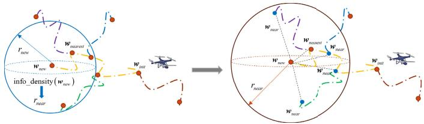  
Fig. 3. Illustration of dynamic neighborhood search radius mechanism.

where all cubes within the subspace radius $r _ { n e w }$ are found in Cartesian coordinates and indexed as $\mathbf { \Delta } \mathbf { q } _ { n e w }$ by $\left\| \pmb { \nu } _ { \pmb { q } _ { n e w } ^ { i } } - \pmb { w } _ { n e w } \right\| _ { 2 } \leq r _ { n e w }$ . The $\nu _ { q _ { n e w } ^ { i } } \in \nu$ is the 3D spatial position corresponding to the i-th index $\pmb { q } _ { n e w } ^ { i }$ in $\mathbf { \Delta } q _ { n e w } .$ . The $r _ { n e w }$ is a positive adjustable parameter, and $\lVert \cdot \rVert _ { 2 }$ calculates the 2-norms. The neighborhood search radius $r _ { n e a r }$ is adjusted according to the information density, as

$$
r _ { n e a r } = \frac { \eta } { \mathrm { i n f o \_ d e n s i t y } \left( \pmb { w } _ { n e w } \right) } ,\tag{39}
$$

where η is a constant. In high-information regions, a smaller search radius is used to explore in detail, while lowinformation areas use a larger radius to cover space and locate the next informative node. The least-cost parent node ${ \pmb w } _ { n e a r }$ is selected for the new node $w _ { n e w } ,$ , and $I _ { n e w }$ is computed by summing rewards along the path from ${ \pmb w } _ { n e a r }$ to ${ \pmb w } _ { n e w }$

This procedure offers a heuristic path planning strategy that approximates the maximization of MI. It is based on the $\mathrm { R R T ^ { * } }$ framework, which is probabilistically complete and asymptotically optimal with respect to the available sampling budget [37]. Some key functions are illustrated as follows. SampleFree: Returns i.i.d. samples from $\chi ^ { f r e e }$ . Nearest: Finds the vertex in $\Gamma ^ { * } = ( 0 , \Lambda )$ closest to a query point. Steer: Extends nodes toward new samples while respecting UAV motion constraints. Near: Returns vertices within radius $r _ { n e a r }$ of a query point w. Nocollision: Checks if the line segment between ${ \pmb w } _ { a }$ and ${ \pmb w } _ { b }$ is collision-free. MaxInformationPath: Selects the maximally informative path $G _ { I }$ from the graph $\Gamma ^ { * }$ . SampleTrajectory: Returns sampled data and the cube coordinates traversed along the trajectory.

The main computational cost of Algorithm 1 arises from nearest-neighbor searches during tree extension and rewiring. A KD-tree is used for efficient indexing, with each query costing $\mathcal { O } ( \log ( n _ { \mathrm { n o d e } } ~ + ~ K ) )$ , where K is the number of neighbors within the adaptive radius and $n _ { \mathrm { n o d e } }$ is the current number of nodes. In practice, K grows much slower than $n _ { \mathrm { n o d e } }$ . With at most $N _ { \mathrm { m a x } }$ iterations, the average complexity is $\mathcal { O } ( N _ { \operatorname* { m a x } } \log N _ { \operatorname* { m a x } } )$

## D. SBDL-Based Spectrum Data Recovery

In order to recover the missing data at unsampled positions, the sparse RF emitter signal ωˆ is first estimated by the proposed SBDL. The shadow fading components $\bar { \pmb { \xi } } ^ { s }$ at the sampled positions are then derived and a GP is constructed to estimate $\bar { \pmb { \xi } } ^ { u n }$ at the unsampled positions. In essence, GP enhances the dictionary design in SBL by considering environmental correlations, while SBL provides a robust recovery mechanism based on CS theory.

First, ω is recovered with the mean $\mu _ { \omega }$ and evaluated by the variance $\Sigma _ { \omega }$ . The hyperparameters $\alpha , \gamma$ and $\beta$ are estimated by a maximum posterior (MAP) estimation as [23]

$$
\begin{array} { r } { \left( \alpha , \gamma , \beta \right) = \underset { \alpha , \gamma , \beta } { \arg \operatorname* { m a x } } p \left( \alpha , \gamma , \beta | \boldsymbol { t ^ { s } } \right) , } \\ { = \underset { \alpha , \gamma , \beta } { \arg \operatorname* { m a x } } \ln p \left( \boldsymbol { t ^ { s } } , \alpha , \gamma , \beta \right) . } \end{array}\tag{40}
$$

It can be equivalently maximized in the logarithmic domain to obtain L. By taking the derivative with respect to $\alpha _ { i }$ and setting it to zero, the re-estimation of $\alpha _ { i }$ is obtained as [29]

$$
\alpha _ { i } ^ { i t } = - \frac { 1 } { 2 \gamma } + \sqrt { \frac { 1 } { 4 \gamma ^ { 2 } } + \frac { ( \mu _ { \omega } ) _ { i } ^ { 2 } + ( \Sigma _ { \omega } ) _ { i , i } } { \gamma } } .\tag{41}
$$

Similarly, $\beta$ and $\gamma$ can be updated as

$$
\beta ^ { i t } = \frac { N _ { \mathrm { / 2 } } + a } { \left\| t ^ { s } - \Phi \mu _ { \omega } \right\| _ { 2 } ^ { 2 } \left/ _ { 2 } + b \right. } ,\tag{42}
$$

and

$$
\gamma ^ { i t } = \frac { N - 1 + { \theta / } _ { 2 } } { \sum _ { i } { \alpha _ { i } } _ { / 2 } + { \theta / } _ { 2 } } .\tag{43}
$$

If any $\alpha _ { i } ^ { - 1 } ~ = ~ 0 ( \alpha _ { i } \to \infty )$ , the corresponding $\omega _ { i } ~ = ~ 0$ and the targets are unlikely to be located in the i-th cube. Therefore, these positions can be removed to accelerate the update process. Meanwhile, the matrix inversion of variance $\Sigma _ { \omega }$ in (16) is computationally complex, the matrix inversion lemma is applied and it can be rewritten as

$$
\Sigma _ { \omega } = \left( \boldsymbol { A } \right) ^ { - 1 } - \left( \boldsymbol { A } \right) ^ { - 1 } \boldsymbol { \Phi } ^ { \mathrm { T } } \left( \Omega \right) ^ { - 1 } \boldsymbol { \Phi } \left( \boldsymbol { A } \right) ^ { - 1 } ,\tag{44}
$$

with

$$
\Omega = \pmb { \Phi } \left( \pmb { A } \right) ^ { - 1 } \pmb { \Phi } ^ { T } + \beta ^ { - 1 } \pmb { \mathrm { I } } .\tag{45}
$$

Note that its computational complexity is lowered than $\mathcal { O } \left( M ^ { 2 } N \right)$ while the one of (16) is $\mathcal { O } \left( N ^ { 3 } \right)$

In the dictionary update step, the residual matrix $\mathbf { E } _ { d } ^ { i t }$ is first calculated. The index set Q is introduced to extract the corresponding non-zero value in $\hat { \omega } ^ { i t }$ . Then, the matrix $\tilde { \mathbf { E } } _ { d } ^ { i t }$ composed of the columns in $\mathbf { E } _ { d } ^ { i t }$ indexed by Q can be obtained. By performing SVD decomposition of $\tilde { \mathbf { E } } _ { d } ^ { i t }$ , it yields

$$
\begin{array} { r } { \tilde { \mathbf { E } } _ { d } ^ { i t } = \mathbf { U } \mathbf { A } \mathbf { V } ^ { \mathrm { T } } . } \end{array}\tag{46}
$$

The d-th column $\phi _ { d } ^ { i t }$ of the dictionary can be updated by extracting the column corresponding to the largest singular value in Λ, i.e., selecting the first column of U as $\phi _ { d } ^ { i t } = \mathbf { u } _ { 1 }$ [31]. For K non-zero columns of Φ, K SVD operations are required. By performing the iteration between (41)-(46), and (15) until the convergence condition is satisfied, the MAP estimation of ω can be obtained, $\mathrm { i } . \mathrm { e } . , \hat { \omega } = \mu _ { \omega }$

Finally, the Bayesian inference is applied to solve the parameters $\eta _ { \mathrm { G P } } = [ \rho , \sigma ^ { 2 } , \sigma _ { \mathrm { G P } } ^ { 2 } ]$ in GPR. The marginal likelihood $\mathcal { L } \left( \eta _ { \mathrm { G P } } \right)$ is given by

$$
p \left( \mathbf { y } \vert \pmb { \nu } ^ { s } , \mathbf { D } ^ { s } , \pmb { \eta } _ { \mathrm { G P } } \right) \sim \mathcal { N } \left( \mathbf { y } \vert \mathbf { 0 } , \pmb { \Sigma } _ { \eta } \right) ,\tag{47}
$$

with

$$
\Sigma _ { \eta } = \mathcal { C } _ { s , s } + \sigma _ { \mathrm { G P } } ^ { 2 } \mathbf { I } .\tag{48}
$$

The $\pmb { \eta } _ { \mathrm { G P } }$ can be estimated by minimizing the negative log marginal likelihood (NLML) as

$$
\boldsymbol { \hat { \eta } } _ { \mathrm { G P } } = \underset { \boldsymbol { \eta } _ { \mathrm { G P } } } { \arg \operatorname* { m i n } } \left( \frac { 1 } { 2 } \mathbf { y } ^ { \mathrm { T } } \boldsymbol { \Sigma } _ { \eta } ^ { - 1 } \mathbf { y } + \frac { 1 } { 2 } \log \left( \left| \boldsymbol { \Sigma } _ { \eta } \right| \right) + \frac { M } { 2 } \log 2 \pi \right) .\tag{49}
$$

Note that it is a non-convex problem and can be solved by the gradient-based optimization algorithm. Then, the shadow fading component $\bar { \pmb { \xi } } ^ { \bar { u } n }$ can be estimated by (31), which can be used to obtain the shadow fading $\pmb { \xi } = 1 0 ^ { \bar { \pmb { \xi } } } / 1 0$ of all cubes. The channel dictionary is updated with $M = \xi \circ \varphi$ . Finally, the 3D REM (or REM tensor) is constructed by (2).

Algorithm 2 Spectrum Data Recovery With SBDL GP   
Input:   
Φ ∈ RM×N ; ϕ ∈ RN×N ; ts; νs; νc, c0; d0; itermax;   
ψ.   
Output:   
x; ω; $\xi ;$   
1: Initialize $\alpha , \beta , \gamma , i t e r = 1 , \mu _ { \omega } = \mathbf { 0 } _ { N } \times 1 ;$   
2: while iter < itermax do;   
3: Update α with (41), β with (42), γ with (43);   
4: Calculate $\mu _ { \omega }$ and $\Sigma _ { \omega }$ by (15), (44) and (45);   
5: Calculate the residual matrix by (21);   
6: Find the non-zero index set $\mathbb { Q }$ and obtain $\tilde { \mathbf { E } } _ { d } ^ { i t }$   
7: Perform SVD by (46) and update $\tilde { \phi } _ { d } ^ { i t } = \mathbf { u } _ { 1 } ;$   
8: iter = iter + 1;   
9: end while   
10: Obtain $\hat { \omega } = \mu _ { \omega } ;$   
11: Calculate the distance feature $\mathbf { D } ^ { s }$ and ${ \bf D } ^ { u n }$ by (24);   
12: Calculate the shadow fading $t _ { m } ^ { s } / t \left( \nu _ { m } ^ { s } \right)$ by (27);   
13: Solve (49) by the gradient-based optimization;   
14: Get $\mu _ { G P } ^ { u n }$ and $\Sigma _ { G P } ^ { u n }$ by (31)-(32);   
15: Obtain $\bar { \pmb { \xi } } ^ { u n } = { \pmb { \mu } } _ { G P } ^ { u n } , { \bf x } = { \pmb { \xi } } \circ$ ϕωˆ ;

The complexity of Algorithm 2 is decided by the matrix inversions in the Bayesian update steps. The computation of (44) costs $\mathcal { O } ( M ^ { 2 } N )$ . The computations of (15) and (42) both cost $\mathcal { O } ( M ^ { 2 } N )$ , which occupy the largest proportion of computational cost. Therefore, the total time complexity of SBL is $\mathcal { O } ( M ^ { 2 } N )$ . The time complexity of GPR for shadow fading estimation mainly lies in the process of Bayesian inference with M samples, which is $\mathcal { O } ( M ^ { 3 } )$ . Thus, the total complexity is $\mathcal { O } ( M ^ { 2 } N + M ^ { 3 } )$

## IV. SIMULATION RESULTS AND APPLICATION

## A. Scenario Setup

The performance of proposed 3D SM scheme is evaluated on both simulated and measured datasets [38], [39]. The simulated ROI represents a typical outdoor area of 1200m × 1200m×42m with densely distributed buildings ranging from 19m to 55m in height. Fig. 4 presents the satellite view and ideal REM. The ROI is discretized into $6 0 \times 6 0 \times 5$ cubes of size $2 0 \mathrm { m } \times 2 0 \mathrm { m } \times 1 0 \mathrm { m }$ . The ideal or simulated REM $\chi \in \mathbb { R } ^ { 6 0 \times 6 0 \times 5 }$ is generated via ray tracing (RT) technique, and the averaged signal strength within each cube is used as the RSS to mitigate small-scale fading [40]. The main simulation parameters are given in TABLE I.

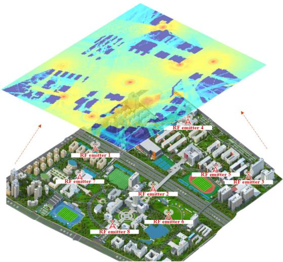  
Fig. 4. The satellite map and ideal REM of simulated scenario. This simulation environment is a typical outdoor area with buildings, overpasses, vegetation, roads, and so on. It can pose the radio propagation characteristics of realistic suburban and urban scenarios.

TABLE I  
THE MAIN SIMULATION PARAMETERS
<table><tr><td rowspan=2 colspan=1>Parameter</td><td rowspan=1 colspan=4>Value</td></tr><tr><td rowspan=1 colspan=1>Index</td><td rowspan=1 colspan=1>Height(m)</td><td rowspan=1 colspan=1>Power(dBm)</td><td rowspan=1 colspan=1>Antenna</td></tr><tr><td rowspan=8 colspan=1>RF emitter</td><td rowspan=1 colspan=1>1</td><td rowspan=1 colspan=1>1.5</td><td rowspan=1 colspan=1>20</td><td rowspan=1 colspan=1>Omnidirectional</td></tr><tr><td rowspan=1 colspan=1>2</td><td rowspan=1 colspan=1>1.5</td><td rowspan=1 colspan=1>20</td><td rowspan=1 colspan=1>Omnidirectional</td></tr><tr><td rowspan=1 colspan=1>3</td><td rowspan=1 colspan=1>1.5</td><td rowspan=1 colspan=1>20</td><td rowspan=1 colspan=1>Omnidirectional</td></tr><tr><td rowspan=1 colspan=1>4</td><td rowspan=1 colspan=1>1</td><td rowspan=1 colspan=1>20</td><td rowspan=1 colspan=1>Omnidirectional</td></tr><tr><td rowspan=1 colspan=1>5</td><td rowspan=1 colspan=1>1</td><td rowspan=1 colspan=1>20</td><td rowspan=1 colspan=1>Omnidirectional</td></tr><tr><td rowspan=1 colspan=1>6</td><td rowspan=1 colspan=1>20</td><td rowspan=1 colspan=1>20</td><td rowspan=1 colspan=1>Directional</td></tr><tr><td rowspan=1 colspan=1>7</td><td rowspan=1 colspan=1>30</td><td rowspan=1 colspan=1>20</td><td rowspan=1 colspan=1>Omnidirectional</td></tr><tr><td rowspan=1 colspan=1>8</td><td rowspan=1 colspan=1>2</td><td rowspan=1 colspan=1>20</td><td rowspan=1 colspan=1>Omnidirectional</td></tr><tr><td rowspan=1 colspan=1>Center frequency</td><td rowspan=1 colspan=4>2.45GHz</td></tr><tr><td rowspan=1 colspan=1>UAV flight speed</td><td rowspan=1 colspan=4>5m/s</td></tr></table>

For spectrum data recovery, six methods are compared: (i) SBDL GP, the proposed method in Algorithm 2, (ii) SBL GP, Algorithm 2 without dictionary learning, (iii) Lasso, a widely used CS-based method [41], (iv) SWOMP, an improved CS method based on OMP [42], (v) Kriging, a classical geostatistical interpolation method [15], and (vi) KNN, a traditional interpolation method. All methods adopt random sampling and non-informative hyperparameters (e.g., $c _ { 0 } = d _ { 0 } = 0 )$ with $g = 3 / 2$ [32]. For UAV path planning, six schemes are evaluated: (i) 3DIG-RRT\*, the proposed algorithm in Algorithm 1, (ii) IG-RRT\* [34], an informationdriven extension of RRT\*; (iii) ROI-driven planner [10], which guides UAV movements toward regions of interest, (iv) grid planner [28], which follows a fixed grid pattern, (v) spiral planner, which moves from the top-left corner towards the grid center in a rectangular spiral, and (vi) random uniform planner, which samples random grid points and connects them via straight paths. All paths are adjusted to avoid obstacles, and the spectrum data recovery performance is evaluated using ${ \mathrm { S B D L } } \ { \mathrm { ~ G P } } ,$ with the combined SBL $\mathrm { G P } + 3 \mathrm { D I G } \mathrm { - } \mathrm { R R T ^ { \ast } }$ scheme serving as the baseline.

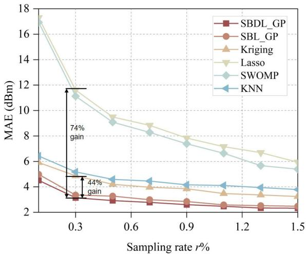  
Fig. 5. Comparisons of spectrum data recovery performance.

## B. Spectrum Data Recovery Performance

To demonstrate the performance of different spectrum data recovery methods, we define the mean absolute error (MAE) as the average difference in RSS values between the reconstructed and the ideal REMs. It can be expressed as

$$
M A E ^ { \mathrm { R E M } } = \frac { 1 } { N } \sum _ { n = 1 } ^ { N } | P _ { \mathrm { e s t } } ^ { r } ( n ) - P _ { \mathrm { t r u e } } ^ { r } ( n ) | ,\tag{50}
$$

where $P _ { \mathrm { e s t } } ^ { r } ( n )$ and $P _ { \mathrm { t r u e } } ^ { r } ( n )$ are the estimated and true RSS value in dBm at the n-th cube, respectively. The ground truth RSS (or ideal) for each cube is generated by a RT simulator, providing a high-fidelity complete REM for evaluating different mapping algorithms with the MAE metric.

Fig. 5 shows that the MAEs of all methods decrease as the sampling rate increases, indicating improved construction accuracy and a narrowing performance gap. However, in realistic UAV-aided 3D mapping scenarios, the sampling rate is very low due to flight and sensing constraints. SBDL GP consistently achieves the lowest MAE, particularly in shadowed or obstructed regions, demonstrating superior robustness and effectiveness under sparse sampling conditions. Furthermore, both SBDL GP and ${ \bf S B L \_ G P }$ significantly outperform Lasso and SWOMP, as they explicitly account for shadow fading effects. The performance gain of $\mathrm { S B D L \_ G P }$ over ${ \bf S B L \_ G P }$ highlights the effectiveness of the proposed dictionary updating mechanism to adapt to environment-specific propagation characteristics. At low sampling rates, Kriging underperforms SBL-based methods due to limited samples, but its ability to exploit spatial spectrum correlations enables it to exceed Lasso and SWOMP. In contrast, being purely data-driven, KNN suffers substantial degradation when measurement density is low, since it cannot capture large-scale propagation variations with sparse data. On average, the proposed SBDL GP achieves over

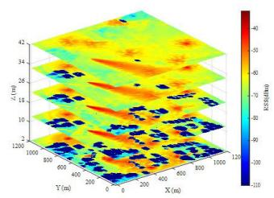  
(a) Ideal REM

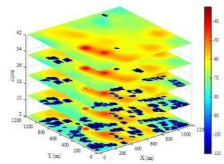

(b) SBDL\_GP  
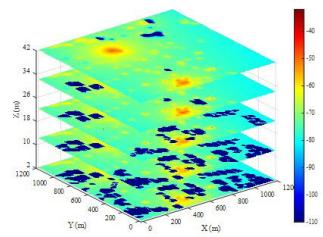  
(e) SWOMP  
Fig. 6. Visualizations of 3D REM construction with different methods.

60% reduction in MAE compared with CS-based methods and approximately 35% improvement over data-driven interpolation schemes. Particularly, under extremely sparse sampling conditions (e.g., 0.3%), it still maintains high reconstruction fidelity, achieving up to 74% lower MAE than Lasso and OMP, and 44% improvement compared with Kriging and KNN. These results confirm the robustness and adaptability of the proposed Bayesian dictionary learning framework in highly underdetermined and dynamic spectrum environments.

The recovery performance of different methods at a sampling rate of 0.01 is shown in Fig. 6. The proposed SBDL GP achieves the highest accuracy, especially near emitters and in regions affected by building occlusions. This superiority arises from the joint exploitation of sparsity and adaptive channel dictionary learning. The proposed method can accurately reconstruct sharp power variations caused by shadow fading and blockage, which traditional interpolation or CS-based approaches fail to capture effectively. From Fig. 6 (b)-(g), SBL-based algorithms exhibit stronger recovery capability than other CS-based and data-driven approaches in highintensity regions. Their advantage stems from the Bayesian inference mechanism, which adaptively prunes irrelevant basis and maintains robustness against correlated measurements and noise. In contrast, Kriging and KNN outperform SWOMP and Lasso due to their interpolation of spatial correlations. However, their accuracy is constrained by the lack of explicit propagation channel modeling. They assume field smoothness but cannot represent environment-specific effects such as path loss or shadowing, leading to biased recovery of near obstacles and emitters.

## C. Path Planning Performance

Fig. 7 compares the REM construction performance of different path planning methods. The proposed 3DIG-RRT\* consistently achieves the lowest RMSE across all sampling rates, while the spiral planner performs worst due to its limited coverage of the ROI. To further validate our information-driven strategy, we compared it with an ROIdriven planner [10], which prioritizes regions of potentially high RSS using inverse distance weighting (IDW) for unsampled data estimation. However, IDW suffers from poor performance at low sampling rates and neglects regions with severe shadowing fading. Then, the ROI-driven planner exhibits MAE up to 25-30% higher than that of 3DIG-RRT\*. It also relies on a greedy search, increasing complexity and limiting optimality. Overall, the proposed planner improves sampling efficiency by up to 70% while achieving the same accuracy, demonstrating both its effectiveness and robustness in complex 3D environments.

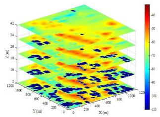  
(c) SBL\_GP

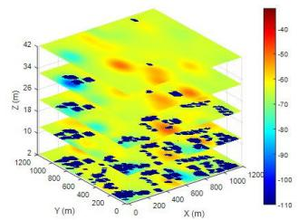  
(d) Kriging

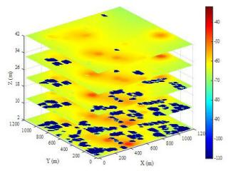  
(f) Lasso

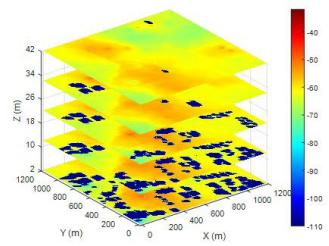  
(g) KNN

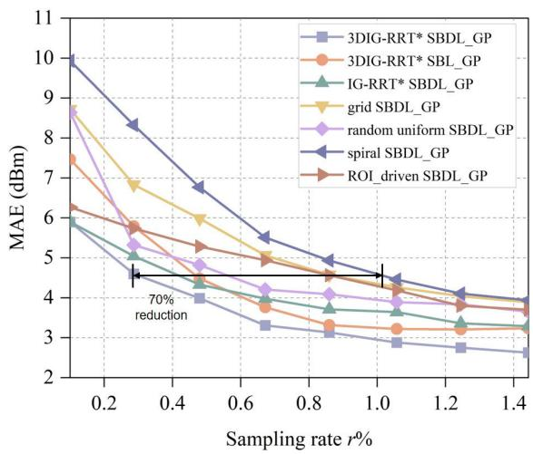  
Fig. 7. Comparisons of REM construction performance with different path planning methods.

Visualized REMs constructed with different methods at a sampling rate of 0.01 are presented in Fig. 8, illustrating the impact of path design on SBDL GP-based recovery. The proposed 3DIG-RRT\* yields the most accurate construction, closely matching the ground-truth REM. Although RRT\* is theoretically asymptotically optimal, it provides high-quality heuristic solutions rather than strict global optima with finite samples. Moreover, empirical results show that 3DIG-RRT\* effectively balances exploration and exploitation, enabling accurate and reliable REM construction. It accurately captures signal decay near obstructions and preserves high-intensity gradients in emitter-dominated zones. Competing strategies tend to produce distortions or overly smoothed transitions, particularly around obstructions, leading to higher MAEs. These localized advantages confirm the superior construction capability of the proposed planner.

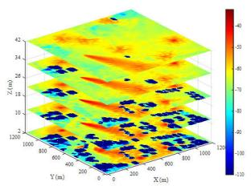  
(a) Ideal REM

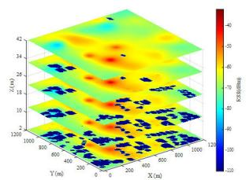  
(b) 3DIG-RRT\* SBDL\_GP

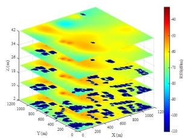  
(c) Random uniform SBDL GP

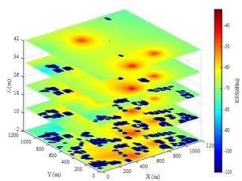  
(d) Spiral SBDL\_GP

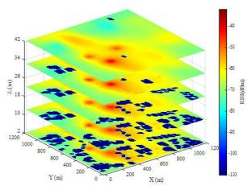  
(e) IG-RRT\* SBDL\_GP

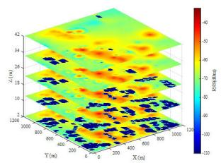  
(f) 3DIG-RRT\* SBL GP

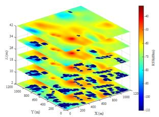  
(g) ROI-driven SBDL\_GP

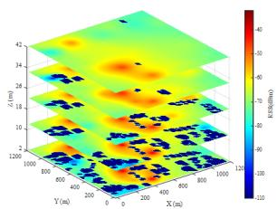  
(h) Grid SBDL\_GP

Fig. 8. Visualizations of 3D REM construction with different path planners.  
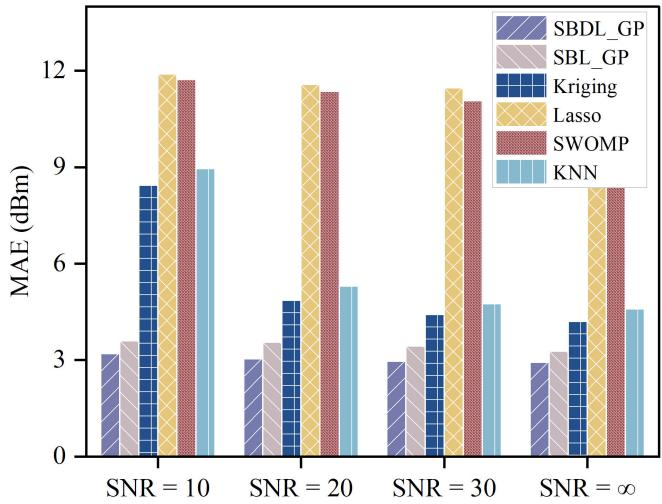  
(a)  
Fig. 9. Impact of SNR.

## D. Effect of Different Parameters

Fig. 9 (a) and (b) illustrate the impact of signal-to-noise ratio (SNR) (10, 20, 30 dB, and noise-free) on REM construction at a sampling rate of 0.5%. SBL-based methods consistently outperform others, demonstrating strong robustness to measurement noise. The proposed SBDL GP further improves accuracy through adaptive dictionary updates while leveraging

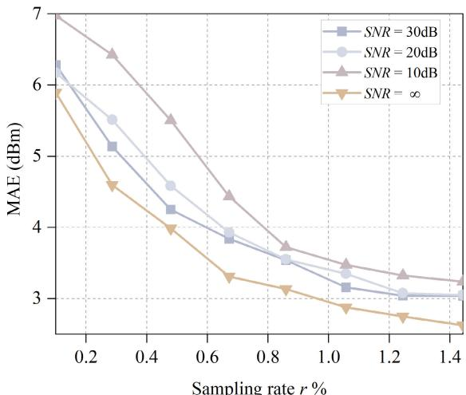  
Sampling rate r %  
(b)

SBL’s anti-noise capability. CS-based algorithms such as Lasso and SWOMP, although accounting for noise in their models, perform significantly worse than SBL-based methods. Kriging, relying solely on spatial correlations, is highly sensitive to noise. Quantitatively, when the SNR decreases from 30 dB to 10 dB, the MAE of SBDL GP increases by only 7.8%, whereas Kriging exhibits a 91% increase, highlighting the superior noise resilience of the proposed method. Fig. 9 (b) further shows that while MAE slightly rises for SBDL GP under lower SNR, it remains consistently competitive, confirming its effectiveness for accurate REM construction even under noisy measurement conditions.

The impact of adjustment coefficient η is analyzed in Fig. 10 (a), where values of 60, 80, 100, and 120 are tested. As it is shown, the model performance is sensitive to η, and an appropriate adjustment can significantly enhance recovery accuracy. A small η restricts the neighborhood size, potentially missing informative sampling points, while an excessively large η increases computational cost and introduces redundant information. Therefore, an intermediate value $( \eta = 8 0 )$ provides a good balance between accuracy and efficiency.

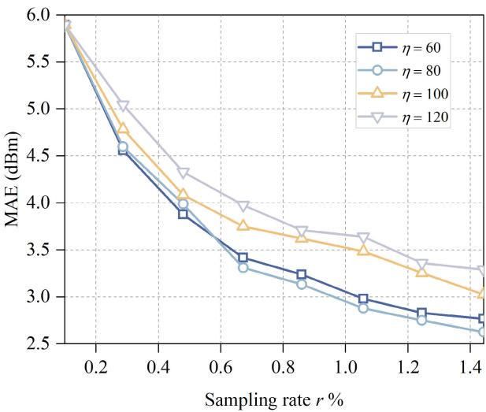  
(a)  
Fig. 10. Impact of different parameters.

TABLE II  
AVERAGED TIME CONSUMPTION OF DIFFERENT METHODS
<table><tr><td>Time/s</td><td>SBDL_GP</td><td>SBL_GP</td><td>Kriging</td><td>Lasso</td><td>OMP</td><td>KNN</td></tr><tr><td>r=0.5%</td><td>1.748</td><td>0.954</td><td>0.287</td><td>4.08</td><td>0.0048</td><td>0.215</td></tr><tr><td>r=1%</td><td>2.081</td><td>1.043</td><td>0.573</td><td>5.662</td><td>0.016</td><td>0.459</td></tr><tr><td>r=1.5%</td><td>2.177</td><td>1.081</td><td>0.812</td><td>6.426</td><td>0.025</td><td>0.518</td></tr></table>

The impact of information density radius $r _ { n e w }$ is shown in Fig. 10 (b). It investigates the trade-off between exploring unknown environment for data diversity and maximizing information collection for model learning. It can be found that when the radius is 0, UAV follows the traditional maximum information gathering with fixed near radius, and it yields the worst performance. In contrast, when the radius increases, the focus is on traversing unknown areas. However, this does not result in the best performance either. Therefore, the larger radius may not lead to better performance. A larger radius causes the miss of exploring many information-rich positions. The optimal point is reached with an intermediate radius.

As shown in TABLE II, the proposed SBDL DL achieves a good trade-off between accuracy and efficiency. Although it requires moderately more computation time than kriging and KNN, this overhead is compensated by over 70% improvement in MAE. Compared to the computationally expensive Lasso, SBDL DL provides a more efficient alternative with comparable accuracy. In terms of general-purpose hardware computing power, this additional computation cost is negligible relative to UAV flight time and data transmission latency.

## E. 3D Spectrum Mapping Application

We developed a 3D SM system consisting of a UAV platform equipped with a spectrum monitoring unit, an A2G communication unit, and an RTK module, as well as a ground data processing terminal (Fig. 11). The aerial unit collects spectrum data along with GPS information and transmits them to the ground terminal, which constructs and displays the 3D REM using the proposed method. The monitoring unit can also be mounted on a vehicle. Since the UAV currently does not support dynamic trajectory adjustment, a predefined flight path is used. The measurement ROI (117m×97m) contains four emitters transmitting at 0dBm and 1GHz [39].

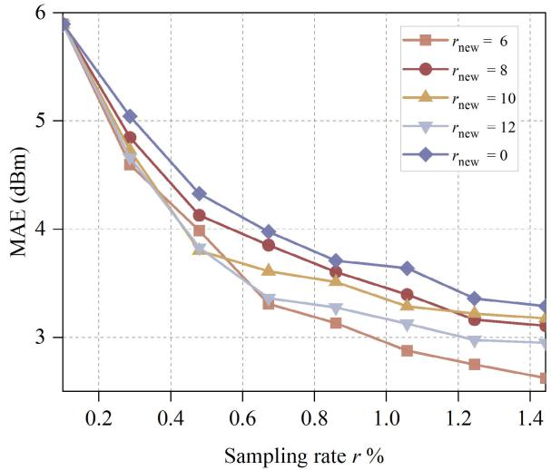  
(b)

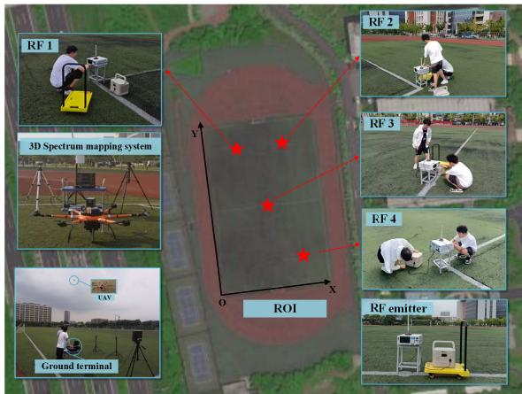  
Fig. 11. 3D SM system and ROI setup.

Using the proposed algorithm, the constructed 3D REMs are illustrated in Fig. 12. For comparison, the second row presents results obtained without dictionary learning. Due to shadow fading and multipath propagation in the real-world environment, the measured data exhibit higher complexity than theoretical models. The proposed method clearly reconstructs emitter distributions at different heights, revealing both spatial structures and signal intensity variations. In contrast, REMs generated without dictionary updating appear blurred and fail to capture fine-grained emitter details. The dictionary updating mechanism effectively adapts to environmental variations, enhancing robustness against spatial fluctuations. The current approach proves most effective for exploratory mapping in relatively static or slowly varying environments. In highly dynamic scenarios involving rapidly moving emitters, incorporating change detection and faster adaptation mechanisms represents a promising direction for future research.

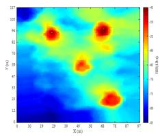

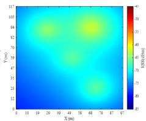

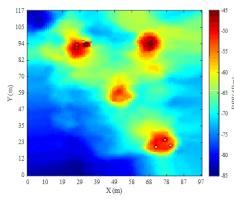

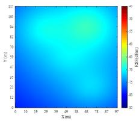

(a)  
Z=1m  
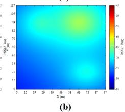  
Z=15m

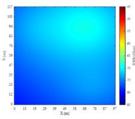  
Z=30m  
Fig. 12. (a)-(b) The hierarchical visualizations of measured REM construction with the SBDL GP, and SBL GP.

## V. CONCLUSION

This paper has presented a novel 3D SM scheme for unknown dynamic environments, enabling accurate construction of REMs from sparse measurements. The resulting REMs can provide a reliable foundation for interference localization, efficient spectrum allocation, dynamic access, and improved communication reliability. The scheme includes two steps, i.e., UAV sampling path optimization, and 3D spectrum data recovery. Leveraging the MI gathering criterion, an information-driven UAV path planner (3DIG-RRT\*) is developed to enhance sampling efficiency. To adapt to unknown environments, the channel dictionary has been dynamically updated using sampled data, while unsampled spectrum data are recovered via SBDL and GP with the optimized dictionary.

Extensive experiments on simulated and measured datasets validate the effectiveness of the proposed approach. In the simulated outdoor scenario, SBDL GP outperforms conventional CS-based methods by over 60% and data-driven interpolation methods by 35% on average, demonstrating robust recovery under sparse measurements. The 3DIG-RRT\* planner further improves sampling efficiency, requiring up to 70% fewer measurements to achieve the same construction accuracy compared with benchmark planners, and effectively prioritizes informative regions. On the measured dataset, the method accurately captures real-world spectrum variations, verifying its practical applicability and robustness. Future work will explore multi-UAV cooperation, adaptive online learning in highly dynamic scenarios, and integration with integrated sensing and communications (ISAC) systems.

## REFERENCES

[1] A. Ahmad, S. Ahmad, M. H. Rehmani, and N. U. Hassan, “A survey on radio resource allocation in cognitive radio sensor networks,” IEEE Commun. Surveys Tuts., vol. 17, no. 2, pp. 888–917, 2nd Quart., 2015.

[2] J. Liu, J. Yu, D. Niyato, R. Zhang, X. Gao, and J. An, “Covert ambient backscatter communications with multi-antenna tag,” IEEE Trans. Wireless Commun., vol. 22, no. 9, pp. 6199–6212, Sep. 2023.

[3] P. Kolodzy, “Spectrum policy task force,” FCC, Washington, DC, USA, Tech. Rep. 02-135, Nov. 2002.

[4] Y. S. Reddy, A. Kumar, O. J. Pandey, and L. R. Cenkeramaddi, “Spectrum cartography techniques, challenges, opportunities, and applications: A survey,” Pervas. Mobile Comput., vol. 79, Jan. 2022, Art. no. 101511.

[5] C. He, Y. Dong, and Z. J. Wang, “Radio map assisted multi-UAV target searching,” IEEE Trans. Wireless Commun., vol. 22, no. 7, pp. 4698–4711, Jul. 2023.

[6] J. Pan et al., “AI-driven blind signature classification for IoT connectivity: A deep learning approach,” IEEE Trans. Wireless Commun., vol. 21, no. 8, pp. 6033–6047, Aug. 2022.

[7] X. Fang et al., “Radio map-based spectrum sharing for joint communication and sensing,” IEEE Open J. Commun. Soc., vol. 5, pp. 4541–4558, 2024.

[8] D. Romero and S.-J. Kim, “Radio map estimation: A data-driven approach to spectrum cartography,” IEEE Signal Process. Mag., vol. 39, no. 6, pp. 53–72, Nov. 2022.

[9] Q. Zhu et al., “Demo abstract: An UAV-based 3D spectrum real-time mapping system,” in Proc. IEEE Conf. Comput. Commun. Workshops (INFOCOM WKSHPS), Jun. 2022, pp. 1–2.

[10] Q. Wu, F. Shen, Z. Wang, and G. Ding, “3D spectrum mapping based on ROI-driven UAV deployment,” IEEE Netw., vol. 34, no. 5, pp. 24–31, Sep. 2020.

[11] X. Jiang, N. Li, Y. Guo, D. Yu, and S. Yang, “Localization of multiple RF sources based on Bayesian compressive sensing using a limited number of UAVs with airborne RSS sensor,” IEEE Sensors J., vol. 21, no. 5, pp. 7067–7079, Mar. 2021.

[12] X. Pang, M. Sheng, N. Zhao, J. Tang, D. Niyato, and K.-K. Wong, “When UAV meets IRS: Expanding air-ground networks via passive reflection,” IEEE Wireless Commun., vol. 28, no. 5, pp. 164–170, Oct. 2021.

[13] W. Liu and J. Chen, “UAV-aided radio map construction exploiting environment semantics,” IEEE Trans. Wireless Commun., vol. 22, no. 9, pp. 6341–6355, Sep. 2023.

[14] A. Ivanov, K. Tonchev, V. Poulkov, A. Manolova, and A. Vlahov, “Interpolation accuracy evaluation for 3D radio environment maps construction,” in Proc. 26th Int. Symp. Wireless Pers. Multimedia Commun. (WPMC), Nov. 2023, pp. 1–7.

[15] P. Maiti and D. Mitra, “Ordinary Kriging interpolation for indoor 3D REM,” J. Ambient Intell. Humanized Comput., vol. 14, no. 10, pp. 13285–13299, Oct. 2023.

[16] X. Chen, J. Wang, G. Zhang, and Q. Peng, “Tensor-based parametric spectrum cartography from irregular off-grid samplings,” IEEE Signal Process. Lett., vol. 30, pp. 513–517, 2023.

[17] S. Roger, M. Brambilla, B. C. Tedeschini, C. Botella-Mascarell, M. Cobos, and M. Nicoli, “Deep-learning-based radio map reconstruction for V2X communications,” IEEE Trans. Veh. Technol., vol. 73, no. 3, pp. 3863–3871, Mar. 2024.

[18] S. Zhang, A. Wijesinghe, and Z. Ding, “RME-GAN: A learning framework for radio map estimation based on conditional generative adversarial network,” IEEE Internet Things J., vol. 10, no. 20, pp. 18016–18027, Oct. 2023.

[19] R. Shrestha, D. Romero, and S. P. Chepuri, “Spectrum surveying: Active radio map estimation with autonomous UAVs,” IEEE Trans. Wireless Commun., vol. 22, no. 1, pp. 627–641, Jan. 2023.

[20] S. Bi, J. Lyu, Z. Ding, and R. Zhang, “Engineering radio maps for wireless resource management,” IEEE Wireless Commun., vol. 26, no. 2, pp. 133–141, Apr. 2019.

[21] F. Shen, Z. Wang, G. Ding, K. Li, and Q. Wu, “3D compressed spectrum mapping with sampling locations optimization in spectrumheterogeneous environment,” IEEE Trans. Wireless Commun., vol. 21, no. 1, pp. 326–338, Jan. 2022.

[22] F. Shen, G. Ding, Q. Wu, and Z. Wang, “Compressed wideband spectrum mapping in 3D spectrum-heterogeneous environment,” IEEE Trans. Veh. Technol., vol. 72, no. 4, pp. 4875–4886, Apr. 2023.

[23] M. E. Tipping, “Sparse Bayesian learning and the relevance vector machine,” J. Mach. Learn. Res., vol. 1, pp. 211–244, Jun. 2001.

[24] D.-H. Huang, S.-H. Wu, W.-R. Wu, and P.-H. Wang, “Cooperative radio source positioning and power map reconstruction: A sparse Bayesian learning approach,” IEEE Trans. Veh. Technol., vol. 64, no. 6, pp. 2318–2332, Jun. 2015.

[25] S. He and K. G. Shin, “Steering crowdsourced signal map construction via Bayesian compressive sensing,” in Proc. IEEE INFOCOM - IEEE Conf. Comput. Commun., Apr. 2018, pp. 1016–1024.

[26] J. Wang et al., “Sparse Bayesian learning-based 3-D radio environment map construction—Sampling optimization, scenario-dependent dictionary construction, and sparse recovery,” IEEE Trans. Cognit. Commun. Netw., vol. 10, no. 1, pp. 80–93, Feb. 2024.

[27] J. Wang et al., “Sparse Bayesian learning-based hierarchical construction for 3D radio environment maps incorporating channel shadowing,” IEEE Trans. Wireless Commun., vol. 23, no. 10, pp. 14560–14574,Oct. 2024.

[28] G. Zhang, X. Fu, J. Wang, X.-L. Zhao, and M. Hong, “Spectrum cartography via coupled block-term tensor decomposition,” IEEE Trans. Signal Process., vol. 68, pp. 3660–3675,2020.

[29] S. D. Babacan, R. Molina, and A. K. Katsaggelos, “Bayesian compressive sensing using Laplace priors,” IEEE Trans. Image Process., vol. 19, no. 1, pp. 53–63, Jan. 2010.

[30] K. Mao et al., “A survey on channel sounding technologies and measurements for UAV-assisted communications,” IEEE Trans. Instrum. Meas., vol. 73, pp. 1–24, 2024.

[31] M. Aharon, M. Elad, and A. Bruckstein, “K-SVD: An algorithm for designing overcomplete dictionaries for sparse representation,” IEEE Trans. Signal Process., vol. 54, no. 11, pp. 4311–4322, Nov. 2006.

[32] Y.-Q. Xu, B. Zhang, G. Ding, B. Zhao, S. Li, and D. Guo, “Radio environment map construction based on spatial statistics and Bayesian hierarchical model,” IEEE Trans. Cognit. Commun. Netw., vol. 7, no. 3, pp. 767–779, Sep. 2021.

[33] E. Clark, T. Askham, S. L. Brunton, and J. Nathan Kutz, “Greedy sensor placement with cost constraints,” IEEE Sensors J., vol. 19, no. 7, pp. 2642–2656, Apr. 2019.

[34] M. Ghaffari Jadidi, J. Valls Miro, and G. Dissanayake, “Samplingbased incremental information gathering with applications to robotic exploration and environmental monitoring,” Int. J. Robot. Res., vol. 38, no. 6, pp. 658–685, May 2019, doi: 10.1177/0278364919844575.

[35] L. Schmid, M. Pantic, R. Khanna, L. Ott, R. Siegwart, and J. Nieto, “An efficient sampling-based method for online informative path planning in unknown environments,” IEEE Robot. Autom. Lett., vol. 5, no. 2, pp. 1500–1507, Apr. 2020.

[36] J. Ruckin, F. Magistri, C. Stachniss, and M. Popovi¨ c, “An informative´ path planning framework for active learning in UAV-based semantic mapping,” IEEE Trans. Robot., vol. 39, no. 6, pp. 4279–4296, Dec. 2023.

[37] K. Solovey, L. Janson, E. Schmerling, E. Frazzoli, and M. Pavone, “Revisiting the asymptotic optimality of RRT,” in Proc. IEEE Int. Conf. Robot. Autom. (ICRA), May 2020, pp. 2189–2195.

[38] Q. Zhu et al., “Dataset for 3D radio (RSSI) map under urban scenario (1.25 km × 1.25 km),” Mendeley Data, 2024, vol. 1, doi: 10.17632/ bn6n2639xh.1.

[39] Q. Zhu et al., “Measurement dataset for radio (RSSI) map under campus scenario (117 m × 97 m),” Mendeley Data, 2024, vol. 1, doi: 10.17632/ 2vtwn578fn.2.

[40] H. B. Yilmaz, T. Tugcu, F. Alagoz, and S. Bayhan, “Radio environment¨ map as enabler for practical cognitive radio networks,” IEEE Commun. Mag., vol. 51, no. 12, pp. 162–169, Dec. 2013.

[41] J. A. Bazerque and G. B. Giannakis, “Distributed spectrum sensing for cognitive radio networks by exploiting sparsity,” IEEE Trans. Signal Process., vol. 58, no. 3, pp. 1847–1862, Mar. 2010.

[42] T. Blumensath and M. E. Davies, “Stagewise weak gradient pursuits,” IEEE Trans. Signal Process., vol. 57, no. 11, pp. 4333–4346, Nov. 2009.