# Beyond 5G With UAVs: Foundations of a 3D Wireless Cellular Network

Mohammad Mozaffari , Student Member, IEEE, Ali Taleb Zadeh Kasgari , Student Member, IEEE,

Walid Saad , Fellow, IEEE, Mehdi Bennis , Senior Member, IEEE,

and Mérouane Debbah, Fellow, IEEE

Abstract— In this paper, a novel concept of three-dimensional (3D) cellular networks, that integrate drone base stations (drone-BS) and cellular-connected drone users (drone-UEs), is introduced. For this new 3D cellular architecture, a novel framework for network planning for drone-BSs and latency-minimal cell association for drone-UEs is proposed. For network planning, a tractable method for drone-BSs’ deployment based on the notion of truncated octahedron shapes is proposed, which ensures full coverage for a given space with a minimum number of drone-BSs. In addition, to characterize frequency planning in such 3D wireless networks, an analytical expression for the feasible integer frequency reuse factors is derived. Subsequently, an optimal 3D cell association scheme is developed for which the drone-UEs’ latency, considering transmission, computation, and backhaul delays, is minimized. To this end, first, the spatial distribution of the drone-UEs is estimated using a kernel density estimation method, and the parameters of the estimator are obtained using a cross-validation method. Then, according to the spatial distribution of drone-UEs and the locations of drone-BSs, the latency-minimal 3D cell association for drone-UEs is derived by exploiting tools from an optimal transport theory. The simulation results show that the proposed approach reduces the latency of drone-UEs compared with the classical cell association approach that uses a signal-to-interference-plus-noise ratio (SINR) criterion. In particular, the proposed approach yields a reduction of up to 46% in the average latency compared with the SINR-based association. The results also show that the

proposed latency-optimal cell association improves the spectral efficiency of a 3D wireless cellular network of drones.

## I. INTRODUCTION

Index Terms— UAV, Drone, 3D wireless cellular network, 5G, machine learning, latency, deployment, backhaul.

ECENT reports shows that the number of unmanned exceed million in 2020 [2]. Such a massive use of drones will have significant impacts on wireless networking. From a wireless perspective, the two key roles of drones include: aerial base station (BS), and user equipment (UE) [3]–[5]. Due to their flexibility and inherent ability for line-of-sight (LoS) communications, drone-BSs can provide broadband, wide-scale, and reliable wireless connectivity during disasters and temporary events [4]–[11]. Moreover, drone-BSs can offer a promising solution for ultra-flexible and swift deployment.

Meanwhile, drones can also act as UEs (i.e., cellularconnected drone-UEs) that must connect to a wireless network so as to operate. In particular, cellular-connected drone-UEs can be used for wide range of applications such as package delivery [12], surveillance, remote sensing, and virtual reality. The key feature of drone-UEs is their ability to intelligently move in three dimensions and optimize their trajectory in order to efficiently complete their missions. Therefore, drone-UEs are widely used for delivery purposes such as drug delivery in medical applications.

Wireless networking with drones faces a number of challenges. For instance, for drone-BSs, key design problems include 3D deployment and network planning, performance analysis, resource allocation, and 3D cell association. For drone-UEs, there is a need for reliable and low latency communications for efficient control. However, existing terrestrial cellular networks have been primarily designed for supporting ground users and are not able to readily serve aerial users. Also, in areas with geographical constraints, terrestrial BSs may not be available to provide wireless service to drone-UEs. In such cases, the deployment of aerial drone-BSs is a promising opportunity for providing reliable wireless connectivity for drone-UEs. Clearly, to support drones in wireless networking applications, there is a need for developing the novel concept of a 3D cellular network that incorporates both drone-BSs and drone-UEs.

## A. Related Works on Drone Communications

Recent studies on drone communications have investigated various design challenges that include performance characterization, trajectory optimization, 3D deployment, user-todrone association, and cellular-connected UAVs. For instance, Kalantari et al. [7] proposed an algorithm for jointly optimizing the locations and number of drones to maximize wireless coverage. The work in [13] studied the optimal 3D deployment of UAVs for maximizing the number of covered ground users under quality-of-service (QoS) constraints. Lagum et al. [14] proposed a framework for strategic placement of multiple drone-BSs that provides wireless connectivity for a large-scale ground network. However, the prior studies on deployment of UAV base stations ignore the existence of flying drone-UEs.

In addition, the work in [15] presented a delay-optimal cell association scheme in a UAV-assisted terrestrial wireless network. The work in [16] studied the optimal user-UAV association for capacity improvement in UAV-enabled heterogeneous wireless networks. The work in [17] proposed a novel hybrid network architecture for cellular systems by using UAVs as aerial base stations for data offloading. In particular, with the proposed framework in [17], the minimum throughput of mobile terminals is maximized by jointly optimizing the user partitioning, the spectrum allocation, as well as the UAV trajectory. Kalantari et al. [18] proposed an algorithm for maximizing the sum-rate of ground users by joint optimization of user-to-drone-BSs association and wireless backhaul bandwidth allocation. The work in [19] proposed a novel cell association approach that maximizes the total data delivered to ground users by drone-BSs that have limited flight endurance. However, the previous works on user association in drone networks are limited to ground users and do not consider 3D aerial users. Moreover, the previous works do not analyze latency (due to e.g., communication, computation, and backhaul) which is a key metric in 3D drone communication systems.

While there exists a number of studies on cellular-connected drone-UEs [20]–[22], the potential use of drone-BSs for serving drone-UEs has not been considered. For example, Azari et al. [20] studied the coexistence of drone-UEs and ground users in cellular networks and characterized the downlink coverage performance. The work in [21] proposed an interference-aware path planning approach for drone-UEs with the goal of minimizing their communication latency and their interference on terrestrial users. In [23], the authors analyzed the downlink coverage performance of drone-UEs that communicate with terrestrial base stations. Azari et al. [23] proposed a trajectory design scheme for minimizing the mission time of a single UAV-UE. Meanwhile, the authors in [24] characterized the performance of drone-UEs in uplink communications with ground BSs in terms of blocking probability and average achievable throughput. However, the existing studies on cellular-connected UAVs do not exploit the deployment of aerial base stations for enabling low-latency and reliable drone-UEs’ communications.

However, none of these previous works [4]–[8], [13]–[16], [18]–[22], [25] studied a 3D wireless network composing of aerial base stations and users (i.e., drone-BSs and drone-UEs) while addressing network planning, deployment, and latency-aware cell association problems.

## B. Contributions

The main contribution of this paper is to introduce the novel concept of a fully-fledged drone-based 3D cellular network that incorporates drone-UEs, low-altitude platform (LAP) drone-BSs, and high-altitude platform (HAP) drones. In this new 3D cellular network architecture, we propose a framework for addressing the two fundamental problems of network planning and 3D cell association. In particular, our proposed framework includes a tractable approach for three-dimensional placement and frequency planning for drone-BSs, as well as a latency-minimal 3D cell association scheme for servicing drone-UEs. For deployment, we introduce a new approach based on truncated octahedron cells that determines the minimum number of drone-BSs that can cover a 3D space, along with their locations. Furthermore, for frequency planning in the proposed 3D wireless network, we derive an analytical expression for the feasible integer frequency reuse factors. To perform latency-minimal 3D cell association, first, we estimate the spatial distribution of drone-UEs by using a kernel density estimation method. Then, given the locations of drone-BSs and the distribution of drone-UEs, we find the optimal 3D cell association for which the total latency of serving drone-UEs is minimized. In this case, we analytically characterize the optimal 3D cell partitions by exploiting tools from optimal transport theory. Our results show that the proposed approach significantly reduces the latency of serving drone-UEs, compared to classical cell association approach that uses signal-to-interference-plus-noise ratio (SINR) criterion. In particular, our approach yields around 46% reduction in the average total latency compared to the SINR-bases association. The results also reveal that our latency-optimal cell association improves spectral efficiency of the considered 3D wireless network with drones.

The rest of this paper is organized as follows. In Section II, we present the system model. In Section III, the threedimensional placement of drone-BSs is investigated. In Section IV, we describe our approach for estimating the spatial distribution of drone-UEs. Section V presents the proposed latency-optimal cell association scheme. Simulation results are provided in Section VI and conclusions are drawn in Section VII.

## II. SYSTEM MODEL

Consider a 3D cellular network composed of L drone users, N LAP drone base stations, and a number of HAP drones, as shown in Fig. 1. We represent the sets of drone-UEs, and drone-BSs, respectively, by L, and N . Here, we focus on a stand-alone aerial network that consists of flying drones. In this aerial network, drone-BSs serve drone-UEs1 in the downlink, and HAP drones provide a wireless backhaul connectivity [26] for drone-BSs. The key advantage of HAP drones is their ability to adjust their positions according to the locations of drone-BSs. In addition, due to their high altitudes, HAPs can establish LoS backhaul links to the drone-BSs. Therefore, while it is possible to use various types of backhaul for the proposed 3D cellular network [27], we used HAPs that can establish free space optical communications (FSO) backhaul links to the UAV-BSs due to the improved reliability and lower latency of this link compared to a terrestrial BS backhaul. In our proposed 3D cellular network, we adopt omni-directional antennas for drone-BSs to enable a full 3D connectivity. Here, the deployment of drone-BSs is performed based on a 3D cellular structure which will be presented in Section III. For backhaul connectivity, we assume that each drone-BS connects to its closest HAP that can provide a maximum rate. We denote the backhaul transmission rate for drone-BS n by $C _ { n } ,$ , which is assumed to be given in our model2. Drone-BS n uses transmit power $P _ { n }$ bandwidth $B _ { n }$ in order to serve its associated flying drone-UEs. Let $f ( x , y , z )$ be the spatial probability density function of drone-UEs which represents the probability that each drone-UE is present around a 3D location x, y, z . In our model, drone-BSs use machine learning tools to estimate the spatial probability distribution of drone-UEs, for a certain period of time, based on any available prior information about the drone-UEs’ locations. By performing such estimation, the network will no longer need to continuously track the locations of flying drone-UEs thus alleviating the associated overhead. To find the 3D cell association when serving drone-UEs, we partition the space into N 3D cells each of which representing a volume that must be serviced by one drone-BS. Let $\nu _ { n }$ be a 3D space (i.e., 3D cell) associated to drone-BS n that serves drone-UEs located within this cell. The average number of drone-UEs inside $\nu _ { n }$ is given by:

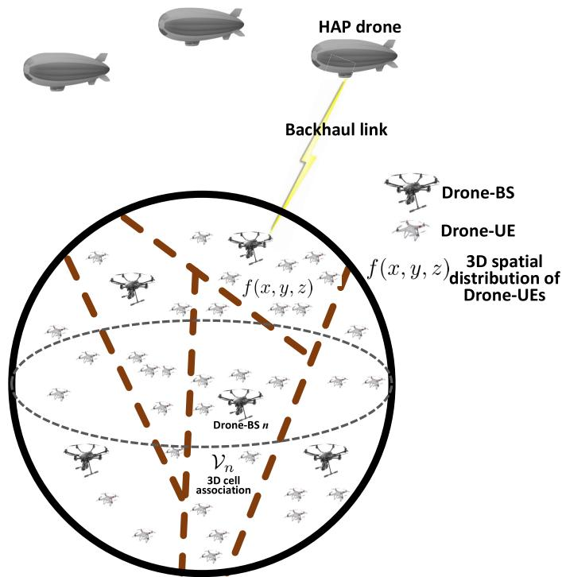  
Fig. 1. The proposed 3D wireless network with drone-BSs, drone-UEs, and HAP drones.

$$
K _ { n } = L \int _ { \mathcal { V } _ { n } } f ( x , y , z ) \mathrm { d } x \mathrm { d } y \mathrm { d } z .\tag{1}
$$

We assume that each drone-BS adopts a frequency division multiple access (FDMA) technique (as done in [19] and [28]) when servicing its associated drone-UEs. Hence, the average downlink transmission rate from a drone-BS n to a drone-UE located at $( x , y , z )$ is:

$$
R _ { n } ( x , y , z ) = \frac { B _ { n } } { K _ { n } } \log _ { 2 } \big ( 1 + \gamma _ { n } ( x , y , z ) \big ) ,\tag{2}
$$

where $\scriptstyle { \frac { B _ { n } } { K _ { n } } }$ is the amount of bandwidth for servicing each drone-UE located in $\nu _ { n } .$ which is determined by sharing the total bandwidth among the drone-UEs. $\gamma _ { n } ( x , y , z )$ is the SINR for a drone-UE located at $( x , y , z )$ served by drone-BS n.

We consider the average latency in servicing drone-UEs as our main performance metric. In particular, we consider transmission latency in drone-BSs to drone-UEs communications, backhaul latency in drone-BSs to HAP drones links, and computation latency for drone-BSs that serve drone-UEs. The transmission latency for a drone-UE located at $( x , y , z )$ which is served by drone-BS n is3:

$$
\tau _ { n } ^ { \mathrm { T r } } ( x , y , z , K _ { n } ) = \frac { \beta } { R _ { n } ( x , y , z ) } ,\tag{3}
$$

where $\beta$ is the number of bits per packet that must be transmitted to each drone-UE.

The backhaul latency depends on the load of drone-BSs and the backhaul transmission rates. In this case, the average backhaul latency in drone-BS n to its corresponding HAP-drone communications is given by:

$$
\tau _ { n } ^ { \mathrm { B } } ( K _ { n } ) = \frac { \beta L \int _ { \mathcal { V } _ { n } } f ( x , y , z ) \mathrm { d } x \mathrm { d } y \mathrm { d } z } { C _ { n } } = \frac { \beta K _ { n } } { C _ { n } } ,\tag{4}
$$

where $C _ { n }$ is the maximum backhaul transmission rate for drone-BS n, and βL $\textstyle \int _ { \mathcal { V } _ { n } } f ( x , y , z )$ dxdydz represents the average load on drone-BS n.

The computation time depends on the data size (i.e., load) that must be processed in each drone-BS, and the processing speed. To model the computational latency at drone-BS n, we use function $g _ { n } ( \beta K _ { n } )$ with $\beta K _ { n }$ being the total data size that must be processed at the drone-BS. Therefore, the total latency experienced by any arbitrary drone-UE located at $( x , y , z )$ while being served by drone-BS n can be given by:

$$
\begin{array} { r } { \tau _ { n } ^ { \mathrm { t o t } } ( x , y , z , K _ { n } ) = \tau _ { n } ^ { \mathrm { T r } } ( x , y , z , K _ { n } ) + \tau _ { n } ^ { \mathrm { B } } ( K _ { n } ) + g _ { n } ( \beta K _ { n } ) . } \end{array}\tag{5}
$$

Given this model, our goal is to minimize the average latency of drone-UEs by finding the optimal 3D cell association in drone-BSs to drone-UEs communications. In particular, given the locations of drone-BSs which are deployed based on a 3D cellular structure (in Section III), and the estimated spatial distribution of drone-UEs (in Section IV), we determine the optimal 3D cell partitions $\nu _ { n } , \ \forall n \ \in \ \mathcal { N }$ that lead to a minimum average latency for drone-UEs. In this regard, our 3D cell association optimization problem can be posed as follows:

TABLE I  
LIST OF NOTATIONS.
<table><tr><td rowspan=1 colspan=1>Notation</td><td rowspan=1 colspan=1>Description</td></tr><tr><td rowspan=1 colspan=1> $f _ { c }$ </td><td rowspan=1 colspan=1>Carrier frequency</td></tr><tr><td rowspan=1 colspan=1> $P _ { n }$ </td><td rowspan=1 colspan=1>Drone-BS transmit power</td></tr><tr><td rowspan=1 colspan=1> $N _ { o }$ </td><td rowspan=1 colspan=1>Noise power spectral density</td></tr><tr><td rowspan=1 colspan=1> $L$ </td><td rowspan=1 colspan=1>Number of drone-UEs</td></tr><tr><td rowspan=1 colspan=1> $B _ { n }$ </td><td rowspan=1 colspan=1>Bandwidth for each drone-BS</td></tr><tr><td rowspan=1 colspan=1>α</td><td rowspan=1 colspan=1>Path loss exponent</td></tr><tr><td rowspan=1 colspan=1>η</td><td rowspan=1 colspan=1>Path loss constant</td></tr><tr><td rowspan=1 colspan=1> $\beta$ </td><td rowspan=1 colspan=1>Packet size for drone-UE</td></tr><tr><td rowspan=1 colspan=1> $q$ </td><td rowspan=1 colspan=1>Frequency reuse factor</td></tr><tr><td rowspan=1 colspan=1> $C _ { n }$ </td><td rowspan=1 colspan=1>Backhaul rate for drone-BS n</td></tr><tr><td rowspan=1 colspan=1> $f ( x , y , z )$ </td><td rowspan=1 colspan=1>Spatial distribution of drone-UEs</td></tr><tr><td rowspan=1 colspan=1> $\hat { f } ( x , y , z )$ </td><td rowspan=1 colspan=1>Estimated spatial distribution of drone-UEs</td></tr><tr><td rowspan=1 colspan=1> $L$ </td><td rowspan=1 colspan=1>Number of drone-UEs</td></tr><tr><td rowspan=1 colspan=1> $\gamma _ { n }$ </td><td rowspan=1 colspan=1>3D cell partition associated with drone-BS n</td></tr><tr><td rowspan=1 colspan=1> $K _ { n }$ </td><td rowspan=1 colspan=1>Average number of drone-UEs inside $\nu _ { n }$ </td></tr><tr><td rowspan=1 colspan=1> $R _ { n } ( x , y , z )$ </td><td rowspan=1 colspan=1>average transmission rate from drone-BS n to a drone-UE located at $( x , y , z )$ </td></tr><tr><td rowspan=1 colspan=1> $\tau _ { n } ^ { \mathrm { { T r } } }$ </td><td rowspan=1 colspan=1>Transmission latency for drone-BS n</td></tr><tr><td rowspan=1 colspan=1> $\tau _ { n } ^ { \mathbf { B } }$ </td><td rowspan=1 colspan=1>Backhaul latency for drone-BS n</td></tr><tr><td rowspan=1 colspan=1> $\tau _ { n } ^ { \mathrm { t o t } } ( x , y , z , K _ { n } )$ </td><td rowspan=1 colspan=1>Total latency experienced by a drone-UE located at $( x , y , z )$ served by drone-BS n</td></tr><tr><td rowspan=1 colspan=1> $R$ </td><td rowspan=1 colspan=1>Edge length of a truncated octahedron</td></tr><tr><td rowspan=1 colspan=1> $\gamma _ { n } ( x , y , z )$ </td><td rowspan=1 colspan=1>SINR for a drone-UE located at $( x , y , z )$ served by drone-BS n</td></tr><tr><td rowspan=1 colspan=1> $g _ { n }$ </td><td rowspan=1 colspan=1>Computational latency at drone-BS n</td></tr><tr><td rowspan=1 colspan=1> $\omega _ { n }$ </td><td rowspan=1 colspan=1>Computation constant (i.e., speed) for each drone-BS</td></tr><tr><td rowspan=1 colspan=1> $\mu _ { x } , \mu _ { y } , \mu _ { z }$ </td><td rowspan=1 colspan=1>Mean of the truncated Gaussian distribution in $x , y ,$ and z directions</td></tr><tr><td rowspan=1 colspan=1> $\sigma _ { x } , \sigma _ { y } , \sigma _ { z }$ </td><td rowspan=1 colspan=1>Standard deviation of the distribution in x, y, and z directions</td></tr></table>

$$
\operatorname* { m i n } _ { \mathcal { V } _ { 1 } , \ldots , \mathcal { V } _ { N } } \sum _ { n = 1 } ^ { N } \left[ \int _ { \mathcal { V } _ { n } } \tau _ { n } ^ { \mathrm { T r } } \big ( x , y , z , K _ { n } \big ) f ( x , y , z ) { \mathrm { d } } x { \mathrm { d } } y { \mathrm { d } } z \right.
$$

$$
+ \tau _ { n } ^ { \mathrm { B } } ( K _ { n } ) + g _ { n } ( \beta K _ { n } ) \biggr ] ,\tag{6}
$$

$$
\mathrm { s . t . } \ \mathcal { V } _ { l } \cap \mathcal { V } _ { m } = \emptyset , \forall l \not = m \in \mathcal { N } ,\tag{7}
$$

$$
\bigcup _ { n \in N } \mathcal { V } _ { n } = \mathcal { V } ,\tag{8}
$$

where $\begin{array} { r } { K _ { n } = L \int _ { \mathcal { V } _ { \ast } } f ( x , y , z ) \mathrm { d } x \mathrm { d } y \mathrm { d } z \mathrm { ~ i } \mathrm { s ~ } } \end{array}$ the average number of =drone-UEs in $\nu _ { n }$ ( )which depends on the 3D cell association, and V is the entire considered space in which drone-UEs can fly. The constraints in (7) and (8) ensure that the 3D association spaces are disjoint and their union covers the considered space V. Table I provides a list of our main parameters and notations.

In Fig. 2, we summarize the key steps for developing our proposed drone-based 3D cellular network architecture. First, we plan the network deployment of drone-BSs based on a truncated octahedron scheme that can ensure full coverage with a minimum number of drone-BSs. Second, using some available information about the locations’ history of drone-${ \mathrm { U E s } } ,$ we estimate the 3D spatial distribution of the drone-UEs for a given period of time. Finally, given the locations of drone-BSs and the spatial distribution of drone-UEs, we derive an optimal 3D cell association rule for which the latency of servicing drone-UEs is minimized. Note that, we consider a relatively long-term deployment of drones which can be updated after a specific period of time, if needed. For each deployment configuration, one needs to optimally perform cell association based on the distribution of drone-UEs so as to enhance the system performance.

## III. THREE-DIMENSIONAL NETWORK PLANNING OF DRONE-BSS: A TRUNCATED OCTAHEDRON STRUCTURE

To perform 3D network planning, we propose a framework for the 3D deployment of drone-BSs and associated frequency planning. In particular, we use the notion of truncated octahedron structure to determine the drone-BSs’ locations as well as the feasible integer frequency factors that allow finding co-channel interfering drone-BSs.

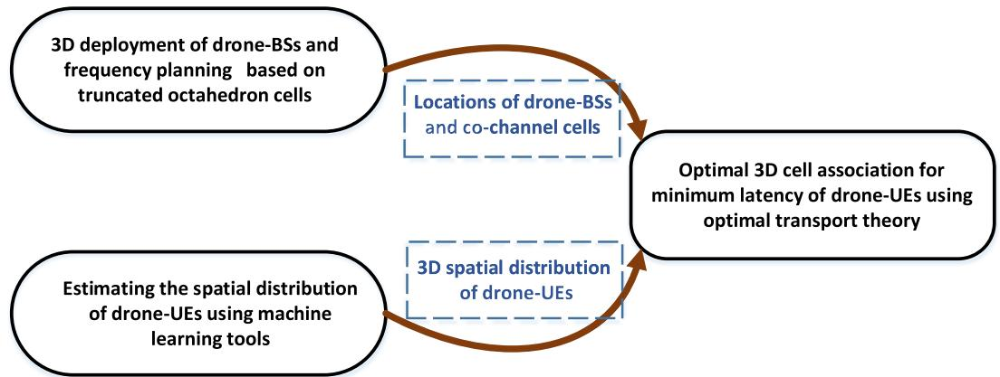  
Fig. 2. Our proposed framework for designing the 3D cellular network.

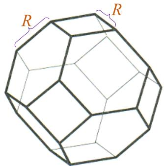  
Fig. 3. Truncated octahedron in 3D.

In traditional ground cellular networks, hexagonal cell shapes are used while deploying base stations. This is due to the fact that, a 2D space can be fully covered (i.e., without any gaps) by non-overlapping hexagons. While triangle and square cells are also able to tessellate a 2D area, the hexagonal cell is preferred in cellular wireless network planning due to the following reasons. First, the hexagonal shape has a larger area than the square and the triangle, hence less cells will be needed to cover a geographical area. Second, the hexagonal cell reasonably approximates the circular radiation pattern of an omni-directional antenna base station.

Inspired by 2D cellular networks, we propose a framework for the deployment of a 3D cellular network. In three dimensions, the regular polyhedron geometric shapes that can tessellate the space (i.e., fill the 3D space entirely) include cube, hexagonal prism, rhombic dodecahedron, and truncated octahedron [30]. Among these 3D shapes, the truncated octahedron is the closest approximation of a sphere. Moreover, the number of polyhedron required for completely covering a 3D space is minimized by adopting the truncated octahedron [30]. Therefore, in our model, we use the truncated octahedron structure for deploying the drone-BSs.

The truncated octahedron is a polyhedron in three dimensions with regular polygons faces. As we can see from Fig. 3, the truncated octahedron has 14 faces with  regular hexagonal and square, 24 vertices, and 36 edges [31]. The key feature of the truncated octahedron is that it can tessellate the three-dimensional Euclidean space. In other words, the 3D space can be completely filled with multiple copies of the truncated octahedron without any overlap. We exploit this feature of the truncated octahedron in our 3D cellular network deployment with drone-BSs.

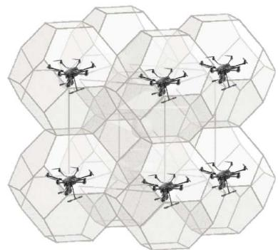  
Fig. 4. Deployment of drone-BSs based on truncated octahedron cells.

The deployment of drone-BSs needs to be done such that the entire desired space is covered. To this end, we first completely fill the given space with an arrangement of multiple truncated octahedron cells. Then, we place each drone-BS at the center of each truncated octahedron, as shown in Fig. 4 as an illustrative example. Our proposed deployment approach can ensure full coverage for a given 3D space and is also easy to implement and tractable. Moreover, our approach facilitates frequency planning in 3D cellular networks by deriving analytical expressions for the feasible integer reuse factors. Next, we determine the locations of drone-BSs based on the proposed truncated octahedron cell structure.

Theorem 1: The three-dimensional locations of drone-BSs in the proposed 3D cellular network are given by:

$$
\begin{array} { r } { \pmb { P } _ { \{ a , b , c \} } = \big [ x _ { o } , y _ { o } , z _ { o } \big ] + \sqrt { 2 } \pmb { R } \Big [ a + b - c , - a + b + c , a - b + c \Big ] , } \end{array}\tag{9}
$$

where $a , \quad b , \quad c$ are integers chosen from set $\{ \dots , - 2 , - 1 , 0 , 1 , 2 , \dots \}$ , and R is the edge length of the considered truncated octahedrons. $[ x _ { o } , y _ { o } , z _ { o } ]$ is the Cartesian coordinates of a given reference location (e.g., center of a specified space).

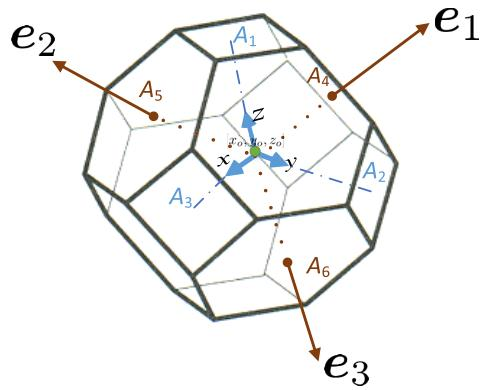  
Fig. 5. Coordinate systems in drone-BSs deployment.

Proof: For the deployment of drone-BSs, we first create a 3D lattice of truncated octahedrons and then, place each drone-BS at the center of each truncated octahedron. Hence, to determine the locations of drone-BSs, we need to find the center of truncated octahedrons.

Let $[ x _ { o } , y _ { o } , z _ { o } ]$ be the center of the first truncated octahedron in Cartesian coordinates with the $x , \ y ,$ and z directions being perpendicular to square faces $A _ { 3 } , A _ { 2 } .$ , and $A _ { 1 }$ as 3 2 1shown in Fig. 5. We find a new coordinate system whose integer coordinates are the center of the truncated octahedrons. By moving, in integer value steps, along the axes of this coordinate system, we can reach the center of the truncated octahedrons. We consider a coordinate system whose axes $( e _ { 1 } , e _ { 2 } , e _ { 3 } )$ are vertically outward the hexagonal faces, $A _ { 4 } ,$ $A _ { 5 }$ , and $A _ { 6 }$ . Now, we find the Euclidean length of each unit axis of this coordinate system. The distance between the center of the truncated octahedron $( \mathrm { e } . \mathrm { g } . , [ x _ { o } , y _ { o } , z _ { o } ] )$ and each hexagonal face is $R \sqrt { 6 } / 2 [ 3 1 ]$ . Therefore, the distance from $[ x _ { o } , y _ { o } , z _ { o } ]$ to the center of an adjacent truncated octahedron connecting to face $A _ { 4 }$ is $R { \sqrt { 6 } }$ . As a result, each unit on axis $e _ { 1 }$ (and also $e _ { 2 }$ and $e _ { 3 } )$ must be $2 R { \sqrt { 6 } } .$ . It can be easily verified that the centers of the truncated octahedrons in the 3D lattice are the integer coordinates of the $( e _ { 1 } , ~ e _ { 2 }$ , e ) coordinate system. Hence, the 3D location of each drone-BS can be represented by a triple $( a , b , c )$ with $a , b ,$ and c being integers. The position of a drone-BS obtained by $\{ a , b , c \}$ is given by:

$$
P _ { \{ a , b , c \} } = a e _ { 1 } + b e _ { 2 } + c e _ { 3 } .\tag{10}
$$

Now, we need to represent $P _ { \{ a , b , c \} }$ using Cartesian coordinates. To this end, we find the projection of $e _ { 1 } , \thinspace e _ { 2 }$ , and $e _ { 3 }$ on the $x , \ y ,$ and z axes. With some geometric calculations and using the fact that the dihedral angle (i.e., angle between two intersecting planes) between the adjacent square face and hexagonal face is $\cos ^ { - 1 } ( { \frac { - 1 } { \sqrt { 3 } } } ) ~ [ 3 1 ]$ , we obtain:

$$
\left\{ \begin{array} { l l } { e _ { 1 } = R \sqrt { 6 } ( \displaystyle \frac { - 1 } { \sqrt { 3 } } x + \displaystyle \frac { 1 } { \sqrt { 3 } } y + \displaystyle \frac { 1 } { \sqrt { 3 } } z ) , } \\ { e _ { 2 } = R \sqrt { 6 } ( \displaystyle \frac { 1 } { \sqrt { 3 } } x + \displaystyle \frac { - 1 } { \sqrt { 3 } } y + \displaystyle \frac { 1 } { \sqrt { 3 } } z ) , } \\ { e _ { 3 } = R \sqrt { 6 } ( \displaystyle \frac { 1 } { \sqrt { 3 } } x + \displaystyle \frac { 1 } { \sqrt { 3 } } y + \displaystyle \frac { - 1 } { \sqrt { 3 } } z ) . } \end{array} \right.\tag{11}
$$

Finally, using (10) and (11), the 3D locations of drone-BSs in Cartesian coordinates, with respect to the reference position $[ x _ { o } , y _ { o } , z _ { o } ]$ are given by:

$$
\begin{array} { r } { \pmb { P } _ { \{ a , b , c \} } = \big [ x _ { o } , y _ { o } , z _ { o } \big ] + \sqrt { 2 } \pmb { R } \Big [ a + b - c , - a + b + c , a - b + c \Big ] , } \end{array}\tag{12}
$$

which proves the theorem.

Using Theorem 1, we can find the 3D coordinates of drone-BSs which are deployed at the centers of truncated octahedrons. Moreover, as shown next, Theorem 1 allows us to determine the frequency reuse factor as well as interfering drone-BSs in the proposed 3D cellular network.

Theorem 2: In the considered 3D cellular network, any feasible integer frequency reuse factors can be determined by solving the following equations:

$$
\left\{ \begin{array} { l } { q = \sqrt { \frac { \left[ 3 \left( n _ { 1 } ^ { 2 } + n _ { 2 } ^ { 2 } + n _ { 3 } ^ { 2 } \right) - 2 \left( n _ { 1 } n _ { 2 } + n _ { 1 } n _ { 3 } + n _ { 2 } n _ { 3 } \right) \right] ^ { 3 } } { 2 7 } } , } \\ { q = \sqrt { \frac { \left[ 3 \left( m _ { 1 } ^ { 2 } + m _ { 2 } ^ { 2 } + m _ { 3 } ^ { 2 } \right) - 2 \left( m _ { 1 } m _ { 2 } + m _ { 1 } m _ { 3 } + m _ { 2 } m _ { 3 } \right) \right] ^ { 3 } } { 6 4 } } , } \end{array} \right.\tag{13}
$$

where $q$ is the frequency reuse factor which is a positive integer. $n _ { 1 } , n _ { 2 } , n _ { 3 } , m _ { 1 } , m _ { 2 }$ , and $m _ { 3 }$ are integers that satisfy (13) by generating feasible frequency reuse factors.

Proof: We consider a truncated octahedron cell with 14 faces, as a reference cell. In this case, the number of first tier co-channel interfering cells is 14. Since the distance between centers of the reference cell and its adjacent cell is varies depending on the connecting face (i.e., hexagonal or square face), we consider two different co-channel distances (i.e., reuse distances). Let $D _ { u }$ and $D _ { l }$ be two different reuse distances to different interfering cells.

Assume that the center of a co-channel cell at a distance $D _ { l }$ is located at a positive integer coordinate $( n _ { 1 } , n _ { 2 } , n _ { 3 } )$ in our defined coordinate system $( e _ { 1 } , e _ { 2 } , e _ { 3 } )$ . Now, using (9) in Theorem 1 leads to:

$$
\begin{array} { l r } { { \cal D } _ { l } } \\ { = \sqrt { 2 } { \cal R } \sqrt { ( n _ { 1 } + n _ { 2 } - n _ { 3 } ) ^ { 2 } + ( - n _ { 1 } + n _ { 2 } + n _ { 3 } ) ^ { 2 } + ( n _ { 1 } - n _ { 2 } + n _ { 3 } ) ^ { 2 } } } \\ { \stackrel { ( a ) } { = } { \cal R } \sqrt { 6 ( n _ { 1 } ^ { 2 } + n _ { 2 } ^ { 2 } + n _ { 3 } ^ { 2 } ) - 4 ( n _ { 1 } n _ { 2 } + n _ { 1 } n _ { 3 } + n _ { 2 } n _ { 3 } ) } , } & { ( 1 4 ) } \end{array}
$$

where in a we used algebraic identities.

( )Similar to 2D cellular networks, the frequency reuse factor is equal to the number of non-interfering cells within a cluster of cells. Hence, cells within each cluster will use different frequency bands. To find the frequency reuse factor in the 3D network, we compute the number of non-interfering cells that create one 3D cluster. Clearly, for the reference cell, a cochannel interfering cell is located in the adjacent cluster. Here, a given space is covered by multiple clusters of truncated octahedron cells. In addition, any space can be fully covered by a number of arbitrary-sized truncated octahedrons. Therefore, we can replace each cluster of cells with a big truncated octahedron cell (as illustrated in Fig. 6) of the same volume. In this case, the centers of two co-channel cells are also the centers of two adjacent big truncated octahedron cells, as shown in Fig. 6. These two big cells can be connected to each other either from their hexagonal face (reuse distance $D _ { l } )$ or square face (reuse distance $D _ { u } )$ . For the hexagonal case, the edge length of the big cells, $R _ { B }$ , is related to the reuse distance by:

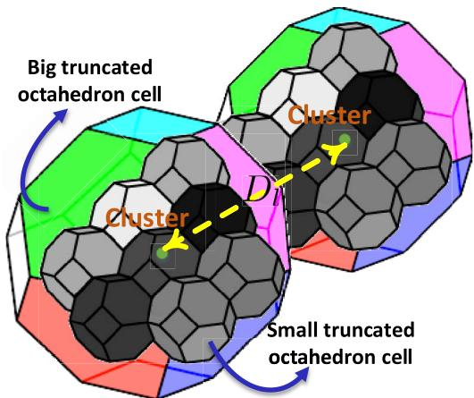  
Fig. 6. Clusters of truncated octahedron cells.

$$
R _ { B } = \frac { D _ { l } } { \sqrt { 6 } } .\tag{15}
$$

The number of cells per cluster is equivalent to the volume ratio of the big cell (i.e., cluster) to one truncated octahedron cell:

$$
\begin{array} { l } { { q = \frac { V _ { B } } { V _ { S } } \stackrel { ( a ) } { = } \frac { 8 \sqrt { 2 } R _ { B } ^ { 3 } } { 8 \sqrt { 2 } R ^ { 3 } } = ( \frac { D _ { l } } { \sqrt { 6 } R } ) ^ { 3 } } } \\ { { \stackrel { ( b ) } { = } \sqrt { \frac { \left[ 3 \left( n _ { 1 } ^ { 2 } + n _ { 2 } ^ { 2 } + n _ { 3 } ^ { 2 } \right) - 2 \left( n _ { 1 } n _ { 2 } + n _ { 1 } n _ { 3 } + n _ { 2 } n _ { 3 } \right) \right] ^ { 3 } } { 2 7 } } , } } \end{array}\tag{16}
$$

where $V _ { B }$ and $V _ { S }$ are, respectively, the volumes of one cluster (e.g., big truncated octahedron) and a truncated octahedron cell. a follows from the volume of the truncated octahedron as a function of its edge length [31], and b follows from (14).

For two big cells connecting from their square faces, we have:

$$
D _ { u } = R \sqrt { 6 ( m _ { 1 } ^ { 2 } + m _ { 2 } ^ { 2 } + m _ { 3 } ^ { 2 } ) - 4 ( m _ { 1 } m _ { 2 } + n _ { 1 } m _ { 3 } + m _ { 2 } m _ { 3 } ) } ,\tag{17}
$$

$$
R _ { B } = \frac { D _ { u } } { 2 \sqrt { 2 } } .\tag{18}
$$

Then, the integer frequency reuse will be:

$$
\begin{array} { l } { { q = \displaystyle \frac { V _ { B } } { V _ { S } } = ( \frac { D _ { u } } { 2 \sqrt { 2 } R } ) ^ { 3 } } } \\ { { \ = \displaystyle { \sqrt { \frac { \left[ 3 ( m _ { 1 } ^ { 2 } + m _ { 2 } ^ { 2 } + m _ { 3 } ^ { 2 } ) - 2 ( m _ { 1 } m _ { 2 } + m _ { 1 } m _ { 3 } + m _ { 2 } m _ { 3 } ) \right] ^ { 3 } } { 6 4 } } } . } }  \end{array}\tag{19}
$$

Since the number of cells per cluster represents the frequency reuse factor is a positive integer, $( n _ { 1 } , n _ { 2 } , n _ { 3 } )$ and $( m _ { 1 } , m _ { 2 } , m _ { 3 } )$ must generate an integer in (16) and (19).

Theorem 2 can be used to determine the feasible integer frequency reuse factors in the considered 3D network. In addition, while performing frequency planning, the 3D locations of co-channel cells (i.e., drone-BSs) can be identified. As an example, the frequency reuse of one is obtained by considering $( n _ { 1 } , n _ { 2 } , n _ { 3 } ) = ( 1 , 0 , 0 )$ , and $( m _ { 1 } , m _ { 2 } , m _ { 3 } ) = ( 1 , 1 , 0 )$ . In fact, $q = 1$ corresponds to a worst-case scenario in which all the drone-BSs will interfere with each other. In this case, the locations of co-channel interfering drone-BSs corresponding to a reference cell with an edge length R and center , , are the columns of the following matrix:

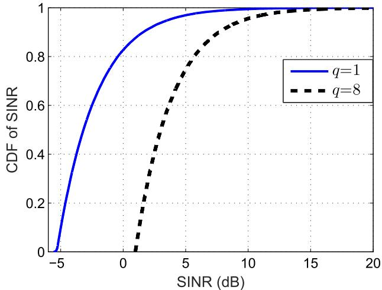  
Fig. 7. CDF of drone-UEs’ SINR in a 3D cell for two different frequency reuse factors.

$$
\begin{array} { r l } { \pmb { H } = \sqrt { 2 } R \Big [ \pmb { H } _ { 1 } } & { { } \pmb { H } _ { 2 } \Big ] _ { 3 \times 1 6 } , } \end{array}\tag{20}
$$

where

$$
\begin{array} { r l } & { H _ { 1 } = \left( \begin{array} { l l l l l l l l } { 1 } & { 1 } & { - 1 } & { 1 } & { 1 } & { - 1 } & { - 1 } & { - 1 } \\ { - 1 } & { 1 } & { 1 } & { 1 } & { 1 } & { - 1 } & { 1 } & { - 1 } \\ { 1 } & { - 1 } & { 1 } & { - 1 } & { 1 } & { - 1 } & { - 1 } & { 1 } \end{array} \right) , } \\ & { H _ { 2 } = \left( \begin{array} { l l l l l l l l } { 1 } & { - 1 } & { 2 } & { 0 } & { 0 } & { - 2 } & { 0 } & { 0 } \\ { - 1 } & { - 1 } & { 0 } & { 2 } & { 0 } & { 0 } & { - 2 } & { 0 } \\ { - 1 } & { 1 } & { 0 } & { 0 } & { 2 } & { 0 } & { 0 } & { - 2 } \end{array} \right) . } \end{array}
$$

Each column of matrix H represents a 3D location of one co-channel drone-BS.

In summary, our approach for 3D deployment and frequency planning of drone-BSs can proceed as follows. We deploy the first drone-BS as a reference cell in a specified space of interest. Then, using our truncated octahedron model with parameter R, we use Theorem 1 to find the locations of other drone-BSs with respect to the reference cell. In this case, each drone-BS is located at the center of one truncated octahedron cell. This results in a truncated octahedron tessellation that covers a given space without any gap or overlap. For frequency planning, we use Theorem 2 to find the feasible frequency reuse factors. Then, for any given frequency reuse factor, we determine the sets of co-channel cells in the network. This, in turn, enables us to compute the SINR and transmission latency (which is used in our optimization problem in (6)) at any location in the 3D space.

To show the impact of the frequency reuse factor on the SINR of drone-UEs, in Fig. 7, we plot the cumulative distribution function (CDF) of drone-UEs’ SINR in a 3D cell with a $R = 4 0 0 \mathrm { m }$ . As we expect, drone-UEs experience higher SINR for a higher frequency reuse factor $( \mathrm { i } . \mathrm { e } . , \ q )$ . However, a case with a frequency reuse factor  requires eight time more bandwidth compared to the case of frequency reuse 1.

## IV. ESTIMATION OF THE SPATIAL DISTRIBUTION OF DRONE-UES

Since drone-UEs cannot continuously report their locations due to excessive overhead costs, we need to design a machine learning based mechanism for estimating the locations of drone-UEs using sparse information. Therefore, we assume that each drone-UE is able to report its location at each $T$ seconds. Then, using that, we estimate the spatial distribution of drone-UEs which remains valid for the next T seconds. We should note that, during T seconds, the location of each drone-UE is changing due to its mobility. However, the distribution of drone-UEs is fixed so that we can use our estimation for the period of T seconds. To this end, we develop a nonparametric model for $f ( x , y , z )$ using a kernel density estimation (KDE) [32]. In case of parametric density estimation methods, if one uses a poor assumption for the density model, it results in a poor estimation performance. However, nonparametric methods are not sensitive to such poor assumptions.

The distribution of drone-UEs changes with time. Nevertheless, since we assume that this distribution is fixed within an interval of $T$ seconds, we sample the location of each drone-UE every $T$ seconds, and use it to estimate $f ( x , y , z )$ ( )This reduces overhead compared to the case in which the system knows the location of drone-UEs at every time instant. We consider some small regions R where each drone lies in with probability $p .$ Hence, the number of drone-UEs in this region K follows a binomial distribution, i.e.,

$$
\operatorname* { P r } ( K ) = { \frac { L ! } { ( L - K ) ! K ! } } p ^ { K } ( 1 - p ) ^ { L - K } .\tag{21}
$$

For a binomial distribution, we know that the mean is $\begin{array} { r l } { \mathbb { E } ( \frac { K } { L } ) = } & { { } } \end{array}$ $p .$ Thus, we can write:

$$
\operatorname* { l i m } _ { L  \infty } \frac { K } { L } = p .\tag{22}
$$

Therefore, for a large $L ,$ we can assume $K = L p$ . Since R is a small region, we can assume that $f ( x , y , z ) , \forall ( x , y , z ) \in \mathcal { R }$ is constant, and hence:

$$
p = \int _ { \mathcal { R } } f ( x , y , z ) \mathrm { d } x \mathrm { d } y \mathrm { d } z = f ( x , y , z ) \mathcal { V } _ { \mathcal { R } } ,\tag{23}
$$

where $\nu _ { \mathcal { R } }$ is the volume of region R. Combining (22) and (23), we can write:

$$
f ( x , y , z ) = \frac { K } { L \mathcal { V _ { R } } } .\tag{24}
$$

If we define a small region $\mathcal { R }$ as a cube:

$$
\mathcal { C } ( \frac { x } { h _ { x } } , \frac { y } { h _ { y } } , \frac { z } { h _ { z } } ) = \left\{ \begin{array} { l l } { 1 , } & { \operatorname* { m a x } \{ | \frac { x } { h _ { x } } | , | \frac { y } { h _ { y } } | , | \frac { z } { h _ { z } } | \} \le 1 / 2 , } \\ { 0 , } & { \mathrm { o t h e r w i s e } , } \end{array} \right.\tag{25}
$$

then, we can write the total number of users inside this cube as:

$$
K = \sum _ { i = 1 } ^ { L } \mathcal { C } \left( \frac { x - x _ { i } } { h } , \frac { y - y _ { i } } { h } , \frac { z - z _ { i } } { h } \right) = L h _ { x } h _ { y } h _ { z } f ( x , y , z ) .\tag{26}
$$

Since the volume of the cube in (25) is $h _ { x } \cdot h _ { y } \cdot h _ { z }$ , we can write the density function as:

$$
f ( x , y , z ) = \frac { 1 } { L } \sum _ { i = 1 } ^ { L } \frac { 1 } { h _ { x } h _ { y } h _ { z } } \mathcal { C } \bigg ( \frac { x - x _ { i } } { h _ { x } } , \frac { y - y _ { i } } { h _ { y } } , \frac { z - z _ { i } } { h _ { z } } \bigg ) ,\tag{27}
$$

which can be interpreted as L cubes with the volume $h _ { x } \cdot h _ { y }$ $h _ { z }$ centered at each data point. Also, $h _ { x } , h _ { y } ,$ and $h _ { z }$ are the widths of the kernel in dimensions $x , y ,$ and z, respectively. To remove the discontinuity of cubes in the space, we use Gaussian kernels [33]. If we approximate each cube in (27) with a Gaussian kernel, we have:

$$
\begin{array} { l } { \hat { f } ( x , y , z ) } \\ { = \displaystyle \frac { 1 } { L } \sum _ { i = 1 } ^ { L } \frac { 1 } { \sqrt { ( 2 \pi ) ^ { 3 } h _ { x } h _ { y } h _ { z } } } e ^ { - \left( \frac { ( x - x _ { i } ) ^ { 2 } } { h _ { x } } + \frac { ( y - y _ { i } ) ^ { 2 } } { h _ { y } } + \frac { ( z - z _ { i } ) ^ { 2 } } { h _ { z } } \right) } . } \end{array}\tag{28}
$$

$\hat { f } ( x , y , z )$ is not equal to $f ( x , y , z )$ , for two reasons. First, L is a finite number, and second, the Gaussian kernel is an approximation of the cube in (25). However, we will see that this estimation has small errors even when the value of L is not large. We assume that x, y, and z are uncorrelated, and hence, all the off-diagonal elements of the covariance matrix are zero. Here, the parameters $h _ { x } , h _ { y }$ , and $h _ { z }$ have a major effect on the accuracy of the estimation and need to be estimated. The criteria for accuracy of kernel density estimation is the mean integrated squared error (MISE) and for our problem, it is given by:

$$
\begin{array} { l } { \displaystyle { e = \mathbb { E } \bigg [ \int _ { - \infty } ^ { \infty } \int _ { - \infty } ^ { \infty } \int _ { - \infty } ^ { \infty } \Big ( \hat { f } ( x , y , z ; h _ { x } , h _ { y } , h _ { z } ) } } \\ { \displaystyle { ~ - ~ f ( x , y , z ) \Big ) ^ { 2 } \mathrm { d } x \mathrm { d } y \mathrm { d } z \bigg ] . } } \end{array}\tag{29}
$$

Since the MISE is not a mathematically tractable expression except in special cases, we have to use approximation methods for approximating it. To this end, we first write MISE as:

$$
\begin{array} { r } { \mathbb { E } \bigg [ \int _ { - \infty } ^ { \infty } \int _ { - \infty } ^ { \infty } \int _ { - \infty } ^ { \infty } \hat { f } ^ { 2 } ( x , y , z ; h _ { x } , h _ { y } , h _ { z } ) + f ^ { 2 } ( x , y , z ) } \\ { - \ : 2 \hat { f } ( x , y , z ; h _ { x } , h _ { y } , h _ { z } ) f ( x , y , z ) \mathrm { d } x \mathrm { d } y \mathrm { d } z \bigg ] , } \end{array}\tag{30}
$$

where $h _ { x } , h _ { y }$ , and $h _ { z }$ are solutions to the following minimization problem:

$$
\begin{array} { l }  { \displaystyle { [ h _ { x } , h _ { y } , h _ { z } ] = \arg \operatorname* { m i n } \mathbb { E } \bigg [ \int _ { - \infty } ^ { \infty } \int _ { - \infty } ^ { \infty } \int _ { - \infty } ^ { \infty } \hat { f } ^ { 2 } ( x , y , z ) } } \\ { { \displaystyle ~ - ~ 2 \hat { f } ( x , y , z ; h _ { x } , h _ { y } , h _ { z } ) f ( x , y , z ) \mathrm { d } x \mathrm { d } y \mathrm { d } z \bigg ] } , } \end{array}\tag{31}
$$

where $f ^ { 2 } ( x , y , z )$ has been omitted since it is a constant in the minimization problem. We can approximate (31) using leave-one-out cross-validation (LOOCV) methods. To this end, we first build a model for ${ \hat { f } } ( x , y , z ; h )$ using the locations of all drone-UEs except one [34]. Then, we find the log-likelihood for the remaining drone-UEs’ locations using the current model. We repeat this operation and take an average with L log-likelihood values, i.e.,

Algorithm 1 Drone-UEs’ Distribution Estimation Algorithm   
drone-UEs   
Input: location $( X _ { 1 } , Y _ { 1 } , Z _ { 1 } ) \cdot \cdot \cdot , ( X _ { L } , Y _ { L } , Z _ { L } )$   
Output: $\hat { f } ( x , y , z )$   
( )Initialize: H ← set of candidate for $\{ h _ { x } , h _ { y } , h _ { z } \}$   
$\mathcal { L } ( h _ { \mathrm { b e s t } } )  \infty$   
for $h _ { x } , h _ { y } , h _ { z } \in \mathcal { H }$ do   
for $j = 1 , \cdots , L$ do   
Build a model using (28) with $X _ { i } , i \in \{ 1 , \cdots , L \} , i \neq$   
$j$   
sum← sum $+ \textstyle { \frac { 1 } { 2 } }$ log $h _ { x } + \frac { 1 } { 2 }$ log $\begin{array} { r } { h _ { y } ~ + ~ \frac { 1 } { 2 } } \end{array}$ log $h _ { z } ~ +$   
$\begin{array} { r } { \left( \frac { ( X _ { j } - x _ { i } ) ^ { 2 } } { h _ { x } } + \frac { ( Y _ { j } - y _ { i } ) ^ { 2 } } { h _ { y } } + \frac { ( \tilde { Z } _ { j } - \tilde { z } _ { i } ) ^ { 2 } } { h _ { z } } \right) + \frac { 3 } { 2 } \log ( 2 \pi ) } \end{array}$   
end for   
$\begin{array} { r } { \mathcal { L } ( h _ { x } , h _ { y } , h _ { z } )  \frac { 1 } { L } \mathrm { s u m } } \end{array}$   
if $\mathcal { L } ( h _ { x } , h _ { y } , h _ { z } ) \breve { \leq } \mathcal { L } ( h _ { \mathrm { b e s t } } )$ then   
$h _ { \mathrm { b e s t } }  h _ { x } , h _ { y } , h _ { z }$   
end if   
end for   
$h _ { x } , h _ { y } , h _ { z } \gets h _ { \mathrm { b e s t } }$   
return $\hat { f } ( x , y , z ; h _ { x } , h _ { y } , h _ { z } )$ in (28) as drone-UEs PDF

$$
\begin{array} { l } { { \displaystyle { \mathcal { L } } ( h _ { x } , h _ { y } , h _ { z } ) } } \\ { { \displaystyle ~ = \frac { 1 } { L } \sum _ { j = 1 } ^ { L } { \hat { f } } _ { - j } ( X _ { j } , Y _ { j } , Z _ { j } ; h _ { x } , h _ { y } , h _ { z } ) } } \\ { { \displaystyle ~ = \frac { 1 } { L } \sum _ { i = 1 } ^ { L } { \frac { 1 } { \sqrt { ( 2 \pi ) ^ { 3 } h _ { x } h _ { y } h _ { z } } } e ^ { - \left( \frac { ( X _ { j } - x _ { i } ) ^ { 2 } } { h _ { x } } + \frac { ( Y _ { j } - y _ { i } ) ^ { 2 } } { h _ { y } } + \frac { ( Z _ { j } - z _ { i } ) ^ { 2 } } { h _ { z } } \right) } } . } } \end{array}\tag{33}
$$

It can be shown [35], [36] that:

$$
\mathbb { E } \bigg [ \hat { f } ( x , y , z ; h _ { z } , h _ { y } , h _ { z } ) \bigg ] = \mathscr { L } ( h _ { x } , h _ { y } , h _ { z } ) ,\tag{34}
$$

and since

$$
\begin{array} { r l r } {  { \mathbb { E } \biggl [ \int _ { - \infty } ^ { \infty } \int _ { - \infty } ^ { \infty } \int _ { - \infty } ^ { \infty } \hat { f } ( x , y , z ; h _ { x } , h _ { y } , h _ { z } ) f ( x , y , z ) \mathrm { d } x \mathrm { d } y \mathrm { d } z \biggr ] } } \\ & { } & { = \mathbb { E } \biggl [ \hat { f } ( x , y , z ; h _ { z } , h _ { y } , h _ { z } ) \biggr ] , ~ ( \mathfrak { T } ( x , y , z ; h _ { x } , h _ { y } , h _ { z } ) \biggr ] , ~ ( \mathfrak { T } ( x , y , z ; h _ { x } , h _ { z } ) \biggr ] } \end{array}\tag{5}
$$

we can find $h _ { x } , h _ { y }$ , and $h _ { z }$ by a cross-validation method as:

$$
\begin{array} { r l r } & { } & { \displaystyle { [ h _ { x } , h _ { y } , h _ { z } ] = \arg \operatorname* { m i n } \mathbb { E } \bigg [ \int _ { - \infty } ^ { \infty } \int _ { - \infty } ^ { \infty } \int _ { - \infty } ^ { \infty } \hat { f } ^ { 2 } ( x , y , z ) \mathrm { { d } } x \mathrm { { d } } y \mathrm { { d } } z } } \\ & { } & { \displaystyle { - 2 \mathcal { L } \big ( h _ { x } , h _ { y } , h _ { z } \big ) \bigg ] . \quad ( 3 6 ) } } \end{array}
$$

Hence, we can say that $- \mathcal { L } ( h _ { x } , h _ { y } , h _ { z } )$ is a biased estimator of MISE. Therefore, it can predict the location of the minimum MISE, and using that, we can find the optimal $h _ { x } , h _ { y }$ , and $h _ { z }$ Algorithm 1 summarizes the estimation of $f ( x , y , z )$ using location of drone-UEs in each T seconds.

Fig. 8 shows the MISE in case of symmetric kernels $( h _ { x } =$ $h _ { y } = h _ { z } = h )$ for drone-UEs for different values of $h .$

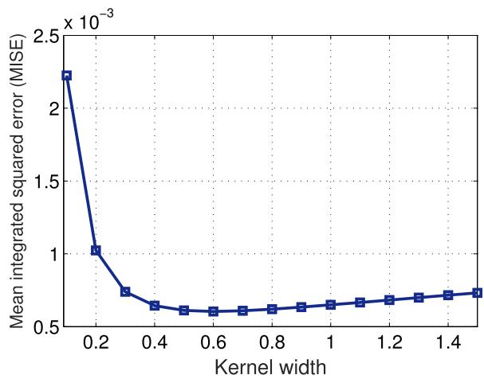  
Fig. 8. MISE for symmetric kernel widths $( h _ { x } = h _ { y } = h _ { z } = h ) .$

14   
12   
10   
8   
6   
0 1 2 3 4 5   
Kernel width  
Fig. 9. LOOCV method for finding an optimal kernel width (h).

As we can see, our algorithm can potentially minimize the MISE to a value of $7 . 9 5 5 4 \times 1 0 ^ { - 0 4 }$ . Fig. 9 shows the negative log-likelihood function. As we can see from Figs. 8 and 9, $- \mathcal { L } ( h _ { x } , h _ { y } , h _ { z } )$ is a biased estimator of MISE, and hence, we can use $- \mathcal { L } ( h _ { x } , h _ { y } , h _ { z } )$ to find the optimal $h _ { x } , h _ { y } , h _ { z } .$ ( )Fig. 9 shows that, by means of LOOCV method, the MISE for our PDF estimation is $5 . 7 2 2 1 \times 1 0 ^ { - 0 4 }$ which is close to the MISE lower bound that is $7 . 9 5 5 4 \times 1 0 ^ { - 0 4 }$

In summary, our approach for estimation of drone-UE spatial distribution is as follows. We collect the location of drone-UEs at each T seconds. Then, we estimate the distribution of drone-UEs to use it for 3D cell association during the next T seconds. We adopt an accuracy metric for our density estimation and use it to find width of the kernels. We showed that our approach is able to estimate the spatial distribution of drone-UEs with a near optimal accuracy.

## V. OPTIMAL 3D CELL ASSOCIATION FOR MINIMUM LATENCY

In Sections III and IV, we determined the locations of drone-BSs and the spatial distribution of drone-UEs. Here, we use this information (i.e., drone-BSs’ locations and drone-UEs’ distribution) to explicitly formulate our latency-optimal

3D cell association problem.

$$
\operatorname* { m i n } _ { \nu _ { 1 } , \dots , \nu _ { N } } \sum _ { n = 1 } ^ { N } \left[ \int _ { \mathcal { V } _ { n } } \frac { \beta K _ { n } } { B _ { n } \log _ { 2 } \big ( 1 + \gamma _ { n } ( x , y , z ) \big ) } \hat { f } ( x , y , z ) \mathrm { d } x \mathrm { d } y \mathrm { d } z \right.
$$

$$
+ \frac { \beta K _ { n } } { C _ { n } } + g _ { n } ( \beta K _ { n } ) \biggr ] ,\tag{37}
$$

$$
\mathrm { s . t . } ~ K _ { n } = L \int _ { \mathcal { V } _ { n } } \hat { f } ( x , y , z ) \mathrm { d } x \mathrm { d } y \mathrm { d } z ,\tag{38}
$$

$$
\mathcal { V } _ { l } \cap \mathcal { V } _ { m } = \emptyset , \forall l \neq m \in \mathcal { N } ,\tag{39}
$$

$$
\bigcup _ { n \in N } \mathcal { V } _ { n } = \mathcal { V } ,\tag{40}
$$

where $\gamma _ { n } ( x , y , z )$ is the downlink SINR for a drone-UE located at $( x , y , z )$ which is served by drone-BS n. Considering a practical bounded path loss model [37] for air-to-air communications, the SINR can be given by:

$$
\gamma _ { n } ( x , y , z ) = \frac { \eta \kappa _ { n } ( x , y , z ) P _ { n } [ 1 + d _ { n } ( x , y , z ) ] ^ { - \alpha } } { u \in \mathcal { Z } _ { \operatorname* { i n t } } } \eta \kappa _ { u } ( x , y , z ) P _ { u } [ 1 + d _ { u } ( x , y , z ) ] ^ { - \alpha } + N _ { o } B _ { n } ,\tag{41}
$$

$$
d _ { n } ( x , y , z ) = { \sqrt { ( x - x _ { n } ) ^ { 2 } + ( y - y _ { n } ) ^ { 2 } + ( z - z _ { n } ) ^ { 2 } } } ,\tag{42}
$$

$$
d _ { u } ( x , y , z ) = \sqrt { ( x - x _ { u } ) ^ { 2 } + ( y - y _ { u } ) ^ { 2 } + ( z - z _ { u } ) ^ { 2 } } , ~ u \in \mathcal { T } _ { \mathrm { i n t } } ,\tag{43}
$$

where $\kappa _ { n } ( x , y , z )$ is a channel gain factor between a drone-(UE, located at $( x , y , z )$ , and drone-BS n. $\kappa _ { n } ( x , y , z )$ depends on the environment, and the locations of the drone-UE and drone-BS. $\kappa _ { n } ( x , y , z ) ~ = ~ 1$ corresponds to a LoS air-to-air communication, while $0 < \kappa _ { n } ( x , y , z ) < 1$ can capture the impact of NLoS conditions. α is the path loss exponent, $N _ { o }$ is the noise power spectral density, η is the path loss constant, and $( x _ { n } , y _ { n } , z _ { n } )$ is the 3D location of drone-BS n. $d _ { n } ( x , y , z )$ and $d _ { u } ( x , y , z )$ are, respectively, the distance of drone-BSs n and u with a drone-UE located at $( x , y , z )$ . Also, $\mathcal { T } _ { \mathrm { i n t } }$ is the set of co-channel interfering drone-BSs that operate over the same frequency band as drone-BS n.

Solving (37) is challenging since the optimization variables $\nu _ { n } , \ \forall n \ \in \ \mathcal { N }$ , are continuous 3D association spaces which are mutually dependent. Furthermore, the fact that the size and shape of these 3D association spaces are unknown, exacerbates the complexity. In addition, the objective function in (37) does not have a closed-form expression thus making the problem intractable. Consequently, employing traditional optimization techniques (e.g., convex optimization) are not sufficient to solve (37). Here, we tackle our 3D space association by exploiting optimal transport theory. In particular, first, we prove the existence of an optimal solution to (37) and, then, we completely characterize the solution space. We note that, compared to our previous work in [19], this work is different in terms of the system model, the 3D cell association optimization problem, as well as the solution.

Optimal transport theory is a mathematical tool that is used to find an optimal mapping between two arbitrary probability measures [38]. More specifically, in a semi-discrete optimal transport problem, a continuous probability density function must be mapped to a discrete probability measure. In such a semi-discrete case, the optimal transport map will optimally partition the continuous distribution and assign each partition to one point in the discrete probability measure (which, in our case, is the discrete set of drone-BSs).

Our cell association problem can be modeled as a semi-discrete optimal transport problem in which the source measure (drone-UEs’ distribution) is continuous while the destination (distribution of drone-BSs) is discrete. Then, the optimal 3D cell partitions are obtained by optimally mapping the drone-UEs to drone-BSs.

Lemma 1: The optimization problem in (37) admits an optimal solution for any semi-continuous function $g _ { n } ( . ) , n \in \mathcal { N } .$

Proof: Consider $\begin{array} { r } { K _ { n } = L \int _ { \mathcal { V } _ { n } } \hat { f } ( x , y , z ) \mathrm { d } x \mathrm { d } y \mathrm { d } z } \end{array}$ and the following simplex:

$$
S = \left\{ { K = ( K _ { 1 } , K _ { 2 } , \ldots , K _ { N } ) \in \mathbb { R } ^ { N } } ; \sum _ { n = 1 } ^ { N } K _ { n } = L , K _ { n } \geq 0 , \right.
$$

$$
\forall n \in \mathcal { N } \Bigg \} .\tag{44}
$$

Given any vector K, the optimization problem in (37) can be represented by:

$$
\operatorname* { m i n } _ { \nu _ { 1 } , \dots , \nu _ { N } } \sum _ { n = 1 } ^ { N } \int _ { \mathcal { V } _ { n } } c ( \pmb { v } , \pmb { s } _ { n } ) \hat { f } ( \pmb { v } ) \mathrm { d } \pmb { v } ,\tag{45}
$$

$$
\mathrm { s . t . } \ \int _ { \mathcal { V } _ { n } } \hat { f } ( \pmb { v } ) \mathrm { d } \pmb { v } = \frac { K _ { n } } { L } ,\tag{46}
$$

$$
\mathcal { V } _ { l } \cap \mathcal { V } _ { m } = \emptyset , \forall l \neq m \in \mathcal { N } , \bigcup _ { n \in \mathcal { N } } \mathcal { V } _ { n } = \mathcal { V } ,\tag{47}
$$

where $s _ { n }$ is the location of drone-BS ${ \boldsymbol n } , { \boldsymbol v } = ( x , y , z )$ , and $\begin{array} { r } { c ( \pmb { v } , \pmb { s } _ { n } ) = \frac { \beta K _ { n } } { B _ { n } \log _ { 2 } \big ( 1 + \gamma _ { n } ( x , y , z ) \big ) } + \frac { L } { K _ { n } } ( \frac { \beta K _ { n } } { C _ { n } } + g _ { n } ( \beta K _ { n } ) ) } \end{array}$

This optimization problem is equivalent to the following semi-discrete optimal transport problem:

$$
\operatorname* { m i n } _ { T } \int _ { \mathcal { V } } c \left( \pmb { v } , \pmb { s } \right) \hat { f } ( \pmb { v } ) \mathrm { d } \pmb { v } , \quad \pmb { s } = T ( \pmb { v } ) ,\tag{48}
$$

where s is the location of a drone-BS, and $T ( . )$ is the transport map which is related to 3D cell partition $\nu _ { n }$ by:

$$
\left\{ T ( \pmb { v } ) = \sum _ { n = 1 } ^ { N } s _ { n } \mathbb { 1 } _ { \mathscr { V } _ { n } } ( \pmb { v } ) ; \int _ { \mathscr { V } _ { n } } \hat { f } ( \pmb { v } ) \mathrm { d } \pmb { v } = \frac { K _ { n } } { L } \right\} .\tag{49}
$$

Considering the fact that for any semi-discrete optimal transport problem with a lower semi-continuous cost function an optimal transport map exists [38], [39], (45) admits an optimal solution for any $\kappa \in S$ . Also, since S is a simplex (which is a non-empty and compact set), problem (37) admits an optimal solution over the entire S. This proves Lemma 1.

Next, given the existence of the optimal solution, we characterize the solution.

Theorem 3: The optimal 3D cell association for drone-BS l, that leads to a minimum average latency in (37), is given by:

$$
\begin{array} { l } { \displaystyle \mathcal { V } _ { l } ^ { * } = \Big \{ ( x , y , z ) \big | \alpha _ { l } + \frac { K _ { l } } { L } h _ { l } ( x , y , z ) + \frac { \beta } { C _ { l } } + g _ { l } ^ { \prime } ( \beta K _ { l } ) } \\ { \displaystyle \quad \leq \alpha _ { m } + \frac { K _ { m } } { L } h _ { m } ( x , y , z ) + \frac { \beta } { C _ { m } } + g _ { m } ^ { \prime } ( \beta K _ { m } ) , \forall l \neq m \Big \} , } \end{array}\tag{50}
$$

Algorithm 2 Iterative Algorithm for Finding the Optimal   
3D Cell Association   
1: Inputs: $\hat { f } ( x , y , z ) , \beta , Q ,$ L, Locations of drone-BSs, $C _ { l } .$   
$g _ { l } ( . ) , \forall l \in \mathcal { N } .$   
( )2: Outputs: $\mathcal { V } _ { l } ^ { * } , \forall l \in \mathcal { N } .$   
3: Set $t = 1$ , generate an initial cell partitions $\mathcal { V } _ { l } ^ { ( t ) }$ , and set   
$\psi _ { l } ^ { ( t ) } ( x , y , z ) = 0 , \forall l \in \mathcal { N } .$   
4: while $t < Q$ )do   
5: Compute $\psi _ { l } ^ { ( t + 1 ) } ( x , y , z )$   
$\Big ( [ 1 - 1 / t ] \psi _ { l } ^ { ( t ) } ( x , \dot { y } , z )$   
⎪⎨ if $( x , y , z ) \in \mathcal { V } _ { l } ^ { ( t ) }$   
$\Big \lfloor 1 - [ 1 - 1 / t ] \left( 1 - \psi _ { l } ^ { ( t ) } ( x , y , z ) \right)$ , otherwise.   
6: Compute $\begin{array} { r } { K _ { l } = \int _ { \mathcal { V } } \left( 1 - \psi _ { l } ^ { ( t + 1 ) } ( x , y , z ) \right) \hat { f } ( x , y , z ) \mathrm { d } x \mathrm { d } y \mathrm { d } z , } \end{array}$   
$\forall l \in { \mathcal { N } } .$   
7: $t  t + 1 .$   
8: Update cell partitions using (50).   
9: end while   
10: $\mathcal { V } _ { l } ^ { * } = \mathcal { V } _ { l } ^ { ( t ) }$

where $\begin{array} { r l r } { h _ { l } ( x , y , z ) } & { { } \triangleq } & { \frac { \beta } { B _ { l } \log _ { 2 } \left( 1 + \gamma _ { l } ( x , y , z ) \right) } . } \end{array}$ , and $\alpha _ { l } \quad \triangleq$ $\begin{array} { r } { \int _ { \mathcal { V } _ { l } } h _ { l } ( x , y , x ) \hat { f } ( x , y , z ) \mathrm { d } x \mathrm { d } y \mathrm { d } z . } \end{array}$

Proof: See Appendix A.

Using Theorem 3, we can determine the optimal 3D cell partitions associated with each drone-BS that ensure the minimum average latency for drone-UEs. From (50), we can see how the optimal 3D association depends on various network’s parameters such as the distribution of drone-UEs, locations of drone-BSs, backhaul data rate, load of the network, and the computational speed. Based on these parameters, Theorem 3 is utilized to optimally partition a specified space and determine a minimum latency 3D cell association scheme. In this case, to minimize the average latency, a drone-BS with a faster backhaul link and computational capabilities, or higher bandwidth and transmit power will serve more drone-UEs.

To solve (50), we propose the iterative algorithm shown in Algorithm 2. This algorithm, based on [39], converges to the optimal solution within a reasonable number of iterations. The complexity of this iterative approach mainly depends on computing the numerical integration in Step of Algorithm 2. A practical approach to compute this integration is to use a pixel-based integration as given in [40]. This approach is practical to implement as its complexity grows linearly with the size of the considered 3D space V. Algorithm 2 for solving (50) that finds the optimal 3D cell partitions proceeds as follows. The inputs are the 3D spatial distribution of drone UEs, number of drone-UEs, load, locations of the drone-BSs, computation time function, and the number of iterations, Q. In Algorithm 2, t represents the iteration number. First, we generate initial 3D cell partitions $\mathcal { V } _ { l } ^ { ( t ) }$ and set $\psi _ { l } ^ { ( t ) } ( x , y , z ) \ : = \ : 0 , \ : \forall l \in \mathcal { N }$ , with $\psi _ { l } ^ { ( t ) } ( x , y , z )$ being ( ) = 0 ( )a pre-defined parameter which is used to update the cell partitions. Next, we update $\psi _ { l } ^ { ( t + 1 ) } ( x , y , z )$ , and compute $K _ { l }$ in Step 6. In Step 8, we update the partitions based on (50).

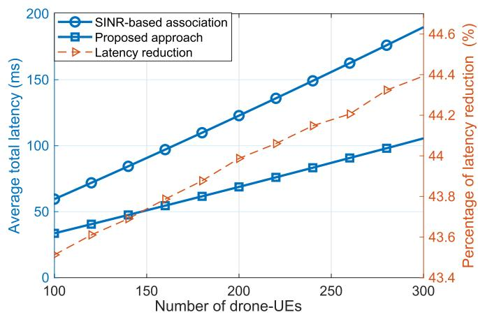  
Fig. 10. Average total latency vs. number of drone-UEs.

Finally, we obtain the optimal 3D cell partitions and associations, at the end of the iteration.

In summary, our approach for deployment and latency-optimal cell association in the proposed 3D cellular network is as follows. First, using the proposed truncated octahedron approach, and Theorems 1 and  in Section III, we determine the locations of drone-BSs as well as the co-channel cells. Then, in Section IV, we estimate the spatial distribution of drone-UEs using kernel method presented in Algorithm 1. Finally, based on the determined locations of drone-BSs and the drone-UEs’ distribution, we use Algorithm 2 to derive the optimal 3D cell association for which the average total latency of serving drone-UEs is minimized.

## VI. SIMULATION RESULTS AND ANALYSIS

For our simulations, we consider a cubic space of size km× km× km in which 18 drone-BSs are deployed based on the proposed truncated octahedron approach to serve drone-UEs. We determine the locations of drone-BSs by using (12) with parameters $a \in \{ - 1 , 0 , 1 \} , b \in \{ - 1 , 0 , 1 \} , c \in \{ 0 , 1 \}$ and $R = 4 0 0 \mathrm { m }$ . We randomly generate a sample (i.e., a realization of a continuous distribution) of drone-UEs’ locations based on a three-dimensional truncated Gaussian distribution with a specified mean and variance values. These locations’ samples are then used to estimate the spatial distribution of drone-UEs using Algorithm 1. For the computation time, we consider a quadratic function of data size (i.e., load on each drone-BS), but our approach can accommodate any other arbitrary function. Here, the computation time for drone-BS n is $\begin{array} { r } { g _ { n } ( \dot { \beta } K _ { n } ) = \frac { ( \beta K _ { n } ) ^ { 2 } } { \omega _ { n } } } \end{array}$ , with $\omega _ { n }$ being the processing speed of drone-BS n. Unless states otherwise, we use the simulation parameters listed in Table II. We compare our proposed 3D cell association with the classical SINR-based association (i.e., weighted Voronoi diagram) baseline. All statistical results are averaged over a large number of independent runs.

Fig. 10 shows the average total latency as a function of the number of drone-UEs for the proposed 3D cell association and the SINR-based association schemes. As we can see from this figure, the total latency increases by increasing the number of drone-UEs. A higher number of drone-UEs leads to a higher network congestion which, in turn, increases transmission time, backhaul latency, and computation time. Fig. 10 shows that, when the number of drone-UEs increases from 200 to 300, the total latency increases by 56% and 42% for the SINR-based association and the proposed approach. Moreover, we can see that our proposed approach significantly reduces the latency compared to the SINR association case. This is due to the fact that, in our approach, besides SINR, the impact of congestion on the transmission, backhaul, and computational latencies is also taken into account. The proposed approach avoids creating highly congested 3D cell partitions that can cause excessive latency. From Fig. 10, we can see that our approach yields, on the average, 43.9% reduction in the average total latency compared to the SINR-based association.

TABLE II  
SIMULATION PARAMETERS
<table><tr><td rowspan=1 colspan=1>Parameter</td><td rowspan=1 colspan=1>Description</td><td rowspan=1 colspan=1>Value</td></tr><tr><td rowspan=1 colspan=1> $f _ { c }$ </td><td rowspan=1 colspan=1>Carrier frequency</td><td rowspan=1 colspan=1>2GHz</td></tr><tr><td rowspan=1 colspan=1> $P _ { n }$ </td><td rowspan=1 colspan=1>Drone-BS transmit power</td><td rowspan=1 colspan=1>0.5 W</td></tr><tr><td rowspan=1 colspan=1> $N _ { o }$ </td><td rowspan=1 colspan=1>Noise power spectral density</td><td rowspan=1 colspan=1>-170 dBm/Hz</td></tr><tr><td rowspan=1 colspan=1> $L$ </td><td rowspan=1 colspan=1>Number of drone-UEs</td><td rowspan=1 colspan=1>200</td></tr><tr><td rowspan=1 colspan=1> $B _ { n }$ </td><td rowspan=1 colspan=1>Bandwidth for each drone-BS</td><td rowspan=1 colspan=1>10MHz</td></tr><tr><td rowspan=1 colspan=1> $\alpha$ </td><td rowspan=1 colspan=1>Path loss exponent</td><td rowspan=1 colspan=1>2</td></tr><tr><td rowspan=1 colspan=1>η</td><td rowspan=1 colspan=1>Path loss constant</td><td rowspan=1 colspan=1> $1 . 4 2 \times 1 0 ^ { - 4 }$ </td></tr><tr><td rowspan=1 colspan=1> $\beta$ </td><td rowspan=1 colspan=1>Packet size for drone-UE</td><td rowspan=1 colspan=1>10kb</td></tr><tr><td rowspan=1 colspan=1> $q$ </td><td rowspan=1 colspan=1>Frequency reuse factor</td><td rowspan=1 colspan=1>1</td></tr><tr><td rowspan=1 colspan=1> $C _ { n }$ </td><td rowspan=1 colspan=1>Backhaul rate for drone-BS n</td><td rowspan=1 colspan=1>(100 + n) Mb/s</td></tr><tr><td rowspan=1 colspan=1> $\omega _ { n }$ </td><td rowspan=1 colspan=1>Computation constant (i.e., speed) for each drone-BS</td><td rowspan=1 colspan=1>102 Tb/s</td></tr><tr><td rowspan=1 colspan=1> $\mu _ { x } , \mu _ { y } , \mu _ { z }$ </td><td rowspan=1 colspan=1>Mean of the truncated Gaussian distribution in $x , y ,$ and z directions</td><td rowspan=1 colspan=1>1000 m, 1000 m, 1000 m</td></tr><tr><td rowspan=1 colspan=1> $\sigma _ { x } , \sigma _ { y } , \sigma _ { z }$ </td><td rowspan=1 colspan=1>Standard deviation of the distribution in $x , y ,$ and z directions</td><td rowspan=1 colspan=1> $6 0 0 \mathrm { m } , 6 0 0 \mathrm { m } , 6 0 0 \mathrm { m }$ </td></tr><tr><td rowspan=1 colspan=1> $\kappa _ { n }$ </td><td rowspan=1 colspan=1>Channel gain factor</td><td rowspan=1 colspan=1>1</td></tr></table>

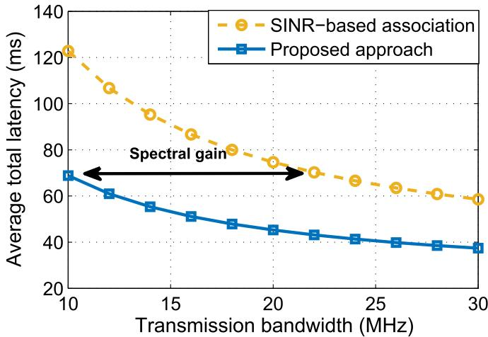  
Fig. 11. Average total latency vs. transmission bandwidth.

Fig. 11 shows how the latency can be reduced by increasing the transmission bandwidth. By using more bandwidth, the transmission rate increases and, hence, the transmission latency decreases. Fig. 11 also reveals that our approach significantly enhances spectral efficiency compared to the SINR-based association. In essence, compared to the SINR case, the proposed approach requires less transmission bandwidth in order to meet a certain latency requirement. For instance, as we can see from Fig. 11, to ensure a 70 ms maximum total latency, our approach requires 57% less bandwidth than the SINR-based association scheme. Another observation from Fig. 11 is that the rate of latency reduction decreases as the bandwidth increases. This is because in large bandwidth scenarios, the transmission latency can be smaller than the computation and backhaul latencies. Thus, the impact of decreasing the transmission latency on the total latency is relatively minor.

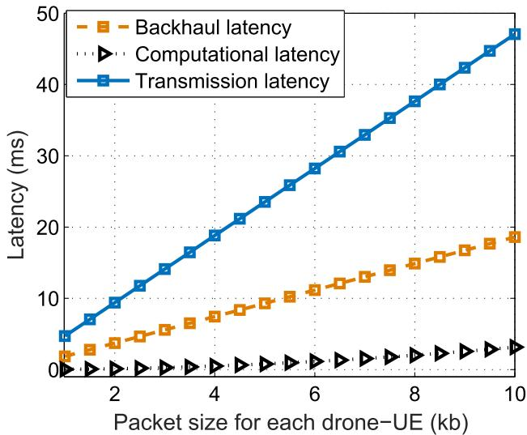  
Fig. 12. Transmission, backhaul, and computation latency vs. load of each drone-UE in the proposed approach.

Fig. 12 shows the impact of drone-UEs’ load on the transmission, computation, and backhaul latencies. As expected, these three types of latency increase when the load of drone-UEs increases. Nevertheless, the rate of increase is different for different types of latency. For instance, in Fig. 12, the increase rate of the transmission latency is higher than that of computational latency and backhaul latency. The impact of load on each type of latency depends on two factors: 1) the function that directly relates the load to the latency, and 2) the 3D cell partitions which are related to load by (50). In fact, while varying load, the cell partitions and different component of latency dynamically change such that the total latency is minimized.

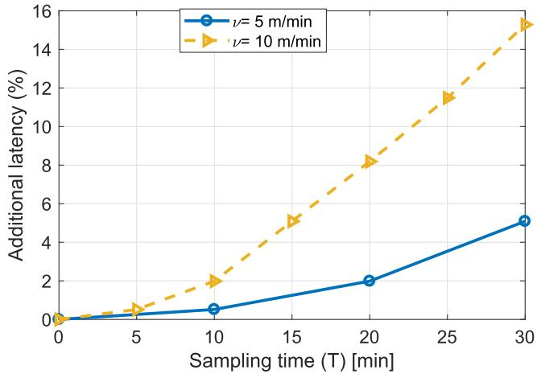  
Fig. 13. Additional latency vs. sampling time for distribution estimation (T ).

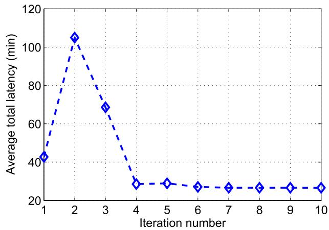  
Fig. 14. Convergence of Algorithm 2.

In Fig. 13, we evaluate the impact of sampling time, T on the latency (which depends accuracy of 3D cell partitions). To this end, we consider a time varying distribution for drone-UEs whose mean changes by T . In Fig. 13, we consider a three-dimensional truncated Gaussian distribution whose mean value increases by νT , with ν being a rate of distribution change. In Fig. 13, we show how the latency increases by increasing T , for $\nu = 0 . 1$ . Note that, while the accuracy of = 0 1distribution estimation increases by reducing T , this results in a higher complexity and overhead in the considered network. In Fig. 13, we show the additional latency that can be caused by an error in estimating the drone-UEs’ distribution. Clearly, the total latency significantly depends on the 3D cell partitions which themselves are a function the drone-UEs’ distribution. Therefore, an estimation error in the drone-UEs’ distribution leads to a deviation from the optimality of the cell partitions.

Consequently, such estimation error will increase the latency. Hence, by decreasing $T ,$ the network can obtain a more accurate distribution estimation and, hence, a lower latency. For instance, as we can see from Fig. 13, the latency decreases by 6% when decreasing the sampling time from 20 minutes to 10 minutes, for $\nu = 1 0 \mathrm { { m } / \mathrm { { m i n } } }$

Finally, in Fig. 14, we show the convergence of Algorithm 2 that is used to find the optimal 3D cell association by iteratively solving (50). As we can see from this figure, Algorithm 2 converges within 6 iterations.

## VII. CONCLUSION

In this paper, we have introduced a novel framework for cell association and deployment in 3D cellular networks with drone-BSs and drone-UEs. We have proposed a tractable method for the 3D deployment of drone-BSs and solved the problem of cell association with the goal of minimizing the latency of drone users. For deployment, we have determined the drone-BSs’ locations based on a truncated octahedron structure and derived the feasible frequency reuse factor in the considered 3D network. For latency-minimal cell association, first, we have estimated the spatial distribution of the drone-UEs using the kernel density estimation method. Then, using the estimated distribution of drone-UEs and the location of drone-BSs, we have derived the optimal cell association of drone-UEs using optimal transport theory such that the latency for drone-UEs is minimized. Our results have shown that the proposed approach significantly reduces the latency of drone-UEs compared to the classical SINR-based association. Furthermore, the proposed latency-optimal cell association improves the spectral efficiency of the 3D drone-enabled wireless networks.

## APPENDIX

## A. Proof of Theorem 3

In Lemma 1, we proved the existence of the optimal 3D cell partitions $\nu _ { n } , n \in \mathcal { N }$ . Now, consider two 3D partitions Vl and $\nu _ { m } .$ , and a point ${ \pmb v } _ { o } = ( x _ { o } , y _ { o } , z _ { o } ) \in \mathcal { V } _ { l }$ . Also, let $B _ { \epsilon } ( \pmb { v } _ { o } )$ be a ball with a center $v _ { o }$ = (and radius $\epsilon > 0 .$ ( ). Now, we generate the following new 3D partitions ${ \widehat { \nu } } _ { n }$ (which are variants of the optimal partitions):

$$
\left\{ \begin{array} { l l } { \widehat { \mathcal { V } } _ { l } = \mathcal { V } _ { l } \backslash B _ { \varepsilon } ( \pmb { v } _ { o } ) , } \\ { \widehat { \mathcal { V } } _ { m } = \mathcal { V } _ { m } \cup B _ { \varepsilon } ( \pmb { v } _ { o } ) , } \\ { \widehat { \mathcal { V } } _ { n } = \mathcal { V } _ { n } , n \neq l , m . } \end{array} \right.\tag{51}
$$

Let us define $\begin{array} { r l r l r l } { p _ { 1 } ( K _ { n } ) } & { { } \triangleq { } } & { K _ { n } , } & { p _ { 2 } ( K _ { n } ) } & { { } \triangleq { } } & { { } \frac { \beta K _ { n } } { C _ { n } } , } \end{array}$ $\begin{array} { r l r } { K _ { \varepsilon } } & { { } \ } & { = \ } & { L \int _ { B _ { \varepsilon } ( \pmb { v } _ { o } ) } \hat { f } ( x , y , z ) \mathrm { d } x \mathrm { d } y \mathrm { d } z } \end{array}$ , and $\widehat { K } _ { n } \quad = \quad$ $\begin{array} { r } { L \int _ { \widehat { \mathcal { V } } _ { s } } \hat { f } ( x , y , z ) \mathrm { d } x \mathrm { d } y \mathrm { d } z } \end{array}$ ). Considering the optimality of $\mathcal { V } _ { n } , \stackrel { \scriptscriptstyle \top } { n } \in \mathcal { N }$ ), we have:

$$
\begin{array} { r l } {  { \sum _ { n \in \mathcal { N } } \int _ { \mathcal { V } _ { n } } p _ { 1 } ( K _ { n } ) h _ { n } ( x , y , z ) \widehat { f } ( x , y , z ) \mathrm { d } x \mathrm { d } y \mathrm { d } z } } \\ & { \qquad + p _ { 2 } ( K _ { n } ) + g _ { n } ( \beta K _ { n } ) } \\ & { \overset { ( a ) } { \leq } \sum _ { n \in \mathcal { N } } \int _ { \widehat { \mathcal { V } } _ { n } } p _ { 1 } ( \widehat { K } _ { n } ) h _ { n } ( x , y , z ) \widehat { f } ( x , y , z ) \mathrm { d } x \mathrm { d } y \mathrm { d } z } \\ & { \qquad + p _ { 2 } ( \widehat { K } _ { n } ) + g _ { n } ( \beta \widehat { K } _ { n } ) . } \end{array}\tag{52}
$$

Canceling out the common terms in (52) leads to:

$$
\begin{array} { r l } &  \int _ { \mathbb { R } } \int _ { 0 } ^ { \infty } \| \langle X ( \hat { x } ) | \hat { x } ( \hat { x } ) \rangle = \langle X _ { \hat { \varepsilon } } ^ { \varepsilon } \hat { x } \hat { x } \hat { y } \hat { x } \hat { x } \hat { x } \hat { y } \hat { x } \hat { x } \hat { x } \hat { y } \hat { x } \hat { x } \hat { x } \hat { y } \hat { x } \hat { x } \hat { x } \hat { y } \hat { x } \hat { x } \hat { x } \hat { y } \hat { x } \hat { x } \hat { x } \hat { x } \hat { y } \hat { x } \hat { x } \hat { x } \hat { x } \hat { y } \hat { x } \hat { x } \hat { x } \hat { x } \hat { x } \hat { x } \hat { x } \hat { y } \hat { x } \hat { x } \hat { x } \hat { x } \hat { x } \hat { x } \hat { x } \hat { x } \hat { x } \hat { x } \hat { x } \hat { x } \hat { x } \hat { x } \hat { x } \hat { x } \hat { x } \hat { x } \hat { x } \hat { x } \hat { x } \hat { x } \hat { x } \hat { x } \hat { x } \hat { x } \hat { x } \hat { x } \hat { x } \hat { x } \hat { x } \hat { x } \hat { x } \hat { x } \hat { x } \hat { x } \hat { x } \hat { x } \hat { x } \hat { x } \hat { x } \hat { x } \hat { x } \hat { x } \hat { x } \hat { x } \hat { x } \hat { x } \hat { x } \hat { x } \hat { x } \hat { x } \hat { x } \hat { x } \hat { x } \hat { x } \hat { x } \hat { x } \hat { x } \hat { x } \hat { x } \hat { x } \hat { x } \hat { x } \hat { x } \hat { x } \hat { x } \hat { x } \hat { x } \hat { x } \hat { x } \hat { x } \hat { x } \hat { x } \hat { x } \hat { x } \hat { x } \hat { x } \hat { x } \hat { x } \hat { x } \hat { x } \hat { x } \hat { x } \hat { x } \hat { x } \hat { x } \end{array}\tag{54}
$$

where a comes from the fact that $\psi _ { n } , \forall n \in \mathcal { N }$ are optimal 3D partitions and, thus, any variation of such optimal partitions, shown by $\widehat { \mathcal { V } } _ { n }$ , does not lead to a better solution.

Note that, $\begin{array} { r } { K _ { \epsilon } = L \int _ { B _ { \epsilon } ( \pmb { v } _ { o } ) } \hat { f } ( x , y , z ) \mathrm { d } x \mathrm { d } y \mathrm { d } z } \end{array}$ . Now, we mul-( )tiply both sides of the inequality in (54) by $\frac { 1 } { K _ { \epsilon } }$ and take the limit when  → . Then, we use the following equalities:

$$
\begin{array} { l } { \displaystyle \operatorname* { l i m } _ { \varepsilon \to 0 } K _ { \epsilon } = 0 , } \\ { \displaystyle \operatorname* { l i m } _ { K _ { \epsilon } \to 0 } \frac { p _ { 1 } ( K _ { l } ) - p _ { 1 } ( K _ { l } - K _ { \epsilon } ) } { K _ { \epsilon } } } \\ { = p _ { 1 } ^ { \prime } ( K _ { l } ) , } \end{array}\tag{55}
$$

$$
\begin{array} { r l } & { \underset { \kappa  - \infty } { \overset { \mathrm { i n } } { \sum } } I ( \kappa _ { \mathrm { i n } } + \kappa \lambda ) - p _ { \mathrm { i n } } ( K _ { \mathrm { i n } } ) } \\ & { = \kappa - \underset { \kappa  \infty } { \overset { \mathrm { i n } } { \sum } } ( K _ { \mathrm { i n } } ) , } \\ & { \underset { \kappa  - \infty } { \overset { \mathrm { i n } } { \sum } } ( K _ { \mathrm { i n } } ) , } \\ & { \underset { \kappa  - \infty } { \overset { \mathrm { i n } } { \sum } } ( K _ { \mathrm { i n } } ) , } \\ & { = - \underset { \kappa  \infty } { \overset { \mathrm { i n } } { \sum } } \frac { p _ { \mathrm { i n } } ( K _ { \mathrm { i n } } ) \hat { h } ( \kappa  \infty ) \hat { h } ( \tau _ { \mathrm { i n } } , \gamma _ { \mathrm { i n } } ) \hat { f } ( \kappa _ { \mathrm { i n } } , \gamma _ { \mathrm { i n } } ) ( \mathrm { d e l d e l } ) } { K _ { \mathrm { i n } } } } \\ & { \underset { \kappa  \infty } { \overset { \mathrm { i n } } { \sum } } ( K _ { \mathrm { i n } } ) , } \\ & { \underset { \kappa  \infty } { \overset { \mathrm { i n } } { \sum } } ( K _ { \mathrm { i n } } ) \underset { \kappa  \infty } { \overset { \mathrm { i n } } { \sum } } ( K _ { \mathrm { i n } } ) , } \\ & { \underset { \kappa  \infty } { \overset { \mathrm { i n } } { \sum } } \frac { p _ { \mathrm { i n } } ( K _ { \mathrm { i n } } ) \hat { f } ( \kappa _ { \mathrm { i n } } , \gamma _ { \mathrm { i n } } ) } { K _ { \mathrm { i n } } ( K _ { \mathrm { i n } } ) } , } \\ &  \underset { \kappa  \infty } { \overset { \mathrm { i n } } { \sum } } ( K _ { \mathrm { i n } } ) \underset { \kappa  \infty }  \overset { \mathrm { i n } }  \ \end{array}\tag{56}
$$

Finally, using (55)–(58), we obtain:

$$
\begin{array} { r l } & { p _ { 1 } ^ { \prime } \left( K _ { l } \right) \displaystyle \int _ { \mathcal { V } _ { l } } h _ { l } ( x , y , z ) \hat { f } ( x , y , z ) \mathrm { d } x \mathrm { d } y \mathrm { d } z } \\ & { \qquad + \displaystyle \frac { 1 } { L } p _ { 1 } \left( K _ { l } \right) h _ { l } ( \pmb { v } _ { o } ) + p _ { 2 } ^ { \prime } ( K _ { l } ) + g _ { l } ^ { \prime } ( \beta K _ { l } ) } \\ & { \qquad \le p _ { 1 } ^ { \prime } \left( K _ { m } \right) \displaystyle \int _ { \mathcal { V } _ { m } } h _ { m } ( x , y , z ) \hat { f } ( x , y , z ) \mathrm { d } x \mathrm { d } y \mathrm { d } z } \\ & { \qquad + \displaystyle \frac { 1 } { L } p _ { 1 } \left( K _ { m } \right) h _ { m } ( \pmb { v } _ { o } ) + p _ { 2 } ^ { \prime } ( K _ { m } ) + g _ { m } ^ { \prime } ( \beta K _ { m } ) . } \end{array}\tag{59}
$$

Note that, in $p _ { 1 } ^ { \prime } ( K _ { l } )$ , the derivative is taken with respect to a single variable which is written as $\begin{array} { r } { p _ { 1 } ^ { \prime } ( K _ { l } ) = \frac { d p _ { 1 } ( t ) } { d t } \bigg | _ { t = K _ { l } } } \end{array}$

=We can further proceed to derive a tractable expression for (59):

Given $p _ { 1 } ( K _ { l } ) = K _ { l }$ , we can compute $p _ { 1 } ^ { \prime } ( K _ { l } ) = 1$ , then, using $\begin{array} { r } { K _ { l } = \int _ { \mathcal { V } _ { l } } \hat { f } ( x , y , z ) } \end{array}$ dxdydz leads to:

$$
\begin{array} { r l r } {  { \alpha _ { l } + \frac { 1 } { L } K _ { l } h _ { l } ( \pmb { v } _ { o } ) + \frac { \beta } { C _ { l } } + g _ { l } ^ { \prime } ( \beta K _ { l } ) } } \\ & { } & { \leq \alpha _ { m } + \cfrac { 1 } { L } K _ { m } h _ { m } ( \pmb { v } _ { o } ) + \cfrac { \beta } { C _ { m } } + g _ { m } ^ { \prime } ( \beta K _ { m } ) . } \end{array}\tag{60}
$$

As a result, each optimal 3D cell association can be represented by:

$$
\begin{array} { r l r }   { \mathcal { V } _ { l } ^ { * } = \Big \{ ( x , y , z ) \big | \alpha _ { l } + \frac { K _ { l } } { L } h _ { l } ( x , y , z ) + \frac { \beta } { C _ { l } } + g _ { l } ^ { \prime } ( \beta K _ { l } ) } \\ & { } & { \leq \alpha _ { m } + \frac { K _ { m } } { L } h _ { m } ( x , y , z ) + \frac { \beta } { C _ { m } } + g _ { m } ^ { \prime } ( \beta K _ { m } ) , \forall l \neq m \Big \} , } \end{array}\tag{61}
$$

which completes the proof of Theorem 3.

## REFERENCES

[1] M. Mozaffari, A. T. Z. Kasgari, W. Saad, M. Bennis, and M. Debbah, “3D cellular network architecture with drones for beyond 5G,” in Proc. IEEE Global Commun. Conf. (GLOBECOM), Abu Dhabi, United Arab Emirates, 2018.

[2] Federal Aviation Administration Reports. [Online]. Available: https:// www.faa.gov/about/plans-reports

[3] M. Mozaffari, W. Saad, M. Bennis, Y.-H. Nam, and M. Debbah. (2018). “A tutorial on UAVs for wireless networks: Applications, challenges, and open problems.” [Online]. Available: https://arxiv.org/abs/1803.00680

[4] Q. Wu, J. Xu, and R. Zhang. (2018). “UAV-enabled aerial base station (BS) III/III: Capacity characterization of UAV-enabled two-user broadcast channel.” [Online]. Available: https://arxiv.org/abs/1801.00443

[5] I. Bor-Yaliniz and H. Yanikomeroglu, “The new frontier in RAN heterogeneity: Multi-tier drone-cells,” IEEE Commun. Mag., vol. 54, no. 11, pp. 48–55, Nov. 2016.

[6] M. Mozaffari, W. Saad, M. Bennis, and M. Debbah, “Unmanned aerial vehicle with underlaid device-to-device communications: Performance and tradeoffs,” IEEE Trans. Wireless Commun., vol. 15, no. 6, pp. 3949–3963, Jun. 2016.

[7] E. Kalantari, H. Yanikomeroglu, and A. Yongacoglu, “On the number and 3D placement of drone base stations in wireless cellular networks,” in Proc. IEEE Veh. Technol. Conf., Sep. 2016, pp. 1–6.

[8] Y. Zeng, R. Zhang, and T. J. Lim, “Wireless communications with unmanned aerial vehicles: Opportunities and challenges,” IEEE Commun. Mag., vol. 54, no. 5, pp. 36–42, May 2016.

[9] Q. Wu and R. Zhang. (2018). “Common throughput maximization in UAV-enabled OFDMA systems with delay consideration.” [Online]. Available: https://arxiv.org/abs/1801.00444

[10] A. Al-Hourani, S. Kandeepan, and A. Jamalipour, “Modeling air-toground path loss for low altitude platforms in urban environments,” in Proc. IEEE Global Telecommun. Conf. (GLOBECOM), Austin, TX, USA, Dec. 2014, pp. 2898–2904.

[11] G. Ding, Q. Wu, L. Zhang, Y. Lin, T. A. Tsiftsis, and Y.-D. Yao, “An amateur drone surveillance system based on the cognitive Internet of Things,” IEEE Commun. Mag., vol. 56, no. 1, pp. 29–35, Jan. 2018.

[12] A. Sanjab, W. Saad, and T. Ba¸sar, “Prospect theory for enhanced cyber-physical security of drone delivery systems: A network interdiction game,” in Proc. IEEE Int. Conf. Commun. (ICC), Paris, France, May 2017, pp. 1–6.

[13] M. Alzenad, A. El-Keyi, and H. Yanikomeroglu, “3-D placement of an unmanned aerial vehicle base station for maximum coverage of users with different QoS requirements,” IEEE Wireless Commun. Lett., vol. 7, no. 1, pp. 38–41, Feb. 2018.

[14] F. Lagum, I. Bor-Yaliniz, and H. Yanikomeroglu, “Strategic densification with UAV-BSs in cellular networks,” IEEE Wireless Commun. Lett., vol. 7, no. 3, pp. 384–387, Jun. 2018.

[15] M. Mozaffari, W. Saad, M. Bennis, and M. Debbah, “Optimal transport theory for cell association in UAV-enabled cellular networks,” IEEE Commun. Lett., vol. 21, no. 9, pp. 2053–2056, Sep. 2017.

[16] V. Sharma, M. Bennis, and R. Kumar, “UAV-assisted heterogeneous networks for capacity enhancement,” IEEE Commun. Lett., vol. 20, no. 6, pp. 1207–1210, Jun. 2016.

[17] J. Lyu, Y. Zeng, and R. Zhang, “UAV-aided offloading for cellular hotspot,” IEEE Trans. Wireless Commun., vol. 17, no. 6, pp. 3988–4001, Jun. 2018.

[18] E. Kalantari, I. Bor-Yaliniz, A. Yongacoglu, and H. Yanikomeroglu, “User association and bandwidth allocation for terrestrial and aerial base stations with backhaul considerations,” in Proc. IEEE Annu. Int. Symp. Pers., Indoor, Mobile Radio Commun. (PIMRC), Montreal, QC, Canada, Oct. 2017, pp. 1–6.

[19] M. Mozaffari, W. Saad, M. Bennis, and M. Debbah, “Wireless communication using unmanned aerial vehicles (UAVs): Optimal transport theory for hover time optimization,” IEEE Trans. Wireless Commun., vol. 16, no. 12, pp. 8052–8066, Dec. 2017.

[20] M. M. Azari, F. Rosas, A. Chiumento, and S. Pollin, “Coexistence of terrestrial and aerial users in cellular networks,” in Proc. IEEE Global Telecommun. Conf. (GLOBECOM) Workshops, Singapore, Dec. 2017, pp. 1–6.

[21] U. Challita, W. Saad, and C. Bettstetter. (2018). “Cellular-connected UAVs over 5G: Deep reinforcement learning for interference management.” [Online]. Available: https://arxiv.org/abs/1801.05500

[22] S. Zhang, Y. Zeng, and R. Zhang, “Cellular-enabled UAV communication: Trajectory optimization under connectivity constraint,” in Proc. IEEE Int. Conf. Commun. (ICC), Kansas City, MO, USA, May 2018, pp. 1–6.

[23] M. M. Azari, F. Rosas, and S. Pollin. (2017). “Reshaping cellular networks for the sky: Major factors and feasibility.” [Online]. Available: https://arxiv.org/abs/1710.11404

[24] J. Lyu and R. Zhang. (2017). “Blocking probability and spatial throughput characterization for cellular-enabled UAV network with directional antenna.” [Online]. Available: https://arxiv.org/abs/1710.10389

[25] M. N. Soorki, M. Mozaffari, W. Saad, M. H. Manshaei, and H. Saidi, “Resource allocation for machine-to-machine communications with unmanned aerial vehicles,” in Proc. IEEE Globecom Workshops (GC Wkshps), Washington, DC, USA, Dec. 2016, pp. 1–6.

[26] J. Horwath, N. Perlot, M. Knapek, and F. Moll, “Experimental verification of optical backhaul links for high-altitude platform networks: Atmospheric turbulence and downlink availability,” Int. J. Satell. Commun. Netw., vol. 25, no. 5, pp. 501–528, 2007.

[27] B. Galkin, J. Kibilda, and L. A. DaSilva, “Backhaul for low-altitude UAVs in urban environments,” in Proc. IEEE Int. Conf. Commun. (ICC), May 2018, pp. 1–6.

[28] O. Lysenko, S. Valuiskyi, P. Kirchu, and A. Romaniuk, “Optimal control of telecommunication aeroplatform in the area of emergency,” Inf. Telecommun. Sci., vol. 4, no. 1, pp. 14–20, 2013.

[29] A. Hernandez and E. Magana, “One-way delay measurement and characterization,” in Proc. Int. Conf. Netw. Services (ICNS), Jun. 2007, p. 114.

[30] S. M. N. Alam and Z. J. Haas, “Coverage and connectivity in three-dimensional networks,” in Proc. Annu. Int. Conf. Mobile Comput. Netw., Los Angeles, CA, USA, Sep. 2006, pp. 346–357.

[31] H. S. M. Coxeter, Regular Polytopes. North Chelmsford, MA, USA: Courier Corporation, 1973.

[32] C. Bishop, Pattern Recognition and Machine Learning (Information Science and Statistics). New York, NY, USA: Springer, 2007.

[33] A. Elgammal, R. Duraiswami, D. Harwood, and L. S. Davis, “Background and foreground modeling using nonparametric kernel density estimation for visual surveillance,” Proc. IEEE, vol. 90, no. 7, pp. 1151–1163, Jul. 2002.

[34] A. Z. Zambom and R. Dias. (2012). “A review of kernel density estimation with applications to econometrics.” [Online]. Available: https://arxiv.org/abs/1212.2812

[35] B. A. Turlach, “Bandwidth selection in kernel density estimation: A review,” Inst. Statistique, UCL, Louvain-la-Neuve, Belgium, Discussion Paper 9317, 1993.

[36] T. Duong and M. L. Hazelton, “Cross-validation bandwidth matrices for multivariate kernel density estimation,” Scandin. J. Statist., vol. 32, no. 3, pp. 485–506, 2005.

[37] J. Liu, M. Sheng, L. Liu, and J. Li, “Effect of densification on cellular network performance with bounded pathloss model,” IEEE Commun. Lett., vol. 21, no. 2, pp. 346–349, Feb. 2017.

[38] C. Villani, Topics in Optimal Transportation, no. 58. Providence, RI, USA: AMS, 2003.

[39] G. Crippa, C. Jimenez, and A. Pratelli, “Optimum and equilibrium in a transport problem with queue penalization effect,” Adv. Calculus Variat., vol. 2, no. 3, pp. 207–246, 2009.

[40] Q. Mérigot, “A comparison of two dual methods for discrete optimal transport,” in Geometric Science of Information. Cham, Switzerland: Springer, 2013, pp. 389–396.

Mohammad Mozaffari (S’15) received the B.Sc. degree in electrical engineering from the Sharif University of Technology, Iran, the M.Sc. degree in geomatics engineering from the University of Calgary, Canada. He received the Ph.D. degree in electrical and computer engineering from Virginia Tech in 2018. He is currently an experienced Researcher at Ericsson Research, Santa Clara, CA, USA. His research interests span diverse areas such as 5G wireless networks, unmanned aerial vehicle (UAV) communications, Internet of Things, and machine

learning. He received the Exemplary Reviewer Award from the IEEE TRANS-ACTIONS ON COMMUNICATIONS in 2018. He has actively served as a reviewer for flagship IEEE Transactions and Conferences, and has participated as a Technical Program Committee Member for a variety of workshops, such as ICC 2018—UAVs in 5G, GLOBECOM 2017—Wi-UAV, and GLOBECOM 2016—Internet of Everything.

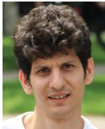

Ali Taleb Zadeh Kasgari (S’17) received the B.Sc. degree (Hons.) in electrical engineering, communication systems and control systems from the Iran University of Science and Technology and the M.Sc. degree in communication systems from the University of Tehran. He is currently pursuing the Ph.D. degree with the Bradley Department of Electrical and Computer Engineering, Virginia Tech, Blacksburg, VA, USA. His research interests include statistical machine learning, reinforcement learning, and stochastic/robust optimization, and their applications

in wireless communications and networking.

Walid Saad (S’07–M’10–SM’15–F’19) received the Ph.D. degree from the University of Oslo in 2010. From 2015 to 2017, he was named the Stephen O. Lane Junior Faculty Fellow at Virginia Tech, and in 2017, he was named the College of Engineering Faculty Fellow. He is currently an Associate Professor with the Department of Electrical and Computer Engineering, Virginia Tech, where he leads the Network Science, Wireless, and Security Laboratory, Wireless@VT Research Group. His research interests include

wireless networks, machine learning, game theory, cybersecurity, unmanned aerial vehicles, and cyber-physical systems. He was a recipient of the NSF CAREER Award in 2013, the AFOSR Summer Faculty Fellowship in 2014, and the Young Investigator Award from the Office of Naval Research in 2015. He has authored/co-authored six conference papers that won best paper awards at WiOpt in 2009, ICIMP in 2010, IEEE WCNC in 2012, IEEE PIMRC in 2015, IEEE SmartGridComm in 2015, and EuCNC in 2017. He was a recipient of the 2015 Fred W. Ellersick Prize from the IEEE Communications Society, the 2017 IEEE ComSoc Best Young Professional in Academia award, and the 2018 IEEE ComSoc Radio Communications Committee Early Achievement Award. He currently serves as an Editor for the IEEE TRANSACTIONS ON WIRELESS COMMUNICATIONS, the IEEE TRANSACTIONS ON COMMUNICATIONS, the IEEE TRANSACTIONS ON MOBILE COMPUTING, and the IEEE TRANSACTIONS ON INFORMATION FORENSICS AND SECURITY. He is a Fellow of the IEEE.

Mehdi Bennis received the joint M.Sc. degree in electrical engineering from EPFL, Switzerland, and the Eurecom Institute, France, in 2002, and the Ph.D. degree in 2009 with a focus on spectrum sharing for future mobile cellular systems. From 2002 to 2004, he was a Research Engineer at IMRA-EUROPE, investigating adaptive equalization algorithms for mobile digital TV. In 2004, he joined the Centre for Wireless Communications, University of Oulu, Finland, as a Research Scientist. In 2008, he was a Visiting Researcher at the Alcatel-Lucent Chair

on Flexible Radio, Supélec. He is currently an Adjunct Professor with the University of Oulu and an Academy of Finland Research Fellow. He has co-authored one book and has published over 100 research papers in international conferences, journals, and book chapters. His main research interests are in radio resource management, heterogeneous networks, game theory, and machine learning in 5G networks and beyond. He was a recipient of the prestigious 2015 Fred W. Ellersick Prize from the IEEE Communications Society, the 2016 Best Tutorial Prize from the IEEE Communications Society, and the 2017 EURASIP Best paper Award from the Journal of Wireless Communications and Networks. He serves as an Editor for the IEEE TRANS-ACTIONS ON WIRELESS COMMUNICATION.

Mérouane Debbah received the M.Sc. and Ph.D. degrees from École Normale Supérieure Paris-Saclay, France, in 1996. He worked for Motorola Labs, Saclay, France, from 1999 to 2002, and the Vienna Research Center for Telecommunications, Vienna, Austria, until 2003. From 2003 to 2007, he was with the Mobile Communications Department, Institut Eurecom, Sophia Antipolis, France, as an Assistant Professor. Since 2007, he has been a Full Professor at CentraleSupélec, Gif-sur-Yvette, France. From 2007 to 2014, he was the Director

of the Alcatel-Lucent Chair on Flexible Radio. Since 2014, he has been the Vice President of the Huawei France R&D Center and the Director of the Mathematical and Algorithmic Sciences Lab. His research interests lie in fundamental mathematics, algorithms, statistics, and information and communication sciences research. He is a WWRF Fellow and a member of the Academic Senate of Paris-Saclay. He has managed eight EU projects and over 24 national and international projects. He was a recipient of the ERC grant MORE (Advanced Mathematical Tools for Complex Network Engineering). He has received 17 best paper awards— the 2007 IEEE GLOBECOM Best Paper Award, the Wi-Opt 2009 Best Paper Award, the 2010 Newcom++ Best Paper Award, the WUN CogCom Best Paper 2012 and 2013 Award, the 2014 WCNC Best Paper Award, the 2015 ICC Best Paper Award, the 2015 IEEE Communications Society Leonard G. Abraham Prize, the 2015 IEEE Communications Society Fred W. Ellersick Prize, the 2016 IEEE Communications Society Best Tutorial Paper Award, the 2016 European Wireless Best Paper Award, the 2017 Eurasip Best Paper Award, and the Valuetools 2007, Valuetools 2008, CrownCom2009, Valuetools 2012, and SAM 2014 Best Student Paper Awards. He was also a recipient of the Mario Boella Award in 2005, the IEEE Glavieux Prize Award in 2011, and the Qualcomm Innovation Prize Award in 2012. He was an Associate and Senior Area Editor of the IEEE TRANSACTIONS ON SIGNAL PROCESSING in 2011–2013 and 2013–2014, respectively. He is the Associate Editor-in-Chief of the journal Random Matrix: Theory and Applications.