# Bi-Level Optimization Framework for Urban Low-Altitude UAV Delivery Ensuring Target Level of Safety

Bo Jiang, Yichao Li, Chenglong Li, and Yuan Zheng σD

Abstract—In recent years, urban low-altitude UAV logistics has emerged as a pivotal solution for last-mile delivery. To enhance operational eficiency, it is essential to address the Coupled Task Allocation and Trajectory Optimization Problem (CTA-TOP) for heterogeneous UAVs. However, existing research, which often approaches this problem using multi-objective weight assignment methods, sufers from two primary shortcomings: (1) It overlooks the inherently multi-objective nature of the problem, where improper weight allocation leads to solutions that deviate from practical needs (e.g., low risk weights may ignore excessive local risks, while high weights unduly sacrifice eficiency). (2) Although ground risk is recognized as a fundamental constraint for Urban Air Mobility (UAM), weight-based optimization cannot guarantee that segment path risks consistently remain below the Target Level of Safety (TLS). To this end, this paper proposes a bi-level optimization framework based on improved algorithms: the TC-NSGA-III algorithm is employed for task allocation to minimize total ground risk, delivery time cost, and UAV workload balance, while the RG-FMT<sup>∗</sup> algorithm is used for trajectory planning to ensure path risk remains below the TLS. Simulation results demonstrate that the proposed RG-FMT<sup>∗</sup> algorithm achieves a 100% TLS compliance rate in trajectory planning with the shortest computation time. The overall framework significantly outperforms comparative methods across key metrics such as total risk and time cost. Further large-scale urban scenario simulations validate the algorithm’s generalization capability and scalability. This study provides an efective solution for safe and eficient coordinated scheduling in urban low-altitude logistics.

Index Terms—UAV logistics, task allocation, trajectory planning, NSGA-III, FMT\*.

## I. INTRODUCTION

N RECENT years, Urban Air Mobility (UAM) has experienced rapid development, with logistics transportation recognized as one of its core application domains and a key driving force [1]. Within the operational context of Very-Low-Level (VLL) urban airspace, Uncrewed Aerial Vehicles (UAVs) have consequently demonstrated diverse application potential [2]. In the field of logistics delivery, leveraging their high flexibility, low operational costs [3], and exceptional adaptability to complex terrain, UAVs are rapidly evolving into a critical technological solution for addressing the “last-mile” delivery challenge [4].

Task allocation and trajectory planning are two key technologies in UAV logistics. Task allocation addresses the rational assignment of delivery orders to specific UAVs and determines their service sequence, while trajectory planning generates safe, eficient, and constraint-compliant flight paths for each assigned UAV. In UAV logistics, these two aspects are deeply coupled: task allocation decisions directly influence individual trajectories, while trajectory constraints inversely afect the feasibility and eficiency of task allocation strategies. And this can be defined as Coupled Task Allocation and Trajectory Optimization Problem (CTA-TOP). However, most existing studies treat CTA-TOP in isolation or adopt a sequential approach, optimizing task allocation and trajectory planning as independent stages.

Current UAV task allocation approaches primarily adopt three methodologies: linear programming-based methods (e.g., Hungarian algorithm [5]), machine learning methods (e.g., Monte Carlo tree search [6], convolutional neural network [7]), and intelligent optimization algorithms. Compared to linear programming approaches for approaching strictly linear problems and machine learning methods requiring prior data, optimization-based algorithms excel at solving nonlinear optimization problems while ofering flexible handling of constraints. Current research focuses on employing improved intelligent optimization algorithms to solve task allocation problems, including enhanced genetic algorithms [8] and particle swarm optimization [9], [10], developing hybrid intelligent optimization algorithms that combine multiple algorithmic advantages [11], and refining multi-objective optimization algorithms such as non-dominated sorting genetic algorithms [12], [13], [14].

Digital Object Identifier 10.1109/TITS.2026.3660878

Depending on the scenario, the objectives of optimization vary accordingly. For instance, in battlefield scenarios, the focus is often on maximizing mission benefits and minimizing UAV combat losses [15], while in IoT data collection tasks, energy eficiency is a primary concern [16]. For logistics drones, considerations often include in-flight energy consumption and safety [17].

On the other hand, trajectory planning in the field of UAV logistics research [18]. can be primarily categorized into graph search-based algorithms (e.g., improved A<sup>∗</sup> algorithm [19]), sampling-based algorithms (e.g., modified RRT<sup>∗</sup> [20] and enhanced FMT<sup>∗</sup> [21]), artificial potential field methods [22], and intelligent optimization algorithms like improved particle swarm optimization [23]. Compared to other approaches, sampling-based algorithms demonstrate significant advantages in eficiently handling three-dimensional continuous spaces with complex obstacles. Notably, in ofline path planning scenarios with prior static environmental information, the FMT<sup>∗</sup> algorithm demonstrates superior computational speed compared to other algorithms [24]. Meanwhile, CTA-TOP scenarios exhibit significant demand for rapid trajectory planning.

Some scholars have considered CTA-TOP and addressed the two problems together by transforming CTA-TOP into a single-objective optimization problem through multi-objective weight assignment. Rinaldi et al. [25] integrated risk aware RRT<sup>∗</sup> algorithms considering population density with genetic algorithms, combining path length, energy consumption, and total mission time into a single objective for UAV delivery systems with charging stations. Hong et al. [26] developed a two-stage optimization method embedded with simulated annealing, which achieves coupling through iterative interaction between IVND in the task allocation phase and ERPA in the route planning phase. They combined two subobjective functions—flight distance cost and the cost of drone sorties—into a single comprehensive objective function using weighted summation. Yan et al. [27] proposed an enhanced genetic algorithm to investigate the coupled problem of task allocation and trajectory planning. Similarly, they combined two sub-problems—the cumulative flight distance of drones and the maximum flight distance covered by any individual drone—into a single-objective function through weighted aggregation. Wang and Yang [28] established a nested bi-level model, where the upper level employs a genetic algorithm for task allocation, while the lower level utilizes an improved particle swarm optimization for path planning. Similarly, they considered time, flight altitude variation, and grid risk through a weighted summation approach.

However, the above approaches have two issues:1) overlook the fact that CTA-TOP is inherently a multi-objective optimization problem. Improper weight allocation may lead to solutions that deviate from practical requirements. For instance, a low risk weight may lead a single optimization process to focus excessively on eficiency while neglecting excessively large local risks, whereas a high risk weight may reduce eficiency due to an overemphasis on risk. 2) Although some scholars have considered ground risk as a fundamental requirement for UAM, the approach of handling multi-objective optimization problems through weight allocation does not guarantee that the risk of each segment path will consistently remain below the target level of safety (TLS).

In the context of the CTA-TOP problem, some scholars proposed a hierarchical coupling model to address it.

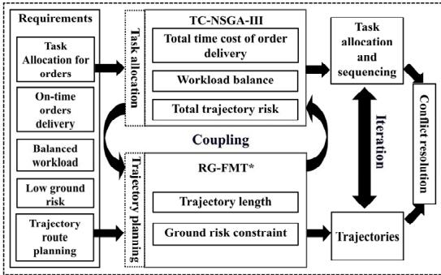  
Fig. 1. Schematic diagram of the framework.

Xinyong et al. [29] couple task allocation with trajectory planning through environmental constraints and task priorities, ensuring that task allocation schemes must account for feasible flight paths. The paper employs a visual graph method for path planning and adjusts trajectories to satisfy task priorities, thereby achieving coordinated optimization of both aspects. Jin et al. [30] couples task assignment and trajectory planning through a three-layer framework: clustering-based grouping determines task assignment, whose results then directly guide the carrier’s path planning, forming a closed loop. In urban logistics, Wen et al. [31] presented a bi-layer coupled framework for multi-depot operations: the upper layer coordinates UAV tasks across depots, while the lower layer plans safe and eficient paths, with bidirectional feedback enabling global optimization.

Consequently, this paper directly addresses CTA-TOP with a Bi-level optimization framework. At the task allocation level, Task Collaborative Non-dominated Sorting Genetic Algorithm III(TC-NSGA-III) is proposed. Pareto-optimal solutions are pursued among three objectives: ground risk mitigation, ontime order delivery, and UAV workload equilibrium. At the trajectory planning level, Risk Guarded Fast Marching Trees (RG-FMT<sup>∗</sup>) algorithm is proposed. The objectives are generating collision-free minimum-length trajectories under a defined TLS. This framework solves the CTA-TOP problem by performing cyclic updates between task allocation and trajectory planning.

This paper is organized as follows: section I constructs a 3D environmental model for urban ultra-low-altitude logistics, defining constraints and optimization objectives. Section II introduces the foundational theories of NSGA-III multi-objective optimization algorithm and FMT<sup>∗</sup> algorithm, then proposes a bi-level optimization framework integrating TC-NSGA-III and RG-FMT<sup>∗</sup>. Section III conducts experiments and comparative tests to validate algorithm performance, visualizing multi-UAV collaboration through typical scenarios. Section IV summarizes research contributions and outlines future research directions.

## II. PROBLEM FORMATION

## A. Problem Description

In this study, obstacles are known in advance and treated as static objects. Within the urban VLL logistics scenario, a delivery hub deploys heterogeneous UAVs with distinct flight speeds and payload capacities. Departing from the hub, each UAV sequentially visits multiple task points to deliver goods. This constitutes CTA-TOP, requiring assignment of order clusters to UAVs and generation of optimal trajectories that simultaneously minimize delivery time and ground risk. We solve the CTATOP by using bi-level optimization framework, as shown in Fig. 1.

The framework integrating TC-NSGA-III to solve task allocation subproblem and RG-FMT<sup>∗</sup> algorithms to address trajectory planning subproblem. Specifically, the upper-level TC-NSGA-III generates optimal task allocation solutions under objective functions minimizing total risk, time cost, and workload imbalance. The lower-level RG-FMT<sup>∗</sup> algorithm then produces minimal-length trajectories constrained by maximum risk thresholds. Through hierarchical optimization, this framework couples multi-objective task allocation with trajectory planning, enabling cyclic updates between levels via mutually dependent outputs.

## B. Task Allocation Subproblem

Assume there are a total of N heterogeneous $\mathrm { U A V s } \ \{ U _ { n } | n =$ $1 , 2 , \ldots , N \}$ . The delivery system needs to handle a randomly <sup>, ,</sup> <sup>.</sup> <sup>.</sup> <sup>.</sup> <sup>,</sup>generated set of M logistics orders $\{ T _ { m } | m = 1 , 2 , \dots , M \}$ . UAVs <sup>, ,</sup> <sup>.</sup> <sup>.</sup> <sup>.</sup> <sup>,</sup>can carry multiple orders during a single takeof cycle and fly at their speed $\{ V _ { n } | n = 1 , 2 , \ldots , N \}$ . However, the total number of tasks it undertakes must not exceed their own maximum task - carrying capacity $\{ W _ { n } | n = 1 , 2 , \ldots , N \}$

The purpose of the task allocation subproblem is to obtain the optimal allocation scheme while ensuring that all solutions are within the constraints of the TLS, as shown in (1), as follows:

$$
\left\{ \begin{array} { l l } { \operatorname* { m i n } F _ { 1 } = \displaystyle \sum _ { m = 1 } ^ { M } \sum _ { n = 1 } ^ { N } x _ { m n } \left[ \begin{array} { l } { \alpha \cdot \operatorname* { m a x } ( 0 , t _ { m } ^ { b e s t } - t _ { m } ^ { n } ) } \\ { + \beta \cdot \operatorname* { m a x } ( 0 , t _ { m } ^ { n } - t _ { m } ^ { b e s t } ) } \end{array} \right] } \\ { \operatorname* { m i n } F _ { 2 } = \displaystyle \sum _ { m = 1 } ^ { M } \sum _ { n = 1 } ^ { N } x _ { m n } R _ { p a t h } } \\ { \operatorname* { m i n } F _ { 3 } = \displaystyle \frac { 1 } { N } \sum _ { n = 1 } ^ { N } ( L _ { n } - \overline { { L } } ) ^ { 2 } } \\ { s . t . } & { C _ { 1 } , C _ { 2 } , C _ { 3 } } \end{array} \right.\tag{1}
$$

where $F _ { 1 }$ is the objective function based on the cost of order delivery time, $F _ { 2 }$ is the objective function based on the ground risk cost, and $F _ { 3 }$ is the objective function for workload balance among UAVs. The constraints $C _ { 1 } , C _ { 2 } , C _ { 3 }$ include order assignment constraints, assignment uniqueness constraints, and payload number constraints, respectively.

1) Time Cost $F _ { 1 } .$ : Each generated order $T _ { m }$ contains the following attributes:

a) Delivery destination: Three-dimensional coordinates $D _ { m } \ = \ ( x _ { m } , y _ { m } , z _ { m } )$ . The coordinates of the generated order must meet the minimum safe flight altitude requirement $z _ { \mathrm { m i n } } \le z _ { m } \le z _ { \mathrm { m a x } }$ and should not be located inside buildings.

b) Optimal arrival time: $t _ { m } ^ { b e s t }$ , which is the time when the UAV should deliver the order. Both delivering the order earlier than $t _ { m } ^ { b e s t }$ and later than $t _ { m } ^ { b e s t }$ will incur costs. The cost coeficient for early delivery is smaller than that for late delivery.

Based on the above order attributes, the objective function for the cost of order delivery time can be expressed as (2):

$$
\begin{array} { l } { \displaystyle F _ { 1 } = \sum _ { m = 1 } ^ { M } \sum _ { n = 1 } ^ { N } { x _ { m n } } } \\ { \displaystyle \left[ \alpha \cdot \operatorname* { m a x } ( 0 , t _ { m } ^ { b e s t } - t _ { m } ^ { n } ) + \beta \cdot \operatorname* { m a x } ( 0 , t _ { m } ^ { n } - t _ { m } ^ { b e s t } ) \right] , } \end{array}\tag{2}
$$

where  represents the cost coeficient for early delivery of an order, $\beta$ is the cost coeficient for late delivery of an order, and $t _ { m } ^ { n }$ denotes the actual time when order $T _ { m }$ is delivered by UAV $U _ { n }$ . The task allocation decision variable $x _ { m n }$ in the model can be defined as (3):

$$
x _ { m n } = \left\{ \begin{array} { l } { { 0 , ~ O r d e r ~ T _ { m } ~ i s ~ n o t ~ a s s i g n e d ~ t o ~ d r o n e ~ \mathrm { U } _ { n } } } \\ { { 1 , ~ O r d e r ~ T _ { m } ~ i s ~ a s s i g n e d ~ t o ~ d r o n e ~ \mathrm { U } _ { n } } } \end{array} \right.\tag{3}
$$

2) Risk Cost $F _ { 2 } .$ Since trajectory planning outputs the sum of ground risk values for path points, and it is necessary to optimize the total mission risk value, the objective function based on the ground risk cost can be represented by (4):

$$
F _ { 2 } = \sum _ { m = 1 } ^ { M } \sum _ { n = 1 } ^ { N } x _ { m n } R _ { p a t h } ( m , n ) ,\tag{4}
$$

where $R _ { p a t h } ( m , n )$ denotes the sum of risk values along the path for UAV n delivering order $m ,$ which is the output of the trajectory planning subproblem.

3) Workload Balance Cost $F _ { 3 } { \mathrm { . } }$ : To mitigate the occurrence of unreasonable scheduling where some UAVs are overloaded while others have relatively light workloads, we set the objective as the variance of the total flight distances of each UAV. This can be represented by equation (5), which characterizes the degree of balance in workload distribution among UAVs. A smaller variance indicates that the total flight distances of the UAVs are closer to each other, implying a more balanced workload.

$$
F _ { 3 } = \frac { 1 } { N } \sum _ { n = 1 } ^ { N } ( L _ { n } - \overline { { L } } ) ^ { 2 } ,\tag{5}
$$

where $L _ { n }$ represents the total flight distance of the n-th UAV, and $\begin{array} { r } { \overline { { L } } = \frac { 1 } { N } \displaystyle \sum _ { n = 1 } ^ { N } L _ { n } } \end{array}$ represents the average flight distance.

4) Order Assignment Constraint $C _ { 1 } .$ In the task allocation subproblem, it is also necessary to consider some constraints based on real-world scenarios. Given that in realistic conditions, the number of orders exceeds the number of UAVs, to enhance logistics and transportation eficiency, each UAV must be allocated at least one order. The constraint for order allocation $C _ { 1 }$ can be expressed as (6):

$$
C _ { 1 } : \sum _ { m = 1 } ^ { M } x _ { m n } \geq 1 , \forall n \in \{ 1 , 2 , 3 , \ldots , N \} ,\tag{6}
$$

5) Uniqueness Constraint $C _ { 2 } .$ Correspondingly, to avoid duplicate allocations, each order can only be delivered by one UAV. The uniqueness constraint for order allocation $C _ { 2 }$ can be expressed as (7):

$$
C _ { 2 } : \sum _ { n = 1 } ^ { N } x _ { m n } = 1 , \forall m \in \{ 1 , 2 , 3 , \ldots , M \} ,\tag{7}
$$

6) Payload Capacity Constraint $C _ { 3 } \mathrm { : }$ Considering that heterogeneous UAVs have diferent payload capacities, the number of orders allocated to UAV $U _ { n }$ should not exceed its maximum task payload capacity $W _ { n }$ to avoid accidents caused by overloading. The payload capacity constraint $C _ { 3 }$ can be expressed as (8):

$$
C _ { 3 } : \sum _ { m = 1 } ^ { M } x _ { m n } \le W _ { n } , \forall n \in \{ 1 , 2 , 3 , \ldots , N \} ,\tag{8}
$$

## C. Trajectory Planning Subproblem

In the trajectory planning subproblem, it is necessary to design a shortest flight trajectory from the starting point to the destination, which must meet the requirements of collision avoidance and ensure that the maximum ground risk remains within a safe range. A mathematical model is established to address this problem.

Let X be the three-dimensional state space of the VLL airspace in a city. Define a trajectory as a sequence of ordered waypoints $\{ X _ { 1 } , X _ { 2 } , X _ { 3 } , \ldots , X _ { k } \} \in X ,$ where $X _ { k }$ represents the spatial coordinates of the k-th waypoint $( x _ { k } , y _ { k } , z _ { k } )$ . The formulation of the trajectory planning subproblem is shown in (9):

$$
\begin{array} { l l } { \displaystyle \operatorname* { m i n } _ { X } } & { \displaystyle \sum _ { i = 0 } ^ { k - 1 } \big \| X _ { i + 1 } - X _ { i } \big \| _ { 2 } , } \\ { \mathrm { s . t . } } & { C _ { 4 } , C _ { 5 } , C _ { 6 } } \end{array}\tag{9}
$$

where $\lVert X _ { i + 1 } - X _ { i } \rVert _ { 2 }$ represents the distance between $X _ { i + 1 }$ and X<sub>i</sub>.

During the trajectory planning process, the UAV is abstracted as a mass point, and each waypoint must be ensured to lie within the planned grid environment. The boundary constraint $C _ { 4 }$ can be expressed as (10):

$$
C _ { 4 } : \{ X _ { k } | x _ { k } \in [ 0 , l \cdot u ] , \ y _ { k } \in [ 0 , l \cdot \nu ] , \ z _ { k } \in [ 0 , l \cdot w ] \} ,\tag{10}
$$

where, l represents the side length of each grid, and $u , \nu , w$ denote the number of grids along the $x , y , z { \mathrm { ~ a x e s } }$ , respectively.

<sup>, ,</sup>During the UAV flight, a feasible trajectory must avoid collisions with obstacles. Therefore, the constraint imposed by obstacles $C _ { 5 }$ can be expressed as (11):

$$
C _ { 5 } : \{ X _ { k } | d ( X _ { k } , X _ { i = 1 , 2 , \ldots I } ^ { o } ) = \| X _ { k } - \ X _ { i = 1 , 2 , \ldots I } ^ { o } \| _ { 2 } > 0 \} ,\tag{11}
$$

where $\| X _ { k } - \ X _ { i = 1 , 2 , \ldots I } ^ { o } \| _ { 2 }$ donates the distance between waypoint $X _ { k }$ <sup>,</sup>and obstacles $X _ { i = 1 , 2 , \dots I } ^ { o } .$

<sup>, ,...</sup>In this problem, we also consider the impact of ground risk on trajectory planning. We incorporate the ground risk at each waypoint as a constraint $C _ { 6 }$ to ensure the safety of the trajectory at discrete points as (12). For any waypoint $X _ { k } ,$ the risk value $R ( X _ { k } )$ at its location must satisfy:

$$
C _ { 6 } : \{ X _ { k } | R ( X _ { k } ) \leq R _ { T L S } \} ,\tag{12}
$$

where $R _ { T L S }$ is the preset maximum acceptable risk value, determined by the TLS. This constraint requires that the risk value at all waypoints does not exceed $R _ { T L S }$

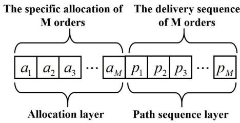  
Fig. 2. Schematic diagram of dual-layer encoding.

## III. METHOD

## A. Task Collaborative NSGA-III Algorithm

1) Standard NSGA-III: NSGA-III (Non-dominated Sorting Genetic Algorithm III), a classic algorithm in multi-objective optimization [32], is an advanced version of NSGA-II [33]. It primarily addresses distribution quality and convergence eficiency of solutions along the Pareto front in high-dimensional objective spaces. The algorithm balances convergence and distribution of the solution set by introducing a uniformly distributed reference point system to maintain population diversity, combined with hierarchical non-dominated sorting and environmental selection. Non-dominated sorting hierarchically filters solutions approaching the Pareto front, while reference point-guided environmental selection ensures uniform solution distribution across objectives. This generates Pareto-optimal solution sets with broad coverage and low redundancy for complex multi-objective problems.

2) Dual-Layer Chromosome Encoding Design for Order Task Allocation: The TC-NSGA-III algorithm proposed in this paper employs a dual-layer chromosome encoding mechanism tailored for order task allocation. In response to the multidimensional characteristics of the UAV task allocation and path planning problem, the chromosome structure is divided into two functionally decoupled layers: the allocation layer and the path sequence layer, as illustrated in Fig. 2.

In the allocation layer, the objective is to assign M orders to N UAVs. Therefore, the encoding format is designed as $a = [ a _ { 1 } , a _ { 2 } , \dotsc , a _ { M } ] , a _ { M } \in [ 1 , N + 1 )$ , where represents the UAV assignment decision for M orders. For example, if $a _ { M - 1 } = 3 ,$ it means that order $M - 1$ is assigned to UAV 3.

During the initialization generation of the encoder for the allocation layer, each order is sequentially assigned an available UAV. The selection process prioritizes randomly choosing from the set of UAVs that are currently not at full capacity. When making the selection, the constraints related to the number of orders each UAV can handle are considered to ensure the feasibility of the initial solution and to avoid invalid solutions that might result from traditional random encoding methods.

The purpose of the path sequence layer is to generate a sequence of orders to be visited by each drone. Therefore, a random key encoding approach is adopted, with the encoding format designed as $p ~ = ~ [ p _ { 1 } , p _ { 2 } , \ldots , p _ { M } ] , p _ { M } ~ \in ~ ( 0 , 1 )$ representing the order weights for the delivery path of M orders. During decoding, the value $p$ corresponding to each UAV are sorted in ascending order, and the resulting sequence represents the path order in which the drone will visit the orders.

3) Crossover Operations for Dual-Layer Chromosome Encoding: To address the characteristics of dual-layer chromosome encoding, we design a decoupled crossover operator that applies distinct operations to the assignment layer and the path sequence layer. For the assignment layer of length $M ,$ order crossover is employed, generating a random mask matrix $m a s k _ { j } \in \{ 0 , 1 \} , j = 1 , 2 , \ldots M$ . The ofspring assignment layer is then produced according to (13):

$$
\begin{array} { r } { y _ { 1 , a l l o c } = \left\{ \begin{array} { l l } { x _ { 1 , a l l o c } , \ i f \ m a s k _ { j } = 1 } \\ { x _ { 2 , a l l o c } , \ i f \ m a s k _ { j } = 0 } \end{array} \right. } \\ { y _ { 2 , a l l o c } = \left\{ \begin{array} { l l } { x _ { 1 , a l l o c } , \ i f \ m a s k _ { j } = 0 } \\ { x _ { 2 , a l l o c } , \ i f \ m a s k _ { j } = 1 } \end{array} \right. } \end{array}\tag{13}
$$

where $x _ { 1 , a l l o c }$ and $x _ { 2 , a l l o c }$ represent the two input allocation layers of chromosomes that need to undergo crossover, while $y _ { 1 , a l l o c }$ and $y _ { 2 , a l l o c }$ represent the output allocation layers of chromosomes after the crossover operation.

For the path sequence layer of chromosomes with a length of $M ,$ the Simulated Binary Crossover (SBX) operator is employed to generate ofspring as (14):

$$
\beta _ { j } = \left\{ \begin{array} { l l } { ( 2 u _ { j } ) ^ { 1 / ( \eta + 1 ) } , u _ { j } \le 0 . 5 } \\ { ( 2 ( 1 - u _ { j } ) ) ^ { - 1 / ( \eta + 1 ) } , o t h e r } \end{array} \right.\tag{14}
$$

where $u _ { j } \sim U ( 0 , 1 )$ , represents the distribution index, which controls the degree of approximation between the ofspring and the parent chromosomes. A larger  value results in ofspring that are closer to the parents, which is suitable for the finetuning search phase. Conversely, a smaller enhances the exploration capability. The path sequence layer of the ofspring chromosomes is generated according to (15):

$$
\begin{array} { l c l } { y _ { 1 , p a t h } = 0 . 5 \cdot [ ( 1 + \beta _ { j } ) x _ { 1 , p a t h } ( j ) + ( 1 - \beta _ { j } ) x _ { 2 , p a t h } ( j ) ] } \\ { \qquad y _ { 2 , p a t h } = 0 . 5 \cdot [ ( 1 - \beta _ { j } ) x _ { 1 , p a t h } ( j ) + ( 1 + \beta _ { j } ) x _ { 2 , p a t h } ( j ) ] , } \end{array}\tag{15}
$$

where $x _ { 1 , p a t h }$ and $x _ { 2 , p a t h }$ represent the two input path sequence layers of chromosomes that need to undergo crossover, while $y _ { 1 , p a t h }$ and $y _ { 2 , p a t h }$ represent the output path sequence layers of chromosomes after the crossover operation. By concatenating the crossover results of the allocation layer and the path layer, we obtain the complete ofspring chromosomes $y _ { 1 } = [ y _ { 1 , a l l o c } , y _ { 1 , p a t h } ]$ and $y _ { 2 } = [ y _ { 2 , a l l o c } , y _ { 2 , p a t h } ]$

4) Mutation Operations for Dual-Layer Chromosome Encoding: In response to the characteristics of hierarchical encoding, we designed a two-layer adaptive mutation operator that applies diferentiated perturbation strategies to the allocation layer and the path sequence layer, respectively.

Similar to the crossover section mentioned above, in the allocation layer, a mutation mask matrix is generated mask<sub>j</sub> ∈ $\{ 0 , 1 \} , j = 1 , 2 , \dotsc M$ . For positions marked as 1 in the mask, neighborhood perturbations are applied as (16):

$$
y _ { a l l o c } ( j ) = ( x _ { a l l o c } ( j ) + \delta _ { j } - 1 ) \bmod N + 1 ,\tag{16}
$$

where $\delta _ { j } \sim U \{ - 1 , 0 , 1 \}$ represents an integer ofset sampled uniformly, and modular arithmetic is employed to ensure that the drone number remains within the valid range [1 N].

For the mutation of the path sequence layer, adaptive Gaussian mutation is adopted, applying zero-mean Gaussian perturbations as (17):

$$
y _ { p a t h ( j ) } = x _ { p a t h } ( j ) + \sigma _ { a } \varepsilon _ { j } ,\tag{17}
$$

where the adaptive mutation step size denoted as $\sigma _ { a } = \sigma$ $\exp ( - \lambda \cdot g e n )$ , represents the decay coeficient that controls the rate of step size reduction. This ensures that the mutation step size $\sigma$ decays exponentially with the number of iterations gen. $\varepsilon _ { j }$ is a random variable drawn from a standard normal distribution and is independently and identically distributed.

By concatenating the mutation results of the allocation layer and the path sequence layer, a complete ofspring chromosome can be obtained. After the crossover and mutation operations, it is necessary to inspect the generated ofspring. After the mutation is complete, the encoding will be checked. If any constraint violation is found, a repair mechanism will be triggered. While strictly adhering to the payload-number constraint, this mechanism transfers any order exceeding the limit to a UAV that still has available capacity.

## B. Risk- Guarded FMT<sup>∗</sup> Algorithm

1) Standard FMT<sup>∗</sup> Algorithm: Fast Marching Tree (FMT<sup>∗</sup>) is a sampling-based optimal path planning algorithm [34]. It enables eficient path search in high-dimensional spaces through systematic node sampling and heuristic tree expansion within the configuration space. Combining the eficient propagation of the Fast Marching Method [35] with incremental optimal tree construction, FMT<sup>∗</sup> first generates a uniformly or heuristically distributed node set. It then grows the tree outward from the start state in a goal-directed manner.

Unlike traditional RRT<sup>∗</sup> [36], FMT<sup>∗</sup> employs lazy collision checking, verifying edge collisions only when establishing connections. This significantly reduces unnecessary geometric computations. The core mechanism recursively selects the lowest-cost node for expansion using dynamic programming, while ellipse subset pruning constrains the search region to reduce computational complexity. This unique bidirectional search approach yields superior convergence speed and computational eficiency in complex obstacle environments and high-dimensional motion planning problems.

2) Ground Risk Model: Following [37], quantifying the inherent risk posed to ground populations by potential UAV crash events is a common methodology for ground risk assessment. The resulting quantified ground risk data can be visualized in a grid-based format, forming a risk map [38]. This map provides critical input for subsequent trajectory planning calculations.

This study adopts the fatality rate from UAV-pedestrian collisions—defined as the number of fatalities caused by such incidents within a specified timeframe—as the core metric for evaluating ground risk. As established in [39] and [40], ground impact risk is primarily correlated with population density. Accordingly, this study employs the ground risk calculation method specified in [41] and detailed in (18):

$$
R ( n ) = C I \cdot A \lambda F ( n ) \rho _ { P } ( n ) ,\tag{18}
$$

where CI denotes congestion index, according to [42] and [43], population density exhibits dynamic periodic characteristics, while the trafic congestion index also shows periodic fluctuations, which can be used to reflect dynamic population density. A represents the area that the UAV may impact the ground within a grid region. According to the calculations in [44], the value of A ranges from 70 to 100 depending on the flight altitude of the UAV. In this paper, considering the maximum altitude of 120 meters, we take $A = 1 0 0 .$ denotes the probability of such an accident occurring per unit flight time. According to literature [45], the failure rate of UAV systems varies by model, ranging from $3 . 4 2 \times 1 0 ^ { - 4 }$ per flight hour for models under 2kg to $2 . 0 1 \times 1 0 ^ { - 8 }$ per flight hour for those over 4550 kg. Meanwhile, as stated in [46], for failure conditions expected to result in one or more fatalities, the allowable quantitative probability for MTOM 200 kg should be $1 \times 1 0 ^ { - 7 }$ . Since logistics drones fall within this category, the value of $1 \times 1 0 ^ { - 7 }$ is adopted. $F ( n )$ indicates the fatality probability in the event of a human impact, $\rho _ { P } ( n )$ stands for the population density, and n is the grid number of the risk map.

According to [47], the fatality rate of a human being struck by a UAV can be calculated as shown in (19).

$$
F = \frac { 1 } { 1 + \sqrt { \frac { \mathsf { b } } { d } } \left( \frac { d } { E _ { i m p } } \right) ^ { \frac { 1 } { 4 c _ { s } } } } ,\tag{19}
$$

In the fatality rate formula for a human being struck by a UAV, through force analysis considering kinetic energy and gravitational potential energy, the velocity of the UAV $\nu =$ $\sqrt { \frac { 2 h } { g } }$ can be substituted into the formula $E _ { i m p } = { \textstyle \frac { 1 } { 2 } } m \nu ^ { 2 }$ . After simplifying the parameters within the formula, a simplified version can be ultimately obtained, as shown in (20) below:

$$
F = \frac { \alpha m ^ { 2 } g h } { \beta } ,\tag{20}
$$

where denotes parameters related to the UAV model, $\beta$ denotes hyperparameters associated with the impact energy, and h indicates the flight altitude of the UAV.

3) Hybrid Sampling Strategy: The traditional FMT<sup>∗</sup> algorithm employs a uniform sampling strategy, which fails to diferentiate sampling based on ground risk requirements. To achieve risk- guarded spatial exploration in trajectory planning, this paper proposes a hybrid sampling strategy. The core idea of this strategy is to divide and sample diferent risk regions with varying densities. Given a risk map $R ( x ) \ \in \ [ 0 , 1 ]$ , we define a hierarchical sampling probability density function as follows as (21):

$$
p ( x ) = \left\{ \begin{array} { l l } { p _ { s a f e } \cdot \displaystyle \frac { 1 } { \nu _ { l o w } } , { \mathrm { i f } } \ R ( x ) \le R _ { \mathrm { m a x } } } \\ { ( 1 - p _ { s a f e } ) \cdot \displaystyle \frac { 1 } { \nu _ { t o t a l } } , o t h e r } \end{array} \right.\tag{21}
$$

where $R _ { \mathrm { m a x } }$ represents the risk threshold for classification, $\nu _ { l o w }$ denotes the measure of the low-risk region, and $\nu _ { t o t a l }$ stands for the measure of the entire space. This strategy ensures that, during sampling, the algorithm focuses on sampling in regions with risks below the threshold with a probability of $p _ { s a f e } .$ . This approach makes it more likely for the algorithm to select paths in low-risk areas, thereby enhancing path safety. Meanwhile, it retains a probability of $( 1 - p _ { s a f e } )$ for global random sampling to maintain the algorithm’s completeness.

4) Risk- Guarded Neighbor Node Radius Adjustment Strategy: During the process of constructing the neighbor node tree diagram in the FMT<sup>∗</sup> algorithm, the fixed connection radius $r _ { b a s e }$ for the basic construction adheres to the theoretical guidelines provided in the FMT<sup>∗</sup> algorithm as (22):

$$
r _ { b a s e } = \xi \left( \frac { \log ( n _ { p } ) } { n _ { p } } \right) ^ { 1 / d } ,\tag{22}
$$

where $\xi$ is the tuning parameter, $n _ { p }$ is the number of nodes, and $d$ is the spatial dimension.

The traditional fixed connection radius strategy tends to cause node expansion stagnation in high-risk areas. This paper proposes a risk- guarded dynamic radius mechanism. We define the local risk intensity value $\begin{array} { r } { \widetilde { R } ( x _ { i } ) = \frac { R ( x _ { i } ) - R _ { \mathrm { m i n } } } { R _ { \mathrm { m a x } } - R _ { \mathrm { m i n } } } } \end{array}$ for node $x _ { i } .$ , where $R _ { \mathrm { m i n } }$ and $R _ { \mathrm { m a x } }$ are the minimum and maximum risk values in the current risk map, respectively. The dynamic connection radius is designed as (23):

$$
r ( x _ { i } ) = r _ { b a s e } ( 1 + \gamma \widetilde { R } ( x _ { i } ) ) ,\tag{23}
$$

where $\gamma \in ( 0 , 1 )$ controls the maximum expansion ratio.

As shown in Fig. 3, when an open point z connected to a visited point $x _ { i n i t }$ selects its neighbor nodes, since $z$ is located in a risky area and unvisited points within the fixed connection radius cannot be selected due to obstacles and high-risk constraints, the dynamic connection radius can be dynamically extended to $r ( z )$ based on the risk value of $z .$ This successfully allows for the selection of an appropriate next node, enabling the node to traverse a larger range in search of a safe path.

In extreme scenarios where the target point is surrounded by high-risk areas, since it is impossible to violate the hard constraints of the TLS, reaching that point becomes unfeasible. In such scenarios, RG-FMT<sup>∗</sup> will select the nearest delivery point to the target point as the endpoint.

## C. Pseudocode of Proposed Framework

Algorithm TC-NSGA-III proceeds as Algorithm 1. First, it generates reference points Zr based on the number of objectives and divisions (line 1). The population Pop is then initialized with a double-layer coding structure, using the RG-FMT<sup>∗</sup> algorithm to compute initial collision-free paths and costs (lines 2–4).

The main loop iterates as lines 5–13: ofspring and mutated individuals are generated via double-layer crossover and mutation (lines 6–7), then merged with parents. RG-FMT<sup>∗</sup> replans paths and computes costs for the merged set (lines 8–10). A NSGA-III-based selection mechanism using Zr selects the next generation (line 11), and the current non-dominated front F1 is recorded (line 12).

After the loop, conflict detection and resolution are applied to F1 (lines 14–16). The algorithm returns the optimized population Pop and the conflict-free Pareto front F1. The conflict resolution mechanism operates on a first-come, firstserved basis: later-arriving UAVs are required to wait outside the safety distance, with the waiting time calculated as the safety distance divided by their speed.

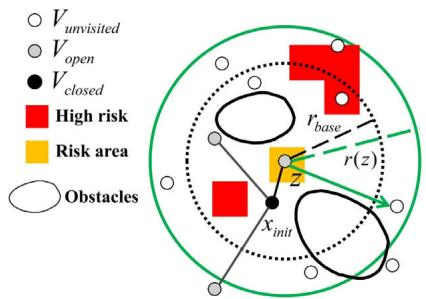

Fig. 3. Diagram of dynamic connection radius.  
```csv
Algorithm 1 TC-NSGA-III
Input: UAVData, Orders, RiskMap, Parameters
Output: Pop, F1
1 Zr ← GenerateReferencePoints(nObj, nDivision)
2 Pop ← InitializePop (nPop, UAVData, Orders) //Dual
layer
3 InitPaths = RGFMTstar(Pop, RiskMap)
4 Pop.cost ← CalculateCost(InitPaths)
5 for it = 1 to MaxIt do
6 ofspring ← DualLayerCrossover(Pop)
7 mutants ← DualLayerMutation(Pop, Parameters)
8 CombinedPop ← [Pop, ofspring, mutants]
9 Paths = RGFMTstar(CombinedPop, RiskMap)
10 CombinedPop.cost ← CalculateCost(Paths)
11 Pop ← SortAndSelectPopulation (combinedPop, Zr)
12 F1 ← GetFirstFront(Pop)
13 end for
14 ConflictPoints ← ConflictDetection (F1)
15 F1 ← ConflictResolution (F1, ConflictPoints)
16 return pop, F1
```

Algorithm 2 is the pseudocode for the RG-FMT<sup>∗</sup> algorithm, which takes the population Pop and the risk map RiskMap as inputs and outputs the planned paths. First, the population is decoded to obtain the task assignment scheme (line 1), from which the start and end points are read (line 2). Subsequently, a risk-aware sampling strategy is employed to generate a set of path points (line 3), and a risk interpolator is created to construct a risk matrix (line 4). The node adjacency relationships are established using the dynamic radius graph method (line 5). Finally, the main algorithm section with risk constraints is executed to conduct a risk-aware path search (line 6). If a path is successfully found, the final paths is obtained by backtracking through parent nodes (lines 7-9); otherwise, an empty value is returned (line 10).

An analysis of the time complexity of the framework is conducted. The time complexity of the NSGA-III algorithm is O(MN<sup>2</sup>) [32], where M is the number of objectives and N is the population size. The time complexity of the FMT<sup>∗</sup> algorithm is O(n log n) [34], where n is the number of sampling points.

Let the total number of orders be K. Since each order is assigned, the total number of orders for everyone in the population is fixed at K. Therefore, everyone in the population requires K calls to the FMT<sup>∗</sup> algorithm. NSGA-III needs to evaluate the fitness of N individuals per generation, so the total number of calls to the FMT<sup>∗</sup> algorithm per generation is N × K. Thus, the time complexity of the FMT<sup>∗</sup> part per generation is O(NKn log n). Adding the time complexity of NSGA-III itself per generation, which is O(MN<sup>2</sup>), the total time complexity per generation is O(MN<sup>2</sup>+ NKn log n). NSGA-III typically runs for T generations (number of iterations), so the overall time complexity is: O(TMN<sup>2</sup>+ TNKn log n).

Algorithm 2 RG-FMT<sup>∗</sup>   
Input: Pop, RiskMap   
Output: paths   
1 Allocation ← Decode(Pop)   
2 [start, goal] ← AllocationRead(Allocation)   
3 points ← SampleRiskAware(RiskMap)   
4 Riskmatrix ← CreateInterpolator(RiskMap)   
5 neighbors ← DynamicRadiusGraph(points, Riskmatr-ix)   
6 (pathFound, parent) ← FMTstar (points, neighbors,   
Riskmatrix, RiskMap)   
7 if pathFound then   
8 paths ← Backtrace(parent)   
9 return paths   
10 else return ∅   
11 end if

## IV. SIMULATION EXPERIMENT

The experimental environment will be introduced prior to the experiments. All experiments were conducted in a MATLABOR 2019b programming environment using an Intel Core i5-12600KF CPU @ 3.60GHz 10-core processor with 32GB of RAM. The experiment constructed a threedimensional urban environment discretized into a grid of 60 × 60 × 12 cells, with each cell having a length of 10 meters. A few static buildings were randomly generated in the scenario.

## A. Experiment of Parameter Sensitivity Analysis

In the TC-NSGA-III algorithm, the settings of the crossover rate and mutation rate parameters can influence the quality of the solution set. Since improvements have been made to the crossover and mutation components of the TC-NSGA-III algorithm in this paper, a sensitivity analysis of the crossover rate and mutation rate parameters is conducted. The Hypervolume (HV) metric is adopted to evaluate the solution sets. HV is a core indicator for measuring the comprehensive performance of solution sets in multi-objective optimization. It calculates the volume occupied by the solution set in the objective space relative to a reference point. A larger volume indicates better performance in terms of convergence and diversity of the solution set.

In the experiments, 5 heterogeneous UAVs and 10 orders are considered, with the UAV distribution center located at coordinates (31, 33, 3). Orders and time windows are randomly generated. The candidate values for both the crossover rate and mutation rate are set to [0.2, 0.4, 0.6, 0.8], resulting in 16 possible combinations. During the calculations, normalization is performed on the reference point and the objective function values of the solution sets.

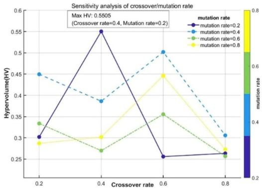  
Fig. 4. Sensitivity analysis of crossover and mutation rate.

Fifty experiments are conducted, and the average HV values are computed. The experimental results are shown in Fig. 4. When the crossover rate is set to 0.4 and the mutation rate is set to 0.2, the solution set exhibits the largest HV. Therefore, these two parameter values are selected for subsequent experiments.

To minimize the path risk value of the RG-FMT<sup>∗</sup> algorithm under the ground risk constraints and achieve optimal performance, a sensitivity analysis is first conducted on the risk-related parameters in the proposed RG-FMT<sup>∗</sup> algorithm. During the analysis, the sampling probability parameter $p _ { s a f e }$ and the maximum expansion ratio parameter  are selected. Given that these two parameters are applied sequentially in the algorithm’s process and are not independent of each other, there exists a possible coupling relationship that may jointly influence the risk value. Therefore, a combinatorial analysis is conducted.

The values of parameters and $p _ { s a f e }$ are set within the range of 0.1 to 0.9, with a step size of 0.1, resulting in a total of 81 combinations. A three-dimensional urban environment is discretized into a grid of $6 0 \times 6 0 \times 1 2$ cells, where each cell has a length of 10 meters. The algorithm is employed to generate the corresponding urban environment, population density, and subsequently, the risk map. The starting point is set at [10, 6, 3], and the endpoint at [52, 54, 15]. A total of 50 experiments are conducted, and the average path risk value is calculated for each combination. The sensitivity analysis line graph is illustrated in Fig. 5.

As shown in Fig. 5, the average path risk value fluctuates depending on diferent combinations of parameter values, and it does not exhibit a simple linear change. An optimal path risk value performance is observed when $\gamma = 0 . 3$ and $p _ { s a f e } =$ 0 5. Therefore, this optimal combination is selected for all experiments in this paper.

To determine the optimal decay schedule for the adaptive mutation step size in Formula (17), we conducted a parameter sensitivity analysis on and . The HV metric was used to evaluate the performance of diferent parameter combinations.

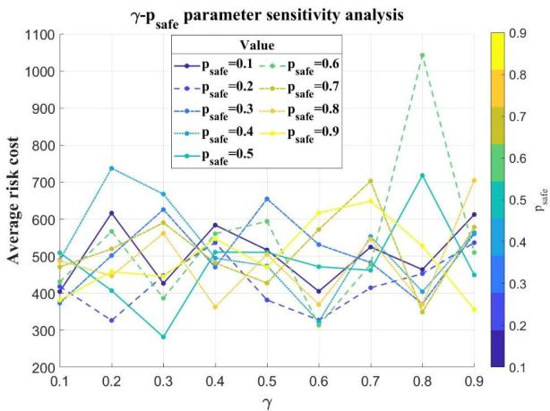  
Fig. 5. Line chart for risk-related parameter sensitivity analysis.

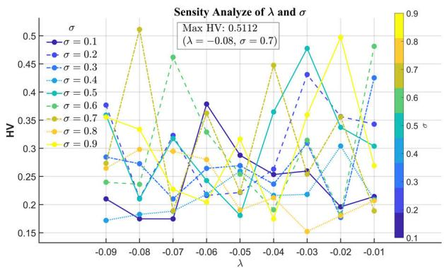  
Fig. 6. Line chart for parameter sensitivity analysis for the adaptive mutation step size.

The value of was varied from–0.09 to–0.01 with a step <sup>λ</sup>size of 0.01, and  was tested from 0.1 to 0.9 with a step size of 0.1. As shown in Fig. 6, the maximum HV value of 0.5112 was achieved when $\lambda = - 0 . 0 8$ and $\sigma = 0 . 7$ . These values were subsequently adopted in all relevant experiments to ensure efective and stable convergence of the algorithm.

## B. Comparative Experiments Between RG-FMT<sup>∗</sup> and Representative Sampling-Based Algorithms

For benchmarking trajectory planning algorithms, four representative sampling-based algorithms were evaluated: APF-RRT<sup>∗</sup> [48], Fast-RRT<sup>∗</sup> [49], Informed RRT<sup>∗</sup> [50] and Risk-aware RRT<sup>∗</sup> [51]. The experimental parameters were standardized across all sampling-based algorithms: 3000 sample points, step size of 2, and connection radius r = 5.

For RG-FMT<sup>∗</sup>, the TLS was specified as $1 \times 1 0 ^ { - 7 } .$ . These parameter settings remained consistent throughout the experimental evaluation.

The study selected 50 pairs of random starting points and performed trajectory planning using five diferent algorithms. The experimental metrics were the TLS compliance rate, risk value, trajectory length cost, and computation time. The TLS compliance rate is defined as the fraction of trajectory segments that comply with the TLS. The risk value is defined as the sum of the risk values of all trajectory points along this trajectory. The average values of these 50 sets of results are shown in Table I.

TABLE I  
COMPARISON METRICS FOR ALGORITHMS
<table><tr><td>Metrics</td><td>TLS Complia- nce rate</td><td>Risk Value</td><td>Length cost</td><td>Computa -tion time(s)</td></tr><tr><td>APF- RRT*[48]</td><td>74.73%</td><td> $1 . 0 9 2 \times 1 0 ^ { - 5 }$ </td><td>31.30</td><td>0.4056</td></tr><tr><td>Fast- RRT*[49]</td><td>74.19%</td><td> $1 . 0 9 5 \times 1 0 ^ { - 5 }$ </td><td>32.36</td><td>0.2124</td></tr><tr><td>Informed RRT*[50]</td><td>88.89%</td><td> $1 . 0 5 3 \times 1 0 ^ { - 5 }$ </td><td>29.74</td><td>0.6008</td></tr><tr><td>Risk-aware RRT*[51]</td><td>71.75%</td><td> $1 . 0 0 1 \times 1 0 ^ { - 5 }$ </td><td>36.30</td><td>0.3040</td></tr><tr><td>RG-FMT*</td><td>100%</td><td> $1 . 0 1 3 \times 1 0 ^ { - 5 }$ </td><td>31.38</td><td>0.1484</td></tr></table>

According to the data in Table I, due to the consideration of TLS constraints, all trajectory segments of RG-FMT<sup>∗</sup> comply with TLS requirements, while APF-RRT<sup>∗</sup>, Fast-RRT<sup>∗</sup>, Informed RRT<sup>∗</sup>, and Risk-aware RRT<sup>∗</sup> fail to achieve full TLS compliance across all trajectory segments. The risk value of RG-FMT<sup>∗</sup> is only lower than that of Risk-aware RRT<sup>∗</sup>. In terms of length cost, RG-FMT<sup>∗</sup> performs as one of the best among the compared algorithms. Regarding computation time, RG-FMT<sup>∗</sup> is the fastest among all the algorithms compared.

To visually demonstrate the advantages of RG-FMT<sup>∗</sup>, a set of start and goal points from the experiments was selected for visual presentation. Setting the UAV’s starting point at [40, 10, 5] and the endpoint at [23, 54, 5],as illustrated in Fig. 7.

As shown in Fig. 7, the trajectories planned by the five algorithms are presented. In Fig. 7, the green trajectory segments indicate sections that comply with the TLS, while the blue segments represent non-compliant sections. Due to the incorporation of TLS constraints, all trajectory segments generated by the RG-FMT algorithm satisfy TLS, whereas the other comparative algorithms fail to fully meet this requirement.

When comparing Risk-aware RRT<sup>∗</sup> and RG-FMT<sup>∗</sup>, it is important to note that Risk-aware RRT<sup>∗</sup> focuses on global risk optimization. However, there is often a trade-of between risk and eficiency, which consequently compromises the optimization of eficiency and frequently results in longer trajectory lengths. In practical applications, the emphasis lies in ensuring that every trajectory segment complies with TLS, rather than minimizing overall risk. If Risk-aware RRT<sup>∗</sup> prioritizes global risk minimization, some trajectory segments may fail to meet TLS requirements. For instance, as shown in Fig. 7, a significant portion of the trajectory generated by Risk-aware RRT<sup>∗</sup> violates TLS, whereas RG-FMT<sup>∗</sup> ensures full TLS compliance across all trajectory segments.

Considering the issue of dynamic population density, this experiment utilizes the urban road congestion index and corresponding population density for simulation.

The data is sourced from Baidu Map’s Transportation and Travel Big Data Platform [52]. The risk values corresponding to the road congestion index are shown in Fig. 8. It can be observed that the road congestion index leads to continuous variations in the risk value, and as the road congestion index increases, the ground risk rises rapidly.

APF-RRT\* 76.92%  
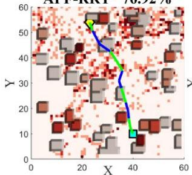

Fast-RRT\*73.33%  
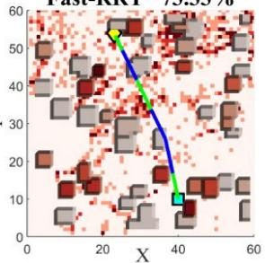

Informed RRT\* 86.67%  
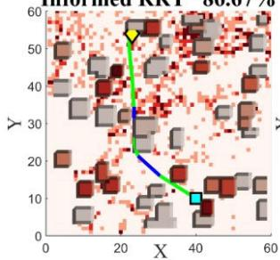

Risk-aware RRT\*71.43%  
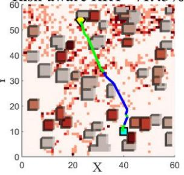

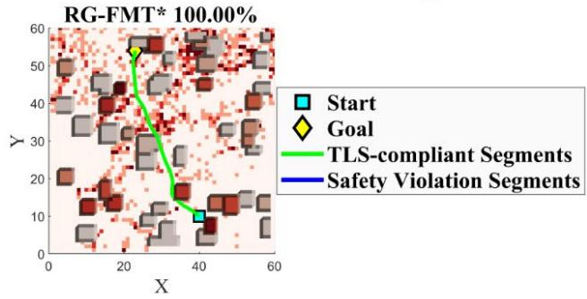  
Fig. 7. Comparison chart of trajectories generated by algorithms.

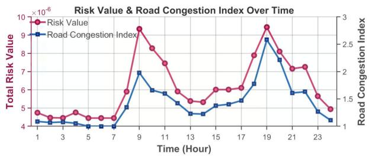  
Fig. 8. Comparison chart of road congestion index, risk value.

## C. Comparative Experiments Between the Proposed Framework and Representative Methods

To compare the performance diferences between the proposed task allocation method and other methods in terms of mission objectives, this experiment selects MOEA/D [53] and DCNSGA-III [54] as comparative algorithms, and adopts the APF-RRT<sup>∗</sup>, Fast-RRT<sup>∗</sup>, and Informed RRT<sup>∗</sup> from Case B of the experiment as trajectory planning algorithms.

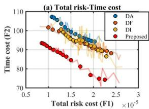

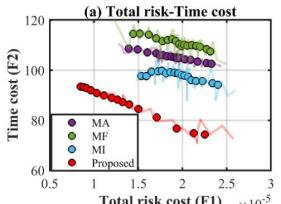

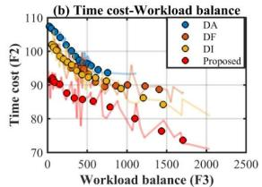

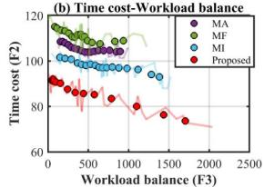

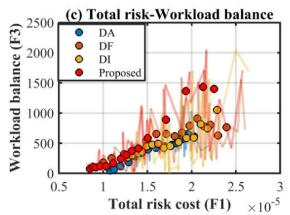

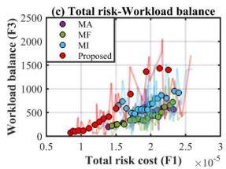  
Fig. 9. Two-dimensional pareto front.

In the experiment, MOEA/D and DCNSGA-III employ common integer encoding. Based on the encoding method, DCNSGA-III selects the basic uniform crossover operator and basic bit mutation operator, while MOEA/D utilizes the Chebyshev decomposition strategy [55], [56] for its decomposition approach and diferential evolution for its evolutionary operations. The task is set with 5 heterogeneous UAVs and 10 orders, and the number of iterations is set to 80. The parameter settings for DCNSGA-III include a population size of 60, with crossover and mutation rates referenced from Case A. For MOEA/D, the weight vector generation parameter H is set to 10, resulting in 66 weight vectors. The experiment will be conducted 50 times, and for visualization purposes, one of the experiments will be selected for analysis.

The Pareto front between each pair of objectives has been plotted in Fig. 9. To clearly observe the relationship between $F _ { 1 } , \ F _ { 2 }$ and $F _ { 3 } ,$ a Moving Average filter was applied to the line chart. As $F _ { 1 }$ decreases, $F _ { 2 }$ increases, because risk aversion extends the trajectory and leads to an increase in time. Similarly, as $F _ { 3 }$ decreases, $F _ { 2 }$ increases, because balancing the workload among UAVs leads to an increase in time cost. It can be observed that as $F _ { 1 }$ gradually decreases, $F _ { 3 }$ also decreases gradually. These pairwise fronts reveal strong correlations between $F _ { 1 }$ and $F _ { 2 }$ , and between $F _ { 2 }$ and $F _ { 3 }$

There has already been relevant research on considering the combination of NSGA-III and RRT<sup>∗</sup> algorithms [57], so we have also chosen this combination for comparison. As shown in Fig. 9, the experiment compares two groups of algorithms: DCNSGA-III-based: D +A (APF-RRT ∗), D +F (Fast-RRT ∗), and D +I (Informed RRT ∗). MOEA/D-based: M +A (APF-RRT ∗), M +F (Fast-RRT ∗), and M +I (Informed RRT ∗).

The risk value here is defined as the sum of the risk values of all trajectories in the solution. The average metrics of 50 experiments comparing the proposed framework with these six combinations are detailed in Table II.Through comparison, the proposed framework significantly outperforms the other combinations in terms of average risk value and time cost. However, in terms of workload balance, the proposed framework ranks in the mid-tier, with some larger values present.

TABLE II  
COMPARISON METRICS FOR METHODS
<table><tr><td>Methods</td><td>Average Risk value</td><td>Average time cost</td><td>Average Workload balance</td></tr><tr><td>D+A</td><td> $1 . 6 0 9 \times 1 0 ^ { - 5 }$ </td><td>98.97</td><td>597.1</td></tr><tr><td>D+F</td><td> $1 . 7 9 9 \times 1 0 ^ { - 5 }$ </td><td>93.46</td><td>617.9</td></tr><tr><td>D+I</td><td> $1 . 7 9 6 \times 1 0 ^ { - 5 }$ </td><td>110.8</td><td>601.2</td></tr><tr><td>M+A</td><td> $1 . 9 0 2 \times 1 0 ^ { - 5 }$ </td><td>105.3</td><td>486.3</td></tr><tr><td>M+F</td><td> $1 . 9 4 1 \times 1 0 ^ { - 5 }$ </td><td>111.0</td><td>420.6</td></tr><tr><td>M+I</td><td> $1 . 9 6 0 \times 1 0 ^ { - 5 }$ </td><td>97.57</td><td>693.2</td></tr><tr><td>Proposed</td><td> $1 . 4 1 6 \times 1 0 ^ { - 5 }$ </td><td>85.78</td><td>607.0</td></tr></table>

Note: D:DCNSGA-III, M:MOEA/D, A:APF-RRT\*, F:Fast-RRT\*, I: Informed RRT\*

As shown in Table II, compared to the proposed framework, D + A, D + F, and D + I exhibit increases of 13.63%, 27.05%, and 26.87% in the average total risk value, respectively. In terms of delivery time cost, which is highly valued in logistics orders, D + A, D + F, and D + I show increases of 34.32%, 37.08%, and 38.42% compared to the proposed framework. Regarding the average workload balance metric, the proposed framework demonstrates moderate performance, only outperforming D + F and M + I.

## D. Urban Scenario Simulation

A comprehensive set of 1,000 simulation scenarios was configured to rigorously evaluate the algorithm’s generalization capability and scalability. These scenarios are parameterized by random order quantities (ranging from 1 to 100), a compliant number of UAVs, and randomized building densities to showcase its potential in varied operational contexts. For comparison, we selected the basic version of NSGA-III + FMT<sup>∗</sup> (N + F) and the MOEAD + Fast-RRT<sup>∗</sup> (M + Fa) combination from Case C of the experiment as controls. All three methods were tested 1000 times, with identical data such as orders and UAVs across the 1000 scenarios.

To compare the diferences in task metrics between the experimental group and the control group, three indicators were selected: maximum risk value, average risk value, and average time cost. These three indicators are presented in a line chart. Due to the large number of data points, for better visualization, a broken-axis chart is used to display the first 30 and the last 30 points, as shown in Fig. 10.

Meanwhile, a Wilcoxon signed-rank test is performed on these 1,000 samples, and the confidence intervals are calculated. The relevant results are presented in Table III. All Wilcoxon signed-rank tests are validated against the proposed framework. Owing to the large sample size (n = 1000), the P-values are extremely small, confirming that the diferences are genuine; however, they do not quantify the magnitude of the improvement. We therefore report the rank-biserial efect size r. Table III shows that for all comparisons $| r | > 0 . 5 ,$ with signs consistently negative $( r < - 0 . 5 )$ , indicating that the Proposed algorithm achieves large-efect-size reductions in metrics relative to the competing algorithms.

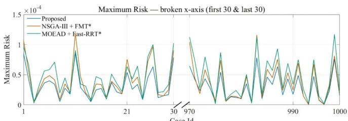

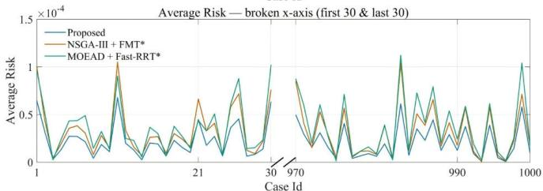

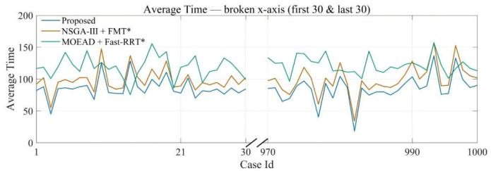  
Fig. 10. Line chart for 1,000 scenarios.

TABLE III  
RESULTS OF THE WILCOXON SIGNED-RANK TEST
<table><tr><td>Metric</td><td>Method</td><td>95% CI</td><td> $r = \frac { Z } { \sqrt { n } }$ </td></tr><tr><td>Max</td><td>N+F</td><td> $[ - 5 . 9 { \times } 1 0 ^ { - 6 } , - 4 . 7 { \times } 1 0 ^ { - 6 } ]$ </td><td>-0.80</td></tr><tr><td rowspan="2">Risk Average</td><td>M+Fa</td><td> $[ - 1 2 . 5 { \times } 1 0 ^ { - 6 } , - 1 0 . 9 { \times } 1 0 ^ { - 6 } ]$ </td><td>-0.84</td></tr><tr><td>N+F</td><td> $[ - 8 . 8 { \times } 1 0 ^ { - 6 } , - 7 . 6 { \times } 1 0 ^ { - 6 } ]$ </td><td>-0.86</td></tr><tr><td rowspan="2">Risk</td><td>M+Fa</td><td> $[ - 1 2 . 4 { \times } 1 0 ^ { - 6 } , - 1 0 . 7 { \times } 1 0 ^ { - 6 } ]$ </td><td>-0.85</td></tr><tr><td></td><td> $[ - 1 3 . 5 4 , - 1 2 . 8 9 ]$ </td><td></td></tr><tr><td>Average Time</td><td>N+F M+Fa</td><td> $[ - 3 5 . 4 2 , - 3 2 . 5 7 ]$ </td><td>-0.87 -0.85</td></tr></table>

Note: N+F:NSGA-III+FMT\*, M+Fa:MOEA/D+Fast RRT\*

A scenario with fewer orders was selected for demonstration, to ensure clear visibility of trajectories in the visualization. The experiment was set up with 10 heterogeneous UAVs and 25 orders. The parameters for the heterogeneous UAVs are shown in Table IV, and the parameters for the orders are shown in Table V. The coordinates of the UAV delivery center were (31, 33, 3), and task allocation and trajectory planning were performed for the UAVs.

TABLE IV  
PARAMETERS OF HETEROGENEOUS UAVS
<table><tr><td>UAV</td><td>Speed m/s</td><td>Carrying capacity</td><td>UAV</td><td>Speed m/s</td><td>Carrying capacity</td></tr><tr><td>U1</td><td>6</td><td>2</td><td>U6</td><td>7</td><td>3</td></tr><tr><td>U2</td><td>9</td><td>2</td><td>U7</td><td>8</td><td>2</td></tr><tr><td>U3</td><td>9</td><td>3</td><td>U8</td><td>7</td><td>3</td></tr><tr><td>U4</td><td>8</td><td>3</td><td>U9</td><td>6</td><td>2</td></tr><tr><td>U5</td><td>9</td><td>3</td><td>U10</td><td>8</td><td>3</td></tr></table>

TABLE V  
PARAMETERS OF ORDERS
<table><tr><td>Order</td><td>Position</td><td>Time Order window /s</td><td>Position</td><td>Time window /s</td></tr><tr><td>T1</td><td>(5, 5, 3)</td><td>[0,263] T14</td><td>(41,8, 3)</td><td>[0,161]</td></tr><tr><td>T2</td><td>(17, 52,3)</td><td>[0,172]</td><td>T15 (18,34, 3)</td><td>[0,325]</td></tr><tr><td>T3</td><td>(36, 17, 3)</td><td>[0,320]</td><td>T16</td><td>(14, 5, 3) [0,158]</td></tr><tr><td>T4</td><td>(17, 34, 3)</td><td>[0,319]</td><td>T17 (5, 34, 3)</td><td>[0,156]</td></tr><tr><td>T5</td><td>(12,42, 3)</td><td>[0,207]</td><td>T18 (5, 5, 3)</td><td>[0,175]</td></tr><tr><td>T6</td><td>(27,38, 3)</td><td>[0,142]</td><td>T19 (36, 17, 3)</td><td>[0,377]</td></tr><tr><td>T7</td><td>(17,52,3)</td><td>[0,277]</td><td>T20 (17,52, 3)</td><td>[0,305]</td></tr><tr><td>T8</td><td></td><td></td><td></td><td>[0,334]</td></tr><tr><td></td><td>(5, 5, 3)</td><td>[0,323]</td><td>T21 (12, 42,3)</td><td></td></tr><tr><td>T9</td><td>(12, 42, 3)</td><td>[0,161]</td><td>T22 (47, 6, 3)</td><td>[0,356]</td></tr><tr><td>T10</td><td>(12,42, 3)</td><td>[0,120]</td><td>T23 (36, 17, 3)</td><td>[0,216]</td></tr><tr><td>T11</td><td>(41,8, 3)</td><td>[0,298]</td><td>T24 (36, 17, 3)</td><td>[0,184]</td></tr><tr><td>T12</td><td>(49, 5, 3)</td><td>[0,328]</td><td>T25 (30,8,3)</td><td>[0,346]</td></tr><tr><td>T13</td><td>(49, 5, 3)</td><td>[0,215]</td><td></td><td></td></tr></table>

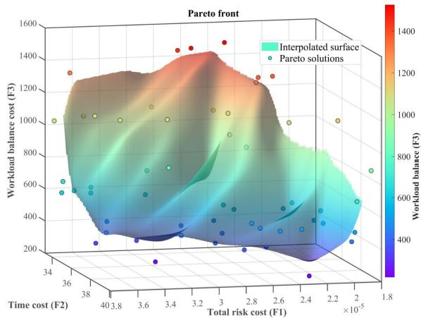  
Fig. 11. Three-dimensional pareto front.

The population size for TC-NSGA-III was set to 60, with a crossover ratio of 0.4 and a mutation ratio of 0.2, over 80 iterations. The three-dimensional Pareto front plane obtained from the experiment is illustrated in Fig. 11.

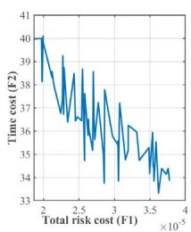

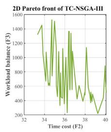  
Fig. 12. Two-dimensional pareto front.

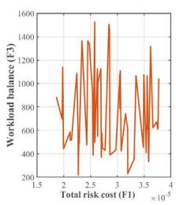

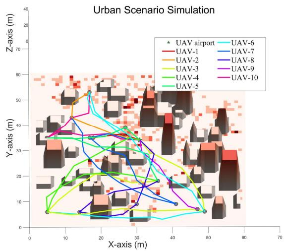  
Fig. 13. Schematic diagram of urban scenario simulation.

To facilitate analysis, based on the analysis strategy for the solution set outlined above, pairwise Pareto fronts between the task objectives were plotted, as shown in Fig. 12.

Although each Pareto solution holds reference value, selecting the final solution requires a comprehensive consideration of trade-ofs among the task objectives. In this task, the risk objective is set as the primary optimization goal. Therefore, under the condition of setting the total risk threshold as the median risk value of $2 . 6 3 7 1 \times 1 0 ^ { - 5 }$ in the solution set, the time cost is chosen as the secondary optimization goal, and the workload cost as the tertiary optimization goal. The normalized Euclidean distance method is employed to identify the solution closest to the ideal point, which is then selected as the final solution.

Based on the method, the solution with the optimal time cost and workload under the risk threshold was selected, which is $[ 2 . 6 3 4 5 \times 1 0 ^ { - 5 }$ , 36.5099, 5.4919], as shown in Fig. 12. In the urban scenario, all 25 orders were allocated among the 10 UAVs, and trajectory planning was conducted according to the delivery sequence. as shown in Fig. 13.

Fig. 14 illustrates the task allocation and sequence for the ten UAVs. Due to slower speed and smaller task load capacity of UAV1 and UAV9, they were assigned fewer tasks to achieve the secondary optimization goal of minimizing time cost. Additionally, they were allocated orders with longer travel distances to ensure a relatively balanced workload among the UAVs.

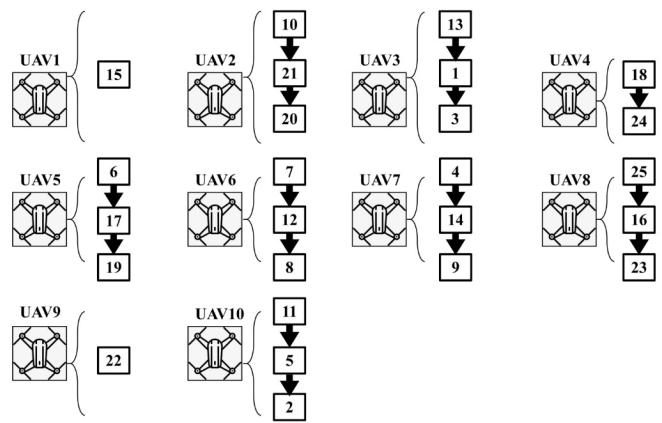  
Fig. 14. Task allocation and execution sequence diagram.

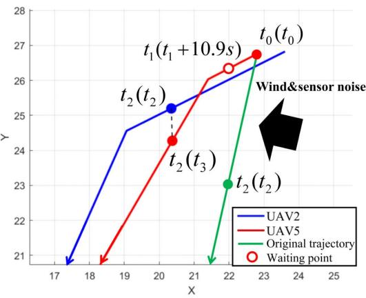  
Fig. 15. Schematic diagram of conflict resolution.

After task allocation, conflict detection is also required. A special scenario is simulated: UAV5 is afected by wind and sensor errors at time $t _ { 0 } ,$ causing trajectory deviation, and resulting in spatiotemporal conflict with UAV2 at time t<sub>2</sub>. When a conflict between the two UAVs is detected, a conflict resolution strategy will be triggered. As shown in Fig. 15, there is a conflict between UAV2 and UAV5, which has deviated from its path. According to the first-come-first-served principle, the later-arriving UAV5 needs to wait at time $t _ { 1 }$ outside the safety distance. In this paper, the safety distance is a preset bufer to prevent UAV collisions, set at 10 meters based on their speed.

The waiting time is equivalent to the trajectory length from the position at time $t _ { 1 }$ to the position at time $t _ { 2 }$ divided by its own speed, i.e., a wait of 10.9 seconds is required, ultimately resulting in UAV5 reaching its original $t _ { 2 }$ time at $t _ { 3 } ,$ , thereby preventing the conflict.

## V. CONCLUSION

This paper proposes a bi-level optimization framework that integrates TC-NSGA-III and RG-FMT<sup>∗</sup> for multi-UAV cooperative path planning in urban ultra-low-altitude logistics. The upper level employs the TC-NSGA-III algorithm to jointly optimize overall ground risk, total time cost, and workload balance. The lower level utilizes the RG-FMT<sup>∗</sup> algorithm, considering the TLS constraints under the objective of the shortest path. Experimental validations have been conducted from aspects such as trajectory planning, framework performance under task metrics, and urban scenario simulations, demonstrating the feasibility of the proposed framework.

Finally, a discussion on the limitations of this paper is presented. The assumptions in this paper are based on a static environment, and the applicable scenarios primarily involve global scheduling and planning during the strategic phase. It does not consider potential non-cooperative targets such as flying birds. The conflict resolution method presented in this paper is better suited for “last-mile” neighborhood scenarios. If applied directly in dense urban logistics networks, it might lead to excessive UAV queuing, potentially triggering a domino efect and causing congestion. Moreover, the dynamic characteristics of UAVs have been simplified in this work. Although energy eficiency is considered indirectly from the perspective of the shortest path, it is not discussed directly. These issues will be considered and studied in subsequent research.

## REFERENCES

[1] H. Pak et al., “Can urban air mobility become reality? Opportunities and challenges of UAM as innovative mode of transport and DLR contribution to ongoing research,” CEAS Aeronaut. J., vol. 16, no. 3, pp. 665–695, Jul. 2025, doi: 10.1007/s13272-024-00733-x.

[2] H. Xu et al., “A survey on UAV applications in smart city management: Challenges, advances, and opportunities,” IEEE J. Sel. Topics Appl. Earth Observ. Remote Sens., vol. 16, pp. 8982–9010, 2023, doi: 10.1109/JSTARS.2023.3317500.

[3] L. D. Ortega, E. S. Loyaga, P. J. Cruz, H. P. Lema, J. Abad, and E. A. Valencia, “Low-cost computer-vision-based embedded systems for UAVs,” Robotics, vol. 12, no. 6, p. 145, Oct. 2023, doi: 10.3390/ robotics12060145.

[4] M. Rinaldi, S. Primatesta, M. Bugaj, J. Rosta´s, and G. Guglieri,ˇ “Development of heuristic approaches for last-mile delivery TSP with a truck and multiple drones,” Drones, vol. 7, no. 7, p. 407, Jun. 2023, doi: 10.3390/drones7070407.

[5] J. Yan, W. Daobo, B. Tingting, and Y. Zongyuan, “Multi-UAV objective assignment using Hungarian fusion genetic algorithm,” IEEE Access, vol. 10, pp. 43013–43021, 2022, doi: 10.1109/ACCESS.2022.3168359.

[6] Z. Ma and J. Chen, “Multi-UAV urban logistics task allocation method based on MCTS,” Drones, vol. 7, no. 11, p. 679, Nov. 2023, doi: 10.3390/drones7110679.

[7] H. Poursiami and B. Jabbari, “On multi-task learning for energy eficient task ofloading in multi-UAV assisted edge computing,” in Proc. IEEE Wireless Commun. Netw. Conf. (WCNC), Dubai, United Arab Emirates, Apr. 2024, pp. 1–6, doi: 10.1109/WCNC57260.2024.10571164.

[8] X. Wu, Y. Yin, L. Xu, X. Wu, F. Meng, and R. Zhen, “MULTI-UAV task allocation based on improved genetic algorithm,” IEEE Access, vol. 9, pp. 100369–100379, 2021, doi: 10.1109/ACCESS.2021.3097094.

[9] W. Yafei and Z. Liang, “Improved multi-objective particle swarm optimization algorithm based on area division with application in multi-UAV task assignment,” IEEE Access, vol. 11, pp. 123519–123530, 2023, doi: 10.1109/ACCESS.2023.3328344.

[10] M. Yan, H. Yuan, J. Xu, Y. Yu, and L. Jin, “Task allocation and route planning of multiple UAVs in a marine environment based on an improved particle swarm optimization algorithm,” EURASIP J. Adv. Signal Process., vol. 2021, no. 1, Oct. 2021, Art. no. 94, doi: 10.1186/ s13634-021-00804-9.

[11] M. Zhao and D. Li, “Collaborative task allocation of heterogeneous multi-unmanned platform based on a hybrid improved contract net algorithm,” IEEE Access, vol. 9, pp. 78936–78946, 2021, doi: 10.1109/ ACCESS.2021.3084238.

[12] Y. Ma, B. Li, W. Huang, and Q. Fan, “An improved NSGA-II based on multi-task optimization for multi-UAV maritime search and rescue under severe weather,” J. Mar. Sci. Eng., vol. 11, no. 4, p. 781, Apr. 2023, doi: 10.3390/jmse11040781.

[13] J. Zhu, X. Wang, H. Huang, S. Cheng, and M. Wu, “A NSGA-II algorithm for task scheduling in UAV-enabled MEC system,” IEEE Trans. Intell. Transp. Syst., vol. 23, no. 7, pp. 9414–9429, Jul. 2022, doi: 10.1109/TITS.2021.3120019.

[14] M. Liang, W. Wu, W. Zhang, and S. Yao, “Multi-UAV continuous power inspection scheduling algorithm based on NSGA-III,” in Proc. Int. Conf. Intell. Robot. Autom. Control (IRAC), Guangzhou, China, Nov. 2024, pp. 173–178, doi: 10.1109/irac63143.2024.10871855.

[15] X. Gao et al., “Conditional probability based multi-objective cooperative task assignment for heterogeneous UAVs,” Eng. Appl. Artif. Intell., vol. 123, Aug. 2023, Art. no. 106404, doi: 10.1016/ j.engappai.2023.106404.

[16] G. Zhao, J. Wang, Z. Meng, Z. Wang, H. Fu, and C. Jiang, “Energy-eficient path planning and task allocation for multi-droneaided IoT cluster-based data collection,” IEEE Trans. Aerosp. Electron. Syst., vol. 61, no. 5, pp. 14177–14191, Oct. 2025, doi: 10.1109/ TAES.2025.3582920.

[17] Z. Liu, L. Li, X. Zhang, W. Tang, Z. Yang, and X. Yang, “Considering both energy efectiveness and flight safety in UAV trajectory planning for intelligent logistics,” Veh. Commun., vol. 52, Apr. 2025, Art. no. 100885, doi: 10.1016/j.vehcom.2025.100885.

[18] M. Moshref-Javadi and M. Winkenbach, “Applications and research avenues for drone-based models in logistics: A classification and review,” Expert Syst. Appl., vol. 177, Sep. 2021, Art. no. 114854, doi: 10.1016/j.eswa.2021.114854.

[19] O. Feng, H. Zhang, W. Tang, F. Wang, D. Feng, and G. Zhong, “Digital low-altitude airspace unmanned aerial vehicle path planning and operational capacity assessment in urban risk environments,” Drones, vol. 9, no. 5, p. 320, Apr. 2025, doi: 10.3390/drones9050320.

[20] J. Liu, Y. Yan, Y. Yang, and J. Li, “An improved artificial potential field UAV path planning algorithm guided by RRT under environmentaware modeling: Theory and simulation,” IEEE Access, vol. 12, pp. 12080–12097, 2024, doi: 10.1109/ACCESS.2024.3355275.

[21] Y. Chen et al., “Sampling-focused marching tree: Optimal planning based on minimized topological refinement and homotopyheuristic exploration,” IEEE/ASME Trans. Mechatronics, vol. 30, no. 5, pp. 3449–3460, Oct. 2025, doi: 10.1109/TMECH.2024.3462506.

[22] P. Zhang, Y. He, Z. Wang, S. Li, and Q. Liang, “Research on multi-UAV obstacle avoidance with optimal consensus control and improved APF,” Drones, vol. 8, no. 6, p. 248, Jun. 2024, doi: 10.3390/drones8060248.

[23] M. Haris, D. M. S. Bhatti, and H. Nam, “A fast-convergent hyperbolic tangent PSO algorithm for UAVs path planning,” IEEE Open J. Veh. Technol., vol. 5, pp. 681–694, 2024, doi: 10.1109/OJVT.2024.3391380.

[24] W. Gao, Q. Tang, J. Yao, Y. Yang, and D. Yu, “Heuristic bidirectional fast marching tree for optimal motion planning,” in Proc. 3rd Asia Pacific Conf. Intell. Robot Syst. (ACIRS), Singapore, Jul. 2018, pp. 71–77, doi: 10.1109/ACIRS.2018.8467243.

[25] M. Rinaldi, S. Primatesta, M. Bugaj, J. Rosta´s, and G. Guglieri, “Urbanˇ air logistics with unmanned aerial vehicles (UAVs): Double-chromosome genetic task scheduling with safe route planning,” Smart Cities, vol. 7, no. 5, pp. 2842–2860, Oct. 2024, doi: 10.3390/smartcities7050110.

[26] F. Hong, G. Wu, Q. Luo, H. Liu, X. Fang, and W. Pedrycz, “Logistics in the sky: A two-phase optimization approach for the drone package pickup and delivery system,” IEEE Trans. Intell. Transp. Syst., vol. 24, no. 9, pp. 9175–9190, Sep. 2023, doi: 10.1109/TITS.2023.3271430.

[27] F. Yan, J. Chu, J. Hu, and X. Zhu, “Cooperative task allocation with simultaneous arrival and resource constraint for multi-UAV using a genetic algorithm,” Expert Syst. Appl., vol. 245, Jul. 2024, Art. no. 123023, doi: 10.1016/j.eswa.2023.123023.

[28] F. Wang and Q. Yang, “Two-layer task planning method for multi-UAV logistics distribution,” J. Beijing Univ. Aeronaut. Astronaut., vol. 52, no. 1, pp. 94–103, 2026, doi: 10.13700/j.bh.1001-5965.2023.0719.

[29] Y. Xinyong et al., “Carrier platform-enhanced multiple-UAV cooperative task assignment with dual heterogeneities,” Artif. Intell. Rev., vol. 58, no. 8, p. 248, May 2025, doi: 10.1007/s10462-025-11254-2.

[30] J. Jin et al., “Cross-platform mission planning for UAVs under carrier delivery mode,” Defence Technol., vol. 53, Nov. 2025, Art. no. S2214914725002089, doi: 10.1016/j.dt.2025.06.025.

[31] J. Wen, F. Wang, and Y. Su, “A bi-layer collaborative planning framework for multi-UAV delivery tasks in multi-depot urban logistics,” Drones, vol. 9, no. 7, p. 512, Jul. 2025, doi: 10.3390/drones9070512.

[32] K. Deb and H. Jain, “An evolutionary many-objective optimization algorithm using reference-point-based nondominated sorting approach, part I: Solving problems with box constraints,” IEEE Trans. Evol. Comput., vol. 18, no. 4, pp. 577–601, Aug. 2014, doi: 10.1109/ TEVC.2013.2281535.

[33] K. Deb, A. Pratap, S. Agarwal, and T. Meyarivan, “A fast and elitist multiobjective genetic algorithm: NSGA-II,” IEEE Trans. Evol. Comput., vol. 6, no. 2, pp. 182–197, Apr. 2002, doi: 10.1109/4235.996017.

[34] L. Janson, E. Schmerling, A. Clark, and M. Pavone, “Fast marching tree: A fast marching sampling-based method for optimal motion planning in many dimensions,” Int. J. Robot. Res., vol. 34, no. 7, pp. 883–921, Jun. 2015, doi: 10.1177/0278364915577958.

[35] J. A. Sethian, “Fast marching methods,” SIAM Rev., vol. 41, no. 2, pp. 199–235, Jan. 1999.

[36] S. Karaman and E. Frazzoli, “Sampling-based algorithms for optimal motion planning,” Int. J. Robot. Res., vol. 30, no. 7, pp. 846–894, Jun. 2011.

[37] Y. Zhu, X. Zhang, Y. Li, Y. Liu, and J. Ma, “Grid matrix-based ground risk map generation for unmanned aerial vehicles in urban environments,” Drones, vol. 8, no. 11, p. 678, Nov. 2024, doi: 10.3390/ drones8110678.

[38] S. Primatesta, A. Rizzo, and A. la Cour-Harbo, “Ground risk map for unmanned aircraft in urban environments,” J. Intell. Robotic Syst., vol. 97, nos. 3–4, pp. 489–509, Mar. 2020, doi: 10.1007/s10846-019- 01015-z.

[39] X. Hu, B. Pang, F. Dai, and K. H. Low, “Risk assessment model for UAV cost-efective path planning in urban environments,” IEEE Access, vol. 8, pp. 150162–150173, 2020, doi: 10.1109/ACCESS.2020.3016118.

[40] F. Batista e Silva, J. Gallego, and C. Lavalle, “A high-resolution population grid map for Europe,” J. Maps, vol. 9, no. 1, pp. 16–28, Mar. 2013.

[41] Y. Zheng, Y. Li, J. Cheng, C. Li, and S. Hu, “Two-stage hierarchical 4D low-risk trajectory planning for urban air logistics,” Drones, vol. 9, no. 4, p. 267, Mar. 2025, doi: 10.3390/drones9040267.

[42] Q. Jiao et al., “Ground risk assessment for unmanned aircraft systems based on dynamic model,” Drones, vol. 6, no. 11, p. 324, Oct. 2022, doi: 10.3390/drones6110324.

[43] A. Pilko, A. Sobester, J. P. Scanlan, and M. Ferraro, “Spatiotemporal´ ground risk mapping for uncrewed aerial systems operations,” in Proc. AIAA SCITECH Forum, San Diego, CA, USA, Jan. 2022, Paper AIAA 2022-1915, doi: 10.2514/6.2022-1915.

[44] EASA. (Mar. 2024). Guidelines for the Assessment of the Critical Area of an Unmanned Aircraft. [Online]. Available: https:// www.easa.europa.eu/en/domains/drones-air-mobility/operating-drone/ specific-category-civil-drones/specific-operations-risk-assessment-sora

[45] H. A. P. Blom, C. Jiang, W. B. A. Grimme, M. Mitici, and Y. S. Cheung, “Third party risk modelling of unmanned aircraft system operations, with application to parcel delivery service,” Rel. Eng. Syst. Saf., vol. 214, Oct. 2021, Art. no. 107788, doi: 10.1016/j.ress.2021.107788.

[46] EASA. (2025). Special Condition Light UAS. [Online]. Available: https://www.easa.europa.eu/en/document-library/product-certificationconsultations/special-condition-light-uas

[47] K. Dalamagkidis, K. P. Valavanis, and L. A. Piegl, “Evaluating the risk of unmanned aircraft ground impacts,” in Proc. 16th Medit. Conf. Control Autom., Ajaccio, France, Jun. 2008, pp. 709–716, doi: 10.1109/ MED.2008.4602249.

[48] J. Fan, X. Chen, and X. Liang, “UAV trajectory planning based on bidirectional APF-RRT\* algorithm with goal-biased,” Expert Syst. Appl., vol. 213, Mar. 2023, Art. no. 119137, doi: 10.1016/j.eswa.2022.119137.

[49] Q. Li, J. Wang, H. Li, B. Wang, and C. Feng, “Fast-RRT\*: An improved motion planner for mobile robot in two-dimensional space,” IEEJ Trans. Electr. Electron. Eng., vol. 17, no. 2, pp. 200–208, Feb. 2022, doi: 10.1002/tee.23502.

[50] J. D. Gammell, S. S. Srinivasa, and T. D. Barfoot, “Informed RRT\*: Optimal sampling-based path planning focused via direct sampling of an admissible ellipsoidal heuristic,” in Proc. IEEE/RSJ Int. Conf. Intell. Robots Syst., Sep. 2014, pp. 2997–3004, doi: 10.1109/ IROS.2014.6942976.

[51] S. Primatesta, “A 2.5D risk-aware path planning method for safe UAS operations in populated environments,” in Proc. Int. Conf. Unmanned Aircr. Syst. (ICUAS), Jun. 2024, pp. 865–872, doi: 10.1109/ icuas60882.2024.10556980.

[52] (2025). Baidu Map Trafic Congestion Index: Urban Realtime. [Online]. Available: https://jiaotong.baidu.com/congestion/city/ urbanrealtime?cityCode=53

[53] Q. Zhang and H. Li, “MOEA/D: A multiobjective evolutionary algorithm based on decomposition,” IEEE Trans. Evol. Comput., vol. 11, no. 6, pp. 712–731, Dec. 2007, doi: 10.1109/TEVC.2007.892759.

[54] R. Jiao, S. Zeng, C. Li, S. Yang, and Y.-S. Ong, “Handling constrained many-objective optimization problems via problem transformation,” IEEE Trans. Cybern., vol. 51, no. 10, pp. 4834–4847, Oct. 2021, doi: 10.1109/TCYB.2020.3031642.

[55] H. Li and Q. Zhang, “Multiobjective optimization problems with complicated Pareto sets, MOEA/D and NSGA-II,” IEEE Trans. Evol. Comput., vol. 13, no. 2, pp. 284–302, Apr. 2009, doi: 10.1109/ TEVC.2008.925798.

[56] M. Fan, J. Chen, Z. Xie, H. Ouyang, S. Li, and L. Gao, “Improved multiobjective diferential evolution algorithm based on a decomposition strategy for multi-objective optimization problems,” Sci. Rep., vol. 12, no. 1, p. 21176, Dec. 2022, doi: 10.1038/s41598-022-25440-7.

[57] W. Chu et al., “An improved RRT\* algorithm for multi-objective optimization based on NSGA-III,” in Proc. 8th Int. Conf. Robot. Autom. Sci. (ICRAS), Jun. 2024, pp. 55–65, doi: 10.1109/ icras62427.2024.10654473.

  
Bo Jiang received the B.Sc. degree in computer technology and applications from the University of Electronic Science and Technology of China and the M.Sc. degree in transportation planning and management from Southwest Jiaotong University. He is currently a Professor with the Civil Aviation Flight University of China. His research interests include next-generation air trafic management systems, UAV operational risk assessment, and the enhancement of autonomous driving capabilities for UAVs.


Yichao Li is currently pursuing the master’s degree in transportation engineering with the College of Air Trafic Management, Civil Aviation Flight University of China. His research interests include UAV path planning and multi-objective optimization.


Chenglong Li received the bachelor’s and master’s degrees in navigation, guidance, and control from Zhejiang University. He is currently pursuing the Ph.D. degree with Beihang University. He is the Vice Dean and an Associate Professor of the Flight Technology College, Civil Aviation Flight University of China. He also acts as a member of the Safety Risk Management Working Group (WG-SRM) with the Joint Authorities for Rulemaking on Unmanned Systems (JARUS). His primary research interests focus on low-altitude operational safety and risk

assessment and the intelligent development of low-altitude aerial vehicles.


Yuan Zheng received the B.Sc. degree from Guangxi University in 2015, the M.Sc. degree from Illinois Institute of Technology in 2016, and the Ph.D. degree from Zhejiang University in 2021. He is currently a Lecturer with the School of Computer Science, Civil Aviation Flight University of China. His current research interests revolve around path planning and optimization.