# Blockchain-Integrated UAV-Assisted Mobile Edge Computing: Trajectory Planning and Resource Allocation

Die Wang , Graduate Student Member, IEEE, Yunjian Jia , Member, IEEE, Mianxiong Dong , Member, IEEE, Kaoru Ota , Member, IEEE, and Liang Liang

Abstract—The unmanned aerial vehicle (UAV)-assisted mobile edge computing (MEC) networks exist security and privacy issues on task offloading, which can not be tackled by conventional security mechanisms. In this article, we consider consortium blockchain combined with UAV-assisted MEC networks to overcome these challenges. An improved Delegated Proof of Stake (DPoS) consensus scheme is designed in which the UAVs act as light nodes to collect the tasks and verify their signatures from the ground users to form the initial block and then offload it to the ground blockchain nodes for final block generation. We ensure the trustworthiness of the ground blockchain nodes through voting by the reputation incentive mechanism. The two-stage the UAV and ground blockchain nodes by jointly optimizing the trajectory and communication resource allocation of the UAV and computing resource allocation of the ground blockchain nodes. Furthermore, we analyze the Stackelberg equilibrium by the backward induction and adopt the approximate convex algorithm (SCA) to approximate the non-convex problem solving. Simulation results demonstrate the effectiveness of the developed scheme for trusted management and superior delay.

Index Terms—Consortium blockchain, unmanned aerial vehicle, mobile edge computing (MEC), Stackelberg game, task offloading, approximate convex algorithm (SCA).

# I. INTRODUCTION

W ITH the fast-growing of the mobile Internet, a widerange of new applications for mobile devices have gradually appeared in people’s lives. The complex applications

Manuscript received 26 December 2022; revised 18 May 2023; accepted 22 July 2023. Date of publication 21 August 2023; date of current version 17 January 2024. This work was supported in part by the National Natural Science Foundation of China under Grants 61971077 and 62071075, in part by China Scholarship Council under Grant 202206050051, in part by JSPS KAKENHI under Grants JP20H04174 and JP22K11989, in part by the Leading Initiative for Excellent Young Researchers (LEADER), MEXT, Japan, and in part by JST, PRESTO, Japan, under Grant JPMJPR21P3. The review of this article was coordinated by Prof. Ju Ren. (Corresponding authors: Yunjian Jia; Mianxiong Dong.)

Die Wang is with the School of Microelectronics and Communication Engineering, Chongqing University, Chongqing 400044, China, and also with Muroran Institute of Technology, Muroran 050-0071, Japan (e-mail: wangdie@cqu.edu.cn).

Yunjian Jia and Liang Liang are with the School of Microelectronics and Communication Engineering, Chongqing University, Chongqing 400044, China (e-mail: yunjian@cqu.edu.cn; liangliang@cqu.edu.cn).

Mianxiong Dong and Kaoru Ota are with the Department of Sciences and Informatics, Muroran Institute of Technology, Muroran 050-0071, Japan (email: mx.dong@csse.muroran-it.ac.jp; ota@csse.muroran-it.ac.jp).

Digital Object Identifier 10.1109/TVT.2023.3306740

such as mobile payments, smart home, mobile gaming, and augmented reality (AR) place stricter demands on the execution delay and the resource capacity of mobile devices [1]. The mobile edge computing (MEC) as an elevation of the cloud computing is therefore proposed in 2014 [2] to break through the resource constraints for mobile devices and provide high quality of service (QoS) for mobile users [3], [4]. However, in extreme and unattended scenarios such as earthquakes and mountains where the infrastructures are destroyed or distributed sparsely, the traditional terrestrial MEC networks can not provide reliable communication for mobile users [5]. To effectively solve the above problems, the unmanned aerial vehicles (UAVs) can be introduced to de-assist the MEC networks.

The UAVs offer easy deployment, mobile flexibility, and lineof-sight (LoS) connectivity to extend communication coverage while providing on-demand edge services to mobile users [6], [7]. However, there are some potentially problematic issues due to the open nature of computing offloading in UAV-assisted MEC networks. Both the interaction of information and the migration of computing tasks between mobile users and UAVs leave the mobile users’ privacy potentially open to compromise [8]. In addition, security is often cited as another critical issue, especially, e.g., single point of failure and distributed denial of service (DDoS) attacks owing to the central node in the UAV network layer being vulnerable to cyber attacks [9]. Blockchain consists of lists of data connected by cryptographic hashes that are recorded in a completely decentralized, transparent, and secure manner [10], [11]. To this end, enabled by the inspiring features of blockchain, the integration of blockchain into UAV-assisted MEC networks is envisioned as a promising solution.

Despite the far-reaching implications of the blockchainintegrated UAV-assisted MEC networks, several challenges still need to be resolved. Firstly, there may be malicious and dishonest edge nodes in the network who intend to break the block generation. Determining and maintaining the long-term reliability of edge nodes by improving blockchain technology when performing block consensus is one challenge to be solved. Secondly, since the resources of UAVs and edge servers are usually limited, high QoS cannot be provided to mobile users without proper trajectory planning and resource allocation. Therefore, the delay-aware UAV trajectory and node resource allocation is another challenge for blockchain-integrated UAV-assisted MEC networks. Thirdly, for all entities to appropriately receive profits based on their contributions so that they are willing to participate, the splitting and quantification of profits between UAVs and ground blockchain nodes (primary node and validation nodes) must be addressed. In addition, no corresponding studies currently consider all three of these points simultaneously in the blockchain-integrated UAV-assisted MEC networks.

Motivated by these challenges, we investigate the blockchainintegrated UAV-assisted MEC networks. The UAVs collect the task data from the ground users and pack them as transactions to form the initial block, which is offloaded to the ground blockchain nodes to generate the final block according to the designed trajectory under the ground users’ requirements. For each block generation cycle, the ground blockchain nodes selected from the BSs under the designed reputation mechanism will allocate computing resources to execute block consensus to obtain the rewards given by the UAV after receiving the information about the trajectory and the allocated communication resources of the UAV. The main contributions of this article are summarized as follows.

Due to the potential threats of traditional DPoS consensus schemes such as stakeholder voting collusion, an improved DPoS consensus scheme in blockchain-integrated UAVassisted MEC systems is proposed. Unlike the traditional DPoS scheme, the proposed scheme in which the BSs are voted through the reputation mechanism and then collaborate with the UAV as the blockchain nodes to generate blocks to ensure the security and privacy of task offloading between the mobile users and the UAV.   
A joint optimization model based on the trajectory planning of the UAV and the resource allocation of blockchain nodes is developed to achieve a trade-off between energy consumption, offload latency, and consensus reward, where the consensus reward received by the ground blockchain nodes is closely related to the computational resources allocated and the number of ground blockchain nodes performing the task in each time slot, in addition to being constrained by its computational power and the mechanical operation of the UAV.   
The optimization problem is formulated as a two-stage Stackelberg game problem to maximize the utility function of the UAV and the ground blockchain nodes, respectively. We employ backward induction for the analysis to prove that a Nash equilibrium exists in the proposed game. Furthermore, due to the differences in the characteristics of utility functions at each stage, the KKT condition is first introduced to solve the problem for the convexity function. Then we adopt the approximate convex algorithm (SCA) to approximate the non-convex problem-solving.

The rest of this article is organized as follows. In Section II, we discuss the related works. In Section III, we give the network model and introduce the developed DPoS consensus scheme in detailed steps. In Section IV, we formulate the Stackelberg game. Section V analyzes the Stackelberg equilibrium using the backward method, and the corresponding problem-solving methods are presented. In Section VI, we show the performance of jointly optimizing trajectory design and resource allocation in the blockchain-integrated UAV-assisted MEC network through extensive simulations. In Section VII, we conclude this article.

# II. RELATED WORKS

# A. Blockchain-Integrated MEC Network

Recently, the integration of blockchain into MEC has become a promising trend [4], [12], with the characteristic of synchronization, security, and immutability solving the trust issues that exist in the computing resources [13]. The works [14], [15] consider the reputation mechanism introduced into blockchain to assess the trustworthiness of operators in MEC. In [14], Kang et al. study the reputation-based voting mechanism through the multi-weighted subjective logic model. The model considers the frequency, delay, and effect exhibited in the interaction as weights to formulate a local opinion to avoid cheating. In [15], Wang et al. investigate distributed reputation mechanism based on the incorporating effects of the rating effects, behavior, and fading to improve the trustworthiness of consensus nodes. The works [16], [17], [18] investigate the resource allocation for task offloading in blockchain-enabled MEC systems. Jointly optimizing block producer scheduling and resource allocation is studied to improve the successful execution rate per unit time for the blockchain system and the QoS for the MEC system [16], [17]. In [18], Yang et al. propose optimizing the system computing overhead and the device’s energy efficiency by dynamically adjusting the offloading scheduling, including edge server and block size. However, the above work does not consider the system security and resource allocation issues that exist with the introduction of UAVs into the MEC network in the event of a ground communication outage.

# B. UAV-Assisted MEC Network

Due to the attributes of dynamic deployment, hovering, and moving, the UAV has become an indispensable way to extend MEC network coverage [19]. Therefore, some recent works about UAV-assisted MEC networks have been studied [20], [21] [22], [23] . In [20], Xu et al. investigate the dual UAV-assisted MEC networks for the UAV trajectory planning, computing, and communication resource allocation to minimize security and maximize computing capacity under two different access schemes. In [21], Zhang et al. present a novel UAV-assisted MEC network to maximize the quality of experience (QoE) for mobile virtual reality (VR) users by deciding the resource allocation of communication and computing and the distribution of the UAVs. In [22], Wu et al. investigate the pre-dispatch UAV-assisted vehicular edge computing networks (VECNs) system optimizing UAV flight trajectory algorithm based on the demand of vehicles in multiple traffic jams. In [23], Xu et al. propose the UAV-assisted relaying and MEC network for jointly optimizing the resource allocation of computing and communication, task division, and UAV distribution to minimize the task execution delay in the network. None of the above works discusses splitting and distributing profits between the UAVs and ground participants in the proposed UAV-assisted MEC network, which is considered an effective incentive for keeping a long-term stable collaboration. In addition, most of them only focus on improving the QoS for users neglecting how to maintain the reliability of edge resources, which may suffer malicious access from the enemies.

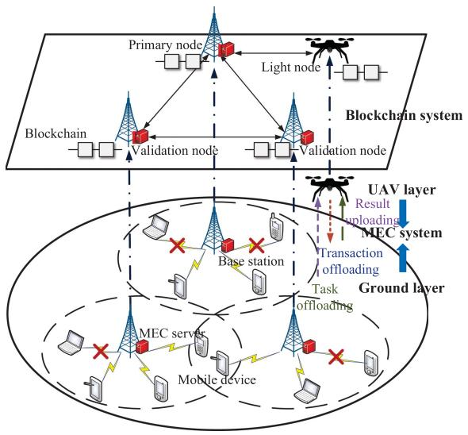

flowchart

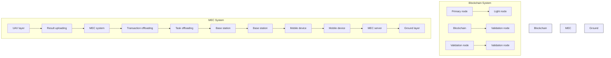

Fig. 1. Illustration of the blockchain-integrated UAV-assisted MEC networks.

# III. SYSTEM MODEL

In this section, we first introduce the overall network model. After that, the UAV communication, transaction consensus, reputation, and incentive models are presented, respectively.

# A. Network Model

As shown in Fig. 1, we consider the blockchain-integrated UAV-assisted MEC networks, which consist of the users, UAV, BSs, and edge computing servers (ECSs). Assume that the ground users are evenly divided into N regions, with each region dispatching at most one UAV. Based on the high reputation priority rule, there are S ground blockchain nodes (a primary node and V validation nodes) in the one-user region selected from the BSs. The set of UAVs and validation nodes can be denoted as $\mathcal { N } = \{ 1 , \ldots , n \cdot \cdot \cdot , N \}$ and $\mathcal { V } = \{ 1 , \ldots , v \cdot \cdot \cdot , V \}$ , = =respectively. Due to the change in location and the limited battery capacity of the UAVs, assume that the next UAV will be dispatched above the user area to maintain contact with the ground to receive users task requests after a certain interval from the previous UAVs transaction offloading.

Each BS is only equipped with an ECS, but the maximum computing capacity varies between UAVs and BSs due to their differences. For simplicity, the BS and its equipped ECS are considered one entity and denoted as the same symbol. The UAVs offload users task requests to ground ECSs due to their limited memory and intermittency. The consortium blockchain [24] with the improved DPoS consensus mechanism is introduced to enhance the security of task offloading. Each ground blockchain node will take turns becoming the primary node in each iteration, and the reselection of the ground blockchain nodes means that the new round of iterations is about to begin. Furthermore, consider the joint optimal trajectory decision and communication allocation of the UAV and the computing resource allocation of the ground blockchain nodes to maximize the utilities of the UAV and the ground blockchain nodes. The main notations in this paper are summarized in Table I.

TABLE I NOTATION DEFINITIONS 

<table><tr><td>Symbol</td><td>Definition</td></tr><tr><td> $n$ </td><td>Index of UAV</td></tr><tr><td> $i$ </td><td>Index of BS</td></tr><tr><td> $v$ </td><td>Index of validation node</td></tr><tr><td> $s$ </td><td>Index of g-blockchain node</td></tr><tr><td> $\mathcal{N}$ </td><td>Set of UAVs, where  $\mathcal{N} = \{1,\cdots ,n,\cdots ,N\}$ </td></tr><tr><td> $\mathcal{I}$ </td><td>Set of BSs, where  $\mathcal{I} = \{1,\cdots ,i,\cdots ,I\}$ </td></tr><tr><td> $\mathcal{V}$ </td><td>Set of validation nodes, where  $\mathcal{V} = \{1,\cdots ,v,\cdots ,V\}$ </td></tr><tr><td> $\mathcal{S}$ </td><td>Set of g-blockchain nodes, where  $\mathcal{S} = \{1,\cdots ,s,\cdots ,S\}$ </td></tr><tr><td> $T_{\max}$ </td><td>Maximum delay limit of transactions</td></tr><tr><td> $K$ </td><td>Number of time slot in a cycle</td></tr><tr><td> $\Delta$ </td><td>Time length of a time slot</td></tr><tr><td> $\overline{X}_{p}$ </td><td>Horizontal coordinate of primary node  $p$ </td></tr><tr><td> $X_{n}(t)$ </td><td>Horizontal coordinate of the UAV  $n$  in time slot  $t$ </td></tr><tr><td> $H$ </td><td>UAV flying altitude</td></tr><tr><td> $v_{n}(t)$ </td><td>Average velocity of the UAV in time slot  $t$ </td></tr><tr><td> $E_{n}^{p}(t)$ </td><td>Propulsion energy consumption of the UAV in time slot  $t$ </td></tr><tr><td> $h_{n,p}(t)$ </td><td>Channel gain for primary node  $p$  in slot  $t$ </td></tr><tr><td> $B_{n,p}$ </td><td>Channel bandwidth for primary node  $p$ </td></tr><tr><td> $R_{n,p}(t)$ </td><td>Date rate for primary node  $p$  in slot  $t$ </td></tr><tr><td> $\sigma_{0}^{2}$ </td><td>Power spectral density of channel noise</td></tr><tr><td> $P_{t}(t)$ </td><td>Transmit power of the UAV in time slot  $t$ </td></tr><tr><td> $N_{B}$ </td><td>Number of transactions in a block</td></tr><tr><td> $\overline{w}$ </td><td>Average size of a transaction</td></tr><tr><td> $T_{n,p}^{tr},T_{p,v}^{tr}$ </td><td>Transmission delay of the UAV  $n$  / primary node  $p$ </td></tr><tr><td> $\chi_{1},\chi_{2},\chi_{3}$ </td><td>CPU-cycle of verifying / executing / hashing transaction</td></tr><tr><td> $f_{v}(t)$ </td><td>CPU-cycle frequency of validation node  $v$  in time slot  $t$ </td></tr><tr><td> $f_{s}(t)$ </td><td>CPU-cycle frequency of g-blockchain node  $s$  in time slot  $t$ </td></tr><tr><td> $E_{v}^{c}(t)$ </td><td>Computing energy of validation node  $v$  in time slot  $t$ </td></tr><tr><td> $E_{p}^{c}(t)$ </td><td>Computing energy of primary node  $p$  in time slot  $t$ </td></tr><tr><td> $T_{p}^{c},T_{v}^{c}$ </td><td>Computing delay of primary node  $p$  / validation node  $v$ </td></tr><tr><td> $T_{total}$ </td><td>Total transaction offloading delay</td></tr><tr><td> $Q_{i}^{\prime},Q_{i}$ </td><td>Reputation of BS  $i$  in last / current iteration</td></tr><tr><td> $\Lambda_{i},\Lambda_{i}^{s}$ </td><td>Reputation increment of BS  $i$  in a iteration / s-th cycle</td></tr><tr><td> $N_{i,c}^{s},n_{i,c}^{s}$ </td><td>Number of complete / correct data by BS  $i$  in s-th cycle</td></tr><tr><td> $N_{\tau,c}^{s},n_{\tau,c}^{s}$ </td><td>Threshold number of complete / correct data in s-th cycle</td></tr><tr><td> $I_{1}^{s},I_{2}^{s},I_{3}^{s}$ </td><td>Timeliness / completeness / accuracy in s-th cycle</td></tr><tr><td> $\rho_{n}(t)$ </td><td>Total reward for g-blockchain nodes by UAV  $n$  in slot  $t$ </td></tr><tr><td> $\phi_{s}(t)$ </td><td>Obtaining reward of g-blockchain node  $s$  in time slot  $t$ </td></tr><tr><td> $\omega(t)$ </td><td>Number of executing g-blockchain nodes in time slot  $t$ </td></tr></table>

# B. UAV Communication Model

In order to plan the flight trajectory efficiently, the maximum time limit $T _ { \mathrm { m a x } }$ of transaction offloading is discretized into K time slots, and the length of each time slot is defined by $\begin{array} { r } { \varDelta = \frac { T _ { \mathrm { m a x } } } { K } } \end{array}$ . Since each time slot is defined as small enough, = the location of the UAV n in time slot t can be approximately fixed. The quality of the communication link from the UAVs to the ground blockchain nodes lies in their locations. In order to represent their locations, a three-dimensional right-angle coordinate system is constructed. For the primary node $p ,$ the horizontal coordinate in time slot t is denoted by $\overline { { { X } } } _ { p } = [ \overline { { { x } } } _ { p } , \overline { { { y } } } _ { p } ] .$ = [ ]For the UAV n, its horizontal location in time slot t is denoted by $X _ { n } ( t ) = [ x _ { n } ( t ) , y _ { n } ( t ) ]$ and its hover height H is set as a ( ) = [ ( ) ( )]constant. The UAV n’s trajectory as one of the optimization variables composes of all UAV n’s locations during transaction offloading, i.e., $X _ { n } = [ X _ { n } ( 1 ) ; . . . ; X _ { n } ( t ) ]$ . The propulsion = [ ( ); ; ( )]energy consumption of the UAV n is determined by two components, including profiling power and induction power, where $\begin{array} { r } { c _ { 1 } = \frac { \delta _ { e } } { 8 } \rho s A \varOmega _ { e } ^ { 3 } R _ { e } ^ { 3 } + \kappa _ { p } \frac { ( \bar { M _ { U A V } } g ) ^ { 3 / 2 } } { \sqrt { 2 \rho A } } } \end{array}$ and $\begin{array} { r } { c _ { 2 } = \frac { 3 \delta _ { e } } { 8 \varOmega _ { e } ^ { 2 } R _ { e } ^ { 2 } } \rho s A \varOmega _ { e } ^ { 3 } R _ { e } ^ { 3 } } \end{array}$ = + = [25], [26], [27], [28]. The average speed and the propulsion energy consumption of the UAV n in time slot t can be expressed

as

$$
v _ {n} (t) = \frac {X _ {n} (t) - X _ {n} (t - 1)}{\Delta}, \tag {1}
$$

$$
E _ {n} ^ {p} (t) = \Delta \left(c _ {1} + c _ {2} \left\| v _ {n} (t) \right\| _ {2} ^ {2}\right). \tag {2}
$$

The velocity $v _ { n } ( t )$ is governed by the maximum velocity magnitude, i.e., $v _ { \mathrm { m a x } }$ ). The channel quality is directly related to the distance between the UAV n and the primary node p. We consider the channel gain based on the free-space path loss model, and the channel gain $h _ { n , p }$ between the UAV n and the primary node $p$ in time slot t can be expressed as

$$
h _ {n, p} (t) = \frac {g _ {0}}{\left\| X _ {n} (t) - \overline {{X}} _ {p} \right\| _ {2} ^ {2} + H ^ {2}}, \tag {3}
$$

where $\| \cdot \| _ { 2 }$ represents the L2 criterion. Let $g _ { 0 }$ denote the reference path gain at a distance $d _ { 0 } = 1$ . Consider the channel =orthogonal access scheme in that each blockchain node occupies a sub-channel. Let $B _ { n , p }$ denote the channel bandwidth between the UAV n and the primary node $p ,$ the data transmission rate $R _ { n , p } ( t )$ from the UAV n to the primary node p in time slot t can be expressed as

$$
R _ {n, p} (t) = B _ {n, p} \log_ {2} \left(1 + \frac {h _ {n , p} (t) P _ {t} (t)}{\sigma_ {0} ^ {2} B _ {n , p}}\right), \tag {4}
$$

where $P _ { t } ( t )$ is the UAV transmitted power with energy consumption $E _ { n } ^ { t } ( t ) = \varDelta P _ { t } ( t )$ in time slot t and $\sigma _ { 0 } ^ { 2 }$ is the noise power spectral density.

Assume that there are $N _ { B }$ transactions in the initial block that need to be offloaded by UAV n to the ground blockchain nodes and let w denote the average size of each transaction. The number of tiprimary node e slots for trais denoted by sion from the UAV , then it should satis $n$ to the $p$ $T _ { n , p } ^ { t r }$

$$
\sum_ {t = 1} ^ {t = T _ {n, p} ^ {t r}} \Delta B _ {n, p} \log_ {2} \left(1 + \frac {h _ {n , p} (t) P _ {t} (t)}{\sigma_ {0} ^ {2} B _ {n , p}}\right) \geq N _ {B} \overline {{w}}. \tag {5}
$$

After the UAV n has completed the transactions offloading, it will be flown to a charging station deployed by the UAV provider to recharge and await the next task dispatch.

# C. Transaction Consensus Model

In order to avoid consuming large amounts of edge computing resources (i.e., proof-of-work consensus scheme) to compete for accounting rights, the DPoS consensus scheme is used to generate blocks in this article. Compared to traditional DPoS schemes [29] with only one block manager, this improved DPoS scheme also needs UAV to form initial blocks except for creating the final block by the primary node, which can be treated as a way to be closer to the low-latency offloading requirements of mobile users in UAV-assisted edge computing networks. Based on the improved DPoS scheme, the detailed steps of the transaction consensus model are as follows.

The ECS on the UAV n selects $N _ { B }$ task requests from users and then verifies their signature in turn, which takes $\chi _ { 1 }$ CPU cycles. Then the UAV n packs task requests that pass signature verification, i.e., transactions into the initial block with its signature, and transmits it to the primary node $p .$ The computing delay (including queuing delay) for each ECS follows the deterministic model [30] considering the dynamic voltage and frequency scaling (DVFS) techniques [31], [32], [33], where κ is the effective switched capacitance of the ECS. Assume that the computing capacity $f _ { n }$ allocated to UAV n remains constant during the task execution phase. The fixed computing delay of the UAV n can be expressed as

$$
T _ {n} ^ {c} = \frac {N _ {B} \chi_ {1}}{f _ {n}}, \tag {6}
$$

After receiving the initial block from UAV $n ,$ the primary node $p$ verifies its attached signature. If feasible, the primary node $p$ transmits the initial block with its signature to the other validation nodes. Assume that the computing capacity allocated to the primary node $p$ in time slot t is denoted by $f _ { p } ( t )$ , the number of computing slots and computing energy consumption for the primary node $p$ in time slot t at the stage should be

$$
\sum_ {t = 1} ^ {t = T _ {p} ^ {c 1}} \Delta f _ {p} (t) \geq N _ {B} \chi_ {1}, \tag {7}
$$

$$
E _ {p} ^ {c 1} (t) = \kappa f _ {p} ^ {3} (t). \tag {8}
$$

The validation node v first verifies the signature of the primary node p and then verifies the signature from the UAV n and the transactions after receiving the initial block forwarded by the primary node $p ,$ and if feasible, executes transactions and hashes the transaction results with its signature. The execution of each transaction and the hashing of the result takes $\chi _ { 2 }$ and $\chi _ { 3 }$ CPU cycles, respectively. Let $f _ { v } ( t )$ denote the computing capacity ( )allocated to validation node v in time slot t, the number of computing slots and computing energy consumption for validation node v should be

$$
\sum_ {t = 1} ^ {t = T _ {v} ^ {c}} \Delta f _ {v} (t) \geq N _ {B} \left(\chi_ {1} + \chi_ {2} + \chi_ {2}\right), \tag {9}
$$

$$
E _ {v} ^ {c} (t) = \kappa f _ {v} ^ {3} (t). \tag {10}
$$

After the validation nodes complete the transaction verification, they feed the hashes of transaction results with their signature to the primary node $p .$ The primary node $p$ uses the smart contract to verify the feedback signature, then compares the hash results of each validation node after receiving the feedback from the validation nodes. The hash result reached by more than 2/3 of validation nodes is taken as the result of the transaction execution and will be returned to the UAV n. Meanwhile, the primary node p packs the hashes of transaction results and the signatures of blockchain nodes into the initial block to generate the final block, which is then delivered to each validation node to be added to the blockchain for storage. The number of computing slots and computing energy consumption for the primary node p in this phase should be

$$
\sum_ {t = 1} ^ {t = T _ {p} ^ {c 2}} \Delta f _ {p} (t) \geq V \chi_ {1}, \tag {11}
$$

$$
E _ {p} ^ {c 2} (t) = \kappa f _ {p} ^ {3} (t). \tag {12}
$$

Assume that the number of transmission slots from the primary node p to the validation node v is denoted by $T _ { p , v } ^ { t r } ,$ T trp,v , the total number of transaction offloading slots should be satisfied $T _ { t a l l } = T _ { n , p } ^ { t r } + T _ { p } ^ { c 1 } + T _ { p , v } ^ { t r } + T _ { v } ^ { c } + { \bar { T _ { p } ^ { c 2 } } } \leq K$ p,v . For simplicity, let $T _ { n , p } ^ { c }$ denotee p with of computing slots for the primary. $T _ { n } ^ { c } = T _ { p } ^ { c 1 } + T _ { p } ^ { c 2 }$

# D. Reputation Model

The blockchain nodes are selected by stake-based voting in the traditional DPoS consensus scheme, and the BSs are prone to become compromised stakeholders and malicious candidates. Therefore, a reputation mechanism in the improved DPoS consensus scheme is proposed to prevent voting collusion in the blockchain-integrated UAV-assisted MEC networks. In the proposed reputation mechanism, the S ground blockchain nodes are selected from BSs to participate in the consensus through the principle of high reputation. The ground blockchain node s with a higher reputation should provide higher QoS and more security for the UAV n during transaction offloading. In order to enhance the reliability of the transaction results, the BS $i \mathrm { \ ' } _ { \mathrm { s } }$ current reputation should be evaluated based on historical reputation $Q _ { i } ^ { \prime }$ and reputation increment $\varLambda _ { i }$ in the last iteration, which can be expressed as

$$
Q _ {i} = Q _ {i} ^ {\prime} + \Lambda_ {i}. \tag {13}
$$

In the proposed DPoS consensus, the validation node acts as the current primary node for one cycle, and each validation node takes turns as the primary node for one iteration. The value of the reputation increment in each cycle is the QoS provided to the UAV n. At the end of each iteration, the current reputation is calculated using the reputation increments from each cycle during the iteration. However, the reputation increment of the recent cycle and the reputation increment of the past cycle have different weights for the reputation evaluation of the BS i. Therefore, the total reputation increment of the BS i can be expressed as

$$
\Lambda_ {i} = \frac {1}{| V |} \sum_ {s = 1, i \neq p} ^ {S} \Lambda_ {i} ^ {s} e ^ {- \gamma (t _ {c} - t _ {s})}, \tag {14}
$$

where $t _ { c }$ is the end time when the current cycle, $t _ { s }$ is the end time of the s-th cycle, $A _ { i } ^ { s }$ is the reputation increment of BS i in the s-th cycle, and $\gamma$ is the decay factor.

Consider that the timeliness, integrity, and accuracy of the execution results determine the reputation increment per cycle. Assume that $T _ { \tau , c } ^ { s }$ is the delay threshold and $T _ { i } ^ { s }$ is the total task offload delay of BS i in the s-th cycle, the timeliness of the execution result for BS i in the s-th cycle can be expressed as

$$
I _ {1} ^ {s} = \frac {T _ {\tau} ^ {s}}{T _ {i} ^ {s}}. \tag {15}
$$

The number of complete data in the result fed back from BS i in the s-th cycle is $N _ { i , c } ^ { s }$ and the number threshold of complete data is $N _ { \tau , c } ^ { s }$ in the s-th cycle, the integrity of the execution result for BS i in the s-th cycle can be expressed as

$$
I _ {2} ^ {s} = \frac {N _ {i , c} ^ {s}}{N _ {\tau , c} ^ {s}}. \tag {16}
$$

There are $n _ { i , c } ^ { s }$ data that are correct in the number of complete data $N _ { i , c } ^ { s }$ and the number threshold of correct data of is $n _ { \tau } ^ { s }$ in the s-th cycle, the accuracy of the execution result for BS i in the s-th cycle can be expressed as

$$
I _ {3} ^ {s} = \frac {n _ {i , c} ^ {s}}{n _ {\tau , c} ^ {s}}. \tag {17}
$$

For the more comprehensive multi-factor evaluation of reputation increment, a logic evaluation model with timeliness, integrity, and accuracy of the execution results as indicators is proposed and can be expressed as

$$
\Lambda_ {i} ^ {s} = \sum_ {k = 1} ^ {3} \omega_ {k} \ln I _ {k} ^ {s}, \tag {18}
$$

where $\omega _ { k }$ is the weighting factor with $\textstyle \sum _ { k = 1 } ^ { 3 } \omega _ { k } = 1$ . It makes =no much sense for high data integrity and accuracy when tasks are not completed on time, so it should satisfy $\omega _ { 1 } < \omega _ { 2 } + \omega _ { 3 }$ . +The logarithmic function lies in the ability to penalize validation nodes that do not meet the set threshold criteria in s-th cycle, i.e., the reputation increment is negative with ${ \varLambda } _ { i } ^ { s } < 0 , \mathrm { i f } { \varLambda } _ { k } ^ { s } < 1 , \forall k$ .

# E. Incentive Model

After generating the final block, the ground blockchain node s will receive the reward from the UAV n. Let $f _ { s . }$ denote the threshold of computing capacity that ground blockchain node s should be reached. According to the maximum delay constraint and the division of delay phases, including the transmission delay and the computing delay of the UAV and the ground blockchain nodes, the threshold of computing capacity $f _ { s _ { \tau } }$ at each time slot can be expressed as

$$
f _ {s _ {\tau}} = \frac {3 \left(N _ {B} + \iota_ {1} S\right) \left(\chi_ {1} + \iota_ {2} \chi_ {2} + \iota_ {3} \chi_ {2}\right)}{\Delta \left(K - \min _ {v} T _ {p , v} ^ {t r}\right)}, \tag {19}
$$

where $\iota _ { 1 } , \iota _ { 2 }$ and $\iota _ { 3 }$ are binary variables. ${ \mathrm { I f ~ } } s = p ,$ , then $\iota _ { 1 } = 1$ , $\iota _ { 2 } = 0$ and $\iota _ { 3 } = 0$ , otherwise if $s \in V$ , then $\iota _ { 1 } = 0 , \iota _ { 2 } = 1$ = and $\iota _ { 3 } = 1$ .

=To motivate the ground blockchain node s to execute tasks with high QoS, the proportion of total reward that ground blockchain node s can receive in time slot t depends on the reputation value of the ground blockchain node s in the previous iteration and the computing capacity allocated to the ground blockchain node s in time slot t. That can enhance the reliability of the execution results, as the ground blockchain node s will improve its reputation through the quality of the results in order to receive higher rewards in the long term. The computing capacity allocated to the ground blockchain node s is another factor that influences the reward ratio, in part by facilitating lower delay completion of tasks and thus providing higher QoS to the UAV n in time slot t. In order to obtain the normalized reward ratio for ground blockchain node s, the reputation and computing capacity are normalized using the min-max normalization method. Assume that the total reward for block generation given by UAV n is defined as $\rho _ { n } ( t )$ , the ( )reward that ground blockchain node s can obtain at time slot t can be expressed as

$$
\phi_ {s} (t) = \left\{ \begin{array}{l l} \mu \gamma (t) \rho_ {n} (t), & \text { if } 0 \leq t \leq T _ {s} ^ {c}, \\ 0, & \text { otherwise }, \end{array} \right. \tag {20}
$$

where $\mu$ is denoted as the adjustment factor. $\gamma ( t ) =$ $\overline { { \eta _ { 1 } Q _ { \mathrm { m a x } } ^ { z _ { 1 } } f _ { \mathrm { m a x } } ^ { z _ { 2 } } - \eta _ { 2 } Q _ { \mathrm { m i n } } ^ { z _ { 1 } } f _ { \it s \tau } ^ { z _ { 2 } } } }$ $\eta _ { 1 } Q _ { s } ^ { z _ { 1 } } f _ { s } ^ { z _ { 2 } } ( t ) - \eta _ { 2 } Q _ { \mathrm { m i n } } ^ { z _ { 1 } } f _ { s \tau } ^ { z _ { 2 } }$ , where $\eta _ { 1 }$ and $\eta _ { 2 }$ are weighting factors that should be satisfied $\eta _ { 1 } + \eta _ { 2 } = 1$ with $\eta _ { 1 } < \eta _ { 2 }$ to complete tasks with high QoS. $z _ { 1 }$ +and $z _ { 2 }$ =are the elasticity coefficients of reputation and computing capacity, respectively. Furthermore, strengthening the blockchain’s computing capacity compared to its reputation for executing tasks should satisfy $z _ { 1 } \geq 1$ and $z _ { 2 } \geq 1$ with $z _ { 1 } < z _ { 2 }$ .

# IV. STACKELBERG GAME

In this section, the one-leader multi-follower Stackelberg game [34], [35] is formulated to study leader-follower heterogeneous interaction among the UAV and the ground blockchain nodes, which can efficiently and dynamically facilitate transactions under computational resource supply and demand. We first formulate a problem about the total reward for ground blockchain nodes. Then we give out the utility function of blockchain nodes.

# A. Problem Formulation

The average linear pricing function constructed the total reward model given by the UAV n to the ground blockchain nodes [36]. By adding the UAV n’s transmission rate and the number of ground blockchain nodes executing consensus to this total reward model, the computing speed of the ground blockchain nodes can be driven closer to the data transmission rate. The UAV n can adaptively give the total reward for the consensus being executed by the ground blockchain nodes. The total reward model in time slot t can be expressed as

$$
\rho_ {n} (t) = \left\{ \begin{array}{l l} \left(\frac {\beta_ {1} R _ {n , p} (t)}{\max R _ {n , p}} + \frac {\beta_ {2} \omega (t)}{\max \omega}\right) p _ {n}, & \text { if } 0 \leq t \leq T _ {n, p} ^ {t r}, \\ \beta_ {2} \omega (t) p _ {n}, & \text { otherwise }, \end{array} \right. \tag {21}
$$

where $\beta _ { 1 }$ and $\beta _ { 2 }$ are weighting factors, $p _ { n }$ is the unit pricing of computing resources for ground blockchain nodes by the UAV n, and $\omega ( t )$ is the number of ground blockchain nodes that are executing tasks in time slot $t . \operatorname { L e t } \omega _ { s } ( t )$ denote the binary variable ( )that indicates whether ground blockchain node s is executing the task in time slot t. 1 indicates that ground blockchain node s is executing task and 0 indicates that ground blockchain node s has finished executing task, which can be expressed as

$$
\omega_ {s} (t) = \left\{ \begin{array}{l l} 1, & \text { if } 0 \leq t \leq T _ {s} ^ {c}, \\ 0, & \text { otherwise }. \end{array} \right. \tag {22}
$$

Therefore, the number of ground blockchain nodes $\omega ( t )$ that are ( )excuting tasks in time slot t can be represented by the binary variable $\omega _ { s } ( t )$ as $\begin{array} { r } { \omega ( t ) = \sum _ { s = 1 } ^ { s = S } \omega _ { s } ( t ) } \end{array}$ .

# B. Utility Function

Two-phase in the proposed Stackelberg game is considered, including the transaction offloading and block generation, where the UAV n is the leader with higher priority, and the ground blockchain nodes are followers who react to the decision of UAV n by deciding on their best strategies.

1) Transaction Offloading:: In Stage I, the UAV $n ,$ as the leader with the higher priority, decides its flight location and transmission power to maximize the utility function according to the change in the state of the computing resources allocated by the ground blockchain nodes in time slot t. The utility function of UAV n consists of the satisfaction with the computing delay generated by the validation nodes, the total reward is given to the ground blockchain nodes, and the total energy consumption cost. Thus, the utility function of the UAV n in time slot t can be expressed as

$$
U _ {n} (t) = \varOmega_ {n} (t) - C _ {s} \left(X _ {n} (t), P _ {t} (t)\right) - C _ {e} \left(X _ {n} (t)\right), \tag {23}
$$

where $\varOmega _ { n } ( t )$ is the UAV n’s satisfaction with the maximum ( )computing delay of validation nodes in time slot t. In order to meet the low delay requirements for executing transactions, the computing capacity allocated to the validation nodes is positively related to the satisfaction of UAV n. $C _ { s } ( X _ { n } ( t ) , P _ { t } ( t ) )$ is ( ( ) ( ))the total cost that UAV n should reward to the ground blockchain nodes in time slot t. $. C _ { e } ( X _ { n } ( t ) )$ is the cost of propulsion energy ( ( ))consumption plus transmission energy consumption incurred by the UAV n in time slot t. To simplify the next calculation, we set $z _ { 1 } = 1$ and $z _ { 2 } = 2$ . Thus, the utility function of UAV n in time = =slot t can be further expressed as

$$
\begin{array}{l} U _ {n} (t) = \varepsilon \min _ {v} f _ {v} (t) - \mu \sum_ {s = 1} ^ {S} \frac {\alpha_ {s} \left(\eta_ {1} Q _ {s} f _ {s} ^ {2} (t) - \eta_ {2} Q _ {\min} f _ {s _ {\tau}} ^ {2}\right)}{\eta_ {1} Q _ {\max} f _ {\max} ^ {2} - Q _ {\min} f _ {s _ {\tau}} ^ {2}} \\ \times \left(\frac {\alpha_ {h} \beta_ {1} R _ {n , p} (X _ {n} (t) , P _ {t} (t))}{\max R _ {n , p}} + \frac {\beta_ {2} \omega (t)}{\max \omega}\right) p _ {n} \\ - \alpha_ {h} \left(c _ {1} + c _ {2} \left\| \frac {X _ {n} (t) - X _ {n} (t - 1)}{\Delta} \right\| _ {2} ^ {2}\right) l _ {p} \\ - \alpha_ {h} \Delta P _ {t} (t) l _ {t}, \tag {24} \\ \end{array}
$$

where ε is the impact factor of satisfaction. Let $l _ { p }$ and $l _ { t }$ denote the cost per unit of propulsion energy consumption and transmission energy consumption, respectively. Both $\alpha _ { h }$ and $\alpha _ { s }$ are the binary variables that indicate whether UAV n has completed the initial block transmission and whether ground blockchain node s is executing consensus, respectively. If time slots t lie in intervals $( 0 \ : , T _ { n , p } ^ { t r } \big ]$ and $( 0 , \ T _ { s } ^ { c } ]$ respectively, then $\alpha _ { h } = 1$ and $\alpha _ { s } = 1$ ( ( ], otherwise if time slots t lie in intervals $( T _ { n , p } ^ { t r } , \operatorname* { m a x } _ { s } T _ { s } ^ { c } ]$ and $( T _ { s } ^ { c } , \mathrm { { m a x } } T _ { s } ^ { c } ]$ respectively, then $\alpha _ { h } = 0$ and $\alpha _ { s } = 0$ .

For the $\overset { s } { \mathrm { U A V } } n$ , the objective is to maximize its utility function $U _ { n } ( t )$ by deciding on the optimal strategies, including the flight ( )location $X _ { n } ( t )$ and the transmission power $P _ { t } ( t )$ . Let $D _ { \varepsilon }$ denote the number of computing cycles needed to execute 1 b of data. The optimization problem for the UAV n in time slot t can be

expressed as

$$
\mathbf {P 1}: \max _ {X _ {n} (t), P _ {t} (t)} U _ {n} (t) \tag {25}
$$

$$
\text { s.t. } \quad \sum_ {t = 1} ^ {t = T _ {n, p} ^ {t r}} \alpha_ {h} \Delta R _ {n, p} (X _ {n} (t)) \geq \alpha_ {h} N _ {B} \overline {{w}}, \forall t \in \mathcal {K}, \tag {25a}
$$

$$
\alpha_ {h} R _ {n, p} \left(X _ {n} (t)\right) \geq \alpha_ {h} \frac {f _ {s} (t)}{D _ {s}}, \forall t \in \mathcal {K}, \forall s \in \mathcal {S}, \tag {25b}
$$

$$
\alpha_ {h} \left\| v _ {n} \left(X _ {n} (t)\right) \right\| _ {2} \leq \alpha_ {h} v _ {\max}, \forall t \in \mathcal {K}, \tag {25c}
$$

$$
0. 1 \leq P _ {t} (t) \leq 1, \forall t \in \mathcal {K}. \tag {25d}
$$

The constraints can be considered as two categories: 1) QoS constraint that the total data size transmitted by the UAV n in (25a); 2) UAV transmitting ability constraints including data transmission rate, flight speed, and transmission power in (25b), (25c), and (25d) respectively.

2) Block Generation: In Stage II, the ground blockchain nodes, the set of followers with lower priorities, are constructed as the non-cooperative game. Each ground blockchain node acts rationally and selfishly to decide on the computing resource it should allocate to maximize its utility function in time slot t. The utility function composes of the consensus reward given by UAV n and the cost of computing energy consumption. Thus, the utility function of the UAV n in time slot t can be expressed as

$$
U _ {s} (t) = \phi_ {s} \left(f _ {s} (t)\right) - C _ {f} \left(f _ {s} (t)\right), \tag {26}
$$

where $\phi _ { s } ( f _ { s } ( t ) )$ is the consensus reward of ground blockchain ( ( ))node s given by UAV n in time slot $t . C _ { f } ( f _ { s } ( t ) )$ denotes the cost ( ( ))of the computing energy consumption for the ground blockchain node s in time slot t. Thus, the utility function of UAV n in time slot t can be further expressed as

$$
\begin{array}{l} U _ {s} (t) = \mu \left(\frac {\alpha_ {h} \beta_ {1} R _ {n , p} \left(X _ {n} (t) , P _ {t} (t)\right)}{\max R _ {n , p}} + \frac {\beta_ {2} \omega (t)}{\max \omega}\right) \\ \times \frac {\alpha_ {s} \left(\eta_ {1} Q _ {s} f _ {s} ^ {2} (t) - \eta_ {2} Q _ {\min} f _ {\tau} ^ {2}\right)}{\eta_ {1} Q _ {\max} f _ {\max} ^ {2} - \eta_ {2} Q _ {\min} f _ {\tau} ^ {2}} p _ {n} \\ - \kappa f _ {s} ^ {3} (t) l _ {f}, \tag {27} \\ \end{array}
$$

where $l _ { f }$ is the cost per unit of computing energy consumption.

For the ground blockchain node s, the objective is to maximize its utility function $U _ { s } ( t )$ by deciding on the optimal strategy, i.e., computing resource allocation. Let $f _ { \mathrm { m a x } }$ denote the maximum computing capacity of each edge server. The optimization problem for the ground blockchain node s in time slot t can be expressed as

$$
\mathbf {P 2}: \max _ {f _ {s} (t)} U _ {s} (t) \tag {28}
$$

$$
\text { s.t. } \quad 0 \leq f _ {s} (t) \leq f _ {\max},   \forall t \in \mathcal {K},   \forall s \in \mathcal {S}, \tag {28a}
$$

$$
\sum_ {t = 1} ^ {t = T _ {s} ^ {c}} \Delta f _ {s} (t) \geq \left(N _ {B} + \iota_ {1} S\right) \left(\chi_ {1} + \iota_ {2} \chi_ {2} + \iota_ {3} \chi_ {2}\right),
$$

$$
\forall t \in \mathcal {K}, \forall s \in \mathcal {S}. \tag {28b}
$$

The constraints can also be considered as two categories: 1) computing ability constraint that upper and lower limits of the allocated computing capacity in (28a); 2) QoS constraint that the total CPU cycles computed by the ground blockchain node s in (28b).

# V. SOLUTION TO THE FORMULATED PROBLEM

In this section, we analyze the proposed two-stage Stackelberg game by the backward method [37], [38]. Due to the differences in the characteristics of each stage, different optimization methods are used to solve the two-stage problem. Firstly, the KKT condition is introduced to solve the problem for convexity problem P1. Then since the data transmission rate $R _ { n , p } ( X _ { n } ( t ) , P _ { t } ( t ) )$ based on UAV n in the problem P2 is the ( ( ) ( ))non-convex function, we solve the problem P2 by the successive convex approximation (SCA) approach [39], [40].

# A. Stage II: Followers Level Game Analysis

The ground blockchain nodes complete to maximize their individual utilities through the allocation of computing resources based on the location $X _ { n } ( t )$ and transmission power $P _ { t } ( t )$ of the UAV n in time slot $t ,$ ( ) ( ) which constitutes a non-cooperative Ground blockchain nodes’ Consensus Game $\begin{array} { r l } { ( \operatorname { G C G } ) \ \mathbb { G } ^ { s } ( t ) = } \end{array}$ $\{ \mathbb { S } , \mathbb { F } ( t ) , \{ U _ { s } ( t ) \} _ { s \in \mathbb { S } } \}$ ( ) =, where S is the set of ground blockchain (nodes, $\mathbb { F } ( t )$ ( )is the strategy set of ground blockchain nodes in time slot $t , U _ { s } ( t )$ is the utility function of ground blockchain ( )node s in time slot t.

Definition 1: The Nash equilibrium of the $\mathbb { G } ^ { s } ( t ) =$ $\{ \mathbb { S } , \mathbb { F } ( t ) , \{ U _ { s } ( t ) \} _ { s \in \mathbb { S } } \}$ is the set of strategies $\mathbb { F } ^ { * } ( t ) =$ $\{ f _ { 1 } ^ { * } ( t ) , \ldots , f _ { s } ^ { * } ( t ) \}$ , $\begin{array} { r l } { \mathrm { i f } \quad } & { { } U _ { s } ( f _ { s } ^ { * } ( t ) , \mathbb { F } _ { - s } ^ { * } ( t ) , X _ { n } ( t ) , P _ { t } ( t ) ) \geq } \end{array}$ $U _ { s } ( f _ { s } ( t ) , \mathbb { F } _ { - s } ^ { * } ( t ) , X _ { n } ( t ) , P _ { t } ( t ) )$ ( (for $f _ { s } ( t ) \geq 0 ,$ ( ), where $\mathbb { F } _ { - s } ^ { * } ( t )$ is ( ( ) ( ) ( ) ( )) ( )denoted as the Nash equilibrium set excluding $f _ { s }$ .

Theorem 1: The Nash equilibrium exist in GCG $\mathbb { G } ^ { s } ( t ) =$ $\{ \mathbb { S } , \mathbb { F } ( t ) , \{ U _ { s } ( t ) \} _ { s \in \mathbb { S } } \}$ .

( ) ( )Proof: The Langrange function based problem P1 can be expressed as

$$
\begin{array}{l} L _ {f _ {s}, \lambda_ {1}, \lambda_ {2}} (t) = - a _ {s} \left(\frac {\alpha_ {h} \beta_ {1} R _ {n , p} \left(X _ {n} (t) , P _ {t} (t)\right)}{\max R _ {n , p}} + \frac {\beta_ {2} \omega (t)}{\max \omega}\right) \\ \times \frac {\mu \left(\eta_ {1} Q _ {s} f _ {s} ^ {2} (t) - \eta_ {2} Q _ {\min} f _ {s _ {\tau}} ^ {2}\right) p _ {n}}{\eta_ {1} Q _ {\max} f _ {\max} ^ {2} - \eta_ {2} Q _ {\min} f _ {s _ {\tau}} ^ {2}} + \lambda_ {1} f _ {s} (t) \\ + \lambda_ {2} (f _ {s} (t) - f _ {\max}) + \kappa f _ {s} ^ {3} (t) l _ {f}, \tag {29} \\ \end{array}
$$

where the KKT conditions should be satisfied

$$
- \lambda_ {1} f _ {s} (t) = 0, \lambda_ {2} \left(f _ {s} (t) - f _ {\max}\right) = 0,
$$

$$
\frac {\partial L _ {f _ {s} , \lambda_ {1} , \lambda_ {2}} (t)}{\partial f _ {s} (t)} = 0, \lambda_ {1} \geq 0, \lambda_ {2} \geq 0. \tag {30}
$$

We analyze the KKT conditions to obtain the optimal strategy $f _ { s } ^ { * } ( t )$ of ground blockchain node s in time slot t.

(- $\lambda _ { 1 } \neq 0 , \lambda _ { 2 } = 0$ . In this case, the optimal computing ca-= =pacity allocation for ground blockchain node s in time slot t is $f _ { s } ^ { * } ( t ) = 0$ . However, no consensus to generate the ( ) =final block for ground blockchain node s when $f _ { s } ^ { * } ( t ) = 0$ . Therefore, the case is not considered.

\- $\lambda _ { 1 } = 0 , ~ \lambda _ { 2 } \geq 0$ . In this case, the Langrange function $L _ { f _ { s } , \lambda _ { 1 } , \lambda _ { 2 } } ( t )$ is a convex function with respect to $f _ { s } ( t )$ and the optimal strategy $f _ { s } ^ { * } ( t )$ is obtained by $\begin{array} { r } { \frac { \partial L _ { f s , \lambda _ { 1 } , \lambda _ { 2 } } ( t ) } { \partial f _ { s } ( t ) } = 0 . } \end{array}$ ( ) =Thus, the optimal computing capacity allocation of ground blockchain node s in time slot t can be expressed as

$$
\begin{array}{l} f _ {s} ^ {*} (t) = \left(\frac {\alpha_ {h} \beta_ {1} R _ {n , p} \left(X _ {n} (t) , P _ {t} (t)\right)}{\max R _ {n , p}} + \frac {\beta_ {2} \omega (t)}{\max \omega}\right) \\ \times \frac {2 \mu \eta_ {1} a _ {s} Q _ {s} p _ {n}}{3 \kappa l _ {f} \left(\eta_ {1} Q _ {\max} f _ {\max} ^ {2} - \eta_ {2} Q _ {\min} f _ {s _ {\tau}} ^ {2}\right)}. \tag {31} \\ \end{array}
$$

To sum up, the problem P1 has a unique optimal solution for $0 \leq f _ { s } ( t ) \leq f _ { \operatorname* { m a x } } .$ . Therefore, there exists the Nash equilibrium (in GCG $\mathbb { G } ^ { s } ( t ) = \{ \mathbb { S } , \mathbb { F } ( t ) , \{ U _ { s } ( t ) \} _ { s \in \mathbb { S } } \}$ .

# B. Stage I: Leader Level Game Analysis

Theorem 2: The Stage I exists Stackelberg equilibrium $( X ^ { \ast } ( t ) , P _ { t } ^ { \ast } ( t ) , \mathbb { F } ^ { \ast } ( t ) )$ , where $X ^ { * } ( t )$ and $P _ { t } ^ { * } ( t )$ are the optimal ( ( ) ( ) ( )) ( ) ( )strategies to maximize the utility of the UAV n in time slot t.

Proof: Substituting the optimal strategy set $\mathbb { F } ^ { * } ( t )$ ( )of the ground blockchain nodes into the (25), having $\begin{array} { r } { U _ { n } ( t ) = \overline { { A _ { 1 } \left( \frac { \alpha _ { h } \beta _ { 1 } R _ { n , p } ( X _ { n } ( t ) , P _ { t } ( t ) ) } { \operatorname* { m a x } R _ { n , p } } + \frac { \beta _ { 2 } \omega ( t ) } { \operatorname* { m a x } \omega } \right) - A _ { 2 } \times } } } \end{array}$

$$
\begin{array}{l} \left(\frac {\alpha_ {h} \beta R _ {n , p} (X _ {n} (t) , P _ {t} (t))}{\max R _ {n , p}} + \frac {\beta_ {2} \omega (t)}{\max \omega}\right) ^ {3} - \alpha_ {h} \left(\| \frac {X _ {n} (t) - X _ {n} (t - 1)}{\varDelta} \| _ {2} ^ {2} \times \right. \\ \left. c _ {2} + c _ {1}\right) l _ {p} - \alpha_ {h} \Delta P _ {t} (t) l _ {t}, \quad \text { where } \quad A _ {1} = \frac {2 \varepsilon \mu \eta_ {1} \min \varphi_ {v}}{3 \kappa l _ {f}} + \\ \begin{array}{l} \sum_ {s = 1} ^ {S} \frac {\mu \eta_ {2} Q _ {\min} f _ {s _ {\tau}} ^ {2} \varphi_ {s}}{Q _ {s}}, \quad A _ {2} = \sum_ {s = 1} ^ {S} \frac {4 \mu^ {3} \eta_ {1} ^ {3} p _ {n} ^ {3} \varphi_ {s} ^ {3}}{9 \kappa^ {2} l _ {f} ^ {2}} \quad \text { with } \quad \varphi_ {s} = \\ \frac {a _ {s} Q _ {s}}{\left(\eta_ {1} Q _ {\max} f _ {\max} ^ {2} - \eta_ {2} Q _ {\min} f _ {s _ {\tau}} ^ {2}\right)}. \text { Therefore, the problem   P2   can be } \\ \text { further expressed as } \end{array} \\ \end{array}
$$

$$
\mathbf {P 2}: \max _ {X _ {n} (t), P _ {t} (t)} U _ {n} (t) \tag {32}
$$

$$
\text { s.t. } \quad R _ {n, p} (X (t), P _ {t} (t)) \geq A _ {3}, \forall t \in \mathcal {K}, \tag {32a}
$$

$$
(2 5 a), (2 5 c), (2 5 d), \tag {32b}
$$

where A3 β2ω(t) $\begin{array} { r } { A 3 = \frac { \beta _ { 2 } \omega ( t ) } { \operatorname* { m a x } \omega } \big ( \frac { 2 \mu \eta _ { 1 } p _ { n } \varphi _ { s } \operatorname* { m a x } R _ { n , p } } { 3 \kappa l _ { f } \operatorname* { m a x } R _ { n , p } - 2 \mu \eta _ { 1 } p _ { n } \varphi _ { s } \alpha _ { h } \beta _ { 1 } } \big ) } \end{array}$ ω ( 3κlf max Rn,p−2μη1pnϕsαhβ1 ). Note that the 2μη1pnϕs max Rn,p problem P2 is a non-convex problem due to $\ddot { R _ { n , p } } ( X _ { n } ( t ) , P _ { t } ( t ) )$ ( ( ) ( ))function, so we approximate the non-convex function by the inner convex approximation method. To obtain an approximate solution, we introduce the auxiliary variable $\tilde { \mathbb { A } } _ { n } ^ { - } ( t ) = \{ \tilde { R } _ { n , p } ( t ) , \xi _ { n } ( t ) , l _ { n } ( t ) \}$ . Let the auxiliary variable ${ \tilde { R } } _ { n , p } ( t )$ = ( ) ( ) ( )replace the non-convex function $R _ { n , p } ( X _ { n } ( t ) , P _ { t } ( t ) )$ , ( ) ( ( )the utility function of UAV n can be expressed as $U _ { s } ( t ) =$ $\begin{array} { r } { A _ { 1 } \left( \frac { \alpha _ { h } \beta _ { 1 } \tilde { R } _ { n , p } ( t ) } { \operatorname* { m a x } R _ { n , p } } + \frac { \beta _ { 2 } \omega ( t ) } { \operatorname* { m a x } \omega } \right) - A _ { 2 } \left( \frac { \alpha _ { h } \beta _ { 1 } \tilde { R } _ { n , p } ( t ) } { \operatorname* { m a x } R _ { n , p } } + \frac { \beta _ { 2 } \omega ( t ) } { \operatorname* { m a x } \omega } \right) ^ { 3 } } \end{array} -$ max Rn,p max Rn,p αh $\begin{array} { r } { \left( c _ { 1 } + c _ { 2 } \| \frac { X _ { n } ( t ) - X _ { n } ( t - 1 ) } { \varDelta } \| _ { 2 } ^ { 2 } \right) l _ { p } . } \end{array}$ . The new problem NP2 can be formulated as follows:

$$
\mathbf {N P 2}: \max _ {\tilde {R} _ {n, p} ^ {k} (t)} U _ {n} (t) \tag {33}
$$

$$
\text { s.t. } \quad \tilde {R} _ {n, p} (t) \leq B _ {n, p} \log_ {2} \varphi_ {n} (t),   \forall t \in \mathcal {K}, \tag {33a}
$$

$$
\varphi_ {n} (t) d _ {n} (t) \leq d _ {n} (t) + P _ {t} (t), \forall t \in \mathcal {K}, \tag {33b}
$$

Algorithm 1: SCA-Based Algorithm for Problem NP2.   
1: Input: Set $k=0$ . Initialized weight $\gamma_{n}^{0}(t)$ and auxiliary variables $\mathbb{A}_{n}^{0}(t)=\{\tilde{\varphi}_{n}^{0}(t),\tilde{d}_{n}^{0}(t)\}$ .

2: Output: $X^{*}(t), P_{t}^{*}(t)$ .

3: repeat

4: Calculate the approximation problem by $\mathbb{A}_{n}^{k}(t)$ and obtain solution $\hat{\mathbb{A}}_{n}(\mathbb{A}_{n}^{k}(t))$ ;

5: Set $\mathbb{A}_{n}^{k+1}(t)=\mathbb{A}_{n}^{k}(t)+\gamma_{n}^{k}(t)(\hat{\mathbb{A}}_{n}(\mathbb{A}_{n}^{k}(t))-\mathbb{A}_{n}^{k}(t))$ with $\gamma_{n}^{k+1}(t)=\gamma_{n}^{k}(t)(1-\epsilon\gamma_{n}^{k}(t))$ ;

6: Update $k=k+1$ ;

7: until the difference between adjacent iterations i.e., $\|\hat{\mathbb{A}}_{n}(\mathbb{A}_{n}^{k}(t))-\mathbb{A}_{n}^{k}(t)\|$ , is less than the threshold $\zeta$ .

Algorithm 2: A dynamic two-stage Stackelberg game solving Algorithm.   
1: Input: The location $X_{n}(t)$ and transmission power $P_{t}(t)$ for the UAV n.
2: Output: The optimal strategies $X^{*}(t)$ , $P_{t}^{*}(t)$ , and $f_{s}^{*}(t)$ of each stage.
3: Initialization: The parameters of systems in problem NP2 and problem P1;
4: The UAV n send the initial the data transmission rate $R_{n,p}(X_{n}(t_{0}), P_{t}(t_{0}))$ to the all blockchains nodes in its coverage;
5: for $t \in Kdo$ 6: for $s \in S$ do
7: Obtain the optimal resource allocation $f_{s}^{*}(t)$ for the ground blockchain node s by the (31);
8: end for
9: Obtain the optimal location $X^{*}(t)$ and transmission power $P_{t}^{*}(t)$ for UAV n based on optimal resource allocation $f_{s}^{*}(t)$ by Algorithm 1;
10: After that, the UAV n update the data transmission rate and broadcasts the data transmission rate to the ground blockchain nodes;
11: end for
12: The final block is generated by the consensus involving the UAV and the ground blockchain nodes and added to the blockchain.

$$
\frac {\left(\left\| X _ {n} (t) - \overline {{{X _ {p}}}} \right\| _ {2} ^ {2} + H ^ {2}\right) N _ {0}}{g _ {0}} \leq d _ {n} (t), \forall t \in \mathcal {K}, \tag {33c}
$$

$$
\tilde {R} _ {n, p} (t) \leq \frac {\max R _ {n , p} (t)}{\alpha_ {h} \beta_ {1}} \left(\sqrt {\frac {A _ {1}}{3 A _ {2}}} - \frac {\beta_ {2} \omega (t)}{\max \omega}\right), \forall t \in \mathcal {K} \tag {33d}
$$

$$
\tilde {R} _ {n, p} (t) \geq A _ {3}, \forall t \in \mathcal {K}, \tag {33e}
$$

$$
(2 5 a), (2 5 c), (2 5 d), (3 2 b). \tag {33f}
$$

Theorem 3: Problem NP2 is equivalent to problem P2.

Proof: See Appendix A.

Find that there is a non-convex constraint on the problem

NP2 i.e., (33b). We utilize the first-order Taylor expansions of the non-convex constraint to approximate the nonconvex term. Meanwhile, the new auxiliary variable set $\mathbb { A } _ { n } ^ { k } ( t ) =$ $\{ \tilde { \varphi } _ { n } ^ { k } ( t ) , \tilde { d } _ { n } ^ { k } ( t ) \}$ ( ) =are added to the previous auxiliary variable set ˜ ( ) ( )to form the new auxiliary variable set to obtain the approximate optimal strategy set. Based on these, the constraint (33b) can be expressed as

$$
\begin{array}{l} \frac {1}{2} \left(\varphi_ {n} (t) + d _ {n} (t)\right) ^ {2} - \frac {1}{2} \left(\tilde {\varphi} _ {n} ^ {k} (t) ^ {2} + \tilde {d} _ {n} ^ {k} (t) ^ {2}\right) - \tilde {\varphi} _ {n} ^ {k} (t) \left(\varphi_ {n} (t) \right. \\ \left. - \tilde {\varphi} _ {n} ^ {k} (t)\right) - \tilde {d} _ {n} ^ {k} (t) \left(d _ {n} (t) - \tilde {d} _ {n} ^ {k} (t)\right) \leq d _ {n} (t) + P _ {t} (t). \tag {34} \\ \end{array}
$$

Theorem 4: (34) in convex form is equivalent to the nonconvex constraint (33b). The Problem NP2 approximates the maximum utility function of the Problem P2 with the lower bound to achieve the locally optimal solution.

Proof: See Appendix B.

Note that problem NP2 is a approximate convex problem according to Theorems 3 and 4, and its solution can be obtained by Algorithm 1 using the based-SCA method, i.e., the introduced auxiliary variable $\mathbb { A } _ { n } ^ { k } ( t )$ to approximate the optimal solution $\hat { \mathbb { A } } _ { n } ( \mathbb { A } _ { n } ^ { k } ( t ) )$ ( )under the action of iteration. The algorithm ( ( ))will stop when the auxiliary variables $\mathbb { A } _ { n } ^ { k } ( t )$ converge, i.e., $\| \hat { \mathbb { A } } _ { n } ( \mathbb { A } _ { n } ^ { k } ( t ) ) - \mathbb { A } _ { n } ^ { k } ( t ) \| \le \zeta$ under $\gamma _ { n } ^ { k } ( t ) \in ( 0 , 1 ]$ [40]. There-( ( )) ( ) ( ) ( ]fore, the unique Stackelberg equilibrium exists in Stage I. Furthermore, the dynamic two-stage Stackelberg game solving based on the game analysis above is summarized by Algorithm 2 . The algorithm describes the ground blockchain node first to obtain the optimal policy $f _ { s } ^ { * } ( t )$ with the UAV m’s policy variable set $\{ X ( t ) , P _ { t } ( t ) \}$ ( )by maximizing its utility function, and then ( ) ( )the UAV m solve the optimal policy set $\{ X ^ { * } ( t ) , P _ { t } ^ { * } ( t ) \}$ after ( ) ( )substituting the ground blockchain node’s optimal policy $f _ { s } ^ { * } ( t )$ ( )into its utility function by Algorithm 1. The total number of executions for the ground blockchain nodes and the UAV to get the optimal policies at the maximum offload delay $T _ { \mathrm { m a x } }$ is SK and kK, respectively. Therefore, the complexity of Algorithm 2 is calculated as $O ( ( S + k ) K )$ .

# VI. NUMERICAL SIMULATION

In this section, we evaluate the performance of the proposed improved DPoS consensus scheme involving the reputation mechanism and the incentive mechanism in the blockchainintegrated UAV-assisted MEC network through simulation results. Firstly, we introduce the simulation setup and give the parameter setting in Table II. Then the reputation of the ground blockchain nodes and the number of transactions in the block are considered key system parameters for the performance comparison.

# A. Simulation Setup

We investigate a blockchain-integrated UAV-assisted MEC network with one UAV and 21 ground blockchain nodes (one primary node and 20 validation nodes) distributed within a 2-D area of $1 0 0 0 \times 1 0 0 0 ~ \mathrm { m } ^ { 2 }$ . In the proposed networks, the initial location of the UAV n is at 500, 500 and moves ( ) mtowards the ground blockchain nodes by trajectory planning while offloading the initial block. The minimum reputation threshold for the ground blockchain nodes is set to be 9.2. The order in which ground blockchain nodes take turns as primary nodes is inversely proportional to their reputation value, i.e., the lower the reputation first to act as the primary node in each iteration. The performance indicators of generating the final block will be discussed under two different influencing factors, i.e., the reputation of ground blockchain nodes and the number of transactions, which are affected by the location distribution of the different primary nodes in the iteration. To evaluate the superiority of the proposed consensus scheme, we compared it with the traditional DPoS consensus scheme in terms of delay performance. At the end of each iteration, the new reputation value for the ground blockchain nodes will be calculated based on the incremental reputation within each cycle to analyze the effectiveness of the trustworthiness management for the proposed mechanism. We consider that the higher the reputation value, the greater the completeness and correctness of the data completed in that iteration. The thresholds of complete and correct data numbers are set to be 90 $N _ { B }$ and $8 1 \% N _ { B }$ , respectively. The % %other parameter setting for simulations is presented in Table II, mostly adopted from [7], [17], and [25].

TABLE II PARAMETER SETTING IN THE SIMULATION 

<table><tr><td>Parameter</td><td>Value</td><td>Parameter</td><td>Value</td></tr><tr><td> $B_{n,p}$ </td><td>1 Mhz</td><td> $g_0$ </td><td>-30 dB</td></tr><tr><td> $T_{max}$ </td><td>30 s</td><td> $N_0$ </td><td>-80 dBm</td></tr><tr><td> $\Delta$ </td><td>0.15 s</td><td> $\kappa$ </td><td> $10^{-28}$ </td></tr><tr><td> $H$ </td><td>24 m</td><td> $\varepsilon$ </td><td> $10^{-8}$ </td></tr><tr><td> $\overline{w}$ </td><td>3 MHz</td><td> $p_n$ </td><td>10</td></tr><tr><td> $D_s$ </td><td>1600 CPU cycles/bit</td><td> $l_f, l_p, l_t$ </td><td>1,0.1,66.7</td></tr><tr><td> $f_{max}$ </td><td>5 GHz</td><td> $c_1, c_2$ </td><td>272.6, 0.0337</td></tr><tr><td> $v_{max}$ </td><td>50 m/s</td><td> $\eta_1, \eta_2$ </td><td>0.4, 0.6</td></tr><tr><td> $\chi_1, \chi_2, \chi_3$ </td><td> $\{0.001, 0.01, 0.001\}$  GHz</td><td> $\beta_1, \beta_2$ </td><td>0.8, 0.2</td></tr></table>

# B. Numerical Result

Figs. 2(a)–(c) show the location distribution of primary nodes per cycle and the optimized trajectories of UAV for both the minimum reputation threshold and number of transactions in the block. We consider the two primary node trajectory distributions as $\overline { { x } } _ { p } ( s ) = 1 0 0 T \log _ { 2 } \overline { { y } } _ { p } ( s )$ with $\overline { { y } } _ { p } ( s ) = 5 3 ( S - s + 1 )$ by setting $T = 0 . 9$ log ( ) ( ) = ( + ) and 1.0 from cycle 1 to 21 in Fig. 2(a). As shown in Fig. 2(b), the larger the primary node trajectory distribution parameter T and the minimum reputation threshold $Q _ { \tau } .$ , the closer the UAV will move toward the primary node. The reason is that the larger those are, the lower the UAV data transmission rate will be, leading to an increased delay for the UAV to offload the initial block. Thus the longer the UAV will fly towards and closer to the primary node. The initial block transmission delay is the main factor in the UAV’s approach to the primary node. In contrast, the initial block size is the crucial point other than the UAV data transmission rate that affects the UAV’s transmission initial block delay. Therefore, it can be seen that as the number of transactions $N _ { B }$ in the block increases, the UAV approaches the primary node more, as the increase in the number of transactions $N _ { B }$ increases the initial block size in Fig. 2(c). In addition, the larger the minimum reputation threshold $Q _ { \tau }$ and the number of transactions $N _ { B }$ , the more the trajectory distribution parameter $T$ of the primary node has a more profound impact on the UAV trajectory.

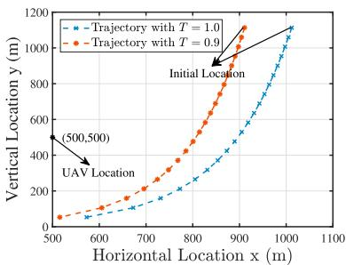

line

| Horizontal Location x (m) | Vertical Location y (m) - Trajectory with T = 1.0 | Vertical Location y (m) - Trajectory with T = 0.9 |
| -------------------------- | ----------------------------------------------- | ----------------------------------------------- |
| 500                        | 50                                              | 50                                              |
| 600                        | ~100                                            | ~150                                            |
| 700                        | ~200                                            | ~300                                            |
| 800                        | ~400                                            | ~600                                            |
| 900                        | ~800                                            | ~1100                                           |
| 1000                       | ~1100                                           | ~1100                                           |

(a)

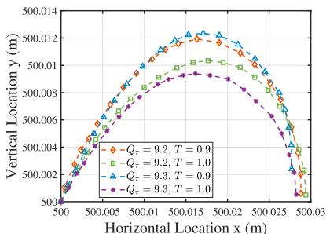

line

| Horizontal Location x (m) | Vertical Location y (m) - Qτ = 9.2, T = 0.9 | Vertical Location y (m) - Qτ = 9.2, T = 1.0 | Vertical Location y (m) - Qτ = 9.3, T = 0.9 | Vertical Location y (m) - Qτ = 9.3, T = 1.0 |
| -------------------------- | ------------------------------------------- | -------------------------------------------- | -------------------------------------------- | -------------------------------------------- |
| 500                        | 500.000                                     | 500.000                                      | 500.000                                      | 500.000                                      |
| 500.005                    | 500.006                                     | 500.006                                      | 500.006                                      | 500.006                                      |
| 500.01                     | 500.012                                     | 500.012                                      | 500.012                                      | 500.012                                      |
| 500.015                    | 500.014                                     | 500.014                                      | 500.014                                      | 500.014                                      |
| 500.02                     | 500.012                                     | 500.012                                      | 500.012                                      | 500.012                                      |
| 500.025                    | 500.012                                     | 500.012                                      | 500.012                                      | 500.012                                      |
| 500.03                     | 500.012                                     | 500.012                                      | 500.012                                      | 500.012                                      |

(b)

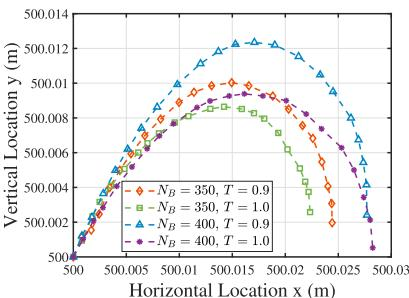

line

| Horizontal Location x (m) | Vertical Location y (m) for N_B = 350, T = 0.9 | Vertical Location y (m) for N_B = 350, T = 1.0 | Vertical Location y (m) for N_B = 400, T = 0.9 | Vertical Location y (m) for N_B = 400, T = 1.0 |
| -------------------------- | --------------------------------------------- | --------------------------------------------- | --------------------------------------------- | --------------------------------------------- |
| 500                        | 500.000                                       | 500.000                                       | 500.000                                       | 500.000                                       |
| 500.01                    | 500.012                                       | 500.012                                       | 500.012                                       | 500.012                                       |
| 500.02                    | 500.01                                        | 500.01                                        | 500.01                                        | 500.01                                        |
| 500.03                    | 500.006                                       | 500.006                                       | 500.006                                       | 500.006                                       |

(c）

Fig. 2. Effects of system parameters on trajectory performance.   
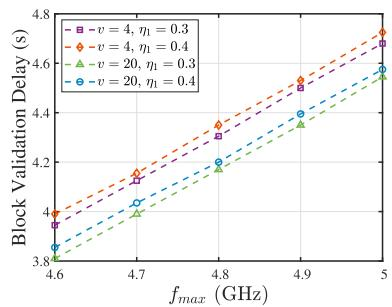

line

| f_max (GHz) | v = 4, η1 = 0.3 | v = 4, η1 = 0.4 | v = 20, η1 = 0.3 | v = 20, η1 = 0.4 |
| ----------- | --------------- | --------------- | ---------------- | ---------------- |
| 4.6         | 4.0             | 4.0             | 3.8              | 3.8              |
| 4.7         | 4.2             | 4.2             | 4.0              | 4.0              |
| 4.8         | 4.4             | 4.4             | 4.2              | 4.2              |
| 4.9         | 4.6             | 4.6             | 4.4              | 4.4              |
| 5.0         | 4.8             | 4.8             | 4.6              | 4.6              |

(a)

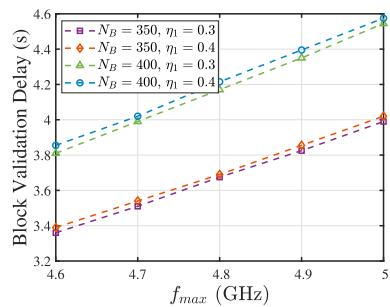

line

| f_max (GHz) | Block Validation Delay (s) for N_B = 350, η_1 = 0.3 | Block Validation Delay (s) for N_B = 350, η_1 = 0.4 | Block Validation Delay (s) for N_B = 400, η_1 = 0.3 | Block Validation Delay (s) for N_B = 400, η_1 = 0.4 |
| ----------- | ----------------------------------------------- | ----------------------------------------------- | ----------------------------------------------- | ----------------------------------------------- |
| 4.6         | 3.4                                             | 3.4                                             | 3.8                                             | 3.8                                             |
| 4.7         | 3.5                                             | 3.5                                             | 4.0                                             | 4.0                                             |
| 4.8         | 3.7                                             | 3.7                                             | 4.2                                             | 4.2                                             |
| 4.9         | 3.9                                             | 3.9                                             | 4.4                                             | 4.4                                             |
| 5.0         | 4.0                                             | 4.0                                             | 4.6                                             | 4.6                                             |

(b)

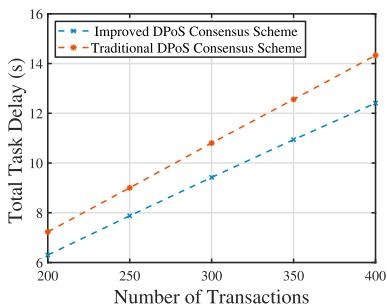

line

| Number of Transactions | Improved DPoS Consensus Scheme | Traditional DPoS Consensus Scheme |
| ---------------------- | ------------------------------- | ---------------------------------- |
| 200                    | 6.5                             | 7.0                                |
| 250                    | 8.0                             | 9.0                                |
| 300                    | 9.5                             | 11.0                               |
| 350                    | 11.0                            | 13.0                               |
| 400                    | 12.5                            | 14.5                               |

(c)   
Fig. 3. Effects of system parameters on delay performance.

Figs. 3(a)–(c) show the effects of the validation node type and the number of transactions on delay performance. In Fig. 3(a) and (b), the horizontal axis indicates the maximum computing capacity of the ground blockchain nodes $f _ { \mathrm { m a x } }$ . The reputation value of the validation node increases the faster it completes the block validation. However, the block validation delay increases linearly with the increasing of the weight coefficient $\eta _ { 1 }$ , the number of transactions $N _ { B } .$ , and the maximum computing capacity $f _ { \mathrm { m a x } }$ . That is because the higher the reputation value of the validation node $Q$ and the smaller the maximum computing capacity $f _ { \mathrm { m a x } }$ , the more rewards it receives from the UAV for generating blocks, which directly increases its utility function. As for the weight coefficient $\eta _ { 1 }$ , the smaller it is, the larger the computing resources allocated to the validation node and the higher the reward it can obtain from the UAV. Although the energy consumption increases in this case, the reward from the UAV changes faster than the computing energy consumption, thus ensuring that the utility function rises as $\eta _ { 1 }$ decreases. In addition, we see that, for a given number of transactions $N _ { B }$ , the improved DPoS consensus scheme has significant advantages over the traditional DPoS consensus scheme in terms of the total offload delay performance due to the designed propagation mechanism, especially at the high number of transactions $N _ { B }$ in Fig. 3(c).

Figs. 4(a)–(c) show the reputation variation in system parameters with validation node type, maximum computing power, and the number of transactions. Fig. 4(a) and (b) show the reputation increment under different validation cycles. For type-4 and type-20 validation nodes, the reputation increment increases and decreases with increasing validation cycles. This situation exists because the communication distance from the primary node to the type-4 validation node and the type-20 validation node increases and decreases with increasing validation cycles, leading to an increase and decrease in transmission delay, respectively. In addition, as the number of transactions $N _ { B }$ in the block and the maximum computing capacity $f _ { \mathrm { m a x } }$ have caused an increase in the block validation delay, the reputation increment tended to increase in each iteration cycle. As shown in Fig. $4 ( \mathrm { c } )$ , a validation node with a high reputation updates its reputation more at the end of an iteration than a validation node with a low reputation, and the larger the number of transactions $N _ { B }$ , the more significant the difference in reputation value between the two types of validation nodes.

Fig. 5(a)-(c) show the impact of validation type and the number of transactions on the utilities of the UAV and the validation nodes. In Fig. 5(a), we can see that the UAV, as the leader, gains the most utility per unit time slot of all entities, followed by the primary node, then the validation nodes with high reputation, and finally, the primary node with low reputation due to the designed incentive mechanism. At the same time, Fig. 5(b) shows that apart from the number of transactions $N _ { B }$ , which have a slight impact on the per unit time slot utilities of the validation nodes, there is little impact on the per unit time slot utilities of the UAV and primary nodes. In addition, combined with the analysis in Fig. 5(c), we can observe that the primary node is the first to complete the task. Hence, the utility value of the primary node drops to zero first, and the UAV and the validation node receive this effect causing their unit time slot utilities also temporarily to drop. Then the UAV completes the transmission task, which has opposed effects on the UAV itself and the validation nodes. For the UAV, the utility rises due to the reduction in energy consumption. Conversely, for the validation node, the total reward that can be obtained from the UAV decreases, resulting in a decrease in utility. Next, the utility unit time slots of both the UAV and the validation nodes are on a downward trend after the number of time slots exceeds 250 and 300, with the number of transactions being $N _ { B } = 3 5 0$ and $N _ { B } = 4 0 0$ , respectively, lying in the fact that = =from that moment most of the validation nodes with the high allocation of computing resources complete the execution of the task, thus the benefit per unit time slot satisfaction received by the UAV and the total reward received by the validation node decrease, respectively.

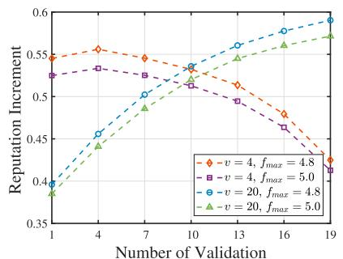

line

| Number of Validation | v = 4, f_max = 4.8 | v = 4, f_max = 5.0 | v = 20, f_max = 4.8 | v = 20, f_max = 5.0 |
| --------------------- | ------------------- | ------------------- | -------------------- | -------------------- |
| 1                     | 0.55                | 0.53                | 0.40                 | 0.39                 |
| 4                     | 0.56                | 0.54                | 0.46                 | 0.45                 |
| 7                     | 0.55                | 0.53                | 0.50                 | 0.49                 |
| 10                    | 0.54                | 0.52                | 0.54                 | 0.53                 |
| 13                    | 0.52                | 0.51                | 0.56                 | 0.55                 |
| 16                    | 0.48                | 0.49                | 0.58                 | 0.57                 |
| 19                    | 0.43                | 0.42                | 0.60                 | 0.59                 |

(a)

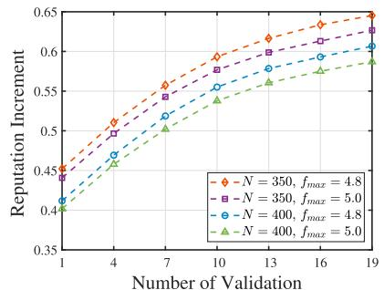

line

| Number of Validation | N = 350, f_max = 4.8 | N = 350, f_max = 5.0 | N = 400, f_max = 4.8 | N = 400, f_max = 5.0 |
| ------------------- | -------------------- | -------------------- | -------------------- | -------------------- |
| 1                   | 0.45                 | 0.45                 | 0.42                 | 0.42                 |
| 4                   | 0.51                 | 0.50                 | 0.47                 | 0.46                 |
| 7                   | 0.56                 | 0.55                 | 0.52                 | 0.51                 |
| 10                  | 0.60                 | 0.59                 | 0.56                 | 0.55                 |
| 13                  | 0.63                 | 0.62                 | 0.59                 | 0.58                 |
| 16                  | 0.65                 | 0.64                 | 0.61                 | 0.60                 |
| 19                  | 0.66                 | 0.65                 | 0.63                 | 0.62                 |

(b)

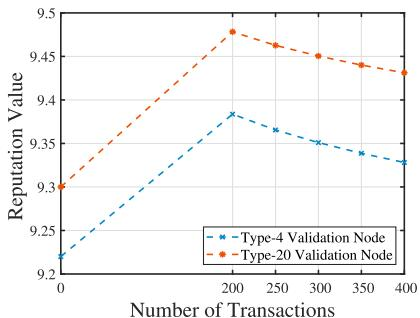

line

| Number of Transactions | Type-4 Validation Node | Type-20 Validation Node |
| ---------------------- | ---------------------- | ----------------------- |
| 0                      | 9.2                    | 9.3                     |
| 200                    | 9.38                   | 9.48                    |
| 250                    | 9.36                   | 9.46                    |
| 300                    | 9.35                   | 9.45                    |
| 350                    | 9.34                   | 9.44                    |
| 400                    | 9.33                   | 9.43                    |

（c）

Fig. 4. Effects of system parameters on reputation performance.   
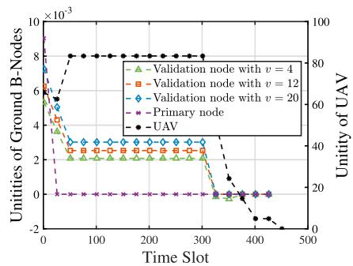

line

| Time Slot | Validation node with v = 4 | Validation node with v = 12 | Validation node with v = 20 | Primary node | UAV |
| --------- | -------------------------- | --------------------------- | --------------------------- | ------------ | --- |
| 0         | 6.0e-3                     | 6.0e-3                      | 6.0e-3                      | 0            | 80  |
| 50        | 2.0e-3                     | 2.0e-3                      | 2.0e-3                      | 0            | 80  |
| 100       | 2.0e-3                     | 2.0e-3                      | 2.0e-3                      | 0            | 80  |
| 150       | 2.0e-3                     | 2.0e-3                      | 2.0e-3                      | 0            | 80  |
| 200       | 2.0e-3                     | 2.0e-3                      | 2.0e-3                      | 0            | 80  |
| 250       | 2.0e-3                     | 2.0e-3                      | 2.0e-3                      | 0            | 80  |
| 300       | 2.0e-3                     | 2.0e-3                      | 2.0e-3                      | 0            | 80  |
| 350       | 0.0                        | 0.0                         | 0.0                         | 0            | 20  |
| 400       | -1.0e-3                    | -1.0e-3                     | -1.0e-3                     | -1.0e-3      | -1   |
| 450       | -1.5e-3                    | -1.5e-3                     | -1.5e-3                     | -1.5e-3      | -2   |
| 500       | -2.0e-3                    | -2.0e-3                     | -2.0e-3                     | -2.0e-3      | -3   |

(a)

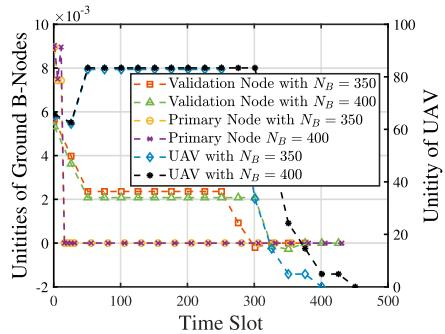

line

| Time Slot | Validation Node with N_B = 350 | Validation Node with N_B = 400 | Primary Node with N_B = 350 | Primary Node with N_B = 400 | UAV with N_B = 350 | UAV with N_B = 400 |
| --------- | ------------------------------ | ------------------------------ | --------------------------- | --------------------------- | ------------------ | ------------------ |
| 0         | 9.0e-3                         | 6.0e-3                         | 9.0e-3                      | 9.0e-3                      | 9.0e-3             | 9.0e-3             |
| 50        | 2.0e-3                         | 2.0e-3                         | 2.0e-3                      | 2.0e-3                      | 2.0e-3             | 2.0e-3             |
| 100       | 2.0e-3                         | 2.0e-3                         | 2.0e-3                      | 2.0e-3                      | 2.0e-3             | 2.0e-3             |
| 150       | 2.0e-3                         | 2.0e-3                         | 2.0e-3                      | 2.0e-3                      | 2.0e-3             | 2.0e-3             |
| 200       | 2.0e-3                         | 2.0e-3                         | 2.0e-3                      | 2.0e-3                      | 2.0e-3             | 2.0e-3             |
| 250       | 2.0e-3                         | 2.0e-3                         | 2.0e-3                      | 2.0e-3                      | 2.0e-3             | 2.0e-3             |
| 300       | 2.0e-3                         | 2.0e-3                         | 2.0e-3                      | 2.0e-3                      | 2.0e-3             | 2.0e-3             |
| 350       | 2.0e-3                         | 2.0e-3                         | 2.0e-3                      | 2.0e-3                      | -1.0e-3            | -1.0e-3            |
| 400       | 2.0e-3                         | 2.0e-3                         | 2.0e-3                      | 2.0e-3                      | -1.5e-3            | -1.5e-3            |
| 450       | 2.0e-3                         | 2.0e-3                         | 2.0e-3                      | 2.0e-3                      | -1.5e-3            | -1.5e-3            |
| 500       | 2.0e-3                         | 2.0e-3                         | 2.0e-3                      | 2.0e-3                      | -1.5e-3            | -1.5e-3            |

(b)

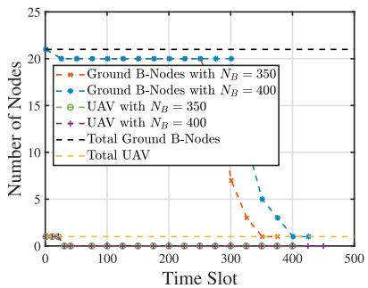

line

| Time Slot | Ground B-Nodes with N_B = 350 | Ground B-Nodes with N_B = 400 | UAV with N_B = 350 | UAV with N_B = 400 | Total Ground B-Nodes | Total UAV |
| --------- | ----------------------------- | ----------------------------- | ------------------ | ------------------ | -------------------- | --------- |
| 0         | 21                            | 21                            | 1                  | 1                  | 21                   | 1         |
| 100       | 21                            | 21                            | 1                  | 1                  | 21                   | 1         |
| 200       | 21                            | 21                            | 1                  | 1                  | 21                   | 1         |
| 300       | 8                             | 5                             | 1                  | 1                  | 21                   | 1         |
| 400       | 1                             | 1                             | 1                  | 1                  | 21                   | 1         |
| 500       | 1                             | 1                             | 1                  | 1                  | 21                   | 1         |

(c）  
Fig. 5. Effects of system parameters on utility performance.

# VII. CONCLUSION

In this article, we investigate blockchain-integrated UAVassisted MEC networks. We propose a novel DPoS scheme including light and full nodes. The ground blockchain nodes, i.e., full nodes, are selected from the BSs by the designed reputation mechanism and obtain the reward from the UAV based on the incentive mechanism identifying the reputation and the computing capacity as the significant elements. We formulate the maximization problem about the utilities of the UAV and the ground blockchain nodes by the proposed two-stage Stackelberg game, where jointly optimizing the location and transmission power of the UAV and computing resource allocation of the ground blockchain nodes to satisfy the performance requirements for ground users. Furthermore, we prove the existence of Stackelberg equilibrium by backward induction and adopt the SCA method to approximate the solution of the non-convex problem. Simulation results demonstrate the effectiveness of the developed scheme for trusted management and superior delay.

# APPENDIX

# A. Proof of Theorem 3

Firstly, deriving the utility function $U _ { n } ( t )$ of the UAV n after introducing the auxiliary variable $\tilde { R } _ { n , p } ( t )$ ), having $\begin{array} { r } { \frac { \partial U _ { n } ( t ) } { \partial \tilde { R } _ { n , p } ( t ) } = } \end{array}$ $\begin{array} { r } { \frac { A _ { 1 } \alpha _ { h } \beta _ { 1 } } { \operatorname* { m a x } R _ { n , p } } - \frac { 3 A _ { 2 } \alpha _ { h } \beta _ { 1 } } { \operatorname* { m a x } R _ { n , p } } \left( \frac { \alpha _ { h } \beta _ { 1 } \tilde { R } _ { n , p } ( t ) } { \operatorname* { m a x } R _ { n , p } } + \frac { \beta _ { 2 } \omega ( t ) } { \operatorname* { m a x } \omega } \right) ^ { 2 } } \end{array}$ and $\begin{array} { r } { \frac { \partial ^ { 2 } U _ { n } ( t ) } { \partial \tilde { R } _ { n , p } ^ { 2 } ( t ) } = } \end{array}$ max Rn,p max Rn,p max Rn,p $\begin{array} { r } { - \frac { 6 A _ { 2 } \alpha _ { h } ^ { 2 } \beta _ { 1 } ^ { 2 } } { \operatorname* { m a x } R _ { n , p } ^ { 2 } } \left( \frac { \alpha _ { h } \beta _ { 1 } \tilde { R } _ { n , p } ( t ) } { \operatorname* { m a x } R _ { n , p } } + \frac { \beta _ { 2 } \omega ( t ) } { \operatorname* { m a x } \omega } \right) < 0 } \end{array}$ h max R2n,p max Rn,p . Find that the utility function of the UAV n is a convex function with respect to the auxiliary variable ${ \tilde { R } } _ { n , p } ( t )$ and monotonically increasing with the ( )auxiliary variable R˜n,p t in  0, max Rn,p(t)α β $\tilde { R } _ { n , p } ( t )$ $\begin{array} { r } { \left[ 0 , \frac { \operatorname* { m a x } { R _ { n , p } ( t ) } } { \alpha _ { h } \beta _ { 1 } } \left( \sqrt { \frac { A _ { 1 } } { 3 A _ { 2 } } } - \frac { \beta _ { 2 } \omega ( t ) } { \operatorname* { m a x } \omega } \right) \right] } \end{array}$ by setting $\begin{array} { r } { \frac { \partial U _ { n } ( t ) } { \partial \tilde { R } _ { n , p } ( t ) } = 0 } \end{array}$ . Therefore, we use the auxiliary variable ${ \tilde { R } } _ { n , p } ( t )$ to approximate the transmission rate of UAV ( )n from a lower bound in time slot t. To further approximate the non-convex function, we introduce auxiliary variables ϕn t and dn t where ϕn t ≤ 1  Pt(t)dn(t) $\varphi _ { n } ( t )$ $d _ { n } ( t )$ $\begin{array} { r } { \varphi _ { n } ( t ) \leq 1 + \frac { P _ { t } ( t ) } { d _ { n } ( t ) } } \end{array}$ and $d _ { n } ( t ) \leq$

$$
\frac {\left(\| X _ {n} (t) - \overline {{X _ {p}}} \| _ {2} ^ {2} + H ^ {2}\right) N _ {0}}{g _ {0}}, \text { having }
$$

$$
\tilde {R} _ {n, p} (t) \leq B _ {n, p} \log_ {2} \varphi_ {n} (t)
$$

$$
\leq B _ {n, p} \log_ {2} \left(1 + \frac {P _ {t} (t)}{d _ {n} (t)}\right)
$$

$$
\leq B _ {n, p} \log_ {2} \left(1 + \frac {P _ {t} (t) g _ {0}}{\left(\left\| X _ {n} (t) - \overline {{{X _ {p}}}} \right\| _ {2} ^ {2} + H ^ {2}\right) N _ {0}}\right), \tag {35}
$$

where $\tilde { R } _ { n , p } ^ { * } ( t ) = R _ { n , p } ^ { * } ( X _ { n } ( t ) , P _ { t } ( t ) )$ if maximizing the utility ( ) = ( ( ) ( ))function of UAV n in problem NP2 based on the auxiliary variable ${ \tilde { R } } _ { n , p } ( t )$ . Therefore, the problem NP2 is equivalent to problem P2.

# B. Proof of Theorem 4

We can find the left-hand side of the constraint (33b) has a product of functions (PF) structure, $\mathrm { i . e . , ~ } g _ { n } ( t ) = \varphi _ { n } ( t ) d _ { n } ( t )$ with $\varphi _ { n } ( t )$ and $d _ { n } ( t )$ are both convex and non-negative in time ( ) ( )slot t, which can be expressed in the difference of convex (DC) form as

$$
g _ {n} (t) = \frac {1}{2} \left(\varphi_ {n} (t) + d _ {n} (t)\right) ^ {2} - \frac {1}{2} \left(\varphi_ {n} ^ {2} (t) + d _ {n} ^ {2} (t)\right). \tag {36}
$$

The concave part of the above equation is then linearised so that an approximation to (36) can be made from the upper bound, as follows.

$$
g _ {n} (t) = \frac {1}{2} \left(\varphi_ {n} (t) + d _ {n} (t)\right) ^ {2} - \frac {1}{2} \left(\varphi_ {n} ^ {2} (t) + d _ {n} ^ {2} (t)\right)
$$

$$
\leq \frac {1}{2} \left(\varphi_ {n} (t) + d _ {n} (t)\right) ^ {2} - \frac {1}{2} \left(\tilde {\varphi} _ {n} ^ {k} (t) ^ {2} + \tilde {d} _ {n} ^ {k} (t) ^ {2}\right)
$$

$$
- \tilde {\varphi} _ {n} ^ {k} (t) (\varphi_ {n} (t) - \tilde {\varphi} _ {n} ^ {k} (t)) - \tilde {d} _ {n} ^ {k} (t) (d _ {n} (t) - \tilde {d} _ {n} ^ {k} (t))
$$

$$
= \tilde {g} _ {n} (t). \tag {37}
$$

When the value of $| \varphi _ { n } ( t ) - \tilde { \varphi } _ { n } ^ { k } ( t ) |$ and $| d _ { n } ( t ) - \tilde { d } _ { n } ^ { k } ( t ) |$ are small enough, having $\tilde { g } _ { n } ( t ) \triangleq g _ { n } ( t )$ with $\tilde { g } _ { n } ( t ) \leq d _ { n } ( t ) +$ $P _ { t } ( t )$ ˜ ( ) ( ) ˜ ( ) ( ) +. Thus, the 34 in convex form is equivalent to the non-( )convex constraint (33b). Then $\tilde { R } _ { n , p } ( t ) \leq R _ { n , p } ( X _ { n } ( t ) , P _ { t } ( t ) )$ by ( ) ( ( ) ( ))combining with the proof of theorem 3, thus the problem NP2 approximates the problem P2 locally solving with the lower bound.

# REFERENCES

[1] Q. Luo, S. Hu, C. Li, G. Li, and W. Shi, “Resource scheduling in edge computing: A survey,” IEEE Commun. Survey. Tuts., vol. 23, no. 4, pp. 2131–2165, Fourthquarter 2021.   
[2] Y. C. Hu, M. Patel, D. Sabella, N. Sprecher, and V. Young, “Mobile edge computing–A key technology towards 5G,” ETSI, Sophia Antipolis, France, White Paper, 2014.   
[3] K. Jiang, C. Sun, H. Zhou, X. Li, M. Dong, and V. C. M. Leung, “Intelligence-empowered mobile edge computing: Framework, issues, implementation, and outlook,” IEEE Netw., vol. 35, no. 5, pp. 74–82, Sep./Oct. 2021.   
[4] R. Yang, F. R. Yu, P. Si, Z. Yang, and Y. Zhang, “Integrated blockchain and edge computing systems: A survey, some research issues and challenges,” IEEE Commun. Surv. Tut., vol. 21, no. 2, pp. 1508–1532, Secondquarter 2019.

[5] X. Chen et al., “Distributed computation offloading and trajectory optimization in multi-UAV-enabled edge computing,” IEEE Internet Things J., vol. 9, no. 20, pp. 20096–20110, Oct. 2022.   
[6] J. Xu, K. Ota, M. Dong, and H. Zhou, “MCTS-enhanced hybrid offloading for aerial multi-access edge computing,” IEEE Wireless Commun., vol. 28, no. 5, pp. 82–87, Oct. 2021.   
[7] X. Hu, K. -K. Wong, K. Yang, and Z. Zheng, “UAV-assisted relaying and edge computing: Scheduling and trajectory optimization,” IEEE Trans. Wireless Commun., vol. 18, no. 10, pp. 4738–4752, Oct. 2019.   
[8] Q. Tang, Z. Fei, J. Zheng, B. Li, L. Guo, and J. Wang, “Secure aerial computing: Convergence of mobile edge computing and blockchain for UAV networks,” IEEE Trans. Veh. Technol., vol. 71, no. 11, pp. 12073–12087, Nov. 2022.   
[9] L. Xie, Z. Su, N. Chen, and Q. Xu, “Secure data sharing in UAV-assisted crowdsensing: Integration of blockchain and reputation incentive,” in Proc. IEEE Glob. Commun.Conf., 2021, pp. 1–6.   
[10] A. Lakhan, M. Ahmad, M. Bilal, A. Jolfaei, and R. M. Mehmood, “Mobility aware blockchain enabled offloading and scheduling in vehicular fog cloud computing,” IEEE Trans. Intell. Transp. Syst., vol. 22, no. 7, pp. 4212–4223, Jul. 2021.   
[11] J. Wu, M. Dong, K. Ota, J. Li, and W. Yang, “Application-aware consensus management for software-defined intelligent blockchain in IoT,” IEEE Netw., vol. 34, no. 1, pp. 69–75, Jan./Feb. 2020.   
[12] Y. Wang, Z. Su, J. Ni, N. Zhang, and X. Shen, “Blockchain-empowered space-air-ground integrated networks: Opportunities, challenges, and solutions,” IEEE Commun. Survey. Tuts., vol. 24, no. 1, pp. 160–209, Firstquarter 2022.   
[13] T. T. A. Dinh, R. Liu, M. Zhang, G. Chen, B. C. Ooi, and J. Wang, “Untangling blockchain: A data processing view of blockchain systems,” IEEE Trans. Knowl. Data Eng., vol. 30, no. 7, pp. 1366–1385, Jul. 2018.   
[14] J. Kang, Z. Xiong, D. Niyato, D. Ye, D. I. Kim, and J. Zhao, “Toward secure blockchain-enabled Internet of Vehicles: Optimizing consensus management using reputation and contract theory,” IEEE Trans. Veh. Technol., vol. 68, no. 3, pp. 2906–2920, Mar. 2019.   
[15] Y. Wang et al., “Blockchain-based secure and cooperative private charging pile sharing services for vehicular networks,” IEEE Trans. Veh. Technol., vol. 71, no. 2, pp. 1857–1874, Feb. 2022.   
[16] J. Feng, F. R. Yu, Q. Pei, J. Du, and L. Zhu, “Joint optimization of radio and computational resources allocation in blockchain-enabled mobile edge computing systems,” IEEE Trans. Wireless Commun., vol. 19, no. 6, pp. 4321–4334, Jun. 2020.   
[17] F. Guo, F. R. Yu, H. Zhang, H. Ji, M. Liu, and V. C. M. Leung, “Adaptive resource allocation in future wireless networks with blockchain and mobile edge computing,” IEEE Trans. Wireless Commun., vol. 19, no. 3, pp. 1689–1703, Mar. 2020.   
[18] L. Yang, M. Li, P. Si, R. Yang, E. Sun, and Y. Zhang, “Energy-efficient resource allocation for blockchain-enabled Industrial Internet of Things with deep reinforcement learning,” IEEE Internet Things J., vol. 8, no. 4, pp. 2318–2329, Feb. 2021.   
[19] B. Li, Z. Fei, and Y. Zhang, “UAV communications for 5G and beyond: Recent advances and future trends,” IEEE Internet Things J., vol. 6, no. 2, pp. 2241–2263, Apr. 2019.   
[20] Y. Xu, T. Zhang, D. Yang, Y. Liu, and M. Tao, “Joint resource and trajectory optimization for security in UAV-assisted MEC systems,” IEEE Trans. Commun., vol. 69, no. 1, pp. 573–588, Jan. 2021.   
[21] L. Zhang and J. Chakareski, “UAV-assisted edge computing and streaming for wireless virtual reality: Analysis, algorithm design, and performance guarantees,” IEEE Trans. Veh. Technol., vol. 71, no. 3, pp. 3267–3275, Mar. 2022.   
[22] Z. Wu, Z. Yang, C. Yang, J. Lin, Y. Liu, and X. Chen, “Joint deployment and trajectory optimization in UAV-assisted vehicular edge computing networks,” J. Commun. Netw.., vol. 24, no. 1, pp. 47–58, Feb. 2022.   
[23] Y. Xun et al., “UAV-assisted relaying and MEC networks: Resource allocation and 3D deployment,” in Proc. IEEE Int. Conf. Commun. Workshops, 2021, pp. 1–6.   
[24] J. Cui et al., “Secure and efficient data sharing among vehicles based on consortium blockchain,” IEEE Trans. Intell. Transp. Syst., vol. 23, no. 7, pp. 8857–8867, Jul. 2022.   
[25] S. Chai and V. K. N. Lau, “Multi-UAV trajectory and power optimization for cached UAV wireless networks with energy and content rechargingdemand driven deep learning approach,” IEEE J. Sel. Areas Commun., vol. 39, no. 10, pp. 3208–3224, Oct. 2021.

[26] Y. Zeng, J. Xu, and R. Zhang, “Energy minimization for wireless communication with rotary-wing UAV,” IEEE Trans. Wireless Commun., vol. 18, no. 4, pp. 2329–2345, Apr. 2019.   
[27] C. D. Franco and G. Buttazzo, “Energy-aware coverage path planning of UAVs,” in Proc. IEEE Int. Conf. Auto. Robot Syst. Competitions, 2015, pp. 111–117.   
[28] A. Filippone, Flight Performance of Fixed and Rotary Wing Aircraft. Amsterdam, The Netherlands: Elsevier, 2006.   
[29] D. Larimer, “DPOS BFT–Pipelined Byzantine fault tolerance,” 2018. [Online]. Available: https://medium.com/eosio/dpos-bft-pipelinedbyzantine-fault-tolerance-8a0634a270ba   
[30] Y. Mao, C. You, J. Zhang, K. Huang, and K. B. Letaief, “A survey on mobile edge computing: The communication perspective,” IEEE Commun. Survey. Tuts., vol. 19, no. 4, pp. 2322–2358, Fourthquarter 2017.   
[31] X. Qin, Z. Song, Y. Hao, and X. Sun, “Joint resource allocation and trajectory optimization for multi-UAV-assisted multi-access mobile edge computing,” IEEE Wireless Commun. Lett., vol. 10, no. 7, pp. 1400–1404, Jul. 2021.   
[32] Y. Benmoussa, E. Senn, N. Derouineau, N. Tizon, and J. Boukhobza, “Joint DVFS and parallelism for energy efficient and low latency software video decoding,” IEEE Trans. Parallel Distrib. Syst., vol. 29, no. 4, pp. 858–872, Apr. 2018.   
[33] F. Yao, A. Demers, and S. Shenker, “A scheduling model for reduced CPU energy,” in Proc. 36th Annu. Symp. Found. Comput. Sci., 1995, pp. 374– 382.   
[34] Z. Sun et al., “Applications of game theory in vehicular networks: A survey,” IEEE Commun. Survey. Tuts., vol. 23, no. 4, pp. 2660–2710, Fourthquarter 2021.   
[35] B. Wang, Y. Wu, and K. J. R. Liu, “Game theory for cognitive radio networks: An overview,” Comput. Netw., vol. 54, no. 14, pp. 2537–2561, Oct. 2010.   
[36] Y. Wang, Z. Su, and N. Zhang, “BSIS: Blockchain-based secure incentive scheme for energy delivery in vehicular energy network,” IEEE Trans. Ind. Inf., vol. 15, no. 6, pp. 3620–3631, Jun. 2019.   
[37] J. Kang, Z. Xiong, D. Niyato, P. Wang, D. Ye, and D. I. Kim, “Incentivizing consensus propagation in proof-of-stake based consortium blockchain networks,” IEEE Wireless Commun. Lett., vol. 8, no. 1, pp. 157–160, Feb. 2019.   
[38] Y. Liu, F. R. Yu, X. Li, H. Ji, and V. C. M. Leung, “Decentralized resource allocation for video transcoding and delivery in blockchain-based system with mobile edge computing,” IEEE Trans. Veh. Technol., vol. 68, no. 11, pp. 11169–11185, Nov. 2019.   
[39] T. Lipp and S. Boyd, “Variations and extension of the convex-concave procedure,” Optim. Eng., vol. 17, no. 2 pp. 263–287, Jun. 2016.   
[40] G. Scutari, F. Facchinei, and L. Lampariello, “Parallel and distributed methods for constrained nonconvex optimization–Part I: Theory,” IEEE Trans. Signal Process., vol. 65, no. 8, pp. 1929–1944, Apr. 2017.

natural_image

Portrait photo of a woman with short dark hair wearing a white collared shirt against a blue background (no text or symbols visible)

Die Wang (Graduate Student Member, IEEE) received the B.S. degree in communication engineering from Heilongjiang University, Harbin, China, in 2019. She is currently working toward the Ph.D. degree in information and communication engineering with Chongqing University, Chongqing, China. Her research interests include resource allocation, blockchain, mobile edge computing, and game theory.

natural_image

Portrait of a man wearing glasses and a suit (no text or symbols visible)

Yunjian Jia (Member, IEEE) received the B.S. degree from Nankai University, Tianjin, China, and the M.E. and Ph.D. degrees in engineering from Osaka University, Suita, Japan, in 1999, 2003, and 2006, respectively. From 2006 to 2012, he was a Researcher with Central Research Laboratory, Hitachi Ltd., where he engaged in research and development on wireless networks, and contributed to LTE and LTE-Advanced standardization in 3GPP. He is currently a Professor with the School of Microelectronics and Communication Engineering, Chongqing Uni-

versity, Chongqing, China. He is the author of more than 100 published papers, and the inventor of 40 granted patents. His current research interests include future radio access technologies, mobile networks, IoT and 6G.

natural_image

Portrait of a man wearing glasses and a suit (no text or symbols visible)

Mianxiong Dong (Member, IEEE) received the B.S., M.S., and Ph.D. degrees in computer science and engineering from The University of Aizu, Aizuwakamatsu, Japan. He is currently the Vice President and Professor of Muroran Institute of Technology, Muroran, Japan. He was a JSPS Research Fellow with the School of Computer Science and Engineering, The University of Aizu, and was a Visiting Scholar with BBCR Group with the University of Waterloo, Waterloo, ON, Canada, supported by JSPS Excellent Young Researcher Overseas Visit Program from April

2010 to August 2011. Dr. Dong was selected as a Foreigner Research Fellow (a total of 3 recipients all over Japan) by NEC C&C Foundation in 2011. He was the recipient of The 12th IEEE ComSoc Asia-Pacific Young Researcher Award 2017, Funai Research Award 2018, NISTEP Researcher 2018 (one of only 11 people in Japan) in recognition of significant contributions in science and technology, The Young Scientists Award from MEXT in 2021, SUEMATSU-Yasuharu Award from IEICE in 2021, IEEE TCSC Middle Career Award in 2021. He is Clarivate Analytics 2019, 2021, 2022 Highly Cited Researcher (Web of Science) and Foreign Fellow of EAJ.

natural_image

Portrait of a woman wearing glasses and a red top (no text or symbols visible)

Kaoru Ota (Member, IEEE) was born in Aizu-Wakamatsu, Japan. She received the B.S. in computer science and engineering from The University of Aizu, Aizuwakamatsu, Japan in 2006, the M.S. degree in computer science from Oklahoma State University, Stillwater, OK, USA in 2008, and the Ph.D. degree in computer science and engineering from The University of Aizu, in 2012. She is currently a Professor and Ministry of Education, Culture, Sports, Science and Technology Excellent Young Researcher with the Department of Sciences and Informatics. She is also

the Founding Director of Center for Computer Science with the Muroran Institute of Technology, Muroran, Japan. From 2010 to 2011, she was a Visiting Scholar with the University of Waterloo, Waterloo, ON, Canada. She was a Japan Society of the Promotion of Science Research Fellow with Tohoku University, Sendai, Japan, from 2012 to 2013. Kaoru was the recipient of IEEE TCSC Early Career Award 2017, The 13th IEEE ComSoc Asia-Pacific Young Researcher Award 2018, 2020 N2Women: Rising Stars in Computer Networking and Communications, 2020 KDDI Foundation Encouragement Award, and 2021 IEEE Sapporo Young Professionals Best Researcher Award, The Young Scientists Award from MEXT in 2023. She is Clarivate Analytics 2019, 2021, 2022 Highly Cited Researcher (Web of Science) and is selected as JST-PRESTO Researcher in 2021, Fellow of EAJ in 2022.

natural_image

Portrait photo of a woman with short black hair wearing a red and white checkered shirt (no text or symbols visible)

Liang Liang received the B.Eng. and M.Eng. degrees from the Southwest University of Science and Technology, Mianyang, China, in 2003 and 2006, respectively, and the Ph.D. degree in communication and information system from the University of Electronic Science and Technology of China, Chengdu, China in 2012. From 2011 to 2012, she was an International Visitor with the Institute for Infocomm Research (I2R), Singapore. She is currently an Associate Professor with the School of Microelectronics and Communication Engineering, Chongqing University,

Chongqing, China. Her research interests include wireless communication and optimization, wireless network virtualization, mobile edge computing and IoT.