# Building Blockage-Aided Interference Coordination for Multi-UAV-Enabled Wireless Networks

Kanghyun Heo , Gitae Park , and Kisong Lee , Senior Member, IEEE

Abstract—This study challenges the conventional view that wireless signal blockages are solely detrimental by exploring how non-line-of-sight (NLoS) channels can reduce co-channel interference and improve network performance. By leveraging the mobility of unmanned aerial vehicles (UAVs), this research examines the joint optimization of communication resources and UAV trajectories in multi-UAV-enabled wireless networks to maximize the minimum spectral efficiency (SE) among ground nodes (GNs) by coordinating co-channel interference. We first propose a new analytical model to identify potential signal blockages caused by multiple buildings and a novel building avoidance method that ensures safe and efficient UAV operations. To solve the problem formulated as non-convex mixed-integer nonlinear programming, we employ various optimization techniques: We first decompose the original problem into multiple convex subproblems for each optimization variable using quadratic transform and successive convex approximation. The penalty convex-concave procedure is applied to maintain the binary nature of scheduling indicators. To efficiently address signal blockage and building avoidance constraints, the separating hyperplane theorem is applied along with the approximation of the indicator function. Finally, we utilize block coordinate descent algorithm to iteratively solve the convex subproblems in sequence. The simulation results confirm that UAVs optimize their trajectories to establish LoS channels for transmitting desired signals to scheduled GNs while forming NLoS channels to mitigate interference for others. In this way, the network performance compared to baseline schemes is significantly enhanced. Furthermore, under the proposed building avoidance constraint, UAVs maintain continuous trajectories without violating building boundaries.

Index Terms—UAV networks, convex optimization, trajectory design, resource allocation, interference coordination, building blockage.

## I. INTRODUCTION

nificant attention as a valuable solution for advanced wireless networks due to their remarkable adaptability and economical deployment [1]. A key advantage of UAVs is their ability to function as mobile base stations (BSs), enabling the establishment of line-of-sight (LoS) wireless channels. This capability significantly improved communication capacity compared to traditional fixed BSs used in terrestrial systems [2]. Therefore, initial studies have mainly concentrated on UAV deployment, trajectory optimization, and resource allocation, often assuming that LoS communication channels exist between UAVs and ground nodes (GNs). Specifically, strategies for optimizing UAV deployment, treating the UAV as a stationary or semi-static BS, were explored to enhance service coverage efficiency [3]. In [4], the authors jointly optimized both UAV trajectory and communication resources while ensuring full compliance with no-fly zone restrictions. Taking into account the GNs’ ability to harvest energy, the UAV strategy was optimized to enable simultaneous wireless information and power transfer [5], [6]. In addition, cooperative jamming methods involving BS-UAV and jammer-UAV coordination have been developed to enhance secure communications by preventing eavesdropping [7], [8]. In [9] and [10], multi-UAV scenarios were also examined, with a focus on optimizing scheduling, power control, and UAV trajectories to mitigate co-channel interference.

While the advantages of leveraging the mobility of UAVs to form LoS channels are well-recognized, this assumption is challenged in dense urban areas with tall buildings. In these environments, multi-path fading and shadowing occur frequently, which makes a simplified LoS model unsuitable. In order to overcome these challenges, probabilistic models were introduced that statistically represent the probability of LoS and NLoS conditions for channels, which depend on the elevation angle between the UAV and the GN [11]. As a result, several recent investigations have further explored UAV strategies using probabilistic LoS channel models. For instance, [11] focused on minimizing UAV energy consumption, considering both flight and communication. In [12] and [13], joint optimization of three-dimensional (3D) trajectories and scheduling was investigated to improve the data collection rate for UAV-supported wireless networks. Moreover, [14] evaluated the performance of a UAV-assisted multi-user coded cooperation system in terms of closed-form average outage probability and the average rate. In addition, [15] analyzed the impact of UAV deployment on wireless network reliability by examining the signal-to-interference-plus-noise ratio (SINR) meta-distribution to assess both the improvements and effects on network performance.

The aforementioned studies used either LoS or probabilistic LoS channel models, but both of them have inherent limitations, i.e., LoS channel models are only suitable for application in rural areas without high and dense buildings, while probabilistic LoS channel models are only ideal for analyzing the long-term average performance of UAV communication. Therefore, a more realistic channel model should be proposed to determine the LoS or NLoS status of the actual wireless channel in real-time, which takes into account cuboid-shaped buildings. Based on this, a better model should also optimize the UAV trajectory and communication resources to ensure high performance in a given environment. In this context, a new trend emerged to address the problem of wireless signal blockage by physical obstacles [16], [17], [18], [19], [20]. In [16] and [17], geographic information was utilized to solve the problem of blockage of channels between UAVs and GNs by buildings to ensure LoS links. In [18], the trajectory and radio resources were optimized for UAV-assisted data collection, considering the potential blockages caused by buildings. In addition, [19] focused on optimizing UAV trajectories and radio resources to improve the minimum communication rate. In [20], the advanced blockage-aware channel model was proposed to avoid encroaching on cuboid-shaped buildings completely and to assess the impact of buildings on the wireless signal blockage. However, previous studies [16], [17], [18], [19] have relied on models that simplify the signal blockage constraint by assuming UAVs consistently fly above building heights. Consequently, they overlook the necessity for building avoidance and fail to define the LoS area for UAVs flying at lower altitudes. A recent study [20] addressed these limitations but focused on a single UAV and lacked insight into interference management when scaling to multi-UAV networks.

Unlike traditional BSs fixed to the ground, UAVs can fly freely and form a good wireless channel environment as mobile BSs and provide reliable services to GNs. In particular, the wireless channel between UAVs and GNs can dynamically transit between LoS and NLoS states by optimizing the mobility of UAVs depending on the given building layout. Accordingly, this study revisits the conventional view that NLoS channels degrade performance in wireless communications by exploring interference coordination through building blockages and ensuring LoS signal channels for multi-UAVenabled wireless networks. The main contributions of this study are as follows:

• Given information on building locations and dimensions, we introduce a new mathematical model for determining building avoidance and wireless signal blockage. By incorporating these constraints, we study the joint optimization of UAV trajectories and communication resources in multi-UAV-enabled wireless networks for effective interference coordination. According to our knowledge, this is the advanced model designed to include a generalized approach for determining the signal and interference channel state, considering signal blockage and addressing an issue that has been overlooked in prior studies.

• To address the non-convexity of the problem, we decompose it into a set of convex subproblems for each optimization variable using both quadratic transform (QT)

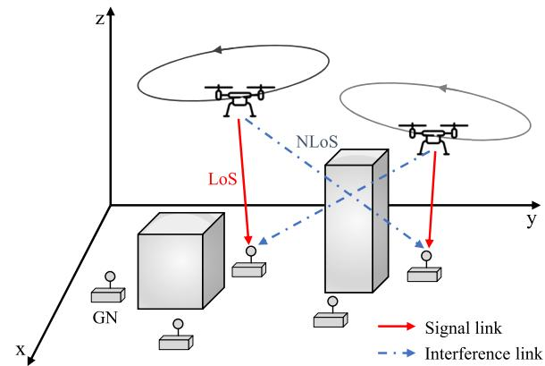  
Fig. 1. System model of a multi-UAV-enabled wireless network.

and successive convex approximation (SCA). We then apply the penalty convex-concave procedure (PCCP) to preserve the binary nature of scheduling indicators and use the separating hyperplane theorem, combined with an approximated indicator function, to efficiently manage constraints on signal blockage and building avoidance. Finally, the convex subproblems are iteratively solved in sequence with the block coordinate descent (BCD) algorithm.

• Comprehensive simulations in a variety of environments confirm that UAVs do not intersect with buildings during their continuous flight paths under the proposed building avoidance constraint. In addition, each UAV establishes the LoS channel to transmit the desired signal to its scheduled GN while forming the NLoS channel for interference links, effectively minimizing interference with other GNs. By leveraging building blockages for interference coordination, the proposed scheme can achieve higher spectral efficiency (SE) than traditional methods.

The structure of this paper is as follows: Section II describes the system model and problem formulation. Section III provides the analytical model for determining the channel state. Section IV outlines the proposed mathematical approach, incorporating advanced optimization methods. Section V includes performance comparisons and valuable insights. Finally, concluding remarks are presented in Section VI.

## II. SYSTEM MODEL AND PROBLEM STATEMENT

Fig. 1 illustrates a multi-UAV-enabled wireless network, with the associated nomenclature detailed in Table I. In this network, M rotary-wing UAVs, indexed by $m \in \mathcal { M } \ =$ $\{ 1 , 2 , \cdots , M \}$ , provide services to K GNs, indexed by $k \in$ ${ \mathcal { K } } = \{ 1 , 2 , \cdots , K \}$ . The UAV operation is limited to a fixed period T , implicitly reflecting flight time constraints due to energy limitations. This duration is discretized into N equal time slots, each of length $\begin{array} { r } { \delta \ = \ \frac { T } { N } } \end{array}$ , indexed by $n \in \mathcal { N } = \{ 1 , 2 , . . . , N \}$ . It is assumed that the positions of the UAVs remain approximately constant within each time slot, with a sufficiently small value of δ [9]. Each UAV allocates communication resources to GNs based on timedivision multiple access; however, sharing the same frequency band results in co-channel interference with other UAVs.

TABLE I  
LIST OF NOMENCLATURE
<table><tr><td rowspan=1 colspan=1>Symbol</td><td rowspan=1 colspan=1>Description</td></tr><tr><td rowspan=1 colspan=1>M</td><td rowspan=1 colspan=1>Number of UAVs</td></tr><tr><td rowspan=1 colspan=1>K</td><td rowspan=1 colspan=1>Number of GNs</td></tr><tr><td rowspan=1 colspan=1>L</td><td rowspan=1 colspan=1>Number of buildings</td></tr><tr><td rowspan=1 colspan=1>T</td><td rowspan=1 colspan=1>Flight period</td></tr><tr><td rowspan=1 colspan=1>N</td><td rowspan=1 colspan=1>Number of time slots</td></tr><tr><td rowspan=1 colspan=1>δ</td><td rowspan=1 colspan=1>Length of time slots</td></tr><tr><td rowspan=1 colspan=1> $\overline { { \mathbf { q } _ { m } [ n ] } }$ </td><td rowspan=1 colspan=1>3D coordinates of UAV m at time slot n</td></tr><tr><td rowspan=1 colspan=1> $\mathbf { w } _ { k }$ </td><td rowspan=1 colspan=1>Position of GN k</td></tr><tr><td rowspan=1 colspan=1> $\overline { { V _ { \mathrm { m a x } } } }$ </td><td rowspan=1 colspan=1>Maximum velocity in 3D space</td></tr><tr><td rowspan=1 colspan=1> $\overline { { V _ { z } } }$ </td><td rowspan=1 colspan=1>Maximum vertical velocity</td></tr><tr><td rowspan=1 colspan=1> $\overline { { H _ { \mathrm { m a x } } } }$ </td><td rowspan=1 colspan=1>Maximum altitude</td></tr><tr><td rowspan=1 colspan=1> $\overline { { H _ { \mathrm { m i n } } } }$ </td><td rowspan=1 colspan=1>Minimum altitude</td></tr><tr><td rowspan=1 colspan=1> $\overline { { d _ { \mathrm { m i n } } } }$ </td><td rowspan=1 colspan=1>Minimum safety distance between UAVs</td></tr><tr><td rowspan=1 colspan=1> $\overline { { \mathcal { W } _ { l } , \mathcal { L } _ { l } , \mathcal { H } _ { l } } }$ </td><td rowspan=1 colspan=1>Width, length, and height of building l</td></tr><tr><td rowspan=1 colspan=1> $\underline { { s _ { m , k } \vert n \vert } }$ </td><td rowspan=1 colspan=1>Scheduling indicator</td></tr><tr><td rowspan=1 colspan=1> $\underline { { p _ { m } [ n ] } }$ </td><td rowspan=1 colspan=1>Transmit power of UAV m at time slot n</td></tr><tr><td rowspan=1 colspan=1> $\underline { { P } } _ { \mathrm { p e a k } }$ </td><td rowspan=1 colspan=1>Peak transmit power for UAVs</td></tr><tr><td rowspan=1 colspan=1> $\overline { { h _ { m , k } [ n ] } }$ </td><td rowspan=1 colspan=1>Channel between UAV m and GN k at time slot n</td></tr><tr><td rowspan=1 colspan=1> $\beta _ { 0 }$ </td><td rowspan=1 colspan=1>Channel power gain at 1 m</td></tr><tr><td rowspan=1 colspan=1> $\mu$ </td><td rowspan=1 colspan=1>Signal attenuation for NLoS</td></tr><tr><td rowspan=1 colspan=1> $\alpha _ { \mathrm { L } }$ </td><td rowspan=1 colspan=1>Path-loss exponent for LoS</td></tr><tr><td rowspan=1 colspan=1> $\alpha _ { \mathrm { N } }$ </td><td rowspan=1 colspan=1>Path-loss exponent for NLoS</td></tr><tr><td rowspan=1 colspan=1> $\underline { { c _ { m , k } ^ { \mathrm { L } } [ n ] } }$ </td><td rowspan=1 colspan=1>LoS indicator</td></tr><tr><td rowspan=1 colspan=1> $\overline { { \tilde { c } _ { m , k } ^ { \mathrm { L } } [ n ] } }$ </td><td rowspan=1 colspan=1>Variable to determine the LoS of signal channels</td></tr><tr><td rowspan=1 colspan=1> $\overline { { \hat { c } _ { j , k } ^ { \mathrm { L } } [ n ] } }$ </td><td rowspan=1 colspan=1>Variable to determine the LoS of interference channels</td></tr><tr><td rowspan=1 colspan=1> $\underline { { \overline { { R _ { k } [ n ] } } } }$ </td><td rowspan=1 colspan=1>Spectral efficiency achieved by GN k at time slot n</td></tr><tr><td rowspan=1 colspan=1> $\sigma ^ { 2 }$ </td><td rowspan=1 colspan=1>Noise power</td></tr></table>

## A. Constraints on Scheduling, Trajectory, and Transmit Power

The 3D coordinates of UAV m at time slot n are given by ${ \bf q } _ { m } [ n ] = ( x _ { m } [ n ] , y _ { m } [ n ] , z _ { m } [ n ] )$ , while those of a fixed GN k are denoted by $\mathbf { w } _ { k } = ( x _ { k } , y _ { k } , z _ { k } )$ . Each UAV flies at the altitude of the allowed range between $H _ { \mathrm { m i n } }$ and $H _ { \mathrm { m a x } } .$ , and it returns to an initial location after one period to periodically support the GNs. Since the UAV’s horizontal and vertical motions are typically controlled independently in practice, the vertical velocity is explicitly modeled with a separate constraint. In particular, let $V _ { \mathrm { m a x } }$ denote the maximum velocity of the UAVs in 3D space, and $V _ { z }$ indicate the vertical velocity component, with satisfying $V _ { z } < V _ { \operatorname* { m a x } }$ [12]. Therefore, the maximum distance in each direction that the UAVs can fly during time slot n is restricted to $\delta V _ { \mathrm { m a x } }$ and $\delta V _ { z }$ , respectively. Furthermore, the distance between the UAVs must be greater than the minimum distance $d _ { \mathrm { m i n } }$ in every time slot to avoid collisions. Therefore, the constraints related to UAV mobility1 can be expressed as

$$
{ \bf q } _ { m } [ 0 ] = { \bf q } _ { m } [ N ] , \forall m ,
$$

$$
\| \mathbf { q } _ { m } [ n ] - \mathbf { q } _ { m } [ n - 1 ] \| \leq \delta V _ { \operatorname* { m a x } } , \forall m , n ,\tag{1}
$$

$$
| z _ { m } [ n ] - z _ { m } [ n - 1 ] | \leq \delta V _ { z } , \forall m , n ,\tag{2}
$$

(3)

1Unlike fixed-wing ${ \mathrm { U A V s } } ,$ rotary-wing UAVs such as quadcopters can hover, maneuver freely in any direction, and execute sharp turns or rapid acceleration and deceleration [2]. Therefore, turning angle and acceleration constraints are not explicitly considered in this study.

$$
H _ { \mathrm { m i n } } \leq z _ { m } [ n ] \leq H _ { \mathrm { m a x } } , \forall m , n ,
$$

$$
\| \mathbf { q } _ { m } [ n ] - \mathbf { q } _ { j } [ n ] \| ^ { 2 } \geq d _ { \operatorname* { m i n } } ^ { 2 } , ~ \forall m , n , j \neq m .\tag{4}
$$

(5)

While in flight, the UAVs can encounter L buildings, each modeled as a cuboid that must be avoided. The center of building l is defined by the coordinates $\mathbf { c } _ { l } = ( \mathrm { x } _ { l } , \mathrm { y } _ { l } , 0 ) , ^ { 2 }$ and its dimensions are characterized by a width $\mathcal { W } _ { l }$ , length $\mathcal { L } _ { l } .$ , and height $\mathcal { H } _ { l }$ . To ensure that UAV m maintains a safe trajectory, at least one of the following conditions must hold for every time slot n to avoid collision with building l.

$$
\left( x _ { m } [ n ] - \mathrm { x } _ { l } \right) ^ { 2 } \ge \left( \frac { \mathcal { W } _ { l } } { 2 } \right) ^ { 2 } ,\tag{6a}
$$

$$
\left( y _ { m } [ n ] - \mathrm { y } _ { l } \right) ^ { 2 } \ge \left( \frac { \mathcal { L } _ { l } } { 2 } \right) ^ { 2 } ,
$$

$$
z _ { m } [ n ] \geq \mathcal { H } _ { l } , \forall m , n , l .\tag{6b}
$$

(6c)

We assume that the 3D environmental information, including the locations, heights, and dimensions of buildings, is accurately known and remains static throughout the planning period. This information can be obtained from pre-loaded or cloud-based 3D city maps [21], which are regularly updated in practice.

Let $s _ { m , k } [ n ]$ be a binary variable that indicates whether GN k is served by UAV m at time slot $n , { \mathrm { i . e . , ~ } } s _ { m , k } [ n ] = 1$ if GN k is served by UAV m at time slot n and $s _ { m , k } [ n ] = 0$ otherwise. In addition, each UAV serves no more than one GN, and each GN is served by at most one UAV in each time slot, which can be expressed as follows:

$$
s _ { m , k } [ n ] \in \{ 0 , 1 \} , ~ \forall m , k , n ,
$$

$$
\sum _ { k = 1 } ^ { K } s _ { m , k } [ n ] \leq 1 , ~ \forall m , n ,\tag{7}
$$

(8)

$$
\sum _ { m = 1 } ^ { M } s _ { m , k } [ n ] \leq 1 , \forall k , n .\tag{9}
$$

Let the transmit power of UAV m in time slot n be $p _ { m } [ n ]$ then the UAVs have the following power constraint:

$$
0 \leq p _ { m } [ n ] \leq P _ { \mathrm { p e a k } } , \forall m , n ,\tag{10}
$$

where $P _ { \mathrm { p e a k } }$ is the peak power for UAVs at each time slot.

Remark 1 (Limitations of the Adopted Kinematic Model) The kinematic formulation in Section II-A adopts a simplified first-order mobility model that is widely used for rotary-wing UAVs [9], [10], [11], [12]. In this model, the UAV position is updated at each time slot based on maximum velocity limits, leveraging the capability of quadrotors to hover, translate in arbitrary directions, and change their heading rapidly. This abstraction, however, does not capture realistic motion characteristics such as thrust and torque generation, roll/pitch/yaw rotational dynamics, inertia, aerodynamic drag, acceleration limits, and steering-rate constraints. A more realistic kinematic/dynamic model, such as a full quadrotor rigid-body model [22], would inherently restrict the set of feasible trajectories by enforcing smooth attitude transitions and bounded turning rates. As a result, trajectories may become less agile, turning maneuvers may require longer time or additional energy, and the achievable blockage-aware interference coordination performance may deviate from that predicted under the simplified kinematics. Extending the proposed blockageaware optimization framework to incorporate such realistic UAV dynamics in a unified manner is an important direction for future research.

## B. Wireless Channel Model and LoS Indicator

Since the channel between UAV m and GN k at time slot n can be either LoS or NLoS based on signal obstruction by buildings, the channel power gain is represented by

$$
h _ { m , k } [ n ] = \left\{ { \begin{array} { l } { h _ { m , k } ^ { \mathrm { L } } [ n ] { \mathrm { ~ } } = \frac { \beta _ { 0 } } { d _ { m , k } ^ { \alpha _ { \mathrm { L } } } [ n ] } , \mathrm { f o r ~ L o S } , } \\ { h _ { m , k } ^ { \mathrm { N } } [ n ] { \mathrm { ~ } } = \frac { \mu \beta _ { 0 } } { d _ { m , k } ^ { \alpha _ { \mathrm { N } } } [ n ] } , \mathrm { f o r ~ N L o S } . } \end{array} } \right.\tag{11}
$$

Here, $\beta _ { 0 }$ is the channel power gain at the reference distance of 1 m under the LoS state and $\mu < 1$ accounts for the signal attenuation caused by the NLoS propagation. Further, $\alpha _ { \mathrm { { L } } }$ and $\alpha _ { \mathrm { N } }$ denote the path-loss exponents for the LoS and NLoS states, respectively, satisfying $\alpha _ { \mathrm { L } } < \alpha _ { \mathrm { N } }$ [12]. The distance between UAV m and GN k at time slot n is also given by $d _ { m , k } [ n ] = \lVert \mathbf { q } _ { m } [ n ] - \mathbf { w } _ { k } \rVert$

Let $c _ { m , k } ^ { \mathrm { L } } [ n ]$ represent the binary LoS indicator whether the channel between UAV m and GN k at time slot n is LoS or not, which is expressed as follows:

$$
c _ { m , k } ^ { \mathrm { L } } [ n ] = { \left\{ \begin{array} { l l } { 1 , } & { { \mathrm { f o r ~ L o S } } , } \\ { 0 , } & { { \mathrm { f o r ~ N L o S } } . } \end{array} \right. }\tag{12}
$$

Using $c _ { m , k } ^ { \mathrm { L } } [ n ]$ , the channel power gain in (11) is converted into an equivalent form, as follows:

$$
h _ { m , k } [ n ] = c _ { m , k } ^ { \mathrm { L } } [ n ] h _ { m , k } ^ { \mathrm { L } } [ n ] + ( 1 - c _ { m , k } ^ { \mathrm { L } } [ n ] ) h _ { m , k } ^ { \mathrm { N } } [ n ] .\tag{13}
$$

Considering the co-channel interference between different UAVs, the SINR of GN k served by UAV m at time slot n is formulated as

$$
\gamma _ { m , k } [ n ] = \frac { p _ { m } [ n ] h _ { m , k } [ n ] } { \sum _ { j \neq m } p _ { j } [ n ] h _ { j , k } [ n ] + \sigma ^ { 2 } } , ~ \forall m , k , n ,\tag{14}
$$

where $\sigma ^ { 2 }$ is the noise power at each GN. Then, the SE achieved by GN k at time slot n is expressed as

$$
R _ { k } [ n ] = \sum _ { m = 1 } ^ { M } s _ { m , k } [ n ] \log _ { 2 } ( 1 + \gamma _ { m , k } [ n ] ) , \forall k , n .\tag{15}
$$

The corresponding averaged SE is then represented by

$$
\bar { R } _ { k } = \frac { 1 } { N } \sum _ { n = 1 } ^ { N } R _ { k } [ n ] , \forall k .\tag{16}
$$

## C. Problem Formulation

In this study, we aim to maximize the minimum SE among the GNs by coordinating the co-channel interference using building blockage while ensuring UAVs avoid buildings throughout their continuous trajectories. To accomplish this, we optimize the scheduling $\mathbf { S } \triangleq \{ s _ { m , k } [ n ] , \forall m , k , n \}$ , trajectory $\mathbf { Q } \triangleq \{ \mathbf { q } _ { m } [ n ] , \forall m , n \}$ , and transmit power $\mathbf { P } \triangleq \{ p _ { m } [ n ] , \forall m , n \}$ Defining $\eta = \operatorname* { m i n } _ { k \in \mathcal { K } } \bar { R } _ { k }$ , we can construct the following optimization problem:

$$
\begin{array} { r l r } { ( { \bf P 0 } ) \colon \underset { { \bf S } , \textbf { \tiny Q } , \textbf { \tiny P } , \eta } { \mathrm { m a x } } } & { \eta } & \\ { \mathrm { s . ~ t . ~ } } & { \bar { R } _ { k } \geq \eta , \forall k , } & \\ & { } & { ( 1 ) - ( 1 0 ) . } \end{array}\tag{17}
$$

The problem (P0) is classified as a mixed-integer nonlinear programming (MINLP) problem because it involves binary variables, S, and non-convex constraints, (5), (6), and (17). Therefore, it is difficult to derive a globally optimal solution analytically.

## III. DETERMINATION OF THE CHANNEL STATE

In problem $( \mathbf { P 0 } ) , c _ { m , k } ^ { \mathrm { L } } [ n ]$ is a binary indicator, not an optimization variable, that specifies whether the channel between UAV m and GN k at time slot n is LoS or NLoS. This status is determined by checking for geometric blockage: if the line segment connecting UAV m and GN k intersects any building, the link is classified as NLoS; otherwise, it is LoS. Accordingly, evaluating building-induced signal blockage is essential for enabling blockage-aware optimization of both UAV trajectory and communication resource allocation. Importantly, LoS conditions have contrasting impacts on system performance depending on the link type: for signal channels, LoS enhances spectral efficiency by strengthening the received signal, whereas for interference channels, LoS deteriorates spectral efficiency due to stronger interference. Therefore, the LoS indicator must be treated differently for signal and interference channels. To this end, we construct a mathematical framework that identifies building-induced blockage tailored to each link type by introducing auxiliary optimization variables.

To determine the LoS indicator $c _ { m , k } ^ { \mathrm { L } } [ n ]$ , it is essential to assess whether the wireless link from UAV m to GN k is obstructed by any buildings. Specifically, the channel is classified as NLoS if it intersects with any building; otherwise, it is considered LoS. For this evaluation, the components of the line segment connecting UAV m to GN k, written as $\mathbf { q } _ { m , k } ^ { t } [ n ] { = } ( \bar { x } _ { m , k } ^ { t } [ n ] , y _ { m , k } ^ { t } [ n ] , \bar { z } _ { m , k } ^ { t } [ n ] )$ , can be represented by

$$
\begin{array} { r } { \left[ \begin{array} { l } { x _ { m , k } ^ { t } [ n ] } \\ { y _ { m , k } ^ { t } [ n ] } \\ { z _ { m , k } ^ { t } [ n ] } \end{array} \right] ^ { T } = \left[ \begin{array} { l } { x _ { k } + ( x _ { m } [ n ] - x _ { k } ) t } \\ { y _ { k } + ( y _ { m } [ n ] - y _ { k } ) t } \\ { z _ { k } + ( z _ { m } [ n ] - z _ { k } ) t } \end{array} \right] ^ { T } , } \end{array}\tag{18}
$$

where $0 \leq t \leq 1$ is a continuous parameter indicating the internal division of the line segment between UAV m and GN k. This is utilized to evaluate whether building l obstructs the wireless link by checking for potential intersections along the segment.

If any component of ${ \bf q } _ { m , k } ^ { t } [ n ]$ , namely $x _ { m , k } ^ { t } [ n ] , y _ { m , k } ^ { t } [ n ] .$ , and $z _ { m , k } ^ { t } [ n ]$ , is not within the dimension of building l for all t, the channel is unobstructed by building l. As a result, the channel is classified as LoS if at least one of the following constraints holds for all t:

$$
\left( x _ { m , k } ^ { t } [ n ] - \mathbf { x } _ { l } \right) ^ { 2 } \geq \left( \frac { \mathcal { W } _ { l } } { 2 } \right) ^ { 2 } ,\tag{19a}
$$

$$
\left( y _ { m , k } ^ { t } [ n ] - \mathrm { y } _ { l } \right) ^ { 2 } \geq \left( \frac { \mathcal { L } _ { l } } { 2 } \right) ^ { 2 } ,\tag{19b}
$$

$$
z _ { m , k } ^ { t } [ n ] \geq \mathcal { H } _ { l } , \forall t , m , k , n , l .\tag{19c}
$$

It is important to note that while (19) effectively identifies the LoS state, it cannot be directly used to confirm the NLoS state. Specifically, when the channel is NLoS, there is a value of t that fails to meet all constraints in (19). This results in constraint (19) becoming infeasible, indicating that it cannot reliably capture the NLoS of the channel.

In consequence, a separate constraint is needed to determine the NLoS of the channel. If there exists at least one t satisfying that all components of ${ \bf q } _ { m , k } ^ { t } [ n ]$ , i.e., $x _ { m , k } ^ { t } [ n ] , ~ y _ { m , k } ^ { t } [ n ]$ , and $z _ { m , k } ^ { t } [ n ]$ , are within the dimension of building l, this wireless link is then obstructed by building l. Therefore, the channel can be classified as NLoS if there is at least one t that satisfies all of the following constraints.

$$
0 \leq t \leq 1 ,\tag{20a}
$$

$$
\mathrm { x } _ { l } - \frac { \mathscr { W } _ { l } } { 2 } \leq x _ { m , k } ^ { t } [ n ] \leq \mathrm { x } _ { l } + \frac { \mathscr { W } _ { l } } { 2 } ,\tag{20b}
$$

$$
\mathrm { y } _ { l } - \frac { \mathcal { L } _ { l } } { 2 } \leq y _ { m , k } ^ { t } [ n ] \leq \mathrm { y } _ { l } + \frac { \mathcal { L } _ { l } } { 2 } ,\tag{20c}
$$

$$
0 \leq z _ { m , k } ^ { t } [ n ] \leq \mathcal { H } _ { l } , \forall m , k , n .\tag{20d}
$$

Similarly, (20) can determine the NLoS of the channel, but when the channel is LoS, there is a value of t that fails to meet constraints (20b)–(20d). This makes constraint (20) infeasible; therefore, it cannot be used to determine the LoS of the channel.

In other words, the mechanism for determining the LoS of the channel is different from that for determining the NLoS. Moreover, for signal channels, it is more important to judge the NLoS state accurately than the LoS state, because even if the LoS signal channel is determined as NLoS, we can still guarantee the lower bound for the signal channel. On the other hand, for interference channels, it is more important to accurately determine the LoS state than the NLoS state, because even if the NLoS interference channel is determined as LoS, we can guarantee the upper bound for the interference channel. In other words, it is now possible to derive a lower bound for the achievable SE. Therefore, we propose a different approach to accurately determine the NLoS signal channel and the LoS interference channel, respectively.

## A. LoS Indicator for Signal Channels

To optimize the LoS indicator for signal channels, constraint (19) can be applied. However, to overcome the intractable nature of (19) under the NLoS state, a big-M method is introduced along with binary auxiliary variables $\omega _ { m , k , l } ^ { ( i ) , t } [ n ]$ for $i \in \{ 1 , 2 , 3 \}$ . This modification transforms constraint (19) into a tractable form, as described below:

$$
\check { c } _ { m , k } ^ { \mathrm { L } } [ n ] , \ \omega _ { m , k , l } ^ { ( i ) , t } [ n ] \in \{ 0 , 1 \} , \ \forall t , m , k , n , l , i ,\tag{21a}
$$

$$
\left( x _ { m , k } ^ { t } [ n ] - \mathrm { x } _ { l } \right) ^ { 2 } \geq \left( \frac { \mathcal { W } _ { l } } { 2 } \right) ^ { 2 } - \check { M } ( 1 - \omega _ { m , k , l } ^ { ( 1 ) , t } [ n ] ) ,\tag{21b}
$$

$$
\left( y _ { m , k } ^ { t } [ n ] - \mathrm { y } _ { l } \right) ^ { 2 } \geq \left( \frac { \mathcal { L } _ { l } } { 2 } \right) ^ { 2 } - \check { M } ( 1 - \omega _ { m , k , l } ^ { ( 2 ) , t } [ n ] ) ,\tag{21c}
$$

$$
z _ { m , k } ^ { t } [ n ] \geq \mathcal { H } _ { l } - \check { M } ( 1 - \omega _ { m , k , l } ^ { ( 3 ) , t } [ n ] ) ,\tag{21d}
$$

$$
\sum _ { i = 1 } ^ { 3 } \omega _ { m , k , l } ^ { ( i ) , t } [ n ] \geq \check { c } _ { m , k } ^ { \mathrm { L } } [ n ] , \ \forall t , m , k , n , l ,\tag{21e}
$$

where $\check { M }$ is a sufficiently large constant, such that $\check { M } \gg$ $\left\{ \left( \frac { \mathcal { W } _ { l } } { 2 } \right) ^ { 2 } , \left( \frac { \mathcal { L } _ { l } } { 2 } \right) ^ { 2 } , \mathcal { H } _ { l } \right\}$ , and $\check { c } _ { m , k } ^ { \mathrm { L } } [ n ]$ represents the LoS indicator for the signal channel between UAV m to GN k at time slot n.

Although there is a value of t that does not satisfy all the constraints in (19), we can set $\omega _ { m , k , l } ^ { ( i ) , t } [ n ] = 0$ for all i to avoid making the problem infeasible under constraints (21b)–(21d). In other words, if the channel is NLoS, all values of $\omega _ { m , k , l } ^ { ( i ) , t } [ n ]$ must be 0 to satisfy constraints (21b)–(21d). Subsequently, the LoS indicator $\check { c } _ { m , k } ^ { \mathrm { L } } [ n ]$ must be set to 0 according to (21e). It is important to note that constraint (21e) determines whether the signal is blocked by multiple buildings, such that if there exists at least one building blockage, the signal channel becomes NLoS. Therefore, if $\dot { c } _ { m , k } ^ { \mathrm { L } } [ n ] = 0$ , this signal channel can be classified as NLoS. On the other hand, if the channel is LoS, at least one of constraints (21b)–(21d) is always guaranteed, even when the corresponding $\omega _ { m , k , l } ^ { ( i ) , t } [ n ]$ takes a value between 0 and 1. However, $\check { c } _ { m , k } ^ { \mathrm { L } } [ n ]$ is more likely to be assigned a value of 1 when the channel is LoS, as it benefits the UAV to transmit a stronger signal to its scheduled GN by setting $\check { c } _ { m , k } ^ { \mathrm { L } } [ n ] = 1$ , thus maximizing the SE.

In summary, constraint (21) can accurately judge the NLoS of the signal channel by evaluating $\check { c } _ { m , k } ^ { \mathrm { L } } [ n ] = 0$ . Moreover, even if the signal channel is LoS, $\check { c } _ { m , k } ^ { \mathrm { L } } [ n ]$ is optimized to become 1 to maximize the objective function of the optimization problem, $\bar { R } _ { k }$ . Due to this property, the lower bound of the signal channel can be derived by replacing $c _ { m , k } ^ { \mathrm { L } } [ n ]$ with $\check { c } _ { m , k } ^ { \mathrm { L } } [ n ]$ in (13).

## B. LoS Indicator for Interference Channels

Unlike signal channels, we use constraint (20) to optimize the LoS indicator for interference channels. To address the intractable nature of (20) when the interference channel between UAV j and GN $k , h _ { j , k } [ n ]$ , is LoS, we use the big-M method and a binary auxiliary variable $\rho _ { j , k , l } [ n ]$ , and make it tractable, as follows:

$$
0 \leq t \leq 1 ,\tag{22a}
$$

$$
\rho _ { j , k , l } [ n ] \in \{ 0 , 1 \} ,\tag{22b}
$$

$$
- \hat { M } \rho _ { j , k , l } [ n ] + \mathrm { x } _ { l , \mathrm { m i n } } \leq x _ { j , k } ^ { t } [ n ] \leq \mathrm { x } _ { l , \mathrm { m a x } } + \hat { M } \rho _ { j , k , l } [ n ] ,\tag{22c}
$$

$$
- \hat { M } \rho _ { j , k , l } [ n ] + \mathrm { y } _ { l , \mathrm { m i n } } \leq y _ { j , k } ^ { t } [ n ] \leq \mathrm { y } _ { l , \mathrm { m a x } } + \hat { M } \rho _ { j , k , l } [ n ] ,\tag{22d}
$$

$$
- \hat { M } \rho _ { j , k , l } [ n ] + \mathrm { z } _ { l , \mathrm { m i n } } \leq z _ { j , k } ^ { t } [ n ] \leq \mathrm { z } _ { l , \mathrm { m a x } } + \hat { M } \rho _ { j , k , l } [ n ] ,\tag{22e}
$$

where $\begin{array} { r } { \mathrm { x } _ { l , \mathrm { m i n } } = \mathrm { x } _ { l } - \frac { \mathcal { W } _ { l } } { 2 } , \mathrm { x } _ { l , \mathrm { m a x } } = \mathrm { x } _ { l } + \frac { \mathcal { W } _ { l } } { 2 } , \mathrm { y } _ { l , \mathrm { m i n } } = \mathrm { y } _ { l } - \frac { \mathcal { L } _ { l } } { 2 } } \end{array}$ yl,max $\begin{array} { r l } { \mathrm { ~ } } & { { } = \mathrm { y } _ { l } + \frac { \mathcal { L } _ { l } } { 2 } , \mathrm { z } _ { l , \mathrm { m i n } } = 0 , } \end{array}$ and $\mathbf { z } _ { l , \mathrm { { m a x } } } = \mathcal { H } _ { l }$ , respectively. Moreover, Mˆ is a sufficiently large constant, such that $\hat { M } \gg$ {xl,min, xl,max, yl,min, yl,max, zl,min, zl,max}, and $\rho _ { j , k , l } [ n ] \ \mathrm { r e p - }$ resents the LoS indicator for the interference channel between UAV j to GN k and building l at time slot n.

Even if there is a value of t that does not meet constraint (20), we can prevent the problem from becoming infeasible by setting $\rho _ { j , k , l } [ n ]$ to 1 in (22c)–(22e). For example, if the interference channel is LoS, $\rho _ { j , k , l } [ n ]$ must be 1 to satisfy constraints (22c)–(22e). Therefore, if $\rho _ { j , k , l } [ n ] = 1$ , this interference channel can be determined as LoS with building l. On the other hand, if the interference channel is NLoS, $\rho _ { j , k , l } [ n ]$ always satisfies constraints (22c)–(22e) no matter what 0 and 1 are set to. This implies that the interference channel can be misjudged as LoS when it is actually NLoS. However, this misjudgment is unlikely to occur because it is advantageous for each UAV to cause less interference by setting $\rho _ { j , k , l } [ n ]$ to 0 when the interference channel is NLoS to maximize $\bar { R } _ { k }$

Although $\rho _ { j , k , l } [ n ]$ can determine the LoS of the interference channel with building l, there may be more than one building between UAV j and GN k. In this case, if the interference is blocked by buildings other than building l, it should be also judged as NLoS. Therefore, we use a slack variable $\hat { c } _ { j , k } ^ { \mathrm { L } } [ n ]$ to identify whether the interference channel between UAV j and GN k at time slot n is LoS or not for all possible building blockages. Because $\hat { c } _ { j , k } ^ { \mathrm { L } } [ n ]$ must be 1 if and only if $\rho _ { j , k , l } [ n ]$ is 1 for all l, we can build the following constraints.

$$
0 \leq \hat { c } _ { j , k } ^ { \mathrm { L } } [ n ] \leq \rho _ { j , k , l } [ n ] , \forall j \neq m , k , n , l ,\tag{23a}
$$

$$
1 - \hat { c } _ { { j , k } } ^ { \mathrm { L } } [ n ] \leq \sum _ { l = 1 } ^ { L } ( 1 - \rho _ { { j , k } , l } [ n ] ) , ~ \forall j \neq m , k , n .\tag{23b}
$$

In summary, considering constraints (22) and (23), we can finally judge the interference channel state for multiple building blockages by observing the value of $\hat { c } _ { j , k } ^ { \mathrm { L } } [ n ]$ . For example, $\hat { c } _ { j , k } ^ { \mathrm { L } } [ n ] = 1$ if the interference channel is LoS and $\hat { c } _ { j , k } ^ { \mathrm { L } } [ n ] = 0$ otherwise. Due to this property, the upper bound of the interference channel can be derived by replacing $c _ { j , k } ^ { \mathrm { L } } [ n ]$ with $\hat { c } _ { j , k } ^ { \mathrm { L } } [ n ]$ in (13).

## C. Problem Reformulation

As mentioned in the previous subsections, we can use $\check { c } _ { m , k } ^ { \mathrm { L } } [ n ]$ and $\hat { c } _ { j , k } ^ { \mathrm { L } } [ n ]$ to derive the lower bound of the signal channel and the upper bound of the interference channel, respectively.

$$
\begin{array} { r } { h _ { m , k } [ n ] \geq \check { c } _ { m , k } ^ { \mathrm { L } } [ n ] h _ { m , k } ^ { \mathrm { L } } [ n ] + ( 1 - \check { c } _ { m , k } ^ { \mathrm { L } } [ n ] ) h _ { m , k } ^ { \mathrm { N } } [ n ] \triangleq h _ { m , k } ^ { \mathrm { L B } } [ n ] , } \end{array}\tag{24}
$$

$$
h _ { j , k } [ n ] \leq \hat { c } _ { j , k } ^ { \mathrm { L } } [ n ] h _ { j , k } ^ { \mathrm { L } } [ n ] + ( 1 - \hat { c } _ { j , k } ^ { \mathrm { L } } [ n ] ) h _ { j , k } ^ { \mathrm { N } } [ n ] \triangleq h _ { j , k } ^ { \mathrm { U B } } [ n ] .\tag{25}
$$

Based on (24) and (25), the lower bound of ${ \cal R } _ { k } [ n ]$ can be obtained as follows:

$$
R _ { k } ^ { \mathrm { L B } } [ n ] = \sum _ { m = 1 } ^ { M } s _ { m , k } [ n ] \log _ { 2 } \left( 1 + \frac { p _ { m } [ n ] h _ { m , k } ^ { \mathrm { L B } } [ n ] } { \sum _ { j \ne m } p _ { j } [ n ] h _ { j , k } ^ { \mathrm { U B } } [ n ] + \sigma ^ { 2 } } \right) .\tag{26}
$$

The corresponding time-averaged SE is then represented by

$$
\bar { R } _ { k } ^ { \mathrm { L B } } = \frac { 1 } { N } \sum _ { n = 1 } ^ { N } R _ { k } ^ { \mathrm { L B } } [ n ] , \forall k .\tag{27}
$$

Finally, using the derived additional constraints, the problem (P0) is converted into the tractable form:

$$
\begin{array} { r l } { { \bf ( P 1 ) } \colon \displaystyle _ { \mathrm { { \bf ~ S } } , \mathrm { { \bf ~ Q } } , \mathrm { { \bf ~ P } } , \omega , \mathrm { \bf ~ \Lambda } } } & { \eta } \\ { \check { \mathrm { { \bf ~ C } } } , \hat { \mathrm { { \bf ~ C } } } , \rho , \eta } & { \eta } \\ { \mathrm { s . ~ t . } } & { \bar { R } _ { k } ^ { \mathrm { L B } } \geq \eta , \forall k , } \\ & { ( 1 ) - ( 1 0 ) , ( 2 1 ) - ( 2 1 ) , } \end{array}\tag{28}
$$

where the sets of variables $\check { \mathbf { C } } \triangleq \{ \check { c } _ { m , k } ^ { \mathrm { L } } [ n ] , \forall m , k , n \}$ , $\hat { \textbf { C } } \triangleq$ $\{ \hat { c } _ { j , k } ^ { \mathrm { L } } [ n ] , \forall j \neq m , k , n \}$ , ω $\triangleq \{ \omega _ { m , k , l } ^ { ( i ) , t } [ n ] , \forall t , m , k , n , l , i \}$ , and $\pmb { \rho } \triangleq \{ \rho _ { j , k , l } [ n ] , \forall j \neq m , k , n , l \}$ are optimization variables introduced in the proposed framework to determine the LoS/NLoS state of signal and interference links.

## IV. PROPOSED OPTIMIZATION APPROACH

The optimization problem (P1) is difficult to solve because of the non-convexity of its constraints. To handle this, we break it down into three subproblems. For each subproblem, we apply SCA and QT techniques to transform the problem into a convex form with respect to (w.r.t.) the relevant variables. This allows us to utilize convex solvers [23] to find solutions. Additionally, we incorporate advanced optimization methods to manage constraints related to channel state determination and building avoidance. Lastly, we propose an iterative algorithm based on BCD to solve the relaxed convex subproblems in a sequential manner. The detailed steps for solving each subproblem are outlined below.

## A. Scheduling Optimization

The problem of determining the optimal S, with the remaining variables fixed, can be formulated as follows:

$$
\begin{array} { r l } { { \bf ( P 2 ) : \ m a x } } & { { } \underset { { \bf { S } } , \ \eta } { \eta } \qquad \eta } \\ { \mathrm { s . \ t . } } & { { } \mathrm { ( 7 ) } - \mathrm { ( 9 ) } , \mathrm { ( 2 8 ) } . } \end{array}
$$

In problem (P2), the constraints except for (7) are convex sets, so we only need to deal with the binary variable $s _ { m , k } [ n ]$ . For this purpose, we convert $s _ { m , k } [ n ]$ from constraint (7) into the equivalent continuous form, as follows:

$$
0 \leq s _ { m , k } [ n ] \leq 1 , ~ \forall m , k , n ,\tag{29}
$$

$$
s _ { m , k } [ n ] ( 1 - s _ { m , k } [ n ] ) \leq 0 , ~ \forall m , k , n .\tag{30}
$$

It is essential to emphasize that the additional constraint (30) plays a critical role in ensuring that $s _ { m , k } [ n ]$ remains binary, as it is only satisfied when $s _ { m , k } [ n ]$ is 0 or 1. However, it defines a non-convex set with a tightly constrained search space. In order to address this, we leverage the property that the left-hand side (LHS) of (30) exhibits concavity concerning $s _ { m , k } [ n ]$ . Exploiting this concavity, we utilize the first-order Taylor expansion, as outlined in [24], to establish an upper bound for $s _ { m , k } [ n ]$ . Furthermore, we incorporate PCCP [25] by introducing non-negative slack variables $\phi _ { m , k } [ n ] \ge 0$ . This enlarges the initial feasible region and facilitates more efficient updates to optimize $s _ { m , k } [ n ]$ . As a result, we can transform constraint (30) into the following convex set.

$$
s _ { m , k } [ n ] ( 1 - 2 s _ { m , k } ^ { r } [ n ] ) + ( s _ { m , k } ^ { r } [ n ] ) ^ { 2 } \leq \phi _ { m , k } [ n ] , \ \forall m , k , n ,\tag{31}
$$

where $s _ { m , k } ^ { r } [ n ]$ is a scheduling indicator of UAV m for GN k at time slot n for the r-th iteration.

By replacing (7) with (29) and (31), (P3) is transformed into the convex optimization problem, as follows:

$$
\begin{array} { r l } { ( \mathbf { P } 2 \mathbf { - } \mathbf { 1 } ) \colon \displaystyle \operatorname* { m a x } _ { \mathbf { \Phi } \mathbf { S } , \mathbf { \Phi } \phi , \eta } \quad } & { { } \eta - v _ { s } \mathcal { P } ( \phi ) } \\ { \mathrm { ~ s . ~ t . ~ } \quad } & { { } ( 8 ) , ( 9 ) , ( 2 8 ) , ( 2 9 ) , ( 3 1 ) , } \end{array}
$$

where $\begin{array} { l l l } { \mathcal { P } ( \phi ) } & { = } & { \sum _ { m = 1 } ^ { M } \sum _ { k = 1 } ^ { K } \sum _ { n = 1 } ^ { N } \phi _ { m , k } [ n ] } \end{array}$ with $\phi \triangleq$ $\{ \phi _ { m , k } [ n ] \ge 0 , \forall m , k , n \}$ , which denotes the penalty term to enforce the binary nature of the scheduling indicator. Furthermore, we introduce the variable $v _ { s } > 0 ,$ , which governs the influence of the penalty term ${ \mathcal { P } } ( \phi )$ on the overall objective function. Initially, for smaller values of $v _ { s }$ , the optimization process prioritizes the maximization of the minimum SE among the GNs, denoted as η. This allows for some flexibility in $s _ { m , k } [ n ]$ and permits it to deviate somewhat from its strict binary characteristics. However, as the value of $v _ { s }$ increases, the optimization shifts its focus towards ensuring that $s _ { m , k } [ n ]$ strictly adheres to the binary value so that the penalty term ${ \mathcal { P } } ( \phi )$ is zero [25].

## B. 3D Trajectory and Channel State Indicator Optimization

Because Q, Cˇ , and Cˆ are interconnected, we optimize these variables at the same time. Accordingly, the problem of finding the optimal Q, Cˇ , and Cˆ while keeping the other variables fixed can be built as follows:

$$
\begin{array} { r l } { ( { \bf P 3 } ) \colon \ \operatorname* { m a x } _ { { \bf Q } , { \bf \Pi } , { \bf \Pi } } \quad } & { { } \eta } \\ { { \bf Q } , { \bf \Pi } , { \hat { \bf C } } , \ { \hat { \bf C } } , \quad } & { { } \quad } \\ { \quad \mathrm { ~ s . ~ t . ~ } \quad } & { { } ( 1 ) - ( 6 ) , ( 2 1 ) - ( 2 3 ) , ( 2 8 ) . } \end{array}
$$

In problem (P3), constraints (5), (6), (21), (22), and (28) must be addressed to transform (P3) into a convex optimization problem.

1) Constraint on Collision Avoidance Between UAVs (5): To make (5) a convex set, we use the fact that the LHS of (5) is convex w.r.t. $\| \mathbf { q } _ { m } [ n ] - \mathbf { q } _ { j } [ n ] \|$ and that the convex function is lower-bounded at any point by its first-order Taylor expansion [24]. Therefore, the lower bound of $\| \mathbf { q } _ { m } [ n ] - \mathbf { q } _ { j } [ n ] \| ^ { 2 }$ can be derived as

$$
\begin{array} { r l } & { \| \mathbf { q } _ { m } [ n ] - \mathbf { q } _ { j } [ n ] \| ^ { 2 } \geq - \| \mathbf { q } _ { m } ^ { r } [ n ] - \mathbf { q } _ { j } ^ { r } [ n ] \| ^ { 2 } } \\ & { \qquad + 2 ( \mathbf { q } _ { m } ^ { r } [ n ] - \mathbf { q } _ { j } ^ { r } [ n ] ) ^ { T } ( \mathbf { q } _ { m } [ n ] - \mathbf { q } _ { j } [ n ] ) \triangleq \mathbf { d } _ { m , j } [ n ] , } \end{array}\tag{32}
$$

where ${ \bf q } _ { m } ^ { r } [ n ]$ is a 3D trajectory of UAV m at time slot n for the r-th iteration. Using (32), constraint (5) can be transformed into the following convex set.

$$
\mathbf { d } _ { m , j } [ n ] \geq d _ { \operatorname* { m i n } } ^ { 2 } , \ \forall m , n , j \neq m .\tag{33}
$$

2) Constraint on Determining the States of Signal and Interference Channels, (21) and (22): To determine the channel state, we need to evaluate constraints (21) and (22) for all continuous values of t, which is practically infeasible. To simplify and make these constraints more tractable, we partition the line segment between UAV m and GN k into U equal parts. The components of the u-th point on the line segment, $\mathbf { q } _ { m , k } ^ { u } [ n ] = ( x _ { m , k } ^ { u } [ n ] , y _ { m , k } ^ { u } [ n ] , z _ { m , k } ^ { u } [ n ] )$ , can then be represented by:

$$
\left[ \begin{array} { l } { x _ { m , k } ^ { u } [ n ] } \\ { y _ { m , k } ^ { u } [ n ] } \\ { z _ { m , k } ^ { u } [ n ] } \end{array} \right] ^ { T } = \left[ \begin{array} { l } { x _ { k } + \frac { \left( x _ { m } [ n ] - x _ { k } \right) u } { U } } \\ { y _ { k } + \frac { \left( y _ { m } [ n ] - y _ { k } \right) u } { U } } \\ { z _ { k } + \frac { \left( z _ { m } [ n ] - z _ { k } \right) u } { U } } \end{array} \right] ^ { T } , ~ u \in \{ 0 , 1 , \cdots , U \} .\tag{34}
$$

Let $\omega _ { m , k , l } ^ { ( i ) , u } [ n ]$ be the auxiliary variable employed for the big-M method at the u-th point of ${ \bf q } _ { m , k } ^ { u } [ n ]$ . Additionally, we relax the binary variables $\check { c } _ { m , k } ^ { \mathrm { L } } [ n ]$ and $\omega _ { m , k , l } ^ { ( i ) , u } [ n ]$ to continuous variables within the range of 0 and 1, and use an indicator function to address these variables. Consequently, constraint (21) can be replaced with the following constraints, allowing for the examination of the signal channel state at discrete values of u:

$$
0 \leq \check { c } _ { m , k } ^ { \mathrm { L } } [ n ] , \ \omega _ { m , k , l } ^ { ( i ) , u } [ n ] \leq 1 , \forall u , m , k , n , l , i ,\tag{35a}
$$

$$
\left( x _ { m , k } ^ { u } [ n ] - \mathrm { x } _ { l } \right) ^ { 2 } \geq \left( \frac { \mathcal { W } _ { l } } { 2 } \right) ^ { 2 } - \check { M } ( 1 - \omega _ { m , k , l } ^ { ( 1 ) , u } [ n ] ) ,\tag{35b}
$$

$$
\left( y _ { m , k } ^ { u } [ n ] - \mathrm { y } _ { l } \right) ^ { 2 } \geq \left( \frac { \mathcal { L } _ { l } } { 2 } \right) ^ { 2 } - \check { M } ( 1 - \omega _ { m , k , l } ^ { ( 2 ) , u } [ n ] ) ,\tag{35c}
$$

$$
z _ { m , k } ^ { u } [ n ] \geq \mathcal { H } _ { l } - \check { M } ( 1 - \omega _ { m , k , l } ^ { ( 3 ) , u } [ n ] ) ,
$$

$$
\sum _ { i = 1 } ^ { 3 } \psi ( \omega _ { m , k , l } ^ { ( i ) , u } [ n ] ) \geq \check { c } _ { m , k } ^ { \mathrm { L } } [ n ] , \forall u , m , k , n , l ,\tag{35d}
$$

(35e)

where $\psi ( z )$ represents an indicator function, expressed as follows:

$$
\psi ( z ) = { \left\{ \begin{array} { l l } { 1 , } & { { \mathrm { ~ i f ~ } } z \geq 1 , } \\ { 0 , } & { { \mathrm { ~ i f ~ } } 0 \leq z < 1 . } \end{array} \right. }\tag{36}
$$

In (35), the signal channel is classified as NLoS only if $\omega _ { m , k , l } ^ { ( i ) , u } [ n ]$ , for all i, are less than 1, with $\check { c } _ { m , k } ^ { \mathrm { L } } [ n ]$ set to 0. This is because $\begin{array} { r } { \sum _ { i = 1 } ^ { 3 } \psi ( \omega _ { m , k , l } ^ { ( i ) , u } [ n ] ) } \end{array}$ becomes 0 because of the binary property of the indicator function. If this condition is not met, the channel is judged as LoS. Thus, the channel state can be judged for discrete values of u. However, as explained in [20], this method cannot guarantee accurate channel state determination for continuous line segments linking consecutive points. To address this issue, we introduce a constraint that extends each side of the building by $\begin{array} { r } { \mathcal { E } _ { m , k } [ n ] = \frac { \| \mathbf { q } _ { m } [ n ] - \mathbf { w } _ { k } \| } { 2 \sqrt { 2 } I J } } \end{array}$ guaranteeing that the LoS condition is maintained across all consecutive segments. Using Theorem 1 from [20], we modify constraints (35b)–(35d) to:

$$
\bigl ( x _ { m , k } ^ { u } [ n ] - \mathrm { x } _ { l } \bigr ) ^ { 2 } \geq \biggl ( \frac { \mathscr { W } _ { l } } { 2 } + \mathcal { E } _ { m , k } [ n ] \biggr ) ^ { 2 } - \check { M } \bigl ( 1 - \omega _ { m , k , l } ^ { ( 1 ) , u } [ n ] \bigr ) ,\tag{37a}
$$

$$
\left( y _ { m , k } ^ { u } [ n ] - \mathrm { y } _ { l } \right) ^ { 2 } \geq \left( \frac { \mathcal { L } _ { l } } { 2 } + \mathcal { E } _ { m , k } [ n ] \right) ^ { 2 } - \check { M } \left( 1 - \omega _ { m , k , l } ^ { ( 2 ) , u } [ n ] \right) ,\tag{37b}
$$

$$
z _ { m , k } ^ { u } [ n ] \geq ( \mathcal { H } _ { l } + \mathcal { E } _ { m , k } [ n ] ) - \check { M } ( 1 - \omega _ { m , k , l } ^ { ( 3 ) , u } [ n ] ) , \ \forall u , m , k , n , l .\tag{37c}
$$

However, constraints (37a) and (37b) are not convex sets because the LHS of each constraint has a convex form. To address this, we apply the first-order Taylor expansion to

derive a lower bound for the respective LHS. This approximation ensures that the constraints become convex sets, as follows:

$$
2 ( x _ { m , k } ^ { u , r } [ n ] - \mathrm { x } _ { l } ) ( x _ { m , k } ^ { u } [ n ] - x _ { m , k } ^ { u , r } [ n ] ) + ( x _ { m , k } ^ { u , r } [ n ] - \mathrm { x } _ { l } ) ^ { 2 }
$$

$$
\geq \biggl ( \frac { \mathcal { W } _ { l } } { 2 } + \mathcal { E } _ { m , k } [ n ] \biggr ) ^ { 2 } - \check { M } \bigl ( 1 - \omega _ { m , k , l } ^ { ( 1 ) , u } [ n ] \bigr ) ,\tag{38a}
$$

$$
2 ( y _ { m , k } ^ { u , r } [ n ] - \mathrm { y } _ { l } ) ( y _ { m , k } ^ { u } [ n ] - { y } _ { m , k } ^ { u , r } [ n ] ) + ( y _ { m , k } ^ { u , r } [ n ] - \mathrm { y } _ { l } ) ^ { 2 }
$$

$$
\geq \left( \frac { \mathcal { L } _ { l } } { 2 } + \mathcal { E } _ { m , k } [ n ] \right) ^ { 2 } - \check { M } ( 1 - \omega _ { m , k , l } ^ { ( 2 ) , u } [ n ] ) , \ \forall u , m , k , n , l ,\tag{38b}
$$

where $x _ { m , k } ^ { u , r } [ n ]$ and $y _ { m , k } ^ { u , r } [ n ]$ are the values of $x _ { m , k } ^ { u } [ n ]$ and $y _ { m , k } ^ { u } [ n ]$ at the r-th iteration, respectively. Therefore, constraints (35b)–(35d) can be replaced with constraints (37c), (38a), and (38b).

Similarly, the state of the interference channel can be examined for the discrete values of $u ,$ as follows:

$$
0 \leq \rho _ { j , k , l } ^ { u } [ n ] \leq 1 ,\tag{39a}
$$

$$
- \hat { M } \psi ( \rho _ { j , k , l } ^ { u } [ n ] ) + \mathrm { x } _ { l , \mathrm { m i n } } \leq x _ { j , k } ^ { u } [ n ] \leq \mathrm { x } _ { l , \mathrm { m a x } } + \hat { M } \psi ( \rho _ { j , k , l } ^ { u } [ n ] ) ,\tag{39b}
$$

$$
- \hat { M } \psi ( \rho _ { j , k , l } ^ { u } [ n ] ) + \mathrm { y } _ { l , \mathrm { m i n } } \le y _ { j , k } ^ { u } [ n ] \le \mathrm { y } _ { l , \mathrm { m a x } } + \hat { M } \psi ( \rho _ { j , k , l } ^ { u } [ n ] )\tag{39c}
$$

$$
- \hat { M } \psi ( \rho _ { j , k , l } ^ { u } [ n ] ) + \mathrm { z } _ { l , \mathrm { m i n } } \le z _ { j , k } ^ { u } [ n ] \le \mathrm { z } _ { l , \mathrm { m a x } } + \hat { M } \psi ( \rho _ { j , k , l } ^ { u } [ n ] ) ,\tag{39d}
$$

$$
0 \leq \rho _ { j , k , l } [ n ] \leq \rho _ { j , k , l } ^ { u } [ n ] , ~ \forall j \neq m , u , k , n ,\tag{39e}
$$

$$
1 - \rho _ { j , k , l } [ n ] \leq \sum _ { u = 1 } ^ { U } ( 1 - \rho _ { j , k , l } ^ { u } [ n ] ) , \forall j \neq m , k , n ,\tag{39f}
$$

where $\rho _ { j , k , l } ^ { u } [ n ]$ is the LoS indicator for the u-th point of the line segment of the interference channel.

In (39), the interference channel is judged as LoS only if $\rho _ { j , k , l } ^ { u } [ n ]$ , for all u, is equal to 1 by setting $\rho _ { j , k , l } [ n ]$ to 1 because $\psi ( \rho _ { j , k , l } ^ { u } [ n ] )$ becomes 1 due to the binary nature of the indicator function; otherwise, it is judged as NLoS. Therefore, constraint (22) can be directly replaced with (39).

The indicator function in (35e) and (39b)–(39d) is intractable due to its piecewise and discontinuous nature. To overcome these issues, we can use two linear functions to approximate the indicator function, as follows:

$$
\begin{array} { c } { { \psi _ { a } ( z ) = \left\{ \begin{array} { l l } { { \psi _ { a + } ( z ) = a z - a + 1 , } } & { { \mathrm { i f ~ } z \geq \frac a { a + 1 } , } } \\ { { \psi _ { a - } ( z ) = \displaystyle \frac 1 { a } z , } } & { { \mathrm { i f ~ } 0 \leq z \leq \frac a { a + 1 } , } } \end{array} \right. } } \\ { { = \operatorname* { m a x } \left( a z - a + 1 , \displaystyle \frac 1 { a } z \right) , } } \end{array}\tag{40}
$$

where $\psi _ { a } ( z )$ is the same as $\psi ( z )$ as $a  \infty$ . This function is convex because the maximum of two linear functions is always convex. By replacing ψ(z) with $\psi _ { a } ( z )$ in (35e) and (39b)–(39d), we address the discontinuity of the indicator function. However, these constraints are still not convex sets. Therefore, to make them convex, we obtain the lower bound of ψ (z) $\psi _ { a } ( z )$ by applying the first-order Taylor expansion at a specified point $z ^ { r }$ , as follows:

$$
\psi _ { a } ^ { \mathrm { L B } } ( z ) = \left\{ \begin{array} { l l } { \psi _ { a + } ( z ^ { r } ) + \psi _ { a + } ^ { \prime } ( z ^ { r } ) ( z - z ^ { r } ) , } & { \mathrm { i f ~ } z ^ { r } \geq \frac { a } { a + 1 } , } \\ { \psi _ { a - } ( z ^ { r } ) + \psi _ { a - } ^ { \prime } ( z ^ { r } ) ( z - z ^ { r } ) , } & { \mathrm { i f ~ } 0 \leq z ^ { r } \leq \frac { a } { a + 1 } . } \end{array} \right.\tag{41}
$$

Since $\psi _ { a } ^ { \mathrm { L B } } ( z )$ is a continuous linear function of $z ,$ we can replace ψ(z) with $\psi _ { a } ^ { \mathrm { L B } } ( z )$ in (35e) and (39b)–(39d) to transform these constraints into convex sets, where $z \in$ $\{ \omega _ { m , k , l } ^ { ( i ) , u } [ n ] , \rho _ { j , k , l } ^ { u } [ n ] , \forall m , j \neq m , u , k , n , l , i \}$ . Initially using a large value of a causes $\psi _ { a } ^ { \mathrm { L B } } ( z )$ to behave like an indicator function, which severely restricts the feasible region of $z$ and makes finding the optimal solution difficult. To address this issue, we can start with a small value of $^ { a , }$ allowing for a broader search space for z. As the iteration progresses, a can be gradually increased, ultimately converging to the optimal value of z while maintaining the binary nature of the indicator function.

Finally, we can replace constraints (21) and (22) with constraints (35a), (35e), (37c), (38), and (39).

Remark 2 (Generalization of Building-Related Constraints) Using the rotation transformation, when the sides of building l are not parallel to the x-axis or y-axis, the terms $\left( x _ { m , k } ^ { t } [ n ] - \mathbf { x } _ { l } \right)$ and $\left( y _ { m , k } ^ { t } [ n ] - \mathrm { y } _ { l } \right)$ can be respectively transformed into

$$
( x _ { m , k } ^ { t } [ n ] - \mathrm { x } _ { l } ) \cos { \theta _ { l } } - ( y _ { m , k } ^ { t } [ n ] - \mathrm { y } _ { l } ) \sin { \theta _ { l } } ,\tag{42}
$$

$$
( x _ { m , k } ^ { t } [ n ] - \mathrm { x } _ { l } ) \sin \theta _ { l } + ( y _ { m , k } ^ { t } [ n ] - \mathrm { y } _ { l } ) \cos \theta _ { l } ,\tag{43}
$$

where $\theta _ { l }$ represents the rotation angle of building l around the z-axis passing through its center. Substituting (42) and (43) into constraints (19) and (20) allows us to model general environments where the building sides are not aligned with the coordinate axes. Since $\theta _ { l }$ is a fixed constant and $x _ { m , k } ^ { t } [ n ]$ and $y _ { m , k } ^ { t } [ n ]$ can be independently convexified using the multivariate Taylor expansion, the modified building-related constraints can still be handled using the same solution techniques. To maintain notational simplicity and clarity of presentation, the generalized formulation is not adopted in this work.

3) Constraint on Building Avoidance (6): In a manner similar to constraints (35b)–(35d), constraint (6) guarantees that the UAV avoids buildings at discrete points, i.e., at $\mathbf { q } _ { m } [ n ]$ for all n. However, this does not ensure that the UAV stays away from buildings for the entire continuous path. To resolve this problem, we apply Theorem 1 from [20] to modify constraint (6). Specifically, we extend each side of the building by $\begin{array} { r } { \mathcal { E } _ { \mathrm { e x p } } = \frac { \delta \bar { V } _ { \mathrm { m a x } } } { 2 \sqrt { 2 } } } \end{array}$ , ensuring that the UAV avoids buildings along its entire trajectory, as follows:

$$
\left( x _ { m } [ n ] - \mathrm { x } _ { l } \right) ^ { 2 } \ge \left( \frac { \mathcal { W } _ { l } } { 2 } + \mathcal { E } _ { \mathrm { e x p } } \right) ^ { 2 } ,\tag{44a}
$$

$$
\left( y _ { m } [ n ] - \mathbf { y } _ { l } \right) ^ { 2 } \ge \left( \frac { \mathcal { L } _ { l } } { 2 } + \mathcal { E } _ { \exp } \right) ^ { 2 } ,\tag{44b}
$$

$$
z _ { m } [ n ] \ge \mathcal { H } _ { l } + \mathcal { E } _ { \exp } , ~ \forall m , n , l .\tag{44c}
$$

Under constraint (44), UAV m avoids violating buildings even when transitioning from $\mathbf { q } _ { m } [ n ]$ to $\mathbf { q } _ { m } [ n { + } 1 ]$ . However, similar to constraint (37), the big-M method is necessary to manage this constraint, leading to the introduction of additional auxiliary variables. To improve the UAV’s efficiency in avoiding buildings while reducing complexity, we apply the separating hyperplane theorem, as outlined in Proposition 1 of [20]. Since the proposed algorithm updates the UAV trajectory iteratively, let ${ \bf q } _ { m } ^ { r } [ n ]$ be the value of $\mathbf { q } _ { m } [ n ]$ at the r-th iteration. Let $\Phi _ { l }$ represent the set of points that lie within the l-th extended building, which has a half-width of $\frac { \mathcal { W } _ { l } } { 2 } + \mathcal { E } _ { \exp } .$ , a half-length of $\frac { \mathcal { L } _ { l } } { 2 } + \mathcal { E } _ { \exp }$ , and a height of $\mathcal { H } _ { l } + \mathcal { E } _ { \mathrm { e x p } }$ . The point within the l-th extended building that is closest to ${ \bf q } _ { m } ^ { r } [ n ]$ , denoted as $\theta _ { m , l } ^ { r } [ n ]$ can be obtained by:

$$
\begin{array} { r } { \theta _ { m , l } ^ { r } [ n ] = \underset { \theta _ { l } \in \Phi _ { l } } { \arg \operatorname* { m i n } } \left\| \mathbf { q } _ { m } ^ { r } [ n ] - \theta _ { l } \right\| . } \end{array}\tag{45}
$$

Since ${ \bf q } _ { m } ^ { r } [ n ]$ represents a feasible solution in the r-th iteration, it is not included within $\Phi _ { l }$ . According to Proposition 1 of [20], a hyperplane tangent to $\theta _ { m , l } ^ { r } [ n ]$ is constructed to separate the region containing the building from the region outside it. For the trajectory of UAV m at current iteration, $\mathbf { q } _ { m } [ n ]$ , this hyperplane is written as $( \mathbf { q } _ { m } ^ { r } [ n ] - \theta _ { m , l } ^ { r } [ n ] ) ^ { T } ( \mathbf { q } _ { m } [ n ] - \theta _ { m , l } ^ { r } [ n ] ) =$ 0. Thus, we can replace constraint (44) with the following condition:

$$
( \mathbf { q } _ { m } ^ { r } [ n ] - \theta _ { m , l } ^ { r } [ n ] ) ^ { T } ( \mathbf { q } _ { m } [ n ] - \theta _ { m , l } ^ { r } [ n ] ) > 0 , ~ \forall m , n , l .\tag{46}
$$

If constraint (46) is met, each UAV avoids entering the space containing the l-th extended building by adjusting its current trajectory according to the previous value. Therefore, constraint (6) can be successfully substituted with (46), ensuring the UAV consistently avoids buildings.

4) Constraint on Minimum SE $( 2 8 ) \colon$ To handle the nonconvex nature of (28) w.r.t ${ \bf q } _ { m } [ n ] , { \bf q } _ { j } [ n ] , \breve { c } _ { m , k } ^ { \mathrm { L } } [ n ]$ , and $\hat { c } _ { j , k } ^ { \mathrm { L } } [ n ]$ we convert $R _ { k } ^ { \mathrm { L B } } [ n ]$ in (26) into the following equivalent expression.

$$
R _ { k } ^ { \mathrm { L B } } [ n ] = \sum _ { m = 1 } ^ { M } s _ { m , k } [ n ] \biggl ( R _ { m , k } ^ { ( 1 ) } [ n ] + R _ { m , k } ^ { ( 2 ) } [ n ] \biggr ) ,\tag{47}
$$

where $R _ { m , k } ^ { ( 1 ) } [ n ]$ and $R _ { m , k } ^ { ( 2 ) } [ n ]$ are given by

$$
R _ { m , k } ^ { ( 1 ) } [ n ] = \log _ { 2 } \left( p _ { m } [ n ] h _ { m , k } ^ { \mathrm { L B } } [ n ] + \sum _ { j \neq m } p _ { j } [ n ] h _ { j , k } ^ { \mathrm { U B } } [ n ] + \sigma ^ { 2 } \right) ,\tag{48}
$$

$$
R _ { m , k } ^ { ( 2 ) } [ n ] = - \log _ { 2 } \left( \sum _ { j \ne m } p _ { j } [ n ] h _ { j , k } ^ { \mathrm { U B } } [ n ] + \sigma ^ { 2 } \right) .\tag{49}
$$

Here, $R _ { m , k } ^ { ( 1 ) } [ n ]$ can be further converted into the following equivalent form:

$$
\begin{array} { l } { { \displaystyle R _ { m , k } ^ { ( 1 ) } [ n ] } } \\ { { \displaystyle \quad = \log _ { 2 } \Biggl ( p _ { m } [ n ] \beta _ { 0 } \left( \frac { \check { c } _ { m , k } ^ { \mathrm { L } } [ n ] } { \| \mathbf { q } _ { m } [ n ] - \mathbf { w } _ { k } \| ^ { \alpha _ { \mathrm { L } } } } + \frac { ( 1 - \check { c } _ { m , k } ^ { \mathrm { L } } [ n ] ) \mu } { \| \mathbf { q } _ { m } [ n ] - \mathbf { w } _ { k } \| ^ { \alpha _ { \mathrm { N } } } } \right) } } \\ { { \displaystyle \quad + \sum _ { j \neq m } p _ { j } [ n ] \beta _ { 0 } \left( \frac { \hat { c } _ { j , k } ^ { \mathrm { L } } [ n ] } { \| \mathbf { q } _ { j } [ n ] - \mathbf { w } _ { k } \| ^ { \alpha _ { \mathrm { L } } } } + \frac { ( 1 - \hat { c } _ { j , k } ^ { \mathrm { L } } [ n ] ) \mu } { \| \mathbf { q } _ { j } [ n ] - \mathbf { w } _ { k } \| ^ { \alpha _ { \mathrm { N } } } } \right) + \sigma ^ { 2 } \Biggr ) } . }  \end{array}\tag{50}
$$

In (50), the fractional terms, including $\frac { \check { c } _ { m , k } ^ { \mathrm { L } } [ n ] } { \| \mathbf { q } _ { m } [ n ] - \mathbf { w } _ { k } \| ^ { \alpha _ { \mathrm { L } } } } .$ $\begin{array} { r l r } & { \frac { ( 1 - \check { c } _ { m , k } ^ { \mathrm { L } } [ n ] ) \boldsymbol \mu } { \| \mathbf { q } _ { m } [ n ] - \mathbf { w } _ { k } \| ^ { \alpha _ { \mathrm { N } } } } , } & { \frac { \hat { c } _ { j , k } ^ { \mathrm { L } } [ n ] } { \| \mathbf { q } _ { j } [ n ] - \mathbf { w } _ { k } \| ^ { \alpha _ { \mathrm { L } } } } } \end{array}$ , and $\frac { ( 1 - \hat { c } _ { j , k } ^ { \mathrm { L } } [ n ] ) \boldsymbol \mu } { \| \mathbf { q } _ { j } [ n ] - \mathbf { w } _ { k } \| ^ { \alpha _ { \mathrm { N } } } }$ , show a concave-convex fractional form. Consequently, an equivalent subtractive form can be derived by utilizing QT to $\mathbf { \hat { \cal R } } _ { m , k } ^ { ( 1 ) } [ n ]$ [26], as follows:

$$
\begin{array} { r l } & { \hat { R } _ { m , k } ^ { ( 1 ) } [ n ] = \log _ { 2 } \Biggl ( p _ { m } [ n ] \beta _ { 0 } \Biggl \{ \hat { \mathcal { Z } } \bar { \mathcal { Z } } _ { m , k } [ n ] \sqrt { \hat { c } _ { m , k } ^ { \perp } [ n ] } } \\ & { - \bar { \mathcal { Z } } _ { m , k } [ n ] \lVert \mathbf { q } _ { m } [ n ] - \mathbf { w } _ { k } \rVert ^ { \alpha _ { k } } + 2 \tilde { k } _ { m , k } [ n ] \sqrt { ( 1 - \bar { c } _ { m , k } ^ { \perp } [ n ] ) \mu } } \\ & { - \bar { \kappa } _ { m , k } ^ { 2 } [ n ] \lVert \mathbf { q } _ { m } [ n ] - \mathbf { w } _ { k } \rVert ^ { \alpha _ { k } } \Biggr \} + \sum _ { j \neq m } p _ { j } [ n ] \beta _ { 0 } \Bigl \{ 2 \hat { \mathcal { X } } _ { j , k } [ n ] \sqrt { \hat { c } _ { j , k } ^ { \perp } [ n ] } } \\ & { - \hat { \mathcal { X } } _ { j , k } ^ { 2 } [ n ] \lVert \mathbf { q } _ { j } [ n ] - \mathbf { w } _ { k } \rVert ^ { \alpha _ { k } } + 2 \hat { \mathcal { X } } _ { j , k } [ n ] \sqrt { ( 1 - \bar { c } _ { j , k } ^ { \perp } [ n ] ) \mu } } \\ & { - \hat { \mathcal { X } } _ { j , k } ^ { 2 } [ n ] \lVert \mathbf { q } _ { j } [ n ] - \mathbf { w } _ { k } \rVert ^ { \alpha _ { \mathbf { x } } } + \mathcal { O } ^ { 2 } \Biggr ) , \qquad \quad ( 5 1 ) } \end{array}
$$

where $\breve { \lambda } _ { m , k } [ n ] , \ \hat { \lambda } _ { j , k } [ n ] , \ \breve { \kappa } _ { m , k } [ n ]$ , and $\hat { \kappa } _ { j , k } [ n ]$ are auxiliary variables used for QT.

Because $\hat { R } _ { m , k } ^ { ( 1 ) } [ n ]$ is concave w.r.t. each auxiliary variable for the fixed values of optimization variables, $\mathrm { i } . \mathrm { e } . , \ \check { c } _ { m , k } ^ { \mathrm { L } } [ n ]$ $\hat { c } _ { j , k } ^ { \mathrm { L } } [ n ] , \{ \mathbf { q } _ { m } [ n ]$ , and ${ \bf q } _ { j } [ n ]$ , we can find the optimal values of the auxiliary variables by differentiating $\hat { R } _ { m , k } ^ { ( 1 ) } [ n ]$ w.r.t. each auxiliary variable, $\begin{array} { r } { \mathbf { e } . \mathbf { g } . , \frac { { \partial \hat { R } _ { m , k } ^ { ( 1 ) } [ n ] } } { { \partial \check { \lambda } _ { m , k } [ n ] } } = 0 } \end{array}$ , as follows:

$$
\begin{array} { r l r } & {  { \check { \lambda } _ { m , k } ^ { * } [ n ] = \frac { \sqrt { \check { c } _ { m , k } ^ { \mathrm { L } } [ n ] } } { \| \mathbf { q } _ { m } [ n ] - \mathbf { w } _ { k } \| ^ { \alpha _ { \mathrm { L } } } } , \check { \kappa } _ { m , k } ^ { * } [ n ] = \frac { \sqrt { ( 1 - \check { c } _ { m , k } ^ { \mathrm { L } } [ n ] ) \mu } } { \| \mathbf { q } _ { m } [ n ] - \mathbf { w } _ { k } \| ^ { \alpha _ { \mathrm { N } } } } , } } \\ & { } & { \hat { \lambda } _ { j , k } ^ { * } [ n ] = \frac { \sqrt { \hat { c } _ { j , k } ^ { \mathrm { L } } [ n ] } } { \| \mathbf { q } _ { j } [ n ] - \mathbf { w } _ { k } \| ^ { \alpha _ { \mathrm { L } } } } , \hat { \kappa } _ { j , k } ^ { * } [ n ] = \frac { \sqrt { ( 1 - \hat { c } _ { j , k } ^ { \mathrm { L } } [ n ] ) \mu } } { \| \mathbf { q } _ { j } [ n ] - \mathbf { w } _ { k } \| ^ { \alpha _ { \mathrm { N } } } } , } \\ & { } & { \forall m , j \neq m , k , n . \quad ( 5 } \end{array}\tag{52}
$$

Furthermore, $R _ { m , k } ^ { ( 2 ) } [ n ]$ in (49) is convex w.r.t $h _ { j , k } ^ { \mathrm { U B } } [ n ]$ , so we can derive the lower bound of $R _ { m , k } ^ { ( 2 ) } [ n ]$ using the first-order Taylor expansion w.r.t $h _ { j , k } ^ { \mathrm { U B } } [ n ]$

$$
\begin{array} { r l }  R _ { m , k } ^ { ( 2 ) } [ n ] \geq - \displaystyle \frac { \sum _ { j \neq m } p _ { j } [ n ] ( h _ { j , k } ^ { ( 1 | \mathbf { B } _ { 1 , k } ^ { ( 1 | \mathbf { E } ) } [ n ] - ( h _ { j , k } ^ { ( 1 | \mathbf { E } ) } [ n ] ) ^ { \boldsymbol { \gamma } } ) } { \ln 2 ( \sum _ { j \neq m } p _ { j } [ n ] ( h _ { j , k } ^ { ( 1 | \mathbf { B } _ { 1 , k } ^ { ( 1 | \mathbf { E } ) } [ n ] ) ^ { \boldsymbol { \gamma } } + \sigma ^ { 2 } ) }  } } \\ { -  \log _ { 2 } ( \displaystyle \sum _ { j \neq m } p _ { j } [ n ] ( h _ { j , k } ^ { ( 1 | \mathbf { B } _ { 1 , k } ^ { ( 1 | \mathbf { E } ) } [ n ] } ) ^ { \boldsymbol { \gamma } } + \sigma ^ { 2 } )  } \\ { \geq - \displaystyle \frac { \sum _ { j \neq m } p _ { j } [ n ] ( W _ { j , k } [ n ] - ( h _ { j , k } ^ { ( 1 | \mathbf { B } _ { 1 , k } ^ { ( 1 | \mathbf { E } ) } [ n ] } ) ^ { \boldsymbol { \gamma } } ) } { \ln 2 ( \sum _ { j \neq m } p _ { j } [ n ] ( h _ { j , k } ^ { ( 1 | \mathbf { B } _ { 1 , k } ^ { ( 1 | \mathbf { E } ) } [ n ] ) ^ { \boldsymbol { \gamma } } + \sigma ^ { 2 } } ) } \qquad } \\ { -  \log _ { 2 } ( \displaystyle \sum _ { j \neq m } p _ { j } [ n ] ( h _ { j , k } ^ { ( 1 | \mathbf { B } _ { 1 , k } ^ { ( 1 | \mathbf { E } ) } [ n ] } ) ^ { \boldsymbol { \gamma } } + \sigma ^ { 2 } ) \triangleq \hat { R } _ { m , k } ^ { ( 2 ) } [ n ] , } \end{array}\tag{53}
$$

(54)

where $( h _ { j , k } ^ { \mathrm { U B } } [ n ] ) ^ { r }$ is the value of $h _ { j , k } ^ { \mathrm { U B } } [ n ]$ at the r-th iteration. It is important that the right-hand side (RHS) of (53) is concave w.r.t. $h _ { j , k } ^ { \mathrm { U B } } [ n ]$ but not concave for the optimization variables because $h _ { j , k } ^ { \mathrm { U B } } [ n ]$ is non-convex for the optimization variables. To deal with this problem, we replace $h _ { j , k } ^ { \mathrm { U B } } [ n ]$ with a slack variable $W _ { j , k } [ n ]$ in (54), where $W _ { j , k } [ n ]$ satisfies the following inequalities:

$$
W _ { j , k } [ n ] \geq h _ { j , k } ^ { \mathrm { U B } } [ n ] = \beta _ { 0 } \left( \frac { \hat { c } _ { j , k } ^ { \mathrm { L } } [ n ] } { \| \mathbf { q } _ { j } [ n ] - \mathbf { w } _ { k } \| ^ { \alpha _ { \mathrm { L } } } } + \frac { ( 1 - \hat { c } _ { j , k } ^ { \mathrm { L } } [ n ] ) \mu } { \| \mathbf { q } _ { j } [ n ] - \mathbf { w } _ { k } \| ^ { \alpha _ { \mathrm { N } } } } \right) .\tag{55}
$$

Inequality (54) is a convex set for $W _ { j , k } [ n ]$ , but inequality (55) is not. To make (55) a convex set, we introduce additional slack variables $\dot { \zeta } _ { j , k } [ n ] , \ddot { \zeta } _ { j , k } [ n ] , \dot { \chi } _ { j , k } [ n ]$ , and $\ddot { \chi } _ { j , k } [ n ]$ , as follows:

$$
W _ { j , k } [ n ] \geq \beta _ { 0 } \left( \frac { \dot { \zeta } _ { j , k } ^ { 2 } [ n ] } { \dot { \chi } _ { j , k } [ n ] } + \frac { \ddot { \zeta } _ { j , k } ^ { 2 } [ n ] } { \ddot { \chi } _ { j , k } [ n ] } \right) , ~ \forall j \neq m , k , n ,\tag{56}
$$

where $\dot { \zeta } _ { j , k } [ n ] , \ddot { \zeta } _ { j , k } [ n ] , \dot { \chi } _ { j , k } [ n ]$ , and $\ddot { \chi } _ { j , k } [ n ]$ satisfy the following inequality.

$$
\dot { \zeta } _ { j , k } ^ { 2 } [ n ] \geq \hat { c } _ { j , k } ^ { \mathrm { L } } [ n ] ,\tag{57}
$$

$$
\ddot { \zeta } _ { j , k } ^ { 2 } [ n ] \geq ( 1 - \hat { c } _ { j , k } ^ { \mathrm { L } } [ n ] ) \mu ,\tag{58}
$$

$$
0 < \dot { \chi } _ { j , k } [ n ] \leq \| \mathbf { q } _ { j } [ n ] - \mathbf { w } _ { k } \| ^ { \alpha _ { \mathrm { L } } } ,\tag{59}
$$

$$
0 < \ddot { \chi } _ { j , k } [ n ] \leq \| \mathbf { q } _ { j } [ n ] - \mathbf { w } _ { k } \| ^ { \alpha _ { \mathrm { N } } } .\tag{60}
$$

Note that the fractional form $\textstyle { \frac { x ^ { 2 } } { y } }$ is jointly convex for x and $y$ when $y > 0$ because the Hessian matrix of $\textstyle { \frac { x ^ { 2 } } { y } }$ is positive semi-definite. Therefore, constraint (56) is a convex set. In addition, constraints (57)–(60) ensure that the RHS of (56) is the upper bound of the RHS of (55). Hence, guaranteeing constraint (56) always guarantees (55).

However, additional constraints (57)–(60) are not convex sets. To address the non-convexity of (57) and (58), the firstorder Taylor expansion is applied to each LHS expression to derive the respective lower bounds for $\dot { \zeta } _ { j , k } ^ { 2 } [ n ]$ and $\ddot { \zeta } _ { j , k } ^ { 2 } [ n ]$ which are given by

$$
\begin{array} { r } { 2 \dot { \zeta } _ { j , k } ^ { r } [ n ] \dot { \zeta } _ { j , k } [ n ] - ( \dot { \zeta } _ { j , k } ^ { r } [ n ] ) ^ { 2 } \geq \hat { c } _ { j , k } ^ { \mathrm { L } } [ n ] , \ \forall j \neq m , k , n , } \end{array}\tag{61}
$$

$$
2 \ddot { \zeta } _ { j , k } ^ { r } [ n ] \ddot { \zeta } _ { j , k } [ n ] - ( \ddot { \zeta } _ { j , k } ^ { r } [ n ] ) ^ { 2 } \geq ( 1 - \hat { c } _ { j , k } ^ { \mathrm { L } } [ n ] ) \mu , \forall j \neq m , k , n ,\tag{62}
$$

where $\dot { \zeta } _ { j , k } ^ { r } [ n ]$ and $\ddot { \zeta } _ { j , k } ^ { r } [ n ]$ are the values of $\dot { \zeta } _ { j , k } [ n ]$ and $\ddot { \zeta } _ { j , k } [ n ]$ at the r-th iteration.

Similarly, we can use the first-order Taylor expansion on $\| \mathbf { q } _ { j } [ n ] - \mathbf { w } _ { k } \| ^ { \alpha _ { \mathrm { L } } }$ and $\| \mathbf { q } _ { j } [ n ] - \mathbf { w } _ { k } \| ^ { \alpha _ { \mathrm { N } } }$ to find their respective lower bounds, as follows.

$$
\begin{array} { r } { \| \mathbf { q } _ { j } [ n ] - \mathbf { w } _ { k } \| ^ { \alpha } \geq \| \mathbf { q } _ { j } ^ { r } [ n ] - \mathbf { w } _ { k } \| ^ { \alpha } + \alpha \| \mathbf { q } _ { j } ^ { r } [ n ] - \mathbf { w } _ { k } \| ^ { \alpha - 2 } } \\ { \times ( \mathbf { q } _ { j } ^ { r } [ n ] - \mathbf { w } _ { k } ) ^ { T } ( \mathbf { q } _ { j } [ n ] - \mathbf { q } _ { j } ^ { r } [ n ] ) } \\ { \triangleq \mathbf { q } _ { j , k } ^ { \alpha } [ n ] , \ \forall j \neq m , k , n , \alpha \in \{ \alpha _ { \mathrm { L } } , \alpha _ { \mathrm { N } } \} . } \end{array}\tag{63}
$$

Using (63), constraints (59) and (60) can be transformed into the following convex sets.

$$
0 < \dot { \chi } _ { j , k } [ n ] \leq { \bf q } _ { j , k } ^ { \alpha _ { \mathrm { L } } } [ n ] , \forall j \neq m , k , n ,\tag{64}
$$

$$
0 < \ddot { \chi } _ { j , k } [ n ] \leq \mathbf { q } _ { j , k } ^ { \alpha _ { \mathrm { N } } } [ n ] , \forall j \neq m , k , n .\tag{65}
$$

Finally, using $\hat { R } _ { m , k } ^ { ( 1 ) } [ n ]$ and $\hat { R } _ { m , k } ^ { ( 2 ) } [ n ]$ , we can find the lower bound of $R _ { k } ^ { \mathrm { L B } } [ n ]$ as follows:

$$
\hat { R } _ { k } ^ { \mathrm { L B } } [ n ] = \sum _ { m = 1 } ^ { M } s _ { m , k } [ n ] \bigg ( \hat { R } _ { m , k } ^ { ( 1 ) } [ n ] + \hat { R } _ { m , k } ^ { ( 2 ) } [ n ] \bigg ) .\tag{66}
$$

With additional constraints on slack variables (56), (61), (62), (64), and (65), constraint (28) is converted into the following convex set:

$$
\hat { R } _ { k } ^ { \mathrm { L B } } = \frac { 1 } { N } \sum _ { n = 1 } ^ { N } \hat { R } _ { k } ^ { \mathrm { L B } } [ n ] \ge \eta _ { \bf Q } ^ { \mathrm { L B } } , \forall k .\tag{67}
$$

5) Problem Transformation: Using the relaxed constraints that are convex sets, we can transform (P3) into the convex optimization problem, as follows:

$$
\begin{array} { r l } { { \displaystyle ( { \bf P 3 - 1 } ) } \colon \begin{array} { r l } { { \mathrm { m a x } } } & { { \eta _ { \bf Q } ^ { \mathrm { L B } } } } \\ { \mathrm { ~  ~ Q ~ } , ~ \overbar { \mathbf { c } } , ~ \hat { \mathbf { c } } , ~ \rho , } & { } \\ { \rho ^ { u } , ~ \omega ^ { u } , \Gamma , ~ \eta _ { \bf Q } ^ { \mathrm { L B } } } \end{array} } & { } \\ { \mathrm { s . t . } \quad } & { ( 1 ) - ( 4 ) , ( 2 3 ) , ( 3 3 ) , ( 3 5 \mathrm { a } ) , ( 3 5 \mathrm { e } ) , } \\ & { \quad \quad \quad \quad ( 3 7 \mathrm { c } ) , ( 3 8 ) , ( 3 9 ) , ( 4 6 ) , ( 5 6 ) , ( 6 1 ) , } \\ & { \quad \quad \quad ( 6 2 ) , ( 6 4 ) , ( 6 5 ) , ( 6 7 ) , } \end{array}
$$

where $\mathbf { \Gamma } \triangleq \{ \check { \lambda } _ { m , k } [ n ] , \ : \hat { \lambda } _ { j , k } [ n ] , \ : \check { \kappa } _ { m , k } [ n ] , \ : \hat { \kappa } _ { j , k } [ n ] , \ : W _ { j , k } [ n ] , \ : \dot { \zeta } _ { j , k } [ n ] , \ :$ $\ddot { \zeta } _ { j , k } [ n ] , \dot { \chi } _ { j , k } [ n ] , \ddot { \chi } _ { j , k } [ n ] , \forall m , j \neq m , k , n \dot  \} , \rho ^ { u } \triangleq \{ \rho _ { j , k , l } ^ { u } [ n ] , \forall j \neq m , k , n \} .$ $m , u , k , n , l \}$ , and $\pmb { \omega } ^ { u } \triangleq \{ \omega _ { m , k , l } ^ { ( i ) , u } [ n ] , \forall u , m , k , n , l , i \}$

Remark 3 (Non-Cuboidal Obstacle Modeling) By adopting point cloud-based methods [27], [28], irregular and nonconvex obstacles can be flexibly represented by randomly generating point sets within known obstacle regions. The LoS/NLoS condition between a UAV and a GN can then be evaluated by measuring the minimum distance between the UAV–GN line segment and each point in the cloud. If any point lies within a predefined threshold, the link is classified as NLoS; otherwise, it is considered LoS. While this approach offers high adaptability to complex geometries and facilitates the direct integration of obstacle avoidance constraints into trajectory planning, developing optimization techniques that can effectively handle point cloud-based obstacle representations remains an open and promising direction for future research.

## C. Transmit Power Optimization

The problem of deriving the optimal P, with the remaining variables fixed, is built as follows:

$$
\begin{array} { r l } { \mathbf { ( P 4 ) } \colon \displaystyle \operatorname* { m a x } _ { \mathbf { P } , \mathbf { \Phi } , \eta } \quad } & { { } \eta } \\ { \mathrm { s . ~ t . ~ } \quad } & { { } ( 1 0 ) , ( 2 8 ) . } \end{array}
$$

In problem (P4), constraint (10) is a convex set but constraint (28) is not.

In order to tackle the non-convexity of (28), we use the equivalent expression of $R _ { k } ^ { \mathrm { L B } } [ n ]$ defined in (47)–(49). Note that $R _ { m , k } ^ { \mathrm { ( 1 ) } } [ n ]$ is concave but $R _ { m , k } ^ { ( \mathrm { 2 } ) } [ n ]$ is convex w.r.t. P. Therefore, we derive the lower bound of $R _ { m , k } ^ { ( 2 ) } [ n ]$ by applying the firstorder Taylor expansion, as follows:

$$
\begin{array} { l } { { \displaystyle R _ { m , k } ^ { ( 2 ) } [ n ] \geq - \log _ { 2 } \left( \sum _ { j \neq m } p _ { j } ^ { r } [ n ] h _ { j , k } ^ { \mathrm { U B } } [ n ] + \sigma ^ { 2 } \right) } } \\ { { \displaystyle ~ - \frac { \sum _ { j \neq m } h _ { j , k } ^ { \mathrm { U B } } [ n ] \left( p _ { j } [ n ] - p _ { j } ^ { r } [ n ] \right) } { \ln 2 \left( \sum _ { j \neq m } p _ { j } ^ { r } [ n ] h _ { j , k } ^ { \mathrm { U B } } [ n ] + \sigma ^ { 2 } \right) } \triangleq \check { R } _ { m , k } ^ { ( 2 ) } [ n ] } , } \end{array}\tag{68}
$$

where $p _ { j } ^ { r } [ n ]$ is the transmit power of UAV j at time slot n for the r-th iteration.

Using (68), we can define the lower bound of $R _ { k } ^ { \mathrm { L B } } [ n ]$ which has a concave form for P, as follows:

$$
\check { R } _ { k } ^ { \mathrm { L B } } [ n ] = \sum _ { m = 1 } ^ { M } s _ { m , k } [ n ] \biggl ( R _ { m , k } ^ { ( 1 ) } [ n ] + \check { R } _ { m , k } ^ { ( 2 ) } [ n ] \biggr ) .\tag{69}
$$

Using (69), constraint (28) can be changed into

$$
\check { R } _ { k } ^ { \mathrm { L B } } = \frac { 1 } { N } \sum _ { n = 1 } ^ { N } \check { R } _ { k } ^ { \mathrm { L B } } [ n ] \ge \eta _ { \mathrm { P } } ^ { \mathrm { L B } } , \forall k .\tag{70}
$$

Subsequently, we can convert (P4) into

$$
\begin{array} { r l } { { \displaystyle ( { \bf P 4 - 1 } ) \colon \begin{array} { c c } { { \mathrm { m a x } } } \\ { { \bf P } , \eta _ { \bf P } ^ { \mathrm { L B } } } \end{array} } } & { { } \qquad \eta _ { \bf P } ^ { \mathrm { L B } } } \\ { { \mathrm { s . ~ t . } } } & { { } \quad { \scriptstyle ( 1 0 ) , ~ ( 7 0 ) } . } \end{array}
$$

## D. Procedure of Proposed Algorithm

The modified subproblems, i.e., (P2-1), (P3-1), and (P4-1), exhibit convexity w.r.t. corresponding optimization variables. As a result, these subproblems can be solved iteratively using a convex solver, such as CVX, until convergence is achieved. The proposed algorithm is designed to operate in a centralized and offline manner. For example, once the GNs to be served and the surrounding buildings are identified, the UAV trajectories and resource allocations over the service period can be optimized offline using this information and the available geographical data. The resulting strategy can then be uploaded to each UAV in advance, allowing them to follow the precomputed plan during operation. Detailed procedures of the proposed method are given in Algorithm 1.

Algorithm 1 Proposed Algorithm   
1: Set $r = 0$ and initialize ${ \bf S } ^ { r } , \ { \bf Q } ^ { r } , \ \check { \bf C } ^ { r } , \ \hat { \bf C } ^ { r } , \ { \bf P } ^ { r } , \ v _ { s } ^ { r } , \ a ^ { r } .$   
$v _ { s } ^ { \operatorname * { m a x } } , a ^ { \operatorname * { m a x } } , \quad \{ \tau _ { s } , \varepsilon _ { a } \} > 1 .$   
2: Calculate $f ^ { r } = \operatorname* { m i n } _ { k \in \mathcal { K } } \bar { R } _ { k }$   
3: repeat   
4: Update $f ^ { \mathrm { o l d } }  f ^ { r }$   
5: For given $\{ \mathbf { S } ^ { r } , \dot { \mathbf { Q } } ^ { r } , \check { \mathbf { C } } ^ { r } , \hat { \mathbf { C } } ^ { r } , \mathbf { P } ^ { r } \}$ , find $\mathbf { S } ^ { r + 1 }$ by solving   
(P2-1)   
6: Update $\{ \check { \pmb { \lambda } } ^ { r + 1 } , \check { \pmb { \kappa } } ^ { r + 1 } , \hat { \pmb { \lambda } } ^ { r + 1 } , \hat { \pmb { \kappa } } ^ { r + 1 } \}$ using (52)   
7: For given $\{ \mathbf { S } ^ { r + 1 } , \mathbf { Q } ^ { r } , \check { \mathbf { C } } ^ { r } , \hat { \mathbf { C } } ^ { r } , \mathbf { P } ^ { r } \}$ find   
$\{ \mathbf { Q } ^ { r + 1 } , \check { \mathbf { C } } ^ { r + \check { 1 } } , \hat { \mathbf { C } } ^ { r + 1 } \}$ by solving (P3-1)   
8: For given $\{ \mathbf { S } ^ { r + 1 } , \mathbf { \bar { Q } } ^ { r + 1 } , \check { \mathbf { C } } ^ { r + 1 } , \hat { \mathbf { C } } ^ { r + 1 } , \mathbf { P } ^ { r } \}$ , find $\mathbf { P } ^ { r + 1 }$ by   
solving (P4-1)   
9: Update $v _ { s } ^ { r + 1 } \gets$ min $\{ \tau _ { s } v _ { s } ^ { r } , v _ { s } ^ { \mathrm { m a x } } \}$ and $a ^ { r + 1 } \gets$   
min $\{ \varepsilon _ { a } a ^ { r } , a ^ { \mathrm { m a x } } \}$   
10: Calculate $f ^ { r + \mathrm { i } } = \operatorname* { m i n } _ { k \in \mathcal { K } } \bar { R } _ { k }$   
11: Update $r \gets r + 1$   
12: until $| f ^ { r } - f ^ { \mathrm { o l d } } | < \epsilon$

Remark 4 (Convergence) Algorithm 1 starts from a feasible initial point $\{ \mathbf { S } ^ { 0 } , \mathbf { Q } ^ { 0 } , \mathbf { \check { C } } ^ { 0 } , \mathbf { \hat { C } } ^ { 0 } , \mathbf { \check { P } } ^ { 0 } \}$ and penalty control variables $\{ v _ { s } ^ { 0 } , a ^ { 0 } \}$ , and increases them by constant $\{ \tau _ { s } , \varepsilon _ { a } \} > 1$ at each iteration until they approach respective limit bounds $\{ v _ { s } ^ { \operatorname* { m a x } } , a ^ { \operatorname* { m a x } } \}$ . According to Theorem 1 of [29], there exists the finite values of $\{ v _ { s } ^ { \operatorname* { m a x } } , a ^ { \operatorname* { m a x } } \}$ , which guarantees the binary nature of relevant variables. From these points, due to the iterative updating procedure of the solution in an increasing direction, the optimal solution at the r-th iteration, which is denoted as $\{ \mathbf { S } ^ { r } , \mathbf { Q } ^ { r } , \check { \mathbf { C } } ^ { r } , \hat { \mathbf { C } } ^ { r } , \mathbf { P } ^ { r } \}$ , satisfies the following inequality for given the previous value $\{ \mathbf { S } ^ { r - 1 } , \mathbf { Q } ^ { r - 1 } , \check { \mathbf { C } } ^ { r - 1 } , \hat { \mathbf { C } } ^ { \acute { r } - 1 } , \dot { \mathbf { P } } ^ { r - 1 } \}$

TABLE II  
PARAMETER SETUP
<table><tr><td>Description Number of  $\overline { { \mathrm { ~ G N s } } }$ </td><td>Value</td></tr><tr><td>Number of  $\mathrm { U A V s }$  Number of buildings Flight period Number of time slots Length of time slots</td><td> $\overline { { K = 6 } }$   $M = 2$   $L = 2$   $T = 2 0 ~ \mathrm { s }$ </td></tr><tr><td></td><td> $N = 4 0$ </td></tr><tr><td>Minimum altitude Maximum altitude Maximum velocity in 3D space Maximum velocity in z-axis Peak transmit power Channel power gain at 1 m Signal attenuation for NLoS</td><td> $\delta = 0 . 5 \mathrm { ~ s ~ }$   $H _ { \operatorname* { m i n } } = 3 0 ~ \mathrm { m }$   $H _ { \mathrm { m a x } } = 6 0 0 ~ \mathrm { m }$   $V _ { \mathrm { m a x } } = 4 5 ~ \mathrm { m / s }$   $V _ { z } = V _ { \operatorname* { m a x } } / 2$   $P _ { \mathrm { p e a k } } = 3 6 ~ \mathrm { d B m }$   $ { \bar { \beta _ { 0 } } } = - 3 0 ~ \mathrm { d B }$   $\mu = - 3 0 ~ \mathrm { d B }$ </td></tr></table>

$$
f ( { \mathbf { S } } ^ { r - 1 } , { \mathbf { Q } } ^ { r - 1 } , { \check { \mathbf { C } } } ^ { r - 1 } , { \hat { \mathbf { C } } } ^ { r - 1 } , { \mathbf { P } } ^ { r - 1 } ) \leq f ( { \mathbf { S } } ^ { r } , { \mathbf { Q } } ^ { r } , { \check { \mathbf { C } } } ^ { r } , { \hat { \mathbf { C } } } ^ { r } , { \mathbf { P } } ^ { r } ) .\tag{71}
$$

This implies that the objective value is non-decreasing with each iteration after reaching $\{ v _ { s } ^ { \operatorname* { m a x } } , a ^ { \operatorname* { m a x } } \}$ , and it is upperbounded by a finite value [30], which ensures the convergence of the proposed algorithm.

Remark 5 (Computational Complexity) To evaluate the computational complexity of the proposed algorithm, we adopt the standard methodology for analyzing the worst-case complexity of the interior point method [24], [31]. Specifically, the number of iterations required for convergence is known to scale as $\mathcal { O } \big ( \sqrt { N _ { T } } \log ( 1 / \bar { \epsilon } ) \big )$ , while each iteration requires $\mathcal { O } ( N _ { T } ^ { 3 } )$ computations, where $N _ { T }$ denotes the number of optimization variables and $\epsilon > 0$ is the convergence threshold. Therefore, we can derive the computational complexity of the proposed algorithm as $O \big ( R _ { C } ( M K N L U ) ^ { 3 . 5 } \log ( 1 / \epsilon ) \big )$ , where $R _ { C }$ indicates the iterations required for the loop to converge (lines 3–12). Therefore, the proposed algorithm exhibits a polynomial computational complexity of MKNLU, which makes it very suitable for real-time operations [32].

## V. SIMULATION RESULTS AND DISCUSSIONS

For evaluating performances, we use the system parameters specified in Table II [4], [5], [6], [8], [9], [10], [12]. The GNs are located within a square area with dimensions of [800, 800] m, which contains two buildings of dimensions $( \mathcal { W } _ { l } , \mathcal { L } _ { l } , \mathcal { H } _ { l } ) = ( 1 0 0 , 1 0 0 , 8 0 )$ m. In addition, the following parameters are used to implement the proposed algorithm described in Algorithm 1: $\bar { \check { M } } = \hat { M } = \bar { 1 0 0 0 } , \bar { U } = \bar { 1 0 } , \bar { \upsilon } _ { s } ^ { 0 } = 1$ $a ^ { 0 } = 5 0 , \tau _ { s } = 1 . 2 , \varepsilon _ { a } = 1 . 1 , \upsilon _ { s } ^ { \mathrm { m a x } } = 1 0 ^ { 6 } , a ^ { \mathrm { m a x } } = 1 0 ^ { 5 }$ , and $\epsilon = 0 . 0 0 1$

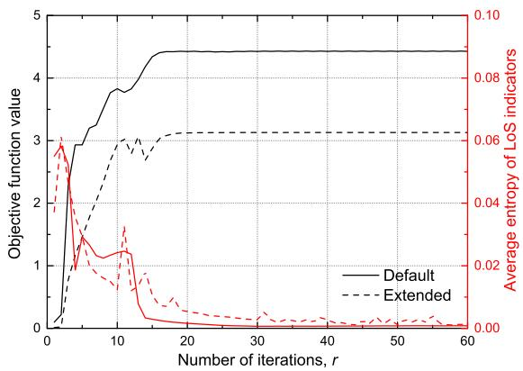  
Fig. 2. Convergence of the proposed scheme for different network sizes.

To enable a meaningful performance comparison, the following five schemes are considered:

1) Proposed scheme: The trajectory and resource allocation, including S, Q, Cˇ , Cˆ , and P, are optimized by Algorithm 1.

2) LoS-based scheme: The trajectory and resource allocation, including S, Q and P¯ , are optimized based on the LoS channel model, assuming all wireless channels are LoS [9].

3) Fixed altitude scheme: The UAV’s altitude is set to 90 m above building heights while optimizing the remaining variables [19].

4) Fixed trajectory scheme: The UAV follows a hover-andfly pattern at an altitude of $H _ { \mathrm { m i n } }$ , hovering sequentially at each GN location and traveling in a straight line at maximum velocity between GNs while optimizing the remaining variables.

5) Fixed power scheme: Each UAV transmits at the peak power $P _ { \mathrm { p e a k } }$ and operates orthogonally by evenly dividing time slots to avoid interference while optimizing the remaining variables.

Fig. 2 shows the convergence of the proposed scheme for different network sizes. For the default scenario, the parameters are set to $M = 2 , L = 2 ,$ , and $K = 6 ,$ whereas the extended scenario adopts $M = 3 , { \cal L } = 3 .$ , and $K = 9 .$ . For both cases, the objective function value initially rises, then decreases briefly, and eventually increases again until convergence. This occurs because we use PCCP in (P2-1) and $\psi _ { a } ^ { \mathrm { L B } } ( z )$ instead of $\psi ( z )$ in (35e) and (39b)–(39d), where $z \in \{ \omega _ { m , k , l } ^ { ( i ) , u } [ n ] , \rho _ { j , k , l } ^ { u } [ n ] , \forall m , j \neq $ $m , u , k , n , l , i \}$ . Since both methods follow the same principle, this phenomenon is explained using the effect of $\psi _ { a } ^ { \mathrm { L B } } ( z )$ Initially, the small value of a allows z to be optimized over a broader feasible region, resulting in non-binary values for z and an increase in the objective function. As a gradually increases to $a ^ { \mathrm { m a x } } , ~ z$ approaches binary values, leading to a temporary decrease in the objective function. This step enforces the binary property of the LoS indicators, $\check { c } _ { m , k } ^ { \mathrm { L } } [ n ]$ and $\hat { c } _ { j , k } ^ { \mathrm { L } } [ n ]$ . Subsequently, the objective function increases again and converges to a stationary point as the remaining variables are optimized while satisfying the binary constraint of the LoS indicators, as discussed in Remark 1. To verify this, we define the average binary entropy of the LoS indicators as $\bar { H } = \mathbb { E } [ \bar { h } ( y ) ]$ , where $\bar { h } ( y ) = - y \log _ { 2 } y - ( 1 - y ) \log _ { 2 } ( 1 - y )$ for $y \in \check { \mathbf { C } } \cup \hat { \mathbf { C } }$ [33]. Note that $\bar { h } ( y )$ approaches 0 as y approaches 0 or 1, allowing H¯ to be evaluated for compliance with the binary nature of the variables. In Fig. 2, the objective function converges to a stationary value as H¯ tends to zero, confirming that the LoS indicators indeed approach binary values. Since the extended scenario involves a larger number of optimization variables and a more complex environment, the average binary entropy H¯ approaches zero more slowly. Consequently, it requires more iterations to achieve convergence compared with the default scenario. Furthermore, the intensified interference in the extended scenario results in the objective function converging to a lower value. Nevertheless, both scenarios converge within 30 iterations.

Fig. 3 shows the trajectory and resource allocation of the proposed scheme: (a) 3D trajectory, (b) 2D trajectory with scheduling, and (c) scheduling and transmit power. These results are deliberately selected as representative snapshots to clearly illustrate the trends in UAV trajectories and resource allocation behavior. In Fig. 3(a), each UAV flies near the building at the lowest altitude to establish the LoS channel with the shortest distance to efficiently serve the $\mathrm { G N s } . ^ { 3 }$ In order to aid interpretation, we illustrate the horizontal trajectory, using different colors to represent the flight paths corresponding to the scheduled GNs in Fig. 3(b). This result shows that each UAV tends to generally fly directly over the scheduled GNs for efficient data transmission, except GN 1 and GN 4. The reason why each UAV does not fly directly over GN 1 and GN 4 when servicing them is to maintain NLoS interference channels. If both UAVs fly over GN 1 and GN 4 at the same time to provide services, LoS interference channels will be established, which causes severe interference. To avoid this, they serve GN 1 and GN 4 at a slightly different distance from each GN, avoiding areas that can form LoS interference channels, as shown in Fig. 3(b). When the UAVs are servicing GN 3 and GN 6, there is no building between them. Hence, LoS interference channels can form. However, since the time of servicing the two nodes does not overlap, LoS interference channels are not formed even if the service is performed directly above each GN. Therefore, when servicing these GNs, the UAVs are flying directly over them to provide service. GN 1 and GN 4 have relatively long UAV hovering times of about 2.5 s due to poor channel conditions, while the other GNs have shorter hovering times of about 0.5 to 1 s. Furthermore, each UAV establishes a path that avoids violating any buildings, even throughout its continuous trajectory. Fig. 3(c) shows that the time is allocated relatively evenly for each GN. However, as discussed earlier, the UAVs spend most of the scheduled time for GN 1 and GN 4 hovering near them since they cannot visit these nodes directly. On the other hand, for the other GNs, the UAVs spend a significant portion of the scheduled time on the move, compensating for the service imbalance caused by the channel conditions. Moreover, because the interference channels maintain NLoS in all time slots, even when using the maximum transmit power, they interfere less with each other. Hence, each UAV continuously uses a transmit power near the maximum value. Using these findings, we can verify that UAVs can effectively leverage building blocking to reduce interference and maintain signal channels to LoS using the proposed scheme.

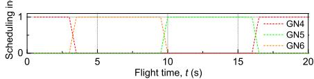

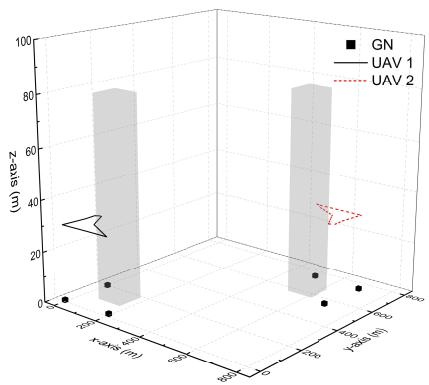  
(a) 3D trajectory.

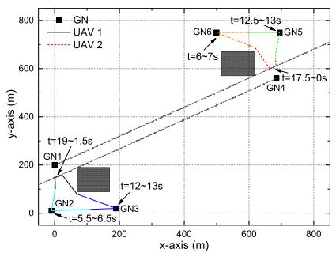  
(b) 2D trajectory with scheduling.

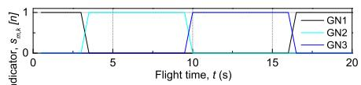

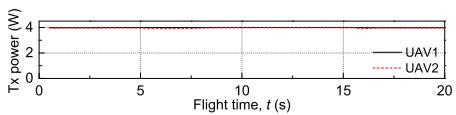  
(c) Scheduling and transmit power.

Fig. 3. Trajectory and resource allocation of the proposed scheme.  
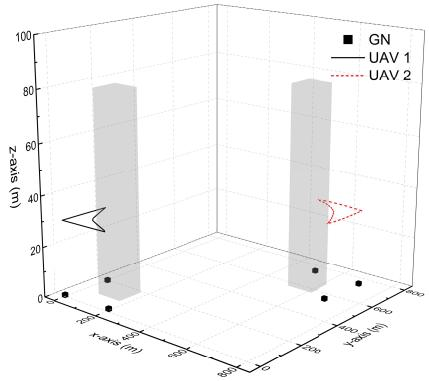  
(a) 3D trajectory.

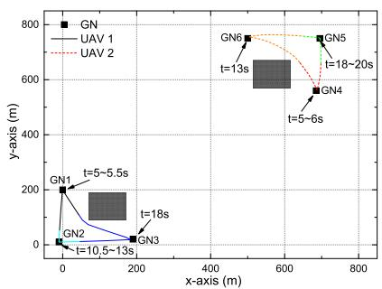  
(b) 2D trajectory with scheduling.

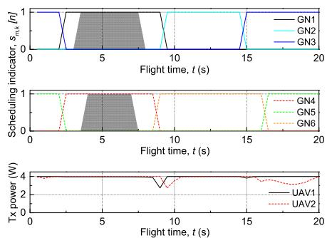  
(c) Scheduling and transmit power.  
Fig. 4. Trajectory and resource allocation of the LoS-based scheme.

Fig. 4 shows the trajectory and resource allocation of the LoS-based scheme: (a) 3D trajectory, (b) 2D trajectory with scheduling, and (c) scheduling and transmit power. Similar to the proposed scheme, UAVs fly near the building at the lowest altitude to serve the GNs in Fig. 4(a). However, Fig. 4(b) illustrates that each UAV hovers directly over GN 1 and GN 4 to serve them despite causing severe interference due to LoS interference channels. This phenomenon is also evident in Fig. 4(c), where interference channels become LoS (indicated in gray color) when each UAV directly serves GN 1 and GN 4 in the same time slot. This result confirms that the LoS-based scheme cannot distinguish the wireless channel states because it assumes all wireless channels are LoS. In addition, in the LoS-based scheme, each UAV lacks trajectory optimization for interference mitigation and relies instead on more dynamic control of transmit power. By comparing Figs. 3 and 4, we can see that the proposed scheme accurately determines the channel state and coordinates the interference through trajectory optimization. This indicates that optimizing the trajectory rather than the transmit power is more effective in terms of reducing interference.

Fig. 5 illustrates the trajectory and resource allocation of the proposed scheme in the extended environment with $M = 3 , \ L = 3 .$ , and $K \ : = \ : 9 :$ (a) 3D trajectory, (b) 2D trajectory with scheduling, and (c) scheduling and transmit power. Similar to the results in Fig. 3, each UAV jointly optimizes its trajectory, scheduling, and transmit power to form LoS channels with its associated GNs while maintaining NLoS conditions for interference channels. Specifically, UAV 1 serves GN 3 while maintaining a slightly offset position to ensure that its interference channel with GN 6 remains NLoS. Similarly, UAV 3 serves GN 7 from a slightly offset position to preserve the NLoS interference link with GN 1. At t = 18.5 s, UAV 1 establishes LoS interference channels with other UAV networks, as indicated in gray in Fig. 5(c); however, since it does not use transmit power at that moment, no actual interference occurs. This demonstrates that the proposed scheme performs effectively even in more complex scenarios with a higher density of UAVs, buildings, and GNs.

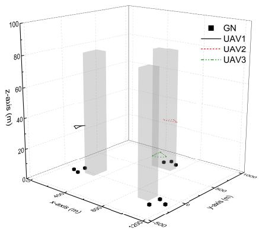  
(a) 3D trajectory.

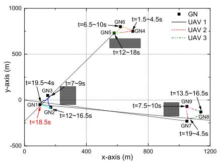  
(b) 2D trajectory with scheduling.

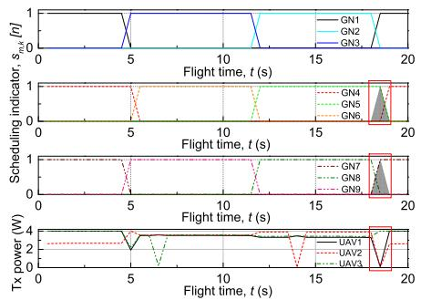  
(c) Scheduling and transmit power.

Fig. 5. Trajectory and resource allocation of the proposed scheme in extended environment.  
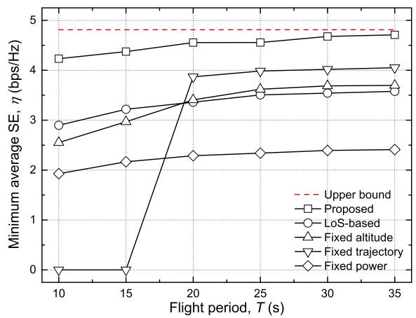  
(a) η vs. T.

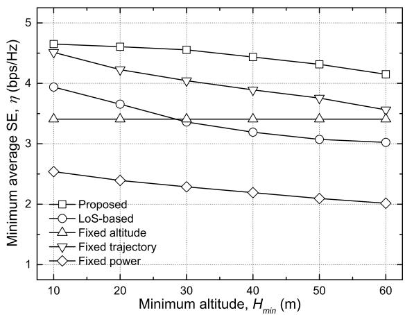

(c) $\eta \ { \mathrm { v s . } } \ P _ { \mathrm { p e a k } } .$  
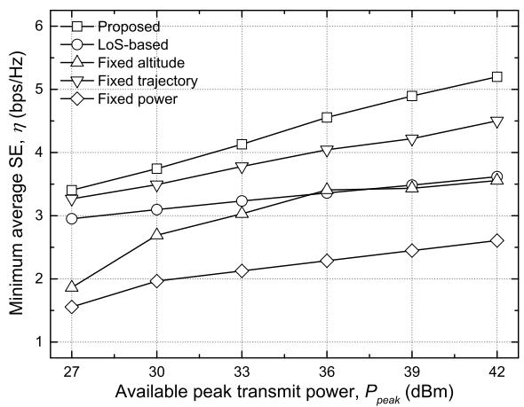

(b) r $\gamma \mathrm { { s . } } H _ { \operatorname* { m i n } } .$  
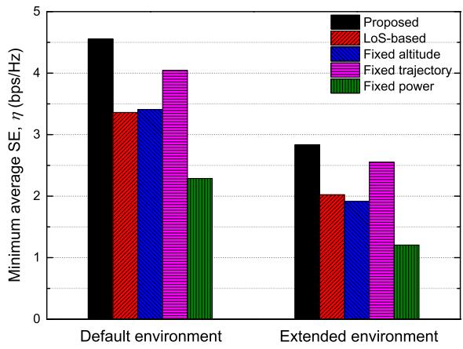  
(d) η vs. network size.  
Fig. 6. Performance comparisons.

Fig. 6 shows a average performance comparison in terms of minimum average SE (η) for different system parameters: (a) flight period (T ), (b) minimum altitude $( H _ { \operatorname* { m i n } } )$ , (c) peak transmit power $( P _ { \mathrm { p e a k } } )$ , and (d) network size. The average performance is computed over 10 instances, where the node deployments are randomly generated to reflect a diverse range of representative scenarios. In Fig. 6(a), the upper bound performance is obtained by eliminating the maximum speed constraints and increasing T until additional improvements are no longer observed. As T increases, each UAV gains more flexibility in maneuvering, allowing it to remain above the scheduled GN for longer relative to its travel time and provide a more efficient service. As a result, η improves across all schemes, with the proposed scheme approaching the upper bound performance. In the fixed trajectory scheme, performance cannot be measured when $T \le 1 5 \mathrm { ~ s ~ }$ because there is not enough time to visit all GNs for optimization. However, when $T \geq 2 0 \mathrm { ~ s } ,$ the UAV flies in a hover-and-fly pattern at the lowest altitude and optimizes communication resources including scheduling and transmit power efficiently, showing the highest performance among the baseline schemes. However, due to the nature of hover-and-fly, the interference channel between GN 1 and GN 4 cannot be inherently maintained as NLoS, similar to the LoS-based scheme shown in Fig. 4. Therefore, the performance is lower than that of the proposed scheme. Although the fixed altitude scheme can determine channel states accurately, which enables it to form an efficient trajectory and optimize communication resources, its performance remains lower than that of the fixed trajectory scheme due to reduced channel gain at higher altitudes. In addition, when $T \leq 1 5$ s, the fixed altitude scheme lacks sufficient time to form an optimized trajectory capable of compensating for the low channel gain, which makes it less effective than the LoS-based scheme. Consequently, it achieves lower η than the LoS-based scheme. However, because the fixed altitude scheme can accurately determine the channel state, it can provide efficient service as $T$ increases. On the other hand, because the LoS-based scheme cannot determine the channel state, the performance improvement is not significant as T increases. Therefore, the performance of the two schemes reverses when $T \geq 2 0 \mathrm { ~ s ~ }$ . The fixed power scheme achieves the lowest η because the available time resource is reduced to half as each UAV divides up time slots to avoid causing interference.

In Fig. 6(b), the performance of all schemes decreases as $H _ { \mathrm { m i n } }$ increases due to the deterioration of the channel gain between the UAVs and GNs, except for the fixed altitude scheme. When $H _ { \mathrm { m i n } } = 1 0 \mathrm { ~ m ~ }$ , there is not much difference in performance between the proposed and fixed trajectory schemes. However, as $H _ { \mathrm { m i n } }$ increases, the gap between the two schemes gradually increases. This is because when $H _ { \mathrm { m i n } }$ is small, the signal channel is significantly better than the interference channel, so accurately determining the state of the interference channel (LoS or NLoS) has a smaller impact on performance. However, as $H _ { \mathrm { m i n } }$ increases, the signal channel degrades, and the impact of interference increases. As a result, the performance gap is significant between the proposed scheme, which forms NLoS interference channels when serving GN 1 and GN 4, and the fixed trajectory scheme, which cannot. Similarly, the performance difference between the proposed and LoS-based schemes increases with $H _ { \mathrm { m i n } }$ due to the same effect.

Fig. 6(c) shows that as $P _ { \mathrm { p e a k } }$ increases, the power available to the UAVs to transmit signals increases, which improves the performance of all schemes. Similar to Fig. 6(b), a higher $P _ { \mathrm { p e a k } }$ amplifies the impact of interference coordination, which leads to a greater performance gain for the proposed scheme by ensuring interference channels remain NLoS. By jointly optimizing scheduling, trajectory, channel state determination, and transmit power while continuously avoiding buildings, the proposed scheme consistently outperforms the baseline schemes in most scenarios.

In Fig. 6(d), the default environment is configured with $M = 2 , L = 2$ , and $K = 6 .$ , while the extended environment considers $M = 3 , \ L = 3$ , and $K \ : = \ : 9 .$ . As the network size increases, the interference among different UAV networks becomes more severe, leading to performance degradation in all schemes. Nevertheless, the proposed scheme consistently achieves the best performance even in the more complex network setting, demonstrating its scalability and robustness under realistic urban conditions.

## VI. CONCLUSION

By leveraging UAV mobility, this study explores a novel approach to utilizing building blockage for interference management. Specifically, a mathematical model was designed to judge wireless channel obstruction caused by buildings while guaranteeing UAVs do not violate cuboid-shaped buildings. Subsequently, we constructed a joint optimization problem of communication resources and trajectories to coordinate interference and maximize the minimum SE among GNs in multi-UAV-enabled wireless networks. We also employed a variety of advanced optimization methods to solve this non-convex MINLP problem. Through comprehensive simulations, we validated the accuracy of the proposed optimization approach and provided valuable insights. In particular, UAVs optimized their trajectories to establish LoS channels for transmitting desired signals to scheduled GNs while forming NLoS channels to mitigate interference for others to improve network performance without invading cuboid-shaped buildings. This study is expected to contribute to the advancement of wireless communications by utilizing NLoS channels for interference coordination in future networks. As future work, we plan to incorporate more realistic kinematic models and to explore online optimization and learning-based algorithms that can support real-time adaptation to dynamic environments.

## REFERENCES

[1] L. Gupta, R. Jain, and G. Vaszkun, “Survey of important issues in UAV communication networks,” IEEE Commun. Surveys Tuts., vol. 18, no. 2, pp. 1123–1152, 2nd Quart., 2016.

[2] Y. Zeng, R. Zhang, and T. J. Lim, “Wireless communications with unmanned aerial vehicles: Opportunities and challenges,” IEEE Commun. Mag., vol. 54, no. 5, pp. 36–42, May 2016.

[3] M. Mozaffari, W. Saad, M. Bennis, and M. Debbah, “Efficient deployment of multiple unmanned aerial vehicles for optimal wireless coverage,” IEEE Commun. Lett., vol. 20, no. 8, pp. 1647–1650, Aug. 2016.

[4] K. Heo, G. Park, and K. Lee, “Joint optimization of UAV trajectory and communication resources with complete avoidance of no-fly-zones,” IEEE Trans. Intell. Transp. Syst., vol. 25, no. 10, pp. 14259–14265, Oct. 2024.

[5] K. Heo, H.-H. Choi, and K. Lee, “Joint trajectory and resource optimization for UAV-assisted SWIPT systems: A comparative study of linear and nonlinear energy harvesting models,” IEEE Internet Things J., vol. 11, no. 24, pp. 40293–40305, Dec. 2024.

[6] G. Park, K. Heo, W. Lee, and K. Lee, “UAV-assisted wireless-powered two-way communications,” IEEE Trans. Intell. Transp. Syst., vol. 25, no. 3, pp. 2641–2655, Mar. 2024.

[7] M. Shao, J. Yan, and X. Zhao, “Secrecy rate maximization by cooperative jamming for UAV-enabled relay system with mobile nodes,” IEEE Internet Things J., vol. 10, no. 15, pp. 13168–13180, Aug. 2023.

[8] K. Heo, W. Lee, and K. Lee, “UAV-assisted wireless-powered secure communications: Integration of optimization and deep learning,” IEEE Trans. Wireless Commun., vol. 23, no. 9, pp. 10530–10545, Sep. 2024.

[9] Q. Wu, Y. Zeng, and R. Zhang, “Joint trajectory and communication design for multi-UAV enabled wireless networks,” IEEE Trans. Wireless Commun., vol. 17, no. 3, pp. 2109–2121, Mar. 2018.

[10] C. Kim, H.-H. Choi, and K. Lee, “Joint optimization of trajectory and resource allocation for multi-UAV-enabled wireless-powered communication networks,” IEEE Trans. Commun., vol. 72, no. 9, pp. 5752–5764, Sep. 2024.

[11] Y. Zeng, J. Xu, and R. Zhang, “Energy minimization for wireless communication with rotary-wing UAV,” IEEE Trans. Wireless Commun., vol. 18, no. 4, pp. 2329–2345, Apr. 2019.

[12] C. You and R. Zhang, “Hybrid offline-online design for UAV-enabled data harvesting in probabilistic LoS channels,” IEEE Trans. Wireless Commun., vol. 19, no. 6, pp. 3753–3768, Jun. 2020.

[13] A. Meng, X. Gao, Y. Zhao, and Z. Yang, “Three-dimensional trajectory optimization for energy-constrained UAV-enabled IoT system in probabilistic LoS channel,” IEEE Internet Things J., vol. 9, no. 2, pp. 1109–1121, Jan. 2022.

[14] P. Kumar, S. Bhattacharyya, S. Darshi, S. Majhi, A. A. Almohammedi, and S. Shailendra, “Outage analysis using probabilistic channel model for drone assisted multi-user coded cooperation system,” IEEE Trans. Veh. Technol., vol. 72, no. 8, pp. 10273–10285, Aug. 2023.

[15] Y. Qin, M. A. Kishk, and M.-S. Alouini, “On the downlink SINR meta distribution of UAV-assisted wireless networks,” IEEE Trans. Commun., vol. 71, no. 11, pp. 6762–6778, Nov. 2023.

[16] P. Yi, L. Zhu, L. Zhu, Z. Xiao, Z. Han, and X.-G. Xia, “Joint 3-D positioning and power allocation for UAV relay aided by geographic information,” IEEE Trans. Wireless Commun., vol. 21, no. 10, pp. 8148–8162, Oct. 2022.

[17] S. Bi, Z. Zhuo, X.-H. Lin, Y. Wu, and Y.-J.-A. Zhang, “Physicalenvironment-map-aided 3-D deployment optimization for UAV-assisted integrated localization and communication in urban areas,” IEEE Internet Things J., vol. 11, no. 9, pp. 15490–15503, May 2024.

[18] Y. Cai, W. Yuan, Z. Wei, C. Liu, S. Hu, and D. W. Kwan Ng, “Trajectory design and resource allocation for UAV-enabled data collection in wireless sensor networks with 3D blockages,” in Proc. 1st Int. Conf. 6G Netw. (6GNet), Paris, France, Jul. 2022, pp. 1–8.

[19] P. Yi, L. Zhu, Z. Xiao, R. Zhang, Z. Han, and X.-G. Xia, “3- D positioning and resource allocation for multi-UAV base stations under blockage-aware channel model,” IEEE Trans. Wireless Commun., vol. 23, no. 3, pp. 2453–2468, Mar. 2024.

[20] G. Park, K. Heo, and K. Lee, “Blockage-aware UAV-assisted wireless data harvesting with building avoidance,” 2025, arXiv:2501.02453.

[21] Google Developers. (May 12, 2025). Photorealistic 3D Tiles. Accessed: May 20, 2025. [Online]. Available: https://developers.google.com/maps/ documentation/tile/3d-tiles

[22] B. Li, Q. Li, Y. Zeng, Y. Rong, and R. Zhang, “3D trajectory optimization for energy-efficient UAV communication: A control design perspective,” IEEE Trans. Wireless Commun., vol. 21, no. 6, pp. 4579–4593, Jun. 2022.

[23] M. Grant and S. Boyd. (2017). CVX: MATLAB Softw. for Disciplined Convex Programming. [Online]. Available: http://cvxr.com/cvx

[24] S. Boyd and L. Vandenberghe, Convex Optimization. Cambridge, U.K.: Cambridge Univ. Press, 2004.

[25] T. Lipp and S. Boyd, “Variations and extension of the convex–concave procedure,” Optim. Eng., vol. 17, no. 2, pp. 263–287, Jun. 2016.

[26] K. Shen and W. Yu, “Fractional programming for communication systems—Part I: Power control and beamforming,” IEEE Trans. Signal Process., vol. 66, no. 10, pp. 2616–2630, May 2018.

[27] Z. Zheng, T. R. Bewley, and F. Kuester, “Point cloud-based targetoriented 3D path planning for UAVs,” in Proc. Int. Conf. Unmanned Aircr. Syst. (ICUAS), Athens, Greece, Sep. 2020, pp. 790–798.

[28] N. Shen, J. Cao, M. Zipp, and W. Stork, “Autonomous obstacle avoidance for UAV based on point cloud,” in Proc. Int. Conf. Unmanned Aircr. Syst., 2022, pp. 1580–1585.

[29] Q. Vu, K.-G. Nguyen, and M. Juntti, “Max-min fairness for multicast multigroup multicell transmission under backhaul constraints,” in Proc. IEEE Globecom, Dec. 2016, pp. 1–6.

[30] D. P. Bertsekas, Nonlinear Programming Belmont, MA, USA: Athena Scientific, 1999.

[31] A. Ben-Tal and A. Nemirovski, Lectures on Modern Convex Optimization: Analysis, Algorithms, and Engineering Applications. Philadelphia, PA, USA: SIAM, 2001.

[32] C. E. Leiserson, R. L. Rivest, T. H. Cormen, and C. Stein, Introduction to Algorithms, vol. 6. Cambridge, MA, USA: MIT Press, 2001.

[33] D. J. C. MacKay, Information Theory, Inference and Learning Algorithms. Cambridge, U.K.: Cambridge Univ. Press, 2003.

  
Kanghyun Heo received the B.S. and M.S. degrees in information and communication engineering from Dongguk University, Seoul, South Korea, in 2024 and 2025, respectively. His research interests include network optimization, optimization methods, deep learning, satellite communications, and semantic communications.

Gitae Park received the B.S. degree in information and communication engineering from Dongguk University, Seoul, South Korea, in 2024, where he is currently pursuing the M.S. degree. His research interests include network optimization, energy harvesting networks, satellite communications, and deep learning.

Kisong Lee (Senior Member, IEEE) received the B.S., M.S., and Ph.D. degrees in electrical engineering from Korea Advanced Institute of Science and Technology, Daejeon, South Korea, in 2007, 2009, and 2013, respectively. He was a Researcher with the Electronics and Telecommunications Research Institute from September 2013 to February 2015. From March 2015 to August 2017, he was an Assistant Professor with the Department of Information and Communication Engineering, Kunsan National University. From September 2017 to February 2020,

he was an Assistant/Associate Professor with the School of Information and Communication Engineering, Chungbuk National University. He is currently a Professor with the Department of Information and Communication Engineering, Dongguk University, Seoul, South Korea. His research interests include network optimization, energy ICT, information security, satellite communications, deep learning, mobility optimization, and semantic communications.