# Cargo UAVs Pick-Up Systems for Low-Altitude Economy With Communication Quality, Battery Energy, and Time Window Constraints

Mingjian Chen , Liang Yang , Senior Member, IEEE, Jiangling Cao , Guangxu Zhu , Member, IEEE, Weijie Yuan , Senior Member, IEEE, Hongbo Jiang , Senior Member, IEEE, and Dusit Niyato , Fellow, IEEE

Abstract—The rapid development of the low-altitude economy (LAE) has accelerated the deployment of cargo unmanned aerial vehicles (UAVs) for intelligent logistics and delivery services. However, large-scale UAV operations still face multiple practical challenges, including unstable communication connectivity, limited onboard battery energy, and strict customer time-window constraints. To address these issues, this paper investigates the trajectory and task scheduling optimization problem for multi-UAV cooperative cargo pick-up under joint communication, energy, and time-window constraints. We develop a collision-aware cooperative multi-UAV optimization algorithm (CACMO) that integrates a Dueling Deep Q-Network (D3QN) for communication-aware trajectory learning with a simulated annealing (SA) based global task-sequence planner and an explicit inter-UAV conflict-resolution mechanism. The D3QN module enables adaptive trajectory generation in unknown and time-varying radio environments without requiring an a priori radio map, maintaining stable connectivity while reducing flight cost, whereas the SA module determines efficient task orders and enforces safe coordination among multiple UAVs through collision-aware refinement. Simulation results demonstrate that the proposed CACMO algorithm framework achieves an optimal balance between task completion time (1,719 seconds) and user satisfaction (score of 0.9969) under typical operating conditions, delivering a 70–75% reduction in total weighted cost compared to representative baseline methods. Crucially, this substantial improvement is achieved while explicitly enforcing multi-UAV collision avoidance—a critical constraint absent in most

baseline methods. The framework maintains zero communication outage and guarantees safe inter-UAV separation throughout the mission while satisfying all energy and time window constraints in realistic urban environments, confirming its robustness and scalability for cooperative multi-UAV logistics operations within the LAE.

Index Terms—Cargo pick-up, cellular-connected UAVs, deep reinforcement learning, simulated annealing, trajectory optimization.

## I. INTRODUCTION

N RECENT years, driven by the rapid development of uneconomy (LAE) has become a prominent economic paradigm in China. The LAE is conceived as an economic system that integrates a variety of low-altitude aviation activities involving both unmanned and manned craft, including UAVs and electric vertical take-off and landing (eVTOL) aircraft [1]. It encompasses various activities and industries that operate within the low-altitude airspace, such as logistics and delivery services, transportation, environmental surveillance, agriculture, and entertainment. Within this context, cellular-connected cargo UAVs have become a key component, offering remarkable advantages in communication, coverage, and data transmission. Unlike conventional non-connected UAVs that rely on WiFi, Bluetooth, or proprietary radio signals with limited communication ranges, cellular-connected UAVs can communicate over long distances and transfer data swiftly. They also reduce operational costs and enhance efficiency. When ground communication is impaired or coverage is inadequate, these UAVs can function as aerial nodes to establish temporary networks [2], [3], ensuring information flow during emergency rescue operations. Equipped with sensors, they also serve as platforms for data collection and transmission [4], [5], with applications in environmental monitoring [6], smart agriculture [7], smart city management [8], infrastructure inspection [9], and logistics distribution [10], [11], [12] across various industries.

As the LAE continues to flourish, the importance of cargo UAVs in logistics and distribution is becoming increasingly prominent. Compared to the traditional truck delivery methods [13], UAVs provide a novel solution for logistics and distribution problems. Unlike trucks, UAVs avoid ground traffic, enabling faster point-to-point travel and reducing delivery time. Their speed and immunity to congestion enable precise on-time deliveries, enhancing customer satisfaction. UAVs can operate without large-scale infrastructure, allowing flexible takeoffs and landings. This is advantageous in remote or complex terrains, expanding logistics coverage. With lower operational costs and less labor dependency, UAVs cut long-term costs. Additionally, their low noise and zero emissions align with sustainable development. Ultimately, the speed and accuracy of UAV delivery improve logistics service quality, boost customer experience, help businesses stand out in competitive markets, and establish a positive brand image. Consequently, companies like JD.com [14] are boosting research and development efforts in cargo UAVs to promote the development of the logistics industry within the LAE.

## A. Related Works

As an emerging distribution method, UAV logistics delivery has garnered widespread attention in recent years. Many studies focus on cargo UAV as a research direction. However, although cargo UAVs have many advantages in the field of logistics and distribution, there are still some challenges that need to be addressed, such as communication quality, battery energy of UAV, and mission time window.

Firstly, communication quality is a crucial challenge in UAV logistics [28]. Unstable communication links prevent UAVs from providing real-time feedback on status information, posing flight safety risks and potentially leading to mission failure [29]. Thus, UAVs need to maintain stable communication links with the ground base station (GBS) to ensure flight safety and successful task completion during missions, which is crucial for complex environment logistics tasks. Secondly, UAVs have limited battery capacity [24]. For cargo UAVs, a single flight task often involves multiple user points, which means energy consumption must be considered to prevent mission failure or timeouts due to energy depletion. Meanwhile, time window constraint is another key challenge in UAV logistics. Meeting customer-specified delivery time windows in logistics is essential, as it is analogous to the Vehicle Routing Problem with Time Windows (VRPTW) [13]. Users usually have clear delivery time requirements, and UAVs must complete tasks within specified time windows. Meeting these requirements improves user satisfaction and reduces potential losses from delayed deliveries [30], which is vital for enhancing the competitiveness of UAV logistics.

Fortunately, many studies have made efforts to address the aforementioned challenges. For example, [15], [16], [17] regarded the issue of communication quality to ensure that UAVs have stable and reliable communication during task execution. Specifically, [15] designed a long-range multi-UAV communication system using low-cost, accessible equipment, at the same time ensured reliable communication. In [16], through shortest path and flight sequence planning, authors effectively addressed the pickup and delivery problem with capacity constraints based on communication connectivity (PDPCC) under communication quality constraint. [17] proposed a system model for UAVenhanced parcel delivery, which designed the trajectory of the UAVs to maintain a reliable communication link during the delivery process.

Additionally, many relevant studies have taken battery energy limitation into account to meet the usage scenarios of logistics

UAVs in real life [18], [19], [20], [26]. For instance, [26] proposed a connectivity-aware multi-package UAV delivery system considering the battery energy constraint. When using UAVs for large-scale package delivery, [18] considered UAV battery capacity limitations and proposed a new method that combines a new plan generation algorithm with a collective learning heuristic approach. The authors in [19] investigated the trajectory design problem of using UAVs in mobile crowdsensing (MCS) for cargo delivery and sensing tasks, which also considered UAV battery consumption and sensing task time window constraints. With the consideration of the energy consumption model of drones, [20] formulated a mixed-integer programming model that minimizes the delivery time.

Furthermore, [21], [22], [23] considered UAV completing the tasks under time window constraints to ensure timely delivery of goods. In [21], when examining UAV scheduling problems in urban aerial on-demand delivery services, the authors took the time window constraints into account for pickup and delivery operations. In addition to considering the time window for cargo delivery, [22] and [23] also took user satisfaction into account, which is crucial in UAV delivery as it affects corporate reputation and has other potential impacts. For example, [22] presented a multi-objective optimization model based on the epsilon-constraint method, with objectives of minimizing total flight distance and maximizing average customer satisfaction. To minimize travel costs and maximize customer service levels under time window constraint, [23] proposed a novel synchronized UAV and delivery truck mechanism and established a multi-objective optimization model.

Moreover, some works consider multiple constraints simultaneously. For example, [24] investigated how to minimize UAV energy consumption and handover rates while satisfying battery size and disconnectivity rate constraints. To offer efficient, lowenergy-consumption, and low-delay UAV planning strategies for smart city logistics, [25] explored the path planning problem of logistics UAVs considering energy consumption constraints, customer time windows, and wind condition impacts.

In addition, some researches treat these challenges as optimization objectives rather than constraints. In order to achieve better communication quality, [26] introduced a connectionaware delivery (CAD) framework to minimize communication outage time. [31] and [32] both jointly optimized drone trajectory and sensing task selection to minimize energy consumption, maximize sensing returns, and ensure timely goods delivery. Additionally, [32] also considered to minimize connection outage of multiple cellular-connected UAVs.

## B. Motivation and Contributions

The summary of related work is shown in Table I, where we additionally include the UAV number adopted in each study. Most existing UAV logistics studies consider only one or two constraints among communication quality, onboard battery energy, and time windows [24], [25], [33], [34], [35]; thus, to the best of our knowledge, no prior work (including [27], [36]) jointly incorporates all three constraints in a cellular-connected cargo UAV pick-up framework. Moreover, as indicated by the UAV-number column, many studies adopt a single-UAV setting, which can be insufficient under stringent time windows and motivates multi-UAV cooperation. In addition, graph-theoretic communication-aware trajectory designs (e.g., [27], [36]) typically rely on a pre-known radio map, which can be costly or unavailable for emergency deliveries or newly deployed areas; this motivates DRL-based trajectory optimization that can learn from online measurements without requiring an a priori radio map. Meanwhile, [27] does not explicitly enforce an onboard energy-budget constraint and does not model inter-UAV collision avoidance, further motivating a safety-aware and energyfeasible multi-UAV formulation.

TABLE I  
SUMMARY OF THE RELATED WORK ON UAV DELIVERY
<table><tr><td rowspan="2">Ref</td><td rowspan="2">Task</td><td rowspan="2">Insight</td><td rowspan="2">UAV number</td><td colspan="3">Constraints</td></tr><tr><td>Communication quality</td><td>Battery energy</td><td>Time window</td></tr><tr><td>[15]</td><td>Medical cargo delivery in rural areas</td><td>Low-cost communication system with multiple links</td><td>Multiple</td><td>√</td><td>x</td><td>x</td></tr><tr><td>[16]</td><td>Optimal trajectory design for UAV cargo delivery</td><td>Two-step method balancing speed and communication</td><td>Multiple</td><td>√</td><td>x</td><td>x</td></tr><tr><td>[17]</td><td>Parcel delivery during COVID-19</td><td>Hybrid delivery system with prioritiza- tion</td><td>Multiple</td><td>√</td><td>x</td><td>x</td></tr><tr><td>[18]</td><td>Large-scale package delivery with UAVs</td><td>Collective learning for efficient path planning</td><td>Multiple</td><td>x</td><td>√</td><td>x</td></tr><tr><td>[19]</td><td>Optimize UAV trajectories for mobile crowdsensing using DRL</td><td>DDQN-PER for efficient task allocation</td><td>Multiple</td><td>x</td><td>√</td><td>x</td></tr><tr><td>[20]</td><td>Collaborative truck-drone routing for contactless delivery</td><td>An improved variable neighborhood de- scent algorithm to minimize delivery time</td><td>Multiple</td><td>x</td><td>√</td><td>x</td></tr><tr><td>[21]</td><td>Formulate and solve urban aerial deliv- ery problem with spatial conflict con- straints</td><td>Branch-and-cut algorithm with valid in- equalities and greedy heuristic</td><td>Multiple</td><td>x</td><td>x</td><td>√</td></tr><tr><td>[22]</td><td>Multi-target urban UAV distribution path planning using epsilon-constraint method</td><td>Transforms multi-objective problem into single-objective by converting one objective into constraint</td><td>Multiple</td><td>x</td><td>x</td><td>x</td></tr><tr><td>[23]</td><td>Plan efficient routes for trucks and drones working together</td><td>Use trucks as mobile launch and charg- ing stations for drones to extend their operational range</td><td>Multiple</td><td>x</td><td>x</td><td>√</td></tr><tr><td>[24]</td><td>Design energy-efficient UAV trajecto- ries with minimal handoffs and ensured connectivity</td><td>A dynamic programming solution for energy efficiency and connectivity</td><td>Single</td><td>√</td><td>√</td><td>x</td></tr><tr><td>[25]</td><td>Optimize UAV trajectories considering energy limits, customer time windows, and wind effects</td><td>A GA-LNS algorithm to handle static and dynamic wind conditions</td><td>Multiple</td><td>x</td><td>√</td><td>√</td></tr><tr><td>[26]</td><td>Optimize UAV paths and pick-up de- signs for multi-package delivery with stable connectivity</td><td>A CAD framework using DRL and GA to balance package value and commu- nication quality</td><td>Single</td><td>x</td><td>√</td><td>x</td></tr><tr><td>[27]</td><td>Cellular-connected multi-UAV pickup- and-delivery (PDP) logistics</td><td>SINR radio-map-based path planning (improved Dijkstra) and HGA-based task/route optimization for MME/MSE minimization</td><td>Multiple</td><td>√</td><td>x</td><td>x</td></tr></table>

To address these gaps, we propose a cellular-connected multi-UAV cargo pick-up system that jointly incorporates communication quality, battery energy, and pick-up time windows as constraints, and study a multi-objective trajectory optimization that minimizes total task time while maximizing overall user satisfaction. The contributions of this paper are summarized as follows:

Unified multi-constraint modeling: For the first time, communication connectivity, UAV battery energy, and customer time-window constraints are simultaneously incorporated into a unified decision-making model for cargo UAV operations. This integration allows the proposed algorithm to achieve a balanced trade-off among communication reliability, energy efficiency, and service timeliness under realistic urban environments within the LAE.

\- Communication-aware trajectory learning: A Dueling Deep Q-Network (D3QN) is designed for the cargo UAV pick-up problem, where the state representation and reward shaping explicitly encode the probabilistic communication quality with ground base stations. This enables the learned policy to select routes that maintain reliable connectivity while minimizing task completion time and energy consumption.

Collision-aware cooperative multi-UAV optimization (CACMO): A collision-aware cooperative multi-UAV optimization algorithm, termed CACMO, is proposed that integrates D3QN-based local trajectory learning with simulated annealing (SA) for global task-sequence planning and alternating conflict-free refinement. The two modules interact iteratively: SA leverages the pairwise trajectory cost matrix generated by D3QN to optimize the multi-station pick-up order, while detected conflicts are adaptively resolved through a collision-penalty-based retraining process, ensuring safe and efficient multi-UAV coordination.

## C. Organization and Notations

The rest of this paper is organized as follows. We introduce the system model of the cargo UAV pick-up scenario and the proposed optimization problem in Section II. In Section III, the proposed three-stage CACMO algorithm is introduced in detail.

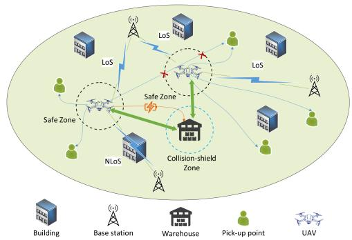  
Fig. 1. System model of the multi-UAV cooperative pick-up scenario. Multiple UAVs depart from a central warehouse, visit pick-up points, and return to the warehouse. Each UAV maintains cellular connectivity with the serving sector (of the GBS), and the link quality (affected by LoS/NLoS blockage) constrains the feasible flight. A minimum safety zone is enforced between UAVs to avoid collisions. A warehouse shield zone exempts UAVs from collision checks during simultaneous take-off/landing. Buildings are modeled following the ITU urban distribution, potentially blocking communication signals. During the mission, it can return to the warehouse early for battery replacement before setting off again.

Section IV shows our simulation results. Finally, we summarize the conclusion in Section V.

Notations: Scalars in this paper are denoted by italic letters, vectors are represented by bold-face lowercase letters, and matrices are represented by bold-face uppercase letters. Additionally, $\mathbb { R } ^ { N \times 1 }$ denotes the space of N-dimensional real-valued vector. -x- represents the Euclidean norm of vector x.

## II. SYSTEM MODEL AND PROBLEM FORMULATION

As shown in Fig. 1, we consider a multi-UAV cooperative cargo pick-up system. The number of UAVs executing tasks simultaneously is $Q .$ The flight area of the UAV is a square with $I \times I ,$ where I represents the length of the area. The UAV’s flight altitude is denoted as $H _ { u a v } ( t )$ , the flight speed as $V _ { u a v } ( t )$ , and the maximum flight altitude and speed are represented by $H _ { \mathrm { m a x } }$ and $V _ { \mathrm { m a x } } ,$ respectively. The cargo weight carried by single UAV is represented as $W _ { u a v } ( t )$ . We use the three-dimensional coordinate ${ \bf p } _ { u a v } ( t ) = ( x _ { u a v } ( t ) , y _ { u a v } ( t ) , H _ { u a v } ( t ) ) \in \mathbb { R } ^ { 3 \times 1 }$ to represent the position of UAV. Additionally, the entire system consists of one central warehouse and K user pick-up points. To simplify the system, a single warehouse is used as both the starting and ending point. In reality, this setup can be easily generalized, for instance, by having different starting and ending points in a multi-warehouse system [29]. The UAV needs to depart from the warehouse, visit all K fixed users (e.g., pre-registered addresses or micro-fulfillment centers) to collect cargo, and then return to the warehouse. We define the indices of the pick-up points as 1 to $K ,$ , and the index of the warehouse as 0, denoted by $d _ { 0 } .$ . The set of pick-up points is $D = \{ d _ { 1 } , d _ { 2 } , \dots , d _ { K } \}$ . For any $d _ { k } \in D$ , it represents the two-dimensional coordinates $( x _ { k } , y _ { k } )$ of the k-th pick-up point. We also denote the weight of package to be collected at the k-th point as $w _ { k }$ . The UAV’s own carrying capacity is $w _ { \mathrm { m a x } }$ . To support cellular-connected UAV operations, the considered area is covered by a terrestrial cellular network consisting of M GBSs deployed at fixed locations $\{ L _ { b s } ^ { m } \} _ { m = 1 } ^ { M }$ . The GBSs provide continuous wireless connectivity for UAV command-and-control (C2) signaling and mission-data exchange during the pick-up mission. Hence, the UAV routes are subject to a communication-quality requirement with respect to the serving sector along the flight, whose detailed definition is given in Sections II-A and II-B.

## A. Channel Model Between UAVs and GBSs

In the communication system between UAVs and GBSs, considering signal loss and fading during transmission, the free space path loss model is employed. To simulate urban scenarios for cargo UAVs flight, we consider both line-of-sight (LoS) and non-line-of-sight (NLoS) channels. The LoS channel is used when the communication link between the UAV and the GBS is unobstructed by buildings. Otherwise, the NLoS channel is utilized. For path loss, this paper adopts the log-distance model and the 3 rd Generation Partnership Project (3GPP) specifications [37], [38], [39], which are defined as

$$
P L = \left\{ \begin{array} { l l } { 2 8 + 2 2 \log _ { 1 0 } ( d i s _ { u b } ^ { m } ( t ) ) + 2 0 \log _ { 1 0 } ( f _ { c } ) , } & { \mathrm { L o S , } } \\ { - 1 7 . 5 + ( 4 6 - 7 \log _ { 1 0 } ( H _ { f } ) ) \log _ { 1 0 } ( d i s _ { u b } ^ { m } ( t ) ) } & \\ { + 2 0 \log _ { 1 0 } \left( \frac { 4 0 \pi f _ { c } } { 3 } \right) , } & { \mathrm { N L o S } } \end{array} \right.\tag{1}
$$

where $f _ { c }$ is the carrier frequency, and $\mathrm { d i s } _ { u b } ^ { m } ( t ) =$ $\sqrt { ( x _ { u a v } ( t ) - x _ { b s } ^ { m } ) ^ { 2 } + ( y _ { u a v } ( t ) - y _ { b s } ^ { m } ) ^ { 2 } + ( H _ { u a v } ( t ) - \ddot { H } _ { b s } ) ^ { 2 } }$ ( ( ) ) + ( ( ) ) + ( ( ) )represents the Euclidean distance at time t. The coordinates of the m-th base station are $L _ { b s } ^ { m } = ( x _ { b s } ^ { m } , y _ { b s } ^ { m } )$ , and $H _ { b s }$ is = ( )the antenna height of the GBS, which is a constant for all GBSs. Additionally, to further simulate the actual channel characteristics, small-scale fading is considered. In the LoS case, Rician fading is introduced to account for the effect of the direct path, while in the ${ \mathrm { N L o S } }$ case, Rayleigh fading is introduced to model rich scattering without a dominant path. These small-scale coefficients are randomly updated over time, resulting in time-varying channel gains.

## B. Communication Model Between UAVs and GBSs

The communication between UAVs and GBSs adheres to the standard 3GPP specifications [39], [40], [41]. Each GBS generates 3 signal sectors, forming a total of $G = 3 \times M$ cellular regions. However, it is important to note that this specific configuration can be flexibly adjusted to any number of sectors as needed. The number of sectors per GBS is not fixed and can be set to other values depending on the specific requirements of the communication system. Additionally, a cargo UAV can communicate with only one region at a time, utilizing time division multiple access (TDMA) technology to establish communication links. TDMA is used for intra-sector scheduling, while inter-sector co-channel transmissions cause interference. At time $t ,$ the signal sector communicating with the UAV is denoted as $g _ { u a v } ( t )$ , and the received signal power intensity is expressed as $P _ { r } ^ { g } ( t )$ , defined as

$$
\begin{array} { c } { { P _ { r } ^ { g } ( t ) = P _ { t } ^ { g } \left| h _ { g } ( t ) \right| ^ { 2 } } } \\ { { { } } } \\ { { = P _ { t } ^ { g } \alpha _ { g } ( t ) A _ { g } ( t ) \beta _ { g } ( t ) , } } \\ { { { } } } \\ { { g = \{ 1 , 2 , . . . , G \} , } } \end{array}\tag{2}
$$

where $P _ { t } ^ { g }$ represents the transmission power of signal sector $^ { g , }$ which is a constant [42], $h _ { g } ( t )$ denotes the baseband equivalent channel from signal sector g to the UAV at time t, determined by the antenna gain $A _ { g } ( t )$ , large-scale fading $\alpha _ { g } ( t )$ , and small-scale fading $\beta _ { g } ( t )$ . The antenna gain $A _ { g } ( t )$ depends on parameters such as carrier frequency, wavelength, and antenna tilt angle.

At any given time, since the UAV is communicating with only one sector, signals from other sectors are causing interference. Therefore, the signal-to-interference ratio (SIR) $\phi _ { g } ( t )$ is used to measure the communication quality between the UAV and signal sector $g$ at time t, namely,

$$
\phi _ { g } ( t ) = \frac { P _ { r } ^ { g } ( t ) } { \sum _ { g ^ { \prime } = 1 , g ^ { \prime } \not = g } ^ { G } P _ { r } ^ { g ^ { \prime } } ( t ) } .\tag{3}
$$

According to the optimization strategy considered in the system, the UAV needs to maintain good communication quality with the GBS. The optimal communication strategy is to select the serving sector with the highest SIR at the current moment as the communication target. Therefore, the communication strategy is expressed as

$$
\phi _ { g _ { u a v } ( t ) } ( t ) \geq \phi _ { g } ( t ) , \forall g \in \{ 1 , 2 , \ldots , G \} , g \neq g _ { u a v } ( t ) ,\tag{4}
$$

$$
g _ { u a v } ( t ) \in \{ 1 , 2 , \ldots , G \} .\tag{5}
$$

We also define an SIR threshold $\phi _ { t h }$ to determine the communication status of the UAV. If $\phi _ { g _ { u a v } ( t ) } ( t ) \geq \phi _ { t h }$ , it indicates that the UAV is communicating with the base station at time t. Otherwise, it is considered as a communication outage, which is given as

$$
P _ { o u t } \left( \mathbf { p } _ { u a v } ( t ) \right) = \operatorname* { P r } \left\{ \phi _ { g _ { u a v } ( t ) } ( t ) < \phi _ { t h } \right\} ,\tag{6}
$$

where $\mathrm { P r } \{ \cdot \}$ denotes the probability.

## C. Time Window Model

In everyday cargo transport, there are regulations and restrictions on time and location. Therefore, couriers usually communicate with the user in advance via text messages or phone calls to ensure that the goods are delivered and collected at the correct time and location. However, due to the interference and influence of external factors, the arrival time of the goods may be advanced or delayed, which can cause inconvenience to the user. Users have a certain tolerance for the early or late arrival of courier, but this usually reduces their satisfaction with the service provided by the courier. Therefore, the task of courier is to enhance the overall satisfaction of user as much as possible [13]. Thus, we use $S _ { u s }$ to represent the overall user satisfaction, which is expressed as:

$$
S _ { u s } = \frac { 1 } { K } \sum _ { k = 1 } ^ { K } S _ { k } ,\tag{7}
$$

where K denotes the total number of users, and $S _ { k }$ represents the satisfaction of the k-th user, with the satisfaction ranging from , , where $k \in \{ 1 , 2 , \ldots , K \}$ . Additionally, we need to establish a time window model related to user satisfaction. We adopt a hybrid time window model combining hard and soft time windows. $[ E _ { k } , L _ { k } ]$ and $[ e _ { k } , l _ { k } ]$ are used to represent the hard and soft time windows of the k-th user, respectively. Here, $E _ { k }$ and $e _ { k }$ are the earliest arrival times of the time window, while $L _ { k }$ and $l _ { k }$ are the latest arrival times. Moreover, the UAV is restricted to serve users only within the hard time window $[ E _ { k } , L _ { k } ]$ . Early arrival requires waiting until the earliest arrival time $E _ { k } .$ , and arrival after the latest time $L _ { k }$ results in prohibited service for that user.

Let the arrival time of the UAV at the k-th user be $t _ { k }$ . The satisfaction $S _ { k } ( t _ { k } )$ of the k-th user can be defined as [13]:

$$
S _ { k } ( t _ { k } ) = \left\{ \begin{array} { l l } { 0 , } & { t _ { k } < E _ { k } } \\ { \frac { t _ { k } - E _ { k } } { e _ { k } - E _ { k } } , } & { E _ { k } \leq t _ { k } < e _ { k } } \\ { 1 , } & { e _ { k } \leq t _ { k } < l _ { k } } \\ { \frac { L _ { k } - t _ { k } } { L _ { k } - l _ { k } } , } & { l _ { k } \leq t _ { k } < L _ { k } } \\ { 0 , } & { t _ { k } \geq L _ { k } } \end{array} \right. .\tag{8}
$$

As shown in (8), when the UAV arrives within the soft time window, the user achieves 100% satisfaction. When arriving between the soft and hard time windows, user satisfaction decreases linearly based on the deviation from the soft time window. If arriving outside the hard time window, user satisfaction drops to 0.

## D. UAV Pick-Up Model

The UAV pick-up sequence is defined as $O = \{ o _ { 0 } , o _ { 1 }$ $\cdots , o _ { K ^ { \prime } } \}$ . Here, $o _ { 0 }$ and $O _ { K ^ { \prime } }$ both represent $d _ { 0 } .$ =, which indicates the central warehouse as the starting and ending point of the pick-up task, with corresponding time stamps of  and $T _ { c }$ . For any element $o _ { k ^ { \prime } } \in O$ , the possible values are in the pick-up point set $D = \{ d _ { 1 } , d _ { 2 } , \dots , d _ { K } \}$ and $d _ { 0 }$ , and each user location is visited exactly once, i.e.,

$$
o _ { i } \neq o _ { j } , \quad \forall o _ { i } , o _ { j } \in O \quad ( o _ { i } \neq d _ { 0 } , o _ { j } \neq d _ { 0 } , i \neq j ) ,\tag{9}
$$

$$
\sum _ { k ^ { \prime } = 0 } ^ { K ^ { \prime } } o _ { k ^ { \prime } } = D + d _ { 0 } .\tag{10}
$$

According to the pick-up process, the UAV needs to depart from the warehouse to collect goods at users and then return to the warehouse after completing all collections. Each sequence point $O _ { k ^ { \prime } }$ requires a specific service time $t _ { s e r } ^ { k ^ { \prime } }$ , including the time required for the UAV to descend, climb, and serve the user. Let $t _ { s e r } ^ { k ^ { \prime } - 1 }$ be the service time at the previous sequence point $O _ { k ^ { \prime } - 1 }$ Considering the need to serve within the user-specified time window, the arrival time at sequence point $O _ { k ^ { \prime } }$ is constrained as:

$$
E _ { k ^ { \prime } - 1 } + t _ { s e r } ^ { k ^ { \prime } - 1 } + \frac { d _ { k ^ { \prime } - 1 , k ^ { \prime } } } { V _ { \operatorname* { m a x } } } \leq t _ { o _ { k ^ { \prime } } } \leq L _ { k ^ { \prime } } ,\tag{11}
$$

where $d _ { k ^ { \prime } - 1 , k ^ { \prime } }$ represents the actual flight distance from sequence point $O k ^ { \prime } { - } 1$ to sequence point $O k ^ { \prime }$ . Here, $E _ { k ^ { \prime } - 1 }$ and $L _ { k ^ { \prime } }$ denote the earliest and latest arrival times of the hard time windows for sequence points $O k ^ { \prime } { - } 1$ and $O _ { \boldsymbol { k } ^ { \prime } }$ , respectively.

Additionally, considering the energy limitation of the UAV battery, UAV needs to return to the warehouse to replace the battery and put down the collected goods when the energy is insufficient to continue the mission. The process carried out in the warehouse incurs additional time expenses $t _ { r e p }$ for the task. Therefore, similar to ground vehicle logistics systems, to achieve more efficient transport tasks, UAV flight times should also be considered. Moreover, UAVs need to fly in areas with sufficient communication quality and complete tasks as quickly as possible within the time window and battery energy limitation to reduce time of completing tasks. Here, we use $C _ { t i m e }$ to represent the total time cost during the task with pick-up sequence $O ,$ which is expressed as:

$$
C _ { t i m e } = C _ { t } \sum _ { k ^ { \prime } = 0 } ^ { K ^ { \prime } - 1 } \left( d _ { k ^ { \prime } , k ^ { \prime } + 1 } + c _ { 1 } ^ { k ^ { \prime } } t _ { s e r } ^ { k ^ { \prime } } + c _ { 2 } ^ { k ^ { \prime } } t _ { r e p } \right) ,\tag{12}
$$

where $C _ { t }$ denotes the time cost coefficient, and both $c _ { 1 } ^ { k ^ { \prime } }$ and $c _ { 2 } ^ { k ^ { \prime } }$ are binary variables (0 indicates no and 1 indicates yes) to indicate whether the UAV is heading to $O \boldsymbol { k } ^ { \prime }$ for a collection task or returning to $O _ { k ^ { \prime } }$ for battery replacement.

## E. UAV Energy Consumption Model

In UAV operations, energy consumption is predominantly used for communications and propulsion. Communicationrelated expenditures, covering circuits, signal processing, and transmission, are considerably overshadowed by propulsion requirements for maintaining the UAV at high altitude and supporting its movement, as highlighted in [28], [37], [43]. Consequently, in our UAV pick-up system study, we focus solely on propulsion energy consumption.

Propulsion energy consumption is primarily divided into the horizontal flight phase and the climbing and descending phases. Based on literature [44], a model for the propulsion power of rotor UAVs during horizontal flight is given as

$$
\begin{array} { r l r } {  { P _ { h } ( V _ { u a v } ) = \underbrace { P _ { 0 } ( 1 + \frac { 3 V _ { u a v } ^ { 2 } } { U _ { t i p } ^ { 2 } } ) } _ { \mathrm { b l a d e ~ p r o f l e } } + \underbrace { P _ { i } ( \sqrt { 1 + \frac { V _ { u a v } ^ { 4 } } { 4 v _ { 0 } ^ { 4 } } } - \frac { V _ { u a v } ^ { 2 } } { 2 v _ { 0 } ^ { 2 } } ) ^ { 1 / 2 } } _ { \mathrm { i n d u c e d } } } } \\ & { } & { \qquad + \underbrace { \frac { 1 } { 2 } d _ { p } \rho s A V _ { u a v } ^ { 3 } } _ { \mathrm { p a r a s i t e } } , \qquad ( 1 3 ) , } \end{array}
$$

where $P _ { 0 }$ and $P _ { i }$ denote the blade profile power of UAV and the induced power in hovering states, respectively. $U _ { t i p }$ and $v _ { 0 }$ are the tip speed of the rotor blade and the mean rotor induced velocity in hover, respectively. $d _ { p }$ represents the fuselage drag ratio and $\rho$ is the air density. s and A imply the rotor solidity and rotor disc area, respectively. The relevant parameters of this model can be found in [44]. According to (13), we can see that the flight energy consumption is mainly composed of three parts: blade profile, induced, and parasitic power. Considering that in the picking system, the weight of the UAV $W _ { u a v } ( t )$ changes with the increase of the picked up goods, and the parameters $P _ { i }$ and $v _ { 0 }$ related to $W _ { u a v } ( t )$ can be expressed as

$$
P _ { i } = ( 1 + k ) \frac { W _ { u a v } ( t ) ^ { 3 / 2 } } { \sqrt { 2 \rho A } } .\tag{14}
$$

$$
v _ { 0 } = \sqrt { \frac { W _ { u a v } ( t ) } { 2 \rho A } } .\tag{15}
$$

where k denotes the incremental correction factor for induced power.

As the weight $W _ { u a v } ( t )$ increases, $P _ { i }$ and $v _ { 0 }$ also increase. Additionally, the propulsion power model of UAV during climbing and descending phases is given in [45], i.e.,

$$
P _ { v } ( H _ { u a v } ( t ) ) = W _ { u a v } ( t ) \dot { h } _ { u a v } ( t ) , \forall \dot { h } _ { u a v } ( t ) > 0 .\tag{16}
$$

According to (16), it is noted that the UAV exhibits no power consumption during vertical descent. Also, its energy consumption in the climbing phase is only linked to the UAV’s weight $W _ { u a v } ( t )$ and climbing altitude $\dot { h } _ { u a v } ( t )$ . Consequently, the total energy consumption $E _ { t o t a l }$ of UAV during a single flight mission can be written as

$$
E _ { t o t a l } = E _ { h } + E _ { v } ,\tag{17}
$$

$$
E _ { h } = \int _ { 0 } ^ { T _ { c } } P _ { h } ( V _ { u a v } ( t ) , W _ { u a v } ( t ) ) \mathop { d t } ,\tag{18}
$$

$$
E _ { v } = \int _ { 0 } ^ { T _ { c } } P _ { v } ( W _ { u a v } ( t ) , H _ { u a v } ( t ) ) d t ,\tag{19}
$$

where $E _ { h }$ and $E _ { v }$ represent the energy consumption of horizontal flight and vertical flight, respectively. Therefore, considering that the battery capacity of the UAV is $E _ { c a p } ,$ the flight energy limit can be expressed as

$$
0 \leq E _ { t o t a l } \leq E _ { c a p } .\tag{20}
$$

## F. Collision Avoidance Model

In this paper, we consider a realistic multi-UAV cooperative scenario, where multiple UAVs simultaneously perform pickup tasks within the same airspace. To ensure flight safety outside the warehouse, we introduce a collision-avoidance constraint together with a warehouse collision-shield zone. Let $\mathcal { Q } = \{ 1 , 2 , \dots , Q \}$ denote the set of UAVs. For any two distinct UAVs $q _ { i } , q _ { j } \in \mathcal { Q }$ , their positions at time t are

$$
\mathbf { p } _ { q _ { i } } ( t ) = \big ( x _ { q _ { i } } ( t ) , y _ { q _ { i } } ( t ) , H _ { q _ { i } } ( t ) \big ) ,\tag{21}
$$

$$
\mathbf { p } _ { q _ { j } } ( t ) = \left( x _ { q _ { j } } ( t ) , y _ { q _ { j } } ( t ) , H _ { q _ { j } } ( t ) \right) .\tag{22}
$$

The Euclidean distance between them is

$$
d _ { q _ { i } , q _ { j } } ( t ) = \sqrt { \left\| \mathbf { p } _ { q _ { i } } ( t ) - \mathbf { p } _ { q _ { j } } ( t ) \right\| ^ { 2 } } .\tag{23}
$$

We define a minimum safety distance $D _ { \mathrm { s a f e } }$ and a warehouse shield radius $D _ { c }$ . Let $\mathbf { w } = ( x _ { w } , y _ { w } )$ be the planar coordinates = ( )of the central warehouse. For each UAV $q$ we define its 2-D horizontal distance to the warehouse as

$$
r _ { q } ( t ) = \sqrt { \left\| ( x _ { q } ( t ) , y _ { q } ( t ) ) - \mathbf { w } \right\| ^ { 2 } } .\tag{24}
$$

The collision-avoidance constraint is activated only when both UAVs are outside the shield zone:

$$
d _ { q _ { i } , q _ { j } } ( t ) \geq D _ { \mathrm { s a f e } } ,\tag{25}
$$

$$
\forall q _ { i } \neq q _ { j } , \forall t \in [ 0 , T _ { c } ] , \operatorname* { m i n } \{ r _ { q _ { i } } ( t ) , r _ { q _ { j } } ( t ) \} > D _ { c } .\tag{26}
$$

Otherwise (at least one UAV is inside or on the boundary of the shield zone), no collision check is enforced for the pair $( q _ { i } , q _ { j } )$

Accordingly, the collision-indicator function is redefined as

$$
\delta _ { \mathrm { c o l l i s i o n } } ( t ) = \left\{ \begin{array} { l l } { 1 , } & { \exists q _ { i } \neq q _ { j } , \operatorname* { m i n } \{ r _ { q _ { i } } ( t ) , r _ { q _ { j } } ( t ) \} > D _ { c } , } \\ & { d _ { q _ { i } , q _ { j } } ( t ) < D _ { \mathrm { s a f e } } , } \\ { 0 , } & { \mathrm { o t h e r w i s e . } } \end{array} \right.
$$

This guarantees that UAVs are exempt from collision detection while either of them remains inside the warehouse shield zone, thus accommodating simultaneous take-off/landing operations without constraint violation.

(27)

## G. Problem Formulation

In this part, we present a path optimization problem for UAV that considers both task completion time and customer satisfaction, with multiple constraints. The objectives of the UAV flight process are: 1) to ensure that the flight routes of cargo UAVs meet the time window constraint, battery energy limitation, and communication quality requirement; 2) to maximize the overall satisfaction of all users; and 3) to minimize the total task completion time of cargo UAVs. Therefore, the objective function of this paper is defined as follows:

$$
( \mathrm { P 0 } ) : \operatorname* { m a x } _ { \substack { \mathbf { p } _ { u a v } ( t ) , O , g _ { u a v } ( t ) , V _ { u a v } ( t ) } } \quad \mu _ { 1 } S _ { u s } - \mu _ { 2 } T _ { c }\tag{28}
$$

$$
\mathrm { s . t . } \ \mathbf { p } _ { u a v } ( 0 ) = \mathbf { p } _ { u a v } ( T _ { c } ) = d _ { 0 } ,\tag{28a}
$$

$$
\mathbf { p } _ { q } ( t ) = d _ { k } , \exists t \in [ 0 , T _ { c } ] , \exists q \in \mathcal { Q } , \forall d _ { k } \in D ,\tag{28b}
$$

$$
0 \leq x _ { u a v } ( t ) \leq I , \forall t \in [ 0 , T _ { c } ] ,\tag{28c}
$$

$$
0 \leq y _ { u a v } ( t ) \leq I , \forall t \in [ 0 , T _ { c } ] ,\tag{28d}
$$

$$
0 \leq H _ { u a v } ( t ) \leq H _ { \operatorname* { m a x } } ,\tag{28e}
$$

$$
\sum _ { n = 1 } ^ { K } w _ { k } \leq w _ { \operatorname* { m a x } } ,\tag{28f}
$$

$$
0 \leq V _ { u a v } ( t ) \leq V _ { \operatorname* { m a x } } ,
$$

$$
( 4 ) - ( 5 ) , ( 9 ) - ( 1 1 ) , ( 2 0 ) , ( 2 5 ) - ( 2 6 ) .\tag{28g}
$$

In problem (P0), the objective function is expressed as a weighted sum of overall user satisfaction and total task completion time, where $\mu _ { 1 }$ and $\mu _ { 2 }$ represent the non-negative weight factors. Constraints (28a)–(28g) represent the flight state constraints of the UAV. Specifically, (28a) ensures that the starting and ending points of UAV pick-up tasks are both at the central warehouse. (28b) guarantees that all users are served during the task. (28c) and (28d) impose flight region constraints to ensure the UAV remains within specified boundaries. (28e) is the flight altitude constraint, (28f) ensures that the total weight of collecting goods does not exceed the UAV’s payload capacity, and (28g) is the UAV’s flight speed constraint. Constraints (4) and (5) represent communication quality requirements for UAV flight routes, while (9) and (10) define the service route constraints. (11) introduces time window constraints for the requirement of users. Finally, (20) is the energy limitation of UAV. (25) and (26) are the collision-avoidance constraint between multiple UAV.

From problem (P0), it is evident that the optimization problem involves nonlinear constraints, making it non-convex. Additionally, the complexity of trajectory optimization is significantly increased due to the need to consider the constraint of communication quality, time window, and energy limitation that affect flight routes, which hinders the effective application of traditional convex optimization methods to solve the problem.

## III. STRATEGY FRAMEWORK

To solve the non-convex problem (P0), we propose a three-stage collision-aware cooperative multi-UAV optimization algorithm, termed CACMO, which combines D3QN-based communication-aware trajectory learning with SA-based global task-sequence search, while guaranteeing collision-free multi-UAV operations via an alternating conflict detection and refinement procedure. Problem (P0) is divided into two dependent sub-problems: 1) learning the shortest feasible flight distances between all node pairs under communication-quality constraints; 2) globally optimising the pickup sequence with respect to time windows and battery limits using the fixed distance matrix. Then, we alternately refines any colliding sub-trajectories and re-optimises the sequence until a collision-free and flyable solution is obtained.

The selection of DRL for flight trajectory optimization and SA for pick-up sequence optimization is motivated by the complementary strengths of these methods when applied to the UAV pick-up system. The logistics scenario remains dynamic in the sense that wireless channel conditions and UAV battery levels evolve over time, necessitating a data-driven trajectory design that can adapt in real time without relying on accurate channel priors. Moreover, we do not assume that a radio map (e.g., outage map) is available a priori; instead, the UAV can only obtain local link-quality measurements online. This makes purely model-based trajectory optimization challenging in practice and motivates learning-based decision making. DRL excels in such dynamic and uncertain environments by learning communication-aware flight policies through continuous interaction with the environment, allowing the UAV to adapt to variations in communication quality, avoid regions of poor connectivity, and thus maintain stable links while minimizing flight time [42]. From a time complexity perspective, however, employing DRL for both the flight trajectory and pick-up sequence subproblems imposes a prohibitive computational burden. If pick-up sequence subproblem involves K states or nodes, training over E episodes with up to T steps per episode and a per-step network computation cost of $O ( K ^ { 2 } )$ as in Transformer architectures [13] leads to an overall complexity $O \big ( 2 E T K ^ { 2 } \big ) \approx$ $O \left( E T K ^ { 2 } \right)$ , which in practice demands millions of samples and gradient-update iterations before convergence [46]. In contrast, when SA is dedicated to the combinatorial pick-up sequence subproblem, the resulting complexity is a parameter-dependent polynomial that can be tuned via the annealing schedule to balance exploration and convergence [28]. By delegating sequence optimization to SA, the framework preserves robust global search capabilities under time window and battery constraints while avoiding the exponential expansion of DRL’s state–action space, thereby ensuring computational tractability within realistic resource budgets. Consequently, the combination of DRL for dynamic adaptability in flight trajectory planning and SA for efficient exploration in pick-up sequence scheduling delivers a balanced solution that effectively minimizes flight time and maximizes user satisfaction.

To reduce the complexity of the system, this paper assumes that the UAV flies at a constant altitude $H _ { \mathrm { m a x } }$ and a constant speed $V _ { \mathrm { m a x } }$ between point to point, and that the UAV has already obtained the positions of the warehouse and all pick-up points at the start of the mission. Additionally, the $\mathrm { U A V } _ { \mathrm { \Delta } }$ battery energy is sufficient to fly to any single user point and return.

## A. Flight Trajectory Design With DRL

Traditional trajectory optimization methods typically require complete environmental information to construct an environmental model, which is usually impractical. Reinforcement learning, however, can acquire experience through continuous interaction between an agent and its environment, without needing prior information to build a model [28], [42]. Moreover, the flight environment of the UAV is often filled with uncertainties. Specifically, the frequently updated fading coefficients make the channel statistics difficult to predict analytically, thus motivating the adoption of a data-driven DRL approach. Compared with traditional methods, reinforcement learning has significant advantages in terms of its adaptability to unknown environments and the generalization ability of its strategies. Therefore, we employ a reinforcement learning algorithm to optimize the flight trajectories of UAV between target points. In this paper, the DRL algorithm is implemented in an online manner, which means that the UAV interacts with the environment in real-time, continuously collecting training data and updating its strategy during the flight mission.

Firstly, it is evident that the maximum user satisfaction is related to time window constraints, while the flight time is determined by the UAV’s flight trajectory. To minimize the task completion time, it can be deduced that the flight trajectory between point to point need to be optimized. In addition, we assume that the energy of the UAV satisfies the flight between any two points. Consequently, we can simplify the optimization problem as

$$
( \mathrm { P 1 } ) \colon \ \operatorname* { m i n } _ { \substack { { \bf p } _ { u a v } ( t ) , g _ { u a v } ( t ) , \vec { V } _ { u a v } ( t ) } } T _ { c }\tag{29}
$$

$$
\mathrm { s . t . } \vec { V } _ { u a v } ( t ) = V _ { \operatorname* { m a x } } \vec { v } _ { t } , t \in [ 0 , T _ { c } ] ,\tag{29a}
$$

$$
\lVert \vec { v } _ { t } \rVert = 1 , t \in [ 0 , T _ { c } ] ,
$$

$$
( 2 8 \mathrm { c } ) - ( 2 8 \mathrm { d } ) , ( 4 ) - ( 5 ) .\tag{29b}
$$

To apply reinforcement learning to the optimization problem, we need to rephrase it as a Markov Decision Process (MDP). In a complete MDP, the UAV as the agent to observe the current state $s _ { n }$ at each discrete time step, take an action $a _ { n } ,$ receive an immediate reward $r _ { n }$ , and transition to the next state $s _ { n + 1 }$ . Thus, we discretize the continuous time interval $[ 0 , T _ { c } ]$ into $N _ { t i m e }$ time steps of $\Delta _ { \tau }$ , which can be written as

$$
T _ { c } = N _ { t i m e } \Delta _ { \tau } ,\tag{30}
$$

where $\Delta _ { \tau }$ should be sufficiently small $( \mathrm { e . g . , 0 . 5 s ) }$ to ensure that the $\mathrm { U A V } _ { \mathrm { \Delta } }$ position and distance to any GBS remain approximately constant within each time step. This guarantees that the channel model parameters, such as the channel gain between the UAV and GBS, remain approximately equal. Consequently, the UAV’s trajectory $\mathbf { p } _ { u a v } ( t )$ can be approximately represented as $\mathbf { p } _ { n }$ for $n \in [ 0 , N _ { t i m e } ]$ , where n is an integer. (29a) and (29b) can then be rewritten as

$$
\vec { V } _ { u a v } ( n ) = V _ { \mathrm { m a x } } \vec { v } _ { n } , ~ \forall n ,
$$

$$
\| { \vec { v } } _ { n } \| = 1 , \forall n .\tag{31}
$$

(32)

Thus, we have

$$
\begin{array} { r } { \mathbf p _ { n + 1 } = \mathbf p _ { n } + \Delta _ { p } , \forall n , } \end{array}\tag{33}
$$

where $\Delta _ { p } = \vec { V } _ { u a v } ( n ) \Delta ,$ τ represents the displacement vector of the UAV at each time step, with a magnitude of $V _ { \mathrm { m a x } } \Delta _ { \tau }$ and a direction given by the vector $\vec { v } _ { n }$ . Additionally, when the time slot is sufficiently small, the communication power between the UAV and the GBS can be regarded as constant during the current time slot. According to [42], the outage probability can be calculated by multiple measurements of the SIR at the current position. The instantaneous SIR $\phi _ { g _ { u a v } } ( t )$ in (3) is denoted as $\phi _ { g _ { u a v } } ( \mathbf { p } _ { n } , \tilde { \beta } )$ , where $\tilde { \beta }$ encompasses all random small-scale fading coefficients of the $G$ cells in (3). In this case, the outage indicator function can be obtained as

$$
I _ { o u t } ( \mathbf { p } _ { n } , g _ { u a v } , \tilde { \beta } ) = \left\{ \begin{array} { l l } { 1 , } & { \mathrm { i f } \phi _ { g _ { u a v } } ( \mathbf { p } _ { n } , \tilde { \beta } ) < \phi _ { t h } } \\ { 0 , } & { \mathrm { o t h e r w i s e } . } \end{array} \right.\tag{34}
$$

Then, we have the outage probability as

$$
\hat { P } _ { o u t } ( \mathbf { p } _ { n } , g _ { u a v } ) \triangleq \frac { 1 } { J } \sum _ { j = 1 } ^ { J } I _ { o u t } ^ { j } ( \mathbf { p } _ { n } , g _ { u a v } , \tilde { \beta } ) , J \gg 1 ,\tag{35}
$$

where $I _ { o u t } ^ { j } ( \cdot )$ represents the j-th results of the multiple measurements. Based on (35), we use $P _ { t h }$ to represent the maximum allowable outage probability, and the communication quality constraint can be expressed as

$$
\hat { P } _ { o u t } ( \mathbf { p } _ { n } , g _ { u a v } ) \leq P _ { t h } .\tag{36}
$$

Therefore, (P1) can be reformulated as

$$
( \mathrm { P } 2 ) : \qquad \operatorname* { m i n } _ { \substack { { \bf p } _ { n } , g _ { u a v } , \vec { V } _ { u a v } ( n ) } } N _ { t i m e }\tag{37}
$$

$$
\mathrm { s . t . } \ \vec { V } _ { u a v } ( n ) = V _ { \operatorname* { m a x } } \vec { v } _ { n } , n \in [ 0 , N _ { t i m e } ] ,\tag{37a}
$$

$$
\lVert \vec { v } _ { n } \rVert = 1 , n \in [ 0 , N _ { t i m e } ] ,\tag{37b}
$$

$$
0 \leq x _ { u a v } ( n ) \leq I , \forall n \in [ 0 , N _ { t i m e } ] ,\tag{37c}
$$

$$
0 \leq y _ { u a v } ( n ) \leq I , \forall n \in [ 0 , N _ { t i m e } ] ,\tag{37d}
$$

Finally, we transform the optimization problem as an MDP $\langle \mathcal { S } , \mathcal { A } , \mathcal { P } , \mathcal { R } \rangle$ as follows:

\- State $s \mathrm { : }$ The state space consists of the UAV’s valid positions. The state $s _ { n }$ at the n-th discrete time step is represented as $s _ { n } = \mathbf { p } _ { n } = ( x _ { n } , y _ { n } )$ , where the position’s validity is defined by $0 \leq x _ { n } \leq I$ and $0 \leq y _ { n } \leq I$

\- Action A: At the n-th time step, the UAV’s action $a _ { n }$ represents its flight direction on the horizontal plane. The possible actions are: East, South, West, North, Southeast, Southwest, Northeast, and Northwest.

\- Probability P: The state transition probability is deterministic and given by (33).

\- Reward R: At the n-th time step, the reward function $r _ { n }$ for the UAV in state $s _ { n }$ taking action $a _ { n }$ is defined as

$$
r _ { n } = \left\{ \begin{array} { l } { R _ { \mathrm { r e a c h } } , \mathrm { ~ i f ~ t h e ~ U A V ~ r e a c h e s ~ t h e ~ t a r g e t } ; } \\ { R _ { \mathrm { o u t } } , \mathrm { ~ i f ~ t h e ~ U A V ~ f i i e s ~ o u t ~ o f ~ t h e ~ s p e c i f i e d ~ a r e a } ; } \\ { - R _ { \mathrm { m o v e } } - \varepsilon _ { 1 } R _ { \mathrm { o u t a g e } } + \varepsilon _ { 2 } R _ { \mathrm { a p p } } , \mathrm { ~ o t h e r w i s e } , } \end{array} \right.\tag{38}
$$

where $R _ { \mathrm { m o v e } }$ represents the penalty for the UAV’s movement at each time step, encouraging the UAV to complete tasks promptly rather than linger in one place, $R _ { \mathrm { o u t a g e } }$ indicates the penalty when the UAV is in an area with unsatisfactory communication quality, and $R _ { \mathrm { a p p } }$ is the reward when the UAV approaches the target point. Additionally, $\varepsilon _ { 1 }$ and $\varepsilon _ { 2 }$ are binary variables. $\varepsilon _ { 1 }$ assesses whether the UAV’s position meets communication quality requirements, being 1 if unmet and 0 otherwise. $\varepsilon _ { 2 }$ determines whether the UAV is approaching the target, valuing 1 if the distance to the target shortens after movement and −1 otherwise. This reward function helps the UAV optimize its flight strategy, enabling it to finish tasks efficiently while avoiding areas with poor communication quality.

After transforming the optimization problem into an MDP, the DRL algorithm can be applied. In this study, the D3QN algorithm [42], [47] is used to solve the optimization problem (P1). As an advanced version of the DQN algorithm, D3QN algorithm incorporates a dual-network mechanism from the DDQN algorithm to estimate Q-values. It first uses the main network to select the optimal action for the next state and then the target network to evaluate the Q-value of this action, effectively reducing the overestimation risk of Q-values. Moreover, D3QN introduces the Dueling network structure, dividing each network into two parts: one for estimating the state value function and the other for estimating the state-action advantage function. These are combined to produce the final Q-value, enhancing the network’s ability to capture the relationship between states and actions, and improving the accuracy and stability of Q-value estimation.

In practice, exploring a flight route that meets communication constraints between two points constitutes a sparse-reward problem. To address this, when the UAV reaches a position closer to the target point, it is granted a minor incentive reward, aiming to strengthen the UAV’s exploration of the target point. Although the raw state of the DRL agent only includes the UAV’s current position, the agent leverages prior knowledge of the pickup locations through reward engineering. Specifically, the coordinates of the next target pickup point are used to compute a distance-based proximity reward $\varepsilon _ { 2 } R _ { \mathrm { a p p } }$ , which guides the

UAV toward the goal. This design allows the agent to implicitly incorporate destination information without explicitly including it in the state space, thus balancing learning efficiency and policy generalization. However, the incentive reward must be carefully managed to prevent it from being too large, which could lead the UAV to violate communication constraints during flight.

Moreover, if the UAV were to explore randomly at the outset, a significant amount of time would be wasted. To mitigate this, we have incorporated pre-training. This pre-training guides the UAV’s initial default exploration path to be oriented towards the target point. Specifically, the pick-up points location information is known to the agent. To encourage exploration of the target points, a distance-based value function initialization is applied to the neural network [42]. In the subsequent formal training process, the UAV initiates its path exploration from a random starting point. After every fixed number of iterations, it resumes training from the predetermined position, which is designed to enhance the training efficiency.

Additionally, to accelerate algorithm convergence and boost training stability, n-step learning [42] and soft update mechanisms are also incorporated, and the specific algorithmic details are presented in Algorithm 1.

The n-step learning mechanism is a type of reinforcement learning method that lies between one-step Temporal Difference (TD) learning and Monte Carlo methods. It updates the value function of the current state by considering the rewards of the next n steps, rather than relying solely on immediate rewards. In n-step learning, the target value is calculated by accumulating the rewards of the next n steps and combining them with the state value after the n-th step. This approach allows the UAV to consider more distant rewards when updating the value function, thereby providing a more accurate estimation of long-term returns. The return is given by:

$$
G ( n ) = r _ { 1 } + \gamma r _ { 2 } + \gamma ^ { 2 } r _ { 3 } + \cdot \cdot \cdot + \gamma ^ { n - 1 } r _ { n } + \gamma ^ { n } V ( s _ { n } ) ,\tag{39}
$$

where r represents the reward, γ is the discount factor, and $V ( s )$ is the state value function. Compared to one-step TD learning, n-step learning can better handle delayed reward problems and provides a more stable learning process. Compared to Monte Carlo methods, it does not require waiting for the entire episode to end before updating, thus enabling faster learning.

Additionally, the soft update mechanism is a method used to stabilize DRL training. Instead of directly copying the parameters of the main network, it slowly updates the target network’s parameters, reducing drastic changes and instability during updates. In DRL, the target network provides stable target value estimates. Soft updates gradually update the target network’s parameters with a certain ratio of the main network’s parameters each time, rather than full replacement. Specifically, the target network parameters $\theta ^ { \prime }$ are updated as follows:

$$
\theta ^ { \prime }  \tau \theta + ( 1 - \tau ) \theta ^ { \prime } ,\tag{40}
$$

where $\tau$ is a small positive number representing the update step length. Soft updates smoothly adjust the target network’s parameters, preventing instability caused by sudden parameter changes. Thus, adopting this mechanism enhances learning stability and convergence.

Algorithm 1: Flight Trajectory Design Based on D3QN   
Algorithm.   
1: Initialize: maximum number of episodes $N _ { e p i } .$   
maximum number of $\mathrm { U A V }$ flight steps per episode   
$N _ { s t e p } ,$ initial exploration $\epsilon _ { 0 } ,$ exploration decaying rate   
λ,set ${ \mathfrak { s } }  \epsilon _ { 0 } .$ , the parameter of n-step learning ${ \bar { N _ { 0 } } } .$   
2: Initialize: reward for reaching target $R _ { \mathrm { r e a c h } } ,$ penalty   
for UAV move $R _ { \mathrm { m o v e } } ,$ penalty for out of bounds   
$R _ { \mathrm { o u t a g e } } ,$ reward for UAV close to the target $R _ { \mathrm { a p p } } ,$ the   
experience replay buffer $\boldsymbol { B }$ with capacity $C _ { B }$ , number   
of episodes with fixed point $N _ { f i x e d } ,$ flight starting   
point $\mathbf { p } _ { s t a r t } ,$ , flight ending endpoint $\mathbf { p } _ { e n d } .$ , endpoint   
detection range $d _ { t o l }$   
3: Initialize: the environment map ${ \mathcal { M } } _ { p } ,$ , the main   
network with coefficients $\theta ,$ the target network with   
coefficients $\theta ^ { \prime } = \theta ,$ , soft update parameter $\tau .$   
4: for $n _ { e p i } = 1$ to $N _ { e p i }$ do   
5: if $n _ { e p i }$ = 1is not a multiple of 5 then   
6: Randomly generate initial location $\mathbf { p } _ { n } \in S ;$   
7: else   
8: Generate initial location $\mathbf { p } _ { n } = \mathbf { p } _ { s t a r t } ;$   
9: end if   
10: set the time step $n \gets 0$ and $s _ { 0 } = \mathbf { p } _ { n } ;$   
11: repeat   
12: Choose $a _ { n } \in \mathcal { A } ( s _ { n } )$ based on -greedy policy;   
13: Take action $a _ { n } ,$ ( )observe the next state $s _ { n + 1 }$ and   
obtain reward $r _ { n } ;$   
14: Store transition $( s _ { n } , a _ { n } , r _ { n } , s _ { n + 1 } )$ in the sliding   
window queue $L ;$   
15: if $n _ { e p i } > N _ { 0 }$ then   
16: Calculate the $N _ { \mathrm { 0 ^ { - } s t e p } }$ accumulated return   
$r _ { n - N _ { 0 } : n }$ using the stored transitions in L and   
store the $N _ { 0 } .$ -step transition   
$\left( s _ { n - N _ { 0 } } , a _ { n - N _ { 0 } } , r _ { n - N _ { 0 } : n } , s _ { n } \right)$ in the replay   
(memory $\begin{array} { r } { B ; { } } \end{array}$   
17: end if   
18: if len $( B ) \geq 5 0 0 0$ then   
19: ( ) 5000Sample random minibatch from the experience   
replay buffer $\begin{array} { r } { B ; { } } \end{array}$   
20: Update the main network parameter $\theta ;$   
21: end if   
22: Update $n \gets n + 1 ;$   
23: until $\| s _ { n } - \mathbf { p } _ { e n d } \| < d _ { t o l }$ or $\mathbf { p } _ { n } \notin { S }$ or $\iota \geq N _ { s t e p } ;$   
24: Update $\epsilon  \lambda \epsilon ;$   
25: After every $N _ { t a r }$ episodes, update the target network   
parameter $\dot { \theta } ^ { \prime }  ( 1 - \tau ) \theta ^ { \prime } + \dot { \tau } \theta ;$   
26: end for   
27: Output: compile shortest distances and paths into   
optimization trajectory matrix $\mathbf { P } _ { d i s } \in \mathbb { R } ^ { \mathbf { \bar { ( } } K + 1 ) \times ( K + 1 ) }$   
each entry $[ \mathbf { P } _ { d i s } ] _ { i j }$ holds the length and waypoint list   
of the $\mathrm { D } 3 \mathrm { Q N } .$ -optimized trajectory from node i to node   
$j .$

## B. Pick-Up Sequence Design With SA

In the optimization of flight trajectory among each points, the subsequent issue to address is the selection of UAV pick-up sequences. Similar to [13], it is essential to determine the pick-up sequence for customers to enhance satisfaction and further reduce time costs. In addition, we transform the original objective function into a corresponding cost function to represent the optimization problem, which can be rephrased as

$$
( \mathrm { P 3 } ) : \quad \operatorname* { m i n } _ { \mathbf { p } _ { n } , O } \quad \mu _ { 1 } S _ { u s } ^ { \prime } + \mu _ { 2 } C _ { t i m e }\tag{41}
$$

$$
\mathrm { s . t . } \mathbf { p } _ { 0 } = \mathbf { p } _ { N _ { t i m e } } = d _ { 0 } ,\tag{41a}
$$

$$
{ \bf p } _ { n } = d _ { k } , \exists n \in [ 0 , N _ { t i m e } ] , \forall d _ { k } \in D ,\tag{41b}
$$

Here, $S _ { u s } ^ { \prime } = \mu _ { c } ( 1 - S _ { u s } )$ denotes the satisfaction cost, and $C _ { t i m e } = \mu _ { t } T _ { c }$ represents the task time cost, where $\mu _ { c }$ and $\mu _ { t }$ represent the unit satisfaction cost and time cost coefficient, respectively. Minimizing $\mu _ { c } ( 1 - S _ { u s } ) + \mu _ { t } T _ { c }$ is equivalent to maximizing $\mu _ { 1 } S _ { u s } - \mu _ { 2 } T _ { c }$ in P0; thus P3 optimizes the same objective as P0. In order to solve the sequence problem, we incorporate customer satisfaction into the cost function. By optimizing this cost-based objective function, we can obtain the flight scheme. Moreover, considering that customer satisfaction is closely related to time windows, arrival within these windows maximizes satisfaction. Consequently, to reduce exploration costs and enhance the efficiency, algorithms commonly used for solving VRPTW can be employed. Here, the SA algorithm is utilized. Compared to other algorithms for solving VRPTW, SA demonstrates robust global search capability by introducing stochastic elements and accepting suboptimal solutions with a certain probability [28]. This helps escape local optima and converge to a global optimum. Additionally, for large-scale problems, methods like Dynamic Programming (DP) are often limited by high time complexity. In contrast, SA can provide near-optimal solutions within a reasonable time range. The specific implementation details are presented in Algorithm 2.

As shown in Algorithm 2, we use the trajectory matrix $\mathbf { P } _ { d i s }$ optimized by DRL to generate the initial solution, ensuring that the multiple constraints in the problem are satisfied. At the same time, constraint checks are added during the iterative process of generating neighboring solutions. Moreover, new solutions are accepted based on specific criteria. If a new solution has a lower objective function value, it is accepted immediately. If not, it may still be accepted with a probability determined by the current temperature and the difference in objective function values. The acceptance probability is calculated using the formula in step 12, where $f ( O )$ is the objective function value of the current solution, $f ( O ^ { \prime } )$ is that of the new solution, and $T$ is the current temperature. As the temperature decreases, the probability of accepting inferior solutions diminishes. This allows for extensive exploration in the early stages of the algorithm and a shift towards greedy search in later stages, balancing global exploration and local convergence.

Meanwhile, SA algorithm must also consider energy constraints during neighboring solution generation, ensuring that time window and energy limitations are met. After serving a user, the UAV assesses its energy level. If there’s insufficient energy to reach the next user point and return to the depot, the UAV must immediately return to the depot for a battery replacement to prevent mission interruption. Due to the strong exploration capability of SA, UAV can optimally determine battery replacement times while considering time window and energy constraints, rather than waiting until the battery is depleted before replacing it, thereby minimizing the objective function, which is minimizing total costs.

Algorithm 2: Pick-Up Sequence Design Based on SA   
Algorithm.   
1: Initialize: optimization trajectory matrix $\mathbf { P } _ { d i s }$   
obtained from Algorithm 1, initial temperature $T _ { i n i t } .$   
cooling coefficient $\alpha _ { c } ,$ maximum number of iteration   
$N _ { T }$ , battery capacity of UAV $E _ { c a p } ,$ pick-up time   
window $T _ { w i n }$ , random initialize pick-up sequence O   
based on $\mathbf { P } _ { d i s }$ , initialize best pick-up sequence $O _ { b e s t } .$   
2: Set objective function $f ( O )$ to calculate the weighted   
sum of delivery cost and satisfaction based on (41),   
$T \gets T _ { i n i t } , O _ { b e s t } \gets O .$   
3: for $n = 1$ to $N _ { T }$ do   
4: Randomly generate a $O \mathrm { { s } }$ neighboring solution $O ^ { \prime }$   
based on $\mathbf { P } _ { d i s } ,$ , ensuring that multiple constraints   
$E _ { c a p }$ and $T _ { w i n }$ are satisfied;   
5: $\mathbf { i f } ~ f ( O ^ { \prime } ) < f ( O )$ then   
6: $O  O ^ { \prime } ;$   
7: if $f ( O ^ { \prime } ) < f ( O _ { b e s t } )$ then   
8: $O _ { b e s t }  O ^ { \prime } ;$   
9: end if   
10: else   
11: Random generate a number c;   
12: $\begin{array} { r } { P = \frac { \exp ( \breve { f } ( O ) - f ( O ^ { \prime } ) ) } { T } } \end{array}$   
13: if $P > c$ then   
14: $O  O ^ { \prime } ;$   
15: end if   
16: end if   
17: Current temperature $T \gets \alpha _ { c } T ;$   
18: end for   
19: Output: best pick-up sequence $O _ { b e s t } .$

## C. Alternating Collision-Free Refinement

Although Algorithm 2 returns a high-quality pickup sequence, the initial distance matrix $\mathbf { P } _ { d i s }$ is agnostic to inter-UAV collisions. Therefore, we introduce an alternating refinement loop to re-optimises any colliding sub-trajectory. The procedure consists of three steps: collision detection, D3QN enhancement, and re-training of the refined network.

1) Collision Detection: Collision detection is applied to the best sequence $O _ { b e s t }$ returned by Algorithm 2. If a collision is detected, the colliding principal segment $P _ { m a i n }$ and its reference segment $P _ { r e f }$ are extracted and returned; otherwise, a nocollision flag is raised. Only when a collision occurs are $P _ { m a i n }$ and $P _ { r e f }$ fed into the next step to regenerate a collision-free main trajectory.

2) D3QN Enhancement: To regenerate collision-free trajectories, we build an improved D3QN whose input layer is extended to

$$
s _ { n } = ( x _ { n } , y _ { n } , n ) ,\tag{42}
$$

with $n \in \{ 0 , 1 , \ldots , N _ { t i m e } \}$ normalized to [0,1], while all hidden layers retain the original architecture (Section III-A). The

immediate reward (38) is appended with a collision-penalty term:

Rreach, if the UAV reaches the target   
Rout, if the UAV flies out of the specified area   
rn   
−Rmove − ε1Routage ε2Rapp−   
Rcol dref n , otherwise,

(43)

where $d _ { \mathrm { r e f } } ( n )$ denotes the minimum distance between the UAV being trained and the corresponding position on the reference trajectory at step $n ,$ and

$$
R _ { \mathrm { c o l } } ( d _ { \mathrm { r e f } } ( n ) ) = \left\{ \begin{array} { l l } { r _ { 1 } + r _ { 2 } \left( 1 - \frac { d _ { \mathrm { r e f } } ( n ) } { D _ { \mathrm { s a f e } } } \right) , } & { \delta _ { \mathrm { c o l l i s i o n } } ( n ) = 1 , } \\ { 0 , } & { \delta _ { \mathrm { c o l l i s i o n } } ( n ) = 0 . . } \end{array} \right.\tag{44}
$$

Here, both $r _ { 1 }$ and $r _ { 2 }$ are constants. $\operatorname { A s } d _ { \mathrm { r e f } } ( n ) \to 0 .$ , the penalty approaches maximum value; when $d _ { \mathrm { r e f } } ( n ) \geq D _ { \mathrm { s a f e } }$ , the penalty vanishes, ensuring smooth transitions between safe and unsafe regions.

3) Re-Training of Refined Network: The re-training stage uses the enhanced D3QN to train the collision-free trajectory. All hyper-parameters remain identical to Section III-A, except that the soft update parameter $\tau$ is set to $\tau / 2$ and the optimizer now enables its learning rate decay for faster and more stable convergence.

Once training finishes, the newly generated collision-free subpath replaces the original $P _ { m a i n }$ in $\mathbf { P } _ { d i s }$ , and SA is invoked again. The alternating loop terminates when zero collisions are detected or the loop timesround index reaches the maximum value $N _ { a l t }$

## D. Complexity Analysis

The total complexity comprises the DRL trajectory generation, SA sequence optimization, and collision refinement.

1) DRL-Based Trajectory Generation: For each terminal target (the K users and one depot), the D3QN agent trains over $N _ { e p i }$ episodes and $N _ { s t e p }$ steps, with constant per-step cost $C _ { \mathrm { n e t } }$

$$
\mathcal { O } _ { \mathrm { { D R L } } } = \mathcal { O } \left( ( K + 1 ) N _ { e p i } N _ { s t e p } C _ { \mathrm { { n e t } } } \right) .\tag{45}
$$

2) SA-Based Sequence Optimization: Each neighborhood evaluation costs $\mathcal { O } ( K ^ { 2 } )$ . Let $N _ { T }$ be the total SA iterations (temperature levels × trials per level):

$$
\mathcal { O } _ { \mathrm { S A } } = \mathcal { O } \left( N _ { T } K ^ { 2 } \right) .\tag{46}
$$

3) Collision-Based Refinement: Collision detection among Q UAVs over $N _ { t i m e }$ steps costs $\mathcal { O } ( Q ^ { 2 } N _ { t i m e } )$ . For |C| conflict segments, retraining D3QN with state $( x , y , n )$ takes

$$
\mathcal { O } _ { \mathrm { { r e - D R L } } } = \mathcal { O } \left( | \mathcal { C } | N _ { e p i } N _ { s t e p } C _ { \mathrm { { n e t } } } ^ { \prime } \right) ,\tag{47}
$$

where $C _ { \mathrm { n e t } } ^ { \prime }$ is the constant per-step cost of the enhanced D3QN. 4) Overall Complexity: With $N _ { a l t }$ alternating loop times, the total cost is

$$
\begin{array} { r l } & { \mathcal { O } _ { \mathrm { t o t a l } } = \mathcal { O } \left( ( K + 1 ) N _ { e p i } N _ { s t e p } C _ { \mathrm { n e t } } + N _ { T } K ^ { 2 } \right. } \\ & { ~ \left. ~ + N _ { a l t } \big ( Q ^ { 2 } N _ { t i m e } + \lvert \mathcal { C } \rvert N _ { e p i } N _ { s t e p } C _ { \mathrm { n e t } } ^ { \prime } + N _ { T } K ^ { 2 } \big ) \right) . } \end{array}\tag{48}
$$

Since $N _ { a l t } , \ Q$ , and |C| are limited and $N _ { e p i } N _ { s t e p } \gg N _ { T }$ , the dominant term is $( K + 1 ) N _ { e p i } N _ { s t e p } C _ { \mathrm { n e t } } .$ Therefore, the overall

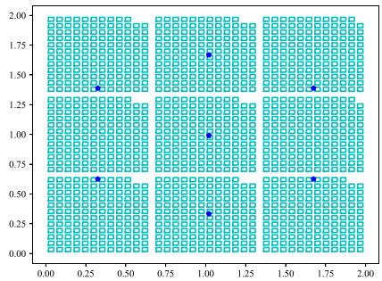  
Fig. 2. Urban environment and distribution of GBSs.

complexity can be approximated as

$$
\begin{array} { r l r } {  { \mathcal { O } _ { \mathrm { t o t a l } } \simeq \mathcal { O } ( ( K + 1 ) N _ { e p i } N _ { s t e p } C _ { \mathrm { n e t } } ) } } \\ & { } & { ~ \approx ~ \mathcal { O } ( K N _ { e p i } N _ { s t e p } C _ { \mathrm { n e t } } ) , ~ } \end{array}\tag{49}
$$

which grows polynomially with K and remains computationally tractable.

## IV. SIMULATION RESULT

To demonstrate the superiority of the proposed scheme, we compare it with the following schemes:

\- Wu-HGA Algorithm: A recent state-of-the-art energyoptimization baseline [27] that combines an improved Dijkstra solver to compute radio-map-aware shortest paths with minimal communication interruption time, and a Hybrid Genetic Algorithm (HGA) to optimize the pick-up sequence for either minimization of maximum energy (MME) or sum energy (MSE).

\- NNP Strategy: This strategy determines the pick-up sequence based on proximity to the user. UAV using this method selects the nearest user for service, under the premise of ensuring normal task completion.

$T W P$ Strategy: This strategy determines the pick-up sequence based on the earliest time window of the user. UAV prioritizes users with the earliest time windows while ensuring normal task completion. In our UAV pick-up system, which considers hybrid time windows, the time window priority can be further divided into Hard Time Window Priority (HTWP) and Soft Time Window Priority (STWP).

\- RRT Algorithm: This sampling-based path planning algorithm explores the state space through random sampling and incremental tree construction to find a feasible path from the start point to the target point. UAV can optimize the flight trajectories using paths derived from the exploration tree, thereby reducing flight time while meeting communication requirements.

## A. Simulation Environment

As shown in Fig. 2, the flight area of the UAV pick-up system is defined as a rectangular area with a size of km × km. There are 7 GBSs in this area, each with an antenna height of m, i.e., $M = 7 , H _ { b s } = 2 0$ . The positions of the GBSs are indicated by blue dots, and the downtilt angle of each GBS antenna is ◦. The flight area is enclosed by a cyan rectangular box to simulate the urban environment’s buildings. The distribution of buildings follows the International Telecommunication Union (ITU) building distribution model. The simulation parameters for this environment are set as follows: 1) the ratio building of area to the total area is $\alpha _ { u } = 0 . 3 5 ; 2 )$ the number of buildings per square kilometer is $\beta _ { u } = 3 2 0 ; 3 )$ ) the height of buildings follows a Rayleigh distribution [42] with a variance of $\sigma _ { u } =$ . The maximum height of buildings is m, the flight height of UAVs is $H _ { \mathrm { m a x } } = 1 0 0 \mathrm { m }$ , and the maximum flight speed is $V _ { \mathrm { m a x } } = 2 0 \mathrm { m } / \mathrm { s }$ . Note that buildings are treated only as NLoS blockers for communication modeling. Collision avoidance with buildings is not required, as the assumed flight altitude exceeds the height of the tallest building.

TABLE II  
PARTIAL SIMULATION PARAMETERS
<table><tr><td rowspan=1 colspan=1>Simulation parameter</td><td rowspan=1 colspan=1>Value</td></tr><tr><td rowspan=1 colspan=1>Number of cargo UAV Q</td><td rowspan=1 colspan=1>2</td></tr><tr><td rowspan=1 colspan=1>Number of pick-up users K</td><td rowspan=1 colspan=1>10</td></tr><tr><td rowspan=1 colspan=1>The weight of the UAV $\overline { { W _ { u } } }$ </td><td rowspan=1 colspan=1>50N</td></tr><tr><td rowspan=1 colspan=1>Maximum number of episodes of D3QN $\overline { { N _ { e p i } } }$ </td><td rowspan=1 colspan=1>8000</td></tr><tr><td rowspan=1 colspan=1>Maximum number of flight steps per episode $\underline { { N _ { s t e p } } }$ </td><td rowspan=1 colspan=1>200</td></tr><tr><td rowspan=1 colspan=1>Time step interval $\overline { { \Delta _ { \tau } } }$ </td><td rowspan=1 colspan=1>0.5 s</td></tr><tr><td rowspan=1 colspan=1>Initial exploration $\epsilon _ { 0 }$ </td><td rowspan=1 colspan=1>0.7</td></tr><tr><td rowspan=1 colspan=1>Exploration decaying rate λ</td><td rowspan=1 colspan=1>0.9988</td></tr><tr><td rowspan=1 colspan=1>Reward for reaching destination $\underline { { R } } _ { \mathrm { r e a c h } }$ </td><td rowspan=1 colspan=1>800</td></tr><tr><td rowspan=1 colspan=1>Outbound penalty $\overline { { R _ { \mathrm { o u t } } } }$ </td><td rowspan=1 colspan=1>-1000</td></tr><tr><td rowspan=1 colspan=1>Movement penalty $\underline { { R _ { \mathrm { m o v e } } } }$ </td><td rowspan=1 colspan=1>2</td></tr><tr><td rowspan=1 colspan=1>Outage penalty $R _ { \mathrm { o u t } }$ </td><td rowspan=1 colspan=1>30</td></tr><tr><td rowspan=1 colspan=1>Collision fixed penalty $\overline { { R _ { \mathrm { c f } } } }$ </td><td rowspan=1 colspan=1>20</td></tr><tr><td rowspan=1 colspan=1>Collision severity penalty $\overline { { R _ { \mathrm { c s } } } }$ </td><td rowspan=1 colspan=1>150</td></tr><tr><td rowspan=1 colspan=1>Safe detection range $\overline { { D _ { \mathrm { s a f e } } } }$ </td><td rowspan=1 colspan=1>30 m</td></tr><tr><td rowspan=1 colspan=1>Reward for approaching the target $\overline { { R _ { \mathrm { a p p } } } }$ </td><td rowspan=1 colspan=1>0.5</td></tr><tr><td rowspan=1 colspan=1>Weight updating frequency of target network $\overline { { F _ { t a r } } }$ </td><td rowspan=1 colspan=1>5</td></tr><tr><td rowspan=1 colspan=1>Soft update parameter τ</td><td rowspan=1 colspan=1>0.005</td></tr><tr><td rowspan=1 colspan=1>The number of signal measurements after a new state J</td><td rowspan=1 colspan=1>1000</td></tr><tr><td rowspan=1 colspan=1>Weight factor $\mu _ { 1 }$ </td><td rowspan=1 colspan=1>1</td></tr><tr><td rowspan=1 colspan=1>Weight factor $\mu _ { 2 }$ </td><td rowspan=1 colspan=1>1</td></tr><tr><td rowspan=1 colspan=1>Weight factor $\mu _ { c }$ </td><td rowspan=1 colspan=1>10000</td></tr><tr><td rowspan=1 colspan=1>Weight factor $\mu _ { t }$ </td><td rowspan=1 colspan=1>1</td></tr><tr><td rowspan=1 colspan=1>Maximum number of iterations of SA $\overline { { N _ { T } } }$ </td><td rowspan=1 colspan=1>2000</td></tr><tr><td rowspan=1 colspan=1>Initial temperature $\overline { { T _ { i n i t } } }$ </td><td rowspan=1 colspan=1>500</td></tr><tr><td rowspan=1 colspan=1>Cooling coefficient $\alpha _ { c }$ </td><td rowspan=1 colspan=1>0.999</td></tr><tr><td rowspan=1 colspan=1>Maximum times of alternating loop $\overline { { N _ { a l t } } }$ </td><td rowspan=1 colspan=1>5</td></tr></table>

The simulation utilized Python, TensorFlow and Keras. The D3QN employed algorithm in Algorithm 1 uses two neural networks for training, with the number of neurons in the intermediate layers of each network being 512, 256, 128, 128 and 9, respectively. Table II summarizes the other parameters used in the simulation.

## B. Results and Analysis

Fig. 3 depicts a radio map of an urban environment [48], showing coverage probability calculated via the UAV-GBS channel model. This probability indicates the likelihood of uninterrupted UAV communication in specific areas, being the complement of outage probability. The communication coverage distribution is notably non-uniform due to three main factors: GBS antenna directionality, building blockage, and mutual GBS interference. GBSs transmit signals directionally, but coverage is limited by antenna directionality. Signal strength is highest in the main lobe direction and weaker elsewhere, causing coverage variations. Buildings worsen coverage unevenness by attenuating or blocking radio waves, creating low-coverage shadows behind them. Furthermore, multi-GBS signals can either constructively superpose to boost coverage or destructively interfere to reduce it. To ensure stable UAV communication, optimizing flight trajectories within high-coverage zones is crucial. Such trajectory optimization enhances UAV communication reliability and efficiency, being vital for stable cargo UAV operations.

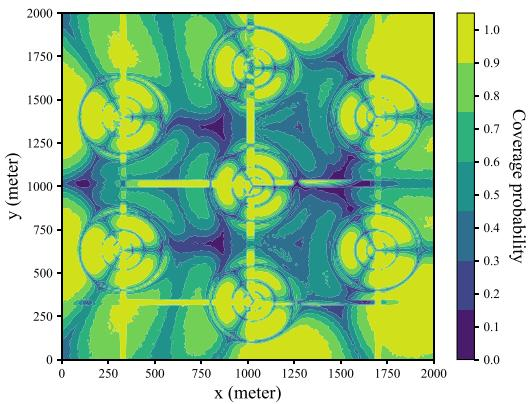  
Fig. 3. Radio map of urban environment.

  
(a) $P _ { \mathit { t h } } = 0 . 8$

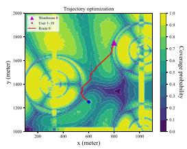  
(b) $P _ { t h } = 0 . 7 5$

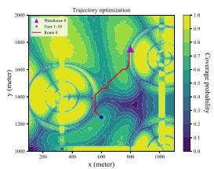  
(c) $P _ { \mathrm { \it t h } } = 0 . 7$

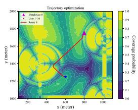  
(d) $P _ { t h } = 0 . 6 5$  
Fig. 4. Comparison of optimized trajectories between two points under different maximum outage probability $P _ { t h }$

As illustrated in Fig. 4, an example of UAV trajectory optimization for flight paths between two points under different communication quality constraint is provided. Typically, UAV flies in a straight line from the start to the target point. However, to maintain communication quality, this approach is impractical. The figure shows that the UAV needs to optimize its trajectory to avoid areas with poor communication quality. The red line indicates the optimized path avoiding low-coverage areas. The two dots mark the flight’s start and end. It can be seen that as the outage probability threshold $P _ { t h }$ decreases, the UAV’s navigable area reduces, necessitating a change in flight direction to locate regions that meet communication requirements, which may result in a longer flight path and increased time. However, this strategy is essential for maintaining a stable connection with GBSs and ensuring the successful completion of the mission.

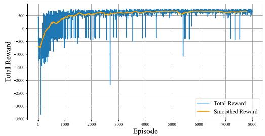  
Fig. 5. The reward versus episode number.

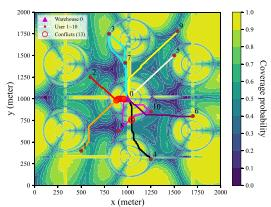

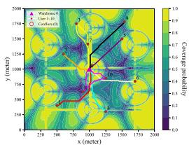  
(b) Collision-free trajectory

(a) Collision trajectory  
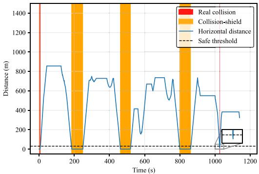  
(c) Inter-UAV distance of collision

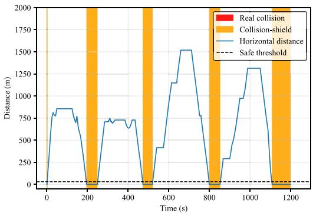  
(d) Inter-UAV distance of collision-free  
Fig. 6. Comparison of inter-UAV collision optimization $E _ { c a p } = 2 5 \mathrm { k J }$ $P _ { t h } = 0 . 8 )$

Fig. 5 presents a reward convergence curve for training a UAV using the D3QN algorithm. Initially, the UAV lacks prior experience and sufficient understanding of environmental information, resulting in low rewards. As training episodes increase, the UAV interacts more with the environment, collects more data, and optimizes its network parameters. This allows it to gradually improve its flight policy and successfully avoid low-coverage areas, as indicated by the rising trend in the reward curve.

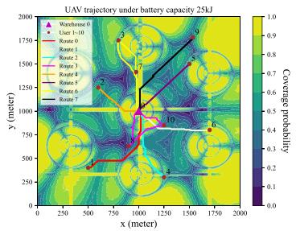  
(a) Ecap = 25kJ

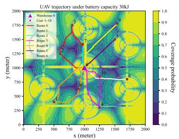  
(b) Ecap = 30kJ

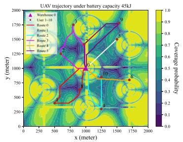  
(c) Ecap = 45kJ

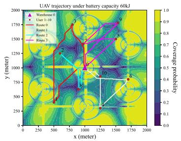  
(d) $E _ { c a p } = 6 0 \mathbf { k } \mathbf { J }$

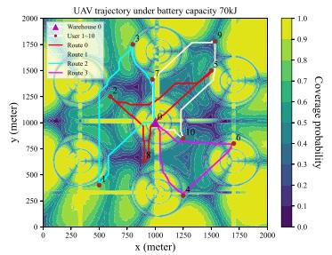  
(e) Ecap = 70kJ

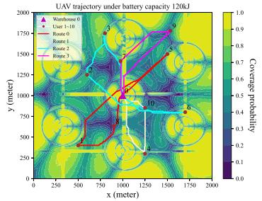  
(f) $E _ { c a p } = 1 2 0 \mathrm { k J }$  
Fig. 7. Comparison of pick-up trajectories optimized using the proposed CACMO algorithm under different battery energy limitations $( P _ { t h } = 0 . 8 )$

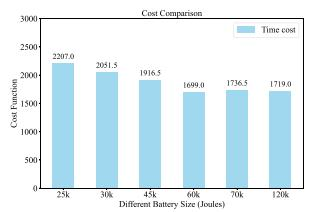  
(a) Time cost

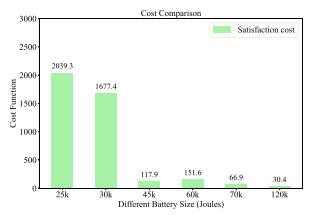  
(b) Satisfaction cost

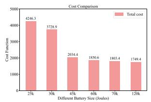  
(c) Total cost

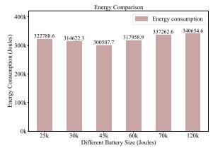  
(d) Energy consumption  
Fig. 8. Comparison of relevant parameters optimized using the proposed CACMO algorithm under different battery energy limitations.

As shown in Fig. 6, the effectiveness of the proposed inter-UAV collision optimization procedure is clearly demonstrated. In the initial stage, the trajectories obtained after the D3QN and SA optimization still contain multiple collision segments where different UAVs become too close to each other at the same time, posing potential collision risks in dense airspace, as illustrated in Fig. 6(a) and (c). After applying the alternating collision-free refinement mechanism, all detected conflicts are successfully removed, and the UAVs maintain safe separation distances throughout their missions, as depicted in Fig. 6(b) and (d). This improvement originates from the enhanced D3QN re-training process, in which a collision-penalty term is embedded into the reward function to guide the UAVs toward safer flight corridors while preserving communication quality and trajectory smoothness. These results verify that the proposed CACMO algorithm not only optimizes trajectory and scheduling performance but also ensures safe cooperative operations of multiple UAVs in complex urban environments.

In Fig. 7, we present the UAV’s cargo pickup trajectories optimized by the proposed CACMO algorithm under different battery energy constraints with an outage probability threshold of 0.8. As battery energy rises, the UAV’s service sequence adjusts. Higher energy allows longer flights without returning to the warehouse for battery swaps. At low energy limits (e.g., $E _ { c a p } = 2 5 \mathrm { k J } )$ , the UAV is heavily restricted and, in most cases, can serve only a single user per trip to ensure sufficient energy for the return journey. As energy increases, the UAV can serve multiple users per trip and plan more efficient routes. This reduces task completion time and limits satisfaction-related losses. This strategy effectively balances task completion time and user satisfaction while ensuring mission success.

Fig. 8 compares the time cost, satisfaction cost, total cost, and energy consumption of different results from Fig. 7. Time cost drops as battery energy increases. Enough energy enables continuous flight without frequent returns to the warehouse for battery changes, cutting down extra time costs from battery replacements. Greater battery capacity also allows more flexible route planning to meet user time window requirements, enhancing user satisfaction. As battery energy increases, energy consumption first decreases and then increases, while user satisfaction costs gradually decrease. This indicates that within a certain energy range, the UAV can utilize energy more effectively while improving user satisfaction. When energy is limited, the UAV must prioritize energy constraints, which may prevent it from fully meeting users’ time window requirements, leading to a decline in user satisfaction. Additionally, total cost decreases with rising battery energy, showing that UAVs can balance time and satisfaction costs effectively. For instance, comparing energy limits of 70 kJ and 120 kJ, the UAV with higher energy selects a route that better balances time and satisfaction costs, minimizing the total cost. Overall, Fig. 8 indicates that under our optimization strategy, UAVs can optimize pickup routes according to different battery capacities. This enables them to satisfy multiple constraints, boost user satisfaction, and cut task completion time for more efficient task execution.

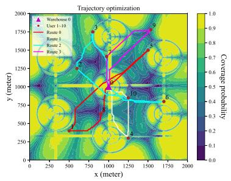  
(a) CACMO

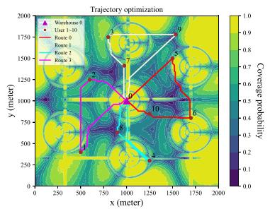  
(b) Wu-HGA

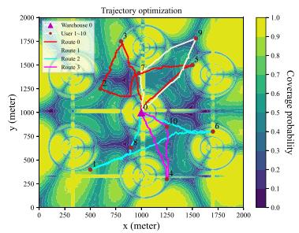  
(c) RRT and SA

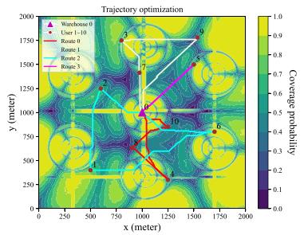  
(d) D3QN and NNP

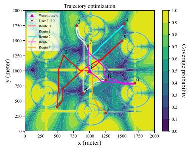  
(e) D3QN and HTWP

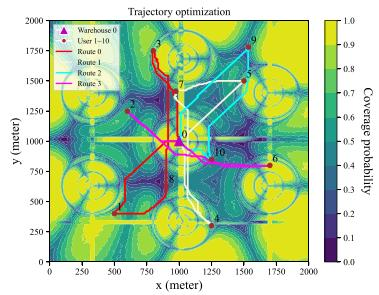  
(f) D3QN and STWP

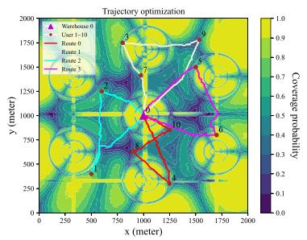  
(g) RRT and NNP

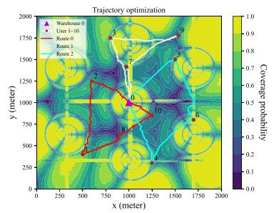  
(h) RRT and HTWP

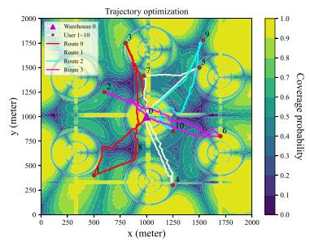  
(i) RRT and STWP

Fig. 9. Comparison of different strategy trajectories optimized $( E _ { c a p } = 1 2 0 0 0 0 , P _ { t h } = 0 . 8 ) .$  
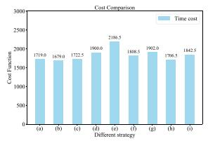  
(a) Time cost

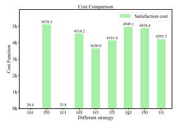  
(b) Satisfaction cost

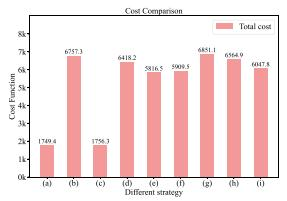  
(c) Total cost

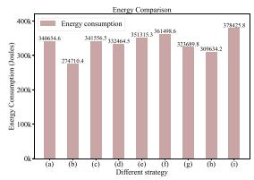  
(d) Energy consumption  
Fig. 10. Comparison of relevant parameters optimized using different strategies.

After evaluating the influence of UAV battery energy on performance in Fig. 8, we further compare the proposed D3QN+SA framework with several representative strategies to examine its overall effectiveness. As shown in Figs. 9 and 10, the compared methods include Wu-HGA, RRT, NNP, HTWP, and STWP. It is important to note that in Fig. 9, only the proposed CACMO algorithm incorporates the alternating collision-free refinement mechanism, whereas the other algorithms do not consider inter-UAV collision optimization. This setting demonstrates that even with additional collision-avoidance constraints, the proposed method still achieves superior trajectory quality and coordination among multiple UAVs.

Specifically, Fig. 9(a) shows that the D3QN and SA framework produces compact and smooth trajectories with balanced spatial distribution, successfully avoiding both regions with poor communication quality and potential conflicts between UAVs. In contrast, the Wu-HGA algorithm mainly focuses on minimizing overall energy consumption, while its consideration of user satisfaction and time-window constraints is relatively limited. Moreover, Wu-HGA does not account for inter-UAV collision avoidance, leading to possible collision events in dense task areas.

For the sequence-based strategies, including NNP, HTWP, and STWP, their heuristic priority rules fail to adequately capture user time-window requirements, often leading to suboptimal visiting orders and delayed task completion. Consequently, several user requests cannot be fulfilled within their desired service intervals, resulting in lower overall satisfaction. By contrast, the path-based RRT algorithm can rapidly generate feasible routes through random sampling, but its strong stochasticity causes inconsistent trajectory quality and limited repeatability. In addition, RRT does not incorporate task scheduling or userspecific timing constraints, which further reduces coordination efficiency when applied to multi-UAV logistics operations.

Quantitative comparisons of the cost function are illustrated in Fig. 10. The proposed D3QN and SA framework achieves the lowest total cost and highest user satisfaction among all evaluated methods, owing to its integrated design of communicationaware trajectory learning, sequence optimization, and collisionfree refinement. Although the HGA-based approach yields shorter task completion times due to its energy-oriented objective that favors shorter routes, it incurs higher satisfaction costs as time-window constraints are more frequently violated. Wu-HGA attains the lowest energy consumption but sacrifices service quality and temporal efficiency, and its lack of collision modeling further limits its applicability. Overall, the proposed CACMO algorithm provides a superior balance among time efficiency, energy consumption, and user satisfaction, demonstrating enhanced robustness and scalability under realistic multi-UAV operation constraints.

To further verify the sensitivity of the proposed D3QN and SA framework to different business priorities, we vary the weight ratio $\mu _ { 1 } / \mu _ { 2 }$ from 0.05 (time-dominated) to 10 (satisfactiondominated) while keeping all other parameters unchanged. Table III summarizes the total task-completion time and average customer satisfaction achieved under five representative ratios. As $\mu _ { 1 } / \mu _ { 2 }$ increases, the optimizer gradually sacrifices flight time to improve on-time arrival, eventually reaching the maximum satisfaction when $\mu _ { 1 } / \mu _ { 2 } = 1 0$ . The results confirm that the framework can stably balance the two conflicting objectives without violating communication or energy constraints, thus providing operators with a tunable knob for online decision-making.

TABLE III  
IMPACT OF WEIGHT RATIO µ1/µ2 ON TASK COMPLETION TIME AND CUSTOMER SATISFACTION
<table><tr><td> $\mu _ { 1 } / \mu _ { 2 }$ </td><td>0.05</td><td>0.2</td><td>0.5</td><td>1</td><td>5</td></tr><tr><td>Customer Satisfaction</td><td>0.8234</td><td>0.9199</td><td>0.9943</td><td>0.9969</td><td>1.0</td></tr><tr><td>Task Completion Time (s)</td><td>1455.0</td><td>1508.5</td><td>1696.5</td><td>1719.0</td><td>1753.5</td></tr></table>

## V. CONCLUSION

In this paper, we have addressed the cargo UAV trajectory and task-scheduling optimization problem under practical communication, time-window, and energy constraints. A unified optimization framework has been developed, in which DRL is employed for communication-aware trajectory learning, while SA is incorporated for sequence adjustment and conflict-free refinement. Simulation results have demonstrated that the proposed D3QN and SA framework achieves superior overall performance compared with baseline heuristics and conventional optimization algorithms. Specifically, it effectively balances task completion time, user satisfaction, and energy consumption, showing strong adaptability and robustness for large-scale multi-UAV logistics operations in complex urban environments.

Although this paper has incorporated multiple constraints and balances task time and customer satisfaction, it did not address three-dimensional trajectory optimization for UAVs. Future work could also expand the optimization framework to include practical constraints like obstacle avoidance and flight safety under different flight altitude while also accommodating mobile users with dynamic pick-up requests. This would better meet logistics demands and enhance the practicality and reliability of UAV delivery systems.

## REFERENCES

[1] Z. Li et al., “Unauthorized UAV countermeasure for low-altitude economy: Joint communications and jamming based on MIMO cellular systems,” IEEE Internet Things J., vol. 12, no. 6, pp. 6659–6672, Mar. 2025.

[2] T. Gao, F. Lang, and N. Guo, “An emergency communication system based on UAV-assisted self-organizing network,” in Proc. Int. Conf. Innov. Mobile Internet Serv. Ubiquitous Comput., 2016, pp. 90–95.

[3] G. K. Tran, “Temporary communication network using millimeter-wave drone base stations,” in Proc. IEEE VTS Asia Pac. Wireless Commun. Symp., 2024, pp. 1–5.

[4] Y. Wang, M. Chen, C. Pan, K. Wang, and Y. Pan, “Joint optimization of UAV trajectory and sensor uploading powers for UAV-assisted data collection in wireless sensor networks,” IEEE Internet Things J., vol. 9, no. 13, pp. 11214–11226, Jul. 2022.

[5] H. Liang, J. Wu, T. Liu, H. Wang, and W. Cao, “Efficient cooperative spectrum sensing in UAV-assisted cognitive wireless sensor networks,” IEEE Sens. Lett., vol. 8, no. 10, Oct. 2024, Art. no. 7500904.

[6] V. Sprincean, A. Paladi, V. Andruh, A. Danici, P. Lozovanu, and F. Paladi, “UAV-based measuring station for monitoring and computational modeling of environmental factors,” in Proc. IEEE Int. Workshop Metrol. AeroSpace, 2021, pp. 80–85.

[7] K. Karam, A. Mansour, M. Khaldi, B. Clement, and M. Ammad, “A survey for unmanned aerial vehicles in smart agriculture: Types and modelling perspectives,” in Proc. IEEE 7th Adv. Inf. Technol. Electron. Autom. Control Conf., 2024, pp. 807–818.

[8] M. Bakirci and I. Bayraktar, “Integrating UAV-based aerial monitoring and SSD for enhanced traffic management in smart cities,” in Proc. Ed. Mediterr. Smart Cities Conf., 2024, pp. 1–6.

[9] F. Wu, Y. Luo, Y. Xu, D. Yang, and L. Xiao, “Energy minimization for fixed-wing UAV inspection system in multi-hangar and windy environment,” IEEE Trans. Veh. Technol., vol. 74, no. 11, pp. 17840–17853, Nov. 2025.

[10] J. M. Kong and E. Sousa, “Piggybacking on UAV package delivery systems to simultaneously provide wireless coverage: A deep reinforcement learning-based trajectory design,” in Proc. IEEE Conf. Comput. Commun. Workshops, 2024, pp. 1–6.

[11] H. Huang, C. Hu, J. Zhu, M. Wu, and R. Malekian, “Stochastic task scheduling in UAV-based intelligent on-demand meal delivery system,” IEEE Trans. Intell. Transp. Syst., vol. 23, no. 8, pp. 13040–13054, Aug. 2022.

[12] J. Gao et al., “Cooperative air-ground instant delivery by UAVs and crowdsourced taxis,” in Proc. Int. Conf. Data Eng., 2024, pp. 4153–4166.

[13] R. Wu, R. Wang, J. Hao, Q. Wu, P. Wang, and D. Niyato, “Multiobjective vehicle routing optimization with time windows: A hybrid approach using deep reinforcement learning and NSGA-II,” IEEE Trans. Intell. Transp. Syst., vol. 26, no. 3, pp. 4032–4047, Mar. 2025.

[14] Administrator, “Jd.com’s drone delivery program takes flight in rural China,” 2016. [Online]. Available: https://jdcorporateblog.com/jd-comsdrone-delivery-program-takes-flight-in-rural-china/

[15] Y. H. Lau et al., “Reliable long-range communication for medical cargo UAVs using low-cost, accessible technology,” in Proc. IEEE Int. Humanit. Technol. Conf., 2021, pp. 1–8.

[16] Y. Chen, D. Yang, L. Xiao, F. Wu, and Y. Xu, “Optimal trajectory design for unmanned aerial vehicle cargo pickup and delivery system based on radio map,” IEEE Trans. Veh. Technol., vol. 73, no. 8, pp. 11706–11718, Aug. 2024.

[17] M. Patchou, B. Sliwa, and C. Wietfeld, “Flying robots for safe and efficient parcel delivery within the COVID-19 pandemic,” in Proc. IEEE Int. Syst. Conf., 2021, pp. 1–7.

[18] A. Narayanan, E. Pournaras, and P. H. Nardelli, “Large-scale package deliveries with unmanned aerial vehicles using collective learning,” IEEE Intell. Syst., vol. 40, no. 1, pp. 53–62, Jan./Feb. 2025.

[19] X. Tao and A. S. Hafid, “Trajectory design in UAV-aided mobile crowdsensing: A deep reinforcement learning approach,” in Proc. IEEE Int. Conf. Commun., 2021, pp. 1–6.

[20] G. Wu, N. Mao, Q. Luo, B. Xu, J. Shi, and P. N. Suganthan, “Collaborative truck-drone routing for contactless parcel delivery during the epidemic,” IEEE Trans. Intell. Transp. Syst., vol. 23, no. 12, pp. 25077–25091, Dec. 2022.

[21] Z. Pei, T. Fang, K. Weng, and W. Yi, “Urban on-demand delivery via autonomous aerial mobility: Formulation and exact algorithm,” IEEE Trans. Autom. Sci. Eng., vol. 20, no. 3, pp. 1675–1689, Jul. 2023.

[22] M. Xiong, H. Fei, and W. Yan, “Research on distribution path of multi-target urban UAV (unmanned aerial vehicle) based on epsilonconstraint method,” in Proc. Int. Conf. Comput. Inf. Sci. Artif. Intell., 2021, pp. 632–637.

[23] D. N. Das, R. Sewani, J. Wang, and M. K. Tiwari, “Synchronized truck and drone routing in package delivery logistics,” IEEE Trans. Intell. Transp. Syst., vol. 22, no. 9, pp. 5772–5782, Sep. 2021.

[24] N. Cherif, W. Jaafar, H. Yanikomeroglu, and A. Yongacoglu, “Disconnectivity-aware energy-efficient cargo-UAV trajectory planning with minimum handoffs,” in Proc. IEEE Int. Conf. Commun., 2021, pp. 1–6.

[25] P. Du, Y. Shi, H. Cao, S. Garg, M. Alrashoud, and P. K. Shukla, “AI-enabled trajectory optimization of logistics UAVs with wind impacts in smart cities,” IEEE Trans. Consum. Electron., vol. 70, no. 1, pp. 3885–3897, Feb. 2024.

[26] B. Duo, A. Kong, Q. Wu, X. Yuan, and Y. Li, “Joint path and pick-up design for connectivity-aware UAV-enabled multi-package delivery,” IEEE Trans. Intell. Transp. Syst., vol. 25, no. 12, pp. 20017–20031, Dec. 2024.

[27] F. Wu, Z. Deng, Y. Xu, R. Deng, T. Zhang, and D. Yang, “Energy consumption optimization for cellular-connected multi-UAV pickup and delivery system,” IEEE Trans. Intell. Transp. Syst., vol. 26, no. 11, pp. 19106–19119, Nov. 2025.

[28] J. Cao et al., “Trajectory optimization and pick-up and delivery sequence design for cellular-connected cargo AAVs,” IEEE Trans. Mobile Comput., vol. 24, no. 3, pp. 1402–1416, Mar. 2025.

[29] W. Wen, K. Luo, L. Liu, Y. Zhang, and Y. Jia, “Joint trajectory and pick-up design for UAV-assisted item delivery under no-fly zone constraints,” IEEE Trans. Veh. Technol., vol. 72, no. 2, pp. 2587–2592, Feb. 2023.

[30] P. Grippa, “Decision making in a UAV-based delivery system with impatient customers,” in Proc. IEEE/RSJ Int. Conf. Intell. Robots Syst., Dec. 2016, pp. 5034–5039.

[31] B. Liu, W. Ni, R. P. Liu, Y. J. Guo, and H. Zhu, “Optimal routing of unmanned aerial vehicle for joint goods delivery and in-situ sensing,” IEEE Trans. Intell. Transp. Syst., vol. 24, no. 3, pp. 3594–3599, Mar. 2023.

[32] B. Liu, W. Ni, R. P. Liu, Y. J. Guo, and H. Zhu, “Decentralized, privacypreserving routing of cellular-connected unmanned aerial vehicles for joint goods delivery and sensing,” IEEE Trans. Intell. Transp. Syst., vol. 24, no. 9, pp. 9627–9641, Sep. 2023.

[33] F. Wu et al., “Radio map-based delivery sequence design and trajectory optimization in UAV cargo delivery systems,” IEEE Trans. Mach. Learn. Commun. Netw., vol. 4, pp. 17–32, 2026.

[34] H. Peng, J. Cao, D. Yang, C. Li, T. H. Luan, and Z. Su, “Balancing energy efficiency and communication quality in UAV cargo delivery systems,” IEEE Internet Things J., vol. 12, no. 16, pp. 34019–34034, Aug. 2025.

[35] G. Huang, J. Cao, L. Yang, and S. Chen, “Joint optimization of energy efficiency and stable communication quality for cargo UAV-enabled multipackage pickup and delivery,” IEEE Trans. Cognit. Commun. Netw., early access, Oct. 20, 2025, doi: 10.1109/TCCN.2025.3623371.

[36] S. Peng, J. Cao, F. Wu, D. Yang, Y. Xu, and L. Xiao, “Delivery time minimization for cargo UAV with payload and endurance restriction,” in Proc. IEEE Int. Conf. Commun. Workshops, 2025, pp. 665–670.

[37] Y. Gao, L. Xiao, F. Wu, D. Yang, and Z. Sun, “Cellular-connected UAV trajectory design with connectivity constraint: A deep reinforcement learning approach,” IEEE Trans. Green Commun. Netw., vol. 5, no. 3, pp. 1369–1380, Sep. 2021.

[38] Y. Xu, T. Zhang, Y. Liu, D. Yang, L. Xiao, and M. Tao, “UAV-assisted MEC networks with aerial and ground cooperation,” IEEE Trans. Wireless Commun., vol. 20, no. 12, pp. 7712–7727, Dec. 2021.

[39] V. V. Dıáz and D. M. Aviles, “A path loss simulator for the 3GPP 5G channel models,” in Proc. IEEE Int. Conf. Electron. Electri. Eng. Comput., 2018, pp. 1–4.

[40] 3rd Generation Partnership Project (3GPP), “Study on 3D channel model for LTE,” 3GPP, Sophia Antipolis, France, Tech. Rep. 36.873, Dec. 2017.

[41] 3rd Generation Partnership Project (3GPP), “Technical specification group radio access network: Study on enhanced LTE support for aerial vehicle,” 3GPP, Sophia Antipholis, France, Tech. Rep. 36.777, Dec. 2017.

[42] Y. Zeng, X. Xu, S. Jin, and R. Zhang, “Simultaneous navigation and radio mapping for cellular-connected UAV with deep reinforcement learning,” IEEE Trans. Wireless Commun., vol. 20, no. 7, pp. 4205–4220, Jul. 2021.

[43] Y. Zeng and R. Zhang, “Energy-efficient UAV communication with trajectory optimization,” IEEE Trans. Wireless Commun., vol. 16, no. 6, pp. 3747–3760, Jun. 2017.

[44] Y. Zeng, J. Xu, and R. Zhang, “Energy minimization for wireless communication with rotary-wing UAV,” IEEE Trans. Wireless Commun., vol. 18, no. 4, pp. 2329–2345, Apr. 2019.

[45] A. Meng, X. Gao, Y. Zhao, and Z. Yang, “Three-dimensional trajectory optimization for energy-constrained UAV-enabled IoT system in probabilistic LoS channel,” IEEE Internet Things J., vol. 9, no. 2, pp. 1109–1121, Jan. 2022.

[46] N. Lin et al., “Energy-efficiency optimization in RIS-assisted AAV communications based on deep reinforcement learning,” IEEE Internet Things J., vol. 12, no. 8, pp. 11036–11048, Apr. 2025.

[47] Y. Gao, X. Yuan, D. Yang, Y. Hu, Y. Cao, and A. Schmeink, “UAV-assisted MEC system with mobile ground terminals: DRL-based joint terminal scheduling and UAV 3D trajectory design,” IEEE Trans. Veh. Technol., vol. 73, no. 7, pp. 10164–10180, Jul. 2024.

[48] F. Wu, Y. Gao, L. Xiao, D. Yang, and J. Lyu, “Energy minimization for federated learning based radio map construction,” IEEE Trans. Mach. Learn. Commun. Netw., vol. 2, pp. 1248–1264, 2024.

  
Mingjian Chen was born in Hainan, China. He received the BS degree from Hunan University, Changsha, China, in 2024. He is currently working toward the MS degree with the College of Computer Science and Electronic Engineering, Hunan University, Changsha, China. His research interests include UAV communications and machine learning.

Liang Yang (Senior Member, IEEE) was born in Hunan, China. He received the PhD degree in electrical engineering from Sun Yat-sen University, Guangzhou, China, in 2006. From 2006 to 2013, he was a teacher with Jinan University, Guangzhou. In 2013, he joined the Guangdong University of Technology, Guangzhou. He is currently a professor with Hunan University, Changsha, China. His research focuses on performance analysis of wireless communications systems.

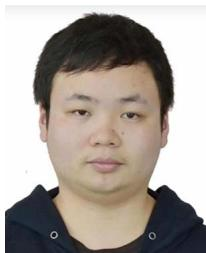

Jiangling Cao received the MS degree in communication engineering from Nanchang University, Nanchang, China, in 2024. His research interests include UAV communications, machine learning, and intelligent transportation systems.

Guangxu Zhu (Member, IEEE) received the PhD degree in electrical and electronic engineering from The University of Hong Kong in 2019. He is currently a senior research scientist and deputy director of network system optimization center with the Shen zhen research institute of Big Data, and adjunct associate professor with the Chinese University of Hong Kong, Shenzhen, China. His recent research interests include edge intelligence, semantic communications, and integrated sensing and communication. He was the recipient of the 2023 IEEE ComSoc Asia-Pacific

Best Young Researcher Award and Outstanding Paper Award, World’s Top 2% Scientists by Stanford University, “AI 2000 Most Influential Scholar Award Honorable Mention”, Young Scientist Award from UCOM 2023, Best Paper Award from WCSP 2013, and IEEE JSnC 2024. He serves as associate editors at top-tier journals in IEEE, such as IEEE Transactions on Mobile Computing, TWC and WCL. He is the vice co-chair of the IEEE ComSoc Asia-Pacific Board Young Professionals Committee.

Weijie Yuan (Senior Member, IEEE) is currently an assistant professor with the Southern University of Science and Technology. His research interests include integrated sensing and communications, orthogonal time frequency space, and low-altitude wireless networks. He is the editor of IEEE Transactions on Communications, IEEE Transactions on Wireless Communications, IEEE Transactions on Mobile Computing, IEEE Communications Magazine, IEEE Communications Letters, and IEEE Open Journal of the Communications Society, and guest editor of

IEEE Transactions on Vehicular Technology, IEEE Transactions on Network Science and Engineering, and IEEE Internet of Things Journal.

Hongbo Jiang (Senior Member, IEEE) received the PhD degree from Case Western Reserve University in 2008. He was a professor with the Huazhong University of Science and Technology. He is currently a full professor with the College of Computer Science and Electronic Engineering, Hunan University. His research interests include computer networking, such as algorithms, and protocols for wireless and mobile networks. He is the editor of IEEE/ACM Transactions on Networking, associate editor for IEEE Transactions on Mobile Computing, and associate technical editor for IEEE Communications Magazine.

Dusit Niyato (Fellow, IEEE) received the BEng degree from the King Mongkuts Institute of Technology Ladkrabang, Thailand, and the PhD degree in electrical and computer engineering from the University of Manitoba, Canada. He is currently a full professor with the College of Computing and Data Science, Nanyang Technological University, Singapore. His research interests include the areas of mobile generative AI, edge general intelligence, quantum computing and networking, and incentive mechanism design.