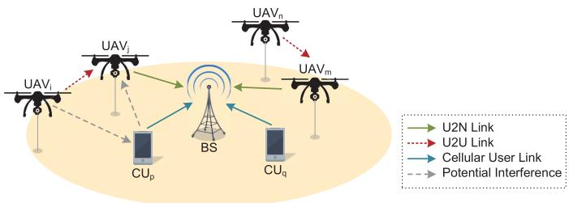
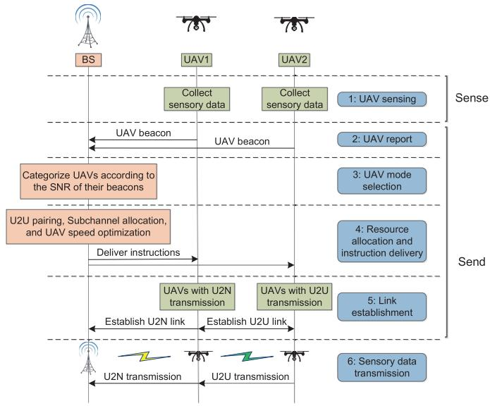
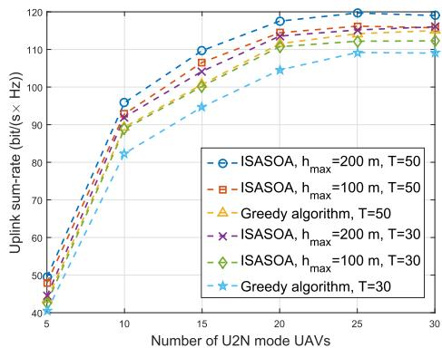
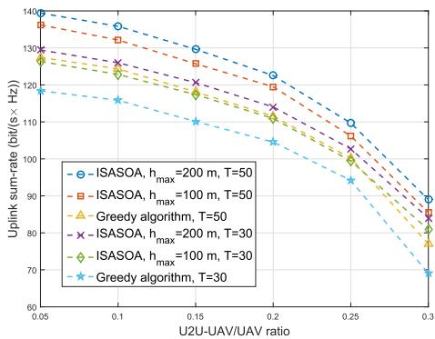
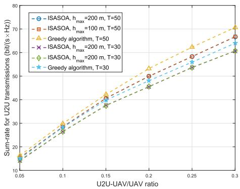
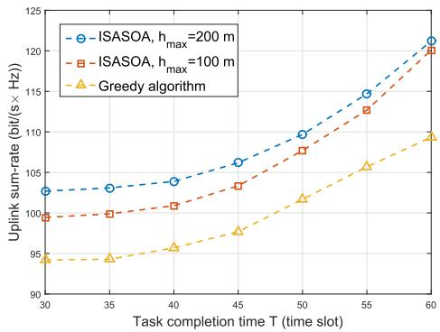
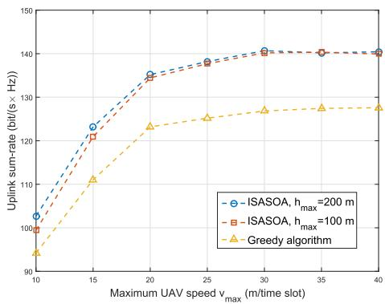
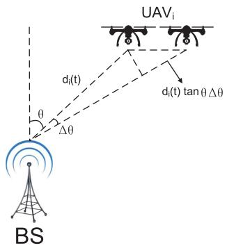
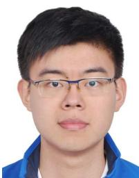
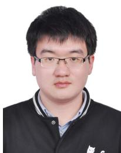

# Cellular UAV-to-X Communications: Design and Optimization for Multi-UAV Networks

Shuhang Zhang , Student Member, IEEE, Hongliang Zhang , Student Member, IEEE, Boya Di , Student Member, IEEE, and Lingyang Song , Fellow, IEEE

Abstract— In this paper, we consider a single-cell cellular network with a number of cellular users (CUs) and unmanned aerial vehicles (UAVs), in which multiple UAVs upload their collected data to the base station (BS). Two transmission modes are considered to support the multi-UAV communications, i.e., UAV-to-network (U2N) and UAV-to-UAV (U2U) communications. Specifically, the UAV with a high signal-to-noise ratio (SNR) for the U2N link uploads its collected data directly to the BS through U2N communication, while the UAV with a low SNR for the U2N link can transmit data to a nearby UAV through underlaying U2U communication for the sake of quality of service. We first propose a cooperative UAV sense-andsend protocol to enable the UAV-to-X communications, and then formulate the subchannel allocation and UAV speed optimization problem to maximize the uplink sum-rate. To solve this NP-hard problem efficiently, we decouple it into three sub-problems: U2N and cellular user (CU) subchannel allocation, U2U subchannel allocation, and UAV speed optimization. An iterative subchannel allocation and speed optimization algorithm (ISASOA) is proposed to solve these sub-problems jointly. The simulation results show that the proposed ISASOA can upload 10% more data than the greedy algorithm.

Index Terms— UAV-to-X communication, sense-and-send protocol, speed optimization, subchannel allocation.

## I. INTRODUCTION

which has been effectively applied in military, public, and civil applications [2]. According to BI Intelligence’s report, more than 29 million UAVs are expected to be put into use in 2021 [3]. Among these applications, the use of UAV to perform sensing has been of particular interest owing to its significant advantages, such as the ability of on-demand flexible deployment, larger service coverage compared with the conventional fixed sensor nodes, and additional design degrees of freedom by exploiting its high UAV mobility [4], [5]. Recently, UAVs with cameras or sensors have entered the daily lives to execute various sensing tasks, e.g. air quality index monitoring [6], autonomous target detection [7], precision agriculture [8], and water stress quantification [9]. The sensory data needs to be transmitted to the server for further processing, thereby posing high uplink rate requirement on the UAV communication network.

Driven by such real-time requirements, the upcoming network is committed to support UAV communication, where the collected data can be effectively transmitted [10]. Unlike the conventional ad hoc sensor network, the sensory data can be transmitted to the networks directly in a centralized way [11], which can greatly improve the quality of UAV communications [12]. In this paper, we study a single cell cellular network with a number of cellular users (CUs) and UAVs, where each UAV moves along a pre-determined trajectory to collect data, and then uploads these data to the base station (BS). However, some UAVs may locate at the cell edge, and the signal to noise ration (SNR) of their communication links to the BS are low. To provide a satisfactory data rate, we enable these UAVs to transmit the sensory data to the UAVs with high SNR for the communication link to the BS as relay. The relaying UAVs save the received data in their caches and upload the data to the BS in the following time slots as described in [13]. Specifically, the UAV transmissions can be supported by two basic modes, namely UAV-to-network (U2N) and UAV-to-UAV (U2U) transmissions. The overlay U2N transmission offers direct link from UAVs with high SNR to the BS, and thus provides a high data rate [14], [15]. In U2U transmission, a UAV with low SNR for the U2N link can set up direct communication links to the high U2N SNR UAVs bypassing the network infrastructure and share the spectrum with the U2N and CU transmissions, which provides a spectrumefficient method to support the data relaying process [16].

Due to the high mobility and long transmission distance of the sensing UAVs, it is not trivial to address the following issues. Firstly, since the U2U transmissions underlay the spectrum resources of the U2N and CU transmissions, the U2N and CU transmissions may be interfered by the U2U transmissions when sharing the same subchannel. Correspondingly, the U2U transmissions are also interfered by the U2N, CU, and U2U links on the same subchannel. Moreover, different channel models are utilized for the U2N, U2U, and CU transmissions due to the different characteristics of air-to-ground, air-to-air, and ground-to-ground communications. Therefore, an efficient spectrum allocation algorithm is required to manage the mutual interference. Secondly, to complete the data collection of the sensing tasks given time requirements, the UAV speed optimization is necessary. Thirdly, to avoid the data loss and provide a relatively high data rate for the UAVs with low SNR for the link to the BS, an efficient communication method is essential. In summary, the resource allocation schemes, UAV speed, and UAV transmission protocol should be properly designed to support the UAV-to-X communications.

In the literature, some works on the UAV communication network have been studied, in which UAVs work as relays or BSs. In [17], the authors studied a 3-D UAV-BS placement to maximize the number of covered users with different quality-of-service requirements. In [18], the deployment of a UAV as a flying BS used to provide the fly wireless communications was analyzed. In [19], the UAV was proposed to work as a mobile BS which collected data from fixed sensor nodes on the ground. A trajectory design and power control algorithm was introduced for a UAV relay network in [20] to improve the reliability of transmissions. The work [21] investigated the scenario where UAVs served as flying BSs to provide wireless service to ground users, and optimized the downlink data rate and UAV hover duration. In [22], the authors proposed a hybrid network architecture with the use of UAV as a BS, which flies cyclically along the cell edge to serve the cell-edge users. Unlike most of the previous works which typically treat UAVs as relays or BSs, in our work the UAVs that relay the data from other UAVs also have their own sensing tasks, i.e. we consider the UAVs as flying mobile terminals in the UAV sensing network.

The main contributions of this paper can be summarized below.

(1) We construct a UAV-to-X communication network, where the UAVs can either upload the collected data via U2N communications directly or send to other UAVs by U2U communications. A cooperative UAV sense-and-send protocol is proposed to enable these communications.

(2) We formulate a joint subchannel allocation and UAV speed optimization problem to maximize the uplink sum-rate of the network. We then prove that the problem is NP-hard, and decompose it into three sub-problems: U2N and CU subchannel allocation, U2U subchannel allocation, and UAV speed optimization. An efficient iterative subchannel allocation and speed optimization algorithm (ISASOA) is proposed to solve the sub-problems iteratively.

(3) We compare the proposed algorithm with a greedy algorithm in simulations. The results show that the proposed ISASOA outperforms the greedy algorithm by about 10% in terms of the uplink sum-rate.

The rest of this paper is organized as follows. In Section II, we present the system model of the UAV sensing network. A cooperative UAV sense-and-send protocol is proposed in Section III for the data collection and UAV-to-X communications. In Section IV, we formulate the uplink sum-rate maximization problem by optimizing the subchannel allocation and UAV speed jointly. The ISASOA is proposed in Section V, followed by the corresponding analysis. Simulation results are presented in Section VI, and finally we conclude the paper in Section VII.

  
Fig. 1. System model.

## II. SYSTEM MODEL

In this section, we first describe the working scenario, and then introduce the data transmission of this network. Finally, we present the channel models for U2N, U2U, and CU transmissions, respectively.

## A. Scenario Description

We consider a single cell cellular network as shown in Fig. 1, which consists of one BS, M CUs, denoted by M $\{ 1 , 2 , \cdots , M \}$ , and N UAVs, denoted by $\mathcal { N } = \{ 1 , 2 , \cdots , N \}$ 1 2 = 1 2The UAVs collect various required data with their sensors in each time slot, and the data will be transmitted to the BS for further processing. In each time slot, the UAVs first perform UAV sensing, and then perform data transmission. The length of time for UAV sensing and data transmission are given in each time slot. We assume that each UAV moves along a pre-determined trajectory during the sensing and transmission process. The speeds of the UAVs in each time slot are not given, but all the UAVs are required to arrive at the endpoints of their trajectories within a number of time slots for timely sensing and transmission. To provide a high data transmission rate for all the UAVs, we distinguish the UAVs with different quality of services for the link to the BS into two transmission modes, namely U2N transmission and U2U transmission. The U2N mode UAVs send the data to the BS by U2N transmissions overlaying the cellular ones, while the U2U mode UAVs send the data to the U2N mode UAVs underlaying the U2N and CU transmissions, i.e., they reuse the spectrum resources of the U2N and CU transmissions. The criterion of adopting U2N or U2U will be elaborated in Section II-B.

We denote the location of UAV i in time slot t by $\mathbf { l } _ { i } ( t ) =$ $( x _ { i } ( t ) , y _ { i } ( t ) , h _ { i } ( t ) )$ , and the location of the BS by , , H . Each UAV moves along a pre-determined trajectory. Let $v _ { i } ( t )$ be the speed of UAV i in time slot t. The location of UAV i in time slot t is given as $\mathbf { I } _ { i } ( t + 1 ) = \mathbf { I } _ { i } ( t ) + v _ { i } ( t ) \cdot { \omega } _ { i } ( t )$ , where $\omega _ { i } ( t )$ is the trajectory direction of UAV i in time slot t. Due to the mechanical limitation, the speed of a UAV is no more than $v _ { m a x } . ^ { 1 }$ Let $L _ { i }$ be the length of UAV i’s trajectory. With proper transmission rate requirements, the UAVs are capable to upload the sensory data to the BS with low latency. Therefore, the task completion time of a UAV can be defined as the time that it costs to complete its moving along the trajectory, which is determined by its speed in each time slot. For timely data collection, the task completion time of each UAV is required to be no more than $T$ time slots, i.e., $\textstyle \sum _ { t = 1 } ^ { T } v _ { i } ( t ) \geq L _ { i } , { \dot { \forall } } i \in { \mathcal { N } } .$ tIn time slot t, the distance between UAV i and UAV j is shown as

$$
\begin{array} { l } { d _ { i , j } ( t ) } \\ { \ = \sqrt { \left( x _ { i } ( t ) - x _ { j } ( t ) \right) ^ { 2 } + \left( y _ { i } ( t ) - y _ { j } ( t ) \right) ^ { 2 } + \left( h _ { i } ( t ) - h _ { j } ( t ) \right) ^ { 2 } } , } \end{array}\tag{1}
$$

and the distance between UAV i and BS is expressed as

$$
d _ { i , B S } ( t ) = \sqrt { x _ { i } ( t ) ^ { 2 } + y _ { i } ( t ) ^ { 2 } + \left( h _ { i } ( t ) - H \right) ^ { 2 } } .\tag{2}
$$

The location of CU i is given as $\left( x _ { i } ^ { c } , y _ { i } ^ { c } , h _ { i } ^ { c } \right)$ . In this paper, i i iwe assume that the locations of the CUs are fixed in different time slots, as the mobility of the CUs are much lower than that of the UAVs. Therefore, the distance between CU i and UAV j can be denoted by

$$
\begin{array} { l } { d _ { i , j } ^ { c } ( t ) } \\ { = \sqrt { \left( x _ { i } ^ { c } ( t ) - x _ { j } ( t ) \right) ^ { 2 } + \left( y _ { i } ^ { c } ( t ) - y _ { j } ( t ) \right) ^ { 2 } + \left( h _ { i } ^ { c } ( t ) - h _ { j } ( t ) \right) ^ { 2 } } , } \end{array}\tag{3}
$$

and the distance between UAV i and BS can be shown as

$$
d _ { i , B S } ^ { c } ( t ) = \sqrt { x _ { i } ^ { c } ( t ) ^ { 2 } + y _ { i } ^ { c } ( t ) ^ { 2 } + \left( h _ { i } ^ { c } ( t ) - H \right) ^ { 2 } } .\tag{4}
$$

## B. Data Transmission

In this part, we give a brief introduction to the data transmission of this network. There are two types of UAV transmission schemes in this network: U2N transmission and U2U transmission.2 A UAV may either perform U2N transmission or U2U transmission in one time slot. The criterion of adopting U2N or U2U transmission is given below.

1) U2N Transmission: A UAV with high SNR for the link to the BS performs U2N transmission in the network. It uploads its collected data to the BS directly over the assigned subchannel.

2) U2U Transmission: A UAV with low SNR for the link to the BS performs U2U communication to transmit the collected data to a UAV in U2N transmission mode.

The detailed method for the U2N or U2U transmission mode selection will be described in Section III. Let $\mathcal { N } _ { h } ( t ) =$ $\{ 1 , 2 , \cdots , N _ { h } ( t ) \}$ and $\mathcal { N } _ { l } ( t ) = \{ 1 , 2 , \cdots , N _ { l } ( t ) \}$ be the set of UAVs that perform U2N and U2U transmissions in time slot $t ,$ respectively, with $\mathcal { N } = \mathcal { N } _ { h } ( t ) \cup \mathcal { N } _ { l } ( t )$ . For the UAVs in $\mathcal { N } _ { h } ( t )$ , they send the data to the BS by U2N transmissions. For the UAVs in $\mathcal { N } _ { l } ( t )$ , the SNR of the direct communication links are low, which are difficult to provide high data rates to support timely data upload via U2N transmissions. Therefore, the UAVs send the collected data to the neighbouring UAVs with high SNR for the U2N link via U2U transmissions, and the data will be sent to the BS later by the relaying UAVs.

The transmission bandwidth of this network is divided into K orthogonal subchannels, denoted by ${ \mathcal { K } } = \{ 1 , 2 , \cdots , K \}$

It is worthwhile to mention that a single UAV can perform U2N transmission and U2U reception over different subchannels simultaneously. For the sake of transmission quality, we assume that a subchannel can serve at most one U2N or CU link, but multiple U2U links in one time slot. In addition, to guarantee fairness among the users, we also assume that each transmission link can be allocated to no more than $\chi _ { m a x }$ subchannels. In time slot t, we define a $( N _ { h } + M ) \times K$ binary U2N and CU subchannel pairing matrix $\Phi ( t ) = [ \phi _ { i , k } ( t ) ]$ , and a $N _ { l } \times K$ binary U2U subchannel pairing matrix $\Psi ( t ) =$ $[ \psi _ { i , k } ( t ) ]$ , to describe the resource allocation for CU, U2N and U2U transmissions, respectively. For $i \le N _ { h } , \phi _ { i , k } ( t ) = 1$ when subchannel k is assigned to UAV i for U2N transmission, otherwise $\phi _ { i , k } ( t ) ~ = ~ 0$ . For $i ~ > ~ N _ { h } , ~ \phi _ { i , k } ( t ) ~ = ~ 1$ when subchannel k is assigned to $\mathrm { C U } \ i - N$ for CU transmission, otherwise $\phi _ { i , k } ( t ) = 0$ . Likewise, the value of $\psi _ { i , k } ( t ) = 1$ when subchannel k is assigned to UAV i for U2U transmission, otherwise $\psi _ { i , k } ( t ) = 0$

We denote $\xi _ { i , j } ( t ) ~ = ~ 1$ when UAV i performs U2U i,j ( ) = 1transmission with UAV j in time slot t, and $\xi _ { i , j } ( t ) = 0$ otherwise. In order to avoid the high communication latency for the UAVs, the data rate of each U2U communication link should be no less $R _ { 0 } .$ , i.e. $\begin{array} { r } { \sum _ { k = 1 } ^ { K } \psi _ { i , k } ( t ) R _ { i , j } ^ { k } ( t ) ~ \geq ~ R _ { 0 } , \forall i } \end{array}$ $j \in \mathcal { N } , \xi _ { i , j } = 1$

## C. Channel Model

In this subsection, we introduce the channel model in this network. The channel models of the U2N, CU, and U2U transmissions are different, due to the different characteristics in LoS probability and elevation angel, which will be introduced as follows, respectively.

1) U2N Channel Model: We use the air-to-ground propagation model which is proposed in [24]–[26] for the U2N transmission. In time slot t, the LoS and NLoS pathloss from UAV i to the BS is given by

$$
\begin{array} { r } { P L _ { L o S , i } ( t ) = L _ { F S , i } ( t ) + 2 0 \log ( d _ { i , B S } ( t ) ) + \eta _ { L o S } , } \end{array}\tag{5}
$$

$$
P L _ { N L o S , i } ( t ) = L _ { F S , i } ( t ) + 2 0 \log ( d _ { i , B S } ( t ) ) + \eta _ { N L o S } ,\tag{6}
$$

where ${ \cal L } _ { F S , i } ( t )$ is the free space pathloss given by $L _ { F S , i } ( t ) =$ $2 0 \log ( f ) + 2 0 \log ( \frac { 4 \pi } { c } )$ , and f is the system carrier frequency. $\eta _ { L o S }$ and $\eta _ { N L o S }$ care additional attenuation factors due to the LoS and NLoS connections. Considering the antennas on UAVs and the BS placed vertically, the probability of LoS connection is given by

$$
P _ { L o S , i } ( t ) = \frac { 1 } { 1 + a \exp ( - b ( \theta _ { i } ( t ) - a ) ) } ,\tag{7}
$$

where a and b are constants which depend on the environment, and $\theta _ { i } ( t ) = \sin ^ { - 1 } ( ( h _ { i } ( t ) - H ) / d _ { i , B S } ( t ) )$ is the elevation angle. The average pathloss in dB can then be expressed as

$$
\begin{array} { r } { P L _ { a v g , i } ( t ) = P _ { L o S , i } ( t ) \times P L _ { L o s , i } ( t ) + P _ { N L o S , i } ( t ) \phantom { \times } } \\ { \times P L _ { N L o S , i } ( t ) , } \end{array}\tag{8}
$$

where $P _ { N L o S } ( t ) = 1 - P _ { L o S } ( t )$ . The average received power NLoS( ) = 1 LoS( )of BS from UAV i over its paired subchannel k is given by

$$
P _ { i , B S } ^ { k } ( t ) = \frac { P _ { U } } { 1 0 ^ { P L _ { a v g , i } ( t ) / 1 0 } } ,\tag{9}
$$

where $P _ { U }$ is the transmit power of a UAV or CU over one subchannel. Since each subchannel can be assigned to at most one U2N or CU link, the interference to the U2N transmissions only comes from the U2U transmissions due to spectrum sharing. When UAV i performs U2N transmission over subchannel k, the U2U interference is expressed as

$$
I _ { k , U 2 U } ( t ) = \sum _ { j = 1 } ^ { N _ { l } } \psi _ { j , k } ( t ) P _ { j , B S } ^ { k } ( t ) .\tag{10}
$$

Therefore, the signal to interference plus noise ratio (SINR) of the BS over subchannel k is given by

$$
\gamma _ { i , B S } ^ { k } ( t ) = \frac { P _ { i , B S } ^ { k } ( t ) } { \sigma ^ { 2 } + I _ { k , U 2 U } ( t ) } ,\tag{11}
$$

where $\sigma ^ { 2 }$ is the variance of additive white Gaussian noise (AWGN) with zero mean. The data rate that BS receives from UAV i over subchannel k is shown as

$$
R _ { i , B S } ^ { k } ( t ) = \log _ { 2 } ( 1 + \gamma _ { i , B S } ^ { k } ( t ) ) .\tag{12}
$$

2) CU Channel Model: We utilize the macrocell pathloss model as proposed in [27]. For CU i, the pathloss in dB can be expressed by

$$
\begin{array} { r } { P L _ { i , C } ^ { k } ( t ) = - 5 5 . 9 + 3 8 \log ( d _ { i , B S } ^ { c } ( t ) ) \qquad } \\ { + \left( 2 4 . 5 + 1 . 5 f / 9 2 5 \right) \log ( f ) . } \end{array}\tag{13}
$$

When CU i transmits signals to BS, the received power is expressed as

$$
P _ { i , C } ^ { k } ( t ) = \frac { P _ { U } } { 1 0 ^ { P L _ { i , C } ^ { k } ( t ) / 1 0 } } .\tag{14}
$$

We denote the set of UAVs that share subchannel k with CU i by $U _ { i } = \{ m | \psi _ { m , k } ( t ) = 1 , \forall m \in \mathcal { N } _ { e } \}$ , and the received power at the BS over subchannel k is shown as

$$
y _ { i , j } ^ { k } ( t ) = \sqrt { P _ { i , C } ^ { k } ( t ) } + \sum _ { m \in U _ { i } } \sqrt { P _ { m , B S } ^ { k } ( t ) } + n _ { j } ^ { k } ( t ) ,\tag{15}
$$

where $n _ { j } ^ { k } ( t )$ is the AWGN with zero mean and $\sigma ^ { 2 }$ variance. jTherefore, the received signal at the BS over subchannel k can be given by

$$
\gamma _ { i , B S } ^ { k } ( t ) = \frac { P _ { i , C } ^ { k } ( t ) } { \sigma ^ { 2 } + I _ { k , U 2 U } ( t ) } ,\tag{16}
$$

where $\begin{array} { r } { I _ { k , U 2 U } ( t ) = \sum _ { j = 1 } ^ { N } \psi _ { j , k } ( t ) P _ { j , B S } ^ { k } ( t ) } \end{array}$ is the U2U interfer-k,U U ( ) = j j,k( ) j,BS( )ence. The data rate for CU i over subchannel k is expressed as

$$
R _ { i , B S } ^ { k } ( t ) = \log _ { 2 } ( 1 + \gamma _ { i , B S } ^ { k } ( t ) ) .\tag{17}
$$

3) U2U Channel Model: For U2U communication, freespace channel model is utilized. When UAV i transmits signals to UAV j over subchannel $k ,$ the received power at UAV j from UAV i is expressed as

$$
P _ { i , j } ^ { k } ( t ) = P _ { U } G ( d _ { i , j } ( t ) ) ^ { - \alpha } ,\tag{18}
$$

where G is the constant power gains factor introduced by amplifier and antenna, and $( d _ { i , j } ( t ) ) ^ { - \alpha }$ is the pathloss. Define the set of UAVs and CUs that share subchannel k with UAV i

as $W _ { i } = \{ m | \psi _ { m , k } ( t ) = 1 , \forall m \in \mathcal { N } _ { e } \setminus i \} \cup \{ m | \phi _ { m , k } ( t ) = 1 \}$ The received signal at UAV j over subchannel k is then given by

$$
y _ { i , j } ^ { k } ( t ) = \sqrt { P _ { i , j } ^ { k } ( t ) } + \sum _ { m \in W _ { i } } \sqrt { P _ { m , j } ^ { k } ( t ) } + n _ { j } ^ { k } ( t ) ,\tag{19}
$$

where $P _ { m } ^ { k } ( t )$ is the received power at UAV j from the UAVs mand CUs in $W _ { i }$ , and $n _ { j } ^ { k } ( t )$ is the AWGN with zero mean and $\sigma ^ { 2 }$ jvariance. The interference from UAV m to UAV j over subchannel k is shown as

$$
I _ { m , U A V } ^ { k } ( t ) = ( \phi _ { m , k } ( t ) + \psi _ { m , k } ( t ) ) P _ { U } ( d _ { m , j } ( t ) ) ^ { - \alpha } .\tag{20}
$$

According to the channel reciprocity, the interference from CU m to UAV j over subchannel k can be expressed as

$$
I _ { m , C } ^ { k } ( t ) = \phi _ { m , k } ( t ) \frac { P _ { U } } { 1 0 ^ { P L _ { a v g , j } ^ { m } ( t ) / 1 0 } } ,\tag{21}
$$

where $P L _ { a v g , j } ^ { m } ( t )$ is the average pathloss from UAV j to avg,jCU m, which can be derived from equation (5)-(8). The SINR at UAV j over subchannel k is shown as

$$
\gamma _ { i , j } ^ { k } ( t ) = \frac { P _ { U } ( d _ { i , j } ( t ) ) ^ { - \alpha } } { \sigma ^ { 2 } + \displaystyle \sum _ { m = 1 , m \neq i } ^ { N _ { l } + N _ { h } } I _ { m , U A V } ^ { k } ( t ) + \displaystyle \sum _ { m = 1 } ^ { M } I _ { m , C } ^ { k } ( t ) } .\tag{22}
$$

When UAV i transmits its data to UAV j over subchannel k via U2U transmission, the data rate is given by

$$
R _ { i , j } ^ { k } ( t ) = \log _ { 2 } ( 1 + \gamma _ { i , j } ^ { k } ( t ) ) .\tag{23}
$$

## III. COOPERATIVE UAV SENSE-AND-SEND PROTOCOL

In this section, we propose a cooperative UAV sense-andsend protocol that supports the UAV data collections and UAV-to-X transmissions in this network. As illustrated in Fig. 2, in each time slot, the UAVs first collect the sensory data of their tasks. They then send beacons to the BS over the control channel, and the BS selects the transmission modes for the UAVs according to the received SNR. Afterwards, the BS performs U2U pairing, subchannel allocation and UAV speed optimization for the UAVs in the network, and sends the results to the UAVs. After receiving the results, the UAVs establish the transmission links, and perform U2N and U2U transmissions according to the arrangement of the BS. To better describe the protocol, we divide each time slot into six steps: UAV sensing, UAV report, UAV mode selection, resource allocation and instruction delivery, link establishment, and sensory data transmission, and introduce them in details in the following.

## A. UAV Sensing

In the UAV sensing step, the UAVs perform data sensing and save the collected data in their caches. The communication module is turned off in the UAV sensing step.

## B. UAV Report

After the UAV sensing step, the UAVs stop data collection and send beacons to the BS. The beacon of each UAV contains its ID and current location, and is sent to the BS over the control channel in a time-division manner.

  
Fig. 2. Cooperative UAV sense-and-send protocol.

## C. UAV Mode Selection

When receiving the beacons of the UAVs, the BS categorizes the UAVs into U2N and U2U transmission modes according to the received SNR. A SNR threshold $\gamma _ { t h }$ is given to distinguish the UAVs that perform U2N and U2U transmissions.3 The UAVs with the SNR for U2N links being larger than $\gamma _ { t h }$ are considered to perform U2N transmission, and the UAVs with the SNR for the U2N links being lower than $\gamma _ { t h }$ are considered to perform U2U transmission.

## D. Resource Allocation and Instruction Delivery

After categorizing the transmission modes for the UAVs, the BS pairs the U2U mode UAVs with their closest U2N mode UAV. The BS then performs subchannel allocation and UAV speed optimization with our proposed algorithm described in Section V. Afterwards, the results are sent to the UAVs over the control channel.

## E. Link Establishment

When the control signals from the BS are sent to the UAVs, the UAVs start to move with the optimized speed and transmit over the allocated subchannel. The U2N mode UAVs access the allocated subchannels provided by the BS, and the U2U mode UAVs establish the U2U links with the corresponding UAV relays over the allocated subchannels.

## F. Sensory Data Transmission

The UAVs start to transmit data to the corresponding target after the communication links are established successfully. The sensory data transmission step lasts until the end of the time slot.

When the U2N transmission rate of the a UAV is higher than the sum of its sensing rate and the received U2U transmission rate, the UAV is capable to upload all the data to the BS timely. The above U2N rate constraint can be guaranteed by setting a proper UAV categorization SNR threshold $\gamma _ { t h }$ , which guarantees the efficiency of this network.

## IV. PROBLEM FORMULATION

In this section, we first formulate the joint subchannel allocation and UAV speed optimization problem, and prove that the optimization problem is NP-hard, which can not be solved directly within polynomial time. Therefore, in the next part, we decouple it into three sub-problems, and elaborate them separately.

## A. Joint Subchannel Allocation and UAV Speed Optimization Problem Formulation

Since all the data collected by the UAVs needs to be sent to the BS, the uplink sum-rate of this network is one key metric to evaluate the performance of this network.4 In time slot t, we denote the set of UAVs that have not completed the task along their trajectories by λ t . We aim to maximize the uplink sum-rate of the UAVs in λ t and the CUs by optimizing the subchannel allocation and UAV speed variables Φ t , Ψ t , and $v _ { i } ( t )$ . The joint subchannel allocation and UAV speed optimization problem can be formulated as follows:

$$
\operatorname* { m a x } _ { \{ v _ { i } ( t ) \} , \{ \Phi ( t ) \} , } \ \sum _ { k = 1 } ^ { K } \sum _ { i = 1 \atop i \in \lambda ( t ) } ^ { N _ { h } + M } \phi _ { i , k } ( t ) R _ { i , B S } ^ { k } ( t ) ,\tag{24a}
$$

$$
s . t . \sum _ { k = 1 } ^ { K } \psi _ { i , k } ( t ) R _ { i , j } ^ { k } ( t ) \geq R _ { 0 } , \forall i , j \in \mathcal { N } , \xi _ { i , j } = 1 ,
$$

$$
v _ { i } ( t ) \leq v _ { m a x } , \quad \forall i \in \mathcal { N } ,\tag{24b}
$$

$$
\sum _ { t = 1 } ^ { T } v _ { i } ( t ) \geq L _ { i } , \forall i \in \mathcal { N } ,\tag{24c}
$$

(24d)

$$
\sum _ { i = 1 } ^ { N _ { h } + M } \phi _ { i , k } ( t ) \leq 1 , \forall k \in \mathcal { K } ,\tag{24e}
$$

$$
\sum _ { k = 1 } ^ { K } \phi _ { i , k } ( t ) \leq \chi _ { m a x } , \forall i \in \mathcal { N } _ { h } ( t ) \cup \mathcal { M } ,\tag{24f}
$$

$$
\sum _ { k = 1 } ^ { K } \psi _ { i , k } ( t ) \leq \chi _ { m a x } , \quad \forall i \in \mathcal { N } _ { l } ( t ) ,\tag{24g}
$$

$$
\phi _ { i , k } ( t ) , \psi _ { i , k } ( t ) \in \{ 0 , 1 \} , ~ \forall i \in \mathcal { N } \cup \mathcal { M } , ~ k \in \mathcal { K } .\tag{24h}
$$

The minimum U2U transmission rate satisfies constraint (24b). (24c) is the maximum speed constraint for the UAVs, and (24d) shows that the task completion time of each UAV is no more than T time slots. Constraint (24e) implies that each subchannel can be allocated to at most one U2N mode UAV or CU. Each UAV and CU can be paired with at most $\chi _ { m a x }$ subchannels, which is given in constraints (24f) and $( 2 4 \mathrm { g } )$ . In the following theorem, we will prove that optimization problem (24) is NP-hard.

Theorem 1: Problem (24) is NP-hard.

Proof: See Appendix A.

-

## B. Problem Decomposition

Since problem (17) is NP-hard, to tackle this problem efficiently, we decouple problem into three sub-problems, i.e., U2N and CU subchannel allocation, U2U subchannel allocation, and UAV speed optimization sub-problems. In the U2N and CU subchannel allocation sub-problem, the U2U subchannel matching matrix $\Psi ( t )$ and the UAV speed $\{ v _ { i } ( t ) \}$ ( ) i( )are considered to be fixed. Therefore, the U2N and CU subchannel allocation sub-problem is written as

$$
\operatorname* { m a x } _ { \Phi ( t ) } \sum _ { k = 1 } ^ { K } \sum _ { i = 1 \atop i \in \lambda ( t ) } ^ { N _ { h } + M } \phi _ { i , k } ( t ) R _ { i , B S } ^ { k } ( t ) ,\tag{25a}
$$

$$
s . t . \sum _ { i = 1 } ^ { N _ { h } + M } \phi _ { i , k } ( t ) \leq 1 , \forall k \in \mathcal { K } ,\tag{25b}
$$

$$
\sum _ { k = 1 } ^ { K } \phi _ { i , k } ( t ) \leq \chi _ { m a x } , \quad \forall i \in \mathcal { N } _ { h } ( t ) \cup \mathcal { M } ,\tag{25c}
$$

$$
\phi _ { i , k } ( t ) \in \{ 0 , 1 \} , \forall i \in \mathcal { N } _ { h } ( t ) \cup \mathcal { M } , k \in \mathcal { K } .\tag{25d}
$$

Given the U2N and CU subchannel pairing matrix $\Phi ( t )$ and the UAV speed $\{ v _ { i } ( t ) \}$ ( ), the U2U subchannel allocation sub-( )problem can be written as

$$
\operatorname* { m a x } _ { \Psi ( t ) } \sum _ { k = 1 } ^ { K } \sum _ { i = 1 \atop i \in \lambda ( t ) } ^ { N _ { h } + M } \phi _ { i , k } ( t ) R _ { i , B S } ^ { k } ( t ) ,\tag{26a}
$$

$$
s . t . \sum _ { k = 1 } ^ { K } \psi _ { i , k } ( t ) R _ { i , j } ^ { k } ( t ) \geq R _ { 0 } , \forall i , j \in \mathcal { N } _ { l } ( t ) , \xi _ { i , j } = 1 ,\tag{26b}
$$

$$
\sum _ { k = 1 } ^ { K } \psi _ { i , k } ( t ) \leq \chi _ { m a x } , \forall i \in \mathcal { N } _ { l } ( t ) ,\tag{26c}
$$

$$
\psi _ { i , k } ( t ) \in \{ 0 , 1 \} , \forall i \in \mathcal { N } _ { l } ( t ) , k \in \mathcal { K } .\tag{26d}
$$

Similarly, when the subchannel pairing matrices $\Phi ( t )$ and Ψ t are given, the UAV speed optimization sub-problem can be expressed by

$$
\operatorname* { m a x } _ { \{ v _ { i } ( t ) \} } \ \sum _ { k = 1 } ^ { K } \sum _ { i = 1 \atop i \in \lambda ( t ) } ^ { N _ { h } + M } \phi _ { i , k } ( t ) R _ { i , B S } ^ { k } ( t ) ,\tag{27a}
$$

$$
\sum _ { k = 1 } ^ { K } \psi _ { i , k } ( t ) R _ { i , j } ^ { k } ( t ) \geq R _ { 0 } , \forall i , j \in \mathcal { N } , \xi _ { i , j } = 1 ,\tag{27b}
$$

$$
v _ { i } ( t ) \leq v _ { m a x } , \quad \forall i \in \mathcal { N } ,\tag{27c}
$$

$$
\sum _ { t = 1 } ^ { T } v _ { i } ( t ) \geq L _ { i } , \forall i \in \mathcal { N } .\tag{27d}
$$

## V. JOINT SUBCHANNEL ALLOCATION AND UAV SPEED OPTIMIZATION

In this section, we propose an effective method i.e., ISASOA to obtain a sub-optimal solution of problem (24) by solving its three sub-problems (25), (26), and (27) iteratively. The U2N and CU subchannel allocation sub-problem (25) can be relaxed to a standard linear programming problem, which can be solved by existing convex techniques, for example, CVX. We then utilize the branch-and-bound method to solve the non-convex U2U subchannel allocation sub-problem (26). For the UAV speed optimization subproblem (27), we discuss the feasible region and convert it into a convex problem, which can be solved by existing convex techniques. Iterations of solving the three sub-problems are performed until the objective function converges to a constant. In the following, we first elaborate on the algorithms of solving the three sub-problems respectively. Afterwards, we will provide the ISASOA, and discuss its convergence and complexity.

## A. U2N and CU Subchannel Allocation Algorithm

In this subsection, we give a detailed description of the U2N and CU subchannel allocation algorithm. As shown in Section IV-B, the decoupled sub-problem (25) is an integer programming problem. To make the problem more tractable, we relax the variables $\Phi ( t )$ into continuous values, and the relaxed problem is expressed as

$$
\operatorname* { m a x } _ { \Phi ( t ) } \sum _ { k = 1 } ^ { K } \sum _ { i = 1 \atop i \in \lambda ( t ) } ^ { N _ { h } + M } \phi _ { i , k } ( t ) R _ { i , B S } ^ { k } ( t ) ,\tag{28a}
$$

$$
s . t . \sum _ { i = 1 } ^ { N _ { h } + M } \phi _ { i , k } ( t ) \leq 1 , \forall k \in \mathcal { K } ,\tag{28b}
$$

$$
\sum _ { k = 1 } \phi _ { i , k } ( t ) \leq \chi _ { m a x } , \quad \forall i \in \mathcal { N } _ { h } ( t ) \cup \mathcal { M } ,\tag{28c}
$$

$$
0 \leq \phi _ { i , k } ( t ) \leq 1 , \forall i \in \mathcal { N } _ { h } ( t ) \cup \mathcal { M } , k \in \mathcal { K } .\tag{28d}
$$

When we substitute (11), (12), (16), and (17) into (28a), it can be observed that the pairing matrix $\Phi ( t )$ is not relevant with $R _ { i , B S } ^ { k } ( t )$ . Therefore, $R _ { i , B S } ^ { k } ( t )$ ( )is fixed in this sub-i,BS i,BSproblem. Note that function (28a) is linear with respect to the optimization variables $\Phi ( t )$ , and equation (28b), (28c), and (28d) are all linear. Thus, problem (28) is a standard linear programming problem, which can be solved efficiently by utilizing the existing optimization techniques such as CVX [30]. In what follows, we will prove that the solution of the relaxed problem (28) is also the one of the original problem (25).

Theorem 2: All the variables in $\Phi ( t )$ are met with 0 or 1 for the solution of problem (28).

Proof: See Appendix B.

As shown in Theorem 2, the solution of problem (28) is either 0 or 1, which satisfies the constraint $( 2 5 \mathrm { d } )$ of the original problem. Therefore, the relaxation of variable $\phi _ { i , k } ( t )$ does not affect the solution of the sub-problem (25). The solution of the relaxed problem (28) with CVX method is equivalent to the solution of problem (25).

## B. U2U Subchannel Allocation Algorithm

In this subsection, we focus on solving the U2U subchannel allocation sub-problem (26). We first substitute (10), (11), (12), (16), and (17) into (26a), and the objective function is given by

$$
\begin{array} { l } { \displaystyle \operatorname* { m a x } _ { \Psi ( \ell ) } \displaystyle \sum _ { k = 1 } ^ { K } \Bigg ( \displaystyle \sum _ { i \in \overline { { \lambda } } ( \ell ) } ^ { N _ { k } } \phi _ { i , k } ( t ) \log _ { 2 } } \\ { \displaystyle \quad \times \left( 1 + \frac { P _ { i , B S } ^ { k } ( t ) } { \sigma ^ { 2 } + \sum _ { j \in \overline { { \lambda } } ( \ell ) , \ell } ^ { N _ { i , B S } ^ { k } ( t ) } \phi _ { j , B S } ^ { k } ( t ) } \right) } \\ { + \displaystyle \sum _ { i = N _ { k } + 1 } ^ { N _ { k } + M } \phi _ { i , k } ( t ) \log _ { 2 } } \\ { \displaystyle \qquad \times \left( 1 + \frac { P _ { i , C } ^ { k } ( t ) } { \sigma ^ { 2 } + \sum _ { j \in \overline { { \lambda } } ( \ell ) , \ell } ^ { N _ { i , C } ^ { k } ( t ) } \phi _ { j , B S } ^ { R } ( t ) } \right) \Bigg ) } \end{array}\tag{29}
$$

When substituting (22) and (23) into constraint (26b), it can be expanded as

$$
\begin{array} { l l } { \displaystyle R _ { U 2 U , i } = \sum _ { k = 1 } ^ { K } \psi _ { i , k } ( t ) \log _ { 2 } \left( 1 + \frac { P _ { U } ( d _ { i , j } ( t ) ) ^ { - \alpha } \| g _ { i , k } \| ^ { 2 } } { A + B } \right) } \\ { \displaystyle \geq \frac { F _ { i } } { t _ { 0 } } , ~ \forall i , j \in N , ~ \xi _ { i , j } = 1 , } & { ( 3 } \end{array}\tag{30}
$$

where $\begin{array} { r c l } { { A } } & { { = } } & { { \sigma ^ { 2 } ~ + ~ \sum _ { n = 1 , n \in \lambda ( t ) } ^ { N _ { h } } \mathrm { e } _ { n , k } ( t ) I _ { m , U A V } ^ { k } ( t ) ~ + } } \end{array}$ $\begin{array} { r l } { ~ } & { { } \sum _ { m = N _ { h } + 1 } ^ { N _ { h } + M } \phi _ { m , k } ( t ) I _ { m , C } ^ { k } ( t ) } \end{array}$ is fixed in this sub-problem, and $\begin{array} { r } { B ~ = ~ \sum _ { m = 1 , m \neq i } ^ { N _ { l } } \psi _ { m , k } ( t ) P _ { U } ( d _ { m , j } ( t ) ) ^ { - \alpha } \| g _ { m , k } \| ^ { 2 } } \end{array}$ . Prob-= m ,m i ( ) ( ( ))lem (26) is a 0-1 programming problem, which has been proved to be NP-hard [31]. In addition, due to the interference from different U2U links, the continuity relaxed problem of (26) is still non-convex with respect to $\Psi ( t )$ . Therefore, problem (26) cannot be solved by the existing convex techniques. To solve problem (26) efficiently, we utilize the branch-and-bound method [32].

To facilitate understanding of the branch-and-bound algorithm, we first introduce important concepts of fixed and unfixed variables.

Definition 1: When the value of a variable that corresponds to the optimal solution is ensured, we define it as a fixed variable. Otherwise, it is an unfixed variable.

The solution space of U2U subchannel pairing matrix $\Psi ( t )$ can be considered as a binary tree. Each node of the binary tree contains the information of all the variables in $\Psi ( t )$ . At the root node, all the variables in $\Psi ( t )$ are unfixed. The value of an unfixed variable at a father node can be either 0 or 1, which branches the node into two child nodes. Our objective is to search the binary tree for the optimal solution of problem (26). The key idea of the branch-and-bound method is to prune the infeasible branches and approach the optimal solution efficiently.

At the beginning of the algorithm, we obtain a feasible solution of problem (26) by a proposed low-complexity feasible solution searching (LFSS) method, and set it as the lower bound of the solution. We then start to search the optimal solution of problem (26) in the binary tree from its root node.

<table><tr><td>Algorithm 1 Initial Feasible Solution for U2U Subchannel Allocation</td></tr><tr><td>1: Each U2U mode UAV calculates its data rate over every subchannel with U2N and CU interference;</td></tr><tr><td>2: Each UAV sorts the subchannels in descending order of achievable rate;</td></tr><tr><td>3: Assign the UAVs with their most preferred subchannel;</td></tr><tr><td>4: Calculate the data rate of each U2U link with U2N, CU, and U2U interference;</td></tr><tr><td>5: While The data rate of an UAV does not satisfy U2U rate constraint (26c)</td></tr><tr><td>6: Assign the UAV to its most preferred subchannel that has not been paired;</td></tr><tr><td>7: End While</td></tr><tr><td>8: Set the current U2U-subchannel pairing result as the initial feasible solution;</td></tr></table>

On each node, the branch-and-bound method consists two steps: bound calculation and variable fixation. In the bound calculation step, we evaluate the upper bound of the objective function and the bounds of the constraints separately to prune the branches that can not achieve a feasible solution above the lower bound of the solution. In the variable fixation step, we fix the variables which has only one feasible value that satisfies the bound requirements in the bound calculation step. We then search the node that contains the newly fixed variables, and continue the two steps of bound calculation and variable fixation. The algorithm terminates when we obtain a node with all the variables fixed. In what follows, we first introduce the LFSS method to achieve the initial feasible solution, and then describe the bound calculation and variable fixation process at each node in detail. Finally, we summarize the branch-and-bound method.

1) Initial Feasible Solution Search: In what follows, we propose the LFSS method to obtain a feasible solution of problem (26) efficiently. Each U2U mode UAV requests a subchannel until its minimum U2U rate threshold is satisfied, and the BS assigns the requested subchannel to the corresponding UAV in the LFSS. The detailed description is shown in Algorithm 1.

Given the U2N and CU subchannel assignment, each U2U mode UAV can make a list of data rate that it may achieve from every subchannel without considering the potential U2U interference. The UAVs then sort the subchannels in descending order of achievable rate. We then calculate the data rate of each U2U link with U2N, CU, and U2U interference when the UAVs are assigned to their most preferred subchannels. If the data rate of an UAV is still below the minimum threshold, the UAV will be assigned to its most preferred subchannel which has not been paired with. The subchannel assignment ends when the minimum U2U rate threshold (26c) is satisfied by every U2U mode UAV. Finally, we adopt the current U2U subchannel pairing result as the initial feasible solution.

2) Bound Calculation: In this part, we describe the process of bound calculation at each node. After the initialization step, we start bound calculation from the root node, in which all the variables in $\Psi ( t )$ are unfixed, i.e., the value of each $\psi _ { i , k } ( t )$ in the optimal solution is unknown. We first define a branch pruning operation which is performed in the following bound calculation step.

Definition 2: When a node is fathomed, all its child nodes can not be the optimal solution of the problem.

We calculate the bounds of the objective function and the constraints separately. For simplicity, we denote the objective function with U2U subchannel matrix by $f ( \Psi ( t ) )$ , and the lower bound of the solution by $f ^ { l b }$ . In what follows, we will elaborate the detailed steps of the bound calculation at each node.

Step 1 (Objective Bound Calculation): The upper bound of the objective function (26a) is given as

$$
\begin{array} { r l r } {  { \bar { f } } } \\ & { } & { = \displaystyle \sum _ { k = 1 } ^ { K } \Bigg ( \sum _ { i = 1 } ^ { N _ { h } } \phi _ { i , k } ( t ) \log _ { 2 } \bigg ( 1 + \frac { P _ { i , B S } ^ { k } ( t ) } { \sigma ^ { 2 } + \sum _ { j = 1 } ^ { N _ { l } } \psi _ { j , k } ^ { F } ( t ) P _ { j , B S } ^ { k } ( t ) } \bigg ) } \\ & { } & { + \sum _ { i = N _ { h } + 1 } ^ { N _ { h } + M } \phi _ { i , k } ( t ) \log _ { 2 } \bigg ( 1 + \frac { P _ { i , C } ^ { k } ( t ) } { \sigma ^ { 2 } + \sum _ { j = 1 } ^ { N _ { l } } \psi _ { j , k } ^ { F } ( t ) P _ { j , B S } ^ { k } ( t ) } \bigg ) \Bigg ) , } \end{array}\tag{31}
$$

where $\psi _ { j , k } ^ { F } ( t )$ is the fixed variables in the current node, i.e., we j,kignore the U2U interference of the unfixed variables. If the upper bound of the current node is below the lower bound of the solution, $\mathrm { i . e . , } \bar { f } < f ^ { l b }$ , we fathom the current node and backtrack to an unfathomed node with unfixed variable. If the current node is not fathomed by the objective function bound calculation, we move to step 2 to check the bounds of the constraints.

Step 2 (Constraint Bounds Calculation): For each U2U mode UAV, the upper bound of its U2U rate needs to be larger than the minimum U2U rate threshold. The upper bound of U2U rate for UAV i is achieved when we set all the unfixed variables of UAV i as 1, and all the unfixed variables of other UAVs as 0, which can be expressed as

$$
\begin{array} { l } { { \displaystyle { { \bar { R } } } _ { U 2 U , i } = \sum _ { k = 1 } ^ { K } { \psi _ { i , k } ( t ) | } _ { \{ \psi _ { i , k } ^ { U } ( t ) = 1 \} } } } \\ { { \displaystyle ~ \times ~ \log _ { 2 } \bigg ( 1 + \frac { P _ { U } ( d _ { i , j } ( t ) ) ^ { - \alpha } \| g _ { i , k } \| ^ { 2 } } { A + B ^ { F } } \bigg ) } , } \\ { { \displaystyle ~ \forall i , j \in N , ~ \xi _ { i , j } = 1 , } } \end{array}\tag{32}
$$

where $\psi _ { m , k } ^ { U } ( t )$ is the unfixed variables in the current node, and $\begin{array} { r } { B ^ { F } = \sum _ { m = 1 , m \neq i } ^ { N _ { l } } \psi _ { m , k } ^ { F } ( t ) P _ { U } ( d _ { m , j } ( t ) ) ^ { - \alpha } \| g _ { m , k } \| ^ { 2 } . } \end{array}$ $\begin{array} { r } { \mathrm { I f ~ } \exists \xi _ { i , j } \ = 1 , \bar { R } _ { U 2 U , i } \ < \ \frac { F _ { i } ^ { \prime } } { t _ { 0 } } , } \end{array}$ the minimum U2U rate thresh-told can not be satisfied, and the current node is fathomed. Moreover, if there exists a UAV i that does not satisfy constraint (26c), i.e., $\begin{array} { r } { \sum _ { k = 1 } ^ { K } \psi _ { i , k } ( t ) > \chi _ { m a x } , \forall i \in N } \end{array}$ , the cur-krent node is also fathomed. We then backtrack to an unfathomed node in the binary tree and perform bound calculation at the new node.

In the bound calculation procedure, if the objective function of a U2U subchannel pairing matrix $f ( \tilde { \Psi } ( t ) )$ is found to be ( ( ))larger than the lower bound of the solution $f ^ { l b }$ , and $\tilde { \Psi } ( t )$ satisfies all the constraints, we replace the lower bound of the solution with $f ^ { l b } = f ( \tilde { \Psi } ( t ) )$ to improve the algorithm efficiency. A higher lower bound of the solution helps us to prune the infeasible branches more efficiently.

3) Variable Fixation: For a node that is not fathomed in the bound calculation steps, we try to prune the branches by fixing the unfixed variables as follows. The variable fixation is completed in two steps, namely objective fixation and U2U constraint fixation.

Step 1 (Objective Fixation): In the objective fixation process, we denote the reduction of the upper bound when fixing a free variable $\psi _ { i , k } ( t )$ at 0 or 1 by $p _ { i , k } ^ { 0 }$ and $p _ { i , k } ^ { 1 } ,$ respectively. For each unfixed variable $\psi _ { i , k } ( t )$ i,k i,k we compute $p _ { i , k } ^ { 0 }$ and $p _ { i , k } ^ { 1 }$ associated with the upper bound f . If $\bar { f } - p _ { i , k } ^ { 0 } \leq$ $f _ { o p t }$ i,k, it means that when we set $\psi _ { i , k } ( t ) ~ = ~ 0 ,$ i,k the upper opt i,k( ) = 0bound of the child node will fall below the temporary feasible solution. Therefore, we prune the branch of $\psi _ { i , k } ( t ) = 0$ , and fix $\psi _ { i , k } ( t ) = 1$ . Similarly, if $\bar { f } - p _ { i , k } ^ { 1 } \le f _ { o p t }$ , we prune the branch of $\psi _ { i , k } ( t ) = 1$ , and fix $\psi _ { i , k } ( t ) = 0 $

i,k( ) = 1 i,k( ) = 0Step 2 (U2U Constraint Fixation): In the U2U constraint fixation process, we denote the U2U rate upper bound reduction for UAV i when fixing a free variable $\psi _ { i , k } ( t )$ at 0 by $q _ { i , k } ^ { 0 }$ If inequality $\begin{array} { r } { \bar { R } _ { U 2 U , i } - q _ { i , k } ^ { 0 } < \frac { F _ { i } } { t _ { 0 } } } \end{array}$ i,kis satisfied, it means that only U U,i i,k twhen subchannel k is assigned to UAV i, the minimum U2U rate threshold of UAV i is possible to be satisfied. Therefore, we prune the branch of $\psi _ { i , k } ( t ) = 0$ and fix $\psi _ { i , k } ( t ) = 1$

In the objective fixation step and the U2U constraint fixation step, variable $\psi _ { i , k } ( t )$ may be fixed at different values, which implies that neither of the two child nodes satisfy the objective bound relation and the constraint bound relation simultaneously. Therefore, we fathom the current node and backtrack to an unfathomed node with unfixed variable.

After performing the variable fixation step of the current node, if at least one unfixed variable is fixed at a certain value in the above procedure, we move to the corresponding child node, and continue the algorithm by performing bound calculation and variable fixation at the new node. Otherwise, we generate two new nodes by setting an unfixed variable at $\psi _ { i , k } ( t ) ~ = ~ 0$ and $\psi _ { i , k } ( t ) ~ = ~ 1$ , respectively. We then move to one of the two nodes and continue the algorithm. The branch-and-bound algorithm is accomplished when all variables have been fixed, and the fixed variables are the final solution.

The branch-and-bound method that solves the U2U subchannel allocation sub-problem (26) is summarized as Algorithm 2.

## C. UAV Speed Optimization Algorithm

In the following, we will introduce how to solve the UAV speed optimization sub-problem (27). The problem is difficult to be optimized directly due to the complicated expression of the air-to-ground transmission model and the change of interference caused by the move of the UAVs. In the following, we first raise two rational assumptions that simplifies this problem, and then propose an efficient solution that gives an approximate solution for problem (27).

1) Two Basic Assumptions: In this part, we give two assumptions to simplify the UAV speed optimization problem.

Algorithm 2 Branch-and-Bound Method for U2U Subchannel   
Allocation   
Input:   
The U2N subchannel allocation matrix $\Phi ( t ) ;$ ; The UAV   
trajectories $\omega ( t )$   
Output:   
The U2U subchannel allocation matrix $\Psi ( t ) ;$   
( )1: Initialization: Compute an initial feasible solution $\Psi ( t )$ to   
problem (26) and set it as the lower bound of the solution;   
2: Perform bound calculation and variable fixation at the root   
node;   
3: While Not all variables have been fixed   
4: Bound calculation;   
5: If The bound constraints can not be satisfied   
6: Fathom the current node and backtrack to an unfath  
omed node with unfixed variable;   
7: End If   
8: Variable fixation;   
9: If At least one variable can be fixed   
10: Go to the node with newly fixed variable;   
11: Else Generate two new nodes by setting an unfixed   
variable $\psi _ { i , k } ( t ) = 0$ and $\psi _ { i , k } ( t ) = 1 ;$   
12: i,k( ) = 0 i,k( ) = 1Go to one of the two nodes firstly;   
13: End If   
14: End While   
15: The fixed variables are the final output of $\Psi ( t ) ;$

We first assume that the path loss variables $P L _ { L o S , i } ( t )$ and $P L _ { N L o S , i } ( t )$ changes much faster than the LoS probability NLoSvariables $P _ { L o S , i } ( t )$ and $P _ { N L o S , i } ( t )$ with the move of a UAV. Proof: See Appendix C. -

Secondly, we assume that the U2U transmission distance is much larger than the moving distance of a UAV in one time slot, i.e., $d _ { i , j } ( t ) \gg v _ { m a x }$

With the above two assumptions, we then introduce the solution that solves problem (27) efficiently. Note that in problem (27), the speed optimization of a pair of U2U transmitting and receiving UAVs are related to constraint (27b), but the speed optimization of the U2N mode UAVs that do not receive U2U transmissions are irrelevant to constraint (27b). Therefore, the speed optimization of the UAVs can be separated into two types: non-U2U participated UAVs and U2U participated UAVs that contains the transmitting UAVs and the corresponding receiving UAVs.

2) Non-U2U Participated UAV Speed Optimization: For non-U2U participated UAVs, constraint (27b) is not considered. We denote the length of trajectory that UAV i has moved before time slot t by $\mathcal { L } _ { i } ( t )$ . To satisfy constraint (27c) and (27d), the length of trajectory that UAV i needs to move along in the following time slots should be no more than the number of following time slots T − t − times the maximum UAV speed $v _ { m a x }$ , i.e. $L _ { i } - \mathcal { L } _ { i } ( t + 1 ) < v _ { m a x } \times ( T - t - 1 )$ Therefore, the feasible range of UAV i’s speed in time slot t is $\{ 0 , L _ { i } - \mathcal { L } _ { i } ( t ) - v _ { m a x } \times ( T - t - 1 ) \} \le v _ { i } ( t ) \le v _ { m a x } .$

Problem (27) can be simplified as

$$
\begin{array} { r l r } & { \underset { v _ { i } ( t ) } { \operatorname* { m a x } } } & { \displaystyle \sum _ { k = 1 } ^ { K } \sum _ { i = 1 } ^ { N _ { h } + M } \phi _ { i , k } ( t ) R _ { i , B S } ^ { k } ( t ) , } & { ( 3 3 \mathrm { a } ) } \\ & { \operatorname* { m i n } \{ 0 , L _ { i } - \mathcal { L } _ { i } ( t ) - v _ { m a x } \times ( T - t - 1 ) \} \le v _ { i } ( t ) \le v _ { m a x } . } \end{array}\tag{33b}
$$

With the first assumption proposed in Section V-C.1, we can assume that the probability of the LoS and NLoS connections do not change prominently in the single time slot, and the uplink rate is determined by the LoS and NLoS pathloss the given in (5) and (6). Therefore, problem (33) is approximated as a convex problem, and can be solved with existing convex optimization methods.

3) U2U Participated UAV Speed Optimization: In this part, we introduce the speed optimization of a pair of UAVs: UAV i and UAV $j ,$ with $\xi _ { i , j } = 1$ . In time slot t, UAV i performs i,j = 1U2U transmission and send the collected data to UAV j. UAV $j$ receives the data from UAV i, and performs U2N transmission simultaneously. As described in Section V-C.2, constraint (27c) and (27d) can be simplified as $\{ 0 , L _ { i } -$ $\mathcal { L } _ { i } ( t ) - v _ { m a x } \times ( T - t - 1 ) \} \leq v _ { i } ( t ) \leq v _ { m a x } ,$ and $\{ 0 , L _ { j } -$ $\mathcal { L } _ { j } ( t ) - v _ { m a x } \times ( T - t - 1 ) \} \ \leq v _ { j } ( t ) \ \leq \ v _ { m a x }$ in 0 jfor UAV i ( ) ( 1) ( )and UAV j, respectively. Given the the subchannel pairing matrices Φ t and $\Psi ( t )$ , the U2U rate constraint (27b) can be transformed to a distance constraint. When substituting (22) and (23) into (27b), the U2U rate constraint can be shown as

$$
\begin{array} { r } { d _ { i , j } ( t ) \leq \frac { P _ { U } \| g _ { i , k } \| ^ { 2 } } { \left( \sigma ^ { 2 } + \sum _ { m = 1 , m \neq i } ^ { N _ { l } + N _ { h } } I _ { m , U A V } ^ { k } ( t ) + \sum _ { m = 1 } ^ { M } I _ { m , C } ^ { k } ( t ) \right) } } \\ { \times \frac { 1 } { \left( 2 ^ { \frac { F _ { i } } { t _ { 0 } \times \sum _ { k = 1 } ^ { K } \psi _ { i , k } ( t ) } } - 1 \right) } . \quad ( 3 ^ { \delta } } \end{array}\tag{4}
$$

Given the second assumption proposed in Section V-C.1, the U2U interference can be approximated to a constant in each single time slot. Therefore, the right side of equation (34) can be regarded as a constant, denoted by $d _ { i , j } ^ { m a x }$ for simplicity. i,jGiven the feasible speed range of UAV i and the maximum distance between UAV i and UAV j, i.e. $d _ { i , j } ^ { m a x }$ , a feasible i,jspeed range of UAV j in time slot t can be obtained, which is written as $v _ { j } ( t ) ^ { m i n } \leq v _ { j } ( t ) \leq v _ { j } ( t ) ^ { m a x }$ . The UAV speed optimization sub-problem is reformulated as

$$
\operatorname* { m a x } _ { v _ { i } ( t ) } \sum _ { k = 1 } ^ { K } \sum _ { i = 1 \atop i \in \lambda ( t ) } ^ { N _ { h } + M } \phi _ { i , k } ( t ) R _ { i , B S } ^ { k } ( t ) ,\tag{35a}
$$

$$
\operatorname* { m i n } \{ 0 , L _ { i } - \mathcal { L } _ { i } ( t ) - v _ { m a x } \times ( T - t - 1 ) \} \leq v _ { i } ( t ) \leq v _ { m a x } ,\tag{35b}
$$

$$
\operatorname* { m i n } \{ 0 , L _ { j } - \mathcal { L } _ { j } ( t ) - v _ { m a x } \times ( T - t - 1 ) \} \leq v _ { j } ( t ) \leq v _ { m a x } ,\tag{35c}
$$

$$
v _ { j } ( t ) ^ { m i n } \leq v _ { j } ( t ) \leq v _ { j } ( t ) ^ { m a x } .\tag{35d}
$$

Similar with problem (33), problem (35) can also be considered as a convex problem, which can be solved with existed convex optimization methods.

Algorithm 3 Iterative Subchannel Allocation and UAV Speed   
Optimization Algorithm   
1: Initialization: Set $r = 0 , \ \Phi ^ { 0 } ( t ) = \{ 0 \} , \ \Psi ^ { 0 } ( t ) = \{ 0 \}$   
$\omega _ { i } ^ { 0 } ( t ) = \{ 0 \} , \forall i \in I ( t ) ;$   
2: While $\mathcal { R } \Big ( \Phi ^ { r } ( t ) , \Psi ^ { r } ( t ) , \omega ^ { r } ( t ) \Big )$   
$\mathcal { R } \Big ( \Phi ^ { r - 1 } ( t ) , \Psi ^ { r - 1 } ( t ) , \dot { \omega ^ { r - 1 } } ( t ) \Big ) > \epsilon$   
3: $\dot { r } = r + 1 ;$   
= + 14: Solve U2N and CU subchannel allocation sub-problem   
(25), given $\Psi ^ { r - 1 } ( t )$ and $v ^ { r - 1 } ( t ) ;$   
5: Solve U2U subchannel allocation sub-problem (26),   
given $\Phi ^ { r } ( t )$ and $v ^ { r - 1 } ( t ) ;$   
6: Solve UAV speed optimization sub-problem (27), given   
$\Phi ^ { r } ( t )$ and $\Psi ^ { r } ( t ) ;$   
( )7: End While   
8: Output: $\Phi ^ { r } ( t ) , \Psi ^ { r } ( t ) , { \pmb v } ^ { r } ( t )$

## D. Iterative Subchannel Allocation and UAV Speed Optimization Algorithm

In this subsection, we introduce the ISASOA to solve problem (24), where U2N and CU subchannel allocation, U2U subchannel allocation, and UAV speed optimization subproblems are solved iteratively. In time slot t, we denote the optimization objective function after the rth iteration by $\mathcal { R } \Big ( \Phi ^ { r } ( t ) , \Psi ^ { r } ( t ) , { \boldsymbol { v } } ^ { r } ( t ) \Big )$ . In iteration r, the U2N and CU subchannel allocation matrix $\Phi ( t )$ , the U2U subchannel allocation matrix $\Psi ( t )$ , and the UAV speed variable of UAV i are denoted by $\Phi ^ { r } ( t ) , \Psi ^ { r } ( t )$ , and $v _ { i } ^ { r } ( t )$ , respectively. The process of the iiterative algorithm for each single time slot is summarized in Algorithm 3.

In time slot t, we firstly set the initial condition, where all the subchannels are vacant, and the speed of all the $\mathrm { U A V s }$ are given as a fixed value $v _ { 0 } ,$ i.e. $\Phi ^ { \dot { 0 } } ( t ) = \{ 0 \} , \Psi ^ { 0 } ( t ) =$ { }, and $v _ { i } ^ { 0 } ( t ) = \{ v _ { 0 } \} , \forall i \in \mathcal { N }$ . We then perform iterations iof subchannel allocation and UAV speed optimization until the objective function converges. In each iteration, the U2N and CU subchannel allocation is performed first with the U2U subchannel pairing and UAV speed results given in the last iteration, and the U2N and CU subchannel pairing variables are updated. Next, the U2U subchannel allocation is performed as shown in Section V-B, with the UAV speed obtained in the last iteration and the U2N and CU subchannel pairing results. Afterwards, we perform UAV speed optimization as described in Section V-C, given the subchannel pairing results. When an iteration is completed, we will compare the values of the objective function obtained in the last two iterations. If the difference between the values is less than a pre-set error tolerant threshold , the algorithm terminates and the results of subchannel pairing and UAV speed optimization are obtained. Otherwise, the ISASOA will continue.

In the following, we will discuss the convergency and complexity of the proposed ISASOA.

Theorem 3: The proposed ISASOA is convergent.

Proof: In the $( r + 1 ) \mathrm { t h }$ iteration, we first perform U2N and CU subchannel allocation, and the optimal U2N and CU subchannel allocation solution is obtained with the given $\Psi ^ { r } ( t )$ and $v _ { i } ^ { r } ( t )$ . Therefore, we have

$$
\begin{array} { r } { \mathcal { R } \Big ( \Phi ^ { r + 1 } ( t ) , \Psi ^ { r } ( t ) , { \pmb v } ^ { r } ( t ) \Big ) \geq \mathcal { R } \Big ( \Phi ^ { r } ( t ) , \Psi ^ { r } ( t ) , { \pmb v } ^ { r } ( t ) \Big ) , } \end{array}\tag{36}
$$

i.e., the total rate of U2N and CU transmissions does not decrease with the U2N and CU subchannel allocation in the $( r + 1 )$ th iteration. When solving U2U subchannel allocation, we give the optimal solution of $\Psi ^ { r + 1 } ( t )$ with $\Phi ^ { r + 1 } ( t )$ and ${ \pmb v } ^ { r } ( t )$ . The relation between $\mathcal { R } \Big ( \Phi ^ { r + 1 } ( t ) , \Psi ^ { r + 1 } ( t ) , { \pmb v } ^ { r } ( t ) \Big )$ and $\mathcal { R } \Big ( \Phi ^ { r + 1 } ( t ) , \Psi ^ { r } ( t ) , v ^ { r } ( t ) \Big )$ can then be expressed as

$$
\begin{array} { r } { \mathcal { R } \Big ( \Phi ^ { r + 1 } ( t ) , \Psi ^ { r + 1 } ( t ) , { \pmb v } ^ { r } ( t ) \Big ) \geq \mathcal { R } \Big ( \Phi ^ { r + 1 } ( t ) , \Psi ^ { r } ( t ) , { \pmb v } ^ { r } ( t ) \Big ) . } \end{array}\tag{37}
$$

The optimal speed for the UAVs with $\Phi ^ { r } ( t )$ and $\Psi ^ { r } ( t )$ are obtained in the UAV speed optimization algorithm, which can be expressed as

$$
\begin{array} { r l } & { \mathcal { R } \Big ( \Phi ^ { r + 1 } ( t ) , \Psi ^ { r + 1 } ( t ) , { \pmb v } ^ { r + 1 } ( t ) \Big ) } \\ & { \qquad \quad \geq \mathcal { R } \Big ( \Phi ^ { r + 1 } ( t ) , \Psi ^ { r + 1 } ( t ) , { \pmb v } ^ { r } ( t ) \Big ) . } \end{array}\tag{38}
$$

In the $r +$ th iteration, we have the following inequation

$$
\begin{array} { r l } & { \mathcal { R } \Big ( \Phi ^ { r + 1 } ( t ) , \Psi ^ { r + 1 } ( t ) , \pmb { v } ^ { r + 1 } ( t ) \Big ) } \\ & { \quad \ge \mathcal { R } \Big ( \Phi ^ { r + 1 } ( t ) , \Psi ^ { r + 1 } ( t ) , \pmb { v } ^ { r } ( t ) \Big ) } \\ & { \quad \ge \mathcal { R } \Big ( \Phi ^ { r + 1 } ( t ) , \Psi ^ { r } ( t ) , \pmb { v } ^ { r } ( t ) \Big ) } \\ & { \quad \ge \mathcal { R } \Big ( \Phi ^ { r } ( t ) , \Psi ^ { r } ( t ) , \pmb { v } ^ { r } ( t ) \Big ) . } \end{array}\tag{39}
$$

As shown in (39), the objective function does not decrease in each iteration. It is known that such a network has a capacity bound, and the uplink sum-rate can not increase unlimitedly. Therefore, the objective function has an upper bound, and will converge to a constant after limited iterations, i.e. the proposed ISASOA is convergent. -

Theorem 4: The complexity of the proposed ISASOA is $O ( ( N _ { h } ( t ) + M ) \times 2 ^ { N _ { l } ( t ) } )$ .

( h( ) + ) 2 )Proof: The complexity of the proposed ISASOA is the number of iterations times the complexity of iteration. As shown in Algorithm 3, the objective function increases for at least  in each iteration. We denote the average uplink sum-rate of the initial solution by $\bar { R } _ { 0 } ( N _ { h } ( t ) , M )$ , and the average uplink sum-rate of the ISASOA by $\bar { R } ( \dot { N } _ { h } ( t ) , M )$ The number of iteration is no more than $( \bar { R } ( N _ { h } ( t ) , M ) \textrm { - }$ $\bar { R } _ { 0 } ( N _ { h } ( t ) , M ) / \epsilon$ ( ( h( ) ). The increment of the uplink sum-rate can be expressed as $( \bar { R } ( N _ { h } ( t ) , M ) - \bar { R } _ { 0 } ( N _ { h } ( t ) , M ) ) = ( N _ { h } ( t ) +$ $\begin{array} { r } { M ) \log _ { 2 } \left( \frac { 1 + \bar { \gamma } _ { I } } { 1 + \bar { \gamma } _ { 0 } } \right) } \end{array}$ , where $\bar { \gamma } _ { I }$ is the average SNR of U2N mode γUAVs and CUs with ISASOA, and $\bar { \gamma } _ { 0 }$ is the average SNR of ¯U2N mode UAVs and CUs with the initial solution. Therefore, the number of iterations is given as $C \times ( N _ { h } ( t ) + M )$ , where C is a constant.

In each iteration, the U2N subchannel allocation is solved directly with convex problem solutions. The U2U subchannel allocation is solved with branch-and-bound method, with the complexity being $O ( 2 ^ { N _ { l } ( t ) } )$ . The speed of different UAVs are optimized with convex optimization methods, with a complexity of $O ( N _ { h } ( t ) + N _ { l } ( t ) )$ . Therefore, the complexity of each iteration is $O ( 2 ^ { N _ { l } ( t ) } )$ , and the complexity of the proposed ISASOA is $O ( ( N _ { h } ( t ) + M ) \times 2 ^ { N _ { l } ( t ) } )$ . -

TABLE I SIMULATION PARAMETERS
<table><tr><td rowspan=1 colspan=1>Parameter</td><td rowspan=1 colspan=1>Value</td></tr><tr><td rowspan=1 colspan=1>Number of subchannels K</td><td rowspan=1 colspan=1>10</td></tr><tr><td rowspan=1 colspan=1>Number of U2U mode UAVs Nl</td><td rowspan=1 colspan=1>5</td></tr><tr><td rowspan=1 colspan=1>Number of UAVs N</td><td rowspan=1 colspan=1>20</td></tr><tr><td rowspan=1 colspan=1>Number of CUs M</td><td rowspan=1 colspan=1>5</td></tr><tr><td rowspan=1 colspan=1>Transmission power $\overline { { P _ { U } } }$ </td><td rowspan=1 colspan=1>23 dBm</td></tr><tr><td rowspan=1 colspan=1>Noise variance $\overline { { \sigma ^ { 2 } } }$ </td><td rowspan=1 colspan=1>-96 dBm</td></tr><tr><td rowspan=1 colspan=1>Center frequency</td><td rowspan=1 colspan=1>1 GHz</td></tr><tr><td rowspan=1 colspan=1>Power gains factor G</td><td rowspan=1 colspan=1>-31.5 dB</td></tr><tr><td rowspan=1 colspan=1> $\overline { { X _ { m a x } } }$ </td><td rowspan=1 colspan=1>2</td></tr><tr><td rowspan=1 colspan=1>Algorithm convergence threshold €</td><td rowspan=1 colspan=1>0.1</td></tr><tr><td rowspan=1 colspan=1>U2N channel parameter $\underline { { \eta _ { L o S } } }$ </td><td rowspan=1 colspan=1>1</td></tr><tr><td rowspan=1 colspan=1>U2N channel parameter $\underline { { \eta _ { N L o S } } }$ </td><td rowspan=1 colspan=1>20</td></tr><tr><td rowspan=1 colspan=1>U2N channel parameter a</td><td rowspan=1 colspan=1>12</td></tr><tr><td rowspan=1 colspan=1>U2N channel parameter b</td><td rowspan=1 colspan=1>0.135</td></tr><tr><td rowspan=1 colspan=1>U2U pathloss coefficient $\alpha$ </td><td rowspan=1 colspan=1>2</td></tr><tr><td rowspan=1 colspan=1>Maximum UAV speed $\underline { { v _ { m a x } } }$ </td><td rowspan=1 colspan=1>10 m/time slot</td></tr><tr><td rowspan=1 colspan=1>Length of trajectory $\underline { L } _ { i }$ </td><td rowspan=1 colspan=1>300 m</td></tr><tr><td rowspan=1 colspan=1>Minimum U2U rate $R _ { 0 }$ </td><td rowspan=1 colspan=1>10 bit/(s×Hz)</td></tr><tr><td rowspan=1 colspan=1>SNR threshold $\underline { { \gamma _ { t h } } }$ </td><td rowspan=1 colspan=1>10 dB</td></tr></table>

## VI. SIMULATION RESULTS

In this section, we evaluate the performance of the proposed ISASOA. The selection of the simulation parameters are based on the existing works and 3GPP specifications [15], [33]. In this simulation, the location of the UAVs are randomly and uniformly distributed in an 3-dimension area of 2 km × 2 km $\times \ h _ { m a x }$ , where $h _ { m a x }$ is the maximum possible height for the UAVs. To study the impact of UAV height on the performance of this network, we simulate two scenarios with $h _ { m a x }$ being 100 m and 200 m, respectively. The direction of the predetermined trajectory for each UAV is given randomly. All curves are generated with over 1000 instances of the proposed algorithm. The simulation parameters are listed in Table I. We compare the proposed algorithm with a greedy subchannel allocation algorithm as proposed in [34]. In the greedy algorithm scheme, the subchannel allocation is performed based on matching theory, and the UAV speed is the same as the proposed ISASOA scheme. The maximum possible height for the UAVs in the greedy algorithm is set as 200 m.

Fig. 3 depicts the uplink sum-rate with different number of U2N mode UAVs. In the proposed ISASOA scheme, the difference between $T ~ = ~ 5 0$ and $T ~ = ~ 3 0$ in terms of the uplink sum-rate is about 7%. It is shown that a larger task completion time $T$ corresponds to a higher uplink sumrate, because the UAVs have larger degree of freedom on the optimization of their speeds with a looser time constraint. The scenario with $h _ { m a x } = 2 0 0$ m has about 3% higher uplink sumrate than the scenario with $h _ { m a x } = 1 0 0$ m. The performance gap between the two scenarios is mainly affected by the U2N pathloss caused by different LoS and NLoS probabilities. The uplink sum-rate with the ISASOA is 10% larger than that of the greedy algorithm on average, due to the efficient U2N and U2U subchannel allocation. All the six curves show that the uplink sum-rate of U2N and CU transmissions increases with the number of UAVs, and the growth becomes slower as N increases due to the saturation of network capacity.

  
Fig. 3. Number of U2N mode UAVs vs. Uplink sum-rate.

  
Fig. 4. U2U-UAV/UAV ratio vs. Uplink sum-rate.

  
Fig. 5. U2U-UAV/UAV ratio vs. Sum-rate for U2U transmissions.

Fig. 4 shows the uplink sum-rate with different U2U-UAV/UAV ratio, when the number of UAVs is set as 20. It is shown that the uplink sum-rate decreases with more U2U mode UAVs in the network, and the descent rate is larger with more U2U mode UAVs. A larger U2U-UAV/UAV ratio not only reduces the number of U2N mode UAVs, but also leads to a larger number of U2U receiving UAVs. Therefore, more U2N mode UAVs are restricted by the U2U transmission rate constraint, and cannot move with the speed that corresponds to the maximum rate for the U2N links.

Fig. 5 illustrates the relation between the U2U-UAV/UAV ratio and the sum-rate for U2U transmissions, with the number of UAVs set at 20. The total U2U transmission rate increases with a larger U2U-UAV/UAV ratio, but the rate of the increment decreases with a larger U2U-UAV/UAV ratio, i.e. the average U2U transmission rate decreases with more U2N mode UAVs in the network. The reason is that with the increment of U2N mode UAVs, the U2U-to-U2U interference raises rapidly, which reduces the data rate for a U2U link. There is no significant difference between the ISASOA scheme with different $h _ { m a x }$ in terms of the total maxU2U transmission rate, since the U2U transmission rate for each link is only determined by the distance between the U2U transmitting and receiving UAVs. Note that the average U2U transmission rate is always above the U2U rate threshold within the simulation range. For the greedy algorithm scheme, the total U2U transmission rate is 5% higher than the ISASOA scheme, but a higher U2U transmission rate squeezes the network capacity for the U2N transmissions.

  
Fig. 6. Minimum task completion time T vs. Uplink sum-rate.

  
Fig. 7. Maximum UAV speed $v _ { m a x }$ vs. Uplink sum-rate.

In Fig. 6, we give the relation between the task completion time $T$ and the uplink sum-rate. The uplink sum-rate increases with a larger minimum task completion time $T ,$ and the rate of change increases with $T .$ . The scheme with $h _ { m a x } = 2 0 0$ m has a larger uplink sum-rate than the scheme with $h _ { m a x } = 1 0 0$ m due to a higher probability of LoS U2N transmission. The performance gap decreases when $T$ becomes larger, because the UAVs with $h _ { m a x } = 1 0 0$ can stay for a longer time at the max = 100locations with relatively high LoS transmission probability. The greedy algorithm is about 10% lower than the ISASOA scheme. It can be referred that the uplink sum-rate is affected by the delay tolerance of the data collection.

In Fig. 7, the uplink sum-rate is shown with different maximum UAV speed $v _ { m a x }$ . A larger maximum UAV speed provides the UAVs a larger degree of freedom on the UAV speed optimization. It is shown that the uplink sum-rate increases significantly with the maximum UAV speed when $v _ { m a x } \ \leq \ 2 0$ m/time slot. The uplink sum-rate turns stable maxwhen $v _ { m a x } \ >$ 30 m/time slot, because speed is not the main restriction on the uplink sum-rate when the maximum UAV speed is sufficiently large. The difference between the $h _ { m a x } = 2 0 0$ and $h _ { m a x } = 1 0 0$ schemes decreases with the increment of $v _ { m a x } ,$ and the greedy algorithm is about 10% lower than the ISASOA scheme within the simulation range.

## VII. CONCLUSION

In this paper, we studied a single cell multi-UAV network, where multiple UAVs upload their collected data to the BS via U2N and U2U transmissions. We proposed a cooperative UAV sense-and-send protocol and formulated a joint subchannel allocation and UAV speed optimization problem to improve the uplink sum-rate of the network. To solve the NP-hard problem, we decoupled it into three sub-problems: U2N and CU subchannel allocation, U2U subchannel allocation, and UAV speed optimization. The three sub-problems were then solved with optimization methods, and the novel ISASOA was proposed to obtain a convergent solution of this problem. This network can be extended to a multiple cell scenario with BS association and inter-cell interference consideration. Simulation results showed that the uplink sum-rate decreases with a tighter task completion time constraint, and the proposed ISASOA can achieve about 10% more uplink sum-rate than the greedy algorithm.

## APPENDIX A PROOF OF THEOREM 1

Proof: In this appendix, we proof that problem is NP-hard even when we do not perform UAV speed optimization. We construct an instance of problem where each subchannel can only serve no more than one U2U link and one U2N or CU link simultaneously. Let $\mathcal { N } _ { c } , \ \mathcal { N } _ { e } .$ , and $\mathcal { \kappa }$ be three disjoint sets of U2N mode UAVs and CUs, U2U mode UAVs, and subchannels, respectively, with $| \mathcal { N } _ { c } | = N _ { h }$ $| \mathcal { N } _ { e } | ~ = ~ N _ { l } .$ , and $| \kappa | = \mathrm { ~ K ~ }$ . Set $\textstyle \mathcal { N } _ { c } , \ \mathcal { N } _ { e }$ , and K satisfy $\mathcal { N } _ { c } \cap \mathcal { N } _ { e } = \emptyset , \mathcal { N } _ { c } \cap \mathcal { K } = \emptyset$ , and $\mathcal { N } _ { e } \cap \mathcal { K } = \mathcal { O }$ . Let $\mathcal { P }$ be a collection of ordered triples $\mathcal { P } \subseteq \mathcal { N } _ { | } \times \mathcal { N } _ { | } \times \mathcal { K } .$ , where each element in P consists a CU/UAV that perform U2N transmission, a UAV that perform U2U transmission, and a subchannel, i.e., $P _ { i } = ( N _ { c , i } , N _ { e , i } , K _ { i } ) \in \mathcal { P }$ . To be convenient, we set ${ \cal L } = \operatorname* { m i n } \{ N _ { h } , N _ { l } , K \}$ e,i i). There exists $\mathcal { P } ^ { \prime } \subseteq \mathcal { P }$ that holds: $\left( 1 \right) \left| \mathcal { P } ^ { \prime } \right| = \mathrm { L } ; \left( 2 \right)$ h lfor any two distinct triples $( N _ { c , i } , N _ { e , i } , K _ { i } ) \in$ ${ \mathcal { P } } ^ { \prime }$ and $( N _ { c , j } , N _ { e , j } , K _ { j } ) \in \mathcal { P } ^ { \prime } $ , we have $i \neq j .$ c,i e,i iTherefore, ${ \mathcal { P } } ^ { \prime }$ is a three dimension matching (3-DM). Since 3-DM problem has been proved to be NP-complete in [28], the constructed instance of problem is also NP-complete. Thus, the problem in is NP-hard [29]. -

## APPENDIX B PROOF OF THEOREM 2

Proof: We assume that the solution of (28) contains a variable $\phi _ { i , k } ( t )$ with $0 ~ < ~ \phi _ { i , k } ( t ) ~ < ~ 1$ . For simplicity, we denote the slope of $\phi _ { i , k } ( t )$ in the objective function (28a) by $\begin{array} { r } { X _ { i , k } = \log _ { 2 } \bigg ( 1 + \frac { P _ { i , B S } ^ { k } ( t ) } { \sigma ^ { 2 } + I _ { k , U 2 U } ( t ) } \bigg ) } \end{array}$ , where $X _ { i , k } \ > \ 0 , \forall i \ \in$ $N , k \in K$ . When the objective function is maximized, at least one of the constraints between (28b) and (28c) is met with equality. In the following, we separate the problem into two conditions, and discuss them successively.

  
Fig. 8. Transmission model variation with UAV movement.

## A. Only One Constraint is Met With Equality

Without loss of generality, we assume that only (28b) is met with equality. Since $\phi _ { i , k } ( t )$ is not an integer, there exists another variable $\phi _ { j , k } ( t )$ that is also non-integer to meet the constraint equality of (28b). We assume that $X _ { i , k } ~ > ~ X _ { j , k }$ When we increase $\phi _ { i , k } ( t )$ and decrease $\phi _ { j , k } ( t )$ within the constraint, the objective function will be improved. Thus, the solution with $0 < \phi _ { i , k } ( t ) < 1$ is not the optimal solution.

## B. Both (28b) and (28c) Are Met With Equality

When both (28b) and (28c) are met with equality, there are at least three more variables that are non-integer to meet the constraint equality. We denote the other three variables by $\phi _ { j , k } ( t ) , \phi _ { i , m } ( t )$ , and $\phi _ { j , m } ( t )$ . If $X _ { i , k } + X _ { j , m } > X _ { i , m } + X _ { j , k } ,$ when we increase $\phi _ { i , k } ( t )$ and $\phi _ { j , m } ( t )$ , and decrease $\phi _ { j , k } ( t )$ and $\phi _ { i , m } ( t )$ , the objective function will be improved. If $X _ { i , k } +$ $X _ { j , m } < X _ { i , m } + X _ { j , k }$ , the opponent adjustment will improve the objective function. As a result, the current solution is not the optimal one.

In conclusion, the solution that contains $0 < \phi _ { i , k } ( t ) < 1$ is not the optimal one. When the optimal solution of (28) is achieved, all the variables in Φ t are either 0 or 1. -

## APPENDIX C

## PROOF OF THE FIRST ASSUMPTION IN SECTION V-C1

Proof: As shown in Fig. 8, when the elevation angle of a UAV changes for $\Delta \theta , \mathrm { e . g . }$ , from θ to $\theta + \Delta \theta .$ , with $\theta \gg \Delta \theta ,$ the change of the transmission distance can be approximated as $d _ { i } ( t )$ θ θ. According to equation (7), the rate of change of the LoS probability to the elevation angle is given as

$$
\frac { \Delta P _ { L o S , i } ( t ) } { \Delta \theta } = \frac { a b \exp ( - b ( \theta - a ) ) } { ( 1 + a \exp ( - b ( \theta - a ) ) ) ^ { 2 } } .\tag{40}
$$

The relation between the path loss and the transmission distance is shown in (5), and the rate of change of the path

loss to the elevation angle is

$$
\begin{array} { r l r } {  { \frac { \Delta P L _ { L o S , i } ( t ) } { \Delta \theta } = \frac { 2 0 \log ( d _ { i } ( t ) \tan \theta \Delta \theta ) - 2 0 \log ( d _ { i } ( t ) ) } { \Delta \theta } } } \\ & { } & \\ & { } & { \quad = \frac { 2 0 \log ( \tan \theta \Delta \theta ) } { \Delta \theta } . \quad \quad \quad ( \cdot } \end{array}\tag{41}
$$

When substituting the typical value of $a , \ b ,$ and θ into (40) and (41), we have $\begin{array} { r } { \frac { \Delta \check { P } _ { L o S , i } ^ { \perp } ( t ) } { \Delta \theta } \ \ll \ \frac { \Delta P \dot { L } _ { L o S , i } ( t ) } { \Delta \theta } } \end{array}$ . Therefore, θ θthe channel pathloss varies much faster than the LoS probability with the movement of a UAV. -

## REFERENCES

[1] S. Zhang, H. Zhang, B. Di, and L. Song, “Resource allocation and trajectory design for cellular UAV-to-X communication networks in 5G,” in Proc. IEEE GLOBECOM, Dec. 2018, pp. 1–6.

[2] L. Gupta, R. Jain, and G. Vaszkun, “Survey of important issues in UAV communication networks,” IEEE Commun. Surveys Tuts., vol. 18, no. 2, pp. 1123–1152, 2nd Quart., 2015.

[3] D. Joshi, Commercial Unmanned Aerial Vehicle (UAV) Market Analysis-Industry Trends, Companies and What You Should Know. Accessed: Aug. 2017. [Online]. Available: http://www. businessinsider.com/commercial-uav-market-analysis-2017-8

[4] J.-J. Wang, C.-X. Jiang, Z. Han, Y. Ren, R. G. Maunder, and L. Hanzo, “Taking drones to the next level: Cooperative distributed unmannedaerial-vehicular networks for small and mini drones,” IEEE Veh. Technol. Mag., vol. 12, no. 3, pp. 73–82, Sep. 2017.

[5] N. H. Motlagh, T. Taleb, and O. Arouk, “Low-altitude unmanned aerial vehicles-based Internet of Things services: Comprehensive survey and future perspectives,” IEEE Internet Things J., vol. 3, no. 6, pp. 899–922, Dec. 2016.

[6] Y. Yang, Z. Zheng, K. Bian, L. Song, and Z. Han, “Real-time profiling of fine-grained air quality index distribution using UAV sensing,” IEEE Internet Things J., vol. 5, no. 1, pp. 186–198, Feb. 2018.

[7] T. Kersnovski, F. Gonzalez, and K. Morton, “A UAV system for autonomous target detection and gas sensing,” in Proc. IEEE Aerosp. Conf., Mar. 2017, pp. 1–12.

[8] B. H. Y. Alsalam, K. Morton, D. Campbell, and F. Gonzalez, “Autonomous UAV with vision based on-board decision making for remote sensing and precision agriculture,” in Proc. IEEE Aerosp. Conf., Mar. 2017, pp. 1–12.

[9] T. Zhao, D. Doll, D. Wang, and Y. Chen, “A new framework for UAVbased remote sensing data processing and its application in almond water stress quantification,” in Proc. IEEE ICUAS, Jun. 2017, pp. 1794–1799.

[10] A. Kumbhar, F. Koohifar, I. Guvenç, and B. Mueller, “A survey on legacy and emerging technologies for public safety communications,” IEEE Commun. Surveys Tuts., vol. 19, no. 1, pp. 97–124, Sep. 2016.

[11] B. Di, L. Song, Y. Li, and G. Y. Li, “Non-orthogonal multiple access for high-reliable and low-latency V2X communications in 5G systems,” IEEE J. Sel. Areas Commun., vol. 35, no. 10, pp. 2383–2397, Oct. 2017.

[12] G. Araniti, C. Campolo, M. Condoluci, A. Iera, and A. Molinaro, “LTE for vehicular networking: A survey,” IEEE Commun. Mag., vol. 51, no. 5, pp. 148–157, May 2013.

[13] M. Chen, M. Mozaffari, W. Saad, C. Yin, M. Debbah, and C. S. Hong, “Caching in the sky: Proactive deployment of cache-enabled unmanned aerial vehicles for optimized quality-of-experience,” IEEE J. Sel. Areas Commun., vol. 35, no. 5, pp. 1046–1061, May 2017.

[14] M. Mozaffari, W. Saad, M. Bennis, and M. Debbah, “Mobile unmanned aerial vehicles (UAVs) for energy-efficient Internet of Things communications,” IEEE Trans. Wireless Commun., vol. 16, no. 11, pp. 7574–7589, Nov. 2017.

[15] Y. Zeng and R. Zhang, “Energy-efficient UAV communication with trajectory optimization,” IEEE Trans. Wireless Commun., vol. 16, no. 6, pp. 3747–3760, Jun. 2017.

[16] H. Zhang, Y. Liao, and L. Song, “D2D-U: Device-to-device communications in unlicensed bands for 5G system,” IEEE Trans. Wireless Commun., vol. 16, no. 6, pp. 3507–3519, Jun. 2017.

[17] M. Alzenad, A. El-Keyi, and H. Yanikomeroglu, “3-D placement of an unmanned aerial vehicle base station for maximum coverage of users with different QoS requirements,” IEEE Wireless Commun. Lett., vol. 7, no. 1, pp. 38–41, Feb. 2018.

[18] M. Mozaffari, W. Saad, M. Bennis, and M. Debbah, “Unmanned aerial vehicle with underlaid device-to-device communications: Performance and tradeoffs,” IEEE Trans. Wireless Commun., vol. 15, no. 6, pp. 3949–3963, Jun. 2016.

[19] C. Zhan, Y. Zeng, and R. Zhang, “Energy-efficient data collection in UAV enabled wireless sensor network,” IEEE Wireless Commun. Lett., vol. 7, no. 3, pp. 328–331, Jun. 2018.

[20] S. Zhang, H. Zhang, Q. He, K. Bian, and L. Song, “Joint trajectory and power optimization for UAV relay networks,” IEEE Commun. Lett., vol. 22, no. 1, pp. 161–164, Jan. 2018.

[21] M. Mozaffari, W. Saad, M. Bennis, and M. Debbah, “Wireless communication using unmanned aerial vehicles (UAVs): Optimal transport theory for hover time optimization,” IEEE Trans. Wireless Commun., vol. 16, no. 12, pp. 8052–8066, Dec. 2017.

[22] J. Lyu, Y. Zeng, and R. Zhang, “UAV-aided offloading for cellular hotspot,” IEEE Trans. Wireless Commun., vol. 17, no. 6, pp. 3988–4001, Jun. 2018.

[23] Y. Zeng et al., “Throughput maximization for UAV-enabled mobile relaying systems,” IEEE Trans. Commun., vol. 64, no. 12, pp. 4983–4996, Dec. 2016.

[24] A. Al-Hourani, S. Kandeepan, and A. Jamalipour, “Modeling air-toground path loss for low altitude platforms in urban environments,” in Proc. IEEE GLOBECOM, Dec. 2014, pp. 2898–2904.

[25] A. Al-Hourani, S. Kandeepan, and S. Lardner, “Optimal LAP altitude for maximum coverage,” IEEE Wireless Commun. Lett., vol. 3, no. 6, pp. 569–572, Dec. 2014.

[26] D. Athukoralage, I. Guvenc, W. Saad, and M. Bennis, “Regret based learning for UAV assisted LTE-U/WiFi public safety networks,” in Proc. IEEE GLOBECOM, Dec. 2016, pp. 1–7.

[27] Spatial Channel Model for Multiple Input Multiple Output (MIMO) Simulations, document 3GPP TS 25.996, Release 6, Jun. 2018.

[28] M. J. Garey and D. S. Johnson, Computers and Intractability: A Guide to the Theory of NP-Completeness, 1st ed. New York, NY, USA: Freeman, 1979, pp. 50–53.

[29] M. Sipser, Introduction to the Theory of Computation, 3rd ed. Boston, MA, USA: Cengage Learning, 2012, pp. 225–277.

[30] M. Grant and S. Boyd. (2016). CVX: MATLAB Software for Disciplined Convex Programming, Version 2.1. [Online]. Available: http://cvxr.com/cvx

[31] D. A. Plaisted, “Some polynomial and integer divisibility problems are NP-HARD,” in Proc. 7th Annu. Symp. Found. Comput. Sci., Houston, TX, USA, Oct. 1976, pp. 264–267.

[32] D. Li and X. Sun, “Constrained polynomial 0–1 programming,” in Nonlinear Integer Programming, 1st ed. New York, NY, USA: Springer, 2006, ch. 11, pp. 315–348.

[33] Enhanced LTE Support for Aerial Vehicles, Release 15, document 3GPP TS 36.777, Dec. 2017.

[34] S. Zhang, B. Di, L. Song, and Y. Li, “Sub-channel and power allocation for non-orthogonal multiple access relay networks with amplify-andforward protocol,” IEEE Trans. Wireless Commun., vol. 16, no. 4, pp. 2249–2261, Apr. 2017.

  
Shuhang Zhang (S’19) received the B.S. degree in electronic engineering from the School of Electrical Engineering and Computer Science, Peking University, Beijing, China, in 2016, where he is currently pursuing the Ph.D. degree.  
His current research interests include unmanned aerial vehicle networks, cooperative communications, and non-orthogonal multiple access.

Hongliang Zhang (S’15) received the B.S. degree in electronic engineering from Peking University, Beijing, China, in 2014, where he is currently pursuing the Ph.D. degree with the School of Electrical Engineering and Computer Science.

His current research interests include device-todevice communications, unmanned aerial vehicle networks, hypergraph theory, and optimization theory. He has also served as a TPC member for the GlobeCom 2016, ICC 2016, ICCC 2017, ICC 2018, and GlobeCom 2018.

  
University of York.

Boya Di (S’17) received the B.S. degree in electronic engineering from Peking University, in 2014, where she is currently pursuing the Ph.D. degree with the School of Electrical Engineering and Computer Science.

Her current research interests include matching theory, vehicular networks, non-orthogonal multiple access, and 5G wireless networks. In the past two years, she has published nine IEEE journal papers (six as the first author). She has also served as a TPC member for the GlobeCom 2016, ICCC 2017, ICC 2016, and ICC 2018.

Lingyang Song (S’03–M’06–SM’12–F’18) received the Ph.D. degree from the University of York, U.K., in 2007. He was a Research Fellow at the University of Oslo, Norway, until rejoining Philips Research, U.K., in 2008. In 2009, he joined the School of Electronics Engineering and Computer Science, Peking University, where he is currently a Boya Distinguished Professor. His main research interests include wireless communications, mobile computing, and machine learning. He received the K. M. Stott Prize for excellent research from the

Dr. Song has served as the TPC Co-Chair for the ICUFN 2011/2012 and the IEEE ICCC 2019. He has served as the Symposium Co-Chair for the IEEE ICC 2014/2016, the IEEE VTC 2016 spring, and the IEEE Globecom 2016. He has served as the Vice Chair (2016) of the IEEE Communications Society Cognitive Network Technical Committee, and the Vice Chair (2016) of the IEEE Communications Society Asia Pacific Board Technical Affairs Committee. He has served as a Distinguished Lecturer for the IEEE Communications Society (2015–2018), an Editor of the IEEE TRANSACTIONS ON COMMUNICATIONS (2019), an Editor of the China Communications (2015), and an Editor of the Transactions on Wireless Communications (2013–2018). He also served as a Section Editor for the Handbook of Cognitive Radio (Springer) (2016).