# Channel-Aware User Association and Trajectory Design for Multi-IRS Assisted Multi-UAV Communications

Zhaolong Ning , Senior Member, IEEE, Hao Hu , Graduate Student Member, IEEE, Xiaojie Wang , Senior Member, IEEE, and Yan Zhang , Fellow, IEEE

Abstract—The integration of Intelligent Reflecting Surfaces (IRSs) and Autonomous aerial vehicles (AAV) is promising for providing flexible and intelligent communications to users in urban areas. Existing studies are founded either on the complete Line of Sight (LoS) or complete Non-LoS (NLoS) communication scenarios, while ignoring their coexistence. To solve the above challenge in complicated and dynamic communication scenarios, we formulate an average system sum rate maximization problem with the optimization of joint IRS-user association, multi-UAV trajectory optimization, IRS phase shifts and transmit power allocation. Since the highly complex and coupled variables, we propose a Multi-Agent Deep Reinforcement Learning (MADRL)- based scheme to maximize the average system sum rate. First, we derive two composite channel power gains for different communication conditions. Then, phase alignment theory is utilized to obtain optimal phase control. To guarantee longterm optimization, we propose a scheme based on Multi-Agent Proximal Policy Optimization (MAPPO) and Successive Convex Approximation (SCA) method to jointly optimize multi-UAV trajectories, multi-IRS association and transmit power allocation. Finally, experimental results reveal that the proposed MGBA shows considerable advantages in both the convergence speed and the average system sum rate.

Index Terms—Intelligent reflecting surface (IRS), unmanned aerial vehicles (UAV), IRS-user association, trajectory optimization, multi-agent deep reinforcement learning (MADRL).

## I. INTRODUCTION

Received 16 June 2025; revised 6 November 2025; accepted 21 November 2025. Date of publication 9 December 2025; date of current version 22 December 2025. This work was supported in part by the National Natural Science Foundation of China under Grant 62272075 and Grant 62221005, in part by the Natural Science Foundation of Chongqing under Grant CSTB2024NSCQ-JQX0013 and Grant CSTB2024NSCQ-QCXMX0058, and in part by the Science and Technology Research Program for Chongqing Municipal Education Commission under Grant KJZD-M202200601 and Grant KJZD-K202300608. The associate editor coordinating the review of this article and approving it for publication was H. ElSawy. (Corresponding author: Xiaojie Wang.)

which has congested traditional ground communications [1]. Autonomous aerial vehicles (AAV) are extensively utilized in air-to-ground cooperative communications because they can expand communication coverage and make the communication channel more flexible and efficient [2]. Thus, they are often used as relays and aerial base stations in wireless communications [3], [4], [5].

Though UAVs can provide fast and flexible communications, they are still severely impacted by complex environments, e.g., buildings can destroy the Line of Sight (LoS) channel between UAVs and users. Intelligent Reflecting Surfaces (IRSs) can be utilized to construct intelligent and controllable wireless communication environments, significantly increasing the transmission rate, system capacity, and coverage by creating virtual LoS channels between base stations and users [6], [7], [8]. In addition, the low cost and easy deployment make IRSs suitable for UAV communications [9]. As a result, combining IRSs with UAVs presents significant potential for enabling wireless communications in complex environments.

To exploit the potential of IRS-assisted UAV communication networks, authors in [10] propose a mathematical interference expansion scheme to jointly optimize UAV hovering height, IRS-user association and phase-shift design to maximize the system sum rate. In addition, authors in [11] consider imperfect Successive Interference Cancellation (SIC) scenarios, propose an alternating optimization algorithm to optimize the user’s beam-forming design, and present a long shortterm memory-based algorithm to jointly optimize the UAV trajectory and the IRS phase shift to maximize the sumrate. Leveraging a reconfigurable intelligent surface-equipped UAV as an aerial edge server, authors in [12] propose a lowcomplexity iterative algorithm to jointly optimize the UAV position, phase-shift matrix, and allocation of communication and computational resources to maximize the system throughput. Similarly, authors in [13] deploy an IRS-equipped UAV in wireless powered communication networks to improve the quality of experience. They propose a block coordinate descent- and Successive Convex Approximation (SCA)-based algorithm to iteratively optimize the UAV trajectory, IRS phase shifts, user associations, and time slot allocations, aiming to maximize the system throughput. Considering the cascaded IRS channels and time-varying UAV trajectories, authors in [14] propose a Taylor expansion-based method to minimize the maximum energy consumption of wireless sensing nodes. To address the deployment and resource allocation problems in IRS-assisted UAV visible optical communication networks, authors in [15] formulate a joint UAV placement, IRS phaseshift, and user-associated optimization problem, and propose an SCA- and semidefinite program-based iterative algorithm to minimize the energy consumption. However, these studies assume that one IRS serves only one single user, which restricts the potential for broader applicability and scalability. Although authors in [16] consider a dynamic IRS segmentation and propose an inverse soft-Q learning-based algorithm to maximize the energy efficiency, they only consider a single UAV, which limits the system capacity.

Researchers have investigated multi-IRS-assisted multi-UAV communication networks to increase the system capacity. For example, authors in [17] consider the joint IRS resource and reflection design problem in a heterogeneous UAV communication system with simultaneous radio and power transmission, and propose a three-stage alternating optimization algorithm to maximize system energy efficiency. A four-stage optimization algorithm is proposed in [18] to jointly optimize hovering locations, association decision, passive beamforming, and UAV trajectories to minimize the completion time and energy consumption. Considering distributed UAV swarms, authors in [19] discuss broadband spectrum sensing enhancement techniques to improve the spectral efficiency of Nyquist folding receivers. Authors in [20] propose a two-step IRS-user association strategy to maximize system spectral efficiency and coverage in IRS-assisted millimeter-wave UAV communication networks. Authors in [21] construct a Terahertz communication system with multi-IRS and multi-UAV integration. They propose an alternating optimization algorithm based on the interior point method and gradient descent to iteratively optimize user association, relay selection, and height of UAVs to maximize transmission capacity. However, despite the effectiveness of the aforementioned multi-IRS-assisted multi-UAV communication networks, they ignore the coexistence of both Non-LoS (NLoS) and LoS channels in the dynamic and timevarying UAV communication environment. Furthermore, their approaches rely on heuristic and convex optimization techniques, which are insufficient for addressing long-term optimization problems.

To tackle the problem of continuous optimization caused by UAV mobility, authors in [22] propose a Deep Reinforcement Learning (DRL)-based algorithm to enable the system to make real-time decisions and adapt to time-varying channels, aiming to maximize the system energy efficiency. Authors in [23] formulate a multi-objective optimization problem of minimizing the age of information and maximizing the transmission data rate, and propose a Q-learning-based three-step optimization scheme to jointly optimize UAV placement, phase-shift design, and transmission scheduling. A Lagrangian-based Proximal Policy Optimization (PPO) algorithm is proposed by [24] to jointly optimize time and power allocation, UAV trajectories, and passive beam design, with the goal of maximizing system throughput. To maximize the minimum sum rate of the user group, authors in [8] propose a Multi-Agent Deep Reinforcement Learning (MADRL)-based learning framework to jointly optimize the active-passive beamforming and UAV trajectories. To satisfy the needs of ultra-reliable and low-latency communication users, authors in [25] propose a hybridized MADRL-based algorithm for communication resource allocation to maximize the system throughput. However, these studies ignore the joint optimization of IRS association and UAV trajectory design. Due to the coupling between IRS associations and UAV trajectories, DRL-based methods may result in a high-dimensional action space.

Inspired by the aforementioned research, the integration of multiple IRSs and multiple UAV can significantly increase the service capacity of wireless communication networks. However, the following challenges still exist in such networks:

Existing studies on multi-IRS assisted multi-UAV communications always assume that the IRS-user associations are either static or extremely limited by the number of users. However, the IRS-user association problem for users of different UAV services cannot be optimized independently, and it is coupled with the UAV trajectories. Therefore, a segmentable and dynamic IRS-user association policy for multi-UAV communications needs to be developed.

• Most existing studies assume either a LoS or NLoS channel exists, and generally neglect the impact of real-world obstacles, which leads to dynamic switching between LoS and NLoS conditions in the UAV-user channel. Consequently, it is essential to design a multi-UAV trajectory optimization strategy that adapts to complex environments with obstacle occlusions.

Traditional convex optimization methods and single-agent learning approaches struggle to address the challenges posed by the mutual coupling between UAV trajectory design and user association decisions. Therefore, an effective learning algorithm for multi-IRS-assisted multi-UAV communication networks is required to solve the joint problem of user association decision-making, phase shift control and UAV trajectory optimization with a highdimensional action space.

To address the aforementioned challenges with the strong coupling among IRS-user association, phase shift, UAV trajectory and transmit power allocation, we construct an optimization problem to maximize the average system sum rate. Due to the complexity and the coupling of variables, we first derive the optimal phase control strategy based on phase alignment, and then we jointly optimize user associations and UAV trajectories by a Multi-Agent PPO (MAPPO)- based scheme and utilize SCA to obtain the transmit power allocation, named MGBA. As a result, our contribution is summarized as follows:

We propose a multi-IRS-assisted multi-UAV communication system, where a single IRS can serve multiple users, leading to highly coupled trajectories and user association decisions across different UAVs. In addition, IRS phase shifts are affected by user association decisions and UAV trajectories, further complicating the situation. Therefore, we formulate an optimization problem to jointly optimize multi-IRS multi-user association, UAV trajectory, phase shift and transmit power allocation, aiming to maximize the average system sum rate.

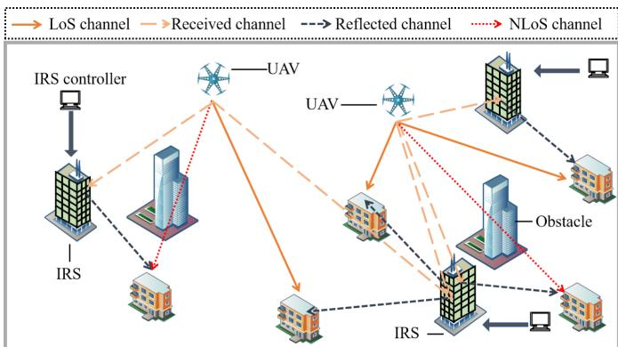  
Fig. 1. The illustrative system model of multi-IRS assisted multi-UAV communications.

To solve the formulated optimization problem, we first derive the optimal phase control strategy based on realtime UAV positions and user associations. Then, we apply geometric theory to enable real-time channel sensing between UAVs and users, deriving composite channel power gain adaptation for both LoS and NLoS channel cases.

• To address the high-dimensional action space, we transform the problem into a Decentralized Partially Observable Markov Decision Process (Dec-POMDP) and propose a MAPPO-based scheme to solve the long-term optimization problem. In addition, the SCA method is employed to solve the transmit power allocation problem. We also provide a theoretical analysis of the convergence and computational complexity. Furthermore, simulations validate the effectiveness of our scheme in terms of both convergence and the average system sum rate.

The remainder of this paper is organized as follows: In Section II, we model the multi-IRS assisted multi-UAV communication system, and formulate the average system sum rate maximization problem. In Section III, we develop the MGBA scheme, and the simulation results of the designed scheme are presented in Section IV. Finally, Section V provides a concise conclusion.

Notation: Bold-face symbols denote vectors, with k·k signifying a vector’s Euclidean norm. $\mathbb { C } ^ { P \times Q }$ refers to a $P \times Q$ matrix. ${ \bf M } ^ { T }$ and $\mathbf { M } ^ { H }$ represent the transpose and conjugate of M, respectively, while M⊗N indicates the Kronecker product of M and N. Operators b·c and E [·] stand for the floor function and mathematical expectation, respectively.

## II. SYSTEM MODEL

Fig. 1 shows a multi-IRS-assisted multi-UAV communication system, which is designed to alleviate communication congestion in environments with obstacles. The system consists of K UAVs, I IRSs and N users, which are denoted by sets $\mathcal { K } = \{ 1 , \ldots , k , \ldots , K \} , \mathcal { Z } = \{ 1 , \ldots , i , \ldots , I \}$ , and $\mathcal { N } = \{ 1 , \ldots , \bar { n } , \ldots , N \}$ , respectively. Each IRS comprises

$E \times C$ reflecting elements and is installed on the surfaces of tall structures. Since high-rise obstacles in the city may block the LoS link between UAVs and users, UAVs can communicate with users directly or via the IRS. We consider that UAVs provide communication services to users during total service time $\tau ,$ and $ { \mathcal { T } } = T  { \tau }$ , where the symbol τ denotes the length of each time slot, and the symbol t denotes the index of time slots. We consider a three-dimensional (3D) Cartesian coordinate system, and coordinates of UAV k, IRS i and user n at time slot t are $\mathbf { q } _ { k } [ t ] = [ x _ { k } [ t ] , y _ { k } [ t ] , z _ { k } [ t ] ] ^ { T }$ $\mathbf q _ { i } = [ x _ { i } , y _ { i } , z _ { i } ] ^ { T }$ , and $\mathbf q _ { n } = [ x _ { n } , y _ { n } , z _ { n } ] ^ { T }$ , respectively. Thus, the distance between UAV k and user $n ,$ that between UAV K and IRS i, as well as that between user n and IRS i at time slot t are $d _ { k , n } [ t ] = \| \mathbf { q } _ { k } [ t ] - \mathbf { q } _ { n } \| , d _ { k , i } [ t ] = \| \mathbf { q } _ { k } [ t ] - \mathbf { q } _ { i } \|$ and $d _ { i , n } = \| \mathbf { q } _ { i } - \mathbf { q } _ { n } \|$ , respectively. Since the UAVs’ travel distance at time slot t is significantly smaller than distances $d _ { k , n } [ t ] ~ = ~ \| \mathbf { q } _ { k } [ t ] - \mathbf { q } _ { n } \|$ and $d _ { k , i } [ t ] ~ = ~ \| \mathbf { q } _ { k } [ t ] - \mathbf { q } _ { i } \|$ , UAV coordinates are assumed to remain constant within one time slot [26]. The speed of UAVs is constant and defined by v.

## A. Channel Model

Since the blockage caused by high obstacles, both LoS and NLoS channels coexist between UAVs and users. The LoS channel between UAV k and user n can be modeled by the Rician fading channel and expressed as [27]:

$$
\begin{array} { l } { { H _ { k , n } [ t ] = \sqrt { \frac { \gamma } { \left( d _ { k , n } [ t ] \right) ^ { \alpha _ { k , n } } } } \left( \sqrt { \frac { \varphi _ { k , n } } { \varphi _ { k , n } + 1 } } \right. } } \\ { { \displaystyle \left. + \sqrt { \frac { 1 } { \varphi _ { k , n } + 1 } } \tilde { h } _ { k , n } \left[ t \right] \right) , } } \end{array}\tag{1}
$$

where symbols $\gamma , \alpha _ { k , n }$ and $\varphi _ { k , n }$ denote the channel gain at one-meter reference, path loss exponent and Rician fading factor between UAV k and user n, respectively. Symbol $\tilde { h } _ { k , n } [ t ]$ represents the scattering component, which follows the Gaussian distribution. The NLoS channel accounts for the presence of obstacle occlusion between user n and UAV k at time slot t, and UAV k establishes a virtual LoS channel with user n via IRS i.

To realize a single IRS serving multiple users, we introduce a dynamic IRS partitioning strategy, i.e., considering that user n is served by IRS i, and the row number of IRS elements allocated to user n by IRS i is expressed by $c _ { i , n } [ t ] = \Big | C / \sum _ { n = 1 } ^ { N } \beta _ { i , n } [ t ] \Big |$ . Alternative IRS multiplexing methods include TDMA-based schemes and configuration multiplexing-based schemes. For example, authors in [28] propose a scheme based on pricing mechanisms and configuration multiplexing. It constructs a codebook database to rapidly generate IRS configurations that serve multiple users while ensuring fairness. However, in the considered scenarios, user-IRS associations and UAV positions vary dynamically. This results in the initial codebook database requiring substantial memory and a large search space. In addition, due to the sparsity of user locations in UAV communications, the optimal phase configurations for different users exhibit significant differences. As a result, the IRS configurations produce dispersed beam energy, which cannot effectively enhance communication in the considered scenarios. Consequently, we employ dynamic geometric partitioning of each IRS to serve multiple users, thereby improving its utilization efficiency.

Users with NLoS channels establish virtual LoS links through the IRS, whereas those with existing LoS channels utilize the IRS to enhance transmission [17], [29]. The IRSuser association variable is defined as $\beta _ { i , n } \in \{ 0 , 1 \}$ , i.e., when $\beta _ { i , n } = 1$ , user n is served by IRS i. Then, the phase shift matrix of IRS i with respect to user n served by UAV k at time slot t can be expressed by:

$$
\Phi _ { i , n } [ t ] = \mathrm { d i a g } ( \phi _ { i , n } [ t ] ) \in \mathbb { C } ^ { r c [ t ] \times r c [ t ] } ,\tag{2}
$$

where $\phi _ { i , n } [ t ] = \left[ e ^ { j \phi _ { 1 , 1 , i } [ t ] } , \ldots , e ^ { j \phi _ { r , c , i } [ t ] } \right] ^ { T } \in \mathbb { C } ^ { r c [ t ] \times 1 }$ . Then, the virtual LoS channel can be expressed by:

$$
\begin{array} { r } { \mathcal { Q } _ { k , i , n } [ t ] = a ( \mathbf { H } _ { i , n } [ t ] ) ^ { H } \Phi _ { i , n } [ t ] \mathbf { H } _ { k , i , n } [ t ] , } \end{array}\tag{3}
$$

where symbol a denotes the amplitude loss. Symbols $\mathbf { H } _ { k , i , n } [ t ]$ and $\mathbf { H } _ { i , n } [ t ]$ are denoted as the channel vector from UAV k to IRS i and that from IRS i to user n, respectively, represented by [27]:

$$
\begin{array} { r l } & { \mathbf { H } _ { k , i , n } [ t ] = \sqrt { \frac { \gamma } { \left( d _ { k , i } [ t ] \right) ^ { 2 } } } \mathbf { h } _ { k , i , n } [ t ] , } \\ & { \quad \mathbf { H } _ { i , n } [ t ] = \sqrt { \frac { \gamma } { \left( d _ { i , n } \right) ^ { \alpha _ { i , n } } } } \left( \sqrt { \frac { \varphi _ { i , n } } { \varphi _ { i , n } + 1 } } \mathbf { h } _ { i , n } [ t ] \right. } \\ & { \quad \quad \quad \left. + \sqrt { \frac { 1 } { \varphi _ { i , n } + 1 } } \mathbf { \widetilde { h } } _ { i , n } \left[ t \right] \right) , } \end{array}\tag{4}
$$

(5)

where symbols $\mathbf { \Delta } _ { \mathbf { h } _ { k , i , n } [ t ] }$ and $\mathbf { h } _ { i , n } [ t ]$ are LoS components, while symbol $\tilde { \mathbf { h } } _ { i , n } [ t ]$ is the NLoS component. The path loss exponent and corresponding Rician factor between IRS i and user n are denoted by $\alpha _ { i , n }$ and $\varphi _ { i , n } ,$ respectively. To effectively utilize IRSs, we employ a uniform planar array rather than a uniform linear array. We express the reflection unit row spacing and column spacing by symbols $\mathcal { D } _ { r }$ and $\mathcal { D } _ { c } .$ , respectively. Symbols $\theta _ { k , i } [ t ]$ and $\tilde { \theta } _ { k , i } [ t ]$ denote vertical and horizontal angles of arrival from UAV k to IRS i, while symbols $\vartheta _ { i , n }$ and $\tilde { \vartheta } _ { i , n }$ denote vertical and horizontal angles of departure from IRS i to user $n ,$ respectively. The carrier frequency and light speed are denoted by symbols f and C. Thus, $\mathbf { h } _ { k , i , n } [ t ]$ and $\mathbf { h } _ { i , n } [ t ]$ can be expressed by (6) and (7) shown at the bottom of the page. Particularly, sin $\theta _ { k , i } [ t ] ~ = ~ \left( z _ { k } [ t ] - z _ { i } \right) / d _ { k , i } [ t ]$ , sin $\boldsymbol { \tilde { \theta } } _ { k , i } [ t ] \ =$ $( x _ { i } - x _ { k } [ t ] ) / \sqrt { \left( x _ { i } - x _ { k } [ t ] \right) ^ { 2 } + \left( y _ { i } - y _ { k } [ t ] \right) ^ { 2 } , \cos \tilde { \theta } _ { k , i } [ t ] } \quad =$ $( y _ { k } [ t ] - y _ { i } ) / \sqrt { \left( x _ { i } - x _ { k } [ t ] \right) ^ { 2 } + \left( y _ { i } - y _ { k } [ t ] \right) ^ { 2 } } ,$ sin $\vartheta _ { i , n }$ $z _ { i } / d _ { i , n } [ t ]$ , sin $\widetilde { \vartheta } _ { i , n } ~ = ~ ( x _ { n } - x _ { i } ) / \sqrt { ( x _ { n } - x _ { i } ) ^ { 2 } + ( y _ { n } - y _ { i } ) ^ { 2 } }$ and cos $\tilde { \vartheta } _ { i , n } = ( y _ { n } - y _ { i } ) / \surd ( x _ { n } - x _ { i } ) ^ { 2 } + ( y _ { n } - y _ { i } ) ^ { 2 }$

Define binary variable $\mu _ { k , n } [ t ]$ as the LoS channel indicator between UAV k and user $n ,$ i.e., $\mu _ { k , n } [ t ] = 1$ indicates the LoS channel exists between them, and vice versa. Then, we can obtain the composite channel between UAV k and user n, which is denoted by:

$$
\tilde { H } _ { k , n } [ t ] = \mu _ { k , n } [ t ] H _ { k , n } [ t ] + \sum _ { i = 1 } ^ { I } \beta _ { i , n } [ t ] \mathcal { Q } _ { k , i , n } [ t ] .\tag{8}
$$

In particular, the LoS component dominates in UAV communication systems [30]. To simplify the subsequent calculation process, we omit the NLoS component, and (8) can be transformed into:

$$
\mathbb { Q } _ { k , n } [ t ] = \mu _ { k , n } [ t ] Q _ { k , n } [ t ] + \sum _ { i = 1 } ^ { I } \beta _ { i , n } [ t ] Q _ { k , i , n } [ t ] ,\tag{9}
$$

where $Q _ { k , n } [ t ]$ and $Q _ { k , i , n } [ t ]$ denote the LoS components in (1) and (3), respectively.

## B. NOMA Transmission Model

Since spectrum resources are limited in multi-UAV communication systems, we employ Non-Orthogonal Multiple Access (NOMA) technology to enable multi-UAV and multi-user communications [31], [32]. It is noted that the user clustering and channel gain disparity enhancement strategies proposed in [33] are compatible with the considered scenarios. Specifically, NOMA allows multiple users to share the same frequency band. However, too many users can bring strong interference to the system and increase the design difficulty of the receiver. Consequently, we assign two users to each UAV, i.e., users n and m are served by UAV k with transmit power $p _ { k , n } [ t ]$ and $p _ { k , m } [ t ]$ , respectively. When $| \mathbb { Q } _ { k , n } [ t ] | ^ { 2 } \geq | \mathbb { Q } _ { k , m } [ t ] | ^ { 2 }$ is founded, we can calculate the achievable rate of user n at time slot t:

$$
R _ { k , n } [ t ] = \log _ { 2 } \left( 1 + \frac { p _ { k , n } [ t ] | \mathbb { Q } _ { k , n } [ t ] | ^ { 2 } } { \delta ^ { 2 } } \right) ,\tag{10}
$$

$$
\begin{array} { r l } & { \mathbf { h } _ { k , i , n } [ t ] = \bigg [ 1 , e ^ { - j 2 \pi f \frac { \mathcal { D } _ { r } \sin \theta _ { k , i } [ t ] \cos \tilde { \theta } _ { k , i } [ t ] } { C } } , \dots , e ^ { - j 2 \pi f ( r - 1 ) \frac { \mathcal { D } _ { r } \sin \theta _ { k , i } [ t ] \cos \tilde { \theta } _ { k , i } [ t ] } { C } } \bigg ] ^ { T } } \\ & { \qquad \otimes \bigg [ 1 , e ^ { - j 2 \pi f \frac { \mathcal { D } _ { c } \sin \theta _ { k , i } [ t ] \sin \tilde { \theta } _ { k , i } [ t ] } { C } } , \dots , e ^ { - j 2 \pi f ( c _ { i , n } [ t ] - 1 ) \frac { \mathcal { D } _ { c } \sin \theta _ { k , i } [ t ] \sin \tilde { \theta } _ { k , i } [ t ] } { C } } \bigg ] ^ { T } . } \end{array}\tag{6}
$$

$$
\begin{array} { r l } & { \mathbf { h } _ { i , n } [ t ] = \left[ 1 , e ^ { - j 2 \pi f \frac { \mathcal { D } _ { T } \sin \vartheta _ { i , n } \cos \bar { \vartheta } _ { i , n } } { C } } , \ldots , e ^ { - j 2 \pi f ( r - 1 ) \frac { \mathcal { D } _ { T } \sin \vartheta _ { i , n } \cos \bar { \vartheta } _ { i , n } } { C } } \right] ^ { T } } \\ & { \qquad \otimes \left[ 1 , e ^ { - j 2 \pi f \frac { \mathcal { D } _ { c } \sin \vartheta _ { i , n } \sin \bar { \vartheta } _ { i , n } } { C } } , \ldots , e ^ { - j 2 \pi f ( c _ { i , n } [ t ] - 1 ) \frac { \mathcal { D } _ { c } \sin \vartheta _ { i , n } \sin \bar { \vartheta } _ { i , n } } { C } } \right] ^ { T } . } \end{array}\tag{7}
$$

TABLE I SUMMARY OF MAIN NOTATIONS
<table><tr><td>Notation</td><td>Definition</td></tr><tr><td>a</td><td>The amplitude loss</td></tr><tr><td>k</td><td>The index of UAVs</td></tr><tr><td> $_ { i }$ </td><td>The index of IRSs</td></tr><tr><td>n</td><td>The index of users</td></tr><tr><td>t</td><td>The index of time slots</td></tr><tr><td> $\tau$ </td><td>The length of each time slot</td></tr><tr><td> $\mathbf { q } _ { k } [ t ]$ </td><td>The coordinate of UAV k at time slot t</td></tr><tr><td> $d _ { k , n } [ t ]$ </td><td>The distance between UAV k and user n at time slot t</td></tr><tr><td> $\gamma$ </td><td>The channel gain at one-meter reference</td></tr><tr><td> $\alpha _ { k , n }$ </td><td>The path loss exponent between UAV k and user n</td></tr><tr><td> $\varphi _ { k , n }$ </td><td>The Rician fading factor between UAV k and user n</td></tr><tr><td> $\tilde { h } _ { k , n } [ t ]$ </td><td>The scattering component between UAV k and user n</td></tr><tr><td> $E$ </td><td>The row number of IRS</td></tr><tr><td> $C$ </td><td>The column number of IRS</td></tr><tr><td> $r$ </td><td>The row index of IRS</td></tr><tr><td>C</td><td>The column index of IRS</td></tr><tr><td> $\phi _ { r , c , i }$ </td><td>The phase shift of the (r, c)-th reflecting element in IRS</td></tr><tr><td> $\Phi _ { i , n }$ </td><td>The phase shift matrix of IRS ¿ with respect to user n</td></tr><tr><td> $H _ { k , n } [ t ]$ </td><td>The channel between UAV k and user n</td></tr><tr><td> $\mathbf { H } _ { i , n }$ </td><td>The channel vector from IRS i to user n</td></tr><tr><td> $\beta _ { i , n } [ t ]$ </td><td>The IRS-user association variable</td></tr><tr><td> $\mathbf { h } _ { i , n }$ </td><td>The LoS component of the channel vector  $\mathbf { H } _ { i , n }$ </td></tr><tr><td> $D _ { r }$ </td><td>The row spacing</td></tr><tr><td> $\theta _ { i , n }$ </td><td>The vertical angles of arrival from IRS ¿ to user n</td></tr><tr><td> $\vartheta _ { i , n }$ </td><td>The vertical angles of depature from IRS i to user n</td></tr><tr><td> $f$ </td><td>The carrier frequency</td></tr><tr><td> $\mathcal { C }$ </td><td>The light speed</td></tr><tr><td> $\mu _ { k , n } [ t ]$ </td><td>The LoS channel indicator between UAV k and user n at time slot t</td></tr><tr><td> $\mathbb { Q } _ { k , n } [ t ]$ </td><td>The composite channel between UAV k and user n at time slot t</td></tr><tr><td> $p _ { k , n } [ t ]$ </td><td>The transmit power allocate to user n from UAV k at</td></tr><tr><td> $R _ { k , n } [ t ]$ </td><td>time slot t The achievable rate of user n at time slot t</td></tr></table>

and that between UAV k and user m expressed by:

$$
R _ { k , m } [ t ] = \log _ { 2 } \left( 1 + \frac { p _ { k , m } [ t ] | \mathbb { Q } _ { k , m } [ t ] | ^ { 2 } } { | \mathbb { Q } _ { k , m } [ t ] | ^ { 2 } p _ { k , n } [ t ] + \delta ^ { 2 } } \right) ,\tag{11}
$$

where $p _ { n , k } [ t ] \ \leq \ p _ { m , k } [ t ]$ guarantees efficient SIC decoding. Then, the total transmission rate of UAV k at time slot t can be represented by:

$$
R _ { k } [ t ] = R _ { k , n } [ t ] + R _ { k , m } [ t ] .\tag{12}
$$

The definitions of main symbols are presented in Table I.

## C. Problem Formulation

To satisfy users’ communication demands, the average system sum rate is maximized by jointly optimizing user associations, LoS channel indicators, phase shifts, and UAV trajectories. Define user association variable $\beta = \{ \beta _ { n , i } [ t ] , n \in$ $N , i \in I , t \in T \}$ , LoS channel indicator $\mu = \{ \mu _ { k , n } [ t ] , k \in$ $K , n \in N , t \in T \}$ , phase shift variable $\phi = \{ \phi _ { i , n } [ t ] , i \in I , n \in$ $N , t \in T \}$ , coordinates of UAV $\mathbf { q } = \{ \mathbf { q } _ { k } [ t ] , \dot { k } \in \dot { K , t } \in T \}$ and transmit power allocation variable $p = \{ p _ { k , n } [ t ] , n \in N , t \in$

T }, the average system sum rate maximization problem can be formulated as:

P 0: maximize ${ \frac { \displaystyle \sum _ { t = 1 } ^ { T } \sum _ { k = 1 } ^ { K } R _ { k } [ t ] } { T } } ,$   
β,µ,φ,q,p   
s.t. C1: $\beta _ { i , n } \left[ t \right] \in \left\{ 0 , 1 \right\} , \forall i \in I , n \in N , t \in T ,$   
C2: $\sum _ { i = 1 } ^ { I } \beta _ { i , n } \left[ t \right] = 1 , \forall n \in N , t \in T ,$   
C3: $\sum _ { n = 1 } ^ { N } \beta _ { i , n } \left[ t \right] \leq E , \forall i \in I , t \in T ,$   
C4: $\| \mathbf { q } _ { k } [ t ] - \mathbf { q } _ { k } [ t - 1 ] \| = \tau v , \forall k \in K , t \in T ,$   
C5: $\mu _ { k , n } [ t ] \in \left\{ 0 , 1 \right\} , \forall k \in K , n \in N , t \in T ,$   
C6: $0 \leq \phi _ { n , i } [ t ] < 2 \pi , \forall n \in N , i \in I , t \in T ,$   
C7: $R _ { k , n } [ t ] \geq R _ { m i n } , \forall k \in K , n \in N , t \in T ,$   
C8: $\begin{array} { r } { \| \mathbf { q } _ { k } [ t ] - \mathbf { q } _ { j } [ t ] \| \geq q _ { m i n } , \forall k \neq j \in K , t \in T , } \end{array}$   
C9: $p _ { k , n } [ t ] + p _ { k , m } [ t ] = p _ { m a x } , \forall k \in K , n$   
$\neq m \in N ,$   
$t \in T ,$   
C10: $p _ { k , n } [ t ] \geq 0 , \forall k \in K , n$   
$\in N , t \in T ,$   
C11: $p _ { k , n } [ t ] \leq p _ { k , m } [ t ] , \forall k \in K , n \neq m \in N , t \in T ,$   
(13)

where C1 specifies that the IRS-user association variable $\beta _ { n , i } [ t ]$ takes values $\mathrm { o f ~ } ^ {  } 0 ^ { \Rightarrow } \mathrm { o r ~ } ^ { \ast } \mathrm { l } ^ { \ast } .$ . C2 indicates that each user can be associated with only one IRS. C3 specifies that the number of users served by each IRS can’t exceed its row number. C4 defines that each UAV moves a fixed distance at each time slot. C5 denotes the range of LoS channel indicator $\mu _ { k , n } [ t ]$ . C6 restricts the value of the phase shift variable $\phi _ { n , i } [ t ]$ to be between 0 and $2 \pi$ . C7 defines the transmission rate threshold $R _ { m i n }$ for users. C8 defines the safe distance of UAVs. C9 and C10 specify the range of the transmit power of users n and m served by UAV k. C11 indicates that the user n with decoding priority is allocated less power than the user m. It is noted that channel estimation methods can obtain the perfect Channel State Information (CSI) [8], [29]. Based on the perfect CSI and locations of UAVs, the perfect phase control is realized [34].

Theorem 1: Problem P0 is NP-hard.

Proof: The proof details are provided in Appendix A.

It can be known by analyzing (9) that position $\mathbf { q } _ { k } [ t ]$ of UAV k affects the channel condition between UAV k and user n. Thus, variables $\mathbf { q } _ { k } [ t ]$ and $\mu _ { k , n } [ t ]$ are highly coupled. In addition, the location change of UAVs can also affect the channel condition between UAVs and IRSs, which influences the associations between users and IRSs. The objective function of Problem P 0 reveals that it is a long-term optimization problem, requiring real-time optimization based on UAV locations.

## D. Problem Decomposition

Since the variables in Problem P0 are highly coupled and the UAV environment exhibits dynamic characteristics, conventional convex optimization or heuristic methods become inefficient. Therefore, the problem is promising to be solved by the DRL-based methods. However, there are coupled variables in the proposed optimization problem, which may cause a huge action space. Centralized DRL schemes, such as PPO, struggle to handle such high-dimensional action spaces, making algorithm convergence difficult. Specifically, if the candidate action space of a single UAV is N, the candidate action space of U UAVs is $\bar { N } ^ { U }$ under centralized DRL schemes, which grows exponentially with the number of UAVs. This exponential explosion in the joint action space severely limits the scalability of centralized DRL methods. Therefore, we propose an iterative optimization scheme based on MAPPO that significantly reduces action spaces and interacts with the dynamic environment to obtain efficient solutions.

In typical DRL schemes, all optimization variables are generally formulated as actions, enabling the agent to interact with the environment and learn optimal decision policies. However, for problem P0, modeling all variables as actions results in an extremely large action space, which significantly hampers the exploration of effective policies. Moreover, such modeling approaches fail to capture the inherent coupling among variables. For example, transmit power optimization depends on both UAV coordinates and user association decisions. Treating the transmit power, UAV coordinates, and user association as joint actions leads to numerous infeasible or irrelevant actions, thereby degrading learning efficiency. Therefore, we decompose the problem into two subproblems based on the coupling relationships among the variables and propose a scheme integrating MAPPO and the SCA method. Through this decomposition, the proposed scheme not only leverages DRL to achieve long-term system optimization but also employs SCA to ensure the effectiveness of resource allocation. Furthermore, the scheme is well-suited for channelaware composite channel models, enabling dynamic switching between LoS and NLoS channels in environments with obstacles.

## III. AN AVERAGE SYSTEM SUM RATE MAXIMIZATION SCHEME

To maximize the average system sum rate, we develop an MAPPO- and SCA-based scheme to solve Problem P 0. Specifically, we utilize beam alignment theory to obtain the optimal phase control strategy and derive composite channel power gains based on LoS and NLoS channels, respectively. Then, the UAV trajectories, the LoS judgment variable, and the multi-IRS multi-user associations are optimized using MAPPO, while the transmit power is optimized using the SCA method.

## A. Phase Control and Composite Channel Power Gain Analysis

We can observe that (9) defines the composite channel from UAV k to user n. To maximize the channel power gain brought by the IRS, we need to design a phase control strategy that maximizes $Q _ { k , i , n } [ t ]$ . In addition, this strategy must be dynamically adapted due to the continuous movement of the UAVs. To solve this problem, we design a phase alignmentbased IRS phase control strategy and derive the composite channel power gain between UAVs and users. Based on the phase alignment, we can obtain Theorem 2.

Theorem 2: The optimal phase control strategy can be expressed by:

$$
\begin{array} { l } { \displaystyle \phi _ { r , c } ^ { * } [ t ] = - 2 \pi \frac { f } { \mathcal { C } } ( { \mathcal { D } } _ { r } ( r - 1 ) \sin \vartheta _ { i , n } \cos \tilde { \vartheta } _ { i , n } } \\ { \displaystyle \qquad - { \mathcal { D } } _ { c } ( c - 1 ) \sin \vartheta _ { i , n } \sin \tilde { \vartheta } _ { i , n } } \\ { \displaystyle \qquad + { \mathcal { D } } _ { r } ( r - 1 ) \sin \theta _ { k , i } [ t ] \cos \tilde { \theta } _ { k , i } [ t ] } \\ { \displaystyle \qquad + { \mathcal { D } } _ { c } ( c - 1 ) \sin \theta _ { k , i } [ t ] \sin \tilde { \theta } _ { k , i } [ t ] ) . } \end{array}\tag{14}
$$

Proof: The proof details are provided in Appendix B. Then, we can derive an expression for the composite channel power gain between UAV k and user n by combining (27) with (9):

$$
\begin{array} { r l } & { | \mathbb { Q } _ { k , n } [ t ] | ^ { 2 } } \\ & { = \mu _ { k , n } [ t ] ^ { 2 } \frac { \gamma } { \left( d _ { k , n } [ t ] \right) ^ { \alpha _ { k , n } } } \frac { \varphi _ { k , n } } { \varphi _ { k , n } + 1 } } \\ & { \quad + \displaystyle \sum _ { i = 1 } ^ { I } \frac { a ^ { 2 } \beta _ { i , n } \left[ t \right] \gamma ^ { 2 } r ^ { 2 } c _ { i , n } [ t ] ^ { 2 } } { d _ { k , i } [ t ] ^ { 2 } \left( d _ { i , n } \right) ^ { \alpha _ { i , n } } } \frac { \varphi _ { n , i } } { \varphi _ { n , i } + 1 } } \\ & { \quad + \displaystyle \sum _ { i = 1 } ^ { I } \frac { 2 a \beta _ { i , n } \left[ t \right] \mu _ { k , n } [ t ] \gamma ^ { \frac { \alpha _ { i } } { 2 } } r c _ { i , n } \left[ t \right] } { d _ { k , i } \left[ t \right] \left( d _ { i , n } \right) ^ { \frac { \alpha _ { i , n } } { 2 } } \left( d _ { k , n } \left[ t \right] \right) ^ { \frac { \alpha _ { k , n } } { 2 } } } \sqrt { \frac { \varphi _ { k , n } } { \varphi _ { k , n } + 1 } } \sqrt { \frac { \varphi _ { n , i } } { \varphi _ { n , i } + 1 } } . } \end{array}\tag{15}
$$

(15) indicates the total channel power gain of user $n ,$ which includes the direct component and the cascaded component. Specifically, the first term in (15) is the LoS channel correlation component, and the second term is the virtual LoS channel correlation component, while the third term is the composite component. It means that when a LoS channel exists between UAV k and user n, equation $\mu _ { k , n } = 1$ is founded, i.e., all terms in (15) are unequal to $ { { } ^ { 6 } }  { 0 ^ { 9 } }$ . When the LoS path between UAV k and user n is obstructed, equation $\mu _ { k , n } = 0$ is founded, i.e., the first and the third terms in the equation are equal to $\mathbf { \vec { \Delta } } ^ { 6 } 0 ^ { 9 }$ As a result, the channel power gain is adaptive to different user channel environments.

## B. UAV Trajectory and User Association Optimization Based on MAPPO

The MAPPO algorithm is an online learning algorithm for collaborative multi-agent environments [35] and can be applied to the dynamic environment. In addition, the algorithm is generalizable and can be used in both continuous and discrete action spaces. In the considered multi-IRS multi-UAV communication networks, multiple UAVs are collaborative and share a discrete action space. Therefore, we design an MAPPO-based scheme to solve the real-time UAV trajectory optimization and multi-IRS multi-user association decisionmaking problem. First, we can transform Problem P 0 into Problem P 1 by using the phase control strategy:

$$
\begin{array} { r l } & { \underset { P 1 : \mathrm { ~ m a x i m i z e } } { \sum } \frac { \underset { t = 1 } { K } } { \sum } \underset { k = 1 } { R } [ t ] } \\ & { \mathrm { s . t . ~ C l - C 5 , C 7 ~ a n d ~ C 8 ~ i n ~ P r o b l e m ~ } P 0 . } \end{array}\tag{16}
$$

Variables $\beta$ and $\mu$ are binary variables and coupled with variable q. In addition, users served by different UAVs can select the same IRS to reflect signal, i.e., the IRS-user association decisions among different UAVs are coupled. This causes the action space to grow exponentially with the number of UAVs, i.e., let $\mathcal { A }$ denotes the action number of a single UAV, and the total size of the action space is $\mathcal { A } ^ { K }$ . In addition, since the objective function in Problem P 1 is related to user association decisions of all UAVs, collaborative optimization among UAVs is required.

To solve the above challenge, we transform Problem P1 into a Dec-POMDP, defined as $\langle \mathcal { S } , \mathcal { A } , \mathcal { O } , \mathcal { R } , P , K , \gamma _ { d i s } \rangle$ . Symbols S and A represent the state space and action space, respectively. The state space is defined as $S \triangleq \{ o _ { k } [ t ] , k \in K , t \in T \}$ The action of agent k includes the movement pattern and the association decision for users it serves, which is defined as $A _ { k } [ t ] = \{ \beta _ { n , i } [ t ] , D _ { k } [ t ] \}$ , where $D _ { k } [ t ]$ denotes the movement pattern of UAV k at time slot t. The movement pattern includes moving forward, backward, left, and right by $v \tau$ meters [9], [36], i.e., (vτ , 0, 0), (-vτ , 0, 0), (0, vτ , 0) and $\left( 0 , \mathit { \Pi } - v \tau , \mathit { \Pi } 0 \right)$ By executing the UAVs’ movement pattern at each time slot, the coordinates of UAVs at each time slot can be obtained. The actions of all UAVs collectively form a joint action $A [ t ]$ Symbol $o _ { k } [ t ] = \{ q _ { k } [ t ] , \{ q _ { i } \} _ { i \in I } , \{ q _ { n } \} _ { n \in N } , \{ q _ { g } \} _ { g \in G } \}$ denotes the observations of UAV k at time slot t, where $\{ q _ { g } \} _ { g \in G }$ denotes the set of obstacle coordinates. The learning agents obtain observation $o \in \mathcal { O }$ and select action $A \in { \mathcal { A } }$ to interact with the environment, after which they obtain a step reward computed by the reward function. The transition probability is denoted by P . Symbols K and $\gamma _ { d i s }$ denote the number of agents and discount factor, respectively.

Each UAV is treated as an agent and can observe its position at time slot t and variable $\mu$ can be obtained by determining whether the spatial straight line between UAVs and users passes through an obstacle at each time slot. Specifically, we traverse the channel states between UAVs and users after executing the $\mathrm { U A V s } '$ motion patterns to obtain $\mu .$ Then, we calculate the transmission rate for each user at time slot t based on the derived composite channel power gain, i.e., (15). Since our objective is to maximize the average system transmission rate, the step reward at time slot t can be obtained by executing joint action $A [ t ]$ , with the reward function defined as $\mathcal { R } ( A [ t ] | S [ t ] ) ~ = ~ \sum _ { k = 1 } ^ { K } R _ { k } [ t ]$ where S[t] denotes the current state. Considering constraint $\mathbf { C 7 } ,$ we introduce an indicator function $\mathcal { G } ( R _ { k } [ t ] , R _ { m i n } )$ with values $\ " 0 \ "$ and $" 1 "$ , where $\begin{array} { r c l } { \mathcal { G } ( R _ { k } [ t ] , R _ { m i n } ) } & { = } & { 1 } \end{array}$ means $\begin{array} { r l r } { R _ { k } [ t ] } & { { } \ge } & { R _ { m i n } } \end{array}$ and vice versa. To avoid UAV collisions, we introduce penalty terms into the reward function to avoid the agent generating aggressive actions. Define $\mathcal { W } ( \| \mathbf { q } _ { k } [ t ] - \mathbf { q } _ { j } [ t ] \| < q _ { m i n } ) = \chi$ and $\mathcal { W } ( \| \mathbf { q } _ { k } [ t ] - \mathbf { q } _ { j } [ t ] \| \geq$ $q _ { m i n } \bigr ) \ = \ 0 , \forall k \ \ne \ j \ \in \ K$ . Then, the reward function can be reshaped as ${ \mathcal R } ( A [ t ] | S [ t ] ) = \sum _ { k = 1 } ^ { K } R _ { k } [ t ] { \mathcal G } ( R _ { k } [ t ] , R _ { m i n } ) - $ $\sum _ { k = 1 } ^ { K } \sum _ { j \neq k } ^ { K } \mathcal { W } ( \| \mathbf { q } _ { k } [ t ] - \mathbf { q } _ { j } [ t ] \| < q _ { m i n } ) .$

Fig. 2 illustrates the framework of the proposed MGBA scheme. First, K agents interact with the environment to obtain their respective observations, and actions are selected based on a globally optimized joint policy. Then, a joint action is generated and executed, transitioning the system to the next state. By the LoS judgment mechanism and reward function computation, transition information is generated and stored in the buffer. Finally, a mini-batch is sampled for agent training once a sufficient number of transitions have been accumulated in the buffer.

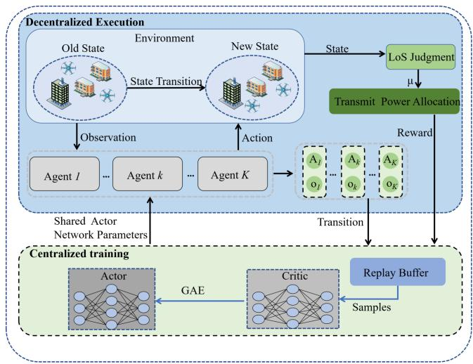  
Fig. 2. The structure of the MGBA scheme.

Since the agents in the proposed scheme are homogeneous, parameter sharing is adopted. It is noted that the scenarios considered are fully cooperative, and the agent’s privacy preservation is not the main focus of this paper. Privacy preservation among agents can be achieved through techniques such as differential privacy and federated learning [37], [38].

Represent the actor network and the critic network as $\mathcal { V } _ { \omega } ( S [ t ] )$ and $V _ { \varpi } ( S [ t ] )$ , respectively, with their corresponding parameters denoted as ω and \$. Then, we can denote the ratio of new policy ω to old policy $\tilde { \omega }$ as $\rho _ { k , \omega } [ t ]$ , and get the clipped surrogate objective function, which can be expressed by:

$$
\mathcal { I } _ { k } = \mathbb { E } _ { t } \left[ \operatorname* { m i n } \left( \rho _ { k , \omega } \left[ t \right] , \mathbb { C } \left( \rho _ { k , \omega } \left[ t \right] , 1 - \varepsilon , 1 + \varepsilon \right) \mathcal { G } _ { k } \left[ t \right] \right) \right] ,\tag{17}
$$

where $\mathbb { C } ( \cdot )$ denotes the clip function with clip fraction ε. Symbol $\mathcal { G } _ { k } [ t ]$ denotes the advantage function, which can be obtained by the generalized advantage estimator method. Then, we can train the actor network by maximizing the following function:

$$
\mathcal { L } _ { \omega } = \mathcal { I } _ { k } + \varsigma \mathbb { E } _ { t } [ B ( \mathcal { V } _ { \omega } ( A _ { k } [ t ] | o _ { k } [ t ] ) ) ] ,\tag{18}
$$

where function $\boldsymbol { B } ( \mathcal { V } _ { \omega } ( \boldsymbol { A } _ { k } [ t ] | \boldsymbol { o } _ { k } [ t ] ) )$ = $\mathbb { E } _ { A _ { k } [ t ] \sim \mathcal { V } _ { \omega } } [ - \log ( \mathcal { V } _ { \omega } ( A _ { k } [ t ] | o _ { k } [ t ] ) ) ]$ denotes entropy of policy $\mathcal { V } _ { \omega } ( A _ { k } [ t ] | o _ { k } [ t ] )$ with entropy coefficient ς.

Additionally, we can update critic network $\mathcal { V } _ { \varpi } ( S [ t ] )$ by minimizing the following function:

$$
\begin{array} { r l } & { \mathbb { L } _ { \varpi } = \mathbb { E } _ { t } \left[ \operatorname* { m a x } \left( \left( V _ { \varpi } \left( S \left[ t \right] \right) - \tilde { \mathcal { R } } \left[ t \right] \right) ^ { 2 } , \right. \right. } \\ & { \left. \left. \left( \mathbb { C } \left( V _ { \varpi } \left( S \left[ t \right] \right) , \tilde { V } _ { \varpi } \left( S \left[ t \right] \right) - \mathcal { E } , \tilde { V } _ { \varpi } + \mathcal { E } \right) - \tilde { \mathcal { R } } \left[ t \right] \right) ^ { 2 } \right) \right] , } \end{array}\tag{19}
$$

where $\begin{array} { r } { \tilde { \mathcal { R } } \ = \ \sum _ { w = 0 _ { \times } } ^ { T - t - 1 } \gamma ^ { w } \mathcal { R } \left[ t + w \right] } \end{array}$ denotes the discounted reward, and symbol $\tilde { V } _ { \varpi } \left( S \left[ t \right] \right)$ denotes the old value function.

Algorithm 1 Pseudo-Code of MGBA   
Input: The initial location of UAVs $\{ q _ { k } ^ { 0 } \} _ { k \in K } ,$ locations of   
IRSs $\{ q _ { i } \} _ { i \in I }$ and users $\{ q _ { n } \} _ { n \in N } ,$ obstacle coordinates   
$\{ q _ { g } \} _ { g \in G } ,$ learning rate $\xi$ and batch size $B .$   
Output: Learned policy $\nu _ { \omega } .$   
1: Initialize policy $\mathcal { V } _ { \omega }$ and value function $V _ { \varpi }$ with parame  
ters ω and $\varpi ,$ and set episode buffer $\mathcal { F }$ with a maximum   
episode capacity of B.   
2: for episode $\mathbf { \Phi } = 1 { , } 2 , \ldots$ do   
3: Initialize the replay buffer.   
4: for $\mathfrak { t } = 1 , 2 , . . . , \mathbb { B }$ do   
5: Initialize state $\check { S } [ 0 ] = \left\{ \{ q _ { k } ^ { 0 } \} _ { k \in K } \right\}$   
6: for $t = 1 , 2 , \dots , T$ do   
7: Obtain $\mathcal { V } _ { \omega }$ through actor network $\mathcal { V } _ { \omega } ( S [ t ] )$   
8: Select joint action $A [ t ]$ based on $\mathcal { V } _ { \omega }$ and state $\mathbb { S } [ t ]$   
9: Obtain next state $S [ \bar { t } + 1 ]$ by excute action $A [ t ]$   
10: Obtain $\{ \mu _ { k , n } \} _ { k \in K , n \in N }$ and $\{ \phi _ { i , n } \} _ { i \in I , n \in N }$ by   
LoS judgement and (27).   
11: Obtain transmit power allocation by Algorithm 2.   
12: Store transition $\{ S [ t ] , A [ t ] , S [ t { \stackrel { . } { + } } 1 ] , { \stackrel { . } { o } } [ t ] , o [ t { \stackrel { . } { + } }$   
$1 ] , \mathcal { R } [ t ] , t \}$ in the episode buffer.   
13: end for   
14: end for   
15: Sample a batch of state transitions with size $B .$   
16: Update actor network $\mathcal { V } _ { \omega }$ by maximizing (18).   
17: Update critic network $V _ { \varpi }$ by minimizing (19).   
18: end for   
Algorithm 1 shows the training process of our proposed Algorithm 1 shows the training process of our proposed

MGBA scheme.

## C. Transmit Power Allocation Based on SCA

In the SIC decoding phase, the transmit power allocation depends on the channel conditions between users and UAVs. Therefore, the transmission power allocation needs to be optimized after the UAV trajectory and user association decisions. For a given UAV coordinates q and user associations $\beta ,$ Problem $P 2$ can be expressed as:

$$
P 2 \colon \underset { p } { \mathrm { m a x i m i z e } } \frac { \displaystyle \sum _ { t = 1 } ^ { T } \sum _ { k = 1 } ^ { K } R _ { k } [ t ] } { T } ,\tag{20}
$$

Problem $P 2$ is nonconvex due to the non-convexity of the objective function with respect to $p .$ To tackle this problem, we adopt the SCA method to obtain an efficient solution iteratively. First, we introduce slack variable $\{ W _ { k } [ t ] \} _ { k \in \mathcal { K } , t \in \mathcal { T } }$ to construct a lower bound for Problem $P 2 .$ , which can be expressed by:

$$
P 2 ^ { \prime } \colon \underset { \stackrel { p , W } { \mathrm { s . t . } } \mathrm { C } \mathrm { \bar { 9 } } \mathrm { - } \mathrm { C } 1 1 \mathrm { \ i n \ P r o b l e m } } { \mathrm { m a x i m i z e } } ,
$$

$$
\mathbf { C } 1 2 \colon W _ { k } [ t ] \leq R _ { k } [ t ] , \forall k \in \mathcal { K } , t \in \mathcal { T } .\tag{21}
$$

The constraint C12 is nonconvex. Next, the SCA method is utilized to deal with the nonconvexity of constraint C12. Given a locally feasible solution $\mathbf { \boldsymbol { p } } ^ { ( l ) }$ for the l-th SCA iteration, constraint C12 is transformed into C13 by a first-order Taylor expansion at that point:

C13: $W _ { k } [ t ] \leq R _ { k } [ t ] ( p ^ { ( l ) } ) + \frac { ( p _ { n } - p _ { n } ^ { ( l ) } ) } { \ln 2 } ( \frac { \mathbb Q _ { k , n } [ t ] | ^ { 2 } } { 1 + \frac { p _ { n } ^ { ( l ) } \mathbb Q _ { k , n } [ t ] | ^ { 2 } } { \delta ^ { 2 } } }$   
$+ \frac { 1 } { p _ { n } ^ { ( l ) } + p _ { m } ^ { ( l ) } + \frac { \delta ^ { 2 } } { \mathbb { Q } _ { k , m } [ t ] | ^ { 2 } } } - \frac { 1 } { p _ { n } ^ { ( l ) } + \frac { \delta ^ { 2 } } { \mathbb { Q } _ { k , n } [ t ] | ^ { 2 } } } \big )$   
$\underline { { ( p _ { m } - p _ { m } ^ { ( l ) } ) } }$   
$+ \frac { \langle P ^ { m } \rangle ^ { } \prime \prime ^ { m } \rangle } { \left( p _ { n } ^ { ( l ) } + p _ { m } ^ { ( l ) } + \frac { \delta ^ { 2 } } { \mathbb { Q } _ { k , m } [ t ] | ^ { 2 } } \right) \ln { 2 } } .$ (22)

Using the above transformation, we can obtain an approxi mate form of Problem $P 2 \colon$

Algorithm 2 Low Computational Transmit Power Allocation   
Algorithm   
Input: The coordinates of UAVs $\{ \mathbf { q } _ { k } [ t ] \} _ { k \in \mathcal { K } }$ , user association   
$\{ \beta _ { n , i } [ t ] \} _ { n \in \mathcal { N } , i \in \mathcal { T } }$ , maximum iteration number $l _ { m a x }$ and   
convergence tolerance $\zeta .$   
Output: Transmit power allocation $\{ p _ { k , n } [ t ] \} _ { k \in \mathcal { K } , n \in \mathcal { N } } .$   
1: Initialize iteration index $l = 1$ and local feasible solution   
$\{ p _ { n , k } ^ { ( l ) } [ t ] \} _ { k \in { \mathcal { K } } , n \in { \mathcal { N } } } .$   
2: for $l = 1 , 2 , . . . , l _ { m a x }$ do   
3: Solve Problem $P 2 ^ { \prime \prime }$ with $\{ p _ { n , k } ^ { ( l ) } [ t ] \} _ { k \in \mathcal { K } , n \in \mathcal { N } }$ and calcu  
late the sum rate $\sum _ { k = 1 } ^ { K } R _ { k } ^ { ( l ) } [ t ]$   
4: if $\sum _ { k = 1 } ^ { K } R _ { k } ^ { ( l ) } [ t ] - \sum _ { k = 1 } ^ { K } R _ { k } ^ { ( l - 1 ) } [ t ] \leq \zeta$ then   
5: $\{ p _ { n , k } ^ { * } [ t ] \} _ { k \in \mathcal { K } , n \in \mathcal { N } } = \{ p _ { n , k } ^ { ( l ) } [ t ] \} _ { k \in \mathcal { K } , n \in \mathcal { N } } .$   
6: break   
7: end if   
8: end for

P 200: maximize $\frac { \sum _ { t = 1 } ^ { T } \sum _ { k = 1 } ^ { K } R _ { k } [ t ] } { T } ,$   
p,W   
s.t. C9-C11 in Problem P 0, and C13. (23)

Problem $P 2 ^ { \prime \prime }$ is convex and can be solved by CVX. Algorithm 2 shows the transmit power allocation approach.

## D. Convergence and Complexity Analysis

The convergence of the proposed MGBA scheme primarily depends on the global convergence of Algorithm 1 and the local convergence of Algorithm 2.

Specifically, Algorithm 2 is based on the SCA method, which ensures convergence to a stationary solution by providing an initial feasible solution $p ^ { 0 ^ { \scriptstyle ^ { \circ } } } [ 3 9 ]$ Moreover, the hardware constraints of UAV inherently bound the sum rate, thereby ensuring the local convergence of Algorithm 2.

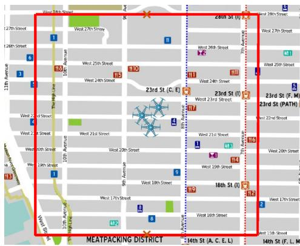  
Fig. 3. The simulation topology based on the manhattan city map.

For Algorithm 1, its convergence is ensured by the MAPPO. While PPO guarantees convergence in stationary environments [40], we employ the CTDE to mitigate the non-stationarity arising in multi-agent environments. This enables the learning process to approximate a stationary environment during training, thus allowing MAPPO to maintain stable convergence behavior. Specifically, the gradient of (17) can be expressed as:

$$
\nabla _ { \omega } \mathcal { T } _ { k } = \mathbb { E } _ { t } [ \nabla _ { \omega } \mathcal { V } _ { \omega } ( A [ t ] | S [ t ] ) \mathcal { G } _ { \tilde { \omega } } [ t ] ] .\tag{24}
$$

According to [40], $\mathcal { G } _ { \tilde { \omega } } [ t ]$ and $\nabla _ { \omega } \mathcal { V } _ { \omega } ( A [ t ] | S [ t ] )$ satisfy:

$$
\left\{ \begin{array} { l l } { \mathcal { G } _ { \tilde { \omega } } [ t ] } & { \geq 0 , \quad \nabla _ { \omega } \mathcal { V } _ { \omega } ( A [ t ] | S [ t ] ) \geq 0 , } \\ { \mathcal { G } _ { \tilde { \omega } } [ t ] } & { < 0 , \quad \nabla _ { \omega } \mathcal { V } _ { \omega } ( A [ t ] | S [ t ] ) < 0 . } \end{array} \right.\tag{25}
$$

(25) shows that the clipped surrogate objective function $\mathcal { T } _ { k }$ is a monotonically non-decreasing function. Therefore, the algorithm convergence can be guaranteed during training.

To theoretically prove the effectiveness of the MGBA scheme, the computational complexity is analyzed in the following.

Theorem 3: The computational complexity of the MGBA is

$$
\mathcal { O } \big ( T B \left( K G + \sum _ { u = 1 } ^ { U } X _ { u } X _ { u + 1 } + \sum _ { j = 1 } ^ { J } Y _ { j } Y _ { j + 1 } + \right.
$$

$$
l _ { m a x } ( 3 \dot { K } ) ^ { 3 . 5 } l o g ( \zeta ^ { - 1 } ) \big ) .
$$

Proof: The proof details are provided in Appendix C.

## IV. NUMERICAL RESULTS

In this section, we perform a variety of simulations to verify the effectiveness of the proposed MGBA scheme.

## A. Simulation Setup

We construct a simulation environment based on Python 3.8, torch 2.4.0 and numpy 1.20.1. Fig. 3 shows a simulation topology based on the Manhattan city map, and we choose a 500 m ×500 m area as the service range of UAVs. The sign of $\mathbf { \ddot { x } } \mathbf { X } ^  \}$ in Fig. 3 represents IRS locations, and two IRSs are deployed at (250 m, 0 m, 30 m) and (250 m, 500 m, 30 m). The users are randomly distributed in the considered area. Table II presents the remaining experimental parameter settings, referring to [29], [41].

TABLE II  
SIMULATION PARAMETERS
<table><tr><td>Parameter Description</td><td>Value</td></tr><tr><td>Maximum flight speed of UAVs</td><td>20 m/s</td></tr><tr><td>Maximum transmit power</td><td>{15,20,25,30,35} dBm</td></tr><tr><td>The number of rows and columns of reflect- ing elements</td><td>{50,100,150,200,250}</td></tr><tr><td>The number of UAVs</td><td>{2,3,4,5}</td></tr><tr><td>The number of IRSs</td><td>2</td></tr><tr><td>The amplitude loss caused by IRS</td><td>0.9</td></tr><tr><td>Gaussian channel noise</td><td>-80 dBm</td></tr><tr><td>Path loss at one meter</td><td>10−5W</td></tr><tr><td>Batch size</td><td>800</td></tr><tr><td>Learning rate</td><td>0.0004</td></tr><tr><td>Rician factor between IRSs and users</td><td>10 dB</td></tr><tr><td>Rician factor between UAVs and users</td><td>10 dB</td></tr><tr><td>Path loss exponent between UAVs and users</td><td>3.5</td></tr><tr><td>Path loss exponent between IRS and users</td><td>2.2</td></tr><tr><td>Max clipped value loss</td><td>0.2</td></tr></table>

Existing studies have not considered joint multi-IRS multi-user association and trajectory optimization in multi-IRS-assisted multi-UAV communications. We evaluate the proposed MGBA scheme against the following schemes:

• QMIX [42]: It is a monotonic value function factorization for an MADRL-based scheme, designed for trajectory optimization and resource allocation in multi-UAV networks, aiming to minimize the average information age during the data collection process. QMIX is utilized to optimize the user-IRS association and UAV trajectory design, while the LoS judgment and power allocation are the same as our proposed MGBA.

• MADDPG [43]: It is a MADRL-based scheme that jointly optimizes UAV trajectory planning and mode switching strategy, aiming to maximize the overall network throughput. MADDPG is utilized to optimize the user-IRS association and UAV trajectory design, while the LoS judgment and power allocation are the same as our proposed MGBA.

• MATD3 [44]: It is a MADRL-based scheme that jointly optimizes UAV trajectory and computation offloading, aiming to minimize the system delay and maximize system fairness. MATD3 is utilized to optimize the user-IRS association and UAV trajectory design, while the LoS judgment and power allocation are the same as our proposed MGBA.

• Random User Association (RUS): All user-IRS associations are random, while the UAV trajectory design, LoS judgment, phase control strategy and power allocation are the same as our proposed MGBA.

• Random Phase Shift (RPS): The phase control is random, while the UAV trajectory design, LoS judgment, user-IRS association and power allocation are the same as our proposed MGBA.

• MGBA-T: In this scheme, TDMA is employed for IRS multiplexing, while the UAV trajectory design, LoS determination, phase control strategy, and power allocation remain consistent with those in the proposed MGBA framework.

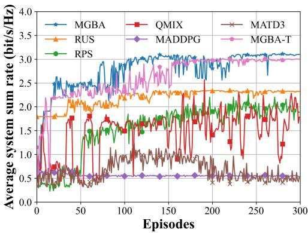  
Fig. 4. Convergence performance under different schemes.

## B. Simulation Results

1) Convergence Performance Evaluation: Fig. 4 shows the convergence performance of MGBA and different schemes with the deployment of 2 UAVs and 4 users. Since our objective is to maximize the average system sum rate and the step reward is defined as the sum rate, we use the time average of the total reward per episode $\sum _ { t = 0 } ^ { T } \mathcal { R } [ t ] / T$ to replace the vertical axis. We can observe that the proposed MGBA scheme converges at 230 episodes, whereas RUS, RPS, QMIX and MGBA-T schemes converge at 180, 220, 250 and 180 episodes, respectively. This is because the MGBA is an onpolicy scheme, while QMIX is an off-policy scheme [35]. (17) shows that the proposed MGBA scheme optimizes the UAV trajectories and user association policy, enabling faster convergence in complex environments. In addition, we share the actor’s parameters among all homogeneous agents in the proposed MGBA, significantly reducing training speed and model complexity. The MADDPG and MATD3 schemes fail to converge in the considered environment. This is primarily because they are designed for continuous action spaces, where the action-value function must be differentiable with respect to the action. Discretizing the outputs of continuous action policies undermines this differentiability, leading to instability during training.

It can be observed that the performance of the RUS is inferior to that of the MGBA scheme. This is because in the setup of the RUS scheme, users are served by random IRSs. While it may yield substantial returns in the initial exploration phase, the user association strategy quickly becomes inefficient as the UAVs continue to move. As observed from (27), the channel power gain between UAVs and users is influenced by the real-time positions of UAVs and associated IRSs. Consequently, random user association decisions are inappropriate for dynamic multi-UAV networks. In addition, the convergence value of the RPS scheme is significantly lower than that of the MGBA, indicating that the random phase shift does not sufficiently utilize the IRS. The convergence value of the MGBA scheme is higher than the MGBA-T scheme, demonstrating that the adoption of NOMA and the dynamic

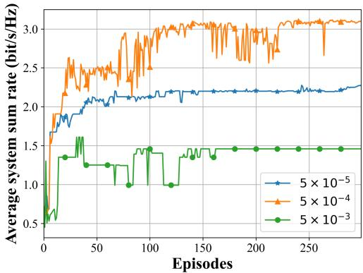  
Fig. 5. Performance under different learning rates.

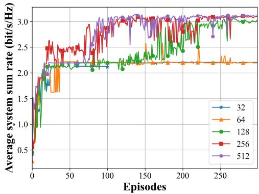  
Fig. 6. Performance under different numbers of neurons.

IRS partitioning strategy is more effective than TDMA in the considered scenario.

To evaluate the impact of the learning rate on the performance of the proposed scheme, we compare the convergence behavior of the MGBA scheme under different learning rates ranging from $5 \times 1 0 ^ { - 5 } ~ \mathrm { t o } ~ 1 0 ^ { - 3 }$ . In Fig. 5, it can be observed that the convergence value with learning rate $5 \times 1 0 ^ { - 4 }$ is significantly higher than those with $5 \times 1 0 ^ { - 3 }$ and $5 \times 1 0 ^ { - 5 }$ The reason is that an excessively high learning rate results in unstable training and policy fluctuations, which hinder the model from converging to the optimal policy. However, a small learning rate reduces the convergence speed of the model. Therefore, the learning rate is set to $5 \times 1 0 ^ { - 4 }$ to ensure stable convergence performance.

Fig. 6 shows the convergence comparison of MGBA with the number of neurons. We can observe that the proposed MGBA scheme converges stably under various numbers of neurons. It can be seen that the convergence value remains low when the number of neurons in the hidden layer is less than 128, primarily due to the insufficient model capacity. As the number of neurons increases from 32 to 256, the convergence speed and value improve significantly, indicating enhanced representation capability. However, further increasing the number of neurons from 256 to 512 yields negligible performance gains, while incurring higher computational cost and an increased risk of overfitting. Therefore, the number of neurons in the hidden layer is set to 256 to achieve a balance between performance and complexity.

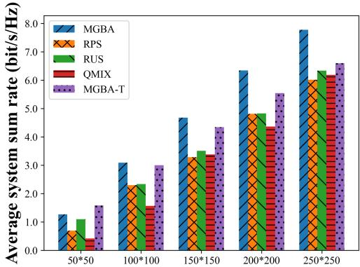  
The numbers of IRS elements  
Fig. 7. Performance under different numbers of IRS elements.

2) Impact of Number of IRS Elements: Fig. 7 shows the performance of different schemes in terms of average system sum rate with varying numbers of IRS elements. We can observe that the proposed MGBA scheme outperforms the other schemes when the number of IRS elements is larger than $5 0 \times 5 0$ . This is because MGBA can utilize the stochastic nature of the strategy for efficient exploration and use the clip function to improve the stability of the update process. When the number of IRS elements is set as $5 0 \times 5 0 $ , the performance of the MGBA scheme is less than MGBA-T scheme. This is because when the number of IRS elements is limited, the channel gain provided by NOMA is low. However, when the number of IRS elements increases from 100×100 to 250×250, the performance gap in terms of average system sum rate between the MGBA and MGBA-T schemes increases from 3.13% to 17.94%.

It can be observed that a significant improvement in the average system sum rate occurs as the number of IRS elements increases. It is noteworthy that when the number of IRS elements is increased from 50 × 50 to $2 5 0 \times 2 5 0$ , the average system sum rate is improved by 6.52 bit/s/Hz. This suggests that the performance gains resulting from an increase in the number of IRS elements are comparable across different numbers of UAVs. In addition, when the IRS element is set to $2 5 0 \times 2 5 0 .$ , the proposed MGBA scheme outperforms RPS, RUS, QMIX and MGBA-T schemes in terms of average system sum rate by 29.33%, 22.70%, 25.72% and 17.94%, respectively.

3) Impact of Transmit Power: Fig. 8 shows the performance of different schemes in terms of average system sum rate under varying UAV transmit power. The average system sum rate of all schemes increases with the transmission power. This is because high transmit power increases the achievable rate for users. By increasing the transmit power from 15 dBm to 35 dBm, the average system sum rate is improved by 4.91 bit/s/Hz. In addition, it can be found that the proposed MGBA obtains the highest average system sum rate for different values of transmit power except for the MGBA-T scheme. Similar to Fig. 7, when the transmit power is low, the performance of the MGBA scheme is limited by NOMA. However, when the transmit power exceeds 20 dBm, the MGBA scheme significantly outperforms the MGBA-T scheme in terms of average system sum rate. Notably, when the transmit power is set to 35 dBm, the proposed scheme MGBA outperforms RPS, RUS and QMIX in terms of average system sum rate by 44.06%, 27.29% and 45.35%, respectively.

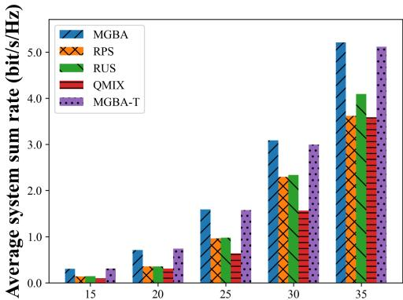  
The values of the transmit power (dBm)

Fig. 8. Performance under different values of transmit power.  
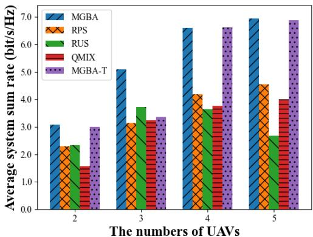  
(a) Average system sum-rate.

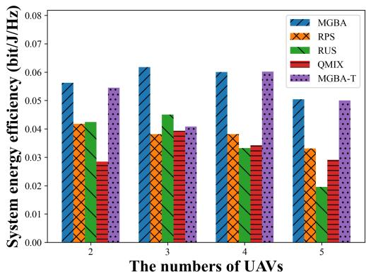  
(b) System energy efficiency.  
Fig. 9. Performance under different numbers of UAVs.

In addition, it can be found that the MGBA consistently outperforms the RPS and RUS schemes. This suggests that the optimization of IRS-user association and phase shift in the proposed MGBA scheme is effective in adapting to dynamic UAV locations in multi-IRS-assisted multi-UAV communication networks, thereby significantly enhancing the average system sum-rate.

4) Impact of Number of UAVs: Fig. 9(a) shows the performance of different schemes in terms of average system sum rate with varying numbers of UAVs. It can be observed that the average system sum rate improves with the number of UAVs for all schemes except RUS, primarily because additional UAVs offer more communication resources. However, the performance of the RUS scheme in terms of average system sum-rate decreases when the number of UAVs exceeds 3. This is because more UAVs and users increase the system complexity, which necessitates a well-designed user association strategy to maintain performance.

Moreover, it can be observed that the proposed MGBA scheme outperforms the benchmark schemes for different numbers of UAVs in terms of average system sum rate. When the number of UAVs is set to 3, the proposed scheme MGBA outperforms RPS, RUS and QMIX in terms of average system sum rate by 61.96%, 37.1%, 57.30% and 51.24%, respectively. This shows that the proposed MGBA scheme can provide effective flight trajectory and user association decisions in communication systems with varying numbers of UAVs.

Fig. 9(b) shows the performance of different schemes in terms of system energy efficiency with different numbers of UAVs. The system energy efficiency is defined by $\sum _ { t = 1 } ^ { T } \sum _ { k = 1 } ^ { K } R _ { k } [ t ] / \sum _ { t = 1 } ^ { T } ( K \mathcal { P } \tau )$ . We can observe that the system energy efficiency of MGBA is higher than that of the other schemes across different numbers of UAVs. Besides, when the number of UAVs is fewer than 3, the system energy efficiency increases as the number of UAVs increases. However, when the number exceeds 3, the energy efficiency declines progressively. This is because more UAVs cause higher energy consumption, while the improvement in system sum rate becomes marginal. Increasing the number of UAVs from 3 to 4 results in a 2.91% decrease in system energy efficiency, while achieving a 29.49% improvement in average system sum-rate. However, increasing the number of UAVs from 4 to 5 causes the system energy efficiency to drop by 16.01%, with only a 5.05% increase in average system sum-rate. Therefore, According to Figs. 9, we can conclude that deploying 4 UAVs strikes a balance between spectral efficiency and energy efficiency, achieving a high sum rate and energy efficiency performance in this scenario.

5) Impact of Number of IRSs: Fig. 10 shows the performance comparison of different schemes under varying numbers of IRSs. It can be observed that the proposed scheme outperforms the comparison schemes in both spectral efficiency and energy efficiency. This indicates that the proposed scheme can effectively realize heterogeneous resource coordination under varying numbers of IRSs, while simultaneously optimizing IRS resource allocation and UAV trajectory design. Moreover, as the number of IRSs increases from 2 to 4, the performance gap in average system sum rate between the proposed scheme and the MGBA-T scheme increases from 3.13% to 43.7%. This demonstrates that the proposed scheme achieves higher spectral efficiency than TDMA-based schemes when sufficient IRS resources are available. According to Fig. 10(a), it can be observed that increasing the number of IRSs from 3 to 4 does not further improve the average system sum-rate. This is because the path loss between IRSs and associated users significantly reduces channel gain, and the user association strategy does not greedily select more IRSs.

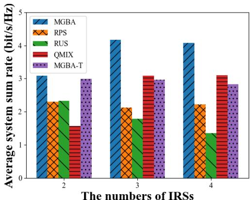  
(a) Average system sum-rate.

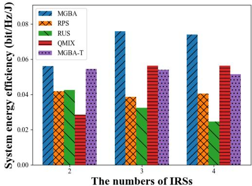  
(b) System energy efficiency.  
Fig. 10. Performance under different numbers of IRSs.

Fig. 10(b) shows that increasing the number of IRSs can significantly improve system energy efficiency. Specifically, when the number of IRSs increases from 2 to 3, the system energy efficiency rises by 34.99%. Comparing Fig. 9, it can be observed that increasing the number of UAVs significantly enhances the average system sum rate, but the improvement in energy efficiency is relatively limited. Specifically, in a setup with two UAVs and two IRSs, adding one IRS provides an additional 9.95% improvement in energy efficiency compared to adding one UAV. This is because the low-cost characteristic of IRSs does not impose additional energy consumption on the system. Comparing Figs. 9 and 10, it can be seen that appropriately increasing the number of IRSs and UAVs can significantly enhance both spectral efficiency and energy efficiency. Moreover, in UAV networks, suitably increasing the number of IRSs can reduce the number of UAVs, thereby improving system energy efficiency while lowering deployment costs.

6) Impact of Number of Time Slots: Fig. 11 shows the performance of the MGBA scheme with different time slot numbers. It can be found that the MGBA scheme converges stably under various time slot configurations. Lower convergence values are observed at the 100 time slot. This is because the UAVs have a limited range to move to locations with better channel states. Additionally, the performance of MGBA at 300, 400 and 500 time slot numbers is close, indicating its ability to find effective UAV trajectories and user associations within the simulation region.

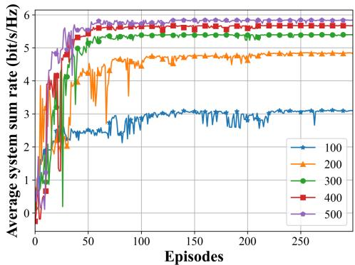

Fig. 11. Performance under different numbers of time slots.  
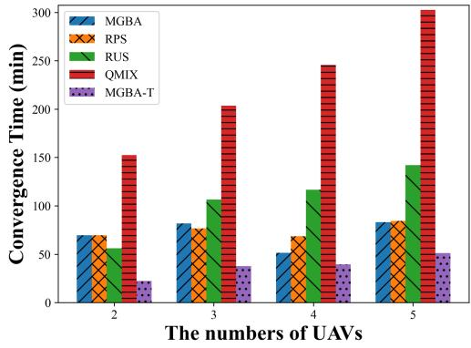  
Fig. 12. Convergence performance under different numbers of UAVs.

7) Convergence Time: Fig. 12 shows the comparison of the convergence times for different numbers of UAVs. It can be observed that the convergence time of the proposed MGBA scheme remains stable as the number of UAVs increases. This stability is attributed to the parameter sharing mechanism among homogeneous agents in MGBA, which mitigates the impact of UAV scale on convergence. In contrast, the convergence time of the QMIX scheme increases noticeably with the growing number of UAVs, indicating its limited scalability in multi-agent scenarios. In addition, it can be observed that the proposed scheme has a longer convergence time compared to the MGBA-T scheme. This is because the MGBA-T scheme does not optimize the transmission power allocation, resulting in faster execution.

## V. CONCLUSION

In this paper, we consider a multi-IRS-assisted multi-UAV communication network. To maximize the average system sum rate, we design a joint decision-making scheme based on MAPPO to optimize UAV trajectories, IRS-user associations, transmit power allocations, and IRS phase shifts. First, we formulate an optimization problem for maximizing the average system sum rate. Then, we derive an optimal phase control strategy and composite channel power gain based on phase alignment. Then, an online learning scheme based on MAPPO is proposed to solve the IRS-user associations and UAV trajectories, and the SCA method is utilized to optimize the transmit power allocation. Finally, we conduct various experiments to verify the effectiveness of the proposed MGBA scheme in terms of convergence and system average sum rate. Specifically, by combining optimal phase control with a channel-aware composite channel model, we can realize environment-adaptive UAV-IRS services, enabling collaboratively intelligent UAV communication networks.

In future work, we will investigate the impact of complex real-world environments and IRS hardware impairments on wireless channels. Although this paper explores real-time switching between LoS and NLoS channels in IRS-assisted UAV communication networks, accurately modeling wireless channels in complex environments remains a significant challenge.

## APPENDIX A PROOF OF THEOREM 1

Proof: Problem P0 is non-convex, i.e., a mixed-integer nonconvex optimization problem, due to decision variables $\beta _ { n , i } [ t ]$ and $\mu _ { k , n } [ t ]$ . If we fix UAV trajectories to simplify Problem P0, the simplified problem still belongs to the classical knapsack problem, i.e., a classical NP-hard problem. Therefore, we can deduce that Problem P0 is also an NP-hard problem. Theorem 1 is proved.

## APPENDIX B PROOF OF THEOREM 2

Proof: Specifically, we introduce (4) and (5) to (3), and a detailed expression for the virtual channel from UAV k to user n can be expressed by:

$$
\begin{array} { r l r } { Q _ { k , i \neq j } [ t ] = } & { } & { a _ { 0 } ^ { 2 } \gamma } \\ & { } & { \quad \quad \quad \quad \quad \quad \quad \quad \quad \quad \quad \quad \quad \quad \quad \quad \quad \quad \quad \quad \quad \quad \quad \quad \quad \quad \quad \quad \quad \quad \quad \quad \quad \quad \quad \quad \quad \quad \quad \quad \quad \quad \quad \quad \quad \quad \quad \quad \quad \quad \quad \quad \quad \quad \quad \quad \quad \quad } \\ & { } & { \quad \quad \quad \quad \quad \quad \quad \quad \quad \quad \quad \quad \quad \quad \quad \quad \quad \quad \quad \quad \quad \quad \quad \quad \quad \quad \quad \quad \quad \quad \quad \quad \quad \quad \quad \quad \quad \quad \quad \quad \quad \quad \quad \quad \quad \quad \quad \quad } \\ & { } & { \quad \quad \quad \quad \quad \quad \quad \quad \quad \quad \quad \quad \quad \quad \quad \quad \quad \quad \quad \quad \quad \quad \quad \quad \quad \quad \quad \quad \quad \quad \quad \quad \quad \quad \quad \quad \quad \quad \quad \quad \quad \quad \quad \quad \quad \quad \quad \quad \quad \quad \quad \quad } \\ & { } & { \quad \quad \quad \quad \quad \quad \quad \quad \quad \quad \quad \quad \quad \quad \quad \quad \quad \quad \quad \quad \quad \quad \quad \quad \quad \quad \quad \quad \quad \quad \quad \quad \quad \quad \quad \quad \quad \quad \quad \quad \quad \quad \quad \quad \quad \quad \quad \quad \quad \quad \quad \quad } \\ & { \quad } & { \quad \quad \quad \quad \quad \quad \quad \quad \quad \quad \quad \quad \quad \quad \quad \quad \quad \quad \quad \quad \quad \quad \quad \quad \quad \quad \quad \quad \quad \quad \quad \quad \quad \quad \quad \quad \quad \quad \quad \quad \quad \quad \quad \quad \quad \quad \quad \quad } \\ & { \quad } & { \quad \quad \quad \quad \quad \quad \quad \quad \quad \quad \quad \quad \quad \quad \quad \quad \quad \quad \quad \quad \quad \quad \quad \quad \quad \quad \quad \quad \quad \quad \quad \quad \quad \quad \quad \quad \quad \quad \quad \quad \quad \quad \quad \quad \quad } \\ & { } &  \quad \quad \quad \quad \quad \quad \quad \quad \quad \quad \quad \quad \quad \quad \quad \quad \quad \quad \quad \quad \quad \quad \quad  \end{array}\tag{26}
$$

By observing (26), the optimal phase control strategy is obtained when the LoS component of the reflected channel from IRS i to user n (i.e., (7)) is aligned with that of the channel from UAV k to IRS i (i.e., (6)). Specifically, the phase of the signal reflected by the (r, c)-th reflecting element can be expressed by:

$$
\begin{array} { r l } & { \displaystyle \phi _ { r , c } [ t ] = \phi _ { r , c } ^ { * } [ t ] + 2 \pi \frac { f } { \mathcal { C } } ( \mathcal { D } _ { r } ( r - 1 ) \sin \vartheta _ { i , n } \cos \tilde { \vartheta } _ { i , n } } \\ & { \quad \quad \quad \quad \quad + \mathcal { D } _ { c } ( c - 1 ) \sin \vartheta _ { i , n } \sin \tilde { \vartheta } _ { i , n } } \\ & { \quad \quad \quad \quad - \mathcal { D } _ { r } ( r - 1 ) \sin \theta _ { k , i } [ t ] \cos \tilde { \theta } _ { k , i } [ t ] } \\ & { \quad \quad \quad \quad - \mathcal { D } _ { c } ( c - 1 ) \sin \theta _ { k , i } [ t ] \sin \tilde { \theta } _ { k , i } [ t ] ) . } \end{array}\tag{27}
$$

To maximize the signal strength from IRS i to user $n ,$ the signals reflected by different reflecting elements must be phase aligned. Accordingly, by setting $\phi _ { r , c } [ t ] = 0$ , the optimal phase control strategy can be expressed by (14).

It can be observed that (14) is only related to variables $\theta _ { k , i } [ t ]$ and $\tilde { \theta } _ { k , i } [ t ]$ , which are only affected by the real-time position of UAV k according to subsection III-A. Therefore, the optimal phase shift for each time slot can be obtained by simply knowing the real-time position of the UAV. It is noted that the IRSs considered are dynamically partitioned into blocks, and each block of IRSs only realizes the beamforming in the direction of the associated user. Therefore, the phase control strategy only requires maximizing the channel power gain at the user corresponding to that block of the IRS. In addition, in (10) and (11), the achievable rates are both monotonically increasing with respect to the channel power gain. Therefore, this phase control strategy remains optimal under NOMA. Theorem 2 is proved.

## APPENDIX C PROOF OF THEOREM 3

Proof: The computational complexity of the proposed Algorithm 1 consists of two main parts. The first part is the computational complexity of neural networks. Specifically, the actor is a fully connected network with U layers and the critic network has the same structure with J layers. Therefore, the total complexity can be expressed as $\mathcal { O } \left( \sum _ { u = 1 } ^ { U } X _ { u } X _ { u + 1 } + \sum _ { j = 1 } ^ { J } Y _ { j } Y _ { j + 1 } \right)$ , where symbols $X _ { u }$ and $Y _ { j }$ denote the number of neurons at layer u and layer j, respectively. The computational complexity of the other part is $\mathcal { O } ( K G )$ , i.e., each UAV judges whether it is a LoS channel between itself and the served user. Then, the total computational complexity of the Algorithm 1 is $\mathcal { O } \left( T B \left( K G + \sum _ { u = 1 } ^ { U } X _ { u } X _ { u + 1 } + \sum _ { j = 1 } ^ { J } Y _ { j } Y _ { j + 1 } \right) \right)$ . The computational complexity of Algorithm 2 is determined by the number of SCA iterations and the computational complexity of the interior point method. Therefore, the computational complexity of Algorithm 2 is $\mathcal { O } \left( l _ { m a x } ( 3 K ) ^ { 3 . 5 } l \bar { o } g ( \zeta ^ { - 1 } ) \right)$ Then, the total computational complexity of the MGBA is $\mathcal { O } \big ( T B \left( K G + \sum _ { u = 1 } ^ { U } X _ { u } X _ { u + 1 } + \sum _ { j = 1 } ^ { J } Y _ { j } Y _ { j + 1 } + \right.$ $l _ { m a x } ( 3 \dot { K } ) ^ { 3 . 5 } l o g ( \zeta ^ { - 1 } ) )$ , which indicates that the algorithm operates in polynomial time. Theorem 3 is proved.

## REFERENCES

[1] M. Wu, Y. Xiao, Y. Gao, and M. Xiao, “Digital twin for UAV-RIS assisted vehicular communication systems,” IEEE Trans. Wireless Commun., vol. 23, no. 7, pp. 7638–7651, Jul. 2024.

[2] S. Lin, Y. Zou, and D. W. K. Ng, “Ergodic throughput maximization for RIS-equipped-UAV-enabled wireless powered communications with outdated CSI,” IEEE Trans. Commun., vol. 72, no. 6, pp. 3634–3650, Jun. 2024.

[3] Z. Ning et al., “Mobile edge computing and machine learning in the internet of unmanned aerial vehicles: A survey,” ACM Comput. Surveys, vol. 56, no. 1, pp. 1–31, Jan. 2024.

[4] H. Yang, K. Lin, L. Xiao, Y. Zhao, Z. Xiong, and Z. Han, “Energy harvesting UAV-RIS-assisted maritime communications based on deep reinforcement learning against jamming,” IEEE Trans. Wireless Commun., vol. 23, no. 8, pp. 9854–9868, Aug. 2024.

[5] B. Li, W. Liu, W. Xie, N. Zhang, and Y. Zhang, “Adaptive digital twin for UAV-assisted integrated sensing, communication, and computation networks,” IEEE Trans. Green Commun. Netw., vol. 7, no. 4, pp. 1996–2009, Dec. 2023.

[6] M. Wu et al., “Deep reinforcement learning-based energy efficiency optimization for RIS-aided integrated satellite-aerial-terrestrial relay networks,” IEEE Trans. Commun., vol. 72, no. 7, pp. 4163–4178, Jul. 2024.

[7] Y. Chen, W. Cheng, and W. Zhang, “Reconfigurable intelligent surface equipped UAV in emergency wireless communications: A new fading–shadowing model and performance analysis,” IEEE Trans. Commun., vol. 72, no. 3, pp. 1821–1834, Mar. 2024.

[8] J. Chen, K. Zhai, Z. Wang, Y. Liu, J. Jia, and X. Wang, “CoMP and RIS-assisted multicast transmission in a multi-UAV communication system,” IEEE Trans. Commun., vol. 72, no. 6, pp. 3602–3617, Jun. 2024.

[9] X. Wang, J. Li, J. Wu, L. Guo, and Z. Ning, “Energy efficiency optimization of IRS and UAV-assisted wireless powered edge networks,” IEEE J. Sel. Topics Signal Process., vol. 18, no. 7, pp. 1297–1310, Oct. 2024.

[10] Y. Li, H. Zhang, K. Long, and A. Nallanathan, “Exploring sum rate maximization in UAV-based multi-IRS networks: IRS association, UAV altitude, and phase shift design,” IEEE Trans. Commun., vol. 70, no. 11, pp. 7764–7774, Nov. 2022.

[11] B. K. S. Lima, J. P. Matos-Carvalho, R. Dinis, D. B. da Costa, M. Beko, and R. Oliveira, “LSTM-based trajectory and phase-shift prediction for RSMA networks assisted by AIRS,” IEEE Trans. Commun., vol. 72, no. 11, pp. 6929–6942, Nov. 2024.

[12] Y. Zhou et al., “Secure multi-layer MEC systems with UAVenabled reconfigurable intelligent surface against full-duplex eavesdropper,” IEEE Trans. Commun., vol. 72, no. 3, pp. 1565–1577, Mar. 2024.

[13] Y. Zhou, Z. Jin, H. Shi, L. Shi, and N. Lu, “Flying IRS: QoEdriven trajectory optimization and resource allocation based on adaptive deployment for WPCNs in 6G IoT,” IEEE Internet Things J., vol. 11, no. 5, pp. 9031–9046, Mar. 2024.

[14] J. Liu and H. Zhang, “Height-fixed UAV enabled energy-efficient data collection in RIS-aided wireless sensor networks,” IEEE Trans. Wireless Commun., vol. 22, no. 11, pp. 7452–7463, Nov. 2023.

[15] Y. Cang et al., “Joint deployment and resource management for VLCenabled RISs-assisted UAV networks,” IEEE Trans. Wireless Commun., vol. 22, no. 2, pp. 746–760, Feb. 2023.

[16] Z. Ning et al., “Joint user association, interference cancellation, and power control for multi-IRS assisted UAV communications,” IEEE Trans. Wireless Commun., vol. 23, no. 10, pp. 13408–13423, Oct. 2024.

[17] X. Zhang, H. Zhang, W. Du, K. Long, and G. K. Karagiannidis, “Joint resource allocation and reflecting design in IRS-UAV communication networks with SWIPT,” IEEE Trans. Wireless Commun., vol. 23, no. 4, pp. 2533–2546, Apr. 2024.

[18] M. Asim, A. A. A. El-Latif, M. ELAffendi, and W. K. Mashwani, “Energy consumption and sustainable services in intelligent reflecting surface and unmanned aerial vehicles-assisted MEC system for largescale Internet of Things devices,” IEEE Trans. Green Commun. Netw., vol. 6, no. 3, pp. 1396–1407, Sep. 2022.

[19] K. Jiang et al., “Distributed UAV swarm augmented wideband spectrum sensing using Nyquist folding receiver,” IEEE Trans. Wireless Commun., vol. 23, no. 10, pp. 14171–14184, Oct. 2024.

[20] N. Deng et al., “Enhancing millimeter wave cellular networks via UAV-borne aerial IRS swarms,” IEEE Trans. Commun., vol. 72, no. 1, pp. 524–538, Jan. 2024.

[21] Q. Li, P. Si, Y. Zhang, J. Wang, D. Zhang, and F. R. Yu, “UAV altitude, relay selection, and user association optimization for cooperative relaytransmission in UAV-IRS-Based THz networks,” IEEE Trans. Green Commun. Netw., vol. 8, no. 2, pp. 815–826, Jun. 2024.

[22] K. K. Nguyen, S. R. Khosravirad, D. B. da Costa, L. D. Nguyen, and T. Q. Duong, “Reconfigurable intelligent surface-assisted multi-UAV networks: Efficient resource allocation with deep reinforcement learning,” IEEE J. Sel. Topics Signal Process., vol. 16, no. 3, pp. 358–368, Apr. 2022.

[23] Q. Sun, J. Niu, X. Zhou, T. Jin, and Y. Li, “AoI and data rate optimization in aerial IRS-assisted IoT networks,” IEEE Internet Things J., vol. 11, no. 4, pp. 6481–6493, Feb. 2024.

[24] J. Lei, T. Zhang, X. Mu, and Y. Liu, “NOMA for STAR-RIS assisted UAV networks,” IEEE Trans. Commun., vol. 72, no. 3, pp. 1732–1745, Mar. 2024.

[25] A. Paul, R. Allu, K. Singh, C.-P. Li, and T. Q. Duong, “Hybridized MA-DRL for serving xURLLC with cognizable RIS and UAV integration,” IEEE Trans. Wireless Commun., vol. 23, no. 10, pp. 15507–15524, Oct. 2024.

[26] Y. Cai, Z. Wei, S. Hu, C. Liu, D. W. K. Ng, and J. Yuan, “Resource allocation and 3D trajectory design for power-efficient IRS-assisted UAV-NOMA communications,” IEEE Trans. Wireless Commun., vol. 21, no. 12, pp. 10315–10334, Dec. 2022.

[27] Y. Peng, T. Song, X. Song, Y. Yang, and W. Lu, “Time-effective UAV-IRS-collaborative data harvesting: A robust deep reinforcement learning approach,” IEEE Trans. Wireless Commun., vol. 23, no. 12, pp. 18592–18607, Dec. 2024.

[28] A. Papadopoulos et al., “On modeling the RIS as a resource: Multiuser allocation and efficiency-proportional pricing,” IEEE Trans. Netw. Service Manage., vol. 22, no. 5, pp. 4694–4705, Oct. 2025.

[29] X. Mu, Y. Liu, L. Guo, J. Lin, and H. V. Poor, “Intelligent reflecting surface enhanced multi-UAV NOMA networks,” IEEE J. Sel. Areas Commun., vol. 39, no. 10, pp. 3051–3066, Oct. 2021.

[30] Z. Wei et al., “Sum-rate maximization for IRS-assisted UAV OFDMA communication systems,” IEEE Trans. Wireless Commun., vol. 20, no. 4, pp. 2530–2550, Apr. 2021.

[31] H. Zhao et al., “Air reconfigurable intelligent surface enhanced multiuser NOMA system,” IEEE Internet Things J., vol. 11, no. 1, pp. 29–39, Jan. 2024.

[32] K. Guo, M. Wu, X. Li, H. Song, and N. Kumar, “Deep reinforcement learning and NOMA-based multi-objective RIS-assisted IS-UAV-TNs: Trajectory optimization and beamforming design,” IEEE Trans. Intell. Transp. Syst., vol. 24, no. 9, pp. 10197–10210, Sep. 2023.

[33] M. H. N. Shaikh, A. Celik, A. M. Eltawil, and G. Nauryzbayev, “Grantfree NOMA through optimal partitioning and cluster assignment in STAR-RIS networks,” IEEE Trans. Wireless Commun., vol. 23, no. 8, pp. 10166–10181, Aug. 2024.

[34] M. Saif and S. Valaee, “RIS alignment via virtual partitioning for resilient uplink multi-RIS-assisted UAV communications,” IEEE Trans. Commun., vol. 73, no. 8, pp. 6764–6779, Aug. 2025, doi: 10.1109/ TCOMM.2025.3534527.

[35] C. Yu, A. Velu, E. Vinitsky, Y. Wang, A. M. Bayen, and Y. Wu, “The surprising effectiveness of PPO in cooperative, multi-agent games,” in Proc. Adv. Neural Inf. Process. Syst., 2021, pp. 24611–24624.

[36] F. Jiang, Y. Peng, K. Wang, L. Dong, and K. Yang, “MARS: A DRLbased multi-task resource scheduling framework for UAV with IRSassisted mobile edge computing system,” IEEE Trans. Cloud Comput., vol. 11, no. 4, pp. 3700–3712, Oct. 2023.

[37] D. Wei, J. Zhang, M. Shojafar, S. Kumari, N. Xi, and J. Ma, “Privacy-aware multiagent deep reinforcement learning for task offloading in VANET,” IEEE Trans. Intell. Transp. Syst., vol. 24, no. 11, pp. 13108–13122, Nov. 2023.

[38] H.-H. Chang, Y. Song, T. T. Doan, and L. Liu, “Federated multiagent deep reinforcement learning (Fed-MADRL) for dynamic spectrum access,” IEEE Trans. Wireless Commun., vol. 22, no. 8, pp. 5337–5348, Aug. 2023.

[39] M. Katwe, K. Singh, P. K. Sharma, C.-P. Li, and Z. Ding, “Dynamic user clustering and optimal power allocation in UAV-assisted full-duplex hybrid NOMA system,” IEEE Trans. Wireless Commun., vol. 21, no. 4, pp. 2573–2590, Apr. 2022.

[40] Y. Lin, L. Xiao, Y. Tao, Y. Zhang, F. Shu, and J. Li, “Multi-agent computing-energy-efficiency optimization in vehicular edge computing: Non-cooperative versus cooperative solutions,” IEEE Trans. Wireless Commun., vol. 24, no. 7, pp. 5461–5476, Jul. 2025, doi: 10.1109/ TWC.2025.3547377.

[41] X. Zhang, H. Zhang, W. Du, K. Long, and A. Nallanathan, “IRS empowered UAV wireless communication with resource allocation, reflecting design and trajectory optimization,” IEEE Trans. Wireless Commun., vol. 21, no. 10, pp. 7867–7880, Oct. 2022.

[42] X. Wang, M. Yi, J. Liu, Y. Zhang, M. Wang, and B. Bai, “Cooperative data collection with multiple UAVs for information freshness in the Internet of Things,” IEEE Trans. Commun., vol. 71, no. 5, pp. 2740–2755, May 2023.

[43] S. Zhao et al., “Exploiting NOMA transmissions in multi-UAVassisted wireless networks: From aerial-RIS to mode-switching UAVs,” IEEE Trans. Wireless Commun., vol. 24, no. 3, pp. 2530–2544, Mar. 2025.

[44] S. Wang, X. Song, T. Song, and Y. Yang, “Fairness-aware computation offloading with trajectory optimization and phase-shift design in RISassisted multi-UAV MEC network,” IEEE Internet Things J., vol. 11, no. 11, pp. 20547–20561, Jun. 2024.

Zhaolong Ning (Senior Member, IEEE) received the Ph.D. degree from Northeastern University, China, in 2014. He was a Research Fellow at Kyushu University, Japan, from 2013 to 2014. Currently, he is a Full Professor with the School of Communications and Information Engineering, Chongqing University of Posts and Telecommunications, Chongqing, China. He has published over 150 scientific papers in international journals and conferences. His research interests include mobile edge computing, 6G networks, machine learning, and resource management.

He is an IET Fellow. He serves as an Associate Editor or a Guest Editor for several journals, such as IEEE TRANSACTIONS ON VEHICULAR TECH-NOLOGY, IEEE TRANSACTIONS ON INDUSTRIAL INFORMATICS, IEEE TRANSACTIONS ON COMPUTATIONAL SOCIAL SYSTEMS, IEEE INTERNET OF THINGS JOURNAL, and so on. He has been a Highly Cited Researcher (Web of Science) since 2020.

  
and computing power networks.

Hao Hu (Graduate Student Member, IEEE) received the B.E. degree in communications engineering from Anhui Normal University, Anhui, China, in 2020, and the M.S. degree in information and communication engineering from Chongqing University of Posts and Telecommunications, Chongqing, China. He is currently pursuing the Ph.D. degree with the School of Information and Communication Engineering, University of Electronic Science and Technology of China. His research interests include autonomous aerial vehicles (AAV), intelligent reflecting surfaces,

Xiaojie Wang (Senior Member, IEEE) received the Ph.D. degree from Dalian University of Technology, Dalian, China, in 2019. After that, she was a Post-Doctoral Researcher at The Hong Kong Polytechnic University. Currently, she is a Full Professor with the School of Communications and Information Engineering, Chongqing University of Posts and Telecommunications, Chongqing, China. She has published over 90 scientific papers in international journals and conferences, such as IEEE TRANSAC-TIONS ON MOBILE COMPUTING, IEEE JOURNAL

ON SELECTED AREAS IN COMMUNICATIONS, IEEE TRANSACTIONS ON WIRELESS COMMUNICATIONS, IEEE TRANSACTIONS ON PARALLEL AND DISTRIBUTED SYSTEMS, and IEEE COMMUNICATIONS SURVEYS AND TUTORIALS. Her research interests are wireless networks, mobile edge computing, and machine learning. She was a Highly Cited Researcher (Web of Science) in 2023 and 2024.

Yan Zhang (Fellow, IEEE) received the Ph.D. degree from the School of Electrical and Electronics Engineering, Nanyang Technological University, Singapore. He is currently a Full Professor with the University of Electronic Science and Technology of China. His research interests include next generation wireless networks leading to 6G and green and secure cyber-physical systems. He is Co-EiC for IEEE TRANSACTIONS ON INDUSTRIAL INFOR-MATICS, an Area Editor for IEEE TRANSACTIONS ON GREEN COMMUNICATIONS AND NETWORK-

ING, a Senior Editor for IEEE SYSTEMS JOURNAL, and an Associate Editor for several IEEE transactions/magazine. Since 2018, he was a recipient of the global Clarivate Analytics “Highly Cited Researcher” Award (Web of Science top 1% most cited worldwide). He is a Fellow of IET, elected member of Academia Europaea (MAE), elected member of the Royal Norwegian Society of Sciences and Letters (DKNVS), and elected member of Norwegian Academy of Technological Sciences (NTVA).