# Channel Inversion Power Control-Aided Multi-User Secret and Covert UAV Communications

Yingqi He, Graduate Student Member, IEEE, Jinpeng Xu , Member, IEEE, Lin Zhou , Senior Member, IEEE, Jingjing Wang , Senior Member, IEEE, and Chunxiao Jiang , Fellow, IEEE

Abstract—To satisfy diverse security requirements of ground users in uncrewed aerial vehicle (UAV) networks, we propose a channel inversion power control (CIPC) aided multi-user collaborative secret and covert uplink transmission strategy for UAV secure communication. Specifically, using the non-orthogonal multiple access (NOMA) technology, multiple ground covert users named Carlo, hide their weak covert signals in the strong secret signal from a secret user named Bob, and transmit to the UAV named Alice. An adversary Willie attempts to eavesdrop Bob’s confidential message and detect whether Carlo is transmitting or not. To evaluate the link reliability and security of secret and covert transmissions, we first derive closed-form expressions of the secret connection probability (SCP), secrecy outage probability (SOP), covert connection probability (CCP), and detection error probability (DEP) under perfect channel state information while accounting for the uncertainty of the adversary’s noise power. We then further incorporate the legitimate-link channel uncertainty into the analysis and characterize its impact on the key performance metrics, particularly the average values of SCP, SOP, and CCP. To characterize the theoretical benchmark of the proposed transmission strategy, we investigate the performance in both rotary-wing and fixed-wing UAV scenarios. Particularly, in the rotary-wing UAV scenario, we formulate an optimization problem to maximize the average effective sum covert rate subject to constraints of SCP, SOP, DEP, CIPC parameter, ground user’s

transmission power, and the UAV’s altitude. Subsequently, we provide an optimal and a sub-optimal solution to the optimization problem. In the fixed-wing UAV scenario, we formulate an optimization problem to maximize the average covert rate subject to the constraints of SCP, SOP, DEP, CIPC parameter, user scheduling, and the UAV’s flight parameters. Furthermore, using the successive convex approximation (SCA) method, we propose an alternating optimization (AO) algorithm to obtain a highquality feasible solution. Finally, our results reveal the influence of key parameters on the system performance, analytically and numerically.

## I. INTRODUCTION

Index Terms—Uncrewed aerial vehicle (UAV) communication, secrecy communication, covert communication, channel inversion power control (CIPC).

W ITH the development of uncrewed aerial vehicle (UAV) technology, the applications of UAVs in both military and civilian fields are rapidly expanding [2], [3]. Due to the omnidirectional propagation of microwave signals and the high probability of line-of-sight (LoS) transmission in air-to-ground communications, UAV communication is vulnerable to being eavesdropped and detected by potential adversaries [4], [5]. Nevertheless, traditional encryption algorithms at the upper layers face challenges in ensuring the security of transmission against adversaries with unlimited computing power [6], [7]. To address this issue, the physical layer security (PLS) method proposed by Shannon, provides feasible solutions to achieve perfect security against powerful adversaries [8]. Therefore, PLS, as a powerful supplement to the upper-layer cryptographic encryption and decryption security mechanism, has been widely and deeply studied [9].

Since the traditional PLS theory, particularly the wiretap channel proposed by Wyner [10], focuses on protecting the content of confidential messages, it is not suitable for users with sensitive security needs to hide the transmission behavior [11]. For this purpose, as a vital aspect of PLS, covert communication, known as low probability detection/intercept (LPD/LPI) communications, has been proposed by Bash et al. [12]. Note that covert communications aim to protect the communication behavior of legitimate users, which provides new degrees of freedom for PLS [13]. Subsequently, the studies of wiretap channels and covert communications provide fundamentals for designing secure and reliable wireless communication systems from the observation of the physical layer [11]. Therefore, it is indispensable to study both wiretap channels and covert communication methods for establishing more secure communication networks [14].

In multi-user communication systems, diverse security quality-of-service (QoS) requirements often arise: some users prioritize message confidentiality, while others may emphasize protecting their communication activities [15]. To address the diverse secure communication requirements in multi-user UAV systems, several papers started the research on the two-user cooperative uplink secret and covert communication in UAV networks [1], [16], [17]. However, the current studies are still limited, and the study of multi-user collaborative secret and covert communications is still in its infancy and needs to be investigated comprehensively.

To ensure secure transmission in UAV communications from a physical layer perspective, extensive research has been conducted on UAV secrecy or covert communications. In the remaining part of this section, we recall existing studies on secret and covert UAV communications and clarify our main contributions beyond these studies.

## A. Related Works

To establish robust and secure UAV communication links from the observation of the physical layer, extensive research has been proposed using the wiretap channel [18], [19], [20], [21], [22], covert communication [23], [24], [25], [26], [27], [28], [29], and their combinations [16], [17], [30], [31], [32], [33] in UAV communications.

For the wiretap channel in UAV communication, Zhong et al. [18] proposed a collaborative jamming method to enhance UAV communication security. Furthermore, since UAV typically serves multiple ground users, Li et al. [19] optimized the flight strategy and transmission power to improve the minimum secrecy rate. Sheng et al. [21] proposed a joint uplink and downlink secure transmission scheme to maximize the average secrecy rate in UAV communications by optimizing trajectory, power, and transmission scheduling. When the eavesdropper’s location is unknown, Kang et al. [20] optimized the height of the UAV to maximize the average worst-case secrecy rate. Fu et al. [22] optimized the UAV trajectory and power splitting to maximize secrecy rates in downlink transmissions against colluding eavesdroppers.

For UAV covert communication, Zhou et al. [23] proposed an efficient iterative algorithm to jointly optimize the flight trajectory and the transmit power to maximize the covert rate. Furthermore, considering the required detection performance of the Warden, the analogous optimization problem has been studied in [24]. In UAV multi-user covert communications, Lei et al. [25] maximized the covert rate in a dual-UAV system by joint optimizing power and trajectory under a robust worst-case covertness constraint. Jiang et al. [26] maximized the covert rate in UAV downlink time-division multiple access (TDMA) multi-user communication, and optimized the UAV’s transmit power and trajectory. Furthermore, Su et al. [34] studied UAV downlink covert communication using non-orthogonal multiple access (NOMA) technology, and optimized the hovering height and power allocation of the UAV. Furthermore, to improve the covert rate, Zhou et al. [27] employed the full-duplex architecture on UAV platforms to transmit jamming signals against the warden’s detection. Du et al. [28] proposed a jammer-aided covert communication strategy in the UAV system and maximized the covert rate using a Nash bargaining game and particle swarm optimization. Lin et al. [29] combined UAV and reconfigurable intelligent surfaces (RIS) to enhance covert communication by jointly optimizing beamforming, phase shifts, and UAV trajectory in the case of channel state information (CSI) uncertainty.

Recently, the combination of secret and covert communications has attracted more attention. Specifically, Xu et al. [16] proposed a joint secret and covert transmission for rotary wing UAV systems and maximized the sum of secret and covert transmission rates, the authors further extended it to fixedwing UAV scenarios and optimized the UAV flight trajectory [17]. Chen et al. [30] studied a secure covert communication scheme using a multi-antenna transmitter and UAV jammer to maximize secrecy rate under detection and eavesdropping constraints. Furthermore, Liu et al. [31] studied UAV-assisted joint secrecy and covert finite blocklength downlink transmission, and maximized secrecy rate while ensuring covertness in the presence of an adversary. In the UAV-related relay system, Yang et al. [33] investigated covert and secret communication in a UAV-aided relay system, and optimized the covert transmission rate while ensuring covertness. Wang et al. [32] optimized the secrecy and covert throughput in multi-hop relay communication and obtained the optimal hops.

In summary, secret and covert communications, along with their combinations, have been widely studied in various UAV scenarios. Note that the study on multi-user collaborative secret and covert communications specifically within UAV uplink communication systems is still limited. Particularly, most studies on UAV physical layer security communications suffer from the following limitations. Firstly, most studies solely provide either secret communications [18], [19], [20], [21], [22] or covert communications [23], [24], [25], [26], [27], [28], [29], which are hard to satisfy various security QoS in multi-user UAV scenarios. Secondly, although collaborative secret and covert communications are studied in [1], [16], [17], [30], [31], [32], and [33], the security services for ground users are limited to one user [30], [31], [32], [33] or two users [1], [16], [17], which is not appropriate in multi-user UAV networks. Thirdly, to improve the security rate in UAV systems, many studies employed artificial noise to confuse the adversary [18], [21], [25], [27], [30]. Since the jamming signals do not carry any information, although the secure transmission rates are enhanced, the corresponding power utilization is low and thus challenging to apply to powerconstrained UAV platforms.

Since channel uncertainty is beneficial to secure communications [35], channel inversion power control (CIPC) offers new insights in covert communications. Specifically, the CIPC dynamically adjusts the transmit power based on channel coefficients, enhancing the covert performance [36], [37], [38]. Note that the CIPC approach, when combined with NOMA technology in multi-user UAV systems, not only leverages channel uncertainty to enhance both secret and covert transmission rates, but also uses NOMA to conceal the weak signal of covert users within the stronger signal of secret users through the collaboration of multiple users, thereby achieving secure communication akin to artificial noise. Therefore, it is indispensable to study the CIPC-aided UAV multi-user collaborative covert communications for UAV networks.

## B. Main Contributions

To fill the aforementioned research gaps, we propose a CIPC-aided multi-user collaborative secret and covert uplink transmission strategy for UAV communications. Specifically, we study the secure performance of the proposed method in both rotary-wing and fixed-wing UAV scenarios and optimize the key parameters, the user scheduling, as well as the UAV’s altitude and trajectory to enhance the secure QoS. Our detailed contributions are summarized as follows.

1) To the best of our knowledge, this is the first work that investigates CIPC-aided multi-user collaborative secret and covert uplink transmission for both rotary-wing and fixed-wing UAV communications. Under perfect CSI and considering the uncertainty of the adversary’s noise power, we derive the closed-form expressions of the secret connection probability (SCP), secrecy outage probability (SOP), covert connection probability (CCP), and detection error probability (DEP) as the key performance metrics for evaluating the secret and covert communication performance. We then further incorporate the legitimate-link channel uncertainty into the CIPC framework and rigorously analyze its impact on the system performance, particularly the average values of SCP, SOP, and CCP. From this perspective, our results offer new insights and establish theoretical benchmarks for the design of secure UAV communication systems accommodating heterogeneous security requirements.

2) For the scenario of multiple users with rotary-wing UAV communications, to analyze the secure performance, we establish an optimization problem that maximizes the average effective sum covert rate of ground users subject to the SCP, SOP, DEP, CIPC parameter, and the altitude of the UAV. Furthermore, we provide optimal and sub-optimal solutions to the optimization problem and further analyze the impact of the spatial density of legitimate users on the system performance.

3) For the scenario of multiple users with fixed-wing UAV communications, to capture the theoretical benchmark of our proposed scheme, we establish an optimization problem that maximizes the average effective covert rate of ground users subject to the SCP, SOP, DEP, CIPC parameter, user scheduling, and the UAV’s trajectory parameters. Furthermore, we propose a low-complexity alternating optimization (AO) and successive convex approximation (SCA) algorithm to obtain a high-quality feasible solution to the optimization problem.

4) Extensive numerical results demonstrate the superior performance of the proposed CIPC-aided multi-user collaborative secret and covert uplink transmission strategy in both rotary-wing and fixed-wing UAV scenarios. Our results reveal the influence of key system parameters on the covert rate, both analytically and numerically.

## C. Organization for the Rest of the Paper and Notation

The remainder of this paper is organized as follows. In Section II, we formulate the system model, specify the channel model and describe the collaborative secret and covert transmission scheme, along with the performance measures. In

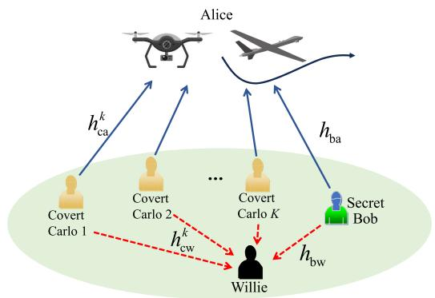  
Fig. 1. System model of collaborative secret and covert uplink communications for UAV systems.

Sections III and IV, we present the key results in rotary-wing UAV and fixed-wing UAV systems, respectively. Subsequently, in Section V, we present numerical examples to illustrate our theoretical findings. Finally, we conclude the paper and discuss future research directions in Section VI.

## II. SYSTEM MODEL

As shown in Fig. 1, we consider a multi-user collaborative secret and covert uplink communication for a UAV system, which consists of a secret user (Bob), K covert users (Carlos), a UAV receiver (Alice), and an adversary (Willie). Note that Bob requires secrecy for his confidential signal, while the covert users require covertness for their signals. Consistent with the previous studies [39], [24], we suppose that all users are equipped with a single antenna.1 Furthermore, we assume that the location of the warden is available to Alice,2 since the position of the warden can be obtained using the advanced computer vision technologies [40], [41] or localization techniques [42]. To consider more general UAV communications, we study both rotary-wing and fixed-wing scenarios. In the rotary-wing UAV scenario, the UAV is considered capable of moving vertically within the airspace. In the fixed-wing UAV scenario, the UAV is assumed to serve the ground users over a period of T . To characterize the UAV’s trajectory, we divide the flight period T into $N ~ \in ~ \mathbb { N }$ equal-length time slots. When N is large, the period of each time slot $\begin{array} { r } { \delta \ = \ \frac { T } { N } } \end{array}$ is sufficiently small such that the UAV’s location is approximately unchanged within each time slot. Without loss of generality, a coordinate system is utilized to model the spatial positions of each user accurately. Thus, the coordinate of Alice is ${ \bf L } _ { \mathrm { a } } [ n ] \ \stackrel { \Delta } { = } \ ( x _ { \mathrm { a } } [ n ] , y _ { \mathrm { a } } [ n ] , H [ n ] ) \ \in \ \mathbb { R } ^ { 3 \times 1 }$ , where $n \in [ 1 , N ]$ . The locations of Bob and Willie are denoted by $\mathbf L _ { \mathrm b } \triangleq ( x _ { \mathrm { b } } , y _ { \mathrm { b } } ) \in \mathbb R ^ { 2 \times 1 }$ and $\mathbf { L } _ { \mathrm { w } } \overset { \Delta } { = } ( x _ { \mathrm { w } } , y _ { \mathrm { w } } ) \in \mathbb { R } ^ { 2 \times 1 }$ , respectively. Furthermore, the position of the k-th covert user Carlo can be represented by the coordinate $\mathbf { L } _ { \mathrm { c } } ^ { k } \ \triangleq \ \left( x _ { \mathrm { c } } ^ { k } , y _ { \mathrm { c } } ^ { k } \right) \ \in \ \mathbb { R } ^ { 2 \times 1 }$

Finally, the $\mathrm { U A V } ^ { \ , } \mathbf { s }$ maximum velocity, minimum velocity, and maximum acceleration are denoted by $v _ { \operatorname* { m a x } } , \ v _ { \operatorname* { m i n } }$ , and $a _ { \mathrm { m a x } }$

## A. Channel Model

1) The UAV-to-Ground Channel Model: We consider a scenario where the UAV operates at an ultra-low-altitude. Consistent with [43], [44], [45], the channel between Alice and the k-th covert user Carlo, which can be modeled by the large-scale path loss $a _ { \mathrm { c a } } ^ { k } [ n ]$ and the small-scale Rayleigh fading3 $g _ { \mathrm { c a } } ^ { k } [ n ]$ , is expressed as

$$
h _ { \mathrm { c a } } ^ { k } [ n ] = a _ { \mathrm { c a } } ^ { k } [ n ] g _ { \mathrm { c a } } ^ { k } [ n ] , \ n \in [ 1 , N ] .\tag{1}
$$

The large-scale path-loss is given by $a _ { \mathrm { c a } } ^ { k } [ n ] = \sqrt { \lambda _ { 0 } ( d _ { \mathrm { c a } } ^ { k } [ n ] ) ^ { \xi _ { \mathrm { c a } } } }$ where $\lambda _ { 0 }$ denotes the path-loss reference at a distance of one meter, $d _ { \mathrm { c a } } ^ { k } [ n ]$ represents the distance between Alice and the kth covert user, and $\xi _ { \mathrm { c a } }$ is the air-to-ground path-loss exponent. The small-scale fading is modeled as a circularly symmetric complex Gaussian random variable, i.e., $g _ { \mathrm { c a } } ^ { k } [ n ] \sim \mathcal { C N } ( 0 , 1 )$ Similarly, the channel coefficient between Bob and Alice, denoted by $h _ { \mathrm { b a } } [ n ]$ , can be derived with the same approach.

2) The Ground Channel Model: Consistent with the previous work [1], [47], the channel coefficient between the k-th covert user Carlo and Willie is characterized by both largescale path-loss $a _ { \mathrm { c w } } ^ { k } [ n ]$ and small-scale Rayleigh fading $g _ { \mathrm { c w } } ^ { k } [ n ]$ which can be given by

$$
h _ { \mathrm { c w } } ^ { k } [ n ] = a _ { \mathrm { c w } } ^ { k } [ n ] g _ { \mathrm { c w } } ^ { k } [ n ] , \ n \in [ 1 , N ] ,\tag{2}
$$

where $a _ { \mathrm { c w } } ^ { k } [ n ] ~ = ~ \sqrt { \eta _ { 0 } \lambda _ { 0 } ( d _ { \mathrm { c w } } ^ { k } [ n ] ) ^ { \xi _ { \mathrm { c w } } } }$ , with $\eta _ { 0 }$ representing the excessive path-loss coefficient, $d _ { \mathrm { c w } } ^ { k } [ n ]$ being the distance between the k-th covert user Carlo and Willie, and $\xi _ { \mathrm { c w } }$ denoting the ground path-loss exponent. The small-scale fading follows a complex Gaussian distribution, i.e., $g _ { \mathrm { c w } } ^ { k } [ n ] \sim$ $\mathcal { C N } ( 0 , 1 )$ . The channel coefficient $h _ { \mathrm { b w } } [ n ]$ between Bob and Willie can be derived using the same approach.

## B. CIPC-Based Transmission Scheme

To satisfy the different security requirements of ground users, we propose a multi-user collaborative secret and covert uplink transmission method. Specifically, TDMA is adopted among the K covert users, and power-domain NOMA is used between the scheduled covert user and the secret user within each time slot. After synchronizing with the UAV, the covert user embeds its low-power covert signal into Bob’s high-power secret signal, so that Carlo’s transmission remains covert while Bob’s confidential information is still securely delivered. We assume that the legitimate users share perfect CSI among themselves.4 Based on the above assumptions, we propose a CIPC-aided transmission scheme. Specifically, let I denote the CIPC parameter, i.e., the target received signal power at Alice. In each time slot n, if the channel power gain $\bar { | h _ { \mathrm { b a } } [ n ] | ^ { 2 } }$ from Bob to Alice exceeds a given threshold, Bob adjusts his transmit power $Q _ { \mathrm { b } } [ n ]$ such that $Q _ { \mathrm { b } } [ n ] | h _ { \mathrm { b a } } [ n ] | ^ { 2 } = I .$ . Given Bob’s maximum transmit power $Q _ { \mathrm { b } } ^ { \mathrm { m a x } }$ and $n \in [ 1 , N ]$ , the transmit power $Q _ { \mathrm { b } } [ n ]$ therefore can be expressed as

$$
\begin{array} { r } { Q _ { \mathrm { b } } [ n ] = \left\{ \begin{array} { l l } { \displaystyle \frac { I } { | h _ { \mathrm { b a } } [ n ] | ^ { 2 } } , } & { | h _ { \mathrm { b a } } [ n ] | ^ { 2 } > \displaystyle \frac { I } { Q _ { \mathrm { b } } ^ { \mathrm { m a x } } } , } \\ { 0 , } & { | h _ { \mathrm { b a } } [ n ] | ^ { 2 } < \displaystyle \frac { I } { Q _ { \mathrm { b } } ^ { \mathrm { m a x } } } , } \end{array} \right. } \end{array}\tag{3}
$$

where the second case corresponds to Bob remaining silent when the required transmit power exceeds his maximum power budget. Note that $Q _ { \mathrm { b } } [ n ]$ is dynamically adjusted based on the instantaneous channel gain $h _ { \mathrm { b a } } [ n ]$ , thereby making Willie’s detection of the received signal more difficult. Meanwhile, when Bob transmits the secret signal, Carlo randomly selects a transmit power $Q _ { \mathrm { c } } [ n ] ~ \in ~ [ 0 , \bar { Q } _ { \mathrm { c } } ^ { \mathrm { m a x } } ]$ to transmit his covert signal. The covert signal is superimposed on Bob’s signal at Alice based on the power-domain NOMA mechanism, thereby enabling covert communication. Therefore, by integrating the CIPC mechanism with the NOMA framework, both secrecy and covertness are jointly enhanced. In each time slot, the UAV receives a superimposed signal consisting of Bob’s high-power secret signal and Carlo’s low-power covert signal. The power-domain multiplexing of NOMA allows Bob’s transmission to serve as natural interference protection for Carlo, while the CIPC mechanism stabilizes the received SINR at UAV by adapting Bob’s transmit power to instantaneous channel variations. This combination makes the covert transmission statistically indistinguishable at Willie and improves the reliability of the secret link, thereby achieving a balanced enhancement of both secrecy and covertness.

The transmission includes two states, i.e., $\mathrm { H } _ { 0 }$ and $\mathrm { H } _ { 1 } . \ \mathrm { A t }$ state $\mathrm { H } _ { 0 }$ , Bob transmits a sequence of M symbols $x _ { \mathrm { b } } [ n ] =$ $( x _ { \mathrm { b } } ^ { 1 } , \ldots , x _ { \mathrm { b } } ^ { M } )$ with the transmit power $Q _ { \mathrm { b } } [ n ] ~ \in ~ [ 0 , Q _ { \mathrm { b } } ^ { \mathrm { m a x } } ] ,$ and we let $\dot { \mathbb { E } } \{ | x _ { \mathrm { b } } [ n ] | ^ { 2 } \} = 1$ . At state $\mathrm { H } _ { 1 }$ , Bob transmits the signals $x _ { \mathrm { b } } [ n ]$ with transmit power $Q _ { \mathrm { b } } [ n ] \in [ 0 , Q _ { \mathrm { b } } ^ { \mathrm { m a x } } ]$ in n-th time slot, and k-th Carlo simultaneously transmits a sequence of M symbols $x _ { \mathrm { c } } ^ { k } [ n ] = \big ( x _ { \mathrm { c } } ^ { 1 } , \ldots , x _ { \mathrm { c } } ^ { M } \big )$ with transmit power $Q _ { \mathrm { c } } ^ { k } [ n ]$ . Analogously, we let ${ \mathbb E } \{ | x _ { \mathrm { c } } ^ { k } [ n ] | ^ { 2 } \} ~ = ~ 1$ . Due to the superposition of secret signal $x _ { \mathrm { b } } [ n ]$ and covert signal $x _ { \mathrm { c } } ^ { k } [ n ]$ is hard for Willie to detect the covert signal $x _ { \mathrm { c } } ^ { k } [ n ]$ and decode the secret signal $x _ { \mathrm { b } } [ n ]$ . On the side of Alice, the secret signal $x _ { \mathrm { b } } [ n ]$ is first decoded, and using the successive interference cancellation (SIC) method, the covert signal $x _ { \mathrm { c } } ^ { k } [ n ]$ can also be decoded successively. Therefore, the received signals at Alice and Willie are respectively given as

$$
\begin{array} { r l } & { y [ n ] } \\ & { = \left\{ \begin{array} { l l } { \sqrt { Q _ { \mathrm { b } } [ n ] } h _ { \mathrm { b a } } [ n ] x _ { \mathrm { b } } [ n ] + n _ { \mathrm { a } } [ n ] , } & { \mathrm { H _ { 0 } , } } \\ { \sqrt { Q _ { \mathrm { b } } [ n ] } h _ { \mathrm { b a } } [ n ] x _ { \mathrm { b } } [ n ] + \sqrt { Q _ { \mathrm { c } } ^ { k } [ n ] } h _ { \mathrm { c a } } ^ { k } [ n ] x _ { \mathrm { c } } ^ { k } [ n ] + n _ { \mathrm { a } } [ n ] , } & { \mathrm { H _ { 1 } , } } \end{array} \right. } \end{array}\tag{4}
$$

and

$$
\begin{array} { r l } & { z [ n ] } \\ & { \ = \left\{ \begin{array} { l l } { \sqrt { Q _ { \mathrm { b } } [ n ] } h _ { \mathrm { b w } } [ n ] x _ { \mathrm { b } } [ n ] + n _ { \mathrm { w } } [ n ] , } & { \mathrm { ~ H _ { 0 } , } } \\ { \sqrt { Q _ { \mathrm { b } } [ n ] } h _ { \mathrm { b w } } [ n ] x _ { \mathrm { b } } [ n ] + \sqrt { Q _ { \mathrm { c } } ^ { k } [ n ] } h _ { \mathrm { c w } } ^ { k } [ n ] x _ { \mathrm { c } } ^ { k } [ n ] + n _ { \mathrm { w } } [ n ] , } & { \mathrm { ~ H _ { 1 } , } } \end{array} \right. } \end{array}\tag{5}
$$

where $n _ { \mathrm { a } } [ n ] ~ \sim ~ \mathcal { C N } ( 0 , \sigma _ { \mathrm { a } } ^ { 2 } [ n ] )$ and $n _ { \mathrm { w } } [ n ] ~ \sim ~ \mathcal { C N } ( 0 , \sigma _ { \mathrm { w } } ^ { 2 } [ n ] )$ are the additive Gaussian white noise (AWGN) at Alice and Willie, respectively.

## C. Performance Measures

1) Performance Measures for Secret User: For the secret user, we employ the SCP and SOP to measure the secret connection performance and the secret transmission performance, respectively, which are expressed as follows.

Since the covert signal embeds within the secret signal at state H1, the signal-to-interference-plus-noise ratio (SINR) for Alice and Willie to decode the secret signal from Bob can be respectively expressed as

$$
\gamma _ { \mathrm { b a } } [ n ] = \frac { I } { Q _ { \mathrm { c } } ^ { k } [ n ] \vert h _ { \mathrm { c a } } ^ { k } [ n ] \vert ^ { 2 } + \sigma _ { \mathrm { a } } ^ { 2 } [ n ] } ,\tag{6}
$$

and

$$
\gamma _ { \mathrm { b w } } [ n ] = \frac { \frac { I } { | h _ { \mathrm { b a } } [ n ] | ^ { 2 } } | h _ { \mathrm { b w } } [ n ] | ^ { 2 } } { Q _ { \mathrm { c } } ^ { k } [ n ] | h _ { \mathrm { c w } } ^ { k } [ n ] | ^ { 2 } + \sigma _ { \mathrm { w } } ^ { 2 } [ n ] } .\tag{7}
$$

Based on Shannon theory [8], Alice can decode the message from Bob correctly if the capacity $C _ { \mathrm { b a } }$ for the channel from Bob to Alice is greater than the target transmission rate, i.e., $C _ { \mathrm { b a } } ~ > ~ R _ { \mathrm { b } }$ . Otherwise, a connection outage event occurs. Therefore, we have the following Lemma 1.

Lemma 1: The secret connection probability from Bob to Alice in the n-th time slot is given by

$$
P _ { \mathrm { s c } } [ n ] = 1 - e ^ { - \frac { \frac { I } { 2 } \overline { { R _ { \mathrm { b - 1 } } } } - \sigma _ { \mathrm { a } } ^ { 2 } [ n ] } { \lambda _ { \mathrm { c a } } ^ { k } [ n ] Q _ { \mathrm { c } } ^ { k } [ n ] } } .\tag{8}
$$

Proof: The secret connection holds when the instantaneous channel capacity exceeds the target rate $R _ { \mathrm { b } }$ . Thus, the SCP is given by the probability that this rate constraint is satisfied:

$$
P _ { \mathrm { s c } } [ n ] = \mathrm { P r } \left\{ \log _ { 2 } \left( 1 + \gamma _ { \mathrm { b a } } [ n ] \right) \geq R _ { \mathrm { b } } \right\}\tag{9}
$$

$$
= \operatorname* { P r } \left\{ \log _ { 2 } \left( 1 + \frac { I } { Q _ { \mathrm { c } } ^ { k } \left[ n \right] \left| h _ { \mathrm { c a } } ^ { k } \left[ n \right] \right| ^ { 2 } + \sigma _ { \mathrm { a } } ^ { 2 } \left[ n \right] } \right) \geq R _ { \mathrm { b } } \right\}\tag{10}
$$

$$
= \mathrm { P r } \left\{ \left| h _ { \mathrm { c a } } ^ { k } [ n ] \right| ^ { 2 } \leq \frac { \frac { I } { 2 ^ { R _ { \mathrm { b } } } - 1 } - \sigma _ { \mathrm { a } } ^ { 2 } [ n ] } { Q _ { \mathrm { c } } ^ { k } [ n ] } \right\}\tag{11}
$$

$$
= 1 - e ^ { - \frac { \frac { I } { 2 ^ { R _ { \mathrm { b } } } - 1 } - \sigma _ { \mathrm { a } } ^ { 2 } [ n ] } { \lambda _ { \mathrm { c a } } ^ { k } [ n ] Q _ { \mathrm { c } } ^ { k } [ n ] } } .\tag{12}
$$

where $\lambda _ { \mathrm { c a } } ^ { k } [ n ] = { \mathbb E } \{ { | h _ { \mathrm { c a } } ^ { k } [ n ] | } ^ { 2 } \}$ and Eq. (12) is due to $\left| h _ { \mathrm { - c a } } ^ { k } [ n ] \right| ^ { 2 }$ follows an exponential distribution with parameter $\frac { 1 } { \lambda _ { \mathrm { c a } } ^ { k } [ n ] } . \square$

Furthermore, let $R _ { \mathrm { s } }$ and $R _ { \mathrm { w } }$ denote the target secret rate and the secret rate redundancy of the wiretap channel involving legitimate users Alice and Bob and the malicious user Willie, respectively. Note that the secret rate redundancy $R _ { \mathrm { w } } : = R _ { \mathrm { b } } - R _ { \mathrm { s } }$ s reflects the ability to secure the transmission against the wiretapping [45]. According to Wyner’s wiretap channel coding theory [10], secret communication fails when the capacity $C _ { \mathrm { b w } }$ for the channel from the transmitter to Willie is greater than the rate redundancy $R _ { \mathrm { w } }$ , i.e., $C _ { \mathrm { b w } } \geq R _ { \mathrm { w } }$ , in this case, a secrecy outage event occurs. Thus, we have Lemma 2.

Lemma 2: The SOP of Bob in n-th time slot is given by

$$
P _ { \mathrm { s o } } [ n ] = - \frac { 1 } { \lambda _ { \mathrm { b a } } [ n ] } e ^ { A / B } \frac { 1 } { B } \mathrm { E i } \left( - \left( 1 + B \frac { I } { Q _ { \mathrm { b } } ^ { \mathrm { m a x } } } \right) \frac { A } { B } \right) ,\tag{13}
$$

where $\lambda _ { \mathrm { b a } } [ n ] \ = \ \mathbb { E } \{ \left| h _ { \mathrm { b a } } [ n ] \right| ^ { 2 } \} , \ \lambda _ { \mathrm { b w } } [ n ] \ = \ \mathbb { E } \{ \left| h _ { \mathrm { b w } } [ n ] \right| ^ { 2 } \}$ $\begin{array} { r } { \lambda _ { \mathrm { c w } } ^ { k } [ n ] = \mathbb { E } \{ \left| h _ { \mathrm { c w } } ^ { k } [ n ] \right| ^ { 2 } \} , A = \frac { 2 ^ { H _ { \mathrm { w } } } - 1 } { \lambda _ { \mathrm { b w } } [ n ] I } \sigma _ { \mathrm { w } } ^ { 2 } [ n ] + \frac { 1 } { \lambda _ { \mathrm { b a } } [ n ] } , B = } \end{array}$ $\begin{array} { r } { \frac { 2 ^ { R _ { \mathrm { w } } } - 1 } { \lambda _ { \mathrm { b w } [ n ] } I } Q _ { \mathrm { c } } ^ { k } [ n ] \lambda _ { \mathrm { c w } } ^ { k } [ n ] } \end{array}$ , and Ei(·) is exponential integral function. Proof: Based on the definition of the SOP, we have

$$
\begin{array} { r l } { \mathcal { E } _ { k , k } ^ { \{ i _ { 1 } \} } [ \mathcal { R } _ { k } ] = } & { \mathbb { E } _ { 1 } ( ( \frac { \mathrm { R e } } { 2 } ) ( \sin \theta _ { k } ) ( 1 + \gamma \cos \theta _ { k } ) ) \sum _ { k = 1 } ^ { \infty } \frac { \mathrm { i } ( \cos \theta _ { k } ) } { \lambda _ { k } + \gamma } \quad \quad \mathrm { ( 1 4 ) } } \\ & { = \mathbb { P } _ { k } \{ ( \frac { \mathrm { R e } } { 2 } ) ( \sin \theta _ { k } ) ^ { \prime } ( 1 + \gamma \cos \theta _ { k } ) \} ^ { 2 } } \\ & { \quad - \int _ { k = 1 } ^ { \infty } \Bigg ( \mathbb { E } _ { 2 } ( \sin \theta _ { k } ) ^ { \prime } ( 1 + \gamma \cos \theta _ { k } ) ( 1 + \gamma \cos \theta _ { k } ) ) ^ { 2 } } \\ & { \quad - \int _ { k = 1 } ^ { \infty } \int _ { 0 } ^ { \infty } ( \cos \theta _ { k } - \gamma \cos 2 \theta _ { k } ) \sin \theta _ { k } \mathrm { d } \sin \theta _ { k } \mathrm { d } \theta _ { k } \mathrm { d } \theta _ { k } \mathrm { d } \theta _ { k } \mathrm { d } \theta _ { k } \mathrm { d } \theta _ { k } \mathrm { d } \theta _ { k } \mathrm { d } \theta _ { k } } \\ &  \quad \times \frac { 1 } { \lambda _ { k } + \gamma } \frac { \cos \theta _ { k } } { \lambda _ { k } + \gamma } \frac { 1 } { \lambda _ { k } + \gamma } \frac { \cos \theta _ { k } } { \lambda _ { k } + \gamma } \frac { 1 } { \lambda _ { k } + \gamma } \sin \theta _ { k } \mathrm { d } \theta _ { k } \mathrm { d } \theta _ { k } \mathrm { d } \theta _ { k } \mathrm { d } \theta _ { k } \mathrm { d } \theta _ { k } \mathrm { d } \theta _ { k } \mathrm { d } \theta _ { k } \mathrm { d } \theta _  k \end{array}
$$

Thus, the proof is complete.

Remark 1: From Lemma 1 and Lemma 2, it can be observed that the CIPC parameter I influences both the SCP and the SOP by controlling Bob’s transmit power. A larger I leads to a higher transmit power, which increases received SINRs at both the UAV and Willie. As a result, both the SCP and the SOP increase, since the legitimate link and the eavesdropping link are simultaneously strengthened. In addition, the UAV’s altitude and trajectory affect the large-scale path-loss, and indirectly regulate the required transmit power through the CIPC constraint: when the UAV moves farther away from Bob (e.g., flying at a higher altitude or along a trajectory with a larger Bob–UAV distance), a larger transmit power is needed to maintain the same SCP. This increased transmit power also raises the received signal strength at Willie and reduces his DEP, thereby degrading the covertness performance.

2) Performance Measures for Covert Users: For the covert users, we employ the CCP and DEP to measure the covert connection performance and the covert transmission performance, respectively, which can be expressed as follows.

Based on the SIC principle, after eliminating the interference from Bob’s signal, the signal-to-noise-ratio (SNR) for Alice in n-th time slot to decode the covert signals from the k-th covert user Carlo is given by

$$
\gamma _ { \mathrm { c a } } ^ { k } [ n ] = \frac { Q _ { \mathrm { c } } ^ { k } [ n ] \big | h _ { \mathrm { c a } } ^ { k } [ n ] \big | ^ { 2 } } { \sigma _ { \mathrm { a } } ^ { 2 } [ n ] } .\tag{20}
$$

Lemma 3: Given the target covert rate $R _ { \mathrm { c } } ^ { k }$ of the k-th covert user, the covert connection probability in n-th time slot from k-th covert user Carlo to Alice is

$$
P _ { \mathrm { c c } } [ n ] = \mathrm { P r } \left\{ \log _ { 2 } \left( 1 + \gamma _ { \mathrm { c a } } ^ { k } [ n ] \right) > R _ { \mathrm { c } } ^ { k } , \log _ { 2 } \left( 1 + \gamma _ { \mathrm { b a } } [ n ] \right) > R _ { \mathrm { b } } \right\}\tag{21}
$$

$$
\begin{array} { r l r }   { = e ^ { - \frac { \sigma _ { \mathrm { a } } ^ { 2 } [ n ] ( 2 ^ { R _ { \mathrm { c } } ^ { k } } - 1 ) } { \lambda _ { \mathrm { c a } } ^ { k } [ n ] Q _ { \mathrm { c } } ^ { k } [ n ] } } - e ^ { - \frac { \frac { I } { 2 ^ { R _ { \mathrm { b } } } - 1 } - \sigma _ { \mathrm { a } } ^ { 2 } [ n ] } { \lambda _ { \mathrm { c a } } ^ { k } [ n ] Q _ { \mathrm { c } } ^ { k } [ n ] } } . } \end{array}\tag{22}
$$

Proof: Similar to the derivation of the SCP, the covert connection probability $P _ { \mathrm { c c } } [ n ]$ can be calculated as

$$
P _ { \mathrm { c c } } [ n ] = \mathrm { P r } \left\{ \log _ { 2 } \left( 1 + \gamma _ { \mathrm { c a } } ^ { k } [ n ] \right) > R _ { \mathrm { c } } ^ { k } , \log _ { 2 } \left( 1 + \gamma _ { \mathrm { b a } } [ n ] \right) > R _ { \mathrm { b } } \right\}\tag{23}
$$

$$
= \mathrm { P r } \left\{ \frac { \sigma _ { \mathrm { a } } ^ { 2 } [ n ] \left( 2 ^ { R _ { \mathrm { c } } ^ { k } } - 1 \right) } { Q _ { \mathrm { c } } ^ { k } [ n ] } \leq h _ { \mathrm { c a } } ^ { k } [ n ] \leq \frac { \frac { I } { 2 ^ { R _ { \mathrm { b } } } - 1 } - \sigma _ { \mathrm { a } } ^ { 2 } [ n ] } { Q _ { \mathrm { c } } ^ { k } [ n ] } \right\}\tag{24}
$$

$$
= \int _ { \frac { \sigma _ { \mathrm { a } } ^ { 2 R _ { \mathrm { b } } } \left( 2 ^ { R _ { \mathrm { c } } } - 1 \right) } { Q _ { \mathrm { c } } ^ { k } \left[ n \right] } } ^ { \frac { I } { 2 ^ { R _ { \mathrm { b } } } - 1 } - \sigma _ { \mathrm { a } } ^ { 2 } \left[ n \right] } \frac { 1 } { \lambda _ { \mathrm { c a } } \left[ n \right] } e ^ { - \frac { 1 } { \lambda _ { \mathrm { c a } } ^ { k } \left[ n \right] } x } \mathrm { d } x\tag{25}
$$

$$
\begin{array} { r l r } & { } & { = e ^ { - \frac { \sigma _ { \mathrm { a } } ^ { 2 } \left[ n \right] \left( 2 ^ { R _ { \mathrm { c } } ^ { k } } - 1 \right) } { \lambda _ { \mathrm { c a } } ^ { k } \left[ n \right] Q _ { \mathrm { c } } ^ { k } \left[ n \right] } } - e ^ { - \frac { \frac { I } { 2 ^ { R _ { \mathrm { b } } } - 1 } - \sigma _ { \mathrm { a } } ^ { 2 } \left[ n \right] } { \lambda _ { \mathrm { c a } } ^ { k } \left[ n \right] Q _ { \mathrm { c } } ^ { k } \left[ n \right] } } . } \end{array}\tag{26}
$$

where Eq. (25) follows from the fact that $\left| h _ { \mathrm { c a } } ^ { k } [ n ] \right| ^ { 2 }$ follows an exponential distribution with parameter $\frac { 1 } { \lambda _ { \mathrm { c a } } ^ { k } [ n ] }$ , and thus integrating its probability density function over the interval determined by the rate constraints yields the difference of two exponential terms. 

For the covertness measure, a more general scenario is considered, where Willie may not be able to estimate the accurate AWGN power due to limited resources for capturing the dynamic channel. Therefore, we incorporate uncertainty in the noise power for Willie, assuming that only the distribution of the noise variance is known, rather than its exact value. Specifically, we assume that $\sigma _ { \mathrm { w , d B } } ^ { 2 } [ n ] \in$ $\left[ \bar { \sigma } _ { \mathrm { d B } } ^ { 2 } [ n ] - \varsigma _ { \mathrm { d B } } [ n ] , \bar { \sigma } _ { \mathrm { d B } } ^ { 2 } [ n ] + \varsigma _ { \mathrm { d B } } [ n ] \right]$ , is uniformly distributed over a range of values in the decibel (dB) domain. Here, $\begin{array} { r } { \sigma _ { \mathrm { w , d B } } ^ { 2 } [ n ] ~ = ~ 1 0 \log ( \sigma _ { \mathrm { w } } ^ { 2 } [ n ] ) , ~ \bar { \sigma } _ { \mathrm { w , d B } } ^ { 2 } [ n ] ~ = ~ 1 0 \log ( \bar { \sigma } _ { \mathrm { w } } ^ { 2 } [ n ] ) } \end{array}$ , and $\bar { \sigma } _ { \mathrm { w } } ^ { 2 } [ n ]$ represents the average noise power. Note that $\bar { \varsigma } _ { \mathrm { d B } } ^ { 2 } [ n ] =$ $1 0 \log ( \varsigma [ n ] )$ is a measurement of noise uncertainty, and $\varsigma [ n ] \geq$ 1. Consequently, the distribution of $\sigma _ { \mathrm { w } } ^ { 2 } [ n ]$ satisfies

$$
f _ { \sigma _ { \mathrm { w } } ^ { 2 } [ n ] } ( x ) = \left\{ \begin{array} { l l } { \displaystyle \frac { 1 } { 2 \mathrm { l n } ( \varsigma [ n ] ) x } , } & { \frac { \bar { \sigma } ^ { 2 } [ n ] } { \varsigma [ n ] } \leq x \leq \varsigma [ n ] \bar { \sigma } ^ { 2 } [ n ] , } \\ { 0 , } & { \mathrm { o t h e r w i s e } . } \end{array} \right.\tag{27}
$$

The optimal decision strategy for Willie that minimizes the probability of detection error is the following test

$$
D _ { \mathrm { w } } [ n ] \triangleq \frac { 1 } { M } \sum _ { m = 1 } ^ { M } \left| z [ n ] \right| ^ { 2 } \underset { \mathrm { H } _ { 0 } } { \overset { \mathrm { H } _ { 1 } } { \gtrless } } Q _ { \mathrm { t h } } [ n ] ,\tag{28}
$$

where $D _ { \mathrm { w } } [ n ]$ denotes the average power of the received signal sequence in n-th time slot, $Q _ { \mathrm { t h } } [ n ]$ is the optimal detection threshold, where states $\mathrm { H } _ { 0 }$ and H1 correspond to the decisions that Carlo is silent or transmitting, respectively. Consistent with previous work [23], [27], we assume that the signal sequence M is large enough. Thus the average power $D _ { \mathrm { w } } [ n ]$ can be rewritten as

$$
\begin{array} { r } { D _ { \mathrm { w } } [ n ] = \left\{ \begin{array} { l l } { Q _ { \mathrm { b } } [ n ] h _ { \mathrm { b w } } [ n ] ^ { 2 } + \sigma _ { \mathrm { w } } ^ { 2 } [ n ] , } & { \mathrm { H _ { 0 } , } } \\ { Q _ { \mathrm { b } } [ n ] h _ { \mathrm { b w } } [ n ] ^ { 2 } + Q _ { \mathrm { c } } ^ { k } [ n ] h _ { \mathrm { c w } } [ n ] ^ { 2 } + \sigma _ { \mathrm { w } } ^ { 2 } [ n ] , } & { \mathrm { H _ { 1 } . } } \end{array} \right. } \end{array}\tag{29}
$$

Lemma 4: The detection error probability of Willie in n-th time slot can be given as Eq. (30), shown at the bottom of the page.

Proof: In line with the covert communication literature [6], Willie’s detection performance in this paper is characterized by the sum of the false alarm and miss detection probabilities, which can be expressed as

$$
P _ { \mathrm { e } } [ n ] = P _ { \mathrm { F } } [ n ] + P _ { \mathrm { M } } [ n ] ,\tag{31}
$$

where ${ \cal P } _ { \mathrm { F } } [ n ] \ = \ \mathrm { P r } \{ \mathrm { H } _ { 1 } | \mathrm { H } _ { 0 } \}$ is the false alarm probability and ${ P _ { \mathrm M } [ n ] = \mathrm { P r } \{ \mathrm { H } _ { 0 } | \mathrm { H } _ { 1 } \} }$ is the miss detection probability, respectively. Accordingly, the probability of false alarm at Willie is given as Eq. (33), shown at the bottom of the next page,

where $\hat { P } _ { \mathrm { F } }$ is given by

$$
\hat { P } _ { \mathrm { F } } = e ^ { - \frac { I } { \lambda _ { \mathrm { b a } } \lceil n \rceil Q _ { \mathrm { b } } ^ { \operatorname* { m a x } } } } \times \int _ { Q _ { \mathrm { t h } } \left[ n \right] - Q _ { \mathrm { b } } \left[ n \right] \left| h _ { \mathrm { b w } } \left[ n \right] \right| ^ { 2 } } ^ { \varsigma \left[ n \right] \bar { \sigma } ^ { 2 } \left[ n \right] } \frac { 1 } { 2 \ln ( \varsigma \left[ n \right] ) x } \mathrm { d } x\tag{36}
$$

(37)

Similarly, the probability of miss detection at Willie is given as Eq. (35), shown at the bottom of the next page, where $\Delta _ { \mathrm { M } } [ n ] \triangleq Q _ { \mathrm { b } } [ n ] | h _ { \mathrm { b w } } [ n ] | ^ { 2 } + Q _ { \mathrm { c } } ^ { k } [ n ] | h _ { \mathrm { c w } } ^ { k } [ n ] | ^ { 2 }$ and $\hat { P } _ { \mathrm { M } }$ is calculated as

$$
\begin{array} { c } { { \hat { P } _ { \mathrm { M } } = e ^ { - \frac { I } { \lambda _ { \mathrm { b a } } [ n ] Q _ { \mathrm { b } } ^ { \mathrm { m a x } } } } \times \displaystyle \int _ { \frac { \bar { \sigma } ^ { 2 } [ n ] } { \varsigma [ n ] } } ^ { Q _ { \mathrm { t h } } [ n ] - \Delta _ { \mathrm { M } } [ n ] } \frac { 1 } { 2 \mathrm { l n } ( \varsigma [ n ] ) x } \mathrm { d } x } } \\ { { = \displaystyle \frac { \ln \left( \frac { Q _ { \mathrm { t h } } [ n ] - \Delta _ { \mathrm { M } } [ n ] } { \bar { \sigma } ^ { 2 } [ n ] / \varsigma [ n ] } \right) } { 2 \mathrm { l n } ( \varsigma [ n ] ) } e ^ { - \frac { I } { \lambda _ { \mathrm { b a } } [ n ] Q _ { \mathrm { b } } ^ { \mathrm { m a x } } } } . } } \end{array}\tag{38}
$$

(39)

Thus, the DEP is obtained based on Eqs. (33) and (35). 

$$
\begin{array} { r } { P _ { \mathrm { e } } [ n ] = \left\{ \begin{array} { l l } { e ^ { - \frac { I } { \lambda _ { \mathrm { b a } } [ n ] Q _ { \mathrm { b } } ^ { \mathrm { i n a x } } } } , } & { Q _ { \mathrm { t h } } [ n ] < Q _ { \mathrm { b } } [ n ] | h _ { \mathrm { b w } } | ^ { 2 } [ n ] + \frac { \sigma ^ { 2 } [ n ] } { \varsigma [ n ] } , } \\ { \hat { P } _ { \mathrm { F } } , } & { Q _ { \mathrm { b } } [ n ] | h _ { \mathrm { b w } } [ n ] | ^ { 2 } + \frac { \sigma ^ { 2 } [ n ] } { \varsigma [ n ] } \le Q _ { \mathrm { t h } } [ n ] \le \Delta _ { \mathrm { M } } [ n ] + \frac { \bar { \sigma } ^ { 2 } [ n ] } { \varsigma [ n ] } , } \\ { \hat { P } _ { \mathrm { F } } + \hat { P } _ { \mathrm { M } } , } & { \Delta _ { \mathrm { M } } [ n ] + \frac { \sigma ^ { 2 } [ n ] } { \varsigma [ n ] } \le Q _ { \mathrm { t h } } [ n ] \le Q _ { \mathrm { b } } [ n ] | h _ { \mathrm { b w } } [ n ] | ^ { 2 } + \varsigma [ n ] \bar { \sigma } ^ { 2 } [ n ] , } \\ { \hat { P } _ { \mathrm { M } } , } & { Q _ { \mathrm { b } } [ n ] | h _ { \mathrm { b w } } [ n ] | ^ { 2 } + \varsigma [ n ] \bar { \sigma } ^ { 2 } [ n ] \le Q _ { \mathrm { t h } } [ n ] \le \Delta _ { \mathrm { M } } [ n ] + \varsigma [ n ] \bar { \sigma } ^ { 2 } [ n ] , } \\ { e ^ { - \frac { I } { \lambda _ { \mathrm { b a } } [ n ] Q _ { \mathrm { b } } ^ { \mathrm { i n a x } } } } , } & { Q _ { \mathrm { t h } } [ n ] > \Delta _ { \mathrm { M } } [ n ] + \varsigma [ n ] \bar { \sigma } ^ { 2 } [ n ] . } \end{array} \right. } \end{array}\tag{30}
$$

Remark 2: From Lemmas 3 and 4, it can be concluded that the CIPC parameter I affects both the CCP and the DEP by regulating the transmit power of the secret user. As I increases, the resulting higher transmit power enhances the quality of the legitimate covert link and therefore increases the CCP, while simultaneously reducing the impact of noise uncertainty at Willie, which decreases the DEP. Moreover, the UAV’s altitude or trajectory influences the large-scale path-loss of both the secret and covert channels and impacts the DEP through its effect on the required transmit power of the secret user.

3) Performance Measures With Channel Uncertainty: Since the CIPC technique is highly sensitive to CSI accuracy, it is crucial to investigate how channel uncertainty influences the system performance and covert communication capability. To this end, we introduce performance measures that take into account the impact of channel estimation errors, where the channel between Alice and Bob is modeled as [49], [50]

$$
h _ { \mathrm { b a } } [ n ] = \hat { h } _ { \mathrm { b a } } [ n ] + \tilde { h } _ { \mathrm { b a } } [ n ] ,\tag{40}
$$

where $\hat { h } _ { \mathrm { b a } } [ n ]$ and $\tilde { h } _ { \mathrm { b a } } [ n ]$ represent the known part and the uncertain part of $h _ { \mathrm { b a } } [ n ]$ , respectively, and E $\chi \big \{ \big | \hat { h } _ { \mathrm { b a } } \big [ n \big ] \big | ^ { 2 } \big \} \ =$ $( 1 - \beta ) \lambda _ { \mathrm { b a } } [ n ]$ and $\mathbb { E } \{ \vert \tilde { h } _ { \mathrm { b a } } [ n ] \vert ^ { 2 } \} = \beta \lambda _ { \mathrm { b a } } [ n ]$ with $\beta$ denoting the uncertainty factor. Accordingly, the impact of channel uncertainty is evaluated through several key performance measures.

Lemma $5 \colon$ The average secret connection probability from Bob to Alice with channel uncertainty in n-th time slot satisfies

$$
\begin{array} { r l r } & { } & { \bar { P } _ { \mathrm { s c } } [ n ] = 1 - e ^ { - \frac { C } { \lambda _ { \mathrm { c a } } [ n ] Q _ { \mathrm { c } } ^ { k } [ n ] } } \Biggl [ 1 + \frac { \beta I } { ( 1 - \beta ) \lambda _ { \mathrm { c a } } [ n ] ( 2 ^ { R _ { \mathrm { b } } } - 1 ) Q _ { \mathrm { c } } ^ { k } [ n ] } } \\ & { } & { \times \left. e ^ { \Psi _ { 1 } [ n ] } \mathrm { E i } ( - \Psi _ { 1 } [ n ] ) \right] , \quad \quad \quad ( 4 1 ) } \end{array}
$$

where $\begin{array} { r } { C = \frac { I } { 2 ^ { R _ { \mathrm { b } } } - 1 } - \sigma _ { \mathrm { a } } ^ { 2 } [ n ] } \end{array}$ and

$$
\Psi _ { 1 } [ n ] = \frac { \beta I } { ( 1 { - } \beta ) ( 2 ^ { R _ { \mathrm { b } } } { - } 1 ) Q _ { \mathrm { c } } ^ { k } [ n ] \lambda _ { \mathrm { c a } } [ n ] } + \frac { I } { ( 1 { - } \beta ) \lambda _ { \mathrm { b a } } [ n ] Q _ { \mathrm { b } } ^ { \mathrm { m a x } } } .\tag{42}
$$

Proof: The average SCP can be calculated as

$$
\begin{array} { r l r } & { } & { \bar { P } _ { \mathrm { s c } } [ n ] = \mathbb { E } \big \{ \mathrm { P r } \left\{ \log _ { 2 } \left( 1 + \gamma _ { \mathrm { b a } } [ n ] \right) \ge R _ { \mathrm { b } } \right\} \big \} } \\ & { } & { = \mathbb { E } \left\{ \mathrm { P r } \left\{ \log _ { 2 } \left( 1 + \frac { I \left( 1 + \frac { \left| \tilde { h } _ { \mathrm { b a } } [ n ] \right| ^ { 2 } } { \left| \tilde { h } _ { \mathrm { b a } } \left[ n \right] \right| ^ { 2 } } \right) } { Q _ { \mathrm { c } } ^ { k } [ n ] \left| { h } _ { \mathrm { c a } } ^ { k } [ n ] \right| ^ { 2 } + \sigma _ { \mathrm { a } } ^ { 2 } [ n ] } \right) \ge R _ { \mathrm { b } } \right\} \right\} } \end{array}
$$

$$
\begin{array} { r l } & { \quad - \mathbb { E } _ { y } ^ { * } \Bigg \{ \int _ { 0 } ^ { \infty } \exp \left( - \frac { y ^ { 2 } ( \theta ^ { 2 } - \theta ^ { 2 } ) \left( \theta ^ { 2 } + \theta ^ { 2 } \right) ^ { 2 } \left( \theta ^ { 2 } + \theta ^ { 2 } \right) ^ { 2 } ( \theta ^ { 2 } ) } { T ^ { 3 } \Delta \mu _ { 0 } [ \theta ] } \right) } \\ & { \qquad \times \exp ^ { 3 \pi \kappa } \frac { 1 } { \lambda _ { 0 } [ \theta ] } \exp ^ { 6 \pi \beta ( \theta ^ { 2 } - \theta ^ { 2 } ) ( \theta ^ { 2 } - \theta ^ { 2 } ) } ( 4 \kappa ) } \\ &  \quad = \mathbb { E } _ { y } \Bigg \{ \frac { 1 } { \lambda _ { 0 } \kappa } \exp ^ { 6 \pi \frac { y ^ { 2 } ( \theta ^ { 2 } - \theta ^ { 2 } ) } { \lambda _ { 0 } \kappa } \left( \frac { y ^ { 2 } ( \theta ^ { 2 } - \theta ^ { 2 } ) \left( \theta ^ { 2 } - \theta ^ { 2 } \right) \left( \theta ^ { 2 } - \theta ^ { 2 } \right) \left( \theta ^ { 2 } - \theta ^ { 2 } \right) \left( \theta ^ { 2 } \right) } { \Delta \sigma _ { 0 } \kappa } \right) } \\ &  \qquad \times \frac { \pi ^ { - 6 \frac { \pi ^ { 2 } ( \theta ^ { 2 } ) \Delta \sigma _ { 0 } ( \theta ^ { 2 } - \theta ^ { 2 } ) } { \lambda _ { 0 } \kappa } } } { \frac { 1 } { \lambda _ { 0 } \kappa } + \frac { ( y ^ { 2 } \theta ^ { 2 } \kappa ) \left( \theta ^ { 2 } - \theta ^ { 2 } \right) \left( \theta ^ { 2 } - \theta ^ { 2 } \right) \left( \theta ^ { 2 } - \theta ^ { 2 } \right) \left( \theta ^ { 2 } \right) } { \Delta \sigma _ { 0 } \kappa } \Bigg \} ( 4 \kappa ) } \\ &  \quad = 1 - \frac  \pi ^ { 2 } \kappa \pi ^ { 2 } \partial \kappa ( \theta ^ { 2 } - \theta ^ { 2 } ) ( \theta ^ \end{array}
$$

Thus, the proof is complete.

Lemma 6: The average secrecy outage probability from Bob to Alice with channel uncertainty in n-th time slot is

$$
\bar { P } _ { \mathrm { s o } } = - \frac { I \lambda _ { \mathrm { b w } } [ n ] \mathrm { E i } \left( - \Psi _ { 2 } [ n ] - \frac { ( 2 ^ { R _ { \mathrm { w } } } - 1 ) \sigma _ { \mathrm { a } } ^ { 2 } [ n ] } { Q _ { \mathrm { b } } ^ { \operatorname* { m a x } } \lambda _ { \mathrm { b w } } [ n ] } \right) } { ( 1 - \beta ) \lambda _ { \mathrm { b a } } [ n ] \lambda _ { \mathrm { c w } } [ n ] ( 2 ^ { R _ { \mathrm { w } } } - 1 ) Q _ { \mathrm { c } } ^ { k } [ n ] } e ^ { \Psi _ { 2 } [ n ] } ,\tag{48}
$$

where

$$
\begin{array} { r } { \Psi _ { 2 } [ n ] = \frac { I \lambda _ { \mathrm { b w } } [ n ] } { ( 2 ^ { R _ { \mathrm { w } } } - 1 ) Q _ { \mathrm { c } } ^ { k } [ n ] \lambda _ { \mathrm { c w } } [ n ] } \Bigg ( \frac { 1 } { ( 1 - \beta ) \lambda _ { \mathrm { b a } } [ n ] } } \\ { + \frac { ( 2 ^ { R _ { \mathrm { w } } } - 1 ) \sigma _ { w } ^ { 2 } [ n ] } { I \lambda _ { \mathrm { b w } } [ n ] } \Bigg ) + \frac { I } { ( 1 - \beta ) Q _ { \mathrm { b } } ^ { \mathrm { m a x } } \lambda _ { \mathrm { b a } } [ n ] } . } \end{array}\tag{49}
$$

Proof: With the channel uncertainty, the average SOP satisfies

$$
\bar { P } _ { \mathrm { s o } } [ n ] = \mathbb { E } \left\{ \operatorname* { P r } \{ \log _ { 2 } { ( 1 + \gamma _ { \mathrm { b w } } [ n ] ) } \geq R _ { \mathrm { w } } \} \right\}\tag{50}
$$

$$
= \mathbb { E }  \operatorname* { P r }  \frac { \frac { I } { | \hat { h } _ { \mathrm { b a } } [ n ] | ^ { 2 } } | h _ { \mathrm { b w } } [ n ] | ^ { 2 } } { Q _ { \mathrm { c } } ^ { k } [ n ] | h _ { \mathrm { c w } } ^ { k } [ n ] | ^ { 2 } + \sigma _ { \mathrm { w } } ^ { 2 } [ n ] } \ge 2 ^ { R _ { \mathrm { w } } } - 1\tag{51}
$$

Similar to the proof of Lemma 2, the average SOP satisfies

$$
\bar { P } _ { \mathrm { s o } } [ n ] = \int _ { \frac { I } { Q _ { \mathrm { b } } ^ { \mathrm { m a x } } } } ^ { \infty } \frac { 1 } { ( 1 - \beta ) \lambda _ { \mathrm { b a } } [ n ] } e ^ { - \frac { v } { ( 1 - \beta ) \lambda _ { \mathrm { b a } } [ n ] } }\tag{44}
$$

$$
\begin{array} { r l } & { P _ { \mathrm { F } } [ n ] = \operatorname* { P r } \Big \{ Q _ { \mathrm { b } } [ n ] | h _ { \mathrm { b w } } [ n ] | ^ { 2 } + \sigma _ { \mathrm { w } } ^ { 2 } [ n ] \ge Q _ { \mathrm { t h } } [ n ] , | h _ { \mathrm { b a } } [ n ] | ^ { 2 } > \frac { I } { Q _ { \mathrm { b } } ^ { \mathrm { m a x } } } \Big \} } \\ & { \qquad = \left\{ \begin{array} { l l } { e ^ { - \frac { I } { \lambda _ { \mathrm { b a } } [ n ] Q _ { \mathrm { b } } ^ { \mathrm { m a x } } } } , } & { Q _ { \mathrm { t h } } [ n ] < Q _ { \mathrm { b } } [ n ] | h _ { \mathrm { b w } } [ n ] | ^ { 2 } + \frac { \sigma ^ { 2 } [ n ] } { \zeta [ n ] } , } \\ { \hat { P } _ { \mathrm { F } } , } & { Q _ { \mathrm { b } } [ n ] | h _ { \mathrm { b w } } [ n ] | ^ { 2 } + \frac { \sigma ^ { 2 } [ n ] } { \zeta [ n ] } \le Q _ { \mathrm { t h } } [ n ] \le Q _ { \mathrm { b } } [ n ] | h _ { \mathrm { b w } } [ n ] | ^ { 2 } + \varsigma [ n ] \bar { \sigma } ^ { 2 } [ n ] , } \\ { 0 , } & { Q _ { \mathrm { t h } } > Q _ { \mathrm { b } } | h _ { \mathrm { b w } } | ^ { 2 } + \varsigma \bar { \sigma } ^ { 2 } , } \end{array} \right. } \end{array}\tag{32}
$$

$$
P _ { \mathrm { M } } [ n ] = \mathrm { P r } \left\{ Q _ { \mathrm { b } } [ n ] | h _ { \mathrm { b w } } [ n ] | ^ { 2 } + Q _ { \mathrm { c } } ^ { k } [ n ] | h _ { \mathrm { c w } } [ n ] | ^ { 2 } + \sigma _ { \mathrm { w } } ^ { 2 } [ n ] \le Q _ { \mathrm { t h } } [ n ] , | h _ { \mathrm { b a } } [ n ] | ^ { 2 } > \frac { I } { Q _ { \mathrm { b } } ^ { \operatorname* { m a x } } } \right\}\tag{33}
$$

$$
\begin{array} { r } { = \left\{ \begin{array} { l l } { 0 , } & { Q _ { \mathrm { t h } } [ n ] < \Delta _ { \mathrm { M } } [ n ] + \frac { \bar { \sigma } ^ { 2 } [ n ] } { \varsigma [ n ] } , } \\ { \hat { P } _ { \mathrm { M } } , } & { \Delta _ { \mathrm { M } } [ n ] + \frac { \bar { \sigma } ^ { 2 } [ n ] } { \varsigma [ n ] } \leq Q _ { \mathrm { t h } } [ n ] \leq \Delta _ { \mathrm { M } } [ n ] + \varsigma [ n ] \bar { \sigma } ^ { 2 } [ n ] , } \\ { e ^ { - \frac { I } { \lambda _ { \mathrm { b a } } [ n ] Q _ { \mathrm { b } } ^ { \mathrm { m a x } } } } , } & { Q _ { \mathrm { t h } } [ n ] > \Delta _ { \mathrm { M } } [ n ] + \varsigma [ n ] \bar { \sigma } ^ { 2 } [ n ] , } \end{array} \right. } \end{array}\tag{34}
$$

(35)

$$
\times \frac { 1 } { \frac { 1 } { \lambda _ { \mathrm { c w } } ^ { k } [ n ] } + \frac { v ( 2 ^ { R _ { \mathrm { w } } } - 1 ) Q _ { \mathrm { c } } ^ { k } [ n ] } { I \lambda _ { \mathrm { b w } } [ n ] } } e ^ { - \frac { v ( 2 ^ { R _ { \mathrm { w } } } - 1 ) \sigma _ { \mathrm { w } } ^ { 2 } [ n ] } { I \lambda _ { \mathrm { b w } } [ n ] } } \mathrm { d } v\tag{52}
$$

$$
= - \frac { I \lambda _ { \mathrm { b w } } [ n ] \mathrm { E i } \left( - \Psi _ { 2 } [ n ] - \frac { ( 2 ^ { R _ { \mathrm { w } } } - 1 ) \sigma _ { \mathrm { a } } ^ { 2 } [ n ] } { Q _ { \mathrm { b } } ^ { \operatorname* { m a x } } \lambda _ { \mathrm { b w } } [ n ] } \right) } { ( 1 - \beta ) \lambda _ { \mathrm { b a } } [ n ] \lambda _ { \mathrm { c w } } [ n ] ( 2 ^ { R _ { \mathrm { w } } } - 1 ) Q _ { \mathrm { c } } ^ { k } [ n ] } e ^ { \Psi _ { 2 } [ n ] } .\tag{53}
$$

Thus, the proof is complete.



Lemma 7: The average covert connection probability from k-th covert user Carlo to Alice in the n-th time slot is

$$
\bar { P } _ { \mathrm { c c } } [ n ] = e ^ { - \frac { \sigma _ { \mathrm { a } } ^ { 2 } [ n ] ( 2 ^ { R _ { \mathrm { c } } ^ { k } } - 1 ) } { Q _ { \mathrm { c } } ^ { k } [ n ] \lambda _ { \mathrm { c a } } [ n ] } } - e ^ { - \frac { C } { \lambda _ { \mathrm { c a } } [ n ] Q _ { \mathrm { c } } ^ { k } [ n ] } } \bigg [ 1 + \mathrm { E i } ( - \Psi _ { 1 } [ n ] )
$$

$$
\times \left. \frac { \beta I } { ( 1 - \beta ) \lambda _ { \mathrm { c a } } [ n ] ( 2 ^ { R _ { \mathrm { b } } } - 1 ) Q _ { \mathrm { c } } ^ { k } [ n ] } e ^ { \Psi _ { 1 } [ n ] } \right] .\tag{54}
$$

Proof: Please refer to the proof of Lemma 5.

These results illustrate the sensitivity of the CIPC-based design to channel estimation errors and show how uncertainty in the Alice–Bob link influences secrecy and covertness performance. For clarity and analytical tractability, the subsequent performance analysis is still conducted based on the expressions derived under the assumption of perfect CSI.

## III. COLLABORATIVE SECRET AND COVERT COMMUNICATIONS IN ROTARY-WING UAV SYSTEMS

In this section, we assume a rotary-wing UAV communication scenario, where the multiple covert users are randomly distributed on the ground, and the CIPC-aided collaborative secret and covert uplink communications are studied.

## A. Problem Formulation

In the scenario of rotary-wing UAV systems, we suppose the UAV hovering at a fixed location and flying within a specific altitude range. Specifically, the locations of multiple covert users are modeled as a homogeneous Poisson Point Process (PPP) $\Phi _ { \mathrm { c } }$ with density $\lambda _ { \mathrm { { c } } } .$ Since covert users are randomly distributed, we consider the average performance of the system instead of user scheduling. Furthermore, we assume that covert users are capable of securing a finite protection range against the adversary, thus the minimum distance between Willie and covert users is referred to as the safe distance $d _ { \mathrm { s } }$ . To capture the insights of CIPC-aided secret and covert communications, we formulate an optimization problem to maximize the average effective sum covert rate subject to the minimum Willie’s DEP, Bob’s average minimum SCP and maximum SOP, the transmit power of each covert user, and the UAV’s height.5 Given the random distribution of covert users and the absence of precise location information, it is assumed that all users have the same transmission power, i.e., $Q _ { \mathrm { c } } ^ { k } ~ = ~ Q _ { \mathrm { c } }$ . Thus, the optimization problem can be formulated as

$$
( \mathrm { P } 1 ) : \operatorname* { m a x } _ { Q _ { \mathrm { c } } , I , H } \ \mathbb { E } \left\{ \sum _ { k = 1 } ^ { K } P _ { \mathrm { c c } } ^ { k } R _ { \mathrm { c } } ^ { k } \right\}\tag{55a}
$$

$$
\begin{array} { r l } { \mathrm { s . t . } } & { { } \tilde { P } _ { \mathrm { e } } \geq 1 - \epsilon , } \end{array}\tag{55b}
$$

$$
\bar { P } _ { \mathrm { s c } } ^ { * } \geq 1 - \delta ,\tag{55c}
$$

$$
P _ { \mathrm { s o } } ^ { * } \leq \zeta ,\tag{55d}
$$

$$
0 \leq Q _ { \mathrm { c } } \leq Q _ { \mathrm { c } } ^ { \operatorname* { m a x } } ,\tag{55e}
$$

$$
H _ { \mathrm { m i n } } \le H \le H _ { \mathrm { m a x } } ,\tag{55f}
$$

where the objective function is the average effective sum covert rate. Constraint (55b) is the covertness measure and $\tilde { P } _ { \mathrm { e } }$ is the minimum DEP. Furthermore, constraints (55c) and (55d) are the average minimum SCP, denoted by $\bar { P } _ { \mathrm { s c } } ^ { * }$ , and maximum allowable SOP, denoted by $P _ { \mathrm { s o } } ^ { * } .$ respectively. Finally, constraints (55e) and (55f) are the transmit power of each covert user and the hovering altitude limits of the UAV.

Without loss of generality, we assume all the covert users have the same target transmission rate, i.e., $R _ { \mathrm { c } } ^ { k } = R _ { \mathrm { c } }$ . Thus, the objective function (55a) can be calculated as

$$
\begin{array} { r l r } {  { \eta ( Q _ { \mathrm { c } } , I , H ) = \mathbb { E } \{ \sum _ { k = 1 } ^ { K } P _ { \mathrm { c c } } ^ { k } R _ { \mathrm { c } } \} } } \\ & { } & { = \mathbb { E } \{ \sum _ { k = 1 } ^ { K } ( e ^ { - \frac { \sigma _ { \mathrm { a } } ^ { 2 } ( 2 ^ { R _ { \mathrm { c } } } - 1 ) } { \lambda _ { \mathrm { c a } } ^ { k } Q _ { \mathrm { c } } } } - e ^ { - \frac { \frac { I } { 2 ^ { R _ { \mathrm { b } } } - 1 } - \sigma _ { \mathrm { a } } ^ { 2 } } { \lambda _ { \mathrm { c a } } ^ { k } Q _ { \mathrm { c } } } } ) \} R _ { \mathrm { c } } } \end{array}\tag{57}
$$

$$
= R _ { \mathrm { c } } { \int _ { 0 } ^ { \infty } } \Bigl ( e ^ { - \theta _ { 2 } ( r ^ { 2 } + H ^ { 2 } ) } - e ^ { - \theta _ { 1 } ( r ^ { 2 } + H ^ { 2 } ) } \Bigr ) 2 \pi \lambda _ { \mathrm { c } } r \mathrm { d } r
$$

$$
= \pi \lambda _ { \mathrm { c } } R _ { \mathrm { c } } \left( \frac { e ^ { - \theta _ { 2 } H ^ { 2 } } } { \theta _ { 2 } } - \frac { e ^ { - \theta _ { 1 } H ^ { 2 } } } { \theta _ { 1 } } \right) ,\tag{58}
$$

(59)

where $\begin{array} { r } { \theta _ { 1 } = \frac { \frac { I } { 2 ^ { R _ { \mathrm { b } } } - 1 } - \sigma _ { \mathrm { a } } ^ { 2 } } { Q _ { \mathrm { c } } \lambda _ { 0 } | g _ { \mathrm { c a } } ^ { k } | ^ { 2 } } , \theta _ { 2 } = \frac { \sigma _ { \mathrm { a } } ^ { 2 } \left( 2 ^ { R _ { \mathrm { c } } } - 1 \right) } { Q _ { \mathrm { c } } \lambda _ { 0 } | g _ { \mathrm { c a } } ^ { k } | ^ { 2 } } } \end{array}$ , and Eq. (58) is due to the aforementioned assumption that the number of covert users at a distance r from Alice’s ground projection follows $f _ { d _ { \mathrm { a c } } } ( r ) = 2 \lambda _ { \mathrm { c } } \pi r$

Therefore, problem (P1) can be rewritten as

$$
( \mathrm { P 1 } ^ { \prime } ) : \operatorname* { m a x } _ { Q _ { \mathrm { c } } , I , H } \ \eta \left( Q _ { \mathrm { c } } , I , H \right)\tag{60a}
$$

$$
\mathrm { s . t . } \quad ( 5 5 b ) - ( 5 5 f ) .\tag{60b}
$$

The solution to problem (P1’) will be given in the next part.

## B. Solution to Optimization Problem (P1’)

1) Detection Performance at Willie: We derive a closedform expression for Willie’s optimal detection threshold and adopt the minimum DEP as the covertness measure.

Lemma 8: Willie’s optimal detection threshold and minimum DEP are respectively given as

$$
Q _ { \mathrm { t h } } ^ { * } = Q _ { \mathrm { b } } | h _ { \mathrm { b w } } | ^ { 2 } + Q _ { \mathrm { c } } | h _ { \mathrm { c w } } ^ { k } | ^ { 2 } + \frac { \bar { \sigma } ^ { 2 } } { \varsigma } ,\tag{61}
$$

and

$$
\tilde { P } _ { \mathrm { e } } = e ^ { - \frac { I } { \lambda _ { \mathrm { b a } } Q _ { \mathrm { b } } ^ { \mathrm { m a x } } } } \left[ 1 + \frac { \ln { \left( \frac { \frac { \bar { \sigma } ^ { 2 } } { \varsigma } } { Q _ { \mathrm { c } } | h _ { \mathrm { c w } } ^ { k } | ^ { 2 } + \frac { \bar { \sigma } ^ { 2 } } { \varsigma } } \right) } } { 2 \ln { \varsigma } } \right] .\tag{62}
$$

Proof: We assume the worst case in which Willie has the knowledge of the channel coefficient. It is obvious that Willie will not set threshold $\begin{array} { r } { Q _ { \mathrm { t h } } < Q _ { \mathrm { b } } \lambda _ { \mathrm { b w } } + \frac { \bar { \sigma } ^ { 2 } } { \varsigma } \mathrm { o r } Q _ { \mathrm { t h } } > \Delta _ { \mathrm { M } } + \varsigma \bar { \sigma } ^ { 2 } } \end{array}$ Note that when $\begin{array} { r } { Q _ { \mathrm { b } } \lambda _ { \mathrm { b w } } + \frac { \bar { \sigma } ^ { 2 } } { c } \leq Q _ { \mathrm { t h } } \leq \Delta _ { \mathrm { M } } + \frac { \bar { \sigma } ^ { 2 } } { c } , } \end{array}$ , DEP $P _ { \mathrm { { e } } }$ monotonically decreases with $Q _ { \mathrm { t h } }$ , and when $Q _ { \mathrm { b } } \lambda _ { \mathrm { b w } } + \varsigma \bar { \sigma } ^ { 2 } \leq$ $Q _ { \mathrm { t h } } \leq \Delta _ { \mathrm { M } } + \varsigma \bar { \sigma } ^ { 2 }$ , DEP $P _ { \mathrm { { e } } }$ monotonically increases with $Q _ { \mathrm { t h } }$ In order to obtain the optimal threshold in $\begin{array} { r } { \Delta _ { \mathrm { M } } + \frac { \bar { \sigma } ^ { 2 } } { \varsigma } \leq Q _ { \mathrm { t h } } \leq } \end{array}$ $Q _ { \mathrm { b } } \lambda _ { \mathrm { b w } } + \varsigma \bar { \sigma } ^ { 2 }$ , we define $P _ { \mathrm { e } } : = F ( Q _ { \mathrm { t h } } )$ take the first derivative of $P _ { \mathrm { { e } } }$ with respect to $Q _ { \mathrm { t h } }$ , thus we have

$$
\begin{array} { r } { \frac { \mathrm { d } F ( Q _ { \mathrm { t h } } ) } { \mathrm { d } Q _ { \mathrm { t h } } } = \left( \frac { 1 } { Q _ { \mathrm { t h } } - Q _ { \mathrm { b } } | h _ { \mathrm { b w } } | ^ { 2 } - Q _ { \mathrm { c } } | h _ { \mathrm { c w } } ^ { k } | ^ { 2 } } - \frac { 1 } { Q _ { \mathrm { t h } } - Q _ { \mathrm { b } } | h _ { \mathrm { b w } } | ^ { 2 } } \right) } \\ { \times \frac { e ^ { - \frac { I } { \lambda _ { \mathrm { b a } } Q _ { \mathrm { b } } ^ { \operatorname* { m a x } } } } } { 2 \ln \zeta } . \qquad ( 6 3 ) } \end{array}
$$

Since $\begin{array} { r l r } { \frac { \mathrm { d } F ( Q _ { \mathrm { t h } } ) } { \mathrm { d } Q _ { \mathrm { t h } } } } & { \ge } & { 0 , } \end{array}$ , we have $P _ { \mathrm { { e } } }$ increases with $Q _ { \mathrm { t h } }$ in $\begin{array} { r } { \left[ \Delta _ { \mathrm { M } } + \frac { \bar { \sigma } ^ { 2 } } { \varsigma } , Q _ { \mathrm { b } } | h _ { \mathrm { b w } } | ^ { 2 } + \varsigma \bar { \sigma } ^ { 2 } \right] } \end{array}$ . Furthermore, the optimal detection threshold of Willie can be obtained when $\begin{array} { r } { \frac { \mathrm { d } F ( Q _ { \mathrm { t h } } ) } { \mathrm { d } Q _ { \mathrm { t h } } } = 0 } \end{array}$ Therefore, we have $\begin{array} { r } { Q _ { \mathrm { t h } } ^ { * } = Q _ { \mathrm { b } } | h _ { \mathrm { b w } } | ^ { 2 } + Q _ { \mathrm { c } } | h _ { \mathrm { c w } } ^ { k } | ^ { 2 } + \frac { \overline { { \sigma } } ^ { 2 } } { \varsigma } } \end{array}$ . Thus, the proof is complete. 

Note that the DEP increases as the distance between the covert user and Willie increases. Therefore, the minimum DEP $\tilde { P } _ { \mathrm { e } }$ can be derived as

$$
\begin{array} { r l } & { \tilde { P } _ { \mathrm { e } } = P _ { \mathrm { e } } | _ { d _ { \mathrm { c w } } = d _ { \mathrm { s } } } } \\ & { \quad = e ^ { - \frac { I } { \lambda _ { \mathrm { b a } } Q _ { \mathrm { b } } ^ { \mathrm { m a x } } } } \left[ 1 + \frac { \ln { \left( \frac { \frac { \bar { \sigma } ^ { 2 } } { \varsigma } } { Q _ { \mathrm { c } } \eta _ { 0 } \lambda _ { 0 } \left( d _ { \mathrm { s } } \right) ^ { \xi _ { \mathrm { c w } } ^ { k } } \left| g _ { \mathrm { c w } } ^ { k } \right| ^ { 2 } + \frac { \bar { \sigma } ^ { 2 } } { \varsigma } } \right) } } { 2 \ln { \varsigma } } \right] . } \end{array}\tag{64}
$$

2) Average Minimum SCP and Maximum SOP at Bob: The average minimum SCP and maximum SOP at Bob can be given as the following Lemma 9.

Lemma 9: The constraint of Bob’s average minimum SCP in (55c) is equivalent to

$$
F \left( \frac { \frac { I } { 2 ^ { R _ { \mathrm { b } } } - 1 } - \sigma _ { \mathrm { a } } ^ { 2 } } { Q _ { \mathrm { c } } \lambda _ { 0 } \left| g _ { \mathrm { c a } } ^ { k } \right| ^ { 2 } } \right) \leq \delta ,\tag{65}
$$

where

$$
F \left( x \right) = \frac { \pi \lambda _ { \mathrm { c } } } { x + \lambda _ { \mathrm { c } } \pi } e ^ { - x H ^ { 2 } } .\tag{66}
$$

Proof: Consistent with previous study [17], [26], we set $\xi _ { \mathrm { c a } } ^ { k } ~ = ~ - 2$ . According to Eq. (12), the minimum SCP is determined by the nearest covert user. Thus, the expression of the average minimum SCP can be derived as

$$
\bar { P } _ { \mathrm { s c } } ^ { * } = 1 - \mathbb { E } \left\{ \operatorname* { m a x } _ { k \in \Phi _ { \mathrm { c } } } \delta _ { \mathrm { b } } \right\}\tag{67}
$$

$$
= 1 - \mathbb { E } \left\{ \operatorname* { m a x } _ { k \in \Phi _ { \mathrm { c } } } e ^ { - \frac { I } { 2 ^ { R _ { \mathrm { b } } } - 1 } - \sigma _ { \mathrm { a } } ^ { 2 } } \right\}\tag{68}
$$

$$
= 1 - \int _ { 0 } ^ { \infty } e ^ { - \frac { \frac { I } { 2 ^ { R _ { \mathrm { b } } } - 1 } - \sigma _ { \mathrm { a } } ^ { 2 } } { Q _ { \mathrm { c } } \lambda _ { 0 } \left| g _ { \mathrm { c a } } ^ { k } \right| ^ { 2 } } \left( r ^ { 2 } + H ^ { 2 } \right) } f _ { d _ { \mathrm { a c } ^ { * } } } \left( r \right) \mathrm { d } r\tag{69}
$$

$$
= 1 - 2 \pi \lambda _ { \mathrm { c } } e ^ { - \theta _ { 1 } H ^ { 2 } } \int _ { 0 } ^ { \infty } r e ^ { - \theta _ { 1 } r ^ { 2 } - \lambda _ { \mathrm { c } } \pi r ^ { 2 } } \mathrm { d } r\tag{70}
$$

$$
= 1 - \frac { \pi \lambda _ { \mathrm { c } } } { \theta _ { 1 } + \lambda _ { \mathrm { c } } \pi } e ^ { - \theta _ { 1 } H ^ { 2 } } ,\tag{71}
$$

where Eq. (70) is derived from the probability density function (PDF) of the distance of the nearest point, given by $f _ { { d _ { \mathrm { a c } ^ { * } } } } \left( r \right) =$ $2 \lambda _ { \mathrm { c } } \pi r e ^ { - \lambda _ { \mathrm { c } } \pi r ^ { 2 } }$ . By substituting (71) into (55c), the proof is complete. 

Based on the results in Lemma 2, Bob’s maximum SOP can be derived as

$$
\begin{array} { r } { P _ { \mathrm { s o } } ^ { * } = P _ { \mathrm { s o } } | _ { d _ { \mathrm { c w } } = d _ { \mathrm { s } } } . } \end{array}\tag{72}
$$

3) Solutions to Optimization Problem $( P l ^ { \prime } ) .$ : We provide the optimal solution and a low-complexity sub-optimal solution to problem (P1’) in this part.

Theorem 1: The optimal solutions to (P1’) are given as

$$
Q _ { \mathrm { c } } ^ { * } = \operatorname * { a r g m a x } _ { Q _ { \mathrm { c } } \in [ 0 , Q _ { \mathrm { c } } ^ { \operatorname * { m a x } } ] } \eta ( Q _ { \mathrm { c } } , \hat { I } , \hat { H } ) ,\tag{73}
$$

$$
H ^ { * } = \operatorname* { m a x } \left\{ H _ { \mathrm { m i n } } , \tilde { H } \left( Q _ { \mathrm { c } } ^ { * } \right) \right\} ,\tag{74}
$$

$$
I ^ { * } = \operatorname* { m i n } \left\{ I _ { 1 } \left( Q _ { \mathrm { c } } ^ { * } , H ^ { * } \right) , I _ { 3 } \left( Q _ { \mathrm { c } } ^ { * } , H ^ { * } \right) \right\} .\tag{75}
$$

where

$$
\hat { H } = \operatorname* { m a x } \left\{ H _ { \mathrm { m i n } } , \tilde { H } \left( Q _ { \mathrm { c } } \right) \right\} ,\tag{76}
$$

$$
\hat { I } = \operatorname * { m i n } \left\{ I _ { 1 } ( Q _ { \mathrm { c } } , \hat { H } ) , I _ { 3 } ( Q _ { \mathrm { c } } , \hat { H } ) \right\} ,\tag{77}
$$

$$
\tilde { H } ( x ) = \mathrm { m i n } \biggl \{ \underset { H } { \mathrm { a r g } } I _ { 2 } ( x , H ) = \mathrm { m i n } \{ I _ { 1 } ( x , H ) , I _ { 3 } ( x , H ) \} | _ { Q _ { \mathrm { c } } = x } \biggr \} ,\tag{78}
$$

$$
I _ { 1 } \left( x , y \right) = \underset { I } { \arg } \tilde { P } _ { \mathrm { e } } = 1 - \epsilon \vert _ { Q _ { \mathrm { c } } = x , H = y } ,\tag{79}
$$

$$
I _ { 2 } \left( x , y \right) = \underset { I } { \arg } \bar { P } _ { \mathrm { s c } } ^ { * } = 1 - \delta | _ { Q _ { \mathrm { c } } = x , H = y } ,\tag{80}
$$

$$
I _ { 3 } \left( x , y \right) = \underset { I } { \arg { P _ { \mathrm { s o } } ^ { * } } } = \zeta \vert _ { Q _ { \mathrm { c } } = x , H = y } .\tag{81}
$$

Proof: It is observed that the objective function $\eta \left( Q _ { \mathrm { c } } , I , H \right)$ is monotonically increasing with respect to the CIPC parameter I. Furthermore, we have

$$
\frac { \partial \eta \left( Q _ { c } , I , H \right) } { \partial H } = \pi \lambda _ { \mathrm { c } } R _ { \mathrm { c } } \left( - 2 H e ^ { - \theta _ { 2 } H ^ { 2 } } + 2 H e ^ { - \theta _ { 1 } H ^ { 2 } } \right) .\tag{82}
$$

Note that $\frac { \partial \eta ( Q _ { \mathrm { c } } , I , H ) } { \partial H } \ < \ 0$ , indicating that $\eta \left( Q _ { \mathrm { c } } , I , H \right)$ is a monotonically decreasing function of H. Furthermore, the terms in constraints $\tilde { P } _ { \mathrm { e } } , \bar { P } _ { \mathrm { s c } } ^ { * }$ , and $P _ { \mathrm { s o } } ^ { * }$ have the same monotonicity with respect to H and I. Consequently, as H decreases, I reaches the larger upper bound, resulting in an increase in the objective function. Based on the above analysis, we have

$$
\begin{array} { r } { \eta \left( Q _ { \mathrm { c } } , I , H \right) \leq \eta ( Q _ { \mathrm { c } } , \hat { I } , H ) \leq \eta ( Q _ { \mathrm { c } } , \hat { I } , \hat { H } ) , \ \forall Q _ { \mathrm { c } } , } \end{array}\tag{83}
$$

where $\hat { H }$ is the minimum H within the feasible domain. 

Due to the complexity of obtaining the optimal solution for (P1’) in Theorem 1, a coordinate descent optimization algorithm is proposed to obtain a sub-optimal solution. Specifically, given the following expressions

$$
H _ { 2 } ( x , y ) = \underset { H } { \arg \bar { P } _ { \mathrm { s c } } ^ { * } } = 1 - \delta | _ { Q _ { \mathrm { c } } = x , I = y } ,\tag{84}
$$

$$
\begin{array} { r } { Q _ { \mathrm { c 1 } } ( x , y ) = \underset { Q _ { \mathrm { c } } } { \arg \tilde { P } _ { \mathrm { e } } } = 1 - \epsilon | _ { I = x , H = y } , } \end{array}\tag{85}
$$

$$
Q _ { \mathrm { c 2 } } ( x , y ) = \underset { Q _ { \mathrm { c } } } { \arg \bar { P } _ { \mathrm { s c } } ^ { * } } = 1 - \delta | _ { I = x , H = y } ,\tag{86}
$$

the proposed optimization algorithm is given as Algorithm 1. Note that in each iteration of Algorithm 1, the subproblems are solved successively while fixing the other variables. Since each subproblem is optimized exactly over its corresponding variable, the objective value is non-decreasing after every update, i.e., $\eta ^ { ( i + 1 ) } \geq \eta ^ { ( i ) }$ . Given that the objective function is bounded above due to the power and altitude constraints, the sequence $\eta ^ { ( i ) }$ thus converges to a stationary point.

Algorithm 1 Coordinate Descent Algorithm for Solving Prob  
lem (P1)   
1: Input: $\mathbf { L } _ { \mathrm { a } } , \mathbf { L } _ { \mathrm { w } } , \mathbf { L } _ { \mathrm { b } } , Q _ { \mathrm { c } } ^ { 0 } , H ^ { 0 } , I ^ { 0 } , H _ { \mathrm { m i n } } , H _ { \mathrm { m a x } } , Q _ { \mathrm { b } } ^ { \mathrm { m a x } } , Q _ { \mathrm { c } } ^ { \mathrm { m a x } }$   
$R _ { \mathrm { b } } , R _ { \mathrm { c } } , R _ { \mathrm { s } } ,$ and pre-determined accuracy $\psi .$   
2: Output: Sub-optimal solution $\eta ^ { * } , Q _ { \mathrm { c } } ^ { * } , H ^ { * }$ , and $I ^ { * }$   
3: while $\left| \eta ^ { i } - \eta ^ { i - 1 } \right| \geq \psi$ do   
4: $H ^ { i } { = } \mathrm { m a x } \left\{ H _ { \mathrm { m i n } } ^ { \vphantom { i } } , H _ { 2 } \left( Q _ { \mathrm { c } } ^ { i - 1 } , I ^ { i - 1 } \right) \right\} ,$   
5: $I ^ { i } = \operatorname * { m i n } \dot { \big \{ } I _ { 1 } \left( Q _ { \mathrm { c } } ^ { i - 1 } , \dot { H ^ { i } } \right) , I _ { 3 } \left( Q _ { \mathrm { c } } ^ { i - 1 } , H ^ { i } \right) \big \} .$   
6: $Q _ { \mathrm { c } } ^ { i } = \operatorname * { m i n } \mathrm { \bar { \{ } }  Q _ { \mathrm { c } } ^ { \mathrm { \scriptsize { \scriptsize { \dot { m }  a x } } } } , Q _ { \mathrm { c 1 } } \left( \dot { I } ^ { i } , H ^ { i } \right) , \dot { Q } _ { \mathrm { c 2 } } \left( I ^ { i } , \dot { H } ^ { i } \right) \} .$   
7: Compute objective value $\eta ^ { i }$ according to Eq. (59).   
8: $i = i + 1 .$   
9: end while

4) Complexity Analysis: For the optimal solution for problem (P1), the exhaustive search scans G grid points for $Q _ { \mathrm { c } } ,$ and each point requires solving a scalar equation by bisection with accuracy ε. Thus, its overall complexity is $\mathcal { O } ( G \log ( 1 / \varepsilon ) )$ . In comparison, for the sub-optimal scheme, the coordinate descent algorithm iteratively updates each variable through closed-form or one-dimensional search. The worst-case complexity is $\mathcal { O } ( I _ { \mathrm { C D } } \log ( 1 / \varepsilon ) )$ ), where $I _ { \mathrm { C D } }$ is the number of iterations for convergence. In general, $I _ { \mathrm { C D } } \ll G ,$ indicating that the sub-optimal approach achieves a favorable tradeoff between complexity and performance.

## IV. COLLABORATIVE SECRET AND COVERT COMMUNICATIONS IN FIXED-WING UAV SYSTEMS

In this section, we extend the rotary-wing UAV to the fixed-wing UAV scenario and investigate CIPC-aided multiuser collaborative secret and covert uplink communications in the fixed-wing UAV systems. Note that rotary-wing UAV communication can be regarded as a special case of fixed-wing UAV communication within a specific time slot. Therefore, the challenges associated with fixed-wing UAVs primarily arise in the optimization of covert user scheduling and flight parameters, such as velocity, acceleration, and trajectory, which significantly alters the focus of the research.

## A. Problem Formulation

In the scenario of fixed-wing UAV communications, the takeoff and landing locations of the UAV are typically predefined based on the specific task requirements. Note that continuous-time modeling introduces an infinite number of mobility constraints, thereby significantly complicating the trajectory design. Since the UAV employs the TDMA scheme to serve K covert users and each user is served once within each time slot, we transform the continuous-time optimization into a more tractable task by dividing the flight period into $N = L K$ equal time slots, where L is the service duration for each user. Furthermore, we assume that the UAV takes a flight from the initial location $\mathbf { L } _ { \mathrm { I } }$ to the terminal location $\mathbf { L } _ { \mathrm { F } }$ with a flight period $T .$ . To capture the insights of CIPC-aided multiuser collaborative secret and covert uplink communications in such fixed-wing UAV systems, we formulate the following optimization problem (P2) to maximize the average effective covert rate subject to the secrecy measure, covertness measure, user scheduling, and UAV’s flight parameters. Therefore, for $n ~ \in ~ [ 1 , N ] , \ k \ \in \ [ 1 , K ] , \ l \ \in \ [ 0 , L - 1 ]$ , the optimization problem (P2) can be given as

$$
( \mathrm { P } 2 ) : \operatorname* { m a x } _ { \mathbf { Q } _ { \mathrm { c } } ^ { k } , \mathbf { L } _ { \mathrm { a } } , \boldsymbol { \alpha } , \mathbf { a } , \mathbf { v } , I , \eta } \ : \eta\tag{87a}
$$

$$
\mathrm { s . t . } \ \frac { 1 } { N } \sum _ { n = 1 } ^ { N } \alpha _ { k } [ n ] P _ { \mathrm { c c } } ^ { k } [ n ] R _ { \mathrm { c } } \geq \eta ,\tag{87b}
$$

$$
P _ { \mathrm { s c } } ^ { k } [ n ] \geq 1 - \delta ,\tag{87c}
$$

$$
P _ { \mathrm { s o } } [ n ] \leq \zeta ,\tag{87d}
$$

$$
P _ { \mathrm { e } } [ n ] \geq 1 - \epsilon ,\tag{87e}
$$

$$
0 \leq Q _ { \mathrm { c } } ^ { k } [ n ] \leq Q _ { \mathrm { c } } ^ { \operatorname* { m a x } } ,
$$

$$
\alpha _ { k } [ n ] \in \{ 0 , 1 \} ,\tag{87f}
$$

(87g)

$$
\sum _ { k = 1 } ^ { K } \alpha _ { k } [ n ] = 1 ,\tag{87h}
$$

$$
\sum _ { n = l k + 1 } \alpha _ { k } [ n ] = 1 ,
$$

$$
\| \mathbf { v } [ n + 1 ] - \mathbf { v } [ n ] \| = \mathbf { a } [ n ] \delta _ { t } ,\tag{87i}
$$

$$
v _ { \operatorname* { m i n } } \leq \| \mathbf { v } [ n ] \| \leq v _ { \operatorname* { m a x } } ,\tag{87j}
$$

$$
\| \mathbf { a } [ n ] \| \leq a _ { \operatorname* { m a x } } ,\tag{87k}
$$

$$
\mathbf { L } _ { \mathrm { a } } [ 1 ] = \mathbf { L } _ { \mathrm { I } } , \mathbf { L } _ { \mathrm { a } } [ N ] = \mathbf { L } _ { \mathrm { F } } ,\tag{87l}
$$

(87m)

$$
\| { \mathbf { L } } _ { \mathrm { a } } [ n + 1 ] - { \mathbf { L } } _ { \mathrm { a } } [ n ] \| = { \mathbf { v } } [ n ] \delta + \frac { 1 } { 2 } { \mathbf { a } } [ n ] \delta ^ { 2 } .\tag{87n}
$$

where $\eta$ is a slack variable, $\mathbf { Q } _ { \mathrm { c } } ^ { k } \triangleq \left\{ Q _ { \mathrm { c } } ^ { k } [ n ] , \forall n \right\}$ is the transmit power of each user in each time slot, ${ \pmb { \alpha } } \triangleq \{ \alpha _ { k } [ n ] , \forall n \}$ is a binary variable to indicate the scheduling decision for the $k \mathrm { - }$ th user in the n-th time slot. The vectors $\mathbf { v } \triangleq \{ \mathbf { v } [ n ] , \forall n \}$ and $\mathbf { a } \triangleq \{ \mathbf { a } [ n ] , \forall n \}$ denote the UAV’s velocity and acceleration. Constraint (87b) denotes the average minimum effective covert rate requirement for each covert user. The constraints (87c) and (87d) ensure the reliability and secrecy of Bob’s transmission. In addition, constraints (87e) and (87f) denote the covertness and power requirements of covert users, respectively. Constraint (87g) indicates the user scheduling, where $\alpha _ { k } [ n ] = 1$ denotes that the UAV is allocated to serve the k-th user in the n-th time slot, and otherwise $\alpha _ { k } [ n ] = 0$ . Furthermore, constraints (87h) and (87i) ensure the UAV serves exactly one user in each time slot and each user is served once within a time duration. Thus, constraints (87j)-(87n) are related to the UAV’s velocity, acceleration, and trajectory, ensuring that the UAV’s movement adheres to the physical laws and performance limitations. The optimization problem (P2) is challenging to solve because of its inherently non-convex constraints. To tackle this issue, we employ an algorithm that combines AO and SCA to obtain a tractable and feasible solution, as discussed in the next subsection.

## B. Solution to Optimization Problem (P2)

To solve the problem (P2), we propose an AO algorithm that leverages successive convex approximation to obtain an approximate solution to the problem. Specifically, the problem nloaded on July 05,2026 at 10:59:10 UTC from IEEE Xplore. Restrictions apply.

(P2) is decomposed into four sub-problems, each of which focuses on the optimization of user scheduling, power allocation, trajectory, and power control parameters, respectively, to obtain a feasible solution.

1) Time Slot Allocation: Given the transmit power $\mathbf { Q } _ { \mathrm { c } }$ , the UAV’s flight parameters $( \mathrm { i . e . }$ , the velocity v, the acceleration a, and the trajectory $\mathbf { L } _ { \mathrm { a } } )$ , and the CIPC parameter I, the optimization problem (P2) can be rewritten as

$$
( \mathrm { P 2 . 1 } ) : \operatorname* { m a x } _ { \alpha , \eta } \eta\tag{88a}
$$

$$
\mathrm { s . t . ~ ( 8 7 b ) - ( 8 7 e ) , ( 8 7 g ) - ( 8 7 i ) . }\tag{88b}
$$

Since the integer constraint $( 8 7 \mathrm { g } )$ is intractable, we relax α into continuous ones as

$$
0 \leq \hat { \alpha } _ { k } [ n ] \leq 1 , \ \forall k , \ n .\tag{89}
$$

Therefore, problem (P2.1) can be rewritten as

$$
( \mathrm { P } 2 . 1 ^ { \circ } ) : \operatorname* { m a x } _ { \alpha , \eta } \eta\tag{90a}
$$

$$
\mathrm { s . t . ~ ( 8 7 b ) - ( 8 7 e ) , ( 8 7 h ) , ( 8 7 i ) , ( 8 9 ) . }\tag{90b}
$$

Note that problem (P2.1’) is a linear optimization problem, which can be solved using the interior-point method.

2) Power Allocation: Given the user scheduling α, the UAV’s flight parameters (i.e., the velocity v, the acceleration a, and the trajectory $\mathbf { L } _ { \mathrm { a } } ) _ { \mathrm { \cdot } }$ , and the CIPC parameter I, problem (P2) can be rewritten as

$$
( \mathrm { P } 2 . 2 ) : \operatorname* { m a x } _ { \mathbf { Q } _ { \mathrm { c } } ^ { k } , \eta } \ : \eta\tag{91a}
$$

$$
\mathrm { s . t . ~ ( 8 7 b ) - ( 8 7 i ) . }\tag{91b}
$$

Since the constraint (87b) is non-convex, the optimization problem (P2.2) is challenging to solve directly. Since the firstorder Taylor series of a convex function is its global lower bound, given $\hat { \mathbf { Q } } _ { \mathrm { c } }$ , we have

$$
P _ { \mathrm { c c } } ^ { k } [ n ] = e ^ { - \frac { - A _ { 1 } [ n ] } { Q _ { \mathrm { c } } ^ { k } [ n ] } } - e ^ { \frac { - A _ { 2 } [ n ] } { Q _ { \mathrm { c } } ^ { k } [ n ] } }\tag{92}
$$

$$
\geq \left( A _ { 2 } [ n ] \left( A _ { 1 } [ n ] - A _ { 2 } [ n ] \right) \right) e ^ { \frac { - A _ { 1 } [ n ] } { \hat { Q } _ { \mathrm { c } } ^ { k } [ n ] } } \Bigg ( \frac { 1 } { Q _ { \mathrm { c } } ^ { k } [ n ] } - \frac { 1 } { \hat { Q } _ { \mathrm { c } } ^ { k } [ n ] } \Bigg ) ^ { 2 }
$$

$$
+ \bigg ( A _ { 2 } \big [ n \big ] e ^ { \frac { - A _ { 2 } [ n ] } { \hat { Q } _ { \mathrm { c } } ^ { k } [ n ] } } - A _ { 1 } \big [ n \big ] e ^ { \frac { - A _ { 1 } [ n ] } { \hat { Q } _ { \mathrm { c } } ^ { k } [ n ] } } \bigg ) \bigg ( \frac { 1 } { Q _ { \mathrm { c } } ^ { k } [ n ] } - \frac { 1 } { \hat { Q } _ { \mathrm { c } } ^ { k } [ n ] } \bigg )
$$

$$
+ e ^ { - \frac { - A _ { 1 } \left[ n \right] } { \hat { Q } _ { \mathrm { c } } ^ { k } \left[ n \right] } } - e ^ { - \frac { - A _ { 2 } \left[ n \right] } { \hat { Q } _ { \mathrm { c } } ^ { k } \left[ n \right] } }\tag{93}
$$

$$
\triangleq L B _ { 1 } [ n ] ,\tag{94}
$$

where $\begin{array} { r } { A _ { 1 } [ n ] = - \frac { \sigma _ { \mathrm { a } } ^ { 2 } [ n ] \left( 2 ^ { R _ { \mathrm { c } } } - 1 \right) } { \lambda _ { \mathrm { c a } } ^ { k } [ n ] } } \end{array}$ and $\begin{array} { r } { A _ { 2 } [ n ] = - \frac { \frac { I } { 2 ^ { R _ { \mathrm { b } } } - 1 } - \sigma _ { \mathrm { a } } ^ { 2 } [ n ] } { \lambda _ { \mathrm { c a } } ^ { k } [ n ] } } \end{array}$ Thus, we can rewrite constraint (87b) as

$$
\frac { 1 } { N } \sum _ { n = 1 } ^ { N } \hat { \alpha } _ { k } [ n ] L B _ { 1 } [ n ] R _ { \mathrm { c } } \geq \eta .\tag{95}
$$

Therefore, problem (P2.2) can be reformulated as

$$
( \mathrm { P } 2 . 2 ^ { \circ } ) : \operatorname* { m a x } _ { \mathbf { Q } _ { \mathrm { c } } ^ { k } , \eta } \ : \eta\tag{96a}
$$

$$
{ \mathrm { s . t . } } \quad ( { \mathrm { 8 7 c } } ) - ( { \mathrm { 8 7 f } } ) , ( { \mathrm { 9 5 } } ) .\tag{96b}
$$

Note that the above optimization problem (P2.2’) is convex which can be solved using the interior-point method.

3) Trajectory Optimization: Given the user scheduling α, the transmit power $\mathbf { Q } _ { \mathrm { c } }$ , and the CIPC parameter I, problem (P2) can be rewritten as

$$
( \mathrm { P } 2 . 3 ) : \operatorname* { m a x } _ { \mathbf { L } _ { \mathrm { a } } , \mathbf { a } , \mathbf { v } , \eta } \ \eta\tag{97a}
$$

$$
\begin{array} { r l } { \mathrm { s . t . } } & { { } \mathrm { ( 8 7 b ) - ( 8 7 e ) , ( 8 7 j ) - ( 8 7 n ) . } } \end{array}\tag{97b}
$$

Given the UAV location $\hat { \mathbf { L } } _ { \mathrm { a } }$ and the path-loss exponent $\xi _ { \mathrm { c a } } ^ { k } =$ −2, the lower bound of the covert connection probability is

$$
P _ { \mathrm { c c } } ^ { k } [ n ] = e ^ { - A _ { 3 } [ n ] ( d _ { \mathrm { c a } } ^ { k } [ n ] ) ^ { 2 } } - e ^ { - A _ { 4 } [ n ] ( d _ { \mathrm { c a } } ^ { k } [ n ] ) ^ { 2 } }\tag{98}
$$

$$
\geq K _ { 1 } [ n ] \left( d _ { \mathrm { c a } } ^ { k } [ n ] - \hat { d } _ { \mathrm { c a } } ^ { k } [ n ] + \frac { K _ { 2 } [ n ] } { 2 K _ { 1 } [ n ] } \right) ^ { 2 }\tag{99}
$$

$$
- \frac { K _ { 2 } [ n ] ^ { 2 } } { 4 K _ { 1 } [ n ] } + K _ { 3 } [ n ]\tag{100}
$$

$$
\triangleq L B _ { 2 } [ n ] ,\tag{101}
$$

where

$$
A _ { 3 } [ n ] = - \frac { \sigma _ { \mathrm { a } } ^ { 2 } [ n ] \left( 2 ^ { R _ { \mathrm { c } } } - 1 \right) } { \lambda _ { 0 } Q _ { \mathrm { c } } ^ { k } [ n ] } ,\tag{102}
$$

$$
A _ { 4 } [ n ] = - \frac { \frac { I } { 2 ^ { R _ { \mathrm { b } } } - 1 } - \sigma _ { \mathrm { a } } ^ { 2 } [ n ] } { \lambda _ { 0 } Q _ { \mathrm { c } } ^ { k } [ n ] } ,\tag{103}
$$

$$
K _ { 1 } [ n ] = 4 A _ { 4 } [ n ] ( A _ { 3 } [ n ] - A _ { 4 } [ n ] ) { ( \hat { d } _ { \mathrm { c a } } ^ { k } [ n ] ) } ^ { 2 } e ^ { - A _ { 3 } [ n ] ( \hat { d } _ { \mathrm { c a } } ^ { k } [ n ] ) ^ { 2 } } ,
$$

$$
K _ { 2 } [ n ] = - 2 A _ { 3 } [ n ] \hat { d } _ { \mathrm { c a } } ^ { k } [ n ] e ^ { - A _ { 3 } [ n ] ( \hat { d } _ { \mathrm { c a } } ^ { k } [ n ] ) ^ { 2 } }\tag{104}
$$

$$
+ 2 A _ { 4 } [ n ] \hat { d } _ { \mathrm { c a } } ^ { k } [ n ] e ^ { - A _ { 4 } [ n ] ( \hat { d } _ { \mathrm { c a } } ^ { k } [ n ] ) ^ { 2 } } ,
$$

$$
K _ { 3 } [ n ] = e ^ { - A _ { 3 } [ n ] ( \hat { d } _ { \mathrm { c a } } ^ { k } [ n ] ) ^ { 2 } } - e ^ { - A _ { 4 } [ n ] ( \hat { d } _ { \mathrm { c a } } ^ { k } [ n ] ) ^ { 2 } } .\tag{105}
$$

(106)

Therefore, we can rewrite constraint (87b) as

$$
\frac { 1 } { N } \sum _ { n = 1 } ^ { N } \alpha _ { k } [ n ] L B _ { 2 } [ n ] R _ { \mathrm { c } } \geq \eta .\tag{107}
$$

Since the constraint (87c) is non-convex, we address it by

$$
\begin{array} { r } { \big ( \hat { d } _ { \mathrm { c a } } ^ { k } [ n ] \big ) ^ { 2 } + 2 \left( \hat { \mathbf { L } } _ { \mathrm { a } } [ n ] - \mathbf { L } _ { \mathrm { c } } [ n ] \right) ^ { T } \left( \mathbf { L } _ { \mathrm { a } } [ n ] - \hat { \mathbf { L } } _ { \mathrm { a } } [ n ] \right) } \end{array}
$$

$$
\geq - \frac { \lambda _ { 0 } Q _ { \mathrm { c } } ^ { k } [ n ] \log \delta } { \frac { I } { 2 ^ { R _ { \mathrm { b } } } - 1 } - \sigma ^ { 2 } [ n ] } .\tag{108}
$$

Similarly, we can transform the minimum velocity constraint in Eq. (87k) to a convex form

$$
\| \hat { \mathbf { v } } [ n ] \| ^ { 2 } + 2 \left( \hat { \mathbf { v } } [ n ] \right) ^ { T } \left( \mathbf { v } [ n ] - \hat { \mathbf { v } } [ n ] \right) \geq v _ { \operatorname* { m i n } } ^ { 2 } .\tag{109}
$$

Based on the above approximation, the optimization problem (P2.3) can be reformulated as

$$
( \mathrm { P } 2 . 3 ^ { \prime } ) : \operatorname* { m a x } _ { \mathbf { L } _ { \mathrm { a } } , \mathbf { a } , \mathbf { v } , \eta } \ : \eta\tag{110a}
$$

$$
\mathrm { s . t . } \quad ( 8 7 \mathrm { d } ) , ( 8 7 \mathrm { e } ) , ( 8 7 \mathrm { j } ) , ( 8 7 1 ) , ( 8 7 \mathrm { m } ) , ( 8 7 \mathrm { n } ) ,
$$

$$
( 1 0 7 ) , ( 1 0 8 ) , ( 1 0 9 ) .\tag{110b}
$$

Problem (P2.3’) is convex, which can be solved directly.

Algorithm 2 The Proposed AO Algorithm for Solving Prob  
lem (P2)   
1: Input: $\mathbf { L } _ { \mathrm { I } } , \mathbf { L } _ { \mathrm { F } } , \mathbf { L } _ { \mathrm { c } } , \mathbf { L } _ { \mathrm { b } } , \mathbf { L } _ { \mathrm { w } } , R _ { \mathrm { c } } , R _ { \mathrm { s } } , Q _ { \mathrm { b } } ^ { \mathrm { m a x } } , Q _ { \mathrm { c } } ^ { \mathrm { m a x } } , R _ { \mathrm { b } } ,$   
$\hat { \mathbf { Q } } _ { \mathrm { c } } ^ { k } , \hat { \mathbf { L } } _ { \mathrm { a } } , \hat { I } , \hat { \mathbf { v } } .$ , and pre-determined accuracy $\psi .$   
2: Output: Feasible solution $\eta ^ { * } , \alpha ^ { * } , \mathbf { Q } _ { \mathrm { c } } ^ { * } , \mathbf { L } _ { \mathrm { a } } ^ { * } , \mathbf { v } ^ { * } , \mathbf { a } ^ { * }$ , and $I ^ { * }$   
3: while $\left| \eta ^ { i + 1 } - \eta ^ { i } \right| \geq \psi$ do   
4: Given ${ Q } _ { \mathrm { c } } ^ { i } , { \mathbf { L } } _ { \mathrm { a } } ^ { i }$ and $I ^ { i } ,$ , solve problem (P2.1’) to update   
the user scheduling $\pmb { \alpha } ^ { i + 1 }$   
5: Given $\mathbf { L } _ { \mathrm { a } } ^ { i } , \ I ^ { i }$ and $\alpha ^ { i + 1 }$ , solve problem (P2.2’) to   
update the transmit power $Q _ { \mathrm { c } } ^ { i + 1 }$   
6: Given $I ^ { i } , \ Q _ { \mathrm { c } } ^ { i + 1 }$ and $\pmb { \alpha } ^ { i + 1 }$ , solve problem (P2.3’)   
to update the $\mathrm { U A V } ^ { \prime } \mathbf { s }$ velocity v, acceleration a, and   
trajectory $\mathbf { L } _ { \mathrm { a } } ^ { i + 1 }$   
7: Given $\mathbf { L } _ { \mathrm { a } } ^ { i + 1 } , Q _ { \mathrm { c } } ^ { i + 1 }$ and $\alpha ^ { i + 1 }$ , solve problem (P2.4) to   
update the CIPC parameter $I ^ { i + 1 }$   
8: $i = i + 1 .$   
9: end while

4) CIPC Parameter Optimization: Given the user scheduling α, trajectory $\mathbf { L } _ { \mathrm { a } } .$ , and transmit power $\mathbf { Q } _ { \mathrm { c } } ,$ , the optimization problem (P2) can be rewritten as

$$
( \mathrm { P 2 . 4 } ) : \operatorname* { m a x } _ { I , \eta } \eta\tag{111a}
$$

$$
\mathrm { s . t . ~ ( 8 7 b ) - ( 8 7 e ) . }\tag{111b}
$$

Note that (P2.4) is a linear optimization problem and can be solved directly.

5) Overall Algorithm: To solve problem (P2), we develop an AO algorithm that yields a feasible solution, which also serves as a lower bound to the optimal value of (P2). The overall procedure is summarized in Algorithm 2. The proposed Algorithm 2 iteratively optimizes the user scheduling, transmit power, UAV trajectory, and CIPC parameter. In each iteration, one subproblem is convexified via SCA and solved optimally while fixing the others. As each step yields a non-decreasing objective value and the overall objective is bounded above, the algorithm generates a monotonically convergent sequence, ensuring convergence to a stationary point.

6) Complexity Analysis: The computational complexity of the proposed Algorithm 2 is dominated by solving the convex subproblems via the interior-point method. For subproblems (P2.1’) and (P2.2’), each involves approximately NK optimization variables, and their computational complexities are both $\mathcal { O } ( ( N K ) ^ { 3 . 5 } )$ . Subproblem (P2.3’) contains about 3N trajectory-related variables, resulting in a complexity of $\mathcal { O } \big ( ( 3 N ) ^ { 3 . 5 } \big )$ . Subproblem (P2.4) includes only a single scalar optimization variable and thus has a complexity of O(1). Therefore, over $I _ { \mathrm { A O } }$ iterations, the total computational complexity of the proposed algorithm is approximated as $\mathcal { O } \big ( \bar { I _ { \mathrm { A O } } } \big ( 2 ( N K ) ^ { 3 . 5 } + ( 3 \bar { N } ) ^ { 3 . 5 } \big ) \big )$ .

## V. NUMERICAL RESULTS

In this section, we provide various numerical examples to illustrate the theoretical analysis conducted for both rotarywing and fixed-wing UAV scenarios. The examples aim to validate the results in Lemmas 1–9, Theorem 1, and Algorithms 1–2, and provide a deep understanding of the system’s behavior. The critical numerical parameter settings are as follows. The maximum transmit powers of Bob and Carlo are $Q _ { \mathrm { b } } ^ { \mathrm { m a x } } = 4 0$ dBm and $Q _ { \mathrm { c } } ^ { \mathrm { m a x } } = 0$ dBm, respectively. The target transmission rate and secret rate of Bob are $R _ { \mathrm { b } } = 1 2$ bps and $R _ { \mathrm { s } } ~ = ~ 1 0$ bps. The target covert transmission rate of Carlo is set to $R _ { \mathrm { c } } ~ = ~ 4$ bps. The average noise power and noise uncertainty at Willie are $\sigma _ { \mathrm { w } } ^ { 2 } = - 9 0$ dBm and $\varsigma = 2$ , and the average noise power at Alice is $\sigma _ { \mathrm { a } } ^ { 2 } = - 9 0$ dBm. Furthermore, the path-loss exponents of air-to-ground channel and ground channel are $\xi _ { \mathrm { c a } } ^ { k } ( \xi _ { \mathrm { b a } } ) = - 2 , \xi _ { \mathrm { c w } } ^ { k } ( \xi _ { \mathrm { b w } } ) = - 3$ . The path-loss reference at 1 m and the excessive path-loss coefficient are both −10 dB.

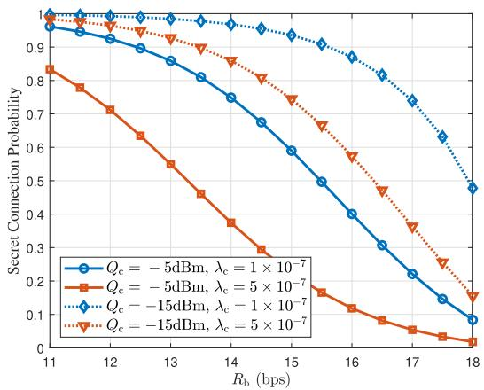  
Fig. 2. Bob’s SCP versus target transmission rate with different covert transmit power and the density of covert users, where $d _ { \mathrm { s } } ~ = ~ 2 0 0$ m, $\mathbf { L } _ { \mathrm { a } } = ( 0 , \mathsf { \bar { 0 } } , 5 0 ) , \mathbf { L } _ { \mathrm { b } } = ( - 1 0 0 , \mathsf { \bar { 0 } } , 0 )$ , and $\mathbf { L } _ { \mathrm { w } } = ( 5 0 0 , 5 0 0 , 0 )$

## A. Numerical Results of Performance Measures

In Fig. 2, we plot Bob’s average minimum SCPs as a function of Bob’s target transmission rate for different transmit power and densities of covert users. We can observe that the SCPs decrease from 1 to 0 as Bob’s target transmission rate increases. This is consistent with our theoretical results in Eq. (71) in Lemma 9, indicating the connection outage occurs when the target rate becomes sufficiently large. Furthermore, as the covert user density increases, the average minimum distance between Alice and the users decreases, resulting in greater interference from the covert signal to the secret signal. This consequently leads to a reduction in the SNR and an increase in the outage probability. Similarly, an increase in covert transmit power also results in the same phenomenon.

In Fig. 3, we plot Bob’s SOPs as a function of the secret rate redundancy for various covert transmit powers and CIPC parameters. As shown in Fig. 3, the SOP decreases as the secret rate redundancy increases, this is consistent with our theoretical results in Eq. (72). This phenomenon indicates that as the secret rate redundancy increases, secret outages become less likely to occur. This is because a higher secret rate redundancy corresponds to a lower target secret rate, which enhances the ability against eavesdropping and consequently leads to the decreasing of SOPs. Similar to SCPs, an increase in secret transmit power or a decrease in covert transmit power enhances the SNR at the adversary, thereby increasing the SOPs. Notably, the transmit power of the secret user exerts a more obvious influence compared to that of the covert users.

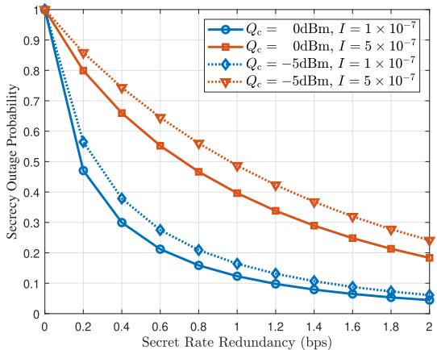

Fig. 3. Bob’s SOP versus secret rate redundancy with different covert transmit power and CIPC parameter, where $d _ { \mathrm { s } } ~ = ~ 5 0$ m, ${ \bf L } _ { \bf a } = ( 0 , 0 , 5 0 )$ , $\mathbf { L } _ { \mathrm { b } } ~ =$ $( - 1 0 0 , 0 , 0 ) , \mathbf { L } _ { \mathbf { w } } \overset { \cdot } { = } ( 5 0 0 , 5 0 0 , 0 )$ , and $\lambda _ { \mathrm { c } } = 5 \times 1 0 ^ { - 7 }$  
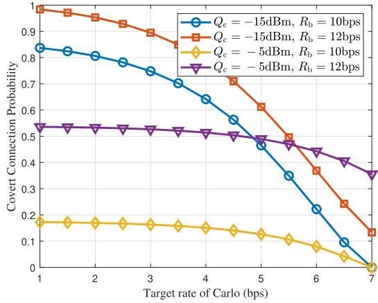  
Fig. 4. Carlo’s CCP versus target covert rate with different covert transmit power and target secret rate, where $d _ { \mathrm { s } } = 2 0 0$ m, ${ \bf L } _ { \bf a } = ( 0 , 0 , 5 0 )$ $\mathbf { L } _ { \mathrm { b } } \ : =$ $\dot { \mathbf { \eta } } ( - 1 0 0 , 0 , 0 ) , \mathbf { \check { L } } _ { \mathrm { c } } = ( 2 0 0 , 0 , 0 )$ , and $\mathbf { L } _ { \mathrm { w } } = ( 5 0 0 , 5 0 0 , 0 )$

In Fig. 4, we plot Carlo’s CCP as a function of the target covert rate for different covert transmit power and target secret rate. As observed from Fig. 4, the CCP gradually decreases with an increase in the target covert rate, indicating that covert communication is likely to experience a connection outage when the covert target rate becomes sufficiently large. Furthermore, an increase in the target secret rate also results in a decrease in the CCP. This phenomenon indicates that the connection outage occurs between Bob and Alice when the target secret rate becomes large. Finally, even if secret communication between Bob and Alice is achievable, a sufficiently large target covert rate may also result in communication outages between Carlo and Alice. Note that the above results are consistent with our theoretical analysis in Lemma 3.

In Fig. 5, we plot the DEP as a function of the detection threshold at Willie for various covert transmit powers. From Fig. 5, it can be seen that the DEP initially decreases and then increases as the detection threshold increases, suggesting the existence of an optimal threshold and minimum DEP of Willie. This observation is in accordance with the theoretical analysis outlined in Eq. (30) and Lemma 8. Furthermore, the DEP increases as the covert transmit power decreases. This suggests that a lower transmit power facilitates better covertness of covert signals within the secret communication.

Remark 3: To better interpret the trends in the above figures, we briefly examine several limiting operating regimes. When the maximum transmit power of the secret user becomes very large, the CIPC mechanism restricts the received signal at the UAV to the target level I. In this case, increasing the power budget no longer improves the SCP and only increases the probability that Bob is allowed to transmit. When the covert user’s maximum power is extremely small, the CCP approaches zero and Willie’s detector operates in a noise-dominated regime, causing the DEP to saturate. In contrast, when the covert user’s power becomes very large, the interference to the secrecy link increases and reduces the SCP, and the covert signal at Willie becomes easier to distinguish, which lowers the DEP. These limiting behaviors agree with the structure of the derived expressions and help explain the overall trends observed in the numerical results.

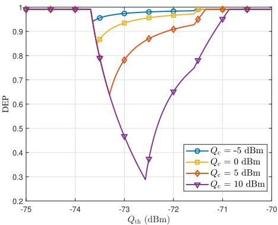  
Fig. 5. Willie’s DEP versus detection threshold with different secret transmit power, where $d _ { \mathrm { s } } = 5 0$ m, ${ \bf L } _ { \bf a } = ( 0 , 0 , 5 0 )$ $\mathbf { L } _ { \mathrm { b } } = ( - 1 0 0 , 0 , 0 )$ , and $\mathbf { L } _ { \mathrm { w } } =$ (500, 500, 0).

In Fig. 6, we further present numerical results that illustrate the variation of the key performance measures with respect to the Alice–Bob channel uncertainty, as characterized in Lemmas 5–7. It can be observed that both average SCP and average CCP increase as the uncertainty grows. At first sight, this result may seem counterintuitive because imperfect CSI is usually expected to deteriorate the communication quality. However, this behavior arises from the operational nature of the CIPC mechanism. Under CIPC, the transmit power is determined according to the estimated Alice–Bob channel condition. When the channel uncertainty becomes larger, the transmitter tends to compensate for the perceived channel degradation by allocating a higher transmit power in order to maintain the desired reliability. As a result, the received SINR at legitimate users improves, which enhances the overall channel quality and leads to higher connection probabilities. The increased transmit power also strengthens the signal received by Willie. This strengthens his detection or eavesdropping capability and therefore causes the average SOP to rise. Overall, these results reveal a fundamental tradeoff introduced by the CIPC mechanism: channel uncertainty improves the connection reliability through power overcompensation, but at the same time weakens both covertness and secrecy, since the stronger transmitted signal is more easily detected and intercepted by Willie.

## B. Numerical Results of Rotary-Wing UAV Scenarios

In Fig. 7, we demonstrate a performance comparison between the proposed optimal solution in Theorem 1 and the coordinate descent based sub-optimal solution nloaded on July 05,2026 at 10:59:10 UTC from IEEE Xplore. Restrictions apply.

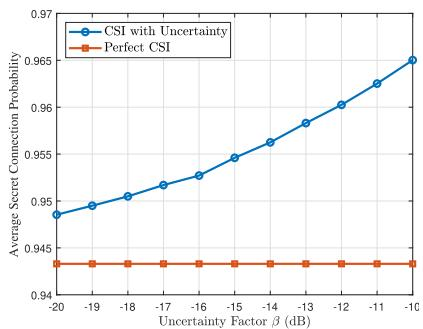

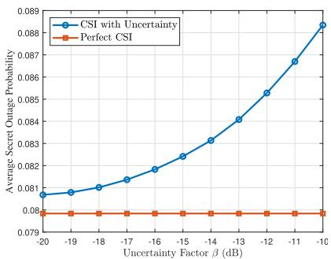

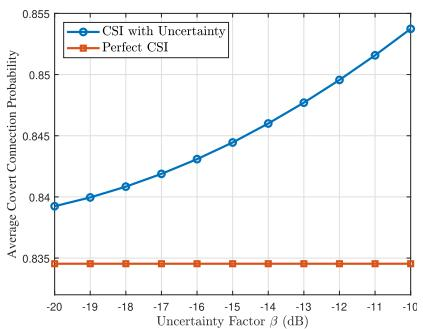  
(a) Average SCP versus channel uncertainty factor. (b) Average SOP versus channel uncertainty factor. (c) Average CCP versus channel uncertainty factor.

Fig. 6. Performance measures versus channel uncertainty factor, where $\mathbf { L } _ { \mathrm { a } } = ( 0 , 0 , 5 0 ) , \mathbf { L } _ { \mathrm { w } } = ( 5 0 0 , 5 0 0 , 0 ) , \mathbf { L } _ { \mathrm { b } } = ( - 1 0 0 , 0 , 0 ) , \mathbf { L } _ { \mathrm { c } } = ( 2 0 0 , 4 5 0 , 0 ) .$ $I \stackrel { - } { = } 1 \times 1 0 ^ { - 7 } , Q _ { \mathrm { c } } = - 5$ dBm, $R _ { \mathrm { c } } = 2$ bps.  
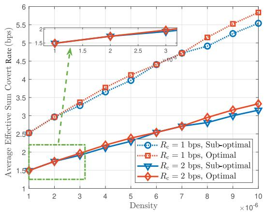  
Fig. 7. Carlo’s average effective sum covert rate versus the density with different target covert rates and solutions, where $\mathbf { L } _ { \mathrm { b } } ~ = ~ ( - 1 0 0 , 0 , \dot { 0 } )$ and $\mathbf { L } _ { \mathrm { w } } = ( 5 0 0 , 5 0 0 , 0 )$

(i.e., Algorithm 1). Specifically, we plot average effective sum covert as a function of covert user density. The numerical results depicted in Fig. 7 demonstrate that as the density of covert users increases, the average effective sum covert improves. Furthermore, it can be observed that the proposed coordinate descent algorithm performs closely to the optimal solution, particularly when the covert user density is low. In addition, a higher target covert rate leads to a slightly reduced effective sum covert rate, as satisfying a stricter rate requirement limits the achievable covert performance.

## C. Numerical Results of Fixed-Wing UAV Scenarios

For the comparison of UAV trajectory optimization schemes, we consider the following benchmarks:

• Fixed Time Allocation (FTA) Scheme: The UAV serves covert users in a predetermined and fixed order throughout the entire flight duration.

• Fixed Power Allocation (FPA) Scheme: Each covert user transmits with a constant power across all time slots.

• Greedy Time Allocation (GTA) Scheme: In each time slot, the UAV exclusively serves the covert user that is closest to its current position.

• Straight Flight Scheme: The UAV flies directly from its initial position to its final destination along a straight-line trajectory.

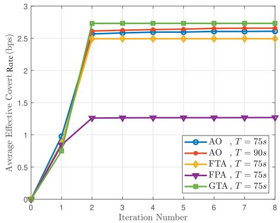  
Fig. 8. Carlo’s average covert rate versus the iteration number with different flight periods and different optimization strategies, where ${ \bf L } _ { \mathrm { I } } = ( 0 , 0 , 5 0 )$ $\begin{array} { r l r } { { \bf L } _ { \mathrm { F } } ^ { \mathrm { ~ e ~ } } } & { { } \dot { = } } & { ( 5 0 0 , 5 0 0 , 5 0 ) , \ { \bf L } _ { \mathrm { b } } ^ { \mathrm { ~ e ~ } } = ( 2 5 0 , 2 0 0 , 0 ) , \ { \bf L } _ { \mathrm { c } 1 } = ( 3 5 0 , 5 0 , 0 ) , \ { \bf L } _ { \mathrm { c } 2 } = } \end{array}$ (200, 450, 0), Lc3 = (50, 300, 0), and $\mathbf { L } _ { \mathrm { w } } = ( 4 5 0 , 2 5 0 , 0 )$ $v _ { \mathrm { m i n } } { = } 1 \ \mathrm { m / s } ,$ $v _ { \mathrm { m a x } } { = } 2 0 ~ \mathrm { m / s }$ , and $a _ { \mathrm { m a x } } { = } 2 ~ \mathrm { m / s ^ { 2 } }$

Fig. 8 shows the average effective covert rate versus the iteration number for different optimization strategies. The proposed AO algorithm converges rapidly, and the curve with a longer flight period $( T = 9 0 ~ \mathrm { s } )$ achieves a higher throughput than that with $T  { \mathrm { ~ = ~ } } 7 5  { \mathrm { ~ s ~ } }$ because the UAV has more time to move closer to the covert users and communicate under better channel conditions. The proposed AO algorithm also achieves higher throughput than the FPA and FTA benchmarks, mainly because it jointly optimizes the trajectory, transmit power, and time allocation, while FPA and FTA keep part of these variables fixed and therefore limit performance. The GTA scheme is also included, in which the UAV always serves the closest covert user. Although GTA achieves marginally higher throughput, it fails to ensure user fairness. Note that the fairness constraint in P2 (i.e., (87i)) enables the proposed AO algorithm to maintain a balanced level of service among users throughout the UAV’s flight, whereas GTA repeatedly assigns consecutive time slots to the same user, resulting in highly uneven user performance. Overall, the results show that the proposed AO algorithm offers a good balance between throughput improvement and fairness.

Fig. 9 illustrates the UAV trajectories obtained under different flight periods and optimization schemes. Compared with the straight-flight baseline, all optimized trajectories deviate from the straight line and clearly move toward Bob and the covert users, showing that the UAV actively uses its mobility to improve communication performance. The trajectory generated by the proposed AO algorithm with a longer flight duration $( T ~ = ~ 9 0 ~ \mathrm { \ s } )$ turns more toward the users and goes closer to the covert users than the one with $T = 7 5 \ \mathrm { s } ,$ , indicating that more available time allows the UAV to approach ground nodes more effectively. The trajectory of the FPA scheme with $T ~ = ~ 7 5$ s stays relatively near the secret user because the fixed transmit power restricts how far the UAV can move while still guaranteeing the secrecy requirement. The trajectory of the FTA scheme follows a path that is generally similar to the proposed AO algorithm $( T = 7 5 \ \mathrm { s } )$ but shows less flexibility due to its fixed serving order. In contrast, the trajectory of the GTA scheme has sharper turns and moves very close to the nearest covert user at the beginning, which matches its rule of always serving the nearest covert user. These behaviors illustrate an inherent tradeoff between secrecy and covertness: trajectories that stay closer to the secret user (e.g., FPA) help maintain a reliable secret link but limit the UAV’s ability to approach covert users and enhance covert performance, whereas trajectories that aggressively chase covert users (e.g., GTA) improve covert rate but may reduce the time spent in positions favorable for secrecy. This scenario further demonstrates that the UAV should remain sufficiently close to the secret user to avoid requiring excessive transmit power that would increase the risk of being detected by Willie, while at the same time flying closer to the covert user to improve covertness and throughput, yet maintaining an appropriate distance to prevent excessive interference with the secret transmission. Overall, the proposed AO algorithm provides a more balanced path among all schemes by implicitly trading off the secrecy and covertness requirements.

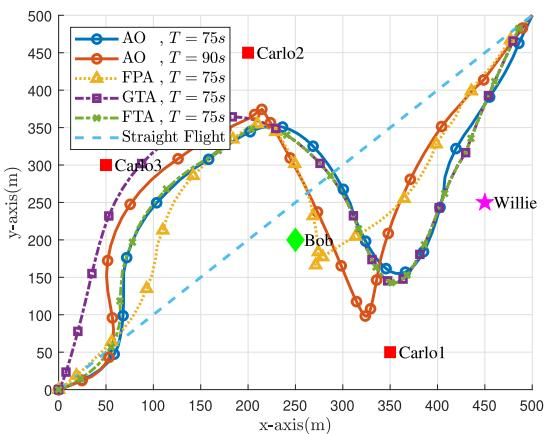  
Fig. 9. Optimized UAV’s trajectories with different flight periods and different optimization strategies, where $\mathrm { \bf ~ L } _ { \mathrm { I } } ~ = ~ ( 0 , 0 , 5 0 ) , ~ \bar { \mathrm { \bf ~ L } } _ { \mathrm { F } } { \mathrm { \bf ~ \bar { \xi } } } = ~ ( 5 0 0 , 5 0 0 , 5 0 ) ,$ $\bar { \bf L _ { b } } ~ = ~ ( 2 5 0 , 2 0 0 , \bar { 0 } ) , ~ { \bf L } _ { c 1 } ~ = ~ ( 3 5 0 , 5 0 , \bar { 0 } ) , ~ { \bf L } _ { c 2 } ~ = ~ ( 2 0 0 , 4 \dot { 5 } 0 , 0 ) , ~ { \bf L } _ { c 3 } ~ = ~ $ $( 5 0 , 3 0 0 , 0 )$ and $\begin{array} { r } { { \bf L } _ { \bf w } = ( 4 5 0 , } \end{array}$ , 250, 0), $v _ { \operatorname* { m i n } } = 1$ m/s, $v _ { \mathrm { m a x } } = 2 0$ m/s, and $\dot { a } _ { \mathrm { m a x } } = 2 ~ \mathrm { m / s ^ { 2 } }$

Finally, in Fig. 10, we analyze the UAV’s velocity variations and the transmit powers of the covert users corresponding to the optimized trajectory. As shown in Fig. 10, the UAV’s velocity changes periodically along the flight. At the beginning, the UAV accelerates as it moves toward the first covert user, which is consistent with the initial ascending portion of the trajectory in Fig. 9. When approaching a covert user, the UAV slows down to maintain a better communication position, and such slowdowns also explain the deeper turns observed in the $ { T } ~ = ~ 9 0 ~  { \mathrm { ~ s ~ } }$ trajectory compared with the

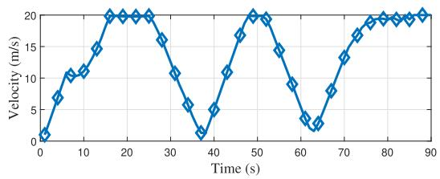

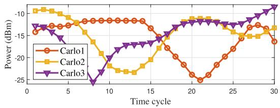  
Fig. 10. UAV’s velocity and Carlos’ transmit powers during the UAV trajectory, where $\mathbf { L } _ { \mathrm { I } } = ( 0 , \dot { 0 } , 5 0 ) , \mathbf { L } _ { \mathrm { F } } = ( 5 0 0 , 5 0 0 , 5 0 ) , \mathbf { L } _ { \mathrm { b } } = ( 2 5 0 , 2 0 0 , 0 )$ $\begin{array} { r c l c l } { \mathbf { L } _ { \mathrm { c 1 } } } & { = } & { ( 3 5 0 , 5 0 , 0 ) , ~ \mathbf { L } _ { \mathrm { c 2 } } } & { = } & { ( 2 0 0 , 4 5 0 , 0 ) , ~ \mathbf { L } _ { \mathrm { c 3 } } } & { = } & { ( 5 0 , 3 0 0 , 0 ) } \end{array}$ and $\mathrm { \bf L _ { w } } = ( 4 5 0 , 2 5 0 , 0 ) , v _ { \mathrm { m i n } } = 1 \mathrm { \bf ~ m } / \mathrm { s } , v _ { \mathrm { m a x } } = 2 0 \mathrm { \bf ~ m } / \mathrm { s } , \mathrm { a n d \ a _ { m a x } = 2 \mathrm { \bf ~ m } / s ^ { 2 } }$

$T = 7 5 { \mathrm { ~ s ~ c a s e } } .$ . Furthermore, the transmit-power profiles of the covert users exhibit patterns that match the UAV’s movement along the optimized path. Each covert user lowers its transmit power when the UAV moves closer and increases it when the UAV moves away in order to compensate for the larger distance while still satisfying the secrecy requirement. Because the UAV passes by each user at different times along the trajectory, their transmit-power curves peak and dip at different moments. Overall, the coupled variations of UAV velocity and user transmit powers confirm the adaptiveness enabled by the proposed AO algorithm, and the additional flight time at $T = 9 0$ s allows the UAV to coordinate these two factors more effectively to enhance covert communication performance.

## VI. CONCLUSION

We proposed a CIPC-aided multi-user collaborative secret and covert uplink transmission scheme and conducted a comprehensive performance analysis by formulating optimization problems aimed at maximizing the effective average sum covert rate and effective covert rate in rotary-wing and fixed-wing UAV systems, respectively. Specifically, in the rotary-wing UAV system, we provided the optimal solutions for UAV deployment altitude and ground users’ transmission parameters. Furthermore, we proposed a coordinate descent algorithm to solve the optimization problem. In the fixedwing UAV system, we developed an AO algorithm to jointly optimize the UAV trajectory, ground users transmission parameters, and user scheduling. Our results offer feasible solutions for multi-user collaborative uplink transmission under varying security requirements and reveal the impact of factors such as transmission parameters on covert rate.

There are several avenues for future studies. Firstly, we assume that legitimate users possess perfect CSI and complete knowledge of the adversary’s location. However, due to resource limitations and deliberate concealment of the adversary, legitimate users’ estimates of these parameters may be imperfect in practical systems. Consequently, our results can be extended to scenarios involving imperfect CSI [51] and uncertain location information of the eavesdropper [52]. Furthermore, since multi-antenna techniques are widely adopted in practical wireless systems [53], extending our framework to multi-antenna settings would enable the exploitation of additional spatial degrees of freedom through transmit precoding, thereby further improving both the achievable secrecy rate and covert communication performance [6]. Furthermore, from an algorithmic perspective, reinforcement learning approaches can be employed to effectively address the non-convex and high-dimensional optimization problems [54], especially in dynamic environments where UAV mobility and user scheduling need to adapt to time-varying conditions.

## REFERENCES

[1] Y. He, J. Xu, and L. Zhou, “Two-user collaborative secret and covert uplink communications in UAV systems,” in Proc. IEEE/CIC Int. Conf. Commun. China (ICCC), Aug. 2024, pp. 903–908.

[2] Y. Zeng, R. Zhang, and T. J. Lim, “Wireless communications with unmanned aerial vehicles: Opportunities and challenges,” IEEE Commun. Mag., vol. 54, no. 5, pp. 36–42, May 2016.

[3] X. Xie, T. Bai, W. Guo, Z. Wang, and A. Nallanathan, “Cooperative computing for mobile crowdsensing: Design and optimization,” IEEE Trans. Mobile Comput., vol. 23, no. 5, pp. 6437–6454, May 2024.

[4] J. Xu, X. Cheng, and L. Bai, “A 3-D space-time-frequency nonstationary model for low-altitude UAV mmWave and massive MIMO aerial fading channels,” IEEE Trans. Antennas Propag., vol. 70, no. 11, pp. 10936–10950, Nov. 2022.

[5] M. Adil, M. A. Jan, Y. Liu, H. Abulkasim, A. Farouk, and H. Song, “A systematic survey: Security threats to UAV-aided IoT applications, taxonomy, current challenges and requirements with future research directions,” IEEE Trans. Intell. Transp. Syst., vol. 24, no. 2, pp. 1437–1455, Feb. 2023.

[6] L. Bai, J. Xu, and L. Zhou, “Covert communication for spatially sparse mmWave massive MIMO channels,” IEEE Trans. Commun., vol. 71, no. 3, pp. 1615–1630, Mar. 2023.

[7] W. Trappe, “The challenges facing physical layer security,” IEEE Commun. Mag., vol. 53, no. 6, pp. 16–20, Jun. 2015.

[8] C. E. Shannon, “Communication theory of secrecy systems,” Bell Syst. Tech. J., vol. 28, no. 4, pp. 656–715, Oct. 1949.

[9] J. Wang et al., “Physical layer security for UAV communications: A comprehensive survey,” China Commun., vol. 19, no. 9, pp. 77–115, Sep. 2022.

[10] A. D. Wyner, “The wire-tap channel,” Bell Syst. Tech. J., vol. 54, no. 8, pp. 1355–1387, Oct. 1975.

[11] X. Chen et al., “Covert communications: A comprehensive survey,” IEEE Commun. Surveys Tuts., vol. 25, no. 2, pp. 1173–1198, 2nd Quart., 2023.

[12] B. A. Bash, D. Goeckel, and D. Towsley, “Limits of reliable communication with low probability of detection on AWGN channels,” IEEE J. Sel. Areas Commun., vol. 31, no. 9, pp. 1921–1930, Sep. 2013.

[13] B. A. Bash, D. Goeckel, D. Towsley, and S. Guha, “Hiding information in noise: Fundamental limits of covert wireless communication,” IEEE Commun. Mag., vol. 53, no. 12, pp. 26–31, Dec. 2015.

[14] M. Forouzesh, P. Azmi, A. Kuhestani, and P. L. Yeoh, “Joint information-theoretic secrecy and covert communication in the presence of an untrusted user and warden,” IEEE Internet Things J., vol. 8, no. 9, pp. 7170–7181, May 2021.

[15] Z. M. Fadlullah, C. Wei, Z. Shi, and N. Kato, “Joint optimization of QoS and security for differentiated applications in heterogeneous networks,” IEEE Wireless Commun., vol. 23, no. 3, pp. 74–81, Jun. 2016.

[16] J. Xu, L. Zhou, X. Xie, and L. Bai, “Secret and covert communications for multi-antenna uplink UAV systems,” in Proc. IEEE/CIC Int. Conf. Commun. China (ICCC Workshops), Aug. 2024, pp. 593–598.

[17] J. Xu, L. Bai, X. Xie, and L. Zhou, “Collaborative secret and covert communications for multi-user multi-antenna uplink UAV systems: Design and optimization,” IEEE Trans. Wireless Commun., vol. 24, no. 7, pp. 6020–6035, Jul. 2025.

[18] C. Zhong, J. Yao, and J. Xu, “Secure UAV communication with cooperative jamming and trajectory control,” IEEE Commun. Lett., vol. 23, no. 2, pp. 286–289, Feb. 2019.

[19] Z. Li, M. Chen, C. Pan, N. Huang, Z. Yang, and A. Nallanathan, “Joint trajectory and communication design for secure UAV networks,” IEEE Commun. Lett., vol. 23, no. 4, pp. 636–639, Apr. 2019.

[20] H. Kang, J. Joung, J. Ahn, and J. Kang, “Secrecy-aware altitude optimization for quasi-static UAV base station without eavesdropper location information,” IEEE Commun. Lett., vol. 23, no. 5, pp. 851–854, May 2019.

[21] Z. Sheng, H. Fu, A. A. Nasir, R. Wang, A. H. Muqaibel, and Y. Fang, “Joint uplink and downlink scheduling and UAV trajectory design in the presence of multiple unfriendly jammers and eavesdroppers,” Phys. Commun., vol. 53, Aug. 2022, Art. no. 101657.

[22] H. Fu, Z. Sheng, A. A. Nasir, A. H. Muqaibel, and L. Hanzo, “Securing the UAV-aided non-orthogonal downlink in the face of colluding eavesdroppers,” IEEE Trans. Veh. Technol., vol. 71, no. 6, pp. 6837–6842, Jun. 2022.

[23] X. Zhou, S. Yan, J. Hu, J. Sun, J. Li, and F. Shu, “Joint optimization of a UAV’s trajectory and transmit power for covert communications,” IEEE Trans. Signal Process., vol. 67, no. 16, pp. 4276–4290, Aug. 2019.

[24] S. Yan, S. V. Hanly, and I. B. Collings, “Optimal transmit power and flying location for UAV covert wireless communications,” IEEE J. Sel. Areas Commun., vol. 39, no. 11, pp. 3321–3333, Nov. 2021.

[25] H. Lei, J. Jiang, I. S. Ansari, G. Pan, and M.-S. Alouini, “Trajectory and power design for aerial multi-user covert communications,” IEEE Trans. Aerosp. Electron. Syst., vol. 60, no. 4, pp. 4574–4589, Aug. 2024.

[26] X. Jiang, Z. Yang, N. Zhao, Y. Chen, Z. Ding, and X. Wang, “Resource allocation and trajectory optimization for UAV-enabled multiuser covert communications,” IEEE Trans. Veh. Technol., vol. 70, no. 2, pp. 1989–1994, Feb. 2021.

[27] X. Zhou, S. Yan, F. Shu, R. Chen, and J. Li, “UAV-enabled covert wireless data collection,” IEEE J. Sel. Areas Commun., vol. 39, no. 11, pp. 3348–3362, Nov. 2021.

[28] H. Du, D. Niyato, Y.-a. Xie, Y. Cheng, J. Kang, and D. I. Kim, “Covert communication for jammer-aided multi-antenna UAV networks,” in Proc. IEEE Int. Conf. Commun., May 2022, pp. 91–96.

[29] S. Lin, Y. Xu, H. Wang, and G. Ding, “Multi-antenna covert communication assisted by UAV-RIS with imperfect CSI,” IEEE Trans. Wireless Commun., vol. 23, no. 10, pp. 13841–13855, Oct. 2024.

[30] X. Chen, Z. Chang, and T. Ham¨ al¨ ainen, “Enhancing covert secrecy rate¨ in a zero-forcing UAV jammer-assisted covert communication,” IEEE Wireless Commun. Lett., vol. 13, no. 12, pp. 3375–3379, Dec. 2024.

[31] P. Liu, Z. Li, J. Si, N. Al-Dhahir, and Y. Gao, “Joint informationtheoretic secrecy and covertness for UAV-assisted wireless transmission with finite blocklength,” IEEE Trans. Veh. Technol., vol. 72, no. 8, pp. 10187–10199, Aug. 2023.

[32] S. Wang, L. Li, R. Ruby, X. Ruan, J. Zhang, and Y. Zhang, “Secrecyenergy-efficiency UAV-enabled two-way maximization for relay systems,” IEEE Trans. Veh. Technol., vol. 72, no. 10, pp. 12900–12911, Oct. 2023.

[33] K. Yang et al., “Covert and secure communications in UAV-aided untrusted relay systems,” in Proc. Int. Conf. Netw. Netw. Appl. (NaNA), Aug. 2024, pp. 84–88.

[34] Y. Su, S. Fu, J. Si, C. Xiang, N. Zhang, and X. Li, “Optimal hovering height and power allocation for UAV-aided NOMA covert communication system,” IEEE Wireless Commun. Lett., vol. 12, no. 6, pp. 937–941, Jun. 2023.

[35] X. Chen, D. W. K. Ng, W. H. Gerstacker, and H.-H. Chen, “A survey on multiple-antenna techniques for physical layer security,” IEEE Commun. Surveys Tuts., vol. 19, no. 2, pp. 1027–1053, 2nd Quart., 2017.

[36] J. Hu, S. Yan, X. Zhou, F. Shu, and J. Li, “Covert wireless communications with channel inversion power control in Rayleigh fading,” IEEE Trans. Veh. Technol., vol. 68, no. 12, pp. 12135–12149, Dec. 2019.

[37] M. Wang, W. Yang, X. Lu, C. Hu, B. Liu, and X. Lv, “Channel inversion power control aided covert communications in uplink NOMA systems,” IEEE Wireless Commun. Lett., vol. 11, no. 4, pp. 871–875, Apr. 2022.

[38] R. Ma, X. Yang, G. Pan, X. Guan, Y. Zhang, and W. Yang, “Covert communications with channel inversion power control in the finite blocklength regime,” IEEE Wireless Commun. Lett., vol. 10, no. 4, pp. 835–839, Apr. 2021.

[39] X. Chen, M. Sheng, N. Zhao, W. Xu, and D. Niyato, “UAV-relayed covert communication towards a flying warden,” IEEE Trans. Commun., vol. 69, no. 11, pp. 7659–7672, Nov. 2021.

[40] W. Zhang, M. Cai, T. Zhang, Y. Zhuang, and X. Mao, “EarthGPT: A universal multimodal large language model for multisensor image comprehension in remote sensing domain,” IEEE Trans. Geosci. Remote Sens., vol. 62, 2024, Art. no. 5917820.

[41] W. Zhang, M. Cai, T. Zhang, Y. Zhuang, J. Li, and X. Mao, “EarthMarker: A visual prompting multimodal large language model for remote sensing,” IEEE Trans. Geosci. Remote Sens., vol. 63, 2025, Art. no. 5604219.

[42] W. Lu et al., “Secure NOMA-based UAV-MEC network towards a flying eavesdropper,” IEEE Trans. Commun., vol. 70, no. 5, pp. 3364–3376, May 2022.

[43] L. Zhou, Z. Yang, S. Zhou, and W. Zhang, “Coverage probability analysis of UAV cellular networks in urban environments,” in Proc. IEEE Int. Conf. Commun. Workshops, Kansas City, MO, USA, May 2018, pp. 1–6.

[44] X. Yu, J. Zhang, R. Schober, and K. B. Letaief, “A tractable framework for coverage analysis of cellular-connected UAV networks,” in Proc. IEEE Int. Conf. Commun. Workshops (ICC Workshops), May 2019, pp. 1–6.

[45] H.-M. Wang, Y. Zhang, X. Zhang, and Z. Li, “Secrecy and covert communications against UAV surveillance via multi-hop networks,” IEEE Trans. Commun., vol. 68, no. 1, pp. 389–401, Jan. 2020.

[46] B. Li, R. Li, J. Yan, X. Tang, and R. Zhang, “Ultra-low altitude channel measurement in riverside environments at 1.4 GHz,” in Proc. IEEE 99th Veh. Technol. Conf. (VTC-Spring), Jun. 2024, pp. 1–5.

[47] L. Bai, J. Xu, J. Wang, R. Han, and J. Choi, “Efficient hybrid transmission for cell-free systems via NOMA and multiuser diversity,” IEEE Trans. Mobile Comput., vol. 24, no. 4, pp. 3359–3371, Apr. 2025.

[48] J. Hu, S. Yan, X. Zhou, F. Shu, and J. Wang, “Covert communications without channel state information at receiver in IoT systems,” IEEE Internet Things J., vol. 7, no. 11, pp. 11103–11114, Nov. 2020.

[49] K. Shahzad and X. Zhou, “Covert wireless communications under quasistatic fading with channel uncertainty,” IEEE Trans. Inf. Forensics Security, vol. 16, pp. 1104–1116, 2021.

[50] J. Wang, W. Tang, Q. Zhu, X. Li, H. Rao, and S. Li, “Covert communication with the help of relay and channel uncertainty,” IEEE Wireless Commun. Lett., vol. 8, no. 1, pp. 317–320, Feb. 2019.

[51] S. Ma et al., “Robust beamforming design for covert communications,” IEEE Trans. Inf. Forensics Security, vol. 16, pp. 3026–3038, 2021.

[52] X. Xie, J. Sun, J. Xu, and L. Zhou, “Covert integrated sensing and communication for UAV systems exploiting prior information,” in Proc. IEEE/CIC Int. Conf. Commun. China (ICCC Workshops), Aug. 2025, pp. 1–6.

[53] X. Xie, J. Wang, J. Chen, J. Wang, J. Xu, and L. Bai, “A sensing-thencommunication architecture for low latency MIMO ad hoc networks: Design and optimization,” IEEE Trans. Cognit. Commun. Netw., vol. 11, no. 5, pp. 2821–2833, Oct. 2025.

[54] H. Hao, C. Xu, W. Zhang, S. Yang, and G.-M. Muntean, “Joint task offloading, resource allocation, and trajectory design for multi-UAV cooperative edge computing with task priority,” IEEE Trans. Mobile Comput., vol. 23, no. 9, pp. 8649–8663, Sep. 2024.

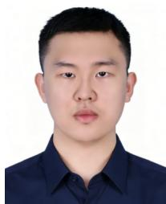  
Yingqi He (Graduate Student Member, IEEE) received the B.S. degree from Beihang University, Beijing, China, in 2023, where he is currently pursuing the Ph.D. degree. His current research interests include covert communications and space–air–ground–sea integrated communication systems.

Jinpeng Xu (Member, IEEE) received the Ph.D. degree in cyberspace security from Beihang University, Beijing, China, in 2025. He is currently a Post-Doctoral Fellow with the Department of Electrical and Electronic Engineering, The Hong Kong Polytechnic University. His current research interests include multiple-input multiple-output (MIMO), uncrewed aerial vehicle (UAV) communications, integrated sensing and communications (ISAC), and physical layer security.

Lin Zhou (Senior Member, IEEE) received the B.E. degree in information engineering from Shanghai Jiao Tong University in 2014 and the Ph.D. degree in electrical and computer engineering from the National University of Singapore in 2018.

He is currently an Associate Professor with the School of Automation and Intelligent Manufacturing, Southern University of Science and Technology, Shenzhen, China. Previously, he was an Associate Professor with the School of Cyber Science and Technology, Beihang University, Beijing, China, and a Research Fellow with the Department of Electrical Engineering and Computer Science, University of Michigan, Ann Arbor, MI, USA. He has authored two research monographs in the Foundations and Trends in Communications and Information Theory (NOW Publishers) and a book in the Textbooks in Telecommunication Engineering (Springer Publisher). His research interests include information theory, statistical inference, physical layer security, and wireless communications. He was recognized as the Young Scholar of Chinese Information Theory Society in 2022. He served as a TPC Member for flagship conferences, including IEEE ISIT, SSP, and ICCC, and is also serving as an Editor for IEEE TRANSACTIONS ON COMMUNICATIONS.

Jingjing Wang (Senior Member, IEEE) received the B.Sc. degree (Hons.) in electronic information engineering from Dalian University of Technology, Liaoning, China, in 2014, and the Ph.D. degree (Hons.) in information and communication engineering from Tsinghua University, Beijing, China, in 2019. From 2017 to 2018, he visited the Next Generation Wireless Group, chaired by Prof. Lajos Hanzo from the University of Southampton, U.K. He is currently a Professor with the School of Cyber Science and Technology, Beihang University, Beijing, and also a Researcher with Hangzhou Innovation Institute, Beihang University, Hangzhou, China. He has published over 100 IEEE journal/conference papers. His research interests include wireless communications and security and lowaltitude intelligent networks. He was a recipient of the Best Paper Award of IEEE ICC, IEEE WCSP, and IEEE IWCMC. He is also serving as an Editor for IEEE TRANSACTIONS ON VEHICULAR TECHNOLOGY, IEEE INTERNET OF THINGS JOURNAL, and IEEE WIRELESS COMMUNICATIONS LETTERS.

Chunxiao Jiang (Fellow, IEEE) received the B.S. degree (Hons.) in information engineering from Beihang University, Beijing, China, in 2008, and the Ph.D. degree (Hons.) in electronic engineering from Tsinghua University, Beijing, in 2013. From 2011 to 2012, he was a Joint Ph.D. degree Student with the Department of Electrical and Computer Engineering, University of Maryland, College Park, College Park, MD, USA, under the supervision of Prof. K. J. Ray Liu. From 2013 to 2016, he was a Post-Doctoral Researcher with the Department of Electrical and

Computer Engineering, University of Maryland, under the supervision of Prof. K. J. Ray Liu. He is currently an Associate Professor with the School of Information Science and Technology, Tsinghua University. His research interests include application of game theory, optimization, and statistical theories to communication, networking, and resource allocation problems, in particular space networks and heterogeneous networks. He was a member of the Technical Program Committee and the symposium chair of a number of international conferences. He was a recipient of the Best Paper Award from IEEE GLOBECOM in 2013, the IEEE Communications Society Young Author Best Paper Award in 2017, the Best Paper Award from ICC 2019, the IEEE VTS Early Career Award 2020, the IEEE ComSoc Asia–Pacific Best Young Researcher Award 2020, the IEEE VTS Distinguished Lecturer 2021, the IEEE ComSoc Best Young Professional Award in Academia 2021, Chinese National Second Prize in Technical Inventions Award in 2018, and the Natural Science Foundation of China Excellent Young Scientists Fund Award in 2019. He was an Editor of IEEE TRANSACTIONS ON COMMUNICATIONS, IEEE INTERNET OF THINGS JOURNAL, IEEE WIRELESS COMMUNICATIONS, IEEE TRANSACTIONS ON NETWORK SCIENCE AND ENGINEERING, IEEE NETWORK, and IEEE COMMUNICATIONS LETTERS, and a Guest Editor of IEEE Communications Magazine, IEEE TRANSACTIONS ON NETWORK SCIENCE AND ENGINEERING, and IEEE TRANSACTIONS ON COGNITIVE COMMUNICATIONS AND NETWORKING.