# Characterization and Prediction of Cell-level Mobile Network Traffic: A Reinforced Meta-learning-Based Framework

Bo Ma , Member, IEEE, Jiawei Ye , Student Member, IEEE, Shaohan Feng , Member, IEEE, Zitian Zhang , Member, IEEE, Chuanhuang Li , Member, IEEE, Ping Wang , Fellow, IEEE, Ekram Hossain , Fellow, IEEE

Abstract—We propose a Reinforced Meta-learning-based Traffic Prediction (RML-TP) method for a cellular mobile network. We characterize real-world cellular traffic data using Fast Fourier Transform, offering a significant improvement over traditional methods. Given the varying feature spaces of different cellular traffic data, we demonstrate the necessity of adapting the Deep Neural Network (DNN) structure accordingly, supported by mathematical proof. To achieve this, RML-TP is proposed to capture the intrinsic relationship between the feature spaces and the corresponding optimal network structures. In RML-TP, the underlying DNN is used to predict cellular traffic data, while the upper layer employs value-based RML to adjust the structure of the DNN. Numerical results demonstrate the superiority and generalization of the proposed RML-TP compared to other algorithms, such as Fixed-layer and Rand-layer and applying different networks based on different prediction algorithms, e.g., Recurrent Neural Network (RNN), Long Short-Term Memory (LSTM), Gated Recurrent Units (GRU), and Transformer. Finally, we demonstrate the advantages of RML-TP through a case study in which, we deploy RML-TP on a Unmanned Aerial Vehicle (UAV) for data offloading tasks, showcasing the superiority of our method compared to other methods.

Index Terms—Meta-learning, reinforcement algorithm, mobile network traffic prediction, neural network structure, depth of deep neural network (DNN)

Bo Ma, Shaohan Feng, Zitian Zhang and Chuanhuang Li are with the School of Information and Electronic Engineering (Sussex Artificial Intelligence Institute), Zhejiang Gongshang University, Hangzhou 310018, China (email: {mabo, feng\_shaohan, zitian.zhang}@mail.zjgsu.edu.cn; chuanhuang\_li@zjgsu.edu.cn;); Jiawei Ye is with the School of Information and Electronic Engineering (Sussex Artificial Intelligence Institute), Zhejiang Gongshang University and Gental.io, Hangzhou 310018, China (email: 1811080137@pop.zjgsu.edu.cn). (corresponding author: Chuanhuang Li)

P. Wang is with the Department of Electrical Engineering and Computer Science, Lassonde School of Engineering, York University, Toronto, Canada (email:pingw@yorku.ca).

E. Hossain is with the Department of Electrical and Computer Engineering at the University of Manitoba, Canada (email: ekram.hossain@umanitoba.ca).

This work was supported in part by the Zhejiang Provincial Science and Technology Innovation Key Project (2023R5211), the National Natural Science Foundation of China (62401506, 62301488, 62302446, W2421086), the Zhejiang Provincial Natural Science Foundation of China (LZ25F010003, LQN26F020066), the Zhejiang Provincial Key Research and Development Program (2025C02038, 2025C01SA100286, 2026C02A1244), and the Central Government Guiding Funds for Local Science and Technology Development (2025ZY01069, 2026ZY01018).

## I. INTRODUCTION

## A. Background and Motivation

a surge in mobile network traffic, which varies over time, in cellular wireless networks [1]. In these networks, a purely on-demand resource allocation mechanism can easily lead to wastage of system resources. Therefore, a resource allocation mechanism with prediction is needed, which not only allocates resources on demand but also anticipates future needs. In this case, accurate prediction of communication traffic becomes vital in improving the utilization of network resources. In recent years, Deep Neural Networks (DNNs), such as Recurrent Neural Network (RNN), Long Short-Term Memory (LSTM), Gated Recurrent Units (GRU), and Transformer, have achieved remarkable progress, particularly in time series prediction. The DNNs are composed of multiple layers: first layer, hidden layers, and final layer, each containing multiple neurons [2]. In particular, the neurons in the first layer receive data, the hidden layers process the input, and the final layer outputs the prediction, i.e., future values of the time series.

Most related works typically adopt a fixed network structure for the DNNs [3]. However, it is noteworthy that the prediction of the DNNs is strongly related to the number of hidden layers and number of neurons in each hidden layer, which can be explained as follows:

• When the neural networks used for time series analysis have too few layers or insufficient neurons in the hidden layers, they may fail to capture the complex temporal patterns within the data, resulting in degraded the prediction performance [4].

• When the network is too deep or the number of neurons in the hidden layers is excessively high, the model may overfit by capturing too many data features. This overfitting significantly damages the generalization ability and robustness leading to poor performance on new, unseen time series data [5].

The above context raises the need of adjusting the number of network layers and neurons specifically according to the characteristics of the data. Nevertheless, the most common approach of optimizing the DNN structure is enumeration, which will incur high time complexity.

To address this challenge, we resort to meta-learning. The meta-learning dynamically adjusts the DNN structure to improve the prediction capacity based on reinforcement learning. Meta-learning involves two key components: the baselearner and the meta-learner. The base-learner is responsible for performing the actual task, in this case, predicting time series traffic information. It focuses on learning patterns from the data and generating predictions. The meta-learner, on the other hand, is responsible for optimizing the base-learner by adjusting its internal parameters to improve performance. Therefore, we use DNN as the base-learner to predict time series traffic information, and reinforcement learning component as meta-learner to adjust the DNN network structure. The base DNN receives the network structure from the reinforcement learning and outputs the predicted performance metrics. The meta-learner then continuously updates the optimizer based on these performance metrics. This is the concept behind the proposed Reinforced Meta-Learning Traffic Prediction (RML-TP) framework. On one hand, RML-TP leverages the powerful post-training rapid inference capability of reinforcement learning to obtain an optimized structure in a short time. On the other hand, RML-TP first performs computationally intensive pre-training on various data with different features and then deploys it to specific traffic data for quick retraining. In this way, the DNN structure is well-aligned with the characteristics of the data and this approach enables RML-TP to achieve outstanding generalization performance.

TABLE I: Comparison among Existing Works on Cellular Traffic Prediction
<table><tr><td rowspan="2">Paper</td><td rowspan="2">Technique</td><td rowspan="2">Characterization</td><td rowspan="2">Traffic Prediction</td><td colspan="2">Base-leaner</td><td colspan="2">Meta-learner</td></tr><tr><td>Structures</td><td>Scale</td><td>Method</td><td>Hyperparameters</td></tr><tr><td>[6]-[9]</td><td>LSTM</td><td>FFT</td><td>√</td><td>Fixed-layer</td><td>Small</td><td></td><td></td></tr><tr><td>[10], [11]</td><td>LSTM+Attention</td><td></td><td>√</td><td>Fixed-layer</td><td>Small</td><td></td><td></td></tr><tr><td>[12]-[14]</td><td>Transformer</td><td></td><td>√</td><td>Fixed-layer</td><td>Large</td><td></td><td></td></tr><tr><td>[15]-[17]</td><td>Gradient-Based Meta-learning</td><td></td><td>×</td><td>Fixed-layer</td><td>Small</td><td>MAML</td><td>Metric of Networks</td></tr><tr><td>[18]-[20]</td><td>Federated Meta-learning</td><td></td><td>√</td><td>Fixed-layer</td><td>Large</td><td>MAML</td><td>Weights of Networks</td></tr><tr><td>[21]</td><td>Coordinate-wise LSTM</td><td></td><td>X</td><td>Variable</td><td>Small</td><td>ADAM</td><td>Structures of Networks</td></tr><tr><td>[3]</td><td>ML-TP</td><td>FFT</td><td>√</td><td>Fixed-layer</td><td>Large</td><td>KNN</td><td>Weights of Networks</td></tr><tr><td></td><td>Proposed RML-TP</td><td>FFT</td><td>√</td><td>Variable</td><td>Large</td><td>Value-based RML</td><td>Structures of Networks</td></tr></table>

## B. Contributions

In this paper, we study the problem of cell-level traffic prediction in a mobile network and propose the RML-TP method. We adopt a DNN as the predictor. To effectively align with the characteristics of input data, we develop a reinforced meta learning based framework to automatically adjust the DNN structure. In particular, we first characterize the time series cellular traffic data. Then, we prove that as different cellular traffic data have different feature spaces, it requires the structure of the DNN to be adjusted accordingly. The main contributions of this paper can be summarized as follows:

• Utilizing the real-world mobile network traffic dataset offered by the “Big Data Challenge” initiative from Telecom Italia [22], we explore the properties of celllevel traffic in both the temporal and frequency domains. By employing the Fast Fourier Transform (FFT), we categorize the data feature spaces into various groups according to the strengths of frequency components.

• To prove the necessity of adjusting the DNN structure according to different cellular traffic data feature spaces, we utilize the characterized data and demonstrate the network performance under various complexities of DNN structures. Theoretically, we employ the Information Bottleneck (IB) theory to prove it.

• In the proposed RML-TP framework, the base layer utilizes a DNN to forecast cellular traffic data, while the upper layer employs a value-based RML to adjust the DNN’s structure. We treat the optimization of the network structure as a meta-task and propose a valuebased RML algorithm to address this within the RML TP framework. Additionally, we assess the performance of our framework using real-world mobile network traffic data, such as LTE and WiFi traffic datasets. Our experimental results show that the meta-learner in RML-TP significantly enhances the prediction accuracy of the base-learners after training.

The rest of this paper is organized as follows. Section II provides an overview of existing research on cellular traffic prediction and meta-learning. Section III delves into the characterization and feature analysis of real-world traffic data. Section IV demonstrates the necessity of adjusting DNN structures based on different feature spaces. Section V introduces the value-based RML. Section VI presents a performance evaluation of RML-TP against key baseline methods. Finally, Section VII concludes the paper.

## II. RELATED WORK

Cellular traffic prediction is characterized by its dynamic nature due to varying user behavior, making it a challenging task for traditional time series forecasting methods. DNNs, however, excel at capturing the intricate features within such dynamic data, thus providing superior predictive performance. For convenience, Table I summarizes the latest related work and highlights their main characteristics.

RNNs are among the earliest deep learning models used for time series prediction due to their ability to process sequential data. In [23], the RNN was used to forecast the upstream and downstream traffic. However, RNNs suffer from the vanishing gradient problem, which limits their effectiveness in capturing long-term dependencies. To address this issue, LSTM networks were introduced. LSTM networks enhanced the capability to retain long-term memory, as demonstrated in studies such as [6]–[8], significantly improving prediction accuracy in traffic prediction. In [9], the Fast Fourier Transform (FFT) was introduced to better extract the characteristics for improving the accuracy of LSTM networks. Moreover, GRU networks were developed to further improve the efficiency of

RNNs by simplifying the internal structure while maintaining performance. GRU models eliminate the need for separate memory cells, offering a more streamlined approach to handle sequential data [24].

In recent years, attention mechanisms have been widely used in deep learning to help determine the degree of association between each vector and all other vectors in a sequence. The combination of the RNN and the attention mechanism was proposed to capture the temporal dependencies of the cellular traffic [10]. And the attention layer was introduced in Conv-LSTM or Conv-GRU for improving the feature extraction ability of cellular traffic data [11]. Recently, the advent of Transformer models has revolutionized time series prediction. Transformers leverage self-attention mechanisms, allowing them to capture dependencies across different time steps more effectively than traditional RNN-based models [12]–[14], [25]. This capability is particularly advantageous in scenarios with complex temporal patterns, as shown in [26].

Despite the many advantages of the aforementioned DNN networks, their ability to self-tune hyperparameters is limited. Additionally, directly applying these trained models to realworld environments may result in performance degradation. As a result, meta-learning, often referred to as "learning to learn" has become a promising method for tackling these challenges [3], [27], [28].

According to existing literature, meta-learning approaches can be categorized into three main types: optimization, black box/model-based, and metric-learning [15]–[17]. Firstly, optimization-based meta-learning approaches focus on optimization, where the initialization of algorithms is crucial. By initializing the step sizes [29] or learning predict step from gradients [21], [30], these methods can achieve excellent performance with only a few training steps, allowing for efficient and rapid adaptation to new tasks. Secondly, black box/modelbased meta-learning algorithms treat the model as a black box during the forward process [18]–[20]. In this approach, there are two levels of optimization: internal and external. Internal optimization involves fully updating the internal forward process of the model [31], while external optimization adjusts the hyperparameters of the black box model [32], both of which are essential for enhancing the model’s performance. Lastly, metric-learning based meta-learning, though less commonly used, focuses on learning performance metrics corresponding to different algorithms [33], enabling effective measurement and evaluation of their performance. By understanding these metrics, models can be fine-tuned to achieve better results across various tasks. In the context of cellular traffic prediction, meta-learning has been applied in several studies. For instance, a model-based meta-learning approach was employed in [27], utilizing a strategy set definition method as a metalearning algorithm to help DNNs dynamically adapt to highly volatile traffic data. In [34], the authors integrated the Model-Agnostic Meta-Learning (MAML) algorithm into federated learning to enhance the generalization of gradient descentbased meta-learning algorithms , which are a notable example of optimization. The study [35] proposed a deep learning framework based on federated learning as a meta-learning algorithm, achieving good training results even with limited data. The work [32] introduced a DNN-based meta-learner designed to optimize hyper-parameter values and initial training conditions to enhance prediction accuracy and learning efficiency. In [3], the authors characterized the traffic data and employed meta-learning algorithms to address issues of limited training data and poor training accuracy of DNNs in the migration. However, the meta-learning approaches in the above works are mostly based on supervised learning, which limits their ability to self-adjust. As a result, they still suffer from significant performance degradation when encountering sudden changes in traffic in real-world environments.

TABLE II: Table of notations
<table><tr><td>Symbol</td><td>Description</td></tr><tr><td> $P$ </td><td>Number of cells in the mobile network</td></tr><tr><td> $_ T$ </td><td>Total number of time slots</td></tr><tr><td> $\Delta t$ </td><td>Duration of each time slot (in hours)</td></tr><tr><td> $l _ { p } ^ { \prime } [ t ]$ </td><td>Raw traffic load of cell p at time slot t</td></tr><tr><td> $\dot { \mathrm { v o l } } _ { r , p } ( \tau )$ </td><td>Traffic volume of record r for cell  $p$  at time τ</td></tr><tr><td> $l _ { p } [ t ]$ </td><td>Normalized traffic load of cell  $p$  at time slot  $t ,$  scaled to [0, 1]</td></tr><tr><td> $l _ { p }$ </td><td>Time series vector of normalized traffic load for cell p</td></tr><tr><td> $\hat { l } _ { p } [ t ]$ </td><td>Periodic normalized traffic load of cell p at time slot t</td></tr><tr><td> $N$ </td><td>Length of periodic cycle (e.g., number of hours in a week,  $N \stackrel { - } { = } 1 6 8 )$ </td></tr><tr><td> $F _ { p } ( k \cdot 2 \pi / T )$ </td><td>FFT coefficient of cell p at angular frequency  $k \cdot 2 \pi / T$ </td></tr><tr><td> $F _ { n } ^ { \prime }$ </td><td>Set of all frequency components for cell  $p$ </td></tr><tr><td> $F _ { p }$ </td><td>Set of main frequency components for cell p, above</td></tr><tr><td> $\sigma$ </td><td>threshold σ Threshold for significant frequency components,  $\sigma =$ </td></tr><tr><td> $E _ { p , q }$ </td><td> $\operatorname* { m a x } ( F _ { p } ^ { \prime } ) / 1 0$  Euclidean distance between traffic vectors of cells  $p$  and</td></tr><tr><td> $M _ { p , q }$ </td><td>q Difference in dimensionality of main frequency compo-</td></tr><tr><td> $\Lambda _ { p }$ </td><td>nents between cells p and q Neural network structure vector for cell p,  $\begin{array} { r l } { \Lambda _ { p } } & { { } = } \end{array}$ </td></tr><tr><td> $\Lambda _ { p } ^ { o p }$ </td><td> $[ \lambda _ { 1 } , \ldots , \lambda _ { \theta } ]$ </td></tr><tr><td>θ</td><td>Optimal neural network structure for cell p Number of layers in the neural network</td></tr><tr><td> $\lambda _ { i }$ </td><td>Number of neurons in the i-th layer</td></tr><tr><td> $_ { \mathrm { _ { \it ~ \mathrm { _ { 1 } \mathrm { \dot { \mathrm { _ { 1 } \mathrm { \cdot } \mathrm { \dot { \Omega } } } } } } } } }$ </td><td>Mean squared error (MSE) of base-learner for cell p at</td></tr><tr><td> $\eta _ { n , p } ^ { - * , * , * }$ </td><td>training step n</td></tr><tr><td> $K _ { n , p }$ </td><td>Training time of base-learner for cell p at step n Meta-learner state at step n for cell p (current network</td></tr><tr><td> $S _ { p , n }$ </td><td>structure)</td></tr><tr><td> ${ a _ { p , n } }$ </td><td>Meta-learner action at step n for cell p (network structure modification)</td></tr><tr><td> $r _ { p , n }$ </td><td>Reward at step n for cell p based on prediction perfor- mance</td></tr><tr><td> $Q ( S _ { n } , A _ { n } )$ </td><td>State-action value function (Q-value) at state  $S _ { n }$  taking action  $A _ { n }$ </td></tr><tr><td>γ</td><td>Discount factor in reinforcement learning</td></tr><tr><td>α</td><td>Learning rate for updating value function</td></tr></table>

As summarized in Table I, although it is understood that the structures of DNNs need to be adjusted accordingly, most of the existing works use a Fixed-layer structure. The impact of network structure on DNN performance has not been well investigated, and there is a lack of an efficient method that enables DNNs to learn with strong generalization capabilities in large-scale cellular base stations.

In this paper, we mathematically show that different cellular traffic data feature spaces necessitate corresponding adjustments in the structure of the DNN. Additionally, motivated by the advantages of integrating meta-learning into DNNs, we adopt reinforced meta-learning to enhance the generalization capability of a deep learning method for cellular data traffic prediction. In this paper, we utilize several key notations to describe the mobile network traffic modeling and prediction algorithms.

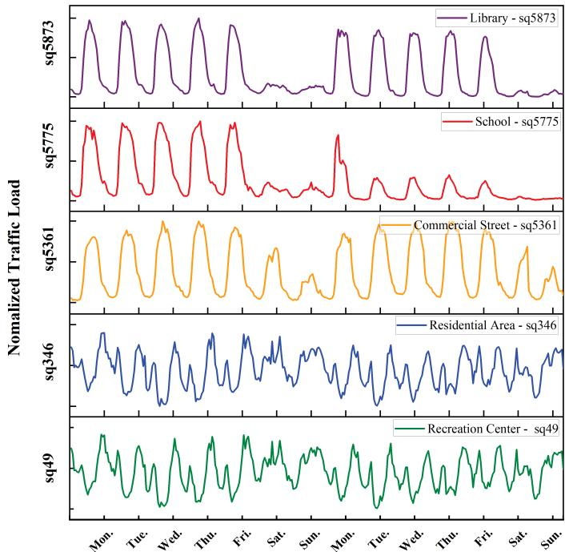  
Fig. 1: Normalized temporal traffic patterns of different cells in a mobile cellular network.

## III. CHARACTERIZATION OF CELLULAR TRAFFIC DATA

In this section, we utilize a dataset of real-world mobile network traffic records. Initially, the data is characterized using FFT in Section III-A, followed by an analysis of the characteristics of different data types in Section III-B. The list of symbols and their corresponding definitions are provided in Table II. These notations will be used throughout the paper to define the mathematical models and algorithm parameters.

## A. Mobile Network Traffic Trace

The dataset comprises approximately of 3 million mobile traffic records collected in Milan in three months. Milan metropolitan area was divided into $\textit { P } ( P = 1 0 , 0 0 0 )$ grids, each measuring 235 m × 235 m. Each record contains a timestamp, grid ID, and mobile traffic load (data volume). For simplicity, each grid is referred to as a cell, as its size is similar to the coverage area of an urban base station.

For simplicity, we denote the set of cells as $\begin{array} { r l } { \mathcal { P } } & { { } \triangleq } \end{array}$ $\{ 1 , 2 , \ldots , P \}$ , and divide the time period $\mathcal { T } \triangleq \{ 1 , 2 , \dots , T \}$ into $T$ consecutive time slots with duration $\Delta t = 1$ hour. The total traffic load of the $p \mathrm { - }$ th cell $l _ { p } ^ { \prime } [ t ]$ at time slot t is as follows:

$$
l _ { p } ^ { \prime } [ t ] = \sum _ { r = 1 } ^ { \mathrm { R } } \int _ { ( t - 1 ) \cdot \Delta t } ^ { t \cdot \Delta t } \mathrm { v o l } _ { r , p } ( \tau ) d \tau , \forall t \in \mathcal { T } , p \in \mathcal { P } ,\tag{1}
$$

where $r \in \{ 1 , 2 , \ldots , R \}$ is the index of traffic record of cell $p$ and $\operatorname { v o l } _ { r , p } ( \tau )$ represents the traffic data volume of record r at time $\tau$ of cell $p .$ And we denote the time series of cell $p \mathrm { ^ { \circ } s }$ traffic load as $\mathbf { l } _ { p } ^ { \prime } = [ l _ { p } ^ { \prime } [ 1 ] , l _ { p } ^ { \prime } [ 2 ] , \ldots , l _ { p } ^ { \prime } [ T ] ]$

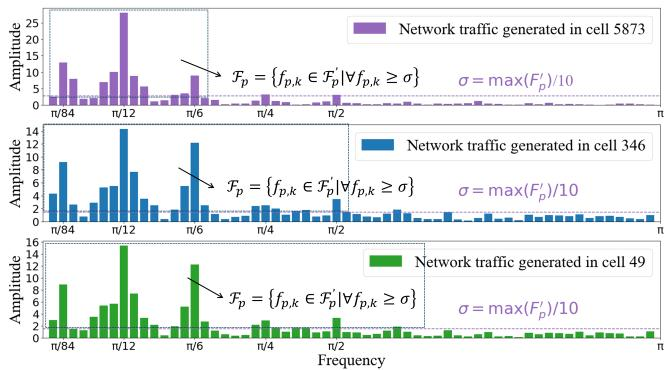  
Fig. 2: FFT results and threshold $\sigma$ of normalized traffic load vectors for cells 49, 346, and 5873.

To expedite the training process of the deep learning-based prediction model, each element of the above vector $l _ { p } ^ { \prime } [ t ]$ will be normalized into the range of [0, 1] using the min-max normalization method:

$$
l _ { p } [ t ] = \frac { l _ { p } ^ { \prime } [ t ] - \operatorname* { m i n } ( \mathbf { l } _ { p } ^ { \prime } ) } { \operatorname* { m a x } ( \mathbf { l } _ { p } ^ { \prime } ) - \operatorname* { m i n } ( \mathbf { l } _ { p } ^ { \prime } ) } .\tag{2}
$$

Accordingly, we denote the normalized vector of traffic load as $\mathbf { l } _ { p } = [ l _ { p } [ 1 ] , l _ { p } [ 2 ] , \dots , l _ { p } [ T ] ]$

## B. Characteristics of Cell-Level Traffic

The normalized temporal traffic loads of cells from five different areas are shown in Fig. 1. We can observe that despite differences among the data, there is a weekly periodicity in the temporal distribution of the data, which is consistently evident across other datasets in the collection. Thus, the weekly periodic signal for the p-th cell’s traffic load vectors can be obtained as follows:

$$
\begin{array}{c} \begin{array} { r } { \hat { l } _ { p } \left[ t \right] = \left\{ { l } _ { p } [ t ] , \begin{array} { r } { 1 \leq t < N , } \\ { { l } _ { p } [ t \mathrm { m o d } \left( N \right) ] , \quad t < 1 \mathrm { o r } t \geq N , } \end{array} \right.} \end{array}   \end{array}\tag{3}
$$

where N=168 denotes the total number of hours in a week.

To evaluate the frequency domain characteristic of different cells, we perform FFT of $\hat { l } _ { p } \left[ t \right]$

$$
F _ { p } \left( k \cdot \frac { 2 \pi } { T } \right) = \sum _ { t = 0 } ^ { T - 1 } \hat { l } _ { p } \left[ t \right] \left( W _ { T } \right) ^ { k \cdot t } , k \in \left\{ 0 , 1 , . . . , N - 1 \right\} ,\tag{4}
$$

where $W _ { T }$ denotes $\mathrm { e } ^ { - j { \frac { 2 \pi } { T } } }$ with $j$ being the imaginary unit. Each frequency component in (4) is measured in angular frequency (radians/s). The FFT results for the p-th cell are denoted as $\begin{array} { r } { \mathcal { F } _ { p } ^ { \prime } \triangleq \{ \mathcal { F } _ { p } \left( k \cdot \frac { 2 \pi } { T } \right) | k \in \{ 0 , 1 , . . . , N - 1 \} \} } \end{array}$

To better understand how traffic characteristics manifest in the frequency domain, we visualize the FFT amplitude spectra for several representative cells. The corresponding results are presented in Fig. 2, from which we derive the following observations.

Observation 1: $B y$ comparing Fig. 1 and Fig. 2, we can see that although these cells have similar amplitude in certain frequencies, different traffic load vectors $1 _ { p }$ yield different FFT results. Cells with similar temporal traffic patterns $( e . g .$ , cell 49 and cell 346) have similar FFT transformation results, whereas cells with different temporal traffic patterns (e.g., cell 346 and cell 5873) exhibit significant differences in amplitude intensity at different frequencies.

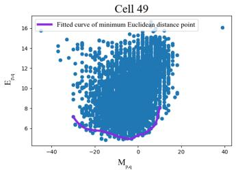

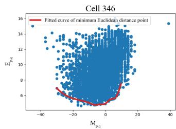

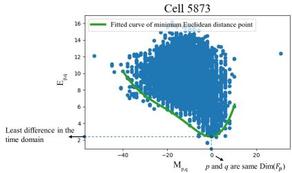  
Fig. 3: Relationship between the difference in dimensions of the main frequency components $M _ { p , q }$ and the Euclidean distance of traffic load vectors $E _ { p , q }$

While Observation 1 provides insight into the variability of frequency responses among different cells, it is still necessary to further quantify the significance and distribution of these dominant components. To this end, we introduce a formal definition of main frequency components and examine their relevance in identifying traffic similarity between cells.

Observation 2: According to Observation 1, we can analyze that different temporal traffic load vectors $1 _ { p }$ have distinct frequency components in terms of amplitude. We define the threshold of the main frequency as σ $\triangleq$ max $( \mathcal { F } _ { p } ^ { \prime } ) / 1 0$ . From Fig. 2, it is evident that cells with similar traffic patterns have a similar or identical number of the main frequency components (σ), whereas cells with significantly different traffic patterns have a considerable difference in the number of the main frequency components. And we denote the main frequency components as $\mathcal { F } _ { p } \triangleq \{ f _ { p , k } \in \mathcal { F } _ { p } ^ { \prime } \mid \forall f _ { p , k } \geq$ max $( \mathcal { F } _ { p } ^ { \prime } ) / 1 0 \}$ and we define the dimension of ${ \mathcal { F } } _ { p }$ as Dim $( \mathcal { F } _ { p } )$ . Larger Dim $( \mathcal { F } _ { p } )$ means more complex traffic signal.

In the Observations 1 and 2, we proposed that cellular traffic can be analyzed from both frequency and time domains. Similarly, the difference between the traffic of two cells can also be examined using both time and frequency domain perspectives. Specifically, for the difference in the frequency domain, we employ the following formula:

$$
M _ { p , q } = \operatorname { D i m } ( { \mathcal F } _ { p } ) - \operatorname { D i m } ( { \mathcal F } _ { q } ) .\tag{5}
$$

Accordingly, a larger $M _ { p , q }$ value represents greater differences between the data in the frequency domain. And the

difference in the time domain are defined as:

$$
E _ { p , q } = { \sqrt { ( l _ { p } [ 1 ] - l _ { q } [ 1 ] ) ^ { 2 } + \cdots + ( l _ { p } [ T ] - l _ { q } [ T ] ) ^ { 2 } } } .\tag{6}
$$

Specifically, a smaller $E _ { p , q }$ value indicates that the data from the two cells are more similar and their feature spaces are closer. Conversely, a larger $E _ { p , q }$ value suggests that the two cells differ significantly.

To validate whether ${ \mathcal { F } } _ { p }$ adequately characterizes differences between cells, we randomly sample a reference cell from the full dataset of 10,000 cells and compute its ${ \mathcal { F } } _ { p } .$ In Fig. 3, we depict the relationship between above two metrics computed through ${ \mathcal { F } } _ { p } \colon$ the Euclidean distance $E _ { p , q }$ and the dimensional difference $M _ { p , q }$

Observation 3: From Fig. 3, we can observe the Euclidean distance $E _ { p , q }$ and the difference in dimensions $M _ { p , q }$ of ${ \mathcal { F } } _ { p }$ for each pair, along with the fitting curve for the minimum Euclidean distance corresponding to each dimension difference. When $M _ { p , q }$ becomes large, their $E _ { p , q }$ increases. Conversely, when $M _ { p , q }$ becomes small, their $E _ { p , q }$ decreases. This trend is clearly depicted in the fitting curve, which resembles a quadratic function. The value of $E _ { p , q }$ (the quadratic function) is minimized when the horizontal axis is zero (indicating identical dimensions within the pair).

Observation 3 indicates that the more similar two signals are, the closer their Euclidean distance $E _ { p , q }$ will be, and the smaller the difference in their frequency component dimensions $| M _ { p , q } |$ will be. However, when $| M _ { p , q } |$ is small, their Euclidean distance $E _ { p , q }$ is not necessarily small. This indicates that $M _ { p , q }$ is a necessary but not sufficient condition for $E _ { p , q } .$ To interpret this more rigorously, we further examine whether differences in frequency domain structure can serve as a reliable indicator for selecting optimal network models.

## IV. IMPACT OF DATA CHARACTERIZATION ON THE STRUCTURE OF DEEP NEURAL NETWORK AND PREDICTION PERFORMANCE

In this section, we study the impact of DNN network structure on the performance of cellular traffic prediction and provide evidence from both statistical and theoretical perspectives, demonstrating that different cellular traffic data feature spaces necessitate corresponding adjustments in the structure of the DNN.

## A. DNN Structure Model

This paper denotes the neural network structures as $\Lambda _ { p } \triangleq$ $[ \lambda _ { 1 } , \lambda _ { 2 } , \ldots , \lambda _ { \theta } ]$ , where θ represents the index for a layer in the DNN and $\lambda _ { \theta }$ represents the number of neurons in θth layer. The optimal network structure of p-th cell is set as $\pmb { \Lambda } _ { p } ^ { \mathrm { o p } }$ . We hypothesize that as different cellular traffic data have different feature spaces Dim $( \mathcal { F } _ { p } )$ , it requires the structure of the DNN $( \pmb { \Lambda } _ { p } )$ to be adjusted accordingly. Next, the hypothesis will be validated through both statistical and theoretical analysis.

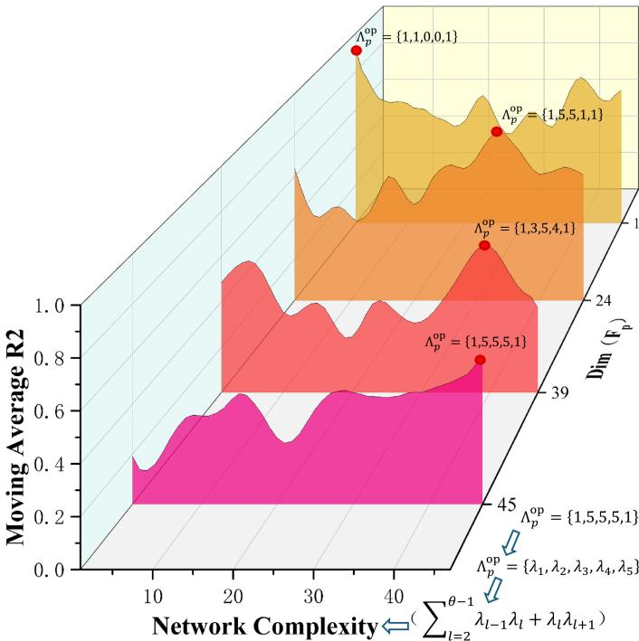  
Fig. 4: The relationships among DNN complexity, feature dimensions and moving average R2 coefficients.

## B. Statistical Analysis of the Impact of Data Characterization on DNN Structure

To validate the above hypothesis, we first analyze it from a statistical perspective. Here, we examine the network prediction performance of data with different FFT dimensions $\operatorname { D i m } ( \mathcal { F } _ { p } )$ under various complexities of DNN structures $\Lambda _ { p } ,$ where the complexities of DNN structures can be defined as $\begin{array} { r } { \sum _ { l = 2 } ^ { \theta - 1 } ( \lambda _ { l - 1 } \dot { \lambda _ { l } } + \lambda _ { l } \lambda _ { l + 1 } ) } \end{array}$ . We provide empirical evidences to support two key points: 1) Dim $( \mathcal { F } _ { p } )$ requires the optimal neural network structure $\pmb { \Lambda } _ { p } ^ { \mathrm { o p } }$ to be adjusted accordingly; 2) As ${ \mathcal { F } } _ { p }$ changes, $\pmb { \Lambda } _ { p } ^ { \mathrm { o p } }$ follows a corresponding pattern.

We select four cells (cell 49, cell 346, cell 5361, and cell 5775) with different $\operatorname { D i m } ( \mathcal { F } _ { p } )$ , and analyze their moving average R-square performance (R2), which can indicate how well the model predicts in cases where the data is difficult to forecast, using 48 kinds of network structures with progressively larger network complexity. Their relationships are shown in Fig. 4.

From the observation of $\mathrm { D i m } ( \mathcal { F } _ { p } ) = 4 5$ , we find that the moving average R2 tends to increase with the complexity of the network and the highest moving average R2 can be obtained at the maximum network complexity $\pmb { \Lambda } _ { p } ^ { \mathrm { o p } } = ( 1 , 5 , 5 , 5 , 1 )$ The network structure corresponding to the highest moving average R2 is identified as the optimal network structure $\pmb { \Lambda } _ { p } ^ { \mathrm { o p } }$ By examining each data point on $\operatorname { D i m } ( \mathcal { F } _ { p } )$ , it can be noticed that when $\operatorname { D i m } ( \mathcal { F } _ { p } )$ is low, the corresponding $\pmb { \Lambda } _ { p } ^ { \mathrm { o p } }$ has a lower network complexity. Conversely, as Dim $( \mathcal { F } _ { p } )$ increases, the complexity of the corresponding $\pmb { \Lambda } _ { p } ^ { \mathrm { o p } }$ also gradually increases. This analysis confirms that there is a discernible relationship between the frequency component ${ \mathcal { F } } _ { p }$ and the optimal network structure $\pmb { \Lambda } _ { p } ^ { \mathrm { o p } }$

C. Theoretical Analysis of the Impact of Data Characterization on DNN Structure

To theoretically validate the above phenomenon that different cellular traffic data have different feature spaces ${ \mathcal { F } } _ { p } ,$ it requires the structure of the DNN $\Lambda _ { p }$ to be adjusted accordingly, we introduce the Information Bottleneck (IB) [36] principle as follows:

Lemma 1: For the inputs X and outputs Y of a neural network, each specific input x and output y have corresponding probabilities p(x) and $p ( y )$ , respectively. The degree of dependence between X and Y can be measured using mutual information. The definition of mutual information is as follows:

$$
I ( X ; Y ) = H ( Y ) { \mathrm { - } } H ( Y | X ) = \sum _ { x \in X } \sum _ { y \in Y } p ( x , y ) \log { \frac { p ( x , y ) } { p ( x ) p ( y ) } } ,\tag{7}
$$

where $H ( X )$ is the entropy of X, and $H ( X | Y )$ is the conditional entropy of X given Y and $p ( x , y )$ is joint probability distribution of x and y.

Mutual information has the following properties, i.e., nonnegativeness $( I ( X ; Y ) \ge 0 ) ,$ , symmetry $( I ( X ; Y ) = I ( Y ; X ) ) ,$ and independence measurement $( I ( X ; Y ) = 0 \iff X \bot Y )$ Proof. See Section 2 in [36].

Proposition 1: Consider any supervised learning task as a stochastic mapping from an input variable X to an output variable Y . In this context, a deep neural network can be viewed as an encoder-decoder framework, where the encoder compresses X into an intermediate representation D, and the decoder attempts to reconstruct Y from $D , i . e . , X  D  Y .$

The Information Bottleneck (IB) method provides a principled approach for determining the optimal intermediate representation D by formulating the following constrained optimization problem:

$$
\operatorname* { m i n } _ { p ( d | x ) } I ( X ; D ) - \beta I ( D ; Y ) ,\tag{8}
$$

where $I ( X ; D )$ is the mutual information between the input X and the representation D (representing compression), $I ( D ; Y )$ is the mutual information between the representation D and the output Y (representing prediction), and $\beta > 0$ is a Lagrange multiplier balancing the trade-off between compression and relevance.

This optimization objective stems from the goal of extracting a compressed representation D of the input that preserves only the information relevant for predicting Y . Under the Markov chain assumption $X  D  Y$ , the loss function in (8) becomes:

$$
\mathcal { L } ^ { \mathrm { I B } } = \mathbb { E } _ { p ( x ) } \left[ D _ { \mathrm { K L } } ( p ( d | x ) | | p ( d ) ) \right] - \beta \mathbb { E } _ { p ( d , y ) } \left[ \log p ( y | d ) \right]\tag{9}
$$

where the first term measures the complexity (compression cost) via KL divergence, and the second term reflects predictive performance, see proof in [36].

Importantly, when the architecture of the DNN, denoted as $\Lambda _ { p } ,$ changes (e.g., through modifications in depth, width, or layer types), the parameterizations of the conditional distributions $p ( d | x ) , ~ p ( y | d )$ , and the marginal p(d) are altered. Consequently, these architectural variations lead to different trade-offs between compression and prediction, thereby affecting both $I ( X ; D )$ and $I ( D ; Y )$ according to (6), and hence the optimization landscape of $\dot { \mathcal { L } } ^ { \mathrm { I B } }$ according to (8). Proof: See Appendix A.

Proposition 1 implies that selecting an appropriate network structure $\Lambda _ { p }$ is equivalent to finding a representation D that minimizes the IB loss. Different structures correspond to different parameterizations of $p ( d | x )$ and $p ( y | d )$ , and thus yield different mutual information values. As a result, network architecture must be carefully adapted to the feature characteristics of the data to achieve optimal predictive performance.

While Proposition 1 shows that the neural network structure implicitly determines the information flow via mutual information terms, this theoretical foundation alone is insufficient. To further support the claim that traffic data with similar feature distributions should share similar optimal architectures, we extend the analysis to show how the optimization behavior changes with respect to the joint distribution $p ( x , y )$

Lemma 2: For a neural network used in time series prediction, the input data X corresponds to an ordered sequence of historical time points, and the output data Y corresponds to the subsequent future sequence. To capture the periodic characteristics inherent in such sequences, we transform the temporal data into the frequency domain and define the marginal probability $p ( x )$ based on the normalized amplitude spectrum obtained via FFT:

$$
p ( x ) = \frac { f _ { p , x } } { \sum _ { k = 1 } ^ { N - 1 } f _ { p , k } } ,\tag{10}
$$

where $f _ { p , k }$ denotes the amplitude of the FFT at frequency $k \cdot { \frac { 2 \pi } { T } }$ for cell p. This representation transforms the continuous time series into a probability distribution over frequency components, enabling frequency-domain feature analysis.

Similarly, we define the marginal probability p(y) over the output space and compute the joint distribution $p ( x , y )$ accordingly.

Lemma 2 indicates that if two cells share similar FFT amplitude spectra $\mathcal { F } _ { p } ^ { \prime } ,$ then their corresponding marginal and joint distributions $\mathring { p ( x ) } , p ( y ) , p ( x , y )$ will also exhibit high similarity in distributional geometry.

Proposition 2: Let the input time series of cell p be denoted as $X = \{ I _ { p } [ t - L + 1 ] , \ldots , I _ { p } [ t ] \}$ , and the output series as $Y = \{ I _ { p } [ \overset { \_ } { t } + 1 ] , \overset { } { \_ } . . . , I _ { p } [ t + \overset { \_ } { W } ] \}$ . Consider a deep neural network parameterized by structure Λ, where the internal representation D forms a Markov chain $X  D  Y$

According to the optimization formulation in Proposition 1, the optimal structure $\pmb { \Lambda } ^ { o p }$ minimizes the IB objective:

$$
\begin{array} { r } { \mathcal { L } ^ { I B } ( \Lambda ) = I ( X ; D ) - \beta I ( D ; Y ) . } \end{array}\tag{11}
$$

Now consider two cells i and j whose frequency-domain representations yield similar joint distributions $p _ { i } ( x , y ) ~ \approx$ $p _ { j } ( x , y )$ . Then, based on the continuity and differentiability assumptions of the IB landscape, the solutions $\pmb { \Lambda } _ { i } ^ { o p }$ and $\pmb { \Lambda } _ { j } ^ { o p }$ minimizing their respective IB objectives will also be similar:

$$
\| \mathbf { A } _ { i } ^ { o p } - \mathbf { A } _ { j } ^ { o p } \|  0 .
$$

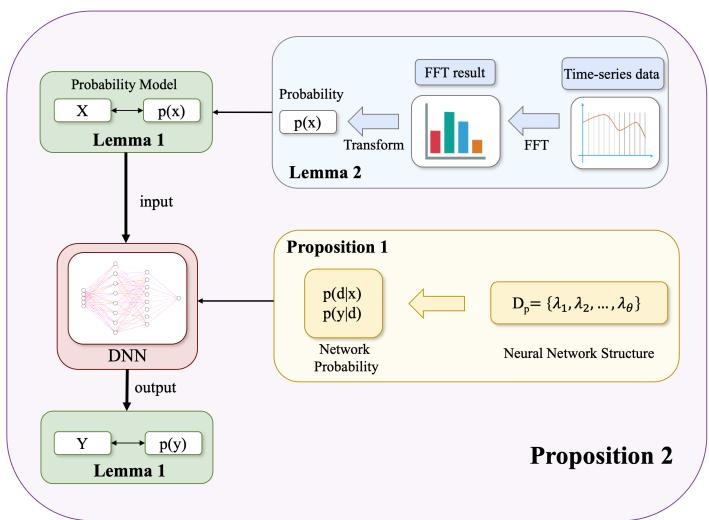  
Fig. 5: Outline for the proof of Proposition 2.

This observation indicates that structural adaptation of the neural network is not arbitrary, but systematically determined by the underlying data distribution. Therefore, for two cells with similar frequency-domain characteristics and Euclidean proximity (i.e., small $E _ { i , j } )$ , their corresponding optimal DNN structures should also be close.

## Proof: See Appendix B.

Proposition 2 extends Proposition 1 by linking distributional similarity (particularly in the frequency domain) to structural similarity of neural networks through the Information Bottleneck principle. The outline for the proof of Proposition 2 is shown in Fig. 5. While Proposition 1 formalizes the theoretical foundation that network structure determines the encoding-decoding trade-off, Proposition 2 provides a concrete implication: different traffic data distributions across cells necessitate correspondingly adapted DNN architectures to achieve optimal predictive performance.

In summary, the necessity for adjusting the network structure $\pmb { \Lambda } ^ { \mathrm { o p } }$ is mathematically grounded in the alignment of mutual information flows across cells with similar frequency characteristics. In the following section, we propose a reinforcement learning-based meta-learner that automatically learns this alignment by mapping traffic data $1 _ { p }$ to its optimal structure $\Lambda _ { p } ^ { \mathrm { o p } }$

Given that different cells require different optimal architectures, the key challenge lies in how to automatically discover and adapt such structures in practice. In the following section, we propose a reinforcement learning-based meta-learner that captures the mapping from cell-level data characteristics $1 _ { p }$ to optimal network structures $\pmb { \Lambda } _ { p } ^ { \mathrm { o p } }$ , enabling efficient structure adaptation across heterogeneous traffic patterns.

## V. PROPOSED RML-TP METHOD FOR CELLULAR TRAFFIC PREDICTION

In this section, we introduce meta-learning to address the intrinsic relationship between data $1 _ { p }$ and the optimal DNN structure $\pmb { \Lambda } _ { p } ^ { \mathrm { o p } }$ . To this end, we design the RML-TP framework

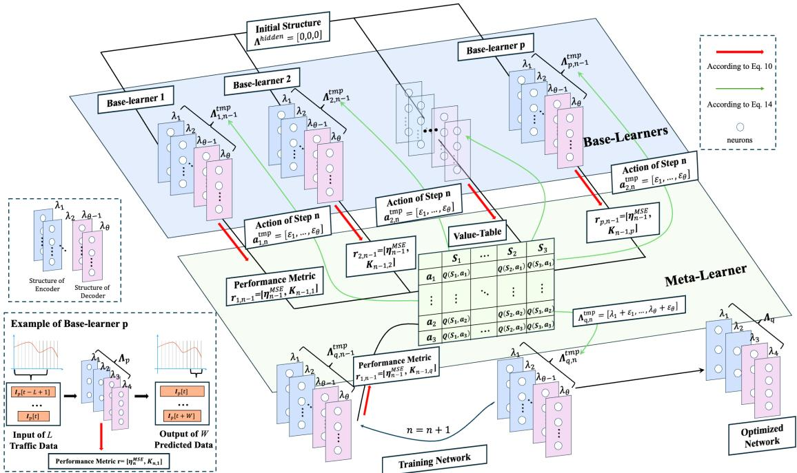  
Fig. 6: Architecture of the proposed RML-TP framework.

and employ a value-based RML algorithm to construct the meta-learner within this framework.

## A. Basics of Meta-learning

Meta-learning, also known as "learning to learn" [37], [38], involves training a learning model χ on a supervised learning task (base task) ξ using samples from the sample space of ξ. The goal is to identify a target function $G _ { \xi }$ . During model training, χ aims to find a hypothesis $\psi _ { \xi }$ that approximates $G _ { \xi }$ within the hypothesis space of $\chi$ based on the samples.

The learning model χ typically exhibits biases due to several factors, including the chosen learning algorithms (e.g., SVR, decision trees, or DNN), hyper-parameters (e.g., network structure or learning rate), and initial conditions (e.g., the initial weight of a DNN). These biases influence both $\chi \mathbf { \bar { s } }$ hypothesis space and the approach to χ, which employs to search within this space for $\psi _ { \xi }$

According to the above description, we assign tasks to the following two learning models:

1) We define the cell p traffic r prediction as base-task ξ, and the corresponding learning model is the base-learner, denoted as χ.

2) Adjusting the network structure of the learning model is considered as a meta-task, and the model that handles this meta-task is called the meta-learner.

## B. Overview of the RML-TP

In the proposed framework, we treat the task of the traffic prediction for next M time steps based on the traffic data from previous L time steps as the base-tasks. Note that this task can be performed using any DNN. Here, we use an LSTM network to complete the base-tasks. For all cells within the region, each has its corresponding base-tasks. Furthermore, the selection of the optimal network structure $\pmb { \Lambda } _ { p } ^ { \mathrm { o p } }$ is defined as a meta-task. For each cell’s prediction network, $\pmb { \Lambda } _ { p } ^ { \mathrm { o p } }$ needs to be adjusted accordingly.

As shown in Fig. 6, we use a base-learner based on an LSTM network to handle the base-tasks. The base-learner first receives an initial network structure and performs preliminary training on this structure with L previous time steps. After the preliminary training is completed, it returns the performance results of the trained network. These performance results, along with the network structure, form the training samples for the meta-learning process.

In the RML-TP, we use a value-based RML algorithm to complete meta-tasks. The meta-tasks involve determining the optimal network structure for each deep neural network that predicts cell traffic, i.e., the base-learner, to enhance prediction performance. The meta-learner first trains data from a single cell within the region, and once the model stabilizes at a satisfactory reward value, it outputs the corresponding optimal network structure $\pmb { \Lambda } _ { p } ^ { \mathrm { o p } }$ . After the meta-learner completes training on the data from one cell, the model will then train on the data from other cells.

When the meta-learner trains on other cells, the following two situations may occur:

1) If the Euclidean distance $E _ { p , q }$ between two cells is small, the reinforcement learning process can quickly achieve a high reward value and output the optimal network structure $\pmb { \Lambda } _ { p } ^ { \mathrm { o p } }$ with minimal training epochs.

2) If the Euclidean distance $E _ { p , q }$ between two cells is significantly large, more training steps are required to reach a high reward value.

After the meta-learner completes training on different types of cells classified by data features ${ \mathcal { F } } _ { p }$ within the region, only the first situation will occur when the meta-learner trains on data from other cells. This allows the meta-learner to quickly complete training on a new cell and output the optimal network structure.

## C. Meta-learner Using Value-based RML Algorithm

As shown in Section IV, the optimal network structure $\pmb { \Lambda } _ { p } ^ { \mathrm { o p } }$ for different data will also differ. The task of adjusting to the optimal network structure $\Lambda _ { p }$ is considered as a meta-task. However, due to the black-box nature of DNN, we cannot simply use derivations to determine the optimal network structure. Therefore, we propose a value-based RML algorithm for the aforementioned meta-task.

1) The Optimization Problem of Meta-learner: The goal of the meta-learner is to find the optimal network structure $\pmb { \Lambda } _ { p } ^ { \mathrm { o p } }$ for minimizing the sum of the base-learner’s Mean Square Error (MSE) within a short training time. We define this objective as Problem P1.

To optimize $K _ { n , p } ,$ which is the training time of the baselearner, and the MSE $\eta _ { n , p } ^ { \mathrm { M S E } }$ for the p-th cell, the problem is formulated as:

$$
\begin{array} { r l } & { \mathbf { P 1 } : \underset { \mathbf { A } _ { p } } { \operatorname* { m i n } } \frac { \sum _ { n = 1 } ^ { N } K _ { n , p } } { \sum _ { n = 1 } ^ { N } \left( 1 - \eta _ { n , p } ^ { \mathrm { M S E } } \right) } } \\ & { \quad \quad \mathbf { s . t . } ~ \mathbf { C } _ { 1 } : 0 \leq \mathrm { D i m } ( \boldsymbol { \Lambda } _ { p } ^ { \mathrm { h i d d e n } } ) \leq M , \quad \forall p \in \mathcal { P } , } \\ & { \quad \quad \mathbf { C } _ { 2 } : 0 \leq \boldsymbol { \lambda } \leq \boldsymbol { \lambda } ^ { \mathrm { m a x } } , \quad \forall p \in \mathcal { P } , } \end{array}\tag{12}
$$

where $\pmb { \Lambda } _ { p } \triangleq [ \lambda _ { 1 } , \lambda _ { 2 } , \ldots , \lambda _ { \theta } ]$ represents the coordinate neural network structure of the p-th cell, and $n$ and N represent the n-th step and the max step of agent in a training epoch, respectively. Constraint $\mathbf { C } _ { 1 }$ ensures that the number of hidden layers, denoted as $\mathrm { D i m } ( \pmb { \Lambda } _ { p } ^ { \mathrm { h i d d e n } } )$ , is constrained to be less than M. $\mathbf { C } _ { 2 }$ limits the number of neurons of the p-th cell λ in each hidden layer to be less than a constant, denoted as $\lambda ^ { \mathrm { m a x } }$

Problem P1 is an integer non-linear programming (INLP) problem. Although we have discovered that different cells correspond to different optimal network structures $\pmb { \Lambda } _ { p } ^ { \mathrm { o p } }$ , the specific model relationship remains unclear. That is, for a given cell, we do not yet know the precise $\pmb { \Lambda } _ { p } ^ { \mathrm { o p } }$ that should be selected. Therefore, solving this P1 problem is highly complex and practically infeasible. As a result, we employ reinforcement learning to solve it [39].

2) Training Process of Meta-learner (solution to P1): At the beginning of a training epoch, we first initialize the state, and then we directly select the best action for the current state from the value-table using an ϵ-greedy policy. Next, we require the agent to achieve the optimal network structure within a limited number of steps N and stabilize within a high reward range.

However, since the appropriate neural network structure may not approach the optimal structure in a linear and continuous manner, there may be many locally optimal solutions. To prevent the algorithm from consistently getting stuck in locally optimal solutions, we propose the value function to allow it to consider future Z steps. The proposed multi-step value function is defined as follows:

$$
\begin{array} { r l r } & { } & { Q ( S _ { n } , A _ { n } ) = Q ( S _ { n } , A _ { n } ) + \alpha R _ { n + 1 } } \\ & { } & { \quad + \displaystyle \sum _ { k = n + 1 } ^ { Z } \gamma ^ { k } \operatorname* { m a x } _ { a } Q ( S _ { k } , A _ { k } ) , \forall p \in \mathcal { P } , } \end{array}\tag{13}
$$

where $Q ( S _ { n } , A _ { n } )$ corresponds to the value of the action taken at state at step n. The discount factor γ ranges from 0 to 1 and essentially acts as a decay value. If $\gamma$ is closer to 0, the agent predominantly focuses on immediate rewards. Conversely, if γ is closer to 1, the agent places more weight on delayed rewards, emphasizing long-term rewards. The reward $R _ { n + 1 }$ is the reward obtained at step $n + 1$ . The learning rate is denoted by α.

3) Elements of the value-based RML (solution to P1): The optimization problem P1 aims to find the optimal neural network structure $\pmb { \Lambda } _ { p } ^ { \mathrm { o p } }$ that minimizes the ratio of the total running time to the aggregated MSE performance, subject to constraints on the hidden layer dimensions and maximum parameter values. To effectively solve this challenging optimization problem, we employ a value-based reinforcement learning (RL) framework. In this framework, the meta-learner acts as an agent that iteratively interacts with the environment (the base-learner and its performance) to learn the optimal policy for adjusting network parameters. The core of this learning process lies in the carefully defined state $\mathbf { S } _ { p , n }$ , action ${ \bf a } _ { p , n } ,$ and reward $\mathbf { r } _ { p , n } ,$ , which directly maps to and drives the solution of P1. The agent’s goal is to maximize the cumulative reward, which is explicitly designed to lead to the minimization of P1’s objective function.

In this work, the definitions of state $\mathbf { S } _ { p , n } .$ , action ${ \bf a } _ { p , n } ,$ and reward ${ \bf r } _ { p , n }$ of the agent (another example can be found in [40]) in value-based RML are as follows:

• State: During the training process of Meta-learner, the base-learner is provided with various network structures to gradually approach the optimal neural network structure $\Lambda _ { p }$ for the current cell $p .$ The temporary network structures that appear during approximating the optimal structure $\Lambda _ { p , n } ^ { \mathrm { t m p } }$ are defined as states, i.e.,

$$
\mathbf { S } _ { p , n } = [ \mathbf { A } _ { p , n } ^ { \mathrm { t m p } } ] _ { p \in \mathcal { P } } .\tag{14}
$$

Each state $\mathbf { S } _ { p , n }$ represents a candidate network structure, specifically the variable $\Lambda _ { p }$ in P1, what the agent is trying to optimize. This state inherently captures the hidden layer dimensions Dim $( \pmb { \Lambda } _ { \mathrm { p } } ^ { \mathrm { h i d d e n } } )$ and network parameters $\lambda ,$ which are subject to constraints $\mathbf { C } _ { 1 } , \mathbf { C } _ { 2 }$ of P1.

• Action: The modification of the number of neurons within the neural network is defined as $\varepsilon \triangleq \{ - 1 , 0 , 1 \}$ , and the agent’s action is the sum of ε across all layers of the network:

$$
\mathbf { a } _ { p , n } = [ \varepsilon _ { 1 } , \varepsilon _ { 2 } , \ldots , \varepsilon _ { \theta } ] .\tag{15}
$$

An action ${ \bf a } _ { p , n }$ dictates how the current network structure (state $\mathbf { S } _ { p , n } )$ is modified to yield a new structure $\mathbf { S } _ { p , n + 1 }$ $( \mathbf { S } _ { p , n + 1 } = \mathbf { S } _ { p , n } + \mathbf { a } _ { p , n } ) .$ . These actions directly influence the dimensions of the hidden layers and the overall network complexity.

Algorithm 1 The Value-Based RML Algorithm   
1: Initialize: $Q ( \mathbf { S } _ { p , n } , \mathbf { a } _ { p , n } )$ arbitrarily for all state-action   
pairs to construct Q-table   
2: for $p$ in cells of different types do   
3: for each episode do   
4: Initialize: $\mathbf { S } _ { p , 1 } $ initial state   
5: Choose $\mathbf { a } _ { p , 1 }$ from Q-table using ϵ-greedy policy   
derived from Q-table   
6: while $n \leq N$ do   
7: Take action ${ \bf a } _ { p , n } ,$ observe reward ${ \bf r } _ { p , n }$ by   
giving the next state $\mathbf { S } _ { p , n + 1 }$ to base-learner   
8: Choose $\mathbf { a } _ { p , n + 1 }$ from $\mathbf { S } _ { p , n + 1 }$ using ϵ-greedy   
derived from Q-table   
9: Update Q-table by multi-step Q-value   
function $Q ( \mathbf { S } _ { p , n } , \mathbf { a } _ { p , n } )  Q ( \mathbf { S } _ { p , n } , \mathbf { a } _ { p , n } ) + \alpha R _ { n + 1 } +$   
$\scriptstyle \sum _ { k = n + 1 } ^ { Z } \gamma ^ { k }$ max $Q ( \mathbf { S } _ { p , k } , \mathbf { a } _ { p , k } )$   
10: $\mathbf { S } _ { p , n } \gets \mathbf { \check { S } } _ { p , n + 1 }$   
11: $n \gets n + 1$   
12: end while   
13: end for   
14: end for

• Reward: According to the optimization problem P1, this paper takes a reward function based on the MSE (meansquare error) performance $\eta _ { n } ^ { \mathrm { M S E } }$ and running time of base-learner $K _ { n , p }$ as the instantaneous reward at each step:

$$
\mathbf { r } _ { p , n } = [ r \left( \eta _ { n } ^ { \mathrm { M S E } } , K _ { n , p } \right) ] .\tag{16}
$$

The reward function is critically designed to guide the reinforcement learning agent towards minimizing the objective function of P1. Specifically, a higher $\eta _ { n }$ (indicating better performance) and a lower $K _ { n , p }$ (indicating reduced running time) contribute positively to minimizing P1’s objective. Therefore, the reward function $r ( \cdot )$ is formulated such that maximizing this reward directly corresponds to reducing the value of P1’s objective function, thereby steering the meta-learner towards the optimal $\Lambda _ { p } .$

The pseudocode for our value-based RML algorithm, utilized by the meta-learner in the RML-TP framework, is detailed in Algorithm 1.

In each training step of the meta-learner, the state $\mathbf { S } _ { p , n }$ and action ${ \bf a } _ { p , n }$ are combined to form a new state $\mathbf { S } _ { p , n + 1 } , \mathrm { i . e . }$

$$
\mathbf { S } _ { p , n + 1 } = \mathbf { S } _ { p , n } + \mathbf { a } _ { p , n } = [ \lambda _ { 1 } + \varepsilon _ { 1 } , \ldots , \lambda _ { \theta } + \varepsilon _ { \theta } ] _ { 1 \times \theta } .\tag{17}
$$

After the environment evaluates the $\mathbf { S } _ { p , n + 1 }$ , a reward ${ \bf r } _ { p , n }$ will be obtained, which is used to update the value table, iteratively optimizing for P1.

Compared to other methods, the value-based RML method has two main advantages. On the one hand, the value-based RML directly updates the value table, providing clear theoretical convergence guarantees. This method allows us to observe the convergence strategy directly, ensuring that it converges to an observable optimal policy. On the other hand, the valuebased RML involves fewer parameters, which makes the valuebased RML more straightforward to optimize.

D. Complexity Analysis of RML-TP in Large-scale Cellular Networks Traffic Prediction

In RML-TP, we use the meta-learner to optimize the baselearner’s network structure $\mathbf { \Lambda } _ { \pmb { \Lambda } _ { p } } \triangleq [ \lambda _ { 1 } , \lambda _ { 2 } , \ldots , \lambda _ { \theta } ]$ , where λ is at the range $[ 0 , \lambda ^ { \mathrm { m a x } } ]$ . The computational complexity of the base-learner is of $\begin{array} { r } { O \left( \sum _ { l = 2 } ^ { \theta - 1 } ( \lambda _ { l - 1 } \lambda _ { l } + \lambda _ { l } \lambda _ { l + 1 } ) \right) } \end{array}$ . The size of state space of the meta-learner is defined as $\left( \lambda ^ { \operatorname* { m a x } } \right) ^ { \theta }$ and the size of its action space size is $3 ^ { \theta }$ . Thus, the computational complexity of the meta-learner is of $O \left( ( 3 \lambda ) ^ { \theta } N ) \right)$ . Combining the computational complexities of both, we can derive the overall training complexity of RML-TP as follows:

$$
O \left( ( 3 \lambda ) ^ { \theta } { \cal N } { \sum } _ { l = 2 } ^ { \theta - 1 } ( \lambda _ { l - 1 } \lambda _ { l } + \lambda _ { l } \lambda _ { l + 1 } ) \right) .\tag{18}
$$

Experiments show that once RML-TP converges on one cell, achieving convergence on other cells requires only a small amount of time. In practical deployments of the RML-TP algorithm, a converged value table is obtained during the metatraining stage. Consequently, the final DNN structure for each cell is determined through a process of value table transfer followed by fine-tuning. Compared to using a fixed-structure DNN or a grid search-based DNN, the proposed approach can be analyzed from two key perspectives: cumulative performance improvement and training complexity reduction.

Assume that the prediction loss of a fixed-structure DNN across different cells is denoted by $g ^ { \mathrm { f i x } }$ , while the prediction loss of the DNN with the optimal structure tailored to each cell is $g ^ { \mathrm { o p t } }$ . In large-scale cellular network scenarios, the cumulative performance gain achieved by RML-TP can then be quantified as:

$$
G = \sum _ { i = 0 } ^ { N } ( g ^ { \mathrm { f i x } } - g ^ { \mathrm { o p t } } ) .\tag{19}
$$

RML-TP enables adaptive structure selection for each base station, resulting in significantly lower prediction loss $g ^ { \mathrm { o p t } }$ compared to the fixed-structure counterpart $g ^ { \mathrm { f i x } }$ . As the number of cells increases, the cumulative performance advantage scales linearly and becomes increasingly pronounced. This effect is particularly critical in large-scale real-world deployments. These findings indicate that conventional fixed-layer DNN are inadequate for accurate traffic prediction in extensive cellular network environments.

In terms of training complexity, the conventional grid search algorithms traverse the architecture space for each base station. So the search process becomes computationally intensive. If we assume maximum number of candidate neurons is $\lambda ^ { \mathrm { m a x } }$ the number of structural configurations is typically $\frac { 1 } { 2 } \big ( \lambda ^ { \operatorname* { m a x } } \big ) ^ { \theta }$ Therefore, for grid search-based methods, the overall complexity of training can be expressed as:

$$
\frac { 1 } { 2 } ( \lambda ^ { \mathrm { { m a x } } } ) ^ { \theta } { \cal N } \sum _ { l = 2 } ^ { \theta - 1 } ( \lambda _ { l - 1 } \lambda _ { l } + \lambda _ { l } \lambda _ { l + 1 } ) .\tag{20}
$$

In contrast, for the RML-TP algorithm, structure exploration and convergence are required only in a small subset of representative regions—denoted as $N _ { 0 }$ steps, where $N _ { 0 } \ll N$ . After convergence, only a minimal number of structure adaptation steps are needed for fine-tuning as $K _ { 0 }$ steps. As a result, the overall training complexity of RML-TP can be expressed as:

TABLE III: Experimental parameter settings
<table><tr><td>Parameter</td><td>Description / Value</td></tr><tr><td>Number of layers, θ</td><td>5</td></tr><tr><td>Max neurons per layer,  $\lambda ^ { m a x }$ </td><td>8</td></tr><tr><td>Meta-learner learning rate, α</td><td>0.01</td></tr><tr><td>Discount factor, γ</td><td>0.8</td></tr><tr><td>Training steps per episode, N</td><td>30</td></tr><tr><td>Number of episodes</td><td>50</td></tr><tr><td>Base-learner algorithm</td><td>LSTM / GRU / Transformer</td></tr><tr><td>Input sequence length, L</td><td>840</td></tr><tr><td>Prediction horizon, M</td><td>168</td></tr><tr><td>Batch size</td><td>128</td></tr><tr><td>Optimizer</td><td>Adam</td></tr></table>

$$
( 3 \lambda ) ^ { \theta } \left[ N _ { 0 } \sum _ { l = 2 } ^ { \theta - 1 } ( \lambda _ { l - 1 } \lambda _ { l } + \lambda _ { l } \lambda _ { l + 1 } ) \right] +\tag{21}
$$

$$
K _ { 0 } ( N - N _ { 0 } ) \sum _ { l = 2 } ^ { \theta - 1 } ( \lambda _ { l - 1 } \lambda _ { l } + \lambda _ { l } \lambda _ { l + 1 } ) .
$$

Although RML-TP requires initial structure exploration and meta-training, the total complexity is significantly reduced due to transferability. Once a good structure representation is obtained, the convergence on unseen cells can be achieved with minimal cost. Therefore, RML-TP achieves substantial computational savings in large-scale cellular prediction scenarios while maintaining high prediction performance. This makes the proposed method highly practical for real-world deployment with constrained training budgets and real-time requirements.

## E. Re-training Efforts of Meta-Learner for a New Base-Task

Once the meta-learner has been trained on several cells, it can be applied to any base-task within the region. This is because the trained meta-learner has already learned the intrinsic relationship between the feature space $\mathcal { F } _ { p }$ and the network structure $\Lambda _ { p } .$ . As a result, for a new cell, the metalearner can converge rapidly in just a few steps to determine the optimal network structure $\pmb { \Lambda } _ { p } ^ { \mathrm { o p } }$

## VI. EVALUATION ON REAL-WORLD MOBILE NETWORK TRAFFIC

In this section, we perform experiments under the "Big Data Challenge" program to assess the RML-TP framework. Specifically, we address the following questions:

Q1. How does the value-based RML in the meta-learner converge? How do the settings of various parameters in metalearner, such as learning rate, affect the prediction results?

Q2. Can the RML-TP outperform traditional fixed-layer or random-layer approaches in data prediction?

Q3. When encountering a cell that has not been previously trained, can RML-TP maintain stable performance? Additionally, will the convergence time be excessively long when training a new cell?

Q4. The proposed RML-TP framework’s performance in real-world optimization problems is a key area of evaluation. Can RML-TP improve the optimization of actual problems?

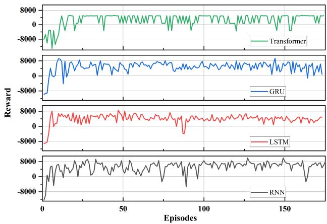  
Fig. 7: The reward curve of value-based RML with different base-learner.

## A. Experimental Configuration and Performance Metrics

In this work, we use a meta-learner to adjust the neural network structure of the base-learner. We primarily investigate how the proposed meta-learner improves the performance of the base-learner. We set the number of layers θ to 5 and the maximum number of neurons per layer $\lambda ^ { \mathrm { m a x } }$ to 8, with the element of action $\epsilon \in \{ - 1 , 0 , 1 \}$ . To evaluate the robustness of RML-TP framework, we compare the performance of baselearners based on different algorithms (e.g., GRU, RNN, LSTM, and Transformer) under the RML-TP. We use two performance metrics to analyze the prediction performance: MSE and R2. MSE reflects the closeness of the predicted values to the real values, while R2 indicates how well the model predicts in cases where the data is difficult to forecast.

The detailed parameter settings used in our experiments are summarized in Table III. We further describe the training procedures of baseline models as follows.

To ensure a fair comparison, we implement two baseline strategies for neural network structure selection: randomlayer baseline and fixed-layer baseline.

• Random-layer baseline: For each base station, we randomly generate 5 candidate DNN structures with varying numbers of layers and neurons. The structure that achieves the best prediction performance (based on MSE) on that specific cell is selected.

• Fixed-layer baseline: We adopt commonly used static structures such as (5, 5, 1) and (3, 3, 3, 3, 1), and apply them uniformly across all base stations without adjustment.

## B. The Answer to $\varrho I \colon$ Convergence and Settings of Metalearner

To validate the effectiveness of the value-based RML algorithm, we present the convergence plot of the reward in Fig. 7. Additionally, we examine the convergence curves of the valuebased RML algorithm when applied to different base-learner algorithms. The results demonstrate that our meta-learner achieves stable convergence across various deep learning algorithms, including LSTM, RNN, GRU, and Transformer.

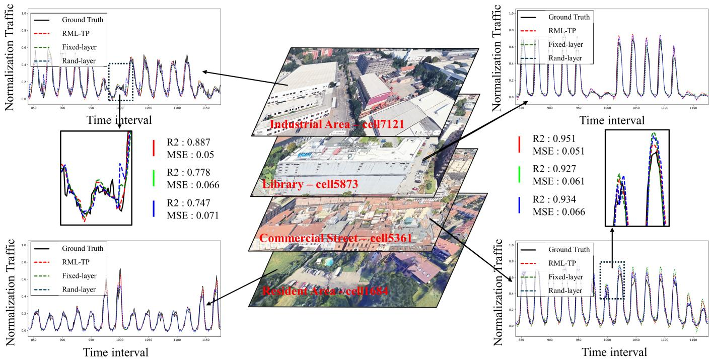  
Fig. 8: Predicted mobile traffic load comparisons between the RML-TP, Fixed-layer, and Rand-layer methods.

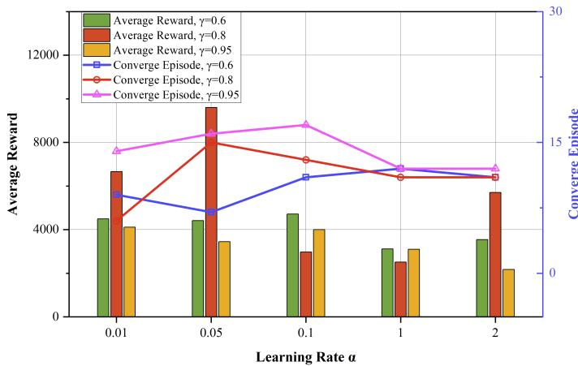  
Fig. 9: Average reward and coverage episode in different settings.

This indicates that the proposed RML-TP can serve as an optimization framework applicable to a wide range of existing DNN algorithms.

From Fig. 7, we can observe that our value-based RML algorithm converges across various existing algorithms. Additionally, we can deduce that the DNNs exhibit relatively stable convergence performance when they adopt the network structures $\Lambda _ { p }$ output by value-based RML. If the corresponding DNN network does not converge, its long-term MSE would be unstable. Consequently, if the value-based RML frequently selects a DNN network structure with unstable convergence, its reward curve would exhibit significant fluctuations. However, as shown in Fig. 7, the long-term rewards of the value-based RML are quite stable, which is particularly evident in the case of LSTM networks.

As shown in (13) in Section V, the Q-value function incorporates the following hyperparameters: discount factor γ and learning rate α. According to the [41], it can be calculated that when $\gamma = 0 . 6 ,$ , DRL considers data for the next 4 steps and when $\gamma = 0 . 9 5 , \mathrm { D R I }$ considers data for the next 45 steps. To explore the effects of various hyperparameter combinations on the algorithm’s performance, Fig. 9 illustrates the average reward and coverage episodes under various combinations of γ and α. From Fig. 9, we can draw the following conclusions: 1) If we aim to maximize the average reward without concern for training time, the combination $\alpha ~ = ~ 0 . 0 5 , \gamma ~ = ~ 0 . 8$ should be chosen. 2) If we aim for the shortest training time but a relatively lower average reward, the combination $\alpha = 1 , \gamma = 0 . 6$ should be chosen. 3) Finally, if we seek a balance between overall performance and training time, the combination $\alpha = 0 . 0 1 , \gamma = 0 . 8$ remains the best choice.

## C. The Answer to Q2: Prediction Accuracy of the RML-TP and the Baseline Methods

To evaluate the effectiveness of the proposed RML-TP method, we compare its performance with other network structure design methods, specifically, the Fixed-layer (fixed network structure) and the Rand-layer (random network structure) methods. In Rand-layer, multiple network structures are randomly selected for each cell’s DNN, and the bestperforming structure is chosen as the final network structure.

In Fig. 8, we compare the prediction performance of RML-TP, Fixed-layer, and Rand-layer under four distinct traffic scenarios: Industrial Area, Library, Commercial Street, and Residential Area. These scenarios are selected based on the analysis of main frequency components ${ \mathcal { F } } _ { p } ,$ representing typical categories with diverse patterns of temporal traffic load.

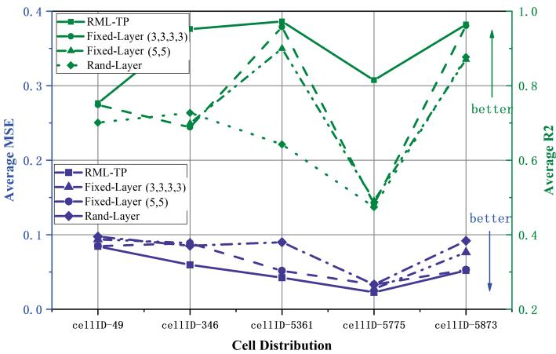  
Fig. 10: Performance metric under different cells and structure models.

The ground truth curves in each subfigure clearly exhibit traffic patterns of different regions. For example, the Industrial Area shows consistently low traffic volume, with a notable drop on weekends. The Library scenario demonstrates the largest weekday-to-weekend fluctuation, as expected from academic activity schedules. The Commercial Street exhibits high traffic during weekends, reflecting consumer behavior. In contrast, the Residential Area displays an inverse trend: lower traffic on weekdays and significantly higher usage during weekends, with pronounced peaks in early mornings and late evenings.

These distinct traffic dynamics highlight the challenge of accurately modeling diverse temporal distributions. As shown in Fig. 8, the proposed RML-TP method (red) consistently provides a closer fit to the actual traffic load curve across all regions. This indicates that RML-TP effectively captures not only the day-level but also hour-level temporal variations in traffic. Notably, in the Residential Area scenario, RML-TP demonstrates strong capability in predicting sharp traffic surges during weekends, especially in early morning and evening periods. This superior performance is attributed to the ability of RML-TP to adapt its DNN structure $\Lambda _ { p }$ to the feature space $\mathcal { F } _ { p }$ of each cell, as discussed in Proposition 2.

Quantitatively, in the Industrial Area, the R2 of RML-TP exceeds that of the baselines by over 12%, and its MSE is more than 20% lower, confirming the advantages of structureaware meta-learning in heterogeneous traffic environments.

Fig. 10 provides a more intuitive and quantitative comparison of the model’s performance. Specifically, we compare the average Mean Squared Error (MSE) and the average coefficient of determination (R2) achieved by RML-TP, Fixedlayer, and Rand-layer across multiple regions with diverse traffic characteristics.

As shown in Fig. 10, RML-TP consistently outperforms the baselines in both performance metrics. The advantage is particularly pronounced in the average R2 scores, where RML-TP achieves significantly higher values in all cells evaluated, indicating a superior explanatory power. This aligns with our theoretical findings in Section IV, which show that matching the DNN structure $\Lambda _ { p }$ to the feature space $\mathcal { F } _ { p }$ is crucial for improving prediction generalization.

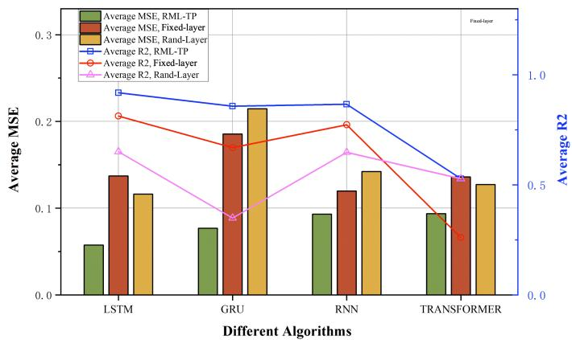  
Fig. 11: The generalization performance of RML-TP for different algorithms.

Moreover, Fig. 10 highlights that RML-TP not only improves the average-case performance but also elevates the performance ceiling of predictive models. This is particularly evident in complex regions like the Library and Residential Area, where traditional fixed architectures fail to adapt to the significant variability in temporal features. In these experiments, the Fixed-layer algorithm was evaluated with two different network configurations: (5, 5, 1) and (3, 3, 3, 3, 1). These network architectures represent an increased depth and complexity in the Fixed-layer model, aiming to better capture the temporal dynamics in diverse traffic patterns. However, despite these adjustments, the performance of the Fixed-layer model still lags behind RML-TP, as the adaptation capabilities of RML-TP provide both robustness and flexibility, demonstrating its effectiveness across heterogeneous realworld traffic patterns.

## D. The Answer to Q3: The Generalization Performance of RML-TP across Different Cells

In RML-TP, we use DRL as the meta-learner. The reason for this choice is that DRL, compared to traditional non-convex optimization algorithms such as genetic algorithms, has the advantage of fast inference after training. This means that when applying RML-TP to a new cell or a different baselearner, we do not need to retrain a new model, which is time-consuming. Instead, we can achieve results by using the trained DRL model and re-converging with fewer iterations. Therefore, in the following experiments, we present the training results of RML-TP on different base-learners and different cells, as shown in Fig. 11 and Fig. 12. Many performance metrics such as MAE and RMSE can represent the model’s performance. However, here we use average MSE and average R2 to indicate the generalization ability of RML-TP, as they are commonly used in prediction model assessments [42], [43] and provide a straightforward measure of the prediction error magnitude.

1) Generalization of RML-TP across LSTM, GRU, RNN, and transformer: In Fig. 11, we further evaluate the generalization performance of RML-TP by applying it across different DNN architectures, including LSTM, GRU, RNN, and Transformer. All models are tested on the same dataset and cells, ensuring a fair comparison of how the structural adaptability of RML-TP impacts performance under varying base-learners.

TABLE IV: Generalization performance comparison for unseen cells
<table><tr><td>Zone</td><td>Cell ID</td><td>Method</td><td>MSE↓</td><td>MAE↓</td><td> $R ^ { 2 } \uparrow$ </td></tr><tr><td rowspan="3">Commercial</td><td>2148</td><td>fix-layer RML-TP</td><td>0.0032 0.0014</td><td>0.0435 0.0282</td><td>0.9273 0.9694</td></tr><tr><td>9379</td><td>fix-layer</td><td>0.0044</td><td>0.0464</td><td>0.9179</td></tr><tr><td></td><td>RML-TP fix-layer</td><td>0.0025</td><td>0.0356</td><td>0.9564</td></tr><tr><td rowspan="2">Industrial</td><td>9658</td><td>RML-TP</td><td>0.0154 0.0044</td><td>0.0859 0.0487</td><td>0.5426 0.8856</td></tr><tr><td>9674</td><td>fix-layer RML-TP</td><td>0.0162 0.0061</td><td>0.1003 0.0583</td><td>0.6508 0.9062</td></tr><tr><td rowspan="6">Residential</td><td>2108</td><td>fix-layer</td><td>0.0259</td><td>0.1326</td><td>0.1403</td></tr><tr><td></td><td>RML-TP</td><td>0.0123</td><td>0.0836</td><td>0.6281</td></tr><tr><td>3200</td><td>fix-layer RML-TP</td><td>0.0690 0.0075</td><td>0.2183 0.0632</td><td>0.1041 0.8269</td></tr><tr><td>9815</td><td>fix-layer RML-TP</td><td>0.0106 0.0046</td><td>0.0735 0.0517</td><td>0.2588 0.7463</td></tr><tr><td></td><td>fix-layer</td><td>0.0065</td><td>0.0610</td><td>0.3325</td></tr><tr><td>9997</td><td>RML-TP</td><td>0.0063</td><td>0.0593</td><td>0.3613</td></tr><tr><td rowspan="4">Retail</td><td>3524</td><td>fix-layer</td><td>0.0020</td><td>0.0330</td><td>0.9056</td></tr><tr><td></td><td>RML-TP</td><td>0.0017</td><td>0.0300</td><td>0.9306</td></tr><tr><td>6345</td><td>fix-layer RML-TP</td><td>0.0293 0.0027</td><td>0.1494 0.0370</td><td>0.1533 0.9127</td></tr><tr><td></td><td>fix-layer</td><td>0.0052</td><td>0.0539</td><td>0.8733</td></tr><tr><td rowspan="2">7297</td><td></td><td></td><td></td><td></td><td></td></tr><tr><td></td><td>RML-TP</td><td>0.0042</td><td>0.0478</td><td>0.9117</td></tr></table>

The bar chart (green) shows the average Mean Squared Error (MSE) of RML-TP under each base-learner, while the blue line indicates the corresponding average R2 values. Compared to both the Fixed-layer and Rand-layer settings, RML-TP consistently achieves lower MSE and higher R2 values across all four architectures. Specifically, under the LSTM configuration, RML-TP reduces the average MSE by 41.7% compared to Fixed-layer and by 27.8% compared to Rand-layer. For GRU, which is generally more sensitive to structure complexity, RML-TP improves R2 by 21.4% over the Fixed-layer baseline.

2) Generalization of RML-TP across different cells: In Fig. 12, we examine the generalization performance of the trained RML-TP when applied to a broader set of cells not directly involved in the training phase. Specifically, the bar graph (red) shows the number of convergence episodes required for each cell, while the blue bar graph represents the corresponding average reward achieved after convergence. We select several typical regions with diverse temporal traffic characteristics (e.g., Cell 346, 5361, 7121) as the training targets. After training on these representative cells, the RML-TP model is evaluated on other cells in the dataset. As illustrated in the figure, the algorithm achieves a high average reward (mostly above 6000) and converges within a small number of episodes (typically less than 10) across the majority of test cells. Notably, even in more challenging cells such as 6553 and 4828, which exhibit slightly higher convergence episodes, the model still achieves stable and high reward values postconvergence. This indicates that the knowledge learned from a few representative cells can be effectively transferred to unseen cells through the meta-learner’s structure adjustment strategy.

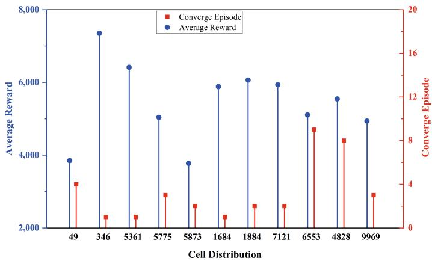  
Fig. 12: The generalization curve of RML-TP in different cells.

To further clarify the regional generalization ability of RML-TP, we additionally map the experimental cells to dominant urban functional zones, and then evaluate the model on unseen cells distributed across residential, commercial, industrial, and retail areas. In this supplementary analysis, the training cells used to construct the base value-table are mainly concentrated in the central-southeastern part of the urban grid and are dominated by residential or unclassified land-use patterns, whereas the test cells are spatially scattered over the western, northern, north-eastern, and central areas, thereby creating a clear distribution shift in both geography and urban function. Therefore, the results in Table IV provide a stricter validation scenario than the original cell-level reward analysis alone.

As shown in Table IV, RML-TP maintains a consistent advantage over the fixed-layer baseline across multiple unseen functional zones. In the commercial cells (2148 and 9379), RML-TP reduces the average MSE from 0.0038 to 0.0020 and the average MAE from 0.0450 to 0.0319, corresponding to relative reductions of 48.3% and 29.0%, respectively, while improving the average $R ^ { 2 }$ from 0.9226 to 0.9629. In the industrial cells (9658 and 9674), the improvement is even more pronounced: the average MSE decreases by 66.8%, the average MAE decreases by 42.5%, and the average $R ^ { 2 }$ increases from 0.5967 to 0.8959, which corresponds to a relative gain of 50.1%. For retail cells (3524, 6345, and 7297), RML-TP reduces the average MSE by 76.3% and the average MAE by 51.4%, while increasing the average $R ^ { 2 }$ from 0.64 to 0.9183. In residential cells (2108, 3200, 9815, and 9997), the average MSE and MAE are reduced by 72.6% and 46.9%, respectively, and the average $R ^ { 2 }$ rises from 0.2089 to 0.6406. These results confirm that the learned structural prior can be transferred effectively not only to geographically separated cells but also to cells with different urban functional characteristics.

The performance gap between RML-TP and the fixed-layer baseline is mainly caused by differences in temporal regularity and structural complexity across regions. Commercial and retail cells usually exhibit strong periodic demand patterns with clear daily and weekly regularities; thus, the Q-table can quickly guide the model toward compact yet expressive architectures. Industrial cells, on the other hand, often show sharper local fluctuations and larger distribution shifts, so the benefit of adaptive structure selection becomes more evident when compared with a fixed network. For example, in Cell 9658, the MSE decreases from 0.0154 to 0.0044 and the $R ^ { 2 }$ improves from 0.5426 to 0.8856, while in Cell 6345 the MSE drops from 0.0293 to 0.0027.

TABLE V: Comparison of methods on three datasets
<table><tr><td rowspan="2">Methods</td><td colspan="3">RML-TP</td><td colspan="3">Fix-layer</td><td colspan="3">Rand-layer</td></tr><tr><td>MSE↓</td><td>R2↑</td><td>MAE↓</td><td>MSE↓</td><td>R2↑</td><td>MAE↓</td><td>MSE↓</td><td>R2↑</td><td>MAE↓</td></tr><tr><td>BDC [22]</td><td>0.059</td><td>0.88</td><td>0.035</td><td>0.087</td><td>0.766</td><td>0.044</td><td>0.12</td><td>0.58</td><td>0.071</td></tr><tr><td>SONE [44]</td><td>0.015</td><td>0.14</td><td>0.0058</td><td>0.016</td><td>0.095</td><td>0.006</td><td>0.017</td><td>0.012</td><td>0.0061</td></tr><tr><td>LTE [45]</td><td>0.0044</td><td>0.508</td><td>0.043</td><td>0.0046</td><td>0.48</td><td>0.053</td><td>0.0065</td><td>0.276</td><td>0.059</td></tr></table>

The distance annotation in Table IV provides an additional perspective on transferability. In general, the far cells constitute a stricter test because they are geographically farther from the training region and are therefore more likely to exhibit different surrounding urban context and traffic intensity distributions. Nevertheless, RML-TP still preserves clear advantages on several far cells, such as Commercial Cell 2148, Industrial Cells 9658 and 9674, Residential Cells 2108 and 3200, and Retail Cell 7297. This indicates that the learned structural prior is not merely tied to geographic proximity. Overall, these findings show that RML-TP does not merely memorize a few training cells; instead, it learns a transferable structure-adjustment policy that remains effective under clear changes in regional distribution, functional zone type, and traffic dynamics.

3) Generalization of RML-TP across different datasets: These results demonstrate that RML-TP not only adapts to the temporal features within individual cells but also generalizes well across the network, enabling fast adaptation and high performance in previously unseen regions. This is especially valuable for practical deployment scenarios, where collecting and training on all possible cells is infeasible.

Table V presents a comparison of the performance of RML-TP, Fix-layer, and Rand-layer methods across three different datasets: BDC, SONE, and LTE. The performance metrics include Mean Squared Error (MSE), the coefficient of determination (R2), and Mean Absolute Error (MAE).

• BDC Dataset: The BDC dataset, which focuses on the usage patterns of base station traffic, is the primary dataset used in this paper. It is used to evaluate the overall performance of the algorithms in terms of both prediction accuracy and generalization capabilities. As shown, RML-TP outperforms both Fix-layer and Randlayer with lower MSE, higher R2, and lower MAE, demonstrating its superior ability to handle base station traffic data.

• SONE Dataset: The SONE dataset is a WiFi dataset, which exhibits different traffic patterns and characteristics compared to cellular networks. The performance of

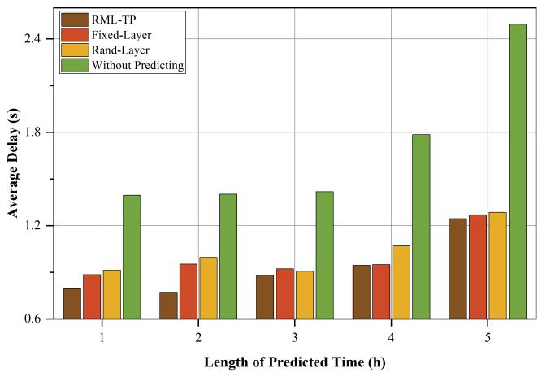  
Fig. 13: The performance of different algorithms in the drone optimization.

RML-TP still exceeds that of Fix-layer and Rand-layer, though the improvement is less pronounced compared to the BDC dataset. RML-TP’s flexibility in adapting to different types of data allows it to outperform the baselines.

• LTE Dataset: The LTE dataset is a 4G LTE dataset, which captures traffic dynamics in mobile broadband networks. Despite the more complex nature of the data, RML-TP maintains its edge over Fix-layer and Randlayer, with the lowest MSE and MAE, and the highest R2, reinforcing the model’s robustness across various types of traffic data.

The results indicate that RML-TP consistently provides better performance compared to the baseline methods, especially in terms of prediction accuracy and the ability to generalize to different network traffic patterns.

## E. The Answer to Q4: The Performance of RML-TP in the Drone Offloading Optimization

To demonstrate the performance of RML-TP in real-world optimization problems, we study a scenario involving Unmanned Aerial Vehicle (UAV) assisted offloading of base station traffic [46]. In this scenario, the UAV helps offload a portion of the cellular traffic from base stations to prevent overload situations [47]. Generally, the UAV selects an optimal point within a region to offload traffic from base stations. However, the cellular traffic at various base stations within an area fluctuates over time. When the UAV detects a change in base station traffic and needs to switch to another optimal point, the traffic within the region may undergo significant changes during its flight. Therefore, it is crucial to provide the

UAV with predicted traffic variation information in advance, enabling it to make proactive decisions.

In Fig. 13, we study the average delay of the three aforementioned algorithms compared to an algorithm without prediction. In Fig. 13, the horizontal axis represents the length of prediction time, while the vertical axis indicates the average delay. When the length of predicted time is 5, it means that the UAV can predict cellular traffic changes up to five hours in advance and make corresponding offloading strategies for the next five hours. The average delay then represents the cumulative average delay over those five hours. We can observe that optimization algorithms incorporating prediction generally result in lower delay compared to those without prediction. Specifically, when the length of predicted time is 2, the average delay of RML is 45.03% lower than that of the without-predicting algorithm, 19.11% lower than the fixed-layer algorithm, and 22.53% lower than the rand-layer algorithm. We can also observe from Fig. 13 that when data fluctuations are significant and the data becomes difficult to predict (corresponding to the length of predicted time being 4 or 5), the average delay of the without-predicting algorithm becomes very high. During these periods, our RML-TP still performs the best among the three algorithms.

## VII. CONCLUSION

We have studied the traffic prediction problem in a cellular mobile network. The proposed RML-TP method dynamically determines the structure of the DNNs. Our FFT analysis of real-world network traffic data has shown that data can be segmented into different feature spaces based on the amplitudes of frequency components. We have theoretically shown that cells have different optimal network structures. To handle the relationship between feature space and optimal network structure, we have introduced a meta-learner using the value-based RML algorithm, and conducted experiments using various deep neural network models, including Transformer, LSTM, GRU, and RNN. The results have demonstrated that the RML-TP method outperforms the traditional fixed and random network structures in terms of average reward and R2 metrics. Additionally, RML-TP shows strong generalization capabilities across various cells, indicating its potential for efficient and robust mobile traffic prediction. Finally, we have deployed RML-TP on a UAV for data offloading tasks, illustrating the advantages of RML-TP in a real application scenario.

## REFERENCES

[1] S. Feng, X. Lu, K. Zhu, D. Niyato, and P. Wang, “Covert D2D communication underlaying cellular network: A system-level security perspective,” IEEE Transactions on Wireless Communications, vol. 23, no. 8, pp. 9518–9533, 2024.

[2] M. Kaloev and G. Krastev, “Comparative analysis of activation functions used in the hidden layers of deep Neural Networks,” in 2021 3rd International Congress on Human-Computer Interaction, Optimization and Robotic Applications (HORA), 2021, pp. 1–5.

[3] F. Li, Z. Zhang, X. Chu, J. Zhang, S. Qiu, and J. Zhang, “A Meta-Learning based framework for cell-level mobile network traffic prediction,” IEEE Transactions on Wireless Communications, vol. 22, no. 6, pp. 4264–4280, 2023.

[4] M. Uzair and N. Jamil, “Effects of hidden layers on the efficiency of Neural Networks,” in 2020 IEEE 23rd International Multitopic Conference (INMIC), 2020, pp. 1–6.

[5] X. Yuan, C. Ou, Y. Wang, C. Yang, and W. Gui, “A layer-wise data augmentation strategy for Deep Learning Networks and its soft sensor application in an industrial hydrocracking process,” IEEE Transactions on Neural Networks and Learning Systems, vol. 32, no. 8, pp. 3296– 3305, 2021.

[6] Y. Zhu and S. Wang, “Joint traffic prediction and base station sleeping for energy saving in cellular networks,” in ICC 2021-IEEE International Conference on Communications. IEEE, 2021, pp. 1–6.

[7] I. Alawe, A. Ksentini, Y. Hadjadj-Aoul, and P. Bertin, “Improving traffic forecasting for 5G core network scalability: A machine learning approach,” IEEE Network, vol. 32, no. 6, pp. 42–49, 2018.

[8] V. Kurri, V. Raja, and P. Prakasam, “Cellular traffic prediction on blockchain-based mobile networks using LSTM model in 4G LTE network,” Peer-to-Peer Networking and Applications, vol. 14, no. 3, pp. 1088–1105, 2021.

[9] M. L. Hachemi, A. Ghomari, Y. Hadjadj-Aoul, and G. Rubino, “Mobile traffic forecasting using a combined FFT/LSTM strategy in SDN networks,” in 2021 IEEE 22nd International Conference on High Performance Switching and Routing (HPSR). IEEE, 2021, pp. 1–6.

[10] M. Li, Y. Wang, Z. Wang, and H. Zheng, “A deep learning method based on an attention mechanism for wireless network traffic prediction,” Ad Hoc Networks, vol. 107, p. 102258, 2020.

[11] Q. Zeng, Q. Sun, G. Chen, and H. Duan, “Attention based multicomponent spatiotemporal cross-domain Neural Network model for wireless cellular network traffic prediction,” EURASIP Journal on Advances in Signal Processing, vol. 2021, pp. 1–25, 2021.

[12] B. Gu, J. Zhan, S. Gong, W. Liu, Z. Su, and M. Guizani, “A spatialtemporal Transformer network for city-level cellular traffic analysis and prediction,” IEEE Transactions on Wireless Communications, vol. 22, no. 12, pp. 9412–9423, 2023.

[13] J. Wang, L. Shen, and W. Fan, “A TSENet model for predicting cellular network traffic,” Sensors, vol. 24, no. 6, p. 1713, 2024.

[14] H. Weng, Y. Liu, and L. Chen, “Spatial Bottleneck Transformer for cellular traffic prediction in the urban city,” in Australasian Joint Conference on Artificial Intelligence. Springer, 2023, pp. 265–276.

[15] Y. Lee and S. Choi, “Gradient-Based meta-learning with learned layerwise metric and subspace,” 2018.

[16] H. Yao, X. Wu, Z. Tao, Y. Li, B. Ding, R. Li, and Z. Li, “Automated relational meta-learning,” 2020.

[17] T. Hospedales, A. Antoniou, P. Micaelli, and A. Storkey, “Meta-learning in neural networks: A survey,” IEEE Transactions on Pattern Analysis and Machine Intelligence, vol. 44, no. 9, pp. 5149–5169, 2022.

[18] S. Qiao, C. Liu, W. Shen, and A. L. Yuille, “Few-shot image recognition by predicting parameters from activations,” in Proceedings of the IEEE Conference on Computer Vision and Pattern Recognition, 2018, pp. 7229–7238.

[19] S. Gidaris and N. Komodakis, “Dynamic few-shot visual learning without forgetting,” in Proceedings of the IEEE Conference on Computer Vision and Pattern Recognition, 2018, pp. 4367–4375.

[20] J. Schmidhuber, “A Neural Network that embeds its own meta-levels,” in IEEE International Conference on Neural Networks. IEEE, 1993, pp. 407–412.

[21] M. Andrychowicz, M. Denil, S. Gomez, M. W. Hoffman, D. Pfau, T. Schaul, B. Shillingford, and N. De Freitas, “Learning to learn by gradient descent by gradient descent,” Advances in Neural Information Processing Systems, vol. 29, 2016.

[22] M. Barlacchi, Gianniand De Nadai, R. Larcher, A. Casella, C. Chitic, G. Torrisi, F. Antonelli, A. Vespignani, A. Pentland, and B. Lepri, “A multi-source dataset of urban life in the city of Milan and the Province of Trentino,” Scientific Data, vol. 2, no. 1, pp. 1–15, Oct. 2015.

[23] T. Deng, M. Wan, K. Shi, L. Zhu, X. Wang, and X. Jiang, “Short term prediction of wireless traffic based on tensor decomposition and Recurrent Neural Network,” SN Applied Sciences, vol. 3, no. 9, p. 779, 2021.

[24] L. Yu, M. Li, W. Jin, Y. Guo, Q. Wang, F. Yan, and P. Li, “STEP: A spatio-temporal fine-granular user traffic prediction system for cellular networks,” IEEE Transactions on Mobile Computing, vol. 20, no. 12, pp. 3453–3466, 2020.

[25] Z. Wang, M. Fu, Q. Wang, Y. Lu, J. Wu, L. Chen, W. Guan, W. Li, and J. Wang, “Linkage Transformer: an attention based Neural Network for multi-cell traffic prediction,” in 2023 IEEE International Symposium on Broadband Multimedia Systems and Broadcasting (BMSB). IEEE, 2023, pp. 1–3.

[26] A. A. Shuvro, M. S. Khan, M. Rahman, F. Hussain, M. Moniruzzaman, and M. S. Hossen, “Transformer based traffic flow forecasting in SDN-VANET,” IEEE Access, vol. 11, pp. 41 816–41 826, 2023.

[27] Q. He, A. Moayyedi, G. Dán, G. P. Koudouridis, and P. Tengkvist, “A meta-learning scheme for adaptive short-term network traffic prediction,” IEEE Journal on Selected Areas in Communications, vol. 38, no. 10, pp. 2271–2283, 2020.

[28] H. Ma and K. Yang, “MetaSTNet: Multimodal meta-learning for cellular traffic conformal prediction,” IEEE Transactions on Network Science and Engineering, 2023.

[29] A. Antoniou, H. Edwards, and A. Storkey, “How to train your MAML,” in International Conference on Learning Representations, 2018.

[30] S. Ravi and H. Larochelle, “Optimization as a model for few-shot learning,” in International Conference on Learning Representations, 2016.

[31] A. Santoro, S. Bartunov, M. Botvinick, D. Wierstra, and T. Lillicrap, “Meta-learning with memory-augmented Neural Networks,” in International Conference on Machine Learning. PMLR, 2016, pp. 1842–1850.

[32] Z. Zhang, F. Li, X. Chu, Y. Fang, and J. Zhang, “dmTP: A deep Meta-Learning based framework for mobile traffic prediction,” IEEE Wireless Communications, vol. 28, no. 5, pp. 110–117, 2021.

[33] F. Sung, Y. Yang, L. Zhang, T. Xiang, P. H. Torr, and T. M. Hospedales, “Learning to compare: Relation network for few-shot learning,” in Proceedings of the IEEE Conference on Computer Vision and Pattern Recognition, 2018, pp. 1199–1208.

[34] L. Zhang, C. Zhang, and B. Shihada, “Efficient wireless traffic prediction at the edge: A federated meta-learning approach,” IEEE Communications Letters, vol. 26, no. 7, pp. 1573–1577, 2022.

[35] S. Fang, X. Pan, S. Xiang, and C. Pan, “Meta-MSNet: Meta-Learning based multi-source data fusion for traffic flow prediction,” IEEE Signal Processing Letters, vol. 28, pp. 6–10, 2021.

[36] R. Shwartz-Ziv and N. Tishby, “Opening the black box of Deep Neural Networks via Information,” 2017.

[37] J. Schmidhuber, “Evolutionary principles in self-referential learning, or on learning how to learn: The meta-meta-... hook,” Ph.D. dissertation, Technische Universität München, 1987.

[38] C. Lemke, M. Budka, and B. Gabrys, “Metalearning: A survey of trends and technologies,” Artificial Intelligence Review, vol. 44, pp. 117–130, 2015.

[39] M. Akrout, A. Feriani, F. Bellili, A. Mezghani, and E. Hossain, “Domain generalization in machine learning models for wireless communications: Concepts, state-of-the-art, and open issues,” IEEE Communications Surveys & Tutorials, vol. 25, no. 4, pp. 3014–3037, 2023.

[40] X. Qiu, L. Xu, P. Wang, Y. Yang, and Z. Liao, “A data-driven packet routing algorithm for an unmanned aerial vehicle swarm: A multiagent reinforcement learning approach,” IEEE Wireless Communications Letters, vol. 11, no. 10, pp. 2160–2164, 2022.

[41] R. S. Sutton and A. G. Barto, “Reinforcement learning: An introduction,” Robotica, vol. 17, no. 2, pp. 229–235, 1999.

[42] B. Gu, J. Zhan, S. Gong, W. Liu, Z. Su, and M. Guizani, “A spatialtemporal transformer network for city-level cellular traffic analysis and prediction,” IEEE Transactions on Wireless Communications, vol. 22, no. 12, pp. 9412–9423, 2023.

[43] F. Kavehmadavani, V.-D. Nguyen, T. X. Vu, and S. Chatzinotas, “Intelligent traffic steering in beyond 5G open RAN based on LSTM traffic prediction,” IEEE Transactions on Wireless Communications, vol. 22, no. 11, pp. 7727–7742, 2023.

[44] S. P. Sone, J. J. Lehtomäki, and Z. Khan, “Wireless traffic usage forecasting using real enterprise network data: Analysis and methods,” IEEE Open Journal of the Communications Society, vol. 1, pp. 777–797, 2020.

[45] S. Sharma, “Machine learning-based predictive modeling for 4G long term evolution (LTE) traffic prediction,” 2021.

[46] B. Ma, J. Zhang, Z. Zhang, and J. Zhang, “Time-Efficient joint UAV-BS deployment and user association based on machine learning,” IEEE Internet of Things Journal, vol. 10, no. 14, pp. 13 077–13 094, 2023.

[47] H. Kurunathan, H. Huang, K. Li, W. Ni, and E. Hossain, “Machine learning-aided operations and communications of unmanned aerial vehicles: A contemporary survey,” IEEE Communications Surveys & Tutorials, vol. 26, no. 1, pp. 496–533, 2024.

Bo Ma (Member, IEEE) received the bachelor’s degree in automatic control engineering from Southeast University, China, in 2014, and the M.Sc. degree (Hons.) in communication and signal processing from Newcastle University, U.K., in 2016. In 2021, he received the Ph.D. degree in wireless systems with the Department of Electronic and Electrical Engineering, The University of Sheffield, U.K. In the same year, he joined the School of Information and Electrical Engineering (Sussex Artificial Intelligence Institute), Zhejiang Gongshang University, China, as a lecture. His main research interests include proactive network optimization, AAV communications, and machine learning algorithms in 5G networks. Contact him at mabo@zjgsu.edu.cn.

Jiawei Ye (Student Member, IEEE) received the M.E. degree in information and communication engineering from Zhejiang Gongshang University, Hangzhou, China, in 2025. He worked at the Binjiang Institute of Zhejiang University, Hangzhou. His previous research on unmanned aerial vehicles (UAVs) was published in the IEEE Transactions on Vehicular Technology. Currently, his research interests lie primarily in artificial intelligence security and trustworthy AI.

Shaohan Feng (Member, IEEE) received the B.S. degree from the School of Mathematics and Systems Science, Beihang University, Beijing, China, in 2014, the M.S. degree from the School of Mathematical Sciences, Zhejiang University, Hangzhou, China, in 2016, and the Ph.D. degree from the School of Computer Science and Engineering, Nanyang Technological University, Singapore, in 2020. His research interests include resource management and risk management in computer networks and wireless communications.

Zitian Zhang (Member, IEEE) received the B.S. and Ph.D. degrees from Shanghai Jiao Tong University in 2010 and 2016, respectively. After his Ph.D. program, he was a Research Engineer with China Aeronautical Radio Electronics Research Institute from 2016 to 2017. From 2018 to 2020, he was with East China University of Science and Technology. From 2020 to 2022, he was a Mary Curie Research Fellow with Ranplan Wireless Network Design Ltd. He is currently an Associate Professor with Zhejiang Gongshang University. His research interests include deep learning, big data analytics, and device-to-device communications.

Chuanhuang Li (Member, IEEE) is a professor at the school of Information and Electrical Engineering (Sussex Artificial Intelligence Institute), Zhejiang Gongshang University, China. He received his Ph.D. degree in Computer Science and Technology from Zhejiang University, China, in 2013. His research interests include open programmable network, Software Defined Network, Edge Computing, Deep Learning, system performance prediction and analysis model. He is one of the authors of IETF standard RFC6956, and one of the contributions of

the other three RFCs. He published over 40 papers in journals and conference proceedings. Contact him at chuanhuang\_li@zjgsu.edu.cn.

Ping Wang (Fellow, IEEE) is currently a Professor with the Department of Electrical Engineering and Computer Science, York University, Toronto, ON, Canada and Tier 2 York Research Chair. She was with Nanyang Technological University, Singapore, from 2008 to 2018. Her research focuses on integrating artificial intelligence (AI) techniques into communications networks. Her scholarly works have been widely disseminated through top-ranked IEEE journals/conferences and were the recipient of IEEE Communications Society Best Survey Paper Award in 2023 and Best Paper Awards from IEEE prestigious conference WCNC in 2012, 2020 and 2022, respectively, from IEEE Communication Society: Green Communications & Computing Technical Committee in 2018, from IEEE flagship conference ICC in 2007. She has been an Associate Editor-in-Chief for IEEE Communications Surveys and Tutorials and Editor of several reputed journals, including IEEE Transactions on Wireless Communications. She is a Distinguished Lecturer of IEEE Vehicular Technology Society (VTS) and Chair of the Education Committee of IEEE VTS.

Ekram Hossain (Fellow, IEEE) is currently a Professor and the Associate Head (Graduate Studies) with the Department of Electrical and Computer Engineering, University of Manitoba, Winnipeg, MB, Canada. He is a member (Class of 2016) of the College of the Royal Society of Canada and a fellow of the Canadian Academy of Engineering and the Engineering Institute of Canada. He was a recipient of several research awards, including the 2017 IEEE Communications Society Best Survey Paper Award and the 2011 IEEE Communications Society Fred

Ellersick Prize Paper Award. He was also listed as a Clarivate Analytics Highly Cited Researcher in Computer Science from 2017 to 2025. From 2012 to 2016, he was the Editor-in-Chief (EiC) of IEEE Communications Surveys and Tutorials and IEEE Press from 2018 to 2021. He was a Distinguished Lecturer of the IEEE Communications Society and the IEEE Vehicular Technology Society. He served as the Director of Magazines from 2020 to 2021 and the Director of Online Content for the IEEE Communications Society from 2022 to 2023.