# Coded Caching Enabled D2D Content Delivery in UAV-Assisted Marine Edge Networks

Zhaoxiang Huang , Zhiwen Yu , Senior Member, IEEE, Liang Wang , Member, IEEE, Huan Zhou , Senior Member, IEEE, Fei Xiong , and Bin Guo , Senior Member, IEEE

Abstract—Due to their flexible mobility and rapid deployment, Unmanned Aerial Vehicle (UAV)-assisted marine edge networks can effectively mitigate the limitations of conventional shorebased networks, such as limited coverage and high content access latency. Coded caching, which partitions content into smaller encoded segments distributed across multiple Autonomous Underwater Vehicles (AUVs) and enables Device-to-Device (D2D) transmission, further enhances delivery efficiency by alleviating backhaul dependence. Motivated by these advantages, this paper investigates coded caching-enabled D2D content delivery in UAV-assisted marine networks, aiming to jointly optimize UAV trajectories, caching decisions, and content access strategies to minimize request latency under long-term UAV energy constraints. Distinct from terrestrial or single-domain networks, the dual-hop acoustic–RF architecture, intermittent underwater connectivity, and scarce marine resources impose additional challenges for maintaining content availability and reliable D2D delivery. To address this NP-hard problem, we propose a novel Online Joint Coded Caching and Content Delivery (OJC3D) algorithm. Leveraging the Lyapunov optimization framework, the original long-term problem is decomposed into a per-slot real-time optimization problem, which is then solved through a three-stage approach that sequentially optimizes UAV trajectories, content caching, and content request decisions based on convex optimization theory. Simulation results demonstrate that, compared with benchmark schemes, the proposed OJC3D algorithm reduces content access latency by up to 20% and UAV energy consumption by 35%, achieving energy-efficient and lowlatency content delivery in dynamic marine environments.

Index Terms—Marine edge networks, coded caching, resource allocation, trajectory planning.

## I. INTRODUCTION

devices, such as Autonomous Underwater Vehicles (AUVs) and intelligent buoys, to perform diverse oceanic tasks, the demand for online content in marine environments is rapidly growing [1]. However, shore-based networks, with their limited coverage, are incapable of handling content requests from devices operating in deep-sea and remote ocean areas [2]. Although satellite networks can provide wide-area marine coverage, the high latency inherent in satellite links makes them unsuitable for real-time applications [3]. In this context, cache-enabled Unmanned Aerial Vehicles (UAVs), owing to their flexible deployment and controllable mobility, offer an attractive solution [4]. They can not only extend the coverage of marine networks but also respond to marine devices’ content requests in real time, thereby enabling lowlatency content delivery [5].

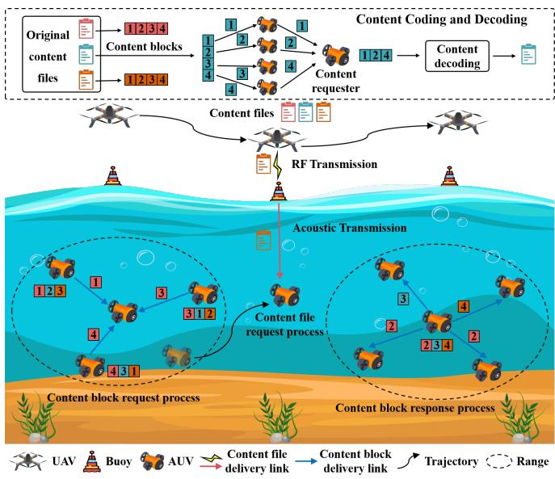  
Fig. 1. An illustration of coded caching and D2D content delivery in UAVassisted marine edge network.

Conventional UAV-assisted marine network architectures typically comprise two communication segments: over-theair Radio Frequency (RF) transmission above the water surface and Underwater Acoustic Communication (UAC) below the surface [6]. Due to the heterogeneous nature of these communication methods, surface nodes such as buoys are typically responsible for signal transcoding and request routing to facilitate cross-domain communication [7], [8]. In this architecture, UAVs deliver content to buoys via RF communication, where the RF signals are transcoded into acoustic signals before being forwarded through UAC to the requesting AUVs. As the number of AUVs and content requests grows, the

UAV’s limited communication bandwidth and the substantial decoding workload at the buoys can significantly degrade the Quality of Service (QoS) for AUVs.

A promising approach to mitigating these issues is to cache content directly at the AUVs and leverage Device-to-Device (D2D) communication between them [9]. In this way, an AUV can obtain the requested content directly from nearby AUVs, potentially reducing request latency. However, the effectiveness of this caching strategy is constrained by the mobility of AUVs, as the duration of AUV-to-AUV communication links is limited. Combined with the restricted bandwidth of underwater acoustic channels, it may be infeasible to transmit large content files in full.

Coded caching technology can alleviate these limitations by dividing a content file into smaller fragments, encoding them into redundant blocks, and distributively storing them across different nodes [10], [11]. This enables each AUV to selectively retrieve content fragments from a subset of neighboring AUVs that have cached the data, based on current network conditions. Motivated by this idea, this paper investigates the coded caching and content delivery problem in a marine edge network architecture, as illustrated in Fig. 1, where the UAV serves as an aerial content provider that can transmit complete content files to AUVs via surface buoys; the buoys act as gateways, performing content forwarding and signal transcoding, while each AUV caches partial content blocks and participates in D2D transmissions to fulfill content requests under acoustic connectivity. The need for such a joint design is further supported by the empirical trends reported in Section V, where the ablation study and the online performance evaluation show the practical benefit of jointly considering D2D coded delivery, UAV trajectory planning, and online resource allocation. We particularly focus on addressing the following key challenges.

Challenge 1: UAV trajectory-dependent connectivity and content accessibility. In the considered system, data are first transmitted from UAVs to buoys via RF links, and subsequently exchanged between buoys and AUVs through acoustic links, thus establishing a dual-hop transmission architecture. In such a heterogeneous network, the UAV trajectory determines not only the availability and quality of RF links, but also the overall end-to-end connectivity and the accessibility of cached content. Therefore, the trajectory planning must account for both spatial coverage and temporal link availability to ensure reliable data delivery.

Challenge 2: Coded block availability under intermittent acoustic connectivity. In fully connected terrestrial networks, content requests can generally obtain a sufficient number of content blocks to satisfy the coding requirements with relative ease. By contrast, in the proposed marine network with intermittent acoustic connectivity, the availability of coded blocks depends on the instantaneous network topology, link conditions, and resource allocation decisions. This significantly complicates the content delivery process, as the content placement and request scheduling strategies must dynamically adapt to time-varying connectivity and stringent acoustic bandwidth limitations.

Challenge 3: Coupled online optimization of trajectory, caching, and request decisions. The UAV trajectory, AUV content caching placement, and content request scheduling are inherently coupled. This coupling effect becomes more pronounced under the dual-hop acoustic–RF architecture, where mobility, storage, and communication resources must be jointly optimized. Designing an online decision-making framework to address such multi-dimensional coupling under dynamic network conditions is considerably more challenging than optimizing each component in isolation.

To address these challenges, we propose a unified online optimization framework that transforms the original long-term constrained problem into a sequence of real-time per-slot subproblems via Lyapunov optimization. Building upon this framework, we further propose a three-stage iterative optimization approach to jointly optimize UAV trajectory planning, content caching placement, and content request scheduling. The main contributions of this paper are summarized as follows:

• We propose a novel framework for coded caching and D2D content delivery in UAV-assisted marine networks. Within this framework, we investigate the joint optimization of UAV trajectory planning, content caching, and content requesting under multi-dimensional resource constraints, including UAV energy limitations. We rigorously prove that the resulting optimization problem is a futuredependent NP-hard problem.

• We develop a novel Online Joint Coded Caching and Content Delivery (OJC3D) algorithm. Specifically, by leveraging the Lyapunov optimization framework, the original long-term optimization problem is transformed into a series of real-time optimization problems per time slot. Furthermore, we design a three-stage optimization approach based on convex optimization theory to jointly optimize UAV trajectory, content caching, and content requesting in a sequential manner.

• Extensive theoretical analysis and experimental evaluations demonstrate the effectiveness of the proposed approach. We prove that the OJC3D algorithm converges to a near-optimal solution within polynomial time. Moreover, comprehensive simulation results show that OJC3D achieves near-optimal delay performance while maintaining low energy consumption.

## II. RELATED WORK

## A. UAV-Assisted Marine Edge Networks

In recent years, UAVs have been widely adopted in marine networking scenarios such as remote data collection, environmental monitoring, and mission assistance in offshore regions [12], [13]. To alleviate the computation and communication limitations of resource-constrained marine devices, numerous studies have investigated UAV-assisted edge computing frameworks that support computation offloading and cooperative task execution [2], [4], [5], [14], [15]. These works primarily aim to minimize task execution delay, reduce energy consumption, or jointly optimize both through efficient resource orchestration.

JOURNAL OF LAT X CLASS FILES, VOL. 14, NO. 8, AUGUST 2021

Specifically, Dai et al. [4], [5] proposed latency-aware and multi-objective task offloading frameworks in UAV-enabled marine networks, but their designs are confined to surface-level IoT devices and lack support for underwater components. To address the cross-domain nature of marine environments, [14] extended the architecture to support underwater-to-air offloading, but did not incorporate UAV trajectory optimization, thereby limiting its adaptability to dynamic topology changes. Other works such as [2], [15] introduced service caching mechanisms in UAV-assisted edge networks to reduce response delay, yet relied on offline or quasi-static optimization schemes that are unsuitable for real-time, time-varying settings. Recent studies have considered UAV caching and energy management in aerial edge systems [16], [17]. Different from them, our work focuses on coded caching-enabled marine content delivery, where the UAV provides complete files as a supplementary source rather than supporting online cache updating or computation services.

Moreover, recent studies have explored UAVs as airborne relay nodes to assist in content dissemination and caching [18]. These efforts investigated optimal caching placement and cooperative delivery schemes under bandwidth constraints. However, these designs assume static UAV deployment or pre-defined hovering points, making it difficult to adapt to the dynamic mobility of marine users or AUVs in large-scale areas. In addition, none of these works consider D2D delivery or coded caching under acoustic communication constraints.

In contrast to the above literature, this work targets a dynamic cross-domain marine network where UAVs serve as mobile content providers for underwater AUVs. We explicitly consider the impact of dual-hop acoustic–RF transmission, and integrate UAV trajectory planning, real-time caching placement, and request scheduling into a unified online optimization framework.

## B. Coded Caching and Content Delivery

Coded caching is a powerful paradigm that improves content delivery efficiency by encoding content files into redundant blocks and distributing them across multiple cache nodes [19]. Compared with conventional caching, it offers higher diversity and fault-tolerance, especially in networks with intermittent connectivity. Various coding strategies have been proposed to balance redundancy, reliability, and resource usage [20]. For instance, Maximum Distance Separable (MDS) codes are optimal in terms of achieving minimal reconstruction thresholds [21], while Minimum-Bandwidth Regenerating (MBR) codes [22] and Minimum-Storage Regenerating (MSR) codes [23] respectively focus on bandwidth efficiency and storage cost minimization.

In edge computing scenarios, these coding techniques have been integrated with content placement optimization to enhance delivery performance. Works such as [24] and [11] explored adaptive encoding strategies that consider device heterogeneity and link quality. Other studies investigated energyefficient delivery protocols and latency-aware caching under coding constraints [25], [26]. However, these methods typically assume static edge servers with stable communication links, and do not account for node mobility or acoustic channel variability, which are prevalent in marine environments.

TABLE I  
LIST OF IMPORTANT NOTATIONS USED IN THIS PAPER
<table><tr><td>Notation</td><td>Explanation</td></tr><tr><td>U</td><td>rotary-wing UAV</td></tr><tr><td> $\mathcal { M }$ </td><td> $\mathrm { S e t \ o f \ b u o y s , \ } \mathcal { M } \bar { = } \{ 1 , 2 , . . . , M \}$ </td></tr><tr><td> $\mathcal { U }$ </td><td> $\mathrm { S e t ~ o f ~ A U \bar { V } s , \mathcal { U } = \{ \bar { 1 } , 2 , . . . , U \} }$ </td></tr><tr><td> $\tau$ </td><td>Set of time slots,  $\mathcal { T } \overset { \cdot } { = } \{ 1 , 2 , \dots , \overset { \cdot } { T } \}$ </td></tr><tr><td> $\boldsymbol { \mathscr { C } }$ </td><td>Content library,  $\mathcal { C } = \left\{ \mathrm { 1 } , 2 , \dots , C \right\}$ </td></tr><tr><td> $s _ { c }$ </td><td>Content block size</td></tr><tr><td> $\Phi ( t )$ </td><td>Caching decision variables</td></tr><tr><td> $\phi _ { u } ( t )$ </td><td>Caching decision vector of AUV u</td></tr><tr><td> $\boldsymbol { \mathcal { A } } ( t )$ </td><td>Coverage vector</td></tr><tr><td> $B _ { u } ( t )$ </td><td>Connectivity vector</td></tr><tr><td> $\mathcal { G } ( t )$ </td><td>Adjacency matrix</td></tr><tr><td> $\varOmega ( t )$ </td><td>Bandwidth allocation indicator</td></tr><tr><td> $f$ </td><td>Central frequency of acoustic signal</td></tr><tr><td> $N ( f )$ </td><td>Total underwater noise power density</td></tr><tr><td> $o _ { 1 }$ </td><td>Shipping activity factor</td></tr><tr><td> $O 2$ </td><td>Wind speed</td></tr><tr><td> $k _ { s }$ </td><td>Spreading factor</td></tr><tr><td> $p _ { u }$ </td><td>Transmission power of AUV u</td></tr><tr><td> $p _ { v }$ </td><td>Transmission power of UAV v</td></tr><tr><td> $\beta$ </td><td>Channel gain at reference distance  $d _ { 0 } = 1$ </td></tr><tr><td> $a ( f )$ </td><td>Absorption coefficient</td></tr><tr><td> $p _ { m }$ </td><td>Transmission power of buoy m</td></tr><tr><td> $a , b$ </td><td>Environment-specific constant</td></tr><tr><td> $\mu$ </td><td>Path loss factor</td></tr><tr><td> $N _ { 0 }$ </td><td>Noise power spectral density</td></tr><tr><td> $U _ { p }$ </td><td>Rotor&#x27;s tip speed</td></tr><tr><td> $\varPsi ( t )$ </td><td>Content request decision variables</td></tr><tr><td> $\Psi _ { u } ( t )$ </td><td>Content request location matrix of AUV u</td></tr><tr><td> $\mathrm { L }$ </td><td>UAV trajectory planning variables</td></tr><tr><td> $\mathbf { l } _ { v } ( t )$ </td><td>Position of the UAV at time slot t</td></tr><tr><td> $S _ { u }$ </td><td>Cache capacity of AUV u</td></tr><tr><td> $( n , k )$ </td><td>MDS coding parameters</td></tr><tr><td> $E _ { v } ( t )$ </td><td>Energy consumption of the UAV at time slot t</td></tr><tr><td> $F _ { \varepsilon } ^ { \mathrm { { \bar { U A V } } } }$ </td><td>Long-term UAV energy budget</td></tr><tr><td> $E _ { \mathrm { m a x } } ^ { \mathrm { v } \mathrm { ~ c } }$   $Q _ { v } ( t )$ </td><td>Virtual energy queue of the UAV</td></tr><tr><td> $V$ </td><td>Lyapunov control parameter</td></tr><tr><td> $q ( t )$ </td><td>UAV flying speed at time slot t</td></tr></table>

On the other hand, the integration of D2D communication with content caching has been explored in terrestrial mobile networks. For instance, [27]–[29] proposed cooperative caching and semantic-aware D2D sharing frameworks to reduce backhaul traffic and improve access delay. Yet, these works assume full-file transmission over relatively stable RF or millimeter-wave links. In [30], energy-efficient scheduling was considered, but the underlying link model did not address the high latency or attenuation of underwater acoustic channels. Moreover, most D2D-based caching schemes rely on continuous link availability, which is difficult to guarantee in underwater contexts due to device mobility [31] and channel intermittency [6].

In contrast, our work incorporates coded caching into a marine D2D architecture with intermittent acoustic connectivity. We jointly optimize content placement, request scheduling, and transmission routing while considering realtime link availability and decoding constraints. Moreover, the proposed framework adaptively adjusts decisions based on AUV mobility, content blocks availability, and UAV energy budgets—features largely absent from prior works.

JOURNAL OF LAT X CLASS FILES, VOL. 14, NO. 8, AUGUST 2021

## III. SYSTEM MODEL AND PROBLEM FORMULATION

As illustrated in Fig. 1, we consider a UAV-assisted marine edge network comprising a rotary-wing UAV v, a set of M buoys serving as gateways denoted by $\mathcal { M } = \{ 1 , 2 , . . . , M \}$ and a set of U AUVs represented as $\mathcal { U } = \{ 1 , 2 , . . . , U \}$ . The UAV communicates with the buoys via RF links, while the buoys and AUVs, as well as the AUVs among themselves, establish D2D links through UAC. Within a limited system time horizon, the UAV, equipped with an edge server and constrained by finite battery capacity, delivers content to the AUVs. The content library is defined as $\mathcal { C } = \{ 1 , 2 , . . . , C \}$ . In this paper, the content in C refers to file-level marine data, such as environmental maps, image data, and video segments for marine operations [32], [33]. Each content item can be encoded into multiple coded blocks for distributed caching and recovery. The system time is discretized into T equal-duration time slots, each of length τ , denoted by $\mathcal { T } = \{ 1 , 2 , . . . , T \}$ The list of important notations used in this paper is shown in Table I.

## A. System Description

At any time slot $t \in \tau$ , each AUV can act either as a content requester, sending requests to other AUVs or the UAV, or as a content provider, responding to requests from other AUVs. Content requests follow a Zipf distribution [34]. The initial 3D position of each AUV $u \in \mathcal { U }$ is denoted by ${ \bf p } _ { u } ( 1 ) =$ $[ x _ { u } ( 1 ) , y _ { u } ( 1 ) , z _ { u } ( 1 ) ]$ and is assumed to be independently and uniformly distributed within a bounded marine region $\nu =$ $[ 0 , L _ { x } ] \stackrel { . } { \times } [ 0 , L _ { y } ] \times [ 0 , L _ { z } ]$ . Thereafter, the time-varying AUV positions evolve according to a Gauss–Markov mobility model [35].

To tackle this, we adopt a coded caching scheme. Each original content file is encoded using an $( n , k )$ MDS code into n content chunks, which are then distributed across different AUVs. Following existing studies, to enhance availability, each AUV is allowed to cache at most one chunk of any file [25], [36]. We define the caching decision variables of all AUVs at time slot t as $\Phi ( t ) ~ = ~ \{ \phi _ { 1 } ( t ) , \phi _ { 2 } ( t ) , \ldots , \phi _ { U } ( t ) \}$ , where $\phi _ { u } ( t )$ denotes the caching decision vector of AUV u, given by $\phi _ { u } ( t ) = [ \varphi _ { u } ^ { 1 } ( t ) , \varphi _ { u } ^ { 2 } ( t ) , \ldots , \varphi _ { u } ^ { C } ( t ) ]$ . Specifically, $\varphi _ { u } ^ { c } ( t ) = 1$ indicates that AUV u caches content c; otherwise, $\varphi _ { u } ^ { c } ( t ) = 0$ For efficient content update and delivery, the UAV caches the full version of each content file and relies on buoys for content forwarding and transcoding to serve AUV requests.

Considering the limited communication range of the UAV, buoys, and AUVs, we define a coverage vector $\begin{array} { r l } { \mathcal { A } ( t ) } & { { } = } \end{array}$ $\{ a _ { 1 } ( t ) , a _ { 2 } ( t ) , . . . , a _ { M } ( t ) \}$ , where $a _ { i } ( t ) = 1$ indicates that buoy i is within the UAV’s communication range $C R ^ { \mathrm { U A V } }$ at time slot t; otherwise, $a _ { i } ( t ) = 0$ . Similarly, we define a connectivity vector $\mathcal { B } _ { u } ( t ) = \{ b _ { u , 1 } ( t ) , b _ { u , 2 } ( t ) , . . . , b _ { u , M } ( t ) \}$ for each AUV u, where $b _ { u , i } ( t ) = 1$ indicates that AUV u is within the acoustic communication range $C R ^ { \mathrm { B u o y } }$ of buoy i. The connectivity among AUVs is captured by the adjacency matrix $\mathcal { G } ( t ) = [ g _ { u , u ^ { \prime } } ( t ) ] \in \{ 0 , 1 \} ^ { U \times U }$ , where $g _ { u , u ^ { \prime } } ( t ) = 1$ means that AUV u and $u ^ { \prime }$ are within each other’s D2D communication range $C R ^ { \mathrm { { A U V } } }$ and can form a direct link at time slot t.

## B. Communication Model

In the proposed communication model, we adopt the widely used Orthogonal Frequency Division Multiple Access (OFDMA) scheme [37], [38]. Considering that the UAV, buoys, and AUVs may communicate with multiple devices simultaneously in the same time slot, we define the bandwidth allocation indicator as $\begin{array} { r l } { \mathcal { Q } ( t ) } & { { } = } \end{array}$ $\{ \Omega _ { 1 } ( t ) , \Omega _ { 2 } ( t ) , \ldots , \Omega _ { U } ( t ) \}$ , where each $\Omega _ { u } ( t ) \in \Omega ( t )$ denotes the bandwidth allocation vector for AUV u. Specifically, $\Omega _ { u } ( t ) \ = \ [ \omega _ { u } ^ { 1 } ( t ) , \ldots , \omega _ { u } ^ { U + M + 1 } ( t ) ]$ , where $\omega _ { u } ^ { i } ( t ) \ \in [ 0 , 1 ]$ represents the fraction of bandwidth allocated to different communication links. For $i \in \{ 1 , \ldots , U \} , \ \omega _ { u } ^ { i } ( t )$ corresponds to the D2D bandwidth ratio between AUV u and AUV i; for $i \in \{ U + 1 , \ldots , U + M \} , \omega _ { u } ^ { i } ( t )$ denotes the bandwidth allocated to the link between buoy $i - U$ and AUV $u ;$ and for $i = U + M + 1 , \omega _ { u } ^ { U + M + 1 } ( t )$ denotes the bandwidth assigned by the UAV for content delivery to AUV u.

1) AUV-to-AUV UAC Model: The D2D communication links among AUVs are established via UAC. In underwater environments, the communication channel is significantly affected by ambient noise, which primarily includes four types: turbulence noise $N _ { 1 } ( f )$ , shipping noise $N _ { 2 } ( f )$ , wave noise $N _ { 3 } ( f )$ , and thermal noise $N _ { 4 } ( f )$ [39]. The Power Spectral Density (PSD) of these noise components depends on the signal frequency $f ,$ and can be modeled as follows [6]:

$$
\left\{ \begin{array} { l l } { 1 0 \log _ { 1 0 } N _ { 1 } ( f ) = 1 7 - 3 0 \log _ { 1 0 } f , } \\ { 1 0 \log _ { 1 0 } N _ { 2 } ( f ) = 4 0 + 2 0 ( o _ { 1 } - 0 . 5 ) + 2 6 \log _ { 1 0 } f , } \\ { \qquad \quad - 6 0 \log _ { 1 0 } { ( f + 0 . 0 3 ) } , } \\ { 1 0 \log _ { 1 0 } N _ { 3 } ( f ) = 5 0 + 7 . 5 \sqrt { o _ { 2 } } + 2 0 \log _ { 1 0 } f , } \\ { \qquad \quad - 4 0 \log _ { 1 0 } { ( f + 0 . 4 ) } , } \\ { 1 0 \log _ { 1 0 } N _ { 4 } ( f ) = - 1 5 + 2 0 \log _ { 1 0 } f . } \end{array} \right.\tag{1}
$$

Here, $o _ { 1 } \in ( 0 , 1 )$ represents the shipping activity factor that captures the effect of vessel density on shipping noise, and $O _ { 2 }$ denotes the wind speed. Based on the above models, the total PSD of the ambient noise is given by:

$$
N ( f ) = N _ { 1 } ( f ) + N _ { 2 } ( f ) + N _ { 3 } ( f ) + N _ { 4 } ( f ) .\tag{2}
$$

At any time slot t, the 3D positions of AUVs u and u′ are denoted as ${ \bf l } _ { u } ( t ) \ = \ ( x _ { u } ( t ) , y _ { u } ( t ) , z _ { 1 } )$ and $1 _ { u ^ { \prime } } ( t ) \ =$ $( x _ { u ^ { \prime } } ( t ) , y _ { u ^ { \prime } } ( t ) , z _ { 1 } )$ , respectively. Here, we assume that all AUVs operate at the same underwater depth $z _ { 1 }$ . Accordingly, the Euclidean distance between them is computed as $d _ { u , u ^ { \prime } } ( t ) = \Vert \mathbf { 1 } _ { u } ( t ) - \mathbf { 1 } _ { u ^ { \prime } } ( t ) \Vert _ { 2 }$ . The path loss at distance $d _ { u , u ^ { \prime } } ( t )$ is modeled as:

$$
\mathrm { A } \left( d _ { u , u ^ { \prime } } ( t ) , f \right) = d _ { u , u ^ { \prime } } ( t ) ^ { k _ { s } } \mathrm { a } ( f ) ^ { d _ { u , u ^ { \prime } } ( t ) } ,\tag{3}
$$

where $k _ { s }$ is the spreading factor and $\operatorname { a } ( f )$ is the absorption coefficient dependent on frequency, which can be expressed as follows:

$$
\begin{array} { r l r } {  { 1 0 \log _ { 1 0 } \mathrm { a } ( f ) = 0 . 1 1 \frac { f ^ { 2 } } { 1 + f ^ { 2 } } + 4 4 \frac { f ^ { 2 } } { 4 1 0 0 + f ^ { 2 } } + 2 . 7 5 e ^ { - 4 } f ^ { 2 } } } \\ & { } & { \quad + \ 0 . 0 0 3 . } \end{array}\tag{4}
$$

Based on the above, the normalized Signal-to-Noise Ratio (SNR) is given by [2]:

$$
\gamma ( d _ { u , u ^ { \prime } } ( t ) ) = \frac { 1 } { \mathrm { A } \left( d _ { u , u ^ { \prime } } ( t ) , f \right) N ( f ) } .\tag{5}
$$

Considering signal reflections from both the sea surface and the seabed, the communication channel between AUVs generally consists of both Line-of-Sight (LOS) and Non-Lineof-Sight (NLOS) paths. Due to the significant energy attenuation caused by multiple reflections, we only consider the two shortest types of NLOS paths. Based on geometric symmetry, the surface-reflected path length and seabed-reflected path length are respectively given by:

$$
d _ { u , u ^ { \prime } } ^ { \mathrm { t o p } } ( t ) = \sqrt { ( x _ { u } ( t ) - x _ { u ^ { \prime } } ( t ) ) ^ { 2 } + ( y _ { u } ( t ) - y _ { u ^ { \prime } } ( t ) ) ^ { 2 } + ( 2 z _ { 1 } ) ^ { 2 } } ,\tag{6}
$$

$$
\begin{array} { r } { d _ { u , u ^ { \prime } } ^ { \mathrm { d o w n } } ( t ) = \big ( ( x _ { u } ( t ) - x _ { u ^ { \prime } } ( t ) ) ^ { 2 } + ( y _ { u } ( t ) - y _ { u ^ { \prime } } ( t ) ) ^ { 2 } + } \\ { ( 2 ( z - z _ { 1 } ) ) ^ { 2 } \big ) ^ { \frac { 1 } { 2 } } \qquad } \end{array}\tag{7}
$$

where z is the ocean depth.

Therefore, considering the shortest surface-reflected and seabed-reflected paths, the lower bound of the SNR for NLOS transmission is given by:

$$
\begin{array} { r } { \gamma ^ { \ast } ( d _ { u , u ^ { \prime } } ( t ) ) = \{ \frac { 1 } { ( \mathrm { A } ( d _ { u , u ^ { \prime } } ( t ) , f ) ) ^ { \frac { 1 } { 2 } } } - \frac { \alpha \Lambda _ { 1 } } { ( \mathrm { A } ( d _ { u , u ^ { \prime } } ^ { \mathrm { t o p } } ( t ) , f ) ) ^ { \frac { 1 } { 2 } } }  } \\ {  - \frac { \beta \Lambda _ { 2 } } { ( \mathrm { A } ( d _ { u , u ^ { \prime } } ^ { \mathrm { d o w n } } ( t ) , f ) ) ^ { \frac { 1 } { 2 } } } \} ^ { 2 } \frac { 1 } { N ( f ) } , \qquad ( \mathrm { C } ^ { \mathrm { a v } 1 } ( d _ { u , u ^ { \prime } } ^ { \mathrm { t o p } } ( t ) , f ) ) ^ { \frac { 1 } { 2 } } } \end{array}\tag{8}
$$

where $\Lambda _ { 1 }$ and $\Lambda _ { 2 }$ denote the channel gain coefficients associated with the surface-reflected and seabed-reflected paths, respectively. Accordingly, the achievable transmission rate between AUV u and AUV u′ at time slot t is given by:

$$
R _ { u , u ^ { \prime } } ( t ) = \omega _ { u ^ { \prime } } ^ { u } ( t ) W _ { 1 } \log _ { 2 } \left( 1 + \frac { e p _ { u } ( t ) \gamma ^ { * } ( d _ { u , u ^ { \prime } } ( t ) ) } { 2 \pi Z ( 1 \mu P a ) \omega _ { u ^ { \prime } } ^ { u } ( t ) W _ { 1 } } \right)\tag{9}
$$

Here, $W _ { 1 }$ denotes the total available channel bandwidth, $p _ { u } ( t )$ is the transmit power, and e denotes the combined efficiency of the power amplifier and transducer circuits.

2) Buoy-to-AUV UAC Model: Similar to the previous communication model, UAC is also adopted for content delivery between buoys and AUVs. At any time slot t, the position of buoy $m \in \mathcal { M }$ is represented as $\mathbf { l } _ { m } ( t ) = ( x _ { m } ( t ) , y _ { m } ( t ) , 0 )$ assuming the sea surface has a height of zero. The LOS distance between buoy m and AUV u is given by $d _ { m , u } ( t ) =$ $\| \mathbf I _ { m } ( t ) - \mathbf I _ { u } ( t ) \| _ { 2 }$

For this communication link, the dominant NLOS path is due to seabed reflection. Based on geometric symmetry, the shortest seabed-reflected path distance is given by:

$$
\begin{array} { c } { d _ { m , u } ^ { \mathrm { d o w n } } ( t ) = \left( ( x _ { m } ( t ) - x _ { u } ( t ) ) ^ { 2 } + ( y _ { m } ( t ) - y _ { u } ( t ) ) ^ { 2 } + \right. } \\ { \left. ( 2 z - z _ { 1 } ) ^ { 2 } \right) ^ { \frac { 1 } { 2 } } . } \end{array}\tag{10}
$$

Therefore, the lower bound of the SNR for the buoy-to-AUV link under NLOS transmission, due to seabed reflection, is given by [40]:

$$
\begin{array} { c } { \displaystyle \gamma ^ { * } ( d _ { m , u } ( t ) ) = \frac { 1 } { N ( f ) } \left\{ \frac { 1 } { ( \mathrm { A } ( d _ { m , u } ( t ) , f ) ) ^ { \frac { 1 } { 2 } } } - \right. } \\ { \displaystyle \left. \frac { \beta \Lambda _ { 2 } } { ( \mathrm { A } ( d _ { m , u } ^ { \mathrm { d o w n } } ( t ) , f ) ) ^ { \frac { 1 } { 2 } } } \right\} ^ { 2 } . } \end{array}\tag{11}
$$

Based on the above SNR model, the data transmission rate of the buoy-to-AUV link can be expressed as:

$$
R _ { m , u } ( t ) = \omega _ { u } ^ { U + m } ( t ) W _ { 2 } \log _ { 2 } \left( 1 + \frac { e p _ { m } \gamma ^ { * } ( d _ { m , u } ( t ) ) } { 2 \pi Z ( 1 \mu P a ) \omega _ { u } ^ { U + m } ( t ) W _ { 2 } } \right)\tag{12}
$$

where $W _ { 2 }$ denotes the total available bandwidth, $p _ { m }$ is the transmit power of the buoy.

3) UAV-to-Buoy RF Transmission : At time slot t, the UAV’s position is denoted as $\mathbf { l } _ { v } ( t ) = ( x _ { v } ( t ) , y _ { v } ( t ) , h )$ , where the UAV is assumed to fly at a constant altitude h. First, the probability of LoS between UAV v and buoy m is expressed as [41]:

$$
P _ { v , m } ^ { \mathrm { L o S } } ( t ) = \frac { 1 } { 1 + a \mathrm { e x p } \left( - b \left( \frac { 1 8 0 } { \pi } \tan ^ { - 1 } \left( \frac { h } { r _ { v , m } ( t ) } \right) - a \right) \right) } ,\tag{13}
$$

where $r _ { v , m } ( t )$ is the horizontal distance, and parameters a and b are environment-specific constants. Similar to the model in [42], the channel power gain is represented as:

$$
g _ { v , m } ( t ) = \frac { P _ { v , m } ^ { \mathrm { L o S } } ( t ) \beta } { d _ { v , m } ^ { \mu } ( t ) } + \frac { \left( 1 - P _ { v , m } ^ { \mathrm { L o S } } ( t ) \right) \eta \beta } { d _ { v , m } ^ { \mu } ( t ) } ,\tag{14}
$$

where η is the additional attenuation factor, $\beta$ is the channel gain at a unit distance of 1 meter, and $\mu$ is the path loss factor. Based on this, the spectral efficiency can be expressed as:

$$
r _ { v , m , u } ( t ) = \log _ { 2 } \left( 1 + \frac { p _ { v } \beta \left( P _ { v , m } ^ { \mathrm { L o S } } ( t ) + \left( 1 - P _ { v , m } ^ { \mathrm { L o S } } ( t ) \right) \eta \right) } { N _ { 0 } \| \mathbf { l } _ { v } ( t ) - \mathbf { l } _ { m } ( t ) \| _ { 2 } ^ { 2 \mu } } \right) ,\tag{15}
$$

where $p _ { v }$ is the transmit power of the UAV and $N _ { 0 }$ represents the noise power spectral density. Finally, the data transmission rate from UAV v to buoy m is given by:

$$
R _ { v , m , u } ( t ) = \omega _ { u } ^ { U + M + 1 } ( t ) W _ { 3 } r _ { v , m , u } ( t ) ,\tag{16}
$$

where $W _ { 3 }$ denotes the total bandwidth. It should be noted that the above RF transmission model mainly captures the large-scale air-to-surface propagation effect through the LoS probability and distance-dependent path loss. This abstraction is adopted to keep the focus of this work on system-level online optimization, including coded caching, D2D content delivery, UAV trajectory planning, and resource allocation. More detailed small-scale fading models, such as the correlated Rician shadowed fading model for UAV communications in [43], can be incorporated by using instantaneous, ergodic, or outage-based RF rates as the link-state input of the proposed framework.

JOURNAL OF LAT X CLASS FILES, VOL. 14, NO. 8, AUGUST 2021

## C. Delay Model

At time slot t, a request for content c by AUV u can be served either by another AUV or by the UAV, leading to two types of transmission delay.

1) AUV-based Content Transmission Delay: When AUV u requests content block c from AUV u′, the transmission delay is given by:

$$
D _ { u , u ^ { \prime } } ^ { \mathrm { A U V } } ( t , c ) = \frac { s _ { c } } { R _ { u ^ { \prime } , u } ( t ) } ,\tag{17}
$$

where $s _ { c }$ denotes the size of one content block of c. It is important to note that, due to the adopted coding constraint, a minimum of k distinct blocks must be successfully retrieved to reconstruct the original content file.

2) UAV-based Content Transmission Delay: When the requested content c of AUV u is served by UAV v, the transmission process involves transcoding and relaying via a buoy m. The total content delivery delay consists of three parts: (i) the RF transmission delay from the UAV to the buoy, denoted as $D _ { v , m } ^ { \mathrm { R F } } ( t , c )$ , (ii) the signal transcoding delay at the buoy, denoted as $D _ { m } ^ { \mathrm { T r a n s } } ( t , c )$ , and (iii) the acoustic transmission delay from the buoy to AUV u, denoted as $D _ { m , u } ^ { \mathrm { U A C } } ( t , c )$ . Therefore, the total delay can be expressed as:

$$
\begin{array} { r } { D _ { u , m } ^ { \mathrm { U A V } } ( t , c ) = \underbrace { \frac { s _ { c } k } { R _ { v , m , u } ( t ) } } _ { D _ { v , m } ^ { \mathrm { R F } } ( t , c ) } + \underbrace { \frac { \varpi s _ { c } k } { \xi _ { m } ( t ) } } _ { D _ { m } ^ { \mathrm { T r a n s } } ( t , c ) } + \underbrace { \frac { s _ { c } k } { R _ { m , u } ( t ) } } _ { D _ { m , u } ^ { \mathrm { U A C } } ( t , c ) } . } \end{array}\tag{18}
$$

Here, $\varpi$ denotes the number of CPU cycles required to transcode one bit of content, and $\xi _ { m } ( t )$ represents the available computational capacity of the buoy, measured in CPU cycles per second.

We define the content request location indicator of all AUVs at time slot t as $\varPsi ( t ) = \left\{ \Psi _ { 1 } ( t ) , \Psi _ { 2 } ( t ) , \ldots , \Psi _ { U } ( t ) \right\}$ , where $\Psi _ { u } ( t )$ denotes the content request location matrix of AUV u, specifically given as $\Psi _ { u } ( t ) = [ \psi _ { u } ( c , i ) ] _ { C \times ( U + M ) }$ , which is a $C \times ( U + M )$ matrix. If $\psi _ { u } ( c , i ) = 1$ and $i \in \{ 1 , 2 , \ldots , U \}$ it indicates that AUV u requests content block c from AUV $i ; \mathrm { I f } \ i \in \{ U + 1 , U + 2 , \dots , U + M \}$ , it indicates that AUV u requests the full content c from the UAV via buoy $i - U$ Based on this, the total content access delay is expressed as:

$$
\begin{array} { r l } & { \cal { D } ^ { \mathrm { \tiny { T o t a l } } } ( t ) = \displaystyle \sum _ { u \in \mathcal { U } } \sum _ { c \in \mathcal { C } } \Bigg ( \sum _ { u ^ { \prime } \in \mathcal { U } \backslash \{ u \} } \psi _ { u } ( c , u ^ { ' } ) D _ { u , u ^ { \prime } } ^ { \mathrm { \tiny { A U V } } } ( t , c ) } \\ & { \quad \quad \quad + \displaystyle \sum _ { m \in \mathcal { M } } \psi _ { u } ( c , U + m ) D _ { u , m } ^ { \mathrm { \tiny { U A V } } } ( t , c ) \Bigg ) . } \end{array}\tag{19}
$$

## D. Energy Consumption Model

To prolong the UAV’s service time, we focus on its energy consumption. Following [28], the propulsion power consumption of a rotary-wing UAV flying at speed $q ( t )$ is denoted by:

$$
J _ { v } ( q ( t ) ) = \underbrace { B _ { 1 } \left( 1 + \frac { 3 q ( t ) ^ { 2 } } { U _ { p } ^ { 2 } } \right) } _ { \mathrm { b l a d e ~ p r o f i l e } } + \underbrace { B _ { 2 } \sqrt { \sqrt { B _ { 3 } + \frac { q ( t ) ^ { 4 } } { 4 } } } - \frac { q ( t ) ^ { 2 } } { 2 } } _ { \mathrm { i n d u c e d } }
$$

$$
+ \underbrace { B _ { 4 } q ( t ) ^ { 3 } } _ { \mathrm { p a r a s i t e } } ,\tag{20}
$$

where $U _ { p }$ represents the rotor’s tip speed, and $B _ { 1 } , B _ { 2 } , B _ { 3 }$ and $B _ { 4 }$ are constants [17]. Accordingly, the total energy consumption of the UAV consists of both propulsion energy $E _ { v } ^ { \mathrm { P r o } } ( t )$ and content transmission energy $E _ { v } ^ { \mathrm { T r a n } } ( t )$ , which can be expressed as:

$$
E _ { v } ( t ) = \underbrace { J _ { v } ( q ( t ) ) \tau } _ { E _ { v } ^ { \mathrm { P r o } } ( t ) } + \underbrace { \sum _ { u \in \cal U } \sum _ { c \in \cal C } \sum _ { m \in \cal M } \psi _ { u } ( c , U + m ) \frac { p _ { v } s _ { c } k } { R _ { v , m , u } ( t ) } } _ { E _ { v } ^ { \mathrm { T r a n } } ( t ) } .\tag{21}
$$

## E. Problem Formulation

This paper aims to jointly optimize the content caching strategy Φ, content request strategy Ψ, bandwidth allocation strategy Ω, and UAV trajectory planning $\mathrm { ~ L ~ } = ~ \{ { \bf l } _ { v } ( t ) \} _ { t \in \mathcal { T } }$ to minimize the overall content access delay, while ensuring that the UAV’s total energy consumption does not exceed a given threshold $E _ { \mathrm { m a x } } ^ { \mathrm { U A V } }$ . Accordingly, the optimization problem is formulated as:

$$
\mathbb { G } _ { 1 } : \operatorname* { m i n } _ { \Phi , \varPsi , \Omega , \mathrm { L } } \frac { 1 } { T } \sum _ { t = 1 } ^ { T } { \mathcal { D } } ^ { \mathrm { T o t a l } } ( t )\tag{22}
$$

$$
\mathrm { ~ s . t . ~ } \quad \frac { 1 } { T } \sum _ { t = 1 } ^ { T } \mathbb { E } \left[ E _ { v } ( t ) \right] \leq E _ { \operatorname* { m a x } } ^ { \mathrm { U A V } } ,\tag{22a}
$$

$$
\varphi _ { u } ^ { c } ( t ) \in \{ 0 , 1 \} , \forall u \in \mathcal { U } , c \in \mathcal { C } , t \in \mathcal { T } ,\tag{22b}
$$

$$
\sum _ { c = 1 } ^ { C } \varphi _ { u } ^ { c } ( t ) s _ { c } \leq S _ { u } , \forall u \in \mathcal { U } , t \in \mathcal { T } ,\tag{22c}
$$

$$
\psi _ { u } ( c , i ) \in \{ 0 , 1 \} , \forall u \in \mathcal { U } , c \in \mathcal { C } ,
$$

$$
i \in \{ 1 , \ldots , U + M \} , t \in \mathcal { T } ,
$$

$$
\psi _ { u } ( c , i ) \leq g _ { u , i } ( t ) , \forall u , i \in \mathcal { U } , c \in \mathcal { C } , t \in \mathcal { T } ,\tag{22d}
$$

$$
\psi _ { u } ( c , i ) \leq \varphi _ { i } ^ { c } ( t ) , \forall u , i \in \mathcal { U } , c \in \mathcal { C } , t \in \mathcal { T } ,\tag{22e}
$$

(22f)

$$
\psi _ { u } ( c , U + i ) \leq b _ { u , i } ( t ) , \forall u \in \mathcal { U } , i \in \mathcal { M } , c \in \mathcal { C } , t \in \mathcal { T } ,\tag{22g}
$$

$$
\psi _ { u } ( c , U + i ) \leq a _ { i } ( t ) , \forall u \in \mathcal { U } , i \in \mathcal { M } , c \in \mathcal { C } , t \in \mathcal { T } ,\tag{22h}
$$

$$
\sum _ { i = 1 } ^ { U + M } \psi _ { u } ( c , i ) \in \{ 0 , 1 , k \} , \forall u \in \mathcal { U } , c \in \mathcal { C } , t \in \mathcal { T } ,\tag{22i}
$$

$$
\omega _ { u } ^ { i } ( t ) \in [ 0 , 1 ] , \forall u \in \mathcal { U } , i \in \{ 1 , . . . , U + M + 1 \} ,\tag{22j}
$$

$$
\sum _ { i \in \mathcal { U } } \omega _ { i } ^ { u } ( t ) \leq 1 , \forall u \in \mathcal { U } , t \in \mathcal { T } ,\tag{22k}
$$

$$
\sum _ { u \in \mathcal { U } } \omega _ { u } ^ { i } ( t ) \leq 1 , \forall i \in \{ U + 1 , \ldots , U + M + 1 \} ,
$$

$$
t \in { \mathcal { T } } ,\tag{22l}
$$

$$
\begin{array} { r } { \mathbf { l } _ { v } ( T ) = \mathbf { l } _ { v } ( 1 ) , } \end{array}\tag{22m}
$$

$$
| | \mathbf { l } _ { v } ( t + 1 ) - \mathbf { l } _ { v } ( t ) | | \leq d _ { \operatorname* { m a x } } ^ { \mathrm { U A V } } , \forall t \in T .\tag{22n}
$$

Constraint (22a) ensures that the UAV’s long-term energy consumption does not exceed its allocated energy budget.

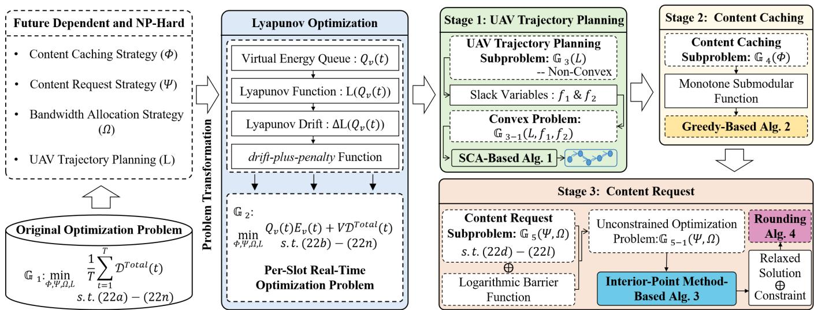  
Fig. 2. The framework of Online Joint Coded Caching and Content Delivery (OJC3D) algorithm.

Constraints (22b) and (22c) ensure that the cached content at each AUV does not exceed its storage capacity $S _ { u } .$ Constraints (22d)–(22i) regulate the content request locations, ensuring that the requested content is actually available at the selected node and that the nodes involved are connected. Specifically, constraint (22i) guarantees that the decoding requirement of MDS-coded content is satisfied. Constraints (22j)–(22l) ensure that the total allocated bandwidth fractions do not exceed the system’s bandwidth availability. Finally, constraints (22m) and (22n) impose restrictions on the UAV’s trajectory, where $d _ { \operatorname* { m a x } } ^ { \mathrm { U A V } }$ denotes the maximum movement distance allowed per time slot.

Lemma 1. The optimization problem $\mathbb { G } _ { 1 }$ is NP-hard.

Proof. To establish the NP-hardness of problem $\mathbb { G } _ { 1 } .$ , we consider a simplified version of the original problem in which only the AUVs’ content caching strategy Φ and content request strategy Ψ are optimized. Bandwidth allocation and UAV trajectory planning are ignored. Furthermore, we assume that contents can only be accessed from AUVs that cache them or from a fixed UAV node acting as a central content provider.

In this special case, each AUV acts as a candidate content cache (facility), and each content request corresponds to a demand from a client. Caching a content at an AUV incurs a storage cost, and satisfying a content request from a selected cache incurs a delivery cost (e.g., communication delay). Each AUV has a limited storage capacity, analogous to the capacity of a facility in the classical Capacitated Facility Location Problem (CFLP) [44]. The objective is to minimize the total delivery delay by optimally selecting which contents to cache at which AUVs (facility opening), and how to assign each request to a caching node (demand allocation).

This simplified problem instance can be directly reduced from the CFLP, which is known to be NP-hard. Therefore, the original problem $\mathbb { G } _ { 1 }$ is also NP-hard. ■

## IV. ONLINE ALGORITHM DESIGN

To tackle the formulated NP-hard problem, we propose an Online Joint Coded Caching and Content Delivery (OJC3D)

algorithm, as depicted in Fig. 2. Leveraging Lyapunov optimization, OJC3D transforms the long-term constrained problem into a per-slot decision-making process. Each time slot involves three key stages: (i) UAV trajectory planning via convex approximation, (ii) submodular content caching optimization, and (iii) content request and bandwidth scheduling via relaxed mixed-integer programming.

## A. Lyapunov-Based Problem Transformation

To handle the long-term energy constraint of the UAV (22a), we introduce a virtual energy queue $Q _ { v } ( t )$ , initialized as $Q _ { v } ( 0 ) = 0$ . The queue is updated at each time slot according to:

$$
Q _ { v } ( t + 1 ) = \operatorname* { m a x } \left\{ Q _ { v } ( t ) + E _ { v } ( t ) - E _ { \operatorname* { m a x } } ^ { \mathrm { U A V } } , 0 \right\} .\tag{23}
$$

To capture the queue backlog, we define the Lyapunov function as:

$$
L ( Q _ { v } ( t ) ) = \frac { 1 } { 2 } Q _ { v } ^ { 2 } ( t ) .\tag{24}
$$

Accordingly, the Lyapunov drift at slot t is given by:

$$
\Delta L ( Q _ { v } ( t ) ) = \mathbb { E } \left\{ L ( Q _ { v } ( t + 1 ) ) - L ( Q _ { v } ( t ) ) \mid Q _ { v } ( t ) \right\} .\tag{25}
$$

By incorporating content access delay into the drift, we define the drift-plus-penalty function as:

$$
\Delta L ( Q _ { v } ( t ) ) + V \mathbb { E } \left\{ { \mathcal { D } } ^ { \mathrm { T o t a l } } ( t ) \mid Q _ { v } ( t ) \right\} ,\tag{26}
$$

where $V ~ \geq ~ 0$ is a control parameter that balances queue stability and total content access delay.

Theorem 1. For any time slot t, the upper bound of the drift-plus-penalty function satisfies:

$$
\begin{array} { r l r } & { \Delta L ( Q _ { v } ( t ) ) + V \mathbb { E } \left\{ \mathcal { D } ^ { \mathrm { T o t a l } } ( t ) \mid Q _ { v } ( t ) \right\} \leq P + V \mathcal { D } ^ { \mathrm { T o t a l } } ( t ) } & \\ & { + Q _ { v } ( t ) \left( E _ { v } ( t ) - E _ { \operatorname* { m a x } } ^ { \mathrm { U A V } } \right) , } & { ( 2 } \end{array}\tag{27}
$$

where $\begin{array} { r } { P = \frac { 1 } { 2 } } \end{array}$ max $\left\{ ( E _ { \operatorname* { m a x } } ^ { \mathrm { U A V } } ) ^ { 2 } , ( E _ { 1 } - E _ { \operatorname* { m a x } } ^ { \mathrm { U A V } } ) ^ { 2 } \right\}$ is a constant and $E _ { 1 }$ is the upper bound of the UAV energy consumption.

Proof. According to the energy queue update (23) and the inequality $( \operatorname* { m a x } \{ x , \bar { 0 } \} ) ^ { 2 } \leq x ^ { 2 }$ , we have:

$$
Q _ { v } ^ { 2 } ( t + 1 ) \leq \left( Q _ { v } ( t ) + E _ { v } ( t ) - E _ { \operatorname* { m a x } } ^ { \mathrm { U A V } } \right) ^ { 2 } .\tag{28}
$$

JOURNAL OF LAT X CLASS FILES, VOL. 14, NO. 8, AUGUST 2021

Then, the one-step Lyapunov drift becomes:

$$
\begin{array} { r l } & { \Delta L ( Q _ { v } ( t ) ) = \mathbb { E } \left\{ \frac { 1 } { 2 } \left[ Q _ { v } ^ { 2 } ( t + 1 ) - Q _ { v } ^ { 2 } ( t ) \right] \bigg | Q _ { v } ( t ) \right\} } \\ & { \quad \quad \quad \quad \quad \leq \mathbb { E } \left\{ \frac { 1 } { 2 } \left( E _ { v } ( t ) - E _ { \operatorname* { m a x } } ^ { \mathrm { U A V } } \right) ^ { 2 } \bigg | Q _ { v } ( t ) \right\} } \\ & { \quad \quad \quad \quad + \mathbb { E } \left\{ Q _ { v } ( t ) \left( E _ { v } ( t ) - E _ { \operatorname* { m a x } } ^ { \mathrm { U A V } } \right) \big | Q _ { v } ( t ) \right\} } \end{array}\tag{29}
$$

Let $\begin{array} { r } { P = \frac { 1 } { 2 } } \end{array}$ max $\left\{ ( E _ { \operatorname* { m a x } } ^ { \mathrm { U A V } } ) ^ { 2 } , ( E _ { 1 } - E _ { \operatorname* { m a x } } ^ { \mathrm { U A V } } ) ^ { 2 } \right\}$ , and $E _ { 1 }$ is the upper bound of the UAV energy consumption, we can obtain:

$$
\Delta L ( Q _ { v } ( t ) ) \leq P + Q _ { v } ( t ) ( E _ { v } ( t ) - E _ { \operatorname* { m a x } } ^ { \mathrm { U A V } } ) .\tag{30}
$$

Finally, adding the weighted penalty term, the drift-pluspenalty is upper bounded by:

$$
\begin{array} { r l r } & { \Delta L ( Q _ { v } ( t ) ) + V \mathbb { E } \left\{ \mathcal { D } ^ { \mathrm { T o t a l } } ( t ) \mid Q _ { v } ( t ) \right\} \le P + V \mathcal { D } ^ { \mathrm { T o t a l } } ( t ) } & \\ & { + Q _ { v } ( t ) \left( E _ { v } ( t ) - E _ { \operatorname* { m a x } } ^ { \mathrm { U A V } } \right) . } & { \qquad ( \ref { \sum _ { i } ^ { j } } } \end{array}\tag{1}
$$

■

According to the Lyapunov optimization framework, the original problem $\mathbb { G } _ { 1 }$ , which depends on future system information, can be transformed into an online per-slot problem $\mathbb { G } _ { 2 }$ that only relies on the current system state. Specifically, the problem is formulated as:

$$
\mathbb { G } _ { 2 } : \operatorname* { m i n } _ { \Phi , \varPsi , \Omega , \mathrm { L } } Q _ { v } ( t ) E _ { v } ( t ) + V \mathcal { D } ^ { \mathrm { T o t a l } } ( t )\tag{32}
$$

$$
\mathrm { s . t . } \quad ( 2 2 b ) - ( 2 2 n ) .
$$

However, the transformed problem remains a Mixed-Integer Nonlinear Programming (MINLP) problem with strong coupling among decision variables. To address this, we develop a three-stage optimization algorithm that efficiently obtains a feasible suboptimal solution within polynomial time.

## B. Three-Stage Optimization Algorithm

In this section, we propose a three-stage iterative optimization framework to jointly optimize UAV trajectory, content caching, and content request strategies.

• Stage 1: UAV Trajectory Planning. Given fixed AUV content caching strategy Φ, content request strategy Ψ, and bandwidth resource allocation strategy Ω, we optimize the UAV trajectory L via the Successive Convex Approximation (SCA)-based method.

• Stage 2: Content Caching Optimization. With the optimized UAV trajectory $\mathrm { L } ^ { \ast }$ , we re-optimize the AUV content caching strategy Φ to minimize the delivery delay while satisfying cache capacity constraints.

• Stage 3: Content Request Optimization. Fixing L∗ and $\Phi ^ { * }$ , we jointly optimize the content request strategy $\varPsi$ and bandwidth resource allocation strategy Ω using interiorpoint method and rounding algorithm.

1) UAV Trajectory Planning Stage: By removing the constant terms that are independent of the UAV trajectory, problem $\mathbb { G } _ { 2 }$ can be transformed into:

$$
\begin{array} { r l r } {  { \mathbb { G } _ { 3 } : \operatorname* { m i n } _ { \mathrm { ~ L ~ } } \sum _ { u \in \mathcal { U } _ { 1 } } \sum _ { c \in \mathcal { C } } \sum _ { m \in \mathcal { M } } \big ( V + Q _ { v } ( t ) p _ { v } \big ) [ \frac { s _ { c } k } { \omega _ { u } ^ { * } ( t ) W _ { 3 } r _ { v , m , u } ( t ) } ] } } \\ & { } & \\ & { } & { + Q _ { v } ( t ) \tau [ B _ { 1 } ( 1 + \frac { 3 q ( t ) ^ { 2 } } { U _ { p } ^ { 2 } } ) + B _ { 2 } \sqrt { \sqrt { B _ { 3 } + \frac { q ( t ) ^ { 4 } } { 4 } } - \frac { q ( t ) ^ { 2 } } { 2 } }  } \\ & { } & \\ & { } & {  + B _ { 4 } q ( t ) ^ { 3 } ] } \end{array}
$$

$$
\begin{array} { r l } { \mathrm { s . t . } } & { { } ( 2 2 m ) - ( 2 2 n ) . } \end{array}
$$

Let $\mathcal { U } _ { 1 }$ represent the set of AUVs that request content from the UAV, and $\omega _ { u } ^ { * } ( t )$ denote the known bandwidth allocation ratio of the UAV. Next, we transform problem $\mathbb { G } _ { 3 }$ into a convex function by introducing slack variables. First, we introduce slack variables $f _ { 1 }$ and $f _ { 2 }$ , and add the following constraints:

$$
\sqrt { \sqrt { B _ { 3 } + \frac { q ( t ) ^ { 4 } } { 4 } } - \frac { q ( t ) ^ { 2 } } { 2 } } \le f _ { 1 } \Rightarrow \frac { B _ { 3 } } { f _ { 1 } ^ { 2 } } \le f _ { 1 } ^ { 2 } + q ( t ) ^ { 2 } .\tag{34}
$$

$$
\log _ { 2 } \left( 1 + \frac { p _ { v } \beta \left( P _ { v , m } ^ { \mathrm { L o S } } ( t ) + \left( 1 - P _ { v , m } ^ { \mathrm { L o S } } ( t ) \right) \eta \right) } { N _ { 0 } \| \mathbf { l } _ { v } ( t ) - \mathbf { l } _ { m } ( t ) \| _ { 2 } ^ { 2 \mu } } \right) \ge f _ { 2 } .\tag{35}
$$

Then, by introducing the slack variables into problem $\mathbb { G } _ { 3 }$ we obtain:

$$
\begin{array} { l } { \mathbb { G } _ { 3 - 1 } : \displaystyle \operatorname* { m i n } _ { \mathrm { L } , f _ { 1 } , f _ { 2 } } \sum _ { u \in \mathcal { U } _ { 1 } } \sum _ { c \in \mathcal { C } } \sum _ { m \in \mathcal { M } } \left( V + Q _ { v } ( t ) p _ { v } \right) \left[ \frac { s _ { c } k } { \omega _ { u } ^ { * } ( t ) W _ { 3 } f _ { 2 } } \right] + } \\ { \displaystyle Q _ { v } ( t ) \left[ B _ { 1 } \left( 1 + \frac { 3 q ( t ) ^ { 2 } } { U _ { p } ^ { 2 } } \right) + B _ { 2 } f _ { 1 } + B _ { 4 } q ( t ) ^ { 3 } \right] \tau } \end{array}\tag{36}
$$

$$
\begin{array} { r l } { \mathrm { s . t . } } & { { } ( 2 2 m ) , ( 2 2 n ) , ( 3 4 ) , ( 3 5 ) . } \end{array}
$$

Theorem 2. Problems $\mathbb { G } _ { 3 - 1 }$ and $\mathbb { G } _ { 3 }$ are equivalent.

Proof. Suppose $1 _ { v } ^ { * } ( t ) , f _ { 1 } ^ { * }$ , and $f _ { 2 } ^ { * }$ are the optimal solutions to problem $\mathbb { G } _ { 3 - 1 }$ , then there exists

$$
\begin{array} { r l } & { \sqrt { \sqrt { B _ { 3 } + \frac { q ^ { * } ( t ) ^ { 4 } } { 4 } } - \frac { q ^ { * } ( t ) ^ { 2 } } { 2 } } = f _ { 1 } ^ { * } , } \\ & { \log _ { 2 } \left( 1 + \frac { p _ { v } \beta \left( P _ { v , m } ^ { \mathrm { L o S } } ( t ) + \left( 1 - P _ { v , m } ^ { \mathrm { L o S } } ( t ) \right) \eta \right) } { N _ { 0 } \| \boldsymbol { 1 } _ { v } ^ { * } ( t ) - \boldsymbol { 1 } _ { m } ( t ) \| _ { 2 } ^ { 2 \mu } } \right) = f _ { 2 } ^ { * } , } \end{array}\tag{37}
$$

where $\begin{array} { r } { q ^ { * } ( t ) ~ = ~ \frac { \lVert \mathbf { l } _ { v } ^ { * } ( t ) - \mathbf { l } _ { v } ( t - 1 ) \rVert _ { 2 } } { \tau } } \end{array}$ . Otherwise, we can further minimize the objective function by choosing a smaller $f _ { 1 }$ or a larger $f _ { 2 }$ under the constraints (34) and (35). Thus, $\mathrm { L } ^ { * }$ is also the optimal solution to problem G3. ■

At this point, the optimization objective of problem $\mathbb { G } _ { 3 - 1 }$ is convex, while constraints (34) and (35) remain non-convex. Therefore, similar to [41], a Successive Convex Approximation (SCA) method is employed to solve the problem.

Theorem 3. Let $J ( \mathbf { l } _ { v } ( t ) , f _ { 1 } ) = f _ { 1 } ^ { 2 } + q ( t ) ^ { 2 }$ , and given a local point $\mathbf { l } _ { v } ^ { ( i ) } ( t )$ in the i-th iteration, a global concave lower bound for $J ^ { ( i ) } ( \mathbf { l } _ { v } ( t ) , f _ { 1 } )$ can be expressed as:

$$
J ^ { ( i ) } ( \mathbf { 1 } _ { v } ( t ) , f _ { 1 } ) \ge \left( f _ { 1 } ^ { ( i ) } \right) ^ { 2 } + 2 f _ { 1 } ^ { ( i ) } \left( f _ { 1 } - f _ { 1 } ^ { ( i ) } \right)
$$

Algorithm 1 UAV Trajectory Planning Algorithm   
1: Input AUV content caching strategy ${ \overline { { \Phi , } } }$ content request   
strategy Ψ, and bandwidth resource allocation strategy $\varOmega ,$   
maximum iteration $I = 1 0 0 \mathrm { . }$ , the accuracy threshold $\varrho =$   
0.001.   
2: Output UAV trajectory $\mathrm { L } ^ { * } .$   
3: while $i < I$ do   
4: Calculate the slack variable $f _ { 1 } ^ { ( i ) } { \vdots }$   
5: Obtain the optimal position and the objective   
value $\mathbb { G } _ { 3 - 1 } ^ { ( i ) } ;$   
6: $\mathbf { i f } \ | | \mathbb { G } _ { 3 - 1 } ^ { ( i ) } - \mathbb { G } _ { 3 - 1 } ^ { ( i - 1 ) } | | < \varrho$ then   
7: Break;   
8: else   
9: Set $i \gets i + 1 ;$   
10: end if   
11: end while   
12: Return UAV trajectory L∗.   
$+ \frac { \| \mathbf { l } _ { v } ^ { ( i ) } ( t ) - \mathbf { l } _ { v } ( t - 1 ) \| _ { 2 } ^ { 2 } } { \tau ^ { 2 } }$   
$+ \frac { 2 } { \tau ^ { 2 } } ( \mathbf { l } _ { v } ^ { ( i ) } ( t ) - \mathbf { l } _ { v } ( t - 1 ) ) ^ { T } \left( \mathbf { l } _ { v } ( t ) - \mathbf { l } _ { v } ( t - 1 ) \right)$   
(38)

(38)

Proof. Since $J ( \mathbf { l } _ { v } ( t ) , f _ { 1 } )$ is a convex quadratic function, its Taylor expansion at the local point $1 _ { v } ^ { ( i ) } { \dot { ( t ) } }$ provides a global convex lower bound for $J ( \mathbf { l } _ { v } ( t ) , f _ { 1 } )$ ■

Theorem 4. Let

$$
P ( \mathbf { l } _ { v } ( t ) ) = \log _ { 2 } \left( 1 + \frac { p _ { v } \beta \left( P _ { v , m } ^ { \mathrm { L o S } } ( t ) + \left( 1 - P _ { v , m } ^ { \mathrm { L o S } } ( t ) \right) \eta \right) } { N _ { 0 } \| \mathbf { l } _ { v } ( t ) - \mathbf { l } _ { m } ( t ) \| _ { 2 } ^ { 2 \mu } } \right) .\tag{39}
$$

We can obtain the global concave lower bound for $P ( \boldsymbol { 1 } _ { v } ( t ) )$ as:

$$
\begin{array} { r } { P ^ { ( i ) } ( \mathbf { 1 } _ { v } ( t ) ) \geq \log _ { 2 } \left( 1 + \frac { \delta } { \| \mathbf { l } _ { v } ^ { ( i ) } ( t ) - \mathbf { l } _ { m } ( t ) \| _ { 2 } ^ { 2 \mu } } \right) - } \\ { \frac { \mu \delta \log _ { 2 } e ( \| \mathbf { l } _ { v } ( t ) - \mathbf { l } _ { m } ( t ) \| _ { 2 } ^ { 2 } - \| \mathbf { l } _ { v } ^ { ( i ) } ( t ) - \mathbf { l } _ { m } ( t ) \| _ { 2 } ^ { 2 } ) } { [ \delta + \| \mathbf { l } _ { v } ^ { ( i ) } ( t ) - \mathbf { l } _ { m } ( t ) \| _ { 2 } ^ { 2 \mu } ] ( \| \mathbf { l } _ { v } ^ { ( i ) } ( t ) - \mathbf { l } _ { m } ( t ) \| _ { 2 } ^ { 2 } ) } , } \end{array}\tag{40}
$$

where $\begin{array} { r } { \delta = \frac { p _ { v } \beta \left( P _ { v , m } ^ { \mathrm { L o S } } ( t ) + \left( 1 - P _ { v , m } ^ { \mathrm { L o S } } ( t ) \right) \eta \right) } { N _ { \mathrm { 0 } } } } \end{array}$ . Through the above, we have transformed problem $\mathbb { G } _ { 3 - 1 }$ into a convex optimization problem. The UAV trajectory planning algorithm based on SCA is described in Alg. 1.

2) Content Caching Stage: Next, we fix the other decision variables and optimize the content caching strategy Φ for the AUV. In this case, the content caching subproblem is formulated as:

$$
\begin{array} { r } { \mathbb { G } _ { 4 } : \underset { \Phi } { \operatorname* { m i n } } Q _ { v } ( t ) E _ { v } ( t ) + V \mathcal { D } ^ { \mathrm { T o t a l } } ( t ) } \\ { \mathrm { s . t . ~ } \left( 2 2 b \right) - ( 2 2 c ) . } \end{array}\tag{41}
$$

Theorem 5. The problem $\mathbb { G } _ { 4 }$ is a monotone submodular function, and an approximate optimal solution can be obtained via a greedy algorithm with polynomial time complexity.

Proof. Let $Q = U \times C$ denote the ground set of content caching decisions, and let $X \subseteq Q$ . We first prove that $\mathbb { G } _ { 4 }$ is monotone non-increasing. Define the marginal gain function as $\mathbb { G } _ { 4 } ( Y | X ) = \mathbb { G } _ { 4 } ( Y \bar { \cup } X ) - \mathbb { G } _ { 4 } ( X )$ . For any $X \subseteq Q$ and $( u _ { 0 } , c _ { 0 } ) \in Q \backslash X$ , if AUV u0 requests content $c _ { 0 }$ at the current time slot, caching content $c _ { 0 }$ reduces the request delay; hence, $\mathbb { G } _ { 4 } \big ( \big ( u _ { 0 } , c _ { 0 } \big ) | X \big ) < 0$ . Otherwise, if $\mathrm { A U V } ~ u _ { 0 }$ does not request content $c _ { 0 }$ at the current time slot, caching $c _ { 0 }$ has no effect on delay, so $\mathbb { G } _ { 4 } \big ( \big ( u _ { 0 } , c _ { 0 } \big ) | X \big ) = 0$ . Therefore, the marginal gain satisfies $\mathbb { G } _ { 4 } \big ( \big ( u _ { 0 } , c _ { 0 } \big ) | X \big ) \leq 0$ , indicating that $\mathbb { G } _ { 4 }$ is monotone non-increasing.

Algorithm 2 Content Caching Algorithm   
1: Input AUV content request strategy $\varPsi ,$ , bandwidth re  
source allocation strategy Ω, UAV trajectory $\mathrm { L } ,$ Storage   
capacity $S _ { u } ,$ , block size $s _ { c }$   
2: Output content caching strategy $\Phi ^ { * } ,$   
3: Initialize $X = \{ \} , V = \{ ( u , c ) | \forall u \in \mathcal { U } , c \in \mathcal { C } \} , \varphi _ { u } ^ { c } ( t ) =$   
0, $, S _ { u } ^ { ' } = S _ { u } ;$   
4: While $| V | > 0$ do   
5: $( \hat { u } , \hat { c } ) =$ arg min $\qquad ( u , c ) \in V  ^ { \mathbb { G } _ { 4 } ; }$   
6: $X = X \cup ( \hat { u } , \hat { c } ) ;$   
7: $V = V \setminus ( \hat { u } , \hat { c } ) ;$   
8: $\varphi _ { \hat { u } } ^ { \hat { c } } ( t ) = 1 , S _ { \hat { u } } ^ { ' } = S _ { \hat { u } } ^ { ' } - s _ { \hat { c } } ;$   
9: for $( \hat { u } , c ) \in \bar { V }$ do   
10: if $s _ { c } > S _ { \hat { u } } ^ { ' }$ then   
11: $V = \stackrel { \sim } { V } \backslash ( \hat { u } , c ) ;$   
12: end if   
13: end for   
14: end while   
15: Return content caching strategy $\Phi ^ { * }$

Next, we prove submodularity. For any $X _ { 1 } \subseteq X _ { 2 } \subseteq Q$ and $( u _ { 0 } , c _ { 0 } ) \in Q \ \backslash \ X _ { 2 } .$ , since each AUV generates at most one content request per time slot, regardless of which set the requested content belongs to, it holds that $\mathbb { G } _ { 4 } \big ( \big ( \boldsymbol { u } _ { 0 } , \boldsymbol { c } _ { 0 } \big ) \big | X _ { 1 } \big ) -$ $\mathbb { G } _ { 4 } \big ( \big ( u _ { 0 } , c _ { 0 } \big ) | X _ { 2 } \big ) ~ \ge ~ 0$ , which satisfies the definition of a submodular function. Hence, the theorem is proved. ■

Based on the submodularity property, we propose a greedy algorithm to solve problem $\mathbb { G } _ { 4 } ,$ as shown in Alg. 2. The core idea is to iteratively select the caching service with the largest marginal gain while satisfying the storage constraints. It can be proven that Alg. 2 achieves a 1 − 1 -approximation solution for problem $\mathbb { G } _ { 4 }$

3) Content Request Stage: After obtaining the content caching strategy $\Phi ^ { * }$ of AUVs and the UAV trajectory $\mathrm { L } ^ { \ast }$ , we further optimize the content request strategy $\varPsi$ and the bandwidth allocation strategy Ω. The problem can be formulated as follows:

$$
\mathbb { G } _ { 5 } : \operatorname* { m i n } _ { \varPsi , \Omega } Q _ { v } ( t ) E _ { v } ( t ) + V \mathcal { D } ^ { \mathrm { { I o t a l } } } ( t )\tag{42}
$$

$$
\mathrm { s . t . } \quad ( 2 2 d ) - ( 2 2 l ) .
$$

We note that, due to the presence of constraint (22d), problem $\mathbb { G } _ { 5 }$ remains a mixed-integer optimization problem. To address this, we first relax the binary content request decision variables Ψ into continuous variables, i.e., $\psi _ { u } ( c , i ) ~ \in ~ [ 0 , 1 ]$ for any $u \in \mathcal { U } , c \in \mathcal { C } ,$ , and $i \in \{ 1 , 2 , \ldots , U { + } M \}$ , thereby transforming the original problem into a linear programming problem. Furthermore, we reformulate constraints (22d)–(22l) into the form $W _ { j } ( \varPsi , \varOmega ) \geq 0 , j \in \{ 1 , 2 , \dots , 9 \}$ . By constructing a barrier function and incorporating it into the objective function, we obtain the following unconstrained optimization problem:

Algorithm 3 Relaxed Content Request Algorithm   
1: Input: Initial point $\overline { { \{ \varPsi ^ { ( 0 ) } , \varOmega ^ { ( 0 ) } \} } }$ , initial barrier parameter   
$\rho _ { 0 } > 0 ,$ , tolerance $\epsilon > 0 ;$   
2: Output: The relaxed solution of decision variables: $\hat { \psi }$ and   
Ωˆ.   
3: $\{ \varPsi , \varOmega \} \gets \{ \varPsi ^ { ( 0 ) } , \varOmega ^ { ( 0 ) } \} ;$   
4: Compute the gradient $\mathsf { \nabla } \nabla \mathbb { G } _ { 5 - 1 } ( \varPsi , \varOmega ) ;$   
5: while $| | \nabla \mathbb { G } _ { 5 - 1 } ( \varPsi , \varOmega ) | | > \epsilon$ do   
6: Compute Hessian matrix $\nabla ^ { 2 } \mathbb { G } _ { 5 - 1 } ( \varPsi , \varOmega ) ;$   
7: Compute the Newton step $v ^ { N }$ by solving the linear   
equation $\nabla ^ { 2 } \mathbb { G } _ { 5 - 1 } ( \varPsi , \varOmega ) \overset { \cdot } { v ^ { N } } = - \nabla \mathbb { G } _ { 5 - 1 } \overset { \cdot } { ( } \varPsi , \varOmega )$   
8: Update the point $\{ \varPsi , \varOmega \} \gets \{ \varPsi , \varOmega \} + v ^ { N } ;$   
9: end while   
10: $\{ \hat { \varPsi } , \hat { \mathcal { \Omega } } \} \gets \{ \varPsi , \mathcal { \Omega } \} ;$   
11: Return relaxed solution $\{ \hat { \varPsi } , \hat { \varOmega } \}$

$$
\begin{array} { r } { \mathbb { G } _ { 5 - 1 } : \underset { \psi , \Omega } { \operatorname* { m i n } } Q _ { v } ( t ) E _ { v } ( t ) + V \mathcal { D } ^ { \mathrm { T o t a l } } ( t ) - } \\ { \displaystyle \frac { 1 } { \rho } \sum _ { j = 1 } ^ { 9 } \log \left( - W _ { j } ( \varPsi , \varOmega ) \right) . } \end{array}\tag{43}
$$

Here, $\rho$ is the control parameter. Consequently, the relaxed continuous solution to this problem can be obtained using the interior-point method, and the detailed solution procedure is presented in Alg. 3.

Furthermore, based on the continuous solution $\{ \hat { \varPsi } , \hat { \varOmega } \}$ obtained from Alg. 3, we propose a rounding algorithm, as presented in Alg. 4, which yields the optimal discrete content request decisions and continuous bandwidth allocation decisions while ensuring that all constraints remain satisfied. The core idea is to randomly select two variables and shift them in the same direction with a probabilistic offset until one of them reaches a value in {0, 1}. Since the rounding operation is always performed on a variable pair, the weighted sum is preserved before and after rounding.

Theorem 6. Let $\hat { \mathbb { G } } _ { 5 - 1 } ( \hat { \Psi } , \hat { \varOmega } )$ be the objective value of the relaxed solution obtained by solving (43) via the interior-point method. After applying the content request rounding algorithm to obtain $( \varPsi ^ { * } , \varOmega ^ { * } )$ , we have

$$
\mathbb { E } [ \mathbb { G } _ { 5 } ( \varPsi ^ { * } , \varOmega ^ { * } ) ] \ \leq \ \hat { \mathbb { G } } _ { 5 - 1 } ( \hat { \varPsi } , \hat { \varOmega } ) + \frac { k - 1 } { k } \mathbb { G } _ { 5 } ^ { \mathrm { m a x } } ,\tag{44}
$$

where $\mathbb { G } _ { 5 } ^ { \mathrm { m a x } }$ denotes the largest single-request cost via any UAV path in the current slot, i.e.,

$$
\mathbb { G } _ { 5 } ^ { \operatorname* { m a x } } : = \operatorname* { m a x } _ { u , c } \ \operatorname* { m i n } _ { m : a _ { m } = b _ { u , m } = 1 } \left( V D _ { u , m } ^ { \mathrm { U A V } } ( t , c ) + Q _ { v } ( t ) E _ { v } ( t ) \right)\tag{45}
$$

Hence, the additive integrality gap is upper-bounded by $\frac { k - 1 } { k } \mathbb { G } _ { 5 } ^ { \mathrm { m a x } }$

Proof. For any request $( u , c )$ , let $\Gamma _ { u , c }$ denote its available D2D suppliers. If $| \Gamma _ { u , c } | \geq k ,$ , the Rounding updates operate

Algorithm 4 Content Request Rounding Algorithm   
1: Input relaxed $\{ \hat { \varPsi } , \hat { \varOmega } \}$ , bandwidth $\{ B _ { 1 } , B _ { 2 } , B _ { 3 } \}$ , and code   
parameter k.   
2: Output content request strategy $\varPsi ^ { * }$ and bandwidth allo  
cation strategy $\varOmega ^ { * } .$   
3: for each active request $( u , c )$ do   
4: $\Gamma _ { u , c } \gets \{ i | i \in \mathcal { U } , g _ { u , i } ( t ) = 1 , \varphi _ { i } ^ { c } ( t ) = 1 \} ;$   
5: $\mathbf { i f } \left| \Gamma _ { u , c } \right| \geq k$ then   
6: while $\exists i _ { 1 } , i _ { 2 } \in \Gamma _ { u , c }$ with $0 < \hat { \psi } _ { u } ( c , i ) < 1$ do   
7: Rounding $\big ( \hat { \psi } _ { u } ( c , i _ { 1 } ) , \hat { \psi } _ { u } ( c , i _ { 2 } ) , 1 , 1 \big )$   
8: end while   
9: else   
10: m = arg min $\mathbb { G } _ { 5 }$   
11: $\psi _ { u } ( c , U + m ) \gets 1 ,$ , others $ 0 ;$   
12: end if   
13: end for   
14: Solve (42) with fixed (Φ, Ψ, L) via Newton to obtain Ω.   
Procedure Rounding   
15: Input two relaxed vars $( x , y )$ and weights $( w _ { x } , w _ { y } )$ (both   
$> 0 )$   
16: Output: Updated $( x , y )$ with at least one integral, $w _ { x } x +$   
$w _ { y } y$ unchanged   
17: $\begin{array} { r } { \Delta _ { 1 } ^ { '  }  \operatorname* { m i n } \ \stackrel {  } { 1 } - x , \ \frac { w _ { y } } { w _ { x } } y \ \} ; \quad \Delta _ { 2 }  \operatorname* { m i n } \{ \ x , \ \frac { w _ { y } } { w _ { x } } ( 1 - y ) \ \} } \end{array}$   
18: $p  \frac { \Delta _ { 2 } } { \Delta _ { 1 } + \Delta _ { 2 } }$ % tie-breaking prob.   
19: Draw $r \stackrel { \cdot } { \sim } \mathrm { U n i f } ( 0 , 1 )$   
20: if $r < p$ then   
21: $x  x + \Delta _ { 1 } ; y  y - \frac { w _ { x } } { w _ { y } } \Delta _ { 1 }$   
22: else   
23: $x  x - \Delta _ { 2 } ; \quad y  y + \frac { w _ { x } } { w _ { y } } \Delta _ { 2 }$   
24: end if   
only within $\Gamma _ { u , c } ,$ preserve $\textstyle \sum _ { i } \psi _ { u } ( c , i )$ , and do not increase   
the objective due to the linearity of $\mathbb { G } _ { 5 }$ in Ψ . If $| \Gamma _ { u , c } | < k _ { : }$   
constraint (22i) forces the rounded solution to select a single   
UAV path, replacing all D2D-supplied blocks by UAV trans  
mission. In the worst case $| \Gamma _ { u , c } | = k - 1$ , this replacement   
increases the cost by at most ${ \frac { k { \dot { - } } 1 } { k } } \mathbb { G } _ { 5 } ^ { \operatorname* { m a x } }$ . Summing over all   
requests and noting that the bandwidth re-optimization does   
not increase the objective yields (44)

4) Overall OJC3D Algorithm: The overall OJC3D algorithm is summarized in Alg. 5. The core idea is to iteratively perform Stage 1 to Stage 3 until convergence. Alg. 5 guarantees that the objective value is non-increasing across iterations due to the optimality of each stage under fixed variables.

Theorem 7. The proposed OJC3D algorithm runs in polynomial time with respect to the problem size $( U , M , C , T )$

Proof. We analyze the worst-case complexity of each stage within one outer iteration of Alg. 5 and then multiply by the maximum number of outer iterations $I _ { \mathrm { m a x } }$ . Let U be the number of AUVs, M the number of buoys, C the number of contents, and T the number of time slots. Denote $N _ { L } = \Theta \big ( ( M + 1 ) T \big ) , | \Phi | = U C , | \Psi | = U C ( U + M )$ , and $| \Omega | = U ( { \dot { U } } + M + 1 )$ , where $N _ { L }$ is the number of variables in the UAV trajectory subproblem, |Φ| is the number of caching decision variables, |Ψ| the number of content request variables, and |Ω| the number of bandwidth allocation variables.

Algorithm 5 Overall Online Joint Coded Caching and Content   
Delivery (OJC3D) Algorithm   
1: Input: Initial strategies $\Phi ^ { ( 0 ) } , \varPsi ^ { ( 0 ) } , \varOmega ^ { ( 0 ) }$ , UAV trajectory   
$\mathrm { L } ^ { ( 0 ) }$ , maximum iteration $I _ { \mathrm { m a x } } ,$ tolerance ϵ.   
2: Output: Optimized $\Phi ^ { * } , \varPsi ^ { * } , \varOmega ^ { * } , \mathrm { L } ^ { * } .$   
3: for $i = 0$ to $I _ { \mathrm { m a x } }$ do   
4: // Stage 1: UAV trajectory optimization   
5: Update $\mathrm { L } ^ { ( i + 1 ) }$ by solving the SCA-based subproblem   
with fixed $\Phi ^ { ( i ) } , \dot { \psi } ^ { ( i ) } , \varOmega ^ { ( i ) } .$   
6: // Stage 2: Content caching optimization   
7: Update $\Phi ^ { ( i + 1 ) }$ by solving the caching subproblem with   
fixed $\mathrm { L } ^ { ( i + 1 ) }$   
8: // Stage 3: Content request and bandwidth allocation   
optimization   
9: Update $( \varPsi ^ { ( i + 1 ) } , \varOmega ^ { ( i + 1 ) } )$ using the proposed relaxed   
content request and content request rounding algorithms   
with fixed $\Phi ^ { ( i + 1 ) } , \mathrm { L } ^ { ( i + 1 ) }$   
10: // Convergence check   
11: if $| \mathbb { G } _ { \mathrm { o b j } } ^ { ( i + 1 ) } - \mathbb { G } _ { \mathrm { o b j } } ^ { ( i ) } | < \epsilon$ then   
12: Break   
13: end if   
14: end for   
15: Return $\Phi ^ { * } , \varPsi ^ { * } , \varOmega ^ { * } , \mathrm { L } ^ { * } .$

Stage 1 (UAV trajectory via SCA). In each SCA iteration (Alg. 1), one convex subproblem of dimension $N _ { L }$ is solved using a polynomial-time convex solver. Let $T _ { \mathrm { c v x } } ( N _ { L } )$ denote the complexity of solving one such subproblem; conservatively, $T _ { \mathrm { c v x } } ( N _ { L } ) = O ( N _ { L } ^ { 3 } )$ . If $I _ { \mathrm { s c a } }$ is the maximum number of SCA iterations, then $T _ { \mathrm { S 1 } } = { \cal O } \big ( I _ { \mathrm { s c a } } \cdot T _ { \mathrm { c v x } } ( N _ { L } ) \big )$

Stage 2 (Content caching via greedy selection). Alg. 2 performs at most R selection rounds $\begin{array} { r l } { ( R } & { { } \leq } \end{array}$ min $\{ U C , \textstyle \sum _ { u } \lfloor S _ { u } / s _ { c } \rfloor \} )$ , each requiring $O ( U C )$ marginal gain evaluations in the naive implementation. Thus, $T _ { \mathrm { S 2 } } =$ $O ( U C \cdot R ) \subseteq O ( ( U C ) ^ { 2 } )$

Stage 3 (Request relaxation, rounding, and bandwidth allocation). The relaxed request subproblem (Alg. 3) is solved using an interior-point or Newton-type method over $\left( | \Psi | + | \Omega | \right)$ variables, yielding complexity $T _ { \mathrm { r e l a x } } = \cal { O } \big ( I _ { \mathrm { i p m } } \cdot ( U C ( U +$ $M ) ) ^ { 3 } )$ , where $I _ { \mathrm { i p m } }$ is the number of Newton/IPM iterations. The subsequent rounding (Alg. 4) is linear in the number of fractional request variables $T _ { \mathrm { r o u n d } } = O ( | \Psi | ) = O ( U C ( U +$ M)). Finally, the bandwidth allocation step is a convex optimization problem with complexity $T _ { \mathrm { b w } } ~ = ~ { \cal O } ( | \Omega | ^ { 3 } ) ~ =$ $\bar { O ( } ( U ( U + M \bar { + } 1 ) ) ^ { 3 } )$ . Thus, $T _ { \mathrm { S 3 } } = { \cal O } ( I _ { \mathrm { i p m } } \cdot ( U C ( U + M ) ) ^ { 3 } +$ $( U ( U + M + 1 ) ) ^ { 3 } + U C ( U + M ) )$

One outer iteration of Alg. 5 costs $T _ { \mathrm { i n n e r } } \ = \ O \Big ( I _ { \mathrm { s c a } }$ $T _ { \mathrm { c v x } } ( N _ { L } ) + U C \cdot R + I _ { \mathrm { i p m } } \cdot ( U C ( U + M ) ) ^ { 3 } + ( U ( U + M + 1 ) \cdot \dot { ( } { \cal M } ) + \dot { ( } { \cal U } ( U + M ) ) ^ { 2 } )$ $1 ) ) ^ { 3 } + U C ( U + M ) \Big )$

Since the algorithm terminates after at most $I _ { \mathrm { m a x } }$ outer iterations, $T _ { \mathrm { t o t a l } } ~ = ~ O \big ( I _ { \mathrm { m a x } } \cdot T _ { \mathrm { i n n e r } } \big )$ , which is polynomial in $( U , M , C , T )$ because $N _ { L } , | \Phi | , | \dot { \Psi } | , | \Omega |$ are all polynomial functions of these parameters, and each subproblem is solved by a polynomial-time routine. Therefore, OJC3D has

TABLE II  
SIMULATION PARAMETERS AND EXPERIMENTAL SETTINGS
<table><tr><td>Parameters</td><td>Value</td></tr><tr><td>The spreading factor</td><td>1.5</td></tr><tr><td>The central frequency of acoustic signal</td><td>30 kHz</td></tr><tr><td>The shipping activity factor</td><td> $_ { 0 . 5 }$ </td></tr><tr><td>Wind speed</td><td>5 m/s</td></tr><tr><td>AUV operating depth</td><td>100 m</td></tr><tr><td>Surface-reflected channel gains</td><td>1</td></tr><tr><td>Seabed-reflected channel gains</td><td>0.0139</td></tr><tr><td>The number of sea surface reflection points</td><td>100</td></tr><tr><td>The number of seabed reflection points</td><td>100</td></tr><tr><td>The total transmission bandwidth of AUVs</td><td>10 kHz</td></tr><tr><td>The transmission power of AUVs</td><td>0.1 W</td></tr><tr><td>The overall efficiency of the electronic circuitry</td><td>0.2</td></tr><tr><td>The total transmission bandwidth of buoys</td><td>10 kHz</td></tr><tr><td>The transmission power of buoys</td><td>0.5 W</td></tr><tr><td>The environment-specific constants</td><td>10,0.6</td></tr><tr><td>The channel power gain at 1 m</td><td>1.42 × 10−4</td></tr><tr><td>The total transmission bandwidth of UAV</td><td>5MHz</td></tr><tr><td>The transmission power of UAV</td><td>1 W</td></tr><tr><td>The maximum speed of the UAV</td><td>30 m/s</td></tr><tr><td>The number of CPU cycles for processing one bit of acoustic signal</td><td> $1 0 ^ { 4 }$  cycles</td></tr><tr><td>Gaussian white noise</td><td>-100 dBm</td></tr><tr><td>Tip speed of the rotor</td><td>120 m/s</td></tr><tr><td>Zipf exponent</td><td>0.7</td></tr></table>

polynomial-time complexity.

## V. PERFORMANCE EVALUATION

## A. Simulation Settings

We consider a marine environment with dimensions of $5 0 0 \times 5 0 0 \times 2 0 0 \mathrm { m ^ { 3 } }$ , where 5 AUVs are randomly distributed within the area. Two buoys are deployed on the sea surface, and a UAV operates at an altitude of 100 meters. The system operation period is equally divided into 100 time slots, and all AUVs are assumed to have identical storage capacity. The system contains 10 different types of content files, which are stored and transmitted using a default (3, 2) MDS coding scheme. The content requests of AUVs follow a Zipf distribution, and the remaining experimental parameters are listed in Table II. All experiments were conducted on a server running Ubuntu 20.04, equipped with eight NVIDIA GeForce RTX 3090 GPUs and an Intel(R) Xeon(R) Silver 4210R CPU @ 2.40 GHz. Moreover, we compare OJC3D with the following five benchmark schemes:

• PGC: PGC is a composite heuristic baseline constructed in this paper. It uses popularity-based caching under the Zipf request distribution, greedy nearest-provider selection for D2D content retrieval, and a fixed center-hovering UAV without trajectory optimization.

• TCP-3DF [45]: A genetic algorithm incorporating a penalty function and truncated chromosome scheme to jointly optimize UAV trajectory, caching, and delivery decisions.

• PP-AG3C [46]: A block coordinate descent-based method that jointly optimizes UAV trajectory, caching, and content delivery strategies while accounting for UAV energy consumption.

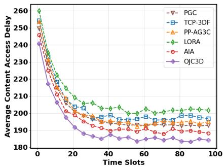  
(a) Content access latency

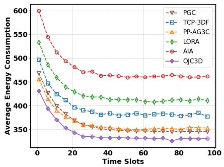  
(b) UAV energy consumption

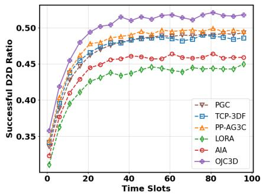  
(c) AUV-to-AUV delivery ratio  
Fig. 3. The impact of time slots on system performance: (a) time average content access latency, (b) time average UAV energy consumption, and (c) time average AUV-to-AUV delivery ratio.

TABLE III  
ABLATION STUDY ON AVERAGE CONTENT ACCESS DELAY VERSUS THE NUMBER OF AUVS.
<table><tr><td>Method</td><td>5</td><td>10</td><td>15</td><td>20</td><td>25</td><td>30</td></tr><tr><td>OJC3D w/o D2D</td><td>232.8</td><td>224.6</td><td>206.5</td><td>194.7</td><td>186.4</td><td>179.5</td></tr><tr><td>OJC3D w/o Trajectory</td><td>206.6</td><td>201.4</td><td>185.4</td><td>175.3</td><td>169.2</td><td>166.2</td></tr><tr><td>OJC3D</td><td>184.4</td><td>177.4</td><td>157.3</td><td>143.6</td><td>133.7</td><td>126.6</td></tr></table>

TABLE IV

ABLATION STUDY ON UAV ENERGY CONSUMPTION VERSUS THE NUMBER OF AUVS.
<table><tr><td>Method</td><td>5</td><td>10</td><td>15</td><td>20</td><td>25</td><td>30</td></tr><tr><td>OJC3D w/o D2D</td><td>418.6</td><td>392.8</td><td>366.4</td><td>341.5</td><td>324.8</td><td>311.2</td></tr><tr><td>OJC3D w/o Trajectory</td><td>362.4</td><td>331.7</td><td>289.5</td><td>254.8</td><td>239.6</td><td>231.8</td></tr><tr><td>OJC3D</td><td>330.3</td><td>285.1</td><td>250.6</td><td>195.4</td><td>175.2</td><td>172.1</td></tr></table>

• LORA [47]: A joint Lyapunov optimization and reinforcement learning method to optimize caching and delivery strategies in the target area.

• AIA [48]: An iterative algorithm based on block coordinate descent and successive convex approximation to jointly optimize other strategies without considering UAV energy constraints.

## B. Ablation Study

To further quantify the roles of cooperative D2D delivery and UAV trajectory optimization, we compare the complete OJC3D with two degraded variants, namely OJC3D w/o D2D and OJC3D w/o Trajectory, as reported in Tables III and IV. Compared with OJC3D, removing D2D delivery increases the average content access delay and UAV energy consumption by about 25% and 35%, respectively, while removing trajectory optimization increases them by about 16% and 18%. These results indicate that D2D coded delivery is the main source of performance gain, whereas UAV trajectory optimization further enhances system performance by reducing unnecessary UAV-assisted transmissions. From a practical perspective, stronger D2D cooperation enables more requests to be completed within the underwater layer, while adaptive UAV mobility further lowers service delay and aerial support burden in remote marine missions.

## C. Online Performance Evaluation

Figs. 3(a), (b), and (c) illustrate the time-averaged content access delay, time-averaged UAV energy consumption, and time-averaged AUV-to-AUV delivery ratio for the six methods, respectively. It can be observed that all methods gradually converge within about 20–40 slots, while OJC3D consistently achieves the best steady-state performance.

In terms of delay, OJC3D converges to the lowest content access delay, reducing the steady-state delay by up to 9% compared with the other compared methods. For UAV energy consumption, OJC3D also achieves the lowest converged value, reducing it by about 4% compared with the practical heuristic baseline PGC and by up to 29% compared with the other benchmarks. In addition, Fig. 3(c) shows that OJC3D maintains the highest successful D2D ratio after convergence, improving it by about 4% compared with the strongest competing baseline and by up to 17% over the other methods. These results indicate that OJC3D can more effectively exploit local underwater cooperation while reducing repeated UAV-assisted transmissions, which is beneficial for improving service continuity and extending UAV support duration in dynamic offshore environments.

## D. Impact of the Number of AUVs

In Fig. 4, we evaluate the impact of the number of AUVs on the average content access delay, UAV energy consumption, and the ratio of successful AUV-to-AUV transmissions. As the number of AUVs increases, all methods achieve lower delay and lower UAV energy consumption, while the AUV-to-AUV delivery ratio increases, since richer underwater cooperation opportunities become available.

Specifically, Fig. 4(a) shows that OJC3D consistently achieves the lowest content access delay. Compared with the strongest competing baseline, OJC3D reduces the average access delay by about 3%, while the reduction reaches up to 10% when compared with the weaker baselines. Compared with the practical heuristic baseline PGC, the gain is about 7%. These results verify that OJC3D can more effectively convert the growth of underwater cooperation opportunities into faster content access.

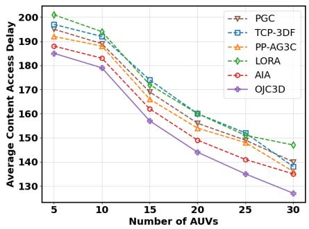  
(a) Content access latency

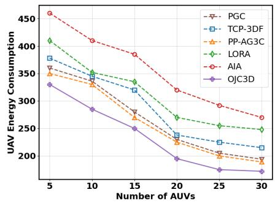  
(b) UAV energy consumption

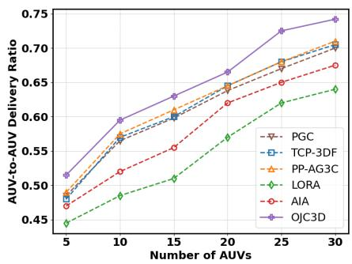  
(c) AUV-to-AUV delivery ratio

Fig. 4. Impact of the number of AUVs on system performance: (a) content access latency, (b) UAV energy consumption, and (c) AUV-to-AUV delivery ratio.  
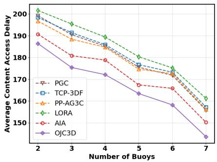  
(a) Content access latency

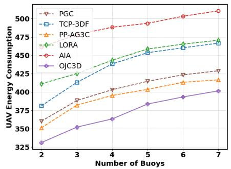  
(b) UAV energy consumption

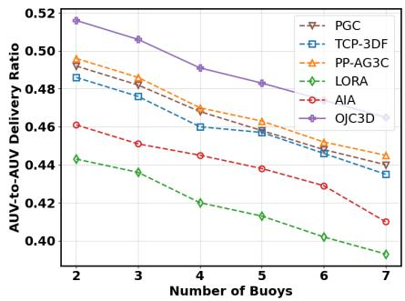  
(c) AUV-to-AUV delivery ratio  
Fig. 5. Impact of the number of buoys on system performance: (a) content access latency, (b) UAV energy consumption, and (c) AUV-to-AUV delivery ratio

Fig. 4(b) evaluates UAV energy consumption under different numbers of AUVs. Since more AUVs facilitate local codedblock delivery, the UAV needs to transmit fewer complete files, and thus the energy consumption decreases. OJC3D reduces the average UAV energy consumption by about 10% compared with the strongest competing baseline, by about 13% compared with PGC, and by as much as 35% compared with the least energy-efficient benchmark. In Fig. 4(c), OJC3D also achieves the highest AUV-to-AUV delivery ratio, improving it by about 4% over the strongest competing baseline and by up to 19% compared with the other methods. Moreover, when the number of AUVs increases from 5 to 30, the AUV-to-AUV delivery ratio of OJC3D improves by about 44%, showing its strong scalability in dense marine AUV networks.

## E. Impact of the Number of Buoys

Since buoys serve as gateway nodes that connect UAVs and AUVs, they play a crucial role in the system. Fig. 5 evaluates the impact of the number of buoys on system performance.

Fig. 5(a) shows that the average content access delay decreases as the number of buoys increases, because each AUV has a higher probability of selecting a less-loaded relay when requesting content from the UAV. OJC3D reduces the average delay by about 3% compared with the strongest competing baseline and by up to 9% compared with the other benchmark methods. These gains indicate that OJC3D can better exploit additional buoy resources for cross-domain content delivery.

Fig. 5(b) shows that the UAV energy consumption increases with the number of buoys, since more gateway opportunities encourage more UAV-assisted transmissions. Nevertheless, OJC3D still maintains the lowest UAV energy consumption. Compared with the strongest competing baseline, the average reduction is about 6%, while the gain reaches about 24% compared with the other compared methods. In Fig. 5(c), OJC3D also achieves the highest AUV-to-AUV delivery ratio, outperforming the strongest competing baseline by about 4% and the other baselines by up to 17%. This means that OJC3D can preserve stronger underwater self-service capability even when the cross-domain relay layer becomes richer.

## F. Impact of the Number of Contents

In Fig. 6, we evaluate the influence of the number of contents on system performance. The results reveal that as the number of contents increases, both the average access delay and UAV energy consumption increase across all methods, while the AUV-to-AUV delivery ratio decreases.

Specifically, Fig. 6(a) shows that when the content library becomes larger, the limited cache capacity of AUVs leads to more cache misses, and thus more requests must be served by the UAV. OJC3D still achieves the lowest access delay, reducing it by about 2% compared with both PGC and the strongest competing baseline, while the reduction reaches about 6% compared with the other benchmark methods. Although the delay gain becomes more moderate in this setting, it indicates that OJC3D remains effective under increasingly diverse marine content demands.

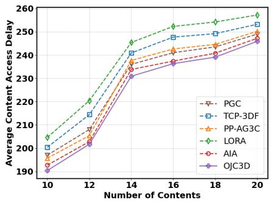  
(a) Content access latency

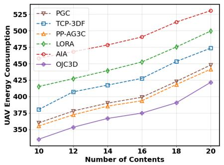  
(b) UAV energy consumption

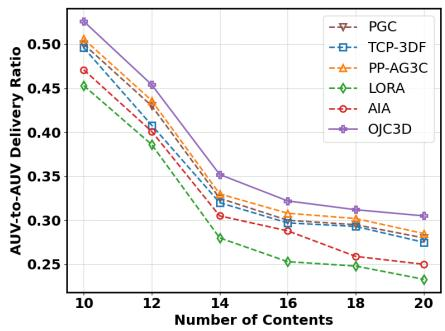  
(c) AUV-to-AUV delivery ratio

Fig. 6. Impact of the number of contents on system performance: (a) content access latency, (b) UAV energy consumption, and (c) AUV-to-AUV delivery ratio.  
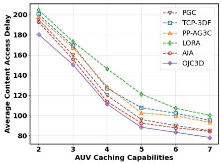  
(a) Content access latency

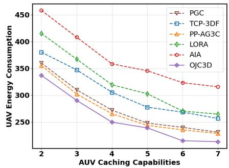  
(b) UAV energy consumption

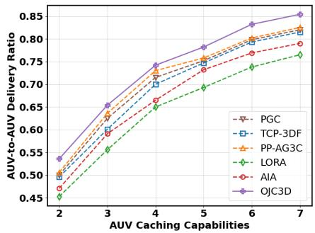  
(c) AUV-to-AUV delivery ratio  
Fig. 7. Impact of AUV caching capacity on system performance: (a) content access latency, (b) UAV energy consumption, and (c) AUV-to-AUV delivery ratio.

Fig. 6(b) shows that UAV energy consumption increases with the number of contents, since the UAV has to respond to more requests. Compared with the strongest competing baseline, OJC3D reduces the average UAV energy consumption by about 5%, and the reduction reaches up to 24% compared with the remaining baselines. Fig. 6(c) further shows that OJC3D maintains the highest AUV-to-AUV delivery ratio, improving it by about 5% over the strongest competing baseline, by about 7% over PGC, and by up to 24% over the other compared methods. This demonstrates its robustness under growing content-library size.

## G. Impact of the Cache Capacity of AUVs

In Fig. 7, we analyze the effect of different AUV cache capacities on system performance.

Fig. 7(a) shows that the average content access delay decreases as the cache capacity increases, because more requests can be served locally within the underwater layer. Compared with the strongest competing baseline, OJC3D reduces the average delay by about 5%, while the reduction reaches up to 20% compared with the other methods. This indicates that the proposed method can more effectively transform additional cache resources into service efficiency.

Fig. 7(b) shows the UAV energy consumption. As the cache capacity increases, more content requests are satisfied by AUVs, which reduces the number of complete files that must be transmitted by the UAV. Compared with the strongest competing baseline, OJC3D reduces the average UAV energy consumption by about 5%, while the reduction reaches about 30% compared with the other compared methods. Finally, Fig. 7(c) shows that the AUV-to-AUV delivery ratio increases significantly as the cache capacity grows. When the cache capacity increases from 2 to 7, the ratio of OJC3D improves by about 59%. Moreover, compared with the strongest competing baseline, OJC3D further improves the average ratio by about 3%, while the gain reaches up to 15% compared with the other methods.

## VI. CONCLUSION

In this work, we investigated coded caching-enabled D2D content delivery in UAV-assisted marine edge networks, where UAV trajectories, content caching, and content access decisions were jointly optimized to minimize request latency under long-term UAV energy constraints. The proposed OJC3D algorithm integrates Lyapunov-based real-time optimization with a three-stage decision-making framework, enabling efficient adaptation to the dual-hop acoustic–RF transmission environment, intermittent acoustic links, and resource limitations inherent in marine scenarios. By decomposing the original NP-hard problem into tractable subproblems, our approach provides an effective balance between delivery efficiency and energy consumption. Simulation results verified

JOURNAL OF LAT X CLASS FILES, VOL. 14, NO. 8, AUGUST 2021

that OJC3D achieves significant improvements over optimal baseline strategies in terms of both latency reduction and UAV energy savings. Future work will further extend the proposed framework from both energy and physical-layer perspectives. On the energy side, we will incorporate AUV-side energy consumption, such as the energy cost of underwater D2D communication, coded content caching, and onboard processing. On the physical-layer side, we will also explore more detailed small-scale fading models, such as correlated Rician shadowed fading channels, for the UAV-to-buoy RF link to provide fading-aware transmission rates for online decisionmaking.

## REFERENCES

[1] T. Qiu, Y. Li, and X. Feng, “Optimal broadcast scheduling algorithm for a multi-auv acoustic communication network,” IEEE/ACM Transactions on Networking, vol. 31, no. 5, pp. 2058–2069, 2023.

[2] Z. Huang, Z. Yu, L. Wang, Y. Zhao, H. Zhou, and B. Guo, “Two timescale drl for service caching and task offloading in cross-domain marine networks,” IEEE Transactions on Mobile Computing, 2025.

[3] Z. Wang, B. Lin, and Q. Ye, “Double-edge-assisted computation offloading and resource allocation for space-air-marine integrated networks,” IEEE Transactions on Vehicular Technology, 2025.

[4] M. Dai, N. Huang, Y. Wu, L. Qian, B. Lin, Z. Su, and R. Lu, “Latency minimization oriented hybrid offshore and aerial-based multi-access computation offloading for marine communication networks,” IEEE Transactions on Communications, vol. 71, no. 11, pp. 6482–6498, 2023.

[5] M. Dai, C. Dou, Y. Wu, L. Qian, R. Lu, and T. Q. Quek, “Multi-uav aided multi-access edge computing in marine communication networks: A joint system-welfare and energy-efficient design,” IEEE Transactions on Communications, vol. 72, no. 9, pp. 5517–5531, 2024.

[6] M. Dai, Y. Wu, L. Qian, Z. Su, B. Lin, and N. Chen, “Uav-assisted multiaccess computation offloading via hybrid noma and fdma in marine networks,” IEEE Transactions on Network Science and Engineering, vol. 10, no. 1, pp. 113–127, 2022.

[7] Z. Wang, B. Lin, Q. Ye, and H. Peng, “Two-tier task offloading for satellite-assisted marine networks: A hybrid stackelberg-bargaining game approach,” IEEE Internet of Things Journal, 2024.

[8] Z. Huang, Z. Yu, L. Wang, H. Zhou, and B. Guo, “Joint optimization of caching, migration, and offloading in satellite-assisted marine networks,” IEEE Transactions on Networking, 2026.

[9] R. Ruby, S. Zhong, B. M. ElHalawany, H. Luo, and K. Wu, “Sdnenabled energy-aware routing in underwater multi-modal communication networks,” IEEE/ACM Transactions on Networking, vol. 29, no. 3, pp. 965–978, 2021.

[10] M. Cheng, K. Wan, P. Elia, and G. Caire, “Coded caching schemes for multiaccess topologies via combinatorial design,” IEEE Transactions on Information Theory, 2025.

[11] Z. Huang, Z. Yu, L. Wang, H. Zhou, E. Yang, and B. Guo, “Erasure coding-based cost-optimized and latency-aware data storage in uavenabled edge systems,” IEEE Transactions on Mobile Computing, 2025.

[12] T. Yang, Z. Jiang, R. Sun, N. Cheng, and H. Feng, “Maritime search and rescue based on group mobile computing for unmanned aerial vehicles and unmanned surface vehicles,” IEEE transactions on industrial informatics, vol. 16, no. 12, pp. 7700–7708, 2020.

[13] X. Han, B. Lin, Z. Na, B. Li, C. Zhang, and R. Zhang, “Spatial crowdsourcing-based task allocation for uav-assisted maritime data collection,” IEEE Transactions on Vehicular Technology, 2024.

[14] M. Dai, Z. Luo, Y. Wu, L. Qian, B. Lin, and Z. Su, “Incentive oriented two-tier task offloading scheme in marine edge computing networks: a hybrid stackelberg-auction game approach,” IEEE Transactions on Wireless Communications, vol. 22, no. 12, pp. 8603–8619, 2023.

[15] Y. Zhang, Z. Na, S. Li, B. Lin, Y. Lin, and A. Nallanathan, “Joint service caching and task offloading for multi-uav-assisted offshore edge computing networks,” IEEE Transactions on Vehicular Technology, 2025.

[16] A. I. Ameur, O. S. Oubbati, A. Rachedi, A. Arishi, and M. Atiquzzaman, “Intelligent uav caching and energy management in 6 g networks,” IEEE Transactions on Network Science and Engineering, 2025.

[17] Y. Zhang, Z. Na, B. Lin, Y. Lin, and A. Nallanathan, “Energy consumption minimization for integrated sensing, communication, computing and caching in multi-layer aerial internet of things,” IEEE Internet of Things Journal, 2025.

[18] C. Yu, R. He, J. Wu, H. Li, Y. Si, S. Zhang, and Y. Zhang, “Multi-uav enabled maritime relay communication and service content migration,” IEEE Transactions on Vehicular Technology, 2025.

[19] J. Yao, T. Han, and N. Ansari, “On mobile edge caching,” IEEE Communications Surveys & Tutorials, vol. 21, no. 3, pp. 2525–2553, 2019.

[20] Z. Shen, Y. Cai, K. Cheng, P. P. Lee, X. Li, Y. Hu, and J. Shu, “A survey of the past, present, and future of erasure coding for storage systems,” ACM Transactions on Storage, vol. 21, no. 1, pp. 1–39, 2025.

[21] L. Wang, H. Wu, Z. Han, P. Zhang, and H. V. Poor, “Multi-hop cooperative caching in social iot using matching theory,” IEEE Transactions on Wireless Communications, vol. 17, no. 4, pp. 2127–2145, 2017.

[22] A. Wang and Z. Zhang, “Exact cooperative regenerating codes with minimum-repair-bandwidth for distributed storage,” in 2013 Proceedings IEEE INFOCOM. IEEE, 2013, pp. 400–404.

[23] S. Goparaju, A. Fazeli, and A. Vardy, “Minimum storage regenerating codes for all parameters,” IEEE Transactions on Information Theory, vol. 63, no. 10, pp. 6318–6328, 2017.

[24] Y. Chen, Y. Jiang, Y. Huang, F.-C. Zheng, and D. Niyato, “Edge cooperation based coded caching in fog radio access networks,” IEEE Transactions on Vehicular Technology, 2024.

[25] Q. Wei, R. Li, W. Bai, and Z. Han, “Multi-uav-enabled energy-efficient data delivery for low-altitude economy: Joint coded caching, user grouping, and uav deployment,” IEEE Internet of Things Journal, 2025.

[26] X. Zhang, Y. Ren, J. Wang, F. Jiang, W. Ni, and A. Jamalipour, “Random caching strategy based on scalable video coding: Content placement and delivery in multi-tier heterogeneous networks,” IEEE Transactions on Communications, 2025.

[27] Z. Ji, X. Guan, J. Liu, X. Shen, and M. Wang, “Semantic-based resource management based on d2d multicast content delivery: A game-theoretic approach,” IEEE Transactions on Vehicular Technology, 2025.

[28] Z. Huang, Z. Yu, Z. Huang, H. Zhou, E. Yang, Z. Yu, J. Xu, and B. Guo, “Energy-efficient multi-uav collaborative reliable storage: A deep reinforcement learning approach,” IEEE Internet of Things Journal, 2025.

[29] P. Qian, L. Wang, Z. Shi, Y. Lin, and A. Cai, “Robust information delivery and energy efficiency maximization in d2d-based v2x network,” IEEE Transactions on Intelligent Transportation Systems, 2025.

[30] M. Yan, M. Luo, C. A. Chan, A. F. Gygax, C. Li et al., “Energy-efficient content fetching strategies in cache-enabled d2d networks via an actorcritic reinforcement learning structure,” IEEE Transactions on Vehicular Technology, vol. 73, no. 11, pp. 17 485–17 495, 2024.

[31] H. Zeng, Z. Su, Q. Xu, R. Li, Y. Wang, M. Dai, T. H. Luan, X. Sun, and D. Liu, “Usv fleet-assisted collaborative computation offloading for smart maritime services: An energy-efficient design,” IEEE Transactions on Vehicular Technology, vol. 73, no. 10, pp. 14 718–14 733, 2024.

[32] C. Zeng, J.-B. Wang, Y. Pan, M. Xiao, C. Chang, X. Zhang, Y. Chen, H. Yu, and J. Wang, “Collaborative usv-buoy enabled maritime wireless networks: Cache-aided beamforming and trajectory design,” IEEE Transactions on Communications, 2025.

[33] H. Wang, Z. Yu, Y. Zhang, Y. Wang, F. Yang, L. Wang, J. Liu, and B. Guo, “hmos: An extensible platform for task-oriented human– machine computing,” IEEE Transactions on Human-Machine Systems, vol. 54, no. 5, pp. 536–545, 2024.

[34] Y. Li, Y. Liu, Y. Wang, Z. Guo, H. Yin, and H. Teng, “Synergetic denialof-service attacks and defense in underwater named data networking,” in IEEE INFOCOM 2020-IEEE Conference on Computer Communications. IEEE, 2020, pp. 1569–1578.

[35] Z. Peng, Y. Qiu, and G. Wang, “Model caching and application offloading for mobile edge intelligence network with learning-and-optimization approach,” IEEE Transactions on Services Computing, 2025.

[36] R. Luo, Z. Zhang, Q. He, M. Xu, F. Chen, X. Dai, S. Wu, and H. Jin, “Cost-effective edge data caching with failure tolerance and popularity awareness,” IEEE Transactions on Mobile Computing, 2025.

[37] Z. Xia, J. Du, C. Jiang, Z. Han, and Y. Ren, “Latency constrained energy-efficient underwater dynamic federated learning,” IEEE/ACM Transactions on Networking, 2024.

[38] J. Liu, G. Yuan, B. Tang, J. Liu, X. Tu, and X. Lei, “Three-dimensional server deployment optimization in multi-uav-assisted edge networks,” CCF Transactions on Pervasive Computing and Interaction, vol. 8, no. 1, pp. 64–80, 2026.

[39] Y. Zhu, J. Gan, Y. Lin, L. Ma, and W. Wu, “Investigation of aerodynamic noise distribution characteristics on cruise ship open decks using broadband noise source models,” Ocean Engineering, vol. 310, p. 118748, 2024.

[40] X. Hou, J. Wang, T. Bai, Y. Deng, Y. Ren, and L. Hanzo, “Environmentaware auv trajectory design and resource management for multi-tier underwater computing,” IEEE Journal on Selected Areas in Communications, vol. 41, no. 2, pp. 474–490, 2022.

[41] G. Sun, X. Zheng, Z. Sun, Q. Wu, J. Li, Y. Liu, and V. C. Leung, “Uav-enabled secure communications via collaborative beamforming with imperfect eavesdropper information,” IEEE Transactions on Mobile Computing, vol. 23, no. 4, pp. 3291–3308, 2023.

[42] Z. Yang, S. Bi, and Y.-J. A. Zhang, “Online trajectory and resource optimization for stochastic uav-enabled mec systems,” IEEE Transactions on Wireless Communications, vol. 21, no. 7, pp. 5629–5643, 2022.

[43] T. Z. H. Ernest, A. Madhukumar, R. P. Sirigina, and A. K. Krishna, “Noma-aided uav communications over correlated rician shadowed fading channels,” IEEE Transactions on Signal Processing, vol. 68, pp. 3103–3116, 2020.

[44] A. Ala, M. Deveci, E. A. Bani, and A. H. Sadeghi, “Dynamic capacitated facility location problem in mobile renewable energy charging stations under sustainability consideration,” Sustainable Computing: Informatics and Systems, vol. 41, p. 100954, 2024.

[45] T. C. Lam, N.-S. Vo, M.-P. Bui, C. D. T. Thai, H. Jung, and V.-C. Phan, “Service time-aware caching, power allocation, and 3d trajectory optimised multimedia content delivery in uav-assisted iot networks,” IEEE Transactions on Vehicular Technology, 2024.

[46] J. Bai, S. Zhu, Y. Chen, and Y. Chen, “The joint optimization of caching and content delivery in air-ground cooperation environment,” IEEE Internet of Things Journal, 2024.

[47] Z. Teng, J. Fang, and Y. Liu, “Combining lyapunov optimization and deep reinforcement learning for d2d assisted heterogeneous collaborative edge caching,” IEEE Transactions on Network and Service Management, vol. 21, no. 3, pp. 3236–3248, 2024.

[48] J. Huang, J. Zhang, W. Xia, Y. Wu, and C. Yuen, “Advanced optimization in caching aavs-assisted wireless networks with energy constraint,” IEEE Transactions on Intelligent Transportation Systems, 2025.

Liang Wang (Member, IEEE) received the PhD degree from the Shenyang Institute of Automation (SIA), Chinese Academy of Sciences, Shenyang, China, in 2014. He is currently a professor with the School of Computer Science, Northwestern Polytechnical University, Xi’an, China. His research interests include ubiquitous computing, mobile crowd sensing, and crowd computing.

Huan Zhou (Senior Member, IEEE) received the PhD degree from the Department of Control Science and Engineering, Zhejiang University. He was a visiting scholar with the Temple University from November 2012 to May, 2013, and a CSC supported postdoc fellow with the University of British Columbia from November 2016 to November 2017. He is currently a professor with Northwestern Polytechnical University, Xi’an, China. He was a lead guest editor of the Pervasive and Mobile Computing, and Special Session chair of the 3rd International

Conference on Internet of Vehicles (IoV 2016), and TPC member of IEEE WCSP’13’14, CCNC’14’15, ICNC’14’15, ANT’15’16, IEEE Globecom’17’18, ICC’18’19, etc. He has published more than 50 research papers in some international journals and conferences, including the IEEE Journal on Selected Areas in Communications, IEEE Transactions on Parallel and Distributed Systems, IEEE Transactions on Vehicular Technology and so on. His research interests include mobile social networks, vehicular ad hoc networks, opportunistic mobile networks, and mobile data offloading. He received the Best Paper Award of I-SPAN 2014 and I-SPAN 2018, and is currently serving as an associate editor of the IEEE Access and EURASIP Journal on Wireless Communications and Networking.

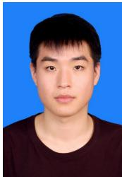  
Zhaoxiang Huang received the B.ENG degree in software engineering from Liaoning University, Shenyang, China, in 2021. He is currently pursuing the Ph.D. degree with the School of Computer Science, Northwestern Polytechnical University, Xi’an, China. His research interests include mobile crowdsensing, edge computing, and edge storage.

Fei Xiong received the Ph.D. degree from Beijing Jiaotong University, Beijing, China, in 2013. He was a Visiting Scholar with Carnegie Mellon University, Pittsburgh, PA, USA, from 2011 to 2012. He is currently a Professor with the School of Electronic and Information Engineering, Beijing Jiaotong University. His current research interests include Web mining, complex networks, and complex systems.

Zhiwen Yu (Senior Member, IEEE) received the PhD degree in computer science from Northwestern Polytechnical University, Xi’an, China, in 2005. He is currently the Vice President of Harbin Engineering University, Harbin, China, and a Professor at Northwestern Polytechnical University, Xi’an, China. He was an Alexander Von Humboldt fellow with Mannheim University, Germany, and a research fellow with Kyoto University, Kyoto, Japan. His research interests include ubiquitous computing, mobile crowd sensing, and human computer interaction.

  
Bin Guo (Senior Member, IEEE) received the PhD degree in computer science from Keio University, Minato, Japan, in 2009. He is currently a professor with Northwestern Polytechnical University, Xi’an, China. He was a postdoctoral researcher with the Institut TELECOM SudParis, Essonne, France. His research interests include ubiquitous computing, mobile crowd sensing, and HCI.