# Collaborative Ground-Space Communications via Evolutionary Multi-Objective Deep Reinforcement Learning

Jiahui Li, Geng Sun , Senior Member, IEEE, Qingqing Wu , Senior Member, IEEE, Dusit Niyato , Fellow, IEEE, Jiawen Kang , Senior Member, IEEE, Abbas Jamalipour , Fellow, IEEE, and Victor C. M. Leung , Life Fellow, IEEE

Abstract— Low Earth Orbit (LEO) satellites have emerged as crucial enablers of direct connections with remote terrestrial terminals. However, energy limitations and insufficient antenna capabilities at the terminals often hamper these connections, resulting in inefficient communications and frequent ping-pong handovers. This paper proposes a Distributed Collaborative Beamforming (DCB)-based uplink communication paradigm for enabling ground-space direct communications. Specifically, DCB treats the terminals that are unable to establish efficient direct connections with the LEO satellites as distributed antennas, forming a virtual antenna array to enhance the terminal-tosatellite uplink achievable rates and durations. However, such systems need multiple trade-off policies that jointly balance the

Manuscript received 7 March 2024; revised 30 June 2024; accepted 5 August 2024. Date of publication 12 September 2024; date of current version 22 November 2024. This work is supported in part by the National Natural Science Foundation of China (62172186, 62272194, 62371289, 62331022, 62471200), in part by the Science and Technology Development Plan Project of Jilin Province (20230201087GX), in part by the Postdoctoral Fellowship Program of China Postdoctoral Science Foundation (CPSF) (GZC20240592), in part by the National Research Foundation, Singapore, and Infocomm Media Development Authority under its Future Communications Research & Development Programme, Defence Science Organisation (DSO) National Laboratories under the Artificial Intelligence (AI) Singapore Programme (FCP-NTU-RG-2022-010 and FCP-ASTAR-TG-2022-003), in part by the Singapore Ministry of Education (MOE) Tier 1 (RG87/22), and in part by the Nanyang Technological University (NTU) Centre for Computational Technologies in Finance (NTU-CCTF). (Corresponding author: Geng Sun.)

Jiahui Li is with the College of Computer Science and Technology, Jilin University, Changchun 130012, China (e-mail: lijiahui@jlu.edu.cn).

Geng Sun is with the College of Computer Science and Technology and the Key Laboratory of Symbolic Computation and Knowledge Engineering of Ministry of Education, Jilin University, Changchun 130012, China, and also with the College of Computing and Data Science, Nanyang Technological University, Singapore 639798 (e-mail: sungeng@jlu.edu.cn).

Qingqing Wu is with the Department of Electronic Engineering, Shanghai Jiao Tong University, Shanghai 200240, China (e-mail: qingqingwu@sjtu.edu.cn).

Dusit Niyato is with the College of Computing and Data Science, Nanyang Technological University, Singapore 639798 (e-mail: dniyato@ntu.edu.sg).

Jiawen Kang is with the School of Automation, Guangdong University of Technology, Guangzhou 510006, China (e-mail: kjwx886@163.com).

Abbas Jamalipour is with the School of Electrical and Computer Engineering, The University of Sydney, Sydney, NSW 2006, Australia (e-mail: a.jamalipour@ieee.org).

Victor C. M. Leung is with the Artificial Intelligence Research Institute, Shenzhen MSU-BIT University, Shenzhen 518115, China, also with the College of Computer Science and Software Engineering, Shenzhen University, Shenzhen 518060, China, and also with the Department of Electrical and Computer Engineering, The University of British Columbia, Vancouver V6T 1Z4, Canada (e-mail: vleung@ieee.org).

Color versions of one or more figures in this article are available at https://doi.org/10.1109/JSAC.2024.3459029.

Digital Object Identifier 10.1109/JSAC.2024.3459029

terminal-satellite uplink achievable rate, energy consumption of terminals, and satellite switching frequency to satisfy the scenario requirement changes. Thus, we formulate a long-term multi-objective optimization problem to optimize these goals simultaneously. To address availability in different terminal cluster scales, we reformulate this problem into an action spacereduced and universal Multi-Objective Markov Decision Process (MOMDP). Then, we propose an Evolutionary Multi-Objective Deep Reinforcement Learning (EMODRL) algorithm to obtain multiple policies, in which the low-value actions are masked to speed up the training process. Simulation results show that DCB enables terminals that cannot reach the uplink achievable rate threshold to achieve efficient direct uplink transmission. Moreover, the proposed algorithm outmatches various baselines and saves 30% handover frequency with a similar uplink achievable rate compared with the rate greedy method, which thus reveals that the proposed method is an effective solution for enabling direct ground-space communications.

Index Terms— Satellite networks, distributed collaborative beamforming, multi-objective optimization, virtual antenna arrays, deep reinforcement learning.

# I. INTRODUCTION

WHILE terrestrial networks, including the Fifth-Generation (5G) networks and Wi-Fi, have undergone Generation (5G) networks and Wi-Fi, have undergone extensive research and deployment, the current network architecture still faces challenges in providing coverage in remote areas and exhibits fragility during natural disasters [1]. To overcome this issue, non-terrestrial networks based on satellites [2] become integral components of network architectures instead of only traditional roles in positioning and remote sensing, thereby significantly enhancing coverage of networks and disaster response capabilities [3], [4]. For instance, SpaceX develops the Starlink project to deliver global highspeed, low-latency broadband Internet services [5]. Moreover, the Third Generation Partnership Project (3GPP) discussed the integration of satellite networks in Rel-18, including radio access networks, services, system aspects, core, and terminals [6].

Among various platforms, Low Earth Orbit (LEO) constellations, consisting of thousands of satellites, play a crucial role in satellite networks by offering advantages such as lower transmission delay compared to medium Earth orbit and geostationary Earth orbit satellites [7]. Leveraging LEO satellites has empowered various terrestrial devices to establish direct connections with satellite networks, which grants them extensive Internet access capabilities in remote areas [8]. However, some previously deployed terrestrial terminals may be energy-sensitive and equipped with coarse antennas that have limited directional capabilities and low gain characteristics. As such, the uplink transmission from these terminals to LEO satellites can be low-efficiency and only stable when the link distances are short. Thus, the terminals have to switch satellites to connect frequently, resulting in the vexing problem of pingpong handovers [9]. Thus, it is important to improve the terrestrial-satellite uplink quality for enabling ground-space direct communications.

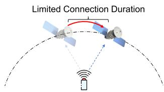

text_image

Limited Connection Duration

Case 1: Single terminal with limited uplink connection duration.

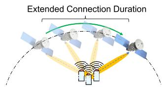

flowchart

Case 2: Multiple terminals using DCB to extend the uplink connection duration.   
Fig. 1. Due to the low uplink gain and transmit power of the terminals, the single terminal to LEO satellite uplink only continues short time. Benefiting from the transmission gain of DCB, the virtual antenna array will achieve extended connection duration.

Distributed collaborative beamforming (DCB) can be introduced into terrestrial terminals to achieve this goal. Specifically, DCB treats separate systems such as these terminals as distributed antennas, and simulates the beamforming process to produce a considerable transmission gain. By considering link budget calculation, DCB could increase up to $N _ { I }$ times transmit power and amplify the antenna gain to $N _ { I }$ times when the number of terminals is $N _ { I }$ , which optimizes the link budget by a factor of $N _ { I } ^ { 2 }$ . This enhancement is beneficial to offset wireless fading even in long-range links between ground devices and satellites [10], thereby enhancing the corresponding transmission distance and the received signal strength. In this way, as shown in Fig. 1, we can adopt DCB to extend the connection duration of one satellite and enhance the uplink capabilities, thereby improving the uplink achievable rate and reducing the satellite switching frequency.

However, designing such a DCB-based terminal-to-satellite uplink communication system is a nontrivial task. First, the uplink transmission performance and energy efficiency of DCB are determined by transmit power allocation of terminals. As such, transmit powers of terminals should be carefully optimized according to the channel conditions [11]. Second, while DCB enhances transmission performance, the switching decision also needs to consider maximizing the uplink achievable rate and minimizing the satellite switching frequency. The relative importance of these two goals may vary across diverse scenarios, which means that the existing single-objective optimization and static methods in the literature (e.g., [12], [13]) are inappropriate. Finally, this DCB-based terminal-to-satellite uplink communication system exhibits periodicity due to fixed satellite orbits, and encounters uncertainties and dynamics arising from wireless channel conditions. How to effectively discern the periodicity and deal with the dynamics in such systems are also imperative technical challenges. As such, addressing these challenges necessitates an innovative method absent from the current literature.

Accordingly, we aim to propose a novel DCB online multiobjective optimization approach that is more effective than existing work. The main contributions of this paper are summarized as follows:

• DCB-based Terminal-to-satellite Uplink Communication Enhancement: We utilize DCB to enable and extend the direct uplink communications between the terminals with coarse antenna and LEO satellites. As such, the transmission gain of the terrestrial terminals can be improved, thereby enhancing the uplink achievable rate and reducing the satellite switching frequencies of terrestrial terminals. To the best of our knowledge, such a joint optimization of satellite switching and DCB in satellite networks has not yet been investigated in the literature.

• Formulation of a Long-term Multi-objective Optimization Problem (MOP): We model the system to explore its periodicity and dynamics. Our major finding is that the total terminal-satellite uplink achievable rate, total energy consumption of terminals, and satellite switching frequency are crucial objectives that conflict with each other. Thus, we formulate an MOP to optimize these concerned metrics simultaneously. Note that the formulated MOP is non-convex and with a long-term objective, which requires a method with enhanced portability to solve it effectively.

• Multi-objective Deep Reinforcement Learning (DRL)- based Solution: Offline optimization methods are incapable of achieving the long-term optimum for the formulated MOP, while traditional reinforcement learning algorithms lack the adaptability to different scenarios. To overcome these issues, we first reformulate the formulated MOP into an action space-reduced and universal Multi-Objective Markov Decision Process (MOMDP) to enhance its portability. Then, we introduce an Evolutionary Multi-Objective DRL (EMODRL) algorithm and eliminate low-value actions to enhance its convergence performance. This algorithm is able to obtain multiple policies that represent different trade-offs among multiple objectives to accommodate diverse scenarios.

• Simulation and Performance Evaluation: Simulation results demonstrate that the proposed algorithm outperforms various baselines. Moreover, we find that the DCB-based communication approach enables the terminals that cannot reach the uplink achievable rate threshold to achieve efficient direct uplink transmission, and save 30% handover frequency with a similar uplink achievable rate compared with the rate greedy method. In addition, it reveals that the proposed algorithm achieves multiple policies favoring different objectives and achieving near-optimal uplink achievable rates with low switching frequency.

The rest of this paper is organized as follows. Section II reviews the related research activities. Section III presents the models and preliminaries. Section IV formulates the optimization problem. Section V proposes the multi-objective DRL-based solution. Simulation results are presented in Section VI. Finally, the paper is concluded in Section VII.

# II. RELATED WORKS

In this work, we aim to introduce DCB methods to enable direct satellite communications, while switching and handover are the major issues of such systems. This topic involves direct satellite communications, DCB optimizations, and switching and handover in satellite networks. Thus, we briefly introduce the related works of them as follows.

# A. Direct Satellite Communications

Facilitated by new LEO satellite constellations such as Starlink, direct satellite communications are emerging as a viable alternative to traditional fixed and wireless technologies, which raises the interests of many researchers. For example, in [14], the authors conducted a comprehensive measurement study on Starlink, thereby revealing its high-bandwidth and low-latency capabilities, and noting significant variability in performance due to factors like weather, satellite handovers, and inherent latencies in satellite communications. In [15], the authors investigated the user-perceived performance of Starlink and demonstrated its superior transmission control protocol throughput and web browsing speed compared to traditional geostationary satellite internet. In [16], the authors introduced a high-fidelity emulator for LEO satellite networks and a transmission control protocol solution that improves performance by predicting and adapting to satellite dynamics, thereby significantly enhancing goodput over existing protocols.

Moreover, some existing works considered the uplink transmission optimization from terrestrial devices to LEO satellites, which is a more challenging task [17]. For instance, the authors in [18] proposed a framework using stochastic geometry to analyze the uplink performance of IoT devices over LEO satellite networks, which compares direct and indirect communication scenarios to determine their impact on coverage reliability and IoT battery life. In [19], the authors addressed scalability issues in long-range-based direct-to-satellite IoT networks by evaluating Aloha-based protocols and introducing a new adaptive variant that dynamically adjusts uplink transmission rates.

Despite various powerful methods and techniques, the main challenges of direct satellite communications, particularly in uplink transmission, lie in insufficient transmit power and antenna gain of the existing terminals. Few studies investigate how to enable the direct connection between such terminals with LEO satellites.

# B. DCB Optimizations

DCB is particularly advantageous for the devices that are energy-sensitive, have low transmission performance, experience high link path losses, and require relatively robust connectivity [20]. As such, DCB has improved the transmission performance of various distributed systems, e.g., Internet-of-Things (IoTs) [20], mobile wireless sensors [21], and automated guided vehicles [22]. Recently, Unmanned Aerial Vehicles (UAVs) and other aerial vehicles have incorporated DCB to enhance the efficacy of air-to-ground and airto-air communications. Leveraging their Three-Dimensional (3D) mobility, UAVs can dynamically navigate to locations conducive to optimal DCB implementation and adjust communication parameters to fulfill diverse objectives. As such, prior research has explored the integration of DCB in UAV networks for purposes such as secure relay [23], confidential data transmission [24], data harvesting and dissemination systems [25], and others. In [26], the authors proposed a novel DCB-based technique for enhancing direct communications from LEO satellites to smartphones, which focuses on the superposition of electromagnetic waves to improve received signal strength and address Doppler shifts and time misalignments.

Nevertheless, the aforementioned methods are not suitable for the considered scenario since they do not consider the periodic characteristics inherent in satellite networks, and also cannot address the trade-off between satellite switching and the transmission gain facilitated by DCB.

# C. Switching and Handover in Satellite Networks

In LEO satellites, the handover and switching schemes considering their mobility have been studied in previous literature. For instance, Wang et al. [8] proposed a handover optimization strategy based on a conditional handover mechanism to enhance service continuity in LEO-based non-terrestrial networks, in which an optimal target selection algorithm was designed to the maximum reward for each conditional handover mechanism. Moreover, Song et a. [27] proposed a channel perceiving-based handover management strategy to optimize the utilization of channels and dynamically adjust the data allocation strategy in space-ground integrated information networks. The authors in [28] proposed a handover protocol to address the persistent challenge of long propagation delays in LEO satellite networks, and they considered a deep reinforcement learning method to skip the measurement report in the handover procedure by leveraging its predictive capabilities.

In [29], the authors formulated the network-flow model of the satellite switching according to the flow matrix, in which the optimal matching relationships are obtained by minimum cost and maximum flow of the network flows. In addition, the authors in [30] proposed switching and handover strategies for gateway stations and ultra-dense users to maximize the overall communication quality and balance the load of satellite networks, respectively. The authors in [31] introduced a LEO satellite architecture employing distributed massive multiple-input multiple-output technology (mMIMO) technology, which connects ground user terminals to satellite clusters, and proposed a distributed joint power allocation and handover management method to optimize network throughput and minimize handover rates.

Nonetheless, the aforementioned studies concentrated on the timing and strategies of satellite switching and handover, and overlooked the opportunity to augment satellite connection duration by optimizing the transmission gain of terrestrial devices.

In summary, different from the existing works, we consider utilizing DCB to augment both the duration and transmission gain from terrestrial terminals to LEO satellites. Based on this, we aim to devise the switching and beamforming strategies of such systems to facilitate efficient terrestrial-to-satellite uplink transmission.

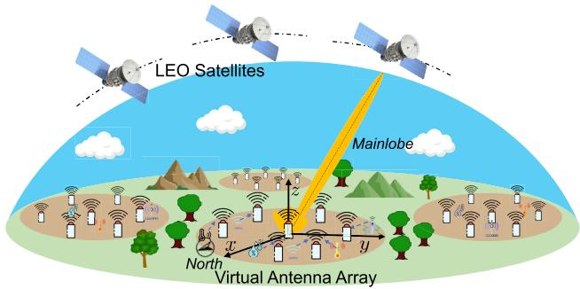

text_image

LEO Satellites
Mainlobe
Virtual Antenna Array
North

Fig. 2. A terminal cluster to LEO satellites communication system. All the terminals can directly connect with LEO satellites that are with fixed earth orbits. Terminals will form a virtual antenna array and select a suitable LEO satellite to perform uplink data transmission.

# III. SYSTEM MODELS AND PRELIMINARIES

# A. Network Segments

The terrestrial-satellite system under consideration is illustrated in Fig. 2, and it comprises the following elements:

• A satellite network consists of a constellation of LEO satellites $\begin{array} { r c l } { \mathcal { L } } & { = } & { \{ \ell | 1 , 2 , \ldots , N _ { L } \} } \end{array}$ . Each satellite may receive contents from terrestrial satellite terminals in its coverage and then transmit them to a data fusion center. These satellites are furnished with high-performance antennas with sufficient transmit power, and thus the downlink communications from satellites to terminals are efficient [32].   
• A terrestrial cluster comprising randomly distributed terminals. We consider that the geographical conditions (e.g., long intermediate distances, mountains, buildings, or other clustering methods [33]) naturally divide a large area into multiple ad hoc network clusters. Due to the link distance and channel conditions, intra-cluster communications are efficient, while the cooperation across clusters is unfeasible. These clusters may have varying numbers and distributions of terminals [34]. Thus, our primary focus is to investigate one of these clusters and propose a universal method which is applicable to such types of clusters. Without loss of generality, the cluster deploys a series of terminals, denoted as $\mathcal { T } = \{ i | 1 , 2 , \ldots , N _ { I } \}$ . Note that antennas of the terminals are generally either omni-directional or simple patch antennas, which are cost-effective and commonly used in consumer-grade communication devices. Thus, the terminals are energysensitive and have low transmission performance. Each terminal $i \in \mathcal { T }$ is able to collect data from IoT devices or six-generation mobile users in coverage and needs to access the satellite network for data uploading. Due to constrained transmission resources, these terminals face challenges in establishing effective terrestrial-satellite uplinks, especially when the LEO satellite is remote.

Terrestrial-satellite links are affected by the elevation angle of the LEO satellite. Specifically, angles that are closer to $9 0 ^ { \circ }$ result in shorter terminal-to-satellite distances, increasing the probability of a Line-of-Sight (LoS) connection. Conversely, angles below a certain angle (e.g., 10◦ in S-band scenarios or $4 0 ^ { \circ }$ in Ka-band scenarios) are unable to support data uploading [6].

We assume that each terminal can access a maximum of one LEO satellite at a time. Due to their insufficient transmit power, the terminals will form a virtual antenna array to obtain a higher gain. To maximize the uplink achievable rate and duration, we assume that the virtual antenna array introduces all the terminals within a cluster. Without loss of generality, we consider a discrete-time system evolving over timeline $\mathcal { T } = \{ t | 1 , 2 , . . . , T \}$ . At each time slot, only a subset of the LEO satellites have enough spectrum resources and suitable angles to receive data from the virtual antenna array. The available LEO satellite set at t-th time slot is denoted as $\mathcal { L } _ { t } \subseteq \mathcal { L } .$ . As such, the virtual antenna array needs to select one LEO satellite to connect and we denote the index of the connected LEO satellite at the t-th time instant as $s _ { t } .$ . Note that we assume that the mainlobe of the virtual antenna array can track the motion of the connected satellite during the time slot.

We also consider a Cartesian coordinate system, where the locations of the i-th terminal and the connected LEO satellite $s _ { t }$ at the t-th time slot are represented as $[ x _ { i } ^ { I } , y _ { i } ^ { I } , 0 ]$ and $[ x _ { s _ { t } } ^ { S } , y _ { s _ { t } } ^ { S } , z _ { s _ { t } } ^ { S } ]$ ] , respectively.

As such, the fixed communicable angles between terminals and satellites, coupled with the inherent orbital trajectories of satellites, introduce a certain periodicity to the system. Meanwhile, the limited spectral resources of satellites contribute to the uncertainty of availability, which brings dynamics to the considered system. In the following, we model the LEO satellite orbits and the communication process between the virtual antenna array and satellites to characterize the periodicity and dynamics within the system.

# B. LEO Satellite Orbit

LEO satellites are a category of satellites that orbit Earth at relatively low altitudes, typically ranging from approximately 160 to 2000 kilometers [35]. These satellites complete one orbit around Earth in a relatively short period. As shown in Fig. 3, the orbit of such LEO satellites can be determined by a tuple $< \iota , \Omega , \omega , \varepsilon , \varrho , \nu > [ 3 6 ]$ , which is detailed as follows:

• Inclination Angle (ι): This angle represents the intersection between the orbital plane and the equator. In particular, an inclination angle exceeding 90◦ indicates that the motion of satellite is in the opposite direction to that of Earth’s rotation.   
• Right Ascension of Ascending Node (Ω): This is the angle between the vernal equinox and the intersection of the orbital and equatorial planes.   
• Argument of the Perigee (ω): This angle is measured between the ascending node and the perigee, which is the point where the satellite is closest to Earth, along the orbital plane.   
• Eccentricity (ε): This parameter denotes the eccentricity of the orbital ellipse.   
• Semi-Major Axis $( \varrho ) \colon$ This is a fundamental parameter used to describe the size and shape of an elliptical orbit. In the context of orbital mechanics, it is half of the length of the major axis, which is the longest diameter of the elliptical orbit.

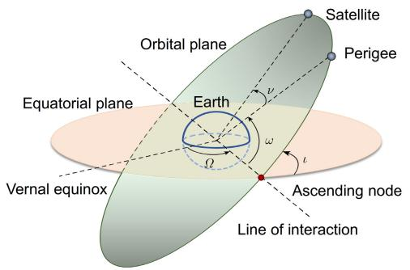

text_image

Orbital plane
Satellite
Perigee
Equatorial plane
Earth
ω
α
Line of interaction
Vernal equinox
Ascending node

Fig. 3. Illustration of the LEO satellite orbits.

• True Anomaly (ν): This is the geocentric angle between the perigee direction and the satellite direction.

For the sake of simplicity and easy-to-access insights, we assume that the orbits of the LEO satellites are circular [37]. As such, the eccentricity (ε) is set to 0 and the semi-major axis (ϱ) is equal to the radius of the orbit $H _ { \ell } .$ . Likewise, due to the circular orbit, $H _ { \ell } = h _ { \ell } + R _ { e } ,$ , in which $h _ { \ell }$ is the altitude of satellite ℓ and $R _ { e }$ denotes the radius of Earth. In this case, the angular velocity $\varpi _ { \ell }$ of this LEO satellite is given by ${ \varpi _ { \ell } } = \sqrt { G M _ { e } / H _ { \ell } ^ { 3 } }$ , where G is the gravitational constant, and $M _ { e }$ is the mass of Earth. Following this, the orbital period $\tau _ { \ell }$ can be calculated as $\tau _ { \ell } = 2 \pi / \varpi _ { \ell }$ .

By considering the discrete-time system, the timeline $\tau$ can be divided into multiple time slots with length ∆T . During different time slots, $\omega _ { \ell } ^ { t } \ = \ \omega _ { \ell } ^ { i n i t } + ( t \varpi _ { \ell }$ mod τℓ) varies over time while other orbital parameters are fixed. Accordingly, let $< \iota _ { \ell } , \Omega _ { \ell } , \omega _ { \ell } ^ { t } , \varepsilon _ { \ell } , \varrho _ { \ell } , \nu _ { \ell } >$ be the instantaneous orbital parameters of LEO satellite ℓ, the corresponding 3D Cartesian coordinate $( x _ { \ell , t } ^ { S } , y _ { \ell , t } ^ { S } , z _ { \ell , t } ^ { S } )$ in time slot t can be given by

$$
x _ {\ell , t} ^ {S} = H _ {\ell} \left(\cos (\omega_ {\ell} ^ {t} + \nu_ {\ell}) \cos \Omega_ {\ell} - \sin (\omega_ {\ell} ^ {t} + \nu_ {\ell}) \cos \iota_ {\ell} \sin \Omega_ {\ell}\right),
$$

$$
y _ {\ell , t} ^ {S} = H _ {\ell} \left(\cos (\omega_ {\ell} ^ {t} + \nu_ {\ell}) \sin \Omega_ {\ell} + \sin (\omega_ {\ell} ^ {t} + \nu_ {\ell}) \cos \iota_ {\ell} \cos \Omega_ {\ell}\right),
$$

$$
z _ {\ell , t} ^ {S} = H _ {\ell} \left(\sin (\omega_ {\ell} ^ {t} + \nu_ {\ell}) \sin \iota_ {\ell}\right), \tag {1}
$$

As can be seen, the position of a LEO satellite constantly changes with its orbital period $\tau _ { \ell }$ according to its orbital parameters. As such, we can learn and exploit this feature when controlling key decision variables of the system.

# C. Virtual Antenna Array Model

In the virtual antenna array, all the terminals collaborate as one transmitter to send the same signals s. By simulating traditional beamforming in array antennas, their emitted electromagnetic waves will be superposed at the LEO satellite, thereby achieving additional transmission gain. To this end, we consider that the terminals utilize a main-secondary structure for data sharing, in which all terminals transmit their data to a designated main terminal, and the main terminal aggregates and broadcasts data to other terminals [38], [39]. Moreover, aiming at making the signals precisely superposed at the LEO satellite, we consider that the terminals adopt RFClock synchronization protocol in [40] and [41] for timing, phase, and frequency synchronization, which operates on a leader-follower architecture.

As such, the sent signals s are influenced by the characteristics of the channel between the terminals and LEO satellites. Specifically, we consider a remote rural scenario with no massive buildings that cause reflections and scattering. Moreover, due to the height of the satellite, the scattered signals cannot reach distant LEO satellites. In this case, we consider the channel model between the terminals and the satellites to be dominated by LoS. Thus, we introduce a channel model incorporating LoS path loss alongside random phases which may originate from the Doppler shift, device circuits, and other factors [42], [43]. Accordingly, the channel coefficient between the terminal i and satellite ℓ at any given time slot t can be expressed as:

$$
h _ {i, \ell} (t) = \sqrt {\beta_ {0} d _ {i , \ell} ^ {- \alpha}} e ^ {j \psi_ {i, \ell} (t)}, \tag {2}
$$

where $\beta _ { 0 }$ represents the channel power gain, $\begin{array} { r l } { d _ { i , \ell } } & { { } = } \end{array}$ $\sqrt { ( x _ { \ell , t } ^ { S } - x _ { i } ^ { I } ) ^ { 2 } + ( y _ { \ell , t } ^ { S } - y _ { i } ^ { I } ) ^ { 2 } + ( z _ { \ell , t } ^ { S } - z _ { i } ^ { I } ) ^ { 2 } }$ is the propagation distance, α is the path loss exponent, and $\psi _ { i , \ell } ( t )$ denotes the channel phase shift at time slot t. We assume that the terminals can detect the transmitted signals from the LEO satellites and obtain the quantized version of the actual channel state information via the method in [44], so that quantizing the estimated channel phase shift online with the traditional channel estimation methods [45].

Following this, as for any time slot t, the transmitted signal of terminal i is assumed as a Circularly Symmetric Complex Gaussian (CSCG) random variable with zero mean and unit variance, which is given by $\sqrt { P _ { i } ( t ) } e ^ { j \phi _ { i } ( t ) } s$ , where $P _ { i } ( t )$ and $\phi _ { i } ( t ) \in [ - \pi , \pi ]$ represent the transmit power and phase of terminal i at time t, respectively. To ensure that the signal can reach the satellite and superimpose with other signals, this transmit power should exceed a minimal threshold and below maximum power, and this constraint is given by $P _ { m i n } \leq$ $P _ { i } ( t ) \leq P _ { m a x } , \forall i \in \mathcal { I } , \forall t \in \mathcal { T }$ .

Recall that the connected satellite at time slot t is denoted as $s _ { t } ,$ , the corresponding received signal is given by

$$
y (t) = \sum_ {\forall i \in \mathcal {I}} \sqrt {P _ {i} (t) \beta_ {0} d _ {i , s _ {t}} ^ {- \alpha}} e ^ {j (\phi_ {i} (t) + \psi_ {i, s _ {t}} (t))} s + v, \tag {3}
$$

where v represents the additive white Gaussian noise at the connected satellite, modeled as a CSCG random variable with zero mean and variance $\sigma ^ { 2 } .$ . Recall that the terminals can perform online estimation of the channel phase shift, we assume that phase $\phi _ { i } ( t ) ~ = ~ - \psi _ { i , s _ { t } } ( t )$ to maximize the received signal power at the satellite [43]. As such, if the angle between them supports transmission, the Signal-to-Noise Ratio (SNR) of the satellite is given by [43]

$$
\gamma_ {S N R} (t) = \frac {\left(\sum_ {\forall i \in \mathcal {I}} \sqrt {P _ {i} (t) \beta_ {0} d _ {i , s _ {t}} ^ {- \alpha}}\right) ^ {2}}{\sigma^ {2}}, \tag {4}
$$

Following this, the achievable rate from the virtual antenna array to the connected satellite can be expressed as follows:

$$
R (t) = B \log_ {2} \left(1 + \gamma_ {S N R} (t)\right), \tag {5}
$$

where B is the carrier bandwidth of the terminals, which cannot be enhanced by DCB. As can be seen, the SNR and uplink achievable rate are primarily influenced by the instantaneous transmit powers of the terminals within the virtual antenna as well as the selection of the currently connected satellite at any time slot $t \in \tau$ .

Even with the potential gain achieved by DCB, decisions still need to be made regarding whether to use reduced energy consumption to achieve standard uplink achievable rate levels or maintain typical energy levels to maximize the uplink achievable rate. Moreover, it is important to consider the satellite switching issues for such systems, and thus we present the satellite switching model in the following.

# D. Satellite Switching Model

For any time slot $t \in \tau$ , the virtual antenna array needs to select one satellite to connect and upload the data. We assume that the virtual antenna array makes a decision at the beginning of each time slot whether to maintain the current satellite connection or select a new satellite connection. During this time slot, the virtual antenna array will always stay connected and automatically track the position of the satellite. We consider that the satellite divides its available bandwidth into distinct segments and allocates different bandwidths to individual receivers to mitigate interference. For the sake of simplicity, we assume that the satellite adopts the first-come first-served method, which means that once the allocated bandwidth is depleted, the satellite transfers to an unavailable state. This condition is clearly random to a virtual antenna array and thus modeled by a Bernoulli distribution with the probability $p ( 0 <$ < $p < 1 )$ [46], [47]. In this case, we let $S = \{ s _ { t } | t \in T , s _ { t } \in \mathcal { L } \}$ denote the index of the selected satellite at the timeline T . This decision sequence variable could determine the uplink achievable rate and satellite switching frequency.

# E. MOP Model

Multiple concerned metrics within the DCB-based terminalto-satellite uplink communication, such as uplink achievable rate and satellite switching frequency, may conflict with each other. In order to balance these objectives, we introduce the MOP model as follows [48]:

$$
\max _ {\pi} F (\pi) = \max _ {\pi} (f _ {1} (\pi), \dots , f _ {M} (\pi)), \quad \text { subject   to:   } \pi \in \Pi , \tag {6}
$$

where π represents a policy within the search space Π. In the objective vector $F ( \pi )$ , the M objective functions typically conflict with each other.

In MOPs, policies $\pi _ { 1 } , \pi _ { 2 } \in \Pi$ are compared using Pareto dominance rather than arithmetic operators [48]. Specifically, policy $\pi _ { 1 }$ is said to Pareto dominate another policy $\pi _ { 2 } .$ , denoted by $\pi _ { 1 } \succ \pi _ { 2 }$ , if and only if: a) for all $m = 1 , \dots , M , f _ { m } ( \pi _ { 1 } ) \geq$ $f _ { m } ( \pi _ { 2 } )$ , and b) there exists at least one index $m \in \{ 1 , \ldots , M \}$ such that $f _ { m } ( \pi _ { 1 } ) > f _ { m } ( \pi _ { 2 } )$ . Then, a policy $\pi ^ { * } \in \Pi$ that is not dominated by any other policies is Pareto optimal. The set of all such Pareto optimal policies constitutes the Pareto front.

# IV. PROBLEM FORMULATION AND ANALYSES

In this section, we aim to formulate an optimization problem to improve the uplink transmission process of the virtual antenna array. We first highlight the main concern of the system, then present the decision variables and optimization objectives, and finally formulate a multi-objective optimization problem and give the corresponding analysis.

# A. Problem Statement

In this work, we organize energy-sensitive terminals into a virtual antenna array to enhance terminal-to-satellite uplink transmission performance and minimize the satellite switching frequency to mitigate ping-pong handover issues. As such, the considered system involves three goals, i.e., improving the total uplink achievable rate obtained by LEO satellites, reducing the total corresponding energy consumption, and reducing the number of satellite switches.

At any time slot $t \in \tau$ , the terminal transmit powers used to communicate with the selected satellite determines the uplink achievable rate. As such, the satellite selection and the transmit powers of terminals are interdependent and coupled. Simultaneously, the transmit powers of the terminals also impact their energy consumption, while the sequential decision-making order of the satellite selection affects the satellite switching frequency. Thus, these optimization objectives have conflicting correlations. Accordingly, the coupling of variables and mutual influence of objectives require a multi-objective optimization formulation. The decision variables are introduced as follows.

We define these decision variables and seek to jointly determine them: (i) $P = \{ P _ { i } ( t ) | i \in \mathcal { I } , t \in \mathcal { T } \}$ , a matrix consisting of continuous variables denotes the transmit powers of terminals over time slots for performing DCB. $( i i ) S = \{ s _ { t } | t \in$ $\tau , s _ { t } \in \mathcal { L } \}$ , a vector consisting of discrete variables represents the index of the selected satellite during the timeline. In what follows, we give the expression of the considered optimization objectives.

Optimization Objective 1: The primary objective is to improve the uplink achievable rate from the virtual antenna array to LEO satellites over the total timeline. As such, the first optimization objective is given by

$$
f _ {1} (\boldsymbol {P}, \boldsymbol {S}) = \sum_ {t \in \mathcal {T}} R (t) d t. \tag {7}
$$

Optimization Objective 2: When engaging in terminal-tosatellite communications, the transmit powers of the terminals directly determine their energy consumption. Given that the terminals are energy-sensitive and have limited supply energy, our second optimization objective is to minimize the total energy consumption of the terminals, which is designed as

$$
f _ {2} (\boldsymbol {P}) = \sum_ {t \in \mathcal {T}} \sum_ {i \in \mathcal {I}} P _ {i} d t. \tag {8}
$$

Optimization Objective 3: To maximize the uplink achievable rate and minimize the corresponding energy consumption, the virtual antenna array needs to select an appropriate satellite from the satellite list as the receiver. However, frequent satellite switching will lead to ping-pong handover issues and incur additional link costs. Hence, the third objective is to minimize the number of satellite switches $( i . e .$ , frequency). Let $N _ { t }$ be the number of satellite switches at time slot t, and $N _ { t }$ evolves

as follows:

$$
N _ {t + 1} = \left\{ \begin{array}{l l} N _ {t}, & \text { if } \quad s _ {t} = s _ {t + 1} \\ N _ {t} + 1, & \text { if } \quad s _ {t} \neq s _ {t + 1}. \end{array} \right. \tag {9}
$$

Following this, our third optimization objective is designed as

$$
f _ {3} (\boldsymbol {P}, \boldsymbol {S}) = N _ {\mathcal {T}}. \tag {10}
$$

According to the three optimization objectives above, our optimization problem can be formulated as follows:

$$
\text {(P1)}: \min _ {\boldsymbol {P} = \{\boldsymbol {I}, \boldsymbol {S} \}} F = \left\{- f _ {1}, f _ {2}, f _ {3} \right\}, \tag {11a}
$$

$$
\text { s.t. } \quad P _ {i} (t) \in [ P _ {\min}, P _ {\max} ], \quad \forall i \in \mathcal {I}, \forall t \in \mathcal {T}, \tag {11b}
$$

$$
s _ {t} \in \mathcal {L}, \quad \forall t \in \mathcal {T}, \tag {11c}
$$

$$
R _ {t} \geq \overline {{{R}}}, \quad \forall t \in \mathcal {T}, \tag {11d}
$$

where (11b) and (11c) show the constraints of transmit powers of the terminals and connected satellites, respectively. Moreover, (11d) ensures that the uplink obtains an achievable rate higher than the threshold. Note that the uplink achievable rate threshold is a parameter that should be set by the network administrator based on the performance and applications of the terrestrial terminals. For example, in the scenarios involving multimedia data uploads, such as video or high-resolution images for regional monitoring, the threshold will be set higher to accommodate the larger data sizes. Conversely, for applications that require less data, a lower threshold can be adequate [21].

# B. Problem Analyses

The problem (P1) has the following properties. First, the problem (P1) is non-convex. This is due to the fact that its first objective function involves coupled variables comprising both continuous decision variables (P ) and integer decision variables (S). Second, the problem (P1) contains optimization objectives influenced by the long-term work status of satellite orbits and the dynamic satellite availability status. Thus, the primary challenge lies in optimizing the dynamic system for long-term efficiency, which needs to balance immediate performance benefits against sustainable operational policies. Finally, the problem (P1) is an MOP with conflicting optimization objectives. For instance, under given channel conditions, improving the uplink achievable rate necessitates increasing the transmit powers of the terminals (i.e., P ), resulting in the more energy consumption. Likewise, if the transmit powers of the terminals are fixed, consistently selecting the satellite with the best channel condition and distance will increase the satellite switching frequency.

Hence, the problem (P1) is a non-convex mixed-integer programming problem with a long-term optimization goal, incorporating dynamics and periodicity. This complexity renders it unsuitable for offline optimization methods such as convex optimization and evolutionary computing. Additionally, the problem (P1) is characterized as an MOP with conflicting objectives. The importance of these objectives varies in different applied scenarios and occasions. For instance, when the terminals are at low energy levels, the decision-maker seeks an energy-efficient deployment policy. Likewise, if the current data needed to be uploaded is large, the decisionmaker prioritizes a policy that can maximize the uplink achievable rate. Thus, it is desirable to have a method that can achieve multiple policies for the decision-maker to select. Furthermore, the status information of such systems (e.g., channel conditions) may not always known accurately. Thus, it is necessary to have an online and real-time response method for solving the problem. Finally, while we have formulated a problem for one cluster with a fixed number of terminals, we also aim for the method could be easily adaptable to the clusters with varying terminal numbers with minimal modifications. Therefore, we require a method with enhanced portability.

In this case, DRL can be a promising online algorithm capable of learning periodicities and adapting to the dynamic [49]. The aforementioned reasons motivate us to propose a DRL approach capable of addressing MOPs for solving the formulated problem.

# V. MULTI-OBJECTIVE DRL-BASED METHOD

In this section, we propose a multi-objective DRL-based method for solving the formulated problem. We begin by presenting the inherent challenges of applying traditional DRL to solve the problem.

• Lack of Portability: In DRL, the set of available output actions is fixed, and once they significantly change, the DRL model needs to be re-trained. Thus, when utilizing DRL to solve our problem, a change in the number of terminals will mandate model retraining, which decreases its practicality and portability in real-world systems.   
• Absence of Alternative Trade-off Policies: When dealing with multiple optimization objectives, DRL methods often combine multiple optimization objectives into one reward function according to their importance and roles. Then, DRL methods will derive one policy that is the most suitable for this reward function. In this case, decision-makers lack alternative trade-off policies to cater to various scenarios that prefer different optimization objectives. The obvious changes in the importance of optimization objectives require a redesign of the reward function and retraining of the DRL model, thereby diminishing its practicality.

• Challenges in Fast Learning and Convergence: Due to the large number of satellites and their rapidly changing availability status, the traditional DRL algorithm may not swiftly acquire strategies and converge effectively.

Accordingly, our main focus is to ensure the availability of the trained DRL model under slight changes in the terminal number, and achieve multiple policies that can cover various important optimization objectives. To this end, we will first transform our problem into an action space-reduced and more universal MOMDP.

# A. MOMDP Simplification and Formulation

A MOMDP extends the Markov decision process (MDP) framework, which can be represented by a tuple $\langle S , \mathcal { A } , \mathcal { P } , R , \gamma , \mathcal { D } \rangle$ . In the tuple, $s , \mathcal { A } , \mathcal { P } , \gamma$ , and D denote state space, action space, state transition probability, discount factor, and initial state distribution, respectively. Different from MDP, $\pmb { R } = ( r _ { 1 } , \ldots , r _ { m } , \ldots , r _ { M } )$ in MOMDP is a reward vector, in which $r _ { m }$ is the reward for the m-th objectives. As such, some DRL methods modified for multi-objective optimization can combine the reward vector into one reward function in different forms and thereby obtain the corresponding policies that represent different trade-offs.

In general, the decision variables of an optimization problem (such as P and S) will be the actions when this problem is represented as a MOMDP. Thus, the action space of the MOMDP should contain the transmit power of each terminal $( i . e . , P )$ . As aforementioned, this approach will decrease the portability of the method since the model needs to be re-trained when the number of terminals changes. Moreover, a large number of terminals may lead to an explosion in the possible combinations within the action space. In this case, we aim to transform the actions related to P , so that mitigating the impact of terminal number changes within the virtual antenna array and reducing the action space. The main challenge of this task is to ensure the transformed actions are efficient and can still determine the trade-offs between the uplink achievable rate and energy consumption.

1) Action Transition: To ensure the availability of the DRL model when terminal numbers vary, the key point is to fix the action dimension associated with the transmit powers of the terminals. To this end, we first derive the relationship between the importance of the objectives 1 and 2 with the optimal transmit powers of the terminals. Specifically, we only consider one-time slot optimization and let a and b be the weights of these two objectives. Then, we can give a new optimization problem as follows:

(P2)

$$
\min _ {P _ {i}} f _ {R E} = a \rho_ {0} \sum_ {i \in \mathcal {I}} P _ {i} \Delta T - b \frac {\left(\sum_ {\forall i \in \mathcal {I}} \sqrt {P _ {i} (t) \beta_ {0} d _ {i , s _ {t}} ^ {- \alpha}}\right) ^ {2}}{\sigma^ {2}}
$$

$\mathrm { s . t . } \ P _ { m i n } < P _ { i } < P _ { m a x } , \ i \in \mathbb { Z } ,$ (12)

where the first term is to minimize the energy consumption of the virtual antenna array $( i . e . , f _ { 2 } )$ while the second term is to maximize the SNR (SNR and achievable rate increase in tandem, and as such, the second term can be representative of $f _ { 1 } )$ , and $\rho _ { 0 }$ is a normalization parameter that puts the two terms in the same order of magnitude. As such, if we solve the problem (P2) optimally, the instantaneous transmit powers of terminals that are the most suitable for the objective weights a and b can be obtained. Accordingly, problem (P2) aims to stabilize the action dimension related to the transmit powers of the terminals in the DCB optimization, thereby ensuring the DRL model remains effective across different numbers of terminals.

Lemma 1: In the considered scenarios and feasible set of $P _ { i } \ ( i \in \mathcal { I } )$ , the problem (P2) is convex.

Proof: The second derivative of $f _ { R E }$ shown in (12) is given by

$$
\frac {\partial^ {2} f}{\partial P _ {i} ^ {2}} = \frac {b \sqrt {\beta_ {0} d _ {i , s _ {t}}} (\sum_ {j = 1 , j \neq i} ^ {| \mathcal {I} |} \sqrt {P _ {j} \beta_ {0} d _ {j , s _ {t}}})}{2 \sigma^ {2}} \frac {1}{\sqrt {P _ {i} ^ {3}}}, \tag {13}
$$

$$
\frac {\partial^ {2} f}{\partial P _ {i} \partial P _ {j}} = - \frac {b \beta_ {0}}{\sigma^ {2}} \frac {\sqrt {d _ {i , s _ {t}}} \sqrt {d _ {j , s _ {t}}}}{\sqrt {P _ {i} P _ {j}}}. \tag {14}
$$

Following this, the Hessian matrix of $f _ { R E }$ , denoted by H, is given by

$$
\boldsymbol {H} = \left[ \begin{array}{c c c} \frac {\partial^ {2} f}{\partial P _ {1} ^ {2}} & \dots & \frac {\partial^ {2} f}{\partial P _ {1} \partial P _ {| \mathcal {I} |}} \\ \vdots & \ddots & \vdots \\ \frac {\partial^ {2} f}{\partial P _ {| \mathcal {I} |} \partial P _ {1}} & \dots & \frac {\partial^ {2} f}{\partial P _ {| \mathcal {I} |} ^ {2}} \end{array} \right]. \tag {15}
$$

As can be seen, the values on the diagonal of the matrix are always greater than zero. In our considered scenario, all terminals are deployed within a concentrated area. The maximum distance between terminals is significantly smaller than the satellite-terminal distance. Thus, the distances from the satellite to each terminal, $i . e . , d _ { i , s _ { t } } ~ ( i \in \mathcal { T } )$ , can be treated as equal. Moreover, the scenario involves the use of lowperformance antenna terminals for satellite connection. For the signal to successfully propagate to the satellite, these low transmission performance terminals need to employ almost maximum transmit power. In such cases, $0 \ll P _ { \operatorname* { m i n } } \approx P _ { \operatorname* { m a x } } ,$ implying that the disparity among the transmit powers $P _ { i }$ $( i \in \mathcal { T } )$ is relatively small and can be neglected compared to other parameters shown in Eqs. (13) and (14). Thus, the values on the diagonal are much larger than the values on the off-diagonal. In this case, the Hessian matrix H is positive semidefinite, and the problem (P2) is convex.

Accordingly, (P2) can be solved optimally or nearoptimally by solvers. Consequently, the instantaneous transmit powers of terminals can be well-determined according to the objective weights a and b. In this case, we can use the fixeddimension weights a and b instead of the transmit powers of terminals as the actions of the MOMDP, which reduces the impact of terminal number varying.

Following this, the computing resources of the considered DCB-based terminal-to-satellite uplink communication are often constrained, which needs a swift training process for flexible parameter tuning and rapid model deployment. To accelerate the training process, we discrete the weights associated with optimization objectives 1 and 2 by using equidistant discretization [50]. As such, the DRL algorithms only need to consider a finite number of action options thereby facilitating the training speed.

In particular, let ${ \mathcal K } = \{ ( a _ { 1 } , b _ { 1 } ) , ( a _ { 2 } , b _ { 2 } ) , \dots , ( a _ { | { \mathcal K } | } , b _ { | { \mathcal K } | } ) \}$ denote the alternative weight set, and then $a _ { k }$ and $b _ { k }$ can be established as follows [50]:

$$
a _ {k} = k / | \mathcal {K} |, \quad b _ {k} = 1 - a _ {k}, \tag {16}
$$

Hence, the action concerning the transmit powers of terminals can be transformed to choose various alternative weight schemes within K. This transformed action has a fixed dimension even if the terminal number changes and can represent the optimal or near-optimal transmit powers of terminals.

2) MOMDP Formulation: Benefiting from the simplification above, we can re-formulate the optimization problem shown in (11) as an action space-reduced and more universal MOMDP. The key elements of the MOMDP are given as follows:

• State Space: We consider that the terminals possess a precise timer and maintain data on satellite orbits, thereby acquiring accurate real-time positions of satellites. Concurrently, the log system of the virtual antenna array can store the index of the last-connected satellite. Accordingly, the state space of the MOMDP incorporates these essential and available conditions under which the system operates. Consequently, the state at time slot t of the virtual antenna array is defined as follows:

$$
\boldsymbol {s} _ {t} = \{t, s _ {t - 1}, x _ {\ell , t} ^ {S}, y _ {\ell , t} ^ {S}, z _ {\ell , t} ^ {S} \}, \ell \in \mathcal {L}. \tag {17}
$$

The state space of the MOMDP comprises two discrete and $3 \times N _ { L }$ continuous dimensions, which is challenging for DRL algorithms to explore and learn from such a huge state space.

• Action Space: As previously mentioned, the virtual antenna array can select trade-off schemes from K, rather than utilizing the DRL model to determine the transmit powers of terminals at different time slots. Moreover, the virtual antenna array is required to select one satellite to connect with at any given time slot. Therefore, the possible actions at time slot t for the virtual antenna array are defined as follows:

$$
\boldsymbol {a} _ {t} = \left\{k _ {t}, s _ {t} \right\}, \tag {18}
$$

where $k _ { t }$ indicates the chosen scheme from K at time slot t. The action space of the MOMDP includes two discrete dimensions with $N _ { L } \times | { \cal { K } } |$ possible actions per time slot.

• Reward Function: In DRL models, the environment furnishes immediate rewards after an action is performed, and then the agent adjusts its actions and learns the optimal policy according to the reward. Thus, it is essential to design a reasonable reward for enhancing the solving performance of such DRL models. To achieve long-term multi-objective optimization, the reward vector is

$$
\begin{array}{l} \boldsymbol {r} (t) = \left[ r _ {1} (t), r _ {2} (t), r _ {3} (t) \right] \\ = \left[ \rho_ {1} \hat {R} (t), - \rho_ {2} \sum_ {i \in \mathcal {I}} P _ {i} \Delta T, - \rho_ {3} \kappa_ {t} \right], \tag {19} \\ \end{array}
$$

where $\rho _ { 1 } , \rho _ { 2 } .$ , and $\rho _ { 3 }$ are three normalization parameters intended to bring them into the same order of magnitude. Additionally, if $R ( t ) > \overline { { R } } ,$ then $\hat { R } ( t ) = R ( t )$ ; otherwise, $\hat { R } ( t ) = 0$ . Moreover, κt is a parameter indicating whether the satellite changes $( i . e . , \ \kappa _ { t } = 1$ denotes changes and vice versa). As can be seen, these three terms denote different objectives shown in (11).

Based on this, we obtain a MOMDP in which the reward is a vector containing multiple objective rewards. In this MOMDP, we need to enhance the satellite network efficiency by optimizing handovers and DCB configurations. Such optimization requires balancing immediate performance needs against longterm operational strategies. Meanwhile, the complex nature of satellite orbits and fluctuating signal strengths introduces

Algorithm 1 EMODRL-ED3QN   
Input: Number of learning tasks N, iteration number in warm-up $T_{warm}$ , iteration number of each task $T_{task}$ , evolution number $T_{evo}$ Output: Pareto policy archive A

/* Warm-up stage */ 

1 Initialize task population P = ∅ and Pareto policy archive A = ∅;

2 Generate N evenly distributed weight vectors $W = \{w_1, w_2, \ldots, w_N\}$ ;

3 Initialize N enhanced D3QN policy $\{\pi_{\theta_1}, \pi_{\theta_2}, \ldots, \pi_{\theta_N}\}$ ;

4 Generate learning task set $\Gamma = \{\Gamma_1, \Gamma_2, \ldots, \Gamma_N\}$ , where $\Gamma_n = \langle w_n, \pi_{\theta_n} \rangle$ ;

5 $P' \leftarrow MMD3QN(\Gamma, T_{warm})$ ; // Algorithm 2

6 Update A based on $P'$ according to Pareto dominance; /* Evolutionary stage */

7 for e = 1 to $T_{evo}$ do

8 $P \leftarrow TPU(P, P')$ ; // Algorithm 3

9 $\Gamma' \leftarrow TS(W, P)$ ; // Algorithm 4

10 $P' \leftarrow MMD3QN(\Gamma', T_{task})$ ; // Algorithm 2

11 Update A based on $P'$ according to Pareto dominance;

12 end

13 Return A.

additional complexities. Next, we aim to propose a novel multi-objective DRL method to obtain several long-term policies representing different trade-offs.

# B. EMODRL-Based Solution

The proposed EMODRL-based solution consists of multiple learning tasks, in which each task represents a specific trade-off among different optimization objectives. Following this, these tasks are collaboratively performed and learned by multiple agents. Through cooperation, the agents jointly converge towards Pareto optimal policies, thereby handling the formulated MOMDP. In what follows, we initially present the behavior and logic of an individual task and agent, and then delve into the cooperation of multiple learning tasks.

1) Learning Task and Enhanced Dueling Deep Q Network Agent: In the proposed EMODRL-based solution, the n-th learning task can be represented as a tuple $\Gamma _ { n } = \langle \mathbf { w } _ { n } , \pi _ { \theta _ { n } } \rangle$ , where $\begin{array} { r } { \textbf { w } _ { n } \ ( w _ { m , n } \ > \ 0 , \ \sum _ { 1 } ^ { 3 } w _ { m , n } \ = \ 1 ) } \end{array}$ 3 is a weight vector for optimization objectives and $\pi _ { \theta _ { n } }$ is the policy that seeks to achieve the best cumulative reward $\textstyle ( \sum _ { t \in \mathcal { T } } \mathbf { w } _ { n } \pmb { r } ( t ) )$ under the current objective weights.

We employ the Dueling Deep Q Network (D3QN) [51] to learn the qualified policy $( \pi _ { \theta _ { n } } )$ . Specifically, D3QN is an extended version of Deep Q Network (DQN), and both of which are value-based reinforcement learning and utilize a neural network to store state and action information, i.e., Q-value $( Q _ { \pi _ { \theta _ { n } } } ( s , \pmb { a } ) )$ . Their primary objective is to discover the optimal policy $\pi _ { \theta _ { n } } ^ { * }$ and acquire the corresponding optimal state-action values $Q _ { n } ^ { * } ( s , { \pmb a } )$ , expressed as $\pi _ { \theta _ { n } } ^ { * } ( s ) \ =$ arg $\operatorname* { m a x } _ { a } Q _ { n } ^ { * } ( s , { \pmb a } )$ . Different from DQN, D3QN defines the Q-value as the sum of the state value and the advantage values, $i . e . _ { \cdot }$ ,

$$
Q _ {\pi_ {\theta_ {n}}} (\boldsymbol {s}, \boldsymbol {a}) = V _ {\pi_ {\theta_ {n}}} (\boldsymbol {s}) + A _ {\pi_ {\theta_ {n}}} (\boldsymbol {s}, \boldsymbol {a}), \tag {20}
$$

where $V _ { \pi _ { \theta _ { n } } } ( s )$ represents the value of being in state s, and $A _ { \pi _ { \theta _ { n } } } ( s , \pmb { a } )$ represents the advantage of taking action a in state s [51]. By separately estimating the state value and advantage values, the D3QN agent model can discern and prioritize actions more effectively, leading to improved learning and decision-making. Based on this, D3QN employs epsilon-greedy exploration during action selection. This strategy balances exploration and exploitation by selecting the action with the maximum Q-value with probability 1 − ϵ and choosing a random action with probability ϵ.

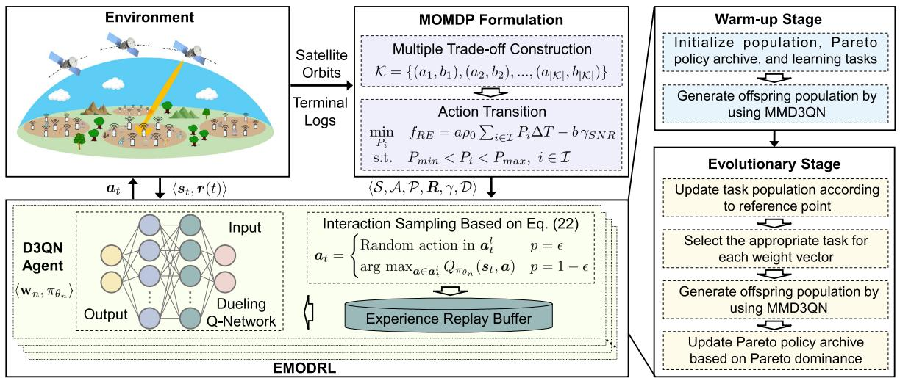

flowchart

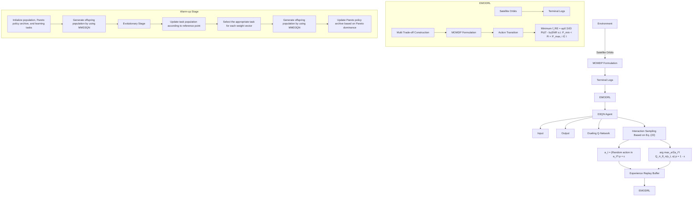

Fig. 4. Framework of EMODRL-ED3QN for Multi-objective optimization in Collaborative Ground-Space Communications.

However, the action space of the MOMDP encompasses some deterministic low-reward actions. These deterministic low-reward actions can impede the efficiency of standard epsilon-greedy strategies, which may slow down the learning process and agent convergence. Thus, the inadequacy may hinder the D3QN agent from swiftly acquiring strategies and converging effectively. To overcome this issue, we seek to enhance the action selection strategy of D3QN.

Specifically, the optimal policy is characterized by the exclusion of the unavailable satellites imposed by constraints on angle and spectrum resources from the action set $\mathbf { } \mathbf { a } _ { t }$ . This is due to the fact that switching to an unavailable satellite will not get positive rewards in both the current step and future moments. Based on this, we propose a legitimate action select method to mask such low-reward actions. First, we define the legitimate action set at the t-th time slot as $\mathbf { \Delta } _ { \mathbf { { a } } _ { t } ^ { l } , } ^ { l }$ , in which the actions of switching to unavailable satellites have been excluded. Then, we propose an epsilon-greedy scheme as follows:

$$
\boldsymbol {a} _ {t} = \left\{ \begin{array}{l l} \text { Random   action   in } \boldsymbol {a} _ {t} ^ {l} & \text { with   probability } \epsilon \\ \arg \max _ {\boldsymbol {a} \in \boldsymbol {a} _ {t} ^ {l}} Q _ {\pi_ {\theta_ {n}}} (\boldsymbol {s} _ {t}, \boldsymbol {a}) & \text { with   probability } 1 - \epsilon . \end{array} \right. \tag {21}
$$

This scheme enhances both exploration and exploitation by focusing on potentially rewarding actions. Following this, we can use this exploration scheme to sample data and train for minimizing the loss function, thereby achieving the qualified network parameters $\theta _ { n }$ . The loss function is as follows:

$$
L (\theta) = L _ {\text { value }} + L _ {\text { advantage }}, \tag {22}
$$

Algorithm 2 Multi-Task Enhanced D3QN (MMD3QN)   
Input: Task set $\Gamma$ , number of iterations $T_{iter}$ Output: Offspring population $\mathcal{P}'$ 1 Initialized offspring population $\mathcal{P}' = \emptyset$ ;
2 for $\Gamma = \langle \mathbf{w}_n, \pi_{\theta_n} \rangle \in \Gamma$ do
3    for $e = 1$ to $T_{iter}$ do
4    Collect data by using the proposed epsilon-greedy scheme shown in Eq. (21); // Speed up Training
5    Update network parameters by using Eqs. (20) and (22);
6    end
7    Collect the updated new task $\Gamma_n$ in $\mathcal{P}'$ ;
8 end
9 Return $\mathcal{P}'$ .

where $L _ { \mathrm { v a l u e } } ~ = ~ 1 / 2 \left( V ( s ; \theta _ { n } ) - V _ { \mathrm { t a r g e t } } \right) ^ { 2 }$ and $L _ { \mathrm { a d v a n t a g e } } ~ =$ $1 / 2 \left( A ( s , a ; \theta _ { n } ) - A _ { \mathrm { t a r g e t } } \right) ^ { 2 }$ , in which $V _ { \mathrm { t a r g e t } }$ and $A _ { \mathrm { t a r g e t } }$ are the target value and target advantage, respectively [51].

Next, we will present the learning tasks and introduce the interaction of these enhanced D3QN agents.

2) EMODRL-ED3QN Framework: In this part, we present an EMODRL-Enhanced D3QN (EMODRL-ED3QN) to obtain a set of Pareto near-optimal policies by learning from the feedback of the environment.

As shown in Fig. 4, EMODRL-ED3QN has the same structure as the multi-objective DRL frameworks in [48] and [52], which has warm-up and evolutionary two stages. In the warm-up stage, EMODRL-ED3QN generates N learning tasks and generates the initial task population by using the multi-task ED3QN scheme shown in Algorithm 1. The evolutionary stage will update the task population, and the Pareto policy archive based on the continuously generated offspring population. These two stages are detailed as follows.

• Warm-up Stage: This stage stochastically generates a set of N learning tasks which are defined as $\mathbf { \Gamma } = \{ \Gamma _ { 1 } , \dots , \Gamma _ { N } \}$ . Note that these tasks share the same state space, action space, and reward vector, but have different objective weight vectors and neural network parameters. First, the weight vectors of these tasks are assigned as ${ \mathcal { W } } = \{ \mathbf { w } _ { 1 } , \mathbf { w } _ { 2 } , \dots , \mathbf { w } _ { N } \}$ , in which they are evenly distributed and sampled from a unit simplex [27]. Then, we randomly initialize N Q-value networks $\{ Q _ { \pi _ { \theta _ { 1 } } } , Q _ { \pi _ { \theta _ { 2 } } } , . . . , Q _ { \pi _ { \theta _ { N } } } \}$ . As such, $\pi _ { \theta _ { n } }$ can make decisions according to the Q-value networks and the weighted reward $\mathbf { w } _ { n } { \pmb r } ( t )$ .

Algorithm 3 Task Population Update (TPU)   
Input: Task population P, offspring population $P'$ Output: Updated population P

1 Define reference point $Z_{ref}$ , number of buffer $B_{num}$ , and size of buffer $B_{size}$ ;

2 Initialize $B_{num}$ performance buffers $B_{1}, B_{2}, \ldots B_{num}$ ;

3 for $\Gamma = \langle w_{q}, \pi_{\theta_{q}} \rangle \in \{P \cup P'\}$ do

4 Evaluate objective vector $\mathbf{F}(\pi_{\theta_{q}})$ ;

5 Set $\mathbf{F}_{temp} = \mathbf{F}(\pi_{\theta_{q}}) - \mathbf{Z}_{ref}$ ;

6 Set index $\hat{n} = \arg\max_{n=1,\ldots,B_{num}} \{w_{n} F_{temp}\}$ ;

7 Store task $\Gamma$ in $B_{\hat{n}}$ ;

8 if $|B_{\hat{n}}| > B_{size}$ then

9 Sort all tasks in $B_{\hat{n}}$ in descending order of their distances;

10 Retain the first $B_{size}$ tasks in $B_{\hat{n}}$ ;

11 end

12 end

13 Set new task population $P = \{B_{1} \cup \cdots \cup B_{B_{num}}\}$ ;

14 Return P.

Next, we utilize the multi-task ED3QN scheme to generate the initial task population. As illustrated in Algorithm 2, this multi-task ED3QN approach allows all learning tasks to gather data from the environment and adjust network parameters according to the main steps of the ED3QN agent. The learning tasks with the adjusted network parameters are the generated offspring task population.

As such, we can obtain a set of learning tasks with wellinitialized policies, and the process of the evolutionary stage can unfold as follows.

• Evolutionary Stage: This stage explores better strategies by iteratively updating the task population. Each iteration contains three steps that are task population updating, Pareto policy updating, and offspring population generating.

As for task population updating, we need to update the task population P according to the newly generated offspring population $\mathcal { P } ^ { \prime }$ (As shown in Algorithm 3). In this case, it is essential to distinguish the nondominated policies and keep the population diversity. Thus, we introduce the buffer strategy [27] to reasonably update P. Specifically, multiple buffers are set to store ${ \mathcal P } ,$ in which $B _ { n u m }$ and $B _ { s i z e }$ are defined as their total number and capacities, respectively. As such, the objective performance space is segmented into $B _ { n u m }$ buffers, each capable of storing up to $B _ { s i z e }$ policies. We can set a reference point ${ \bf Z } _ { r e f }$ [52] to prioritize these policies within the same buffer.

Accordingly, for any given buffer, tasks are sorted in descending order based on their distances to ${ \bf Z } _ { r e f } .$ . If the number of tasks exceeds $B _ { s i z e }$ , only the first $B _ { s i z e }$ tasks in that buffer are retained. Following this, the learning tasks from all buffers collectively constitute a new task population.

As for Pareto policy updating, a Pareto archive is utilized to retain nondominated policies discovered during the evolutionary stage. Specifically, this Pareto archive undergoes an update

Algorithm 4 Task Selection (TS)   
Input: Weight vector set W, task population P
Output: Selected task set $\Gamma'$ 1 Calculate objective vector $\mathbf{F}(\pi_{\theta_{n}})$ of policy $\pi_{\theta_{n}}$ of each task $\Gamma_{n} \in \Gamma$ ;

2 for $\omega_{n} \in W$ do

3 Set index $\hat{q} = \arg\max_{q=1,\ldots,|\mathcal{P}|}\{\mathbf{w}_{n}\mathbf{F}(\pi_{\theta_{q}})\}$ ;

4 Replace weight vector $w_{\hat{q}}$ of $\Gamma_{\hat{q}}$ with $w_{i}$ ;

5 Add task $\Gamma_{q}$ to $\Gamma'$ ;

6 end

7 Return $\Gamma'$ .

according to the offspring population $\mathcal { P } ^ { \prime } .$ . For the ED3QN policy πθ of each task in $\mathcal { P } ^ { \prime }$ , the policies dominated by πθ are excluded, and $\pi _ { \theta }$ is added to the Pareto archive only if no policies in the Pareto archive dominate $\pi _ { \theta }$ (see step 11 of Algorithm 1).

As for offspring population generating, we choose the optimal task from P and still use the multi-task ED3QN approach to obtain the offspring task population. Specifically, we evaluate the objective function values $\mathbf { F } ( \pi _ { \theta _ { q } } )$ of each policy $\pi _ { \theta _ { q } }$ within P. Then, for a given weight vector $\mathbf { w } _ { n } \in \mathcal { W } .$ , we determine the best learning task in $\mathcal { P }$ based on $w _ { n }$ and $\mathbf { F } ( \pi _ { \theta _ { q } } )$ $( q = 1 , \ldots , | \mathcal { P } | )$ (as shown in Algorithm 4). Finally, the N selected learning tasks are incorporated into $\Gamma ^ { \prime }$ . We derive $P ^ { \prime }$ by executing multi-task ED3QN (see Algorithm 2) with $\Gamma ^ { \prime }$ and $T _ { t a s k }$ as its input, where $T _ { t a s k }$ represents the predefined number of task iterations.

This stage terminates if the predefined number of evolution generations are completed. In this case, all non-dominated policies stored in the Pareto archive will be output as the Pareto near-optimal policies for the formulated MOMDP as well as the optimization problem. These policies represent different trade-offs between the total uplink achievable rate, total energy consumption of terminals, and total satellite switching number. As such, the decision-makers can select one policy from them according to the current requirements and concerns.

3) Complexity Analyses: The complexities of the proposed EMODRL-ED3QN can be categorized into two main parts, which are training and operational use.

We first consider the complexity of the training EMODRL-ED3QN model. Specifically, in both the warm-up and evolutionary stages, the major complexity comes from the step of generating offspring population which involves the training of neural networks. Compared with this step, other steps (e.g., steps 8, 9, and 11 in Algorithm 1) are considered negligible for overall complexity assessment.

As shown in Algorithm 2, MMD3QN generates the offspring population, and its time complexity mainly depends on the training of neural networks. Specifically, MMD3QN iteratively optimizes each learning task $\pi _ { \theta _ { n } }$ in the task set for $T _ { i t e r }$ times (i.e., steps 2-8 in Algorithm 2), where $T _ { i t e r }$ denotes the number of task iterations. We denote the numbers of collected data and epochs for training the Q-value network as $N _ { d a t a }$ and $N _ { e p o }$ , respectively. Note that the implemented Q-value network is the fully connected neural network, which consists of an input, an output, and C fully connected layers. The numbers of neurons in the input and output layers are

2 and 2, respectively. Let $N _ { c }$ denote the number of neurons in the c-th fully connected layer, with $N _ { 0 } = 2$ and $N _ { C + 1 } = 2$ . $O ( n \cdot ( T _ { i t e r } \cdot N _ { e p o } \cdot N _ { d a t a } \cdot \sum _ { c = 1 } ^ { C + 1 } N _ { c - 1 } \cdot N _ { c } ) )$ expressed as [48].

By considering the predefined number of maximum evolution generations $( T _ { e v o } )$ , the time complexity of training EMODRL-ED3QN is $O ( T _ { e v o } \cdot n \cdot ( T _ { i t e r } \cdot N _ { e p o } \cdot N _ { d a t a } \ .$ $\begin{array} { r } { \sum _ { l = 1 } ^ { L + 1 } N _ { l - 1 } \cdot N _ { l } ) \big ) } \end{array}$ .

Following this, we analyze the complexity of using the trained EMODRL-ED3QN. Since EMODRL-ED3QN achieves multiple alternative policies to match the current preference, using EMODRL-ED3QN does not need transfer learning or other tuning. As such, the selected policy can quickly generate a solution to the problem through simple algebraic calculations. In this case, the time complexity of using the trained EMODRL-ED3QN is $\begin{array} { r } { O ( T \cdot \sum _ { c = 1 } ^ { C + 1 } N _ { c - 1 } ^ { \cdot } . } \end{array}$ · $N _ { c } )$ , where T is the number of time slots [48].

# VI. SIMULATIONS AND ANALYSES

In this section, we conduct key simulations to evaluate the performance of the proposed EMODRL-ED3QN-based method for solving the formulated optimization problem.

# A. Simulation Setups

1) Scenario and Algorithm Setups: In this work, we consider a terrestrial terminal to LEO satellite communication scenario, which includes the LEO satellite, terrestrial terminal, and communication-related. These key parameters are shown in Table I. Specifically, we consider 110 LEO satellites, of which 80 LEO satellites at an altitude of $5 \times 1 0 ^ { 5 }$ m and 30 LEO satellites at an altitude of $1 0 ^ { 6 }$ m. Note that most of them are around the equatorial orbit and some of them have an inclination angle around $\pm \pi / 8 ,$ , and the satellites in the same orbit are evenly distributed in this orbit [37], [53].

Moreover, we consider a 100 × 100 terrestrial terminal area located near the equator, in which exists 10 terrestrial terminals and several sensors. This is because a group of about 10 terminals usually strikes a good balance of the potential gain and complexity of DCB. This setting provides a representative sample of a small to medium-size network, which is typical in previous implementations of DCB [21], [22], [25]. Note that the choice of $N = 1 0$ does not compromise the effectiveness or the general applicability of the proposed method. This is due to the fact that the MOMDP is universal and not affected by the changes in the number of terminals, which ensures that our findings remain relevant across different network sizes. In addition, for larger networks, we can first adopt clustering algorithms such as K-means to divide the network into multiple clusters, and then run the proposed method, thereby maintaining manageability and effectiveness.

In addition, we establish the uplink rate threshold at $1 \times 1 0 ^ { 7 }$ bps. This is because we set parameters to verify the performance of the system under more demanding conditions, and consider a multimedia function necessitating a higher upload rate [54].

In the proposed EMODRL-ED3QN, the algorithm parameters are shown in Table I. For each learning task, the Q-value

TABLE I SIMULATION SETTINGS 

<table><tr><td>Parameters</td><td>Values</td></tr><tr><td>Path loss exponent (α)</td><td>2 [55]</td></tr><tr><td>Transmit power of the terrestrial terminals ( $P_i$ )</td><td>1-2 W [17]</td></tr><tr><td>Carrier frequency ( $f_c$ )</td><td>2.4 GHz (S-band) [8], [56]</td></tr><tr><td>Total noisy power spectral density</td><td>157 dBm/Hz [6]</td></tr><tr><td>The radius of Earth ( $R_e$ )</td><td> $6.371 \times 10^6$  m [57]</td></tr><tr><td>Gravitational constant (G)</td><td> $6.674 \times 10^{-11}$  m3 kg $^{-1}$  s $^{-2}$  [57]</td></tr><tr><td>The mass of Earth ( $M_e$ )</td><td> $5.972 \times 10^{24}$  kg [57]</td></tr><tr><td>Number of LEO satellites</td><td>110</td></tr><tr><td>Altitutiles of LEO satellites</td><td>500 km, 1000 km</td></tr><tr><td>Number of terrestrial terminals</td><td>10</td></tr><tr><td>Timeline</td><td>60 minutes</td></tr><tr><td>Number of the learning tasks (N)</td><td>10</td></tr><tr><td>Maximum evolution generations ( $T_{evo}$ )</td><td>600</td></tr><tr><td>Iteration number during the warm-up stage ( $T_{warm}$ )</td><td>80</td></tr><tr><td>Iteration number for training each task ( $T_{task}$ )</td><td>20</td></tr><tr><td>Number of performance buffers ( $B_{num}$ )</td><td>50</td></tr><tr><td>The size of each buffer ( $B_{size}$ )</td><td>2</td></tr><tr><td>Learning rate</td><td> $10^{-4}$ </td></tr><tr><td>Discount factor</td><td>0.96</td></tr><tr><td>Replay buffer size and batch size</td><td> $10^5$ , 256</td></tr></table>

network has two fully connected layers with 2048 neurons and the tanh function serves as the activation function. Note that these algorithm parameters are determined by careful tuning to ensure performance and convergence.

2) Baselines: To demonstrate the performance of the proposed EMODRL-ED3QN, we introduce and design various comparison algorithms and strategies as follows:

• Non-DCB Strategy: This baseline does not introduce DCB methods and only adopts one single terrestrial terminal to connect to the satellite directly, which offers a comparison to the DCB-enhanced methods.   
• Achievable Rate Greedy Policy (ARGP): ARGP refers to the policy that any terminal $i \in \mathcal { T }$ employs the maximum transmit power $P _ { m a x }$ and selects the satellite with the utmost uplink achievable rate at any time slot $t \in \mathcal { T }$ . This policy serves as a benchmark for the upper bound of optimization objective 1, which focuses on maximizing immediate transmission performance without considering other trade-offs.   
• DRL-based Baseline Algorithms: We develop several advanced baseline algorithms, namely EMODRL-D3QN, EMODRL-Noisy-DQN, EMODRL-DDQN, EMODRL-PPO, EMODRL-TD3, and EMODRL-SAC, each of which is a variant of a well-known algorithm:

– EMODRL-D3QN: A variant of D3QN [51] that we have developed by introducing the proposed EMORL and multi-task frameworks, thereby enabling it to effectively deal with the complexities of the formulated MOMDP.

– EMODRL-Noisy-DQN: This baseline adapts the Noisy-DQN [51] algorithm, known for its robust exploration capabilities in noisy or variable environments, by incorporating the proposed EMORL and multi-task frameworks, thereby making it suitable for handling the formulated MOMDP.

– EMODRL-DDQN: EMODRL-DDQN extends the Double DQN (DDQN) [58] approach by embedding the EMORL and multi-task frameworks. This baseline has enhanced the ability to reduce overestimation biases.   
– EMODRL-PPO: This is a modified version of the well-known Proximal Policy Optimization (PPO) [59], an actor-critic reinforcement learning method, and we adapt it by integrating the proposed EMORL frameworks to handle the MOMDP.   
EMODRL-TD3: Built on the Twin Delayed Deep Deterministic Policy Gradient Algorithm (TD3) [60], a state-of-the-art actor-critic method, EMODRL-TD3 incorporates the proposed EMODRL frameworks.   
– EMODRL-SAC: We extend the Soft Actor-Critic (SAC) [61] algorithm by integrating EMODRL and multi-task frameworks to make it able to handle the formulated MOMDP.

As such, the comparison with non-DCB strategy shows the effectiveness of introducing DCB, the comparison with ARGP can assess the effect of the proposed evolutionary multi-objective DRL framework, and the comparison with other EMODRL algorithms can illustrate the optimization efficiency of EMODRL-ED3QN. In the following comparisons, we consider the average optimization objective values of these algorithms over timelines (i.e., ¯f1, ¯f2, and ${ \bar { f } } _ { 3 } )$ as a performance metrics.

# B. Performance Evaluation

1) Convergence and Stability Verifications: Due to the nature of MOP, traditional methods of demonstrating convergence through a single-objective reward curve are not directly applicable. Thus, according to [27], we employ the Inverted Generational Distance (IGD) metric, a well-regarded measure in the field of multi-objective optimization, to demonstrate the convergence of our MORL algorithm. Specifically, IGD measures the average distance from a set of reference points representing the true Pareto front to the nearest member of the approximated front produced by the algorithm.

We select $( R ^ { m a x } , 0 , 0 )$ as the reference points for the IGD calculation since they are the bounds of the three optimization objectives, where $R ^ { m a x }$ is the uplink achievable rate obtained by ARGP. Then, we provide the IGD values of the proposed EMODRL-ED3QN and comparison algorithms over iterations in Fig. 5. As can be seen, the IGD values of the proposed algorithm decrease steadily and plateau, which indicates the convergence towards the Pareto front. This trend confirms that the algorithm effectively balances the trade-offs between the multiple objectives and converges to a stable policy set.

Moreover, we introduce the confidence bounds around the outcomes of rate and pathloss results to assess the robustness of the proposed method. We employ a bootstrap method [62] to generate empirical distributions of the results. The corresponding results are shown in Fig. 6. As can be seen, the proposed method maintains reliable performance even in the lowest-performing cases. This guarantees that the system performance meets the requirements regardless of statistical variables, thereby validating the robustness and practical applicability of the proposed approach.

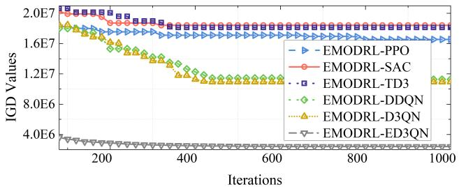

line

| Iterations | EMODRL-PPO | EMODRL-SAC | EMODRL-TD3 | EMODRL-DDQN | EMODRL-DQN | EMODRL-EDQN |
| ---------- | ---------- | ---------- | ---------- | ----------- | ---------- | ----------- |
| 0          | 2.0E7      | 2.0E7      | 2.0E7      | 2.0E7       | 2.0E7      | 4.0E6       |
| 200        | 1.8E7      | 1.8E7      | 1.8E7      | 1.6E7       | 1.6E7      | 4.0E6       |
| 400        | 1.6E7      | 1.6E7      | 1.6E7      | 1.2E7       | 1.2E7      | 4.0E6       |
| 600        | 1.6E7      | 1.6E7      | 1.6E7      | 1.2E7       | 1.2E7      | 4.0E6       |
| 800        | 1.6E7      | 1.6E7      | 1.6E7      | 1.2E7       | 1.2E7      | 4.0E6       |
| 1000       | 1.6E7      | 1.6E7      | 1.6E7      | 1.2E7       | 1.2E7      | 4.0E6       |

Fig. 5. IGD values obtained by different EMODRL algorithms.   
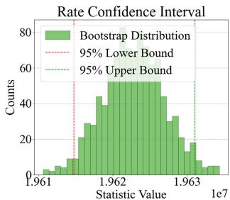

histogram

| Statistic Value | Counts |
| --------------- | ------ |
| 1.961e7         | 0      |
| 1.9615e7        | 5      |
| 1.962e7         | 50     |
| 1.9625e7        | 45     |
| 1.963e7         | 10     |
| 1.9635e7        | 5      |

(a)

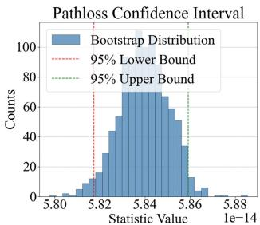

histogram

| Statistic Value Range | Counts |
| ---------------------- | ------ |
| 5.80 - 5.81            | 0      |
| 5.81 - 5.82            | 10     |
| 5.82 - 5.83            | 30     |
| 5.83 - 5.84            | 70     |
| 5.84 - 5.85            | 75     |
| 5.85 - 5.86            | 60     |
| 5.86 - 5.87            | 30     |
| 5.87 - 5.88            | 10     |
| 5.88 - 5.89            | 0      |

(b)

Fig. 6. Confidence bounds of the rate and pathloss results.   
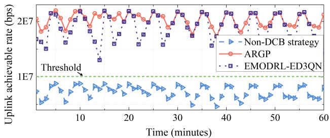

line

| Time (minutes) | Non-DCB strategy | ARGP | EMODRL-ED3QN |
| -------------- | ---------------- | ---- | ------------ |
| 0              | ~5E7             | ~1.8E7 | ~1.5E7       |
| 10             | ~5E7             | ~2.0E7 | ~1.8E7       |
| 20             | ~5E7             | ~2.0E7 | ~1.5E7       |
| 30             | ~5E7             | ~2.0E7 | ~1.8E7       |
| 40             | ~5E7             | ~2.0E7 | ~1.5E7       |
| 50             | ~5E7             | ~2.0E7 | ~1.8E7       |
| 60             | ~5E7             | ~2.0E7 | ~1.5E7       |

Fig. 7. Uplink achievable rates obtained by an EMODRL-ED3QN policy, ARGP, and non-DCB strategy.

2) Comparisons With Non-DCB Strategy: In this part, we compare the DCB-based policies and the non-DCB strategy to illustrate the effectiveness of the considered DCB-based uplink communication approach. Specifically, uplink achievable rates obtained by a policy of EMODRL-ED3QN, ARGP, and non-DCB strategy at each time slot are shown in Fig. 7. As can be seen, ARGP and EMODRL-ED3QN consistently surpass the threshold for uplink communication. In contrast, the non-DCB strategy struggles to attain an uplink achievable rate above the threshold. Moreover, the EMODRL-ED3QN policy achieves performance closely aligned with the upper bound (i.e., ARGP) at every time slot. These results show that the DCB-based uplink communication approach and EMODRL-ED3QN policy are both reasonable and suitable for the considered scenario.   
3) Comparisons With Different Baselines: We first evaluate the trade-offs obtained by the proposed EMODRL-ED3QN in solving the formulated problem. As shown in Fig. 8, we show the trade-offs among the considered three objectives obtained by multiple EMODRL baselines. As can be seen, all these algorithms obtain a set of Pareto policies with wide coverage among the considered three objectives. Thus, the considered EMODRL framework is effective and can obtain multiple policies that weigh each other. Moreover, EMODRL-ED3QN,

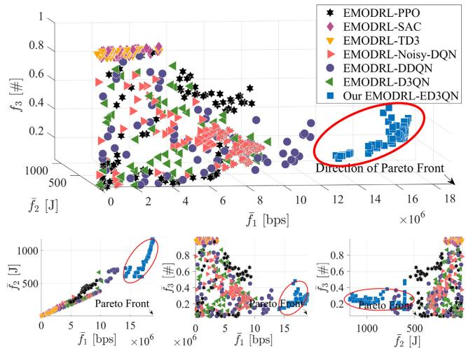

scatter

| Method              | f1 [bps] ×10⁶ | f2 [J] ×10⁶ |
|---------------------|---------------|-------------|
| EMODRL-PPO          | ~1000–1800    | ~500–1800   |
| EMODRL-SAC          | ~500–1600     | ~500–1600   |
| EMODRL-TD3          | ~500–1600     | ~500–1600   |
| EMODRL-Noisy-DQN    | ~500–1600     | ~500–1600   |
| EMODRL-DDQN         | ~500–1600     | ~500–1600   |
| EMODRL-D3QN         | ~500–1600     | ~500–1600   |
| Our EMODRL-ED3QN   | ~12×10⁶       | ~12×10⁶     |

Fig. 8. Pareto policy distributions obtained by different algorithms. Each point represents a Pareto policy obtained by the algorithm, and its three coordinate values represent the optimization objective values achieved by this policy. We mark the direction of the Pareto front (i.e., ideal Pareto policy set), and the policy closer to the Pareto front will achieve better performance.

EMODRL-Noisy-DQN, and EMODRL-DDQN outperform other comparison algorithms. This is because the three algorithms are offline reinforcement learning methods, which may save more periodic information in their replay buffer, thereby facilitating the learning of the periodicity of the considered system. Additionally, we can see that the proposed EMODRL-ED3QN outmatches other baselines. The reason is that the proposed legitimate action select method can wellbalance the exploration and exploitation of the algorithms. Moreover, the structure of the selected D3QN is also the most suitable for the designed MOMDP and legitimate action select method, and thus enables the algorithm to approach optimal performance closely.

Second, we select one policy from the Pareto policy set of each algorithm for further comparisons and analyses. In most cases, the uplink achievable rate from the terrestrial terminals to LEO satellites is the most concerned optimization objective. As such, we choose the policy with the best optimization objective 1 from the Pareto policy set as the final policy. In this case, the numerical results in terms of the considered optimization objectives are shown in Table II. As can be seen, the proposed EMODRL-ED3QN can reduce 30% handover frequency while achieving a similar uplink achievable rate with ARGP. This demonstrates that the proposed EMODRL-ED3QN results in lower energy consumption and satellite switching numbers to obtain a nearly optimal uplink rate. Moreover, compared with other comparison policies, EMODRL-ED3QN has a better balance among the three optimization objectives. Note that although EMODRL-PPO, EMODRL-TD3, and EMODRL-SAC achieve better optimization objectives 2 and 3, their optimization objective 1 is inadequate, making them unsuitable for terrestrial-to-satellite communication scenarios. Therefore, we can illustrate that EMODRL-ED3QN is most suitable for the considered scenario and can mitigate the ping-pong handover issue.

4) Policy Evaluations: We first select different trade-off policies from the Pareto policy archive of EMODRL-ED3QN to illustrate the diversity performance of the obtained policy

TABLE II NUMERICAL RESULTS IN TERMS OF ${ \bar { f } } _ { 1 } , { \bar { f } } _ { 2 } ,$ , AND ${ \bar { f } } _ { 3 }$ OBTAINED BY DIFFERENT BASELINES 

<table><tr><td>Method</td><td> $\bar{f}_{1}$  [bps]</td><td> $\bar{f}_{2}$  [J]</td><td> $\bar{f}_{3}$  [#]</td></tr><tr><td>ARGP</td><td> $2.03 \times 10^{7}$ </td><td>1200</td><td>0.40</td></tr><tr><td>EMODRL-PPO</td><td> $9.33 \times 10^{6}$ </td><td>541.84</td><td>0.53</td></tr><tr><td>EMODRL-SAC</td><td> $3.63 \times 10^{6}$ </td><td>174.63</td><td>1.00</td></tr><tr><td>EMODRL-TD3</td><td> $3.68 \times 10^{6}$ </td><td>182.65</td><td>0.96</td></tr><tr><td>EMODRL-Noisy-DQN</td><td> $9.74 \times 10^{6}$ </td><td>368.24</td><td>0.23</td></tr><tr><td>EMODRL-DDQN</td><td> $1.28 \times 10^{7}$ </td><td>693.11</td><td>0.36</td></tr><tr><td>EMODRL-D3QN</td><td> $1.15 \times 10^{7}$ </td><td>613.15</td><td>0.30</td></tr><tr><td>Our EMODRL-ED3QN</td><td> $1.87 \times 10^{7}$ </td><td>1179.73</td><td>0.28</td></tr></table>

set. Specifically, we select four different trade-off policies which are policy favoring objective 1, policy favoring objective 2, policy favoring objective 3, and policy balancing objectives 1, 2, and 3, and the optimization objective values of these policies are shown in Fig. 10. It can be seen that the four policies all have obvious differences and show different objective tendencies when solving the formulated problem. In addition, these policies all achieve slightly weaker objective 1 but much better objectives 2 and 3 than ARGP. These results show that the policy set obtained by EMODRL-ED3QN has strong diversity.

Then, we evaluate the impacts of scenario changes on the policies obtained by the proposed EMODRL-ED3QN. Specifically, the satellite unavailable probability may have a significant effect on these policies. Thus, we depict the changes in the three optimization objectives with satellite unavailability probability p in Fig. 9(a). We can observe that the policies still show different objective tendencies and no significant deterioration occurred compared with ARGP. Moreover, as aforementioned, we seek to propose a method in which one-time training can accommodate various terminal numbers. Fig. 9(b) shows the performance of these trained policies changed with the terminal numbers. As can be seen, the policies still show obvious objective tendencies and achieve good performance. The reason is that the proposed legitimate action select method can enable EMODRL-ED3QN to fully explore and utilize the high-value action space and obtain more valuable trade-off policies. Thus, one-time training of the EMODRL-ED3QN can obtain multiple trade-off policies with portability.

5) Ablation Simulations: Ablation simulations are conducted to illustrate the effectiveness of the proposed enhanced methods. Specifically, we consider two strategies that are Optimization without Optimized P (OOP) and Optimization without Legitimate Action Select Method (OLASM). In OOP, the transmit power of each terrestrial terminal is not optimized and randomly generated. In OLASM, the proposed legitimate action select method is not considered. Accordingly, the comparison results are shown in Fig. 11. As can be seen, the proposed EMODRL-ED3QN is significantly better than other ablated strategies. This shows that the proposed enhanced methods are effective and can boost the training performance of the traditional DRL algorithm in such scenarios.

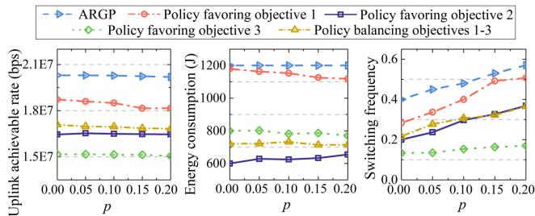

line

| p     | Uplink achievable rate (bps) - ARGP | Uplink achievable rate (bps) - Policy favoring objective 1 | Uplink achievable rate (bps) - Policy favoring objective 2 | Uplink achievable rate (bps) - Policy favoring objective 3 | Uplink achievable rate (bps) - Policy balancing objectives 1-3 | Energy consumption (J) - Policy favoring objective 1 | Energy consumption (J) - Policy favoring objective 2 | Energy consumption (J) - Policy favoring objective 3 | Energy consumption (J) - Policy balancing objectives 1-3 | Switching frequency |
|-------|-------------------------------------|--------------------------------------------------------|--------------------------------------------------------|--------------------------------------------------------|---------------------------------------------------------------|--------------------------------------------------|--------------------------------------------------|--------------------------------------------------|--------------------------------------------------|---------------------|
| 0.00  | 2.1E7                               | 1.8E7                                                  | 1.5E7                                                  | 1.5E7                                                  | 1.5E7                                                         | 1200                                             | 600                                              | 800                                              | 600                                              | 0.4                 |
| 0.05  | 2.1E7                               | 1.8E7                                                  | 1.5E7                                                  | 1.5E7                                                  | 1.5E7                                                         | 1200                                             | 600                                              | 800                                              | 600                                              | 0.4                 |
| 0.10  | 2.1E7                               | 1.8E7                                                  | 1.5E7                                                  | 1.5E7                                                  | 1.5E7                                                         | 1200                                             | 600                                              | 800                                              | 600                                              | 0.4                 |
| 0.15  | 2.1E7                               | 1.8E7                                                  | 1.5E7                                                  | 1.5E7                                                  | 1.5E7                                                         | 1200                                             | 600                                              | 800                                              | 600                                              | 0.4                 |
| 0.20  | 2.1E7                               | 1.8E7                                                  | 1.5E7                                                  | 1.5E7                                                  | 1.5E7                                                         | 1200                                             | 600                                              | 800                                              | 600                                              | 0.4                 |

(a) Satellite unavailability probability p

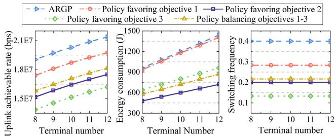

line

| Terminal number | Uplink achievable rate (bps) - ARGP | Uplink achievable rate (bps) - Policy favoring objective 1 | Uplink achievable rate (bps) - Policy favoring objective 2 | Uplink achievable rate (bps) - Policy favoring objective 3 | Uplink achievable rate (bps) - Policy balancing objectives 1-3 | Energy consumption (J) - Policy favoring objective 1 | Energy consumption (J) - Policy favoring objective 2 | Energy consumption (J) - Policy balancing objectives 1-3 | Switching frequency - Policy favoring objective 1 | Switching frequency - Policy favoring objective 2 | Switching frequency - Policy balancing objectives 1-3 |
|---|---|---|---|---|---|---|---|---|---|---|---|
| 8 | 2.1E7 | 1.8E7 | 1.5E7 | 1.6E7 | 1.6E7 | 900 | 600 | 550 | 0.4 | 0.3 | 0.2 |
| 9 | 2.0E7 | 1.9E7 | 1.6E7 | 1.7E7 | 1.7E7 | 950 | 650 | 600 | 0.4 | 0.3 | 0.2 |
| 10 | 2.0E7 | 2.0E7 | 1.7E7 | 1.8E7 | 1.8E7 | 1000 | 700 | 650 | 0.4 | 0.3 | 0.2 |
| 11 | 2.0E7 | 2.1E7 | 1.8E7 | 1.9E7 | 1.9E7 | 1050 | 750 | 700 | 0.4 | 0.3 | 0.2 |
| 12 | 2.0E7 | 2.1E7 | 1.8E7 | 2.0E7 | 2.0E7 | 1100 | 800 | 750 | 0.4 | 0.3 | 0.2 |

(b) Terminal number

Fig. 9. Impacts of scenario changes on the policies obtained by the proposed EMODRL-ED3QN.   
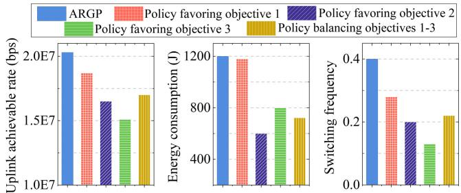

bar

| Method | Uplink achievable rate (bps) | Energy consumption (I) | Switching frequency |
| --- | --- | --- | --- |
| ARGP | 2.0E7 | 1200 | 0.4 |
| Policy favoring objective 1 | 1.8E7 | 1180 | 0.35 |
| Policy favoring objective 2 | 1.6E7 | 600 | 0.2 |
| Policy favoring objective 3 | 1.5E7 | 800 | 0.15 |
| Policy balancing objectives 1-3 | 1.7E7 | 750 | 0.2 |
The chart includes a secondary axis for switching frequency.

Fig. 10. The optimization objective values of ARGP, policy favoring objective 1, policy favoring objective 2, policy favoring objective 3, and policy balancing objectives 1, 2, and 3.

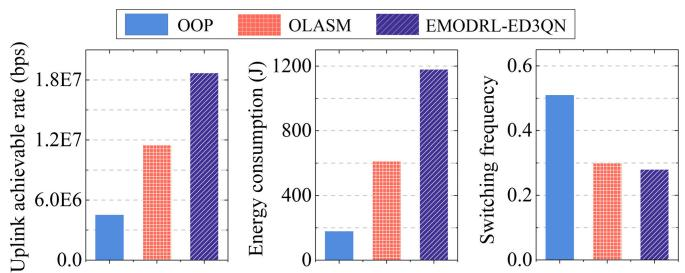

bar

| Method          | Uplink achievable rate (bps) | Energy consumption (J) | Switching frequency |
| --------------- | ---------------------------- | ----------------------- | ------------------- |
| OOP             | 500000                       | 200                     | 0.5                 |
| OLASM           | 1200000                      | 600                     | 0.3                 |
| EMODRL-ED3QN    | 1800000                      | 1200                    | 0.3                 |

Fig. 11. The optimization objective values of OOP, OLASM, and EMOD-RL-ED3QN.

# VII. CONCLUSION

This paper investigated a DCB-based joint switching and beamforming terminal-to-satellite uplink communication system. Specifically, we used the low transmission performance terminals as a virtual antenna array to enhance terminal-to-satellite uplink achievable rates and duration. In this system, we formulated a long-term optimization problem to improve the total uplink achievable rate, total energy consumption of terminals, and the number of satellite switches simultaneously. Following this, the problem is reformulated as an action space-reduced and more universal MOMDP to enhance its portability. Then, we proposed the EMODRL-ED3QN to obtain multiple policies that represent different trade-offs among multiple objectives to accommodate diverse scenarios. Simulation results demonstrated that EMODRL-ED3QN outmatches various baselines and obtains a wide-coverage Pareto policy set with strong usability, in which the policies achieve near-optimal uplink achievable rates with low switching frequency. Future work will be extended by investigating how the DCB system performs with varying numbers of terminals and introducing the full LEO satellite simulator Hypatia or Starperf for further evaluation.

# REFERENCES

[1] J. Heo, S. Sung, H. Lee, I. Hwang, and D. Hong, “MIMO satellite communication systems: A survey from the PHY layer perspective,” IEEE Commun. Surveys Tuts., vol. 25, no. 3, pp. 1543–1570, 3rd Quart., 2023.   
[2] S. Mahboob and L. Liu, “Revolutionizing future connectivity: A contemporary survey on AI-empowered satellite-based non-terrestrial networks in 6G,” IEEE Commun. Surveys Tuts., vol. 26, no. 2, pp. 1279–1321, 2nd Quart., 2024.   
[3] D. Zhou, M. Sheng, J. Li, and Z. Han, “Aerospace integrated networks innovation for empowering 6G: A survey and future challenges,” IEEE Commun. Surveys Tuts., vol. 25, no. 2, pp. 975–1019, 2nd Quart., 2023.   
[4] M. Luglio, M. Marchese, F. Patrone, C. Roseti, and F. Zampognaro, “Performance evaluation of a satellite communication-based MEC architecture for IoT applications,” IEEE Trans. Aerosp. Electron. Syst., vol. 58, no. 5, pp. 3775–3785, Oct. 2022.   
[5] S. Ma, Y. Ching Chou, H. Zhao, L. Chen, X. Ma, and J. Liu, “Network characteristics of LEO satellite constellations: A starlink-based measurement from end users,” in Proc. IEEE Conf. Comput. Commun., May 2023, pp. 1–10.   
[6] Solutions for NR to Support Non-Terrestrial Networks (NTN) (Release 16), Standard TR 38.821, 2019.   
[7] Y. Cao, S.-Y. Lien, Y.-C. Liang, D. Niyato, and X. Shen, “Collaborative computing in non-terrestrial networks: A multi-time-scale deep reinforcement learning approach,” IEEE Trans. Wireless Commun., vol. 23, no. 5, pp. 4932–4949, May 2024.   
[8] F. Wang, D. Jiang, Z. Wang, J. Chen, and T. Q. S. Quek, “Seamless handover in LEO based non-terrestrial networks: Service continuity and optimization,” IEEE Trans. Commun., vol. 71, no. 2, pp. 1008–1023, Feb. 2023.   
[9] Y. Yang et al., “FHAP: Fast handover authentication protocol for highspeed mobile terminals in 5G satellite-terrestrial integrated networks,” IEEE Internet Things J., vol. 10, no. 15, pp. 13959–13973, May 2023.   
[10] Z. Xu, Y. Gao, G. Chen, R. Fernandez, V. Basavarajappa, and R. Tafazolli, “Enhancement of satellite-to-phone link budget: An approach using distributed beamforming,” IEEE Veh. Technol. Mag., vol. 18, no. 4, pp. 85–93, Dec. 2023.   
[11] H. Jung, S.-W. Ko, and I.-H. Lee, “Secure transmission using linearly distributed virtual antenna array with element position perturbations,” IEEE Trans. Veh. Technol., vol. 70, no. 1, pp. 474–489, Jan. 2021.   
[12] W. U. Khan et al., “Rate splitting multiple access for next generation cognitive radio enabled LEO satellite networks,” IEEE Trans. Wireless Commun., vol. 22, no. 11, pp. 8423–8435, Nov. 2023.   
[13] C. Ding, J.-B. Wang, M. Cheng, M. Lin, and J. Cheng, “Dynamic transmission and computation resource optimization for dense LEO satellite assisted mobile-edge computing,” IEEE Trans. Commun., vol. 71, no. 5, pp. 3087–3102, May 2023.   
[14] M. M. Kassem, A. Raman, D. Perino, and N. Sastry, “A browser-side view of starlink connectivity,” in Proc. 22nd ACM Internet Meas. Conf., Oct. 2022, pp. 151–158.   
[15] F. Michel, M. Trevisan, D. Giordano, and O. Bonaventure, “A first look at starlink performance,” in Proc. 22nd ACM Internet Meas. Conf. (IMC), Oct. 2022, pp. 130–136.   
[16] X. Cao and X. Zhang, “SaTCP: Link-layer informed TCP adaptation for highly dynamic LEO satellite networks,” in Proc. IEEE Conf. Comput. Commun., May 2023, pp. 1–10.   
[17] T. T. T. Le, N. U. Hassan, X. Chen, M.-S. Alouini, Z. Han, and C. Yuen, “A survey on random access protocols in direct-access LEO satellitebased IoT communication,” IEEE Commun. Surveys Tuts., vol. 1, no. 1, pp. 1–18, Apr. 2024.

[18] A. Talgat, M. A. Kishk, and M.-S. Alouini, “Stochastic geometry-based uplink performance analysis of IoT over LEO satellite communication,” IEEE Trans. Aerosp. Electron. Syst., vol. 60, no. 4, pp. 4198–4213, Aug. 2024.   
[19] S. Herrería-Alonso, M. Rodríguez-Pérez, R. F. Rodríguez-Rubio, and F. Pérez-Fontán, “Improving uplink scalability of LoRa-based directto-satellite IoT networks,” IEEE Internet Things J., vol. 11, no. 7, pp. 12526–12535, Dec. 2024.   
[20] S. Jayaprakasam, S. K. A. Rahim, and C. Y. Leow, “Distributed and collaborative beamforming in wireless sensor networks: Classifications, trends, and research directions,” IEEE Commun. Surveys Tuts., vol. 19, no. 4, pp. 2092–2116, 4th Quart., 2017.   
[21] A. Wang, Y. Wang, G. Sun, J. Li, S. Liang, and Y. Liu, “Uplink data transmission based on collaborative beamforming in UAV-assisted MWSNs,” in Proc. IEEE Global Commun. Conf., Dec. 2021, pp. 1–6.   
[22] Y. Zhang, Y. Liu, G. Sun, J. Li, and A. Wang, “Multi-objective optimization for joint UAV-AGV collaborative beamforming,” in Proc. IEEE Int. Conf. Syst. Man, Cybern. (SMC), Oct. 2022, pp. 150–157.   
[23] G. Sun, J. Li, A. Wang, Q. Wu, Z. Sun, and Y. Liu, “Secure and energy-efficient UAV relay communications exploiting collaborative beamforming,” IEEE Trans. Commun., vol. 70, no. 8, pp. 5401–5416, Aug. 2022.   
[24] J. Li et al., “Multi-objective optimization approaches for physical layer secure communications based on collaborative beamforming in UAV networks,” IEEE/ACM Trans. Netw., vol. 31, no. 4, pp. 1902–1917, Aug. 2023.   
[25] J. Li, G. Sun, L. Duan, and Q. Wu, “Multi-objective optimization for UAV swarm-assisted IoT with virtual antenna arrays,” IEEE Trans. Mobile Comput., vol. 23, no. 5, pp. 4890–4907, May 2024.   
[26] Z. Xu, G. Chen, R. Fernandez, Y. Gao, and R. Tafazolli, “Enhancement of direct LEO satellite-to-smartphone communications by distributed beamforming,” IEEE Trans. Veh. Technol., vol. 73, no. 8, pp. 11543–11555, Aug. 2024.   
[27] Y. Song, Y. Cao, Y. Hou, B. Cai, C. Wu, and Z. Sun, “A channel perceiving-based handover management in space–ground integrated information network,” IEEE Trans. Netw. Service Manage., vol. 21, no. 1, pp. 882–896, Feb. 2024.   
[28] J.-H. Lee, C. Park, S. Park, and A. F. Molisch, “Handover protocol learning for LEO satellite networks: Access delay and collision minimization,” IEEE Trans. Wireless Commun., vol. 23, no. 7, pp. 7624–7637, Jul. 2024.   
[29] S. Zhang, A. Liu, C. Han, X. Ding, and X. Liang, “A network-flowsbased satellite handover strategy for LEO satellite networks,” IEEE Wireless Commun. Lett., vol. 10, no. 12, pp. 2669–2673, Dec. 2021.   
[30] J. Li, K. Xue, J. Liu, and Y. Zhang, “A user-centric handover scheme for ultra-dense LEO satellite networks,” IEEE Wireless Commun. Lett., vol. 9, no. 11, pp. 1904–1908, Nov. 2020.   
[31] M. Y. Abdelsadek, G. K. Kurt, and H. Yanikomeroglu, “Distributed massive MIMO for LEO satellite networks,” IEEE Open J. Commun. Soc., vol. 3, pp. 2162–2177, 2022.   
[32] Y. Rahmat-Samii and A. C. Densmore, “Technology trends and challenges of antennas for satellite communication systems,” IEEE Trans. Antennas Propag., vol. 63, no. 4, pp. 1191–1204, Apr. 2015.   
[33] A. Shahraki, A. Taherkordi, Y. Haugen, and F. Eliassen, “A survey and future directions on clustering: From WSNs to IoT and modern networking paradigms,” IEEE Trans. Netw. Service Manag., vol. 18, no. 2, pp. 2242–2274, Jun. 2021.   
[34] L. Xu, R. Collier, and G. M. P. O’Hare, “A survey of clustering techniques in WSNs and consideration of the challenges of applying such to 5G IoT scenarios,” IEEE Internet Things J., vol. 4, no. 5, pp. 1229–1249, Oct. 2017.   
[35] G. Pan, J. Ye, J. An, and S. Alouini, “Latency versus reliability in LEO mega-constellations: Terrestrial, aerial, or space relay,” IEEE Trans. Mobile Comput., vol. 22, no. 9, pp. 5330–5338, Jul. 2022.   
[36] O. Montenbruck, E. Gill, and F. Lutze, “Satellite orbits: Models, methods, and applications,” Appl. Mech. Rev., vol. 55, no. 2, pp. B27–B28, Mar. 2002.   
[37] R. Deng, B. Di, H. Zhang, L. Kuang, and L. Song, “Ultra-dense LEO satellite constellations: How many LEO satellites do we need?” IEEE Trans. Wireless Commun., vol. 20, no. 8, pp. 4843–4857, Aug. 2021.   
[38] J. Feng, Y. Nimmagadda, Y. Lu, B. Jung, D. Peroulis, and Y. C. Hu, “Analysis of energy consumption on data sharing in beamforming for wireless sensor networks,” in Proc. IEEE ICCCN, 2010, pp. 1–28.

[39] J. Feng, Y.-H. Lu, B. Jung, D. Peroulis, and Y. C. Hu, “Energy-efficient data dissemination using beamforming in wireless sensor networks,” ACM Trans. Sensor Netw., vol. 9, no. 3, pp. 1–30, May 2013.   
[40] S. Mohanti, C. Bocanegra, S. G. Sanchez, K. Alemdar, and K. R. Chowdhury, “SABRE: Swarm-based aerial beamforming radios: Experimentation and emulation,” IEEE Trans. Wireless Commun., vol. 21, no. 9, pp. 7460–7475, Sep. 2022.   
[41] K. Alemdar, D. Varshney, S. Mohanti, U. Muncuk, and K. Chowdhury, “RFClock: Timing, phase and frequency synchronization for distributed wireless networks,” in Proc. 27th Annu. Int. Conf. Mobile Comput. Netw., 2021, pp. 15–27.   
[42] J. Shi et al., “OTFS enabled LEO satellite communications: A promising solution to severe Doppler effects,” IEEE Netw., vol. 1, no. 1, pp. 1–7, Nov. 2023.   
[43] T. Feng, L. Xie, J. Yao, and J. Xu, “UAV-enabled data collection for wireless sensor networks with distributed beamforming,” IEEE Trans. Wireless Commun., vol. 21, no. 2, pp. 1347–1361, Feb. 2022.   
[44] I. Ahmad, C. K. Sung, D. Kramarev, G. Lechner, H. Suzuki, and I. Grivell, “Outage probability and ergodic capacity of distributed transmit beamforming with imperfect CSI,” IEEE Trans. Veh. Technol., vol. 71, no. 3, pp. 3008–3019, Mar. 2022.   
[45] Y. Zeng and R. Zhang, “Optimized training design for wireless energy transfer,” IEEE Trans. Commun., vol. 63, no. 2, pp. 536–550, Feb. 2015.   
[46] J. Du, C. Jiang, J. Wang, Y. Ren, S. Yu, and Z. Han, “Resource allocation in space multiaccess systems,” IEEE Trans. Aerosp. Electron. Syst., vol. 53, no. 2, pp. 598–618, Apr. 2017.   
[47] W. Lin, Z. Deng, Q. Fang, N. Li, and K. Han, “A new satellite communication bandwidth allocation combined services model and network performance optimization: New satellite communication bandwidth allocation,” Int. J. Satell. Commun. Netw., vol. 35, no. 3, pp. 263–277, May 2017.   
[48] F. Song et al., “Evolutionary multi-objective reinforcement learning based trajectory control and task offloading in UAV-assisted mobile edge computing,” IEEE Trans. Mobile Comput., vol. 22, no. 12, pp. 7387–7405, Dec. 2023.   
[49] N. Zhao, Y. Pei, Y.-C. Liang, and D. Niyato, “Deep-reinforcementlearning-based contract incentive mechanism for joint sensing and computation in mobile crowdsourcing networks,” IEEE Internet Things J., vol. 11, no. 7, pp. 12755–12767, Sep. 2023.   
[50] R. S. Sutton, Reinforcement Learning: An Introduction. Cambridge, MA, USA: MIT Press, 2020.   
[51] T.-W. Ban, “An autonomous transmission scheme using dueling DQN for D2D communication networks,” IEEE Trans. Veh. Technol., vol. 69, no. 12, pp. 16348–16352, Dec. 2020.   
[52] J. Xu, Y. Tian, P. Ma, D. Rus, S. Sueda, and W. Matusik, “Predictionguided multi-objective reinforcement learning for continuous robot control,” in Proc. Int. Conf. Mach. Learn., 2020, pp. 10607–10616.   
[53] N. Okati, T. Riihonen, D. Korpi, I. Angervuori, and R. Wichman, “Downlink coverage and rate analysis of low earth orbit satellite constellations using stochastic geometry,” IEEE Trans. Commun., vol. 68, no. 8, pp. 5120–5134, Aug. 2020.   
[54] H. Huang, S. Guo, W. Liang, K. Wang, and A. Y. Zomaya, “Green data-collection from geo-distributed IoT networks through low-earthorbit satellites,” IEEE Trans. Green Commun. Netw., vol. 3, no. 3, pp. 806–816, Sep. 2019.   
[55] R. Wang, M. A. Kishk, and M.-S. Alouini, “Ultra-dense LEO satellitebased communication systems: A novel modeling technique,” IEEE Commun. Mag., vol. 60, no. 4, pp. 25–31, Apr. 2022.   
[56] H. Nawaz, A. U. Niazi, and M. Ahmad, “Dual circularly polarized patch antenna with improved interport isolation for S-band satellite communication,” Int. J. Antennas Propag., vol. 2021, pp. 1–10, Sep. 2021.   
[57] J. Chen, S. Chen, Y. Qin, Z. Zhu, and J. Zhang, “Aerodynamic analysis of deorbit drag sail for CubeSat using DSMC method,” Aerospace, vol. 11, no. 4, p. 315, Apr. 2024.   
[58] H. Van Hasselt, A. Guez, and D. Silver, “Deep reinforcement learning with double Q-learning,” in Proc. AAAI, 2016, vol. 30, no. 1, pp. 1–26.   
[59] J. Schulman, F. Wolski, P. Dhariwal, A. Radford, and O. Klimov, “Proximal policy optimization algorithms,” 2017, arXiv:1707.06347.   
[60] D. Domínguez-Barbero, J. García-González, and M. Á. Sanz-Bobi, “Twin-delayed deep deterministic policy gradient algorithm for the energy management of microgrids,” Eng. Appl. Artif. Intell., vol. 125, Oct. 2023, Art. no. 106693.   
[61] T. Haarnoja, A. Zhou, P. Abbeel, and S. Levine, “Soft actor-critic: Off policy maximum entropy deep reinforcement learning with a stochastic actor,” in Proc. ICML, vol. 80, 2018, pp. 1856–1865.

[62] U. Michelucci and F. Venturini, “Estimating neural network’s performance with bootstrap: A tutorial,” Mach. Learn. Knowl. Extraction, vol. 3, no. 2, pp. 357–373, Mar. 2021.

natural_image

Portrait photo of a young man in a collared shirt (no text or symbols visible)

Jiahui Li received the B.S. degree in software engineering and the M.S. and Ph.D. degrees in computer science and technology from Jilin University, Changchun, China, in 2018, 2021, and 2024, respectively. He was a Visiting Ph.D. Student with Singapore University of Technology and Design (SUTD). He is currently an Assistant Researcher with the College of Computer Science and Technology, Jilin University. His current research interests include integrated air-ground networks, UAV networks, wireless energy transfer, and optimization.

natural_image

Portrait photo of a man in formal attire against a blue background (no text or symbols visible)

Geng Sun (Senior Member, IEEE) received the B.S. degree in communication engineering from Dalian Polytechnic University in 2011 and the Ph.D. degree in computer science and technology from Jilin University in 2018. He was a Visiting Researcher with the School of Electrical and Computer Engineering, Georgia Institute of Technology, USA. He is currently an Associate Professor with the College of Computer Science and Technology, Jilin University. His research interests include wireless networks, UAV communications, collaborative beamforming, and optimizations.

natural_image

Portrait of a smiling man in business attire with glasses (no text or symbols visible)

Qingqing Wu (Senior Member, IEEE) is currently an Associate Professor with Shanghai Jiao Tong University. He has co-authored more than 100 IEEE journal articles with 30 ESI highly cited papers and nine ESI hot papers, which have received more than 25,000 Google citations. His current research interests include intelligent reflecting surface (IRS), unmanned aerial vehicle (UAV) communications, and MIMO transceiver design.

He was listed as the Clarivate ESI Highly Cited Researcher in 2021, the Most Influential Scholar

Award in AI-2000 by Aminer in 2021, and the World’s Top 2% Scientist by Stanford University in 2020. He was a recipient of the IEEE Communications Society Fred Ellersick Prize, the IEEE Best Tutorial Paper Award in 2023, the Asia-Pacific Best Young Researcher Award and Outstanding Paper Award in 2022, the Young Author Best Paper Award in 2021, the Outstanding Ph.D. Thesis Award of China Institute of Communications in 2017, the IEEE ICCC Best Paper Award in 2021, and the IEEE WCSP Best Paper Award in 2015. He is the Workshop Co-Chair of IEEE ICC 2019–2023 and IEEE GLOBECOM 2020. He is the IEEE Communications Society Young Professional Chair in Asia Pacific Region. He was an Exemplary Editor of IEEE COMMUNICATIONS LETTERS in 2019 and an exemplary reviewer of several IEEE journals. He serves as an Associate Editor for IEEE TRANS-ACTIONS ON COMMUNICATIONS, IEEE COMMUNICATIONS LETTERS, and IEEE WIRELESS COMMUNICATIONS LETTERS. He is the Lead Guest Editor of IEEE JOURNAL ON SELECTED AREAS IN COMMUNICATIONS. He serves as the Workshops and Symposia Officer for the Reconfigurable Intelligent Surfaces Emerging Technology Initiative and the Research Blog Officer of Aerial Communications Emerging Technology Initiative.

natural_image

Portrait of a person wearing glasses and a dark jacket (no visible text or symbols)

Dusit Niyato (Fellow, IEEE) received the B.Eng. degree from the King Mongkut’s Institute of Technology Ladkrabang (KMITL), Thailand, and the Ph.D. degree in electrical and computer engineering from the University of Manitoba, Canada. He is currently a Professor with the College of Computing and Data Science, Nanyang Technological University, Singapore. His research interests include mobile generative AI, edge intelligence, decentralized machine learning, and incentive mechanism design.

natural_image

Portrait of a young man wearing glasses and a black polo shirt against a blue background (no text or symbols visible)

Jiawen Kang (Senior Member, IEEE) received the Ph.D. degree from Guangdong University of Technology, China, in 2018. He was a Post-Doctoral Researcher with Nanyang Technological University, Singapore, from 2018 to 2021. He is currently a Full Professor with Guangdong University of Technology. His main research interests include blockchain, security, and privacy protection in wireless communications and networking.

natural_image

Portrait of a man in formal business attire (no visible text or symbols)

Abbas Jamalipour (Fellow, IEEE) received the Ph.D. degree in electrical engineering from Nagoya University, Nagoya, Japan, in 1996. He is currently a Professor of ubiquitous mobile networking with The University of Sydney. He has authored nine technical books, eleven book chapters, more than 550 technical papers, and five patents, all in wireless communications and networking. He was a member of the Board of Governors of the IEEE Communications Society. He has been an Elected Member of the Board of Governors of the IEEE

Vehicular Technology Society since 2014. He is a member of the Advisory Board of IEEE INTERNET OF THINGS JOURNAL. He is a fellow of the Institute of Electrical, Information, and Communication Engineers (IEICE), and the Institution of Engineers Australia, an ACM Professional Member, and an IEEE Distinguished Speaker. He was a recipient of a number of prestigious awards, such as the 2019 IEEE ComSoc Distinguished Technical Achievement Award in Green Communications, the 2016 IEEE ComSoc Distinguished Technical Achievement Award in Communications Switching and Routing, the 2010 IEEE ComSoc Harold Sobol Award, the 2006 IEEE ComSoc Best Tutorial Paper Award, and more than 15 best paper awards. He has been the General Chair or the Technical Program Chair of several prestigious conferences, including IEEE ICC, GLOBECOM, WCNC, and PIMRC. He is the Editor-in-Chief of IEEE TRANSACTIONS ON VEHICULAR TECHNOLOGY. He was the President of the IEEE Vehicular Technology Society from 2020 to 2021. Previously, he held the positions of the Executive Vice-President and the Editor-in-Chief of VTS Mobile World. He was the Editor-in-Chief of IEEE WIRELESS COMMUNICATIONS and the Vice President-Conferences. He sits on the Editorial Board of IEEE ACCESS and several other journals.

natural_image

Portrait of a smiling man wearing glasses and a suit (no text or symbols visible)

Victor C. M. Leung (Life Fellow, IEEE) is currently a Distinguished Professor of computer science and software engineering with Shenzhen University, China. He is also an Emeritus Professor of electrical and computer engineering and the Director of the Laboratory for Wireless Networks and Mobile Systems, The University of British Columbia (UBC). He has co-authored more than 1300 journal/conference papers and book chapters. His research interests include wireless networks and mobile systems. He is serving on the editorial boards

for IEEE TRANSACTIONS ON GREEN COMMUNICATIONS AND NETWORK-ING, IEEE TRANSACTIONS ON CLOUD COMPUTING, IEEE ACCESS, and several other journals.