# Collaborative Reinforcement Learning Based Unmanned Aerial Vehicle (UAV) Trajectory Design for 3D UAV Tracking

Yujiao Zhu , Student Member, IEEE, Mingzhe Chen , Member, IEEE, Sihua Wang , Member, IEEE, Ye Hu , Member, IEEE, Yuchen Liu , Member, IEEE, and Changchuan Yin , Senior Member, IEEE

Abstract—In this paper, the problem of using one active unmanned aerial vehicle (UAV) and four passive UAVs to localize a 3D target UAV in real time is investigated. In the considered model, each passive UAV receives reflection signals from the target UAV, which are initially transmitted by the active UAV. The received reflection signals allow each passive UAV to estimate the signal transmission distance which will be transmitted to a base station (BS) for the estimation of the position of the target UAV. Due to the movement of the target UAV, each active/passive UAV must optimize its trajectory to continuously localize the target UAV. Meanwhile, since the accuracy of the distance estimation depends on the signal-to-noise ratio of the transmission signals, the active UAV must optimize its transmit power. This problem is formulated as an optimization problem whose goal is to jointly optimize the transmit power of the active UAV and trajectories of both active and passive UAVs so as to maximize the target UAV positioning accuracy. To solve this problem, a Z function decomposition based reinforcement learning (ZD-RL) method is proposed. Compared to value function decomposition based RL (VD-RL), the proposed method can find the probability distribution of the sum of future rewards to accurately estimate the expected value of the sum of future rewards thus finding better transmit power of the active UAV and trajectories for both active and passive UAVs and improving target UAV positioning accuracy. Simulation results show that the proposed ZD-RL method can reduce the positioning errors by up to 39.4% and 64.6%, compared to VD-RL and independent deep RL methods, respectively.

Index Terms—Localization, trajectory design, unmanned aerial vehicles, Z function decomposition based reinforcement learning.

Manuscript received 10 October 2023; revised 21 January 2024; accepted 22 March 2024. Date of publication 28 March 2024; date of current version 5 November 2024. This work was supported in part by Beijing Natural Science Foundation under Grant L223027, in part by the National Natural Science Foundation of China under Grant 61629101 and Grant 61671086, in part by China 973 Program under Grant 2009CB320407, and in part by BUPT Excellent Ph.D. Students Foundation under Grant CX2022108. Recommended for acceptance by C.H. Liu. (Corresponding author: Changchuan Yin.)

Yujiao Zhu, Sihua Wang, and Changchuan Yin are with the Beijing Laboratory of Advanced Information Network, Beijing University of Posts and Telecommunications, Beijing 100876, China (e-mail: yjzhu@bupt.edu.cn; sihuawang@bupt.edu.cn; ccyin@bupt.edu.cn).

Mingzhe Chen is with the Department of Electrical and Computer Engineering and Institute for Data Science and Computing, University of Miami, Coral Gables, FL 33146 USA (e-mail: mingzhe.chen@miami.edu).

Ye Hu is with the Department of Industrial and Systems Engineering, University of Miami, Coral Gables, FL 33146 USA (e-mail: yehu@miami.edu).

Yuchen Liu is with the Department of Computer Science, North Carolina State University, Raleigh, NC 27695 USA (e-mail: yuchen.liu@ncsu.edu).

This article has supplementary downloadable material available at https://doi.org/10.1109/TMC.2024.3382913, provided by the authors.

Digital Object Identifier 10.1109/TMC.2024.3382913

# I. INTRODUCTION

U NMANNED aerial vehicle (UAV) localization has gainedsignificant attention from academic and commercial fields significant attention from academic and commercial felds since it supports a wide range of applications in military, assistance and industrial scenarios [2], [3], [4], [5]. For example, when UAVs perform attack missions in the military field, it is necessary to locate and track unauthorized UAVs in real time [6], [7]. However, achieving accurate UAV positioning faces several challenges. First, UAVs are moving at a high speed, and thus estimating the real-time positions of UAVs is challenging. Second, since the coordinates of UAVs are three-dimensional (3D), estimating 3D coordinates of UAVs requires more sensors (at least four sensors) and complex positioning algorithms. Third, dynamic wireless environments such as electromagnetic interference, transmit power allocation, and available communication resources will affect the transmission of pilot signals used for UAV localization thus affecting UAV localization accuracy [8], [9], [10].

# A. Related Works

Recently, several existing works such as [11], [12], [13], [14], [15], [16], [17] have focused on UAV localization. The authors in [11] and [12] considered the use of a single camera sensor to track movement of UAVs. However, the positioning algorithms used in [11] and [12] must be implemented based on unique hardware and high computational resource. The authors in [13], [14], [15], [16], [17] used radio-frequency (RF) signals to estimate the positions of UAVs. In particular, in [13], [14], the authors obtained the arrival time of transmitted signals from several sensors and determined the 3D positions of UAVs. The authors in [15] jointly used the arrival angle and departure angle of transmitted signals to estimate the positions of UAVs thus reducing the number of sensors used for UAV localization. The authors in [16] studied the UAV trajectory optimization problem and estimate the position of the UAV based on angle information of arrival signals. The authors in [17] used the received signals strength to measure distance information and analyzed the impact of different distance measurement errors on UAV localization performance. However, the authors in [11], [12], [13], [14], [15], [16], [17] did not consider how the positions of sensors affect the UAV localization accuracy and they also did not consider the optimization of the deployment of sensors. In fact, the positions of sensors will significantly affect the UAV positioning accuracy [18]. Meanwhile, most of these works [11], [12], [13], [14], [15], [16], [17] assumed that the values of signal-to-noise ratio (SNR) of transmitted signals are constant, which is impractical in actual wireless networks. In addition, most of these works [11], [12], [13], [14], [15], [16], [17] assumed that a central controller knows the positions of all sensors and channel state information (CSI) in advance such that the central controller will directly use this information for UAV positioning. Therefore, these works [11], [12], [13], [14], [15], [16], [17] cannot be used for scenarios where the central controller cannot obtain the positions of sensors or CSI.

Recently, a number of existing works [19], [20], [21], [22], [23] have studied the use of reinforcement learning (RL) [24] for UAV localization in the networks where the central controller cannot obtain all the information needed for UAV localization. In particular, the authors in [19] selected different ground sensors to optimize the UAV localization performance using a double deep Q-network based RL method. The authors in [20] developed a domain randomization based RL algorithm and estimated the real-time position of a UAV using a monocular camera while considering environmental impacts such as wind gusts. The authors in [21] used time difference of signal arrival information measured by ground sensors to estimate 3D coordinates of UAVs and applied deep deterministic policy gradient (DDPG) and soft actor-critic methods to optimize Taylor series linearized localization approach. The authors in [22] analyzed the effects of measurement uncertainty on the performance of UAV localization based on a proximal policy optimization (PPO) algorithm in an environment with dynamic noise. In [23], the authors mapped UAVs’ initial sensory measurements into control signals for localization and navigation by an actor-critic based deep reinforcement learning (DRL) algorithm. However, the central controller in these works [19], [20], [21], [22], [23] must collect sensing data from all sensors to determine the UAV movement, which will increase the communication overhead and the time used for UAV localization. Meanwhile, most of these works [20], [21], [22], [23] considered the use of statically installed sensors for UAV localization, which may not be used for localizing a UAV with a high movement speed.

# B. Contributions

The main contribution of this work is to design a novel framework that can real-time monitor the position of a target UAV by controlled UAVs including four passive UAVs and one active UAV. The main contributions include:

We propose a UAV-based localization system to estimate the positions of the target UAV in which the active UAV transmits signals to the target UAV, while four passive UAVs collect the arrival time of signals transmitted from the active UAV to the target UAV, and then from the target UAV to passive UAVs. Next, each passive UAV estimates the distance from the active UAV to the target UAV, and then to the passive UAV. Such distance information is transmitted to the BS, which calculates the position of the target UAV.

In the considered UAV localization system, since the target UAV will change its position according to its performed task, each controlled UAV must optimize its trajectory to accurately localize the target UAV. Meanwhile, the accuracy of the distance information estimated by passive UAVs depends on the SNR of the signals transmitted from the active UAV and hence the active UAV must optimize its transmit power according to the movements of the target UAV and passive UAVs. This problem is formulated as an optimization problem that aims to maximize the localization accuracy of the target UAV via optimizing the transmit power of the active UAV and the trajectories of the active and passive UAVs.

\- To solve this problem, we propose a Z function decomposition based reinforcement learning (ZD-RL) method that enables each controlled UAV to determine its trajectory and the active UAV to determine its transmit power via its individual observation. Compared to value function decomposition methods [25], the Z function decomposition can find the probability distribution of the sum of future rewards such that each controlled UAV can accurately estimate the expected value of the sum of future rewards to update the parameters of its deep neural networks (DNNs). Hence, the proposed ZD-RL method can improve the efficiency and stability of optimizing the transmit power of the active UAV and the trajectories of controlled UAVs to minimize the positioning error of the target UAV.

\- To further minimize the positioning error of the target UAV, we analyze how the positions of the controlled UAVs affect the positioning error of the target UAV. Our analytical results show that the minimum positioning error of the target UAV can be achieved when the distance between each controlled UAV and the target UAV is minimized.

Simulation results show that the proposed ZD-RL method can achieve up to 39.4% and 64.6% reduction in the positioning error of the positions of the target UAV compared to traditional value function decomposition based RL (VD-RL) and independent DRL methods, respectively. To the best of our knowledge, this is the first work that presents a UAV localization framework that utilizes one active UAV and four passive UAVs for 3D UAV positioning.

The rest of this paper is organized as follows. The system model and problem formulation are described in Section II. The Z function decomposition based power allocation and trajectory design method is discussed in Section III. The optimal deployment of controlled UAVs for target UAV localization are analyzed in Section IV. In Section V, numerical simulation results are presented and analyzed. Finally, conclusions are drawn in Section VI. Table I provides a summary of the notations used throughout this paper.

# II. SYSTEM MODEL AND PROBLEM FORMULATION

Consider a UAV-assisted positioning network in which a ground BS and a set M of five controlled UAVs jointly monitor the position of the target UAV in real time, as shown in Fig. 1.

TABLE I LIST OF NOTATIONS 

<table><tr><td>Notation</td><td>Description</td></tr><tr><td>M</td><td>Number of controlled UAVs</td></tr><tr><td> $u_{m,t}$ </td><td>Position of controlled UAV m</td></tr><tr><td> $v_{m,t}$ </td><td>Flight speed of controlled UAV m</td></tr><tr><td> $\Delta_t$ </td><td>Time duration of a time slot</td></tr><tr><td> $\varphi_{m,t}$ </td><td>Yaw angle of controlled UAV m</td></tr><tr><td> $\phi_{m,t}$ </td><td>Pitch angle of controlled UAV m</td></tr><tr><td> $\tau_{m,t}$ </td><td>Transmit time of signals</td></tr><tr><td>c</td><td>Speed of light</td></tr><tr><td> $s_t$ </td><td>Position of the target UAV</td></tr><tr><td> $d_{m,t}$ </td><td>Distance from the target UAV to controlled UAV m</td></tr><tr><td> $p_{m,t}$ </td><td>Transmit power of controlled UAV m</td></tr><tr><td> $\omega_{m,t}$ </td><td>Random Gaussian noise</td></tr><tr><td> $a_t$ </td><td>Transmitting signal</td></tr><tr><td> $y_{m,t}$ </td><td>Received signals at passive UAV m</td></tr><tr><td> $x_{m,t}$ </td><td>Scattering coefficient of the target UAV</td></tr><tr><td> $h_{m,t}$ </td><td>Path loss between UAVs</td></tr><tr><td> $\beta_0$ </td><td>LoS path loss at a reference distance</td></tr><tr><td> $\gamma_{m,t}^{\text{A}}$ </td><td>SNR of signals received by passive UAV m</td></tr><tr><td> $\sigma^2$ </td><td>Variance of measurement error</td></tr><tr><td> $E_{m,t}$ </td><td>Energy consumption of the active UAV</td></tr><tr><td> $k_{m,t}$ </td><td>Distance between the BS and passive UAV m</td></tr><tr><td> $s_B$ </td><td>Position of the BS</td></tr><tr><td> $\chi_{m,t}$ </td><td>Elevation angle of passive UAV m</td></tr><tr><td> $L_{\text{FS}}$ </td><td>Free-space path loss</td></tr><tr><td> $l_{m,t}^{\text{LoS}}$ </td><td>LoS path loss from UAV m to the BS</td></tr><tr><td> $\Pr\left(l_{m,t}^{\text{LoS}}\right)$ </td><td>Probability of LoS</td></tr><tr><td> $l_{m,t}^{\text{NLoS}}$ </td><td>NLoS path loss from UAV m to the BS</td></tr><tr><td>D</td><td>Data size of the distance information</td></tr><tr><td> $\gamma_{m,t}^{\text{B}}$ </td><td>SNR of signals received at the BS</td></tr><tr><td>W</td><td>Bandwidth</td></tr><tr><td> $\epsilon^2$ </td><td>Variance of Gaussian noise</td></tr><tr><td> $T_{m,t}^{\text{A}}$ </td><td>Transmission delay between UAVs</td></tr><tr><td> $\hat{r}_t$ </td><td>Distance measurement information</td></tr><tr><td> $r_t$ </td><td>Actual distance</td></tr><tr><td> $n_{m,t}$ </td><td>Measurement information error</td></tr><tr><td> $T_{m,t}^{\text{B}}$ </td><td>Transmission delay from passive UAV m to the BS</td></tr><tr><td>V</td><td>Number of time slots</td></tr><tr><td> $\hat{s}_t$ </td><td>Estimated position of the target UAV</td></tr></table>

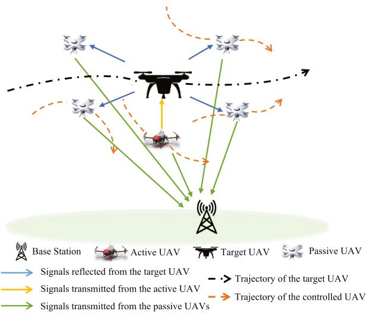

flowchart

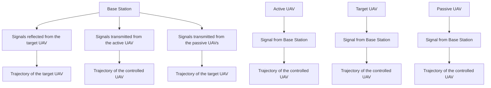

Fig. 1. Illustration of the considered UAV localization network.

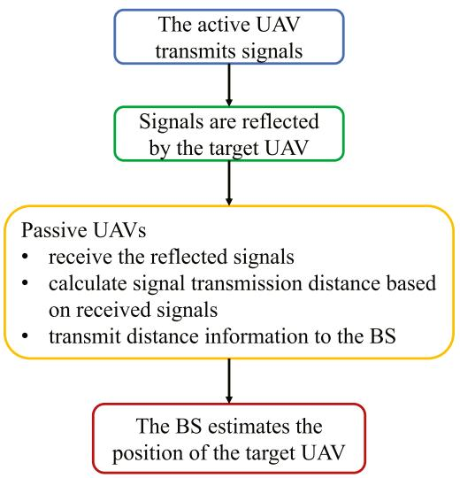

flowchart

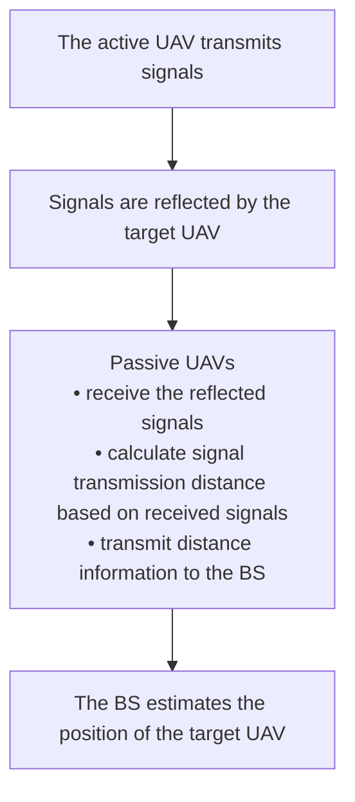

Fig. 2. Flow chart of the considered UAV positioning process.

The controlled UAVs consist of an active UAV and four passive UAVs.1 Here, the target UAV cannot directly transmit its position to the BS since the target UAV may not know its current position, or the target UAV may be an adversarial UAV and it will not share its position to the BS and passive UAVs. In our model, the active UAV first transmits signals to the target UAV which will reflect the signals to passive UAVs. Then, passive UAVs estimate the signal transmission distance from the active UAV to the target UAV, and then to passive UAVs. The estimated signal transmission distance will be transmitted to the BS to calculate the position of the target UAV. We assume that the real-time 3D coordinates of the controlled UAVs are known to the BS. The flow chart of estimating the target UAV’s position is shown in Fig. 2. Next, we first introduce the movement model of the active and passive UAVs. Then, the transmission links among the active UAV, target UAV, passive UAVs, and the BS are introduced. Finally, the positioning model and the optimization problem is formulated.

Let $\begin{array} { r } { \pmb { u } _ { m , t } = [ x _ { m , t } , y _ { m , t } , z _ { m , t } ] ^ { T } } \end{array}$ be the 3D coordinate of UAV = [ ]m at time slot t. Hereinafter, we use a sequence number 0 to represent the active UAV and a sequence number from 1 to 4 to represent a passive UAV. For example, $\mathbf { \delta } \mathbf { u } _ { 0 , t }$ represents the coordinate of the active UAV and $\mathbf { \Delta } \mathbf { u } _ { m , t }$ with $1 \leqslant m \leqslant 4$ is the 1 4coordinate of a passive UAV. Then, the coordinate of UAV m is

$$
\boldsymbol {u} _ {m, t + 1} \left(\phi_ {m, t}, \varphi_ {m, t}\right) = \boldsymbol {u} _ {m, t} + v _ {m, t} \Delta_ {t} \left[ \begin{array}{c} \cos \varphi_ {m, t} \cos \phi_ {m, t} \\ \sin \varphi_ {m, t} \cos \phi_ {m, t} \\ \sin \phi_ {m, t} \end{array} \right], \tag {1}
$$

1Since we use the traditional time difference of arrival (TDOA) method to calculate the three-dimensional (3D) coordinate of the target UAV [26], four passive UAVs are required to estimate the four signal transmission distances and calculate the 3D position of the target UAV.

where $\varphi _ { m , t }$ is the yaw angle, $\phi _ { m , t }$ is the pitch angle, $v _ { m , t }$ is the flight speed, and $\Delta _ { t }$ is the time duration of a time slot.

# A. Transmission Model

Here, we introduce the models for transmission links a) from the active UAV to the target UAV and then reflected to passive UAVs, b) from passive UAVs to the ground BS.

1) Active UAV-Target UAV-Passive UAV Links: In our model, the active UAV transmits a signal $a _ { t }$ to the target UAV. We assume that there is no occlusion in the path from the active UAV to the target UAV, and paths from the target UAV to passive UAVs. Let $\tau _ { m , t }$ denote the time of transmitting signal $a _ { t }$ from the active UAV to passive UAV m via the target UAV. Then, $\tau _ { m , t }$ can be given by

$$
\tau_ {m, t} = \frac {r _ {m , t} \left(\boldsymbol {u} _ {0 , t} , \boldsymbol {s} _ {t} , \boldsymbol {u} _ {m , t}\right)}{c}, \tag {2}
$$

where c is the speed of light and $r _ { m , t } ( { \boldsymbol { \mathbf { \mathit { u } } } } _ { 0 , t } , { \boldsymbol { \mathbf { \mathit { s } } } } _ { t } , { \boldsymbol { \mathbf { \mathit { u } } } } _ { m , t } ) =$ $d _ { 0 , t } \big ( \pmb { u } _ { 0 , t } , \pmb { s } _ { t } \big ) + d _ { m , t } \big ( \pmb { s } _ { t } , \pmb { u } _ { m , t } \big )$ ( ) =is the distance from the active ( ) + ( )UAV to the target UAV and then from the target UAV to passive UAV m with $d _ { 0 , t } ( { \pmb u } _ { 0 , t } , { \pmb s } _ { t } ) = \| { \pmb u } _ { 0 , t } - { \pmb s } _ { t } \|$ being the ( ) =distance between the active UAV and the target UAV located at $\begin{array} { r } { \pmb { s } _ { t } = [ x _ { t } , y _ { t } , z _ { t } ] ^ { T } } \end{array}$ and $d _ { m , t } ( \pmb { s } _ { t } , \pmb { u } _ { m , t } ) = \| \pmb { s } _ { t } - \pmb { u } _ { m , t } \|$ being the = [ ] ( ) =distance between the target UAV and passive UAV m.

Since less obstacles exist in the sky, we use a line-of-sight (LoS) transmission model for the links between the active UAV and passive UAVs [27], [28]. Then, the signals transmitted from the active UAV, reflected by the target UAV, and received by passive UAV m at time slot t is given by

$$
y _ {m, t} = \sqrt {p _ {0 , t}} h _ {m, t} x _ {m, t} h _ {0, t} a _ {t - \tau_ {m, t}} + w _ {m, t}, \tag {3}
$$

where $p _ { 0 , t }$ is the transmit power of the active UAV at time slot t, $x _ { m , t }$ represents the scattering coefficient of the target UAV [29], and $w _ { m , t }$ is Gaussian noise with zero mean and $\epsilon ^ { 2 }$ variance. $h _ { 0 , t } = \sqrt { \beta _ { 0 } } d _ { 0 , t } ^ { - 1 } ( \pmb { u } _ { 0 , t } , \pmb { s } _ { t } )$ represents the path loss from the active = ( )UAV to the target UAV, and $h _ { m , t } = \sqrt { \beta _ { 0 } } d _ { m , t } ^ { - 1 } ( \pmb { u } _ { m , t } , \pmb { s } _ { t } )$ represents the path loss from the target UAV to passive UAV m with $\sqrt { \beta _ { 0 } }$ being the LoS path loss at a reference distance [30]. We use LoS links to model the link between the active UAV and the target UAV and the links between the target UAV and passive UAVs.

At passive UAV m, the signal-to-noise ratio (SNR) of the signal transmitted by the active UAV and reflected by the target UAV is given by [31]

$$
\gamma_ {m, t} ^ {\mathrm{A}} \left(\boldsymbol {u} _ {0, t}, \boldsymbol {u} _ {m, t}, p _ {0, t}\right) = \frac {p _ {0 , t} \left| h _ {m , t} x _ {m , t} h _ {0 , t} \right| ^ {2}}{\epsilon^ {2}}. \tag {4}
$$

From (4), we see that the SNR of each passive UAV depends on the transmit power of the active UAV and the distance between the active UAV and the passive UAV via the target UAV. The transmission delay from the active UAV to the target UAV and from the target UAV to passive UAV m is given by

$$
T _ {m, t} ^ {\mathrm{A}} \left(\boldsymbol {u} _ {0, t}, \boldsymbol {u} _ {m, t}, p _ {0, t}\right) = \frac {D _ {\mathrm{A}}}{W \log_ {2} \left(1 + \gamma_ {m , t} ^ {\mathrm{A}} \left(\boldsymbol {u} _ {m , t}\right)\right)}, \tag {5}
$$

where $D _ { \mathrm { { A } } }$ is the size of the transmitting signals and W is the bandwidth. The energy consumption of the active UAV is given by

$$
E _ {m, t} \left(\boldsymbol {u} _ {0, t}, \boldsymbol {u} _ {m, t}, p _ {0, t}\right) = p _ {0, t} T _ {m, t} ^ {\mathrm{A}} \left(\boldsymbol {u} _ {0, t}, \boldsymbol {u} _ {m, t}, p _ {0, t}\right). \tag {6}
$$

Due to the limited energy of the active UAV, the transmit power of the active UAV must be optimized to minimize the positioning error of the target UAV while satisfying the energy consumption requirements of the active UAV.

2) Passive UAV-BS Links: Passive UAVs require to use their received signals to calculate the distance $\hat { r } _ { m , t }$ from the active ˆUAV to the target UAV and then from the target UAV to the passive UAV. Then, each passive UAV will transmit its calculated distance $\hat { r } _ { m , t }$ to the BS. Since the ground communications may ˆinterfere the transmission between UAVs and the BS, we use probabilistic LoS and non-line-of sight (NLoS) links to model the links between passive UAVs and the BS. The LoS and NLoS path loss of passive UAV m transmitting signals to the BS located at $\scriptstyle { \pmb { s } } _ { \mathrm { B } }$ at time slot t is given by

$$
\begin{array}{l} l _ {m, t} ^ {\text { LoS }} \left(\boldsymbol {u} _ {m, t}\right) \\ = L _ {\mathrm{FS}} \left(k _ {0}\right) + 1 0 \mu_ {\mathrm{LoS}} \log \left(k _ {m, t} \left(\boldsymbol {u} _ {m, t}, \boldsymbol {s} _ {\mathrm{B}}\right)\right) + \lambda_ {\sigma_ {\mathrm{LoS}}}, \tag {7} \\ \end{array}
$$

$$
l _ {m, t} ^ {\mathrm{NLoS}} \left(\boldsymbol {u} _ {m, t}\right)
$$

$$
= L _ {\mathrm{FS}} \left(k _ {0}\right) + 1 0 \mu_ {\mathrm{NLoS}} \log \left(k _ {m, t} \left(\boldsymbol {u} _ {m, t}, \boldsymbol {s} _ {\mathrm{B}}\right)\right) + \lambda_ {\sigma_ {\mathrm{NLoS}}}, \tag {8}
$$

where $L _ { \mathrm { F S } } ( k _ { 0 } ) = 2 0 \log ( k _ { 0 } f _ { 0 } ^ { \ B } 4 \pi / c )$ is the free-space path loss with $k _ { 0 }$ ( ) = 20 log( 4 )being the free-space reference distance and $\bar { f _ { 0 } ^ { B } }$ being the carrier frequency. $k _ { m , t } ( \boldsymbol { \mathbf { u } } _ { m , t } , \boldsymbol { \mathbf { \mathit { s } } } _ { \mathrm { B } } )$ is the distance between ( )passive UAV m and the BS at time slot $t . \lambda _ { \sigma _ { \mathrm { L o S } } }$ and $\lambda _ { \sigma _ { \mathrm { N L o S } } }$ are the shadowing random variables, which are Gaussian variables in dB with zero mean and $( \sigma _ { \mathrm { L o S } } ^ { B } ) ^ { 2 } , ( \sigma _ { \mathrm { N L o S } } ) ^ { 2 } \ : \mathrm { d B }$ variances. The (probability of LoS is given by

$$
\operatorname * {P r} \left(l _ {m, t} ^ {\mathrm{LoS}} (\boldsymbol {u} _ {m, t})\right) = (1 + X \exp (- Y [ \chi_ {m, t} - X ])) ^ {- 1}, \tag {9}
$$

where X and $Y$ are constants which are related to the environment factors, and $\chi _ { m , t }$ is the elevation angle of passive UAV m at time slot t, which satisfies χm,t  m,tk (u ,s ) . $\begin{array} { r } { ( \chi _ { m , t } ) = \frac { z _ { m , t } } { k _ { m , t } ( \mathbf { u } _ { m , t } , \mathbf { s } _ { \mathrm { B } } ) } } \end{array}$ sin( ) =Therefore, the path loss from passive UAV m to the BS at time slot t is given by

$$
\begin{array}{l} \bar {l} _ {m, t} (\boldsymbol {u} _ {m, t}) = \operatorname * {P r} \left(l _ {m, t} ^ {\mathrm{LoS}} (\boldsymbol {u} _ {m, t})\right) \times l _ {m, t} ^ {\mathrm{LoS}} (\boldsymbol {u} _ {m, t}) \\ \left. + \left(1 - \operatorname * {P r} \left(l _ {m, t} ^ {\mathrm{LoS}} (\boldsymbol {u} _ {m, t})\right)\right) \times l _ {m, t} ^ {\mathrm{NLoS}} (\boldsymbol {u} _ {m, t}). \right. \tag {10} \\ \end{array}
$$

We assume that passive UAVs use an orthogonal frequency division multiple access (OFDMA) technique [24]. The SNR of the signal transmitted from passive UAV m to the BS at time slot t is given by

$$
\gamma_ {m, t} ^ {\mathrm{B}} (\boldsymbol {u} _ {m, t}) = \frac {p _ {m , t}}{\epsilon^ {2}} 1 0 ^ {- \bar {l} _ {m, t} (\boldsymbol {u} _ {m, t}) / 1 0}, \tag {11}
$$

where $p _ { m , t }$ is the transmit power of passive UAV m at time slot t. Hence, the SNR of the BS changes as the transmit powers of passive UAVs and the positions of passive UAVs vary. The transmission delay from passive UAV m to the BS at time slot t

is given by

$$
T _ {m, t} ^ {\mathrm{B}} \left(\boldsymbol {u} _ {m, t}\right) = \frac {D _ {\mathrm{B}}}{W \log_ {2} \left(1 + \gamma_ {m , t} ^ {\mathrm{B}} \left(\boldsymbol {u} _ {m , t}\right)\right)}, \tag {12}
$$

where $D _ { \mathrm { B } }$ is the data size of the distance information transmitted from passive UAVs to the BS.

# B. Model for Positioning

Let $\hat { \pmb { r } } _ { t } = [ \hat { r } _ { 1 , t } , \dots , \hat { r } _ { 4 , t } ] ^ { T }$ be the distance measurement in-ˆ = [ˆ ˆ ]formation received by the BS from passive UAVs. Then, the BS uses $\hat { \mathbf { } } _ { }$ to estimate the position of the target UAV. A ˆtwo-stage weighted least-squares (TSWLS) method [26] is exploited to determine the position of the target UAV. Hence, we assume that the distance measurements $\hat { \mathbf { } } _ { { t } }$ from the active ˆUAV to passive UAV m via the target UAV involves an error, and can be expressed by $\hat { r } _ { m , t } = r _ { m , t } + n _ { m , t } ( p _ { 0 , t } , \pmb { u } _ { 0 , t } , \pmb { u } _ { m , t } )$ , where $n _ { m , t } ( p _ { 0 , t } , { \pmb u } _ { 0 , t } , { \pmb u } _ { m , t } )$ = + ( )represents the error between the (measured distance $\hat { r } _ { m , t }$ )and the truth distance $r _ { m , t }$ and is the independent Gaussian measurement error with zero mean and variance $\sigma _ { m , t } ^ { 2 } ( { \boldsymbol u } _ { 0 , t } , { \boldsymbol u } _ { m , t } , { p } _ { 0 , t } )$ [32]. Based on the distance mea-( )surement information rt, 3D position of the controlled UAVs $\boldsymbol { U } _ { t } = [ \boldsymbol { \boldsymbol { u } } _ { 0 , t } , \ldots , \boldsymbol { u } _ { 4 , t } ] ^ { T }$ ˆand the transmit power ${ p } _ { 0 , t }$ of the active = [ ]UAV at time slot t, the estimated position of the target UAV $\hat { \mathbf { \boldsymbol { s } } } _ { t } ( \pmb { U } _ { t } , p _ { 0 , t } )$ can be obtained via the TSWLS method in [26].

# C. Problem Formulation

Given the defined system model, our goal is to minimize the positioning error $\begin{array} { r } { \dot { \sum _ { t = 1 } ^ { V } } \sqrt { ( \hat { s } _ { t } ( \pmb { U } _ { t } , p _ { 0 , t } ) - s _ { t } ) ^ { 2 } } } \end{array}$ between the estimated position $\hat { \mathbf { \boldsymbol { s } } } _ { t } ( \pmb { U } _ { t } , p _ { 0 , t } )$ ( ) )and the actual position $\mathbf { \boldsymbol { s } } _ { t }$ of ˆ ( )the target UAV over a time period T that consists of V time slots under the delay and movement constraints of UAVs, where $( \hat { \pmb { s } } _ { t } ( \pmb { U } _ { t } , p _ { 0 , t } ) - \pmb { s } _ { t } ) ^ { 2 }$ represents the square of the positioning (ˆ ( ) )error between the estimated position and the actual position of the target UAV at time slot t. This minimization problem includes optimizing the transmit power of the active UAV and the trajectories of passive and active UAVs. The optimization problem is given by

$$
\min _ {p _ {0, t}, \boldsymbol {\varphi} _ {t}, \boldsymbol {\phi} _ {t}} \sum_ {t = 1} ^ {V} \sqrt {\left(\hat {\mathbf {s}} _ {t} \left(\boldsymbol {U} _ {t} , p _ {0 , t}\right) - \boldsymbol {s} _ {t}\right) ^ {2}}, \tag {13}
$$

$$
\mathrm{s.t.} E _ {m, t} \leqslant E _ {\max}, \tag {13a}
$$

$$
T _ {m, t} ^ {\mathrm{B}} \left(\boldsymbol {u} _ {m, t}\right) \leqslant \xi , \quad \forall m \in \mathcal {M}, \tag {13b}
$$

$$
\varphi^ {\min} \leqslant \varphi_ {m, t} \leqslant \varphi^ {\max}, \quad \forall m \in \mathcal {M}, \tag {13c}
$$

$$
\phi^ {\min} \leqslant \phi_ {m, t} \leqslant \phi^ {\max}, \quad \forall m \in \mathcal {M}, \tag {13d}
$$

$$
L _ {\min} \leqslant \| \boldsymbol {u} _ {m, t + 1} - \boldsymbol {s} _ {t + 1} \| \leqslant L _ {\max}, \quad \forall m \in \mathcal {M}, \tag {13e}
$$

$$
L _ {\min} \leqslant \| \boldsymbol {u} _ {m, t + 1} - \boldsymbol {u} _ {m ^ {\prime}, t + 1} \| \leqslant L _ {\max}, \forall m, m ^ {\prime} \in \mathcal {M}, \tag {13f}
$$

where $p _ { 0 , t }$ t is the transmit power of the active UAV, $\varphi _ { t } =$ $[ \varphi _ { 0 , t } , \ldots , \varphi _ { 4 , t } ] ^ { T }$ and ${ \phi } _ { t } = [ \phi _ { 0 , t } , \ldots , \phi _ { 4 , t } ] ^ { T }$ =are the yaw angle [ ] = [ ]vector and the pitch angle vector for the active UAV and passive UAVs, respectively. (13a) is a maximum energy consumption constraint for the active UAV, (13b) is the delay needed to transmit distance information from each passive UAV to the BS, $E _ { m a x }$ is the maximal energy of the active UAV, and $L _ { m a x }$ is the maximal distance between any two UAVs to ensure the accurate UAV positioning. (13c) and (13d) are the yaw angle and the pitch angle constraints for the controlled UAVs. (13e) is the constraint of the distance between a controlled UAV and the target UAV, and (13f) is the constraint of the distance between any two controlled UAVs.

The problem (13) is challenging to solve by conventional optimization algorithms due to the following reasons. First, since the Hessian matrix of objective function in (13) is not a positive semi-definite matrix, the problem (13) is non-convex. Second, the BS must know the coordinates of the target UAV to optimize the transmit power of the active UAV and trajectories of controlled UAVs using optimization methods. However, the target UAV is moving and hence the BS may not be able to obtain the real-time position of the target UAV. To solve the optimization problem (13), we use a distributed RL algorithm which finds the probability distribution of the sum of future rewards to estimate the expected value of the sum of future rewards accurately. The proposed method enables the active UAV to determine its transmit power and each controlled UAV to determine its trajectory using its individual observation. Hence, using distributed RL, the BS and controlled UAVs can minimize the positioning error of the target UAV.

# III. PROPOSED Z FUNCTION DECOMPOSITION BASED RL

In this section, we introduce a ZD-RL method to solve the optimization problem in (13). Compared to standard RL algorithms [25] such as deep Q-network (DQN) that uses a neural network to directly estimate the expected value of the sum of future rewards, the ZD-RL method aims to find the probability distribution of the sum of future rewards and capture richer distribution information, thus improving the efficiency of optimizing the transmit power of the active UAV and trajectories of controlled UAVs. Hence, the ZD-RL method can improve the efficiency of optimizing the transmit power of the active UAV and trajectories of controlled UAVs. Next, we first introduce the components of the ZD-RL method. Then, the process of using the ZD-RL method to find the global optimal transmit power for the active UAV and trajectories for controlled UAVs is explained.

# A. Components of the ZD-RL Method

The ZD-RL method consists of six components: a) agents, b) actions, c) states, d) rewards, e) individual Z function, f) global Z function, which are specified as follows:

- Agents: The agents that perform the ZD-RL method are the controlled UAVs. Each passive UAV must decide its yaw angle and pitch angle and the active UAV must decide its transmit power, yaw angle, and pitch angle at each time slot.   
- State space: A state of each agent is used to describe the local environment of each controlled UAV. In particular, a state of each passive UAV consists of its 3D coordinates and the distance measurements from the active UAV to the

target UAV, and then from the target UAV to the passive UAV. Hence, a state of a passive UAV m at time slot t is $\pmb { o } _ { m , t } = [ x _ { m , t } , y _ { m , t } , z _ { m , t } , \hat { r } _ { m , t } ]$ . Since the active UAV = [ ˆ ]cannot obtain the distance measurement, and the BS does not need the distance measurement of the active UAV to estimate the position of the target UAV, the state of the active UAV is $\mathbf { \sigma } _ { o _ { 0 , t } } = [ x _ { 0 , t } , y _ { 0 , t } , z _ { 0 , t } ]$ . The states of = [ ]all agents at time slot t can be represented by a vector $\pmb { o } _ { t } = [ \pmb { o } _ { 0 , t } , \dotsc , \pmb { o } _ { 4 , t } ]$ .

= [ ]- Actions: The action of each passive UAV is the yaw angle and the pitch angle and the action of the active UAV is the transmit power, the yaw angle and the pitch angle. Hence, an action of passive UAV m at time slot t can be expressed as $\mathbf { \delta } _ { \mathbf { { a } } _ { m , t } } = [ \varphi _ { m , t } , \phi _ { m , t } ]$ , and an action of the active UAV = [at time slot t is $\mathbf { a } _ { 0 , t } = [ p _ { 0 , t } , \varphi _ { 0 , t } , \phi _ { 0 , t } ]$ . The actions of all = [controlled UAVs at time slot t is $\pmb { a } _ { t } = [ \pmb { a } _ { 0 , t } , \dotsc , \pmb { a } _ { 4 , t } ]$ .   
= [ ]- Reward: The reward of each controlled UAV captures the positioning accuracy of the target UAV resulting from a selected action. Given the global state $\mathbf { } _ { o _ { t } }$ and the selected action $\mathbf { } \mathbf { } \mathbf { } \mathbf { } \mathbf { } \mathbf { } \mathbf { } \mathbf { } \mathbf { } \mathbf { } \mathbf { } \mathbf { } \mathbf { } \mathbf { } \mathbf { } \mathbf { } \mathbf { } \mathbf { } \mathbf { } \mathbf { } \mathbf { } \mathbf { } \mathbf { } \mathbf { } \mathbf { } \mathbf { } \mathbf { } \mathbf { } \mathbf { } \mathbf { } \mathbf { } \mathbf { } \mathbf { } \mathbf { } \mathbf { } \mathbf { } \mathbf { } \mathbf { } \mathbf { } \mathbf { } \mathbf { } \mathbf { } \mathbf { } \mathbf { } \mathbf { } \mathbf { } \mathbf { } \mathbf { } \mathbf { } \mathbf { } \mathbf { } \mathbf { } \mathbf { } \mathbf { } \mathbf { } \mathbf { } \mathbf { } \mathbf { } \mathbf { } \mathbf { } \mathbf { } \mathbf { } \mathbf { } \mathbf { } \mathbf { } \mathbf { } \mathbf { } \mathbf { } \mathbf { } \mathbf { } \mathbf { } \mathbf { } \mathbf { } \mathbf { } \mathbf { } \mathbf { } \mathbf { } \mathbf { } \mathbf { } \mathbf { } \mathbf { } \mathbf { } \mathbf { } \mathbf { } \mathbf { } \mathbf { } \mathbf { } \mathbf { } \mathbf { } \mathbf { } \mathbf { } \mathbf { } \mathbf { } \mathbf { } \mathbf { } \mathbf { } \mathbf { } \mathbf { } \mathbf { } \mathbf { } \mathbf { } \mathbf { } \mathbf { } \mathbf { } \mathbf { } \mathbf { } \mathbf { } \mathbf { } \mathbf { } \mathbf { } \mathbf { } \mathbf { } \mathbf { } \mathbf \mathbf { } \mathbf { } \mathbf { } \mathbf { } \mathbf { } \mathbf \mathbf { } \mathbf { } \mathbf { } \mathbf \mathbf { } \mathbf { } \mathbf \Psi \mathbf { } \mathbf { } \mathbf \Psi \mathbf { } \mathbf { } \mathbf \Psi \mathbf { } \mathbf { } \mathbf \Psi \mathbf { } \mathbf \Psi \mathbf { } \mathbf \mathbf { } \mathbf \Psi \mathbf { } \mathbf \Psi \mathbf { } \mathbf \mathbf \Psi \Psi \Psi \mathbf { } \mathbf \mathbf \Psi \Psi \mathbf \Psi \Psi \Psi \mathbf \Psi \mathbf \Psi \Psi \mathbf \Psi \Psi \mathbf \Psi \mathbf \Psi \Psi \mathbf \Psi \mathbf \Psi \Psi \mathbf \mathbf \Psi \mathbf \Psi \Psi \mathbf \Psi \mathbf \Psi \mathbf \Psi \mathbf \mathbf \Psi \mathbf \Psi \mathbf \mathbf \Psi$ , the reward of each controlled UAV at time slot t is $R _ { t } ( \pmb { o } _ { t } , \pmb { a } _ { t } ) = - \sqrt { ( \hat { s } _ { t } ( \pmb { U } _ { t } , p _ { 0 , t } ) - s _ { t } ) ^ { 2 } }$ . Note that, $R _ { t } ( o _ { t } , { \pmb a } _ { t } )$ increases as the positioning error in (13) de-( )creases, which implies that maximizing the reward of each controlled UAV can minimize the positioning error.   
- Individual Z function: Z function is defined as the sum of future reward under a given state $\begin{array} { r } { \mathbf { o } _ { m , t } , } \end{array}$ , a selection action $\mathbf { \Delta } _ { a _ { m , t } }$ , and a policy π, which can be expressed as $\begin{array} { r } { Z ( o _ { m , t } , \pmb { a } _ { m , t } ) = \sum _ { t = 0 } ^ { \infty } \gamma ^ { t } R ( o _ { m , t } , \pmb { a } _ { m , t } ) } \end{array}$ , where γ is a ( ) = ( )discounted factor. Given the definition, our purpose is to estimate the probability distribution of $Z ( \pmb { o } _ { m , t } , \pmb { a } _ { m , t } )$ . This ( )is different from DQN [25] that uses a neural network to estimate the sum of expected future reward. In particular, the relationship between Q function and our defined Z function is expressed as

$$
\begin{array}{l} Q \left(\boldsymbol {o} _ {m, t}, \boldsymbol {a} _ {m, t}\right) = \mathbb {E} _ {\pi} \left[ Z \left(\boldsymbol {o} _ {m, t}, \boldsymbol {a} _ {m, t}\right) \right] \\ = \mathbb {E} _ {\pi} \left[ \sum_ {t = 0} ^ {\infty} \gamma^ {t} R \left(\boldsymbol {o} _ {m, t}, \boldsymbol {a} _ {m, t}\right) \right]. \tag {14} \\ \end{array}
$$

The advantage of estimating Z function instead of Q function is that Q function values estimated using the probability distribution of Z function are more accurate compared to Q function values directly estimated by DQN [33]. Hence, the ZD-RL method ensures the stability and effectiveness of model convergence [34]. Next, we introduce the process of estimating the probability distribution of Z function. First, we introduce the cumulative distribution function (CDF) of $Z ( \pmb { o } _ { m , t } , \pmb { a } _ { m , t } )$ , which is given by

$$
F (z) = \mathbb {P} \left(Z \left(\boldsymbol {o} _ {m, t}, \boldsymbol {a} _ {m, t}\right) \leqslant z\right), \tag {15}
$$

where $F ( z )$ represents the probability that $Z ( \pmb { o } _ { m , t } , \pmb { a } _ { m , t } )$ ( ) ( )is smaller than a value z. To estimate the probability distribution of $Z ( \pmb { o } _ { m , t } , \pmb { a } _ { m , t } )$ , we use a DNN. The input ( )of the DNN is the individual state $\begin{array} { r } { \mathbf { o } _ { m , t } , } \end{array}$ individual action $\mathbf { \Delta } \mathbf { a } _ { m , t }$ and a probability value $\varsigma _ { i } ,$ and the output is a value of Z function, such as $\hat { Z } _ { \omega _ { m } } ( o _ { m , t } , \pmb { a } _ { m , t } , \varsigma _ { i } )$ , where $\omega _ { m }$ is ( )the parameters of the DNN. The relationship between the input of DNN and its output can be expressed as

$$
\varsigma_ {i} = \mathbb {P} \left(Z \left(\boldsymbol {o} _ {m, t}, \boldsymbol {a} _ {m, t}\right) \leqslant \hat {Z} _ {\boldsymbol {\omega} _ {m}} \left(\boldsymbol {o} _ {m, t}, \boldsymbol {a} _ {m, t}, \varsigma_ {i}\right)\right). \tag {16}
$$

From (16), we can see that Z function is to find a value of $\hat { Z } _ { \omega _ { m } } ( o _ { m , t } , \pmb { a } _ { m , t } , \varsigma _ { i } )$ such that $\mathbb { P } ( Z ( \pmb { o } _ { m , t } , \pmb { a } _ { m , t } ) \leqslant$ $\hat { Z } _ { \omega _ { m } } ( o _ { m , t } , \pmb { a } _ { m , t } , \varsigma _ { i } ) ) = \varsigma _ { i }$ ( ( ). Given the relationship between $\varsigma _ { i }$ and $\hat { Z } _ { \omega _ { m } } ( \pmb { o } _ { m , t } , \pmb { a } _ { m , t } , \pmb { \varsigma } _ { i } )$ , the next step is to determine the value of $\mathsf { \Sigma } _ { \mathsf { S } i }$ )such that we can use less DNN outputs to estimate the entire probability distribution of $Z ( \pmb { o } _ { m , t } , \pmb { a } _ { m , t } )$ . To this end, we use a quantile vector $\mathsf { \Sigma } _ { \mathsf { S } } = [ \mathsf { \Sigma } _ { \mathsf { S 1 } } , \mathsf { \Sigma } \cdot \mathsf { \Sigma } \cdot \mathsf { \Sigma } , \mathsf { \Sigma } \varsigma _ { N } ]$ )with $\begin{array} { r } { \varsigma _ { i } = \frac { i } { N } , i = 1 , \ldots , N } \end{array}$ .

= = 1Global Z function: The global Z function $Z _ { \mathrm { T } } ( o _ { t } , a _ { t } )$ is ( )used to estimate the probability distribution of all controlled UAVs’ achievable future rewards at each global state $\mathbf { } _ { o _ { t } }$ and action $\mathbf { } \mathbf { } \mathbf { } \mathbf { a } _ { t }$ . Similarly to individual Z functions, the probability distribution of the global Z function is approximated by a set of global Z function values with a quantile vector ς, and the approximated global Z function is represented by $\hat { Z } _ { \mathrm { T } } ( o _ { t } , a _ { t } , \varsigma )$ . Based on the distributional ( )individual-global-max principle [35], the relationship between $\hat { Z } _ { \mathrm { T } } ( o _ { t } , a _ { t } , \varsigma )$ and $\hat { Z } _ { \omega _ { m } } ( o _ { m , t } , \pmb { a } _ { m , t } , \pmb { \varsigma } )$ is given by

$$
\begin{array}{l} \hat {Z} _ {\mathrm{T}} \left(\boldsymbol {o} _ {t}, \boldsymbol {a} _ {t}, \boldsymbol {\varsigma}\right) = \sum_ {m = 0} ^ {4} M \left(\boldsymbol {o} _ {m, t}, \boldsymbol {a} _ {m, t}, \boldsymbol {\varsigma}\right) \\ + \sum_ {m = 0} ^ {4} \left(\hat {Z} _ {\boldsymbol {\omega} _ {m}} (\boldsymbol {o} _ {m, t}, \boldsymbol {a} _ {m, t}, \boldsymbol {\varsigma}) \right. \\ \left. - M \left(\boldsymbol {o} _ {m, t}, \boldsymbol {a} _ {m, t}, \boldsymbol {\varsigma}\right)\right), \tag {17} \\ \end{array}
$$

where $M ( o _ { m , t } , \pmb { a } _ { m , t } , \pmb { \varsigma } )$ is the approximated expected value of $\begin{array} { r } { M ( \pmb { o } _ { m , t } , \pmb { a } _ { m , t } , \varsigma ) = \frac { 1 } { N } \sum _ { i = 1 } ^ { N } \hat { Z } _ { \omega _ { m } } ( \pmb { o } _ { m , t } , \pmb { a } _ { m , t } , \varsigma _ { i } ) } \end{array}$ $\hat { Z } _ { \omega _ { m } } ( o _ { m , t } , \pmb { a } _ { m , t } , \pmb { \varsigma } )$ and can be written as .

# B. Training of the ZD-RL Method

Here, we describe the entire training process of the ZD-RL method for optimizing the transmit power of the active UAV and trajectories of all controlled UAVs. In particular, we will first introduce the loss function of the ZD-RL method. Then, we introduce the training procedures. The total loss of the ZD-RL method is defined as the sum of the pair-wise loss for two values $\varsigma _ { i } , \varsigma _ { j }$ based on quantile Huber loss [36], where $\varsigma _ { i } , \varsigma _ { j } \in \varsigma$ Compared to mean-square-error (MSE) loss and mean absolute error (MAE) used in traditional RL, the quantile Huber loss can reduce the sensitivity to abnormal samples that deviate from the normal range. The total loss is

$$
\begin{array}{l} \mathfrak {L} _ {\mathrm{T}} \left(\omega_ {0}, \dots , \omega_ {4}\right) \\ = \frac {1}{N} \sum_ {t = 1} ^ {V} \sum_ {i = 1} ^ {N} \sum_ {j = 1} ^ {N} \left| \varsigma_ {i} - \mathbb {1} _ {\{u (\boldsymbol {o} _ {t}, \boldsymbol {a} _ {t}, \varsigma_ {i}, \varsigma_ {j}) <   0 \}} \right| \frac {G (u (\boldsymbol {o} _ {t} , \boldsymbol {a} _ {t} , \varsigma_ {i} , \varsigma_ {j}))}{\eta}, \tag {18} \\ \end{array}
$$

where $\mathbb { 1 } _ { \{ x \} } = 1$ when $x < 0$ and $\mathbb { 1 } _ { \{ x \} } = 0$ , otherwise. $u ( o _ { t } , a _ { t } , \varsigma _ { i } , \varsigma _ { j } ) = R _ { t } ( o _ { t } , a _ { t } ) + \gamma \hat { Z } _ { \mathrm { T } } ( o _ { t + 1 } , a _ { t + 1 } , \varsigma _ { j } ) - \hat { Z } _ { \mathrm { T } } ( o _ { t } ,$ $\mathbf { } _ { \mathbf { } _ { a _ { t } } , \varsigma _ { i } } )$ with $\begin{array} { r } { \pmb { a } _ { m , t + 1 } = \arg \operatorname* { m a x } _ { \pmb { a } _ { m } ^ { \prime } } M ( \pmb { o } _ { m , t + 1 } , \pmb { a } _ { m } ^ { \prime } , \varsigma ) } \end{array}$ [37]. $G ( u ( o _ { t } , \pmb { a } _ { t } , \varsigma _ { i } , \varsigma _ { j } ) )$ = arg mis given by

Algorithm 1: ZD-RL Method for Solving Problem (13).   
1: Initialize the DNN parameters $\omega_{m}$ of each controlled UAV, a quantile vector $\varsigma$ .

2: for each iteration do

3: for each controlled UAV $m$ do

4: for each time slot $t$ do

5: Observe the observation $\boldsymbol{o}_{m,t}$ .

6: Select an action according to a $\epsilon$ -greedy scheme.

7: Calculate individual Z function values $\hat{Z}_{\omega_m}(\boldsymbol{o}_{m,t}, \boldsymbol{a}_{m,t}, \varsigma)$ and $\hat{Z}_{\omega_m}(\boldsymbol{o}_{m,t+1}, \boldsymbol{a}_{m,t+1}, \varsigma)$ .

8: end for

9: Controlled UAVs transmit $\boldsymbol{o}_{m,t}$ , $\hat{Z}_{\omega_m}(\boldsymbol{o}_{m,t}, \boldsymbol{a}_{m,t}, \varsigma)$ , and $\hat{Z}_{\omega_m}(\boldsymbol{o}_{m,t+1}, \boldsymbol{a}_{m,t+1}, \varsigma)$ to the BS.

10: end for

11: The BS calculates the reward and global Z function, and transmits to controlled UAVs.

12: for each controlled UAV $m$ do

13: Update $\omega_m$ using $R(\boldsymbol{o}_t, \boldsymbol{a}_t)$ , $\hat{Z}_{\mathrm{T}}(\boldsymbol{o}_t, \boldsymbol{a}_t, \varsigma)$ and $\hat{Z}_{\mathrm{T}}(\boldsymbol{o}_{t+1}, \boldsymbol{a}_{t+1}, \varsigma)$ based on (19).

14: end for

15: end for

$$
\begin{array}{l} G \left(u \left(\boldsymbol {o} _ {t}, \boldsymbol {a} _ {t}, \varsigma_ {i}, \varsigma_ {j}\right)\right) \\ = \left\{ \begin{array}{l l} \frac {1}{2} \left(u \left(\boldsymbol {o} _ {t}, \boldsymbol {a} _ {t}, \varsigma_ {i}, \varsigma_ {j}\right)\right) ^ {2}, & \text { if } | u \left(\boldsymbol {o} _ {t}, \boldsymbol {a} _ {t}, \varsigma_ {i}, \varsigma_ {j}\right) | \leqslant \eta , \\ \eta \left(| u \left(\boldsymbol {o} _ {t}, \boldsymbol {a} _ {t}, \varsigma_ {i}, \varsigma_ {j}\right) | - \frac {1}{2} \eta\right), & \text { otherwise }, \end{array} \right. \\ \end{array}
$$

where η is a hyper-parameter that determines the emphasis of Huber loss on MSE or MAE. Here, using function $G ( u ( o _ { t } , \pmb { a } _ { t } , \varsigma _ { i } , \varsigma _ { j } ) )$ can balance the sensitivity of MSE to large ( ( ))errors and the robustness of MAE to outliers and thus incorporating the strengths of both MSE and MAE. This is because the MSE loss function $\frac 1 2 ( u ( \pmb { o } _ { t } , \pmb { a } _ { t } , \varsigma _ { i } , \varsigma _ { j } ) ) ^ { 2 }$ is highly sensitive to ( ( ))outliers since it squares the errors, which can destabilize learning in the presence of noise or anomalies. The MAE loss function $| u ( o _ { t } , \pmb { a } _ { t } , \varsigma _ { i } , \varsigma _ { j } ) |$ is less sensitive to outliers when dealing with (smaller errors.

The training process consists of the following three steps:

- Step 1 (training at controlled UAVs): Given a quantile vector $\mathsf { \Sigma } _ { \mathsf { S } } = [ \mathsf { \Sigma } _ { \mathsf { S 1 } } , \mathsf { \Sigma } \cdot \mathsf { \Sigma } \cdot \mathsf { \Sigma } , \mathsf { \varsigma } _ { \mathsf { S N } } ]$ , each controlled UAV observes its lo-=cal state $\mathbf { \Delta } _ { o _ { m , t } } ,$ ], takes an action $\mathbf { \Delta } \mathbf { a } _ { m , t }$ according to a -greedy algorithm, and calculates its individual Z function values $\hat { Z } _ { \omega _ { m } } ( \pmb { o } _ { m , t } , \pmb { a } _ { m , t } , \varsigma ) , \hat { Z } _ { \omega _ { m } } ( \pmb { o } _ { m , t + 1 } , \pmb { a } _ { m , t + 1 } , \varsigma )$ . Then, each ( )UAV transmits its state $_ { o _ { m , t } }$ ), individual Z function values $\hat { Z } _ { \omega _ { m } } ( o _ { m , t } , \pmb { a } _ { m , t } , \pmb { \varsigma } )$ and $\hat { Z } _ { \omega _ { m } } ( \pmb { o } _ { m , t + 1 } , \pmb { a } _ { m , t + 1 } , \pmb { \varsigma } )$ to the BS.   
- Step 2 (training at the BS): After collecting individual state and individual Z function values from all controlled UAVs, the BS calculates the reward $R _ { t } ( o _ { t } , { \pmb a } _ { t } )$ and the global Z function values $\hat { Z } _ { \mathrm { T } } ( o _ { t } , a _ { t } , \varsigma ) , \hat { Z } _ { \mathrm { T } } ( o _ { t + 1 } , a _ { t + 1 } , \varsigma )$ based on (17), and transmits $R _ { t } ( o _ { t } , a _ { t } ) , \hat { Z } _ { \mathrm { T } } ( o _ { t } , a _ { t } , \varsigma )$ ), and $\hat { Z } _ { \mathrm { T } } ( o _ { t + 1 } , a _ { t + 1 } , \varsigma )$ ( ) ( )to controlled UAVs. Here, the BS does ( )not need to implement and update any neural networks.

Step 3 (updating at controlled UAVs): Each UAV updates DNN parameters to approximate the probability distribution of its individual Z function using its collected global reward and global Z function values. The update of each controlled UAV m is

$$
\boldsymbol {\omega} _ {m} = \boldsymbol {\omega} _ {m} + \alpha_ {m} \nabla_ {\boldsymbol {\omega} _ {m}} \mathfrak {L} _ {\mathrm{T}} \left(\boldsymbol {\omega} _ {0}, \dots , \boldsymbol {\omega} _ {4}\right), \tag {19}
$$

where $\alpha _ { m }$ is the step size. The entire training process of the ZD-RL method is summarized in Algorithm 1.

# C. Convergence, Implementation, and Complexity Analysis

Next, we analyze the convergence, implementation and complexity of training the proposed ZD-RL method.

1) Convergence Analysis: Here, we analyze the convergence of the proposed ZD-RL algorithm. We first analyze the gap between the optimal expected value of the individual Z function of controlled UAV m and the expected value of individual Z function of controlled UAV m obtained by the proposed ZD-RL method. Then, we show that this gap will converge to zero. In particular, the gap between the optimal expected value of individual Z function of controlled UAV m and the expected value of individual Z function of controlled UAV m obtained by the proposed ZD-RL method is

$$
e \left(\boldsymbol {o} _ {m, t}, \boldsymbol {a} _ {m, t}\right) = M \left(\boldsymbol {o} _ {m, t}, \boldsymbol {a} _ {m, t}\right) - M ^ {*} \left(\boldsymbol {o} _ {m, t}, \boldsymbol {a} _ {m, t}\right), \tag {20}
$$

where $M ^ { * } ( \pmb { o } _ { m , t } , \pmb { a } _ { m , t } ) = \mathbb { E } [ Z ^ { * } ( \pmb { o } _ { m , t } , \pmb { a } _ { m , t } ) ]$ is the expected ( ) = [ ( )]value of the optimal individual Z function of controlled UAV m with respect to future Z functions $( \mathrm { i . e . , ~ } Z ^ { \ast } ( \pmb { o } _ { m , t + 1 } , \pmb { a } _ { m , t + 1 } )$ , $Z ^ { * } ( \pmb { o } _ { m , t + 2 } , \pmb { a } _ { m , t + 2 } ) , \cdot \cdot \cdot )$ ( ). From (20), we can see that if the gap $e ( o _ { m , t } , \pmb { a } _ { m , t } )$ )converges to zero, the proposed ZD-RL method ( )converges [38]. To prove that the gap $e ( \pmb { o } _ { m , t } , \pmb { a } _ { m , t } )$ will finally converge to zero, we need to analyze how the gap changes as the number of training iterations increases. In particular, we define a distributional Bellman operator to find a relationship between the individual Z function of controlled UAV m at two continuous time slots. In particular, the distributional Bellman operator of the individual Z function is defined as

$$
\mathcal {T} (Z (\boldsymbol {o} _ {m, t}, \boldsymbol {a} _ {m, t})) ^ {D} := R (\boldsymbol {o} _ {m, t}, \boldsymbol {a} _ {m, t}) + \gamma Z (\boldsymbol {o} _ {m, t + 1}, \boldsymbol {a} _ {m, t + 1}), \tag {21}
$$

where $\begin{array} { r } { \pmb { a } _ { m , t + 1 } = \arg \operatorname* { m a x } _ { \pmb { a } _ { m } ^ { \prime } } M ( \pmb { o } _ { m , t + 1 } , \pmb { a } _ { m } ^ { \prime } ) } \end{array}$ . Based on the = arg max ( )above definition, the convergence of the proposed ZD-RL algorithm is shown in the following lemma.

Lemma 1: The proposed ZD-RL method is guaranteed to converge to zero, if the following conditions are satisfied [39]:

1) The gap $e ( \pmb { o } _ { m , t } , \pmb { a } _ { m , t } )$ satisfies

$$
\begin{array}{l} e _ {k + 1} \left(\boldsymbol {o} _ {m, t}, \boldsymbol {a} _ {m, t}\right) \\ = \left(1 - \alpha_ {m}\right) e _ {k} \left(\boldsymbol {o} _ {m, t}, \boldsymbol {a} _ {m, t}\right) + \alpha_ {m} F \left(\boldsymbol {o} _ {m, t}, \boldsymbol {a} _ {m, t}\right), \tag {22} \\ \end{array}
$$

where $F ( o _ { m , t } , \mathbf { a } _ { m , t } ) = R ( o _ { m , t } , \mathbf { a } _ { m , t } ) + \gamma M ( o _ { m , t + 1 } ,$ $\mathbf { } a _ { m , t + 1 } \big ) - M ^ { * } ( \mathbf { o } _ { m , t } , \mathbf { } a _ { m , t } ) .$

2) $| | \mathbb { E } \big [ F ( o _ { m , t } , \pmb { a } _ { m , t } ) \big ] | _ { \infty } \leqslant \gamma | | e ( o _ { m , t } , \pmb { a } _ { m , t } ) | | _ { \infty } , \forall \gamma \in$ [ (, , where $| | \cdot | | _ { \infty }$ ( )represents the infinite norm taking (0 1)the maximum value of the absolute value of the elements, $\mathbb { E } [ F ( \pmb { o } _ { m , t } , \pmb { a } _ { m , t } ) ]$ is the expected value of $F ( o _ { m , t } , \pmb { a } _ { m , t } )$ [ ( )] ( )with respect to the state transition probability distribution.

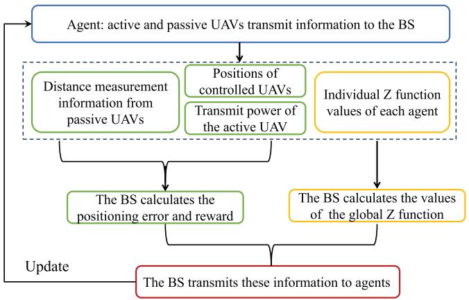

flowchart

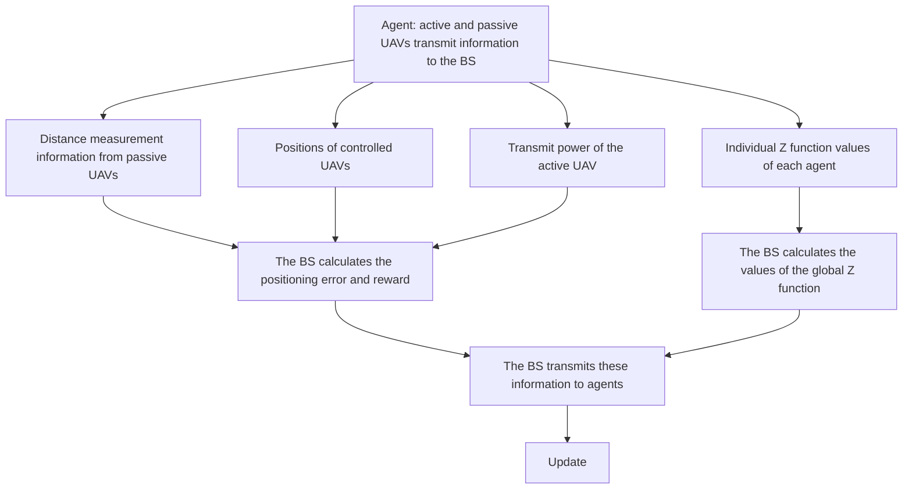

Fig. 3. Flow chart of implementation.

3) Va $\cdot ( \mathbb { E } [ F ( \pmb { o } _ { m , t } , \pmb { a } _ { m , t } ) ] ) \leqslant C _ { \mathrm { F } } ( 1 + | | e ( \pmb { o } _ { m , t } , \pmb { a } _ { m , t } ) | | _ { \infty } ^ { 2 } )$ , ( [where $\operatorname { V a r } ( \mathbb { E } [ F ( \pmb { o } _ { m , t } , \pmb { a } _ { m , t } ) ] )$ + ( ) )is the variance of $\mathbb { E } [ F ( \pmb { o } _ { m , t } , \pmb { a } _ { m , t } ) ]$ (, and $C _ { \mathrm { F } }$ )])is a constant with $C _ { \mathrm { F } } \geqslant 0$ .

[ ( )]Proof: See Appendix A, available online.

2) Implementation Analysis: Next, we explain the implementation of the proposed ZD-RL method for UAV localization. The proposed ZD-RL method includes an offline training stage and an online decision-making stage. In the offline training phase, as shown in Fig. 3, each controlled UAV requires 1) the positioning error between the estimated position and the actual position of the target UAV and 2) the global Z function value to update its DNN parameters based on (18) and (19). To calculate the positioning error, the BS needs to collect the distance measurement information $\hat { r } _ { m , t } .$ , the transmit power of the active UAV, ˆand the positions of controlled UAVs. The distance information is estimated by the signals transmitted from the active UAV to the passive UAV and reflected by the target UAV. The transmit power of the active UAV is notified by the active UAV, and the positions of controlled UAVs are transmitted by controlled UAVs. To calculate the global Z functions, the BS needs to collect individual Z functions as shown in (17) in our training stage. In the online decision-making stage, the well trained DNN can be directly used to determine the transmit power, yaw angle, and pitch angle of controlled UAVs. From the implementation process, we see that the ZD-RL method enables each agent to train their deep neural networks parallelly and distributively. Hence, the designed ZD-RL method can be directly used in the scenario with more passive or active UAVs. In particular, when the number of agents increases, after all agents select and take actions, the BS will collect values of all individual Z functions from agents to calculate the global Z function values and collect positions and distance measurement information of all agents to calculate the positioning error of the target UAV. Thus, the ZD-RL method can adapt to the increase in the number of agents and enables the system to maintain its localization performance.

3) Complexity Analysis: The complexity of the proposed algorithm lies in training the DNN of each controlled UAV. To analyze the complexity of training the designed ZD-RL method, we first assume that the value of the transmit power

$p _ { m , t }$ $\{ p _ { m , t } ^ { 1 } , \ldots , p _ { m , t } ^ { N _ { \mathrm { P } } } \}$ of controlled UAV m at time slot t is selected from a set , the yaw angle $\varphi _ { m , t }$ of controlled UAV m is selected from a set $\{ \varphi _ { m , t } ^ { 1 } , \dots , \varphi _ { m , t } ^ { N _ { 1 } } \}$ , and the pitch angle $\phi _ { m , t }$ is selected from a set $\{ \boldsymbol { \phi } _ { m , t } ^ { 1 } , \ldots , \boldsymbol { \phi } _ { m , t } ^ { N _ { 1 } } \}$ with $N _ { \mathrm { P } } , \ N _ { 1 }$ , and $N _ { 2 }$ being the number of elements in their corresponding sets. Since we only consider optimizing the transmit power of the active UAV and the transmit power of passive UAVs are constant, we have $N _ { \mathrm { P } } = 1$ , when $m = 1 , \ldots , 4 .$ The interval of two yaw angles $\Delta \varphi _ { m }$ = 1is defined as $\Delta \varphi _ { m } = \varphi _ { m , t } ^ { i + 1 } - \varphi _ { m , t } ^ { i } , i =$ $1 , \ldots , N _ { 1 } - 1$ Δ Δ =and the interval of two pitch angles $\Delta \phi _ { m }$ =is 1 defined as $\Delta \phi _ { m } = \phi _ { m , t } ^ { i + 1 } - \phi _ { m , t } ^ { i } , i = 1 , \ldots , N _ { 2 } - 1$ Δ . Hence, the Δ =relationship between $N _ { 1 } , N _ { 2 }$ = 1 1and the interval of angles $\Delta \varphi _ { m }$ and $\Delta \phi _ { m }$ is $\begin{array} { r } { N _ { 1 } = \frac { \varphi _ { m , t } ^ { N _ { 1 } } - \varphi _ { m , t } ^ { 1 } } { \Delta \varphi _ { m } } + 1 } \end{array}$ ϕ 1 m,t−ϕ1m,tϕ , and N2 Δ m $\begin{array} { r } { N _ { 2 } = \frac { \phi _ { m , t } ^ { N _ { 2 } } - \phi _ { m , t } ^ { 1 } } { \Delta \phi _ { m } } + 1 } \end{array}$ φ m,t−φ1m,t . Then, N2 Δφm Δ = + 1 = + 1the complexity of training the designed ZD-RL method is shown in the following proposition.

Proposition 1: The time complexity of training the proposed ZD-RL method is

$$
\begin{array}{l} \mathcal {O} \left(\sum_ {l = 1} ^ {L - 1} l _ {i} l _ {i + 1} + | \boldsymbol {o} _ {m, t} | l _ {1} + N l _ {L} \right. \\ \left. + l _ {L} \left(N _ {\mathrm{P}} \left(\frac {\varphi_ {m , t} ^ {N _ {1}} - \varphi_ {m , t} ^ {1}}{\Delta \varphi_ {m}} + 1\right) \left(\frac {\phi_ {m , t} ^ {N _ {2}} - \phi_ {m , t} ^ {1}}{\Delta \phi_ {m}} + 1\right)\right)\right), \tag {23} \\ \end{array}
$$

where $\lvert \boldsymbol { o } _ { m , t } \rvert$ is the size of state space, $l _ { i }$ is the number of neurons in hidden layer i, L is the number of hidden layers, N is the number of elements in the quantile vector.

Proof: Based on [40], at each iteration, the time-complexity of training ZD-RL method is $\begin{array} { r l } {  { \mathcal { O } ( \sum _ { l = 1 } ^ { L - 1 } l _ { i } l _ { i + 1 } + | \boldsymbol { o } _ { m , t } | l _ { 1 } \dot { + } } } & { { } } \end{array}$ $N l _ { L } + | { \pmb a } _ { m , t } | l _ { L } )$ , where $\lvert \boldsymbol { a } _ { m , t }$ ( + +| is the size of action space. Since $\left| a _ { m , t } \right|$ + )depends on the interval $\Delta \varphi _ { m }$ of two adjacent yaw angles and the interval $\Delta \phi _ { m }$ Δof two adjacent pitch angles, $\left| a _ { m , t } \right|$ can be given by

$$
\left| \boldsymbol {a} _ {m, t} \right| = N _ {\mathrm{P}} \times \left(\frac {\varphi_ {m , t} ^ {N _ {1}} - \varphi_ {m , t} ^ {1}}{\Delta \varphi_ {m}} + 1\right) \times \left(\frac {\phi_ {m , t} ^ {N _ {2}} - \phi_ {m , t} ^ {1}}{\Delta \phi_ {m}} + 1\right), \tag {24}
$$

where $N _ { \mathrm { P } } = 1$ when $m = 1 , \ldots , 4$ . This is because we only = 1 = 1 4consider optimizing the transmit power of the active UAV and the transmit power of passive UAVs are constant. Based on (24), the time-complexity of training the proposed ZD-RL method is

$$
\begin{array}{l} \mathcal {O} \left(\sum_ {l = 1} ^ {L - 1} l _ {i} l _ {i + 1} + | \boldsymbol {o} _ {m, t} | l _ {1} + N l _ {L} \right. \\ \left. + l _ {L} \left(N _ {\mathrm{P}} \left(\frac {\varphi_ {m , t} ^ {N _ {1}} - \varphi_ {m , t} ^ {1}}{\Delta \varphi_ {m}} + 1\right) \left(\frac {\phi_ {m , t} ^ {N _ {2}} - \phi_ {m , t} ^ {1}}{\Delta \phi_ {m}} + 1\right)\right)\right). \tag {25} \\ \end{array}
$$

This completes the proof. 

From Proposition 1, we see that as the interval $\Delta \varphi _ { m }$ and $\Delta \phi _ { m }$ Δ Δof two adjacent angles decreases, the time-complexity of training the proposed ZD-RL method at each iteration increases and hence the number of iterations that the ZD-RL method required to converge increases. However, when the intervals $\Delta \varphi _ { m }$ and $\Delta \phi _ { m }$ Δincreases, the controlled UAVs may find better yaw angles and pitch angles for the target UAV localization thus improving localization performance.

# IV. CONTROLLED UAV DEPLOYMENT FOR TARGET UAV LOCALIZATION

In this section, we aim to find the positions of contrlled UAVs that can minimum the positioning error of the target UAV. At each time slot, the relationship between the positions of controlled UAVs and the distance $r _ { m , t }$ from the active UAV to the target UAV and then from the target UAV to passive UAV m is given by

$$
r _ {m, t} = d _ {m, t} \left(\boldsymbol {u} _ {m, t}, \boldsymbol {s} _ {t}\right) + d _ {0, t} \left(\boldsymbol {u} _ {0, t}, \boldsymbol {s} _ {t}\right), \tag {26}
$$

Taking differentiation at both sides of (26), we have

$$
\begin{array}{l} \mathrm{d} r _ {m, t} = \left(\frac {x _ {t} - x _ {m , t}}{d _ {m , t}} + \frac {x _ {t} - x _ {0 , t}}{d _ {0 , t}}\right) \mathrm{d} x _ {t} \\ + \left(\frac {y _ {t} - y _ {m , t}}{d _ {m , t}} + \frac {y _ {t} - y _ {0 , t}}{d _ {0 , t}}\right) d y _ {t} \\ + \left(\frac {z _ {t} - z _ {m , t}}{d _ {m , t}} + \frac {z _ {t} - z _ {0 , t}}{d _ {0 , t}}\right) \mathrm{d} z _ {t}, \quad m = 1, 2, 3, 4. \tag {27} \\ \end{array}
$$

Then, we can rewrite (27) as

$$
\mathrm{d} \boldsymbol {r} _ {t} = M \mathrm{d} \boldsymbol {s} _ {t} \tag {28}
$$

where $\mathrm { d } \boldsymbol { r } _ { t } = [ \mathrm { d } \boldsymbol { r } _ { 1 , t } , \mathrm { d } \boldsymbol { r } _ { 2 , t } , \mathrm { d } \boldsymbol { r } _ { 3 , t } , \mathrm { d } \boldsymbol { r } _ { 4 , t } ] ^ { T } , \mathrm { d } \boldsymbol { s } _ { t } = [ \mathrm { d } \boldsymbol { x } _ { t } , \mathrm { d } \boldsymbol { y } _ { t } , \mathrm { d } \boldsymbol { z } _ { t } ] ^ { T }$ , and

$$
M =
$$

$$
\left[ \begin{array}{l l l} \frac {x _ {t} - x _ {1 , t}}{d _ {1 , t}} + \frac {x _ {t} - x _ {0 , t}}{d _ {0 , t}} & \frac {y _ {t} - y _ {1 , t}}{d _ {1 , t}} + \frac {y _ {t} - y _ {0 , t}}{d _ {0 , t}} & \frac {z _ {t} - z _ {1 , t}}{d _ {1 , t}} + \frac {z _ {t} - z _ {0 , t}}{d _ {0 , t}} \\ \frac {x _ {t} - x _ {2 , t}}{d _ {2 , t}} + \frac {x _ {t} - x _ {0 , t}}{d _ {0 , t}} & \frac {y _ {t} - y _ {2 , t}}{d _ {2 , t}} + \frac {y _ {t} - y _ {0 , t}}{d _ {0 , t}} & \frac {z _ {t} - z _ {2 , t}}{d _ {2 , t}} + \frac {z _ {t} - z _ {0 , t}}{d _ {0 , t}} \\ \frac {x _ {t} - x _ {3 , t}}{d _ {3 , t}} + \frac {x _ {t} - x _ {0 , t}}{d _ {0 , t}} & \frac {y _ {t} - y _ {3 , t}}{d _ {3 , t}} + \frac {y _ {t} - y _ {0 , t}}{d _ {0 , t}} & \frac {z _ {t} - z _ {3 , t}}{d _ {3 , t}} + \frac {z _ {t} - z _ {0 , t}}{d _ {0 , t}} \\ \frac {x _ {t} - x _ {4 , t}}{d _ {4 , t}} + \frac {x _ {t} - x _ {0 , t}}{d _ {0 , t}} & \frac {y _ {t} - y _ {4 , t}}{d _ {4 , t}} + \frac {y _ {t} - y _ {0 , t}}{d _ {0 , t}} & \frac {z _ {t} - z _ {4 , t}}{d _ {4 , t}} + \frac {z _ {t} - z _ {0 , t}}{d _ {0 , t}} \end{array} \right]. \tag {29}
$$

Based on (28), the positioning error between the estimated position $\hat { \mathbf { } } _ { s _ { t } }$ and the actual position $\mathbf { \boldsymbol { s } } _ { t }$ of the target UAV in (13) at ˆtime slot t can be expressed as $e _ { t } = \sqrt { ( \mathrm { d } x _ { t } ) ^ { 2 } + ( \mathrm { d } y _ { t } ) ^ { 2 } + ( \mathrm { d } z _ { t } ) ^ { 2 } }$ [41]. Hence, we have $e _ { t } = \sqrt { \mathrm { t r } ( \mathbb { E } [ \mathrm { d } s _ { t } \mathrm { d } s _ { t } ^ { T } ] ) }$ , where $\operatorname { t r } ( \cdot )$ is the = ( [ ]) ( )trace of the matrix. Then, the minimum value of the positioning error $e _ { t }$ of the target UAV is shown in the following proposition.

Theorem 2: If the distances between passive UAVs and the target UAV satisfy $d _ { 1 , t } = d _ { 2 , t } = d _ { 3 , 4 } = d _ { 4 , t }$ , the minimum po-= =sitioning error of the target UAV $e _ { t }$ is

$$
e _ {t} = \sqrt {4 k \left(L _ {\min}\right) ^ {2} \operatorname{tr} \left(\left(M ^ {T} M\right) ^ {- 1}\right)}. \tag {30}
$$

Proof: See Appendix B, available online.

From Theorem 2, we can see that the minimum positioning error of the target UAV depends on the safety distance $L _ { \mathrm { m i n } }$ between any two UAVs in constraint (13e), and the value of $\mathrm { t r } ( ( M ^ { T } M ) ^ { - 1 } )$ which relies on the positions of controlled (( ) )UAVs. Theorem 2 also shows that as the distance between each controlled UAV and the target UAV is minimum (i.e.,

TABLE II PARAMETERS 

<table><tr><td>Parameters</td><td>Values</td><td>Parameters</td><td>Values</td></tr><tr><td> $c$ </td><td> $3e^{8}$  m/s</td><td> $p_{m,t}$ </td><td>5 W</td></tr><tr><td> $\epsilon^{2}$ </td><td>-95 dBm</td><td> $W$ </td><td>1 MHz</td></tr><tr><td> $\left( \sigma_{\text{LoS}}^{B} \right)^{2}$ </td><td>8.41</td><td> $\left( \sigma_{\text{NLoS}}^{B} \right)^{2}$ </td><td>33.78</td></tr><tr><td> $E_{\text{max}}$ </td><td>100 kJ</td><td> $\xi$ </td><td>1 s</td></tr><tr><td> $L_{\text{min}}$ </td><td>100 m</td><td> $L_{\text{max}}$ </td><td>10 km</td></tr><tr><td> $\phi_{\text{min}}$ </td><td> $-15^{o}$ </td><td> $\phi_{\text{max}}$ </td><td> $15^{o}$ </td></tr><tr><td> $\varphi_{\text{min}}$ </td><td> $-15^{o}$ </td><td> $\varphi_{\text{max}}$ </td><td> $15^{o}$ </td></tr><tr><td> $D_{\text{B}}$ </td><td>5 bit</td><td> $V$ </td><td>30</td></tr><tr><td> $\mu_{\text{LoS}}^{B}$ </td><td>2</td><td> $\mu_{\text{NLoS}}^{B}$ </td><td>2.4</td></tr><tr><td> $Y$ </td><td>0.13</td><td> $X$ </td><td>11.9</td></tr></table>

TABLE III HYPERPARAMETERS 

<table><tr><td>Hyperparameters</td><td>Values</td></tr><tr><td>Discounted factor γ</td><td>0.9</td></tr><tr><td>The number of hidden layers of each agent</td><td>2</td></tr><tr><td>The number of neurons of each hidden layer</td><td>64</td></tr><tr><td>Learning rate</td><td>0.0005</td></tr><tr><td>The size of a batch</td><td>512</td></tr><tr><td>The number of episodes of the target network per update</td><td>200</td></tr><tr><td>The size of the replay buffer</td><td>2000</td></tr></table>

$d _ { 1 , t } = d _ { 2 , t } = d _ { 3 , t } = d _ { 4 , t } = L _ { \operatorname* { m i n } } )$ , the positioning error can be =minimized.

Based on Theorem 2 next, we can also derive the minimum positioning error of the target UAV when the position of the active UAV is given, which is shown in the following proposition.

Lemma 2: Given the positions of the target UAV $\mathbf { } _ { s _ { t } }$ and the active UAV ${ \mathbf { } } _ { { \mathbf { } } _ { } } { \mathbf { } } _ { } { \mathbf { } } _ { } { \mathbf { } } _ { } { \mathbf { } } _ { } { \mathbf { } } _ { } { \mathbf { } } _ { } { \mathbf { } } _ { } { \mathbf { } } _ { } { \mathbf { } } _ { } { \mathbf { } } _ { } { \mathbf { } } _ { } { \mathbf { } } _ { } { \mathbf { } } _ { } { \mathbf { } } _ { } { \mathbf { } } _ { } { \mathbf { } } _ { } { \mathbf { } } _ { } { \mathbf { } } _ { } { \mathbf { } } _ { } { \mathbf { } } _ { } { \mathbf { } } _ { } { \mathbf { } } _ { } { \mathbf { } } _ { } { \mathbf { } } _ { } { \mathbf { } } _ { } { \mathbf { } } _ { } { \mathbf { } } _ { } { \mathbf { } } _ { } { \mathbf { } } _ { } { \mathbf { } } _ { } { \mathbf { } } _ { } { \mathbf { } } _ { } { \mathbf { } } _ { } { \mathbf { } } _ { } { \mathbf { } } _ { } { \mathbf { } } _ { } { \mathbf { } } _ { } { \mathbf { } } _ { } { \mathbf { } } _ { } { \mathbf { } } _ { } { \mathbf { } } _ { } { \mathbf { } } _ { } _ { } { \mathbf } _ { } { \mathbf { } } _ { } _ { } { \mathbf } _ { } { } _ { } \mathbf { } _ { } \mathbf { } _ { } _ { } \mathbf { } _ { } \mathbf { } _ { } _ { } \mathbf { } _ { } \mathbf { } _ { } _ { } \mathbf { } _ { } _ { } \mathbf _ { }  _ { } _ { \mathbf } _ { } _ { } _ { \mathbf } _ { } _ { } _ { \mathbf } _ { } _ { } \mathbf _ { } _ { } _ { } \mathbf _ { } _ { } _ \mathbf { } _ { } _ \mathbf { } _ { } _ \mathbf { } _ { } _ \mathbf { } _ \mathbf { } _ _ { } _ { } _ \mathbf { } _ \mathbf { } _ \mathbf { } _ _$ , if the distances from passive UAVs to the target UAV satisfy $d _ { 1 , t } = d _ { 2 , t } = d _ { 3 , t } = d _ { 4 , t }$ , the minimum positioning = =error of the target UAV is

$$
e _ {t} = \frac {3}{2} \left(L _ {\min} + d _ {0, t}\right) \sqrt {k}, \tag {31}
$$

where k is a coefficient [32].

Proof: See Appendix C, available online.

From Lemma 2, we see that when the positions of the active UAV and the target UAV are given, the minimum positioning error only depends on the distance $L _ { \mathrm { m i n } }$ between each passive UAV and the target UAV.

# V. SIMULATION RESULTS AND ANALYSIS

For our simulations, five controlled UAVs and a BS jointly localize a target UAV. The moving speed of each controlled UAV is $v _ { m , t } = 1 0$ m/s and the time duration of a time slot is $\Delta _ { t } = 1$ = 10 Δ = 1s. We use the TSWLS method to estimate the position of the target UAV at each time slot [26]. Other system parameters are listed in Table II and the training hyperparameters are listed in Table III. For comparison, we consider five baselines: a) independent DRL method in which each controlled UAV uses a DQN to optimize its trajectory without considering other controlled UAVs’ movements and b) VD-RL method in which controlled UAVs collaboratively determine their trajectories to minimize positioning errors by summing individual Q function values to approximate the global Q function value [25].

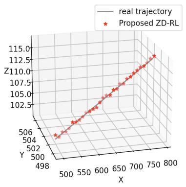

line

| X    | Y    |
| ---- | ---- |
| 498  | 502  |
| 500  | 504  |
| 550  | 506  |
| 600  | 102.5|
| 650  | 105.0|
| 700  | 107.5|
| 750  | 110.0|
| 800  | 112.5|

(a)

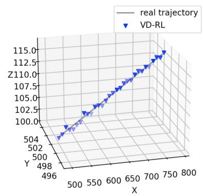

line

| X    | Y    |
| ---- | ---- |
| 496  | 504  |
| 500  | 502  |
| 550  | 102.5|
| 600  | 105.0|
| 650  | 107.5|
| 700  | 110.0|
| 750  | 112.5|
| 800  | 115.0|

(b)

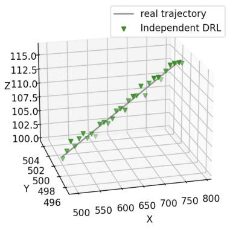

line

| X    | Y    | Z     |
| ---- | ---- | ----- |
| 496  | 502  | 504   |
| 500  | 504  | 504   |
| 550  | 102.5| 102.5 |
| 600  | 107.5| 107.5 |
| 650  | 110.0| 110.0 |
| 700  | 112.5| 112.5 |
| 750  | 115.0| 115.0 |
| 800  | 115.0| 115.0 |

(c）

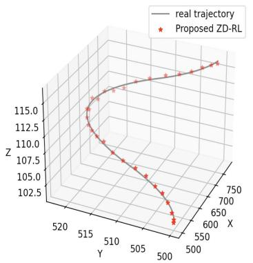

scatter

| X    | Y    | Z     |
|------|------|-------|
| 500  | 515  | 112.5 |
| 510  | 510  | 110.0 |
| 520  | 505  | 107.5 |
| 530  | 500  | 105.0 |
| 540  | 495  | 102.5 |
| 550  | 490  | 100.0 |
| 560  | 485  | 97.5  |
| 570  | 480  | 95.0  |
| 580  | 475  | 92.5  |
| 590  | 470  | 90.0  |
| 600  | 465  | 87.5  |
| 610  | 460  | 85.0  |
| 620  | 455  | 82.5  |
| 630  | 450  | 80.0  |
| 640  | 445  | 77.5  |
| 650  | 440  | 75.0  |
| 660  | 435  | 72.5  |
| 670  | 430  | 70.0  |
| 680  | 425  | 67.5  |
| 690  | 420  | 65.0  |
| 700  | 415  | 62.5  |
| 710  | 410  | 60.0  |
| 720  | 405  | 57.5  |
| 730  | 400  | 55.0  |
| 740  | 395  | 52.5  |
| 750  | 390  | 50.0  |

(d)

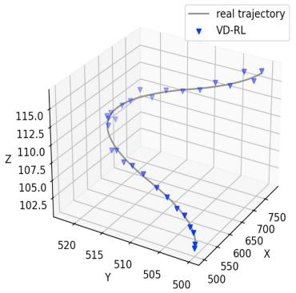

scatter

| X    | Y    | Z    |
|------|------|------|
| 500  | 515  | 102.5|
| 510  | 510  | 107.5|
| 520  | 505  | 110.0|
| 530  | 500  | 112.5|
| 540  | 495  | 115.0|
| 550  | 490  | 112.5|
| 560  | 485  | 110.0|
| 570  | 480  | 107.5|
| 580  | 475  | 105.0|
| 590  | 470  | 102.5|
| 600  | 465  | 100.0|
| 610  | 460  | 97.5 |
| 620  | 455  | 95.0 |
| 630  | 450  | 92.5 |
| 640  | 445  | 90.0 |
| 650  | 440  | 87.5 |
| 660  | 435  | 85.0 |
| 670  | 430  | 82.5 |
| 680  | 425  | 80.0 |
| 690  | 420  | 77.5 |
| 700  | 415  | 75.0 |
| 710  | 410  | 72.5 |
| 720  | 405  | 70.0 |
| 730  | 400  | 67.5 |
| 740  | 395  | 65.0 |
| 750  | 390  | 62.5 |
| 760  | 385  | 60.0 |
| 770  | 380  | 57.5 |
| 780  | 375  | 55.0 |
| 790  | 370  | 52.5 |
| 800  | 365  | 50.0 |
| Note: The 'real trajectory' is not explicitly labeled in the chart title but is included in the legend for context. The 'VD-RL' label is estimated based on the data points used to determine the position of the trajectory. The 'VD-RL' label is not explicitly provided in the code but is inferred from the visual data points themselves. The 'real trajectory' is marked with a solid line and is accompanied by a triangle symbol.

(e)

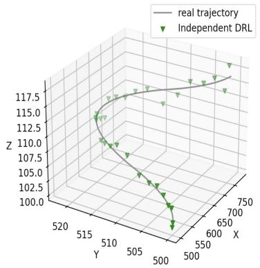

scatter

| X    | Y    | Z     |
|------|------|-------|
| 500  | 515  | 100.0 |
| 510  | 510  | 102.5 |
| 520  | 505  | 105.0 |
| 530  | 500  | 107.5 |
| 540  | 495  | 110.0 |
| 550  | 490  | 112.5 |
| 560  | 485  | 115.0 |
| 570  | 480  | 117.5 |
| 580  | 475  | 120.0 |
| 590  | 470  | 122.5 |
| 600  | 465  | 125.0 |
| 610  | 460  | 127.5 |
| 620  | 455  | 130.0 |
| 630  | 450  | 132.5 |
| 640  | 445  | 135.0 |
| 650  | 440  | 137.5 |
| 660  | 435  | 140.0 |
| 670  | 430  | 142.5 |
| 680  | 425  | 145.0 |
| 690  | 420  | 147.5 |
| 700  | 415  | 150.0 |
| 710  | 410  | 152.5 |
| 720  | 405  | 155.0 |
| 730  | 400  | 157.5 |
| 740  | 395  | 160.0 |
| 750  | 390  | 162.5 |
| 760  | 385  | 165.0 |
| 770  | 380  | 167.5 |
| 780  | 375  | 170.0 |
| 790  | 370  | 172.5 |
| 800  | 365  | 175.0 |
| Note: The 'real trajectory' is not explicitly labeled in the chart title but is included in the legend for context. The 'Independent DRL' label is not present in the chart title but is inferred from the data points plotted on the chart. The 'Y' and 'Z' axes are provided for the x and y axes, respectively. There is no additional data series or labels specified in the chart.

(f)

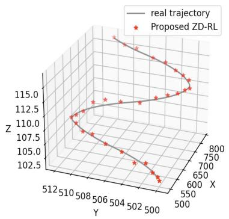

scatter

| X    | Y    | Z     |
|------|------|-------|
| 500  | 512  | 102.5 |
| 502  | 508  | 105.0 |
| 504  | 506  | 107.5 |
| 506  | 504  | 110.0 |
| 508  | 502  | 112.5 |
| 510  | 500  | 115.0 |
| 512  | 508  | 112.5 |
| 514  | 512  | 110.0 |
| 516  | 508  | 107.5 |
| 518  | 506  | 105.0 |
| 520  | 504  | 102.5 |
| 522  | 502  | 100.0 |
| 524  | 500  | 97.5  |
| 526  | 508  | 95.0  |
| 528  | 512  | 92.5  |
| 530  | 508  | 90.0  |
| 532  | 506  | 87.5  |
| 534  | 504  | 85.0  |
| 536  | 502  | 82.5  |
| 538  | 500  | 80.0  |
| 540  | 508  | 77.5  |
| 542  | 512  | 75.0  |
| 544  | 508  | 72.5  |
| 546  | 506  | 70.0  |
| 548  | 504  | 67.5  |
| 550  | 502  | 65.0  |
| 552  | 500  | 62.5  |
| 554  | 508  | 60.0  |
| 556  | 512  | 57.5  |
| 558  | 508  | 55.0  |
| 560  | 506  | 52.5  |
| 562  | 504  | 50.0  |
| 564  | 502  | nan    |

(g）

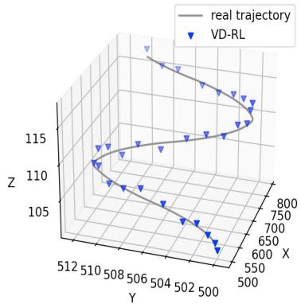

line

| X    | Y    | Z    |
|------|------|------|
| 500  | 512  | 115  |
| 502  | 508  | 110  |
| 504  | 506  | 108  |
| 506  | 504  | 106  |
| 508  | 502  | 105  |
| 510  | 500  | 105  |
| 512  | 500  | 105  |

(h)

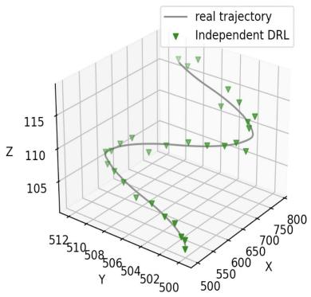

line

| X    | Y    | Z    |
|------|------|------|
| 512  | 508  | 105  |
| 508  | 506  | 110  |
| 504  | 504  | 115  |
| 502  | 502  | 110  |
| 500  | 500  | 105  |
| 600  | 700  | 110  |
| 700  | 750  | 115  |
| 800  | 800  | 110  |

i

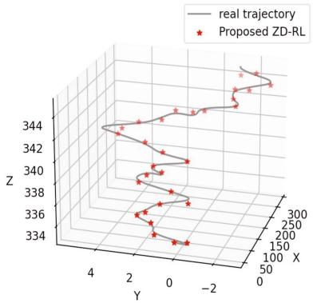

scatter

| X    | Y    | Z    |
|------|------|------|
| 0    | -2   | 344  |
| 100  | -1   | 342  |
| 200  | 0    | 340  |
| 300  | 1    | 338  |
| 400  | 2    | 336  |
| 500  | 3    | 334  |

(i

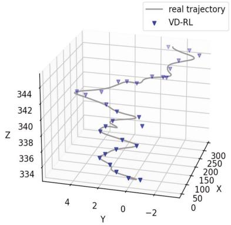

scatter

| X    | Y    | Z    |
|------|------|------|
| 0    | -2   | 344  |
| 50   | -1   | 342  |
| 100  | 0    | 340  |
| 150  | 1    | 338  |
| 200  | 2    | 336  |
| 250  | 3    | 334  |
| 300  | 4    | 332  |

(k)

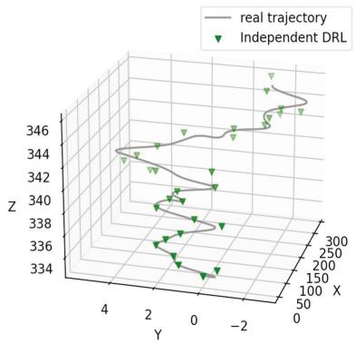

scatter

| X    | Y    | Z    |
|------|------|------|
| 0    | -2   | 346  |
| 50   | 0    | 344  |
| 100  | 2    | 342  |
| 150  | 4    | 340  |
| 200  | 6    | 338  |
| 250  | 8    | 336  |
| 300  | 10   | 334  |
| 350  | 12   | 332  |
| 400  | 14   | 330  |
| 450  | 16   | 328  |
| 500  | 18   | 326  |
| 550  | 20   | 324  |
| 600  | 22   | 322  |
| 650  | 24   | 320  |
| 700  | 26   | 318  |
| 750  | 28   | 316  |
| 800  | 30   | 314  |
| 850  | 32   | 312  |
| 900  | 34   | 310  |
| 950  | 36   | 308  |
| 1000 | 38   | 306  |
| 1050 | 40   | 304  |
| 1100 | 42   | 302  |
| 1150 | 44   | 300  |
| 1200 | 46   | 298  |
| 1250 | 48   | 296  |
| 1300 | 50   | 294  |
| 1350 | 52   | 292  |
| 1400 | 54   | 290  |
| 1450 | 56   | 288  |
| 1500 | 58   | 286  |
| 1550 | 60   | 284  |
| 1600 | 62   | 282  |
| 1650 | 64   | 280  |
| 1700 | 66   | 278  |
| 1750 | 68   | 276  |
| 1800 | 70   | 274  |
| 1850 | 72   | 272  |
| 1900 | 74   | 270  |
| 1950 | 76   | 268  |
| 2000 | 78   | 266  |
| 2050 | 80   | 264  |
| 2100 | 82   | 262  |
| 2150 | 84   | 260  |
| 2200 | 86   | 258  |
| 2250 | 88   | 256  |
| 2300 | 90   | 254  |
| 2350 | 92   | 252  |
| 2400 | 94   | 250  |
| 2450 | 96   | 248  |
| 2500 | 98   | 246  |
| Note: The data is extracted from the image and presented in CSV format as requested. The 'Independent DRL' label is not present in the image. The 'real trajectory' label is not used in the chart. The 'Z' axis is labeled on the left. The 'Y' axis is also labeled on the left. There are no additional data series or labels visible in the image. The 'X' axis is also labeled on the right. There are no additional data series or labels visible in the image. There is only one data series represented by a triangle marker. The numbers inside the triangle markers are estimated based on the y-axis position. There is only one data series labeled 'Independent DRL'.

()   
Fig. 4. Actual trajectories of the target UAV and the estimated trajectories obtained by different methods. (a) Line Trajectory with the proposed method. (b) Line Trajectory with VD-RL. (c) Line Trajectory with Independent RL. (d) Trajectory $\mathbf { \vec { C } } _ { } ^ { \prime }$ with the proposed method. (e) Trajectory $\mathbf { \vec { C } } _ { } ^ { \prime }$ with VD-RL. (f) Trajectory ‘C’ with Independent RL. (g) Trajectory $\mathbf { \bar { \rho } } _ { \mathrm { S } } ,$ with the proposed method. (h) Trajectory $\mathbf { \ddot { S } } _ { } ^ { \prime }$ with VD-RL. (i) Trajectory ‘S’ with Independent RL. (j) Random Trajectory with the proposed method. (k) Random Trajectory with VD-RL. (l) Random Trajectory with Independent RL.

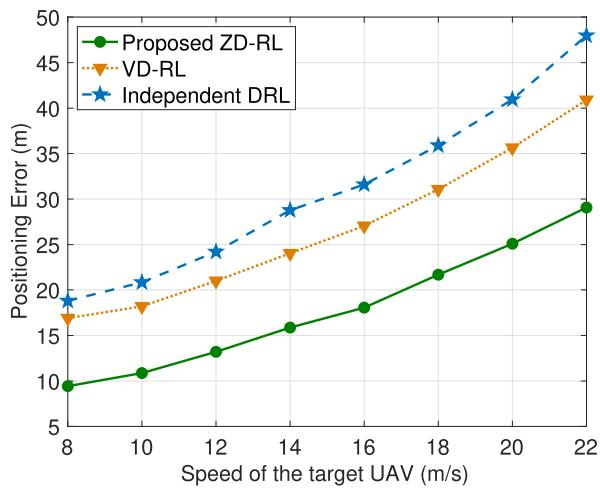

line

| Speed of the target UAV (m/s) | Proposed ZD-RL | VD-RL | Independent DRL |
| ----------------------------- | -------------- | ----- | --------------- |
| 8                             | 10             | 17    | 19              |
| 10                            | 11             | 18    | 21              |
| 12                            | 13             | 21    | 24              |
| 14                            | 16             | 24    | 29              |
| 16                            | 18             | 27    | 32              |
| 18                            | 22             | 31    | 36              |
| 20                            | 25             | 36    | 41              |
| 22                            | 29             | 41    | 48              |

Fig. 5. Value of the positioning error as the speed of the target UAV varies.

Fig. 4 shows the actual and the estimated trajectories of the target UAV obtained by the considered algorithms. In Fig. 4(a), (b), and (c), the target UAV moves in a straight line from the stating position (500 m, 500 m, 100 m) to (789 m, 500 m, 116 m) and five controlled UAVs are randomly distributed in a sphere of radius 1000 m centered on the target UAV. In Fig. 4(d), (e), and (f), the target UAV moves in the curve of “C”. In Fig. 4(g), (h), and (i), the target UAV follows the curve of “S”. In Fig. 4(j), (k), and (l), the real trajectory of the target UAV is generated by its movement from the starting position (0 m, 0 m, 333 m) and the target UAV selects the pitch angle and yaw angle randomly at each time slot. From Fig. 4, we can also see that the gaps between the real trajectories and estimated trajectories obtained by the proposed ZD-RL increase as the trajectories of the target UAV become more complex. This is because as the trajectories of the target UAV becomes more complex, it becomes more difficult for the proposed ZD-RL method to control the trajectories of controlled UAVs to keep small distances with the target UAV in real time. From Fig. 4, we can also see that the proposed method can estimate the target UAV position more accurately compared to the VD-RL, and independent DRL method. As the target UAV moves from the initial position to the end position, the gap between the actual positions and the positions estimated by the proposed ZD-RL method is small while the gap resulting from each baseline increases. This is due to the fact that, the proposed ZD-RL method enables controlled UAVs to cooperatively select the pitch angle and yaw angle based on the global Z function, which is generated by the BS using a set of individual Z functions thus the proposed ZD-RL method can accurately optimize the trajectories of controlled UAVs in time to track the target UAV as the target UAV moves in different trajectories.

Fig. 5 shows how the positioning error changes as the speed of the target UAV varies when the target UAV moves in the curve of “S”. In Fig. 5, we can see that as the speed of the target UAV increases, the positioning errors of the considered algorithms increase. This is due to the fact that as the speed of the target UAV increases, controlled UAVs cannot follow the target UAV and the distances between the target UAV and controlled UAVs increase. Fig. 5 also shows that the proposed ZD-RL method can achieve up to 28.9% and 39.6% gains in terms of the positioning accuracy compared to the VD-RL method and independent DRL method, respectively, in the case that the target UAV moving at the speed of 22 m/s. The 28.9% gain stems from the fact that the VD-RL method obtains the global value function by linearly calculating the sum of the expected value of future rewards at each controlled UAV. However, the proposed ZD-RL method calculates the global Z function using a set of global Z functions, which contains more interaction information with the environment thus being able to select pitch angle and yaw angle for controlled UAVs and optimize the transmit power for the target UAV to localize the target UAV accurately. The 39.6% gain is because the proposed ZD-RL uses the global observation information and global reward generated by the BS to train DNN parameters of each controlled UAV and enables controlled UAVs to select accurate actions by learning the movements from each other thus improving the localization accuracy cooperatively.

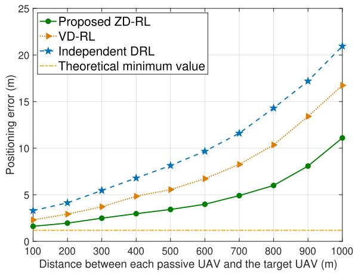

line

| Distance between each passive UAV and the target UAV (m) | Proposed ZD-RL | VD-RL | Independent DRL | Theoretical minimum value |
| -------------------------------------------------------- | -------------- | ----- | --------------- | ------------------------- |
| 100                                                      | 1.5            | 2.0   | 3.0             | 0.5                       |
| 200                                                      | 2.0            | 3.0   | 4.0             | 0.5                       |
| 300                                                      | 2.5            | 4.0   | 5.5             | 0.5                       |
| 400                                                      | 3.0            | 5.0   | 7.0             | 0.5                       |
| 500                                                      | 3.5            | 6.0   | 8.5             | 0.5                       |
| 600                                                      | 4.0            | 7.0   | 10.0            | 0.5                       |
| 700                                                      | 5.0            | 8.5   | 12.0            | 0.5                       |
| 800                                                      | 6.0            | 10.5  | 14.5            | 0.5                       |
| 900                                                      | 8.0            | 13.5  | 17.5            | 0.5                       |
| 1000                                                     | 11.0           | 17.0  | 21.0            | 0.5                       |

Fig. 6. Value of the positioning error as the distance between each controlled UAV and the target UAV varies.

Fig. 6 shows how the average positioning errors change as the distance between each controlled UAV and the target UAV varies. In this simulation, the target UAV moves in the curve of “S” and the distances between each controlled UAV and the target UAV satisfy $d _ { 1 , t } = d _ { 2 , t } = d _ { 3 , t } = d _ { 4 , t }$ . The yellow line = = =in Fig. 6 represents the theoretically analytical result of the minimum positioning error obtained by Lemma 2. In Fig. 6, we can see that the minimum positioning error obtained by the proposed ZD-RL method is 1.61 m while the theoretical positioning error is 1.18 m when $d _ { m , t } = 1 0 0 \mathrm { ~ m ~ }$ . Hence, there =is a gap between the theoretical and the simulation results. This is because the measurement information estimated by passive UAVs may have errors and the controlled UAVs may not be able to keep the minimum safety distance with the target UAV in real time. From Fig. 6, we can also see that the positioning errors of considered algorithms increase as the distance between each controlled UAV and the target UAV increases. This stems from the fact that the SNR of signals transmitted from the active UAV to each passive UAV via the target UAV decreases as the distance between each controlled UAV and the target UAV increase. Fig. 6 also shows that the proposed ZD-RL method can reduce the positioning error by up to 33.6% and 46.7% compared to the VD-RL and independent DRL methods when $d _ { m , t } = 1 0 0 0$ m. This is because the proposed ZD-RL algorithm enables each controlled UAV to update its DNN parameters based on the approximated probability distribution of individual Z function and adjust its trajectory to minimize the positioning error of the target UAV cooperatively.

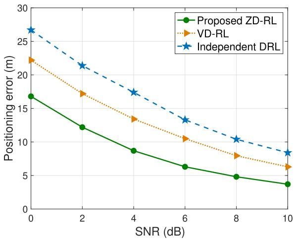

line

| SNR (dB) | Proposed ZD-RL | VD-RL | Independent DRL |
| -------- | -------------- | ----- | --------------- |
| 0        | 17.0           | 22.5  | 27.0            |
| 2        | 12.5           | 17.0  | 21.5            |
| 4        | 9.0            | 13.5  | 17.5            |
| 6        | 6.5            | 10.5  | 13.5            |
| 8        | 5.0            | 8.0   | 10.5            |
| 10       | 4.0            | 6.5   | 8.5             |

Fig. 7. Value of the positioning error as the SNR of signals transmitted from the target UAV to passive UAVs varies. $( d _ { 1 , t } = d _ { 2 , t } = \bar { d } _ { 3 , t } = d _ { 4 , t } = 9 0 0 \mathrm { m } )$ .

Fig. 7 shows how the positioning errors change as the SNR of signals transmitted from the active UAV to each passive UAV varies. From Fig. 7, we can see that as SNR increases, the positioning errors obtained by considered algorithms decrease. This stems from the fact that the variance of measurement errors of each passive UAV increases as SNR decreases. Fig. 7 also shows that the proposed algorithm can reduce positioning errors by up to 24.3% and 37.1% compared to VD-RL method and independent DRL method, respectively, when the SNR is 0 dB. This is because the proposed ZD-RL can approximate the expected value of the sum of future rewards using a non-linear weight function thus improve approximation accuracy. From Fig. 7, we can see that as the SNR of each passive UAV increases, the positioning error of the target UAV decreases slowly. This is because the positioning accuracy of the target UAV is not only affected by SNRs of passive UAVs, but also the deployment of controlled UAVs. When SNR is small, the increase of SNR can significantly decrease the positioning errors. However, as SNR continues to increases, the impact of SNR on positioning errors decreases and the deployment of controlled UAVs becomes the key factor that introduces of the positioning errors.

Fig. V 8 shows how the average positioning error $\bar { e } _ { t } =$ $\begin{array} { r } { \frac { 1 } { V } \sum _ { t = 1 } ^ { V } \sqrt { ( \pmb { s } _ { t } - \pmb { \hat { s } } _ { t } ) ^ { 2 } } } \end{array}$ ¯ =of the target UAV changes as the number ( ˆ )of time slots V at one tracking process varies. From Fig. 8, we see that when V increases, the average positioning error of the ZD-RL increases slower compared to VD-RL and independent DRL methods. This is because the ZD-RL method can approximate the probability distribution of the sum of future rewards and capture richer information of the environment, thus estimating the expected value of the sum of rewards under selected actions more accurately compared to the VD-RL and independent DRL methods and optimally adjusting UAV trajectories to reduce the average positioning error.

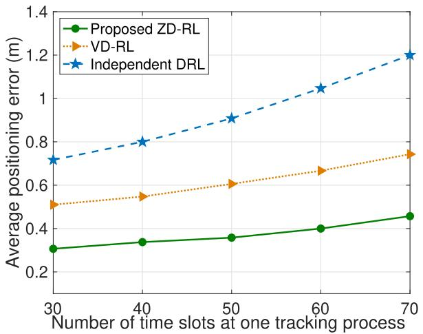

line

| Number of time slots at one tracking process | Proposed ZD-RL | VD-RL | Independent DRL |
| -------------------------------------------- | -------------- | ----- | --------------- |
| 30                                           | 0.3            | 0.5   | 0.7             |
| 40                                           | 0.35           | 0.55  | 0.8             |
| 50                                           | 0.37           | 0.6   | 0.9             |
| 60                                           | 0.4            | 0.65  | 1.05            |
| 70                                           | 0.45           | 0.75  | 1.2             |

Fig. 8. Average positioning error as the number of time slots at one tracking process varies.

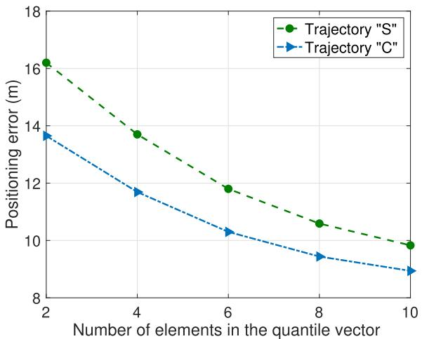

line

| Number of elements in the quantile vector | Trajectory "S" | Trajectory "C" |
| ------------------------------------------ | -------------- | -------------- |
| 2                                          | 16.2           | 13.7           |
| 4                                          | 13.8           | 11.7           |
| 6                                          | 11.8           | 10.3           |
| 8                                          | 10.6           | 9.5            |
| 10                                         | 9.8            | 9.0            |

Fig. 9. Value of the positioning error as the number of elements N in the quantile vector varies when the target UAV moves in the curve of $^ { * } \mathrm { S } ^ { \mathrm { , , } }$ and “C”.

Fig. 9 shows how the positioning errors obtained by the proposed ZD-RL method change as the number of elements N in the quantile vector varies. From Fig. 9, we can see that as the value of N increases, the positioning errors obtained by the proposed ZD-RL method decrease. This stems from the fact that when the number of elements in the quantile vector increases, each agent can obtain more values of the sum of future rewards with different quantiles thus approximating the probability distribution of individual Z functions more accurately. Fig. 9 also shows that the positioning error first drops rapidly when the number of quantiles is small and then decreases more slowly as the number of quantiles increases sufficiently. This is because as the number of quantiles is quite small, the localization performance is mainly limited by the fact that the proposed algorithm cannot accurately approximate the probability distribution of individual Z functions. When N gradually increases, the main limitation shifts from the number of quantiles to the trajectory of the target UAV.

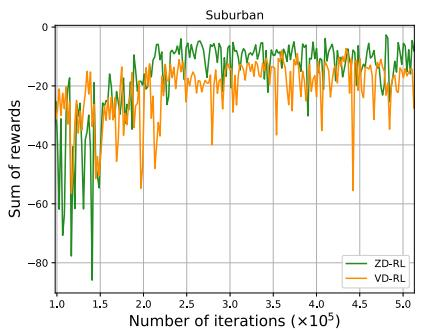

line

| Number of iterations (x10^5) | ZD-RL | VD-RL |
| ---------------------------- | ----- | ----- |
| 1.0                          | -20   | -20   |
| 1.5                          | -80   | -20   |
| 2.0                          | -20   | -40   |
| 2.5                          | -20   | -20   |
| 3.0                          | -20   | -20   |
| 3.5                          | -20   | -20   |
| 4.0                          | -20   | -20   |
| 4.5                          | -20   | -60   |
| 5.0                          | -20   | -20   |

(a)

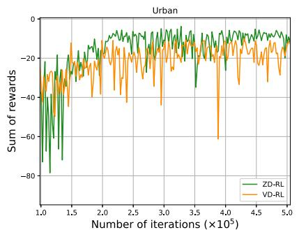

line

| Number of iterations (×10⁵) | ZD-RL | VD-RL |
| --------------------------- | ----- | ----- |
| 1.0                         | -70   | -40   |
| 1.5                         | -20   | -25   |
| 2.0                         | -10   | -20   |
| 2.5                         | -5    | -30   |
| 3.0                         | -15   | -45   |
| 3.5                         | -25   | -60   |
| 4.0                         | -10   | -35   |
| 4.5                         | -5    | -25   |
| 5.0                         | 0     | -15   |

(b)

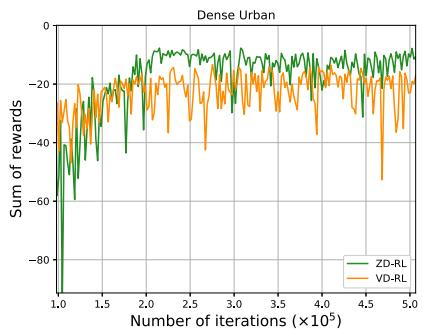

line

| Number of iterations (×10⁵) | ZD-RL | VD-RL |
| --------------------------- | ----- | ----- |
| 1.0                         | -80   | -20   |
| 1.5                         | -40   | -20   |
| 2.0                         | -20   | -20   |
| 2.5                         | -20   | -20   |
| 3.0                         | -20   | -20   |
| 3.5                         | -20   | -20   |
| 4.0                         | -20   | -20   |
| 4.5                         | -20   | -60   |
| 5.0                         | -20   | -20   |

（c）  
Fig. 10. Sum of rewards as the number of iterations varies in different scenarios. (a) Suburban. (b) Urban. (c) Dense urban.

TABLE IV TRAINING COMPLEXITY 

<table><tr><td>Methods</td><td>Time per iteration(s)</td><td>Iterations</td></tr><tr><td>ZD-RL</td><td>0.0090</td><td>180800</td></tr><tr><td>VD-RL</td><td>0.0083</td><td>216200</td></tr><tr><td>Qtran</td><td>0.0079</td><td>218200</td></tr><tr><td>Independent DRL</td><td>0.0081</td><td>224200</td></tr><tr><td>Mappo</td><td>0.0147</td><td>301800</td></tr></table>

TABLE V CHANNEL CONDITIONS 

<table><tr><td>Scenarios</td><td>Suburban</td><td>Urban</td><td>Dense Urban</td></tr><tr><td> $(\lambda_{\sigma_{\text{LoS}}}, \lambda_{\sigma_{\text{NLoS}}})$ </td><td>(0.1, 21)</td><td>(1.0, 20)</td><td>(1.6, 23)</td></tr></table>

Fig. 10 shows how the sum of rewards obtained by the ZD-RL and VD-RL methods change as the number of iterations varies under different environments (Suburban, Urban, and Dense Urban [42]), in which the channel conditions are listed in Table V. Fig. 10(a), (b), and (c) show the sum of rewards obtained by the ZD-RL and VD-RL methods under these scenarios. From Fig. 10, we see that the ZD-RL can obtain better localization performance than the VD-RL method in different environments. This is because the ZD-RL calculates the positioning error more accurately compared to the VD-RL method in different environments and optimally adjusts the trajectories of controlled UAVs.

Since limited UAV flight energy affects the UAV trajectory optimization [43], we analyze the localization performance of the ZD-RL method under limited UAV flight energy consumption constraint. We first model the flight energy consumption $E _ { m , t } ^ { \mathrm { F } } ( \phi _ { m , t } )$ of controlled UAV m at time slot t as [44]

$$
\begin{array}{l} E _ {m, t} ^ {\mathrm{F}} \left(\phi_ {m, t}\right) = \frac {C _ {1} \Delta_ {t}}{\sqrt {\left(v _ {m , t} ^ {\mathrm{L}}\right) ^ {2} + \sqrt {\left(v _ {m , t} ^ {\mathrm{L}}\right) ^ {4} + 4 \left(v _ {m , t} ^ {\mathrm{H}}\right) ^ {4}}}} \\ + M g v _ {m, t} \sin \phi_ {m, t} + C _ {2} \left(v _ {m, t} ^ {\mathrm{L}}\right) ^ {3}, \tag {32} \\ \end{array}
$$

where $C _ { 1 }$ and $C _ { 2 }$ are coefficients [44], $v _ { m , t } ^ { \mathrm { L } } = v _ { m , t }$ $\phi _ { m , t }$ is = costhe horizontal flight speed, M is the weight of each controlled UAV, g is the acceleration of gravity, and $v _ { m , t } ^ { \mathrm { H } }$ is the power needed for hovering. Then, under the flight energy consumption constraint $E _ { m , t } ^ { \mathrm { F } } \leqslant \bar { 5 } 0 0 \mathrm { J } , \mathrm { F i g }$ . 11 shows how the positioning error

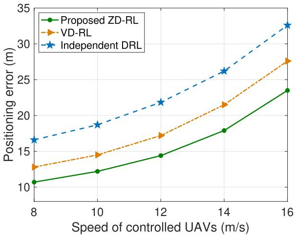

line

| Speed of controlled UAVs (m/s) | Proposed ZD-RL | VD-RL | Independent DRL |
| ------------------------------ | -------------- | ----- | --------------- |
| 8                              | 10.5           | 12.8  | 16.5            |
| 10                             | 12.0           | 14.5  | 18.8            |
| 12                             | 14.5           | 17.0  | 22.0            |
| 14                             | 18.0           | 21.5  | 26.0            |
| 16                             | 23.5           | 27.5  | 32.5            |

Fig. 11. Positioning error as the speed of controlled UAVs varies under UAV flight energy consumption constraint.

of the target UAV changes as the speed of controlled UAVs varies under the maximal flight energy consumption constraint when the target UAV moves in the curve ‘C’. From Fig. 11, we see that the positioning errors obtained by the considered methods increase as the speed of controlled UAVs increases. This stems from the fact that the UAV flight energy consumption is proportional to the speed of controlled UAVs. Thus, the increase of the UAV’s speed limits the UAV movement and increases the positioning error of the target UAV. Fig. 11 also shows that the proposed ZD-RL can reduce the positioning error of the target UAV by up to 15.8% and 34.7% compared to VD-RL and independent DRL methods when the speed of controlled UAVs is 10 m/s. This is because the ZD-RL can estimate the sum of future rewards more accurately and thus can optimally adjust the trajectories of controlled UAVs to localize the target UAV under the energy consumption constraint.

Fig. 12 shows how the positioning accuracy changes as the number of iterations varies. In this figure, we compare the proposed method with three other methods: 1) Qmix method in which the BS uses a mixing network to combine individual Q function values of each controlled UAV into a global Q function value [45], 2) Qtran method that optimizes UAV trajectories by transforming actions of controlled UAVs into variables related to individual Q functions [46], and 3) Mappo method in which each controlled UAV optimizes its trajectory and controlled UAVs share agents’ experiences [47], [48]. From Fig. 12, we see that the proposed ZD-RL method can improve the sum of rewards by up to 39.4%, 54.6%, 64.6%, and 72.9% compared to the VD-RL, Qtran, independent DRL, and Mappo methods, respectively. This stems from the fact that the ZD-RL method can approximate the probability distribution of the sum of discounted future rewards to calculate the expected value of the sum of future rewards more accurately compared to other baseline methods that estimate the expected value of the sum of future rewards directly. Fig. 12 also shows that the proposed ZD-RL method can reduce the number of iterations required to converge by up to 9.0%, 12.7%, 19.35%, and 30.8% compared to the VD-RL, Qtran, independent DRL, and Mappo methods. The reason is that the proposed method cooperatively train the trajectories of controlled UAVs and the transmit power of the active UAV using the probability distribution of the sum of future rewards. Compared to other baselines that estimate the expected value of the sum of future rewards, the proposed ZD-RL method are more stable and accurate thus reducing the number of iterations required to convergence. In particular, the number of iterations of the considered methods to converge is shown in Fig. 12 and the tested implementation time per iteration of each method is listed in Table IV. The total training times of the ZD-RL, VD-RL, Qtran, independent DRL, and Mappo methods to reach convergence are 1627.2 s, 1794.5 s, 1723.8 s, 1816.0 s, and 4436.4 s. Consequently, the ZD-RL can reduce the training complexity by up to 9.3%, 5.6%, 10.4%, and 63.3% compared to VD-RL, Qtran, independent DRL, and Mappo methods.

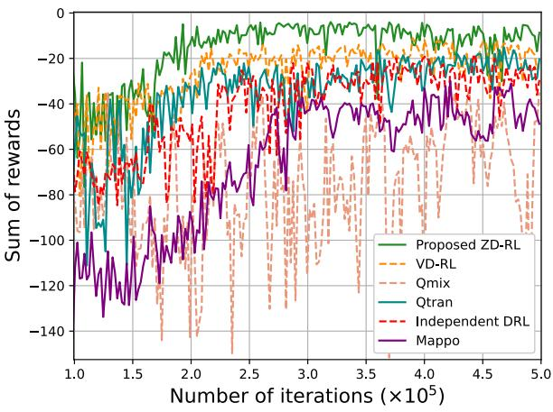

line

| Number of iterations (×10⁵) | Proposed ZD-RL | VD-RL | Qmix | Qtran | Independent DRL | Mappo |
| --------------------------- | -------------- | ----- | ---- | ----- | --------------- | ----- |
| 1.0                         | -20            | -30   | -50  | -60   | -70             | -100  |
| 1.5                         | -15            | -25   | -60  | -70   | -80             | -120  |
| 2.0                         | -10            | -20   | -70  | -80   | -90             | -130  |
| 2.5                         | -5             | -15   | -80  | -90   | -100            | -140  |
| 3.0                         | 0              | -10   | -90  | -100  | -110            | -150  |
| 3.5                         | 5              | -5    | -100 | -110  | -120            | -160  |
| 4.0                         | 10             | 0     | -110 | -120  | -130            | -170  |
| 4.5                         | 15             | 5     | -120 | -130  | -140            | -180  |
| 5.0                         | 20             | 10    | -130 | -140  | -150            | -190  |

Fig. 12. Value of the sum of rewards as the total number of iterations varies.

# VI. CONCLUSION

In this paper, a novel localization framework that uses several controlled UAVs to localize a target UAV has been proposed. We have modeled this localization problem as an optimization problem that aims to optimize the positioning accuracy by jointly optimizing the transmit power of the active UAV and trajectories of all controlled UAVs. To solve this problem, we have proposed a ZD-RL method, which uses the probability distribution of the sum of future rewards to estimate the expected values of the sum of future rewards instead of directly estimating the expected values of the sum of future rewards as done in Deep Q. Hence, the proposed method enables each controlled UAV to find its optimal transmit power and trajectory to minimize the positioning errors efficiently. To further reduce the positioning error of the target UAV, we have derived the relationship between the positions of controlled UAVs and the positioning error of the target UAV. Based on the derived expression of the positioning error, we can obtain the minimum positioning error of the target UAV. Simulation results have shown that the proposed method yielded significant improvements in terms of the positioning accuracy compared to baselines.

# REFERENCES

[1] Y. Zhu, M. Chen, S. Wang, Y. Liu, and C. Yin, “Trajectory design for 3D UAV localization in UAV based networks,” in Proc. IEEE Int. Glob. Commun. Conf., Kuala Lumpur, Malaysia, 2023, pp. 4927–4932.   
[2] I. Guvenc, F. Koohifar, S. Singh, M. L. Sichitiu, and D. Matolak, “Detection, tracking, and interdiction for amateur drones,” IEEE Commun. Mag., vol. 56, no. 4, pp. 75–81, Apr. 2018.   
[3] M. Mozaffari, W. Saad, M. Bennis, Y.-H. Nam, and M. Debbah, “A tutorial on UAVs for wireless networks: Applications, challenges, and open problems,” IEEE Commun. Surv. Tut., vol. 21, no. 3, pp. 2334–2360, Third Quarter, 2019.   
[4] Z. Yang et al., “Joint altitude, beamwidth, location, and bandwidth optimization for UAV-enabled communications,” IEEE Commun. Lett., vol. 22, no. 8, pp. 1716–1719, Jun. 2018.   
[5] O. Y. Kolawole and M. Hunukumbure, “UAV based 5G indoor localization for emergency services,” in Proc. 5th Int. ACM Mobicom Workshop Drone Assist. Wirel. Commun. 5G Beyond, 2022, pp. 43–48.   
[6] Q. Wu, Y. Zeng, and R. Zhang, “Joint trajectory and communication design for multi-UAV enabled wireless networks,” IEEE Trans. Wireless Commun., vol. 17, no. 3, pp. 2109–2121, Mar. 2018.   
[7] F. Ho et al., “Decentralized multi-agent path finding for UAV traffic management,” IEEE Trans. Intell. Transp. Syst., vol. 23, no. 2, pp. 997–1008, Feb. 2022.   
[8] Z. Yang, C. Pan, K. Wang, and M. Shikh-Bahaei, “Energy efficient resource allocation in UAV-enabled mobile edge computing networks,” IEEE Trans. Wireless Commun., vol. 18, no. 9, pp. 4576–4589, Sep. 2019.   
[9] M. Chen et al., “Distributed learning in wireless networks: Recent progress and future challenges,” IEEE J. Sel. Areas Commun., vol. 39, no. 12, pp. 3579–3605, Dec. 2021.   
[10] J. Gui, T. Yu, B. Deng, X. Zhu, and W. Yao, “Decentralized multi-UAV cooperative exploration using dynamic centroid-based area partition,” DRONES, vol. 7, no. 6, Jun. 2023, Art. no. 337.   
[11] H. Sier, X. Yu, I. Catalano, J. P. Queralta, Z. Zou, and T. Westerlund, “UAV tracking with LiDAR as a camera sensors in GNSS-denied environments,” Mar. 2023. [Online]. Available: https://arxiv.org/abs/2303.00277   
[12] Z. Xu, X. Zhan, Y. Xiu, C. Suzuki, and K. Shimada, “Onboard dynamicobject detection and tracking for autonomous robot navigation with RGB-D camera,” Feb. 2023. [Online]. Available: https://arxiv.org/abs/2303. 00132   
[13] P. Sinha and I. Guvenc, “Impact of antenna pattern on TOA based 3D UAV localization using a terrestrial sensor network,” IEEE Trans. Veh. Technol, vol. 71, no. 7, pp. 7703–7718, Jul. 2022.   
[14] U. Bhattacherjee, E. Ozturk, O. Ozdemir, I. Guvenc, M. L. Sichitiu, and H. Dai, “Experimental study of outdoor UAV localization and tracking using passive RF sensing,” Sep. 2022. [Online]. Available: https://arxiv.org/abs/ 2108.07857   
[15] F. Wen, J. Shi, G. Gui, H. Gacanin, and O. A. Dobre, “3-D positioning method for anonymous UAV based on bistatic polarized MIMO radar,” IEEE Internet Things J., vol. 10, no. 1, pp. 815–827, Jan. 2023.   
[16] S. Xu, K. Dogançay, and H. Hmam, “Distributed path optimization of multiple UAVs for AOA target localization,” in Proc. IEEE Int. Conf. Acoust., Speech Signal Process., 2016, pp. 3141–3145.   
[17] M. Silic and K. Mohseni, “An experimental evaluation of radio models for localizing fixed-wing UAVs in rural environments,” IEEE Trans. Veh. Technol, vol. 72, no. 5, pp. 5576–5586, May 2023.

[18] M. Sadeghi, F. Behnia, and R. Amiri, “Optimal geometry analysis for TDOA-based localization under communication constraints,” IEEE Trans. Aerosp. Electron. Syst., vol. 57, no. 5, pp. 3096–3106, Oct. 2021.   
[19] A. Gendia, O. Muta, S. Hashima, and K. Hatano, “UAV positioning with joint NOMA power allocation and receiver node activation,” in Proc. IEEE Annu. Int. Symp. Pers. Indoor Mobile Radio Commun., 2022, pp. 240–245.   
[20] V. Saj, B. Lee, D. Kalathil, and M. Benedict, “Robust reinforcement learning algorithm for vision-based ship landing of UAVs,” Sep. 2022. [online]. Available: https://arxiv.org/abs/2209.08381   
[21] V. Tilwari and S. Pack, “Autonomous 3D UAV localization using taylor series linearized TDOA-based approach with machine learning algorithms,” in Proc. Int. Conf. Inf. Commun. Technol. Convergence, 2022, pp. 783–785.   
[22] B. Joshi, D. Kapur, and H. Kandath, “Sim-to-real deep reinforcement learning based obstacle avoidance for UAVs under measurement uncertainty,” Mar. 2023. [Online]. Available: https://arxiv.org/abs/2303.07243   
[23] C. Wang, J. Wang, Y. Shen, and X. Zhang, “Autonomous navigation of UAVs in large-scale complex environments: A deep reinforcement learning approach,” IEEE Trans. Veh. Technol, vol. 68, no. 3, pp. 2124–2136, Mar. 2019.   
[24] Y. Hu, M. Chen, W. Saad, H. V. Poor, and S. Cui, “Distributed multi-agent meta learning for trajectory design in wireless drone networks,” IEEE J. Sel. Areas Commun., vol. 39, no. 10, pp. 3177–3192, Oct. 2021.   
[25] P. Sunehag et al., “Value-decomposition networks for cooperative multiagent learning,” Jun. 2017. [Online]. Available: https://arxiv.org/abs/1706. 05296   
[26] Y. Chan and K. Ho, “A simple and efficient estimator for hyperbolic location,” IEEE Trans. Signal Process., vol. 42, no. 8, pp. 1905–1915, Aug. 1994.   
[27] W. Huang, H. Guo, and J. Liu, “Task offloading in UAV swarm-based edge computing: Grouping and role division,” in Proc. IEEE Glob. Commun. Conf., 2021, pp. 1–6.   
[28] J. Sabzehali, V. K. Shah, Q. Fan, B. Choudhury, L. Liu, and J. H. Reed, “Optimizing number, placement, and backhaul connectivity of multi-UAV networks,” IEEE Internet Things J., vol. 9, no. 21, pp. 21 548–21 560, Nov. 2022.   
[29] A. Albanese, P. Mursia, V. Sciancalepore, and X. Costa-Perez, “PA-PIR: Practical RIS-aided localization via statistical user information,” in Proc. Int. Workshop Signal Process. Adv. Wirel. Commun., 2021, pp. 531–535.   
[30] Y. Zeng and R. Zhang, “Energy-efficient UAV communication with trajectory optimization,” IEEE Trans. Wireless Commun., vol. 16, no. 6, pp. 3747–3760, Mar. 2017.   
[31] X. Tong et al., “Environment sensing considering the occlusion effect: A multi-view approach,” IEEE Trans. Signal Process., vol. 70, pp. 3598–3615, 2022.   
[32] A. Quazi, “An overview on the time delay estimate in active and passive systems for target localization,” IEEE Trans. Acoust. Speech Signal Process., vol. ASSP-29, no. 3, pp. 527–533, Jun. 1981.   
[33] Y. Su, H. Zhou, Y. Deng, and M. Dohler, “Energy-efficient cellularconnected UAV swarm control optimization,” Mar. 2023. [Online]. Available: https://arxiv.org/abs/2303.10398   
[34] W. Dabney, G. Ostrovski, D. Silver, and R. Munos, “Implicit quantile networks for distributional reinforcement learning,” in Proc. Int. Conf. Mach. Learn., 2018, pp. 2640–3498.   
[35] W.-F. Sun, C.-K. Lee, and C.-Y. Lee, “DFAC framework: Factorizing the value function via quantile mixture for multi-agent distributional Q-learning,” in Proc. Int. Conf. Mach. Learn., 2021, pp. 9945–9954.   
[36] W. Dabney, M. Rowland, M. Bellemare, and R. Munos, “Distributional reinforcement learning with quantile regression,” in Proc. AAAI Conf. Artif. Intell., 2018, pp. 2892–2901.   
[37] J. Zhao, Y. Zhu, X. Mu, K. Cai, Y. Liu, and L. Hanzo, “Simultaneously transmitting and reflecting reconfigurable intelligent surface (STAR-RIS) assisted UAV communications,” IEEE J. Sel. Areas Commun., vol. 40, no. 10, pp. 3041–3056, Oct. 2022.   
[38] M. G. Bellemare, W. Dabney, and R. Munos, “A distributional perspective on reinforcement learning,” Jul. 2017. [Online]. Available: https://arxiv. org/abs/1707.06887   
[39] T. Jaakkola, M. I. Jordan, and S. P. Singh, “On the convergence of stochastic iterative dynamic programming algorithms,” Neural Comput., vol. 6, no. 6, pp. 1185–1201, Nov. 1994.   
[40] S. Wang et al., “Distributed reinforcement learning for age of information minimization in real-time IoT systems,” IEEE J. Sel. Topics Signal Process., vol. 16, no. 3, pp. 501–515, Jan. 2022.

[41] H. Godrich, A. M. Haimovich, and R. S. Blum, “Target localization accuracy gain in MIMO radar-based systems,” IEEE Trans. Inf. Theory, vol. 56, no. 6, pp. 2783–2803, May 2010.   
[42] A. Al-Hourani, S. Kandeepan, and S. Lardner, “Optimal LAP altitude for maximum coverage,” IEEE Wireless Commun. Lett., vol. 3, no. 6, pp. 569–572, Dec. 2014.   
[43] N. Lin, Y. Fan, L. Zhao, X. Li, and M. Guizani, “Green: A global energy efficiency maximization strategy for multi-UAV enabled communication systems,” IEEE Trans. Mobile Comput., vol. 22, no. 12, pp. 7104–7120, Dec. 2023.   
[44] Y. Sun, D. Xu, D. W. K. Ng, L. Dai, and R. Schober, “Optimal 3D-trajectory design and resource allocation for solar-powered UAV communication systems,” IEEE Trans. Commun., vol. 67, no. 6, pp. 4281–4298, Jun. 2019.   
[45] T. Rashid, M. Samvelyan, C. S. de Witt, G. Farquhar, J. Foerster, and S. Whiteson, “QMIX: Monotonic value function factorisation for deep multi-agent reinforcement learning,” Jun. 2018. [Online]. Available: https: //arxiv.org/abs/1803.11485   
[46] K. Son, D. Kim, W. J. Kang, D. E. Hostallero, and Y. Yi, “QTRAN: Learning to factorize with transformation for cooperative multi-agent reinforcement learning,” May 2019. [Online]. Available: https://arxiv.org/ abs/1905.05408   
[47] C. Yu et al., “The surprising effectiveness of PPO in cooperative, multiagent games,” Nov. 2022. [Online]. Available: https://arxiv.org/abs/2103. 01955   
[48] J. G. Kuba et al., “Trust region policy optimisation in multi-agent reinforcement learning,” Apr. 2022. [Online]. Available: https://arxiv.org/abs/ 2109.11251

natural_image

Portrait photo of a woman in business attire (no text or symbols visible)

Yujiao Zhu (Student Member, IEEE) is currently working toward the PhD degree with the Information and Communication Engineering Department, Beijing University of Posts and Telecommunications, Beijing, China. Her research interests include unmanned aerial vehicles, reinforcement learning, joint sensing and communications, and machine learning in wireless networks.

natural_image

Portrait of a man wearing glasses and a suit (no text or symbols visible)

Mingzhe Chen (Member, IEEE) is currently an assistant professor with the Department of Electrical and Computer Engineering and Institute of Data Science and Computing, University of Miami. His research interests include federated learning, reinforcement learning, virtual reality, unmanned aerial vehicles, and Internet of Things. He has received four IEEE Communication Society journal paper awards including the IEEE Marconi Prize Paper Award in Wireless Communications in 2023, the Young Author Best Paper Award in 2021 and 2023, and the Fred W.

Ellersick Prize Award in 2022, and four conference best paper awards at ICCCN in 2023, IEEE WCNC in 2021, IEEE ICC in 2020, and IEEE GLOBECOM in 2020. He currently serves as an associate editor of IEEE Transactions on Mobile Computing, IEEE Transactions on Communications, IEEE Wireless Communications Letters, IEEE Transactions on Green Communications and Networking, and IEEE Transactions on Machine Learning in Communications and Networking.

natural_image

Portrait of a young man in formal attire (suit and tie), no visible text or symbols

Sihua Wang (Student Member, IEEE) received the PhD degree from the Beijing University of Posts and Telecommunications, Beijing, China, in 2021. He is currently a Hong Kong Scholar Fellow with the Department of Electronic and Computer Engineering, The Hong Kong University of Science and Technology, Hong Kong. He is also a postdoctoral researcher with the School of Computer Science (National Pilot Software Engineering School), Beijing University of Posts and Telecommunications. His research interests include mobile edge computing, resource allocation,

and machine learning in wireless networks.

natural_image

Portrait photo of a young woman with long dark hair wearing a light-colored collared shirt (no text or symbols visible)

Ye Hu (Member, IEEE) received the PhD degree from Virginia Tech, VA, USA, in 2021. She is an assistant professor with the Industrial and System Engineering Department, University of Miami. After graduation, she has served as a postdoctoral research scientist with the Columbia University, and the North Carolina State University. Her research interests span from unmanned aerial vehicle networks, low earth orbit satellite, cyber physical human system, network security to distributed machine learning. She is also the recipient of the best paper award at IEEE GLOBE-

COM 2020 for her work on meta-learning for drone-based communications.

natural_image

Portrait photo of a man in formal attire (no text or symbols visible)

Changchuan Yin (Senior Member, IEEE) received the PhD degree in signal and information processing from the Beijing University of Posts and Telecommunications, Beijing, China, in 1998. In 2004, he was a visiting scholar with the Faculty of Science, the University of Sydney, Sydney, NSW, Australia. From 2007 to 2008, he held a visiting position with the Department of Electrical and Computer Engineering, Texas A&M University, College Station, TX. He is currently a professor with the School of Information and Communication Engineering, Beijing University of Posts and Telecommunications. His research interests include wireless networks and statistical signal processing. He was the co-recipient of the IEEE Guglielmo Marconi Prize Paper Award in 2023 and the IEEE International Conference on Wireless Communications and Signal Processing Best Paper Award in 2009. He has served as the symposium co-chair and TPC member for many IEEE conferences.

natural_image

Portrait of a man wearing glasses and a dark shirt (no text or symbols visible)

Yuchen Liu (Member, IEEE) received the PhD degree from the Georgia Institute of Technology, USA. He is currently an assistant professor with the Department of Computer Science, North Carolina State University, USA. His research interests include wireless networking, generative AI, reinforcement learning, mobile computing, and software simulation. He has received several best paper awards at IEEE and ACM conferences. He currently serves as an associate editor of IEEE Transactions on Green Communications and Networking and International Journal of Sensors,

Wireless Communications and Control.