# Collaborative Task Offloading Optimization for Satellite Mobile Edge Computing Using Multi-Agent Deep Reinforcement Learning

Hangyu Zhang , Hongbo Zhao , Senior Member, IEEE, Rongke Liu , Senior Member, IEEE, Aryan Kaushik , Member, IEEE, Xiangqiang Gao , and Shenzhan Xu

Abstract—Satellite mobile edge computing (SMEC) achieves efficient processing for space missions by deploying computing servers on low Earth orbit (LEO) satellites, which supplements a strong computing service for future satellite-terrestrial integrated networks. However, considering the spatio-temporal constraints on large-scale LEO networks, inter-satellite cooperative computing is still challenging. In this paper, a multi-agent collaborative task offloading scheme for distributed SMEC is proposed. Facing the time-varying available satellites and service requirements, each autonomous satellite agent dynamically adjusts offloading decisions and resource allocations based on local observations. Furthermore, for evaluating the behavioral contribution of an agent to task completion, we adopt a deep reinforcement learning algorithm based on counterfactual multi-agent policy gradients (COMA) to optimize the strategy, which enables energy-efficient decisions satisfying the time and resource restrictions of SMEC. An actor-critic (AC) framework is effectively exploited to separately implement centralized training and distributed execution (CTDE) of the algorithm. We also redesign the actor structure by introducing an attention-based bidirectional long short-term memory network (Atten-BiLSTM) to explore the temporal characteristics of LEO networks. The simulation results show that the proposed scheme can effectively enable satellite autonomous collaborative computing in the distributed SMEC environment, and outperforms the benchmark algorithms.

Index Terms—Satellite mobile edge computing, distributed cooperative computing, computation offloading, resource allocation, multi-agent deep reinforcement learning.

Manuscript received 8 March 2024; revised 29 April 2024; accepted 23 May 2024. Date of publication 11 July 2024; date of current version 17 October 2024. This work was supported in part by the Beijing Natural Science Foundation under Grant L202003, in part by the Shenzhen Fundamental Research Project under Grant JCYJ20220818103413029, and in part by Shenzhen Science and Technology R&D Funds under Grant JSGG20220831100602005. The review of this article was coordinated by Prof. Tiago Koketsu Rodrigues. (Corresponding author: Rongke Liu.)

Hangyu Zhang, Hongbo Zhao, and Shenzhan Xu are with the School of Electronic and Information Engineering, Beihang University, Beijing 100191, China (e-mail: zhanghangyu@buaa.edu.cn; bhzhb@buaa.edu.cn; splayxu@buaa.edu.cn).

Rongke Liu is with the Shenzhen Institute, Beihang University, Shenzhen 518063, China, and also with the School of Electronic and Information Engineering, Beihang University, Beijing 100191, China (e-mail: rongke\_liu@buaa.edu.cn).

Aryan Kaushik is with the School of Engineering and Informatics, University of Sussex, BN1 9RH Brighton, U.K. (e-mail: aryan.kaushik@sussex.ac.uk).

Xiangqiang Gao is with the China Academy of Space Technology (Xi’an), Xi’an 710100, China, and also with the School of Electronic and Information Engineering, Beihang University, Beijing 100191, China (e-mail: xggao@ buaa.edu.cn).

Digital Object Identifier 10.1109/TVT.2024.3405642

# I. INTRODUCTION

# A. Background and Motivation

W ITH the rapid development of satellite technology, morelow Earth orbit (LEO) satellites with highly powerful low Earth orbit (LEO) satelites with highly powerful hardware in terms of cameras, processors and antennas are being deployed in space [1]. These satellites collect numerous Earth imageries and sensor data to support various observation missions such as earthquake warning, target tracking and disaster prediction [2], [3]. However, due to the surge of LEO satellites, real-time requirements of space missions, excessive propagation delays and short communication window between satellites and ground station (GS), the system may collapse due to limited link availability and bit-rate bottlenecks if the store-and-forward strategy is still used to download pictures or videos [4]. Therefore, inspired by terrestrial mobile edge computing technology [5], satellite mobile edge computing (SMEC) has been proposed to provide real-time data processing on board for diverse services, which sinks the rich computing resources of cloud servers to the LEO edge [6], [7]. SMEC reduces the dependence of the satellite network on the terrestrial network, and achieves shorter end-to-end latency and better quality of service (QoS). It is considered to be a promising computing architecture for the future sixth generation (6G) communications and networking [8].

Nevertheless, for computation-intensive or latency-sensitive space missions, individual satellites cannot meet the task requirements, which promotes the research of SMEC based on inter-satellite cooperation [9], [10]. Inter-satellite link (ISL) transmission through optical or visible light has potential advantages over radio frequency (RF) communication systems in size, weight and power consumption (SWaP), which is beneficial to achieve efficient utilization of on-board resources and improves the overall viability of satellite networks [11]. Therefore, laserbased free space optical (FSO) communication has been proven to be a key technology for future space-based systems [12]. However, due to inherent physical characteristics of the LEO constellation, such as highly dynamic topology, strictly limited resources and unbalanced load, satellite networks have strong constraints different from terrestrial networks [13]. Therefore, it is challenging and meaningful to optimize computation offloading strategies among multiple collaborating nodes for SMEC. In the previous related works [14], [15], [16], it was generally assumed that SMEC systems were quasi-static models and the optional offloading locations were fixed over small time scales. Few studies have considered the impact of time-varying ISL connectivity on computation offloading strategies. Moreover, especially the scarce energy supply for LEO satellites is provided by solar panels and battery cells, so its energy budget has become one of the most crucial restrictions [17]. To fill these gaps, in this paper, we address changing satellite availability and mission attributes due to the spatio-temporal variation in the LEO network, and conduct supplementary work on collaborative offloading optimization for this dynamic SMEC to make energy-efficient decisions under constraints.

Further, fewer satellites and simpler missions in the past have rendered centralized decision-making of GS a feasible and accessible option [18], which ensures strategic coordination and mitigates conflicts among satellites. However, the escalating scale of LEO causes the explosion of information dimension and the difficulty of state synchronization from the data center. Moreover, the increased satellite-ground communication overhead and command delay also make centralized control unsuitable for more complicated services. At present, the utility value of distributed decisions in satellite systems has been widely explored and verified [19], [20], which hands over control to individual satellites, enabling them to make autonomous decisions based on local information and coordination with other satellites. This mode offers several advantages [21]: a) Enhanced reliability and robustness are achieved as the system becomes resilient to network disruptions caused by single node failures. b) Reduced reliance on frequent satellite-ground communication facilitates rapid response, real-time processing and task scheduling. c) Shared resource management and cooperative computing are promoted based on local observations, avoiding inefficient global synchronization. Therefore, we adopt the distributed computation offloading decisions for SMEC in this paper, leveraging the aforementioned significant advantages and aligning better with practical demonstration.

In existing works on task offloading optimization for edge computing networks, authors have proposed some distributed algorithms. At this point, multiple nodes process tasks independently, and how to efficiently and stably coordinate strategy and share information deserves further study. Reference [22] formulated a general SMEC framework for real-time and highresolution Earth observation, and proposed an iterative optimization method for distributed SMEC to carefully select data allocation, compression ratio and processing frequency. Reference [23] established a stochastic optimization for air-ground integrated networks, which jointly optimized task scheduling, resource allocation and unmanned aerial vehicle (UAV) trajectories. Authors proposed an online distributed algorithm that enabled mobile entities to adaptively make decisions in parallel. Reference [24] investigated the distributed task offloading optimization of multi-agent networks, aiming to maximize the expected offloading success rate. Authors presented game theory analysis and transformed the stochastic optimization problem into an unconstrained Lagrangian optimization. However, most works apply traditional distributed optimization to achieve efficient computing. These complicated approaches can make long-term decisions by solving decomposed sub-problems, but cannot know prior information in dynamic environments and may only obtain suboptimal solutions for non-convex problems.

Currently, machine learning techniques have developed rapidly, the decision-making ability of reinforcement learning (RL) and the perceived ability of deep learning (DL) are combined to form deep reinforcement learning (DRL), which makes up for the shortcomings of traditional optimization methods that are difficult to adaptively solve dynamic and complex problems [25]. Further, multi-agent DRL (MADRL) methods enabling distributed decision are being applied by more researchers to computation offloading optimization [26], [27]. Reference [28] proposed a joint three-tier computing framework for SMEC, and adopted a competitive task processing model. Then, an actor-critic (AC) MADRL algorithm was applied to solve the offloading location and transmission power problems. Reference [29] studied the resource allocation for data offloading in SMEC, and formulated the problem as a multi-variable and multi-objective optimization. Authors proposed a novel multi-agent information broadcasting and judging algorithm. In [30], an efficient task offloading scheme was proposed for the space/aerial-assisted edge computing system. Authors proposed a multi-agent deep deterministic policy gradient (MADDPG)- based algorithm to optimize the energy consumption and time delay.

However, satellites train and execute complex models on board simultaneously, increasing the constrained energy and latency costs. It is also unsteady and inefficient for an agent to learn joint strategies in a huge space. Inspired by these, we propose a MADRL method of AC with centralized training and distributed execution (CTDE) based on parameter sharing for SMEC, which enables global learning of distributed strategies. Then critic training on the ground and actor execution in space are separated by batches, which reduces the computational pressure and the dependence on the ground for satellites, thus greatly improving system performance. Further, there are also no specified contributing works on fitting large-scale LEO satellite behavior. Since the orbits and trajectories of mega constellations with ISL are generally preset and regular for stability and reliability [31]. Therefore, the temporal characteristics of the SMEC situation can be extracted by enhancing the forecasting ability of the algorithm, such as applying long short-term memory (LSTM) to improve DL [32].

# B. Solution Approach and Contributions

In this work, we consider a distributed SMEC network capable of cooperative on-board computing for diverse space missions. The large-scale LEO constellation operates rapidly, so its dynamic topology and energy consumption are constraints. To this end, we regard satellites as autonomous agents and propose a counterfactual multi-agent policy gradients (COMA)-based collaborative task offloading scheme, which trains a centralized critic network on the terrestrial cloud for global assessment, and then deploys the learned actor network on distributed satellites to execute strategies. For updating the shared models according to the action contributions of each numbered agent, the unique policy and advantage are exchanged during satellite-ground communication, which reduces model complexity and training difficulty [33]. Moreover, the long-term dynamic characteristics of SMEC can be explored with improved actor structure. By deploying the proposed scheme, each satellite agent adapts to time-varying ISL connectivity and mission demands, and makes energy-efficient computation offloading strategy according to local observations and historical information independent of the ground. The main contributions are summarized as follows:

Task computation Problem in distributed SMEC: This paper formulates a fully cooperative task computation among distributed multi-agent satellites. Autonomous agents adaptively establish a set of available satellites according to dynamic inter-satellite visibility, and make independent decisions regarding local computing or partial offloading. The long-term goal of the system is to implement offloading decisions and computing resource allocations for varying tasks that minimize total energy consumption while satisfying SMEC constraints.   
COMA-based collaborative task offloading optimization: We propose a COMA algorithm with AC+CTDE architecture to centrally optimize offloading strategies for distributed satellites, which enables efficient low-complexity learning and reward credit assignment by computing an exclusive counterfactual baseline for each agent on the ground critic. Moreover, the attention-based bidirectional LSTM (Atten-BiLSTM) is applied to redesign the actor for predicting long-term behavioral features of satellites, which further improves the algorithm performance.   
- Performance Evaluation: A LEO constellation based on Satellite Tool Kit (STK) is built and runs algorithms. By comparing with no-improved actor strategy, MADDPGbased strategy, DDPG-based strategy, independent ACbased strategy, random offloading and local computing strategies, extensive experimental results show that the proposed method can effectively handle collaborative task computing under constraints, and has better convergence and superiority under different environmental variables.

The remainder of this paper is organized as follows. Section II presents the system model and problem formulation of SMEC. In Section III, the task computation problem is constructed as a partially observable markov decision process (POMDP). Then a MADRL model is described. Section IV shows our task offloading algorithm in detail. Simulation results of the proposed scheme are provided and discussed in Section V. Finally, the paper is summarized in Section VI.

# II. SYSTEM MODEL AND PROBLEM FORMULATION

In this section, we first describe the network model of SMEC. Second, we respectively discuss the communication and computation models for satellite cooperative computing. Finally, the optimization problem to minimize system energy consumption under constraints is proposed. Some key notations and related descriptions are listed in Table I.

TABLE I LIST OF MAIN NOTATIONS 

<table><tr><td>Notation</td><td>Definition</td></tr><tr><td>U</td><td>Number of LEO satellites</td></tr><tr><td>P</td><td>Number of planes</td></tr><tr><td>V</td><td>Number of available satellites</td></tr><tr><td>T</td><td>The system time</td></tr><tr><td>ρ</td><td>The system time slot length</td></tr><tr><td>μ</td><td>The mean of task arrival intervals</td></tr><tr><td>ut</td><td>The satellite number</td></tr><tr><td>dt</td><td>The data size of tasks</td></tr><tr><td>ct</td><td>The task workload</td></tr><tr><td>Ttmax</td><td>The maximum tolerable delay of tasks</td></tr><tr><td>κ</td><td>The effective capacitance coefficient</td></tr><tr><td>xtu</td><td>The offloading decision of tasks</td></tr><tr><td>ftu</td><td>The computing resource allocated by satellites</td></tr><tr><td>F</td><td>The total computing capacity of a satellite</td></tr><tr><td>Ruv</td><td>The data transmission rate between satellites</td></tr><tr><td>Bv</td><td>The link bandwidth between satellites</td></tr><tr><td>pu</td><td>The transmit power of satellites</td></tr><tr><td>gc</td><td>The channel characteristics</td></tr><tr><td>duv</td><td>The distance between satellites</td></tr><tr><td>buv</td><td>The visibility between satellites</td></tr></table>

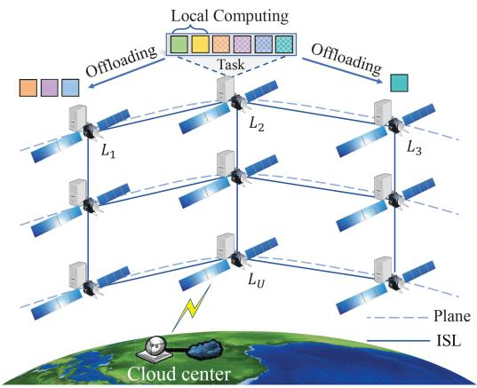

<details>
<summary>flowchart</summary>

```mermaid
graph TD
    subgraph_Local_Computing["Local Computing"]
        A["Offloading"] --> B["Task"]
        B --> C["L1"]
        B --> D["L2"]
        B --> E["L3"]
        B --> F["L4"]
        B --> G["L5"]
        B --> H["L6"]
        B --> I["L7"]
        B --> J["L8"]
        B --> K["L9"]
        B --> L["Cloud center"]
    end
    subgraph_ISL["ISL"]
        M["Plane"] -.-> N["ISL"]
        O["ISL"] -.-> P["ISL"]
    end
    style Local_Computing fill:#f9f,stroke:#333
    style ISL fill:#bbf,stroke:#333
```
</details>

Fig. 1. Network model of the SMEC system.

# A. Network Model

We consider a LEO constellation containing U satellites denoted as $\mathcal { L } = \{ L _ { 1 } , L _ { 2 } , \ldots , L _ { U } \}$ , as shown in Fig. 1. Let $\mathcal { P } = \{ 1 , 2 , \ldots , P \}$ , where $p \in \mathcal P$ is an orbital plane in the LEO =constellation, and there are $U / P$ satellites in each plane. Due to the large-scale geographical trajectory, it establishes periodic communication connections with the terrestrial cloud in several specified periods. Only in these communication windows, satellites and cloud transmit data to each other. Each satellite is deployed with a MEC server to form the SMEC network, so space missions generated by the satellites themselves can be processed directly on board. The SMEC system runs in a time slot mode, and time is divided into T slots of equal length $\rho ,$ in which the routing table and trajectory information of the LEO constellation are preset and stabilized in all time slots. At the beginning of each time slot, an independent and divisible task from a specified satellite is randomly generated. The time interval of task arrivals in the system obeys an exponential distribution with a mean of $\mu .$ Then in time slot $t \in \{ 1 , 2 , \ldots , \mathcal { T } \}$ , a task can be modeled by the program analyzer as a quadruple $\mathcal { K } _ { t } = \{ u _ { t } , d _ { t } , c _ { t } , T _ { t } ^ { \operatorname* { m a x } } \}$ . This means that task $\textstyle { \mathcal { K } } _ { t }$ containing =dt bits comes from satellite $L _ { u } ( u \in \mathcal { U } = \{ 1 , 2 , \dots , U \} )$ , which has a workload of $c _ { t }$ ( = )cycles/bit and needs to be completed within time $T _ { t } ^ { \operatorname* { m a x } } \left[ 1 6 \right]$ .

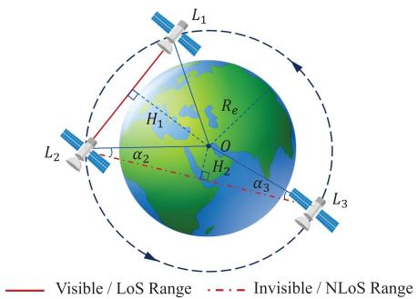

<details>
<summary>text_image</summary>

L1
H1
Re
O
H2
α2
α3
L2
L3
Visible / LoS Range
Invisible / NLoS Range
</details>

Fig. 2. Example of physical visibility between satellites.

Each satellite establishes ISLs with four surrounding satellites, which are deployed based on the laser link: two intraplane ISLs are between adjacent satellites on the same orbit, and two inter-plane ISLs are between adjacent satellites on two adjacent orbits [34]. When the computing capacity of a satellite is insufficient, tasks can be offloaded to other satellites for collaborative processing through ISL. We assume that each satellite only communicates and cooperates directly with neighboring satellites, and does not consider the scenario that requires a multi-hop ISL relay forwarding to other satellites. However, inter-satellite communication can only be performed within the line-of-sight (LoS) range. When two satellites are blocked by celestial bodies, the ISL between them cannot be established in non-LoS (NLoS) range. Therefore, the physical visibility between satellites is the basic condition for the ISL establishment, which depends on the relative position between satellites and Earth. As described in reference [14] and shown in Fig. 2, we assume that $H _ { 1 }$ is the vertical distance from Earth center O to $L _ { 1 } L _ { 2 } ,$ , and $R _ { e }$ is the radius of Earth. When $H _ { 1 } \geq R _ { e }$ , the inter-satellite is physically visible, and an ISL can be established between $L _ { 1 }$ and $L _ { 2 } . \ H _ { 2 }$ is the vertical distance from O to $L _ { 2 } L _ { 3 }$ , and it is physically invisible between satellites when $\left( H _ { 2 } < R _ { e } \right) \cap \left( \alpha _ { 2 } < 9 0 ^ { \circ } \right) \cap \left( \alpha _ { 3 } < 9 0 ^ { \circ } \right)$ . At this time, there is no ( )ISL between $L _ { 2 }$ and $L _ { 3 }$ .

Therefore, considering the rapid operation of the large-scale LEO constellation, all satellites are in a dynamic network topology. Consequently, the neighboring satellites maintaining the ISL of each satellite are also time-varying due to inter-satellite visibility variations. The satellite mobility scenario for SMEC is shown in Fig. 3, we refer to such neighboring satellites that can establish communication and provide computing services as available satellites. In time slot t, the available satellite set of $L _ { u }$ is expressed as $\mathcal { M } = \{ M _ { 1 } , M _ { 2 } , . . . , M _ { V } \}$ , where $V \leq 5$ . This means that M includes $L _ { u }$ itself and the satellites that establish the ISL. The computation offloading ratio assigned by M for task $\textstyle { \mathcal { K } } _ { t }$ is expressed as $x _ { t } = \{ x _ { t } ^ { 1 } , x _ { t } ^ { \bar { 2 } } , \ldots , x _ { t } ^ { V } \}$ , where $0 \leq x _ { t } ^ { v } \leq 1 ( v \in \mathcal { V } = \{ 1 , 2 , . . . , V \} )$ and $\textstyle \sum _ { v = 1 } ^ { V } x _ { t } ^ { v } = 1$ . Then ( = ) =the offloaded partial tasks are transmitted along the oriented ISL from satellite $L _ { u }$ to $M _ { v }$ .

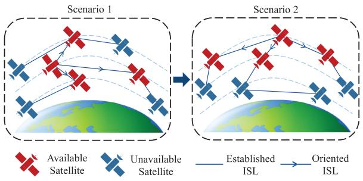

<details>
<summary>flowchart</summary>

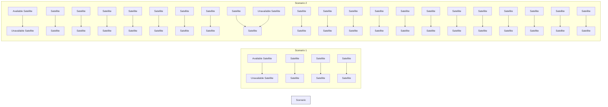
</details>

Fig. 3. Example of dynamic SMEC scenarios.

In addition, during the end-to-end time $T _ { t } ^ { e x e }$ of task execution, all available satellites providing collaborative computing need to maintain ISL connections to ensure successful task processing. Therefore, the decision of $x _ { t }$ needs to comprehensively consider the inter-satellite visibility within the period $[ t , t + T _ { t } ^ { e x e } ]$ , not all [ + ]satellites in M are suitable for offloading data. The parameter $x _ { t } ^ { v } = 0$ indicates that the task is not computed on the satellite $M _ { v } . \mathrm { H } M _ { v } = L _ { u }$ at this time, the task is completely offloaded to =other satellites without local processing. $0 < x _ { t } ^ { v } < $ 1 means that a part of the task is performed on the satellite $M _ { v }$ . Then $M _ { v } =$ $L _ { u }$ denotes that the current task is partially offloaded. $x _ { t } ^ { v } = 1$ means that the task is completely processed on the satellite $M _ { v }$ . When $M _ { v } = L _ { u }$ at this point, the task is computed locally and =not offloaded.

It is worth noting that when the LEO constellation is in long-term operation over large-scale time, satellites operating near the poles and the equator tend to have different frequencies of inter-satellite physical visibility changes [35]. When satellites are near the equator of Earth, the connected ISLs remain relatively stable, which also ensures the constant available satellites and offloading strategies within a certain time. On the contrary, when satellites are at the poles of Earth, the connectivity of satellites changes more frequently because the relative position between satellites and Earth moves faster. Then the set of available satellites is also changed more dynamically at this point, and offloading strategies have to be quickly adjusted accordingly. Therefore, it is necessary to focus on the adaptive optimization strategy based on varying topological changes under different trajectory characteristics.

# B. Communication Model

In this paper, ISL communication is modeled with an additive white Gaussian noise (AWGN) channel, and a wireless network model in which satellites transmit data on orthogonal channels is considered. Therefore, according to the Shannon formula [15], the data transmission rate $R _ { u \ i }$ v from satellite $L _ { u }$ to $M _ { v }$ is calculated as:

$$
R _ {u v} = B _ {v} \log_ {2} (1 + p _ {u} g _ {c}), \tag {1}
$$

where $B _ { v }$ denotes the link bandwidth allocated by $M _ { v }$ for a channel, $p _ { u }$ denotes the transmission power of $L _ { u }$ , and $g _ { c }$ denotes the channel characteristics.

Even in complex space environments, ISL transmission with FSO has smaller signal fading and time delay. Since we ignore the changing channel conditions of laser-based ISL between available satellites with one hop, $R _ { u v }$ is assumed to be constant. Thus making the offloading decision $\boldsymbol { x } _ { t } ^ { v }$ a determinant of intersatellite communication overhead. Meanwhile, for simplicity, we do not adopt the case of task transmission spanning multiple ISL communication windows. So the time spent on tracking or repointing is not needed. Then for task $\boldsymbol { { \kappa } } _ { t } .$ , the transmission delay $T _ { t } ^ { t r a n }$ of satellite $L _ { u }$ partially offloading to satellite $M _ { v }$ can be expressed as:

$$
T _ {t} ^ {\text { tran }} = \frac {x _ {t} ^ {v} d _ {t}}{R _ {u v}}. \tag {2}
$$

Meanwhile, the transmission energy consumption $E _ { t } ^ { t r a n }$ of satellite $L _ { u }$ offloading part of the task to $M _ { v }$ is:

$$
E _ {t} ^ {\text { tran }} = p _ {u} T _ {t} ^ {\text { tran }}. \tag {3}
$$

# C. Computation Model

In order to meet the time constraint of task execution, each available satellite needs to provide certain computing resources for task $\textstyle { \mathcal { K } } _ { t }$ . At this point, computation costs mainly depend on the offloading decision and the allocated computing capacity. We assume that the computing capabilities assigned by satellites $\mathcal { M }$ to $\textstyle { \mathcal { K } } _ { t }$ is $f _ { t } = \{ f _ { t } ^ { 1 } , \dot { f } _ { t } ^ { 2 } , \ldots , \dot { f } _ { t } ^ { \dot { V } } \}$ , and $0 \leq f _ { t } ^ { v } \leq F . F$ is the =maximum computing resources held by each satellite. Then the computation time $T _ { t } ^ { c o m p }$ of task partially executed at satellite $M _ { v }$ is:

$$
T _ {t} ^ {\text { comp }} = \frac {x _ {t} ^ {v} d _ {t} c _ {t}}{f _ {t} ^ {v}}. \tag {4}
$$

To describe the energy consumption of computing tasks on satellites, we use a widely adopted model of energy consumption per computing cycle as $e = \kappa f ^ { 2 } \left[ 1 6 \right]$ , [36], where κ is the energy =consumption coefficient depending on the effective switching capacitance of the chip architecture and $f$ is the CPU frequency. Then the computation energy consumption $E _ { t } ^ { c o m p }$ of executing the task at satellite $M _ { v }$ is:

$$
E _ {t} ^ {\text { comp }} = \kappa (f _ {t} ^ {v}) ^ {2} x _ {t} ^ {v} d _ {t} c _ {t}. \tag {5}
$$

# D. Problem Formulation

For the local computing mode in which the task is processed on satellite $L _ { u } ,$ , it only costs computation time. For the collaborative computing mode in which part of the task is offloaded on satellite $M _ { v } ( M _ { v } \neq L _ { u } )$ , the execution time of the task includes ( = )three parts: transmission delay, propagation and computation delays. Since the output data of a space task is generally very small compared to its input [37]. Therefore, we ignore the transmission delay in returning the computed results. Then the end-to-end delay $T _ { t }$ of available satellites M processing task $\textstyle { \mathcal { K } } _ { t }$ is:

$$
T _ {t} = \left\{ \begin{array}{l l} T _ {t} ^ {\text { comp }}, & \text { if   } M _ {v} = L _ {u} \\ T _ {t} ^ {\text { comp }} + T _ {t} ^ {\text { tran }} + T _ {t} ^ {\text { prop }}, & \text { if   } M _ {v} \neq L _ {u}, \end{array} \right. \tag {6}
$$

where $T _ { t } ^ { p r o p }$ represents the round-trip propagation delay be-prop tween satellite $L _ { u }$ and $M _ { v }$ , expressed as $T _ { t } ^ { \bar { p } r o \bar { p } } = 2 d _ { u v } / c$ , and c represents the speed of light with a value of $3 \times 1 0 ^ { 5 }$ km/s. The parameter $d _ { u v }$ is the actual distance between satellites.

Since the task is executed in parallel at all available satellites, the final processing time of task $\textstyle { \mathcal { K } } _ { t }$ is the maximum value of $T _ { t }$ and needs to satisfy the delay constraint. Then the actual delay $T _ { t } ^ { e x e }$ of executing task $\textstyle { \mathcal { K } } _ { t }$ is:

$$
T _ {t} ^ {e x e} = \max \left\{T _ {t} \right\} \leq T _ {t} ^ {\max}, \forall t. \tag {7}
$$

It is worth noting that during the collaborative task offloading, the disconnection of inter-satellite communication will lead to the failure of data offloaded or results returned. Only when the transmission and computation processes are completed within one window period of establishing ISL communication, the task is guaranteed to succeed. Therefore, the delay $T _ { t }$ of task partially offloaded at the satellite set $\mathcal { M } \backslash \{ L _ { u } \}$ needs to satisfy the time constraint:

$$
T _ {t} \leq T _ {t} ^ {\text { hold }}, \forall v, t, \tag {8}
$$

which means that satellite $L _ { u }$ and $M _ { v } ( M _ { v } \neq L _ { u } )$ must be ( = )physically visible and maintain ISL communication within the time period $[ t , t + T _ { t } ^ { h o l d } ]$ t .

[ + ]Furthermore, the total energy consumption of executing the task $\textstyle { \mathcal { K } } _ { t }$ include the transmission energy consumption $E _ { t } ^ { t r a n }$ ofmp the satellite $L _ { u }$ and the computation energy consumption $E _ { t } ^ { c o m p }$ of all available satellites $\mathcal { M } ,$ specifically:

$$
E _ {t} ^ {e x e} = \sum_ {v = 1} ^ {V} (E _ {t} ^ {t r a n} + E _ {t} ^ {c o m p}). \tag {9}
$$

In summary, constrained by varying ISL connectivity and limited on-board resources, collaborative computing at the satellite edge is beneficial in reducing end-to-end delay for diverse tasks, but increases the energy consumption of satellites and may cause task deployment failure. Therefore, the offloading decision and resource allocation of each time slot need to comprehensively consider the QoS of task execution and the energy burden on the satellite network. Based on this, aiming at the dynamic SMEC scenario where tasks arrive randomly and available satellites are time-varying, this paper jointly optimizes the offloading decision $x _ { t }$ and the computing resource $f _ { t }$ under the constraints of task delay and ISL communication time, and strives to minimize the SMEC system energy consumption during the long-term task processing. The objective optimization problem can be formulated as:

$$
\underset {x _ {t}, f _ {t}} {\text { minimize }} \quad \sum_ {t = 1} ^ {\mathcal {T}} E _ {t} ^ {e x e} \tag {10}
$$

${ \mathrm { s u b j e c t ~ t o ~ } } \ { \mathrm { E q . ~ } } ( 7 ) { \mathrm { a n d } } ( 8 ) .$ (10a)

$$
0 \leq x _ {t} ^ {v} \leq 1, \forall v, t. \tag {10b}
$$

$$
\sum_ {v = 1} ^ {V} x _ {t} ^ {v} = 1, \forall t. \tag {10c}
$$

$$
0 \leq f _ {t} ^ {v} \leq F, \forall v, t. \tag {10d}
$$

The constraints in the above problem can be interpreted as follows: constraint (10a) means that the end-to-end delay cannot exceed the required time and the ISL needs to be maintained during task execution. Constraint (10b) represents that each available satellite allocates a certain offloading ratio to the task. Constraint (10c) ensures that a task can be computed by at least the local satellite individually, or by at most V available satellites cooperatively. Constraint (10d) indicates that the computing resources allocated by any available satellite cannot exceed the maximum value.

According to the previous section, $\boldsymbol { x } _ { t } ^ { v }$ and $f _ { t } ^ { v }$ are continuous variables, and the objective function is also non-convex concerning the variables. Therefore, the defined problem in (10) is a non-convex optimization and non-linear programming problem, and is difficult to find the optimal solution using traditional optimization methods [27]. Therefore, this paper next proposes a MADRL-based approach to optimize the computation offloading process for distributed SMEC. It not only utilizes the deep neural network (DNN) to approximate optimal solutions for complex problems, but also can self-learn strategies in a model-free framework.

# III. MULTI-AGENT DEEP REINFORCEMENT LEARNING MODEL

In this section, we regard a satellite as an independent agent, and model the collaborative task offloading of multi-agent satellites as a POMDP. Then, a MADRL method based on AC+CTDE architecture is introduced.

# A. POMDP

In general, multi-agent MDP is also called the stochastic game (SG) [38]. Due to the computational consistency of multi-agent satellites, we consider fully cooperative distributed decisions for SMEC and describe it as an SG process G. All satellites take actions simultaneously according to their local environmental observations. The joint actions composed of their respective actions conjointly affect the transfer and update of the SMEC state, and determine the unified reward. Since an agent can only observe the local environment with a limited view, and cannot know the global information, then the process G is also a POMDP. We express the POMDP as a six-tuple $G = ( S , ( \mathcal { A } _ { u } ) _ { u \in \mathcal { U } } , \mathcal { P } , \mathcal { R } , ( \mathcal { O } _ { u } ) _ { u \in \mathcal { U } } , \gamma )$ , where the elements re-= ( ( ) ( ) )spectively represent the state space, action space, state transition function, reward function, local observation space and discount factor of the computation offloading problem. Next, each element in G is described as follows:

1) State Space: In each time slot, system grasps the overall state of the SMEC environment from a global perspective. We represent the acquired information in terms of task attributes $\boldsymbol { \mathcal { K } } _ { t }$ , inter-satellite visibility matrix $B _ { t }$ , and inter-satellite distance matrix $\mathcal { D } _ { t }$ , respectively. $B _ { t }$ and $\mathcal { D } _ { t }$ are given by:

$$
\mathcal {B} _ {t} = \left[ \begin{array}{c c c} b _ {1 1} & \dots & b _ {1 U} \\ \vdots & b _ {u v} & \vdots \\ b _ {U 1} & \dots & b _ {U U} \end{array} \right], \mathcal {D} _ {t} = \left[ \begin{array}{c c c} d _ {1 1} & \dots & d _ {1 U} \\ \vdots & d _ {u v} & \vdots \\ d _ {U 1} & \dots & d _ {U U} \end{array} \right], \tag {11}
$$

where the binary $b _ { u v }$ indicates whether $L _ { u }$ and $L _ { v } \in$ $\mathcal { U } )$ are physically visible. If $b _ { u v } = 1$ (, it means that there is )an ISL between $L _ { u }$ and $L _ { v }$ =, and they are mutually available satellites. On the contrary $b _ { u v } = 0 , \ L _ { u }$ and $L _ { v }$ cannot carry =out inter-satellite communication and cooperative computing. The value $d _ { u v }$ represents the actual distance between $L _ { u }$ and $L _ { v } .$ Therefore, the system state $s _ { t } \in S$ in time slot t contains $4 + U * U * 2$ elements. Then $s _ { t }$ is defined as follows:

$$
s _ {t} = \left\{\mathcal {K} _ {t}, b _ {1 1}, \dots , b _ {U U}, d _ {1 1}, \dots , d _ {U U} \right\}. \tag {12}
$$

2) Local Observation Space: Each satellite agent can only observe the SMEC state from its perspective, and obtain limited environmental information. When satellite $L _ { u ^ { \prime } }$ is invisible to $L _ { u } ,$ i.e. $L _ { u ^ { \prime } } \notin \mathcal { M } .$ then it cannot perceive the generation of the task $\textstyle { \mathcal { K } } _ { t }$ . At this time, the task information quadruples $\mathcal { K } _ { t } = \{ 0 , 0 , 0 , 0 \}$ observed locally from $L _ { u ^ { \prime } }$ by default. Further, =each available satellite can only make decisions based on the acquired task properties and visible satellite status, but cannot know the visibility and corresponding actions between other satellites and the task. Therefore, the local observations $o _ { t } ^ { u } \in \mathcal { O } _ { u }$ of each satellite $L _ { u }$ in time slot t contains $4 + U * 2$ elements. Then $o _ { t } ^ { u }$ is defined as follows:

$$
o _ {t} ^ {u} = \left\{\mathcal {K} _ {t}, b _ {u 1}, \dots , b _ {u U}, d _ {u 1}, \dots , d _ {u U} \right\}. \tag {13}
$$

3) Action Space: During the computation offloading process of the multi-agent SMEC system, each available satellite $M _ { v }$ needs to determine its offloading ratio $ { \boldsymbol { x } } _ { t } ^ { v }$ and computing capability $f _ { t } ^ { v }$ for task $\textstyle { \mathcal { K } } _ { t }$ according to the currently acquired environmental observations $o _ { t } ^ { v }$ . And assuming that the unavailable satellite $L _ { u ^ { \prime } }$ takes the default action $a _ { t } ^ { u ^ { \prime } } = \{ 0 , 0 \}$ at this time. Therefore, the action $a _ { t } ^ { u } \in \mathcal { A } _ { u }$ =in time slot t contains 2 elements. Then the $a _ { t } ^ { u }$ is defined as follows:

$$
a _ {t} ^ {u} = \left\{x _ {t} ^ {u}, f _ {t} ^ {u} \right\}. \tag {14}
$$

According to the constraints of problem (10), we can observe that $a _ { t } ^ { u }$ is a set of continuous variables. Therefore, as the number of agents $U$ increases, the size of joint action space $\mathcal { A } = \bigcup \mathcal { A } _ { u }$ grows exponentially. In order to reduce the dimensionality of the action space and the complexity of the algorithm, we discretize the continuous action space to achieve simpler behavior exploration of the strategy. Specifically, the continuous variables are respectively defined as $x _ { t } ^ { u } \in \{ 0 , \frac { 1 } { M } , \ldots , 1 \}$ and $f _ { t } ^ { u } \in \{ 0 , \frac { F } { M } , \dots , F \}$ , where M represents the degree of discretization.

4) Reward Function: After executing action $a _ { t } ^ { u }$ under local observation $o _ { t } ^ { u }$ of each satellite agent $L _ { u }$ in time slot t, the SMEC environment enters a new state $s _ { t + 1 }$ and returns the corresponding reward $r _ { t }$ . Since all agents cooperate fully, reward $r _ { t }$ is shared globally. The designed reward function should be based on the cost of the system state transition process, which is not only related to the objective function, but also to the corresponding constraints. The specific formula of the reward function $r _ { t }$ is expressed as:

$$
r _ {t} = \mathcal {R} - \omega E _ {t} ^ {e x e} - \varrho_ {1} - \varrho_ {2}, \tag {15}
$$

where R is a constant that makes the reward tending to be positive. The parameter $E _ { t } ^ { e x e }$ is the optimization objective in problem (10), and ω is the scaling coefficient.  denotes punishment and consists of two parts. The first part $\varrho _ { 1 }$ is based on (7), which is the punishment caused by reducing QoS due to task timeout processing. The second part $\varrho _ { 2 }$ is based on (8), which is the punishment for task deployment failure due to inter-satellite turning invisible. The setting of punishments encourages the agent to perform actions that do not violate the constraints.

# B. COMA

Since it is difficult to accurately model state distribution and transition probability in the huge state and action spaces for the proposed problem, we adopt the model-free MADRL method. However, due to partial observability, the stability and convergence of multi-agent collaborative computing cannot be guaranteed. In this paper, the AC+CTDE framework is adopted to design the MADRL algorithm, so that multi-agent satellites can learn the decentralized strategy through global optimization. The framework collects the overall situation of the SMEC environment, as well as the local observation and behavior information of all satellites through the critic network, in order to perform centralized offline policy learning. After training, it distributes the learned strategies to each agent for distributed execution. Thereby each agent deploying the actor network can make online decisions according to the current self-observation and experienced historical information. Therefore, since the global critic network is used to evaluate the joint actions in the way of parameter sharing during training, each agent can pre-evaluate the behavior of other agents before taking action.

Furthermore, since the optimization objective and reward function are also shared globally, it is difficult to evaluate the contribution of a satellite’s decision to the computation offloading process, which may cause the learned strategy to be locally optimal. Therefore, we propose a COMA-based MADRL model using the above framework, and the core concept is to set up conditions contrary to the facts to determine causal relationships between variables. COMA computes a specific advantage function for each agent by using the centralized critic, and compares the estimated reward of the current joint action with the counterfactual baseline that marginalizes out a single agent’s action while keeping other agents’ actions fixed. In this way, the impact of an agent’s actions on the overall task completion can be evaluated, and the multi-agent reward credit assignment can be realized.

Specifically, the centralized critic network computes the $\mathrm { Q } \mathrm { - }$ value $Q ( s _ { t } , A _ { t } )$ based on the state $s _ { t }$ and the joint action $A _ { t } =$ $\{ a _ { t } ^ { 1 } , a _ { t } ^ { 2 } , \ldots , a _ { t } ^ { U } \}$ . And for each agent $u ,$ = by keeping the actions $A _ { t } ^ { - u }$ of other agents except u fixed, the advantage function $\textstyle Z ^ { u } ( s _ { t } , A _ { t } )$ can be calculated as:

$$
Z ^ {u} (s _ {t}, A _ {t}) = Q (s _ {t}, A _ {t}) - \sum_ {a _ {t} ^ {u ^ {\prime}}} \pi^ {u} (a _ {t} ^ {u ^ {\prime}} | \tau_ {t} ^ {u}) Q (s _ {t}, (A _ {t} ^ {- u}, a _ {t} ^ {u ^ {\prime}})), \tag {16}
$$

where $\begin{array} { r } { b ( s _ { t } , A _ { t } ^ { - u } ) = \sum _ { a _ { \cdot } ^ { u ^ { \prime } } } \pi ^ { u } ( a _ { t } ^ { u ^ { \prime } } | \tau _ { t } ^ { u } ) Q ( s _ { t } , ( A _ { t } ^ { - u } , a _ { t } ^ { u ^ { \prime } } ) ) } \end{array}$ is the ( ) =  ( )counterfactual baseline for agent u, and $\tau _ { t } ^ { u }$ ( ))represents its historical observation-action sequence. Each actor network outputs policy $\pi ^ { u }$ based on past experience, instead of relying on extra simulations, approximations or assumptions about default actions. All agents in COMA share the parameters of the actor and critic networks, and are distinguished by the satellite number U. By fixing the input values for actor and critic networks as $\Phi _ { t } ^ { u } = \left( o _ { t } ^ { u } , u , a _ { t - 1 } ^ { u } \right)$ and $\Psi _ { t } ^ { u } = ( A _ { t } ^ { - u } , s _ { t } , o _ { t } ^ { u } , u , A _ { t - 1 } )$ Φ = ( ) Ψ = ( )respectively, both networks compute actions and corresponding Q-values for each specified agent u, which ensures efficient computation of counterfactual baselines and low-complexity learning of models. Moreover, the output dimension of two networks is only the action space of an agent $\left| a _ { t } ^ { u } \right|$ |, instead of $U \times | a _ { t } ^ { u } |$ , which significantly improves the training efficiency and enhances the generalization of COMA algorithm.

Moreover, the $\mathrm { T D } ( \lambda )$ method based on time difference (TD) is adopted to update the advantage function, which is an onpolicy that can comprehensively consider all time step updates. $\lambda \in [ 0 , 1 ]$ represents the weight of each step return, and λ-return [ ]is defined as:

$$
y _ {t} ^ {(\lambda)} = (1 - \lambda) \sum_ {n = 1} ^ {\infty} \lambda^ {n - 1} G _ {t} ^ {(n)}, \tag {17}
$$

where the weighted regularization term $( 1 - \lambda ) \lambda ^ { n - 1 }$ ensures ( )that the weight decays geometrically and sums to 1. And the mixture of n-step return s G(n)t i $G _ { t } ^ { ( n ) }$ s computed with bootstrapped values estimated by the target critic network copied periodically from the current critic network as:

$$
G _ {t} ^ {(n)} = \sum_ {l = 1} ^ {n} \gamma^ {l - 1} r _ {t + l} + \gamma^ {n} Q (s _ {t + n}, A _ {t + n}). \tag {18}
$$

The fixed target network is updated more slowly than the current network, which guarantees the stability of the training process for the critic network. And $\gamma$ represents the discount factor that indicates the impact of future rewards on current rewards, without loss of generality $\gamma  1$ .

Therefore, the parameter of the critic network $\theta ^ { c }$ is updated by minibatch gradient descent to minimize the loss function:

$$
L _ {t} (\theta^ {c}) = (y _ {t} ^ {(\lambda)} - Q (s _ {t}, A _ {t})) ^ {2}. \tag {19}
$$

Further, since COMA is a policy-based MADRL method, an agent may be influenced by other agents being explored, making the policy gradient very noisy. At this time, using the traditional TD-error to update the actor network may lead to inaccurate optimization direction. Therefore, to enable gradients computed for each actor to explicitly infer how much the action of a particular agent contributes to the global reward, we define the policy gradient for the actor parameter $\theta ^ { \pi } = \{ \theta _ { 1 } ^ { \pi } , \theta _ { 2 } ^ { \pi } , \ldots , \theta _ { U } ^ { \pi } \}$ based on maximizing the advantage function output by the critic network:

$$
g = \mathbb {E} _ {\pi} \left[ \sum_ {u} \nabla_ {\theta^ {\pi}} \log \pi^ {u} (a ^ {u} | \tau^ {u}) Z ^ {u} (s, A) \right]. \tag {20}
$$

# IV. DISTRIBUTED COMPUTATION OFFLOADING ALGORITHM

In this section, we redesign the structure of actors by introducing bidirectional LSTM (BiLSTM) and attention layers to better fit the temporal input of satellites. Next, a COMA-based algorithm is proposed to solve the offloading optimization problem for distributed SMEC. Finally, we analyze the complexity and convergence of the proposed method.

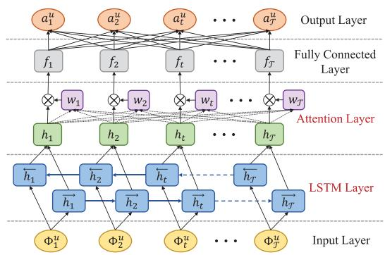

<details>
<summary>flowchart</summary>

```mermaid
graph TD
    subgraph Input Layer
        A1["Φ₁ᵘ"] --> h1["ĥ₁"]
        A2["Φ₂ᵘ"] --> h2["ĥ₂"]
        A3["Φₜᵘ"] --> ht["ĥₜ"]
        A4["Φⱼᵘ"] --> hT["ĥₜ"]
    end

    subgraph Attention Layer
        B1["h₁"] --> h1
        B2["h₂"] --> h2
        B3["hₜ"] --> ht
        B4["hⱼ"] --> hT
        B5["hⱼ"] --> hT
    end

    subgraph LSTM Layer
        C1["Input Layer"] --> h1
        C2["Input Layer"] --> h2
        C3["Input Layer"] --> ht
        C4["Input Layer"] --> hT
    end

    Output Layer --> A1
    Output Layer --> A2
    Output Layer --> A3
    Output Layer --> A4
    Output Layer --> A5
    Output Layer --> A6
    Output Layer --> A7
    Output Layer --> A8
    Output Layer --> A9
    Output Layer --> A10
    Output Layer --> A11
    Output Layer --> A12
    Output Layer --> A13
    Output Layer --> A14
    Output Layer --> A15
    Output Layer --> A16
    Output Layer --> A17
    Output Layer --> A18
    Output Layer --> A19
    Output Layer --> A20
    Output Layer --> A21
    Output Layer --> A22
    Output Layer --> A23
    Output Layer --> A24
    Output Layer --> A25
    Output Layer --> A26
    Output Layer --> A27
    Output Layer --> A28
    Output Layer --> A29
    Output Layer --> A30
    Output Layer --> A31
    Output Layer --> A32
    Output Layer --> A33
    Output Layer --> A34
    Output Layer --> A35
    Output Layer --> A36
    Output Layer --> A37
    Output Layer --> A38
    Output Layer --> A39
    Output Layer --> A40
    Output Layer --> A41
    Output Layer --> A42
    Output Layer --> A43
    Output Layer --> A44
    Output Layer --> A45
    Output Layer --> A46
    Output Layer --> A47
    Output Layer --> A48
    Output Layer --> A49
    Output Layer --> A50
    Output Layer --> A51
    Output Layer --> A52
    Output Layer --> A53
    Output Layer --> A54
    Output Layer --> A55
    Output Layer --> A56
    Output Layer --> A57
    Output Layer --> A58
    Output Layer --> A59
    Output Layer --> A60
    Output Layer --> A61
    Output Layer --> A62
    Output Layer --> A63
    Output Layer --> A64
    Output Layer --> A65
    Output Layer --> A66
    Output Layer --> A67
    Output Layer --> A68
    Output Layer --> A69
    Output Layer --> A70
    Output Layer --> A71
    Output Layer --> A72
    Output Layer --> A73
    Output Layer --> A74
    Output Layer --> A75
    Output Layer --> A76
    Output Layer --> A77
    Output Layer --> A78
    Output Layer --> A79
    Output Layer --> A80
```
</details>

Fig. 4. Structure of the improved actor network.

# A. Neural Network Architecture

For the centralized critic network, we can use a multi-layer stacked fully connected network to approximate the nonlinear Q-value of the output. However, for the distributed actor network, the basic DNN cannot explore the long-term dynamic characteristics of the SMEC environment because its neurons lack the abilities to memorize past information and to predict future behavior. For this reason, in order to ascertain the transfer regularity of time-varying but fixed-pattern for the large-scale LEO network, we adopt an Atten-BiLSTM network to improve the actor structure for enhancing the forecasting ability of multiagent satellites. As shown in Fig. 4, the improved actor neural network includes Input layer, LSTM layer, Attention layer, Fully connected and Output layers respectively. This structure utilizes the BiLSTM network to retain dual long-term neuronal memory information, and automatically discovers time-step features that play a key role in decision-making based on the attention mechanism, which avoids the complicated feature extraction process using traditional methods. The following parts describe the significant LSTM and Attention layers:

1) LSTM Layer: LSTM is a variant of the recurrent neural network (RNN) that can learn long-term dependency information. By setting the memory and forget gates for the cell state in the hidden layer, it solves the problems of gradient disappearance and explosion in the long sequence training process. Therefore, LSTM is widely used in feature extraction and trend prediction of time series [32]. To further enhance the perceptual performance, BiLSTM can perform forward and backward dual encoding on the input vector and then output a concatenated value on the basis of LSTM, so as to comprehensively model the feature vector based on the past and future time situation information. Specifically, each layer contains T hidden units in the two-layer parallel LSTM network, and every two units $\overrightarrow { h _ { t } }$ and $\left\{ { { \overline { { h _ { t } } } } } \right.$ take a row of data $\Phi _ { t } ^ { u }$ as input. Meanwhile, the two-layer units from $\overrightarrow { h _ { 1 } }$ to $\overrightarrow { h _ { T } }$ and $\overleftarrow { h _ { \tau } }$ to $\left\{ { \overline { { h _ { 1 } } } } \right.$ are connected temporally to track the sequential changes from u1 to uT and uT to u1 , Φ Φ Φ Φwhere the hidden-to-hidden connections flow in the opposite order. Finally, the combined output using the element-wise sum mode of the two-layer unit values is passed to the next layer for further learning.

2) Attention Layer: Due to the large time scale operation of the LEO constellation, when the time step of the BiLSTM

network is very long, it is still difficult for the algorithm to learn a reasonable feature vector representation of the input sequence from distributed satellites. To make up for this deficiency, the attention mechanism retains the output results of the LSTM hidden layer, and selectively learns these data by training a network. Then it associates the original output sequence with the attention network, so as to quickly filter out high-value content from a large amount of information, which increases the memory ability of information under continuous time [39]. Specifically, according to the output vector $H = [ h _ { 1 } , h _ { 2 } , \ldots , h _ { T } ]$ of the LSTM = [ ]layer, the attention layer forms a weight coefficient network $W = [ w _ { 1 } , w _ { 2 } , \dots , w _ { T } ]$ , which in turn is multiplied with H in = [ ]a weighted form. Finally, $H W ^ { T }$ is fed into the fully connected layer for integrating features to output the final policy.

# B. COMA-Based Algorithm

The COMA framework in distributed SMEC is shown in Fig. 5. To energy-efficiently train and autonomously implement the algorithm, corresponding models are learned on the ground with abundant resources and executed at independent multiagent satellites, respectively. The solution deployment is divided into training and testing processes as follows.

The training process includes two separate parts of distributed execution and centralized training, which updates the models by collecting samples. For online distributed execution, each satellite agent has an actor network with the same parameters composed of Atten-BiLSTM, and takes actions in parallel based on local environmental observations for caching experiences. For offline centralized training, the terrestrial cloud periodically exchanges information with satellites within the specified satellite-ground communication windows. Based on the obtained states, rewards and joint actions of all agents over a period of time, this part calculates the advantage function and performs policy learning uniquely for each agent through the double critic network. The flow of distributed task offloading based on COMA for SMEC is shown in Algorithm 1. Specifically, after initializing the parameters of all networks (Line 1∼2), the training cycle progresses in three steps:

1) Collect data of N episodes to buffer B (Line 4∼18): At each episode, all agents interact with the SMEC environment continuously until the system terminal state. Each actor outputs a policy based on the current input ut . Then Φthe agent utilizes the ε-greedy policy to expand sample diversity [25], which performs the action with the optimal Q-value under probability ε and randomly selects an action under probability 1 − ε. Next, every self-observation is updated. Finally, the system stores the set of transitions from all time steps in B.

2) Train the critic network (Line 19∼27): At each time step, the batches from B are used to unroll the neural network. After the target critic network calculates the target Q-value $y _ { t } ^ { ( \lambda ) }$ , the gradient update is implemented on the feed-forward current critic network by minimizing the loss function base on (19). Finally, in order to avoid the divergence of the training process and ensure the stability of the algorithm, the target network parameters $\hat { \theta } _ { i } ^ { c }$ are hard updated every C steps.

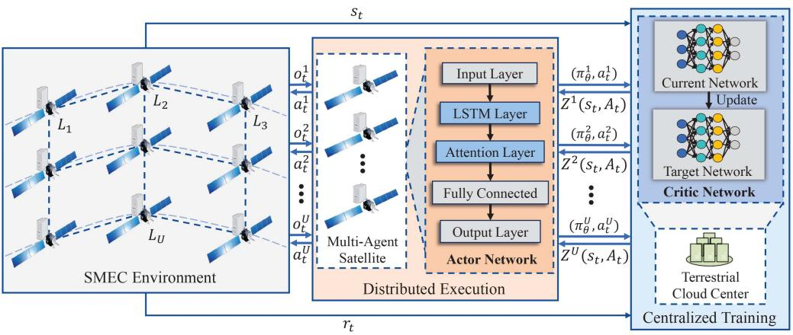

<details>
<summary>flowchart</summary>

```mermaid
graph TD
    subgraph "SMEC Environment"
        L1["L₁"] -->|oₜ¹| L2["L₂"]
        L2 -->|aₜ¹| L3["L₃"]
        L3 -->|oₜ²| L4["L₄"]
        L4 -->|aₜ²| L5["L₅"]
        L5 -->|oₜU| L6["L₆"]
        L6 -->|aₜU| L7["L₇"]
        L7 -->|oₜU| L8["L₈"]
        L8 -->|aₜU| L9["L₉"]
        L9 -->|oₜU| L10["L₁₀"]
        L10 -->|aₜU| L11["L₁₁"]
        L11 -->|oₜU| L12["L₁₂"]
        L12 -->|aₜU| L13["L₁₃"]
        L13 -->|oₜU| L14["L₁₄"]
        L14 -->|aₜU| L15["L₁₅"]
        L15 -->|oₜU| L16["L₁₆"]
        L16 -->|aₜU| L17["L₁₇"]
        L17 -->|oₜU| L18["L₁₈"]
        L18 -->|aₜU| L19["L₁₉"]
        L19 -->|oₜU| L20["L₂₀"]
        L20 -->|aₜU| L21["L₂₁"]
        L21 -->|oₜU| L22["L₂₂"]
        L22 -->|aₜU| L23["L₂₃"]
        L23 -->|oₜU| L24["L₂₄"]
        L24 -->|aₜU| L25["L₂₅"]
        L25 -->|oₜU| L26["L₂₆"]
        L26 -->|aₜU| L27["L₂₇"]
        L27 -->|oₜU| L28["L₂₈"]
        L28 -->|aₜU| L29["L₂₉"]
        L29 -->|oₜU| L30["L₃₀"]
        L30 -->|aₜU| L31["L₃₁"]
        L31 -->|oₜU| L32["L₃₂"]
        L32 -->|aₜU| L33["L₃₃"]
        L33 -->|oₜU| L34["L₃₄"]
        L34 -->|aₜU| L35["L₃₅"]
        L35 -->|oₜU| L36["L₃₆"]
        L36 -->|aₜU| L37["L₃₇"]
        L37 -->|oₜU| L38["L₃₈"]
        L38 -->|aₜU| L39["L₃₉"]
        L39 -->|oₜU| L40["L₄₀"]
        L40 -->|aₜU| L41["L₄₁"]
        L41 -->|oₜU| L42["L₄₂"]
        L42 -->|aₜU| L43["L₄₃"]
        L43 -->|oₜU| L44["L₄₄"]
        L44 -->|aₜU| L45["L₄₅"]
        L45 -->|oₜU| L46["L₄₆"]
        L46 -->|aₜU| L47["L₄₇"]
        L47 -->|oₜU| L48["L₄₈"]
        L48 -->|aₜU| L49["L₄₉"]
        L49 -->|oₜU| L50["L₅₀"]
        L50 -->|aₜU| L51["L₅₁"]
        L51 -->|oₜU| L52["L₅₂"]
        L52 -->|aₜU| L53["L₅₃"]
        L53 -->|oₜU| L54["L₅₄"]
        L54 -->|aₜU| L55["L₅₅"]
        L55 -->|oₜU| L56["L₅₆"]
        L56 -->|aₜU| L57["L₅₇"]
        L57 -->|oₜU| L58["L₅₈"]
        L58 -->|aₜU| L59["L₅⁹"]
        L59 -->|oₜU| L60["L₆₁"]
    end

    subgraph "Distributed Execution"
        MultiAgent["SMEC Environment"] --> MultipleAgent["SMEC Satellite"] & ActorNetwork["Actor Network"]

    subgraph "Centralized Training"
        CentralizedTraining["Centerized Training"] & CriticNetwork["Critic Network"] & TargetNetwork["Target Network"] & CurrentNetwork["Current Network"] & Update["Update"] & CentricNetwork["Centralized Training"]

    subgraph "SMEC Environment"
        SingleSpaceL1["Single Space"] & SingleSpaceL2["Multi Space"] & SingleSpaceL3["Multi Space"] & SingleSpaceL4["Multi Space"] & SingleSpaceL5["Multi Space"] & SingleSpaceL6["Multi Space"] & SingleSpaceL7["Multi Space"] & SingleSpaceL8["Multi Space"] & SingleSpaceL9["Multi Space"] & SingleSpaceL10["Multi Space"] & SingleSpaceL11["Multi Space"] & SingleSpaceL12["Multi Space"] & SingleSpaceL13["Multi Space"] & SingleSpaceL14["Multi Space"] & SingleSpaceL15["Multi Space"] & SingleSpaceL16["Multi Space"] & SingleSpaceL17["Multi Space"] & SingleSpaceL18["Multi Space"] & SingleSpaceL19["Multi Space"] & SingleSpaceL20["Multi Space"] & SingleSpaceL21["Multi Space"] & SingleSpaceL22["Multi Space"] & SingleSpaceL23["Multi Space"] & SingleSpaceL24["Multi Space"] & SingleSpaceL25["Multi Space"] & SingleSpaceL26["Multi Space"] & SingleSpaceL27["Multi Space"] & SingleSpaceL28["Multi Space"] & SingleSpaceL29["Multi Space"] & SingleSpaceL30["Multi Space"] & SingleSpaceL31["Multi Space"] & SingleSpaceL32["Multi Space"] & SingleSpaceL33["Multi Space"] & SingleSpaceL34["Multi Space"] & SingleSpaceL35["Multi Space"] & SingleSpaceL36["Multi Space"] & SingleSpaceL37["Multi Space"] & SingleSpaceL38["Multi Space"] & SingleSpaceL39["Multi Space"] & SingleSpaceL40["Multi Space"] & SingleSpaceL41["Multi Space"] & SingleSpaceL42["Multi Space"] & SingleSpaceL43["Multi Space"] & SingleSpaceL44["Multi Space"] & SingleSpaceL45["Multi Space"] & SingleSpaceL46["Multi Space"] & SingleSpaceL47["Multi Space"] & SingleSpaceL48["Multi Space"] & SingleSpaceL49["Multi Space"] & SingleSpaceL50["Multi Space"] & SingleSpaceL51["Multi Space"] & SingleSpaceL52["Multi Space"] & SingleSpaceL53["Multi Space"] & SingleSpaceL54["Multi Space"] & SingleSpaceL55["Multi Space"] & SingleSpaceL56["Multi Space"] & SingleSpaceL57["Multi Space"] & SingleSpaceL58["Multi Space"] & SingleSpaceL59["Multi Space"] & SingleSpaceL60["Multi Space"] & SingleSpaceL61["Multi Space"] & SingleSpaceL62["Multi Space"] & SingleSpaceL63["Multi Space"] & SingleSpaceL64["Multi Space"] & SingleSpaceL65["Multi Space"] & SingleSpaceL66["Multi Space"] & SingleSpaceL67["Multi Space"] & SingleSpaceL68["Multi Space"] & SingleSpaceL69["Multi Space"] & SingleSpaceL70["Multi Space"] & SingleSpaceL71["Multi Space"] & SingleSpaceL72["Multi Space"] & SingleSpaceL73["Multi Space"] & SingleSpaceL74["Multi Space"] & SingleSpaceL75["Multi Space"] & SingleSpaceL76["Multi Space"] & SingleSpaceL77["Multi Space"] & SingleSpaceL78["Multi Space"] & SingleSpaceL79["Multi Space"] & SingleSpaceL80["Multi Space"] & SingleSpaceL81["Multi Space"] & SingleSpaceL82["Multi Space"] & SingleSpaceL83["Multi Space"] & SingleSpaceL84["Multi Space"] & SingleSpaceL85["Multi Space"] & SingleSpaceL86["Multi Space"] & SingleSpaceL87["Multi Space"] & SingleSpaceL88["Multi Space"] & SingleSpaceL89["Multi Space"] & SingleSpaceL90["Multi Space"] & SingleSpaceL91["Multi Space"] & SingleSpaceL92["Multi Space"] & SingleSpaceL93["Multi Space"] & SingleSpaceL94["Multi Space"] & SingleSpaceL95["Multi Space"] & SingleSpaceL96["Multi Space"] & SingleSpaceL97["Multi Space"] & SingleSpaceL98["Multi Space"] & SingleSpaceL99["Multi Space"]
    end
```
</details>

Fig. 5. The COMA framework in the distributed SMEC system.

3) Train the actor network (Line 28∼32): Based on the structure in Fig. 4, the recurrent part of the actor network is fully unrolled using the transitions from B. And the gradients are aggregated in the backward pass across all time steps. Finally, a gradient update is applied based on (20) under the premise of maximizing the advantage function computed by the critic network.

Considering the intermittent communication between satellites and GS, the above experience collection and training process are carried out in an ordered batch mode for several $\tau$ time steps, and all agents act and learn in parallel due to network parameter sharing. In addition, since the training process of the actor network depends on the output Q-value of the critic network, the critic should have a faster learning rate than the actor to achieve better guidance.

Further, when performing the trained strategy in the test process, there is no centralized training with ground participation. Autonomous agents directly take actions in parallel according to local observations and historical information, without applying ε-greedy policy, sample storage and gradient update procedures. Satellites only manage their own resources for an observed task, so potential action conflicts between multiple agents can be ignored. This would be a feasible distributed paradigm for practical satellite applications.

# C. Complexity and Convergence Analysis

The complexity of the proposed COMA-based method is mainly determined by the training process in Algorithm 1. Assuming that critic networks contain X fully connected layers. We consider adding the bias in each layer, then the computational complexity of critic can be expressed as [16]:

$$
O \left(p _ {a} u _ {x} ^ {c} + 2 \times \sum_ {x = 0} ^ {X - 1} u _ {x} ^ {c} u _ {x + 1} ^ {c}\right) = O \left(\sum_ {x = 0} ^ {X - 1} u _ {x} ^ {c} u _ {x + 1} ^ {c}\right), \tag {21}
$$

where $u _ { x } ^ { c }$ represents the neural unit number in the xth layer of the critic network, and $p _ { a }$ represents the corresponding parameters determined by the activation layer function.

Next, the total number of parameters $W _ { l s t m } ^ { a }$ in a standard LSTM network with one unit in the hidden layer, ignoring bias, can be calculated as follows [40]:

$$
W _ {l s t m} ^ {a} = n _ {c} \times n _ {c} \times 4 + n _ {i} \times n _ {c} \times 4 + n _ {c} \times n _ {o} + n _ {c} \times 3, \tag {22}
$$

where $n _ { c }$ denotes the number of memory cells, $n _ { i }$ denotes the number of input units, and $n _ { o }$ denotes the number of output units. Since Bi-LSTM contains two LSTMs based on forward and backward, the computational complexity of Bi-LSTM with $\tau$ units is $O ( 2 T W _ { l s t m } ^ { a } ) = O ( T W _ { l s t m } ^ { a } )$ .

( ) = ( )We continue to set the dimension of weight network as $v _ { a t t } ^ { a } ,$ then the complexity of attention layer is $O ( \mathcal { T } v _ { a t t } ^ { a } + v _ { a t t } ^ { a } ) =$ $O ( \mathcal { T } v _ { a t t } ^ { a } )$ ( + ) =. Finally, the number of neurons in the fully connected ( )layer of the actor network is denoted as $v _ { y } ^ { a }$ . Therefore, the ultimate complexity of our proposed method is:

$$
O \left(\sum_ {x = 0} ^ {X - 1} u _ {x} ^ {c} u _ {x + 1} ^ {c} + \mathcal {T} W _ {l s t m} ^ {a} + \mathcal {T} v _ {a t t} ^ {a} + v _ {a t t} ^ {a} v _ {y} ^ {a}\right). \tag {23}
$$

The difference between pure COMA and the improved algorithm is that the complexity of the actor network is originally $O ( \sum _ { y = 0 } ^ { Y - 1 } v _ { y } ^ { a } v _ { y + 1 } ^ { a } )$ , thus the above additions are the introduced (complexity.

Furthermore, when analyzing the convergence, implementation and optimality of the proposed algorithm, it is necessary to establish statistical guarantees, i.e., to prove the convergence statistical rate of the trained policy with parameter gradient updates has a definite upper bound and can no longer be optimized in the extreme case. It is assumed that $g _ { i }$ is the gradient at epoch i for COMA. Then the following lemma and proof of the ultimate gradient of $g _ { i }$ are given:

Lemma 1: The proposed COMA-based computation offloading algorithm converges to a locally optimal policy:

$$
\liminf _ {i} \| \nabla g _ {i} \| = 0 \quad w. p. 1. \tag {24}
$$

Proof: First, based on $( 2 0 ) , g _ { i }$ is calculated as:

$$
g _ {i} = \mathbb {E} _ {\pi} \left[ \sum_ {u} \nabla_ {\theta^ {\pi}} \log \pi^ {u} (a ^ {u} | \tau^ {u}) (Q (s, A) - b (s, A ^ {- u})) \right]. \tag {25}
$$

Algorithm 1: COMA-based Distributed Task Offloading.   
1: Randomly initialize actor network and current critic network with weights $\theta_{1}^{\pi}$ and $\theta_{1}^{c}$ .
2: Initialize target critic network with weight $\hat{\theta}_{1}^{c} = \theta_{1}^{c}$ .
3: for training epoch i = 1 to I do
4: Empty buffer B.
5: for episode n = 1 to N do
6: Reset initial state $s_{0}, t = 0$ and reward $r_{0} = 0$ .
7: while $s_{t} \neq terminal$ and $t < T$ do
8: for each agent u do
9: Output $a_{t}^{u} = \text{Actor}(\Phi_{t}^{u})$ .
10: Execute an action according to ε-greedy policy.
11: Get next observation $o_{t+1}^{u}$ .
12: end for
13: Get reward $r_{t}$ and next state $s_{t+1}$ .
14: $t = t + 1$ .
15: end while
16: Store one transition episode $\bigcup_{t}(s_{t}, (a_{t}^{u})_{u \in U}, (o_{t}^{u})_{u \in U}, r_{t}, s_{t+1}, (o_{t+1}^{u})_{u \in U})$ to B.
17: end for
18: Collate N episodes in B into single batch and process all agents in parallel.
19: for t = 1 to T do
20: Batch unroll neural network using states, actions, observations and rewards in B.
21: Calculate $TD(\lambda)$ targets $y_{t}^{(\lambda)}$ using $\hat{\theta}_{i}^{c}$ according to (17).
22: end for
23: for t = T to 1 do
24: $\Delta\theta^{c} = \nabla_{\theta^{c}}(y_{t}^{(\lambda)} - Q(s_{t}, A_{t}))^{2}$ .
25: $\theta_{i+1}^{c} = \theta_{i}^{c} - \alpha^{c}\Delta\theta^{c}$ .
26: Every C steps reset $\hat{\theta}_{i}^{c} = \theta_{i}^{c}$ .
27: end for
28: for t = T to 1 do
29: Calculate advantage function $Z^{u}(s_{t}, A_{t})$ for each agent u according to (16).
30: $\Delta\theta^{\pi} = \Delta\theta^{\pi} + \nabla_{\theta^{\pi}} \log \pi(a_{t}^{u}| \tau_{t}^{u})Z^{u}(s_{t}, A_{t})$ .
31: end for
32: $\theta_{i+1}^{\pi} = \theta_{i}^{\pi} + \alpha^{\pi}\Delta\theta^{\pi}$ .
33: end for

Based on this, the expected contribution of the latter counterfactual baseline monomial $b ( s , A ^ { - u } )$ is:

$$
g _ {b} = - \mathbb {E} _ {\pi} \left[ \sum_ {u} \nabla_ {\theta^ {\pi}} \log \pi^ {u} (a ^ {u} | \tau^ {u}) b (s, A ^ {- u}) \right], \tag {26}
$$

where $\mathbb { E } _ { \pi }$ is the expected distribution of state-action with respect to the joint policy π.

Let $d ^ { \pi } ( s ) = \operatorname* { l i m } _ { t  0 } \operatorname* { P r } \{ s _ { t } = s | s _ { 0 } , \pi \}$ be the discounted er-( ) = lim Pr =godic state distribution under π as defined by [41], then there is:

$$
g _ {b} = - \sum_ {s} d ^ {\pi} (s) \sum_ {u} \sum_ {A ^ {- u}} \pi (A ^ {- u} | \tau^ {- u}) \cdot
$$

$$
\begin{array}{l} \sum_ {a ^ {u}} \pi^ {u} (a ^ {u} | \tau^ {u}) \nabla_ {\theta^ {\pi}} \log \pi^ {u} (a ^ {u} | \tau^ {u}) b (s, A ^ {- u}) \\ = - \sum_ {s} d ^ {\pi} (s) \sum_ {u} \sum_ {A ^ {- u}} \pi (A ^ {- u} | \tau^ {- u}) \cdot \\ \sum_ {a ^ {u}} \nabla_ {\theta^ {\pi}} \pi^ {u} (a ^ {u} | \tau^ {u}) b (s, A ^ {- u}) \\ = - \sum_ {s} d ^ {\pi} (s) \sum_ {u} \sum_ {A ^ {- u}} \pi \left(A ^ {- u} \mid \tau^ {- u}\right) b (s, A ^ {- u}) \nabla_ {\theta} 1 \\ = 0. \tag {27} \\ \end{array}
$$

Obviously, the counterfactual baseline of each agent does not change $g _ { i } ,$ , and thus does not affect the convergence of the proposed algorithm.

Second, the gradient of the previous Q-value monomial of $g _ { i }$ is given as:

$$
\begin{array}{l} g _ {Q} = \mathbb {E} _ {\pi} \left[ \sum_ {u} \nabla_ {\theta^ {\pi}} \log \pi^ {u} (a ^ {u} | \tau^ {u}) Q (s, A) \right] \\ = \mathbb {E} _ {\pi} \left[ \nabla_ {\theta^ {\pi}} \log \prod_ {u} \pi^ {u} (a ^ {u} | \tau^ {u}) Q (s, A) \right]. \tag {28} \\ \end{array}
$$

Let $\begin{array} { r } { \pi ( A | s ) = \prod _ { u } \pi ^ { u } ( a ^ { u } | \tau ^ { u } ) } \end{array}$ denote the joint policy of independent actors, thus yielding the policy gradient for standard single-agent AC algorithm:

$$
g _ {Q} = \mathbb {E} _ {\pi} \left[ \nabla_ {\theta^ {\pi}} \log \pi (A | s) Q (s, A) \right], \tag {29}
$$

where it is proved that $g _ { Q }$ converges to a local maximum under the following assumptions from literature [42]:

- Derived from (20), the parameterization of the policy $\pi$ remains differentiable.   
- The learning rate of the model is sufficiently slow, and $\alpha ^ { \pi }$ is much smaller than $\alpha ^ { c }$ .   
Obeying (16), the critic $Q$ uses a representation compatible with the policy π.   
- As shown in Fig. 5, the COMA architecture has a centralized critic.

Our proposed AC+CTDE method satisfies these assumptions in the network structure settings and parameter update formulas as described above. Benefiting from this, this enables us to achieve the convergence proof of the COMA-based task offloading algorithm in the distributed SMEC environment.

# V. PERFORMANCE EVALUATION

In this section, the proposed COMA-based scheme is analyzed via simulations. First, we describe the simulation parameters and COMA network architecture. Then, we compare the convergence to illustrate the impact on the training process and results under different cases. Finally, the performance of the optimal strategy is evaluated by comparing it with the baseline algorithms under different environmental parameters. The trend of the training curve with different parameters and the trained strategy performance tested in different environments provide a more intuitive understanding of the performance of the proposed algorithm. These experiments should be able to provide sufficient evidence to demonstrate the effectiveness and generalization of the algorithm in practical applications.

TABLE II PARAMETER SETTINGS 

<table><tr><td>Parameter</td><td>Value</td></tr><tr><td>Number of LEOs U</td><td>9</td></tr><tr><td>Number of planes P</td><td>3</td></tr><tr><td>The system time T</td><td>1000</td></tr><tr><td>The system time slot length ρ</td><td>1</td></tr><tr><td>The mean of task arrival intervals μ</td><td>1</td></tr><tr><td>The data size of tasks dt</td><td>[1, 10] MB</td></tr><tr><td>The task workload ct</td><td>[1, 1.5] Kcycles/bit</td></tr><tr><td>The maximum tolerable delay of tasks Ttmax</td><td>[5, 10] sec</td></tr><tr><td>The effective capacitance coefficient κ</td><td>10-28</td></tr><tr><td>The total computing capacity of a satellite F</td><td>1 GHz</td></tr><tr><td>The link bandwidth between satellites Bv</td><td>20 Mbps</td></tr><tr><td>The transmit power of satellites pu</td><td>5 W</td></tr><tr><td>The channel characteristics gc</td><td>1000</td></tr><tr><td>The degree of action discretization M</td><td>10</td></tr><tr><td>The reward scaling coefficient ω</td><td>10</td></tr><tr><td>The reward correction factor R</td><td>3</td></tr><tr><td>The punishment factor ρ1, ρ2</td><td>1</td></tr></table>

# A. Simulation Setup

Referring to [6], [7], [8], we establish a simulated Iridium constellation with the LEO satellite number $U = 9$ and the plane number $P = 3$ =based on the AGI STK 11.6.0 to evaluate the =proposed algorithm. Satellite orbit parameters are set by the initial values of software to reduce the complexity of the simulated SMEC environment [43]. These values can be easily modified to fit more realistic LEO constellation scenarios. Our STK scenario time span is set from 04:00:00 on September 21, 2022 UTCG to 05:00:00 on September 21, 2022 UTCG. Based on this, in order to expand the experimental sample data with various topological changes, we obtain diverse SMEC trajectory datasets with the time length $\mathcal { T } = 1 0 0 0$ and the sampling interval $\rho = 1$ , and =calculate the corresponding $B _ { t }$ and $\mathcal { D } _ { t } .$ =. Algorithm 1 runs with the epoch number $\mathcal { T } = 2 0 0$ and the episode number ${ \mathcal { N } } = 3$ to = =train the model, in order to trade off training complexity and sample richness. The value of ε is set to 0.8, the discount factor is $\gamma = 0 . 9 9$ , and the target network replacement period C is =200 [33]. Further, we assume that the ISL bandwidth $B _ { v }$ is 20 Mbps, the transmit power of satellites $p _ { u }$ is 5 W, and the channel characteristics $g _ { c }$ is 1000 [15]. The effective capacitance coefficient κ is $1 0 ^ { - 2 8 }$ and the computing resources of a satellite F is 1 GHz [36]. Table II summarizes the main parameter settings in the simulation.

Further, as described in Section IV-A, the network architecture of constructed COMA is shown in Table III. Tanh and ReLU functions are applied to activate the hidden layers of actor and critic respectively, and Softmax function is employed to activate the output layer containing discretized actions.

Moreover, we compare the proposed COMA-based algorithm with 6 benchmark algorithms which are as follows:

1) No-Improved Actor COMA-based Strategy (No-Actor): Compared with the proposed COMA-based method, this strategy just does not redesign the actor network. There are only

TABLE III COMA ARCHITECTURE 

<table><tr><td>Network</td><td>Layer</td><td>Units</td><td>Activation</td></tr><tr><td rowspan="5">Actor</td><td>Input</td><td>Shapes of  $|\Phi_t^u|$ </td><td></td></tr><tr><td>BiLSTM</td><td>128</td><td>Tanh</td></tr><tr><td>Attention</td><td>128</td><td>Tanh</td></tr><tr><td>Fully connected</td><td>128</td><td>Tanh</td></tr><tr><td>Output</td><td>Shapes of  $|a_t^u|$ </td><td>Softmax</td></tr><tr><td rowspan="7">Critic</td><td>Input</td><td>Shapes of  $|\Psi_t^u|$ </td><td></td></tr><tr><td>Fully connected</td><td>256</td><td>ReLU</td></tr><tr><td>Fully connected</td><td>256</td><td>ReLU</td></tr><tr><td>Fully connected</td><td>256</td><td>ReLU</td></tr><tr><td>Fully connected</td><td>256</td><td>ReLU</td></tr><tr><td>Fully connected</td><td>256</td><td>ReLU</td></tr><tr><td>Output</td><td>Shapes of  $|a_t^u|$ </td><td></td></tr></table>

fully connected layers with the same number of layers and units as Atten-BiLSTM. This strategy with pure COMA verifies the strengths of the improved actor.

2) MADDPG-Based Strategy (MADDPG): In [30], the advanced MADDPG-based algorithm is utilized to optimize the computation offloading for SMEC. Like COMA, MADDPG is also a MADRL algorithm using AC+CTDE. However, their difference is that MADDPG has no shared parameters, and the agent trains a single set of actor and critic networks based on its independent reward function. At this time, each agent of MADDPG needs to learn multiple policies, and uses the overall effect of all policies for optimization. It is clear that the model complexity of MADDPG grows linearly with respect to the number of agents U . In addition, the actor of MADDPG is just a multi-layer DNN, and is directly updated using the Q-value instead of the advantage function.   
3) DDPG-Based Strategy (DDPG): The proposed and MADDPG strategies employ a globally optimized distributed strategy for each agent. To highlight the effectiveness of distributed decisions, DDPG uses a globally optimized centralized strategy for all satellites, i.e., centralized training and centralized execution (CTCE). And its structure setting is similar to that of an agent for MADDPG.   
4) Independent AC-Based Strategy (IAC): To reveal importance of global optimization, IAC implements that each agent with a separate AC learns independently based on local observations without considering policy coordination with other agents, i.e., distributed training distributed execution (DTDE).   
5) Random Offloading Strategy (RO): Tasks are processed randomly by all available satellites, regardless of whether delay and ISL constraints are satisfied. This strategy provides a baseline for trained algorithms.   
6) Local Computing Strategy (LC): Tasks arriving at each time slot are executed locally by the primary satellite using full computing capabilities, regardless of whether the demands are met. This strategy evaluates the effectiveness of task offloading relative to computing locally.

# B. Convergence Comparison

Since verifying convergence contributes to evaluating the efficient stability, theoretical feasibility and practical applicability of the algorithm, as well as promoting its improvement and optimization. We compare the convergence performance under different learning rates, return weights, discretization degrees and algorithms through a series of simulation experiments. The parameter adjustment process requires continuous trials and experiments, combined with specific task requirements, network structure and algorithm characteristics, which may rely on empirical techniques rather than mathematical proof. The corresponding results are shown in Fig. 6.

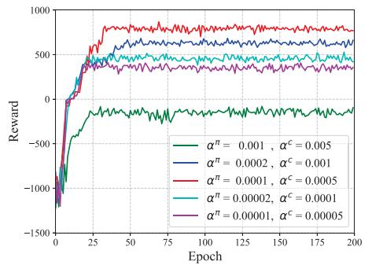

<details>
<summary>line</summary>

| Epoch | α^π = 0.001, α^c = 0.005 | α^π = 0.0002, α^c = 0.001 | α^π = 0.0001, α^c = 0.0005 | α^π = 0.00002, α^c = 0.001 | α^π = 0.00001, α^c = 0.0005 |
|-------|--------------------------|---------------------------|----------------------------|-----------------------------|------------------------------|
| 0     | -1200                    | -1200                     | -1200                      | -1200                       | -1200                        |
| 25    | -300                     | 400                       | 600                        | 500                         | 450                          |
| 50    | -250                     | 550                       | 750                        | 650                         | 600                          |
| 75    | -250                     | 650                       | 850                        | 750                         | 700                          |
| 100   | -250                     | 750                       | 950                        | 850                         | 800                          |
| 125   | -250                     | 850                       | 1050                       | 950                         | 900                          |
| 150   | -250                     | 950                       | 1150                       | 1050                        | 1000                         |
| 175   | -250                     | 1050                      | 1250                       | 1150                        | 1100                         |
| 200   | -250                     | 1150                      | 1350                       | 1250                        | 1200                         |
</details>

(a)

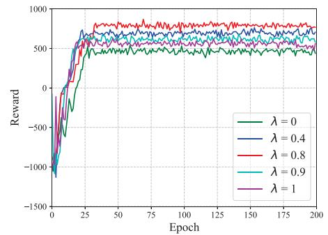

<details>
<summary>line</summary>

| Epoch | λ = 0   | λ = 0.4 | λ = 0.8 | λ = 0.9 | λ = 1   |
|-------|---------|---------|---------|---------|---------|
| 0     | -1200   | -1200   | -1200   | -1200   | -1200   |
| 25    | 500     | 600     | 700     | 650     | 600     |
| 50    | 600     | 700     | 800     | 750     | 700     |
| 75    | 650     | 750     | 850     | 800     | 750     |
| 100   | 700     | 800     | 900     | 850     | 800     |
| 125   | 750     | 850     | 950     | 900     | 850     |
| 150   | 800     | 900     | 1000    | 950     | 900     |
| 175   | 850     | 950     | 1050    | 1000    | 950     |
| 200   | 900     | 1000    | 1100    | 1050    | 1000    |
</details>

(b)

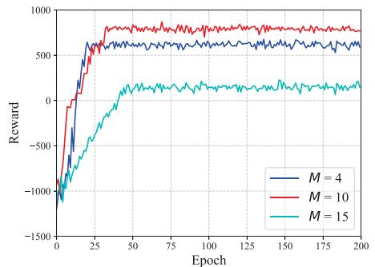

<details>
<summary>line</summary>

| Epoch | M = 4 | M = 10 | M = 15 |
|-------|-------|--------|--------|
| 0     | -1000 | -1000  | -1000  |
| 25    | 600   | 700    | -200   |
| 50    | 650   | 800    | 100    |
| 75    | 650   | 800    | 150    |
| 100   | 650   | 800    | 150    |
| 125   | 650   | 800    | 150    |
| 150   | 650   | 800    | 150    |
| 175   | 650   | 800    | 150    |
| 200   | 650   | 800    | 150    |
</details>

（c）

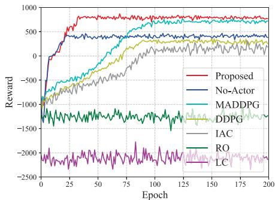

<details>
<summary>line</summary>

| Epoch | Proposed | No-Actor | MADDPG | DDPG | IAC | RO | LC |
|-------|----------|----------|--------|------|-----|----|----|
| 0     | -1000    | -1000    | -1000  | -1000| -1000 | -1500 | -2000 |
| 25    | 500      | 400      | 300    | 200  | 100   | -1500 | -2000 |
| 50    | 750      | 500      | 400    | 300  | 200   | -1500 | -2000 |
| 75    | 850      | 600      | 500    | 400  | 300   | -1500 | -2000 |
| 100   | 900      | 700      | 600    | 500  | 400   | -1500 | -2000 |
| 125   | 950      | 750      | 650    | 550  | 450   | -1500 | -2000 |
| 150   | 950      | 750      | 650    | 550  | 450   | -1500 | -2000 |
| 175   | 950      | 750      | 650    | 550  | 450   | -1500 | -2000 |
| 200   | 950      | 750      | 650    | 550  | 450   | -1500 | -2000 |
</details>

Fig. 6. Convergence performance comparison. (a) Under different learning rates. (b) Under different return weights. (c) Under different discretizations. (d) Under different algorithms.

The convergence performance under different learning rates is shown in Fig. 6(a). It can be seen that the training effect is not good when $\alpha ^ { \pi } = 0 . 0 0 1$ . At this point, the strategy can =be approximately regarded as a greedy algorithm. As α is decreased, the training process is gradually satisfactory. And when $\alpha ^ { \pi } = 0 . 0 0 0 1$ , the stability and reward of the converged =algorithm are optimal. Whereas at $\alpha ^ { \pi } = 0 . 0 0 0 2 \mathrm { o r } 0 . 0 0 0 0 2$ , the =results fall into a local optimum. At this time, the curve fluctuates with increasing epochs, but the sub-optimal solution cannot be avoided. When $\alpha ^ { \pi }$ is further set to 0.00001, the reward decreases again and the growth rate of the curve is slow. Thus, it can be concluded that if $\alpha$ is too large, the result will soon saturate at a worse value. Within a reasonable range, the reward can increase faster with the decrease of $\alpha _ { \mathrm { { : } } }$ , but fluctuate more. Conversely, if α is too small, although the result deviation is reduced, the network is updated more slowly and more epochs are needed for training. Therefore, α should be chosen properly, neither too large nor too small. The most suitable learning rate for our algorithm could be $\alpha ^ { \pi } = 0 . 0 0 0 1 , \alpha ^ { c } = 0 . 0 0 0 5$ .

= =In the previous section, we calculate the target Q-value based on the TD λ in (17). Then the weight coefficient λ of eligibility ( )trace formed by combining multiple different n-step returns can also affect the learning process of the proposed algorithm. When $\lambda = 0$ , the process will degenerate into TD(0) of a one-step =update. When $\lambda = 1$ , the update will take into account the return =of all steps using a Monte Carlo-like method. When $0 < \lambda < 1$ , it means that the history state with more steps in the eligibility trace will be affected by the TD-error. Specifically, the convergence performance of the proposed algorithm under different return weights is shown in Fig. 6(b). It can be observed that as λ changes, the corresponding results have slight differences. Among them, when $\lambda = 0$ or 1, the learned strategy is worse. =This is due to the lack of reliability assignments to all events in the eligibility trace for TD(0). Whereas the eligibility trace of TD(1) requires the possibility of traversing all states, which also leads to poor performance. Comparing all cases, the convergence performance of our algorithm is the best when $\lambda = 0 . 8$ . This =illustrates that observing the contribution of eligibility traces to each state with appropriate weights is crucial when learning the policy.

Furthermore, as described before, this paper discretizes the action space of POMDP. As illustrated in Table III, in the COMA-based algorithm, the output dimensions of both actor and critic networks are the shape of the action $\left| a _ { t } ^ { u } \right|$ , which can also be specifically expressed as $| a _ { t } ^ { u } | = | x _ { t } ^ { u } | \times | f _ { t } ^ { u } | = ( M +$ $1 ) ^ { 2 }$ = = ( +. Therefore, the degree of discretization M will also affect )the convergence process of the algorithm. The convergence performance under different discretization degrees is shown in Fig. 6(c). It can be inferred that when $M = 4 .$ , the proposed =algorithm has a faster convergence speed and is stable with fewer epochs. But the final result falls into a local optimum. When $M = 1 5$ , due to the exponential growth of the action space =dimension, even if the algorithm spends more exploration steps before reaching stability, it is very confusing to learn the optimal strategy in a huge space. This leads to very inferior results at this time. Compared with the above two, the trained strategy when M  10 can achieve a compromise between learning speed and =model complexity. Therefore, it is worth noting that coarse discretization loses a large amount of behavioral information, and too fine discretization increases the dimensionality of the action space. The optimal degree of discretization in our algorithm should be M  10.

TABLE IV RUNNING TIME 

<table><tr><td>Algorithm</td><td>Training stage</td><td>Testing stage</td></tr><tr><td>Proposed</td><td>34256.73s</td><td>51.06s</td></tr><tr><td>No-Actor</td><td>32785.42s</td><td>50.32s</td></tr><tr><td>MADDPG</td><td>36298.81s</td><td>51.46s</td></tr><tr><td>DDPG</td><td>26730.65s</td><td>49.13s</td></tr><tr><td>IAC</td><td>38873.54s</td><td>52.87s</td></tr><tr><td>RO</td><td>/</td><td>20.05s</td></tr><tr><td>LC</td><td>/</td><td>18.24s</td></tr></table>

=Finally, the convergence performance under different algorithms is shown in Fig. 6(d). It can be observed that each strategy achieves a stable computation offloading process in the final epoch. Among them, the proposed scheme obtains the optimal policy and maximizes the reward, which demonstrates the effectiveness of the COMA-based algorithm. The network structure of No-Actor cannot explore long-term sequence features, so the algorithm only finds suboptimal solutions. Each agent of MADDPG solves in a huge joint space with no shared parameters, so their convergence speed is slower. This may require enhancing the training parameters and network structure for the basic MADDPG to improve performance. When the method is degenerated from CTDE to CTCE, this requires an agent to centrally output strategies for all satellites (instead of multiple agents cooperatively outputting their own strategies), which increases the difficulty of exploration in algorithm learning. Therefore, the performance of DDPG is further weakened compared to MADDPG. While DTDE lacks information sharing during training, it is difficult for IAC to learn coordinated strategies that depend on interactions between agents. Thus the jitter of IAC with poorer performance is also more severe. Moreover, there is no reward credit assignment in these baselines, thus their final performance is slightly worse than our algorithm. In addition, RO and LC are not affected by the training process, and the performance of strategies are always not good. LC has lower rewards due to the lack of ISL collaborative computing causing most tasks to be completed overtime at the primary satellite.

Table IV lists the running times of various algorithms. It can be seen that the training time is related to the computational complexity associated with the neural network structure. More parameters introduce more calculations and thus require more learning time. Furthermore, it is obvious that the training time for distributed strategies of multi-agent algorithms is longer than that of centralized strategies of single-agent algorithms. But the time they spent in the testing phase is not much different, which means the feasibility of the intelligent DRL method in actual deployment.

# C. Performance Analysis

The performance of computation offloading strategies in the dynamic SMEC environment can be evaluated by changing the computing constraints on satellite side, the delay requirements on mission side and the topology transformation of entire constellation. Therefore, in this part, we change the satellite capabilities, task attributes and constellation situations to evaluate the adaptability of the algorithms under different environmental variables. The performance of the learned strategies is analyzed using the following comparison experiments.

First, we compare the variation of offloading strategies when satellites have different computing capabilities F as shown in Fig. 7. Generally, satellite computing capacity is severely constrained due to on-board space limitations. However, sufficient computing resources are required to meet the requirements of more complex space missions. And more expended computing power also brings more energy expenses to SMEC. Therefore, an energy-efficient resource allocation strategy is essential to ensure task success. Combining Fig. 7(b) and (c), the average energy consumption and task success rate of each algorithm both grow as F increases. Among them, the proposed method with an optimal policy minimizes energy consumption while ensuring the successful completion of the task. Whereas the performance of MADDPG, No-Actor, DDPG and IAC are in descending order. As shown in Fig. 7(a) and (c), when F is small, the penalty for unsuccessful task completion is very large because the task cannot be processed within the specified time. As F grows, more tasks are successfully executed causing the reward to increase. However, when F is further increased to a certain extent, the demand for F is essentially satiated, at which point the task success rate does not grow significantly. Instead, a heavier computational energy overhead is brought and increases exponentially in Fig. 7(b), which leads to a decrease in the rewards of algorithms. In addition, the success rate of local computing tasks at this time is exactly higher than that of offloading execution in other strategies, and is just close to the result of the proposed algorithm. This illustrates the superiority of computation offloading strategies under the resource-constrained SMEC environment.

Next, we compare the scalability of all offloading strategies in the face of different service demands by varying the task maximum tolerance delay T maxt . This variable indicates the urgency with which tasks are processed. Tasks with higher real-time requirements may require more cooperating nodes and allocated computing resources. As shown in Fig. 8, each algorithm performs better as T maxt increases. This is due to the relaxation of the constraints, the energy burden brought by the task computation is reduced in Fig. 8(b), and task success rates and rewards are correspondingly improved. However, compared with benchmark algorithms, the proposed method still has more excellent flexibility. When dealing with latency-sensitive tasks, the COMA-based approach achieves a greater task success rate to maximize the reward. At this time, MADDPG, No-Actor, DDPG and IAC with suboptimal strategies allocate more computing resources to the task, resulting in increased energy consumption. When T maxt is further prolonged, tasks can have more sufficient time to transmit or compute. At this time, more tasks are not being processed overtime or being deployed unsuccessfully. Even though RO and LC are not improved, Fig. 8(c) indicates that their task success rates are also rising. Thus Fig. 8(a) shows that the rewards of all algorithms are steadily increasing. When $T _ { t } ^ { \mathrm { m a x } }$ is sufficient, most tasks can be performed richly. Therefore, the energy consumption and task success rate of each algorithm eventually stabilize. This demonstrates the flexibility of the proposed offloading solution in the dynamic SMEC with ever-changing space missions.

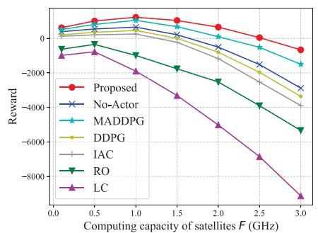

<details>
<summary>line</summary>

| Computing capacity of satellites F (GHz) | Proposed | No-Actor | MADDPG | DDPG | IAC | RO | LC |
| --- | --- | --- | --- | --- | --- | --- | --- |
| 0.0 | 0 | 0 | 0 | 0 | 0 | 0 | 0 |
| 0.5 | 1000 | 500 | 500 | 500 | 500 | -500 | -1000 |
| 1.0 | 2000 | 1000 | 1000 | 1000 | 1000 | -1000 | -2000 |
| 1.5 | 1500 | 500 | 500 | 500 | 500 | -1500 | -3000 |
| 2.0 | 1000 | 0 | 0 | 0 | 0 | -2500 | -4500 |
| 2.5 | 500 | -500 | -500 | -500 | -500 | -4000 | -6500 |
| 3.0 | 0 | -1500 | -1500 | -1500 | -1500 | -5500 | -8500 |
</details>

(a)

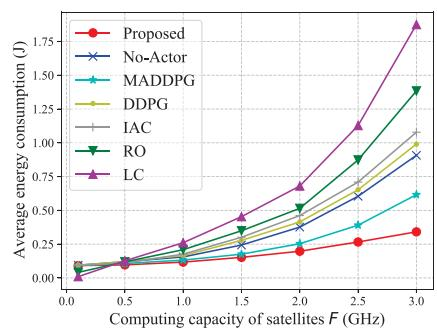

<details>
<summary>line</summary>

| Computing capacity of satellites F (GHz) | Proposed | No-Actor | MADDPG | DDPG | IAC | RO | LC |
| --- | --- | --- | --- | --- | --- | --- | --- |
| 0.0 | 0.00 | 0.00 | 0.00 | 0.00 | 0.00 | 0.00 | 0.00 |
| 0.5 | 0.10 | 0.10 | 0.10 | 0.10 | 0.10 | 0.10 | 0.10 |
| 1.0 | 0.20 | 0.20 | 0.20 | 0.20 | 0.20 | 0.20 | 0.25 |
| 1.5 | 0.30 | 0.35 | 0.35 | 0.40 | 0.45 | 0.45 | 0.50 |
| 2.0 | 0.40 | 0.50 | 0.55 | 0.65 | 0.75 | 0.75 | 0.75 |
| 2.5 | 0.50 | 0.65 | 0.75 | 0.90 | 1.10 | 1.15 | 1.25 |
| 3.0 | 0.60 | 1.00 | 1.10 | 1.45 | 1.65 | 1.75 | 1.85 |
</details>

(b)

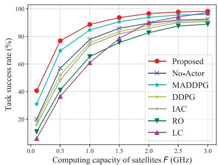

<details>
<summary>line</summary>

| Computing capacity of satellites F (GHz) | Proposed | No-Actor | MADDPG | DDPG | IAC | RO | LC |
| --- | --- | --- | --- | --- | --- | --- | --- |
| 0.0 | 40 | 20 | 30 | 20 | 20 | 10 | 5 |
| 0.5 | 78 | 60 | 70 | 55 | 50 | 40 | 35 |
| 1.0 | 90 | 75 | 85 | 70 | 65 | 65 | 60 |
| 1.5 | 95 | 85 | 90 | 80 | 75 | 75 | 75 |
| 2.0 | 98 | 90 | 95 | 85 | 80 | 85 | 85 |
| 2.5 | 99 | 95 | 98 | 90 | 85 | 90 | 90 |
| 3.0 | 100 | 98 | 100 | 95 | 90 | 95 | 95 |
</details>

（c）

Fig. 7. Performance of each algorithm under different satellite computing resources. (a) Reward. (b) Average energy consumption. (c) Task success rate.   
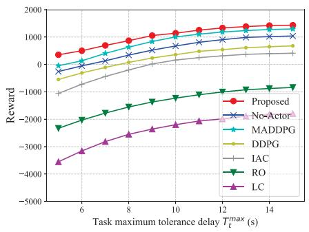

<details>
<summary>line</summary>

| Task maximum tolerance delay T_max_t (s) | Proposed | No-Actor | MADDPG | DDPG | IAC | RO | LC |
| --- | --- | --- | --- | --- | --- | --- | --- |
| 6 | 500 | 300 | 200 | -500 | -1000 | -2500 | -3500 |
| 8 | 750 | 500 | 400 | -250 | -750 | -2000 | -2750 |
| 10 | 1000 | 750 | 600 | 0 | -500 | -1500 | -2250 |
| 12 | 1250 | 1000 | 800 | 250 | -250 | -1000 | -1750 |
| 14 | 1500 | 1250 | 1000 | 500 | 0 | -750 | -1500 |
</details>

(a)

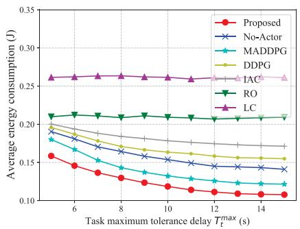

<details>
<summary>line</summary>

| Task maximum tolerance delay T_max_t (s) | Proposed | No-Actor | MADDPG | DDPG | IAC | RO | LC |
| --- | --- | --- | --- | --- | --- | --- | --- |
| 6 | 0.15 | 0.18 | 0.17 | 0.19 | 0.20 | 0.21 | 0.26 |
| 8 | 0.13 | 0.16 | 0.15 | 0.18 | 0.19 | 0.21 | 0.26 |
| 10 | 0.12 | 0.15 | 0.14 | 0.17 | 0.18 | 0.21 | 0.26 |
| 12 | 0.11 | 0.14 | 0.13 | 0.16 | 0.17 | 0.21 | 0.26 |
| 14 | 0.10 | 0.13 | 0.12 | 0.15 | 0.16 | 0.21 | 0.26 |
</details>

(b)

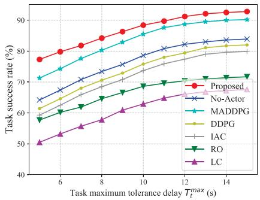

<details>
<summary>line</summary>

| Task maximum tolerance delay T_max_t (s) | Proposed | No-Actor | MADDPG | DDPG | IAC | RO | LC |
| --- | --- | --- | --- | --- | --- | --- | --- |
| 6 | 78 | 65 | 72 | 63 | 60 | 58 | 50 |
| 8 | 83 | 72 | 78 | 68 | 65 | 62 | 55 |
| 10 | 87 | 78 | 84 | 73 | 70 | 68 | 60 |
| 12 | 90 | 83 | 88 | 78 | 75 | 72 | 65 |
| 14 | 92 | 85 | 90 | 81 | 78 | 74 | 68 |
</details>

(c）

Fig. 8. Performance of each algorithm under different task maximum tolerance delays. (a) Reward. (b) Average energy consumption. (c) Task success rate.   
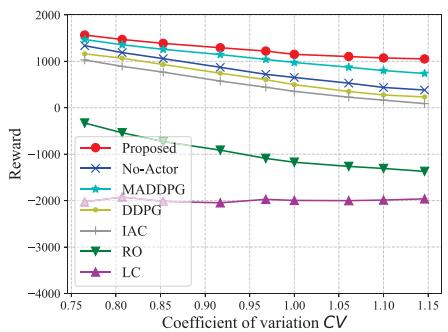  
(a)

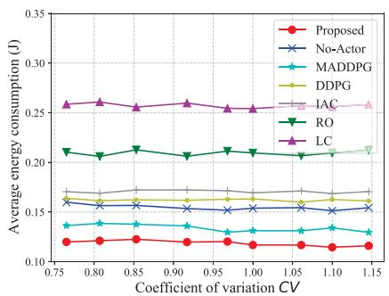

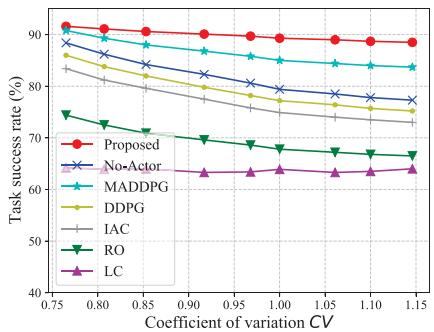  
(c)   
Fig. 9. Performance of each algorithm under different coefficients of variation. (a) Reward. (b) Average energy consumption. (c) Task success rate.

Finally, the adaptability of algorithms on large timescales under different orbital positions also needs to be compared. Aiming at the satellite trajectory datasets obtained using STK, we use the coefficient of variation CV of the inter-satellite distance to objectively describe the absolute value of the data dispersion. Specifically, $C V$ of $\mathcal { D } _ { t }$ is defined as the ratio of the standard deviation to the mean: $C V = S D ( \mathcal { D } _ { t } ) / M E A N ( \mathcal { D } _ { t } )$ . = ( ) ( )When satellites are near the equator, the smaller CV means that the variation of $\mathcal { D } _ { t }$ is lower, which implies that the visibility between satellites is more stable. And when satellites pass the poles, the larger CV means that $\mathcal { D } _ { t }$ has a higher degree of variation, which indirectly demonstrates that the variation of inter-satellite visibility is more fluctuating.

Therefore, below we compare the performance of each strategy by changing the SMEC situation under different CV s, and the corresponding results are shown in Fig. 9. First, we observe from Fig. 9(b) that with the change of CV , the average energy consumption of tasks does not fluctuate significantly. This indicates that changes in CV do not affect the total computing resources allocated by available satellites to the task. Moreover, the performance of LC is independent of ISL communication, so its results are also not influenced by CV . When CV is small, the topology of the SMEC environment is relatively stable, and the reward difference of each algorithm is not obvious at this time. However, as CV increases, ISLs may be established more intermittently. At this point, as shown in Fig. 9(c), the task success rate of each algorithm is reduced, which also leads to the reduction of system rewards. Among them, the result in Fig. 9(a) concludes that the proposed method is more adaptable to changing ISL connectivity, and has the least degradation. MADDPG, No-Actor, DDPG and IAC strategies are inferior due to lack of ability to explore the characteristics of long-term dynamic environments.

# VI. CONCLUSION

In this paper, each satellite makes autonomous collaborative computing decisions as an independent agent. Facing the strong spatio-temporal constraints and random service demands in the distributed SMEC network, we provide a COMA-based collaborative task offloading optimization method, which aims to make optimal energy-efficient offloading decisions and resource allocations for satellites with only local observations while ensuring task success. The proposed method adopts the AC+CTDE architecture with parameter sharing to centrally train the critic network on the cloud for calculating the advantage function based on the counterfactual baseline, and to deploy the learned actor network in each satellite agent for distributed execution in parallel, which realizes the reward credit assignment and low-complexity learning. Moreover, the long-term temporal features of SMEC are extracted by utilizing the redesigned actor with Atten-BiLSTM. In our STK-based simulated LEO constellation, experimental results demonstrate that the proposed offloading optimization method accelerates the learning speed by more than 3 times compared to the MADDPG-based strategy. Compared with the No-Actor strategy, the average energy consumption is reduced by more than 20 and the task success %rate is increased by more than 10 . Also the superiority of %CTDE over CTCE and DTDE is further confirmed by numerical analysis.

Furthermore, COMA with centralized training may still struggle to handle coordinated training of massive distributed agents in mega-constellations, and also lacks self-evolution capabilities when facing an extraordinary SMEC situation. In future work, we will further consider a federated on-board learning method for model optimization in multi-agent SMEC networks with more realistic communication models.

# REFERENCES

[1] R. Xie, Q. Tang, Q. Wang, X. Liu, F. R. Yu, and T. Huang, “Satelliteterrestrial integrated edge computing networks: Architecture, challenges, and open issues,” IEEE Netw., vol. 34, no. 3, pp. 224–231, May/Jun. 2020.   
[2] M. Casoni, C. A. Grazia, M. Klapez, N. Patriciello, A. Amditis, and E. Sdongos, “Integration of satellite and LTE for disaster recovery,” IEEE Commun. Mag., vol. 53, no. 3, pp. 47–53, Mar. 2015.   
[3] P. Barmpoutis, P. Papaioannou, K. Dimitropoulos, and N. Grammalidis, “A review on early forest fire detection systems using optical remote sensing,” Sensors, vol. 20, no. 22, Nov. 2020, Art. no. 6442.

[4] D. Vasisht, J. Shenoy, and R. Chandra, “L2D2: Low latency distributed downlink for LEO satellites,” in Proc. ACM SIGCOMM Conf., 2021, pp. 151–164.   
[5] Y. Gong, H. Yao, J. Wang, M. Li, and S. Guo, “Edge intelligence-driven joint offloading and resource allocation for future 6G industrial Internet of Things,” IEEE Trans. Netw. Sci. Eng., early access, Jan. 10, 2022, doi: 10.1109/TNSE.2022.3141728.   
[6] X. Gao, R. Liu, and A. Kaushik, “Virtual network function placement in satellite edge computing with a potential game approach,” IEEE Trans. Netw. Serv. Manage., vol. 19, no. 2, pp. 1243–1259, Jun. 2022.   
[7] X. Gao, R. Liu, A. Kaushik, and H. Zhang, “Dynamic resource allocation for virtual network function placement in satellite edge clouds,” IEEE Trans. Netw. Sci. Eng., vol. 9, no. 4, pp. 2252–2265, Jul./Aug. 2022.   
[8] Q. Li et al., “Service coverage for satellite edge computing,” IEEE Internet Things J., vol. 9, no. 1, pp. 695–705, Jan. 2022.   
[9] S. Fu, J. Gao, and L. Zhao, “Collaborative multi-resource allocation in terrestrial-satellite network towards 6G,” IEEE Trans. Wireless Commun., vol. 20, no. 11, pp. 7057–7071, Nov. 2021.   
[10] J. Liang, W. Liting, and D. Hao, “Summary of research on satellite cooperative transmission technology in space information network,” in Proc. IEEE Int. Conf. Inf. Sci. Parallel Distrib. Syst., 2020, pp. 56–58.   
[11] Y. Lee and J. P. Choi, “Connectivity analysis of mega-constellation satellite networks with optical inter satellite links,” IEEE Trans. Aerosp. Electron. Syst., vol. 57, no. 6, pp. 4213–4226, Dec. 2021.   
[12] H. Yoon, “Pointing system performance analysis for optical inter-satellite communication on cubesats,” Ph.D. dissertation, Massachusetts Inst. Technol., Cambridge, MA, USA, 2017.   
[13] I. Leyva-Mayorga, B. Soret, and P. Popovski, “Inter-plane inter-satellite connectivity in dense LEO constellations,” IEEE Trans. Wireless Commun., vol. 20, no. 6, pp. 3430–3443, Jun. 2021.   
[14] F. Wang, D. Jiang, S. Qi, C. Qiao, and H. Song, “Fine-grained resource management for edge computing satellite networks,” in Proc. IEEE Glob. Commun. Conf., 2019, pp. 1–6.   
[15] Z. Zhai, S. Yu, F. Zhang, and X. Chen, “An on-orbit computation offloading framework for satellite edge computing,” in Proc. IEEE/CIC Int. Conf. Commun. China, 2022, pp. 1062–1067.   
[16] H. Zhang, R. Liu, A. Kaushik, and X. Gao, “Satellite edge computing with collaborative computation offloading: An intelligent deep deterministic policy gradient approach,” IEEE Internet Things J., vol. 10, no. 10, pp. 9092–9107, May 2023.   
[17] R. Liu, M. Sheng, K.-S. Lui, X. Wang, Y. Wang, and D. Zhou, “An analytical framework for resource-limited small satellite networks,” IEEE Commun. Lett., vol. 20, no. 2, pp. 388–391, Feb. 2016.   
[18] L. Boero, R. Bruschi, F. Davoli, M. Marchese, and F. Patrone, “Satellite networking integration in the 5G ecosystem: Research trends and open challenges,” IEEE Netw., vol. 32, no. 5, pp. 9–15, Sep./Oct. 2018.   
[19] C. Araguz, E. Bou-Balust, and E. Alarcón, “Applying autonomy to distributed satellite systems: Trends, challenges, and future prospects,” Syst. Eng., vol. 21, no. 5, pp. 401–416, 2018.   
[20] S. Ji, D. Zhou, M. Sheng, and J. Li, “Mega satellite constellation system optimization: From a network control structure perspective,” IEEE Trans. Wireless Commun., vol. 21, no. 2, pp. 913–927, Feb. 2022.   
[21] C. Peng, Y. He, S. Zhao, L. Song, and B. Deng, “Integration of data center into the distributed satellite cluster networks: Challenges, techniques, and trends,” IEEE Netw., vol. 37, no. 3, pp. 52–58, May/Jun. 2023.   
[22] I. Leyva-Mayorga et al., “Satellite edge computing for real-time and veryhigh resolution earth observation,” IEEE Trans. Commun., vol. 71, no. 10, pp. 6180–6194, Oct. 2023.   
[23] J. Zhao, X. Sun, X. Ma, H. Zhang, F. R. Yu, and Y. Hu, “Online distributed optimization for energy-efficient computation offloading in air-ground integrated networks,” IEEE Trans. Veh. Technol., vol. 72, no. 4, pp. 5110–5124, Apr. 2023.   
[24] J. Zhou, D. Tian, Z. Sheng, X. Duan, and X. Shen, “Distributed task offloading optimization with queueing dynamics in multiagent mobileedge computing networks,” IEEE Internet Things J., vol. 8, no. 15, pp. 12311–12328, Aug. 2021.   
[25] K. Arulkumaran, M. P. Deisenroth, M. Brundage, and A. A. Bharath, “Deep reinforcement learning: A brief survey,” IEEE Signal Process. Mag., vol. 34, no. 6, pp. 26–38, Nov. 2017.   
[26] W. Liu, B. Li, W. Xie, Y. Dai, and Z. Fei, “Energy efficient computation offloading in aerial edge networks with multi-agent cooperation,” IEEE Trans. Wireless Commun., vol. 22, no. 9, pp. 5725–5739, Sep. 2023.   
[27] Z. Gao, L. Yang, and Y. Dai, “Large-scale computation offloading using a multi-agent reinforcement learning in heterogeneous multi-access edge computing,” IEEE Trans. Mob. Comput., vol. 22, no. 6, pp. 3425–3443, Jun. 2023.

[28] Z. Qin, H. Yao, T. Mai, D. Wu, N. Zhang, and S. Guo, “Multi-agent reinforcement learning aided computation offloading in aerial computing for the Internet-of-Things,” IEEE Trans. Serv. Comput., vol. 16, no. 3, pp. 1976–1986, May/Jun. 2023.   
[29] Y. Lyu, Z. Liu, R. Fan, C. Zhan, H. Hu, and J. An, “Optimal computation offloading in collaborative LEO-IoT enabled MEC: A multi-agent deep reinforcement learning approach,” IEEE Trans. Green Commun. Netw., vol. 7, no. 2, pp. 996–1011, Jun. 2023.   
[30] Y. Li, L. Liang, J. Fu, and J. Wang, “Multiagent reinforcement learning for task offloading of space/aerial-assisted edge computing,” Secur. Commun. Netw., vol. 2022, 2022.   
[31] L. Jia, Y. Zhang, J. Yu, and X. Wang, “Design of mega-constellations for global uniform coverage with inter-satellite links,” Aerosp., vol. 9, no. 5, Apr. 2022, Art. no. 234.   
[32] Y. Hua, Z. Zhao, R. Li, X. Chen, Z. Liu, and H. Zhang, “Deep learning with long short-term memory for time series prediction,” IEEE Commun. Mag., vol. 57, no. 6, pp. 114–119, Jun. 2019.   
[33] J. Foerster, G. Farquhar, T. Afouras, N. Nardelli, and S. Whiteson, “Counterfactual multi-agent policy gradients,” in Proc. AAAI Conf. Artif. Intell., 2018.   
[34] X. Qi, B. Zhang, Z. Qiu, and L. Zheng, “Using inter-mesh links to reduce end-to-end delay in walker delta constellations,” IEEE Commun. Lett., vol. 25, no. 9, pp. 3070–3074, Sep. 2021.   
[35] Y. Su, Y. Liu, Y. Zhou, J. Yuan, H. Cao, and J. Shi, “Broadband LEO satellite communications: Architectures and key technologies,” IEEE Wireless Commun., vol. 26, no. 2, pp. 55–61, Apr. 2019.   
[36] Q. Tang, Z. Fei, B. Li, and Z. Han, “Computation offloading in LEO satellite networks with hybrid cloud and edge computing,” IEEE Internet Things J., vol. 8, no. 11, pp. 9164–9176, Jun. 2021.   
[37] X. Gao, R. Liu, A. Kaushik, J. Thompson, H. Zhang, and Y. Ma, “Dynamic resource management for neighbor-based VNF placement in decentralized satellite networks,” in Proc. IEEE 1st Int. Conf. 6G Netw., 2022, pp. 1–5.   
[38] T. Li et al., “Applications of multi-agent reinforcement learning in future internet: A comprehensive survey,” IEEE Commun. Surveys Tuts., vol. 24, no. 2, pp. 1240–1279, Secondquarter 2022.   
[39] H. Abbasimehr and R. Paki, “Improving time series forecasting using LSTM and attention models,” J. Ambient Intell. Humanized Comput., vol. 13, pp. 673–691, 2022.   
[40] H. Sak, A. W. Senior, and F. Beaufays, “Long short-term memory recurrent neural network architectures for large scale acoustic modeling,” in Proc. INTERSPEECH, 2014, pp. 338–342.   
[41] R. S. Sutton, D. McAllester, S. Singh, and Y. Mansour, “Policy gradient methods for reinforcement learning with function approximation,” in Proc. 12th Int. Conf. Neural Inf. Process. Syst., 1999, pp. 1057–1063.   
[42] V. R. Konda and J. N. Tsitsiklis, “On actor-critic algorithms,” SIAM J. Control Optim., vol. 42, no. 4, pp. 1143–1166, 2003.   
[43] X. Jia, T. Lv, F. He, and H. Huang, “Collaborative data downloading by using inter-satellite links in LEO satellite networks,” IEEE Trans. Wireless Commun., vol. 16, no. 3, pp. 1523–1532, Mar. 2017.


<details>
<summary>natural_image</summary>

Portrait photo of a woman in formal attire (no text or symbols visible)
</details>

Hangyu Zhang received the B.S. degree from the School of Communication Engineering, Jilin University, Changchun, China, in 2019. She is currently working toward the Ph.D. degree with the School of Electronic and Information Engineering, Beihang University, Beijing, China. Her research interests include the edge intelligence, satellite edge computing, and resource allocation.


<details>
<summary>natural_image</summary>

Portrait of a man wearing glasses and a suit (no text or symbols visible)
</details>

Hongbo Zhao (Senior Member, IEEE) received the Ph.D. degree in communication and information systems from Beihang University, Beijing, China, in 2012. He is currently a Professor with the Department of Electronic and Information Engineering, Beihang University. His research focuses on low orbit satellite and non-terrestrial communication networks.


<details>
<summary>natural_image</summary>

Portrait photo of a man in formal attire (no text or symbols visible)
</details>

Rongke Liu (Senior Member, IEEE) received the B.S. and Ph.D. degrees from Beihang University, Beijing, China, in 1996 and 2002, respectively. He was a Visiting Professor with the Florida Institution of Technology, Melbourne, FL, USA, in 2006, The University of Tokyo, Tokyo, Japan, in 2015, and The University of Edinburgh, Edinburgh, U.K., in 2018, respectively. He is currently a Full Professor with the School of Electronic and Information Engineering, Beihang University. He received the support of the New Century Excellent Talents Program from the   
Minister of Education, China. He has attended many special programs, such as China Terrestrial Digital Broadcast Standard. He has authored or coauthored more than 100 papers in international conferences and journals. He has been granted more than 20 patents. His research interest include wireless communication and space information network.


<details>
<summary>natural_image</summary>

Portrait of a man in a black shirt against a plain background (no text or symbols visible)
</details>

Aryan Kaushik (Member, IEEE) is currently an Assistant Professor with the University of Sussex, Brighton, U.K. He was with University College London, London, U.K., from 2020 to 2021, The University of Edinburgh, Edinburgh, U.K., from 2015 to 2019, and Hong Kong University of Science and Technology, Hong Kong, from 2014 to 2015. He has held visiting appointments with Imperial College London, London, U.K., University of Luxembourg, Esch-sur-Alzette, Luxembourg, Beihang University, Beijing, China, and Athena RC, Greece. His research   
interests include 6G wireless communications, signal processing, integrated sensing and communications, intelligent metasurfaces, non-terrestrial networks, edge computing, and AI. He is currently an Associate Editor for the IEEE OPEN JOURNAL OF THE COMMUNICATIONS SOCIETY, IEEE COMMUNICATIONS LETTERS, IET Signal Processing, and IET Networks, and a Lead Guest Editor of several Special Issues at IEEE and IET journals, such as IEEE Internet of Things Magazine, IEEE OPEN JOURNAL OF THE COMMUNICATIONS SOCIETY, and IET Signal Processing. He is a Track Chair of IEEE ICC 2024 and IEEE WCNC 2023, Tutorial/Invited Speaker at several IEEE conferences and workshops such as IEEE WCNC 2023 conference and workshop, WiSPNET 2023, Publications Chair at the IEEE ICMLCN 2024, General Chair for workshops at IEEE WCNC 2023, IEEE PIMRC 2022 and IEEE SECON 2022, TPC Member at IEEE ICC 2021-23, and Conference Champion at IEEE PIMRC 2020.


<details>
<summary>natural_image</summary>

Portrait of a man wearing glasses, suit, and red tie (no text or symbols visible)
</details>

Xiangqiang Gao received the B.Sc. degree from the School of Electronic Engineering from Xidian University, Xi’an, China, in 2012, the M.Sc. degree from Xi’an Microelectronics Technology Institute, Xi’an, in 2015, and the Ph.D. degree from the School of Electronic and Information Engineering from Beihang University, Beijing, China, in 2022. He is currently a Postdoctoral Fellow with the China Academy of Space Technology (Xi’an), Xi’an, and also with the School of Electronic and Information Engineering, Beihang University. His research interests include   
cloud computing, satellite edge computing, network function virtualization, and resource allocation.


<details>
<summary>natural_image</summary>

Portrait photo of a man in formal attire (no text or symbols visible)
</details>

Shenzhan Xu received the B.Sc. degree in 2021 from the School of Electronic and Information Engineering from Beihang University, Beijing, China, where he is currently working toward the Ph.D. degree with the School of Electronic and Information Engineering. His research focuses on air-space-ground integrated information network.