# Communication-Pipelined Split Federated Learning for Foundation Model Fine-Tuning in UAV Networks

Zizhen Zhou, Ying-Chang Liang, Yanyu Cheng, and Wei Yang Bryan Lim

Abstract—Deploying foundation models (FMs) on uncrewed aerial vehicles (UAVs) promises broad “low-altitude economy” applications. Split federated learning (SFL)-based fine-tuning leverages distributed data while keeping raw data local and reduces client-side burden by partitioning the model between client and server. However, the per-round training latency is dominated by stragglers. Training paradigms featuring parallel gradient transmission (GT) allocate dedicated portions of downlink communication resources to each client. They may leave resources idle and suffer from prolonged GT latency, especially in UAV networks, where the communication latency typically far exceeds the computation latency. To address this, we propose a sequential GT paradigm, where the server dedicates all downlink resources for the current GT. We further propose communication-pipelined SFL (CPSFL), characterized by downlink GT priority scheduling and intra-round asynchronous training. We investigate CPSFLbased LoRA fine-tuning of FMs in UAV networks and formulate an optimization problem to minimize a weighted sum of perround training latency and worst-case client energy consumption by optimizing the split point selection (SPS) and the computing and communication resource allocation (CCRA) (the uplink bandwidth allocation and the server computing frequency allocation). To solve this problem, we develop an attention-based deep reinforcement learning (DRL) framework, where the base station agent decides the split point and the CCRA in each round by leveraging previous round information, including UAV trajectories. Simulation results show that the proposed DRLbased CPSFL scheme outperforms the parallel GT baselines, the ablation variants, and the heuristic CCRA scheme while approaching the best fixed-SPS scheme.

Index Terms—Split federated learning, UAV network, resource allocation, reinforcement learning

## I. INTRODUCTION

Uncrewed aerial vehicles (UAVs) are widely applied in lowaltitude economic activities such as natural resource management, power facility inspection, and public security patrol, owing to their flexible deployment and controllable mobility [1]. During missions, UAVs collect large volumes of sensory data (e.g., images and videos), which can be leveraged to adapt foundation models (FMs) to diverse downstream tasks [1]. Fine-tuning FMs, rather than training from scratch, substantially reduces the required data and computation [2].

Centralized fine-tuning in a data center after the UAVs land is a straightforward approach, but it suffers from some limitations: (i) bandwidth-constrained backhaul links from the landing site to the data center; (ii) privacy or regulatory concerns with sensitive data; and (iii) the need for nearreal-time adaptation to dynamic environments (e.g., weather, lighting). These challenges motivate edge-side, ongoing FM adaptation during missions. Federated learning (FL) offers a promising solution, enabling collaborative model improvement while avoiding raw data transmission: clients train locally and upload only model parameters to a server for aggregation [3], [4]. Nevertheless, full-parameter fine-tuning (FPFT) of an entire FM is often impractical on UAVs with limited memory, computing capacity, and energy resources.

Low-rank adaptation (LoRA) [5], a prominent parameterefficient fine-tuning (PEFT) method, greatly reduces the number of trainable parameters (TPs) while achieving accuracy comparable to FPFT. LoRA is thus attractive for FL in UAV networks because it (i) reduces memory usage by eliminating the need to store optimizer states for frozen parameters and (ii) reduces communication overhead, as UAV clients only need to transmit a small number of TPs for federated aggregation. However, even with LoRA, hosting and updating an entire FM on resource-constrained UAVs can still be challenging.

Split federated learning (SFL) further alleviates the clientside burden by splitting the FM into a client-side model and a server-side model, while still enabling parallel client training [6]. However, due to synchronous federated aggregation, the training latency in the SFL is determined by the slowest client, commonly referred to as the “straggler” [7]. In UAV networks, the straggler issue is aggravated by the heterogeneous computing and communication capabilities, mobility, and limited energy of UAVs [8]. Split point selection (SPS) significantly influences both training latency and client-side energy consumption, as it determines the computational load on both the client and server, as well as the communication overhead [4], [7]–[9]. Efficient utilization of server-side computing and communication resources is also critical in mitigating the straggler problem [7]–[9].

TABLE I: Comparison of server-side computing and communication resource utilization paradigms
<table><tr><td>Paradigms</td><td>Server-side computing</td><td>Downlink gradient transmission</td><td>Related studies</td></tr><tr><td>SFL-PP</td><td>Parallel</td><td>Parallel</td><td>[10]-[25]</td></tr><tr><td>SFL-SP</td><td>Sequential</td><td>Parallel</td><td>[26]-[34] and PipeSFL [37]</td></tr><tr><td>SFL-PS</td><td>Parallel</td><td>Sequential</td><td>CPSFL (ours)</td></tr></table>

## A. Related Works and Challenges

Recently, SPS and communication-computing resource allocation (CCRA) for SFL in wireless networks have received significant attention [10]–[36]. To mitigate stragglers, existing works explore various strategies, including: (i) individual SPS for each client [10]–[17], [21]–[25], [29]–[32]; (ii) client grouping [18], [26]; (iii) inter-round asynchronous training [11], [15]; (iv) parallel split learning without client-side model aggregation [27], [28]; and (iv) smashed data compression [19], [20]. Moreover, SFL for LoRA-based fine-tuning in wireless networks has been studied in [20]–[22], [32], [33], considering aspects such as server energy consumption [21], client storage constraints [20], [22], privacy preservation [22], LoRA rank optimization [33]. However, they may incur long per-round latency due to inefficient utilization of downlink communication resources. Specifically, we analyze as follows.

We classify SFL into three types based on whether the server can compute tasks for different clients in parallel and whether it can transmit gradients to different clients simultaneously over the downlink. Table I summarizes these paradigms, referred to as SFL-PP, SFL-SP, and SFL-PS.

SFL-PP with full parallelism: In SFL-PP, all steps of different clients are executed in parallel. Specifically, the server allocates a fixed portion of the shared resources, including its computing frequency, the bandwidth for downlink gradient transmission (GT), and corresponding transmit power, to each client and keeps this allocation unchanged in one training round. SFL-PP is widely adopted in existing works [10]–[25] due to its analytical tractability: the per-round training latency equals the maximum per-round latency among all clients. However, idle resources allocated for one client cannot be utilized by the ongoing computations or downlink GT of other clients, which may increase the per-round latency.

SFL-SP with sequential server-side computing: SFL-SP uses all computing resources for the current computing task and decides the scheduling order of the client tasks. We refer to the most widely adopted form as vanilla SFL-SP [26]–[31], [33], which exhibits two synchronizations per local iteration: (i) the server starts computing only after receiving the smashed data from all clients, and (ii) it starts GT only after completing the computing tasks of all clients. Thus, the vanilla SFL-SP is vulnerable to the straggler issue. To mitigate this, the pipelining is introduced to overlap the communication latency and the client computing latency with the server computing latency as much as possible [32], [37]. In [32], the server prioritizes tasks from clients with longer backward propagation (BP) times. In [37], PipeSFL is proposed to enable finer-grained pipelined computing scheduling via server-side computing priority scheduling and intra-round asynchronous training. Nevertheless, in wireless networks such as UAV networks, where the computing latency is much smaller than the communication latency, the performance gain offered by PipeSFL may be limited.

SFL-PS with sequential downlink GT: Different from SFL-PP and SFL-SP, the server in SFL-PS uses all downlink resources for the current GT and decides the scheduling order across clients. By reducing the GT latency and allowing clients to immediately proceed to subsequent steps upon receiving gradients, SFL-PS has the potential to reduce the per-round latency of SFL in wireless networks. Notably, SFL-PS has been rarely explored in existing studies.

In addition to the straggler issue caused by the heterogeneity of UAV clients, their mobility introduces another major challenge. The SFL with mobile clients, such as vehicles, UAVs, and satellites, has been studied in [23]–[25], [31], [35]. Nevertheless, these works oversimplify the channel variations caused by the moving clients: they either assume the channel remains unchanged within a training round [25], [31], [35] or approximate communication rates using time-averaged values over the coverage period [23], [24]. Given that a single training round often exceeds ten seconds [24], [31], a finergrained latency analysis is essential. Building on this, the historical trajectory data can be leveraged to infer future mobility patterns and enable proactive resource management. To handle the environment with uncertain UAV trajectory and the complexity of the optimization problem, deep reinforcement learning (DRL) techniques are promising for decision-making in SFL scenarios [12], [23], [24], [36].

## B. Main Contributions

In summary, existing SFL training paradigms underutilize downlink communication resources, and existing SFL resource allocation studies inadequately address mobile clients, particularly lacking slot-level channel modeling and trajectory-aware decision-making. To mitigate stragglers by improving downlink resource utilization, we focus on the SFL-PS paradigm and propose an advanced variant termed communicationpipelined SFL (CPSFL). Inspired by PipeSFL, CPSFL enhances the vanilla SFL-PS through downlink GT priority scheduling and intra-round asynchronous training. Subsequently, we propose an attention-based DRL framework for joint SPS and CCRA in CPSFL-enabled UAV networks, underpinned by the fine-grained latency analysis and the UAV trajectory features extraction. The main contributions are summarized as follows:

• CPSFL Paradigm and Theoretical Analysis: To mitigate the straggler effect, we propose CPSFL, incorporating two enhancements based on vanilla SFL-PS: (i) downlink GT priority scheduling that increases latency overlap by prioritizing clients with larger lags, and (ii) intra-round asynchronous training that reduces downlink idling by allowing GT initiation upon any client’s serverside computation completion. We also provide the optimality proofs for the scheduling policy under certain simplifying assumptions, along with the latency analysis and comparisons.

• Mobility-Aware Joint SPS and CCRA Problem Formulation: To finely capture the UAV mobility, we propose a fine-grained latency analysis under SFL-PS where the channel varies per time slot instead of per training round. Based on this, we formulate an optimization problem to minimize both the per-round training latency and the maximum per-client energy consumption by jointly optimizing SPS and CCRA (i.e., the uplink bandwidth allocation and the server computing frequency allocation).

• Attention-Enhanced DRL Solution: Decision-making at the round start is intractable due to the problem complexity and the unavailability of current-round channel knowledge. To address this, we design an attention-based DRL framework, where the base station (BS) agent leverages previous round information to determine the split point and the CCRA. An attention mechanism enables effective feature extraction from variable-length UAV trajectories.

• Performance Evaluation and Analysis: Simulation results show that CPSFL achieves lower per-round latency than SFL-PP, PipeSFL, and ablation variants in UAV networks where the communication latency is dominant. Moreover, the DRL-based CPSFL scheme outperforms its variant that does not leverage UAV trajectory and the heuristic CCRA scheme, and approaches the best fixed-SPS scheme.

## C. Organizations

The rest of this paper is organized as follows: Section II presents the system model, the slot-level latency analysis under the SFL-PS paradigm, and the optimization problem. Section III presents the proposed CPSFL. In Section IV, we propose the attention-based DRL framework to decide the SPS and the CCRA. Section V shows the simulation results. Finally, Section VI concludes this paper.

Notations: The lowercase, bold lowercase, and bold uppercase, i.e., $a , \mathbf { a } ,$ and A are scalar, vector, and matrix, respectively. $\mathbb { R } ^ { a \times b }$ denotes the space of $a \times b$ real-valued matrices. $| { \cal A } |$ denotes the cardinality of set $A . \ ( \cdot ) ^ { \top }$ denotes transpose. $\mathbb { E } \{ \cdot \}$ denotes the average operation. $\dot { \mathcal { N } } ( \mu , \sigma ^ { 2 } )$ denotes the Gaussian distribution with mean µ and variance $\sigma ^ { 2 }$ $\mathrm { c l i p } ( x , a , b )$ denotes a function that clips x to the interval $[ a , b ]$

## II. SYSTEM MODEL

As shown in Fig. 1, we consider a CPSFL-enabled UAV network, where a BS collaborates with K UAVs to fine-tune a complete FM w through the CPSFL. Specifically, the BS acts as the server, while the UAVs serve as the clients. The FM is split at the split point u into a server-side FM ${ \bf w } _ { s }$ and a client-side FM $\mathbf { w } _ { c } ,$ , which are fine-tuned at the BS and the UAVs, respectively. In each local iteration, UAV k processes a data batch $\mathcal { D } _ { k } = \{ \mathbf { X } _ { k } , \mathbf { y } _ { k } \}$ of size B, where $\mathbf { X } _ { k } \overset { \vartriangle } { = } \left\{ \mathbf { x } _ { k } ^ { b } \right\} _ { b = 1 } ^ { B }$ is the set of raw data and $\mathbf { y } _ { k } = \left\{ y _ { k } ^ { b } \right\} _ { b = 1 } ^ { B }$ is their corresponding labels. We denote the set of UAV indices as $\kappa .$

## A. Preliminaries of LoRA and SFL

LoRA adapts pre-trained models by injecting trainable lowrank matrices while freezing original weights [5]. For a weight matrix $\mathbf { W } \in \mathbb { R } ^ { d \times h }$ , LoRA represents updates as $\mathbf { W } _ { 0 } + \Delta \mathbf { W } =$ $\mathbf { W } _ { 0 } + \mathbf { B A }$ , where $\mathbf { B } \in \mathbb { R } ^ { d \times \bar { r } } , \mathbf { A } \in \bar { \mathbb { R } ^ { r \times h } }$ , and the rank $r \ll$ min(d, h). This reduces the number of TPs from $d \times h$ to $( d + h ) \times r$ while preserving performance.

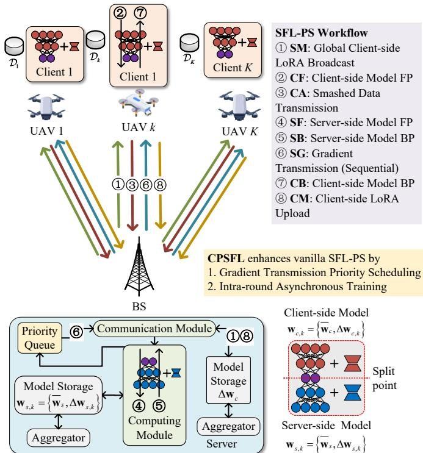  
Fig. 1: Communication-pipelined split federated learning for foundation models LoRA fine-tuning in UAV networks. The workflow of a training round for SFL-PS is illustrated in the upper-right panel, comprising eight steps, each denoted by a two-letter uppercase notation.

We denote the client-side FM as $\mathbf { w } _ { c } = \{ \overline { { \mathbf { w } } } _ { c } , \Delta \mathbf { w } _ { c } \}$ , where $\overline { { \mathbf { w } } } _ { c }$ is the frozen pre-trained FM parameters and $\Delta \mathbf { w } _ { c }$ is the client-side TPs, i.e., the LoRA module weights. Similarly, we denote the server-side FM as $\mathbf { w } _ { s } = \{ \overline { { \mathbf { w } } } _ { s } , \Delta \mathbf { w } _ { s } \}$ , where $\Delta { \bf w } _ { s }$ denotes the TPs including the LoRA module weights and the task module, e.g., the classification head in the classification task.

The SFL process consists of N training rounds, each comprising eight steps as shown in Fig. 1. At the start of round $n ,$ the server broadcasts the latest global client-side TPs $\Delta \mathbf { w } _ { c } ( n - 1 ) ~ ( \mathrm { i . e . , } ~ \Delta \mathbf { w } _ { c , k } ( n , 0 )$ , ∀k) to all clients (Step 1). The server set $\Delta \mathbf { w } _ { s , k } ( n , 0 ) = \Delta \mathbf { w } _ { s } ( n - 1 )$ , ∀k. Subsequently, the K clients perform I local iterations, with each local iteration involving Steps 2 to 7, detailed as follows: Step 2: Client k performs the forward propagation (FP) of the client-side model $\mathbf { w } _ { c , k } ( n , i - 1 )$ and obtains the output (called smashed data) $\mathbf { A } _ { k } ( n , i ) = f ( \mathbf { X } _ { k } ( n , i ) ; \mathbf { w } _ { c , k } ( n , i - 1 ) )$ . Step 3: Client k transmits ${ \bf A } _ { k } ( n , i )$ and label ${ \bf y } _ { k } ( n , i )$ to the server. Steps 4 and 5: The server performs the FP and BP of the serverside model $\mathbf { w } _ { s , k } ( n , i \textrm { -- } 1 )$ and obtains $\Delta \mathbf { w } _ { s , k } ( n , i )$ . Step 6: The server transmits the gradients of the smashed data $\mathbf { G } _ { k } ( n , i ) = \nabla \ell \left( \mathbf { A } _ { k } ( n , i ) , \mathbf { y } _ { k } ( n , i ) ; \mathbf { w } _ { s , k } ( n , i - 1 ) \right)$ ) to client k. Step 7: Client k performs the BP of the client-side model to obtain $\Delta \mathbf { w } _ { c , k } ( n , i )$ . After completing I local iterations, each client transmits $\Delta \mathbf { w } _ { c , k } ( n , I )$ to the server (Step 8). Finally, the server aggregates the $\Delta \mathbf { w } _ { c , k } ( n , I )$ from K clients to obtain the updated global client-side TPs $\Delta \mathbf { w } _ { c } ( n )$ . Concurrently, the server aggregates the $\Delta \mathbf { w } _ { s , k } ( n , I )$ to obtain the updated global server-side TPs $\Delta \mathbf { w } _ { s } ( n )$ , completing one training round.

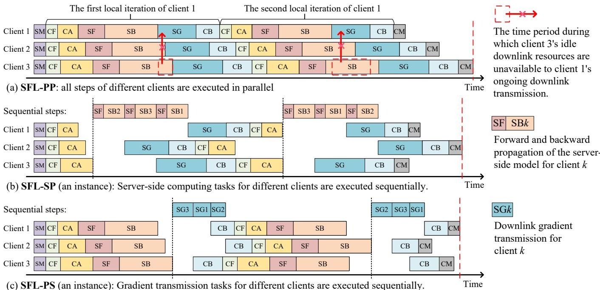  
Fig. 2: The schematic timeline of one training round (consisting of two local iterations) for three clients when SFL-PP (top), SFL-SP (middle), or SFL-PS (bottom) is applied. The notations SM, CF, CA, SF, SB, SG, CB, and CM correspond to the eight steps in Fig. 1, respectively.

## B. SFL-PS Paradigm

In the considered system, communication resources and server computing resources are limited and contended by all clients. Consequently, efficiently allocating these resources among clients is crucial to mitigating the straggler effect. As summarized in Table I, we categorize existing studies into three paradigms, with their respective timelines illustrated in Fig. 2. Specifically, the SFL-PP paradigm allocates dedicated resources to each client, which can lead to resource underutilization during certain intervals. For example, as shown in Fig. 2, when the server initiates GT for client 1, the downlink resources allocated to client 3 remain idle. Moreover, the SFL-SP paradigm utilizes all computing resources for the current task. An advanced variant, PipeSFL, mitigates the straggler effect by optimizing the scheduling order of computing tasks [37]. Nevertheless, neither SFL-SP nor SFL-PP optimizes resource allocation for downlink GT. Consequently, both paradigms suffer from prolonged training latency when applied to wireless networks where communication latency is dominant.

Motivated by these limitations, we focus on the third paradigm, SFL-PS, which is characterized by parallel serverside computing and sequential downlink GT. Specifically, in steps 4 and 5, the server partitions its computing resources into dedicated portions for individual clients, with the allocation fixed in one training round1. In step 6, all downlink resources are used for the current GT, and the GTs are scheduled in a specific order. To avoid interference between uplink and downlink transmissions, we adopt frequency-division duplexing (FDD), where the uplink bandwidth $W _ { U }$ and the downlink bandwidth $W _ { D }$ do not overlap [16], [23]–[25]. At the start of each round, the server decides the following variables

$u \left( n \right)$ is the split point for all clients.

$\alpha _ { k } \left( n \right)$ is the fraction of server computing frequency allocated to client k.

$\beta _ { k } \left( n \right)$ is the fraction of uplink bandwidth allocated to client k.

Vanilla SFL-PS employs intra-round synchronous training and undesignated GT scheduling. Specifically, during a local iteration, the server starts GT only after completing the serverside model FP and BP for all clients, and the scheduling order for downlink transmission is undesignated, for example, random or first-come-first-served (FCFS). These two characteristics may lead to long per-round training latency. To address these limitations, we propose CPSFL in Section III.

## C. Fine-Grained Latency and Energy Consumption Analysis

In this section, we first analyze the achievable communication rate for each client, and then analyze the time and energy consumption of the eight steps in each training round.

To finely capture the UAV client mobility, we propose a fine-grained latency analysis where the channel varies per time slot instead of per training round. We denote the channel gain between the BS and UAV k in the s-th time slot as $h _ { k } \left( s \right)$ which is a function of the distance between the BS and UAV k and assumed to be constant over a time slot with length τ . At the start of round n, the server allocates $W _ { k } ( n ) = \beta _ { k } ( n ) W _ { U }$ bandwidth to client k for the uplink transmission. The uplink rate from client k to the server in round n is given by

$$
R _ { U , k } ( n , h _ { k } ( s ) ) = W _ { k } ( n ) \log _ { 2 } ( 1 + p _ { k } h _ { k } ( s ) / ( W _ { k } ( n ) N _ { 0 } ) ) .\tag{1}
$$

where $p _ { k }$ is the transmit power of client k and $N _ { 0 }$ is the noise power spectral density (PSD). The downlink rate from the server to client k in round n is given by

$$
R _ { D , k } \left( s \right) = W _ { D } { \log _ { 2 } } \left( 1 + P s h _ { k } \left( s \right) / \left( W _ { D } N _ { 0 } \right) \right) ,\tag{2}
$$

where $P _ { S }$ is the total transmit power of the server.

Then, in round $n ,$ the average communication rate of a uplink transmission step for client $k ,$ starting from $t _ { B }$ and ending at $t _ { E } ,$ , can be expressed as

$$
\begin{array} { r l } { \overline { { R } } _ { U , k } \left( n , t _ { B } , t _ { E } \right) = \Big ( R _ { U , k } \left( n , h _ { k } \left( s _ { B } \right) \right) \left( \left( s _ { B } + 1 \right) \tau _ { 0 } - t _ { B } \right) } & { { } } \\ { + \displaystyle \sum _ { j = s _ { B } + 1 } ^ { s _ { E } - 1 } R _ { U , k } \left( n , h _ { k } \left( j \right) \right) \tau _ { 0 } } & { { } } \\ { + R _ { U , k } \left( n , h _ { k } \left( s _ { E } \right) \right) \left( t _ { E } - s _ { E } \tau _ { 0 } \right) \Big ) / \left( t _ { E } - t _ { B } \right) , } & { { } \mathrm { ( ) } } \end{array}\tag{3}
$$

where $\begin{array} { l c l } { { s _ { B } } } & { { = } } & { { \left\lfloor t _ { B } / \tau _ { 0 } \right\rfloor } } \end{array}$ and $\begin{array} { l c l } { { s _ { E } } } & { { = } } & { { \left\lfloor t _ { E } / \tau _ { 0 } \right\rfloor } } \end{array}$ are the time slots corresponding to $t _ { B }$ and $t _ { E } . \mathrm { ~ \scriptsize ~ I f ~ } s _ { B } = s _ { E }$ , then $\overline { { { R } } } _ { U , k } \left( n , t _ { B } , t _ { E } \right) = R _ { U , k } \left( n , h _ { k } \left( s _ { B } \right) \right)$ . Similarly, by replacing $R _ { U , k } \left( n , h _ { k } ( s ) \right)$ with $R _ { D , k } \left( s \right)$ in (3), the average rate for the downlink transmission $\overline { { R } } _ { D , k } \left( t _ { B } , t _ { E } \right)$ can be obtained.

1) Step 1: The client-side TPs broadcasting latency is τSM $\left( n \right) = { \operatorname* { m a x } \left\{ \tau _ { S M , k } \left( n \right) \right\} }$ and $\tau _ { S M , k } \left( n \right)$ is given by

$$
\tau _ { S M , k } \left( \boldsymbol { n } \right) = \Gamma _ { M } \left( u \left( \boldsymbol { n } \right) \right) / \overline { { R } } _ { D , k } \left( t _ { B } , t _ { B } + \tau _ { S M , k } \left( \boldsymbol { n } \right) \right) ,\tag{4}
$$

where $\Gamma _ { M } \left( u \right)$ is the data size (in bits) of the client-side TPs when the split point is u and $t _ { B } = t _ { S M , k , B } \left( n \right)$ is the start time of this step. Note that $\tau _ { S M , k } \left( n \right)$ is obtained by solving equation (4). The latencies of each communication step below are also obtained by solving the corresponding equations.

2) Step 2: The client-side model FP latency of client k is

$$
\begin{array} { r } { \tau _ { C F , k } \left( n , i \right) = B \Psi _ { C F } \left( u \left( n \right) \right) / \left( \kappa _ { k } f _ { k } \right) , } \end{array}\tag{5}
$$

where $\Psi _ { C F } ( u )$ is the computation workload (in FLOPs) with one data sample when the split point is $u , \kappa _ { k }$ is the computing intensity (in FLOPs/cycle) of client k, and $f _ { k }$ is the computing frequency of client k. The corresponding energy consumption is $e _ { F , k } \left( n , i \right) = \omega _ { k } f _ { k } ^ { 3 } \tau _ { C F , k } \left( n , i \right)$ , where $\omega _ { k }$ is the coefficient (in Watt/(cycle/s)3) according to the chip architecture [23].

3) Step 3: The smashed data transmission latency of client k is

$$
\tau _ { C A , k } ( n , i ) = B \Gamma _ { A } ( u ( n ) ) / \overline { { h } } _ { U , k } ( n , t _ { B } , t _ { B } + \tau _ { C A , k } ( n , i ) ) ,\tag{6}
$$

where $\Gamma _ { A } \left( u \right)$ is the data size (in bits) of the smashed data when the split point is u and $t _ { B } = t _ { C A , k , B } \left( n , i \right)$ . The corresponding energy consumption is $e _ { A , k } \left( n , i \right) = p _ { k } \tau _ { C A , k } \left( n , i \right)$

4) Steps 4 and 5: The server-side FP and BP latency for client k is

$$
\tau _ { S , k } ( n , i ) = { \cal B } ( \Psi _ { S F } ( u ( n ) ) + \Psi _ { S B } ( u ( n ) ) ) / ( \kappa _ { S } \alpha _ { k } ( n ) f _ { S } ) \ .\tag{7}
$$

where $\Psi _ { S F } ( u )$ and $\Psi _ { S B } ( u )$ denote the computational workloads (in FLOPs) per data sample for FP and BP, respectively, when the split point is $u ; \kappa _ { S }$ is the server’s computing intensity (in FLOPs/cycle); and $f _ { S }$ is the server’s computing frequency.

5) Step 6: The gradient transmission latency for client k is

$$
\tau _ { S G , k } \left( n , i \right) = B \Gamma _ { G } ( u \left( n \right) ) / \overline { { h } } _ { D , k } \left( t _ { B } , t _ { B } + \tau _ { S G , k } ( n , i ) \right) ,\tag{8}
$$

where $\Gamma _ { G } ( u )$ is the data size (in bits) of the gradients of the smashed data when the split point is u and $t _ { B } = t _ { S G , k , B } \left( n , i \right)$

6) Step 7: The client-side model BP latency of client k is

$$
\begin{array} { r } { \tau _ { C B , k } \left( n , i \right) = B \Psi _ { C B } \left( u \left( n \right) \right) / \left( \kappa _ { k } f _ { k } \right) , } \end{array}\tag{9}
$$

where $\Psi _ { C B } \left( u \right)$ is the computation workload (in FLOPs) with one data sample when the split point is u. The corresponding energy consumption is $e _ { B , k } \left( n , i \right) = \omega _ { k } f _ { k } ^ { 3 } \tau _ { C B , k } \left( n , i \right)$

7) Step 8: The client-side TPs uplink transmission latency of client k is

$$
\tau _ { C M , k } \left( n \right) = \Gamma _ { M } { \left( u \left( n \right) \right) } / \overline { { R } } _ { U , k } ( n , t _ { B } , t _ { B } + \tau _ { C M , k } ( n ) ) ,\tag{10}
$$

where $t _ { B } = t _ { C M , k , B } \left( n \right)$ . The corresponding energy consumption is $e _ { M , k } \left( n \right) = p _ { k } \tau _ { C M , k } \left( n \right)$

8) Total energy consumption for one round: In round n, the total energy consumption of client k is

$$
e _ { k } ( n ) = \sum _ { i = 1 } ^ { I } ( e _ { F , k } ( n , i ) + e _ { A , k } ( n , i ) + e _ { B , k } ( n , i ) ) + e _ { M , k } ( n ) .\tag{11}
$$

9) Lag of clients: We define the lag of client k as the time interval from the start of its BP in the previous local iteration to the completion of its server-side computation in the current iteration, as illustrated in Fig. 3. Specifically, the lag of client k in local iteration i of round n is defined as

$$
\begin{array} { c } { { l _ { k } \left( n , i \right) = \tau _ { C B , k } \left( n , i - 1 \right) + \tau _ { C F , k } \left( n , i \right) + } } \\ { { \tau _ { C A , k } \left( n , i \right) + \tau _ { S , k } \left( n , i \right) . } } \end{array}\tag{12}
$$

10) The upper bound of the total latency for one round: The total training latency of round n is denoted by $\tau \left( n \right)$ . Under the SFL-PS paradigm, the upper bound of $\tau \left( n \right)$ , denoted as $\tau _ { \operatorname* { m a x } } \left( n \right)$ , is achieved when the GT of the client with the highest lag in each iteration is performed at the end, i.e.,

$$
\begin{array} { l } { { \displaystyle \tau \left( n \right) \le \tau _ { \operatorname* { m a x } } \left( n \right) = \operatorname* { m a x } _ { k } \left\{ \tau _ { S M , k } \left( n \right) \right\} + } } \\ { { \displaystyle \operatorname* { m a x } _ { k } \left\{ \tau _ { C F , k } \left( n , 1 \right) + \tau _ { C A , k } \left( n , 1 \right) + \tau _ { S , k } \left( n , 1 \right) \right\} + } } \\ { { \displaystyle \sum _ { i = 1 } ^ { I - 1 } \left( \sum _ { k = 1 } ^ { K } \tau _ { S G , k } \left( n , i \right) + \operatorname* { m a x } _ { k } \left\{ l _ { k } \left( n , i + 1 \right) \right\} \right) + } } \\ { { \displaystyle \sum _ { k = 1 } ^ { K } \tau _ { S G , k } \left( n , I \right) + \operatorname* { m a x } _ { k } \left\{ \tau _ { C B , k } \left( n , I \right) + \tau _ { C M , k } \left( n \right) \right\} } . }  \end{array}\tag{13}
$$

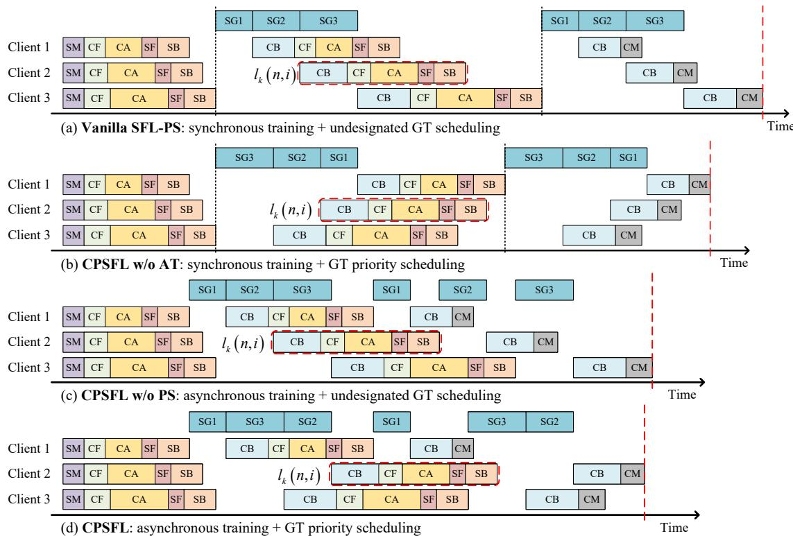  
Fig. 3: The schematic timeline of one training round (consisting of two local iterations) for three clients when the proposed CPSFL and its ablation variants are applied. The notations SM, CF, CA, SF, SB, SGk, CB, and CM correspond to the eight steps in Fig. 1, respectively.

## D. Problem Formulation

In the SFL-PS-enabled UAV network, the client mobility induces time-varying wireless channels and achievable communication rates, which affect the latency and the energy consumption. Therefore, to minimize the training latency and energy consumption per round, adjusting the SPS and the CCRA when each round begins is necessary. To prevent UAVs from depleting their energy too quickly, we focus on the maximum energy consumption of UAVs. The optimization problem can be formulated as

$$
\begin{array} { c } { \displaystyle { \operatorname* { m i n } _ { \left\{ \alpha _ { k } ( n ) , \beta _ { k } ( n ) , u ( n ) \right\} } \tau \left( n \right) + \lambda \mathrm { m a x } _ { k } \left\{ e _ { k } \left( n \right) \right\} } } \end{array}\tag{14a}
$$

$$
\mathrm { s . t . } \alpha _ { \mathrm { m i n } } \leq \alpha _ { k } \left( n \right) \leq 1 , \sum _ { k = 1 } ^ { K } \alpha _ { k } \left( n \right) = 1 ,\tag{14b}
$$

$$
\beta _ { \mathrm { m i n } } \le \beta _ { k } \left( n \right) \le 1 , \sum _ { k = 1 } ^ { \cdots } \beta _ { k } \left( n \right) = 1 ,\tag{14c}
$$

$$
u \left( n \right) \in \mathcal { U } ,\tag{14d}
$$

where $\lambda > 0$ is the weight of the energy term and U is the set of possible values of the split point. Besides, $\alpha _ { \mathrm { m i n } } \in [ 0 , 1 / K ]$ and $\beta _ { \mathrm { m i n } } \in [ 0 , 1 / K ]$ are the limits of the server computing frequency fraction and the uplink bandwidth fraction, respectively. To keep $\tau \left( n \right)$ away from its upper bound $\tau _ { \operatorname* { m a x } } \left( n \right)$ in (13), we propose CPSFL in the next section to enhance vanilla SFL-PS.

## III. COMMUNICATION-PIPELINED SFL

In this section, we propose the CPSFL, which enhances the vanilla SFL-PS through the downlink GT priority scheduling and intra-round asynchronous training. Specifically, the priority scheduling allows clients who are likely to become stragglers to receive the gradients required for BP earlier. The asynchronous training reduces the idle downlink waiting time by allowing GT initiation upon any client’s server-side computation completion. Fig. 3 illustrates the timelines of four paradigms: vanilla SFL-PS, CPSFL without the intraround asynchronous training (CPSFL w/o AT), CPSFL without the downlink GT priority scheduling (CPSFL w/o PS), and CPSFL, showing that CPSFL achieves the shortest training latency for one round.

In the following, we first present the priority scheduling mechanism in CPSFL w/o AT and establish its optimality via theoretical analysis. Next, we introduce CPSFL and prove the scheduling optimality under additional simplifying assumptions. We then analyze the per-round latency of CPSFL and its ablation variants, and finally compare them against the other two paradigms: SFL-PP and PipeSFL.

## A. Downlink Gradient Transmission Priority Scheduling

Due to client heterogeneity in channel conditions and computing capacities, the order of downlink GT significantly impacts the per-iteration training latency. Under the synchronous training setting, there are theoretically K! possible scheduling orders with K clients. Thus, finding the optimal orders by exhaustive search is NP-hard and prohibitively timeconsuming. To address this, we design a priority scheduling mechanism for downlink GT and prove its optimality. This paradigm is called CPSFL w/o AT.

Algorithm 1 CPSFL (Two Server-Side Improvements)   
1: Procedure: Downlink Gradient Transmission Priority   
Scheduling   
2: if the server completes the server-side model FP and BP   
for client k and obtains the gradient ${ \bf G } _ { k } ( n , i )$ then   
The server adds ${ \bf G } _ { k } ( n , i )$ to the priority queue with the   
lag $l _ { k } \left( n , i \right)$ in (12) as its priority.   
4: end if   
5: Procedure: Intra-Round Asynchronous Training   
6: if the server is not transmitting gradients and the priority   
queue is not empty then   
7: The server retrieves the gradient ${ \bf G } _ { k } ( n , i )$ of the   
highest-priority client k from the priority queue.   
8: The server transmits ${ \bf G } _ { k } ( n , i )$ to client k.   
9: The server removes ${ \bf G } _ { k } ( n , i )$ from the priority queue.   
10: end if

As shown in Algorithm 1, upon completing the computing task for client $k ,$ the server obtain the gradient ${ \bf G } _ { k } ( n , i )$ for client k and inserts it into the priority queue along with its lag $l _ { k } \left( n , i \right)$ from (12), which serves as the transmission priority. This design follows a greedy strategy [32], [37], aiming to assign higher transmission priority to clients with larger lags, thereby enabling them to initiate the BP earlier. When calculating $l _ { k } \left( n , 1 \right)$ by (12), the term $\tau _ { C B , k } \left( n , 0 \right)$ can be replaced by $\varsigma \tau _ { C F , k } \left( n , 1 \right)$ with a constant $\varsigma > 0$

1) Optimality analysis: We first analyze the timeline when the server employs the priority scheduling, based on the following simplifying assumption.

Assumption 1. The wireless channel remains constant within each training round. Thus, we can omit the round index n and local iteration index i for brevity. Without loss of generality, we reindex the K clients in non-decreasing order of their lags, i.e., $l _ { 1 } \le l _ { 2 } \le \cdots \le l _ { K }$ , so that their transmission priorities are client 1 < client $2 < \cdots <$ client K.

For CPSFL w/o AT, we define the per-iteration training latency as the time interval between two consecutive instants when the server finishes the computing tasks of all clients, which is illustrated in Fig. 3 as the gap between two vertical black dashed lines. This latency is given by

$$
T _ { \mathrm { i t e r } } = \operatorname* { m a x } _ { k } \left\{ \sum _ { j = k } ^ { K } \tau _ { S G , j } + l _ { k } \right\} .\tag{15}
$$

Then, the following theorem shows the optimality of the proposed GT priority scheduling.

Theorem 1. The optimal strategy to minimize the periteration training latency $T _ { \mathrm { i t e r } }$ is to prioritize the GT task of clients with larger lag, i.e., schedule the GT task of client m before client k if and only $i f l _ { m } \ge l _ { k } , \forall m , k \in \mathcal { K }$

Proof. See Appendix A.

□

## B. Intra-Round Asynchronous Training

In CPSFL w/o AT, the server’s downlink communication resources remain idle between the completion of the computing task of one client and the completion of the computing tasks of all clients. To improve resource utilization, the proposed CPSFL adopts the intra-round asynchronous training. As shown in Algorithm 1, whenever the server is not transmitting gradients, it immediately retrieves the highest-priority gradient from the priority queue, starts transmission, and then removes this gradient and its priority from the queue. This allows the server to start downlink GT without waiting for the computing tasks of all clients to complete.

Notably, the gradients in the priority queue may originate from different local iteration counts across clients. For example, one client may expect to receive a gradient of iteration 2, while another expects one of iteration 3. In this study, the transmission priority of each gradient is independent of the number of local iterations completed by the corresponding client.

1) Optimality analysis: To simplify the per-round latency analysis, we adopt Assumption 1 and two other assumptions.

Assumption 2. The uplink transmission latency of the client-side TPs, τCM,k, is negligible.

Assumption 2 approximately holds in practice for two reasons. First, LoRA and model splitting significantly reduce the number of client-side TPs, making the data size $\Gamma _ { M } ( u )$ in (10) much smaller than $B \Gamma _ { A } ( u )$ in (6), so that $\tau _ { C M , k } \ll \tau _ { C A , k } .$ Second, when the number of local iterations I is large, the contribution of $\tau _ { C M , k }$ to the total per-round latency becomes negligible.

Assumption 3. The GT latencies for all clients are equal, i.e., τSG,k = τSG, ∀k (based on Assumption 1).

Assumption 3 holds when the downlink communication rates between the clients and the server are identical. Since the server uses all downlink resources (bandwidth and transmit power) for each GT, as shown in (2) and (8), this assumption is equivalent to assuming identical channel gains: $h _ { k } = h$ , ∀k. Moreover, Assumption 3 is approximately valid in practice: due to limited client uplink bandwidth and transmit power, τSG,k is much smaller than $\tau _ { C A , k } .$ , and the differences among τSG,k across clients is relatively small.

Under Assumptions 1–3, we establish the following opti mality theorem for the proposed scheduling policy.

Theorem 2. The optimal strategy to minimize the per-round training latency of CPSFL is to prioritize the GT task of clients with larger lag, i.e., schedule the GT task of client m before client k if and only $i f l _ { m } \ge l _ { k } , \forall m , k \in \mathcal { K }$

Proof. See Appendix B.

## C. Per-Round Training Latency Analysis

In the analysis, we omit the broadcast latency of the global client-side TPs $\tau _ { S M } \left( n \right)$ , as it is identical for all clients and paradigms. Besides, we adopt Assumptions 1 and 2 for brevity.

1) Per-round latency of the vanilla SFL-PS: We denote the per-round latency of the vanilla SFL-PS by $\tau _ { 1 }$ . From (13), we have $\tau _ { 1 } \leq \tau _ { \mathrm { m a x } }$ . The minimum value of $\tau _ { 1 }$ is achieved when CPSFL w/o AT is applied, i.e., the GT follows the priority scheduling in Theorem 1. We denote the per-round latency of CPSFL w/o AT by $\tau _ { 2 } , \ s 0 \ \tau _ { 1 } \geq \tau _ { 2 }$

2) Per-round latency of CPSFL w/o AT: The per-round latency of CPSFL w/o AT $\tau _ { 2 }$ is given by

$$
\left. \begin{array} { l } { \displaystyle \tau _ { 2 } = \operatorname* { m a x } _ { k } \left\{ \tau _ { C F , k } + \tau _ { C A , k } + \tau _ { S , k } \right\} + \left( I - 1 \right) \cdot } \\ { \displaystyle \operatorname* { m a x } _ { k } \left\{ \sum _ { j = k } ^ { K } \tau _ { S G , j } + l _ { k } \right\} + \displaystyle \operatorname* { m a x } _ { k } \left\{ \sum _ { j = k } ^ { K } \tau _ { S G , j } + \tau _ { C B , k } \right\} . } \end{array} \right.\tag{16}
$$

Thus, $\begin{array} { r } { \tau _ { 2 } \ \geq \ I \operatorname* { m a x } _ { k } \Big \{ \sum _ { j = k } ^ { K } \tau _ { S G , j } + l _ { k } \Big \} \ = \ \widehat { \tau } _ { 2 } } \end{array}$ , where the equality holds when arg max $\begin{array} { r l } { \mathfrak { \varrho _ { \circ } } \left\{ \tau _ { C F , k } \right\} } & { { } + \tau _ { C A , k } + \tau _ { S , k } \rbrace } & { = } \end{array}$ arg maxk $\left\{ \sum _ { j = k } ^ { K } \tau _ { S G , j } + \tau _ { C B , k } \right\}$ or when I is large.

3) Per-round latency of CPSFL: Owing to the intra-round asynchronous training and priority scheduling, the per-round latency of CPSFL, denoted by τCPSFL, lacks a closed-form expression in terms of the decision variables and channel strengths. Specifically, the GT schedule depends on the lag values of clients within a priority queue; however, due to asynchrony, it is analytically intractable to explicitly characterize the exact set of clients involved in each scheduling instance and their corresponding local iteration counts.

Instead, we characterize the bounds of $\tau _ { \mathrm { C P S F L } }$ . As described in Section III-B, under asynchronous training, a lower-priority client’s GT may start earlier than a higher-priority one’s, provided no higher-priority GT task is yet enqueued. When each client must wait for all higher-priority GTs to complete before its GT begins in every local iteration, τCPSFL achieves its upper bound, i.e.,

$$
\tau _ { \mathrm { C P S F L } } \leq \tau _ { 2 } .\tag{17}
$$

In summary, we have $\tau _ { \mathrm { C P S F L } } \le \tau _ { 2 } \le \tau _ { 1 }$

The lower bound is achieved when the downlink GT fully overlaps all other latencies, except for the latency of client 1, the client with the smallest lag, at the start and end of each round.

$$
\tau _ { \mathrm { C P S F L } } \geq \tau _ { C F , 1 } + \tau _ { C A , 1 } + \tau _ { S , 1 } + \sum _ { i = 1 } ^ { I } \sum _ { j = 1 } ^ { K } \tau _ { S G , j } + \tau _ { C B , 1 } .\tag{18}
$$

## D. Comparison of the Per-Round Training Latency of CPSFL, PipeSFL and SFL-PP

In this section, we first redefine the latency notation for the relevant steps of SFL-PP and PipeSFL since they utilize the server’s computing and communication resources differently from the proposed CPSFL, as shown in Table I. Then, we compare the approximate upper bound of the per-round latency of $\mathrm { C P S F L } , \widehat { \tau } _ { 2 } ,$ , with that of PipeSFL, ${ \widehat { \tau } } _ { 3 } ,$ and the per-round latency of $\mathrm { S F L - P P , ~ } \tau _ { \mathrm { P P } }$ , to characterize the conditions under which either CPSFL or PipeSFL outperforms the others.

In both SFL-PP and PipeSFL, to enable concurrent downlink transmissions to different clients, the server allocates a bandwidth fraction $\beta _ { k } ( n )$ of $W _ { D }$ and a power fraction $\rho _ { k } ( n )$

of $P _ { S }$ to client k during round n. The fraction $\rho _ { k } \left( n \right)$ is constrained by

$$
\rho _ { \mathrm { m i n } } \leq \rho _ { k } \left( n \right) \leq 1 , \sum _ { k = 1 } ^ { K } \rho _ { k } \left( n \right) = 1 .\tag{19}
$$

The downlink transmission rate from the server to client k in round n is given by

$$
\begin{array} { r l } & { R _ { D , k } ^ { \prime } \left( n , h _ { k } \left( s \right) \right) = \beta _ { k } \left( n \right) W _ { D } . } \\ & { \qquad \quad \log _ { 2 } \left( 1 + \rho _ { k } \left( n \right) P _ { S } h _ { k } \left( s \right) / \left( \beta _ { k } \left( n \right) W _ { D } N _ { 0 } \right) \right) . } \end{array}\tag{20}
$$

Then, the average rate for the downlink GT $\overline { { R } } _ { D , k } ^ { \prime } \left( n , t _ { B } , t _ { E } \right)$ can be obtained by replacing $R _ { U , k } \left( n , h _ { k } \left( s \right) \right)$ with $R _ { D , k } ^ { \prime } \left( n , h _ { k } \left( s \right) \right)$ in (3). The GT latency for client k $\tau _ { S G , k } ^ { \prime } \left( n , i \right)$ can be obtained by replacing $\overline { { R } } _ { D , k } \left( n , t _ { B } , t _ { E } \right)$ with $\overline { { R } } _ { D , k } ^ { \prime } \left( n , t _ { B } , t _ { E } \right)$ in (8). To avoid cumbersome and difficult comparisons, we adopt Assumptions 1 and 2, and omit the index n for the rounds and the index s for the time slots of $R _ { D , k }$ in (2) and $R _ { D , k } ^ { \prime }$ in (20) in the following. Based on (8), the GT latency for client k in CPSFL $( \mathrm { i } . \mathrm { e } . , \tau _ { S G , k } )$ and in SFL-PP/PipeSFL $( \mathrm { i } . \mathrm { e } . , \tau _ { S G , k } ^ { \prime } )$ can be expressed as

$$
\begin{array} { r l } & { \tau _ { S G , k } = B \Gamma _ { G } \left( u \right) / \left( W _ { D } \log _ { 2 } \left( 1 + P _ { S } h _ { k } / \left( W _ { D } N _ { 0 } \right) \right) \right) , ( 2 1 ) } \\ & { \tau _ { S G , k } ^ { \prime } = B \Gamma _ { G } \left( u \right) / \left( \beta _ { k } W _ { D } \log _ { 2 } ( 1 + \rho _ { k } P _ { S } h _ { k } / \left( \beta _ { k } W _ { D } N _ { 0 } \right) ) \right) . } \end{array}\tag{22}
$$

It obviously follows that $\tau _ { S G , k } < \tau _ { S G , k } ^ { \prime } .$ , ∀k. If the downlink communication resources are equally allocated among clients, i. $. \mathrm { e } . , \beta _ { k } = \rho _ { k } = 1 / K$ , ∀k in (22), then $K \tau _ { S G , k } = \tau _ { S G , k } ^ { \prime } , \forall k$

The per-round latency of SFL-PP can be expressed as

$$
\tau _ { \mathrm { P P } } = I \operatorname* { m a x } _ { k } \{ \tau _ { C F , k } + \tau _ { C A , k } + \tau _ { S , k } + \tau _ { S G , k } ^ { \prime } + \tau _ { C B , k } \} .\tag{23}
$$

Then, we analyze the PipeSFL, in which the server allocates all its computing resources to the current task. The server-side computing latency for client k is expressed as

$$
\tau _ { S , k } ^ { \prime } = B \left( \Psi _ { S F } \left( u \right) + \Psi _ { S B } \left( u \right) \right) / \left( \kappa _ { S } f _ { S } \right) .\tag{24}
$$

Thus, the latency $\tau _ { S , k } ^ { \prime }$ is identical across all clients. For brevity, we denote it as $\tau _ { S } ^ { \prime }$ . Comparing (24) with (7), we observe that $\tau _ { S } ^ { \prime } = \alpha _ { k } \tau _ { S , k } < \tau _ { S , k }$ , ∀k. Moreover, if the server computing frequency is equally allocated, i.e., $\alpha _ { k } = 1 / K$ , ∀k in $\tau _ { S , k }$ in (7), then $K \tau _ { S } ^ { \prime } = \tau _ { S , k } , \forall k$

In PipeSFL, the lag of client k is given by

$$
l _ { k } ^ { \prime } = \tau _ { C F , k } + \tau _ { C A , k } + \tau _ { S G , k } ^ { \prime } + \tau _ { C B , k } .\tag{25}
$$

Then, we reindex the K clients by their lags2, i.e., $l _ { 1 } ^ { \prime } \leq l _ { 2 } ^ { \prime } \leq$ $\cdots \leq l _ { K } ^ { \prime }$ . Similarly to $\tau _ { 2 }$ in (16) and (17), the upper bound of per-round latency of PipeSFL can be expressed as

$$
\begin{array} { r } { \tau _ { 3 } = \underset { k } { \operatorname* { m a x } } \left\{ \tau _ { C F , k } + \tau _ { C A , k } \right\} + \left( I - 1 \right) \underset { k } { \operatorname* { m a x } } \left\{ \left( K - k + 1 \right) \tau _ { S } ^ { \prime } \right. } \\ { \left. + l _ { k } ^ { \prime } \right\} + \underset { k } { \operatorname* { m a x } } \left\{ \left( K - k + 1 \right) \tau _ { S } ^ { \prime } + \tau _ { S G , k } ^ { \prime } + \tau _ { C B , k } \right\} . \left( 2 6 \right) } \end{array}
$$

Thus, we have $\tau _ { 3 } \geq \tau _ { } 3$ maxk $\begin{array} { r l r } { \left\{ \sum _ { j = k } ^ { K } \tau _ { S } ^ { \prime } + l _ { k } ^ { \prime } \right\} } & { { } = } & { \widehat { \tau } _ { 3 } } \end{array}$ where the equality holds when arg maxk $\{ \tau _ { C F , k } + \tau _ { C A , k } \} =$ arg maxk $\left\{ \sum _ { j = k } ^ { K } \tau _ { S } ^ { \prime } + \tau _ { S G , k } ^ { \prime } + \tau _ { C B , k } \right\}$ or when I is large.

Next, we compare the latencies under two extreme cases to derive intuitive insights.

1) Case 1: negligible computing latency: When computing latency is negligible, $\mathrm { i . e . , ~ } \tau _ { C F , k } , \tau _ { S , k } , \tau _ { C B , k } , \tau _ { S } ^ { \prime } \  \ 0 ,$ , we compare the latency of paradigms with parallel GT, τPP and $\widehat { \tau } _ { 3 }$ , against that of the paradigm with sequential GT, $\widehat { \tau } _ { 2 }$ . In this case, $\begin{array} { r } { \widehat { \tau } _ { 2 } = I \operatorname* { m a x } _ { k } \Big \{ \sum _ { j = k } ^ { K } \tau _ { S G , j } + \bar { \tau } _ { C A , k } \Big \} } \end{array}$ and $\tau _ { \mathrm { P P } } = \widehat { \tau } _ { 3 } = I \operatorname* { m a x } _ { k } \left\{ \tau _ { C A , k } + \tau _ { S G , k } ^ { \prime } \right\}$ . Thus, if

$$
\sum _ { j = k } ^ { K } \tau _ { S G , j } + \tau _ { C A , k } \leq \operatorname* { m a x } _ { k } \left\{ \tau _ { S G , k } ^ { \prime } + \tau _ { C A , k } \right\} , \forall k ,\tag{27}
$$

then $\widehat { \tau } _ { 2 } \leq \widehat { \tau } _ { 3 } = \tau _ { \mathrm { P P } }$ and the proposed CPSFL is likely to achieve a lower per-round latency.

Next, we present a scenario under which (27) holds. If the downlink communication resources are equally allocated among clients, then $\begin{array} { r l r } { K \tau _ { S G , k } } & { { } = } & { \tau _ { S G , k } ^ { \prime } , \forall k } \end{array}$ Thus, $\begin{array} { r l r } { K \tau _ { S G , k } \mathrm { ~ + ~ } \tau _ { C A , k } } & { { } \le } & { \operatorname* { m a x } _ { k } \left\{ K \tau _ { S G , k } + \bar { \tau } _ { C A , k } \right\} \mathrm { ~ = ~ } } \end{array}$ maxk $\left\{ \tau _ { S G , k } ^ { \prime } + \tau _ { C A , k } \right\}$ , ∀k. Moreover, if the GT latency ordering is opposite to the lag ordering, i.e., $\tau _ { S G , k } \quad \geq$ $\tau _ { S G , k + 1 } , \forall k \in [ 1 , K - 1 ]$ (a relaxed version of Assumption 3), we have $\begin{array} { r } { \sum _ { j = k } ^ { K } \tau _ { S G , j } \ \le \ ( K - k + 1 ) \tau _ { S G , k } \ \le \ K \tau _ { S G , k } , } \end{array}$ ∀k. Under these two conditions, (27) hold.

2) Case 2: negligible communication latency: When communication latency is negligible, i.e., $\tau _ { C A , k } , \tau _ { S G , k } , \tau _ { S G , k } ^ { \prime } $ 0, we compare the latency of paradigms with parallel server computing, τPP and $\widehat { \tau } _ { 2 } .$ against that of the paradigm with sequential server computing, ${ \widehat { \tau } } _ { 3 }$ . In this case, $\widehat { \tau } _ { 3 } ~ =$ $\begin{array} { r } { I \operatorname* { m a x } _ { k } \left\{ \sum _ { j = k } ^ { K } \tau _ { S } ^ { \prime } + \tau _ { C F , k } + \tau _ { C B , k } \right\} } \end{array}$ and $\begin{array} { r l r } { \tau _ { \mathrm { P P } } } & { { } = } & { \widehat { \tau } _ { 2 } \ = } \end{array}$ $I \operatorname* { m a x } _ { k } \left\{ \tau _ { C F , k } + \tau _ { S , k } + \tau _ { C B , k } \right\}$ . Thus, if

$$
\begin{array} { r l } & { \left( K - k + 1 \right) \tau _ { S } ^ { \prime } + \tau _ { C F , k } + \tau _ { C B , k } \leq } \\ & { \underset { k } { \operatorname* { m a x } } \left. \tau _ { S , k } + \tau _ { C F , k } + \tau _ { C B , k } \right. , \forall k , } \end{array}\tag{28}
$$

then ${ \widehat { \tau } } _ { 3 } \leq { \widehat { \tau } } _ { 2 } = \tau _ { \mathrm { P P } }$ and the PipeSFL is likely to achieve a lower per-round latency.

Next, we present a scenario under which (28) holds. If the server computing frequency is equally allocated, then $\begin{array} { r l r } { K \tau _ { S } ^ { \prime } } & { { } = } & { \tau _ { S , k } , \quad \forall k } \end{array}$ Thus, $\begin{array} { r } { K \tau _ { S } ^ { \prime } + \tau _ { C F , k } + \tau _ { C B , k } \leq \operatorname* { m a x } _ { k } \left\{ K \tau _ { S } ^ { \prime } + \tau _ { C F , k } + \tau _ { C B , k } \right\} = } \end{array}$ maxk $\{ \tau _ { S , k } + \tau _ { C F , k } + \tau _ { C B , k } \}$ ∀k. Then, since $\left( K - k + 1 \right) \tau _ { S } ^ { \prime } \leq K \tau _ { S } ^ { \prime } , \forall k ,$ (28) holds.

## E. Discussion on the Impact of Transmission Failures

Wireless transmissions in SFL are susceptible to packet errors induced by channel fluctuations [16], [34], [38]. As shown in Fig. 1, the SFL workflow relies on four types of wireless transmission steps: 1, 3, 6, and 8. We model each transmission step as a single packet, with integrity verified at the receiver via cyclic redundancy check (CRC) upon completion [16], [34]. The impact of a transmission failure for client k on the TPs update is as follows:

• Step 1: Client k is excluded from the current training round.

• Step 3: During the corresponding local iteration, the entire TPs for client k cannot be updated.

Algorithm 2 GT Scheduling Priority Calculation Based on   
Transmission Failure Prediction   
1: if Step 6 is predicted to fail for client k at iteration i then   
2: Calculate the lag of client k in local iteration i as   
$\widetilde { l } _ { k } ( n , i ) = \tau _ { C F , k } ( n , i ) + \tau _ { C A , k } ( n , i ) + \tau _ { S , k } ( n , i ) .$   
3: else   
4: if $i = 1$ or step 6 failed for client k at iteration $i - 1$   
then   
5: Complete the calculation of $l _ { k } ( n , i )$ in (12) by esti  
mating $\tau _ { C B , k } ( n , i - 1 )$ with $\varsigma \tau _ { C F , k } ( n , i )$   
6: else   
7: Calculate the lag $l _ { k } ( n , i )$ normally by (12).   
8: end if   
9: end if

• Step 6: During the corresponding local iteration, the client-side TPs of client k cannot be updated.

• Step 8: The client-side TPs of client k are excluded from the aggregation for the current round.

While such failures are known to degrade SFL convergence [16], [34], [38], the existing analyses cannot be directly applied to CPSFL due to its distinctive features3. Given the intra-round asynchrony and the GT scheduling inherent to CPSFL, deriving a rigorous convergence analysis that explicitly incorporates transmission failures involves significant mathematical complexity. Therefore, this intricate problem is deferred to future work. In this work, our primary objective remains the mitigation of the straggler effect without sacrificing convergence performance4.

To ensure that the priority scheduling mechanism effectively reduces per-round latency in the presence of transmission failures, we propose the following heuristic strategies. If Step 1 or Step 8 fails, the scheduling mechanism remains unaffected. If Step 3 fails for client k in local iteration i, the server instructs client k to immediately commence iteration $i + 1$ . Otherwise, upon successful reception of the smashed data and label, the server proceeds with the server-side computations (Steps 4 and 5). Given that Step 6 fails with a certain probability, we replace the priority calculation in Line 3 of Algorithm 1 with Algorithm 2. This heuristic procedure is designed to minimize the per-iteration latency defined in (15) under the CPSFL w/o AT paradigm. The optimality of Algorithm 2 follows a logic analogous to Theorem 1 and is omitted for conciseness. If Step 6 fails for client k in local iteration i, client k immediately commences iteration i + 1. Otherwise, client k proceeds with iteration i normally.

## IV. DRL-BASED SPS AND CCRA FOR THE CPSFL-ENABLED UAV NETWORKS

In this section, we first motivate the use of DRL for decision-making. We then formulate the problem as a partially observable Markov decision process (POMDP). Next, we describe the design of the BS agent, which incorporates an attention-based mechanism to extract features from historical UAV trajectories. Finally, we present the DRL-based SPS and CCRA scheme for the CPSFL-enabled UAV networks.

## A. Motivation of DRL-based Solution

Problem (14) presents three major challenges that render conventional optimization methods impractical:

• Complexity: It is a mixed-integer non-linear program (MINLP) with both discrete and continuous variables, making it non-convex and NP-hard [24].

• Analytical intractability: As discussed in Section III-C3, due to intra-round asynchrony and priority scheduling, the latency $\tau _ { \mathrm { C P S F L } } ( n )$ lacks a closed-form expression in terms of the decision variables and channel strengths.

• Uncertainty: At the start of each round, the BS has no access to future UAV trajectories or channel realizations. Furthermore, the problem exhibits temporal correlation: the UAVs’ initial locations in the next round depend on the current round’s decisions, creating a sequential decision-making process. These motivate the use of DRL, a technique naturally suited to optimizing policies in complex, uncertain, and temporally correlated environments. Due to the environmental uncertainty, the agent only has partial observability. Thus, we formulate the problem as a POMDP.

## B. POMDP Formulation and BS Agent Design

A POMDP model can be described with a tuple $\langle S , \Omega , \mathcal { A } , \mathcal { P } , r , \mathcal { B } , \gamma \rangle$ . Specifically, S is the state space, $\mathbf o \in \Omega$ is the observation, a $\in { \mathcal { A } }$ is the action, $P \left( \mathbf { s } ^ { \prime } | \mathbf { s } , \mathbf { a } \right) \in \mathcal { P }$ is the probabilistic transition function, r is the reward function, and $\gamma \in ( 0 , 1 )$ is the discount factor. Denote the policy for agent as $\pi : \Omega \times \mathcal { A }  [ 0 , 1 ]$ . The expected discounted cumulative reward for agent is $\begin{array} { r } { J \left( \overline { { \boldsymbol { \pi } } } \right) = \mathbb { E } _ { \mathbf { s } ( 0 ) , \mathbf { a } ( 0 ) , \ldots } \left[ \sum _ { t = 0 } ^ { \infty } \gamma ^ { t } r \left( t \right) \right] } \end{array}$ , where $\mathbf { a } \left( t \right) \sim \pi \left( \cdot | \mathbf { o } \left( t \right) \right)$ and $\mathbf { s } \left( t + 1 \right) \sim P \left( \cdot | \mathbf { s } \left( t \right) , \mathbf { a } \left( t \right) \right)$ . The POMDP aims to find an optimal policy $\pi ^ { * }$ that maximizes $J \left( \pi \right)$ , i.e.,

$$
\pi ^ { * } = \operatorname { a r g m a x } _ { \pi } J \left( \pi \right) .\tag{29}
$$

To find $\pi ^ { * }$ , the DRL algorithms can be applied.

We designate the BS as the agent for deciding the variables listed in Section II-B. Its observation space, action space, and reward function are detailed as follows.

1) Attention-based UAV trajectory feature extraction: To make informed decisions, the BS agent needs to infer future UAV trajectory features and analyze how past trajectories affect the latency and energy consumption. Thus, the agent leverages historical trajectory data from the previous training round. However, the number of time slots per round varies, posing a challenge for fixed-dimension neural networks [40]. To address this, we employ an attention mechanism with positional encoding to extract fixed-dimensional representations.

Given a query $\mathbf { q } \in \mathbb { R } ^ { D _ { Q } \times 1 }$ and M key-value pairs $\mathbf { K } =$ $\bigl [ \mathbf { k } _ { 1 } , \ldots , \mathbf { k } _ { M } \bigr ] \in \mathbf { \bar { \mathbb { R } } } ^ { \bar { D } _ { K } \times M } , \mathbf { V } = \bigl [ \mathbf { v } _ { 1 } , \ldots , \mathbf { \bar { v } } _ { M } \bigr ] \in \mathbb { R } ^ { \hat { D } _ { V } \times M }$ , the attention mechanism produces a feature vector $\mathbf { f } _ { k } \in \mathbb { R } ^ { H \times 1 }$ Specifically, q, K, and V are first projected via the learnable weights $\mathbf { \bar { W } } _ { Q } ~ \in ~ \mathbb { R } ^ { D _ { S } \times D _ { Q } }$ $\bar { \bf W } _ { K } ~ \in ~ \mathbb { R } ^ { D _ { S } \times D _ { K } }$ , and $\mathbf { W } _ { V } \in \mathbb { R } ^ { \mathbf { \bar { H } } \times D _ { V } }$ , respectively. To preserve the temporal order, sinusoidal positional encodings are added to the projected keys and values, as well as to the query at its corresponding time step. The output feature is then obtained via the scaled dotproduct attention [41]

$$
\begin{array} { r l } & { \mathbf { f } = \left( \mathbf { W } _ { V } \mathbf { V } + \mathbf { P } _ { V } \right) \boldsymbol { \cdot } } \\ & { \qquad \mathrm { s o f t m a x } \left( \cfrac { 1 } { \sqrt { D _ { S } } } ( \mathbf { W } _ { K } \mathbf { K } + \mathbf { P } _ { K } ) ^ { \top } \left( \mathbf { W } _ { Q } \mathbf { q } + \mathbf { p } _ { Q } \right) \right) , } \end{array}\tag{30}
$$

where $\mathbf { P } _ { V } \in \mathbb { R } ^ { H \times M } , \mathbf { P } _ { K } \in \mathbb { R } ^ { D _ { S } \times M }$ , and $\mathbf { p } _ { Q } \in \mathbb { R } ^ { D _ { S } \times 1 }$ are the positional encodings.

For UAV k at time slot s, we form a vector $\boldsymbol { \chi } _ { k } ( s ) \in \mathbb { R } ^ { 4 \times 1 }$ by combining its 3D coordinates and distance to the BS, which is available to the BS at the start of each slot. Let $S \left( n \right)$ denote the set of time slots in round $n ,$ with $\boldsymbol { M } \left( \boldsymbol { n } \right) = \left| \boldsymbol { S } \left( \boldsymbol { n } \right) \right|$ varying across rounds. The query is set to $\mathbf { q } = \boldsymbol { \chi } _ { k } ( s ^ { \prime } )$ , where $s ^ { \prime }$ is the last time slot in $S \left( n - 1 \right)$ . The key-value pairs are defined as ${ \bf k } _ { m } = { \bf v } _ { m } = \boldsymbol { \chi } _ { k } ( s ) , \forall s \in \mathcal { S } ( n - 1 )$ . Applying (30) yields a fixed-dimensional trajectory feature $\mathbf { f } _ { k } \left( \overset { \sim } { n } - 1 \right) \in \mathbb { R } ^ { H \times 1 }$ for UAV k over round $n - 1$

2) Observation space: The observation of the BS is designed as

$$
\begin{array} { c } { { { \bf o } \left( n \right) = \left[ u \left( n - 1 \right) , \left[ \alpha _ { k } \left( n - 1 \right) , \beta _ { k } \left( n - 1 \right) , e _ { k } \left( n - 1 \right) \right] _ { k \in { \cal K } } , } } \\ { { \tau \left( n - 1 \right) , \left[ \chi _ { k } ( s ) \right] _ { k \in { \cal K } , s \in { \cal S } \left( n - 1 \right) } \right] . } } \end{array}
$$

From (31), the dimension of the observation space is $2 + 3 K +$ $4 K M \left( n - 1 \right)$ . To obtain ${ \mathbf o } ( n )$ , the communication overhead is K positive real numbers $\mathrm { ( P R N s ) } \ \mathrm { ( i . e . , } \ e _ { k } \ ( n - 1 )$ , ∀k), which is negligible compared with $\Gamma _ { M }$ and $\Gamma _ { A }$ . After obtaining ${ \bf f } _ { k } \left( n - 1 \right)$ , ∀k, we concatenate it with the other components of o(n) as the input to the subsequent multi-layer perception (MLP). The total dimension of this input is $2 + ( 3 + H ) K$

3) Action space: The action space of the BS is designed as

$$
{ \bf a } ( n ) = \left[ u ( n ) , \widetilde { \pmb { \alpha } } ( n ) , \widetilde { \pmb { \beta } } ( n ) \right] ,\tag{32}
$$

where $\begin{array} { r } { \widetilde { \pmb { \alpha } } = [ \widetilde { \alpha } _ { 1 } , \cdot \cdot \cdot , \widetilde { \alpha } _ { K } ] , \sum _ { k = 1 } ^ { K } \widetilde { \alpha } _ { k } \left( \boldsymbol { n } \right) = 1 } \end{array}$ , and $\widetilde { \alpha } _ { k } \left( n \right) > 0 .$ $\widetilde { \beta }$ is defined analogously. From (32), the dimension of the action space is $1 + 2 K$ . To satisfy (14b), we obtain $\alpha _ { k } \left( n \right)$ by the following linear scaling

$$
\pmb { \alpha } ( n ) = \left\{ \begin{array} { l l } { \widetilde { \pmb { \alpha } } ( n ) , \operatorname* { m i n } \left( \widetilde { \pmb { \alpha } } ( n ) \right) \geq \alpha _ { \operatorname* { m i n } } , } \\ { A \left( \widetilde { \pmb { \alpha } } ( n ) - \operatorname* { m i n } \left( \widetilde { \pmb { \alpha } } ( n ) \right) \right) + \alpha _ { \operatorname* { m i n } } , \mathrm { e l s e } , } \end{array} \right.\tag{33}
$$

where $A = ( 1 - K \alpha _ { \operatorname* { m i n } } ) / ( 1 - K$ min $( \widetilde { \alpha } ( n ) ) ) \ge 0$ . Besides, $\beta _ { k } \left( n \right)$ can be obtained in a similar way to satisfy (14c).

4) Reward function: The reward function of the BS is designed as

$$
r ( n ) = - \tau \left( n \right) - \lambda \mathrm { m a x } _ { k } \left\{ e _ { k } \left( n \right) \right\} .\tag{34}
$$

Algorithm 3 DRL-based SPS and CCRA scheme for the   
CPSFL-enabled UAV networks   
1: Initialize the whole model w with the LoRA modules and   
the batch size $B .$   
2: The BS initializes the policy network $\pi _ { \vartheta } .$ , the value   
network $V _ { \varphi } ,$ and the trajectory collector ξ of size $B _ { m } .$   
3: for round $n = 0 , \ldots , N$ do   
4: If $n \geq 1 ,$ , the BS obtains observation ${ \mathbf o } ( n )$   
5: If $n \geq 2 ,$ the BS stores the experience $\langle \mathbf { o } ( n - 1 ) , \mathbf { a } ( n -$   
$1 ) , r ( n - 1 ) , \mathbf { o } ( n ) \rangle$ into $\xi .$   
6: if ξ is full then   
7: The BS obtains all experiences $\langle \mathbf { o } _ { j } , \mathbf { a } _ { j } , r _ { j } , \mathbf { o } _ { j + 1 } \rangle , j =$   
$1 , \ldots , B _ { m }$ in ξ and updates πϑ and $V _ { \varphi }$ by the PPO   
algorithm, and then clear $\xi .$   
8: end if   
9: The BS obtains the action ${ \bf a } ( n )$ , decides the split point   
$u ( n )$ , the server computing frequency allocation $\alpha _ { k } \left( n \right)$   
∀k, and the uplink bandwidth allocation $\beta _ { k } \left( n \right) , \forall k .$   
10: The BS splits w(n − 1) into $\mathbf { w } _ { c } ( n - 1 )$ and $\mathbf { w } _ { s } ( n - 1 )$   
and sends $\Delta \mathbf { w } _ { c } ( n - 1 )$ , u(n), and $\beta _ { k } \left( n \right)$ to UAV k,   
∀k.   
11: The UAVs and BS perform I local iterations by the   
CPSFL paradigm in Algorithm 1.   
12: After receiving $\Delta \mathbf { w } _ { c , k } ( n , I )$ , ∀k, the BS calculates their   
weighted average to obtain $\Delta \mathbf { w } _ { c } ( n )$ . Concurrently, the   
BS aggregates the $\Delta \mathbf { w } _ { s , k } ( n , I )$ , ∀k to obtain $\Delta { \bf w } _ { s } ( n )$   
13: UAV k send $e _ { k } \left( n \right)$ to the BS, ∀k.   
14: The BS receives reward $r ( n )$   
15: end for   
16: return Trained whole TPs consisting of $\Delta \mathbf { w } _ { c }$ and $\Delta \mathbf { w } _ { s } .$

## C. The Overall DRL Scheme

The proposed DRL-based SPS and CCRA scheme for the CPSFL-enabled UAV networks is summarized in Algorithm 3. The BS agent is equipped with the proximal policy optimization (PPO) algorithm [42].

## D. Discussion on the Convergence of the DRL-based Solution with a Large Number of UAVs

When the number of UAVs K is large, Algorithm 3 preserves convergence stability, primarily due to three factors. First, in the attention mechanism, the parameter dimensions of $\mathbf { W } _ { Q } , \mathbf { W } _ { K }$ , and $\mathbf { W } _ { V }$ are independent of K and are shared across all UAVs, keeping the model complexity constant. Second, after trajectory feature extraction, the observation dimension is reduced to $2 + ( 3 + H ) K$ . Both the observation and action space dimensions scale linearly, rather than exponentially, with K. Third, inherent PPO designs, such as the clipped surrogate objective and generalized advantage estimation, provide guarantees for training stability [42].

To address scalability in scenarios with very large K, problem decomposition and large language model (LLM)- assisted decision-making represent promising directions [43]. However, due to the analytical intractability discussed in Section IV-A and the joint impact of all variables on the per-round latency, decomposing problem (14) remains highly challenging. Therefore, we employ DRL to obtain a joint solution for all variables in (14).

In practice, the number of UAVs served by a single cell is inherently constrained by finite total available resources and potentially limited FL training data generation rates. The multi-cell scenario for supporting massive-scale UAV deployments is left for future work.

## V. SIMULATION RESULTS

In this section, we present the simulation results to demonstrate the performance improvements brought by the proposed CPSFL in Algorithm 1 for the UAV network and the proposed DRL-based SPS and CCRA scheme in Algorithm 3.

## A. Baselines

We compare CPSFL against the following SFL paradigms and ablation variants:

• CPSFL w/o AT: CPSFL with intra-round synchronous training (see Fig. 3): the server starts GT only after completing server-side computing for all clients.

• CPSFL w/o PS: CPSFL with FCFS scheduling instead of priority scheduling.

• PipeSFL [37]: A state-of-the-art SFL-SP variant featuring server-side computing priority scheduling and intra-round asynchronous training5.

• PipeSFL w/o AT: PipeSFL with intra-round synchronous training: the server starts computing only after receiving smashed data from all clients.

• PipeSFL w/o PS: PipeSFL with FCFS scheduling instead of priority scheduling.

• SFL-PP: All SFL steps of different clients is executed in parallel (see Fig. 2).

The latency of SFL-PP can be readily extended from (23). In PipeSFL, upon receiving the smashed data, the server calculates the client lag using an extension of (25), where we set $\tau _ { C B , k } \left( n , 0 \right) \ = \ \varsigma \tau _ { C F , k } \left( n , 1 \right)$ and estimate the GT latency by utilizing the current-slot channel information, i.e., $\begin{array} { r l r } { \tau _ { S G , k } ^ { \prime } \left( n , 0 \right) } & { = } & { B \Gamma _ { G } \left( u \left( n \right) \right) / R _ { D , k } ^ { \prime } \left( n , h _ { k } \left( s _ { C A , k , E } \left( n , i \right) \right) \right) } \end{array}$ with $s _ { C A , k , E } \left( n , i \right) = \big \lfloor \left( t _ { C A , k , B } \left( n , i \right) + \tau _ { C A , k } \left( n , i \right) \right) / \tau _ { 0 } \big \rfloor ^ { 6 }$

## B. UAV mobility model

As illustrated in Fig. 4, we consider two mobility models for UAV: the Gauss Markov random mobility model [44], [45] and a predefined direction mobility model.

1) Gauss Markov random mobility model: Fig. 4(a) shows an example of the Gauss-Markov model, which exhibits temporal correlation in both velocity and azimuthal moving direction. The velocity in time slot s is

$$
\begin{array} { r } { \nu \left( s \right) = \varpi _ { \nu } \nu \left( s - 1 \right) + \left( 1 - \varpi _ { \nu } \right) \mu _ { \nu } + \sqrt { 1 - \varpi _ { \nu } ^ { 2 } } \epsilon _ { \nu } \left( s - 1 \right) } \end{array}\tag{35}
$$

where $\varpi _ { \nu } ~ \in ~ [ 0 , 1 ]$ is the memory level, $\mu _ { \nu }$ is the asymptotic mean, and $\epsilon _ { \nu } \left( s - 1 \right) \sim \mathcal { N } ( 0 , \sigma _ { \nu } ^ { 2 } )$ , with $\sigma _ { \nu }$ being the

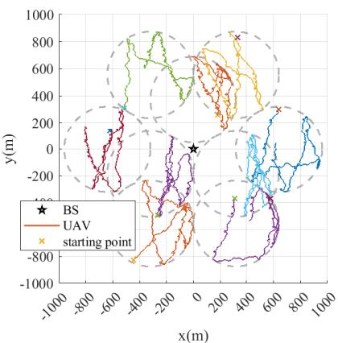

(a) Gauss Markov random mobility model.  
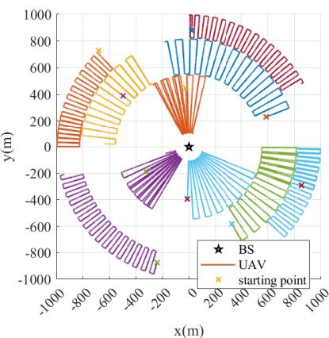  
(b) Predefined direction mobility model.  
Fig. 4: Representative UAV flight trajectories under two mobility models over 30 minutes.

asymptotic standard deviation. Then, the velocity is clipped to $[ \nu _ { \mathrm { m i n } } , \nu _ { \mathrm { m a x } } ]$

Similarly, the azimuth angle of the moving direction in time slot s is

$$
\phi \left( s \right) = \varpi _ { \phi } \phi \left( s - 1 \right) + \left( 1 - \varpi _ { \phi } \right) \mu _ { \phi } + \sqrt { 1 - \varpi _ { \phi } ^ { 2 } } \epsilon _ { \phi } \left( s - 1 \right)\tag{36}
$$

where $\varpi _ { \phi } \in [ 0 , 1 ]$ is the memory level, $\mu _ { \phi }$ is the asymptotic mean, and $\epsilon _ { \phi } \left( s - 1 \right) \sim \mathcal { N } \left( 0 , \sigma _ { \phi } ^ { 2 } \right)$ , with $\sigma _ { \phi }$ being the asymptotic standard deviation. Then, the azimuth angle ϕ (s) is clipped to $\left[ \phi \left( s - 1 \right) - \phi _ { \operatorname* { m a x } } , \phi \left( s - 1 \right) + \phi _ { \operatorname* { m a x } } \right]$ . Notably, the memory level ϖ explicitly captures the degree of temporal correlation. $\mathrm { ~ I f ~ } \varpi \ = \ 1$ , both the velocity and the azimuth angle remain constant over time. If $\varpi = 0$ , the velocity and the azimuth angle become independent of their values in the previous time slot, reducing to a purely random process. In each time slot, the zenith angle θ is an independent random variable, defined as: $\theta = 9 0 ^ { \circ } + \theta _ { \mathrm { m a x } }$ · clip $( 0 . 1 \cdot \epsilon _ { \theta } , - 1 , 1 )$ where $\epsilon _ { \theta } \sim \mathcal { N } ( 0 , 1 )$ . Moreover, if a UAV moves beyond the region boundary, we employ a reflection mechanism to keep it within the area.

In the simulation, we set $\varpi _ { \nu } = 0 . 8 5 , \mu _ { \nu } = 2 \mathrm { m } / \mathrm { s } , \sigma _ { \nu } = 0 . 5 \mathrm { \ : . }$ $\nu _ { \mathrm { m i n } } = 0 . 1 \mathrm { m / s } ,$ and $\nu _ { \mathrm { m a x } } = 4 \mathrm { m } / \mathrm { s }$ . Besides, we set $\varpi _ { \phi } = 0 . 6$ $\sigma _ { \phi } = 3 , \phi _ { \mathrm { { m a x } } } = 6 ^ { \circ }$ , and $\mu _ { \phi }$ is initialized as a uniform random variable over the interval [0, 360◦]. For the zenith angle, we set $\theta _ { \mathrm { m a x } } = 4 0 ^ { \circ }$ . The height of the UAV is between 10m and 30m.

TABLE II: Amount of the FP computation, the client-side TPs, and the smashed data of Swin-L with LoRA
<table><tr><td>u</td><td> $\Psi _ { C F }$   $( \mathrm { G F L O P s } ) ^ { 1 }$ </td><td> $\Psi _ { S F }$   $( \mathbf { G F L O P s } ) ^ { 1 }$ </td><td> $\Gamma _ { M }$  (KB)2</td><td> $\Gamma _ { A }$   $( \mathrm { K B } ) ^ { 2 }$ </td><td>Smashed Data Shape</td></tr><tr><td>1</td><td>6.18</td><td>64.10</td><td>192</td><td>2352</td><td>[56, 56, 192]</td></tr><tr><td>2</td><td>12.50</td><td>57.78</td><td>612</td><td>1176</td><td>[28, 28, 384]</td></tr><tr><td>3</td><td>64.19</td><td>6.09</td><td>7596</td><td>588</td><td>[14, 14, 768]</td></tr><tr><td>4</td><td>70.28</td><td>0.001</td><td>9276</td><td>294</td><td>[7, 7, 1536]</td></tr></table>

1 It is calculated by fvcore with 1Mult-Adds ≈ 2FLOPs.  
2 It is measured in float32 precision.

2) Predefined direction mobility model: Fig. 4(b) shows an example of the predefined direction mobility model. This model is designed to facilitate lawnmower-pattern search missions within designated areas by predefining the azimuth angles of the UAVs. Specifically, the areas are described as follows: The network comprises one BS and $K = 1 0 ~ \mathrm { U A V s }$ The UAVs are distributed across three concentric annular regions centered at the BS. UAVs 1-3, 4-6, and 7-10 are located in the inner, middle, and outer rings, respectively. These regions are delimited by radii of 100m, 550m, 820m, and 1000m from the BS. Within each ring, the UAVs occupy distinct annular sectors formed by equally partitioning the corresponding annular region. If a UAV reaches the linear boundary of its assigned sector, a reflection mechanism is employed to redirect it back into the region. Moreover, all UAVs maintain a fixed height of 20m, i.e., the zenith angle is 90◦. The velocity follows the same update mechanism and parameter settings as the Gauss-Markov model in (35).

## C. Simulation Parameters Setting

1) Simulation scenario and wireless channel: We consider a UAV network with a BS and K UAVs. The BS is located at [0,0,30]m. The time slot length is set to $\tau _ { 0 } = 0 . 1 \mathrm { s }$ . The center frequency is $f _ { c } = 2 \mathrm { G H z }$ . The uplink bandwidth and the downlink bandwidth are $W _ { U } = W _ { D } = 2 0 \mathrm { M H z }$ . The noise PSD is set to $N _ { 0 } = - 1 1 4 \mathrm { d B m / M H z }$ . The path loss $L _ { \mathrm { R M a } , k }$ in dB follows the RMa-AV LOS model in 3GPP TR 36.777 [46]. The channel gain is $h _ { k } ( s ) = 1 0 ^ { - L _ { \mathrm { R M a } , k } ( s ) / 1 0 }$

2) Dataset and model: The BS and UAVs collaborate to fine-tune a Swin-L model (≈200M parameters)7 [47] on the CIFAR-100 dataset, where the input size is 3\*224\*224 and $B = 8 .$ The LoRA modules of rank 8 are injected into all linear layers except the classification head. All parameters except the LoRA modules and the classification head are frozen. Split point u allocates u stages to the client and the remainder to the server. Thus, $\mathcal { U } = \{ 1 , \ldots , 4 \}$ in (14d). The values of $\Psi _ { C F } \left( u \right)$ $\Psi _ { S F } ( u ) , \Gamma _ { M } ( u )$ , and $\Gamma _ { A } \left( u \right)$ are shown in Table II. Besides, we set $\Gamma _ { G } ( u ) = \Gamma _ { A } ( u ) , \Psi _ { S B } ( u ) = \varsigma \Psi _ { S F } ( u ) , \Psi _ { C B } ( u ) =$ $\varsigma \Psi _ { C F } ( u )$ , and ς = 2 since the computations required for BP are about twice that of FP [31]. The number of local iteration is set as I = 5 by default.

3) Computing parameters and transmit power of BS and UAVs: The BS is equipped with a GeForce RTX 4070 for server-side computing, which provides a computing capacity of 29.15TFLOPS and operates at a frequency of $\begin{array} { r l } { f _ { S } } & { { } = } \end{array}$

2.48GHz [48]. Accordingly, we set its computational intensity to $\kappa _ { S } = 2 9 . 1 5 \times 1 0 ^ { 1 2 } / f _ { S }$ FLOPs/cycle. In addition, we set $P _ { S } ~ = ~ 4 0 \mathrm { W }$ and $\alpha _ { \mathrm { m i n } } ~ = ~ \beta _ { \mathrm { m i n } } ~ = ~ 1 / K / 5$ in (14b) and (14c). Each UAV is equipped with a Jetson Orin NX 16GB for client-side computation, offering a computing capacity of 1.88TFLOPS and operating at a frequency of $f _ { k } = 1 . 1 7 3 \mathrm { G H z }$ [49]. This performance level is comparable to that of the Manifold 3, which is compatible with the DJI Matrice 400 [50]. Accordingly, we set its computational density to $\kappa _ { k } =$ $1 . 8 8 \times 1 0 ^ { 1 2 } / f _ { k }$ FLOPs/cycle and set the energy consumption coefficient to $\omega _ { k } = 1 6 \mathrm { W } / ( \mathrm { G H z } ) ^ { 3 }$ . The weight of the energy term in (14a) is set as $\lambda = 4 .$

4) DRL parameters of the BS agent: For the BS agent, we set $D _ { S } = 8$ and $H = 1 6$ in (30). Both $\pi _ { \vartheta }$ and $V _ { \varphi }$ have three hidden layers with 128, 64, and 32 neurons, respectively. Besides, the third hidden layer and the output layer of $\pi _ { \vartheta }$ include three branches for deciding $\alpha _ { k } \left( n \right) , \beta _ { k } \left( n \right)$ , and u (n), respectively. The softmax activation function is used in the outputs of the branches for u (n) to normalize the probabilities. The parameters of Algorithm 3 are set as follows: discount factor is $\gamma = 0 . 5 ,$ learning rates are $\alpha _ { V } = \alpha _ { \pi } = 3 \times 1 0 ^ { - 4 }$ and we set $B _ { m } = 1 2$

## D. Performance Evaluation with Fixed Variables

In this section, we demonstrate the advantages of CPSFL over the baselines under fixed variable settings to isolate its benefits from the influence of the DRL solution. For CPSFL, we set $\alpha _ { k } = \beta _ { k } = 1 / K$ , ∀k. For PipeSFL, we set $\rho _ { k } = \beta _ { k } =$ $1 / K$ , ∀k. For SFL-PP, we set $\alpha _ { k } = \beta _ { k } = \rho _ { k } = 1 / K$ , ∀k. Some default parameter settings are listed as follows: The split point is set as $u = 2 .$ . The transmit power of all UAVs is set as $p _ { k } = 1 \mathsf { W } ,$ ∀k. In the default scenario, there are $K = 9 \ \mathrm { U A V s } .$ Each UAV remains stationary at a random location within a circular region with a radius of 60m. The horizontal distance from the center of the circular region of UAV k to the origin is denoted as $d _ { k }$ . These nine distances are 100, 200, 300, 400, 500, 600, 700, 800, and 900 meters, respectively. The average per-round latency over 500 training rounds τ is adopted as the evaluation metric.

1) An example of the SFL timeline: Fig. 5 compares the timelines of SFL-PP, PipeSFL, and CPSFL, intuitively illustrating the source of CPSFL’s performance gain. Instead of allocating a fraction $\alpha _ { k }$ of the server computing frequency to client k, PipeSFL dedicates its entire computing capacity to the current task. This reduces the server-side computing latency for each client from $\tau _ { S , k }$ in (7) to $\tau _ { S } ^ { \prime } = \alpha _ { k } \tau _ { S , k }$ in (24). Furthermore, PipeSFL incorporates priority scheduling and asynchronous training to further reduce the per-round latency. However, in our simulation setup, the per-round latency is dominated by wireless communication, while both client and server computing latencies remain relatively short. Consequently, the performance gain of PipeSFL over SFL-PP is limited.

In contrast, CPSFL, an advanced variant of SFL-PS, dedicates all downlink communication resources to the current GT. This significantly reduces the GT latency for each client from $\tau _ { S G , k } ^ { \prime }$ in (22) to $\tau _ { S G , k }$ in (21). Although the total GT latency of all K clients (i.e., $\textstyle \sum _ { k = 1 } ^ { K } \tau _ { S G , k } )$ in the sequential GT paradigm is comparable to the individual GT latency of any client $\tau _ { S G , k } ^ { \prime } ,$ ∀k in the parallel GT paradigm, clients that finish their GT in the sequential GT paradigm can immediately proceed to subsequent steps without waiting for all clients to finish. Consequently, the sequential GT paradigm retains its advantage over the parallel one in minimizing per-round training latency even as K grows large. Moreover, by integrating priority scheduling with asynchronous training, CPSFL further reduces the per-round latency.

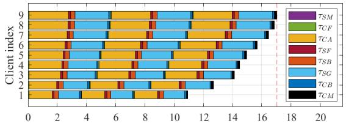

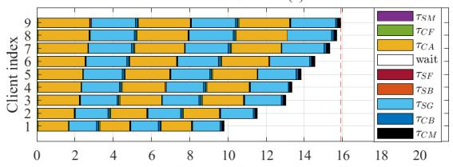

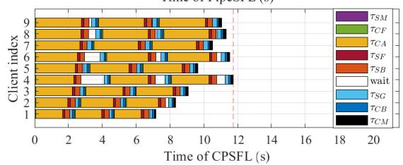  
Fig. 5: Timeline of one training round (consisting of three local iterations, i.e., $I = 3 )$ for nine clients (K = 9) when SFL-PP (top), PipeSFL (middle), or CPSFL (bottom) is applied.

TABLE III: UAV transmit power heterogeneity of six UAV clusters (K=12)
<table><tr><td>Clusters</td><td>UAVs 1-3</td><td> $\mathrm { U A V s ~ 4 – 6 }$ </td><td>UAVs 7-9</td><td>UAVs 10-12</td></tr><tr><td>1</td><td>325, 775</td><td>325, 775</td><td>325, 775</td><td>325, 775</td></tr><tr><td>2</td><td>250, 850</td><td>250,850</td><td>400,700</td><td>400,700</td></tr><tr><td>3</td><td>250,850</td><td>250,850</td><td>250,850</td><td>550, 550</td></tr><tr><td>4</td><td>100,1000</td><td>250,850</td><td>400, 700</td><td>550,550</td></tr><tr><td>5</td><td>100, 1000</td><td>100, 1000</td><td>250, 850</td><td>850, 250</td></tr><tr><td>6</td><td>100, 1000</td><td>100, 1000</td><td>100, 1000</td><td>1000, 100</td></tr></table>

\* In each cell, the first and second values denote the distance $d _ { k }$ (in m) and the UAV transmit power $p _ { k }$ (in mW), respectively.

2) Impact of heterogeneity in transmit power, communication overhead, and computing capacity: In the simulations, we consider three representative UAV heterogeneity scenarios, encompassing variations in communication rate, communication overhead, and computing capacity. The detailed configurations and corresponding simulation results are presented as follows.

First, we evaluate heterogeneity in communication rates. In Table III, we define six UAV clusters with approximately increasing heterogeneity in the distances $d _ { k }$ and the UAV transmit powers $p _ { k }$ . The results are shown in Fig. 6. Second, we evaluate heterogeneity in communication overhead. To mitigate the substantial communication overhead incurred by the large data volumes of smashed data and the gradients (i.e., $\Gamma _ { A }$ and $\Gamma _ { G } )$ during SFL local iterations, quantization techniques have been studied to balance training latency and model accuracy [19], [20]. In Table IV, we define six UAV clusters with approximately increasing heterogeneity in the distances $d _ { k }$ and the number of quantization bits of the smashed data and the corresponding gradients. This configuration mirrors practical deployment scenarios, wherein UAVs closer to the BS (benefiting from superior channel conditions) can support higher-precision transmissions. The results are shown in Fig. 7. Third, we evaluate heterogeneity in computing capacity. In Table V, we define six UAV clusters with approximately increasing heterogeneity in the distances $d _ { k }$ and the onboard computing capacities (adjusted via $\kappa _ { k } )$ . To highlight the impact of heterogeneous computing capacities, we set $u \ = \ 3$ to simulate scenarios with a high computation-to-communication load ratio. The results are shown in Fig. 8.

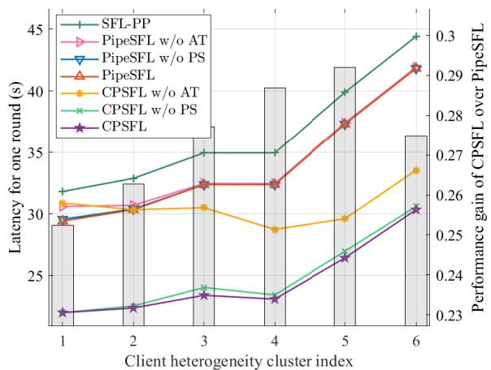  
Fig. 6: Average per-round latency with different degrees of UAV transmit power heterogeneity obtained by CPSFL and the baselines.

TABLE IV: Communication overhead heterogeneity of six UAV clusters (K=12)
<table><tr><td>Clusters</td><td>UAVs 1-3</td><td> $\mathrm { U A V s ~ 4 – 6 }$ </td><td>UAVs 7-9</td><td>UAVs 10-12</td></tr><tr><td>1</td><td>600, 16</td><td>600, 16</td><td>600,16</td><td>600,16</td></tr><tr><td>2</td><td>800,8</td><td>600, 16</td><td>600,16</td><td>400,24</td></tr><tr><td>3</td><td>800,8</td><td>800,8</td><td>400,24</td><td>400,24</td></tr><tr><td>4</td><td>800,8</td><td>800,8</td><td>600, 16</td><td>200,32</td></tr><tr><td>5</td><td>1000,4</td><td>800,8</td><td>400,24</td><td>200,32</td></tr><tr><td>6</td><td>1000, 4</td><td>1000,4</td><td>200,32</td><td>200,32</td></tr></table>

\* In each cell, the first and second values denote the distance $d _ { k }$ (in m) and the number of quantization bits of the smashed data and the corresponding gradients, respectively.

As observed across Fig. 6-8, CPSFL achieves the lowest latency. This performance gain stems from its priority scheduling and intra-round asynchronous training mechanism, which effectively hides the impact of clients with large lag $l _ { k }$ in the GT latencies $\tau _ { S G , k }$ . In contrast, PipeSFL struggles to hide the latency of clients with large lag $l _ { k } ^ { \prime }$ in the server computing latencies $\tau _ { S } ^ { \prime }$ since $\tau _ { S } ^ { \prime }$ is relatively small in our wireless UAV setting.

3) Impact of the split point: Fig. 9 shows the average perround latency $\overline { { \tau } }$ for different split points u. First, increasing u leads to a decrease in $\overline { { \tau } }$ across all schemes since it reduces $\Gamma _ { A }$ (u) (see Table II), thereby decreasing $\tau _ { C A , k } , \tau _ { S G , k } ,$ and $\tau _ { S G , k } ^ { \prime } .$ Moreover, CPSFL achieves the lowest latency. When $u = 2 ,$ , it reduces τ by nearly 30% compared to PipeSFL. This gain is more pronounced for smaller u since in this case, the communication latency constitutes a larger fraction of $\tau \left( n \right)$ , and the benefit of time-division sequential GT becomes significant.

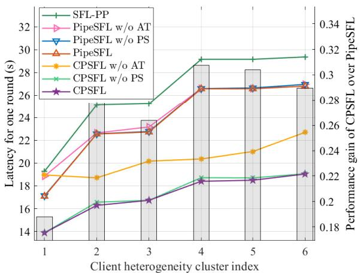  
Fig. 7: Average per-round latency with different degrees of communication overhead heterogeneity obtained by CPSFL and the baselines.

TABLE V: UAV computing capacity heterogeneity of six UAV clusters (K=12)
<table><tr><td>Clusters</td><td>UAVs 1-3</td><td> $\mathrm { U A V s ~ 4 – 6 }$ </td><td>UAVs 7-9</td><td>UAVs 10-12</td></tr><tr><td>1</td><td>500, 0.5</td><td>500, 0.5</td><td>500, 0.5</td><td>500, 0.5</td></tr><tr><td>2</td><td>350, 0.66</td><td>500, 0.5</td><td>500, 0.5</td><td>650, 0.4</td></tr><tr><td>3</td><td>350, 0.66</td><td>350, 0.66</td><td>650, 0.4</td><td>650, 0.4</td></tr><tr><td>4</td><td>350, 0.66</td><td>350, 0.66</td><td>500, 0.5</td><td>800, 0.33</td></tr><tr><td>5</td><td>200,1</td><td>350, 0.66</td><td>650, 0.4</td><td>800, 0.33</td></tr><tr><td>6</td><td>200, 1</td><td>200,1</td><td>800, 0.33</td><td>800, 0.33</td></tr></table>

In each cell, the first and second values denote the distance $d _ { k }$ (in m) and the ratio of the UAV computing capacity to that of the Jetson Orin NX, respectively.

4) Impact of the number of local iterations and clients: Fig. 10 and Fig. 11 show the average per-round latency τ with different numbers of local iterations I and clients K, respectively. For Fig. 11, the parameter settings for the clients (e.g., transmit powers $p _ { k }$ and distances $d _ { k } )$ when $K = 1 8$ are obtained by replicating the configuration used for $K = 9$ . This pattern extends analogously for $K = 2 7 , 3 6 , \ldots .$ Both figures show that τ grows approximately linearly with I or K. In Fig. 11, increasing K raises τ since the total available resources, including the bandwidth $W _ { U }$ and $W _ { D } ,$ server transmit power $P _ { S }$ , and server computing frequency $f _ { S } ,$ , are limited. Under the uniform resource allocation setting, the average resource share per client decreases linearly as K increases. Consequently, both the computation and communication latency per client scale approximately linearly with K. Moreover, CPSFL achieves the lowest latency across all values of K, with the performance gain over PipeSFL slightly increases with larger I or K.

5) Evaluation of Algorithm 2 under probabilistic GT fail ures: Under probabilistic GT failures (i.e., Step 6), we conduct simulations to compare the average per-round latency $\overline { { \tau } }$ of

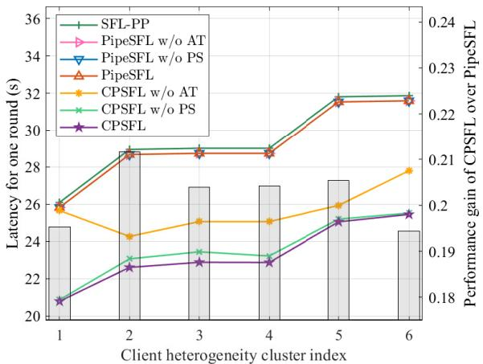  
Fig. 8: Average per-round latency with different degrees of UAV computing capacity heterogeneity obtained by CPSFL and the baselines.

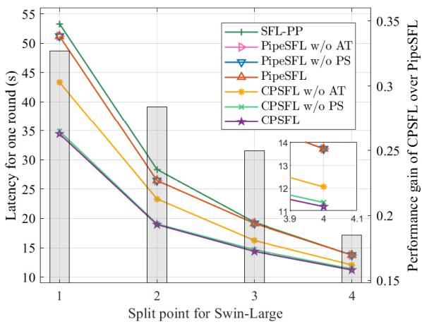  
Fig. 9: Average per-round latency with different split points u obtained by CPSFL and the baselines.

Algorithm 2 against its ablation variants. The “abla1” variant ablates Line 2 of Algorithm 2, where the lag calculation under Step 6 failure is identical to that under successful transmission. The “abla2” variant ablates Line 5, where $\tau _ { C B , k } ( n , i - 1 )$ is set to zero in the lag calculation if step 6 failed for client k at iteration i − 1. The failure probability of Step 6 is set to 0.3 across all clients. We assume that, during priority calculation, the server can perfectly predict whether the upcoming Step 6 of client k will fail. The number of quantization bits of the smashed data is set to 8 bits. All other simulation parameters align with those in Fig. 10. Table VI presents the results, which show that the scheduling priority calculation in Algorithm 2 effectively reduces the per-round latency under GT failures.

## E. Performance Evaluation with Optimized Variables

In this section, to show the advantages of the DRL-based scheme in Algorithm 3, we compare it with some ablation baselines. The baselines are appended with the suffixes to indicate how the variables are determined.

• DRL (proposed): The SPS and CCRA are decided by Algorithm 3.

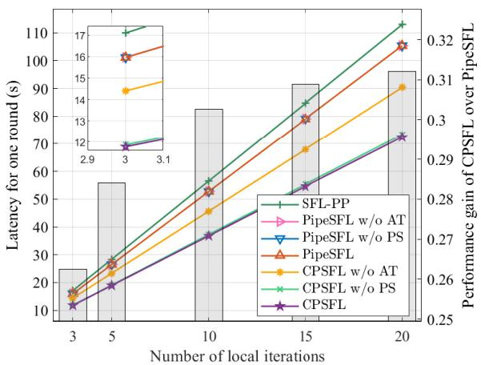  
Fig. 10: Average per-round latency with different numbers of local iterations I obtained by CPSFL and the baselines.

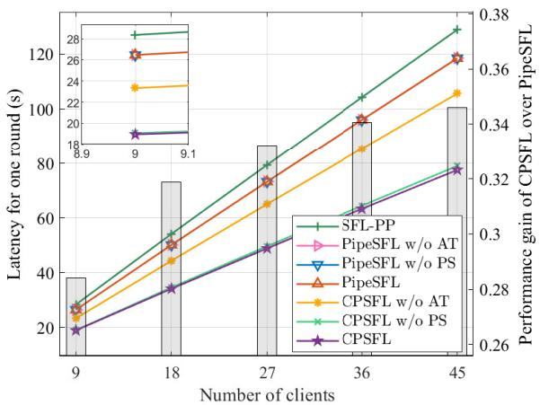  
Fig. 11: Average per-round latency with different numbers of clients K obtained by CPSFL and the baselines.

• DRL(-): A variant that replaces $[ \mathcal { X } _ { k } ( s ) ] _ { s \in \mathcal { S } ( n - 1 ) } ,$ ∀k in (31) with the distances from the BS to all UAVs at the last time slot in $S \left( n - 1 \right)$ . Thus, the attention mechanism is not involved.

• equal RA: The SPS is decided by Algorithm 3, while the CCRA is fixed at $\alpha _ { k } = \beta _ { k } = 1 / K$ , ∀k.

• heuristic RA: This baseline differs from “equal $\mathbf { R A } ^ { \prime \prime }$ only in its bandwidth allocation: $\beta _ { k }$ are configured to equalize the uplink rates $R _ { U , k }$ in (1) across all clients, using channel conditions at the initial time slot of each round.

$u = \widetilde { u } \ast$ The CCRA is decided by Algorithm 3, while u is fixed at u.

First, we conduct simulations in the scenario illustrated in Fig. 4(a), where the Gauss-Markov model described in Section V-B1 is adopted. The transmit powers $p _ { k }$ for the UAVs located in the three inner circular regions are set to 0.9, 0.3, and 0.1 W, respectively. For the six outer UAVs, $p _ { k }$ are set to 0.9, 0.9, 0.3, 0.3, 0.1, and 0.1 W, respectively. Fig. 12 shows the per-round latency τ (n) and the maximum energy consumption of all UAVs for one round $\operatorname* { m a x } _ { k } \{ e _ { k } ( n ) \}$ obtained by the DRL-based CPSFL scheme and the baselines. Each value is a moving average with a span of 21 rounds. The proposed scheme attains an average objective value (see (14a)) of 144.9 over the last 1000 rounds, compared to 146.9 for the DRL(-) scheme. This improvement stems from its ability to reduce environmental uncertainty by learning the relationship among UAV trajectories, actions, and rewards. Moreover, the proposed DRL scheme can effectively handles the challenging joint optimization of SPS and CCRA within CPSFL. For comparison, the equal RA scheme and the heuristic RA scheme yields an average objective value of 154.4 and 154.2, respectively, confirming that the proposed scheme achieves a superior latency-energy trade-off by adapting to heterogeneous UAV transmit powers and time-varying channel conditions induced by mobility. Furthermore, the performance of the proposed scheme approaches that of the CPSFL scheme with $u \ = \ 2 .$ , which is the best fixed split point scheme evaluated by the objective values in (14a). This shows that the BS agent in the proposed scheme can automatically select a high-performance split point. Notably, when both CPSFL and PipeSFL employ the DRL for decision-making, CPSFL consistently achieves lower latency and energy consumption, further validating the benefits of sequential GT and CPSFL’s two key enhancements.

TABLE VI: Average per-round latency in seconds obtained by CPSFL and the baselines under GT failures.
<table><tr><td>Number of local iterations I</td><td>5</td><td>10</td><td>15</td><td>20</td></tr><tr><td>CPSFL, abla1</td><td>14.39</td><td>28.89</td><td>43.28</td><td>57.64</td></tr><tr><td>CPSFL, abla2</td><td>13.97</td><td>28.08</td><td>42.26</td><td>56.57</td></tr><tr><td>CPSFL</td><td>13.97</td><td>27.98</td><td>42.07</td><td>56.38</td></tr></table>

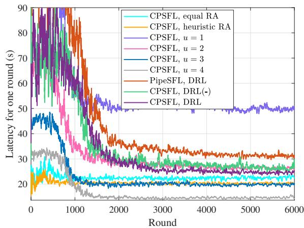

(a) Latency for one round.  
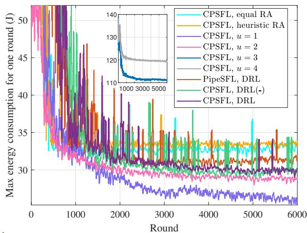  
(b) Maximum energy consumption of all UAVs.  
Fig. 12: Latency and the maximum energy consumption of all UAVs for one round obtained by the DRL-based CPSFL scheme and the baselines within the Gauss Markov random mobility model.

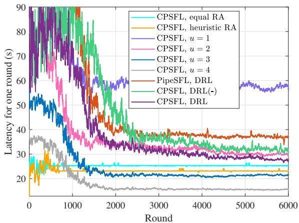  
(a) Latency for one round.

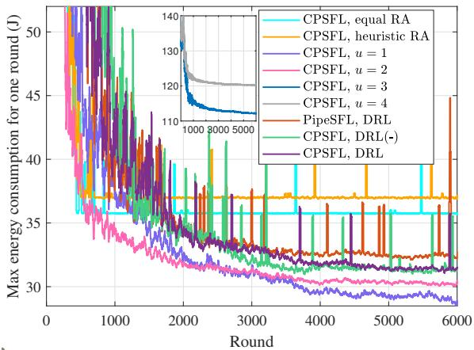  
(b) Maximum energy consumption of all $\mathrm { U A V s } .$  
Fig. 13: Latency and the maximum energy consumption of all UAVs for one round obtained by the DRL-based CPSFL scheme and the baselines within the predefined direction mobility model.

Then, we conduct simulations in the scenario illustrated in Fig. 4(b), where the predefined direction model described in Section V-B2 is adopted. The UAVs have heterogeneous transmit powers, with $p _ { k }$ for UAV 1-10 set to 1, 0.4, 0.1, 1, 0.4, 0.1, 1, 0.4, 0.2, and 0.1 W, respectively. Fig. 13 shows the per-round latency τ (n) and the maximum energy consumption maxk $\{ e _ { k } ( n ) \}$ } obtained by the DRL-based CPSFL scheme and the baselines. The proposed scheme converges faster than the DRL(-) scheme. Besides, the objective value (see (14a)) over the last 1000 rounds of the proposed scheme, the DRL(-) scheme, the equal RA scheme, and the heuristic RA scheme are 154.1, 158.4, 168.8, and 171.4, respectively. Therefore, we can draw conclusions similar to those observed in Fig. 12.

Finally, Table VII shows the average inference latency of the policy network over 500 rounds, measured on an NVIDIA T400 4GB GPU. For the numbers of clients K ranging from 9 to 45, the policy inference latencies remain below 0.1s. As K increases, the inference latency grows, primarily due to the expanded dimensionality of the observation and action spaces. In our simulation setup, however, the per-round training latency of the SFL typically ranges from tens to dozens of seconds and scales with K under fixed total resources (as shown in Fig. 11). Consequently, the ratio of the inference latency to the training latency remains small across K=9-45. This confirms that the policy inference overhead stays practically acceptable and the DRL agent can operate in real time.

TABLE VII: Average inference latency of the policy network
<table><tr><td>Number of clients K</td><td>9</td><td>18</td><td>27</td><td>36</td><td>45</td></tr><tr><td>Latency (ms)</td><td>24.72</td><td>26.06</td><td>30.15</td><td>43.08</td><td>59.93</td></tr></table>

## VI. CONCLUSIONS

In this paper, we have proposed a sequential GT paradigm, where the server dedicates all downlink resources for the current GT. We have further proposed CPSFL, characterized by downlink GT priority scheduling and intra-round asynchronous training. We have investigated CPSFL-based LoRA fine-tuning of FMs in UAV networks and have formulated an optimization problem to minimize the per-round training latency and the worst-case client energy consumption by optimizing the SPS, the uplink bandwidth allocation, and the server computing frequency allocation. To solve this problem, we have developed an attention-based DRL framework, where the BS agent decides the split point and the CCRA in each round by leveraging previous round information including UAV trajectories. Simulation results have shown that the proposed DRL-based CPSFL scheme outperforms the baselines, the ablation variants, the heuristic CCRA scheme, and approaches the best fixed-SPS scheme. This study lays the foundation for finer-grained pipelining paradigms in SFL.

## REFERENCES

[1] H. Kheddar, Y. Habchi, M. C. Ghanem, M. Hemis, and D. Niyato, “Recent advances in transformer and large language models for UAV applications,” arXiv preprint arXiv:2508.11834, 2025.

[2] G. Qu, Q. Chen, W. Wei, Z. Lin, X. Chen, and K. Huang, “Mobile edge intelligence for large language models: A contemporary survey,” IEEE Commun. Surv. Tut., vol. 27, no. 6, pp. 3820–3860, 2025.

[3] Z. Chen, H. H. Yang, Y. Tay, K. F. E. Chong, and T. Q. Quek, “The role of federated learning in a wireless world with foundation models,” IEEE Wireless Commun., vol. 31, no. 3, pp. 42–49, 2024.

[4] N. Yan, Y. Su, Y. Deng, and R. Schober, “Federated fine-tuning of LLMs: Framework comparison and research directions,” IEEE Commun. Mag., vol. 63, no. 10, pp. 52–58, 2025.

[5] E. J. Hu, Y. Shen, P. Wallis, Z. Allen-Zhu, Y. Li, S. Wang, L. Wang, W. Chen et al., “Lora: Low-rank adaptation of large language models.” ICLR, vol. 1, no. 2, p. 3, 2022.

[6] C. Thapa, P. C. M. Arachchige, S. Camtepe, and L. Sun, “Splitfed: When federated learning meets split learning,” in Proc. AAAI Conf. Artif. Intell., vol. 36, no. 8, 2022, pp. 8485–8493.

[7] Z. Lin, G. Qu, X. Chen, and K. Huang, “Split learning in 6G edge networks,” IEEE Wireless Commun., vol. 31, no. 4, pp. 170–176, 2024.

[8] X. Qiang, Z. Chang, C. Ye, T. Hamalainen, and G. Min, “Split federated learning empowered vehicular edge intelligence: Concept, adaptive design, and future directions,” IEEE Wireless Commun., vol. 32, no. 4, pp. 90–97, 2025.

[9] W. Ni, H. Tian, S. Wang, C. Li, L. Sun, and Z. Yang, “Federated split learning for resource-constrained robots in industrial IoT: Framework comparison, optimization strategies, and future directions,” arXiv preprint arXiv:2510.05713, 2025.

[10] C. Xu, J. Li, Y. Liu, Y. Ling, and M. Wen, “Accelerating split federated learning over wireless communication networks,” IEEE Trans. Wireless Commun., vol. 23, no. 6, pp. 5587–5599, 2024.

[11] S. Chu, Y. Ni, J. Li, K. Wei, and J. Wang, “Online device scheduling and model partition in hybrid asynchronous split federated learning,” IEEE Commun. Lett., vol. 29, no. 8, pp. 1869–1873, 2025.

[12] G. Qiang, F. Fang, H. Chen, and X. Wang, “Joint computational resource allocation and layer partitioning for federated learning,” IEEE Internet Things J., no. 99, pp. 1–1, 2025.

[13] G. Zhu, Y. Deng, X. Chen, H. Zhang, Y. Fang, and T. F. Wong, “ESFL: Efficient split federated learning over resource-constrained heterogeneous wireless devices,” IEEE Internet Things J., vol. 11, no. 16, pp. 27 153–27 166, 2024.

[14] Y. Wen, G. Zhang, K. Wang, and K. Yang, “Training latency minimization for model-splitting allowed federated edge learning,” IEEE Trans. Netw. Sci. Eng., vol. 12, no. 3, pp. 2081–2092, 2025.

[15] H. Ao, H. Tian, W. Ni, G. Nie, and D. Niyato, “Semi-asynchronous federated split learning for computing-limited devices in wireless networks,” IEEE Trans. Wireless Commun., vol. 24, no. 6, pp. 5196–5212, 2025.

[16] X. Wang, S. Song, Z. Zhang, X. Hou, Z. Li, T. Xing, and X.-P. Zhang, “Split federated learning for resource-constrained edge computing networks,” IEEE Trans. Consum. Electron., vol. 71, no. 4, pp. 11 001– 11 013, 2025.

[17] J. Hu, Y. Liang, Y. Chen, G. Liu, W. Chen, and L. Duan, “Performance optimization of split federated learning in heterogeneous edge computing environments,” IEEE Trans. Ind. Inform., vol. 22, no. 1, pp. 154–164, 2026.

[18] S. Zhang, W. Wu, L. Song, and X. Shen, “Efficient model training in edge networks with hierarchical split learning,” IEEE Trans. Mobile Comput., vol. 24, no. 10, pp. 10 214–10 229, 2025.

[19] X. Qiang, H. Liu, X. Zhang, Z. Chang, and Y.-C. Liang, “Deploying large AI models on resource-limited devices with split federated learning,” IEEE Trans. Mobile Comput., 2026, early access.

[20] S. Zhang, G. Cheng, W. Wu, X. Huang, L. Song, and X. Shen, “Split fine-tuning for large language models in wireless networks,” IEEE J. Sel. Topics Signal Process., vol. 19, no. 7, pp. 1376–1391, 2025.

[21] Z. Li, S. Wu, L. Li, and S. Zhang, “Energy-efficient split learning for fine-tuning large language models in edge networks,” IEEE Netw. Lett., vol. 7, no. 3, pp. 176–180, 2025.

[22] X. Chen, W. Wu, F. Ji, Y. Lu, and L. Li, “Privacy-aware split federated learning for LLM fine-tuning over internet of things,” IEEE Internet Things J., vol. 12, no. 24, pp. 51 902–51 913, 2025.

[23] M. Wu, R. Yang, X. Huang, Y. Wu, J. Kang, and S. Xie, “Joint optimization of model partition and resource allocation for split federated learning over vehicular edge networks,” IEEE Trans. Veh. Technol., vol. 73, no. 10, pp. 15 860–15 865, 2024.

[24] L. Yu, Z. Chang, Y. Jia, and G. Min, “Model partition and resource allocation for split learning in vehicular edge networks,” IEEE Trans. Intell. Transp. Syst., vol. 26, no. 10, pp. 17 851–17 865, 2025.

[25] W. Wu and X. Huang, “Split-LEO: efficient AI model training over LEO satellite networks,” Sci. China Inf. Sci., vol. 68, no. 9, pp. 1–15, 2025.

[26] W. Wu, M. Li, K. Qu, C. Zhou, X. Shen, W. Zhuang, X. Li, and W. Shi, “Split learning over wireless networks: Parallel design and resource management,” IEEE J. Sel. Areas Commun., vol. 41, no. 4, pp. 1051– 1066, 2023.

[27] Z. Lin, G. Zhu, Y. Deng, X. Chen, Y. Gao, K. Huang, and Y. Fang, “Efficient parallel split learning over resource-constrained wireless edge networks,” IEEE Trans. Mobile Comput., vol. 23, no. 10, pp. 9224–9239, 2024.

[28] H. Ao, H. Tian, and W. Ni, “Federated split learning for edge intelligence in resource-constrained wireless networks,” IEEE Trans. Consum. Electron., vol. 71, no. 2, pp. 4451–4463, 2025.

[29] Z. Lin, G. Qu, W. Wei, X. Chen, and K. K. Leung, “AdaptSFL: Adaptive split federated learning in resource-constrained edge networks,” IEEE Trans. Netw., vol. 33, no. 6, pp. 2993–3008, 2025.

[30] Z. Lin, Z. Chen, X. Chen, W. Ni, and Y. Gao, “HASFL: Heterogeneityaware split federated learning over edge computing systems,” arXiv preprint arXiv:2506.08426, 2025.

[31] X. Qiang, Z. Chang, Y. Hu, L. Liu, and T. Ham¨ al¨ ainen, “Adaptive and¨ parallel split federated learning in vehicular edge computing,” IEEE Internet Things J., vol. 12, no. 5, pp. 4591–4604, 2025.

[32] X. Chen, L. Li, F. Ji, and W. Wu, “Memory-efficient split federated learning for LLM fine-tuning on heterogeneous mobile devices,” in Proc. IEEE Conf. Comput. Commun. Workshops (INFOCOM WKSHPS), 2025, pp. 1–6.

[33] K. Zhao and Z. Yang, “Efficient federated split learning for large language models over communication networks,” arXiv preprint arXiv:2504.14667, 2025.

[34] C. Meng, M. Tang, and V. W. Wong, “ASFL: An adaptive model splitting and resource allocation framework for split federated learning,” arXiv preprint arXiv:2603.04437, 2026.

[35] F. Solat, J. Lee, and D. Niyato, “Split federated learning-empowered energy-efficient mobile traffic prediction over UAVs,” IEEE Wireless Commun. Lett., vol. 13, no. 11, pp. 3064–3068, 2024.

[36] L. U. Khan, M. Guizani, S. Muhaidat, and M. Ayyash, “QoS-enabled wireless split federated learning: A reinforcement learning and optimization approach,” IEEE Trans. Consum. Electron., vol. 71, no. 3, pp. 8968–8978, 2025.

[37] Y. Gao, B. Hu, M. B. Mashhadi, W. Wang, and M. Bennis, “PipeSFL: A fine-grained parallelization framework for split federated learning on heterogeneous clients,” IEEE Trans. Mobile Comput., vol. 24, no. 3, pp. 1774–1791, 2025.

[38] W. Wei, Z. Lin, X. Liu, H. Du, D. Niyato, and X. Chen, “Optimizing split federated learning with unstable client participation,” IEEE Trans. Mobile Comput., 2026, early access.

[39] P. Han, C. Huang, G. Tian, M. Tang, and X. Liu, “Convergence analysis of split federated learning on heterogeneous data,” Proc. Adv. Neural Inf. Process. Syst., vol. 37, pp. 103 476–103 544, 2024.

[40] G. Sun, W. Xie, D. Niyato, F. Mei, J. Kang, H. Du, and S. Mao, “Generative AI for deep reinforcement learning: Framework, analysis, and use cases,” IEEE Wireless Commun., vol. 32, no. 3, pp. 186–195, 2025.

[41] A. Vaswani, N. Shazeer, N. Parmar, J. Uszkoreit, L. Jones, A. N. Gomez, Ł. Kaiser, and I. Polosukhin, “Attention is all you need,” Proc. Adv. Neural Inf. Process. Syst., vol. 30, 2017.

[42] J. Schulman, F. Wolski, P. Dhariwal, A. Radford, and O. Klimov, “Proximal policy optimization algorithms,” arXiv preprint arXiv:1707.06347, 2017.

[43] C. Tan, R. Wen, R. Li, Z. Zhao, E. Hossain, and H. Zhang, “Tool-aided evolutionary LLM for generative policy toward efficient resource management in wireless federated learning,” IEEE J. Sel. Areas Commun., 2025.

[44] J. Xie, Y. Wan, J. H. Kim, S. Fu, and K. Namuduri, “A survey and analysis of mobility models for airborne networks,” IEEE Commun Surv. Tut., vol. 16, no. 3, pp. 1221–1238, 2013.

[45] H. Tabassum, M. Salehi, and E. Hossain, “Fundamentals of mobilityaware performance characterization of cellular networks: A tutorial,” IEEE Commun. Surv. Tut., vol. 21, no. 3, pp. 2288–2308, 2019.

[46] 3GPP, “Study on enhanced LTE support for aerial vehicles,” Technical Report (TR) 36.777, 2017, version 15.0.0. [Online]. Available: https://www.3gpp.org/DynaReport/36777.htm

[47] Z. Liu, Y. Lin, Y. Cao, H. Hu, Y. Wei, Z. Zhang, S. Lin, and B. Guo, “Swin transformer: Hierarchical vision transformer using shifted windows,” in Proc. IEEE/CVF Int. Conf Comput. Vis., 2021, pp. 10 012– 10 022.

[48] NVIDIA Corporation, “NVIDIA GeForce graphics cards comparison,” 2025. [Online]. Available: https://www.nvidia.cn/geforce/graphics-cards/ compare/

[49] ——, “NVIDIA Jetson Orin NX,” 2025. [Online]. Available: https: //www.nvidia.cn/autonomous-machines/embedded-systems/jetson-orin/

[50] DJI, “Manifold 3 support,” 2025. [Online]. Available: https://www.dji. com/support/product/manifold-3

  
Zizhen Zhou (Graduate Student Member, IEEE) received the B.S. degree in communication engineering from the University of Electronic Science and Technology of China (UESTC), China, in 2021, where he is currently pursuing the Ph.D. degree. He is currently a visiting student with the College of Computing and Data Science, at Nanyang Technological University, Singapore. His research interests include wireless communications, federated learning, and reinforcement learning.

Ying-Chang Liang (Fellow, IEEE) is a Professor with the University of Electronic Science and Technology of China, China. He was a Professor with The University of Sydney, Australia; and a Principal Scientist with the Institute for Infocomm Research (I2R), Singapore. His research interests include 5G/6G networks, cognitive radio, dynamic spectrum access, symbiotic radio, and passive Internet of Things. He was a recipient of numerous paper awards, including the IEEE Communications Society Award for Advances in Communications in

2022, the IEEE Communications Society Stephen O. Rice Prize in 2021, and the IEEE Vehicular Technology Society Jack Neubauer Memorial Award in 2014. He also received the Recognition Award and Publication Award from the IEEE Communications Society Technical Committee on Cognitive Networks in 2018 and 2020, respectively. He has been recognized by Clarivate Analytics as a Highly Cited Researcher since 2014. He was the Founding Editor-in-Chief of the IEEE JOURNAL ON SELECTED AREAS IN COMMUNICATIONS: Cognitive Radio Series from 2011 to 2014, and the Editor-in-Chief of the IEEE TRANSACTIONS ON COGNITIVE COMMUNICATIONS AND NETWORKING from 2019 to 2022. He was a Guest/Associate Editor of the IEEE TRANSACTIONS ON WIRELESS COMMUNICATIONS, the IEEE JOURNAL OF SELECTED AREAS IN COMMUNICATIONS, the IEEE Signal Processing Magazine, the IEEE TRANSACTIONS ON VEHICU-LAR TECHNOLOGY, and the IEEE TRANSACTIONS ON SIGNAL AND INFORMATION PROCESSING OVER NETWORK. He is currently the Associate Editor-in-Chief of China Communications. He served as the TPC Chair and the Executive Co-Chair for the IEEE Globecom 2017 and the TPC Co-Chair for the IEEE Globecom 2024.

Yanyu Cheng received the B.Eng. degree in Information Engineering from Shanghai Jiao Tong University, China, in 2015, and the M.Sc. degree in Signal Processing and the Ph.D. degree in Electrical and Electronic Engineering (EEE) from Nanyang Technological University (NTU), Singapore, in 2016 and 2021, respectively. From 2021 to 2023, he was a Research Fellow with the Alibaba-NTU Singapore Joint Research Institute, NTU, Singapore. From 2023 to 2025, he served as a Tenure-Track Professor with Hangzhou Dianzi University, China.

He is currently a Senior Research Fellow with the School of EEE, NTU, Singapore. His research interests include wireless networks, cybersecurity, and AI-enabled intelligent systems.

Wei Yang Bryan Lim is an Assistant Professor at the College of Computing and Data Science at Nanyang Technological University (NTU), Singapore. He was Tan Chin Tuan exchange fellow with the University of Tokyo (2024-2025) and Wallenberg-NTU Presidential Postdoctoral Fellow (2022-2023). His works on efficient, decentralized, and responsible AI has appeared in top venues such as NeurIPS, ICLR, CVPR, AAAI, TKDE, TNNLS, JSAC, TMC, TPDS. He has won recognitions such as the Singapore Teaching and Academic Research

Talent Scheme (START), World’s Top 2% Scientist (2023-2025), Most Promising Industrial Postgraduate Programme Student award, and the IEEE Technical Community on Scalable Computing (TCSC) Outstanding PhD Dissertation Award. His services at top conferences include Area Chair (NeurIPS, ICLR) and Programme Committee (AAAI, IJCAI). He also serves on the editorial board for IEEE Transactions on Neural Networks and Learning Systems, IEEE Transactions on Parallel and Distributed Systems, Scientific Reports, and IEEE Transactions on Vehicular Technology.