# Completion Time Minimization for UAV-Assisted Semi-Decentralized Hybrid Federated Learning

Kui Chen , Jing Zhang , Member, IEEE, Yong Xiao , Senior Member, IEEE, Minho Jo , Senior Member, IEEE, and Derrick Wing Kwan Ng , Fellow, IEEE

Abstract—The Internet-of-Things (IoT) enables the connection of myriad wireless devices, generating a massive influx of data that can overwhelm central servers. Federated learning (FL) mitigates these issues by distributing computation tasks across edge devices, thus preserving data privacy by eliminating the need for raw data transmission. However, when deployed in large-scale IoT networks, FL encounters several challenges such as device energy constraints, heterogeneous network conditions, and the straggler effect, which inevitably impedes model convergence. In response, this paper proposes a semi-decentralized hybrid FL (SDHFL) scheme leveraging an Unmanned Aerial Vehicle (UAV) as a mobile data center to collect data from distributed IoT clusters. To further expedite FL convergence, we formulate a non-convex mixed-integer nonlinear programming (MINLP) problem to minimize overall completion time while ensuring quality of service (QoS) requirements, considering both the UAV’s energy constraints and network stability. We demonstrate that efficient learning is achieved by optimizing both power allocation and device computational capability. Furthermore, we prove the convergence of the proposed SDHFL scheme and derive the minimum number of global iterations required. Exploiting these insights, we introduce a low-complexity suboptimal algorithm for dynamic cluster selection and resource allocation optimization, leveraging Lyapunov optimization theory to obtain optimal solutions efficiently, demonstrating its scalability for largescale networks. Our simulation results validate the effectiveness of the proposed SDHFL framework, revealing a non-trivial tradeoff where the overall completion time initially decreases and then increases as the number of devices or clusters grows, indicating the necessity of optimizing both cluster counts and intra-cluster device allocations. Furthermore, compared to several baseline schemes, our proposed optimal algorithms significantly reduce overall completion time and enhance model convergence, demonstrating the potential of SDHFL for enabling efficient and scalable FL in IoT networks.

Index Terms—Federated learning, UAV, device-to-device (D2D) communications, Lyapunov optimization, convex optimization.

## I. INTRODUCTION

I <sup>N</sup> <sup>RECENT</sup> <sup>years,</sup> <sup>the</sup> <sup>IoT</sup> <sup>has</sup> <sup>experienced</sup> <sup>rapid</sup> <sup>growth,</sup>offering extensive sensing and computing capabilities that facilitates the seamless connection of numerous devices to the Internet [1]. These devices enable the rapid transmission of collected information, thereby enhancing intelligent decisionmaking processes for the effective management of smart ecosystems [2]. As such, IoT devices hold significant potential for mass deployment in various crowdsensing tasks, such as temperature and humidity monitoring, medical services, and air quality measurement [3], [4]. However, the massive volume of data generated by ubiquitous IoT devices results in a substantial load on networks when transmitted to centralized data centers. To alleviate the computational and storage burdens on data centers, mobile edge computing (MEC) has emerged as a promising solution by offloading computational tasks to locations closer to end devices [5]. Considering the growing security concerns surrounding sensitive personal data, the most important advantage of MEC is its ability to process data locally, significantly reducing the exposure of sensitive information during transmission and thereby enhancing data security and privacy.

Compared with conventional edge computing approaches, FL has recently emerged as a distributed collaborative artificial intelligence method, enabling multiple edge devices to train local models without sharing their raw sensing data. Deploying FL in practical wireless networks presents numerous advantages. Specifically, by eliminating the necessity of transmitting raw data during the training of the global model, the FL aggregator minimizes the exposure of sensitive user information over wireless communication channels. Besides, through periodic interactions with data centers for model updates, mobile devices further enhance user privacy and reduce the risk of data interception [6]. Meanwhile, FL significantly reduces communication latency and conserves critical network resources, such as spectrum bandwidth and transmit power, by reducing the volume of data that needs to be transmitted to the data center. By facilitating continuous training and local decision-making at edge devices, FL effectively supports real-time response tasks and time-sensitive applications, such as autonomous vehicle systems [7], [8]. Furthermore, FL lowers communication costs and alleviates the load on backbone networks. By leveraging the computational resources and private datasets available on IoT devices, FL achieves a faster convergence rate and improved learning accuracy in comparison to centralized AI approaches [9]. Therefore, deploying FL in wireless networks ensures robust data privacy and conserves communication resources, positioning it as a promising paradigm for the future distributed learning.

Despite the fruitful application of FL in wireless networks, two critical open issues remain unsolved, hindering its effective deployment in wide-area IoT networks. Firstly minimizing the completion time of FL in IoT networks poses a significant chal lenge due to straggler delays, which arise from heterogeneous device capabilities and the presence of non-independent and identically distributed (non-i.i.d.) data [10]. In fact, several prior research has attempted to address these challenges through various primary approaches. For instance, a synchronous FL scheme was introduced by [11], where global model updates occur only after all devices have completed local training, which leads to excessive delays due to stragglers. An effective alternative solution to this problem is to transition from a synchronous to an asynchronous approach, whereby the data center updates the global model without waiting for all devices to complete their local training. In light of constraints in wireless communication resources, an asynchronous FL scheme with periodic aggregation was proposed specifically to address the straggler issue in FL systems [12]. In addition, a novel semi-asynchronous FL mechanism was introduced for heterogeneous edge computing, addressing edge heterogeneity while simultaneously mitigating the straggler effect and reducing communication resource consumption [13]. Another approach to alleviate the straggler issue involves utilizing buffers in edge devices. Since data fetching time becomes the primary contributor to the straggler effect in distributed datasets, an adaptive load-balancing approach was proposed to equalize processing times among edge devices while ensuring model accuracy [14]. Furthermore, by employing a replay buffer to store network weight values, [15] introduced a device assignment algorithm based on a dueling double deep Q-network (D3QN) to balance workloads across edge server and reduce latency in the entire hierarchical FL framework. However, although asynchronous FL primarily alleviates straggler effect to some extent, the heterogeneity of edge device data and the non-i.i.d. data distribution continue to significantly hin der model convergence. Meanwhile, implementing a buffering mechanism in IoT devices to reduce latency in FL tasks over wireless networks also poses critical challenges, as data queue backlogs can adversely affect the stability of edge device queues. Moreover, existing works fail to address the issue of limited battery energy storage in edge devices, which severely impact the sustainability of model training and the efficiency of wireless communication.

On the other hand, the energy-latency trade-off in wide-area networks with sporadic connectivity presents another critical challenge, particularly for battery-powered edge devices, such as remote environmental monitoring, smart-grid, and IoT-based smart agriculture. Since most edge devices operate on batteries with limited capacity, this constraint significantly restricts both the coverage and the operational lifetime of data communications. To enhance IoT devices coverage, both device-to-device (D2D) relaying network and UAV-assisted FL techniques have been proposed [16], [17], [18], [19], [20]. Specifically, to improve QoS for cell-edge devices in interference-limited 5G narrowband IoT networks, the D2D relay coverage problem was reformulated as an equivalent network uplink data rate maximization problem, which was subsequently addressed exploiting a heuristic algorithm in [16]. Meanwhile, a UAV-assisted FL system was proposed in [17] to mitigate the straggler issue by leveraging the mobility of UAV and high-altitude capabilitie when the terrestrial parameter server is unavailable, with the overall completion time minimized through the Lagrange dual ascent method. To further address FL performance bottlenecks resulting from communication limitations between IoT devices and the central server, [18] deployed a UAV as a mobile FL server, proposing an efficient alternating optimization algorithm to enhance overall training efficiency. Furthermore, by adopting a cellular-connected UAV as an aerial user with flexible deployment, [19] introduced a hybrid split and FL algorithm to effectively reduce communication overhead by integrating the parallel model training mechanism of FL with the modelsplitting structure of split learning. Additionally, since edge devices typically rely on battery power with limited energy storage, maintaining signal transmissions over an extended period presents a significant challenge. To tackle this issue, various energy-efficient transmission techniques have been developed to prolong the operational lifetime of edge devices [21], [22]. Specifically, the optimal resource allocation for energy-efficient wireless-powered D2D communications coexisting with cellular networks was investigated to extend the network lifetime of IoT systems [21], [23]. Furthermore, leveraging the emerg ing edge computing paradigm and a novel confident information coverage model, [22] proposed an offloading-assisted energy-balanced relocation approach to enhance both the life time and coverage of IoT networks. To minimize network re source utilization, [24] proposed an adaptive control algorithm within a semi-decentralized FL architecture, integrating the conventional device-to-server communication paradigm with D2D communications. However, although D2D communication effectively expands local coverage, its applicability in widearea networks is constrained by its inherently limited transmission range and dependency on device availability. Meanwhile, UAV-assisted networks, while offering enhanced mobility and coverage, introduce significant deployment complexity, requiring optimal dynamic cluster selection and flight speed control, thereby increasing computational overhead. Furthermore, the seamless integration and coordination of diverse heterogeneous network devices necessitate the development of sophisticated and adaptive resource management algorithms to ensure optimal performance and network efficiency. Table I summarizes the differences between prior works and our study. This table clearly demonstrates that, although some existed works address certain aspects individually, none have fully incorporate all the critical elements presented in our proposed approach. By uniquely integrating all five aspects, our proposed work enables an efficient and scalable deployment of FL in wide-area IoT networks.

To address these issues, this paper proposes a novel semidecentralized hybrid FL scheme in which distributed edge devices share locally trained models within the same cluster, while a UAV-equipped data center asynchronously aggregates the global model based on these local models from different clusters. To reduce energy consumption, devices are grouped into geographically confined clusters, where a consensus matrix method enables model synchronization via D2D transmissions. Within each cluster, a designated head device communicates the local consensus model to the UAV-equipped data center, which asynchronously performs global model update. Moreover, due to the dynamic device scheduling strategy’s impact on the minimal completion time of the FL scheme and the energy consumption of UAVs, a novel dynamic cluster selection policy is proposed to guarantee queue stability of buffers in each cluster based on the Lyapunov optimization method. Additionally, we strategically allocate resources to ensure the output power of cluster devices within the maximum allowable limit, maintain network stability, optimize the computational capacity of edge devices without exceeding their maximum processing capability, subcarrier allocation constraint in D2D communication and adhere to the UAV’s energy constraints. To the best of our knowledge, this is the first work to holistically unify UAV trajectory control, semi-decentralized hybrid FL, and D2D consensus for wide-area IoT networks. Our approach align with the 6 G visions of energy-efficient networked intelligence and scalable edge AI. In summary, the contributions of this paper are:

TABLE I COMPARISON WITH EXISTING WORKS
<table><tr><td rowspan=1 colspan=1>Reference</td><td rowspan=1 colspan=1>Energy-AwareResourceAllocation</td><td rowspan=1 colspan=1>LoadBalancing /QueueStability</td><td rowspan=1 colspan=1>DeviceScheduling /DynamicClusterSelection</td><td rowspan=1 colspan=1>UAVTrajectoryControl</td><td rowspan=1 colspan=1>D2DConsensusIntegration</td><td rowspan=1 colspan=1>ModelAccuracy</td><td rowspan=1 colspan=1>Computational complexity</td></tr><tr><td rowspan=1 colspan=1>[12]</td><td rowspan=1 colspan=1>√</td><td rowspan=1 colspan=1>x</td><td rowspan=1 colspan=1>√</td><td rowspan=1 colspan=1>x</td><td rowspan=1 colspan=1>x</td><td rowspan=1 colspan=1>92.2%</td><td rowspan=1 colspan=1>x</td></tr><tr><td rowspan=1 colspan=1>[13]</td><td rowspan=1 colspan=1>√</td><td rowspan=1 colspan=1>x</td><td rowspan=1 colspan=1>√</td><td rowspan=1 colspan=1>x</td><td rowspan=1 colspan=1>x</td><td rowspan=1 colspan=1>93.4%</td><td rowspan=1 colspan=1>x</td></tr><tr><td rowspan=1 colspan=1>[14]</td><td rowspan=1 colspan=1>V</td><td rowspan=1 colspan=1>√</td><td rowspan=1 colspan=1>x</td><td rowspan=1 colspan=1>x</td><td rowspan=1 colspan=1>x</td><td rowspan=1 colspan=1>92.9%</td><td rowspan=1 colspan=1>x</td></tr><tr><td rowspan=1 colspan=1>[15]</td><td rowspan=1 colspan=1>√</td><td rowspan=1 colspan=1>√</td><td rowspan=1 colspan=1>√</td><td rowspan=1 colspan=1>x</td><td rowspan=1 colspan=1>x</td><td rowspan=1 colspan=1>86.7%</td><td rowspan=1 colspan=1>x</td></tr><tr><td rowspan=1 colspan=1>[17]</td><td rowspan=1 colspan=1>√</td><td rowspan=1 colspan=1>x</td><td rowspan=1 colspan=1>V</td><td rowspan=1 colspan=1>√</td><td rowspan=1 colspan=1>x</td><td rowspan=1 colspan=1>40.2%</td><td rowspan=1 colspan=1> $O \left( ( l _ { 1 } K N ) ^ { 2 } \log _ { 2 } ( 1 / \epsilon _ { 1 } ) \log _ { 2 } ( 1 / \epsilon _ { 2 } ) \right)$ </td></tr><tr><td rowspan=1 colspan=1>[18]</td><td rowspan=1 colspan=1>√</td><td rowspan=1 colspan=1>x</td><td rowspan=1 colspan=1>x</td><td rowspan=1 colspan=1>√</td><td rowspan=1 colspan=1>x</td><td rowspan=1 colspan=1>93.5%</td><td rowspan=1 colspan=1> $\mathcal { O } \bigg ( \mathcal { L } \Big ( ( M U N + N ) ^ { 3 . 5 } + ( 3 M N + 3 N ) ^ { 3 . 5 } \Big )$  $+ \left( 7 M N + 2 N \right) ^ { 3 . 5 } \log ( 1 / \epsilon _ { a } ) \biggr )$ </td></tr><tr><td rowspan=1 colspan=1>[19]</td><td rowspan=1 colspan=1>V</td><td rowspan=1 colspan=1>x</td><td rowspan=1 colspan=1>√</td><td rowspan=1 colspan=1>x</td><td rowspan=1 colspan=1>x</td><td rowspan=1 colspan=1>98.7%</td><td rowspan=1 colspan=1>x</td></tr><tr><td rowspan=1 colspan=1>[22]</td><td rowspan=1 colspan=1>V</td><td rowspan=1 colspan=1>x</td><td rowspan=1 colspan=1>×</td><td rowspan=1 colspan=1>x</td><td rowspan=1 colspan=1>V</td><td rowspan=1 colspan=1>87.5%</td><td rowspan=1 colspan=1>x</td></tr><tr><td rowspan=1 colspan=1>Our Work</td><td rowspan=1 colspan=1>√</td><td rowspan=1 colspan=1>√</td><td rowspan=1 colspan=1>√</td><td rowspan=1 colspan=1>√</td><td rowspan=1 colspan=1>√</td><td rowspan=1 colspan=1>98.3%</td><td rowspan=1 colspan=1> $\mathcal { O } \bigg ( \log _ { 2 } ( 1 / \varepsilon ) + K B L _ { i t } \log _ { 2 } ( 1 / \epsilon _ { 1 } )$  $\times \left( M _ { \mathrm { D 2 D } } \right) ^ { 3 . 5 } \log _ { 2 } ( 1 / \epsilon _ { 2 } ) \Biggr )$ </td></tr></table>

\- A hybrid FL protocol is proposed, integrating intra-cluster D2D consensus with UAV-asynchronous global aggregation, effectively decoupling local training from global updates and substantially mitigating the impacts of stragglers.

\- A joint optimization framework is developed leveraging Lyapunov drift-plus-penalty theory to dynamically balance UAV flight speed, cluster selection, transmit power, and subcarrier allocation indicators, thereby minimizing overall completion time while ensuring energy constraints and maintaining queue stability.

We propose a novel dynamic cluster selection mechanism to optimally balance the data queues throughput across all clusters while minimizing the expected completion time. This innovative algorithm not only enhances local model training efficiency, but also ensures network stability and accelerates the convergence of the global FL model.

\- Extensive simulation results demonstrate that the proposed method efficiently schedules UAV operations, thereby significantly reducing the overall completion time of the FL system and validating the effectiveness and practicality of our strategy. Moreover, our findings reveal that the expected consensus time converges to its minimal value as the control parameter factor increases.

In the remainder of this paper, Section II introduces the system model of UAV-assisted decentralized hybrid FL. In Section III, the complete time minimization problem is formulated and we propose an optimal algorithm for joint optimization of communication and computation resource of cluster devices, cluster selection and flight speed of UAV in Section IV. Simulation results are provided in Section V and finally, Section VI concludes the paper.

Notations: Throughout this paper, vectors are denoted in bold lower-case letters. <sup>C</sup>, <sup>R</sup>, and <sup>N</sup> denote the field of complex, real, and natural numbers, respectively. $| h | , \ \| \mathbf { x } \| , \ \| \mathbf { x } \| ^ { 2 }$ , and $| \mathcal { X } |$ denote the magnitude of scalar $h \in \mathbb { C }$ , the Euclidean norm of vector x, the squared Euclidean norm of vector x and the cardinality of set X , respectively. · is the ceiling operator. $\mathbb { E } ( \cdot )$ stand for the expectation of a random variable. Vector w represents the general model to be trained, while $\mathbf { w } _ { k , m } ^ { ( b ) } , \hat { \mathbf { w } } _ { k , m } ^ { ( b ) }$ and $\mathbf { w } ^ { ( b ) }$ denote the local model at device $V _ { k , m }$ , local consensus model in cluster k and the global model update, in round b during FL, respectively. Finally, $\nabla f ( \cdot )$ denote the gradient of function f · .

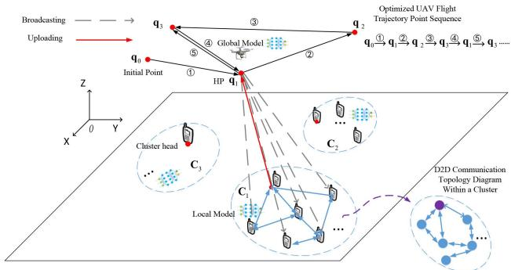

(a) Spatial layout of the system model  
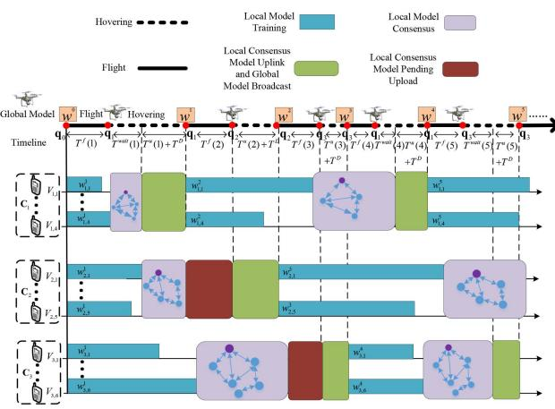  
(b) Time schedule of the SDHFL.  
Fig. 1. System model.

## II. SYSTEM MODEL

## A. SDHFL in Wide-Area IoT Networks

In practical scenarios, such as agriculture, intelligent transportation, and border patrol, extensive coverage requirements and the limited power of edge devices impede efficient information exchange, posing significant challenges for the implementation of FL in wide-area IoT networks with numerous edge devices. By leveraging the mobility and line-of-sight (LoS) communication capabilities of UAVs, rapid and large-scale operations become feasible, ensuring efficient communication with edge devices. Additionally, clustering a large number of edge devices to facilitate short-range D2D communication within clusters can significantly reduce uplink communication traffic with UAVs, lower energy consumption, and extend device lifespan. Thus, deploying a central server on UAVs combined with device clustering can effectively address these challenges [25]. Consequently, our air-ground integrated FL framework is applicable for a plethora of applications, including precision farming, intelligent transportation, and border patrol [26], [27].

As shown in Fig. 1(a), we consider a rotary-wing UAVassisted FL system deployed over a wide-area IoT network comprising M ground devices/sensors denoted as set $\mathcal { M } = \{ 1 , . . . , m , . . . , M \}$ . These devices are organized into K nonoverlapping clusters, denoted as set $\mathcal { K } = \{ 1 , . . . , k , . . . , K \}$ to reduce the energy consumption during transmitting data. In particular, cluster k contains $c _ { k }$ devices, represented by the set $\mathbf { C } _ { k } = \{ V _ { k , 1 } , . . . , V _ { k , c _ { k } } \}$ , with one device designated as the cluster head. With a slight abuse of notation, the cluster head of cluster $\mathbf { C } _ { k }$ is denoted as $V _ { k } ^ { * } \in \mathbf { C } _ { k }$ . We assume that the devices <sup>k</sup>within each cluster are deployed in close proximity, enabling efficient short-range D2D communications among them. The total number of D2D pairs in the system is $M _ { \mathrm { D 2 D } }$ . It can be assumed that each device belongs to only one cluster such that $\textstyle \sum _ { k = 1 } ^ { K } c _ { k } = M$ . Meanwhile, the D2D transmitter and the <sup>k</sup>D2D receiver communicate with each other directly, where the channel power gains of a D2D pair can be given by $h _ { m , m ^ { \prime } , g } ^ { b } .$ <sup>m,m ,g</sup>Specifically, due to the simple structure of the D2D devices, accurate channel state information is difficult to measure because of random delay and jitter. Without loss of generality, we consider imperfect CSI for transmission over all D2D pairs in this paper. The CSI of the considered links is modelled as [28].

$$
h _ { m , m ^ { \prime } , g } ^ { b } = \hat { h } _ { m , m ^ { \prime } , g } ^ { b } + \Delta h _ { m , m ^ { \prime } , g } ^ { b } , \left| \Delta h _ { m , m ^ { \prime } , g } ^ { b } \right| { \leq \epsilon _ { 0 } , m , m ^ { \prime } \in { \bf C } _ { k } } ,\tag{1}
$$

where $\hat { h } _ { m , m ^ { \prime } , g } ^ { b }$ and $\Delta h _ { m , m ^ { \prime } , g } ^ { b }$ reprsent the estimates of channel <sup>m,m ,g Δ m,m ,g</sup>and the channel estimation errors, respectively. To deal with the randomness of channel conditions, the worst-case scenario of the channel conditions can be expressed as

$$
h _ { m , m ^ { \prime } , g } ^ { b } = \hat { h } _ { m , m ^ { \prime } , g } ^ { b } - \epsilon _ { 0 } , m , m ^ { \prime } \in \mathbf { C } _ { k } .\tag{2}
$$

Moreover, to avoid potential interference between D2D communications and cluster head uplink transmissions, overlay transmission scheme as in [29] is adopted in the cluster. Specifically, the cluster head uplink communication and UAV broadcasting collectively occupy a bandwidth of $B _ { \mathrm { U } }$ , while the D2D communication pairs utilize the remaining bandwidth $B _ { \mathrm { D 2 D } }$ . To eliminate the interference among devices, orthogonal frequency division multiple access (OFDMA) technique is adopted in D2D communication between devices within the cluster. Specially, the D2D spectrum $B _ { \mathrm { D 2 D } }$ is divided into G subcarriers indexed as set $\mathbf { G } \triangleq \{ 1 , 2 , . . . , G \}$ . The bandwidth of subcarrier $B _ { 0 } = B _ { \mathrm { D 2 D } } / G _ { \mathrm { i } }$ , in which each D2D device pair only occupy one subcarrier for D2D communication. Let $s _ { m , m ^ { \prime } , g } ^ { b } \in \{ 0 , 1 \}$ denote the subcarrier allocation indicator, where $s _ { m , m ^ { \prime } , g } ^ { b } = 1$ indicates that subcarrier g of device $V _ { k , m }$ <sup>m,m ,g</sup>is allocated to device $V _ { k , m ^ { \prime } }$ during the b-th global model update round in FL, and $s _ { m , m ^ { \prime } , g } ^ { b } = 0$ otherwise. Each subcarrier is restricted to be <sup>m,m ,g</sup>allocated to at most one D2D pair in each round. The devices in all cluster sense continuously the environment over a large area and collect data in real-time, which are then exploited to collaboratively train a model $\mathbf { w } \in \mathbb { R } ^ { N }$ together with the UAV.

Equipped with an onboard computing server and wireless transceiver, the UAV acts as a flying data center that establishes bidirectional wireless communications with the devices during its hovering phases [30]. Specifically, the UAV serves the clusters by hovering over a predefined set of hovering points (HPs) $\mathbf { Q } = \{ \mathbf { q } _ { 1 } , . . . , \mathbf { q } _ { k } , . . . , \mathbf { q } _ { K } \}$ . In particular, the UAV employs a flight-hover-flight strategy [31] to complete the model update, flying at a speed of $v ( b )$ during round b. Specially, the UAV flies to the predefined hovering point in the sky for collecting the model from the cluster head. We assume that the UAV can establish line-of-sight (LoS) connections with the cluster heads in the sky for data communication [32], [33]. Moreover, the cluster heads are equipped with omnidirectional antennas, and the estimated channel power gains between cluster head k and the UAV during data communication, while hovering at $\mathbf q _ { k }$ are given by

$$
\hat { h } _ { k } = \frac { \beta _ { 0 } A _ { g } \eta _ { A } } { \left\| \mathbf { q } _ { k } - \mathbf { l } _ { k } \right\| ^ { 2 } } , k \in U _ { n } ,\tag{3}
$$

where $\beta _ { 0 }$ denotes the channel path loss at a reference distance of $d _ { \mathrm { r e f } } = 1 m , A _ { g }$ represents the maximum power gain of the antenna equipped at the $\mathrm { U A V } , \eta _ { A }$ is the antenna efficiency, and $\mathbf q _ { k }$ and $1 _ { k }$ <sup>A</sup>are the locations of the cluster head and hovering point, respectively.

Considering UAV vibrations during hovering, channel estimation errors may occur between the UAV and the cluster head. Specifically, the imperfect CSI for data transmission can be modeled as

$$
\hat { h } _ { k } = h _ { k } + \Delta h _ { k } , | \Delta h _ { k } | \leq \epsilon _ { 0 } , k \in { \cal U } _ { n } .\tag{4}
$$

To deal with the randomness of channel conditions, the worstcase scenario can be expressed as

$$
\hat { h } _ { k } = h _ { k } + \epsilon _ { 0 } , k \in U _ { n } .\tag{5}
$$

## B. The Data Processing for FL

Each device is equipped with a buffer for storing collected data prior to training its local model. We assume that each device continuously collects data, while the FL system aims to be trained with only a predetermined amount of data collected from each sensor, which can be further adjusted based on the importance of the sensor data [34]. The FL system operates in multiple rounds indexed by $b \in \mathbf { B } = \{ 1 , 2 , . . . , b , . . . , B \}$ until the learning process converges. Without loss of generality, in round b, device $V _ { k , m } , \forall m \in \mathbf { C } _ { k }$ , collects a local dataset adopted for local training comprising $A _ { k , m } ^ { b }$ volume of data samples from <sup>k,m</sup>the environment. For convenience, we assume throughout this paper that each buffer at the device is sufficiently large to store all data collected from environment in each communication round without overflow [35]; otherwise, for buffers with limited size, $A _ { k , m } ^ { b }$ is treated as the effective volume of data that can be stored <sup>k,m</sup>into the collected data area in the buffer at device $V _ { k , m }$ . We define $D _ { k , m } ^ { b }$ as the data volume used by device $V _ { k , m }$ to train its local FL model in round b. Moreover, $Q _ { k , m } ^ { b }$ denotes the data <sup>k,m</sup>volume or the data backlog stored in the buffer.

We assume that device m in cluster k utilizes labeled data samples $\mathcal { D } _ { k , m } \triangleq \{ ( \mathbf { x } _ { k , m } ^ { 1 } , y _ { k , m } ^ { 1 } ) , \hdots , ( \mathbf { x } _ { k , m } ^ { i } , y _ { k , m } ^ { i } )$ $\ldots , ( \mathbf { x } _ { k , m } ^ { D _ { k , m } } , y _ { k , m } ^ { D _ { k , m } } ) \}$ with a volume of $D _ { k , m } \triangleq | \mathscr { D } _ { k , m } |$ to train its model until convergence, where $\begin{array} { r } { D _ { k , m } = \sum _ { b = 1 } ^ { B } D _ { k , m } ^ { b } } \end{array}$ , and the i-th sample $( \mathbf { x } _ { k , m } ^ { i } , y _ { k , m } ^ { i } )$ in $\mathcal { D } _ { k , m }$ consists of training data $\mathbf { x } _ { k , m } ^ { i }$ and a presumably correct label $y _ { k , m } ^ { i } .$ . To capture real-world <sup>k,m k,</sup>variability, we assume that the datasets $\mathcal { D } _ { k , m }$ among heterogeneous devices in cluster k are non-i.i.d.. The volume of training data in cluster k is $\begin{array} { r } { D _ { k } = \sum _ { m \in \mathbf { C } _ { k } } D _ { k , m } } \end{array}$ , and the total volume of training data in all clusters is then given as $\begin{array} { r } { D = \sum _ { k = 1 } ^ { K } D _ { k } } \end{array}$

Assume for now that cluster k is selected for uploading the trained model parameter to update the global model at the UAV. For a given model parameter $\mathbf { w } \in \bar { \mathbb { R } } ^ { N }$ , the loss function $f ( \mathbf { w } , \mathbf { x } _ { k , m } ^ { i } , y _ { k , m } ^ { i } )$ is defined to evaluate the discrepancy between the model trained on data $\mathbf { x } _ { k , m } ^ { i } \in \mathbb { R } ^ { N }$ and the corresponding target label $y _ { k , m } ^ { i } \in \mathbb { R }$ . The overall objective of the FL system <sup>k,m</sup>aims to acquire the optimal parameter $\mathbf { w } ^ { * }$ that minimizes the empirical risk function defined by

$$
F ( \mathbf { w } ) = \frac { 1 } { D } \sum _ { k \in \mathcal { K } } \frac { D _ { k } } { c _ { k } } \sum _ { m = 1 } ^ { c _ { k } } \frac { 1 } { D _ { k , m } } \sum _ { i = 1 } ^ { D _ { k , m } } f _ { k , m } \left( \mathbf { w } , \mathbf { x } _ { k , m } ^ { i } , y _ { k , m } ^ { i } \right)\tag{6}
$$

without sharing the local datasets among devices or with the UAV, where

$$
\mathbf { w } ^ { * } = \arg \operatorname* { m i n } _ { \mathbf { w } } F ( \mathbf { w } ) .\tag{7}
$$

To achieve this goal, problem (2) is decomposed into M independent sub-problems, each solved by a corresponding device utilizing stochastic gradient descent (SGD) [36] on its local dataset. Specifically, each device within cluster k updates its local model over multiple rounds based on

$$
\begin{array} { r } { \mathbf { w } _ { k , m } ^ { ( b + 1 ) } = \mathbf { w } ^ { ( b ) } - \eta \nabla F _ { k , m } ( \mathbf { w } ^ { ( b ) } , \mathcal { D } _ { k , m } ^ { b } ) , } \end{array}\tag{8}
$$

where $\mathbf { w } ^ { ( b ) }$ is the global model parameter shared by the UAV with the devices in cluster k in round b, η is the learning rate, $\nabla F _ { k , m } ( \mathbf { w } ^ { ( b ) } , \mathcal { D } _ { k , m } ^ { b } )$ denotes the gradient of function $F _ { k , m } ( \mathbf { w } ^ { ( b ) } , \mathcal { D } _ { k , m } ^ { b } )$ and $F _ { k , m } ( \mathbf { w } , \mathcal { D } _ { k , m } )$ is the loss function for <sup>k,m( k,m)</sup>local training at device $V _ { k , m }$ <sup>( k,m)</sup>defined as

$$
F _ { k , m } ( \mathbf { w } , \mathcal { D } _ { k , m } ) \triangleq \frac { 1 } { D _ { k , m } } \sum _ { i = 1 } ^ { D _ { k , m } } f \left( \mathbf { w } , \mathbf { x } _ { k , m } ^ { i } , y _ { k , m } ^ { i } \right) , m \in \mathbf { C } _ { k } .\tag{9}
$$

During the global model update, the UAV aims to derive a new global model that minimizes the empirical risk function $F ( \mathbf { w } )$ We define the UAV’s global loss function as the average loss across the clusters,

$$
F ( \mathbf { w } ) = \sum _ { k \in \mathcal { K } } \frac { D _ { k } } { D } F _ { k } ( \mathbf { w } ) ,\tag{10}
$$

where $\begin{array} { r } { F _ { k } ( \mathbf { w } ) = \frac { 1 } { c _ { k } } \sum _ { m = 1 } ^ { c _ { k } } F _ { k , m } ( \mathbf { w } , \mathcal { D } _ { k , m } ) } \end{array}$ is the average loss <sup>k( ) = ck</sup>function for cluster $\mathbf { C } _ { k }$

<sup>k</sup>To guarantee FL convergence, we assume that for any device m, the loss functions $F _ { k , m } ( \mathbf { w } )$ satisfy the following assumptions [24], [37], [38]:

\- Assumption 1 (Smoothness): $F _ { k , m } ( \mathbf { w } )$ is L-smooth with $L > 0$ <sup>k,m( )</sup>. Specifically, for any model parameters, $\forall \mathbf { w } _ { 1 } , \mathbf { w } _ { 2 }$ , we have $\begin{array} { r l } { \| \nabla F _ { k , m } ( \mathbf { w } _ { 1 } ) - \nabla F _ { k , m } ( \mathbf { w } _ { 2 } ) \| } & { { } \leq } \end{array}$ $L \| \mathbf { w } _ { 1 } - \mathbf { w } _ { 2 } \| , \forall k , m , \mathbf { w } _ { 1 } , \mathbf { w } _ { 2 }$

\- Assumption 2 (Strong Convexity): $F _ { k , m } ( \mathbf { w } )$ is μ-strongly convex with $\mu \geq 0 , \quad \mathrm { i . e . , } \quad \mathrm { w e }$ <sup>)</sup> have $F _ { k , m } ( \mathbf { w } _ { 1 } ) \mathop = F _ { k , m } ( \mathbf { w } _ { 2 } ) + \nabla F _ { k , m } ( \mathbf { w } _ { 2 } ) ^ { T } ( \mathbf { w } _ { 1 } - \mathbf { w } _ { 2 } ) +$ $\begin{array} { r } { \frac { \mu } { 2 } \| \mathbf { w } _ { 1 } - \mathbf { w } _ { 2 } \| ^ { 2 } , \forall k , m , \mathbf { w } _ { 1 } , \mathbf { w } _ { 2 } . } \end{array}$

\- Assumption 3: The expected squared norm of stochastic gradients is uniformly bounded, i.e., $\mathbb { E } [ \| \nabla F _ { k , m } ( \mathbf { w } _ { 1 } ) \| ^ { 2 } ] \le$ $G ^ { 2 } , \forall k , m , \mathbf { w } _ { 1 }$

## C. Proposed SDHFL

Due to the storage limitation of onboard batteries and the need to ensure data security during transmission, the transmit power of edge devices is generally restricted. Therefore, we assume that in each round of global model updates, only one cluster uploads its local consensus model [24] when the UAV reaches the cluster’s hovering point [31]. Subsequently, the UAV disseminates the global model exclusively to the devices in that cluster.

We propose a novel FL scheme, termed SDHFL, designed to accelerate global model updates and reduce discrepancies caused by data heterogeneity. In particular, SDHFL enables asynchronous updates across clusters, allowing local consensus model to commence a new training round immediately following uplink transmission, without waiting for the UAV to travel to the next cluster, thereby accelerating the update process. Additionally, each cluster conducts an intra-cluster consensus phase following the local model training stage, effectively reducing model divergence and enhancing update consistency across devices.

The time schedule of the SDHFL is shown in Fig. 1(b). At the beginning of the SDHFL process, i.e., $b = 0 ,$ , the UAV navigates through all hovering points to broadcast the initial global model $\mathbf { w } ^ { ( 0 ) }$ to all devices across clusters to start the local training.<sup>1</sup> At the beginning of each round $b \geq 1$ , a cluster is selected by the UAV to update the global model. Let $a _ { k } ( b )$ be a binary variable to denote whether a cluster is selected in round b. If cluster k is selected in round $b , a _ { k } ( b ) = 1$ . Otherwise, $a _ { k } ( b ) = 0$ . Thus, the <sup>k( ) = 1</sup>set of cluster selected in round b is denoted as $\boldsymbol { \mathcal { A } } _ { b } .$ <sup>) = 0</sup>We assume that upon successfully uploading its trained local consensus model, each selected cluster immediately removes or deactivates the corresponding trained data from the local dataset. In round $b ,$ the devices in the selected cluster subsequently receive the updated global model from the UAV and they adopt it along with their remaining local data to start a new local training. On the other hand, we set $a _ { k } ( b ) = 0$ for clusters that are not selected in round b, which continues to train their local models exploiting the most recently received global models from the UAV, without uploading their trained local consensus models in round b. This iterative process continues until the FL converges.

Due to the cluster selection mechanism in asynchronous FL, model staleness occurs. For instance, a cluster head receives the latest global model in round b − but cannot immediately upload its local consensus model in round b until the devices in the cluster complete the local model training and consensus at rounds $b > 1$ . Let $\tau _ { k } ^ { b }$ be a positive integer to characterize the <sup>k</sup>staleness of devices in cluster k in round $b ,$ indicating the number of rounds elapsed since it lastly received the global model. The updating rule for staleness is $\bar { \tau _ { k } ^ { b + 1 } } = ( 1 + \tau _ { k } ^ { \bar { b } } ) ( 1 - a _ { k } ( b ) )$

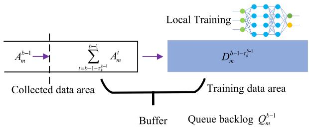  
Fig. 2. Queue buffer schematic.

The global model update in the cluster is divided into four phases [24], [39]. First, each device within the cluster trains the local model leverages its data samples. Secondly, after all devices in the cluster have completed training the local model, the models undergo multiple rounds of iterative updates via D2D communication to obtain local consensus model in the cluster. Thirdly, the cluster head waits for the UAV to arrive at the corresponding hovering point and uploads its local consensus model. Finally, the UAV updates the global model by uploading the local consensus model and disseminates the updated global model to all devices in the cluster. It should note that the UAV only exchange with devices in one cluster to update global model in time-division manner. Thus the interference among different clusters can be ignored during the updated global model. The four steps of the FL system are shown in detail as follows.

1) Local Model Training: The data composition in the buffer is shown in Fig. 2. The total data volume stored in the buffer, also referred to as the data backlog, is given by $Q _ { k , m } ^ { b } =$ $\begin{array} { r } { \sum _ { t = b - \tau _ { k } ^ { b } } ^ { b } A _ { k , m } ^ { t } + D _ { k , m } ^ { b - \tau _ { k } ^ { b } } } \end{array}$ , where $\scriptstyle \sum _ { t = b - \tau _ { k } ^ { b } } ^ { b } A _ { k , m } ^ { t }$ represents the <sup>t b τk k,m + k,m t b τk k,m</sup>total collected data volume from the last participation in global model update to the current round $b ,$ and $D _ { k , m } ^ { b - \tau _ { k } ^ { b } }$ denotes the training data that remains in the buffer.

The data stored in the buffer evolves as follows. Assuming the UAV broadcasts the global model to cluster k in round b − , the trained data $D _ { k , m } ^ { b - \tau _ { k } ^ { b } }$ in the buffer at training data area has been <sup>k,m</sup>cleared successfully, i.e., the data mentioned earlier is removed after the completion of the uplink model, and the data volume $A _ { k , m } ^ { b - 1 }$ newly collected at device $V _ { k , m }$ is stored in the collected <sup>k,m</sup>data area. Then, the devices will utilize the all data stored in the buffer to train the local model in round b. Specifically, device $V _ { k , m }$ will utilize $\begin{array} { r } { D _ { k , m } ^ { b } = \sum _ { t = b - \tau _ { k } ^ { b - 1 } - 1 } ^ { b - 1 } A _ { k , m } ^ { t } } \end{array}$ amount of data to <sup>t b τk</sup>train the local model by employing stochastic gradient descent based on (5)

$$
\mathbf { w } _ { k , m } ^ { ( b ) } = \mathbf { w } ^ { ( b - 1 ) } - \eta \nabla F _ { k , m } ( \mathbf { w } ^ { ( b - 1 ) } , \mathcal { D } _ { k , m } ^ { b } ) .\tag{11}
$$

2) Local Model Consensus: Due to the challenges posed by non-i.i.d. data and limited device energy, local consensus provides an effective solution for addressing model heterogeneity in wide-area IoT networks [24], [40]. In particular, it effectively mitigates intra-cluster model bias in device models caused by heterogeneous local datasets through interaction, sharing, and averaging. We incorporate a local consensus process within clusters, enabling neighboring devices to exchange and refine their models via multiple rounds of low-power D2D communication [24]. Once consensus is reached, only the designated cluster head uploads the aggregated model, thereby reducing uplink time, device energy consumption, and UAV flight energy requirements.

To formalize this process, the D2D connections within each cluster can be modeled as a static undirected graph, where bidirectional communication between devices determines the existence of edges and ensures successful information exchange. Let ${ \bf N } _ { m }$ be the set of D2D neighbors within the coverage of device m. We assume that bidirectional D2D communications are available between a pair of devices such that $m \in \mathbf { N } _ { m ^ { \prime } }$ implies $m ^ { \prime } \in \mathbf { N } _ { m } , \forall m , m ^ { \prime } \in \mathbf { C } _ { k }$ . The connections between the devices within cluster k is then represented by a static undirected graph $\mathbf { G } _ { k } = ( \mathbf { C } _ { k } , \varepsilon _ { k } )$ [40], where $\varepsilon _ { k }$ denotes the edges between devices in the cluster. For devices $m , m ^ { \prime } \in \mathbf { C } _ { k }$ , we have $( m , m ^ { \prime } ) \in \varepsilon _ { k }$ if and only if the bi-direction communication among them can be successfully completed. Noted that the associated physical layer channel and signaling models will be discussed in Section II-D.

After all devices within a cluster complete their local model updates, each cluster may optionally engage in local consensus procedure for model updating. The decision to participate in this consensus process is flexible. In particular, if the devices do not execute consensus procedure, the conventional model update rule is applied to acquire the local consensus model, i.e., $\hat { \mathbf { w } } _ { k , m } ^ { ( b ) } = \mathbf { w } _ { k , m } ^ { ( \hat { b } ) }$ from (5). Otherwise, if devices decide to <sup>k,m k,m</sup>participate, they engage in an intra-cluster consensus phase based on the static undirected graph within the cluster for J rounds. During each round, each device within the cluster shares its trained local models with its neighboring devices via D2D communication. In round $j \in J = \{ 1 , 2 , . . . , j , . . . , \mathcal { T } \}$ of the intra-cluster consensus, the local consensus model at device $V _ { k , m }$ is updated as

$$
\mathbf { w ^ { \prime } } _ { k , m } ^ { ( j + 1 ) } = z _ { m , m } ^ { b } \mathbf { w ^ { \prime } } _ { k , m } ^ { ( j ) } + \sum _ { m ^ { \prime } \in \mathcal { N } _ { m } } z _ { m , m ^ { \prime } } ^ { b } \mathbf { w ^ { \prime } } _ { k , m ^ { \prime } } ^ { ( j ) } ,\tag{12}
$$

where $\mathbf { w ^ { \prime } } _ { k , m } ^ { ( 0 ) } = \mathbf { w } _ { k , m } ^ { ( b ) }$ and $z _ { m , m ^ { \prime } } ^ { b }$ is the consensus weight con-<sup>k,m k,m m,m</sup>stant adopted at device m on the vector received from device $m ^ { \prime }$ in each link in the undirected graph.

To facilitate the consensus procedure, let $\mathbf { W } _ { k } ^ { \left( b \right) } \in \mathbb { R } ^ { c _ { k } \times N }$ <sup>k</sup>denote the matrix of intermediate updated local models for the $c _ { k }$ devices in cluster $\mathbf { C } _ { k } .$ , where the i-th row of $\mathbf { W } _ { k } ^ { ( b ) }$ corresponds to the intermediate updated local model $\mathbf { w } _ { k , m } ^ { ( b ) }$ of device $V _ { k , m }$ <sup>k,m k,m</sup>The intra-cluster consensus process for all devices within cluster k can be represented in a matrix form as

$$
\hat { \mathbf { W } } _ { k } ^ { ( b ) } = \left( \mathbf { Z } _ { k } \right) ^ { J _ { k } ( b ) } \mathbf { W } _ { k } ^ { ( b ) } ,\tag{13}
$$

where $J _ { k } ( b )$ denotes the total number of rounds of D2D-based <sup>k</sup>consensus in the cluster k in the b-th round global update. Here, $\hat { \mathbf { W } } _ { k } ^ { ( b ) }$ represents the local consensus model parameter matrix <sup>k</sup>for cluster k updated during the b-th global iteration consensus phase. The m-th row of $\hat { \mathbf { W } } _ { k } ^ { ( \breve { b } ) }$ corresponds to the local consensus model $\hat { \mathbf { w } } _ { k , m } ^ { ( b ) }$ at device $V _ { k , m } , \mathbf { W } _ { k } ^ { b }$ represents the intermediate updated local model matrix of cluster k, where the m-th row corresponds to $\mathbf { w } _ { k , m } ^ { ( b ) }$ . Finally, $\mathbf { Z } _ { k } = [ z _ { m , m ^ { \prime } } ] _ { 1 \leq m , m ^ { \prime } \leq c _ { k } } \in \mathbb { R } ^ { c _ { k } \times c _ { k } }$ <sup>k,m</sup>denotes the consensus matrix.

3) Local Consensus Model Uploading and Global Model Update: The final local consensus model is subsequently transmitted by the cluster head to the UAV for performing the global model update. However, to extend the lifetime of devices [41], the UAV can only receive the local consensus model once it has arrived the corresponding hovering point of the cluster. Consequently, a waiting period occurs, as indicated by the red blocks in Fig. 1(b)).

According to the cluster head selection algorithm, the UAV flies to the hovering point corresponding to the cluster head $V _ { k } ^ { * }$ . To capture the impact of staleness caused by asynchronous <sup>k</sup>updates in FL, we denote the local consensus model of cluster in round b by $\hat { \mathbf { w } } _ { k } ^ { ( b ) } = \hat { \mathbf { w } } _ { k } ^ { ( b - \tau _ { k } ^ { b } ) }$ . Upon receiving the local consensus <sup>k k</sup>model from the selected cluster $k ,$ the UAV updates the global model in round b according to

$$
\mathbf { w } ^ { ( b ) } = \left( 1 - \sum _ { k \in \mathcal { A } _ { b } } \frac { D _ { k } ^ { b } } { D ^ { b } } \right) \mathbf { w } ^ { ( b - 1 ) } + \sum _ { k \in \mathcal { A } _ { b } } \frac { D _ { k } ^ { b } \hat { \mathbf { w } } _ { k } ^ { ( b - \tau _ { k } ^ { b } ) } } { D ^ { b } } .\tag{14}
$$

The UAV updates the global model $\mathbf { w } ^ { ( b ) }$ in round b through $\hat { \mathbf { w } } _ { k } ^ { ( b ) }$ and the global model $\mathbf { w } ^ { ( b - 1 ) }$ in the previous round $b - 1$ <sup>k</sup>to reduce the empirical risk function $F \big ( \mathbf { \bar { w } } ^ { ( b ) } \big )$ in $( 7 )$ <sup>1</sup>, ensuring that $F ( \mathbf { w } ^ { ( b ) } ) \leq \hat { F } ( \mathbf { w } ^ { ( b - 1 ) } )$ .

4) Updated Global Model Disseminating: The UAV subsequently transmits the updated global model $\mathbf { w } ^ { ( b ) }$ to all devices within the selected clusters to continue FL after a fixed time duration $T ^ { D }$ . This iterative process continues until $F ( \mathbf { w } ^ { ( b ) } )$ reaches its minimum value, signifying convergence of the global FL model.

## D. Queue Stability Condition

Due to the stochastic nature of data processing in federated learning training and the time-varying dynamics of wireless channels, it is generally challenging to maintain data queue stability, i.e., ensuring a finite average backlog in device buffers [42]. To achieve effective asynchronous SDHFL, it is imperative to investigate a scheduling algorithm for managing and stabilizing the queues in each cluster.

The total data backlog of device $V _ { k , m }$ in the $( b - 1 )$ -th global iteration is illustrated in Fig. 2. After the UAV broadcasts the $( b - 1 )$ -th global model, the data in the training data area is cleared, and data from the collected data area is transferred to the training data area to participate in local model training. The data backlog update at device $V _ { k , m }$ can be given according to queue dynamics as

$$
\begin{array} { r } { Q _ { k , m } ^ { b } = \left\{ Q _ { k , m } ^ { b - 1 } - a _ { k } ( b - 1 ) D _ { m } ^ { b - 1 - \tau _ { k } ^ { b - 1 } } \right\} _ { + } + A _ { k , m } ^ { b - 1 } , } \end{array}\tag{15}
$$

where $\{ x \} _ { + } = \operatorname* { m a x } \{ x , 0 \} . a _ { k } ( b ) \in \{ 0 , 1 \}$ is a binary variable <sup>= max 0 k( ) 0 1</sup>that indicates whether the UAV selects the k-th cluster for update in round $b . \ D _ { m } ^ { b - 1 - \tau _ { k } ^ { b - 1 } }$ is the trained data released from device $V _ { k , m }$ in round $b - 1$ . Finally, $A _ { k , m } ^ { b - 1 }$ denotes the amount of data newly arrived at device $V _ { k , m }$ <sup>k,m</sup>during round $b - 1$ . Note that this newly arrived data $A _ { k , m } ^ { b - 1 }$ will be stored in the collected <sup>k,m</sup>data area until round b starts. Subsequently, after the devices receive the global model $\mathbf { w } ^ { ( b - 1 ) }$ in round $b , \sum _ { t = b - \tau _ { k } ^ { b - 1 } - 1 } ^ { b - 1 } A _ { k , m } ^ { t }$ <sup>k</sup>amount of data samples in the collected data area are transferred to the trained data area as training data $D _ { m } ^ { b }$ , which is then <sup>m</sup>utilized to train the new round of local model, as will be further elaborated in the following. To clarify the data backlog evolution in Fig. 2 and (12), we provide a numerical example, as shown in Table II. In the MNIST, which contains 70,000 samples, a sample contains 785 bytes. Consider a device $V _ { k , m }$ with an initial queue backlog $Q _ { k , m } ^ { 0 } = 5 .$ Specially, the amount of data in training data area is $2 .$ <sup>k,m</sup>, and the amount of data in collected data area is 3. In the first round, the UAV selects this device $( a _ { k } ( 0 ) = 1 )$ and the device releases $3 * 7 8 5 = 2 .$ , bytes training data samples in the training data area, i.e, $D _ { m } ^ { 0 } = 3$ . After the UAV complete <sup>m</sup>global model aggregation, UAV broadcast the updated global model to the device. During the global model aggregation, new samples arrive $( A _ { k , m } ^ { 0 } = 2 )$ . Using (12), the queue backlog $Q _ { k , m } ^ { 1 }$ <sup>k,m</sup>is updated as 4 samples, including $( 2 + 2 ) * 7 8 5 = 3$ <sup>k,m</sup>, bytes. Consequently, the data in the collected data area is transferred to the training data area, resulting in 4 samples remaining in the collected data area. In the second round, the UAV does not select the device $( a _ { k } ( 1 ) = 0 )$ , and the arrived amount of new samples is $3 * 7 8 5 = 2$ <sup>(1) = 0</sup>, bytes, i.e. $( A _ { k , m } ^ { 1 } = 3 )$ . In the end, the queue backlog in device $V _ { k , m }$ change to $Q _ { k , m } ^ { 1 } = 7$ in the next round.

TABLE II  
NUMERICAL EXAMPLE OF DATA BACKLOG EVOLUTION
<table><tr><td></td><td>Round 1</td><td>Round 2</td></tr><tr><td>Previous queue  $Q _ { k , m } ^ { b - 1 }$ </td><td>5</td><td>4</td></tr><tr><td>UAV selection  $a _ { k } ( b - 1 )$ </td><td>1</td><td>0</td></tr><tr><td> $D _ { m } ^ { b - 1 - \tau _ { k } ^ { b - } }$  1 Training data</td><td>3</td><td>4</td></tr><tr><td>Newly arrived data  $A _ { k , m } ^ { b - 1 }$ </td><td>2</td><td>3</td></tr><tr><td>Updated queue  $Q _ { k , m } ^ { b }$ </td><td>4</td><td>7</td></tr></table>

<sup>k,m</sup>Within each cluster, the data backlog information from each device is shared. In each round, the cluster head of each cluster obtain the total amount of data backlog information from all devices within its cluster and transmit it to the UAV. The total amount of data backlog in cluster k, denoted as $Q _ { k } ^ { b } =$ $\textstyle \sum _ { m \in C _ { k } } Q _ { k , m } ^ { b }$ <sup>k</sup>, can be viewed as the cumulative queue data backlog. Here, $Q _ { k } ^ { b }$ represents the amount of unprocessed data <sup>k</sup>remaining in the buffer at time in cluster k, which is determined by the stochastic nature of the collected data and the server processes.

According to [43], a discrete time process $Q _ { k } ^ { b }$ is steady state stable if

$$
\operatorname* { l i m } _ { V \to \infty } { g _ { k } ( V ) } = 0 .\tag{16}
$$

For each $V \geq 0 , g _ { k } ( V )$ is defined as

$$
g _ { k } ( V ) \triangleq \operatorname* { l i m } _ { b  \infty } \frac { 1 } { b } \sum _ { \tau = 0 } ^ { b - 1 } \operatorname* { P r } [ Q _ { k } ^ { \tau } > V ] .\tag{17}
$$

Here, the expression $_ { t  \infty } f ( t )$ represents the supremum <sup>lim</sup>of the limiting value of $f ( t )$ <sup>t ( )</sup>over any subsequence of times $t _ { k }$ that approaches infinity, where the limit of $f ( t _ { k } )$ exists. We have $0 \leq g _ { k } ( V ) \leq 1$ in (14).

To maintain queue stability, we analyze a single queue at each device $V _ { k , m } .$ considering its input process $A _ { k , m } ^ { b }$ and timevarying service process $Q _ { k , m } ^ { b }$ . According to (13), if all individual <sup>k,m</sup>queues within each cluster remain stable simultaneously, then the overall network of queues is guaranteed to be stable.

## E. System Time and Energy Consumption

In the SDHFL system, the time required for the convergence of the aggregated global model is regarded as a key performance indicator. Moreover, since drones usually rely on battery power, the energy budget they have for data processing and model transmission is limited. Taking these factors into account, in this subsection, we analyze the time delay and energy consumption in the SDHFL system.

The UAV’s power consumption during flight is denoted as $P _ { \mathrm { f l i g h t } } ( v ( b ) )$ and its power consumption for hovering is denoted as $P _ { \mathrm { h o v e r } }$ <sup>))</sup>. In each round of global model update, the energy budget of the UAV is constrained by $E _ { \mathrm { l i m i t } }$ and the time consumption is divided into four components: flight time $T ^ { f } ( b )$ waiting time $T ^ { \mathrm { w a i t } } ( b )$ , uplink time $T ^ { u } ( b )$ during which the cluster head uploading the local consensus model, and the downlink dissemination time $T ^ { D } ( b )$ for the UAV broadcasting the updated global model for the chosen cluster. To simply the performance analysis of global model update, it is assumed that the UAV consumes the same downlink dissemination time $T ^ { D } ( b )$ for each round.

The local model training time for device $V _ { k , m }$ is given by

$$
T _ { k , m } ^ { c } ( b ) = \frac { \mathcal { C } _ { k } D _ { k , m } ^ { b } } { f _ { m } } , \quad m \in \mathbf { C } _ { k } ,\tag{18}
$$

where $\mathcal { C } _ { k }$ is the number of CPU cycles required for device $V _ { k , m }$ processing a sample of data and $f _ { m }$ is its computational capability. The overall complete time required for all devices in the cluster is given by

$$
T _ { k } ^ { c } ( b ) = \operatorname* { m a x } _ { m \in { \mathbf { C } } _ { k } } \left\{ T _ { k , m } ^ { c } ( b ) \right\} .\tag{19}
$$

Moreover, the consensus completion time for devices $V _ { k , m }$ and $V _ { k , m ^ { \prime } }$ can be expressed as [44]

$$
T _ { m , m ^ { \prime } } ^ { \mathrm { c o n s } } ( b ) = s _ { m , m ^ { \prime } , g } ^ { b } \frac { d } { R _ { m , m ^ { \prime } , g } ^ { b } } m , m ^ { \prime } \in \bf C _ { \cal k } ,\tag{20}
$$

where d is the size of the completed model, and $R _ { m , m ^ { \prime } , g } ^ { b } =$ $\begin{array} { r } { B _ { 0 } \mathrm { l o g } _ { 2 } ( 1 + \frac { { P _ { m , m ^ { \prime } , g } ^ { b } ( h _ { m , m ^ { \prime } , g } ^ { b } - \epsilon _ { 0 } ) } } { B _ { 0 } N _ { 0 } + \sum _ { i = 1 , i \ne k } ^ { K } { P _ { i , m ^ { \prime } , g } ^ { b } ( h _ { i , m ^ { \prime } , g } ^ { b } - \epsilon _ { 0 } ) } } ) } \end{array}$ is the transmission rate from device m to m<sup></sup>. $P _ { m , m ^ { \prime } , g } ^ { b }$ represents the trans-<sup>m,m ,g</sup>mission power for communication between device $V _ { k , m }$ and $V _ { k , m ^ { \prime } }$ on subcarrier $g$ in round b during consensus, $N _ { 0 }$ <sup>m</sup>is the noise power spectral density. Note that $\begin{array} { r } { \sum _ { i = 1 , i \neq k } ^ { K } P _ { i , m ^ { \prime } , g } ^ { b } h _ { i , m ^ { \prime } , g } ^ { b } } \end{array}$ <sup>i ,i k i,m ,g</sup>represents the co-channel interference imposed on device $V _ { k , m ^ { \prime } }$ by the transmitters of D2D pairs from other clusters that concurrently occupy subcarrier g. To ensure the reliable operation of D2D communication, we require

$$
B _ { 0 } N _ { 0 } + \sum _ { i = 1 , i \neq k } ^ { K } P _ { i , m ^ { \prime } , g } ^ { b } ( h _ { i , m ^ { \prime } , g } ^ { b } - \epsilon _ { 0 } ) \leq I _ { \operatorname* { m a x } } m ^ { \prime } \in { \bf C } _ { k } ,\tag{21}
$$

where $I _ { \mathrm { m a x } }$ can be further adjusted to balance between interference mitigation and the overall system performance. It should note that due to the devices are located in a large area region, the total co-channel interfere from devices in other cluster is generally limited.

Since the devices perform intra-cluster consensus in $J _ { k } ( b )$ rounds, the time consumed for completing intra-cluster consensus at device $V _ { k , m } \mathrm { i s } T _ { m } ^ { \mathrm { c o n s } } ( b ) = \bar { J _ { k } ( b ) } T _ { m , m ^ { \prime } } ^ { \mathrm { c o n s } } ( b ) , \forall m , m ^ { \prime } \in { \bf C } _ { k }$ <sup>m m,m</sup>The total time for completing intra-cluster consensus in round b of cluster k is $T _ { k } ^ { \mathrm { c o n s } } ( b ) = \operatorname* { m a x } _ { m \in \mathbf { C } _ { k } } \left\{ T _ { m } ^ { \mathrm { c o n s } } ( b ) \right\}$ . Due to the stal-<sup>k m</sup>eness of the local consensus model updated in asynchronous FL, the effective time required for training the local consensus model is given by $\begin{array} { r } { T _ { k } ( b ) \stackrel { - } { = } \{ T _ { k } ^ { c } ( b ) + T _ { k } ^ { \mathrm { c o n s } } ( b ) - \sum _ { t = b - \tau _ { k } ^ { b } - 1 } ^ { b - 1 } T ( t ) \} _ { + } } \end{array}$ with $T ( b )$ <sup>t b τk</sup>is the total time consumed by the UAV flying to the hovering point and wait to cluster head uploading local model in round b and $T ( 0 ) = 0$

On the other hand, the flight time for the UAV to travel from the hovering point $\mathbf { q } ( b - 1 )$ to the hovering point ${ \bf q } ( b )$ is given by

$$
T ^ { f } ( b ) = \frac { \| \mathbf { q } ( b ) - \mathbf { q } ( b - 1 ) \| } { v ( b ) } .\tag{22}
$$

The waiting time $t _ { k } ^ { \mathrm { w a i t } } ( b )$ is caused by the ongoing data train-<sup>k</sup>ing in round b in cluster k. When the UAV reaches ${ \bf q } ( b )$ , it must wait for $T ^ { \mathrm { w a i t } } ( b )$ for cluster k completing the local consensus model. As such, the waiting time $t _ { k } ^ { \mathrm { w a i t } } ( b )$ is defined as

$$
t _ { k } ^ { \mathrm { w a i t } } ( b ) = \big \{ T _ { k } ( b ) - T ^ { f } ( b ) \big \} _ { + } .\tag{23}
$$

In the other word, $\mathrm { i f } T _ { k } ( b ) \leq T ^ { f } ( b )$ , i.e., the b-th round’s local <sup>k</sup>consensus model training in the selected cluster k finishes before the UAV reaches $\mathbf { q } ( b )$ from the $\mathbf { q } ( b - 1 )$ , then we have $t _ { k } ^ { \mathrm { w a i t } } ( b ) =$ <sup>( )</sup>. Otherwise, a strictly positive $t _ { k } ^ { \mathrm { w a i t } } ( \boldsymbol { b } ) > 0$ <sup>k</sup>is incurred. Thus, the overall waiting time $\begin{array} { r } { T ^ { \mathrm { w a i t } } ( b ) = \sum _ { k = 1 } ^ { K } a _ { k } ( b ) t _ { k } ^ { \mathrm { w a i t } } ( b ) } \end{array}$

<sup>k k</sup>After cluster k completes the local consensus model, cluster head $V _ { k } ^ { * }$ transmits the local consensus model $\hat { w } _ { k } ^ { ( b ) }$ to the UAV. <sup>k ˆk</sup>Before the local consensus model transmission, the channel CSI between the cluster head and the UAV will be measured the pilots in the handshaking/beacon signals by exploiting the channel reciprocity. The time consumption required for the local consensus model upload $t _ { k } ^ { u }$ is

$$
t _ { k } ^ { u } = \frac { d } { B _ { \mathrm { U } } \mathrm { l o g } _ { 2 } ( 1 + \frac { p _ { k } ( h _ { k } - \epsilon _ { 0 } ) } { B _ { \mathrm { U } } N _ { 0 } } ) } ,\tag{24}
$$

where $p _ { k }$ denotes the transmission power of cluster head $V _ { k } ^ { * }$ , and $h _ { k } = h _ { 0 } / d _ { k } ^ { 2 }$ <sup>k</sup>signifies the channel gain between cluster head $V _ { k } ^ { * }$ $h _ { 0 }$ <sup>k k</sup>represents the channel power gain at a reference distance of 1m. Thus, the uplink time for round b is $\begin{array} { r } { T ^ { u } ( b ) = \sum _ { k = 1 } ^ { K } a _ { k } ( b ) t _ { k } ^ { u } } \end{array}$

<sup>k k</sup>After receiving the local model parameters from all cluster heads, the UAV starts model aggregation. Let $f _ { u }$ denote the computing frequency of the UAV, and ς denote the computation resources required to process one bit of data, where the computing frequency of the UAV is constrained by the maximum computing frequency $f _ { u , \mathrm { m a x } } , \mathrm { i . e . }$ $f _ { u } \le f _ { u , \operatorname* { m a x } }$ . Then, the la-<sup>u, u u,</sup>tency and energy consumption for model aggregation in round b can be given by

$$
T ^ { a } ( b ) = \frac { 2 \varsigma u _ { 0 } } { f _ { u } } ,\tag{25}
$$

$$
E ^ { a } ( b ) = \kappa _ { 0 } f _ { u } ^ { 3 } T ^ { a } ( b ) ,\tag{26}
$$

where $u _ { 0 }$ is the size of the model, and $\kappa _ { 0 } > 0$ is the effective switching capacitance of the UAV.

Therefore, the time consumed by the UAV after B rounds is given as

$$
T = \sum _ { b = 1 } ^ { B } \left( T ^ { f } ( b ) + T ^ { \mathrm { w a i t } } ( b ) + T ^ { u } ( b ) + T ^ { a } ( b ) + T ^ { D } ( b ) \right) .\tag{27}
$$

Moreover, the energy consumption of UAV after B rounds is given as

$$
\begin{array} { r l r } & { } & { E ( b ) = P _ { \mathrm { h o v e r } } \left( T ^ { f } ( b ) + T ^ { \mathrm { w a i t } } ( b ) + T ^ { u } ( b ) + T ^ { a } ( b ) + T ^ { D } ( b ) \right) } \\ & { } & { ~ + P _ { \mathrm { f i l g h t } } T ^ { f } ( b ) + E ^ { a } ( b ) . ~ } \end{array}
$$

## III. PROBLEM FORMULATION

For UAV-assisted FL over wide-area IoT networks, minimizing the overall completion time for global model convergence is critical, as both edge devices and UAVs are battery-powered. In this section, we jointly optimize the cluster selection policy, UAV flight speed, transmission power, computational ability, subcarrier assignment $\mathbf { S } [ b ] \triangleq$ $\{ s _ { m , m ^ { \prime } , g } ^ { b } , b \in \mathcal { B } , m , m ^ { \prime } \in \mathcal { M } , g \in \mathbf { G } \}$ , and D2D transmit power allocation policies $\mathbf { P } [ b ] \overset { \Delta } { = } \{ P _ { m , m ^ { \prime } , g } ^ { b } , b \in B , m , m ^ { \prime } \in$ $\mathcal { M } , g \in \mathbf { G } \}$ <sup>m,m ,g</sup>to minimize the expected overall completion time of global FL model convergence resulting from round-varying $Q _ { m } ( b ) , \forall m$ , and the round-varying channel conditions. The resulting optimization problem can be formulated as

$$
\mathrm { P 1 } \colon \operatorname* { m i n i m i z e } _ { a _ { k } ( b ) , v ( b ) , p _ { k } , f _ { m } , f _ { u } , \mathbf { S } [ b ] , \mathbf { P } [ b ] }  &  \mathbb { E } \left[ T \right]
$$

$$
\mathrm { s . t . } C _ { 1 } : F ( w ^ { ( B ) } ) - F ( w ^ { * } ) \leq \varepsilon ,
$$

$$
C _ { 2 } \colon \operatorname* { l i m } _ { V \to \infty } g _ { k } ( V ) = 0 , \forall k \in K ,
$$

$$
C _ { 3 } \colon E ( b ) \leq E _ { \mathrm { l i m i t } } , \quad \forall b \in B ,
$$

$$
C _ { 4 } \colon t _ { k } ^ { u } B _ { \mathrm { U } } \log _ { 2 } \left( 1 + \frac { p _ { k } h _ { k } } { B _ { \mathrm { U } } N _ { 0 } } \right) \geq d _ { k } , \forall k \in \mathcal { K } ,
$$

$$
C _ { 5 } \colon a _ { k } ( b ) \in \{ 0 , 1 \} , \forall b \in B , \forall k \in K ,
$$

$$
C _ { 6 } \colon 0 \le v ( b ) \le v _ { \mathrm { m a x } } , \quad \forall b \in  { \mathcal { B } } ,
$$

$$
C _ { 7 } \colon 0 \le p _ { k } \le p _ { \mathrm { m a x } } , \quad \forall k \in K ,
$$

$$
C _ { 8 } \colon f _ { \operatorname* { m i n } } \leq f _ { m } \leq f _ { \operatorname* { m a x } } , \quad \forall m \in \mathcal { M } ,
$$

$$
C _ { 9 } \colon \tau _ { k } ^ { b } ( a _ { k } ( b ) ) \leq \tau _ { \operatorname* { m a x } } , \quad \forall b \in \mathcal { B } , \forall k \in \mathcal { K } ,
$$

$$
\begin{array} { r l } { \displaystyle } & { C _ { 1 0 } : B _ { 0 } N _ { 0 } + \displaystyle \sum _ { i = 1 , i \neq k } ^ { K } P _ { i , m ^ { \prime } , g } \big ( h _ { i , m ^ { \prime } , g } ^ { b } - \epsilon _ { 0 } \big ) \leq { \cal I } _ { \operatorname* { m a x } } , } \\ { \displaystyle } & { \quad \forall b \in \mathcal { B } , \forall m ^ { \prime } \in { \bf C } _ { k } , \forall g \in { \bf G } , } \\ { \displaystyle C _ { 1 1 } : s _ { m , m ^ { \prime } , g } ^ { b } \in \{ 0 , 1 \} , } \\ { \displaystyle } & { \quad \forall b \in \mathcal { B } , \forall m , m ^ { \prime } \in { \bf C } _ { k } , \forall k \in K , \forall g \in { \bf G } , } \\ { \displaystyle C _ { 1 2 } : 0 \leq f _ { u } \leq f _ { u , \operatorname* { m a x } } , } \end{array}\tag{29}
$$

where $C _ { 1 }$ ensures the convergence of the global model after $\boldsymbol { B }$ rounds with a training accuracy of $\varepsilon > 0 . \ C _ { 2 }$ outlines the constraints necessary to maintain the stability of the data queues at each edge device, as discussed in (13), (14). Constraint $C _ { 3 }$ specifies that the energy consumed by the UAV for task completion per round must not exceed the energy threshold. $C _ { 4 }$ states that the selected cluster must complete uploading the local consensus model within $t _ { k } ^ { u }$ time. Besides, $C _ { 5 }$ is the binary <sup>k</sup>selection variable for scheduling the cluster in round $b ,$ respectively. $C _ { 6 }$ restricts the range of flight speed for UAV. Constraints $C _ { 7 }$ and $C _ { 8 }$ limit the maximum transmit power and computation capability at edge devices in cluster k. Constraint $C _ { 9 }$ ensures that the cluster selection strategy of UAV should be limited by the staleness threshold $\tau _ { \mathrm { m a x } }$ . Constraint $C _ { 1 0 }$ limits the maximum total interference plus noise power received at the device to ensure normal operation of the D2D communication. Finally, constraint $C _ { 1 1 }$ indicates that each dataset can be transmitted in D2D communication via a subcarrier. $C _ { 1 2 }$ limits the maximum computation capability at UAV.

Note that $P _ { 1 }$ is a non-convex mixed-integer nonlinear programming (MINLP) problem due to the presence of integer optimization binary variables $a _ { k } ( b )$ for cluster scheduling in constraints $C _ { 5 } , C _ { 9 }$ and $s _ { m , m ^ { \prime } , g } ^ { b }$ for subcarrier scheduling in constraints $C _ { 1 1 }$ <sup>m,m ,g</sup>and the nonconvex constraints $C _ { 2 } , C _ { 3 } , C _ { 1 0 }$ Moreover, constraint $C _ { 1 }$ is challenging to address as the loss function $F ( \cdot )$ implicitly depends on the number of total rounds B <sup>( )</sup>and the FL hyperparameters, requiring further characterization. Additionally, the variables $a _ { k } ( b ) , v ( b ) , p _ { k } , f _ { m } , f _ { u } , s _ { m , m ^ { \prime } , g } ^ { b }$ and $P _ { m , m ^ { \prime } , g } ^ { b }$ are interdependent and coupled. Meanwhile, stochastic round-varying channels $h _ { m , m ^ { \prime } , g } ^ { b }$ introduce uncertainty, compli-<sup>m,m ,g</sup>cating the minimization of expectations.

## IV. PROPOSED PROBLEM SOLUTION

To enable a real-time solution for problem $P _ { 1 }$ , we first analyze the convergence of SDHFL in this section. Building on this foundation, we propose a dynamic cluster selection strategy, resource allocation formulation, and a resource allocation algorithm leveraging Lyapunov and convex optimization techniques. Firstly, we analyze the optimal uplink power and computing capacity of the devices in Lemma 1. Next, we analyze the convergence of SDHFL in Section IV-A and provided a lower bound for the number of convergence rounds in Lemma 3, which is independent of the resource allocation. Finally, in Section Section IV-B, we iteratively optimize the UAV’s flight speed and the D2D transmission power leveraging a Lyapunov-based alternating optimization method.

Lemma 1: (Optimal Power and Computation Allocation) Under the optimal policy, the cluster head always transmits at its maximum power, i.e., $p _ { k } = p _ { \mathrm { m a x } }$ and the optimal computation capability always adopts the maximum computation capabilities of all devices, i.e., $f _ { m } = f _ { \operatorname* { m a x } }$ for every devices.

Proof: Assume that $\{ a _ { k } ^ { * } ( b ) , p _ { k } ^ { * } , f _ { m } ^ { * } , f _ { u } ^ { * } , v ^ { * } ( b ) \}$ is an optimal <sup>k k m u</sup>solution to problem (26) and the corresponding optimal time consumption is $T ^ { * }$ , this solution satisfies $p _ { k } ^ { * } < p _ { \mathrm { m a x } }$ and $f _ { m } ^ { * } <$ $f _ { \mathrm { m a x } }$

Then, we construct another solution $\{ \hat { a } _ { k } ( b ) , \hat { p } _ { k } , \hat { f } _ { m } , \hat { f } _ { u } , \hat { v } ( b ) \}$ and denote the corresponding time consumption is $\hat { T }$ . In this new solution, we increase the transmitting power of the cluster heads and computing capability of the devices, such that $\hat { p } _ { k } = p _ { \mathrm { m a x } } .$ $\hat { f } _ { m } = f _ { \operatorname* { m a x } }$ , while keeping all other system parameters remain unchanged. Due to the increased transmitting power of the cluster heads and enhanced computing capability of the devices, the time for data transmission $\hat { T } _ { u } ( b )$ and the time for data training $\hat { T } _ { k } ( b )$ are reduced, resulting in a new waiting time solution that $\hat { t } _ { k } ^ { \mathrm { w a i t } } ( b )$ is no more than the original wait time $t _ { k } ^ { \mathrm { w a i t * } } ( b )$ . Therefore, it be verified that the new solution $\{ \hat { a } _ { k } ( b ) , \hat { p } _ { k } , \hat { f } _ { m } , \hat { f } _ { u } , \hat { v } ( b ) \}$ <sup>k k m u</sup>is also a feasible solution to problem (26) due to the fact that the new solution also satisfies constraints $C _ { 3 }$ and $C _ { 4 }$ Moreover, the new solution makes the new objection function ${ \hat { T } } ( { \hat { a } } _ { k } ( b ) , { \hat { p } } _ { k } , { \hat { f } } _ { m } , { \hat { f } } _ { u } , { \hat { v } } ( b ) )$ follow $\hat { T } ( \hat { a } _ { k } ( b ) , \hat { p } _ { k } , \hat { f } _ { m } , \hat { f } _ { u } , \hat { v } ( b ) ) <$ $T ^ { * } ( \bar { a } _ { k } ^ { * } ( b ) , \bar { p } _ { k } ^ { * } , f _ { m } ^ { * } , f _ { u } ^ { * } , v ^ { * } ( b ) )$ <sup>k k m u</sup>, which contradicts the assumption <sup>(</sup>that $\{ a _ { k } ^ { * } ( b ) , p _ { k } ^ { * } , f _ { m } ^ { * } , f _ { u } ^ { * } , v ^ { * } ( b ) \}$ is the optimal solution of original <sup>k</sup>problem.

Based on Lemma 1, we substitute $p _ { k } = p _ { \mathrm { m a x } }$ and $f _ { m } = f _ { \operatorname* { m a x } }$ into constraints $C _ { 4 } , C _ { 7 }$ , and $C _ { 8 }$ which yields

$$
\begin{array} { r l r } { { \displaystyle P _ { 2 } : } } & { { \displaystyle \operatorname* { m i n } _ { a _ { k } ( b ) , v ( b ) , f _ { u } , { \bf S } [ b ] , { \bf P } [ b ] } } } & { { \displaystyle \sum _ { b = 1 } ^ { B } \mathbb { E } \Bigg [ \left[ \sum _ { k = 1 } ^ { K } a _ { k } ( b ) T _ { k } ( b ) , \right. } } \\ { { } } & { { } } & { { \displaystyle \left. \frac { \| { \bf q } ( b ) - { \bf q } ( b - 1 ) \| } { v ( b ) } \right] _ { + } + \sum _ { k = 1 } ^ { K } a _ { k } ( b ) t _ { k } ^ { * u } + T ^ { a } ( b ) + T ^ { D } \Bigg ] } } \\ { { } } & { { } } & { { \mathrm { ~ s . t . ~ } C _ { 1 } - C _ { 3 } , C _ { 5 } , C _ { 6 } , C _ { 9 } - C _ { 1 1 } , } } \end{array}
$$

where $t _ { k } ^ { \ast u }$ is a constant variable obtained from (21). Notes that <sup>k</sup>problem P2 remains non-convex due to the integer optimization $a _ { k } ( b )$ and the non-convex constraint $C _ { 2 } - C _ { 3 } , C _ { 1 0 }$ . To address this challenge, in Section $\mathrm { { I V } \mathrm { { - } A } } .$ , we first discusses the convergence condition of SDHFL, via Lemma 3. Subsequently, based on Lemma $^ { 3 , }$ we then propose a dynamic cluster selection and resource allocation optimization in Section IV-B, and then transform the resulting computing/communication resource allocation problem into a convex problem for acquiring a tractable solution.

## A. Convergence of SDHFL

To ensure convergence of the distributed consensus iterations in each cluster, the consensus matrix $\mathbf { Z } _ { k } = \left[ z _ { m , m ^ { \prime } } \right] _ { 1 \leq m , m ^ { \prime } \leq c _ { k } } \in$ $\mathbb { R } ^ { c _ { k } \times c _ { k } }$ in cluster k must satisfy the conditions as specified in [45, Theorem 1] (i) If $( m , m ^ { \prime } ) \notin \varepsilon _ { k }$ , then $( \mathbf { Z } _ { k } ) _ { m , m ^ { \prime } } = 0$ , implying that devices only receive information from their neighbors; (ii) $\mathbf { Z } _ { k } \mathbf { 1 } = \mathbf { 1 }$ , indicating that $\mathbf { Z } _ { k }$ is row stochasticity; (iii) $\mathbf { Z } _ { k } =$ ${ \mathbf Z _ { k } } ^ { T }$ , implying symmetry; (iv) $\begin{array} { r } { \rho ( \mathbf { Z } _ { k } - \frac { \mathbf { 1 1 } ^ { T } } { c _ { k } } ) < 1 } \end{array}$ , indicating that the absolute maximum eigenvalue of $\begin{array} { r } { \mathbf Z _ { k } - \frac { \mathbf { 1 1 } ^ { T } } { c _ { k } } } \end{array}$ is less than <sup>ck</sup>1. Letting the non-negative D2D control parameter σ satisfies $\begin{array} { r } { \sigma \leq \frac { 2 \mu \varepsilon \breve { D } ^ { 2 } } { L ^ { 2 } } } \end{array}$ , we can determine the number of D2D consensus <sup>L</sup>rounds as provided in [40, Proposition 2].

Lemma 2: (Local Consensus Convergence) Local model consensus achieves convergence after $J _ { k } ( b )$ rounds, the number of consensus rounds $J _ { k } ( b )$ satisfies

$$
J _ { k } ( b ) \geq \operatorname* { m a x } \left\{ \left\lceil \log \left( \frac { \sigma } { ( c _ { k } ) ^ { 3 } ( \Upsilon _ { k } ^ { ( b ) } ) ^ { 2 } } \right) / ( 2 \log ( \lambda _ { k } ) ) \right\rceil , 0 \right\}
$$

$$
\forall k , b ,\tag{31}
$$

where $\begin{array} { r } { \boldsymbol { \Upsilon } _ { k } ^ { ( b ) } = \operatorname* { m a x } _ { m ^ { \prime } , m ^ { \prime \prime } \in \mathcal { M } _ { k } } \| \tilde { \mathbf { w } } _ { k m ^ { \prime } } ^ { b } - \tilde { \mathbf { w } } _ { k m ^ { \prime \prime } } ^ { b } \| } \end{array}$ denotes the pa-<sup>k km km</sup>rameter divergence of cluster k in the b-th round global update and $\begin{array} { r } { \lambda _ { k } = \rho ( { \bf Z } _ { k } - \frac { { \bf 1 1 } ^ { T } } { c _ { k } } ) } \end{array}$ is the spectral radius.

<sup>ck</sup>Proof: The proof follows from [40, Proposition 2] and is omitted here due to page limitation.

After performing $J _ { k } ( b )$ rounds of consensus, the local consensus model is given as $\begin{array} { r } { \hat { \mathbf { w } } _ { k , m } ^ { ( b ) } = \frac { 1 } { c _ { k } } \sum _ { m \in \mathbf { C } _ { k } } \mathbf { w } _ { k , m } ^ { ( b ) } + } \end{array}$ $\mathbf { e } _ { k } ^ { ( b ) }$ , where the consensus error $\mathbf { e } _ { k } ^ { ( b ) }$ satisfies $\| \mathbf { e } _ { k } ^ { ( b ) } \| \leq$ $( \lambda _ { k } ) ^ { J _ { k } ( b ) } \sqrt { c _ { k } } \Upsilon _ { k } ^ { ( b ) }$ , ∀k [24, Lemma 1]. Letting $\mathbf { e } _ { \mathrm { m a x } }$ be the maximal consensus error satisfying $\| \mathbf { e } _ { k } ^ { ( b ) } \| \le ( \lambda _ { k } ) ^ { J _ { k } ( b ) } \sqrt { c _ { k } } \Upsilon _ { k } ^ { ( b ) } \le$ $\| \mathbf { e } _ { \mathrm { m a x } } \|$ <sup>k ( k) kΥk</sup>for any k and b. We derive the residual error of SDHFL as follows.

To facilitate the analysis, we define $\begin{array} { r } { \tilde { \beta } _ { b } \overset { \Delta } { = } \sum _ { k = 1 } ^ { K } a _ { k } ( b ) \beta _ { k } } \end{array}$ and $\begin{array} { r } { \tilde { \beta } \triangleq \operatorname* { m i n } _ { b \in { \bf B } } \{ \tilde { \beta } _ { b } \} } \end{array}$ , which represent the data portion per round <sup>= minb b</sup>of training for the selected cluster over all rounds B, and the minimum data portion of training for the selected cluster across all rounds B relative to the total data volume. Here, $\begin{array} { r } { \beta _ { k } = \frac { D _ { k } } { D } } \end{array}$ is <sup>D</sup>the data portion of cluster k in the entire dataset. Additionally, we define $\tau ^ { \mathrm { m a x } } = \mathrm { m a x } _ { b = 1 , \dots , B , k \in \mathcal { K } } \tau _ { k } ^ { b } .$ , which represents the <sup>k</sup>maximum staleness for clusters throughout the training process. Based on the above analysis and assumptions, we derive Lemma 3 on the convergence of the global model.

Lemma 3. (Global Model Convergence): If $\begin{array} { r } { \eta < \frac { \mu } { L ^ { 2 } } } \end{array}$ 9 $\begin{array} { r } { \frac { \eta } { K } \tilde { \beta } _ { b } ( \mu - \eta L ^ { 2 } ) < \frac { 1 } { 2 } , } \end{array}$ <sup>L</sup>∀b, after B rounds of global model update, <sup>K</sup>the obtained global model $\mathbf { w } ^ { ( B ) }$ satisfies

$$
\begin{array} { r } { \mathbb { E } \{ F ( \mathbf { w } ^ { ( \mathcal { B } ) } ) \} - F ( \mathbf { w } ^ { * } ) \leq \rho ^ { \mathcal { B } } ( F ( \mathbf { w } ^ { ( 0 ) } ) - F ( \mathbf { w } ^ { * } ) ) + \delta , } \end{array}\tag{32}
$$

where $\mathbb { E } \{ F ( \mathbf { w } ^ { ( B ) } ) \}$ is the expected empirical risk function after the B rounds of global iteration. The factor $\begin{array} { r } { \rho = [ 1 - \frac { 2 \tilde { \beta } ( \mu - \eta L ^ { 2 } ) } { K } ] ^ { \frac { 1 } { 1 + \tau ^ { \operatorname* { m a x } } } } < 1 } \end{array}$ characterizes the conver-<sup>= [1 K ] 1</sup>gence rate of the loss function in one round. Finally, $\delta =$ $\begin{array} { r } { \frac { \eta L } { 2 \tilde { \beta } ( \mu - \eta L ^ { 2 } ) } \sum _ { k \in { \bf K } } { ( \beta _ { k } | F _ { k } ( { \bf w } ^ { * } ) | ^ { 2 } ) } + \| { \bf e } _ { \operatorname* { m a x } } \| G + \frac { L } { 2 } \| { \bf e } _ { \operatorname* { m a x } } \| ^ { 2 } \mathrm { d } { \bf e } \cdot \tilde { \bf \Xi } } \end{array}$ <sup>β μ ηL</sup>notes the tolerable residual error between the converged loss function and its optimal value.

Proof: The proof follows from [13, Theorem 1] and $\delta$ is reanalyzed in an innovative manner to incorporate the residual errors arising from both the local trained model and the model consensus. Please refer to Appendix A for the detailed derivation process.

Based on Lemma $3 , C _ { 1 }$ is equivalent to

$$
\tilde { C } _ { 1 } : B \geq ( 1 + \tau ^ { \operatorname* { m a x } } ) \frac { \log _ { 2 } \frac { 1 } { \phi } } { \log _ { 2 } \frac { 1 } { 1 - 2 \frac { 1 } { K } \eta \tilde { \beta } ( \mu - \eta L ^ { 2 } ) } } .\tag{33}
$$

Here, $\begin{array} { r } { \phi = \frac { \varepsilon - \delta } { F ( \mathbf { w } ^ { ( 0 ) } ) - F ( \mathbf { w } ^ { * } ) } } \end{array}$ represents the target training accu-<sup>F F</sup>racy relative to the suboptimality of the starting point, namely $F ( \mathbf { \dot { w } } ^ { ( 0 ) } ) - F ( \mathbf { w } ^ { * } )$ . Voted that φ is constant since ε, $\delta , F ( \mathbf { w } ^ { ( 0 ) } )$ <sup>(</sup>and $F ( \mathbf { w } ^ { * } )$ are all constants. $\tilde { C } _ { 1 }$ ensures convergence in the global model within B rounds.

Note that in (30), φ, η, K, μ, and L are constants, whose values are independent of the optimization variables in problem P2. In contrast, $\widetilde { \beta }$ depends on the adopted cluster selection policy, which is coupled with constraints $C _ { 5 }$ . To facilitate the solution for resource allocation, we propose a dynamic cluster selection and UAV flight speed optimization algorithm in Section IV-B.

## B. Dynamic Cluster Selection and Resource Allocation Optimization

Since the global iteration rounds B can be determined from (30), we decompose problem $P _ { 2 }$ into B subproblems, each aimed at minimizing the completion time per round

$$
\begin{array} { r l r } { { \displaystyle P _ { 3 } : \operatorname* { m i n } _ { a _ { k } ( b ) , v ( b ) , f _ { u } , { \mathbf { S } [ b ] } , { \mathbf { P } [ b ] } } } } & { { \displaystyle \frac { 1 } { \mathcal { B } } \sum _ { b = 1 } ^ { \mathcal { B } } \mathbb { E } \Bigg [ \left[ \sum _ { k = 1 } ^ { K } a _ { k } ( b ) T _ { k } ( b ) , \right. } } & \\ { { \displaystyle \left. \frac { \| { \mathbf { q } } ( b ) - { \mathbf { q } } ( b - 1 ) \| } { v ( b ) } \right] _ { + } + \sum _ { k = 1 } ^ { K } a _ { k } ( b ) t _ { k } ^ { * u } + T ^ { a } ( b ) + T ^ { D } \Bigg ] } } & \\ { { \mathrm { s . t . } C _ { 2 } - C _ { 3 } , C _ { 5 } , C _ { 6 } , C _ { 9 } - C _ { 1 2 } . } } & { { \scriptstyle ( 3 4 ) } } \end{array}
$$

From the perspective of each subproblem, our objective function aims to minimize the expected completion time of a single round, given by

$$
\begin{array} { l } { \displaystyle \mathbb { E } \bigg [ T ^ { \prime } ( b ) \bigg ] = \frac { 1 } { \mathcal { B } } \sum _ { b = 1 } ^ { \mathcal { B } } \mathbb { E } \bigg [ \bigg \{ \sum _ { k = 1 } ^ { K } a _ { k } ( b ) T _ { k } ( b ) , \frac { | | \mathbf { q } ( b ) - \mathbf { q } ( b - 1 ) | | } { v ( b ) } \bigg \} _ { + } } \\ { \displaystyle \qquad + \sum _ { k = 1 } ^ { K } a _ { k } ( b ) t _ { k } ^ { * u } + T ^ { a } ( b ) + T ^ { D } \bigg ] = \frac { 1 } { \mathcal { B } } \sum _ { b = 1 } ^ { \mathcal { B } } \mathbb { E } \bigg [ T ( b ) \bigg ] . } \end{array}\tag{35}
$$

In the objective function of $P _ { 3 }$ , the SDHFL completion time is inclusive of the flight time, waiting time, aggregation time and global model broadcast time consumed by the UAV. To reduce the overall completion time for global model convergence, the cluster having the largest data backlog should be selected to upload their local consensus model to minimize the number of rounds as in (30). Meanwhile, queue stability should be guaranteed according to constraint $C _ { 2 }$ . Note that back-pressure routing was originally proposed in [46], which is an algorithm for dynamically allocating traffic over multi-hop networks based on congestion gradients between neighboring devices. In literature, it has been shown that the back-pressure algorithm is optimal in achieving maximal data throughput as well as guaranteeing the stability of network in [46]. However, due to its opportunistic scheduling nature, the backpressure algorithm cannot minimize the completion time of a single round while ensuring queue stability, which prioritizes queue stability over immediate task completion. This results in potential delays, suboptimal resource allocation, and increased overall latency, especially in time-sensitive applications. Accordingly, Lyapunov optimization theory [47] offers a practical framework for simultaneously ensuring queue stability and achieving near-optimal solutions with low computational cost via solving a deterministic problem in each time slot. Therefore, to maintain queue stability and minimize system completion time per round, we transform problem P3 capitalizing on Lyapunov optimization theory.

To this end, we adopt the Lyapunov drift $\Delta ( b )$ to measure the backlog evolution from round b to round $b + 1$ as

$$
\Delta ( \mathcal { Q } ^ { b } ) = \sum _ { k \in \mathcal { K } } \mathbb { E } \left[ \frac { 1 } { 2 } \left( \left( Q _ { k } ^ { b + 1 } \right) ^ { 2 } - \left( Q _ { k } ^ { b } \right) ^ { 2 } \right) \big | \mathcal { Q } ^ { b } \right] ,\tag{36}
$$

where $\mathcal { Q } ^ { b } = \{ Q _ { k } ^ { b } , \forall k \}$ is the instantaneous queue backlogs in <sup>k</sup>the network. Considering the dynamic nature of the routing process, the one-round cluster queue backlog according to (12) satisfies

$$
Q _ { k } ^ { b + 1 } = \{ Q _ { k } ^ { b } - D _ { k } ^ { \prime b } \} _ { + } + A _ { k } ^ { b } ,\tag{37}
$$

whose mean-rate stability ensure that $C _ { 2 }$ is satisfied, where $\begin{array} { r } { D _ { k } ^ { \prime b } = \sum _ { m \in { \bf C } _ { k } } a _ { k } ( b ) D _ { m } ^ { b - \tau _ { k } ^ { b } } } \end{array}$ is the data that can be cleaned in round b in cluster $k ,$ and $\begin{array} { r } { A _ { k } ^ { b } = \sum _ { m \in \mathbf { C } _ { k } } A _ { k , m } ^ { b } } \end{array}$ denotes the <sup>k m k k,m</sup>amount of data newly arrived in cluster k. When $x \ge 0 , y \ge$ $0 , z \geq 0 .$ from the $( \{ x - y \} _ { + } + z ) ^ { 2 } \leq x ^ { 2 } + y ^ { 2 } + z ^ { 2 } + 2 x ( z -$ $y )$ , we obtain

$$
\left( Q _ { k } ^ { b + 1 } \right) ^ { 2 } - \left( Q _ { k } ^ { b } \right) ^ { 2 } \leq D _ { \operatorname* { m a x } } ^ { 2 } + A _ { \operatorname* { m a x } } ^ { 2 } - 2 Q _ { k } ^ { b } ( D _ { k } ^ { \prime b } - A _ { k } ^ { b } ) ,\tag{38}
$$

which implies that for all $k ,$ the difference in the squared data backlog between two consecutive global iterations is bounded above by a term related to the current iteration’s data backlog, where $A _ { \mathrm { m a x } }$ is the maximum data volume collected in any round by any cluster, $D _ { \mathrm { m a x } }$ is the maximal data volume that can be released in any cluster. Next, we sum the backlogs over the entire network as expressed in (35) to obtain

$$
\sum _ { k \in \cal K } \left( Q _ { k } ^ { b + 1 } \right) ^ { 2 } - \sum _ { k \in \cal K } \left( Q _ { k } ^ { b } \right) ^ { 2 } \leq C - 2 \sum _ { k \in \cal K } Q _ { k } ^ { b } ( D _ { k } ^ { \prime b } - A _ { k } ^ { b } ) ,\tag{39}
$$

where $C = K ( D _ { \operatorname* { m a x } } ^ { 2 } + A _ { \operatorname* { m a x } } ^ { 2 } )$ is a constant. In other words, across two consecutive global iterations, the difference in the squared data backlog for the entire system is bounded above by a term that depends on the data backlog of the system in the current iteration. Taking the conditional expectation of $\mathcal { Q } ^ { b }$ in (36), we can obtain

$$
\Delta ( \mathcal { Q } ^ { b } ) \leq \frac { C } { 2 } - \sum _ { k \in \mathcal { K } } \mathbb { E } \left[ Q _ { k } ^ { b } \left( D _ { k } ^ { \prime b } - A _ { k } ^ { b } \right) \big | \mathcal { Q } ^ { b } \right] ,\tag{40}
$$

which represents the expected change of computation queues over one-time global iteration. By minimizing $\Delta ( \mathcal { Q } ^ { b } )$ in each round, each data queue $Q _ { k } ( b )$ can be pushed towards zero, and the cost deficit queues can be stabilized, such that the $C _ { 2 }$ can be satisfied. Based on the Lyapunov optimization framework [47], the problem of jointly ensuring queue stability and optimizing the objective function can be reformulated as minimizing an upper bound on the drift-minus-utility function.

$$
\Delta _ { Z } ( \mathcal { Q } ^ { b } ) = \Delta ( \mathcal { Q } ^ { b } ) + Z \mathbb { E } \left[ T ( b ) \left| \mathcal { Q } ^ { b } \right. \right] ,\tag{41}
$$

with $Z$ is a non-negative control parameter striking a desirable tradeoff between the completion time of a single round and queue backlogs. Considering all possible optimization variables satisfying $C _ { 2 } - C _ { 3 } , C _ { 5 } C _ { 6 } , \Delta _ { Z } ( \mathcal { Q } ^ { b } )$ is upper bounded by

$$
\begin{array} { l } { { \displaystyle \Delta z ( \mathcal { Q } ^ { b } ) \leq \frac { C } { 2 } - \sum _ { k \in \mathcal { K } } \mathbb { E } \left[ Q _ { k } ^ { b } \left( D _ { k } ^ { \prime b } - A _ { k } ^ { b } \right) \Big | \mathcal { Q } ^ { b } \right] + Z \mathbb { E } \left[ T ( b ) \Big | \mathcal { Q } ^ { b } \right] } } \\ { { \displaystyle = \frac { C } { 2 } + \sum _ { k \in \mathcal { K } } \mathbb { E } \Bigg [ \left( Z \left\{ a _ { k } ( b ) T _ { k } ( b ) , \frac { \| \mathbf { q } ( b ) - \mathbf { q } ( b - 1 ) \| } { v ( b ) } \right\} + ^ { - Q _ { k } ^ { b } } D _ { k } ^ { \prime b } \right. } } \\ { { \displaystyle \left. + Z a _ { k } ( b ) t _ { k } ^ { * u } + Z T ^ { a } ( b ) ) \Big | \mathcal { Q } ^ { b } \right] + \sum _ { k \in \mathcal { K } } \mathbb { E } \left[ \left( Q _ { k } ^ { b } A _ { k } ^ { b } + Z T ^ { D } \right) \Big | \mathcal { Q } ^ { b } \right] . } } \end{array}\tag{42}
$$

Following (39), we observe that minimizing the right-hand side of (39) can closely approximate the upper bound of the drift-minus-utility function. Note that only the second term of the right-hand side of (39) is relevant to the optimization variables. Hence, we focus on minimizing the second term on the righthand side of (39), which is related to the cluster selection strategy on UAV flight speed variables. Thus, it is equivalent to minimize

$$
\begin{array} { c } { { T _ { Z } ( b ) = \displaystyle \sum _ { k \in { \cal K } } a _ { k } ( b ) \displaystyle \left( Z \left\{ T _ { k } ( b ) , \displaystyle \frac { \| \mathbf { q } _ { k } ( b ) - \mathbf { q } _ { k } ( b - 1 ) \| } { v ( b ) } \right\} _ { + } \right. } } \\ { { \displaystyle \left. - Q _ { k } ^ { b } D _ { k } ^ { b - \tau _ { k } ^ { b } } + Z t _ { k } ^ { * u } + Z T ^ { a } ( b ) \right) . } } \end{array}\tag{3}
$$

To simplify analysis, we consider the worst channel gain, i.e., the situation where $h _ { k } - \epsilon _ { 0 }$ occurs. Therefore, the stochastic optimization problem $P _ { 3 }$ is transformed into the following realtime optimization problem $P _ { 4 }$ , which depends only the current network state information and the queue backlogs Q b

$$
\begin{array} { r } { P _ { 4 } : \underset { a _ { k } ( b ) , v ( b ) , f _ { u } , \mathbf { S } [ b ] , \mathbf { P } [ b ] } { \operatorname* { m i n } } T _ { Z } ( b ) } \\ { \mathrm { s . t . } C _ { 3 } , C _ { 5 } , C _ { 6 } , C _ { 9 } - C _ { 1 2 } . } \end{array}\tag{44}
$$

1) Resource Allocation Optimization in Each Round: Under the condition that the staleness constraint is satisfied for each cluster, we iterate through all clusters. If the staleness of a cluster exactly reaches the threshold condition, $\mathrm { i . e . , } \tau _ { k } ^ { b } ( a _ { k } ( b ) ) = \tau _ { \mathrm { m a x } } ,$ we select the cluster $k ^ { * } = \arg _ { k \in \mathcal { K } } ( \tau _ { k } ^ { b } ( a _ { k } ( b ) ) = \tau _ { \operatorname* { m a x } } )$ , and then, with $a _ { k } ( b )$ <sup>k k</sup>fixed, we then solve for the optimal resource allocation.

When $a _ { k } ( b )$ is fixed, the resource allocation optimization problem is expressed as

$$
\begin{array} { r l } { P _ { 4 - 0 } : } & { \underset { v ( b ) , f _ { u } , \mathbf { S } [ b ] , \mathbf { P } [ b ] } { \operatorname* { m i n } } Z \left\{ T _ { k } ( b ) , \frac { \| \mathbf { q } _ { k } ( b ) - \mathbf { q } _ { k } ( b - 1 ) \| } { v ( b ) } \right\} _ { + } } \\ & { - Q _ { k } ^ { b } D _ { k } ^ { b - \tau _ { k } ^ { b } } + Z t _ { k } ^ { * u } + Z T ^ { a } ( b ) } \\ & { \mathrm { s . t . } C _ { 3 } , C _ { 6 } , C _ { 9 } - C _ { 1 2 } . } \end{array}\tag{5}
$$

To facilitate efficient optimization, Problem $P _ { 4 - 0 }$ is decomposed into two subproblems, $P _ { 4 - 1 }$ and $P _ { 4 - 2 }$ , as shown below, which are solved in an alternating manner.

$$
\begin{array} { r l } { P _ { 4 - 1 } : } & { \underset { v ( b ) , f _ { u } } { \operatorname* { m i n } } Z \left\{ T _ { k } ( b ) , \frac { \lVert \mathbf { q } _ { k } ( b ) - \mathbf { q } _ { k } ( b - 1 ) \rVert } { v ( b ) } \right\} _ { + } - Q _ { k } ^ { b } D _ { k } ^ { b - \tau _ { k } ^ { b } } } \\ & { + Z t _ { k } ^ { * u } + Z T ^ { a } ( b ) } \\ & { \mathrm { s . t . } C _ { 3 } , C _ { 6 } , C _ { 1 2 } . } \end{array}
$$

The objective function, $\begin{array} { r } { Z \{ T _ { k } ( b ) , \frac { \| \mathbf q _ { k } ( b ) - \mathbf q _ { k } ( b - 1 ) \| } { v ( b ) } \} _ { + } - } \end{array}$ $Q _ { k } ^ { b } D _ { k } ^ { b - \tau _ { k } ^ { b } } + Z t _ { k } ^ { \ast u } + Z T ^ { a } ( b )$ , in problem $P _ { 4 - 1 }$ is convex. How-<sup>k k</sup>ever, constraint $C _ { 3 }$ is intractable, rendering it challenging to determine its convexity. Thus, we extend the left-hand side (LHS) of constraint $C _ { 3 }$ yielding (44), shown at the bottom of next page. Where $d _ { 0 }$ is the fuselage drag ratio, $\rho$ is the air density, s is the rotor solidity, $v _ { 0 }$ is the mean rotor-induced velocity during hovering, and $v _ { \mathrm { t i p } }$ is the tip speed of the rotor blade. In addition, $\begin{array} { r } { P _ { 0 } = \frac { o } { 8 } \rho s A \Omega ^ { 3 } R _ { \mathrm { r o t o r } } ^ { 3 } } \end{array}$ and $\begin{array} { r } { P _ { i } = ( 1 + \tau ) \frac { W ^ { 3 / 2 } } { \sqrt { 2 \rho A } } } \end{array}$ <sup>ρA</sup>where o denotes the profile drag coefficient, A denotes the rotor disc area,  denotes the blade angular velocity, $R _ { \mathrm { r o t o r } }$ is the rotor radius, τ and $W$ represent an incremental correction factor and the aircraft weight, respectively. Note that in constraint (44) there exists nonconvex terms $\begin{array} { r } { \sqrt { \frac { 1 } { v ^ { 4 } ( b ) } + \frac { 1 } { 4 v _ { 0 } ^ { 4 } } } - \frac { 1 } { 2 v _ { 0 } ^ { 2 } } ) ^ { \frac { 1 } { 2 } } } \end{array}$ and $\begin{array} { r } { \{ T _ { k ^ { * } } ( b ) - \frac { \| \mathbf { q } ^ { * } ( b ) - \mathbf { q } ^ { * } ( b - 1 ) \| } { v ( b ) } \} _ { + } } \end{array}$ , indicating that constraint $C _ { 3 }$ is <sup>k v b</sup>non-convex. Accordingly, $P _ { 3 }$ is a nonconvex optimization problem and thus it is difficult to acquire a globally optimal solution to the problem. To address this challenge, we introduce Lemma 4.

Lemma 4. (Optimization of the UAV Speed): When $v _ { 0 }$ is sufficiently large,<sup>2</sup> $P _ { 4 - 1 }$ can be transformed into a tractable convex optimization problem.

Proof: See Appendix B.

Based on Lemma 4, problem $P _ { 4 - 1 }$ is convex for a sufficiently large value of $v _ { 0 }$ and can be efficiently solved using CVX. Accordingly, Algorithm 1 is developed to obtain the optimal UAV flight speed $v ^ { * } ( b )$ of problem $P _ { 4 - 1 }$ . Subsequently, we formulate a subproblem to jointly optimize the subcarrier allocation indicators and D2D transmit power variables as, (47) shown at the bottom of this page.

$$
P _ { 4 - 2 } : \quad \operatorname* { m i n } _ { { \bf S } [ b ] , { \bf P } [ b ] } Z \left\{ T _ { k } ( b ) , \frac { \| { \bf q } _ { k } ( b ) - { \bf q } _ { k } ( b - 1 ) \| } { v ( b ) } \right\} _ { + }
$$

<sup>2</sup>Numerical analysis indicates that even under the most favorable conditions, the left-hand side of inequality Appendix B.1 remains approximately 16.23% smaller than the right-hand side when using $v _ { 0 } = 4 . 0 3 ,$ , as referenced in [48]. However, in practical implementations, the UAV can optimize transmission parameters and scheduling strategies to mitigate this gap, potentially making both sides nearly equivalent.

```latex
Algorithm 1: UAV Flight Speed Optimization.
1: Initialization: Set the weight Z, the maximum UAV
flight speed $v _ { \mathrm { m a x } } ,$ the energy threshold $E _ { \mathrm { l i m i t } }$ , the
maximum number of iterations $L _ { 1 } .$ , the maximum
tolerance $\epsilon _ { 1 } .$ , iteration index $l _ { 1 } = 0$ and initialize
$a _ { k } ( b ) , f _ { m } , f _ { u } , p _ { k } , v ( b ) , f _ { u } , \mathbf { S } [ b ] , \mathbf { P } [ b ]$
<sup>k( )</sup>2: repeat
3: Solve subproblem (43) for given
$\{ a _ { k } ( b ) , f _ { m } , p _ { k } , v ( b ) , \mathbf { S } [ b ] , \mathbf { P } [ b ] \}$
4: if $\begin{array} { r } { \left| \operatorname* { m i n } _ { v ( b ) , f _ { u } } T _ { Z } ( v ( b ) ) - T ^ { * } \right| < \epsilon _ { 1 } } \end{array}$ then
<sup>minv b ,fu Z( ( ))</sup>5: Convergence  true
6: $\mathbf { r e t u r n } v ^ { * } ( b ) = v ( b ) , f _ { m } ^ { * } = f _ { m }$ and
$\begin{array} { r } { T _ { Z } ( v ( b ) ) = \operatorname* { m i n } _ { v ( b ) } T _ { Z } ( v ( b ) ) } \end{array}$
<sup>Z</sup>7: else
8: Set $\begin{array} { r } { T _ { Z } ( v ( b ) ) = \operatorname* { m i n } _ { v ( b ) , f _ { m } } T _ { Z } ( v ( b ) ) } \end{array}$ and
$l _ { 1 } = l _ { 1 } + 1$
<sup>= + 1</sup>9: Convergence false
10: end if
11: until Convergence true or $l _ { 1 } = L _ { 1 }$
Db<sup>−</sup> τ<sup>b</sup> Zt<sup>∗</sup><sub>u</sub> ZT <sub>a</sub> b
s.t. C<sub>10</sub>, C<sub>11</sub>. (48)
```

To tackle constraint $C _ { 1 0 } .$ , we follow the relaxation approach in [49]. In particular, we let $s _ { m , m ^ { \prime } , g } ^ { b } \in [ 0 , 1 ]$ , where $s _ { m , m ^ { \prime } , g } ^ { b }$ can be interpreted as a round allocated factor of sub-<sup>m,m ,g</sup>carrier g among the devices. Moreover, we define auxiliary round-shared powers $\tilde { P } _ { m , m ^ { \prime } , g } ^ { b } = P _ { m , m ^ { \prime } , g } s _ { m , m ^ { \prime } , g } ^ { b } .$ . Then, we reformulate the transmission rate $R _ { m , m ^ { \prime } , g } ^ { b }$ in (17) as ${ \tilde { R } } _ { m , m ^ { \prime } , g } ^ { b } =$ $B _ { 0 } \mathrm { l o g _ { 2 } } ( 1 + \tilde { P } _ { m , m ^ { \prime } , g } ^ { b } \frac { h _ { m , m ^ { \prime } , g } ^ { j } } { I _ { \mathrm { m a x } } } )$ , which further implies $\tilde { P } _ { m , m ^ { \prime } , g } ^ { b } =$ $\begin{array} { r } { ( 2 ^ { \frac { \tilde { R } _ { m , m ^ { \prime } , g } ^ { b } } { B _ { 0 } } } - 1 ) \frac { I _ { \mathrm { m a x } } } { h _ { m , m ^ { \prime } , g } ^ { j } } } \end{array}$ . Therefore, we can reformulate problem $P _ { 4 - 2 }$ as

$$
\begin{array} { r l } { P _ { 4 - 2 } ^ { \prime } : \quad \underset { { \bf S } [ b ] , \tilde { \bf P } [ b ] } { \operatorname* { m i n } } Z \left\{ T _ { k } ( b ) , \frac { \| { \bf q } _ { k } ( b ) - { \bf q } _ { k } ( b - 1 ) \| } { v ( b ) } \right\} _ { + } } & { } \\ & { \quad - Q _ { k } ^ { b } D _ { k } ^ { b - \tau _ { k } ^ { b } } + Z t _ { k } ^ { * u } + Z T ^ { a } ( b ) } \\ { \mathrm { s . t . } ~ C _ { 1 0 } , } & { } \\ & { \quad \tilde { C } _ { 1 1 } : s _ { m , m ^ { \prime } , g } ^ { b } \in [ 0 , 1 ] , \quad \forall b \in \mathcal { B } , ~ \forall m , m ^ { \prime } \in \mathcal { M } , ~ \forall g \in { \bf G } , } \end{array}\tag{49}
$$

Note that problem $P _ { 4 - 2 } ^ { \prime }$ is jointly convex, which can be readily solved using off-the shelf slovers such as CVX. In order to

$$
\begin{array} { l } { { \displaystyle { E ( b ) = \| { \bf q } _ { k } ( b ) - { \bf q } _ { k } ( b - 1 ) \| \left( P _ { 0 } \left( \frac { 1 } { v ( b ) } + \frac { 3 v } { v _ { \mathrm { i n p } } ^ { 2 } } \right) + P _ { i } \left( \sqrt { \frac { 1 } { v ^ { 4 } ( b ) } + \frac { 1 } { 4 v _ { 0 } ^ { 4 } } } - \frac { 1 } { 2 v _ { 0 } ^ { 2 } } \right) ^ { \frac { 1 } { 2 } } + \frac { 1 } { 2 } d _ { 0 } \rho s A v ^ { 2 } ( b ) \right) } } } \\ { { \displaystyle { + ( P _ { 0 } + P _ { i } ) \left( \left\{ T _ { k } ( b ) - \frac { \| { \bf q } _ { k } ( b ) - { \bf q } _ { k } ( b - 1 ) \| } { v ( b ) } \right\} _ { + } + T ^ { * u } ( b ) + T ^ { a } ( b ) + T ^ { D } \right) . } } } \end{array}\tag{47}
$$

Algorithm 2: Subcarrier Allocation and D2D Transmit   
Power Allocation Optimization.   
1: Initialization: Set the weight Z, the maximum total   
interference $I _ { \mathrm { m a x } } ,$ the maximum number of iterations   
$L _ { 2 }$ , the maximum tolerance $\epsilon _ { 2 } .$ , iteration index $l _ { 2 } = 0$   
and initialize $a _ { k } ( b ) , f _ { m } , f _ { u } , p _ { k } , v ( b ) , \mathbf { S } [ b ] , \tilde { \mathbf { P } } [ b ]$   
2: repeat   
3: Solve subproblem (46) for given   
$\{ a _ { k } ( b ) , f _ { m } , f _ { u } , p _ { k } , v ( b ) \}$   
<sup>k( )</sup>4: if | $\mathsf { \mathsf { \mathsf { \Lambda } } } ^ { \mathsf { l } } \mathbf { S } [ b ] , \tilde { \mathbf { P } } [ b ]  T _ { Z } ( \mathbf { S } [ b ] , \tilde { \mathbf { P } } [ b ] ) - T ^ { * } | < \epsilon _ { 2 }$ then   
5: <sup>b , b</sup>Convergence true   
6: <sup>=</sup>Determine the optimal subcarrier assignment $\mathbf { S } ^ { * } [ b ]$   
based on (47).   
7: return $\{ \mathbf { S } _ { \perp } ^ { * } [ b ] , \tilde { \mathbf { P } } ^ { * } [ b ] \} = \{ \mathbf { S } ^ { * } [ b ] , \tilde { \mathbf { P } } [ b ] \}$ and   
$\begin{array} { r } { T _ { Z } ( \mathbf { S } [ b ] , \tilde { \mathbf { P } } [ b ] ) = \operatorname* { m i n } _ { \mathbf { S } [ b ] , \tilde { \mathbf { P } } [ b ] } T _ { Z } ( \mathbf { S } [ b ] , \tilde { \mathbf { P } } [ b ] ) } \end{array}$   
8: else   
9: Set $\begin{array} { r } { T _ { Z } ( \mathbf { S } [ b ] , \tilde { \mathbf { P } } [ b ] ) = \operatorname* { m i n } _ { \mathbf { S } [ b ] , \tilde { \mathbf { P } } [ b ] } T _ { Z } ( \mathbf { S } [ b ] , \tilde { \mathbf { P } } [ b ] ) } \end{array}$   
and $l _ { 2 } = l _ { 2 } + 1$   
<sup>= + 1</sup>10: Convergence false   
11: end if   
12: until Convergence true or $l _ { 2 } = L _ { 2 }$

recover binary solutions, device $m ^ { \prime }$ is selected for information transmission on subcarrier $g$ of device m if it can provide the maximum transmit throughtput to the system. Accordingly, the allocation of subcarrier $g$ of device m is based on the following criterion:

$$
s _ { m , m ^ { \prime } , g } ^ { b * } = \left\{ \begin{array} { l l } { 1 , \mathrm { i f } m ^ { \prime } = \underset { j } { \operatorname { a r g m a x } } \tilde { R } _ { m , j , g } ^ { b } , } \\ { 0 , \mathrm { o t h e r w i s e } . } \end{array} \right.\tag{50}
$$

Algorithm 2 is then developed to obtain the optimal subcarrier allocation S b and D2D transmit power allocation policies P b for problem $P _ { 4 - 2 }$ . Based on the above analysis, Problem $P _ { 4 - 0 }$ is addressed by alternatively and iteratively solving Problems $P _ { 4 - 1 }$ and $P _ { 4 - 2 }$

2) Cluster Selection Policy: Through resource allocation optimization in each round, we attain the optimal UAV flight speed $v ^ { * } ( b )$ , subcarrier allocation indicators, and D2D transmit power for problem $P _ { 4 - 0 }$ . Next, we substitute these optimal values into the objective function of problem $P _ { 4 }$ . Since only one cluster can be selected for the uplink local consensus model, the optimal cluster selection in problem $P _ { 4 }$ is reached as follows

$$
\begin{array} { c } { { k ^ { * } = \underset { k \in \mathcal K } { \arg \operatorname* { m i n } } \left\{ Z \left\{ T _ { k } ^ { * } ( b ) , \frac { \left\| \mathbf q _ { k } ( b ) - \mathbf q _ { k } ( b - 1 ) \right\| } { v ^ { * } ( b ) } \right\} _ { + } \right. } } \\ { { \left. - Q _ { k } ^ { b } D _ { k } ^ { b - \tau _ { k } ^ { b } } + Z t _ { k } ^ { * u } + Z T ^ { * a } ( b ) \right\} } } \end{array}\tag{51}
$$

when constraint $C _ { 9 }$ is satisfied. Otherwise, the cluster selection is the one with $\tau _ { k ^ { * } } ^ { b } = \tau _ { \operatorname* { m a x } } .$ . Notably, given the optimal UAV flight speed $v ^ { * } ( b )$ <sup>k</sup>, the optimal subcarrier allocation $\mathbf { S } ^ { * } [ b ]$ , and D2D transmit power allocation $\tilde { \mathbf { P } } ^ { * } [ b ]$ , the first term on the righthand side of (48) can be efficiently evaluated. Subsequently, an efficient resource allocation algorithm is developed, where the cluster scheduling and resource allocation procedures are detailed in Algorithm 1.

## C. Algorithm Analyses

In this subsection, the performance of Algorithm 1 is characterized in Theorem 1, followed by an analysis of its computational complexity.

Theorem 1: The optimality gap of the proposed iterative resource allocation algorithm is bounded as

$$
\frac { 1 } { \mathcal { B } } \sum _ { b = 1 } ^ { \mathcal { B } } \mathbb { E } \Bigg [ T ^ { * } ( b ) \Bigg ] - T ^ { \mathrm { o p t } } \leq \frac { C } { 2 Z } ,\tag{52}
$$

where $T ^ { \mathrm { o p t } }$ is the optimal value of problem $P _ { 2 }$

Proof: Please refer to Appendix C.

Theorem 1 states that the proposed Algorithm 1 can approach the optimal value of problem P2 with large Z while guaranteeing the queue stability constraint $C _ { 2 }$ . Besides, it is straightforward that it is effortless to compute the right-hand-side of (48) due to the computational complexity being $O ( K )$ . Thus, an efficient resource allocation algorithm can be designed and the cluster scheduling procedure and resource allocation are outlined in Algorithm 3. To solve the completion time minimization problem $P _ { 1 }$ by using Algorithm 3, the main computational complexity arises from solving problem $P _ { 4 - 0 }$ , which is addressed via the iterative optimization of subproblem $P _ { 4 - 1 }$ and subproblem $P _ { 4 - 2 }$ . To solve subproblem $P _ { 4 - 1 }$ , the main computational complexity lies in determining the optimal UAV flight speed $v ( b )$ , which requires a complexity of $O ( \log _ { 2 } ( 1 / \epsilon _ { 1 } ) )$ to achieve an accuracy of $\epsilon _ { 1 }$ via Algorithm 1. Similarly, solving subproblem $P _ { 4 - 2 }$ incurs a complexity of $O ( ( M _ { \mathrm { D 2 D } } ) ^ { 3 . 5 } \log _ { 2 } ( 1 / \epsilon _ { 2 } ) )$ to achieve an accuracy of $\epsilon _ { 2 }$ using Algorithm 2. As a result, the total complexity for solving problem $P _ { 4 - 0 }$ is $O ( L _ { i t } \mathrm { l o g } _ { 2 } ( 1 / \epsilon _ { 1 } ) ( M _ { \mathrm { D 2 D } } ) ^ { 3 . 5 } \mathrm { l o g } _ { 2 } ( 1 / \epsilon _ { 2 } ) )$ , where $L _ { i t }$ is the number of iterations for iteratively optimizing $v ( b )$ and $\{ \mathbf { S } [ b ] , \mathbf { P } [ b ] \}$ Since the number of rounds B scales proportionally to $\log _ { 2 } ( 1 / \varepsilon )$ the overall computational complexity for solving problem (26) is $O ( \log _ { 2 } ( 1 / \varepsilon ) + K B L _ { i t } \mathrm { l o g } _ { 2 } ( 1 / \epsilon _ { 1 } ) ( M _ { \mathrm { D 2 D } } ) ^ { 3 . 5 } \mathrm { l o g } _ { 2 } ( 1 / \epsilon _ { 2 } ) )$

## V. SIMULATION AND ANALYSIS

In this section, we evaluate the performance of the proposed scheme via simulations, adopting the following settings. The path loss model is $1 2 8 . 1 + 3 7 . 6 \log _ { 1 0 } { d _ { k } } ~ ( d _ { k }$ is the distance between the hovering point and cluster k in km), and the standard deviation of shadow fading is 8 dB [50]. Furthermore, the path loss for D2D communication at the reference distance $h _ { 0 }$ is given as -60 dBm [51]. In addition, the noise power spectral density is set to $N _ { 0 } = - 1 7 4 \mathrm { d B m / H z }$ . We consider a U-class classification task with hypothesis space $\mathcal { N } = \{ n _ { 1 } , n _ { 2 } , . . . , n _ { u } , . . . , n _ { U } \}$ , and we denote the amount of data on device $V _ { k , m }$ with class $n _ { u }$ is $D _ { m , n _ { u } }$ . The loss function at device $V _ { k , m }$ <sup>k,m</sup>is defined as [52]

$$
\begin{array}{c} F _ { k , m } ( \mathbf { w } , \mathcal { D } _ { k , m } ) \triangleq \sum _ { n _ { u } \in \cal N } - \frac { D _ { m , n _ { u } } } { D _ { k , m } } \mathbb { E } _ { \mathbf { x } | y = n _ { u } } \left[ \ln p _ { u } ( \mathbf { x } , \mathbf { w } ) \right] ,  \\ { m \in \cal N _ { k } , \qquad ( 5 ^ { \prime } \mathrm { R } ) , } \end{array}\tag{3}
$$

Algorithm 3: Proposed Iterative Resource Allocation Algo  
rithm.   
1: Initialization: Set the maximum number of iterations   
$L _ { \mathrm { m a x } } ,$ the maximum tolerance $\epsilon _ { 3 } .$   
2: for $b \in \mathbf { B } = \{ 1 , 2 , \ldots , b , \ldots , B \}$ do   
<sup>= 1 2</sup>3: Set: iteration index $l _ { 1 } = 0 , l _ { 2 } = 0 , l _ { 3 } = 0 .$   
4: for $k \in \mathcal { K } = \{ 1 , 2 , \ldots , k , \ldots , K \}$ do   
5: $f _ { m } = f _ { \mathrm { m a x } } , p _ { k } = p _ { \mathrm { m a x } } , a _ { k } ( b ) = 1$   
6: repeat   
7: Obtain the optimal UAV flight speed $v ( b )$ of   
problem $P _ { 4 - 1 }$ by applying Algorithm 1.   
8: Obtain the optimal subcarrier allocation and D2D   
transmit power allocation $\{ \mathbf { S } [ b ] , \mathbf { P } [ b ] \}$ of problem   
$P _ { 4 - 2 }$ by applying Algorithm 2.   
9: if $| T _ { Z } ( v ( b ) , \mathbf { S } [ b ] , \mathbf { P } [ b ] ) - T ^ { * } | < \epsilon _ { 3 }$ then   
10: Convergence true   
11: Obtain $\{ f _ { m } ^ { * } , p _ { k } ^ { * } , v ^ { * } ( b ) , \mathbf { S } ^ { * } [ b ] , \mathbf { P } ^ { * } [ b ] \} =$   
$\{ f _ { m } , p _ { k } , v ( b ) , \mathbf { \tilde { S } } [ b ] , \mathbf { P } [ b ] \}$   
12: else   
13: Set $l _ { 3 } = l _ { 3 } + 1$   
14: <sup>= + 1</sup>Convergence false   
15: end if   
16: until Convergence true or $l _ { 3 } = L _ { \mathrm { m a x } }$   
17: end for   
18: Determine the optimal cluster selection $k ^ { * }$ as (48).   
19: for $k \in { \bf K } = \{ 1 , 2 , \dots , k , \dots , K \}$ do   
20: Set $a _ { k ^ { * } } ( b ) = 1 , a _ { k } ( b ) = 0 , \forall k \neq k ^ { * }$ and   
$T _ { Z } ( b ) = T _ { Z } ( a _ { k ^ { * } } ( b ) , f _ { m } ^ { * } , p _ { k } ^ { * } , v ^ { * } ( b ) , \mathbf { S } ^ { * } [ b ] , \mathbf { P } ^ { * } [ b ] )$   
<sup>Z( )</sup>21: end for   
22: end for

where $p _ { u } ( \mathbf { x } , \mathbf { w } )$ is the probability that model w predicts that input sample x belongs to label $n _ { u }$ . Consequently, the empirical risk function of the global model can be expressed as in (3).

In general, we consider a set of edge IoT devices that are uniformly and randomly distributed over an area of $1 0 ^ { 6 } ~ \mathrm { m ^ { 2 } }$ <sup>10 m</sup>These devices are grouped into 3 to 8 clusters, with each cluster containing 7∼9 devices and covering a circular region with a radius of less than 35 . The UAV flies at a fixed altitude <sup>m</sup>of 30  and communicates only with the cluster head during each communication round at a predefined hovering point. The distance between adjacent hovering points is maintained below 25 . Specially, we implement the SDHFL scheme on a 12-core <sup>m</sup>12-th Generation Intel(R) Core<sup>TM</sup> i5-12500 CPU to simulate FL between one UAV acting as the data server.

The experiments involve training classical convolutional neural network (CNN) [53] models on two benchmark datasets, MNIST [54], which contains 70,000 samples of 10 classes of $2 8 \times 2 8$ greyscale images, and the CIFAR-10 [55], which contains 10 classes, 60,000 samples of  ×  color images. To divide the training and testing data, the image classifcation dataset CINIC-10, which contains 270,000 images and divided training, validation, and testing subsets, is introduced to simulated also [56]. In the FL system, a CNN is utilized, consisting of two $5 \times 5$ convolutional layers, a fully connected layer with

TABLE III SIMULATION PARAMETER SETTINGS [31], [50], [51]
<table><tr><td>Parameter</td><td>Description</td><td>Default Value</td></tr><tr><td> $\phi$ </td><td>Target training accuracy</td><td>0.05</td></tr><tr><td> $\mathcal { C } _ { k }$ </td><td>Number of CPU cycles</td><td> $[ 1 , 3 ] \times 1 0 ^ { 7 } \mathrm { ~ c y ^ { - } }$  cle/sample</td></tr><tr><td> $B$ </td><td>Spectrum bandwidth of the UAV</td><td>10 MHz</td></tr><tr><td> $N _ { 0 }$ </td><td>Noise power density</td><td>-170 dBm/Hz</td></tr><tr><td> $E _ { \mathrm { l i m i t } }$ </td><td>Limited energy of UAV per global iteration</td><td>8KJ</td></tr><tr><td> $\eta$ </td><td>Global learning rate</td><td>0.01</td></tr><tr><td> $p _ { \mathrm { m a x } }$ </td><td>Maximum transmit power</td><td>10 W</td></tr><tr><td> $f _ { \mathrm { m a x } }$ </td><td>Maximum CPU frequency</td><td> $\mathrm { 2 \times 1 0 ^ { 9 } ~ c y c l e s / s }$ </td></tr><tr><td> $v _ { \mathrm { m a x } }$ </td><td>Maximum velocity of UAV</td><td>16 m/s</td></tr><tr><td> $d _ { k }$ </td><td>Size of trained model parameters</td><td>2.81 MB</td></tr><tr><td> $h _ { 0 }$ </td><td>The channel power gain at a reference distance of 1 m</td><td>-60 dBm</td></tr></table>

512 units and ReLU activation, and a softmax output layer [57]. To assess the training performance of non-IID data, the dataset is partitioned into two groups based on the parity of the labels of the data. Then, the data in the odd group are equally distributed among devices 1-11, while the data in the even group are equally distributed to devices 12-21.

Each device processes its local dataset and uses it for local training. These locally trained models are then further processed consensus in a cluster and then uploaded to the UAV for update, thus realizing the simulation environment of the FL. To realize the proposed SDHFL scheme, we select a device in the different cluster to be uploaded in each round. For performance comparison, we evaluate four benchmark schemes.

\- Baseline Scheme 1 [50]: All devices upload their local models for synchronized FL in each round.

\- Baseline Scheme 2 [58]: Devices are grouped into clusters and synchronize to participate in the global update after local model updates and consensus.

\- Baseline Scheme 3 [59]: A fully asynchronous FL is adopted, which selects only one device per round to upload local model.

\- Baseline Scheme 4 [60]: A semi-decentralized FL is adopted, where consensus mechanism is not adopted.

Unless otherwise specified, the simulation parameters are set according to Table III. The computation and communication processes are repeated in each communication round until either the number of communication rounds exceeds a preset threshold or the global model converges. The latter condition implies that the values of the loss function in consecutive iterations reach the target training accuracy φ. The performance metrics to be evaluated include the loss function the for FL model, cf. (37), the expected consensus time of the proposed SDHFL, cf. $\bar { T } _ { \mathrm { c o n s } } =$ $\begin{array} { r } { \frac { 1 } { B } \sum _ { b = 1 } ^ { B } T _ { k ^ { * } } ^ { \mathrm { c o n s } } ( b ) } \end{array}$ , and the overall completion time of training <sup>b k</sup>global model.

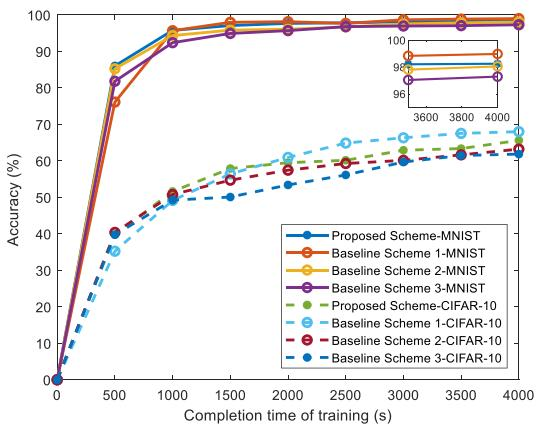  
Fig. 3. Accuracy versus the completion time of training.

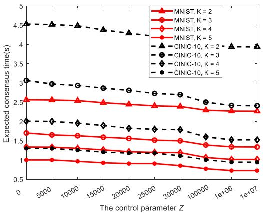  
Fig. 5. Expected consensus time versus the control parameter Z.

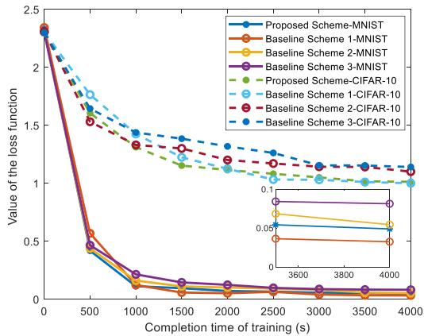  
Fig. 4. Value of the loss function versus the completion time of training.

## A. Accuracy of Global Model

We compare our proposed algorithm against the benchmarks by training the models for a given amount of time on different datasets. Figs. 3 and 4 show the accuracy and the loss function values of the considered schemes versus total training time under non-IID training data respectively. We observe that in an ideal scenario without considering communication resource constraints, FedAvg achieves the highest accuracy and the lowest loss compared to various schemes on both the MNIST and the CIFAR-10 datasets. The proposed SDHFL, however, achieves higher learning accuracy and a smaller loss than the baseline 3. Specifically, SDHFL achieves accuracy rates exceeding 98.26% on MNIST and 65.21% on CIFAR-10, surpassing asynchronous FL by 1.06% and 3.76%, respectively. This is because an asynchronous FL scheme leads to significant device staleness, which hinders FL convergence under non-IID training data. In contrast, the SDHFL process incorporates an additional consensus step, reducing differences among local models within the same cluster and thereby mitigating the adverse effects caused by non-IID data. Unlike baseline 3, which employs fixed and random device selection, the proposed cluster selection scheme can choose the devices according to (48) and hence, the learning rates of devices are improved. Furthermore, we note that the training accuracy of all schemes for the CIFAR-10 dataset is lower than that for MNIST, mainly due to the higher noise levels in the former.

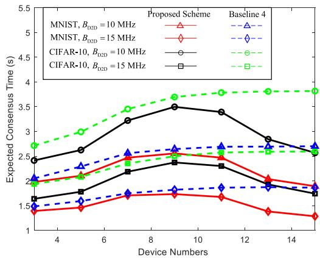  
Fig. 6. Expected consensus time versus the number of devices.

## B. Completion Time Impacted by Cluster

Fig. 5 illustrates how the expected consensus time varies with the control parameter Z. In our experiments, We approximately divide M  devices equally into K clusters. We observe that as K increases, the expected consensus time gradually decreases. This is because a larger number of clusters results in fewer devices per cluster, thereby reducing the number of rounds required for local model consensus convergence, and consequently lowering the expected consensus time. Additionally, we find that as the control parameter Z increases, the expected consensus time also decreases gradually. In fact, with Z approaches infinity, the expected consensus time converges to an asymptotic value. To validate the relationship between the expected consensus time change with the control parameter Z, we also illustrate the simulation result for the novel dataset CINIC-10. It can obtain that the expected consensus time in the collect data in CINIC-10 is less than that in MNIST, while the expected consensus time decreases gradually. This occurs because the data in CINIC-10 is more heterogeneous than that in MNIST. Meanwhile, the cluster selection strategy becomes dominated by the number of consensus rounds, leading the UAV to favor clusters with fewer consensus rounds per iteration, thus further reducing the expected consensus time.

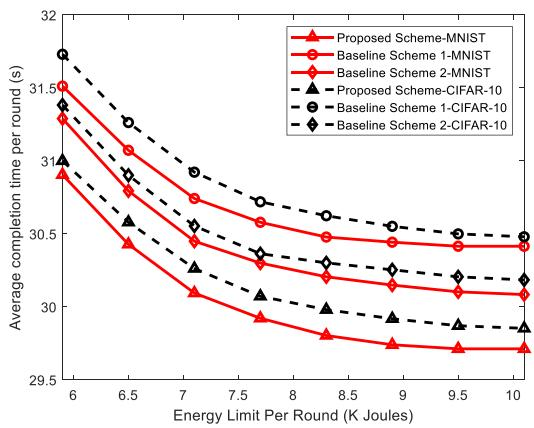  
Fig. 7. Average completion time per round versus energy limit per round.

Fig. 6 shows the completion time of global model training versus the number of edge devices per cluster under different transmit power limitations. It can be seen that the completion time first increases with the number of edge devices per cluster and then decreases for any dataset and transmit power settings. Therefore, an optimal number of edge devices per cluster does exists for minimizing the completion time. This result can be explained as follows: the cluster containing edge devices is limited in a fixed range. As the number of devices increase firstly, the increasing D2D pairs introduce more interference among the D2D communications, which causes the consensus time to increase. As the number of devices in a cluster continues to increase, each device trends to select its closest device for model consensus, which significantly reduces the distance of D2D pairs. In this case, the local model quickly achieves consensus.

Fig. 7 shows the average completion time per round versus the energy limitation of UAV per round. For different datasets, we observe that the average completion time decreases as the energy limitation of the UAV increases. This is because when the energy limitation of the UAV is large, the UAV can allocate more power to training global model and fly to the hovering point at higher speed. Also, we observe that our proposed algorithm achieves the minimal average completion time compared with two other baseline schemes. This result is due to the fact that the time consumption for the local model train in two other baseline is usually larger than the local model consensus in our proposed algorithm. For the same energy limitation per round, the UAV in our framework experiences shorter waiting times and can quickly reach each hovering point.

Fig. 8 shows the completion time of the global model as a function of the maximal computational capacity for different datasets. It can be observed that the completion time of the global model decreases with the maximum CPU frequency quickly at first and then more slowly. It can be explained that the edge devices have higher computational capacity, they can deal with collected data for less latency. However, as the computational capacity of edge devices continues to increase, the time consumption of device training for the local model becomes small. The completion time is mainly occupied by the model consensus time, which only depends on the uniformity of the collected data. Therefore, the time consumption decreases slowly when the maximum CPU frequency is sufficiently high.

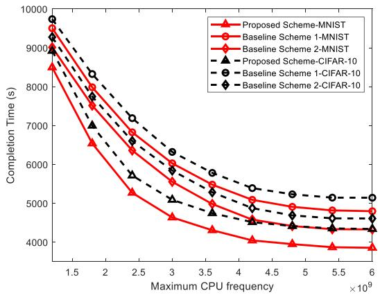  
Fig. 8. Completion time of global model versus maximal computational capacity of devices.

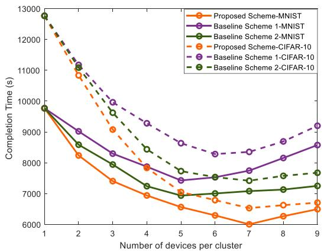  
Fig. 9. Completion time of global model versus the number of devices per cluster.

## C. Completion Time Impacted by UAV

Fig. 9 shows the completion time versus the number of devices per cluster. In the experimental setup for Fig. 9, the number of clusters is set to $K = 3$ . Notably, the completion time initially decreases as the number of devices per cluster increases. This is because an increase in the number of devices results in more data being processed per training round, which accelerates the convergence of the global model to the desired accuracy. However, once the total number of devices reaches a certain threshold, the completion time begins to increase with the number of devices per cluster. This can be attributed to the fixed bandwidth resources, which, when overwhelmed by a higher number of devices, result in greater resource consumption and increased waiting time. The proposed algorithm demonstrates superior performance compared to the baseline scheme 1 and 2, owing to the adoption of the SDHFL approach, dynamic cluster selection, and optimized resource allocation.

Fig. 10 shows the completion time versus number of clusters $c _ { k }$ . Without loss of generality, we set the target training accuracy $\varphi = 0 . 0 5$ in our experiments. Notably, for all considered scenarios except for the synchronous FL scheme, the completion time of training initially decreases and then increases with $c _ { k }$ . This behavior arises since the number of clusters only affects consensus, which is not a process in synchronous FL and the SDHFL allows unscheduled devices to train their local models concurrently while another cluster is uploading its model. An optimal value of $c _ { k } = 4$ strikes an effective balance between cluster parallelism and the overhead associated with UAV mobility. When $c _ { k } = 4$ baseline scheme 2 and our proposed algorithm can achieve minimal completion time. However, the completion time of our proposed algorithm is smaller than the baseline scheme thanks to the adopted cluster selection policy and resource allocation. This result shows that intelligent cluster selection and scheduling can significantly affect the completion time of SDHFL.

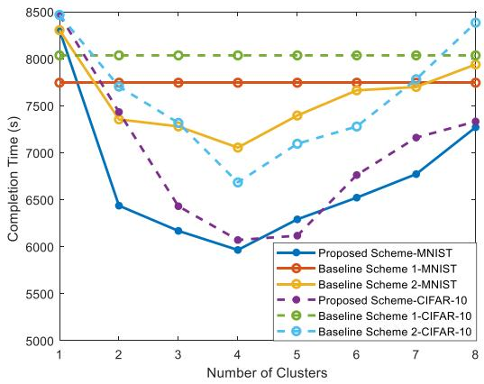  
Fig. 10. Completion time of global model versus the number of clusters.

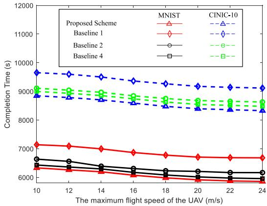  
Fig. 11. Completion time of global model versus the maximum flight speed of the UAV.

Fig. 11 shows the completion time versus the maximum flight speed of UAV. The completion time for training gradually decreases as the limitation of flight speed increases. This is because as the limitation of flight speed increases, the time consumption of UAV flight to the next hovering point decreases. In this way, the total completion time, including flying to hovering point, receiving local model, training global model, and broadcasting updated global model, will highly depend on the time consumption for model transmission and update. Due to the cluster selection policy and network resource allocation, Fig. 11 shows that the completion time of our proposed algorithm is less than that of the other three baseline schemes, including centralized and semi-decentralized FL models. To validate the proposed algorithm, we also illustrate the simulation result for the novel dataset CINIC-10. It can be observed that the completion time of the collect data in CINIC-10 is larger than that in MNIST, while the completion time decrease with the maximum flight speed of the UAV gradually also. This occurs because the data in CINIC-10 is more heterogeneous than that in MNIST.

## VI. CONCLUSION

This paper proposed a novel SDHFL resource allocation framework, jointly integrating cluster selection scheduling and resource allocation to minimize the overall completion time of SDHFL. The framework accounts for heterogeneous devices, wireless fading channels, and non-IID training data, ensuring robustness in practical deployment scenarios. To accelerate SDHFL convergence, we conducted a theoretical convergence analysis and derived a lower bound on the required global iteration rounds. Furthermore, we developed an adaptive cluster selection and resource allocation optimization algorithm based on Lyapunov optimization, effectively addressing the nonconvex resource allocation problem. Extensive simulation results validate the effectiveness of the proposed approach, showing substantial reductions in overall training time and improvements in global model convergence and resource utilization. Moreover, an important trade-off was revealed, where increasing the number of devices or clusters initially benefits convergence speed but ultimately leads to performance degradation due to intensified resource contention. This insight emphasizes the critical balance between scalability and resource management, highlighting the proposed framework’s potential to effectively handle this tradeoff in next-generation wireless AI systems. It should be also noted that the L-smoothness and μ-strong convexity assumption is benefit to this work to achieve tractable convergence results. More natural results relaxed these assumption will be analyzed in the future to reveal convergence trends and potential challenges.

## REFERENCES

[1] M. Vaezi et al., “Cellular, wide-area, and non-terrestrial IoT: A survey on 5G advances and the road toward 6G,” IEEE Commun. Surv. Tuts., vol. 24, no. 2, pp. 1117–1174, Second Quarter 2022.

[2] N. S. Chilamkurthy, O. J. Pandey, A. Ghosh, L. R. Cenkeramaddi, and H. -N. Dai, “Low-power wide-area networks: A broad overview of its different aspects,” IEEE Access, vol. 10, pp. 81926–81959, 2022.

[3] W. Y. B. Lim et al., “Federated learning in mobile edge networks: A comprehensive survey,” IEEE Commun. Surv. Tuts., vol. 22, no. 3, pp. 2031–2063, Third Quarter 2020.

[4] N. Chbaik, A. Khiat, A. Bahnasse, and H. Ouajji, “Blockchain-assisted IoT wireless framework for equipment monitoring in smart supply chain: A focus on temperature and humidity sensing,” IEEE Access, vol. 12, pp. 117504–117522, 2024.

[5] Y. Mao, C. You, J. Zhang, K. Huang, and K. B. Letaief, “A survey on mobile edge computing: The communication perspective,” IEEE Commun. Surv. Tuts., vol. 19, no. 4, pp. 2322–2358, Fourth Quarter 2017.

[6] D. C. Nguyen, M. Ding, P. N. Pathirana, A. Seneviratne, J. Li, and H. V. Poor, “Federated learning for Internet of Things: A comprehensive survey,” IEEE Commun. Surv. Tuts., vol. 23, no. 3, pp. 1622–1658, Third Quarter 2021.

[7] S. Bahrami, Y. C. Chen, and V. W. S. Wong, “Deep reinforcement learning for demand response in distribution networks,” IEEE Trans. Smart Grid, vol. 12, no. 2, pp. 1496–1506, Mar. 2021.

[8] Y. Li, X. Tao, X. Zhang, J. Liu, and J. Xu, “Privacy-preserved federated learning for autonomous driving,” IEEE Trans. Intell. Transp. Syst., vol. 23, no. 7, pp. 8423–8434, Jul. 2022.

[9] S. Wang et al., “Adaptive federated learning in resource constrained edge computing systems,” IEEE J. Sel. Areas Commun., vol. 37, no. 6, pp. 1205–1221, Jun. 2019.

[10] S. Dhakal et al., “Coded federated learning,” in Proc. IEEE Globecom Workshops, 2019, pp. 1–6.

[11] H. B. McMahan, E. Moore, D. Ramage, S. Hampson, and B. A. y Arcas, “Communication-efficient learning of deep networks from decentralized data,” 2023. [Online]. Available: https://arxiv.org/abs/1602.05629

[12] C.-H. Hu, Z. Chen, and E. G. Larsson, “Scheduling and aggregation design for asynchronous federated learning over wireless networks,” IEEE J. Sel. Areas Commun., vol. 41, no. 4, pp. 874–886, Apr. 2023.

[13] Q. Ma, Y. Xu, H. Xu, Z. Jiang, L. Huang, and H. Huang, “FedSA: A semi-asynchronous federated learning mechanism in heterogeneous edge computing,” IEEE J. Sel. Areas Commun., vol. 39, no. 12, pp. 3654–3672, Dec. 2021.

[14] L. Liu, Z. Ding, D. Cheng, and X. Zhou, “Locality-aware and fault-tolerant batching for machine learning on distributed datasets,” IEEE Trans. Cloud Comput., vol. 12, no. 2, pp. 370–387, Second Quarter 2024.

[15] T. Zhang, K.-Y. Lam, and J. Zhao, “Device scheduling and assignment in hierarchical federated learning for Internet of Things,” IEEE Internet Things J., vol. 11, no. 10, pp. 18449–18462, May 2024.

[16] S. A. Gbadamosi, G. P. Hancke, and A. M. Abu-Mahfouz, “Interferenceaware and coverage analysis scheme for 5G NB-IoT D2D relaying strategy for cell edge QoS improvement,” IEEE Internet Things J., vol. 11, no. 2, pp. 2224–2235, Jan. 2024.

[17] M. Fu, Y. Shi, and Y. Zhou, “Federated learning via unmanned aerial vehicle,” IEEE Trans. Wireless Commun., vol. 23, no. 4, pp. 2884–2900, Apr. 2024.

[18] X. Zhang et al., “When UAV meets federated learning: Latency minimization via joint trajectory design and resource allocation,” 2024. [Online]. Available: https://arxiv.org/abs/2412.07428

[19] X. Liu, Y. Deng, and T. Mahmoodi, “Wireless distributed learning: A new hybrid split and federated learning approach,” IEEE Trans. Wireless Commun., vol. 22, no. 4, pp. 2650–2665, Apr. 2023.

[20] J. Kim, J. Lee, E. Yang, and S. Kang, “Technology forecasting from the perspective of integration of technologies: Drone technology,” KSII Trans. Internet Inf. Syst., vol. 17, no. 1, pp. 18–29, 2023.

[21] J. Zhang, Y. Zhang, L. Xiang, Y. Sun, D. W. Kwan Ng, and M. Jo, “Robust energy-efficient transmission for wireless-powered D2D communication networks,” IEEE Trans. Veh. Technol., vol. 70, no. 8, pp. 7951–7965, Aug. 2021.

[22] M. Wang, L. Zhu, L. T. Yang, M. Lin, X. Deng, and L. Yi, “Offloadingassisted energy-balanced IoT edge node relocation for confident information coverage,” IEEE Internet Things J., vol. 6, no. 3, pp. 4482–4490, Jun. 2019.

[23] J. Lu, W. Feng, and D. Pu, “Resource allocation and offloading decisions of D2D collaborative uavassisted mec systems,” KSII Trans. Internet Inf. Syst., vol. 18, no. 1, pp. 211–232, 2024.

[24] F. P.-C. Lin, S. Hosseinalipour, S. S. Azam, C. G. Brinton, and N. Michelusi, “Semi-decentralized federated learning with cooperative D2D local model aggregations,” IEEE J. Sel. Areas Commun., vol. 39, no. 12, pp. 3851–3869, Dec. 2021.

[25] G. Gad, A. Farrag, A. Aboulfotouh, K. Bedda, Z. M. Fadlullah, and M. M. Fouda, “Joint self-organizing maps and knowledge-distillation-based communication-efficient federated learning for resource-constrained UAV-IoT systems,” IEEE Internet Things J., vol. 11, no. 9, pp. 15504–15522, May 2024.

[26] H. Du, Y. Chen, R. Yang, Y. Li, and L. Kong, “Hyperprism: An adaptive non-linear aggregation framework for distributed machine learning over non-IID data and time-varying communication links,” in Proc. 38th Annu. Conf. Neural Inf. Process. Syst., 2024. [Online]. Available: https: //openreview.net/forum?id=3ie8NWA1El

[27] Z. Lyu, Y. Li, G. Zhu, J. Xu, H. Vincent Poor, and S. Cui, “Rethinking resource management in edge learning: A joint pre-training and finetuning design paradigm,” IEEE Trans. Wireless Commun., vol. 24, no. 2, pp. 1584–1601, Feb. 2025.

[28] L. Xiang, D. W. K. Ng, R. Schober, and V. W. S. Wong, “Cache-enabled physical layer security for video streaming in Backhaul-limited cellular networks,” IEEE Trans. Wireless Commun., vol. 17, no. 2, pp. 736–751, Feb. 2018.

[29] B. Klaiqi, X. Chu, and J. Zhang, “Energy- and spectral-efficient adaptive forwarding strategy for multi-hop device-to-device communications overlaying cellular networks,” IEEE Trans. Wireless Commun., vol. 17, no. 9, pp. 5684–5699, Sep. 2018.

[30] Q.-V. Pham, M. Le, T. Huynh-The, Z. Han, and W.-J. Hwang, “Energyefficient federated learning over UAV-enabled wireless powered communications,” IEEE Trans. Veh. Technol., vol. 71, no. 5, pp. 4977–4990, May 2022.

[31] Y. Zeng, J. Xu, and R. Zhang, “Energy minimization for wireless communication with rotary-wing UAV,” IEEE Trans. Wireless Commun., vol. 18, no. 4, pp. 2329–2345, Apr. 2019.

[32] Q. Wu, Y. Zeng, and R. Zhang, “Joint trajectory and communication design for multi-UAV enabled wireless networks,” IEEE Trans. Wireless Commun., vol. 17, no. 3, pp. 2109–2121, Mar. 2018.

[33] J. Si et al., “Covert transmission assisted by intelligent reflecting surface,” IEEE Trans. Commun., vol. 69, no. 8, pp. 5394–5408, Aug. 2021.

[34] J. Shi, Y. Wu, D. Zeng, J. Tao, J. Hu, and Y. Shi, “Self-supervised on-device federated learning from unlabeled streams,” IEEE Trans. Comput. Aided Des. Integr. Circuits Syst., vol. 42, no. 12, pp. 4871–4882, Dec. 2023.

[35] D. Wu and R. Negi, “Effective capacity: A wireless link model for support of quality of service,” IEEE Trans. Wireless Commun., vol. 2, no. 4, pp. 630–643, Jul. 2003.

[36] W. Shi, S. Zhou, Z. Niu, M. Jiang, and L. Geng, “Joint device scheduling and resource allocation for latency constrained wireless federated learning,” IEEE Trans. Wireless Commun., vol. 20, no. 1, pp. 453–467, Jan. 2021.

[37] H. H. Yang, Z. Liu, T. Q. S. Quek, and H. V. Poor, “Scheduling policies for federated learning in wireless networks,” IEEE Trans. Commun., vol. 68, no. 1, pp. 317–333, Jan. 2020.

[38] J. Yang, Y. Liu, F. Chen, W. Chen, and C. Li, “Asynchronous wireless federated learning with probabilistic client selection,” IEEE Trans. Wireless Commun., vol. 23, no. 7, pp. 7144–7158, Jul. 2024.

[39] M. Yahya, S. Maghsudi, and S. Stanczak, “Federated learning in UAVenhanced networks: Joint coverage and convergence time optimization,” IEEE Trans. Wireless Commun., vol. 23, no. 6, pp. 6077–6092, Jun. 2024.

[40] S. Hosseinalipour et al., “Multi-stage hybrid federated learning over largescale D2D-enabled fog networks,” IEEE/ACM Trans. Netw., vol. 30, no. 4, pp. 1569–1584, 2022.

[41] B. Zhu, E. Bedeer, H. H. Nguyen, R. Barton, and J. Henry, “UAV trajectory planning in wireless sensor networks for energy consumption minimization by deep reinforcement learning,” IEEE Trans. Veh. Technol., vol. 70, no. 9, pp. 9540–9554, Sep. 2021.

[42] X. Wang, C. Wang, X. Li, V. C. M. Leung, and T. Taleb, “Federated deep reinforcement learning for Internet of Things with decentralized cooperative edge caching,” IEEE Internet Things J., vol. 7, no. 10, pp. 9441–9455, Oct. 2020.

[43] M. Neely, Stochastic Network Optimization With Application to Communication and Queueing Systems. Berlin, Germany: Springer, 2022.

[44] D. C. Nguyen, S. Hosseinalipour, D. J. Love, P. N. Pathirana, and C. G. Brinton, “Latency optimization for blockchain-empowered federated learning in multi-server edge computing,” IEEE J. Sel. Areas Commun., vol. 40, no. 12, pp. 3373–3390, Dec. 2022.

[45] L. Xiao and S. Boyd, “Fast linear iterations for distributed averaging,” in Proc. 42nd IEEE Int. Conf. Decis. Control, pp. 4997–5002, 2003.

[46] L. Tassiulas and A. Ephremides, “Stability properties of constrained queueing systems and scheduling policies for maximum throughput in multihop radio networks,” IEEE Trans. Autom. Control, vol. 37, no. 12, pp. 1936–1948, Dec. 1992.

[47] M. J. Neely, Stochastic Network Optimization With Application to Communication and Queueing Systems. San Rafael, CA, USA: Morgan & Claypool, 2010.

[48] H.-T. Ye, X. Kang, J. Joung, and Y.-C. Liang, “Optimization for full-duplex rotary-wing UAV-enabled wireless-powered IoT networks,” IEEE Trans. Wireless Commun., vol. 19, no. 7, pp. 5057–5072, Jul. 2020.

[49] L. Xiang, D. W. K. Ng, T. Islam, R. Schober, V. W. S. Wong, and J. Wang, “Cross-layer optimization of fast video delivery in cache- and buffer-enabled relaying networks,” IEEE Trans. Veh. Technol., vol. 66, no. 12, pp. 11366–11 382, Dec. 2017.

[50] Z. Yang, M. Chen, W. Saad, C. S. Hong, and M. Shikh-Bahaei, “Energy efficient federated learning over wireless communication networks,” IEEE Trans. Wireless Commun., vol. 20, no. 3, pp. 1935–1949, Mar. 2021.

[51] H. Pan, Y. Liu, G. Sun, P. Wang, and C. Yuen, “Resource scheduling for UAVs-aided D2D networks: A multi-objective optimization approach,” IEEE Trans. Wireless Commun., vol. 23, no. 5, pp. 4691–4708, May 2024.

[52] J. Tian et al., “Synergetic focal loss for imbalanced classification in federated XGBoost,” IEEE Trans. Artif. Intell., vol. 5, no. 2, pp. 647–660, Feb. 2024.

[53] S. Shalev-Shwartz and S. Ben-David, Understanding Machine Learning: From Theory to Algorithms. New York, NY, USA: Cambridge Univ. Press, 2014.

[54] Y. Lecun, L. Bottou, Y. Bengio, and P. Haffner, “Gradient-based learning applied to document recognition,” Proc. IEEE, vol. 86, no. 11, pp. 2278–2324, Nov. 1998.

[55] A. Krizhevsky, “Learning multiple layers of features from tiny images,” 2009. [Online]. Available: https://api.semanticscholar.org/CorpusID: 18268744

[56] L. N. Darlow, E. J. Crowley, A. Antoniou, and A. J. Storkey, “CINIC-10 is not imagenet or CIFAR-10,” 2018, arXiv:1810.03505.

[57] H. B. McMahan et al., “Communication-efficient learning of deep networks from decentralized data,” in Proc. Int. Conf. Artif. Intell. Statist., 2016, pp. 384–395. [Online]. Available: https://api.semanticscholar.org/ CorpusID:14955348

[58] M. Yemini et al., “Semi-decentralized federated learning with collaborative relaying,” in Proc. IEEE Int. Symp. Inf. Theory, 2022, pp. 1471–1476.

[59] Z. Yang, X. Zhang, D. Wu, R. Wang, P. Zhang, and Y. Wu, “Efficient asynchronous federated learning research in the Internet of Vehicles,” IEEE Internet Things J., vol. 10, no. 9, pp. 7737–7748, May 2023.

[60] B. Xu, H. Zhao, H. Cao, X. Lu, and H. Zhu, “Joint contract design and task reorganization for semi-decentralized federated edge learning in vehicular networks,” IEEE Trans. Veh. Technol., vol. 73, no. 7, pp. 10539–10553, Jul. 2024.

  
Kui Chen received the undergraduate degree from the Nanjing University of Science and Technology and is currently working toward the master’s degree with the Huazhong University of Science and Technology. His current research interests include federated learning, resource allocation, and UAV communications.

  
Jing Zhang (Member, IEEE) received the master and PhD degrees from the Huazhong University of Science and Technology (HUST), in 2002 and 2010, respectively. He is currently an associate professor with HUST. His current research interests include unmanned aerial vehicle communications, green communications, device-to-device communications, and millimeter-wave communications.


Yong Xiao (Senior Member, IEEE) received the BS degree in electrical engineering from the China University of Geosciences, Wuhan, China, in 2002, the MSc degree in telecommunication from the Hong Kong University of Science and Technology, in 2006, and the PhD degree in electrical and electronic engineering from Nanyang Technological University, Singapore, in 2012. He is now a professor with the School of Electronic Information and Communications, Huazhong University of Science and Technology (HUST), Wuhan, China. He is also with

Peng Cheng Laboratory, Shenzhen, China and Pazhou Laboratory (Huangpu), Guangzhou, China. He is the associate group leader of the network intelligence group of IMT-2030 (6G promoting group) and the vice director of 5G Verticals Innovation Laboratory, HUST. Before he joins HUST, he was a research assistant professor with the Department of Electrical and Computer Engineering, University of Arizona where he was also the center Manager of the Broadband Wireless Access and Applications Center (BWAC), an NSF Industry/University Cooperative Research Center (I/UCRC) led by the University of Arizona. His research interests include machine learning, game theory, distributed optimization, and their applications in semantic communications, semantic-aware networking, cloud/fog/mobile edge computing, green communication systems, and Internet-of-Things (IoT).


Minho Jo (Senior Member, IEEE) received the BA degree from the Department of Industrial Engineering, Chosun University, Gwangju, South Korea, in 1984, and the PhD degree from the Department of Industrial and Systems Engineering, Lehigh University, Bethlehem, PA, USA, in 1994. He is a full professor with the Department of Computer Convergence Software, Korea University, Sejong, South Korea, where he is the director with the IoT & AI Lab. He is currently the director of Brain Korea 21 [IoT Data Science Team] supported by the Korean

government. He is named in the 2024 World’s TOP 2% Scientists List by Stanford University and Elsevier. His current research interests include IoT, generative LLM, quantum computing and quantum AI, blockchain/security, optimization theory, and autonomous vehicles. The average number of citations per publication authored by he (from 2012 through 2024) is 55.9 and the Average Field-Weighted Citation Impact (FWCI) of he (from 2012 through 2024) is 4.91 (based on SCOPUS SciVal.) he is a recipient of the 2018 IET Best Paper Premium Award by the United Kingdom’s Royal Institute of Engineering and Technology. He was awarded with 2011 Headong Outstanding Scholar Prize. He is one of the founders of the Samsung Electronics LCD Division. He is the Founder and the editor-in-chief of KSII Transactions on Internet and Information Systems (SCIE/JCR and SCOPUS indexed. https://itiis.org/board). He was the South Korea’s Presidential Commission on Policy Planning (AI and Big Data). He was an associate editor of IEEE System Journal, IEEE Access, IEEE Internet of Things Journal, Editor of IEEE Wirelss Communications, and Editor of Network, respectively.


Derrick Wing Kwan Ng (Fellow, IEEE) received the bachelor’s degree (with first-class Honors) and the master of philosophy degree in electronic engineering from the Hong Kong University of Science and Technology (HKUST), Hong Kong, in 2006 and 2008, respectively, and the PhD degree from the University of British Columbia, Vancouver, BC, Canada, in November 2012. Following his PhD, he was a senior postdoctoral fellow with the Institute for Digital Communications, Friedrich-Alexander-University Erlangen-Nürnberg (FAU), Germany. He

is currently a Scientia associate professor with the University of New South Wales, Sydney, NSW, Australia. His research interests include global optimization, integrated sensing and communication (ISAC), physical layer security, IRS-assisted communication, UAV-assisted communication, wireless information and power transfer, and green (energy-efficient) wireless communications. He has been recognized as a Highly Cited Researcher by Clarivate Analytics (Web of Science) since 2018. He was the recipient of the Australian Research Council (ARC) Discovery Early Career Researcher Award 2017, IEEE Communications Society Leonard G. Abraham Prize 2023, IEEE Communications Society Stephen O. Rice Prize 2022, Best Paper Awards at the WCSP 2020, 2021, IEEE TCGCC Best Journal Paper Award 2018, INISCOM 2018, IEEE International Conference on Communications (ICC) 2018, 2021, 2023, 2024, IEEE International Conference on Computing, Networking and Communications (ICNC) 2016, IEEE Wireless Communications and Networking Conference (WCNC) 2012, IEEE Global Telecommunication Conference (Globecom) 2011, 2021, 2023 and IEEE Third International Conference on Communications and Networking in China 2008. From 2012 to 2019, he served as an Editorial Assistant to the editor-in-chief of the IEEE Transactions on Communications. He is also an Area Editor of the IEEE Transactions on Communications, an associate editor-in-chief of the IEEE Open Journal of the Communications Society, and a member of the IEEE Transactions on Wireless Communications executive editorial committee.