# Completion Time and Energy Optimization in the UAV-Enabled Mobile-Edge Computing System

Cheng Zhan , Han Hu , Xiufeng Sui, Zhi Liu , Senior Member, IEEE, and Dusit Niyato , Fellow, IEEE

Abstract—Completion time and energy consumption of the unmanned aerial vehicle (UAV) are two important design aspects in UAV-enabled applications. In this article, we consider a UAVenabled mobile-edge computing (MEC) system for Internet-of-Things (IoT) computation offloading with limited or no common cloud/edge infrastructure. We study the joint design of computation offloading and resource allocation, as well as UAV trajectory for minimization of energy consumption and completion time of the UAV, subject to the IoT devices’ task and energy budget constraints. We first consider the UAV energy minimization problem without predetermined completion time, a discretized nonconvex equivalent problem is obtained by using the path discretization technique. An efficient alternating optimization algorithm for the discretized problem is proposed by decoupling it into two subproblems and addressing the two subproblems with successive convex approximation (SCA)-based algorithms iteratively. Subsequently, we focus on the completion time minimization problem, which is nonconvex and challenging to solve. By using the same path discretization approximation model to reformulate problem, a similar alternating optimization algorithm is proposed. Furthermore, we study the Pareto-optimal solution that balances the tradeoff between the UAV energy and completion time. The simulation results are provided to corroborate this article and show that the proposed designs outperform the baseline schemes. Our results unveil the tradeoff between completion time and energy consumption of the UAV for the MEC system, and the proposed solution can provide the performance close to the lower bound.

Index Terms—Completion time, energy consumption, Internet of Things (IoT), mobile-edge computing (MEC), unmanned aerial vehicle (UAV).

# I. INTRODUCTION

W ITH the rapid development of Internet of Things (IoT)and 5G networks, a myriad of promising services and applications have emerged, including speech/face recognition, autonomous driving, image/video processing, real-time online

Manuscript received December 5, 2019; revised March 11, 2020 and April 15, 2020; accepted April 29, 2020. Date of publication May 8, 2020; date of current version August 12, 2020. This work was supported in part by the National Natural Science Foundation of China under Grant 61702426 and Grant 61971457, and in part by the Fundamental Research Funds for the Central Universities under Grant XDJK2019C084. (Corresponding author: Han Hu.)

Cheng Zhan is with the School of Computer and Information Science, Southwest University, Chongqing 400715, China (e-mail: zhanc@swu.edu.cn).

Han Hu and Xiufeng Sui are with the School of Information and Electronics, Beijing Institute of Technology, Beijing 100081, China (e-mail: hhu@bit.edu.cn; suixiufeng@bit.edu.cn).

Zhi Liu is with the Department of Mathematical and Systems Engineering, Shizuoka University, Hamamatsu 432-8561, Japan (e-mail: liu@ieee.org).

Dusit Niyato is with the School of Computer Science and Engineering, Nanyang Technological University, Singapore (e-mail: dniyato@ntu.edu.sg).

Digital Object Identifier 10.1109/JIOT.2020.2993260

gaming, and so forth. These applications generally require computation-intensive and latency-sensitive tasks with a large number of low-power and size-constrained devices [1], [2], which pose great challenges on the computing capability and battery of the resource-constrained IoT devices. To address the above challenges, mobile-edge computing (MEC) has been introduced and widely studied [3]–[5], where flexible and efficient computing services are provided by employing the computing resources in the network edge. Specifically, all or partial of the computation-intensive tasks from IoT devices are able to be offloaded to nearby MEC servers which locates at the edge of the wireless network, e.g., access points (APs) and cellular base stations (BSs).

However, the limited coverage of static edge servers yields new challenges. In particular, task offloading may not be supported for remote devices by the static edge server due to long-distance path loss and complicated radio environments. Furthermore, it is costly and impractical to densely deploy static edge servers for the realistic environment. Therefore, a flexible unmanned-aerial-vehicle (UAV)-enabled MEC system is introduced [6], [7] where a flying UAV with computing capability is employed such that computation offloading opportunities can be provided to devices with limited local computing capabilities. Furthermore, Line-of-Sight (LoS) links can be established between IoT devices and the UAV by exploiting the mobility of UAV to move close to each IoT device [8]–[10].

An energy issue is a very important design aspect for the UAV-enabled MEC system due to the limited onboard energy of UAV, which should be efficiently utilized such that the UAV’s endurance is prolonged. Different from that in the conventional terrestrial communication nodes, additional propulsion energy consumption is incurred for the UAV to maintain airborne [11], [12]. UAVs can be mainly classified into two types: 1) rotary wing and 2) fixed wing. A rotarywing UAV has the capability of hovering over fixed locations. However, it generally requires high power consumption. On the other hand, a fixed-wing UAV requires a minimum speed to remain aloft. Typically, fixed-wing UAV consumes much less power than rotary-wing UAV [13]. Such advantage makes the fixed-wing UAV suitable for power limited edge server in the UAV-enabled MEC system.

The completion time of UAV is also one of the fundamental optimization objectives for UAV-aided wireless networks [14], [15], especially for time-sensitive applications. For the UAV-enabled MEC system, there is a fundamental tradeoff among flying speed and completion time as well as energy consumption of the UAV. In particular, in order to offload the computation task from each IoT device energy efficiently, each device may offload task when the UAV flies close enough with better channel quality. Increasing the flying speed helps reduce the completion time, but the propulsion power consumption of the UAV may increase or decrease depending on its current speed due to the derived propulsion power model as in [12]. To resolve such a tradeoff, this article aims to minimize the energy consumption and completion time of the UAV for the UAV-enabled MEC system by jointly designing the UAV trajectory and completion time as well as computation offloading and resource allocation, which is challenging, and has not been investigated before.

In this article, we investigate the UAV energy and completion time minimization issues in a UAV-enabled MEC system, where a fixed-wing UAV with computing capability is employed such that computation offloading opportunities can be provided to IoT devices with limited local computing capabilities. We formulate two optimization problems to minimize energy consumption and completion time of the UAV, respectively, while ensuring that the computation task is completed for each IoT device with a given energy budget. For the UAV energy minimization, the UAV may fly close to each IoT device with less power-consuming speed and energyefficient resource allocation. For the UAV completion time minimization, the UAV may fly close to each IoT device with the maximum speed such that the UAV completion time is minimized while satisfying the computation task requirement with a given energy budget for each device. Therefore, the two optimization problems are different with little relationship as both completion time and energy consumption of the UAV are relevant to the flying speed, and the UAV energy minimization solution is different from the completion time minimization solution in general. We summarize the main contributions of this article as follows.

1) We study the completion time and energy optimization issues in the UAV-enabled MEC system via jointly optimizing the computation offloading and resource allocation as well as UAV trajectory and completion time. Two optimization problems are formulated for minimizing the energy consumption and completion time of the UAV, respectively. Our problem formulations take into account UAV’s propulsion energy consumption, dynamics of the CPU frequency scaling for computing, information-causality constraints for computation offloading, and the energy budget of the IoT devices.

2) We study the UAV energy minimization problem for the considered system. With the aid of the path discretization technique and the successive convex approximation (SCA) technique, we propose an efficient alternating optimization algorithm to simultaneously update computation offloading and resource allocation as well as UAV trajectory and completion time. In particular, by decoupling design variables into two blocks, two subproblems are alternatively optimized until the objective value converges, where the convergence of the proposed algorithm is analyzed.

3) We focus on the completion time minimization problem for the considered system, which is a nonconvex problem and difficult to tackle. The original problem is transformed to a discretized equivalent by using the same path discretization approximation model as in the UAV energy minimization problem, and a similar alternating optimization algorithm is proposed. Furthermore, we study the Pareto-optimal solution that balances the tradeoff between the UAV energy and completion time.

4) Extensive simulation results are provided to validate the performance of the proposed designs and illustrate the tradeoff between completion time and energy consumption of the UAV. Besides, the simulation results show that the proposed designs achieve a significant improvement in terms of completion time and energy consumption of the UAV for the considered UAV-enabled MEC system compared to the baseline schemes.

The remainder of this article is organized as follows. Section II summarizes recent research on computation offloading over UAV-enabled MEC networks. Section III introduces the considered UAV-enabled MEC system model for IoT applications. Section IV provides the joint design of the UAV energy minimization problem with the path discretization technique and the alternating optimization algorithm. In Section V, we provide the joint design of completion time minimization problem with the same path discretization approximation model and similar alternating optimization algorithm. Based on the above results, we study the Paretooptimal solution that balances the tradeoff between the two objectives in Section VI. Section VII presents simulation results and Section VIII concludes this article.

# II. RELATED WORK

There has been growing research interest in resource allocation over the MEC system with the help of UAV. Resource allocation in UAV-enabled wireless powered MEC systems was studied in [6], where both partial and binary computation offloading modes were considered. Asheralieva and Niyato [16] presented a novel game-theoretic framework in the UAV-enabled MEC network for computation offloading, where MEC servers were installed at both UAVs and stationary BSs. In [17], the energy consumption of all users in a UAV-enabled MEC system was minimized with the timedivision-multiple-access (TDMA) protocol while ensuring that the tasks computation of all users are completed successfully. The work in [18] studied an energy-efficient computation offloading problem for the secure UAV-enabled MEC system with the existence of both passive and active eavesdroppers. However, UAV’s propulsion energy has not been taken into account in the above work, which is the main component of the UAV’s energy consumption.

There are also some research work focusing on energyefficient computation offloading over the UAV-enabled MEC system. In particular, a UAV-assisted MEC system was studied in [19] such that the total mobile energy consumption is minimized and the quality of service of the offloaded application is satisfied. A new UAV-assisted MEC architecture was introduced in [20], where a UAV is employed as a MEC server for computation offloading or a relay platform to relay computation tasks to the nearby APs. In [21], the computation efficiency was maximized in a multi-UAV enabled MEC system, and both energy consumption and the number of computation information are taken into account. The sum power minimization problem was studied in [7] via jointly optimizing computation capacity allocation and user association as well as power control in a UAV-enabled MEC network. However, simplified UAV’s propulsion energy model was adopted in the above work without considering the types of the UAV.

In general, the rotary-wing UAV consumes much more power than the fixed-wing UAV. Specifically, the fixed-wing UAV’s propulsion energy consumption model was derived in [12], based on which the authors investigated the energyefficient UAV communication with a single ground terminal. The power consumption model for rotary-wing UAVs was derived in [11], and the UAV energy consumption was minimized for UAV-enabled multiuser communication subject to the targeting rate constraint. A new UAV-assisted MEC framework was presented in [22], where a rotary-wing UAV was employed to help compute the task bits offloaded by ground terminals and relay computation bits to AP. A fixed-wing UAV was employed as a flying BS in [23] to deal with the application tasks such that the energy consumption for terminal devices are minimized, where one portion of input bits was transmitted to the UAV for computing. The weighted energy consumption of mobile devices and UAV was minimized in [24] for the UAV-assisted MEC system, where a joint optimization algorithm is proposed based on a Lyapunov optimization approach. It is worthwhile to note that the existing works mostly focused on enhancing computation efficiency or energy efficiency with predetermined completion time, but overlooked the fact that the completion time of UAV is also one of the fundamental optimization variables in UAV-enabled wireless networks [14], [15], especially for time-sensitive applications.

The mission completion time of the UAV was minimized in [25] with path planning for UAV-enabled multicasting, while ensuring the successful recovery of a multicasting file for each ground terminal. In [14], the UAV’s total flight time was minimized such that the desired data uploading task is completed for each sensor with a given energy budget. In [26], the total latency consumption of the computation tasks was minimized over MEC networks by jointly designing computation offloading and content caching as well as resource allocation. The total mission time was minimized in [27] for UAV-aided data collection by jointly optimizing UAV’s trajectory, velocity, altitude, and data links with groud users. The work in [28] studied the completion time minimization problem in a UAV-to-UAV communications system via designing the UAV paths jointly with communication resource allocation.

To the best of our knowledge, few efforts have been devoted to solve the UAV completion time and energy minimization issues in a UAV-enabled MEC system. This article clearly differs from the aforementioned research in two aspects: 1) we formulate two optimization problems in the UAV-enabled

TABLE I NOTATION AND DEFINITION 

<table><tr><td>Notation</td><td>Definition</td></tr><tr><td> $B$ </td><td>Signal bandwidth (Hz)</td></tr><tr><td> $H$ </td><td>The altitude of the UAV (m)</td></tr><tr><td> $K$ </td><td>The number of IoT devices</td></tr><tr><td> $s_k$ </td><td>The  $k$ -th device</td></tr><tr><td> $P_k$ </td><td>The transmit power of  $s_k$  (W)</td></tr><tr><td> $I_k$ </td><td>The size of computation task-input data for  $s_k$  (bit)</td></tr><tr><td> $C_k$ </td><td>The number of CPU cycles required for computing 1-bit of input data for  $s_k$ </td></tr><tr><td> $T$ </td><td>Mission completion time required for the UAV (s)</td></tr><tr><td> $\mathbf{w}_k$ </td><td>The horizontal coordinate of  $s_k$ </td></tr><tr><td> $f_k(t)$ </td><td>CPU frequency of  $s_k$  at time  $t$ </td></tr><tr><td> $f_{U,k}(t)$ </td><td>Allocated CPU frequency of UAV for task offloaded from  $s_k$  at time  $t$ </td></tr><tr><td> $f_k^{\max}$ </td><td>The maximum allowable CPU frequency of device  $s_k$ </td></tr><tr><td> $f_U^{\max}$ </td><td>The maximum allowable CPU frequency of the UAV</td></tr><tr><td> $\mathbf{q}_I$ </td><td>The initial position of the UAV</td></tr><tr><td> $\mathbf{q}_F$ </td><td>The final position of the UAV</td></tr><tr><td> $\mathbf{q}(t)$ </td><td>UAV location at time  $t$ </td></tr><tr><td> $\mathbf{v}(t)$ </td><td>UAV velocity at time  $t$ </td></tr><tr><td> $\mathbf{a}(t)$ </td><td>UAV acceleration at time  $t$ </td></tr><tr><td> $V_{\max}$ </td><td>The maximum UAV speed (m/s)</td></tr><tr><td> $V_{\min}$ </td><td>The minimum UAV speed (m/s)</td></tr><tr><td> $a_{\max}$ </td><td>The maximum UAV acceleration (m/s2)</td></tr><tr><td> $x_k(t)$ </td><td>The offloading indicator of device  $s_k$  at time  $t$ </td></tr><tr><td> $R_k(t)$ </td><td>The achievable rate between  $s_k$  and UAV at time  $t$  (bps)</td></tr><tr><td> $\kappa_k$ </td><td>The effective capacitance coefficient of  $s_k$ </td></tr><tr><td> $\kappa_U$ </td><td>The effective capacitance coefficient of the UAV</td></tr><tr><td> $E_k^{\max}$ </td><td>The energy budget of device  $s_k$ </td></tr></table>

MEC system to minimize the energy consumption and completion time of the UAV, respectively, where computation offloading and resource allocation as well as UAV trajectory and completion time are optimized and 2) we utilize alternating optimization and SCA techniques as well as the path discretization technique to obtain Karush–Kuhn–Tucker (KKT) solutions, and unveil the tradeoff between completion time and energy consumption of the UAV for the MEC system.

# III. SYSTEM MODEL

In this section, we present the UAV-enabled MEC system model for IoT applications as well as the energy consumption model for the system. First, we introduce some notation.

# A. Notation

We denote scalars by italic letters. Vectors and matrices are denoted by boldface lowercase and uppercase letters, respectively. RM×1 denotes the space of M-dimensional real-valued vector. ${ \mathbf a } ^ { { \mathrm T } }$ and a denote the transpose and the Euclidean norm of a vector a, respectively. For a time-dependent function x(t), x˙(t) and x¨(t) denote the first derivative and second derivative with time t, respectively. $\log _ { 2 } ( \cdot )$ denotes the logarithm with base 2. | | denotes the cardinality of set . The main notations used in this article are summarized in Table I.

# B. System Model

We consider an outdoor area where K IoT devices are at fixed locations to conduct certain tasks with computation requirements, such as video surveillance and monitoring. Let ${ \mathcal { K } } = \{ s _ { k } , 1 \leq k \leq K \}$ denote the set of the IoT devices on the ground, with $\mathbf { w } _ { k } \in \mathbb { R } ^ { 2 \times 1 }$ representing the horizontal coordinate of ground device $s _ { k } \in \mathcal { K }$ . The devices’ locations are assumed to be a priori known by the UAV for its resource allocation and trajectory design [6]. For the device $s _ { k } ,$ denote $I _ { k }$ as the size of computation task-input data measured in bit (e.g., input parameters and program codes) and denote $C _ { k }$ as the number of CPU cycles required for 1-b computation of input data as in [19] and [20].

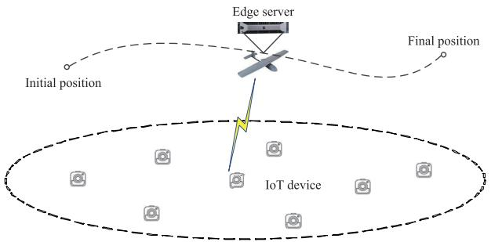

flowchart

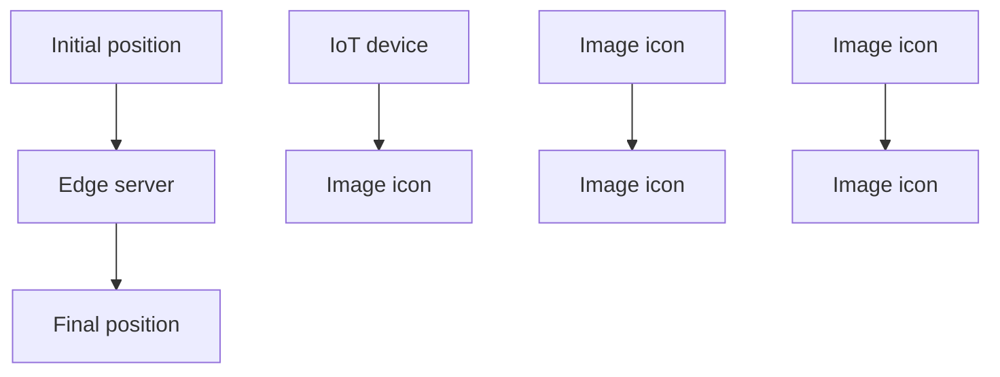

Fig. 1. Overview of the UAV-enabled MEC architecture.

Since IoT devices have very limited computing capabilities and energy, a flying fixed-wing UAV serves as an edge server to provide edge computing services to the IoT devices, as shown in Fig. 1. Note that our proposed design techniques are also applicable to multiple UAVs scenario, by deploying different UAVs to serve different sets of IoT devices as in [29]. We assume that there is no other ground-based MEC servers in the outdoor area or other ground-based MEC servers operate at different frequency bands, which is thus ignored in this article. In this article, we only consider one UAV equipped with a powerful processor that can perform computation-intensive tasks as in [6] and [20]. The collaborations with ground-based MEC servers and multiple UAVs with multiple processors in urban areas [16] will be left as future work.

Denote T as the total time length required to complete the tasks, which is a design variable in this article. In order to provide energy-efficient computing, we adopt the dynamic voltage and frequency scaling (DVFS) technique [30] for the computation of IoT device $s _ { k }$ and the CPU frequency of device $s _ { k }$ at time instant t is denoted as $f _ { k } ( t )$ measured in cycles per second. Thus, we have $f _ { k } ( t ) \leq f _ { k } ^ { \operatorname* { m a x } } \forall t \in [ 0 , T ]$ , where $f _ { k } ^ { \operatorname* { m a x } }$ is the maximum allowable CPU frequency of device $s _ { k } .$ Similarly, we assume that the DVFS technique is also adopted at the UAV, and denote the allocated CPU frequency for computa-Thus, we have tion task offloaded from device $\textstyle \sum _ { k = 1 } ^ { K } f _ { U , k } ( t ) \leq f _ { U } ^ { \operatorname* { m a x } } \forall t \in [ 0 , T ]$ $s _ { k }$ at time instant t as , where $f _ { U , k } ( t )$ $f _ { U } ^ { \mathrm { m a x } }$ is . the maximum allowable CPU frequency of the UAV.

The task-input bits are assumed to be bitwise independent and the computation tasks are assumed to be arbitrarily partitioned into subtasks with a smaller size as in [20] and [23], which can be partially offloaded to the UAV. Therefore, the number of task-input bits $I _ { k }$ for each device $s _ { k }$ can be partitioned into two parts, one for local computing and the other for task offloading to the UAV. Each device can simultaneously perform computation offloading and local computing since radio resources such as bandwidth are not required for local computing. To complete the computation task of each device, we should have

$$
\int_ {0} ^ {\mathrm{T}} \frac {f _ {U , k} (t)}{C _ {k}} d t + \int_ {0} ^ {\mathrm{T}} \frac {f _ {k} (t)}{C _ {k}} d t \geq I _ {k} \quad \forall k \tag {1}
$$

where the first term of the left-hand side (LHS) in (1) represents the completed computation bits at the UAV, and the second term represents completed computation bits for local computing at the IoT device as in [6]. Furthermore, we assume that the number of task-output bits or computation results is smaller than that of task-input bits, where the downloading time for computation results from the UAV to IoT devices is practically negligible and thus omitted in this article as in [6] and [7]. The UAV is assumed to fly at a fixed altitude $H > 0 .$ , which may correspond to the minimum altitude that is appropriate to the terrain. This is due to the fact that frequent descending and ascending for UAV are energy inefficiency [31], [32]. The initial and final locations of the UAV are predetermined, whose horizontal coordinates are denoted as $\mathbf { q } _ { I }$ and $\mathbf { q } _ { F } .$ , respectively. In practice, $\mathbf { q } _ { I }$ and $\mathbf { q } _ { F }$ may depend on the $\mathrm { U A V } \mathbf { \dot { s } }$ pre- and post-mission flying paths. We denote ${ \bf q } ( t ) \in \mathbb { R } ^ { 2 \times 1 }$ with $0 \leq t \leq T$ as the UAV trajectory projected onto the horizontal plane. Then, $\mathbf { v } ( t ) \triangleq { \dot { \mathbf { q } } } ( t )$ and $\mathbf { a } ( t ) \triangleq { \ddot { \mathbf { q } } } ( t )$ are the instantaneous UAV velocity and acceleration vectors, respectively. Let $V _ { \mathrm { m a x } }$ and $a _ { \mathrm { m a x } }$ be the maximum UAV speed and acceleration, respectively, and $V _ { \mathrm { m i n } }$ represents the minimum speed for the fixed-wing UAV to remain aloft. We then have the following constraints $V _ { \mathrm { m i n } } ~ \le ~ \| \dot { \mathbf { q } } ( t ) \| ~ \le ~ V _ { \mathrm { m a x } } .$ , $\| \mathbf { \ddot { q } } ( t ) \| ~ \leq ~ a _ { \mathrm { m a x } }$ $\forall t \in [ 0 , T ]$ . The distance between each device $s _ { k }$ and the UAV at any time instant t is given by $d _ { k } ( t ) = \sqrt { H ^ { 2 } + \| \mathbf { q } ( t ) - \mathbf { w } _ { k } \| ^ { 2 } }$ .

We consider the case that the IoT devices are located outdoors, and the channel between each device and the UAV is mainly a LoS path as in [7] and [14]. At each time instant $t ,$ the channel power gain between the UAV and device $s _ { k }$ can be modeled as

$$
h _ {k} (t) = \beta_ {0} d _ {k} ^ {- \alpha} (t) = \frac {\beta_ {0}}{\left(H ^ {2} + \| \mathbf {q} (t) - \mathbf {w} _ {k} \| ^ {2}\right) ^ {\alpha / 2}} \tag {2}
$$

where $\alpha$ is the path-loss exponent, and $\beta _ { 0 }$ denotes the average channel power gain at $d _ { 0 } = 1 \mathrm { ~ m ~ }$ . The TDMA scheme is implemented for the UAV’s computation offloading, such that interference among the IoT devices can be avoided during the offloading process. Define $x _ { k } ( t ) \in \{ 0 , 1 \}$ as the offloading indicator variable of device $s _ { k } ,$ , where $x _ { k } ( t ) = 1 \mathrm { i f } s _ { k }$ offloads the task to the UAV at time instant t and $x _ { k } ( t ) = 0$ otherwise. Thus, $\textstyle \sum _ { k = 1 } ^ { K } x _ { k } ( t ) \leq 1 , t \in [ 0 , T ]$ . Denote $P _ { k }$ as the transmit power for $s _ { k }$ when offloading the computation task to the UAV. We assume that $P _ { k }$ is fixed which corresponds to the maximum allowable transmit power. If offloading, the achievable rate from $s _ { k }$ to the UAV measured in bits per second (bps) at time instant t is calculated as

$$
\begin{array}{l} R _ {k} (t) = B \log_ {2} \left(1 + \frac {P _ {k} h _ {k} (t)}{\sigma^ {2}}\right) \\ = B \log_ {2} \left(1 + \frac {\gamma_ {k}}{\left(H ^ {2} + \| \mathbf {q} (t) - \mathbf {w} _ {k} \| ^ {2}\right) ^ {\alpha / 2}}\right) \tag {3} \\ \end{array}
$$

where B denotes the channel bandwidth in Hertz (Hz), and $\gamma _ { k } \ { \overset { \triangle } { = } } \ ( P _ { k } \beta _ { 0 } / \sigma ^ { 2 } )$ is the signal-to-noise ratio (SNR) at 1 m, with $\sigma ^ { 2 }$ denoting the noise power at the UAV receiver.

For offloaded task computation at the UAV, the informationcausality constraints should be imposed, i.e., at any time instant t, the task-input data can only be computed at the UAV if it has already been previously received from the IoT devices. The information-causality constraints for offloaded data computation can be expressed as

$$
\int_ {0} ^ {t} x _ {k} (t) R _ {k} (t) d t \geq \int_ {0} ^ {t} \frac {f _ {U , k} (t)}{C _ {k}} d t \quad \forall k \quad \forall t \in [ 0, T ] \tag {4}
$$

where the LHS of (4) represents the amount of task-input data that have been received from IoT device $s _ { k }$ at time t, while the right-hand side (RHS) denotes those which have been computed at the same time.

# C. Energy Consumption Model

The energy consumption of IoT device $s _ { k }$ mainly consists of both communication-related and computation-related energy. The communication-related energy for $s _ { k }$ can be calculated 0 expressed as as $\begin{array} { r } { \int _ { 0 } ^ { \mathrm { T } } x _ { k } ( t ) P _ { k } d t , } \end{array}$ $\textstyle \int _ { 0 } ^ { \mathrm { T } } \kappa _ { k } f _ { k } ^ { 3 } ( t ) d t$ and the computation-related energy for as in [20] and [23], where $\kappa _ { k }$ is the $s _ { k }$ is effective capacitance coefficient of device $s _ { k }$ that depends on its processor’s chip architecture. Thus, we have

$$
\int_ {0} ^ {\mathrm{T}} x _ {k} (t) P _ {k} d t + \int_ {0} ^ {\mathrm{T}} \kappa_ {k} f _ {k} ^ {3} (t) d t \leq E _ {k} ^ {\max} \quad \forall k \tag {5}
$$

where $E _ { k } ^ { \mathrm { m a x } }$ is the energy budget of device $s _ { k } .$

Recall that the number of task-output bits is assumed to be very small. Then the $\mathrm { U A V } _ { \mathrm { \Delta } }$ communication-related energy is much smaller than the computation-related energy and propulsion energy of the UAV, and is thus ignored in this article. Similar to [7] and [24], we consider that the energy consumption of UAV mainly consists of computation-related energy and propulsion energy of the UAV in this article. As derived in [12], the fixed-wing UAV’s propulsion energy consumption measured in Joule can be calculated as

$$
E _ {p} ^ {u} = \int_ {0} ^ {\mathrm{T}} \left(c _ {1} \| \mathbf {v} (t) \| ^ {3} + \frac {c _ {2}}{\| \mathbf {v} (t) \|} \left(1 + \frac {\| \mathbf {a} (t) \| ^ {2}}{g ^ {2}}\right)\right) d t \tag {6}
$$

where $c _ { 1 }$ and $c _ { 2 }$ are scalar constants which depend on drag coefficient, wing area, air density, etc., g denotes the gravitational acceleration with value $9 . 8 ~ \mathrm { \ m } / \mathrm { s } ^ { 2 }$ . Similar to the IoT devices, the computation-related energy for the UAV is calculated as $\begin{array} { r } { \sum _ { k = 1 } ^ { K } \dot { \int _ { 0 } ^ { \mathrm { T } } } \kappa _ { U } f _ { U , k } ^ { 3 } ( t ) d t } \end{array}$ , where $\kappa { } _ { U }$ is the effective capacitance coefficient of the UAV. Therefore, the total energy consumption of the UAV can be expressed as $E _ { p } ^ { u } +$ $\begin{array} { r } { \sum _ { k = 1 } ^ { K } \int _ { 0 } ^ { \mathrm { T } } \kappa _ { U } f _ { U , k } ^ { 3 } ( t ) d t . } \end{array}$

UAV energy minimization and completion time minimization are two fundamental problems in the UAVenabled MEC system. It is worthwhile to note that the two different objectives are relevant since both energy consumption and completion time of the UAV are related to the flying speed. In the following, we minimize UAV energy without any constraint on completion time in Section IV and minimize completion time without any constraint on UAV energy in Section V, which provide the achievable lower bounds of UAV energy consumption and completion time in the UAV-enabled MEC system, respectively, from which insightful observations are obtained and the tradeoff between completion time and UAV energy are unveiled for the MEC system. In Section IV, we first consider the UAV energy minimization problem without predetermined completion time. A discretized equivalent problem is obtained by using the path discretization technique, and we propose an efficient alternating optimization algorithm for the discretized problem by decoupling it into two subproblems and addressing the two subproblems with SCA-based algorithms iteratively. Then, in Section V, we consider the completion time minimization problem, and a discretized equivalent problem is obtained by utilizing the same path discretization approximation model as in the UAV energy minimization problem, and a similar alternating optimization algorithm is proposed. Based on the above results, we study the Pareto-optimal solution that balances the tradeoff between the UAV energy and completion time in Section VI.

# IV. UAV ENERGY MINIMIZATION PROBLEM

In this section, we study the UAV energy minimization problem without any constraint on completion time, which provides an achievable lower bound of UAV energy consumption in the UAV-enabled MEC system. The objective is to minimize the total energy consumption of the UAV via jointly optimizing the design variables, including the UAV trajectory {q(t)}, offloading scheduling {xk(t)}, resource allocation $\{ f _ { U , k } ( t ) , f _ { k } ( t ) \}$ , and completion time T. The problem can be formulated as

$$
\begin{array}{l} \text {(P1)}: \min _ {T, \{\mathbf {q} (t) \}, \{x _ {k} (t) \}, \{f _ {U, k} (t) \}, \{f _ {k} (t) \}} E _ {p} ^ {u} + \sum_ {k = 1} ^ {K} \int_ {0} ^ {\mathrm{T}} \kappa_ {U} f _ {U, k} ^ {3} (t) d t \\ \text { s.t. } x _ {k} (t) \in \{0, 1 \} \quad \forall k \quad \forall t \in [ 0, T ] \tag {7} \\ \end{array}
$$

$$
\sum_ {k = 1} ^ {K} x _ {k} (t) \leq 1 \quad \forall t \in [ 0, T ] \tag {8}
$$

$$
\int_ {0} ^ {\mathrm{T}} \frac {f _ {U , k} (t)}{C _ {k}} d t + \int_ {0} ^ {\mathrm{T}} \frac {f _ {k} (t)}{C _ {k}} d t \geq I _ {k} \quad \forall k \tag {9}
$$

$$
\sum_ {k = 1} ^ {K} f _ {U, k} (t) \leq f _ {U} ^ {\max}, f _ {k} (t) \leq f _ {k} ^ {\max} \quad \forall k, t \tag {10}
$$

$$
\int_ {0} ^ {\mathrm{T}} x _ {k} (t) P _ {k} d t + \int_ {0} ^ {\mathrm{T}} \kappa_ {k} f _ {k} ^ {3} (t) d t \leq E _ {k} ^ {\max} \quad \forall k \tag {11}
$$

$$
\int_ {0} ^ {t} x _ {k} (t) R _ {k} (t) d t \geq \int_ {0} ^ {t} \frac {f _ {U , k} (t)}{C _ {k}} d t \quad \forall k \quad \forall t \tag {12}
$$

$$
V _ {\min} \leq \| \mathbf {v} (t) \| \leq V _ {\max} \quad \forall t \in [ 0, T ] \tag {13}
$$

$$
\| \mathbf {a} (t) \| \leq a _ {\max} \quad \forall t \in [ 0, T ] \tag {14}
$$

$$
\mathbf {q} (0) = \mathbf {q} _ {I}, \quad \mathbf {q} (T) = \mathbf {q} _ {F}. \tag {15}
$$

Constraints in (9) ensure the completion of the computation task for each device, and constraints in (11) are the energy budget constraints for IoT devices. Constraints in (12) are the information-causality constraints for computation offloading. Note that problem (P1) involves binary constraints in (7) and nonconvex constraints in (12) and (13), where an infinite number of optimization variables exist. Furthermore, (P1) includes complicated terms involving an integral whose upper limit is given by variable T. In addition, the objective function is the total energy consumption of the UAV, which is nonconvex and closely coupled with v(t) and T. As a result, the mixed-integer nonconvex problem (P1) is challenging to be solved directly. To tackle such difficulties, we employ a path discretization technique as in [11] to reformulate the optimization problem, where the time length of each time slot is not fixed.

# A. Problem Reformulation

With the path discretization technique, the UAV path is discretized into N line segments, which are represented by N + 1 waypoints $\{ \mathbf { q } _ { n } , 0 \ \leq \ n \leq \ N \}$ , with ${ \bf q } _ { 0 } = { \bf q } _ { I }$ and ${ \bf q } _ { N } = { \bf q } _ { F }$ . Denote $\tau _ { n }$ as the time duration that the UAV remains in the nth line segment, $1 \leq n \leq N$ , which is also a design variable. Therefore, the UAV trajectory {q(t)} can be approximated by both the UAV path represented by the $N + 1$ waypoints $\left\{ \mathbf { q } _ { n } \right\}$ and the time duration $\{ \tau _ { n } \}$ representing the time that the UAV remains within each line segment. We assume that $\| \mathbf { q } _ { n } - \mathbf { q } _ { n - 1 } \| \leq \Delta _ { \operatorname* { m a x } } , 1 \leq n \leq N ,$ , where $\Delta _ { \mathrm { m a x } }$ is sufficiently small such that the distance between each IoT device and the UAV is approximately unchanged within each line segment. In practice, N is chosen to be large enough such that $N \Delta _ { \mathrm { m a x } } \geq \tilde { D } .$ , where $\tilde { D }$ is an upper bound of the required total UAV flying distance [11]. Furthermore, the UAV is assumed to fly with a constant acceleration along each line segment, which can be expressed as

$$
\mathbf {a} _ {n} = \frac {\mathbf {v} _ {n} - \mathbf {v} _ {n - 1}}{\tau_ {n}}, \quad 1 \leq n \leq N \tag {16}
$$

where ${ \bf v } _ { n }$ is the UAV velocity at the end of the nth line segment. Since ${ \bf a } _ { n }$ is a constant along the nth line segment, we have the following result.

Proposition 1: Given the nth line segment of the UAV path, $1 \leq n \leq N _ { : }$ , we have

$$
\mathbf {q} _ {n} - \mathbf {q} _ {n - 1} = \frac {\mathbf {v} _ {n} + \mathbf {v} _ {n - 1}}{2} \tau_ {n}, \quad 1 \leq n \leq N. \tag {17}
$$

Proof: Refer to Appendix.

Furthermore, $\begin{array} { r } { T = \bar { \sum _ { n = 1 } ^ { N } } \tau _ { n } } \end{array}$ is the total mission completion time T. Accordingly, the discretized forms of $R _ { k } ( t ) , f _ { k } ( t )$ , and $f _ { U , k } ( t )$ are denoted as $R _ { k n } , f _ { k n } .$ , and $f _ { U , k n } ,$ , respectively. For each line segment n along the UAV path, denote $\omega _ { k n } \ \geq \ 0$ as the allocated time for $s _ { k }$ to offload the computation task $\begin{array} { r l } { \sum _ { k = 1 } ^ { K } \omega _ { k n } \ \leq { } } & { { } \tau _ { n } , 1 \ \leq \ n \ \leq \ N } \end{array}$ in (8) can be replaced bydue to the TDMA scheme for computation offloading. Similarly, the propulsion energy consumption of the UAV can be approximated as

$$
\tilde {E} _ {p} ^ {u} \approx \sum_ {n = 1} ^ {N} \tau_ {n} \left(c _ {1} \| \mathbf {v} _ {n} \| ^ {3} + \frac {c _ {2}}{\| \mathbf {v} _ {n} \|} \left(1 + \frac {\| \mathbf {a} _ {n} \| ^ {2}}{g ^ {2}}\right)\right). \tag {18}
$$

Thus, let $\begin{array} { r l r l r l r l } { { \mathcal { Q } } } & { \triangleq } & { \{ \mathbf { q } _ { n } \} , \mathcal { V } } & { \triangleq } & { \{ \mathbf { v } _ { n } \} , A } & { \triangleq } & { \{ \mathbf { a } _ { n } \} , \mathcal { F } } & { \triangleq } & { } \end{array}$ $\begin{array} { r c r c l } { { \{ f _ { U , k n } , f _ { k n } \} , \mathcal { W } } } & { { \triangleq } } & { { \{ \omega _ { k n } \} , \mathcal { T } } } & { { \triangleq } } & { { \{ \tau _ { n } \} } } \end{array}$ , the UAV energy minimization problem (P1) can be approximated as follows:

$$
\text {(P2)}: \min _ {\mathcal {Q}, \mathcal {V}, \mathcal {A}, \mathcal {F}, \mathcal {W}, \mathcal {T}} \tilde {E} _ {p} ^ {u} + \sum_ {k = 1} ^ {K} \sum_ {n = 1} ^ {N} \tau_ {n} \kappa_ {U} f _ {U, k n} ^ {3}
$$

$$
\text { s.t. } \quad \sum_ {k = 1} ^ {K} \omega_ {k n} \leq \tau_ {n} \quad \forall n \tag {19}
$$

$$
\sum_ {n = 1} ^ {N} \frac {\tau_ {n} f _ {U , k n}}{C _ {k}} + \sum_ {n = 1} ^ {N} \frac {\tau_ {n} f _ {k n}}{C _ {k}} \geq I _ {k} \quad \forall k \tag {20}
$$

$$
\sum_ {k = 1} ^ {K} f _ {U, k n} \leq f _ {U} ^ {\max}, f _ {k n} \leq f _ {k} ^ {\max} \quad \forall k, n \tag {21}
$$

$$
\sum_ {n = 1} ^ {N} \omega_ {k n} P _ {k} + \sum_ {n = 1} ^ {N} \tau_ {n} \kappa_ {k} f _ {k n} ^ {3} \leq E _ {k} ^ {\max} \quad \forall k \tag {22}
$$

$$
\sum_ {m = 1} ^ {n - 1} \omega_ {k m} R _ {k m} \geq \sum_ {m = 2} ^ {n} \frac {\tau_ {m} f _ {U , k m}}{C _ {k}} \quad \forall k
$$

$$
\forall n = 2, \dots , N \tag {23}
$$

$$
\left\| \mathbf {v} _ {n} \right\| \geq V _ {\min} \quad \forall n \tag {24}
$$

$$
\left\| \mathbf {a} _ {n} \right\| \leq a _ {\max}, \left\| \mathbf {v} _ {n} \right\| \leq V _ {\max} \quad \forall n \tag {25}
$$

$$
\mathbf {v} _ {n} - \mathbf {v} _ {n - 1} = \mathbf {a} _ {n} \tau_ {n} \quad \forall n \tag {26}
$$

$$
\mathbf {q} _ {n} - \mathbf {q} _ {n - 1} = \frac {\mathbf {v} _ {n} + \mathbf {v} _ {n - 1}}{2} \tau_ {n} \quad \forall n \tag {27}
$$

$$
\mathbf {q} _ {0} = \mathbf {q} _ {I}, \quad \mathbf {q} _ {N} = \mathbf {q} _ {F}. \tag {28}
$$

In (P2), constraints in (23) correspond to the discretized equivalent of the information-causality constraints in (12), by assuming that the processing delay is one time slot as in [20] and [31], e.g., the delay for computing preparation and decoding. In practice, when N is large, the processing delay can be neglected. Note that the objective function in (P2) is a nonconvex function, constraints in (20) and (22)–(24) are nonconvex constraints, and nonaffine constraints exist in (26) and (27). Thus, the nonconvex problem (P2) is challenging to be solved directly. To tackle such difficulties, a two-stage alternating optimization algorithm is proposed. In the first stage, the computation offloading and resource allocation { , } as well as UAV velocity $\nu$ are optimized by solving the subproblem with given time duration $\tau ;$ and then in the second step, the time duration $\tau$ will be optimized with given computation offloading and resource allocation { , } as well as UAV velocity V obtained in the first stage. The two subproblems are optimized alternatively until the objective value converges, and we present the details for the algorithm in the following section.

# B. Proposed Solution

In the first stage, the subproblem of (P2) is the computation offloading and resource allocation as well as UAV velocity optimization problem (P3), where the time duration T is given as fixed

$$
\text {(P3)}: \min _ {\mathcal {Q}, \mathcal {V}, \mathcal {A}, \mathcal {F}, \mathcal {W}} \tilde {E} _ {p} ^ {u} + \sum_ {k = 1} ^ {K} \sum_ {n = 1} ^ {N} \tau_ {n} \kappa_ {U} f _ {U, k n} ^ {3}
$$

$$
\text { s.t. } \quad (1 9) - (2 8).
$$

From (26) and (27), it is observed that Q and A can be represented by  and  . Thus, with given time duration  , if UAV velocity  is determined, then  and  are determined uniquely.

Although  is fixed, (P3) is still nonconvex since it contains the nonconvex objective function and the nonconvex constraints in (23) and (24). To tackle such issues, slack variables $\mathcal { V } \triangleq \{ y _ { k m } \}$ and $O \triangleq \{ o _ { n } \geq 0 \}$ are introduced first, and then we obtain the following problem:

$$
\text {(P4)}: \min _ {\mathcal {Q}, \mathcal {V}, \mathcal {A}, \mathcal {F}, \mathcal {W}, \mathcal {Y}, \mathcal {O}} \tilde {E} _ {p} ^ {u o} + \sum_ {k = 1} ^ {K} \sum_ {n = 1} ^ {N} \tau_ {n} \kappa_ {U} f _ {U, k n} ^ {3}
$$

s.t. (19)-(22), (25)-(28)

$$
R _ {k m} \geq y _ {k m} \quad \forall m = 1, \dots , N \tag {29}
$$

$$
\sum_ {m = 1} ^ {n - 1} \omega_ {k m} y _ {k m} \geq \sum_ {m = 2} ^ {n} \frac {\tau_ {m} f _ {U , k m}}{C _ {k}}
$$

$$
\forall k \quad \forall n = 2, \dots , N \tag {30}
$$

$$
\left\| \mathbf {v} _ {n} \right\| ^ {2} \geq V _ {\min} ^ {2} \quad \forall n \tag {31}
$$

$$
\left\| \mathbf {v} _ {n} \right\| ^ {2} \geq o _ {n} ^ {2} \quad \forall n \tag {32}
$$

where

$$
\tilde {E} _ {p} ^ {u o} \triangleq \sum_ {n = 1} ^ {N} \tau_ {n} \left(c _ {1} \| \mathbf {v} _ {n} \| ^ {3} + \frac {c _ {2}}{o _ {n}} \left(1 + \frac {\| \mathbf {a} _ {n} \| ^ {2}}{g ^ {2}}\right)\right).
$$

In (P4), it can be verified that $\tilde { E } _ { p } ^ { u o }$ is joint convex with respect to variables ${ \mathbf { v } } _ { n } , ~ o _ { n }$ , and ${ \bf a } _ { n }$ .

Theorem 1: Solving problem (P3) is equivalent to solving problem (P4).

Proof: First, we can easily derive that in the optimal solution to (P4), constraints in (29) are met with equality. Since otherwise, there exists one constraint in (29) that is satisfied with strict inequality, the corresponding slack variable $y _ { k m }$ can always be increased until the equality satisfies, and all constraints are still satisfied without changing the objective value. As a result, an optimal solution to (P4) always exists such that all constraints in (29) are satisfied with equality. Similarly, all constraints in (32) are met with the equality. Since otherwise, $o _ { n }$ can always be increased to obtain another feasible solution with the small objective value. Furthermore, constraints in (24) can be replaced by constraints in (31), and thus problem (P4) is equivalent to (P3), which thus completes the proof of Theorem 1.

However, (P4) is still a nonconvex problem due to the existence of nonconvex constraints in (29)–(32). To tackle such difficulties, an SCA-based algorithm is proposed with the inner convex approximation framework [12], which prescribes the iterative solution of problem by replacing the nonconvex constraints with suitable convex approximations. Specifically, for constraints in (29), it can be verified that although $R _ { k m }$ is neither concave nor convex with respect to ${ \bf q } _ { m } .$ , it is convex with respect to term $\| \mathbf { q } _ { m } - \mathbf { w } _ { k } \| ^ { 2 }$ . Recall that the first-order Taylor approximation of a convex function is a global underestimator, with a given local point $\mathbf { q } _ { m } ^ { r }$ in the rth iteration, $R _ { k m }$ can be lower bounded as in [12], [33], i.e.,

$$
R _ {k m} = B \log_ {2} \left(1 + \frac {\gamma_ {k}}{\left(H ^ {2} + \| \mathbf {q} _ {m} - \mathbf {w} _ {k} \| ^ {2}\right) ^ {\alpha / 2}}\right) \geq \hat {R} _ {k m}
$$

$$
\triangleq A _ {k m} ^ {r} - I _ {k m} ^ {r} \left(\| \mathbf {q} _ {m} - \mathbf {w} _ {k} \| ^ {2} - \left\| \mathbf {q} _ {m} ^ {r} - \mathbf {w} _ {k} \right\| ^ {2}\right) \tag {33}
$$

where

$$
A _ {k m} ^ {r} = B \log_ {2} \left(1 + \frac {\gamma_ {k}}{\left(H ^ {2} + \left\| \mathbf {q} _ {m} ^ {r} - \mathbf {w} _ {k} \right\| ^ {2}\right) ^ {\alpha / 2}}\right)
$$

and

$$
I _ {k m} ^ {r} = \frac {B \gamma_ {k} (\alpha / 2) \log_ {2} e}{\left(H ^ {2} + \left\| \mathbf {q} _ {m} ^ {r} - \mathbf {w} _ {k} \right\| ^ {2}\right) \left(\left(H ^ {2} + \left\| \mathbf {q} _ {m} ^ {r} - \mathbf {w} _ {k} \right\| ^ {2}\right) ^ {\alpha / 2} + \gamma_ {k}\right)}.
$$

Note that the lower bound expression $\hat { R } _ { k m }$ is now a concave function with respect to ${ \bf q } _ { m }$ .

For the bilinear constraints in (30), $\omega _ { k m } y _ { k m }$ can be rewritten as a difference of convex functions, i.e., $\omega _ { k m } y _ { k m } =$ $( 1 / 2 ) ( \omega _ { { k } m } + y _ { { k } m } ) ^ { 2 } - ( 1 / 2 ) ( \omega _ { { k } m } ^ { 2 } + y _ { { k } m } ^ { 2 } )$ . By applying the firstorder Taylor approximation on $( \omega _ { k m } + y _ { k m } ) ^ { 2 }$ with given local points $\omega _ { k m } ^ { r }$ and $y _ { k m } ^ { r }$ , we obtain the following lower bound, i.e.,

$$
\begin{array}{l} \omega_ {k m} y _ {k m} \geq \left(\omega_ {k m} ^ {r} + y _ {k m} ^ {r}\right) (\omega_ {k m} + y _ {k m}) \\ - \frac {1}{2} \left(\omega_ {k m} ^ {r} + y _ {k m} ^ {r}\right) ^ {2} - \frac {1}{2} \left(\omega_ {k m} ^ {2} + y _ {k m} ^ {2}\right) \triangleq z _ {k m}. \tag {34} \\ \end{array}
$$

Note that the lower bound expression $z _ { k m }$ is now joint concave with respect to $\omega _ { k m }$ and $y _ { k m }$ .

Similarly, for the constraints in (31) and (32), $\| \mathbf { v } _ { n } \| ^ { 2 }$ can be lower bounded by

$$
\left\| \mathbf {v} _ {n} \right\| ^ {2} \geq \left\| \mathbf {v} _ {n} ^ {r} \right\| ^ {2} + 2 \left(\mathbf {v} _ {n} ^ {r}\right) ^ {\mathrm{T}} \left(\mathbf {v} _ {n} - \mathbf {v} _ {n} ^ {r}\right) \tag {35}
$$

where the lower bound expression in RHS of (35) is a linear function with ${ \bf v } _ { n }$ .

By replacing $R _ { k m } , ~ \omega _ { k m } y _ { k m }$ , and $\| \mathbf { v } _ { n } \| ^ { 2 }$ with their lower bounds derived in (33)–(35) yields the following approximate problem:

$$
\text {(P5)}: \min _ {\mathcal {Q}, \mathcal {V}, \mathcal {A}, \mathcal {F}, \mathcal {W}, \mathcal {Y}, \mathcal {O}} \tilde {E} _ {p} ^ {u o} + \sum_ {k = 1} ^ {K} \sum_ {n = 1} ^ {N} \tau_ {n} \kappa_ {U} f _ {U, k n} ^ {3}
$$

s.t. (19)-(22), (25)-(28)

$$
\hat {R} _ {k m} \geq y _ {k m} \quad \forall m = 1, \dots , N \tag {36}
$$

$$
\sum_ {m = 1} ^ {n - 1} z _ {k m} \geq \sum_ {m = 2} ^ {n} \frac {\tau_ {m} f _ {U , k m}}{C _ {k}}
$$

$$
\forall k \quad \forall n = 2, \dots , N \tag {37}
$$

$$
\left\| \mathbf {v} _ {n} ^ {r} \right\| ^ {2} + 2 \left(\mathbf {v} _ {n} ^ {r}\right) ^ {\mathrm{T}} \left(\mathbf {v} _ {n} - \mathbf {v} _ {n} ^ {r}\right) \geq V _ {\min} ^ {2} \quad \forall n \tag {38}
$$

$$
\left\| \mathbf {v} _ {n} ^ {r} \right\| ^ {2} + 2 \left(\mathbf {v} _ {n} ^ {r}\right) ^ {\mathrm{T}} \left(\mathbf {v} _ {n} - \mathbf {v} _ {n} ^ {r}\right) \geq o _ {n} ^ {2} \quad \forall n. \tag {39}
$$

Note that (P5) is a convex optimization problem, and thus we can adopt standard convex optimization techniques or existing software such as CVX [34] to solve (P5) efficiently. The original nonconvex problem (P4) can be efficiently solved by optimizing (P5) iteratively with ${ \bf q } _ { n } ^ { r } , { \bf v } _ { n } ^ { r } , \omega _ { k m } ^ { r } .$ and $y _ { k m } ^ { r }$ updated in each iteration. The SCA-based algorithm for solving (P4) is summarized in Algorithm 1.

Note that with the SCA technique, after each iteration in Algorithm 1, the objective value of (P4) is monotonically nonincreasing. As the optimal value of (P4) is lower bounded by a finite value, Algorithm 1 is guaranteed to converge. Furthermore, the obtained solution with the SCA method satisfies KKT conditions of (P4) [12]. Since convex problem is solved in each iteration of Algorithm 1, then the complexity of Algorithm 1 can be given as ${ \cal O } ( ( K N ) ^ { 3 . 5 } \log ( 1 / \epsilon ) )$ ), where is the given solution accuracy [35].

Algorithm 1 SCA-Based Algorithm for Problem (P4)   
1: Initialize $\{q_{n}^{0}, v_{n}^{0}, \omega_{km}^{0}, y_{km}^{0}\}$ ; Set r = 0;
2: repeat
3: With given local points $\{q_{n}^{r}, v_{n}^{r}, \omega_{km}^{r}, y_{km}^{r}\}$ , solve the convex problem (P5) by using standard convex optimization techniques or CVX to obtain optimal solution $\{q_{n}^{*}, v_{n}^{*}, \omega_{km}^{*}, y_{km}^{*}\}$ ;
4: Update the local points at rth iteration following $\{q_{n}^{r+1}, v_{n}^{r+1}, \omega_{km}^{r+1}, y_{km}^{r+1}\} = \{q_{n}^{*}, v_{n}^{*}, \omega_{km}^{*}, y_{km}^{*}\}$ ;
5: Update $r = r + 1$ ;
6: until Converge to a prescribed accuracy.

In the second stage, the other subproblem of (P2) is the time duration optimization with given computation offloading and resource allocation as well as UAV velocity. Recall that Q and A can be represented by V and T . Thus, with given UAV velocity V, if T are determined, then Q and A are determined uniquely. In this case, the propulsion energy consumption of the UAV can be rewritten as

$$
\tilde {E} _ {p} ^ {u} = \sum_ {n = 1} ^ {N} \left(c _ {1} \tau_ {n} \| \mathbf {v} _ {n} \| ^ {3} + \frac {c _ {2} \tau_ {n}}{\| \mathbf {v} _ {n} \|} + \frac {c _ {2} \| \mathbf {v} _ {n} - \mathbf {v} _ {n - 1} \| ^ {2}}{\tau_ {n} \| \mathbf {v} _ {n} \| g ^ {2}}\right) \tag {40}
$$

where ${ \tilde { E } } _ { p } ^ { u }$ is a convex function with respect to $\tau _ { n } .$ As a result, the subproblem is written as follows:

(P6): $\min_{\mathcal{Q},\mathcal{T}}\tilde{E}_p^u +\sum_{k = 1}^{K}\sum_{n = 1}^{N}\tau_n\kappa_Uf_{U,kn}^3$ s.t. (19), (20), (22), (23), (27), (28) $\left\| \frac{\mathbf{v}_n - \mathbf{v}_{n - 1}}{\tau_n}\right\| \leq a_{\max}\quad \forall n.$ (41)

However, problem (P6) remains nonconvex due to the existence of nonconvex constraints in (23). To tackle such difficulty, we can adopt similar SCA technique due to (33). By replacing $R _ { k m }$ with its lower bound derived in (33) yields the following approximate problem:

(P7): $\min_{\mathcal{Q},\mathcal{T}}\tilde{E}_p^u +\sum_{k = 1}^{K}\sum_{n = 1}^{N}\tau_n\kappa_Uf_{U,kn}^3$ s.t. (19), (20), (22), (27), (28), (41) $\sum_{m = 1}^{n - 1}\omega_{km}\hat{R}_{km}\geq \sum_{m = 2}^{n}\frac{\tau_mf_{U,km}}{C_k}\quad \forall k\quad \forall n = 2,\dots ,N.$ (42)

It can be verified that problem (P7) is a convex optimization problem, which can be efficiently solved with CVX solver. As a result, nonconvex problem (P6) can be efficiently solved by iteratively optimizing (P7) with paremeters $\{ \mathbf { q } _ { n } ^ { r } \}$ updated in each iteration, and the details of the SCA-based algorithm for (P6) follows the similar steps as in Algorithm 1. Furthermore, the SCA-based algorithm converges to a KKT solution, and the complexity is given as $O ( N ^ { 3 . \breve { 5 } }$ log(1/
)).

Algorithm 2 Two-Stage Alternating Optimization Algorithm for (P2)   
1: Initialize $\{q_{n}^{0}, v_{n}^{0}, \omega_{kn}^{0}, \tau_{n}^{0}\}$ ; Set l = 0;
2: repeat
3: With given $\{q_{n}^{l}, v_{n}^{l}, \omega_{kn}^{l}, \tau_{n}^{l}\}$ , solve problem (P10) to obtain UAV path $q_{n}^{l+1}$ , UAV velocity $v_{n}^{l+1}$ , computation offloading and resource allocation $\{\omega_{kn}^{l+1}, f_{U,kn}^{l+1}, f_{kn}^{l+1}\}$ with SCA-based algorithm similar as in Algorithm 1;
4: With given $\{q_{n}^{l+1}, v_{n}^{l+1}, \omega_{kn}^{l+1}, f_{U,kn}^{l+1}, f_{kn}^{l+1}\}$ , solve problem (P12) to obtain time duration $\{\tau_{n}^{l+1}\}$ and UAV path $\{q_{n}^{*}\}$ with SCA-based algorithm similar as in Algorithm 1; Update $\{q_{n}^{l+1}\} = \{q_{n}^{*}\}$ ;
5: Update $l = l + 1$ ;
6: until Converge to a prescribed accuracy.

Using the results obtained above, a two-stage alternating optimization algorithm for computing the suboptimal solution to problem (P2) is summarized in Algorithm 2, which optimizes the two sets of variables, {V, F , W} and {T }, alternatively until the objective value converges to a prescribed accuracy. To start Algorithm 2, the initial trajectory can be set as the straight-line trajectory connecting the start and end locations from qI to qF, where the UAV moves with a constant speed.

Denote $E ( \mathcal { V } ^ { l } , \mathcal { W } ^ { l } , \mathcal { F } ^ { l } , \mathcal { T } ^ { l } )$ as the objective value of (P2) with given UAV velocity $\gamma ^ { l } \triangleq \{ \mathbf { v } _ { n } ^ { l } \}$ , computation offloading $\mathcal { W } ^ { l } \triangleq$ $\bar { \{ \omega _ { k n } ^ { l } \} }$ , and resource allocation $\overline { { \mathcal { F } ^ { l } } } \triangleq \dot { \{ f _ { U , k n } ^ { l } , f _ { k n } ^ { l } \} }$ , as well as time duration ${ \mathcal { T } } ^ { l } \triangleq \{ \tau _ { n } ^ { l } \}$ at the lth iteration. It then follows that:

$$
\begin{array}{l} E \Big (\mathcal {V} ^ {l}, \mathcal {W} ^ {l}, \mathcal {F} ^ {l}, \mathcal {T} ^ {l} \Big) \stackrel {(a)} {\geq} E \Big (\mathcal {V} ^ {l + 1}, \mathcal {W} ^ {l + 1}, \mathcal {F} ^ {l + 1}, \mathcal {T} ^ {l} \Big) \\ \stackrel {(b)} {\geq} E \left(\mathcal {V} ^ {l + 1}, \mathcal {W} ^ {l + 1}, \mathcal {F} ^ {l + 1}, \mathcal {T} ^ {l + 1}\right) \tag {43} \\ \end{array}
$$

where (a) and (b) hold due to the monotonic convergence of SCA-based algorithms at steps 3 and 4, respectively. As a result, the objective value of (P2) is nonincreasing over iterations, and thus Algorithm 2 is guaranteed to converge. The computational complexity of the two-stage alternating optimization Algorithm 2 is given by $O ( ( K N ) ^ { 3 . 5 } \log ^ { 2 } ( 1 / \epsilon ) )$ with alternating iterations with complexity $\log ( 1 / \epsilon )$ . On the other hand, efficient software tools exist for the embedded convex optimization, e.g., CVXGEN, which can generates customized C codes automatically which can be complied into a high speed and reliable solver [36]. Compared to the typically CVX-based implementation, the CVXGEN-based implementation on an embedded platform can speed up the operation time by more than 1000 times [36].

In Section IV, we investigate the UAV energy minimization problem, where completion time is also a design variable. Both completion time and energy consumption of the UAV are relevant to the flying speed, and the completion time minimization solution is different from the UAV energy minimization solution in general. In Section V, we study the completion time minimization problem by assuming that the UAV has enough energy, which can be regarded as the lower bound of completion time for the UAV-enabled MEC system.

# V. COMPLETION TIME MINIMIZATION

In this section, we investigate the completion time minimization problem by assuming that the UAV has enough energy. The aim is to minimize the completion time T via jointly optimizing UAV trajectory {q(t)}, offloading scheduling $\{ x _ { k } ( t ) \}$ , and resource allocation $\{ f _ { U , k } ( t ) , f _ { k } ( t ) \}$ , while satisfying task computation requirement and energy budget of each IoT device. The problem can be formulated as

$$
\begin{array}{c c} \text {(P8)}: & \min _ {T, \{\mathbf {q} (t) \}, \{x _ {k} (t) \}, \{f _ {U, k} (t) \}, \{f _ {k} (t) \}} T \\ & \text {s.t.} \end{array} \tag {7-(15)}.
$$

Note that problem (P8) involves binary constraints in (7) and nonconvex constraints in (12) and (13), where an infinite number of optimization variables exist. Furthermore, (P8) includes complicated terms involving an integral whose upper limit is variable T. As a result, (P8) is a mixed-integer nonconvex problem which is challenging to be solved directly. To tackle such issues, we employ the same path discretization approximation model as in Section IV to reformulate the optimization problem.

With path discretization, the discretized forms of ${ \bf q } ( t ) , { \bf v } ( t ) , { \bf a } ( t ) , R _ { k } ( t ) , f _ { k } ( t )$ and , res $f _ { U , k } ( t )$ asis ${ \bf q } _ { n } , { \bf v } _ { n } , { \bf a } _ { n } , R _ { k n } , f _ { k n } .$ $f _ { U , k n } ,$ $\begin{array} { r } { T = \sum _ { n = 1 } ^ { N } \tau _ { n } } \end{array}$ the total mission completion time T. $\omega _ { k n } \ \geq \ 0$ denotes the allocated time for the sk to offload computation task to the UAV. As a result, let $Q \triangleq \{ \mathbf { q } _ { n } \} , \gamma \triangleq \{ \mathbf { \bar { v } } _ { n } \} , A \triangleq \{ \mathbf { a } _ { n } \} , \mathcal { F } \triangleq$ $\{ f _ { U , k n } , f _ { k n } \} , \mathcal { W } \triangleq \{ \omega _ { k n } \} , \mathcal { T } \triangleq \{ \tau _ { n } \}$ , the completion time minimization problem (P8) can be approximated as follows:

$$
\text {(P9)}: \min _ { \begin{array}{c} \mathcal {Q}, \mathcal {V}, \mathcal {A}, \mathcal {F}, \mathcal {W}, \mathcal {T} \\ \text {s.t.} \end{array} } \sum_ {n = 1} ^ {N} \tau_ {n}
$$

Note that (P9) is a nonconvex problem with coupled design variables. However, (P9) has similar structure as in problem (P2), and thus similar two-stage alternating optimization algorithm can be applied to solve (P9) efficiently. In the first stage, the first subproblem of (P9) is the time duration optimization with given computation offloading and resource allocation as well as UAV velocity. Recall that with given UAV velocity V, if $\tau$ are determined, then Q and A are determined uniquely. In this case, the subproblem is given as follows:

$$
\begin{array}{l} \text {(P10)}: \min _ {\mathcal {Q}, \mathcal {V}, \mathcal {A}, \mathcal {F}, \mathcal {W}} \sum_ {n = 1} ^ {N} \tau_ {n} \\ \text { s.t. } \quad (1 9), (2 0), (2 2), (2 3), (2 7), (2 8), (4 1). \\ \end{array}
$$

(P10) is a nonconvex problem with a similar structure as in problem (P6). Thus, we adopt a similar SCA technique by replacing $R _ { k m }$ with its lower bound derived in (33) and obtain the following approximate problem:

$$
\begin{array}{l} \text {(P11)}: \min _ {\mathcal {Q}, \mathcal {V}, \mathcal {A}, \mathcal {F}, \mathcal {W}} \sum_ {n = 1} ^ {N} \tau_ {n} \\ \text { s.t. } \quad (1 9), (2 0), (2 2), (2 7), (2 8), (4 1), (4 2). \\ \end{array}
$$

Algorithm 3 Alternating Optimization Algorithm for (P9)   
1: Initialize $\{q_{n}^{0}, v_{n}^{0}, \omega_{kn}^{0}, f_{U,kn}^{0}, f_{kn}^{0}\}$ ; Set l = 0;
2: repeat
3: With given $\{q_{n}^{l}, v_{n}^{l}, \omega_{kn}^{l}, f_{U,kn}^{l}, f_{kn}^{l}\}$ , solve (P10) to obtain time duration $\{\tau_{n}^{l+1}\}$ and UAV path $\{q_{n}^{*}\}$ with SCA-based algorithm similar as in Algorithm 1;
4: With given $\{q_{n}^{l}, v_{n}^{l}, \omega_{kn}^{l}, \tau_{n}^{l+1}\}$ , solve (P12) to obtain UAV path $q_{n}^{*}$ , UAV velocity $v_{n}^{l+1}$ , computation offloading and resource allocation $\{\omega_{kn}^{l+1}, f_{U,kn}^{l+1}, f_{kn}^{l+1}\}$ with SCA-based algorithm similar as in Algorithm 1; Update $\{q_{n}^{l+1}\} = \{q_{n}^{*}\}$ ;
5: Update $l = l + 1$ ;
6: until Converge to a prescribed accuracy.

(P11) is a standard convex optimization problem, and thus the original nonconvex problem (P10) can be efficiently solved by optimizing (P11) iteratively, where the details of the SCAbased algorithm for (P10) follows similar steps of Algorithm 1.

In the second stage, with given time duration T , the objective function $\begin{array} { r } { T = \bar { \sum _ { n = 1 } ^ { N } } \tau _ { n } } \end{array}$ is fixed. It can be shown that after solving problem (P10) in the first stage, the constraints in (20) are all satisfied with equality. Since otherwise, $f _ { U , k n }$ can always be decreased to obtain a lower objective value. Therefore, we maximize the weighted minimum of the number of computation bits in the second subproblem, where the weight is inversely proportional to $I _ { k } .$ . As such, constraints in (20) can be relaxed to leave more optimization space for further decreasing completion time -Nn= $\scriptstyle \sum _ { n = 1 } ^ { N } \tau _ { n }$ 1 τn in the first subproblem. The second subproblem can be expressed as follows:

$$
\begin{array}{l} \text {(P12)}: \max _ {\eta , \mathcal {Q}, \mathcal {V}, \mathcal {A}, \mathcal {F}, \mathcal {W}} \eta \\ \text { s.t. } \quad \frac {\sum_ {n = 1} ^ {N} \frac {\tau_ {n} f _ {U , k n}}{C _ {k}} + \sum_ {n = 1} ^ {N} \frac {\tau_ {n} f _ {k n}}{C _ {k}}}{I _ {k}} \geq \eta \quad \forall k \\ (1 9), (2 1) - (2 8). \tag {44} \\ \end{array}
$$

$$
\begin{array}{l} \text { s.t. } \quad \frac {\sum_ {n = 1} ^ {N} \frac {\tau_ {n} f _ {U , k n}}{C _ {k}} + \sum_ {n = 1} ^ {N} \frac {\tau_ {n} f _ {k n}}{C _ {k}}}{I _ {k}} \geq \eta \quad \forall k \\ (1 9), (2 1) - (2 8). \tag {44} \\ \end{array}
$$

(P12) is a nonconvex problem with a similar structure as in problem (P3). Thus, we adopt a similar SCA technique by introducing slack variables $\bar { y } \ \triangleq \ \{ y _ { k m } \}$ and replacing $R _ { k m } ,$ ωkmykm, $\| \mathbf { v } _ { n } \| ^ { 2 }$ with their lower bounds derived in (33)–(35), and obtain the following approximate problem:

$$
\begin{array}{l} \text {(P13)}: \min _ {\eta , \mathcal {Q}, \mathcal {V}, \mathcal {A}, \mathcal {F}, \mathcal {W}, \mathcal {Y}} \eta \\ \text { s   .   t   . } \quad (1 9), (2 1), (2 2), (2 5) - (2 8), (3 6) - (3 8), (4 4). \\ \end{array}
$$

(P13) is a standard convex optimization problem, and thus the original nonconvex problem (P12) can be efficiently solved by optimizing (P13) iteratively, where the details of the SCAbased algorithm for (P12) follow similar steps of Algorithm 1.

Based on the above results, the overall algorithm for solving problem (P9) with alternating optimization and SCA techniques is summarized in Algorithm 3.

Similar to Algorithm 2, the resulted objective value of problem (P9) is nonincreasing over iterations and Algorithm 3 is guaranteed to converge [33]. Furthermore, the computational complexity of Algorithm 3 is given by ${ \cal O } ( ( K N ) ^ { 3 . 5 } \log ^ { 2 } ( 1 / \epsilon ) )$ with alternating iterations with complexity $\log ( 1 / \epsilon )$ . On the other hand, the proposed algorithm can be implemented offline at the ground workstation, which is not required to run on the UAV. With given locations of IoT devices and UAV’s initial/final locations, the UAV trajectory {q(t)} and computation offloading and resource allocation $\{ x _ { k } ( t ) , f _ { U , k } ( t ) , f _ { k } ( t ) \}$ can be obtained by solving problem (P8) with the proposed algorithm. After all these results are uploaded from ground workstation to the UAV, then the UAV may start its computation offloading mission by following the results $\{ \mathbf { q } ( t ) , x _ { k } ( t ) , f _ { U , k } ( t ) , f _ { k } ( t ) \}$ . During the UAV’s flight, the UAV will inform each of the IoT devices the computation offloading and resource allocation $\{ x _ { k } ( t ) , f _ { k } ( t ) \}$ along its flight using the downlink control links.

# VI. DISCUSSION ABOUT PARETO-OPTIMAL SOLUTION

Note that the UAV energy consumption and completion time cannot be minimized simultaneously. In this section, we study the Pareto-optimal solution that balances the tradeoff between the two objectives.

Based on the results obtained in the above sections, with given $I _ { k }$ and $E _ { k } ^ { \mathrm { m a x } }$ , we define region C as the set of feasible UAV energy–time pairs $( E ^ { u } , T )$ that are sufficient to complete the computation task for the UAV-enabled MEC system, i.e.,

$$
\mathcal {C} \triangleq \left\{\big (E ^ {u}, T \big) | E ^ {u} = \tilde {E} _ {p} ^ {u} + \sum_ {k = 1} ^ {K} \sum_ {n = 1} ^ {N} \tau_ {n} \kappa_ {U} f _ {U, k n} ^ {3} \right.
$$

$$
T = \sum_ {n = 1} ^ {N} \tau_ {n}, (1 9) - (2 8) \Bigg \}. \tag {45}
$$

The Pareto boundary of  is thus defined as the set of all energy–time pairs $( E ^ { u } , T )$ at which it is impossible to decrease one of them without increasing the other, and the corresponding solution { , , , , ,  } is referred to as Pareto-optimal solution.

Recall that we minimize UAV energy without any constraint on completion time in Section IV and minimize completion time without any constraint on UAV energy in Section V, from which the achievable lower bounds of UAV energy consumption $E _ { \mathrm { m i n } } ^ { u }$ and completion time $T _ { \mathrm { m i n } }$ in the UAV-enabled MEC system are obtained, respectively. Denote $\{ \mathbf { q } _ { n } ^ { e } , \mathbf { v } _ { n } ^ { e } , \mathbf { a } _ { n } ^ { e } , f _ { U , k n } ^ { e } , f _ { k n } ^ { e } , \omega _ { k n } ^ { e } , \tau _ { n } ^ { e } \}$ and $\{ \mathbf { q } _ { n } ^ { c } , \mathbf { v } _ { n } ^ { c } , \mathbf { a } _ { n } ^ { c } , f _ { U , k n } ^ { c } , f _ { k n } ^ { c } , \boldsymbol { \omega } _ { k n } ^ { c } , \tau _ { n } ^ { c } \}$ as the UAV energy minimization solution and completion time minimization solution obtained in Sections IV and V, respectively. Let $\begin{array} { r } { T ^ { e } = \sum _ { n = 1 } ^ { N } \tau _ { n } ^ { e } } \end{array}$ and

$$
\begin{array}{l} E ^ {u c} = \sum_ {n = 1} ^ {N} \tau_ {n} ^ {c} \left(c _ {1} \left\| \mathbf {v} _ {n} ^ {c} \right\| ^ {3} + \frac {c _ {2}}{\left\| \mathbf {v} _ {n} ^ {c} \right\|} \left(1 + \frac {\left\| \mathbf {a} _ {n} ^ {c} \right\| ^ {2}}{g ^ {2}}\right)\right) \\ + \sum_ {k = 1} ^ {K} \sum_ {n = 1} ^ {N} \tau_ {n} ^ {c} \kappa_ {U} \left(f _ {U, k n} ^ {c}\right) ^ {3}. \\ \end{array}
$$

Thus, $( E _ { \operatorname* { m i n } } ^ { u } , T ^ { e } )$ and $( E ^ { u c } , T _ { \operatorname* { m i n } } )$ correspond to two extreme points of Pareto boundary. To characterize the complete Pareto boundary of ${ \mathcal { C } } ,$ for any given $T ~ \in ~ [ T _ { \operatorname* { m i n } } , T ^ { e } ]$ , the Paretooptimal solution is obtained by minimizing UAV energy consumption $E ^ { u }$ , i.e.,

$$
\text {(P14)}: \min _ {\mathcal {Q}, \mathcal {V}, \mathcal {A}, \mathcal {F}, \mathcal {W}, \mathcal {T}} \tilde {E} _ {p} ^ {u} + \sum_ {k = 1} ^ {K} \sum_ {n = 1} ^ {N} \tau_ {n} \kappa_ {U} f _ {U, k n} ^ {3}
$$

$$
\text { s.t. } \quad \sum_ {n = 1} ^ {N} \tau_ {n} = T
$$

$$
(1 9) - (2 8). \tag {46}
$$

Note that (P14) has the similar structure as in problem (P2), and thus alternating optimization Algorithm 2 can be similarly applied with only adding linear constraint (46).

# VII. SIMULATIONS AND RESULTS

In this section, simulation results are presented to evaluate the effectiveness of the proposed designs. We consider a UAVenabled MEC system with $K = 5$ IoT devices with devices randomly distributed in a rectangle area. For ease of illustration, the following results are based on one realization of devices’ locations shown in Fig. 3. The start and end locations of the UAV are set as $\mathbf { q } _ { I } = [ - 5 0 0 , - 5 0 0 ] ^ { \mathrm { T } }$ and ${ \bf q } _ { I } =$ $[ 5 0 0 , - 5 0 0 ] ^ { \mathrm { T } }$ , respectively. All devices are assumed to have identical computation task-input data size and energy budget as well as transmit power and maximum CPU frequency, i.e., $I _ { k } = \bar { I } , E _ { k } ^ { \operatorname* { m a x } } = \bar { E } , P _ { k } = \bar { P } , f _ { k } ^ { \operatorname* { m a x } } = \bar { f } ^ { \operatorname* { m a x } }$ ∀k. Furthermore, we assume that $c _ { 1 } = 9 . 2 6 \times 1 0 ^ { - 4 }$ and $c _ { 2 } = 2 2 5 0$ for fixed-wing UAV as in [12]. Similar to [20], the effective switched capacitance of the UAV and IoT devices are set as $\kappa _ { U } = 1 0 ^ { - 2 8 }$ , $\kappa _ { k } = 1 0 ^ { - 2 8 }$ ∀k, the required CPU cycles per bit is set as $C _ { k } = 1 0 0 0$ cycles/b ∀k. Unless otherwise stated, the system parameters are set as follows: $\sigma ^ { 2 } = - 1 1 0 ~ \mathrm { d B m } , \beta _ { 0 } = - 6 0 ~ \mathrm { d B }$ , $\alpha \ = \ 2$ , H = 100 m, $B \ = \ 1$ MHz, $\bar { f } ^ { \mathrm { m a x } } = 0 . 3$ GHz, $f _ { U } ^ { \operatorname* { m a x } } \ = \ 3$ GHz, m/s, s, max = 20 m, m/s, a = 5 m/s2 $N \ = \ 2 0 0 .$ $V _ { \mathrm { m a x } } = 5 0$ $V _ { \operatorname* { m i n } } = 3$ and $\bar { P } = 0 . 1 \mathrm { ~ W } .$ .

# A. UAV Trajectory and Computation Offloading as Well as Resource Allocation

First, we consider the approximation accuracy and convergence of the proposed SCA-based algorithms. We show the convergence behavior for the SCA-based algorithm for (P12) in Fig. 2 with ¯I = 100 Mb and $T \ = \ 1 0 0 \ \mathrm { ~ s ~ }$ . Note that the optimal solution to (P13) serves as a lower bound for (P12) since the optimal solution to (P13) is always a feasible solution to (P12) due to the lower bound approximation with the SCA technique. In Fig. 2, the lower bound, which corresponds to the obtained objective value with the SCA-based algorithm, is compared with the exact value, which refers to the true value calculated based on the objective function of (P12). As can be observed, the two curves match quite well, which demonstrates that the lower bound for η with the SCA technique is practically tight, and the approximation accuracy and effectiveness of the proposed algorithm are also validated. It is also observed that the objective value of (P12) η increases with the number of iterations, and the algorithm can converge with prescribed accuracy $\epsilon \ : = \ : 1 0 ^ { - 3 }$ within nine iterations, which shows the convergence and time cost of the proposed algorithm. Similar results can be obtained for other SCA-based algorithms, which are omitted for brevity.

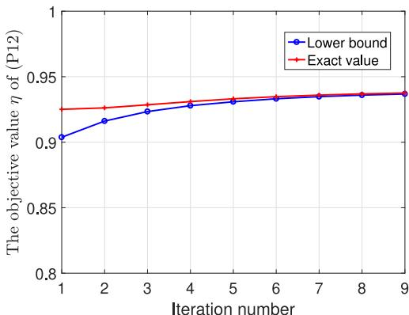

line

| Iteration number | Lower bound | Exact value |
| ---------------- | ----------- | ----------- |
| 1                | 0.90        | 0.93        |
| 2                | 0.91        | 0.93        |
| 3                | 0.92        | 0.93        |
| 4                | 0.93        | 0.93        |
| 5                | 0.93        | 0.94        |
| 6                | 0.94        | 0.94        |
| 7                | 0.94        | 0.94        |
| 8                | 0.94        | 0.94        |
| 9                | 0.94        | 0.94        |

Fig. 2. Convergence behavior of the SCA-based algorithm.

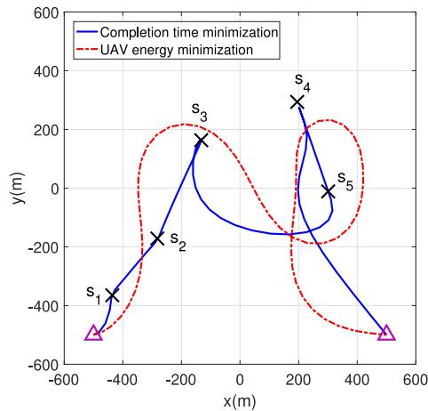

line

| Point | x (m) | y (m) |
|-------|-------|-------|
| S₁    | -450  | -450  |
| S₂    | -300  | -150  |
| S₃    | -100  | 150   |
| S₄    | 200   | 300   |
| S₅    | 300   | 0     |
| S₆    | 500   | -500  |

(a)

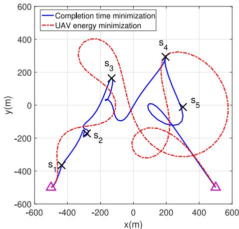

line

| Point | x (m) | y (m) |
|-------|-------|-------|
| S1    | -400  | -400  |
| S2    | -200  | -200  |
| S3    | -100  | 200   |
| S4    | 200   | 300   |
| S5    | 300   | 0     |
| S6    | 500   | -500  |

Fig. 3. Optimized UAV trajectory with different optimization algorithms and task-input data size ¯I. The triangles denote the initial and final UAV locations. (a) ¯I = 100 Mbits. (b) ¯I = 150 Mbits.

Fig. 3 shows the optimized trajectory for completion time minimization and UAV energy minimization designs under different task-input data size ¯I. It can be seen that the UAV flies close and hovers around each device with maximum possible duration in order to offload larger number of task-input bits with a better communication channel. The UAV trajectory with the UAV energy minimization algorithm tends to turn smoothly compared to that with the completion time minimization algorithm such that the energy consumption caused by UAV acceleration is reduced, which shows the impact of the UAV propulsion energy consumption model on the system design. It is also observed that as task-input size ¯I increases, the UAV hovers around each device with more time duration such that more task-input data can be offloaded, as expected. Such trends are also verified in the speed plots in Fig. 4.

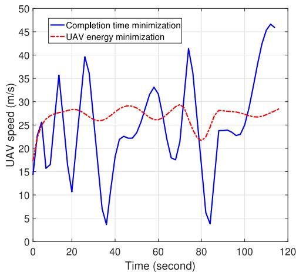

line

| Time (second) | Completion time minimization | UAV energy minimization |
| ------------- | ---------------------------- | ----------------------- |
| 0             | 25                           | 25                      |
| 10            | 15                           | 28                      |
| 20            | 35                           | 29                      |
| 30            | 10                           | 27                      |
| 40            | 4                            | 26                      |
| 50            | 22                           | 29                      |
| 60            | 33                           | 27                      |
| 70            | 18                           | 29                      |
| 80            | 42                           | 22                      |
| 90            | 4                            | 28                      |
| 100           | 24                           | 27                      |
| 110           | 47                           | 28                      |
| 120           | 46                           | 29                      |

(a)   
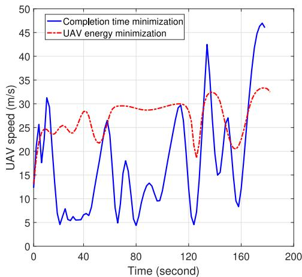

line

| Time (second) | Completion time minimization | UAV energy minimization |
| ------------- | ---------------------------- | ----------------------- |
| 0             | 15                           | 15                      |
| 20            | 30                           | 25                      |
| 40            | 5                            | 28                      |
| 60            | 25                           | 30                      |
| 80            | 5                            | 29                      |
| 100           | 15                           | 30                      |
| 120           | 5                            | 20                      |
| 140           | 43                           | 32                      |
| 160           | 15                           | 20                      |
| 180           | 47                           | 33                      |
| 200           | 47                           | 33                      |

(b)   
Fig. 4. Optimized UAV speed with different optimization algorithms and task-input data size ¯I. (a) ¯I = 100 Mbits. (b) ¯I = 150 Mbits.

In Fig. 4, it can be seen that for the completion time minimization algorithm, the flying speed of UAV will be reduced when it is close to each device, such that it can hover around each device for a longer time for computation task offloading with a better communication channel, as expected. In contrast, small fluctuations around 30 m/s are observed for the UAV energy minimization algorithm since the UAV tries to offload computation task with a less power-consuming speed, which can be deduced from the expression in (6).

The offloading time fraction and allocated UAV CPU frequency for the completion minimization algorithm is shown in Fig. 5 with ¯I = 100 Mb. Observed that different devices are not able to offload task simultaneously due to the TDMA scheme for task offloading, and each device keeps computing by itself for most of the time and it only offload computation task when the UAV is moving sufficiently close to it. The reason is that higher transmission efficiency can be achieved if allocating time resource to better channels in general. After receiving the offloaded task-input data from the ground device, the UAV allocates computation resource, i.e., CUP frequency to the corresponding task, which is implied by the information-causality constraints for offloaded computation and then confirmed in Fig. 5(b). It can be seen that the UAV is able to conduct computation for tasks offloaded from different devices simultaneously, which is expected since the computation resource of the UAV is shared by the tasks offloaded from different devices.

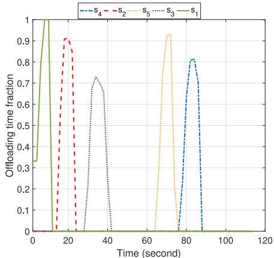

line

| Time (second) | s₁    | s₂    | s₃    | s₄    | s₅    |
| ------------- | ----- | ----- | ----- | ----- | ----- |
| 0             | 1.0   | 0.0   | 0.0   | 0.0   | 0.0   |
| 10            | 1.0   | 0.0   | 0.0   | 0.0   | 0.0   |
| 20            | 0.0   | 0.9   | 0.0   | 0.0   | 0.0   |
| 30            | 0.0   | 0.0   | 0.7   | 0.0   | 0.0   |
| 40            | 0.0   | 0.0   | 0.0   | 0.0   | 0.0   |
| 50            | 0.0   | 0.0   | 0.0   | 0.0   | 0.0   |
| 60            | 0.0   | 0.0   | 0.0   | 0.0   | 0.0   |
| 70            | 0.0   | 0.9   | 0.0   | 0.8   | 0.0   |
| 80            | 0.0   | 0.0   | 0.0   | 1.0   | 0.9   |
| 90            | 0.0   | 0.0   | 0.0   | 1.0   | 1.0   |
| 100           | 0.0   | 0.0   | 0.0   | 1.0   | 1.0   |
| 110           | 0.0   | 0.0   | 0.0   | 1.0   | 1.0   |
| 120           | 0.0   | 0.0   | 0.0   | 1.0   | 1.0   |

(a)   
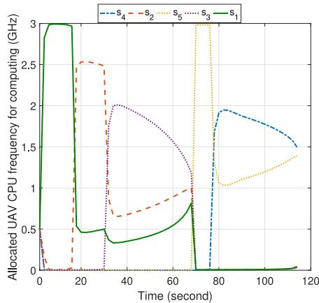

line

| Time (second) | s₁    | s₂    | s₃    | s₄    | s₅    |
| ------------- | ----- | ----- | ----- | ----- | ----- |
| 0             | 3.0   | 0.0   | 0.0   | 0.0   | 0.0   |
| 20            | 0.5   | 2.5   | 0.0   | 0.0   | 0.0   |
| 40            | 0.5   | 0.7   | 2.0   | 0.0   | 0.0   |
| 60            | 0.7   | 1.0   | 1.5   | 0.0   | 0.0   |
| 80            | 1.0   | 1.5   | 1.0   | 3.0   | 1.5   |
| 100           | 1.5   | 1.5   | 1.5   | 2.0   | 1.5   |
| 120           | 1.5   | 1.5   | 1.5   | 1.5   | 1.5   |

(b)   
Fig. 5. Offloading time fraction and allocated UAV CPU frequency for the completion minimization algorithm with ¯I = 100 Mb. (a) Offloading time fraction among different devices. (b) Allocated UAV CPU frequency among tasks from different devices.

Similar trends are observed in Fig. 6 for the UAV energy minimization algorithm with ¯I = 100 Mb. It is observed in Fig. 6(a) that some devices may offload computation task with two separate time durations. This is because for the UAV energy minimization design, the UAV is expected to fly with a less power-consuming speed, i.e., around 30 m/s in our setup, and it is necessary for the UAV to fly close to some devices more than once in order to offload enough computation task, which is also verified in Fig. 3(b).

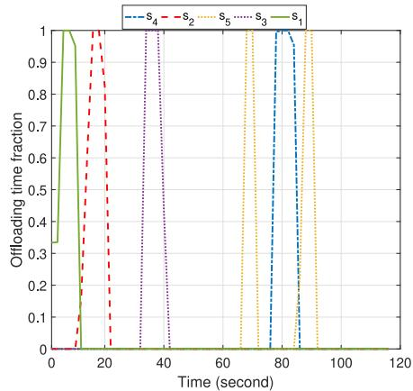

line

| Time (second) | s₁    | s₂    | s₃    | s₄    | s₅    |
| ------------- | ----- | ----- | ----- | ----- | ----- |
| 0             | 1.0   | 0.0   | 0.0   | 0.0   | 0.0   |
| 10            | 1.0   | 0.0   | 0.0   | 0.0   | 0.0   |
| 20            | 1.0   | 1.0   | 0.0   | 0.0   | 0.0   |
| 30            | 1.0   | 1.0   | 1.0   | 0.0   | 0.0   |
| 40            | 1.0   | 1.0   | 1.0   | 0.0   | 0.0   |
| 50            | 1.0   | 1.0   | 1.0   | 0.0   | 0.0   |
| 60            | 1.0   | 1.0   | 1.0   | 0.0   | 0.0   |
| 70            | 1.0   | 1.0   | 1.0   | 1.0   | 1.0   |
| 80            | 1.0   | 1.0   | 1.0   | 1.0   | 1.0   |
| 90            | 1.0   | 1.0   | 1.0   | 1.0   | 1.0   |
| 100           | 1.0   | 1.0   | 1.0   | 1.0   | 1.0   |
| 110           | 1.0   | 1.0   | 1.0   | 1.0   | 1.0   |
| 120           | 1.0   | 1.0   | 1.0   | 1.0   | 1.0   |

(a)   
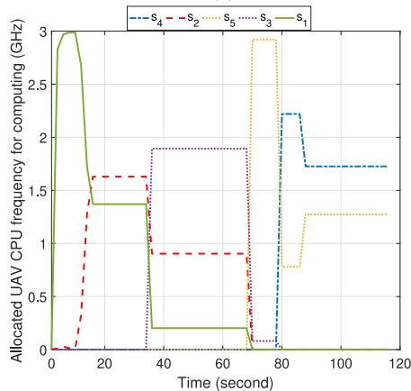

line

| Time (second) | s₁   | s₂   | s₃   | s₄   | s₅   |
| ------------- | ---- | ---- | ---- | ---- | ---- |
| 0             | 3.0  | 0.0  | 0.0  | 0.0  | 0.0  |
| 10            | 3.0  | 0.0  | 0.0  | 0.0  | 0.0  |
| 20            | 1.4  | 1.6  | 0.0  | 0.0  | 0.0  |
| 30            | 1.4  | 1.6  | 1.9  | 0.0  | 0.0  |
| 40            | 1.4  | 1.6  | 1.9  | 0.0  | 0.0  |
| 50            | 1.4  | 1.6  | 1.9  | 0.0  | 0.0  |
| 60            | 1.4  | 1.6  | 1.9  | 0.0  | 0.0  |
| 70            | 1.4  | 1.6  | 1.9  | 2.3  | 2.9  |
| 80            | 1.4  | 1.6  | 1.9  | 2.3  | 2.9  |
| 90            | 1.4  | 1.6  | 1.9  | 1.7  | 1.3  |
| 100           | 1.4  | 1.6  | 1.9  | 1.7  | 1.3  |
| 110           | 1.4  | 1.6  | 1.9  | 1.7  | 1.3  |
| 120           | 1.4  | 1.6  | 1.9  | 1.7  | 1.3  |

(b)   
Fig. 6. Offloading time fraction and allocated UAV CPU frequency for the UAV energy minimization algorithm with ¯I = 100 Mb. (a) Offloading time fraction among different devices. (b) Allocated UAV CPU frequency among tasks from different devices.

# B. Performance Comparisons

Before the performance comparisons, we first show the tradeoff between completion time and energy consumption of the UAV in Fig. 7 with $\bar { I } = 1 5 0$ Mb. The curve is obtained by solving (P14) with any given T, $T \ge T _ { \mathrm { m i n } }$ , where $T _ { \mathrm { m i n } }$ is the minimum completion time obtained from Section V. It is first observed in Fig. 7 that the tradeoff between the energy consumption of the UAV and the completion time follows a “U” shape. The left part of the curve corresponds to the Pareto boundary, where it is impossible to decrease one of two objectives without increasing the other. In particular, the energy consumption of the UAV decreases first and then increases with the increase of completion time. The reason is that with the increase of completion time, the UAV speed generally decreases and then the propulsion power consumption of the UAV may decrease or increase depending on its current speed. In the beginning, the decrease of the propulsion power consumption is more than the increase of the completion time. Then the energy consumption of the UAV decreases until the minimum value has been achieved. Next, the reverse situation happens, and then the energy consumption of the UAV increases. The results in Fig. 7 are in accordance with the intuition that the completion time minimization solution is different from the UAV energy minimization solution. Different from the existing UAV energy minimization algorithms in the MEC system, with the proposed Algorithm 2, the UAV energy minimization solution without predetermined completion time can be obtained, where the optimal completion time that minimizes the energy consumption of the UAV in Fig. 7 is also obtained.

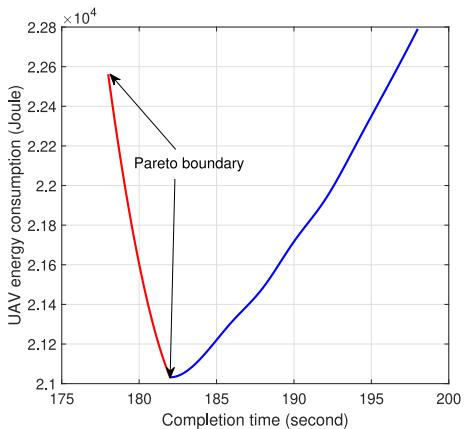

line

| Completion time (second) | UAV energy consumption (Joule) |
| ------------------------ | ------------------------------ |
| 175                      | 226000                         |
| 180                      | 21000                          |
| 185                      | 21200                          |
| 190                      | 21800                          |
| 195                      | 22400                          |
| 200                      | 228000                         |

Fig. 7. Tradeoff between the completion time and energy consumption of the UAV.

Finally, we compare the performance of proposed joint design schemes with that of the following three schemes.

1) Straight-Line Flight: Optimized computation offloading and resource allocation with simple straight-line flight trajectory, where the UAV flies from its initial location to the final location directly with a constant speed, and completion time and resource allocation are determined by the similar Algorithm 3 in Section V.   
2) Equal Offloading Time Allocation: Optimized computation resource allocation and UAV trajectory with the simple equal allocation of offloading time, where completion time and computation resource allocation are determined by the similar Algorithm 3.   
3) Without Local Computing: Optimized computation offloading and resource allocation as well as UAV trajectory without local computing at ground devices, similar as in [20].

Fig. 8(a) shows the comparison of completion time and Fig. 8(b) plots the comparison of UAV energy consumption versus the task-input data size ¯I. As ¯I increases, the completion time and energy consumption of the UAV increases accordingly, and the completion time minimization scheme performs better than other schemes in terms of completion time while the UAV energy minimization scheme achieves the lowest value of UAV energy consumption, as expected. The performance gain is more remarkable with larger ¯I. The performance gap between straight-line flight benchmark and our joint design schemes demonstrates the gain brought by the proposed trajectory designs. By comparing equal offloading time allocation benchmark with our joint design schemes, the additional gain of offloading time allocation is also demonstrated. When the offloading time allocation can be optimized, more flexibility for computation resource allocation can be provided, which helps achieve better performance. The performance gap between without local computing benchmark

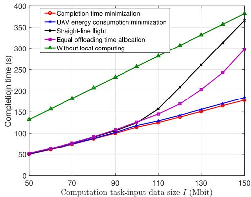

line

| Computation task-input data size I̅ (Mbit) | Completion time minimization | UAV energy consumption minimization | Straight-line flight | Equal offloading time allocation | Without local computing |
| ------------------------------------------ | ----------------------------- | -------------------------------------- | -------------------- | --------------------------------- | ------------------------ |
| 50                                         | 50                            | 50                                     | 50                   | 50                                | 130                      |
| 70                                         | 70                            | 70                                     | 70                   | 70                                | 180                      |
| 90                                         | 100                           | 100                                    | 100                  | 100                               | 230                      |
| 110                                        | 120                           | 120                                    | 150                  | 140                               | 280                      |
| 130                                        | 150                           | 150                                    | 260                  | 200                               | 330                      |
| 150                                        | 180                           | 180                                    | 370                  | 300                               | 380                      |

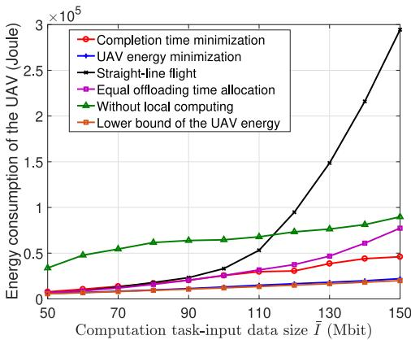

line

| Computation task-input data size I̅ (Mbit) | Completion time minimization | UAV energy minimization | Straight-line flight | Equal offloading time allocation | Without local computing | Lower bound of the UAV energy |
| ------------------------------------------ | ---------------------------- | ----------------------- | -------------------- | --------------------------------- | ------------------------ | ----------------------------- |
| 50                                         | 0.0                          | 0.0                     | 0.0                  | 0.0                               | 0.4                      | 0.0                           |
| 70                                         | 0.0                          | 0.0                     | 0.0                  | 0.0                               | 0.6                      | 0.0                           |
| 90                                         | 0.0                          | 0.0                     | 0.2                  | 0.2                               | 0.7                      | 0.0                           |
| 110                                        | 0.3                          | 0.1                     | 0.5                  | 0.3                               | 0.7                      | 0.1                           |
| 130                                        | 0.4                          | 0.1                     | 1.5                  | 0.5                               | 0.8                      | 0.1                           |
| 150                                        | 0.5                          | 0.2                     | 3.0                  | 0.8                               | 1.0                      | 0.2                           |

(b)   
Fig. 8. Performance of our proposed solution. (a) Completion time versus task-input data size ¯I. (b) Energy consumption of the UAV versus task-input data size ¯I.

and our joint design schemes demonstrates the effectiveness of collaboration with local computing and UAV offloading. To show the efficiency of the proposed Algorithm 2 for UAV energy consumption minimization, we compare with the lower bound of UAV’s energy consumption. It is shown in [12] that the minimum power consumption of the fixed-wing UAV with unconstrained trajectory is Pmin - (3−3/4 + 31/4)c 1/41 c 3/42 . $\begin{array} { r } { \dot { P } _ { \operatorname* { m i n } } \triangleq ( 3 ^ { - 3 / 4 } + 3 ^ { \smile } ) c _ { 1 } ^ { 1 / 4 } c _ { 2 } ^ { 3 / 4 } } \end{array}$ c2/4. Let $T _ { \mathrm { m i n } }$ be the minimum completion time obtained with Algorithm 3, then $P _ { \mathrm { m i n } } T _ { \mathrm { m i n } }$ can be regarded as a lower bound of UAV’s energy consumption, where the UAV flies with less power-consuming speed and the computation energy is ignored. Only a small performance gap is observed between the lower bound and our proposed solution, which implies that our proposed solution is quite close to the optimal solution for the considered setup.

# VIII. CONCLUSION

In this article, we study the completion time and energy minimization problems in the UAV-enabled MEC system for IoT computation offloading, via jointly optimizing the computation offloading and resource allocation as well as UAV trajectory and completion time. The difficulty of the UAV energy minimization problem is tackled with the path discretization technique, and we propose an effective alternating algorithm through solving two subproblems iteratively with SCA techniques. We tackle the completion time minimization problem by means of the same path discretization approximation model as in the UAV energy minimization problem, and a similar alternating optimization algorithm is proposed. Furthermore, we study the Pareto-optimal solution that balances the tradeoff between the two objectives. The simulation results have shown that significant performance improvement can be achieved by the proposed designs over the baseline schemes, and the tradeoff between completion time and energy consumption of the UAV for the MEC system has also been revealed.

# APPENDIX PROOF OF PROPOSITION 1

Assume that $t _ { n }$ is the time instant at the end of the nth line segment, then $\tau _ { n } = t _ { n } - t _ { n - 1 }$ . Since ${ \bf a } _ { n }$ is a constant along the nth line segment, then $\mathbf { a } ( t ) = \mathbf { a } _ { n } , t \in [ t _ { n - 1 } , t _ { n } ]$ . To this end, for any $t _ { n - 1 } < t \leq t _ { n } .$ , we have

$$
\mathbf {v} (t) = \mathbf {v} (t _ {n - 1}) + \int_ {t _ {n - 1}} ^ {t} \mathbf {a} (t) d t = \mathbf {v} _ {n - 1} + \mathbf {a} _ {n} (t - t _ {n - 1}). \tag {47}
$$

Due to (16) and (47), we have

$$
\begin{array}{l} \mathbf {q} _ {n} - \mathbf {q} _ {n - 1} = \int_ {t _ {n - 1}} ^ {t _ {n}} \mathbf {v} (t) d t = \int_ {t _ {n - 1}} ^ {t _ {n}} (\mathbf {v} _ {n - 1} + \mathbf {a} _ {n} (t - t _ {n - 1})) d t \\ = \mathbf {v} _ {n - 1} \tau_ {n} + \frac {1}{2} \mathbf {a} _ {n} \tau_ {n} ^ {2} = \frac {\mathbf {v} _ {n} + \mathbf {v} _ {n - 1}}{2} \tau_ {n}. \tag {48} \\ \end{array}
$$

Therefore, we have the equality in (17).

# REFERENCES

[1] Y. Zhang, L. Jiao, J. Yan, and X. Lin, “Dynamic service placement for virtual reality group gaming on mobile edge cloudlets,” IEEE J. Sel. Areas Commun., vol. 37, no. 8, pp. 1881–1897, Aug. 2019.   
[2] C. You, K. Huang, and H. Chae, “Energy efficient mobile cloud computing powered by wireless energy transfer,” IEEE J. Sel. Areas Commun., vol. 34, no. 5, pp. 1757–1771, May 2016.   
[3] Y. Mao, C. You, J. Zhang, K. Huang, and K. B. Letaief, “A survey on mobile edge computing: The communication perspective,” IEEE Commun. Surveys Tuts., vol. 19, no. 4, pp. 2322–2358, 4th Quart., 2017.   
[4] F. Wang, J. Xu, X. Wang, and S. Cui, “Joint offloading and computing optimization in wireless powered mobile-edge computing systems,” IEEE Trans. Wireless Commun., vol. 17, no. 3, pp. 1784–1797, Mar. 2018.   
[5] Z. Zhou, Q. Wu, and X. Chen, “Online orchestration of cross-edge service function chaining for cost-efficient edge computing,” IEEE J. Sel. Areas Commun., vol. 37, no. 8, pp. 1866–1880, Aug. 2019.   
[6] F. Zhou, Y. Wu, R. Q. Hu, and Y. Qian, “Computation rate maximization in UAV-enabled wireless-powered mobile-edge computing systems,” IEEE J. Sel. Areas Commun., vol. 36, no. 9, pp. 1927–1941, Sep. 2018.   
[7] Z. Yang, C. Pan, K. Wang, and M. Shikh-Bahaei, “Energy efficient resource allocation in UAV-enabled mobile edge computing networks,” IEEE Trans. Wireless Commun., vol. 18, no. 9, pp. 4576–4589, Sep. 2019.   
[8] N. Cheng et al., “Space/aerial-assisted computing offloading for IoT applications: A learning-based approach,” IEEE J. Sel. Areas Commun., vol. 37, no. 5, pp. 1117–1129, May 2019.   
[9] C. Zhan, Y. Zeng, and R. Zhang, “Trajectory design for distributed estimation in UAV-enabled wireless sensor network,” IEEE Trans. Veh. Technol., vol. 67, no. 10, pp. 10155–10159, Oct. 2018.   
[10] Q. Wu, Y. Zeng, and R. Zhang, “Joint trajectory and communication design for multi-UAV enabled wireless networks,” IEEE Trans. Wireless Commun., vol. 17, no. 3, pp. 2109–2121, Mar. 2018.   
[11] Y. Zeng, J. Xu, and R. Zhang, “Energy minimization for wireless communication with rotary-wing UAV,” IEEE Trans. Wireless Commun., vol. 18, no. 4, pp. 2329–2345, Apr. 2019.   
[12] Y. Zeng and R. Zhang, “Energy-efficient UAV communication with trajectory optimization,” IEEE Trans. Wireless Commun., vol. 16, no. 6, pp. 3747–3760, Jun. 2017.

[13] F. Ono, H. Ochiai, and R. Miura, “A wireless relay network based on unmanned aircraft system with rate optimization,” IEEE Trans. Wireless Commun., vol. 15, no. 11, pp. 7699–7708, Nov. 2016.   
[14] J. Gong, T. Chang, C. Shen, and X. Chen, “Flight time minimization of UAV for data collection over wireless sensor networks,” IEEE J. Sel. Areas Commun., vol. 36, no. 9, pp. 1942–1954, Sep. 2018.   
[15] C. Zhan and Y. Zeng, “Completion time minimization for multi-UAVenabled data collection,” IEEE Trans. Wireless Commun., vol. 18, no. 10, pp. 4859–4872, Oct. 2019.   
[16] A. Asheralieva and D. Niyato, “Hierarchical game-theoretic and reinforcement learning framework for computational offloading in UAV-enabled mobile edge computing networks with multiple service providers,” IEEE Internet Things J., vol. 6, no. 5, pp. 8753–8769, Oct. 2019.   
[17] J. Hu, M. Jiang, Q. Zhang, Q. Li, and J. Qin, “Joint optimization of UAV position, time slot allocation, and computation task partition in multiuser aerial mobile-edge computing systems,” IEEE Trans. Veh. Technol., vol. 68, no. 7, pp. 7231–7235, Jul. 2019.   
[18] T. Bai, J. Wang, Y. Ren, and L. Hanzo, “Energy-efficient computation offloading for secure UAV-edge-computing systems,” IEEE Trans. Veh. Technol., vol. 68, no. 6, pp. 6074–6087, Jun. 2019.   
[19] S. Jeong, O. Simeone, and J. Kang, “Mobile edge computing via a UAVmounted cloudlet: Optimization of bit allocation and path planning,” IEEE Trans. Veh. Technol., vol. 67, no. 3, pp. 2049–2063, Mar. 2018.   
[20] X. Hu, K. Wong, K. Yang, and Z. Zheng, “UAV-assisted relaying and edge computing: Scheduling and trajectory optimization,” IEEE Trans. Wireless Commun., vol. 18, no. 10, pp. 4738–4752, Oct. 2019.   
[21] J. Zhang et al., “Computation-efficient offloading and trajectory scheduling for multi-UAV assisted mobile edge computing,” IEEE Trans. Veh. Technol., vol. 69, no. 2, pp. 2114–2125, Feb. 2020.   
[22] T. Zhang, Y. Xu, J. Loo, D. Yang, and L. Xiao, “Joint computation and communication design for UAV-assisted mobile edge computing in IoT,” IEEE Trans. Ind. Informat, vol. 16, no. 8, pp. 5505–5516, Aug. 2020. [Online]. Available: https://ieeexplore.ieee.org/document/8877759   
[23] M. Hua, Y. Wang, C. Li, Y. Huang, and L. Yang, “UAV-aided mobile edge computing systems with one by one access scheme,” IEEE Trans. Green Commun. Netw., vol. 3, no. 3, pp. 664–678, Sep. 2019.   
[24] J. Zhang et al., “Stochastic computation offloading and trajectory scheduling for UAV-assisted mobile edge computing,” IEEE Internet Things J., vol. 6, no. 2, pp. 3688–3699, Apr. 2019.   
[25] Y. Zeng, X. Xu, and R. Zhang, “Trajectory design for completion time minimization in UAV-enabled multicasting,” IEEE Trans. Wireless Commun., vol. 17, no. 4, pp. 2233–2246, Apr. 2018.   
[26] J. Zhang et al., “Joint resource allocation for latency-sensitive services over mobile edge computing networks with caching,” IEEE Internet Things J., vol. 6, no. 3, pp. 4283–4294, Jun. 2019.   
[27] J. Li et al., “Joint optimization on trajectory, altitude, velocity, and link scheduling for minimum mission time in UAV-aided data collection,” IEEE Internet Things J., vol. 7, no. 2, pp. 1464–1475, Feb. 2020.   
[28] H. Wang, J. Wang, G. Ding, J. Chen, F. Gao, and Z. Han, “Completion time minimization with path planning for fixed-wing UAV communications,” IEEE Trans. Wireless Commun., vol. 18, no. 7, pp. 3485–3499, Jul. 2019.   
[29] M. Mozaffari, W. Saad, M. Bennis, and M. Debbah, “Mobile unmanned aerial vehicles (UAVs) for energy-efficient Internet of Things communications,” IEEE Trans. Wireless Commun., vol. 16, no. 11, pp. 7574–7589, Nov. 2017.   
[30] W. Zhang, Y. Wen, K. Guan, D. Kilper, H. Luo, and D. O. Wu, “Energyoptimal mobile cloud computing under stochastic wireless channel,” IEEE Trans. Wireless Commun., vol. 12, no. 9, pp. 4569–4581, Sep. 2013.   
[31] Y. Zeng, R. Zhang, and T. J. Lim, “Throughput maximization for UAV-enabled mobile relaying systems,” IEEE Trans. Commun., vol. 64, no. 12, pp. 4983–4996, Dec. 2016.   
[32] H. Wang, J. Wang, G. Ding, J. Chen, Y. Li, and Z. Han, “Spectrum sharing planning for full-duplex UAV relaying systems with underlaid D2D communications,” IEEE J. Sel. Areas Commun., vol. 36, no. 9, pp. 1986–1999, Sep. 2018.   
[33] C. Zhan, Y. Zeng, and R. Zhang, “Energy-efficient data collection in UAV enabled wireless sensor network,” IEEE Wireless Commun. Lett., vol. 7, no. 3, pp. 328–331, Jun. 2018.   
[34] M. Grant and S. Boyd. (2016). CVX: MATLAB Software for Disciplined Convex Programming. [Online]. Available: http://cvxr.com/cvx   
[35] S. Boyd and L. Vandenberghe, Convex Optimization. Cambridge, U.K.: Cambridge Univ. Press, 2004.   
[36] J. Mattingley and S. Boyd, “CVXGEN: A code generator for embedded convex optimization,” Optim. Eng., vol. 13, no. 1, pp. 1–27, Mar. 2012.

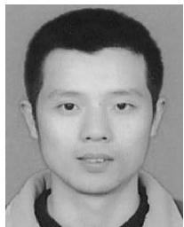

natural_image

Portrait photo of a young man (no text or symbols visible)

Cheng Zhan received the B.Eng. and Ph.D. degrees in computer science from the School of Computer Science, University of Science and Technology of China, Hefei, China, in 2006 and 2011, respectively.

From 2009 to 2010, he was a Research Assistant with the Department of Computer Science, City University of Hong Kong, Hong Kong. From 2016 to 2017, he was a Visiting Scholar with the Department of Electrical and Computer Engineering, National University of Singapore, Singapore. He is currently an Associate Professor with the School of Computer and Information Science, Southwest University, Chongqing, China. His research interests include unmanned-aerial-vehicle communications, multimedia communications, wireless sensor networks, and network coding.

Dr. Zhan served as a TPC Member for ICC, WCNC, IWCMC, and UIC.

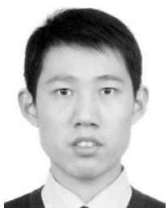

natural_image

Portrait photo of a young man in formal attire (no text or symbols visible)

Zhi Liu (Senior Member, IEEE) received the B.E. degree from the University of Science and Technology of China, Hefei, China, in 2009, and the Ph.D. degree in informatics from the National Institute of Informatics, Tokyo, Japan, in 2014.

He is currently an Assistant Professor with Shizuoka University, Shizuoka, Japan. His research interests include video network transmission, vehicular networks, and mobile-edge computing.

Prof. Liu is currently an Editorial Board Member of Wireless Networks (Springer) and has been a Guest Editor of Mobile Networks & Applications (ACM/Springer), Wireless Networks (Springer), and IEICE Transactions on Information and Systems.

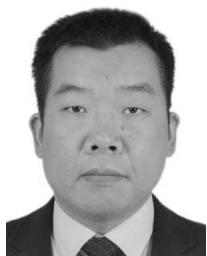

natural_image

Portrait photo of a man in formal attire (no text or symbols visible)

Han Hu received the B.E. and Ph.D. degrees from the University of Science and Technology of China, Hefei, China, in 2007 and 2012, respectively.

He is currently a Professor with the School of Information and Electronics, Beijing Institute of Technology, Beijing, China. His research interests include multimedia networking, edge intelligence, and space–air–ground integrated network.

Prof. Hu received several academic awards, including the Best Paper Award of IEEE TCSVT 2019, the Best Paper Award of IEEE Multimedia

Magazine 2015, and the Best Paper Award of IEEE Globecom 2013. He served as an Associate Editor for the IEEE TRANSACTIONS ON MULTIMEDIA and Ad Hoc Networks, and a TPC Member of Infocom, ACM MM, AAAI, and IJCAI.

natural_image

Portrait of a man wearing glasses (no text or symbols visible)

Xiufeng Sui received the B.E. degree from the Harbin Institute of Technology, Harbin, China, in 2005, and the Ph.D. degree in computer science from the School of Computer Science, University of Science and Technology of China, Hefei, China, in 2011.

He is currently an Associate Professor with the School of Information and Electronics, Beijing Institute of Technology, Beijing, China. His main research interests include computer architecture, operating systems, strategies of engineering science

and technology, and management of technological innovation.

natural_image

Portrait of a man wearing glasses and a collared shirt (no text or symbols visible)

Dusit Niyato (Fellow, IEEE) received the B.Eng. degree from the King Mongkut’s Institute of Technology Ladkrabang, Bangkok, Thailand, in 1999, and the Ph.D. degree in electrical and computer engineering from the University of Manitoba, Winnipeg, MB, Canada, in 2008.

He is currently a Professor with the School of Computer Science and Engineering, Nanyang Technological University, Singapore. His research interests are in the area of energy harvesting for wireless communication, Internet of Things, and sensor networks.