# Computation Offloading and Resource Allocation in Vehicular MEC: A Parameterized Deep Reinforcement Learning Approach

Ruofei Ma , Member, IEEE, Jingyang Zhou , Ruisong Wang , Hsiao-Hwa Chen , Life Fellow, IEEE, and Gongliang Liu , Member, IEEE

Abstract—Rapid advancement of the Internet of vehicles (IoV) technology has created a lot of intelligent vehicle applications, such as real-time navigation, collision avoidance, and autonomous driving, etc., which in turn generates a significant amount of computation-intensive tasks. Due to limited computation capabilities of in-vehicle devices, mobile edge and cloud computing are viewed as promising solutions to offload latency-sensitive tasks to mobile edge computing servers to meet the requirements for euRLLC in 5G/6G applications. Vehicular edge computing systems require effective offloading decision-making and resource management to maximize resource utilization. However, existing scheduling schemes suffer a high complexity to deal with multidimensional resource optimization problems, thereby introducing a significant latency and compromising resource utilization efficiency. This paper aims to address the issues on latency, energy consumption, and cost jointly within a vehicular edge computing system. In particular, a multi-objective optimization problem is formulated for its joint optimization on computation offloading and resource allocation with the help of a deep reinforcement learning (DRL) approach. To this end, a parameterized deep Q-networks (P-DQN) algorithm is introduced for solving a binary offloading problem. Extensive numerical simulations validate the superiority of the proposed scheme compared to well-known algorithms in the literature.

Index Terms—Internet of Vehicles (IoV), mobile edge computing, task offloading, deep reinforcement learning, parameterized deep Q-network.

# I. INTRODUCTION

T HE Internet of vehicles (IoV), as a form of the Internet ofthings (IoT) tailored for 5G and beyond systems, emerges

Received 14 August 2024; revised 22 January 2025 and 30 March 2025; accepted 20 May 2025. Date of publication 29 May 2025; date of current version 20 November 2025. This work was supported in part by Shandong Provincial Natural Science Foundation under Grant ZR2023MF001 and Grant ZR2024QF140, in part by the National Natural Science Foundation of China under Grant 61801144 and Grant 61971156, and in part by the Taiwan Ministry of Science and Technology under Grant 113-2221-E-006-143 and Grant 113-2221-E-006-144. The review of this article was coordinated by Dr. Ebrahim Bedeer. (Corresponding author: Hsiao-Hwa Chen.)

Ruofei Ma, Jingyang Zhou, Ruisong Wang, and Gongliang Liu are with the Department of Communication Engineering, Harbin Institute of Technology, Weihai 264209, China (e-mail: maruofei@hit.edu.cn; zjyfss@ 163.com; mathwrs@163.com; liugl@hit.edu.cn).

Hsiao-Hwa Chen is with the Department of Engineering Science, National Cheng Kung University, Tainan City 70101, Taiwan (e-mail: hshwchen@ ieee.org).

Digital Object Identifier 10.1109/TVT.2025.3574783

as a critical component in future intelligent transportation systems (ITS) [1], [2], [3]. Via interconnecting numerous network entities within transportation systems, such as vehicles, roadside units (RSUs), and pedestrians, IoV is able to offer driving assistance/safety assurance and deliver other life-critical information to drivers and passengers. The advancement of smart vehicles has created numerous smart vehicle applications, including augmented reality, real-time navigation, voice/image/video recognition, and autonomous driving, focusing primarily on safety issues [4], [5], [6], [7]. These applications will generate computation-intensive tasks requiring high reliability and low latency. However, the limited computation capacity of in-vehicle devices can hardly meet the intensive computation demands of these applications [8], [9], [10].

Mobile edge computing (MEC) technology, which integrates computing resources and intelligence at the network edges, offers a promising solution to address these challenges by providing fast and efficient computation services to vehicles [11], [12], [13]. Offloading computing tasks to MEC servers close to the terminals can effectively deal with the problem of insufficient in-vehicle computing resources. Despite its numerous advantages, edge computing technology faces various application challenges [14]. For instance, network operators are required to pre-deploy a large number of RSUs and edge servers. In addition, designing efficient computation offloading and resource allocation algorithms is essential to enhance resource utilization and computation efficiency of edge computing systems. The key to ensure vehicular MEC system’s quality of service (QoS) and overall performance is to jointly optimize vehicles to edge servers task offloading policy, energy consumption, and multi-dimensional resource allocation [15], [16], [17].

To tackle the challenges associated with MEC, many works have been done in recent years. A substantial amount of literatures focused on devising optimal policies for task offloading and resource management under various requirements, aiming to optimize latency, energy consumption, or/and QoS. Fan et al. [18] focused on joint task offloading and resource allocation issues for vehicular edge computing using both V2I and V2V communications. Aiming to minimize task processing delays, they formulated the joint scheduling issue as an optimization problem, in which task diversity, vehicle classification, and processing flexibility were considered. They used generalized benders decomposition (GBD) and reformulation linearization (RL) to derive the optimal solution and designed a heuristic scheme to obtain sub-optimal solutions with a lower complexity. Liu et al. [19] converted an offloading decision-making problem into a joint delay and energy consumption optimization problem and introduced a joint computing offloading and energy optimization scheme. This scheme merged a game-theory-based offloading strategy with a convex optimization-based resource allocation algorithm to balance latency and energy consumption in vehicular edge computing systems. Luo et al. [20] depicted a computation offloading problem as a distributed offloading decision game to achieve a Nash equilibrium via a distributed self-learning algorithm. In [21], the authors proposed binary and partial reverse offloading strategies for diverse tasks, aiming at alleviating the burden on edge servers and reducing system latency through optimal utilization of constrained vehicular computing resources. In [22], a heuristic scheme was suggested to address joint latency and energy consumption optimization challenge in vehicular fog computing. Wang et al. [23] proposed a two-stage optimization scheme, combining a Lyapunov-based approach for computation offloading and resource allocation with a BAS-Elman neural network for lightweight target tracking. This method effectively balances UAV energy consumption, tracking success rate, and data processing accuracy under stochastic conditions. Du et al. [24] proposed an SDN-based hierarchical framework for hybrid edge and cloud computing systems, introducing evolutionary and Stackelberg differential games to model the interactions between users, edge computing providers (ECPs), and cloud computing providers (CCPs). This framework enables dynamic resource pricing and allocation strategies by considering users’ service preferences and the supply-demand relationship between ECPs and CCPs. Simulations demonstrated the proposed mechanism’s ability to improve resource utilization and service quality while achieving faster convergence compared to static approaches. Nevertheless, the majority of the existing schemes relied on convex optimization and game theory. The algorithms based on convex optimization typically suffer high computational complexities and the gametheoretic schemes necessitate multiple iterations to achieve the Nash equilibrium [25], [26], [27], complicating their practical applications in dynamic vehicular networks. On the other hand, heuristic algorithms are usually less complex, but they likely tend to converge on local (rather than global) optimal solutions [28].

The advancement of artificial intelligence (AI) has introduced new solutions for resource management in wireless communications [29], [30], [31]. In particular, deep reinforcement learning (DRL), which integrates deep learning (DL) and reinforcement learning (RL), is not contingent upon the environment model, rendering it in particular suitable for the applications in dynamic environments. Inspired by the use of DRL in dynamic control scenarios, several works concentrated on developing DRL-based computation offloading strategies [32], [33], [34]. The Deep Q-Network (DQN) represents an amalgamation of Q-learning and DL, employing deep neural networks to approximate the Q-function and thus broadening Q-learning’s applicability in continuous state spaces. Liu et al. [35] devised a vehicular edge computing network architecture, where idle vehicles served as edge servers and the optimization problem of maximizing vehicular edge computing network’s long-term utility was formulated as a semi-Markov decision process. The authors utilized Q-learning and DQN to propose two computation offloading and resource allocation strategies. Wang et al. [36] addressed the challenges of joint scheduling on task offloading, resource allocation, and service caching in a multi-server three-tier MEC system. A Double DQN (DDQN) based algorithm called SCRACO was proposed to dynamically and efficiently manage offloading decisions and allocate communication and computing resources. Another DRL scheme, namely deep deterministic policy gradient (DDPG) algorithm, works based on actor-critic approach with DQN. Peng et al. [37] employed DDPG and a hierarchical RL framework to tackle multi-dimensional resource optimization challenge in multi-access edge computing. They investigated the issues on allocations of spectrum, computation, and storage resources jointly, aiming to maximize QoS in vehicular applications. Yang et al. [38] considered an edgeterminal machine learning task paradigm in vehicular networks to evaluate latency, processing accuracy, and energy consumption. A two-stage DRL-based computation offloading and resource allocation strategy was proposed, aiming at identifying optimal solutions for vehicle offloading decision and transmit power allocation. Xue et al. [39] explored joint management of offloading, computation, and storage resources in vehicular edge computing to minimize system’s task processing latency, based on which a centralized DRL algorithm was proposed. Ma et al. [40] developed a vehicle trajectory prediction model based on deep neural networks and integrated Lyapunov optimization with DRL techniques to maximize task offloading throughput with a long-term stability of task queue. Geng et al. [41] concentrated on optimizing latency and energy consumption by partitioning computing tasks into sub-tasks and modeling them as directed acyclic graphs (DAGs). They proposed a distributed computing offloading method (DCOM) to leverage multi-agent DRL. Chen et al. [42] proposed a multi-task-driven framework for user association and resource allocation in heterogeneous in-vehicle networks (HetIVNets). They developed a Proximal Policy Optimization (PPO) based algorithm to optimize task success rates and minimize WiFi access point energy consumption, achieving a superior efficiency compared to baseline methods. In addition, the introduction of multi-modal learning and aggregation techniques showed a significant potential to enhance MEC systems. Du et al. [43] explored distributed training of foundation models (FMs) in 6G systems, leveraging federated learning (FL) and over-the-air computation (AirComp) to address challenges such as data heterogeneity and communication instability. These techniques enable efficient aggregation of real-time data from vehicular networks, improving resource allocation and task offloading strategies. For instance, the use of pipeline parallelism and adaptive communication resource allocation supports scalable and low-latency model update, making these methods well-suited for high-dynamic environments of vehicular MEC.

In this paper, we consider a binary offloading problem in vehicular edge computing networks, which is typically formulated as a mixed integer nonlinear programming (MINLP) problem. As a non-convex problem, it is highly complex in nature. When DRL is applied to it, it necessitates the management of a hybrid action space, which integrates both discrete and continuous actions. The existing studies normally addressed the hybrid action space challenge in joint optimization problems by either discretizing continuous actions or relaxing discrete action spaces. However, such approaches exacerbated the complexity of the problem and sacrifice the accuracy of the solutions. In response to the aforementioned challenges, this work utilizes parameterized DRL to tackle a real-time offloading decision-making problem. The objective herein is to minimize system’s long-term latency, energy consumption, and cost. Specifically, the main contributions of this work can be summarized as follows.

- We consider a cloud-assisted vehicular edge computing scenario by constructing a three-layer task offloading architecture, which encompasses local computation, edge server, and cloud layers. This architecture helps to address the challenges associated with resource constraints at edge servers and the imbalance of computing resources in vehicular edge computing environments.   
- An optimization problem is formulated to jointly consider latency, energy consumption, and cost under a Markov decision process (MDP) framework. We design state space and reward function and introduce a parameterized action space to effectively manage the mixed action space. Furthermore, an algorithm based on the parameterized deep Q-network (P-DQN) is proposed to address the optimization problem.   
The efficacy of the proposed scheme is validated through extensive numerical simulations, which indicate that the proposed scheme secures a higher reward in comparison to the baseline algorithms.

The rest of this paper is outlined as follows. Section II introduces a system model for a vehicular MEC network. In Section III the optimization problem for joint computation offloading and resource allocation is formulated. Section IV depicts the proposed RL based approach to address the optimization problem. Simulations and performance evaluation are provided in Section V, followed by the conclusions in Section VI.

# II. SYSTEM MODEL

In this section, a system model of vehicular MEC is introduced. A network model for vehicular MEC is provided first, followed by computation task and communication models. Specifically, computation task processing models at local vehicle, MEC server, and cloud server are detailed. For analytical clarity, the symbols used in subsequent discussions are summarized in Table I.

# A. Network Model

As illustrated in Fig. 1, a vehicular MEC computing network comprises N vehicles, M uniformly distributed RSUs, and a cloud server. The sets of vehicles and RSUs are denoted as $\mathcal { N } = \{ 1 , 2 , \dots , N \}$ and $\mathcal { M } = \{ 1 , 2 , \dots , M \}$ , respectively. Each RSU is equipped with an MEC server having a computing

TABLE I MAJOR SYMBOLS AND THEIR DEFINITIONS 

<table><tr><td>Notation</td><td>Description</td></tr><tr><td> $\mathcal{N}$ </td><td>A set of vehicles</td></tr><tr><td> $\mathcal{M}$ </td><td>A set of RSUs with MEC servers</td></tr><tr><td> $N$ </td><td>The number of vehicles</td></tr><tr><td> $M$ </td><td>The number of RSUs/MEC servers</td></tr><tr><td> $i$ </td><td>Index of vehicles</td></tr><tr><td> $m$ </td><td>Index of RSUs/MEC servers</td></tr><tr><td> $t$ </td><td>Index of time slots</td></tr><tr><td> $\bar{\mu}$ </td><td>Average speed of each vehicle</td></tr><tr><td> $\bar{\sigma}$ </td><td>Standard deviation of vehicles&#x27; speed</td></tr><tr><td> $x_{i}$ </td><td>Position of vehicle  $i$ </td></tr><tr><td> $R$ </td><td>Coverage range of each RSU</td></tr><tr><td> $r_{R2R}$ </td><td>Transmission rate between RSUs</td></tr><tr><td> $F$ </td><td>Computation capacity of each MEC server</td></tr><tr><td> $F^{c}$ </td><td>Computation capacity of cloud server</td></tr><tr><td> $f_{i}^{l}$ </td><td>Computation capacity of vehicle  $i$ </td></tr><tr><td> $\mathcal{T}_{i}(t)$ </td><td>Task generated by vehicle  $i$  at time slot  $t$ </td></tr><tr><td> $d_{i}(t)$ </td><td>Size of input data of  $\mathcal{T}_{i}(t)$ </td></tr><tr><td> $c_{i}(t)$ </td><td>Computation intensity of  $\mathcal{T}_{i}(t)$ </td></tr><tr><td> $t_{i}^{finish}(t)$ </td><td>Maximum tolerated delay of  $\mathcal{T}_{i}(t)$ </td></tr><tr><td> $s_{i}^{d}(t)$ </td><td>Offloading indicator for vehicle  $i$  at time slot  $t$ </td></tr><tr><td> $a_{i}(t)$ </td><td>Offloading decision for  $\mathcal{T}_{i}(t)$ </td></tr><tr><td> $f_{i,m}^{E}(t)$ </td><td>Computation resources that MEC server  $m$  allocates to vehicle  $i$  for  $\mathcal{T}_{i}(t)$ </td></tr><tr><td> $f_{i}^{c}(t)$ </td><td>Computation resources that cloud server allocated to vehicle  $i$  for  $\mathcal{T}_{i}(t)$ </td></tr><tr><td> $h_{i,m}$ </td><td>Channel gain between vehicle  $i$  and RSU  $m$ </td></tr><tr><td> $p_{i}(t)$ </td><td>Transmit power of vehicle  $i$  at time slot  $t$ </td></tr><tr><td> $\rho^{E}, \rho^{c}$ </td><td>Unit price of MEC/cloud server&#x27;s computation resources</td></tr><tr><td> $t^{c}$ </td><td>Upload time for input data from RSU to cloud server</td></tr><tr><td> $t^{inter}$ </td><td>Transmission delay between adjacent RSUs</td></tr><tr><td> $t_{i}^{link}(t)$ </td><td>Remaining time that vehicle  $i$  stays on road</td></tr><tr><td> $T_{i}^{max}(t)$ </td><td>Actual tolerance delay for  $\mathcal{T}_{i}(t)$ </td></tr><tr><td> $w_{1}, w_{2}, w_{3}$ </td><td>Weights for delay, energy consumption, and cost</td></tr></table>

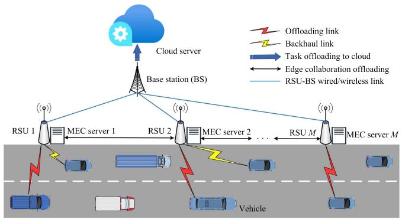

<details>
<summary>flowchart</summary>

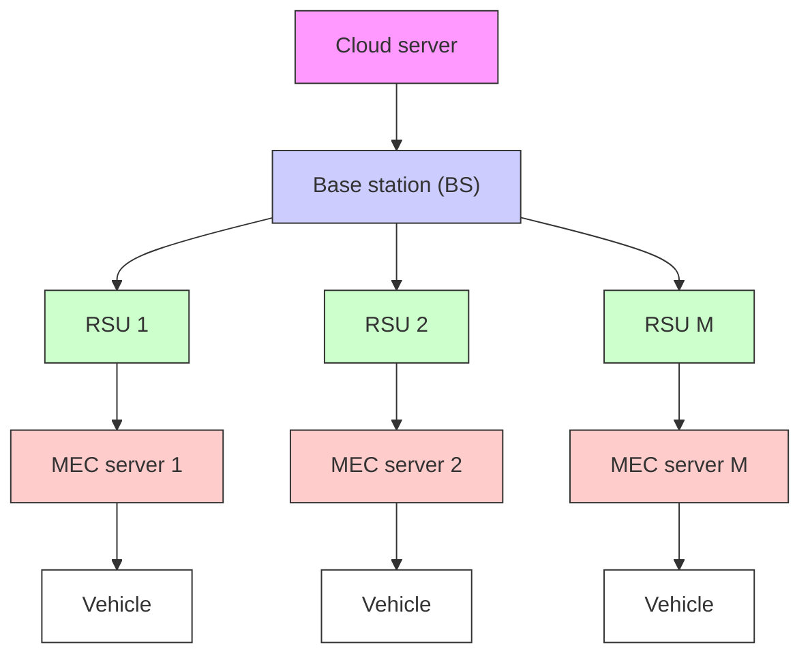
</details>

Fig. 1. A network model for vehicular mobile edge computing.

capacity of F and has an identical coverage range R. These RSUs are connected to a remote cloud server via wired connections and core network. The road is divided into M segments with vehicles randomly distributed over them, i.e., each RSU covers a particular road segment. The length of road is denoted as L.

RSUs equipped with MEC servers are interconnected via wired connections and can offer reliable and real-time task offloading services for vehicles within their coverage areas. Each vehicle connects to only an RSU serving the road segment. The computation tasks generated by a vehicle can be processed locally on in-vehicle device or via offloading them to corresponding RSU MEC or cloud servers. If task offloading is performed, a vehicle’s task can be offloaded to its directly connected RSU, adjacent RSUs, or a cloud server. Note that offloading task to adjacent RSUs or cloud servers requires relay assistance from the RSU directly connected to the vehicle, and such situations may happen when a vehicle’s directly connected RSU is overloaded and unable to process computing tasks, which is helpful to mitigate imbalance issue in using edge computing resources. The cloud server with abundant computing resources is capable of handling high-complexity tasks or serving as a supplement when network computing resources are insufficient. Additionally, time is divided into equal-length slots denoted as $t = \{ 1 , 2 , \dots , T \}$ , assuming each vehicle generates at most one task per slot, with each slot having a uniform duration $\Delta t .$

In this model, vehicle speeds are assumed to follow a truncated Gaussian distribution, reflecting speed randomness with nonnegative values. The probability density function (PDF) of the truncated Gaussian distribution is given by

$$
\hat {f} (v) = \left\{ \begin{array}{l l} \frac {2 f (v)}{\operatorname{erf} \left(\frac {V _ {\max} - \bar {\mu}}{\sqrt {2} \bar {\sigma}}\right) - \operatorname{erf} \left(\frac {V _ {\min} - \bar {\mu}}{\sqrt {2} \bar {\sigma}}\right)}, & V _ {\min} \leq v \leq V _ {\max}, \\ 0, & \text { otherwise }, \end{array} \right. \tag {1}
$$

where $\begin{array} { r } { f ( v ) = \frac { 1 } { \sqrt { 2 \pi } \bar { \sigma } } \exp ( - \frac { ( v - \bar { \mu } ) ^ { 2 } } { 2 \bar { \sigma } ^ { 2 } } ) } \end{array}$ represents PDF of Gaussian distribution, with $\vec { \mu }$ and σ¯ denoting average and standard deviation of vehicle speed, respectively. $V _ { \operatorname* { m a x } } = \bar { \mu } + 3 \bar { \sigma }$ and $V _ { \mathrm { m i n } } = \bar { \mu } - 3 \bar { \sigma }$ denote maximal and minimal vehicular speeds, respectively, and er $\begin{array} { r } { \mathrm { f } ( \bar { x } ) = \frac { 2 } { \sqrt { \pi } } \int _ { 0 } ^ { \bar { x } } e ^ { - z ^ { 2 } } \ d z } \end{array}$ dz is an error function.

# B. Task Model

To characterize the computation tasks of vehicles, the following task model is presented. For vehicle i, the computation task generated during time slot t is typically represented as a triplet, i.e.,

$$
\mathcal {T} _ {i} (t) = \left\{d _ {i} (t), c _ {i} (t), t _ {i} ^ {\text { finish }} (t) \right\}, \tag {2}
$$

where $d _ { i } ( t )$ ) denotes input data size for computation task $\tau _ { i } ( t )$ , and $c _ { i } ( t ) = \lambda _ { i } ( t ) \cdot d _ { i } ( t )$ represents computation intensity of $\tau _ { i } ( t ) , \mathrm { i . e . }$ ., the number of CPU cycles needed to complete the task. Here, $\lambda _ { i } ( t )$ is a coefficient describing the relationship between $d _ { i } ( t )$ and $c _ { i } ( t )$ , termed as service coefficient and determined by task’s computation complexity. t f inishi (t) denotes maximum $t _ { i } ^ { f i n i s h } ( t )$ tolerable delay of task $\tau _ { i } ( t )$ .

Based on the framework as described above, let us consider a three-tier task computation model encompassing local processing, edge offloading, and cloud offloading. Vehicles can choose to either process computation tasks locally or offload them to MEC servers or cloud servers. For each computation task, a vehicle may offload it to at most one server. While vehicles can only communicate directly with an RSU in their proximity area, they can offload tasks through this RSU to MEC servers via neighboring RSUs. Thus, for vehicle i, the set of possible offloading decisions for task $\mathcal { T } _ { i } ( t )$ during time slot t includes $M + 2$ options, denoted by $a _ { i } ( t ) = \{ 0 , 1 , 2 , \ldots , M + 1 \}$ }, where $a _ { i } ( t ) =$ 0 represents local execution, and $a _ { i } ( t ) = M + 1$ denotes cloud offloading with $a _ { i } ( t ) = m \left( 1 \leq m \leq M \right)$ signifying offloading to MEC server i. Furthermore, for vehicle i, offloading data are defined as $\mathcal { S } = \{ s _ { i } ^ { d } ( t ) \ | \ i \in \mathcal { N } , d \in \{ l , E , c \} , s _ { i } ^ { d } ( t ) \in \{ 0 , 1 \} \}$ . $\boldsymbol { \mathcal { D } } = \{ l , E , c \}$ represents a set of offloading policies. Specifically, $s _ { i } ^ { l } ( t ) = 1$ when $a _ { i } ( t ) = 0$ , indicating local processing, and $s _ { i } ^ { l } ( t ) = 0$ otherwise; $s _ { i } ^ { E } ( t ) = 1$ for $a _ { i } ( t ) = m \ ( 1 \leq m \leq M )$ , indicating offloading to MEC server i, and $s _ { i } ^ { E } ( t ) = 0 \mathrm { o t h e r w i s e } ;$ $s _ { i } ^ { c } ( t ) = 1$ when $a _ { i } ( t ) = M + 1$ , indicating offloading to cloud, and $s _ { i } ^ { c } ( t ) = 0$ otherwise.

# C. Communication Model

When a vehicle decides to offload a task, it must upload task’s input data to the corresponding RSU and receive the output data from the RSU upon task completion. Next, we introduce a vehicle-RSU communication model based on vehicleto-infrastructure (V2I) communications. Assume that uplink channel from vehicle i to RSU m is a Rayleigh fading channel without co-channel interference. The channel gain is expressed as

$$
h _ {i, m} = K _ {0} g _ {i, m} \bar {g} _ {i, m} L _ {i, m} ^ {- \eta}, \tag {3}
$$

where $K _ { 0 }$ is a constant corresponding to the path loss model, $\boldsymbol { L } _ { i , m }$ is the distance between vehicle i and RSU m, and η is the path loss exponent. $g _ { i , m }$ denotes a small-scale fast fading gain following an exponential distribution with unit mean. $\bar { g } _ { i , m }$ denotes a slow fading gain following a log-normal distribution with its standard deviation of 8 dB.

Assume that total uplink bandwidth available for vehicles to each RSU is B, and at a given time slot $t , \bar { N } ( t )$ vehicles need to offload their tasks to RSU m. Under these condition, uplink data rate from vehicle i to RSU m can be calculated as

$$
r _ {i, m} (t) = \frac {B}{\bar {N} (t)} \log_ {2} \left(1 + \frac {p _ {i} (t) h _ {i , m} (t)}{\sigma^ {2}}\right), \tag {4}
$$

where $p _ { i } ( t )$ is the transmit power of vehicle i at time slot t, $h _ { i , m } ( t )$ represents channel gain between vehicle i and RSU m at time slot t, and $\sigma ^ { 2 }$ denotes background noise.

# D. Task Processing Model

Based on the previous network and task models, this subsection introduces a task processing model for various task execution strategies (i.e., local processing, MEC processing, and cloud processing) chosen by vehicles.

1) Local Processing Model: In the local computing approach, vehicles use onboard computing resources to process computation tasks. Assume vehicle i’s computing capacity is denoted as $f _ { i } ^ { l }$ . The time to complete task $\tau _ { i } ( t )$ locally is calculated as

$$
T _ {i} ^ {l} (t) = \frac {c _ {i} (t)}{f _ {i} ^ {l}}. \tag {5}
$$

The energy consumption for the local processing strategy is given by

$$
E _ {i} ^ {l} (t) = \kappa \cdot c _ {i} (t) (f _ {i} ^ {l}) ^ {2}, \tag {6}
$$

where κ is an energy consumption parameter dependent on chip architecture used [44].

Moreover, this paper evaluates the cost associated with offloading tasks in vehicular edge computing environments. If tasks are processed locally, vehicles incur no costs for computing resources from server operators. Thus, we can denote the cost for vehicle i as

$$
\epsilon_ {i} ^ {l} (t) = 0. \tag {7}
$$

2) MEC Processing Model: If a computation task is offloaded to an MEC server, its input data must be uploaded first via vehicle’s uplink to a directly connected RSU. Then, if the target MEC is available on an RSU directly connected to the source vehicle, the task will be executed directly. As each RSU is equipped with an MEC server, transmission time between a RSU and its equipped MEC server can be omitted. But if the target MEC is not on a vehicle’s directly connected RSU, this RSU will relay those input data to the target RUS/MEC (directly or with other $\mathrm { R S U s ^ { \prime } }$ assistance) for final task execution. Thus, if vehicle i is within the coverage area of RSU m , the time required for vehicle i to upload its offloading task’s input data to its target MEC server m can be written as

$$
T _ {i, m} ^ {u p} (t) = \frac {d _ {i} (t)}{r _ {i , m ^ {\prime}} (t)} + t ^ {b}, \tag {8}
$$

where $\begin{array} { r } { t ^ { b } = t ^ { q u e } + \frac { d _ { i } ( t ) } { r _ { R 2 R } } } \end{array}$ denotes total delay for data delivery rR2R between RSUs when $m ^ { \prime } \neq m$ . Here, $t ^ { q u e }$ is queuing delay at the RSU for waiting for other tasks’ input data to be sent, and $\frac { d _ { i } ( t ) } { r _ { R 2 R } }$ rR2R denotes transmission delay when sending data from RSU m to RSU m. $r _ { R 2 R }$ represents data rate between RSUs. When $m ^ { \prime } = m$ , we have $t ^ { b } = 0$ . Assume that computation tasks are executed in parallel on an MEC server. The computing resources requested by vehicle i from MEC server m are denoted as $f _ { i , m } ^ { \bar { E } } ( t )$ . Consequently, execution time and cost for offloading task $\tau _ { i } ( t )$ to MEC server m are calculated respectively as

$$
T _ {i, m} ^ {e x e} (t) = \frac {c _ {i} (t)}{f _ {i , m} ^ {E} (t)}, \tag {9}
$$

$$
\epsilon_ {i, m} ^ {E} (t) = \rho^ {E} f _ {i, m} ^ {E} (t), \tag {10}
$$

where $\rho ^ { E }$ represents the unit price for computation resources of a MEC server.

After completing task execution on MEC server m, computation results are sent back to vehicle via RSU’s downlink. As a task’s result has normally a relatively small data size, delay and energy consumption for directly transmitting the result back can be neglected. However, considering dynamic nature of high-speed vehicles, if vehicle i exits the coverage area of the corresponding RSU, computation result must be transferred to the RSU serving the road segment that vehicle i is currently running on via inter-RSU communication before downloading the results. Therefore, the total transmission time for sending the computation result back to the vehicle can be calculated as

$$
T _ {i, m} ^ {\text { down }} (t) = \Delta x \cdot t ^ {\text { inter }}, \tag {11}
$$

where $\Delta x$ represents the number of road segments between vehicle i and RSU m, and t inter denotes the transmission delay for sending computation result data between two adjacent RSUs, decided primarily by propagation delay, which is a small value. Let $x _ { i }$ denote the position of vehicle i on road and k indicate that the vehicle is within the coverage area of the kth RSU. Then, $\begin{array} { r } { k = \lfloor \frac { x _ { i } } { R } \rfloor } \end{array}$ and $\Delta x = | k - m |$ , with · being the floor function. Finally, energy consumption and total delay for MEC server processing model are calculated as

$$
E _ {i, m} ^ {E} (t) = p _ {i} (t) T _ {i, m} ^ {u p} (t), \tag {12}
$$

$$
T _ {i, m} ^ {E} (t) = T _ {i, m} ^ {u p} (t) + T _ {i, m} ^ {e x e} (t) + T _ {i, m} ^ {d o w n} (t). \tag {13}
$$

3) Cloud Processing Model: If a computation task is offloaded to a cloud server, task’s input data is uploaded first from the vehicle to the RSU it is connected, and then from the RSU to a cloud server. However, as data transmission between the cloud server and RSU involves long-distance communications, it is necessary to account for the upload time from the RSU to the cloud server and the time for data transmission back from the cloud server to the RSU, regardless of the data volume of computation results. Consequently, total delay for processing decisions by the cloud server is

$$
T _ {i, m} ^ {c} (t) = T _ {i, m} ^ {u p} (t) + \frac {c _ {i} (t)}{f _ {i} ^ {c} (t)} + 2 t ^ {c}, \tag {14}
$$

where $f _ { i } ^ { c } ( t )$ represents the computation resources allocated by the cloud server to vehicle i, and t c denotes a constant data transmission time between the RSU and the cloud server. Assume that $\rho ^ { c }$ denotes the unit price for cloud server’s computation resources. Energy consumption and cost for the cloud server processing model are expressed as

$$
E _ {i, m} ^ {c} (t) = p _ {i} (t) T _ {i, m} ^ {u p} (t), \tag {15}
$$

$$
\epsilon_ {i, m} ^ {c} (t) = \rho^ {c} f _ {i} ^ {c} (t). \tag {16}
$$

Based on the aforementioned models, we can go ahead to formulate an optimization problem in the next section.

# III. PROBLEM FORMULATION

In this section, we formulate a task offloading and resource allocation optimization problem for the proposed vehicular MEC network, aiming to minimize system’s long-term latency, energy consumption, and cost. Based on the analysis given in Section II, we can define execution delay, energy consumption, and cost for task $\tau _ { i } ( t )$ as

$$
T _ {i} (t) = s _ {i} ^ {l} (t) T _ {i} ^ {l} (t) + s _ {i} ^ {E} (t) T _ {i, m} ^ {E} (t) + s _ {i} ^ {c} (t) T _ {i, m} ^ {c} (t), \tag {17}
$$

$$
E _ {i} (t) = s _ {i} ^ {l} (t) E _ {i, m} ^ {c} (t) + s _ {i} ^ {E} (t) E _ {i} ^ {l} (t) + s _ {i} ^ {c} (t) E _ {i, m} ^ {c} (t), \tag {18}
$$

$$
\epsilon_ {i} (t) = s _ {i} ^ {E} (t) \epsilon_ {i, m} ^ {E} (t) + s _ {i} ^ {c} (t) \epsilon_ {i, m} ^ {c} (t). \tag {19}
$$

Our objective is to design a joint computation offloading and resource allocation strategy to minimize the delay, energy consumption, and cost for vehicular computation tasks. Consequently, a utility function for vehicle i can be defined as

$$
U _ {i} (t) = w _ {1} \frac {T _ {\max} - T _ {i} (t)}{T _ {\max}} + w _ {2} \frac {E _ {\max} - E _ {i} (t)}{E _ {\max}} - w _ {3} \frac {\epsilon_ {i} (t)}{\epsilon_ {\max}}, \tag {20}
$$

where $w _ { 1 } , w _ { 2 }$ , and $w _ { 3 }$ are the weights for delay, energy consumption, and cost, respectively, with the constraint $0 \leq w _ { 1 } , w _ { 2 } , w _ { 3 } \leq$ 1 and $w _ { 1 } + w _ { 2 } + w _ { 3 } = 1$ . In this paper, we limit the maximum computation resource allocated to vehicles by the cloud server to be $F ^ { c }$ . Therefore, l $T _ { \operatorname* { m a x } } = \operatorname* { m a x } t _ { i } ^ { f i n i s h } ( t ) , E _ { \operatorname* { m a x } } =$ max{max $\kappa \cdot c _ { i } ( t ) ( f _ { i } ^ { l } ) ^ { 2 } , T _ { \mathrm { m a x } } \cdot P _ { \mathrm { m a x } } \}$ , and $\epsilon _ { \mathrm { m a x } } = \operatorname* { m a x } \{ \rho ^ { E }$ · $F , \rho ^ { c } \cdot F ^ { c } \}$ represent the worst-case delay, energy consumption, and cost, respectively.

Although maximum tolerable delay $\tau _ { i } ( t )$ is $t _ { i } ^ { f i n i s h } ( t )$ , if a vehicle exits the entire area, i.e., leaves the coverage areas of all RSUs, offloaded task’s results may not be transmitted back via interconnected RSUs. Let $t _ { i } ^ { l i n k }$ denote the remaining time over which vehicle i stays on the road; thus actual delay tolerance for task $\tau _ { i } ( t )$ is $\dot { T _ { i } ^ { m a x } } ( t ) = \operatorname* { m i n } \{ t _ { i } ^ { f i n i s h } ( t ) , t _ { i } ^ { l i n k } ( \mathbf { \dot { \boldsymbol { t } } } ) \}$ . Based on the system model, offloading decisions for all vehicles are defined as $\mathcal { A } = \{ a _ { i } ( t ) | i \in \mathcal { N } , t \in \{ 1 , 2 , . . . , T \} \}$ . Additionally, services are defined as the computation resources allocated to vehicles and the corresponding transmit powers, which are denoted as $\mathcal { F } = \{ f _ { i , m } ^ { E } ( t ) , f _ { i } ^ { c } ( t ) | i \in \mathcal { N } , m \in \mathcal { M } , t \in \{ 1 , 2 , \dots , T \} \}$ and $\mathcal { P } = \{ p _ { i } ( t ) | i \in \mathcal { N } , t \in \{ 1 , 2 , . . . , T \} \}$ , respectively. To maximize system’s long-term utility, the optimization problem can be formulated as

$$
J = \max _ {\mathcal {A}, \mathcal {F}, \mathcal {P}} \frac {1}{T} \sum_ {t = 1} ^ {T} \sum_ {i = 1} ^ {N} U _ {i} (t), \tag {21}
$$

$$
\text { s.t. } s _ {i} ^ {l} (t) + s _ {i} ^ {E} (t) + s _ {i} ^ {c} (t) = 1, \forall i, t, \tag {21a}
$$

$$
s _ {i} ^ {d} (t) = \{0, 1 \}, d \in \{l, E, c \}, \forall i, t, \tag {21b}
$$

$$
a _ {i} (t) \in \{0, 1, \dots , M + 1 \}, \forall i, t, \tag {21c}
$$

$$
T _ {i} (t) \leq T _ {i} ^ {\max} (t), \forall i, t, \tag {21d}
$$

$$
0 \leq f _ {i, m} ^ {E} (t) \leq F, 0 \leq \sum_ {i = 1} ^ {N} f _ {i, m} ^ {E} (t) \leq F, \forall t, m, \tag {21e}
$$

$$
0 \leq f _ {i} ^ {c} (t) \leq F ^ {c}, \forall i, t, \tag {21f}
$$

$$
P _ {m i n} \leq p _ {i} (t) \leq P _ {m a x}, \forall i, t. \tag {21g}
$$

The above problem aims to minimize system’s long-term delay, energy consumption, and cost via making optimal offloading decisions A and resource allocations $\mathcal { F }$ and $\mathcal { P }$ . Constraints (21a) and (21b) ensure that each vehicle selects only one offloading option, i.e., local, MEC server, or cloud server. (21c) defines decision variables, indicating the tasks to be offloaded to a server or executed locally. (21d) details the time constraints for task execution. (21e) indicates that resources allocated to vehicles by an MEC server must not exceed its total computation capacity. (21f) sets a upper limit for resources that a cloud server can allocate to each vehicle without exceeding cloud server’s total capacity. (21g) ensures transmit power of each vehicle not exceeding the maximum allowed.

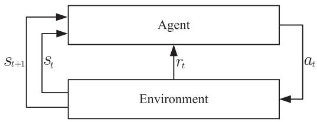

<details>
<summary>flowchart</summary>

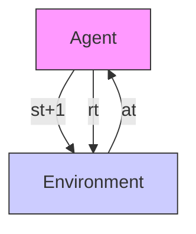
</details>

Fig. 2. The framework of the DRL algorithm.

Analyzing problem (21), we can identify that it is a mixedinteger nonlinear programming (MINLP) problem, which is difficult to solve with most conventional methods. Convex optimization solutions suffer a high computation complexity and cannot adapt to vehicular networks’ rapidly changing environment, hindering adaptive task offloading. To tackle this challenge, this paper proposes to use a DRL-based joint scheduling task offloading and resource allocation algorithm. In particular, to overcome the limitations in the previous works, which normally required relaxation or discretization of variables, we introduce a parameterized action space for handling mixed discrete-continuous variables.

# IV. REINFORCEMENT LEARNING BASED APPROACH

In this section, we will convert the formulated optimization problem to an MDP and propose a new DRL based solution. $\mathbf { A n M D P }$ is characterized by tuple $( \mathbb { S } , \mathbb { A } , P , r )$ , where S denotes a set of system states or a state space, A represents a set of actions, and $r ( s \mid a )$ is the reward function dependent on both state and action, which can be simplified to $r ( s )$ if only the state influences the reward. $P ( s ^ { \prime } \mid s , a )$ is a state transition function, indicating the probability of transferring to state $s ^ { \prime }$ after action a is executed in state s. However, the state transition function is often unknown due to the lack of prior environmental knowledge, complicating the process to find an optimal solution via MDP dynamic programming. Therefore, DRL is applied to address the formulated optimization problem. Fig. 2 illustrates the fundamental structure of the DRL approach, where the agent aims to maximize long-term cumulative reward. Initially, the agent observes state $s _ { t }$ from the environment and selects action $a _ { t }$ based on the current policy. Following the action, the system transitions to state $s _ { t + 1 }$ , returning reward $r _ { t }$ to the agent, which then updates its policy based on this feedback, ultimately converging to the optimal policy.

# A. State, Action and Reward of DRL Algorithm

To better illustrate the proposed approach, in this subsection, we will define the state space, action space, and reward for the DRL algorithm based on the proposed system model.

1) State Space: The state space should be constructed first. For task offloading decision and resource allocation, it is crucial to know servers’ computation resource distribution, input data sizes of all computation tasks, and changing location information of vehicles. Therefore, at time slot $t ,$ system state $s _ { t } \in \mathbb S$ consists of five components as

$$
s _ {t} = \left\{\mathbf {F} _ {m} (t), \mathbf {F} _ {i} ^ {l} (t), \mathbf {X} (t), \mathbf {V} (t), \mathbf {D} (t) \right\}. \tag {22}
$$

Detail explanations for the state vector $s _ { t }$ are given as follows.

- $\mathbf F _ { m } ( t ) = [ f _ { 1 } ( t ) , f _ { 2 } ( t ) , \hdots , f _ { M } ( t ) ]$ signifies the current distribution of computing resources across different edge nodes.   
- $\mathbf { F } _ { i } ^ { l } ( t ) = [ f _ { 1 } ^ { l } ( t ) , f _ { 2 } ^ { l } ( t ) , \ldots , f _ { N } ^ { l } ( t ) ]$ represents available computational resources for each vehicle at the current time.   
- $\mathbf X ( t )$ and $\mathbf { V } ( t )$ depict the mobility of all vehicles, with $\mathbf X ( t )$ and $\mathbf { V } ( t )$ denoting vehicles’ positions and velocities at time slot t, respectively. This information indicates the urgency of computation tasks and the selection of edge nodes for offloading. Specifically, the state vectors detailing vehicles’ location information are defined as

$$
\mathbf {X} (t) = [ x _ {1} (t), x _ {2} (t), \dots , x _ {i} (t) \dots , x _ {N} (t) ], \tag {23}
$$

$$
\mathbf {V} (t) = [ v _ {1} (t), v _ {2} (t), \dots , v _ {i} (t) \dots , v _ {N} (t) ]. \tag {24}
$$

\- $\mathbf { D } _ { i } ( t ) = [ d _ { 1 } ( t ) , d _ { 2 } ( t ) , \ldots , d _ { i } ( t ) \cdot \cdot \cdot , d _ { N } ( t ) ]$ specifies input data sizes for all tasks awaiting for execution. The input data sizes of tasks directly impact decision-making on where and how to offload the tasks, affecting both transmission times and computation resource requirements.

Note that vehicle i cannot observe the entire state space. The observation space of vehicle i is defined as $o _ { i } ( t ) =$ $\{ \mathbf { F } _ { m } ( t ) , f _ { i } ^ { l } ( t ) , x _ { i } ( t ) , v _ { i } ( t ) , \mathbf { D } ( t ) \}$ . Vehicle i can obtain information about input data sizes of other vehicles from interconnected RSUs. The observation space of a vehicle corresponds to the input state of the corresponding agent.

2) Action Space: Upon observing state $o _ { i } ( t )$ , vehicle i needs to make an offloading decision. The dimension of action vector varies according to offloading decision, which can can be expressed as

$$
\mathbf {a} _ {i} (t) = \left\{ \begin{array}{l l} {[ a _ {i} (t) ],} & {a _ {i} (t) = 0,} \\ {[ a _ {i} (t), f _ {i, m} ^ {E} (t), p _ {i} (t) ],} & {a _ {i} (t) \in \{1, 2, \dots , M \},} \\ {[ a _ {i} (t), f _ {i} ^ {c} (t), p _ {i} (t) ],} & {a _ {i} (t) = M + 1,} \end{array} \right. \tag {25}
$$

where $a _ { i } ( t )$ denotes offloading decision for vehicle i. As mentioned earlier, $a _ { i } ( t ) = 0$ implies local execution, $a _ { i } ( t ) >$ 0 indicates offloading to a server, defined within the space $\mathcal { A } = \{ 0 , 1 , \ldots , M + 1 \}$ } and spanning over $M + 2$ dimensions, $f _ { i , m } ^ { E } ( t )$ and $f _ { i } ^ { c } ( t )$ represent the resources that MEC server m and cloud server allocate to vehicle i, respectively, and $p _ { i } ( t )$ denotes vehicle’s transmit power.

To manage heterogeneous action vectors, a parameterized action space with a hierarchical structure is introduced [45]. Vehicles initially determine their discrete action $a _ { i } ( t )$ and then select the associated continuous parameters $y _ { a _ { i } } ( t )$ , with $y _ { a _ { i } } ( t )$ being a vector of variable dimensions. Define $\mathcal { V }$ as a continuous set for all $a _ { i } ( t ) \in { \mathcal { A } }$ . Then, discrete-continuous hybrid action space A can be expressed as

$$
\mathbb {A} = \left\{\left(a _ {i} (t), y _ {a _ {i}} (t)\right) \mid a _ {i} (t) \in \mathcal {A}, y _ {a _ {i}} (t) \in \mathcal {Y} \right\}. \tag {26}
$$

3) Reward: Agents adjust their policy based on the rewards they have received. In alignment with the objective function of (21), the reward at time slot t is defined as

$$
r _ {t} = \left\{ \begin{array}{l l} U _ {i} (t), & T _ {i} (t) \leq T _ {i} ^ {\max} (t), \\ R _ {p} + w _ {2} E _ {i} (t) - w _ {3} \epsilon_ {i} (t), & \text { otherwise }, \end{array} \right. \tag {27}
$$

where $R _ { p }$ denotes a penalty introduced to ensure that the agent’s actions comply with constraint (21d). Furthermore, a long-term cumulative discounted reward can be expressed as

$$
R _ {t} = r _ {t} + \gamma r _ {t + 1} + \gamma^ {2} r _ {t + 2} + \dots = \sum_ {j = 0} ^ {\infty} \gamma^ {j} r _ {t + j}, \tag {28}
$$

where $\gamma$ is a weight ranging between 0 and 1.

# B. Parameterized DRL Based Strategy

This subsection outlines a methodology to solve the MINLP problem in (21) utilizing DRL. Initially, we explored the most prevalent DQN and DDPG schemes in current literatures. Subsequently, a scheme based on parameterized deep Q-network (P-DQN) was proposed, where P-DQN merges the features of both DQN and DDPG to achieve more efficient management for hybrid action spaces. Note that the proposed schemes are implemented in each vehicle, and thus in the text followed, to simply the expressions of mathematical symbols, we will omit the subscript i (the index of vehicles) and put time slot number t at the subscript position in all relevant mathematical symbols, $\mathrm { e . g . } , a _ { i } ( t )$ and $y _ { a _ { i } } ( t )$ are simplified to $a _ { t }$ and $y _ { a _ { t } }$ , respectively.

1) DQN Based Solution: DQN is a value-based reinforcement learning algorithm, which uses Q-function to describe a long-term cumulative discounted reward for an agent’s action $a _ { t }$ in state $s _ { t } .$ . The Q-function, first defined in Bellman equation, can be expressed as

$$
\begin{array}{l} Q (s, a) = \mathbb {E} [ R _ {t} | s _ {t} = s, a _ {t} = a ] \\ = \mathbb {E} \left[ \sum_ {j = 0} ^ {\infty} \gamma^ {j} r _ {t + j} \mid s _ {t} = s, a _ {t} = a \right] \\ = \mathbb {E} \left[ r _ {t} + \gamma \max _ {a _ {t + 1} \in \mathcal {A}} Q (s _ {t + 1}, a _ {t + 1}) | s _ {t} = s, a _ {t} = a \right]. \tag {29} \\ \end{array}
$$

DQN utilizes a neural network to approximate the Q-function instead of calculating the Q-value directly for each state-action pair. This approximation, i.e., $Q ( s , a ; \omega ) \approx Q ( s , a )$ , denotes ω as network’s weights. In addition, DQN calculates target temporal difference (TD) error using a network with weights $\omega _ { \mathrm { t g } } ,$ , and it updates its parameters via a least square loss function as

$$
L _ {t} (\omega) = \left\{Q (s _ {t}, a _ {t}; \omega) - [ r _ {t} + \gamma \max _ {a _ {t + 1} \in \mathcal {A}} Q (s _ {t + 1}, a _ {t + 1}; \omega_ {\mathrm{tg}}) ] \right\} ^ {2}. \tag {30}
$$

DQN synchronizes the target network parameters with the Q-network’s parameters at predefined intervals, setting $\omega _ { \mathrm { t g } } = \omega$ . Upon estimating $Q ^ { * }$ , DQN adopts a greedy policy, always selecting an action with the maximum Q-value. However, in hybrid action spaces, DQN can approximate continuous parameter set

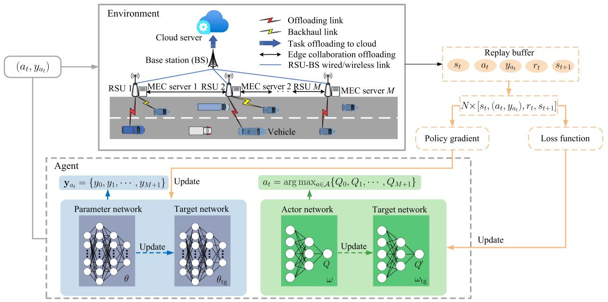

<details>
<summary>flowchart</summary>

```mermaid
graph TD
    A["(a_t, y_{a_t})"] --> B["Environment"]
    B --> C["Cloud server"]
    C --> D["Base station (BS)"]
    D --> E["RSU 1"]
    D --> F["RSU 2"]
    D --> G["RSU M"]
    E --> H["Vehicle"]
    F --> I["MEC server 1"]
    F --> J["MEC server 2"]
    F --> K["MEC server M"]
    H --> L["Replay buffer"]
    I --> L
    J --> L
    K --> L
    L --> M["N×[s_t, (a_t, y_{a_t}), r_t, s_{t+1}"]]
    M --> N["Policy gradient"]
    M --> O["Loss function"]
    P["Agent"] --> Q["y_{a_t} = {y_0, y_1, ..., y_{M+1}"]
    Q --> R["Parameter network"]
    Q --> S["Target network"]
    T["Update"] --> U["Action network"]
    T --> V["Target network"]
    U --> W["ω_tg"]
    V --> X["ω_{tg}"]
    Y["Update"] --> Z["a_t = arg max_{a∈A} {Q_0, Q_1, ..., Q_{M+1}"]
    Z --> AA["Action network"]
    Z --> AB["Target network"]
```
</details>

Fig. 3. The architecture of the P-DQN based solution for vehicular edge computing.

Y only with a discrete subset, which often needs numerous discrete actions to maintain the accuracy of solution.

2) DDPG Based Solution: Based on an actor-critic architecture, DDPG employs two neural networks to approximate deterministic policy function $\mu ( s ; \theta )$ and value function $Q ( s , a ; \omega )$ . To tackle the challenge inherent in deterministic policy algorithms, action noise is introduced during training. The actor network inputs state $s _ { t }$ and outputs action $a _ { t } = \mu ( s _ { t } ; \theta )$ , corresponding to the current policy. Conversely, critic network evaluates action values. This requires to meet the following condition:

$$
\begin{array}{l} Q \left(s _ {t}, \mu \left(s _ {t}; \theta\right); \omega\right) \approx r \left(s _ {t}, a _ {t}\right) \\ + \gamma Q (s _ {t + 1}, \mu (s _ {t + 1}; \theta_ {\mathrm{tg}}); \omega_ {\mathrm{tg}}), \tag {31} \\ \end{array}
$$

where $\omega _ { \mathrm { t g } }$ and $\theta _ { \mathrm { t g } }$ represent the weights of target networks, which are utilized to calculate TD loss for updating critic network and policy gradient for updating actor network. The definition of the loss function is the same as (30) and the policy gradient can be computed as [46]

$$
\nabla_ {\theta} J = \mathbb {E} \left[ \left. \nabla_ {\theta} \mu_ {\theta} (s) \nabla_ {a} Q (s, a; \omega) \right| _ {a = \mu_ {\theta} (s)} \right], \tag {32}
$$

whose explanation can be found in [46], and we will not repeat it here.

DDPG updates the weights of target networks using a soft updating algorithm as

$$
\theta_ {\mathrm{tg}} = \tau_ {\mathrm{p}} \theta + (1 - \tau_ {\mathrm{p}}) \theta_ {\mathrm{tg}}, \tag {33}
$$

$$
\omega_ {\mathrm{tg}} = \tau_ {\mathrm{a}} \omega + (1 - \tau_ {\mathrm{a}}) \omega_ {\mathrm{tg}}, \tag {34}
$$

where $\tau _ { \mathrm { p } }$ and $\tau _ { \mathrm { a } }$ are scale factors used to update $\theta _ { \mathrm { t g } }$ and $\omega _ { \mathrm { t g } } .$ respectively, with their values ranging in (0,1).

Since the deterministic policy function $\mu ( s ; \theta )$ in DDPG produces continuous values, it cannot generate actions directly in

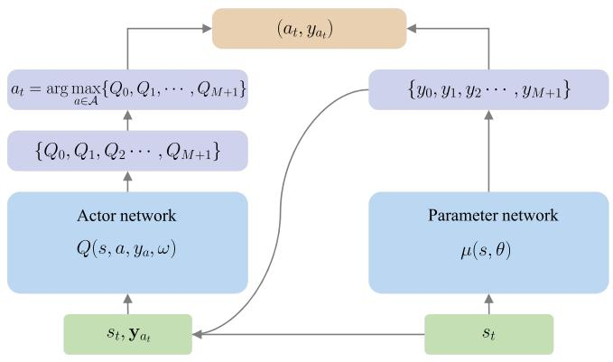

<details>
<summary>flowchart</summary>

```mermaid
graph TD
    A["(a_t, y_{a_t})"] --> B["{y_0, y_1, y_2, ..., y_{M+1}"]
    A --> C["{Q_0, Q_1, Q_2, ..., Q_{M+1}"]
    B --> D["Actor network Q(s, a, y_a, ω)"]
    C --> D
    D --> E["s_t, y_{a_t}"]
    E --> F["Parameter network μ(s, θ)"]
    F --> G["s_t"]
    G --> H["Actor network Q(s, a, y_a, ω)"]
    H --> I["a_t = arg max_{a∈A} {Q_0, Q_1, ..., Q_{M+1}"]
    I --> J["{Q_0, Q_1, Q_2, ..., Q_{M+1}"]
    J --> K["Actor network Q(s, a, y_a, ω)"]
    K --> L["a_t = arg max_{a∈A} {Q_0, Q_1, ..., Q_{M+1}"]
    L --> M["{Q_0, Q_1, Q_2, ..., Q_{M+1}"]
    M --> N["Actor network Q(s, a, y_a, ω)"]
    N --> O["a_t = arg max_{a∈A} {Q_0, Q_1, ..., Q_{M+1}"]
    O --> P["{Q_0, Q_1, Q_2, ..., Q_{M+1}"]
    P --> Q["Actor network Q(s, a, y_a, ω)"]
    Q --> R["a_t = arg max_{a∈A} {Q_0, Q_1, ..., Q_{M+1}"]
    R --> S["{Q_0, Q_1, Q_2, ..., Q_{M+1}"]
    S --> T["Actor network Q(s, a, y_a, ω)"]
    T --> U["a_t = arg max_{a∈A} {Q_0, Q_1, ..., Q_{M+1}"]
    U --> V["{Q_0, Q_1, Q_2, ..., Q_{M+1}"]
    V --> W["Actor network Q(s, a, y_a, ω)"]
    W --> X["a_t = arg max_{a∈A} {Q_0, Q_1, ..., Q_{M+1}"]
    X --> Y["{Q_0, Q_1, Q_2, ..., Q_{M+1}"]
    Y --> Z["Actor network Q(s, a, y_a, ω)"]
    Z --> AA["a_t = arg max_{a∈A} {Q_0, Q_1, ..., Q_{M+1}"]
    AA --> AB["{Q_0, Q_1, Q_2, ..., Q_{M+1}"]
    AB --> AC["Actor network Q(s, a, y_a, ω)"]
    AC --> AD["a_t = arg max_{a∈A} {Q_0, Q_1, ..., Q_{M+1}"]
    AD --> AE["{Q_0, Q_1, Q_2, ..., Q_{M+1}"]
    AE --> AF["Actor network Q(s, a, y_a, ω)"]
    AF --> AG["a_t = arg max_{a∈A} {Q_0, Q_1, ..., Q_{M+1}"]
    AG --> AH["{Q_0, Q_1, Q_2, ..., Q_{M+1}"]
    AH --> AI["Actor network Q(s, a, y_a, ω)"]
    AI --> AJ["a_t = arg max_{a∈A} {Q_0, Q_1, ..., Q_{M+1}"]
    AJ --> AK["{Q_0, Q_1, Q_2, ..., Q_{M+1}"]
    AK --> AL["Actor network Q(s, a, y_a, ω)"]
    AL --> AM["a_t = arg max_{a∈A} {Q_0, Q_1, ..., Q_{M+1}"]
    AM --> AN["{Q_0, Q_1, Q_2, ..., Q_{M+1}"]
    AN --> AO["Actor network Q(s, a, y_a, ω)"]
    AO --> AP["a_t = arg max_{a∈A} {Q_0, Q_1, ..., Q_{M+1}"]
    AP --> AQ["{Q_0, Q_1, Q_2, ..., Q_{M+1}"]
    AQ --> AR["Actor network Q(s, a, y_a, ω)"]
    AR --> AS["a_t = arg max_{a∈A} {Q_0, Q_1, ..., Q_{M+1}"]
    AS --> AT["{Q_0, Q_1, Q_2, ..., Q_{M+1}"]
    AT --> AU["Actor network Q(s, a, y_a, ω)"]
    AU --> AV["a_t = arg max_{a∈A} {Q_0, Q_1, ..., Q_{M+1}"]
    AV --> AW["{Q_0, Q_1, Q_2, ..., Q_{M+1}"]
    AW --> AX["Actor network Q(s, a, y_a, ω)"]
    AX --> AY["a_t = arg max_{a∈A} {Q_0, Q_1, ..., Q_{M+1}"]
    AY --> AZ["{Q_0, Q_1, Q_2, ..., Q_{M+1}"]
    AZ --> BA["Actor network Q(s, a, y_a, ω)"]
    BA --> BB["a_t = arg max_{a∈A} {Q_0, Q_1, ..., Q_{M+1}"]
    BB --> BC["{Q_0, Q_1, Q_2, ..., Q_{M+1}"]
    BC --> BD["Actor network Q(s, a, y_a, ω)"]
    BD --> BE["a_t = arg max_{a∈A} {Q_0, Q_1, ..., Q_{M+1}"]
    BE --> BF["{Q_0, Q_1, Q_2, ..., Q_{M+1}"]
    BF --> BG["Actor network Q(s, a, y_a, ω)"]
    BG --> BH["a_t = arg max_{a∈A} {Q_0, Q_1, ..., Q_{M+1}}<br>    BH --> BI[{Q_0, Q_1, Q_2, ..., Q_{M+1}}"]
    AI --> BJ["Parameter network μ(s, θ)"]
    BJ --> BK["Parameter network μ(t)"]
```
</details>

Fig. 4. The network structure of P-DQN.

a discrete-continuous hybrid action space. Therefore, the action space must be modeled as a continuous set. In [47], the authors defined an approximate action space. In the proposed scheme, DDPG uses an actor network to simultaneously output weight values for discrete actions and continuous actions. Subsequently, a ε-greedy strategy selects discrete actions by choosing the highest-weight action with probability $1 - \varepsilon .$ , where ε is a small value to enable an exploration through occasional random action selection. After selecting a discrete action, the corresponding continuous action is chosen based on that discrete action’s parameters. This approach complicates the structure of action space, hindering agent’s convergence to the optimal policy.

3) P-DQN Based Solution: This paper presents a vehicular network task offloading and resource allocation algorithm utilizing P-DQN, and its architecture is depicted in Fig. 3. P-DQN is a DRL algorithm tailored for discrete-continuous hybrid action space, and is capable of efficiently dealing with the formulated optimization problem (21). Fig. 4 demonstrates a basic network structure of P-DQN, which combines the features of both DQN and DDPG. Initially, deterministic policy network $\mu ( s , \theta )$ produces all continuous actions based on the current state $s _ { t } .$ Subsequently, state $s _ { t } ,$ together with the values of continuous actions, is fed into the value network $Q ( s , a , y _ { a } , \omega )$ . The algorithm subsequently selects a discrete action corresponding to the highest Q-value. Finally, the selected discrete action, in conjunction with its corresponding continuous parameters, constitutes an action vector.

In the P-DQN algorithm, Q-network is utilized to approximate action-value function based on Bellman equation, which is expressed in a hybrid action space as follows

$$
\begin{array}{l} Q \left(s _ {t}, a _ {t}, y _ {a _ {t}}, \omega\right) \approx Q \left(s _ {t}, a _ {t}, y _ {a _ {t}}\right) = \\ \underset {r _ {t}, s _ {t + 1}} {\mathbb {E}} \left[ r _ {t} + \gamma \max _ {a \in \mathcal {A}} \sup _ {y _ {a} \in \mathcal {Y}} Q (s _ {t + 1}, a, y _ {a}) \mid s _ {t}, (a _ {t}, y _ {a _ {t}}) \right] \\ = \underset {r _ {t}, s _ {t + 1}} {\mathbb {E}} \left[ r _ {t} + \gamma \max _ {a \in \mathcal {A}} Q \left(s _ {t + 1}, a, y _ {a} ^ {Q} (s _ {t + 1})\right) \mid s _ {t} \right]. \tag {35} \\ \end{array}
$$

In (35), arg $\textstyle \operatorname* { s u p } _ { y _ { a } \in \mathcal { Y } } Q ( s , a , y _ { a } )$ is represented by function $y _ { a } ^ { Q } : \mathbb { S }  \mathcal { V }$ . We approximate $y _ { a } ^ { Q } ( s )$ using a deterministic policy network $\mu ( s ; \theta )$ . Therefore, while ω is fixed, we seek to find parameter θ that satisfies the following equation:

$$
Q (s, a, \mu (s; \theta); \omega) \approx \sup _ {y _ {a} \in \mathcal {Y}} Q (s, a, y _ {a}; \omega). \tag {36}
$$

Similar to DDPG, P-DQN adopts an experience replay mechanism and employs target networks to compute the TD target. Network weights ω are optimized by minimizing TD loss. The loss functions pertaining to ω and θ are specified respectively in the sequel.

$$
L _ {t} (\omega) = \frac {1}{2} \left[ Q (s _ {t}, a _ {t}, y _ {a _ {t}}; \omega) - T D \right] ^ {2}, \tag {37}
$$

$$
L _ {t} (\theta) = - \sum_ {a = 0} ^ {M + 1} Q \left[ s _ {t}, a, \mu (s; \theta); \omega_ {\mathrm{tg}} \right], \tag {38}
$$

where T D is defined as a n-step TD target, which can be expressed as

$$
T D = \sum_ {j = 0} ^ {n - 1} \gamma^ {j} r _ {t + j} + \gamma^ {n} \max _ {a \in \mathcal {A}} Q \left[ s _ {t + n}, a, \mu (s _ {t + n}; \theta_ {\mathrm{tg}}); \omega_ {\mathrm{tg}} \right]. \tag {39}
$$

Algorithm 1 illustrates the proposed P-DQN based scheme. At the beginning of each time slot, each vehicle generates computation task demands with a specified probability. The base station collects the tasks and location information of all vehicles and aggregates these data into environmental state information, which are subsequently broadcast. Each agent makes its decisions based on the environment’s state. In addition, transitions are saved in an experience replay buffer. Agents update their network weights using data from the replay buffer, eventually converging on the optimal policy. Following the training phase and subsequent deployment, DRL-based algorithm can respond swiftly to the demands based on observation of $s _ { t } ,$ facilitating dynamic and flexible task offloading and resource allocation in vehicular edge computing scenarios.

Algorithm 1: P-DQN Based Task Offloading and Resource Allocation Strategy.   
Input: State space S; Action space A.
Output: Optimal actor network weights $\omega^{*}$ ; Optimal parameter network weights $\theta^{*}$ .
1: Initialize network weights: $\omega, \theta$ ; target network weights $\omega_{tg}, \theta_{tg}$ ; replay buffer $D_i, (i = 1, 2, \ldots, N)$ ; mini-batch size of transitions $N_{batch}$ .
2: while episodes < $EP_{max}$ do
3: Initialize a set of vehicles N; a set of edge nodes M and coverage range of RSU R; computation capacity of MEC server F; locations and velocities of vehicles.
4: for $t = 1, 2, \ldots, T$ do
5: for agent $i = 1, 2, \ldots, N$ do
6: Observe the local state $o_i(t)$ from the system state $s_t$ .
7: Determining resource allocation scheme $(y_0(t), y_1(t), \ldots, y_{M+1}(t))$ .
8: Select offload decision $a_i(t) \in \mathcal{A}$ according to $\varepsilon - greedy$ policy.
9: Choose action $(a_i(t), y_{a_i}(t))$ .
10: end for
11: All agents execute actions, interact with environment, and obtain a reward $r_t$ and that in next state $s_{t+1}$ .
12: for agent $i = 1, 2, \ldots, N$ do
13: Store transitions $(o_i(t), (a_i(t), y_{a_i}(t)), r_t, o_i(t+1))$ in replay buffer $D_i$ .
14: if the number of transitions in replay buffer is greater than $N_{batch}$ , then
15: Randomly sample mini-batch from $D_i$ .
16: Based on the loss functions defined in (37) and (38), compute stochastic gradients $\nabla_\omega L_t(\omega)$ and $\nabla_\theta L_t(\theta)$ using sampled data.
17: Update weights by $\omega_{t+1} \leftarrow \omega_t - \alpha_t \nabla_\omega L_t(\omega)$ and $\theta_{t+1} \leftarrow \theta_t - \beta_t \nabla_\omega L_t(\theta)$ 18: end if
19: end for
20: end for
21: episodes = episodes + 1
22: end while

# V. PERFORMANCE EVALUATION

In this section, simulations are performed to evaluate the effectiveness of the proposed P-DQN-based task offloading and resource allocation algorithm. The simulation scenario is established based on the network model as shown in Fig. 1. We aim to evaluate the P-DQN algorithm’s performance across training and inference phases with a particular focus on its convergence properties. First, let us take a look at the training performance under various parameter configurations to determine the optimal setting. Then, we compare the proposed scheme with some well-known benchmark algorithms on training convergence performance and total rewards. Major parameters used in the simulations are listed in Table II.

TABLE II MAJOR PARAMETERS USED IN SIMULATIONS 

<table><tr><td>Parameter</td><td>Value</td><td>Description</td></tr><tr><td> $\Delta t$ </td><td>1 s</td><td>Duration of a time slot</td></tr><tr><td> $B$ </td><td>30 MHz</td><td>Uplink bandwidth for RSU</td></tr><tr><td> $PL$ </td><td>128.1+37.6 lg  $\Delta d$ </td><td>Path loss model ( $\Delta d$  is the distance from Tx to Rx)</td></tr><tr><td> $\sigma^{2}$ </td><td>-97 dBm</td><td>Background noise power</td></tr><tr><td> $L$ </td><td>1,000 m</td><td>The length of road segment</td></tr><tr><td> $R$ </td><td>250 m</td><td>Coverage range of each RSU</td></tr><tr><td> $P$ </td><td>0.5</td><td>Probability that a vehicle generates a task at each time slot</td></tr><tr><td> $d_{i}(t)$ </td><td>[8,000, 12,000] bit</td><td>Input data size of a task</td></tr><tr><td> $\lambda_{i}(t)$ </td><td> $10^{5}$  cycles/bit</td><td>Service coefficient</td></tr><tr><td> $t_{i}^{finish}(t)$ </td><td>[0.9, 1.0] s</td><td>Tasks&#x27; maximum delay</td></tr><tr><td> $D_{size}$ </td><td>20,000</td><td>Experience replay buffer size</td></tr><tr><td> $N_{batch}$ </td><td>128</td><td>Mini-batch size</td></tr><tr><td> $lra$ </td><td> $10^{-5}$ </td><td>Learning rate of actor network</td></tr><tr><td> $lrp$ </td><td> $10^{-6}$ </td><td>Learning rate of parameter network</td></tr><tr><td> $\gamma$ </td><td>0.9</td><td>Discount factor</td></tr><tr><td> $\varepsilon_{i}/\varepsilon_{f}$ </td><td>1.0/0.001</td><td>Initial/Final parameter of the  $\varepsilon$ -greedy</td></tr><tr><td> $F$ </td><td>10 GHz</td><td>Computation capability of MEC server</td></tr><tr><td> $F^{c}$ </td><td>10 GHz</td><td>Computation capability of cloud server</td></tr><tr><td> $\kappa$ </td><td> $10^{-26}$ </td><td>Energy consumption parameter</td></tr><tr><td> $\rho^{E}$ </td><td>0.15 $/GHz</td><td>Price of MEC severs&#x27; resource</td></tr><tr><td> $\rho^{c}$ </td><td>0.3 $/GHz</td><td>Price of cloud server&#x27;s resource</td></tr><tr><td> $P_{max}$ </td><td>2 W</td><td>Maximum vehicle transmit power</td></tr><tr><td> $P_{min}$ </td><td>1 W</td><td>Minimum vehicle transmit power</td></tr><tr><td> $\tau_{a}/\tau_{p}$ </td><td>0.1/0.001</td><td>Soft update parameter for the target actor network/parameter network</td></tr><tr><td> $w_{1}, w_{2}, w_{3}$ </td><td>1/3</td><td>Weights of delay, energy consumption, and cost</td></tr></table>

# A. Parameter Setting

Simulations were conducted based on Python 3.11 and PyTorch 2.0. Simulated network scenario comprises a 1,000-meter one-way road with 20 moving vehicles, each of which is equipped with a computation capability of 1 GHz and can adjust transmit power ranging from 1 to 2 W. Four RSUs are deployed evenly along the road, and each of them is equipped with a MEC server of 10 GHz computation capability. Total uplink bandwidth of each RSU is 30 MHz. At the beginning of each time slot, there is a probability $( P = 0 . 5 )$ that a vehicle will initiate a computing task. Input data sizes of these tasks are uniformly distributed from 8,000 to 12,000 bits, and processed at a service coefficient of $\lambda _ { i } ( t ) = 1 0 0$ kilocycles/b, with the maximum delay per task selected from the range of [0.9, 1] second. With consideration to both the convergence speed and training stability, the experience replay buffer size for P-DQN algorithm is set to 20,000, with a mini-batch size of 128, and the optimizer used is Adam. The soft update parameters for the target actor and target parameter networks are set to $\tau _ { \mathrm { a } } = 0 . 1$ and $\tau _ { \mathrm { p } } = 0 . 0 0 1$ , respectively. The values of $w _ { 1 } , w _ { 2 }$ and w3 are all set to $1 / 3 { \mathrm { ; } }$ , indicating that delay, energy consumption, and cost are assigned with equal weights. To ensure stronger exploration during early stages of training and gradually shift toward a more greedy strategy, we implemented an annealing schedule for ε in

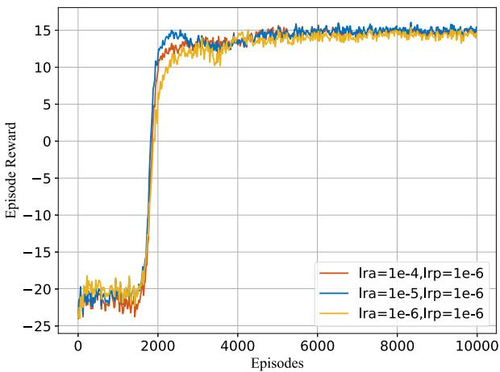

<details>
<summary>line</summary>

| Episodes | Ira=1e-4,Irp=1e-6 | Ira=1e-5,Irp=1e-6 | Ira=1e-6,Irp=1e-6 |
| -------- | ----------------- | ----------------- | ----------------- |
| 0        | -23               | -22               | -22               |
| 1000     | -18               | -17               | -17               |
| 2000     | 12                | 13                | 12                |
| 3000     | 14                | 14                | 14                |
| 4000     | 14                | 14                | 14                |
| 5000     | 14                | 14                | 14                |
| 6000     | 14                | 14                | 14                |
| 7000     | 14                | 14                | 14                |
| 8000     | 14                | 14                | 14                |
| 9000     | 14                | 14                | 14                |
| 10000    | 14                | 14                | 14                |
</details>

Fig. 5. Episode reward versus episodes under different learning rates of the actor network.

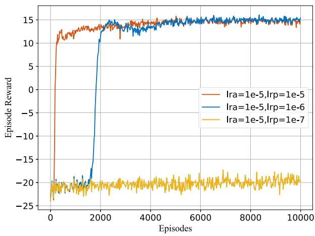

<details>
<summary>line</summary>

| Episodes | Ira=1e-5,Irp=1e-5 | Ira=1e-5,Irp=1e-6 | Ira=1e-5,Irp=1e-7 |
| -------- | ----------------- | ----------------- | ----------------- |
| 0        | -20               | -20               | -20               |
| 2000     | 14                | 14                | -20               |
| 4000     | 15                | 15                | -20               |
| 6000     | 15                | 15                | -20               |
| 8000     | 15                | 15                | -20               |
| 10000    | 15                | 15                | -20               |
</details>

Fig. 6. Episode reward versus episodes under different learning rates of the parameter network.

the P-DQN algorithm. At the beginning of training, ε is set to 1 and decreases gradually to 0.001 as the number of episodes increases. The discount factor γ, which reflects the importance of future rewards in the current decision-making, is set to 0.9. The learning rate settings will be elaborated in the next subsection.

# B. Convergence Performance

The effects of learning rates on convergence efficiency of the proposed P-DQN-based algorithm are evaluated first. The simulation results are shown in Figs. 5 and 6, where lra and lrp represent the learning rates for the actor and parameter networks, respectively. The results shown in Fig. 5 highlight how a varying lra value influences the algorithm’s reward outputs with an increasing number of episodes. The learning rate of the parameter network is fixed at 10−6, while the actor network’s learning rate lra is varying. Optimal performance, which is characterized by enhanced convergence and maximum reward, is achieved at a learning rate of $1 0 ^ { - 5 }$ for the actor network. Similarly, Fig. 6 depicts the trajectory of total rewards varying with the number of training episodes, where lra is fixed at $1 0 ^ { - 5 }$ and $l r p$ changes amongst $1 0 ^ { - 5 } , 1 0 ^ { - 6 } .$ , and $1 0 ^ { - 7 }$ , respectively. Although the learning rate lrp of $1 0 ^ { - 5 }$ facilitates a quicker convergence, a lower rate of $1 0 ^ { - 6 }$ results in a higher ultimate reward, suggesting that elevating learning rate may induce a premature convergence at a local optimum. Conversely, an excessively low rate of $1 0 ^ { - 7 }$ impedes training process significantly, thereby weakening the algorithm’s capability to converge timely.

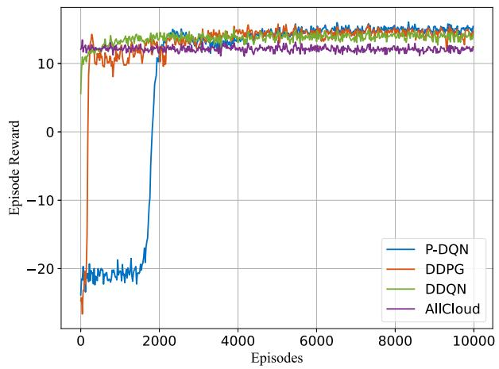

<details>
<summary>line</summary>

| Episodes | P-DQN | DDPG | DDQN | AllCloud |
| -------- | ----- | ---- | ---- | -------- |
| 0        | -25   | -25  | 10   | 10       |
| 2000     | 10    | 10   | 10   | 10       |
| 4000     | 10    | 10   | 10   | 10       |
| 6000     | 10    | 10   | 10   | 10       |
| 8000     | 10    | 10   | 10   | 10       |
| 10000    | 10    | 10   | 10   | 10       |
</details>

Fig. 7. Episode reward versus episodes with different algorithms.

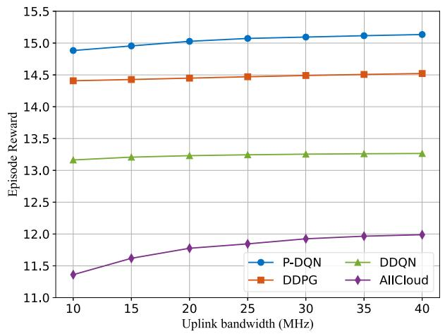

<details>
<summary>line</summary>

| Uplink bandwidth (MHz) | P-DQN  | DDPG   | DDQN   | AICloud |
| ---------------------- | ------ | ------ | ------ | ------- |
| 10                     | 14.9   | 14.4   | 13.2   | 11.3    |
| 15                     | 14.95  | 14.4   | 13.25  | 11.6    |
| 20                     | 15.0   | 14.45  | 13.3   | 11.8    |
| 25                     | 15.05  | 14.5   | 13.3   | 11.9    |
| 30                     | 15.1   | 14.5   | 13.3   | 12.0    |
| 35                     | 15.1   | 14.5   | 13.3   | 12.0    |
| 40                     | 15.15  | 14.5   | 13.3   | 12.0    |
</details>

Fig. 8. Episode reward versus total uplink bandwidth of each RSU (B).   
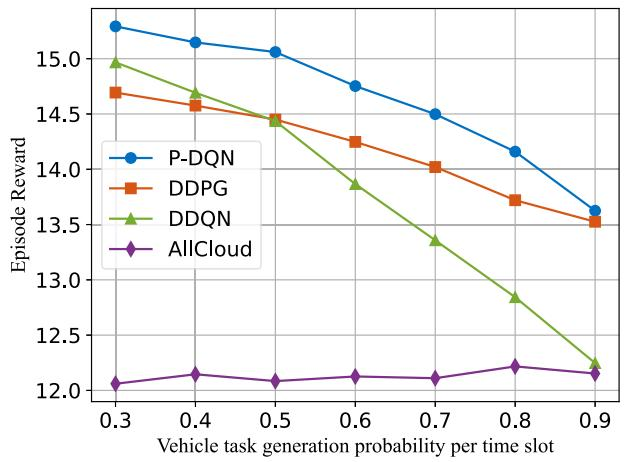

<details>
<summary>line</summary>

| Vehicle task generation probability per time slot | P-DQN | DDPG | DDQN | AllCloud |
| --- | --- | --- | --- | --- |
| 0.3 | 15.2 | 14.7 | 14.9 | 12.0 |
| 0.4 | 15.1 | 14.6 | 14.7 | 12.1 |
| 0.5 | 15.0 | 14.5 | 14.5 | 12.0 |
| 0.6 | 14.8 | 14.3 | 13.9 | 12.1 |
| 0.7 | 14.5 | 14.0 | 13.4 | 12.0 |
| 0.8 | 14.2 | 13.7 | 12.9 | 12.2 |
| 0.9 | 13.6 | 13.5 | 12.2 | 12.1 |
</details>

Fig. 9. Episode reward versus each vehicle’s task generation probability.

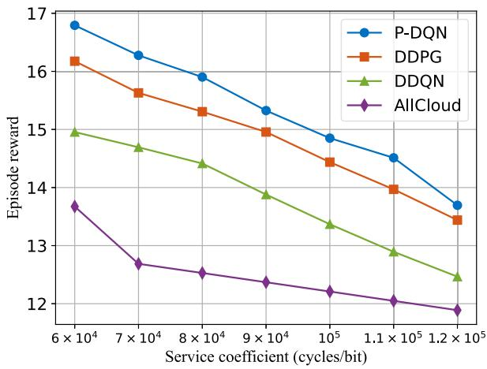

<details>
<summary>line</summary>

| Service coefficient (cycles/bit) | P-DQN | DDPG | DDQN | AllCloud |
| --- | --- | --- | --- | --- |
| 6 × 10⁴ | 16.8 | 16.2 | 15.0 | 13.7 |
| 7 × 10⁴ | 16.3 | 15.7 | 14.7 | 12.7 |
| 8 × 10⁴ | 15.9 | 15.3 | 14.4 | 12.5 |
| 9 × 10⁴ | 15.3 | 15.0 | 13.9 | 12.4 |
| 10⁵ | 14.9 | 14.5 | 13.4 | 12.2 |
| 1.1 × 10⁵ | 14.5 | 14.0 | 12.9 | 12.0 |
| 1.2 × 10⁵ | 13.7 | 13.4 | 12.5 | 11.9 |
</details>

Fig. 10. Episode reward versus service coefficient $\lambda _ { i } ( t )$ .

Based on these observations, we fix the learning rates for the actor and parameter networks at $1 0 ^ { - 5 }$ and $1 0 ^ { - 6 }$ , respectively, for subsequent simulations. This setting aims to achieve a balance that can ensure effective learning and the highest reward.

# C. Comparative Analysis

To further verify the performance of the proposed P-DQNbased algorithm, we particularly designed the following three algorithms as the benchmarks for comparative analysis.

- Double DQN: It is also called DDQN and represents an enhanced version of DQN algorithm, addressing the issue on overestimation of Q-values in the original DQN. Given that the output of DDQN is discrete, while vehicle transmit power $p _ { i } ( t )$ and computation resource variables $f _ { i , m } ^ { E } ( t )$ , $f _ { i } ^ { c } ( t )$ are continuous, it necessitates the approximation of continuous parameters with discrete actions [36]. In this work, $f _ { i , m } ^ { E } ( t )$ and $f _ { i } ^ { c } ( t )$ are quantized into ten levels ranging from 0 to F and from 0 to $F ^ { c }$ , while $p _ { i } ( t )$ is quantized into three levels.   
- DDPG: As DDPG strategy cannot handle discretecontinuous hybrid action space directly, the same method as described in [39], [47] was applied to relax the action space. This relaxation enables DDPG to output offloading decisions and resource allocation actions simultaneously.   
- AllCloud: This approach offloads all generated computing tasks to cloud servers via RSUs’ relaying and allocates fixed computing resources for them. In addition, transmit power of a vehicle connected to the RSU is fixed at $P _ { m a x } .$ .

Fig. 7 depicts episode reward performance versus the number of training episodes under the proposed P-DQN-based strategy and the three benchmark algorithms, i.e., DDPG, DDQN, and AllCloud. It is observed that, with the three DRL-based algorithms, agents enhance their policies through interaction with environment before attaining convergence. After convergence, all DRL-based schemes exhibit superior performance compared to AllCloud strategy, albeit with some differences in their convergence speeds, stability, and ultimate rewards achieved. Specifically, DDQN strategy shows a rapid convergence, stabilizing at around 2,000 episodes and achieving complete convergence by 4,000 episodes. DDPG strategy offers a relatively stable reward within about 4,000 episodes, yet experiencing some performance fluctuations after convergence. P-DQN strategy secures convergence within about 6,000 episodes, getting the highest level of stability and reward. Furthermore, after achieving the convergence, the P-DQN-based algorithm gives an average reward gain of 0.21 and 1.26 over the DDPG and DDQN algorithms, respectively.

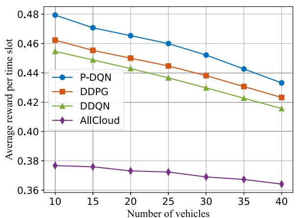

<details>
<summary>line</summary>

| Number of vehicles | P-DQN  | DDPG   | DDQN   | AllCloud |
| ------------------ | ------ | ------ | ------ | -------- |
| 10                 | 0.48   | 0.46   | 0.455  | 0.375    |
| 15                 | 0.47   | 0.455  | 0.45   | 0.375    |
| 20                 | 0.465  | 0.45   | 0.445  | 0.37     |
| 25                 | 0.46   | 0.445  | 0.44   | 0.37     |
| 30                 | 0.45   | 0.44   | 0.43   | 0.365    |
| 35                 | 0.44   | 0.43   | 0.42   | 0.365    |
| 40                 | 0.43   | 0.42   | 0.415  | 0.36     |
</details>

(a)

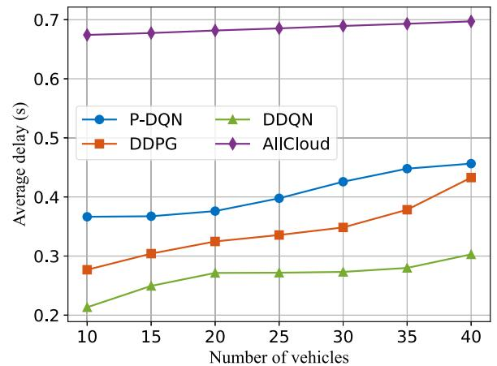

<details>
<summary>line</summary>

| Number of vehicles | P-DQN | DDQN | DDPG | AllCloud |
| ------------------ | ----- | ---- | ---- | -------- |
| 10                 | 0.37  | 0.22 | 0.28 | 0.68     |
| 15                 | 0.37  | 0.25 | 0.31 | 0.68     |
| 20                 | 0.38  | 0.27 | 0.33 | 0.69     |
| 25                 | 0.40  | 0.27 | 0.34 | 0.69     |
| 30                 | 0.43  | 0.28 | 0.35 | 0.69     |
| 35                 | 0.45  | 0.28 | 0.38 | 0.69     |
| 40                 | 0.46  | 0.30 | 0.43 | 0.70     |
</details>

(b)

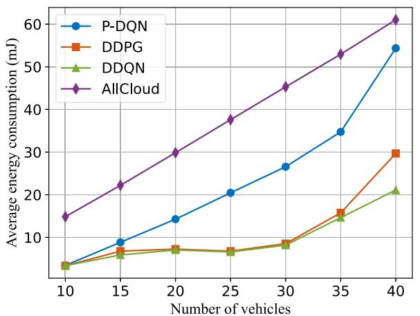

<details>
<summary>line</summary>

| Number of vehicles | P-DQN | DDPG | DDQN | AllCloud |
| ------------------ | ----- | ---- | ---- | -------- |
| 10                 | 3     | 3    | 3    | 15       |
| 15                 | 9     | 6    | 6    | 22       |
| 20                 | 14    | 7    | 7    | 30       |
| 25                 | 20    | 7    | 7    | 38       |
| 30                 | 26    | 8    | 8    | 45       |
| 35                 | 35    | 16   | 14   | 53       |
| 40                 | 55    | 30   | 21   | 61       |
</details>

（c）

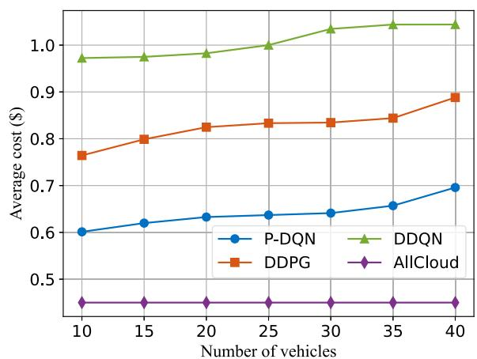

<details>
<summary>line</summary>

| Number of vehicles | P-DQN | DDQN | DDPG | AllCloud |
| ------------------ | ----- | ---- | ---- | -------- |
| 10                 | 0.60  | 0.98 | 0.76 | 0.45     |
| 15                 | 0.62  | 0.98 | 0.80 | 0.45     |
| 20                 | 0.63  | 0.98 | 0.82 | 0.45     |
| 25                 | 0.64  | 1.00 | 0.83 | 0.45     |
| 30                 | 0.64  | 1.02 | 0.83 | 0.45     |
| 35                 | 0.66  | 1.03 | 0.84 | 0.45     |
| 40                 | 0.70  | 1.04 | 0.89 | 0.45     |
</details>

(d)   
Fig. 11. Average reward, delay, energy consumption, and cost versus the number of vehicles (N). (a) Average reward per time slot (b) Average delay (c) Average energy consumption (d) Average cost.

Fig. 8 shows episode reward with a varying total uplink bandwidth of each RSU with the proposed P-DQN and three benchmark algorithms. It is seen that reward performance of each algorithm shows an upward trend with an increasing B. This is reasonable, as increasing total uplink bandwidth of each RSU (i.e., increasing B) can increase data rate for vehicles to upload their input data of offloading tasks to RSUs, thereby reducing overall transmission delay. In addition, it is apparent that changes in B affect the reward performance of AllCloud strategy more significantly. This occurs as AllCloud strategy offloads all tasks to server for execution, while in certain epochs, DRL-based algorithm may choose to execute tasks locally, depending on the current environmental state. In fact, its local execution delay is independent of B.

Fig. 9 illustrates episode reward performance of the four algorithms versus each vehicle’s task generation probability P . With an increasing P , overall network load will gradually increase, finally leading to additional task execution delay. Consequently, this makes agents suffer higher costs to offload tasks to resource-rich cloud servers, resulting in a decrease in system’s overall episode rewards. As a fixed strategy, AllCloud’s reward performance is influenced solely by P during the input data upload phase of task offloading, thus maintaining nearly a constant episode reward.

Fig. 10 demonstrates system’s episode reward performance versus service coefficient $\lambda _ { i } ( t )$ varying from $6 \times 1 0 ^ { 4 }$ to $1 . 2 \times 1 0 ^ { 5 }$ cycles/bit across the four algorithms. Obviously, increasing $\lambda _ { i } ( t )$ results in a longer task execution time, thus increasing total delay, which finally diminishes overall system reward. Compared to the benchmark schemes, the proposed algorithm optimizes episode rewards by leveraging a parameterized action space, hence showing a superior reward performance.

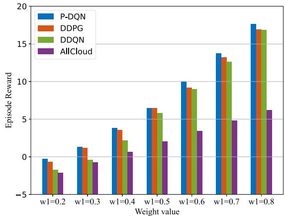

<details>
<summary>bar</summary>

| Weight value | P-DQN | DDPG | DDQN | AllCloud |
| ------------ | ----- | ---- | ---- | -------- |
| w1=0.2       | -0.5  | -0.8 | -1.2 | -2.0     |
| w1=0.3       | 1.5   | 1.2  | -0.5 | -0.8     |
| w1=0.4       | 3.8   | 3.5  | 2.2  | 0.7      |
| w1=0.5       | 6.5   | 6.2  | 5.8  | 2.1      |
| w1=0.6       | 10.0  | 9.5  | 9.0  | 3.5      |
| w1=0.7       | 13.8  | 13.2 | 12.5 | 4.8      |
| w1=0.8       | 17.5  | 16.8 | 16.5 | 6.2      |
</details>

(a)   
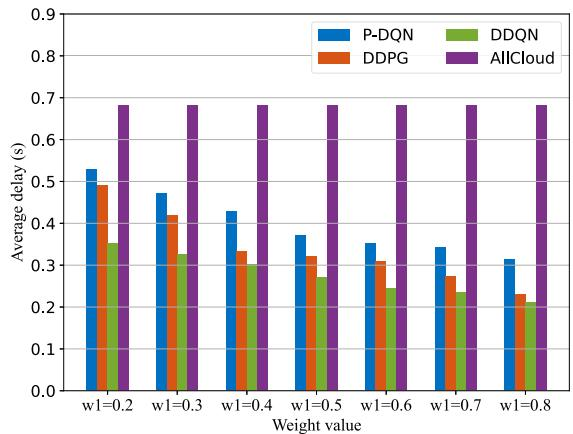

<details>
<summary>bar</summary>

| Weight value | P-DQN | DDQN | DDPG | AllCloud |
| ------------ | ----- | ---- | ---- | -------- |
| w1=0.2       | 0.53  | 0.36 | 0.49 | 0.68     |
| w1=0.3       | 0.47  | 0.33 | 0.42 | 0.68     |
| w1=0.4       | 0.43  | 0.30 | 0.34 | 0.68     |
| w1=0.5       | 0.37  | 0.27 | 0.32 | 0.68     |
| w1=0.6       | 0.35  | 0.25 | 0.31 | 0.68     |
| w1=0.7       | 0.34  | 0.24 | 0.28 | 0.68     |
| w1=0.8       | 0.32  | 0.22 | 0.23 | 0.68     |
</details>

(b)   
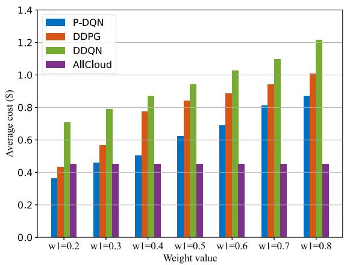

<details>
<summary>bar</summary>

| Weight value | P-DQN | DDPG | DDQN | AllCloud |
| ------------ | ----- | ---- | ---- | -------- |
| w1=0.2       | 0.37  | 0.44 | 0.71 | 0.45     |
| w1=0.3       | 0.46  | 0.57 | 0.79 | 0.45     |
| w1=0.4       | 0.50  | 0.78 | 0.87 | 0.45     |
| w1=0.5       | 0.62  | 0.84 | 0.94 | 0.45     |
| w1=0.6       | 0.69  | 0.89 | 1.03 | 0.45     |
| w1=0.7       | 0.81  | 0.94 | 1.10 | 0.45     |
| w1=0.8       | 0.87  | 1.01 | 1.22 | 0.45     |
</details>

(c)   
Fig. 12. Average delay, energy consumption, and cost with different values of w1 and w3 while $w _ { 2 } = 0 ( \mathrm { i . e . , } w _ { 3 } = 1 - w _ { 1 } )$ . (a) Episode reward (b) Average delay (c) Average cost.

Fig. 11 illustrates the impact of the number of vehicles on the system’s average reward, delay, energy consumption, and cost. Fig. 11(a) shows the average reward per vehicle per time slot, which decreases as the number of vehicles in the network increases. The P-DQN algorithm consistently achieves the best overall performance. It is observed that the three DRL algorithms adopt different strategies to balance various objectives. As the number of vehicles increases, interference within the system intensifies, and computational resources become more constrained, resulting in an increase in delay, energy consumption, and cost for all three DRL algorithms. Overall, the P-DQN algorithm generally completes computational tasks at a lower cost, while maintaining a moderate delay. In comparison, AllCloud algorithm exhibits a higher delay, while DDQN and DDPG algorithms incur higher costs compared to the other two. Additionally, as shown in Fig. 11(c), when the number of vehicles is small, the average energy consumption of the three DRL algorithms is nearly identical. However, when the number of vehicles exceeds $N \geq 2 0$ , the average energy consumption of the P-DQN algorithm increases significantly compared to that of DDPG and DDQN. Given that the P-DQN algorithm exhibits slightly higher delay and lower cost, this may be attributed to the P-DQN algorithm’s reliance more heavily on a local computation strategy.

The above results indicate that the three DRL algorithms adopt different trade-off strategies for multiple objectives, which may also be influenced by weight settings. Fig. 12 depicts the influences of different weight settings, i.e., w1, w2, and $w _ { 3 }$ , on system’s episode reward, average delay, and cost, where the values of $w _ { 1 }$ and $w _ { 3 }$ vary, while $w _ { 2 }$ is fixed as zero, with the constraint $w _ { 1 } + w _ { 2 } + w _ { 3 } = 1 . \mathrm { F i g } . 1 2 ( \mathrm { a } ) , ( \mathrm { b } )$ , and (c) show system performances on episode reward, average delay, and average cost per time slot, respectively. From Fig. 12(a), we can see that as $w _ { 1 }$ increases (or w3 decreases), episode reward performances of the four different strategies gradually improve. The reason is that the systems with these strategies may select to pay a higher cost for having more computation resources to minimize task execution delay, to respond to a higher delay weight value. Such observation is further confirmed by the results as shown in Fig. 12(b) and (c). However, as AllCloud algorithm allocates fixed resources to all vehicles, it maintains constant average delay and cost as $w _ { 1 }$ increases, and its episode reward variation stems mainly from the changes in reward calculation method. In addition, while P-DQN-based algorithm always acquires the highest episode reward, its average delay slightly exceeds that of DDPG and DDQN strategies. On the other hand, P-DQN algorithm requires a relatively lower average cost, compared to the other strategies. This validates that the proposed scheme can balance different aspects of system performances for attaining a superior effectiveness.

# VI. CONCLUSION

In this paper, we investigated the issues on multi-vehicle joint task offloading and resource allocation in cloud-assisted vehicular MEC networks. RSUs equipped with MEC servers are taken as edge nodes. Computation-intensive and delay-sensitive tasks generated by vehicles can be offloaded to edge nodes or cloud server through binary offloading. Based on the system model, we formulated a task offloading and resource allocation optimization problem, aiming to minimize overall delay, energy consumption, and cost. The formulated problem was converted to an MDP and solved via DRL-based strategies. In particular, to tackle hybrid action space issues in binary offloading, a parameterized action space was introduced, based on which a

P-DQN algorithm for real-time task offloading and resource allocation scheme was designed. Simulation results validated the effectiveness of the proposed algorithm in various network scenarios and its advantages over three well-known benchmark algorithms, i.e., DDQN, DDPG, and AllCloud.

# REFERENCES

[1] F. Tang, Y. Kawamoto, N. Kato, and J. Liu, “Future intelligent and secure vehicular network toward 6G: Machine-learning approaches,” Proc. IEEE, vol. 108, no. 2, pp. 292–307, Feb. 2020.   
[2] S. Gyawali, S. Xu, Y. Qian, and R. Q. Hu, “Challenges and solutions for cellular based V2X communications,” IEEE Commun. Surveys Tuts., vol. 23, no. 1, pp. 222–255, Firstquarter 2021.   
[3] H. Zhang and X. Lu, “Vehicle communication network in intelligent transportation system based on Internet of Things,” Comput. Commun., vol. 160, pp. 799–806, Jul. 2020.   
[4] Z. Wang, K. Han, and P. Tiwari, “Augmented reality-based advanced driver-assistance system for connected vehicles,” in Proc. 2020 IEEE Int. Conf. Syst. Man Cybern., Toronto, ON, Canada, 2020, pp. 752–759.   
[5] S. K. Sood et al., “Smart vehicular traffic management: An edge cloud centric IoT based framework,” Internet Things, vol. 14, Jun. 2021, Art. no. 100140.   
[6] Y. C. Hu, M. Patel, D. Sabella, N. Sprecher, and V. Young, “Mobile edge computing - A key technology towards 5G,” ETSI White Paper, vol. 11, no. 11, pp. 1–16, Sep. 2015.   
[7] D. Katare, D. Perino, J. Nurmi, M. Warnier, M. Janssen, and A. Y. Ding, “A survey on approximate edge AI for energy efficient autonomous driving services,” IEEE Commun. Surveys Tuts., vol. 25, no. 4, pp. 2714–2754, Fourth Quarter 2023.   
[8] B. Ji et al., “A vision of IoV in 5G HetNets: Architecture, key technologies, applications, challenges, and trends,” IEEE Netw., vol. 36, no. 2, pp. 153–161, Mar./Apr. 2022.   
[9] W. Duan, J. Gu, M. Wen, G. Zhang, Y. Ji, and S. Mumtaz, “Emerging technologies for 5G-IoV networks: Applications, trends and opportunities,” IEEE Netw., vol. 34, no. 5, pp. 283–289, Sep./Oct. 2020.   
[10] A. Hammoud, H. Sami, A. Mourad, H. Otrok, R. Mizouni, and J. Bentahar, “AI, blockchain, and vehicular edge computing for smart and secure IoV: Challenges and directions,” IEEE Internet Things Mag., vol. 3, no. 2, pp. 68–73, Jun. 2020.   
[11] L. Liu, C. Chen, Q. Pei, S. Maharjan, and Y. Zhang, “Vehicular edge computing and networking: A survey,” Mobile Netw. Appl., vol. 26, pp. 1145–1168, Jul. 2021.   
[12] L. Bréhon-Grataloup, R. Kacimi, and A.-L. Beylot, “Mobile edge computing for V2X architectures and applications: A survey,” Comput. Netw., vol. 206, Apr. 2022, Art. no. 108797.   
[13] A. Y. Alhilal, B. Finley, T. Braud, D. Su, and P. Hui, “Street smart in 5G: Vehicular applications, communication, and computing,” IEEE Access, vol. 10, pp. 105631–105656, 2022.   
[14] X. Jiang, F. R. Yu, T. Song, and V. C. M. Leung, “Resource allocation of video streaming over vehicular networks: A survey, some research issues and challenges,” IEEE Trans. Intell. Transp. Syst., vol. 23, no. 7, pp. 5955–5975, Jul. 2022.   
[15] M. K. Hasan, N. Jahan, M. Z. A. Nazri, S. Islam, M. A. Khan, and A. I. Alzahrani, “Federated learning for computational offloading and resource management of vehicular edge computing in 6G-V2X network,” IEEE Trans. Consum. Electron., vol. 70, no. 1, pp. 3827–3847, Feb. 2024.   
[16] H. Liu, H. Zhao, L. Geng, and W. Feng, “A policy gradient based offloading scheme with dependency guarantees for vehicular networks,” in Proc. IEEE Glob. Commun. Conf., Dec. 2020, pp. 1–6.   
[17] H. Ke, H. Wang, W. Sun, and H. Sun, “Adaptive computation offloading policy for multi-access edge computing in heterogeneous wireless networks,” IEEE Trans. Netw. Service Manag., vol. 19, no. 1, pp. 289–305, Mar. 2022.   
[18] W. Fan et al., “Joint task offloading and resource allocation for vehicular edge computing based on V2I and V2V modes,” IEEE Trans. Intell. Transp. Syst., vol. 24, no. 4, pp. 4277–4292, Apr. 2023.   
[19] Q. Liu, R. Luo, and Q. Liu, “Mobility-aware computation offloading for cloud-assisted mobile edge computing in vehicular networks,” in Proc. IEEE 96th Veh. Technol. Conf., London, U.K., 2022, pp. 1–7.   
[20] Q. Luo, C. Li, T. H. Luan, W. Shi, and W. Wu, “Self-learning based computation offloading for internet of vehicles: Model and algorithm,” IEEE Trans. Wireless Commun., vol. 20, no. 9, pp. 5913–5925, Sep. 2021.

[21] W. Feng et al., “Latency minimization of reverse offloading in vehicular edge computing,” IEEE Trans. Veh. Technol., vol. 71, no. 5, pp. 5343–15357, May 2022.   
[22] R. Yadav, W. Zhang, O. Kaiwartya, H. Song, and S. Yu, “Energy-latency tradeoff for dynamic computation offloading in vehicular fog computing,” IEEE Trans. Veh. Technol., vol. 69, no. 12, pp. 14198–14211, Dec. 2020.   
[23] Z. Wang, J. Du, C. Jiang, Y. Ren, and X.-P. Zhang, “UAV-Assisted target tracking and computation offloading in USV-Based MEC networks,” IEEE Trans. Mobile Comput., vol. 23, no. 12, pp. 11389–11405, Dec. 2024.   
[24] J. Du, C. Jiang, A. Benslimane, S. Guo, and Y. Ren, “SDN-Based resource allocation in edge and cloud computing systems: An evolutionary stackelberg differential game approach,” IEEE/ACM Trans. Netw., vol. 30, no. 4, pp. 1613–1628, Aug. 2022.   
[25] M. Huang, Z. Shen, and G. Zhang, “Joint spectrum sharing and V2V/V2I task offloading for vehicular edge computing networks based on coalition formation game,” IEEE Trans. Intell. Transp. Syst., vol. 25, no. 9, pp. 11918–11934, Sep. 2024.   
[26] L. Zhao, S. Huang, D. Meng, B. Liu, Q. Zuo, and V. C. M. Leung, “Stackelberg-game-Based dependency-aware task offloading and resource pricing in vehicular edge networks,” IEEE Internet Things J., vol. 11, no. 19, pp. 32337–32349, Oct. 2024.   
[27] W. Fan et al., “Game-based task offloading and resource allocation for vehicular edge computing with edge-edge cooperation,” IEEE Trans. Veh. Technol., vol. 72, no. 6, pp. 7857–7870, Jun. 2023.   
[28] Q. Luo, S. Hu, C. Li, G. Li, and W. Shi, “Resource scheduling in edge computing: A survey,” IEEE Commun. Surveys Tuts., vol. 23, no. 4, pp. 2131–2165, Fourth Quarter 2021.   
[29] A. Feriani and E. Hossain, “Single and multi-agent deep reinforcement learning for AI-Enabled wireless networks: A tutorial,” IEEE Commun. Surveys Tuts., vol. 23, no. 2, pp. 1226–1252, Second Quarter 2021.   
[30] J. Liu et al., “RL/DRL meets vehicular task offloading using edge and vehicular cloudlet: A survey,” IEEE Internet Things J., vol. 9, no. 11, pp. 8315–8338, Jun. 2022.   
[31] N. A. Khalek, D. H. Tashman, and W. Hamouda, “Advances in machine learning-driven cognitive radio for wireless networks: A survey,” IEEE Commun. Surveys Tuts., vol. 26, no. 2, pp. 1201–1237, Second Quarter 2024.   
[32] M. Hu, L. Zhuang, D. Wu, Y. Zhou, X. Chen, and L. Xiao, “Learning driven computation offloading for asymmetrically informed edge computing,” IEEE Trans. Parallel Distrib. Syst., vol. 30, no. 8, pp. 1802–1815, Aug. 2019.   
[33] W. Lv et al., “Microservice deployment in edge computing based on deep Q learning,” IEEE Trans. Parallel Distrib. Syst., vol. 33, no. 11, pp. 2968–2978, Nov. 2022.   
[34] J. Wu et al., “Resource allocation for delay-sensitive vehicle-to-multiedges (V2Es) communications in vehicular networks: A multi-agent deep reinforcement learning approach,” IEEE Trans. Netw. Sci. Eng., vol. 8, no. 2, pp. 1873–1886, Second Quarter 2021.   
[35] Y. Liu, H. Yu, S. Xie, and Y. Zhang, “Deep reinforcement learning for offloading and resource allocation in vehicle edge computing and networks,” IEEE Trans. Veh. Technol., vol. 68, no. 11, pp. 11158–11168, Nov. 2019.   
[36] L. Wang and G. Zhang, “Joint service caching, resource allocation and computation offloading in three-tier cooperative mobile edge computing system,” IEEE Trans. Netw. Sci. Eng., vol. 10, no. 6, pp. 3343–3353, Nov./Dec. 2023.   
[37] H. Peng and X. Shen, “Deep reinforcement learning based resource management for multi-access edge computing in vehicular networks,” IEEE Trans. Netw. Sci. Eng., vol. 7, no. 4, pp. 2416–2428, Fourth Quarter 2020.   
[38] H. Yang, Z. Wei, Z. Feng, X. Chen, Y. Li, and P. Zhang, “Intelligent computation offloading for MEC-Based cooperative vehicle infrastructure system: A deep reinforcement learning approach,” IEEE Trans. Veh. Technol., vol. 71, no. 7, pp. 7665–7679, Jul. 2022.   
[39] Z. Xue, C. Liu, C. Liao, G. Han, and Z. Sheng, “Joint service caching and computation offloading scheme based on deep reinforcement learning in vehicular edge computing systems,” IEEE Trans. Veh. Technol., vol. 72, no. 5, pp. 6709–6722, May 2023.   
[40] G. Ma, X. Wang, M. Hu, W. Ouyang, X. Chen, and Y. Li, “DRL-Based computation offloading with queue stability for vehicular-cloud-assisted mobile edge computing systems,” IEEE Trans. Intell. Veh., vol. 8, no. 4, pp. 2797–2809, Apr. 2023.

[41] L. Geng, H. Zhao, J. Wang, A. Kaushik, S. Yuan, and W. Feng, “Deepreinforcement-Learning-Based distributed computation offloading in vehicular edge computing networks,” IEEE Internet Things J., vol. 10, no. 14, pp. 12416–12433, Jul. 2023.   
[42] Z. Chen, J. Du, G. Yang, C. Jiang, and Z. Han, “Multi-task driven user association and resource allocation in in-vehicle networks,” in Proc. 2023 IEEE Glob. Commun. Conf., Kuala Lumpur, Malaysia, 2023, pp. 01–06.   
[43] J. Du, T. Lin, C. Jiang, Q. Yang, C. F. Bader, and Z. Han, “Distributed foundation models for multi-modal learning in 6G wireless networks,” IEEE Wireless Commun., vol. 31, no. 3, pp. 20–30, Jun. 2024.   
[44] Y. Jang, J. Na, S. Jeong, and J. Kang, “Energy-efficient task offloading for vehicular edge computing: Joint optimization of offloading and bit allocation,” in Proc. IEEE 91st Veh. Technol. Conf., Antwerp, Belgium, 2020, pp. 1–5.   
[45] J. Xiong et al., “Parametrized deep Q-networks learning: Reinforcement learning with discrete-continuous hybrid action space,” 2018, arXiv:1810.06394.   
[46] T. P. Lillicrap et al., “Continuous control with deep reinforcement learning,” 2015, arXiv:1509.02971.   
[47] M. Hausknecht and P. Stone, “Deep reinforcement learning in parameterized action space,” 2015, arXiv:1511.04143.

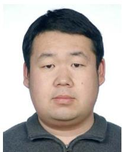

<details>
<summary>natural_image</summary>

Portrait photo of a man in a gray polo shirt (no text or symbols visible)
</details>

Ruofei Ma (Member, IEEE) received the B.Sc., M.Sc., and Ph.D. degrees in information and communication engineering from Harbin Institute of Technology, Harbin, China, in 2008, 2010, and 2014, respectively. From 2015 to 2016, he was a Postdoctoral Researcher with the Department of Engineering Science, National Cheng Kung University, Taiwan. He is currently an Associate Professor with the Department of Communication Engineering, Harbin Institute of Technology, Weihai, China. His research interests include device-to-device (D2D) communi-

cations, intelligent connected-vehicles, satellite communication networks, and underwater-overwater cooperative communications and networks.


<details>
<summary>natural_image</summary>

Portrait photo of a young man in formal attire against a blue gradient background (no text or symbols visible)
</details>

Ruisong Wang received the B.Sc. degree in information and computing science from the Harbin Institute of Technology, Weihai, China, in 2018. He is currently working toward the Ph.D. degree in information and communication engineering from the Harbin Institute of Technology, Harbin, China. His research interests include underwater-overwater cooperative communications, efficient resource allocation, and satellite networks.


<details>
<summary>natural_image</summary>

Portrait of a man wearing glasses and formal attire (no visible text or symbols)
</details>

Hsiao-Hwa Chen (Life Fellow, IEEE) is currently a Distinguished Professor with the Department of Engineering Science, National Cheng Kung University, Taiwan. He received the B.Sc. and M.Sc. degrees from Zhejiang University, Hangzhou, China, and the Ph.D. degree from the University of Oulu, Oulu, Finland, in 1982, 1985, and 1991, respectively. He has authored or coauthored more than 400 technical papers in major international journals and conferences, six books, and more than ten book chapters in the areas of communications. He was the recipient of the Best

Paper Award of IEEE Systems Journal in 2021 and the IEEE 2016 Jack Neubauer Memorial Award. He was the TPC Chair for IEEE Globecom 2019. He is also the founding Editor-in-Chief of Wiley’s Security and Communication Networks Journal. From 2012 to 2015, he was the Editor-in-Chief of IEEE WIRELESS COMMUNICATIONS. From 2015 to 2016, he was an elected Member-at-Large of IEEE ComSoc. He is also a Fellow of IET/BCS/AAIA.


<details>
<summary>natural_image</summary>

Portrait photo of a young man in formal attire against a blue background (no text or symbols visible)
</details>

Jingyang Zhou received the B.Sc. degree from Hohai University, Nanjing, China, in 2022. He is currently working toward the master’s degree in information and communication engineering with the Harbin Institute of Technology (HIT), Weihai, China. His research interests include vehicular communications and networks, mobile edge computing, and deep reinforcement learning.


<details>
<summary>natural_image</summary>

Portrait photo of a man wearing a striped sweater (no text or symbols visible)
</details>

Gongliang Liu (Member, IEEE) received the B.Sc. degree in measuring and control technology and instrumentations, and the M.Sc. and Ph.D. degrees in information and communication engineering from Harbin Institute of Technology (HIT), Harbin, China, in 2001, 2003, and 2007, respectively. From 2015 to 2016, he was a Visiting Scholar with the University of British Columbia, Vancouver, BC, Canada. He is currently a Professor with HIT, Weihai, China. His research interests are wireless communications and networks, satellite communications, and underwater communications.