# Computation Offloading and Resource Allocation in LEO Satellite-Terrestrial Integrated Networks With System State Delay

Bo Xie , Haixia Cui , Senior Member, IEEE, Ivan Wang-Hei Ho , Senior Member, IEEE, Yejun He , Senior Member, IEEE, and Mohsen Guizani , Fellow, IEEE

Abstract—Computing offloading optimization for energy saving is becoming increasingly important in low-Earth orbit (LEO) satellite-terrestrial integrated networks (STINs) since battery techniques have not kept up with the demand of ground terminal devices. In this paper, we design a delay-based deep reinforcement learning (DRL) framework specifically for computation offloading decisions, which can effectively reduce the energy consumption. Additionally, we develop a multi-level feedback queue for computing allocation (RAMLFQ), which can effectively enhance the CPU’s efficiency in task scheduling. We initially formulate the computation offloading problem with the system delay as Delay Markov Decision Processes (DMDPs), and then transform them into the equivalent standard Markov Decision Processes (MDPs). To solve the optimization problem effectively, we employ a double deep Q-network (DDQN) method, enhancing it with an augmented state space to better handle the unique challenges posed by system delays. Simulation results demonstrate that the proposed learningbased computing offloading algorithm achieves high levels of performance efficiency and attains a lower total cost compared to other existing offloading methods.

Index Terms—Computing offloading, deep reinforcement learning, satellite-terrestrial integrated networks, system state delays in learning.

# I. INTRODUCTION

A DVANCES in satellite constellations are revolutionizinginternet access, which extends communication services to

Received 18 June 2024; revised 4 September 2024; accepted 9 October 2024. Date of publication 14 October 2024; date of current version 5 February 2025. This work was supported in part by the National Key Research and Development Program of China under Grant 2023YFE0107900, in part by the GuangDong Basic and Applied Basic Research Foundation under Grant 2024A1515012052, in part by the National Natural Science Foundation of China under Grant 61871433, Grant 61828103, Grant 61201255, and Grant 62071306, and in part by the Research Platform of South China Normal University. Recommended for acceptance by Haipeng Yao. (Corresponding author: Haixia Cui.)

Bo Xie and Haixia Cui are with the School of Electronic Science and Engineering (School of Microelectronics), South China Normal University, Foshan 528225, China (e-mail: bo.xie@m.scnu.edu.cn; cuihaixia@m.scnu.edu.cn).

Ivan Wang-Hei Ho is with the Department of Electrical and Electronic Engineering, The Hong Kong Polytechnic University, Hong Kong SAR, China (e-mail: ivanwh.ho@polyu.edu.hk).

Yejun He is with the College of Electronics and Information Engineering, Shenzhen University, Shenzhen 518060, China (e-mail: heyejun@126.com).

Mohsen Guizani is with the Machine Learning Department, Mohamed Bin Zayed University of Artificial Intelligence, Abu Dhabi 99163, UAE (e-mail: mguizani@ieee.org).

Digital Object Identifier 10.1109/TMC.2024.3479243

every corner of the Earth, including underdeveloped areas with limited infrastructure, like remote regions and oceans. These developments have led to the construction of satellite-terrestrial integrated networks which can connect numerous edge devices. A groundbreaking aspect of satellite-terrestrial integrated networks (STINs) is providing computational resources through satellites, a paradigm shift that takes the low-Earth orbit satellite (LEOS) as new edge servers [1]. This transformation not only improves communication capabilities but also opens up new possibilities in global data processing and management.

However, integrating advanced artificial intelligence (AI) applications at the edge, linking end users with LEO satellites and the cloud, poses significant new challenges. The inherently distributed and dynamic nature of the edge environment complicates such deployments, and the high computational demands of AI applications limit their use on resource-constrained edge devices. To overcome these obstacles, some efforts have been directed towards offloading computationally intensive tasks to cloud servers, edge servers, and LEO servers, utilizing their processing power to manage the computational load of sophisticated AI applications [2], [3], [4], [5].

Deep reinforcement learning (DRL) has recently been employed to tackle the computation offloading challenges in STINs [6], [7], [8], where the DRL agent interacts with the environment through a trial-and-error process, making decisions based on the observable system states and receiving feedback in the form of rewards and new states. However, practical challenges arise due to the inherent network latency, computational bottlenecks, and the time required for task execution, all of which introduce significant delays in the observable states and decision execution [9], [10]. These delays force the DRL agent to operate with outdated information, requiring it to make effective offloading decisions based on past states and actions [11]. The challenge lies in how to utilize this outdated information to guide the agent in making optimal decisions despite the inherent uncertainties. Although DRL is increasingly applied in this context, existing studies often overlook the impact of these delays, assuming that system states and feedback can be obtained instantaneously. This gap underscores the need for more realistic models that account for the inevitable delays in DRL-based offloading decisions.

This paper introduces a flexible joint communication and computation framework for STINs, designed to provide robust computing services to remote users through edge/cloud/satellite integration. We propose an efficient computing offloading approach that learns an optimal offloading policy on-the-fly, aiming to minimize the energy consumption. This takes into account the multidimensional network dynamics, resource constraints, and system state/action delays. We first formulate the computation offloading problem with system state delays as stochastic delay MDPs (SDMDPs), demonstrating how to reduce these to MDPs without delays. We then propose a modelfree, delay-based reinforcement learning approach to seek an optimal offloading mode. Finally, we deploy a computing allocation algorithm on each edge server, based on a multi-level feedback queue. To the best of our knowledge, this work is the first to study the computation offloading problem in STINs with system state delays. It validates the feasibility of STINs in supporting computation-intensive applications for remote users and offers useful guidelines for remote computing offloading.

The main contributions of the paper can be summarized as follows.

We introduce an innovative framework designed to enhance computing services in STINs. This framework that integrates edge, cloud, and satellite technologies is tailored to address the unique challenges of STINs, such as resource constraints and system state delays. This approach is particularly beneficial for remote users, who typically face limited access to robust computing services.   
- We formulate the computation offloading problem in STINs with system state delays as SDMDPs. We demonstrate how these processes can be effectively transformed into simpler MDPs without delays. Building on this foundation, we propose a model-free, delay-based reinforcement learning approach to seek an efficient computing offloading strategy aimed at minimizing the impact of energy consumption. Additionally, we have developed a multi-level feedback queue-based computing allocation algorithm for each edge server, addressing a novel area in the computation offloading domain and offering practical solutions for computation-intensive applications in remote areas.   
The efficacy of our proposed approaches is rigorously evaluated through extensive simulations. This evaluation provides valuable insights into the practical applicability and efficiency of our methods in real-world scenarios.

The remainder of the paper is organized as follows. In Section II, we present the related work. Section III describes the system model. In Section IV, the joint edge computing allocation and computation offloading problem is formulated and solved. Section V introduces the SDMDPs. Section VI formulates the DRL-based solution. Section VII evaluates the proposed approaches, and Section VIII concludes the paper.

# II. RELATED WORK

In the realm of satellite-terrestrial integrated networks, computation offloading methods play a pivotal role. Broadly, these methods fall into two categories: mathematical-based and intelligence-based approaches [12], [13], [14], [15]. Central to this discussion is the interplay between computation offloading and resource allocation strategies, a key area of focus in network optimization.

# A. Mathematical Offloading Method

Satellite-terrestrial edge computing is conceptualized as a three-tier architecture encompassing space, air, and ground, with the ground tier also extending to marine or aquatic environments. Specifically, the space tier primarily includes low-earth orbit and geosynchronous (GEO) satellites. The air tier encompasses various aerial vehicles like aircraft and drones, while the ground tier comprises communication infrastructure, Internet of Things (IoT) devices, and vehicles. In marine settings, vessels are commonly used, and underwater sensors or servers can be deployed in aquatic environments. Researchers primarily aim to optimize computation offloading and resource allocation performance within this intricate, integrated network [16], [17], [18]. This optimization is based on network characteristics, with a focus on minimizing system energy consumption and reducing the computing latency.

Researchers aim to optimize this complex network, focusing on minimizing system energy consumption and reducing computing latency, a task that involves balancing the unique characteristics of each network tier. For instance, the majority of communication terminals in the terrestrial network offload tasks to satellites using Ka-band wireless backhaul connections, with the satellites then returning processed results via either Ka-band or C-band connections [19], [20]. The challenge lies in managing the computational workloads, especially given the dynamic nature of these networks. A notable solution proposed involves using the Lyapunov framework for optimizing the objective function [2], [19], [21], [22], [23].

Incorporating high-altitude aircraft into the network introduces new complexities due to their variable speeds and trajectories, which constantly change network topologies. Addressing these challenges, recent studies [3], [24], [25], [26], [27] have focused on optimizing the trajectory of unmanned aerial vehicles (UAVs) and using iterative algorithms for more efficient offloading and resource allocation.

Furthermore, cloud data centers have emerged as significant players in this network, acting as communication relays for remote users [4]. The computation offloading decision in this context becomes a binary problem: to offload tasks either to satellites or cloud data centers. This discrete and non-convex problem has been transformed into a linear programming problem for more effective resolution [4].

These studies provide a foundation for our approach in this paper, offering insights into managing dynamic network environments and leveraging the power of neural networks for better generalization in addressing these challenges.

# B. Intelligence Offloading Method

Traditionally, satellite-terrestrial integrated networks have relied on objective functions resolved through optimization algorithms. However, the advent of deep learning, particularly supervised methods, has revolutionized this approach [28], [29].

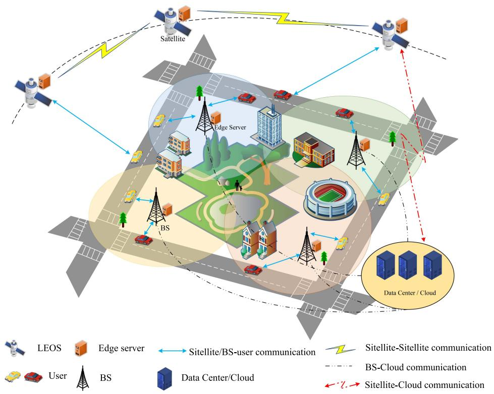

flowchart

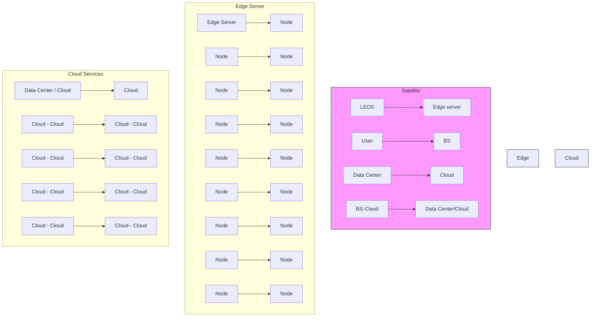

Fig. 1. LEO-STIN scenario.

By training neural networks with data derived from traditional methods, we can now obtain offloading decisions and resource allocation values instantaneously, a significant leap from the slower resolution of conventional techniques.

DRL has emerged as a powerful tool in this landscape. Cui et al. [30] implemented a Double Deep Q-Network (DDQN) for computation offloading alongside traditional algorithms for resource allocation, addressing the challenges posed by the dynamic nature of satellite coverage areas and user link quality. Similarly, Zhang et al. [31] and other researchers [32], [33] have explored various DRL-based methods to manage the complexities of computation offloading and resource allocation in these networks.

Tang et al. [5] emphasized a long-term performance strategy, combining DRL for computation offloading with Lyapunov optimization for resource allocation. This approach, also reflected in other studies [6], involves predicting network resource variations and developing online algorithms for more accurate forecasting.

In applying digital twin technology to satellite-terrestrial integrated networks, Ji et al. [7] identified a delay in updating network status information but posited that DRL could address this issue [8]. However, their focus was limited to the algorithmic perspective, omitting broader considerations of systemic update delays. This phenomenon of state delay was similarly observed in studies [9], [10].

Finally, our research builds upon these insights, particularly focusing on the challenges posed by state delays within the system. We use DRL for computation offloading, complemented by traditional methodologies for computing resource allocation, to navigate the complexities of satellite-terrestrial integrated networks effectively.

# III. SYSTEM MODEL

Consider a LEO-STIN scenario consisting of M low Earth orbit satellites $\mathcal { M } = \{ 1 , 2 , \dotsc , m , \dotsc , M \}$ , N terrestrial base stations (BSs) $\mathcal { N } = \{ 1 , 2 , \ldots , n , \ldots , N \}$ , K mobile users $\kappa =$ $\{ 1 , 2 , \ldots , k , \ldots , K \}$ 1 2 =, and a cloud data center (CDC), as illus-1 2trated in Fig. 1. Each mobile user handles k diverse tasks which vary in computational requirements and can be offloaded to BSs, CDC, LEO satellites, or locally. The network operates in fixed time slots $t \in \{ 0 , 1 , 2 , \ldots , \tau \}$ where τ represents the 0 1 2finite time horizon. The task from user k at time t is represented as ${ \Lambda } _ { k } ^ { t } = \{ s _ { k } ^ { t } , r _ { k } ^ { t } , c _ { k } ^ { t } , z _ { k , m a x } ^ { t } \}$ . Here, $\boldsymbol { s } _ { k } ^ { t }$ is the data size, $\boldsymbol { r } _ { k } ^ { t }$ is the feedback dcompletion, anwe assume that $c _ { k } ^ { t }$ is the necessary clock cycles forthe maximum latency. To simplify,ficiently large to prevent task failure $z _ { k , m a x } ^ { t }$ $z _ { k , m a x } ^ { t }$ due to timeouts.

The users can process the tasks locally or offload them to the satellites, base stations, or cloud data center. The transmission rate between satellites is assumed to be very fast with negligible delay [38], [39]. Consequently, the tasks need only to be offloaded to the nearest satellite based on its current position. The offloading decision for user k at time t is represented as $\mathcal { X } ( t , k ) \in \{ 0 , \mathcal { N } , N + 1 , N + 2 \} , \mathrm { i . e . }$ ,

$$
\mathcal {X} (t, k) = \left\{ \begin{array}{l l} 0, & \text { processed   locally }, \\ \mathcal {N}, & \text { offloaded   to   BSs }, \\ N + 1, & \text { offloaded   to   LEOS }, \\ N + 2, & \text { offloaded   to   CDC }. \end{array} \right. \tag {1}
$$

Here, N  represents offloading the task to a satellite. Since + 1we ignore the delay between satellites, we choose the most suitable satellite node from the LEOS set M based on the location of user k [4].

The offloading tasks can occur via the wireless backhaul links. For the links between BSs and LEO satellites, the C-band and Ka-band are utilized, respectively. Additionally, the users can offload the tasks to the CDC through either LEO satellites or BSs. The link between BSs and CDC is facilitated by the ethernet, while the link between LEO satellites and CDC uses the wireless backhaul links on Ka-band.

# A. Communication Model

1) Terrestrial Communications: The achievable capacity by user k with service of base station n over C-band can be expressed by

$$
R _ {n, k} = \psi_ {k} B _ {C} \log_ {2} \left(1 + \frac {p _ {n , k} | h _ {n , k} ^ {C} | ^ {2}}{\delta^ {2}}\right), \tag {2}
$$

where $B _ { C }$ represents the total bandwidth in the C-band. The factor $\textstyle \sum _ { k = 1 } ^ { K } \dot { \psi } _ { k } = 1$ indicates that $\psi _ { k }$ allocates bandwidth to = 1user k at BS n. The transmit power and noise variance are represented by $p _ { n , k }$ and $\delta ^ { 2 } .$ , respectively, while $h _ { n , k } ^ { C }$ indicates the channel gain between user k and BS n.

The channel gain, $h _ { n , k } ^ { C } .$ , is predominantly affected by the Lineof-Sight (LoS) path is written by

$$
h _ {n, k} ^ {C} = \xi d _ {k, n} ^ {- \alpha}, \tag {3}
$$

where $d _ { k , n } ^ { - \alpha }$ is used for calculating the path loss between user k and BS n. ξ is the unity channel gain at a reference distance of 1 m. The path loss exponent is denoted by α.

2) LEOS Communications: The capacity achievable by user k when served by LEO m over the Ka-band is given by:

$$
R _ {m, k} = \hat {\psi} _ {k} B _ {K a} \log_ {2} \left(1 + \frac {p _ {m , k} | h _ {m , k} ^ {K a} | ^ {2}}{\hat {\delta} ^ {2}}\right), \tag {4}
$$

where $B _ { K a }$ denotes the total bandwidth in the Ka-band. The term $\textstyle \sum _ { k = 1 } ^ { K } \hat { \psi } _ { k } = 1$ indicates that ψk is a bandwidth allocation factor = 1for user k at LEO m. The transmit power and noise variance are represented by $p _ { m , k }$ and $\hat { \delta } ^ { 2 }$ . The channel gain between user k and LEO m is $h _ { m , k } ^ { K \dot { a } }$ ˆ, defined as:

$$
h _ {m, k} ^ {K a} = \gamma \hat {d} _ {k, m} ^ {- \beta}, \tag {5}
$$

which takes the path loss between user k and LEO m as a function of their distance. The term γ corresponds to log-normal distributed shadow fading, and β is the path loss exponent.

The model in (4) also need calculate the achievable communication capacity between satellites and cloud data centers as well as between satellites and base stations.

# B. Computing Model

This system includes various computing models: local computing, base station server-aided computing, cloud data center server-aided computing, and low earth orbit satellite edge-aided computing. We adopt a partial offloading approach, where tasks are either processed locally or offloaded to the BS server, cloud data center, or LEOS edge.

1) Local Computing: For a task $\Lambda _ { k } ^ { t }$ partially processed locally at time t, the computing time, $D _ { k , l o c } ^ { t }$ , is given by:

$$
D _ {k, l o c} ^ {t} = \frac {c _ {k} ^ {t}}{f _ {k}}, \tag {6}
$$

where $f _ { k }$ represents the computation capability of user k in CPU cycles per second.

2) BS Server Computing: BS server computing includes transmission latency and BS server computation time. Let $f _ { n , m a x }$ and $f _ { n , k }$ denote the maximum CPU cycles at BS n server for user k. Assuming equal uplink and downlink rates [43], the total latency, $D _ { k , n } ^ { t }$ , is:

$$
D _ {k, n} ^ {t} = \frac {s _ {k} ^ {t} + r _ {k} ^ {t}}{R _ {n , k}} + \frac {c _ {k} ^ {t}}{f _ {n , k}}. \tag {7}
$$

3) Cloud Data Center Computing: This model includes transmission and execution time at the cloud data center. Assuming infinite resources, the maximum CPU cycles f cloudmax $f _ { m a x } ^ { c l o u d }$ Jmax are utilized. Tasks can be offloaded through the base station or directly via satellite. The total latency, $D _ { k , c l o u d } ^ { t } ,$ is:

$$
\begin{array}{l} D _ {k, c l o u d} ^ {t} = \delta \left(\frac {s _ {k} ^ {t} + r _ {k} ^ {t}}{R _ {m , k}} + \frac {s _ {k} ^ {t} + r _ {k} ^ {t}}{R _ {m , c l o u d}} + \frac {c _ {k} ^ {t}}{f _ {m a x} ^ {c l o u d}}\right) \\ + (1 - \delta) \left(\frac {s _ {k} ^ {t} + r _ {k} ^ {t}}{R _ {n , k}} + \frac {s _ {k} ^ {t} + r _ {k} ^ {t}}{R _ {n , c l o u d}} + \frac {c _ {k} ^ {t}}{f _ {\text { max }} ^ {\text { cloud }}}\right), \tag {8} \\ \end{array}
$$

where $\delta \in \{ 0 , 1 \}$ indicates the offloading route: 0 for the base 0 1station, 1 for satellite.

4) LEOS Edge Computing: LEOS edge computing consists of transmission time and LEOS server execution time. Let $f _ { m , m a x }$ and $f _ { m , k }$ be the maximum CPU cycles at the LEOS server for user k. The total latency, $D _ { k , m } ^ { t }$ , is:

$$
D _ {k, m} ^ {t} = \frac {s _ {k} ^ {t} + r _ {k} ^ {t}}{R _ {m , k}} + \frac {c _ {k} ^ {t}}{f _ {m , k}}. \tag {9}
$$

LEO satellites can collaboratively process tasks via intersatellite links (ISLs), especially under high offloading demands, with minimal transmission delays [38], [44].

The offloading latency for user k at time t is:

$$
D _ {k} ^ {t} = \left\{ \begin{array}{l l} D _ {k, l o c} ^ {t}, & \text { if   } \mathcal {X} (t, k) = 0 \\ D _ {k, n} ^ {t}, & \text { if   } \mathcal {X} (t, k) \in \mathcal {N} \\ D _ {k, m} ^ {t}, & \text { if   } \mathcal {X} (t, k) = N + 1 \\ D _ {k, c l o u d} ^ {t}, & \text { if   } \mathcal {X} (t, k) = N + 2. \end{array} \right. \tag {10}
$$

The total computing time can be calculated as

$$
D = \sum_ {t = 0} ^ {\tau} \sum_ {k = 1} ^ {K} D _ {k} ^ {t} \tag {11}
$$

where K represents the number of users.

# C. Energy Model

This section details the energy consumption in various computing scenarios, including local processing, BS processing, cloud data center processing, and LEOS edge processing.

1) Executing Energy: The power consumption for local processing, denoted as $p _ { l }$ , is assumed to be the same for all users. The energy required for local processing is:

$$
E _ {k, l o c} ^ {t, e x e} = p _ {l} \frac {c _ {k} ^ {t}}{f _ {k}}. \tag {12}
$$

In LEOS edge processing, with a constant energy dissipation rate $p _ { l e o } .$ , the energy requirement is:

$$
E _ {k, l e o} ^ {t, e x e} = p _ {l e o} \frac {c _ {k} ^ {t}}{f _ {m , k}}. \tag {13}
$$

For cloud data center processing, the energy dissipation rate is $p _ { c l o u d } .$ leading to:

$$
E _ {k, \text { cloud }} ^ {t, \text { exe }} = p _ {\text { cloud }} \frac {c _ {k} ^ {t}}{f _ {\max} ^ {\text { cloud }}}. \tag {14}
$$

In BS processing, with an energy dissipation rate $p _ { b s }$ , the energy requirement is:

$$
E _ {k, b s} ^ {t, e x e} = p _ {b s} \frac {c _ {k} ^ {t}}{f _ {n , k}}. \tag {15}
$$

The overall executing energy dissipation is determined by the computing scenario:

$$
E _ {k} ^ {t, e x e} = \left\{ \begin{array}{l l} E _ {k, l o c} ^ {t, e x e}, & \text { if   } \mathcal {X} (t, k) = 0 \\ E _ {k, b s} ^ {t, e x e}, & \text { if   } \mathcal {X} (t, k) \in \mathcal {N} \\ E _ {k, l e o} ^ {t, e x e}, & \text { if   } \mathcal {X} (t, k) = N + 1 \\ E _ {k, c l o u d} ^ {t, e x e}, & \text { if   } \mathcal {X} (t, k) = N + 2. \end{array} \right. \tag {16}
$$

2) Transmitting Energy: The energy dissipation during transmission depends on the destination of the data. For transmission to the LEOS edge:

$$
E _ {k, m} ^ {t, t r a n s} = p _ {k} \frac {s _ {k} ^ {t} + r _ {k} ^ {t}}{R _ {m , k}}. \tag {17}
$$

For transmission to the cloud data center:

$$
\begin{array}{l} E _ {k, c l o u d} ^ {t, t r a n s} = p _ {k} ^ {c l o u d} \cdot \left[ \delta \left(\frac {s _ {k} ^ {t} + r _ {k} ^ {t}}{R _ {m , k}} + \frac {s _ {k} ^ {t} + r _ {k} ^ {t}}{R _ {m , c l o u d}}\right) \right. \\ \left. + (1 - \delta) \left(\frac {s _ {k} ^ {t} + r _ {k} ^ {t}}{R _ {n , k}} + \frac {s _ {k} ^ {t} + r _ {k} ^ {t}}{R _ {n , c l o u d}}\right) \right], \tag {18} \\ \end{array}
$$

where $\delta \in \{ 0 , 1 \}$ indicates the offloading route: 0 for the base 0 1station, 1 for satellite.

For transmission to the BS:

$$
E _ {k, b s} ^ {t, t r a n s} = p _ {k} ^ {b s} \frac {s _ {k} ^ {t} + r _ {k} ^ {t}}{R _ {n , k}}. \tag {19}
$$

The total energy dissipation for transmission is:

$$
E _ {k} ^ {t, \text { trans }} = \left\{ \begin{array}{l l} E _ {k, \text { loc }} ^ {t, \text { trans }}, & \text { if   } \mathcal {X} (t, k) = 0 \\ E _ {k, b s} ^ {t, \text { trans }}, & \text { if   } \mathcal {X} (t, k) \in \mathcal {N} \\ E _ {k, l e o} ^ {t, \text { trans }}, & \text { if   } \mathcal {X} (t, k) = N + 1 \\ E _ {k, c l o u d} ^ {t, \text { trans }}, & \text { if   } \mathcal {X} (t, k) = N + 2. \end{array} \right. \tag {20}
$$

Finally, the total energy consumption is calculated as [32]:

$$
E = \varphi \cdot \sum_ {t = 0} ^ {\tau} \sum_ {k = 1} ^ {K} E _ {k} ^ {t, e x e} + \sum_ {t = 0} ^ {\tau} \sum_ {k = 1} ^ {K} E _ {k} ^ {t, t r a n s}, \tag {21}
$$

where K represents the number of users, $\varphi \in ( 0 , 1 )$ is a factor (0 1)used primarily to balance the execution energy consumption and the transmission energy consumption.

# IV. PROBLEM FORMULATION

# A. Objective Function

We aim at jointly optimizing the computation offloading and resource allocation to minimize the energy consumption under the user latency constraints. It involves the optimization of offloading decision vector $\mathcal { X } ( t , k )$ , BS server computing resource allocation matrix $F ^ { \mathcal { N } }$ ( ), LEOS edge computing resource allocation matrix $F ^ { \mathcal { M } }$ , and bandwidth resource allocation matrix P . Therefore, the optimization problem is formulated by

$$
\mathcal {P} 0: \min _ {\{\mathcal {X}, F ^ {\mathcal {N}}, F ^ {\mathcal {M}} \}} E, \tag {22a}
$$

$$
\text { s.t. } \quad E ^ {\text { trans }} > 0, E ^ {\text { exe }} > 0, \tag {22b}
$$

$$
f _ {n, k} > 0, f _ {m, k} > 0, \forall n \in \mathcal {N}, \forall m \in \mathcal {M}, \forall k \in \mathcal {K}, \tag {22c}
$$

$$
\psi_ {k} \in (0, 1), \hat {\psi} _ {k} \in (0, 1), \forall k \in \mathcal {K}, \tag {22d}
$$

$$
\sum_ {k \in \mathcal {K} _ {b s}} \psi_ {k} = 1, \tag {22e}
$$

$$
\sum_ {k \in \mathcal {K} _ {l e o}} \hat {\psi} _ {k} = 1, \tag {22f}
$$

$$
D \leq \sum_ {t = 0} ^ {\tau} \sum_ {k \in \mathcal {K}} z _ {k, \max} ^ {t}, \tag {22g}
$$

$$
\sum_ {k \in \mathcal {K} _ {b s}} f _ {n, k} \leq f _ {n, \max}, \forall n \in \mathcal {N}, \tag {22h}
$$

$$
\sum_ {k \in \mathcal {K} _ {l e o}} f _ {m, k} \leq f _ {m, \max}, \forall m \in \mathcal {M}, \tag {22i}
$$

$$
\mathcal {X} (t, k) \in \{0, \mathcal {N}, N + 1, N + 2 \}, \forall k \in \mathcal {K}, \tag {22j}
$$

where $\kappa _ { b s }$ and $\kappa _ { l e o }$ represent the users served by the BS and LEO, respectively.

The constraints in P are detailed as follows: (22b) guarantees 0that the computation tasks are executed while (22c) ensures that each task is allocated appropriate resources. Equations (22d), (22e), and (22f) represent that the allocated bandwidth resources will not exceed the upper limit of BS or LEO. Equation (22g) indicates that offloading tasks is effective. Equations (22h) and (22i) respectively indicate that the computation resources allocated to the tasks by the base station and satellite will not exceed their total computation resources. Equation (22j) means that the tasks will be executed locally or offloaded to base stations or satellites.

P aims to obtain the optimal values of $ { \boldsymbol { \mathcal { X } } } ,  { \boldsymbol { F } } ^ {  { \mathcal { N } } }$ , and $F ^ { \mathcal { M } }$ for 0users. Since the offloading decision variable X is discrete in contrast to $F ^ { \mathcal { N } }$ and $F ^ { \mathcal { M } }$ which vary continuously and dynamically,

P is a mixed integer nonlinear programming (MINLP) problem 0and it falls into NP-hard. Given the dynamic and time-sensitive nature of networks, it is difficulty to achieve an optimal solution through traditional computation methods and the computational time is non-polynomial. To address this issue, we will propose a solution method based on DRL as follows.

# B. Offloading Policy Model

We define the offloading policy model as SDMDP represented by $\langle S , A , P _ { A } , R , O , A C , C , \gamma \rangle$ in which the random variables represent the finite state space, available actions, transition probabilities, rewards, delays in observation, action, cost, and discount factor, respectively. In Section V, we will convert it into a standard MDP to solve the offloading challenge in $\mathcal { P } 0$ based on DRL.

# C. Optimization of Computing Resource Allocation

Due to the dynamic computing environments and heterogeneous task requirements, the traditional computing resource optimization methods are very challenging because they cannot rapidly respond to the multi-dimensional characteristic of ${ \mathcal { P } } 0 .$ . Inspired by the work in [37], we propose a novel com-0puting resource allocation algorithm, RAMLFQ, to optimize the computing resource allocation for task offloading in BS servers and LEOS edge computing. It can ensure good real-time performance while taking into account the computing resource requirements, priority, and resource limits of tasks. We dynamically adjust the CPU resource allocation strategy based on these factors. Formally, let ${ \Lambda } ^ { t } = \{ { \Lambda } _ { 1 } ^ { t } , { \Lambda } _ { 2 } ^ { t } , \ldots , { \Lambda } _ { K } ^ { t } \}$ be the task served Λ = Λ Λ Λby the base station n with total computing resource $f _ { n , m a x }$ , in time slot t. Let $c _ { k } ^ { t } , p _ { k } ^ { t } , f _ { n , k } ^ { t }$ be the required computing resource of the task $\Lambda _ { k } ^ { t }$ , the priority of the task $\Lambda _ { k } ^ { t } .$ and the allocated computing resource in time slot t, respectively. Note that the resource allocation strategy needs to satisfy (22h). Then, the basic resource allocation for each task can be defined as

$$
f _ {n, \text { base }} = \frac {f _ {n , \text { max }}}{2 | \Lambda^ {t} |}, \tag {23}
$$

where $| \Lambda ^ { t } |$ is the number of tasks.

ΛSimilarly, the remaining CPU resources are defined as

$$
f _ {n, \text { extra }} = f _ {n, \max} - | \Lambda^ {t} | \cdot f _ {n, \text { base }}. \tag {24}
$$

Taking into account the priority of tasks and dynamic allocation of CPU resources required by each task, the dynamic resource allocation strategy for each task is defined as

$$
\begin{array}{l} f _ {n, k} ^ {t} = f _ {n, b a s e} \\ + \min \left(c _ {k} ^ {t} - f _ {n, b a s e}, \frac {f _ {n , e x t r a} \times (w _ {1} (p _ {k} ^ {t}) + w _ {2} (Q _ {k}))}{\sum_ {k = 1} ^ {K} (w _ {1} (p _ {k} ^ {t}) + w _ {2} (Q _ {k}))}\right), \tag {25} \\ \end{array}
$$

where $w _ { 1 }$ and $w _ { 2 }$ are the weights of task priority and priority queue, respectively.

We use a linear function as the weight parameter, i.e.,

$$
w _ {1} (p _ {k} ^ {t}) = a \cdot p _ {k} ^ {t} + b, \tag {26}
$$

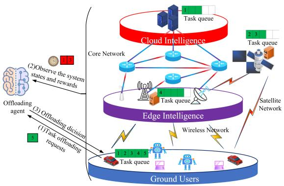

flowchart

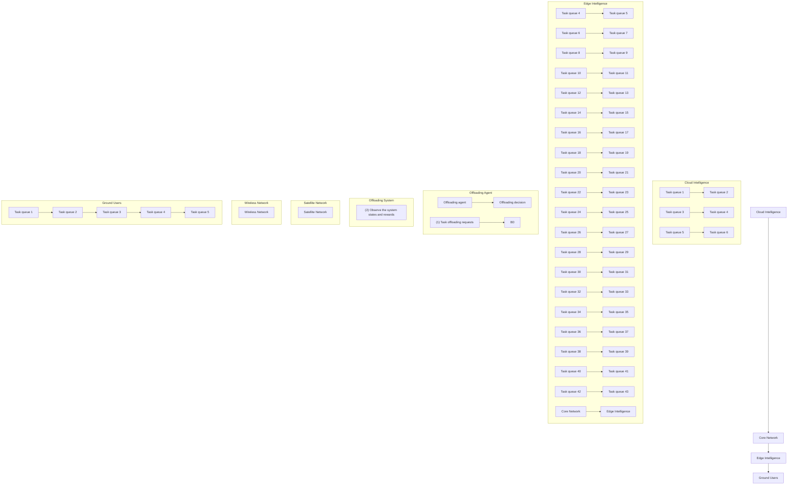

Fig. 2. The computation offloading process in a LEO-STIN scenario.

$$
w _ {2} (Q _ {k}) = c \cdot k + d, \tag {27}
$$

where $a , b , c , d \in \mathbb { R }$ are weight coefficients and $k \in \mathbb { Z } ^ { + }$ is the index of priority queue.

This algorithm includes a scheduling strategy that adopts a time-slice round-robin system. Here, we define the time-slice parameter according to (25). Except for the time-slice roundrobin scheduling strategy, this algorithm also aims to ensure the real-time performance of tasks because it need be implemented in all base stations and satellites.

# V. MARKOV DECISION PROCESSES WITH DELAYS

We formulate the corresponding MDPs with delays for modeling the dynamic LEO STINs and the task offloading process is shown in Fig. 2. The user initially submits a task offloading request and then the agent selects the optimal action based on the currently observed system state to make the offloading decision which will be executed by the user. Crucially, the agent does not immediately receive updates on the state and corresponding rewards after the task is offloaded. It needs to wait for several moments as the system requires time to process and respond to the offloading action. Moreover, due to the heterogeneity of user devices, the processing speeds and completion timings of different tasks are different, causing the states and rewards received by the agent at a future moment be potentially influenced by other concurrent actions. Under these circumstances, the agent faces a complex and dynamically changing environment, woven together by multiple influencing factors. For example, as depicted in Fig. 2, the agent sequentially offloads Task 1 to a cloud data center, while Tasks 2 and 3 are offloaded to a satellite, and Task 4 to an edge server. Subsequently, when the agent receives a request to offload Task 5, due to network latency and the heterogeneity of devices, it can only observe the states and rewards of Tasks 1 and 3, as the execution of Tasks 2 and 4 has not yet completed, thus precluding the acquisition of their states and rewards. In this scenario, the observed state and reward information by the agent exhibits delays.

Intuitively, as shown Fig. 3, it is illustrated that when the agent makes a decision at time t , it can only observe the system + 2state from time t, which is the most recent system state available to the agent. This delayed observation represents the state delay in the system. Furthermore, if there is an execution delay for the agent’s actions, the action $a _ { t }$ decided at time t will only be executed at time $t + 5$ , meaning the action decided at time t is + 5actually carried out at time $t + 3$ .

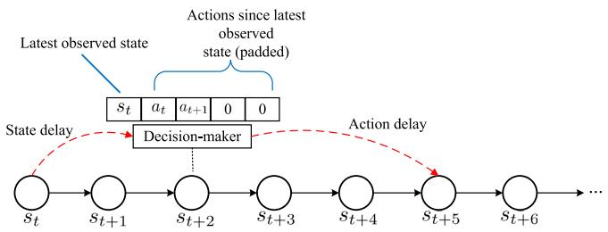

flowchart

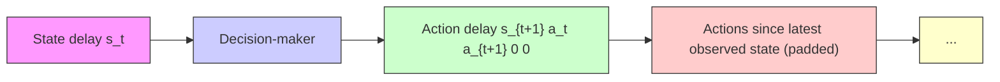

Fig. 3. Graphical illustration of the problem of the LEO satellite-terrestrial integrated networks with system state delay.

\+ 3To address the aforementioned issue, we model the task offloading decision as a stochastic delay Markov decision process. This approach is employed to capture the randomness in the timing at which users observe the states and rewards associated with their tasks.

# A. Stochastic Delay Markov Decision Process

In the realm of dynamic systems, the SDMDP represented by $\langle \mathcal { S } , \mathcal { A } , P _ { A } , \mathcal { R } , O , A C , C , \gamma \rangle$ is crucial when some uncertainty in delays need to be dealt with, where $O , A C ,$ and C denote the random variables that represent the number of delay steps in observation, action, and cost, respectively [35]. It can also be simplified to a standard MDP represented by $\left. I _ { O } , \mathcal { A } , P _ { A } ^ { O } , r ^ { \prime } \right.$ [34]. The augmented state space $I _ { O }$ is $\mathcal { S } \times \dot { \mathcal { A } } ^ { O + A C }$ , incorporating the randomness in O and AC. It means the length of $I _ { O }$ is changing, reflecting the stochastic nature of delays. Furthermore, since delay is a random variable, agents might collect rewards repeatedly, because under partially observable conditions, agents may only partially observe system state at different time steps. Due to partial observability, it is crucial to include time information in the state space, leading to the redefinition of $I _ { O }$ as $\boldsymbol { S } \times \boldsymbol { A } ^ { O + A C } \times \mathbb { N } ^ { + }$ . Specifically, the augmented state space at t is $I _ { t } = \left\{ s _ { t - O } , t , a _ { t - O } , a _ { t - O + 1 } , \ldots , a _ { t - 1 } \right\}$ . If the action $a _ { t + 1 }$ =is chosen, the state transitions to $I _ { t + 1 } =$ $\{ s _ { t - O + 1 } , t + 1 , a _ { t - O + 1 } , a _ { t - O + 2 } , \dots , a _ { t } \}$ =. Similar to DDMDP, + 1the reward is defined as $r ^ { \prime } ( s _ { t } , a _ { t } ) = \mathbb { E } [ r ( s _ { t } , a _ { t } ) | I _ { t } ]$ . Therefore, for an policy $\pi : \mathcal { S } \times \mathcal { A } ^ { O + A C } \times \mathbb { N } ^ { + } \to \mathcal { A } .$ ) ], considering the $\mathrm { D D M D P } \langle S , A , P _ { A } , r , O , A C = 0 , C \rangle$ with observation-delay, the total expected reward is given by [36]

$$
\begin{array}{l} V _ {o b s} ^ {\pi} (I _ {t}) = \mathbb {E} _ {\pi , O} \left[ \sum_ {l \geq t} \gamma^ {(l - t)} r (s _ {l - O}, a _ {l - O}) | I _ {t} \right] \\ = \mathbb {E} _ {\pi , O} \left[ \sum_ {l \geq t - O} \gamma^ {(l - t + O)} r (s _ {l}, a _ {l}) | I _ {t} \right] \\ = \mathbb {E} _ {\pi , O} \left[ \sum_ {l \geq t - O} \gamma^ {(l - t + O)} r (s _ {l}, a _ {l}) | I _ {t} \right] \\ + \mathbb {E} _ {\pi , O} \left[ \sum_ {l \geq t} \gamma^ {(l - t + O)} r (s _ {l}, a _ {l}) | I _ {t} \right], \tag {28} \\ \end{array}
$$

where $\gamma \in [ 0 , 1 ]$ is the discount factor. The goal is to maximize [0 1]the total expected reward under observation delays, $V _ { o b s } ^ { \pi } ( I _ { t } )$ , i.e.

$$
\begin{array}{l} \arg \max _ {\pi} V _ {o b s} ^ {\pi} (I _ {t}) \\ = \arg \max _ {\pi} \mathbb {E} _ {\pi , O} \left[ \sum_ {l \geq t} \gamma^ {(l - t + O)} r (s _ {l}, a _ {l}) | I _ {t} \right]. \tag {29} \\ \end{array}
$$

We consider DDMDPS, A, PA, r, O  , AC, C with the = 0action-delay. Then, the total expected reward is given by

$$
\begin{array}{l} V _ {a c t} ^ {\pi} (I _ {t}) = \mathbb {E} _ {\pi , A C} \left[ \sum_ {l \geq t} \gamma^ {(l - t)} r (s _ {l}, a _ {l - A C}) | I _ {t} \right] \\ = \mathbb {E} _ {\pi , A C} \left[ \sum_ {l \geq t - A C} \gamma^ {(l - t + A C)} r (s _ {l + A C}, a _ {l}) | I _ {t} \right] \\ = \mathbb {E} _ {\pi , A C} \left[ \sum_ {l \geq t - A C} \gamma^ {(l - t + A C)} r (s _ {l + A C}, a _ {l}) | I _ {t} \right] \\ + \mathbb {E} _ {\pi , A C} \left[ \sum_ {l \geq t} \gamma^ {(l - t + A C)} r (s _ {l + A C}, a _ {l}) | I _ {t} \right]. \tag {30} \\ \end{array}
$$

Similarly, for action delays, the objective is to maximize the total expected reward, $V _ { a c t } ^ { \pi } ( I _ { t } )$ , i.e.,

$$
\begin{array}{l} \arg \max _ {\pi} V _ {a c t} ^ {\pi} (I _ {t}) \\ = \underset {\pi} {\arg \max} \mathbb {E} _ {\pi , A C} \left[ \sum_ {l \geq t} \gamma^ {(l - t + A C)} r (s _ {l + A C}, a _ {l}) | I _ {t} \right]. \tag {31} \\ \end{array}
$$

# VI. PROPOSED SOLUTION ALGORITHM

This section details our solution approach with DRL in LEO STINs with system state delay.

# A. Design Elements of DRL

When implementing DRL for LEO networks, we focus on three crucial components:

1) State and Action Variables: They include some critical variables for effective offloading decisions, such as user capacity, tasks, base station capacity, and connectivity.   
2) Reward System: The reward system is designed to drive the learning process by minimizing the power consumption. It’s structured as

$$
r = \left\{ \begin{array}{l l} - E _ {s}, & \text { if   (22b)   -   (22j)   are   satisfied } \\ x, & \text { otherwise. } \end{array} \right. \tag {32}
$$

where $x < 0$ is an empirical parameter and $- E _ { s }$ is normalized 0during the agent training to ensure that it does not fall below x when the constraints are satisfied.

# B. DRL for LEO STINs With Delay

We employ DDQN to train the task offloading agents which comprises of online network and target network with identical structures. The online network interacts directly with the system, tasked with collecting experiences and estimating action values,

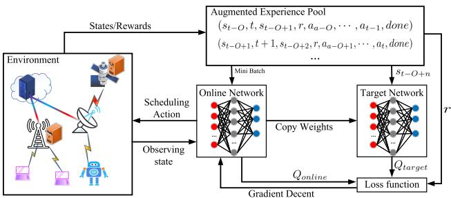

flowchart

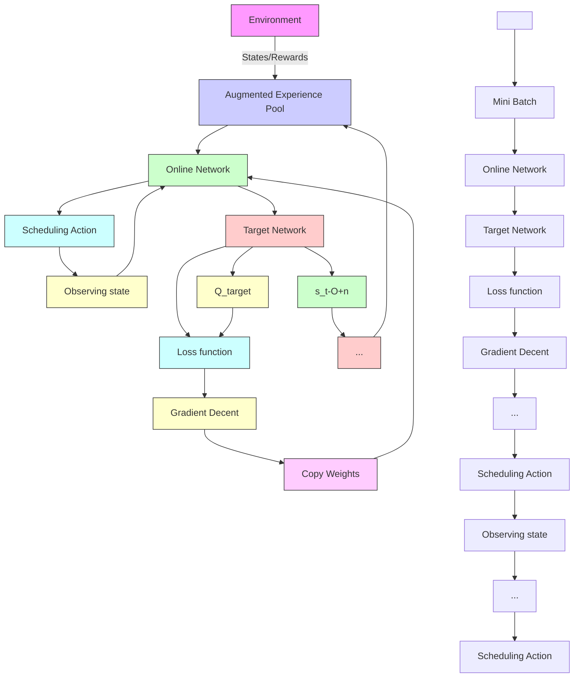

Fig. 4. The architecture of the DDQN scheme for task offloading.

$Q _ { o n l i n e } .$ , while the target network is employed for the estimation of target values, $Q _ { t a r g e t }$ . It is important to note that the parameters of target network are copied from the online network, and therefore, the target network does not engage in the learning process.

The learning process of DDQN is illustrated in Fig. 4, which incorporates an augmented experience pool to store the experience data collected during the system interactions and exhibits delay characteristics. The data, formatted as $( s _ { t - O } , t , s _ { t - O + 1 } , r , a _ { a - O + 1 } , \dots , a _ { t } , d o n e )$ , provide learning ( )material for training the online network. During the training phase, a mini-batch is randomly drawn from the augmented experience pool, enabling the online network to learn from historical experiences and optimize its decision-making strategy. The augmented experience pool is derived from the augmented state space described above.

Specifically, the action value, $Q _ { o n l i n e } ( \theta ^ { o } , I _ { t } , a _ { t } , r )$ , where $I _ { t } = ( s _ { t - O } , t , a _ { a - O } , \ldots , a _ { t - 1 } )$ ( )is estimated through a neural = (network with parameter $\theta ^ { o }$ ). The target value, $Q _ { t a r g e t } ( \theta ^ { g } , I _ { t + 1 } ,$ $a _ { t } , r )$ , with inputs $I _ { t + 1 } = ( s _ { t - O + 1 } , t + 1 , a _ { t - O + 1 } , \dots , a _ { t } )$ , is ) = ( + 1 )similarly estimated by a neural network with the corresponding parameter $\theta ^ { g }$ . It is important to note that during the training process, $\theta ^ { g }$ is updated from $\theta ^ { o }$ after several iterations to ensure timely adjustments of the target network parameters. The loss function of DDQN aims to minimize the discrepancy between the outputs of the online and target networks. Thus, the loss function can been defined as

$$
\begin{array}{l} \mathcal {J} (\theta^ {o}) = \sum (Q _ {t a r g e t} - Q _ {o n l i n e}) ^ {2} + | | \theta^ {o} | | ^ {2} \\ = \sum \left(Q _ {t a r g e t} (I _ {t + 1}, \arg \max _ {a} Q _ {o n l i n e} (I _ {t}, a)) \right. \\ \left. + r - Q _ {\text { online }} (I _ {t}, a)\right) ^ {2} + \left| \left| \theta^ {o} \right| \right| ^ {2}, \tag {33} \\ \end{array}
$$

where $| | \theta ^ { o } | | ^ { 2 }$ represents the $L _ { 2 }$ weight regularization, r denotes the reward calculated according to (32).

# C. Complexity Analysis

The complexity of proposed algorithm mainly arises from two stages: DDQN agent training and DDQN deployment. We use two deep neural networks (DNN) as our core components where one DNN requires back propagation and the other one only performs inference. This is because DNN not only is simple to implement but also performs well in solving task offloading problems [42], as demonstrated in Section VII. So, the complexity of our DNN which requires back propagation is $O ( N \cdot \bar { L ^ { . } } M ^ { \dot { 2 } } )$ , where N is the number of training samples, L is ( )the number of layers in the neural network, and M is the number of neurons per layer. For another, the complexity of our DNN which only performs inference is $O ( L \cdot M ^ { 2 } )$ . In summary, the (total complexity for training stage is $O ( N \cdot L \cdot M ^ { 2 } )$ while for deployment stage is $O ( L \cdot M ^ { 2 } )$ .

TABLE I SYSTEM PARAMETERS 

<table><tr><td>Parameter</td><td>Value</td><td>Parameter</td><td>Value</td></tr><tr><td> $f_{n,max}$ </td><td> $[5e7, 5 \times 10^{8}]$ </td><td> $f_{m,max}$ </td><td> $[5e7, 5 \times 10^{8}]$ </td></tr><tr><td> $f_{max}^{cloud}$ </td><td>5e8</td><td> $p_{bs}$ </td><td>1 J/s</td></tr><tr><td> $f_k$ </td><td> $[5e3, 10^{4}]$ </td><td> $\delta^2$ </td><td>7.9e-13 mW</td></tr><tr><td> $\alpha$ </td><td>2</td><td> $\xi$ </td><td>1</td></tr><tr><td> $p_l$ </td><td>30 J/s</td><td> $p_{leo}$ </td><td>200 J/s</td></tr><tr><td> $p_{cloud}$ </td><td>1000 J/s</td><td> $p_k$ </td><td>40 J/s</td></tr><tr><td> $p_k^{cloud}$ </td><td>100 J/s</td><td> $p_k^{bs}$ </td><td>100 J/s</td></tr></table>

# VII. PERFORMANCE EVALUATION

In this section, the simulation results are presented to illustrate the effectiveness of proposed task offloading algorithm in STINS.

# A. Simulation Settings

The task offloading algorithm and neural network are implemented with Pytorch,1 LEO satellites are modeled using poliastro,2 and the system model is formulated by Python 3.7. We implement the proposed framework on a Linux workstation with 64-bit Ubuntu 22.04.1. The hardware for training all DRL baselines has one Nvidia’s GPU with GeForce RTX 3090Ti with 24-GB memory. The CPU is an Intel(R) Core(TM) i9-10980XE processor, 18 cores, and 3.00 GHz clock speed.

In the simulation, we consider a network scenario with a data center, 10 LEO satellites, 5 base stations, and 10 users. Each user has 1 task to process at each time slot and the input data size of computation tasks (in Mbit) is uniformly distributed in the range of , , , . The output data size is uniformly [10 000 100 000]distributed in the range of ,  and the corresponding [10 100]number of required CPU cycles (in Megacycles) obeys uniform distribution in the range of $[ 1 0 ^ { 4 } , 1 0 ^ { 6 } ]$ . The transmission band-[10 10 ]width allocation for the data center, low-Earth orbit satellites, and base stations are set to 100 MHz, 500 MHz, and 400 MHz, respectively. Other parameters are with reference to the setting of computing and communication in STINs [19], [40], [45], [46], the main parameters in our system are set as in Table I.

Additionally, we take a variety of baseline methods for comparisons, including DDQN [40], DQN [40], particle swarm optimization (PSO) [41], genetic algorithm (GA) [30], simulated annealing (SA), Random, and advantage actor-critic (A2C). We also compare four types of neural networks used in our proposed approach: convolutional neural network (CNN), DNN, gated

$$
\begin{array}{l} ^ 1 \text { https: / / pytorch.org/ } \\ ^ 2 \text {https://github.com/poliastro/poliastro} \\ \end{array}
$$

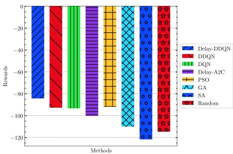

bar

| Methods     | Rewards |
| ----------- | ------- |
| Delay-DDQN  | -85     |
| DDQN        | -90     |
| DQN         | -90     |
| Delay-A2C   | -100    |
| PSO         | -95     |
| GA          | -110    |
| SA          | -120    |
| Random      | -120    |

(a) Comparisons with stochastic system state delay.

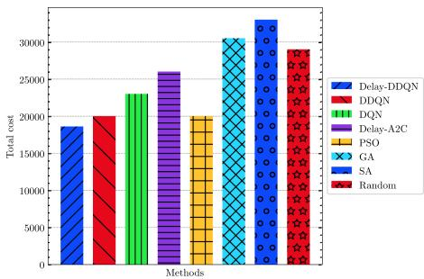

bar

| Methods     | Total cost |
| ----------- | ---------- |
| Delay-DDQN  | 18000      |
| DDQN        | 20000      |
| DQN         | 23000      |
| Delay-A2C   | 26000      |
| PSO         | 20000      |
| GA          | 31000      |
| SA          | 34000      |
| Random      | 29000      |

(b)Energy consumption comparisons with stochastic delay.

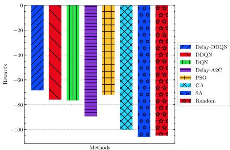

bar

| Methods     | Rewards |
| ----------- | ------- |
| Delay-DDQN  | -70     |
| DDQN        | -80     |
| DQN         | -75     |
| Delay-A2C   | -90     |
| PSO         | -70     |
| GA          | -100    |
| SA          | -110    |
| Random      | -105    |

(c) Comparisons with action delays.

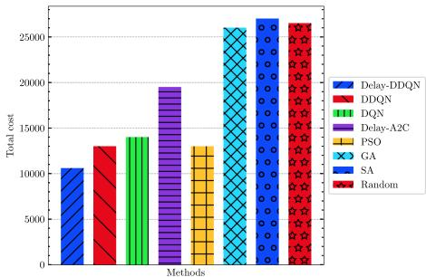

bar

| Methods     | Total cost |
| ----------- | ---------- |
| Delay-DDQN  | 11000      |
| DDQN        | 13000      |
| DQN         | 14000      |
| Delay-A2C   | 19500      |
| PSO         | 13000      |
| GA          | 26000      |
| SA          | 27000      |
| Random      | 26500      |

(d) Energy consumption comparisons with action delays.   
Fig. 5. Main results.

neural network (GRU), and long short-term memory (LSTM) neural network. Among them, a two-layer convolutional neural network, two-layer feedforward fully connected neural network, one-layer gated neural network, and one-layer long short-term memory neural network are used and the learning rate for these neural networks is set to 0.001.

# B. Performance Comparisons and Analysis

In the simulation experiments, we consider two scenarios: one is the system state delay and the other is the system action delay. In addition, we also consider fixed system state and action delays as well as random system state and action delays.

1) Main Results: Fig. 5(a) shows the performance comparisons with random system state delays, where the Delay-DDQN outperforms other methods and reinforces its robustness and efficiency. Similarly, Fig. 5(b) presents the total energy consumption outcomes of various algorithms under the random system state delays. The Delay-DDQN method consistently outperforms the other evaluated methods, including traditional reinforcement learning approaches, such as DDQN and DQN, as well as heuristic-based methods, like PSO, GA, SA, and Random. This performance superiority highlights the effectiveness of the Delay-DDQN approach in handling tasks in dynamic and uncertain environments, further emphasizing its robustness and efficiency in stochastic settings.

In Fig. 5(c) and (d) which focus on the scenarios with action delays, the Delay-DDQN again demonstrates superior performance. Fig. 5(c) illustrates the reward outcomes of different methods in the presence of action delays and the Delay-DDQN achieves the higher rewards compared to other baselines. It indicates the capability to respond effectively despite the delays

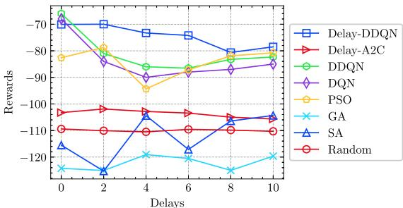  
Fig. 6. Comparison of different algorithms under fixed state delays.

in executing actions. Fig. 5(d) shows the total energy consumption results for the same set of algorithms under the stochastic action delays. Here, the Delay-DDQN maintains lower costs than the other methods, underscoring its operational efficiency and advantage of incorporating delay-aware strategies in the optimization process. These results further validate the robustness and adaptability of the Delay-DDQN method, making it particularly suitable for the dynamic environments where the delays are inherent and unpredictable.

The results in Fig. 6 show that our proposed Delay-DDQN algorithm outperforms other benchmarks across various fixed state delay values, as evidenced by the consistently higher rewards it achieves. As the state delay increases, the performance of most algorithms declines, reflecting the challenge of making optimal decisions with delayed information. However, Delay-DDQN demonstrates remarkable resilience, maintaining relatively high rewards even at higher delay values, such as when the delay reaches 5 or more. This suggests that Delay-DDQN is particularly effective at handling delayed state information, likely due to its advanced processing of such delays within the decision-making framework. In comparison, other algorithms like Delay-A2C, DQN, and DDQN experience more significant drops in performance as delays increase, indicating their lower poorly in such scenarios. Traditional algorithms like PSO, GA, SA, and Random consistently perform robustness across all delay values, further underscoring the superiority of Delay-DDQN in environments with fixed state delays.

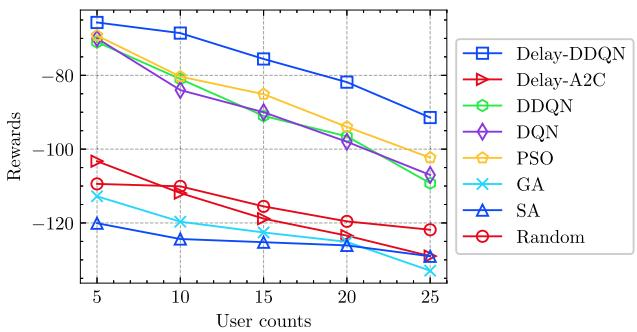  
Fig. 7. Comparison of different algorithms when the number of users varies.

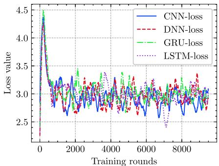

line

| Training rounds | CNN-loss | DNN-loss | GRU-loss | LSTM-loss |
| --------------- | -------- | -------- | -------- | --------- |
| 0               | 4.5      | 4.5      | 4.5      | 4.5       |
| 1000            | 3.2      | 3.2      | 3.2      | 3.2       |
| 2000            | 3.0      | 3.0      | 3.0      | 3.0       |
| 3000            | 3.1      | 3.1      | 3.1      | 3.1       |
| 4000            | 3.0      | 3.0      | 3.0      | 3.0       |
| 5000            | 3.1      | 3.1      | 3.1      | 3.1       |
| 6000            | 3.0      | 3.0      | 3.0      | 3.0       |
| 7000            | 3.1      | 3.1      | 3.1      | 3.1       |
| 8000            | 3.0      | 3.0      | 3.0      | 3.0       |
| 9000            | 3.1      | 3.1      | 3.1      | 3.1       |
| 10000           | 3.0      | 3.0      | 3.0      | 3.0       |

Fig. 10. Comparisons with neural networks for loss value.

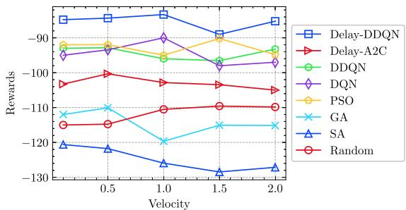  
Fig. 8. Comparison of different algorithms when the velocity of users varies.

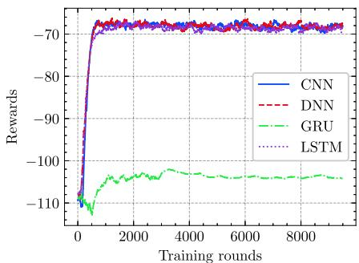

line

| Training rounds | CNN   | DNN   | GRU   | LSTM  |
| --------------- | ----- | ----- | ----- | ----- |
| 0               | -110  | -110  | -110  | -110  |
| 2000            | -70   | -70   | -105  | -70   |
| 4000            | -70   | -70   | -105  | -70   |
| 6000            | -70   | -70   | -105  | -70   |
| 8000            | -70   | -70   | -105  | -70   |
| 9000            | -70   | -70   | -105  | -70   |

Fig. 11. Comparisons with neural networks for stochastic action delays.

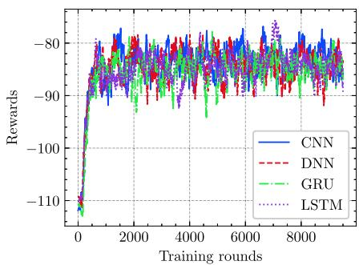

line

| Training rounds | CNN   | DNN   | GRU   | LSTM  |
| --------------- | ----- | ----- | ----- | ----- |
| 0               | -110  | -110  | -110  | -110  |
| 2000            | -85   | -85   | -85   | -85   |
| 4000            | -85   | -85   | -85   | -85   |
| 6000            | -85   | -85   | -85   | -85   |
| 8000            | -85   | -85   | -85   | -85   |
| 10000           | -85   | -85   | -85   | -85   |

Fig. 9. Comparisons with neural networks for stochastic observation delays.

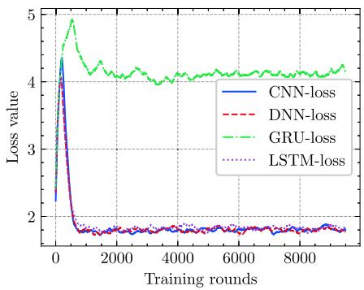

line

| Training rounds | CNN-loss | DNN-loss | GRU-loss | LSTM-loss |
| --------------- | -------- | -------- | -------- | --------- |
| 0               | 4.5      | 4.5      | 4.5      | 4.5       |
| 1000            | 1.8      | 1.8      | 4.2      | 1.8       |
| 2000            | 1.7      | 1.7      | 4.1      | 1.7       |
| 3000            | 1.7      | 1.7      | 4.1      | 1.7       |
| 4000            | 1.7      | 1.7      | 4.1      | 1.7       |
| 5000            | 1.7      | 1.7      | 4.1      | 1.7       |
| 6000            | 1.7      | 1.7      | 4.1      | 1.7       |
| 7000            | 1.7      | 1.7      | 4.1      | 1.7       |
| 8000            | 1.7      | 1.7      | 4.1      | 1.7       |
| 9000            | 1.7      | 1.7      | 4.1      | 1.7       |
| 10000           | 1.7      | 1.7      | 4.1      | 1.7       |

Fig. 12. Comparisons with neural networks for loss value on stochastic action delays.

The results presented in Fig. 7 illustrate the performance of various algorithms as the number of users increases. The proposed Delay-DDQN algorithm consistently outperforms the other algorithms across all user counts, maintaining the highest rewards throughout. As the number of users increases, the rewards generally decrease for all algorithms, which is expected due to the increased competition for resources and the greater complexity in decision-making with more users. However, Delay-DDQN exhibits a more gradual decline in performance compared to other methods, indicating its superior capability in managing the increased load and complexity associated with a higher number of users. In contrast, algorithms such as Delay-A2C, PSO, DQN, and DDQN show decreases in rewards as the user count rises, reflecting their relatively lower effectiveness in handling scenarios with many users. Traditional optimization algorithms like GA, SA, and the Random strategy consistently perform the poorly across all user counts, further emphasizing the robustness of Delay-DDQN in user-dense environments.

The results in Fig. 8 show that the performance of various algorithms remains relatively stable as the user velocity changes, with our proposed Delay-DDQN algorithm consistently achieving the highest rewards across all velocity levels. Note that the values on the horizontal axis represent changes in speed. When the value is less than 1, the user’s speed decreases, and when the value is greater than 1, the speed increases. This stability can be attributed to the architecture of STINs, which utilizes satellites with large coverage areas. Unlike ground-based networks, where user mobility can significantly affect communication and offloading decisions, the extensive coverage provided by satellites ensures that even at higher user velocities, the impact on task offloading and network performance is mild. As a result, Delay-DDQN maintains superior performance regardless of user speed, highlighting its effectiveness in dynamic environments. The results also indicate that while other algorithms like Delay-A2C, DQN, and DDQN show some variability, the overall influence of user velocity is limited due to the robust satellite coverage. Traditional optimization algorithms, such as PSO, GA, SA, and Random, perform consistently worse, but the effect of user velocity on their performance is less pronounced.

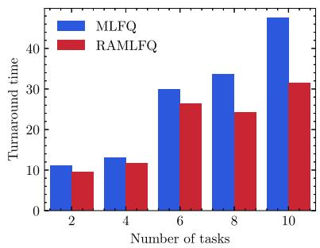

bar

| Number of tasks | MLFQ | RAMLFQ |
|---|---|---|
| 2 | 11 | 9.5 |
| 4 | 13 | 11.5 |
| 6 | 30 | 26.5 |
| 8 | 34 | 24.5 |
| 10 | 47 | 31.5 |

(a) Average turnaround time by task number

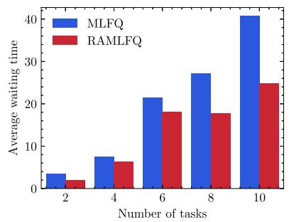

bar

| Number of tasks | MLFQ | RAMLFQ |
|---|---|---|
| 2 | 3.5 | 2.0 |
| 4 | 7.5 | 6.0 |
| 6 | 21.5 | 18.0 |
| 8 | 27.0 | 18.0 |
| 10 | 40.5 | 25.0 |

(b)Average waiting time by task number

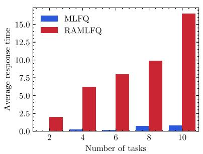

bar

| Number of tasks | MLFQ | RAMLFQ |
| --------------- | ---- | ------ |
| 2               | 0.0  | 2.0    |
| 4               | 0.5  | 6.0    |
| 6               | 0.5  | 8.0    |
| 8               | 1.0  | 10.0   |
| 10              | 1.0  | 16.0   |

(c)Average respons time by task number   
Fig. 13. The performance of computing resource allocation based on CPU task scheduling.

2) Ablation Studies on State Delays: Fig. 9 shows the experimental results under the conditions with random system state delays which varies from 0 to 10. It can been seen that regardless of the type of used neural network, the rewards fluctuate within a certain range. This indicates that the proposed method is effective in situations where the system state delay is random. Furthermore, the experimental results in Fig. 9 suggest that in cases of random system state delays, it is advisable to choose neural networks that have faster training efficiency and inference speed. Moreover, Fig. 9 also shows that the neural networks are unstable during the training. Despite careful tuning during the experiments, the issue of training instability could not be alleviated, which may be due to the more severe system dynamic changes caused by the random system state delays.

Fig. 10 depicts the loss value trends of various neural networks in DDQN under the conditions of random system state delays. The results indicate that during the early stage of training, the loss value quickly rises from 2.25 to around 4.4, then continuously decreases, and finally oscillates within a certain range. In the initial phase of training, due to the presence of system state delays and the inability to collect system feedback, including the system rewards, the loss value rapidly increases to around 4.4. Afterwards, the loss value begins to decrease and oscillates within a range, which shows that the proposed method has a certain learning capability. This oscillation of loss values briefly leads to a time-variant optimization performance in each neural network. About the above simulation results, the neural network performs differently under both fixed system state delay and random system state delay. Overall, the results validate the effectiveness of proposed method.

3) Ablation Studies on Action Delays: Fig. 11 presents the experimental results under the conditions with random system action delays which varies from 0 to 10. The results show that except for the GRU neural network, the rewards for CNN, DNN, and LSTM neural networks fluctuate within a certain range. It can be observed that the type of neural network affects the performance of proposed method and the loss value of the GRU neural network does not converge, leading to poorer performance, as shown in Fig. 12. Similarly, in the early stages of training, the loss value quickly rises from 2.2 to around 4.3, then continuously decreases, and finally oscillates within a certain range. The rapid increase in loss value in the early stages is due to the presence of system state delays and the inability to collect system feedback, including system rewards. The subsequent decrease and oscillation in loss value indicate that the proposed method has a certain learning capability. This figure demonstrates that whether the loss value converges during the training period of proposed method does not affect our task offloading performance. Therefore, considering the training stability of proposed method is important when there are system action delays.

4) Analysis of Computing Resource Allocation: Fig. 13 demonstrates the performance improvement of RAMLFQ over the traditional Multi-Level Feedback Queue (MLFQ) through two metrics: average turnaround time and average waiting time. Fig. 13(a) illustrates the impact of task number on the average turnaround time. Compared with MLFQ, RAMLFQ exhibits significantly lower turnaround times across all task quantity configurations which indicates its more efficient management of task execution. Particularly, as the number of tasks increases, the performance advantage of RAMLFQ becomes more evident which shows its effective resource management under the high load conditions. Fig. 13(b) provides a view of the effect of task number on the average waiting time. RAMLFQ offers a lower waiting time in most scenarios, especially when the task number is high. It underscores the ability of RAMLFQ to reduce the waiting times when handling a large volume of tasks. This is because of its fine-grained management in terms of priorities and resource constraints. Furthermore, Fig. 13(c) displays a comparison of the average response time between RAMLFQ and MLFQ algorithms under different task numbers. In most cases, the response time of RAMLFQ is higher than that of MLFQ. This increase in response time in RAMLFQ is because of the adoption of more fine-grained priority and the dynamic allocation strategy in allocating computing resources. It means that RAMLFQ tends to give preference to high-priority or resource-intensive tasks during the resource allocation, and these tasks require a longer time to respond. Moreover, the longer response time might also reflect RAMLFQ’s efforts to ensure fairness in resource allocation, which might lead to a slight delay in responding to certain tasks so that the system can serve all tasks more equitably. Although RAMLFQ’s response time is marginally higher than MLFQ, its advantages in terms of turnaround time and waiting time might more effectively demonstrate its superior performance in dynamic and complex computing environments. This suggests that the RAMLFQ strategy has significant advantages in terms of adaptability and flexibility in meeting diverse task requirements.

# VIII. CONCLUSION

Due to network entity mobility, architecture variation, and user heterogeneity, STINs often experience various system state delays which will bring out significant challenges for computation offloading and resource allocation issues. In this paper, we have jointly considered the computation offloading and resource allocation to address the system state delay problem. We have explored the computation offloading challenge in LEO STINs, particularly focusing on the system state delay. We also have proposed a multi-level feedback queue for computing allocation and a state augmentation DRL task scheduling mechanism. These solutions efficiently allocate the computing resources across various edge servers, including base stations and LEO satellites. To mitigate the impact of the system state delay, we have employed stochastic delay MDPs to formulate the problem and then formulated a state-augmented DRL-based computation offloading approach to seek an optimal offloading mode. The utilization of deep neural networks and DDQN significantly enhanced the learning performance. Finally, the simulation results have confirmed the effectiveness of the proposed approaches.

In the future, we plan to explore the use of digital twins in STINs to accurately model real-world scenarios, ensuring smoother transitions from simulation to deployment. This approach is crucial for enhancing the reliability and performance of deep reinforcement learning models in practical applications. Moreover, we will also consider the use of phased array antennas in LEO satellites and base stations, as well as account for interbeam interference and interference between cellular and satellite coverage.

# REFERENCES

[1] T. Pfandzelter and D. Bermbach, “Edge (of the earth) replication: Optimizing content delivery in large LEO satellite communication networks,” in Proc. IEEE/ACM CCGrid, Melbourne, VIC, Australia, May 2021, pp. 565–C575.

[2] C. Ding, J.-B. Wang, M. Cheng, M. Lin, and J. Cheng, “Dynamic transmission and computation resource optimization for dense LEO satellite assisted mobile-edge computing,” IEEE Trans. Commun., vol. 71, no. 5, pp. 3087–3102, May 2023.   
[3] D. Wang, T. He, Y. Lou, L. Pang, Y. He, and H.-H. Chen, “Doubleedge computation offloading for secure integrated space–air–aqua networks,” IEEE Internet Things J., vol. 10, no. 17, pp. 15581–15593, Sep. 2023.   
[4] Q. Tang, Z. Fei, B. Li, and Z. Han, “Computation offloading in LEO satellite networks with hybrid cloud and edge computing,” IEEE Internet Things J., vol. 8, no. 11, pp. 9164–9176, Jun. 2021.   
[5] Q. Tang et al., “Stochastic computation offloading for LEO satellite edge computing networks: A learning-based approach,” IEEE Internet Things J., vol. 11, no. 4, pp. 5638–5652, Feb. 2024.   
[6] H. Zhang, S. Xi, H. Jiang, Q. Shen, B. Shang, and J. Wang, “Resource allocation and offloading strategy for UAV-Assisted LEO satellite edge computing,” Drones, vol. 7, no. 6, 2023, Art. no. 383.   
[7] Z. Ji, S. Wu, and C. Jiang, “Cooperative multi-agent deep reinforcement learning for computation offloading in digital twin satellite edge networks,” IEEE J. Sel. Areas Commun., vol. 41, no. 11, pp. 3414–3429, Nov. 2023.   
[8] S. Fujimoto, H. Hoof, and D. Meger, “Addressing function approximation error in actor-critic methods,” in Proc. Int. Conf. Mach. Learn., 2018, pp. 1587–1596.   
[9] S. Sthapit, S. Lakshminarayana, L. He, G. Epiphaniou, and C. Maple, “Reinforcement learning for security-aware computation offloading in satellite networks,” IEEE Internet Things J., vol. 9, no. 14, pp. 12351–12363, Jul. 2022.   
[10] G. Cui, Y. Long, L. Xu, and W. Wang, “Joint offloading and resource allocation for satellite assisted vehicle-to-vehicle communication,” IEEE Syst. J., vol. 15, no. 3, pp. 3958–3969, Sep. 2021.   
[11] S. Nath, M. Baranwal, and H. Khadilkar, “Revisiting state augmentation methods for reinforcement learning with stochastic delays,” in Proc. ACM. Int. Conf. Inf. Knowl. Manage., 2021, pp. 1346–1355.   
[12] R. Xie, Q. Tang, Q. Wang, X. Liu, F. R. Yu, and T. Huang, “Satelliteterrestrial integrated edge computing networks: Architecture, challenges, and open issues,” IEEE Netw., vol. 34, no. 3, pp. 224–231, May/Jun. 2020.   
[13] Q. Zhang, Y. Luo, H. Jiang, and K. Zhang, “Aerial edge computing: A survey,” IEEE Internet Things J., vol. 10, no. 16, pp. 14357–14374, Aug. 2023.   
[14] Y. Lin et al., “Integrating satellites and mobile edge computing for 6G wide-area edge intelligence: Minimal structures and systematic thinking,” IEEE Netw., vol. 37, no. 2, pp. 14–21, Mar./Apr. 2023.   
[15] Z. Zhang, W. Zhang, and F.-H. Tseng, “Satellite mobile edge computing: Improving QoS of high-speed satellite-terrestrial networks using edge computing techniques,” IEEE Netw., vol. 33, no. 1, pp. 70–76, Jan./Feb. 2019.   
[16] Z. Lin, M. Lin, T. de Cola, J.-B. Wang, W.-P. Zhu, and J. Cheng, “Supporting IoT with rate-splitting multiple access in satellite and aerial-integrated networks,” IEEE Internet Things J., vol. 8, no. 14, pp. 11123–11134, Jul. 2021.   
[17] G. Valecce, S. Strazzella, and L. A. Grieco, “On the interplay between 5G, mobile edge computing and robotics in smart agriculture scenarios,” in Proc. 18th Int. Conf. Ad-Hoc Netw. Wireless, Luxembourg, Luxembourg, 2019, pp. 549–559.   
[18] J. Du, C. Jiang, A. Benslimane, S. Guo, and Y. Ren, “SDN-based resource allocation in edge and cloud computing systems: An evolutionary Stackelberg differential game approach,” IEEE/ACM Trans. Netw., vol. 30, no. 4, pp. 1613–1628, Aug. 2022.   
[19] X. Cao et al., “Edge-assisted multi-layer offloading optimization of LEO satellite-terrestrial integrated networks,” IEEE J. Sel. Areas Commun., vol. 41, no. 2, pp. 381–398, Feb. 2023.   
[20] Z. Lin, M. Lin, B. Champagne, W.-P. Zhu, and N. Al-Dhahir, “Secrecyenergy efficient hybrid beamforming for satellite-terrestrial integrated networks,” IEEE Trans. Commun., vol. 69, no. 9, pp. 6345–6360, Sep. 2021.   
[21] J. von Mankowski, E. Durmaz, A. Papa, H. Vijayaraghavan, and W. Kellerer, “Aerial-aided multiaccess edge computing: Dynamic and joint optimization of task and service placement and routing in multilayer networks,” IEEE Trans. Aerosp. Electron. Syst., vol. 59, no. 3, pp. 2593–2607, Jun. 2023.   
[22] X. Zhang et al., “Energy-efficient computation peer offloading in satellite edge computing networks,” IEEE Trans. Mob. Comput., vol. 23, no. 4, pp. 3077–3091, Apr. 2024.

[23] Q. Li et al., “Service coverage for satellite edge computing,” IEEE Internet Things J., vol. 9, no. 1, pp. 695–705, Jan. 2022.   
[24] C. Ding, J.-B. Wang, H. Zhang, M. Lin, and G. Y. Li, “Joint optimization of transmission and computation resources for satellite and high altitude platform assisted edge computing,” IEEE Trans. Wireless Commun., vol. 21, no. 2, pp. 1362–1377, Feb. 2022.   
[25] J. Liu, X. Zhao, P. Qin, S. Geng, and S. Meng, “Joint dynamic task offloading and resource scheduling for WPT enabled space-air-ground power Internet of Things,” IEEE Trans. Netw. Sci. Eng., vol. 9, no. 2, pp. 660–677, Mar./Apr. 2022.   
[26] Y. Yin, C. Huang, D. Wu, and S. Huang, “Joint computation offloading and resource allocation in space-air-terrestrial integrated networks for IoT applications,” Ad Hoc Networks, vol. 150, Aug. 2023, Art. no. 103267.   
[27] Y. Liu, L. Jiang, Q. Qi, K. Xie, and S. Xie, “Online computation offloading for collaborative space/aerial-aided edge computing toward 6G system,” IEEE Trans. Veh. Technol., vol. 73, no. 2, pp. 2495–2505, Feb. 2024.   
[28] B. Mao, F. Tang, Y. Kawamoto, and N. Kato, “Optimizing computation offloading in satellite-UAV-served 6G IoT: A deep learning approach,” IEEE Netw., vol. 35, no. 4, pp. 102–108, Jul./Aug. 2021.   
[29] S. Yu, X. Gong, Q. Shi, X. Wang, and X. Chen, “EC-SAGINs: Edgecomputing-enhanced space–air–ground-integrated networks for Internet of Vehicles,” IEEE Internet Things J., vol. 9, no. 8, pp. 5742–5754, Apr. 2022.   
[30] G. Cui, P. Duan, L. Xu, and W. Wang, “Latency optimization for hybrid GEO–CLEO satellite-assisted IoT networks,” IEEE Internet Things J., vol. 10, no. 7, pp. 6286–6297, Apr. 2023.   
[31] H. Zhang, R. Liu, A. Kaushik, and X. Gao, “Satellite edge computing with collaborative computation offloading: An intelligent deep deterministic policy gradient approach,” IEEE Internet Things J., vol. 10, no. 10, pp. 9092–9107, May 2023.   
[32] N. Waqar, S. A. Hassan, A. Mahmood, K. Dev, D.-T. Do, and M. Gidlund, “Computation offloading and resource allocation in MEC-Enabled integrated aerial-terrestrial vehicular networks: A reinforcement learning approach,” IEEE Trans. Intell. Transp. Syst., vol. 23, no. 11, pp. 21478–21491, Nov. 2022.   
[33] S. S. Hassan, Y. M. Park, Y. K. Tun, W. Saad, Z. Han, and C. S. Hong, “Satellite-based ITS data offloading & computation in 6G networks: A cooperative multi-agent proximal policy optimization DRL with attention approach,” IEEE Trans. Mob. Comput., vol. 23, no. 5, pp. 4956–4974, May 2024.   
[34] E. Altman and P. Nain, “Closed-loop control with delayed information,” Perf. Eval. Rev., vol. 14, pp. 193–204, 1992.   
[35] K. V. Katsikopoulos and S. E. Engelbrecht, “Markov decision processes with delays and asynchronous cost collection,” IEEE Trans. Autom. Control., vol. 48, no. 4, pp. 568–574, Apr. 2003.   
[36] C. J. C. H. Watkins and P. Dayan, “Q-learning,” Mach. Learn., vol. 8, pp. 279–292, 1992.   
[37] F. J. Corbató, M. Merwin-Daggett, and R. C. Daley, “An experimental time-sharing system,” in Proc. Spring Joint. Comput. Conf., 1962, pp. 335–344.   
[38] A. U. Chaudhry and H. Yanikomeroglu, “Laser intersatellite links in a starlink constellation: A classification and analysis,” IEEE Veh. Technol. Mag., vol. 16, no. 2, pp. 48–56, Jun. 2021.   
[39] Z. Lin et al., “Refracting RIS-aided hybrid satellite-terrestrial relay networks: Joint beamforming design and optimization,” IEEE Trans. Aerosp. Electron. Syst., vol. 58, no. 4, pp. 3717–3724, Aug. 2022.   
[40] N. Cheng et al., “Space/Aerial-assisted computing offloading for IoT applications: A learning-based approach,” IEEE J. Sel. Areas Commun., vol. 37, no. 5, pp. 1117–1129, May 2019.   
[41] X. Gao et al., “Hierarchical dynamic resource allocation for computation offloading in LEO satellite networks,” IEEE Internet Things J., vol. 11, no. 11, pp. 19470–19484, Jun. 2024.   
[42] H. Zhai, X. Zhou, H. Zhang, and D. Yuan, “Delay minimization in hybrid edge computing networks: A DDQN-based task offloading approach,” IEEE Trans. Veh. Technol., early access, May 30, 2024, doi: 10.1109/TVT.2024.3407483.   
[43] P. Wei, W. Feng, Y. Wang, Y. Chen, N. Ge, and C.-X. Wang, “Joint mobility control and MEC offloading for hybrid satellite-terrestrialnetwork-enabled robots,” IEEE Trans. Wireless Commun., vol. 22, no. 11, pp. 8483–8497, Nov. 2023.   
[44] Z. Lin, M. Lin, J.-B. Wang, T. de Cola, and J. Wang, “Joint beamforming and power allocation for satellite-terrestrial integrated networks with nonorthogonal multiple access,” IEEE J. Sel. Top. Signal Process., vol. 13, no. 3, pp. 657–670, Jun. 2019.

[45] Y. Wang and K. A. Gui, “Optimization of energy use in radio frequency transmission for satellite communication,” Comput. Commun., vol. 211, pp. 73–82, Nov. 2023.   
[46] J. Lorincz, T. Garma, and G. Petrovic, “Measurements and modelling of base station power consumption under real traffic loads,” Sensors, vol. 12, no. 4, pp. 4281–4310, Mar. 2012.

natural_image

Portrait photo of a man in formal attire against a blue background (no text or symbols visible)

Bo Xie received the MS degree in computer technology from Guizhou University, Guiyang, China, in 2022. He is currently working toward the PhD degree in electronic science and technology from South China Normal University, Guangzhou, China. His research interests include mobile edge computing and optimization, edge intelligence.

natural_image

Portrait of a woman wearing glasses and a white top against a blue background (no text or symbols visible)

Haixia Cui (Senior Member, IEEE) received the MS and PhD degrees in Communication Engineering from The South China University of Technology, Guangzhou, China, in 2005 and 2011, respectively. She is currently a full professor with the School of Electronic Science and Engineering, South China Normal University, Guangzhou, China. From July 2014 to July 2015, she was an Advanced Visiting Scholar (Visiting Associate Professor) with the Department of Electrical and Computer Engineering, the University of British Columbia, Vancouver, BC,

Canada. She has authored or coauthored more than 70 refereed journal and conference papers and one books. She also holds about 30 patents. Her research interests include mobile edge computing, vehicular networks, cooperative communication, wireless resource allocation, 5G/6G, multiple access control, and power control in wireless networks.

natural_image

Portrait of a man wearing glasses and a suit (no text or symbols visible)

Ivan Wang-Hei Ho (Senior Member, IEEE) received the BEng and MPhil degrees in information engineering from The Chinese University of Hong Kong, Hong Kong, in 2004 and 2006, respectively, and the PhD degree in electrical and electronic engineering from the Imperial College London, London, U.K., in 2010. He was a research intern with the IBM Thomas J. Watson Research Center, Hawthorne, NY, USA, and a postdoctoral research associate with the System Engineering Initiative, Imperial College London. In 2010, he co-founded P2 Mobile Technologies Ltd.,

where he was the chief research and development engineer. He is currently an associate professor with the Department of Electrical and Electronic Engineering, The Hong Kong Polytechnic University, Hong Kong. His research interests include wireless communications and networking, specifically in vehicular networks, intelligent transportation systems, and Internet of Things (IoT). Dr. Ho primarily invented the MeshRanger series wireless mesh embedded system, which received the Silver Award in Best Ubiquitous Networking at the Hong Kong ICT Awards 2012. His work on indoor positioning and IoT also received the Gold Medal at the International Trade Fair Ideas and Inventions New Products (iENA) in Germany, in 2019, and the Gold Medal with the Organizer’s Choice Award in the International Invention Innovation Competition in Canada (iCAN) in 2020. He is currently an associate editor for IEEE Transactions on Vehicular Technology, IEEE Access, and IEEE Transactions on Consumer Electronics, and was the TPC co-chair for the PERSIST-IoT Workshop in conjunction with ACM MobiHoc 2019 and IEEE INFOCOM 2020.

natural_image

Portrait photo of a man in formal attire against a blue background (no text or symbols visible)

Yejun He (Senior Member, IEEE) received the PhD degree in information and communication engineering from the Huazhong University of Science and Technology (HUST), Wuhan, China, in 2005. From 2005 to 2006, he was a research associate with the Department of Electronic and Information Engineering, The Hong Kong Polytechnic University, Hong Kong. From 2006 to 2007, he was a research associate with the Department of Electronic Engineering, Faculty of Engineering, The Chinese University of Hong Kong, Hong Kong. In 2012, he joined the Department of Electrical and Computer Engineering, University of Waterloo, Waterloo, ON, Canada, as a visiting professor. From 2013 to 2015, he was an advanced visiting scholar (visiting professor) with the School of Electrical and Computer Engineering, Georgia Institute of Technology, Atlanta, GA, USA. From 2023 to 2024, he was an advanced research scholar (visiting professor) with the Department of Electrical and Computer Engineering, National University of Singapore, Singapore. Since 2006, he has been a faculty of Shenzhen University, where he is currently a full professor with the College of Electronics and Information Engineering, Shenzhen University, Shenzhen, China, the director of Sino-British Antennas and Propagation Joint Laboratory of Ministry of Science and Technology of the People’s Republic of China (MOST), the director of the Guangdong Engineering Research Center of Base Station Antennas and Propagation, and the director of the Shenzhen Key Laboratory of Antennas and Propagation. He was selected as a Leading Talent in the “Guangdong Special Support Program” and the Shenzhen “Pengcheng Scholar” Distinguished Professor, China, in 2024 and 2020, respectively. He has authored or coauthored more than 300 refereed journal and conference papers and seven books. He holds about 20 patents. His research interests include wireless communications, antennas, and radio frequency. Dr. He was the recipient of the Shenzhen Overseas High-Caliber Personnel Level B (Peacock Plan Award B) and Shenzhen High-Level Professional Talent (Local Leading Talent). He was also the recipient of the Second Prize of Shenzhen Science and Technology Progress Award in 2017, Three Prize of Guangdong Provincial Science and Technology Progress Award in 2018, Second Prize of Guangdong Provincial Science and Technology Progress Award in 2023, and 10th Guangdong Provincial Patent Excellence Award in 2023. He is currently the Chair of IEEE Antennas and Propagation Society-Shenzhen Chapter and was the recipient of the 2022 IEEE APS Outstanding Chapter Award. Dr. He is a fellow of IET, a senior member of the China Institute of Communications, and a senior member of the China Institute of Electronics. He was a technical program committee member or a session chair for various conferences, including the IEEE Global Telecommunications Conference, IEEE International Conference on Communications, IEEE Wireless Communication Networking Conference, and IEEE Vehicular Technology Conference. He was the TPC chair for IEEE ComComAp 2021 and General Chair for IEEE ComComAp 2019. He was selected as a board member of the IEEE Wireless and Optical Communications Conference. He was the TPC co-chair for WOCC 2023/2022/2019/2015, APCAP 2023, UCMMT 2023, ACES-China2023, and NEMO 2020. He acted as the publicity chair of several international conferences, such as the IEEE PIMRC 2012. He is the executive chair of 2024 IEEE International Workshop of Radio Frequency and Antenna Technologies. He is the principal investigator for more than 40 current or finished research projects, including the National Natural Science Foundation of China, Science and Technology Program of Guangdong Province, and Science and Technology Program of Shenzhen City. He was a reviewer for various journals, such as IEEE Transactions on Vehicular Technology, IEEE Transactions on Communications, IEEE Transactions on Industrial Electronics, IEEE Transactions on Antennas and Propagation, IEEE Wireless Communications, IEEE Communications Letters, the International Journal of Communication Systems, and Wireless Personal Communications. He is an associate editor for IEEE Transactions on Antennas and Propagation, IEEE Transactions on Vehicular Technology, IEEE Transactions on Mobile Computing, IEEE Antennas and Propagation Magazine, IEEE Antennas and Wireless Propagation Letters, International Journal of Communication Systems, China Communications, and ZTE Communications.

natural_image

Portrait of a smiling man in business attire (no text or symbols visible)

Mohsen Guizani (Fellow, IEEE) received the BS (with distinction), MS, and PhD degrees in electrical and computer engineering from Syracuse University, Syracuse, NY, USA, in 1985, 1987, and 1990, respectively. He is currently a professor of machine learning with the Mohamed Bin Zayed University of Artificial Intelligence (MBZUAI), Abu Dhabi, UAE. He worked in different institutions in the USA. His research interests include applied machine learning and artificial intelligence, smart city, Internet of Things (IoT), intelligent autonomous systems, and cybersecurity. He became an IEEE Fellow in 2009 and was listed as a Clarivate Analytics Highly Cited Researcher in Computer Science in 2019–2022. Dr. Guizani was the recipient of several research awards, including the 2015 IEEE Communications Society Best Survey Paper Award, the Best ComSoc Journal Paper Award in 2021 as well 5 Best Paper Awards from ICC and Globecom Conferences. He is the author of 11 books, more than 1000 publications and several US patents. He was also the recipient of the 2017 IEEE Communications Society Wireless Technical Committee (WTC) Recognition Award, 2018 AdHoc Technical Committee Recognition Award, and 2019 IEEE Communications and Information Security Technical Recognition (CISTC) Award. He was the editor-in-chief of IEEE Network and is currently serving on the Editorial Boards of many IEEE Transactions and Magazines. He was the Chair of the IEEE Communications Society Wireless Technical Committee and the Chair of the TAOS Technical Committee. He was the IEEE Computer Society Distinguished Speaker and is currently the IEEE ComSoc Distinguished Lecturer.