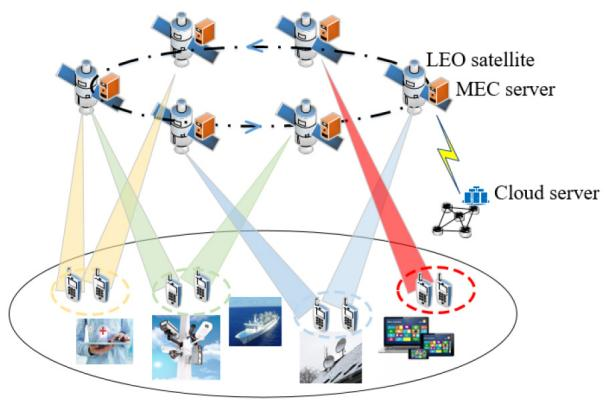
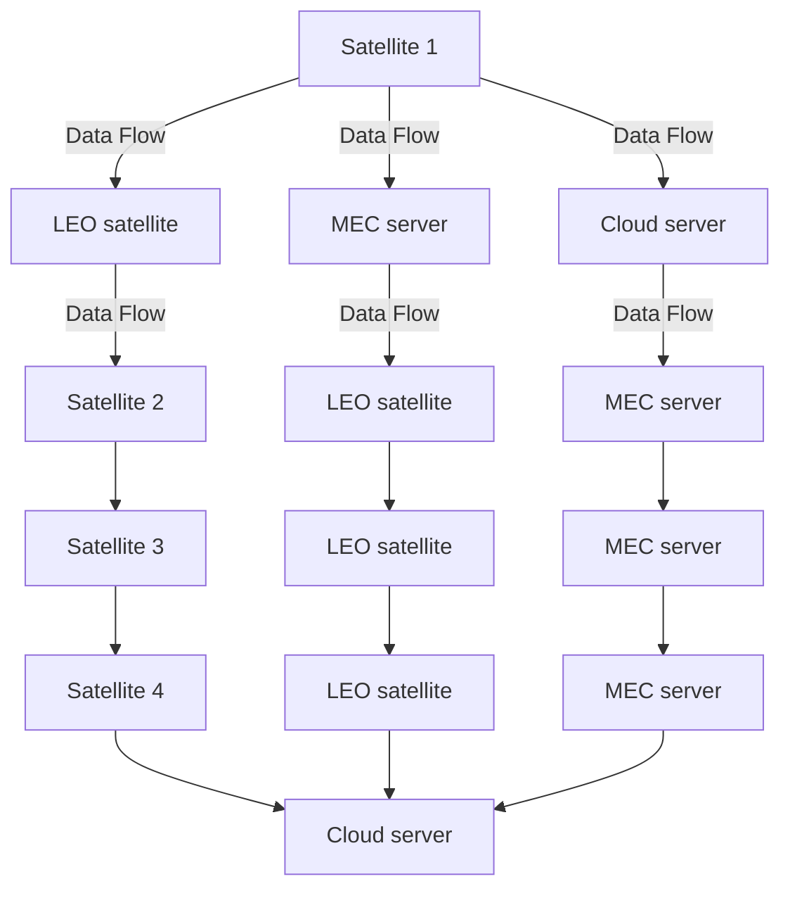
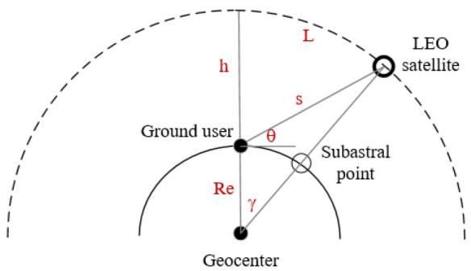
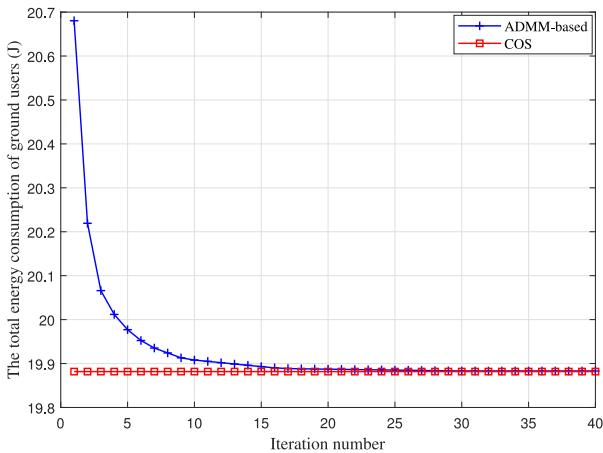
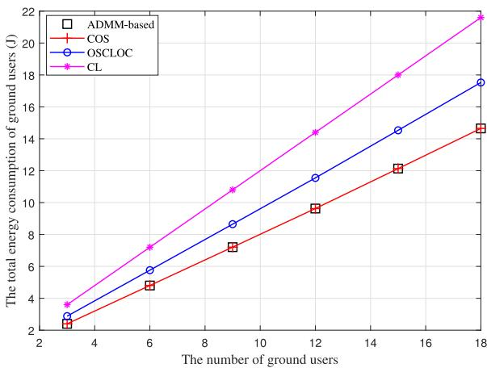
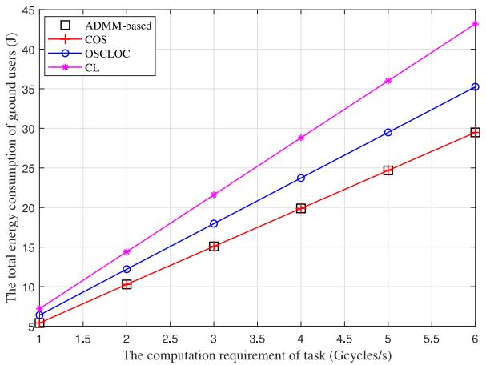
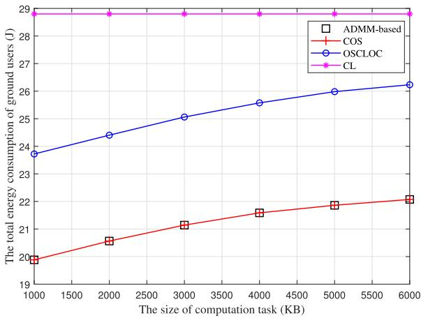
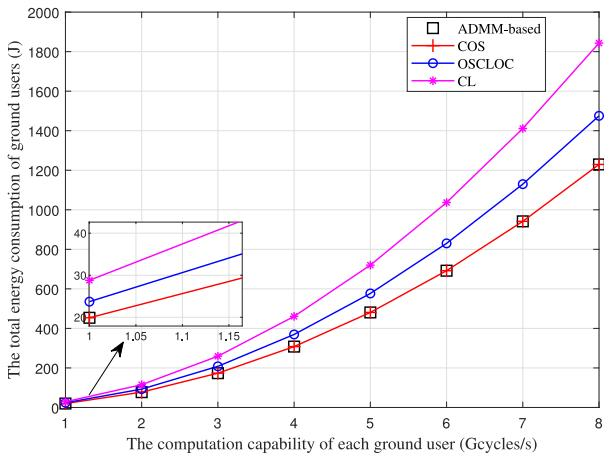
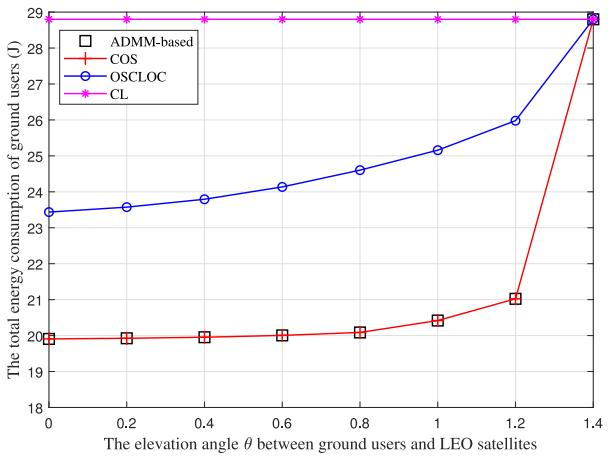

# Computation Offloading in LEO Satellite Networks With Hybrid Cloud and Edge Computing

Qingqing Tang, Zesong Fei , Senior Member, IEEE, Bin Li , and Zhu Han , Fellow, IEEE

Abstract—Low earth orbit (LEO) satellite networks can break through geographical restrictions and achieve global wireless coverage, which is an indispensable choice for future mobile communication systems. In this article, we present a hybrid cloud and edge computing LEO satellite (CECLS) network with a three-tier computation architecture, which can provide ground users with heterogeneous computation resources and enable ground users to obtain computation services around the world. With the CECLS architecture, we investigate the computation offloading decisions to minimize the sum energy consumption of ground users, while satisfying the constraints in terms of the coverage time and the computation capability of each LEO satellite. The considered problem leads to a discrete and nonconvex since the objective function and constraints contain binary variables, which makes it difficult to solve. To address this challenging problem, we convert the original nonconvex problem into a linear programming problem by using the binary variables relaxation method. Then, we propose a distributed algorithm by leveraging the alternating direction method of multipliers (ADMMs) to approximate the optimal solution with low computational complexity. Simulation results show that the proposed algorithm can effectively reduce the total energy consumption of ground users.

Index Terms—Alternating direction method of multipliers (ADMMs), cloud and edge computing, computation offloading, low earth orbit (LEO) satellite networks.

# I. INTRODUCTION

ITH the unprecedented development of emerging applications such as the Internet of Things (IoT), augmented reality (AR)/virtual reality (VR), and 4k/8k video transmission, traditional terrestrial networks have been unable to

Manuscript received January 2, 2021; accepted January 27, 2021. Date of publication February 2, 2021; date of current version May 21, 2021. This work was supported in part by the National Key Research and Development Program of China under Grant 2020YFB1806900; in part by Ericsson; in part by the Natural Science Foundation of Jiangsu Province under Grant BK20200822; in part by the Natural Science Foundation of Jiangsu Higher Education Institutions of China under Grant 20KJB510036; in part by the Guangxi Key Laboratory of Multimedia Communications and Network Technology under Grant KLF-2020-03; and in part by NSF under Grant EARS-1839818, Grant CNS-1717454, Grant CNS-1731424, and Grant CNS-1702850. (Corresponding author: Zesong Fei.)

Qingqing Tang and Zesong Fei are with the School of Information and Electronics, Beijing Institute of Technology, Beijing 100081, China (e-mail: tqqguet@163.com; feizesong@bit.edu.cn).

Bin Li is with the School of Computer and Software, Nanjing University of Information Science and Technology, Nanjing 210044, China, and also with the Guangxi Key Laboratory of Multimedia Communications and Network Technology, Nanning 530004, China (e-mail: bin.li@nuist.edu.cn).

Zhu Han is with the Department of Electrical and Computer Engineering, University of Houston, Houston, TX 77004 USA, and also with the Department of Computer Science and Engineering, Kyung Hee University, Seoul 446-701, South Korea (e-mail: hanzhu22@gmail.com).

Digital Object Identifier 10.1109/JIOT.2021.3056569 meet the global demands for “ubiquitous connection” because they are difficult to fully cover some complex terrains such as mountains and oceans [1], [2]. Moreover, the terrestrial network infrastructure is vulnerable damaged by natural disasters such as earthquakes and hurricanes, which can interrupt the user communications. In recent years, with the development of space communication networks, satellite technologies have made considerable progress in commercial, civilian and military services, which make satellites, especially low earth orbit (LEO) satellites, economical and miniaturized. Currently, many countries have launched several major LEO satellites projects, such as OneWeb [3], SpaceX Starlink [4], and O3b [5], and the latest news indicates that SpaceX will cooperate with Azure to provide users with global communication services. Therefore, it can be concluded that LEO satellite communication networks have unparalleled advantages over terrestrial mobile communication systems, which can achieve seamless global coverage and have become an indispensable part of human daily life.

On another front, the increasing popularity of mobile devices (such as smartphones and tablet computers) has spawned many new computation-intensive applications, such as speech recognition, games, multimedia encoding/decoding and intelligent transportation [6]–[9]. Therefore, the LEO satellite networks not only need to provide users with global ubiquitous access, but also need to provide users with various computing service support. In general, the users can offload computation tasks to the cloud servers with abundant computation resources for processing since their limited computation and storage resources [10], [11]. Moreover, the computation tasks generated by users in remote areas and ocean without the support of terrestrial network communication infrastructure can only be forwarded to the cloud servers for processing through the LEO satellite networks. However, restricted by the height of LEO satellites, the transmission delay of users in the LEO satellite networks will increase correspondingly, making it difficult to meet the real-time requirements of ground users. Inspired by the terrestrial multiaccess edge computing (MEC) technology [12], it is highly demanding to introduce MEC into the LEO satellite networks and provide ground users with computation services by sinking the rich computation resources of the cloud servers to the edge of the LEO satellite networks. Therefore, the ground users in remote areas without the support of terrestrial network communication facilities can directly offload the computation tasks to LEO satellites for processing in real time, which can reduce the frequent satellite-to-terrestrial link transmissions and end-to-end service transmission delays between LEO satellites and ground users.

Currently, the LEO satellite MEC (SMEC) network has attracted the attention of academia and industry, which is considered to be one of the important research directions for future network deployments [13]–[16]. Considering the impact of energy and load, the MEC server on the LEO satellite can adopt a lightweight management platform such as Docker [12], which enables the LEO satellite to have the capabilities of computation and content distribution. In particular, [17] proposed a space-ground-sea integrated network architecture, and a joint communication and computation resource allocation strategy based on deep reinforcement learning was studied with the goal of minimizing the total execute delay of users. Wang et al. [18] proposed a satellite-terrestrial integrated network with dual-edge computation capabilities to minimize the energy consumption and delay of all users, where the MEC servers were deployed on terrestrial base stations and LEO satellites, and the Hungarian algorithm was adopted to solve the proposed computation offloading problem. Wang et al. [19] studied a computation offloading strategy for the SMEC network based on game theory to reduce the offloading cost of users, where the user’s computation task can be computed locally or offloaded to LEO satellites. By exploiting the network functions virtualization technology, Zhang et al. [20] integrated computation resources within the coverage of LEO satellites to minimize the perceived delay of users and proposed a cooperative computation offloading strategy in the SMEC network. In addition, Qiu et al. [21] presented a software-defined satelliteterrestrial network to dynamically manage the caching and computing resources of satellite-terrestrial networks, where a deep Q-learning algorithm is developed to solve the joint resource allocation optimization problem. Compared with the researches in [17]–[21], where only a two-tier computing network including terrestrial networks (i.e., base stations or users) and LEO satellite networks is considered, but ignore the cloud servers with abundant computing resources [6]. In order to make full use of computation resources in the network and provide ground users with more computation offloading opportunities, this article proposes a three-tier computation architecture that includes ground users, LEO satellites, and the cloud servers. Although the total energy consumption of ground users is optimized in [18] and [19], the limited computation capability and coverage time of LEO satellites are ignored. Since the limited computation capability and coverage time of LEO satellites are important factors that reflect the characteristics of LEO satellites, this article considers both computation capability and coverage time of each LEO satellite.

With this background, we consider a hybrid cloud and edge computing LEO satellite (CECLS) network with a three-tier computation architecture (CECLS) in this article. To the best of our knowledge, the three-tier computation architecture has yet not been studied in literature by leveraging the cooperation among ground users, LEO satellite edge nodes and the cloud servers, which motivates our current work. According to different requirements of ground users, a computation task generated by the ground user can be executed locally, at LEO satellites or on the cloud servers in the CECLS network. Toward this end, we investigate the computation offloading decisions in the CECLS network with the aim of minimizing the sum energy consumption of ground users subject to the coverage time and the computation capability constraints of each LEO satellite. Since the offloading decisions variables are binary values, the resultant optimization problem is a discrete and nonconvex optimization problem, which is in general NP-hard. To this end, we transform the original problem into a convex problem by relaxing the discrete variables to continuous values. Then, a distributed algorithm relying on the alternating direction method of multipliers (ADMMs) is exploited to provide an approximate optimal solution. The distinct features of this article are as follows.

1) We propose a computation offloading scheme in the CECLS network, where the computation tasks generated by ground users can be computed locally, at LEO satellites or on the cloud servers.   
2) Different from other MEC solutions, this article makes full use of the powerful resources of the cloud and edge servers to provide ground users with heterogeneous computation services. Moreover, the limited computation capability and the coverage time of each LEO satellite is considered. Then, the formulated optimization problem for minimizing the sum energy consumption of ground users is studied.   
3) The formulated optimization problem is a discrete and nonconvex, which can be transformed into a linear programming problem by using binary variables relaxation. Then, a distributed computation offloading scheme based on ADMM with low computational complexity is proposed to solve the converted problem. Extensive simulations are conducted to show that our proposed scheme outperforms the benchmark algorithms. We summarize the difference between our work and the existing literature in Table I.

The remainder of this article is organized as follows. Section II describes the system model of the CECLS network. In Section III, the problem formulated is described. Section IV introduces the problem solving via ADMM. Section V presents the simulation results with the proposed algorithm. Finally, this article is concluded in Section VI.

# II. SYSTEM MODEL

First, the system model for our CECLS network is presented in this section. Then, we introduce the network, coverage time, communication and computation models in details.

# A. Network Model

The CECLS network is shown in Fig. 1, where LEO satellites are in orbit and each LEO satellite is connected to the cloud servers on the terrestrial via backhaul links. In addition, the ground users are in remote areas without the support of terrestrial network communication infrastructure. We consider that the CECLS network includes M LEO satellites and I ground users, which can be denoted as $\mathcal { M } = \{ 1 , 2 , 3 , \dots , M \}$ and $\mathcal { T } = \{ 1 , 2 , 3 , \hdots , I \}$ , respectively. Furthermore, we assume that each LEO satellite m is equipped with a MEC server, and hence can provide computation services to ground users.

TABLE I COMPARISON BETWEEN OUR WORK AND THE EXISTING LITERATURE 

<table><tr><td>Reference</td><td>Multi LEO satellite</td><td>Ground computing</td><td>Local computing</td><td>LEO satellite computing</td><td>Cloud computing</td><td>Optimize energy consumption</td><td>Optimize delay</td></tr><tr><td>[17]</td><td>√</td><td>√</td><td></td><td></td><td></td><td></td><td>√</td></tr><tr><td>[18]</td><td>√</td><td>√</td><td></td><td>√</td><td></td><td>√</td><td>√</td></tr><tr><td>[19]</td><td>√</td><td></td><td>√</td><td>√</td><td></td><td>√</td><td>√</td></tr><tr><td>[20]</td><td>√</td><td></td><td>√</td><td>√</td><td></td><td></td><td>√</td></tr><tr><td>[21]</td><td>√</td><td>√</td><td></td><td></td><td></td><td></td><td></td></tr><tr><td>Our work</td><td>√</td><td></td><td>√</td><td>√</td><td>√</td><td>√</td><td></td></tr></table>

flowchart

Fig. 1. System model of a hybrid cloud and edge CECLS network with a three-tier computation architecture.

According to different requirements, the computation tasks are computed in different ways. For computation-intensive tasks that ground users cannot handle, the computation tasks can be offloaded to LEO satellites via wireless links or forwarded to the cloud servers via LEO satellites for processing. For computation tasks that ground users have the ability to handle, it can be computed by itself. Moreover, we assume that each ground user has only one computation task to be computed and the computation task cannot be partitioned [22]. Besides, considering that LEO satellites have the characteristics of high-speed movement, the communication time between ground users and LEO satellites is limited by the coverage time of LEO satellites. The main notations used in the rest of this article are summarized in Table II.

# B. Coverage Time Model

Different from the MEC network model on the terrestrial, the location of LEO satellites will change dynamically. Hence, the ground users cannot always communicate with LEO satellites at any time, only if a specific relationship is satisfied between LEO satellites and ground users. According to the [23], the geometric relationship between LEO satellites and ground users is shown in Fig. 2. Herein, h represents the distance between the ground user and the LEO satellite orbit, $R _ { e }$ denotes the radius of the earth, s expresses the distance between the ground user and the LEO satellite, and θ is the elevation angle between the ground user and the LEO satellite, which can be obtained by

text_image

L
h
LEO
satellite
s
Ground user
θ
Subastral
point
Re
γ
Geocenter

Fig. 2. Space geometric relationship between the LEO satellite and the ground user.

$$
\theta = \arccos \left(\frac {R _ {e} + h}{s} \cdot \sin \gamma\right) \tag {1}
$$

where γ is the geocentric angle corresponding to the LEO satellite coverage area and can be expressed as

$$
\gamma = \arccos \left(\frac {R _ {e}}{R _ {e} + h} \cdot \cos \theta\right) - \theta . \tag {2}
$$

Then, we can obtain the longest communicate time between the ground user and the LEO satellite, which can be denoted as

$$
T = \frac {L}{v _ {s}} \tag {3}
$$

where vs is the speed of the LEO satellite, L is the arc length that the ground user can communicate with the LEO satellite, which can be calculated by

$$
L = 2 \cdot (R _ {e} + h) \cdot \gamma . \tag {4}
$$

Since different LEO satellites can share information through intersatellites links (ISLs), when the ground users have a large number of computation tasks that need to be offloaded, the LEO satellites can cooperate to accomplish the computation tasks processing. In addition, the transmission rate of ISL is fast, and thus the transmission delay of the computation tasks from the LEO satellite to another LEO satellite can be ignored.

# C. Communication Model

We assume that each ground user can only access one LEO satellite for data transmission and multiple ground users share the same spectrum resource, which means that there is mutual interference between ground users. Moreover, considering large-scale fading and shadowed-Rician fading [24], let $g _ { i , m }$ denote the channel power gain from ground user i to LEO satellite m. Therefore, the uplink transmission rate for computation offloading between ground user i and LEO satellite m through the satellite-to-terrestrial links can be calculated by

TABLE II NOTATION 

<table><tr><td>Notation</td><td>Definition</td></tr><tr><td> $h$ </td><td>The distance between the ground user and the LEO satellite orbit</td></tr><tr><td> $R_e$ </td><td>The radius of the earth</td></tr><tr><td> $s$ </td><td>The distance between the ground user and the LEO satellite</td></tr><tr><td> $\theta$ </td><td>The elevation angle between the ground user and the LEO satellite</td></tr><tr><td> $\gamma$ </td><td>The geocentric angle</td></tr><tr><td> $v_s$ </td><td>The speed of the LEO satellite</td></tr><tr><td> $g_{i,m}$ </td><td>The channel gain from ground user  $i$  to LEO satellite  $m$ </td></tr><tr><td> $B$ </td><td>The avaliable spectrum bandwidth</td></tr><tr><td> $p_i$ </td><td>The uplink transmit power of ground user  $i$ </td></tr><tr><td> $R_{i,m}$ </td><td>The uplink transmit rate of ground user  $i$ </td></tr><tr><td> $D_i$ </td><td>The input data size of computation task  $W_i$ </td></tr><tr><td> $X_i$ </td><td>The required CPU cycles of computation task  $W_i$ </td></tr><tr><td> $\mathbf{a}_i, \mathbf{b}_i$ </td><td>The computation offloading decision vectors of ground user  $i$ </td></tr><tr><td> $f_i^L$ </td><td>The computation capability of ground user  $i$ </td></tr><tr><td> $f_{i,m}^S$ </td><td>The computation capability allocated to ground user  $i$  by LEO satellites</td></tr><tr><td> $f_{i,m}^C$ </td><td>The computation capability allocated to ground user  $i$  by the cloud servers</td></tr><tr><td> $T_i^L$ </td><td>The execution time of computation task  $W_i$  processing at ground user  $i$ </td></tr><tr><td> $T_{i,m}^S$ </td><td>The execution time of computation task  $W_i$  processing at LEO satellite  $m$ </td></tr><tr><td> $T_{i,m}^C$ </td><td>The execution time of computation task  $W_i$  processing at the cloud servers</td></tr><tr><td> $E_i^L$ </td><td>The energy consumption of computation task  $W_i$  computed locally</td></tr><tr><td> $E_{i,m}^S$ </td><td>The energy consumption of computation task  $W_i$  computed at LEO satellites</td></tr></table>

$$
R _ {i, m} = B \log_ {2} \left(1 + \frac {g _ {i , m} p _ {i}}{\sum_ {j \in \mathcal {I} \backslash \{i \}} g _ {j , m} p _ {j} + \sigma^ {2}}\right), i \in \mathcal {I}, m \in \mathcal {M} \tag {5}
$$

where $B , p _ { i }$ and $\sigma ^ { 2 }$ denote the available spectrum bandwidth, the uplink transmit power of ground user i and the additive white Gaussian noise (AWGN) power, respectively.

Furthermore, considering that the size of the computation results is much smaller than the size of input computation data and the downlink transmission rate of the LEO satellite is much greater than the ground user [25]. Therefore, the downlink transmission delay caused by the transmission of the computation results from the LEO satellite or the cloud servers to the ground user is ignored in this work.

# D. Computation Model

For the computation model, according to [26], we consider that each ground user has a computation task $W _ { i } \triangleq ( D _ { i } , X _ { i } )$ which can be computed locally, by LEO satellites or by the cloud servers, where $D _ { i }$ denotes the size of computation input data and $X _ { i }$ represents the required CPU cycles to accomplish the computation task $W _ { i }$ . Furthermore, let $a _ { i , m } \in \{ 0 , 1 \}$ denote whether the computation task $W _ { i }$ is offloaded to LEO satellite m or not and the corresponding strategies of ground user i can be expressed by $\mathbf { a } _ { i } = \{ a _ { i , 1 } , a _ { i , 2 } , . . . , a _ { i , M } \}$ , where $a _ { i , m } = 1$ denotes that the computation task $W _ { i }$ is offloaded to LEO satellite m, otherwise $a _ { i , m } = 0$ . Similarly, let $b _ { i , m } \in \{ 0 , 1 \}$ express whether the computation task $W _ { i }$ is offloaded to the cloud servers or not and the corresponding strategies of ground user i can be denoted by $\mathbf { b } _ { i } = \{ b _ { i , 1 } , b _ { i , 2 } , . . . , b _ { i , M } \}$ , where $b _ { i , m } = 1$ denotes that the computation task $W _ { i }$ is offloaded to the cloud servers via LEO satellite $m ,$ otherwise $b _ { i , m } = 0$ . Moreover, since the computation capability of each LEO satellite is limited, the computation tasks offloaded by ground users to the LEO satellite cannot exceed the maximum computation capability of the LEO satellite, which means that

$$
\sum_ {i \in \mathcal {I}} a _ {i, m} X _ {i} \leq Z _ {m}, \quad m \in \mathcal {M} \tag {6}
$$

where $Z _ { m }$ represents the maximum computation capability of LEO satellite m. In addition, a computation task of each ground user has only one offloading decision. Thus, the offloading decisions of ground user i need to meet the following constraint:

$$
\sum_ {m \in \mathcal {M}} \left(a _ {i, m} + b _ {i, m}\right) \leq 1, \quad i \in \mathcal {I}. \tag {7}
$$

# III. PROBLEM FORMULATION FOR COMPUTATION OFFLOADING SCHEME

In Section III-A, we first discuss the computation overhead in terms of processing time and energy consumption for different computation offloading schemes. Then, the formulated optimization problem for minimizing the sum energy consumption of ground users is studied in Section III-B.

# A. Computation Overhead

For ground users, there are three computation offloading schemes to choose from. According to different offloading schemes, the computation execution time and energy consumption of ground users are different.

1) Local Computing: In the local computing scheme, the computation task $W _ { i }$ is executed locally on ground user i. The locally computation capability (CPU cycles/s) of ground user i can be expressed as $f _ { i } ^ { L }$ , which can be different for various ground users [27]. Therefore, the computation execution time $T _ { i } ^ { L }$ of the computation task $W _ { i }$ computed locally by ground user i can be denoted as

$$
T _ {i} ^ {L} = \frac {X _ {i}}{f _ {i} ^ {L}} \quad \forall i \tag {8}
$$

and the energy consumption $E _ { i } ^ { L }$ of the computation task $W _ { i }$ computed locally by ground user i can be

expressed as

$$
E _ {i} ^ {L} = \varepsilon \big (f _ {i} ^ {L} \big) ^ {2} X _ {i} \quad \forall i \tag {9}
$$

where ε expresses the energy factor and its size depends on the chip architecture [28].

2) LEO Satellite Computing: In the LEO satellite computing scheme, the computation task executed on the LEO satellites. W $W _ { i }$ $f _ { i , m } ^ { S }$ und user i isas the computation capability (CPU cycles/s) allocated to ground user i by LEO satellite m and assume that the computation capability of each LEO satellite is equal [29]. However, the distance between the ground user and the LEO satellite is relatively long, causing the ground user to be affected by the propagation delay when communicating with the LEO satellite. Thus, the computation execution time $T _ { i , m } ^ { S }$ of the computation task $W _ { i }$ computed on LEO satellite m by ground user i consists of the propagation delay, the transmission delay and the computing delay, which can be calculated by

$$
T _ {i, m} ^ {S} = \frac {s _ {i , m}}{c} + \frac {D _ {i}}{R _ {i , m}} + \frac {X _ {i}}{f _ {i , m} ^ {S}} \quad \forall i, m \tag {10}
$$

where $( D _ { i } / R _ { i , m } )$ and $( X _ { i } / f _ { i , m } ^ { S } )$ indicate that the uplink transmission delay of ground user i for transmitting the data $D _ { i }$ to LEO satellite $m ,$ and the computing delay for executing the computation task W at LEO satellite m, respectively. In addition, $( s _ { i , m } / c )$ is the propagation delay between ground user i and LEO satellite m, where $s _ { i , m }$ denotes the distance between ground user i and LEO satellite m and can be calculated by $s _ { i , m } = \sqrt { R _ { e } ^ { 2 } + ( R _ { e } + h ) ^ { 2 } - 2 \cdot R _ { e } \cdot ( R _ { e } + h ) \cdot \cos \gamma } .$ , and c is the speed of light. Furthermore, the energy consumption $E _ { i , m } ^ { S }$ of ground user i for offloading data $D _ { i }$ to LEO satellite m can be calculated by

$$
E _ {i, m} ^ {S} = p _ {i} \frac {D _ {i}}{R _ {i , m}} \quad \forall i, m. \tag {11}
$$

3) Cloud Servers Computing: In the cloud servers computing scheme, the computation task $W _ { i }$ of ground user i is executed on the cloud servers. We set $f _ { i , m } ^ { C }$ as the computation capability (CPU cycles/s) allocated to ground user i by the cloud servers [30]. The computation execution time $T _ { i , m } ^ { C }$ of computation task $W _ { i }$ computed on the cloud servers consists of the propagation delay, the transmission delay, the computing delay and the backhual delay, which can be obtained by

$$
T _ {i, m} ^ {C} = \frac {s _ {i , m}}{c} + \frac {D _ {i}}{R _ {i , m}} + \frac {D _ {i}}{r} + \frac {X _ {i}}{f _ {i , m} ^ {C}} \quad \forall i, m \tag {12}
$$

where $( D _ { i } / r )$ is the backhual delay of the data $D _ { i }$ transmitting from the LEO satellite m to the cloud servers via backhaul link and r denotes the transmission rate between LEO satellite m and the cloud servers. $( X _ { i } / f _ { i , m } ^ { C } )$ is the computing delay of computation task Wi computed on the cloud servers. In addition, it can be observed that whether the ground user offloads the computation task $W _ { i }$ to LEO satellites or cloud servers, the energy consumption of ground user remains unchanged.

# B. Problem Formulation

In order to reduce the total energy consumption of ground users while satisfying the limited computation capability and the coverage time constraints of LEO satellites, we consider the optimization problem of the computation offloading decisions of ground users. Mathematically, the problem of interest reads

$$
\min _ {\mathbf {a} _ {i}, \mathbf {b} _ {i}} \sum_ {i = 1} ^ {\mathcal {I}} \sum_ {m = 1} ^ {\mathcal {M}} (1 - a _ {i, m} - b _ {i, m}) E _ {i} ^ {L} + a _ {i, m} E _ {i, m} ^ {S} + b _ {i, m} E _ {i, m} ^ {C} \tag {13a}
$$

$$
\text { s.t. } \sum_ {i \in \mathcal {I}} a _ {i, m} X _ {i} \leq Z _ {m}, \quad m \in \mathcal {M} \tag {13b}
$$

$$
\sum_ {m \in \mathcal {M}} \left(a _ {i, m} + b _ {i, m}\right) \leq 1, \quad i \in \mathcal {I} \tag {13c}
$$

$$
a _ {i, m} T _ {i, m} ^ {S} + b _ {i. m} T _ {i, m} ^ {C} \leq T _ {m} \quad \forall i, m \tag {13d}
$$

$$
a _ {i, m}, b _ {i, m} \in \{0, 1 \} \quad \forall i, m \tag {13e}
$$

where $T _ { m }$ is the coverage time of LEO satellite m and can be obtained by (3). The objective function (13a) aims to minimize the total energy consumption of ground users and the constraint (13b) guarantees that the total computation offloading request of ground users cannot exceed the computation capability of the LEO satellite. Furthermore, the constraints (13c) and (13d) indicate that each ground user only adopts one offloading decision to execute the computation task and the processing time of computation tasks on LEO satellites or the cloud servers cannot exceed the coverage time of LEO satellites, respectively.

Since the objective function (13a) and the constraints (13b)–(13e) are nonlinear and discrete, the optimization problem (13) is a mixed discrete and nonconvex optimization problem. In addition, the objective function and constraints contain binary variables, which makes it a challenge to find the optimal solution of original problem (13) in the polynomial time complexity [31]. To circumvent these hurdles, we transform the nonconvex optimization problem into a linear programming problem by the relaxation approach, and then propose a low-complexity suboptimal approach that can achieve the near-optimal performance in the following section.

# IV. PROBLEM SOLVING VIA ALTERNATING DIRECTIONMETHOD OF MULTIPLIERS

In Section IV-A, we first reformulate the optimization problem (13) by relaxing binary variables, and then analyze the convexity of (13) in Section IV-B. Simultaneously, in Section IV-C, we propose a distributed computation offloading algorithm based on ADMM to solve the transformed problem and an algorithm to recovery continuous variables to binary variables is also presented. Finally, the convergence and complexity of the proposed algorithm are analyzed in Sections IV-D and IV-E, respectively.

# A. Problem Transformation

Through the above analysis, it can be seen that problem (13) is nonconvex because the objective function and constraints contain binary variables $a _ { i , m }$ and $b _ { i , m } .$ To effectively solve this problem, it is necessary to relax the binary variables $^ { a _ { i , m } , }$ $b _ { i , m }$ into continuous variables $0 \leq a _ { i , m } \leq 1 , 0 \leq b _ { i , m } \leq 1$ . The relaxed variables can be explained as the fraction of the relevant computation task data, which can be offloaded to the LEO satellite or the cloud servers. Thus, the optimization problem in (13) can be rewritten as

$$
\begin{array}{l} \min _ {\mathbf {a} _ {i}, \mathbf {b} _ {i}} \sum_ {i = 1} ^ {\mathcal {I}} \sum_ {m = 1} ^ {\mathcal {M}} \varepsilon \left(f _ {i} ^ {L}\right) ^ {2} X _ {i} + a _ {i, m} \left(p _ {i} \frac {D _ {i}}{R _ {i , m}} - \varepsilon \left(f _ {i} ^ {L}\right) ^ {2} X _ {i}\right) \\ + b _ {i, m} \left(p _ {i} \frac {D _ {i}}{R _ {i , m}} - \varepsilon \left(f _ {i} ^ {L}\right) ^ {2} X _ {i}\right) \tag {14a} \\ \end{array}
$$

$$
\text { s.t. } \sum_ {i \in \mathcal {I}} a _ {i, m} X _ {i} \leq Z _ {m}, \quad m \in \mathcal {M} \tag {14b}
$$

$$
\sum_ {m \in \mathcal {M}} \left(a _ {i, m} + b _ {i, m}\right) \leq 1, \quad i \in \mathcal {I} \tag {14c}
$$

$$
a _ {i, m} T _ {i, m} ^ {S} + b _ {i, m} T _ {i, m} ^ {C} \leq T _ {m} \quad \forall i, m \tag {14d}
$$

$$
0 \leq a _ {i, m} \leq 1 \quad \forall i, m \tag {14e}
$$

$$
0 \leq b _ {i, m} \leq 1 \quad \forall i, m. \tag {14f}
$$

It can be seen that the objective function and constraints of problem (14) are linear combinations of variables $a _ { i , m }$ and $b _ { i , m }$ after relaxing the binary variables.

# B. Convexity

In this section, we will discuss the convexity of problem (14) by the following proposition.

Proposition 1: If problem (14) is feasible, it is a convex problem with respect to all optimization variables.

Proof: After relaxing the binary variables in problem (13), the objective function and constraints of problem (14) are a linear combination of a series of continuous variables $\mathbf { a } _ { i }$ and bi. Therefore, problem (14) is convex regarding variables $\mathbf { a } _ { i }$ and $\mathbf { b } _ { i }$ .

In general, the centralized optimization algorithms can be used to solve this convex optimization problem [32]. However, the centralized optimization algorithms (such as the interior-point algorithm) are suitable for cases where the global network state information is relatively small. Furthermore, when the number of LEO satellites and ground users in the network are relatively large, the use of centralized optimization algorithms will put a heavier computational load on the network. Therefore, it is the best choice to design a distributed algorithm to obtain the feasible computation offloading strategies.

# C. Augmented Lagrangian and ADMM Sequential Iterations

In order to make each LEO satellite participate in the computation to solve problem (14), we need to design a distributed algorithm to separate problem (14). However, the global variables ai and $\mathbf { b } _ { i }$ are inseparable in problem (14). For the sake of making the problem separable so that each LEO satellite can solve the problem independently, we first introduce the local copies of the global variables ${ \bf a } _ { i }$ and $\mathbf { b } _ { i \cdot }$ Then, we copy these local variables to each LEO satellite. Thus, each LEO satellite can use its local variables to calculate independently to solve the problem. For LEO satellite $m ,$ , let $\hat { \mathbf { a } } ^ { m } = \{ \hat { a } _ { i , k } ^ { m } \} _ { i \in \mathcal { T } , k \in \mathcal { M } } , \hat { \mathbf { b } } ^ { m } = \{ \hat { b } _ { i , k } ^ { m } \} _ { i \in \mathcal { T } , k \in \mathcal { M } }$ as the local copies of ${ \bf a } _ { i }$ and $\mathbf { b } _ { i } ,$ respectively. Thus, the feasible set of local variables $\hat { a } _ { i , k } ^ { m } , \hat { b } _ { i , k } ^ { m }$ bˆ mi,k corresponding to LEO satellite $m$ can be expressed as

$$
\phi_ {m} = \left\{ \begin{array}{c c} \sum_ {i \in \mathcal {I}} \hat {a} _ {i, k} ^ {m} X _ {i} \leq Z _ {k} & \forall k \\ \hat {\mathbf {a}} ^ {m} & \sum_ {k \in \mathcal {M}} \left(\hat {a} _ {i, k} ^ {m} + \hat {b} _ {i, k} ^ {m}\right) \leq 1 \quad \forall i \\ \hat {\mathbf {b}} ^ {m} & \hat {a} _ {i, k} ^ {m} T _ {i, k} ^ {S} + \hat {b} _ {i, k} ^ {m} T _ {i, k} ^ {C} \leq T _ {k} \quad \forall i, k \end{array} \right\}. \tag {15}
$$

In addition, the objection function of problem (14) can be denoted as min $\textstyle \sum _ { m \in { \mathcal { M } } } \sum _ { i \in { \mathcal { T } } } f ( \mathbf { a } _ { i } , \mathbf { b } _ { i } )$ and the corresponding local function of LEO satellite m is expressed as

$$
y _ {m} = \left\{ \begin{array}{l l} \sum_ {i \in \mathcal {I}} f (\boldsymbol {\lambda}), & \boldsymbol {\lambda} \in \phi_ {m} \\ 0, & \text { otherwise } \end{array} \right. \tag {16}
$$

where λ expresses $\{ \hat { \mathbf { a } } ^ { m } , \hat { \mathbf { b } } ^ { m } , \} _ { m \in \mathcal { M } } .$ .

Based on the above analysis, the global consensus problem [33] of problem (14) can be expressed as

$$
\min \sum_ {m \in M} y _ {m} (\boldsymbol {\lambda}) \tag {17a}
$$

$$
\text { s.t. } \hat {a} _ {i, k} ^ {m} = a _ {i, m} \quad \forall i, m, k \tag {17b}
$$

$$
\hat {b} _ {i, k} ^ {m} = b _ {i, m} \quad \forall i, m, k. \tag {17c}
$$

The consensus constraints (17b) and (17c) guarantee the consistency between all local variables and global variables. Since the objective function in (17a) corresponding to each LEO satellite is independent of each other, and when the local variables in each LEO satellite are equal to their corresponding global variables, the consensus of problem (17) is held. Therefore, we can apply the ADMM algorithm [34] to solve problem (17). According to [34], the augmented Lagrangian of problem (17) is denoted as

$$
\begin{array}{l} L _ {\rho} \left(\boldsymbol {\lambda}, \boldsymbol {\mu}, \left\{\sigma^ {m}, \delta^ {m} \right\}\right) = \sum_ {m \in \mathcal {M}} y _ {m} (\boldsymbol {\lambda}) \\ +\sum_{m\in \mathcal{M}}\sum_{\substack{k\in \mathcal{M}\\ i\in \mathcal{I}}}\sigma_{i,k}^{m}\big(\hat{a}_{i,k}^{m} - a_{i,k}\big) \\ +\sum_{m\in \mathcal{M}}\sum_{\substack{k\in \mathcal{M}\\ i\in \mathcal{I}}}\delta_{i,k}^{m}\Big(\hat{b}_{i,k}^{m} - b_{i,k}\Big) \\ +\frac{\rho}{2}\sum_{m\in \mathcal{M}}\sum_{\substack{k\in \mathcal{M}\\ i\in \mathcal{I}}}\left\| \hat{a}_{i,k}^{m} - a_{i,k}\right\|^{2} \\ + \frac {\rho}{2} \sum_ {m \in \mathcal {M}} \sum_ {\substack {k \in \mathcal {M} \\ i \in \mathcal {I}}} \left\| \hat {b} _ {i, k} ^ {m} - b _ {i, k} \right\| ^ {2} \tag{18} \\ \end{array}
$$

where $\begin{array} { c c l } { \pmb { \sigma } ^ { m } } & { = } & { \{ \sigma _ { i , k } ^ { m } \} } \end{array}$ and $\delta ^ { m } = \{ \delta _ { i . k } ^ { m } \}$ are the Lagrange multipliers of problem (18) as well as $\rho$ is a positive penalty coefficient, there has an important influence on the performance of the iterative algorithm. Furthermore, let $\pmb { \mu } =$ $\{ \mathbf { a } _ { i } , \mathbf { b } _ { i } \}$ . To solve the problem conveniently, the Lagrangian multiplier of problem (18) is scaled to combine the linear and quadratic terms of the equality constraints, and the augmented

Lagrangian function of problem (18) is rewritten as

$$
\begin{array}{l} L _ {\rho} \left(\boldsymbol {\lambda}, \boldsymbol {\mu}, \left\{\sigma^ {m}, \delta^ {m} \right\}\right) = \sum_ {m \in \mathcal {M}} y _ {m} (\boldsymbol {\lambda}) \\ +\frac{\rho}{2}\sum_{m\in \mathcal{M}}\sum_{\substack{k\in \mathcal{M}\\ i\in \mathcal{I}}}\left\| \hat{a}_{i,k}^{m} - a_{i,k} + u_{i,k}^{m}\right\|^{2} \\ + \frac {\rho}{2} \sum_ {m \in \mathcal {M}} \sum_ {\substack {k \in \mathcal {M} \\ i \in \mathcal {I}}} \left\| \hat {b} _ {i, k} ^ {m} - b _ {i, k} + v _ {i, k} ^ {m} \right\| ^ {2} \tag{19} \\ \end{array}
$$

where $u _ { i , k } ^ { m } = ( \sigma _ { i , k } ^ { m } / \rho )$ and $\nu _ { i , k } ^ { m } = ( \delta _ { i , k } ^ { m } / \rho )$ . In addition, after scaling the corresponding Lagrangian multipliers in (19), the new dual variables can be denoted as $\pmb { u } ^ { m } = \{ u _ { i , k } ^ { m } \}$ and $\pmb { \upsilon } ^ { m } =$ $\{ \nu _ { i , k } ^ { m } \}$ , respectively. Simultaneously, the dual problem of (17) can be denoted as

$$
\max _ {\boldsymbol {\beta}} d (\boldsymbol {\beta}) \tag {20}
$$

where the dual function $d ( \beta )$ can be expressed as

$$
d (\boldsymbol {\beta}) = \min _ {\boldsymbol {\lambda}, \boldsymbol {\mu}} L _ {\rho} (\boldsymbol {\lambda}, \boldsymbol {\mu}, \boldsymbol {\beta}) \tag {21}
$$

where $\pmb { \beta } = \{ \pmb { u } ^ { m } , \pmb { \upsilon } ^ { m } \}$ .

The ADMM algorithm is used to solve the problem (20) by iteratively updating λ, μ, and $\beta .$ Let $\mathsf { \pmb { \lambda } } ^ { ( t ) } , \mathsf { \pmb { \mu } } ^ { ( t ) } , \mathsf { \pmb { \beta } } ^ { ( t ) }$ denote the values of λ, μ, β corresponding to the tth iteration. Next, we update the values of $\lambda , \mu , \beta$ in the (t +1)th iteration according to the following steps.

1) Local Variables $\{ \hat { \pmb { a } } ^ { m } , \hat { \pmb { b } } ^ { m } \} _ { m \in \mathcal { M } }$ Update: In this step, we need to update the local variables. First, given $\{ \pmb { \mu } ^ { ( t ) } , \pmb { \beta } ^ { ( t ) } \}$ and then minimize the function $L _ { \rho }$ on the local variables $\lambda ,$ which can be expressed as

$$
\boldsymbol {\lambda} ^ {(t + 1)} = \underset {\boldsymbol {\lambda}} {\arg \max} L _ {\rho} \left(\boldsymbol {\lambda}, \boldsymbol {\mu} ^ {(t)}, \boldsymbol {\beta} ^ {(t)}\right). \tag {22}
$$

The problem in (22) can be divided into M subproblems and each subproblem is solved by each LEO satellite. Therefore, each LEO satellite needs to solve the following problem independently:

$$
\begin{array}{l} \lambda^ {(t + 1)} = \arg \min \\ \left\{\hat {a} _ {i, k} ^ {m}, \hat {b} _ {i, k} ^ {m} \right\} \\ \times \left[ y_{m}(\boldsymbol {\lambda}) + \frac{\rho}{2}\sum_{\substack{k\in \mathcal{M}\\ i\in \mathcal{I}}}\left\| \hat{a}_{i,k}^{m} - a_{i,k}^{(t)} + u_{i,k}^{m(t)}\right\|^{2} \right. \\ \left. + \frac {\rho}{2} \sum_ {\substack {k \in \mathcal {M} \\ i \in \mathcal {I}}} \left\| \hat {b} _ {i, k} ^ {m} - b _ {i, k} ^ {(t)} + v _ {i, k} ^ {m (t)} \right\| ^ {2} \right]. \tag{23} \\ \end{array}
$$

Correspondingly, for each LEO satellite m, the following equivalent optimization problem is solved at the (t+1)th iteration:

$$
\begin{array}{l} \min_{\hat{a}_{i,k}^{m},\hat{b}_{i,k}^{m}}y_{m}(\boldsymbol {\lambda}) + \frac{\rho}{2}\sum_{\substack{k\in \mathcal{M}\\ i\in \mathcal{I}}}\left\| \hat{a}_{i,k}^{m} - a_{i,k}^{(t)} + u_{i,k}^{m(t)}\right\|^{2} \\ + \frac {\rho}{2} \sum_ {\substack {k \in \mathcal {M} \\ i \in \mathcal {I}}} \left\| \hat {b} _ {i, k} ^ {m} - b _ {i, k} ^ {(t)} + v _ {i, k} ^ {m (t)} \right\| ^ {2} (24a) \\ \text { s.t. } \quad \lambda \in \phi_ {m}. (24b) \\ \end{array}
$$

Obviously, problem (24) is a convex problem since its quadratic objective function and convex constraint. Therefore, the primal-dual interior-point algorithm or CVX tools can be applied to obtain the optimal solution of problem (24).

2) Global Variables $\{ \pmb { a } _ { i } , \pmb { b } _ { i } \} _ { i \in \mathcal { T } }$ Update: In this step, we need to update the global variables. Through the previous step, we have obtained the local variables $\hat { \lambda } ^ { ( t + 1 ) }$ . Then, for a given $\lambda ^ { ( t + 1 ) }$ ), the update of global variables $\pmb { \mu }$ is based on the following formulations:

$$
\begin{array}{l} \{\mathbf {a} _ {i} \} ^ {(t + 1)} = \underset {\{a _ {i, k} \}} {\arg \min} \\ \times \left[ \frac {\rho}{2} \sum_ {m \in \mathcal {M}} \sum_ {\substack {k \in \mathcal {M} \\ i \in \mathcal {I}}} \left\| \hat {a} _ {i, k} ^ {m (t + 1)} - a _ {i, k} + u _ {i, k} ^ {m (t)} \right\| ^ {2} \right] \tag{25} \\ \end{array}
$$

$$
\{\mathbf {b} _ {i} \} ^ {(t + 1)} = \underset {\{b _ {i, k} \}} {\arg \min}
$$

$$
\times \left[ \frac {\rho}{2} \sum_ {m \in \mathcal {M}} \sum_ {\substack {k \in \mathcal {M} \\ i \in \mathcal {I}}} \left\| \hat {b} _ {i, k} ^ {m (t + 1)} - b _ {i, k} + v _ {i, k} ^ {m (t)} \right\| ^ {2} \right]. \tag{26}
$$

Since (25) and (26) are unconstrained quadratic convex problems, we can obtain the following equations by taking their first derivative with respect to global variables $\mathbf { a } _ { i }$ and $\mathbf { b } _ { i }$

$$
\rho \sum_ {m \in \mathcal {M}} \left(\hat {a} _ {i, k} ^ {m (t + 1)} - a _ {i, k} + u _ {i, k} ^ {m (t)}\right) = 0 \quad \forall i, k \tag {27}
$$

$$
\rho \sum_ {m \in \mathcal {M}} \left(\hat {b} _ {i, k} ^ {m (t + 1)} - b _ {i, k} + v _ {i, k} ^ {m (t)}\right) = 0 \quad \forall i, k. \tag {28}
$$

Then, we can obtain the global solution for variables $\mathbf { a } _ { i }$ and $\mathbf { b } _ { i } ,$ which can be denoted as

$$
a _ {i, k} ^ {(t + 1)} = \frac {1}{M} \sum_ {m \in \mathcal {M}} \left(\hat {a} _ {i, k} ^ {m (t + 1)} + u _ {i, k} ^ {m (t)}\right) \quad \forall i, k \tag {29}
$$

$$
b _ {i, k} ^ {(t + 1)} = \frac {1}{M} \sum_ {m \in \mathcal {M}} \left(\hat {b} _ {i, k} ^ {m (t + 1)} + v _ {i, k} ^ {m (t)}\right) \quad \forall i, k. \tag {30}
$$

By initializing the Lagrange multipliers as zeros at the tth iteration, i.e.,  m∈ v m(t)i,k $\begin{array} { r l } { \sum _ { m \in \mathcal { M } } \nu _ { i , k } ^ { m ( t ) } ~ = ~ 0 , \sum _ { m \in \mathcal { M } } u _ { i , k } ^ { m ( t ) } ~ = ~ } & { { } } \end{array}$ = 0,  m∈ um(ti,k 0 ∀i, k, (29) and (30) reduce to

$$
a _ {i, k} ^ {(t + 1)} = \frac {1}{M} \sum_ {m \in \mathcal {M}} \hat {a} _ {i, k} ^ {m (t + 1)} \quad \forall i, k \tag {31}
$$

$$
b _ {i, k} ^ {(t + 1)} = \frac {1}{M} \sum_ {m \in \mathcal {M}} \hat {b} _ {i, k} ^ {m (t + 1)} \quad \forall i, k. \tag {32}
$$

Algorithm 1 Binary Variables Recovery Algorithm   
1: Set $\mathcal{M}' := \emptyset$ ;
2: for $i = 1, 2, 3, \ldots, \mathcal{I}$ do
3: Find the maximum decision value $a_{i,\tilde{k}}$ for ground user $i$ ;
4: Set $a_{i,\tilde{k}} = 1$ and $a_{i,k} = 0$ for others $k \in \mathcal{M} \backslash \{\tilde{k}\}$ ;
5: if the constraints (13b)-(13d) are satisfy then
6: Set $\mathcal{M}' := \mathcal{M}' \cup \{\tilde{k}\}$ ;
7: else
8: break
9: end if
10: end for
11: Output the recovered binary variables $\{a_{i,k}\}, \forall i \in \mathcal{I}, k \in \mathcal{M}$ .

Equations (31) and (32) mean that at the (t + 1)th iteration the global variables are calculated by averaging the total local variables of all LEO satellites.

3) Lagrange Multipliers $\{ \pmb { u } ^ { m } , \pmb { \upsilon } ^ { m } \} _ { m \in \mathcal { M } }$ Update: In this step, we need to update the Lagrange multipliers. Here, the Lagrange multipliers are updated according to the following formulations:

$$
\boldsymbol {u} ^ {m (t + 1)} = \boldsymbol {u} ^ {m (t)} + \hat {\mathbf {a}} ^ {m (t + 1)} - \mathbf {a} _ {i} ^ {(t + 1)} \tag {33}
$$

$$
\boldsymbol {v} ^ {m (t + 1)} = \boldsymbol {v} ^ {m (t)} + \hat {\mathbf {b}} ^ {m (t + 1)} - \mathbf {b} _ {i} ^ {(t + 1)}. \tag {34}
$$

With the updated local variables received from each LEO satellite, the cloud servers use (33) and (34) to update the Lagrange multipliers.

4) Algorithm Stopping Criterion: According to the [33], the primal residuals of each LEO satellite must be as small as possible under feasibility conditions. Therefore, the algorithm stopping criterion can be denoted as

$$
\left\| \hat {\mathbf {a}} ^ {m (t + 1)} - \mathbf {a} _ {i} ^ {(t + 1)} \right\| _ {2} \leq \epsilon_ {\mathrm{pri}} \quad \forall m \tag {35}
$$

$$
\left\| \hat {\mathbf {b}} ^ {m (t + 1)} - \mathbf {b} _ {i} ^ {(t + 1)} \right\| _ {2} \leq \epsilon_ {\text { pri }} \quad \forall m \tag {36}
$$

where $\epsilon _ { \mathrm { { p r i } } } > 0$ denotes the threshold for stopping iteration under the primal feasibility conditions. In the same way, the dual residuals under the dual feasibility conditions can be denoted as

$$
\left\| \mathbf {a} _ {i} ^ {(t + 1)} - \mathbf {a} _ {i} ^ {(t)} \right\| _ {2} \leq \epsilon_ {\text { dual }} \quad \forall m \tag {37}
$$

$$
\left\| \mathbf {b} _ {i} ^ {(t + 1)} - \mathbf {b} _ {i} ^ {(t)} \right\| _ {2} \leq \epsilon_ {\text { dual }} \quad \forall m \tag {38}
$$

where $\epsilon _ { \mathrm { d u a l } } > 0$ stands for the threshold for stopping iteration under the dual feasibility conditions.

5) Binary Variables Recovery: Since the binary variables are relaxed into continuous variables in the previous section, it is necessary to recover the obtained continuous variables ai and bi to binary values. Algorithm 1 introduces the specific process of the binary variables recovery [35]. In Algorithm 1, we only use ai as an example, and the same algorithm is applied to $\mathbf { b } _ { i } .$ Moreover, the distributed algorithm for computation offloading is summarized in Algorithm 2.

# D. Algorithm Convergence

In Proposition 1, it is proved that problem (14) is convex. In addition, since problem (17) is the corresponding global consensus problem of problem (14) by introducing consensus variables, problem (17) is equivalent to problem (14). Moreover, the objective function of problem (17) is linear and the constraints of problem (17) are affine with respect to $\{ \hat { \mathbf { a } } ^ { m } , \hat { \mathbf { b } } ^ { m } \} _ { m \in \mathcal { M } }$ , problem (17) is convex [36]. According to [37] and [38], all variables and objective function of problem (17) are bounded, which can verify that problem (17) can converge to its optimal value and the strong duality holds. Furthermore, according to [33], the objective function of (17) is convex, closed and proper, and the Lagrangian function in (19) has a saddle point, so the proposed ADMM algorithm for computation offloading can find the optimal solution of problem (14).

# E. Complexity Analysis

It is meaningful to compare the complexity of the proposed distributed algorithm relying on ADMM for computation offloading with other algorithms, such as centralized offloading scheme (COS) [32], offloading to LEO satellites or computing locally (CL) without offloading to the cloud servers (OSCLOCs) scheme and CL scheme. Since there are I ground users, M LEO satellites and the cloud servers in the CECLS network, the input size of COS is $I ( M + 1 )$ , and thus the complexity of COS is $\mathcal { O } ( I ^ { 3 } ( M + 1 ) ^ { 3 } )$ . Since OSCLOC uses coordinate descent method in the SMEC scenario to solve its corresponding problems, the complexity of OSCLOC is $\mathcal { O } ( I ^ { 3 } )$ . For CL, its complexity is $\mathcal { O } ( I )$ in each iteration. Finally, we discuss the complexity of the proposed distributed algorithm based on ADMM for computation offloading. In local variables updating, the complexity is $\mathcal { O } ( I ^ { 3 } )$ . In global variables updating, the corresponding complexity is given as $\mathcal { O } ( I ( M + 1 ) )$ . In Lagrange multipliers updating, its complexity is O(I). Therefore, the computational complexity in each iteration of the proposed algorithm is $\mathcal { O } ( I ^ { 3 } ) + \mathcal { O } ( I ( M + 1 ) ) +$ $\mathcal { O } ( I ) \approx \mathcal { O } ( I ^ { 3 } )$ . Assuming that K represents the number of iterations required for the algorithm to converge, the total computational complexity of the proposed algorithm is $\mathcal { O } ( I ^ { 3 } ) K$ . Based on the above analysis, the proposed algorithm has low computational complexity compared with COS. Although the complexity of the proposed algorithm is similar to that of the other two algorithms, the simulation results show that the performance of proposed algorithm is better than the other algorithms.

# V. SIMULATION RESULTS

In this section, we evaluate the performance of our proposed algorithm based on ADMM for computation offloading in CECLS network, which is shown in Fig. 1, and compare it with the following three algorithms.

1) Offloading to LEO Satellites or CL Without Offloading to the Cloud Servers: For OSCLOC, each ground user can offload the computation task to LEO satellites for processing or perform the computation task locally, and designs a computation offloading strategy based on coordinate descent method.

Algorithm 2 Proposed Distributed Algorithm Based on ADMM for Computation Offloading   
1: Set the stopping criterion threshold $\epsilon_{pri} > 0$ and $\epsilon_{dual} > 0$ , initialize the feasible solution $\{\mathbf{a}_{i}^{(t)}, \mathbf{b}_{i}^{(t)}\}, i \in I$ and the scaling Lagrange multipliers vectors $\{u^{m}, v^{m}\}_{m \in M}$ ;
2: Set the maximum number of iterations T and the initial value t = 0 of the iterations;
3: while t < T do
4:    for each LEO satellite $m \in M$ do
5:    Update the local variables $\hat{\mathbf{a}}^{m(t+1)}, \hat{\mathbf{b}}^{m(t+1)}$ ;
6:    end for
7:    Update the global variables $\mathbf{a}_{i}^{(t+1)}, \mathbf{b}_{i}^{(t+1)}$ ;
8:    Update the Lagrange multipliers $u^{m(t+1)}, v^{m(t+1)}$ ;
9: $t = t + 1$ ;
10:    until
11: $\| \mathbf{a}_{i}^{(t+1)} - \mathbf{a}_{i}^{(t)} \|_{2} \leq \epsilon_{\text{dual}}, \| \mathbf{b}_{i}^{(t+1)} - \mathbf{b}_{i}^{(t)} \|_{2} \leq \epsilon_{\text{dual}}, \forall i;$ 12: end while
13: Output the continuous values $a_{i}$ and $b_{i}$ , and then use Algorithm 1 to recovery them to binary variables;
14: Output the optimal solutions $a_{i}^{*}$ and $b_{i}^{*}, \forall i \in I$ .

TABLE III SYSTEM PARAMETERS 

<table><tr><td>Parameters</td><td>Definition</td></tr><tr><td>Transmit power of each ground user  $p_i$ </td><td>23 dBm</td></tr><tr><td>Channel bandwidth B</td><td>20 MHz</td></tr><tr><td>Size of input computation task  $D_i$ </td><td>1000 KB</td></tr><tr><td>Required CPU cycles of computation task  $X_i$ </td><td>4000 Mcycles/s</td></tr><tr><td>Computation capability of each ground user i</td><td>0.1 Gcycles/s</td></tr><tr><td>Computation capability allocated to each ground user i by LEO satellite m</td><td>3 Gcycles/s</td></tr><tr><td>Computation capability allocated to each ground user i by the cloud servers</td><td>10 Gcycles/s</td></tr><tr><td>Number of LEO satellites M</td><td>3</td></tr><tr><td>Height of LEO satellites h</td><td>784 km</td></tr><tr><td>Elevation angle θ</td><td>20°</td></tr></table>

2) Computing Locally: For CL, the computation task generated by each ground user can only be computed by itself.   
3) Centralized Offloading Scheme: Using the interior-point method to solve problem (14), which can find the optimal computation offloading decisions of ground users [32].

Simulation is performed on MATLAB R2018b. In this simulation, we consider that there are 3 LEO satellites with a height of 784 km flying over a square area of $1 2 0 0 \mathrm { m } \times 1 2 0 0 \mathrm { m } [ 3 9 ] .$ , where ground users are randomly deployed in this area and each ground user has only one computation task to be offloaded or executed locally. Furthermore, we assume that the transmit power of each ground user i is 23 dBm [39], the channel bandwidth is 20 MHz, and the free-space path loss model is adopted for the LEO satellite networks. For the computation task, we consider that the size of the input computation task

line

| Iteration number | ADMM-based | COS    |
| ---------------- | ---------- | ------ |
| 0                | 20.7       | 19.9   |
| 5                | 20.0       | 19.9   |
| 10               | 19.95      | 19.9   |
| 15               | 19.92      | 19.9   |
| 20               | 19.9       | 19.9   |
| 25               | 19.89      | 19.9   |
| 30               | 19.88      | 19.9   |
| 35               | 19.87      | 19.9   |
| 40               | 19.86      | 19.9   |

Fig. 3. Convergence performance of the proposed ADMM-based algorithm.

line

| The number of ground users | ADMM-based | COS  | OSCLOC | CL   |
| -------------------------- | ---------- | ---- | ------ | ---- |
| 3                          | 2.5        | 2.5  | 3.0    | 3.5  |
| 6                          | 4.5        | 4.5  | 6.0    | 7.0  |
| 9                          | 7.0        | 7.0  | 8.5    | 10.5 |
| 12                         | 9.5        | 9.5  | 11.5   | 14.0 |
| 15                         | 12.0       | 12.0 | 14.5   | 18.0 |
| 18                         | 14.5       | 14.5 | 17.5   | 21.5 |

Fig. 4. Total energy consumption of ground users versus different number of ground users.

$D _ { i }$ is 1000 kB and required CPU cycles $X _ { i }$ to accomplish the computation task $W _ { i }$ is 4000 Mcycles/s. Moreover, the computation capability of ground users is 0.1 Gcycles/s, which is equal to each ground user. The computation capability of LEO satellites and the cloud servers allocated to each ground user i are 3 Gcycles/s and 10 Gcycles/s [14], [18], respectively. The simulation parameters are summarized in Table III.

The convergence performance of the proposed ADMMbased algorithm and COS is demonstrated in Fig. 3. In this figure, the number of ground users is set as 24. It can be observed that the total energy consumption of ground users for the ADMM-based algorithm gradually decreased in the first 15 iterations, and then entered a stable state after 30 iterations, which indicates the proposed ADMM-based algorithm can converge quickly. Furthermore, the total energy consumption of the proposed ADMM-based algorithm after convergence is close to COS, which shows that the proposed ADMMbased algorithm can achieve relatively better performance after multiple distributed iterations.

In Fig. 4, we illustrate the effectiveness of the proposed ADMM-based algorithm by comparing the total energy consumption of ground users with that of OSCLOC, CL, and

line

| The computation requirement of task (Gcycles/s) | ADMM-based | COS  | OSCLOC | CL   |
| ---------------------------------------------- | ---------- | ---- | ------ | ---- |
| 1                                              | 5          | 5    | 5      | 5    |
| 2                                              | 10         | 10   | 12     | 15   |
| 3                                              | 15         | 15   | 18     | 22   |
| 4                                              | 20         | 20   | 24     | 29   |
| 5                                              | 25         | 25   | 30     | 36   |
| 6                                              | 30         | 30   | 35     | 43   |

Fig. 5. Total energy consumption of ground users versus different computation requirement of task.

COS. It can be observed that our proposed ADMM-based algorithm is better than the both the algorithms of OSCLOC and CL. In addition, the performance of the proposed ADMMbased algorithm has a small gap with COS, which indicates that the proposed ADMM-based algorithm can provide ground users with better computation offloading strategies with low computational complexity. Simultaneously, it can also be observed from Fig. 4 that the total energy consumption of the four algorithms increases as the number of ground users increases. This is because increasing the number of ground users will increase the number of corresponding computation tasks, resulting in an increase in the total energy consumption of ground users. Moreover, when the number of ground users exceeds the maximum computation capability of the LEO satellite, some ground users may process their computation tasks locally or further offload the computation tasks to the cloud servers, which will cause more energy consumption. The total energy consumption of the proposed ADMM-based algorithm increases slowly and can effectively reduce the total energy consumption of ground users by approximately 16.5% and 32.6% compared with OSCLOC and CL, respectively.

In Fig. 5, we compare the total energy consumption of ground users for the four algorithms with different computation requirement of task. Here the number of ground users is 24. The larger computation requirement of task leads to higher computation load in the network, which can increase the energy consumption of ground users. As shown in Fig. 5, the total energy consumption of these algorithms increases as the computation requirement of task increases and the energy consumption of CL is the most. This is because CL can only process computation tasks locally, when the computation requirement required by the computation task increases, the total energy consumption of CL will increase accordingly. In the OSCLOC scheme, the computation tasks of the ground users can be computed locally or offloaded to LEO satellites for processing, but when the computation requirements of ground users exceed the computation capabilities of LEO satellites, the computation tasks of ground users can only be processed locally. However, the proposed ADMMbased algorithm can provide ground users with three different computation offloading strategies so that ground users have more computation offloading opportunities. Besides, when the computation requirement required by the ground user is large, the proposed ADMM-based algorithm can offload computation tasks to the cloud servers with abundant computing resources to reduce the burden on LEO satellites. Therefore, the proposed ADMM-based algorithm has better performance compared with OSCLOC and CL, which can effectively reduce the total energy consumption of ground users by 16.3% and 31.8%, respectively. Moreover, the energy consumption of the proposed ADMM-based algorithm is almost the same as COS, which shows that the proposed algorithm can achieve the optimal solution like COS.

line

| The size of computation task (KB) | ADMM-based | COS  | OSCLOC | CL  |
| --------------------------------- | ---------- | ---- | ------ | --- |
| 1000                              | 20.0       | 20.0 | 23.8   | 29  |
| 2000                              | 20.5       | 20.5 | 24.5   | 29  |
| 3000                              | 21.0       | 21.0 | 25.0   | 29  |
| 4000                              | 21.5       | 21.5 | 25.5   | 29  |
| 5000                              | 21.8       | 21.8 | 26.0   | 29  |
| 6000                              | 22.0       | 22.0 | 26.3   | 29  |

Fig. 6. Total energy consumption of ground users versus different size of computation task.

Fig. 6 compares the total energy consumption of ground users for the four algorithms versus different size of computation task. In this figure, the number of ground users is set as 24. The larger the size of the computation task, the more energy consumption for ground users to transmit tasks to LEO satellites. From Fig. 6 we can see that the proposed ADMM-based algorithm has much lower energy consumption compared with OSCLOC and the gap with COS is quite small. According to (9), the total energy consumption of ground users when the computation task is executed locally is related to the computation capability of the ground user and the required computation requirement of the task, and thus the total energy consumption of CL will not increase as the size of computation task increases. However, as shown in Fig. 6, the total energy consumption of the proposed ADMM-based algorithm and OSCLOC increases as the size of computation task increases because the total energy consumption of ground users offloading computation tasks to LEO satellites or cloud servers is related to size of computation task. Furthermore, it can be seen that when the size of the computation task is 2000 kB, the proposed ADMM-based algorithm can reduce the total energy consumption of ground users by 15.7% and 28.8%, respectively, compared with OSCLOC and CL.

Fig. 7 shows the total energy consumption of ground users for the four algorithms versus different computation capability of each ground user. The number of ground users here is 24. It can be seen from Fig. 7 that the total energy consumption of the ground users corresponding to the four algorithms increases as the computation capability of the ground users increases. Although increasing the local computation capability of ground users can enable them to process more computation tasks locally and reduce the delay of task processing, it will also increase its energy consumption. However, offloading computation tasks to LEO satellites or cloud servers can effectively reduce the total energy consumption of ground users, which is beneficial to the battery lifetime of ground users and makes full use of the computing resources of the network. Therefore, the proposed ADMM-based algorithm can effectively improve the utilization of network resources and reduce the total energy consumption of ground users. Furthermore, the proposed ADMM-based algorithm has a low energy consumption compared with OSCLOC and CL and its curve almost coincides with COS, which indicates that the proposed algorithm can effectively reduce the total energy consumption of ground users.

line

| The computation capability of each ground user (Gcycles/s) | ADMM-based | COS  | OSCLOC | CL   |
| -------------------------------------------------------- | ---------- | ---- | ------ | ---- |
| 1                                                        | 0          | 0    | 0      | 0    |
| 2                                                        | 100        | 100  | 100    | 100  |
| 3                                                        | 200        | 200  | 200    | 200  |
| 4                                                        | 300        | 300  | 300    | 300  |
| 5                                                        | 400        | 400  | 400    | 400  |
| 6                                                        | 500        | 500  | 500    | 500  |
| 7                                                        | 600        | 600  | 600    | 600  |
| 8                                                        | 700        | 700  | 700    | 700  |
| 9                                                        | 800        | 800  | 800    | 800  |
| 10                                                       | 900        | 900  | 900    | 900  |
| 11                                                       | 1000       | 1000 | 1000   | 1000 |
| 12                                                       | 1100       | 1100 | 1100   | 1100 |
| 13                                                       | 1200       | 1200 | 1200   | 1200 |
| 14                                                       | 1300       | 1300 | 1300   | 1300 |
| 15                                                       | 1400       | 1400 | 1400   | 1400 |
| 16                                                       | 1500       | 1500 | 1500   | 1500 |
| 17                                                       | 1600       | 1600 | 1600   | 1600 |
| 18                                                       | 1700       | 1700 | 1700   | 1700 |
| 19                                                       | 1800       | 1800 | 1800   | 1800 |
| 20                                                       | 1900       | 1900 | 1900   | 1900 |
| 21                                                       | 2000       | 2000 | 2000   | 2000 |
| 22                                                       | -          | -    | -      | -    |
| Note: The actual values are not provided in the code. The data is presented as a table with three columns: 'The computation capability of each ground user (Gcycles/s)' and 'The total energy consumption of ground users (J)'. The values for ADMM-based and COS are not explicitly labeled in the chart but are included in the data field. The other two methods are not explicitly labeled in the chart. The values for OSCLOC and CL are also not explicitly labeled in the chart but are included in the data field. The numbers above the bars represent the total energy consumption of ground users (J).

Fig. 7. Total energy consumption of ground users versus different computation capability of each ground user.

Fig. 8 depicts the total energy consumption of ground users for the four algorithms versus different elevation angle θ between ground users and LEO satellites, where the number of ground users is 24. According to (3), the communication time between the LEO satellite and the ground user is related to the elevation angle θ between them. Moreover, the smaller the elevation angle θ, the longer the communication time between the LEO satellite and the ground user. As shown in Fig. 8, the total energy consumption of proposed ADMM-based algorithm and OSCLOC increases as the elevation angle θ increases, and the total energy consumption of ground users is the largest when elevation angle θ = 1.4 (close to 90◦). This is because the communication time between ground users and LEO satellites decreases as the elevation angle θ increases, which means that only a part of the ground users can communicate with LEO satellites and offload computation tasks to LEO satellites or the cloud servers. However, the computation tasks of the remaining ground users can only be computed locally. Therefore, when the elevation angle $\theta \ = \ 1 . 4$ , the communication time between ground users and LEO satellites cannot support ground users to perform computation offloading, so the computation tasks of ground users can only be performed locally, which causes the total energy consumption of ground users increases as the elevation angle θ increases. As for CL, since the computation task is only processed locally by the ground user, the change in elevation angle θ does not affect the total energy consumption of CL. Moreover, the proposed ADMM-based algorithm has much lower energy consumption and is close to COS compared with OSCLOC and CL.

line

| The elevation angle θ between ground users and LEO satellites | ADMM-based | COS  | OSCLOC | CL   |
| ---------------------------------------------------------- | ---------- | ---- | ------ | ---- |
| 0.0                                                        | 20.0       | 20.0 | 23.5   | 29.0 |
| 0.2                                                        | 20.0       | 20.0 | 23.7   | 29.0 |
| 0.4                                                        | 20.0       | 20.0 | 23.9   | 29.0 |
| 0.6                                                        | 20.0       | 20.0 | 24.1   | 29.0 |
| 0.8                                                        | 20.0       | 20.0 | 24.5   | 29.0 |
| 1.0                                                        | 20.5       | 20.5 | 25.1   | 29.0 |
| 1.2                                                        | 21.0       | 21.0 | 26.0   | 29.0 |
| 1.4                                                        | 29.0       | 29.0 | 29.0   | 29.0 |

Fig. 8. Total energy consumption of ground users versus different elevation angle θ between ground users and LEO satellites.

# VI. CONCLUSION

In this article, we have introduced a computation framework in a LEO satellite network by considering the LEO-MEC servers and the remote cloud servers. In this network, we jointly optimized the computation offloading decisions to minimize the sum energy consumption of ground users under the constraints of the coverage time and the computation capability of each LEO satellite. Since the formulated optimization problem is nonconvex, we used the binary variables relaxation algorithm to transform the original problem into a convex problem. To further reduce the complexity, we provided a parallel optimization algorithm, ADMM, to deal with the transformed problem. Extensive numerical results illustrated that the proposed ADMM-based computation offloading algorithm shows superior performance in reducing the total energy consumption of ground users. Our work can provide valuable insights to the important yet underexplored field of CECLS networks. In future work, we will consider the security of computation nodes, the cooperative offloading between LEO satellites, and mobility management in CECLS network, which may involve blockchain and deep reinforcement learning technology.

# REFERENCES

[1] T. de Cola and I. Bisio, “QoS optimisation of eMBB services in converged 5G-satellite networks,” IEEE Trans. Veh. Technol., vol. 69, no. 10, pp. 12098–12110, Oct. 2020.   
[2] K. Kaneko, H. Nishiyama, N. Kato, A. Miura, and M. Toyoshima, “Construction of a flexibility analysis model for flexible high-throughput satellite communication systems with a digital channelizer,” IEEE Trans. Veh. Technol., vol. 67, no. 3, pp. 2097–2107, Mar. 2018.   
[3] T. Azzarelli, “OneWeb global access,” in Global Conf. Space Inf. Soc., pp. 1–24, Jun. 2016.

[4] V. L. Foreman, A. Siddiqi, and O. D. Weck, “Large satellite constellation orbital debris impacts: Case studies of OneWeb and SpaceX proposals,” in Proc. AIAA SPACE Astronaut. Forum Exposit., Orlando, FL, USA, Sep. 2017, p. 5200.   
[5] L. Wood, Y. Lou, and O. Olusola, “Revisiting elliptical satellite orbits to enhance the O3b constellation,” Physics, vol. 67, no. 3, pp. 110–118, Mar. 2014.   
[6] S. S. Gill et al., “Transformative effects of IoT, blockchain and artificial intelligence on cloud computing: Evolution, vision, trends and open challenges,” Internet Things, vol. 8, pp. 1–26, Dec. 2019.   
[7] B. Lorenzo, J. Garcia-Rois, X. Li, J. Gonzalez-Castano, and Y. Fang, “A robust dynamic edge network architecture for the Internet of Things,” IEEE Netw., vol. 32, no. 1, pp. 8–15, Jan./Feb. 2018.   
[8] R. Yu, G. Xue, V. T. Kilari, and X. Zhang, “The fog of things paradigm: Road toward on-demand Internet of Things,” IEEE Commun. Mag., vol. 56, no. 9, pp. 48–54, Sep. 2018.   
[9] J. Zheng, Y. Cai, Y. Wu, and X. Shen, “Dynamic computation offloading for mobile cloud computing: A stochastic game-theoretic approach,” IEEE Trans. Mobile Comput., vol. 18, no. 4, pp. 771–786, Apr. 2019.   
[10] Y. Hao, M. Chen, L. Hu, M. S. Hossain, and A. Ghoneim, “Energy efficient task caching and offloading for mobile edge computing,” IEEE Access, vol. 6, pp. 11365–11373, 2018.   
[11] S. Yu, R. Langar, X. Fu, L. Wang, and Z. Han, “Computation offloading with data caching enhancement for mobile edge computing,” IEEE Trans. Veh. Technol., vol. 67, no. 11, pp. 11098–11112, Nov. 2018.   
[12] R. Xie, Q. Tang, Q. Wang, X. Liu, F. R. Yu, and T. Huang, “Satellite-terrestrial integrated edge computing networks: Architecture, challenges, and open issues,” IEEE Netw., vol. 34, no. 3, pp. 224–231, May/Jun. 2020.   
[13] A. Alsharoa and M.-S. Alouini, “Improvement of the global connectivity using integrated satellite-airborne-terrestrial networks with resource optimization,” IEEE Trans. Wireless Commun., vol. 19, no. 8, pp. 5088–5100, Aug. 2020.   
[14] N. Cheng et al., “Space/aerial-assisted computing offloading for IoT applications: A learning-based approach,” IEEE J. Sel. Areas Commun., vol. 37, no. 5, pp. 1117–1128, Mar. 2019.   
[15] B. Li, Z. Fei, C. Zhou, and Y. Zhang, “Physical-layer security in space information networks: A survey,” IEEE Internet Things J., vol. 7, no. 1, pp. 33–52, Jan. 2020.   
[16] J. Liu, X. Du, J. Cui, M. Pan, and D. Wei, “Task-oriented intelligent networking architecture for the space–air–ground–aqua integrated network,” IEEE Internet Things J., vol. 7, no. 6, pp. 5345–5358, Jun. 2020.   
[17] F. Xu, F. Yang, C. Zhao, and S. Wu, “Deep reinforcement learning based joint edge resource management in maritime network,” China Commun., vol. 17, no. 5, pp. 211–222, May 2020.   
[18] Y. Wang, J. Zhang, X. Zhang, P. Wang, and L. Liu, “A computation offloading strategy in satellite terrestrial networks with double edge computing,” in Proc. IEEE Conf. Commun. Syst., Chengdu, China, Dec. 2018, pp. 450–455.   
[19] Y. Wang, J. Yang, X. Guo, and Z. Qu, “A game-theoretic approach to computation offloading in satellite edge computing,” IEEE Access, vol. 8, pp. 12510–12520, 2019.   
[20] Z. Zhang, W. Zhang, and F.-H. Tseng, “Satellite mobile edge computing: Improving QoS of high-speed satellite-terrestrial networks using edge computing techniques,” IEEE Netw., vol. 33, no. 1, pp. 70–76, Jan./Feb. 2019.   
[21] C. Qiu, H. Yao, F. R. Yu, F. Xu, and C. Zhao, “Deep Q-learning aided networking, caching, and computing resources allocation in softwaredefined satellite-terrestrial networks,” IEEE Trans. Veh. Technol., vol. 68, no. 6, pp. 5871–5883, Jun. 2019.   
[22] J. Ren, G. Yu, Y. Cai, and Y. He, “Latency optimization for resource allocation in mobile-edge computation offloading,” IEEE Trans. Wireless Commun., vol. 17, no. 8, pp. 5506–5519, Aug. 2018.   
[23] B. Elbert, Introduction to Satellite Communication. Norwood, MA, USA: Artech House, 2008.   
[24] A. Abdi, W. C. Lau, M.-S. Alouini, and M. Kaveh, “A new simple model for land mobile satellite channels: First- and second-order statistics,” IEEE Trans. Wireless Commun., vol. 2, no. 3, pp. 519–528, May 2003.   
[25] Q. Shi, L. Zhao, Y. Zhang, G. Zheng, F. R. Yu, and H.-H. Chen, “Energyefficiency versus delay tradeoff in wireless networks virtualization,” IEEE Trans. Veh. Technol., vol. 67, no. 1, pp. 837–841, Jan. 2018.   
[26] X. Chen, “Decentralized computation offloading game for mobile cloud computing,” IEEE Trans. Parallel Distrib. Syst., vol. 26, no. 4, pp. 974–983, Apr. 2015.

[27] M.-H. Chen, B. Liang, and M. Dong, “Multi-user multi-task offloading and resource allocation in mobile cloud systems,” IEEE Trans. Wireless Commun., vol. 17, no. 10, pp. 6790–6805, Oct. 2018.   
[28] A. P. Miettinen and J. K. Nurminen, “Energy efficiency of mobile clients in cloud computing,” in Proc. 2nd USENIX Conf. Hot Topics Cloud Comput., Jun. 2010, p. 4.   
[29] N. Zhang, S. Zhang, P. Yang, O. Alhussein, W. Zhuang, and X. S. Shen, “Software defined space–air–ground integrated vehicular networks: Challenges and solutions,” IEEE Commun. Mag., vol. 55, no. 7, pp. 101–109, Jul. 2017.   
[30] F. Wang, J. Xu, X. Wang, and S. Cui, “Joint offloading and computing optimization in wireless powered mobile-edge computing systems,” IEEE Trans. Wireless Commun., vol. 17, no. 3, pp. 1784–1797, Mar. 2018.   
[31] D. Fooladivanda and C. Rosenberg, “Joint resource allocation and user association for heterogeneous wireless cellular networks,” IEEE Trans. Wireless Commun., vol. 12, no. 1, pp. 248–257, Jan. 2013.   
[32] C. Chi, W. Li, and C. Lin, Convex Optimization for Signal Processing and Communications: From Fundamentals to Applications. Boca Raton, FL, USA: CRC Press, Feb. 2017.   
[33] S. Boyd, N. Parikh, E. Chu, B. Peleato, and J. Eckstein, “Distributed optimization and statistical learning via the alternating direction method of multipliers,” Found. Trends Mach. Learn., vol. 3, no. 1, pp. 1–122, Jan. 2011.   
[34] C. Wang, C. Liang, F. R. Yu, Q. Chen, and L. Tang, “Computation offloading and resource allocation in wireless cellular networks with mobile edge computing,” IEEE Trans. Wireless Commun., vol. 16, no. 8, pp. 4924–4937, Aug. 2017.   
[35] P. Luong, F. Gagnon, C. Despins, and L.-N. Tran, “Optimal joint remote radio head selection and beamforming design for limited fronthaul C-RAN,” IEEE Trans. Signal Process., vol. 65, no. 21, pp. 5605–5620, Nov. 2017.   
[36] L. Majzoobi, F. Lahouti, and V. Shah-Mansouri, “Analysis of distributed ADMM algorithm for consensus optimization in presence of node error,” IEEE Trans. Signal Process., vol. 67, no. 7, pp. 1774–1784, Apr. 2019.   
[37] M. Liu, F. R. Yu, Y. Teng, V. C. M. Leung, and M. Song, “Computation offloading and content caching in wireless blockchain networks with mobile edge computing,” IEEE Trans. Veh. Technol., vol. 67, no. 11, pp. 11008–11021, Nov. 2018.   
[38] X. Cao and K. J. R. Liu, “Distributed linearized ADMM for network cost minimization,” IEEE Trans. Signal Inf. Process. Over Netw., vol. 4, no. 3, pp. 626–638, Sep. 2018.   
[39] R. Deng, B. Di, S. Chen, S. Sun, and L. Song, “Ultra-dense LEO satellite offloading for terrestrial networks: How much to pay the satellite operator?” IEEE Trans. Wireless Commun., vol. 19, no. 10, pp. 6240–6254, Oct. 2020.

natural_image

Portrait of a woman with shoulder-length hair wearing a collared uniform (no text or symbols visible)

Qingqing Tang received the M.S. degree in communication and information systems from Guilin University of Electronic Technology, Guilin, China, in 2019. She is currently pursuing the Ph.D. degree with the School of Information and Electronics, Beijing Institute of Technology, Beijing, China.

Her research interests include wireless resource allocation, mobile-edge computing, and satelliteterrestrial networks.

natural_image

Portrait of a man wearing glasses and a tie (no text or symbols visible)

Zesong Fei (Senior Member, IEEE) received the Ph.D. degree in electronic engineering from Beijing Institute of Technology (BIT), Beijing, China, in 2004.

He is currently a Professor with the Research Institute of Communication Technology, BIT. He has authored or coauthored over 50 papers in IEEE journals. His current research interests include wireless communications and multimedia signal processing.

Prof. Fei serves as a Lead Guest Editor for Wireless Communications and Mobile Computing and China Communications Special Issue on Error Control Coding. He is the Chief Investigator of the National Natural Science Foundation of China. He is a Senior Member of the Chinese Institute of Electronics and the China Institute of Communications.

natural_image

Portrait photo of a man in a black shirt (no text or symbols visible)

Bin Li received the Ph.D. degree from the School of Information and Electronics, Beijing Institute of Technology, Beijing, China, in 2019.

From 2013 to 2014, he was a Research Assistant with the Department of Electronic and Information Engineering, Hong Kong Polytechnic University, Hong Kong. From 2017 to 2018, he was a Visiting Student with the Department of Informatics, University of Oslo, Oslo, Norway. In 2019, he joined the School of Computer and Software, Nanjing University of Information Science and Technology,

Nanjing, China. His research interests include wireless cooperative networks, unmanned-aerial-vehicle communications, and mobile-edge computing.

natural_image

Portrait of a smiling man wearing a dark turtleneck (no text or symbols visible)

Zhu Han (Fellow, IEEE) received the B.S. degree in electronic engineering from Tsinghua University, Beijing, China, in 1997, and the M.S. and Ph.D. degrees in electrical and computer engineering from the University of Maryland, College Park, MD, USA, in 1999 and 2003, respectively.

From 2000 to 2002, he was an R&D Engineer with JDSU, Germantown, MD, USA. From 2003 to 2006, he was a Research Associate with the University of Maryland, College Park. From 2006 to 2008, he was an Assistant Professor with Boise State University, Boise, ID, USA. He is currently a John and Rebecca Moores Professor with the Electrical and Computer Engineering Department and the Computer Science Department, University of Houston, Houston, TX, USA. His research interests include wireless resource allocation and management, wireless communications and networking, game theory, big data analysis, security, and smart grid.

Dr. Han received the NSF Career Award in 2010, the Fred W. Ellersick Prize of the IEEE Communication Society in 2011, the EURASIP Best Paper Award for the Journal on Advances in Signal Processing in 2015, the IEEE Leonard G. Abraham Prize in the field of Communications Systems (best paper award in IEEE JSAC) in 2016, and the several best paper awards in IEEE conferences. He is also the winner of the 2021 IEEE Kiyo Tomiyasu Award, for outstanding early to mid-career contributions to technologies holding the promise of innovative applications, with the following citation: “for contributions to game theory and distributed management of autonomous communication networks.” He is 1% Highly Cited researcher since 2017 according to Web of Science. He was an IEEE Communications Society Distinguished Lecturer from 2015 to 2018. He has been a Fellow of AAAS since 2019 and an ACM Distinguished Member since 2019.