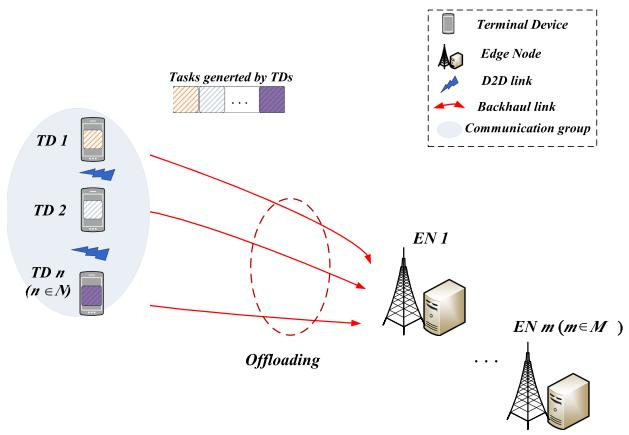
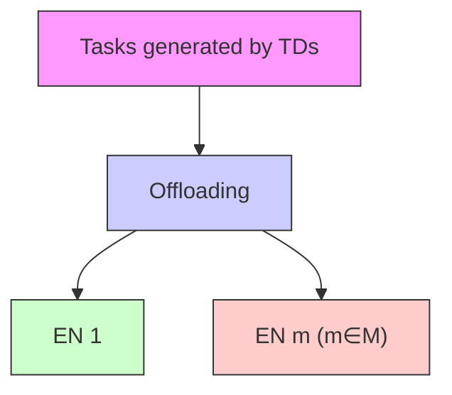
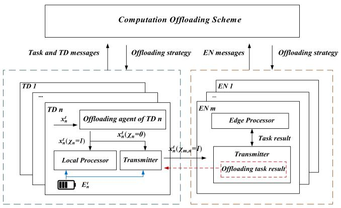
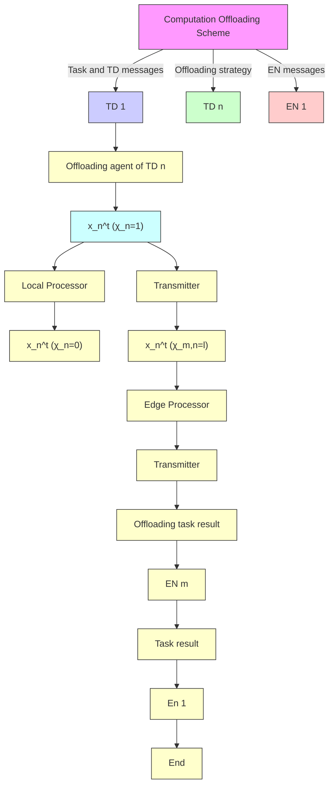
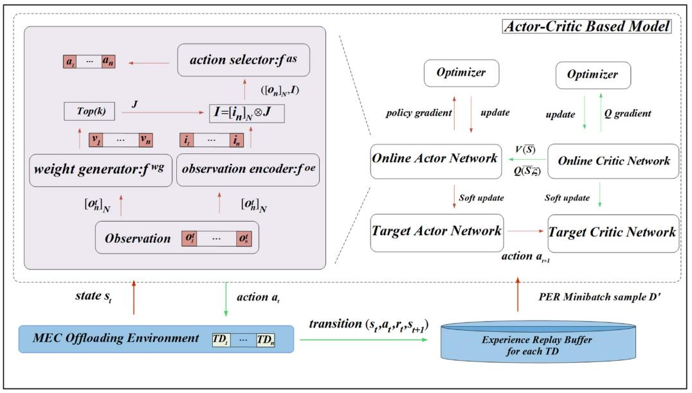
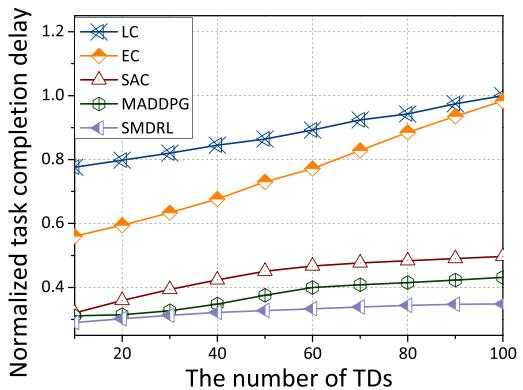
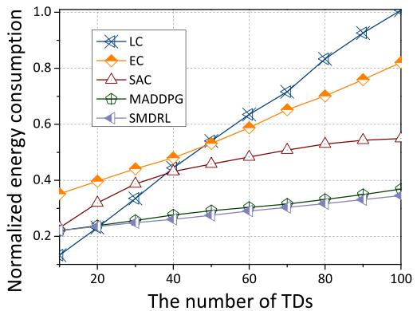
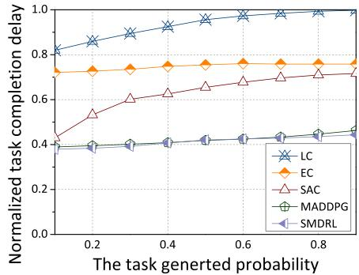
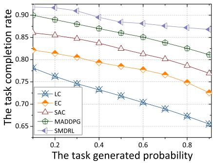
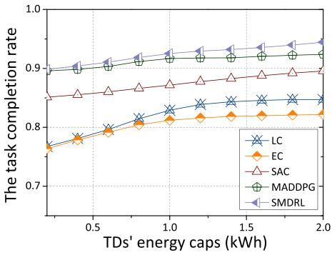

# Computation Offloading in Resource-Constrained Multi-Access Edge Computing

Kexin Li , Xingwei Wang , Qiang He , Jielei Wang , Jie Li, Siyu Zhan, Guoming Lu, and Schahram Dustdar , Fellow, IEEE

Abstract—Recently, computation offloading methods have greatly improved the Quality of Experience (QoE) in Multi-access Edge Computing (MEC) by offloading tasks to the edge servers. Since well-coordinated actions of Terminal Devices (TDs) are critical to improving the performance of the entire individual system, many practical MEC-based applications, i.e., firefighting robots and unmanned aerial vehicles, require great teamwork among TDs. However, real-world scenarios are usually bound by resource conditions. For instance, network connectivity may weaken or experience interruptions during emergency situations. In cases where the communication medium is utilized by multiple TDs, achieving effective coordination poses a significant challenge. In this paper, we propose a computation offloading scheme based on Scheduled Multi-agent Deep Reinforcement Learning (SMDRL) to make the most efficient decision in a resource-constrained scenario. First, we design a virtual energy queue based on the MEC system and maximize the QoE (related to service delay and energy consumption) in a real-time manner. Subsequently, we propose a scheduled multi-agent deep reinforcement learning algorithm to support each TD in learning how to encode messages, select actions, and schedule itself based on the received messages. Furthermore, a TopK mechanism is introduced. This mechanism chooses the most crucial TDs to broadcast their messages, and then the computation offloading problem in a communication-constrained MEC environment can be solved in a low-communication manner. Also, we prove that even under limited communication conditions, our proposed methods can still lead to the close-to-optimal performance. The final performance analysis shows that the developed scheme has significant advantages over other representative schemes.

Manuscript received 6 November 2023; revised 23 January 2024; accepted 18 March 2024. Date of publication 29 March 2024; date of current version 3 October 2024. This work was supported in part by the National Key R&D Program of China under Grant 2022YFB4500800, in part by the National Natural Science Foundation of China under Grant 92267206, Grant 62032013, and Grant U19A2059. Recommended for acceptance by L. Kong. (Corresponding authors: Xingwei Wang; Qiang He.)

Kexin Li, Jielei Wang, Siyu Zhan, and Guoming Lu are with the Laboratory of Intelligent Collaborative Computing, University of Electronic Science and Technology of China, Chengdu 611731, China, and also with the Trusted Cloud Computing and Big Data Key Laboratory of Sichuan Province, Chengdu 611731, China.

Xingwei Wang is with the College of Computer Science and Engineering, Northeastern University, Shenyang 110819, China (e-mail: wangxw@mail.neu.edu.cn).

Qiang He is with the College of Medicine and Biological Information Engineering, Northeastern University, Shenyang 110169, China (e-mail: heqiang@bmie.neu.edu.cn).

Jie Li is with the College of Computer Science and Information Engineering, Hubei University, Wuhan 430062, China.

Schahram Dustdar is with Distributed Systems Group, TU Wien, 1040 Vienna, Austria.

Digital Object Identifier 10.1109/TMC.2024.3383041

Index Terms—Multi-access edge computing, task offloading, distributed execution, resources constrained, deep reinforcement learning.

# I. INTRODUCTION

of mobile communications, computational-intensive and latency-sensitive applications, such as Virtual Reality (VR), Natural Language Processing (NLP), and real-time video analytics have begun blooming [1]. This scenario imposes stringent requirements on the Terminal Devices (TD) with limited computation power and battery capacity. However, due to the hardware constraint [2], satisfying these requirements is challenging. In addition, traditional Cloud Computing (CC) technologies have some inherent limitations in this context. The long propagation distance from the CC to the TDs makes this approach unsuitable for latency-sensitive applications [3], [4].

Recently, the European Telecommunications Standards Institute (ETSI) has proposed a new computing paradigm, Multi-Access Edge Computing (MEC) [5]. It extends CC to the edge of the network, where dense Edge Nodes (ENs), including small Base Stations (BSs) and wireless Access Points (APs), assist resource-constrained TDs. In this way, some latency-sensitive tasks can be performed at the edge of the network, namely, computation offloading or task offloading, thus decreasing computation delay and local energy consumption and improving Quality of Experience (QoE) for the users [6]. While MEC shortens the physical distance to reduce service latency, optimizing system performance for different scenarios, so that service latency and energy consumption can be further improved is still critical. Currently, developing the optimal offloading strategies has gained extensive interest in academics and industrial [7], [8], [9], [10], [11].

Some previous work formulate the computation offloading issue by Mixed Integer Programming (MIP), and typically rely on a central server to aid in offloading decision generation, using a centrally controlled approach to make decisions [12], [13], [14], [15]. For instance, Huang et al. [13] proposed a deep reinforcement learning-based online offloading (DROO) framework that implements a deep neural network as a scalable solution to learn binary offloading decisions from experience. Shi et al. [14] present the task offloading problem, which aims to maximize the average latency-aware utility of a task over a period, and develop a Soft Actor Critic (SAC)-based DRL algorithm for achieving the expected payoff and policy entropy maximization. Nevertheless, these methods require transmitting massive amounts of data to a central server, which leads to up-link congestion and severe transmission delays. Meanwhile, these methods with a centralized training approach introduce experience replay mechanisms that use the historical experience data generated to train a unified model and deploy parameters to all TDs. These approaches deprive TDs of many local features and the ability to capture features of interactions between TDs in many practical MEC-based applications (i.e., firefighting robots and Unmanned Aerial Vehicles, which mix cooperativecompetitive relationship features). Ultimately, these approaches often lead TD agents to make many incorrect calculations and cannot adapt to the reality of multi-TD multi-EN dynamic MEC environments with complex hybrid relationships.

To address the above issues, researchers have considered Multi-Agent Deep Reinforcement Learning (MADRL) models to solve the computation offloading and resource allocation problems in a distributed manner, these models have inherent advantages in optimizing problems involving complex dynamic relationships through parameter synchronization [16], [17], [18], [19], [20], [21], [22]. For instance, Peng et al. [16] formulated the resource allocation on MEC servers as a distributed optimization problem of maximizing the number of offloading tasks while satisfying their heterogeneous QoE requirements, and then solved it with a multi-agent depth-determined policy gradient (MADDPG)-based approach. Tang et al. [17] proposed a decentralized computational offloading scheme based on a model-free deep reinforcement learning-based distributed algorithm, where each device can determine its offloading decision without knowing the task models and offloading decision of other devices. These methods introduced the cloud computing center layer to assist the TDs in training the model but invariably overlooked issues of sharing the communication medium into consideration, especially when agents communicate over wireless channels. This is a troublesome assumption in practical applications because communication is expensive or even limited in practice [23]. That means agents must exchange concise but significant information. In addition, another thorny but often overlooked problem in MEC is that users access the network in a multi-access scheme, where multiple users share media at the same time. This means that potential competitors must be properly arbitrated to avoid collisions, which requires some form of communication scheduling. Therefore, compared to the previous work like [17], we will pay more attention to how to choose the most significant information to facilitate the offloading decision and coordinate the competition caused by communication between TDs. However, as elaborated in related work, the problem of computation offloading in multi-access edge computation with bandwidth constraints has not been extensively studied. Inspired by [24], we investigate that agents learn how to schedule themselves, how to encode the messages, and how to select actions based on received messages.

Motivated by the above, we propose a multi-agent deep reinforcement learning-based computational offloading and resource allocation model to solve the problem of maximizing the QoE of the users, especially in a resource-constrained MEC scenario. The main contributions of this paper are as follows.

We first formulate the distributed computation offloading problem as a QoE maximization problem. The insight behind this problem is that Edge Node (EN) dynamically allocates computational resources to TDs based on different task demands. We construct an energy consumption queue that can maximize QoE in real-time.

\- To solve the defined optimization problem, we transform the task computation offload into a formulated Markov Decision Process (MDP) based optimization problem. We propose a predetermined multi-agent learning model (SM-DRL) that facilitates cooperation between agents through the distributed execution of the designed learning model. In particular, we redesign an actor network structure to encode information and introduce the Topk mechanism to select the appropriate users to participate in training to make the most reasonable offloading decision applicable to the communication-limited situation.

We conducted extensive experiments to evaluate the performance of the SMDRL scheme, and the experimental results demonstrate that the proposed algorithm is able to achieve near-optimal performance while staying within the TDs’ communication and energy constraints. Simulation results show that our proposed algorithm is more effective than existing schemes in determining the offloading strategy.

The remainder of this article is organized as follows. Section II details the system model and assumptions. In Section III, the problem formulation and analysis have been described. In Section IV, we detail the three basic elements (action, state, and reward) and formulate the task scheduling problem based on MDP. Section V depicts the proposed computation offloading solution, SMDRL. The simulation results are presented in Section VI. Finally, Section VII summarizes this paper and provides insights into possible future work.

# II. SYSTEM MODEL AND ASSUMPTIONS

In this section, we present and illustrate the system model in terms of task completion delay and energy consumption. In addition, we explain the system operation flow. The main notations are listed in Table I.

# A. System Model

This paper aims to efficiently allocate network resources to maximize the long-term expected QoE of users which is related to the task completion delay and energy consumption. As shown in Fig. 1, we consider an architecture about the MEC environment. It includes M ENs, denoted by $\mathbb { M } = \{ 1 , . . . m , . . . , M \}$ , N TDs, represented by $\mathbb { N } = \{ 1 , . . . n , . . . , N \}$ 1coexist. Each EN in-= 1cludes a Base Station (BS) and an Edge Server (ES); BS is mainly used for communication while ES provides computing services. The computation capability and the bandwidth resources of EN m are defined as $f _ { m }$ (cycles per second) and $B _ { m }$ , respectively.

TDs correspond to smart devices or a low-power Internet of Things (IoT) system, e.g., AR/VR and wearable devices. In this scenario, we consider a more realistic situation where TDs usually have a cap on energy consumption. For example, wearable devices are often designed to increase wearing comfort by reducing the capacity of the battery. If the battery is depleted, the task potentially will fail, leading to irreversible consequences in some medical scenarios. Therefore, we set an energy consumption cap $e _ { n } ^ { c }$ for each TD, and the task scheduling cannot exceed this value of the energy consumption cap. In addition, each TD is assumed to have a computation capability $g _ { n }$ (cycles per second).

TABLE I MAIN NOTATIONS 

<table><tr><td>Notation</td><td>Description</td></tr><tr><td> $N$ </td><td>Number of TD;</td></tr><tr><td> $M$ </td><td>Number of EN;</td></tr><tr><td> $g_{n}$ </td><td>Computation capacity of TD  $n$ ;</td></tr><tr><td> $f_{m}$ </td><td>Computation capacity of EN  $m$ ;</td></tr><tr><td> $x_{n}^{t}$ </td><td>The task generated by TD  $n$ ;</td></tr><tr><td> $\lambda_{n}^{t}$ </td><td>Task generated probability of TD  $n$ ;</td></tr><tr><td> $c_{n}^{t}$ </td><td>Task data size of task  $x_{n}^{t}$ ;</td></tr><tr><td> $z_{n}^{t}$ </td><td>Requested CPU cycles of task  $x_{n}^{t}$ ;</td></tr><tr><td> $d_{n}^{t,max}$ </td><td>Delay toleration of task  $x_{n}^{t}$ ;</td></tr><tr><td> $b_{m,n}^{t}$ </td><td>Channel bandwidth between TD  $n$  and EN  $m$ ;</td></tr><tr><td> $\varrho_{m,n}$ </td><td>Transmitting power between TD  $n$  and EN  $m$ ;</td></tr><tr><td> $h_{m,n}$ </td><td>Antenna gain between TD  $n$  and EN  $m$ ;</td></tr><tr><td> $L$ </td><td>Path loss;</td></tr><tr><td> $d_{m,n}$ </td><td>Distance between TD  $n$  and EN  $m$ ;</td></tr><tr><td> $\varsigma^{2}$ </td><td>The power of additive white Gaussian noise;</td></tr><tr><td> $\rho_{n}$ </td><td>Power coefficient of energy consumed per CPU cycle of TD  $n$ ;</td></tr><tr><td> $\rho_{m}$ </td><td>Power coefficient of energy consumed per CPU cycle of EN  $m$ ;</td></tr><tr><td> $W$ </td><td>The set of available sub-channels for TD;</td></tr><tr><td> $P_{m,n}^{t}$ </td><td>The set of bandwidth allocation factors;</td></tr><tr><td> $E_{n}^{t}$ </td><td>The energy consumption of TD  $n$  processing  $x_{n}^{t}$ ;</td></tr><tr><td> $e_{n}^{c}$ </td><td>The energy caps of TD  $n$ ;</td></tr><tr><td> $B_{m}$ </td><td>Bandwidth resources of EN  $m$ ;</td></tr><tr><td> $Q_{n}^{t}$ </td><td>Virtual queue of TD  $n$  at time slot  $t$ ;</td></tr><tr><td> $\chi_{n}$ </td><td>A binary value denoting whether task  $x_{n}^{t}$  by local computing;</td></tr><tr><td> $\chi_{m,n}$ </td><td>A binary value denoting whether task  $x_{n}^{t}$  is offloading to EN  $m$  for computation.</td></tr></table>

For simplicity and without loss of generality, we consider that TD n generates a task in each time slot with probability $\lambda _ { n } ^ { t } , n \in \mathbb { N }$ , and the time horizon is divided into a set of time slots with equal length T . The task generated by TD n in time slot t can be represented by $x _ { n } ^ { t } = \{ c _ { n } ^ { \bar { t } } , z _ { n } ^ { t } , d _ { n } ^ { t , \mathrm { m a x } } \}$ , where $c _ { n } ^ { t } , z _ { n } ^ { t }$ , and $d _ { n } ^ { t , \mathrm { m a x } }$ = are defined as the data size, the requested CPU cycles, and the delay toleration of task $\ v x _ { n } ^ { t }$ , respectively.

# B. Task Computation Model

A task generated by the TD can be processed locally or offloaded to EN. We assume that each atomic task can not be split so that a binary offloading decision (i.e., processed locally or offloaded to EN) can be made.



<details>
<summary>flowchart</summary>


</details>

Fig. 1. MEC system consists of multiple ENs and multiple TDs. TDs either process their tasks locally or offload their tasks to the EN based on the computation and communication resources.

1) Process Locally: If the task $\ v x _ { n } ^ { t }$ is processed locally, the time consumption of the task $\ v x _ { n } ^ { t }$ depends on the computation capacity $g _ { n }$ of the TD n and the required CPU cycles $z _ { n } ^ { t }$ . Thus, mputation delay for local . $D _ { n } ^ { t , \bar { l } }$ can be expressed as $D _ { n } ^ { t , l } =$ $z _ { n } ^ { t } / g _ { n }$

Correspondingly, we can obtain the computation energy consumption which can be computed by $e _ { n } ^ { t , l } = \rho _ { n } \cdot z _ { n } ^ { t }$ , where $\rho _ { n }$ =is the power coefficient of energy consumed per CPU cycle at TD $n$ .

2) Process at EN: If the task $\ v x _ { n } ^ { t }$ is offloaded to EN $m ,$ mputation delay of task . $\boldsymbol { x } _ { n } ^ { t }$ can be obtained by $D _ { m , n } ^ { t , e } =$ $z _ { n } ^ { t } / f _ { m }$

It is possible to obtain the computation energy consumption of a system by calculating $e _ { m , n } ^ { t , e } = \rho _ { m } \cdot z _ { n } ^ { t }$ , same as energy consumption of TDs, $\rho _ { m }$ =is the power coefficient of EN m.

# C. Communication Model

1) Transmit to EN: TDs need to communicate with ENs when offloading tasks to the target EN based on the offloading decision. We set the upload link from the TDs to the target EN as a flat Rayleigh fading channel, regardless of channel interference. In this communication model of this system, the edge server can serve as a multiple access scenario. As a realistic approach, we assume that EN m owns bandwidth resources that can be divided into orthogonal sub-channels of size b Hz each. Therefore, we define $W = \{ 1 , \cdots , w \}$ as the set of available sub-channels for TD. $P _ { m , w } ^ { t }$ 1is defined as the bandwidth of the sub-channel, each sub-channel can be allocated to at most one TD. At time slot t, the bandwidth allocated to TD n in the form of EN m is denoted as btm,n  Bm - m,nP t , $\begin{array} { r } { b _ { m , n } ^ { t } = B _ { m } \frac { P _ { m , n } ^ { t } } { \sum _ { W } P _ { m , w } ^ { t } } , m \in M , n \in N , } \end{array}$ P t , where $P _ { m , n } ^ { t }$ W m,wis a set of bandwidth allocation factors based on realistic conditions. When $P _ { m , n } ^ { t } = 1$ , the communication = 1resources of EN m are equally allocated to TDs.

If the task $\ v x _ { n } ^ { t }$ is offloaded to EN m, the transmission delay depends on the input data with the size of $c _ { n } ^ { t }$ and the transmission rate $r _ { m , n } ^ { t }$ from TD n to the EN m at time slot t. Therefore, it can be computed by $D _ { m , n } ^ { t , t } = c _ { n } ^ { t } / r _ { m , n } ^ { t }$ , where the transmission rate $r _ { m , n } ^ { t }$ between TD n and EN m can be computed based on Shanm,n non formula $[ 2 5 ] \ r _ { m , n } ^ { t } = b _ { m , n } ^ { t } \log _ { 2 } ( 1 + \varrho _ { m , n } h _ { m , n } / ( b _ { m , n } ^ { t } \varsigma ^ { 2 } ) )$ , where $\varrho _ { m , n }$ = log (1 +is the transmitting power, and $h _ { m , n }$ ( ))is the antenna gain at EN n. And $h _ { m , n } = | h _ { n } | ^ { 2 } / ( L \cdot d _ { m , n } )$ , where symbol L is the path loss at a unit distance, $d _ { m , n }$ is the distance between TD n and EN $m _ { : }$ , and $\varsigma ^ { 2 }$ is the power of additive white Gaussian noise of edge computation offloading, $h _ { n }$ is a random variable that is subject to the Gaussian distribution N(0,1), which represents a small range of fading. Similar to many studies [26], [27], the returning data is generally much smaller than the input data. Thus, we assume that the transmission time of return delay can be ignored.



<details>
<summary>flowchart</summary>


</details>

Fig. 2. MEC system operation flow.

Also, we can obtain that the transmission energy consumption for TD n offloading the task $\ v x _ { n } ^ { t }$ to EN m by e m,n $e _ { m , n } ^ { t , t } =$ $c _ { n } ^ { t } \cdot \varrho _ { m , n } / r _ { m , n } ^ { t }$ .

# D. System Operation Flow

At each time slot t, tasks $\boldsymbol { x } _ { n } ^ { t }$ generated by TDs are heterogeneous and differ in terms of computational and energy resource requirements. Based on these task messages, each TD decides whether and where to execute their task. Based on the related research [28], we utilize binary value $\chi _ { n } \in \{ 0 , 1 \}$ to denote whether the task $\boldsymbol { x } _ { n } ^ { t }$ 0 1is executed locally. We assume that $\chi _ { n } = 1$ = 1means that the task is executed locally, and vice versa. Similarly, binary value $\chi _ { m , n } \in \{ 0 , 1 \}$ } denotes whether task $\boldsymbol { x } _ { n } ^ { t }$ is offloaded to EN m or not.

The system operation flow is shown in Fig. 2. First, we assume that each TD determines its own task offloading strategy based on its observations (i.e., task $\boldsymbol { x } _ { n } ^ { t }$ and TD n messages and EN m messages). After that, the computing central (Computation Offloading Scheme in Fig. 2) collects the environment messages (i.e., all task messages $\{ x _ { 1 } ^ { t } , x _ { 2 } ^ { t } , . . . , x _ { n } ^ { t } \} )$ at time slot t, aids TD in getting an optimal offloading strategy. Following that, UEs are allowed to communicate with other UEs by wireless link, and the state information of UE is broadcast to all UEs within its communication range to facilitate cooperation between them. After receiving the offloading request from the TD, the EN will determine the scheduling order of the task and process the task $\boldsymbol { x } _ { n } ^ { t }$ at the edge processor. Finally, the offloading task result will be sent back to the TD by the transmitter. To satisfy the computing requirements of users, we define the problem considered as a QoE maximization problem.

# III. PROBLEM FORMULATION AND ANALYSIS

In this section, we analyze the constraints when implementing the task computation offloading problem. Specifically, we elaborate on the offloading decision constraints. Then, we formulate the task computation offloading problem formulation. Based on these constraints, we analyze the transformation of the problem where the optimal objective problem is converted into a time-series decoupled queue control problem.

# A. Constrains of the Problem

1) Offloading Strategy Constraint: Let $A ^ { t } = \left\{ \chi _ { n } , \chi _ { m , n } \right\}$ indicate the offloading strategy of task $\boldsymbol { x } _ { n } ^ { t }$ =at time slot $\not { k } , \mathrm { i } . \mathrm { e } . , \chi _ { n } = 1$ = 1means finish the task locally. We assume that each task is atomically inseparable and needs to be executed in the same processor within a time slot. Therefore, the task offloading strategy must satisfy $\chi _ { n } ^ { t } \in \{ 0 , 1 \} , \chi _ { m , n } ^ { t } \in \{ 0 , 1 \}$ , and ${ \boldsymbol { \chi } } _ { n } ^ { t } \neq { \boldsymbol { \chi } } _ { m , n } ^ { t }$ .   
0 1 0 1 =2) Computation Delay Constraint: While TD n generates task $\boldsymbol { x } _ { n } ^ { t }$ at time slot t, the task is usually accompanied by a maximum tolerance time $d _ { n } ^ { t , \mathrm { m a x } }$ , aligning with the realistic scenario and representing the user’s patience. Due to the delay limited of the task, the completion delay of the task can not exceed the maximum tolerance time. During the MEC offloading process, the completion delay must satisfy $T _ { n } ^ { t } \leq d _ { n } ^ { t , \operatorname* { m a x } }$ , where $\begin{array} { r } { T _ { n } ^ { t } = \chi _ { n } ^ { t } ( D _ { n } ^ { t , l } ) + ( 1 - \chi _ { n } ^ { t } ) ( D _ { m , n } ^ { t , t } + \sum _ { m = 1 } ^ { M } \chi _ { m , n } ^ { t } \cdot D _ { m , n } ^ { t , e } ) } \end{array}$ - .   
= ( ) + (1 )( + )3) Computation Energy Consumption Constraint: MEC task offloading improves the user’s QoE by reducing latency, but offloading generates additional energy consumption for MEC computing simultaneously. Considering the realistic MEC offloading process, the offloading strategy should follow the energy constraint of devices. The long-term energy consumption constraint deserved in this MEC system is defined as follows:

$$
\lim _ {\mathcal {T} \rightarrow + \infty} \frac {1}{\mathcal {T}} \sum_ {t = 0} ^ {\mathcal {T} - 1} \mathbb {E} (E _ {n} ^ {t}) \leq e _ {n} ^ {c} \tag {1}
$$

where symbol E · is a mathematical expectation, $E _ { n } ^ { t } =$ $\begin{array} { r } { \chi _ { n } ^ { t } ( e _ { n } ^ { t , l } ) + ( 1 - \chi _ { n } ^ { t } ) ( \sum _ { m = 1 } ^ { M } \chi _ { m , n } ^ { t } \cdot e _ { m , n } ^ { t , t } ) } \end{array}$ is the energy con-( ) + (1 )( sumption of TD n processing the task $\boldsymbol { x } _ { n } ^ { t }$ )per time slot t, and $e _ { n } ^ { c }$ is the energy caps of the TD n.

4) Bandwidth Allocation Constraint: In the task offloading process, TDs transmit the computational task to ENs with allocated bandwidth. Let $\mathbb { N } _ { m } ^ { t } = \{ 1 , . . . N _ { m } ^ { t } \}$ is the set of TDs served =by EN m at time slot t, and $b _ { m , n } ^ { t } \leq B _ { m } , \forall n \in  { \mathbb { N } } _ { m } ^ { t } , t \in \mathcal { T }$ .

# B. Problem Formulation

The task of formulating the computation offloading problem is addressed within the context of minimizing delays while adhering to energy consumption constraints, as demonstrated in prior research [16], [18]. However, the realization of a real-time computation offloading decision is impeded by notable challenges. First, the necessity for comprehensive information spanning all periods, notably task-related data, poses a formidable acquisition challenge. Second, the oversight of various time-coupling factors, such as the deficit energy consumption of the TD, complicates the problem. In the dynamic time coupling process, excessive energy consumption by the current task depletes resources for subsequent tasks, thereby influencing the offloading strategy. To address these challenges, a transformation of the original problem is undertaken, limiting the task’s reliance on future information. Additionally, a virtual energy deficit queue is introduced to decouple the protracted energy consumption constraint.

At time slot $t ,$ let $Q _ { n } ^ { t }$ be defined as the virtual energy queue of TD n. We assume that this queue is set to 0 in the initial time slot, i.e., $Q _ { n } ^ { 0 } = 0$ .

$$
Q _ {n} ^ {t + 1} = \max \{0, Q _ {n} ^ {t} + E _ {n} ^ {t} - e _ {n} ^ {c} \} \tag {2}
$$

As we mentioned before, $E _ { n } ^ { t }$ and $e _ { n } ^ { c }$ denote the energy consumption of task $\ v x _ { n } ^ { t }$ at time slot t and energy caps of TD n, respectively. As shown in (2), the virtual energy deficit queue is a historical measure of excess energy consumption. Calculating the virtual energy deficit queue represents the gap between the current energy consumption and the constraint visually.

From (2), we can observe that if the energy consumed by TD n at time slot t grows, the energy deficit queue increases at the next time slot. An offload policy resulting in a large value of en $Q _ { n } ^ { t + 1 }$ would imply that energy consumption may exceed themaximum, which is unacceptable in a realistic scenario. QoE can be regarded as the most direct experience in service interactions. Currently, the majority of offloading services to enhance the QoE level become comprehensively attractive to attention [6]. In addition, QoE can be measured by the QoS from the task offloading, improving the experience in MEC networks. Based on the task offloading, we give the delay and energy consumption to measure the satisfaction of QoE. Combining the constraints just mentioned and satisfying the users’ computation requirements, we defined the considered problem as a real-time QoE maximization problem, the task offloading policy $f ( A ^ { t } * )$ is presented as follows:

$$
\mathbf {P 1} \min _ {A ^ {t} * \in A ^ {t}} f (A ^ {t} *) = \sum_ {n \in \mathbb {N} _ {m} ^ {t}} \omega_ {1} Q _ {n} ^ {t} \cdot E _ {n} ^ {t} + \omega_ {2} T _ {n} ^ {t} \tag {3a}
$$

$$
\text { s.t. } C 1: \chi_ {n} ^ {t}, \chi_ {m, n} ^ {t}, \in \{0, 1 \}, \forall m \in M, \forall n \in N \tag {3b}
$$

$$
C 2: T _ {n} ^ {t} \leq d _ {n} ^ {t, \max}, \forall n \in N \tag {3c}
$$

$$
C 3: b _ {m, n} ^ {t} \leq B _ {m}, \forall n \in \mathbb {N} _ {m} ^ {t}, t \in \mathcal {T} \tag {3d}
$$

$$
C 4: \frac {1}{\mathcal {T}} \sum_ {t = 0} ^ {\mathcal {T} - 1} \mathbb {E} \{E _ {n} ^ {t} \} \leq e _ {n} ^ {c}, \forall n \in N, t \in \mathcal {T} \tag {3e}
$$

where positive control parameters $\omega _ { 1 }$ and $\omega _ { 2 }$ weight $Q _ { n } ^ { t } \cdot E _ { n } ^ { t }$ and $T _ { n } ^ { t }$ to strike a desirable balance between TDs’ deficit energy and task completion delay.1 The objective function (3a) felicitates the satisfaction of users’ requirements by maximizing the QoE of users. The first constraint (3b) guarantees the task is indivisible and each task is required to be processed in a single processor [29]. The second constraint (3c) indicates that the total delay of task $\ v x _ { n } ^ { t }$ should not exceed its tolerance delay $d _ { n } ^ { t , \mathrm { m a x } }$ The third constraint (3d) guarantees that the allocated bandwidth of each TD must be less than the bandwidth resources of the EN m. The last condition (3e) guarantees that the averaged energy consumption requirements of task $\boldsymbol { x } _ { n } ^ { t }$ cannot exceed the total energy consumption caps $e _ { n } ^ { c }$ .

Theorem 1: The long-term energy constraint can be satisfied when $l i m \tau _ {  + \infty } \mathbb { E } \{ Q _ { n } ^ { t } \} / \tau = 0$ .

= 0Proof: Based on (2), we obtain the following:

$$
E _ {n} ^ {t} - \bar {E} _ {n} \leq Q _ {n} ^ {t + 1} - Q _ {n} ^ {t} \tag {4}
$$

We take the exponential function for each side for a more intuitive representation.

$$
\frac {1}{\mathcal {T}} \sum_ {t = 0} ^ {\mathcal {T} - 1} \mathbb {E} \{E _ {n} ^ {t} - \bar {E} _ {n} \} \leq \frac {\mathbb {E} \{Q _ {n} ^ {\mathcal {T}} \}}{\mathcal {T}} \tag {5}
$$

Based on (1), in order to satisfy the energy constraints in this system, the following expression must guaranteed:

$$
\lim _ {\mathcal {T} \rightarrow + \infty} \frac {\mathbb {E} \{Q _ {n} ^ {\mathcal {T}} \}}{\mathcal {T}} = 0 \tag {6}
$$

In addition, $f ( A ^ { t } * )$ is the optimal solution of P1 as we men-(tioned above, and $\begin{array} { r } { L ( Q ^ { t } ) = \sum _ { n = 1 } ^ { N } \frac { 1 } { 2 } ( Q _ { n } ^ { t } ) ^ { 2 } } \end{array}$ is a mathematical ( ) = ( )expression that gives a visual representation of the magnitude of $Q ^ { t }$ . Then we have:

$$
\mathbb {E} \left(L \left(Q _ {n} ^ {\mathcal {T}}\right) - L \left(Q _ {n} ^ {0}\right)\right) + \sum_ {n = 0} ^ {N} \sum_ {t = 0} ^ {\mathcal {T}} \mathbb {E} \left\{f \left(A ^ {t}\right) \mid Q _ {n} ^ {t} \right\}
$$

$$
\leq \mathcal {T} + \frac {\mathcal {T}}{2} \sum_ {n = 0} ^ {N} (e _ {n} ^ {c} - \bar {E _ {n}}) ^ {2} - \eta \sum_ {t = 0} ^ {\mathcal {T}} \sum_ {n = 0} ^ {\mathcal {N}} (Q _ {n} ^ {t}) + \mathcal {T} \log | f (A ^ {t}) | \tag {7}
$$

where $| f ( A ^ { t } ) |$ is a commonly used method to measure the log ( )optimal result achieved by an approximation algorithm, according to [30]. Clearly, we have

$$
\mathbb {E} (L (Q _ {n} ^ {\mathcal {T}})) \leq \mathcal {T} \left(\frac {\mathcal {T}}{2} \sum_ {n = 0} ^ {N} (e _ {n} ^ {c} - \bar {E} _ {n}) ^ {2} \right.
$$

$$
\left. + \log | f (A ^ {t}) | + Z \left(\sum_ {n = 0} ^ {N} \mathbb {E} \{f (A ^ {t}) _ {\pi} \} - f (A ^ {t} *)\right)\right) \tag {8}
$$

where Z is the positive control parameter, and $f ( A ^ { t } ) _ { \tau }$ is a policy ( )for P1. As T tends to infinity, the right term of the above equation can be expressed as follows:

$$
\lim _ {\mathcal {T} \to + \infty}
$$

$$
\sqrt {\frac {1}{\mathcal {T}} \left(\frac {\mathcal {T}}{2} \sum_ {n = 0} ^ {N} (e _ {n} ^ {c} - \bar {E} _ {n}) ^ {2} + \log | f (A ^ {t}) | + Z \cdot \varphi\right)} = 0 \tag {9}
$$

where $\begin{array} { r } { \varphi = \sum _ { n = 0 } ^ { N } \mathbb { E } \{ f ( A ^ { t } ) _ { \pi } \} - f ( A ^ { t } * ) } \end{array}$ N for the simple expres-= ( ) ( )sion. Based on the above derivation, it is possible to prove that Theorem 1. can be satisfied when $\tau _ { \mathcal { + } + \infty } \mathbb { E } \{ Q _ { n } ^ { t } \} / \tau = 0$ .

limTheorem 2: The optimization problem is NP-Hard.

Proof: Considering N tasks with $E _ { b u d g e t }$ offloading budget, the total energy consumption cannot exceed the offloading budget for each task regardless of what offloading scheme is used for the time slot. $D _ { n }$ represents system latency for task $x _ { n } .$ , and $E _ { n }$ represents energy consumption for task $x _ { n }$ . Based on this, the optimization problem proposed to solve is given as:

$$
\text { minimize } \frac {\sum_ {n = 1} ^ {n = N} D _ {n}}{N} \tag {10a}
$$

$$
s. t. \sum_ {n \in N} E _ {n} \leq E _ {\text { budget }}. \tag {10b}
$$

Then, this instance of our problem corresponds to the Knapsack problem if we define $\begin{array} { r } { \frac { D _ { n } ^ { \star } } { N } = - p _ { n } } \end{array}$ D [31], this instance corre-=sponds to the optimization problem:

$$
\text { maximize } \sum_ {n \in N} p _ {n} \tag {11a}
$$

$$
s. t. \sum_ {n \in N} E _ {n} \leq E _ {\text { budget }}. \tag {11b}
$$

Therefore, the optimization problem of this computation offloading scheme is NP-Hard. This completes the proof.

It is rather challenging to achieve the above objective since the computation offloading optimization problem is NP-Hard according to [16], [28], [32]. It isn’t easy to settle by utilizing conventional methods. Furthermore, the computation offloading decision is memoryless with a sequential decision-making process. Therefore, we formulate the task computation offloading as an MDP minimization problem. Nevertheless, traditional approaches have extremely high computation complexity, which may have limitations in practical applications, especially in a communication-constraint MEC environment. In the next section, we design an online computation offloading mechanism in the communication-constraint MEC network. This approach addresses the challenges mentioned above, effectively working in real-time.

# IV. ONLINE TASK OFFLOADING WITH RESOURCE ALLOCATION

In this section, we model the defined delay and energy consumption minimization MDP problem for satisfactory users’ QoE, which can be represented by tuple $( S , A , R , O , \gamma )$ . Symbol ( )S is the global state space, A is the action space, and R is the rewards. Symbols $\gamma$ and O represent the discount factor and observations, respectively. The offloading framework makes decisions by searching the policy strategy π for each agent and minimizes the long-term reward R which interacts with the MEC environment. In the following, we provide a detailed introduction to the information on the elements in the considered MDP.

# A. Based Elements

1) Observation/State: The observation can be represented by $O = \{ o _ { t } = [ o _ { n } ^ { t } ] _ { N } \} , n \in N , t \in \mathcal T \}$ , where $o _ { n } ^ { t } =$ $\{ x _ { n } ^ { t } , b _ { m , n } ^ { t } , e _ { n } ^ { t } , Q _ { n } ^ { t } \}$ = [ ] =is the partial observations for each TD. Therefore, we have partial observations $o _ { n } \in \Omega$ according to some observation function $O ( s , n ) : S \times N \to \Omega$ , where $S = \{ s _ { t } \}$ ( ) : Ωis the global state. As mentioned before, variables $x _ { n } ^ { t } = \mathsf { \bar { \{ } }  z _ { n } ^ { \top } , c _ { n } ^ { t } , d _ { n } ^ { t , \top } \mathrm { { = } } \mathrm { { } } \mathrm { { } } \mathbf { \bar { \mathbf { ) } } }$ , symbols $z _ { n } ^ { t } , \boldsymbol { c } _ { n } ^ { t } ;$ , and $d _ { n } ^ { t , \mathrm { m a x } }$ represents =the requested CPU cycles, the data size, and the delay toleration of task $\boldsymbol { x } _ { n } ^ { t }$ at time slot t, respectively. Correspondingly, symbol $b _ { m , n } ^ { t }$ represents the channel bandwidth between TD n and EN m at time slot t. Thus, we can obtain communication delay $D _ { m , n } ^ { t , t }$ for offload task $\ v x _ { n } ^ { t }$ to EN m. In addition, $e _ { n } ^ { c }$ is the energy consumption caps of TD n; $Q _ { n } ^ { t }$ is the virtual energy queue of TD n ate time slot t.

2) Action: The action space can be represented by $A \ = \ \{ a _ { t } = [ a _ { n } ^ { t } ] _ { N } , n \in N , t \in \mathcal T \} , \mathrm { w h e r e } a _ { n } ^ { t } \ = \ \{ \chi _ { n } , \nonumber $ χm,n}n∈N,m∈M .   
3) Reward: The immediate reward received by agents after taking action $a _ { t }$ at observation $s _ { t }$ can be represented by $r _ { t }$ $S \times A \to R .$ : Since our objective is to maximize the QoE of users, we defined $r _ { t } = f ( A ^ { t } * ) _ { A ^ { t } * \in A ^ { t } }$ related to P1.

# B. Optimization Problem Formulation

We need to find a policy π that can minimize the MDP problem for satisfactory users’ QoE from a long-term perspective. In other words, we prepare to minimize the cumulative reward defined above. Then, our optimization problem can be formulated by:

$$
\mathbf {P 2} V ^ {*} (s _ {t}) = \min _ {a _ {t}} [ r _ {t} + \gamma \mathbb {E} _ {s _ {t}, a _ {t}} [ V (s _ {t + 1}) ] ], \tag {12a}
$$

$$
\text { s.t.   Constraints } (3 \mathrm{b}) - (3 \mathrm{d}) \tag {12b}
$$

where $V ^ { * } ( s _ { t } )$ is the optimal observation value of the formulated ( )MDP. We can obtain the value of $V ( s _ { t } )$ from the critic network ( )which will be described in Section V. The policy π can be found by $\begin{array} { r } { \pi ^ { * } = a r g \operatorname* { m i n } _ { a _ { t } } [ r _ { t } + \gamma E _ { s _ { t } , a _ { t } } [ V ( s _ { t + 1 } ) ] ] } \end{array}$ .

= min t[ + t t[ ( )]]However, the above formulation of the optimization problem cannot be directly solved by DRL-based methods (i.e., traditional policy gradient-based optimization methods). First, the actions defined in (3a) are coupled to each other, and a change in one element can significantly impact the other elements. For instance, a change in the TD n energy consumption virtual queue can affect the generation of task offloading decisions, affecting the completion times of tasks generated by other TDs. Furthermore, this system considers rewards are affected by multiple TDs and ENs. However, there is no centralized management to train policies, and servers must train their policies independently. Inspired by Multi-agent deep reinforcement learning (MADRL), we solved this problem using multi-agent reinforcement learning with an actor-critic structure.

Nevertheless, this algorithm generally lacks consideration of realistic situations, such as real-world scenarios that are usually bound by communication conditions (when an emergency occurs, the network may be weaker or interrupted). Maintaining coordination among TDs is more difficult when the communication medium is shared among many TDs. Therefore, we propose a communication-scheduled multi-agent reinforcement learning that can effectively reduce signal collisions during the execution of intelligent algorithms for situations where bandwidth is limited.



<details>
<summary>flowchart</summary>

```mermaid
graph TD
    subgraph MEC Offloading Environment
        A["MEC Offloading Environment"] -->|state s_t| B["Observation"]
        C["Observation"] -->|state s_t| D["Target Actor Network"]
        D -->|action a_t| E["PER Minibatch sample D'"]
    end

    subgraph Actor-Critic Based Model
        F["Action selector: f^as"] --> G["Top(k)"]
        G --> H["I = [i_n"]^N ⊗ J]
        H --> I["weight generator: f^wg"]
        H --> J["observation encoder: f^oe"]
        I --> K["Observation"]
        J --> L["Optimization"]
    end

    F -->|policy gradient| M["Online Actor Network"]
    F -->|update| N["Online Critic Network"]
    F -->|update| O["Target Critic Network"]
    M -->|V(S̅)| P["Optimizer"]
    N -->|Q(S̅)| Q["Optimizer"]
    O -->|Soft update| R["Target Critic Network"]
    R -->|action a_{t+1}| S["Experience Replay Buffer for each TD"]
    R -->|Soft update| T["Target Critic Network"]
    T -->|Q(S̅_S̅)| U["Online Critic Network"]
    U --> V["Optimization"]
    V --> W["Action selector: f^as"]
    W --> X["Top(k)"]
    X --> Y["I = [i_n"]^N ⊗ J]
    Y --> Z["weight generator: f^wg"]
    Z --> AA["Observation"]
    AA --> AB["Target Actor Network"]
    AB --> AC["PER Minibatch sample D'"]
    AC --> AD["Experience Replay Buffer for each TD"]
    AD --> AE["Transition (s_t, a_t, r_t, s_{t+1})"]
```
</details>

Fig. 3. Schematics of the communication multi-agent deep reinforcement learning framework.

# V. ONLINE TASK OFFLOADING SCHEME

# A. The Whole Algorithm

To address the aforementioned problem, we propose a task offloading method based on an actor-critic model approach. Four neural networks are utilized in this procedure: the online critic network and its target network; the online actor network and its target network. By implementing action $a _ { t }$ in response to observation $o _ { t } ,$ the actor-network can be indicated to be in accordance with policy π. The corresponding Q value is computed by the critic network using the current network state $s _ { t }$ and action $a _ { t }$ of each TD. Q value can be calculated by $Q ( s _ { t } , a _ { t } ) = E [ \bar { r _ { t } } | s _ { t } , a _ { t } ]$ . In addition, we adopt the Prioritized ( ) = [ ¯ ]Experience Replay (PER) technique [33], based on Temporaldifferent to design importance sampling weight of experience. The schematics of the communication multi-agent deep reinforcement learning framework are illustrated in Fig. 3.

The interaction between agents and the MEC environment can be organized as follows. At the beginning of each time slot t, tasks are generated by TD. In our considered system, TD acts as a learning agent and collects task information (i.e., task size), EN information (i.e., computing capacity), and network information (i.e., bandwidth). In contrast to traditional MADRL, the agent schedules this information by solving the problem P2 directly. Instead, a new actor-network is designed to encode this information and generate weights for each agent. Then, select which agent can participate in subsequent training. The information of these agents that have been selected is fed into the algorithm to generate the offloading strategy. The TD then performs the task based on the offloading strategy and broadcasts this information to the other TDs. At the start of the next time sequence, all agents make a new offloading strategy based on the current information.

In the learning process, the environment receives and executes the action returned by the Agent. Subsequently, the Agent returns a next state $s _ { t + 1 }$ and a reward $r _ { t } .$ . Throughout the course of this procedure, the Agent produces a sequence of state samples. These serve as valuable resources for subsequent training sessions, thereby optimizing the sample utilization rate. However, these state samples do not conform to the independence and identical distribution assumption inherent in the majority of deep learning algorithms. To address this discrepancy, the method incorporates the use of an experience replay mechanism. An experience replay memory, denoted as $\mathcal { D } ,$ is designed to retain previous experiences, represented as $\left( { { s _ { t } } , { a _ { t } } , { r _ { t } } , { s _ { t + 1 } } } \right)$ . To mitigate the issue of temporal correlation in recurrent experiences, it is recommended to uniformly sample small batches of such experiences, denoted as $\mathcal { D } ^ { \prime }$ , and subsequently update the online networks of both the Actor and Critic at each discrete time step. This practice of mixing recent experiences with past ones has been shown to be effective in reducing the temporal correlation between repeated experiences, thereby facilitating more efficient and stable learning in reinforcement learning tasks.

To enhance the efficacy of sample utilization and learning rate, this approach incorporates a sample policy known as the Prioritized Experience Replay (PER) mechanism, as proposed by Schaul et al. [33]. By employing the PER mechanism, the learning process from experience replay becomes more efficient. Algorithm 1 presents the pseudo-code outlining the methodology. Within this mechanism, the estimation of the Temporal-Difference Learning (TD-error), denoted as $\sigma _ { i } ,$ i s recorded as the Q value, which signifies the extent to which the Agent has assimilated knowledge from the current experience.

Algorithm 1: Priority Experience Replay.   
Input: experience memory D, batch size $batchsize_{max}$ Output: Sampled subset $D'$ Initialize replay memory $D' = \varnothing$ for j=1 to $batchsize_{max}$ do

    Store $(s_t, a_t, r_t, s_{t+1})$ in $D'$ with maximal priority based on Eq. (13)

    Compute the IS based on Eq. (14)

end

Return a subset $D'$ from D

This value is expressed as follows:

$$
\sigma_ {i} = r _ {i} + \gamma \left[ \max _ {a _ {1 ^ {\prime}}, a _ {2 ^ {\prime}}} Q ^ {\mu^ {\prime}} (x ^ {\prime}, a _ {1 ^ {\prime}}, a _ {2 ^ {\prime}}) - Q ^ {\mu} (x, a _ {1}, a _ {2}) \right] | _ {a _ {j} ^ {\prime} = \mu_ {j} (s _ {j})} \tag {13}
$$

The magnitude of the TD-error value reflects the extent to which the intensive reading of sample predictions can be improved, presenting an opportunity for significant learning for the Agent. A large TD-error value indicates substantial potential for improvement in the Agent’s understanding of the sample. Conversely, a very small or negative TD-error value suggests that the Agent’s behavior is contrary to the correct direction. By employing the PER strategy, the Agent can effectively learn from successful experiences while avoiding the selection of incorrect operations based on unfavorable experiences. This approach enhances the overall quality of the learning strategy. To formalize this concept, we introduce the TD-error value as denoted by $\sigma _ { i }$ , Based on this value, we define the sampling probability Pi for Agent i as follows: $\begin{array} { r } { P _ { i } = \frac { p _ { i } ^ { \alpha } } { \sum _ { j } p _ { j } ^ { \alpha } } } \end{array}$ , where α is the j jcontrol parameters for sorting quantity for priority. j is the index of the minibatch sample. $p _ { i } = | \sigma _ { i } | + \epsilon$ and 
 is a small positive constant that can prevent the critical case of this transition from reconsidering once an error with zero probability occurs. The replay frequency of certain samples is altered due to the higher values of $P _ { i }$ resulting in a potential bias in the replay process. To address this issue, Importance Sampling (IS) weights can be employed to mitigate the introduced deviation:

$$
\eta_ {i} = \left(\frac {1}{N} \cdot \frac {1}{P _ {i}}\right) ^ {\beta} \tag {14}
$$

The correction degree can be adjusted using the parameter $\beta .$ During the $Q$ value learning update process, $\eta _ { i } \sigma _ { i }$ is utilized in place of $\sigma _ { i }$ . To ensure training stability, the weight is consistently normalized to $\frac { 1 } { \operatorname* { m a x } _ { i } \eta _ { i } }$ max η  .

# B. Neural Network Initialization

In this subsection, we provide the detailed introduction for the neural network initialization of the proposed algorithm and the model training.

The actor network is the set of n per-agent individual actor networks, where each agent n’s individual actor network consists of a triple of the following networks: an observation encoder (OE) $f _ { n } ^ { o e } : o _ { n } \mapsto i _ { n }$ , an action selector (AS) $f _ { n } ^ { a s } : \left( o _ { n } , { \cal T } \otimes { \mathcal { I } } \right) \mapsto$ $a _ { n } ,$ :, and a weight generator (WG) $f _ { n } ^ { w g } : o _ { n } \mapsto v _ { n }$ ). Here, $o _ { n }$ :is the partial observation of agent n, and $i _ { n }$ is the encoded message generated by the neural network $f _ { n } ^ { o e } . \mathcal { T } = [ i _ { n } ] _ { N }$ is the vector of each n’s encoded message $i _ { n }$ = [ ], and N is the number of agents in this system. Correspondingly, $\mathcal { T } = [ j _ { n } ] _ { N } , j _ { n } \in \{ 0 , 1 \}$ = [ ]represents whether the agent is scheduled, and operator $" \bigotimes ^ { \bullet } \bigotimes ^ { \bullet \bullet }$ concatenates all the scheduled agents’ messages. The schedule profile $\mathcal { I }$ is determined by the scheduler, which can be represented mathematically as a mapping from the weights $v _ { n }$ of all agents (generated by the neural network $f _ { n } ^ { w g } )$ to the set $\mathcal { I } .$ . And the combination of this concatenation with the schedule profile implies that only those agents scheduled in $\mathcal { I }$ are permitted to disseminate their messages to all other agents. In addition, we introduce the notation $\theta _ { n } ^ { o e } , \theta _ { n } ^ { a s }$ , and $\theta _ { n } ^ { w g }$ to represent the parameters of the observation encoder, action selector, and weight generator for agent n, respectively.

Algorithm 2: Scheduled Multi-Agent Deep Reinforcement Learning (SMDRL).   
Input: Actor selector parameters $\theta_{n}^{as}$ , weight generator parameters $\theta_{n}^{wg}$ , and observation encoder parameters $\theta_{n}^{oe}$ for each agent; Batch size of $B$ Output: Learned policy $\pi$ 1 Initialize: Actor parameters $\theta_{u}$ , scheduler parameters $\theta_{wg}$ , and critic parameters $\theta_{c}$ Initialize: target scheduler parameters $\theta_{wg}^{\prime}$ , and target critic parameters $\theta_{c}^{\prime}$ for episode=1 to M do

2 observe initial observation s

for t=1 to T do

3 $w_{t}$ the priority $w^{i}=f$ of each agent $n$ 4 Get schedule $c_{t}$ from $w$ , the action $u_{t}$ of each agent $n$ 5 Execute the actions $u_{t}$ and observe the reward $r_{t}$ and next observation $s_{t+1}$ 6 Store $(s_{t}, u_{t}, r_{t}, s_{t+1}, c_{t}, w_{t})$ in the replay buffer $B$ 7 Sample a minibatch of S samples $(s_{t}, u_{t}, r_{t}, s_{t+1}, c_{t}, w_{t})$ from replay buffer $B$ 8 Set $y_{k}=r_{k}+\gamma\bar{V}(s_{t+1})$ 9 Set $\hat{y}_{k}=r_{k}+\gamma\bar{Q}(s_{k+1},\bar{f}_{wg}^{i}(\mathbf{o}_{k+1},\mathcal{J}_{k+1}))$ 10 Update the critic by minimizing the loss $L=\sum(y_{k}-V(s_{k}))^{2}+(\hat{y}_{k}-Q(s,v_{k}))^{2}$ 11 Update the scheduler using sampled policy gradient by formulation (7)

12 Update the actor network by sampled policy gradient by formulation (8)

13 Update the target network parameters:

14 $\theta_{W}^{\prime}\leftarrow\tau\theta_{W}+(1-\tau)\theta_{W}^{\prime}$ 15 $\theta_{c}^{\prime}\leftarrow\tau\theta_{c}+(1-\tau)\theta_{c}^{\prime}$ 16 end

17 end

Algorithm 3: Offloading Scheme Based on SMDRL.   
for each possible state in S do
    for each possible action in A do
    compute $V^{*}(s_{t})$ end
    obtain $o^{*}$ end

It is important to emphasize that the distributed execution of agents plays a critical role in determining the outcomes of the offloading strategy. Various scheduling mechanisms can be employed to manage the agents effectively. In this study, we adopt a straightforward weight-based scheduling algorithm. Once the weight of each agent is determined, they are scheduled according to their weights, adhering to predefined rules. Drawing inspiration from wireless scheduling protocols [34], we opt for the $T o p ( k )$ mechanism to schedule the agents. This ( )mechanism involves selecting the top k agents from a pool of all agents based on their respective weight values.

The scheduler determines the schedule profile ${ \mathcal { I } } ,$ which is a mathematical mapping from all agents’ weights $\varsigma = \left[ v _ { n } \right] _ { N }$ (calculated by $f _ { n } ^ { w g } )$ to $\mathcal { T }$ = [ ]. The scheduler of each agent is trained accordingly, based on the utilization of the $T o p ( k )$ algorithm. ( )When the available bandwidth is limited, it may be necessary to employ a scheduler during each training epoch to regulate the transmission of knowledge between agents. Specifically, a predetermined number of agents, denoted as k, are allowed to transmit their knowledge to other agents. This collaborative approach is designed to optimize the overall reward while minimizing the completion delay.

The primary objective shared by models OE, WG, and AS is to effectively manage the constraints imposed by limited bandwidth. Additionally, these models aim to acquire a comprehensive understanding of the significance of individual agent observations and function as schedulers within the weightbased scheduling mechanism, utilizing the weights generated by each agent’s WG. Through their collaborative efforts, these three modules synergistically adapt to time-varying observations, enabling intelligent decision-making. Specifically, after the scheduler gets ${ \mathcal { I } } ,$ it further gets I based on $\mathcal { T } = \left[ i _ { n } \right] _ { N }$ . The observation $o _ { n }$ and $\mathcal { T } \otimes \mathcal { T }$ = [ ]of each agent are fed into an action selector to take an excellent action $a _ { n }$ to maximize the reward.

At each time slot t, the scheduling profile J undergoes changes based on the observations of each agent, resulting in the incoming information I being a combination of inputs from multiple agents. Policy modifications implemented in the weight generator have the effect of modifying the distribution of incoming data, which is subsequently fed into the scheduler.

The dependencies of these three modules are tightly coupled, consequently. Thus, it is imperative for the AS should adjust to this alteration in the scheduling. Inspired by the actor-critic framework, we have incorporated a conventional critic network to facilitate the simultaneous training of all three networks in a centralized manner.

# C. SMDRL-Algorithm

In the system under consideration, distributed execution with centralized training is implemented. During distributed execution, each agent performs its own actor and scheduler mechanism and requires three agent-specific parameters, namely $\theta _ { n } ^ { a s } , \theta _ { n } ^ { w g }$ , and $\theta _ { n } ^ { o e }$ . When training with the critic network, similar to other MADRL algorithms [35], [36], we use a centralized training approach to minimize the loss function of the collaborative regression. We set $y _ { k } = r _ { k } + \gamma { \bar { V } } ( s _ { t + 1 } )$ , and $\hat { y } _ { k } =$ $r _ { k } + \gamma \bar { Q } \big ( s _ { k + 1 } , \bar { f } _ { w g } ^ { i } \big ( o _ { k + 1 } , \mathcal { T } _ { k + 1 } \big ) \big )$ = + ( ) ˆ =. Then, problem P2 is also equivalent to the follow:

$$
\min L \left(\theta_ {n} ^ {a s}, \theta_ {n} ^ {w g}, \theta_ {n} ^ {o e}\right) = \sum_ {k} \left(y _ {k} - V \left(s _ {k}\right)\right) ^ {2} + \left(\hat {y} _ {k} - Q \left(s, v _ {k}\right)\right) ^ {2}) \tag {15}
$$

The training process of actor network is separated into two components in centralized training: 1) weight generator, 2) observation encoder and action selector. To update the actor network, the estimation of the action-value function $Q _ { \theta _ { c } } ^ { \pi } ( s , \varsigma )$ and the state value function $V _ { \theta _ { c } } ( s )$ c ( )is performed using a centralized c ( )critic that is parameterized by $\theta _ { c } .$ . The critic has the ability to utilize the global state s as an input, which encompasses all of the agent’s observations as well as any supplementary information pertaining to the environment. The training methods employed for these two components will be comprehensively elucidated in the subsequent section.

We regard the aggregation of agents’ WGs as a unified neural network denoted as $\mu _ { \boldsymbol { \theta } _ { n } ^ { w g } }$ , which functions as a mapping from $o _ { n }$ to $v _ { n }$ n. This neural network is parameterized by $\theta _ { W } = [ \theta _ { n } ^ { w g } ] _ { N }$ . = [ ]The complete policy gradient of the ensemble of WGs can be expressed as follows:

$$
\begin{array}{l} \bigtriangledown_ {\theta_ {W}} J (\theta_ {W}, \cdot) = \underset {\varsigma \smile \mu_ {\theta_ {W}}} {\mathbb {E}} \left[ \bigtriangledown_ {\theta_ {W}} \mu_ {\theta_ {W}} (o) \right. \\ \left. \times \bigtriangledown_ {\varsigma} Q _ {\theta_ {c}} (s, \varsigma) \right| _ {\varsigma = \mu_ {\theta_ {W} (o)}} ] \tag {16} \\ \end{array}
$$

where s is the global state corresponding to o in a sample. We sample the policy gradient for a suitable amount of experience in the set of all scheduling profiles, i.e., $K = \{ \mathcal { T } | \sum _ { j _ { i } } < k \}$ . The partial observation $o _ { n }$ = iof each agent undergoes processing through the OE and the AS. To improve notation efficiency, we combine the OE $f _ { n } ^ { o e }$ and AS $f _ { n } ^ { a s }$ of all agents into a unified aggregated network $\pi _ { \boldsymbol { \theta } _ { a } } ( a | o , \mathcal { I } )$ . The aggregated network can be a(represented by the parameters $\theta _ { a } = \{ \theta ^ { o e } , \theta ^ { a s } \}$ . The aggregation network, referred to as $\pi _ { \theta _ { a } }$ , utilizes an iterative back-propagation amethod and an actor-critic strategy for learning. The objective function is defined as follows:

$$
\begin{array}{l} \bigtriangledown_ {\theta_ {a}} J (\cdot , \theta_ {a}) = \underset {s \smile \rho^ {\pi}, a \smile \pi_ {\theta_ {a}}} {\mathbb {E}} [ \bigtriangledown_ {\theta_ {a}} \log \pi_ {\theta_ {a}} (a | o, \mathcal {J}) \\ \times \left[ r + \gamma V _ {\theta_ {c}} (s ^ {\prime}) - V _ {\theta_ {c}} (s) \right] \tag {17} \\ \end{array}
$$

where s and $s ^ { \prime }$ represent global observations that correspond to the current and subsequent stages, respectively. The distribution of observations is represented by the symbol $\rho ^ { \pi }$ . We can acquire the value of $V _ { \theta _ { c } } ( s )$ from the centralized critic and subsequently c( )employ gradient ascent to modify the parameters $\theta _ { a }$ .

# D. Computational Complexity Analysis

To determine the computational complexity of our algorithm, we analyze the computational complexity of three modules (Actor network, Critic network and the Scheduler mechanism). Let denote P as the number of UEs in this system, K is the requirement based on TopK mechanism, Q is the dimensionality of the UE’s state space, U is the number of experiences sampled in each round of training, and V is the max episode during the training process. For the Actor network, let set the hidden layer dimension to l, according to [37], the complexity of the network is $\mathcal { O } ( U Q ^ { 2 } \cdot l ^ { 2 } )$ . Second, for the Critic network, the complexity of the network is related to both $P$ and $Q ,$ , which is $\mathcal { O } ( P ^ { 2 } \cdot Q ^ { 2 } )$ ( )according to [37]. For the Scheduler mechanism, the complexity is $\mathcal { O } ( P K Q )$ according to Algorithm 1. Moreover, assume that the computation complexity for the training of one experience is $\mathcal O ( L )$ , where L is the number of multiplication operations in ( )the neural network, the computation complexity of the proposed algorithm is $\mathcal { O } ( L K P ^ { 2 } Q ^ { 2 } \hat { U } \cdot l ^ { 2 } )$ according to [17]. Finally, the ( )offloading scheme based on the SMDRL algorithm has a computational complexity of $O ( | S | \cdot | A | )$ since all respective states and actions in S and A are evaluated to identify observation $o ^ { * }$ .

TABLE II PARAMETERS SETTING 

<table><tr><td>Parameter</td><td>Value</td></tr><tr><td>N</td><td>20</td></tr><tr><td>M</td><td>8</td></tr><tr><td>gn</td><td>1.5 ~ 3.5 GHz</td></tr><tr><td>fm</td><td>31.5 ~ 51.5 GHz</td></tr><tr><td>btm,n</td><td>4~20 MHz</td></tr><tr><td>ctm</td><td>100~1000 KB</td></tr><tr><td>ztn</td><td>10~50 cycles/bit</td></tr><tr><td>ecn</td><td>0.2~2.0 kWh</td></tr><tr><td>Minibatch size</td><td>256</td></tr><tr><td>Episode</td><td>3000</td></tr></table>

# VI. SIMULATION RESULTS

In this section, we evaluate the performance of the proposed algorithm based on the offloading scheme by simulation.

# A. Parameter Settings

To evaluate the long-term rewards of organizations, we employ TensorFlow 1.15 framework to compare the performance of several methods. In this MEC computation offloading scenario, the simulation is designed in a small cell in radius with 20 TDs and 8 ENs. Throughout the experiments, we suppose a scenario where TDs are randomly distributed within an area of $3 5 0 \mathrm { m } \times 3 5 0 \mathrm { m }$ . Here, we consider that the different perform mdistinct computation capabilities of $\mathrm { T D } g _ { n }$ , uniformly distributed between 0.5 and 3.5 GHz. Then computation capabilities of EN $f _ { m }$ are distributed between 31.5 and 51.5 GHz. Similar to [38], the channel bandwidths between the TDs and ENs range from [4, 20] MHz. For the task execution, the task tolerance delay follows the uniform QoE between [5, 30] seconds. While the task data sizes $c _ { n } ^ { t }$ follow the uniform distribution on [100, 1000] KB, the requested CPU $z _ { n } ^ { t }$ ranges from [10, 50] cycles per bit. For the design of the SMDRL, the experience replay memory, denoted as $\mathcal { D }$ is allocated a size of 1024 [17]. The batch $\mathcal { D } ^ { \prime }$ comprises three sizes: 128, 256, and 512. The target network parameter is set at 0.8. Additionally, the parameters α and $\beta$ for the PER method are assigned values of 0.9 each [38]. Regarding the target network, the parameters $\alpha ^ { Q }$ , $\alpha ^ { \mu }$ , and τ for the PER method are established as 0.9, 0.9, and 0.001, respectively. These parameter choices have been empirically verified as suitable for DRL applications [17]. The remaining Key evaluation parameters are listed in Table II.



<details>
<summary>line</summary>

| The number of TDs | LC    | EC    | SAC   | MADDPG | SMDRRL |
| ----------------- | ----- | ----- | ----- | ------ | ------ |
| 0                 | 0.78  | 0.56  | 0.32  | 0.28   | 0.25   |
| 20                | 0.80  | 0.60  | 0.36  | 0.30   | 0.26   |
| 40                | 0.84  | 0.68  | 0.42  | 0.34   | 0.27   |
| 60                | 0.88  | 0.76  | 0.46  | 0.38   | 0.28   |
| 80                | 0.94  | 0.88  | 0.48  | 0.42   | 0.29   |
| 100               | 1.00  | 1.00  | 0.50  | 0.44   | 0.30   |
</details>

(a) Normalized task completion delay



<details>
<summary>line</summary>

| The number of TDs | LC    | EC    | SAC   | MADDPG | SMDRL |
| ----------------- | ----- | ----- | ----- | ------ | ----- |
| 20                | 0.25  | 0.35  | 0.30  | 0.25   | 0.25  |
| 40                | 0.45  | 0.45  | 0.40  | 0.28   | 0.26  |
| 60                | 0.65  | 0.60  | 0.48  | 0.30   | 0.28  |
| 80                | 0.85  | 0.75  | 0.52  | 0.32   | 0.30  |
| 100               | 1.00  | 0.85  | 0.55  | 0.35   | 0.32  |
</details>

(b) Normalized energy consumption   
Fig. 4. Performance of different algorithms with respect to number of TDs.

In addition, we compare the designed computation offloading algorithm with the following four schemes:

1) Local Computing (LC): All tasks are processed on TD without offloading.   
2) Edge Computing (EC): Each TD selects EN for task offloading which minimize the task completion delay.   
3) Soft Actor-Critic (SAC) [39]: It is a classic centralized DRL method that can schedule the offloading strategy in a centralized manner, which is used in [14].   
4) MADDPG [35]: It is a decentralized MADRL method that can schedule the offloading strategy in a decentralized manner and without communication between agents, which is used in [16].

# B. Experimental Results

1) Performance Based on Different Numbers of TDs: Fig. 4(a) illustrates the performance of normalized task completion delay for LC, EC, SAC, MADDPG, and the proposed algorithm, SMDRL, with different numbers of TDs. We take the average value after all experiments are executed more than 10 times and normalized value in the range of [0,1]. In Fig. $4 ( \mathrm { a } )$ , as the amount of TDs grows, the normalized task completion delay of each algorithm increases. This is because as the number of TDs increases, generated tasks within the MEC system increase accordingly. Facing a large number of computation tasks and limited computation and communication resources, many TDs will occupy the channel and cause massive delays.



<details>
<summary>line</summary>

| The task generated probability | LC    | EC    | SAC   | MADDPG | SMDRL |
| ------------------------------ | ----- | ----- | ----- | ------ | ----- |
| 0.2                            | 0.85  | 0.75  | 0.55  | 0.40   | 0.38  |
| 0.4                            | 0.90  | 0.76  | 0.62  | 0.41   | 0.39  |
| 0.6                            | 0.95  | 0.77  | 0.68  | 0.42   | 0.40  |
| 0.8                            | 0.98  | 0.78  | 0.72  | 0.43   | 0.41  |
</details>

(a) Normalized task completion delay   


<details>
<summary>line</summary>

| The task generated probability | LC    | EC    | SAC   | MADDPG | SMDRRL |
| ------------------------------ | ----- | ----- | ----- | ------ | ------ |
| 0.2                            | 0.78  | 0.82  | 0.86  | 0.90   | 0.91   |
| 0.4                            | 0.73  | 0.80  | 0.84  | 0.88   | 0.89   |
| 0.6                            | 0.70  | 0.78  | 0.82  | 0.86   | 0.87   |
| 0.8                            | 0.67  | 0.75  | 0.79  | 0.84   | 0.85   |
| 1.0                            | 0.65  | 0.73  | 0.77  | 0.82   | 0.83   |
</details>

(b) The task completion rate   
Fig. 5. Performance of different algorithms with respect the task generated rate.

Moreover, we look at how the number of TDs affects the normalized energy consumption of these computation offloading algorithms. In Fig. 4(b), as the amount of TDs grows, the normalized energy consumption of each algorithm increases. The energy consumption of LC and EC tends to increase linearly as the number of TDs increases. Specifically, the energy consumption of SAC, MADDPG, and our algorithm shows a slow upward trend. It can be drawn that our proposed method based on computation offloading scheme is near-optimal and reduces the energy consumption of the whole system by 1.2% and 11.3% compared with SAC and MADDPG, respectively. This is due to the fact that our algorithm introduces energy consumption deficit queues and is able to generate suitable offloading decisions based on real-time conditions.

2) The Impact of Task Generation Possibilities: Fig. 5(a) shows the task completion delay for different task generation probabilities of different strategies. For the purpose of comparing the effects of different task generation probabilities, the rates were set from 0.1 to 0.9. As the task generation probability increases, the task completion delay increases for the five offloading strategies. It is noteworthy that our proposed offloading scheme is optimal no matter what task generation probability is set. This is because as the probability of task generation increases, more tasks are generated in the system. Afterward, more tasks need to be scheduled in the system. Thus, when the resources available for allocation in the system are fixed (i.e., the number of ENs is fixed), the average task completion delay becomes large.

Next, we further investigate the impact of the task generated probability of each TD on the task completion rate in Fig. 5(b). In the case of tasks exceeding their completion constraints (that is, exceeding the tolerance delay $d _ { n } ^ { t , \mathrm { m a x } }$ or energy consumption caps $e _ { n } ^ { c } )$ , the process is deemed to be failed. Thus, the task completion rate can be calculated by dividing the number of successful tasks by the total number of tasks. With increased task generation probability, all offloading strategies decline in their success rates. This is because as more tasks are added to the system, more resources have to be allocated to completing those tasks. However, some tasks cannot be processed in a timely manner, resulting in a lower average task completion rate. Additionally, our algorithm consistently has the highest success rate and slowest decreasing trend among the various offloading strategies. The results indicate that our algorithm does better when dealing with heavy MEC systems.



<details>
<summary>line</summary>

| TDs' energy caps (kWh) | LC    | EC    | SAC   | MADDPG | SMDRL |
| ---------------------- | ----- | ----- | ----- | ------ | ----- |
| 0.5                    | 0.78  | 0.77  | 0.85  | 0.90   | 0.91  |
| 1.0                    | 0.83  | 0.81  | 0.87  | 0.91   | 0.93  |
| 1.5                    | 0.85  | 0.82  | 0.89  | 0.92   | 0.94  |
| 2.0                    | 0.86  | 0.83  | 0.90  | 0.93   | 0.95  |
</details>

Fig. 6. Task completion rate in the context of TDs’ energy caps.

3) The Impact of Energy Caps: Fig. 6 investigates the performance of normalized task completion rate for LC, EC, SAC, MADDPG, and the proposed algorithm, SMDRL, with different TD’s energy consumption. We take the average value after all experiments are executed more than ten times and the normalized value in the [0,1] range. As shown in Fig. 6, the SMDRL algorithm perpetually obtains a higher task completion rate than the benchmark algorithm, mainly while the TDs’ energy consumption caps are short. Furthermore, this confirms that SMDRL is very effective for TDs with energy constraints. When the TDs’ energy caps increase, all algorithms achieve a higher completion rate, which gradually climbs and eventually stabilizes. It is possible to extend the TD cap so that tasks can have enough energy to support transmission or processing. In practical terms, this implies that beyond a certain threshold of energy availability, the MEC system becomes less prone to task abandonment, as tasks can adequately harness the energy resources at their disposal. Consequently, any further increase in the energy caps for TDs is unlikely to induce significant alterations in the system’s performance, affirming the saturation of task completion rates under such conditions. This observation underscores the importance of optimizing energy constraints for TDs to strike a balance between resource utilization and task completion efficiency within the MEC framework.

4) The Impact of Bandwidths: Table III illustrates the impact of normalized processing delay with different bandwidths for three algorithms. It is possible to verify the delay constraint when the bandwidth between the TD and the EN is narrow. Thus, in Table III, the offload delay is significant when the bandwidth is only 1 MHz. This observation underscores the intricate interplay between bandwidth limitations and offload delay, thereby emphasizing the critical role of bandwidth availability in meeting delay constraints within the system architecture. As the bandwidth increases, the EN can easily provide offloading for TD with transmission delay below the constraint. Table III shows that as bandwidth increases to 4 MHz, the reduction in processing delay decreases. This is because a bandwidth of 4 MHz is sufficient for a light offload requirement, while a heavy load requires a relatively large bandwidth. This observation underscores the nuanced relationship between bandwidth provisioning and processing delay, highlighting the need for tailored bandwidth allocation strategies based on the nature and intensity of offload requirements. Furthermore, the SMDRL algorithm perpetually obtains better performance than the benchmark algorithm. When the bandwidth is insufficient (i.e., 1 MHz), the proposed scheme reduces the offload delay by 30%.

TABLE III NORMALIZED PROCESSING DELAY (S) WITH DIFFERENT BANDWIDTHS 

<table><tr><td>Method</td><td>1MB</td><td>2MB</td><td>3MB</td><td>4MB</td><td>5MB</td></tr><tr><td>MADDPG</td><td>0.691</td><td>0.568</td><td>0.463</td><td>0.378</td><td>0.310</td></tr><tr><td>SAC</td><td>0.761</td><td>0.636</td><td>0.539</td><td>0.472</td><td>0.433</td></tr><tr><td>SMDRL</td><td>0.584</td><td>0.457</td><td>0.364</td><td>0.305</td><td>0.280</td></tr></table>

# VII. CONCLUSION

In this paper, we solve a computation offloading optimization problem of maximizing the QoE of users in the MEC system with multiple TDs and ENs. Technologically, we identified the problem of time-coupling of energy consumption and introduced an energy deficit queue to decouple the problem. In addition, a scheduled communication multi-agent deep reinforcement learning is proposed to identify offloading schemes for learning to schedule communication between agents in fully collaborative multi-agent tasks. Specifically, a new actor network is proposed to compress observations effectively and select more rewarding actions in view of the cooperative task currently. Numerical results show that the proposed SMDRL is effective and superior to the baseline algorithms on normalized energy consumption and task completion rate.

In our future work, we will design architectures that introduce incentives and penalties for computational offloading mechanisms to generate a more balanced and realistic approach. At the same time, the solution is more practical by considering the mobility of edge devices and the possible design of task migration in a practical MEC system. Furthermore, we will explore potential alternatives, such as partial observations or selective information gathering, to balance the need for accurate state information and the practical constraints of data collection.

# REFERENCES

[1] M. Hanyao, Y. Jin, Z. Qian, S. Zhang, and S. Lu, “Edge-assisted online on-device object detection for real-time video analytics,” in Proc. IEEE Conf. Comput. Commun., 2021, pp. 1–10.   
[2] Z. Ning et al., “Distributed and dynamic service placement in pervasive edge computing networks,” IEEE Trans. Parallel Distrib. Syst., vol. 32, no. 6, pp. 1277–1292, Jun. 2021.

[3] L. Dong, W. Wu, Q. Guo, M. N. Satpute, T. Znati, and D. Z. Du, “Reliability-aware offloading and allocation in multilevel edge computing system,” IEEE Trans. Rel., vol. 70, no. 1, pp. 200–211, Mar. 2021.   
[4] J. A. A. Alzubi, O. A. Alzub, A. K. Singh, and T. M. Alzubi, “A blockchain–enabled security management framework for mobile edge computing,” Int. J. Netw. Manage., vol. 33, 2023, Art. no. e2240. [Online]. Available: https://api.semanticscholar.org/CorpusID, pp 258828233.   
[5] Multi-access edge computing (MEC), 2021. Accessed: Jun. 02, 2021. [Online]. Available: https://www.etsi.org/technologies/multiaccess-edgecomputing   
[6] X. He, H. Lu, M. Du, Y. Mao, and K. Wang, “QoE-based task offloading with deep reinforcement learning in edge-enabled Internet of Vehicles,” IEEE Trans. Intell. Transp. Syst., vol. 22, no. 4, pp. 2252–2261, Apr. 2021.   
[7] M. Masoudi and C. Cavdar, “Device vs edge computing for mobile services: Delay-aware decision making to minimize power consumption,” IEEE Trans. Mobile Comput., vol. 20, no. 12, pp. 3324–3337, Dec. 2021.   
[8] M. Merluzzi, P. di Lorenzo, and S. Barbarossa, “Latency-constrained dynamic computation offloading with energy harvesting IoT devices,” in Proc. IEEE Conf. Comput. Commun. Workshops, 2019, pp. 750–755.   
[9] J. Tan, R. Khalili, H. Karl, and A. Hecker, “Multi-agent distributed reinforcement learning for making decentralized offloading decisions,” in Proc. IEEE Conf. Comput. Commun., 2022, pp. 2098–2107.   
[10] Q. He et al., “A blockchain-based scheme for secure data offloading in healthcare with deep reinforcement learning,” IEEE/ACM Trans. Netw., vol. 32, no. 1, pp. 65–80, Feb. 2024.   
[11] L. Kong et al., “Edge-computing-driven Internet of Things: A survey,” ACM Comput. Surv., vol. 55, no. 8, Dec. 2022, Art. no. 174.   
[12] W. Zhan, C. Luo, G. Min, C. Wang, Q. Zhu, and H. Duan, “Mobilityaware multi-user offloading optimization for mobile edge computing,” IEEE Trans. Veh. Technol., vol. 69, no. 3, pp. 3341–3356, Mar. 2020.   
[13] L. Huang, S. Bi, and Y.-J. A. Zhang, “Deep reinforcement learning for online computation offloading in wireless powered mobile-edge computing networks,” IEEE Trans. Mobile Comput., vol. 19, no. 11, pp. 2581–2593, Nov. 2020.   
[14] J. Shi, J. Du, J. Wang, J. Wang, and J. Yuan, “Priority-aware task offloading in vehicular fog computing based on deep reinforcement learning,” IEEE Trans. Veh. Technol., vol. 69, no. 12, pp. 16067–16081, Dec. 2020.   
[15] P. A. Apostolopoulos, E. E. Tsiropoulou, and S. Papavassiliou, “Riskaware data offloading in multi-server multi-access edge computing environment,” IEEE/ACM Trans. Netw., vol. 28, no. 3, pp. 1405–1418, Jun. 2020.   
[16] H. Peng and X. Shen, “Multi-agent reinforcement learning based resource management in MEC- and UAV-assisted vehicular networks,” IEEE J. Sel. Areas Commun., vol. 39, no. 1, pp. 131–141, Jan. 2021.   
[17] M. Tang and V. W. Wong, “Deep reinforcement learning for task offloading in mobile edge computing systems,” IEEE Trans. Mobile Comput., vol. 21, no. 6, pp. 1985–1997, Jun. 2022.   
[18] Z. Gao, L. Yang, and Y. Dai, “Large-scale computation offloading using a multi-agent reinforcement learning in heterogeneous multi-access edge computing,” IEEE Trans. Mobile Comput., vol. 22, no. 6, pp. 3425–3443, Jun. 2023.   
[19] Q. He et al., “Routing optimization with deep reinforcement learning in knowledge defined networking,” IEEE Trans. Mobile Comput., vol. 23, no. 2, pp. 1444–1455, Feb. 2024.   
[20] Y. Yu, S. C. Liew, and T. Wang, “Multi-agent deep reinforcement learning multiple access for heterogeneous wireless networks with imperfect channels,” IEEE Trans. Mobile Comput., vol. 21, no. 10, pp. 3718–3730, Oct. 2022.   
[21] C. Xu, Z. Tang, H. Yu, P. Zeng, and L. Kong, “Digital twin-driven collaborative scheduling for heterogeneous task and edge-end resource via multi-agent deep reinforcement learning,” IEEE J. Sel. Areas Commun., vol. 41, no. 10, pp. 3056–3069, Oct. 2023.   
[22] T. Liu, S. Ni, X. Li, Y. Zhu, L. Kong, and Y. Yang, “Deep reinforcement learning based approach for online service placement and computation resource allocation in edge computing,” IEEE Trans. Mobile Comput., vol. 22, no. 7, pp. 3870–3881, Jul. 2023.   
[23] M. Pradhan and J. Noll, “Security, privacy, and dependability evaluation in verification and validation life cycles for military IoT systems,” IEEE Commun. Mag., vol. 58, no. 8, pp. 14–20, Aug. 2020.   
[24] D. Kim et al., “Learning to schedule communication in multi-agent reinforcement learning,” in Proc. Int. Conf. Learn. Representations, 2019. [Online]. Available: https://arxiv.org/abs/1902.01554   
[25] H. Gao, W. Huang, T. Liu, Y. Yin, and Y. Li, “PPO2: Location privacyoriented task offloading to edge computing using reinforcement learning for intelligent autonomous transport systems,” IEEE Trans. Intell. Transp. Syst., vol. 24, no. 7, pp. 7599–7612, Jul. 2023.

[26] X. Wang, Z. Ning, S. Guo, and L. Wang, “Imitation learning enabled task scheduling for online vehicular edge computing,” IEEE Trans. Mobile Comput., vol. 21, no. 2, pp. 598–611, Feb. 2022.   
[27] S. Wang, Y. Guo, N. Zhang, P. Yang, A. Zhou, and X. Shen, “Delayaware microservice coordination in mobile edge computing: A reinforcement learning approach,” IEEE Trans. Mobile Comput., vol. 20, no. 3, pp. 939–951, Mar. 2021.   
[28] Q. Li, S. Wang, A. Zhou, X. Ma, F. Yang, and A. X. Liu, “QoS driven task offloading with statistical guarantee in mobile edge computing,” IEEE Trans. Mobile Comput., vol. 21, no. 1, pp. 278–290, Jan. 2022.   
[29] M. Chen and Y. Hao, “Task offloading for mobile edge computing in software defined ultra-dense network,” IEEE J. Sel. Areas Commun., vol. 36, no. 3, pp. 587–597, Mar. 2018.   
[30] H. Jiang, X. Dai, Z. Xiao, and A. Iyengar, “Joint task offloading and resource allocation for energy-constrained mobile edge computing,” IEEE Trans. Mobile Comput., vol. 22, no. 7, pp. 4000–4015, Jul. 2023.   
[31] D. Y. Gao, “Canonical duality theory and algorithm for solving bilevel knapsack problems with applications,” IEEE Trans. Syst., Man, Cybern. Syst., vol. 51, no. 2, pp. 893–904, Feb. 2021.   
[32] A. Sacco, F. Esposito, G. Marchetto, and P. Montuschi, “Sustainable task offloading in UAV networks via multi-agent reinforcement learning,” IEEE Trans. Veh. Technol., vol. 70, no. 5, pp. 5003–5015, May 2021.   
[33] T. Schaul, J. Quan, I. Antonoglou, and D. Silver, “Prioritized experience replay,” 2016. arXiv:1511.05952.   
[34] H. Jang, S.-Y. Yun, J. Shin, and Y. Yi, “Distributed learning for utility maximization over CSMA-based wireless multihop networks,” in Proc. IEEE Conf. Comput. Commun., 2014, pp. 280–288.   
[35] R. Lowe, Y. Wu, A. Tamar, J. Harb, P. Abbeel, and I. Mordatch, “Multiagent actor-critic for mixed cooperative-competitive environments,” in Proc. 31st Int. Conf. Neural Inf. Process. Syst., Red Hook, NY, USA: Curran Associates Inc., 2017, pp. 6382–6393.   
[36] H. Ryu, H. Shin, and J. Park, “Cooperative and competitive biases for multi-agent reinforcement learning,” in Proc. 20th Int. Conf. Auton. Agents MultiAgent Syst., 2021, pp. 1091–1099.   
[37] A. Sherstinsky, “Fundamentals of recurrent neural network (RNN) and long short-term memory (LSTM) network,” Physica D: Nonlinear Phenomena, vol. 404, 2020, Art. no. 132306. [Online]. Available: https: //www.sciencedirect.com/science/article/pii/S0167278919305974   
[38] J. Yan, S. Bi, and Y. J. A. Zhang, “Offloading and resource allocation with general task graph in mobile edge computing: A deep reinforcement learning approach,” IEEE Trans. Wireless Commun., vol. 19, no. 8, pp. 5404–5419, Aug. 2020.   
[39] Z. Zhang, F. R. Yu, F. Fu, Q. Yan, and Z. Wang, “Joint offloading and resource allocation in mobile edge computing systems: An actor-critic approach,” in Proc. IEEE Glob. Commun. Conf., 2018, pp. 1–6.


<details>
<summary>natural_image</summary>

Portrait photo of a woman with long dark hair wearing a white collared shirt (no text or symbols visible)
</details>

Kexin Li received the PhD degree from Northeastern University, Shenyang, China, in 2023. She is currently working as a lecturer with the University of Electronic Science and Technology of China. Her research interests include software-defined networking, edge computing, and machine learning.


<details>
<summary>natural_image</summary>

Portrait of a man wearing glasses and a suit (no text or symbols visible)
</details>

Xingwei Wang received the BS, MS, and PhD degrees in computer science from Northeastern University, Shenyang, China, in 1989, 1992, and 1998, respectively. He is currently a professor with the College of Computer Science and Engineering, Northeastern University. He has published more than 100 journal articles, books and book chapters, and refereed conference papers. His research interests include cloud computing and future Internet. He has received several best paper awards.


<details>
<summary>natural_image</summary>

Portrait photo of a man against a solid red background (no text or symbols visible)
</details>

Qiang He received the PhD degree in computer application technology from Northeastern University, Shenyang, China, in 2020. He also worked with the School of Computer Science and Technology, Nanyang Technical University, Singapore, as a visiting PhD researcher from 2018 to 2019. He has published more than ten journal articles and conference papers. His research interests include social network analytic, machine learning, data mining, and software-defined networking.


<details>
<summary>natural_image</summary>

Portrait photo of a man in formal attire against a blue background (no text or symbols visible)
</details>

Jielei Wang received the BE degree from the Chongqing University of Posts and Telecommunications, Chongqing, China, in 2018, and the PhD degree from the University of Electronic Science and Technology of China (UESTC), Chengdu, China, in 2023. He is currently a Postdoc with the Laboratory of Intelligent Collaborative Computing, UESTC. His research interests include synthetic aperture radar (SAR) image processing, computer vision, deep neural network compression, and edge computing.


<details>
<summary>natural_image</summary>

Portrait photo of a woman with long dark hair wearing a striped top (no text or symbols visible)
</details>

Jie Li received the PhD degree from Northeastern University, China, in 2019. She is currently working as a lecturer with the School of Computer Science and Information Engineering, Hubei University. Her current research interests include future network architecture and IoT, etc.


<details>
<summary>natural_image</summary>

Portrait photo of a man in a white shirt against a blue background (no text or symbols visible)
</details>

Siyu Zhan received the PhD degree from the University of Electronic Science and Technology of China, Chengdu, Sichuan, China, in 2011. He is currently working as an associate professor with the University of Electronic Science and Technology of China. His research interests include distributed computing, database, edge computing, and machine learning.


<details>
<summary>natural_image</summary>

Portrait of a man wearing a light blue shirt and tie (no text or symbols visible)
</details>

Guoming Lu received the PhD degree in computer science and technology from the University of Electronic Science and Technology of China, in 2006. He is currently a professor with the Laboratory of Intelligent Collaborative Computing, University of Electronic Science and Technology of China. His research interests include heterogeneous computing.


<details>
<summary>natural_image</summary>

Portrait of a smiling man in a suit and glasses (no text or symbols visible)
</details>

Schahram Dustdar (Fellow, IEEE) is a full professor of computer science (informatics) with a focus on Internet Technologies heading the Distributed Systems Group, TU Wien. He is chairman of the Informatics Section of the Academia Europaea (since December 9, 2016). He is a member of the IEEE Conference Activities Committee (CAC) (since 2016), the Section Committee of Informatics of the Academia Europaea (since 2015), a member of the Academia Europaea: The Academy of Europe, Informatics Section (since 2013). He is the recipient of the ACM Distinguished   
Scientist Award (2009) and the IBM Faculty Award (2012). He is an associate editor of IEEE Transactions on Services Computing, ACM Transactions on the Web, and ACM Transactions on Internet Technology, and on the editorial board of the IEEE Internet Computing. He is the editor-in-chief of the Computing (an SCI-ranked journal of Springer).