# Computing Offloading and Resource Allocation of NOMA-Based UAV Emergency Communication in Marine Internet of Things

Ting Lyu, Haitao Xu , Member, IEEE, Feifei Liu, Meng Li, Lixin Li , Member, IEEE, and Zhu Han , Fellow, IEEE

Abstract—Unmanned aerial vehicle (UAV) communications have become a prominent technology for emergency communications to enhance network services. This article investigates computing offloading and resource allocation in nonorthogonal multiple access (NOMA)-based UAV emergency communication scenarios. To minimize the computational overhead of the terminal device, a joint task offloading and resource allocation problem is investigated, where the computation overhead of the marine Internet of Things (IoT) device is measured as a weighting of the task completion time and the energy consumption of the device. The optimization of the transmission of IoT devices, the allocation of computing resources to UAVs, task offloading, and carrier allocation are formulated in the considered problem, which is an NP-hard mixed integer nonlinear programming problem. To reduce the complexity, we decompose it into two parts from the property of the problem: 1) the resource optimization problem and 2) the task offloading problem. To solve the resource allocation problem, we first decouple the problem and then use the proposed quasi-convex and convex optimization methods. Meanwhile, a low-complexity task offloading algorithm is designed to achieve a Nash-stable solution by introducing a coalition game approach based on this. Numerical results verify the algorithm’s effectiveness and are compared with other schemes in the literature.

Index Terms—Coalitional game theory, computation offloading, marine emergency communication, nonorthogonal multiple access (NOMA), unmanned aerial vehicle (UAV).

Manuscript received 20 September 2023; revised 15 November 2023 and 11 December 2023; accepted 24 December 2023. Date of publication 29 December 2023; date of current version 25 April 2024. This work was supported in part by the National Natural Science Foundation of China (NSFC) under Grant 62341129, Grant 62001387, and Grant 62101450; in part by the Central Fund Project for Guiding Local Science and Technology Development under Grant 236Z0401G; in part by the Young Elite Scientists Sponsorship Program by the China Association for Science and Technology (CAST) under Grant 2022QNRC001; in part by the Aeronautical Science Foundation of China under Grant 2022Z021053001 and Grant 2023Z071053007; in part by the Shanghai Academy of Spaceflight Technology (SAST) under Grant SAST2022-052; in part by NSF under Grant CNS-2107216, Grant CNS-2128368, Grant CMMI-2222810, and Grant ECCS-2302469; in part by the U.S. Department of Transportation; in part by Toyota; and in part by Amazon. (Corresponding author: Haitao Xu.)

Ting Lyu, Haitao Xu, Feifei Liu, and Meng Li are with the Department of Communication Engineering, University of Science and Technology Beijing, Beijing 100083, China (e-mail: lvting\_z@163.com; alex\_xuht@hotmail.com; liufeifei\_2023@163.com; limeng\_new@163.com).

Lixin Li is with the School of Electronics and Information, Northwestern Polytechnical University, Xi’an 710129, Shanxi, China (e-mail: lilixin@ nwpu.edu.cn).

Zhu Han is with the Electrical and Computer Engineering Department and the Computer Science Department, University of Houston, Houston, TX 77004 USA, and also with the Department of Computer Science and Engineering, Kyung Hee University, Seoul 446-701, South Korea (e-mail: hanzhu22@gmail.com).

Digital Object Identifier 10.1109/JIOT.2023.3348164

# I. INTRODUCTION

W ITH the increasing human need for ocean awarenessand situational awareness, more and more marine and situational awareness, more and more marine equipment is being deployed in the oceans [1], [2]. The number of marine applications has also increased, for example, marine environment monitoring [3] and maritime navigation [4]. At the same time, emergency rescue operations at sea are also critical. The rapid growth in demand for these applications, as well as the development of the Internet of Things (IoT), leads to the emergence of more and more computing-intensive applications, greatly contributing to the huge demand for wireless communications in the marine environment [5], [6]. For example, real-time voice and video are required for maritime rescue activities. For this reason, computational offloading in marine networks is of great importance for the growing number of marine activities. Multiaccess edge computing (MEC) in marine environments is an effective way to improve the computing efficiency of marine equipment. Based on MEC, marine IoT devices offload tasks to marine edge nodes, which can effectively improve computational efficiency and reduce decision latency in emergency scenarios. At the same time, computing offloading can provide more information to people during the emergency decision-making process, making the final developed solution more in line with human intentions.

In recent years, unmanned aerial vehicles (UAVs) have been widely used and applied in various working environments. UAVs’ high mobility and flexible deployment characteristics have led to their widespread use in emergency communications. When ground-based stations cannot provide services to all marine users, the UAVs can quickly approach devices to provide communication services to IoT devices and extend the service range of the network. In emergency communications, UAVs are often used as relays or temporary base stations to meet the communication needs of emergency rescue scenes [7], [8]. When the UAV acts as an aerial base station, it provides computing services and increases the transmission distance of the line of sight (LOS) [5]. When the UAV acts as a relay, it can effectively solve the problem of a lack of communication base stations in emergencies and enhance the real-time communication capability of large-scale communication networks.

Recently, UAV communications have become a prominent technology in emergency communication scenarios and are more widely used for pre-disaster prediction, rapid rescue operations, and post-disaster assessments. Tran et al. [9] considered UAV storage capacity and device requirements to increase the number of post-disaster UAV-served IoT devices by jointly optimizing bandwidth, power allocation, and UAV trajectories. Considering the channel variations in post-disaster areas, Yao et al. [10] proposed a new composite fading channel model considering 5G-UAV-assisted network communication to obtain higher capacity and energy efficiency by jointly optimizing bandwidth and power. Feng et al. [11] proposed a nonorthogonal multiple access (NOMA)-based framework for UAV-assisted network emergency communication to collect information for IoT devices in emergency areas. Hu et al. [12] proposed a joint height and resource allocation algorithm to optimize the UAV’s height, power, and bandwidth to maximize uplink throughput. Considering the complex geographical conditions after a disaster, Zhang et al. [13] proposed an algorithm based on a secure deep Q network for optimizing UAVs’ flight trajectory, improving the uplink throughput. For network recovery in disaster areas, Do-Duy et al. [14] proposed a fast user clustering model based on k-means and used UAVs as aerial base stations to restore and maintain network connectivity in real time during and after disasters by jointly optimizing power and time transmission allocations. Yin et al. [15] investigated the secrecy problem of UAVassisted communication, a dichotomy-based successive power allocation policy is proposed to provide secure transmission to mobile users.

Currently, the UAV is widely used to assist emergency communications in disaster scenarios. The UAV provides network services to the affected areas, helping to effectively restore network connectivity in the affected areas. Song et al. [16] proposed an air–ground integrated network consisting of UAVs, emergency vehicle users, and ground sensor nodes, and an HFL-DDQN algorithm combining horizontal federated learning (HFL) with double deep Q-network (DDQN) to provide edge computing or relay communication services for emergency vehicle users. Considering the timeliness of messages in disaster areas, Zhang et al. [17] proposed a timeliness-aware message splitting scheme based on social relationships, which quantifies the value of a message by using the intimacy of the social network and the decay of the message over time, and designed a social optimization copy splitting (SOCS) algorithm, which enables UAVs to provide a lower expected latency and a higher message delivery rate. Wang et al. [18] combined power allocation, UAV service zone selection, and user scheduling for macro base station and designed a deep reinforcement learning algorithm based on Q-learning and convolutional neural network (CNN) to improve the spectral efficiency of UAV-assisted emergency communications. However, in contrast to our work, these works do not consider the impact of channel assignment on the UAV-assisted emergency communication process. Reasonable allocation of channel resources for UAVs will not only enable UAVs to support a larger number of users but also provide better communication services.

Considering that emergencies are unpredictable, the deployment of UAV-assisted networks needs to be environmentally resilient and energy-sustainable. However, UAVs typically have limited battery and computing power, which prevents them from undertaking heavy security supply operations during complex rescue missions [19]. In emergencies, rational allocation of wireless resources can save energy, improve channel conditions, and avoid network failure due to the energy exhaustion of network nodes. Therefore, we consider the allocation of wireless channels in the scheduling strategy of computational tasks. In this article, we consider both the transmission power of the nodes and the carrier channel allocation. By optimizing the channel allocation between communication nodes, we not only save the energy of UAVs but also improve the fault-tolerance of the network, so that UAVs can be better used in emergency networks. At the same time, in the actual emergency service process, the combination of energy cost and time cost is considered, which can improve the sustainable service capability of UAVs and optimize the network service quality of UAVs.

This article explores the benefits of using UAVs for marine IoT applications using UAV-assisted maritime emergency communications. NOMA [20], [21] effectively improves channel efficiency and transmission throughput by allowing users to reuse the same blocks of resources for data transmission. NOMA enables flexible scheduling, accommodates more terminals, offers massive connectivity, and higher spectral efficiency. This work focuses on the collaboration scheme between individual terminal users in NOMA-UAV-assisted emergency communications. In developing the wireless resource allocation scheme, not only the computing capacity of the terminal devices needs to be considered, but also the computing task requirements and the availability of computing resources at the edge nodes should be taken into account. Due to the strategy solution’s complexity and the network’s scalability, we introduce a game theoretic approach for solving task offloading and resource allocation problems. Based on the advantages of coalition games [22], [23] in wireless communication and network resource allocation, this article proposes a task-offloading method based on coalition games. The terminal users cooperate to form a coalition to make task offloading decisions in a distributed manner to accomplish optimization of task computation overhead and improve network performance. Therefore, based on the coalition formation game, a resource allocation algorithm with low complexity and guaranteed convergence is proposed to achieve a Nash-stable solution.

The main contributions of this article are illustrated as follows.

1) This article proposes NOMA-based UAV-assisted marine IoT emergency communications, primarily considering task offloading and resource allocation for marine terminal users. The problem is formulated as a mixedinteger nonlinear programming (MINLP) problem with joint task computation time and energy consumption as the optimization objectives.   
2) We present a joint offloading decision and resource allocation problem to minimize computation overhead. To reduce the complexity of the solution, the problem is decomposed into two parts: a) a resource allocation

problem with a fixed offloading decision and b) a task offloading problem that accomplishes the optimal resource allocation.

3) To further reduce the difficulty of solving the resource allocation problem with a fixed offloading strategy, we decouple the problem into two subproblems. For the above subproblems, the quasi-convex and convex optimization methods are used to solve them. To solve the task offloading problem, the coalition formation game approach is used to solve it.   
4) We have performed extensive numerical simulations of the proposed algorithm to verify its effectiveness and advantage. The simulation results show that the scheme can make reasonable and efficient decisions and significantly reduce the computation overhead of the task offloading for the terminal user compared to other alternatives.

The remainder of this article is arranged as follows. In Section II, we introduce the system model and present the optimization problem. We present the problem decomposition and solution in Section III. In Section IV, a coalition game-based task offloading (CGTO) algorithm is proposed. Simulation results and performance analysis are presented in Section V. Finally, Section VI concludes this article.

# II. SYSTEM MODEL AND PROBLEM FORMULATION

In this section, we first introduce the relevant models for UAV-assisted marine IoT computational offloading, including network, communication, and computational models. Meanwhile, the resource allocation problem is formulated in Section II-D.

# A. System Model

We consider a UAV-assisted data offload in a marine emergency communication scenario, mainly consisting of satellites, drones, and IoT devices, as shown in Fig. 1. This article considers the union of space-based (satellite), air-based (UAV), ground-based (emergency control center), and oceanbased (IoT devices) networks to form a maritime emergency communication network. Using a combination of communication resources, a communication method and means of providing emergency relief and necessary information and data transmission when a sudden emergency occurs at sea. Specifically, first, satellites provide real-time situational monitoring of marine areas through remote sensing technology. This is because satellite remote sensing has the advantage of being able to make large-scale, multiscale, dynamically integrated observations and is not limited by ground conditions. When a satellite detects a marine natural disaster, it transmits the relevant information to the emergency control center. The emergency control center then dispatches UAVs to the appropriate locations to provide communication services to the affected areas. Second, the UAV flies quickly to the appropriate destination according to the allocation scheme of the emergency control center. Finally, the UAV and IoT devices develop an optimal resource allocation strategy.

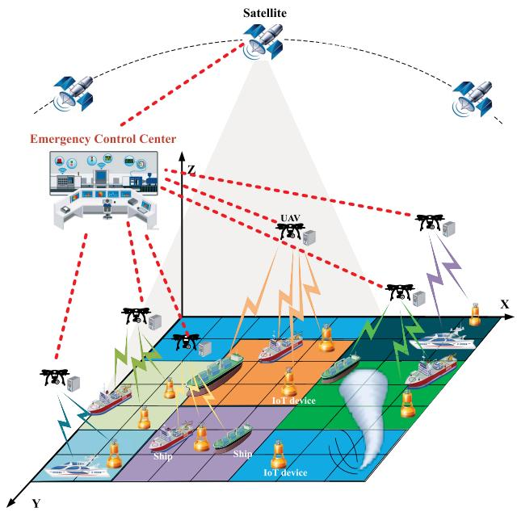

flowchart

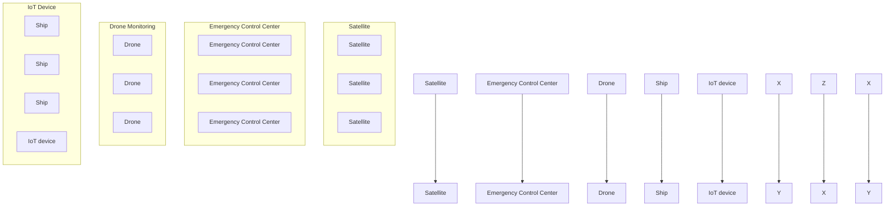

Fig. 1. System model.

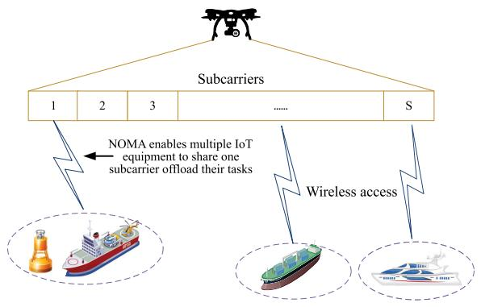

flowchart

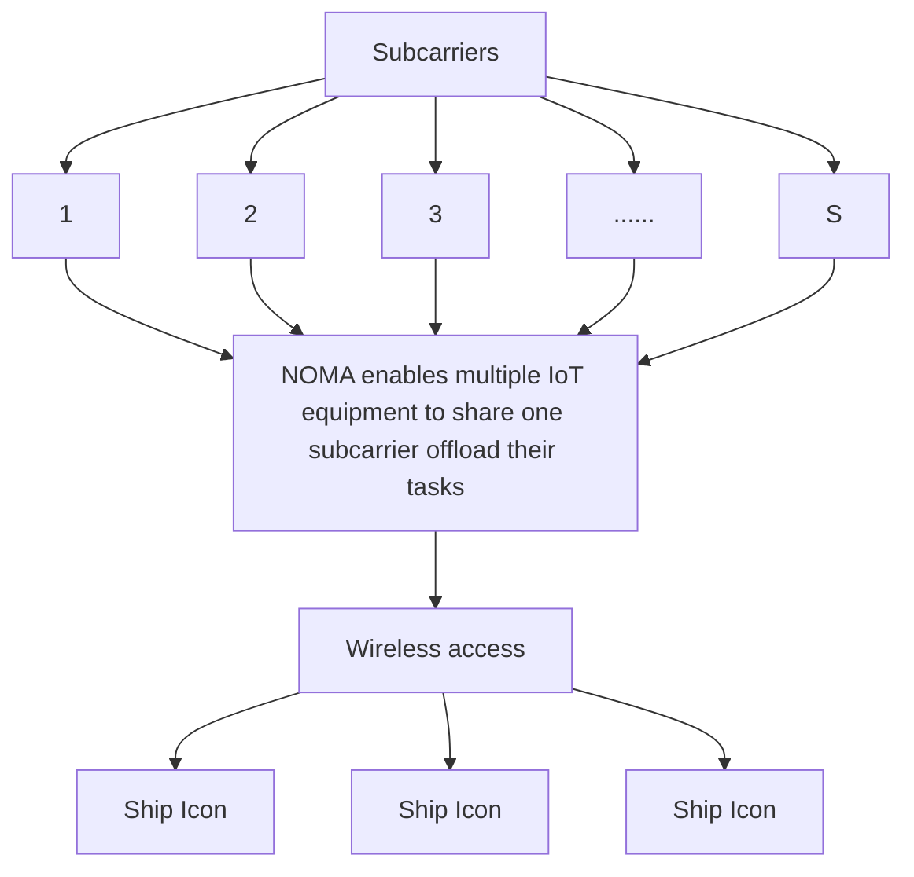

Fig. 2. Illustration of a NOMA-UAV-assisted marine IoT.

In this scenario, the UAV carries a MEC server with limited computational resources and provides NOMA transmission and computation services to the IoT terminal devices in its service range. Let $N = \{ 1 , \ldots , n \}$ denote marine IoT terminal devices. These marine IoT devices may have different computing resources and energy resources, e.g., unmanned surface vehicles (USVs) [24], marine ships with IoT equipment [25], etc. The UAV hovers at a given location to provide services to the terminal devices with a predetermined flight path [26]. As shown in the right panel of Fig. 1, we consider a 3-D Cartesian coordinate system, where the x- and y-axis denote the horizontal and vertical coordinates of the sea level, respectively, and the z-axis indicates the altitude. The flight start position of the UAV is (0, 0, H), where H denotes the height of the UAV. At the moment t, we consider the hovering position of the UAV as $( x _ { u } , y _ { u } , H )$ and the position of the terminal device as $( x _ { n } , y _ { n } , 0 )$ . This article considers that the terminal device remains relatively stationary while the UAV is hovering to provide services.

As shown in Fig. 2, consider a network setup with N IoT terminal devices and one MEC server. In this article, we consider the channel between the IoT devices and the UAV as quasi-static Rayleigh fading, i.e., the end devices can change independently between two offload cycles and remain constant within each cycle [27]. At the same time, we assume that each marine IoT terminal device and UAV are equipped with a single antenna. To cover the blind area of the vast ocean, we assume that the UAV contains s orthogonal subcarriers, defined as $S = \{ 1 , \dots , s \}$ . The UAV can share subcarriers among devices through NOMA technology, i.e., a subcarrier can be shared among multiple terminals. Therefore, the signal the device receives contains the signal required for transmission and the interference signals from co-shared devices.

Without loss of generality, we assume that for each IoT terminal device n, there is only a single computational task $D _ { n }$ to be completed over time. Each computational task is atomic and not divisible into subtasks. Let each computational task $D _ { n }$ can be expressed as $D _ { n } = \{ m _ { n } , c _ { n } \}$ , where $m _ { n }$ is the size of the computational task, such as input data and input parameters, and $c _ { n }$ is the CPU cycles required to complete the task $D _ { n }$ . Since the output of a computational task is usually much smaller than the input of a computational task, we ignore it in our calculations [28], [29], [30]. Information about $D _ { n }$ and $c _ { n }$ is available through the application analyzer [31], [32], [33]. Each computational task can be executed locally or offloaded to the UAV for computation.

# B. Communication Model

The binary offloading paradigm is applied depending on the computational task. For each task $D _ { n }$ to be offloaded, we assume that the task data is offloaded to the UAV via the uplink immediately after the edge computation. Denote the offload decision profile of the device by $A = \{ x _ { 1 } , \ldots , x _ { n } \} , n \in N .$ . Let $\begin{array} { r } { x _ { n } = \sum _ { s \in S } a _ { n , s } } \end{array}$ denote the selection of subcarrier channel, where $a _ { n , s } = 1$ means that device n offloads its task to the UAV with subcarrier s; otherwise, $a _ { n , s } = 0$ . For example, in Fig. 2, devices 1 and 2 offload their tasks using the desired subcarrier, so the offload decisions of devices 1 and 2 are equal to $a _ { 1 , 1 } ~ = ~ 1$ and $a _ { 2 , 1 } \ = \ 1 ,$ , respectively. Since each terminal can use at most one subcarrier for computational offloading, the computational offloading policy satisfies the following constraint:

$$
\sum_ {s \in S} a _ {n, s} \leq 1, n \in N. \tag {1}
$$

When the terminal device selects local computation, no subcarrier is used, i.e., $\textstyle \sum _ { s \in S } a _ { n , s } = 0$ .

Similar to many previous works [34], [35], this article mainly considers the quasi-static scenario, where the endpoints remain unchanged during offloading. With the location information of all terminal devices known in advance, the Euclidean distance between UAV and device n can be expressed as

$$
d _ {u, n} = \sqrt {H ^ {2} + (x _ {u} - x _ {n}) ^ {2} + (y _ {u} - y _ {n}) ^ {2}}. \tag {2}
$$

Similar to [36] and [37], the wireless channel between the UAV and the marine surface devices is considered to be dominated by the LOS link. According to [38] and [39], since the UAV flies at a relatively high altitude, shadow fading effects due to obstacles (e.g., buildings) can be ignored compared

to mass fading, and the contribution of Non-LoS (NLoS) propagation can be ignored. Therefore, the communication link between the UAV and the sea surface devices is considered as a clear LOS link [40]. The path-loss exponent $\alpha \ : = \ : 2$ . Therefore, the corresponding channel average power gain can be expressed as

$$
h _ {u, n} = h _ {0} d _ {u, n} ^ {- 2} = \frac {h _ {0}}{h ^ {2} + (x _ {u} - x _ {n}) ^ {2} + (y _ {u} - y _ {n}) ^ {2}} \tag {3}
$$

where $h _ { 0 }$ is the channel power gain at the reference distance $d = 1$ m.

The received signal-to-noise ratio (SINR) of terminal device n on the subcarrier is expressed as

$$
S I N R _ {n, s} \left(p _ {n, s}\right) = \frac {h _ {u , n} p _ {n}}{\sum_ {j = 1 , j \neq n} ^ {M} h _ {u , j} p _ {j} + \sigma}, \quad i = 1, \dots , M \tag {4}
$$

where M is the set of devices that share the same subcarrier, $p _ { n }$ is denoted as the transmitted power of the end device on subcarrier s, and σ denotes the noise power. For a device n on subcarrier s, the achievable rate is given as follows:

$$
\begin{array}{l} R _ {n, s} = \omega \log_ {2} (1 + \mathrm{SINR} _ {n, s}) \\ = \frac {B}{S ^ {\prime}} \log_ {2} \left(1 + \frac {h _ {u , n} p _ {n}}{\sum_ {j = 1 , j \neq n} ^ {M} h _ {u , j} p _ {j} + \sigma}\right) \tag {5} \\ \end{array}
$$

where ω is the available bandwidth on subcarrier $s ,$ and $S ^ { \prime }$ denotes the number of subcarriers.

# C. Computation Model

From the terminal device perspective, computational offloading of tasks is a critical use case. It performs computationally intensive tasks by enabling the terminal to use many edge computing resources. The offloading decisions for the terminal can be classified into three types: 1) local computation; 2) full offloading; and 3) partial offloading. The Local Compute selection computes the entire task locally and does not benefit from computing offload. The entire task is migrated to the edge server for processing in full offload. Partial offloading is splitting tasks, where some tasks are processed locally, and others are processed at the edge. Binary offloading is a generic version compared to partial offloading, which makes the offloading decision problem challenging due to the combinatorial nature of binary offloading decisions.

1) Local Computation: For the offload decision $A _ { n } = 0 ,$ device n decides to execute its computational task $D _ { n }$ locally. We define $f _ { n } ^ { l }$ as the computational capacity of device n regarding the number of instructions per second. Thus, the computation completion time of task $D _ { n }$ can be expressed as

$$
t _ {n} ^ {\text { loc }} = \frac {c _ {n}}{f _ {n} ^ {l}}. \tag {6}
$$

The energy consumption of device n can be written as

$$
e _ {n} ^ {\text { loc }} = \kappa \left(f _ {n} ^ {l}\right) ^ {2} c _ {n} \tag {7}
$$

where κ is the energy consumption coefficient, which mainly depends on the chip structure [41], [42].

2) Edge Computation: A typical task offloading process is divided into three phases: 1) the end device transmits the task to the UAV through the NOMA-based uplink; 2) the UAV accepts the computational task $D _ { n }$ and allocation of computational resources to execute the task; 3) after the task completes the computation, the UAV transmits the computation result back to the terminal device. As mentioned before, we will ignore the third stage.

The computing offloading completion time $t _ { n } ^ { \mathrm { e d g e } }$ of the terminal device consists of two components, which can be expressed as

$$
t _ {n} ^ {\text { edge }} = t _ {n} ^ {\text { tran }} + t _ {n} ^ {\text { comp }} \tag {8}
$$

where $t _ { n } ^ { \mathrm { t r a n } }$ denotes the task upload time and $t _ { n } ^ { \mathrm { c o m p } }$ denotes the computation time of the task on the UAV. The computation time $t _ { n }$ depends on the size of the task and the transmission rate and is calculated as

$$
t _ {n} ^ {\text { tran }} = \frac {D _ {n}}{R _ {n}} = \frac {D _ {n}}{\omega \log_ {2} (1 + \mathrm{SINR} _ {n , s})}. \tag {9}
$$

The computation time $t _ { n } ^ { \mathrm { c o m p } }$ comp depends on the computational resource $f$ allocated by the UAV for the task $D _ { n }$ , which is calculated as follows:

$$
t _ {n} ^ {\text { comp }} = \frac {c _ {n}}{f}. \tag {10}
$$

To avoid infinite transmission time and computation time, $p _ { n } \neq 0$ and $f \neq 0$ are used.

Considering that f impacts the task’s computation time and energy consumption. Therefore, dynamic voltage and frequency scaling technology [43] is used to regulate the CPU cycle frequency of device n.

In edge computing, we only consider the energy consumption of the terminal device for uploading tasks. Therefore, the energy consumption of the end device for computing offloading is expressed as

$$
e _ {n} ^ {\text { edge }} (p _ {n}) = \frac {p _ {n}}{\zeta} \cdot T _ {n} ^ {\text { tran }} (p _ {n}) = \frac {p _ {n}}{\zeta} \frac {m _ {n}}{\omega \log_ {2} (1 + \mathrm{SINR} _ {n , s})} \tag {11}
$$

where ζ is the power amplifier efficiency. The terminal device can save energy for performing tasks by edge offloading.

# D. Problem Formulation

In the NOMA-UAV-assisted marine IoT scenario, the computational overhead is mainly determined by the computational completion time T and the computational energy consumption E. As shown above, T and E can be obtained as

$$
T = a _ {n, s} t ^ {\text { edge }} + (1 - a _ {n, s}) t ^ {\text { loc }}
$$

$$
E = a _ {n, s} e ^ {\text { edge }} + (1 - a _ {n, s}) e ^ {\text { loc }}. \tag {12}
$$

Let $\beta _ { t }$ and $\beta _ { e }$ denote the time to task completion and energy consumption, respectively, which can be determined by the residual battery energy of the device itself and the requirement for task completion time, taking values in the range [0, 1]. Considering the preferences of different devices, we define the computational overhead function of device n as

$$
\begin{array}{l} J _ {n} = \beta_ {t} T _ {n} + \beta_ {e} E _ {n} \\ = \beta_ {t} \left(a _ {n, s} t ^ {\text { edge }} + (1 - a _ {n, s}) t ^ {\text { loc }}\right) \\ + \beta_ {e} \Big (a _ {n, s} e ^ {\text { edge }} + (1 - a _ {n, s}) e ^ {\text { loc }} \Big). \tag {13} \\ \end{array}
$$

From the above equation, the computational overhead equals the sum of the execution delay and energy consumption weighting. The offloading decision of the device is influenced by $\beta _ { t }$ and $\beta _ { e }$ . For example, when the device has a delaysensitive task, it sets $\beta _ { t } = 1$ and $\beta _ { e } = 0 .$ .

Similarly, the resource provider has preferences for different device tasks, i.e., $\psi \in [ 0 ,$ 1]. We consider UAVs with varying preferences for other devices. For example, the UAV may preferentially allocate computational resources to devices with higher revenue based on the payment of the provided devices. Therefore, the computational overhead function can be defined as $\textstyle \sum _ { i = 1 } ^ { N } \psi _ { i } J _ { i } .$ , which not only measures the computational overhead of the device but also considers the benefits of the resource provider.

We define an objective function that reflects the sum of the computational overheads of all devices, expressed as

$$
J (A, P, F) = \sum_ {n \in N} \psi_ {n} (\beta_ {t} T _ {n} + \beta_ {e} E _ {n}) \tag {14}
$$

where A is the offload decision, P is the power allocation decision, and F is the computational resource decision. The total overhead of the computational tasks is closely related to the overall resource allocation of the system.

Our goal is to minimize the computational overhead of the marine IoT terminal devices within the UAV coverage. Therefore, sharing edge resources for tasks becomes a computational overhead minimization problem. We formulate this problem as follows:

$$
P 1: \min J (A, P, F)
$$

$$
\text { s.t. } C 1: a _ {n, s}, x _ {n} \in \{0, 1 \}, n \in N, s \in S
$$

$$
C 2: \sum_ {s \in S} a _ {n, s} \leq 1, n \in N
$$

$$
C 3: x _ {n} = \sum_ {s \in S} a _ {n, s}
$$

$$
C 4: 0 \leq p _ {n} \leq P _ {n} ^ {\max}
$$

$$
C 5: 0 \leq f _ {n} \leq f ^ {\max}
$$

$$
C 6: \sum_ {n \in N} f _ {n} \leq f ^ {\max} \tag {15}
$$

where $P _ { n }$ and $f ^ { \mathrm { m a x } }$ are the maximum uplink transmission power and the maximum edge server computation capacity, respectively. Constraints C1–C3 denote the computation offload policy constraints of the device. Constraint C4 denotes the uplink transmission power constraint. Constraints C5 and C6 denote the edge server computing resource constraints. Given that problem P1 is an MINLP and finding the optimal solution is usually complex. Considering the large number of variables and the linear expansion of subcarriers, we aim to design a low-complexity, suboptimal solution.

# III. PROBLEM DECOMPOSITION AND SOLUTION

In this section, we split the problem P1 into multiple subproblems for solving. Due to the difficulty of solving problem P1, we first introduce the decomposition of problem P1 in Section III-A; then, the solution methods of multiple subproblems are presented in Sections III-B and III $\mathbf { \nabla } \cdot \mathbf { C } ;$ finally, the optimal computational offloading subproblem is introduced in Section III-D.

# A. Problem Decomposition

Observing problem P1, we find that the optimization of offloading decision and resource allocation are coupled. Meanwhile, the unloading decision a is an integer variable. At the same time, the resource allocation F, P is a continuous variable, so problem P1 is formulated as MINLP [28]. To solve problem P1 better, we split it into two interdependent subproblems.

First, we rewrite the MINLP problem P1 as

$$
P 2: \min _ {A} \min _ {P, F} \sum_ {n \in N} \psi_ {n} J _ {n} (x _ {n}, p _ {n}, f _ {n})
$$

$\mathrm { ~ s . t . ~ } C 1 , C 2 , C 3 , C 4 , C 5 , \mathrm { a n d ~ } C 6 .$ (16)

Note that the constraints on the offloading decision and resource allocation are separated. Therefore, the problem P2 can be wholly decomposed into two subproblems: 1) the joint power and computational resource optimization problem based on a specific offloading decision and 2) the resource optimization result-based offloading decision optimization problem.

Consequently, the resource optimization result-based offloading decision optimization problem can be rewritten as

$$
P 3: \min _ {A} J (A)
$$

${ \mathrm { s . t . } } C 1 , C 2 , C 3 .$ (17)

The joint power and computational resource optimization problem based on a particular offloading decision can be rewritten as

$$
P 4: \min _ {P, F} \sum_ {n \in N} \psi_ {n} J _ {n} (x _ {n}, p _ {n}, f _ {n})
$$

${ \mathrm { s . t . } } C 4 , C 5 , C 6 .$ (18)

It is worth noting that the decomposition from problem P1 to problems P2–P4 does not change the solution’s optimality [44]. Next, we present the solutions to problems P2–P4 to obtain the solution to problem P1 finally.

# B. Optimization of Uplink Transmission Power

Substituting (13) into (18), we can rewrite the objective of P4 as

$$
\min _ {P, F} \sum_ {n \in N} \left(\psi_ {n} \left(\beta_ {t} + \beta_ {e} \frac {p _ {n}}{\zeta}\right) \frac {m _ {n}}{R _ {n}} + \psi_ {n} \beta_ {t} \frac {c _ {n}}{f _ {n}}\right). \tag {19}
$$

It can be found that problem P4 has a separable structure and the objectives and constraints of the corresponding power allocation P and computational resource allocation F can be decoupled from each other. By this property, we decompose problem P4 into the uplink transmission and power optimization problem and the computational resource optimization problem. Specifically, the uplink transmission power problem is expressed as

$$
P 5: \min _ {P} \sum_ {n \in N} \left(\psi_ {n} \left(\beta_ {t} + \beta_ {e} \frac {p _ {n}}{\zeta}\right) \frac {m _ {n}}{R _ {n}}\right)
$$

$\mathrm { s . t . } C 4 : 0 \leq p _ { n } \leq P _ { n } ^ { \operatorname* { m a x } } .$ (20)

The objective function of problem P5 can be rewritten as

$$
\sum_ {n \in N} \left(\psi_ {n} \left(\beta_ {t} + \beta_ {e} \frac {p _ {n}}{\zeta}\right) \frac {m _ {n}}{\omega \log_ {2} \left(1 + \frac {h _ {u , n} p _ {n}}{\sum_ {j = 1 , j \neq n} ^ {M} h _ {u , j} p _ {j} + \sigma}\right)}\right). \tag {21}
$$

There is transmission interference from other devices in the uplink SINR of the corresponding device at the same subcarrier, so the objective function of problem P5 is nonconvex and difficult to be solved. Our approach is to find the approximation of $\begin{array} { r } { I _ { n , s } = \sum _ { j = 1 , j \neq n } ^ { M } h _ { u , j } p _ { j } } \end{array}$ and further decompose problem P5. The purpose of this approach will be to solve problem P5 more efficiently. The optimization problem of uplink transmission power can be expressed as

$$
P 5: \min _ {P} \sum_ {n \in N} \sum_ {s \in S} \frac {\nu + \tau p _ {n}}{\log_ {2} (1 + \mu_ {n , s} p _ {n})}
$$

$\mathrm { s . t . } C 4 : 0 \leq p _ { n } \leq P _ { n } ^ { \mathrm { m a x } }$ (22)

where $\nu \equiv ( \psi _ { n } \beta _ { t } m _ { n } / \omega ) , \tau = ( [ \psi _ { n } \beta _ { e } m _ { n } ] / \zeta \omega ) $ and $\mu _ { n , s } ~ =$ $( h _ { u , n } / [ \sum _ { j = 1 , j \neq n } ^ { M } h _ { u , j } p _ { j } + \sigma ] )$ . Assume that each device independently calculates the uplink power allocation and informs its associated terminal device of the uplink transmission power. Then, the feasible upper bound for the above optimization problem is given as

$$
\tilde {I} _ {n, s} \triangleq \sum_ {j = 1, j \neq n} ^ {M} x _ {n} h _ {u, j} p _ {j}, j \in M, n \in N, s \in S. \tag {23}
$$

Similar to [45], we consider $\tilde { I } _ { n , s }$ to be a reasonable estimate of $I _ { n , s }$ Because the offloading strategy A of the terminal device tends to select the appropriate device-subcarrier association, it will prefer the channel with less interference. This means that small errors in $\tilde { I } _ { n , s }$ s do not lead to significant errors in $R _ { n }$ .

By replacing $I _ { n , s }$ by $\tilde { I } _ { n , s }$ , we can obtain the uplink SINR of device n in subcarrier s as

$$
\tilde {\mu} _ {n, s} = \frac {h _ {u , n}}{\tilde {I} _ {n , s} + \sigma}, n \in N, s \in S. \tag {24}
$$

The objective function in problem P5 can be approximated as

$$
\Theta (p _ {n}) = \frac {\nu + \tau p _ {n}}{\log_ {2} (1 + \tilde {\mu} _ {n , s} p _ {n})}. \tag {25}
$$

The objective function and the constraints corresponding to the transmit power of each device are now decoupled from each other. Therefore, problem P5 can be approximated as a subproblem with $n \in N .$ . Each subproblem optimizes the transmit power of users $n \in N , s \in S$ and can be expressed as

$$
P 6: \min _ {P} \sum_ {n \in N} \sum_ {s \in S} \Theta (p _ {n})
$$

s.t. C4 : 0 ≤ pn ≤ Pmaxn . ${ \mathrm { s . t . ~ } } C 4 : 0 \leq p _ { n } \leq P _ { n } ^ { \operatorname* { m a x } } .$ (26)

Lemma 1: Function $\Theta ( p _ { n } )$ is strictly quasi-convex in the domain.

Proof: First, the function  is twice differentiable on R. Next, we check the quasiconvex second-order condition that point p satisfying $\Theta ^ { \prime } ( p ) = 0$ also satisfies $\Theta ^ { ^ { \prime \prime } } ( p ) \geq 0 ~ [ 4 6 ]$ .

The first-order derivative of  is

$$
\Theta^ {\prime} (p _ {n}) = \frac {\tau \left(\log_ {2} (1 + \tilde {\mu} _ {n , s} p _ {n})\right) - \frac {\tilde {\mu} _ {n , s}}{l n 2} \cdot \frac {\nu + \tau p _ {n}}{1 + \tilde {\mu} _ {n , s} p _ {n}}}{\log_ {2} ^ {2} (1 + \tilde {\mu} _ {n , s} p _ {n})}. \tag {27}
$$

When $\Theta ^ { \prime } ( p ) = 0 ,$ we can obtain

$$
\Gamma (p) = \tau \left(\log_ {2} \left(1 + \tilde {\mu} _ {n, s} p\right)\right) - \frac {\tilde {\mu} _ {n , s}}{\ln 2} \cdot \frac {\nu + \tau p}{1 + \tilde {\mu} _ {n , s} p} = 0. \tag {28}
$$

The second-order derivative of  is given as (29), shown at the bottom of the page. Substituting $p$ into (29), we obtain

$$
\Theta^ {\prime \prime} (p) = \frac {\mu_ {n , s} ^ {3}}{\tau \ln^ {2} 2} \cdot \frac {(\nu + \tau p) ^ {2}}{(1 + \mu_ {n , s} p) ^ {3} \log_ {2} ^ {3} (1 + \mu_ {n , s} p)} \geq 0. \tag {30}
$$

Thus,  is quasiconvex in the domain.

Generally, the quasi-convex problems can be solved using the bisection method, which solves a convex feasible problem in each iteration. However, the commonly used way of solving the inner tangent plane of a convex feasibility problem requires $O ( k ^ { 2 } / \varepsilon ^ { 2 } )$ iterations, where k is the dimension of the problem.

First, note that a quasi-convex function reaches a local optimum at the point of decreasing first-order derivatives. Any local optimum of a strictly quasi-convex function is a global optimum. Therefore, according to Lemma 1, the uplink transmission power optimal allocation $p ^ { * }$ satisfies $p = P ^ { \mathrm { m a x } }$ or $\Theta ^ { \prime } ( p ) = 0$ . Note that the first-order derivatives of (27) have $\Gamma ^ { \prime \prime } ( p ) \geq 0$ and $\Gamma ^ { \prime } ( 0 ) = - ( \mu _ { n , s } \nu / \ln 2 )$ . This implies that $\Gamma ( p )$ is a monotonically increasing function and is negative at the starting point $p = 0 .$ . We propose a low-complexity bisection method to reduce the complexity of the solution. Instead of solving a convex feasible problem in the iterative solution process, only (p) needs to be computed to obtain the optimal solution $p ^ { * }$ , as shown in Algorithm 1.

It is worth noting that the initialization convergence threshold ε needs to be determined before starting the solution of Algorithm 1, which is related to the solution accuracy of the algorithm. For a given offloading policy A, $p ^ { * }$ denotes the optimal uplink transmission power. We now denote the objective value of problem $P 6$ corresponding to $p ^ { * }$ as $\Theta ( A , p ^ { * } )$ . In Algorithm 1, we first calculate the value of maximum power and determine the interval of optimal transmission power. If $\Gamma ( p ) ~ \leq ~ 0$ is satisfied, the optimal transmission power is the maximum transmission power; otherwise, the optimal transmission power is found based on the dichotomous search method. Then, the iterative computation of the binary search is started until the convergence threshold requirement is satisfied. Finally, Algorithm 1 is able to obtain an approximate solution for the optimal transmission power.

Algorithm 1: Bisection-Based Uplink Transmission Power Allocation   
Initialize convergence threshold $\varepsilon$ ;
Calculate $\Gamma(P_n^{\max}) = \tau(\log_2(1 + \tilde{\mu}_{n,s}P_n^{\max})) - \frac{\tilde{\mu}_{n,s}}{\ln 2} \cdot \frac{\nu + \tau P_n^{\max}}{1 + \tilde{\mu}_{n,s}P_n^{\max}}$ ;
if $\Gamma(P_n^{\max}) \leq 0$ then $p_n^* = P_n^{\max}$ ;
else:
Initialize $p_n^l = 0$ and $p_n^r = P_n^{\max}$ ;
repeat $T$ $p_n^m = (p_n^l + p_n^r)/2$ ;
if $\Gamma(p_m) \leq 0$ then $p_n^l = p_n^m$ ;
else: $p_n^r = p_n^m$ ;
end if
until $p_n^r - p_n^l \leq \varepsilon$ $p_n^* = (p_n^l + p_n^r)/2$ ;
end if

# C. Optimization of Computing Resource

We formulate the computational resource optimization problem as

$$
P 7: \min _ {F} G (F)
$$

$\mathrm { s . t . } C 5 , C 6$ (31)

where

$$
G (F) = \sum_ {n \in N} \psi_ {n} \beta_ {t} \frac {c _ {n}}{f _ {n}}, n \in N. \tag {32}
$$

Notice that the constraints in C5 and C6 are convex. The Hessian matrix of the objective function G(F) has $\partial ^ { 2 } G / \partial f _ { n } ^ { 2 } =$ $( 2 \psi _ { n } \beta _ { t } c _ { n } / f _ { n } ^ { 3 } ) \geq 0 $ . Hence, the Hessian matrix is positive definite, and the objective function $G ( F )$ is convex. Thus, problem $P 7$ is a convex optimization problem. Based on the above analysis, we can obtain the optimal computing resource allocation strategy, which is analyzed as shown below.

Lemma 2: The optimal computing resource allocation $f _ { n } ^ { * }$ for problem P7 is given as

$$
f _ {n} ^ {*} = \frac {\sqrt {\psi_ {n} \beta_ {t} c _ {n}}}{\sum_ {n \in N} \sqrt {\psi_ {n} \beta_ {t} c _ {n}}} f ^ {\max}. \tag {33}
$$

Proof: The Lagrangian of the problem (25) can be obtained as

$$
L (f, \lambda) = \sum_ {n \in N} \frac {\psi_ {n} \beta_ {t} c _ {n}}{f _ {n}} + \lambda \left(\sum_ {n \in N} f _ {n} - f ^ {\max}\right). \tag {34}
$$

The derivative of the Lagrangian function L is obtained as

$$
\frac {\partial L (f , \lambda)}{\partial f} = - \frac {\psi_ {n} \beta_ {t} c _ {n}}{f _ {n} ^ {2}} + \lambda . \tag {35}
$$

$$
\Theta^ {\prime \prime} (p _ {n}) = \frac {\tilde {\mu} _ {n , s} \left\{\left[ \tilde {\mu} _ {n , s} (\nu + \tau p _ {n}) - 2 \tau (1 + \tilde {\mu} _ {n , s} p _ {n}) \right] \log_ {2} (1 + \tilde {\mu} _ {n , s} p _ {n}) + \frac {2 \tilde {\mu} _ {n , s} (\nu + \tau p _ {n})}{\ln 2} \right\}}{\ln 2 (1 + \tilde {\mu} _ {n , s} p _ {n}) ^ {2} \log_ {2} ^ {3} (1 + \tilde {\mu} _ {n , s} p _ {n})}. \tag {29}
$$

By equating the gradient of the Lagrangian to zero, i.e., $\partial L ( f , \lambda ) / \partial f = 0$ , and solving this equation, the optimal computational resource allocation solution to problem P7 is obtained as

$$
f _ {n} ^ {*} = \sqrt {\frac {\psi_ {n} \beta_ {t} c _ {n}}{\lambda}}. \tag {36}
$$

Since $\lambda > 0$ is a constant satisfying, we can be given as

$$
\sum_ {n \in N} f _ {n} ^ {*} = f ^ {\max}. \tag {37}
$$

By substituting (36) into (37), we obtain the optimal Lagrangian multiplier λ as

$$
\lambda = \left(\frac {\sum_ {n \in N} \sqrt {\psi_ {n} \beta_ {t} c _ {n}}}{f ^ {\max}}\right) ^ {2}. \tag {38}
$$

Finally, the optimal solution $f _ { n } ^ { * }$ can be obtained by substituting (38) into (36) as

$$
f _ {n} ^ {*} = \frac {\sqrt {\psi_ {n} \beta_ {t} c _ {n}}}{\sum_ {n \in N} \sqrt {\psi_ {n} \beta_ {t} c _ {n}}} f ^ {\max}. \tag {39}
$$

# D. Optimal Computation Offloading Subproblems

The above approach optimizes the computational and communication resources for a particular offloading decision. Based on the above analysis, the computational overhead of the system can be expressed as

$$
J (A, p ^ {*}, f ^ {*}) = Z (A, p ^ {*}) + G (A, f ^ {*}) + B (A) \tag {40}
$$

where $\begin{array} { r } { Z ( p ) \ = \ \sum _ { n \in N } ( \psi _ { n } ( \beta _ { t } + \beta _ { e } [ p _ { n } / \zeta ] ) [ m _ { n } / R _ { n } ] ) , \ B ( A ) \ = \ } \end{array}$ $\begin{array} { r } { \sum _ { n \in N } ( x _ { n } ( \beta _ { t } [ c _ { n } / \bar { f } ^ { \mathrm { l o c } } ] + \beta _ { e } \kappa ( f ^ { \mathrm { l o c } } ) ^ { 2 } c _ { n } ) ) , p ^ { * } } \end{array}$ is the optimal transmission power allocation can be obtained by Algorithm 1 and $f ^ { * }$ is the optimal computational resource allocation can be obtained by lemma 2. Problem P3 can be rewritten as a mixedinteger programming (MIP) problem, i.e.,

$$
P 8: \min _ {A} J (A, p ^ {*}, f ^ {*})
$$

$$
\text { s.t. } \quad C 1, C 2, C 3. \tag {41}
$$

For problem P8, we give the relevant theorem.

Property 1: Problem P8 is an NP-hard problem.

Proof: To prove that Problem P8 is an NP-hard problem, we transform the problem into a maximized version of the generalized assignment problem (GAP) [52] consistent with NP-hard by changing the perspective of the problem. First, we give an introduction to the GAP problem. In the GAP problem, there are n items and m backpacks, each with a different profit and size, and each backpack has its capacity. When items are distributed to different backpacks, they generate different profits. The optimization objective of the GAP problem is to allocate items to the knapsack without exceeding the knapsack capacity limit so that the total profit is optimal.

It can be observed that the optimal solution to problem P8 is a computational offloading decision list. This computational decision list minimizes the computation overhead of all terminal devices and satisfies all task offloading and resource allocation constraints. It is worth noting that this can be reduced to the classical maximum cardinality bin packing problem, which is NP-hard [47]. We can consider the N terminal devices and S wireless subcarrier channels in problem P8 as bin and packing in the classical maximum cardinality bin packing problem, respectively. In our problem, N devices are equivalent to n items in the GAP problem, and S wireless subcarrier channels are equivalent to m backpacks, and the optimization objective of the problem is to minimize the computational overhead of the task. Thus, problem P8 is an NP-hard problem.

Although some existing methods (e.g., branch-and-bound method) for solving MIP problems can obtain optimal solutions, these methods often receive time complexity limitations. Next, we present a coalition game-based solution method to implement task scheduling for NOMA-UAVassisted marine IoT scenarios to be solved with lower computational complexity.

# IV. OFFLOADING DECISION BASED ON COALITIONALGAME APPROACH

In this section, we introduce the coalition game in Section IV-A, a coalition game-based algorithm for computing offloading strategies is proposed in Section IV-B, and a theoretical analysis is presented in Section IV-C.

# A. Coalitional Game Formulation

In the UAV-assisted marine IoT scenario, terminal devices form a coalition to improve the overall efficiency of the network in terms of task computation overhead using a coalition game. In the coalition game, each terminal device is considered as a game player, i.e., each device needs to make an offloading decision to consider whether to migrate tasks to the UAV. In the network, there are N terminal devices and S subcarrier channels, and considering the offloading strategy is binary offloading, so N terminals can form $S + N$ federations. We define the set of coalitions as $\mathcal { F } ~ = ~ \{ \mathcal { F } _ { 1 } , \ldots , \mathcal { F } _ { S + N } \} .$ , where $\mathcal { F } _ { i } \cap \mathcal { F } _ { i } = \mathcal { Y }$ for any $i \neq j .$ In coalition ${ \mathcal { F } } ,$ there exists $\cup _ { J = 1 } ^ { S + N } \mathcal { F } _ { j } = N ,$ F where the cardinality of the collection $\mathcal { F }$ measures the number of coalitions. In other words, the sum of the number of players in all coalitions equals the number of terminal devices. The coalition $\mathcal { F } _ { j } = \{ j = 1 , \ldots , S \}$ is the set of terminal devices that utilize subcarrier j for task offloading. The coalition $\mathcal { F } _ { j } = \{ j = S + 1 , \ldots , S + N \}$ is the set of devices that execute tasks locally.

It can be seen that the more the number of terminal devices with the same subcarrier for computational offloading, the more complex the receiver for interference cancellation in the device. The higher number of shared terminals leads to severe interference between devices, and the lower the channel gain, the lower the SINR of the terminals. This leads to an increase in the transmission delay of the device, which in turn increases the computational overhead. In this case, there is no incentive for all terminals to use only one subcarrier for computational offloading, especially in the case of subcarriers with other good channel conditions. Therefore, forming a large coalition is not beneficial for terminal devices. In summary, we can design an efficient coalition formation method for reducing the total computational overhead. There may be partially empty coalitions if the terminal channel conditions on these subcarriers are poor and the terminal devices can choose to execute their tasks locally. We first give the relevant definition of the coalition game.

Definition 1: A coalition game with a transferable utility for NOMA-UAV computation offloading and resource allocation underlying marine IoT is defined by a pair $( \mathcal { N } , \mathcal { R } )$ , where $\mathcal { N }$ is the set of game players and $\mathcal { R }$ is the coalition payoff function. They are all essential elements of the game. For each coalition, ${ \mathcal { F } } , { \mathcal { R } } ( { \mathcal { F } } )$ is an actual number that represents the sum of the payoffs contributed by the whole coalition ${ \mathcal F } .$ .

Consider the computational overhead of a terminal device in the coalition $\mathcal { F } _ { j }$ with $1 \le j \le S$ as

$$
\mathcal {U} _ {n} (x _ {n}) = \beta_ {t} ^ {n} \left(\frac {c _ {n}}{f _ {n}} + \frac {m _ {n}}{R _ {n}}\right) + \beta_ {e} ^ {n} \frac {p _ {n}}{\zeta_ {n}} \frac {m _ {n}}{R _ {n}} \tag {42}
$$

where the offloading rate $R _ { n } = R _ { n , s } ^ { * }$ in this case $( \mathrm { i } . \mathrm { e } . , a _ { n , s } = 1 )$ . As a result, the total computational overhead of all devices in the federation $\mathcal { F } _ { j }$ is

$$
\mathcal {U} _ {\mathcal {F} _ {j}} = \sum_ {n \in \mathcal {F} _ {j}} \mathcal {U} _ {n}. \tag {43}
$$

Let $\mathcal { U } ( \mathcal { F } _ { k } )$ denote the benefit of coalition k as

$$
\mathcal {R} (\mathcal {F} _ {k}) = \sum_ {n \in \mathcal {F} _ {k}} \mathcal {R} _ {n} = \sum_ {n \in \mathcal {F} _ {k}} \left(J _ {n} ^ {\mathrm{loc}} - \mathcal {U} _ {n}\right) \tag {44}
$$

where $J _ { n } ^ { \mathrm { l o c } }$ denoted the computational overhead that terminal device n chooses to execute locally.

As shown in the above equation, the gain function of the coalition $\mathcal { F } _ { k }$ is equal to the total gain that can be obtained by selecting the subcarrier k offloading task. The device chooses local execution not to gain, i.e., $\mathcal { R } ( \mathcal { F } _ { k } ) = 0$ . The advantage of this is that selecting the appropriate subcarrier channel for task offloading reduces the computational overhead, improving the overall system utility.

Next, we formally define the coalition game and formation for computing offloading and subcarrier allocation in the scenario described in this article.

Definition 2: Coalition game for UAV subcarrier allocation: The coalition game with transferable utility for subcarrier allocation of UAV communication and computation offloading is defined by triple $( \mathcal { N } , \mathcal { R } , \mathcal { F } )$ , where $\mathcal { N }$ is set of game players $( \mathrm { i . e . }$ , terminal device), R is the transferable utility including the overhead computation revenue of all the terminal device in the coalition, and $\mathcal { F }$ is the coalition partition. In the coalition structure, there are $\mathcal { F } _ { i } \cap \mathcal { F } _ { j } = \emptyset$ for any $i \neq j ,$ and the number of members of all coalitions is equal to $\mathcal { N }$ . In coalition partition ${ \mathcal { F } } ,$ , there are coalitions $\mathcal { F } = \{ 1 , \ldots , k \}$ with $0 < k \le S + N$ .

The strategy for each terminal device is to make decisions about the task computation mode and the subcarriers to be computing offloading, mainly based on the computational overhead of the current and new joining coalition.

# B. Coalitional Game-Based Task Offloading Algorithm

In this section, we design an algorithm for the proposed coalition formation game for task computing offloading. In the coalition game, coalition formation is the most critical aspect. Each player has different preferences for potential coalitions and compares any two coalition collections by preference relations. Specifically, each player chooses his preferred coalition to join based on a well-defined preference relation. For this purpose, we give the relevant definition of preference relation [22], [27], [48].

Definition 3: Player’s preference order: for any terminal device $n \in N$ , the preference order is defined as a complete, reflexive, and transitive binary relation that includes the collection of all possible coalitions formed by device n.

Therefore, in the coalition formation game defined in this article, each device can join or leave the coalition according to its preference order. In the coalition selection process, a device will tend to join to become a member of its preferred coalition. Let ${ \mathcal { F } } _ { i } \succeq _ { n } { \mathcal { F } } _ { j }$ indicate that the terminal device n prefers to join $\mathcal { F } _ { i }$ compared to the coalition $\mathcal { F } _ { j }$ . Let $\mathcal { F } _ { i } \ \succ _ { n }$ $\mathcal { F } _ { j }$ denote that terminal device n strictly prefers to be a member of coalition $\mathcal { F } _ { i }$ rather than a member of coalition ${ \mathcal { F } } _ { j } .$ . In different computational tasks, the preferences of terminal devices can be quantified as different inequalities. In this article, we propose the following preference order, also called utilitarian order [49], based on the computational overhead gain of the device, expressed as

$$
\mathcal {F} _ {i} \succ_ {n} \mathcal {F} _ {j} \Leftrightarrow \mathcal {R} (\mathcal {F} _ {i}) + \mathcal {R} \big (\mathcal {F} _ {j} \backslash n \big) > \mathcal {R} (\mathcal {F} _ {i} \backslash n) + \mathcal {R} \big (\mathcal {F} _ {j} \big) \tag {45}
$$

where $\mathcal { F } _ { i } \geq 0 , \mathcal { F } _ { j } \geq 0 , \mathcal { F } _ { i } \backslash n \geq 0$ and $\mathcal { F } _ { j } \backslash n \geq 0$ .

According to the above equation, it can be seen that when the computed gain obtained by coalition $\mathcal { F } _ { i }$ is greater than that of coalition $\mathcal { F } _ { j }$ , and coalition $\mathcal { F } _ { i }$ is not negatively affected by the joining of terminal device n. Terminal device n prefers to be part of coalition $\mathcal { F } _ { i }$ rather than coalition $\mathcal { F } _ { i }$ . According to (45), we define the switching operation of the coalition.

Definition $4 { : }$ Coalition switching operation of the device: Given a coalition partition $\mathcal { F } = \{ \mathcal { F } _ { 1 } , \ldots , \mathcal { F } _ { S + N } \}$ of the set $N ,$ if device $n \in N$ leaves the current coalition $\mathcal { F } _ { k }$ to join the new coalition $\mathcal { F } _ { k ^ { \prime } } , \ ( \mathrm { i . e . , }$ device n performs a coalition switching operation), $\mathcal { F } _ { k } \neq \mathcal { F } _ { k ^ { \prime } }$ , then the current coalition partition $\mathcal { F } _ { k ^ { \prime } }$ is adjusted to form a new coalition partition $\mathcal { F } ^ { \prime }$ such that $\mathcal { F } ^ { \prime } =$ $( \mathcal { F } \setminus \{ \mathcal { F } _ { k } , \mathcal { F } _ { k ^ { \prime } } \} ) \cup ( \{ \mathcal { F } _ { k } \setminus n \} , \{ \mathcal { F } _ { k ^ { \prime } } \cup n \} )$ .

According to the switching operation of the coalition, we can find the offloading decision and subcarrier allocation for any initial coalition partition. During the switchover of the coalition, a terminal device performs the switchover operation if it can strictly improve the utility in terms of total computational overhead and does not negatively affect the individual computational gains received by the other terminals in the new coalition. In other words, the new coalition generated after the switch operation is strictly limited and contributes more to the overall system performance. In summary, the goal of the coalition formation game is to find a reasonable coalition structure (i.e., coalition partition ) that minimizes the computational overhead of the overall system. At the same time, the coalition formation game needs to ensure that each terminal device can benefit from the computing offloading; otherwise, the terminal prefers local computing (LC).

In summary, a task offloading algorithm based on the coalition formation game is proposed for computing offloading tasks and allocating subcarriers. The coalitional formulation game-based task offloading algorithm is summarized in Algorithm 2, where the terminal device makes switch operations in random order.

Algorithm 2: Coalition Formation Algorithm for Task Offloading   
Initialize number of iterations iter = 0;
Initialize random partition $F_{init}$ of the set of terminal devices N;
Initialize number of consecutive unsuccessful switch operations Num = 0
Set the current partition as $F_{now} = F_{init}$ repeat
    iter = iter + 1
    An terminal device $n \in N$ is selected by a predetermined order and finds its current coalition $F_s$ ;
    Randomly search for an coalition $F_{s'}$ as a possible coalition to join, where $F_s \cap F_{s'} = \emptyset$ ;
    Calculate $p_n^*$ through Algorithm 1;
    Calculate $f_n^*$ through Lemma 2;
    Calculate $\mathcal{R}(\mathcal{F}_s)$ and $\mathcal{R}(\mathcal{F}_{s'})$ through (44);
    if player's preference order $(\mathcal{F}_{s'}) \succ_n (\mathcal{F}_s)$ T is satisfied then
    The terminal device n leaves the coalition $F_s$ and joins the coalition $F_{s'}$ ;
    Update the current coalition partition $F_{now}$ , i.e. $\mathcal{F}_{now} = (\mathcal{F} \setminus \{\mathcal{F}_s, \mathcal{F}_{s'}\}) \cup (\{\mathcal{F}_s \setminus n\}, \{\mathcal{F}_{s'} \cup n\})$ ;
    Num = 0;
    eles:
    Num = Num + 1;
    end if
until the current partition $F_{now}$ converges to the final Nash-stable partition $F_{fin}$

The coalition formation game is summarized in Algorithm 2, where terminal devices make coalition switching operations in random order. In Algorithm 2, we initialize the number of iterations and successive unsuccessful switching operations, denoted by iter and Num, respectively, with both initial values set to zero. Next, we are given any partition $\mathcal { F } _ { \mathrm { i n i t } }$ of the set of terminal devices. One of the devices n is selected according to a predetermined order, and its coalition $\mathcal { F } _ { s }$ is found. Then, another possible coalition $\mathcal { F } _ { s ^ { \prime } }$ is randomly selected. The gaming player n starts calculating the utility of the two Coalitions and the individual calculated gains. Subsequently, a decision is made to perform the coalition switching operation. Finally, after a finite number of coalition switching operations, the coalition partition will converge to the final Nash stable partition ${ \mathcal { F } } _ { \mathrm { f i n } } .$ . It is worth noting that the successive unsuccessful switching operation Num is introduced to reduce the algorithm’s complexity and further improve its convergence speed. If a coalition switching operation is performed, Num is reset to zero; otherwise, $N u m = N u m + 1$ . When no coalition switching operation is performed for ten successive iterations, the algorithm stops, and the final Nashstable partitioning is completed.

In summary, the UAV-based emergency communication resource allocation process is as follows: when the terminal device needs to handle the emergency computing task, the optimal transmission power is first calculated by Algorithm 1. Then, the optimal offloading strategy of the computational tasks is solved by Algorithm 2. Finally, the UAV according to the optimal offloading policy of the computational tasks and Lemma 2, the optimal computational resource allocation policy can be obtained. Note that solving the computational resource allocation policy in Algorithm 2 is a task offloading policy based on an iterative computational process, not an optimal task offloading policy.

# C. Theoretical Analysis

In this section, the convergence, stability, and complexity of the proposed coalition formation algorithm are guaranteed as follows.

1) Convergence: The convergence of Algorithm 2 is described by the following.

Theorem 1: Regardless of the initial coalition partition $\mathcal { F } _ { \mathrm { i n i t } }$ , the final coalition $\mathcal { F } _ { \mathrm { f i n } }$ is obtained after a series of switching processes in Algorithm 2 and is composed of disjoint coalitions.

Proof: In Algorithm 2, the number of terminal devices and the initial number of subcarrier channels are fixed. At the same time, each end device can offload the task to the UAV or execute it locally. Hereafter, the number of coalitions that the players can form is also limited. Specifically, the number of coalitions to be formed is at most $S + N .$ . Based on the definition of the coalition switch operation and play preference order, it is clear that each switch operation in Algorithm 2 either yields an unvisited partition by adopting a new strategy or switches existing partition. All the coalition switching operations are based on switching operation rules and preference order to determine their potential coalitions, producing an unvisited partition and thus improving system utility. Since the number of partitions of the set N is Bell number [50], which is finite. Therefore, Algorithm 2 is guaranteed to eventually converge to a Nash-stable partition ${ \mathcal { F } } _ { \mathrm { f i n } } .$ In summary, Algorithm 2 is suitable for NOMA-UAV-enable MEC systems with many connectivities. In the scenario of this article, any initial offloading decision of terminal devices will finally result in a Nash-stable partition.

2) Stability: To analyze the stability of the proposed coalition formation algorithm, the concept of Nash equilibrium from the hedonic coalition-partition games is used for the analysis, as follows.

Definition 5 (Nash-Stable Structure): A coalition partition $\mathcal { F } = \{ \mathcal { F } _ { 1 } , . . . , \mathcal { F } _ { S + N } \}$ is Nash-stable if ∀n $\in \mathcal { N } , n \ \in \mathcal { F } _ { i } \ \subset$ $\mathcal { F } , \mathcal { F } _ { i } \succ _ { n } \mathcal { F } _ { j } \cup$ {n} for all $\mathcal { F } _ { j } \subset \mathcal { F } , \mathcal { F } _ { i } \neq \mathcal { F } _ { j }$ .

Theorem 2: The final partition $\mathcal { F } _ { \mathrm { f i n } }$ obtained by Algorithm 2 is Nash-stable.

Proof: First, the Nash stable partition $\mathcal { F } _ { \mathrm { f i n } }$ from Definition 5 indicates that no player is willing to leave the current coalition to join other coalitions in $\mathcal { F } _ { \mathrm { f i n } }$ . In other words, a coalition game has a stable, stable coalition structure if no terminal device changes its task offloading strategy to increase its contribution to the overall system. We prove this by a disproof method. Now, we assume that Algorithm 2 yields a final partition $\mathcal { F } _ { \mathrm { f i n } }$ that is not Nash-stable. Thus, at least one player n exists, and its located coalition is currently denoted by ${ \mathcal { F } } _ { n }$ . Let $\mathcal { F } _ { s }$ denote the new coalition chosen randomly by player n. These two coalitions satisfy the preference relationship ${ \mathcal { F } } _ { s } \cup \{ n \} \succ { \mathcal { F } } _ { n }$ . So, player n prefers to switch from ${ \mathcal { F } } _ { n }$ to ${ \mathcal { F } } _ { s } ,$ which contradicts the assumption that $\mathcal { F } _ { \mathrm { f i n } }$ is the final partition. Therefore, the final partition $\mathcal { F } _ { \mathrm { f i n } }$ obtained by Algorithm 2 is Nash-stable.

3) Complexity: In general, the complexity of Algorithm 2 depends mainly on the switching operations of the coalition and algorithm.

Theorem 3: Given the total number of iterations $N _ { \mathrm { i t e r } }$ and Algorithm 1 parameters, the computational complexity of Algorithm 2 can be approximated as $O ( N _ { \mathrm { i t e r } } \log _ { 2 } ( P / \varepsilon ) )$ ).

Proof: In Algorithm 1, if $\Theta ( p ) > 0 $ , Algorithm 1 will terminate in exactly log $( P / \varepsilon )$ iterations, where ε denoted the convergence threshold and $\begin{array} { r l r } { P } & { { } > } & { 0 } \end{array}$ characterized the maximum uplink transmission power of the terminal device. In Algorithm 2, each iteration of the selected device n calculates the utility of the current coalition with potential preference coalitions and individual computation gains of device n in those two coalitions. Then, it decides whether to perform a coalition switch operation. Once the coalition switching operation is performed, device n leaves the current coalition and joins the new preferred coalition. Since the algorithm selects only one device during each iteration, it only performs at most one coalition switching operation per iteration. The computational complexity of Algorithm 2 depends mainly on the number of iterations and the computational complexity of Algorithm 1. Let $N _ { \mathrm { i t e r } }$ denote the number of iterations, then the computational complexity of Algorithm 2 is $O ( N _ { \mathrm { i t e r } } \log _ { 2 } ( P / \varepsilon ) )$ .

# D. Algorithm Scalability Discussion

In post-disaster scenarios where infrastructure is limited or unavailable, UAV-enabled edge computing has proven to be a promising approach to effectively resolve conflicts between buffering compute-intensive tasks and devices with limited capacity. The algorithm proposed in this article can provide lower-cost network services to resource-constrained offshore users and provide emergency communication services to offshore terminal devices using computational offloading. In UAV-assisted emergency communication networks, it is often used as an aerial base station to provide network services to ground users. This is because access to computing resources based on cloud services may be limited or unavailable in disaster situations where terrestrial communication equipment is geographically limited, network outages and infrastructure damage are factors. The algorithm proposed in this article can provide the computational resource allocation policy for UAVs, the transmission power allocation policy for end devices, and the computational task offloading policy, which can satisfy the computational demands of devices in disaster-affected scenarios. At the same time, the task offloading strategy proposed in this article can also provide an optimization strategy for computational task allocation in post-disaster scenarios. Therefore, the algorithm proposed in this article applies to other emergency scenarios that require computational processing.

# V. SIMULATION RESULTS AND PERFORMANCE ANALYSIS

In this section, we evaluate the performance of our proposed algorithm under different system parameters. We first present the simulation parameter settings; second, our scheme is compared with other schemes, and the performance analysis of the simulation results is performed.

# A. Simulation Settings

This section describes the relevant parameters used for the experimental simulation, as shown in the following simulation settings. We consider a MEC server for a network service (i.e., only one UAV is used) with a service radius of 100 m. All terminal users are randomly distributed within the service range of the UAV, which is centered on the UAV. We consider a UAV with a flight height H is 10 m, noise power σ is −100 dbm, and the subcarrier bandwidth is 5 MHz. The maximum transmission power of the terminal user is 0.2 W, and the power amplifier efficiency $\zeta = 1$ .

Regarding computing resources, we assume that each terminal user has the same computing capability, where the terminal user’s computing capability is $f _ { n } ^ { l } = 0 . 1 \ : \mathrm { G H z }$ . The computing capability of the UAV is $f ^ { \mathrm { m a x } } = 3$ GHz. We set the energy consumption factor κ as $5 \times 1 0 ^ { - 2 7 }$ according to the actual energy consumption parameters. For the computation task, unless otherwise stated, we consider a default size for user tasks equal to 420 kB, the number of CPU cycles required for task computing is equal to 1000 cycles/bit, the time preference factor $\beta _ { t } ~ = ~ 0 . 5 ,$ , the energy consumption factor $\beta _ { e } = 0 . 5 ,$ , and the user preference factor $\psi _ { n } = 1$ .

To reflect the advantages of the coalition formation algorithm proposed in this article in terms of task computational overhead, we label it as a CGTO algorithm and compare it with the following four schemes.

1) Local Computing: All terminal users choose to perform the task locally, i.e., $x _ { n } = 0 , n \in N$ .   
2) Heuristic Orthogonal Computing Offloading: This scheme uses an orthogonal design with a maximum of one terminal assigned to each subcarrier channel. Generally, the number of subcarrier channels is less than that of terminal users. Therefore, to maximize the computational benefit of task offloading, S users are selected for offloading the computation, and other tasks are chosen to be performed locally.   
3) Independent Offloading and Joint Resource Allocation: Each terminal user is randomly assigned a subcarrier channel. Then, the user makes an independent offload decision and joint resource allocation [51].   
4) Only Coalition Game: This scheme makes decisions on task offloading and subcarrier channel allocation through a coalition game, with no joint resource allocation [27]. The terminal user uses a fixed transmission power, and the UAV’s computational resource allocation scheme adopts an equal sharing strategy.

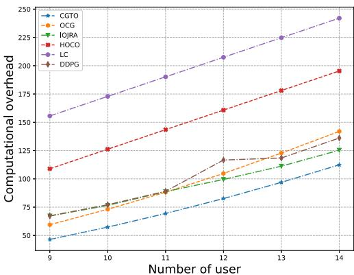

line

| Number of user | CGTO  | OCG   | IOJRA | HOCO  | LC    | DDPG  |
| -------------- | ----- | ----- | ----- | ----- | ----- | ----- |
| 9              | 50    | 60    | 70    | 110   | 155   | 85    |
| 10             | 60    | 75    | 80    | 125   | 175   | 90    |
| 11             | 70    | 90    | 90    | 145   | 190   | 95    |
| 12             | 80    | 105   | 100   | 160   | 205   | 115   |
| 13             | 95    | 120   | 115   | 175   | 225   | 120   |
| 14             | 110   | 140   | 125   | 195   | 245   | 135   |

Fig. 3. Comparison of computation overheads for different numbers of users.

5) Deep Deterministic Policy Gradient: Unlike the scheme proposed in this article, this scheme [53] mainly considers the offloading strategy of the computational tasks and the offloading power allocation to the users, where the tasks are splittable, i.e., the tasks can be partially offloaded, and a resource allocation algorithm based on the deep deterministic policy gradient (DDPG) is designed.

# B. Performance Analysis

We consider terminal user tasks to be isomorphic, i.e., the tasks are the same for each terminal user. First, we compared the computational overhead for different numbers of users. We consider simulations with the number of subcarrier channels equal to 3. The simulation results are shown in Fig. 3. It can be seen from Fig. 3 that the CGTO algorithm proposed in this article has contributed to the reduction of the computation overhead of the task. Compared with the other five algorithms, the CGTO algorithm has the most negligible computation overhead to complete the task. With the increase in the number of tasks, the computation overhead of the various algorithms to meet the tasks increases. This is reasonable because as the number of tasks increases, the total computation overhead also becomes more extensive. At the same time, the CGTO algorithms can allocate resources appropriately despite the increase in the number of tasks.

Next, we evaluate the algorithm proposed in this article based on the computation overhead at different numbers of coalitions. In Fig. 4, the number of users is fixed equal to 13, the computing resources of the UAV are set equal to 3 GHz, and the number of coalitions varies between 3 and 8. As shown in Fig. 4, the LC algorithm obtains a constant computation overhead because all tasks are processed locally. The CGTO algorithm can complete the tasks with a lower computation overhead, but the trend in that computation overhead is less pronounced. This is because, with a constant number of tasks and total computational overhead, the CGTO algorithm can make proper subcarrier channel and resource allocation decisions so that the tasks are always processed with a lower computation overhead. Meanwhile, the computation overhead of the only coalition game (OCG) algorithm, heuristic orthogonal computing offloading (HOCO) algorithm, and independent offloading and joint resource allocation (IOJRA) algorithm decreases as the number of federations increases. This is because the number of coalitions grows, and the task offloading decision changes, allowing more tasks to obtain offloading benefits. Since the LC scheme and the DDPG scheme are independent of the number of coalitions, the task computation overhead does not vary with the number of coalitions.

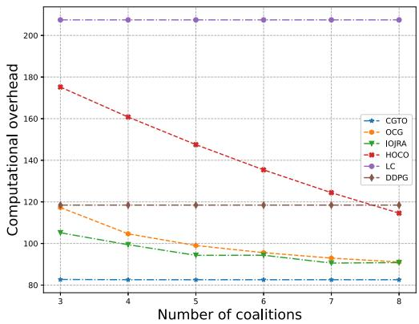

line

| Number of coalitions | CGTO | OCG  | IOJRA | HOCO | LC   | DDPG |
| -------------------- | ---- | ---- | ----- | ---- | ---- | ---- |
| 3                    | 82   | 118  | 104   | 175  | 205  | 118  |
| 4                    | 82   | 104  | 100   | 160  | 205  | 118  |
| 5                    | 82   | 98   | 94    | 148  | 205  | 118  |
| 6                    | 82   | 94   | 92    | 135  | 205  | 118  |
| 7                    | 82   | 90   | 90    | 125  | 205  | 118  |
| 8                    | 82   | 88   | 88    | 115  | 205  | 118  |

Fig. 4. Comparison of calculation overheads for a different number of coalitions.

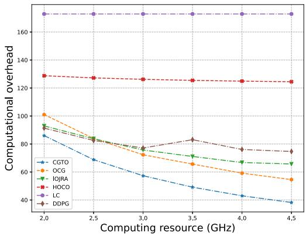

line

| Computing resource (GHz) | CGTO  | OCG   | IOJRA | HOCO  | LC    | DDPG  |
| ------------------------- | ----- | ----- | ----- | ----- | ----- | ----- |
| 2.0                       | 85    | 100   | 90    | 130   | 170   | 90    |
| 2.5                       | 70    | 85    | 85    | 128   | 170   | 85    |
| 3.0                       | 60    | 75    | 80    | 125   | 170   | 80    |
| 3.5                       | 50    | 70    | 75    | 125   | 170   | 85    |
| 4.0                       | 45    | 65    | 70    | 125   | 170   | 75    |
| 4.5                       | 40    | 60    | 65    | 125   | 170   | 75    |

Fig. 5. Comparison of computational overhead with different computing resources.

To further obtain the performance impact of computing resources in task overhead, we consider simulations with the number of users equal to 10 and the number of subcarrier channels equal to 3. The simulation results are shown in Fig. 5. As shown in Fig. 5, the computation overhead of all four algorithms, except the LC algorithm, decreases as the computation resources increase when the UAV’s computing resources are in the range of [2, 4.5] GHz. This is reasonable because as the UAV’s computing resources increase, it takes less time to complete the task. The curve of the LC algorithm remains constant because the local execution of tasks does not rely on the computing resources of the UAV. As the number of subcarrier channels remains constant, the HOCO algorithm only has a fixed number of tasks that reduce the computational overhead as the computational resources increase. Therefore, the HOCO algorithm does not show a significant trend compared to the other four algorithms (CGTO, OCG, IOJRA, and DDPG). The CGTO algorithm has the lowest computation overhead compared to the different algorithms. Although the CGTO algorithm has a high computation overhead with fewer computing resources, the computation overhead remains small compared to the other algorithms. At the same time, with the increase in computing resources, the computation overhead of the CGTO algorithm tends to decrease significantly.

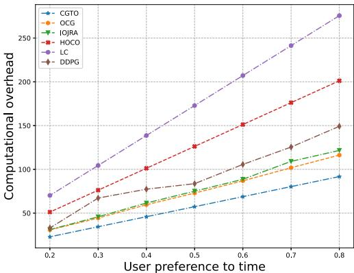

line

| User preference to time | CGTO  | OCG   | IOJRA | HOCO  | LC    | DDPG  |
| ----------------------- | ----- | ----- | ----- | ----- | ----- | ----- |
| 0.2                     | 30    | 40    | 35    | 50    | 70    | 35    |
| 0.3                     | 40    | 50    | 45    | 70    | 100   | 60    |
| 0.4                     | 50    | 60    | 60    | 100   | 140   | 75    |
| 0.5                     | 60    | 70    | 75    | 125   | 170   | 90    |
| 0.6                     | 70    | 80    | 90    | 150   | 210   | 110   |
| 0.7                     | 80    | 95    | 110   | 175   | 240   | 130   |
| 0.8                     | 90    | 115   | 125   | 200   | 275   | 150   |

Fig. 6. Comparison of computational overhead with different user preferences for time.

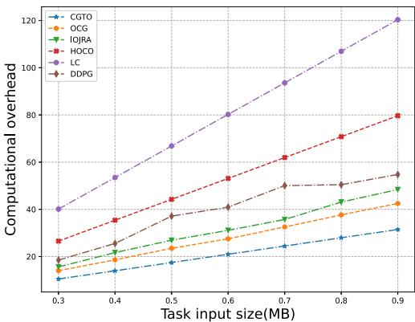

line

| Task input size(MB) | CGTO  | OCG   | IOJRA | HOCO  | LC    | DDPG  |
| ------------------- | ----- | ----- | ----- | ----- | ----- | ----- |
| 0.3                 | 10.0  | 15.0  | 18.0  | 25.0  | 40.0  | 20.0  |
| 0.4                 | 12.0  | 18.0  | 22.0  | 35.0  | 55.0  | 25.0  |
| 0.5                 | 15.0  | 22.0  | 28.0  | 45.0  | 68.0  | 35.0  |
| 0.6                 | 18.0  | 28.0  | 35.0  | 55.0  | 80.0  | 40.0  |
| 0.7                 | 22.0  | 35.0  | 42.0  | 65.0  | 95.0  | 50.0  |
| 0.8                 | 28.0  | 42.0  | 50.0  | 75.0  | 110.0 | 52.0  |
| 0.9                 | 32.0  | 48.0  | 55.0  | 80.0  | 120.0 | 55.0  |

Fig. 7. Comparison of calculation overheads for different task sizes.

We have also selected cases where the number of users equals 10, and the number of subcarrier channels equals 3. We have discussed the effect of user preferences for task completion time and energy consumption on the computation overhead. We change the user’s preference for completion time $\beta _ { t } \in [ 0 . 3 , 0 . 9 ]$ and also change the user’s preference for energy consumption $\beta _ { e } = 1 - \beta _ { t } .$ . The simulation results are shown in Fig. 6. It can be seen that as the completion time preference factor increases, the computation overhead also increases gradually. This is because the computation overhead of the task depends on the task completion time and the energy consumption, where the task completion time accounts for a more significant proportion than the energy consumption. Compared to other algorithms, the CGTO algorithm can maintain a low computational overhead despite the increase in task completion time preference factor. This is because the scheme takes into account the effect of the time preference factor and the energy preference factor on the resource allocation strategy during the scheme calculation process.

Consistent with the above simulation settings, we evaluated the computation overhead for different task input sizes. Considering a task input size range of [300, 900] kB and $\beta _ { t } = 0 . 2$ , the specific simulation results are shown in Fig. 7. It can be seen from Fig. 7 that each algorithm’s computation overhead increases as the task’s input size increases. This means tasks with small input sizes generate lower computing overheads than tasks with large input sizes. Meanwhile, using the LC scheme as a baseline, we can find that tasks with large input sizes benefit more from offloading than tasks with small input sizes. The CGTO algorithm can obtain a lower computational overhead and a higher offloading benefit compared to other compared algorithms. In addition, we can observe that the difference between the CGTO scheme and the LC scheme increases with increasing tasks. This implies that the tasks with small input sizes benefit more from offloading than those with large input sizes.

Based on the above analysis, we discuss the case of homogeneous tasks. To verify the performance of the algorithm proposed in this article under heterogeneous task scenarios, we further discuss the algorithm’s performance under heterogeneous tasks. We consider tasks with three different configurations: 1) different task input sizes—each task input size is randomly selected from [300, 900] kB; 2) different task loads—the required computing cycles for each task are randomly selected from [1, 000, 1, 500, 2, 000]; and 3) different task completion time preference—the completion time preference factor for each task is randomly selected from [0.2, 0.8]. Fig. 8 compares the computation overheads of the various schemes for a different number of tasks for heterogeneous tasks. As shown in Fig. 8(a), the computation overhead of the multiple algorithms increases with the number of heterogeneous tasks. This is because as the number of tasks increases, it causes the total computational overhead also increases. Since the selection of heterogeneous tasks is stochastic, heterogeneous tasks with smaller input sizes will produce lower computational overhead than heterogeneous task inputs with larger input sizes. Therefore, it may occur that the computation overhead generation decreases with an increasing number of tasks. As shown in Fig. 8(b), the CGTO algorithm can complete the task with lower computation overhead than other algorithms under heterogeneous tasks with different task loads. As shown in Fig. 8(c), the CGTO algorithm can make reasonable offloading and resource allocation decisions to complete heterogeneous tasks with different completion time preference factors at a lower computation overhead. The CGTO algorithm can complete the task with low computational overhead for different heterogeneous task scenarios. And compared with other algorithms, the CGTO algorithm can maintain a low computational overhead and obtain a high offloading benefit.

To further analyze the scalability of the scheme proposed in this article, we analyze the task processing performance of the scheme proposed in this article under the ground disaster scenario [54]. In the ground disaster scenario, a large number of terminal devices are distributed in the disaster area. The UAV acts as an aerial base station to provide computing services for ground devices. By offloading the tasks to the UAV, the terminal devices can fully utilize the computational resources of the UAV and reduce their system energy consumption. We consider that the computing tasks are heterogeneous, i.e., the size of the computing task is different for each end device, and the task size ranges from [0.3, 0.6] MB.

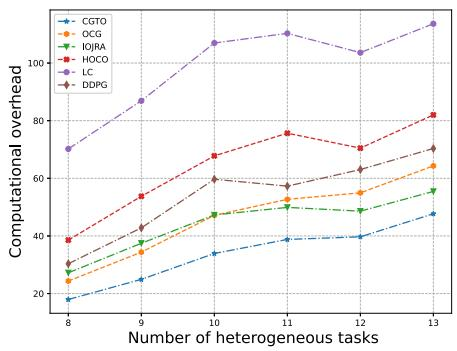  
(a)

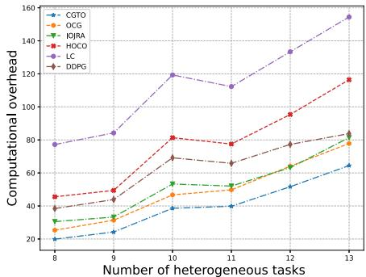

line

| Number of heterogeneous tasks | CGTO  | OCG   | IOJRA | HOCO  | LC    | DDPG  |
| ------------------------------ | ----- | ----- | ----- | ----- | ----- | ----- |
| 8                              | 20    | 30    | 35    | 40    | 75    | 40    |
| 9                              | 25    | 35    | 40    | 45    | 85    | 45    |
| 10                             | 30    | 45    | 50    | 80    | 120   | 65    |
| 11                             | 40    | 50    | 55    | 75    | 110   | 60    |
| 12                             | 50    | 60    | 65    | 95    | 130   | 75    |
| 13                             | 60    | 75    | 80    | 115   | 155   | 80    |

(b)

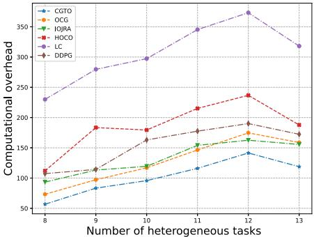

line

| Number of heterogeneous tasks | CGTO  | OCG   | IQJRA | HOCD  | LC    | DDPG  |
| ------------------------------ | ----- | ----- | ----- | ----- | ----- | ----- |
| 8                              | 60    | 80    | 90    | 110   | 230   | 100   |
| 9                              | 80    | 100   | 110   | 180   | 280   | 110   |
| 10                             | 100   | 120   | 130   | 170   | 300   | 160   |
| 11                             | 120   | 140   | 150   | 210   | 340   | 170   |
| 12                             | 140   | 160   | 160   | 240   | 370   | 180   |
| 13                             | 120   | 150   | 150   | 190   | 320   | 170   |

(c)

Fig. 8. Comparison of the computational overhead of heterogeneous tasks for different numbers of tasks. (a) Computational overhead for different task sizes. (b) Computational overhead for different task loads. (c) Computational overhead for time preference factors (βt) of task.   
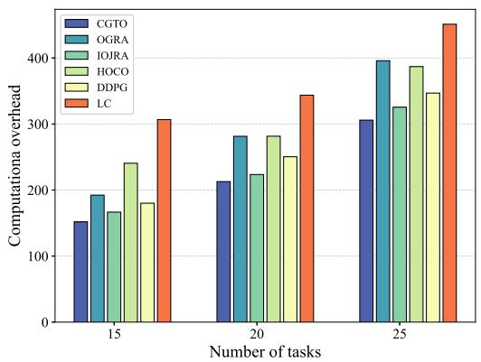

bar

| Number of tasks | CGTO  | OGRA  | IOJRA | HOCO  | DDPG  | LC    |
| --------------- | ----- | ----- | ----- | ----- | ----- | ----- |
| 15              | 150   | 190   | 170   | 240   | 180   | 310   |
| 20              | 210   | 280   | 220   | 280   | 250   | 340   |
| 25              | 310   | 400   | 320   | 390   | 350   | 450   |

Fig. 9. Comparison of computational overheads for different numbers of tasks under ground disaster scenarios.

Fig. 9 shows the variation of task computation overhead with the number of tasks under ground disaster scenario. It can be observed that the computational task overhead increases with the number of tasks. Due to the limited computing power of the ground terminal equipment itself, if the local execution policy is chosen, it will greatly increase the computational overhead of the user’s equipment. The CGTO scheme proposed in this article can effectively reduce the computational overhead for other strategies. Compared with other schemes, the CGTO scheme has the lowest total task computation overhead and the performance gap increases as the computation task size increases. This is because the CGTO scheme is not only the user’s offloading strategy and power allocation strategy but also the UAV’s computational and channel resources. Compared with other schemes, the CGTO scheme has the lowest total task computation overhead and the performance gap increases as the computation task size increases. This is because the CGTO scheme not only considers the user’s offloading strategy and power allocation strategy but also the UAV’s computational and channel resource allocation strategies. Meanwhile, as the number of tasks increases, the CGTO scheme can provide lower computational overhead. In summary, the scheme proposed in this article is scalable and can be applied to other emergency scenarios.

# VI. CONCLUSION

This article investigates computing offloading and resource allocation for NOMA-UAV-assisted maritime emergency communications. We propose a game theory-based approach to resource allocation and prove that the solution of the algorithm is stable and convergent. This approach decomposes the optimization problem into two parts: 1) the task offloading problem and 2) the resource allocation problem. In solving the resource allocation problem, we assume that the offloading decision of the task is known. For other solutions, the resource allocation problem is decoupled into two independent subproblems: the transmission power allocation problem and the computing resource allocation problem. It is solved using the proposed quasi-convex and convex optimization methods, respectively. We assume that the resource allocation strategy is known for solving the task offloading problem. To this end, we propose a CGTO algorithm for solving task-offloading and subcarrier allocation. Simulation results show that the algorithm proposed in this article can reasonably allocate network resources and optimize the offloading strategy. At the same time, compared with other alternatives, the proposed algorithm can significantly reduce the computational overhead of task offloading and improve the network performance. Finally, the algorithm proposed in this article has some generality and can be applied to other emergency scenarios that require computational processing.

# REFERENCES

[1] J. Wen, J. Yang, W. Wei, and Z. Lv, “Intelligent multi-AUG ocean data collection scheme in maritime wireless communication network,” IEEE Trans. Netw. Sci. Eng., vol. 9, no. 5, pp. 3067–3079, Sep./Oct. 2022.   
[2] Y. Wang, W. Feng, J. Wang, and T. Q. S. Quek, “Hybrid satellite-UAV-terrestrial networks for 6G ubiquitous coverage: A maritime communications perspective,” IEEE J. Sel. Areas Commun., vol. 39, no. 11, pp. 3475–3490, Nov. 2021.   
[3] C. Hu, Y. Pu, F. Yang, R. Zhao, A. Alrawais, and T. Xiang, “Secure and efficient data collection and storage of IoT in smart ocean,” IEEE Internet Things J., vol. 7, no. 10, pp. 9980–9994, Oct. 2020.   
[4] J. Ye, S. Roy, M. Godjevac, and S. Baldi, “A switching control perspective on the offshore construction scenario of heavy-lift vessels,” IEEE Trans. Control Syst. Technol., vol. 29, no. 1, pp. 470–477, Jan. 2021.   
[5] X. Li, W. Feng, Y. Chen, C.-X. Wang, and N. Ge, “Maritime coverage enhancement using UAVs coordinated with hybrid satellite-terrestrial networks,” IEEE Trans. Commun., vol. 68, no. 4, pp. 2355–2369, Apr. 2020.

[6] T. Wei, W. Feng, J. Wang, N. Ge, and J. Lu, “Exploiting the shipping lane information for energy-efficient maritime communications,” IEEE Trans. Veh. Technol., vol. 68, no. 7, pp. 7204–7208, Jul. 2019.   
[7] S. Zhang, H. Zhang, Q. He, K. Bian, and L. Song, “Joint trajectory and power optimization for UAV relay networks,” IEEE Commun. Lett., vol. 22, no. 1, pp. 161–164, Jan. 2018.   
[8] X. Zhong, Y. Guo, N. Li, and Y. Chen, “Joint optimization of relay deployment, channel allocation, and relay assignment for UAVs-aided D2D networks,” IEEE/ACM Trans. Netw., vol. 28, no. 2, pp. 804–817, Apr. 2020.   
[9] D.-H. Tran, V.-D. Nguyen, S. Chatzinotas, T. X. Vu, and B. Ottersten, “UAV relay-assisted emergency communications in IoT networks: Resource allocation and trajectory optimization,” IEEE Trans. Wireless Commun., vol. 21, no. 3, pp. 1621–1637, Mar. 2022.   
[10] Z. Yao, W. Cheng, W. Zhang, and H. Zhang, “Resource allocation for 5G-UAV-based emergency wireless communications,” IEEE J. Sel. Areas Commun., vol. 39, no. 11, pp. 3395–3410, Nov. 2021.   
[11] W. Feng et al., “NOMA-based UAV-aided networks for emergency communications,” China Commun., vol. 17, no. 11, pp. 54–66, Nov. 2020.   
[12] B. Hu, L. Wang, S. Chen, J. Cui, and L. Chen, “An uplink throughput optimization scheme for UAV-enabled urban emergency communications,” IEEE Internet Things J., vol. 9, no. 6, pp. 4291–4302, Mar. 2022.   
[13] T. Zhang, J. Lei, Y. Liu, C. Feng, and A. Nallanathan, “Trajectory optimization for UAV emergency communication with limited user equipment energy: A safe-DQN approach,” IEEE Trans. Green Commun. Netw., vol. 5, no. 3, pp. 1236–1247, Sep. 2021.   
[14] T. Do-Duy, L. D. Nguyen, T. Q. Duong, S. R. Khosravirad, and H. Claussen, “Joint optimisation of real-time deployment and resource allocation for UAV-aided disaster emergency communications,” IEEE J. Sel. Areas Commun., vol. 39, no. 11, pp. 3411–3424, Nov. 2021.   
[15] Z. Yin, M. Jia, W. Wang, N. Cheng, F. Lyu, and X. Shen, “Maxmin secrecy rate for NOMA-based UAV-assisted communications with protected zone,” in Proc. IEEE Glob. Commun. Conf. (GLOBECOM), Waikoloa, HI, USA, 2019, pp. 1–6.   
[16] X. Song, M. Cheng, L. Lei, and Y. Yang, “Multi-task and multi-objective joint resource optimization for UAV-assisted air–ground integrated networks under emergency scenarios,” IEEE Internet Things J., vol. 10, no. 23, pp. 20342–20357, Dec. 2023.   
[17] C. Zhang, M. Dong, and K. Ota, “Heterogeneous mobile networking for lightweight UAV assisted emergency communication,” IEEE Trans. Green Commun. Netw., vol. 5, no. 3, pp. 1345–1356, Sep. 2021.   
[18] C. Wang, D. Deng, L. Xu, and W. Wang, “Resource scheduling based on deep reinforcement learning in UAV assisted emergency communication networks,” IEEE Trans. Commun., vol. 70, no. 6, pp. 3834–3848, Jun. 2022.   
[19] Y. Wang, Z. Su, Q. Xu, R. Li, T. H. Luan, and P. Wang, “A secure and intelligent data sharing scheme for UAV-assisted disaster rescue,” IEEE/ACM Trans. Netw., vol. 31, no. 6, pp. 2422–2438, Dec. 2023.   
[20] Y. Wu, Y. Song, T. Wang, L. Qian, and T. Q. S. Quek, “Non-orthogonal multiple access assisted federated learning via wireless power transfer: A cost-efficient approach,” IEEE Trans. Commun., vol. 70, no. 4, pp. 2853–2869, Apr. 2022.   
[21] H. Zhang, H. Zhang, K. Long, and G. K. Karagiannidis, “Deep learning based radio resource management in NOMA networks: User association, subchannel and power allocation,” IEEE Trans. Netw. Sci. Eng., vol. 7, no. 4, pp. 2406–2415, Oct.-Dec. 2020.   
[22] Y. Chen, B. Ai, Y. Niu, K. Guan, and Z. Han, “Resource allocation for device-to-device communications underlaying heterogeneous cellular networks using coalitional games,” IEEE Trans. Wireless Commun., vol. 17, no. 6, pp. 4163–4176, Jun. 2018.   
[23] T. Fang, J. Chen, and Y. Zhang, “Content-aware multi-subtask offloading: A coalition formation game-theoretic approach,” IEEE Commun. Lett., vol. 25, no. 8, pp. 2664–2668, Aug. 2021.   
[24] M. Dai, Y. Wu, L. Qian, Z. Su, B. Lin, and N. Chen, “UAV-assisted multi-access computation offloading via hybrid NOMA and FDMA in marine networks,” IEEE Trans. Netw. Sci. Eng., vol. 10, no. 1, pp. 113–127, Jan./Feb. 2023.   
[25] Y. Liu, J. Yan, and X. Zhao, “Deep reinforcement learning based latency minimization for mobile edge computing with virtualization in maritime UAV communication network,” IEEE Trans. Veh. Technol., vol. 71, no. 4, pp. 4225–4236, Apr. 2022.   
[26] J. Xu, Y. Zeng, and R. Zhang, “UAV-enabled wireless power transfer: Trajectory design and energy optimization,” IEEE Trans. Wireless Commun., vol. 17, no. 8, pp. 5092–5106, Aug. 2018.

[27] Q. V. Pham, H. T. Nguyen, Z. Han, and W.-J. Hwang, “Coalitional games for computation offloading in NOMA-enabled multi-access edge computing,” IEEE Trans. Veh. Technol., vol. 69, no. 2, pp. 1982–1993, Feb. 2020.   
[28] X. Lyu, H. Tian, C. Sengul, and P. Zhang, “Multiuser joint task offloading and resource optimization in proximate clouds,” IEEE Trans. Veh. Technol., vol. 66, no. 4, pp. 3435–3447, Apr. 2017.   
[29] X. Chen, “Decentralized computation offloading game for mobile cloud computing,” IEEE Trans. Parallel Distrib. Syst., vol. 26, no. 4, pp. 974–983, Apr. 2015.   
[30] X. Chen, L. Jiao, W. Li, and X. Fu, “Efficient multi-user computation offloading for mobile-edge cloud computing,” IEEE/ACM Trans. Netw., vol. 24, no. 5, pp. 2795–2808, Oct. 2016.   
[31] X. Lyu and H. Tian, “Adaptive receding horizon offloading strategy under dynamic environment,” IEEE Commun. Lett., vol. 20, no. 5, pp. 878–881, May 2016.   
[32] L. Yang, J. Cao, H. Cheng, and Y. Ji, “Multi-user computation partitioning for latency sensitive mobile cloud applications,” IEEE Trans. Comput., vol. 64, no. 8, pp. 2253–2266, Aug. 2015.   
[33] Z. Cheng, P. Li, J. Wang, and S. Guo, “Just-in-time code offloading for wearable computing,” IEEE Trans. Emerg. Topics Comput., vol. 3, no. 1, pp. 74–83, Mar. 2015.   
[34] H. Guo and J. Liu, “Collaborative computation offloading for multiaccess edge computing over fiber-wireless networks,” IEEE Trans. Veh. Technol., vol. 67, no. 5, pp. 4514–4526, May 2018.   
[35] J. Zheng, Y. Cai, Y. Wu, and X. Shen, “Dynamic computation offloading for mobile cloud computing: A stochastic game-theoretic approach,” IEEE Trans. Mobile Comput., vol. 18, no. 4, pp. 771–786, Apr. 2019.   
[36] Y. Liao, X. Chen, S. Xia, Q. Ai, and Q. Liu, “Energy minimization for UAV swarm-enabled wireless inland ship MEC network with time windows,” IEEE Trans. Green Commun. Netw., vol. 7, no. 2, pp. 594–608, Jun. 2023.   
[37] Y. Zhang, J. Lyu, and L. Fu, “Energy-efficient trajectory design for UAVaided maritime data collection in wind,” IEEE Trans. Wireless Commun., vol. 21, no. 12, pp. 10871–10886, Dec. 2022.   
[38] C. Li, J. Yu, W. Chen, K. Yang, and F. Li, “Shadowing correlation and a novel statistical model for inland river radio channel,” in Proc. IEEE Int. Conf. Commun. (ICC), Shanghai, China, 2019, pp. 1–6.   
[39] A. Al-Hourani, S. Kandeepan, and S. Lardner, “Optimal LAP altitude for maximum coverage,” IEEE Wireless Commun. Lett., vol. 3, no. 6, pp. 569–572, Dec. 2014.   
[40] H. Guo and J. Liu, “UAV-enhanced intelligent offloading for Internet of Things at the edge,” IEEE Trans. Ind. Informat., vol. 16, no. 4, pp. 2737–2746, Apr. 2020.   
[41] W. Zhang, Y. Wen, K. Guan, D. Kilper, H. Luo, and D. O. Wu, “Energy-optimal mobile cloud computing under stochastic wireless channel,” IEEE Trans. Wireless Commun., vol. 12, no. 9, pp. 4569–4581, Sep. 2013.   
[42] A. P. Miettinen and J. K. Nurminen, “Energy efficiency of mobile clients in cloud computing,” in Proc. USENIX Conf. Hot Topics Cloud Comput., Jun. 2010, pp. 1–7.   
[43] Y. Wang, M. Sheng, X. Wang, L. Wang, and J. Li, “Mobile-edge computing: Partial computation offloading using dynamic voltage scaling,” IEEE Trans. Commun., vol. 64, no. 10, pp. 4268–4282, Oct. 2016.   
[44] T. X. Tran and D. Pompili, “Joint task offloading and resource allocation for multi-server mobile-edge computing networks,” IEEE Trans. Veh. Technol., vol. 68, no. 1, pp. 856–868, Jan. 2019.   
[45] Y. Du and G. de Veciana, ““Wireless networks without edges”: Dynamic radio resource clustering and user scheduling,” in Proc. IEEE Conf. Comput. Commun., Toronto, ON, Canada, Jul. 2014, pp. 1321–1329.   
[46] S. Boyd and L. Vandenberghe, Convex Optimization. Cambridge, MA, USA: Cambridge Univ. Press, 2004.   
[47] K.-H. Loh, B. Golden, and E. Wasil, “Solving the maximum cardinality bin packing problem with a weight annealing-based algorithm,” in Operations Research and Cyber-Infrastructure, vol. 47. Boston, MA, USA: Springer, Jan. 2009, pp. 147–164.   
[48] T. Wang, L. Song, Z. Han, and B. Jiao, “Dynamic popular content distribution in vehicular networks using coalition formation games,” IEEE J. Sel. Areas Commun., vol. 31, no. 9, pp. 538–547, Sep. 2013.   
[49] Q.-V. Pham, L. B. Le, S.-H. Chung, and W.-J. Hwang, “Mobile edge computing with wireless backhaul: Joint task offloading and resource allocation,” IEEE Access, vol. 7, pp. 16444–16459, 2019.   
[50] Z. Han, D. Niyato, W. Saad, T. Bas.ar, and A. Hjørungnes, , Game Theory in Wireless and Communication Networks: Theory Models and Applications. New York, NY, USA: Cambridge Univ. Press, 2012.

[51] W. Zhang, Y. Wen, and D. O. Wu, “Collaborative task execution in mobile cloud computing under a stochastic wireless channel,” IEEE Trans. Wireless Commun., vol. 14, no. 1, pp. 81–93, Jan. 2015.   
[52] T. Zhu, J. Li, Z. Cai, Y. Li, and H. Gao, “Computation scheduling for wireless powered mobile edge computing networks,” in Proc. IEEE Conf. Comput. Commun., Toronto, ON, Canada, Jul. 2020, pp. 596–605.   
[53] J. Wang, Y. Wang, P. Cheng, K. Yu, and W. Xiang, “DDPG-based joint resource management for latency minimization in NOMA-MEC networks,” IEEE Commun. Lett., vol. 27, no. 7, pp. 1814–1818, Jul. 2023.   
[54] Z. Niu, H. Liu, X. Lin, and J. Du, “Task scheduling with UAV-assisted dispersed computing for disaster scenario,” IEEE Syst. J., vol. 16, no. 4, pp. 6429–6440, Dec. 2022.

natural_image

Portrait of a young man wearing glasses and a suit (no text or symbols visible)

Ting Lyu received the B.S. degree in software engineering from Jiangxi University of Science and Technology, Ganzhou, China, in 2017, and the M.S. degree from the School of Artificial Intelligence, Guangxi Minzu University, Nanning, China, in 2020. He is currently pursuing the Ph.D. degree with the School of Computer and Communication Engineering, University of Science and Technology Beijing, Beijing, China.

His current research interests include wireless resource allocation and management, edge

computing, game theory, and reinforcement learning.

natural_image

Portrait of a smiling woman with shoulder-length hair wearing a floral blouse (no text or symbols visible)

Meng Li received the M.S. degree from Beijing Forestry University, Beijing, China, in 2016. She is currently pursuing the Ph.D. degree with the School of Computer and Communication Engineering, University of Science and Technology Beijing, Beijing.

Her current research interests include artificial intelligence, satellite communication, and smart grid.

natural_image

Portrait of a man in formal attire (no text or symbols visible)

Lixin Li (Member, IEEE) received the B.S. and M.S. degrees (Hons.) and the Ph.D. degree from Northwestern Polytechnical University (NPU), Xi’an, China, in 2001, 2004, and 2008, respectively.

From 2009 to 2011, he was a Postdoctoral Research Fellow with NPU. In 2011, he joined the School of Electronics and Information, NPU, where he is currently a Full Professor and the Chair of the Department of Communication Engineering. In 2017, he was a Visiting Scholar with the University of Houston, Houston, TX, USA. He has authored or coauthored five books, more than 200 peer-reviewed papers in many prestigious journals and conferences, and he holds 26 granted patents. His current research interests include 5G/6G wireless networks, federated learning, game theory, and machine learning for wireless communications.

Prof. Li received the 2016 NPU Outstanding Young Teacher Award, which is the highest research and education honors for young faculties in NPU. He was an Exemplary Reviewer of IEEE TRANSACTIONS ON COMMUNICATIONS in 2020.

natural_image

Portrait of a man wearing glasses and a suit (no text or symbols visible)

Haitao Xu (Member, IEEE) received the B.S. degree in communication engineering from Sun Yat-sen University, Guangzhou, China, in 2007, the M.S. degree in communication system and signal processing from the University of Bristol, Bristol, U.K., in 2009, and the Ph.D. degree in communication and information system from the University of Science and Technology Beijing, Beijing, China, in 2014.

He is currently a Professor with the Department of Communication Engineering, University of Science and Technology Beijing. He has co-edited a book

titled Security in Cyberspace and coauthored over 50 technical papers. His research interests include wireless resource allocation and management, wireless communications and networking, dynamic game and mean-field game theory, big data analysis, and security.

natural_image

Portrait of a woman wearing glasses and a collared shirt (no text or symbols visible)

Feifei Liu received the M.S. degree from the Inner Mongolia University of Technology, Hohhot, China, in 2018. She is currently pursuing the Ph.D. degree with the School of Computer and Communication Engineering, University of Science and Technology Beijing, Beijing, China.

Her current research interests include artificial intelligence, optical communication, and optical solution.

natural_image

Portrait of a young man in a dark top (no text or symbols visible)

Zhu Han (Fellow, IEEE) received the B.S. degree in electronic engineering from Tsinghua University, Beijing, China, in 1997, and the M.S. and Ph.D. degrees in electrical and computer engineering from the University of Maryland at College Park, College Park, MD, USA, in 1999 and 2003, respectively.

From 2000 to 2002, he was a Research and Development Engineer with JDSU, Germantown, MD, USA. From 2003 to 2006, he was a Research Associate with the University of Maryland at College Park. From 2006 to 2008, he was an

Assistant Professor with Boise State University, Boise, ID, USA. He is currently a John and Rebecca Moores Professor with the Electrical and Computer Engineering Department and the Computer Science Department, University of Houston, Houston, TX, USA. His main research targets on the novel gametheory-related concepts critical to enabling efficient and distributive use of wireless networks with limited resources. His other research interests include wireless resource allocation and management, wireless communications and networking, quantum computing, data science, smart grid, and security and privacy.

Dr. Han received an NSF Career Award in 2010, the Fred W. Ellersick Prize of the IEEE Communication Society in 2011, the EURASIP Best Paper Award for the Journal on Advances in Signal Processing in 2015, the IEEE Leonard G. Abraham Prize in the field of Communications Systems (Best Paper Award in IEEE JSAC) in 2016, and several best paper awards in IEEE conferences. He has been a 1% Highly Cited Researcher since 2017 according to Web of Science. He is also the winner of the 2021 IEEE Kiyo Tomiyasu Award (an IEEE Technical Field Award), for outstanding early to mid-career contributions to technologies holding the promise of innovative applications, with the following citation: “for contributions to game theory and distributed management of autonomous communication networks.” He was an IEEE Communications Society Distinguished Lecturer from 2015 to 2018 and has been an AAAS Fellow since 2019 and an ACM Distinguished Member since 2019.