# Constrained Multi-Objective Optimization for UAV-Enabled Mobile Edge Computing: Offloading Optimization and Path Planning

Chaoda Peng, Xumin Huang , Yuan Wu , Senior Member, IEEE, and Jiawen Kang

Abstract—An unmanned aerial vehicle (UAV) is employed to sequentially visit the specific waypoints and provide offloading services for nearby devices. Most of the current works optimized the UAV-enabled offloading according to a single criterion while neglecting necessary optimizations and constraints for flight safety of the UAV. This motivates us to study the optimization problem of the UAV from a multi-objective viewpoint by considering the UAV’s flight safety. A constrained multi-objective optimization problem (CMOP) involving two objective functions about the energy-efficient offloading and safe path planning is formulated for the UAV. To solve the formulated CMOP, we present a constrained decomposition-based multi-objective evolution algorithm. To further improve the algorithm, we particularly utilize the infeasible individuals with great objective values, which provide useful information for improving the optimized objective values during the evolution process. Finally, experimental results demonstrate that compared with the existing works, our scheme is beneficial to simultaneously reduce energy consumption and ensure safe flight for the UAV.

Index Terms—Computation offloading, 3D path planning, constrained multi-objective optimization, and evolutionary algorithm.

# I. INTRODUCTION

D UE TO the flexible deployment and mobility, unmannedaerial vehicle (UAV) has been widely exploited to aerial vehicle (UAV） has been widely exploited to provide various services, e.g., event and data detection [1], [2], reliable connectivity and proximal computing for users, particularly in the scenarios where communication infrastructures are damaged and network congestion is continuously aggravated. This results in a new computing paradigm called by UAV-enabled mobile edge computing (MEC).

Manuscript received January 1, 2022; accepted January 31, 2022. Date of publication February 4, 2022; date of current version April 11, 2022. This work was supported in part by the National Natural Science Foundation of China under Grant 62001125 and Grant 62102099; in part by the Science and Technology Development Fund of Macau SAR under Grant 0060/2019/A1 and Grant 0162/2019/A3; in part by the FDCT-MOST Joint Project under Grant 0066/2019/AMJ; in part by the Key Project in Higher Education of Guangdong Province under Grant 2020ZDZX3030; and in part by the Special Fund for Talents of South China Agricultural University under Grant 221114. The associate editor coordinating the review of this article and approving it for publication was K. Ota. (Corresponding author: Xumin Huang.)

Chaoda Peng is with the College of Mathematics and Informatics, South China Agricultural University, Guangzhou 510642, China (e-mail: chaodapeng@scau.edu.cn).

Xumin Huang is with the School of Automation, Guangdong University of Technology, Guangzhou 510006, China, and also with the State Key Laboratory of Internet of Things for Smart City, University of Macau, Macau, China (e-mail: huangxu\_min@163.com).

Yuan Wu is with the State Key Laboratory of Internet of Things for Smart City and the Department of Computer and Information Science, University of Macau, Macau, China (e-mail: yuanwu@um.edu.mo).

Jiawen Kang is with the School of Automation, Guangdong University of Technology, Guangzhou 510006, China (e-mail: kavinkang@gdut.edu.cn).

Digital Object Identifier 10.1109/LWC.2022.3149007

Many research efforts have been devoted to jointly optimizing the task offloading and trajectory design for the UAV scheduling. The authors in [3] considered that the UAV was approximately stationary and used binary offloading decisions for the devices with offloading requests. The similar problem was extended to jointly optimize the user association and horizontal location of the UAV to maximize the overall data rate for the users [4]. The joint optimization of resource allocation and 3D trajectory of the UAV from the viewpoint of energy efficiency was studied in [5]. The use of the UAV as an aerial communication platform was proposed to tackle the traffic offloading problems in a variety of application scenarios such as cellular hotspot areas [6] and community communications [7]. A dual-role UAV playing both as an edge-server and a traffic relay was proposed in [8]. Furthermore, wireless power transfer was integrated into the UAV-enabled MEC to establish the on-demand power links and communication channels for wireless devices [9].

However, most of the current works formulated the networkwide optimization problem as a single-objective optimization problem, while the UAV scheduling could consider both the efficiency of task processing and the safe path planning of the UAV as a joint criterion. Toward feasible deployment of the UAV, there may exist several important yet conflicting objectives which need to be jointly optimized. Technically, it is not suitable to simply sum the different objectives with fixed weights. Moreover, the current UAV’s trajectory was determined by assigning processing order to the devices and the trajectory design was based on the straight flight among the specific locations. The practical UAV path planning that accounts for the obstacle avoidance and safe flight requirements has not been widely studied yet.

Motivated by the above considerations, we investigate a constrained multi-objective optimization problem (CMOP) for UAV-enabled MEC, which aims at simultaneously achieving the energy-efficient offloading and safe path planning for the UAV. Given the locations of the devices, the UAV flies from one place to another to provide offloading services for the devices. In this multi-objective optimization, we simultaneously optimize the transmission power of the devices, computing resource, flying velocity and 3D path of the UAV. The main contributions of this letter are summarized as follows.

A CMOP for UAV-enabled MEC is investigated to simultaneously study the energy-efficient offloading and safe path planning for the UAV.

• A constrained multi-objective evolutionary algorithm with a mechanism of utilizing the useful infeasible individuals is developed to tackle the proposed problem.

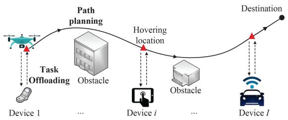

flowchart

Fig. 1. System model.

• Numerical results are provided to demonstrate the effectiveness of our proposed algorithm, especially its robustness in obtaining the feasible optimal solutions.

# II. PROBLEM FORMULATION

We consider a system model in Fig. 1 where a single UAV with computing resources is scheduled to sequentially visit I hovering locations to serve I devices, and finally flies toward the destination. For simplicity, the UAV flies above the devices at a constant height H. We denote the location of device i as $( x _ { i } ^ { \prime } , y _ { i } ^ { \prime } , 0 )$ , and the i-th hovering location of the UAV refers to $( x _ { i } ^ { \prime } , y _ { i } ^ { \prime } , H )$ . We describe the task of device i by input data size $S _ { i }$ and computation workloads $W _ { i }$ . Similar to [10], we do not consider the small output data size compared with the input data size and the following delay of receiving the output data. Let $B _ { i }$ and $p _ { i } ^ { \mathrm { t x } }$ represent the channel bandwidth and transmitter power of device i, respectively. Thus, the uplink data rate of device i is expressed by $\begin{array} { r } { \dot { r } _ { i } ^ { \mathrm { U L } } = \dot { B } _ { i } \mathrm { l o g } _ { 2 } ( 1 + p _ { i } ^ { \mathrm { t x } } g _ { i } / \sigma ^ { 2 } ) } \end{array}$ , where the free-space path loss model $g _ { i } ~ = ~ g _ { 0 } / \dot { H } ^ { 2 }$ in [11], [12] is used, $g _ { 0 }$ is the received power at the reference distance $d _ { 0 } = 1$ m and $\sigma ^ { 2 }$ is the noise power. For the UAV, let $f _ { \mathrm { U A V } , i }$ indicate the computing resources allocated to device i. The hovering duration of the i-th hovering location is calculated by $\tau _ { i } ^ { \mathrm { H } } = t _ { i } ^ { \mathrm { d } } + t _ { i } ^ { \mathrm { w } }$ , where the data transmission and workload processing time are $t _ { i } ^ { \mathrm { d } } = S _ { i } / r _ { i } ^ { \mathrm { U L } }$ and $t _ { i } ^ { \mathrm { w } } = W _ { i } / f _ { \mathrm { U A V } , i }$ , respectively. Given a real path between the i-th and the (i + 1)- th hovering locations, the length of the i-th path segment is measured by $L _ { i } ,$ , and the flying time of the UAV is $\tau _ { i } ^ { \mathrm { F } } = L _ { i } / v _ { i }$ under the assumption that the UAV is flying at a constant velocity denoted by $v _ { i }$ .

At the i-th hovering location, energy consumption for receiving the offloading data, handling the offloading data and staying hovering is equal to $p _ { \mathrm { U A V } } ^ { \mathrm { r x } } \bar { t _ { i } ^ { \mathrm { d } } } , \varepsilon _ { \mathrm { U A V } } f _ { \mathrm { U A V } , i } ^ { 2 } W _ { i }$ , and $p _ { \mathrm { U A V } } ^ { \mathrm { H } } \tau _ { i } ^ { \mathrm { H } }$ , respectively, where $p _ { \mathrm { U A V } } ^ { \mathrm { r x } } , \varepsilon _ { \mathrm { U A V } }$ and $p _ { \mathrm { U A V } } ^ { \mathrm { H } ^ { \prime } }$ are the receiver power, effective switched capacitance of the processor, and hovering power, respectively. To maintain the stable flying motion with the constant velocity, the flying power of the UAV is estimated by $p _ { \mathrm { U A V } } ^ { \mathrm { F } }$ according to the method in [13]. From the i-th hovering location to the (i + 1)-th hovering location, the total energy consumption of the UAV, which is denoted by $E _ { i } ,$ , is given as follows:

$$
E _ {i} = p _ {\mathrm{UAV}} ^ {\mathrm{rx}} t _ {i} ^ {\mathrm{d}} + \varepsilon_ {\mathrm{UAV}} f _ {\mathrm{UAV}, i} ^ {2} W _ {i} + p _ {\mathrm{UAV}} ^ {\mathrm{H}} \tau_ {i} ^ {H} + p _ {\mathrm{UAV}} ^ {\mathrm{F}} \tau_ {i} ^ {\mathrm{F}} \tag {1}
$$

The delay constraint is given by:

$$
C _ {1}: h _ {1} = T _ {i} - \tau_ {i} ^ {\mathrm{H}} - \tau_ {i} ^ {\mathrm{F}}, \text {   and   } h _ {1} \geq 0 \tag {2}
$$

where $T _ { i }$ is the maximum tolerable time duration required by the UAV. We try to reduce $E _ { i }$ to achieve the energy-efficient task offloading in UAV-enabled MEC.

At the same time, we enable the safe flight for the UAV. Before defining the whole UAV’s path, we simulate the flying environment of the UAV by considering the existence of obstacles. Referring to [14], we use the following 3D model:

$$
\begin{array}{l} z (x, y) = \sin (y + \kappa_ {1}) + \kappa_ {2} \sin (x) + \kappa_ {3} \cos (y) + \kappa_ {4} \cos (y) \\ + \kappa_ {5} \cos (\kappa_ {6} \sqrt {x ^ {2} + y ^ {2}}) + \kappa_ {7} \sin (\kappa_ {7} \sqrt {x ^ {2} + y ^ {2}}) (3) \\ \end{array}
$$

where $\kappa _ { 1 } , \kappa _ { 2 } , \kappa _ { 3 } , \kappa _ { 4 } , \kappa _ { 5 } , \kappa _ { 6 }$ and $\kappa _ { 7 }$ are experimentally studied constants, and they can be configured to produce the consistent surface of the obstacles such as a building, valley and mountain. B-spline curve is used in this letter to model the UAV’s path since it is defined only by a set of control points that can represent a complicated path. It has been widely utilized in industrial applications such as computer graphic representations and computer aided manufacturing [14]. Suppose that we have λ control points $C P _ { 1 } \ = \ ( x _ { 1 } , y _ { 1 } , z _ { 1 } ) , C P _ { 2 } \ =$ $( x _ { 2 } , y _ { 2 } , z _ { 2 } ) , \ldots , C P _ { \lambda } ~ = ~ ( x _ { \lambda } , y _ { \lambda } , z _ { \lambda } )$ , and then the corresponding B-spline curve, i.e., the $\mathrm { U A V } \mathbf { \hat { s } }$ path, consists of J path points $B _ { 1 } = ( x _ { 1 } ^ { \prime } , y _ { 1 } ^ { \prime } , z _ { 1 } ^ { \prime } ) , B _ { 2 } = ( x _ { 2 } ^ { \prime } , y _ { 2 } ^ { \prime } , z _ { 2 } ^ { \prime } ) , \ldots , B _ { J } =$ $( x _ { J } ^ { \prime } , y _ { J } ^ { \prime } , z _ { J } ^ { \prime } )$ .

To derive a collision-free path, an objective function with respect to the safe flight is considered. We project the path points and mesh points of the obstacles into horizontal plane coordinate, and obtain the mesh points of the obstacles within the safe distance denoted by $d _ { \mathrm { s } }$ , which guarantees that the UAV flies away from the known obstacles. By referring to [15], we set the objective function which is related to the safe path as:

$$
D _ {\mathrm{s}} = \sum_ {j = 1} ^ {J} \sum_ {k = 1} ^ {K} \left(\frac {d _ {\mathrm{s}}}{d _ {j , k}}\right) ^ {2} \tag {4}
$$

where K is the number of mesh points of all obstacles within the safe distance, and $d _ { j , k }$ indicates the Euclidean distance between the j-th path point and the k-th mesh point. We aim to reduce $D _ { \mathrm { s } }$ since a smaller value of $D _ { \mathrm { s } }$ means that the UAV can reduce the risk of colliding with the obstacles.

In addition, the $\mathrm { U A V } _ { \mathrm { \Delta } }$ path should satisfy the following three constraints, i.e., $C _ { 2 } , C _ { 3 }$ , and $C _ { 4 }$ . Constraint $C _ { 2 }$ ensures that the UAV flies above the minimum flight altitude, namely,

$$
C _ {2}: h _ {2} = \sum_ {j = 1} ^ {J} \left[ d _ {j} ^ {\min} \right] ^ {-}, \text {   and   } h _ {2} = 0 \tag {5}
$$

where $[ \bullet ] ^ { - } = \operatorname* { m i n } ( \bullet , 0 ) , d _ { j } ^ { \operatorname* { m i n } } = z _ { j } ^ { \prime } - z ( x _ { j } ^ { \prime } , y _ { j } ^ { \prime } ) - h ^ { \operatorname* { m i n } }$ , and $h ^ { \mathrm { m i n } }$ is the minimum flight altitude, and $( \check { x } _ { j } ^ { \prime } , \check { y } _ { j } ^ { \prime } , z ( x _ { j } ^ { \prime } , y _ { j } ^ { \prime } ) )$ is the j-th mesh point regarding to Eq. (3). $h _ { 2 } = 0$ means that each path point is above the minimum flight height. However, $h _ { 2 } < 0$ means that there are some path points below the minimum flight height, i.e., violating the feasible conditions of the safety path. As we will illustrate in Section III, we will leverage infeasible individuals for improving the performance of our evolutionary algorithm. Thus, the value of $h _ { 2 }$ (when it is negative) will be used in Eq. (10) at the beginning of Section III for evaluating how much an individual violates the feasibility conditions.

The following constraint $C _ { 3 }$ restricts the upper flight altitude of the UAV:

$$
C _ {3}: h _ {3} = \sum_ {j = 1} ^ {J} \left[ d _ {j} ^ {\max} \right] ^ {-}, \text { and } h _ {3} = 0 \tag {6}
$$

where $d _ { j } ^ { \operatorname* { m a x } } = h ^ { \operatorname* { m a x } } - z _ { j } ^ { \prime } ,$ and ${ h } ^ { \mathrm { m a x } }$ is the maximum flight altitude. $h _ { 3 } ~ = ~ 0$ means that each path point is under the maximum flight height.

The constraint $C _ { 4 }$ ensures that the turning angle of the UAV along the path cannot surpass the maximum value $\theta _ { \mathrm { { m a x } } } ,$

$$
C _ {4}: h _ {4} = \sum_ {j = 2} ^ {J - 1} \left[ \Delta \theta_ {j} \right] ^ {-}, \text { and } h _ {4} = 0 \tag {7}
$$

where $\Delta \theta _ { j } \ = \ \theta ^ { \operatorname * { m a x } } - \theta ( \mathbf { B } _ { j , j - 1 } , \mathbf { B } _ { j + 1 , j } ) , \ \mathbf { B } _ { m , n }$ means the vector from point $B _ { m }$ to point $B _ { n } .$ , and $\mathbf { \widetilde { \Gamma } } \theta ( \mathbf { B } _ { j , j - 1 } , \mathbf { B } _ { j + 1 , j } )$ is the angle of two vectors $\mathbf { B } _ { j , j - 1 }$ and $\mathbf { B } _ { j + 1 , j } ,$ ,

$$
\theta \left(\mathbf {B} _ {j, j - 1}, \mathbf {B} _ {j + 1, j}\right) = \cos^ {- 1} \left(\frac {\mathbf {B} _ {j , j - 1} \cdot \mathbf {B} _ {j + 1 , j}}{\| \mathbf {B} _ {j , j - 1} \| \| \mathbf {B} _ {j + 1 , j} \|}\right) \tag {8}
$$

Finally, the proposed CMOP is given as follows.

$$
\min \left\{ \begin{array}{l} G _ {1} (\mathbf {x}) = D _ {\mathrm{s}} \\ G _ {2} (\mathbf {x}) = \sum_ {i = 1} ^ {I} E _ {i} \end{array} \right.
$$

$$
s. t. \quad C _ {1} \sim C _ {4}, \quad \mathbf {x} \in \mathcal {D} \tag {9}
$$

where $G _ { 1 } ( \mathbf { x } )$ and $G _ { 2 } ( \mathbf { x } )$ are the two objective functions related to the safe path planning and energy consumption, respectively. x is a $( 3 \lambda + 3 I )$ dimensional decision variable in the given decision space D, which includes two parts: the first part is a sequence of λ control points in sequence and the second part refers to $\{ p _ { i } ^ { \mathrm { t x } } , f _ { \mathrm { U A V } , i } , v _ { i } , \forall i \}$ . The λ control points are represented by an one-dimensional vector with the dimension of 3λ, and the decision variables of offloading optimization are also represented by an one-dimensional vector with the dimension of 3I . As a summary, we will use $\mathbf { x } =$ $\left( x _ { 1 } , y _ { 1 } , z _ { 1 } , \dots , x _ { \lambda } , y _ { \lambda } , z _ { \lambda } , p _ { 1 } ^ { \mathrm { t x } } , f _ { \mathrm { U A V } , 1 } , v _ { 1 } , \dots , p _ { I } ^ { \mathrm { t x } } , f _ { \mathrm { U A V } , I } , v _ { I } \right)$ in our proposed system.

# III. PROPOSED ALGORITHM

The above problem (9) is a complicated CMOP. Referring to [16], we calculate the constraint violation of an individual x according to the constraints from $C _ { 1 }$ to $C _ { 4 } \mathrm { { : } }$

$$
C V (\mathbf {x}) = \sum_ {i = 1} ^ {4} | c v _ {i} (\mathbf {x}) | \tag {10}
$$

where $c v _ { i } ( { \bf x } ) \ : = \ : \mathrm { m i n } ( 0 , h _ { i } ( { \bf x } ) ) . \ : \ : c v _ { i } ( { \bf x } ) \ : = \ : 0 , \forall i$ means that x is a feasible individual, while $c v _ { i } ( \mathbf { x } ) \neq 0 , \exists i$ means that x is an infeasible individual. To solve the problem (9), a multi-objective evolutionary algorithm in [17] with a dynamic infeasibility allocation mechanism is proposed. It has three main components, i.e., the initialization, the reproduction, and the constraint-handling technique with a dynamic infeasibility allocation mechanism. The details are shown as follows.

Step 1 (Initialization): In the first phase, we initialize a population $P _ { 0 }$ with N individuals, and calculate the values of the two objective functions $G _ { 1 } ( \mathbf { x } ) , G _ { 2 } ( \mathbf { x } )$ and four constraints

Algorithm 1: The Proposed Constraint-Handling Technique   
1Input:
• The combined population $M_{t}$ .
• The M unit center vectors.
• The N weight vectors.

Output:
• K sub-populations $\Omega_{1},\ldots,\Omega_{M}$ .

1: Update $\alpha$ by using Eq. (13).
2: A dominated infeasible individuals trim scheme is applied to $M_{t}$ by eliminating the infeasible individuals which do not dominate any feasible individual.
3: The individuals in $M_{t}$ are decomposed into K sub-populations $\Omega_{1},\ldots,\Omega_{M}$ by using Eq. (11).
4: for each sub-population $\Omega_{i}$ do
5: if $\|\Omega_{i}\| < s_{i}$ then
6: Select all the individuals in $\Omega_{i}$ and randomly select $s_{i} - \|\Omega_{i}\|$ individuals from $M_{t}$ as the next sub-population for $\Omega_{i}$ .
7: else
8: $\delta = \alpha s_{i}$ . % The number of feasible solutions should be saved in advance.
9: Obtain the number of the feasible individuals in $\Omega_{i}$ : $\delta'$ .
10: if $\delta' < \delta$ then
11: Sort the individuals in $\Omega_{i}$ in ascending order of CV(x) regarding to Eq. (10), and then the best $\delta$ individuals are stored into $\Omega_{i}$ .
12: else
13: Select the best $\delta$ feasible individuals in $\Omega_{i}$ by using the weight vectors $V^{1},V^{2},\ldots,V^{s_{i}}$ according to Eq. (12).
14: end if
15: if $\delta < s_{i}$ then
16: Select the best $s_{i} - \delta$ individuals from the rest of the population in $\Omega_{i}$ in terms of ASF.
17: end if
18: end if
19: end for

$C _ { 1 } \sim C _ { 4 }$ . The current generation t is set to 1. A set of N weight vectors V1, V2, $\mathbf { V } ^ { 1 } , \mathbf { V } ^ { 2 } , \ldots , \mathbf { V } ^ { N }$ are evenly chosen from the hyperplane to select a set of individuals, since a weight vector is corresponding to a Pareto optimal solution in the context of multi-objective optimization. The N weight vectors are decomposed into M sub-populations $\Omega _ { 1 } , \Omega _ { 2 } , \ldots , \Omega _ { M }$ by using a set of M unit center vectors, and the size of a sub-population $s _ { i }$ is determined by the number of the weight vectors assigned into the $\Omega _ { i } .$ Each weight vector is assigned to its closest unit center vector according to Eq. (11).

$$
\Omega_ {i} = \left\{\mathbf {u} | \left\langle \mathbf {u}, \mathbf {w} ^ {i} \right\rangle \leq \left\langle \mathbf {u}, \mathbf {w} ^ {j} \right\rangle , 1 \leq j \leq M \right\} \tag {11}
$$

where u is a vector and $\mathbf { w } ^ { i }$ is a unit center vector.

Step 2 (Reproduction): At the generation t, each individual x is used to produce an offspring by using genetic operators [17]. Afterwards, an offspring population $O _ { t }$ is generated.

Step 3 (Selection with a dynamic infeasibility allocation mechanism): Combining the parent population $P _ { t }$ with its offspring population $O _ { t }$ as $M _ { t }$ , the next step is to select the best N members from the combined population $M _ { t } .$ . To handle the constraints of problem (9) effectively, how to utilize infeasible individuals is a significant issue. Hereby, a constraint-handling technique with a dynamic infeasibility allocation mechanism is proposed as shown Algorithm 1.

To maintain the population with the same size in each generation, each sub-population must select the best $s _ { i }$ individuals for itself (see lines 5 - 18). This will encounter two scenarios:

1) When $\left. \Omega _ { i } \right.$ is smaller than $s _ { i } ,$ , all the individuals in $\Omega _ { i }$ with $s _ { i } - \| \Omega _ { i } \|$ randomly selected individuals are stored into $\Omega _ { i }$ (see lines $5 \cdot 7 )$ .   
2) Otherwise, the δ best individuals regarding to the constraint violations are selected into $\Omega _ { i }$ (see lines 10 - 14).

Note that when δ is still smaller than $s _ { i } , s _ { i } - \delta$ individuals from the rest of the population are selected into $\Omega _ { i }$ in terms of an achievement scalarizing function (ASF) [18] (see lines 15 - 17).

$$
A S F (\mathbf {x} | \mathbf {V}) = \max _ {i = 1, 2} \left(\frac {G _ {i} (\mathbf {x}) - Z _ {i}}{V _ {i}}\right) \tag {12}
$$

where $\mathbf { Z } = ( Z _ { 1 } , Z _ { 2 } )$ with each element $Z _ { i } = \operatorname* { m i n } ( G _ { i } ( \mathbf { x } ) )$ , $G _ { i } ( \mathbf { x } )$ is the i-th objective function of problem (9).

Parameter α is used to control the algorithm either towards exploring more regions or finding feasible optimal solutions by deciding how many infeasible individuals can be saved into the next generation, which is given in Eq. (13). When the current population does not have any feasible individual, α is set to 1 (see lines 10 - 12). The proposed algorithm will select the infeasible individuals with smaller constraint violations, guiding the search towards the feasible regions.

$$
\alpha = \left\{ \begin{array}{l l} 1 & \xi = 0 \\ \frac {t}{\beta t ^ {\max}} & \text { otherwise } \end{array} \right. \tag {13}
$$

where ξ is the ratio of the feasible individuals in the combined population $M _ { t } , t ^ { \mathrm { m a x } } \ \mathrm { i s }$ the maximum generation number, and $\beta$ is to control the number of the generations to explore the infeasible regions. When the current population has at least a feasible individual, the proposed constraint-handling technique starts to guide the search towards the feasible regions. In other words, with the increase of $\alpha ,$ the algorithm tends to save more individuals with smaller constraint violations in each sub-population. To accelerate the convergence of the algorithm towards the promising feasible regions, we only explore the infeasible regions in the first $\beta t ^ { \mathrm { m a x } }$ generations.

Step 4 (Output the results): When $t < t ^ { \mathrm { m a x } }$ , go to Step 2. Otherwise, output all the feasible optimal individuals in $P _ { t }$ .

# IV. EXPERIMENTAL STUDIES

We perform the experiments to verify performance of our algorithm. Two recent constrained multi-objective evolutionary algorithms, i.e., ToP [16] and PPS [19], are used as the baseline algorithms for the purpose of performance comparisons.

1) Each algorithm runs 30 independent times, and stops after $\mathrm { 3 \times 1 0 ^ { 4 } }$ function evaluations.   
2) The parameters related to the terrain with an area of $\phantom { 0 0 } { \times 2 0 0 } \times 2 0 \phantom { 0 } m ^ { 3 }$ are set as follows: $\kappa _ { 1 } = 5 , \kappa _ { 2 } = 5$ , $\kappa _ { 3 } = 1 . 2 , \kappa _ { 4 } = 1 , \kappa _ { 5 } = 3 , \kappa _ { 6 } = 1 . 8 \mathrm { ~ a n d ~ } \kappa _ { 7 } = 1 .$ .   
3) $\lambda = 6 , d _ { s } = 1 0 \ m , h ^ { \operatorname* { m i n } } = 2 \ m , h ^ { \operatorname* { m a x } } = 2 0 \ m , \theta _ { \operatorname* { m a x } } =$ $2 \pi / 3 .$ .   
4) For simplicity, we consider $I \ = \ 1$ device. $p _ { \mathrm { U A V } } ^ { \mathrm { H } } ~ =$ 59.2 W, εUAV = 10−27, B1 = 10 MHz, H = 5 m, $g _ { 0 } = - 3 0 \ \mathrm { d B } , \sigma ^ { 2 } = 1 0 ^ { - 1 0 } \mathrm { ~ W } , p _ { 1 } ^ { \mathrm { t x } } \in [ 0 . 0 1 , 0 . 2 ] \mathrm { ~ W } ,$ , $S _ { 1 } ~ = ~ 8 0 ~ \mathrm { M B } , ~ W _ { 1 } ~ = ~ 1 0$ giga CPU cycles, $v _ { 1 } ~ \in$ [1, 20] m/s, $f _ { \mathrm { U A V , 1 } } \in [ 0 . 1 , 1 . 5 ]$ GHz, and $T _ { 1 }$ is set to 50 seconds.   
5) The location of device 1 and the destination is set to (50, 30, 5) and (165, 165, 5), respectively.   
6) Two parameters of the genetic operator $\mathcal { F }$ and CR are set to 0.5 and 0.1 respectively, and let $\eta = 2 1 , N = 1 0 0$ , $M = 1 0 , \beta = 0 . 4$ .

TABLE I THE MEAN AND STD VALUE OF IGD AND HV METRIC. BETTER RESULTS ARE MARKED BOLD 

<table><tr><td>Algorithm</td><td>IGD</td><td>HV</td></tr><tr><td>ToP</td><td>1.38E+03(8.91E+01)</td><td>4.93E+06(1.27E+06)</td></tr><tr><td>PPS</td><td>1.00E+03(3.83E+02)</td><td>4.09E+06(7.25E+05)</td></tr><tr><td>Our Algorithm</td><td>6.66E+02(1.81E+02)</td><td>5.81E+06(3.30E+05)</td></tr></table>

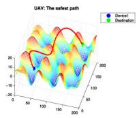

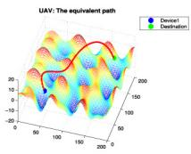

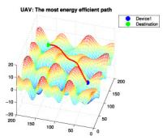

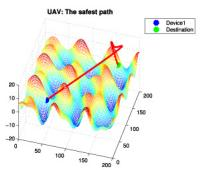

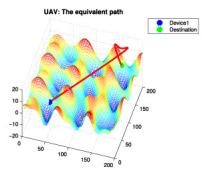

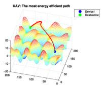

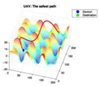

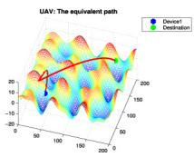

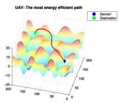  
Fig. 2. Paths under three different preferences obtained by the proposed algorithm (the first row), ToP (the second row), and PPS (the third row).

IGD and HV metrics are two commonly used performance indexes to evaluate the overall performance of multi-objective evolutionary algorithms in terms of convergence and diversity of the obtained solution set [16] . A smaller IGD value indicates that an algorithm achieves better performance regarding to convergence, while a larger HV value implies that an algorithm achieves better performance regarding to both the convergence and diversity. All feasible solutions are chosen from the final obtained population to calculate the IGD and HV values. The reference point for HV metric is (5000, 5000).

Table I presents the mean and standard deviation (STD) value of IGD and HV metric among the three algorithms. Compared with PPS and ToP, our method has achieved better results of IGD and HV values. Specifically, our algorithm obtains a set of better feasible non-dominated solutions in terms of convergence and diversity, which enables the algorithm to provide more choices with a wider range of preferences.

Fig. 2 illustrates the paths derived by three preferences in terms of the median run of IGD values among the three algorithms. For the UAV, the first column is obtained by the weight vector [1, 0], which pays all the attention to the safe flight. The second column is obtained by the weight vector [0.5, 0.5], which fairly considers both for the safe flight and the energy consumption. The last column is obtained by the weight vector [0, 1], which pays all the attention to the energy consumption. We can observe that our algorithm is able to find much smoother paths on three obtained paths with different preferences compared with the other two algorithms.

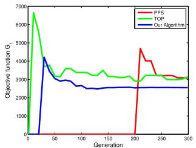

line

| Generation | PPS    | TOP    | Our Algorithm |
| ---------- | ------ | ------ | ------------- |
| 0          | 0      | 6800   | 0             |
| 50         | 3500   | 3500   | 3500          |
| 100        | 3000   | 3200   | 2800          |
| 150        | 3000   | 3100   | 2700          |
| 200        | 4800   | 2900   | 2700          |
| 250        | 3200   | 3100   | 2700          |
| 300        | 3100   | 3100   | 2700          |

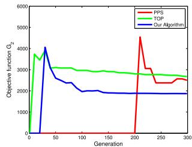

line

| Generation | PPS    | TOP    | Our Algorithm |
| ---------- | ------ | ------ | ------------- |
| 0          | 0      | 0      | 0             |
| 50         | 4000   | 3000   | 3000          |
| 100        | 2000   | 3000   | 2500          |
| 150        | 2000   | 3000   | 2000          |
| 200        | 4500   | 3000   | 2000          |
| 250        | 2500   | 3000   | 2000          |
| 300        | 2500   | 3000   | 2000          |

Fig. 3. Convergence graphs of the two objective functions.

TABLE II INVESTIGATION OF THE SENSITIVITY OF PARAMETER $\beta$ 

<table><tr><td> $\beta$ </td><td>IGD</td><td>HV</td><td> $G_{1}$ (x)</td><td> $G_{2}$ (x)(J)</td></tr><tr><td>0.2</td><td>6.19E+02(2.36E+02)</td><td>5.89E+06(3.26E+05)</td><td>2.98E+03</td><td>2.29E+03</td></tr><tr><td>0.3</td><td>6.68E+02(2.24E+02)</td><td>5.77E+06(3.77E+05)</td><td>2.97E+03</td><td>2.34E+03</td></tr><tr><td>0.4</td><td>6.71E+02(1.94E+02)</td><td>5.94E+06(2.82E+05)</td><td>2.90E+03</td><td>2.34E+03</td></tr><tr><td>0.5</td><td>6.66E+02(1.81E+02)</td><td>5.81E+06(3.30E+05)</td><td>2.97E+03</td><td>2.33E+03</td></tr><tr><td>0.6</td><td>7.09E+02(1.89E+02)</td><td>5.80E+06(3.45E+05)</td><td>2.98E+03</td><td>2.34E+03</td></tr></table>

TABLE III INVESTIGATION OF THE DOMINATED INFEASIBLE INDIVIDUALS TRIM SCHEME 

<table><tr><td>Scheme</td><td>IGD</td><td>HV</td><td> $G_1$  (x)</td><td> $G_2$  (x) (J)</td></tr><tr><td>Yes</td><td>6.66E+02(1.81E+02)</td><td>5.81E+06(3.30E+05)</td><td>2.97E+03</td><td>2.33E+03</td></tr><tr><td>No</td><td>7.37E+02(2.22E+02)</td><td>5.74E+06(3.67E+05)</td><td>3.02E+03</td><td>2.33E+03</td></tr></table>

Fig. 3 shows the convergence of the three algorithms in terms of the two objective functions $G _ { 1 }$ and $G _ { 2 }$ under the condition of the weight vector [0.5, 0.5] at the median run based on IGD values respectively. Our algorithm can consistently find more feasible optimal solutions when the generation reaches $\beta t ^ { \mathrm { m a x } }$ . Besides, our algorithm achieves lower energy consumption for the UAV compared with PPS and ToP.

Finally, we investigate sensitivity of parameter $\beta$ related to the constraint-handling ability and effectiveness of the dominated infeasible individuals trim scheme. The experimental results with the mean value and STD of IGD and HV metric, and the average values of $G _ { 1 }$ and $G _ { 2 }$ among 30 runs are summarized in Table II and Table III respectively. Table II shows that our algorithm is not sensitive to $\beta$ according to the mean values and STD of IGD and HV. The experimental results in Table III also show that the dominated infeasible individuals trim scheme (see line 2 in Algorithm 1) is helpful for the performance improvement of our algorithm.

# V. CONCLUSION

We studied a CMOP for UAV-enabled MEC to simultaneously reduce the energy consumption and ensure the safe flight for the UAV. A constrained decomposition-based multiobjective evolutionary algorithm with the dynamic infeasibility allocation mechanism was designed as the solution. Both the feasible and infeasible individuals were utilized for improving the algorithm performance. Finally, extensive experimental results were provided to demonstrate the effectiveness and efficiency of our algorithm. In our future work, we will investigate a joint computation offloading and deployment optimization scheme for the multi-UAV scenario.

# REFERENCES

[1] J. Dong, K. Ota, and M. Dong, “UAV-based real-time survivor detection system in post-disaster search and rescue operations,” IEEE J. Miniaturization Air Space Syst., vol. 2, no. 4, pp. 209–219, Dec. 2021.   
[2] X. Diao, J. Zheng, Y. Cai, Y. Wu, and A. Anpalagan, “Fair data allocation and trajectory optimization for UAV-assisted mobile edge computing,” IEEE Commun. Lett., vol. 23, no. 12, pp. 2357–2361, Dec. 2019.   
[3] H. Guo and J. Liu, “UAV-enhanced intelligent offloading for Internet of Things at the edge,” IEEE Trans. Ind. Informat., vol. 16, no. 4, pp. 2737–2746, Apr. 2020.   
[4] X. Xi, X. Cao, P. Yang, J. Chen, T. Quek, and D. Wu, “Joint user association and UAV location optimization for UAV-aided communications,” IEEE Wireless Commun. Lett., vol. 8, no. 6, pp. 1688–1691, Dec. 2019.   
[5] H. Mei, K. Yang, Q. Liu, and K. Wang, “Joint trajectory-resource optimization in UAV-enabled edge-cloud system with virtualized mobile clone,” IEEE Internet Things J., vol. 7, no. 7, pp. 5906–5921, Jul. 2020.   
[6] J. Lyu, Y. Zeng, and R. Zhang, “UAV-aided offloading for cellular hotspot,” IEEE Trans. Wireless Commun., vol. 17, no. 6, pp. 3988–4001, Jun. 2018.   
[7] Z. Ning et al., “5G-enabled UAV-to-community offloading: Joint trajectory design and task scheduling,” IEEE J. Sel. Areas Commun., vol. 39, no. 11, pp. 3306–3320, Nov. 2021.   
[8] T. Wang, Y. Li, and Y. Wu, “Energy-efficient UAV assisted secure relay transmission via cooperative computation offloading,” IEEE Trans. Green Commun. Netw., vol. 5, no. 4, pp. 1669–1683, Dec. 2021.   
[9] H.-T. Ye, X. Kang, J. Joung, and Y.-C. Liang, “Optimization for wireless-powered IoT networks enabled by an energy-limited UAV under practical energy consumption model,” IEEE Wireless Commun. Lett., vol. 10, no. 3, pp. 567–571, Mar. 2021.   
[10] S. Bi, L. Huang, H. Wang, and Y.-J. A. Zhang, “Lyapunov-guided deep reinforcement learning for stable online computation offloading in mobile-edge computing networks,” IEEE Trans. Wireless Commun., vol. 20, no. 11, pp. 7519–7537, Nov. 2021.   
[11] Y. Wu, X. Guan, W. Yang, and Q. Wu, “UAV swarm communication under malicious jamming: Joint trajectory and clustering design,” IEEE Wireless Commun. Lett., vol. 10, no. 10, pp. 2264–2268, Oct. 2021.   
[12] T. Ma, H. Zhou, B. Qian, and A. Fu, “A large-scale clustering and 3D trajectory optimization approach for UAV swarms,” Sci. China Inf. Sci., vol. 64, pp. 1–16, Apr. 2021.   
[13] Y. Zeng and R. Zhang, “Energy-efficient UAV communication with trajectory optimization,” IEEE Trans. Wireless Commun., vol. 16, no. 6, pp. 3747–3760, Jun. 2017.   
[14] X. Yu, C. Li, and J. Zhou, “A constrained differential evolution algorithm to solve UAV path planning in disaster scenarios,” Knowl. Based Syst., vol. 204, Sep. 2020, Art. no. 106209.   
[15] X. Yu, C. Li, and G. G. Yen, “A knee-guided differential evolution algorithm for unmanned aerial vehicle path planning in disaster management,” Appl. Soft Comput., vol. 98, Jan. 2020, Art. no. 106857.   
[16] Z.-Z. Liu and Y. Wang, “Handling constrained multiobjective optimization problems with constraints in both the decision and objective spaces,” IEEE Trans. Evol. Comput., vol. 23, no. 5, pp. 870–884, Oct. 2019.   
[17] C. Peng, H.-L. Liu, and E. D. Goodman, “Handling multi-objective optimization problems with unbalanced constraints and their effects on evolutionary algorithm performance,” Swarm Evol. Comput., vol. 55, Jun. 2020, Art. no. 100676.   
[18] A. P. Wierzbicki, “The use of reference objectives in multiobjective optimization,” in Multiple Criteria Decision Making Theory and Application. Berlin, Germany: Springer, 1980 pp. 468–486.   
[19] Z. Fan et al., “Push and pull search for solving constrained multiobjective optimization problems,” Swarm Evol. Comput., vol. 44, pp. 665–679, Feb. 2019.