# Context-Aware AIGC Service Migration in Edge Intelligence Networks via Transformer DRL

Jiaxi Wang , Yixue Hao , Member, IEEE, Rui Wang , Member, IEEE, Long Hu , Member, IEEE, Kaibin Huang , Fellow, IEEE, Dusit Niyato , Fellow, IEEE, and Min Chen , Fellow, IEEE

Abstract—With the increasing demand for artificial intelligence generated content (AIGC) services across diverse applications, AIGC service migration is essential to ensuring continuous service for mobile users in edge intelligence networks. However, AIGC service migration can lead to decreased inference accuracy due to the discarding of contextual memory. Furthermore, migrating large-scale AIGC models incurs high migration costs and latency. In this paper, we propose a context-aware AIGC service migration scheme to address the trade-off among inference accuracy, latency, and migration cost. Specifically, we focus on migrating historical AIGC context rather than large-scale AIGC models to achieve cost-efficient service provisioning. To improve service migration performance, we propose a Value of Context (VoC) metric to quantify the relevance and freshness of historical AIGC context. Based on the VoC, we formulate an optimization problem to jointly optimize inference accuracy, latency, and migration cost. To solve this problem, we develop a TransFormer-based Soft actor-critic algorithm for Context-aware AIGC service Migration (TFSCM) that leverages long-term dependencies in historical decisions for optimizing the migration process. Extensive experiments on realworld datasets demonstrate that the proposed TFSCM algorithm significantly enhances system performance compared to baseline solutions.

Received 4 August 2025; revised 1 December 2025; accepted 13 January 2026. Date of publication 22 January 2026; date of current version 10 April 2026. This work is supported by National Science and Technology Major Project under Grant 2025ZD1302300, in part by National Key Research and Development Program of China under 2025YFE0213400, in part by National Natural Science Foundation of China under Grant 62276109, in part by Guangdong Basic and Applied Basic Research Foundation under Grant 2024A1515030017 and Grant 2024A1515110155, in part by the Postdoctoral Fellowship Program ofthe China Postdoctoral Science Foundation (CPSF) under Grant GZB20240244, in part by China Postdoctoral Science Foundation under Grant 2024M761016, and in part by Wuhan Natural Science Foundation Exploratory Program (Chenguang Program) under Grant 2024040801020212, in part by the Interdisciplinary Research Program of HUST under Grant 2024JCYJ029 and Grant 2025JCYJ018. (Corresponding author: Long Hu.)

Index Terms—Artificial intelligence generated content, edge intelligence network, service migration, soft actor-critic.

## I. INTRODUCTION

RTIFICIAL Intelligence Generated Content (AIGC) has enhances the experience of mobile users through novel content creation [1]. The growing use of AIGC poses challenges for traditional centralized cloud deployments, as illustrated in scheme (a) of Fig. 1, which can easily cause inference congestion and high response latency [2]. To distribute the computational load and reduce the burden on the centralized cloud, mobile AIGC networks have attracted increasing attention [3], [4], [5]. AIGC models deployed on edge servers accumulate implicit contextual memory during interaction sessions to better understand tasks and users’ intents in continual content generation [6]. This contextual memory improves AIGC inference accuracy and needs to be preserved for continuous tasks. However, contextual memory is difficult to synchronize in mobile AIGC networks. As illustrated in scheme (b) of Fig. 1, to provide a better quality of experience (QoE) [7], the edge server handling AIGC services for mobile users is switched according to their changing locations. Such server switching causes the discarding of contextual memory across different edge servers. The inference accuracy of the new AIGC model is much lower than that of the previous one, resulting in a decline in QoE.

Fortunately, service migration offers interaction coherence and service continuity for the AIGC service, which can effectively solve this problem. However, traditional service migration is not adapted to the AIGC model. As shown in scheme (c) in Fig. 1, migrating AIGC models with contextual memory leads to high migration cost and additional model initialization latency [9] due to their large-scale parameters (such as the 1.76 trillion parameters of GPT-4 [10]). Therefore, it is urgent to explore an AIGC service migration scheme that minimizes migration cost and latency while preserving contextual memory to improve inference accuracy. Researchers have shown that AIGC models can learn implicit contextual memory from historical user sessions by in-context learning [11]. As shown in Fig. 2, in-context learning using contextual memory in four large language models (LLMs) outperforms zero-shot inference without contextual memory in a wide range of tasks [12], [13]. This in-context learning ability is also applied in multimodal generation tasks across text, vision, and audio [14], [15]. Powered by AIGC in-context learning, migrating historical context is cost-effective and enables AIGC to learn recent contextual memory and improve accuracy, making it an effective solution.

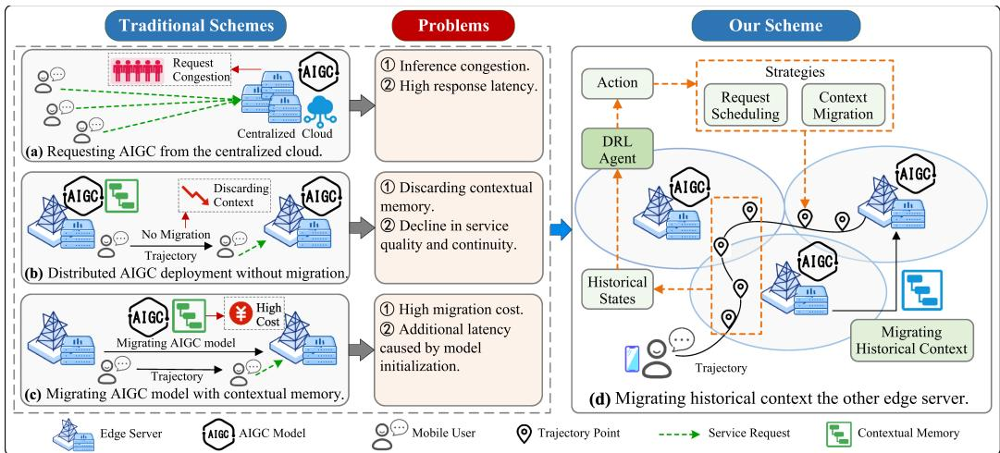  
Fig. 1. An overview of AIGC service provisioning in edge intelligence networks. Our scheme migrates historical context, assisted by a deep reinforcement learning (DRL) agent, to overcome the problems of the three traditional schemes.

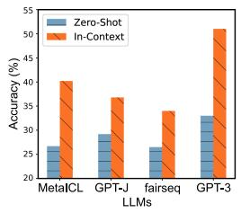  
(a) Classification tasks

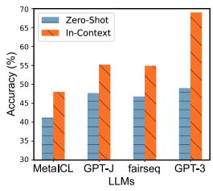  
(b) Multi-choice tasks  
Fig. 2. The accuracy of various large language models on multiple tasks [8]. The In-Context method uses contextual memory, whereas the Zero-Shot method does not.

This paper aims to explore AIGC service migration solutions to address the trade-off in accuracy, latency, and cost, particularly for real-time and continuous AIGC tasks provided to mobile users. These tasks include generating music, news, video stories, and game scenes based on real-time geographical environments, enhancing the immersive in-vehicle experience for mobile users [16]. Specifically, seamless cross-region service access for mobile users is enabled by deploying generalized AIGC models on high-capacity edge servers. Our scheme focuses on migrating historical context content of user’s interaction sessions, rather than the large models, enabling the model to learn implicit contextual memory and improve inference accuracy. The data size of the migrated context is small due to only recent and valuable historical context data is migrated for continual generation instead of all historical data. Thus, the migration cost includes low transmission and maintenance cost for the customized services.

Furthermore, although migrated context content can improve inference accuracy [17], excessive migration of redundant content may increase computational latency and migration cost for user-specific context management. Evaluating the value of contextual content has become the key to improving service migration performance. Existing studies introduce the age of information (AoI) metric to capture the temporal relevance of generated content [18], but the freshness is not a unique indicator. Semantic relevance is also important in practical tasks. For example, the semantically similar examples serve as more useful information to LLM models [19]. Therefore, this paper proposes a new metric called value of context (VoC) to jointly consider both AoI and relevance of the historical context, providing a long-term and comprehensive evaluation. Based on VoC, we formulate an optimization problem jointly optimizing inference accuracy, latency, and migration cost.

Deep reinforcement learning (DRL) is used for solving the service migration problem because of its low complexity and high flexibility [20], [21]. However, existing DRL algorithms for service migration neglect the long-term dependencies of states caused by the continuous nature of service migration. Besides, recurrent neural networks (RNNs) show suboptimal performance when predicting different types of outcomes, such as using the state to predict actions. Therefore, we propose a Transformer-based DRL algorithm to capture the relationship of long-term states to enable more precise and reasonable decisionmaking. Overall, our purpose is to overcome the three challenges to realize AIGC service migration in edge intelligence networks. (i) How to construct a model to evaluate the freshness and relevance of context content simultaneously. (ii) How to design a context-aware service migration scheme to optimize accuracy, latency, and cost jointly. (iii) How to construct a dynamic decision-making algorithm to achieve real-time optimization of service migration.

In this paper, we propose a context-aware AIGC service migration scheme to tackle the above-mentioned challenges, as illustrated in Fig. 1. We propose a context-aware service migration scheme that migrates the context content among edge servers for the AIGC model to learn contextual information. The contributions of this paper are summarized as follows:

\- Value of context: Considering the inference accuracy is sensitive to the AIGC contextual memory, we propose a new metric called VoC to measure the freshness and relevance between the historical AIGC content and the current task request.

\- AIGC service migration: We propose a context-aware AIGC service migration scheme enabled by migrating context to achieve high service quality. Based on the VoC, we formulate a utility optimization problem that jointly optimizes inference accuracy, latency, and migration cost.

\- TFSCM algorithm: To solve the service migration problem, we develop a TransFormer-based Soft actor-critic algorithm for Context-aware AIGC service Migration (TF-SCM), which captures long-term dependencies in historical migration decisions to enable more precise and effective decision-making.

\- Extensive performance evaluation: We validate the effectiveness of TFSCM on the real-world Telecom Shanghai dataset, and simulation results show that TFSCM outperforms other baseline schemes.

The remainder of this paper is organized as follows. In Section II, we introduce the related works of AIGC service provisioning and edge service migration. In Section III, we present the VoC and formulate a service migration problem. In Section IV, we describe the TFSCM algorithm. The comparison experiments are presented in Section V. Finally, conclusions are given in Section VI.

## II. RELATED WORK

## A. AIGC Service Provisioning in Edge Intelligence Networks

AIGC service provisioning in edge intelligence networks has become a research hotspot. Researchers aim to achieve efficient AIGC services on resource-constrained edge devices through cloud-edge-end collaboration [22], lightweight and customized solutions [23], and resource optimization [24]. The cloud-edgeend collaboration enhances both the training and inference processes by leveraging the substantial computational power of cloud servers alongside the low latency of edge servers, ensuring a seamless and effective collaboration [25]. For example, a collaborative cloud-edge-end intelligence framework is used in an AIGC-oriented synthetic network (AIGCsNet) to achieve mutualism between AIGC and EI with seamless fusion and collaborative evolution [25]. The limitation is that the collaboration framework is difficult to switch servers for mobile users flexibly and is not adaptive to mobile edge networks. The focus of lightweight and customized solutions is on optimizing model inference on edge servers [9], [11], [26], [27]. For example, GMEL focuses on the edge optimization ofAIGC task execution, aiming to facilitate efficient few-shot learning by leveraging realistic sample synthesis and edge-based optimization capabilities [26], [27]. A novel LLM edge inference framework is proposed to ensure high-throughput inference on resource-limited edge devices by incorporating batching and model quantization [11]. Wen et al. adopt the diffusion-based Soft Actor-Critic (SAC) algorithm to facilitate real-time provisioning of customized AIGC services by deploying AIGC models on edge devices [9]. Although these works promote the AIGC deployment and application in edge intelligence networks, they neglect the contextual continuity in the AIGC inference when applied to mobile users, leading to a decline in the service quality. The resource optimization studies target the improvement of the overall system performance [28], [29], [30]. For example, Wang et al. utilize wireless perception to guide AIGC (WiPe-AIGC) to deliver AI-generated content services within resource-constrained edge intelligence networks [28]. However, the optimization objectives rarely consider AIGC inference accuracy and neglect the interaction coherence and service continuity, both of which are determined by context information. Existing studies introduce the AoI metric to quantify the freshness of context content, effectively capturing the temporal relevance of generated content [18]. Nevertheless, the freshness is not a unique indicator and semantic relevance should also be emphasized in practical tasks [19].

## B. Edge Service Migration

Traditional edge services are latency-sensitive, such as video streaming, content delivery, and real-time media processing. Researchers focus on the problem of constrained resources, user mobility, and heterogeneous networks [31], [32], [33]. MoDEMS addresses practical deployment challenges of resource constraints, mobility uncertainty, concurrent migrations for multiple users, and implementation overhead [31]. EGO addresses service migration in multi-user, heterogeneous, dense cellular networks [32]. These works for traditional service migration are less suited to more complex, emerging services, which are characterized by computation-intensive, dynamic variation, and real-time interaction. Researchers aim to address the challenge of heterogeneous resources for emerging services, such as microservices, intelligent services, digital twins, and AIGC services [34], [35], [36], [37]. For example, the RT-MAAC, based on multi-agent reinforcement learning, is proposed to handle dynamic intelligent service provisioning by leveraging network and video context [38]. Considering the service migration cost caused by user mobility, Chen et al. study the joint optimization problem of service deployment and request routing decisions to maximize the long-term network utility [35]. To leverage the edge heterogeneous resources required by intelligent services in dynamic networks, Ning et al. establish a cooperative service migration framework and formulate a biobjective optimization problem to optimize service performance and cost [36]. Li et al. consider AoI-aware query services in mobile edge networks empowered by digital twin technology for diverse IoT applications [37]. Nevertheless, the current service migration studies are challenging to apply to large AIGC models. These works predominantly focus on optimizing latency and migration costs while overlooking the distinctive characteristics of emerging AIGC services. The implicit contextual memory in AIGC models is crucial for understanding user intentions and improving inference accuracy [39].

In solving optimization problems, DRL algorithms are often used for edge computing because of their low complexity and high flexibility [38], [40], [41], [42]. For instance, the DDPG algorithm addresses the joint task migration and resource allocation problem in multi-vehicle vehicle edge computing [40]. However, existing DRL algorithms for service migration primarily focus on immediate input states, neglecting the longterm dependencies between historical states and agent decisions, resulting in suboptimal decision-making performance.

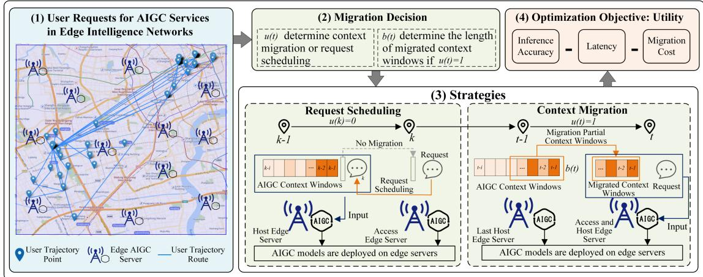  
Fig. 3. An overview of the system model. (1) A scenario example illustrating user mobility and service requests (left). (2) The migration decision consists of two components (top center). (3) Two AIGC service migration strategies corresponding to the migration decision (bottom). (4) Optimizing the AIGC service migration strategies leads to high system utility (top right).

TABLE I  
THE SUMMARY TABLE OF IMPORTANT NOTATIONS

<table><tr><td>Notation</td><td>Description</td></tr><tr><td> $A^{0}(t),A^{1}(t)$ </td><td>The zero-shot and one-shot accuracy at time slot  $t$ </td></tr><tr><td> $A(t),C(t),D(t)$ </td><td>The AIGC inference accuracy, migration cost, and latency at time slot  $t$ </td></tr><tr><td> $c_{k}(t)$ </td><td>The migration cost of context window  $w(k)$  migrated from edge server  $y_{k}$  to  $y_{t}$  at time slot  $t$ </td></tr><tr><td> $D_{t}^{trans}$ </td><td>The transmission latency at time slot  $t$ </td></tr><tr><td> $D_{t}^{com}$ </td><td>The computation latency at time slot  $t$ </td></tr><tr><td> $D_{t}^{mig}$ </td><td>The migration latency at time slot  $t$ </td></tr><tr><td> $l_{t}$ </td><td>The token or patch length of an AIGC context window</td></tr><tr><td> $o_{t}$ </td><td>The keywords of the an AIGC context window</td></tr><tr><td> $\Omega ,\Omega_{t},\Omega_{t}^{a}$ </td><td>The maximum, migratable and available context window length</td></tr><tr><td> $t,k$ </td><td>The time slot</td></tr><tr><td> $u(t),b(t)$ </td><td>The service migration decision and context migration decision at time slot  $t$ </td></tr><tr><td> $\Upsilon,\Upsilon_{t}$ </td><td>The maximum number of tokens and the number of context tokens for AIGC inference</td></tr><tr><td> $V(t)$ </td><td>The accumulated VoC for the task request  $w^{I}(t)$ </td></tr><tr><td> $w^{I}(t)$ </td><td>The task request at time slot  $t$ </td></tr><tr><td> $w(t)$ </td><td>The AIGC context window at time slot  $t$ </td></tr><tr><td> $x_{t}$ </td><td>The access edge server for the user at time slot  $t$ </td></tr><tr><td> $y_{t}$ </td><td>The host edge server for the user at time slot  $t$ </td></tr></table>

## III. SYSTEM MODEL AND PROBLEM FORMULATION

In this section, we consider a context-aware AIGC service migration problem in an edge intelligence network. We introduce the system model and formulate an optimization problem for maximizing the inference accuracy, minimizing latency and migration cost. The main notations adopted in this section are listed in Table I.

## A. System Model

In this paper, we consider an edge intelligence network consisting of a set of high-capability edge servers and a mobile user, as shown in Fig. 3. The set of edge servers is denoted as $\mathcal { M } =$ $\{ 1 , 2 , \ldots , M \}$ . An AIGC model is deployed on each edge server. Since we focus more on the impact of migrated context on the system accuracy, latency, and cost, it is more meaningful to study customized service migration for a mobile user. The mobile user can seamlessly request the AIGC service from the nearest edge server, irrespective of location, significantly reducing latency and cost. We consider a time-slotted structure to characterize the user’s trajectory, expressed as $\mathcal { T } = \{ 1 , 2 , \dots , T \}$ . At each time slot, the system captures the state and determines migration strategies.

Two types of edge servers are defined for the user, i.e., the access edge server and the host edge server. The user always sends an AIGC task request to the nearby edge server, called the access edge server. The AIGC task is sent to the host edge server for processing. Sometimes, they are the same edge server. We denote the access edge server for the user at time slot $t \mathrm { a s } x _ { t } \in \mathcal { M }$ and the host edge server as $y _ { t } \in \mathcal { M } . \mathrm { A t }$ each time slot t, the user sends the AIGC task request $w ^ { I } ( t )$ to the access edge server, but the access edge server may lack sufficient contextual memory for understanding the task, leading to a decline in inference accuracy.

To solve this problem, the migration strategies consist of request scheduling and context migration, corresponding to whether context content is migrated. First, request scheduling refers to sending the task from the access edge server $x _ { t }$ to the previous host edge server $y _ { t - 1 }$ if the previous host edge server $y _ { t - 1 }$ has preserved more contextual memory. Second, context migration means migrating the historical AIGC context content generated by interaction sessions from the previous host edge server $y _ { t - 1 }$ to the access edge server $x _ { t }$ for processing the task. In this case, the host edge server is the same as the access edge server, $x _ { t } = y _ { t }$ . Meanwhile, due to the different freshness and relevance between the historical context content and the current task request, the length of the context content to be migrated should also be determined. Both request scheduling and context migration can provide contextual memory to the AIGC task, guaranteeing the inference accuracy. Our goal is to jointly optimize the inference accuracy, latency, and migration cost, to achieve the best system utility.

Migration decision: Based on the migration strategies, we denote the AIGC service migration decision as two parts. First, we define the service migration decision as $u ( t ) \in \{ 0 , 1 \}$ , where $u ( t ) = 0$ indicates request scheduling and $u ( t ) = 1$ indicates context migration. Then, we denote the context migration decision as $b ( t ) \in [ 0 , \Omega _ { t } ]$ , representing the length of context content to be migrated, which is limited by the maximum migratable length $\Omega _ { t }$ at time slot t. Note that when $u ( t ) = 0 , \ b ( t )$ is ineffective.

## B. Value ofContextfor AIGC

Contextual memory: AIGC models capture and retain contextual memory while providing continuous services to mobile users, which refers to the implicit interaction information, such as user preferences and behavioral patterns [43]. In this paper, our proposed migration strategy focuses on explicit historical context content rather than model’s internal parameter-based memory. This approach allows the model to learn contextual memory through historical context content, thus reducing migration costs and ensuring inference consistency.

AIGC model: The contextual memory is important for the AIGC model to improve inference accuracy. We define the minimum unit of context content to be migrated as a context window. As the mobile user’s location changes, the request prompt and the generated content in one time slot can be regarded as a context window. Thus, each time slot corresponds to a context window. We neglect the shorter time interval because minor location changes do not require edge server switching and service migration. Thus, time intervals are long, for example, from 10 minutes to 1 h.

The data size of each context window varies across different AIGC tasks. A token is the basic input unit in LLMs. An image is split into patches as the input units of visual AIGC models. Each patch is flattened and treated as a token for the transformerbased models [14]. To unify the representation, we use token length to characterize the minimum input unit, which applies to both LLMs and visual AIGC models. For the user at time slot t, we denote the token length of the input prompt as $l _ { t } ^ { I }$ , the generated content as $l _ { t } ^ { O }$ , and the keyword indicator of the content as $o _ { t }$ . The total token length of a context window is defined as $l _ { t } = l _ { t } ^ { I } + l _ { t } ^ { O }$ . Accordingly, the context window at time slot t is represented as $w ( t ) = \{ l _ { t } ^ { I } , l _ { t } ^ { O } , o _ { t } \}$ . The AIGC model has a maximum token limit for inference [3], defined as Υ, which specifies the maximum number of tokens that the model can process in a single inference. Based on this constraint, we define the maximum context window length that the AIGC model can process in a single inference as Ω. In addition, considering the total context content stored on the host edge server, the available context window length at time slot t is denoted by $\Omega _ { t } ^ { a }$ . In practice, the migratable context window length is constrained by both the maximum and available context window lengths, and is given by $\Omega _ { t } = \operatorname* { m i n } ( \Omega , \Omega _ { t } ^ { a } )$ . This value also represents the effective context length that provides contextual memory to the AIGC model at time slot t. Furthermore, the context migration decision $b ( t )$ is constrained by the maximum migratable context window length Ωt, i.e., $b ( t ) \in [ 0 , \Omega _ { t } ]$

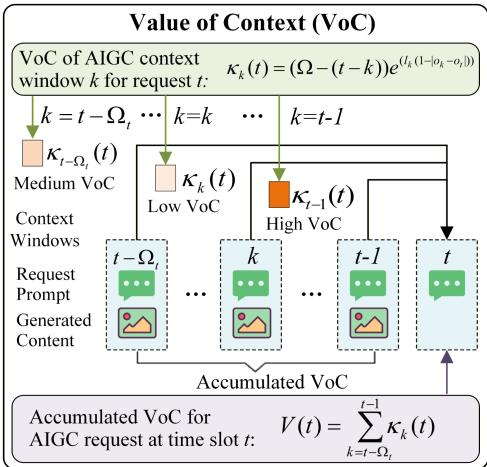  
Fig. 4. The value of context (VoC) in AIGC models. Each historical contex window provides a VoC for the current request. The accumulated VoC is the sum of the VoCs over all historical context windows.

Value of context: We propose the VoC to evaluate context quality by jointly considering freshness and relevance of historical context [6], [18]. During the migration process, we do not filter the context content itself, but instead migrate entire context windows to preserve temporal continuity with the current task. Inspired by the AoI [37], the freshness between a historical context window $w ( k )$ and the current task request $w ^ { I } ( t )$ is defined as $\delta = t - k ,$ where a smaller value of δ indicates higher context freshness. Moreover, context content with higher freshness inherently provides greater informational value. Considering the maximum context window length constraint Ω, we introduce $( \Omega - \delta )$ to characterize the impact of freshness, where a larger value corresponds to a higher VoC. To quantify content relevance, given the numerical keyword indicators $O _ { k }$ and $o _ { t } .$ , the absolute difference $| o _ { k } - o _ { t } |$ measures the relevance between the context content at time slot k and the current task at time slot t. Specifically, a smaller $| o _ { k } - o _ { t } |$ indicates higher content relevance. Since higher relevance implies greater informational value, we adopt $\left( 1 - \left| o _ { k } - o _ { t } \right| \right)$ as the relevance metric. Consequently, the relevance contribution is expressed as $l _ { k } \big ( 1 - \left| o _ { k } - o _ { t } \right| \big )$ , where $l _ { k }$ denotes the token length ofthe context window w(k), reflecting that longer content generally contains more relevant information. Tojointly evaluate freshness and relevance, the VoC $\kappa _ { k } ( t )$ of the historical context window w(k) for the current task request $w ^ { I } ( t )$ is defined as $\kappa _ { k } ( t ) = ( \dot { \Omega } - ( t - k ) ) e ^ { l _ { k } ( ( 1 - | o _ { k } - o _ { t } | ) ) }$ . Given that the effective context window length available for contextual memory at time slot t is $\Omega _ { t } .$ , the accumulated VoC for the task request $w ^ { I } ( t )$ is calculated as $\begin{array} { r } { V ( t ) = \sum _ { k = t - \Omega _ { + } } ^ { t - 1 } \kappa _ { k } ( t ) } \end{array}$

-Fig. 4 illustrates the accumulated VoC of historical context windows. A context window contains the request prompt and generated content, providing contextual memory. We present the VoC $\kappa _ { k } ( t )$ of context window $w ( k )$ for task request $w ^ { I } ( t )$ Due to differences in freshness and relevance, historical context windows contribute different VoC values to the current task request. The accumulated VoC $V ( t )$ represents the contextual memory for the current task, which is the sum of freshness and relevance of historical AIGC context windows.

Accuracy model: The inference accuracy of AIGC tasks is mainly influenced by two key factors: the length of context windows and the VoC of each context window. A longer context window enables the model to capture more nuanced relationships and dependencies within the input, thereby improving task understanding. However, excessively long context windows may introduce noise or irrelevant information, potentially reducing the model’s focus and accuracy [44]. In addition, the freshness of context windows plays an important role in inferring users’ implicit intentions, as user behavior typically exhibits temporal continuity [45]. Highly relevant context windows enable the model to efficiently retrieve and utilize pertinent information from the context content, leading to more precise and contextually appropriate responses [46]. Conversely, the weakly related context content may lead the model to rely on generalized knowledge, decreasing the inference accuracy. By jointly considering these factors, the accumulated VoC characterizes the effective value ofcontextual memory for the current task request. Thus, the inference accuracy can be modeled as a function of the accumulated VoC. Given the zero-shot accuracy $A ^ { 0 } ( t )$ (i.e.,the inference accuracy without contextual memory) and the one-shot accuracy $A ^ { 1 } ( t )$ (i.e.,the inference accuracy with a single context window) at time slot $t ,$ the inference accuracy $A ( t )$ at the time slot t can be approximated by a logarithmic function as [47]:

$$
A (t) = A ^ {0} (t) + A ^ {1} (t) \log_ {2} (1 + V (t) ^ {\alpha}),\tag{1}
$$

where α is a coefficient of AIGC models. To evaluate the comprehensive quality of AIGC inference over the time horizon T , we calculate the average accuracy A by $\begin{array} { r } { A = \frac { 1 } { T } \sum _ { t \in \mathcal { T } } A ( t ) } \end{array}$

## C. AIGC Service Migration Model

In tasks based on LLMs, the size of context data is typically small, often less than 200 KB [13]. In text-to-image or video generation tasks, the size of context data tends to be larger, generally remains under 5 MB [48]. Consequently, context migration is cost-effective due to relatively low transmission costs and latency, while enabling high inference accuracy through in-context learning [8]. However, the overall migration cost is not limited to transmission overhead. As context migration is a customized mobile AIGC service, it requires managing user-specific context through personalized mechanisms. This customization introduces additional maintenance overhead, including storage costs for retaining context data on edge servers, data management costs for ensuring consistency and accessibility, and edge switching costs when redistributing context across dynamic edge networks [36]. In general, the migration cost is determined by the data size of migrated context windows, geodesic distance, and migration price per hop [35]. When $u ( t ) = 1 , b ( t )$ context windows spanning from time slot $t - b ( t )$ to t − 1 are migrated from the host edge server $y _ { t - 1 }$ to the host edge server $y _ { t }$ . The number of topological hops between edge servers $y _ { t - 1 }$ and $y _ { t }$ is denoted by $h _ { t } ( y _ { t - 1 } , y _ { t } )$ . We define $g _ { t }$ as the unit migration cost of transferring a single AIGC context window across one hop from edge server $y _ { t - 1 } \tan y _ { t }$ . For a single context window w(k), the migration cost is calculated as:

$$
c _ {k} (t) = g _ {t} \cdot (l _ {k} ^ {I} q ^ {I} + l _ {k} ^ {O} q ^ {O}) \cdot h _ {t} (y _ {t - 1}, y _ {t}),\tag{2}
$$

where $q ^ { I }$ and $q ^ { O }$ are the data sizes of the input and output, respectively.

Thus, the total migration cost at time slot t is determined by the length of the migrated context windows, expressed as:

$$
C (t) = u (t) \cdot \sum_ {k = t - b (t)} ^ {t - 1} c _ {k} (t),\tag{3}
$$

where $u ( t ) \in \{ 0 , 1 \}$ indicates whether migrating context windows. $u ( t ) = 0$ means do not migrate the context windows, thus the migration cost $C ( t ) = 0$ . Then, the average migration cost over entire time horizon T is expressed as $\begin{array} { r } { C = \frac { 1 } { T } \bar { \sum } _ { t \in { T } } C ( t ) } \end{array}$

## D. Service Latency Model

At time slot $t ,$ the user requests an AIGC task and receives the generated content. The AIGC service latency consists of transmission, migration, and computation latencies.

Transmission latency: The transmission latency includes request offloading and result delivery. The uplink rate $r _ { t } ^ { u p }$ from the mobile device to the access edge servers is given by [41]:

$$
r _ {t} ^ {u p} = B ^ {u p} \log_ {2} \left(1 + \frac {p ^ {u p}}{\sigma^ {2} \cdot d ^ {\iota}}\right),\tag{4}
$$

where $\sigma ^ { 2 }$ is the Gaussian noise, ι is the distance loss parameter of the power, $p ^ { u p }$ is the transmission power, and $B ^ { u p }$ is the uplink bandwidth from the mobile device to the edge server. Similarly, we can obtain the downlink rate $r _ { t } ^ { d o w n }$ from the edge server to the mobile device. Thus, the transmission latency $\bar { D } _ { t } ^ { t r a n s }$ is calculated by:

$$
D _ {t} ^ {t r a n s} = \frac {l _ {t} ^ {I} q ^ {I}}{r _ {t} ^ {u p}} + \frac {l _ {t} ^ {O} q ^ {O}}{r _ {t} ^ {d o w n}},\tag{5}
$$

where $q ^ { I }$ and $q ^ { O }$ are datasize of the input and output, respectively. Distinct from other tasks, the generated content of AIGC services is longer than the input prompt.

Migration latency: The migration latency includes router forwarding, and broadcast latency [49]. Router forwarding latency is determined by the router’s forwarding rate and network congestion caused by data packet queuing. We define the average data forwarding rate of an edge node at time slot t as $\zeta _ { t } ,$ which becomes slower under heavier congestion [49]. Thus, the router forwarding latency is denoted as $D _ { t } ^ { r o u t e r } =$ $\frac { ( l _ { k } ^ { I } q ^ { I } + l _ { k } ^ { O } q ^ { O } ) \cdot h _ { t } ( y _ { t - 1 } , y _ { t } ) } { \zeta _ { t } }$ , where the $( l _ { k } ^ { I } q ^ { I } + l _ { k } ^ { O } q ^ { O } )$ is the datasize of migrated context and $h _ { t } ( y _ { t - 1 } , y _ { t } )$ is the number of forwarding hops. Given the broadcast speed $v _ { e }$ and geodesic distance $d ( i , j )$ between the edge servers i and $j ,$ the broadcast latency is calculated by $\begin{array} { r } { D _ { t } ^ { \bar { b } } = \frac { d ( i , j ) } { v _ { e } } } \end{array}$ . In summary, the migration latency is expressed as:

$$
D _ {t} ^ {m i g} = D _ {t} ^ {r o u t e r} + D _ {t} ^ {b}.\tag{6}
$$

Computation latency: Most prevalent AIGC models are architecturally built upon stacked transformer decoder layers. These models process an input sequence of prompt tokens and iteratively generate subsequent tokens until an end-of-sequence (EOS) terminator is produced [50]. We define a single forward pass through all model layers as one iteration. The initial iteration, referred to as the Initial Stage, processes the entire input prompt to generate the first output token. To enhance task understanding, the model incorporates the tokens from historical context windows with the request prompt as input. Subsequent iterations, termed the autoregressive stage [51], generate tokens sequentially by using the most recently generated token as input, resulting in token-by-token inference. Inference latency, defined as the total delay to compute a batch of prompts and generate all output tokens, is dominated by the matrix multiplications in transformer layers. According to [11], the matrix computations are related to the number of model layers $L _ { i }$ , the input sequence length, and the transformer hidden dimensions. Deploying a fixed model architecture in the edge intelligence network, we model the inference latency as a function of input length using constants $\rho _ { 1 } , \rho _ { 2 }$ , and $\rho _ { 3 }$ , which are determined by the model’s hidden dimensions. Accordingly, the total number of context tokens $\Upsilon _ { t }$ is determined by the context window length $\Omega _ { t }$ and is given by $\begin{array} { r } { \Upsilon _ { t } = \sum _ { k = t - \Omega _ { t } } ^ { t - 1 } \dot { l } _ { k } , } \end{array}$ , where $l _ { k }$ is the token length of the -context window at time slot k. Given the computation frequency $f _ { e }$ of edge servers, the latency of the initial stage is modeled as:

$$
\begin{array}{l} D _ {t} ^ {\text {com1}} (\Omega_ {t}) \\ = \frac {L}{f _ {e}} \left(\rho_ {1} \sum_ {k = t - \Omega_ {t}} ^ {t - 1} l _ {k} + \rho_ {2} \left(\sum_ {k = t - \Omega_ {t}} ^ {t - 1} l _ {k} + l _ {t} ^ {I}\right) ^ {2} + \rho_ {3}\right). \end{array}\tag{7}
$$

and the inference latency in the autoregressive stage is given by:

$$
\begin{array}{l} D _ {t} ^ {\text {com2}} (\Omega_ {t}) = \frac {L}{f _ {e}} \\ \left(l _ {t} ^ {O} - 1\right) \left(\rho_ {1} + \rho_ {2} \left(\left(\sum_ {k = t - \Omega_ {t}} ^ {t - 1} l _ {k} + l _ {t} ^ {I}\right) + \frac {l _ {t} ^ {O}}{2}\right) + \rho_ {3}\right), \end{array}\tag{8}
$$

where the latency increases with output iteration rounds. Therefore, the total inference latency is a function related to the context window length $\Omega _ { t }$ and is expressed $D _ { t } ^ { c o m } ( \Omega _ { t } ) = D _ { t } ^ { c o m 1 } ( \Omega _ { t } ) +$ $D _ { t } ^ { c o m 2 } ( \Omega _ { t } )$

In summary, the total end-to-end latency at time slot t can be calculated by $D ( t ) = D _ { t } ^ { t r a n s } + D _ { t } ^ { c o m } ( \dot { \Omega _ { t } } ) + D _ { t } ^ { m i g }$ . The service latency must not exceed the tolerance latency $\tau _ { m }$ ax to meet the user requirement, which can be expressed as $D ( t ) < \tau _ { m a x } .$ Overall, the average service latency during the time span $\tau$ can be calculated by $\begin{array} { r } { \dot { D } = \frac { 1 } { T } \sum _ { t \in \mathcal { T } } D ( t ) } \end{array}$

## E. Problem Formulation

Based on the above models, we formulate a utility optimization problem, aiming to maximize inference accuracy and minimize migration cost and service latency during $\tau$ for the user. The system utility $\mathcal { F }$ is expressed as:

$$
\mathcal {F} = \mu_ {1} A - \mu_ {2} C - \mu_ {3} D,\tag{9}
$$

where $\mu _ { 1 } , \mu _ { 2 }$ and $\mu _ { 3 }$ are weighting factors according to actual situation. Overall, the problem is formulated as:

$$
\mathcal {P} _ {\mathbf {1}}: \max _ {u, b} \mathcal {F}\tag{10}
$$

$$
\text { subject   to } \quad C 1: u (t) \in [ 0, 1 ],
$$

$$
C 2: b (t) \in [ 0, \Omega_ {t} ],\tag{11}
$$

$$
C 3: \Omega_ {t} \leq \Omega ,\tag{12}
$$

$$
C 4: y _ {t} \in \{y _ {t - 1}, x _ {t} \},\tag{13}
$$

$$
C 5: D (t) <   \tau_ {m a x}.\tag{14}
$$

(15)

Constraints C1 and C2 represent the migration decision. Constraint C1 determines whether context migration is executed at time slot t. Constraint C2 specifies the number of context windows to be migrated, which is limited by the available migratable context length $\Omega _ { t }$ . Constraint C3 ensures that the migratable context length does not exceed the maximum context window length Ω supported by the AIGC model. Constraint C4 restricts the host edge server $y _ { t }$ to be either the previous host server $y _ { t - 1 }$ or the current access edge server $x _ { t }$ . Constraint C5 enforces the service latency requirement by bounding the total latency within the user tolerance $\tau _ { m a x } .$

There are challenges in solving the joint optimization problem: (i) This problem is NP-hard, and the computational complexity grows exponentially with the problem size. (ii) The strong correlation and trade-off among inference accuracy, migration cost, and service latency may lead traditional optimization methods to suboptimal local solutions. (iii) Migration decisions affect future contextual memory, making it difficult to capture long-term dependencies using conventional algorithms. To address these challenges, a low-complexity learning algorithm is required to effectively model long-term dependencies and make adaptive migration decisions.

## IV. TRANSFORMER-BASED SOFT ACTOR-CRITIC ALGORITHM

In this section, we formulate the AIGC migration problem as a Markov decision process (MDP) and provide a detailed description of the proposed TFSCM algorithm.

## A. MDP Formulation

The problem is formulated as an MDP [21], defined by the tuple $\langle \mathbb { S } , \mathbb { A } , \mathbb { P } , \mathbb { R } , \gamma \rangle$ , which denote states, actions, state transition probability and reward function, and discount factor $( \gamma \in [ 0 , 1 ] )$ , respectively. The learning process is divided into multiple time steps t over the total time span $\tau$ . The objective is to learn a policy $\pi _ { t } ( a _ { t } | s _ { t } ) \in \mathbb { P }$ that maximizes the expected cumulative discounted reward, denoted as $\mathbb { E } _ { \pi } [ \sum _ { t \in T } \gamma ^ { t } r _ { t } ]$

-We address the dynamic environment caused by user mobility and service migration, where state transitions are related to environmental variations. To facilitate subsequent analysis, we first define the variables associated with environmental transitions. We introduce a binary vector $z ( y _ { t - 1 } )$ with the dimension of Ω to represent whether the context windows are on the host edge server $y _ { t - 1 }$ , which can be expressed as $z ( y _ { t - 1 } ) =$ $( z _ { t - \Omega } , \dots , z _ { t - 2 } , z _ { t - 1 } )$ , where $z _ { t - 1 } = 1$ indicates the context window $w ( t - 1 )$ on the previous host edge server $y _ { t - 1 }$ can be migrated to the next host edge server $y _ { t }$ . Then, we describe the VoC of the historical context windows for task request $w ^ { I } ( t )$ as a VoC vector $H _ { v } ( t )$

$$
H _ {v} (t) = (\kappa_ {t - \Omega} (t), \dots , \kappa_ {t - 2} (t), \kappa_ {t - 1} (t)).\tag{16}
$$

The VoC vector for migratable context windows is given by $H _ { v } ^ { z } ( t ) = H _ { v } ( t ) \odot z ( y _ { t - 1 } )$ , where $\odot$ represents the inner product. Similarly, the migration cost vector is denoted as:

$$
H _ {c} (t) = (c _ {t - \Omega} (t), \ldots , c _ {t - 2} (t), c _ {t - 1} (t)),\tag{17}
$$

and the computation latency vector is:

$$
H _ {D} (t) = (D _ {t} ^ {c o m} (\Omega), D _ {t} ^ {c o m} (\Omega - 1), \ldots , D _ {t} ^ {c o m} (1)).\tag{18}
$$

Then migration cost vector and the latency vector of the historical migratable context windows are expressed as $H _ { c } ^ { z } ( t ) =$ $H _ { c } ( t ) \odot z ( y _ { t - 1 } )$ and $H _ { D } ^ { z } ( t ) = H _ { D } ( t ) \odot z ( y _ { t - 1 } )$

State: To jointly consider the influence of inference accuracy, latency, and migration cost, we define the DRL state $s _ { t }$ using three types of values, expressed as $s _ { t } =$ $\{ H _ { v } ^ { z } ( t ) , H _ { D } ^ { z } ( t ) , H _ { c } ^ { z } ( t ) \}$ }. Thus, the dimension of the DRL state is 3Ω. These values are obtained by the migratable context windows on the host edge server.

Action: The action $a _ { t }$ encompasses both the service migration decision $u ( t )$ and the context migration decision $b ( t )$ . Formally, the action space is expressed as $a _ { t } \in \{ 0 , 1 , 2 , \ldots , \Omega + 1 \}$ $a _ { t } = 0$ corresponds to $u ( t ) = 0$ , indicating no context migration. For $a _ { t } > 0$ , we set $u ( t ) = 1$ to denote context migration, and $b ( t )$ is derived as $b ( t ) = a _ { t } - 1$ , which represents the length of migration context windows.

Reward: The reward function $r _ { t }$ represents the system utility $\mathcal { F }$ obtained by the service migration policy. Given the current system state $s _ { t }$ and the selected action $a _ { t }$ at time slot t, the reward $r _ { t }$ is formulated as $r _ { t } = \mathcal { F } ( s _ { t } , a _ { t } )$ . The set of reward functions $\mathbb { R } = \{ r _ { t } | t \in \mathcal { T } \}$ aggregates the rewards across all time slots $t \in \mathcal T$ . Our objective is to maximize the cumulative reward over the entire time horizon, thereby optimizing the entire system utility.

## B. Transformer-Based Soft Actor-Critic Algorithm

SAC [52] is a DRL algorithm that consists of three core components: an actor network, a critic network, and a target critic network. In the dynamic edge intelligence network, SAC enables sufficient exploration to discover optimal solutions and avoid local optima through its maximum entropy objective, which is represented as:

$$
\pi^ {*} = \operatorname * {a r g m a x} _ {\pi} \sum_ {t = 0} ^ {T} E _ {(s _ {t}, a _ {t}) \sim \eta_ {\pi}} [ \gamma^ {t} (r (s _ {t}, a _ {t}) + \beta \mathcal {H} (\pi (. | s _ {t}))) ],\tag{19}
$$

where $\pi$ is the policy, $\pi ^ { * }$ is the optimal policy, $T$ is the number of time slots, $r : \mathbb { S } \times \mathbb { A } \to$ R is the reward function, $\gamma \in [ 0 , 1 ]$ is the discount rate, $s _ { t } \in \mathbb { S }$ is the state at time slot $t , a _ { t } \in \mathbb { A }$ is the action at time slot $t , \eta _ { \pi }$ is the distribution of trajectories induced by policy $\pi , \beta$ determines the relative importance of the entropy term versus the reward and is called the temperature parameter, and $\mathcal { H } ( \pi ( \cdot \mid s _ { t } ) )$ is the entropy of the policy π at state $s _ { t }$ and is calculated as $\mathcal { H } ( \pi ( \cdot \mid s _ { t } ) ) = - \mathbb { E } _ { a _ { t } \sim \pi ( \cdot \mid s _ { t } ) } [ \log \pi ( a _ { t } \mid s _ { t } ) ]$ ]. SAC can effectively solve the service migration problem by exploring more possible actions with a random policy.

However, the AIGC service migration problem has a strong temporal dependency caused by mobile trajectories and context migration. Traditional policy networks of DRL, which rely on fully connected layers, cannot effectively capture these longterm dependencies. Although recurrent neural networks (RNNs) are used to predict future trends based on historical data [53], they show suboptimal performance when predicting different types of outcomes, such as using the state to predict actions. To address this issue, we introduce a transformer-based SAC algorithm to solve the service migration problem. Specifically, we employ a transformer architecture as the policy network in SAC, leveraging its embedding and self-attention mechanisms to capture long-term dependencies of the input data.

A transformer network [54] consists of $L _ { a }$ stacked selfattention layers with $n _ { h }$ attention heads with residual connections. Each self-attention layer receives $N$ embeddings corresponding to unique input tokens and outputs $d _ { m }$ embeddings $\{ Z _ { i } ^ { \mathrm { T F } } \} _ { i = 1 } ^ { N } ,$ preserving the input dimensions. $d _ { m }$ is also called the transformer’s hidden dimension. The ith token is mapped via linear transformations to a key $k _ { i } .$ , a query $q _ { i }$ , and a value vi. The ith output of the self-attention layer is obtained by weighting the values $v _ { j }$ by the normalized dot product between the query $q _ { i }$ and other keys $k _ { j }$ :

$$
Z _ {i} ^ {\mathrm{TF}} = \sum_ {j = 1} ^ {N} \operatorname{softmax} \left(\left\{\left(q _ {i}, k _ {j ^ {\prime}}\right) \right\} _ {j ^ {\prime} = 1} ^ {N}\right) \cdot v _ {j}.\tag{20}
$$

This enables the layer to assign credit by implicitly forming state-return associations via query-key similarity.

Fig. 5 shows the architecture of TFSCM, including the training process, inference process, and environment. In the inference process, the actor is a transformer-based policy network. The experience replay buffer collects states $s _ { t }$ related to VoC, latency, and migration cost from the environment’s state space. We reformulate the state as a long-term sequence of length N with dimensions $[ N , 3 \Omega ]$ , expressed as $s _ { t } ^ { \mathrm { T F } } = ( s _ { t - N } , \ldots , s _ { t - 2 } , s _ { t - 1 } )$ Here, each item s with the dimension of 3 Ω represents the observation from the previous time slots. Since the agent only receives the current state $s _ { t } .$ , the actor queries historical states from the experience replay buffer to form a sequence input. Subsequently, we select the terminal output of the transformer network and apply a linear transformation to map it into a vector with dimension matching the action space, thereby obtaining the action selection probabilities $\pi _ { t }$ . Then, we sample a discrete action from the policy probability, denoted as $a _ { t } \sim \pi _ { t }$ . After the action is executed in the environment, we obtain the reward $r _ { t } = r ( a _ { t } | s _ { t } )$ , which integrates inference accuracy, latency, and migration cost.

In the training process, as shown in Fig. 5, several components collaborate to optimize the policy, including an actor network, dual critic networks, dual target critic networks, and an experience replay buffer with buffer size B. The transformer-based actor network uses historical states to output action probabilities $\pi _ { t }$ and sample an action $a _ { t }$ . Then, the state is flattened into a one-dimensional representation and, together with the action and reward, is used for value evaluation by the critic network, which are fully connected networks. Subsequently, SAC adopts soft policy iteration to maximize the objective by alternating between policy evaluation and policy improvement under the maximum entropy framework. The soft state value function is expressed as:

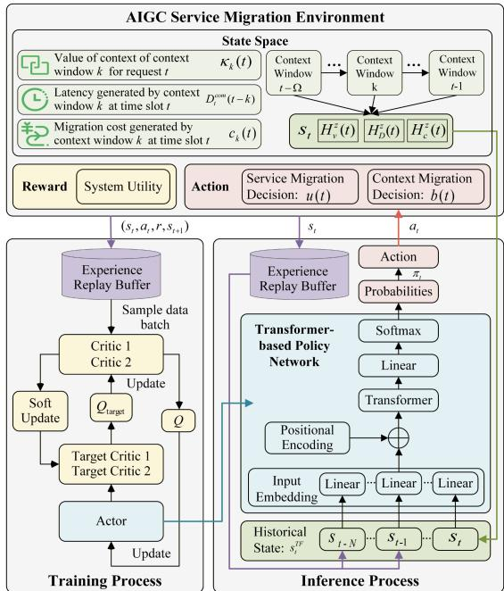  
Fig. 5. Overview of the transformer-based soft actor-critic algorithm. The pipeline of the agent actor is illustrated in the transformer-based policy network.

$$
V \left(s _ {t}\right) = \mathbb {E} _ {a _ {t} \sim \pi} \left[ Q \left(s _ {t}, a _ {t}\right) - \beta \log \left(\pi \left(a _ {t} \mid s _ {t}\right)\right) \right],\tag{21}
$$

where $Q ( s _ { t } , a _ { t } )$ denotes the soft Q-value function. We approximate the soft Q-function $Q _ { \phi } ( s _ { t } , a _ { t } )$ using a neural network parameterized by $\phi .$ The Q-network is trained by minimizing the soft Bellman residual. Specifically, the Bellman target is given by:

$$
J _ {Q} (\phi) = r _ {t} + \gamma (Q _ {\phi} (s _ {t + 1}, a _ {t + 1}) - \beta \log \pi_ {\phi} (a _ {t + 1} | s _ {t + 1})),\tag{22}
$$

where $a _ { t + 1 }$ and $s _ { t + 1 }$ are the next state and action sample from the replay buffer, and $a _ { t + 1 } \sim \pi ( \cdot | s _ { t + 1 } )$ . Accordingly, the Q-network parameters are updated by minimizing the mean squared Bellman error:

$$
\nabla_ {\phi} \mathbb {E} \sum_ {i = 1} ^ {b} (Q _ {\phi} (s _ {i}, a _ {i}) - J _ {Q} (\phi)) ^ {2},\tag{23}
$$

where $\mathbb { E } [ \cdot ]$ denotes the expectation over sampled transitions and b is the mini-batch size.

The Q-network estimates the expected cumulative reward for each action at the current state $s _ { t } .$ Then, the actor can learn to maximize the expectation of $Q$ over all actions to improve the policy. The policy improvement step is given by:

$$
\nabla_ {\phi} \mathbb {E} _ {b} (Q _ {\phi} (s, \tilde {a} _ {\phi} (s)) - \beta \log \pi_ {\phi} (\tilde {a} _ {\phi} (s) | s)).\tag{24}
$$

Computational complexity: The computational complexity of the transformer mainly arises from the self-attention mechanism [54]. Thus, the computational complexity of the actor network is $O ( L _ { a } d _ { m } ( 3 N \Omega ) ^ { 2 } + L _ { a } ( 3 N \Omega ) d _ { m } ^ { 2 } )$ , where $L _ { a }$ is the number of layers. The two critic networks are Multilayer Perceptrons (MLPs), and their computational complexity is $O ( b \cdot 3 \Omega d _ { c } )$ [55], where b is the training batch size, 3Ω represents the input dimensionality, and $d _ { c }$ is the hidden layer size. The overall computational complexity is $O ( L _ { a } d _ { m } ( 3 N \Omega ) ^ { 2 } +$ $L _ { a } ( 3 N \Omega ) d _ { m } ^ { 2 } + 2 b \cdot 3 \Omega d _ { c } )$ . In complexity analysis, only the highest-order term is retained, as it dominates the growth rate when the problem size approach infinity, while lower-order terms and constant factors are omitted. Consequently, the computational complexity ofTFSCM is primarily determined by the historical state length N and the maximum context window length Ω, and can be expressed as $O ( N ^ { 2 } \Omega ^ { 2 } )$ . Given the relatively small values of N and Ω in TFSCM, the overall computational complexity remains low. Moreover, the lightweight transformer architecture with $L _ { a } = 2$ and $d _ { m } = 6 4$ further reduces training and inference overhead. Subsequent experimental results demonstrate that this lightweight design achieves fast convergence without sacrificing optimization performance.

In summary, TFSCM adopts the SAC framework as its backbone and integrates a transformer-based as the policy network. This design leverages soft policy exploration and long-term dependency modeling to address the service migration optimization problem.

## V. PERFORMANCE EVALUATION

In this section, we present the parameter settings and evaluate the proposed TFSCM algorithm using a real-world dataset and simulation platform. Furthermore, we conduct extensive experiments across a variety of scenarios to verify the generalization and adaptability of the proposed scheme.

## A. Experimental Setting

Dataset: We conduct experiments based on the Telecom Shanghai dataset1 [56], [57], which provides the distribution of edge servers and users’ edge server access information. The dataset contains more than 7.2 million records generated by 9481 mobile users when they access 3233 edge servers of Shanghai Telecom during 30 days [58]. We assume that the user moves within a rectangular area where edge servers equipped with AIGC models and evenly deployed. Since AIGC services are only hosted on high-capability edge servers, which are relatively sparsely distributed, the area is divided into M grids, with each grid center assumed to host an AIGC-enabled edge server [21]. The edge server access information in the dataset is used to infer users’ mobility trajectories, and the geographical location of the accessed edge server is regarded as the user’s location. Specifically, we extract latitude and longitude information from the dataset as location coordinates and compute the geodesic distances using standard conversion formulas. User mobility is modeled in a time-slotted manner, where each movement corresponds to one time slot. A user may remain in the same grid for multiple consecutive time slots and access the same edge server.

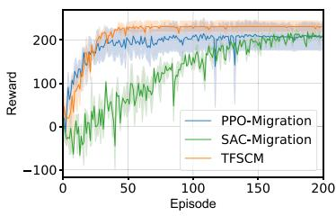  
Fig. 6. The convergence curve of three DRL algorithms.

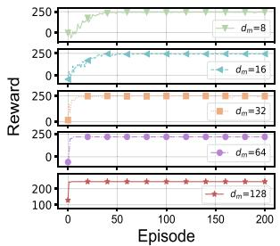  
(a) Convergence curve

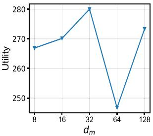  
(b) System Utility  
Fig. 7. The performance of the TFSCM under different hidden dimensions of the transformer network $( d _ { m } )$

Experimental parameters: The experimental settings are summarized as follows unless otherwise specified. Each dataset consists of 100 location points, corresponding to $T = 1 0 0$ slots [56]. We adopt CogView22 [59] as the AIGC service model, a 4-billion-parameter transformer for text-to-image tasks. The model’s transformer comprises $L = 4 8$ layers with a hidden size of 3072 and 40 attention heads. According to the text and image data characteristics, the input unit token size and output unit patch size are set to $q ^ { I } = 3 2 \mathrm { ~ B ~ }$ and $q ^ { O } = 1 ~ \mathrm { { K B } }$ respectively. The input prompt length $l _ { t } ^ { I }$ and generated content length $l _ { t } ^ { O }$ are randomly sampled from [8,256] and [256,5096], respectively. The maximum context window length is set to $\Omega = 8 ,$ , and the context window numerical indicator $o _ { t }$ is randomly generated from [0,1] with one decimal place. The computation model constants are $\rho _ { 1 } = 5 1 2 0 , \rho _ { 2 } = 1 5 7 2 8 1 2 8 0$ , and $\rho _ { 3 } = 1 5 7 2 8 6 4 0 0$ [11]. For inference accuracy, the zero-shot accuracy $A ^ { 0 } ( t )$ and one-shot accuracy $A ^ { 1 } ( t )$ are randomly sampled from [0.2,0.4] and [0.03,0.06], respectively, following commonly used AIGC accuracy benchmarks [3]. According to the practical edge computing scenarios, the number of edge servers is set to $M = 1 6$ . Transmission parameters are configured as: noise power $\sigma ^ { 2 } = 1 0 ^ { - 9 }$ , path loss exponent $\iota = 3 .$ uplink transmission power $p ^ { u p } = 0 . 6 \mathrm { W } ,$ , downlink transmission power $p ^ { d o w n } = 5$ W, uplink bandwidth $B ^ { u p } = 1 0 ^ { 6 } \mathrm { b p s } .$ downlink bandwidth $B ^ { d o w n } = 1 0 ^ { 7 } \mathrm { b p s }$ , and broadcast speed $v _ { e } = 3 \times 1 0 ^ { 8 }$ m/s [38]. Other key parameters include: the edge server computing capability $f _ { e } = 1 . 3 3 \times 1 0 ^ { 1 2 }$ cycles/s [11], migration forwarding rate $\zeta _ { t } \in [ 5 0 0 , 2 0 0 0 ] \mathrm { M B / s }$ , and unit migration cost $g _ { t } \in [ 0 . 5 , 1 ] .$ . The hyperparameters of the proposed TFSCM algorithm are set as follows: historical state length $N = 8$ , transformer layers $L _ { a } = 2$ , attention heads $n _ { h } = 4 .$ , embedding dimension $d _ { m } = 3 2$ , critic hidden dimension $d _ { c } = 3 2$ target entropy $\bar { H } = - 1$ , mini-batch size $b = 1 2 ,$ , temperature parameter $\beta = 0 . 9 8$ , and discount factor $\gamma = 0 . 9 8 [ 5 5 ]$ . The weight coefficients in the reward function are $\mu _ { 1 } = 5 , \mu _ { 2 } = 0 . 1$ , and $\mu _ { 3 } = 0 . 0 5$ . The simulation is conducted on a server equipped with an NVIDIA GeForce RTX 3090 24 GB GPU and four Intel(R) Xeon(R) Gold 6252 CPUs (2.10 GHz), running Ubuntu 18.04.3 LTS. Local and edge nodes are deployed in the environment. The average training time of TFSCM is approximately 216 s, with an average inference time of 1.0 ms.

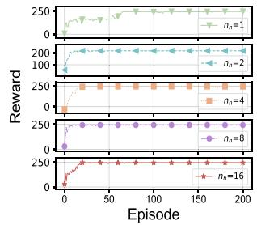  
(a) Convergence curve

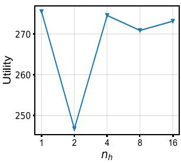  
(b) System Utility

Fig. 8. The performance of the TFSCM under different numbers of attention heads of the transformer network (n ).  
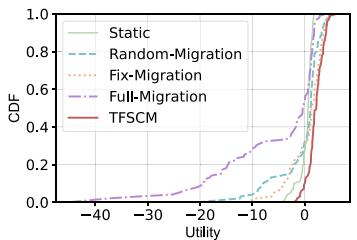  
Fig. 9. The CDF of system utility for five migration schemes.

Comparison Algorithms: Six benchmark schemes are used to evaluate the proposed TFSCM algorithm. (i) Static: The AIGC service is not migrated and is processed in a static edge server, corresponding to $u ( t ) = 0 . ( \mathrm { i i } )$ Random-Migration: A migration strategy that randomly selects $u ( t )$ and $b ( t )$ . (iii) Fix-Migration: Migrate a fixed length of context windows, corresponding to $b ( t ) = \Omega / 2$ . (iv) Full-Migration: Migrates all migratable context windows that is $b ( t ) = \Omega _ { t } . ( \mathbf { v } )$ PPO-Migration: A service migration scheme based on the Proximal Policy Optimization (PPO) algorithm [20], which optimizes policy performance by clipping the objective function to ensure stable and efficient updates while avoiding large policy deviations. (vi) SAC-Migration: A service migration scheme based on the SAC algorithm [60], which adopts fully connected networks as the policy and critic networks. The parameter configuration is the same as that of the proposed TFSCM algorithm, except for the policy network.

## B. Performance Evaluation

1) Convergence Analysis of the DRL Scheme: Fig. 6 illustrates the convergence curves of different DRL-based service migration algorithms, including PPO-Migration, SAC-Migration, and the proposed TFSCM scheme. The curves show the average rewards over five independent training runs, with the shaded regions indicating the corresponding standard

Static Random-MigrationPPO-MigrationSAC-Migration TFSCM

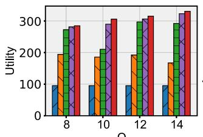  
(a) Utility

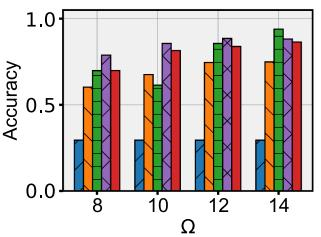  
(b) Accuracy

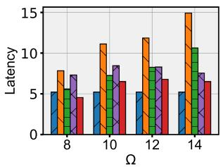  
(c) Latency

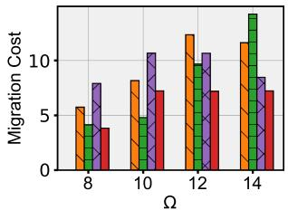  
(d) Migration Cost

Fig. 10. The utility, accuracy, latency, and migration cost with different maximum context window length (Ω).  
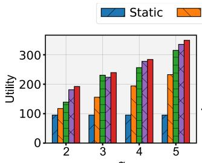  
(a) Ütility

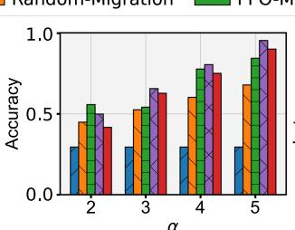  
(b) Accuracy

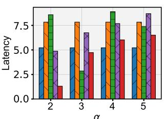  
(c) Latency

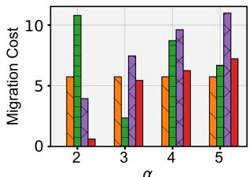  
(d) Migration Cost  
Fig. 11. The utility, accuracy, latency, and migration cost with different AIGC accuracy coefficient (α).

deviations. TFSCM employs a transformer-based actor to capture long-term dependencies in historical states, enabling faster convergence and improved performance. As a result, TFSCM converges within approximately 50 episodes and achieves the highest reward among all schemes. In contrast, SAC-Migration converges the slowest, requiring about 150 episodes to stabilize, since the SAC algorithm involves extensive policy exploration to maximize long-term rewards. PPO-Migration converges more rapidly, within around 30 episodes, but attains the lowest reward. This is because the clipping mechanism in PPO restricts large policy updates to stabilize training, which, while improving stability, limits sufficient policy exploration and thus degrades performance. Overall, TFSCM demonstrates superior performance by achieving higher rewards with faster convergence compared to the baseline algorithms.

2) Performance Analysis of Hyperparameter Configuration for TFSCM: Figs. 7 and 8 illustrate the performance of the proposed TFSCM under various hyperparameter configurations. Fig. 7(a) shows the convergence curves of 200 episodes for Transformer networks with hidden dimensions $d _ { m }$ of ranging from 8 to 128. Increasing the Transformer’s hidden dimension $d _ { m }$ results in faster convergence and higher final reward. This is because more hidden nodes enable the Transformer network to represent more complex features, better capturing the underlying patterns in the training data and accelerating the learning process. Fig. 7(b) compares the system utility across various hidden dimensions. The system utility achieves the highest value when $d _ { m } = 3 2$ and the lowest value when $d _ { m } = 6 4 . \ \mathrm { F i g . \ 8 ( a ) }$ illustrates the convergence curves for Transformer networks with the number ofattention heads ranging from 1 and 16, which highlights that the algorithm converges more rapidly and stably as the number of attention heads $n _ { h }$ . Multiple attention heads focus on different parts of the input sequence from multiple perspectives. TFSCM with more attention heads can capture multi-layer information, thus enabling faster convergence. Since a small number of attention heads is sufficient to capture the relationships in the input space, the optimal performance is achieved if the number of attention heads is set to $n _ { h } = 1$ as shown in Fig. 8(b). Thus, it can be concluded that the larger hidden dimension $d _ { m }$ and an optimal number of attention heads $n _ { h }$ contribute to improving convergence speed and system utility. We configure $d _ { m } = 3 2$ and ${ n } _ { h } = 4$ in the subsequent experimental setting.

3) CDF Analysis of System Utility Across Five Service Migration Schemes: Fig. 9 presents the cumulative distribution function (CDF) ofsystem utility for different migration schemes, including Static, Random, Fix-Migration, Full-Migration, and the proposed DRL-based TFSCM. A curve shifted further to the right indicates higher utility for that strategy. The results show that TFSCM outperforms all other schemes in achieving higher utility. Additionally, the CDF highlights the distribution and concentration ofutility values, offering insight into the range where most values are concentrated. Between the 20% and 90% CDF range, TFSCM’s utility primarily falls between 2 and 5, while Full-Migration ranges from −15 to 2. This discrepancy is due to the high migration costs of the Full-Migration scheme, which reduces utility. In contrast, the other three schemes produce utilities ranging from −3 to 2, which is lower than that of TFSCM. Overall, TFSCM demonstrates superior performance in terms of utility distribution on the CDF, emphasizing its effectiveness in solving the migration problem compared to the other schemes.

4) Performance Analysis of TFSCM Across Environmental Settings: To assess the generalization performance of TFSCM, we simulate a range of environmental parameters for AIGC service migration, including the maximum context window length Ω and accuracy coefficients α. Figs. 10 and 11 illustrate the system performance, including utility, accuracy, latency, and migration cost. The experimental results reveal a significant trade-off among accuracy, latency, and migration cost. Under these constraints, the system optimization strategy dynamically adjusts the optimization direction based on the weight factors $\mu _ { 1 } , \mu _ { 2 } , \mu _ { 3 }$ of different metrics, resulting in TFSCM being slightly inferior to the comparison algorithms in terms of individual metrics. However, TFSCM consistently shows a higher utility compared to other schemes, confirming its superiority for AIGC service migration.

Fig. 10 illustrates the impact of the maximum context window length $\Omega \in [ 8 , 1 4 ]$ on average utility, accuracy, latency, and migration cost. Fig. 10(a) demonstrates that TFSCM achieves the highest average utility among the evaluated schemes. As shown in Fig. 10(b), although the accuracy is not the highest, it remains stable around 0.7, which meets the fundamental requirements for the AIGC task. Meanwhile, increasing Ω results in improved utility and accuracy, as longer context windows provide more comprehensive implicit contextual information. As illustrated in Fig. 10(c) and (d), although the average service latency and migration costs of TFSCM are not the lowest, they remain at a relatively low level. We are more focused on the overall comprehensive utilities. Fig. 11 illustrates the impact of the AIGC inference accuracy coefficient $\alpha \in [ 2 , 5 ]$ on average utility, accuracy, latency, and migration cost. As shown in Fig. 11(a), TFSCM consistently achieves the highest average utility. In Fig. 9(b), as α increases, the average accuracy improves because a larger α indicates that the VoC of the context has a greater impact on inference accuracy. Fig. 9(c) and (d) demonstrate that, in most cases, the average latency and migration cost of TFSCM outperform other schemes. Although the Static scheme exhibits lower migration costs, its accuracy is significantly lower. This is because the Static scheme avoids migrating context windows to reduce migration costs, which leads to a decrease in accuracy due to the lack of contextual memory.

Overall, the proposed TFSCM effectively reduces both latency and cost, while enhancing AIGC inference accuracy, thus achieving high system utility across various environments.

5) Performance Analysis of TFSCM Across Different Datasets and Edge Server Deployment Densities: The aforementioned experiments are conducted using the same dataset to evaluate the performance of TFSCM. To evaluate the algorithm’s generalization ability across diverse datasets, we subsequently tested the five schemes on another dataset. Moreover, varying the edge server deployment density leads to different migration decisions. Thus, we evaluate the performance under different numbers of edge servers deployed in the area, i.e., $M = \{ 1 6 , 3 6 , 6 4 , 1 0 0 \}$ . As illustrated in Fig. 12, TFSCM outperforms all other schemes in terms of utility. The highest utility is observed when the number of edge servers is 100, and the lowest utility occurs when the number of edge servers increases to 36. These performance variations are primarily attributed to users’ dynamic trajectories, which significantly influence migration decisions across varying deployment densities. Thus, TFSCM demonstrates versatility by consistently delivering superior performance across different datasets and varying edge server deployment densities.

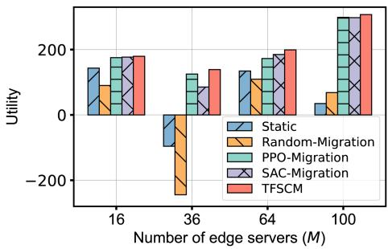  
Fig. 12. The utility of five schemes on the other dataset with various numbers of edge servers.

In summary, TFSCM outperforms other schemes in system utility across different scenarios, showing strong potential in improving the quality and continuity of AIGC services in edge intelligence networks.

## VI. CONCLUSION

In this paper, we have proposed a context-aware AIGC service migration scheme to address the critical challenge of improving the AIGC service quality in edge intelligence networks. The proposed TFSCM scheme significantly improves inference accuracy and reduces latency and migration costs by migrating historical AIGC context instead of large-scale AIGC models. Specifically, we have proposed VoC to quantify the freshness and relevance of historical context and formulated a service migration utility optimization problem that jointly considers inference accuracy, latency, and migration cost. To solve the optimization problem, we have designed the TFSCM algorithm to capture the long-term dependencies of historical DRL decisions. Extensive experiments conducted on the real-world Telecom Shanghai dataset have demonstrated that TFSCM consistently outperforms baseline schemes in terms of system utility.

In future work, we plan to explore more advanced edge intelligence schemes to further enhance the quality ofAIGC services in distributed architectures. In particular, we aim to explore the potential of migrating structural-level memory modules embedded within AIGC models. Another potential direction is to explore multi-user and heterogeneous edge-cloud integration scenarios. We hope that this paper will promote the widespread application of AIGC services in mobile edge networks and contribute to the advancement of mobile AIGC systems.

## REFERENCES

[1] Y. Ming, N. Hu, C. Fan, F. Feng, J. Zhou, and H. Yu, “Visuals to text: A comprehensive review on automatic image captioning,” IEEE/CAA J. Automatica Sinica, vol. 9, no. 8, pp. 1339–1365, Aug. 2022.

[2] Y. Hao, L. Hu, and M. Chen, “Joint sensing adaptation and model placement in 6G fabric computing,” IEEE J. Sel. Areas Commun., vol. 41, no. 7, pp. 2013–2024, Jul. 2023.

[3] M. Xu et al., “Unleashing the power of edge-cloud generative ai in mobile networks: A survey of aigc services,” IEEE Commun. Surv. Tut., vol. 26, no. 2, pp. 1127–1170, Second Quarter, 2024.

[4] H. Du et al., “Enabling ai-generated content services in wireless edge networks,” IEEE Wireless Commun., vol. 31, no. 3, pp. 226–234, Jun. 2024.

[5] G. Qu, Q. Chen, W. Wei, Z. Lin, X. Chen, and K. Huang, “Mobile edge intelligence for large language models: A contemporary survey,” IEEE Commun. Surv. Tut., vol. 27, no. 6, pp. 3820–3860, Dec. 2025.

[6] S.-M. Wang and Y.-I. Wu, “Integrating text analysis and LLM to explore the development and application of AIGC in education,” in Proc. 15th Int. Conf. Inf. Commun. Technol. Convergence, 2024, pp. 2042–2047.

[7] G. Cheng, C. Jiang, B. Yue, R. Wang, B. Alzahrani, and Y. Zhang, “AIdriven proactive content caching for 6G,” IEEE Wireless Commun., vol. 30, no. 3, pp. 180–188, Jun. 2023.

[8] S. Min et al., “Rethinking the role of demonstrations: What makes incontext learning work?,” in Proc. Conf. Empirical Methods Natural Lang. Process., 2022, pp. 11048–11064.

[9] J. Wen et al., “Diffusion-model-based incentive mechanism with prospect theory for edge AIGC services in 6G IoT,” IEEE Internet Things J., vol. 11, no. 21, pp. 34187–34201, Nov. 2024.

[10] T. Wu et al., “A brief overview of chatGPT: The history, status quo and potential future development,” IEEE/CAA J. Automatica Sinica, vol. 10, no. 5, pp. 1122–1136, May 2023.

[11] X. Zhang et al., “Beyond the cloud: Edge inference for generative large language models in wireless networks,” IEEE Trans. Wireless Commun., vol. 24, no. 1, pp. 643–658, Jan. 2025.

[12] Z. Zhao, E. Wallace, S. Feng, D. Klein, and S. Singh, “Calibrate before use: Improving few-shot performance of language models,” in Proc. Int. Conf. Mach. Learn., 2021, pp. 12697–12706.

[13] X.-K. Wu et al., “LLM fine-tuning: Concepts, opportunities, and challenges,” Big Data Cogn. Comput., vol. 9, no. 4, 2025, Art. no. 87.

[14] W. Chen et al., “Subject-driven text-to-image generation via apprenticeship learning,” in Proc. Adv. Neural Inf. Process. Syst., 2023, pp. 30286–30305.

[15] F. B. Baldassini, M. Shukor, M. Cord, L. Soulier, and B. Piwowarski, “What makes multimodal in-context learning work?,” in Proc. IEEE/CVF Conf. Comput. Vis. Pattern Recognit. Workshops, 2024, pp. 1539–1550.

[16] B. Lai et al., “Optimizing AIGC services using learning-based stackelberg game in vehicular metaverses,” IEEE Trans. Veh. Technol., vol. 74, no. 7, pp. 11472–11477, Jul. 2025.

[17] A. Bertsch et al., “In-context learning with long-context models: An indepth exploration,” 2024, arXiv:2405.00200.

[18] M. Xu et al., “Joint foundation model caching and inference of generative ai services for edge intelligence,” in Proc. 2023 IEEE Glob. Commun. Conf., 2023, pp. 3548–3553.

[19] J. Liu, D. Shen, Y. Zhang, B. Dolan, L. Carin, and W. Chen, “What makes good in-context examples for GPT-3?,” in Proc. Deep Learn. Inside Out (DeeLIO 2022): 3 rd Workshop Knowl. Extraction Integration Deep Learn. Architectures, Dublin, Ireland, 2022, pp. 100–114.

[20] L. Wang et al., “Joint task offloading and migration optimization in UAVenabled dynamic MEC networks,” IEEE Trans. Serv. Comput., vol. 18, no. 4, pp. 2143–2157, Jul./Aug. 2025.

[21] Z. Chen, S. Huang, G. Min, Z. Ning, J. Li, and Y. Zhang, “Mobilityaware seamless service migration and resource allocation in multi-edge IoV systems,” IEEE Trans. Mobile Comput., vol. 24, no. 7, pp. 6315–6332, Jul. 2025.

[22] H. Wang, L. Jiao, T. Zhao, and L. Ren, “A cloud-edge intelligent collaborative framework and its applications in aigc and digital twins,” in Proc. 50th IEEE Ind. Electron. Soc. Annu. Conf., 2024, pp. 1–4.

[23] J. Liu, Y. Wang, Z. Lin, M. Chen, Y. Hao, and L. Hu, “Natural language fine-tuning,” 2024, arXiv:2412.20382.

[24] C. Zhou, W. Liu, T. Han, and N. Ansari, “Deploying on-device AIGC inference services in 6G via optimal MEC-device offloading,” IEEE Netw. Lett., vol. 6, no. 4, pp. 232–236, Dec. 2024.

[25] N. Chen, Z. Cheng, X. Fan, X. Xia, and L. Huang, “Towards integrated fine-tuning and inference when generative AI meets edge intelligence,” 2024, arXiv:2401.02668.

[26] S. Li, X. Lin, W. Xu, and J. Li, “AI-generated content-based edge learning for fast and efficient few-shot defect detection in IIoT,” IEEE Trans. Serv. Comput., vol. 17, no. 6, pp. 3140–3153, Nov./Dec. 2024.

[27] S. Li et al., “Multi-agent RL-based industrial AIGC service offloading over wireless edge networks,” in Proc. IEEE Conf. Comput. Commun. Workshops, 2024, pp. 1–6.

[28] J. Wang et al., “A unified framework for guiding generative AI with wireless perception in resource constrained mobile edge networks,” IEEE Trans. Mobile Comput., vol. 23, no. 11, pp. 10344–10360, Nov. 2024.

[29] G. Xie et al., “Giov: Achieving generative ai services in internet of vehicles via collaborative edge intelligence,” in Proc. 2024 IEEE Wireless Commun. Netw. Conf., 2024, pp. 1–6.

[30] Y. Wang, C. Liu, and J. Zhao, “Offloading and quality control for AI generated content services in 6G mobile edge computing networks,” in Proc. IEEE 99th Veh. Technol. Conf., 2024, pp. 1–7.

[31] T. Kim et al., “MoDEMS: Optimizing edge computing migrations for user mobility,” IEEE J. Sel. Areas Commun., vol. 41, no. 3, pp. 675–689, Mar. 2023.

[32] X. Zhou, S. Ge, T. Qiu, K. Li, and M. Atiquzzaman, “Energyefficient service migration for multi-user heterogeneous dense cellular networks,” IEEE Trans. Mobile Comput., vol. 22, no. 2, pp. 890–905, Feb. 2023.

[33] S.-W. Ko, S. J. Kim, H. Jung, and S. W. Choi, “Computation offloading and service caching for mobile edge computing under personalized service preference,” IEEE Trans. Wireless Commun., vol. 21, no. 8, pp. 6568–6583, Aug. 2022.

[34] Y. Hao, J. Wang, D. Huo, N. Guizani, L. Hu, and M. Chen, “Digital twinassisted URLLC-enabled task offloading in mobile edge network via robust combinatorial optimization,” IEEE J. Sel. Areas Commun., vol. 41, no. 10, pp. 3022–3033, Oct. 2023.

[35] X. Chen et al., “Dynamic service migration and request routing for microservice in multicell mobile-edge computing,” IEEE Internet Things J., vol. 9, no. 15, pp. 13126–13143, Aug. 2022.

[36] Z. Ning, H. Chen, E. C. H. Ngai, X. Wang, L. Guo, and J. Liu, “Lightweight imitation learning for real-time cooperative service migration,” IEEE Trans. Mobile Comput., vol. 23, no. 2, pp. 1503–1520, Feb. 2024.

[37] J. Li et al., “AoI-aware, digital twin-empowered IoT query services in mobile edge computing,” IEEE/ACM Trans. Netw., vol. 32, no. 4, pp. 3636–3650, Aug. 2024.

[38] R. Wang, Y. Hao, Y. Miao, L. Hu, and M. Chen, “RT3C: Real-time crowd counting in multi-scene video streams via cloud-edge-device collaboration,” IEEE Trans. Serv. Comput., vol. 17, no. 4, pp. 1739–1752, Jul./Aug. 2024.

[39] E. Akyürek, B. Wang, Y. Kim, and J. Andreas, “In-context language learning: Architectures and algorithms,” in Proc. 41st Int. Conf. Mach. Learn., 2024, pp. 787–812.

[40] Q. Luo, J. Zhang, S. Hu, T. H. Luan, and P. Fan, “Joint task migration and resource allocation in vehicular edge computing: A deep reinforcement learning-based approach,” IEEE Trans. Veh. Technol., vol. 17, no. 4, pp. 1739–1752, Jul./Aug. 2025.

[41] Q. Liu, H. Zhang, X. Zhang, and D. Yuan, “Joint service caching, communication and computing resource allocation in collaborative MEC systems: A DRL-based two-timescale approach,” IEEE Trans. Wireless Commun., vol. 23, no. 10, pp. 15493–15506, Oct. 2024.

[42] K. Shuai, Y. Miao, K. Hwang, and Z. Li, “Transfer reinforcement learning for adaptive task offloading over distributed edge clouds,” IEEE Trans. Cloud Comput., vol. 11, no. 2, pp. 2175–2187, Second Quarter, 2023.

[43] Z. Zhan et al., “Vision language model-empowered contract theory for AIGC task allocation in teleoperation,” IEEE Trans. Mobile Comput., vol. 24, no. 8, pp. 7742–7756, Aug. 2025.

[44] T.-H. Vu et al., “Applications of generative AI (GAI) for mobile and wireless networking: A survey,” IEEE Internet Things J., vol. 12, no. 2, pp. 1266–1290, Jan. 2025.

[45] J. Wen et al., “Freshness-aware incentive mechanism for mobile AIgenerated content (AIGC) networks,” in Proc. 2023 IEEE/CIC Int. Conf. Commun. China, 2023, pp. 1–6.

[46] B. Qu, X. Liang, S. Sun, and W. Gao, “Exploring AIGC video quality: A focus on visual harmony video-text consistency and domain distribution gap,” in Proc. IEEE/CVF Conf. Comput. Vis. Pattern Recognit., 2024, pp. 6652–6660.

[47] T. Brown et al., “Language models are few-shot learners,” in Proc. Adv. Neural Inf. Process. Syst., 2020, pp. 1877–1901.

[48] L. Beyer et al., “Flexivit: One model for all patch sizes,” in Proc. IEEE/CVF Conf. Comput. Vis. Pattern Recognit., 2023, pp. 14496–14506.

[49] Y. Li et al., “Seamless cross-edge service migration for real-time rendering applications,” IEEE Trans. Mobile Comput., vol. 23, no. 6, pp. 7084–7098, Jun. 2024.

[50] Z. Liang et al., “A survey of multimodel large language models,” in Proc. 3 rd Int. Conf. Comput., Artif. Intell. Control Eng., 2024, pp. 405–409.

[51] K. Gregor, I. Danihelka, A. Mnih, C. Blundell, and D. Wierstra, “Deep autoregressive networks,” in Proc. 31st Int. Conf. Mach. Learn., Bejing, China, 2014, pp. 1242–1250.

[52] T. Haarnoja et al., “Soft actor-critic algorithms and applications,” 2018, arXiv:1812.05905.

[53] Z. Zhao et al., “Reinforced-LSTM trajectory prediction-driven dynamic service migration: A case study,” IEEE Trans. Netw. Sci. Eng., vol. 9, no. 4, pp. 2786–2802, Jul./Aug. 2022.

[54] A. Vaswani et al., “Attention is all you need,” in Proc. Adv. Neural Inf. Process. Syst., 2017, vol. 30.

[55] T. Haarnoja, A. Zhou, P. Abbeel, and S. Levine, “Soft actor-critic: Offpolicy maximum entropy deep reinforcement learning with a stochastic actor,” in Proc. 35th Int. Conf. Mach. Learn., 2018, pp. 1861–1870.

[56] S. Wang, Y. Guo, N. Zhang, P. Yang, A. Zhou, and X. Shen, “Delayaware microservice coordination in mobile edge computing: A reinforcement learning approach,” IEEE Trans. Mobile Comput., vol. 20, no. 3, pp. 939–951, Mar. 2021.

[57] Y. Guo, S. Wang, A. Zhou, J. Xu, J. Yuan, and C.-H. Hsu, “User allocationaware edge cloud placement in mobile edge computing,” Softw.: Pract. Experience, vol. 50, no. 5, pp. 489–502, 2020.

[58] Y. Li, A. Zhou, X. Ma, and S. Wang, “Profit-aware edge server placement,” IEEE Internet Things J., vol. 9, no. 1, pp. 55–67, Jan. 2022.

[59] M. Ding, W. Zheng, W. Hong, and J. Tang, “Cogview2: Faster and better text-to-image generation via hierarchical transformers,” in Proc. Adv. Neural Inf. Process. Syst., 2022, pp. 16890–16902.

[60] Y. Yuan et al., “Service migration optimization for system overhead minimization in VECNS via deep reinforcement learning,” IEEE Internet Things J., vol. 12, no. 4, pp. 3905–3920, Feb. 2025.

  
Jiaxi Wang received the bachelor degree in automation from the College of Control Science and Engineering of Shandong University, in 2021, China. She is currently working toward the PhD degree with the Embedded and Pervasive Computing (EPIC) Laboratory in the School of Computer Science and Technology, Huazhong University of Science and Technology (HUST), China. Her research interest is focused on edge intelligence and digital twins.

Yixue Hao (Member, IEEE). He received the PhD degree in computer science from Huazhong University of Science and Technology (HUST), Wuhan, China, in 2017. He is an associate professor in the School of Computer Science and Technology, Huazhong University of Science and Technology. His current research interests include multi-agent reinforcement learning, edge computing, edge caching, and cognitive computing.

Rui Wang (Member, IEEE) received the bachelor’s degree in computer science and technology from Lanzhou University, Lanzhou, China, 2018, and the PhD degree in computer science from the Huazhong University of Science and Technology, Wuhan, China, 2024. She is currently a post-doctoral scholar in the School of Computer Science and Technology, Huazhong University of Science and Technology (HUST), China. Her research interests include deep learning, multimodal learning, and emotion recognition.

Long Hu (Member, IEEE) is an associate professor in the School of Computer Science and Technology, Huazhong University of Science and Technology (HUST), China. He was a visiting student in the Department of Electrical and Computer Engineering, University of British Columbia, from 2015 to 2017. His research includes edge computing, emotion recognition, and deep reinforcement learning.

Kaibin Huang (Fellow, IEEE) received the BEng and MEng degrees in electrical engineering from the National University of Singapore, and the PhD degree in electrical engineering from The University ofTexas at Austin. He is currently the Philip K H Wong Wilson K L Wong professor of electrical engineering and the Department head with the Department of Electrical and Electronic Engineering, The University of Hong Kong, Hong Kong. His work was recognized with seven Best Paper awards from the IEEE Communication Society. He was on the editorial boards of five major journals in the area of wireless communications and co-edited 12 journal special issues. He has been named as a Highly Cited researcher by Clarivate from 2019 to 2025, and an AI 2000 Most Influential Scholar (Top 30 in Internet of Things) from 2023 to 2025. He was the recipient of the 2025 IEEE Wireless Communications Technical Committee Recognition Award. He is a member of the Engineering Panel of Hong Kong Research Grants Council. He was an IEEE distinguished lecturer from 2020 to 2022. He was a fellow of the U.S. National Academy of Inventors in 2024 and Croucher senior research fellow in 2026.

Dusit Niyato (Fellow, IEEE) received the BEng degree from the King Mongkuts Institute of Technology Ladkrabang (KMITL), Thailand, in 1999, and the PhD degree in electrical and computer engineering from the University of Manitoba, Canada, in 2008. He is a professor with the School of Computer Science and Engineering, Nanyang Technological University, Singapore. His research interests are in the areas of sustainability, edge intelligence, decentralized machine learning, and incentive mechanism design.

Min Chen (Fellow, IEEE) is a full professor with School of Computer Science and Engineering, South China University of Technology. He is also the director of Embedded and Pervasive Computing (EPIC) Lab with the Huazhong University of Science and Technology. He is the founding Chair of IEEE Computer Society Special Technical Communities on Big Data. His Google Scholar Citations reached 54,300+ with an h-index of 103. His top paper was cited 5,800+ times. He was selected as a Highly Cited Researcher, from 2018 to 2024. He received the IEEE Communications Society Fred W. Ellersick Prize in 2017, the IEEE Jack Neubauer Memorial Award in 2019, and IEEE ComSoc APB Outstanding Paper Award in 2022. He is a fellow of IET.