# Control-Assisted Beam Prediction and Tracking for UAV Millimeter Wave Communications

Jianjun Zhang , Member, IEEE, Yongming Huang , Fellow, IEEE, Jiaheng Wang , Senior Member, IEEE, Christos Masouros , Fellow, IEEE, and Xiaohu You , Fellow, IEEE

Abstract—In recent years, the unmanned aerial vehicle (UAV) communications have become an important part of the spaceair-ground integrated network. Unfortunately, the high mobility, as well as perturbation, of UAV poses a great challenge in aligning narrow high-gain beams between the UAV and base station (BS). To tackle this challenging issue, we propose efficient beam prediction and tracking solutions from the perspective of control in this paper. First of all, for an important and typical flight mode in practice (i.e., the mission flight mode - to assign a series of targets in advance and fly from one target to the next one in turn), we study in depth the underlying control principle and reveal important properties and relationships between beam direction and controlled variables. Then, to exploit the properties and relationships revealed, we propose an efficient learning-based beam prediction and tracking solution. Specifically, we develop an efficient learning model, together with offline training and online inference algorithms. To further reduce the computational complexity, we distinguish two kinds of beam offsets and prove an important property of the mission flight mode, i.e., a multicopter almost keeps fixed attitude and velocity in most part of a flight process, based on which an efficient algorithm is designed. Comprehensive experiment results from open-source software, hardware and real UAV confirm the effectiveness of our control-assisted approach.

Index Terms—Control-assisted wireless communications, beam prediction, beam tracking, PID control, position control, attitude control, mission flight mode, millimeter wave communications.

Digital Object Identifier 10.1109/TWC.2026.3668082

## I. INTRODUCTION

U <sup>NMANNED</sup> <sup>aerial</sup> <sup>vehicle</sup> <sup>(UAV)</sup> <sup>communications</sup> <sup>have</sup>been a promising approach to realize the flexible cov- been a promising approach to realize the flexible coverage in future mobile networks [1]. Different from the terrestrial communication systems, UAV communications are very flexible and can enable line-of-sight (LoS) dominant communications. They therefore offer larger capacity and better reliability over much longer distances, which facilitates the implementation of broadband seamless connectivity [1]. Millimeter wave (mmwave) communications, occupying 30-300 GHz spectrum resources and offering significant underutilized bandwidth, have been considered as one of the most promising solutions to meet high-speed wireless data demands [2]. Hence, when incorporating the two techniques, we can achieve mutual benefits from both UAV and mmwave communications.

However, the high frequency of mmwave signals often leads to a large path-loss. On the other hand, the short wave-length makes it possible to install a large-scale antenna array onto a UAV with limited payload and realise highgain beams to combat the large path-loss. In such scenarios, a critical challenge lies in beam alignment, especially in the high mobility scenario. To address this issue, different methodologies have been investigated, among which the most widely accepted one is beam training and tracking [3], [4], [5], [6], [7], [8]. This scheme mainly consists of two stages, i.e., initial beam alignment and subsequent beam tracking. First of all, the optimal beam or beam pair is found via adaptive or hierarchical search [5]. A large training overhead is often involved in this stage. Then, beam tracking is invoked in the next stage to avoid frequent search. Compared with the initial alignment, the number of beams used for tracking is often very small. To overcome the drawbacks of classical hierarchical beam-sweeping methods, e.g., inadequate time for user discovery and large beam search time, a novel method that optimizes beam width allocation at the outset of beam searching is recently proposed in [9] for the hybrid intelligent reflecting/refracting surfaces aided mmwave scenario.

The key of beam tracking is beam prediction, i.e., to predict a beam subspace that contains the real beam. To tackle this issue, various temporal or spatial correlations and non-channel information obtained via sensors (e.g., position and attitude) have been excavated and exploited. Accordingly, the existing beam prediction algorithms roughly fall into three categories, i.e., the classical model based methods (e.g., Kalman filtering)

[10], [11], [12], recent machine learning (ML) based methods [13], [14], [15], and sensing aided beam/channel tracking methods [16], [17], [18], [19], [20]. For the first category, the kinetic or dynamics model has to be established often via analytical derivation (e.g., the state-space equations), which inevitably limits its application scope. To tackle this issue, a data-induced Kalman filtering approach was proposed recently [21], which can reap the benefits of both Kalman filter and powerful deep learning while overcoming their drawbacks. The key is to derive the dynamics model via ML and perform online inference via Kalman filter.

To derive directly prediction models and extract meaningful patterns from observed data, many learning based solutions have been developed [13], [14], [15], [22], [23]. The existing learning-based beam prediction methods fall into two categories, i.e., the supervised learning (SL) based algorithms [6], [8], [17], [23] and reinforcement learning (RL) based algorithms [13], [14], [15]. The key of the SL-based solutions is to collect a large number of labeled data in advance and optimize a (big) model via the end-to-end or data-driven manner. But a shortcoming of the data-dependent model is that it can easily become outdated. The RL-based solutions, to some extent, circumvent this problem by interacting with environments and collecting training samples online. But the sample efficiency of RL is often low, which may lead to low convergence rate and as well as short-term performance.

For UAV communications, the existing research is primarily concentrated on optimizing UAV deployment, resource management, user association and so on, so as to achieve superior communication performance [24], [25], [26], [27], [28]. For example, the first and representative work is [24], where the total UAV energy consumption, including propulsion energy and communication related energy, is minimized under the condition that the communication throughput requirement of each user is satisfied. Another example is the deployment of multi-aerial drones for the IoT network [26], which jointly optimizes the mobility of aerial drones, aerial drone device association, and power control. For the problem of beam or channel prediction, several distinctive solutions are investigated by exploiting the external information, like GPS or attitude, to assist beam prediction or channel tracking [16], [17], [18], [19], [20], [29]. A beam tracking algorithm with both mechanical and electrical adjustments is proposed for the UAV satellite communication system [29]. Specifically, the mechanical adjustment is first adopted to alleviate adverse effects in UAV navigation. Then, the electrical adjustment is further utilized to calibrate beam pointing.

But for the UAV mmwave communication, the flight range of UAV (and thus the distance between the BS and UAV) is often very large and many devices on the UAV are powered by batteries, which necessitates the use of narrow but highgain beams. Besides, the beam direction between the BS and UAV depends on both the position and attitude of UAV, which leads to large variations of beam direction. These issues make it challenging to apply classical hierarchical or recent learning based algorithms. Inspired by automatic control, another systematic beam prediction and tracking design methodology, referred to as control-assisted wireless communications, is proposed recently [30]. Under the guidance of this methodology, an important and readily available source of information, i.e., command or control sequences obtained easily from the flight control system (FCS), is identified for the first time and used to design beam prediction algorithms [31], [32].

Note that there are mainly two typical and equally important flight modes, i.e., the semi-autonomous flight mode and fully-autonomous flight mode. For the semi-autonomous mode, the UAV is controlled via a remote control. In fact, the outputs of “roll”, “pitch” and “yaw” channels of the remote control are directly converted or mapped into the desired roll, pitch and yaw angles (which form the desired attitude), as shown in Fig. 1(a). Therefore, the continuous and real-time control sequences sampled from the roll, pitch and yaw channels of the remote control can be chosen as control information to design algorithms. But for the fully-autonomous mode, there is no need to manually control a UAV. In many cases, we first plan mission related waypoints in advance, upload them to the UAV and then store them in a micro SD card, as shown in Fig. 1(b). Later, after receiving a task initiation instruction, the UAV automatically takes off, carries out preassigned tasks, flies from one target to the next one in turn, and finally lands. In the whole process, the continuous and real-time commands (i.e., sampled sequences) used by the semi-autonomous flight mode are unavailable. As a result, the algorithms designed for the semi-autonomous flight mode [31] do not apply to the fully-autonomous flight mode considered in this paper. In fact, the objective waypoints, along with each current position of UAV, are the control information for the later.

In this paper, we will fill the gap for the important fully-autonomous flight mode, and develop efficient beam prediction and tracking solutions, still from the perspective of automatic control. First, we investigate the principles and features of practical double-loop proportional-integralderivative (PID) controller, which is widely utilized in almost all practical UAVs. After analyzing key components and structure of the control system tailored for fully-autonomous mode, we propose an efficient learning-based beam prediction approach, which includes effective offline training and lowcomplexity online inference algorithms. To facilitate hardware implementation, we revisit and reanalyze the principle of the previous control system. In particular, we prove an important property of system state of UAV, based on which we propose a more efficient beam prediction and tracking algorithm. The main contributions of our paper are summarized as follows:

In light of the fact that continuous command sequences are absent for the fully-autonomous flight mode, we delve into the interior of practical PID controller and analyze its principle and components, based on which we propose to use the displacement vector (between current position and next trajectory waypoint) to predict beam offset.

• To evaluate the uncertainty of predicted beams, we propose an effective Bayesian beam prediction and tracking approach. Specifically, from the view of minimizing the Kullback-Leibler (KL) divergence, we propose an offline training algorithm and an online inference algorithm. An important advantage of the online algorithm is low complexity, which guarantees good real-time performance.

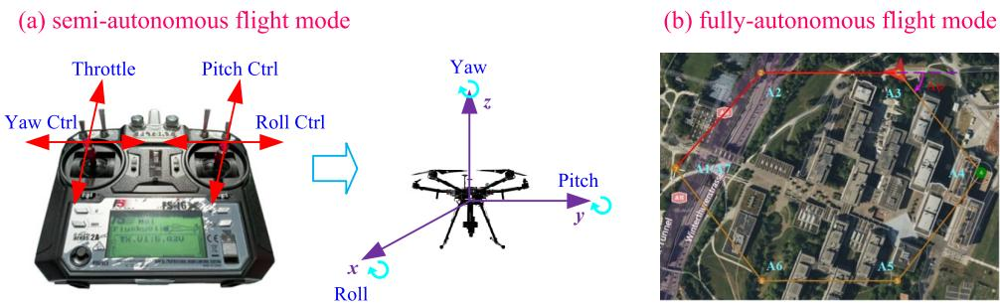  
Fig. 1. An illustration of the semi-autonomous flight mode and fully-autonomous flight mode.

• To further reduce the computational complexity, we reanalyze the principle of the previous controller and reveal an important and useful property. Specifically, we prove that key system parameters (including important attitude and velocity) almost always keep fixed within the flight process, except when approaching or leaving a target.

• We propose to distinguish two different kinds of beam offsets (caused by the attitude and relative position) and further design an efficient algorithm to estimate them, by exploiting the previous important property. Besides the low computational complexity, our algorithm also enjoys the advantage of good generalization performance.

Comprehensive experiment results from open-source hardware (Pixhawk), software (PX4, Gazebo and ROS/MAVROS) and real quadcopters (F450) are provided to demonstrate the effectiveness and superiority of the proposed algorithms, including state-of-the-art tracking performance and transmission performance. We implement these algorithms on a hardware platform with a low-end triple-core Cortex-A7 processor - the RK3506 SoC, which demonstrates their low complexity.

The remainder of this paper is organized as follows. The system model of UAV mmwave communication is described in Section II. The principle and feature of the control system are analyzed in Section III. In Section IV, a learning-based beam prediction and tracking approach, as well as offline training and online inference algorithms, is proposed. To further reduce the computational complexity, a two-step beam prediction algorithm is proposed in Section V to predict beam offsets. The simulation results and conclusions are provided in Sections VI and VII, respectively.

Notation: Bold uppercase and bold lowercase denote matrices and column vectors, respectively. Without a particular specification, non-bold letters denote scalars. Caligraphic letters represent sets. $\mathbb { E } ( \cdot )$ and $( \cdot ) ^ { \mathrm { H } }$ represent the mathematical expectation and Hermitian operators, respectively. card(·) and $\mathbb { I } \{ \cdot \}$ represent the cardinality and indicator functions of a set, respectively. $( \cdot ) ^ { \star }$ denotes an optimal quantity, $\mathrm { e . g . }$ , an optimal solution. $\mathcal { C N } ( \mathbf { m } , \mathbf { R } )$ stands for a complex Gaussian random vector with mean m and covariance matrix R.

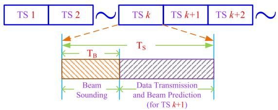  
Fig. 2. Frame structure of typical prediction-and-sweeping based scheme.

## II. SYSTEM MODEL

In this paper, we concentrate on the fully-autonomous UAV flight mode, which is also referred to as mission flight mode or mission mode. An example is provided in Fig. 1. As explained before, some mission related trajectory waypoints are planned in advance and then uploaded to the UAV and stored in the micro SD card. The UAV then flies from one target to the next one in turn. The mmwave point-to-point communication system is considered here, where the BS equipped with N antennas communicates with a UAV having M antennas.

To facilitate system implementation, we here consider the codebook-based analog beamforming, i.e., each transmitting or receiving beam is chosen from a predefined codebook. The codebooks used by BS and UAV are denoted by $\mathcal { C } _ { \mathrm { B } } =$ $\left\{ \mathbf { f } _ { 1 } , \mathbf { f } _ { 2 } , \cdots , \mathbf { f } _ { N ^ { \prime } } \right\}$ (of size $N ^ { \prime } )$ and $\mathcal { C } _ { \mathrm { U } } = \left\{ \mathbf { w } _ { 1 } , \mathbf { w } _ { 2 } , \cdots , \mathbf { w } _ { M ^ { \prime } } \right\}$ (of size $M ^ { \prime } ) .$ , respectively. If beams $\mathbf { f } _ { i } \in \mathcal { C } _ { \mathrm { B } }$ and $\mathbf { w } _ { j } \in \mathcal { C } _ { \mathrm { U } }$ are chosen, the signal received at the UAV is given by

$$
G _ { j , i } = \sqrt { P } \mathbf { w } _ { j } ^ { \mathrm { H } } \mathbf { H } \mathbf { f } _ { i } s + w _ { j , i } ,\tag{1}
$$

where P denotes the transmit power, s with $\mathbb { E } ( | s | ) = 1$ denotes the pilot symbol, and $w _ { j , i } \sim \mathcal { C N } ( 0 , 1 )$ is the received noise.

For a mmwave communication system, the channel matrix between the BS and UAV often takes the form [1], [2], [3]

$$
\mathbf { H } = \sqrt { N M / \beta } \sum _ { l = 1 } ^ { L } \alpha _ { l } \mathbf { a } _ { \mathrm { R } } \mathbf ( \Theta _ { l } ^ { \mathrm { u } } ) \mathbf { a } _ { \mathrm { T } } ^ { \mathrm { H } } ( \Theta _ { l } ^ { \mathrm { b } } ) ,\tag{2}
$$

where $\beta$ is the average path-loss, $L$ is the number of paths, and $\alpha _ { l }$ is the complex path gain of the l-th path. In (2), $\bar { \Theta } _ { l } ^ { \mathrm { b } }$ (or Θ<sup>u</sup>) represents the elevation angle and azimuth angle of the l-th path of BS (or UAV). Note that for the UAV communication, the LOS path typically dominates and all NLOS paths can be ignored [17], [18], [29]. Hence, L = 1 is adopted here.

The frame structure of prediction-and-sweeping based beam tracking scheme is shown in Fig. 2. In each time-slot (TS), it consists of 3 phases, i.e., beam prediction, beam sweeping and data transmission. First, a beam subspace (as small as possible) is predicted by an algorithm. Then, an optimal beam can be found by sweeping the beam subspace for subsequent phase of data transmission. The effective achievable rate (EAR), used to measure the throughput performance, is defined as [6]

$$
R _ { \mathrm { e f f } } = ( 1 - T _ { \mathrm { B } } / T _ { \mathrm { S } } ) \log \big ( 1 + P | \mathbf { w } _ { j } ^ { \mathrm { H } } \mathbf { H } \mathbf { f } _ { i } | ^ { 2 } \big ) ,\tag{3}
$$

where $T _ { \mathrm { B } }$ and $T _ { \mathrm { { S } } }$ denote the duration of beam sounding within a TS and the duration of the entire TS, respectively.

Remark 1: It should be pointed out that the frame structure in Fig. 2 is different from the existing ones. Intuitively, $T _ { \mathrm { B } }$ should encompass both beam prediction and sweeping. But the operation of beam prediction seems to occupy the valuable time resource used for data transmission here. However, the two operations are, in fact, implemented by independent and non-interfering modules. We design the special frame structure because the information, like velocity, attitude and position, is estimated by different sensors, which work asynchronously and update information at different frequencies. The new frame structure, in fact, saves more time for transmission, as there is enough time to wait for time-consuming sensors.

It can be observed from (3) that there is a fundamental tradeoff between the time $T _ { \mathrm { B } }$ spent to refine the beam, which reduces the data-payload time and hence the pre-log term in (3), and the resulting quality of the high-gain beam that affects the log term in (3). However, beam alignment is a nontrivial task in the UAV-like high mobility scenario. Since the behavior of UAV is totally determined by the FCS, we will address this challenging issue by analyzing the principle and structure of FCS and exploiting the control-based information to design efficient beam prediction and tracking algorithms.

## III. CONTROL PRINCIPLE OF MISSION FLIGHT MODE

To develop efficient algorithms for the mission flight mode from the view of control, it is indispensable to understand the principle and structure of the controller. We can observe from Fig. 1 that a mission can always be decomposed into multiple sub-tasks, each of which takes the form of flying from position $A _ { i }$ to position $A _ { i + 1 }$ . Therefore, it is sufficient to understand how to control the aircraft flying from one position to another. In practice, the control system that fulfills this goal consists of two modules, i.e., position controller and attitude controller. Hence, to understand the control system, we first introduce the more basic single-level PID controller, which is the building block of a more practical and complex control system.

## A. Basic Proportional-Integral-Derivative (PID) Controller

Perhaps the most significant difference between the aircrafts (e.g., UAVs) and ground moving devices is that a FCS has to be equipped to implement two important functions, i.e., selfstabilization (to make the aircraft stay airborne) and realizing intended aims (typically, to fly to a place). Although new and effective theories and design methodologies are continually developed in the field of automatic control, the classical PID controllers are still by far the most widely adopted ones in industry owing to the advantageous cost/benefit ratio they are able to provide [33], [34]. In fact, it has become the standard controller in various industrial settings. Undoubtedly, it is also chosen as the main controller for almost all aircrafts.

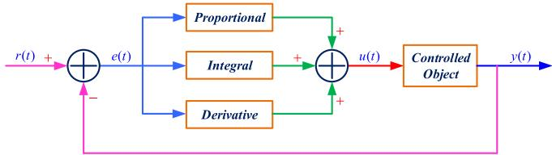  
Fig. 3. The structure of basic (or single-level) PID controller.

The aim of a control system, whose core is the controller, is to obtain or retain a desired response, denoted by r(t), for a given dynamical system. This is realized almost always via a closed-loop control system, because the feedback utilized can keep the process variable close to the desired value in spite of various disturbances and variations of the process dynamics. In a feedback-based control system, the controller determines the input signal to the process on the basis of both the reference or desired signal $r ( t )$ and the measurement of system output (i.e., the feedback signal), denoted by y(t).

As shown in Fig. 3, applying a PID control law consists of applying properly the sum of three types of control actions, i.e., a proportional action, an integral action and a derivative one. Let $e ( t ) = r ( t ) - y ( t )$ denote the error signal between the reference signal $r ( t )$ and the system measurement or output $y ( t )$ . Then, the PID control (or the input signal imposed on the controlled object), denoted by $u ( t )$ , is expressed as

$$
u ( t ) = K _ { \mathrm { P } } e ( t ) + K _ { \mathrm { I } } \int _ { 0 } ^ { t } e ( \tau ) d \tau + K _ { \mathrm { D } } \frac { d } { d t } e ( t ) ,\tag{4}
$$

where $K _ { \mathrm { P } } e ( t ) , K _ { \mathrm { I } } \int e ( \tau ) d \tau$ and $K _ { \mathrm { D } } d e ( t ) / d t$ are the proportional action, integral action and derivative action, respectively. The coefficients $K _ { \mathrm { P } } , K _ { \mathrm { I } }$ and $K _ { \mathrm { D } }$ are respectively referred to as proportional gain, integral gain and derivative gain.

Note that as a widely-used control technique, the practical meaning of each control action has an intuitive interpretation. Specifically, the proportional action, proportional to the current control error, can increase the control variable when the control error is large (with appropriate sign). Hence, it has the advantage of providing a small control variable when the control error is small and therefore to avoid excessive control efforts. But a critical drawback is that it produces a steadystate error. In contrast, the integral action, proportional to the integral of the control error, can well remove the steady-state error. The derivative action is based on predicted future values of the control error, which has a potentiality in improving the control performance as it can anticipate an incorrect trend of the control error and therefore counteract for it. For more details about PID, it is referred to [33] and [34].

## B. Practical PID Control System

There are many different kinds of disturbances in a practical environment, which always have different characteristics. For example, the lasting time and interaction strength of different disturbances can be quite different. As a result, it is difficult to achieve a satisfactory performance using only the previous single-level PID controller in complex practical environments. To tackle this issue, as well as maintain the advantage of low complexity, the multi-level PID controller is proposed. Note that for different UAVs, the structure and principle of the PID controllers are similar. Hence, we take the controller designed for the representative multicopter as an example to analyze and explain the principle, since it has the ability of hovering, which is important for wireless communications.

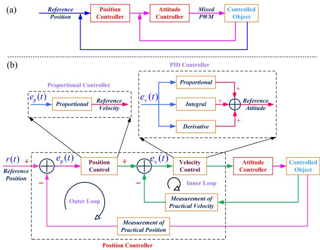  
Fig. 4. The structure of control system for mission flight mode.

In general, the structures of the control systems for different flight modes are also different. For example, the main component of the control system for the semi-autonomous flight mode is attitude controller. In contrast, the control system for the mission mode is more complex, which includes a position controller and an attitude controller, as shown in Fig. 4-(a). It is also seen that the output of the position controller is the input of the attitude controller. For two most popular open-source FCSs, i.e., PX4<sup>1</sup> and APM,<sup>2</sup> both the position controller and attitude controller are a two-level or double-loop controller. Without loss of generality, we take the controller within PX4 as an example to explain the principle of mission mode control, so as to better understand the algorithm designed later.

As shown in Fig. 4-(b), the position controller consists of two loops, i.e., the outer loop (also referred to as the position loop) and inner loop (also referred to as the velocity loop). The input for the position loop is the reference or desired position. It should be noted that the PID controller is degenerated to the simplest proportional controller for the position loop. The output of the proportional controller is used to form the input of the velocity loop. The velocity controller is a standard PID controller. The output of the velocity control unit is reference attitude, which is fed to the attitude controller.<sup>3</sup> The mission of the attitude controller is to form the desired attitude. The structure and components of the attitude controller are similar to those of the position controller, which are omitted here.

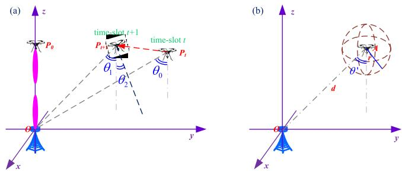  
Fig. 5. An illustration of beam offsets caused by relative position and attitude.

Remark 2: Note that in contrast to the semi-autonomous flight mode, we often do not directly control the attitude, e.g., by providing the reference attitude. As discussed above, the reference attitude is provided by the position controller. In the following, it will become clear how this observation affects our algorithm design.

## IV. BEAM PREDICTION AND TRACKING DESIGN

Based on the above analysis, we can now design an efficient beam prediction algorithm. Before proceeding, we first outline the basic idea of our beam prediction solution. Specifically, we first decompose the whole flight process between any two adjacent waypoints into three stages, i.e., acceleration stage, deceleration stage and uniform motion stage. Then, we further analyze and exploit the characteristics of each flight stage to design the corresponding prediction solution, so as to reduce the overall computational complexity as much as possible. In this section, we temporarily assume that the distance between any two adjacent waypoints is short and thus the acceleration stage and deceleration stage are dominated.

To simplify algorithm design and, more importantly, to achieve better performance, we decompose the overall beam offset into two components, i.e., beam offset caused by the attitude of UAV and beam offset caused by the relative position between the BS and UAV, as shown in Fig. 5-(a). It is assumed that the UAV initially hovers right above the BS (i.e., position $P _ { 0 } )$ and the beam direction is (0, 0). When the UAV moves to point $P _ { t }$ and hovers there, we need to compensate for the beam offset $\theta _ { 0 }$ caused by their relative position. When it further moves to $P _ { t + 1 }$ , we need to compensate for the beam offsets caused by both the relative position and the attitude, i.e., $\theta _ { 1 }$ and $\theta _ { 2 }$ respectively.

In this section, we focus on the prediction of beam offset caused by the attitude of UAV. But note that in some cases, the algorithm developed can be used independently, e.g., when the variation of beam offset caused by the relative position is not too large, as shown in Fig. 5-(b). The rationale for this is that the deep neural network (DNN) based learning algorithm developed later can implicitly compensate small disturbances or fluctuations. Although the principle of the control system in Fig. 4 is very intuitive, it is a nonlinear system. Besides, many external factors, e.g., the wind, affect the behavior of the controller. As a result, it is challenging to analytically derive an expression of the beam offset needed to be compensated for. To tackle this issue, we choose a DNN to fit the nonlinear mapping. Next, we determine the input and output.

As observed in Fig. 4 and discussed in the previous section, the error between the reference position and measured position almost uniquely controls the behavior of the controller. Hence, it is naturally chosen as the input. But the dynamic range of the error signal can be very large, which can greatly decrease the training efficiency. To this end, we propose the following trick. Let $e _ { \mathrm { p } } ( t ) = ( e _ { \mathrm { p , x } } ( t ) , e _ { \mathrm { p , y } } ( t ) , e _ { \mathrm { p , z } } ( t ) )$ denote the position error signal. Then, it is preprocessed as follows:

$$
\tilde { e } _ { \mathrm { p } } ( t ) = \big ( T ( e _ { \mathrm { p , x } } ( t ) ) , T ( e _ { \mathrm { p , y } } ( t ) ) , T ( e _ { \mathrm { p , z } } ( t ) ) \big ) ,\tag{5}
$$

where transform $T$ is defined by $T ( x ) = \mathrm { s i g n } ( x ) \log ( 1 + | x | )$ The sign function sign(·) and log function keeps the sign and adjusts the dynamic range, respectively. To calculate the input for velocity loop (or attitude controller), current velocity (or attitude) is required. Hence, the current velocity and attitude should also be fed to the network. For convenience, the input of the DNN is collected into vector x. Next, we determine the output of the prediction model, which is, however, not unique. In fact, it depends on whether the yaw angle is fixed. In practice, the yaw angle is often fixed for the multicopter, especially when the rack layout is symmetric. In this paper, we adhere to the tradition and fix the yaw angle. In this case, the output of the prediction model is a two dimensional vector, i.e., the beam offsets along the roll and pitch channels.

We still need to determine the structure of the prediction model. In contrast to many wireless communication designs, e.g., precoding, uncertainty calibration is often indispensable for beam prediction, which is, for example, used to determine the strategy of beam probing or locally sweeping. To meet this requirement, we propose to construct a Bayesian model. Note also that the prediction model should not be too complex to implement in real-time. To balance the two requirements, we append a Bayesian linear layer to the DNN. Specifically, the DNN characterizes complex control and decision behaviors as well as system evolution, and meanwhile the Bayesian linear layer measures uncertainty and facilitates adaptation.

In light of the following two reasons, we can predict and track the roll channel and pitch channel independently.<sup>4</sup> First, the rack layout of a multicopter is almost always symmetric. More importantly, the roll channel and pitch channel are, in fact, controlled separately. Without loss of generality, we take the roll channel as an example. Based on the above analysis, the Bayesian prediction model can be expressed as

$$
b _ { t } = { \pmb w } ^ { \mathrm { T } } \phi ( { \pmb x } _ { t } ; { \Omega } ) + \varepsilon \in \mathbb { R } ,\tag{6}
$$

where $\phi$ denotes the DNN with output size $D ,$ and w denotes the weight of the Bayesian linear layer. The set $\Omega$ collects all trainable parameters of the DNN (e.g., weights and biases). To complete the modeling, a prior for w has to be assigned. To avoid intractability, the prior for vector w is assumed to be $\mathcal { N } ( m _ { 0 } , \pmb { \Sigma } _ { 0 } )$ . ε in (6) is distributed as $\varepsilon \sim \mathcal { N } ( 0 , \sigma _ { 0 } ^ { 2 } )$ .

Let $\begin{array} { r l r } { \boldsymbol { b } ^ { \mathrm { T } } } & { { } } & { = } & { \left[ b _ { t _ { 1 } } , b _ { t _ { 2 } } , \cdot \cdot \cdot , b _ { t _ { N } } \right] } \end{array}$ and $\Phi ^ { \mathrm { T } }$ = $[ \phi ( \pmb { x } _ { t _ { 1 } } ) , \phi ( \pmb { x } _ { t _ { 2 } } ) , \cdot \cdot \cdot , \phi ( \pmb { x } _ { t _ { N } } ) ]$ , the conditional probability of b is given by

$$
\begin{array} { l } { p ( \pmb { b } | \Phi , \pmb { w } ) } \\ { = \frac { 1 } { ( 2 \pi \sigma _ { 0 } ^ { 2 } ) ^ { N / 2 } } \exp \left( - \frac { 1 } { 2 \sigma _ { 0 } ^ { 2 } } \displaystyle \sum _ { i = 1 } ^ { N } \left\| b _ { t _ { n } } - { \pmb w } ^ { \mathrm { T } } \phi ( \pmb { x } _ { t _ { i } } ) \right\| ^ { 2 } \right) } \\ { = \frac { 1 } { ( 2 \pi \sigma _ { 0 } ^ { 2 } ) ^ { N / 2 } } \exp \left( - \frac { 1 } { 2 \sigma _ { 0 } ^ { 2 } } \big \| \pmb { b } - \Phi \pmb { w } \big \| ^ { 2 } \right) . } \end{array}
$$

It can be verified that the posterior for ${ \pmb w } ,$ conditioned on b and $\Phi ,$ , is also a Gaussian distribution, denoted by $\mathcal { N } ( \bar { m } , \bar { \Sigma } )$ where m¯ and $\bar { \Sigma }$ are respectively given by

$$
\begin{array} { r l } & { \bar { \boldsymbol { \Sigma } } = \boldsymbol { \Phi } ^ { \mathrm { T } } \boldsymbol { \Phi } + \boldsymbol { \Sigma } _ { 0 } } \\ & { \bar { \boldsymbol { m } } = \bar { \boldsymbol { \Sigma } } ^ { - 1 } \big ( \boldsymbol { \Phi } ^ { \mathrm { T } } \boldsymbol { b } + \boldsymbol { \Sigma } _ { 0 } \boldsymbol { m } _ { 0 } \big ) . } \end{array}\tag{7}
$$

Similarly, it can be proved that the posterior predictive distribution for a new sample ${ \pmb x } _ { \mathrm { n } }$ is still a Gaussian distribution:

$$
\begin{array} { r } { p \big ( b ( { \pmb x } _ { \mathrm { n } } ) | { \pmb x } _ { \mathrm { n } } , { \pmb \Phi } , b \big ) = \mathcal { N } \big ( m ( { \pmb x } _ { \mathrm { n } } ) , \Sigma ( { \pmb x } _ { \mathrm { n } } ) \big ) , } \end{array}\tag{8}
$$

where $m ( { \pmb x } _ { \mathrm { { n } } } )$ and $\Sigma ( { \pmb x } _ { \mathrm { \scriptscriptstyle n } } )$ are respectively given by

$$
\begin{array} { l } { m ( { \pmb x } _ { \mathrm { { n } } } ) = \pmb { \bar { m } } ^ { \mathrm { T } } \phi ( { \pmb x } _ { \mathrm { { n } } } ) } \\ { \Sigma ( { \pmb x } _ { \mathrm { { n } } } ) = \sigma _ { 0 } ^ { 2 } \big ( 1 + \phi ( { \pmb x } _ { \mathrm { { n } } } ) ^ { \mathrm { T } } \bar { \Sigma } ^ { - 1 } \phi ( { \pmb x } _ { \mathrm { { n } } } ) \big ) . } \end{array}\tag{9}
$$

For the beam prediction problem considered, the available dataset can be represented by $\mathcal { D } = \{ \mathcal { T } _ { 1 } , \mathcal { T } _ { 2 } , \cdot \cdot \cdot , \mathcal { T } _ { U } \}$ , where each element in $\mathcal { D } \ ( \mathrm { e . g . , ~ } \mathcal { T } _ { i } )$ often corresponds to the information of a trajectory (from target $A _ { i } { \mathrm { \bf ~ t o } } A _ { i + 1 } )$ or a segment of the trajectory of the multicopter. Each $\mathcal { T } _ { i }$ (of size $n _ { i } )$ takes the form $\mathcal { T } _ { i } = \{ ( \pmb { x } _ { 1 } , b _ { 1 } ) , ( \pmb { x } _ { 2 } , b _ { 2 } ) , \cdots , ( \pmb { x } _ { n _ { i } } , b _ { n _ { i } } ) \}$ . From the view of date generation, $\mathcal { T } _ { i }$ can be generated as follows [35], [36], [37]. First, an environment related latent parameter ω is sampled from a set E with distribution $p ( \omega )$ , where E accommodates all possible factors that affect the generation of $\mathcal { D } _ { : }$ including external flight condition (e.g., wind), thrust system, and so on. Given dataset $\tau$ (omitting subscript i), the posterior predictive distribution over $b = b ( \pmb { x } _ { \mathrm { n } } )$ for a new sample ${ \pmb x } _ { \mathrm { n } }$ is given by

$$
p _ { \mathrm { G } } ( b | \boldsymbol { x } _ { \mathrm { n } } , \mathcal { T } ) = \int p ( b | \boldsymbol { x } _ { \mathrm { n } } , \omega ) p ( \omega | \mathcal { T } ) d \omega .\tag{10}
$$

Unfortunately, computing analytically the predictive distribution is intractable, since $p ( b | \mathbf { \boldsymbol { x } } _ { \mathrm { { n } } } , \omega )$ and $p ( \omega | \mathcal { T } )$ are unavailable. An effective method to address this issue is variational inference [35], [37]. To avoid possible confusion, we similarly write the probability prediction model in (8) as follows

$$
p { \Xi } ( b | { \bf { x } } _ { \mathrm { { n } } } , { \mathcal { T } } ) ,\tag{11}
$$

where $\Xi = \{ m _ { 0 } , \Sigma _ { 0 } , \Omega \}$ collects all optimization variables. The learning or optimization goal is chosen to minimize the Kullback-Leibler (KL) divergence [35], [37], i.e.,

$$
\operatorname* { m i n } _ { \Xi } \mathrm { K L } \big ( p _ { \mathrm { G } } ( b | \pmb { x } _ { \mathrm { n } } , \mathcal { T } ) \| p _ { \Xi } ( b | \pmb { x } _ { \mathrm { n } } , \mathcal { T } ) \big ) .\tag{12}
$$

According to the definition of KL divergence, the objective function in (12) can be equivalently written as

$$
\mathrm { K L } \big ( p _ { \mathrm { G } } ( b | \mathbf { x } _ { \mathrm { n } } , T ) \| p _ { \mathrm { \Xi } } ( b | \mathbf { x } _ { \mathrm { n } } , T ) \big )
$$

$$
\begin{array} { r l } { } & { = \mathbb { E } _ { p _ { \mathbb { G } } } \big ( \log ( p _ { \mathbb { G } } ( b | x _ { \mathfrak { n } } , \mathcal { T } ) ) - \log ( p _ { \Xi } ( b | x _ { \mathfrak { n } } , \mathcal { T } ) ) \big ) } \\ { } & { = \mathbb { E } _ { p _ { \mathbb { G } } } \big ( \log ( p _ { \mathbb { G } } ( b | x _ { \mathfrak { n } } , \mathcal { T } ) ) \big ) - \mathbb { E } _ { p _ { \mathbb { G } } } \big ( \log ( p _ { \Xi } ( b | x _ { \mathfrak { n } } , \mathcal { T } ) ) \big ) . } \end{array}
$$

Note that the first term above does not affect the optimization variables in $\Xi ,$ which thus can be ignored. As for the second term, it can be evaluated via the Monte Carlo method. In fact, by rewriting the negative log-likelihood with (8) and (9) and discarding the terms irrelevant to the optimization variables, we can obtain the following optimization goal

$$
= \mathbb { E } _ { p _ { \mathrm { G } } } { \Big ( } \log { \big ( } \Sigma ( x _ { \mathrm { n } } ) { \big ) } + \Sigma ^ { - 1 } ( x _ { \mathrm { n } } ) { \big ( } b ( x _ { \mathrm { n } } ) - m ( x _ { \mathrm { n } } ) { \big ) } ^ { 2 } { \Big ) } + C ,
$$

$$
\Xi .
$$

Now, we can present an efficient training algorithm. For each $\mathcal { T } _ { i } \in \mathcal { D } .$ , we sample randomly and uniformly $\mathcal { T } _ { i }$ and obtain a subset denoted by $\mathcal { T } _ { i , 1 }$ . Then, we can compute the posterior distribution of each element in subset $\mathcal { T } _ { i , 2 } = \mathcal { T } _ { i } \backslash \mathcal { T } _ { i , 1 }$ (based on the formulas in $( 7 ) \textrm { - } ( 9 ) )$ conditioned on $\mathcal { T } _ { i , 1 }$ . Specifically, we first compute the posterior distribution of w conditioned on $\mathcal { T } _ { i , 1 }$ via (7). For simplicity, the terms Σ<sup>¯</sup> and m¯ in (7) which are calculated based on $\mathcal { T } _ { i , 1 }$ are denoted by $\bar { \Sigma } _ { \mathcal { T } _ { i , 1 } }$ and $\bar { m } _ { \mathcal { T } _ { i , 1 } }$ , respectively. Finally, we can construct the following loss:

$$
\frac { 1 } { \mathrm { c a r d } ( \mathcal { T } _ { i , 2 } ) } \sum _ { \pmb { x } \in \mathcal { T } _ { i , 2 } } \bigg ( \log \Big ( 1 + \phi ( \pmb { x } ) ^ { \mathrm { T } } \bar { \Sigma } _ { \mathcal { T } _ { i , 1 } } ^ { - 1 } \phi ( \pmb { x } ) \bigg )
$$

$$
+ \frac { 1 } { \sigma _ { 0 } ^ { 2 } } \Big ( 1 + \phi ( { \pmb x } ) ^ { \mathrm { T } } \bar { \Sigma } _ { \mathcal { T } _ { i , 1 } } ^ { - 1 } \phi ( { \pmb x } ) \Big ) ^ { - 1 } \big ( b ( { \pmb x } ) - m ( { \pmb x } ) \big ) ^ { 2 } \bigg ) .\tag{13}
$$

Note that the optimization variable $\Sigma _ { 0 } \in \Xi$ has to be positive definite, which leads to a troublesome constrained optimization problem. We tackle this issue by introducing a new optimization variable $\mathbf { L } _ { 0 } \in \mathbb { R } ^ { D \times D }$ and replacing $\Sigma _ { 0 }$ in (7) with ${ \bf L } _ { 0 } { \bf L } _ { 0 } ^ { \mathrm { T } }$ Now, the optimization variables are $\Xi ^ { \prime } = \{ m _ { 0 } , { \bf L } _ { 0 } , \Omega \}$

Algorithm 1 Offline Training/Learning Algorithm   
1) input: historical dataset $\overline { { \mathcal { D } = \{ T _ { 1 } , T _ { 2 } , \cdot \cdot \cdot , T _ { U } \} } }$   
2) initialize randomly trainable parameters in $\overline { { \Xi ^ { \prime } } }$   
3) repeat   
(a) choose randomly an element $\mathcal { T } _ { i }$ from D   
(b) sample randomly $\mathcal { T } _ { i }$ to construct $\mathcal { T } _ { i , 1 }$ and $\mathcal { T } _ { i , 2 }$   
(c) compute posterior distribution as per $( 7 ) \mathrm { - } ( 9 )$   
(d) construct loss function according to (13)   
(e) optimize variables in $\Xi ^ { \prime }$ via gradient descent   
until some convergence criterion is met   
4) output: optimal network parameters Ω<sup>?</sup> and prior distri  
bution $\mathcal { N } ( m _ { 0 } ^ { \star } , \Sigma _ { 0 } ^ { \star } )$ with $\dot { \boldsymbol \Sigma } _ { 0 } ^ { \star } = \mathbf { L } _ { 0 } ^ { \star } ( \mathbf { L } _ { 0 } ^ { \star } ) ^ { \mathrm { T } }$

For clarity, the training algorithm is summarized in Algorithm 1. To optimize the prediction model, the training dataset should be collected offline. Then, we randomly initialize the variables in $\Xi ^ { \prime }$ . Next, we randomly choose an element $\mathcal { T } _ { i }$ from D in step (a) and further construct two subsets $\mathcal { T } _ { i , 1 }$ and $\mathcal { T } _ { i , 2 }$ in step (b). In practice, we often sample a mini-batch from D and similarly construct two subsets for each element. In step (c) and (d), we respectively compute the posterior distribution and compute the loss. With the loss available, we can optimize the trainable parameters via the stochastic gradient descent method or more advanced methods in step (e). We repeat the above procedure until a convergence criterion or predefined number of iterations is met. After training, we can obtain the optimal network parameters and prior distribution.

```latex
Algorithm 2 Online Adaptive Inference Algorithm
1) input: trained neural network with $\overline { { \Omega ^ { \star } } }$ and prior distribu
tion $\underline { { \mathcal { N } ( m _ { 0 } ^ { \star } , \Sigma _ { 0 } ^ { \star } ) } }$ with $\begin{array} { r } { \Sigma _ { 0 } ^ { \star } = \mathbf { L } _ { 0 } ^ { \star } ( \mathbf { L } _ { 0 } ^ { \star } ) ^ { \mathrm { T } } } \end{array}$
2) initialize auxiliary variable $\overline { { { \pmb q } _ { 0 } = { \pmb \Sigma } _ { 0 } ^ { \star } { \pmb m } _ { 0 } ^ { \star } } }$ and precision
matrix $\Pi _ { 0 } = ( \pmb { \Sigma } _ { 0 } ^ { \star } ) ^ { - 1 }$
3) launch algorithm by preparing for at least one point
$( { \pmb x } _ { 0 } , b _ { 0 } )$ and set counter $n \gets 1$
4) repeat (for each time-slot)
(a) collect context ${ \pmb x } _ { n }$ for current time-slot n
(b) update precision matrix according to (14)
(c) update q: ${ \pmb q } _ { n }  \phi ( { \pmb x } _ { n - 1 } ) b _ { n - 1 } + { \pmb q } _ { n - 1 }$
(d) update vector m: ${ \pmb m } _ { n } \gets { \pmb \Pi } _ { n } { \pmb q } _ { n }$
(e) compute posterior distribution as per (15)
(f) find out optimal beam via local sweeping
(g) switch to next time-slot: $n \gets n + 1$
end
With parameters $\Omega ^ { \star }$ and prior $\mathcal { N } ( m _ { 0 } ^ { \star } , \Sigma _ { 0 } ^ { \star } )$ available, we
can perform online Bayesian linear regression when facing a
new task (e.g., flying from $A _ { j }$ to target $A _ { j + 1 } )$ . For clarity,
the online inference procedure is summarized in Algorithm 2.
To reduce computational complexity and simplify expression,
we introduce precision matrix Π and auxiliary variable q and
initialize them in step 2. Similar to many tracking algorithms,
we need to collect at least one sample to launch the algorithm
in step 3. Then, for each time-slot we perform the following
steps in turn. First, we prepare for context information in step
(a). In step (b), we update the precision matrix:
```

$$
\mathbf { I I } _ { n }  \mathbf { I I } _ { n - 1 } - \frac { \mathbf { I I } _ { n - 1 } \phi ( { \pmb x } _ { n - 1 } ) \phi ( { \pmb x } _ { n - 1 } ) ^ { \mathrm { T } } \mathbf { I I } _ { n - 1 } ^ { \mathrm { T } } } { 1 + \phi ( { \pmb x } _ { n - 1 } ) ^ { \mathrm { T } } \mathbf { I I } _ { n - 1 } \phi ( { \pmb x } _ { n - 1 } ) } .\tag{14}
$$

The auxiliary variable q and vector m are updated in step (c) and step (d), respectively. Then, we can compute the posterior predictive distribution for context ${ \pmb x } _ { n }$ , which is given by

$$
\begin{array} { r l } & { p \big ( b _ { n } | \pmb { x } _ { 0 } , \cdot \cdot \cdot , \pmb { x } _ { n - 1 } \big ) = \mathcal { N } \big ( m ( \pmb { x } _ { n } ) , \pmb { \Sigma } ( \pmb { x } _ { n } ) \big ) } \\ & { \ = \mathcal { N } \Big ( m _ { n } ^ { \mathrm { T } } \phi ( \pmb { x } _ { n } ) , \sigma _ { 0 } ^ { 2 } \big ( 1 + \phi ( \pmb { x } _ { n } ) ^ { \mathrm { T } } \pmb { \Pi } _ { n } \phi ( \pmb { x } _ { n } ) \big ) \Big ) . } \end{array}\tag{15}
$$

With the posterior predictive distribution available, we can construct a beam subspace as follows:

$$
\begin{array} { r } { \mathbb { Z } _ { n } = \Big ( m ( \pmb { x } _ { n } ) - c \sqrt { \Sigma ( \pmb { x } _ { n } ) } , m ( \pmb { x } _ { n } ) + c \sqrt { \Sigma ( \pmb { x } _ { n } ) } \Big ) , } \end{array}\tag{16}
$$

where constant c controls the length of the confidence interval ${ \mathcal { I } } _ { n }$ . The typical values of c can be 1 or 2 [37]. By sweeping the beam confidence interval, we can find out the optimal beam. It should be emphasized that since our algorithm is designed based on control, which can provide sufficient information to capture the behavior of UAV, the predictive variance $\Sigma ( { \pmb x } _ { n } )$ is small. Therefore, the local beam sweeping operation can be removed, which thus reduces the tracking overhead.

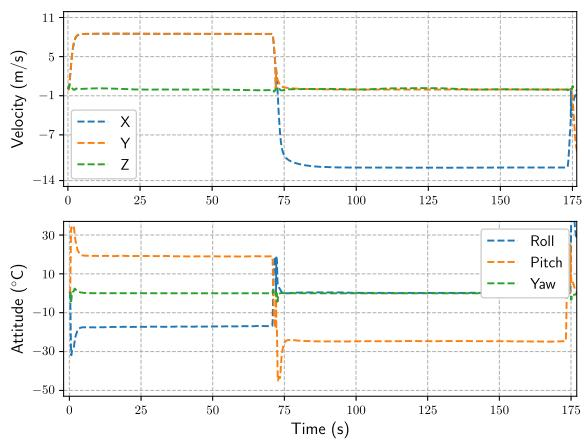  
Fig. 6. The velocity and attitude information of two flight trajectories. The flight path is (0, 0, 25) → (600, 600, 25) → (−600, 600, 20).

## V. LOW-COMPLEXITY POSITION PREDICTIONALGORITHM

In this section, we focus on the prediction of beam offset caused by the relative position between the BS and UAV. To simplify description, in the following part of this paper the beam offset caused by the relative position is referred to as beam offset of second kind or Type II beam offset. In contrast, the beam offset caused by the attitude of UAV is referred to as beam offset of first kind or Type I beam offset. The current time-slot is denoted by $t _ { n }$ . The key of estimating Type II beam offset is to estimate the position of UAV for time-slot $t _ { n + 1 }$ which is denoted by $\pmb { p } _ { n + 1 } = ( x _ { n + 1 } , y _ { n + 1 } , z _ { n + 1 } )$

Before proceeding, we need to emphasize that the position sensors (like GPS and Beidou) cannot provide future position estimate $\hat { \pmb { p } } _ { n + 1 }$ , which is, however, required here (except for some special cases, e.g., low-speed flight case). The reasons are as follows. First, most commercial position sensors only provide current position, rather than the future position. More importantly, the update frequency of these sensors is often too low to provide real-time position information. Typically, they output the position information once per second, which fails to meet the requirement of UAV mmwave communications. To tackle this issue, a learning-based solution, referred to as displacement prediction network, has been proposed in [32] for the semi-autonomous flight mode. Although the algorithm in [32] applies here, we can design a more efficient algorithm, whose computational complexity can be ignored.

The algorithm is designed based on the below important property of mission flight mode, while the property is derived from practical constraints of the previous control system (and also other practical control systems). Essentially, because of the saturation effect of a control system, if the distance between the current position and reference point is sufficiently large, the UAV will quickly reach a steady state, where many parameters of interest, like the attitude and velocity, approximately remain unchanged. An example, from a real system, is provided in Fig. 6. It is observed that within the middle part of each trajectory (e.g., the interval [15s, 65s] for the first trajectory and interval [95s, 160s] for the second trajectory), both the velocity and attitude of UAV keep fixed.

This phenomenon can also be briefly explained as follows. As the error signal $e _ { \mathsf { p } } ( t )$ is very large in this case, the reference attitude and control output are surely very large. As a result, the propulsion desired is very large, so as to reduce the error distance as quickly as possible. But note that the propulsion of a practical system is limited. Hence, the UAV finally reaches a steady state. To avoid deviating from the topic of designing an efficient algorithm, we postpone the complete analysis to the appendix of Theorem 1 formally stated below.

Theorem 1: For a flight trajectory from $A _ { j }$ to $A _ { j + 1 } .$ , if the distance between the current position and reference position $A _ { j + 1 }$ is sufficiently large, the attitude and velocity of the UAV keep fixed after a distance $D _ { 0 }$ (or time $T _ { 0 } )$ .

Proof: See Appendix A.

The distance (or time) constant $D _ { 0 }$ (or $T _ { 0 } )$ depends on the control and propulsion systems. It is generally a deterministic value for a fixed UAV or a fixed type of UAVs. Therefore, it can be easily determined based on the information of several flight trajectories collected by FCS. Because a good response speed is required by FCS, $T _ { 0 }$ and $D _ { 0 }$ are often small.

Based on Theorem 1, we can predict the position of UAV in a simple manner. Let ${ \pmb v } _ { t _ { 0 } } = ( v _ { x } ( t _ { 0 } ) , v _ { y } ( t _ { 0 } ) , v _ { z } ( t _ { 0 } ) )$ denote the velocity vector at time $t _ { 0 } ,$ which can be obtained from FCS directly. If position $\pmb { p } _ { t _ { 0 } } = ( x _ { t _ { 0 } } , y _ { t _ { 0 } } , z _ { t _ { 0 } } )$ for time $t _ { 0 }$ is avail-able, ${ \pmb { p } } _ { t _ { 0 } + \Delta t _ { 0 } }$ for time $t _ { 0 } + \Delta t _ { 0 }$ can be estimated as

$$
\begin{array} { r } { \hat { p } _ { t _ { 0 } + \Delta t _ { 0 } } = ( x _ { t _ { 0 } } + v _ { x } ( t _ { 0 } ) \Delta t _ { 0 } , \qquad } \\ { y _ { t _ { 0 } } + v _ { y } ( t _ { 0 } ) \Delta t _ { 0 } , z _ { t _ { 0 } } + v _ { z } ( t _ { 0 } ) \Delta t _ { 0 } ) . } \end{array}\tag{17}
$$

Note that the update frequency of the velocity vector is much higher than that of the position sensor, as it is estimated via inertial measurement units (IMUs). By successively applying (17), we can estimate the position $\pmb { p } _ { t _ { 0 } + \sum _ { k = 0 } ^ { K - 1 } \Delta t _ { k } }$

Remark 3: Thanks to the high update frequency, although Theorem 1 may hold true approximately in a practical environment, since many external factors may affect it $( \mathrm { e . g . }$ ., the wind may slightly change the speed of UAV), the accuracy of the position estimated via (17) still meets requirements.

Note that since the difference between the positions at two adjacent time-slots is used to estimate an absolute position, it may incur an accumulative error after running a long time. Fortunately, the position sensor provides absolute position information. Hence, we can tackle this issue by fusing the absolute position information. Although there are better methods to fuse the two types of information, we simply choose the absolute position as starting point and invoke (17) directly within the update period of the sensor to reduce the complexity.

For clarity, the position prediction algorithm is summarized in Algorithm 3. The update cycles of the position sensor and velocity vector are denoted by $F _ { \mathrm { P } }$ and $F _ { \mathrm { V } } ,$ , respectively. In general, $F _ { \mathrm { P } } < 1 / T _ { \mathrm { S } } = F _ { \mathrm { S } } < F _ { \mathrm { V } }$ and $F _ { \mathrm { P } } \ll F _ { \mathrm { V } }$ hold true, e.g., $F _ { \mathrm { P } } ~ = ~ \mathrm { 1 H z }$ and $F _ { \mathrm { V } } = 5 0 \mathrm { H z } $ . For simplicity, they are assumed to meet the relationships $F _ { \mathrm { V } } = L _ { 1 } / T _ { \mathrm { S } } = L _ { 1 } F _ { \mathrm { S } }$ and $F _ { \mathrm { S } } ~ = ~ L _ { 2 } F _ { \mathrm { P } }$ , with both $L _ { 1 }$ and $L _ { 2 }$ integers. Note that the duration of each time-slot in Algorithm 3 is $1 / F _ { \mathrm { V } }$ , which is smaller than that used in Algorithms 1 and 2. The key of the algorithm is to predict the position to compute Type II beam offset every $L _ { 1 } / F _ { \mathrm { V } }$ second and update the absolute position every $L _ { 1 } L _ { 2 } / F _ { \mathrm { V } }$ second. The termination condition can be that the velocity varies significantly. It will be clear later.

Algorithm 3 Position Prediction Algorithm   
1) input: update frequencies $F _ { \mathrm { P } } , F _ { \mathrm { S } } = T _ { \mathrm { S } } ^ { - 1 }$ and $F _ { \mathrm { V } }$   
2) initialize counter $\bar { j } = 0$ and obtain initial absolute position   
$\pmb { p } _ { 0 }$ via position sensor   
3) repeat for each time-slot   
(a) obtain velocity vector ${ \pmb v } _ { j }$ from FCS   
(b) update position $\mathbf { \delta } _ { \mathbf { \mathcal { P } } _ { j } }$ to $\pmb { p } _ { j + 1 }$ as per (17)   
(c) if j mod $L _ { 1 } ~ = ~ { \ o \mathrm { ~ \Gamma ~ } } \Rightarrow ~$ output position $p _ { j + 1 }$ to   
compute Type II beam offset   
(d) if j mod $( L _ { 1 } L _ { 2 } ) = 0 \ \Rightarrow$ update absolute position   
via position sensor   
(e) update counter $j  j + 1$   
until a termination condition is met

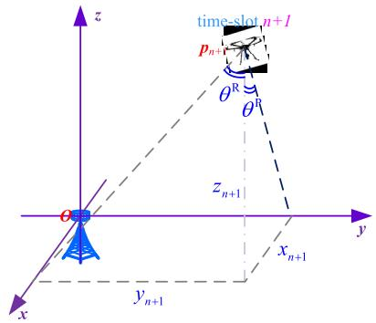  
Fig. 7. An illustration of computing Type II beam offset of roll/pitch channel.

With the position $\hat { \pmb { p } } _ { n + 1 }$ available, we can compute Type II beam offset. Without loss of generality, the coordinate of BS is assumed to be (0, 0, 0), and the course of UAV is parallel to the x-axis (and thus the yaw angle is zero), as shown in Fig. 7. Let $\theta _ { n + 1 , 2 } ^ { \mathrm { R } }$ and $\theta _ { n + 1 , 2 } ^ { \mathrm { P } }$ represent the beam offsets of second kind for the roll channel and pitch channel, respectively. Then, $\theta _ { n + 1 , 2 } ^ { \ R }$ and $\theta _ { n + 1 , 2 } ^ { \mathrm { P } }$ can be calculated as

$$
\begin{array} { r l } & { \theta _ { n + 1 , 2 } ^ { \mathrm { R } } = \arcsin \bigg ( y _ { n + 1 } / \sqrt { y _ { n + 1 } ^ { 2 } + z _ { n + 1 } ^ { 2 } } \bigg ) } \\ & { \theta _ { n + 1 , 2 } ^ { \mathrm { P } } = \arcsin \bigg ( x _ { n + 1 } / \sqrt { x _ { n + 1 } ^ { 2 } + z _ { n + 1 } ^ { 2 } } \bigg ) . } \end{array}\tag{18}
$$

Let $\theta _ { n + 1 , 1 } ^ { \mathrm { R } }$ (or $\theta _ { n + 1 , 1 } ^ { \mathrm { P } } )$ represent the beam offset of first kind for the roll (or pitch) channel obtained via Algorithm 2. Then, the overall beam offsets can be calculated as

$$
\begin{array} { r l } & { \theta _ { n + 1 } ^ { \mathrm { R } } = \theta _ { n + 1 , 1 } ^ { \mathrm { R } } + \theta _ { n + 1 , 2 } ^ { \mathrm { R } } } \\ & { \qquad = \theta _ { n + 1 , 1 } ^ { \mathrm { R } } + \arcsin \bigg ( y _ { n + 1 } / \sqrt { y _ { n + 1 } ^ { 2 } + z _ { n + 1 } ^ { 2 } } \bigg ) } \\ & { \theta _ { n + 1 } ^ { \mathrm { P } } = \theta _ { n + 1 , 1 } ^ { \mathrm { P } } + \theta _ { n + 1 , 2 } ^ { \mathrm { P } } } \\ & { \qquad = \theta _ { n + 1 , 1 } ^ { \mathrm { P } } + \arcsin \bigg ( x _ { n + 1 } / \sqrt { x _ { n + 1 } ^ { 2 } + z _ { n + 1 } ^ { 2 } } \bigg ) . } \end{array}
$$

Based on the previous three algorithms, we can present the complete beam prediction process. As shown in Fig. 8, it is sufficient to consider a typical flight trajectory, denoted by $\overrightarrow { A _ { j } A _ { j + 1 } }$ . The trajectory is divided into three parts, e.g., $S _ { 1 }$ $S _ { 2 }$ and $S _ { 3 }$ . In contrast to $S _ { 1 }$ and $S _ { 3 }$ , the UAV reaches a steady state for $S _ { 2 } .$ . Hence, we can predict Type II beam offset via Algorithm 3. As for Type I beam offset, it can be estimated by Algorithm 2. But for a stable environment, e.g., calm weather, there is often no need to invoke Algorithm 2. In fact, in this case its variation can be safely ignored, as per Theorem 1. Note that since the length of line segment $A _ { j } B _ { 1 }$ (or $B _ { 2 } A _ { j + 1 } )$ is small, its variation of Type II beam offset is also small, and the small variation can be implicitly captured by the nonlinear model within Algorithm 2. Therefore, the overall beam offset can be predicted by Algorithm 2 for $S _ { 1 }$ and $S _ { 3 }$

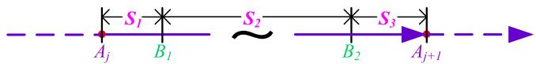  
Fig. 8. A flight trajectory is divided into three parts, and different algorithms are used to achieve a good balance between performance and complexity.

Algorithm 4 Two-Step Beam Tracking Algorithm   
1: input: trained model to predict Type I beam offset   
2: repeat for each time-slot   
(a) predict Type II beam offset via Algorithm 3   
(b) predict BCI of Type I beam offset $\mathcal { I } _ { n }$   
(c) compute BCI of overall beam offset $\mathcal { T } _ { n } ^ { \prime }$   
(d) find out optimal beam offset by sweeping $\mathcal { T } _ { n } ^ { \prime }$   
(e) compensate for optimal overall beam offset   
(f) transmit data and switch to next time-slot   
end

For clarity, the complete beam tracking solution is summarized in Algorithm 4. To invoke the algorithm, we need to first collect training data and invoke Algorithm 1 to construct and optimize a prediction model. Then, in each time-slot (of length $T _ { \mathrm { { S } } } )$ , we predict Type II beam offset in step (a) and compute beam confidence interval (BCI) of Type I beam offset in step (b), based on which we can determine the BCI of overall beam offset in step (c). By sweeping the BCI in step (d), we can find out the optimal overall beam offset. We compensate for the offset by choosing an appropriate beam from the codebook in step (e) and use it to transmit data in step (f).

Note that instead of estimating directly the overall beam offset in a single step within the whole flight procedure $( \mathrm { e . g . }$ by optimizing a single prediction model), we decompose the overall beam offset into two components and estimate them separately, which makes our algorithms enjoy two important advantages. First, there is no need to collect global data in a large physical extent (which is indispensable and expensive) and optimize a global model (which is challenging). Second, it can also well address the generalization issue, which exists in many ML solutions. By training a local model once, it applies almost everywhere for the same/similar FCS and UAV.

Finally, we briefly mention the design of beam prediction solution from the BS to UAV. Compared to beam prediction from the UAV to BS, the prediction of beam from BS to UAV is less challenging, since among different factors affecting the beam direction, the relative position between the BS and UAV is dominated. Hence, it is sufficient to predict the position of

UAV. In practice, the UAV can simply feed back its estimated position, i.e., $\hat { \pmb { p } } _ { t + 1 }$ , to the BS, based on which the BS can calculate the beam direction from BS to UAV.

Finally, we briefly discuss the computational complexity of the proposed algorithms. The number of real multiplications is used to measure the complexity. Although the computational complexity of Algorithm 1 may be large, it can be fulfilled offline by the ground station with powerful computational resources. Clearly, the computational complexity of Algorithm 3 can be safely ignored. The complexity of Algorithm 4 lies mainly in Algorithm 2, which, in fact, consists of two parts. The first one is the forward propagation of DNN, which can be fulfilled efficiently via modern FPGA, GPU or NPU. Its computational complexity is denoted by F . The second part is dominated by the update of matrix Π according to (14), whose complexity order is $\mathcal { O } ( D ^ { 2 } + D ^ { 3 } / 2 )$ ). Hence, the overall computational complexity is $F + { \mathcal O } ( D ^ { 2 } + D ^ { 3 } / 2 )$

## VI. EXPERIMENTAL VALIDATION AND RESULTS

In this section, experiment results from open-source hardware, software and real UAV are provided to demonstrate the effectiveness and superiority of our algorithms. We first introduce the simulation environment for readers. The experiment results are provided in the next subsection.

## A. Simulation Setup

To build our simulation environment, we adopt the opensource simulation softwares - Gazebo + ROS (or MAVROS). The two powerful softwares have been widely used in the filed of robotics, for both academic research and commercial applications. Gazebo is a 3D dynamic simulator with the ability to accurately and efficiently simulate populations of robots in complex indoor and outdoor environments [38]. Importantly, Gazebo offers physics simulation at a much higher degree of fidelity, a suite of sensors, and interfaces for both users.

ROS (robot operating system) is an open-source software development kit (SDK) for robotics applications [39]. It offers a standard software platform to developers across industries that will carry them from research and prototyping all the way through to deployment and production. Based on the software libraries and tools provided, researchers can quickly verify algorithm developed and build robot applications. MAVROS, which can be simply regarded as the combination of ROS and MAVLink [40], has been widely used in UAV development. MAVLink is a very lightweight, header-only message library for communication between drones and/or ground stations.

Note that the two softwares are chosen in this paper due to the following reasons. First and foremost, they can better verify and confirm the effectiveness of our algorithms, since the simulation environment has incorporated many practical factors (like air drag, size of propeller) and provided plenty of interfaces and tools, which makes it easy to access control information. Second, it also helps to improve the efficiency and safety of real experiments, since it is expensive to build a real platform and dangerous to manipulate real UAVs. Last but no least, they are free and open-source softwares.

Besides collecting key data (e.g., attitude and velocity) from the simulation environment, we also verify the performance of our algorithms (e.g., the real-time performance) based on the data collected from real UAV. The most popular F450 UAV is chosen in our experiments. The main components of the control and computing platform are illustrated in Fig. 9. The hardware and software of the FCS are widely-used Pixhawk and PX4, respectively [41]. The airborne computer that runs the algorithms in our paper is a single board computer, whose CPU is the Rockchip RK3506 processor - an ARM triple-core cortex A7 SoC (system-on-chip). To feed back necessary information of UAV to the ground, a Sub-6G communication link is established via two LORA modules.

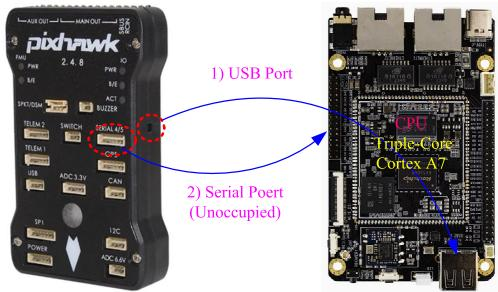  
Fig. 9. The main components of the control and computing platform.

For the PX4 FCS (and other FCS softwares, e.g., the popular APM), the access of UAV and controller information has been supported natively. For Pixhawk, there are at least two data collection methods, which are shown in Fig. 9 and discussed below:

• USB port: The FCS directly outputs almost all information (of both UAV and control system) required via the USB port, including also attitude and velocity. Hence, the single board computer can obtain the information directly via a USB line, without modifying any part of original source code. Moreover, ROS or MAVROS analyzes data stream from the USB port as per the MAVLink protocol and presents various kinds of information in the form of ROS topics. The computer can directly access the desired information, by subscribing one or more topics.

• (Unoccupied) Communication ports: For both Pixhawk and the computing platform, there are many unoccupied communication port resources, like serial port, serial peripheral interface (SPI) and inter-integrated circuit (I2C). Hence, the information required can also be derived via an unoccupied communication port. Compared to the first method, it avoids parsing the MAVLink protocol, which saves the valuable CPU resource. But we need to modify the source code by adding an extra function.

In this paper, we choose the first method to obtain the attitude and velocity information, since the second method has already been utilized in [32], although it applies here as well (e.g., to obtain the information via Serial Port 4 in Fig. 9).

For the nonlinear prediction model in (6), the conventional fully-connected network structure with four layers is chosen here, and the numbers of neurons are 128, 256, 256 and 24, respectively. To enable 3D beamforming, the uniform planar array is considered. The widths of each beam in the codebook along the roll and pitch directions are about 4<sup>◦</sup>. The length of transmission time interval or time-slot is 100 milliseconds. As shown in Fig. 10, the case of four targets $( \mathrm { i . e . , ~ } A _ { 0 } , ~ A _ { 1 }$ , A<sub>2</sub> and $A _ { 3 } )$ is considered to evaluate different beam prediction and tracking algorithms. For the $\mathrm { ^ { * } G a z e b o + R O S ^ { \mathrm { , } } }$ simulation case, the height of UAV is fixed to 45m, and each $A _ { i } \left( i \right. =$ $0 , 1 , 2 , 3 )$ is chosen randomly from a circular region denoted by $\mathcal { R } ( O _ { i } , 5 0 )$ . For the case of F450, the distributions of target waypoints are similar but $\lvert O _ { 0 } O _ { 1 } \rvert { = } 6 0 0 \mathrm { m }$ . For both cases, the position of BS is the center of rectangle $O _ { 0 } O _ { 1 } O _ { 2 } O _ { 3 }$

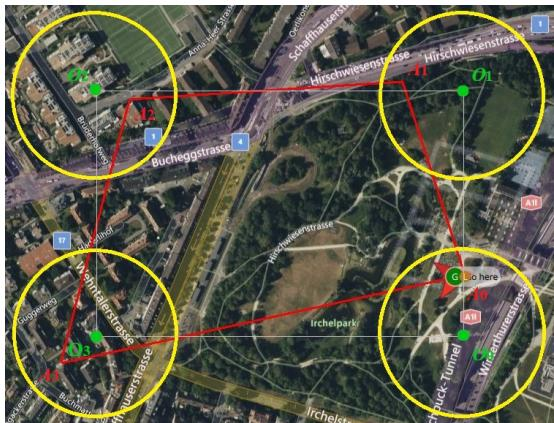

Fig. 10. An illustration of the distributions of different targets: $| O _ { 0 } O _ { 1 } | =$ $| O _ { 2 } O _ { 3 } |$ , |O<sub>1</sub>O<sub>2</sub>| = |O<sub>3</sub>O<sub>0</sub>|, $| O _ { 1 } O _ { 2 } | = 1 . 5 | O _ { 0 } O _ { 1 } |$ and $| \bar { O _ { 0 } O _ { 1 } } | = 8 0 \mathrm { { m } }$  
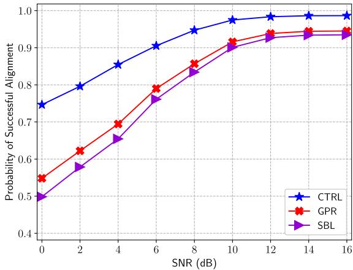  
Fig. 11. The PSA performance of different beam prediction algorithms in the Gazebo environment.

## B. Simulation Results

The state-of-the-art benchmarks are compared to the beam prediction and tracking algorithms proposed in this paper, including two learning-based methods proposed recently (i.e., the stochastic bandit learning (SBL) based algorithm [13] and the Gaussian process regression (GPR) based algorithm [20]), so as to demonstrate the effectiveness and superiority of our approach. In view that the algorithms proposed in this paper are designed based on control, they are named and abbreviated as CTRL. The probability of successful alignment (PSA) and effective achievable rate (EAR) are chosen as the performance metrics to evaluate different algorithms. Note that the methods proposed in this paper are always implemented in real-time, which, to a large extent, demonstrates their low complexity.

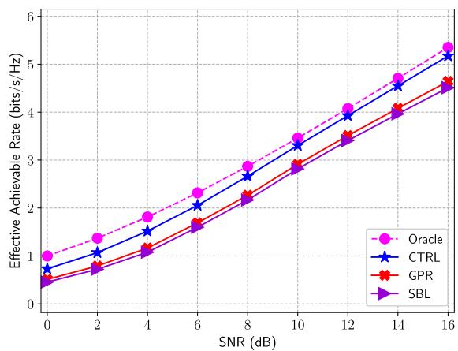  
Fig. 12. The EAR performance of different beam prediction algorithms in Gazebo. The “oracle” algorithm is chosen as a benchmark to provide the limit performance, which finds out optimal beams with zero sounding overhead.

We first evaluate different beam prediction algorithms based on the $\mathrm { ^ { * } G a z e b o ~ + ~ R O S ^ { 3 } }$ simulation environment. Since the distance between two adjacent targets is not large, Algorithms 1 and 2 are evaluated here. The PSA performance of different beam prediction solutions is shown in Fig. 11. It is observed that the SBL algorithm achieves the worst PSA performance. The reason for this is that only the beam direction information is utilized by the SBL algorithm. But the behavior of UAV is determined by multiple factors, all of which can affect beam direction and its variation. Because the variation tendency of beam direction can be partly encoded into the Gaussian kernel, the GPR solution outperforms the SBL algorithm.

Fig. 11 shows that our control-enabled prediction algorithm achieves the best PSA performance. The reasons for this are as follows. First, in contrast to the SBL and GPR algorithms, where only beam direction information is utilized, the most relevant and even decisive factors that control the behavior of UAV and further affect beam direction as well as its variation are chosen as feature to predict the beam direction. Second, the DNN that can characterize the complex system dynamical behavior is incorporated into the prediction model. Third, as we will explain later, the training method tailored for model optimization also helps to achieve good performance.

The EAR performance of different solutions is provided in Fig. 12. It is not surprising that our control-enabled algorithm outperforms the other two learning-based solutions. The reason for this is two-fold. First, the control-enabled algorithm can predict and track the optimal beam in a higher probability of successful alignment. More importantly, because key system state and dynamics parameters are used to predict the optimal beam, we can find it out with less and even no local sweeping overhead, which therefore saves more valuable time resource for information transmission. In fact, it is found here that the local sweeping operation is not needed in many cases.

In addition to the control-based idea, the training method proposed in this paper helps to achieve good performance as well. In fact, the important designs endow our algorithm with the ability of long-term prediction. An example is provided in Fig. 13. It can be observed that even given a small amount of current and most recent information of beam contexts (e.g., the information of ten samples in the first plot of Fig. 13), our algorithm can still well predict the long-term behavior of beam variation. Moreover, if more observations are utilized, a higher accuracy of prediction can be achieved, e.g., narrower beam confidence interval that contains the real beam.

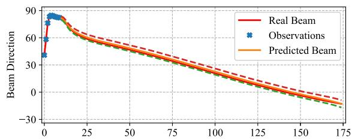

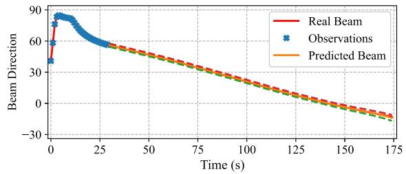  
Fig. 13. The long-term prediction performance of the control-based algorithm. Without loss of generality, the roll channel is taken as an example.

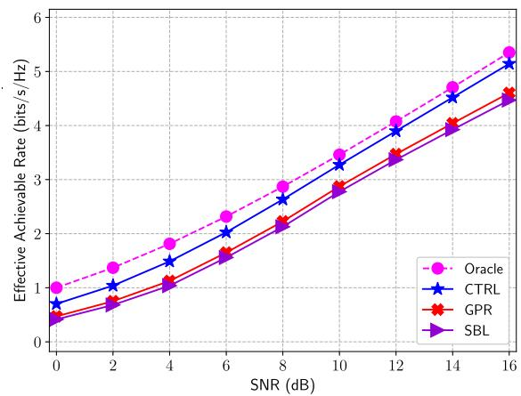  
Fig. 14. The EAR performance of different algorithms. The data is collected by the F450 UAV, which is different from the previous experiments.

Thanks to the ability of long-term prediction, the overhead of beam sounding can be greatly reduced and thus the EAR performance can be further improved significantly. The ability of long-term prediction derives from three elaborate tricks. First and foremost, when training or optimizing the prediction model, we concentrate on extracting shared and latent system dynamics, represented by the network parameters Ω<sup>?</sup> and the prior distribution $\mathcal { N } ( m _ { 0 } ^ { \star } , \Sigma _ { 0 } ^ { \star } )$ . Second, instead of improving the prediction accuracy for isolated points only, we also pay much attention to the tendency of beam variation. Finally, to achieve this goal, the minimization of Kullback-Leibler (KL) divergence between the real unknown model and the designed model is chosen to construct the loss function.

Next, the F450 based real UAV environment is chosen to evaluate different beam prediction algorithms. Note that here, Algorithm 4 proposed in this paper is utilized to predict the beam direction. The EAR performance is shown in Fig. 14. It can be observed that the gap in terms of EAR performance in Fig. 14 is similar to that in Fig. 12. Besides the reasons which account for Fig. 11, another crucial reason is that we decompose the overall beam offset into two parts, according to their contributing factors. In fact, the beam offsets can be caused by both attitude and relative position, and the attitude factor is dominated in some cases while the relative position factor is dominated in other cases. For example, if the distance between the UAV and BS is sufficiently large, the change of attitude will be dominated in the two factors. In our algorithm, we distinguish the two causes and tackle them separately. In contrast, both SBL and GPR ignore these underlying factors or simply conflate them. This further explains why our controlbased approach can achieve the best performance.

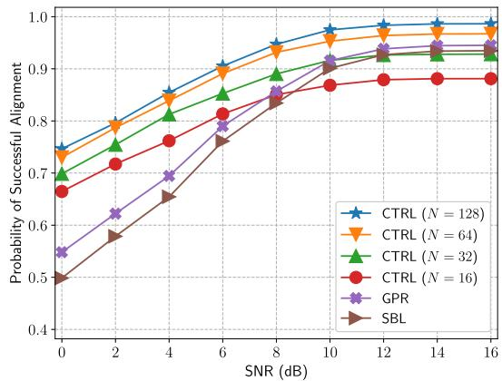  
Fig. 15. The EAR performance of different beam prediction algorithms. N denotes the number of flight trajectories used to train/optimize a model.

As mentioned earlier, it is both dangerous and expensive to manipulate real UAVs to collect enough data to optimize a prediction model. Although the “Gazebo + ROS” based simulation environments can greatly speed up the development and verification of new methods and ideas, they cannot completely replace the real UAV environments. Hence, good small sample performance is still important in practice. Fortunately, thanks to the decomposition based method, our algorithms enjoy good small sample performance. The PSA performance is provided in Fig. 15, where the prediction model within Algorithm 3 or 4 is optimized with varying numbers of flight trajectories. It can be observed from Fig. 15 that when the number of flight trajectories is greater than 64, our algorithm outperforms the other two benchmarks in the whole SNR region. Even though the number of available training curves is 16, it still achieves the best PSA performance in the low SNR region.

The EAR performance of different beam prediction algorithms, with the same setting, is provided in Fig. 16. It is not surprising that the control-based beam prediction algorithm outperforms the SBL and GPR algorithms for the four cases (i.e., N = 16, 32, 64 and 128) in the low SNR region, since it achieves the best PSA performance among the three beam prediction solutions. But it is interesting that in terms of the EAR performance, the control-based solution approaches (for the case $N = 1 6 )$ or surpasses (for the case $N = 3 2 )$ the two benchmarks, although its PSA performance is worse than those of the two benchmarks. The reason for this is that the beam confidence interval predicted by the control-based algorithm is smaller than those predicted by the benchmarks.

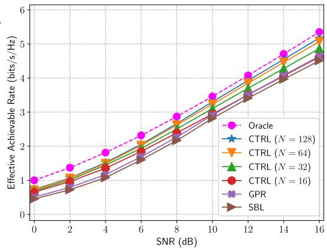  
Fig. 16. The EAR performance of different beam prediction algorithms. N denotes the number of flight trajectories used to train/optimize a model.

We can conclude from the two figures that the control-based algorithms can achieve good small sample performance. The most important reason for this is that instead of predicting the overall beam offset directly (like SBL and GPR), we decompose it into two components and estimate them separately according to their causes. Specifically, for the beam offset caused by the relative position, it is, in fact, estimated analytically. For the other type of beam offset, it can be effectively inferred via the velocity, attitude and distance information, which depends on the FCS only. Hence, it is often sufficient to train a “small” model, and there is no need to collect global or “big” data in a large physical extent and optimize a global or $\mathbf { \dot { \bar { b } } } \mathbf { \dot { j } } \mathbf { g } ^ { \mathbf { \ ' } }$ model. Besides, the proposed method also well addresses the challenging issue of generalization in ML field, as the model trained applies to the same or similar FCS and UAV.

## VII. CONCLUSION

In this paper, we proposed efficient beam prediction and tracking solutions from the perspective of control for the UAV mmwave communication scenario and the important mission flight mode. First, we studied in depth the underlying control principle and revealed important properties and relationships between beam direction and controlled variables. To exploit the properties and relationships revealed, we then proposed an efficient learning-based beam prediction and tracking solution. Specifically, we proposed an efficient prediction model, as well as both offline training and online inference algorithms. To further reduce the computational complexity, we distinguished two kinds of beam offsets and proved an important property of the mission flight mode, i.e., a multicopter almost keeps fixed attitude and velocity in most part of flight process, based on which an efficient algorithm was designed. Comprehensive simulation results from open-source software, hardware and real UAV confirmed the effectiveness and superiority.

Finally, we discuss the advantages and future directions of control in wireless communications. The first advantage is that control provides future information desired for optimizations and designs in wireless communications. Second, control also provides novel design or optimization freedom, by regarding the control input as optimization variables. Thanks to these advantages, control helps to achieve better performance or tackle difficult problems which are not well addressed by the existing methods. Hence, future researches are to investigate and reveal more control related information and efficiently exploit it, by exploiting and developing novel methodologies, in the fields like communications, sensing and signal processing.

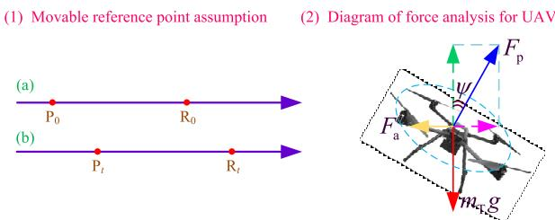  
Fig. 17. The movable reference point assumption and UAV force analysis.

## APPENDIX A PROOF OF THEOREM 1

Without loss of generality, it is sufficient to consider the case of two targets. To simplify the analysis, we further make the assumption that the heights of the two targets are equal. This case often occurs in practice. Note that although we consider the special case here, the proof also applies to other cases.

To simplify analysis, we also make the following movable reference point assumption. The current position and reference position are respectively denoted by $\mathrm { P _ { 0 } }$ and $\begin{array} { r } { \mathbf { R } _ { 0 } . } \end{array}$ , as shown in Fig. 17-(1). At time t, the position (of UAV) is changed to be $\mathrm { P _ { t } } .$ . Since $| \mathrm { P _ { 0 } R _ { 0 } } |$ is sufficiently large, $| \mathrm { P } _ { t } \mathrm { R } _ { 0 } |$ is very large as well. Hence, if we reset the reference point as $\mathrm { R _ { t } }$ such that $\left. \mathbf { P } _ { 0 } \mathbf { P } _ { t } \right. = \left. \mathbf { R } _ { 0 } \mathbf { R } _ { t } \right.$ holds true, it does not affect the behaviors of both FCS and UAV, even though t is relatively large. This has been verified by comprehensive experiments.

Next, we analyze the position loop controller and denote the proportional gain of the position controller by $K _ { \mathrm { P } }$ . According to the “movable reference point assumption” above, the error $e _ { \mathsf { p } } ( t )$ can be written as $e _ { \mathrm { p } } ( t ) = | \mathrm { P } _ { 0 } \mathrm { R } _ { 0 } | 1 _ { \{ t \geq 0 \} }$ . For simplicity, ${ \cal L } _ { 0 } = | \mathrm { P _ { 0 } } \mathrm { R _ { 0 } } |$ is introduced. Then, the output of the position loop, i.e., the reference velocity, is $K _ { \mathrm { P } } L _ { 0 } 1 _ { \{ t \geq 0 \} }$ , which is a constant function and is also very large. The real velocity of UAV is denoted by $v _ { t }$ . Note that because of the large reference velocity $K _ { \mathrm { P } } L _ { 0 } 1 _ { \{ t \geq 0 \} }$ , the UAV has to speed up. The mission of attitude controller is to change the velocity by adjusting the attitude, and its input is the output of velocity loop.

To avoid involving relationships between many controllers, which complicates the description, we analyze the variations of different quantities and their relationships via simple force analysis, as shown in Fig. 17-(2). $F _ { \mathrm { p } } , F _ { \mathrm { a } }$ and m<sub>T</sub>g represent the thrust, air resistance and (total) gravity of UAV, with m denoting the total mass. Note that the thrust is perpendicular to the propeller plane. The horizontal acceleration is calculated as $( F _ { \mathrm { p } } \sin ( \psi ) - F _ { \mathrm { a } } ) / m _ { \mathrm { T } }$ . The basic method to adjust velocity realized by the attitude controller is to control angle ψ.

To increase the velocity, it is sufficient to increase the term $F _ { \mathfrak { p } }$ sin(ψ). Interestingly, one has to increase simultaneously $F _ { \mathfrak { p } }$ and $\psi .$ . On the one hand, if only ψ is increased, the component along the vertical direction will be less than the gravity. This makes UAV descend, which violates our assumption. On the other hand, the UAV will rise if the thrust is increased only. By increasing both $F _ { \mathrm { p } }$ and $\psi ,$ , the velocity continues to increase. But as the velocity increases, $F _ { \mathrm { a } }$ increases as well. When $F _ { \mathrm { a } }$ equals $F _ { \mathfrak { p } } \sin ( \psi )$ , the velocity will no longer increase.

But according to our previous analysis, the input signal of velocity loop, which is equal to $K _ { \mathrm { P } } L _ { 0 } > 0$ , is very large. To reduce the error, $F _ { \mathrm { p } }$ and $\psi$ have to be continuously increased. But the thrust $F _ { \mathrm { p } }$ is derived from the propellers, which is after all finite. By repeating the analysis procedure above, we can conclude that the force $F _ { \mathfrak { p } }$ finally reaches the maximum value (denoted by $F _ { \mathrm { m a x } } )$ , and the final balance will occur. In this case, the horizontal thrust is equal to the air resistance, and therefore the horizontal velocity reaches its maximum value. Note that the angle ψ reaches the maximum value as well. In fact, by force analysis, $F _ { \mathrm { m a x } } \cos ( \psi ) = m _ { \mathrm { T } } g$ holds true in this case, which yields the maximum value of ψ:

$$
\psi _ { \mathrm { m a x } } = \operatorname { a r c c o s } \left( m _ { \mathrm { T } } g / F _ { \mathrm { m a x } } \right) .\tag{19}
$$

From now on, the UAV will keep the balance state, until the distance between the reference position and current position becomes small enough. This occurs when the UAV approaches the target. Note that the analysis above applies to both the roll and pitch channels. Hence, we have proved this theorem.

Remark 4: Note that for a practical control system, the output of the controller is always finite, and the UAV often quickly enters the balance or steady state, as shown in Fig. 6. Hence, the assumption of large distance between the reference position and current position utilized above is reasonable. In fact, the fast response speed of FCS leads to a practical short distance and time, which simplifies algorithm designs.

## REFERENCES

[1] Y. Zeng, R. Zhang, and T. J. Lim, “Wireless communications with unmanned aerial vehicles: Opportunities and challenges,” IEEE Commun. Mag., vol. 54, no. 5, pp. 36–42, May 2016.

[2] M. Xiao et al., “Millimeter wave communications for future mobile networks,” IEEE J. Sel. Areas Commun., vol. 35, no. 9, pp. 1909–1935, Sep. 2017.

[3] L. Yan, X. Fang, Y. Fang, L. Hao, Q. Xue, and C. Xu, “KF-LSTM based beam tracking for UAV-assisted mmWave HSR wireless networks,” IEEE Trans. Veh. Technol., vol. 71, no. 10, pp. 10796–10807, Oct. 2022.

[4] L. Yang and W. Zhang, “Beam tracking and optimization for UAV communications,” IEEE Trans. Wireless Commun., vol. 18, no. 11, pp. 5367–5379, Nov. 2019.

[5] J. Zhang, Y. Huang, Q. Shi, J. Wang, and L. Yang, “Codebook design for beam alignment in millimeter wave communication systems,” IEEE Trans. Commun., vol. 65, no. 11, pp. 4980–4995, Nov. 2017.

[6] A. Alkhateeb, S. Alex, P. Varkey, Y. Li, Q. Qu, and D. Tujkovic, “Deep learning coordinated beamforming for highly-mobile millimeter wave systems,” IEEE Access, vol. 6, pp. 37328–37348, 2018.

[7] Q. Deng et al., “Adaptive beam alignment and optimization for IRSaided high-speed UAV communications,” IEEE Trans. Green Commun. Netw., vol. 7, no. 3, pp. 1583–1595, Sep. 2023.

[8] J. Zhang, W. Xu, H. Gao, M. Pan, Z. Han, and P. Zhang, “Codebookbased beam tracking for conformal array-enabled UAV mmWave networks,” IEEE Internet Things J., vol. 8, no. 1, pp. 244–261, Jan. 2021.

[9] S. Verma, Y. Kawamoto, N. Kato, T. Saiwai, and M. Yonehara, “An efficient beam searching in hybrid intelligent reflecting/refracting surfaces (IRS)-aided mmWave 6G network,” IEEE Trans. Veh. Technol., vol. 73, no. 12, pp. 19299–19312, Dec. 2024.

[10] S. G. Larew and D. J. Love, “Adaptive beam tracking with the unscented Kalman filter for millimeter wave communication,” IEEE Signal Process. Lett., vol. 26, no. 11, pp. 1658–1662, Nov. 2019.

[11] F. Liu, P. Zhao, and Z. Wang, “EKF-based beam tracking for mmWave MIMO systems,” IEEE Commun. Lett., vol. 23, no. 12, pp. 2390–2393, Dec. 2019.

[12] W. Yuan, F. Liu, C. Masouros, J. Yuan, D. W. K. Ng, and N. Gonzalez-´ Prelcic, “Bayesian predictive beamforming for vehicular networks: A low-overhead joint radar-communication approach,” IEEE Trans. Wireless Commun., vol. 20, no. 3, pp. 1442–1456, Mar. 2021.

[13] J. Zhang, Y. Huang, Y. Zhou, and X. You, “Beam alignment and tracking for millimeter wave communications via bandit learning,” IEEE Trans. Commun., vol. 68, no. 9, pp. 5519–5533, Sep. 2020.

[14] W. Wu, N. Cheng, N. Zhang, P. Yang, W. Zhuang, and X. Shen, “Fast mmWave beam alignment via correlated bandit learning,” IEEE Trans. Wireless Commun., vol. 18, no. 12, pp. 5894–5908, Dec. 2019.

[15] M. B. Booth, V. Suresh, N. Michelusi, and D. J. Love, “Multiarmed bandit beam alignment and tracking for mobile millimeter wave communications,” IEEE Commun. Lett., vol. 23, no. 7, pp. 1244–1248, Jul. 2019.

[16] J. Zhao, F. Gao, G. Ding, T. Zhang, W. Jia, and A. Nallanathan, “Integrating communications and control for UAV systems: Opportunities and challenges,” IEEE Access, vol. 6, pp. 67519–67527, 2018.

[17] H.-L. Song and Y.-C. Ko, “Beam alignment for high-speed UAV via angle prediction and adaptive beam coverage,” IEEE Trans. Veh. Technol., vol. 70, no. 10, pp. 10185–10192, Oct. 2021.

[18] J. Zhao, F. Gao, L. Kuang, Q. Wu, and W. Jia, “Channel tracking with flight control system for UAV mmWave MIMO communications,” IEEE Commun. Lett., vol. 22, no. 6, pp. 1224–1227, Jun. 2018.

[19] D. Tagliaferri, M. Brambilla, M. Nicoli, and U. Spagnolini, “Sensoraided beamwidth and power control for next generation vehicular communications,” IEEE Access, vol. 9, pp. 56301–56317, 2021.

[20] J. Zhang, W. Xu, H. Gao, M. Pan, Z. Feng, and Z. Han, “Position-attitude prediction based beam tracking for UAV mmWave communications,” in Proc. IEEE Int. Conf. Commun. (ICC), May 2019, pp. 1–7.

[21] J. Zhang, Y. Huang, C. Masouros, X. You, and B. Ottersten, “Hybrid data-induced Kalman filtering approach and application in beam prediction and tracking,” IEEE Trans. Signal Process., vol. 72, pp. 1412–1426, 2024.

[22] F. Meng, S. Liu, Y. Huang, and Z. Lu, “Learning-aided beam prediction in mmWave MU-MIMO systems for high-speed railway,” IEEE Trans. Commun., vol. 70, no. 1, pp. 693–706, Jan. 2022.

[23] W. Xu, Y. Ke, C.-H. Lee, H. Gao, Z. Feng, and P. Zhang, “Datadriven beam management with angular domain information for mmWave UAV networks,” IEEE Trans. Wireless Commun., vol. 20, no. 11, pp. 7040–7056, Nov. 2021.

[24] Y. Zeng, J. Xu, and R. Zhang, “Energy minimization for wireless communication with rotary-wing UAV,” IEEE Trans. Wireless Commun., vol. 18, no. 4, pp. 2329–2345, Apr. 2019.

[25] X. Jing, J. Sun, and C. Masouros, “Energy aware trajectory optimization for aerial base stations,” IEEE Trans. Commun., vol. 69, no. 5, pp. 3352–3366, May 2021.

[26] M. Mozaffari, W. Saad, M. Bennis, and M. Debbah, “Mobile unmanned aerial vehicles (UAVs) for energy-efficient Internet of Things communications,” IEEE Trans. Wireless Commun., vol. 16, no. 11, pp. 7574–7589, Nov. 2017.

[27] Y. Cai, Z. Wei, R. Li, D. W. K. Ng, and J. Yuan, “Joint trajectory and resource allocation design for energy-efficient secure UAV communication systems,” IEEE Trans. Commun., vol. 68, no. 7, pp. 4536–4553, Jul. 2020.

[28] X. Jing, F. Liu, C. Masouros, and Y. Zeng, “ISAC from the sky: UAV trajectory design for joint communication and target localization,” IEEE Trans. Wireless Commun., vol. 23, no. 10, pp. 12857–12872, Oct. 2024.

[29] J. Zhao, F. Gao, Q. Wu, S. Jin, Y. Wu, and W. Jia, “Beam tracking for UAV mounted SatCom on-the-move with massive antenna array,” IEEE J. Sel. Areas Commun., vol. 36, no. 2, pp. 363–375, Feb. 2018.

[30] J. Zhang, Y. Huang, J. Wang, C. Masouros, and X. You, “Exploit future information provided by control: Opportunities and challenges of control-assisted wireless communications,” IEEE Commun. Mag., early access, 2025.

[31] J. Zhang, Y. Huang, J. Wang, W. Wang, C. Masouros, and X. You, “Beam prediction and tracking for UAV: Identify and exploit future information,” in Proc. IEEE Int. Conf. Commun., Jun. 2025, pp. 626–631.

[32] J. Zhang, Y. Huang, J. Wang, C. Masouros, and X. You, “Beam prediction and tracking for UAV millimeter wave communications: A control-based approach,” IEEE J. Sel. Topics Signal Process., early access, 2025.

[33] A. Visioli, Practical PID Control. London, U.K.: Springer, 2006.

[34] R. C. Dorf and R. H. Bishop, Modern Control Systems. Upper Saddle River, NJ, USA: Prentice-Hall, 2000.

[35] K. P. Murphy, Machine Learning: A Probabilistic Perspective. Cambridge, MA, USA: MIT Press, 2012.

[36] C. E. Rasmussen and C. K. I. Williams, Gaussian Processes for Machine Learning. Cambridge, MA, USA: MIT Press, 2006.

[37] C. M. Bishop, Pattern Recognition and Machine Learning. Cham, Switzerland: Springer, 2006.

[38] [Online]. Available: https://gazebosim.org/home

[39] [Online]. Available: https://www.ros.org/

[40] [Online]. Available: https://github.com/mavlink/mavlink

[41] [Online]. Available: https://github.com/diydrones/ardupilot


Jianjun Zhang (Member, IEEE) received the M.S. degree from Nanjing University of Aeronautics and Astronautics, Nanjing, China, in 2014, and the Ph.D. degree from Southeast University, Nanjing, in 2018.

Since July 2022, he has been a Full Professor with the College of Computer Science and Technology, Nanjing University of Aeronautics and Astronautics, Nanjing, China. He is also with the Purple Mountain Laboratories, Nanjing. From December 2019 to April 2022, he was a Research Fellow in electrical and electronics engineering with University College

London (UCL), London, U.K. From March 2019 to November 2019, he was a Post-Doctoral Researcher with the Purple Mountain Laboratories. His current research interests include control-assisted communications, embodied intelligence, and optimization theory and algorithms. He was a recipient of the Best Paper Award in the IEEE GLOBECOM 2019.


Yongming Huang (Fellow, IEEE) received the B.S. and M.S. degrees from Nanjing University, Nanjing, China, in 2000 and 2003, respectively, and the Ph.D. degree in electrical engineering from Southeast University, Nanjing, in 2007.

Since March 2007, he has been a Faculty Member of the School of Information Science and Engineering, Southeast University, where he is currently a Full Professor. He has also been the Director of the Pervasive Communication Research Center, Purple Mountain Laboratories, since 2019. From 2008 to

2009, he was visiting the Signal Processing Laboratory, Royal Institute of Technology (KTH), Stockholm, Sweden. He has published over 200 peerreviewed papers and hold over 80 invention patents. His current research interests include intelligent 5G/6G mobile communications and millimeter wave wireless communications. He submitted around 20 technical contributions to IEEE standards and was awarded a certificate of appreciation for outstanding contribution to the development of IEEE standard 802.11aj. He served as an Associate Editor for IEEE TRANSACTIONS ON SIGNAL PROCESSING and a Guest Editor for the IEEE JOURNAL ON SELECTED AREAS IN COMMUNICATIONS. He is currently an Editor-at-Large for the IEEE OPEN JOURNAL OF THE COMMUNICATIONS SOCIETY.


Jiaheng Wang (Senior Member, IEEE) received the B.E. and M.S. degrees from Southeast University, Nanjing, China, in 2001 and 2006, respectively, and the Ph.D. degree in electronic and computer engineering from The Hong Kong University of Science and Technology, Hong Kong, in 2010.

He is currently a Full Professor with the National Mobile Communications Research Laboratory (NCRL), Southeast University. He is also with the Purple Mountain Laboratories, Nanjing. From 2010 to 2011, he was with the Signal Processing

Laboratory, KTH Royal Institute of Technology, Stockholm, Sweden. He also held visiting positions at the Friedrich-Alexander University of Erlangen-Nuremberg, N ¨ uremberg, Germany, and the University of Macau, Macau.¨ He has published more than 230 articles on international journals and conferences. His research interests are mainly on communication systems, wireless networks, and network security.

Dr. Wang was a recipient of the Humboldt Fellowship for Experienced Researchers and the Best Paper Awards of IEEE GLOBECOM 2019, ADHOCNETS 2019, and WCSP 2022 and 2014. He serves as an Editor for IEEE TRANSACTIONS ON WIRELESS COMMUNICATIONS IEEE TRANSACTIONS ON COMMUNICATIONS. He was a Senior Area Editor of the IEEE SIGNAL PROCESSING LETTERS.


Christos Masouros (Fellow, IEEE) received the Diploma degree in electrical and computer engineering from the University of Patras, Greece, in 2004, and the M.Sc. (by Research) and Ph.D. degrees in electrical and electronic engineering from The University of Manchester, U.K., in 2006 and 2009, respectively.

In 2008, he was a Research Intern with the Philips Research Laboratories, U.K. Between 2009 and 2010, he was a Research Associate with The University of Manchester. Between 2010 and 2012,

he was also a Research Fellow at Queen’s University Belfast. In 2012, he joined University College London as a Lecturer. He has held a Royal Academy of Engineering Research Fellowship between 2011 and 2016. He is currently a Full Professor with the Information and Communications Engineering Research Group, Department of Electrical and Electronic Engineering, University College London. His research interests lie in the field of wireless communications and signal processing, with a particular focus on green communications, large scale antenna systems, cognitive radio, interference mitigation techniques for MIMO, and multicarrier communications. He was a recipient of the Best Paper Awards in the IEEE GlobeCom 2015 and IEEE WCNC 2019 conferences, has been recognized as an Exemplary Editor of the IEEE COMMUNICATIONS LETTERS, and as an Exemplary Reviewer of IEEE TRANSACTIONS ON COMMUNICATIONS. He is an Editor of IEEE TRANSACTIONS ON COMMUNICATIONS and IEEE TRANSACTIONS ON WIRELESS COMMUNICATIONS. He has been an Associate Editor of IEEE COMMUNICATIONS LETTERS and a Guest Editor of IEEE JOURNAL ON SELECTED TOPICS IN SIGNAL PROCESSING issues “Exploiting Interference Toward Energy Efficient and Secure Wireless Communications” and “Hybrid Analog/Digital Signal Processing for Hardware-Efficient Large Scale Antenna Arrays.” He is currently an elected member of the EURASIP SAT Committee on Signal Processing for Communications and Networking.


Xiaohu You (Fellow, IEEE) received the B.S., M.S., and Ph.D. degrees in electrical engineering from Nanjing Institute of Technology, Nanjing, China, in 1982, 1985, and 1989, respectively. From 1987 to 1989, he was with Nanjing Institute of Technology as a Lecturer. Since 1990, he has been with Southeast University as an Associate Professor and later as a Professor. His research interests include mobile communications, adaptive signal processing, and artificial neural networks, with an applications to communications and biomedical engineering. He

has contributed over 40 IEEE journal articles and two books in the areas of adaptive signal processing, neural networks, and their applications to communication systems. He was the Premier Foundation Investigator of China National Science Foundation. From 1999 to 2002, he was the Principal Expert of the C3G Project, responsible for organizing China’s 3G Mobile Communications Research and Development Activities. From 2001 to 2006, he was the Principal Expert of the National 863 FuTURE Project. He received the Excellent Paper Award from China Institute of Communications in 1987 and Elite Outstanding Young Teacher Awards from Southeast University in 1990, 1991, and 1993. He was a recipient of the 1989 Young Teacher Award of Fok Ying Tung Education Foundation, State Education Commission of China. He is the Chairman of IEEE Nanjing Section. He was selected as an IEEE Fellow “For his contributions to development of mobile communications in China” in 2012.