# Cooperative Drone-Vehicle Mobile Edge Computing for Low-Altitude Inspection

Weidong Qi, Weifeng Zhong, Jiawen Kang, Senior Member, IEEE, Xumin Huang, Dong In Kim, Life Fellow, IEEE, Shengli Xie, Fellow, IEEE, and Chau Yuen, Fellow, IEEE

Abstract—In large areas, mobile edge computing (MEC) systems enabled by drones, also known as unmanned aerial vehicles (UAVs), can provide flexible edge computing services and facilitate low-altitude inspection. Such systems are primarily limited by the computing resources and energy of the drone, as well as their reliance on cellular network infrastructure. To overcome these limitations, this paper investigates a cooperative drone-vehicle MEC system in which a ground vehicle (GV) carries an accompanying drone (AD) and a detached drone (DD) to visit multiple data collection nodes for low-altitude inspection. We develop a joint drone-vehicle model with path planning, data collection, and processing. The AD is carried by the GV to multiple nodes and collects data when the GV is stationed at a node. The DD can detach from the GV to visit other nodes and perform data collection independently. The GV and drones cooperate in data processing and energy replenishment. We propose a heuristic to minimize the low-altitude inspection mission completion time by jointly optimizing the route and the DD speeds. We analyze the relationship between the DD speed and the size of DD-processed data and design a method that includes flight power approximation to optimize the DD speed. Numerical results indicate that solutions optimized by the heuristic fully utilize the DD, thereby reducing the completion time of low-altitude inspection missions.

Index Terms—Mobile edge computing, drone, unmanned aerial vehicle (UAV), ground vehicle, route planning, computation offloading.

## I. INTRODUCTION

With the development of artificial intelligence and the Internet of Things (IoT), the amount of data to be processed is surging, and tasks are becoming increasingly latency-sensitive. Traditional data centers, due to limited bandwidth and high latency, fail to meet these requirements. Although base stations can provide low-latency services, their extensive deployment is costly and lacks flexibility. Consequently, low-altitude wireless networks (LAWNs), which utilize drones to offer flexible communication and computing services, have emerged as a crucial enabler for air-ground data transmission and processing [1], [2]. Drone-assisted mobile edge computing (MEC), as a paradigm under the LAWN framework, serves as a flexible edge computing solution that receives and processes computing tasks offloaded from nearby user devices in urban, rural, and remote areas [3]. By providing low-latency and flexible computing services, drone-assisted MEC can be applied in diverse scenarios, including weather forecasting [4], intelligent transportation systems [5], antenna interference detection [6], and disaster rescue operations [7].

The MEC system assisted by drones, where servers are mounted on drones, has been extensively explored across various research directions in the existing literature. One of the fundamental research directions involves optimizing different aspects of single-drone operations. For example, the study [8] aims to minimize the maximum processing delay while satisfying energy consumption constraints by optimizing user scheduling, task offloading ratios, and the drone’s flight angle and speed. In [9], the constraints on flying speed and data offloading due to drone jittering are addressed, and a joint design of trajectory and offloading strategies is proposed to minimize energy consumption. The paper [10] explores the problem of deadline-aware task offloading and drone trajectory planning in a multi-input multi-output drone-assisted MEC system. Meanwhile, existing studies have also investigated MEC systems facilitated by multiple drones. For instance, the study [11] investigates a system where multiple drones collaboratively provide services to vehicles, minimizing completion time through optimized trajectory planning, spectrum resource allocation, and dynamic data offloading. In [12], a multi-drone MEC system is proposed, in which multiple drones provide computing services for dynamic terminal users, and a base station interferes with eavesdroppers. The study [13] optimizes path length, latency, and energy efficiency in a drone swarm MEC system through a ground-air controlled global and local path planning algorithm. The paper [14] considers drones as a type of IoT device that can process tasks offloaded from a base station in a heterogeneous, dispersed computing environment. In [15], a novel multi-location capacitated mission scheduling problem is introduced, in which the optimal flight routes and schedules for a fleet of aerial computing drones are jointly determined.

Due to limited battery capacity and computing resources, the efficiency of drone-assisted MEC is often constrained. To enhance the computing capability and extend the operational duration of drone-assisted MEC systems, some studies have proposed using base stations equipped with edge servers or energy replenishment equipment to assist the drones. In [16], autonomous aerial vehicles are connected to cellular networks and offload collected data to ground base stations during patrol inspection. The studies [17] and [18] propose cooperative systems in which drones and base stations collaborate on resource allocation and task offloading for ground users or vehicles. The studies [19] and [20] both explore scenarios in which drones improve operational efficiency by recharging at charging stations while serving multiple ground users. In [21], a base station is equipped with both a server and a battery swapping station, providing computing and energy resources to the drone.

Although fixed base stations compensate for drones’ limitations in computing resources and battery capacity, these stations require a stable power supply and periodic maintenance, which are costly and lack flexibility, especially in remote areas. Vehicles possess sufficient computing and energy resources to provide services in mobile edge computing environments [22]; therefore, some studies have proposed vehicle-assisted MEC to enhance operational range, reduce costs, and enable operations without relying on cellular networks. For instance, the study [23] proposes a ground-air cooperative edge computing framework, in which drones conduct multiprocessing locally or offload data to edge servers on unmanned ground vehicles. In [24], a collaborative MEC system involving a drone and an electric vehicle (EV) is studied, where the EV transports the drone to a target area to provide computing and offloading services to user equipment. The study [25] addresses drones’ limitations in energy and computing capacities with a fog computing-based drone system, where unmanned ground vehicles perform computation tasks offloaded from the drones. In the scenario outlined by [26], drones are deployed to an area to support MEC in processing tasks offloaded from nearby Internet of Things devices, while vehicles provide computing resources. In [27] and [28], vehicles provide drones with computing or energy resources, and the positions of the vehicles are optimized to enhance system efficiency.

Although the aforementioned studies have investigated vehicle positioning and computing-energy collaboration between vehicles and drones, joint drone-vehicle route planning with computing-energy collaboration remains underexplored. Therefore, we propose a collaborative drone-vehicle MEC (DVMEC) system with computation offloading, energy replenishment, drone flight speed optimization, and route planning. By jointly planning the route and computing-energy collaboration of the vehicle and drones, the DVMEC system optimizes the utilization of energy and computing resources, minimizing mission completion time. Additionally, optimizing drone flight speed can improve drone-vehicle collaboration, further decreasing mission completion time.

In the DVMEC system proposed in this paper, a ground vehicle (GV) carries an accompanying drone (AD) and a detached drone (DD) to multiple nodes for data collection and processing during a low-altitude inspection mission across a large area. The AD always stays with the GV at the same node, while the DD can collect data independently. The GV and drones collaborate in energy replenishment, data processing, and route planning. We consider the constraints of the DD’s energy on both its flight distance and speed. The completion time of the entire low-altitude inspection mission is minimized through route planning and DD speed optimization. The dronevehicle scheduling problem is challenging due to the presence of numerous integer variables in the problem. A fast heuristic is proposed to solve the problem. The contributions of this paper are summarized as follows:

• We propose a cooperative drone-vehicle MEC-based lowaltitude inspection system model, in which two drones, transported by a GV, are dispatched to a wide and remote area to perform data collection and processing. The model incorporates computation offloading and route planning between the DD and the GV, as well as battery swapping for the DD.

• A heuristic, integrated with DD speed optimization, is proposed to minimize the completion time of the entire low-altitude inspection mission. The GV route and DD sorties are collaboratively optimized in the heuristic.

• We theoretically analyze how the DD speed affects the size of DD-processed data and propose a flight speed optimization method to maximize the size of DD-processed data. Two approximate expressions for the DD’s flight power are derived using series expansions to enhance the efficiency of DD speed optimization.

Results indicate that the proposed model reduces mission completion time by collaboratively optimizing the GV route, DD sorties, and DD speeds. The DD speed optimization method effectively identifies the optimal DD speed that minimizes the computing time of the system.

## II. SYSTEM MODEL AND PROBLEM FORMULATION

## A. System Description

As illustrated in Fig. 1, we consider a system in which a GV carries an AD and a DD to perform data collection and processing. The GV departs from the depot and sequentially visits multiple data collection nodes, during which the AD gathers data at each node. Finally, the GV returns to the depot. Concurrently, the DD may leave the GV to independently visit other data collection nodes and collect data. The acquired data are processed jointly by both the DD and the GV. The key components in the system are detailed as follows:

• Nodes: Nodes include the depot and data collection nodes. The depot is the location where the GV route begins and ends. The GV and drones are not permitted to revisit the depot during the low-altitude inspection mission. Data collection nodes are sites that require inspection. For example, they can be wind farms, power towers, and substations in power system inspection. Drones are responsible for collecting data at data collection nodes using onboard sensors, such as capturing videos or photos with onboard cameras.

• Ground Vehicle (GV): The GV delivers drones to various data collection nodes, replaces the drones’ batteries after data collection, and processes the data offloaded from the drones.

• Accompanying Drone (AD): When the GV arrives at a data collection node, the AD takes off to collect data, then lands on the GV and transmits all collected data to the GV. The GV subsequently processes the data. The

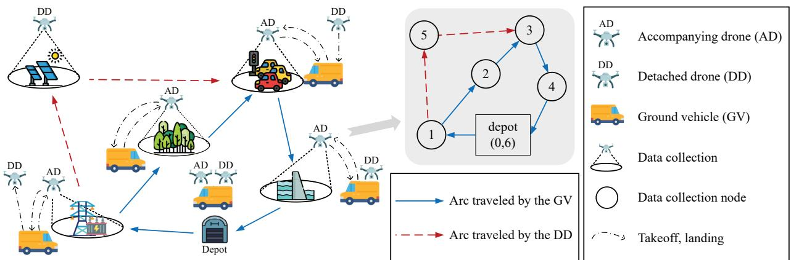  
Fig. 1: Illustration of the proposed DVMEC for low-altitude inspection, where a GV carries an AD and a DD, performing data collection and processing.

AD always stays with the GV at the same node and is not permitted to move solely between nodes.

• Detached Drone (DD): When the GV is stationed at a node, the DD can depart from the GV to another data collection node and independently perform data collection. While on the way to the rendezvous node, the DD processes the data. After the rendezvous, the DD transmits the remaining data to the GV for processing.

To facilitate the planning of DD flights and drone-vehicle route, the DD collects data at only one node per sortie, and the DD is allowed to take off from and land on the GV only when the GV is at a node. Each data collection node should be visited exactly once, either by the GV or by the DD. Consequently, there are two types of data collection nodes:

1) Data collection nodes visited by the GV: Upon the GV’s arrival at a data collection node, the AD takes off from the GV, collects data, and returns to the GV. The DD may or may not be onboard the GV. If the DD is onboard the GV, the DD is not responsible for data collection at this node. As depicted in Fig. 1, nodes 1, 2, 3, and 4 are data collection nodes visited by the GV.

2) Data collection nodes visited by the DD: The DD flies to a data collection node from another node, collects data, and then departs. If a data collection node is visited by the DD, the GV will not visit that node, thereby saving travel time. As shown in Fig. 1, the DD takes off at node 1, collects data at node 5, and lands on the GV at node 3. Node 5 is visited by the DD.

For broader applications, drones can collect data from sensors or act as mobile relays, forwarding data from IoT devices with short-range transmission capabilities to an edge server through multi-hop communication [29]. However, in this paper, we focus on a scenario where no sensors or IoT devices are deployed in the area, and all data are collected by the drones onboard sensors.

## B. Basic Notations and Route Description

The set of all data collection nodes is denoted as $C =$ $\{ 1 , \ldots , c \}$ . Nodes 0 and (c + 1) correspond to the same physical node, the depot, and the distance between them is set to zero. The problem is formulated on a digraph $G = ( N , A )$ where $\begin{array} { c c l } { { N } } & { { = } } & { { \left\{ 0 , 1 , \ldots , c , \left( c + 1 \right) \right\} } } \end{array}$ denotes the set of all nodes. We define subsets $N _ { 0 } ~ = ~ \{ 0 , 1 , . . . , c \}$ and $N _ { + } ~ =$ $\{ 1 , \ldots , c , ( c + 1 ) \}$ . The total number of nodes is $n = | N |$ A is the set of all arcs $( i , j )$ where $i \in N _ { 0 } , j \in N _ { + } , i \neq j$ Each arc $( i , j )$ is associated with a distance $d _ { i j }$ , representing the travel distance between nodes i and j.

A DD sortie is defined as an ordered triplet $\langle i , j , k \rangle$ , where $i \neq j , k$ and $j \neq k$ . Here, $i \in N _ { 0 }$ is the takeoff node, $j \in C$ is the data collection node, and $k \in N _ { + }$ is the rendezvous node. The DD flies at speed $v _ { i j k } ^ { \mathrm { D } }$ during the sortie $\langle i , j , k \rangle$ Let F denote the set of all possible sorties whose total travel distances do not exceed the maximum flight range of the DD, as determined by the method in [30]. The DD takes off and lands only when the GV is stationary at a node. While the DD is out on a sortie, the GV may continue to carry the AD to other nodes to collect data.

A GV subroute is defined as the segment of the GV route between two consecutive DD takeoff or rendezvous nodes. The first subroute begins at the depot, and the final subroute ends at the depot. For example, Fig. 1 illustrates a GV route {0, 1, 2, 3, 4, 6} and a DD sortie ⟨1, 5, 3⟩. The corresponding subroutes are {0, 1}, {1, 2, 3}, {3, 4, 6}.

If the GV visits node $i \in N _ { 0 }$ and then immediately visits node $j \in N _ { + }$ (with $j \neq i )$ , then the binary variable $x _ { i j }$ equals 1; otherwise, $x _ { i j }$ equals 0. The three-index binary variable $y _ { i j k }$ , where $\langle i , j , k \rangle \in F _ { \mathrm { { f } } }$ , is used to represent the selection of a sortie. If the DD performs the sortie $\langle i , j , k \rangle$ , then $y _ { i j k }$ equals 1; otherwise, $y _ { i j k }$ equals 0.

## C. Detached Drone (DD) Model

The DD speed $v _ { i j k } ^ { \mathrm { D } }$ for sortie $\langle i , j , k \rangle$ is bounded by

$$
0 < v _ { i j k } ^ { \mathrm { D } } \leq v ^ { \mathrm { D , m a x } } , \quad \forall \langle i , j , k \rangle \in F ,\tag{1}
$$

where $v ^ { \mathrm { D , m a x } }$ denotes the maximum flight speed of the DD. Drone-vehicle data transmission occurs only when the drones are on the GV. Consequently, the data transmission energy consumption of drones can be supplied by the GV, making the data transmission energy consumption negligible in the drones’ energy consumption model. Assuming the GV possesses sufficient energy to complete the entire mission and carries multiple drone battery sets, the DD will always have fresh batteries available for replacement before each takeoff. The battery capacity of the DD is

$$
E ^ { \operatorname* { m a x } } = E _ { \mathrm { f c } , i j k } ^ { \operatorname* { m a x } } + E _ { \mathrm { t s k } , j } , \quad \forall \langle i , j , k \rangle \in F ,\tag{2}
$$

where $E _ { \mathrm { f c } , i j k } ^ { \mathrm { m a x } }$ denotes the maximum energy allocated for flight and computation during the sortie $\langle i , j , k \rangle$ , and $E _ { \mathrm { t s k } , j }$ represents the energy consumed for data collection at node $j .$ The data collection energy $E _ { \mathrm { t s k } , j }$ is given by

$$
E _ { \mathrm { t s k } , j } = P _ { \mathrm { c l t } } \tau _ { \mathrm { t s k } , j } , \quad \forall j \in C ,\tag{3}
$$

where $P _ { \mathrm { c l t } }$ is the power of data collection, and $\tau _ { \mathrm { t s k } , j }$ is the time for data collection at node $j .$ The data collection time $\tau _ { \mathrm { t s k } , j }$ is computed as

$$
\tau _ { \mathrm { t s k } , j } = \frac { T _ { \mathrm { s } , j } } { R _ { \mathrm { c l t } } } , \quad \forall j \in C ,\tag{4}
$$

where $T _ { \mathrm { s } , j }$ denotes the data size at node $j ,$ and $R _ { \mathrm { c l t } }$ is the data collection rate. In the experiment, drones record video using onboard cameras during data collection; thus, $R _ { \mathrm { c l t } }$ is the target bit rate of the video encoding, which is constant. We also assume that the drones have sufficient storage capacity for the collected data.

The computing energy required by the DD to process all the data collected at node $j$ is denoted as

$$
E _ { \mathrm { c } , j } ^ { \mathrm { m a x } } = \gamma _ { \mathrm { c } } T _ { \mathrm { c } } T _ { \mathrm { s } , j } \left( C _ { \mathrm { D } } \right) ^ { 2 } , \quad \forall j \in C ,\tag{5}
$$

where $\gamma _ { \mathrm { c } }$ is a coefficient related to the chip architecture; $C _ { \mathrm { D } }$ denotes the DD’s CPU frequency; and $T _ { \mathrm { c } }$ represents the number of chip cycles required to process each bit of data. As indicated by (5), lowering $C _ { \mathrm { D } } ,$ i.e., the CPU frequency, can reduce the computing energy. However, in practice, the energy consumed by computation is much less than that consumed by flight. Reducing the CPU frequency does not significantly extend the DD’s endurance, so we configure the DD to always process data at the maximum CPU frequency.

The maximum energy for the DD’s flight during sortie $\langle i , j , k \rangle$ is

$$
E _ { \mathrm { f } , i j k } ^ { \operatorname* { m a x } } = E _ { \mathrm { f c } , i j k } ^ { \operatorname* { m a x } } - E _ { \mathrm { c } , j } ^ { \operatorname* { m a x } } , \quad \forall \langle i , j , k \rangle \in F .\tag{6}
$$

For a specific sortie, the size of the collected data is predetermined, making both $E _ { \mathrm { t s k } , j }$ and $E _ { \mathrm { c } , j } ^ { \mathrm { m a x } }$ fixed parameters. By (2), $E _ { \mathrm { f c } , i j k } ^ { \mathrm { m a x } }$ is fixed when $E _ { \mathrm { t s k } , j }$ and $E _ { \mathrm { c } , j } ^ { \mathrm { m a x } }$ are fixed. Consequently, $E _ { \mathrm { f } , i j k } ^ { \mathrm { m a x } }$ also becomes deterministic by (6). A deterministic $E _ { \mathrm { f } , i j k } ^ { \mathrm { m a x } }$ facilitates flight planning.

The maximum energy for the flight between takeoff and landing is given by

$$
\bar { E } _ { \mathrm { f } , i j k } ^ { \operatorname* { m a x } } = E _ { \mathrm { f } , i j k } ^ { \operatorname* { m a x } } - E _ { \mathrm { f } , \mathrm { t l } } , \quad \forall \langle i , j , k \rangle \in \boldsymbol { F } ,\tag{7}
$$

where $E _ { \mathrm { f , t l } }$ denotes the constant energy consumed for a single takeoff and landing. The energy consumed during takeoff and landing may fluctuate due to varying takeoff and landing conditions at different nodes, but it is typically small. For simplicity, the DD and AD reserve a fixed and sufficient amount of energy, $E _ { \mathrm { f , t l } } .$ , for each takeoff and landing.

The time required for the DD to fly from the takeoff node i to the data collection node $j$ is

$$
\tau _ { i j } ^ { \mathrm { D } } = \frac { d _ { i j } } { v _ { i j k } ^ { \mathrm { D } } } , \quad \forall \langle i , j , k \rangle \in F .\tag{8}
$$

The time taken by the DD to fly from the data collection node $j$ to the rendezvous node $k$ is

$$
\tau _ { j k } ^ { \mathrm { D } } = \frac { d _ { j k } } { v _ { i j k } ^ { \mathrm { D } } } , \quad \forall \langle i , j , k \rangle \in F .\tag{9}
$$

The total flight time of a DD sortie $\langle i , j , k \rangle$ is

$$
\tau _ { \mathrm { f } , i j k } ^ { \mathrm { D D } } = \tau _ { \mathrm { t 0 } } ^ { \mathrm { D } } + \tau _ { i j } ^ { \mathrm { D } } + \tau _ { \mathrm { t s k } , j } + \tau _ { j k } ^ { \mathrm { D } } + \tau _ { \mathrm { w a i t } , k } ^ { \mathrm { D } } + \tau _ { \mathrm { l d } } ^ { \mathrm { D } } , \forall \left. i , j , k \right. \in \boldsymbol { F } ,\tag{10}
$$

where $\tau _ { \mathrm { w a i t } , k } ^ { \mathrm { D } }$ represents the time the DD waits for the GV at node $k ,$ and $\tau _ { \mathrm { { t o } } } ^ { \mathrm { { D } } }$ and $\tau _ { \mathrm { l d } } ^ { \mathrm { D } }$ denote the times for one takeoff and one landing, respectively.

As demonstrated in [31], the flight power of the DD is provided by

$$
\begin{array} { r } { P \left( v _ { i j k } ^ { \mathrm { D } } \right) = \underbrace { P _ { B } \left( 1 + \frac { 3 \left( v _ { i j k } ^ { \mathrm { D } } \right) ^ { 2 } } { U _ { \mathrm { i n p } } ^ { 2 } } \right) } _ { \mathrm { b a d e ~ p r o f i c } } + \underbrace { \frac { 1 } { 2 } d _ { 0 } \rho s _ { r } A _ { r } \left( v _ { i j k } ^ { \mathrm { D } } \right) ^ { 3 } } _ { \mathrm { p a r a s i t e } } } \\ { + \underbrace { P _ { r } \left( \sqrt { 1 + \frac { \left( v _ { i j k } ^ { \mathrm { D } } \right) ^ { 4 } } { 4 v _ { i } ^ { \mathrm { 4 } } } } - \frac { \left( v _ { i j k } ^ { \mathrm { D } } \right) ^ { 2 } } { 2 v _ { i } ^ { \mathrm { 2 } } } \right) ^ { 1 / 2 } , } _ { \mathrm { i n i t e } \underbrace { \mathrm {  { \left( \frac { v _ { i j k } ^ { \mathrm { D } } } { 4 } \right) } ^ { 3 } } } _ { \mathrm { \ p a r a d } } } } \end{array}\tag{11}
$$

where $P _ { B }$ and $P _ { I }$ are the blade profile power and induced power in hovering status, respectively; $U _ { \mathrm { t i p } }$ denotes the tip speed of the rotor blade; $d _ { 0 }$ and $\rho$ denote the fuselage drag ratio and air density, respectively; $s _ { r }$ and $A _ { r }$ represent the rotor solidity and rotor disc area, respectively; and $v _ { 0 }$ is the mean rotor induced velocity in hover. As shown in (11), the flight power of a rotary-wing drone consists of three components: blade profile power, parasite power, and induced power.

The hovering power of the DD is

$$
P \left( 0 \right) = P _ { B } + P _ { I } .\tag{12}
$$

Considering that the DD predominantly moves under a steady state between nodes, the energy consumption during acceleration and deceleration phases is excluded from the flight energy consumption model. The total flight energy consumption of the DD during sortie $\langle i , j , k \rangle$ is

$$
\begin{array} { r } { E _ { \mathrm { f } , i j k } = E _ { \mathrm { f } , i j } + E _ { \mathrm { f } , j } ^ { \mathrm { t s k } } + E _ { \mathrm { f } , j k } + E _ { \mathrm { f } , k } ^ { \mathrm { w a i t } } + E _ { \mathrm { f } , \mathrm { t } } { \mathrm { , } } \forall \langle i , j , k \rangle \in F , } \end{array}\tag{13}
$$

where $E _ { \mathrm { f } , i j }$ represents the flight energy consumed for flying from the takeoff node i to the data collection node $j ; E _ { \mathrm { f } , j } ^ { \mathrm { t s k } }$ denotes the hovering flight energy consumed during data collection; $E _ { \mathrm { f } , j k }$ represents the flight energy consumed for flying from the data collection node $j$ to the rendezvous node $k ;$ and $E _ { \mathrm { f } , k } ^ { \mathrm { w a i t } }$ denotes the hovering flight energy consumed by the DD while waiting for the GV at the rendezvous node $k .$ Their detailed expressions are provided below.

$$
E _ { \mathrm { f } , i j } = \tau _ { i j } ^ { \mathrm { D } } P \left( v _ { i j k } ^ { \mathrm { D } } \right) , \quad \forall \langle i , j , k \rangle \in F ,\tag{14}
$$

$$
E _ { \mathrm { f } , j } ^ { \mathrm { t s k } } = \tau _ { \mathrm { t s k } , j } P \left( 0 \right) , \quad \forall j \in C ,\tag{15}
$$

$$
E _ { \mathrm { f } , j k } = \tau _ { j k } ^ { \mathrm { D } } P \left( v _ { i j k } ^ { \mathrm { D } } \right) , \quad \forall \langle i , j , k \rangle \in F ,\tag{16}
$$

$$
E _ { \mathrm { f } , k } ^ { \mathrm { w a i t } } = \tau _ { \mathrm { w a i t } , k } ^ { \mathrm { D } } P \left( 0 \right) , \quad \forall k \in N _ { + } .\tag{17}
$$

The flight energy consumed by the DD between takeoff and landing is

$$
\bar { E } _ { \mathrm { f } , i j k } = E _ { \mathrm { f } , i j } + E _ { \mathrm { f } , j } ^ { \mathrm { t s k } } + E _ { \mathrm { f } , j k } + E _ { \mathrm { f } , k } ^ { \mathrm { w a i t } } , \quad \forall \langle i , j , k \rangle \in F ,\tag{18}
$$

which satisfies

$$
\bar { E } _ { \mathrm { f } , i j k } - M ( 1 - y _ { i j k } ) \leq \bar { E } _ { \mathrm { f } , i j k } ^ { \operatorname* { m a x } } , \quad \forall \langle i , j , k \rangle \in F ,\tag{19}
$$

where M is a sufficiently large positive number. When the binary variable $y _ { i j k }$ equals 0, the sortie $\langle i , j , k \rangle$ is not performed, and $\bar { E } _ { \mathrm { f } , i j k }$ is not constrained by (19).

## D. Accompanying Drone (AD) Model

The total flight time for the AD to collect data at node i is

$$
\tau _ { \mathrm { f } , i } ^ { \mathrm { A D } } = \tau _ { \mathrm { t o } } ^ { \mathrm { D } } + \tau _ { \mathrm { t s k } , i } + \tau _ { \mathrm { l d } } ^ { \mathrm { D } } , \quad \forall i \in \boldsymbol { C } ,\tag{20}
$$

Owing to the absence of long-range flight, the AD’s flight energy consumption is typically low. For the sake of model simplicity, we omit the AD’s energy consumption constraint. The expression for $\tau _ { \mathrm { t s k } , i }$ is given in Section II-C as (4). The constraints on data transmission and computation for the AD and DD are presented in Section II-F, where (38), (39), (40), and (41) describe the transmission and computation of the AD.

## E. Drone-Vehicle Route Constraints

1) Node Coverage: Each data collection node $j$ must be visited exactly once by either the DD or the GV. Thus, $x _ { i j }$ and $y _ { i j k }$ are constrained by

$$
\sum _ { i | ( i , j ) \in A } x _ { i j } + \sum _ { i , k | \langle i , j , k \rangle \in F } y _ { i j k } = 1 , \quad \forall j \in C .\tag{21}
$$

2) The GV’s Routing Constraints: The GV begins and ends its journey at the depot, so $x _ { 0 j }$ and $x _ { i ( c + 1 ) }$ are subject to

$$
\sum _ { j \in N _ { + } } x _ { 0 j } = \sum _ { i \in N _ { 0 } } x _ { i ( c + 1 ) } = 1 .\tag{22}
$$

The flow conservation constraint

$$
\sum _ { j | ( j , i ) \in A } x _ { j i } = \sum _ { k | ( i , k ) \in A } x _ { i k } , \quad \forall i \in C ,\tag{23}
$$

must be satisfied. Specifically, if the GV arrives at node i via the arc $( j , i ) \in A$ , it must depart from i by traversing another arc $( i , k ) \in A$ . Conversely, if the GV does not arrive at $i ,$ there will be no arc for the GV to depart from i.

3) Time Constraints: Let $t _ { i }$ denote the moment at which the GV arrives at node $i ,$ and let $t _ { i } ^ { \prime }$ denote the moment at which the GV departs from node i. If the arc $( i , j )$ is traversed by the GV, then the moment of arrival at node j equals the moment of departure from node i plus the travel time from i to j. Therefore, the arrival moment $t _ { j }$ satisfies

$$
t _ { j } \geq t _ { i } ^ { \prime } + \tau _ { i j } ^ { \mathrm { V } } - M ( 1 - x _ { i j } ) , \quad \forall ( i , j ) \in A ,\tag{24}
$$

where $\tau _ { i j } ^ { \mathrm { V } }$ denotes the GV’s travel time from node i to node j, which is given by the expression

$$
\tau _ { i j } ^ { \mathrm { v } } = \frac { d _ { i j } } { v ^ { \mathrm { v } } } , \quad \forall ( i , j ) \in A ,\tag{25}
$$

where $v ^ { \mathrm { v } }$ represents the fixed speed at which the GV moves between nodes.

If the GV arrives at node j, then the moment the GV leaves j should not be earlier than the moment the GV arrives at $j$ plus the total flight time of the AD at j. The departure moment $t _ { j } ^ { \prime }$ satisfies

$$
t _ { j } ^ { \prime } \geq t _ { j } + \tau _ { \mathrm { f } , j } ^ { \mathrm { A D } } - M \left( 1 - \sum _ { i | ( i , j ) \in A } x _ { i j } \right) , \quad \forall j \in C .\tag{26}
$$

If the DD lands at node $j$ and arrives later than the GV, the GV should not depart from j before the DD completes its landing. Thus, the departure moment $t _ { j } ^ { \prime }$ also satisfies

$$
t _ { j } ^ { \prime } \geq \sum _ { e , f | \langle e , f , j \rangle \in F } ( t _ { \mathrm { t o } , e } ^ { \mathrm { D D } } + \tau _ { \mathrm { f } , e f j } ^ { \mathrm { D D } } + M ) y _ { e f j } - M , \forall j \in C ,\tag{27}
$$

where $t _ { \mathrm { t o } , e } ^ { \mathrm { D D } }$ denotes the moment at which the DD takes off from node e.

If the DD is available and on the GV, the DD takes off immediately after the GV arrives at the takeoff node i. Thus, the takeoff moment $t _ { \mathrm { t o } , i } ^ { \mathrm { D D } }$ satisfies

$$
t _ { \mathfrak { t } _ { 0 } , i } ^ { \mathrm { D D } } \geq t _ { i } - M \left( 1 - \sum _ { j , k | \langle i , j , k \rangle \in F } y _ { i j k } \right) , \quad \forall i \in N _ { 0 } .\tag{28}
$$

Then, we discuss the situation in which the DD is on the GV but unavailable when the GV arrives at the takeoff node. We introduce a binary variable $\zeta _ { h j }$ to describe the sequential relationship between data collection nodes h and j in the GV route. $\zeta _ { h j }$ equals 1 if the GV visits h before j or if h and j are the same node; otherwise, $\zeta _ { h j }$ equals $0 . ~ \zeta _ { h j }$ satisfies

$$
\begin{array} { r l r } { \displaystyle \sum _ { g | ( g , h ) \in A } x _ { g h } \sum _ { \chi } x _ { j l } \big ( t _ { j } - t _ { h } \big ) < M \zeta _ { h j } , \forall h \in C , \forall j \in C , } & \\ { \displaystyle \sum _ { g | ( g , h ) \in A } x _ { g h } \sum _ { \upsilon } x _ { j l } \big ( t _ { j } - t _ { h } \big ) \geq - M \left( 1 - \zeta _ { h j } \right) , } & { } & \\ { \displaystyle \qquad \forall h \in C , \forall j \in C . } & { } & \end{array}\tag{29}
$$

(30)

Sometimes, the DD lands at a node, transmits data, swaps its battery, and takes off again. When the GV travels a short distance to reach the takeoff node, the DD may spend additional time transmitting data and swapping its battery. In such situations, the DD’s takeoff moment is the moment at which both data transmission and battery swapping are completed. The corresponding DD takeoff moment is constrained by

$$
\begin{array}{c}  { t _ { \mathrm { t o } , j } } ^ { \mathrm { D D } } \geq t _ { \mathrm { t o } , e } ^ { \mathrm { D D } } + \tau _ { \mathrm { f } , e f h } ^ { \mathrm { D D } } + \tau _ { \mathrm { t r a n s } , f } + \tau _ { \mathrm { s w a p } }  \\ { - M \Bigg ( 3 - y _ { e f h } - \sum _ { \stackrel { m , n } { m , n } | \langle j , m , n \rangle \in F } y _ { j m n } - \zeta _ { h j } \Bigg ) } \end{array}\tag{31}
$$

where $\tau _ { \mathrm { t r a n s } , f }$ represents the time the DD spends transmitting data to the GV, and $\tau _ { \mathrm { s w a p } }$ represents the time required for the DD’s battery swapping.

For cases described by (31), the GV should depart from the takeoff node after the DD takes off. Thus, the GV’s departure moment $t _ { j } ^ { \prime }$ is constrained by

$$
t _ { j } ^ { \prime } \geq t _ { \mathrm { t o } , j } ^ { \mathrm { D D } } - M \left( 2 - \sum _ { \stackrel { m , n } { \langle j , m , n \rangle \in F } } y _ { j m n } - \sum _ { l | ( j , l ) \in A } x _ { j l } \right) , \forall j \in C .\tag{32}
$$

The time that the DD spends hovering at node k while waiting for the GV to arrive is given by

$$
\begin{array} { r l } & { \tau _ { \mathrm { w a i t } , k } ^ { \mathrm { D } } = \operatorname* { m a x } \Biggl \{ 0 , \underset { i , j \mid \langle i , j , k \rangle \in F } { \sum } { y _ { i j k } [ t _ { k } - t _ { \mathrm { t o } , i } ^ { \mathrm { D D } } } } \\ & { \qquad - \left( \tau _ { \mathrm { t o } } ^ { \mathrm { D } } + \tau _ { i j } ^ { \mathrm { D } } + \tau _ { \mathrm { t s k } , j } + \tau _ { j k } ^ { \mathrm { D } } \right) ] \Biggl \} , \ : \forall k \in N _ { + } . } \end{array}\tag{33}
$$

4) Variable Linking Constraints: If, for two DD sorties $\langle i , j , k \rangle$ and $\langle i ^ { \prime } , j ^ { \prime } , k ^ { \prime } \rangle$ , the GV visits node i, node $i ^ { \prime } ,$ and node k sequentially, then the sortie $\langle i ^ { \prime } , j ^ { \prime } , k ^ { \prime } \rangle$ is physically infeasible because the DD is not on the GV at node $i ^ { \prime }$ due to its prior deployment on sortie $\langle i , j , k \rangle$ . This situation is referred to as crossing [32]. To avoid crossing sorties, a binary variable $z _ { i }$ is introduced. If the DD is on the GV at node i or lands on the GV at node i, then $z _ { i }$ is set to 1; otherwise, it is set to 0. The variables $x _ { i j } , y _ { i j k }$ , and $z _ { i }$ are constrained by

$$
z _ { i } \le \sum _ { j | ( j , i ) \in A } x _ { j i } , \forall i \in N _ { + } ,\tag{34}
$$

$$
\sum _ { j , k | \langle i , j , k \rangle \in F } y _ { i j k } \leq z _ { i } , \quad \forall i \in N _ { 0 } ,\tag{35}
$$

$$
z _ { j } \le z _ { i } - x _ { i j } + \sum _ { \iota , \iota \atop \iota , k , j \backslash \in F } y _ { l k j } - \sum _ { \iota , \iota \atop \iota , k , l \backslash \in F } y _ { i k l } + 1 , \forall ( i , j ) \in A .\tag{36}
$$

The constraint (34) ensures that the DD can be on the GV at node i if the GV either enters or exits node i, with the latter case further governed by constraint (23). Constraint (35) specifies that a sortie can begin at node i only $\mathrm { i f } \ z _ { i }$ equals 1. Crossing sorties are eliminated through constraints (34) and (35). Additionally, constraint (36) governs the values of $z _ { i }$ by ensuring the co-location of the DD with the GV along the GV route. A detailed explanation of constraints (34)–(36) can be found in [32].

## F. Drone-Vehicle Data Transmission and Computation Model

Assuming that data can be arbitrarily partitioned and processed by the DD and the GV separately, the DD processes the collected data during the return, hovering, and landing phases after data collection. If the DD processes data without interruption throughout the return, hovering, and landing phases, the size of DD-processed data is

$$
T _ { \mathrm { s } , j } ^ { \mathrm { D D } } = \left( \tau _ { j k } ^ { \mathrm { D } } + \tau _ { \mathrm { w a i t } , k } ^ { \mathrm { D } } + \tau _ { \mathrm { l d } } ^ { \mathrm { D } } \right) \frac { C _ { \mathrm { D } } } { T _ { \mathrm { c } } } , \quad \forall j \in C , \forall k \in N _ { + } .\tag{37}
$$

The AD does not process any data, and all its data are offloaded to the GV. The size of AD-processed data is

$$
T _ { \mathrm { s } , j } ^ { \mathrm { A D } } = 0 , \quad \forall j \in C .\tag{38}
$$

For the sake of convenience, equations (37) and (38) are replaced by the following equation.

$$
T _ { \mathrm { s } , j } ^ { \mathrm { D } } = \sum _ { i , k | \langle i , j , k \rangle \in F } y _ { i j k } \left( \tau _ { j k } ^ { \mathrm { D } } + \tau _ { \mathrm { w a i t } , k } ^ { \mathrm { D } } + \tau _ { \mathrm { l d } } ^ { \mathrm { D } } \right) \frac { C _ { \mathrm { D } } } { T _ { \mathrm { c } } } , \quad \forall j \in C .\tag{39}
$$

If the data at node $j$ is collected by the DD, then $\sum _ { i , k | \langle i , j , k \rangle \in F } y _ { i j k }$ equals 1, making the value of (39) equal to that of (37). Conversely, if the data at node $j$ is collected by the AD, then $\sum _ { i , k | \langle i , j , k \rangle \in F } y _ { i j k }$ equals 0, resulting in the value of (39) being equal to that of (38). Therefore, (39) can simultaneously represent the size of DD-processed data and AD-processed data.

The size of the data offloaded from the DD and AD to the GV is

$$
T _ { \mathrm { s } , j } ^ { \mathrm { V } } = \operatorname* { m a x } \left\{ 0 , T _ { \mathrm { s } , j } - T _ { \mathrm { s } , j } ^ { \mathrm { D } } \right\} , \quad \forall j \in C .\tag{40}
$$

If the data at node $j$ is collected by the DD and fully processed by the DD before its landing, then $T _ { \mathrm { s } , j } ^ { \mathrm { V } }$ is equal to zero.

After the DD or AD lands on the GV, it transfers the remaining data to the GV. We assume that the GV always has sufficient storage to store the data offloaded from drones. The time required for drones to transmit $T _ { \mathrm { s } , j } ^ { \mathrm { V } }$ to the GV is

$$
\tau _ { \mathrm { t r a n s } , j } = \frac { T _ { \mathrm { s } , j } ^ { \mathrm { V } } } { R _ { \mathrm { t r a n s } } } , \quad \forall j \in C ,\tag{41}
$$

where $R _ { \mathrm { t r a n s } }$ represents the transmission rate. Drones use wireless communication for data offloading. Since data are offloaded to the GV only when the drones are onboard the GV, offloading occurs at a short range with a fixed distance and angle, and the communication environment remains relatively stable. Under such conditions, the communication channel experiences minimal variation, and $R _ { \mathrm { t r a n s } }$ can be regarded as approximately constant. To simplify the model, we assume a fixed $R _ { \mathrm { t r a n s } }$ during the offloading process.

The time required by the GV to process $T _ { \mathrm { s } , j } ^ { \mathrm { V } }$ is

$$
\tau _ { \mathrm { c } , j } ^ { \mathrm { V } } = \frac { T _ { \mathrm { c } } T _ { \mathrm { s } , j } ^ { \mathrm { V } } } { C _ { \mathrm { V } } } , \quad \forall j \in C ,\tag{42}
$$

where $C _ { \mathrm { V } }$ denotes the GV’s CPU frequency.

Let $t _ { \mathrm { c a l c } , j } ^ { \mathrm { V } }$ represent the moment at which $T _ { \mathrm { s } , j } ^ { \mathrm { V } }$ is fully processed. If the data collected by the AD at node $j$ is

immediately processed after being transmitted to the GV, then $t _ { \mathrm { c a l c } , j } ^ { \mathrm { V } }$ satisfies

$$
t _ { \mathrm { c a l c } , j } ^ { \mathrm { V } } \geq t _ { j } + \tau _ { \mathrm { f } , j } ^ { \mathrm { A D } } + \tau _ { \mathrm { t r a n s } , j } + \tau _ { \mathrm { c } , j } ^ { \mathrm { V } } - M \left( 1 - \sum _ { \scriptstyle i | ( i , j ) \in A \atop \forall j \in C . \quad ( 4 3 ) } x _ { i j } \right) ,
$$

Consider that the DD collects data at node $f ,$ processes part of the data, and transmits the remaining data $T _ { \mathrm { s } , f } ^ { \mathrm { V } }$ to the GV at node $j .$ If the data $T _ { \mathrm { s } , f } ^ { \mathrm { V } }$ is processed immediately after the transmission is completed, then we have

$$
\begin{array} { r } { t _ { \mathrm { c a l c } , f } ^ { \mathrm { V } } \geq t _ { \mathrm { t o } , e } ^ { \mathrm { D D } } + \tau _ { \mathrm { f } , e f j } ^ { \mathrm { D D } } + \tau _ { \mathrm { t r a n s } , f } + \tau _ { \mathrm { c } , f } ^ { \mathrm { V } } - M \left( 1 - y _ { e f j } \right) , } \\ { \forall \left. e , f , j \right. \in F . } \end{array}\tag{44}
$$

If the GV visits node i and then immediately visits node $j , T _ { \mathrm { s } , j } ^ { \mathrm { v } }$ must be processed after $T _ { \mathrm { s } , i } ^ { \mathrm { v } }$ . Furthermore, if the DD performs the sortie $\langle g , h , i \rangle$ , lands at i, and transmits the remaining data $T _ { \mathrm { s } , h } ^ { \mathrm { V } }$ to the GV, then $T _ { \mathrm { s } , j } ^ { \mathrm { V } }$ must be processed after $T _ { \mathrm { s } , h } ^ { \mathrm { V } }$ . Hence, we should enforce

(45)

$$
\begin{array} { r l r } & { t _ { \mathrm { c a l c } , j } ^ { \mathrm { V } } \geq t _ { \mathrm { c a l c } , i } ^ { \mathrm { V } } + \tau _ { \mathrm { c } , j } ^ { \mathrm { V } } - M \left( 1 - x _ { i j } \right) , } & { \forall i , j \in C , } & \\ & { t _ { \mathrm { c a l c } , j } ^ { \mathrm { V } } \geq t _ { \mathrm { c a l c } , h } ^ { \mathrm { V } } + \tau _ { \mathrm { c } , j } ^ { \mathrm { V } } - M \left( 2 - x _ { i j } - \displaystyle \sum _ { g \mid \left. g , h , i \right. \in F } y _ { g h i } \right) , } & \\ & { } & { \forall i \in C , \ \forall h , j \in C . } \end{array}\tag{46}
$$

Similarly, if the GV visits node i and then immediately visits node $j ,$ and the DD collects data at $f$ and transmits $T _ { \mathrm { s } , f } ^ { \mathrm { V } }$ to the GV at node $j$ after performing the sortie $\langle e , f , j \rangle$ , then $T _ { \mathrm { s } , f } ^ { \mathrm { V } }$ must be processed after $T _ { \mathrm { s } , i } ^ { \mathrm { v } }$ . Additionally, if the DD transmits $T _ { \mathrm { s } , h } ^ { \mathrm { V } }$ to the GV at i after performing the sortie $\langle g , h , i \rangle$ , then $T _ { \mathrm { s } , f } ^ { \tilde { \mathrm { V } } }$ must be processed after $T _ { \mathrm { s } , h } ^ { \mathrm { V } }$ . The variable $t _ { \mathrm { c a l c } , f } ^ { \mathrm { V } }$ satisfies

$$
t _ { \mathrm { c a l c } , f } ^ { \mathrm { V } } \geq t _ { \mathrm { c a l c } , i } ^ { \mathrm { V } } + \tau _ { \mathrm { c } , f } ^ { \mathrm { V } } - M \left( 2 - x _ { i j } - \sum _ { e | \langle e , f , j \rangle \in F } y _ { e f j } \right) ,
$$

$$
\forall f , i \in C , \forall j \in N _ { + } , ~ ( 4 7 )
$$

$$
t _ { \mathrm { c a l c } , f } ^ { \mathrm { V } } \geq t _ { \mathrm { c a l c } , h } ^ { \mathrm { V } } + \tau _ { \mathrm { c } , f } ^ { \mathrm { V } } - M \left( 3 - x _ { i j } - \sum _ { g \mid \langle g , h , i \rangle \in F } y _ { g h i } - y _ { i f j } \right)\tag{48}
$$

Notice that if the GV visits node i and then immediately visits node $j ,$ and the DD lands at both nodes i and $j ,$ then the DD sortie that ends at $j$ must begin at i. Otherwise, a crossing will occur.

Assume that the GV receives data from both the DD and AD at node j. Define the binary variable $\psi _ { j } ,$ , which equals 1 if the GV receives the DD’s data first, and 0 otherwise. The variable $\psi _ { j }$ is constrained by

$$
\sum _ { e | \langle e , f , j \rangle \in F } y _ { e f j } \left[ \left( t _ { j } + \tau _ { \mathrm { f } , j } ^ { \mathrm { A D } } + \tau _ { \mathrm { t r a n s } , j } \right) - \left( t _ { \mathrm { t o } , e } ^ { \mathrm { D D } } + \tau _ { \mathrm { f } , e f j } ^ { \mathrm { D D } } + \tau _ { \mathrm { t r a n s } , f } \right) \right]
$$

$$
\leq M \psi _ { j } , \forall f , j \in C ,\tag{49}
$$

$$
\sum _ { e | \langle e , f , j \rangle \in F } y _ { e f j } \left[ \left( t _ { j } + \tau _ { \mathrm { f } , j } ^ { \mathrm { A D } } + \tau _ { \mathrm { t r a n s } , j } \right) - \left( t _ { \mathrm { t o } , e } ^ { \mathrm { D D } } + \tau _ { \mathrm { f } , e f j } ^ { \mathrm { D D } } + \tau _ { \mathrm { t r a n s } , f } \right) \right]
$$

$$
> - M \left( 1 - \psi _ { j } \right) , \forall f , j \in C .\tag{50}
$$

The data whose transmission is completed first will be processed by the GV first. If the AD’s and DD’s data transmissions are completed simultaneously, the GV will process the AD’s data first. Thus, we should have

$$
\begin{array} { r l r } & { } & { t _ { \mathrm { c a l c } , f } ^ { \mathrm { V } } \geq t _ { \mathrm { c a l c } , j } ^ { \mathrm { V } } + \tau _ { \mathrm { c } , f } ^ { \mathrm { V } } - M \left( \psi _ { j } + 1 - \displaystyle \sum _ { e \mid \langle e , f , j \rangle \in F } y _ { e f j } \right) , } \\ & { } & { \forall f , j \in C , } \\ & { } & { t _ { \mathrm { c a l c } , j } ^ { \mathrm { V } } \geq t _ { \mathrm { c a l c } , f } ^ { \mathrm { V } } + \tau _ { \mathrm { c } , j } ^ { \mathrm { V } } - M \left( 2 - \psi _ { j } - \displaystyle \sum _ { e \mid \langle e , f , j \rangle \in F } y _ { e f j } \right) , } \\ & { } & { \forall f , j \in C . } \end{array}\tag{51}
$$

(52)

## G. Variable Bounds

The GV’s arrival moment $t _ { 0 }$ at node 0 is set to 0.

$$
t _ { 0 } = 0 .\tag{53}
$$

The time the GV stays at node 0 is 0. Hence, the moment the GV departs from node 0 is also set to 0.

$$
t _ { 0 } ^ { \prime } = 0 .\tag{54}
$$

For all nodes except node 0, the GV’s arrival moment $t _ { i }$ and departure moment $t _ { i } ^ { \prime }$ must be non-negative.

$$
t _ { i } > 0 , \quad \forall i \in N _ { + } ,\tag{55}
$$

$$
t _ { i } ^ { \prime } > 0 , \quad \forall i \in C .\tag{56}
$$

The variables $x _ { i j }$ , y<sub>ijk</sub>, z<sub>i</sub>, ζ<sub>hj</sub> , and $\psi _ { j }$ are binary.

$$
x _ { i j } \in \left\{ 0 , 1 \right\} , \quad \forall \left( i , j \right) \in A ,
$$

$$
y _ { i j k } \in \left\{ 0 , 1 \right\} , \quad \forall \langle i , j , k \rangle \in F ,\tag{57}
$$

$$
z _ { i } \in \left\{ 0 , 1 \right\} , \quad \forall i \in N ,\tag{58}
$$

$$
\zeta _ { h j } \in \left\{ 0 , 1 \right\} , \quad \forall h \in C , \forall j \in C ,\tag{59}
$$

$$
\psi _ { j } \in \{ 0 , 1 \} , \quad \forall j \in C .\tag{60}
$$

(61)

## H. Mission Completion Time Minimization Problem

When both the GV and the DD arrive at the depot, and all data are processed, the entire mission is considered complete. Let $t _ { \mathrm { e n d } }$ denote the moment when the entire mission is completed. The variable $t _ { \mathrm { e n d } }$ satisfies

$$
t _ { \mathrm { e n d } } \geq t _ { ( c + 1 ) } ,\tag{62a}
$$

$$
t _ { \mathrm { e n d } } \geq t _ { \mathrm { t 0 } , e } ^ { \mathrm { D D } } + \tau _ { \mathrm { f } , e f ( c + 1 ) } ^ { \mathrm { D D } } - M \left( 1 - y _ { e f ( c + 1 ) } \right) ,
$$

$$
\forall \left. e , f , ( c + 1 ) \right. \in F ,\tag{62b}
$$

$$
t _ { \mathrm { e n d } } \geq t _ { \mathrm { c a l c } , i } ^ { \mathrm { V } } - M \left( 1 - x _ { i ( c + 1 ) } \right) , \qquad \forall i \in C ,\tag{62c}
$$

$$
t _ { \mathrm { e n d } } \geq t _ { \mathrm { c a l c } , h } ^ { \mathrm { V } } - M \left( 2 - x _ { i ( c + 1 ) } - \sum _ { g | \langle g , h , i \rangle \in F } y _ { g h i } \right) ,
$$

$$
\forall ( i , ( c + 1 ) ) \in A , \forall h \in C ,\tag{62d}
$$

$$
t _ { \mathrm { e n d } } \geq t _ { \mathrm { c a l c } , f } ^ { \mathrm { V } } - M \left( 1 - \sum _ { \stackrel { e \ l } { \langle e , f , ( c + 1 ) \rangle \in F } } y _ { e f ( c + 1 ) } \right) , \forall f \in C .\tag{62e}
$$

Our goal is to minimize the mission completion time. The mission completion time optimization problem is given by

```html
P1: min t<sub>end</sub>,
x<sub>ij</sub> ,y<sub>ijk</sub>,v<sup>D</sup><sub>ij</sub> k
```

s.t. (1), (2), (6), (7), (19): Flight and energy model,

(21)–(24), (26)–(32), (34)–(36): Route model,

(39), (43)–(52): Transmission and computation model,

(53)–(62): Variable bounds and definition of objective,

where the decision variables are $x _ { i j }$ for GV route planning, $y _ { i j k }$ for DD sortie planning, and $\bar { v } _ { i j k } ^ { \mathrm { D } }$ for DD speed optimization. P1 incorporates constraints related to drone-vehicle time synchronization, data offloading and processing, route planning, and battery capacity.

Due to the non-convexity in the flight power expression (11) and the non-linearity in (8), (9) and (11), P1 is classified as a non-convex mixed-integer nonlinear programming (MINLP) problem. Moreover, P1 contains a number of variables that grow exponentially with the number of nodes. Consequently, the problem is intractable using traditional convex optimization techniques and reinforcement learning methods. For practicality, we propose a DVMEC heuristic to solve P1.

## III. SOLUTION

We propose the DVMEC heuristic by integrating the optimization method for DD speed into the heuristic presented in [33]. First, we describe the DVMEC heuristic framework and the procedures for adding a sortie and reinserting a node. Then, we approximate the flight power and propose a method for calculating the optimal DD speed. Fig. 2 illustrates the structure of the DVMEC heuristic, where Algorithms 1, 2, and 3 pertain to route optimization, and Algorithms 4 and 5 pertain to DD speed optimization.

## A. DVMEC heuristic

The framework of the DVMEC heuristic is outlined in Algorithm 1 in detail. s<sub>GV</sub>, s<sub>DD</sub>, and v<sub>DD</sub> denote the current GV route, the current set of DD sorties, and the current set of DD speeds, respectively. The tuple {s<sub>GV</sub>, s<sub>DD</sub>, v<sub>DD</sub>} represents the current solution within the loop from line 8 to line 21. $t _ { \mathrm { e n d } }$ is the mission completion time of the current solution. The tuple $\{ s _ { \mathrm { G V } } ^ { * } , s _ { \mathrm { D D } } ^ { * } , v _ { \mathrm { D D } } ^ { * } \}$ and $t _ { \mathrm { e n d } } ^ { * }$ are the best solution and its mission completion time, respectively. The tuple $\left\{ s _ { \mathrm { G V } } ^ { \mathrm { o l d } } , s _ { \mathrm { D D } } ^ { \mathrm { o l d } } , v _ { \mathrm { D D } } ^ { \mathrm { o l d } } \right\}$ and $t _ { \mathrm { e n d } } ^ { \mathrm { o l d } }$ represent the previous iteration’s best solution and mission completion time within the loop from line 8 to line 21. $s _ { \mathrm { G V } } ^ { \mathrm { s u b } , i }$ GV subroutes.

First, the function solveTSP employs a solver to address an integer linear programming formulation of a traveling salesman problem (TSP), assigning the GV to visit all nodes. The TSP solution serves as the initial GV route for the mission. Subsequently, the $t _ { \mathrm { e n d } }$ of the initial solution is computed. The initial solution and its $t _ { \mathrm { e n d } }$ are recorded as the current best solution in the tuple $\{ t _ { \mathrm { e n d } } ^ { * } , s _ { \mathrm { G V } } ^ { * } , s _ { \mathrm { D D } } ^ { * } , v _ { \mathrm { D D } } ^ { * } \}$ . The function calcTEnd calculates $t _ { \mathrm { e n d } }$ based on (62a)–(62e) for a given input solution.

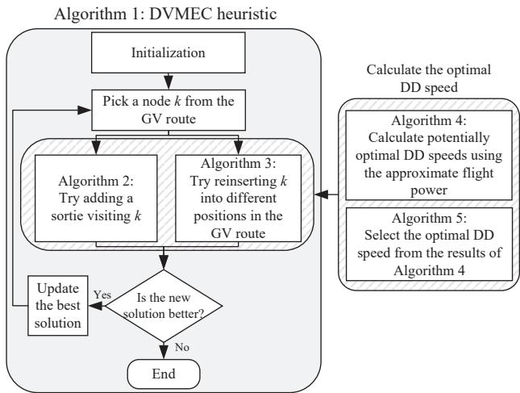  
Fig. 2: Structure of the proposed DVMEC heuristic.

Algorithm 1: Framework of the DVMEC heuristic   
1 s<sub>GV</sub> ← solveTSP(G); s<sub>DD</sub> ← {}; v<sub>DD</sub> ← {};   
2 t<sub>end</sub> ← calcTEnd(s<sub>GV</sub>, s<sub>DD</sub>, v<sub>DD</sub>);   
3 {t<sup>∗</sup><sub>end</sub>, s<sup>∗</sup><sub>GV</sub>, s<sup>∗</sup><sub>DD</sub>, v<sup>∗</sup><sub>DD</sub>} ← {t<sub>end</sub>, s<sub>GV</sub>, s<sub>DD</sub>, v<sub>DD</sub>};   
4 repeat   
5 $\{ t _ { \mathrm { e n d } } ^ { \mathrm { o l d } } , s _ { \mathrm { G V } } ^ { \mathrm { o l d } } , s _ { \mathrm { D D } } ^ { \mathrm { o l d } } , \upsilon _ { \mathrm { D D } } ^ { \mathrm { o l d } } \} \gets \{ t _ { \mathrm { e n d } } ^ { * } , s _ { \mathrm { G V } } ^ { * } , s _ { \mathrm { D D } } ^ { * } , \upsilon _ { \mathrm { D D } } ^ { * } \} ;$   
6 for each k $\in \mathit { s } _ { \mathrm { G V } } ^ { \mathrm { o l d } }$ do   
7 if k is the takeoff node or the rendezvous node of   
the DD then   
8 Skip the current loop;   
9 end   
10 {s<sub>GV</sub>, s<sub>DD</sub>, v<sub>DD</sub>} ← {s<sup>old</sup><sub>GV</sub>, s<sup>old</sup><sub>DD</sub>, v<sup>old</sup><sub>DD</sub>};   
11 Remove k from s<sub>GV</sub>;   
12 s<sub>GV</sub> sub ← getSubRoute(s<sub>GV</sub>);   
13 for each $s _ { \mathrm { G V } } ^ { \mathrm { s u b } , i } \in s _ { \mathrm { G V } } ^ { \mathrm { s u b } }$ do   
14 if The DD is not on a sortie then   
15 addSortie(s<sup>sub,i</sup>, s , s , v , k);   
16 end   
17 insert $( s _ { \mathrm { G V } } ^ { \mathrm { s u b } , i }$ , s<sub>GV</sub>, s<sub>DD</sub>, v<sub>DD</sub>, k);   
18 end   
19 end   
20 until $t _ { \mathrm { e n d } } ^ { * } \geq t _ { \mathrm { e n d } } ^ { \mathrm { o l d } } ;$   
21 return $s _ { \mathrm { G V } } ^ { * } , s _ { \mathrm { D D } } ^ { * } , v _ { \mathrm { D D } } ^ { * } ;$

Next, Algorithm 1 considers the removal of each data collection node k from s<sup>old</sup> . The resulting GV route, s<sub>GV</sub>, is then partitioned into multiple subroutes using the function getSubRoute. For each subroute, if the DD is not currently on a sortie, the function addSortie (Algorithm 2) is invoked to plan a sortie during which the DD collects data at node k. Additionally, the function insert (Algorithm 3) is called to generate a new GV route by reinserting node k. Both functions, addSortie and insert, update the best solution if the newly generated solution outperforms the previous one. Finally, Algorithm 1 continues iteratively if the best solution is updated in the previous iteration; otherwise, it terminates.

Algorithm 2 attempts to add a new sortie for the DD to visit node $k . ~ v _ { \mathrm { D D } } ^ { \mathrm { n e w } }$ is the new set of DD speeds with a new speed added, and existing speeds modified if necessary. $s _ { \mathrm { D D } } ^ { \mathrm { n e w } }$ is the new set of DD sorties with a new sortie added. First, two nodes i and $j ,$ where i precedes $j ,$ are selected from the subroute.

Algorithm 2: addSortie function   
Input: $s _ { \mathrm { G V } } ^ { \mathrm { s u b } , i }$ , s<sub>GV</sub>, s<sub>DD</sub>, v<sub>DD</sub>, k   
1 for each pair of i and j in $s _ { \mathrm { G V } } ^ { \mathrm { s u b } , i }$ , such that i precedes j do   
2 if $\langle i , k , j \rangle \in F$ then   
3 v<sub>ikj</sub> D ← calcV (⟨i, k, j⟩ , s<sub>GV</sub>);   
4 if $\check { v } _ { i k j } ^ { \mathrm { D } } \neq$ null then   
5 $\begin{array} { r } { v _ { \mathrm { D D } } ^ { \mathrm { n e w } }  v _ { \mathrm { D D } } \cup v _ { i k j } ^ { \mathrm { D } } ; s _ { \mathrm { D D } } ^ { \mathrm { n e w } }  s _ { \mathrm { D D } } \cup \langle i , k , j \rangle ; } \end{array}$   
6 v<sub>DD</sub> new ← adjustSC $\mathcal { S } \big ( \langle i , k , j \rangle$ new   
7 if v<sup>new</sup><sub>DD</sub> ̸= null then   
8 t<sub>end</sub> ← calcTEnd(s<sub>GV</sub>, s<sup>new</sup><sub>DD</sub> , v<sup>new</sup><sub>DD</sub> );   
9 if $t _ { \mathrm { e n d } } < t _ { \mathrm { e n d } } ^ { * }$ then   
10 $\begin{array} { r l } & { \bigl \{ t _ { \mathrm { e n d } } ^ { * } , \stackrel { \mathrm { s . u s } } { s _ { \mathrm { G V } } ^ { * } } , \boldsymbol { s } _ { \mathrm { D D } } ^ { * } , \boldsymbol { v } _ { \mathrm { D D } } ^ { * } \bigr \} \gets \bigl \{ t _ { \mathrm { e n d } } , \boldsymbol { s } _ { \mathrm { G V } } , \boldsymbol { s } _ { \mathrm { D D } } ^ { \mathrm { n e w } } , \boldsymbol { v } _ { \mathrm { D D } } ^ { \mathrm { n e w } } \bigr \} ; } \end{array}$   
11 end   
12 end   
13 end   
14 end   
15 end

If the sortie $\langle i , k , j \rangle$ does not exceed the DD’s maximum flight range, the function calcV (Algorithm 4) is invoked to calculate the DD flight speed during the sortie. If the output $v _ { i k j } ^ { \mathrm { D } }$ is null, the sortie exceeds the DD’s endurance and is thus discarded. Otherwise, a new solution is generated by adding this sortie and its corresponding DD speed to the old solution. Additionally, the function adjustSCLS is invoked to adjust the DD speeds of all subsequent consecutively linked sorties (SCLSs) of $\langle i , k , j \rangle$ . For multiple sorties, adjacent sorties are classified as SCLSs if the takeoff node of a subsequent sortie coincides with the rendezvous node of its preceding sortie. For example, consider the GV route {0, 1, 2, 3, 4, 5, 6, 13} with the DD sorties ⟨0, 7, 1⟩, ⟨1, 8, 2⟩, ⟨2, 9, 3⟩, ⟨3, 10, 4⟩, ⟨5, 11, 6⟩, and ⟨6, 12, 13⟩. In this case, the SCLSs of ⟨1, 8, 2⟩ are ⟨2, 9, 3⟩ and ⟨3, 10, 4⟩. If ⟨1, 8, 2⟩ is added as a new sortie, it may impact the DD’s takeoff and landing moments of the subsequent sortie ⟨2, 9, 3⟩ and, in turn, the takeoff and landing moments of ⟨3, 10, 4⟩. This, in turn, affects the optimal DD speeds of the SCLSs. Consequently, the DD speeds of SCLSs ⟨2, 9, 3⟩ and ⟨3, 10, 4⟩ must be recalculated to ensure the feasibility and optimality of all sorties. If any SCLS has no feasible DD speed, the function adjustSCLS returns an empty result. Conversely, if all SCLSs have feasible speeds, the function adjustSCLS returns the new set of DD speeds $v _ { \mathrm { D D } } ^ { \mathrm { n e w } }$ , with the speeds of the SCLSs modified. Subsequently, the $t _ { \mathrm { e n d } }$ of the solution is updated if the new solution demonstrates superior performance compared to the existing best solution.

Algorithm 3 attempts to insert node k into the GV route, where $v _ { a b c } ^ { \mathrm { D ^ { \prime } } }$ is the new DD speed determined by the function calcV for the sortie ⟨a, b, c⟩. First, two adjacent nodes, i and j, from the subroute are selected, and a new GV route is generated by inserting k between i and j. Next, if the DD is on a sortie $\langle a , b , c \rangle$ , the optimal speed of the DD for $\langle a , b , c \rangle$ is recalculated. If the recalculated speed is null, indicating that the DD has no feasible speed for $\langle a , b , c \rangle$ , the new solution is discarded. Otherwise, the old sortie speed is replaced with the recalculated speed. Subsequently, the function adjustSCLS is invoked to adjust the DD speeds of the SCLSs of $\langle a , b , c \rangle$ If all SCLSs have feasible speeds, the $t _ { \mathrm { e n d } }$ of the new solution $\{ s _ { \mathrm { G V } } ^ { \mathrm { n e w } } , s _ { \mathrm { D D } } , v _ { \mathrm { D D } } ^ { \mathrm { n e w } } \}$ is then calculated. Finally, the best solution is updated if the new solution surpasses the current best solution. The time complexity of one complete iteration of the DVMEC heuristic is ${ \dot { \cal O } } ( n ^ { 3 } )$ , where n denotes the number of data collection nodes in the GV’s route.

Algorithm 3: insert function   
Input: $s _ { \mathrm { G V } } ^ { \mathrm { s u b } , i }$ , s<sub>GV</sub>, s<sub>DD</sub>, v<sub>DD</sub>, k   
1 for each pair of adjacent i and j in $s _ { \mathrm { G V } } ^ { \mathrm { s u b } , i } .$ , such that i   
precedes j do   
2 $s _ { \mathrm { G V } } ^ { \mathrm { n e w } } $ insert k between i and j in s<sub>GV</sub>;   
3 if The DD is on a sortie $\langle a , b , c \rangle f o r s _ { \mathrm { G V } } ^ { \mathrm { s u b , \it i } }$ then   
4 $v _ { a b c } ^ { \mathrm { D ^ { \prime } } }  \mathsf { c a l c V } (  a , b , c  , s _ { \mathrm { G V } } ^ { \mathrm { n e w } } ) ;$   
5 if $v _ { a b c } ^ { \mathrm { D ^ { \prime } } } \neq$ null then   
6 v<sub>DD</sub> new ← substitute $v _ { a b c } ^ { \mathrm { D } }$ with $v _ { a b c } ^ { \mathrm { D ^ { \prime } } }$ in v<sub>DD</sub>;   
7 vDD v<sup>new</sup><sub>DD</sub> ← adjustSCLS(⟨a, b, c⟩ , s<sup>new</sup><sub>GV</sub> , s<sub>DD</sub>, v<sup>new</sup><sub>DD</sub> )   
8 if v<sub>DD</sub> <sup>new</sup> = null then   
9 Skip the current loop;   
10 end   
11 else   
12 Skip the current loop;   
13 end   
14 end   
15 t<sub>end</sub> ← calcTEnd(s<sup>new</sup><sub>GV</sub> , s<sub>DD</sub>, v<sup>new</sup><sub>DD</sub> );   
16 if $t _ { \mathrm { e n d } } < t _ { \mathrm { e n d } } ^ { * }$ then   
17 $| \mathrm { ~  ~ \sigma ~ } _ { , } \{ t _ { \mathrm { e n d } } ^ { \ast } , s _ { \mathrm { G V } } ^ { \ast \ast } , s _ { \mathrm { D D } } ^ { \ast } , v _ { \mathrm { D D } } ^ { \ast } \} \gets \{ t _ { \mathrm { e n d } } , s _ { \mathrm { G V } } ^ { \mathrm { n e w } } , s _ { \mathrm { D D } } , v _ { \mathrm { D D } } ^ { \mathrm { n e w } } \} ;$   
18 end   
19 end

## B. Optimization for DD Speed

In the function calcV, the DD speed during a sortie needs to be determined. Because of the strong inter-sortie and sortie-GV coupling, it is impractical to directly take the minimization of the mission completion time $t _ { \mathrm { e n d } }$ as the objective of the DD speed optimization. Therefore, we choose to optimize the DD speed to maximize the size of DD-processed data, which minimizes the size of the data offloaded to the GV for processing and ultimately helps minimize the mission completion time.

1) Maximizing the size of DD-processed data: For a sortie $\langle i , j , k \rangle \in F _ { \mathrm { { f } } }$ , if the DD and the GV arrive at the rendezvous node simultaneously, then the following equation holds.

$$
\left( t _ { k } - t _ { \mathrm { t o } , i } ^ { \mathrm { D D } } \right) - \left( \tau _ { \mathrm { t o } } ^ { \mathrm { D } } + \tau _ { i j } ^ { \mathrm { D } } + \tau _ { \mathrm { t s k } , j } + \tau _ { j k } ^ { \mathrm { D } } \right) = 0 .\tag{63}
$$

The flight speed of the DD in this situation is referred to as the critical speed $v _ { i j k , \mathrm { c r i } } ^ { \mathrm { D } } .$ According to (8), (9) and (63), its expression is given by

$$
v _ { i j k , \mathrm { c r i } } ^ { \mathrm { D } } = \frac { d _ { i j } + d _ { j k } } { \mathrm { m a x } \left( \varepsilon , \left( t _ { k } - t _ { \mathrm { t o } , i } ^ { \mathrm { D D } } \right) - \left( \tau _ { \mathrm { t o } } ^ { \mathrm { D } } + \tau _ { \mathrm { t s k } , j } \right) \right) } ,\tag{64}
$$

where ε denotes a sufficiently small positive constant.

Then, we analyze the relationship between $v _ { i j k } ^ { \mathrm { D } }$ and the size of DD-processed data, i.e., $T _ { \mathrm { s } , j } ^ { \mathrm { D } }$ . For the sake of analysis, we assume that the data size is sufficiently large that the DD cannot fully process it before landing. This assumption implies that the DD keeps processing data while flying to the rendezvous node, waiting for the GV, and landing. Two cases are analyzed: 1) the DD speed is less than or equal to the critical speed, and 2) the DD speed exceeds the critical speed.

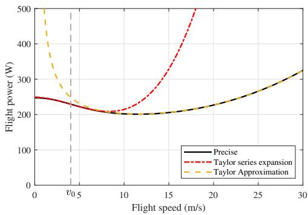  
Fig. 3: Precise and approximate flight power versus DD flight speed.

Case 1: When $v _ { i j k } ^ { \mathrm { D } } \leq v _ { i j k , \mathrm { c r i } } ^ { \mathrm { D } }$ , the size of DD-processed data is

$$
T _ { \mathrm { s } , j } ^ { \mathrm { D } } = \left( \tau _ { j k } ^ { \mathrm { D } } + \tau _ { \mathrm { l d } } ^ { \mathrm { D } } \right) \frac { C _ { \mathrm { D } } } { T _ { \mathrm { c } } } = \left( \frac { d _ { j k } } { v _ { i j k } ^ { \mathrm { D } } } + \tau _ { \mathrm { l d } } ^ { \mathrm { D } } \right) \frac { C _ { \mathrm { D } } } { T _ { \mathrm { c } } } .\tag{65}
$$

It is evident that a reduction in speed $v _ { i j k } ^ { \mathrm { D } }$ leads to an increase in the value of $T _ { \mathrm { s } , j } ^ { \mathrm { D } }$

Case 2: When $\mathrm { \bar { \it v } } _ { i j k } ^ { \mathrm { D } } > \mathrm { \bar { \it v } } _ { i j k , \mathrm { c r i } } ^ { \mathrm { D } }$ , the following equation holds.

$$
\tau _ { \mathrm { t o } } ^ { \mathrm { D } } + \tau _ { i j } ^ { \mathrm { D } } + \tau _ { \mathrm { t s k } , j } + \tau _ { j k } ^ { \mathrm { D } } + \tau _ { \mathrm { w a i t } , k } ^ { \mathrm { D } } = \left( t _ { k } - t _ { \mathrm { t o } , i } ^ { \mathrm { D D } } \right) .
$$

Therefore, the expression for $T _ { \mathrm { s } , j } ^ { \mathrm { D } }$ is given by

$$
\begin{array} { r l } & { T _ { \mathrm { s } , j } ^ { \mathrm { D } } = \left( \tau _ { j k } ^ { \mathrm { D } } + \tau _ { \mathrm { w a i t } , k } ^ { \mathrm { D } } + \tau _ { \mathrm { l d } } ^ { \mathrm { D } } \right) \frac { C _ { \mathrm { D } } } { T _ { \mathrm { c } } } } \\ & { \quad \quad = \Bigg ( \left( t _ { k } - t _ { \mathrm { t o } , i } ^ { \mathrm { D D } } \right) - \tau _ { \mathrm { t o } } ^ { \mathrm { D } } - \frac { d _ { i j } } { v _ { i j k } ^ { \mathrm { D } } } - \tau _ { \mathrm { t s k } , j } + \tau _ { \mathrm { l d } } ^ { \mathrm { D } } \Bigg ) \frac { C _ { \mathrm { D } } } { T _ { \mathrm { c } } } . } \end{array}\tag{66}
$$

This implies that an increase in speed $v _ { i j k } ^ { \mathrm { D } }$ results in a larger value of $T _ { \mathrm { s } , j } ^ { \mathrm { D } }$

In summary, to maximize $T _ { \mathrm { s } , j } ^ { \mathrm { D } }$ , the DD speed should be minimized when it is below the critical speed. Conversely, when the DD speed exceeds the critical speed, the DD speed should be maximized.

2) Flight Power Approximation: Due to the complexity of the induced power term in the DD’s flight power expression (11), deriving a closed-form solution for the DD speed is challenging. To address this issue, an approximation of the flight power expression is introduced.

By applying the first-order Taylor approximation

$$
( 1 + x ) ^ { 1 / 2 } \approx 1 + \frac { 1 } { 2 } x , | x | \ll 1 ,
$$

to the induced term, Zeng et al. [30] approximate the flight power expression as

$$
P _ { \mathrm { T } , \mathrm { h } } \big ( v _ { i j k } ^ { \mathrm { D } } \big ) = P _ { B } \left( 1 + \frac { 3 \left( v _ { i j k } ^ { \mathrm { D } } \right) ^ { 2 } } { U _ { \mathrm { t i p } } ^ { 2 } } \right) + \frac { 1 } { 2 } d _ { 0 } \rho s _ { r } A _ { r } \left( v _ { i j k } ^ { \mathrm { D } } \right) ^ { 3 } + \frac { P _ { I } v _ { 0 } } { v _ { i j k } ^ { \mathrm { D } } } .\tag{67}
$$

As shown in Fig. 3, when $v _ { i j k } ^ { \mathrm { D } } < v _ { 0 }$ , the approximation of (67) yields unsatisfactory results. Therefore, we propose using

the following cubic polynomial to approximate the induced term, which is derived using the Taylor series.

$$
a _ { 3 } \left( v _ { i j k } ^ { \mathrm { D } } \right) ^ { 3 } + a _ { 2 } \left( v _ { i j k } ^ { \mathrm { D } } \right) ^ { 2 } + a _ { 1 } v _ { i j k } ^ { \mathrm { D } } + a _ { 0 } .
$$

The corresponding approximate flight power is given by

$$
\begin{array} { r l r } & { } & { P _ { \mathrm { T } , 1 } \left( v _ { i j k } ^ { \mathrm { D } } \right) = \left( P _ { B } + a _ { 0 } \right) + a _ { 1 } v _ { i j k } ^ { \mathrm { D } } + \left( \frac { 3 P _ { B } } { U _ { \mathrm { t i p } } ^ { 2 } } + a _ { 2 } \right) \left( v _ { i j k } ^ { \mathrm { D } } \right) ^ { 2 } } \\ & { } & { ~ + \left( \cfrac { 1 } { 2 } d _ { 0 } \rho s _ { r } A _ { r } + a _ { 3 } \right) \left( v _ { i j k } ^ { \mathrm { D } } \right) ^ { 3 } . \quad ( 6 8 ) } \end{array}
$$

A plot of (68) and (67) as functions of DD speed $v _ { i j k } ^ { \mathrm { D } }$ is presented in Fig. 3, along with the precise flight power curve given by (11). It can be observed that (68) provides a better fit at lower speeds, whereas (67) performs better at higher speeds. Consequently, we define the speed $v _ { \mathrm { s e g } } ^ { \mathrm { D } }$ corresponding to the intersection of the two approximation curves as the segmentation point. We use (68) for $v _ { i j k } ^ { \mathrm { D } } \in [ 0 , v _ { \mathrm { s e g } } ^ { \mathrm { D } } ]$ , and (67) for $v _ { i j k } ^ { \mathrm { D } } \in \left( v _ { \mathrm { s e g } } ^ { \mathrm { D } } , v ^ { \mathrm { D , m a x } } \right]$

3) Flight Energy Analysis: To facilitate solving for the DD speed at which the DD’s flight energy reaches its upper limit, two equations are derived under two different cases:

Case 1: When $v _ { i j k } ^ { \mathrm { D } } \leq v _ { i j k , \mathrm { c r i } } ^ { \mathrm { D } }$ , the expression for the flight energy between takeoff and landing, $\bar { E } _ { \mathrm { f } , i j k }$ , is given by

$$
\bar { E } _ { \mathrm { f } , i j k } \left( v _ { i j k } ^ { \mathrm { D } } \right) = \left( d _ { i j } + d _ { j k } \right) \frac { P \left( v _ { i j k } ^ { \mathrm { D } } \right) } { v _ { i j k } ^ { \mathrm { D } } } + \tau _ { \mathrm { t s k } , j } \left( P _ { B } + P _ { I } \right) ,\tag{69}
$$

where the values of $\tau _ { \mathrm { t s k } , j } \left( P _ { B } + P _ { I } \right)$ and $( d _ { i j } + d _ { j k } )$ are fixed for each sortie. The expression for $P \left( v _ { i j k } ^ { \mathrm { D } } \right) / v _ { i j k } ^ { \mathrm { D } }$ is

$$
\begin{array} { r } { \frac { P \left( v _ { i j k } ^ { \mathrm { D } } \right) } { v _ { i j k } ^ { \mathrm { D } } } = P _ { B } \left( \frac { 1 } { v _ { i j k } ^ { \mathrm { D } } } + \frac { 3 v _ { i j k } ^ { \mathrm { D } } } { U _ { \mathrm { t i p } } ^ { 2 } } \right) + \frac { 1 } { 2 } d _ { 0 } \rho s _ { r } A _ { r } \left( v _ { i j k } ^ { \mathrm { D } } \right) ^ { 2 } } \\ { + P _ { I } \left( \sqrt { \frac { 1 } { \left( v _ { i j k } ^ { \mathrm { D } } \right) ^ { 4 } } + \frac { 1 } { 4 v _ { 0 } ^ { 4 } } } - \frac { 1 } { 2 v _ { 0 } ^ { 2 } } \right) ^ { 1 / 2 } . } \end{array}\tag{70}
$$

The equation that determines the flight speed corresponding to the flight energy reaching its upper limit $\bar { E } _ { \mathrm { f } , i j k } ^ { \mathrm { m a x } }$ is

$$
P \left( v _ { i j k } ^ { \mathrm { D } } \right) + \frac { \tau _ { \mathrm { t s k } , j } \left( P _ { B } + P _ { I } \right) - \bar { E } _ { \mathrm { f } , i j k } ^ { \mathrm { m a x } } } { d _ { i j } + d _ { j k } } v _ { i j k } ^ { \mathrm { D } } = 0 .\tag{71}
$$

Case 2: When $v _ { i j k } ^ { \mathrm { D } } > v _ { i j k , \mathrm { c r i } } ^ { \mathrm { D } } ,$ the expression for $\bar { E } _ { \mathrm { f } , i j k }$ is given by

$$
\begin{array} { r l } & { \bar { E } _ { \mathrm { f } , i j k } \left( v _ { i j k } ^ { \mathrm { D } } \right) = \left( t _ { k } - t _ { \mathrm { t o } , i } ^ { \mathrm { D D } } - \tau _ { \mathrm { t o } } ^ { \mathrm { D } } \right) \left( P _ { B } + P _ { I } \right) } \\ & { \qquad + \left( d _ { i j } + d _ { j k } \right) \left( \frac { P \left( v _ { i j k } ^ { \mathrm { D } } \right) } { v _ { i j k } ^ { \mathrm { D } } } - \frac { P _ { B } + P _ { I } } { v _ { i j k } ^ { \mathrm { D } } } \right) , } \end{array}\tag{72}
$$

where the values of $\left( \left( t _ { k } - t _ { \mathrm { t o } , i } ^ { \mathrm { D D } } \right) - \tau _ { \mathrm { t o } } ^ { \mathrm { D } } \right) \left( P _ { B } + P _ { I } \right)$ and $\left( d _ { i j } + d _ { j k } \right)$ are fixed for each sortie. The expression for $\begin{array} { r } { \left( \frac { \bar { P } \left( v _ { i j k } ^ { \mathrm { D } } \right) } { v _ { i j k } ^ { \mathrm { D } } } - \frac { P _ { B } + P _ { I } } { v _ { i j k } ^ { \mathrm { D } } } \right) } \end{array}$ is

$$
\begin{array} { r l r } {  { ( \frac { P ( v _ { i j k } ^ { \mathrm { D } } ) } { v _ { i j k } ^ { \mathrm { D } } } - \frac { P _ { B } + P _ { I } } { v _ { i j k } ^ { \mathrm { D } } } ) = P _ { B } \frac { 3 v _ { i j k } ^ { \mathrm { D } } } { U _ { \mathrm { t i p } } ^ { 2 } } + \frac { 1 } { 2 } d _ { 0 } \rho s _ { r } A _ { r } ( v _ { i j k } ^ { \mathrm { D } } ) ^ { 2 } } } \\ & { } & { + P _ { I } [ ( \sqrt { \frac { 1 } { ( v _ { i j k } ^ { \mathrm { D } } ) ^ { 4 } } + \frac { 1 } { 4 v _ { 0 } ^ { 4 } } } - \frac { 1 } { 2 v _ { 0 } ^ { 2 } } ) ^ { 1 / 2 } - \frac { 1 } { v _ { i j k } ^ { \mathrm { D } } } ] . \quad ( 7 3 ) } \end{array}
$$

The equation used to determine the flight speed at which the flight energy reaches its upper limit $\bar { E } _ { \mathrm { f } , i j k } ^ { \mathrm { - } }$ is

$$
\begin{array} { r } { P \left( v _ { i j k } ^ { \mathrm { D } } \right) + \frac { \left( t _ { k } - t _ { \mathrm { t o } , i } ^ { \mathrm { D D } } - \tau _ { \mathrm { t o } } ^ { \mathrm { D } } \right) \left( P _ { B } + P _ { I } \right) - \bar { E } _ { \mathrm { f } , i j k } ^ { \mathrm { m a x } } } { d _ { i j } + d _ { j k } } v _ { i j k } ^ { \mathrm { D } } } \\ { - \left( P _ { B } + P _ { I } \right) = 0 . } \end{array}\tag{74}
$$

In summary, to determine the DD speed at which the DD’s flight energy reaches its upper limit, we use (71) when the DD speed is less than or equal to the critical speed, and (74) when the DD speed exceeds the critical speed.

4) Solution of DD speed: The method for determining the speed during a sortie $\langle i , k , j \rangle$ is outlined in Algorithm 4. Specifically, distinct flight energy consumption equations for the DD are solved over various intervals, depending on the values of $v _ { \mathrm { s e g } } ^ { \mathrm { D } }$ and $v _ { i k j , \mathrm { c r i } } ^ { \mathrm { D } } .$ Subsequently, the speed solutions are filtered using Algorithm 5 to determine the optimal speed that maximizes $T _ { \mathrm { s } , k } ^ { \mathrm { D } } .$ . In Algorithm $4 , \ s _ { \mathrm { G V } } ^ { \mathrm { i n p u t } }$ is an input parameter representing a GV route.

The calcV function (Algorithm 4) substitutes distinct approximate flight power expressions into the corresponding flight energy consumption equations for different intervals, solves these equations, and discards both imaginary roots and real roots that fall outside their respective intervals. The equations obtained by substituting the power functions from equations (71) or (74) into (68) or (67) are third-order or fourth-order polynomial equations. Third-order equations are solved using Cardano’s formula, while fourth-order equations are solved using Ferrari’s method [34].

The following propositions will help elucidate Algorithm 5. Because the following analysis is for one specific sortie, we abbreviate the DD speed $v _ { i j k } ^ { \mathrm { D } }$ as $v ^ { \mathrm { D } }$ , the critical speed $v _ { i j k , \mathrm { c r i } } ^ { \mathrm { D } }$ as $v _ { \mathrm { c r i } } ^ { \mathrm { D } } .$ , the flight energy consumption between takeoff and landing, $\bar { E } _ { \mathrm { f } , i j k }$ , as $\bar { E } _ { \mathrm { f } }$ , and the maximum flight energy between takeoff and landing, $\bar { E } _ { \mathrm { f } , i j k } ^ { \mathrm { m a x } }$ , as $\bar { E } _ { \mathrm { f } } ^ { \mathrm { m a x } }$ in the lemma, propositions, and proofs for brevity. The notation $x  a ^ { + }$ denotes x approaching a from the positive side (right), while $x  a ^ { - }$ denotes x approaching a from the negative side (left). Proposition 1. $H \ v ^ { \mathrm { D } } \to 0 ^ { + }$ , then $\bar { E } _ { \mathrm { f } }  + \infty$ . When $v ^ { \mathrm { D } } =$ $v ^ { \mathrm { D , \bar { m a x } } } , ~ \bar { E } _ { \mathrm { f } } ~ i s ~ f i n i t e .$ Proof. In practice, $v _ { \mathrm { c r i } } ^ { \mathrm { D } } > 0$ , so the expression for $\bar { E } _ { \mathrm { f } }$ is given by (69) when $v ^ { \mathrm { D } }  \bar { 0 } ^ { + }$ . According to (69) and (70), if $v ^ { \mathrm { D } } $ $0 ^ { + }$ , then $P \left( v ^ { \mathrm { D } } \right) / v ^ { \mathrm { D } } \to + \infty .$ , and consequently, $\bar { E } _ { \mathrm { f } }  + \infty$ When $v ^ { \mathrm { D , m a x } } \leq v _ { \mathrm { c r i } } ^ { \mathrm { D } } ,$ , the expression for $\bar { E } _ { \mathrm { f } }$ at $v ^ { \mathrm { D , m a x } }$ is given by (69), and $\bar { E } _ { \mathrm { f } } \big ( \boldsymbol { v } ^ { \mathrm { D , m a x } } \big )$ is finite. When $v ^ { \mathrm { D , m a x } } > v _ { \mathrm { c r i } } ^ { \mathrm { D } }$ , the expression for $\bar { E } _ { \mathrm { f } }$ at $v ^ { \mathrm { D } }$ ,max is given by (72), and $\bar { E } _ { \mathrm { f } } ( v ^ { \mathrm { D , m a x } } )$ is also finite. ■ Proposition 2. If there exists a $v _ { \mathrm { x } } ^ { \mathrm { D } } \in \mathsf { \Gamma } ( 0 , v ^ { \mathrm { D , m a x } } ]$ such that $\bar { E } _ { \mathrm { f } } ( v _ { \mathrm { x } } ^ { \mathrm { D } } ) - \bar { E } _ { \mathrm { f } } ^ { \mathrm { m a x } } \leq 0 ,$ then the equation $\bar { E } _ { \mathrm { f } } ( v ^ { \mathrm { D } } ) - \bar { E } _ { \mathrm { f } } ^ { \mathrm { m a x } } = 0$ has at least one root.

Algorithm 4: calcV function   
Input: $\langle i , k , j \rangle , s _ { \mathrm { G V } } ^ { \mathrm { i n p u t } }$   
1 $v R o o t = \{ \} ;$   
2 Calculate $v _ { i k j , \mathrm { c r i } } ^ { \mathrm { D } }$ using (64) and $s _ { \mathrm { G V } } ^ { \mathrm { i n p u t } } ;$   
3 if $v _ { i k j , \mathrm { c r i } } ^ { \mathrm { D } } > 0$ then   
4 equRoot ← Solve (71) with substituting (68) for   
$P ( v _ { i k j } ^ { \mathrm { D } } ) ;$   
5 Select real roots within -0, min $\left\{ v _ { i k j , \mathrm { c r i } } ^ { \mathrm { D } } , v _ { \mathrm { s e g } } ^ { \mathrm { D } } \right\} ]$ from   
equRoot;   
6 Add selected roots to vRoot;   
7 end   
8 if $v _ { \mathrm { s e g } } ^ { \mathrm { D } } < v _ { i k j , \mathrm { c r i } } ^ { \mathrm { D } }$ then   
9 equRoot ← Solve (71) with substituting (67) for   
$P ( v _ { i k j } ^ { \mathrm { D } } ) ;$   
10 Select real roots within $[ v _ { \mathrm { s e g } } ^ { \mathrm { D } }$ , min $\left\{ v _ { i k j , \mathrm { c r i } } ^ { \mathrm { D } } , v ^ { \mathrm { D , m a x } } \right\} ]$   
from equRoot;   
11 Add selected roots to vRoot;   
12 end   
13 if $v _ { i k j , \mathrm { c r i } } ^ { \mathrm { D } } < v _ { \mathrm { s e g } } ^ { \mathrm { D } }$ then   
14 equRoot ← Solve (74) with substituting (68) for   
$P ( v _ { i k j } ^ { \mathrm { D } } ) ;$   
15 Select real roots within -max $\left\{ 0 , v _ { i k j , \mathrm { c r i } } ^ { \mathrm { D } } \right\} , v _ { \mathrm { s e g } } ^ { \mathrm { D } } ]$ from   
equRoot;   
16 Add selected roots to vRoot;   
17 end   
18 if $v _ { i k j , \mathrm { c r i } } ^ { \mathrm { D } } < v ^ { \mathrm { D , m a x } }$ then   
19 equRoot ← Solve (74) with substituting (67) for   
$P ( v _ { i k j } ^ { \mathrm { D } } ) ;$   
20 Select real roots within -max $\{ v _ { i k j , \mathrm { c r i } } ^ { \mathrm { D } } , v _ { \mathrm { s e g } } ^ { \mathrm { D } } \} , v ^ { \mathrm { D , m a x } } ]$   
from equRoot;   
21 Add selected roots to vRoot;   
22 end   
23 $v _ { i k j } ^ { \mathrm { D } } \gets$ selectV (vRoot);   
24 return $v _ { i k j } ^ { \mathrm { D } } ;$

Proof. $\bar { E } _ { \mathrm { f } } ( v ^ { \mathrm { D } } )$ is continuous. By Proposition 1, we have $\bar { E } _ { \mathrm { f } } ( v ^ { \mathrm { D } } ) $ +∞ if $v ^ { \mathrm { D } }  0 ^ { + }$ . If there exists a speed $v _ { \mathrm { x } } ^ { \mathrm { D } }$ such that $\bar { E } _ { \mathrm { f } } ( v _ { \mathrm { x } } ^ { \mathrm { D } } ) - \bar { E } _ { \mathrm { f } } ^ { \mathrm { m a x } } = 0 .$ , then $v _ { \mathrm { x } } ^ { \mathrm { D } }$ is a root of the equation $\bar { E } _ { \mathrm { f } } ( v ^ { \mathrm { D } } ) { - } \overleftarrow { { E } } _ { \mathrm { f } } ^ { \mathrm { m a x } } = 0$ . Furthermore, if there exists a $v _ { \mathrm { x } } ^ { \mathrm { D } }$ such that $\bar { E } _ { \mathrm { f } } ( v _ { \mathrm { x } } ^ { \mathrm { D } } ) - \dot { \bar { E } } _ { \mathrm { f } } ^ { \mathrm { m a x } } < 0$ , then by the intermediate value theorem (IVT), there must exist a speed $v _ { \mathrm { r } } ^ { \mathrm { D } }$ in the interval $( 0 , v _ { \mathrm { x } } ^ { \mathrm { D } } )$ that satisfies $\bar { E } _ { \mathrm { f } } ( v _ { \mathrm { r } } ^ { \mathrm { D } } ) - \bar { E } _ { \mathrm { f } } ^ { \mathrm { m a \bar { x } } } = 0 .$ . Hence, $v _ { \mathrm { r } } ^ { \mathrm { D } }$ is a root of the equation $\bar { E } _ { \mathrm { f } } ( v ^ { \mathrm { D } } ) - \bar { E } _ { \mathrm { f } } ^ { \mathrm { m a x } } = 0$ ■

Lemma 1. Let f(x) be a continuous function on the interval   
$[ a , b ] _ { i }$ , with $x _ { \mathrm { r } } ^ { \mathrm { m i n } }$ denoting the smallest root and $x _ { \mathrm { r } } ^ { \mathrm { m a x } }$ the   
largest root for the equation $f ( x ) = 0$ within this interval.   
If lim $f \left( x \right) > 0 \left( \mathrm { o r < 0 } \right)$ , then $f \left( x \right) > 0 \left( \mathrm { o r < 0 } \right)$ for all x→a<sup>+</sup>   
$x \in ( a , x _ { \mathrm { r } } ^ { \mathrm { m i n } } )$ . Similarly, if lim $f \left( x \right) ~ > ~ 0 \left( \mathrm { o r < 0 } \right)$ , then x→b−   
$f \left( x \right) > 0 \left( \mathrm { o r < 0 } \right)$ for all $x \in ( x _ { \mathrm { r } } ^ { \mathrm { m a x } } , b )$   
Proof. When lim $f \left( x \right) > 0 .$ the sign-preserving property of x→a<sup>+</sup>   
continuity ensures the existence of a $\delta > 0$ such that $f ( x ) > 0$   
for all $x \in ( a , a + \delta )$

Let $x _ { 1 } \in ( a , a + \delta )$ . Then $f ( x _ { 1 } ) > 0$ . Now, suppose there exists a $c \in ( a , x _ { \mathrm { r } } ^ { \mathrm { m i n } } )$ such that $f ( c ) = 0$ . In this case, c would be the smallest root of $f ( x )$ , which contradicts the original condition.

Similarly, if there exists a $c \in ( a , x _ { \mathrm { r } } ^ { \mathrm { m i n } } )$ such that $f ( c ) < 0 ,$ the IVT guarantees the existence of a point $d \in ( x _ { 1 } , c )$ where $f ( d ) = 0$ , which again contradicts the original condition. Therefore, the condition is invalid, and $f ( x ) > 0$ must hold uniformly on $( a , x _ { \mathrm { r } } ^ { \mathrm { m i n } } )$ .

The proof that $f ( x ) < 0$ holds for $x \ \in \ ( a , x _ { \mathrm { r } } ^ { \mathrm { m i n } } )$ when lim $f \left( x \right) ~ < ~ 0$ , and $f ( x ) ~ > ~ 0 ~ ( \mathrm { o r } < 0 )$ holds for $x \in$ $\stackrel { x  a ^ { + } } { ( { x _ { \mathrm { r } } ^ { \mathrm { m a x } } } , b ) }$ when lim $f \left( x \right) \ > \ 0 \left( \mathrm { o r < 0 } \right)$ , can be derived x→b<sup>−</sup> analogously. ■

Proposition 3. The smallest root, $v _ { \mathrm { r } } ^ { \mathrm { D , m i n } }$ , obtained by solving the equation $\bar { E } _ { \mathrm { f } } ( v ^ { \mathrm { D } } ) - \bar { E } _ { \mathrm { f } } ^ { \mathrm { m a x } } = 0$ in Algorithm $^ { 4 , }$ is the minimum feasible speed of the DD that satisfies the flight energy constraint (19). When $\bar { E } _ { \mathrm { f } } ( v ^ { \mathrm { D , m a x } } ) - \bar { E } _ { \mathrm { f } } ^ { \mathrm { \bar { m a x } } } > \bar { 0 } ,$ the largest root, $v _ { \mathrm { r } } ^ { \mathrm { D , m a \dot { x } } }$ , derived from the equation $\bar { E } _ { \mathrm { f } } ( v ^ { \mathrm { D } } ) - \bar { E } _ { \mathrm { f } } ^ { \mathrm { m a x } } = 0$ in Algorithm 4, corresponds to the maximum feasible speed of the DD. Conversely, if $\bar { E } _ { \mathrm { f } } ( v ^ { \mathrm { D , m a x } } ) - \bar { E } _ { \mathrm { f } } ^ { \mathrm { m a x } } \leq 0 , v ^ { \mathrm { D , m a x } }$ serves as the maximum feasible speed.

Proof. This proposition can be conveniently proven by applying Proposition 1 and Lemma 1.

• By Proposition 1, as $v ^ { \mathrm { D } } \to 0$ , we have

$$
\bar { E } _ { \mathrm { f } } ( v ^ { \mathrm { D } } )  + \infty ,
$$

$$
\bar { E } _ { \mathrm { f } } ( v ^ { \mathrm { D } } ) - \bar { E } _ { \mathrm { f } } ^ { \mathrm { m a x } }  + \infty .
$$

$$
\bar { E } _ { \mathrm { f } } \left( v ^ { \mathrm { D } } \right) - \bar { E } _ { \mathrm { f } } ^ { \mathrm { m a x } } > 0 , v ^ { \mathrm { D } } \in ( 0 , v _ { \mathrm { r } } ^ { \mathrm { D , m i n } } ) .
$$

$$
v _ { \mathrm { r } } ^ { \mathrm { D , m i n } }
$$

$$
\bar { E } _ { \mathrm { f } } ( v ^ { \mathrm { D , m a x } } ) - \bar { E } _ { \mathrm { f } } ^ { \mathrm { m a x } } > 0
$$

$$
\bar { E } _ { \mathrm { f } } ^ { \mathrm { m a x } } > 0 .
$$

$$
\operatorname * { l i m } _ { v ^ { \mathrm { D } }  v ^ { \mathrm { D , m a x } } } \bar { E } _ { \mathrm { f } } ( v ^ { \mathrm { D } } ) -
$$

$$
\bar { E } _ { \mathrm { f } } \left( v ^ { \mathrm { D } } \right) - \bar { E } _ { \mathrm { f } } ^ { \operatorname* { m a x } } > 0 , v ^ { \mathrm { D } } \in ( v _ { \mathrm { r } } ^ { \mathrm { D , m a x } } , v ^ { \mathrm { D , m a x } } ) .
$$

$$
v _ { \mathrm { r } } ^ { \mathrm { D , m a x } }
$$

• When $\bar { E } _ { \mathrm { f } } ( v ^ { \mathrm { D , m a x } } ) - \bar { E } _ { \mathrm { f } } ^ { \mathrm { m a x } } \leq 0 , v ^ { \mathrm { D , m a x } }$ is the maximum feasible speed.

The selectV function (Algorithm 5) selects the speed that maximizes the size of DD-processed data from the speeds obtained by solving the equations in Algorithm 4. In Algorithm 5, $v _ { \mathrm { f e a } } ^ { \mathrm { D , m a x } }$ and $v _ { \mathrm { f e a } } ^ { \mathrm { D , m i n } }$ denote the maximum and minimum feasible speeds. As mentioned above, $v _ { \mathrm { r } } ^ { \mathrm { D , m a x } }$ and $v _ { \mathrm { r } } ^ { \mathrm { D , m i n } }$ represent the largest and smallest roots obtained in Algorithm 4. When no speed is obtained in Algorithm 4, by combining Proposition 2 with a proof by contradiction, we conclude that the DD has no feasible speed. When only one speed $v _ { \mathrm { r } } ^ { \mathrm { D } }$ is obtained in Algorithm 4, $v _ { \mathrm { r } } ^ { \mathrm { D } }$ is both the smallest and largest root. This case is further divided into the following subcases based on the value of $\bar { E } _ { \mathrm { f } , i k j } \left( v ^ { \mathrm { D , m a x } } \right)$

• If $\bar { E } _ { \mathrm { f } } ( v ^ { \mathrm { D , m a x } } ) - \bar { E } _ { \mathrm { f } } ^ { \mathrm { m a x } } > 0$ , then, according to Proposition $3 , v _ { \mathrm { r } } ^ { \mathrm { D } }$ is the only feasible speed.

• If $\bar { E } _ { \mathrm { f } } ( v ^ { \mathrm { D , m a x } } ) - \bar { E } _ { \mathrm { f } } ^ { \mathrm { m a x } } = 0$ , then, according to Proposition $3 , v ^ { \mathrm { D , m a x } } = v _ { \mathrm { r } } ^ { \mathrm { D } }$ , which is the only feasible speed.

• If $\bar { E } _ { \mathrm { f } } ( v ^ { \mathrm { D , m a x } } ) - \bar { \bar { E } } _ { \mathrm { f } } ^ { \mathrm { m a x } } ~ < ~ 0 ,$ , then, by Proposition $^ { 3 , }$ $v _ { \mathrm { r } } ^ { \mathrm { D } }$ is the minimum feasible speed, while $v ^ { \mathrm { D , m a x } }$ is the maximum feasible speed.

When Algorithm 4 yields more than one speed, $v _ { \mathrm { r } } ^ { \mathrm { D , m i n } }$ is the minimum feasible speed by Proposition 3, and the value of the maximum feasible speed depends on the value of $\bar { E } _ { \mathrm { f } } \left( v ^ { \mathrm { D , m a x } } \right)$

Algorithm 5: selectV function   
Input: vRoot   
1 if vRoot is empty then   
2 $v _ { i k j } ^ { \mathrm { D } }  \mathrm { n u l l } ;$   
3 else if vRoot has one element then   
4 if $\bar { E } _ { \mathrm { f } , i k j } \left( v ^ { \mathrm { D , m a x } } \right) \geq \bar { E } _ { \mathrm { f } , i k j }$ then   
5 $v _ { i k j } ^ { \mathrm { D } }  v R o o t ;$   
6 else   
7 $v _ { \mathrm { f e a } } ^ { \mathrm { D , m i n } }  v R o o t ; v _ { \mathrm { f e a } } ^ { \mathrm { D , m a x } }  v ^ { \mathrm { D , m a x } } ;$   
8 $\ddot { \mathbf { i f } } \ \dot { T } _ { \mathrm { s } , k } ^ { \mathrm { D } } \left( v _ { \mathrm { f e a } } ^ { \mathrm { D } , \operatorname* { m i n } } \right) \geq \dot { T } _ { \mathrm { s } , k } ^ { \mathrm { D } } \left( v _ { \mathrm { f e a } } ^ { \mathrm { D } , \operatorname* { m a x } } \right)$ then   
9 $v _ { i k j } ^ { \mathrm { D } }  v _ { \mathrm { f e a } } ^ { \mathrm { D , m i n } } ;$   
10 else   
11 $\begin{array} { r } { | \begin{array} { r l } { \triangledown v _ { i k j } ^ { \mathrm { D } }  v _ { \mathrm { f e a } } ^ { \mathrm { D } , \operatorname* { m a x } } ; } \end{array}  } \end{array}$   
12 end   
13 end   
14 else   
15 $v _ { \mathrm { f e a } } ^ { \mathrm { D , m i n } }  \mathrm { m i n } ( v R o o t ) ;$   
16 if E<sup>¯</sup><sub>f,ikj</sub> $\left( v ^ { \mathrm { D , m a x } } \right) > \dot { \bar { E } } _ { \mathrm { f } , i k j }$ then   
17 $v _ { \mathrm { f e a } } ^ { \mathrm { D , m a x } }  \mathrm { m a x } ( v R o o t ) ;$   
18 else   
19 $\begin{array} { r } { \lvert \quad v _ { \mathrm { f e a } } ^ { \mathrm { D , m a x } }  v ^ { \mathrm { D , m a x } } ; } \end{array}$   
20 end   
21 i $: T _ { \mathrm { s } , k } ^ { \mathrm { D } } \left( v _ { \mathrm { f e a } } ^ { \mathrm { D } , \operatorname* { m i n } } \right) \geq T _ { \mathrm { s } , k } ^ { \mathrm { D } } \left( v _ { \mathrm { f e a } } ^ { \mathrm { D } , \operatorname* { m a x } } \right)$ then   
22 $\begin{array} { r l } { \big | } & { { } v _ { i k j } ^ { \mathrm { D } }  v _ { \mathrm { f e a } } ^ { \mathrm { D , m i n } } ; } \end{array}$   
23 else   
24 1 $v _ { i k j } ^ { \mathrm { D } }  v _ { \mathrm { f e a } } ^ { \mathrm { D , m a x } } ;$   
25 end   
26 end   
27 return $v _ { i k j } ^ { \mathrm { D } } ;$

• If $\bar { E } _ { \mathrm { f } } ( v ^ { \mathrm { D , m a x } } ) - \bar { E } _ { \mathrm { f } } ^ { \mathrm { m a x } } > 0 ,$ , then, by Proposition $3 , v _ { \mathrm { r } } ^ { \mathrm { D } }$ ,max is the maximum feasible speed.

• If $\bar { E } _ { \mathrm { f } } ( v ^ { \mathrm { D , m a x } } ) - \bar { E } _ { \mathrm { f } } ^ { \mathrm { m a x } } \leq 0 .$ , then, by Proposition $3 , v ^ { \mathrm { D } }$ ,max is the maximum feasible speed.

## IV. NUMERICAL RESULTS

## A. Experiment Setting

The locations of the data collection nodes and depots are uniformly distributed within a square area unless otherwise specified. The data size $T _ { \mathrm { s } , j }$ of each data collection node follows a normal distribution $N ( \mu _ { T } , \sigma _ { T } ^ { 2 } )$ , where $\mu _ { T }$ and $\sigma _ { T }$ represent the mean value and standard deviation of $T _ { \mathrm { s } , j } ,$ respectively. The DD flight parameters are configured based on [35]–[37], while the DD’s and GV’s computation parameters are selected according to [38]. The data collection rate $R _ { \mathrm { c l t } }$ is set to the recommended bit rate for 1080p H.264 video. All parameters are summarized in Table I, where 1 MiB = $8 \times 2 ^ { 2 0 }$ bit.

## B. Algorithm Performance

After applying the Taylor series to the induced power at the expansion point of 4.69 m/s, the coefficients $a _ { 0 } , a _ { 1 } , a _ { 2 }$ , and $a _ { 3 }$ in expression (68) are 90.5017, 0.4291, 1.7101, and 0.1326, respectively. The intersection of the approximate flight power expressions (67) and (68) corresponds to a speed of 7.712 m/s, which is the value of $v _ { \mathrm { s e g } } ^ { \mathrm { D } }$ . To evaluate the accuracy of the approximate flight power, we introduce the relative error

TABLE I: Parameter Setting
<table><tr><td rowspan=1 colspan=1>Parameter</td><td rowspan=1 colspan=1>Value</td><td rowspan=1 colspan=1>Parameter</td><td rowspan=1 colspan=1>Value</td></tr><tr><td rowspan=1 colspan=1> $\overline { { \tau _ { \mathrm { t o } } ^ { \mathrm { D } } \left( \mathrm { s } \right) } }$ </td><td rowspan=1 colspan=1>12</td><td rowspan=1 colspan=1> $\overline { { \tau _ { \mathrm { l d } } ^ { \mathrm { D } } \left( \mathrm { s } \right) } }$ </td><td rowspan=1 colspan=1>12</td></tr><tr><td rowspan=1 colspan=1> $\overline { { E ^ { \mathrm { m a x } } \left( \mathbf { k } \mathbf { J } \right) } }$ </td><td rowspan=1 colspan=1>200</td><td rowspan=1 colspan=1> $\overline { { E _ { \mathrm { f , t l } } \left( \mathbf { k J } \right) } }$ </td><td rowspan=1 colspan=1>7.2</td></tr><tr><td rowspan=1 colspan=1> $\tau _ { \mathrm { { s w a p } } } \left( \mathrm { { s } } \right)$ </td><td rowspan=1 colspan=1>60</td><td rowspan=1 colspan=1> $P _ { B } \left( \mathbf { W } \right)$ </td><td rowspan=1 colspan=1>158.76</td></tr><tr><td rowspan=1 colspan=1> $\overline { { P _ { I } \left( \mathbf { W } \right) } }$ </td><td rowspan=1 colspan=1>88.63</td><td rowspan=1 colspan=1> $U _ { \mathrm { t i p } } \left( \mathrm { m / s } \right)$ </td><td rowspan=1 colspan=1>120</td></tr><tr><td rowspan=1 colspan=1> $v _ { 0 }$ </td><td rowspan=1 colspan=1>4.03</td><td rowspan=1 colspan=1> $d _ { \mathrm { 0 } }$ </td><td rowspan=1 colspan=1>0.3</td></tr><tr><td rowspan=1 colspan=1> $\overline { { \rho \left( \mathrm { k g } / \mathrm { m } ^ { 3 } \right) } }$ </td><td rowspan=1 colspan=1>1.225</td><td rowspan=1 colspan=1> $s _ { r }$ </td><td rowspan=1 colspan=1>0.05</td></tr><tr><td rowspan=1 colspan=1> $\overline { { A _ { r } \left( \mathbf { m } ^ { 2 } \right) } }$ </td><td rowspan=1 colspan=1>0.503</td><td rowspan=1 colspan=1> $\overline { { v ^ { \mathrm { D , m a x } } \left( \mathrm { m / s  } } }\right)$ </td><td rowspan=1 colspan=1>30</td></tr><tr><td rowspan=1 colspan=1>Tc (cycle/bit)</td><td rowspan=1 colspan=1>3000</td><td rowspan=1 colspan=1> $\gamma _ { \mathrm { c } }$ </td><td rowspan=1 colspan=1> $\overline { { 1 0 ^ { - 2 8 } } }$ </td></tr><tr><td rowspan=1 colspan=1> $C _ { \mathrm { D } } \left( \mathrm { G H z } \right)$ </td><td rowspan=1 colspan=1>2</td><td rowspan=1 colspan=1> $C _ { \mathrm { V } } \left( \mathrm { G H z } \right)$ </td><td rowspan=1 colspan=1>8</td></tr><tr><td rowspan=1 colspan=1> $R _ { \mathrm { t r a n s } } \ : \left( \mathrm { b i t / s } \right)$ </td><td rowspan=1 colspan=1> $\overline { { 2 \times 1 0 ^ { 7 } } }$ </td><td rowspan=1 colspan=1> $R _ { \mathrm { c l t } } \left( \mathrm { b i t } { } / \mathrm { s } \right)$ </td><td rowspan=1 colspan=1> $\overline { { 4 . 9 9 2 \times 1 0 ^ { 6 } } }$ </td></tr><tr><td rowspan=1 colspan=1>µT (MiB)</td><td rowspan=1 colspan=1>160-320</td><td rowspan=1 colspan=1>σT (MiB)</td><td rowspan=1 colspan=1>20</td></tr></table>

$$
\frac { P _ { \mathrm { a p p r o x } } \left( v _ { i j k } ^ { \mathrm { D } } \right) - P \left( v _ { i j k } ^ { \mathrm { D } } \right) } { P \left( v _ { i j k } ^ { \mathrm { D } } \right) } \times 1 0 0 \% ,
$$

where $P _ { \mathrm { a p p r o x } } ( v _ { i j k } ^ { \mathrm { D } } )$ denotes the approximate flight power introduced in Section III-B2, and $P ( v _ { i j k } ^ { \mathrm { D } } )$ is the precise flight power given by (11). As shown in Fig. 4, the maximum relative error of the approximate flight power does not exceed 0.8%, indicating that the approximate flight power is relatively accurate. The approximate flight power marginally overestimates the actual flight power but maintains a small error margin. This implies that when planning flights based on fully utilizing battery capacity, the actual flight power will be marginally lower than planned, and the actual energy consumption will be slightly less than estimated. Consequently, the approximate flight power ensures that the DD’s energy consumption neither exceeds the battery capacity nor falls significantly below it, thereby achieving optimal utilization of the available energy.

Fig. 5 illustrates the convergence of mission completion time as the number of DVMEC heuristic iterations increases, under varying numbers of data collection nodes. The vertical axis represents the mission completion time, which is the value of the objective function of P1. The horizontal axis represents the iteration count of the outermost loop (Lines 6 to 22) in Algorithm 1. For the case with 30 data collection nodes, the DVMEC heuristic converges after 10 iterations. The smaller the number of data collection nodes, the faster the heuristic converges.

## C. Drone-Vehicle Scheduling Performance

To clearly demonstrate the optimization achieved by the DVMEC heuristic, we considered a small example with 8 data collection nodes, where $\mu _ { T }$ equals 220 MiB, and the area has a side length of 12 km. The remaining parameters are consistent with those in Table I. Fig. 6a and 6b illustrates the initial route provided by the solveTSP function in Algorithm 1, as well as the optimized route under the DVMEC heuristic. After optimization, the DD performs three sorties. The mission completion time is reduced from 138.72 minutes to 107.04 minutes, saving 31.68 minutes, which represents a 22.84% reduction in the mission completion time. Fig. 7 presents the corresponding timelines for the initial and optimized routes. These timelines encompass the GV’s and DD’s travel between nodes, data collection by the AD and DD, in-flight data processing by the DD, and data processing by the GV. For clarity in the timeline visualization, certain operations, such as data transmission from the AD and the DD to the GV after landing, as well as battery swapping of the DD after landing at the rendezvous nodes, are omitted.

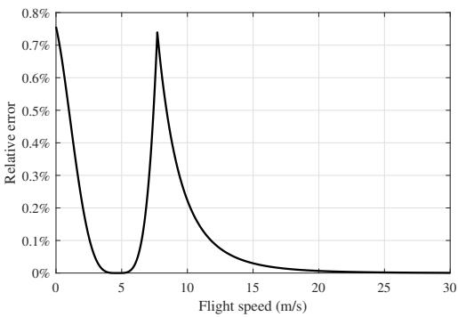  
Fig. 4: Relative error of the approximate flight power versus DD flight speed under the proposed approximation method.

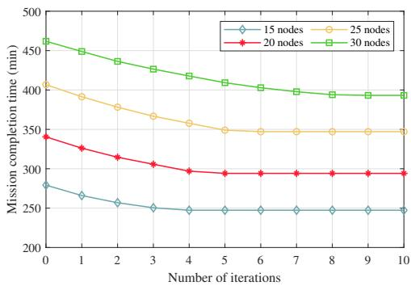  
Fig. 5: The convergence performance of the DVMEC heuristic under different numbers of data collection nodes.

In the initial route, the DD does not perform data collection tasks, necessitating the GV to visit every node. All data collected by the AD is subsequently processed by the GV. After optimization, the DD collects data at three nodes, reducing the number of nodes the GV must visit and saving the GV’s travel time. Furthermore, the DD processes part of the collected data while flying to the rendezvous node, which decreases the GV’s computing time. Additionally, because the DD and the AD collect data in parallel, the GV receives data for processing more frequently, reducing the GV’s CPU idle time.

We also consider a larger example with 30 data collection nodes, where $\mu _ { T }$ equals 220 MiB, and the area has a side length of 20 km. The remaining parameters are consistent with those in Table I. The initial route and the optimized route are shown in Fig. 6d and 6e. After optimization, the mission completion time is reduced from 429.96 minutes to 356.24 minutes, saving 73.72 minutes, which represents a 17.14% reduction in the mission completion time.

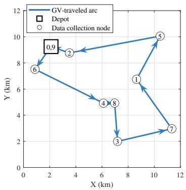  
(a)

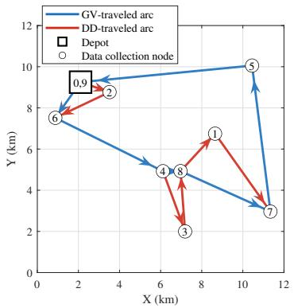  
(b)

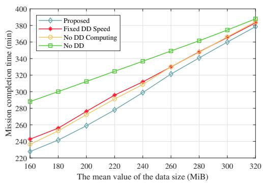

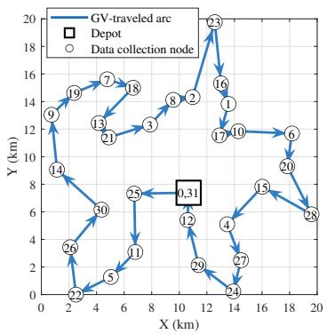  
(d)

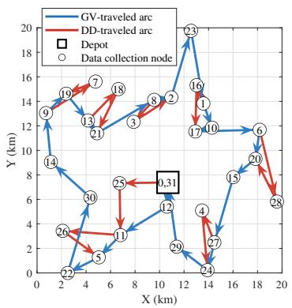  
(e)

(c)  
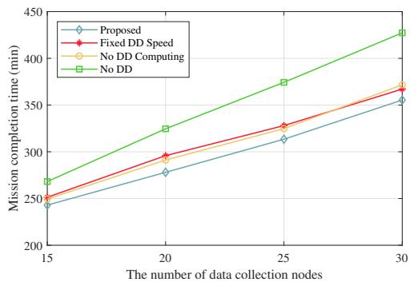  
(f)  
Fig. 6: (a) The initial route and (b) the optimized route with 8 data collection nodes under the DVMEC heuristic. (c) Mission completion time versus mean data size across different models. (d) The initial route and (e) the optimized route with 30 data collection nodes under the DVMEC heuristic. (f) Mission completion time versus the number of data collection nodes across different models.

## D. Model Comparison

For all comparative experiments, the area side length is set to 20 km. For each fixed number of nodes, 20 random maps are generated. The results of all comparative experiments are the average results derived from 20 maps. There is no existing method that can directly address this specific problem. Therefore, the advantages and effectiveness of the proposed model and heuristic are further validated through comparisons with the following variants of the proposed model:

• Fixed DD Speed: Based on the proposed model, the DD speed is fixed at 15 m/s when performing route optimization using Algorithms 1–3.

• No DD Computing: Based on the proposed model, the DD does not process data while flying from the data collection node to the rendezvous node. During route optimization using Algorithms 1–3, the DD speed is set to the specific critical speed $v _ { i j k , \mathrm { c r i } } ^ { \mathrm { D } }$ for each sortie.

• No DD: The GV performs data collection without the DD. The GV route is optimized using Algorithms 1 and 3, without adding any DD sorties.

In the first experiment, the number of data collection nodes is fixed at 20, while $\mu _ { T }$ varies from 160 MiB to 320 MiB. The numerical results are presented in Fig. 6c. Compared with the fixed DD speed model, the no DD computing model, and the no DD model, the proposed model reduces the mission completion time by 3.59%, 2.93%, and 10.42%, respectively. As $\mu _ { T }$ increases, the mission completion time rises across all models. Meanwhile, the performance advantages of the other three models over the no DD model gradually diminish. This is because larger $\mu _ { T }$ values might result in longer computing time at the GV, thereby reducing its CPU idle time.

In the proposed model, the fixed DD speed model, and the no DD computing model, when the data size is small, the GV might require a relatively short amount of time to process data collected by the AD, potentially resulting in a relatively long idle time for the GV’s CPU. The DD collects data and transmits it to the GV, thus eliminating the need for the GV to visit certain nodes and saving travel time. Additionally, the GV’s CPU idle time allows it to finish processing most of the data collected by the DD, so the completion of the GV’s data processing is not significantly delayed. However, when the data size is large, the GV’s CPU idle time could be insufficient to complete processing the data collected by the DD. Consequently, the GV may need to spend more time processing the data collected by the DD, potentially leading to a delayed completion of data processing and an increase in the mission completion time.

In the second experiment, $\mu _ { T }$ is set to 220 MiB, and the number of data collection nodes ranges from 15 to 30. The numerical results, shown in Fig. 6f, indicate that the proposed model achieves a reduction in mission completion time of 4.25%, 3.75%, and 14.21% compared to the fixed DD speed model, the no DD computing model, and the no DD model, respectively. As the number of data collection nodes increases, the mission completion time rises for all models. Concurrently, the performance gap between the no DD model and the other three models widens progressively. This might occur because, within a fixed area size, increasing the number of nodes could result in shorter inter-node distances, thereby potentially increasing the number of feasible sorties that satisfy the drone’s energy constraints. Consequently, drones might be scheduled to perform more sorties, which could save the GV’s travel time, alleviate its computing burden, and ultimately reduce the mission completion time.

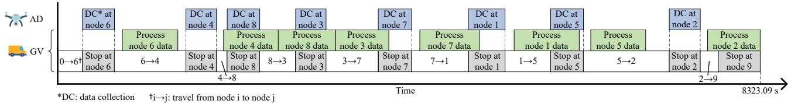

(a)  
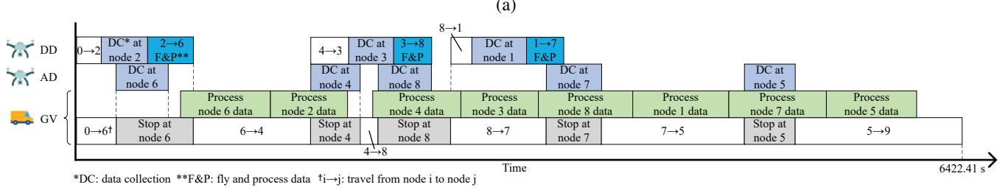  
(b)  
Fig. 7: Timeline of (a) the initial route and (b) the optimized route with 8 data collection nodes under the DVMEC heuristic.

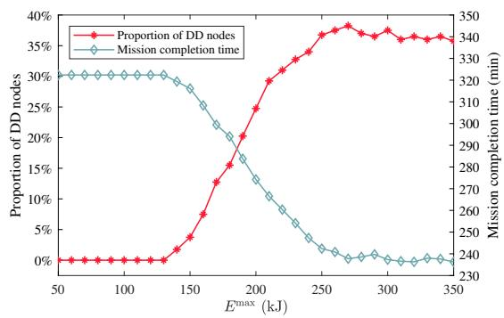  
Fig. 8: Mission completion time and proportion of DD nodes versus DD battery capacity in the proposed model.

## E. Parameter Analysis

For all parameter analysis experiments, the area side length is set to 20 km, the number of data collection nodes is set to 20, and $\mu _ { T }$ is set to 220 MiB. Also, the following results show the average derived from 20 random maps.

1) Impact of Parameter $E ^ { \mathrm { m a x } } .$ : Fig. 8 illustrates the effect of the DD battery capacity $E ^ { \mathrm { m a x } }$ on the proportion of DD nodes and the mission completion time. DD nodes refer to the data collection nodes visited by the DD. When $E ^ { \mathrm { m a x } }$ is below 130 kJ, the DD’s flight endurance is severely limited, rendering most sorties infeasible. Consequently, the proportion of DD nodes remains at 0%, and no reduction in mission completion time is observed. As $E ^ { \mathrm { m a x } }$ increases from 130 kJ to 250 kJ, the number of feasible sorties rises significantly. With an increased proportion of DD nodes, more data are processed by the DD, enabling the GV to visit fewer nodes and save time on traveling and computing, resulting in decreased mission completion time. Once E<sup>max</sup> exceeds 250 kJ, the majority of sorties become feasible. The proportion of DD nodes fluctuates slightly around 36%, and the mission completion time fluctuates correspondingly.

2) Impact of Parameters $C _ { \mathrm { D } }$ and $C _ { \mathrm { { V } } } \mathrm { { : } }$ Fig. 9 illustrates the effect of the DD’s CPU frequency $C _ { \mathrm { D } }$ and the GV’s CPU frequency $C _ { \mathrm { V } }$ on the savings percentage. The savings percentage represents the proportion of mission completion time saved by the optimized route compared to the initial route. With a fixed $C _ { \mathrm { D } } .$ , increasing $C _ { \mathrm { V } }$ significantly reduces the mission completion time, indicating that a higher GV’s CPU frequency accelerates data processing. When $C _ { \mathrm { V } }$ is set to 2 GHz, increasing $C _ { \mathrm { D } }$ raises the savings percentage from 1.30% to 4.69%, reflecting a notable reduction in mission completion time. However, as $C _ { \mathrm { V } }$ increases, the impact of $C _ { \mathrm { D } }$ on mission completion time reduction diminishes. At $C \nu = 8$ GHz, further increases in $C _ { \mathrm { D } }$ have minimal effect, with the savings percentage slightly increasing from 14.93% to 15.45%. When the GV’s CPU frequency is low, enhancing the DD’s CPU frequency substantially reduces the GV’s data computing workload, thereby decreasing the mission completion time. In contrast, when the GV’s CPU frequency is already high, the GV’s data processing is rapid, and further increases in the DD’s CPU frequency yield negligible gains in reducing the mission completion time.

3) Impact of Parameters $R _ { \mathrm { t r a n s } } .$ : Fig. 10 illustrates the effect of the transmission rate $R _ { \mathrm { t r a n s } }$ between the DD and the GV on both the savings percentage and the transmission time. When $R _ { \mathrm { t r a n s } }$ is below $1 \times 1 0 ^ { 6 }$ bit/s, the transmission time for 220

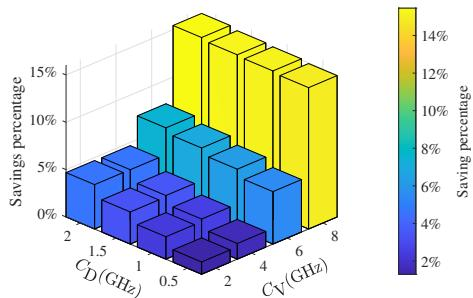  
Fig. 9: Savings percentage versus DD and GV CPU frequencies in the proposed model.

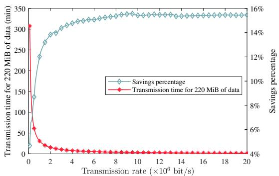  
Fig. 10: Transmission time for 220 MiB of data and savings percentage versus transmission rate in the proposed model.

MiB of data is very high, making transmission a bottleneck for computation offloading, delaying data processing, and reducing the savings achieved through computation offloading. As $R _ { \mathrm { t r a n s } }$ increases from $0 . 1 \times 1 0 ^ { 6 }$ bit/s to $6 \times 1 0 ^ { 6 }$ bit/s, the transmission time for 220 MiB of data decreases significantly, while the savings percentage increases from 4.67% to 14.78%. Once $R _ { \mathrm { t r a n s } }$ exceeds $6 \times 1 0 ^ { 6 }$ bit/s, transmission is no longer a bottleneck, and the savings are minimally affected by $R _ { \mathrm { t r a n s } } .$

4) Impact of Node Distribution: For this experiment, 20 data collection nodes are divided into four clusters. The distances from the nodes to their respective cluster centers follow a normal distribution with a mean of $\mu _ { \mathrm { d i s t } } .$ . Fig. 11 illustrates the effect of the mean distance from the nodes to the cluster centers, $\mu _ { \mathrm { d i s t } } ,$ on both the savings percentage and the proportion of DD nodes. When $\mu _ { \mathrm { d i s t } }$ is below 1000, nodes within the same cluster are located close to each other. Although more than 30% of the nodes are visited by the DD, DD sorties do not save much time for the GV because of the short inter-node distances. Additionally, the DD returns to the GV soon after data collection, processing relatively little data locally. Consequently, the savings are small. As $\mu _ { \mathrm { d i s t } }$ increases, the proportion of DD nodes rises, and the time between data collection and landing increases, allowing the DD to process more data locally. This leads to an increase in savings. When $\mu _ { \mathrm { d i s t } }$ exceeds 3000, inter-node distances grow further, causing the number of feasible sorties to drop. As a result, the proportion of DD nodes decreases, as do the savings. When $\mu _ { \mathrm { d i s t } }$ exceeds 4000, the savings decrease to 15%-17%, which is close to the 15.45% observed under the uniform

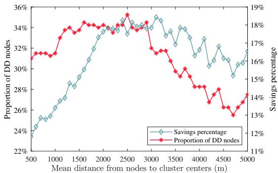  
Fig. 11: Savings percentage and proportion of DD nodes versus mean distance from nodes to cluster centers in the proposed model.

distribution case.

## V. CONCLUSION

In this paper, we propose a DVMEC model for low-altitude inspection that optimizes route planning and DD speeds to minimize mission completion time. We introduce a heuristic to optimize the GV route and the DD sorties. For DD speed optimization, we propose a method based on the relationship between DD speed and the size of DD-processed data, introducing two approximate expressions to facilitate the calculation of the optimized speed. Numerical results indicate that the DD’s approximate flight power is accurate with minimal error. The route optimized by the proposed heuristic effectively leverages the DD’s capabilities to reduce mission completion time. Compared to other models, the proposed model achieves the shortest mission completion time. Additionally, under the proposed DVMEC model, increasing the DD’s battery capacity can enlarge the number of sorties performed by the DD and reduce the mission completion time. The CPU frequencies of both the GV and DD jointly determine the computing time, consequently affecting the mission completion time.

## REFERENCES

[1] W. Yuan, Y. Cui, J. Wang, F. Liu, G. Sun, T. Xiang, J. Xu, S. Jin, D. Niyato, S. Coleri et al., “From ground to sky: Architectures, applications, and challenges shaping low-altitude wireless networks,” arXiv preprint arXiv:2506.12308, 2025.

[2] Z. Kaleem, M. U. Khan, A. Suleman, W. Khalid, K.-K. Wong, and C. Yuen, “Quantum Skyshield: Quantum Key Distribution and Post-Quantum Authentication for Low-Altitude Wireless Networks in Adverse Skies,” IEEE Wireless Communications, vol. 33, no. 2, pp. 235– 243, 2026.

[3] Z. Ning, H. Hu, X. Wang, L. Guo, S. Guo, G. Wang, and X. Gao, “Mobile Edge Computing and Machine Learning in the Internet of Unmanned Aerial Vehicles: A Survey,” ACM Computing Surveys, vol. 56, no. 1, Aug. 2023.

[4] M. Pal, A. K. Panja, A. Mukherjee, S. Mondal, and A. Basu, “A framework for optimal agent deployment and opportunistic routing in flying Ad-Hoc networks for precision weather forecasting,” Measurement and Control, vol. 58, no. 10, pp. 1324–1336, 2025.

[5] P. Hou, Y. Huang, H. Zhu, Z. Lu, S.-C. Huang, Y. Yang, and H. Chai, “Distributed DRL-Based Integrated Sensing, Communication, and Computation in Cooperative UAV-Enabled Intelligent Transportation Systems,” IEEE Internet of Things Journal, vol. 12, no. 5, pp. 5792– 5806, 2025.

[6] J. Dong, J. Cheng, J. Wu, C. Zhang, S. Zhao, and X. Tang, “Real-Time AIoT for AAV Antenna Interference Detection via Edge–Cloud Collaboration,” IEEE Internet of Things Journal, vol. 12, no. 8, pp. 10 664–10 680, 2025.

[7] H. Sun, X. Zhang, B. Zhang, K. Sha, and W. Shi, “Optimal Task Offloading and Trajectory Planning Algorithms for Collaborative Video Analytics With UAV-Assisted Edge in Disaster Rescue,” IEEE Transactions on Vehicular Technology, vol. 73, no. 5, pp. 6811–6828, 2024.

[8] N. Agarwal and S. Joshi, “Federated Learning-Based Task Offloading in a UAV-Aided Cloud Computing Mobile Network,” IEEE Transactions on Vehicular Technology, vol. 73, no. 10, pp. 15 751–15 756, 2024.

[9] X. Tang, H. Zhang, R. Zhang, D. Zhou, Y. Zhang, and Z. Han, “Robust Trajectory and Offloading for Energy-Efficient UAV Edge Computing in Industrial Internet of Things,” IEEE Transactions on Industrial Informatics, vol. 20, no. 1, pp. 38–49, 2024.

[10] X. Dong, S. Zhao, X. Liu, Z. Di, Y. Zhang, and Y. Shen, “Joint Trajectory Planning and Task Offloading for MIMO AAV-Aided Mobile Edge Computing,” IEEE Transactions on Mobile Computing, vol. 24, no. 4, pp. 3196–3210, 2025.

[11] W. Zhang, L. Tan, T. Huang, X. Huang, M. Huang, and G. Zhang, “Resource Allocation and Trajectory Optimization in Multi-UAV Collaborative Vehicular Networks: An Extended Multiagent DRL Approach,” IEEE Internet of Things Journal, vol. 12, no. 8, pp. 9391–9404, 2025.

[12] Y. Zhang, Z. Kuang, Y. Feng, and F. Hou, “Task Offloading and Trajectory Optimization for Secure Communications in Dynamic User Multi-UAV MEC Systems,” IEEE Transactions on Mobile Computing, vol. 23, no. 12, pp. 14 427–14 440, 2024.

[13] Y. Miao, K. Hwang, D. Wu, Y. Hao, and M. Chen, “Drone Swarm Path Planning for Mobile Edge Computing in Industrial Internet of Things,” IEEE Transactions on Industrial Informatics, vol. 19, no. 5, pp. 6836– 6848, 2023.

[14] X. Huang, Z. Wu, C. Peng, Y. Wu, W. Zhong, J. Kang, and S. Xie, “Joint Latency and Charge Cost Minimization for Reliable Task Offloading in Dispersed Computing: A Multi-objective Optimization Approach,” IEEE Transactions on Mobile Computing, pp. 1–16, 2026.

[15] U. Awada, J. Zhang, S. Chen, S. Li, and S. Yang, “EdgeDrones: Coscheduling of drones for multi-location aerial computing missions,” Journal of Network and Computer Applications, vol. 215, p. 103632, 2023.

[16] K. Jia, D. Yang, Y. Wang, T. Shui, and C. Liu, “Energy Efficient and Balanced Task Assignment Strategy for Multi-AAV Patrol Inspection System in Mobile Edge Computing Network,” IEEE Transactions on Network Science and Engineering, vol. 12, no. 1, pp. 210–222, 2025.

[17] X. Wang, C. He, W. Jiang, W. Wang, and X. Liu, “Generative AI-Based Dependency-Aware Task Offloading and Resource Allocation for UAV-Assisted IoV,” IEEE Open Journal of the Communications Society, vol. 6, pp. 3932–3949, 2025.

[18] Z. Sun, G. Sun, Q. Wu, L. He, S. Liang, H. Pan, D. Niyato, C. Yuen, and V. C. M. Leung, “TJCCT: A Two-Timescale Approach for UAV-Assisted Mobile Edge Computing,” IEEE Transactions on Mobile Computing, vol. 24, no. 4, pp. 3130–3147, 2025.

[19] J. Chen and J. Xie, “Joint Task Scheduling, Routing, and Charging for Multi-UAV Based Mobile Edge Computing,” in ICC 2022 - IEEE International Conference on Communications, 2022, pp. 1–6.

[20] X. Zhao, H. Yang, and M. Li, “Graph Reinforcement Learning Based Multi-Hotspot Region UAV Dynamic Scheduling in Mobile Edge Computing,” in 2024 IEEE Wireless Communications and Networking Conference (WCNC), 2024, pp. 1–6.

[21] D. Ye, Z. Sun, W. Zhong, J. Kang, X. Huang, D. I. Kim, S. Xie, and C. Yuen, “Optimal Flight Speed Scheduling and Battery Swapping in UAV-Enabled Mobile Edge Computing,” IEEE Transactions on Mobile Computing, vol. 25, no. 1, pp. 948–960, 2026.

[22] U. Awada, J. Zhang, S. Chen, S. Li, and S. Yang, “Resource-aware multi-task offloading and dependency-aware scheduling for integrated edge-enabled IoV,” Journal of Systems Architecture, vol. 141, p. 102923, 2023.

[23] Y. Shao, H. Xu, L. Liu, W. Dong, P. Shan, J. Guo, and W. Xu, “An energy-efficient distributed computation offloading algorithm for ground-air cooperative networks,” Vehicular Communications, vol. 52, p. 100875, 2025.

[24] Q. Tang, C. Dai, Z. Yu, D. Cao, and J. Wang, “An UAV and EV based mobile edge computing system for total delay minimization,” Computer Communications, vol. 212, pp. 104–115, 2023.

[25] Y. Wang, W. Chen, T. H. Luan, Z. Su, Q. Xu, R. Li, and N. Chen, “Task Offloading for Post-Disaster Rescue in Unmanned Aerial Vehicles Networks,” IEEE/ACM Transactions on Networking, vol. 30, no. 4, pp. 1525–1539, 2022.

[26] J. Park, C. Kim, and S. Lee, “Stackelberg Game-Based Vehicle-Aided Task Offloading for UAVs,” IEEE Wireless Communications Letters, vol. 13, no. 10, pp. 2647–2651, 2024.

[27] J. Tang and Y. Zeng, “UAV Data Acquisition and Processing Assisted by UGV-Enabled Mobile Edge Computing,” IEEE Transactions on Industrial Informatics, vol. 21, no. 5, pp. 3695–3704, 2025.

[28] A. Huang, X. Li, X. Chen, W. Song, Z. Tang, L. Chang, and T. Wang, “MobiPower: Scheduling mobile charging stations for UAV-mounted edge servers in Internet of Vehicles,” Peer-to-Peer Networking and Applications, vol. 18, no. 2, p. 82, 2025.

[29] T. Cong Dao, N. Cong Luong, N. Hung Nguyen, X. Li, D. Niyato, and D. In Kim, “Multihop Routing for IoT-Based Digital Twin: Novel Metaheuristic Approaches,” IEEE Internet of Things Journal, vol. 12, no. 15, pp. 30 493–30 506, 2025.

[30] Y. Zeng, J. Xu, and R. Zhang, “Energy Minimization for Wireless Communication With Rotary-Wing UAV,” IEEE Transactions on Wireless Communications, vol. 18, no. 4, pp. 2329–2345, 2019.

[31] H. Pan, Y. Liu, G. Sun, J. Fan, S. Liang, and C. Yuen, “Joint Power and 3D Trajectory Optimization for UAV-Enabled Wireless Powered Communication Networks With Obstacles,” IEEE Transactions on Communications, vol. 71, no. 4, pp. 2364–2380, 2023.

[32] M. Dell’Amico, R. Montemanni, and S. Novellani, “Exact models for the flying sidekick traveling salesman problem,” International Transactions in Operational Research, vol. 29, no. 3, pp. 1360–1393, 2022.

[33] C. C. Murray and A. G. Chu, “The flying sidekick traveling salesman problem: Optimization of drone-assisted parcel delivery,” Transportation Research Part C: Emerging Technologies, vol. 54, pp. 86–109, 2015.

[34] W. S. Anglin and J. Lambek, The Cubic and Quartic Equations. New York, NY: Springer New York, 1995, pp. 133–137.

[35] L. Chen, G. Liu, X. Zhu, and X. Li, “A Heuristic Routing Algorithm for Heterogeneous UAVs in Time-Constrained MEC Systems,” Drones, vol. 8, no. 8, 2024.

[36] C. Lemardele, M. Estrada, L. Pag ´ es, and M. Bachofner, “Potentialities of \` drones and ground autonomous delivery devices for last-mile logistics,” Transportation Research Part E: Logistics and Transportation Review, vol. 149, p. 102325, 2021.

[37] D. Lee, J. Zhou, and W. T. Lin, “Autonomous battery swapping system for quadcopter,” in 2015 International Conference on Unmanned Aircraft Systems (ICUAS), 2015, pp. 118–124.

[38] J. Bai, G. Huang, S. Zhang, Z. Zeng, and A. Liu, “GA-DCTSP: An Intelligent Active Data Processing Scheme for UAV-Enabled Edge Computing,” IEEE Internet of Things Journal, vol. 10, no. 6, pp. 4891– 4906, 2023.

  
Weidong Qi received the B.Eng. degree from Guangdong University of Technology, Guangzhou, China, in 2024. He is currently pursuing an M.Eng. degree with the School of Automation, Guangdong University of Technology, Guangzhou, China. His research interests include UAV-enabled mobile edge computing, route planning, and speed optimization.


Weifeng Zhong received the Ph.D. degree from Guangdong University of Technology, Guangzhou, China, in 2019. He is currently an Associate Professor with Guangdong University of Technology. He was a visiting scholar with Nanyang Technological University, Singapore, in 2021, and a visiting student with Hong Kong University of Science and Technology, Hong Kong, in 2016. His research interests include connected vehicles, smart grid, and Internet of Things.


Jiawen Kang (Senior Member, IEEE) received the Ph.D. degree from Guangdong University of Technology, China, in 2018. He was a postdoc at Nanyang Technological University, Singapore, from 2018 to 2021. He is currently a Full Professor at Guangdong University of Technology, China. His research interests mainly focus on blockchain, security, and privacy protection in wireless communications and networking.


Xumin Huang received the Ph.D. degree from Guangdong University of Technology, China, in 2019. He is currently an Associate Professor with the School of Automation, Guangdong University of Technology. He was a Macau Young Scholar with the State Key Laboratory of Internet of Things for Smart City, University of Macau, Macao, China. His research interests include resource and service optimizations for connected vehicles, Internet of Things, blockchain, and edge intelligence.


Dong In Kim (Life Fellow, IEEE) received the Ph.D. degree in electrical engineering from the University of Southern California, Los Angeles, CA, USA, in 1990. He was a Tenured Professor with the School of Engineering Science, Simon Fraser University, Burnaby, BC, Canada. Since 2007, he has been an SKKU-Fellowship and then Distinguished Professor with the College of Information and Communication Engineering, Sungkyunkwan University (SKKU), Suwon, South Korea. He is a Fellow of the Korean Academy of Science and Technology and a

Life Member of the National Academy of Engineering of Korea. He has been a first recipient of the NRF of Korea Engineering Research Center in Wireless Communications for RF Energy Harvesting from 2014 to 2021. He has been listed as a 2020/2022 Highly Cited Researcher by Clarivate Analytics. From 2001 to 2024, he served as the Editor, Editor at Large, and Area Editor of Wireless Communications I for IEEE TRANSACTIONS ON COMMUNICATIONS. From 2002 to 2011, he served as the Editor and Founding Area Editor of Cross-Layer Design and Optimization for IEEE TRANSACTIONS ON WIRELESS COMMUNICATIONS. From 2008 to 2011, he was the Co-Editor-in-Chief for the IEEE/KICS JOURNAL OF COMMUNICATIONS AND NETWORKS. He was the Founding Editor-in-Chief for the IEEE WIRELESS COMMUNICATIONS LETTERS, from 2012 to 2015. He was selected the 2019 recipient of the IEEE Communications Society Joseph LoCicero Award for Exemplary Service to Publications. He was the General Chair of IEEE ICC 2022 in Seoul.


Shengli Xie (Fellow, IEEE) received the Ph.D. degree in control theory and applications from the South China University of Technology, Guangzhou, China, in 1997. He is currently a Full Professor and the Head of the Institute of Intelligent Information Processing, Guangdong University of Technology, Guangzhou. He has coauthored two books and more than 150 research papers in refereed journals and conference proceedings. His research interests include blind signal processing, machine learning, and Internet of Things. He was awarded the Second Prize of National Natural Science Award of China in 2009. He was awarded a Highly Cited Researcher. He is an Associate Editor of IEEE Internet of Things Journal and IEEE Transactions on Systems, Man, and Cybernetics: Systems.


Chau Yuen (Fellow, IEEE) received the B.Eng. and Ph.D. degrees from Nanyang Technological University, Singapore, in 2000 and 2004, respectively. He was a Postdoctoral Fellow with Lucent Technologies Bell Labs, Murray Hill, NJ, USA, in 2005. From 2006 to 2010, he was with the Institute for Infocomm Research, Singapore. From 2010 to 2023, he was with the Engineering Product Development Pillar, Singapore University of Technology and Design, Singapore. Since 2023, he has been with the School of Electrical and Electronic Engineering, Nanyang

Technological University, Singapore, where he is currently the Provost’s Chair in Wireless Communications, the Assistant Dean of Graduate College, and Cluster Director for Sustainable Built Environment with ER@IN. Dr. Yuen received the IEEE Communications Society Leonard G. Abraham Prize (2024), the IEEE Communications Society Best Tutorial Paper Award (2024), the IEEE Communications Society Fred W. Ellersick Prize (2023), the IEEE Marconi Prize Paper Award in Wireless Communications (2021), the IEEE APB Outstanding Paper Award (2023), and the EURASIP Best Paper Award for Journal on Wireless Communications and Networking (2021). He currently serves as an Editor-in-Chief for Springer Nature Computer Science, an Editor for the IEEE Transactions on Vehicular Technology, the IEEE Transactions on Neural Networks and Learning Systems, and the IEEE Transactions on Network Science and Engineering, where he was awarded as IEEE Transactions on Network Science and Engineering Excellent Editor Award 2024 and 2022, and Top Associate Editor for IEEE Transactions on Vehicular Technology from 2009 to 2015. He also served as a Guest Editor for several special issues, including IEEE Journal on Selected Areas in Communications, IEEE Wireless Communications Magazine, IEEE Communications Magazine, IEEE Vehicular Technology Magazine, IEEE Transactions on Cognitive Communications and Networking, and Applied Energy (Elsevier). He is listed as Top 2% Scientists by Stanford University, and also a Highly Cited Researcher by Clarivate Web of Science from 2022. He has four U.S. patents and published more than 500 research articles at international journals.