# Cooperative Task Allocation and Path Planning for Multi-UAVs in Low-Altitude Urban Intelligent Transportation Systems

Zhe Zhang , Member, IEEE, Ju Jiang , Keck Voon Ling , Xinhua Wang , and Wen-An Zhang, Senior Member, IEEE

Abstract—In low-altitude urban intelligent transportation systems, eficient cooperative task allocation and path planning for multiple unmanned aerial vehicles (UAV) are critical for ensuring the efective execution of complex tasks. This paper proposes a distributed decision-making and autonomous planning framework to achieve cooperative task allocation and path planning for multi-UAVs in low-altitude urban trafic environment. The mission requirements of task allocation and path planning are modeled using evolutionary potential games and show that there exists a Nash equilibrium for the proposed potential function. An Improved Log-linear Learning Algorithm (ILLA) is proposed, and suitable Boltzmann parameters are derived which will enable the proposed ILLA to converge to the optimal Nash equilibrium with a probability one. Furthermore, a Constraint-Based Multilayer Bidirectional Adaptive A-Star (CBMBA A-Star) algorithm is designed to find optimal and collision free paths for each UAV. Compared with the baseline method, simulation results demonstrate that the proposed approach improves the task reward by 11.67%, reduces the task execution time by 37.41%, and decreases run time by 61.02%, confirming its efectiveness and eficiency in the complex low-altitude urban trafic scenario.

Index Terms—Unmanned aerial vehicle (UAV), low-altitude economy, task allocation, path planning, game theory.

## I. INTRODUCTION

OW-ALTITUDE aerial vehicles are the main carriers of bilities and wide application scenarios, they have promoted the application and development of multiple trafic scenarios such as logistics transportation, emergency rescue, autonomous driving, and urban air mobility [1], [2], [3], [4]. With the indepth integration of low-altitude aerial vehicle technology and low-altitude urban intelligent transportation systems (LU-ITS), new solutions for low-altitude trafic have been provided, and a more promising blueprint for the development of the future low-altitude economy has been depicted. Existing unmanned systems are mainly designed and developed for a single UAV, with simple tasks, single scenarios, and low safety. They rarely consider the autonomous planning and scheduling management among swarm vehicles, making it dificult to meet the safe and eficient flight requirements of large-scale aerial vehicles in LU-ITS [5], [6].

To improve the flight eficiency of aerial vehicles, reduce operational costs, and adapt to complex low-altitude urban trafic scenarios and multi-task scheduling requirements, autonomous aerial vehicles can be adopted. Task allocation and path planning are the core and crucial link to realizing the autonomous, eficient and collaborative operation of aerial vehicles and ensuring the accurate execution of tasks. Besides analyzing mission rewards, costs, and constraints in LU-ITS that target emergency rescue and last-mile cargo delivery tasks, precise modeling of collaborative relationships and obstacle avoidance behaviors among multi-UAVs is essential. During the task allocation and path planning processes in LU-ITS, UAVs rely on communication networks to continuously interact with neighboring UAVs and update their state information, which is closely associated with mission-related rewards and costs. Then, any two UAVs are subject to physical constraints [7], which encompass minimum safe separation distance, turning angle limits, and velocity bounds. They continuously exchange data and update states iteratively until a globally optimal planning solution is obtained. These collaborative interactions impose strict spatiotemporal requirements on UAVs. However, efective methods that can realize realtime and eficient task allocation and path planning, while being tailored to diverse mission requirements in LU-ITS, are still lacking.

To fill this gap, a decision-making and planning method integrating game theory and graph search is proposed to achieve cooperative task allocation and path planning of multi-UAVs in the application of trafic emergency rescue and cargo transportation in low altitude urban environment. The main contributions are summarized as follows.

1) A game-theoretic based distributed and autonomous planning framework is proposed in the low-altitude urban trafic environment, which facilitates information exchange among UAVs through iterative strategy games, enabling the rapid attainment of a globally optimal and stable solution for task allocation and path planning.

2) The mathematical form of the optimal potential function is analytically derived, and it is demonstrated that the proposed Improved Log-linear Learning Algorithm (ILLA) can converge to the optimal Nash equilibrium with probability one by adopting appropriate Boltzmann parameters.

3) The constraint-based multi-layer bidirectional adaptive A-Star algorithm (CBMBA A-Star) is proposed, which is a graph search-based approach capable of generating optimal and collision-free paths in low altitude urban environment with bandit threats.

4) The proposed method is integrated into multi-UAVs collaborative task allocation and path planning, and its optimality, scalability, and robustness have been verified through simulation experiments in urban trafic emergency rescue and cargo transportation scenarios.

The rest of this paper is organized as follows. Section II reviews the existing literature on the applications of task allocation and path planning for unmanned autonomous vehicles in intelligent transportation systems and low altitude environments. In Section III, we model the problem of cooperative task allocation and path planning for multi-UAVs in LU-TIS and propose an autonomous decision-making framework based on game theory. Section IV describes the our optimization algorithm for seeking Nash equilibrium and collision-free paths, and the convergence and optimality of the algorithm is proved. Numerical simulations in Section V confirm that the proposed approaches outperform existing technologies. Finally, Section VI concludes this paper.

## II. RELATED WORK

The core of cooperative task allocation and path planning in low-altitude urban intelligent transportation systems essentially is a combinatorial optimization problem [8], [9]. Particularly in LU-ITS scenarios, the trafic emergency response, last-mile delivery and uncertain constraints must be considered. Existing research is primarily categorized into four branches: Classical Optimization Methods, Heuristic Search Methods, Game Theory Methods, and Machine Learning Methods.

## A. Classical Optimization Methods for Task Allocation and Path Planning

Cooperative task allocation and path planning based on classical optimization methods involves constructing mathematical models to transform a series of issues. Deterministic or numerical programming methods are used to achieve the optimal or near-optimal performance in LU-ITS. To tackle ITS-oriented task allocation challenges from complex urban terrain and strong task coupling, Yao et al. [10] proposes an evolutionary utility prediction matrix method to develop a distributed framework for heterogeneous task planning. By analyzing input-output coupling in typical urban traficrelated task modes, they optimize each sub-module design, thereby improving the accuracy and eficiency of cooperative task allocation. A low-altitude economy network framework, formulating a long-term energy optimization problem for trajectory generation and resource allocation is proposed [11]. Then, a novel difusion-based trajectory generation algorithm is further developed to generate optimal trajectories with guided sampling. Srinivasan et al. [12] prensents a branchand-bound-based planning algorithm to realize multi-objective coverage task allocation and path planning in search and rescue operations. However, these classical optimization methods require accurate modeling of tasks, constraints, and system states. Particularly in low-altitude urban scenarios involving large-scale tasks or multiple constraints, solving the model is time-consuming, making them unsuitable for task planning scenarios with strict real-time requirements.

## B. Heuristic Search Methods for Task Allocation and Path Planning

Heuristic search methods are widely applied in cooperative task allocation and path planning of low-altitude autonomous vehicles in LU-ITS due to their simplicity in operation, strong robustness, and capability to obtain approximate optimal solutions within a limited time [13], [14]. To address eficient flight routing and scheduling in air trafic flow management, a discrete-time flow dynamic model and a bottom-up hierarchical approach are proposed for individual flight plans [15]. These methods guide the population to converge to the feasible region through an adaptive penalty mechanism, balancing the diversity and convergence of solutions. To meet the critical demand for rapid, accurate optimal path planning in IoTenabled UAV delivery systems, a multi-strategy particle swarm optimization (PSO) algorithm is presented, which integrates local deadlock jump, adaptive nonlinear inertia weights, and multi-population diferentiated evolution [16]. Based on the consensus-based bundle algorithm (CBBA), Wang et al. [17] optimize the start times and consensus phases to efectively mitigate task sequence conflicts, which achieves the decentralized task allocation of multi-UAVs. Zhang et al. [18] proposed an enhanced A-Star algorithm for UAV path planning in complex 3D environments. Numerical simulations show that the algorithm is more eficient regarding computation, path cost and safety. Chai et al. [19] proposed a high quality path planner based on the multi-strategy fusion diferential evo lution (MSFDE) algorithm. The method integrates three new strategies to balance development and exploration capabilities. For UAV dynamic path planning in low-altitude complex urban environments, a bi-level ofline-online algorithm is proposed [20], where an improved hunger games search (HGS) generates optimized paths with static obstacle constraints, and a improved rapid-exploring random tree (RRT) algorithm is adopted to achieve online path planning. While performing well in simulations, these methods lack a unified evaluation system in practical low-altitude air trafic scenarios and have weak model interpretability. Their adaptability in operational environments with communication and strict behavioral constraints also needs further verification.

## C. Game-Theoretic Methods for Task Allocation and Path Planning

In recent years, game theory, as an important theoretical tool for studying interactions and strategy selection among multiple aerial entities has shown promising application prospects in multi-entity cooperative tasks within intelligent transportation systems [21], [22]. Each autonomous vehicle aims to maximize its own payof and gradually converges to a Nash equilibrium through strategic games, thereby achieving cooperative optimization at the system level. A spatial game model is developed for incorporating parking operators as game players into the analytical framework and accounting for heterogeneity in travelers’ income [23], to evaluate the impact of various urban transportation policies on the competition among travel modes for commuters on the corridor. Chen et al. [24] proposes a distributed online task ofloading and resource allocation scheme based on high-altitude platforms and UAVs to minimize ground device energy consumption. The problem is decomposed into two sub-problems via stochastic optimiza tion with a distributed algorithm designed using game theory. Yaziciouglu et al. [25] proposed a distributed planning method for multi-vehicles system to provide optimal services, and a best response learnning algorithm (BRLA) is presented to converge to Nash equilibrium and ensure finite sub-optimality. Addtionally, log-linear learning algorithm (LLA) ofers an efective way to seek the Nash equilibrium of the games [26], [27]. Li and Duan [28] proposed cooperative search and surveillance method based on potential game, and use a binary log-linear learning method to realize the motion control of UAVs in the complex urban environment. A three-level decision-making framework based on normal-form game is proposed [29]. It designs a payof function balancing safety rewards and trafic rule compliance, enabling intelligent decisions in emergencies that account for surrounding vehicles behavior while balancing safety and rules. However, with the increasing complexity of low-altitude urban air trafic scenarios, factors such as the tight coupling between tasks and routes, communication and response time constraints, and dynamic threats have restricted the widespread application of game theory in large-scale UAVs cooperative task allocation and path planning.

## D. Machine Learning Methods for Task Allocation and Path Planning

Recently, for cooperative task allocation and path planning based on machine learning methods in air intelligent transportation systems, aerial entities can make decisions without relying on accurate modeling by learning interactions with the aerial environment or other aerial entities [1], [5], [30]. An air trafic density prediction method based on historical data and machine learning is proposed to assist air trafic controlauthorities in planning resources in advance and evaluating sector complexity through structuring trafic flow and predicting its distribution [31]. For air intelligent transportation systems, a hierarchical group-aware graph neural network model is proposed to capture latent dependencies between spatially distant but highly correlated airspace partitions via airspace partition graphs, regional correlation graphs and a diferentiable grouping network, with experiments proving it outperforms existing models on real datasets [32]. Seid et al. [33] employs multiagents deep reinforcement learning to realize computational ofloading and resource allocation for multiple UAVs in the Internet of Things (IoT), optimizing computational costs and service quality. Kuma et al. [34] presents a deep reinforcement learning-based joint optimization method for grasping and placing, which exhibits strong adaptability in dynamic and unstructured environments. A novel framework integrating strategic-level demand-capacity balance and tactical-level reinforcement learning for safety separation management in urban air mobility [35]. Experiments demonstrate that the hybrid method ensures safety standards while achieving higher operational eficiency than standalone reinforcement learning or alternative schemes. Deep reinforcement learningbased cooperative task planning is suitable for scenarios with high uncertainty and incomplete information, featuring excellent generalization ability. However, its reliance on large amounts of interaction data leads to high training costs, which limits its deployment eficiency in practical complex environments.

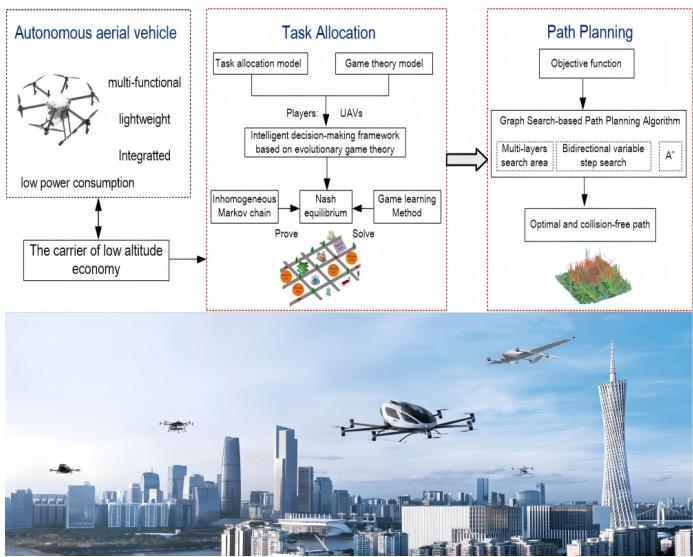  
Fig. 1. Framework of cooperative mission planning for multi-UAVs.

## III. PROBLEM FORMULATION AND SYSTEM MODEL

## A. Problem Formulation

We focus on multi-UAVs collaborative task allocation and path planning in low-altitude urban trafic scenarios, a critical component of missions such as air emergency rescue and cargo delivery. The system diagram is shown in Fig. 1.

1) Multiple Drones-Required Tasks: due to the limited capabilities of each UAV in low-altitude urban transaportation system, tasks are considered to be multiple drones-required tasks (MD tasks), which means that each task requires multi-UAVs, and each UAV can only perform one task.

2) Communication and Information Collection: the UAV $a _ { i }$ use the communication network to interact with neighboring UAVs, and it only know that assigned task and rewards.

## B. Cooperative Mission Planning Model of Multiple UAVs

1) Kinematics: each UAV flies in a low-altitude urban environment when performing tasks, the kinematics model of the UAV $a _ { i }$ is as

$$
\left\{ \begin{array} { l l } { x _ { i } ( t + 1 ) = x _ { i } ( t ) + \nu _ { i } ( t ) \Delta t \cos \psi _ { i } ( t ) \sin \vartheta _ { i } ( t ) } \\ { y _ { i } ( t + 1 ) = y _ { i } ( t ) + \nu _ { i } ( t ) \Delta t \sin \psi _ { i } ( t ) \sin \vartheta _ { i } ( t ) } \\ { z _ { i } ( t + 1 ) = z _ { i } ( t ) + \nu _ { i } ( t ) \Delta t \sin \vartheta _ { i } ( t ) } \\ { \nu _ { i } ( t + 1 ) = \nu _ { i } ( t ) + u _ { i } ( t ) \Delta t } \\ { \psi _ { i } ( t + 1 ) = \psi _ { i } ( t ) + u _ { \psi _ { i } } ( t ) \Delta t } \\ { \theta _ { i } ( t + 1 ) = \theta _ { i } ( t ) + u _ { \theta _ { i } } ( t ) \Delta t } \\ { \theta _ { i } ( t + 1 ) = \vartheta _ { i } ( t ) + u _ { \vartheta _ { i } } ( t ) \Delta t } \\ { \vartheta _ { i } ( t + 1 ) = \vartheta _ { i } ( t ) + u _ { \vartheta _ { i } } ( t ) \Delta t } \end{array} \right.\tag{1}
$$

where $\nu _ { i }$ is the velocity of the UAV $a _ { i } . \left( x _ { i } , y _ { i } , z _ { i } \right)$ is the position of $a _ { i } . \psi _ { i } , \theta _ { i }$ and $\vartheta _ { i } ( t )$ , , are the yaw angle, the roll angle ψ θ ϑand the pitch angle, respectively. $u _ { i }$ is the acceleration. ∆t is the discrete time step. $u _ { \psi _ { i } } ( t ) , u _ { \theta _ { i } } ( t )$ and $u _ { \vartheta _ { i } } ( t )$ are the yaw angular velocity, the roll angular velocity, and the pitch angular velocity, respectively.

2) Task Rewards: A five-tuple formulation is introduced to analyze the cooperative task allocation and path planning of multi-UAVs within urban low-altitude airspace, where ${ \mathcal { A } } =$ $\{ a _ { 1 } , a _ { 2 } , \ldots , a _ { n } \}$ is the set of UAVs. $\mathcal { T } = \{ T _ { 1 } , T _ { 2 } , \dots , T _ { m } \}$ is the set of tasks. $\mathcal { E } = \{ E _ { 1 } , E _ { 2 } , \ldots , E _ { m } \}$ is the central position of the task area. $\mathcal { O } = \{ O _ { 1 } , O _ { 2 } , \ldots , O _ { N _ { \mathrm { o } } } \}$ is the set of obstacles. ${ \mathcal { C } } =$ $\{ C _ { 1 } , C _ { 2 } , \ldots , C _ { N _ { \mathrm { c } } } \}$ is a set of constraints. Each UAV is equipped with a specific set of mission payloads to meet the operational requirements of diverse air trafic scenarios. The required load vector for executing the task $T _ { j }$ is $R ^ { T _ { j } } = [ R _ { 1 } ^ { T _ { j } } , R _ { 2 } ^ { T _ { j } } ]$ , where $R _ { 1 } ^ { T _ { j } }$ and $R _ { 2 } ^ { T _ { j } }$ are the number of type I and type II payloads required for task $T _ { j }$ , respectively. The task’s payload demand is met until the total number of payloads carried by the UAVs is greater than or equal to the $R ^ { \bar { T } _ { j } }$ . The payload carried by the $a _ { i }$ is given by

$$
R ^ { a _ { i } } = \left( R _ { 1 } ^ { a _ { i } } , R _ { 2 } ^ { a _ { i } } \right)\tag{2}
$$

where $R _ { 1 } ^ { a _ { i } }$ and $R _ { 2 } ^ { a _ { i } }$ are the number of type I and type II payloads carried by the $a _ { i } ,$ respectively.

Note that the initial value of the tasks are fixed value, the attack reward obtained when UAVs perform task $T _ { j }$ is defined as

$$
B \left( T _ { j } \right) = \sum _ { i = 1 } ^ { \left| { A _ { T _ { j } } } \right| } b _ { i j } = \sum _ { i = 1 } ^ { \left| { A _ { T _ { j } } } \right| } d _ { i j } r _ { T _ { j } }\tag{3}
$$

where $b _ { i j }$ is the reward received by a UAV $a _ { i }$ from executing task $T _ { j } . \ A _ { T _ { j } }$ is the set of UAVs performing in the $T _ { j } . \ d _ { i j }$ is the probability of successful delivery of task $T _ { j }$ by $a _ { i } ,$ and $r _ { T _ { j } }$ is the initial value of $T _ { j }$

3) Task Costs: each UAV carries a diferent payload and flies to the task area according to the corresponding path. Therefore, the task cost is composed of path cost and load cost. In the task allocation stage, we use Euclidean distance to estimate the initial path cost of each UAV. The initial path cost for the set of UAVs $A _ { T _ { j } }$ is as

$$
F \left( T _ { j } \right) = \sum _ { i = 1 } ^ { \left| { A { { T } _ { j } } } \right| } { { f } _ { i } } = \sum _ { i = 1 } ^ { \left| { A { { T } _ { j } } } \right| } \sqrt { \left( { { x } _ { i } } - { { x } _ { T _ { j } } } \right) ^ { 2 } + \left( { { y } _ { i } } - { { y } _ { T _ { j } } } \right) ^ { 2 } + z _ { i } ^ { 2 } }\tag{4}
$$

where $f _ { i }$ is the path cost of $a _ { i } . \left( x _ { T _ { j } } , y _ { T _ { j } } \right)$ is the center coordinates of task $T _ { j }$

The load cost of UAVs is related to the payload carried and the time required to perform tasks [36]. The load cost of $A _ { T _ { j } }$ for executing tasks $T _ { j }$ is given by

$$
G ( T _ { j } ) = \alpha _ { 0 } \left( 1 - \beta _ { 0 } ^ { \gamma _ { 0 } ( t _ { j i } + t _ { \mathrm { r e s p } } ) } \right) \sum _ { i = 1 } ^ { \left| \mathcal { A } _ { T _ { j } } \right| } \frac { R ^ { T _ { j } } } { R ^ { a _ { i } } }\tag{5}
$$

where $\alpha _ { 0 }$ and $\gamma _ { 0 }$ are the load cost coeficients. $\beta _ { 0 }$ is the load cost attenuation factor. $t _ { j i }$ is the time required for $a _ { i }$ to complete $T _ { j } ,$ i.e., $t _ { j i } = f _ { i } / \nu _ { i } . ~ t _ { \mathrm { r e s p } }$ is the response time.

4) Objective Function: according to Eqs. (2) to (5), a analysis of rewards and costs for cooperative multi-UAVs in low-altitude urban environments, the objective function for cooperative task allocation and path planning is as

$$
\begin{array} { l } { \displaystyle \operatorname* { m a x } J \left( T _ { j } \right) = \sum _ { \forall T _ { j } \in \mathcal { T } } B \left( T _ { j } \right) - F \left( T _ { j } \right) - G \left( T _ { j } \right) } \\ { \displaystyle = \sum _ { a _ { i } \in \mathcal { A } } \sum _ { \forall T _ { j } \in \mathcal { T } } U _ { i } \left( T _ { j } , \mathcal { A } _ { T _ { j } } \right) x _ { i j } } \end{array}\tag{6}
$$

subject to

$$
\begin{array} { r l } & { ( \displaystyle \sum _ { r _ { i j } \in T } x _ { i j } \le 1 , \forall a _ { i } \in \mathcal { A }  } \\ & {  | f _ { i } \le f _ { \operatorname* { m a x } } , \quad \nu _ { \operatorname* { m i n } } \le \nu _ { i } \le \nu _ { \operatorname* { m a x } }   } \\ & {   \displaystyle \sum _ { r _ { j } \in T } R ^ { T } \le \displaystyle \sum _ { q _ { i } \in \mathcal { A } } R ^ { a _ { i } }  } \\ & {  | { R ^ { a } } \in [ 1 , 5 ] , \quad u _ { \psi _ { \operatorname* { m i n } } } \le u _ { \psi _ { i } } \le u _ { \psi _ { \operatorname* { m a x } } }   } \\ & {   r _ { T _ { j } } \in [ 1 5 0 0 0 , 3 0 0 0 ] , \quad u _ { \theta _ { \operatorname* { m i n } } } \le u _ { \theta _ { i } } \le u _ { \theta _ { \operatorname* { m a x } } }   } \\ & {    | { d _ { i j } } \in [ 0 . 5 , 0 . 8 ] , \quad u _ { \theta _ { \operatorname* { m a x } } } \le u _ { \theta _ { i } } \le u _ { \theta _ { \operatorname* { m a x } } }    } \\ & {    { t _ { \mathrm { r e p } } } \in [ 0 , 3 0 ] , \quad z _ { i } \le 2 0 0   } \end{array}\tag{7}
$$

where $x _ { i j } \in \{ 0 , 1 \}$ is a binary variable that mean whether the $a _ { i }$ will execute $T _ { j \cdot } f _ { \operatorname* { m a x } }$ is the maximum flight voyage of the UAV ai. $\nu _ { \mathrm { m i n } }$ and $\nu _ { \mathrm { m a x } }$ are the minimum and the maximum velocity of $a _ { i } ,$ respectively. $( u _ { \psi _ { \mathrm { m i n } } } , u _ { \psi _ { \mathrm { m a x } } } ) , ( u _ { \theta _ { \mathrm { m i n } } } , u _ { \theta _ { \mathrm { m a x } } } )$ , and $( u _ { \vartheta _ { \mathrm { m i n } } } , u _ { \vartheta _ { \mathrm { m a x } } } )$ are the minimum and maximum attitude angular velocity of ai. vi ∈ [5 10] m/s. $u _ { \psi _ { i } } \in [ - 1 . 5 , 1 . 5 ]$ rad/s. $u _ { \theta _ { i } } \in [ - 1 . 2 , 1 . 2 ]$ rad/s. $u _ { \vartheta _ { i } } \in [ - 1 , 1 ]$ rad/s.

Noted that the UAV kinematics in Eq. (1) is used in the path planning stage. For task allocation, the optimization model is built based on distance and payload to to boost computational eficiency. As shown in Fig. 1, the path planning algorithm is adopted with additional practical physical constraints. This design compensates for the lack of explicit kinematic constraints in the task allocation stage.

## C. Game Theory Model

In the game-theoretic formulation, UAVs are modeled as players with states characterized by their assigned tasks and relative positions in urban aerial scenarios. For computational tractability, UAVs are treated as point masses. The cooperative task allocation and path planning problem is a potential game $\Gamma = \{ \mathcal { A } , \mathcal { S } , U _ { i } \}$ and seek Nash equilibrium without introducing the nonlinear, continuous-time kinematics from Eq. (1) into the high-level decision-making process. This simplification does not imply that kinematic feasibility is ignored in the final solution. When an optimal solution is obtained, the low-level path planning module enforces the constraints of Eq. (1) and other physical limitations to generate executable and collision-free trajectories. This hierarchical decomposition ensures that plans are both globally coordinated and physically realizable.

The use of a point-mass model and Euclidean distance in the high-level task assignment does not imply neglecting the UAV dynamics, but rather represents a computationally tractable and conservative approximation. In low-altitude urban scenarios, the dynamic parameters of UAVs, such as velocity, acceleration, and turning radius—are bounded and relatively homogeneous. Under these conditions, the Euclidean distance preserves a monotonic relationship with feasible flight time and task cost, and can be used to evaluate task reachability and relative cost at the high-level stage.

Dynamic feasibility is further implicitly incorporated into the high-level model through conservative conditions derived from dynamic constraints, such as flight range, task reachability, and time-window constraints, as shown in Eq. (7), thereby avoiding obviously infeasible task assignments. The low-level path planning module strictly enforces the kinematic constraints, as well as physical limitations such as collision avoidance, to generate executable trajectories. If a task allocation is dynamically infeasible, it will be identified as infeasible during the low-level planning stage.

In this paper, the feasible sets of the high-level task assignment and the low-level path planning are consistent, and no non-executable task assignment results are observed. We focus on analyzing task allocation and path planning in the low-altitude urban trafic environments from the game theory perspective. Some theories is given which are necessary for the results.

1) Inhomogeneous Markov Chains: A Markov chain is inhomogeneous if the single-step matrix is not constant. The state transition probability matrix from time t to time k is as

$$
H _ { t , k } = \prod _ { i = t } ^ { t + k - 1 } P _ { i }\tag{8}
$$

where the element in row a and column b is $h _ { a , b } ^ { t , k } .$

,Definition 1: An inhomogeneous Markov chain is weakly ergodic [14] if $k  \infty ,$ , for any $t , a , a ^ { \prime } ,$ b satisfies

$$
\operatorname* { l i m } _ { k \to \infty } \left| h _ { a , b } ^ { t , k } - h _ { a ^ { \prime } , b } ^ { t , k } \right| = 0\tag{9}
$$

Definition 2 (Scrambling matrix [37]): A state transition probability matrix $P$ is a scrambling matrix, for any two rows of elements a and $^ { b , }$ if there is a column of element $\gamma , p _ { a \gamma } > 0$ $p _ { b \gamma } > 0$ γ γ > holds. The measure of the scrambling power is as

$$
\operatorname { s p } ( P ) = \operatorname* { m i n } _ { a , a ^ { \prime } } \sum _ { b } \operatorname* { m i n } \left( p _ { a b } , p _ { a ^ { \prime } b } \right)\tag{10}
$$

Corollary 1: An inhomogeneous Markov chain, for each t, if the state transition probability matrix is regular [26], there must be an integer $z _ { 0 }$ such that $H _ { t , z _ { 0 } } = \prod _ { i = t } ^ { t + z _ { 0 } - 1 } P _ { i }$ is a scrambling matrix and sp $\left( H _ { t , z _ { 0 } } \right) > 0 .$

, >Theorem 1 (Weakly ergodic [38]): A Markov chain is weakly ergodic, if and only if the time series can be divided into subsequences, as $k \to \infty$ , it satisfies $\begin{array} { r } { \sum _ { k = 1 } ^ { \infty } \operatorname { s p } \left( H _ { t _ { k } , z _ { k } } \right) > \infty , } \end{array}$ where $z _ { k } = t _ { k + 1 } - t _ { k }$

Theorem 2 (Strongly ergodic [38]): A Markov chain $P _ { t }$ is strongly ergodic, if the following conditions hold: (a) Inhomogeneous Markov chains are weakly ergodic. (b) For each time $t , P _ { t }$ is a regular matrix with a steady state distribution . (c) $\pi _ { t }$ satisfies $\sum _ { t = 0 } ^ { \infty } \sum _ { s \in S } | \pi _ { s } ( t ) - \pi _ { s } ( t - 1 ) | < \infty .$

2) Network Evolutionary Potential Game: We develop a network evolutionary game model $\Gamma \quad = \quad \{ { \mathcal A } , S , U _ { i } \}$ to study collaborative mission planning, where player is ${ \mathcal { A } } =$ $\{ a _ { 1 } , a _ { 2 } , \ldots a _ { n } \} .$ , strategy is $\textit { S } = \{ s _ { 1 } , s _ { 2 } , . . . s _ { m } \}$ , which is consistent with $\tau .$ . The utility function of $a _ { i }$ is $U _ { i } .$ Each UAV interacts with neighbors through a communication network, engages in group game within the entire cluster drone system, and obtains the utility based on the current group state at time t. Then, follow a strategy update rule to generate the group state at time t + 1.

Definition 3 (Nash equilibrium [39]): A finite strategy game $\Gamma = \{ \mathcal { A } , \mathcal { S } , U _ { i } \}$ of n players with an action set $s$ and utility function $u ,$ a joint action $s ^ { * } = \left( s _ { 1 } ^ { * } , s _ { 1 } ^ { * } , \ldots , s _ { n } ^ { * } \right)$ is Nash equilibrium if it holds that

$$
U _ { i } \left( s _ { i } ^ { * } , s _ { - i } ^ { * } \right) \geq U _ { i } \left( s _ { i } ^ { \prime } , s _ { - i } ^ { * } \right)\tag{11}
$$

where $s _ { - i } ^ { * }$ is the joint action of all individuals except for the individual $a _ { i } . \ s _ { i } ^ { \prime }$ is an action that are diferent from $s ^ { * }$

Definition 4 (Potential game [40]): Γ is a potential game, if there are some potential functions , which satisfies

$$
U _ { i } \left( s _ { i } , s _ { - i } \right) - U _ { i } \left( s _ { i } ^ { \prime } , s _ { - i } \right) = \phi \left( s _ { i } , s _ { - i } \right) - \phi \left( s _ { i } ^ { \prime } , s _ { - i } \right)\tag{12}
$$

According to Definition 4, a potential game has at least one pure strategy Nash equilibrium $s ^ { * } , \operatorname { i . e . , } s ^ { * } = \arg \operatorname* { m a x } _ { s e \mathrm { { c } } } \phi ( s )$ . Each UAV $a _ { i } \in A$ can obtain task information from neighbors, the global utility is defined as

$$
U = \sum _ { a _ { i } \in \mathcal { A } } \sum _ { \forall T _ { j } \in T } U _ { i } \left( T _ { j } , \mathcal { A } _ { T _ { j } } \right)\tag{13}
$$

Corollary 2: A finite strategy game Γ with a potential function (s) is a potential game that $\phi$ satisfies

$$
\phi ( s ) = \sum _ { a _ { i } \in \mathcal { A } _ { T _ { j } } } U _ { i } ( s )\tag{14}
$$

Proof: Let $U _ { T _ { i } } ( s _ { i } , s _ { - i } )$ be the rewards obtained from the task $T _ { j }$ by $\boldsymbol { \mathcal { A } _ { T _ { j } \cdot } } \ s _ { i } ^ { 0 }$ means that $T _ { j }$ was not assigned to $a _ { i }$ . We have

$$
\begin{array} { l } { { { \cal U } _ { i } \left( s _ { i } , s _ { - i } \right) = { \cal U } _ { T _ { j } } \left( s _ { i } , s _ { - i } \right) - { \cal U } _ { T _ { j } } \left( s _ { i } ^ { 0 } , s _ { - i } \right) } } \\ { { = { \displaystyle \sum _ { a _ { i } \in { \cal A } _ { T _ { j } } } } { \cal U } _ { i } \left( T _ { j } , { \cal A } _ { T _ { j } } \right) - { \displaystyle \sum _ { a _ { k } \in { \cal A } _ { T _ { j } } \backslash a _ { i } } } { \cal U } _ { k } \left( T _ { j } , { \cal A } _ { T _ { j } } \backslash a _ { i } \right) } } \end{array}\tag{15}
$$

According to Eqs. (14) and (15), we have

$$
\begin{array} { l } { { U _ { i } \left( s _ { i } , s _ { - i } \right) - U _ { i } \left( s _ { i } ^ { \prime } , s _ { - i } \right) } } \\ { { = \displaystyle \sum _ { a _ { i } \in A _ { T _ { j } } } U _ { i } \left( T _ { j } , \mathcal { A } _ { T _ { j } } \right) - \sum _ { a _ { i } \in \mathcal { A } _ { T _ { j } } ^ { \prime } } U _ { i } \left( T _ { j } , \mathcal { A } _ { T _ { j } } ^ { \prime } \right) } } \\ { { = \phi \left( s _ { i } , s _ { - i } \right) - \phi \left( s _ { i } ^ { \prime } , s _ { - i } \right) } } \end{array}\tag{16}
$$

Therefore, according to Definition 1, the formulated game $\Gamma = \{ \mathcal { A } , \mathcal { S } , U _ { i } \}$ for task allocation of mult-UAVs leads to a potential game with (s) defined by Eq. (14).

Noted that s denotes a composite state consisting of the UAV $a _ { i }$ position and the information of the selected task, i.e., $s _ { i } ~ = ~ \left( x _ { i } , y _ { i } , z _ { i } , T _ { j } \right)$ . The optimal solution to the cooperative mission planning problem is a pure strategy Nash equilibrium in a finite strategy game $\Gamma = \{ \mathcal { A } , \mathcal { S } , U _ { i } \}$

Corollary 3: The optimal solution to the cooperative task allocation and path planning problem is a pure strategy Nash equilibrium in a finite strategy game $\Gamma = ( \mathcal { A } , \mathcal { S } , \mathcal { U } )$

Proof: We adopt proof by contradiction. Let $s ^ { * }$ be the optimal solution to the mission planning problem. If is not the Nash equilibrium of Γ, there must be an $s _ { i } ,$ , which makes $U _ { i } \left( s _ { i } , s _ { - i } ^ { * } \right) ~ > ~ U _ { i } \left( s _ { i } ^ { * } , s _ { - i } ^ { * } \right)$ . According to Corollary 2, Γ is a potential game, i.e., $\phi \left( s _ { i } , s _ { - i } ^ { * } \right) \ > \ \phi \left( s _ { i } ^ { * } , s _ { - i } ^ { * } \right)$ . While $J \left( s _ { i } ^ { * } , s _ { - i } ^ { * } \right) = \sum _ { j = 1 } ^ { m } \phi \left( s _ { i } ^ { * } , s _ { - i } ^ { * } \right) < \sum _ { j = 1 } ^ { m } \phi \left( s _ { i } , s _ { - i } ^ { * } \right) = J \left( s _ { i } , s _ { - i } ^ { * } \right)$ , which means that is not the optimal solution for task allocation and path planning in LU-ITS. However, this result contradicts the previous assumption, i.e., $s ^ { * }$ is the Nash equilibrium.

## IV. METHODOLOGY

## A. Learning Algorithm in Potential Game

1) Log-Linear Learning Algorithm (LLA) [26]: We analyze the logit dynamics LLA. A potential game $\Gamma = \{ \mathcal { A } , \mathcal { S } , U _ { i } \}$ , for each time t, UAV $a _ { i }$ randomly chooses a strategy $s _ { i } \in S$ with the same probability, which is defined as

$$
p _ { s _ { i } } ( t ) = \frac { \exp { \{ \beta U _ { i } \left( s _ { i } , s _ { - i } ( t - 1 ) \right) \} } } { \sum _ { s ^ { \prime } \in S } \exp \left\{ \beta U _ { i } \left( s _ { i } ^ { \prime } , s _ { - i } ( t - 1 ) \right) \right\} }\tag{17}
$$

where $\beta$ is the Boltzmann parameter. $\operatorname { A s } \beta \to \infty$ , for each $t , a _ { i }$ will select the task corresponding to the current maximum reward for updating, which is the best response learning algorithm (BRLA), i.e., s∗ ∈ arg $\sum _ { s _ { i } \in S _ { i } }$ max $U _ { i } \left( s _ { i } , s _ { - i } \right)$

Given that a fixed $\beta \ge 0 .$ , Γ has a homogeneous Markov chain with a state transition probability matrix is as

$$
P _ { t } \left( s _ { i } , s _ { i } ^ { \prime } \right) = { \frac { 1 } { n } } { \left\{ \begin{array} { l l } { \sum _ { i = 1 } ^ { n } p _ { s _ { i } ^ { \prime } } ( t ) , \quad s _ { i } = s _ { i } ^ { \prime } } \\ { p _ { s ^ { \prime } } ( t ) , \quad s _ { - i } = s _ { - i } ^ { \prime } { \mathrm { ~ a n d ~ } } s _ { i } \neq s ^ { \prime } } \\ { 0 , { \mathrm { ~ o t h e r w i s e } } } \end{array} \right. }\tag{18}
$$

Definition 5 (Steady state distribution [40]): A finite strategy game Γ with (s) if UAVs follow the Eq. (17), the Markov chain has a unique steady state distribution, that is

$$
\pi _ { s } ( t ) = \frac { \exp \{ \beta \phi ( s ) \} } { \sum _ { s ^ { \prime } \in S } \exp \{ \beta \phi \left( s ^ { \prime } \right) \} }\tag{19}
$$

The steady-state distribution does not equate to a steady physical configuration of UAVs in the LUITS. Inversely, it is the equilibrium strategy distribution of the potential game. The game dynamics start from an initial strategy distribution $\pi _ { 0 } ( s )$ and evolve through a transient phase $\pi _ { t } ( s )$ . This transient distribution captures the temporal adaptation of UAVs’ strategies. Under finite potential game properties, $\pi _ { t } ( s )$ converges to the steady-state distribution $\pi ^ { * } ( s )$

Note that as $\beta \  \ \infty ,$ , all weights on the steady state distribution $\pi _ { s } ( t )$ will be concentrated on the joint strategy corresponding to the maximum potential function (s), i.e., the optimal Nash equilibrium.

2) Improved Log-Linear Learning Algorithm (ILLA): To obtain the global optimal solution and ensure that the algorithm can converge with a probability one, a ILLA is proposed. For each time t, the selection of strategies for $\mathrm { U A V } \ a _ { i }$ is as

$$
s _ { i } ( t ) = \left\{ \begin{array} { l l } { \mathrm { r a n d o m ~ } s _ { i } \in S , \mathrm { ~ w i t h ~ p r o b . ~ } \varepsilon } \\ { \mathrm { r a n d o m ~ } s _ { i } \in S _ { c } , \mathrm { ~ w i t h ~ p r o b . ~ } p _ { s _ { i } } ( t ) } \\ { s _ { i } ( t - 1 ) , \mathrm { ~ w i t h ~ p r o b . ~ } 1 - \varepsilon - p _ { s _ { i } } ( t ) } \end{array} \right.\tag{20}
$$

where is the exploration factor, $S _ { c } \subseteq S$ is the strategy set of neighbors.

Additionally, an a time-independent Boltzmann parameter (t) is given by

$$
\beta ( t ) = \frac { \alpha \ln ( t + \eta ) } { c }\tag{21}
$$

Corollary 4: A networked evolutionary potential game $\Gamma =$ (A S U ), if each UAV $a _ { i }$ adopts the logic dynamics of Eq. (17) and the strategy update mode of Eq. (20), where $\beta ( t )$ follows Eq. (21), the inhomogeneous Markov chain induced by the ILLA is strongly ergodic.

Proof: Substituting Eq. (21) into Eq. (17), we have

$$
\begin{array} { c } { { p _ { s _ { i } } ( t ) = \displaystyle \frac { \left( t + \eta \right) ^ { \frac { \alpha U _ { i } \left( s _ { i } , s _ { i } , \left( t - 1 \right) \right) } { c } } } { \displaystyle \sum _ { s _ { i } ^ { \prime } \in S } \left( t + \eta \right) ^ { \frac { \alpha U _ { i } \left( s _ { i } ^ { \prime } , s _ { i } ( t - 1 ) \right) } { c } } } } } \\ { { = \displaystyle \frac { 1 } { \displaystyle \sum _ { s ^ { \prime } \in S } \left( t + \eta \right) ^ { \frac { \alpha \left\{ U _ { i } \left( s _ { i } ^ { \prime } , s _ { i } ( t - 1 ) \right) - U _ { i } \left( s _ { i } , s _ { i } ( t - 1 ) \right) \right\} } { c } } } } } \end{array}\tag{22}
$$

Note that $0 < \alpha < 1 , \eta > 0 , c > 0$ , for any $t \geq 1 , t + \eta > 1$ holds. Let $\left| U _ { i } \left( s _ { i } ^ { \prime } , s _ { - i } ( t - 1 ) \right) - U _ { i } \left( s _ { i } , s _ { - i } ( t - 1 ) \right) \right| = M _ { i }$ , where $M _ { i }$ , ,is a bounded constant. By adjusting the parameters , for any $s _ { i } , s _ { - i } \in \mathcal { S } , \alpha M _ { i } \le 1$ holds. Therefore, we have

$$
p _ { s _ { i } } ( t ) = \frac { 1 } { \sum _ { s _ { i } \in S } ( t + \eta ) ^ { \frac { \alpha M _ { i } } { c } } } \geq \frac { 1 } { n ( t + \eta ) ^ { 1 / c } }\tag{23}
$$

According to Definition 5, Eqs. (20) and (23), we have

$$
\begin{array} { l } { { \displaystyle P _ { t } \left( s _ { i } , s _ { i } ^ { \prime } \right) = \prod _ { s _ { i } ( t ) \in S } \frac { \varepsilon } { | S | } \prod _ { s _ { i } ( t ) = s _ { i } ( t - 1 ) } \frac { 1 } { s _ { i } ^ { \prime } \varepsilon S } ( t + \eta ) \frac { \alpha M _ { i } } { c } } } \\ { { \displaystyle ~ \times \prod _ { s _ { i } ( t ) \in S _ { c } } \frac { 1 } { \sum _ { s _ { i } ^ { \prime } \in S _ { c } } ( t + \eta ) \frac { \alpha M _ { i } } { c } } \ge \frac { \varepsilon } { | S | n _ { c } ( n - n _ { c } ) ( t + \eta ) ^ { 1 / c } } } } \end{array}\tag{24}
$$

where |S| is the maximum cardinality of the S. $n _ { c }$ is the number of neighbors of $a _ { i }$

According to Definition 1 and Corollary 1, the positive elements in the state transition probability matrix of step c starting from time t is given by

$$
\begin{array} { r l r } {  { h _ { s _ { 1 } , s _ { 2 } } ^ { * ( t , c ) } = \sum _ { b _ { 1 } \in S } \cdots \sum _ { b _ { c } \in S } P _ { t } ( s _ { 1 } , b _ { 1 } ) \cdots P _ { t } ( b _ { c } , s _ { 2 } ) } } \\ & { } & { \quad \ge \frac { \displaystyle \varepsilon ^ { c } } { \displaystyle ( | S | n _ { c } ( n - n _ { c } ) ) ^ { c } ( t + \eta + c - 1 ) } } \end{array}\tag{25}
$$

According to Definition 2 and Eq. (10), we have

$$
\mathrm { s p } ( H _ { t , c } ) \geq \frac { \varepsilon ^ { c } } { ( | S | n _ { c } ( n - n _ { c } ) ) ^ { c } ( t + \eta + c - 1 ) }\tag{26}
$$

Let $t = ( k - 1 ) c + 1$

$$
\sum _ { k = 1 } ^ { \infty } \operatorname { s p } \left( H _ { t , c } \right) \geq \left( { \frac { \varepsilon } { | { \mathcal { S } } | n _ { c } \left( n - n _ { c } \right) } } \right) ^ { c } \sum _ { k = 1 } ^ { \infty } { \frac { 1 } { c k + \eta } } = \infty\tag{27}
$$

According to Theorem 1, the inhomogeneous Markov chain defined by the ILLA is weakly ergodic. From the above analysis and Eq. (18), the $\pi _ { s } ( t )$ is as

$$
\pi _ { s } ( t ) = { \frac { ( t + \eta ) ^ { \frac { \alpha \phi ( s ) } { c } } } { \displaystyle \sum _ { s ^ { \prime } \in S } ( t + \eta ) ^ { \frac { \alpha \phi ( s ^ { \prime } ) } { c } } } }\tag{28}
$$

$$
\sum _ { t = 0 } ^ { \infty } \sum _ { s \in \mathcal { S } } | \pi _ { s } ( t + 1 ) - \pi _ { s } ( t ) | < \infty\tag{29}
$$

Algorithm 1 Improved Log-Linear Learinning Algorithm   
Input: n of UAVs, m of tasks, Coordinate $( x _ { i } , y _ { i } )$ of $a _ { i } ,$   
Coordinate $( x _ { T _ { j } } , y _ { T _ { j } } ) .$ tmax, strategy set ${ \mathcal { S } } .$   
Output: The UAV set $\boldsymbol { \mathcal { A } } _ { T _ { j } }$ for each task. $U$ and $U _ { i }$   
Initialization: m of tasks are assigned to n of UAVs,   
randomly. $\varepsilon =$ rand(0 0 1). $x _ { i j } ~ = ~ 0 . ~ c ~ =$ rand $( 0 , t _ { \mathrm { m a x } } )$ .   
$\alpha =$ rand $\left( 1 \times 1 0 ^ { - 4 } , 1 \times 1 0 ^ { - 3 } \right)$ . = rand(1 10).   
αWhile $t \leq t _ { \mathrm { m a x } }$ do   
for $a _ { i } \in { \mathcal { A } }$ do   
if $x _ { i j } = 0$ then   
Calculate $s _ { i } ( t )$ using Eq. (20);   
$t \gets t + 1 ;$   
else   
Calculate (t) using Eq. (21);   
Broadcast the local information to neighbors;   
Calculate U and $U _ { i }$ using Eqs. (13) and (15);   
end if   
Update $s _ { i }$ and $U _ { i } ( s _ { i } , s _ { - i } ) ;$   
if $U _ { i } \left( s _ { i } , s _ { - i } \right) > U _ { i } \left( s _ { i } ^ { \prime } , s _ { - i } \right)$ then   
, > ,Find Nash equilibrium $s _ { i } ^ { * } \gets s _ { i } ,$ obtain $A _ { T _ { j } } , U _ { i } ;$   
else   
Adjust the $\beta ( t )$ to generate new and $\eta ;$   
end if   
end for   
end while   
Return $\boldsymbol { \mathcal { A } } _ { T _ { j } }$ for each task. U and $U _ { i } .$

Therefore, according to Theorem 2, the Markov chain is strongly ergodic. From Corollary 4, the following theorem describes the results of this section, and the pseudocode of ILLA is shown in Algorithm 1.

Theorem 3: A networked evolutionary potential game Γ, for the proposed ILLA with $\beta ( t )$ , if the strategy of Eq. (20) is adopted, the ILLA can converge to the solution set corresponding to the maximum potential function with a probability one, i.e., the optimal Nash equilibrium.

$$
\operatorname* { l i m } _ { t \to \infty } \mathrm { P r o b . } \left\{ s ( t ) \in \left\{ s ^ { * } \mid \phi \left( s ^ { * } \right) = \operatorname* { m a x } _ { s \in S } \phi ( s ) \right\} \right\} = 1\tag{30}
$$

## B. Path Planning Algorithm

Path planning is another problem in cooperative task planning for multi-UAVs. In this section, based on the A-Star algorithm, we propose a Constraint-Based Multi-layer Bidirectional Adaptive A-Star (CBMBA A-Star) algorithm to find a collision-free path for each UAV.

1) Conventional A-Star Algorithm: the A-Star algorithm is a deterministic graph-based search algorithm that can ultimately obtain the optimal solution of the path. The heuristic function of the conventional A-Star algorithm is given by

$$
f ( k ) = g ( k ) + h ( k )\tag{31}
$$

where $f ( k )$ is total cost. $g ( k )$ is actual cost from the start to the node k. h(k) is estimated cost from node k to the goal.

2) Constraint-Based Multi-Layer Bidirectional A-Star (CBMBA A-Star): the conventional A-Star algorithm uses a single expansion method to calculate the straight-line distance between the current node and neighboring nodes, which can result in the generation of inaccurate and unsafe paths. For the omnidirectional search, the computational complexity of the algorithm is significantly increased when the planning space is large. And the path rarely meets the real flight constraints. Hence, We propose the CBMBA A-Star algorithm with a new heuristic function and search strategy. The pseudocode of CBMBA A-Star algorithm is shown in Algorithm 2.

a) The improved heuristic function:

$$
f ( k ) = g ( k ) + \left( 1 + \frac { g ( k ) } { g ( k ) + h ( k ) } \right) h ( k )\tag{32}
$$

The improved heuristic function aims to enhance the accuracy of the solution by refining the weight of the heuristic term h(k). By increasing its contribution, the more accurate estimations of the remaining cost are prioritized, which can lead to better performance in terms of finding higher-quality solutions.

Noted that although increasing the weight of h(k) may afect the consistency of the heuristic function in the $\mathbf { A } ^ { * }$ algorithm, as long as the improved heuristic remains admissible, the global optimality of $\mathbf { A } ^ { * }$ is still guaranteed. Specifically, in Eq. (32), according to the proposed improvement, the weight of h(k) varies dynamically within a relatively small range. In many cases, the heuristic remains admissible and never overestimates the actual cost. Therefore, in certain applications, allowing a slight compromise in consistency can enhance the solution quality, achieving a balance between solution accuracy and algorithmic consistency.

b) Search strategy: to improve the search eficiency, adaptability to the environment, and path quality, considering the flight constraints of UAVs turning and the characteristics of bandit threats, we propose a constraint-based multi-layer extension and bidirectional adaptive step search strategy.

Algorithm 2 Constraint-Based Multi-Layer Bidirectional   
Adaptive A-Star Algorihm   
Input: $A _ { T _ { j } } , ( x _ { i } , y _ { i } ) , ( x _ { T _ { j } } , y _ { T _ { j } } ) .$   
Output: $\mathbf { P } _ { i }$ , ,(Path sequence of each UAV ai), f (k).   
Initialization: Generate two OPEN lists and CLOSE lists.   
$( x _ { i } , y _ { i } )$ and $( x _ { T _ { j } } , y _ { T _ { j } } )$ are added to two OPEN lists.   
,While $k \leq k _ { \mathrm { m a x } }$ , do   
for $\mathcal { A } = \{ a _ { 1 } , a _ { 2 } , \ldots , a _ { n } \}$ do   
, , . . . ,A multi-layer bidirectional search using Eqs. (32)   
and (33);   
$k \gets k + 1 ;$   
Generate nodes of virtual circle based on $( x _ { k } , y _ { k } ) ;$   
if collision detected do   
Obtain node $( x _ { k + 1 } , y _ { k + 1 } )$ using $\lambda _ { \operatorname* { m i n } } ;$   
OPEN list $ ( x _ { k + 1 } ^ { * } , y _ { k + 1 } ^ { * } )$ ∈ arg min $f ( k + 1 )$   
else   
Track search with adaptive using Eq. (34);   
end if   
if the current node in OPEN lists is same then   
Track their parent nodes and obtain $\mathbf { P } _ { i } ;$   
else   
Traverse all adjacent nodes of $( x _ { k } , y _ { k } ) ;$   
OPEN list $ ( x _ { k } ^ { * } , y _ { k } ^ { * } ) \in$ arg min $f ( k + 1 ) ;$   
Update $\mathbf { P } _ { i } , \ f ( k ) ;$   
end if   
end for   
end while   
Return $\mathbf { P } _ { i } , \mathbf { \Xi } _ { f ( k ) }$

A sector area is adopted instead of the omnidirectional search to meet physical constraints. Meanwhile, dividing the sector area into multiple small pieces can efectively avoidance the static radar threat when the map’s grid is large. Then, each UAV adopts a bidirectional search strategy with two OPEN and CLOSE lists, which further improves the algorithm search eficiency. Furthermore, a small virtual circle is constructed with the current node as the center, which determines the safety of the current node during each search. The search step is dynamically adjusted based on the position of the corresponding path node to facilitate the handle bandit threats and improve the real-time performance of the algorithm. The coordinates of the path nodes is given by

$$
\begin{array} { l } { \left\{ x _ { k + 1 } = x _ { k } + L _ { i } \cos \rho _ { i } \right. } \\ { \left. \vphantom { \frac { 1 } { 1 } } y _ { k + 1 } = y _ { k } + L _ { i } \sin \rho _ { i } \right. } \end{array}\tag{33}
$$

where $\rho _ { i }$ and $L _ { i }$ are the angles and arc lengths between the search line segments, respectively.

$$
\lambda = \left\{ \begin{array} { l l } { \lambda _ { \operatorname* { m i n } } , \quad r _ { i } ( k ) \le r } \\ { \displaystyle \frac { \lambda _ { \operatorname* { m a x } } } { 1 + r / r _ { i } ( k ) } , \quad 5 \ r < r _ { i } ( k ) < r } \\ { \displaystyle \lambda _ { \operatorname* { m a x } } , \quad r _ { i } ( k ) \ge 5 \ r } \end{array} \right.\tag{34}
$$

where $r$ is the radius of a virtual small circle, $r _ { i } ( k )$ is the distance from the k th path node of $\mathrm { U A V } \ a _ { i }$ to the equivalent

surface of the threat. $\lambda _ { \mathrm { m a x } }$ and $\lambda _ { \operatorname* { m i n } }$ are the maximum and λ λminimum search steps, respectively.

## V. SIMULATION RESULTS AND DISCUSSION

## A. Mission Scenarios

To address the problem of multi-UAVs collaborative task allocation and path planning in low-altitude urban air trafic environments, two typical mission scenarios for simulation analysis, i.e., low-altitude urban air emergency rescue (Case I) and last-mile cargo transportation and delivery (Case II). UAVs and task areas are randomly deployed across the simulated low-altitude urban area, with the area dimensions set to 600m×600m and 1000m×1000m for the two cases respectively. The environment incorporates typical urban constraints including building obstacles and temporary no-fly zones to further validates the model and algorithm.

## B. Case I: Low-Altitude Urban Air Emergency Rescue Task

20 UAVs are considered to execute three tasks in lowaltitude urban air trafic environments, which aims to simulate emergency responses to urban sudden trafic incidents. The task contains the accident scene monitoring $( T _ { 1 } )$ , emergency medical supplies delivery $( T _ { 2 } )$ , trafic flow reporting $( T _ { 3 } )$ . Simulation experiments are conducted to verify the efectiveness of the proposed the ILLA method and the CBMBA A-Star algorithm, where the LLA [26], the BRLA [25], and the CBBA [17] methods are used as comparisons in the task allocation. While the A-Star algorithm and diferential evolution (DE) algorithm [19] are adopted as comparisons in path planning.

Fig. 2 illustrates the cooperative task execution of 20 UAVs in a low-altitude urban trafic environment, performing three emergency trafic rescue tasks, where small circles represent individual UAVs, with connecting lines indicating the communication links among them. Hexagonal stars denote the locations of the tasks, and UAVs sharing the same color are assigned to the corresponding task. Fig. 2a depicts the initial stage, where tasks are randomly assigned to a subset of UAVs. Fig. 2b shows the task allocation after 67 iterations, demonstrating that all UAVs have been successfully coordinated to complete the tasks eficiently.

Fig. 3 illustrates the global utility of task allocation for 20 UAVs collaboratively executing three trafic emergency rescue tasks in a low-altitude urban trafic environment. Compared to other algorithms, the ILLA algorithm ensures the maximum global utility in task allocation. Within a limited time, both the LLA and the BRLA algorithms converge to their respective values, with their global utility curves exhibiting a non-decreasing characteristic. Although the BRLA algorithm converges more quickly, it results in lower utility.

Table II illustrates the diferences in task rewards and execution time across various algorithms, with the CBBA method serving as a benchmark for comparison. It is clear that both CBBA and LLA exhibit relatively low task execution eficiency in the context of emergency rescue operations in low-altitude urban trafic environments. Inversely, the ILLA algorithm outperforms others in both execution time and task rewards, further validating the superiority of our game theorybased framework and the proposed algorithm.

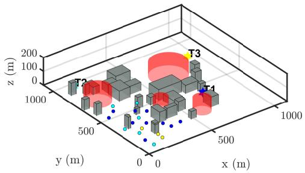  
(a)

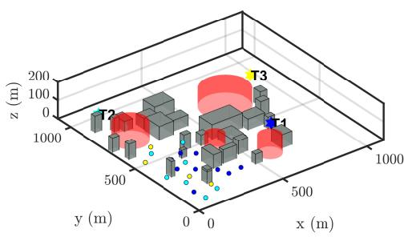  
(b)

Fig. 2. Task allocation by using the ILLA in Case I. (a) t = 1. (b) t = 67.  
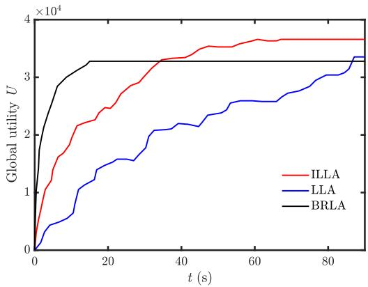  
Fig. 3. The global utility of task allocation.

Fig. 4 shows that the CBMBA A-Star algorithm successfully find paths for each UAV, avoiding building obstacles and nofly zones in low-altitude urban trafic during emergency rescue operations. However, other two algorithms rarely achieve safe path planning for all UAVs. Table III highlights that both the bidirectional sector A-Star and the diferential evolution algorithms achieve lower path costs compared to the A-Star algorithm. In terms of computation time, the CBMBA A-Star algorithm stands out with significant advantages. Despite the multi-layer sector search strategy increasing the number of path nodes, it results in fewer turning points, meaning smoother paths that better meet flight requirements.

TABLE I  
NOMENCLATURE
<table><tr><td>Symbols</td><td>Significance</td></tr><tr><td> $v _ { i }$ </td><td>The velocity of UAV  ${ { a } _ { i } } .$ </td></tr><tr><td>Si</td><td>The state of ai (Location and task sequences).</td></tr><tr><td> $U _ { i }$ </td><td>The utility of ai (reward).</td></tr><tr><td> $s _ { - i }$ </td><td>Joint states of all drones except for the  $a _ { i } .$  (Location and task sequences of other UAVs)</td></tr><tr><td> $s _ { i } ^ { * }$ </td><td>Nash equilibrium strategy of  $a _ { i } .$ </td></tr><tr><td></td><td>(A stable state: corresponding position and task)</td></tr><tr><td> $H _ { t , k } ^ { * }$   $s _ { i } ^ { \prime }$ </td><td>The state transition probability (between two states). The different state (strategy) from  $s _ { i } .$ </td></tr><tr><td> $s$ </td><td>(ai chooses other tasks and positions)</td></tr><tr><td></td><td>The set of all states. (All available locations and tasks to choose from).  $T _ { j }$ </td></tr><tr><td> $\mathcal { A } _ { T _ { j } }$ </td><td>The set of UAVs that peforme to task</td></tr><tr><td> $\tau$ </td><td>The set of tasks.</td></tr><tr><td> $r _ { T _ { j } }$ </td><td>The value of the task  $T _ { j }$ </td></tr><tr><td> $m$ </td><td>The number of tasks.</td></tr><tr><td> $n$   $R ^ { T _ { j } } , R ^ { a _ { i } }$ </td><td>The number of UAVs.</td></tr></table>

TABLE II

PERFORMANCE OF TASK ALLOCATION ALGORITHMS IN CASE I
<table><tr><td rowspan=1 colspan=1>Indicators</td><td rowspan=1 colspan=1>ILLA</td><td rowspan=1 colspan=1>LLA</td><td rowspan=1 colspan=1>BRLA</td><td rowspan=1 colspan=1>CBBA</td></tr><tr><td rowspan=1 colspan=1>Task rewards</td><td rowspan=1 colspan=1>36578.95</td><td rowspan=1 colspan=1>33531.78</td><td rowspan=1 colspan=1>32778.94</td><td rowspan=1 colspan=1>32641.28</td></tr><tr><td rowspan=1 colspan=1>Execution time (s)</td><td rowspan=1 colspan=1>66.91</td><td rowspan=1 colspan=1>88.74</td><td rowspan=1 colspan=1>14.86</td><td rowspan=1 colspan=1>112.38</td></tr></table>

TABLE III

PERFORMANCE OF PATH PLANNING ALGORITHMS IN CASE I
<table><tr><td rowspan=1 colspan=1>Algorithm</td><td rowspan=1 colspan=1>Path cost (m)</td><td rowspan=1 colspan=1>Run time (s)</td><td rowspan=1 colspan=1>Path node</td><td rowspan=1 colspan=1>Turningnode</td></tr><tr><td rowspan=1 colspan=1>CBMBAA-Star</td><td rowspan=1 colspan=1>14529.28</td><td rowspan=1 colspan=1>21.43</td><td rowspan=1 colspan=1>1208</td><td rowspan=1 colspan=1>42</td></tr><tr><td rowspan=1 colspan=1>A-Star</td><td rowspan=1 colspan=1>14907.63</td><td rowspan=1 colspan=1>50.31</td><td rowspan=1 colspan=1>1578</td><td rowspan=1 colspan=1>163</td></tr><tr><td rowspan=1 colspan=1>DE</td><td rowspan=1 colspan=1>14696.83</td><td rowspan=1 colspan=1>67.25</td><td rowspan=1 colspan=1>695</td><td rowspan=1 colspan=1>51</td></tr></table>

This further demonstrates the efectiveness of the CBMBA A-Star algorithm in the trafic rescue scenarios.

## C. Case II: Last-Mile Cargo Transportation and Delivery Task

40 UAVs are considered to perform five tasks in the lowaltitude urban air trafic scenario with some urban buildings, no fly zones, and two unexpected no-fly zones, where five task areas are express delivery stations in diferent communities and commercial buildings. To test the performance of the ILLA and the CBMBA A-Star algorithms, the LLA, the BRLA, and the CBBA method are adopted as comparison algorithms in the task allocation. However, the dynamic A-Star (D-Star) [41] and the MSFDE algorithm [19] are applied as comparisons in the path planning.

From Fig. 5 and Table IV, as the size of the UAVs increases, compared to the other methods, the task rewards obtained by the ILLA improve 13.57%, 15.64%, and 11.35%, respectively. And compared with the LLA and the CBBA, the task execution time decreased by 50.34% and 76.31%, respectively. Therefore, this further validates the ILLA method’s optimality, good computational eficiency, and scalability in the lowaltitude urban trafic scenarios.

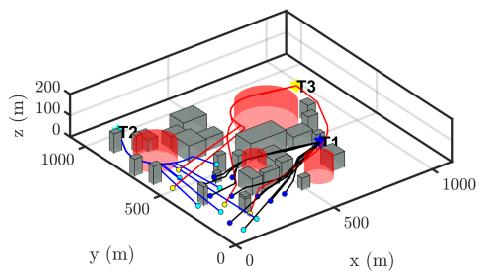  
(a)

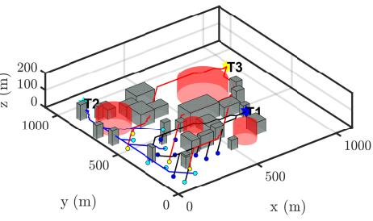  
(b)

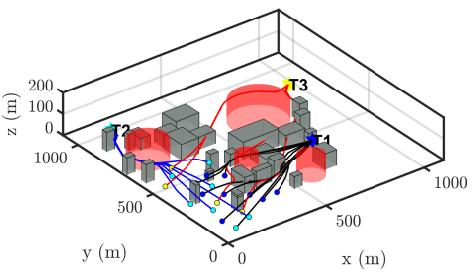  
(c)

Fig. 4. Cooperative path planning of multi-UAVs in Case I. (a) CBMBA A-Star algorithm. (b) A-Star algorithm. (c) DE algorithm.  

(a)  
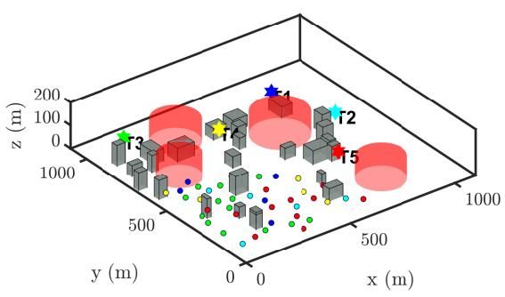  
(b)  
Fig. 5. Task allocation by using ILLA in Case II. (a) t = 1. (b) t = 150.

TABLE IV  
PERFORMANCE OF TASK ALLOCATION ALGORITHMS IN CASE II
<table><tr><td rowspan=1 colspan=1>Indicators</td><td rowspan=1 colspan=1>ILLA</td><td rowspan=1 colspan=1>LLA</td><td rowspan=1 colspan=1>BRLA</td><td rowspan=1 colspan=1>CBBA</td></tr><tr><td rowspan=1 colspan=1>Task rewards</td><td rowspan=1 colspan=1>69862.14</td><td rowspan=1 colspan=1>60226.08</td><td rowspan=1 colspan=1>58781.29</td><td rowspan=1 colspan=1>61772.4</td></tr><tr><td rowspan=1 colspan=1>Execution time (s)</td><td rowspan=1 colspan=1>149.31</td><td rowspan=1 colspan=1>224.95</td><td rowspan=1 colspan=1>37.62</td><td rowspan=1 colspan=1>263.25</td></tr></table>

Fig. 6 presents the original path planning and re-planning results using diferent algorithms in the last-mile cargo delivery and transportation under the threats of unknown areas, represented as blue hemispheres. By using the CBMBA A-Star method some UAVs adjust their paths to avoid these architectural barriers and no fly zones, with the dashed lines indicating the online re-planning paths. Notably, other algorithms cannot obtain a safe path. The CBMBA A-Star algorithm results in the fewest UAVs needing to re-plan their paths, further demonstrating the efectiveness of the proposed CBMBA A-Star algorithm in the low-altitude urban environments for cargo transportation and delivery.

TABLE V  
PERFORMANCE OF PATH PLANNING ALGORITHMS IN CASE II
<table><tr><td rowspan=1 colspan=1>Situations</td><td rowspan=1 colspan=1>Algorithm</td><td rowspan=1 colspan=1>Path cost (m)</td><td rowspan=1 colspan=1>Run time (s)</td><td rowspan=1 colspan=1>Turningnode</td></tr><tr><td rowspan=3 colspan=1>Originalplanning</td><td rowspan=1 colspan=1>CBMBAA-Star</td><td rowspan=1 colspan=1>27154.01</td><td rowspan=1 colspan=1>67.47</td><td rowspan=1 colspan=1>57</td></tr><tr><td rowspan=1 colspan=1>A-Star</td><td rowspan=1 colspan=1>28952.46</td><td rowspan=1 colspan=1>160.56</td><td rowspan=1 colspan=1>169</td></tr><tr><td rowspan=1 colspan=1>DE</td><td rowspan=1 colspan=1>27651.29</td><td rowspan=1 colspan=1>129.17</td><td rowspan=1 colspan=1>74</td></tr><tr><td rowspan=3 colspan=1>Pathre-planning</td><td rowspan=1 colspan=1>CBMBAA-Star</td><td rowspan=1 colspan=1>27815.92</td><td rowspan=1 colspan=1>89.28</td><td rowspan=1 colspan=1>79</td></tr><tr><td rowspan=1 colspan=1>D-Star</td><td rowspan=1 colspan=1>29872.67</td><td rowspan=1 colspan=1>347.85</td><td rowspan=1 colspan=1>211</td></tr><tr><td rowspan=1 colspan=1>MSFDE</td><td rowspan=1 colspan=1>28370.59</td><td rowspan=1 colspan=1>206.51</td><td rowspan=1 colspan=1>106</td></tr></table>

Table V shows that the path cost obtained by the CBMBA A-Star algorithm increased by only 2.43% during the path replanning stage, representing the smallest increase among the three algorithms. Furthermore, the CBMBA A-Star algorithm also shows significant advantages in terms of running time and path smoothness. Compared with the original planning, the number of turning nodes of the CBMBA A-Star algorithm increased by only 22 during the path re-planning stage. Inversely, the D-Star algorithm resulted in increases of 7.39% in path cost, 167.08% in running time, and 74.35% in the number of turning nodes, respectively. Similarly, the MSFDE algorithm exhibited increases of 1.99% in path cost, 56.79% in running time, and 34.18% in the number of turning nodes, respectively. From the above statistical results, it is evident that the proposed CBMBA A-Star algorithm achieves the optimal performance in path r-eplanning. Therefore, local online replanning by using the CBMBA A-Star algorithm can yield a safe path, validating the optimality and real-time performance of our method.

Fig. 7 presents the statistical results of average iteration times as the number of UAVs and tasks increases in the low-altitude urban last-mile cargo transportation and delivery scenario, with the simulations conducted using Monte Carlo for 100 instances. From Figure 7a, as the number of UAVs grows, each UAV requires more information exchange and computation to achieve globally optimal collaborative task allocation and path planning. This highlights the significant impact on task allocation and path planning eficiency in lowaltitude urban trafic environments, particularly for last-mile cargo transportation and delivery. Figure 7b indicates that the average iteration times of the ILLA algorithm decrease when the number of tasks exceeds eight. The likely reason is that an increase in task numbers provides more options for the UAVs, which helps mitigate conflicts between task allocation and path planning. This further demonstrates the scalability and robustness of the proposed model and algorithm, confirming their efectiveness in low-altitude urban trafic environments.

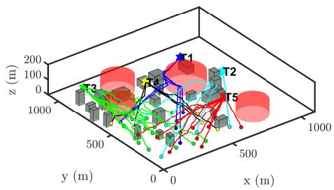  
(a)

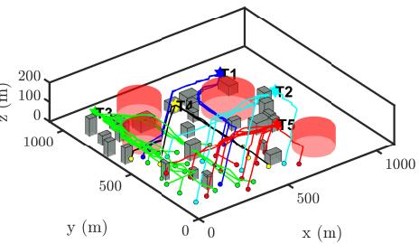  
(b)

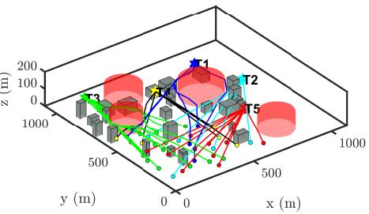  
(c)

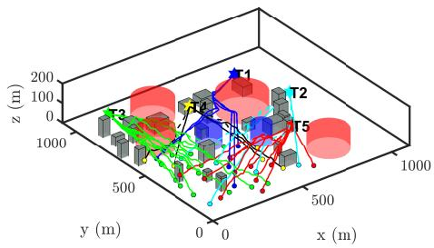  
(d)

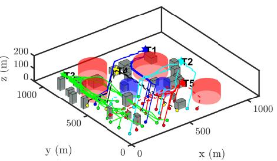  
(e)

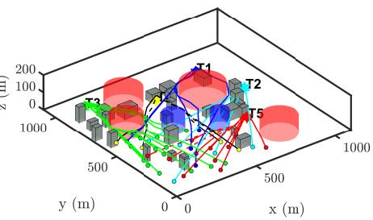  
(f)

Fig. 6. Cooperative path planning results of multi-UAVs in Case II. (a)∼(c): Original path planning. (b)∼(f): Path re-planning. (a) CBMBA A-Star algorithm (Original planning). (b) A-Star algorithm. (c) DE algorithm. (d) CBMBA A-Star algorithm (Re-planning). (e) D-Star algorithm. (f) MSFDE algorithm.  
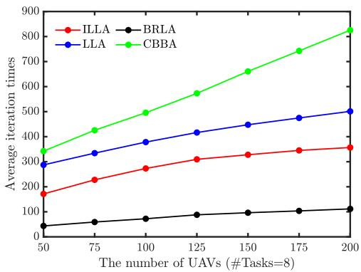  
(a)

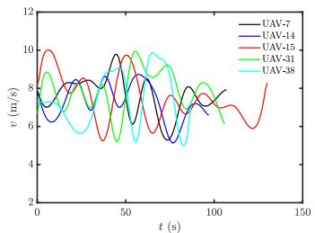  
(a)

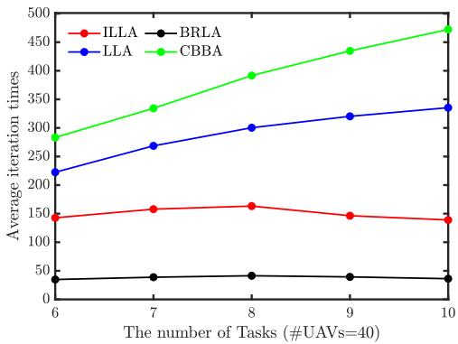

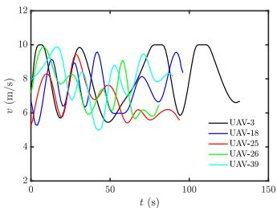  
(b)  
(b)

Fig. 7. (a) The total number of UAVs. (b) The total number of tasks versus average iteration times.  
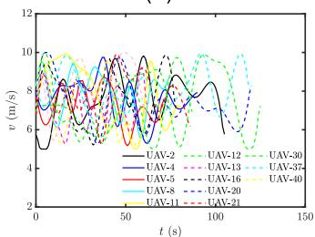  
(c)

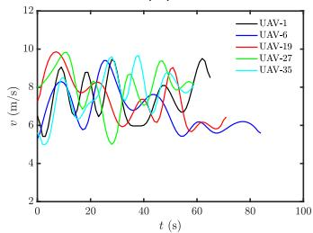  
(d)

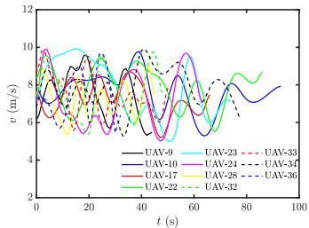  
(e)  
Fig. 8. The velocity of 40 UAVs in Case II. (a) Task $T _ { 1 } . ( \mathbf { b } )$ Task $T _ { 2 } . \left( \mathrm { c } \right)$ Task T3. (d) Task $T _ { 4 } .$ (e) Task $T _ { 5 }$

To further verify the physical feasibility of each UAV’s trajectory, an analysis of the discrete-time variations in the UAV’s velocity vi are conducted, as depicted in Fig. 8.

In Fig. 8, all UAVs involved in the tasks maintain their velocities stably within the predefined interval $[ \nu _ { \operatorname* { m i n } } , \nu _ { \operatorname* { m a x } } ]$ with relatively smooth variation trends and no abrupt fluctuations that would lead to excessive speed. Such smooth velocity changes indicate that the UAVs do not need to perform drastic attitude adjustments during the cargo delivery process, a critical advantage for last-mile delivery, as it helps prevent cargo damage caused by sudden attitude changes and ensures the stability of the delivery process.

## VI. CONCLUSION

This paper presents a distributed autonomous decisionmaking framework for multi-UAV cooperative task allocation and path planning in complex low-altitude urban environments. To achieve optimal task allocation and ensure system stability, a network evolutionary potential game model is established to link task allocation with game learning. Additionally, an ILLA algorithm with a new update strategy and a timeindependent Boltzmann parameter is proposed, enabling the algorithm to find the Nash equilibrium with probability one. Furthermore, a CBMBA A-Star algorithm is introduced to provide optimal and collision-free paths for UAVs. Simulation results demonstrate that the ILLA algorithm minimizes task execution time while maximizing global task rewards, and the CBMBA A-Star algorithm reduces path cost and computation time. As the number of UAVs and tasks increases, the ILLA algorithm efectively mitigates UAV conflicts, while the CBMBA A-Star algorithm adaptively adjusts the search step to enable online path replanning in dynamic scenarios, especially in environments with unknown threat areas. The numerical results validate the efectiveness and superiority of the proposed model and algorithms in trafic emergency rescue and last-mile delivery tasks in low-altitude urban environments.

## REFERENCES

[1] H. Y. Jeong and B. D. Song, “Optimizing urban logistics: Vehicle routing problem with underground transportation,” IEEE Trans. Intell. Transp. Syst., vol. 26, no. 5, pp. 6393–6413, May 2025.

[2] Z. Zhang, J. Jiang, K. Voon Ling, X. Wang, and W.-A. Zhang, “Cooperative path planning for heterogeneous UAV swarms: A Stackelberg game approach,” IEEE Trans. Autom. Sci. Eng., vol. 22, pp. 18531–18548, 2025.

[3] S. Zheng, Y. Liu, Z. Zhou, D. Shu, and X. Han, “Last mile passenger and freight synergistic and mobile distribution via modular autonomous vehicles,” IEEE Trans. Intell. Transp. Syst., pp. 1–15, May 2025, doi: 10.1109/TITS.2025.3560313.

[4] Z. Ma, X. Yang, A. Chen, T. Zhu, and J. Wu, “Assessing the resilience of multi-modal transportation networks with the integration of urban air mobility,” Transp. Res. A, Policy Pract., vol. 195, May 2025, Art. no. 104465.

[5] Z. Zhang, J. Jiang, X. Haiyan, and W.-A. Zhang, “Distributed dynamic task allocation for unmanned aerial vehicle swarm systems: A networked evolutionary game-theoretic approach,” Chin. J. Aeronaut., vol. 37, no. 6, pp. 182–204, Jun. 2024.

[6] Z. Zhao et al., “A flight risk field model for advanced low-altitude transportation system using field theory,” Transp. Res. A, Policy Pract., vol. 190, Dec. 2024, Art. no. 104268.

[7] Z. Zhang, J. Jiang, K. V. Ling, and W.-A. Zhang, “Real-time path planning for autonomous UAVs: An event-triggered multimodal adaptive pigeon-inspired optimization approach,” IEEE Trans. Aerosp. Electron. Syst., vol. 61, no. 4, pp. 10972–10981, Aug. 2025.

[8] S. S. Kannan, V. L. N. Venkatesh, and B.-C. Min, “SMART-LLM: Smart multi-agent robot task planning using large language models,” in Proc. IEEE/RSJ Int. Conf. Intell. Robots Syst. (IROS), Oct. 2024, pp. 12140–12147.

[9] H. Liu, G. Wu, L. Zhou, W. Pedrycz, and P. N. Suganthan, “Tangentbased path planning for UAV in a 3-D low altitude urban environment,” IEEE Trans. Intell. Transp. Syst., vol. 24, no. 11, pp. 12062–12077, Nov. 2023.

[10] W. Yao et al., “Evolutionary utility prediction matrix-based mission planning for unmanned aerial vehicles in complex urban environments,” IEEE Trans. Intell. Vehicles, vol. 8, no. 2, pp. 1068–1080, Feb. 2023.

[11] L. Qin et al., “Difusion-based trajectory optimization and resource allocation for hybrid aircraft in low-altitude economy networks,” IEEE Trans. Cognit. Commun. Netw., vol. 12, pp. 3250–3264, 2026.

[12] A. K. Srinivasan, G. Gutow, Z. Ren, I. Abraham, B. Vundurthy, and H. Choset, “Multi-agent multi-objective ergodic search using branch and bound,” in Proc. IEEE/RSJ Int. Conf. Intell. Robots Syst. (IROS), Oct. 2023, pp. 844–849.

[13] S. Grabbe, B. Sridhar, and A. Mukherjee, “Sequential trafic flow optimization with tactical flight control heuristics,” J. Guid., Control, Dyn., vol. 32, no. 3, pp. 810–820, May 2009.

[14] E. S. Rigas, P. Kolios, and G. Ellinas, “Scheduling aerial vehicles in large scale urban air mobility schemes with vehicle relocation,” IEEE Trans. Intell. Vehicles, vol. 9, no. 9, pp. 5665–5679, Sep. 2024.

[15] Y. Zhang, R. Su, G. G. N. Sandamali, Y. Zhang, C. G. Cassandras, and L. Xie, “A hierarchical heuristic approach for solving air trafic scheduling and routing problem with a novel air trafic model,” IEEE Trans. Intell. Transp. Syst., vol. 20, no. 9, pp. 3421–3434, Sep. 2019.

[16] F. Tao, Z. Chen, Z. Wang, L. Zhu, and J. Wang, “Multistrategy improved particle swarm optimization algorithm for path planning of UAV in 3- D low altitude urban environment,” IEEE Internet Things J., vol. 12, no. 19, pp. 40470–40483, Oct. 2025.

[17] S. Wang, Y. Liu, Y. Qiu, and J. Zhou, “Consensus-based decentralized task allocation for multi-agent systems and simultaneous multi-agent tasks,” IEEE Robot. Autom. Lett., vol. 7, no. 4, pp. 12593–12600, Oct. 2022.

[18] Z. Zhang, J. Jiang, J. Wu, and X. Zhu, “Eficient and optimal penetration path planning for stealth unmanned aerial vehicle using minimal radar cross-section tactics and modified A-star algorithm,” ISA Trans., vol. 134, pp. 42–57, Mar. 2023.

[19] X. Chai et al., “Multi-strategy fusion diferential evolution algorithm for UAV path planning in complex environment,” Aerosp. Sci. Technol., vol. 121, Feb. 2022, Art. no. 107287.

[20] B. Li, S. Wang, C. Ge, Q. Fan, and C. Temuer, “Bi-level intelligent dynamic path planning for an UAV in low-altitude complex urban environment,” Trans. Inst. Meas. Control, vol. 46, no. 1, pp. 39–57, Jan. 2024.

[21] S. G. Park and P. K. Menon, “Game-theoretic trajectory-negotiation mechanism for merging air trafic management,” J. Guid., Control, Dyn., vol. 40, no. 12, pp. 3061–3074, Dec. 2017.

[22] X. Yang and P. Wei, “Autonomous free flight operations in urban air mobility with computational guidance and collision avoidance,” IEEE Trans. Intell. Transp. Syst., vol. 22, no. 9, pp. 5962–5975, Sep. 2021.

[23] M. Emami, H. Haghshenas, A. Talebian, and S. Kermanshahi, “A game theoretic approach to study the impact of transportation policies on the competition between transit and private car in the urban context,” Transp. Res. A, Policy Pract., vol. 163, pp. 320–337, Sep. 2022.

[24] Y. Chen, K. Li, Y. Wu, J. Huang, and L. Zhao, “Energy eficient task ofloading and resource allocation in air-ground integrated MEC systems: A distributed online approach,” IEEE Trans. Mobile Comput., vol. 23, no. 8, pp. 8129–8142, Aug. 2024.

[25] Y. Yazıcıoglu, R. Bhat, and D. Aksaray, “Distributed planning for serving˘ cooperative tasks with time windows: A game theoretic approach,” J. Intell. Robotic Syst., vol. 103, no. 2, p. 27, Oct. 2021.

[26] T. Tatarenko, “Log-linear learning: Convergence in discrete and continuous strategy potential games,” in Proc. 53rd IEEE Conf. Decis. Control, Dec. 2014, pp. 426–432.

[27] C. Sun, “A time variant log-linear learning approach to the set K-cover problem in wireless sensor networks,” IEEE Trans. Cybern., vol. 48, no. 4, pp. 1316–1325, Apr. 2018.

[28] P. Li and H. Duan, “A potential game approach to multiple UAV cooperative search and surveillance,” Aerosp. Sci. Technol., vol. 68, pp. 403–415, Sep. 2017.

[29] M. Liu, Y. Wan, F. L. Lewis, S. Nageshrao, and D. Filev, “A three-level game-theoretic decision-making framework for autonomous vehicles,” IEEE Trans. Intell. Transp. Syst., vol. 23, no. 11, pp. 20298–20308, Nov. 2022.

[30] C. Liu et al., “Optimal attack path planning based on reinforcement learning and cyber threat knowledge graph combining the ATT &CK for air trafic management system,” IEEE Trans. Transport. Electrific., p. 1, Mar. 2024, doi: 10.1109/TTE.2024.3377687.

[31] F. P. Moreno, V. F. G. Comendador, R. D.-A. Jurado, M. Z. Suarez,´ D. Janisch, and R. M. A. Valdes, “Methodology of air tra´ fic flow clustering and 3-D prediction of air trafic density in ATC sectors based on machine learning models,” Expert Syst. Appl., vol. 223, Aug. 2023, Art. no. 119897.

[32] L. Chen, J. Xu, B. Wu, and J. Huang, “Group-aware graph neural network for nationwide city air quality forecasting,” ACM Trans. Knowl. Discovery From Data, vol. 18, no. 3, pp. 1–20, Apr. 2024.

[33] A. M. Seid, G. O. Boateng, B. Mareri, G. Sun, and W. Jiang, “Multiagent DRL for task ofloading and resource allocation in multi-UAV enabled IoT edge network,” IEEE Trans. Netw. Service Manage., vol. 18, no. 4, pp. 4531–4547, Dec. 2021.

[34] A. Kumar, M. Vohra, R. Prakash, and L. Behera, “Towards deep learning assisted autonomous UAVs for manipulation tasks in GPSdenied environments,” in Proc. IEEE/RSJ Int. Conf. Intell. Robots Syst. (IROS), Oct. 2020, pp. 1613–1620.

[35] S. Chen, A. D. Evans, M. Brittain, and P. Wei, “Integrated conflict management for UAM with strategic demand capacity balancing and learning-based tactical deconfliction,” IEEE Trans. Intell. Transp. Syst., vol. 25, no. 8, pp. 10049–10061, Aug. 2024.

[36] M.-H. Kim, H. Baik, and S. Lee, “Response threshold model based UAV search planning and task allocation,” J. Intell. Robotic Syst., vol. 75, nos. 3–4, pp. 625–640, Sep. 2014.

[37] D. Monderer and L. S. Shapley, “Potential games,” Games Econ. Behav., vol. 14, no. 1, pp. 124–143, May 1996.

[38] D. R. Cox, The Theory of Stochastic Processes. Evanston, IL, USA: Routledge, 2017.

[39] J. R. Marden, G. Arslan, and J. S. Shamma, “Cooperative control and potential games,” IEEE Trans. Syst. Man, Cybern., B, Cybern., vol. 39, no. 6, pp. 1393–1407, Dec. 2009.

[40] J. R. Marden, “State based potential games,” Automatica, vol. 48, no. 12, pp. 3075–3088, Dec. 2012.

[41] Z. He, C. Liu, X. Chu, R. R. Negenborn, and Q. Wu, “Dynamic anticollision A-star algorithm for multi-ship encounter situations,” Appl. Ocean Res., vol. 118, Jan. 2022, Art. no. 102995.

  
Zhe Zhang (Member, IEEE) received the Ph.D. degree in control science and engineering from Nanjing University of Aeronautics and Astronautics, Nanjing, China, in 2025. From 2024 to 2025, he was a Visiting Ph.D. Student with the School of Electrical and Electronic Engineering, Nanyang Technological University, Singapore. He is currently a Post-Doctoral Fellow with the School of Information Engineering, Zhejiang University of Technology. His current research interests include the application of low-altitude economy, intelligent

decision-making and control, game theory, and reinforcement learning.

Ju Jiang received the B.S. and M.S. degrees in navigation, guidance, and control from Beijing University of Aeronautics and Astronautics, Beijing, China, in 1985 and 1987, respectively, and the Ph.D. degree in electronics and computer engineering from the University of Waterloo, Waterloo, Canada, in 2007. He is currently a Full Professor with the School of Automation Engineering, Nanjing University of Aeronautics and Astronautics, Nanjing, China. His current research interests are machine learning and intelligent control, and advanced aircraft control theory and application.

Keck Voon Ling received the B.S. degree in electrical engineering from the National University of Singapore in 1988 and the Ph.D. degree in control engineering from the University of Oxford, Oxford, U.K., in 1992. He is currently an Associate Professor with the School of Electrical and Electronic Engineering, Nanyang Technological University, Singapore. His research interests include model predictive control and receding horizon estimation.

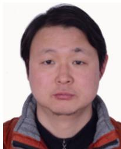

Xinhua Wang received the Ph.D. degree in navigation, guidance and control from Nanjing University of Aeronautics and Astronautics, Nanjing, China, in 2012. He is currently an Associate Professor with the School of Automation Engineering, Nanjing University of Aeronautics and Astronautics. His research interests include mission planning and flight control.

Wen-An Zhang (Senior Member, IEEE) received the B.Eng. degree in automation and the Ph.D. degree in control theory and control engineering from Zhejiang University of Technology, Hangzhou, China, in 2004 and 2010, respectively. From 2010 to 2011, he was a Senior Research Associate with the Department of Manufacturing Engineering and Engineering Management, City University of Hong Kong, Hong Kong. He is currently a Professor with the Department of Automation, Zhejiang University of Technology. His current research interests include

multisensor information fusion estimation and its applications, and robotics. He was a recipient of the Alexander von Humboldt Fellowship from 2011 to 2012. He served as a Subject Editor for Optimal Control Applications and Methods in 2016.