# Cooperative Air-Ground Instant Delivery by UAVs and Crowdsourced Taxis: Joint UAV Station Deployment and Delivery Scheduling

Junhui Gao , Qianru Wang , Xin Zhang , Juan Shi, Xiang Zhao , Yunji Liang , Bin Guo , Senior Member, IEEE, Qingye Han , and Yan Pan

Abstract—Instant delivery has become an essential service in daily life, requiring strict delivery timelines. However, traditional delivery methods that employ human couriers struggle to meet the soaring delivery demands due to labor shortages. While researchers have explored alternative solutions using ground vehicles (e.g., crowdsourced taxis) and UnmannedAerial Vehicles (UAVs), their inherent limitations, such as constrained delivery detour for crowdsourced taxis and limited battery capacity of UAVs, greatly constrain their effectiveness. To address these challenges, this paper proposes a novel air-ground delivery paradigm that cooperatively integrates UAVs and crowdsourced taxis. First, UAV stations are strategically deployed based on delivery gaps between the delivery demands and taxis’ delivery capacity, instead of delivery demands only; Then, a predictive UAV repositioning strategy is designed to bridge instantaneously dynamic delivery gaps. Thereafter, a transfer learning-based (TL-based) algorithm that mines the delivery

knowledge of human couriers is designed to optimize the cooperative performance. This algorithm extracts behavioral insights from human couriers and transfers them to enhance the delivery capabilities of UAVs and taxis. Finally, parcel assignment is formulated as optimization problems aimed at maximizing total preferences of UAVs and taxis, and maximizing delivery number while minimizing cost, respectively. Evaluations on real-world datasets demonstrate that the proposed method delivers 27.4% more parcels, saves 19.2% delivery cost, and preserves 36.3% more of the travel experience of taxi passengers than the state-of-the-art (SOTA) air-ground cooperative approach for instant delivery.

Index Terms—UAV, taxi, data-driven, instant delivery, cooperative air-ground delivery, transfer learning.

## I. INTRODUCTION

NSTANT delivery, such as food and emergency medicine supply, is essential to people’s daily life [1], [2]. For instance, the venues of worldwide food delivery market are predicted to reach 4,024 billion in 2032, with an annual growth of 8.3% [3]. China, which owns one of the largest instant delivery markets, is projected to process over 100 billion items of instant deliveries in 2026 [4], which was only 27.9 billion in 2021, indicating an average annual increase of 28.0%. To deliver numerous instant parcels, delivery companies employed aa large number of couriers, which, however, are struggling due to labor shortages [5], [6]. For example, the labor shortage in the U.S. Postal Service led to slow or no deliveries throughout Greater Cleveland, elsewhere in Ohio, and even across the entire U.S. in September 2022 [7]. Moreover, since 2021, major cities in both China [8] and the U.S. [9] have faced severe labor shortages in instant delivery, leading to the significant delays in food order deliveries and a high rate of undelivered orders. To meet the dramatically increased demands for instant deliveries, various methods have been investigated, including leveraging Unmanned Aerial Vehicles (UAVs) [10], [11], [12], [13] or taxis [14], [15], [16], [17] for instant delivery. Different delivery methods bear different pros and cons. On the one hand, although UAVs bypass the complicated ground traffic circumstances and have faster delivery speed, the battery capacities and non-fly zones limit delivery range and capacity greatly. Moreover, the lack of mature low-altitude airspace control makes UAVs maintain an ultra-wide flight distance from each other. On the other hand, crowdsourcing delivery by taxis benefits from the large pools of candidate taxis and the decreased labor costs, while the opportunistic manners leads to their unstable delivery capabilities considering passengers routes [15], [17]. The inherent limitations of UAVs and crowdsourced taxis make it difficult for them to meet the soaring delivery demands at city scale individually.

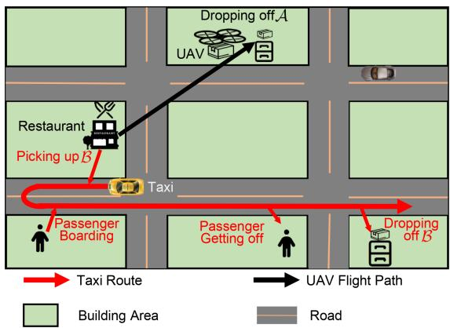  
Fig. 1. The cooperative delivery by UAV and Taxi.

To address this issue, this paper proposes an air-ground cooperative instant delivery paradigm to collaborate UAVs with taxis for more efficient instant deliveries. Specifically, taxis only deliver the instant parcels close to their original routes for passenger traveling, while others far away from the routes are assigned to UAVs as illustrated in Fig. 1. On the one hand, the UAV delivery makes up for the inefficiency of the taxi delivery. UAVs and taxis can benefit each other in this case. On the other hand, taxis can deliver parcels ordered in the downtown areas or the non-fly zones as well as those covering long distances. From this figure, we observe that the taxi receives a traveling request from a passenger, and, meanwhile, two parcels (i.e., parcel A and B) are ordered. A’s destination is far away from the taxi routes, while that of B is close to the taxi route. Therefore, B can hitchhike the taxi to its destination [15], while A is assigned to a UAV. The UAV first picks up A at the restaurant and then flies to its destination. Due to the higher priority of passengers, taxis are not allowed to deliver parcels when passengers are onboard. This is why the taxi picks up B at first and deliver it the last as shown in Fig. 1. However, the dynamic distributions of delivery demands and taxi activities, and the restricted areas for UAV activities pose obstacles for large-scale efficient delivery. Due to the limited flight range of UAVs, UAV stations are first deployed considering delivery gaps between the delivery demand and taxis’ delivery capacity, instead of delivery demand only; Then, to improve turnovers of UAVs, they are dynamically repositioned between different stations to bridge the temporal delivery gaps in the city; Moreover, a transfer learning-based (TL-based) algorithm is designed to enhance delivery capabilities of UAVs and taxis by learning the delivery knowledge of the mature human couriers. Finally, two optimization problems are formulated, whose objectives are to maximize accumulated delivery preferences, and maximize the delivery number while minimizing the cost, respectively, to assign parcels between UAVs and taxis.

The contributions of this paper are 3-fold:

We study an innovative cooperative air-ground instant delivery by UAVs and crowdsourced taxis, which jointly deploys the UAV stations and enhances delivery capabilities of UAVs and taxis by learning from human couriers. This is to improve the overall delivery performance of both UAVs and taxis as well as the experience of taxi passengers.

\- This paper proposes a data-driven cooperative air-ground instant delivery framework to improve cooperative delivery performance. Specifically, UAV stations are deployed by analyzing the historical delivery gaps by taxis. Then, to improve delivery efficiencies of UAVs, a prediction-based UAV repositioning module is employed. Moreover, delivery knowledge of human couriers are extracted and transferred to UAVs and taxis. Finally, the cooperative parcel assignment is formulated as optimization problems and solved by heuristics algorithms.

Comprehensive evaluations are conducted using real-world datasets of instant deliveries and taxi trajectories. It has been shown that our method delivers 27.4% more parcels with 19.2% lower cost and 36.3% reduced negative effects on taxi passengers compared to the SOTA air-ground cooperative delivery method.

## II. LITERATURE REVIEW

The instant delivery has attracted rising attention recently [18], [19], [20], [21]. This section reviews related work on the instant delivery based on crowdsourced vehicles and UAVs, as well as other forms of air-ground delivery.

## A. Crowdsourcing Delivery

Wang et al. [14] designed a crowdsourcing instant delivery allocation strategy by considering preferences of crowdsourced social vehicles, where the drivers can pick up the most appropriate delivery orders and the experiences of both customers and passengers are optimized. Ding et al. [16] studied a crowdsourcing instant delivery system based on public transportation, and designed a delivery dispatching algorithm considering time constraints, multi-hop relays, and delivery profits. Liu et al. [15] studied an instant delivery network using crowdsourced taxis. This work studied two cases of crowdsourcing instant delivery: One case is that food is opportunistically delivered by taxis carrying passengers, while another is that taxis deliver food without any passengers on board. To address labor shortages in crowdsourcing applications, multiple delivery companies could employ unoccupied workers from each other to improve the general quality of delivery service [22]. Bai et al. [23] proposed a dynamic delivery pricing scheme to balance the delivery capacity of crowdsourcing instant delivery. Chen et al. [24] conducted a data-driven measurement of instant delivery capacities of crowdsourced social vehicles, revealing that 14,000 taxis in Chengdu can deliver only 10,000-20,000 parcels, due to the spatial-temporal diversity and dynamics of passenger trips. Xu et al. [25] proposed to coordinate the dedicated couriers and crowdsourced taxis for food delivery.

## B. UAV Based Delivery

Kessens et al. [26] and Gawel et al. [10] designed aerial grasping technologies for UAVs, by which UAVs can pick up and deliver items autonomously. Dissanayaka et al. [11] reviewed the navigation performance of different technologies for UAV delivery, including sensor configurations and multi-sensor data fusion architectures.

Another line of research is the scheduling problems of UAVbased delivery. Chauhan et al. [13] and Salama et al. [27] studied the joint station deployment and delivery assignment to maximize the coverage of UAV-based delivery with a limited number of available UAVs and stations. Li et al. [12] investigated a comprehensive management framework for UAV-based delivery in urban low-altitude airspace. The framework includes delivery path planning, aerial traffic management with conflict detection and resolution, and the delivery resource allocation in conjunction with the payment scheme. Song et al. [28] integrated various factors affecting the delivery process and performance, such as the flight time, loadable capacity, and effects of parcel weight, into a UAV scheduling framework and proposed a heuristic solution. Huang et al. [29] studied the UAV-based instant food delivery, which aims to minimize the total tardiness. Gao et al. [30] investigated an instant delivery UAV scheduling framework, where the delivery UAVs can contribute to urban crowdsensing when delivering parcels. Chen et al. [31] studied the UAV station deployment problem, in order to minimize the investment cost and task time considering the dynamics of delivery demands.

## C. Interactive Air-Ground Delivery

Cooperative air-ground delivery can effectively take advantages of both UAVs and vehicles and avoid their disadvantages. Existing works mainly focus on the interactive UAV-vehicle delivery, where UAVs ride vehicles and take vehicles as the mobile launching and retrieval sites [32] [33] to prolong service time. In the research, vehicles mainly refer to trucks. Das et al. [34] studied the cooperative path planning of UAVs and vehicles to synchronize the both. Carlsson et al. [35] studied the delivery time minimization problem of the interactive UAV-vehicle delivery. A heuristic path planning algorithm for both the UAVs and ground vehicles was proposed, and its approximation ratio is theoretically proven. Wu et al. [36] proposed that the UAVvehicle delivery enabled contactless parcel delivery during the epidemic, and studied the routing problem. Except for trucks, public buses are also introduced to relay UAVs. For example, Pan et al. [33], [37] and Huang et al. [38] proposed using public buses to extend the delivery range of UAVs. Gao et al. [39] proposed to provide emergency responses (such as first aid kit delivery) by UAVs and extended the coverage area of UAVs by leveraging buses.

## III. PRELIMINARY

## A. Datasets

Three real-world datasets on instant deliveries, taxi trajectories, and contexts are used in this paper, respectively. The basic information of the datasets is shown in Table I. Note that we abbreviate number as # when describing figures, tables, and equations in this paper.

TABLE I  
BASIC INFORMATION OF DATASETS
<table><tr><td>Datasets</td><td># of couriers / taxis</td><td> $\mathrm { A r e a } ( k m ^ { 2 } )$ </td><td># of Records</td><td>Sampling Interval</td></tr><tr><td>aBeacon</td><td>≥ 31K</td><td>6400</td><td>≥ 802K</td><td>1 ∼ 3 min</td></tr><tr><td>Taxi Trajectory</td><td>≥ 13K</td><td>6400</td><td>≥ 3.4B</td><td>10 s</td></tr><tr><td>Context- weather</td><td>N/A</td><td>6400</td><td>≥8K</td><td>30 min</td></tr><tr><td>Context- region</td><td>N/A</td><td>6400</td><td>≥ 180K</td><td>N/A</td></tr></table>

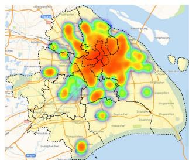  
(a) Pick-ups of Deliveries

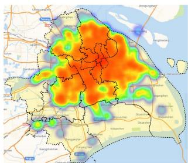  
(b) Pick-ups of Taxi Passengers.  
Fig. 2. The spatial distribution of pick-ups of deliveries and taxi passengers.

The aBeacon Dataset: The one-month dataset was released by Yang et al. [40] and Ding et al. [41] in cooperation with the Local Service Department of Alibaba Group, one of the world’s largest instant delivery companies. The dataset includes over 800 thousand instant delivery orders (≈ daily) delivered by 31,000 couriers at more than 2,400 restaurants in an urban area covering 2 in Shanghai, China. Each order consists of the ordering time, the merchant location, the arrival time, and the customer location. Fig. 2(a) shows the spatial distribution of deliveries ordered between 12:00 and 12:30 in one day. The yellow-colored part is the area of Shanghai except for Chongming Island (the area is referred to as Shanghai in this paper).

The Taxi Trajectory Dataset: This trajectory dataset of taxis in Shanghai, available at GitHub [42], includes the paths of over 13,000 taxis over a one-month period. Each record consists of the timestamp, location, and passenger occupancy status, with a fine-grained sampling interval of about 10 seconds. The pick-ups of the taxi passengers from 12:00 to 12:30 are illustrated in Fig. 2(b). The coverage of taxis is much wider than that of instant deliveries, demonstrating the feasibility of taxi-based instant delivery.

The Contextual Dataset: The contextual dataset consists of the weather condition dataset and the functionality areas in the city. The sampling interval of weather conditions is 30 minutes. Over 1,400 weather condition records were collected during the same period as the instant deliveries from TimeAndDate [43]. Each of them includes the weather, temperature, wind speed, humidity, and air pressure. Moreover, the city area is divided into 6400 grids as aBeacon did and each grid is categorized into one of the 8 kinds of functionalities, including Leisure, Commercial (Comm.), Tourism, Healthcare (Health.), Office, Residential (Resi.), Study, and Industrial (Indust.). The functionality data is extracted from OpenStreetMap [44].

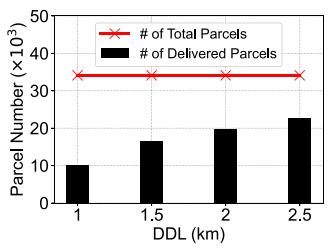

Fig. 3. Delivery number under different DDLs (PTL= 3 min, PTR= 60%).  
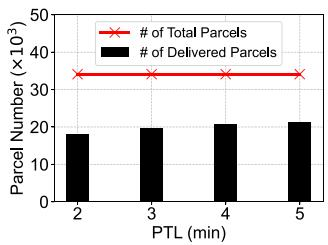  
Fig. 4. Delivery number under different PTLs (DDL= 1.5 km, $\mathrm { P T R } = 6 0 \% )$ .

## B. Motivation

We introduce some key definitions as follows.

Definition 1 (Detour Distance Limit, DDL): DDL is the longest detour distance of taxis for delivering instant parcels, which significantly affects the passenger experience with details provided in the spatial limits in Section IV-C.

Definition 2 (Pick-up Time Limit, PTL): PTL is the time limitation from the order time to the pick-up time by taxis of instant parcels, which is discussed in the temporal limits in Section IV-C in detail.

Definition 3 (Participating Taxi Ratio, PTR): Since not all taxis would like to participate in instant delivery, PTR denotes the ratio of them willing to deliver parcels:

$$
P T R = { \frac { \# \operatorname { o f } \operatorname { t a x i s } \operatorname { w i l l i n g } \operatorname { f o r } \operatorname { d e l i v e r y } } { \# \operatorname { o f } \operatorname { a l l } \operatorname { t a x i s } } } .\tag{1}
$$

Taxis can deliver instant parcels during passenger routes if they are close enough both spatially and temporally. Specifically, the spatial limit refers to both the origin and destination of a parcel should be close enough to a taxi route, for instance, within the DDL (e.g., ). The temporal constraint indicates that the taxi should pick up the parcel within a limited time period after being ordered, which is measured by the PTL. Moreover, PTR denotes the number of taxis that are willing to deliver parcels. Clearly, the DDL, PTL, and PTR have great impacts on the delivery capacity of taxis. To investigate the effects of these factors, we simulate the taxi delivery by a heuristic algorithm minimizing the negative impacts on passenger experiences [45]. The influences of these factors on the number of parcels delivered by taxis are illustrated in Figs. 3, 4, and 5, respectively. The gaps between the numbers of parcels delivered and ordered under different DDLs are shown in Fig. 3. The PTL and PTR are set as the default values (i.e., 3 min. and 60%, respectively). When the DDL increases from to , the delivery ratio by taxis only increases from 29.7% to 66.0%, implying a huge delivery gap by taxis.

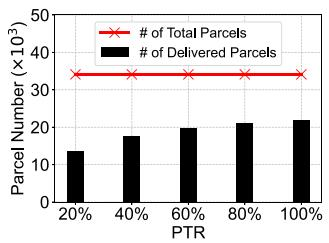  
Fig. 5. Delivery number under different PTRs (DDL= 1.5 km, PTL= 3 min).

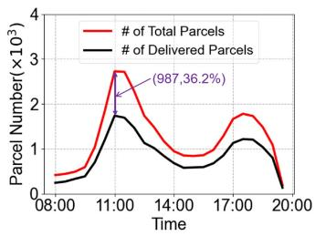  
Fig. 6. Delivery number during the daytime (DDL= 1.5 km, PTL= 3 min, PTR= 100%).

From Fig. 4, we observe that only 52.6% of instance parcels can be delivered by taxis when the PTL is 2 min. When the PTL reaches 5 min, 62.6% of parcels can be delivered by taxis, namely, near 40% cannot be delivered within 5 min after being ordered.

The effects of the PTR on the number of parcels delivered are shown in Fig. 5. With the 5× increase in PTR (i.e., from 20% to 100%), only a minor growth of the number of parcels delivered (i.e., from 40% to 63.8%) is observed, while over one-third instant parcels cannot be delivered by taxis. This is because of the well-known effects of marginal reward decreasing in crowdsourcing applications [46], [47], [48]. It reveals that when some parcels are ordered in suburban areas, there may not be enough appropriate taxis to deliver them, even with looser DDL and PTL.

Fig. 6 demonstrates the number of parcels delivered by taxis during different time periods in the daytime (from 08:00 to 20:00). It shows that although all taxis participate in delivery (PTR 100%), there are still a large number of parcels cannot be delivered by taxis. Specifically, 2,725 deliveries (equal to 20% of the taxi number) are ordered from 11:00 to 11:30, while only 1,738 parcels can be delivered by all the 13,000 taxis. 987 parcels (i.e., 36.2% of all parcels) cannot be delivered by taxis to their destinations.

In summary, these results demonstrate that the delivery capacity of crowdsourced taxis is dramatically limited, and there is still a huge gap between the delivery demands and the delivery capacity of crowdsourced taxis. Therefore, an extra instrument is needed.

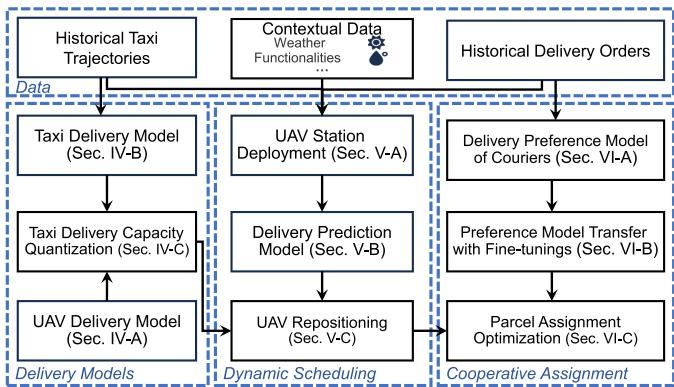

Fig. 7. The framework of cooperative air-ground instant delivery.  
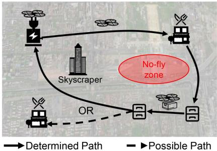  
Fig. 8. The delivery process by UAVs.

## C. Framework

This paper studies the cooperative instant delivery by UAVs and crowdsourced taxis, whose framework is illustrated in Fig. 7. The delivery model of UAVs is first presented in Section IV-A, while that of taxis is proposed by analyzing the historical taxi trajectories in Section IV-B. After that, Section IV-C adjusts the delivery capacity of taxis accordingly. To bridge the gaps between taxi capacity and delivery demands, UAV stations are deployed in Section V-A. UAVs are repositioned between stations to improve the turnovers in Section V-C based on the prediction on delivery demands in Section V-B. To enhance the delivery capabilities of both UAVs and taxis, the delivery preferences of the established method, namely, courier delivery, is extracted in Section VI-A, which is then transferred to those of UAVs and taxis with fine-tuning in Section VI-B, respectively. Finally, Section VI-C assigns parcels to UAVs and crowdsourced taxis through TL-based enhancement and by solving the optimization problems.

## IV. COOPERATIVE DELIVERY MODELS

The delivery models of UAVs and taxis are described in Sections IV-A and IV-B, respectively, followed by the quantization of taxi delivery capacity in Section IV-C.

## A. UAV Delivery Model

As shown in Fig. 8, UAV deliveries consist of three steps [49], [50]:

\- The UAV departs from the station to pick up parcels with a full charge.

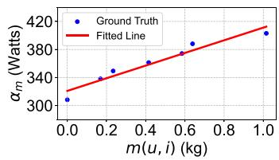  
Fig. 9. The UAV energy consumption rate given different payload weight.

\- It flies to the destination cabinets to deliver parcels one by one; and

\- After finishing all the deliveries assigned, the UAV flies back to the UAV station or picks up other parcels if the remaining energy is sufficient.

Let $P ( u )$ indicate the flight path of the UAV , which consists of a sequence of waypoints. Each waypoint is a 5-parameter tuple, namely, $w p _ { i } = \langle t _ { i } , l _ { i } , \mathbb { P } _ { i } , \mu _ { i } , E _ { i } \rangle . t _ { i }$ and $\mathbf { \nabla } _ { l _ { i } }$ are the timestamp and location of i, respectively. $\mathbb { P } _ { i }$ and the binary parameter $\mu _ { i }$ denote the set of parcels picked up $( \mu _ { i } = 1 )$ or dropped off $( \mu _ { i } = 0 )$ . The remaining energy of  is reflected by $E _ { i }$ . It is worth mentioning that UAVs’ endurance is greatly affected by parcels’ weight and weather conditions (e.g., wind). To reveal the impacts, the energy consumption coefficients for the mass of parcels carried and for wind conditions $( \mathrm { i } . \mathrm { e } . , \alpha _ { m } ( u , i )$ and $\alpha _ { w } ( u , i )$ , respectively) are considered. Therefore, the energy consumed by during the flight path $P ( u )$ is [51], [52],

$$
E ( u ) = \sum _ { i = 1 } ^ { I - 1 } \alpha _ { m } ( u , i ) \times \alpha _ { w } ( u , i ) \times \frac { | l _ { i } , l _ { i + 1 } | } { v } ,\tag{2}
$$

where is the length of $P ( u ) , \ | l _ { i } , l _ { i + 1 } |$ denotes the flying distance from the i-th waypoint to the next one, and represents the flying velocity of the UAV (i.e., the ground speed). Once UAVs return to the UAV stations, their batteries will be replaced with fully-charged ones due to potential safety issues caused by a high-power recharging system and to achieve constant delivery service [53], [54].

Specifically, the weight coefficient is learned by a linear fitting model shown in Fig. 9, where the blue dots are the original data from DJI M210 v2 [55] and the red lines indicate the fitted results with a minor error of only 2.4%. The x-axis represents the weight of parcels carried (in kg), and the y-axis is the energy consumption rate (i.e., power in Watts). The fitting results show that,

$$
\alpha _ { m } ( u , i ) = 9 0 . 3 \times m ( u , i ) + 3 2 0 . 9 ,\tag{3}
$$

where $m ( u , i )$ is the mass of parcels carried by at its i-th waypoint. The effects of wind are much more complicated and can be divided into headwinds and crosswinds, which have similar impacts [51], [56]. Let  denote the angle between the direction of wind and that of UAV’s flight. The airspeed, which affects the air drag, is $v _ { a }$ as follows:

$$
v _ { a } = v - v _ { w } ( u , i ) \times \sin { \theta } ,\tag{4}
$$

where $v _ { w } ( u , i )$ indicates the wind speed near at its i-th waypoint. By the polynomial regression [51], $\alpha _ { w } ( u , i )$ can be

obtained by (5).

$$
\alpha _ { w } ( u , i ) = \frac { v _ { a } \times 0 . 5 + \beta _ { 1 } v _ { a } ^ { 3 } + \beta _ { 2 } v _ { a } ^ { 2 } + \beta _ { 3 } v _ { a } + c } { v \times 0 . 5 + \beta _ { 1 } v ^ { 3 } + \beta _ { 2 } v ^ { 2 } + \beta _ { 3 } v + c } ,\tag{5}
$$

where $\beta _ { 1 } , \beta _ { 2 } , \beta _ { 3 }$ are the fitted parameters, and is a constant quantity.

To guarantee the urgency of instant delivery (e.g., the flavor of foods), the delivery time of all parcels is strictly limited in after being ordered:

$$
t ( u , p ) - t _ { o } ( p ) \leq \Delta t ,\tag{6}
$$

where $t ( u , p )$ and $t _ { o } ( p )$ denote the delivery time of by and the ordering time of $p _ { : }$ , respectively. When a newly ordered parcel $p$ is assigned to $u , u \mathrm { { s } }$ flight path will be re-planned (denoted as $P ^ { \prime } ( u ) )$ and the energy consumption along the path will be recalculated (denoted as $E ^ { \prime } ( u ) ,$ ). To address the safety and privacy concerns, we leverage a sampling-based path planning algorithm to schedule the flight paths of UAVs to avoid skyscrapers and nofly zones in city areas [57], leading to the curved flight paths as shown in Fig. 8. Additionally, UAVs should keep their remaining energy above $\zeta E _ { m a x }$ during their flights to avoid crashes caused by sudden power loss in the air. The parcel  is deliverable by only if has sufficient energy and can be delivered within $\Delta t .$ We use a binary parameter, $s ( u , p )$ , to indicate the feasibility of delivery of  by , which is:

$$
s ( u , p ) = \left\{ \begin{array} { l l } { 1 , } & { E ^ { \prime } ( u ) < ( 1 - \zeta ) E _ { m a x } \& \mathrm { E q . } ( 6 ) } \\ { 0 , } & { \mathrm { o t h e r w i s e } } \end{array} \right. ,\tag{7}
$$

where $E _ { m a x }$ represents the battery capacity of UAVs. According to $Z { \mathrm { T O } } .$ , one of the largest delivery companies in China, the average delivery cost of a parcel by UAVs is 1.15 CNY, which is conducted from the lifetime cost of a UAV (including the UAV and energy supply devices, about 85,750 CNY) and the number of parcels delivered by it (about 75,000 items) [58]. Therefore, the unit cost of UAV delivery is set to 1.15 CNY in this paper $( \mathrm { i . e . , } \kappa ( u , p ) = 1 . 1 5 )$

## B. Taxi Delivery Model

To be concise, we divide time and space into the slot set $\mathbb { T } = \{ t _ { 1 } , t _ { 2 } , \dots , t _ { m } \}$ and the grid set $\mathbb { G } = \{ g _ { 1 } , g _ { 2 } , \ldots , g _ { n } \}$ respectively. Each time slot has a length of 1 minute, and each grid has an edge length of 1km.

As illustrated in Fig. 10, the taxi delivery model is discussed in three cases [15], [17], [59], based on the taxi status and the spatial-temporal distributions of the taxi and the parcel. The red dash curves represent the taxis’ detour for parcel delivery, while red solid curves denote the taxi route for passenger trips. Let $\mathbb { P } ( t , g )$ represent the set of instant parcels ordered in the grid during the time slot $t . \mathbb { B } ( t , g )$ and $\mathbb { H } ( t , g )$ denote the sets of taxis and passengers in during , respectively. Let $\mathbb { R } ( t , g , g ^ { \prime } )$ indicate the set of passenger routes from $g$ to $g ^ { \prime }$ during . The g gthree taxi delivery cases are described as follows:

Origin-Destination-Pair (OD-pair) Delivery [59]. As shown in Fig. 10(a), a parcel $p$ from to $g ^ { \prime }$ can hitchhike taxis with routes in R $( t , g , g ^ { \prime } )$ . The taxi first picks up at the restaurant in  and then picks up the passenger. When passengers arrive at their destinations, taxis would drive to the destination cabinets where the parcels are delivered to. Note that taxis never pick up any parcel with passengers aboard to guarantee undisturbed trips for passengers [59].

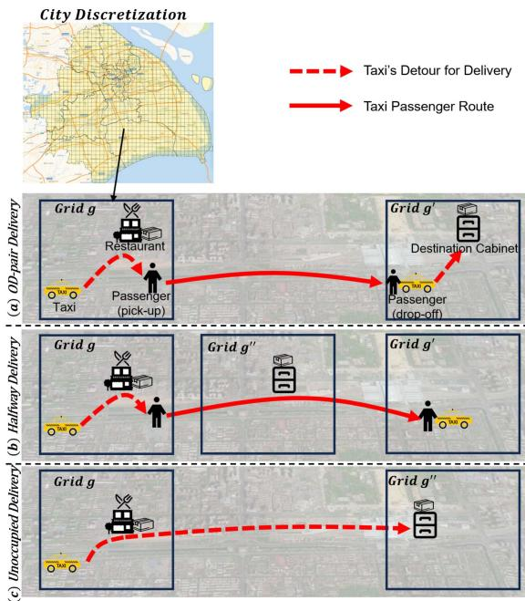  
Fig. 10. Three cases for taxis delivering parcels.

Halfway Delivery [17]. The parcel ordered in can hitchhike a taxi transporting passengers from  to $g ^ { \prime }$ if the parcel’s destination $( \mathrm { i } . \mathrm { e } . , g ^ { \prime \prime } )$ is close to the passenger routes, as illustrated in Fig. 10(b). Specifically, the taxi picks up the parcel before picking up the passenger and then drops off the parcel to its destination halfway in the passenger route.

Unoccupied Delivery [15]. Some instant parcels are destined for locations far from any passenger route $( \mathrm { i } . \mathrm { e } . , g ^ { \prime \prime }$ in Fig. 10(c)). Therefore, taxis carrying passengers cannot deliver the parcels. In this case, unoccupied taxis could assist in the parcel delivery, since they can detour a longer distance to deliver these parcels as in Fig. 10(c).

## C. Taxi Delivery Capacity Quantization

To avoid intolerable negative impacts on passenger experience, we adjust the delivery capacity of taxis, defined as the limits for acceptable deliveries, for the three cases in this section. OD-pair Delivery Capacity. Temporal and spatial limits are proposed for taxi delivery in this case:

The Temporal Limits: The taxi $b ,$ which picks up passengers during  in $^ { g , }$ , should pick up the parcel $p$ within the t gPTL (denoted as $\Delta t _ { p u } )$ p and deliver it within the delivery time limit $( \mathrm { i } . \mathrm { e } . , \Delta t )$ after being ordered, as (8) and (9), respectively.

$$
t _ { p u } ( b , p ) - t _ { o } ( p ) \leq \frac { | \mathbb { P } _ { u d } ( t , g ) | } { | \mathbb { P } ( t , g ) | } \times \Delta t _ { p u } ,\tag{8}
$$

where $t _ { p u } ( b , p )$ represents the pick-up time of by the taxi and $\mathbb { P } _ { u d } ( t , g )$ is the set of undelivered parcels by UAVs

ordered during  in . Note that $\mathbb { P } _ { u d } ( t , g )$ is obtained by (7), and we have $\begin{array} { r } { \frac { | \mathbb { P } _ { u d } ( t , g ) | } { | \mathbb { P } ( t , g ) | } \le 1 } \end{array}$

$$
t ( b , p ) - t _ { o } ( p ) \leq \Delta t ,\tag{9}
$$

where $t ( b , p )$ denotes the delivery time of by . Specifically, the temporal limit is stricter in (8) when UAVs are able to deliver more parcels, leading to the reduced negative impacts on taxi passengers. In contrast, the delivery time limit (i.e., (9)) is stable to guarantee the delivery performance.

\- The Spatial Limits: In this case, the Detour Distance Limit (DDL) requires that detours for picking up and dropping off parcels by taxis should be shorter than $\Delta r _ { p u }$ and $\Delta r _ { d o } ,$ respectively:

$$
r _ { p u } ( b , p ) \leq \frac { | \mathbb { P } _ { u d } ( t , g ) | } { | \mathbb { P } ( t , g ) | } \times \Delta r _ { p u } ,\tag{10}
$$

$$
r _ { d o } ( b , p ) \leq \frac { | \mathbb { P } _ { u d } ( t , g ) | } { | \mathbb { P } ( t , g ) | } \times \Delta r _ { d o } ,\tag{11}
$$

where $r _ { p u } ( b , p )$ and $r _ { d o } ( b , p )$ are the detour distances of for picking up and dropping off $p ,$ respectively. Similarly, the spatial limits for taxi delivery are adjusted based on $\frac { | \mathbb { P } _ { u d } ( \cdot , g ) | } { | \mathbb { P } ( t , g ) | }$ considering the delivery capabilities of UAVs.

In this case, the parcel $p$ can be delivered by only if the two temporal and the two spatial limits $( \mathrm { i . e . , ( 8 ) , ( 9 ) , ( 1 0 ) }$ , and (11)) are met.

Halfway Delivery Capacity: The temporal and spatial limits in this case are the same as those in OD-pair Delivery except for the drop-off limitation. In this case, parcels are dropped off in the halfway of passenger routes, requiring the extremely close destinations (shorter than $\Delta r ^ { \prime } )$ to the trip routes [17]. Let $r _ { d o } ^ { \prime } ( b , p )$ indicate the detour distance of to drop off $p$ in the halfway of passenger trips, which holds:

$$
r _ { d o } ^ { \prime } ( b , p ) \leq \Delta r ^ { \prime } .\tag{12}
$$

The parcel  that satisfies the specific detour limit for dropping poff, i.e., (12), and all other limits in OD-pair delivery, can be delivered by the taxi  halfway along passenger routes.

Unoccupied Delivery Capacity: When parcels are delivered by unoccupied taxis, the long delivery time may also affect potential passenger trips. Therefore, the unoccupied delivery has the PTL for parcel deliveries, namely, (8). Therefore, this case occurs when there are sufficient taxis for passengers to take $( \mathrm { i . e . , ~ } | \mathbb { B } ( t , g ) | > | \mathbb { H } ( t , g ) | )$ and the PTL is met. Let the binary parameter ${ \mathrm { s } } ( b , p )$ denote that whether the parcel is deliverable for the taxi . If so, $s ( b , p ) = 1 ; s ( b , p ) = 0 \mathrm { { ; } }$ , otherwise. We have

$$
s ( b , p ) = { \left\{ \begin{array} { l l } { 1 , } & { { \mathrm { ~ a n y ~ c a s e ~ i n ~ t h e ~ t h r e e ~ i s ~ m e t } } } \\ { 0 , } & { { \mathrm { ~ o t h e r w i s e } } } \end{array} \right. } .\tag{13}
$$

To encourage the willingness of taxis and passengers to participate in instant delivery, we double the unit price for taxi hiring (i.e., CNY/km) as the delivery price for taxis: one part serves as compensation for taxi passengers, and another part is the bonus for taxi drivers. the delivery price is not doubled in Unoccupied Delivery because there is no passenger aboard. Thus, the delivery

price for taxis is,

$$
\begin{array} { r l } & { \kappa ( b , p ) = \underbrace { 2 \times 2 . 7 \times ( r _ { p u } ( b , p ) + r _ { d o } ( b , p ) ) } _ { \mathrm { O D - p a i r D e l i v e r y } } } \\ & { \hphantom { \frac { 0 . 7 \times 2 . 7 \times ( r _ { p u } ( b , p ) + r _ { d o } ( b , p ) ) } { \kappa ( b , p ) } } } \\ & { \hphantom { \frac { 0 . 2 \times 2 . 7 \times ( r _ { p u } ( b , p ) + r _ { d o } ( b , p ) ) } { \kappa ( b , p ) } } = \underbrace { 2 . 7 \times ( r _ { p u } ( b , p ) + r ( p ) ) } _ { \mathrm { U n o c u p i e d ~ D e l i v e r y } } , } \end{array}\tag{14}
$$

where $r ( p )$ is the delivery distance of  and 2.7 is the unit price for taxi hiring in Shanghai [60].

## V. DYNAMIC SCHEDULING FOR COOPERATIVE DELIVERY

To enhance the cooperative delivery capacity, we first deploy UAV stations by analyzing demand-taxi capacity gaps (Section V-A), then dynamically reposition UAVs based on demand predictions (Section V-B) to address temporal gaps (Section V-C).

## A. UAV Station Deployment

Due to the finite battery capacities of UAVs, their activities are limited around UAV stations, highlighting the significant impact that the locations of UAV stations have on delivery efficiencies. Therefore, we deploy UAV stations by considering the delivery capabilities of taxis to optimize the air-ground cooperation.

We first analyze the delivery gaps between delivery demands and taxi delivery capacity using the historical data in a long period (such as a year or longer). Let P $( t , g )$ and B $( t , g )$ denote the sets of parcels ordered and taxis in the grid  during a time slot $t \in T ,$ , respectively. The delivery gap $\delta ( g )$ in during is therefore modeled as $\begin{array} { r } { \delta ( g ) = \sum _ { t \in T } ( \mathbb { P } ( t , g ) - \mathbb { H } ( t , g ) ) . \delta ( g ) > } \end{array}$ indicates that taxis are able to deliver all parcels in $g ; \delta ( g ) < 0$ indicates otherwise. For clarity, the grid with $\delta ( g ) < 0$ is called the UAV-needed grid. UAV stations are preferred to be deployed around the grids with the largest delivery gaps to bridge these gaps efficiently.

The process of UAV station deployment is as follows. First, the delivery gap of each $g , \delta ( g )$ , is calculated using the historical data; Then, the grids in need of UAVs are extracted; Finally, the clustering algorithm is used to deploy the UAV stations. The traditional clustering algorithm (e.g., K-Means) randomly selects initial cluster centers at once [61]. In contrast, K-Means++ only leverages the random selection on the first center, while others are determined by the probability about the distance to the first station [62]. The UAV station $e _ { k }$ is updated each epoch as:

$$
e _ { k } = \frac { 1 } { \left| \mathbb { G } _ { k } \right| } \sum _ { g _ { i } \in \mathbb { G } _ { k } } g _ { i } ,\tag{15}
$$

where $\mathbb { G } _ { k } .$ whose size is $\left| \mathbb { G } _ { k } \right|$ , represents the set of grids assigned to $e _ { k }$ . Note that every grid $g \in \mathbb { G }$ is added to the clustering set $\delta ( g )$ times to achieve the weighted mean. The UAV stations are finally deployed after 300 epochs of clustering.

Fig. 11(a) shows the locations of 25 UAV stations deployed with the heatmap of delivery gaps by taxis, where we can observe that all UAV stations are planted in the downtown area. In contrast, when considering delivery demands only, some UAV stations are deployed in suburban areas where few parcels are ordered, as shown in Fig. 11(b). This is because the absence of taxi delivery and the remote location from densely-ordered parcel areas lead to the deployment of UAV stations in suburban areas with few parcels ordered, which is very inefficient and costly. The differences between the UAV station deployments by the two metrics are demonstrated in Fig. 11(c). We can observe that although UAV stations deployed by different methods have similar distributions, those deployed based on delivery gaps are more concentrated in the downtown area, providing a higher UAV delivery capacity in areas with dense parcel orders. This is because the widely-distributed taxis are able to deliver the small amount of parcels ordered in suburban areas.

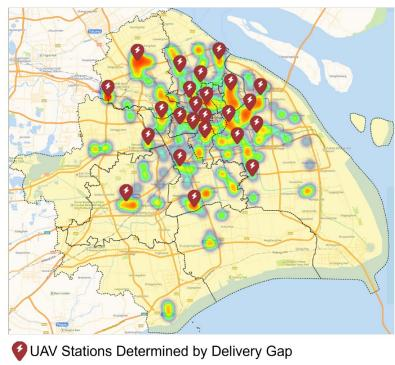

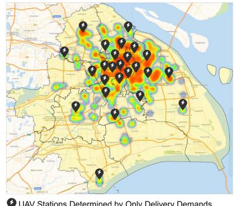  
(a) Stations Deployed by Delivery Gaps (b) Stations Deployed by Delivery Demands with Heatmap. with Heatmap

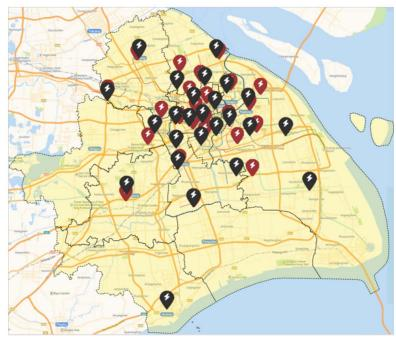  
(c) Comparison of Station Locations

Fig. 11. Comparison of the stations deployed by different methods (Taking 25 stations as an example).  
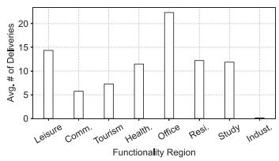  
Fig. 12. Average delivery number in each functionality grid.

## B. Delivery Prediction Model

To schedule UAVs proactively and improve their delivery efficiencies, a prediction model of delivery demands is proposed. Weather conditions have been considered important factors affecting delivery demands [18], [63], [64]. Moreover, area functionalities also significantly affect delivery orders [65], as revealed in Fig. 12. This figure illustrates the mean number of parcels ordered in different kinds of grids.

For instance, the Office grids have the most instant parcels ordered, about 22.3 in each grid daily, while the number in the Industrial grids is only 0.1. Moreover, numbers of the instant parcels ordered in other kinds of grids vary a lot, which reveals the potential relations between area functionalities and delivery demands.

Therefore, a Multiple-Layer Perceptron (MLP) is used to learn the impacts of weather conditions and area functionalities on delivery demands. Fig. 13 illustrates the structure of the $M _ { P ^ { - } }$ layer network, where the black and red lines demonstrate the forward and backward propagation, respectively. Let $q _ { 1 } ( i )$ and $q _ { 2 } ( i )$ denote the number of inputs and the number of neurons in q (i)the -th $( i \in [ 0 , M _ { P } ] )$ layer, respectively. The output of the -th layer is

$$
H _ { P } ( i + 1 ) = \phi _ { P } \left( H _ { P } ( i ) W _ { P } ( i ) + b _ { P } ( i ) \right) ,\tag{16}
$$

where $H _ { P } ( i )$ is the input of this layer with $q _ { 1 } ( i )$ features, $W _ { P } ( i ) \in \dot { \mathbb { R } } ^ { \dot { q _ { 1 } } ( i ) \times q _ { 2 } ( i ) }$ is the weight matrix, $b _ { P } ( i ) \in \mathbb { R } ^ { 1 \times q _ { 2 } ( i ) }$ is W (i)the bias vector, and $\mathfrak { p } ( \cdot )$ b (i)is the activation function. Leaky ReLU is used as the activation function for all hidden layers due to its ability to handle positive inputs and mitigate the dying ReLU phenomenon [66].

Huber Loss is used as the loss function, defined in (17). This loss function is chosen because it measures the difference between the network output and the ground truth, is differentiable everywhere, and is robust to outliers, thus achieving a balance between accuracy and robustness [67], [68].

$$
L _ { P } = \left\{ \begin{array} { l l } { \frac { 1 } { 2 } ( y _ { i } - \hat { y } _ { i } ) ^ { 2 } , } & { | y _ { i } - \hat { y } _ { i } | \leq \sigma } \\ { \delta | y _ { i } - \hat { y } _ { i } | - \frac { 1 } { 2 } \sigma ^ { 2 } , } & { | y _ { i } - \hat { y } _ { i } | > \sigma } \end{array} \right. ,\tag{17}
$$

where $\sigma$ is the decision threshold identifying outliers $[ 6 8 ] . y _ { i }$ and $\hat { y } _ { i }$ σ yare the ground truth and predicted label of the input, respectively. Let $\widetilde { \mathbb { P } } ( t , g )$ denote the predicted number of instant parcel orders in the grid  during the time slot .

## C. Taxi-Capacity-Driven UAV Repositioning

To improve UAV turnovers and delivery performance, UAVs are repositioned among UAV stations based on the delivery gaps between the predicted delivery demands and the delivery capacity of crowdsourced taxis. All passenger routes in the grid $g$ during the time slot are estimated using historical taxi trajectory data. Let $\mathbb { G } _ { e }$ and Ue indicate the sets of grids and UAVs belonging to the UAV station . Let $\mathrm { s } ( b , : )$ indicate whether taxi can deliver any instant parcel during : $s ( b , : ) = 1$ if there exists a parcel $p \in \widetilde { \mathbb { P } } ( t , g )$ such that $s ( b , p ) = 1 ;$ otherwise, $s ( b , : ) = 0$ p (t, g) s(b, p) = 1 s(b, :) = 0The number of instant parcels deliverable by taxis in  during is $\textstyle \sum _ { b \in \mathbb { B } ( t , g ) } s ( b , : )$ . Thus, the delivery gap by taxis around is

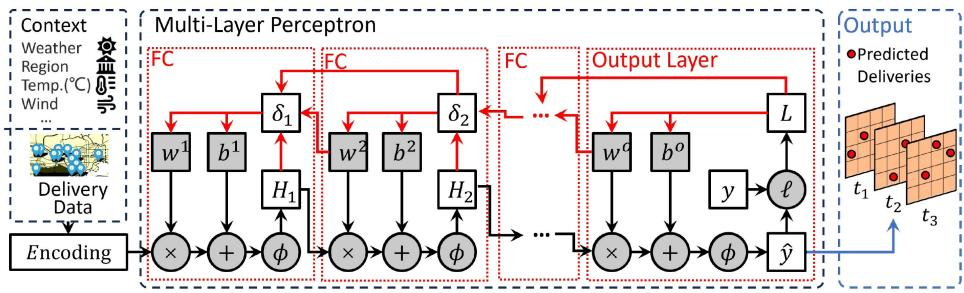  
Fig. 13. The structure of the prediction model.

calculated as:

$$
\rho _ { e } = \sum _ { g \in \mathbb { G } _ { e } } \sum _ { t \in \Delta T } \left( \left| \widetilde { \mathbb { P } } ( t , g ) \right| - \sum _ { b \in \mathbb { B } ( t , g ) } s ( b , : ) \right) ,\tag{18}
$$

where $\Delta T$ is the repositioning interval of the UAVs. A positive $\rho _ { e }$ indicates that UAVs are needed, while a negative $\rho _ { e }$ indicates that taxis are sufficient for delivery.

A heuristic algorithm is proposed to reposition UAVs. First, the delivery gap by taxis in each grid is estimated, leading to the calculation of the gap for each station by accumulating gaps in nearby grids. A Kernel Density Estimation model is leveraged to fit the delivery time by UAVs in each grid [52]. Therefore, the delivery gaps near each station are converted to the time required by UAVs, followed by the calculation of the service time of UAVs. Note that the traveling time of UAVs to other stations is excluded from the calculation of service time. After that, each UAV is paired with its service time and a UAV station. The repositioning pair with the longest service time is selected until all UAV stations have sufficient delivery capacity or all UAVs are busy with delivery.

## VI. TRANSFER LEARNING-ENHANCED COOPERATIVEPARCEL ASSIGNMENT

With the cooperation strategy above, UAVs and crowdsourced taxis could achieve effective cooperation for instant delivery. However, in the city-scale scenarios, a lot of unforeseen scenes may lead to the failed cooperation in the simple manner—UAVs and crowdsourced taxis pursue their own optimum blindly for their own sake due to the lack of prior delivery knowledge and mutual understanding. The courier delivery, which is driven by the well-trained algorithms and human’s wisdom, is verified in city-scale delivery, providing the potential for UAVs and crowdsourced taxis to imitate. Therefore, we propose a transfer learning based (TL-based) module to learn from the couriers and improve the cooperative delivery capacities of UAVs and crowdsourced taxis.

## A. Extraction of Couriers’ Delivery Preferences

Although the delivery process of couriers consists of departing, delivering, and returning as UAVs do, the difference is that couriers stop delivering parcels to rest only if all parcels are delivered [52], [69]. Specifically, the number of parcels simultaneously carried by a courier is limited considering the timeliness of instant delivery. Couriers’ decisions for delivery are affected by multiple factors. Intuitively, temporal and spatial distributions of deliveries are significant for their decisions. To guarantee the delivery efficiency, a series of factors are also considered: the detour and delivery distances for shipping the parcel, the riding speed, and the number and remaining delivery time of parcels carried by the courier. For delivery companies, the delivery cost is always one of the most important factors. These factors influencing couriers’ decisions are called features. Let $\mathcal { X } _ { C }$ denote the feature space in the source domain, namely, the courier delivery, whose sample is shown in Table II. In addition, the task in the source domain is represented by a label space $\mathcal { D } _ { C }$ and a decision function $f _ { C } \left( \mathrm { i . e . , } \ : T _ { C } = \{ \mathcal { V } _ { C } , f _ { C } \} \right)$ . Each binary label $y \in \mathcal { D } _ { C }$ indicates the parcel assignment to couriers, which is obtained from the aBeacon dataset. If a parcel $p$ is assigned to a courier $c ,$ the corresponding label $y ( c , p ) = 1 ;$ otherwise, $y ( c , p ) = 0$ . Moreover, the decision function reveals how the features affect the labels, namely, $y = f _ { C } ( x ) , x \in \mathcal { X } _ { C } , y \in \mathcal { Y } _ { C }$ Specifically, the key issue of the TL-based method is to transfer the implicit decision functions of courier delivery $( \mathrm { i } . \mathrm { e } . , f _ { C } )$ to UAV delivery and taxi delivery, respectively. To achieve this, $M L P _ { C }$ , a neural network with $M _ { C }$ layers, is trained to represent $f _ { C }$ as illustrated in Fig. 14. Every layer in this network is the fully-connected layer. Therefore, the data flow is forwarded as:

TABLE II  
FEATURE SPACE OF COURIER DELIVERY $( \mathcal { X } _ { C } )$
<table><tr><td>Features</td><td>Samples</td></tr><tr><td>Order Time</td><td>11:42:10</td></tr><tr><td>Order Location</td><td>(30,25)</td></tr><tr><td>Detour Distance</td><td>0.5 km</td></tr><tr><td>Riding Speed</td><td>20 km/h</td></tr><tr><td>Delivery Distance</td><td>1.7 km</td></tr><tr><td># of Parcels Carried</td><td> $^ 2$ </td></tr><tr><td>Remaining Delivery Time Delivery Cost</td><td>25.1 min. 5.35 CNY</td></tr></table>

$$
H _ { C } ( i + 1 ) = \phi _ { C } \left( W _ { C } ( i ) \times H _ { C } ( i ) + b _ { C } ( i ) \right) ,\tag{19}
$$

where $H _ { i } , W _ { i } ,$ and $b _ { i }$ indicate the input, the weight parameter and the offset parameter of the i-th layer in the network, respectively, and $\phi ( \cdot )$ is the activation function. Since the label is either 1 or 0, Sigmoid is leveraged as the activation function in the output layer, while those in other layers are ReLU. The Binary Cross Entropy Loss is employed to measure the deviation between the estimated label, , and the ground truth as follows:

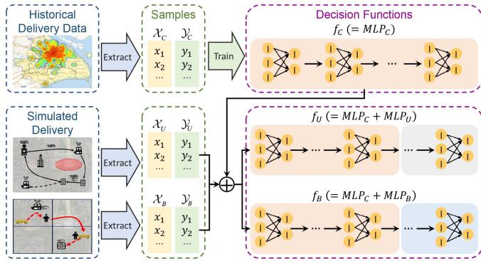  
Fig. 14. The transfer learning process.

TABLE III  
FEATURE SPACES OF UAV DELIVERY $( \mathcal { X } _ { U } )$ AND TAXI DELIVERY $( \mathcal { X } _ { B } )$
<table><tr><td>Features in  $\overline { { \mathcal { X } _ { U } } }$ </td><td>Samples</td><td>Features in  $\overline { { \mathcal { X } _ { B } } }$ </td><td>Samples</td></tr><tr><td>Order Time</td><td>12:10:14</td><td>Order Time</td><td>17:04:11</td></tr><tr><td>Order Location</td><td>(15,30)</td><td>Order Location</td><td>(40,24)</td></tr><tr><td>Detour Distance</td><td>0.2 km</td><td>Detour Distance</td><td>1.2 km</td></tr><tr><td>Flying Speed</td><td>16 m/s</td><td>Driving Speed</td><td>39.4 km/h</td></tr><tr><td>Delivery Distance</td><td>2 km</td><td>Delivery Distance</td><td>3.5 km</td></tr><tr><td>Carrying Weight</td><td>1.4 kg</td><td>Taxi Status</td><td>1</td></tr><tr><td>RFT</td><td>17.4 min.</td><td>RCT</td><td>20.1 min.</td></tr><tr><td>Delivery Cost</td><td>1.15 CNY</td><td>Delivery Cost</td><td>6.48 CNY</td></tr></table>

Abbreviations: RFT = Remaining Flying Time; RCT = Remaing Task Completion Time.

$$
L _ { C } = - \frac { 1 } { | \mathcal { V } | } \sum _ { i = 1 } ^ { | \mathcal { V } | } \big ( y _ { i } \times \log ( \hat { y } _ { i } ) + ( 1 - y _ { i } ) \times \log ( 1 - \hat { y } _ { i } ) \big ) ,\tag{20}
$$

where |Y| is the number of samples fed into the network. To achieve efficient convergence, the Adam Optimizer is employed during training of the network, which adapts the learning rates dynamically [70].

## B. Model Transfer With Fine-Tunings

Let $\mathcal { T } _ { U } = \{ \mathcal { V } _ { U } , f _ { U } \}$ and $\mathcal { T } _ { B } = \{ \mathcal { V } _ { B } , f _ { B } \}$ denote the target tasks of UAVs and taxis, which are UAV delivery and taxi delivery, respectively. The main goal of the TL-based module is to obtain $\mathrm { U A V s } ^ { \prime }$ and taxis’ decision functions $( \mathrm { i } . \mathrm { e } . , f _ { U }$ and $f _ { B }$ , respectively) by learning from that of couriers $\left( \mathrm { i . e . , ~ } f _ { C } \right)$ Since there is no delivery dataset by UAVs or taxis released, we simulate their delivery processes [59], [65] to obtain ground truth for decision samples for fine-tuning, respectively. Note that the feature spaces of $\mathrm { U A V s } \left( \mathcal { X } _ { U } \right)$ and taxis $( \mathcal { X } _ { B } )$ are modified based on their own delivery patterns as shown in Table III, respectively, whose details are as follows. The delivery capabilities of UAVs are greatly limited by remaining energy, which is affected by carrying weight. This results in the replacement of the number of parcels carried and remaining delivery time in $\mathcal { X } _ { C }$ by carrying weight and remaining flying time in $\mathcal { X } _ { U }$ , respectively. Moreover, taxis participate in delivery in the crowdsourcing manner, implying that they put the original tasks at a higher priority. Therefore, the number of parcels carried and remaining delivery time in X are replaced with the binary taxi status (1: engaged in original tasks, 0: free) and the remaining completion time of the original tasks in $\mathcal { X } _ { B }$ , respectively.

Due to the same dimension but different features of $\mathcal { X } _ { C } , \mathcal { X } _ { U }$ and $\mathcal { X } _ { B }$ , fine-tuning networks are employed for UAV delivery and taxi delivery $( \mathrm { i . e . , } M L P _ { U }$ and $M L P _ { B } ,$ , respectively) along $M L P _ { C }$ to align features as illustrated in Fig. 14. Let $M _ { U }$ and $M _ { B }$ denote the layer number of fine-tuning networks for UAVs and taxis, respectively. To learn from couriers’ knowledge, the parameters in $f _ { U }$ and $f _ { B }$ for UAVs and taxis are initialized to those in $M L P _ { C }$ f. Therefore, the simulated labels in $y _ { U }$ and $\mathcal { { V } } _ { B }$ are fed into $M L P _ { U }$ and $M L P _ { B }$ to fine-tune the parameters, respectively. Note that the loss and activation functions in $M L P _ { U }$ and $M L P _ { B }$ are the same as those in $M L P _ { C }$ . By transferring the decision function of couriers $( \mathrm { i } . \mathrm { e } . , f _ { C } )$ ) and fine-tuning it with ffeatures of UAVs and taxis, the decision functions of UAVs and taxis (i.e., $f _ { U }$ and $f _ { B } ,$ , respectively) are finally obtained.

## C. Parcel Assignment Optimization

We divide the parcel assignment into two parts: the assignment by delivery preferences and the assignment by multi-objective optimization.

The decision functions reflecting the delivery preferences of UAVs and taxis combine the knowledge and wisdom from couriers and delivery patterns of UAVs and taxis, by which assigning parcels can directly get benefits. Let $\epsilon ( u , p )$ and $\epsilon ( b , p )$ represent the delivery preferences for the parcel  of the UAV and the crowdsourced taxi $b ,$ respectively. Accordingly, the preferences thresholds for UAV delivery and taxi delivery are U and $\varepsilon _ { B }$ . Parcels can be assigned to UAVs or taxis with preference higher than the thresholds. Let the binary parameters $\eta ( u , p )$ and $\eta ( b , p )$ indicate the parcel assignment strategy, where 1 indicates the parcel assignment while 0 denotes other cases. Therefore, the parcel assignment based on delivery preferences is:

$$
\operatorname* { m a x } \sum _ { u \in \mathbb { U } , p \in \mathbb { P } } \epsilon ( u , p ) \times \eta ( u , p ) + \sum _ { b \in \mathbb { B } , p \in \mathbb { P } } \epsilon ( b , p ) \times \eta ( b , p ) ,\tag{21}
$$

$$
\begin{array} { r } { \mathrm { s . t . } \ \eta ( u , p ) , \eta ( b , p ) \in \{ 0 , 1 \} , \forall u \in \mathbb { U } , \forall b \in \mathbb { B } , \forall p \in \mathbb { P } , } \end{array}\tag{22}
$$

$$
\sum _ { u \in \mathbb { U } } \eta ( u , p ) + \sum _ { b \in \mathbb { B } } \eta ( b , p ) \leq 1 , \forall p \in \mathbb { P } ,\tag{23}
$$

$$
\epsilon ( u , p ) \geq \varepsilon _ { U } \times \eta ( u , p ) , \forall u \in \mathbb { U } , \forall p \in \mathbb { P } ,
$$

$$
\epsilon ( b , p ) \geq \varepsilon _ { B } \times \eta ( b , p ) , \forall b \in \mathbb { B } , \forall p \in \mathbb { P } ,\tag{24}
$$

$$
\eta ( u , p ) \geq s ( u , p ) , \forall u \in \mathbb { U } , \forall p \in \mathbb { P } .\tag{25}
$$

$$
\eta ( b , p ) \geq s ( b , p ) , \forall b \in \mathbb { B } , \forall p \in \mathbb { P } .\tag{26}
$$

(27)

The objective is to maximize the accumulated preferences as (21), which reveals the enhanced delivery capabilities of UAVs and crowdsourced taxis by couriers’ knowledge and wisdom. The limitations focus on: (22) states the binary variables $\eta ( u , p )$ and $\eta ( b , p )$ ; all parcels should be delivered only once by an agent (a UAV or a taxi) as stated in .(23); parcels have to be assigned to UAVs or taxis with higher preferences than the thresholds (24)

and (25); and the delivery paths of UAVs and taxis must be feasible, as in (26) and (27). The preference-oriented optimization problem can be efficiently solved by a greedy algorithm.

To assign the parcels which are not preferred by any UAVs or taxis, we formulate a multi-objective optimization problem as follows. Let $\mathbb { P } ^ { \prime }$ represent the set of parcels not preferred. The first objective is to deliver parcels as many as possible as stated in (28). The second objective is to minimize the delivery cost, which is pursued by delivery companies, as shown in (29).

$$
\operatorname* { m a x } \sum _ { u \in \mathbb { U } , p \in \mathbb { P } ^ { \prime } } \eta ( u , p ) + \sum _ { b \in \mathbb { B } , p \in \mathbb { P } ^ { \prime } } \eta ( b , p ) ,\tag{28}
$$

$$
\operatorname* { m i n } \sum _ { \boldsymbol { u } \in \mathbb { U } , p \in \mathbb { P } ^ { \prime } } \eta ( \boldsymbol { u } , p ) \times \kappa ( \boldsymbol { u } , p ) + \sum _ { b \in \mathbb { B } , p \in \mathbb { P } ^ { \prime } } \eta ( b , p ) \times \kappa ( b , p ) ,\tag{29}
$$

$$
\begin{array} { r } { \mathrm { s . t . } \ \eta ( u , p ) , \eta ( b , p ) \in \{ 0 , 1 \} , \forall u \in \mathbb { U } , \forall b \in \mathbb { B } , \forall p \in \mathbb { P } , } \end{array}\tag{30}
$$

$$
\sum _ { u \in \mathbb { U } } \eta ( u , p ) + \sum _ { b \in \mathbb { B } } \eta ( b , p ) \leq 1 , \forall p \in \mathbb { P } ,\tag{31}
$$

$$
\eta ( u , p ) \geq s ( u , p ) , \forall u \in \mathbb { U } , \forall p \in \mathbb { P } .\tag{32}
$$

$$
\eta ( b , p ) \geq s ( b , p ) , \forall b \in \mathbb { B } , \forall p \in \mathbb { P } .\tag{33}
$$

Note that the limitations in this optimization problem lie in the unique parcel assignment strategy and the feasibility of delivery paths of UAVs and taxis (30)–(33), which are the same as those in the preference-oriented optimization. This problem is a Generalized Assignment Problem with Assignment Restriction (GAPAR). A GAPAR instance refers to a set of bins (i.e., taxis and UAVs) and a set of items (i.e., parcels). Each bin has a capacity (i.e., the feasibility of their paths). Each assignment results in a pair of profit (28) and cost (29). The approximation greedy algorithm [45] is utilized to solve the problem. The time complexity of this algorithm is   , where  is the number of agents (UAVs/taxis) and  is the number of delivery tasks, namely, $M = | \mathbb { U } | + | \mathbb { B } |$ and $N = | \mathbb { P } |$ , respectively [45]. Moreover, the approximation ratio is 3. The proof is as follows.

Proof: To balance the profit (i.e., the delivery number) and the cost (i.e., the delivery cost), the heuristic algorithm employs a profit-density sorting, where the profit density for the delivery of parcel and agent (a UAV or a crowdsourced taxi) is defined as $\frac { \lambda - \gamma \times \kappa ( : , p ) } { t ( : , p ) }$ , where λ and  are the weight parameter of two optimization objectives (i.e., maximizing the delivery number and minimizing the delivery cost, respectively). Additionally, $\kappa ( : , p )$ and $t ( : , p )$ represent the delivery cost and the delivery time of the agent for parcel $p ,$ respectively. The time complexity of this sorting algorithm is $O ( N l o g N )$ . For the GAPAR framework, O(NlogN)this algorithm is invoked times (once per agent) in the recursive decomposition process (Procedure Next-Bin) [45]. Each invocation processes a residual profit matrix $\varrho _ { j }$ of size $O ( N )$ and the decomposition step $\varrho _ { j }  \varrho _ { j } ^ { 1 } + \varrho _ { j } ^ { 2 }$ requires $O ( N )$ time per bin. Thus, the total complexity is dominated by calls to the heuristic algorithm with the profit-density sorting, yielding . The approximation ratio of 3 (for GAPAR) follows from the work of Cohen et al. [45] as the greedy algorithm guarantees a 2-approximation for knapsack, and the local-ratio technique preserves   -approximation.

## VII. EVALUATION

## A. Evaluation Settings

1) Datasets Division: The one-month datasets introduced in Section III-A are divided into two parts: the first 23-day data are used to train the prediction and preference models; while the last 7-day data are leveraged for performance evaluation. Numerical results in this section are the average values over 7 days with error bars capturing the standard deviation.

2) Parameter Settings: Six parameters significantly influencing the delivery performance are evaluated, which are

\- Delivery Demands: This parameter helps evaluate the delivery performance of the proposed method under different workloads, controlled by values in [   ].

\- Participating Taxi Ratio (PTR): The parameter directly affecting the delivery capacity of taxis varies from [   ] .

\- Number of UAVs in each Charging Station: The number of UAVs per station directly influences the delivery capacity of UAVs. It is chosen from [   ].

1, 5, 10, 15- Number of UAV Stations: This parameter impacts the delivery capacity of UAVs by both number and locations of UAVs deployed, and its value is taken from [ ].

\- Detour Distance Limit (DDL): We sample the DDL from [   ] .

\- Pick-up Time Limit (PTL): The value of this parameter varies from [3 min, 4, , 6].

Note that the underlined values are the default settings of these parameters. To guarantee the traveling experience of taxi passengers, taxis can only deliver one parcel simultaneously. The characteristics of UAVs are set as those of a commercial drone, DJI M210 v2 [55], which are $m / s$ of flying velocity and 40 minutes of flying endurance without parcels. In the evaluation, the parcel weight is randomly chosen between 0.2 kg to 1.0 kg [65].

3) Metrics: Four metrics are exploited to evaluate the delivery performance and the effects on the passengers.

\- Delivery Number: This indicates the number of instant parcels delivered by taxis and UAVs.

\- Delivery Time: The metric denotes the time spent for deliveries from restaurants to customers.

\- Delivery Cost: Except for delivery number, delivery companies pay much attention to delivery cost, which directly affects the profits.

\- Delivery Price by Taxis: The metric directly reflects the extra waiting time of taxi passengers led by taxi delivery due to its linear relation with detour distance for delivery.

4) Baselines: Three baselines are employed for comparison:

\- Parcels delivered by UAVs and taxis with heuristic algorithm (referred to UT) [65]: This method leverages both UAVs and taxis to cooperatively deliver parcels with heuristic algorithms. Note that we have revised the delivery model of UAVs proposed in the work [65] to support multi-parcel delivery simultaneously.

TABLE IV  
RESULTS OF THE ABLATION STUDY
<table><tr><td></td><td>Delivery Number</td><td>Delivery Time</td><td>Delivery Cost</td><td>Price by Taxis</td></tr><tr><td>Methods UT+</td><td>20,817</td><td>8.00</td><td>97,491</td><td>7.80</td></tr><tr><td>w/o TC</td><td>20,778</td><td>10.90</td><td>128,552</td><td>10.52</td></tr><tr><td>w/o SD</td><td>19,624</td><td>7.10</td><td>110,921</td><td>7.95</td></tr><tr><td>w/o UR</td><td>20,826</td><td>9.17</td><td>113,751</td><td>8.90</td></tr><tr><td>w/o TL</td><td>20,936</td><td>8.42</td><td>103,794</td><td>8.44</td></tr></table>

\- Parcels delivered by taxis (referred to OT) [15]: The method only employs taxis, including the taxis with passengers and the unoccupied ones to deliver parcels.

\- Parcels delivered by UAVs (referred to OU) [49][50]: This method only allows UAVs to deliver instant parcels.

Moreover, the proposed method is called UT+ to demonstrate its improvement than UT.

## B. Ablation Study

The ablation study is implemented to reveal the benefits from different modules in the proposed method.

\- Ablation Study on Taxi Delivery Capacity Quantization (referred to w/o TC, Section IV-C): In this method, the coefficient of taxi delivery capacity (i.e., $\frac { | \mathbb { P } _ { u d } ( t , g ) | } { | \mathbb { P } ( t , g ) | } )$ is set to 1, which indicates that taxis can accept as many parcels as possible.

\- Ablation Study on UAV Station Deployment (referred to w/o SD, Section V-A): UAV stations are randomly deployed in the city in this method.

\- Ablation Study on UAV Repositioning (referred to w/o UR, Section V-C): This method requires UAVs to stay at the consistent UAV stations without repositioning.

\- Ablation Study on Transfer Learning (referred to w/o TL, Section VI-B): Parcels are assigned to UAVs and crowdsourced taxis based on the delivery number and delivery cost only. Knowledge from human couriers is not considered.

Table IV shows results of the ablation study with default parameter settings. Note that the unit of delivery time is minutes, and those of delivery cost and price by taxis are both Chinese Yuan (CNY). We can observe that all methods deliver almost all parcels that are ordered successfully except for w/o SD, and the proposed method, UT+, is the most cost-efficient (spending 97,491 CNY on delivery of 20,817 parcels). The dynamic adjustment of the delivery capacity of taxis reduces the number of parcels delivered by taxis, resulting in shorter delivery time (−26.6%), lower delivery cost (−24.2%), and a quarter decrease in price by taxis compared to w/o TC. It is worth mentioning that delivery price by taxis reveals the negative impacts on taxi passengers due to the linear relations between them. When UAV stations are randomly deployed, the delivery efficiencies of UAVs would be affected due to the overlapped coverage somewhere and insufficient UAV delivery capacity in other places. This is why w/o SD costs more money (+13.8%) for delivery of fewer parcels (−5.8%) compared to UT+. UAV repositioning is another design to balance the delivery demands and UAV delivery capacity. The absence of it causes more parcels assigned to taxis, increasing delivery time (+14.6%), delivery cost (+16.7%), and negatively influencing travel experiences of taxi passengers (+14.1%). Compared to the ablation study on transfer learning, UT+ achieves lower delivery cost (−6.1%) and lighter influences on taxi passengers (−7.6%), while the average delivery time increases by only 54 seconds. This is because UAVs and taxis consider each other when accepting delivery tasks in UT+, which improves the cooperative delivery performance.

## C. Impacts of Delivery Demands

Fig. 15 illustrates the impacts of delivery demands on the delivery performance and passenger experience. From Fig. 15(a), we can observe the increase in the numbers of parcels delivered via all methods when more parcels are available for delivery. The proposed method, UT+, delivers over 20,800 items of instant parcels when delivery demand is 100%, which is 27.4%, 116.9%, and 50.1% more than UT, OU, and OT, respectively. This is because delivery capacities of UAVs and taxis are greatly improved by both the transfer of couriers’ wisdom and the gap-oriented UAV station deployment. The upgraded delivery capacities of UAVs and taxis are sufficient for all delivery tasks. Delivery time is another important indicator reflecting delivery performance, which is illustrated in Fig. 15(b). Due to the cooperation between UAVs and crowdsourced taxis, UT+ completes deliveries 33.1% faster than OU and 28.6% faster than OT. Additionally, with the increase of delivery demands, the delivery time in UT+ is slightly shortened from 8.82 minutes to 8.00 minutes. This is because more parcels are assigned to UAVs, who fly at a high speed and bypass the complicated ground traffic. Fig. 15(c) demonstrates the effects on delivery cost. We can observe that UT+ costs the least among all methods involving taxi delivery, which is 19.2% and 50.6% cheaper than UT and OT. This is because the full understanding between UAVs and taxis makes them avoid pursuing the temporal optima blindly, leading to the better cooperative performance. The impacts on delivery price by taxis are shown in Fig 15(d). It shows that the increase in delivery demands does not significantly affect the delivery price by taxis, and the negative impacts inflicted on passengers experiences in UT+ are the lightest (−36.3% and −45.2% than UT and OT, respectively). This is because UAVs fully understand the delivery capacity of taxis, which allows taxis to deliver parcels far away from their routes to achieve better cooperative performance.

## D. Impacts of PTR

Since OU does not employ taxis for delivery, its performance is set as that under the default parameter settings in Fig. 16. The more taxis participate in delivery, the higher the delivery capacity of taxis is. This results in the increase in number of parcels delivered by UT+, UT, and OT as shown in Fig. 16(a). When one-fifth taxis are willing to deliver parcels, UT+ deliver over 21,400 instant parcels, which is 15.5%, 22.7%, and 123.2% more than those by UT, OT, and OU, respectively. Specifically, UT+ finishes the delivery of 91.2% of instant parcels with participation of only 5% taxis. This is because the delivery capacities of UAVs and taxis are greatly improved by learning from mature courier delivery. Due to the low driving speed of taxis, the growth of parcels assigned to taxis stimulates the increase in delivery time. As illustrated in Fig. 16(b), delivery time of OT soars from 8.55 minutes to 12.42 minutes (+45.3%). In contrast, the delivery time in UT+ only increases 9.2%. This is because the growth of the PTR brings more opportunities to deliver parcels by taxis with short detours. Additionally, the increase in the delivery number by taxis directly increases the delivery cost as shown in Fig 16(c). The delivery cost of OT reaches 266,549 CNY with the increase of 95.8%, which is 168.0% higher than that of UT+ when PTR is 20%. UT+ is the most cost-effective delivery method, which saves 48,728 CNY (32.9%) and 167,108 CNY (62.7%) compared to UT and OT, respectively. We observe that UT+ costs more than UT (11.5%) when PTR is 5%, which stems from the much fewer parcel delivered by the later (−31.7%). The larger participation of taxis in delivery brings more potential for taxi delivery with short detour with UT+ and higher delivery capacities with OT, which leads to the decrease of delivery price by taxis in UT+ (−9.6%) and increase of that in OT (+21.9%) as illustrated in Fig. 16(d).

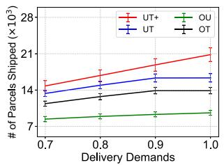  
(a) Impacts on Delivery Number

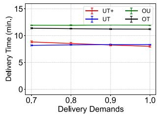  
(b) Impacts on Delivery Time

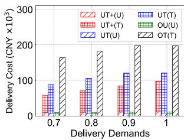  
(c) Impacts on Delivery Cost

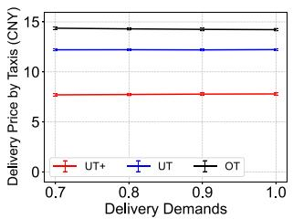  
(d) Impacts on Taxi Delivery Price

Fig. 15. Impacts of delivery demand on delivery performance and passenger experience.  
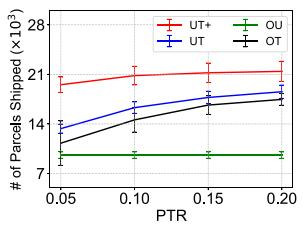  
(a) Impacts on Delivery Number

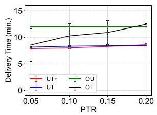  
(b) Impacts on Delivery Time

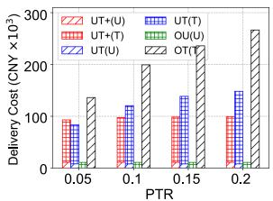  
(c) Impacts on Delivery Cost

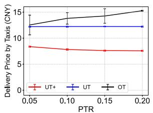  
(d) Impacts on Taxi Delivery Price

Fig. 16. Impacts of PTR on delivery performance and passenger’s experience.  
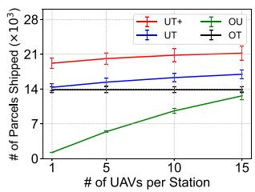  
(a) Impacts on Delivery Number

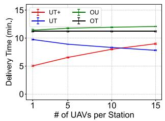  
(b) Impacts on Delivery Time

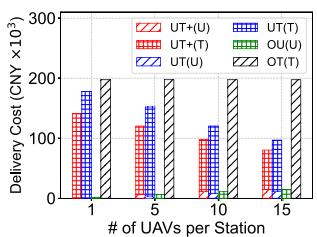  
(c) Impacts on Delivery Cost

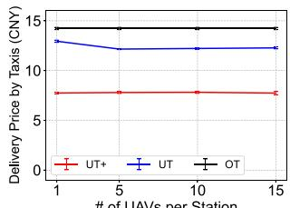  
(d) Impacts on Taxi Delivery Price  
Fig. 17. Impacts of number of UAVs in each UAV station on delivery performance and passenger’s experience.

## E. Impacts of Number of UAVs in Each UAV Station

The number of UAVs in each UAV station is one of the key factors influencing delivery capacity of UAVs as shown in Fig. 17. Since OT does not involve UAV delivery, its results are calculated under the default parameter settings. From Fig. 17(a), we observe that OU gets the most benefits (+921.0%) from the increase in UAV number, since it only employs UAVs for delivery. When 15 UAVs are deployed in a station, UT+ delivers over 21,200 instant parcels, which outperforms UT, OT, and OU by 25.0%, 52.9%, and 68.0%, respectively. The increase in UAV number also leads to more far parcels assigned to UAVs considering the expensive delivery by taxis in UT+. This is why the average delivery time with UT+ increases by 3.9 minutes as illustrated in Fig. 17(b). According to Fig. 17(c), UT+ costs 80,241 CNY for delivery of 21,214 parcels. Specifically, when each UAV station is equipped with only one UAV, UT+ assigns much more parcels (+79.5%) to the UAV than UT does, demonstrating the impressive delivery capacity of UAVs by transfer learning and station deployment. Fig. 17(d) illustrates how taxi delivery price changes with the increasing UAV number, where

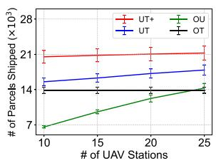  
(a) Impacts on Delivery Number

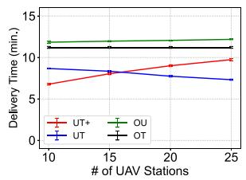  
(b) Impacts on Delivery Time

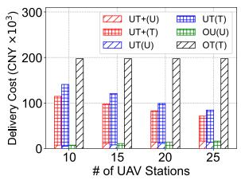  
(c) Impacts on Delivery Cost

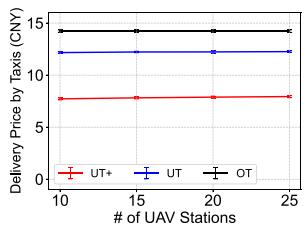  
(d) Impacts on Taxi Delivery Price

Fig. 18. Impacts of UAV station number on delivery performance and passenger’s experience.  
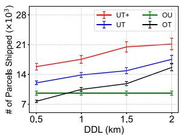  
(a) Impacts on Delivery Number

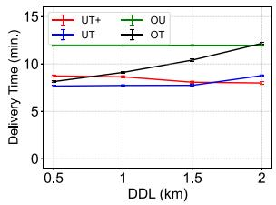  
(b) Impacts on Delivery Time

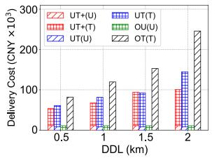  
(c) Impacts on Delivery Cost

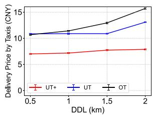  
Fig. 19. Impacts of DDL on delivery performance and passenger’s experience.  
(d) Impacts on Taxi Delivery Price

UT+ minimizes waiting time of the passengers, i.e., the delivery price by taxis (−37.0% and −45.6% than those of UT and OT, respectively). This is because UT+ considers not only the UAV preferences, but also the delivery capacity of taxis when assigning parcels, which avoids parcel assignment to taxis with long detours.

Unlike the increase in the number of UAVs in each station, the growth in the number of UAV stations also optimizes the locations of these stations. Note that the results of OT keep those under default parameter settings. As illustrated in Fig. 18(a), OU’s increase in delivery number is the largest (+117.0%) among all methods, since it only employs UAVs for delivery. UT+, which exploits the UAVs for delivery, delivers the most parcels with different number of UAV stations. Especially, the number of deliveries of UT+ is higher than that of UT, OU, and OT by 18.9%, 48.7%, and 53.3%, respectively. This stems from both the participation of UAVs and taxis and, more importantly, their efficient cooperation by transfer learning and the gap-based station deployment. Fig. 18(b) demonstrates the impacts on delivery time. We can observe that the average delivery time with UT drops to 7.31 minutes, while that with UT+ rises to 9.73 minutes. This is because with more UAV stations deployed, more and more parcels are assigned to UAVs. In addition, UT assigns parcels to UAVs based solely on delivery time, while UT+ considers the negative impacts on taxi passengers, assigning the parcels far away from taxi routes to UAVs even with longer delivery time. This also leads to the drop in delivery cost in UT+ as shown in Fig. 18(c). With more stations deployed, the cost in UT+ decreases 43,509 CNY (−37.9%), indicating UT+ as the least costly method involving taxi delivery. According to Fig. 18(d), the number of UAV stations influences the delivery

## F. Impacts of UAV Station Number

price by taxis slightly, where UT+ achieves the cheapest taxi delivery compared to UT (−35.2%) and OT (−44.2%).

## G. Impacts of DDL

The detour distance greatly affects the delivery capacity of taxis and does not affect that of UAVs. Therefore, the delivery performance by OU keeps the default results with the changes in DDL. As shown in Fig. 19(a), the longer DDL leads to increases of 31.8%, 46.3%, and 104.0% in the number of parcels delivered by UT+, UT, and OT, respectively. This is because the longer detour permitted results in larger delivery capacity of taxis. Although longer detour improves the taxis’ delivery capacity, it also generally degrades the delivery performance in terms of delivery time, delivery cost, and negative impacts on taxi passengers as illustrated in Fig. 19(b), (c), and (d), respectively. The exception is the shortened delivery time with UT+ when DDL increases from 1 km to 1.5 km according to Fig. 19(b). This is because looser detour limits enhance the capabilities of taxi delivery, making taxis more willing to deliver, which affects the decision made by UAVs for deliveries with long-distance flying. Fig. 19(c) reveals the growth of delivery cost brought by the increase in parcel assignment to taxis due to the extended DDL. Specifically, OT spends the most (i.e., 245,703 CNY) on parcel delivery, which is 143.6% more than that of UT+ and 69.9% more than that of UT. Additionally, UT+ costs only 100,873 CNY when DDL is 2 km, making it the most cost-effective delivery method. The longer DDL is permitted, the parcels with longer detour are assigned to taxis, resulting in the increase in delivery price by taxis as illustrated in Fig. 19(d). Compared to other methods with taxi delivery, the growth of the delivery price by taxis in UT+ rises the least. This is because UAVs take the responsibilities for delivery of those parcels needing extra long detour by taxis in this method, where UAVs and taxis consider each other when accepting delivery tasks.

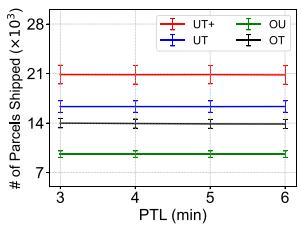  
(a) Impacts on Delivery Number

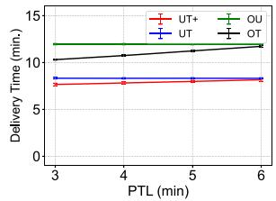  
(b) Impacts on Delivery Time  
Fig. 20. Impacts of PTL on delivery performance and passenger’s experience.

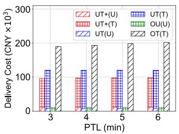  
(c) Impacts on Delivery Cost

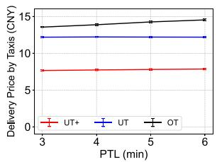  
(d) Impacts on Taxi Delivery Price

## H. Impacts of PTL

PTL indicates the parcels’ waiting time from being ordered to being picked up by taxis. Note that OU’s results remain those under the default settings in Fig. 20. From Fig. 20(a), we can observe that PTL does not affect the delivery number with all methods greatly. This is because the prolonged PTL does not improve delivery capacity of taxis directly, but schedules taxis for delivery earlier. This indicates that taxis in the near future would be reserved for parcel deliveries earlier, isolating them from the future parcel delivery. The prolonged PTL hardly creates new opportunities for taxi deliveries, but brings forward those in the future. This also leads to the longer waiting time before pick-ups, as well as the longer delivery time of all methods, especially, OT, as shown in Fig. 20(b). In addition, delivery cost and delivery price by taxis also increase slightly with the prolonged pick-up time limit (UT+: 1.95% and 2.67%, respectively; OT: 6.36% and 7.23%, respectively) according to Fig. 20(c) and (d), respectively. This is because the advanced reservation assigns the undeliverable parcels currently to future taxis, which prolongs not only the delivery time but also the detour distances by taxis.

## VIII. CONCLUSION AND FUTURE WORK

This paper presents the air-ground cooperative delivery paradigm that utilizes UAVs and crowdsourced taxis. To enhance the delivery capabilities of both systems, three modules are proposed: UAV stations are first deployed to address the delivery gaps identified in crowdsourced taxi operations; then, a prediction-based UAV repositioning strategy is employed to improve UAV turnover rates; after that, we transfer the delivery knowledge and wisdom of human couriers to both UAVs and crowdsourced taxis to enhance their respective delivery capabilities. Evaluated on real-world datasets, the proposed method achieves a 27.4% increase in delivery volume, 19.2% cost savings, and a 36.3% reduction in negative effects on taxi passengers compared to the state-of-the-art air-ground delivery method.

Our current work suggests two promising directions for future research. First, regarding seamless urban delivery, we aim to enhance the multi-hop delivery scheme to better handle parcels in no-fly zones. This involves optimizing the handoff mechanisms between UAVs and ground agents (e.g., taxis) to minimize delays and energy consumption and to ensure reliable coverage in restricted areas. Future work will explore dynamic routing algorithms that adapt to real-time urban constraints, such as temporary no-fly zones or congested airspace, to further improve delivery efficiency and coverage.

Second, concerning taxi participation incentives, we plan to investigate incentive mechanisms that balance delivery efficiency with passenger experience. This includes designing dynamic pricing models that reward taxis for participating in delivery tasks without compromising their primary role of passenger transport. Additionally, we will explore strategies to expand participation to a broader range of ride-sharing vehicles, leveraging behavioral economics to optimize engagement and scalability.

## REFERENCES

[1] L. Jiang, S. Wang, B. Guo, H. Wang, D. Zhang, and G. Wang, “FairCod: A fairness-aware concurrent dispatch system for large-scale instant delivery services,” in Proc. 29th ACM SIGKDD Conf. Knowl. Discov. Data Mining, 2023, pp. 4229–4238.

[2] O. C. Kobusingye, A. A. Hyder, D. Bishai, M. Joshipura, E. R. Hicks, and C. Mock, “Emergency medical services,” in Disease Control Priorities in Developing Countries. 2nd ed. Washington DC, USA: World Bank, 2006.

[3] F. M. Insights, Restaurant takeout market outlook (2022–2032), Jan. 2022. Accessed: Jul. 2025. [Online]. Available: https://www. futuremarketinsights.com/reports/restaurant-takeout-market

[4] iresearch. China instant delivery industry trend research report in 2022, Mar. 2022. Accessed: Jul. 2025.. (n.d.). [Online]. Available: https://report. iresearch.cn/report/202203/3964.shtml

[5] CNBC, There are millions of jobs, but a shortage of workers: Economists explain why that’s worrying, Oct. 2021. Accessed: Jul. 2025. [Online]. Available: https://www.cnbc.com/2021/10/20/global-shortage-ofworkers-whats-going-on-experts-explain.html

[6] Braxton, Logistics labor shortages in 2025: Automating where it counts, May 2025. Accessed: Jul. 2025. [Online]. Available: https://www.transpotrade.com/logistics-labor-shortages-in-2025- automating-where-it-counts/

[7] R. Higgs, U.S. postal service struggles with worker shortage, delivery delays in greater Cleveland, Ohio and the nation, Sep. 2022. Accessed: Jul. 2025. [Online]. Available: https://www.cleveland.com/metro/2022/ 09/us-postal-service-struggles-with-shortage-of-workers-delays-indelivery.html

[8] Y. AoCourier shortage: The insight of the poor and unfast delivery in multiple regions in China (in chinese), Nov. 2022. Accessed: Jul. 2025. [Online]. Available: https://new.qq.com/rain/a/20221222A0404T00

[9] V. CAMPISI, Labor shortage update: Restaurants limit delivery, online sales to focus on dine-in, Dec. 2021. Accessed: Jul. 2025. [Online]. Available: https://foodinstitute.com/focus/labor-shortage-update restaurants-limit-delivery-online-sales-to-focus-on-dine-in/

[10] A. Gawel et al., “Aerial picking and delivery of magnetic objects with MAVs,” in Proc. IEEE Int. Conf. Robot. Automat., 2017, pp. 5746–5752.

[11] D. Dissanayaka, T. R. Wanasinghe, O. De Silva, A. Jayasiri, and G. K. Mann, “Review of navigation methods for UAV-based parcel delivery,” IEEE Trans. Automat. Sci. Eng., vol. 21, no. 1, pp. 1068–1082, Jan. 2024.

[12] A. Li, M. Hansen, and B. Zou, “Traffic management and resource allocation for UAV-based parcel delivery in low-altitude urban space,” Transp. Res. Part C: Emerg. Technol., vol. 143, 2022, Art. no. 103808.

[13] D. Chauhan, A. Unnikrishnan, and M. Figliozzi, “Maximum coverage capacitated facility location problem with range constrained drones,” Transp. Res. Part C: Emerg. Technol., vol. 99, pp. 1–18, 2019.

[14] X. Wang, L. Wang, S. Wang, J. Pan, H. Ren, and J. Zheng, “Recommending-and-grabbing: A crowdsourcing-based order allocation pattern for on-demand food delivery,” IEEE Trans. Intell. Transp. Syst., vol. 24, no. 1, pp. 838–853, Jan. 2023.

[15] Y. Liu et al., “FooDNet: Toward an optimized food delivery network based on spatial crowdsourcing,” IEEE Trans. Mobile Comput., vol. 18, no. 6, pp. 1288–1301, Jun. 2019.

[16] Y. Ding et al., “A city-wide crowdsourcing delivery system with reinforcement learning,” in Proc. ACM Interactive, Mobile, Wearable Ubiquitous Technol., vol. 5, no. 3, pp. 1–22, 2021.

[17] B. Li, D. Krushinsky, H. A. Reijers, and T. Van Woensel, “The share-a-ride problem: People and parcels sharing taxis,” Eur. J. Oper. Res., vol. 238, no. 1, pp. 31–40, 2014.

[18] Y. Zhang et al., “Route prediction for instant delivery,” in Proc. ACM Interactive, Mobile, Wearable Ubiquitous Technol., vol. 3, no. 3, pp. 1–25, 2019.

[19] Y. Yang et al., “Transloc: Transparent indoor localization with uncertain human participation for instant delivery,” in Proc. 26th Annu. Int. Conf. Mobile Comput. Netw., 2020, pp. 1–14.

[20] M. Joshi, A. Singh, S. Ranu, A. Bagchi, P. Karia, and P. Kala, “Batching and matching for food delivery in dynamic road networks,” in Proc. IEEE 37th Int. Conf. Data Eng., 2021, pp. 2099–2104.

[21] D. Chen, Y. Yuan, W. Du, Y. Cheng, and G. Wang, “Online route planning over time-dependent road networks,” in Proc. IEEE 37th Int. Conf. Data Eng., 2021, pp. 325–335.

[22] Y. Cheng, B. Li, X. Zhou, Y. Yuan, G. Wang, and L. Chen, “Real-time cross online matching in spatial crowdsourcing,” in Proc. IEEE 36th Int. Conf. Data Eng., 2020, pp. 1–12.

[23] S. Bai, S. Tong, X. Feng, Z. Jiang, X. Bai, and R. Xu, “Toward dynamic pricing for city-wide crowdsourced instant delivery services,” IEEE Trans. Mobile Comput., vol. 23, no. 1, pp. 909–924, Jan. 2024.

[24] Y. Chen, D. Guo, M. Xu, G. Tang, and G. Cheng, “Measuring maximum urban capacity of taxi-based logistics,” IEEE Trans. Intell. Transp. Syst., vol. 22, no. 10, pp. 6449–6459, Oct. 2021.

[25] X. Xu, A. Liu, G. Liu, Z. Li, and L. Zhao, “Drive less but finish more: Food delivery based on multi-level workers in spatial crowdsourcing,” in Proc. 31st ACM Int. Conf. Inf. Knowl. Manage., 2022, pp. 2331–2340.

[26] C. C. Kessens, J. Thomas, J. P. Desai, and V. Kumar, “Versatile aerial grasping using self-sealing suction,” in Proc. IEEE Int. Conf. Robot. Automat., 2016, pp. 3249–3254.

[27] M. Salama and S. Srinivas, “Joint optimization of customer location clustering and drone-based routing for last-mile deliveries,” Transp. Res. Part C: Emerg. Technol., vol. 114, pp. 620–642, 2020.

[28] B. D. Song, K. Park, and J. Kim, “Persistent UAV delivery logistics: MILP formulation and efficient heuristic,” Comput. Ind. Eng., vol. 120, pp. 418–428, 2018.

[29] H. Huang, C. Hu, J. Zhu, M. Wu, and R. Malekian, “Stochastic task scheduling in UAV-based intelligent on-demand meal delivery system,” IEEE Trans. Intell. Transp. Syst., vol. 23, no. 8, pp. 13040–13054, Aug. 2022.

[30] J. Gao, Y. Pan, X. Zhang, Q. Han, and Y. Hu, “Sharing instant delivery UAVs for crowdsensing: A data-driven performance study,” Comput. Ind. Eng., vol. 191, 2024, Art. no. 110100.

[31] Z. Chen, Z. Hu, Z. Bao, and W. Xu, “UAV charging station planning and route optimization considering stochastic delivery demand,” IEEE Trans. Transport. Electrific., vol. 10, no. 4, pp. 9328–9341, Dec. 2024.

[32] Q. Luo, G. Wu, A. Trivedi, F. Hong, L. Wang, and D. Srinivasan, “Multiobjective optimization algorithm with adaptive resource allocation for truck-drone collaborative delivery and pick-up services,” IEEE Trans. Intell. Transp. Syst., vol. 24, no. 9, pp. 9642–9657, Sep. 2023.

[33] Y. Pan et al., “Efficient schedule of energy-constrained UAV using crowdsourced buses in last-mile parcel delivery,” in Proc. ACM Interactive, Mobile, Wearable Ubiquitous Technol., vol. 5, no. 1, pp. 1–23, 2021.

[34] D. N. Das, R. Sewani, J. Wang, and M. K. Tiwari, “Synchronized truck and drone routing in package delivery logistics,” IEEE Trans. Intell. Transp. Syst., vol. 22, no. 9, pp. 5772–5782, Sep. 2021.

[35] J. G. Carlsson and S. Song, “Coordinated logistics with a truck and a drone,” Manage. Sci., vol. 64, no. 9, pp. 4052–4069, 2018.

[36] G. Wu, N. Mao, Q. Luo, B. Xu, J. Shi, and P. N. Suganthan, “Collaborative truck-drone routing for contactless parcel delivery during the epidemic,” IEEE Trans. Intell. Transp. Syst., vol. 23, no. 12, pp. 25077–25091, Dec. 2022.

[37] Y. Pan, Q. Chen, N. Zhang, Z. Li, T. Zhu, and Q. Han, “Extending delivery range and decelerating battery aging of logistics UAVs using public buses,” IEEE Trans. Mobile Comput., vol. 22, no. 9, pp. 5280–5295, Sep. 2023.

[38] H. Huang, A. V. Savkin, and C. Huang, “Drone routing in a time-dependent network: Toward low-cost and large-range parcel delivery,” IEEE Trans. Ind. Informat., vol. 17, no. 2, pp. 1526–1534, Feb. 2021.

[39] J. Gao et al., “Towards efficient urban emergency response using UAVs riding crowdsourced buses,” IEEE Internet Things J., vol. 11, no. 12, pp. 22439–22455, Jun. 2024.

[40] Y. Ding, L. Liu, Y. Yang, Y. Liu, D. Zhang, and T. He, “From conception to retirement: A lifetime story of a 3-year-old wireless beacon system in the wild,” IEEE/ACM Trans. Netw., vol. 30, no. 1, pp. 47–61, Feb. 2022.

[41] Y. Yang et al., “TransLoc: Transparent indoor localization with uncertain human participation for instant delivery,” in Proc. 26th Annu. Int. Conf. Mobile Comput. Netw., New York, NY, USA, 2020, pp. 1–14.

[42] cbdog 94, STL: Online detection of taxi trajectory anomaly based on spatial-temporal laws, Sep. 2018. Accessed: Feb. 2024. [Online]. Available: https://github.com/cbdog94/STL

[43] Time and date. weather in shanghai, Feb. 2024. Accessed: Feb. 2024. [Online]. Available: https://www.timeanddate.com/weather/china/shanghai

[44] O. S. Map, Open street map, Jan. 2024. Accessed: Feb. 2024. [Online]. Available: https://www.openstreetmap.org/

[45] R. Cohen, L. Katzir, and D. Raz, “An efficient approximation for the generalized assignment problem,” Inf. Process. Lett., vol. 100, no. 4, pp. 162–166, 2006.

[46] Y. Pan, S. Li, Z. Ning, B. Li, Q. Zhang, and T. Zhu, “auSense: Collaborative airspace sensing by commercial airplanes and unmanned aerial vehicles,” IEEE Trans. Veh. Technol., vol. 69, no. 6, pp. 5995–6010, Jun. 2020.

[47] M. Xiao, J. Wu, H. Huang, L. Huang, and C. Hu, “Deadline-sensitive user recruitment for mobile crowdsensing with probabilistic collaboration,” in Proc. IEEE 24th Int. Conf. Netw. Protoc., 2016, pp. 1–10.

[48] M. Xiao, J. Wu, L. Huang, Y. Wang, and C. Liu, “Multi-task assignment for crowdsensing in mobile social networks,” in Proc. IEEE Conf. Comput. Commun., 2015, pp. 2227–2235.

[49] M. T. Review, Drone food delivery is now part of daily life in shenzhen, May 2023. Accessed: Feb. 2024. [Online]. Available: https://www.technologyreview.com/2023/05/23/1073500/drone-fooddelivery-shenzhen-meituan/

[50] C. Xiang et al., “Reusing delivery drones for urban crowdsensing,” IEEE Trans. Mobile Comput., vol. 22, no. 5, pp. 2972–2988, May 2023.

[51] U. C. Cabuk, M. Tosun, O. Dagdeviren, and Y. Ozturk, “Modeling energy consumption of small drones for swarm missions,” IEEE Trans. Intell. Transp. Syst., vol. 25, no. 8, pp. 10176–10189, Aug. 2024.

[52] Y. Pan et al., “Pioneering cooperative air-ground instant delivery using UAVs and crowdsourced couriers,” in Proc. ACM Interactive, Mobile, Wearable Ubiquitous Technol., vol. 8, no. 4, pp. 1–26, 2024.

[53] M. Won, “UBAT: On jointly optimizing UAV trajectories and placement of battery swap stations,” in Proc. IEEE Int. Conf. Robot. Automat., 2020, pp. 427–433.

[54] H. Huang and A. V. Savkin, “Deployment of charging stations for drone delivery assisted by public transportation vehicles,” IEEE Trans. Intell. Transp. Syst., vol. 23, no. 9, pp. 15043–15054, Sep. 2022.

[55] DJI, DJI matrice 210 V2 features, Feb. 2024. Accessed: Feb. 2024. [Online]. Available: https://www.dji.com/cn/matrice-200-series-v2/info# specs

[56] T. Kirschstein, “Comparison of energy demands of drone-based and ground-based parcel delivery services,” Transp. Res. Part D: Transport Environ., vol. 78, 2020, Art. no. 102209.

[57] Y. Lin and S. Saripalli, “Sampling-based path planning for UAV collision avoidance,” IEEE Trans. Intell. Transp. Syst., vol. 18, no. 11, pp. 3179–3192, 2017.

[58] Z. R. Institute, “Cost analysis of last-mile feeder drone operational scenarios (in Chinese),” Dec. 2021. Accessed: Feb. 2024. [Online]. Available: http://www.shesye.com/?news/681.html#:∼

[59] C. Chen et al., “CrowdDeliver: Planning city-wide package delivery paths leveraging the crowd of taxis,” IEEE Trans. Intell. Transp. Syst., vol. 18, no. 6, pp. 1478–1496, Jun. 2017.

[60] S. M. T. Commission, “Taxi fare structure and charging standards in shanghai (in Chinese),” Jun. 2018. Accessed: Feb. 2024. [Online]. Available: https://jtw.sh.gov.cn/czqcyj/20180605/0010-10460.html

[61] B. Bahmani, B. Moseley, A. Vattani, R. Kumar, and S. Vassilvitskii, “Scalable k-means,” 2012, arXiv:1203.6402.

[62] D. Arthur et al., “k-means++: The advantages of careful seeding,” in Proc. 18th Annu. ACM-SIAM Symp. Discrete Algorithms, 2007, pp. 1027–1035.

[63] J. Liang, J. Ke, H. Wang, H. Ye, and J. Tang, “A Poisson-based distribution learning framework for short-term prediction of food delivery demand ranges,” IEEE Trans. Intell. Transp. Syst., vol. 24, no. 12, pp. 14556–14569, Dec. 2023.

[64] B. Guo et al., “Concurrent order dispatch for instant delivery with timeconstrained actor-critic reinforcement learning,” in Proc. IEEE Real-Time Syst. Symp., 2021, pp. 176–187.

[65] J. Gao et al., “Cooperative air-ground instant delivery by UAVs and crowdsourced taxis,” in Proc. IEEE 40th Int. Conf. Data Eng., 2024, pp. 4153–4166.

[66] L. Lu, Y. Shin, Y. Su, and G. E. Karniadakis, “Dying ReLU and initialization: Theory and numerical examples,” 2019, arXiv:1903.06733.

[67] G. P. Meyer, “An alternative probabilistic interpretation of the huber loss,” in Proc. IEEE/CVF Conf. Comput. Vis. Pattern Recognit., 2021, pp. 5261– 5269.

[68] J. Ge et al., “Aeromagnetic compensation algorithm robust to outliers of magnetic sensor based on Huber loss method,” IEEE Sensors J., vol. 19, no. 14, pp. 5499–5505, Jul. 2019.

[69] G. Zhu, D. Zhao, Y. Wang, H. Wang, D. Zhang, and H. Ma, “Come: Learning to coordinate crowdsourcing and regular couriers for offline delivery during online mega sale days,” in Proc. IEEE 39th Int. Conf. Data Eng., 2023, pp. 3126–3139.

[70] D. P. Kingma and J. Ba, “Adam: A method for stochastic optimization,” 2014, arXiv:1412.6980.

  
Junhui Gao received the BE degree from the School of Computer Science, Northwestern Polytechnical University, Xi’an, China, in 2023. His research interests include Big Data, robotics, machine learning, and low-altitude economy.

  
Qianru Wang received the PhD’s degree from Northwestern Polytechnical University, China, in 2022. She is currently a faculty with Xidian University. Her research interests include urban computing, and AIoT.

Xin Zhang received the BS and PhD degrees in systems engineering from the National University of Defense Technology (NUDT), China, in 2000 and 2006, respectively. He is currently a professor with the National Key Laboratory of Information Systems Engineering, National University of Defense Technology. His research interests include social computing, data mining, and intelligent algorithm design.

Juan Shi received the PhD degree from Northwestern Polytechnical University, Xi’an, China, in 2020. She was a visiting student with the University of George Mason university, Fairfax County, Virgina, USA. She is currently a lecture with Air Force Engineering University, Xi’an, China. Her general interests are in the areas of signal processing, communications, machine learning, and Big Data analytics.

Xiang Zhao received the PhD degree from the University of New South Wales, Australia, in 2013. He is currently a full professor with the National Key Laboratory of Big Data and Decision, National University of Defense Technology, China. His research interests include knowledge engineering, foundation models and Big Data analytics.

Yunji Liang received the PhD degree in computer science from Northwestern Polytechnical University, Xi’an, China, in 2016. He is currently an associate professor with Northwestern Polytechnical University. During 2012–2017, he was with the University of Arizona, Tucson, AZ, USA, as a visiting scholar and postdoctoral researcher, respectively. His research interests include pervasive computing, Internet of Things, and mobile computing.

Bin Guo (Senior Member, IEEE) received the PhD degree in computer science from Keio University, Minato, Japan, in 2009. He is currently a professor with Northwestern Polytechnical University, Xi’an, China. He was a postdoctoral researcher with the Institut TELECOM SudParis, Essonne, France. His research interests include ubiquitous computing, mobile crowd sensing, and HCI.

Qingye Han received the PhD degree from Northwestern Polytechnical University, Xi’an, China, in 2019. She is currently an associate professor with the School of Management Science and Real Estate, Chongqing University, Chongqing, China. Her research interests include decision-making support system, intelligent city, intelligent logistics, and Big Data analytics.

Yan Pan received the BS and PhD degrees from Northwestern Polytechnical University, Xi’an, China, in 2013 and 2020, respectively. He is a postdoctoral fellow with the School of Computer, National University of Defense Technology, Changsha, China, since Feb. 2022. He was a visiting student with the University of Maryland, Baltimore County, MD, USA. He is currently an associate researcher with the National Key Laboratory of Information Systems Engineering, National University of Defense Technology since January 2025. He has authored or co-authored

more than 20 articles in premier journals, such as IEEE/ACM Transactions on Networking, IEEE Transactions on Mobile Computing, Elsevier Journal of Network and Computer Applications, IEEE Internet of Things Journal, IEEE Transactions on Neural Networks and Learning Systems, and in premier conferences, such as IEEE ICDE, ACM Ubicomp, IEEE INFOCOM, ACM CIKM, and ACM/IEEE IPSN. His research interests include Big Data, machine learning, robotics, and mobile computing.