# Cooperative Beamforming Design for Anti-UAV ISAC Systems

Yue Zhang , Hangguan Shan , Senior Member, IEEE, Yong Zhou , Senior Member, IEEE, Zhiguo Shi , Fellow, IEEE, Li Sheng, and Yuanwei Liu , Fellow, IEEE

Abstract— Integrated sensing and communication (ISAC) enables the next-generation network to possess networked sensing capability, propelling the proliferation of various intelligent applications but introducing complex sensing and communication interference. To this end, this paper studies the cooperative transceiver beamforming design for a multi-cell anti-unmanned aerial vehicle (UAV) ISAC system, where multiple base stations (BSs) collaboratively perform joint UAV sensing. Specifically, to ensure reliable detection, we jointly optimize the ISAC transmit and receive beamformers at BSs and downlink users via maximizing the signal-to-clutter-plus-noise ratio of sensing, taking into account the communication requirements and power constraints. To handle the nonconvex fractional problem, we first propose a centralized beamforming algorithm resorting to alternating optimization, successive convex approximation, and Dinkelbach methods. Then, to alleviate heavy backhaul overhead, a distributed algorithm is put forward, adopting the primal decomposition technique to decouple the inter-cell interference. Numerical results verify that: i) Compared with the standalone sensing by a single BS, the proposed cooperative beamforming design achieves notable enhancement in sensing performance; ii) The designed transceiver beamforming is constructive for interference and clutter suppression in multi-cell ISAC systems.

Index Terms— Integrated sensing and communication, transceiver beamforming design, cooperative sensing, anti-UAV.

Received 21 June 2024; revised 26 October 2024; accepted 14 December 2024. Date of publication 26 December 2024; date of current version 12 March 2025. The work of Yue Zhang and Hangguan Shan was supported in part by the National Natural Science Foundation of China (NSFC) under Grant U21A20456 and Grant U21B2029, in part by Zhejiang Provincial Natural Science Foundation of China under Grant LR23F010006, in part by the Science and Technology Development Fund under Grant SKLIOTSC(UM)- 2024-2026, in part by the State Key Laboratory of Internet of Things for Smart City (University of Macau) under Grant SKL-IoTSC(UM)-2024- 2026/ORP/GA01/2023, and in part by China Scholarship Council. The work of Yong Zhou was supported in part by the Natural Science Foundation of Shanghai under Grant 23ZR1442800 and in part by the National Natural Science Foundation of China under Grant U20A20159. The associate editor coordinating the review of this article and approving it for publication was L. Zhao. (Corresponding author: Hangguan Shan.)

Digital Object Identifier 10.1109/TWC.2024.3519351

## I. INTRODUCTION

MPOWERED by the integrated sensing and communicaundergoing a paradigm shift from the cellular communication network to the dual-functional perceptive mobile network (PMN), by integrating radar sensing and wireless communication into the same hardware platform and frequency band [1], [2]. The PMN promotes the development of a plethora of new applications with both stringent communication and sensing requirements [3]. Meanwhile, the widespread applications of unmanned aerial vehicles (UAVs) boost strong demand for comprehensive aerial surveillance to prevent potential security threats [4]. The ubiquitous sensing provided by PMNs can overcome the deficiency of conventional surveillance systems (consisting of radar apparatus and optical cameras) in prohibitively high deployment cost and black zone issues, and realize cost-effective anti-UAV surveillance [3].

To achieve harmonious coexistence between sensing and communication functions, viable approaches for ISAC have been extensively studied in the past decade [5], [6], [7], [8]. Orthogonal resource allocation is perceived as a feasible way by enabling sensing and communication to occupy different time slots or frequency bands, yet leading to a low level of resource utilization [5]. Exploiting the rich spatial degree of freedoms (DoFs) of multiple-input-multipleoutput (MIMO) technology, extensive research focuses on the ISAC beamforming design for dual-functional coexistence in the spatial domain [6], [7], [8]. Nevertheless, the antenna aperture and structure can inherently determine the beamforming gain and the sensing and communication performance [1], [6]; and most importantly, the beamforming strategy also has critical impacts on the ISAC system performance. For instance, by resembling the ideal radar beam pattern, the ISAC beamforming can be designed to improve target detection and localization performance under a satisfactory communication performance [8]. In addition, ISAC beamforming can be performed to guarantee reliable communication service by eliminating the interference from sensing signals to communication [7]. As such, the spatial beamforming needs to be well designed to realize effective integration of sensing and communication, mutual interference suppression, and dual-functional performance improvement.

When considering point targets like UAVs, their smallsize property poses great challenges to accurate sensing, due to the weak echo signals. Fortunately, the interconnected base stations (BSs) in PMNs can collaborate with each other and provide cooperative target sensing via monostatic, bistatic, and multi-static sensing processes [4]. Cooperative sensing is envisioned as a promising approach to obtain multiperspective observations on targets and reap additional spatial diversity gain [9], [10]. However, the simultaneous transmissions of multiple BSs introduce intricate interference, including the inter-cell interference and dual-functional mutual interference [4]. Therefore, to realize efficient cooperation, the transceiver beamforming for multiple cells should be coordinately designed to manage the complex interference and enhance sensing and communication performance, which in general, can be implemented in either a centralized or distributed way [11]. The centralized beamforming design is accomplished at a central unit and requires access to the global channel state information (CSI) obtained by the exchange of the local CSI at each BS through backhaul transmissions [12]. By contrast, the distributed beamforming design is conducted at each BS independently and thus only local CSI is needed, which is more practically realizable owing to the reduced backhaul signaling overhead and simpler system structure [12].

## A. Related Work

Exploiting the large spatial DoF, the beamforming technique has been widely studied in both MIMO radar and multiuser MIMO (MU-MIMO) communication systems. For instance, in MIMO radar systems, the transceiver beamforming is jointly optimized to improve target localization performance [13], enhance radar signal-to-clutter-plus-noise ratio (SCNR) [14], and suppress interference and clutter for single and multitarget scenarios [14], [15]. Moreover, for MU-MIMO communication systems, the transmit beamforming is designed to strike a balance between beamforming gain and interuser interference [16]. Also, to balance the tradeoff between performance and hardware complexity, hybrid transceiver beamforming design is studied in [17] to improve the sum rate of MU-MIMO communication systems. Despite the advantages of beamforming to MIMO radar or MU-MIMO communication, the approaches in the aforementioned works cannot be directly applied to ISAC systems due to the coupled property of sensing and communication functions.

Recently, extensive research has been focused on the beamforming optimization for ISAC systems. Aiming to ensure sensing and communication performance, existing works optimize the ISAC transmit beamforming by nulling the dual-functional interference [7], improving the similarity between the designed radar beam pattern and the ideal radar beam pattern [8], [18], and maximizing the beam pattern gain illuminated in target directions [19]. Furthermore, considering the impacts caused from signal propagation and reception processes, as well as the corresponding interference, the joint transceiver beamforming design for ISAC systems is studied in [20] for dual-functional performance tradeoff, based on both radar- and communication-centric criteria. To improve spectrum efficiency, the authors of [21] conduct the joint transceiver beamforming design for full-duplex ISAC systems, where the transmit beamformers at the BS and uplink users and the receive beamformers at the BS and downlink (DL) users are jointly optimized. However, the previous studies focus on the beamforming design for a single BS, without considering the challenges and opportunities of networked sensing [10].

So far, only few research has investigated the beamforming design for multi-cell ISAC systems, revealing the potential cooperative gain. In [11] and [22], centralized ISAC beamforming designs are proposed for cooperative target sensing for the multi-static ISAC system with a dedicated sensing receiver, while ignoring the complex multi-cell interference and clutter. In addition, to the best of our knowledge, there is no existing work studying the distributed implementation for ISAC beamforming design. Although distributed beamforming design has been carried out for multi-cell communication networks [23], they cannot be directly put into use to ISAC systems in view of the interplay between sensing and communication functions.

## B. Motivation and Contributions

On all these counts, research on the cooperative beamforming design for ISAC systems is still in its infancy. To fill the gap, this paper focuses on the following problems:

• How to simultaneously realize cooperative target sensing and user communication for a multi-cell system?

• How to jointly design the ISAC transceiver beamforming of multiple BSs for reliable detection?

• How to conduct cooperative beamforming design in a distributed way to avoid heavy backhaul overhead?

Motivated by the above questions, this paper aims to study the cooperative transceiver beamforming design for the multicell ISAC system and unveil the attainable cooperative gain, where dual-functional BSs, communication-only BSs, target UAV, and DL users coexist. The main contributions of this paper are summarized as follows:

• We propose a cooperative sensing procedure for multicell anti-UAV ISAC systems, and characterize the SCNR of sensing and signal-to-interference-plus-noise ratio (SINR) of communication, considering the intra- and inter-cell interference, dual-functional mutual interference, clutter, and residual self-interference (SI). To ensure reliable detection, we formulate an optimization problem to jointly optimize the transceiver beamforming at BSs and users to maximize the sensing SCNR, subject to the minimal DL SINR and maximal transmit power of BSs.

• We propose a centralized algorithm to address the nonconvex optimization problem, by iteratively optimizing the transmit and receive beamforming via alternating optimization (AO). Closed-form solutions to the optimal receive beamforming are obtained based on the SCNR/SINR maximization criterion, and an efficient algorithm for transmit beamforming optimization is proposed based on successive convex approximation (SCA) and Dinkelbach methods to tackle the nonconvex and fractional properties.

• We propose a distributed beamforming algorithm to overcome the deficiencies of centralized design in global CSI acquisition and backhaul overhead. To decorrelate the interplay among multiple cells and achieve distributed beamforming design, we resort to the primal decomposition method to decompose the coupled intercell interference. Also, the effectiveness of the distributed algorithm over the centralized one in reducing backhaul overhead is elaborated and validated.

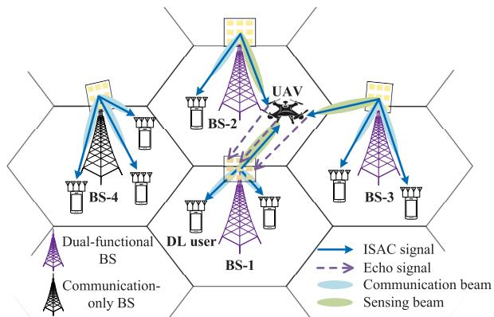  
Fig. 1. Illustration of the multi-cell anti-UAV ISAC system.

• We provide numerical results to demonstrate that: i) The designed beamforming for the multi-cell anti-UAV ISAC system can effectively achieve both reliable sensing and communication performance; ii) Compared with standalone sensing, the cooperative transceiver beamforming design realizes remarkable performance enhancement for UAV detection; iii) The proposed beamforming design also contributes to the suppression of clutter, inter-cell interference, and dual-functional mutual interference.

## C. Organization and Notations

The rest of this paper is organized as follows. The system model and optimization problem are given in Section II. The centralized transceiver beamforming design is proposed in Section III and the distributed beamforming design is elaborated in Section IV. Convergence and complexity analyses of the proposed algorithms are given in Section V. In Section VI, numerical results and discussions are presented. Finally, conclusion is drawn in Section VII.

Notations: The lowercase and uppercase bold letters are used for vectors and matrices, respectively. $( \cdot ) ^ { \mathrm { T } }$ and $( \cdot ) ^ { \mathrm { H } }$ stand for the transpose and conjugate transpose, respectively. $\| \mathbf { x } \|$ denotes the Euclidean norm of a complex vector x. |z| denotes the magnitude of a complex number z. Re(z) and Im(z) denote the real and imaginary parts of a complex number z, respectively. $\mathscr { C N } ( \pmb { \mu } , \pmb { \Sigma } )$ denotes the distribution of a circularly symmetric complex Gaussian (CSCG) random vector with mean vector $\pmb { \mu }$ and covariance matrix Σ. ∼ stands for “distributed $\mathrm { a s } ^ { \prime \prime }$ ${ \mathbf I } _ { n }$ denotes the identity matrix of size $n \times n . \mathbb { R } _ { + + } ^ { x \times y }$ denotes the space of $x \times y$ positive real matrices. $\mathbb { C } ^ { x \times y }$ denotes the space of $x \times y$ complex matrices. E(·) denotes the expectation operation. $\mathcal { O } ( \cdot )$ is the big-O notation.

## II. SYSTEM MODEL AND PROBLEM FORMULATION

As illustrated in Fig. 1, we consider a multi-cell anti-UAV ISAC system which consists of G interconnected BSs, one UAV as a point-like sensing target, and multiple DL ground users. Let $K _ { g } ~ = ~ \{ 1 , 2 , \ldots , K _ { g } \}$ denote the set of DL users in the $g \cdot$ -th cell, $g ~ \in ~ { \mathcal { G } } , ~ { \mathcal { G } } ~ = ~ \{ 1 , 2 , \ldots , G \}$ with $K _ { g }$ being the total number of DL users of BS-g and $\textstyle { \mathcal { K } } = \bigcup _ { q \in { \mathcal { G } } } { \mathcal { K } } _ { g }$ being the total set of DL users in the system. To achieve reliable UAV surveillance, Q out of the $G$ BSs, $Q \leq G ,$ , are responsible for jointly sensing the target UAV whilst providing communication service, thus being denoted as the dual-functional BSs (DBSs). Without loss of generality, we denote the Q DBSs as BS-1 to BS-Q within the set of $\mathcal { Q } = \{ 1 , 2 , \ldots , Q \}$ , and the other $G - Q$ communicationonly BSs (CBSs) as ${ \mathrm { B S } } { - } ( Q + 1 )$ to BS-G within the set of ${ \mathcal { C } } = \{ Q + 1 , Q + 2 , \ldots , G \}$ , thereby ${ \mathcal { G } } = \mathcal { Q } \cup { \mathcal { C } }$

TABLE I  
SUMMARY OF NOTATION
<table><tr><td rowspan=1 colspan=1>Notation</td><td rowspan=1 colspan=1>Definition</td></tr><tr><td rowspan=1 colspan=1> ${ \overline { { G , Q , K _ { g } } } }$ </td><td rowspan=1 colspan=1>Numbers of BSs, DBSs, and DL users of $\overline { { \mathrm { B S } - g } }$ </td></tr><tr><td rowspan=1 colspan=1> $\overline { { { \mathcal { G } } , \mathcal { Q } , \mathcal { C } , \mathcal { K } _ { g } } }$ </td><td rowspan=1 colspan=1>Sets of BSs, DBSs, CBSs, and DL users of BS-g</td></tr><tr><td rowspan=1 colspan=1> $N _ { \mathrm { t } } , N _ { \mathrm { r } } , M _ { \mathrm { r } }$ </td><td rowspan=1 colspan=1>Antenna numbers of transmit UPAs at BSs, receiveUPAs at BSs, and receive ULAs at users</td></tr><tr><td rowspan=1 colspan=1> $\mathbf { w } _ { g , k _ { g } } , \mathbf { w } _ { g , \mathrm { u } }$ </td><td rowspan=1 colspan=1>Transmit beamforming vectors at BS-q for the $\overline { { k _ { g } - \mathrm { t h } } }$ DL user and UAV</td></tr><tr><td rowspan=1 colspan=1> $\mathbf { u } _ { \mathrm { u } } , \mathbf { v } _ { k _ { g } }$ </td><td rowspan=1 colspan=1>Receive beamforming vectors at BS-1 and kg-thuser</td></tr><tr><td rowspan=1 colspan=1> $\underline { { \mathbf { x } } } _ { g }$ </td><td rowspan=1 colspan=1>ISAC transmit signal of BS-g</td></tr><tr><td rowspan=1 colspan=1> $\cdot ^ { ( r ) } , \cdot ^ { ( i ) } , \cdot ^ { ( j ) } , \cdot ^ { ( t ) }$ </td><td rowspan=1 colspan=1>Iteration indexes for AO, SCA, Dinkelbach, andsubgradient iterations</td></tr><tr><td rowspan=1 colspan=1>a</td><td rowspan=1 colspan=1>Optimization variable for Dinkelbach method</td></tr><tr><td rowspan=1 colspan=1> $\nu _ { g , k _ { g _ { 0 } } } , \mu _ { g , k _ { g _ { 0 } } }$ </td><td rowspan=1 colspan=1>Lagrange multipliers obtained by the g-th slaveproblem for the SINR constraint of $\underset { \mathrm { ~ \tiny ~ \cdot ~ } } { \mathrm { u s e r } } – k _ { g _ { 0 } }$ andfor the interference constraint to user-kgo</td></tr><tr><td rowspan=1 colspan=1> $\underline { { \gamma _ { \mathbf { u } } } } , \eta _ { \mathbf { u } }$ </td><td rowspan=1 colspan=1>Sensing SCNR and its tight lower bound</td></tr></table>

All BSs are equipped with $N _ { \mathrm { t } }$ -antenna transmit uniform planar array (UPA) and $N _ { \mathrm { r } }$ -antenna receive UPA for the signal transmission and echo reception, respectively. The DL users in the system are assumed to equip with uniform linear arrays (ULAs) of Mr antennas. The antenna elements of UPAs and ULAs are set to be half-wavelength spacing. In this paper, cooperative sensing by multiple BSs for the same target UAV is considered. Specifically, BS-1 acts as a sensing transceiver to sense the UAV in a monostatic manner, meanwhile acting as a sensing receiver to cooperatively sense the UAV with other Q−1 DBSs, i.e., BS-2 to BS-Q, in a bistatic sensing manner.1 To realize dual functionality for the multi-cell cooperative sensing system, the transceiver beamforming for both BSs and DL users needs to be carefully designed. Moreover, important notations in the paper are summarized in Table I.

## A. Signal Model

Following [21], [24], the ISAC transmit signal of ${ \mathrm { B S } } { \cdot } g$ for both target sensing and DL communication, denoted as ${ \bf x } _ { g } \in \mathbf { \Sigma }$ $\mathbb { C } ^ { N _ { \mathrm { t } } \times 1 } , g \in \mathcal { Q }$ , can be expressed as

$$
\mathbf { x } _ { g } = \sum _ { k _ { g } = 1 } ^ { K _ { g } } \mathbf { w } _ { g , k _ { g } } s _ { g , k _ { g } } + \mathbf { w } _ { g , \mathrm { u } } s _ { g , \mathrm { u } } , \ g \in \mathcal { Q } ,\tag{1}
$$

where $\mathbf { w } _ { g , k _ { g } } ~ \in ~ \mathbb { C } ^ { N _ { \mathrm { t } } \times 1 }$ is the transmit beamforming vector for the $k _ { g } \mathrm { - t h }$ DL user of ${ \bf B S } - g , k _ { g } \in \mathcal { K } _ { g } ;$ the complex scalar $s _ { g , k _ { g } } \in \mathbb { C }$ is the random communication data symbol carrying the desired information for the $k _ { g } \mathrm { - t h }$ DL user of ${ \mathrm { B S } } { \cdot } g$ with unit power, i.e., $\mathbb { E } ( | s _ { g , k _ { q } } | ^ { 2 } ) ~ = ~ 1 ; ~ { \mathbf w } _ { g , \mathfrak { u } } ~ \in ~ \mathbb { C } ^ { N _ { \mathfrak { t } } \times 1 }$ is the transmit beamforming vector of ${ \mathrm { B S } } { \cdot } g$ for UAV sensing; and $s _ { g , \mathrm { u } } ~ \in ~ \mathbb { C }$ is a deterministic symbol containing no communication information, added as the dedicated sensing symbol. For ISAC systems, an inherent deterministic-random tradeoff is introduced because the communication signal prefers to be more random to carry more information while the sensing signal tends to be deterministic to maintain a low peak-to-average power ratio and thus accurate localization performance [25]. Similar to [21] and [26], in this paper we add the sensing symbol $s _ { g , \mathrm { u } }$ to extend the DoF for signal design and balance the deterministic-random tradeoff between the two functions. The data symbols $\{ s _ { g , k _ { g } } \} _ { k _ { g } \in \mathcal { K } _ { g } }$ and $s _ { g , \mathrm { u } }$ are assumed to be uncorrelated with each other $[ 1 8 ] . ^ { 2 }$ Moreover, the total transmit power constraint of each BS is considered, i. $\begin{array} { r } { \mathbf { \dot { \mathbf { \rho } } } _ { \ast , \ast } \operatorname { \mathbb { E } } ( \| \mathbf { x } _ { g } \| ^ { 2 } ) = \dot { \sum } _ { k _ { a } = 1 } ^ { K _ { g } } \| \mathbf { w } _ { g , k _ { g } } \| ^ { 2 } + \| \mathbf { w } _ { g , \mathrm { u } } \| ^ { 2 } \leq P _ { \mathrm { B } } } \end{array}$ , with $P _ { \mathrm { { B } } }$ being the maximum transmit power budget of each BS.

The transmit signal of $\mathbf { C B S - } g , \mathbf { x } _ { g } , g \in \mathcal { C }$ , is expressed as

$$
\mathbf { x } _ { g } = \sum _ { k _ { g } = 1 } ^ { K _ { g } } \mathbf { w } _ { g , k _ { g } } s _ { g , k _ { g } } , \ g \in \mathcal { C } ,\tag{2}
$$

with the total transmit power constraint of $\mathbb { E } ( \| \mathbf { x } _ { g } \| ^ { 2 } ) =$ $\begin{array} { r } { \sum _ { k _ { a } = 1 } ^ { K _ { g } } \| \mathbf { w } _ { g , k _ { g } } \| ^ { 2 } \leq P _ { \mathrm { B } } } \end{array}$

As for the signal reception, BS-1 receives not only the echo transmitted by itself and reflected by the target UAV via monostatic process, but also the echoes transmitted by the other $( Q - 1 )$ DBSs and reflected by the UAV via bistatic sensing processes, as shown in Fig. 1. Particularly, to realize the bistatic cooperative sensing, the original transmit signals of the other $( Q - 1 )$ DBSs need to be shared with BS-1 through fiber links, as the reference signals for echo extraction. With the attained knowledge of the original transmit signals, the interference from the (Q−1) DBSs to echo reception can thus be eliminated. However, due to the simultaneous transmissions in the multi-cell ISAC system, BS-1 still suffers from the intercell interference from the CBSs. In addition, in view of the SI between transceivers, we assume that advanced SI cancellation methods are implemented at BS-1, e.g., physical isolation, analog cancellation, and digital cancellation [28], while the weak residuals are taken into account in this paper.

The total received signal at $\mathbf { B } \mathbf { S } \mathbf { - } \mathbf { 1 } , \mathbf { y } _ { 1 } ^ { \mathrm { B S } } { \in } \mathbb { C } ^ { \tilde { N _ { \mathrm { r } } } \times \mathbf { \bar { 1 } } }$ , is given as

$$
\begin{array} { r l } { \mathbf { y } _ { \mathrm { I } } ^ { \mathrm { R S } } = \displaystyle \sum _ { q = 1 , \mathrm { ~ c h } , \mathrm { a } , \mathbf { r } ( \phi _ { \mathrm { I } , \mathrm { u } } , \theta _ { \mathrm { I } , \mathrm { u } } ) } ^ { Q } \mathbf { a } _ { \mathrm { t } } ^ { \mathrm { H } } ( \phi _ { q , \mathrm { u } } , \theta _ { q , \mathrm { u } } ) \mathbf { x } _ { q } } & { } \\ { + \displaystyle \sum _ { \mathrm { ~ c h } , \mathrm { ~ c h } , \mathrm { ~ c h } , \mathrm { ~ c o } , \mathrm { ~ c h } , \mathrm { ~ c h } , \mathrm { ~ c h } , \mathrm { ~ c h } , \mathrm { ~ c h } } } & { } \\ { + \displaystyle \sum _ { \mathrm { ~ c h } , \mathrm { ~ c h } , \mathrm { ~ c ~ c ~ } } + \left. \underbrace { \mathbf { H } _ { \mathrm { S I } , \mathrm { 1 } } \mathbf { x } _ { 1 } } _ { \mathrm { ~ c h a r e c e ~ c h } , \mathrm { ~ c h } , \mathrm { ~ c h } , \mathrm { ~ c h } , \mathrm { ~ c h } } \right. } & { } \\ { \left. \frac { \mathrm { c h } } { \mathrm { i n t e r - c o l l ~ i n t e r f e r e n c e } } \right. } & { \ : \mathrm { s e l t } \cdot \mathrm { n t e r f e r e n c e } } \\ { + \displaystyle \sum _ { \mathrm { ~ i = 1 ~ } } ^ { L \mathrm { f r o m ~ C h S I s } } ( \phi _ { \mathrm { I } , \mathrm { I } } , \theta _ { 1 } , u ) \mathbf { a } _ { \mathrm { t } } ^ { \mathrm { H } } ( \phi _ { \mathrm { I } , \mathrm { I } } , \theta _ { 1 } , u ) \mathbf { x } _ { 1 } + \underbrace { \mathbf { n } _ { \mathrm { I } } ^ { \mathrm { B S } } } _ { \mathrm { ~ n o i s e } } . } \end{array}\tag{3}
$$

2Note that the radar-centric, communication-centric, or co-design waveforms can be adopted herein for sensing and communication symbols [27].

Here, the first term denotes the aggregate echo signals of the multi-cell cooperative sensing system, $\beta _ { q , \mathrm { u } , 1 }$ is the channel coefficient of the round-trip sensing link from ${ \mathrm { B S } } { \cdot } q$ to the UAV and then received at BS-1, $\phi _ { q , \mathrm { u } }$ and $\theta _ { q , \mathrm { u } }$ are the azimuth angle and elevation angle of the target UAV relative to ${ \mathrm { B S } } { \cdot } q ,$ respectively, $q \in$ $\mathcal { Q } ,$ and $\begin{array} { r l r } { { \bf a } _ { w } ( \phi , \theta ) } & { { } = } & { \left[ 1 , \dots , e \right. } \end{array}$ iπ(m cos ϕ sin θ+n cos θ) $e ^ { i \pi \left[ ( \sqrt { N _ { w } } - 1 ) \cos \phi \sin \theta + ( \sqrt { N _ { w } } - 1 ) \cos \theta \right] } ] ^ { \mathrm { T } } , w \in \{ \mathrm { t } , \mathrm { r } \}$ stands for the “transmit” or “receive” steering vector of UPAs; the second term is the inter-cell interference caused by CBSs, with $\mathbf { H } _ { \mathrm { I n } , c } \in \mathbb { C } ^ { N _ { \mathrm { r } } \times N _ { \mathrm { t } } }$ being the channel matrix from BS-c to $\mathrm { B S - 1 ; }$ the third term denotes the residual SI caused by the simultaneous signal transmission and echo reception, and $\mathbf { H } _ { \mathrm { S I } , 1 } \in \mathbb { C } ^ { N _ { \mathrm { r } } \times N _ { \mathrm { t } } }$ is the residual SI channel matrix between the transmit and receive UPAs at BS-1; the fourth term denotes the clutter caused by the echoes reflected by L random scatters in the environment, with $\beta _ { 1 , l , 1 }$ representing the coefficient of clutter channels, and $\phi _ { 1 , l }$ and $\theta _ { 1 , l }$ being the azimuth and elevation angles of the l-th scatter relative to BS-1, respectively; and $\mathbf { n } _ { 1 } ^ { \mathrm { B S } } \in \mathbb { C } ^ { N _ { \mathrm { r } } \times 1 }$ denotes the additive white Gaussian noise (AWGN), with $\mathbf { n } _ { 1 } ^ { \mathrm { B S } } \sim \mathcal { C N } ( 0 , \sigma _ { n } ^ { 2 } \mathbf { I } _ { N _ { \mathrm { r } } } )$ of power $\sigma _ { n } ^ { 2 }$

Similar to [20] and [21], to facilitate best suitable transceiver beamforming design for this specific target UAV of interest, we consider that the UAV angle and sensing channel coefficients are known to DBSs in advance via the environmental dynamic database or an initial detection stage. Nevertheless, we investigate the impacts of inaccurate beam alignment to the UAV in Section VI-B. We assume that BSs have line-of-sight (LoS) links with the UAV, while the non-line-of-sight (NLoS) sensing with the assistance of, for example, reconfigurable intelligent surfaces, is out of the scope of this paper.

For the DL communication, the total received signal at the $k _ { g } \mathrm { - t h } \ \mathrm { D L }$ user of $\mathbf { B S } \mathbf { - } g , \mathbf { y } _ { g , k _ { g } } ^ { \mathrm { D L } } \in \mathbb { C } ^ { M _ { \mathrm { r } } \times 1 } , k _ { g } \in \mathcal { K } _ { g } , g \in \mathcal { O }$ , is given as

$$
\begin{array} { r l } { { \bf { y } } _ { g , k _ { g } } ^ { \mathrm { { D L } } } = } & { \underbrace { { \bf { H } } _ { g , k _ { g } } { \bf { x } } _ { g } } _ { \mathrm { { D L } } \mathrm { { \ s i g n a l } } } + \underbrace { \sum _ { g _ { 0 } = 1 , g _ { 0 } \ne g } ^ { G } { \bf { H } } _ { g _ { 0 } , k _ { g } } { \bf { x } } _ { g _ { 0 } } } _ { \mathrm { { i n t e r - c e l l } ~ D L ~ i n t e r f e r e n c e } } + \underbrace { { \bf { n } } _ { g , k _ { g } } ^ { \mathrm { { D L } } } } _ { \mathrm { { n o i s e } } } , } \end{array}\tag{4}
$$

where the first term denotes the received DL signal from ${ \mathrm { B S } } { \cdot } g ,$ containing the desired communication symbols, multiuser interference, and interference from dedicated sensing symbols; the second term is the inter-cell DL interference caused by the other $\left( G - 1 \right)$ BSs performing DL communication simultaneously, with $\dot { \mathbf { H } } _ { g _ { 0 } , k _ { g } } \in \mathbb { C } ^ { M _ { \mathrm { r } } \times N _ { \mathrm { t } } }$ denoting the channel matrix between ${ \tt B S - } g _ { 0 }$ and the $k _ { g } \mathrm { - t h }$ DL user of $\operatorname { B S - } g ;$ and $\mathbf { n } _ { g , k _ { a } } ^ { \mathrm { D L } } \in \mathbb { C } ^ { M _ { \mathrm { r } } \times 1 }$ is the AWGN with $\mathbf { n } _ { g , k _ { q } } ^ { \mathrm { D L } } \sim \mathcal { C N } ( 0 , \sigma _ { n } ^ { 2 } \mathbf { I } _ { M _ { \mathrm { r } } } )$ Note that the local CSI is assumed to be available at each BS, including the channels between itself and all DL users or other BSs, based on the cell-specific reference signals or the reciprocity between DL and uplink channels [29].

## B. Sensing and Communication Performance Metrics

Similar to SINR in communication, the SCNR characterizes the fading and interference suffered during sensing processes, and is proved to have a monotonically increasing relationship with both the detection probability and localization accuracy [20]. As such, we adopt SCNR to characterize the cooperative sensing performance for the multi-cell ISAC system.

With the receive beamforming $\mathbf { u } _ { \mathrm { u } } \in \mathbb { C } ^ { N _ { \mathrm { r } } \times 1 }$ for target echoes, the received SCNR at BS-1, $\gamma _ { \mathrm { u } } .$ , is given according to (3) as

$$
\gamma _ { \mathrm { u } } = \frac { \sum _ { q = 1 } ^ { Q } \left| \mathbf { u } _ { \mathrm { u } } ^ { \mathrm { H } } \boldsymbol { \beta } _ { q , \mathrm { u } , 1 } \mathbf { A } _ { 1 , \mathrm { u } , q , \mathrm { u } } \mathbf { x } _ { q } \right| ^ { 2 } } { \sum _ { c = Q + 1 } ^ { G } \mathopen { } \mathclose \bgroup \left| \mathbf { u } _ { \mathrm { u } } ^ { \mathrm { H } } \mathbf { H } _ { \mathrm { I n } , c } \mathbf { x } _ { c } \aftergroup \egroup \right| ^ { 2 } + \mathopen { } \mathclose \bgroup \left| \mathbf { u } _ { \mathrm { u } } ^ { \mathrm { H } } \mathbf { C } _ { 1 } \mathbf { x } _ { 1 } \aftergroup \egroup \right| ^ { 2 } + \mathopen { } \mathclose \bgroup \left| \mathbf { u } _ { \mathrm { u } } ^ { \mathrm { H } } \mathbf { n } _ { 1 } ^ { \mathrm { B S } } \aftergroup \egroup \right| ^ { 2 } } ,\tag{5}
$$

where $\mathbf { A } _ { \mathrm { 1 , u } , q , \mathrm { u } } \triangleq \mathbf { a } _ { \mathrm { r } } ( \phi _ { 1 , \mathrm { u } } , \theta _ { 1 , \mathrm { u } } ) \underline { { \mathbf { a } } } _ { \mathrm { t } } ^ { \mathrm { H } } ( \phi _ { q , \mathrm { u } } , \theta _ { q , \mathrm { u } } )$ with $\mathbf { A } _ { 1 , \mathrm { u } , q , \mathrm { u } } \in$ $\mathbf { C } ^ { N _ { \mathrm { r } } \times N _ { \mathrm { t } } }$ and $\begin{array} { r } { \mathbf { C } _ { 1 } = \mathbf { H } _ { \mathrm { S I } , 1 } + \sum _ { l = 1 } ^ { L } \beta _ { 1 , l , 1 } \mathbf { A } _ { 1 , l , 1 , l } } \end{array}$ is the channel matrix of residual SI and clutter at BS-1.

With the receive beamforming $\mathbf { v } _ { k _ { q } } \in \mathbb { C } ^ { M _ { \mathrm { r } } \times 1 }$ for the DL signals, the received SINR at the $k _ { g } \mathrm { - t h }$ DL user in the g-th cell, $\gamma _ { g , k _ { g } } , g \in \mathcal { G }$ , is given by

$$
\gamma _ { g , k _ { g } } = \frac { | \mathbf { v } _ { k _ { g } } ^ { \mathrm { H } } \mathbf { H } _ { g , k _ { g } } \mathbf { w } _ { g , k _ { g } } | ^ { 2 } } { I _ { g , k _ { g } } + | \mathbf { v } _ { k _ { g } } ^ { \mathrm { H } } \mathbf { n } _ { g , k _ { g } } ^ { \mathrm { D L } } | ^ { 2 } } ,\tag{6}
$$

where $\begin{array} { r l r } { I _ { g , k _ { g } } } & { { } \quad } & { = \quad } & { \sum _ { k _ { 0 } = 1 , k _ { 0 } \neq k _ { g } } ^ { K _ { g } } | \mathbf { v } _ { k _ { g } } ^ { \mathrm { H } } \mathbf { H } _ { g , k _ { g } } \mathbf { w } _ { g , k _ { 0 } } | ^ { 2 } } \end{array}$ + $\begin{array} { r } { | \mathbf { v } _ { k _ { q } } ^ { \mathrm { H } } \mathbf { H } _ { g , k _ { g } } \mathbf { w } _ { g , \mathrm { u } } | ^ { 2 } \cdot \mathbf { \delta } \mathbf { 1 } ( g \in \mathbf { \nabla } \mathcal { Q } ) + \sum _ { g _ { 0 } = 1 , g _ { 0 } \neq g } ^ { G } | \mathbf { v } _ { k _ { q } } ^ { \mathrm { H } } \mathbf { H } _ { g _ { 0 } , k _ { g } } \mathbf { x } _ { g _ { 0 } } | ^ { 2 } } \end{array}$ is the interference suffered by the $k _ { g } \mathrm { - t h } \ \mathrm { \ D L }$ user of ${ \mathrm { B S } } { \cdot } g ,$ with $\mathbf { 1 } ( g \in \mathcal { Q } )$ being the indicator function and equal to 1 if $g \in \mathcal { Q }$ and 0 otherwise. The terms in $I _ { g , k _ { g } }$ denote the multiuser interference, sensing interference, and inter-cell DL interference, respectively.

## C. Problem Formulation

In this paper, we aim at improving the cooperative sensing performance for the multi-cell anti-UAV ISAC system, by optimizing the transmit beamforming for the DL communication at all BSs $( \mathrm { i . e . , \ } \{ \mathbf { w } _ { g , k _ { g } } \} _ { k _ { g } \in \mathcal { K } _ { g } , g \in \mathcal { G } } )$ , the transmit beamforming for cooperative UAV sensing at Q DBSs (i.e., $\{ \mathbf { w } _ { g , \mathrm { u } } \} _ { g \in \mathcal { Q } } )$ , the receive beamforming for echo signals at $\mathbf { B S } – 1 \ \left( \mathrm { i . e . , \ u _ { u } } \right)$ , and the receive beamforming for communication signals at the DL users (i.e., $\{ \mathbf { v } _ { k _ { g } } \} _ { k _ { g } \in \mathcal { K } _ { g } , g \in \mathcal { G } } )$ . Let $\mathcal { V } \triangleq \big \{ \{ \mathbf { w } _ { g , k _ { g } } \} _ { k _ { g } \in \mathcal { K } _ { g } , g \in \mathcal { G } } \colon$ $\{ \mathbf { w } _ { g , \mathrm { u } } \} _ { { g } \in \mathcal { Q } , \mathbf { u } _ { \mathrm { u } } , } \{ \mathbf { v } _ { k _ { g } } \} _ { k _ { g } \in \mathcal { K } _ { g } , { g } \in \mathcal { G } } \}$ denote the set of optimization variables. Specifically, we formulate an optimization problem to maximize the received SCNR at BS-1 subject to the constraints on the minimum SINR requirements and maximum transmit power of BSs, given as

$$
( \mathcal { P } 0 ) : \begin{array} { c c } { \operatorname* { m a x } } & { } \\ { \mathcal { V } } & { } \end{array} \begin{array} { c c } { \gamma _ { \mathrm { u } } } \end{array}\tag{7a}
$$

$$
\mathrm { s . t . } \ \gamma _ { g , k _ { g } } \geq \tau _ { g , k _ { g } } , \forall k _ { g } \in { \mathcal { K } } _ { g } , \forall g \in { \mathcal { G } } ,\tag{7b}
$$

$$
\sum _ { k _ { g } = 1 } ^ { K _ { g } } \lVert \mathbf { w } _ { g , k _ { g } } \rVert ^ { 2 } + \lVert \mathbf { w } _ { g , \mathbf { u } } \rVert ^ { 2 } \mathbf { 1 } ( g \in \mathcal { Q } ) \leq P _ { \mathrm { B } } , \forall g \in \mathcal { G } ,\tag{7c}
$$

where $\tau _ { g , k _ { g } }$ is the required SINR at the $k _ { g }$ -th user of BS-g. It can be observed that problem (P0) is a nonconvex problem with respect to V, which is generally NP-hard to obtain its globally optimal solution [14], [21]. In addition, the fractional structure of the objective function and the tightly coupled optimization variables further complicate the problem and make it intractable. The joint design of the beamformers at multiple BSs and users also poses challenges to practical implementation. Therefore, in the following sections, we propose both the centralized and distributed algorithms to address the Karush-Kuhn-Tucker (KKT) solution to the above nonconvex problem, which is adopted as the suboptimal solution and considered good enough in engineering problems [21], [23].

## III. CENTRALIZED TRANSCEIVER BEAMFORMING DESIGN

In this section, we present an efficient centralized algorithm to tackle the transceiver beamforming design problem (P0).

## A. Optimal Receive Beamforming

Due to the strong coupling between transmit and receive beamforming vectors in (P0), it is difficult to construct a tractable convex problem for jointly solving the transceiver beamforming vectors. To this end, the AO algorithm is adopted to address the receive beamforming first with the transmit beamforming vectors being fixed to the values obtained in the last iteration. Then, the transmit beamforming is alternately solved by fixing the receive beamforming vectors to the values obtained in the current iteration.

One can notice that given the transmit beamforming vectors $\{ \mathbf { w } _ { g , k _ { g } } \} _ { k _ { g } \in \mathcal { K } _ { g } , g \in \mathcal { G } }$ and $\{ \mathbf { w } _ { g , \mathrm { u } } \} _ { g \in \mathcal { Q } }$ , the objective function of (P0) only depends on the receive beamforming for sensing $( \mathrm { i . e . , \ u _ { u } ) }$ , and the SINR at the $k _ { g } \mathrm { - t h }$ user of ${ \mathrm { B S } } { \cdot } g$ is only affected by its receive beamforming vector $( \mathrm { i . e . }$ $\mathbf { v } _ { k _ { g } } )$ . Therefore, the optimal receive beamforming $\mathbf { u } _ { \mathrm { u } } ^ { \ast }$ and $\{ \mathbf { v } _ { k _ { q } } ^ { * } \} _ { k _ { g } \in \mathcal { K } _ { g } , g \in \mathcal { G } }$ can be obtained by solving the unconstrained SCNR and SINR maximization problems, respectively [21], namely

$$
\operatorname* { m a x } _ { \mathbf { u } _ { \mathrm { u } } } \quad \gamma _ { \mathrm { u } }
$$

$$
\begin{array} { r l } { \underset { \mathbf { v } _ { k _ { g } } } { \operatorname* { m a x } } } & { { } \gamma _ { g , k _ { g } } , \forall k _ { g } \in K _ { g } , \forall g \in \mathcal { G } } \end{array}\tag{8}
$$

(9)

where the closed-form solutions can be solved based on the following proposition.

Proposition 1: Given $\{ \mathbf { w } _ { g , k _ { g } } \} _ { k _ { g } \in \mathcal { K } _ { g } , g \in \mathcal { G } }$ and $\{ \mathbf { w } _ { g , \mathrm { u } } \} _ { g \in \mathcal { Q } } ,$ the closed-form solutions to (8) and (9) are derived as

$$
\mathbf { u } _ { \mathrm { u } } ^ { * } = \mathbf { B } ^ { - 1 } \mathbf { a } _ { \mathrm { r } } ( \phi _ { 1 , \mathrm { u } } , \theta _ { 1 , \mathrm { u } } ) / \lVert \mathbf { B } ^ { - 1 } \mathbf { a } _ { \mathrm { r } } ( \phi _ { 1 , \mathrm { u } } , \theta _ { 1 , \mathrm { u } } ) \rVert ,\tag{10}
$$

$$
\begin{array} { r } { \mathbf { v } _ { k _ { g } } ^ { * } = \mathbf { D } _ { g , k _ { g } } ^ { - 1 } \mathbf { H } _ { g , k _ { g } } \mathbf { w } _ { g , k _ { g } } / \| \mathbf { D } _ { g , k _ { g } } ^ { - 1 } \mathbf { H } _ { g , k _ { g } } \mathbf { w } _ { g , k _ { g } } \| , } \end{array}\tag{11}
$$

where $\begin{array} { r } { \mathbf { B } \triangleq \sum _ { c = Q + 1 } ^ { G } \mathbf { H } _ { \mathrm { I n } , c } \mathbf { R } _ { x _ { c } } \mathbf { H } _ { \mathrm { I n } , c } ^ { \mathrm { H } } + \mathbf { C } _ { 1 } \mathbf { R } _ { x _ { 1 } } \mathbf { C } _ { 1 } ^ { \mathrm { H } } + \sigma _ { n } ^ { 2 } \mathbf { I } _ { N _ { \mathrm { r } } } } \end{array}$ $\begin{array} { r } { \mathbf { D } _ { g , k _ { g } } \triangleq \sum _ { k _ { 0 } = 1 , k _ { 0 } \neq k _ { g } } ^ { K _ { g } } \mathbf { H } _ { g , k _ { g } } \mathbf { w } _ { g , k _ { 0 } } \mathbf { w } _ { g , k _ { 0 } } ^ { \mathrm { H } } \mathbf { H } _ { g , k _ { g } } ^ { \mathrm { H } } + \mathbf { H } _ { g , k _ { g } } \mathbf { w } _ { g , \mathrm { u } } . } \end{array}$ $\begin{array} { r } { { \mathbf { w } } _ { g , \mathfrak { u } } ^ { \mathrm { H } } \mathbf { H } _ { g , k _ { g } } ^ { \mathrm { H } } \mathbf { 1 } ( g ~ \in ~ \mathcal { Q } ) \ + \ \sum _ { g _ { 0 } = 1 , g _ { 0 } \ne g } ^ { G } { \mathbf { H } } _ { g _ { 0 } , k _ { g } } \mathbf { R } _ { x _ { g _ { 0 } } } \mathbf { H } _ { g _ { 0 } , k _ { g } } ^ { \mathrm { H } } \ + \ } \end{array}$ $\sigma _ { n } ^ { 2 } \mathbf { I } _ { M _ { \mathrm { r } } }$ , and $\mathbf { R } _ { x _ { g } } ~ \in ~ \mathbb { C } ^ { N _ { \mathrm { t } } \times N _ { \mathrm { t } } }$ denotes the covariance matrix of the ISAC signal of ${ \mathbf { B } } { \mathbf { S } } - g , g \in { \mathcal { G } }$ , with $\mathbf { R } _ { x _ { g } } = \mathbb { E } \big ( \mathbf { x } _ { g } \mathbf { x } _ { g } ^ { \mathrm { H } } \big ) =$ $\begin{array} { r } { \sum _ { k _ { q } = 1 } ^ { K _ { g } } \mathbf { w } _ { g , k _ { g } } \mathbf { w } _ { g , k _ { q } } ^ { \mathrm { H } } + \mathbf { w } _ { g , \mathrm { u } } \mathbf { w } _ { g , \mathrm { u } } ^ { \mathrm { H } } \mathbf { 1 } ( g \in \mathcal { Q } ) } \end{array}$ Proof: Please see Appendix A. □

## B. Optimal Transmit Beamforming

In this subsection, the optimal transmit beamforming of problem (P0) is addressed.

1) Problem Reformulation: With the receive beamforming being fixed to the optimal values given by (10) and (11), (P0) can be recast as

$$
\begin{array} { r l } { ( \mathcal { P } 1 ) : \underset { \mathcal { W } } { \operatorname* { m a x } } \ } & { { } \gamma _ { \mathrm { u } } } \\ { \mathrm { s . t . } \ } & { { } ( 7 \mathrm { b } ) \ \mathrm { a n d \ ( 7 c ) } , } \end{array}\tag{12}
$$

where $\begin{array} { r } { \mathcal { W } \triangleq \left\{ \{ \mathbf { w } _ { g , k _ { g } } \} _ { k _ { g } \in \mathcal { K } _ { g } , g \in \mathcal { G } } , \left\{ \mathbf { w } _ { g , \mathrm { u } } \right\} _ { g \in \mathcal { Q } } \right\} } \end{array}$ . Notice that problem $( \mathcal { P } 1 )$ is nonconvex due to the fractional objective function and constraint (7b). (7b) can be rewritten as

$$
\begin{array} { r } { \frac { 1 } { \tau _ { g , k _ { g } } } | \mathbf { v } _ { k _ { g } } ^ { \mathrm { H } } \mathbf { H } _ { g , k _ { g } } \mathbf { w } _ { g , k _ { g } } | ^ { 2 } \geq I _ { g , k _ { g } } + | \mathbf { v } _ { k _ { g } } ^ { \mathrm { H } } \mathbf { n } _ { g , k _ { g } } ^ { \mathrm { D L } } | ^ { 2 } , \forall k _ { g } \in \mathcal { K } _ { g } , \forall g \in \mathcal { G } . } \end{array}\tag{13}
$$

It is easy to verify that the objective function and constraints of (P1) are invariant by replacing $\mathbf { w } _ { g , k _ { g } }$ with $e ^ { - j \theta } \mathbf { w } _ { g , k _ { g } } .$ Namely, problem (P1) remains equivalent with respect to the phase rotation of $\mathbf { w } _ { g , k _ { g } }$ [11]. Therefore, without loss of optimality, we can add another constraint by letting Im $( \mathbf { { \bar { v } } } _ { k _ { a } } ^ { \mathrm { { H } } } \mathbf { { H } } _ { g , k _ { g } } \mathbf { { w } } _ { g , k _ { g } } ) \ = \ 0$ to transform (13) into a convex second-order cone (SOC) constraint, which is given as

$$
\begin{array} { r } { \big \| \tilde { \mathbf { r } } _ { 1 } , \tilde { \mathbf { r } } _ { 2 } , \mathbf { v } _ { k _ { g } } ^ { \mathrm { H } } \mathbf { n } _ { g , k _ { g } } ^ { \mathrm { D L } } \big \| \leq \sqrt { 1 + \frac { 1 } { \tau _ { g , k _ { g } } } } \mathbf { v } _ { k _ { g } } ^ { \mathrm { H } } \mathbf { H } _ { g , k _ { g } } \mathbf { w } _ { g , k _ { g } } , \forall k _ { g } \in \mathcal { K } _ { g } , \forall g \in \mathcal { G } , } \end{array}\tag{14}
$$

$$
\begin{array} { r } { \mathrm { I m } \big ( \mathbf { v } _ { k _ { g } } ^ { \mathrm { H } } \mathbf { H } _ { g , k _ { g } } \mathbf { w } _ { g , k _ { g } } \big ) = 0 , \forall k _ { g } \in \mathcal { K } _ { g } , \forall g \in \mathcal { G } , } \end{array}\tag{15}
$$

where $\tilde { \mathbf { r } } _ { 1 } = \left[ \mathbf { v } _ { k _ { g } } ^ { \mathrm { H } } \mathbf { H } _ { g , k _ { g } } \mathbf { w } _ { g , 1 } , \ldots , \mathbf { v } _ { k _ { g } } ^ { \mathrm { H } } \mathbf { H } _ { g , k _ { g } } \mathbf { w } _ { g , K _ { g } } , \mathbf { v } _ { k _ { g } } ^ { \mathrm { H } } \mathbf { H } _ { g , k _ { g } } . \right.$ $\mathbf { w } _ { g , \mathrm { u } } \mathbf { 1 } ( g \in \mathcal { Q } ) \big ] ^ { \cdot } \in \mathbb { C } ^ { 1 \times ( K _ { g } + 1 ) }$ and $\tilde { \mathbf { r } } _ { 2 } ~ = ~ \left\lceil \tilde { \mathbf { r } } _ { 2 , 1 } , \dots , \tilde { \mathbf { r } } _ { 2 , g - 1 } \right\rceil$ $\tilde { \mathbf { r } } _ { 2 , g + 1 } , \hdots , \tilde { \mathbf { r } } _ { 2 , G } \ ]$ , with $\begin{array} { r l r } { \tilde { \mathbf { r } } _ { 2 , g _ { 0 } } } & { = } & { \left[ \mathbf { v } _ { k _ { q } } ^ { \mathrm { H } } \mathbf { H } _ { g _ { 0 } , k _ { g } } \mathbf { w } _ { g _ { 0 } , 1 } , \ldots , \mathbf { v } _ { k _ { q } } ^ { \mathrm { H } } \right. } \end{array}$ $\mathbf { H } _ { g _ { 0 } , k _ { g } } \mathbf { w } _ { g _ { 0 } , K _ { g _ { 0 } } } , \mathbf { v } _ { k _ { a } } ^ { \mathrm { H } } \mathbf { H } _ { g _ { 0 } , k _ { g } } \mathbf { w } _ { g _ { 0 } , \mathbf { u } } \mathbf { 1 } ( g _ { 0 } ~ \in ~ \mathcal { Q } ) \big ] \ \in \ \mathbb { C } ^ { 1 \times ( K _ { g _ { 0 } } + 1 ) }$ With (14) being the SOC constraint and (15) being the affine constraint, the constraints of problem $( \mathcal { P } 1 )$ are all transformed into convex forms.

2) SCA-Based Iterative Framework: Due to the fractional objective function, (P1) is still a nonconvex problem. Therefore, we apply the SCA technique to obtain a tractable form for the objective function. Note that the denominator and numerator of $\gamma _ { \mathbf { u } }$ are both convex with respect to $\left\{ \{ \mathbf { w } _ { g , k _ { g } } \} _ { k _ { g } \in \mathcal { K } _ { g } , g \in \mathcal { G } } , \left\{ \mathbf { w } _ { g , \mathrm { u } } \right\} _ { g \in \mathcal { Q } } \right\}$ , thus the classical concaveconvex fractional programming (CCFP) methods cannot be directly applied. To this end, the SCA method is utilized to approximate the numerator term of $\gamma _ { \mathbf { u } }$ to a series of concave terms, and establish a series of subproblems to iteratively and locally approximate the nonconvex problem (P1).

Specifically, in view of its convexity with respect to $\left\{ \left\{ \mathbf { w } _ { g , k _ { g } } \right\} _ { k _ { g } \in \mathcal { K } _ { g } , g \in \mathcal { G } } , \left\{ \mathbf { w } _ { g , \mathrm { u } } \right\} _ { g \in \mathcal { Q } } \right\}$ , the numerator term of (12), $\left| { \bf u } _ { \mathrm { u } } ^ { \mathrm { H } } \beta _ { q , \mathrm { u } , 1 } { \bf A } _ { 1 , \mathrm { u } , q , \mathrm { u } } { \bf x } _ { q } \right| ^ { 2 }$ , is tightly lower bounded by its firstorder Taylor expansion at any point [30]. For example, for the i-th SCA iteration, we consider the lower bound as follows

$$
\begin{array} { r l } & { \left| \mathbf { u } _ { \mathbf { u } } ^ { \mathrm { H } } \boldsymbol \beta _ { q , \mathrm { u } , 1 } \mathbf { A } _ { 1 , \mathrm { u } , q , \mathrm { u } } \mathbf { x } _ { q } \right| ^ { 2 } } \\ & { \geq \ 2 \mathrm { R e } \{ | \boldsymbol \beta _ { q , \mathrm { u } , 1 } | ^ { 2 } \mathbf { u } _ { \mathbf { u } } ^ { \mathrm { H } } \mathbf { A } _ { 1 , \mathrm { u } , q , \mathrm { u } } \mathbf { x } _ { q } ^ { ( i - 1 ) } \mathbf { x } _ { q } ^ { \mathrm { H } } } \\ & { \quad \cdot \ \mathbf { A } _ { 1 , \mathrm { u } , q , \mathrm { u } } ^ { \mathrm { H } } \mathbf { u } _ { \mathrm { u } } \} - | \boldsymbol \beta _ { q , \mathrm { u } , 1 } | ^ { 2 } \mathbf { u } _ { \mathrm { u } } ^ { \mathrm { H } } \mathbf { A } _ { 1 , \mathrm { u } , q , \mathrm { u } } \mathbf { x } _ { q } ^ { ( i - 1 ) } ( \mathbf { x } _ { q } ^ { ( i - 1 ) } ) ^ { \mathrm { H } } } \\ & { \quad \times \ \mathbf { A } _ { 1 , \mathrm { u } , q , \mathrm { u } } ^ { \mathrm { H } } \mathbf { u } _ { \mathrm { u } } } \\ & { \triangleq f _ { q } ^ { ( i ) } ( \mathbf { x } _ { q } | \mathbf { x } _ { q } ^ { ( i - 1 ) } ) , } \end{array}\tag{16}
$$

where $\mathbf { x } _ { q } ^ { ( i - 1 ) }$ is the given signal vector of ${ \mathrm { B S } } { \cdot } q$ obtained in the (i − 1)-th SCA iteration, $\begin{array} { r } { \mathbf { \tilde { x } } _ { q } ^ { ( i - 1 ) } = \sum _ { k _ { q } = 1 } ^ { K _ { q } } \mathbf { \tilde { w } } _ { q , k _ { q } } ^ { ( i - 1 ) } s _ { q , k _ { q } } + } \end{array}$

$\begin{array} { r } { \mathbf { w } _ { q , \mathrm { u } } ^ { ( i - 1 ) } s _ { q , \mathrm { u } } , q \in \mathcal { Q } . } \end{array}$ , with $\mathbf { w } _ { q , k _ { q } } ^ { ( i - 1 ) }$ and $\mathbf { w } _ { q , \mathrm { u } } ^ { ( i - 1 ) }$ being the transmit beamforming vectors obtained in the $( i - 1 )$ )-th iteration.

By approximating the numerator of $\gamma _ { \mathbf { u } }$ by its tight lower bound, problem $( \mathcal { P } 1 )$ can be recast as the following concaveconvex fractional programming problem:

$$
\begin{array} { r l } { ( \mathcal { P } 1 . 1 ) : } & { \underset { \mathcal { W } } { \operatorname* { m a x } } \ \frac { U _ { \gamma } ^ { \mathrm { n u } } ( \mathcal { W } ) } { U _ { \gamma } ^ { \mathrm { d e } } ( \mathcal { W } ) } } \\ & { \mathrm { s . t . } \ ( \mathrm { 7 c } ) , ( 1 4 ) , \ \mathrm { a n d } \ ( 1 5 ) , } \end{array}\tag{17}
$$

where $\begin{array} { r } { U _ { \gamma } ^ { \mathrm { n u } } ( \mathcal { W } ) ~ = ~ \sum _ { q = 1 } ^ { Q } f _ { q } ^ { ( i ) } ( \mathbf { x } _ { q } | \mathbf { x } _ { q } ^ { ( i - 1 ) } ) } \end{array}$ and $U _ { \gamma } ^ { \mathrm { d e } } ( \mathcal { W } ) ~ =$ $\begin{array} { r } { \sum _ { c = Q + 1 } ^ { G } \lvert \mathbf { \dot { u } } _ { \mathrm { u } } ^ { \mathrm { H } } \mathbf { H } _ { \mathrm { I n } , c } \mathbf { x } _ { c } \rvert ^ { 2 } + \lvert \mathbf { \dot { u } } _ { \mathrm { u } } ^ { \mathrm { H } } \mathbf { C } _ { 1 } \mathbf { x } _ { \mathrm { 1 } } \rvert ^ { 2 } + \lvert \mathbf { u } _ { \mathrm { u } } ^ { \mathrm { H } } \mathbf { n } _ { \mathrm { 1 } } ^ { \mathrm { B S } } \rvert ^ { 2 } } \end{array}$ . Then, for the concave-convex fractional problem $( \mathcal { P } 1 . 1 )$ , it is amenable to applying the classical CCFP methods to solve its global optimality, such as the Dinkelbach algorithm.

Remark 1: As verified in [31], the SCA-based iterative procedure converges to the KKT solution of the original problem (P1) within finite iterations, if the inner problem (P1.1) and the initial values of variables are feasible.

3) Dinkelbach-Based Beamforming Design: In each SCA iteration, the concave-convex fractional problem (P1.1) can be effectively tackled by the well-known Dinkelbach algorithm via introducing an auxiliary variable. The Dinkelbach method transforms the fractional programming problem into a sequence of equivalent subtractive problems via parametric approach, which can be addressed in an iterative manner [32]. Specifically, for the j-th Dinkelbach iteration, (P1.1) is reformulated into the following problem as [32]

$$
\begin{array} { r l } { { ( \mathcal { P } \mathrm { 1 . 2 } ) : ~ } } & { { F ( a ^ { ( j ) } ) \stackrel { \triangle } { = } \underset { \mathcal { W } } { \operatorname* { m a x } } ~ U _ { \gamma } ^ { \mathrm { n u } } ( \mathcal { W } ) - a ^ { ( j ) } U _ { \gamma } ^ { \mathrm { d e } } ( \mathcal { W } ) } } \\ { { \mathrm { s . t . } ~ } } & { { ( \mathrm { 7 c } ) , ( \mathrm { 1 4 } ) , ~ \mathrm { a n d } ~ ( \mathrm { 1 5 } ) , } } \end{array}
$$

where

(18)

$$
a ^ { ( j ) } = \frac { U _ { \gamma } ^ { \mathrm { n u } } ( \mathcal { W } ^ { ( j - 1 ) } ) } { U _ { \gamma } ^ { \mathrm { d e } } ( \mathcal { W } ^ { ( j - 1 ) } ) } ,\tag{19}
$$

with ${ \mathscr W } ^ { ( j - 1 ) } = \left\{ \{ { \bf w } _ { q , k _ { a } } ^ { ( j - 1 ) } \} _ { k _ { g } \in { \cal K } _ { g } , g \in { \mathscr G } } , \{ { \bf w } _ { g , \mathrm { u } } ^ { ( j - 1 ) } \} _ { g \in { \mathscr Q } } \right\}$ being the optimal solution to (P1.2) obtained in the $( j \mathrm { ~ - ~ } 1 ) { \cdot } \mathrm { t h }$ iteration. Note that (P1.2) is a convex optimization problem, thus its globally optimal solution $\mathscr { W } ^ { ( j ) }$ can be acquired via standard convex optimization solvers, such as the SeduMi and CVX [33].

Remark 2: The above iterations of Dinkelbach method are proven to converge with super-linear rate as long as the inner problem (P1.2) is convex and can be efficiently solved [34].

Lemma 1: From (18) and (19), we can come to the following conclusions: 1) $F ( a ^ { ( j ) } )$ is a linear and monotonically decreasing function with respect to $a ^ { ( j ) } ; 2 ) ~ F ( a ^ { ( j ) } )$ is a nonnegative function, namely, $\begin{array} { r } { \bar { F } ( a ^ { ( j ) } ) \ge 0 ; 3 ) ~ a ^ { ( j ) } } \end{array}$ is guaranteed to be monotonically non-decreasing during iterations, i.e., $a ^ { ( j + 1 ) } \geq a ^ { ( j ) }$

Proof: According to the definition of $F ( a ^ { ( j ) } )$ , one can have $\begin{array} { r } { F ( a ^ { ( j ) } ) = \operatorname* { m a x } _ { \mathcal { W } \in \mathcal { F } } \quad U _ { \gamma } ^ { \mathrm { n u } } ( \mathcal { W } ) - a ^ { ( j ) } U _ { \gamma } ^ { \mathrm { d e } } ( \mathcal { W } ) \ge } \end{array}$ ${ \cal U } _ { \gamma } ^ { \mathrm { n u } } \big ( { \mathcal W } ^ { ( j - 1 ) } \big ) - a ^ { ( j ) } { \cal U } _ { \gamma } ^ { \mathrm { d e } } \big ( { \mathcal W } ^ { ( j - 1 ) } \big ) \ = \ 0 ,$ , with $\mathcal { F }$ being the feasible set of W under the constraints (7c), (14), and (15), which proves $F ( a ^ { ( j ) } ) ~ \geq ~ 0$ . Moreover, in the j-th iteration, $F ( \bar { a ^ { ( j ) } } ) = U _ { \gamma } ^ { \mathrm { n u } } ( \mathcal { W } ^ { ( j ) } ) - a ^ { ( j ) } U _ { \gamma } ^ { \mathrm { d e } } ( \mathcal { W } ^ { ( j ) } )$ holds true. Then, combining $F ( a ^ { ( j ) } ) ~ \ge ~ 0$ and $\begin{array} { r l r } { \dot { a } ^ { ( j + 1 ) } ~ = ~ \frac { U _ { \gamma } ^ { \mathrm { n u } } ( \mathcal { W } ^ { ( j ) } ) } { U _ { \gamma } ^ { \mathrm { d e } } ( \mathcal { W } ^ { ( j ) } ) } } \end{array}$ we have a(j+1)U de(W(j)) − a(j)U de(W(j)) ≥ 0, i.e., $a ^ { ( j + 1 ) } \geq a ^ { ( j ) }$ □

Following Lemma 1, the parameter $a ^ { ( j ) }$ gradually increases and the optimal value to $( \mathcal { P } 1 . 2 ) , F ( a ^ { ( j ) } )$ , gradually decreases and approaches zero during iterations. Once $F ( a ^ { ( j ) } )$ equals zero, problem (P1.2) converges. Let $a ^ { * }$ denote the solution to $F ( a ^ { * } ) ~ = ~ 0 .$ , namely, $F ( a ^ { * } ) =$ maxW∈F $U _ { \gamma } ^ { \mathrm { n u } } ( \mathcal { W } ) \mathrm { ~ - ~ }$ $a ^ { * } U _ { \gamma } ^ { \mathrm { d e } } ( \mathcal { W } ) ~ = ~ U _ { \gamma } ^ { \mathrm { n u } } ( \widehat { \mathcal { W } } ) - a ^ { * } U _ { \gamma } ^ { \mathrm { d e } } ( \widehat { \mathcal { W } } ) ~ = ~ 0 ,$ , with $\widehat { \mathcal W } \widehat { \bf \Pi } \triangleq$ $\left\{ \{ \widehat { \mathbf { w } } _ { g , k _ { g } } \} _ { k _ { g } \in \mathcal { K } _ { g } , g \in \mathcal { G } } , \ \left\{ \widehat { \mathbf { w } } _ { g , \mathrm { u } } \right\} _ { g \in \mathcal { Q } } \right\}$ being the optimal solution to problem (P1.2) with parameter $a ^ { * } .$ . Then, based on the characteristics of Dinkelbach method, we have the following proposition [32].

Proposition 2: Equation $F ( a ^ { * } ) = 0$ holds true if and only if $\begin{array} { r } { a ^ { * } = \frac { U _ { \gamma } ^ { \mathrm { n u } } ( \widehat { \mathcal { W } } ) } { U _ { \gamma } ^ { \mathrm { d e } } ( \widehat { \mathcal { W } } ) } = \operatorname* { m a x } _ { \mathcal { W } \in \mathcal { F } } \frac { \dot { U } _ { \gamma } ^ { \mathrm { n u } } ( \mathcal { W } ) } { U _ { \gamma } ^ { \mathrm { d e } } ( \mathcal { W } ) } } \end{array}$ , that is, $a ^ { * }$ is the optimal value of problem (P1.1) taken at the optimal solution $\widehat { \mathcal W }$

## Proof: Please see Appendix B.

Proposition 2 reveals that, finding the optimum of (P1.1), $\frac { U _ { \gamma } ^ { \mathrm { n u } } ( \widehat { \mathcal { W } } ) } { U _ { \gamma } ^ { \mathrm { d e } } ( \widehat { \mathcal { W } } ) }$ , is equivalent to iteratively finding the optimal $a ^ { * }$ that makes the optimal value of (P1.2) equal to zero. Since the inner problem (P1.2) is convex, the global optimality is guaranteed in each Dinkelbach iteration. Therefore, the above Dinkelbach-based algorithm is ensured to converge to the globally optimal solution to the fractional problem (P1.1) [34].

Algorithm 1 Centralized Transmit Beamforming Design   
1: Initialization: Initialize $\{ \mathbf { w } _ { g , k _ { g } } ^ { ( 0 ) } \} _ { k _ { g } \in \mathcal { K } _ { g } , g \in \mathcal { G } } , \{ \mathbf { w } _ { g , \mathrm { u } } ^ { ( 0 ) } \} _ { g \in \mathcal { Q } } ,$   
iteration index for SCA $i = \stackrel { \sim } { 0 } , \stackrel { \sim } { a } _ { 0 } ^ { \ast } = 0 ,$ and convergence   
precisions $\epsilon _ { \gamma }$ and $\epsilon _ { F }$   
2: repeat   
3: Set $i = i + 1 .$ , the index for Dinkelbach iteration $j = 0 ,$   
and $a ^ { ( 1 ) } = a _ { i - 1 } ^ { * } ;$   
4: Update $f _ { q } ^ { ( i ) } ( \mathbf { \bar { x } } _ { q } | \mathbf { \bar { x } } _ { q } ^ { ( i - 1 ) } )$ according to (16);   
5: repeat   
6: Set $j = j + 1 ;$   
7: Solve (P1.2) for $\{ \mathbf { w } _ { g , k _ { g } } ^ { ( j ) } \} _ { k _ { g } \in \mathcal { K } _ { g } , g \in \mathcal { G } }$ and $\{ \mathbf { w } _ { g , \mathrm { u } } ^ { ( j ) } \} _ { g \in \mathcal { Q } } .$   
given parameter $a ^ { ( j ) } ;$   
8: Update $F ( a ^ { ( j ) } )$ according to (18);   
9: Update a $\begin{array} { r } { a ^ { ( j + 1 ) } = \frac { U _ { \gamma } ^ { \mathrm { n u } } ( \{ \mathbf w _ { g , k _ { g } } ^ { ( \bar { j } ) } \} _ { k _ { g } \in \mathcal { K } _ { g } , g \in \mathcal { G } } , \{ \mathbf w _ { g , \mathbf { u } } ^ { ( j ) } \} _ { g \in \mathcal { Q } } ) } { \ell \cdot \cdot } } \end{array}$   
$U _ { \gamma } ^ { \mathrm { d e } } \big ( \{ \mathbf { w } _ { g , k _ { g } } ^ { ( j ) } \} _ { k _ { g } \in \mathcal { K } _ { g } , g \in \mathcal { G } } , \{ \mathbf { w } _ { g , \mathrm { u } } ^ { ( j ) } \} _ { g \in \mathcal { Q } } \big ) ^ { } ,$   
10: until $| F ( a ^ { ( j ) } ) | < \epsilon _ { F }$   
11: Set $\begin{array} { r } { \dot { \mathbf { w } } _ { g , k _ { g } } ^ { ( i ) } = \dot { \mathbf { w } } _ { g , k _ { g } } ^ { ( j ) } , \mathbf { w } _ { g , \mathrm { u } } ^ { ( i ) } = \mathbf { w } _ { g , \mathrm { u } } ^ { ( j ) } } \end{array}$ , and $a _ { i } ^ { * } = a ^ { ( j ) } ;$   
12: until $| a _ { i } ^ { * } - a _ { i - 1 } ^ { * } | / a _ { i - 1 } ^ { * } < \epsilon _ { \gamma }$   
13: Set $\mathbf { w } _ { g , k _ { g } } ^ { ( r ) } = \mathbf { w } _ { g , k _ { g } } ^ { ( i ) }$ and $\mathbf { w } _ { g , \mathrm { u } } ^ { ( r ) } = \mathbf { w } _ { g , \mathrm { u } } ^ { ( i ) } ;$   
14: Output: $\left\{ a _ { i } ^ { * } , \bar { \{ \mathbf { w } _ { g , k _ { g } } ^ { ( r ) } \} } _ { k _ { g } \in \mathcal { K } _ { g } , g \in \mathcal { G } } , \{ \mathbf { w } _ { g , \mathrm { u } } ^ { ( r ) } \} _ { g \in \mathcal { Q } } \right\} .$

The procedure of the centralized transmit beamforming design is given in Algorithm 1. To accelerate the iteration process, the following proposition is proposed.

Proposition 3: Within the i-th SCA iteration, the initial value of $a ^ { ( j ) }$ for the Dinkelbach iteration can take the optimal value $a _ { i - 1 } ^ { * }$ obtained in the (i − 1)-th SCA iteration.

Proof: In view of the monotone convergence property of Dinkelbach iterations, $a ^ { ( j ) }$ is monotonically increasing until it converges to the optimal value $a _ { i } ^ { * }$ of the i-th SCA iteration. Thus we have $a ^ { ( j ) } \leq a _ { i } ^ { * }$ . In addition, it is straightforward to have $a _ { i } ^ { * } \geq a _ { i - 1 } ^ { * }$ due to the lower bound property of the firstorder Taylor approximation as given in (16). Therefore, the initial $a ^ { ( \bar { j } ) }$ can take the value of $a _ { i - 1 } ^ { * }$ rather than 0 to improve the computational efficiency [35]. □

The whole procedure for the centralized transceiver beamforming design is summarized in Algorithm $^ { 2 , }$ where problem (P0) is solved in two steps alternately based on AO method. The receive beamforming design is tackled in closedform solutions and the transmit beamforming design is solved by Algorithm 1 via equivalent transformations. However, the global CSI attained by exchanging local CSI among BSs is required by the centralized beamforming design, which causes high backhaul overhead and may not be available. As such, a decentralized way to address (P0) is in significant demand to reduce information exchange through backhaul transmissions.

## IV. DISTRIBUTED TRANSCEIVER BEAMFORMING DESIGN

This section puts forward a distributed method to tackle the transceiver beamforming design problem (P0).

## A. Optimal Receive Beamforming

Similar to the centralized design, the transmit and receive beamformers are iteratively and alternately handled as given in Algorithm 2. The difference is, instead of addressing at central units, the transceiver beamforming optimization is conducted at each BS and DL user separately for the distributed design.

Algorithm 2 Alternating Transceiver Beamforming Design   
1: Initialization: Initialize $\{ \mathbf { w } _ { g , k _ { g } } ^ { ( 0 ) } \} _ { k _ { g } \in \mathcal { K } _ { g } , g \in \mathcal { G } } , \ \{ \mathbf { w } _ { g , \mathrm { u } } ^ { ( 0 ) } \} _ { g \in \mathcal { Q } } ,$   
$\mathbf u _ { \mathrm { u } } ^ { ( 0 ) } , \{ \mathbf v _ { k _ { g } } ^ { ( 0 ) } \} _ { k _ { g } \in \mathcal { K } _ { g } , g \in \mathcal { G } } , \ \gamma _ { \mathbf { u } } ^ { ( 0 ) } = 0 ,$ iteration index for AO   
$r = 0 ,$ , and convergence precision $\epsilon _ { \gamma } ;$   
2: repeat   
3: Set $r = r + 1 ;$   
4: Given $\{ \{ \overset {  } { \mathbf { w } } _ { g , k _ { g } } ^ { ( r - 1 ) } \} _ { k _ { g } \in \mathcal { K } _ { g } , g \in \mathcal { G } } , \{ \mathbf { w } _ { g , \mathrm { u } } ^ { ( r - 1 ) } \} _ { g \in \mathcal { Q } } \}$ , calculate   
$\mathbf { u } _ { \mathrm { u } } ^ { ( r ) }$ and $\{ \mathbf { v } _ { k _ { g } } ^ { ( r ) } \} _ { k _ { g } \in \mathcal { K } _ { g } , g \in \mathcal { G } }$ according to (10) and (11);   
5: Given $\{ \mathbf { u } _ { \mathrm { u } } ^ { ( r ) } , \{ \mathbf { v } _ { k _ { g } } ^ { ( r ) } \} _ { k _ { g } \in \mathcal { K } _ { g } , g \in \mathcal { G } } \}$ , calculate $\{ \mathbf { w } _ { g , \mathrm { u } } ^ { ( r ) } \} _ { g \in \mathcal { Q } }$   
and $\{ \mathbf { w } _ { g , k _ { g } } ^ { ( r ) } \} _ { k _ { g } \in \mathcal { K } _ { g } , g \in \mathcal { G } }$ by Algorithm 1 for centralized   
design or by Algorithm 3 for distributed design;   
6: Update $\gamma _ { \bf { u } } ^ { ( r ) } = a _ { i } ^ { * } ;$   
7: until $| \gamma _ { \mathbf { u } } ^ { ( r ) } - \gamma _ { \mathbf { u } } ^ { ( r - 1 ) } | / \gamma _ { \mathbf { u } } ^ { ( r - 1 ) } < \epsilon _ { \gamma }$   
8: Set $\boldsymbol { \gamma } _ { \mathbf { u } } ^ { * } \mathbf { = } \boldsymbol { \gamma } _ { \mathbf { u } } ^ { ( r ) } , \mathbf { w } _ { g , k _ { g } } ^ { * } \mathbf { = } \mathbf { w } _ { g , k _ { g } } ^ { ( r ) } , \mathbf { w } _ { g , \mathrm { u } } ^ { * } \mathbf { = } \mathbf { w } _ { g , \mathrm { u } } ^ { ( r ) } , \mathbf { u } _ { \mathrm { u } } ^ { * } \mathbf { = } \mathbf { u } _ { \mathrm { u } } ^ { ( r ) } ,$ and $\mathbf { v } _ { k _ { g } } ^ { * } \mathbf { = v } _ { k _ { g } } ^ { ( r ) } ;$   
9: Output: $\begin{array} { r l r } & { } & { \biggl \{ \gamma _ { \bf u } ^ { * } , \left\{ { \bf w } _ { g , k _ { g } } ^ { * } \right\} _ { { k _ { g } \in \cal K } _ { g } , \ k } \mathrm { , } } \\ & { } & { \quad \quad \quad \quad g \in { \cal G } \mathrm { , } } \end{array}$

## B. Optimal Transmit Beamforming

With the obtained receive beamforming vectors, a distributed approach for addressing the optimal transmit beamforming is presented in this subsection.

1) Problem Reformulation: For the convex problem (P1.2), it is noteworthy that the objective function and constraints (7c) and (15) are inherently separable with respect to the transmit beamforming vectors of different BSs. However, constraint (14) contains the inter-cell interference term, which couples the transmit beamforming of multiple BSs. To facilitate the distributed beamforming design, the primal decomposition method can be implemented for variable decoupling [36]. It divides the original problem into several lower-layer secondary problems solved at each BS for their own transmit beamforming vectors, and also an upper-layer main problem updating the coupled variables.

To implement the distributed design, we first reformulate problem (P1.2). Specifically, to decouple the transmit beamforming vectors, we introduce auxiliary variables $\{ \xi _ { g , k _ { g _ { 0 } } } \} _ { g \in \mathcal { G } , k _ { g _ { 0 } } \in \mathcal { K } _ { g _ { 0 } } , g _ { 0 } \in \mathcal { G } \backslash g }$ to replace the inter-cell interference terms in (14), with $\xi _ { g , k _ { g _ { 0 } } }$ denoting the interference from BS-g to the $k _ { g _ { 0 } } \mathrm { - t h } \mathrm { D I }$ user of BS-g0. Then, problem (P1.2) for the j-th Dinkelbach iteration can be equivalently reformulated as

$$
( \mathcal { P } 2 ) : \qquad \operatorname* { m a x } _ { \mathcal { W } . } \qquad U _ { \gamma } ^ { \mathrm { n u } } ( \mathcal { W } ) - a ^ { ( j ) } U _ { \gamma } ^ { \mathrm { d e } } ( \mathcal { W } )\tag{20a}
$$

$$
\{ \xi _ { g , k _ { g _ { 0 } } } \} _ { g \in \mathcal { G } , k _ { g _ { 0 } } \in \mathcal { K } _ { g _ { 0 } } , g _ { 0 } \in \mathcal { G } \setminus g }
$$

$$
\begin{array} { r l r } & { \mathrm { s . t . ~ } \left\| \tilde { \mathbf { r } } _ { 1 } , \boldsymbol { \xi } _ { k _ { g } } , \mathbf { v } _ { k _ { g } } ^ { \mathrm { H } } \mathbf { n } _ { g , k _ { g } } ^ { \mathrm { D L } } \right\| \leq \sqrt { 1 + \frac { 1 } { \tau _ { g , k _ { g } } } } \mathbf { v } _ { k _ { g } } ^ { \mathrm { H } } } & \\ & { \quad \mathbf { H } _ { g , k _ { g } } \mathbf { w } _ { g , k _ { g } } , \ \forall k _ { g } \in \mathcal { K } _ { g } , \forall g \in \mathcal { G } , \quad ( 2 } \\ & { \big | \mathbf { v } _ { k _ { g _ { 0 } } } ^ { \mathrm { H } } \mathbf { H } _ { g , k _ { g _ { 0 } } } \mathbf { x } _ { g } \big | \leq \xi _ { g , k _ { g _ { 0 } } } , \forall g \in \mathcal { G } , \ } & \\ & { \quad \forall k _ { g _ { 0 } } \in \mathcal { K } _ { g _ { 0 } } , \forall g _ { 0 } \in \mathcal { G } \backslash g , } & \\ & { \quad \mathrm { ( 7 c ) , ~ a n d ~ } \left( 1 5 \right) , } & { \mathrm { ( 2 } } \end{array}\tag{0b}
$$

0c)

where $\begin{array} { l l l l } { \pmb { \xi } _ { k _ { g } } } & { = } & { \left[ \xi _ { 1 , k _ { g } } , \ldots , \xi _ { g - 1 , k _ { g } } , \xi _ { g + 1 , k _ { g } } , \ldots , \xi _ { G , k _ { g } } \right] \quad \in } \end{array}$ $\mathbb { R } ^ { 1 \times ( G - 1 ) } , \ : \dot { \xi } _ { g , k _ { g _ { 0 } } } \in \dot { \xi } _ { k _ { g _ { 0 } } }$ is introduced to replace the inter-cell interference term $| \mathbf { v } _ { k _ { g _ { 0 } } } ^ { \mathrm { H } ^ { \mathrm { } ^ { \mathrm { } ^ { \mathrm { } ^ { } U } } } \mathbf { H } _ { g , k _ { g _ { 0 } } } \mathbf { x } _ { g } | }$ , and a relaxation is added by constraint (20c).

Remark 3: Problems (P2) and (P1.2) are equivalent if the newly added constraint (20c) holds equality at the optimal solution. By proof of contradiction, it is straightforward to notice that inequality cannot be hold for (20c) at the optimum of (P2). Therefore, the relaxation given in (20c) is tight.

2) Distributed Optimization: It is noteworthy that, by introducing auxiliary variables, constraint (20b) decouples among the transmit beamforming vectors of different BSs. Therefore, $( \mathcal P 2 )$ becomes separable and can be divided into a twolevel optimization problem via primal decomposition, where a network-level main problem is responsible for updating the variable $\{ \xi _ { g , k _ { g _ { 0 } } } \} _ { g \in \mathcal { G } , k _ { g _ { 0 } } \in \mathcal { K } _ { g _ { 0 } } , g _ { 0 } \in \mathcal { G } \backslash g }$ and G secondary problems are independently solved at each BS for its own transmit beamforming vectors. To be specific, with fixed $\{ \xi _ { g , k _ { \underline { { { g } } } _ { 0 } } } \} _ { g \in \mathcal { G } , k _ { g _ { 0 } } \in \mathcal { K } _ { g _ { 0 } } , g _ { 0 } \in \mathcal { G } \backslash g }$ , the secondary problem at BS-g, $g \in { \mathcal { G } } ,$ , is cast as

$$
( \mathcal { P } 2 . 1 ) : \ \operatorname* { m a x } _ { \{ { \bf w } _ { g , k _ { g } } \} _ { k _ { g } \in \mathcal { K } _ { g } } , { \bf w } _ { g , { \bf u } } { \bf 1 } ( g \in \mathcal { Q } ) } J _ { g }\tag{21a}
$$

$$
\begin{array} { r } { \mathrm { s . t . } \ \Big \| \tilde { \mathbf { r } } _ { 1 } , \boldsymbol { \xi } _ { k _ { g } } , \mathbf { v } _ { k _ { g } } ^ { \mathrm { H } } \mathbf { n } _ { g , k _ { g } } ^ { \mathrm { D L } } \Big \| \leq \sqrt { 1 + \frac { 1 } { \tau _ { g , k _ { g } } } } \mathbf { v } _ { k _ { g } } ^ { \mathrm { H } } \mathbf { H } _ { g , k _ { g } } \mathbf { w } _ { g , k _ { g } } , } \end{array}
$$

$$
\forall k _ { g } \in \mathcal { K } _ { g } ,\tag{21b}
$$

$$
| \mathbf { v } _ { k _ { g _ { 0 } } } ^ { \mathrm { H } } \mathbf { H } _ { g , k _ { g _ { 0 } } } \mathbf { x } _ { g } | \leq \xi _ { g , k _ { g _ { 0 } } } , \forall k _ { g _ { 0 } } \in \mathcal { K } _ { g _ { 0 } } ,
$$

$$
\forall g _ { 0 } \in { \mathcal { G } } \backslash g ,\tag{21c}
$$

$$
\begin{array} { r } { \sum _ { k _ { g } = 1 } ^ { K _ { g } } \| \mathbf { w } _ { g , k _ { g } } \| ^ { 2 } + \| \mathbf { w } _ { g , \mathrm { u } } \| ^ { 2 } \mathbf { 1 } ( g \in \mathcal { Q } ) \leq P _ { \mathrm { B } } , } \end{array}\tag{21d}
$$

$$
\mathrm { I m } \big ( \mathbf { v } _ { k _ { g } } ^ { \mathrm { H } } \mathbf { H } _ { g , k _ { g } } \mathbf { w } _ { g , k _ { g } } \big ) = 0 , \forall k _ { g } \in \mathcal { K } _ { g } ,\tag{21e}
$$

where the objective function of (P2.1), $J _ { g } ,$ , is given by

$$
J _ { g } = \left\{ \begin{array} { l l } { f _ { g } ^ { ( i ) } ( \mathbf { x } _ { g } | \mathbf { x } _ { g } ^ { ( i - 1 ) } ) - a ^ { ( j ) } \Big ( \big | \mathbf { u } _ { \mathrm { u } } ^ { \mathrm { H } } \mathbf { C } _ { 1 } \mathbf { x } _ { 1 } \big | ^ { 2 } + \big | \mathbf { u } _ { \mathrm { u } } ^ { \mathrm { H } } \mathbf { n } _ { 1 } ^ { \mathrm { B S } } \big | ^ { 2 } \Big ) \mathbf { 1 } ( g = 1 ) , } \\ { \quad \quad g \in \mathcal { Q } } \\ { - a ^ { ( j ) } \big | \mathbf { u } _ { \mathrm { u } } ^ { \mathrm { H } } \mathbf { H } _ { \mathrm { I n } , g } \mathbf { x } _ { g } \big | ^ { 2 } , } \\ { \quad \quad g \in \mathcal { C } . } \end{array} \right.\tag{22}
$$

The network-level main problem of the primal decomposition, aiming to optimize the inter-cell interference term $\left\{ \zeta _ { g , k _ { g _ { 0 } } } \right\} _ { g \in \mathcal { G } , k _ { g _ { 0 } } \in \mathcal { K } _ { g _ { 0 } } , g _ { 0 } \in \mathcal { G } \backslash g } .$ , is written as

$$
( \mathcal { P } 2 . 2 ) : \operatorname* { m a x } _ { \{ \pmb { \xi } _ { g } \} _ { g \in \mathcal { G } } } \ \sum _ { g = 1 } ^ { G } J _ { g } ^ { * } ( \pmb { \xi } _ { g } )\tag{23a}
$$

$$
\begin{array} { r } { \mathrm { s . t . } \ \pmb { \xi } _ { g } \in \mathbb { R } _ { + + } ^ { 1 \times \left[ ( G - 1 ) K _ { g } + \sum _ { g _ { 0 } = 1 , g _ { 0 } \neq g } ^ { G } K _ { g _ { 0 } } \right] } . } \end{array}\tag{23b}
$$

Here, $J _ { g } ^ { * }$ represents the optimal value of (P2.1) for all $g \in \mathcal G$ . The vector $\xi _ { g }$ is sequentially taken from the set $\left\{ \left\{ \xi _ { g _ { 0 } , k _ { g } } \right\} _ { k _ { g } \in \mathcal { K } _ { g } , g _ { 0 } \in \mathcal { G } \setminus \mathcal { G } } , \left\{ \xi _ { g , k _ { g _ { 0 } } } \right\} _ { k _ { g _ { 0 } } \in \mathcal { K } _ { g _ { 0 } } , g _ { 0 } \in \mathcal { G } \setminus \mathcal { G } } \right\}$ , which involves all the inter-cell interference terms related to the g-th secondary problem. Owing to the convexity of problem (P2), the main problem (P2.1) and the secondary problems (P2.2) are also convex [36].

Due to the fact that the objective function (23a) may be non-differentiable, the projected subgradient method can be leveraged to solve the main problem (P2.2) iteratively [36]. To be specific, for the t-th subgradient iteration, the optimal values $J _ { g } ^ { * }$ of (P2.1) can be obtained by solving G secondary problems in a distributed way, given the auxiliary variables $\dot { \pmb { \xi } } _ { g } ^ { ( t ) }$ . Then, the auxiliary variables $\xi _ { g } ^ { ( t + 1 ) }$ , used in the (t+1)-th iteration, are updated by solving (P2.2) via the subgradient method. Particularly, we have

$$
\xi _ { g , k _ { g _ { 0 } } } ^ { ( t + 1 ) } = P _ { \mathbb { R } _ { + + } } \Big ( \xi _ { g , k _ { g _ { 0 } } } ^ { ( t ) } + \omega ^ { ( t ) } d _ { g , k _ { g _ { 0 } } } ^ { ( t ) } \Big ) ,\tag{24}
$$

where $\xi _ { g , k _ { g _ { 0 } } } ^ { ( t ) } \in \pmb { \xi } _ { g } ^ { ( t ) } , \forall g \in \mathcal { G } , \forall k _ { g _ { 0 } } \in \mathcal { K } _ { g _ { 0 } } , \forall g _ { 0 } \in \mathcal { G } \backslash g$ is the value of $\xi _ { g , k _ { g _ { 0 } } }$ updated in the t-th iteration, $P _ { \mathbb { R } _ { + + } } ( \cdot )$ is the projection function onto the feasible range of $\xi _ { g , k _ { g _ { 0 } } }$ , and $\boldsymbol { \omega } ^ { ( t ) }$ and $d _ { g , k _ { g _ { 0 } } } ^ { ( t ) }$ are the step size in the t-th subgradient iteration and the subgradient of function (23a) at point $\xi _ { g , k _ { g _ { 0 } } } ^ { ( t ) }$ , respectively. In view of the convexity of problem $( \mathcal { P } 2 . 2 )$ , a valid subgradient can be obtained by $\hat { d _ { g , k _ { g _ { 0 } } } ^ { ( t ) } } ~ = ~ \hat { \mu _ { g , k _ { g _ { 0 } } } ^ { ( t ) } } ^ { \prime } - \nu _ { g _ { 0 } , k _ { g _ { 0 } } } ^ { ( t ) } :$ where $\nu _ { g _ { 0 } , k _ { g _ { 0 } } } ^ { ( t ) }$ and $\mu _ { g , k _ { g _ { 0 } } } ^ { ( t ) }$ are the optimal Lagrange multipliers with respect to constraint (21b) in the $g _ { 0 ^ { \prime } }$ -th secondary problem (i.e., the SINR constraint of the $k _ { g _ { 0 } }$ -th user of ${ \bf B S } – g _ { 0 } )$ and constraint (21c) in the g-th secondary problem (i.e., the inter-cell interference constraint from BS-g to user $k _ { g _ { 0 } } ) .$ respectively [12]. The Lagrange multipliers $\nu _ { g _ { 0 } , k _ { g _ { 0 } } } ^ { ( t ) }$ and $\mu _ { g , k _ { g _ { 0 } } } ^ { ( t ) }$ can be obtained as the side information during the solving process of secondary problems, based on standard convex optimization solvers such as CVX.

In addition, the step-size $\boldsymbol { \omega } ^ { ( t ) }$ needs to be carefully chosen to ensure the convergence of the main-secondary iterative solving process. As proven in [37], many feasible step sizes, such as the nonsummable diminishing step size satisfying $\scriptstyle \operatorname* { l i m } _ { t \to \infty } \omega ^ { ( t ) }$ and $\textstyle \sum _ { t = 1 } ^ { \infty } \omega ^ { ( t ) } = \infty$ and the square summable but nonsummable step size satisfying $\textstyle \sum _ { t = 1 } ^ { \infty } ( \omega ^ { ( t ) } ) ^ { 2 } < \infty$ and $\textstyle \sum _ { t = 1 } ^ { \infty } \omega ^ { ( t ) } \ = \ \infty$ , can guarantee the projected subgradient method to converge to the globally optimal solution of the convex problem (P2). As the equivalence between problems (P2) and (P1.2), the primal decomposition method is guaranteed to reach the global optimum of (P1.2), that is, the same solution as the centralized algorithm.

Algorithm 3 Distributed Transmit Beamforming Design   
1: Initialization: Initialize $\{ \mathbf { w } _ { g , k _ { q } } ^ { ( 0 ) } \} _ { k _ { g } \in \mathcal { K } _ { g } , g \in \mathcal { G } } , \{ \mathbf { w } _ { g , \mathrm { u } } ^ { ( 0 ) } \} _ { g \in \mathcal { Q } } ,$   
iteration index for SCA $i = { \bar { 0 } } , \mathbf { \bar { \Gamma } } a _ { 0 } ^ { * } = 0 ,$ , and convergence   
precisions $\epsilon _ { \gamma }$ and $\epsilon _ { F } .$   
2: repeat   
3: $\mathrm { S e t } \ i = i + 1 .$ , the Dinkelbach iteration index $j = 0 ,$ , and   
$a ^ { ( 1 ) } = a _ { i - 1 } ^ { * } ;$   
4: Update $\begin{array} { r } { f _ { q } ^ { ( i ) } ( \mathbf { x } _ { q } | \mathbf { x } _ { q } ^ { ( i - 1 ) } ) } \end{array}$ according to (16);   
5: repeat   
6: Set $j = j + 1$ and subgradient iteration index $t = 0 ;$   
7: repeat   
8: Set $t = t + 1 ;$   
9: Each BS locally solves (P2.1) for $\{ \mathbf { w } _ { g , \mathrm { u } } ^ { ( t ) } \} _ { g \in \mathcal { C } }$ and   
$\{ \mathbf { w } _ { g , k _ { q } } ^ { ( t ) } \} _ { k _ { g } \in \mathcal { K } _ { g } , g \in \mathcal { G } }$ , given parameter $a ^ { ( j ) } { \mathrm { ; } }$   
10: $\mathbf { B } \mathbf { S } _ { - } { \boldsymbol { g } } , { \boldsymbol { g } } \in { \mathcal { G } } ;$ Exchange $\{ \nu _ { g _ { 0 } , k _ { g } } \} _ { k _ { g } \in \mathcal { K } _ { g } , g _ { 0 } \in \mathcal { G } \backslash g }$ and   
$\{ \mu _ { g , k _ { g _ { 0 } } } \} _ { k _ { g _ { 0 } } \in K _ { g _ { 0 } } , g _ { 0 } \in \mathcal { G } \backslash g }$ with other $G - 1$ BSs via   
backhaul links;   
11: BS-g, g ∈ G: Update $\xi _ { g } ^ { ( t + 1 ) }$ by solving (P2.2).   
12: until Problems (P2.1) and (P2.2) converge   
13: Set $\mathbf { w } _ { g , k _ { g } } ^ { ( j ) } = \mathbf { w } _ { g , k _ { g } } ^ { ( t ) }$ and $\mathbf { w } _ { g , \mathrm { u } } ^ { ( j ) } = \mathbf { w } _ { g , \mathrm { u } } ^ { ( t ) }$ ;   
14: Calculate $a ^ { ( j + 1 ) } = \frac { U _ { \gamma } ^ { \mathrm { n u } } \big ( \{ \mathbf { w } _ { g , k _ { g } } ^ { ( j ) } \} _ { k _ { g } \in \mathcal { K } _ { g } , g \in \mathcal { O } } , \{ \mathbf { w } _ { g , \mathrm { u } } ^ { ( j ) } \} _ { g \in \mathcal { Q } } \big ) } { U _ { \gamma } ^ { \mathrm { d e } } \big ( \{ \mathbf { w } _ { \mathrm { ~ \tiny ~ \wedge ~ } } ^ { ( j ) } \} _ { k _ { \mathrm { \tiny ~ e } } \in \mathcal { K } _ { \mathrm { ~ \tiny ~ o } } , q \in \mathcal { C } } , \{ \mathbf { w } _ { a , \mathrm { u } } ^ { ( j ) } \} _ { a \in \mathcal { O } } \big ) }$ and   
$F ( a ^ { ( j ) } ) ~ = ~ U _ { \gamma } ^ { \mathrm { n u } } ( \{ { \bf w } _ { g , k _ { q } } ^ { ( j ) } \} _ { k _ { g } \in K _ { g } , g \in \mathcal { G } } , \{ { \bf w } _ { g , \mathrm { u } } ^ { ( j ) } \} _ { g \in \mathcal { Q } } ) ~ -$   
$a ^ { ( j + 1 ) } U _ { \gamma } ^ { \mathrm { d e } } \big ( \{ \mathbf { w } _ { g , k _ { g } } ^ { ( j ) } \} _ { k _ { g } \in \mathcal { K } _ { g } , g \in \mathcal { G } } , \{ \mathbf { w } _ { g , \mathrm { u } } ^ { ( j ) } \} _ { g \in \mathcal { Q } } \big ) ;$   
15: until $| F ( a ^ { ( j ) } ) | < \epsilon _ { F }$   
16: Set $\begin{array} { r } { \dot { \mathbf { w } } _ { g , k _ { g } } ^ { ( i ) } = \mathbf { \dot { w } } _ { g , k _ { g } } ^ { ( j ) } , \mathbf { w } _ { g , \mathrm { u } } ^ { ( i ) } = \mathbf { w } _ { g , \mathrm { u } } ^ { ( j ) } } \end{array}$ for the next SCA   
iteration, and $a _ { i } ^ { * } = a ^ { ( j ) } ;$   
17: until $| a _ { i } ^ { * } - a _ { i - 1 } ^ { * } | / a _ { i - 1 } ^ { * } < \epsilon _ { \gamma }$   
18: Set $\mathbf { w } _ { g , k _ { g } } ^ { ( r ) } = \mathbf { w } _ { g , k _ { g } } ^ { ( i ) } , \mathbf { w } _ { g , \mathrm { u } } ^ { ( r ) } = \mathbf { w } _ { g , \mathrm { u } } ^ { ( i ) }$ for the next AO iteration;   
19: Output: $\left\{ a _ { i } ^ { * } , \left\{ \mathbf { w } _ { g , k _ { g } } ^ { ( r ) } \right\} _ { k _ { g } \in \mathcal { K } _ { g } , g \in \mathcal { G } } , \left\{ \mathbf { w } _ { g , \mathrm { u } } ^ { ( r ) } \right\} _ { g \in \mathcal { Q } } \right\}$

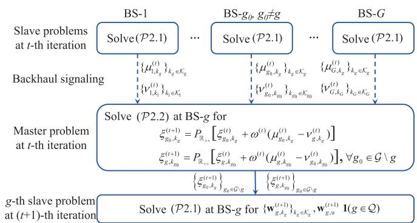  
Fig. 2. Illustration of the backhaul information exchange process of the distributed beamforming optimization.

The procedure for the distributed transmit beamforming design is elaborated in Algorithm 3 and the process of backhaul information exchange is illustrated in Fig. 2. For the t-th subgradient iteration, the g-th secondary problem is solved at ${ \mathrm { B S } } { \cdot } g$ and for all G BSs in parallel, during which the Lagrange multipliers $\{ \mu _ { g , k _ { g _ { 0 } } } ^ { ( t ) } \} _ { k _ { g _ { 0 } } \in \mathcal { K } _ { g _ { 0 } } , g _ { 0 } \in \mathcal { G } \backslash g }$ and $\{ \nu _ { g , k _ { g } } ^ { ( t ) } \} _ { k _ { g } \in \mathcal { K } _ { g } }$ are obtained at ${ \mathrm { B S } } { \cdot } g .$ . Relying on the exchange of the obtained Lagrange multipliers among BSs via backhaul links, the main problem can also be addressed at each BS separately and in parallel. Specifically, as $\xi _ { g _ { 0 } , k _ { g } } ^ { ( t + 1 ) } = P _ { \mathbb { R } + + } \big [ \xi _ { g _ { 0 } , k _ { g } } ^ { ( t ) } +$ $\omega ^ { ( t ) } ( \mu _ { g _ { 0 } , k _ { g } } ^ { ( t ) } - \nu _ { g , k _ { g } } ^ { ( t ) } ) ]$ and $\xi _ { g , k _ { g _ { 0 } } } ^ { ( t + 1 ) } = P _ { \mathbb { R } _ { + + } } [ \xi _ { g , k _ { g _ { 0 } } } ^ { ( \check { t } ) } + \omega ^ { ( t ) } ( \mu _ { g , k _ { g _ { 0 } } } ^ { ( \check { t } ) } -$ $\nu _ { g _ { 0 } , k _ { g _ { 0 } } } ^ { ( t ) } ) ]$ , BS-g requires the share of $\{ \mu _ { g _ { 0 } , k _ { g } } ^ { ( t ) } \} _ { k _ { g } \in \mathcal { K } _ { g } }$ and $\{ \nu _ { g _ { 0 } , k _ { g _ { 0 } } } ^ { ( t ) } \} _ { k _ { g _ { 0 } } \in \mathcal { K } _ { g _ { 0 } } }$ from ${ \bf B S } – g _ { 0 } , g _ { 0 } \in \mathcal { G } \backslash g$ to update the intercell interference terms involved in the $g \cdot$ -th secondary problem in the next iteration.

TABLE II  
BACKHAUL SIGNALING OVERHEAD
<table><tr><td rowspan=1 colspan=1>System Parameters</td><td rowspan=1 colspan=1>Centralized</td><td rowspan=1 colspan=1>Distributed (persubgradient iteration)</td></tr><tr><td rowspan=1 colspan=1> $\overline { { \{ G , \bar { K } , N _ { \mathrm { t } } , M _ { \mathrm { r } } \} = \{ 2 , 2 , 1 6 , 1 \} } }$ </td><td rowspan=1 colspan=1>256</td><td rowspan=1 colspan=1>8</td></tr><tr><td rowspan=1 colspan=1> $\overline { { \{ G , \bar { K } , N _ { \mathrm { t } } , M _ { \mathrm { r } } \} = \{ 4 , 4 , 3 6 , 4 \} } }$ </td><td rowspan=1 colspan=1>55296</td><td rowspan=1 colspan=1>96</td></tr><tr><td rowspan=1 colspan=1> $\overline { { \{ G , \bar { K } , N _ { \mathrm { t } } , M _ { \mathrm { r } } \} = \{ 8 , 6 , 6 4 , 8 \} } }$ </td><td rowspan=1 colspan=1>2752512</td><td rowspan=1 colspan=1>672</td></tr></table>

## V. ALGORITHM ANALYSIS AND COMPARISON

In this section, the backhaul signaling overhead, convergence performance, and complexity of the proposed centralized and distributed algorithms are studied.

## A. Backhaul Signaling Overhead

Assume that the BSs act as the processing units and conduct the centralized beamforming design. Thus, the global CSI is demanded at each BS, which relies on the sharing of local CSI among BSs. Specifically, BS-g requires the information on the random communication channels, $\left\{ \mathbf { H } _ { g _ { 0 } , k _ { q ^ { \prime } } } \right\} _ { g _ { 0 } \in \mathcal { G } \setminus { g } , \ k _ { q ^ { \prime } } \in K _ { q ^ { \prime } } , \ , \ g ^ { \prime } \in \mathcal { G } } , \ \mathbf { H } _ { g _ { 0 } , k _ { q ^ { \prime } } } \ \in \ \mathbb { C } ^ { M _ { \mathrm { r } } \times N _ { \mathrm { t } } }$ , shared from the other G − 1 BSs via backhaul transmissions. That is, the number of the scalar-valued channel coefficients required by BS-g equals $\begin{array} { r l } { 2 N _ { \mathrm { t } } M _ { \mathrm { r } } \sum _ { g _ { 0 } = 1 , g _ { 0 } \neq g } ^ { G } \sum _ { i = 1 } ^ { G } K _ { i } } & { { } } \end{array}$ . As such, the total backhaul signaling overhead of all G BSs in terms of the number of scalar-valued channel coefficients is given by $2 N _ { \mathrm { t } } M _ { \mathrm { r } } \sum _ { g = 1 } ^ { G } \sum _ { g _ { 0 } = 1 , g _ { 0 } \neq g } ^ { G } \sum _ { i = 1 } ^ { G } K _ { i }$ for the centralized design, which depends on the numbers of BSs, DL users of each cell, and antennas at BSs and DL users.

For the distributed design, instead of the large amount of local CSI, BSs only exchange the locally obtained Lagrange multipliers with other BSs, thus alleviating the backhaul overhead. As clarified above, in each subgradient iteration, BS-g requires the real-valued Lagrange multipliers $\{ \mu _ { g _ { 0 } , k _ { g } } \} _ { k _ { g } \in \mathcal { K } _ { g } , g _ { 0 } \in \mathcal { G } \backslash g }$ and $\{ \nu _ { g _ { 0 } , k _ { g _ { 0 } } } \} _ { k _ { g _ { 0 } } \in \mathcal { K } _ { g _ { 0 } } , g _ { 0 } \in \mathcal { G } \backslash g }$ from the other $\bar { G } - 1 \ \bar { \mathrm { B S s } }$ , leading to the backhaul overhead of $( G -$ $\begin{array} { r } { 1 ) K _ { g } + \sum _ { g _ { 0 } = 1 , g _ { 0 } \ne g } ^ { G } K _ { g _ { 0 } } } \end{array}$ . Then, the total number of the scalar values exchanged among G BSs during each subgradient iteration is given by $\begin{array} { r } { \sum _ { g = 1 } ^ { G } \left[ ( G - 1 ) K _ { g } + \sum _ { g _ { 0 } = 1 , g _ { 0 } \neq g } ^ { G } K _ { g _ { 0 } } \right] } \end{array}$ which depends on the numbers of BSs and DL users.

In particular, if each cell has the same number of DL users $\bar { K } .$ , the total backhaul signaling overhead can be recast as $2 N _ { \mathrm { t } } M _ { \mathrm { r } } \bar { K } G ^ { 2 } ( G - 1 )$ for centralized algorithm during all iterations and $2 { \bar { K } } G ( G \ - \ 1 )$ for distributed algorithm per subgradient iteration. The distributed beamforming design, measured by per iteration, notably reduces the backhaul overhead as compared with the centralized one, especially under a large network size or with large antenna arrays at BSs and users, which is illustrated in Table II. Moreover, as demonstrated in the following section, the proposed algorithms converge rapidly, highlighting the overall advantage of distributed design in reducing backhaul overhead.

## B. Convergence Analysis

The convergence of both centralized and distributed algorithms can be guaranteed since the objective value is monotonically non-decreasing during each iteration and also upper-bounded. To be specific, we have

$$
\begin{array} { r l r } { \gamma _ { \mathbf { u } } ( \mathcal { W } ^ { ( r + 1 ) } ) \overset { \mathrm { ( a ) } } { \geq } \gamma _ { \mathbf { u } } ( \mathcal { W } ^ { ( r ) } ) \overset { \mathrm { ( b ) } } { \geq } \eta _ { \mathbf { u } } ^ { ( I _ { r } ) } ( \mathcal { W } ^ { ( I _ { r } ) } ) \overset { \mathrm { ( c ) } } { \geq } \eta _ { \mathbf { u } } ^ { ( i ) } ( \mathcal { W } ^ { ( i ) } ) } & \\ { \overset { \mathrm { ( d ) } } { = } a ^ { * } \overset { \mathrm { ( e ) } } { \geq } a ^ { ( j + 1 ) } \overset { \mathrm { ( f ) } } { = } \frac { U _ { \gamma } ^ { \mathrm { n u } } ( \mathcal { W } ^ { ( j ) } ) } { U _ { \gamma } ^ { \mathrm { d e } } ( \mathcal { W } ^ { ( j ) } ) } } & \\ { \overset { \mathrm { ( g ) } } { = } \frac { U _ { \gamma } ^ { \mathrm { n u } } ( \mathrm { l i m } _ { t  \infty } \mathcal { W } ^ { ( t ) } ) } { U _ { \gamma } ^ { \mathrm { d e } } ( \mathrm { l i m } _ { t  \infty } \mathcal { W } ^ { ( t ) } ) } . } & { } \end{array}\tag{25}
$$

Here, for notational simplicity, ${ \mathcal W } ^ { ( o ) }$ is used to denote the set $\begin{array} { r } { \mathopen { } \mathclose \bgroup \left\{ \{ \mathbf { w } _ { g , k _ { q } } ^ { ( o ) } \} _ { k _ { g } \in \mathcal { K } _ { g } , g \in \mathcal { G } } , \ \mathclose \bgroup \left\{ \mathbf { \hat { w } } _ { g , \mathrm { u } } ^ { ( o ) } \aftergroup \egroup \right\} _ { g \in \mathcal { Q } , \mathrm { u } _ { \mathrm { u } } ^ { ( o ) } , \mathrm { ~ } } \mathclose \bgroup \left\{ \mathbf { v } _ { k _ { q } } ^ { ( o ) } \aftergroup \egroup \right\} _ { k _ { g } \in \mathcal { K } _ { g } , g \in \mathcal { G } } \aftergroup \egroup \right\} } \end{array}$ (a) holds owing to the alternating SCNR maximization via transmit and receive beamforming design and $r$ is the AO iteration index. (b) holds due to the lower bound property of the first-order Taylor approximation given in (16), with $\bar { \eta } _ { \bf u } ^ { ( I _ { r } ) } ( \cdot )$ denoting the objective function of (P1.1) in the I -th SCA iteration, $I _ { r }$ being the maximum number of SCA iterations in the r-th AO iteration, and $\mathcal { W } ^ { ( r ) } = \mathcal { W } ^ { ( I _ { r } ) }$ . Step (c) holds due to the fact that the optimal value remains monotonically nondecreasing during SCA iterations and $i \leq I _ { r }$ . (d) is established according to Remark 2 that once the Dinkelbach iteration has converged, the optimum $a ^ { * }$ equals the optimal value of the original fractional function. Step (e) comes from the monotone convergence property of Dinkelbach method [34]. (f) comes from the parameter updating process in (19) in the j-th Dinkelbach iteration. Also, (g) holds because, the subgradient method with appropriate step size can converge to the same globally optimal solution obtained by problem (P1.2), namely, $\begin{array} { r } { \operatorname* { l i m } _ { t  \infty } \mathcal { W } ^ { ( t ) } = \mathcal { W } ^ { ( j ) } } \end{array}$ , as discussed in Section IV-B.

Due to the limitation on the total transmit power, the SCNR $\gamma _ { \mathbf { u } }$ given in (5) has finite upper bound. In addition, the SCA algorithm guarantees to converge to the KKT point of the original nonconvex problem [31]. Therefore, upon convergence, the proposed centralized algorithm is ensured to achieve a KKT optimal solution. Moreover, according to steps (f) and (g) in (25), the primal decomposition method converges to the same optimal SCNR value as the centralized design. Thus, the distributed algorithm can achieve the same optimal KKT solution as the centralized one.

## C. Complexity Analysis

Note that the major computational complexity of Algorithms 1, 2, and 3 stems from solving the convex optimization problems (P1.2) and (P2.1) via the standard interior point method (IPM). Detailed computational complexity of solving convex problems via IPM is presented in [38] consisting of the iteration complexity and per-iteration computation cost, following which, we give the computational complexity of both centralized and distributed algorithms.

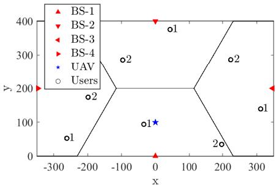  
Fig. 3. Deployment of the multi-cell anti-UAV ISAC system, taking two users per cell for example.

For problem (P1.2) in the centralized design, it has $\begin{array} { r } { \sum _ { g = 1 } ^ { Q } ( \dot { K } _ { g } + 1 ) + \sum _ { g = Q + 1 } ^ { G } K _ { g } } \end{array}$ complex variables of size $N _ { \mathrm { t } }$ and involves $\textstyle \sum _ { g = 1 } ^ { G } \bar { K } _ { g }$ SOC constraints of size $\textstyle \sum _ { g = 1 } ^ { G } ( K _ { g } +$ $1 ) + 2 , Q$ SOC constraints of size $( K _ { g } + 2 )$ , and $\left( G - Q \right)$ SOC constraints of size $( K _ { g } + 1 )$ . For problem (P 2.1) of the distributed design, it involves $( K _ { g } + 1 )$ complex variables of size $N _ { \mathrm { t } }$ if $g \in \mathcal { Q }$ or $K _ { g }$ complex variables of size $N _ { \mathrm { t } }$ if $g \in { \mathcal { C } }$ Also, it has $K _ { g }$ SOC constraints of size $\left( K _ { g } + G + 2 \right)$ , one SOC constraint of size $( K _ { g } + 2 )$ , and $\textstyle \sum _ { g _ { 0 } = 1 , g _ { 0 } \neq g } ^ { G } K _ { g _ { 0 } }$ SOC constraints of size $( K _ { g } + 2 )$ . To reach a ζ-optimal solution by IPM, the computational complexity of the two proposed algorithms is summarized in Table III. In addition, it is verified in Section VI that both the centralized and distributed algorithms can converge within several AO iterations, and thus proves the low computational complexity for practical deployment.

## VI. NUMERICAL RESULTS

In this section, we provide simulation results to evaluate the performance of our proposed beamforming design algorithms for the multi-cell anti-UAV ISAC system.

## A. Parameter Setup

Without loss of generality, a specific network deployment is considered as shown in Fig. 3. We consider a four-cell ISAC system with the hexagonal cell size $R _ { \mathrm { B S } }$ denoting the distance between two adjacent BSs. A UAV is assumed to locate at $R _ { \mathrm { B S } } / 4$ meters from BS-1 at the origin, of height 30 m, and situate at the zero azimuth angles of BSs at height 10 m. Assume that $L = 2$ scatters are located at the azimuth angles of $- 3 0 ^ { \circ }$ and $4 5 ^ { \circ }$ relative to BS-1, respectively, both at the same elevation angle as the UAV. The adopted step size for subgradient method is $\omega ^ { ( t ) } = c / \sqrt { t }$ , with constant c chosen empirically.

Following [21], we model each entry of the residual SI channel at BS-1 as $[ \mathbf { H } _ { \mathrm { S I , 1 } } ] _ { m n } = \sqrt { \alpha _ { \mathrm { S I } } } e ^ { - j 2 \pi \delta _ { m n } / \lambda }$ , with αSI being the cancellation coefficient, $\delta _ { m n }$ being the distance between the m-th transmit antenna and the n-th receive antenna, and λ being the signal wavelength. In general, $e ^ { - j 2 \pi \delta _ { m n } / \lambda }$ is set to be a unit-modulus variable with random phases for simplicity [21]. The channel coefficient of the sensing link between BS- $\cdot g , g \in { \mathcal { Q } }$ and the UAV is given by $\beta _ { g , \mathrm { u , 1 } } ~ = ~ \sqrt { D _ { 0 } \frac { \bar { \sigma } } { 4 \pi } d _ { g , \mathrm { u } } ^ { - \alpha _ { \mathrm { L } } } d _ { \mathrm { 1 , u } } ^ { - \alpha _ { \mathrm { L } } } }$ . Here, $\bar { \sigma } = 1$ is the radar cross section of the UAV, $d _ { g , \mathrm { u } }$ and $d _ { \mathrm { 1 , u } }$ are the distances from ${ \mathrm { B S } } { \cdot } g$ and BS-1 to the UAV, respectively, αL is the path loss exponent for LoS links, and $\begin{array} { r } { D _ { 0 } ^ { \overline { { } } } = ( \frac { 3 \times \mathbf { \bar { 1 } } 0 ^ { 8 } } { 4 \pi f _ { c } } ) ^ { 2 } } \end{array}$ is the path loss at unit distance with $f _ { c }$ being the carrier frequency.

TABLE III  
COMPUTATIONAL COMPLEXITY OF CENTRALIZED AND DISTRIBUTED ALGORITHMS
<table><tr><td rowspan=1 colspan=1>Algorithm</td><td rowspan=1 colspan=1>Complexity on the order of  ln(1/ζ) with $\begin{array} { r } { \overline { { n _ { c } = \mathcal { O } \big ( N _ { \mathrm { t } } \sum _ { g = 1 } ^ { G } K _ { g } \big ) } } } \end{array}$ and $n _ { d } = \mathcal { O } \big ( N _ { \mathrm { t } } K _ { g } \big )$ </td></tr><tr><td rowspan=1 colspan=1>Centralized</td><td rowspan=1 colspan=1> $\begin{array} { r } { \varpi = n _ { c } \sqrt { 2 \sum _ { g = 1 } ^ { G } K _ { g } + 2 G \left[ n _ { c } ^ { 2 } + \sum _ { g = 1 } ^ { G } K _ { g } ( \sum _ { g = 1 } ^ { G } K _ { g } + G + 2 ) ^ { 2 } + Q ( K _ { g } + 2 ) ^ { 2 } + ( G - Q ) ( K _ { g } + 1 ) ^ { 2 } \right] } . } \end{array}$ </td></tr><tr><td rowspan=1 colspan=1>Distributed</td><td rowspan=1 colspan=1> $\begin{array} { r } { \varpi = n _ { d } \sqrt { 2 \sum _ { g = 1 } ^ { G } K _ { g } + 2 \left[ n _ { d } ^ { 2 } + K _ { g } ( K _ { g } + G + 2 ) ^ { 2 } + ( K _ { g } + 2 ) ^ { 2 } ( \sum _ { g = 1 , g _ { 0 } \neq g } ^ { G } K _ { g 0 } + 1 ) \right] } . } \end{array}$ </td></tr></table>

TABLE IV  
SYSTEM PARAMETERS
<table><tr><td rowspan=1 colspan=1>Parameter</td><td rowspan=1 colspan=1>Value</td><td rowspan=1 colspan=1>Parameter</td><td rowspan=1 colspan=1>Value</td></tr><tr><td rowspan=1 colspan=1> $\overline { { G } }$ </td><td rowspan=1 colspan=1>4</td><td rowspan=1 colspan=1> $\begin{array} { r } { \overline { { K _ { g } , g \in \mathcal { G } = K } } } \end{array}$ </td><td rowspan=1 colspan=1>2</td></tr><tr><td rowspan=1 colspan=1> $\overline { { R _ { \mathrm { B S } } } }$ </td><td rowspan=1 colspan=1>400 m</td><td rowspan=1 colspan=1> $\overline { { \beta _ { 1 , l , 1 } , l = 1 , 2 , . . . , L } }$ </td><td rowspan=1 colspan=1> $- 4 0 ~ \mathrm { d B }$ </td></tr><tr><td rowspan=1 colspan=1> $\overline { { N _ { \mathrm { t } } , N _ { \mathrm { r } } } }$ </td><td rowspan=1 colspan=1>64,64</td><td rowspan=1 colspan=1> $\overline { { \boldsymbol { M } _ { r } } }$ </td><td rowspan=1 colspan=1>4</td></tr><tr><td rowspan=1 colspan=1> $\overline { { \sigma _ { n } ^ { 2 } } }$ </td><td rowspan=1 colspan=1>-90 dBm</td><td rowspan=1 colspan=1> $\overline { { P _ { \mathrm { B } } } }$ </td><td rowspan=1 colspan=1> $\overline { { 1 8 \ : \mathrm { d B W } } }$ </td></tr><tr><td rowspan=1 colspan=1> $\{ \tau _ { g , k _ { g } } \} _ { k _ { g } \in \mathcal { K } _ { g } , g \in \mathcal { G } } = \bar { \tau }$ </td><td rowspan=1 colspan=1>10 dB</td><td rowspan=1 colspan=1> $\epsilon _ { \gamma } , \epsilon _ { F }$ </td><td rowspan=1 colspan=1> $\overline { { 0 . 0 0 5 , 1 0 ^ { - 1 3 } } }$ </td></tr><tr><td rowspan=1 colspan=1>αSI</td><td rowspan=1 colspan=1>-110 dB</td><td rowspan=1 colspan=1> $\alpha _ { \mathrm { L } } , \alpha _ { \mathrm { N } }$ </td><td rowspan=1 colspan=1>2.3, 3.5</td></tr><tr><td rowspan=1 colspan=1> $\overline { { f _ { c } } }$ </td><td rowspan=1 colspan=1>28 GHz</td><td rowspan=1 colspan=1>κ</td><td rowspan=1 colspan=1>10 dB</td></tr></table>

Assume that the communication channels among BSs and users only contain NLoS links due to signal obstructions. Thus, the channel matrix between BS-g and its $k _ { g } \mathrm { - t h }$ user is given by $\mathbf { H } _ { g , k _ { g } } ~ = ~ \sqrt { D _ { 0 } d _ { g , k _ { g } } ^ { - \alpha _ { \mathrm { N } } } \mathbf { G } _ { g , k _ { g } } }$ , where $d _ { g , k _ { g } }$ is the distance between ${ \mathsf { B S } } – g$ and its $k _ { g }$ -th user, αN is the path loss exponent for NLoS links, and $\mathbf { G } _ { g , k _ { g } } ^ { ^ { \prime } } \in \mathbb { C } ^ { M _ { \mathrm { r } } \times N _ { \mathrm { t } } }$ denotes the Rayleigh fading with each entry chosen from $\mathcal { C N } ( 0 , 1 )$ . For the intercell interference channel from BS-c to BS-1, we consider that there exists an LoS link, thus the channel is modeled by $\mathbf { H } _ { \mathrm { I n } , c } = \sqrt { D _ { 0 } d _ { c , 1 } ^ { - \alpha _ { \mathrm { L } } } } \mathbf { G } _ { \mathrm { I n } , c } , \mathbf { H } _ { \mathrm { I n } , c } \in \mathbb { C } ^ { N _ { \mathrm { r } } \times N _ { \mathrm { t } } }$ . Here, $d _ { c , 1 }$ is the distance between BS-c and BS-1, $\begin{array} { r } { \mathbf { G } _ { \mathrm { I n } , c } = \sqrt { \frac { \kappa } { 1 + \kappa } } \mathbf { G } _ { \mathrm { I n } , c } ^ { \mathrm { L } } + } \end{array}$ $\textstyle \sqrt { \frac { 1 } { 1 + \kappa } } \mathbf { G } _ { \mathrm { I n } , c } ^ { \mathrm { N } }$ denotes the Rician fading with κ being the Rician factor, ${ \bf G } _ { \mathrm { I n } , c } ^ { \mathrm { L } } = { \bf a } _ { \mathrm { r } } ( \phi _ { 1 , c } , \theta _ { 1 , c } ) { \bf a } _ { \mathrm { t } } ^ { \mathrm { H } } ( \phi _ { c , 1 } , \theta _ { c , 1 } )$ is the LoS fading component with $\phi _ { 1 , c }$ and $\theta _ { 1 , c }$ being the azimuth and elevation angles of BS-c relative to BS-1, respectively, and ${ \bf G } _ { \mathrm { I n } , c } ^ { \mathrm { N } }$ is the NLoS component with each entry chosen from $\mathcal { C N } ( 0 , 1 )$ . All results are obtained via 500 Monte Carlo simulations. Unless otherwise stated, the parameter values are given in Table IV [4], [11], [21].

For performance comparison, we introduce the benchmark scheme of standalone sensing to illustrate the performance gain of cooperation. Specifically, only BS-1 acts as the dualfunctional BS for both UAV sensing and communication, while other BSs just provide communication service, that is, $Q = 1$

## B. Simulation Results

In Fig. 4, we present the convergence performance of both centralized and distributed beamforming algorithms. It is shown that the two algorithms converge within a small number of AO iterations and the centralized design achieves a faster convergence speed than the distributed one. In addition, although realizing lower backhaul overhead, the distributed beamforming algorithm resorting to the decomposition method comes at the expense of increased number of iterations compared with the centralized algorithm, as illustrated in Fig. 4(b). As stated in Section V-B and verified in Fig. 4, the two algorithms converge to the same optimal value, thus only the centralized results are presented hereinafter for illustration.

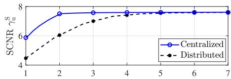  
(a) Number of AO iterations

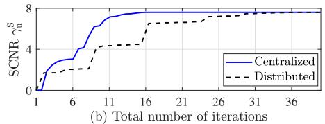  
Fig. 4. Convergence performance of centralized and distributed algorithms, with $Q = 2$

In Figs. 5-8, we demonstrate the ISAC beamforming performance in terms of beam patterns. The beam pattern reveals the gain of the designed transceiver beamforming with respect to different angles. Specifically, the transmit beam pattern at ${ \mathrm { B S } } { \cdot } g$ is defined as $b _ { \mathrm { t } , g } ( \phi , \theta ) = | \mathbf { a } _ { \mathrm { t } } ^ { \mathrm { H } } ( \phi , \theta ) \mathbf { x } _ { g } ^ { * } | ^ { 2 }$ , with $\mathbf { x } _ { g } ^ { * }$ being the optimal ISAC transmit signal of ${ \mathrm { B S } } { \cdot } g$ given the optimal transmit beamforming vectors $\{ \mathbf { w } _ { g , k _ { q } } ^ { * } \} _ { k _ { g } \in \mathcal { K } _ { g } }$ and $\mathbf { w } _ { g , \mathrm { u } } ^ { * } .$ The receive beam pattern at BS-1 is given by $\begin{array} { c c l } { { b _ { \mathrm { r , u } } ( \phi , \widetilde { \theta } ) } } & { { = } } & { { | \mathbf { u } _ { \mathrm { u } } ^ { * \mathrm { H } } \mathbf { a } _ { \mathrm { r } } ( \phi , \theta ) | ^ { 2 } } } \end{array}$ , and that at the $k _ { g } \mathrm { - t h }$ DL user of BS-g is given by $b _ { \mathbf { r } , g , k _ { g } } ( \phi ) \ = \ \lvert \mathbf { v } _ { k _ { a } } ^ { * ^ { \mathrm { H } } } \mathbf { b } ( \phi ) \rvert ^ { 2 }$ , with $\mathbf { b } ( \phi ) = \left[ 1 , . . . , e ^ { i \pi m \cos \phi } , . . . , e ^ { i \pi ( \sqrt { M _ { r } } - 1 ) \cos \phi } \right] ^ { \mathrm { T } }$ . Moreover, the combined beam pattern for transceiver beamforming is expressed as $b _ { \mathrm { c o b } , g , { \bf u } } ( \phi , \theta ) \ = \ | { \bf u } _ { \mathrm { u } } ^ { * \mathrm { H } } { \bf a } _ { \mathrm { r } } ( \phi , \theta ) { \bf a } _ { \mathrm { t } } ^ { \mathrm { H } } ( \phi , \theta ) { \bf x } _ { g } ^ { * } | ^ { 2 }$ for sensing and $\begin{array} { c c l } { { b _ { \mathrm { c o b } , g , k _ { g } } ( \phi , \theta ) } } & { { = } } & { { | { \bf { v } } _ { k _ { q } } ^ { * ^ { \mathrm { H } } } { \bf { b } } ( \phi ) { \bf { a } } _ { \mathrm { { t } } } ^ { \mathrm { H } } ( \phi , \theta ) { \bf { x } } _ { g } ^ { * } | ^ { 2 } } } \end{array}$ for communication.

In Fig. 5, we present the beam pattern at BS-1 regarding the sensing function, showing the sectional view of the threedimensional beam pattern at the elevation angle of the $\mathrm { U A V } ,$ with $Q \ = \ 2$ . It is shown in Fig. 5(a) that at the current elevation angle, the BS forms the strongest beam to the UAV to guarantee reliable sensing, whilst maintaining high directional gains at the directions of the DL users. Fig. 5(b) illustrates that for receive beam pattern, the strong main lobe is pointed to the direction of the UAV for echo reception. Also, there exist deep nulls at the directions of scatters for clutter suppression, since the scatters can generate useless echoes and hinder reliable sensing. In addition, the combined beam pattern is shown in the last subfigure, verifying the effectiveness of the designed beamforming on achieving optimal sensing performance, satisfactory communication performance, and clutter suppression.

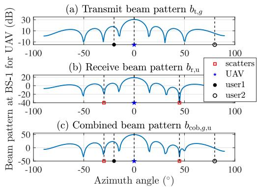  
Fig. 5. Beam pattern at BS-1 regarding sensing function.

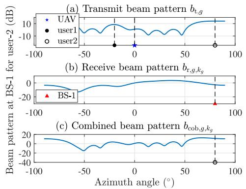  
Fig. 6. Beam pattern at BS-1 regarding communication function.

To demonstrate the beamforming performance for communication function, Fig. 6 depicts the optimal beam pattern at BS-1 by the sectional view at the elevation angle of its user-2. One can notice from the figure that the strongest beam is pointed to user-2 for communication transmissions, and the beam at the direction of the UAV is suppressed to reduce the dual-functional interference from dedicated sensing symbols to DL communication. For the signal reception, it is shown in Fig. 6(b) that the receive beam pattern maintains a high gain for the signals from BS-1 while generating multiple dimples to suppress the inter-cell DL interference from other BSs and the multiuser interference from user-1. As the DL users equipped with small-size ULAs possess much weaker beamforming capability than BSs, the gain of receive beam pattern at users is less significant and the interference suppression is less effective than that at BSs. Moreover, with the main beam formed to user-2, the effectiveness of the proposed beamforming design in terms of the communication function is validated as shown in Fig. 6(c).

To elaborate the effects of cooperative sensing on beamforming, the comparison between the transmit beam pattern at BS-2 in cooperative sensing case with $Q = 2$ and that in benchmark case with $Q = 1$ is presented in Fig. 7. When $Q \ : = \ : 1$ , namely, BS-2 acts as a CBS and does not participate in cooperative UAV sensing, Figs. 7(a) and 7(c) show the transmit beam pattern of BS-2 at the elevation angles of the UAV and its user-2, respectively. It is obvious that the main lobe is formed to the direction of the user rather than the UAV. Particularly, there exists a deep null at the zero angle in Fig. 7(a), which is to suppress the intercell interference to UAV sensing, generated from BS-2 acting as a CBS to BS-1. Furthermore, when BS-2 participates in UAV sensing, as shown in Figs. 7(b) and 7(d), the shape of the beam pattern undergoes great changes to concentrate the majority of the energy to the direction of UAV, while keeping a satisfactory communication performance. Moreover, Fig. 8 demonstrates the overall beam pattern for cooperative sensing combining the transmit beam patterns of Q DBSs and the receive beam pattern of BS-1, namely, $b _ { \mathrm { c o o p , u } } ( \phi , \theta ) =$ $\begin{array} { r } { \sum _ { q = 1 } ^ { Q } | \mathbf { u } _ { \mathrm { u } } ^ { * \mathrm { H } } \mathbf { a } _ { \mathrm { r } } ( \phi , \theta ) \mathbf { \dot { a } } _ { \mathrm { t } } ^ { \mathrm { H } } ( \phi , \theta ) \mathbf { x } _ { q } ^ { * } | ^ { 2 } } \end{array}$ . It is noteworthy that, with more DBSs, the achievable directional gain becomes higher, increasing from 48.2 dB at Q = 1 to 52.7 dB at Q = 4, which indicates the significant advantage of cooperation. Overall, for the anti-UAV ISAC system, the proposed transceiver beamforming design can not only achieve reliable UAV sensing and DL communication, but also well manage the clutter, inter-cell interference, and dual-functional mutual interference.

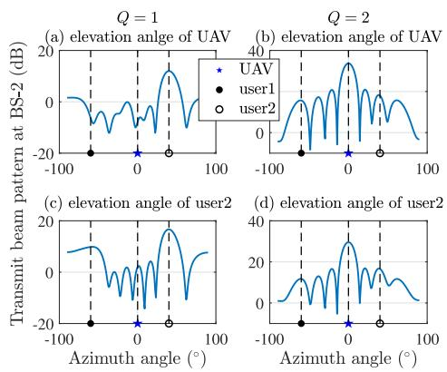

Fig. 7. Transmit beam pattern at BS-2 with Q equal to 1 and 2.  
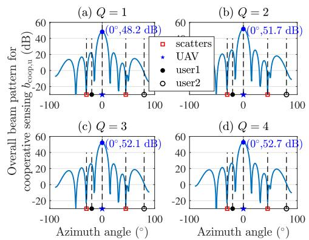  
Fig. 8. Comparison of the overall beam pattern for cooperative sensing under different numbers of DBSs.

In the following part, we evaluate the cooperative sensing performance of the multi-cell ISAC system. Fig. 9 studies the impact of the required SINR for the DL communication on the optimal SCNR, under different numbers of the DL users and scatters. As shown in the figure, increasing the required SINR τ¯ and the number of users per BS K¯ leads to the deterioration of SCNR. This is because, a large τ¯ or K¯ means heavy communication load, thus more power resources are allocated to communication function to guarantee communication quality and less are left for sensing. Therefore, the sensing performance is constrained by the severe dual-functional resource contention. Moreover, the achievable SCNR deteriorates with the increase of L, due to the severe clutter caused by the random scatters. In addition, compared with standalone sensing, the cooperation of multiple BSs remarkably improves SCNR, which is because the multiple sensing signals can enhance the intensity of target echoes and the collaboration also suppresses the inter-cell interference, thus contributing to better exploiting the spatial diversity gain and realizing effective interference management. However, under a high τ¯, the performance gain brought by cooperation reduces, which is because the DBSs are overburdened by fulfilling stringent communication demands and thus contribute little to SCNR improvement.

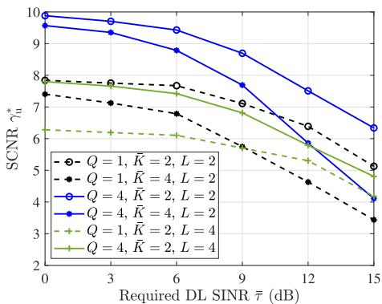

Fig. 9. SCNR vs. required SINR.  
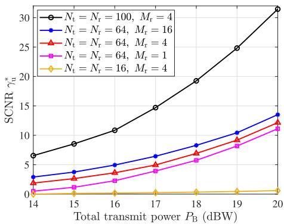  
Fig. 10. SCNR vs. total transmit power, with $Q = 2 .$

To understand how the total transmit power at each BS and the sizes of UPAs and ULAs affect the SCNR performance, Fig. 10 shows the relationships among the transmit power, number of antennas at BSs and users, and SCNR performance. One can notice that, the SCNR attains a significant improvement with a large transmit power and also, it is highly dependent on the antenna size. With the 16-antenna UPAs, the achievable SCNR is pretty low and improving transmit power makes little difference. The reason is that, small-size UPAs lead to weak beamforming capability, large beam width, and low directional gain, making the dualfunctional performance vulnerable to the propagation loss and interference, while the large sized antennas providing narrow beams can overcome the deficiencies by concentrating the majority of energy to the directions of interest. As a result, with strong beamforming capability and large available power, appropriate transceiver beamforming design can bring notable sensing performance improvement and achieve reliable UAV surveillance.

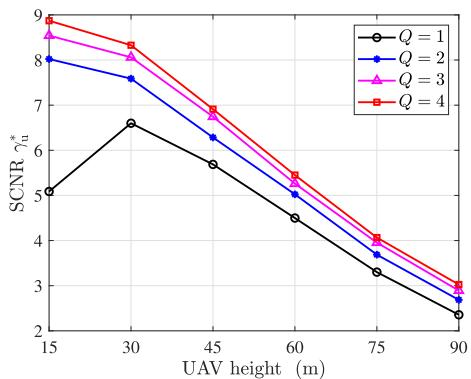

Fig. 11. SCNR vs. UAV height.  
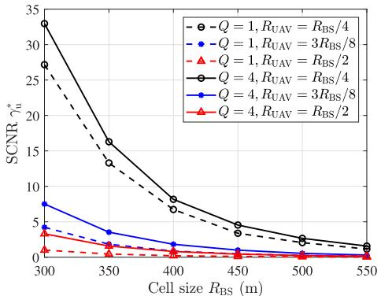  
Fig. 12. SCNR vs. cell size.

The effect of the UAV height on SCNR is investigated in Fig. 11, under different numbers of DBSs. As the UAV flies higher, the sensing performance worsens owing to the long sensing distance and high signal attenuation. When UAV is at a pretty low altitude (i.e., 15 m), there is a remarkable decline for the standalone sensing scheme, which is because the directional beam for the UAV becomes quite close to the ones for users and causes strong dualfunctional interference. As such, to maintain a satisfactory communication performance, the SCNR is compromised to control an acceptable interference from sensing signals to DL communication. On the other hand, the cooperation among BSs contributes to alleviating the mutual interference between the two functions and mitigating the SCNR reduction. Specifically, each BS can appropriately form its beams to avoid strong sensing interference to its DL users, while the overall sensing performance can still be guaranteed by the multiple sensing echoes.

In Fig. 12, we study the impacts of the cell size and the distance between the UAV and BS-1 on SCNR. As shown in the figure, the SCNR declines with the enlargement of the cells. The reason is that as the cell coverage of each BS becomes bigger, the distances between BSs and DL users or the UAV become farther. The long distances weaken the sensing echoes and also intensify the dual-functional resource competition. In addition, the farther the UAV from BS-1, the weaker the echo, thus causing the deterioration of sensing performance, especially for standalone sensing. As a result, a denser BS deployment, shorter distances from BSs to target UAV, and more BSs for cooperative sensing are beneficial to enhance the sensing reliability of the anti-UAV ISAC system.

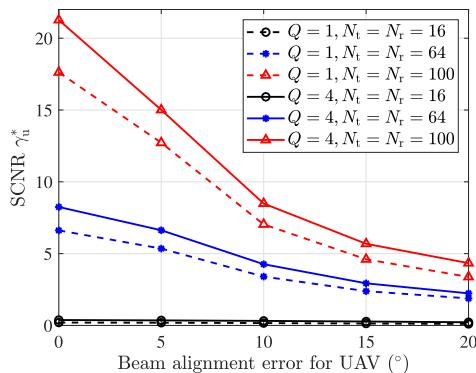  
Fig. 13. SCNR vs. beam alignment error.

Instead of assuming perfect beam alignment, Fig. 13 reveals the impacts of beam alignment errors for UAV on SCNR. It is obvious from the figure that, the existence of beam alignment error greatly hinders the achievable sensing performance. This is because the formed beams aggregate the majority of energy to the direction of UAV, while the misalignment makes the large directional gain ineffective. Nevertheless, compared with standalone sensing, cooperative beamforming among BSs is beneficial to mitigating the performance degradation caused by beam alignment errors. On the other hand, although enhancing the SCNR performance, enlarging the antenna size makes the SCNR more vulnerable to alignment errors. The reason is that, due to the narrower directional beams brought by larger arrays, the energy of the received echo can decline sharply even with a small alignment error. As such, accurate beam prealignment before UAV sensing and DL communication and deployment of large-scale antenna arrays are both of critical importance to the dual-functional performance enhancement for ISAC systems.

## VII. CONCLUSION

In this paper, we studied the transceiver beamforming design of cooperative UAV sensing for the multi-cell ISAC system, in both centralized and distributed ways. To handle the nonconvex fractional optimization problem, the receive beamformers at DL users and at the receiver BS were firstly derived in closed-form expressions. For the centralized beamforming optimization, efficient algorithm was proposed for cooperative transmit beamforming design based on SCA and Dinkelbach methods. As for the distributed optimization, the primal decomposition was leveraged to implement separate and parallel beamforming design at each BS with low backhaul overhead. Numerical results demonstrated that compared with the standalone sensing, the collaboration among BSs can achieve remarkable performance enhancement in UAV detection. Also, the proposed cooperative beamforming design contributes to suppressing the dual-functional mutual interference, inter-cell interference, and sensing clutter in the considered multi-cell anti-UAV system. For the future work, the cooperative beamforming design can be extended to the hybrid analog-digital beamforming structure or the multi-static cooperative sensing configurations.

## APPENDIX A PROOF OF PROPOSITION 1

To obtain the optimal receive beamforming, we first present the following Lemma [39].

Lemma 2: For a symmetric matrix U and a positive definite matrix V of the same size, the generalized Rayleigh quotient is defined as $\begin{array} { r } { R ( { \bf z } ) \triangleq \frac { { \bf z } ^ { \mathrm { H } } { \bf U } { \bf z } } { { \bf z } ^ { \mathrm { H } } { \bf V } { \bf z } } } \end{array}$ . The optimal solution $\mathbf { z } ^ { \ast }$ to maximize $R ( \mathbf { z } )$ equals the eigenvector corresponding to the maximum eigenvalue $\lambda _ { \mathrm { m a x } }$ of $\mathbf { V } ^ { - 1 } \mathbf { U }$ , with the maximal value of the generalized Rayleigh quotient being $R ^ { * } ( \mathbf { z } ) = \lambda _ { \mathrm { m a x } }$

The received SCNR given in (5) can be rewritten as

$$
\gamma _ { \mathrm { u } } = \frac { \chi \mathbf { u } _ { \mathrm { u } } ^ { \mathrm { H } } \mathbf { a } _ { \mathrm { r } } ( \phi _ { 1 , \mathrm { u } } , \theta _ { 1 , \mathrm { u } } ) \mathbf { a } _ { \mathrm { r } } ^ { \mathrm { H } } ( \phi _ { 1 , \mathrm { u } } , \theta _ { 1 , \mathrm { u } } ) \mathbf { u } _ { \mathrm { u } } } { \mathbf { u } _ { \mathrm { u } } ^ { \mathrm { H } } \mathbf { B } \mathbf { u } _ { \mathrm { u } } }\tag{26}
$$

where $\begin{array} { r l r } { \chi } & { { } = } & { \sum _ { q = 1 } ^ { Q } | \beta _ { q , { \mathrm { u } } , 1 } | ^ { 2 } \mathbf { a } _ { \mathrm { t } } ^ { \mathrm { H } } ( \phi _ { q , { \mathrm { u } } } , \theta _ { q , { \mathrm { u } } } ) \mathbf { R } _ { x _ { q } } \mathbf { a } _ { \mathrm { t } } ( \phi _ { q , { \mathrm { u } } } , \theta _ { q , { \mathrm { u } } } ) } \end{array}$ Given transmit beamforming vectors, maximizing SCNR with respect to the receive beamforming for echoes belongs to a generalized Rayleigh quotient problem. Therefore, based on Lemma 2, the closed-form optimal solution $\mathbf { u } _ { \mathrm { u } } ^ { \ast }$ can be obtained by the eigenvector corresponding to the maximum eigenvalue of $\mathbf { B } ^ { - 1 } \mathbf { a } _ { \mathrm { r } } ( \phi _ { 1 , \mathrm { u } } , \theta _ { 1 , \mathrm { u } } ) \mathbf { a } _ { \mathrm { r } } ^ { \mathrm { H } } ( \bar { \phi } _ { 1 , \mathrm { u } } , \bar { \theta _ { 1 , \mathrm { u } } } )$ , as given in (10). Also, the closed-form solution to $\mathbf { v } _ { k _ { q } } ^ { * }$ for communication can be similarly given in (11) based on Lemma 2.

## APPENDIX B PROOF OF PROPOSITION 2

We prove the necessity and sufficiency of Proposition 2 as follows.

Proof of sufficiency: If $\begin{array} { r } { a ^ { * } = \frac { U _ { \gamma } ^ { \mathrm { n u } } ( \widehat { \mathcal { W } } ) } { U _ { \gamma } ^ { \mathrm { d e } } ( \widehat { \mathcal { W } } ) } } \end{array}$ holds true, that is, $\widehat { \mathcal { W } } = \{ \{ \widehat { \mathbf { w } } _ { g , k _ { g } } \} _ { k _ { g } \in \mathcal { K } _ { g } , g \in \mathcal { G } } , \{ \widehat { \mathbf { w } } _ { g , \mathrm { u } } \} _ { g \in \mathcal { Q } } \}$ is the optimal solution of problem $( \mathcal { P } 1 . 1 )$ , we have

$$
a ^ { * } = U _ { \gamma } ^ { \mathrm { n u } } \widehat { ( \mathcal { W } ) } / U _ { \gamma } ^ { \mathrm { d e } } \widehat { ( \mathcal { W } ) } \geq U _ { \gamma } ^ { \mathrm { n u } } ( \mathcal { W } ) / U _ { \gamma } ^ { \mathrm { d e } } ( \mathcal { W } ) ,\tag{27}
$$

which means $U _ { \gamma } ^ { \mathrm { n u } } ( \widehat { \mathcal { W } } ) - a ^ { * } U _ { \gamma } ^ { \mathrm { d e } } ( \widehat { \mathcal { W } } ) \ = \ 0$ and $U _ { \gamma } ^ { \mathrm { n u } } ( \mathcal { W } ) \mathrm { ~ - ~ }$ $a ^ { * } U _ { \gamma } ^ { \mathrm { d e } } ( \mathcal { W } ) \leq 0$ . Thus, we have

$$
F ( a ^ { * } ) = \operatorname* { m a x } _ { \mathcal { W } } \ U _ { \gamma } ^ { \mathrm { n u } } ( \mathcal { W } ) - a ^ { * } U _ { \gamma } ^ { \mathrm { d e } } ( \mathcal { W } ) = U _ { \gamma } ^ { \mathrm { n u } } ( \widehat { \mathcal { W } } ) - a ^ { * } U _ { \gamma } ^ { \mathrm { d e } } ( \widehat { \mathcal { W } } ) = 0 ,\tag{28}
$$

which proves that $\widehat { \mathcal W }$ is also the optimal solution to problem (P1.2) and the optimal value of (P1.2) with parameter $a ^ { * }$ equals 0, thus verifying the necessity.

Proof of necessity: Assume that $\begin{array} { r c l } { { \cal F } ( a ^ { * } ) } & { { = } } & { { U _ { \gamma } ^ { \mathrm { n u } } ( \widehat { \mathcal { W } } ) } } \end{array}$ $- a ^ { * } U _ { \gamma } ^ { \mathrm { d e } } ( \widehat { \mathcal { W } } ) = 0$ , then we have

$$
0 = U _ { \gamma } ^ { \mathrm { n u } } ( \widehat { \mathcal { W } } ) - a ^ { * } U _ { \gamma } ^ { \mathrm { d e } } ( \widehat { \mathcal { W } } ) \geq U _ { \gamma } ^ { \mathrm { n u } } ( \mathcal { W } ) - a ^ { * } U _ { \gamma } ^ { \mathrm { d e } } ( \mathcal { W } ) ,\tag{29}
$$

that is $a ^ { * } = U _ { \gamma } ^ { \mathrm { n u } } ( \widehat { \mathcal { W } } ) / U _ { \gamma } ^ { \mathrm { d e } } ( \widehat { \mathcal { W } } ) \geq U _ { \gamma } ^ { \mathrm { n u } } ( \mathcal { W } ) / U _ { \gamma } ^ { \mathrm { d e } } ( \mathcal { W } )$ , which states that $\widehat { \mathcal W }$ is the optimal solution and $a ^ { * }$ is the optimal value of problem (P1.1), thus completing the proof.

## REFERENCES

[1] J. A. Zhang et al., “Enabling joint communication and radar sensing in mobile networks—A survey,” IEEE Commun. Surveys Tuts., vol. 24, no. 1, pp. 306–345, 1st Quart., 2022.

[2] F. Dong, F. Liu, Y. Cui, W. Wang, K. Han, and Z. Wang, “Sensing as a service in 6G perceptive networks: A unified framework for ISAC resource allocation,” IEEE Trans. Wireless Commun., vol. 22, no. 5, pp. 3522–3536, May 2023.

[3] F. Dong, F. Liu, Y. Cui, S. Lu, and Y. Li, “Sensing as a service in 6G perceptive mobile networks: Architecture, advances, and the road ahead,” IEEE Netw., vol. 38, no. 2, pp. 87–96, Mar. 2024.

[4] Y. Zhang, H. Shan, H. Chen, D. Mi, and Z. Shi, “Perceptive mobile networks for unmanned aerial vehicle surveillance: From the perspective of cooperative sensing,” IEEE Veh. Technol. Mag., vol. 19, no. 2, pp. 60–69, Jun. 2024.

[5] R. Saruthirathanaworakun, J. M. Peha, and L. M. Correia, “Opportunistic sharing between rotating radar and cellular,” IEEE J. Sel. Areas Commun., vol. 30, no. 10, pp. 1900–1910, Nov. 2012.

[6] X. Fang, W. Feng, Y. Chen, N. Ge, and Y. Zhang, “Joint communication and sensing toward 6G: Models and potential of using MIMO,” IEEE Internet Things J., vol. 10, no. 5, pp. 4093–4116, Mar. 2023.

[7] F. Liu, C. Masouros, A. Li, H. Sun, and L. Hanzo, “MU-MIMO communications with MIMO radar: From co-existence to joint transmission,” IEEE Trans. Wireless Commun., vol. 17, no. 4, pp. 2755–2770, Apr. 2018.

[8] A. Hassanien, M. G. Amin, Y. D. Zhang, and F. Ahmad, “Dual-function radar-communications: Information embedding using sidelobe control and waveform diversity,” IEEE Trans. Signal Process., vol. 64, no. 8, pp. 2168–2181, Apr. 2016.

[9] L. Xie, S. Song, Y. C. Eldar, and K. B. Letaief, “Collaborative sensing in perceptive mobile networks: Opportunities and challenges,” IEEE Wireless Commun., vol. 30, no. 1, pp. 16–23, Feb. 2023.

[10] Y. Zhang et al., “Perceptive mobile networks for standalone and cooperative UAV surveillance,” IEEE Trans. Wireless Commun., vol. 23, no. 12, pp. 19916–19932, Dec. 2024.

[11] R. Li, Z. Xiao, and Y. Zeng, “Toward seamless sensing coverage for cellular multi-static integrated sensing and communication,” IEEE Trans. Wireless Commun., vol. 23, no. 6, pp. 5363–5376, Jun. 2024.

[12] H. Pennanen, A. Tölli, J. Kaleva, P. Komulainen, and M. Latva-Aho, “Decentralized linear transceiver design and signaling strategies for sum power minimization in multi-cell MIMO systems,” IEEE Trans. Signal Process., vol. 64, no. 7, pp. 1729–1743, Apr. 2016.

[13] K. Luo and A. Manikas, “Joint transmitter–receiver optimization in multitarget MIMO radar,” IEEE Trans. Signal Process., vol. 65, no. 23, pp. 6292–6302, Dec. 2017.

[14] Z. Cheng, B. Liao, Z. He, J. Li, and J. Xie, “Joint design of the transmit and receive beamforming in MIMO radar systems,” IEEE Trans. Veh. Technol., vol. 68, no. 8, pp. 7919–7930, Aug. 2019.

[15] J. Zhou, H. Li, and W. Cui, “Low-complexity joint transmit and receive beamforming for MIMO radar with multi-targets,” IEEE Signal Process. Lett., vol. 27, pp. 1410–1414, 2020.

[16] L. Jiang and H. Jafarkhani, “Multi-user analog beamforming in millimeter wave MIMO systems based on path angle information,” IEEE Trans. Wireless Commun., vol. 18, no. 1, pp. 608–619, Jan. 2019.

[17] Z. Li, S. Han, S. Sangodoyin, R. Wang, and A. F. Molisch, “Joint optimization of hybrid beamforming for multi-user massive MIMO downlink,” IEEE Trans. Wireless Commun., vol. 17, no. 6, pp. 3600–3614, Jun. 2018.

[18] X. Liu, T. Huang, N. Shlezinger, Y. Liu, J. Zhou, and Y. C. Eldar, “Joint transmit beamforming for multiuser MIMO communications and MIMO radar,” IEEE Trans. Signal Process., vol. 68, pp. 3929–3944, 2020.

[19] H. Hua, J. Xu, and T. X. Han, “Optimal transmit beamforming for integrated sensing and communication,” IEEE Trans. Veh. Technol., vol. 72, no. 8, pp. 10588–10603, Aug. 2023.

[20] L. Chen, Z. Wang, Y. Du, Y. Chen, and F. R. Yu, “Generalized transceiver beamforming for DFRC with MIMO radar and MU-MIMO communication,” IEEE J. Sel. Areas Commun., vol. 40, no. 6, pp. 1795–1808, Jun. 2022.

[21] Z. He, W. Xu, H. Shen, D. W. K. Ng, Y. C. Eldar, and X. You, “Full-duplex communication for ISAC: Joint beamforming and power optimization,” IEEE J. Sel. Areas Commun., vol. 41, no. 9, pp. 2920–2936, Sep. 2023.

[22] S. Liu, M. Li, R. Liu, W. Wang, and Q. Liu, “Joint transmit beamforming and receive filter design for cooperative multi-static ISAC networks,” IEEE Wireless Commun. Lett., vol. 13, no. 6, pp. 1700–1704, Jun. 2024.

[23] S. Zhang et al., “Energy-efficient massive MIMO with decentralized precoder design,” IEEE Trans. Veh. Technol., vol. 69, no. 12, pp. 15370–15384, Dec. 2020.

[24] Z. Lyu, G. Zhu, and J. Xu, “Joint maneuver and beamforming design for UAV-enabled integrated sensing and communication,” IEEE Trans. Wireless Commun., vol. 22, no. 4, pp. 2424–2440, Apr. 2023.

[25] Y. Xiong, F. Liu, Y. Cui, W. Yuan, T. X. Han, and G. Caire, “On the fundamental tradeoff of integrated sensing and communications under Gaussian channels,” IEEE Trans. Inf. Theory, vol. 69, no. 9, pp. 5723–5751, Sep. 2023.

[26] L. Xie, P. Wang, S. Song, and K. B. Letaief, “Perceptive mobile network with distributed target monitoring terminals: Leaking communication energy for sensing,” IEEE Trans. Wireless Commun., vol. 21, no. 12, pp. 10193–10207, Dec. 2022.

[27] S. D. Liyanaarachchi, T. Riihonen, C. B. Barneto, and M. Valkama, “Optimized waveforms for 5G-6G communication with sensing: Theory, simulations and experiments,” IEEE Trans. Wireless Commun., vol. 20, no. 12, pp. 8301–8315, Dec. 2021.

[28] K. E. Kolodziej, B. T. Perry, and J. S. Herd, “In-band full-duplex technology: Techniques and systems survey,” IEEE Trans. Microw. Theory Techn., vol. 67, no. 7, pp. 3025–3041, Jul. 2019.

[29] Physical Layer Procedures for Data, document TS 38.214 (Rel. 18), 3GPP, Dec. 2023.

[30] S. P. Boyd and L. Vandenberghe, Convex Optimization. Cambridge, U.K.: Cambridge Univ. Press, Mar. 2004.

[31] T. Lipp and S. Boyd, “Variations and extension of the convex-concave procedure,” J. Optim. Eng., vol. 17, no. 2, pp. 263–287, 2016. [Online]. Available: https://api.semanticscholar.org/CorpusID:14778227

[32] W. Dinkelbach, “On nonlinear fractional programming,” Manag. Sci., vol. 13, no. 7, pp. 492–498, Mar. 1967.

[33] M. Grant et al. (Jan. 2020). CVX: MATLAB Software for Disciplined Convex Programming. [Online]. Available: http://cvxr.com/cvx

[34] A. Zappone and E. Jorswieck, “Energy efficiency in wireless networks via fractional programming theory,” Found. Trends Commun. Inf. Theory, vol. 11, nos. 3–4, pp. 185–396, 2015.

[35] Y. K. Tun, Y. M. Park, N. H. Tran, W. Saad, S. R. Pandey, and C. S. Hong, “Energy-efficient resource management in UAV-assisted mobile edge computing,” IEEE Commun. Lett., vol. 25, no. 1, pp. 249–253, Jan. 2021.

[36] D. P. Palomar and M. Chiang, “A tutorial on decomposition methods for network utility maximization,” IEEE J. Sel. Areas Commun., vol. 24, no. 8, pp. 1439–1451, Aug. 2006.

[37] D. Bertsekas, A. Nedic, and A. Ozdaglar, Convex Analysis and Optimization. USA: Athena Scientific, Mar. 2003.

[38] K. Wang, A. M. So, T. Chang, W. Ma, and C. Chi, “Outage constrained robust transmit optimization for multiuser MISO downlinks: Tractable approximations by conic optimization,” IEEE Trans. Signal Process., vol. 62, no. 21, pp. 5690–5705, Nov. 2014.

[39] G. H. Golub and C. F. Van Loan, Matrix Computations. USA: Johns Hopkins Univ. Press, Feb. 2013.

Yue Zhang received the B.Eng. degree in communication engineering from Nanchang University, Nanchang, China, in 2020. She is currently pursuing the Ph.D. degree with the Institute of Information and Communication Network Engineering, Zhejiang University, Hangzhou, China. Her research interests include the design and optimization of the UAVassisted cellular networks and integrated sensing and communication networks.

Hangguan Shan (Senior Member, IEEE) received the B.Sc. degree in electrical engineering from Zhejiang University, Hangzhou, China, in 2004, and the Ph.D. degree in electrical engineering from Fudan University, Shanghai, China, in 2009. From 2009 to 2010, he was a Post-Doctoral Research Fellow with the University of Waterloo, Waterloo, ON, Canada. Since 2011, he has been with the College of Information Science and Electronic Engineering, Zhejiang University, where he is currently an Associate Professor. He is also

with Zhejiang Provincial Key Laboratory of Multi-Modal Communication Networks and Intelligent Information Processing, Zhejiang University. His current research interests include machine learning-enabled resource allocation and quality-of-service provisioning in wireless networks. He has served as a Technical Program Committee Member for various international conferences. He has co-received the Best Industry Paper Award from IEEE WCNC’11 and the Best Paper Award from IEEE WCSP’23 and IEEE/CIC ICCC’24. He was an Editor of IEEE TRANSACTIONS ON GREEN COMMUNICATIONS AND NETWORKING. He is an Associate Editor of the IET Communications.

Yong Zhou (Senior Member, IEEE) received the B.Sc. and M.Eng. degrees from Shandong University, Jinan, China, in 2008 and 2011, respectively, and the Ph.D. degree from the University of Waterloo, Waterloo, ON, Canada, in 2015. From November 2015 to January 2018, he was a Post-Doctoral Researcher Fellow with the Department of Electrical and Computer Engineering, The University of British Columbia, Vancouver, Canada. Since March 2018, he has been with the School of Information Science and Technology,

ShanghaiTech University, Shanghai, China, where he is currently a Tenured Associate Professor. His research interests include 6G communications, edge intelligence, and the Internet of Things. He was the Track Co-Chair of IEEE VTC 2020 Fall and IEEE VTC 2023 Spring and the Co-Chair of IEEE ICC 2022 workshop on edge artificial intelligence for 6G and IEEE Globecom 2024 workshop on space computing power networks. He serves as an Associate Editor for IEEE TRANSACTIONS ON WIRELESS COMMUNICATIONS and IEEE OPEN JOURNAL OF THE COMMUNICATIONS SOCIETY.

  
the Internet-of-Things.

Zhiguo Shi (Fellow, IEEE) received the B.S. and Ph.D. degrees in electronic engineering from Zhejiang University, Hangzhou, China, in 2001 and 2006, respectively. Since 2006, he has been a Faculty Member with the College of Information Science and Electronic Engineering, Zhejiang University, where he is currently a Full Professor. From 2011 to 2013, he visited the Broadband Communications Research Group, University of Waterloo, Waterloo, ON, Canada. His research interests include array signal processing, localization, and

Prof. Shi is an Elected Member of the Sensor Array and Multichannel (SAM) Technical Committee of the IEEE Signal Processing Society. He was a recipient of the 2019 IET Communications Premium Award, and co-authored a paper that received the 2021 IEEE Signal Processing Society Young Author Best Paper Award. He was also a recipient of the Best Paper Award from ISAP 2020, IEEE GLOBECOM 2019, IEEE WCNC 2017, IEEE/CIC ICCC 2013, and IEEE WCNC 2013. He was the General Co-Chair of IEEE SAM 2020. He served as an Editor for IEEE NETWORK. He is currently serving as an Associate Editor for IEEE SIGNAL PROCESSING LETTERS, IEEE TRANSACTIONS ON VEHICULAR TECHNOLOGY, and Journal of the Franklin Institute.

Li Sheng received the Ph.D. degree in electronic engineering from Zhejiang University, Hangzhou, China, in 2000. He is currently the Chief Consulting Engineer of Huaxin Consulting Research Institute Company Ltd., Hangzhou. He has been engaged in research and consulting work in the areas of telecommunications industry network construction planning and digitalization for an extended period. The projects he has overseen received numerous national and industry awards, including the First-Class Prize for Excellent Telecommunication

Consulting Achievements and the First-Class Science and Technology Award from Zhejiang Provincial Telecommunications Association.

Yuanwei Liu (Fellow, IEEE) received the Ph.D. degree from the Queen Mary University of London (QMUL), London, U.K., in 2016. From 2016 to 2017, he was a Post-Doctoral Research Fellow at the King’s College London (KCL), London, U.K. From 2017 to 2021, he was a Lecturer (Assistant Professor) at QMUL, where he was also a Senior Lecturer (Associate Professor) from 2021 to 2024. He has been a (tenured) Full Professor with the Department of Electrical and Electronic Engineering (EEE), The University of

Hong Kong (HKU), since September 2024. His research interests include non-orthogonal multiple access, reconfigurable intelligent surface, near field communications, integrated sensing and communications, and machine learning.

Dr. Liu is a fellow of AAIA, a Web of Science Highly Cited Researcher, an IEEE Communication Society Distinguished Lecturer, an IEEE Vehicular Technology Society Distinguished Lecturer, the Rapporteur of ETSI Industry Specification Group on Reconfigurable Intelligent Surfaces on work item of “Multi-Functional Reconfigurable Intelligent Surfaces (RIS): Modelling, Optimisation, and Operation,” and U.K. Representative for the URSI Commission C on “Radio communication Systems and Signal Processing”. He was listed as one of 35 Innovators Under 35 China in 2022 by MIT Technology Review. He received the IEEE ComSoc Outstanding Young Researcher Award for EMEA in 2020. He received the 2020 IEEE Signal Processing and Computing for Communications (SPCC) Technical Committee Early Achievement Award and the IEEE Communication Theory Technical Committee (CTTC) 2021 Early Achievement Award. He received the IEEE ComSoc Outstanding Nominee for Best Young Professionals Award in 2021. He was a co-recipient of the 2024 IEEE Communications Society Heinrich Hertz Award, the Best Student Paper Award in IEEE VTC2022-Fall, the Best Paper Award in ISWCS 2022, the 2022 IEEE SPCC-TC Best Paper Award, the 2023 IEEE ICCT Best Paper Award, and the 2023 IEEE ISAP Best Emerging Technologies Paper Award. He serves as the Publicity Co-Chair for IEEE VTC 2019-Fall, the Panel Co-Chair for IEEE WCNC 2024, the Symposium Co-Chair for several flagship conferences, such as IEEE GLOBECOM, ICC, and VTC. He serves the Academic Chair for the Next Generation Multiple Access Emerging Technology Initiative and the Vice Chair of SPCC and Technical Committee on Cognitive Networks (TCCN). He serves as the Co-Editor-in-Chief for IEEE ComSoc TC Newsletter, an Area Editor for IEEE COMMUNICATIONS LETTERS, an Editor for IEEE COMMUNICATIONS SURVEYS AND TUTORIALS, IEEE TRANSACTIONS ON WIRELESS COMMUNICATIONS, IEEE TRANSACTIONS ON VEHICULAR TECHNOLOGY, IEEE TRANSACTIONS ON NETWORK SCIENCE AND ENGINEERING, IEEE TRANSACTIONS ON COGNITIVE COMMUNICATIONS AND NETWORKING, and IEEE TRANSACTIONS ON COMMUNICATIONS (2018–2023). He serves as the (leading) Guest Editor for PROCEEDINGS OF THE IEEE on Next Generation Multiple Access, IEEE JOURNAL ON SELECTED AREAS IN COMMUNICATIONS on Next Generation Multiple Access, IEEE JOURNAL OF SELECTED TOPICS IN SIGNAL PROCESSING on Intelligent Signal Processing and Learning for Next Generation Multiple Access, and IEEE NETWORK on Next Generation Multiple Access for 6G.