# Cooperative Federated Learning Over Ground-to-Satellite Integrated Networks: Joint Local Computation and Data Offloading

Dong-Jun Han , Member, IEEE, Seyyedali Hosseinalipour, Member, IEEE, David J. Love , Fellow, IEEE, Mung Chiang, Fellow, IEEE, and Christopher G. Brinton , Senior Member, IEEE

Abstract— While network coverage maps continue to expand, many devices located in remote areas remain unconnected to terrestrial communication infrastructures, preventing them from getting access to the associated data-driven services. In this paper, we propose a ground-to-satellite cooperative federated learning (FL) methodology to facilitate machine learning service management over remote regions. Our methodology orchestrates satellite constellations to provide the following key functions during FL: (i) processing data offloaded from ground devices, (ii) aggregating models within device clusters, and (iii) relaying models/data to other satellites via inter-satellite links (ISLs). Due to the limited coverage time of each satellite over a particular remote area, we facilitate satellite transmission of trained models and acquired data to neighboring satellites via ISL, so that the incoming satellite can continue conducting FL for the region. We theoretically analyze the convergence behavior of our algorithm, and develop a training latency minimizer which optimizes over satellite-specific network resources, including the amount of data to be offloaded from ground devices to satellites and satellites’ computation speeds. Through experiments on three datasets, we show that our methodology can significantly speed up the convergence of FL compared with terrestrial-only and other satellite baseline approaches.

Index Terms— Federated learning, LEO satellites, ground-tosatellite integrated networks.

# I. INTRODUCTION

N THE era of big data, a plethora of valuable datasets are I being collected by geo-distributed edge devices, such as smartphones, vehicles, and Internet-of-Things (IoT) sensors. Demand to leverage this data for intelligent services continues to grow. Motivated by this, federated learning (FL) [1], [2],

Manuscript received 31 July 2023; revised 15 November 2023; accepted 15 December 2023. Date of publication 13 February 2024; date of current version 9 May 2024. This work was supported in part by the Defense Advanced Research Projects Agency (DARPA) under Grant D22AP00168, in part by the National Science Foundation (NSF) under Grant CNS-2212565, and in part by the Office of Naval Research (ONR) under Grant N000142112472. (Corresponding author: Dong-Jun Han.)

Dong-Jun Han, David J. Love, Mung Chiang, and Christopher G. Brinton are with the Elmore Family School of Electrical and Computer Engineering, Purdue University, West Lafayette, IN 47907 USA (e-mail: han762@purdue.edu; djlove@purdue.edu; chiang@purdue.edu; cgb@purdue.edu).

Seyyedali Hosseinalipour is with the Department of Electrical Engineering, University at Buffalo–SUNY, Buffalo, NY 14260 USA (e-mail: alipour@buffalo.edu).

Color versions of one or more figures in this article are available at https://doi.org/10.1109/JSAC.2024.3365901.

Digital Object Identifier 10.1109/JSAC.2024.3365901

[3] has been actively studied in recent years and has now become the de facto standard for training a machine learning (ML) model across distributed nodes. By taking advantage of terrestrial communication infrastructures, FL has achieved a great success in both single server architectures [1], [4], [5], [6], [7], [8] and hierarchical setups [9], [10], [11], [12] with multiple edge servers.

# A. Motivation and Challenge

1) Motivation: FL Across Remote Areas: Despite the wide deployment of mobile communication systems in current terrestrial networks, there still exist many isolated regions on the Earth (e.g., rural regions, maritime areas) that lack a well-developed communication infrastructure. Since neither the servers nor the access points are available/reachable in these areas, it is currently difficult to conduct FL across devices located in such regions. Although fully decentralized FL schemes have been developed [13], [14], [15], [16], which remove the reliance on edge servers, these methods have limitations when connections among devices are unstable (e.g., isolated regions with distant edge devices).

To facilitate collaborative training across these disconnected devices, we take advantage of Low Earth Orbit (LEO) satellites in FL. The explosive growth in the number of LEO satellites enables the non-terrestrial network to cover most of the regions on the Earth, enabling satellites to work as a model aggregator during FL in remote areas. Especially when it is required to conduct FL across multiple remote clusters that are geographically separated (as in Fig. 1), existing FL techniques, which mostly utilize terrestrial networks, face significant challenges as the devices in different regions are not able to aggregate their models without the aid of nonterrestrial networks, e.g., satellites. Introducing satellites to FL also enables low-powered ground devices in isolated regions to benefit from the computation capabilities of satellites, due to the advancement of on-board processing technology for satellites [17], [18], [19], [20], [21], [22], [23].

2) Exemplary Use Cases: Consider a scenario of training an ML model for natural disaster predictions (e.g., wildfire, hurricane, landslides). In order to reliably make decisions for these disasters, it is important to utilize data collected at IoT sensors distributed across different isolated areas, such as forests, oceans, and mountains. Another key application could be autonomous vehicles, which necessitates collaboration among vehicles in different regions, including rural areas that lack a well-developed communication infrastructure. Other examples include hospitals, smartphones, or wearable devices located in different rural regions aiming to solve a classification task for diseases-prediction. These use cases motivate integrating terrestrial networks with the satellite network that has a wide coverage across different remote regions and sufficient computation powers for FL.

3) Satellite-Based Computing/Learning: With the ever increasing development of space communication networks, LEO satellites are currently regarded as a promising solution to achieve ubiquitous connection in 6G-and-beyond wireless. The densely deployed LEO satellites enable clients located in isolated regions to receive both high-quality communication and fast computation services. Motivated by this, there has been an extensive work on satellite-assisted edge computing [17], [18], [19], [20], [21], [22], [23], where satellites process tasks offloaded from low-powered IoT devices. Although these works pave the way to integrate satellites in wireless networks, their focus is not on ML/FL. More recently, researchers have become interested in conducting FL using data samples directly collected at satellites [24], [25], [26], [27], [28], [29], [30], [31] without consider.

4) Key Questions: Despite the above mentioned works, utilization of satellites to assist FL across different remote terrestrial regions has been less explored. In this work, we aim to explore this topic, which is faced with several key challenges and research questions. First, what should be the roles of the satellites in assisting FL across remote areas? How much data should be offloaded from the ground devices to the satellites in each region for training? How should the satellite-side battery issue be handled during FL? How can we handle the limited coverage time of LEO satellites over each area? How can we guarantee convergence of a satellite-assisted FL algorithm? How should we optimize the network resources to minimize the training time? To the best of our knowledge, this work is among the first attempts to address these research questions.

# B. Main Contributions

In this paper, we propose a ground-to-satellite cooperative FL methodology that provides a novel direction for utilizing satellites in FL. In order to facilitate efficient FL across different remote areas or clusters, we use each satellite as (i) an edge computing unit for processing data offloaded from the ground users, (ii) a server for aggregating the models within each cluster, (iii) a relay for sharing the model/data with other satellites via inter-satellite links (ISLs).

Compared to the traditional FL in terrestrial networks, one of the key challenges that arises in this ground-to-satellite integrated network is that the satellites are continuously moving following their orbits, limiting the coverage time of satellites for each cluster. To handle this issue, we propose to let each satellite transmit its trained model and data offloaded from the clients to its neighboring satellite (that will cover the same region in a near future) via ISL, so that the incoming satellite can continue training the model for the devices located in that region. We conduct convergence analysis of our FL algorithm, and optimize various network resources including the amount of data offloading, satellite-side computation power, and user bandwidth, to minimize the overall latency of ML model training. Another unique challenge of our setup is to deal with the satellite-side battery constraints. We consider solarpowered satellites having solar panels where the batteries could be charged via the sun. Hence, more data can be offloaded to the satellites when clusters are facing the sun, and those satellites can process data with higher computation powers with less battery issues. These aspects are integrated in our formulated network optimization problem.

Our main contributions can be summarized as follows:

• We propose a satellite-assisted FL methodology that enables ground users in different remote areas to collaboratively train an ML model, based on hybrid client-side local computation, ground-to-satellite data offloading, satellite-side model training, satellite-assisted intracluster aggregation, and satellite-to-satellite model/data transmissions.   
• Based on the objective function defined with satellite-side and client-side local losses in each cluster, we theoretically analyze the convergence behavior of our FL algorithm with respect to the amount of data processed at individual satellites and ground devices, and guarantee its convergence to a stationary point of general non-convex loss functions.   
• We formulate a network optimization problem to minimize latency, and optimize satellite-specific key design elements including the amount of data to be offloaded from each ground user to each satellite and satellites’ computation powers, while considering the battery constraints of solar-powered satellites.   
• In simulations, we adopt three benchmark datasets for FL and show that our methodology can significantly speed up the convergence of FL compared with baselines by strategically taking advantage of satellites’ resources. We also provide key insights into the effects of data offloading depending on whether the cluster is facing the sun or not.

To the best of our knowledge, this is one of the earliest works to provide an analysis on FL over ground-to-satellite integrated networks with theoretical guarantee and optimized design elements. Our solution provides new guidelines on how to utilize satellites in FL, with several unique characteristics including the impact of battery charging of solar-powered satellites, and satellite-to-satellite model/data transmissions.

# C. Related Works

1) FL Over Terrestrial Networks: Most existing works on FL have been developed in a terrestrial network with a single cloud server [1], [4], [5], [6], [7], [8], [32] or with multiple edge servers [9], [10], [11], [12], [33]. In these works, the role of the server is to aggregate the models sent from the clients. Research has been also conducted in a fully decentralized setup [13], [14], [15], [16] where the models are aggregated at individual clients, without requiring any servers. However, when clients in different remote regions need to collaboratively train an ML model without relying on terrestrial communications, these FL techniques face great challenges.

2) FL Over Satellites/UAVs: Motivated by the recent proliferation of LEO satellites and the advancement of their computation capabilities, there has been a line of works focusing on FL over satellites [24], [25], [26], [27], [28], [29], [30], [31], where data samples are directly collected at the satellites. The satellites can be viewed as clients, and perform local updates using their local datasets. The main focus of these works is to investigate where/how to aggregate the trained models after the satellite-side local updates. The authors of [24], [26], [27], [28], and [31] specifically study model aggregation strategies by utilizing the ground station as a server, where [26], [31] specifically adopt ISL communications during the aggregation process. FL has been also studied in unmanned aerial vehicle (UAV) networks, where the UAVs collect data and act as clients [34], [35], [36]. Compared to these works where either the LEO satellites or the UAVs are viewed as clients, we focus on a different scenario where clients are located in isolated regions on the ground. Our problem setup necessitates satellites to have additional functions to process data offloaded from the ground users, to aggregate the models within the cluster, and to relay model/data to another satellite via ISL communications to continue model training for the cluster.

3) Satellite-Assisted Computing/Learning For Ground Users: Another line of works focus on satellite-based edge computing [17], [18], [19], [20], [21], [22], [23] to develop computation offloading strategies to the satellites. However, their focus is not on ML/FL. The key difference between these literatures and our setup is that, we require clients to collaboratively train a shared ML model across different regions, while the clients in prior works just need to solve their own computational tasks independently. The collaborative ML task in our setup requires satellites to aggregate and relay models to theoretically guarantee the convergence of FL, making the problem totally different.

Only a few prior works [37], [38], [39], [40] have focused on satellite-assisted distributed ML as in our setup, where the ground users aim at constructing an ML model assisted by the satellites. This problem setup is fundamentally different from the settings in [24], [25], [26], [27], [28], [29], [30], and [31] where each satellite directly collects its local data, presenting new research questions on what the roles of the satellites should be. The recent magazine paper [38] discusses possible scenarios of utilizing satellites as edge computing servers or relays during FL. In [37], the authors specifically focus on training the deep Q network (DQN) model for optimizing the action selection policy in the maze problem. In [39] and [40], the satellite is also adopted as a server to aggregate the models trained at the ground devices in wireless settings. In [41], the authors consider data offloading in UAV-assisted FL. Compared to prior works, our contribution is to design a satellite-assisted FL strategy with several unique characteristics including client-to-satellite data offloading, hybrid satellite/client model training, battery charging of solar-powered LEO satellites, and model/data transmissions between incoming and departing satellites.

# D. Organization

The rest of this paper is organized as follows. Section II illustrates the system model and overview of approach, while Section III presents our satellite-assisted FL algorithm. Theoretical convergence analysis and network optimization results are provided in Section IV and Section V, respectively. We present experimental results in Section VI, and draw conclusions in Section VII.

# II. SYSTEM MODEL AND OVERVIEW OF APPROACH

Consider a set $\mathcal { I }$ of J different clusters located in different remote areas that are geographically separated. We also consider a set K of K users or clients distributed across these J clusters, where each user belongs to a single cluster. Fig. 1 shows an example with $J \ = \ 3$ clusters and $K =$ 9 clients. Let $G _ { j }$ be the set of client indices located in cluster $j ~ \in ~ \mathcal { I }$ . The users in these clusters are not supported by terrestrial communication infrastructures. In order to facilitate FL across clients located in these remote regions, we consider LEO satellites moving around the Earth following their own orbits. Individual clusters can be supported by the satellites from different orbits, or possibly the same orbit depending on their locations. Each client k has its own local dataset $D _ { k } = D _ { k } ^ { c } \cup D _ { k } ^ { s }$ with $D _ { k } ^ { c } \cap D _ { k } ^ { s } = \emptyset .$ , where $D _ { k } ^ { c }$ is the set of privacy-sensitive samples of client k that should be necessarily kept in each client, while $D _ { k } ^ { s }$ is the set of non-sensitive samples that can be possibly offloaded to the satellite. The sensitive and non-sensitive data samples can be distinguished at each client based on the (i) locations of collected data, (ii) class information of data, or (iii) some other predetermined information depending on the specific task.

# A. Solar-Powered Satellites

In each time slot, the overall J cluster sets $\{ G _ { j } \} _ { j = 1 } ^ { J }$ in the system can be divided into two different categories depending on their locations. First are the clusters in which the satellites covering the region can charge their batteries via the sun. This becomes possible when cluster $j$ is facing the sun and the corresponding satellites’ solar panels have no orientation issues for charging. We define ${ \mathcal { T } } ^ { \mathrm { s u n } }$ as the set of the corresponding cluster indices: The batteries of LEO satellites covering the clusters in $j \in \mathcal { I } ^ { \mathrm { s u n } }$ will have less battery issues at the satellites due to the solar power. On the other hand, the batteries of satellites covering the remaining clusters (i.e., $j \in \mathcal { I } \backslash \mathcal { I } ^ { \mathrm { s u n } } )$ are not able to be charged, which will result in relatively strict energy constraints.

# B. Goal and Overview Of Approach

Under this system model, the goal of the ground users is to construct a shared global model $\mathbf { w } ^ { * }$ that well reflects all data samples in J clusters in the system. Fig. 1 describes the high-level overview of our approach. As a preprocessing step, the resource-limited clients offload specific portions of their local datasets to the corresponding satellite as in Fig. 1a. Then in Fig. 1b, each client performs local updates using its remaining data samples, while each satellite performs local updates using data offloaded from the clients. Here, due to the limited coverage time of each satellite over each cluster, we let each satellite transmits the trained model and the collected dataset to the neighboring satellite that will cover the same cluster in the near future. As a result, the incoming satellite can continue training the model for the specific cluster. This procedure is repeated until all data samples at the satellite are processed. Then in Fig. 1c, intra-cluster model aggregation is performed to construct cluster-specific models. Finally, in Fig. 1d, a global model is constructed by aggregating the models of all clusters, which is sent back to all clients at the beginning of next global round.

# III. PROPOSED ALGORITHM

The step in Fig. 1a is a preprocessing step that occurs only once before training begins, while the other steps in Figs. 1b, 1c, 1d are repeated for R global rounds, which we index $r = 0 , 1 , \ldots , R - 1$ . In each round r, the global model $\mathbf { w } ^ { r }$ is constructed by synchronously aggregating the satellite models at the ground station as in [26] and [31]. We propose all LEO satellites to play the following key roles simultaneously during training: Each satellite work as an (i) edge computing unit for updating the model using data samples offloaded from the clients, as a (ii) server for intra-cluster model aggregation, and as a (iii) relay for sharing the updated model and data to other satellites via ISL communications. Based on these unique characteristics of our framework, in the following, we will describe our methodology with details.

# A. Preprocessing Step: Data Offload to Satellites

Consider a specific cluster set $G _ { j }$ . Before training begins, as a preprocessing step, each client $k \in G _ { j }$ offloads a subset of non-sensitive dataset $\hat { D } _ { k } ^ { s } \subset D _ { k } ^ { s }$ to the corresponding satellite that is currently covering cluster j, as shown in Fig. 1a. Here, we introduce our key design parameter

$$
\alpha_ {k} = \frac {\left| \hat {D} _ {k} ^ {s} \right|}{\left| D _ {k} \right|}, \tag {1}
$$

which is the portion of data samples offloaded from client k to the satellite. Here, for an arbitrary dataset $D ,$ we use |D| to denote the number of data samples in D. We have $0 \leq \alpha _ { k } \leq$ $\alpha _ { k } ^ { \mathrm { m a x } }$ , where $\alpha _ { k } ^ { \mathrm { m a x } } = | D _ { k } ^ { s } | / | D _ { k } |$ is the portion of non-sensitive samples in client k which may depend on the specific ML application (e.g., IoT sensors for disaster predictions may have large $\alpha _ { k } ^ { \mathrm { { m a x } } }$ while personal vehicles may have smaller $\alpha _ { k } ^ { \mathrm { { m a x } } } )$ .

1) Client-Side Objective Function: After the data offloading process, the k-th client’s objective function is defined with the remaining dataset $\hat { D } _ { k } ^ { c } = \tilde { D _ { k } } \backslash \hat { D } _ { k } ^ { s }$ as follows:

$$
\begin{array}{l} \ell_ {C, k} (\mathbf {w}) = \frac {1}{| \hat {D} _ {k} ^ {c} |} \sum_ {x \in \hat {D} _ {k} ^ {c}} \ell (x; \mathbf {w}) (2) \\ = \frac {1}{(1 - \alpha_ {k}) | D _ {k} |} \sum_ {x \in \hat {D} _ {k} ^ {c}} \ell (x; \mathbf {w}), (3) \\ \end{array}
$$

where $\ell ( x ; { \mathbf w } )$ is the loss computed with data sample x and model w. In $\ell _ { C , k } ( { \mathbf { w } } )$ , C stands for the client and k is the index of the client.

2) Satellite-Side Objective Function: On the other hand, the satellite-side objective function for cluster j is defined with the dataset $\cup _ { k \in G _ { j } } \hat { D } _ { k } ^ { s }$ offloaded from the clients in $G _ { j }$ as

$$
\begin{array}{l} \ell_ {S, j} (\mathbf {w}) = \frac {1}{| \cup_ {k \in G _ {j}} \hat {D} _ {k} ^ {s} |} \sum_ {x \in \cup_ {k \in G _ {j}} \hat {D} _ {k} ^ {s}} \ell (x; \mathbf {w}) (4) \\ = \frac {1}{\sum_ {k \in G _ {j}} \alpha_ {k} | D _ {k} |} \sum_ {\substack {x \in \cup_ {k \in G _ {j}} \hat {D} _ {k} ^ {s}}} \ell (x; \mathbf {w}), (5) \\ \end{array}
$$

where $S$ stands for satellite and j is the index of the cluster.

# B. Step 1: Client-Side Local Training

In the beginning of each round r, all clients and satellites have model wr. As in Fig. 1b, each client k locally trains the model using $\hat { D } _ { k } ^ { c } \ = \ D _ { k } \ \backslash \ \hat { D } _ { k } ^ { s }$ , which is the remaining dataset after the data offloading step in Section III-A. Here, we introduce another variable $\gamma _ { k } ^ { r }$ , which is the portion of data samples that client k processes during the model update at a specific round r. By defining $\lambda _ { C , k } ^ { r }$ as the number of samples being processed at client k at a specific round r, we can write

$$
\gamma_ {k} ^ {r} = \frac {\lambda_ {C , k} ^ {r}}{| D _ {k} |}. \tag {6}
$$

Here, since $0 < \lambda _ { C , k } ^ { r } \leq | \hat { D } _ { k } ^ { c } | = ( 1 - \alpha _ { k } ) | D _ { k } |$ holds, we have $0 ~ < ~ \gamma _ { k } ^ { r } ~ \le ~ 1 - \alpha _ { k }$ . One possible solution is to let each client k process all the remaining data samples by setting $\gamma _ { k } ^ { r } = 1 - \alpha _ { k }$ . In specific time-sensitive applications, one can also set a smaller $\gamma _ { k } ^ { r }$ to further reduce the training time at low-powered IoT devices/sensors in remote regions. Taking a small $\gamma _ { k } ^ { r }$ will reduce the training time at each device, with the cost of degraded learning performance, as we will see later in the convergence analysis in Section IV. For each client k, the local update process becomes

$$
\mathbf {w} _ {C, k} ^ {r + 1} = \mathbf {w} ^ {r} - \eta_ {r} \tilde {\nabla} \ell_ {C, k} (\mathbf {w} ^ {r}), \tag {7}
$$

where $\eta _ { r }$ is the learning rate at round r and $\tilde { \nabla } \ell _ { C , k } ( { \mathbf w } )$ is the gradient computed with a specific mini-batch of size $\lambda _ { C , k } ^ { r }$ during the mini-batch stochastic gradient descent (SGD) update.

The computation time $\tau _ { C , k } ^ { \mathrm { l o c a l } }$ (in seconds) to finish the local update at client k is written as

$$
\tau_ {C, k} ^ {\text { local }} = \frac {m _ {C , k} \gamma_ {k} ^ {r} | D _ {k} |}{f _ {C , k}}, \tag {8}
$$

where $f _ { C , k }$ (in cycles/sec or Hz) is the CPU frequency at client k and $m _ { C , k }$ (in cycles/sample) is the number of CPU cycles for the k-th client to process one data sample. Here, $m _ { C , k }$ is a fixed value that can be obtained offline at each client k as assumed in [42] and [43]. We can also write the corresponding energy consumption $E _ { C , k } ^ { \mathrm { l o c a l } }$ (in Joules) as

$$
E _ {C, k} ^ {\text { local }} = \kappa m _ {C, k} \gamma_ {k} ^ {r} | D _ {k} | f _ {C, k} ^ {2}, \tag {9}
$$

where κ (in Joules · seconds2/cycles3) is the energy consumption coefficient.

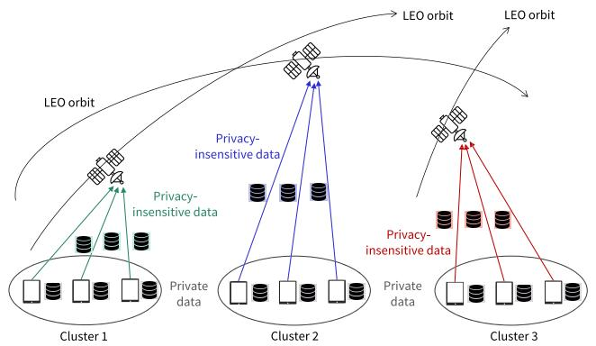

<details>
<summary>flowchart</summary>

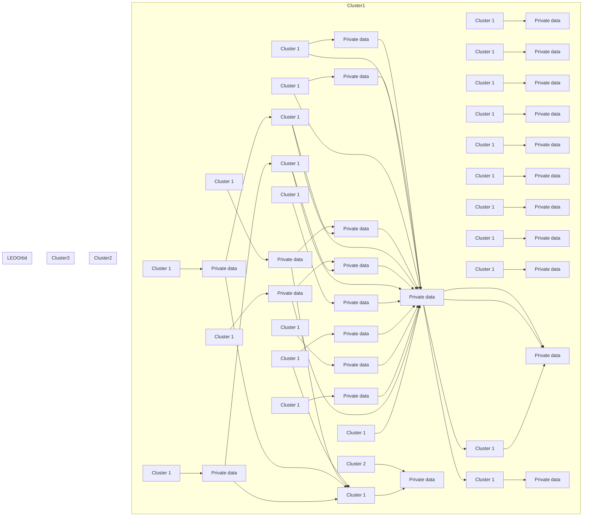
</details>

(a) Preprocessing: Data offload

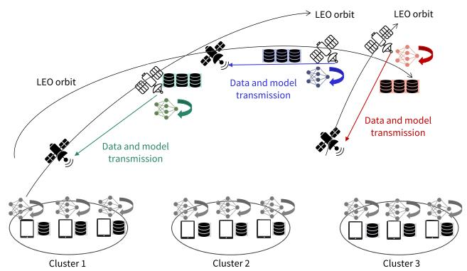

<details>
<summary>flowchart</summary>

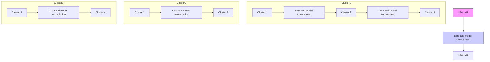
</details>

(b) Local update and data/model transmission via ISL

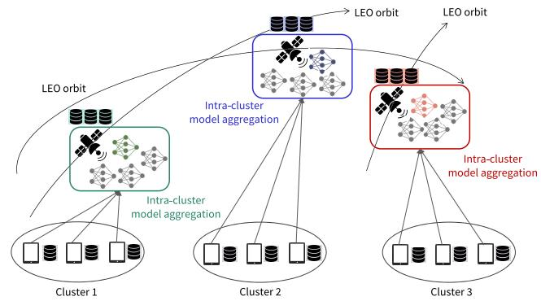

<details>
<summary>flowchart</summary>

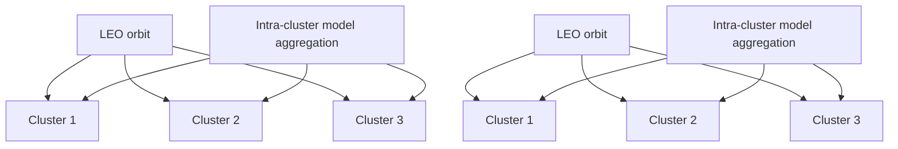
</details>

(c) Intra-cluster model aggregation

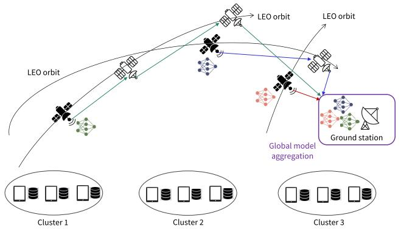

<details>
<summary>flowchart</summary>

```mermaid
graph TD
    subgraph_Cluster1["Cluster 1"]
        A1["Satellite"] --> B1["Satellite"]
        A2["Satellite"] --> B2["Satellite"]
        A3["Satellite"] --> B3["Satellite"]
        A4["Satellite"] --> B4["Satellite"]
        A5["Satellite"] --> B5["Satellite"]
        A6["Satellite"] --> B6["Satellite"]
        A7["Satellite"] --> B7["Satellite"]
        A8["Satellite"] --> B8["Satellite"]
        A9["Satellite"] --> B9["Satellite"]
        A10["Satellite"] --> B10["Satellite"]
        A11["Satellite"] --> B11["Satellite"]
        A12["Satellite"] --> B12["Satellite"]
        A13["Satellite"] --> B13["Satellite"]
        A14["Satellite"] --> B14["Satellite"]
        A15["Satellite"] --> B15["Satellite"]
        A16["Satellite"] --> B16["Satellite"]
        A17["Satellite"] --> B17["Satellite"]
        A18["Satellite"] --> B18["Satellite"]
        A19["Satellite"] --> B19["Satellite"]
        A20["Satellite"] --> B20["Satellite"]
        A21["Satellite"] --> B21["Satellite"]
        A22["Satellite"] --> B22["Satellite"]
        A23["Satellite"] --> B23["Satellite"]
        A24["Satellite"] --> B24["Satellite"]
        A25["Satellite"] --> B25["Satellite"]
        A26["Satellite"] --> B26["Satellite"]
        A27["Satellite"] --> B27["Satellite"]
        A28["Satellite"] --> B28["Satellite"]
        A29["Satellite"] --> B29["Satellite"]
        A30["Satellite"] --> B30["Satellite"]
        A31["Satellite"] --> B31["Satellite"]
        A32["Satellite"] --> B32["Satellite"]
        A33["Satellite"] --> B33["Satellite"]
        A34["Satellite"] --> B34["Satellite"]
        A35["Satellite"] --> B35["Satellite"]
        A36["Satellite"] --> B36["Satellite"]
        A37["Satellite"] --> B37["Satellite"]
        A38["Satellite"] --> B38["Satellite"]
        A39["Satellite"] --> B39["Satellite"]
        A40["Satellite"] --> B40["Satellite"]
        A41["Satellite"] --> B41["Satellite"]
        A42["Satellite"] --> B42["Satellite"]
        A43["Satellite"] --> B43["Satellite"]
        A44["Satellite"] --> B44["Satellite"]
        A45["Satellite"] --> B45["Satellite"]
        A46["Satellite"] --> B46["Satellite"]
        A47["Satellite"] --> B47["Satellite"]
        A48["Satellite"] --> B48["Satellite"]
        A49["Satellite"] --> B49["Satellite"]
        A50["Satellite"] --> B50["Satellite"]
        A51["Satellite"] --> B51["Satellite"]
        A52["Satellite"] --> B52["Satellite"]
        A53["Satellite"] --> B53["Satellite"]
        A54["Satellite"] --> B54["Satellite"]
        A55["Satellite"] --> B55["Satellite"]
        A56["Satellite"] --> B56["Satellite"]
        A57["Satellite"] --> B57["Satellite"]
        A58["Satellite"] --> B58["Satellite"]
        A59["Satellite"] --> B59["Satellite"]
        A60["Satellite"] --> B60["Satellite"]
        A61["Satellite"] --> B61["Satellite"]
        A62["Satellite"] --> B62["Satellite"]
        A63["Satellite"] --> B63["Satellite"]
        A64["Satellite"] --> B64["Satellite"]
        A65["Satellite"] --> B65["Satellite"]
        A66["Satellite"] --> B66["Satellite"]
        A67["Satellite"] --> B67["Satellite"]
        A68["Satellite"] --> B68["Satellite"]
        A69["Satellite"] --> B69["Satellite"]
        A70["Satellite"] --> B70["Satellite"]
        A71["Satellite"] --> B71["Satellite"]
        A72["Satellite"] --> B72["Satellite"]
        A73["Satellite"] --> B73["Satellite"]
        A74["Satellite"] --> B74["Satellite"]
        A75["Satellite"] --> B75["Satellite"]
        A76["Satellite"] --> B76["Satellite"]
        A77["Satellite"] --> B77["Satellite"]
        A78["Satellite"] --> B78["Satellite"]
        A79["Satellite"] --> B79["Satellite"]
        A80["Global model aggregation"]
    end
    subgraph Cluster2
        C1
    end
    subgraph Cluster3
        D1
    end
    subgraph Cluster4
        E1
    end
    subgraph Cluster5
        F1
    end
    subgraph Cluster6
        G1
    end
    subgraph Cluster7
        H1
    end
    subgraph Cluster8
        I1
    end
    subgraph Cluster9
        J1
    end
    subgraph Cluster10
        K1
    end
    subgraph Cluster11
        L1
    end
    subgraph Cluster12
        M1
    end
    subgraph Cluster13
        N1
    end
    subgraph Cluster14
        O1
    end
```
</details>

(d) Global model aggregation   
Fig. 1. Overview of proposed satellite-assisted FL algorithm. The preprocessing step in Fig. 1a is conducted only once before training begins, while the other steps in Figs. 1b, 1c, 1d are repeated for R global FL rounds.

# C. Step 2: Repeated Satellite-Side Computation and ISL Communication (working in Parallel With Step 1)

While the clients are performing local updates in Step 1, the satellite covering cluster j also performs model update based on the dataset $\cup _ { k \in G _ { j } } \hat { D } _ { k } ^ { s }$ offloaded from the clients in the cluster set $G _ { j }$ . We let the satellite that is covering cluster j perform local updates until it processes all the data samples in $\cup _ { k \in G _ { i } } \hat { D } _ { k } ^ { s }$ . However, since each satellite is continuously moving following its own orbit, the coverage time of the satellite over each cluster limited. As a result, the satellite may not finish the computation before leaving cluster j. We let this coverage time of the satellite for each cluster be $T .$ 1 Whenever a specific satellite leaves cluster $j$ after $T$ seconds, a new satellite in the same or adjacent orbit will start covering cluster $j .$ Motivated by this characteristic of the satellite network, we propose to let the satellite transmit the collected dataset $\cup _ { k \in G _ { j } } \hat { D } _ { k } ^ { s }$ and the trained model to the new satellite before leaving cluster $j ,$ so that the incoming satellite can continue the training process for cluster j. When the last satellite for cluster j finishes computation for the global round, it transmits the data/model to the new satellite for the next global round. Fig. 1b describes this process in a high-level. Specifically, our

1In practice, the coverage time provided by each successive satellite varies over time according to the satellite constellation model. In such cases, T can be obtained by taking the average of coverage times of future satellites and used for optimization. We show later that this approach works well in practical constellation models. Exploring a precise optimization algorithm considering varying coverage times is an interesting direction for future research. idea is to repeat the below two steps multiple times until all the samples in $\cup _ { k \in G _ { j } } \hat { D } _ { k } ^ { s }$ are processed.

1) Step 2-1: Transmissions of Data And Model via ISL: Before a satellite joins cluster j, it receives the model and data from the previous satellite that is leaving cluster j. The communication time for this process can be written as

$$
\tau_ {S, j} ^ {\text { trans }} = \frac {S (\mathbf {w}) + q \sum_ {k \in G _ {j}} \alpha_ {k} | D _ {k} |}{Q _ {j} ^ {\mathrm{ISL}}}, \tag {10}
$$

where S(w) denotes the size of the model (in bits), q is the size of each data sample (in bits), $Q _ { j } ^ { \mathrm { I S L } }$ is the transmission rate for ISL between two adjacent satellites in cluster j. Here, S(w) can be calculated based on the number of model parameters in w and the type of quantization applied to individual parameters $( \mathrm { e . g . , ~ } S ( \mathrm { w } ) \ = \ 3 2 \times \left| \mathrm { \bf w } \right|$ upon using 32 bit quantization). Following [44] and [26], we can also write $Q _ { j } ^ { \mathrm { I S L } } = B _ { j } \log _ { 2 } ( 1 + S N R _ { j } )$ , where $B _ { j }$ is the channel bandwidth and between two s $\begin{array} { r } { S N R _ { j } = \frac { p _ { S , j } G _ { j } ^ { \mathrm { r x } } G _ { j } ^ { \mathrm { t x } } } { Z N _ { 0 } } } \end{array}$ ise ratioare the $\omega _ { j } ^ { \mathrm { { r x } } } , \mathrm { { \it { G } } } _ { j } ^ { \mathrm { { t x } } } , \mathrm { { \it { Z } } } , \mathrm { { \it { N } } } _ { 0 } , \mathrm { { \it { p } } } _ { S , j }$ Rx, Tx gains of the antenna, free space path loss, noise power density, and transmit power at the satellite, respectively. The corresponding energy consumption for this ISL communication procedure (at the satellite that is leaving cluster j) can be written as follows:

$$
E _ {S, j} ^ {\text { trans }} = p _ {S, j} \cdot \tau_ {S, j} ^ {\text { trans }}. \tag {11}
$$

2) Step 2-2: Satellite-Side Local Update: After receiving the model and data, the new satellite covering cluster j performs local updates using dataset $\cup _ { k \in G _ { j } } \hat { D } _ { k } ^ { s }$ according to

$$
\mathbf {w} _ {S, j} ^ {r + 1} = \mathbf {w} ^ {r} - \eta_ {r} \tilde {\nabla} \ell_ {S, j} (\mathbf {w} ^ {r}), \tag {12}
$$

where $\tilde { \nabla } \ell _ { S , j } ( \mathbf { w } )$ is the gradient of the mini-batch defined with (4). The model update is conducted until processing all the samples in the collected dataset $\cup _ { k \in G _ { j } } \hat { D } _ { k } ^ { s }$ . If the computation cannot be finished within $T \mathrm { ~ - ~ } \tau _ { S , i } ^ { \mathrm { { t r a n s } } }$ seconds, S,j we let the satellite perform computation for T − τ transS,j $T - \tau _ { S , j } ^ { \mathrm { t r a n s } }$ trans seconds and then move back to Step 2-1, i.e., the satellite transmits the model and the dataset to the neighboring satellite that will cover cluster $j ,$ so that the new satellite can continue training.

These processes in Steps 2-1 and 2-2 are repeated for $N _ { j }$ times, which is written as

$$
N _ {j} = \left\lfloor \frac {m _ {S} \sum_ {k \in G _ {j}} \alpha_ {k} | D _ {k} |}{(T - \tau_ {S , j} ^ {\text { trans }}) f _ {S , j}} \right\rfloor . \tag {13}
$$

Here, $f _ { S , j }$ (in cycles/sec) is the CPU frequency of satellites focusing on cluster j and $m _ { S }$ (in cycles/sample) is the number of CPU cycles for the satellite to process one data sample. The term $\begin{array} { r } { m _ { S } \sum _ { k \in G _ { i } } \alpha _ { k } | D _ { k } | } \end{array}$ (in cycles) in the numerator denotes the total amount of CPU cycles to finish one local epoch using the collected dataset at the satellite. The denominator denotes the number of CPU cycles that each satellite can run within the available time duration $T - \tau _ { S , j } ^ { \mathrm { t r a n s } }$ . After repeating this procedure for $N _ { j }$ times, the $( N _ { j } + \mathrm { \tilde { 1 } } ) – \mathrm { t h }$ satellite (i.e., the last satellite) receives the model and data, finishes the remaining updates, and then directly transmits the model and data to the next satellite for the next global round. Here, the number of CPU cycles that last satellite need to process becomes mS $\begin{array} { r } { \sum _ { k \in G _ { i } } \alpha _ { k } \vert D _ { k } \vert - N _ { j } ( T - \tau _ { S , j } ^ { \mathrm { t r a n s } } ) f _ { S , j } } \end{array}$ (in cycles). Overall, each satellite covering cluster j will participate in the training process for τ localS,j $\tau _ { S , j } ^ { \mathrm { l o c a l } }$ seconds, where

$$
\tau_ {S, j} ^ {\text { local }} = \left\{ \begin{array}{l} T, (\text { The   first } N _ {j} \text { satellites }), \\ \frac {m _ {S} \sum_ {k \in G _ {j}} \alpha_ {k} | D _ {k} | - N _ {j} (T - \tau_ {S , j} ^ {\text { trans }}) f _ {S , j}}{f _ {S , j}} \\ + \tau_ {S, j} ^ {\text { trans }}, (\text { The   last   satellite }) \end{array} \right. \tag {14}
$$

holds. The corresponding energy consumption at each satellite becomes

$$
E _ {S, j} ^ {\text {local}} = \left\{ \begin{array}{l} \kappa \cdot (T - \tau_ {S, j} ^ {\text {trans}}) f _ {S, j} ^ {3} + E _ {S, j} ^ {\text {trans}}, (\text {First} N _ {j} \text {satellites}), \\ \kappa \cdot \left(m _ {S} \sum_ {k \in G _ {j}} \alpha_ {k} | D _ {k} | - N _ {j} (T - \tau_ {S, j} ^ {\text {trans}}) f _ {S, j}\right) f _ {S, j} ^ {2} \\ + E _ {S, j} ^ {\text {trans}}, (\text {The last satellite}). \end{array} \right. \tag {15}
$$

For the first $N _ { j }$ satellites, Elocal $E _ { S , j } ^ { \mathrm { l o c a l } }$ S,j reflects the energy consumption for local computation $( T \mathrm { ~ - ~ } \tau _ { S , j } ^ { \mathrm { t r a n s } }$ τS,j seconds) and communication $( \tau _ { S , j } ^ { \mathrm { t r a n s } }$ seconds). For the last satellite, it consists of energy consumption for processing the remaining data samples and then communicating the model/dataset for $\tau _ { S , j } ^ { \mathrm { t r a n s } }$ seconds for the next global round.

Finally, based on (14), the overall latency for Step 2 at cluster j can be written as

$$
\tau_ {S, j} ^ {\text { rep }} = \underbrace {T \cdot N _ {j}} \tag {16}
$$

| {z }Latency for the first $N _ { j }$ satellites

$$
+ \underbrace {\frac {m \sum_ {k \in G _ {j}} \alpha_ {k} \left| D _ {k} \right| - N _ {j} \left(T - \tau_ {S , j} ^ {\text { trans }}\right) f _ {S , j}}{f _ {S , j}} + \tau_ {S , j} ^ {\text { trans }}} _ {\text { Latency   for   the   last   satellite }}. \tag {17}
$$

The above latency model is unique to our work that adopts ISL communications for transmitting the trained model and the offloaded dataset to the next satellite covering the cluster.

# D. Step 3: Intra-Cluster Model Aggregation

After Steps 1 and 2 are completed, the satellite that is covering cluster j aggregates the client-side models $\{ \mathbf { w } _ { C , k } ^ { r + 1 } \} _ { k \in G _ { j } }$ and the satellite-side model $\mathbf { w } _ { S , j } ^ { r + 1 }$ according to

$$
\bar {\mathbf {w}} _ {j} ^ {r + 1} = \frac {\left(\sum_ {k \in G _ {j}} \alpha_ {k} \left| D _ {k} \right|\right) \cdot \mathbf {w} _ {S , j} ^ {r + 1} + \sum_ {k \in G _ {j}} \left(1 - \alpha_ {k}\right) \left| D _ {k} \right| \mathbf {w} _ {C , k} ^ {r + 1}}{\sum_ {k \in G _ {j}} \left| D _ {k} \right|}. \tag {18}
$$

In this process, each client $k \in G _ { j }$ needs to send the updated model to the satellite via uplink communication. The uplink communication time τ aggC,k $\tau _ { C , k } ^ { \mathrm { a g g } }$ for client k to upload the model can be written as

$$
\tau_ {C, k} ^ {\mathrm{agg}} = \frac {S (\mathbf {w})}{b _ {k} \log_ {2} (1 + \frac {p _ {C , k} | h _ {C , k} | ^ {2}}{b _ {k} N _ {0}})}, \tag {19}
$$

where $S ( \mathbf { w } )$ is the model size in bits, $b _ { k }$ is the bandwidth allocated to client $k , p _ { C , k }$ is the transmit power of client k, and $h _ { C , k }$ is the channel between client k and the satellite covering the cluster. As in [45], we model the channel $h _ { C , k }$ using largescale fading, which is dominant compared to the effect of small-scale fading. We let $| h _ { C , k } | ^ { 2 } = d _ { C , k } ^ { - \bar { \xi } }$ , where $d _ { C , k }$ denotes the distance between client k and the satellite covering the corresponding cluster, and ξ is the pathloss exponent. We note that the system parameters should be selected to make the aggregation delay $\tau _ { C , k } ^ { \mathrm { a g g } }$ smaller than the coverage duration T . Otherwise, the satellite is not able to aggregate the models within T seconds. The corresponding energy consumption for model transmission at client k becomes

$$
E _ {C, k} ^ {\text { agg }} = p _ {C, k} \cdot \tau_ {C, k} ^ {\text { agg }}. \tag {20}
$$

# E. Step 4: Global Model Aggregation

After the intra-cluster model aggregation process in Step $3 , \ J$ different satellites obtain different models $\bar { \mathbf { w } } _ { 1 } ^ { r + 1 } , \bar { \mathbf { w } } _ { 2 } ^ { r + 1 } , \ldots , \bar { \mathbf { w } } _ { J } ^ { r + 1 }$ w¯ r1 corresponding to each cluster. Following the process of [26] and [31], these models can be aggregated according to

$$
\mathbf {w} ^ {r + 1} = \frac {1}{J} \sum_ {j = 1} ^ {J} \bar {\mathbf {w}} _ {j} ^ {r + 1} \tag {21}
$$

at the ground station with the aid of ISL communications. We assume a fixed delay $\tau _ { j } ^ { \mathrm { g l o b } }$ for this process for each cluster $j , \mathrm { i } . \mathrm { e } . , \tau _ { j } ^ { \mathrm { g l o b } }$ τj denotes the delay for the satellite covering cluster $j$ to transmit the aggregated model to the ground station. After the global model $\mathbf { w } ^ { r + 1 }$ is constructed by aggregating the models of all clusters according to (21), at the beginning of next round, $\mathbf { \Delta } \cdot \mathbf { w } ^ { r + 1 }$ is sent to all clients in the system which requires additional latency of $\tau _ { j } ^ { \mathrm { s y n c } }$ for cluster j.

Algorithm 1 Proposed Satellite-Assisted FL Algorithm   
1: Input: Initialized model $w^{0}$ 2: Output: Global model $w^{R}$ after R global rounds
3: for each client $k = 1, 2, \ldots, K$ in parallel do
4: Offload $\hat{D}_{k}^{s}$ to the corresponding satellite (Preprocessing step)
5: end for
6: for each global round $r = 0, 1, \ldots, R - 1$ do
7: for each cluster $j \in \{1, 2, \ldots, J\}$ in parallel do
8: for each client $k \in G_{j}$ in parallel do
9: Client update to obtain $w_{C,k}^{r+1}$ according to (7) (Step 1)
10: end for
11: Repeated satellite-side update and data/model transmission via ISL to obtain $w_{S,j}^{r+1}$ (Step 2, parallel with Step 1)
12: Construct $\bar{w}_{j}^{r+1}$ via intra-cluster aggregation according to (18) (Step 3)
13: end for
14: Global aggregation $w^{r+1} = \frac{1}{J} \sum_{j=1}^{J} \bar{w}_{j}^{r+1}$ (Step 4)
15: end for

Steps 1, 2, 3 and 4 are repeated for R global rounds, with Steps 1 and 2 working in parallel. Algorithm 1 summarizes the overall process of our satellite-assisted FL methodology.

# IV. CONVERGENCE ANALYSIS

In this section, we analyze the convergence behavior of our algorithm. Given $\hat { D } _ { k } ^ { c }$ and $\hat { D } _ { k } ^ { s }$ for all $k \in \mathcal { K } ,$ we define our objective function as

$$
F (\mathbf {w}) = \frac {1}{J} \sum_ {j = 1} ^ {J} F _ {j} (\mathbf {w}), \tag {22}
$$

where

$$
\begin{array}{l} F _ {j} (\mathbf {w}) = \frac {\big (\sum_ {k \in G _ {j}} | \hat {D} _ {k} ^ {s} | \big) \ell_ {S , j} (\mathbf {w}) + \sum_ {k \in G _ {j}} | \hat {D} _ {k} ^ {c} | \ell_ {C , k} (\mathbf {w})}{\sum_ {k \in G _ {j}} | D _ {k} |} \\ = \frac {\left(\sum_ {k \in G _ {j}} \alpha_ {k} \left| D _ {k} \right|\right) \ell_ {S , j} (\mathbf {w}) + \sum_ {k \in G _ {j}} \left(1 - \alpha_ {k}\right) \left| D _ {k} \right| \ell_ {C , k} (\mathbf {w})}{\sum_ {k \in G _ {j}} \left| D _ {k} \right|} \tag {23} \\ \end{array}
$$

is the local objective function of cluster j defined as the weighted sum of the client-side objective functions in (2) and the satellite-side objective function in (4). For analysis, we take the following assumptions that are adopted in existing FL literature [46], [47], [48], [49].

2In the next round, each cluster could be covered by another orbit different from the one in the previous round. In this case, the satellite in the previous round can transmit its data/model to the new satellite through inter-plane ISL.

Assumption 1 (L-smoothness): The satellite-side and client-side objective functions $\ell _ { S , j } ( \cdot )$ and $\ell _ { C , k } ( \cdot )$ are Lsmooth functions, i.e., $\| \nabla \ell _ { S , j } ( \mathbf { w } ) - \nabla \ell _ { S , j } ( \mathbf { v } ) \| \leq L \| \mathbf { w } - \mathbf { v } \|$ and $\| \nabla \ell _ { C , k } ( \mathbf { w } ) - \nabla \ell _ { C , k } ( \mathbf { v } ) \| \leq L \| \mathbf { w } - \mathbf { v } \|$ for any w, v.

Assumption 2 (Data variability): The local data variability of each client k is bounded as $\begin{array} { r l } { \| \nabla \ell ( x ; \mathbf { w } ) - \nabla \ell ( x ^ { \prime } ; \mathbf { w } ) \| } & { { } \le } \end{array}$ $\rho \| \boldsymbol { x } \mathrm { ~ - ~ } \boldsymbol { x } ^ { \prime } \|$ for any $x , x ^ { \prime } \in \hat { D } _ { k } ^ { c }$ . Similarly, $\| \nabla \ell ( x ; \mathbf { w } ) \ -$ $\nabla \ell ( x ^ { \prime } ; \mathbf { w } ) \| \ \leq \ \rho \| x - x ^ { \prime } \|$ holds for any $x , x ^ { \prime } \in \cup _ { k \in G _ { j } } \hat { D } _ { k } ^ { s }$ for the dataset at the satellite.

Note that Assumption 1 guarantees the L-smoothness of the global loss function in (22). To see the effect of the number of processed data samples at each client, we derive the convergence bound considering local update with mini-batch size $\lambda _ { C , k } ^ { r }$ at client k at round r. To gain further insights, we also introduce the mini-batch size $\lambda _ { S , j } ^ { r }$ at the satellite covering cluster j for analysis. Now we state the following theorem which describes the convergence behavior of the algorithm.

Theorem 1 (Convergence bound): Suppose Assumptions 1, 2 hold. Let $\begin{array} { r } { \eta _ { r } \leq \frac { 1 } { 2 L } } \end{array}$ , and let $\begin{array} { r } { \Gamma _ { R } = \sum _ { r = 0 } ^ { \cdot \vec { R } - 1 } \eta _ { r } } \end{array}$ be the sum of learning rates. Then, the proposed algorithm guarantees the following convergence bound for the non-convex loss function:

$$
\frac {1}{\Gamma_ {R}} \sum_ {r = 0} ^ {R - 1} \eta_ {r} \mathbb {E} [ \| \nabla F (\mathbf {w} ^ {r}) \| ^ {2} ] \leq \underbrace {\frac {2 (F (\mathbf {w} ^ {0}) - F ^ {*})}{\Gamma_ {R}} + \frac {2 L \Omega}{\Gamma_ {R}} \sum_ {r = 0} ^ {R - 1} \eta_ {r} ^ {2}} _ {=: U (\bar {\alpha}, \bar {\gamma})}, \tag {24}
$$

where $F ^ { * }$ is the minimum value of the objective function in $( 2 2 ) , U \big ( \bar { \alpha } , \bar { \gamma } \big )$ is the convergence bound written as a function of $\bar { \alpha } = [ \alpha _ { 1 } , \alpha _ { 2 } , \ldots , \alpha _ { K } ] , \bar { \gamma } = [ \gamma _ { 1 } , \gamma _ { 2 } , \ldots , \gamma _ { K } ] ,$ , E[·] is the expectation over the stochasticity of mini-batch SGD, and

$$
\begin{array}{l} \Omega = \frac {2}{\sum_ {j = 1} ^ {J} \sum_ {k \in G _ {j}} | D _ {k} |} \sum_ {r = 0} ^ {R - 1} \sum_ {j = 1} ^ {J} \left(\sum_ {k \in G _ {j}} \left(1 - \frac {\lambda_ {C , k} ^ {r}}{| \hat {D} _ {k} ^ {c} |}\right) \frac {(| \hat {D} _ {k} ^ {c} | - 1) \rho}{\lambda_ {C , k} ^ {r}} \right. \\ \times V _ {C, k} + \left(1 - \frac {\lambda_ {S , j} ^ {r}}{\left| \cup_ {k \in G _ {j}} \hat {D} _ {k} ^ {s} \right|}\right) \frac {\left(\left| \cup_ {k \in G _ {j}} \hat {D} _ {k} ^ {s} \right| - 1\right) \rho}{\lambda_ {S , j} ^ {r}} V _ {S, j}), \tag {25} \\ \end{array}
$$

$$
\begin{array}{l} V _ {C, k} \\ = \frac {\sum_ {x \in \hat {D} _ {k} ^ {c}} \left\| x - \frac {1}{| \hat {D} _ {k} ^ {c} |} \sum_ {x ^ {\prime} \in \hat {D} _ {k} ^ {c}} x ^ {\prime} \right\| ^ {2}}{| \hat {D} _ {k} ^ {c} | - 1}, \tag {26} \\ \end{array}
$$

$$
V _ {S, j}
$$

$$
= \frac {\sum_ {x \in \cup_ {k \in G _ {j}} \hat {D} _ {k} ^ {s}} \left\| x - \frac {1}{\left| \cup_ {k \in G _ {j}} \hat {D} _ {k} ^ {s} \right|} \sum_ {x ^ {\prime} \in \cup_ {k \in G _ {j}} \hat {D} _ {k} ^ {s}} x ^ {\prime} \right\| ^ {2}}{| \cup_ {k \in G _ {j}} \hat {D} _ {k} ^ {s} | - 1}. \tag {27}
$$

Proof: See Appendix A.

The term Ω that appears in the right-hand side of (24) captures effect of the number of data samples $\lambda _ { C , k } ^ { r }$ and $\lambda _ { S , j } ^ { r }$ processed at each client and satellite, respectively. As $\lambda _ { C , k } ^ { r }$ and $\lambda _ { S , j } ^ { r }$ increase, we can achieve a smaller Ω, which leads to a tighter convergence bound at a specific global round r. This advantage is the cost of an increased training time for processing more data samples. $V _ { C , k }$ and $V _ { S , j }$ in (26) and (27) are the sample variance of the dataset $| \hat { D } _ { k } ^ { c } |$ at client k and the dataset $\cup _ { k \in G _ { j } } \hat { D } _ { k } ^ { s }$ collected at the satellite of cluster $j ,$ respectively. The convergence of the algorithm can be guaranteed by decaying the learning rate to satisfy $\begin{array} { r } { \Gamma _ { R } \ = \ \sum _ { r = 0 } ^ { R - 1 } \eta _ { r } \ \to \ \infty } \end{array}$ R−1 and $\begin{array} { r } { \sum _ { r = 0 } ^ { R - 1 } \eta _ { r } ^ { 2 } < \infty } \end{array}$ . One specific example is $\begin{array} { r } { \eta _ { r } = \frac { \eta _ { 0 } } { 1 + r } } \end{array}$ r=0 r  η01+r , which has been also adopted in prior works [50], [51]. It can be seen that the right-hand side of (24) goes to zero as R grows, guaranteeing convergence to the stationary point of the non-convex ML loss function.

# V. NETWORK OPTIMIZATION FOR SATELLITE-ASSISTED FL

In this section, we formulate the network optimization problem to minimize the training time. Based on the results established in Section III, we start by analyzing the latency of our satellite-assisted methodology.

# A. Latency Analysis for Satellite-Assisted FL

We first focus on the latency of a specific cluster $j .$ The running time at cluster $j$ to finish a single global round can be written as follows:

$$
\tau_ {j} = \underbrace {\max \left\{\tau_ {C , j} , \tau_ {S , j} \right\}} _ {\text { Latency   until   intra - cluster   agg. }} + \tau_ {j} ^ {\text { glob }}. \tag {28}
$$

In (28), the first term max $\{ \tau _ { C , j } , \tau _ { S , j } \}$ is the delay until the intra-cluster aggregation process is finished in cluster $j ,$ while the last term τ glj $\tau _ { j } ^ { \mathrm { g l o b } }$ is the additional delay for global aggregation defined in Section III-E. Here, the first term max $\{ \tau _ { C , j } , \tau _ { S , j } \}$ is affected by two parameters. First, $\tau _ { C , j }$ denotes the delay until all clients in cluster $j$ to finish local updates and send the updated models to the satellite for intra-cluster aggregation. The second variable $\tau _ { S , j }$ is the satellite-side latency, which denotes the delay until the last satellite in cluster j finishes its computation.

Now we observe the individual terms. Specifically, $\tau _ { C , j }$ can be written as

$$
\tau_ {C, j} = \underbrace {\tau_ {j} ^ {\text { sync }}} _ {\text { model   sync }} + \underbrace {Y _ {j}} _ {\text { client   model   update   and   upload }}, \tag {29}
$$

where $\tau _ { j } ^ { \mathrm { s y n c } }$ is the model synchronization latency for cluster $j$ as defined in Section III-E and $Y _ { j }$ is the latency at cluster $j$ to finish client-side local computations and intra-cluster aggregation. Specifically, we have the following result:

$$
\begin{array}{l} Y _ {j} \\ = \left\{ \begin{array}{l} T \cdot N _ {j} + \max _ {k \in G _ {j}} \left\{\tau_ {C, k} ^ {\text { agg }} \right\} (\text { Case 1 }) \\ \max _ {k \in G _ {j}} \left\{\max \left(T \cdot \left\lfloor \frac {\tau_ {C , k ^ {\prime}} ^ {\text { local }}}{T} \right\rfloor , \tau_ {C, k} ^ {\text { local }}\right) + \tau_ {C, k} ^ {\text { agg }} \right\}, (\text { Case 2 }), \\ T \cdot \left(\left\lfloor \frac {\tau_ {C , k ^ {\prime}} ^ {\text { local }}}{T} \right\rfloor + 1\right) + \max _ {k \in G _ {j}} \left\{\tau_ {C, k} ^ {\text { agg }} \right\}, \text { otherwise   (Case 3) }, \end{array} \right. \tag {30} \\ \end{array}
$$

case with where k′ = arg maxk∈Gj { $k ^ { \prime } = \arg \operatorname* { m a x } _ { k \in G _ { i } } \left\{ \tau _ { C , k } ^ { \mathrm { l o c a l } } \right\}$ $\begin{array} { r } { \operatorname* { m a x } _ { k \in G _ { j } } \{ \tau _ { C , k } ^ { \mathrm { l o c a l } } \} \ \le \ T \cdot N _ { j } } \end{array}$ . Case 1 corresponds to the , while Case 2 indicates $\begin{array} { r } { \operatorname* { m a x } _ { k \in G _ { j } } \{ \tau _ { C , k } ^ { \mathrm { l o c a l } } \} ~ > ~ T \cdot N _ { j } } \end{array}$ and $\operatorname* { m a x } _ { k \in G _ { j } } \{ \operatorname* { m a x } ( T$ ·

$\begin{array} { r } { \big \lfloor \frac { \tau _ { C , k ^ { \prime } } ^ { \mathrm { l o c a l } } } { T } \\big \rfloor , \tau _ { C , k } ^ { \mathrm { l o c a l } } ) + \tau _ { C , k } ^ { \mathrm { a g g } } \} \leq T \cdot \big ( \lfloor \frac { \tau _ { C , k ^ { \prime } } ^ { \mathrm { l o c a l } } } { T } \rfloor + 1 \big ) } \end{array}$ local + τ C,k} local . To gain insights into (30), it is first important to note that the models sent from the clients are aggregated at the last satellite of the cluster. Moreover, from (13), recall that the satellite-side computation at cluster j is finished at the $( N _ { j } + 1 )$ -th satellite. Hence, if all clients finish local computations within $T \cdot N _ { j } ,$ , i.e., if m $\begin{array} { r } { \mathfrak { a x } _ { k \in G _ { j } } \{ \tau _ { C , k } ^ { \mathrm { l o c a l } } \} ~ \le ~ T \cdot N _ { j } } \end{array}$ holds, all clients can start transmitting the updated model to the satellite when the $( N _ { j } + 1 )$ )-th satellite starts covering the cluster. This corresponds to case 1 of (30). However, some clients may not finish local updates until the $( N _ { j } + 1 )$ -th satellite arrives, i.e., maxk∈Gj {τ localC,k } $\in G _ { j } \left\{ \tau _ { C , k } ^ { \mathrm { l o c a l } } \right\} > T \cdot N _ { j }$ . For this case, the delay is affected by client $k ^ { \prime }$ that has the largest computation time in the cluster, and either the $\Big \vert \frac { \tau _ { C , k ^ { \prime } } ^ { \mathrm { l o c a l } } } { T } \Big \vert - \mathbf { t h }$ satellite or the $\left( \left\lfloor \frac { \tau _ { C , k ^ { \prime } } ^ { \mathrm { l o c a l } } } { T } \right\rfloor + 1 \right)$ -th satellite aggregates the models depending on the aggregation time. These scenarios correspond to cases 2 and 3 in (30).

On the other hand, the satellite-side latency $\tau _ { S , j }$ can be written as

$$
\tau_ {S, j} = \underbrace {\tau_ {j} ^ {\text { sync }}} _ {\text { model   sync }} + \underbrace {\tau_ {S , j} ^ {\text { rep }}} _ {\text { Satellite - side   model   update }}, \tag {31}
$$

where $\tau _ { S , j } ^ { \mathrm { r e p } }$ τS,j rep is the satellite-side delay to process all data samples, as defined in (16).

Finally, the completion time for one global FL round can be written as the maximum of the delays of all clusters. This results in

$$
\begin{array}{l} \tau^ {\text { round }} \\ = \max _ {j \in \mathcal {J}} \{\tau_ {j} \} \tag {32} \\ \end{array}
$$

$$
= \max _ {(a)} \left\{\max _ {j \in \mathcal {J}} \left\{\tau_ {C, j} + \tau_ {j} ^ {\text { glob }} \right\}, \max _ {j \in \mathcal {J}} \left\{\tau_ {S, j} + \tau_ {j} ^ {\text { glob }} \right\} \right\} \tag {33}
$$

$$
= \max _ {(b)} \left\{\max _ {j \in \mathcal {J}} \left\{\tau_ {j} ^ {\text {sync}} + Y _ {j} + \tau_ {j} ^ {\text {glob}} \right\}, \max _ {j \in \mathcal {J}} \left\{\tau_ {j} ^ {\text {sync}} + \tau_ {S, j} ^ {\text {rep}} + \tau_ {j} ^ {\text {glob}} \right\} \right\}, \tag {34}
$$

where (a) comes from (28) and (b) comes from (29) and (31).

# B. Formulation: Latency Minimization

Now we formulate the following optimization problem to minimize the latency for one global round:

$$
\min _ {\bar {\alpha}, \bar {\gamma}, \bar {f} _ {S}, \bar {b}} \tau^ {\text { round }} \tag {35a}
$$

$\mathrm { s u b j e c t ~ t o : ~ } 0 \leq \alpha _ { k } \leq \alpha _ { k } ^ { \operatorname* { m a x } } , \quad \forall k \in { \mathcal { K } }$ (35b)

$$
0 \leq \gamma_ {k} \leq 1 - \alpha_ {k}, \quad \forall k \in \mathcal {K} \tag {35c}
$$

$$
0 \leq f _ {S, j} \leq f _ {S} ^ {\max}, \quad \forall j \in \mathcal {J} \tag {35d}
$$

$$
\sum_ {k \in G _ {j}} b _ {k} \leq B _ {j}, \quad \forall j \in \mathcal {J} \tag {35e}
$$

$$
E _ {C, k} ^ {\text { local }} + E _ {C, k} ^ {\text { agg }} \leq \delta , \quad \forall k \in \mathcal {K} \tag {35f}
$$

$$
E _ {j} ^ {\text { original }} - E _ {S, j} ^ {\text { local }} + \tau_ {S, j} ^ {\text { local }} \cdot P _ {j} ^ {\text { sun }} \geq \psi ,
$$

$$
\forall j \in \mathcal {J} ^ {\text { sun }} \tag {35g}
$$

$$
E _ {j} ^ {\text { original }} - E _ {S, j} ^ {\text { local }} \geq \psi , \quad \forall j \in \mathcal {J} \setminus \mathcal {J} ^ {\text { sun }} \tag {35h}
$$

$$
U (\bar {\alpha}, \bar {\gamma}) \leq \varepsilon \tag {35i}
$$

$$
\sum_ {k \in G _ {j}} \alpha_ {k} | D _ {k} | = A _ {j} \leq A _ {j} ^ {\max}, \quad \forall j \in \mathcal {J} \tag {35j}
$$

where $\bar { \alpha } \ = \ [ \alpha _ { 1 } , \alpha _ { 2 } , . . . , \alpha _ { K } ] , \ \bar { \gamma } \ = \ [ \gamma _ { 1 } , \gamma _ { 2 } , . . . , \gamma _ { K } ] , \ \bar { f } _ { S } \ =$ $[ f _ { S , 1 } , f _ { S , 2 } , \dotsc , f _ { S , J } ] , \bar { b } = [ b _ { 1 } , b _ { 2 } , \dotsc , b _ { K } ]$ . In (35a), we optimize α¯ in (1) that describes the portion of data offloading at each client, $\bar { \gamma }$ in (6) which denotes the portion of data processed at each client in one global round, $\bar { f } _ { S }$ describing the CPU frequencies of satellites, and ${ \bar { b } } ,$ which describes the bandwidth allocated to the clients.3

Constraint (35b) indicates that $\alpha _ { k }$ is upper bounded by the portion of non-sensitive samples in client k, while (35c) shows the feasible value of each $\gamma _ { k }$ . Constraint (35d) indicates that $f _ { S , j }$ is upper bounded by the maximum CPU frequency of the satellite. The constraint for the bandwidth in each cluster is given by (35e), and the constraint for the energy consumption at each client is provided in (35f). (35g) shows the battery constraints of the satellites covering the clusters in ${ \mathcal { T } } ^ { \mathrm { s u n } }$ , i.e., the clusters that are facing the sun and that make battery charging of the satellites possible. (35h) shows the battery constraints at the satellites covering the remaining clusters $\mathrm { ( i . e . , ~ } j \in \mathcal { I } \setminus \mathcal { T } ^ { \mathrm { s u n } } ) . \ E _ { j } ^ { \mathrm { o r i g i n a l } }$ is the battery of the satellite at the moment of joining cluster $j , \ E _ { S , j } ^ { \mathrm { l o c a l } }$ is the energy consumption defined in (15) and $\tau _ { S , j } ^ { \mathrm { l o c a l } }$ S,j is the time duration for each satellite to participate in the training process as defined in $( 1 4 ) . \ \tau _ { S , j } ^ { \mathrm { l o c a l } } \cdot P _ { j } ^ { \mathrm { s u n } }$ is the amount of energy that could be charged from the sun during τ localS,j $\tau _ { S , j } ^ { \mathrm { l o c a l } }$ seconds, where $P _ { j } ^ { \mathrm { s u n } } > 0$ denotes the power of the sun near cluster $j .$ ψ is the minimum battery constraint that should be satisfied at the satellite when leaving the FL system for future uses. (35i) is the constraint for the convergence bound in (24) to guarantee a certain level of learning performance. Finally, (35j) is the communication load constraint during data offloading in each cluster, where $A _ { j }$ denotes the total amount of data transmitted from the clients to the satellite in cluster $j .$ By limiting the amount of communication to the satellite within each cluster for data offloading, we prevent excessive delay, energy consumption, and communication during FL.

# C. Solution: Iterative Algorithm

The above problem turns out to be a non-convex optimization problem. We first relax this problem by setting $\gamma _ { k } ^ { r } \ =$ $1 - \alpha _ { k } .$ , which means that each client processes all data samples that have not been offloaded to the satellite. Based on this strategy, it can be seen that the convergence bound in (25) is minimized given $\{ \alpha _ { k } \} _ { k \in \mathcal K }$ , resolving the constraints (35i) and (35c). This theoretically guarantees the best convergence bound for our algorithm, as can be seen from (24).

To tackle this non-convex optimization problem, we develop a method based on block-coordinated descent consisting of I iterations. Starting from initial values $\bar { \alpha } ^ { ( 0 ) } , \bar { f } _ { S } ^ { ( 0 ) } , \bar { b } ^ { ( 0 ) }$ , we obtain $\bar { \alpha } ^ { ( I ) } , \bar { f } _ { S } ^ { ( I ) } , \bar { b } ^ { ( \bar { I } ) }$ after I iterations, where each iteration entails the following three steps.

3Once the variables are optimized, we can fix the amount of data offloading until the environment drastically changes (e.g., when the battery charging of satellites is no longer available due to the rotation of the Earth).

(i) Optimize α¯ given ${ \bar { f } } _ { S } , { \bar { b } } .$ Our first step is to optimize α¯ given other variables fixed:

$$
\min _ {\bar {\alpha}} \tau^ {\text { round }} \text {   subject   to:   } (3 5 b), (3 5 j). \tag {36}
$$

In this first saffected by α¯: $Y _ { j }$ robleand $\tau _ { S , j } ^ { \mathrm { r e p } }$ we consider two terms t. From (16), we note that $\tau _ { S , j } ^ { \mathrm { r e p } }$ areis an increasing function of the total amount of data offloaded within each cluster, i.e., $\begin{array} { r } { \sum _ { k \in G _ { j } } { \alpha _ { k } \vert D _ { k } \vert } \ = \ A _ { j } } \end{array}$ , but is not affected by the individual $\alpha _ { k }$ values when $A _ { j }$ is given. On the other hand, $Y _ { j }$ in (30) is an increasing function of each $\alpha _ { k }$ . To minimize the overall latency, we first aim to find the best $\alpha _ { k }$ that minimizes $Y _ { j }$ given $A _ { j }$ fixed for each $j .$ This subproblem for each cluster $j$ can be formulated as follows:

$$
\min _ {\left\{\alpha_ {k} \right\} _ {k \in G _ {j}}} Y _ {j} \text {   subject   to:   } \sum_ {k \in G _ {j}} \alpha_ {k} | D _ {k} | = A _ {j}, 0 \leq \alpha_ {k} \leq \alpha_ {k} ^ {\max}. \tag {37}
$$

Note that in $( 3 0 ) , \quad N _ { j }$ is also a fixed value when $\begin{array} { r } { \sum _ { k \in G _ { i } } \alpha _ { k } \vert D _ { k } \vert = A _ { j } } \end{array}$ is given. According to (30), there are three different cases we need to consider when analyzing $Y _ { j } .$

Case 1 in (30). Given all variables fixed, $Y _ { j }$ is minimized in this first case, i.e., when maxk $\in G _ { j } \left\{ \tau _ { C , k } ^ { \mathrm { l o c a l } } \right\} \overset { \cdot } { \leq } T \cdot N _ { j }$ holds. To check whether this condition can be satisfied or not, we need to optimize $\alpha _ { k }$ to minimize $\operatorname* { m a x } _ { k \in G _ { j } } \{ \tau _ { C , k } ^ { \mathrm { l o c a l } } \}$ {τ localC,k } This . o finding the smal. Considering that ν that satisfies is a decreasin $\tau _ { C , k } ^ { \mathrm { { l o c a l } } } \leq \nu$ $k \in G _ { j }$ $\tau _ { C , k } ^ { \mathrm { l o c a l } }$ $\alpha _ { k } ,$ $\alpha _ { k }$ values that satisfy $\begin{array} { r } { \sum _ { k \in G _ { i } } \alpha _ { k } \vert D _ { k } \vert = A _ { j } } \end{array}$ via bisection search, within the range $\alpha _ { k } \in [ 0 , \overline { { \alpha _ { k } ^ { \mathrm { m a x } } } } ]$ . If $\begin{array} { r } { \operatorname* { m a x } _ { k \in G _ { j } } \{ \tau _ { C , k } ^ { \mathrm { l o c a l } } \} \le T \cdot N _ { j } } \end{array}$ {τ local $\alpha _ { k }$ optimal solution of (37).

Case 2 in (30). If $\begin{array} { r } { \operatorname* { m a x } _ { k \in G _ { j } } \{ \tau _ { C , k } ^ { \mathrm { l o c a l } } \} \le T \cdot N _ { j } } \end{array}$ does not hold with the obtained $\alpha _ { k }$ above, we consider Case 2 in (30) with $\begin{array} { r } { Y _ { j } \ = \ \operatorname* { m a x } _ { k \in G _ { j } } \{ \operatorname* { m a x } ( T \cdot \lfloor \frac { \tau _ { C , k ^ { \prime } } ^ { \mathrm { w a s u } } } { T } \rfloor , \tau _ { C , k } ^ { \mathrm { l o c a l } } ) + \tau _ { C , k } ^ { \mathrm { a g g } } \} } \end{array}$ ⌋, τ C,k + τ C,k} . Here, for each client $k ,$ we can find the lower bound $\alpha _ { k } ^ { \mathrm { { m i n } } }$ αk of $\alpha _ { k }$ that satisfies the second constraint max $\begin{array} { r } { ( T \cdot \lfloor \frac { \tau _ { C , k ^ { \prime } } ^ { \mathrm { r o c a l } } } { T } \rfloor , \tau _ { C , k } ^ { \mathrm { l o c a l } } ) + \tau _ { C , k } ^ { \mathrm { a g g } } \leq } \end{array}$ + τ C,k V $T \cdot ( \lfloor \frac { \tau _ { C , k ^ { \prime } } ^ { \mathrm { l o c a l } } } { T } \rfloor + 1 )$ for all $k \in G _ { j }$ . If $\alpha _ { k } ^ { \mathrm { { m i n } } }$ is within the feasible range [0, αmaxk ] and Pk∈Gj $[ 0 , \alpha _ { k } ^ { \operatorname* { m a x } } ]$ $\begin{array} { r } { \sum _ { k \in G _ { i } } \bar { \alpha } _ { k } ^ { \operatorname* { m i n } } \vert D _ { k } \vert \leq A _ { j } } \end{array}$ holds, this means that there exists a solution that satisfies the constraint. Hence, to minimize $Y _ { j }$ , we run the bisection search to find the minimum ν that satisfies max $\begin{array} { r } { ( T \cdot \lfloor \frac { \tau _ { C , k ^ { \prime } } ^ { \mathrm { l o c a l } } } { T } \rfloor , \tau _ { C , k } ^ { \mathrm { l o c a l } } ) + \tau _ { C , k } ^ { \mathrm { a g g } } \leq \nu } \end{array}$ local + τ C,k for all $k \in G _ { j } ,$ , under the constraints $\begin{array} { r } { \sum _ { k \in G _ { i } } \alpha _ { k } \vert D _ { k } \vert ^ { \prime } = A _ { j } } \end{array}$ and $\alpha _ { k } \in [ 0 , \alpha _ { k } ^ { \operatorname* { m a x } } ]$ . Here, if the obtained $\alpha _ { k }$ does not satisfy the condition m $\begin{array} { r l } { \arg } & { { } \operatorname* { s u c } _ { k \in G _ { j } } \{ \operatorname* { m a x } ( T \cdot \ \Big | \frac { \tau _ { C , k ^ { \prime } } ^ { \mathrm { l o c a l } } } { T } \Big | , \tau _ { C , k } ^ { \mathrm { l o c a l } } ) + \tau _ { C , k } ^ { \mathrm { a g g } } \} \ \leq } \end{array}$ $T \cdot ( \lfloor \frac { \tau _ { C , k ^ { \prime } } ^ { \mathrm { l o c a l } } } { T } \rfloor + 1 )$ τ C,k ′ , we consider the last case.

Case 3 in (30). From Case 3 in (30), it can be seen that $Y _ { j }$ is minimized when $\operatorname* { m a x } _ { k \in G _ { j } } \{ \tau _ { C , k } ^ { \mathrm { a g g } } \}$ is minimized, requiring the same approach to find the solution as in Case 1 above.

Now by adopting the solution $\{ \alpha _ { k } \} _ { k \in G _ { j } }$ of (37) for each $j \in \mathcal { I }$ , the problem in (36) can be converted to finding the best $A _ { 1 } , A _ { 2 } , \ldots , A _ { J }$ to minimize the $\tau ^ { \mathrm { r o u n d } }$ . We first observe how $A _ { j }$ affects $Y _ { j }$ . From (30), it can be seen that $Y _ { j }$ is a ing func f $A _ { j }$ within the range ma $\mathrm { x } _ { k \in G _ { j } } \{ \tau _ { C , k } ^ { \mathrm { l o c a l } } \} >$ τ local} T · Nj . Here, τ localC,k $T \cdot N _ { j }$ $\tau _ { C , k } ^ { \mathrm { l o c a l } }$ $A _ { j }$ $T \cdot N _ { j } ^ { \bar { } }$ is an increasing function of $A _ { j }$ . In other words, $Y _ { j }$ is a decreasing function of $A _ { j }$ when $A _ { j } ~ \in ~ [ 0 , A _ { j } ^ { \mathsf { u p } } ]$ , where $A _ { j } ^ { \mathsf { u p } }$ is the value obtained by conducting bisection search to make ma $\{ \boldsymbol { k } \in { G } _ { j } \left\{ \tau _ { C , k } ^ { \mathrm { l o c a l } } \right\}$ and $T \cdot N _ { j }$ as close as possible within $A _ { j } \in [ 0 , A _ { j } ^ { \operatorname* { m a x } } ]$ . Here, $A _ { j } ^ { \operatorname* { m a x } }$ comes from the communication load constraint at each cluster in (35j). Note that if $A _ { j } > A _ { j } ^ { \mathrm { u p } }$ , i.e., if $\begin{array} { r } { \operatorname * { n a x } _ { k \in G _ { j } } \{ \tau _ { C , k } ^ { \mathrm { l o c a l } } \} \le T \cdot N _ { j } } \end{array}$ holds, $Y _ { j }$ in (30) becomes an j increasing function of $A _ { j } .$ . Also recall that $\tau _ { S , j } ^ { \mathrm { r e p } }$ is an increasing function of $A _ { j }$ . Hence, from (34), the best $A _ { j }$ can be found by bisection search to make $Y _ { j }$ as close as possible to $\tau _ { S , j } ^ { \mathrm { r e p } }$ τS,j within the range $A _ { j } \in [ 0 , A _ { j } ^ { \mathsf { u p } } ]$ . We have the following lemma.

Algorithm 2 Algorithm to Obtain $\overline { { \bar { \alpha } ^ { * } } }$ of (36)   
1: Input: A small $\epsilon$ , Output: $\bar{\alpha}^{*} = [\alpha_{1}^{*}, \alpha_{2}^{*}, \ldots, \alpha_{K}^{*}]$ .
2: for each group $j = 1, 2, \ldots, J$ do
3: Obtain $A_{j}^{\mathrm{up}}$ by conducting bisection search to make $\max_{k \in G_{j}} \{\tau_{C,k}^{\mathrm{local}}\}$ and $T \cdot N_{j}$ as close as possible within $A_{j} \in [0, A_{j}^{\mathrm{max}}]$ , where the solution of (37) is adopted for calculating $\tau_{C,k}^{\mathrm{local}}$ .
4: Set $\nu_{L} = 0$ , $\nu_{U} = A_{j}^{\mathrm{up}}$ .
5: while $\nu_{U} - \nu_{L} \geq \epsilon$ do
6: Set $A = (\nu_{L} + \nu_{U}) / 2$ , and obtain solution $\{\alpha_{k}\}_{k \in G_{j}}$ of (37) by letting $A_{j} = A$ . Compute $Y_{j}$ and $\tau_{S,j}^{\mathrm{rep}}$ .
7: if $Y_{j} \geq \tau_{S,j}^{\mathrm{rep}}$ , set $\nu_{L} = A$ .
8: else set $\nu_{U} = A$ .
9: end while
10: end for

Lemma 1: The optimal solution $\bar { \alpha } ^ { * } ~ = ~ [ \alpha _ { 1 } ^ { * } , \alpha _ { 2 } ^ { * } , \ldots , \alpha _ { K } ^ { * } ]$ $o f \left( 3 6 \right)$ can be obtained by Algorithm 2.

Intuitively, as more data samples in cluster $j$ are offloaded to the satellite, the satellite-side computation time increases, which results in increased τ repS,j . $\tau _ { S , j } ^ { \mathrm { r e p } }$ At the same time, when $A _ { j }$ becomes too large, $Y _ { j }$ also turns out to be an increasing function of offloaded data. This makes sense because even when the clients finish the local computations quickly, they do not send the updated models until the last satellite covers the cluster. These parts are captured in our analysis.

(ii) Optimize $\bar { f } _ { S }$ given $\bar { \alpha } ,$ ¯b. Given α¯ and $\bar { \bar { b } } ,$ our second subproblem can be written as

$$
\min _ {\bar {f} _ {S}} \tau^ {\text { round }} \text { subject   to: } (3 5 d), (3 5 g), (3 5 h). \tag {38}
$$

It can be first seen that $\tau ^ { \mathrm { r o u n d } }$ is a decreasing function of $f _ { S , j }$ for all $j \in \mathcal { I } .$ . Hence, we need to increase $f _ { S , j }$ as much as possible while satisfying the satellite-side computation and battery constraints in (35d), $( 3 5 \mathrm { g } ) .$ , (35h). To integrate constraints $( 3 5 \mathrm { g } )$ and (35h), we define $P _ { j } ^ { \mathrm { c h a r g e } } = P _ { j } ^ { \mathrm { s u n } }$ if $j \in$ ${ \mathcal { T } } ^ { \mathrm { s u n } }$ , and $P _ { j } ^ { \mathrm { c h a r g e } } = 0$ , otherwise. Hence, the constraints (35g), j (35h) can be converted to the following single constraint Eoriginal $E _ { j } ^ { \mathrm { o r i g i n a l } } - E _ { S , j } ^ { \mathrm { l o c a l } } + \tau _ { S , j } ^ { \mathrm { l o c a l } } \cdot P _ { j } ^ { \mathrm { c h a r g e } } \geq \psi$ τ local ·P charge ≥ ψ. We consider the following j two different cases.

Case 1: $\begin{array} { r } { f _ { S } ^ { \operatorname* { m a x } } \geq \frac { m _ { S } \sum _ { k \in G _ { j } } \alpha _ { k } | D _ { k } | } { ( T - \tau _ { S , j } ^ { \operatorname { t r a n s } } ) } } \end{array}$ . From the definition of $N _ { j }$ in (13), it can be seen that we have $N _ { j } = 0$ when the satellite-side CPU frequency is sufficiently large to satisfy $\begin{array} { r } { f _ { S , j } \geq \frac { m _ { S } \sum _ { k \in G _ { j } } \alpha _ { k } | D _ { k } ^ { \bullet } | } { ( T - \tau _ { S , j } ^ { \mathrm { t r a n s } } ) } } \end{array}$ . This is the case where the satellite finishes the computation within the coverage time T , which is achievable when the maximum CPU frequency of the satellite

Algorithm 3 Algorithm to Obtain $\bar { f } _ { S } ^ { * } = [ f _ { S , 1 } ^ { * } , f _ { S , 2 } ^ { * } , \ldots , f _ { S , J } ^ { * } ]$ of (38) When $\begin{array} { r } { f _ { S } ^ { \mathrm { m a x } } \geq \frac { m _ { S } \sum _ { k \in G _ { j } } \alpha _ { k } | \tilde { D _ { k } } | } { ( T - \tau _ { S , j } ^ { \mathrm { t r a n s } } ) } } \end{array}$ mS Pk∈G

1: Input: A small $\epsilon$ . Output: $\bar{f}_S^* = [f_{S,1}^*, f_{S,2}^*, \ldots, f_{S,J}^*]$ .
2: for each group $j = 1, 2, \ldots, J$ do
3:    Set $\nu_L = \frac{m_S \sum_{k \in G_j} \alpha_k |D_k|}{(T - \tau_{S,j}^{\text{trans}})}$ , $\nu_U = f_S^{\text{max}}$ .
4:    while $\nu_U - \nu_L \geq \epsilon$ do
5: $f_S = (\nu_L + \nu_U)/2$ .
6:    if $E_j^{\text{original}} - \kappa \cdot (m_S \sum_{k \in G_j} \alpha_k |D_k|) f_{S,j}^2 - E_{S,j}^{\text{trans}} + \left( \frac{m_S \sum_{k \in G_j} \alpha_k |D_k|}{f_{S,j}} + \tau_{S,j}^{\text{trans}} \right) P_j^{\text{charge}} \geq \psi$ , set $\nu_L = f_S$ .
7:    else set $\nu_U = f_S$ .
8:    end while
9: $f_{S,j}^* = f_S$ 10: end for

$f _ { S } ^ { \mathrm { m a x } }$ is greater than or equal to mS Pk∈G $\frac { m _ { S } \sum _ { k \in G _ { j } } \alpha _ { k } | D _ { k } | } { ( T - \tau _ { S , i } ^ { \mathrm { t r a n s } } ) }$ . In this case,α |D | from (14) and (15), we have $\begin{array} { r } { \tau _ { S , j } ^ { \mathrm { l o c a l } } = \frac { m _ { S } \sum _ { k \in G _ { j } } \alpha _ { k } | D _ { k } | } { f _ { S , j } } + \tau _ { S , j } ^ { \mathrm { t r a n s } } } \end{array}$ τS,j mS Pk∈Gj + τS,j Here,is an $\begin{array} { r l r } { E _ { S , j } ^ { \mathrm { l o c a l } } } & { = } & { \kappa \cdot \left( m _ { S } \sum _ { k \in G _ { i } } \omega _ { k } \lvert D _ { k } \rvert \right) f _ { S , j } ^ { 2 ^ { \prime } \sim , \jmath } + E _ { S , j } ^ { \mathrm { t r a n s } } . } \end{array}$ Etrans. $\tau _ { S , j } ^ { \mathrm { l o c a l } }$ local $f _ { S , j }$ $E _ { S , j } ^ { \mathrm { l o c a l } }$ increasing function of $f _ { S , j } .$ . Hence, to minimize the latency while satisfying (35d) and (35g), we need to increase $f _ { S , j }$ as much as possible until the equality constraint of Eoriginalj Elocal $E _ { S , j } ^ { \mathrm { l o c a l } } + \tau _ { S , j } ^ { \mathrm { l o c a l } } \cdot P _ { j } ^ { \mathrm { c h a r g e } } \geq \psi$ + τ locS,j is satisfied or until $f _ { S , j } = f _ { S } ^ { \mathrm { m a x } }$ holds, within the range $\begin{array} { r } { f _ { S , j } \in \big [ \frac { m _ { S } \sum _ { k \in G _ { j } } \alpha _ { k } | D _ { k } | } { ( T - \tau _ { S , i } ^ { \mathrm { t r a n s } } ) } , f _ { S } ^ { \mathrm { m a x } } \big ] } \end{array}$ . Since $\tau ^ { \mathrm { r o u n d } }$ and $E _ { j } ^ { \mathrm { o r i g i n a l } } - E _ { S , j } ^ { \mathrm { l o c a l } } + \tau _ { S , j } ^ { \mathrm { l o c a l } } \cdot P _ { j } ^ { \mathrm { c h a r g e } }$ + τS,j j are decreasing functions of $\dot { f } _ { S , j } ,$ , this solution can be obtained via bisection search, which guarantees the optimality under the $f _ { S , j }$ range. Algorithm 3 describes the optimization procedure for $f _ { S } ^ { \mathrm { m a x } } \geq$ $\begin{array} { r } { m _ { S } ^ { \smile } \sum _ { k \in G _ { j } } \alpha _ { k } | D _ { k } | } \end{array}$ (T −τ transS,j ) S,j

Case $\begin{array} { r } { 2 \colon f _ { S } ^ { \operatorname* { m a x } } < \frac { m _ { S } \sum _ { k \in G _ { j } } { \alpha _ { k } | D _ { k } | } } { ( T - \tau _ { S , i } ^ { \operatorname { t r a n s } } ) } } \end{array}$ < . In this case, we always have $N _ { j } ~ \geq ~ 1$ , which means that there exist satellites that fully participate and (15), we let $\tau _ { S , j } ^ { \mathrm { l o c a l } } = T$ g theand $E _ { S , j } ^ { \mathrm { l o c a l } } = \kappa ( T - \tau _ { S , j } ^ { \mathrm { t r a n s } } ) f _ { S , j } ^ { 3 } +$ $E _ { S , j } ^ { \mathrm { t r a n s } }$ , where $E _ { S , j } ^ { \mathrm { l o c a l } }$ is again an increasing function of $f _ { S , j }$ . We can increase $E _ { S , j } ^ { \mathrm { l o c a l } } + \tau _ { S , j } ^ { \mathrm { l o c a l } } \cdot P _ { j } ^ { \mathrm { c h a r g e } } = \psi$ + τS,j $f _ { S , j }$ as much as possible until holds or until $f _ { S , j }$ reaches $E _ { j } ^ { \mathrm { o r i g i n a l } } -$ $f _ { S } ^ { \mathrm { m a x } }$

We now state the following lemma.

Lemma 2: If $f_{S}^{max} \geq \frac{m_S \sum_{k \in G_j} \alpha_k |D_k|}{(T - \tau_{S,j}^{trans})}$ holds, the optimal $\bar{f}_{S}^{*} = [f_{S,1}^{*}, f_{S,2}^{*}, \ldots, f_{S,J}^{*}]$ of (38) can be obtained by Algorithm 3. Otherwise, i.e., $f_{S}^{max} < \frac{m_S \sum_{k \in G_j} \alpha_k |D_k|}{(T - \tau_{S,j}^{trans})}$ , we have $f_{S,j}^{*} = \min \left\{ f_{S}^{max}, \sqrt[3]{\frac{\max \{E_{original} - E_{S,j}^{trans} + T \cdot P_j^{charge} - \psi, 0\}}{\kappa(T - \tau_{S,j}^{trans})}} \right\}$ .

Intuitively, if cluster $j$ is facing the sun, i.e., $P _ { j } ^ { \mathrm { c h a r g e } } =$ $P _ { j } ^ { \mathrm { s u n } } > 0 $ , the satellite can utilize more computation power to satisfy the battery constraint in (15), compared to the case when the cluster is not facing the sun i.e., $\stackrel { \cdot } { P _ { j } ^ { \mathrm { c h a r g e } } } = 0$ . This effect can be observed from our solution in Lemma 2.

Algorithm 4 Algorithm to Obtain $\bar { b } ^ { * }$ of (39)   
1: Input: A small $\epsilon$ . Initialized $\bar{b} = [b_1^{\min}, b_2^{\min}, \ldots, b_K^{\min}]$ ,  
2: Output: $\bar{b}^* = [b_1^*, b_2^*, \ldots, b_K^*]$ .  
3: for each group $j = 1, 2, \ldots, J$ do  
4: For each $k \in G_j$ , obtain $b_k^{\min}$ that satisfies $E_{C,k}^{\text{local}} + E_{C,k}^{\text{agg}} = \delta$ via bisection search.  
5: For each $k \in G_j$ , obtain $b_k^{\text{low}}$ that satisfies $\max(T \cdot \lfloor \frac{\tau_{C,k'}^{\text{local}}}{T} \rfloor, \tau_{C,k}^{\text{local}}) + \tau_{C,k}^{\text{agg}} = T \cdot (\lfloor \frac{\tau_{C,k'}^{\text{local}}}{T} \rfloor + 1)$ via bisection search.  
6: If $\sum_{k \in G_j} b_k^{\text{low}} \leq B_j$ and $\max_{k \in G_j} \{\tau_{C,k}^{\text{local}}\} \leq T \cdot N_j$ , set $X_k = \max(T \cdot \lfloor \frac{\max_{k \in G_j} \{\tau_{C,k}^{\text{local}}\}}{T} \rfloor, \tau_{C,k}^{\text{local}})$ .  
7: else Set $X_k = 0$ .  
8: Set an appropriate $\nu_L$ and $\nu_U$ for the bisection search.  
9: while $\sum_{k \in G_j} b_k < (1 - \epsilon)B_j$ or $\sum_{k \in G_j} b_k > B_j$ do  
10: for each client $k \in G_j$ do  
11: Obtain $b_k$ that satisfies $X_k + \tau_{C,k}^{\text{agg}} = \frac{1}{2} (\nu_L + \nu_U)$ using bisection search.  
12: if $X_k = 0$ update $b_k \leftarrow \max\{b_k^{\min}, b_k\}$ .  
13: else update $b_k \leftarrow \max\{b_k^{\min}, b_k^{\text{low}}, b_k\}$ .  
14: end for  
15: if $\sum_{k \in G_j} b_k < (1 - \epsilon)B_j$ , set $\nu_U \leftarrow \frac{1}{2} (\nu_L + \nu_U)$ 16: else $\nu_L \leftarrow \frac{1}{2} (\nu_L + \nu_U)$ 17: end while  
18: end for

(iii) Optimize ¯b given $\bar { \alpha } , \bar { f } .$ Our last subproblem can be formulated as

$$
\min _ {\bar {b}} \tau^ {\text { round }} \text { subject   to: } (3 5 e), (3 5 f). \tag {39}
$$

The energy term Elocal $E _ { C , k } ^ { \mathrm { l o c a l } } + E _ { C , k } ^ { \mathrm { a g g } }$ in (35f) turns out to be a decreasing function of $b _ { k }$ . From (35f), one can first obtain $b _ { k } \ \geq \ b _ { k } ^ { \mathrm { m i n } }$ via bisection search, where $b _ { k } ^ { \mathrm { m i n } }$ is the minimum bandwidth that should be allocated to client k in order to satisfy the constraint (35f). Related to latency, $b _ { k }$ only affects the term $\tau _ { C , k } ^ { \mathrm { a g g } }$ τ aggC,k in (30) for each client k. Since τ aggC,k $\tau _ { C , k } ^ { \mathrm { a g g } }$ is a decreasing function of $b _ { k }$ , the overall latency is also a decreasing function of $b _ { k }$ . Hence, we need to strategically allocate $b _ { k }$ to minimize the Yj until Pk∈Gj $Y _ { j }$ $\textstyle \sum _ { k \in G _ { i } } b _ { k } = B _ { j }$ holds. We consider three different cases according to (30).

Cases 1 and 3 in (30). For the first and third cases, we have $\begin{array} { r } { Y _ { j } \ = \ T \cdot N _ { j } + \operatorname* { m a x } _ { k \in G _ { j } } \{ \tau _ { C , k } ^ { \mathrm { a g g } } \} } \end{array}$ and $\begin{array} { r } { Y _ { j } \ = \ T \cdot ( \lfloor \frac { \tau _ { C , k ^ { \prime } } ^ { \mathrm { { l o c a l } } } } { T } \rfloor + } \end{array}$ $1 ) + \operatorname* { m a x } _ { k \in G _ { j } } \{ \tau _ { C , k } ^ { \mathrm { a g g } } \}$ , respectively. Hence, for these cases, jwe should allocate bandwidth to minimize max $k \in G _ { j } \left\{ \tau _ { C , k } ^ { \mathrm { a g g } } \right\}$ It can be easily seen that $Y _ { j }$ is minimized when $\tau _ { C , k } ^ { \mathrm { a g g } }$ has the e value for all . Hence, we fin $k \in G _ { j }$ given tht satisfies $\sum _ { k \in G _ { i } } b _ { k } \ \leq$ $B _ { J }$ $b _ { k }$ $\tau _ { C , k } ^ { \mathrm { a g g } } = \nu$ $k \in G _ { j }$ constraint $\begin{array} { r } { \sum _ { k \in G _ { i } } b _ { k } \ = \ B _ { j } } \end{array}$ is satisfied. By considering the constraint $b _ { k } \geq b _ { k } ^ { \mathrm { r n i n } }$ obtained from (35f), the solution can be achieved with Algorithm 4 by setting $X _ { k } = 0$ in Line 11.

Case 2 in (30). Now we consider Case 2 in (30) with $Y _ { j } =$ $\begin{array} { r l } & { \operatorname* { m a x } _ { k \in G _ { j } } \{ \operatorname* { m a x } ( T \cdot \lfloor \frac { \tau _ { C , k ^ { \prime } } ^ { \mathrm { l o c a l } } } { T } \rfloor , \tau _ { C , k } ^ { \mathrm { l o c a l } } ) + \tau _ { C , k } ^ { \mathrm { a g g } } \} } \end{array}$ ⌋, τ C,k )+τC,k} agg . Given $\tau _ { C , k } ^ { \mathrm { l o c a l } }$ , we can find the lower bound for each $b _ { k } \geq b _ { k } ^ { \mathrm { l o w } }$ via bisection search that satisfies the second constraint max $( T \cdot \lfloor \frac { \tau _ { C , k ^ { \prime } } ^ { \mathrm { l o c a l } } } { T } \rfloor , \tau _ { C , k } ^ { \mathrm { l o c a l } } ) +$ local

$\tau _ { C , k } ^ { \mathrm { a g g } } \leq T \cdot \big ( \lfloor \frac { \tau _ { C , k ^ { \prime } } ^ { \mathrm { l o c a l } } } { T } \rfloor + 1 \big )$ for all $k \in G _ { j } . \mathrm { I f } \textstyle \sum _ { k } b _ { k } ^ { \mathrm { l o w } } \le B _ { j }$ holds, the value maxwhile satisfyin we can use bisection search to allocate bandwidth to make $\begin{array} { r l } { \cdot ( T \cdot \lfloor \frac { \tau _ { C , k ^ { \prime } } ^ { \mathrm { u c a } } } { T } \rfloor , \tau _ { C , k } ^ { \mathrm { l o c a l } } ) + \tau _ { C , k } ^ { \mathrm { a g g } } } & { { } } \end{array}$ loca ⌋, τ C,k ) + τ C,k for all . Note $k \in B _ { j }$ $b _ { k } \geq b _ { k } ^ { \mathrm { l o w } }$ $\begin{array} { r } { \sum _ { k \in G _ { i } } b _ { k } \le B _ { j } } \end{array}$ timize holds. $b _ { k }$ jwith this form only when maxkherwise, we should consider eit ${ \in } G _ { j } \{ \tau _ { C , k } ^ { \mathrm { l o c a l } } \} \le$ $T \cdot N _ { j }$ 3 above. We state the following lemma.

Lemma 3: The optimal solution $\begin{array} { l c l } { { \bar { b } ^ { * } } } & { { = } } & { { [ b _ { 1 } ^ { * } , b _ { 2 } ^ { * } , . . . , b _ { K } ^ { * } ] } } \end{array}$ of (39) can be obtained by running Algorithm 4.

# VI. EXPERIMENTAL RESULTS

We conduct experiments using three benchmark datasets for FL: MNIST, FMNIST and CIFAR-10. We train a convolutional neural network with two convolutional layers and two fully connected layers using MNIST. For FMNIST, we adopt a different model with two convolutional layers and one fully connected layer. Finally, we utilize the VGG-11 model for the CIFAR-10 dataset. We use a PyTorch framework with NVIDIA GeForce RTX 3080Ti GPU to train the ML models.

# A. Simulation Setup and Baselines

For simulations, we consider a setup with $K = 5 0$ clients and J = 5 clusters, each cluster having 10 clients in its region. The altitudes of the LEO satellite orbits are 784 km from the ground [18]. In each global round, the LEO satellites in the same orbit serially cover a specific cluster with the squared region of 1200 m × 1200 m [18]. Among 5 clusters, we assume that 3 clusters are facing the sun with $P _ { j } ^ { \mathrm { s u n } } = 5$ W. Other parameter values are shown in Table I, where the satellite-specific parameters are mostly adopted from [26], [37]. For MNIST and FMNIST which utilize relatively small models, we set $E ^ { \mathrm { o r i g i n a l } } = 5 0 0 \mathrm { ~ J } , \psi = 1 0 0 \mathrm { ~ J }$ . For CIFAR-10 we set Eoriginal = 2000 J, $\psi = 2 5 0$ J for training a larger model. The effect of other Eoriginal values is also studied in Section VI-C. We set $\alpha _ { k } ^ { \mathrm { m a x } } = 0 . 8$ for all users.

1) FL Implementation: To model different data distributions across users, we consider both the IID (independent, identically distributed) setup where all clients’ local datasets have same distributions, and the non-IID setup where each client has a different data distribution with other clients. In the IID scenario, the training set of dataset is distributed across the users uniformly at random. For the non-IID case, we first sort the training set based on the labels and divide it into 100 shards with equal sizes, as done in [1]. Then, we randomly allocate 2 shards to each client, which introduces class non-IIDness across users. Each client is allocated with 1200 data samples for MNIST and FMNIST, as each dataset consists of 60, 000 train samples. For the CIFAR-10 which consists of 50, 000 train samples, we let each client to have 1000 samples in its local dataset. During the local update process, each client trains the model using mini-batch stochastic gradient descent with momentum of 0.9. When training is finished, the test accuracy of the constructed global model is measured using the test samples in each dataset.

2) Baselines: We consider the following baselines for comparison. To confirm the advantage of adopting satellites, we first consider the scheme where all data samples are processed at the client-side without offloading them to the satellites. The satellites are utilized to only aggregate the models of the clients in each cluster. This baseline produces the same model with the commonly adopted FL strategy for terrestrial networks [1]. Secondly, we let clients to offload all the non-sensitive samples to the satellite, i.e., $\alpha _ { k } = \alpha _ { k } ^ { \mathrm { m a x } }$ . This baseline maximizes the satellite-side computation/communication burdens for model update and ISL transmission. Finally, we vary the portion of data samples offloaded from the devices to satellites, and compare the results with ours. These baselines are considered to see the performance of arbitrary data offloading strategies that are not tailored to our delay model. For a fair comparison, we optimized the variables of all baselines to minimize latency while satisfying the optimization constraints. Specifically, for the terrestrial-only baseline, we optimized the user bandwidth to minimize latency, where the latency model of this scheme can be simply obtained by inserting $\alpha _ { k } = 0$ to (34) for all $k = 1 , 2 , \ldots , K$ . For the satellite-based baselines, we also optimize the CPU frequency of the satellite to satisfy the satellite-side battery constraints in (35g) and (35h), depending on whether the satellite is facing the sun or not. We implement all schemes including ours using the well-known FedAvg algorithm [1] for a fair comparison.

TABLE I   
SIMULATION SETTING 

<table><tr><td>Parameter</td><td>Value</td><td>| | Parameter</td><td>| | Value</td><td>| | Parameter</td><td>| | Value</td></tr><tr><td> $f_{S}^{\max }$ </td><td> $10^{10}\mathrm{Hz}$ </td><td> $m_S$ </td><td> $3\times 10^{7}$ cycles/sample</td><td> $p_{S,j}$ </td><td>10 W</td></tr><tr><td> $f_{C,k}$ </td><td> $[1,3]\times 10^{8}\mathrm{Hz}$ </td><td> $m_{C,k}$ </td><td> $3\times 10^{7}$ cycles/sample</td><td> $p_{C,k}$ </td><td>[0.1,0.3] W</td></tr><tr><td>T</td><td>360 sec</td><td> $Q_{j}^{\text{ISL}}$ </td><td>3.125 Mbps</td><td>ξ</td><td>2</td></tr><tr><td> $N_0$ </td><td> $3.98\times 10^{-21}\mathrm{W/Hz}$ </td><td>κ</td><td> $10^{-28}$ Joules · seconds $^2$ /cycles $^3$ </td><td> $B_j$ </td><td>10 MHz</td></tr></table>

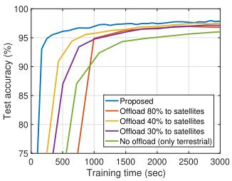

<details>
<summary>line</summary>

| Training time (sec) | Proposed | Offload 80% to satellites | Offload 40% to satellites | Offload 30% to satellites | No offload (only terrestrial) |
| ------------------- | -------- | -------------------------- | -------------------------- | -------------------------- | ----------------------------- |
| 0                   | 75       | 75                         | 75                         | 75                         | 75                            |
| 500                 | 95       | 90                         | 85                         | 80                         | 75                            |
| 1000                | 97       | 95                         | 92                         | 90                         | 85                            |
| 1500                | 98       | 96                         | 94                         | 92                         | 90                            |
| 2000                | 98.5     | 97                         | 95                         | 93                         | 92                            |
| 2500                | 99       | 97.5                       | 96                         | 94                         | 93                            |
| 3000                | 99.5     | 98                         | 97                         | 95                         | 94                            |
</details>

(a) MNIST, IID

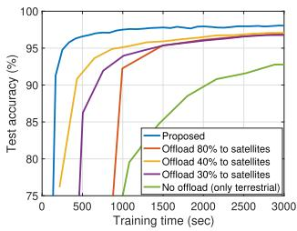

<details>
<summary>line</summary>

| Training time (sec) | Proposed | Offload 80% to satellites | Offload 40% to satellites | Offload 30% to satellites | No offload (only terrestrial) |
| ------------------- | -------- | -------------------------- | -------------------------- | -------------------------- | ----------------------------- |
| 0                   | 75       | 75                         | 75                         | 75                         | 75                            |
| 500                 | 98       | 95                         | 92                         | 88                         | 80                            |
| 1000                | 99       | 97                         | 96                         | 94                         | 85                            |
| 2000                | 99.5     | 98                         | 97                         | 96                         | 90                            |
| 3000                | 99.5     | 98.5                       | 97.5                       | 97                         | 92                            |
</details>

(b) MNIST, Non-IID

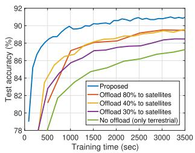

<details>
<summary>line</summary>

| Training time (sec) | Proposed | Offload 80% to satellites | Offload 40% to satellites | Offload 30% to satellites | No offload (only terrestrial) |
| ------------------- | -------- | ------------------------- | ------------------------- | ------------------------- | ----------------------------- |
| 0                   | 78       | 78                        | 78                        | 78                        | 78                            |
| 500                 | 86       | 84                        | 82                        | 80                        | 78                            |
| 1000                | 90       | 88                        | 86                        | 84                        | 80                            |
| 1500                | 91       | 89                        | 87                        | 85                        | 82                            |
| 2000                | 91       | 89                        | 88                        | 86                        | 84                            |
| 2500                | 91       | 89                        | 88                        | 87                        | 85                            |
| 3000                | 91       | 89                        | 88                        | 87                        | 86                            |
| 3500                | 91       | 89                        | 88                        | 87                        | 86                            |
</details>

(c)FMNIST, IID

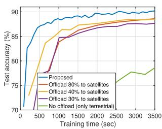

<details>
<summary>line</summary>

| Training time (sec) | Proposed | Offload 80% to satellites | Offload 40% to satellites | Offload 30% to satellites | No offload (only terrestrial) |
| ------------------- | -------- | ------------------------- | ------------------------- | ------------------------- | ------------------------------ |
| 0                   | 70       | 70                        | 70                        | 70                        | 70                             |
| 500                 | 85       | 85                        | 85                        | 85                        | 75                             |
| 1000                | 88       | 87                        | 87                        | 86                        | 78                             |
| 1500                | 89       | 88                        | 88                        | 87                        | 79                             |
| 2000                | 90       | 89                        | 89                        | 88                        | 80                             |
| 2500                | 90       | 89                        | 89                        | 88                        | 81                             |
| 3000                | 90       | 89                        | 89                        | 88                        | 82                             |
| 3500                | 90       | 89                        | 89                        | 88                        | 83                             |
</details>

(d) FMNIST, Non-IID

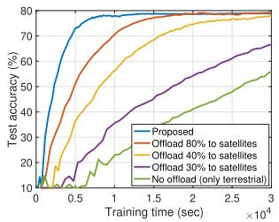

<details>
<summary>line</summary>

| Training time (sec) | Proposed | Offload 80% to satellites | Offload 40% to satellites | Offload 30% to satellites | No offload (only terrestrial) |
| ------------------- | -------- | -------------------------- | -------------------------- | -------------------------- | ------------------------------ |
| 0                   | 10       | 10                         | 10                         | 10                         | 10                             |
| 0.5                 | 70       | 60                         | 50                         | 40                         | 30                             |
| 1.0                 | 75       | 70                         | 60                         | 50                         | 40                             |
| 1.5                 | 78       | 75                         | 65                         | 55                         | 45                             |
| 2.0                 | 79       | 78                         | 70                         | 60                         | 50                             |
| 2.5                 | 80       | 79                         | 72                         | 62                         | 55                             |
| 3.0                 | 80       | 80                         | 75                         | 65                         | 60                             |
</details>

(e) CIFAR-10, IID

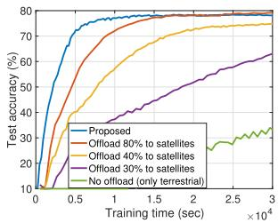

<details>
<summary>line</summary>

| Training time (sec) | Proposed | Offload 80% to satellites | Offload 40% to satellites | Offload 30% to satellites | No offload (only terrestrial) |
| ------------------- | -------- | -------------------------- | -------------------------- | -------------------------- | ------------------------------ |
| 0                   | 10       | 10                         | 10                         | 10                         | 10                             |
| 0.5                 | 75       | 65                         | 50                         | 40                         | 25                             |
| 1.0                 | 80       | 75                         | 60                         | 50                         | 30                             |
| 1.5                 | 80       | 78                         | 65                         | 55                         | 35                             |
| 2.0                 | 80       | 79                         | 70                         | 60                         | 38                             |
| 2.5                 | 80       | 79                         | 72                         | 62                         | 39                             |
| 3.0                 | 80       | 79                         | 73                         | 63                         | 40                             |
</details>

(f) CIFAR-10, Non-IID   
Fig. 2. Test accuracy versus training time. Offloading ratio has been changed from 0 (i.e., only terrestrial) to 80% (i.e., full offloading), considering $\alpha ^ { \mathrm { m a x } } = 0 . 8 .$ .

# B. FL Performance and Latency

Fig. 2 shows our main experimental results, comparing the test accuracies of different schemes as a function of training time. We make the following key observations. First, the scheme that utilizes only the client-side computations without any data offloading to satellites, achieves the worst performance. One trivial reason is that this scheme ignores the satellite-side computation, not taking the benefit of parallel client-satellite computing. Another important factor is the non-IID data distribution across clients. Without any data offloading, the performance of this baseline becomes extremely limited under the non-IID setting due to the biased local datasets of clients. Related to this phenomenon, it can be seen that the performance gap between the IID and non-IID cases decreases as more data samples are offloaded to the satellite. The satellite-side dataset collected from different users can somewhat resolve the issue that arises from the non-IID data distribution. However, offloading too many data samples to the satellite will slow down the training process, causing latency issues. This can be confirmed by comparing the scheme that offloads all non-sensitive samples $( \mathrm { i . e . , } \alpha ^ { \mathrm { m a x } } =$ 0.8 portion of local dataset) to the satellite, and the schemes that only offload 30% or 40% of the local datasets. Even when the maximum computation power of the satellite is large, collecting large volumes of data at the satellite can cause significant delays due to the battery constraint at individual satellites.

For our scheme, the average portions of offloaded data at each client are 56.89%, 55.23%, and 67.23% for MNIST, FMNIST, and CIFAR-10, respectively. Compared to the baselines, note that in our scheme, the clients may offload different portions of samples depending on their computation power, transmit power, and whether the cluster is facing the sun or not. Overall, the results in Fig. 2 shows that the proposed methodology can provide significant benefits by strategically taking advantage of satellites in FL.

In Fig. 3, we compare the latency of different schemes to achieve a certain level of accuracy. The target accuracies are set to be 97%, 88%, 77% for MNIST, FMNIST, CIFAR-10, respectively, in the IID setup. The overall results are consistent with Fig. 2, confirming the effectiveness of the proposed FL approach tailored to ground-to-satellite integrated networks.

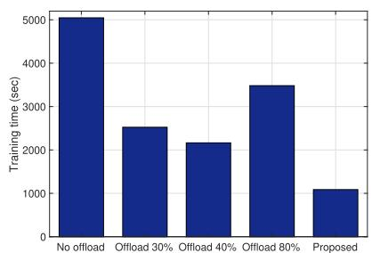

<details>
<summary>bar</summary>

| Category | Training time (sec) |
|---|---|
| No offload | 5000 |
| Offload 30% | 2500 |
| Offload 40% | 2150 |
| Offload 80% | 3500 |
| Proposed | 1100 |
</details>

(a) MNIST

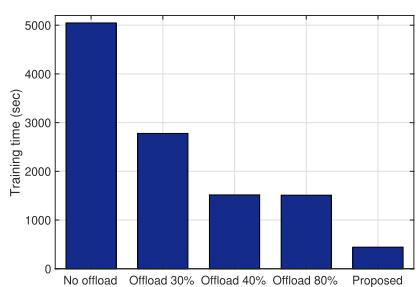

<details>
<summary>bar</summary>

| Category | Training time (sec) |
|---|---|
| No offload | 5000 |
| Offload 30% | 2800 |
| Offload 40% | 1500 |
| Offload 80% | 1500 |
| Proposed | 500 |
</details>

(b) FMNIST

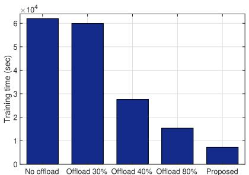

<details>
<summary>bar</summary>

| Category | Training time (sec) |
|---|---|
| No offload | 6.2 |
| Offload 30% | 6.0 |
| Offload 40% | 2.8 |
| Offload 80% | 1.5 |
| Proposed | 0.7 |
</details>

(c) CIFAR-10

Fig. 3. Latency to achieve a certain level of accuracy: 97% for MNIST, 88% for FMNIST, 77% for CIFAR-10.   
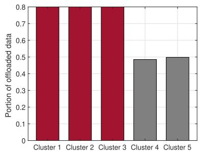

<details>
<summary>bar</summary>

| Cluster   | Portion of offloaded data |
| --------- | ------------------------ |
| Cluster 1 | 0.8                      |
| Cluster 2 | 0.8                      |
| Cluster 3 | 0.8                      |
| Cluster 4 | 0.48                     |
| Cluster 5 | 0.49                     |
</details>

(a) $E ^ { \mathrm { o r i g i n a l } } = 2 0 0 0 ~ \mathrm { J }$

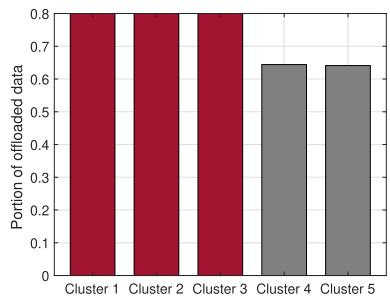

<details>
<summary>bar</summary>

| Cluster   | Portion of offloaded data |
| --------- | ------------------------ |
| Cluster 1 | 0.8                      |
| Cluster 2 | 0.8                      |
| Cluster 3 | 0.8                      |
| Cluster 4 | 0.65                     |
| Cluster 5 | 0.65                     |
</details>

(b) $E ^ { \mathrm { o r i g i n a l } } = 2 1 0 0 ~ \mathrm { J }$

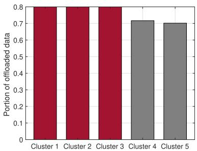

<details>
<summary>bar</summary>

| Cluster   | Portion of offloaded data |
| --------- | ------------------------ |
| Cluster 1 | 0.8                      |
| Cluster 2 | 0.8                      |
| Cluster 3 | 0.8                      |
| Cluster 4 | 0.7                      |
| Cluster 5 | 0.7                      |
</details>

(c) $E ^ { \mathrm { o r i g i n a l } } = 2 2 0 0 ~ \mathrm { J }$   
Fig. 4. Portion of data offloaded to the satellite within each cluster in the proposed approach $( \alpha ^ { \mathrm { { m a x } } } = 0 . 8 )$ . Clusters 1, 2, 3 (red bars) are facing the sun, while clusters 4, 5 (gray bars) are not. As the initial battery of the satellite increases, more data samples can be offloaded to the satellite while satisfying the battery constraint.

# C. Ablation Studies and Further Experiments

1) Effect of Satellite-Side Battery: To gain insights into the effect of the sun for battery charging, in Fig. 4, we compare the portion of offloaded data samples within each cluster of our approach. CIFAR-10 is utilized for training, and the portion of non-sensitive samples are set to be $\alpha ^ { \mathrm { { m a x } } } = 0 . 8$ as in Fig. 2. We have the following main observations. First, under our simulation setup, the clients in the clusters that are facing the sun (red bars) tend to offload all of the non-sensitive data samples to the corresponding satellite, as the solar-powered satellites have less battery issues when they are facing the sun. On the other hand, if the cluster is not facing the sun (gray bars), the clients offload less data due to the satellite-side battery constraint. As the satellite has more battery in the beginning of training (i.e., as $E ^ { \mathrm { o r i g i n a l } }$ increases), the clients tend to offload more data as the satellites can more easily satisfy the battery constraints. The overall results show that the proposed scheme can strategically optimize the amount of data to be offloaded and the satellite-side computation power, depending on whether the cluster is facing the sun or not.

2) Compatibility With Other Fl Algorithm: In Section VI-B, we made a fair comparison between our approach and other baselines by adopting FedAvg to all schemes. To further confirm the advantage of our algorithm, we now use another widely adopted FL algorithm, FedProx [52], in all baselines and our scheme for performance comparison. Fig. 5 shows the result in the non-IID setup. The

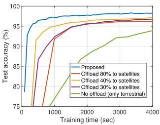

<details>
<summary>line</summary>

| Training time (sec) | Proposed | Offload 80% to satellites | Offload 40% to satellites | Offload 30% to satellites | No offload (only terrestrial) |
| ------------------- | -------- | -------------------------- | -------------------------- | -------------------------- | ----------------------------- |
| 0                   | 75       | 75                         | 75                         | 75                         | 75                            |
| 1000                | 95       | 90                         | 92                         | 90                         | 85                            |
| 2000                | 97       | 95                         | 96                         | 94                         | 90                            |
| 3000                | 98       | 96                         | 97                         | 95                         | 92                            |
| 4000                | 98       | 97                         | 97                         | 96                         | 94                            |
</details>

(a) MNIST

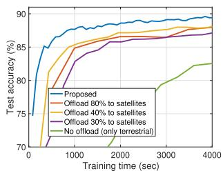

<details>
<summary>line</summary>

| Training time (sec) | Proposed | Offload 80% to satellites | Offload 40% to satellites | Offload 30% to satellites | No offload (only terrestrial) |
| ------------------- | -------- | -------------------------- | -------------------------- | -------------------------- | ------------------------------ |
| 0                   | 75       | 75                         | 75                         | 75                         | 75                             |
| 1000                | 88       | 86                         | 85                         | 84                         | 79                             |
| 2000                | 89       | 87                         | 86                         | 85                         | 80                             |
| 3000                | 89       | 88                         | 87                         | 86                         | 82                             |
| 4000                | 89       | 88                         | 87                         | 86                         | 82                             |
</details>

(b)FMNIST

Fig. 5. Compatibility with FedProx.   
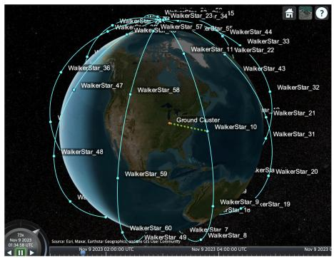

<details>
<summary>text_image</summary>

WalkerStar_23
WalkerStar_27
WalkerStar_34
WalkerStar_57
WalkerStar_55
WalkerStar_44
WalkerStar_33
WalkerStar_11
WalkerStar_22
WalkerStar_43
WalkerStar_32
WalkerStar_21
WalkerStar_31
WalkerStar_20
WalkerStar_9
WalkerStar_19
WalkerStar_7
WalkerStar_8
WalkerStar_60
WalkerStar_49
WalkerStar_59
WalkerStar_48
WalkerStar_47
WalkerStar_36
Ground Cluster
WalkerStar_10
Source: Evi, Mawar, Lathar Geograche, Cassette, Go Our Community
Nov 9 2023 04:00:00 UTC
Nov 9 2023 04:00:00 UTC
</details>

Fig. 6. Considered satellite constellation model for simulating varying coverage times.

results are consistent with the ones in previous subsection, further confirming the effectiveness and applicability of our satellite-assisted FL methodology.

3) Practical Varying Coverage Times: Instead of using a fixed the coverage time T , we also conduct experiments with varying coverage times using the Walker-Star constellation model in Fig. 6. We specifically use the walkerStar function [53] in MATLAB to create a satellite constellation. We consider 50 satellites equally distributed across 5 orbits with altitude of 784 km and inclination of $9 0 °$ . The minimum elevation angle to communicate is set to $1 5 ^ { \circ }$ , and 50 clients are distributed in a specific region with latitude of $4 0 ^ { \circ }$ N and longitude of $8 6 ^ { \circ } \ W .$ Based on the constructed constellation and the location of the ground cluster, we obtained the coverage times of satellites over the target region using the accessIntervals function. Since the coverage time of each satellite can be obtained prior to optimization, we optimize the amount of data offloading considering the average coverage time of future satellites, which is 408 sec. All remaining setups are the same as in Section VI-B. Fig. 7 shows the results in the IID setup. The results consistently confirm the advantage of the proposed methodology.

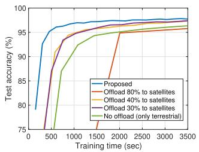

<details>
<summary>line</summary>

| Training time (sec) | Proposed | Offload 80% to satellites | Offload 40% to satellites | Offload 30% to satellites | No offload (only terrestrial) |
| ------------------- | -------- | -------------------------- | -------------------------- | -------------------------- | ----------------------------- |
| 0                   | 75       | 75                         | 75                         | 75                         | 75                            |
| 500                 | 95       | 90                         | 85                         | 80                         | 75                            |
| 1000                | 97       | 95                         | 90                         | 85                         | 85                            |
| 1500                | 98       | 96                         | 92                         | 88                         | 90                            |
| 2000                | 98       | 97                         | 94                         | 90                         | 92                            |
| 2500                | 98       | 97                         | 95                         | 92                         | 94                            |
| 3000                | 98       | 97                         | 96                         | 93                         | 95                            |
| 3500                | 98       | 97                         | 96                         | 94                         | 96                            |
</details>

(a) MNIST

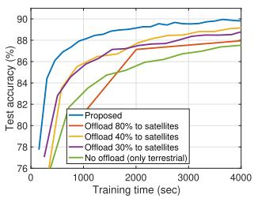

<details>
<summary>line</summary>

| Training time (sec) | Proposed | Offload 80% to satellites | Offload 40% to satellites | Offload 30% to satellites | No offload (only terrestrial) |
| ------------------- | -------- | -------------------------- | -------------------------- | -------------------------- | ----------------------------- |
| 0                   | 77       | 77                         | 77                         | 77                         | 77                            |
| 1000                | 88       | 86                         | 85                         | 84                         | 83                            |
| 2000                | 89       | 87                         | 86                         | 85                         | 84                            |
| 3000                | 89.5     | 88                         | 87                         | 86                         | 85                            |
| 4000                | 90       | 89                         | 88                         | 87                         | 86                            |
</details>

(b) FMNIST   
Fig. 7. Experiments with varying coverage times using the constellation model in Fig. 6.

# VII. CONCLUSION

In this paper, we proposed a satellite-assisted FL methodology that enables ground users in remote areas to collaboratively train an ML model, without requiring terrestrial communication infrastructures. By strategically taking advantage of satellites as edge computing units, model aggregators, and relays, the proposed methodology can speed up the FL process in ground-to-satellite integrated networks. We theoretically analyzed the convergence behavior of our approach, and optimized network resources to minimize the latency. Experimental results confirmed the advantage of the proposed idea compared to baselines, and provided insights into our network optimization solutions. We believe that our solution can provide a new direction to FL over hybrid terrestrial and non-terrestrial networks, where reducing the training time based on cooperation among ground users and satellites is of paramount importance. One interesting future direction is to extend our idea to the ground-air-space three layer network, having devices/sensors on the ground, UAVs or drones in the sky, and satellites in the space.

# APPENDIX A PROOF OF THEOREM 1

Due to the L-smoothness, the following holds:

$$
\mathbb {E} [ F (\mathbf {w} ^ {r + 1}) ] - \mathbb {E} [ F (\mathbf {w} ^ {r}) ] \leq \underbrace {\mathbb {E} [ \langle \nabla F (\mathbf {w} ^ {r}) , \mathbf {w} ^ {r + 1} - \mathbf {w} ^ {r} \rangle ]} _ {\zeta_ {1} ^ {r}}
$$

$$
+ \underbrace {\frac {L}{2} \mathbb {E} [ \| \mathbf {w} ^ {r + 1} - \mathbf {w} ^ {r} \| ^ {2} ]} _ {\zeta_ {2} ^ {r}}. \tag {40}
$$

It can be seen that the term $\mathbf { w } ^ { r + 1 } - \mathbf { w } ^ { r }$ appears at both terms of (40). We can write

$$
\mathbf {w} ^ {r + 1} - \mathbf {w} ^ {r} = \frac {1}{J} \sum_ {j = 1} ^ {J} \bar {\mathbf {w}} _ {j} ^ {r + 1} - \mathbf {w} ^ {r} \tag {41}
$$

$$
= - \frac {1}{J} \sum_ {j = 1} ^ {J} \eta_ {r} \tilde {\nabla} F _ {j} (\mathbf {w} ^ {r}) = - \eta_ {r} \tilde {\nabla} F (\mathbf {w} ^ {r}) \tag {42}
$$

where $\begin{array} { r } { \tilde { \nabla } F ( \mathbf { w } ^ { r } ) = \frac { 1 } { J } \sum _ { j = 1 } ^ { J } \tilde { \nabla } F _ { j } ( \mathbf { w } ^ { r } ) } \end{array}$ and

$$
\tilde {\nabla} F _ {j} (\mathbf {w}) \tag {43}
$$

$$
= \frac {\left(\sum_ {k \in G _ {j}} \alpha_ {k} \left| D _ {k} \right|\right) \tilde {\nabla} \ell_ {S , j} (\mathbf {w}) + \sum_ {k \in G _ {j}} \left(1 - \alpha_ {k}\right) \left| D _ {k} \right| \tilde {\nabla} \ell_ {C , k} (\mathbf {w})}{\sum_ {k \in G _ {j}} \left| D _ {k} \right|}. \tag {44}
$$

It can be seen that

$$
\zeta_ {1} ^ {r} = \mathbb {E} [ \langle \nabla F (\mathbf {w} ^ {r}), - \eta_ {r} \tilde {\nabla} F (\mathbf {w} ^ {r}) \rangle ] \tag {45}
$$

$$
= - \mathbb {E} [ \langle \nabla F (\mathbf {w} ^ {r}), - \eta_ {r} \nabla F (\mathbf {w} ^ {r}) \rangle ] \tag {46}
$$

$$
= - \eta_ {r} \mathbb {E} [ \| \nabla F (\mathbf {w} ^ {r}) \| ^ {2} ] \tag {47}
$$

holds, where (a) is obtained by taking the expectation with respect to the mini-batch.

Now we focus on $\zeta _ { 2 } .$ . We start by writing

$$
\begin{array}{l} \zeta_ {2} ^ {r} = \eta_ {r} ^ {2} \frac {L}{2} \mathbb {E} [ \| \tilde {\nabla} F (\mathbf {w} ^ {r}) \| ^ {2} ] \\ \leq \eta_ {r} ^ {2} L \Big (\mathbb {E} [ \nabla F (\mathbf {w} ^ {r}) \| ^ {2} ] + \mathbb {E} [ \| \nabla F (\mathbf {w} ^ {r}) - \tilde {\nabla} F (\mathbf {w} ^ {r}) \| ^ {2} ] \Big) ((b)) \\ \leq_ {(c)} \eta_ {r} ^ {2} L \Big (\mathbb {E} [ \| \nabla F (\mathbf {w} ^ {r}) \| ^ {2} ] \\ \left. + \underbrace {\frac {1}{J} \sum_ {j = 1} ^ {J} \mathbb {E} \left[ \| \nabla F _ {j} \left(\mathbf {w} ^ {r}\right) - \tilde {\nabla} F _ {j} \left(\mathbf {w} ^ {r}\right) \| ^ {2} \right]}\right) (48) \\ \end{array}
$$

where (b) is obtained from $\| a + b \| ^ { 2 } \leq 2 \| a \| ^ { 2 } + 2 \| b \| ^ { 2 }$ and (c) comes from the convexity of $\| \cdot \| ^ { 2 }$ .

To bound $\zeta _ { 3 } ,$ we focus on a specific cluster $j$ and analyze $\mathbb { E } [ \| \nabla F _ { j } ( \mathbf { w } ^ { r } ) - \tilde { \nabla } F _ { j } ( \mathbf { w } ^ { r } ) \| ^ { 2 } ]$ . Note that we have

$$
\begin{array}{l} \mathbb {E} [ \| \nabla F _ {j} (\mathbf {w} ^ {r}) - \tilde {\nabla} F _ {j} (\mathbf {w} ^ {r}) \| ^ {2} ] \leq \\ \frac {\sum_ {k \in G _ {j}} \alpha_ {k} | D _ {k} |}{\sum_ {k \in G _ {j}} | D _ {k} |} \underbrace {\mathbb {E} [ \| \nabla \ell_ {S , j} (\mathbf {w} ^ {r}) - \tilde {\nabla} \ell_ {S , j} (\mathbf {w} ^ {r}) \| ^ {2} ]} _ {\text { satellite   at   cluster   } j} \\ + \frac {1}{\sum_ {k \in G _ {j}} | D _ {k} |} \sum_ {k \in G _ {j}} \Big ((1 - \alpha_ {k}) | D _ {k} | \\ \left. \times \underbrace {\mathbb {E} \left[ \| \nabla \ell_ {C , k} \left(\mathbf {w} ^ {r}\right) - \tilde {\nabla} \ell_ {C , k} \left(\mathbf {w} ^ {r}\right) \| ^ {2} \right]} _ {\text { client   } k \text {   at   cluster   } j}\right), \tag {49} \\ \end{array}
$$

which holds due to the convexity of $\| \cdot \| ^ { 2 }$ .

(i) Bounding $\mathbb { E } [ \| \nabla \ell _ { C , k } ( \mathbf { w } ^ { r } ) - \tilde { \nabla } \ell _ { C , k } ( \mathbf { w } ^ { r } ) \| ^ { 2 } ]$ . Let $\tilde { D } _ { k } ^ { ( l , r ) } \subset$ $\hat { D } _ { k } ^ { l }$ be the mini-batch and $\lambda _ { C , k } = | \tilde { D } _ { k } ^ { ( l , r ) } | \leq ( 1 - \alpha _ { k } ) | D _ { k } |$ be the corresponding mini-batch size at client k at round r. We have

$$
\begin{array}{l} \mathbb {E} [ \| \nabla \ell_ {C, k} (\mathbf {w} ^ {r}) - \tilde {\nabla} \ell_ {C, k} (\mathbf {w} ^ {r}) \| ^ {2} ] \\ = \mathbb {E} \Big [ \Big \| \frac {1}{\lambda_ {C , k} ^ {r}} \sum_ {x \in \tilde {D} _ {k} ^ {(l, r)}} \nabla \ell (x; \mathbf {w} ^ {r}) - \frac {1}{| \hat {D} _ {k} ^ {c} |} \sum_ {x \in \hat {D} _ {k} ^ {c}} \nabla \ell (x; \mathbf {w} ^ {r}) \Big \| ^ {2} \Big ] \\ = _ {(d)} \left(1 - \frac {\lambda_ {C , k} ^ {r}}{\left| \hat {D} _ {k} ^ {c} \right|}\right) \frac {Z _ {C , k}}{\lambda_ {C , k} ^ {r}} \tag {50} \\ \end{array}
$$

where (d) is obtained by using the variance of sample mean. Specifically, $Z _ { C , k }$ in (50) is the variance of the gradients computed with the samples in $\hat { D } _ { k } ^ { c }$ , which is written as

$$
\begin{array}{l} Z _ {C, k} \\ = \frac {1}{\left| \hat {D} _ {k} ^ {c} \right| - 1} \sum_ {x \in \hat {D} _ {k} ^ {c}} \left\| \nabla \ell (x; \mathbf {w} ^ {r}) - \frac {1}{\left| \hat {D} _ {k} ^ {c} \right|} \sum_ {x ^ {\prime} \in \hat {D} _ {k} ^ {c}} \nabla \ell \left(x ^ {\prime}; \mathbf {w} ^ {r}\right) \right\| ^ {2} \tag {51} \\ \end{array}
$$

$$
\leq \frac {2 (| \hat {D} _ {k} ^ {c} | - 1) \rho}{| \hat {D} _ {k} ^ {c} |} V _ {C, k}, \tag {52}
$$

where (e) results from the proof of [47] and $V _ { C , k }$ is the variance of dataset $\hat { D } _ { k } ^ { c }$ defined in (26). By combining the results of (50) and (52), we obtain

$$
\begin{array}{l} \mathbb {E} \left[ \left\| \nabla \ell_ {C, k} \left(\mathbf {w} ^ {r}\right) - \tilde {\nabla} \ell_ {C, k} \left(\mathbf {w} ^ {r}\right) \right\| ^ {2} \right] (53) \\ \leq 2 \left(1 - \frac {\lambda_ {C , k} ^ {r}}{\left| \hat {D} _ {k} ^ {c} \right|}\right) \frac {\left(\left| \hat {D} _ {k} ^ {c} \right| - 1\right) \rho}{\lambda_ {C , k} ^ {r} \left| \hat {D} _ {k} ^ {c} \right|} V _ {C, k}. (54) \\ \end{array}
$$

(ii) Bounding $\mathbb { E } [ \| \nabla \ell _ { S , j } ( \mathbf { w } ^ { r } ) - \tilde { \nabla } \ell _ { S , j } ( \mathbf { w } ^ { r } ) \| ^ { 2 } ]$ . Similarly, for the satellite side, we obtain

$$
\begin{array}{l} \mathbb {E} \left[ \left\| \nabla \ell_ {S, j} \left(\mathbf {w} ^ {r}\right) - \tilde {\nabla} \ell_ {S, j} \left(\mathbf {w} ^ {r}\right) \right\| ^ {2} \right] (55) \\ \leq 2 \left(1 - \frac {\lambda_ {S , j} ^ {r}}{\left| \cup_ {k \in G _ {j}} \hat {D} _ {k} ^ {s} \right|}\right) \frac {\left(\left| \cup_ {k \in G _ {j}} \hat {D} _ {k} ^ {s} \right| - 1\right) \rho}{\lambda_ {S , j} ^ {r} \left| \cup_ {k \in G _ {j}} \hat {D} _ {k} ^ {s} \right|} V _ {S, j} (56) \\ \end{array}
$$

where $V _ { S , j }$ is the variance of dataset $\cup _ { k \in G _ { j } } \hat { D } _ { k } ^ { s }$ defined in (27).

Note that $| { \hat { D } } _ { k } ^ { c } | ~ = ~ ( 1 - \alpha _ { k } ) | D _ { k } |$ and $| \cup _ { k \in G _ { j } } \ \hat { D } _ { k } ^ { s } | \ =$ $\sum _ { k \in G _ { i } } \alpha _ { k } | D _ { k } |$ hold. Now by combining the results of (49), $( 5 0 ) , ( 5 6 ) .$ , and then inserting it to (48), we obtain

$$
\begin{array}{l} \zeta_ {3} ^ {r} \\ \leq \frac {2}{\sum_ {j = 1} ^ {J} \sum_ {k \in G _ {j}} | D _ {k} |} \sum_ {j = 1} ^ {J} \left(\sum_ {k \in G _ {j}} \left(1 - \frac {\lambda_ {C , k} ^ {r}}{| \hat {D} _ {k} ^ {c} |}\right) \frac {(| \hat {D} _ {k} ^ {c} | - 1) \rho}{\lambda_ {C , k} ^ {r}} \right. \\ \times V _ {C, k} + \left(1 - \frac {\lambda_ {S , j} ^ {r}}{\left| \cup_ {k \in G _ {j}} \hat {D} _ {k} ^ {s} \right|}\right) \frac {\left(\left| \cup_ {k \in G _ {j}} \hat {D} _ {k} ^ {s} \right| - 1\right) \rho}{\lambda_ {S , j} ^ {r}} V _ {S, j}) \tag {57} \\ \end{array}
$$

By inserting (47) and (48) to (40) and choosing $\eta _ { r } \leq \frac { 1 } { 2 L }$ we obtain

$$
\mathbb {E} \left[ F \left(\mathbf {w} ^ {r + 1}\right) \right] - \mathbb {E} \left[ F \left(\mathbf {w} ^ {r}\right) \right] \leq - \frac {1}{2} \eta_ {r} \mathbb {E} \left[ \| \nabla F \left(\mathbf {w} ^ {r}\right) \| ^ {2} \right] + \eta_ {r} ^ {2} L \zeta_ {3} ^ {r}. \tag {58}
$$

By summing up for all $r = 0 , 1 , \ldots , R - 1$ and and utilizing the result in (57), we obtain the result in Theorem 1, which completes the proof.

# REFERENCES

[1] B. McMahan, E. Moore, D. Ramage, S. Hampson, and B. A. Y. Arcas, “Communication-efficient learning of deep networks from decentralized data,” Proc. Artif. Intell. Statist., pp. 1273–1282, Apr. 2017.   
[2] P. Kairouz et al., “Advances and open problems in federated learning,” Found. Trends Mach. Learn., vol. 14, nos. 1–2, pp. 1–210, 2021.   
[3] T. Li, A. K. Sahu, A. Talwalkar, and V. Smith, “Federated learning: Challenges, methods, and future directions,” IEEE Signal Process. Mag., vol. 37, no. 3, pp. 50–60, May 2020.   
[4] S. Wang, “Adaptive federated learning in resource constrained edge computing systems,” IEEE J. Sel. Areas Commun., vol. 37, no. 6, pp. 1205–1221, Jun. 2019.   
[5] H. H. Yang, Z. Liu, T. Q. S. Quek, and H. V. Poor, “Scheduling policies for federated learning in wireless networks,” IEEE Trans. Commun., vol. 68, no. 1, pp. 317–333, Jan. 2019.   
[6] M. M. Amiri and D. Gündüz, “Federated learning over wireless fading channels,” IEEE Trans. Wireless Commun., vol. 19, no. 5, pp. 3546–3557, May 2020.   
[7] M. Chen, Z. Yang, W. Saad, C. Yin, H. V. Poor, and S. Cui, “A joint learning and communications framework for federated learning over wireless networks,” IEEE Trans. Wireless Commun., vol. 20, no. 1, pp. 269–283, Jan. 2021.   
[8] M. Chen, H. V. Poor, W. Saad, and S. Cui, “Convergence time optimization for federated learning over wireless networks,” IEEE Trans. Wireless Commun., vol. 20, no. 4, pp. 2457–2471, Apr. 2021.   
[9] L. Liu, J. Zhang, S. H. Song, and K. B. Letaief, “Client-edge-cloud hierarchical federated learning,” in Proc. IEEE Int. Conf. Commun. (ICC), Jun. 2020, pp. 1–6.   
[10] M. S. H. Abad, E. Ozfatura, D. Gunduz, and O. Ercetin, “Hierarchical federated learning ACROSS heterogeneous cellular networks,” in Proc. IEEE Int. Conf. (ICASSP), May 2020, pp. 8866–8870.   
[11] W. Y. B. Lim et al., “Decentralized edge intelligence: A dynamic resource allocation framework for hierarchical federated learning,” IEEE Trans. Parallel Distrib. Syst., vol. 33, no. 3, pp. 536–550, Mar. 2022.   
[12] W. Y. B. Lim, J. S. Ng, Z. Xiong, D. Niyato, C. Miao, and D. I. Kim, “Dynamic edge association and resource allocation in self-organizing hierarchical federated learning networks,” IEEE J. Sel. Areas Commun., vol. 39, no. 12, pp. 3640–3653, Dec. 2021.   
[13] J. Wang, A. K. Sahu, Z. Yang, G. Joshi, and S. Kar, “MATCHA: Speeding up decentralized SGD via matching decomposition sampling,” in Proc. 6th Indian Control Conf. (ICC), Dec. 2019, pp. 299–300.   
[14] A. Guha Roy, S. Siddiqui, S. Pölsterl, N. Navab, and C. Wachinger, “BrainTorrent: A peer-to-peer environment for decentralized federated learning,” 2019, arXiv:1905.06731.   
[15] A. Lalitha, S. Shekhar, T. Javidi, and F. Koushanfar, “Fully decentralized federated learning,” in Proc. 3rd Workshop Bayesian Deep Learn. (NeurIPS), vol. 2, Dec. 2018, pp. 1–9.   
[16] A. Koloskova, N. Loizou, S. Boreiri, M. Jaggi, and S. Stich, “A unified theory of decentralized SGD with changing topology and local updates,” in Proc. 37th Int. Conf. Mach. Learn., vol. 119, Jul. 2020, pp. 5381–5393.   
[17] Z. Song, Y. Hao, Y. Liu, and X. Sun, “Energy-efficient multiaccess edge computing for terrestrial-satellite Internet of Things,” IEEE Internet Things J., vol. 8, no. 18, pp. 14202–14218, Sep. 2021.   
[18] Q. Tang, Z. Fei, B. Li, and Z. Han, “Computation offloading in LEO satellite networks with hybrid cloud and edge computing,” IEEE Internet Things J., vol. 8, no. 11, pp. 9164–9176, Jun. 2021.   
[19] G. Cui, P. Duan, L. Xu, and W. Wang, “Latency optimization for hybrid GEO–LEO satellite-assisted IoT networks,” IEEE Internet Things J., vol. 10, no. 7, pp. 6286–6297, Nov. 2022.   
[20] Q. Li et al., “Service coverage for satellite edge computing,” IEEE Internet Things J., vol. 9, no. 1, pp. 695–705, Jan. 2022.   
[21] C. Ding, J.-B. Wang, H. Zhang, M. Lin, and G. Y. Li, “Joint optimization of transmission and computation resources for satellite and high altitude platform assisted edge computing,” IEEE Trans. Wireless Commun., vol. 21, no. 2, pp. 1362–1377, Feb. 2022.   
[22] Y. Zhang, H. Zhang, K. Sun, J. Huo, N. Wang, and V. C. M. Leung, “Partial computation offloading in satellite based three-tier cloud-edge integration networks,” IEEE Trans. Wireless Commun., vol. 23, no. 2, pp. 836–847, Feb. 2024.   
[23] F. Tang, H. Hofner, N. Kato, K. Kaneko, Y. Yamashita, and M. Hangai, “A deep reinforcement learning-based dynamic traffic offloading in space-air-ground integrated networks (SAGIN),” IEEE J. Sel. Areas Commun., vol. 40, no. 1, pp. 276–289, Jan. 2022.

[24] J. So, K. Hsieh, B. Arzani, S. Noghabi, S. Avestimehr, and R. Chandra, “FedSpace: An efficient federated learning framework at satellites and ground stations,” 2022, arXiv:2202.01267.   
[25] B. Matthiesen, N. Razmi, I. Leyva-Mayorga, A. Dekorsy, and P. Popovski, “Federated learning in satellite constellations,” IEEE Netw., pp. 1–16, May 2023.   
[26] N. Razmi, B. Matthiesen, A. Dekorsy, and P. Popovski, “On-board federated learning for dense LEO constellations,” in Proc. IEEE Int. Conf. Commun., May 2022, pp. 4715–4720.   
[27] N. Razmi, B. Matthiesen, A. Dekorsy, and P. Popovski, “Scheduling for ground-assisted federated learning in leo satellite constellations,” in Proc. 30th Eur. Signal Process. Conf. (EUSIPCO), pp. 1102–1106, Aug. 2022.   
[28] N. Razmi, B. Matthiesen, A. Dekorsy, and P. Popovski, “Ground-assisted federated learning in LEO satellite constellations,” IEEE Wireless Commun. Lett., vol. 11, no. 4, pp. 717–721, Apr. 2022.   
[29] M. Elmahallawy and T. Luo, “FedHAP: Fast federated learning for LEO constellations using collaborative HAPs,” in Proc. 14th Int. Conf. Wireless Commun. Signal Process. (WCSP), Nanjing, China, Nov. 2022, pp. 888–893.   
[30] Z. Zhai, Q. Wu, S. Yu, R. Li, F. Zhang, and X. Chen, “FedLEO: An offloading-assisted decentralized federated learning framework for low Earth orbit satellite networks,” IEEE Trans. Mobile Comput., pp. 1–18, Aug. 2023.   
[31] M. Elmahallawy and T. Luo, “Optimizing federated learning in LEO satellite constellations via intra-plane model propagation and sink satellite scheduling,” 2023, arXiv:2302.13447.   
[32] D.-J. Han et al., “Federated split learning with joint personalizationgeneralization for inference- stage optimization in wireless edge networks,” IEEE Trans. Mobile Comput., pp. 1–17, Nov. 2023.   
[33] D.-J. Han, M. Choi, J. Park, and J. Moon, “FedMes: Speeding up federated learning with multiple edge servers,” IEEE J. Sel. Areas Commun., vol. 39, no. 12, pp. 3870–3885, Dec. 2021.   
[34] Y. Wang, Z. Su, N. Zhang, and A. Benslimane, “Learning in the air: Secure federated learning for UAV-assisted crowdsensing,” IEEE Trans. Netw. Sci. Eng., vol. 8, no. 2, pp. 1055–1069, Apr. 2021.   
[35] H. Zhang and L. Hanzo, “Federated learning assisted multi-UAV networks,” IEEE Trans. Veh. Technol., vol. 69, no. 11, pp. 14104–14109, Nov. 2020.   
[36] T. Zeng, O. Semiari, M. Mozaffari, M. Chen, W. Saad, and M. Bennis, “Federated learning in the sky: Joint power allocation and scheduling with UAV swarms,” in Proc. IEEE Int. Conf. Commun. (ICC), Jun. 2020, pp. 1–6, doi: 10.1109/ICC40277.2020.9148776.   
[37] T. K. Rodrigues and N. Kato, “Hybrid centralized and distributed learning for MEC-equipped satellite 6G networks,” IEEE J. Sel. Areas Commun., vol. 41, no. 4, pp. 1201–1211, Apr. 2023.   
[38] H. Chen, M. Xiao, and Z. Pang, “Satellite-based computing networks with federated learning,” IEEE Wireless Commun., vol. 29, no. 1, pp. 78–84, Feb. 2022.   
[39] Q. Fang, Z. Zhai, S. Yu, Q. Wu, X. Gong, and X. Chen, “Olive branch learning: A topology-aware federated learning framework for space-airground integrated network,” IEEE Trans. Wireless Commun., vol. 22, no. 7, pp. 4534–4551, Jul. 2023.   
[40] Y. Wang, C. Zou, D. Wen, and Y. Shi, “Federated learning over LEO satellite,” in Proc. IEEE Globecom Workshops (GC Wkshps), Dec. 2022, pp. 1652–1657.   
[41] S. Wang, S. Hosseinalipour, M. Gorlatova, C. G. Brinton, and M. Chiang, “UAV-assisted online machine learning over multi-tiered networks: A hierarchical nested personalized federated learning approach,” IEEE Trans. Netw. Service Manage., vol. 20, no. 2, pp. 1847–1865, Jun. 2023.   
[42] Z. Yang, M. Chen, W. Saad, C. S. Hong, and M. Shikh-Bahaei, “Energy efficient federated learning over wireless communication networks,” IEEE Trans. Wireless Commun., vol. 20, no. 3, pp. 1935–1949, Mar. 2020.   
[43] C. T. Dinh et al., “Federated learning over wireless networks: Convergence analysis and resource allocation,” IEEE/ACM Trans. Netw., vol. 29, no. 1, pp. 398–409, Feb. 2021.   
[44] I. Leyva-Mayorga, B. Soret, and P. Popovski, “Inter-plane inter-satellite connectivity in dense LEO constellations,” IEEE Trans. Wireless Commun., vol. 20, no. 6, pp. 3430–3443, Jun. 2021.   
[45] R. Deng, B. Di, S. Chen, S. Sun, and L. Song, “Ultra-dense LEO satellite offloading for terrestrial networks: How much to pay the satellite operator?” IEEE Trans. Wireless Commun., vol. 19, no. 10, pp. 6240–6254, Oct. 2020.

[46] X. Li, K. Huang, W. Yang, S. Wang, and Z. Zhang, “On the convergence of fedavg on non-iid data,” in Proc. Int. Conf. Learn. Represent. (ICLR), Sep. 2020, pp. 1–26.   
[47] Z.-L. Chang, S. Hosseinalipour, M. Chiang, and C. G. Brinton, “Asynchronous multi-model dynamic federated learning over wireless networks: Theory, modeling, and optimization,” 2023, arXiv:2305.13503.   
[48] A. Reisizadeh, A. Mokhtari, H. Hassani, A. Jadbabaie, and R. Pedarsani, “FedPAQ: A communication-efficient federated learning method with periodic averaging and quantization,” in Proc. Int. Conf. Artif. Intell. Statist., 2020, pp. 2021–2031.   
[49] B. Ganguly et al., “Multi-edge server-assisted dynamic federated learning with an optimized floating aggregation point,” IEEE/ACM Trans. Netw., vol. 31, no. 6, pp. 2682–2697, Dec. 2023.   
[50] Y. J. Cho, J. Wang, and G. Joshi, “Towards understanding biased client selection in federated learning,” in Proc. 25th Int. Conf. Artif. Intell. Statist. (AISTATS), Mar. 2022, pp. 10351–10375.   
[51] D. Basu, D. Data, C. Karakus, and S. Diggavi, “Qsparse-local-SGD: Distributed SGD with quantization, sparsification and local computations,” in Proc. Adv. Neural Inf. Process. Syst., vol. 32, 2019, pp. 1–11.   
[52] T. Li, A. K. Sahu, M. Zaheer, M. Sanjabi, A. Talwalkar, and V. Smith, “Federated optimization in heterogeneous networks,” Proc. Mach. Learn. Syst., vol. 2, pp. 429–450, Mar. 2020.   
[53] WalkerStar. Accessed: Nov. 1, 2023. [Online]. Available: https:// www.mathworks.com/help/aerotbx/ug/satellitescenario.walkerstar.html


<details>
<summary>natural_image</summary>

Portrait of a young man wearing a red sweater over a collared shirt (no text or symbols visible)
</details>

Dong-Jun Han (Member, IEEE) received the B.S. degree in mathematics and electrical engineering and the M.S. and Ph.D. degrees in electrical engineering from the Korea Advanced Institute of Science and Technology (KAIST), South Korea, in 2016, 2018, and 2022, respectively. He is currently a Post-Doctoral Researcher with the School of Electrical and Computer Engineering, Purdue University. His research interests include the intersection of communications, networking, and machine learning, specifically in distributed/federated machine learning

and network optimization. He received the Best Ph.D. Dissertation Award from the School of Electrical Engineering, KAIST, in 2022.


<details>
<summary>natural_image</summary>

Portrait of a man in business attire (no visible text or symbols)
</details>

Seyyedali Hosseinalipour (Member, IEEE) received the B.S. degree (Hons.) in electrical engineering from the Amirkabir University of Technology, Tehran, Iran, in 2015, and the M.S. and Ph.D. degrees in electrical engineering from North Carolina State University, NC, USA, in 2017 and 2020, respectively. He was a Post-Doctoral Researcher with Purdue University, IN, USA, from 2020 to 2022. He is currently an Assistant Professor with the Department of Electrical Engineering, University at Buffalo–SUNY. His research

interests include the analysis of modern wireless networks, synergies between machine learning methods and fog computing systems, distributed/federated machine learning, and network optimization. He was a recipient of the ECE Doctoral Scholar of the Year Award in 2020 and the ECE Distinguished Dissertation Award in 2021 at North Carolina State University. He served as the TPC Co-Chair for workshops and symposiums related to distributed machine learning and edge computing held in conjunction with IEEE INFOCOM, IEEE GLOBECOM, IEEE ICC, IEEE/CVF CVPR, IEEE MSN, and IEEE VTC. He also served as the Guest Editor for IEEE Internet of Things Magazine.


<details>
<summary>natural_image</summary>

Portrait of a smiling man in business attire (no text or symbols visible)
</details>

David J. Love (Fellow, IEEE) received the B.S. (Hons.), M.S.E., and Ph.D. degrees in electrical engineering from The University of Texas at Austin, in 2000, 2002, and 2004, respectively. Since 2004, he has been with the Elmore Family School of Electrical and Computer Engineering, Purdue University, where he is currently the Nick Trbovich Professor of electrical and computer engineering. He holds 32 issued U.S. patents. His research interests include design and analysis of broadband wireless communication systems, beyond-5G wireless systems,

multiple-input multiple-output (MIMO) communications, millimeter wave wireless, software defined radios and wireless networks, coding theory, and MIMO array processing. He was a member of the Executive Committee for the National Spectrum Consortium. He is a fellow of the American Association for the Advancement of Science (AAAS) and was named a Thomson Reuters Highly Cited Researcher (2014 and 2015). Along with his co-authors, he won best paper awards from the IEEE Communications Society (2016 Stephen O. Rice Prize and 2020 Fred W. Ellersick Prize), the IEEE Signal Processing Society (2015 IEEE Signal Processing Society Best Paper Award), and the IEEE Vehicular Technology Society (2010 Jack Neubauer Memorial Award).


<details>
<summary>natural_image</summary>

Portrait of a smiling man in a light blue shirt (no text or symbols visible)
</details>

Christopher G. Brinton (Senior Member, IEEE) received the M.S. and Ph.D. (Hons.) degrees from Princeton University in 2016 and 2013, respectively, both in electrical engineering. He is currently an Assistant Professor with the Elmore Family School of Electrical and Computer Engineering (ECE), Purdue University. His research interests include the intersection of networking, communications, and machine learning, specifically in fog/edge network intelligence, distributed machine learning, and data-driven wireless network optimization. Since joining ECE, Purdue University, in Fall 2019, he received the NSF CAREER Award (2022), the ONR Young Investigator Program (YIP) Award (2022), the DARPA Young Faculty Award (YFA, 2022), and the Intel Rising Star Faculty Award (2022), and roughly U.S. \$10M in sponsored research projects, as the PI or the Co-PI. He has also been awarded the Purdue College of Engineering Faculty Excellence Awards in Early Career Research (2023), the Early Career Teaching (2023), the Online Learning (2022), the Purdue ECE Outstanding Faculty Mentor Award (2020), the Ruth and Joel Spira Outstanding Teacher Award (2020), and the Purdue Seed for Success Award (2019).


<details>
<summary>natural_image</summary>

Portrait of a man in formal suit and tie, smiling (no visible text or symbols)
</details>

Mung Chiang (Fellow, IEEE) is the 13th President of Purdue University and the Roscoe H. George Distinguished Professor of Electrical and Computer Engineering. Previously, he was the Arthur LeGrand Doty Professor of Electrical Engineering at Princeton University, where he founded the Princeton Edge Lab, in 2009, and co-founded several startups spun out from there. He received the 2013 NSF Alan T. Waterman Awarded, and also he received a Guggenheim Fellowship, the IEEE Kiyo Tomiyau Award, the IEEE INFOCOM Achievement Award, and is a

member of the National Academy of Inventors and Royal Swedish Academy of Engineering Science. He served as the Science and Technology Adviser to the U.S. Secretary of State.