# Cooperative Ground-Satellite Scheduling and Power Allocation for Urban Air Mobility Networks

Hyung-Joo Moon , Graduate Student Member, IEEE, and Chan-Byoung Chae , Fellow, IEEE

Abstract— In this paper, we investigate a multi-user downlink scheduling and power allocation strategy for urban air mobility (UAM) within a 6G non-terrestrial network (NTN) framework that integrates satellite and ground networks. We consider a system model involving multiple ground stations (GSs) and a single satellite, addressing the sum rate maximization problem with link-association, power, elevation angle, and minimum quality-of-service constraints. The proposed method initially segregates satellite-serviced users to reduce interference among the remaining GS-serviced users, taking into account the locations and movements of those UAMs. Subsequently, using a graph-theoretical approach, we convert the GS link association problem into a minimum-cost maximum-flow problem. In this process, we employ an analytical method involving polynomial approximations or a numerical method using integral approximation through the sum of time-sampled parameters. We then address the non-convex power allocation problem for scheduled links through iterative algorithms. The proposed scheduling and power allocation algorithms effectively manage interference in multi-UAM and multi-GS environments, and their performance is validated through extensive simulation results. Our study provides a comprehensive framework and strategy for efficient downlink transmission in future UAM operations, paving the way for novel applications in 6G NTN.

Index Terms— Urban air mobility, non-terrestrial network, resource allocation, mixed-integer nonlinear programming.

# I. INTRODUCTION

U RBAN air mobility (UAM) is rapidly emerging asa transformative technology in transportation. Its atransformative technologyin transportation. Its development for commercial applications is advancing globally, with significant progress in countries such as the USA, highlighting its substantial market potential [1], [2]. UAM offers numerous advantages over traditional ground transport by overcoming its limitations and achieving the crucial goal of fast, demand-driven transportation. However, as the demand increases and more UAMs operate in

Received 7 March 2024; revised 30 June 2024; accepted 5 August 2024. Date of publication 13 September 2024; date of current version 18 December 2024. This work was supported in part by the Institute of Information and Communications Technology Planning and Evaluation (IITP) Grant funded by the Korea Government [Ministry of Science and ICT (MSIT)] under Grant 2022-0-00704 and in part by the National Research Foundation of Korea (NRF) Grant funded by the Korea Government (MSIT) under Grant 2022R1A5A1027646. (Corresponding author: Chan-Byoung Chae.)

Hyung-Joo Moon is with the School of Integrated Technology, Yonsei University, Seoul 03722, South Korea, and also with the BK21 Graduate Program in Intelligent Semiconductor Technology, Seoul 03722, South Korea (e-mail: moonhj@yonsei.ac.kr).

Chan-Byoung Chae is with the School of Integrated Technology, Yonsei University, Seoul 03722, South Korea (e-mail: cbchae@yonsei.ac.kr).

Digital Object Identifier 10.1109/JSAC.2024.3460031

limited airspace, safety will become an ever-greater concern, necessitating improved communication systems.

From the perspective of 6G communications, UAMs will require significant amounts of downlink data for navigation, safety, control, and multimedia [3]. This scenario diverges from conventional unmanned aerial vehicle (UAV) communication models, which typically focus on uploading mission-data or providing multiple access for terrestrial users [4]. Unlike UAVs, UAMs are designed to maintain their flight paths and velocities for consistent and stable transport, avoiding any unnecessary alterations for communication purposes. Furthermore, the simultaneous operation of multiple UAMs introduces additional complexity in ensuring seamless service to each UAM. The network will require effective scheduling and advanced multi-user downlink transmission methods to address interference, tailored for the unique wireless channel environments of UAMs [5], [6].

To effectively serve the extensive operational airspace of UAMs, deploying numerous ground stations (GSs) is necessary [3], [6], [7]. These GSs support UAMs located hundreds of meters or even several kilometers away, utilizing high transmission power and gain. The rapid movement of UAMs, along with potential interference with terrestrial networks, highlights the need for novel network architectures and transmission strategies [7], [8], [9], [10]. This paper introduces a cooperative framework within a space-air-ground integrated network (SAGIN), specifically designed for UAM service. This framework comprises multiple GSs equipped with upward-facing antenna arrays and a satellite to cooperatively service downlink users. GSs share a single frequency band, and a separate band is allocated for satellite communications, thereby effectively managing interference within limited bandwidth. Our study adapts the challenges of traditional scheduling and power allocation, typically associated with terrestrial users, to the dynamic environment of mobile UAMs.

# A. Related Works and Our Contributions

Recent studies have extensively focused on cellularconnected UAVs, commonly referred to as aerial user equipment [11], [12], [13]. The importance of downlink service for UAVs is emphasized by the necessity of a reliable command and control (C2) link, which can be supported by either GS or satellite. The C2 link service requires visual line-of-sight (VLoS) conditions with GS or beyond visual lineof-sight (BVLoS) conditions with satellites [14], [15]. Various studies have thoroughly analyzed the downlink performance of cellular-connected UAVs. In [16] and [17], the authors present an analytical performance evaluation of downlink C2 data for densely deployed UAVs using massive multipleinput multiple-output (MIMO). The potential of leveraging existing terrestrial networks to support UAV operations has been explored in [18], considering the characteristics of GSs and channel models. An in-depth analysis of cellular network performance for both UAVs and ground users, focusing on coverage probability, throughput, and area spectral efficiency, is provided in [19]. The studies in [20] validate the feasibility of cooperative operations among GSs in cellular-connected UAV networks.

Further research has concentrated on optimizing network configurations for enhanced downlink service to cellularconnected UAVs. Effective adjustments in placement and trajectory help prevent communication outages and reduce interference [5], [21]. On the transmitter side, GSs can implement more efficient resource allocation strategies that account for co-channel interference among nodes [22]. The work in [23] demonstrates a joint optimization approach that combines flexible resource allocation with UAV placement to maximize backhaul link performance. Additionally, the study in [24] investigates resource management for cellular-connected UAVs using deep learning, with a focus on interference coordination and dynamic beamforming design. Resource allocation is also crucial in UAM networks, where deep reinforcement learning can be employed to address complex downlink throughput maximization problems [3], [7], [8].

The role of MIMO in UAV networks has been emphasized in a range of studies [12], [17], [24], [25], [26], [27], [28]. Unlike terrestrial networks where users are predominantly in a planar space with rich scattering channels, UAVs are located in a three-dimensional (3D) space with high elevation angles and line-of-sight (LoS) channel conditions. This distinction highlights the importance of 3D beamforming in GS-to-UAV transmissions [11], [13]. For typical GS-to-UAV transmissions, the optimal spatial precoder is a maximum ratio transmission (MRT) beamformer. The efficacy of 3D beamforming, in terms of signal gain and interference mitigation, is verified in various studies [26], [27], [28].

Numerous researchers have proposed strategies to efficiently manage limited communication resources in SAGIN. The primary objective is to maximize downlink throughput within the constraints of system design, which include spectrum usage, user association, transmit power, backhaul link capacity, quality of service (QoS), and aircraft payload capacity [29], [30], [31], [32], [33]. These optimization problems are often addressed focusing on non-orthogonal multiple access, a technology that enables massive access across extensive coverage areas [29], [34], [35], [36]. Other studies have developed novel metrics, such as combining service throughput with backhaul traffic [37], or aggregating serviced data priority [38]. However, these resource optimization schemes are feasible when the channel information is known either at the network coordination center or at least at local GSs [39], [40]. In our work, we exploit the LoS GS-to-UAM channel, characterized by its lack of scatterers. This eliminates the need for instantaneous channel quality information during the prediction-based scheduling phase of our algorithms, even for high-speed vehicles. The resource allocation problem in satellite-terrestrial integrated networks is a well-known area of study; however, our research distinctively positions UAMs as edge users of SAGIN, thus presenting a unique and critical system model for 6G non-terrestrial networks (NTN).

In our system model, each UAM is associated with a single access node, either GSs or a satellite. The satellite plays a crucial role in mitigating co-channel interference among users, taking advantage of its extensive coverage and reliable connectivity. To avoid frequent handovers due to mobility, we propose scheduling algorithms based on performance predictions for time intervals from the present to a few seconds into the future. During this interval, UAMs are guaranteed to be serviced without outages or handovers. Following the link scheduling, frequent channel feedback is utilized for the instantaneous power allocation of each GS. The key contributions of this work are outlined as follows:

• We propose a satellite user selection algorithm that significantly enhances average throughput and QoS management. By leveraging knowledge of the location and velocity of the UAMs, the network controller identifies those UAMs that could cause the most severe interference in the network when serviced by GSs. Using the proposed greedy algorithm, the selected users are then associated with the satellite, which operates on a different spectrum.   
• After selecting satellite users, we propose a GS link association algorithm based on assessing links between each GS user and GS. Utilizing a graph theoretical approach, we develop a user scheduling method by converting the integer problem into the minimum-cost maximum-flow (MCMF) problem.   
• We propose two approaches for satellite user selection and GS user association: analytical, based on mathematical approximations, and numerical, relying on sampled data. These methods present a trade-off between computational complexity and rate performance.   
• After establishing the links, we utilize instantaneous channel gains for efficient power allocation. Using the successive convex approximation (SCA) method, we introduce a power allocation algorithm that maximizes the sum rate within the constraints of power limits and QoS requirements.   
• Numerical simulations demonstrate the superior performance of our proposed algorithms compared to several distance-based scheduling methods. While these baseline methods make reasonable decisions based on the proximity of access nodes to users, our algorithms outperform them, even under strict QoS constraints.

# B. Paper Organization and Notation

The remainder of this work is organized as follows. Section II presents the system model including the parameters related to UAMs, GSs, and satellite. In Section III, we formulate the sum rate maximization problem for GS users, taking into account constraints related to link association, power, elevation angle, and minimum QoS. The mobility-aware scheduling algorithms are proposed in Section IV, and the subsequent power allocation method is introduced in Section V. Section VI is dedicated to demonstrating the simulation results for the proposed algorithms and analyzing their performance. The paper concludes with Section VII.

The notation used in this paper is summarized below. Boldface lowercase letters x are used to represent vectors, and boldface uppercase letters X are used to represent matrices, where $[ \mathbf { X } ] _ { m , n }$ denotes the $( m , n )$ -th component of X. The operators $\bar { ( \cdot ) } ^ { \ast } , ( \cdot ) ^ { \mathrm { T } } , ( \cdot ) ^ { H } , { \mathcal O } ( \cdot )$ , and ⊗ represents complex conjugate, transpose, Hermitian, big-O, and Khatri-Rao product, respectively. The notation $x \in [ a , b ]$ indicates that the real number x lies within the closed interval between a and b. The operators arg(·) and | · | denote the argument and absolute value of a complex number, respectively. max{·} represents the maximum value, $( \cdot ) ^ { + }$ is equivalent to $\operatorname* { m a x } \{ 0 , \cdot \}$ , and the operator ∥·∥0 signifies the $\ell _ { 0 } { \cdot } \mathrm { n o r m }$ . Without subscript, ∥·∥ signifies the Euclidean norm. Lastly, $C N ( \mu , \sigma )$ , $\operatorname { R i c e } ( \nu , \sigma )$ , and $U ( a , b )$ denote the complex-normal, Rician, and uniform distributions.

# II. SYSTEM MODEL

We consider a downlink transmission scenario involving K GSs and one satellite serving M UAMs, aiming to maximize the sum rate. Given the high mobility of UAMs and the reduced pathloss exponent in GS-to-UAM channels due to free-space propagation, a cell-free approach is adopted. This allows any UAM to connect to any GS for optimal connectivity. Unlike terrestrial networks, the cell-free approach in our non-terrestrial system significantly enhances the expected received signal quality due to the LoS-dominant channel condition. Additionally, in the context of NTN, it is critical to manage the spectrum efficiently to avoid cross-link interference with terrestrial networks. Therefore, we assume that all GSs utilize a common frequency band, with beamforming enabling multiple access. The primary challenge lies in scheduling links and allocating transmission power, taking into account the geometrical relationships between numerous GSs and UAMs to avoid severe interference.

As illustrated in Fig. 1, inter-beam interference (IBI) and inter-GS interference (IGI) occur when a GS and two different UAMs are aligned. In such cases, it is strongly preferable not to associate either UAM with that GS. However, the time-varying positions of UAMs can make it difficult to maintain channel orthogonality through link association and beamforming alone. To address this challenge, we deploy a satellite to service selected UAMs on a separate frequency band. We assume that low-earth orbit (LEO) satellites continuously provide an Earth-fixed spot beam to the target airspace, where the UAMs are jointly scheduled by the UAM network controller. The spot beam directs toward the center of the target airspace, and due to its large size (extending up to a hundred kilometers), beamforming for individual UAMs is not considered. The satellite utilizes time-division multiple access (TDMA) or orthogonal frequency-division multiple access (OFDMA) to serve selected satellite users.

The satellite not only offloads data from the terrestrial network but also significantly contributes to mitigating interference among GS-serviced UAMs by reallocating those with high interference potential to satellite coverage. Reasonable selection of satellite users can notably improve the signalto-interference-plus-noise ratio (SINR) for GS users, thus enhancing network capacity and ensuring service continuity.

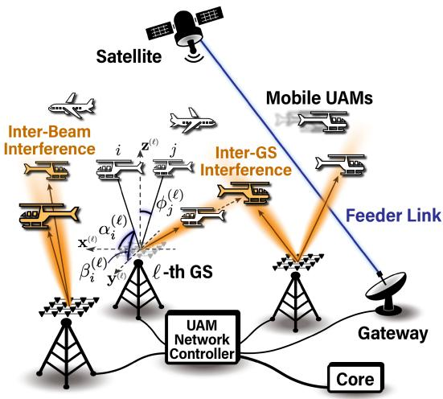

flowchart

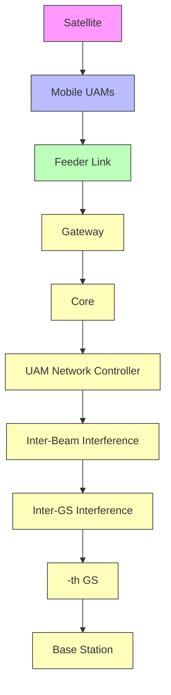

Fig. 1. Illustration of a space-air-ground integrated network for UAM services.

# A. Antennas and Coordinate System

In our system model, each GS is equipped with a rectangular antenna array sized $P \times Q$ . The lengths of the array along the $\mathbf { x } ^ { ( k ) }  – \mathbf { a x i s }$ and $\mathbf { y } ^ { ( k ) }$ -axis are $P$ and $Q ,$ respectively, where $\mathbf { x } ^ { ( k ) } , \mathbf { y } ^ { ( k ) } , \mathbf { z } ^ { ( k ) } \in \mathbb { R } ^ { 3 }$ are unit vectors representing the orientation of the antenna array at the k-th GS. To support UAMs located hundreds of meters away using narrow beams, $P$ and $Q$ must be sufficiently large $( i . e . , \ : P , Q \ge 8 )$ . At the same time, GS transmitters should employ low-complexity antenna architectures to rapidly adapt to the quickly changing UAM channels. Thus, we assume a fully-connected hybrid beamforming architecture, where the number of RF chains N is much smaller than the number of antenna elements $P Q \ ( i . e . ,$ , $N \ll P Q )$ [41]. In this system model, N RF chains output respective data streams for the users, with beamforming for each performed at the analog end. Due to the limitation in the number of RF chains, each of the K GSs services N UAMs simultaneously, leading to a total of $M _ { \mathrm { G S } } \leq K N$ GS users. The number of satellite users is denoted as $M _ { \mathrm { S A T } } = M - M _ { \mathrm { G S } } .$ 1 UAMs are assumed to be equipped with two antennas: one mounted on the bottom of the airframe for communications with the GS, and a directional satellite antenna installed on top of the airframe for satellite communications.

The position of the satellite is given as follows:

$$
\mathbf {u} ^ {\mathrm{S}} = \left[ x ^ {\mathrm{S}} (t), y ^ {\mathrm{S}} (t), z ^ {\mathrm{S}} (t) \right] ^ {\mathrm{T}}, \tag {1}
$$

where $z ^ { \mathrm { S } }$ is the altitude of the satellite orbit. The 3D coordinates of the k-th GS are given as follows:

$$
\mathbf {u} _ {k} ^ {\mathrm{G}} = \left[ x _ {k} ^ {\mathrm{G}}, y _ {k} ^ {\mathrm{G}}, z _ {k} ^ {\mathrm{G}} \right] ^ {\mathrm{T}}, \tag {2}
$$

1When the number of UAMs in the network is less than KN , it is not necessary to associate UAMs with the satellite. In this case, $M _ { \mathrm { S A T } } = 0 .$ However, when there are more than KN UAMs, we assume that each GS supports exactly K UAMs to fully utilize the GS resources rather than handing over UAMs to the satellite.

for $k \in \{ 1 , \cdots , K \}$ . The time-varying 3D coordinates of the m-th UAM are represented as

$$
\mathbf {u} _ {m} (t) = [ x _ {m} (t), y _ {m} (t), z _ {m} (t) ] ^ {\mathrm{T}}, \tag {3}
$$

where $t \in [ 0 , T ]$ is the time of interest and $m \in \{ 1 , \cdots , M \}$ . Considering that UAMs are primarily intended for point-topoint transportation, we assume the UAMs are constrained to linear trajectories within the short time interval of [0, T ]. The velocity for each UAM, denoted by

$$
\dot {\mathbf {u}} _ {m} = \left[ \dot {x} _ {m}, \dot {y} _ {m}, \dot {z} _ {m} \right] ^ {\mathrm{T}}, \tag {4}
$$

allows us to express the position of any given UAM at time t as $\mathbf { u } _ { m } ( t ) = \mathbf { u } _ { m } ( 0 ) + \dot { \mathbf { u } } _ { m } t .$ . For every GS indexed by $k \in$ $\{ 1 , \cdots , K \}$ , its position, $\mathbf { u } _ { k } ^ { \mathrm { G } } .$ , is known at the network controller. Likewise, for each UAM indexed by $m \in \{ 1 , \cdots , M \}$ , both ${ \bf { u } } _ { m } ( 0 )$ and $\dot { \mathbf { u } } _ { m }$ are known variables at the network controller. Using these information, the network controller can calculate the following time-dependent parameters. The spatial relationship of the m-th UAM relative to the k-th GS is represented as

$$
\mathbf {d} _ {m} ^ {(k)} (t) = \mathbf {u} _ {m} (t) - \mathbf {u} _ {k} ^ {\mathrm{G}}. \tag {5}
$$

As shown in Fig. 1, the angles formed between the vector $\mathbf { d } _ { m } ^ { ( k ) } ( t )$ and the two axes of the k-th GS antenna array, $\mathbf { x } ^ { ( k ) }$ and $\mathbf { y } _ { \cdot \cdot \cdot } ^ { ( k ) }$ , are denoted as $\alpha _ { m } ^ { ( k ) }$ and $\beta _ { m } ^ { ( k ) }$ , respectively. Thus, $\cos \alpha _ { m } ^ { ( k ) }$ and cos $\beta _ { m } ^ { ( k ) }$ are calculable for every k and m as

$$
\cos \alpha_ {m} ^ {(k)} (t) = \frac {\mathbf {d} _ {m} ^ {(k)} (t) ^ {\mathrm{T}} \mathbf {x} ^ {(k)}}{\| \mathbf {d} _ {m} ^ {(k)} (t) \|},
$$

$$
\cos \beta_ {m} ^ {(k)} (t) = \frac {\mathbf {d} _ {m} ^ {(k)} (t) ^ {\mathrm{T}} \mathbf {y} ^ {(k)}}{\| \mathbf {d} _ {m} ^ {(k)} (t) \|}. \tag {6}
$$

Additionally, the angof the antenna array, etween , is de $\mathbf { d } _ { m } ^ { ( k ) } ( t )$ the vertical axis. $\mathbf { z } ^ { ( k ) }$ ϕ m $\phi _ { m } ^ { ( k ) }$

# B. Signal and Channel Models for GS-to-UAM Transmission

We define the set of UAM indices as $\mathbf { M } = \{ 1 , \cdots , M \}$ , the set of GS user indices as $\mathbf { M } _ { \mathrm { G S } } \subset \mathbf { M } .$ , and the set of satellite user indices as $\mathbf { M } _ { \mathrm { S A T } } \subset \mathbf { M }$ , where $| \mathbf { M } _ { \mathrm { G S } } | = M _ { \mathrm { G S } } , | \mathbf { M } _ { \mathrm { S A T } } | =$ $M _ { \mathrm { S A T } }$ , and $\mathbf { M } _ { \mathrm { G S } } \cap \mathbf { M } _ { \mathrm { S A T } } = \emptyset$ . The baseband signal transmitted by the k-th GS, denoted as $\mathbf { y } _ { k } \in \mathbb { C } ^ { P Q }$ , is given by

$$
\mathbf {y} _ {k} = \sum_ {m \in \mathbf {M} _ {\mathrm{GS}}} \mathbf {v} _ {k, m} \sqrt {p _ {m} ^ {(k)}} s _ {m}, \tag {7}
$$

where $s _ { m }$ represents the data symbol for the m-th $\mathrm { U A M } , p _ { m } ^ { ( k ) }$ denotes the transmit power, and $\mathbf { v } _ { k , m } \in \mathbb { C } ^ { P Q }$ is the 3D MRT beamforming vector, purposed for directing $s _ { m }$ towards the m-th UAM. Here, $p _ { m } ^ { ( k ) }$ (k) is nonzero only when the link between the k-th GS and the m-th UAM is scheduled. The transmit signals from all K GSs are received by the m-th UAM as

$$
r _ {m} = \sum_ {k = 1} ^ {K} \sqrt {g _ {m} ^ {(k)}} h _ {m} ^ {(k)} \mathbf {h} _ {k, m} ^ {\mathrm{T}} \mathbf {y} _ {k} + z _ {m}, \tag {8}
$$

where $\mathbf { h } _ { k , m } \in \mathbb { C } ^ { P Q }$ is the channel vector for the transmission from the k-th GS to the m-th UAM, $g _ { m } ^ { ( k ) }$ represents the free-space path loss (FSPL), $z _ { m } ~ \sim ~ C N ( 0 , \sigma _ { \mathrm { n } } ^ { 2 } )$ is the additive white Gaussian noise (AWGN) characterized by a noise power of $\sigma _ { \mathrm { n } } ^ { 2 } .$ , and $h _ { m } ^ { ( k ) } \in \mathbb { C }$ is the complex channel gain characterized by $\begin{array} { r } { | h _ { m } ^ { ( k ) } | \sim \mathrm { R i c e } ( \sqrt { \frac { K _ { \mathrm { R } } } { K _ { \mathrm { R } } + 1 } } , \sqrt { \frac { 1 } { 2 ( K _ { \mathrm { R } } + 1 ) } } ) } \end{array}$ and $\arg ( h _ { m } ^ { ( k ) } ) \sim U ( 0 , 2 \pi ) . $ The FSPL is further defined by

$$
g _ {m} ^ {(k)} = G _ {k, m} ^ {\mathrm{R}} G _ {k, m} ^ {\mathrm{T}} \left(\frac {\lambda}{4 \pi \| \mathbf {d} _ {m} ^ {(k)} \|}\right) ^ {2}, \tag {9}
$$

where λ is the wavelength of the carrier signal. The symbols $G _ { k , m } ^ { \mathrm { R } }$ and  ante $G _ { k , m } ^ { \mathrm { T } }$ denote the receive and transmit antelements, respectively. We assume that $G _ { k , m } ^ { \mathrm { R } } =$ $G _ { k , m } ^ { \mathrm { T } } = 1$ . We define the vector ${ \bf a } _ { L } ( x )$ as

$$
\mathbf {a} _ {L} (x) = [ 1, e ^ {- j \pi x}, \dots , e ^ {- j \pi (L - 1) x} ] ^ {\mathrm{T}}. \tag {10}
$$

Considering the minimum elevation angle constraint for associating GSs and UAMs, we assume the GS-to-UAM channel is LoS. With an antenna spacing set at $\frac { \lambda } { 2 }$ within the array, the channel vector $\mathbf { h } _ { k , m }$ is formulated as

$$
\mathbf {h} _ {k, m} = \mathbf {a} _ {P} (\cos \alpha_ {m} ^ {(k)}) \otimes \mathbf {a} _ {Q} (\cos \beta_ {m} ^ {(k)}). \tag {11}
$$

In this framework, the 3D MRT beamformer is adopted for all GS-to-UAM links [26]. For any LoS channel between the kth GS and the m-th UAM, the GS is capable of deriving the power-normalized beamforming vector, based on the known location of the UAM:

$$
\mathbf {v} _ {k, m} = \frac {1}{\sqrt {P Q}} \{\mathbf {a} _ {P} (\cos \alpha_ {m} ^ {(k)}) \otimes \mathbf {a} _ {Q} (\cos \beta_ {m} ^ {(k)}) \} ^ {*}. \tag {12}
$$

More specifically, GS transmitters are designed to dynamically adjust beam direction in reaction to changes in $\alpha _ { m } ^ { ( k ) }$ and $\beta _ { m } ^ { ( k ) }$ βm , leveraging initial location, ${ \bf { u } } _ { m } ( 0 )$ , and velocity, $\dot { \mathbf { u } } _ { m } ,$ of the UAMs. Considering the limited number of RF chains and the complexity of transmitter architecture, we assume that each GS can be associated with at most N UAMs. Inversely, a single GS exclusively services each UAM, thereby precluding the implementation of coordinated beamforming amongst GSs. The scheduled links remain invariant during $t ~ \in ~ [ 0 , T ]$ to avoid handovers, necessitating careful link scheduling under the time-varying network environment.

# C. Beamforming Gain, SINR, and Achievable Rate for GS-to-UAM Transmission

We define the interference signal gain for each GS-to-UAM channel by $b _ { m , n } ^ { ( k ) }$ . This represents the beamforming gain experienced by the m-th UAM when the k-th GS utilizes the MRT beamforming vector targeted at the n-th UAM. It can be calculated prior to the scheduling process using the following formula:

$$
\begin{array}{l} b _ {m, n} ^ {(k)} = \mathbf {h} _ {k, m} ^ {\mathrm{T}} \mathbf {v} _ {k, n} \\ = \frac {1}{\sqrt {P Q}} \mathbf {a} _ {P} (\cos \alpha_ {n} ^ {(k)}) ^ {H} \mathbf {a} _ {P} (\cos \alpha_ {m} ^ {(k)}) \\ \cdot \mathbf {a} _ {Q} (\cos \beta_ {n} ^ {(k)}) ^ {H} \mathbf {a} _ {Q} (\cos \beta_ {m} ^ {(k)}), \tag {13} \\ \end{array}
$$

2Since we assume there are no effective scatterers between the GS and the UAM, we consider only the onboard scatterers. Consequently, all multipaths are modeled with the same directional channel vector $\mathbf { h } _ { k , m } .$ , with random phases assigned to each multipath. Thus, the combined channel coefficient is represented as $h _ { m } ^ { ( k ) }$ .

subject to $0 \leq | b _ { m , n } ^ { ( k ) } | \leq \sqrt { P Q }$ . Utilizing $b _ { m , n } ^ { ( k ) }$ , the baseband Rx signal in (8) can be rewritten as

$$
\begin{array}{l} r _ {m} = \sum_ {k = 1} ^ {K} \sqrt {g _ {m} ^ {(k)}} b _ {m, m} ^ {(k)} h _ {m} ^ {(k)} \sqrt {p _ {m} ^ {(k)}} s _ {m} \\ + \sum_ {k = 1} ^ {K} \sum_ {q \neq m, q \in \mathbf {M} _ {\mathrm{GS}}} \sqrt {g _ {m} ^ {(k)}} b _ {m, q} ^ {(k)} h _ {m} ^ {(k)} \sqrt {p _ {q} ^ {(k)}} s _ {q} + z _ {m}. \tag {14} \\ \end{array}
$$

Using the average signal power and the average interference power, we obtain the SINR of the m-th UAM as

$$
\gamma_ {m} = \frac {\sum_ {k = 1} ^ {K} g _ {m} ^ {(k)} \left| h _ {m} ^ {(k)} \right| ^ {2} \left| b _ {m , m} ^ {(k)} \right| ^ {2} p _ {m} ^ {(k)}}{\sum_ {k = 1} ^ {K} \sum_ {q \neq m , q \in \mathbf {M} _ {\mathrm{GS}}} g _ {m} ^ {(k)} \left| h _ {m} ^ {(k)} \right| ^ {2} \left| b _ {m , q} ^ {(k)} \right| ^ {2} p _ {q} ^ {(k)} + \sigma_ {\mathrm{n}} ^ {2}}. \tag {15}
$$

The achievable rate of the m-th UAM is given by

$$
C _ {m} = \log (1 + \gamma_ {m}). \tag {16}
$$

Through strategic link scheduling and power allocation, we can collectively enhance the achievable rate among multiple UAMs.

# D. Assumptions for Satellite-to-UAM Transmission

We consider a single spot beam of the satellite serving all the satellite-serviced UAMs with channel separation in the time and frequency domains. The received signal for the transmission from the satellite to the m-th UAM can be described as follows:

$$
r _ {m} = \sqrt {g _ {m} ^ {\mathrm{S}}} \sqrt {\mathcal {H} _ {m} ^ {\mathrm{S}}} \sqrt {p _ {m} ^ {\mathrm{S}}} s _ {m} + z _ {m}, \tag {17}
$$

where $m \in \mathbf { M } _ { \mathrm { S A T } } , \ g _ { m } ^ { \mathrm { S } }$ is the FSPL, $\mathcal { H } _ { m } ^ { \mathrm { S } }$ is the atmospheric loss, and $p _ { m } ^ { \mathrm { { S } } }$ is the transmit power. Due to the orthogonality of the time-frequency resources dedicated to different satellite users, co-channel interference is not a concern. Additionally, the satellite-to-UAM channel guarantees a LoS channel with no scatterers due to the significant distance from the ground, thus multipath fading is not considered [42].

The FSPL for the transmission from the satellite to the m-th UAM is given by

$$
g _ {m} ^ {\mathrm{S}} = G _ {\mathrm{R}} G _ {\mathrm{S}} (\mu_ {m}) \mathcal {L} _ {\mathrm{S}} \left(\frac {\lambda_ {\mathrm{S}}}{4 \pi \| \mathbf {d} _ {m} ^ {\mathrm{S}} \|}\right) ^ {2}, \tag {18}
$$

where ${ \bf d } _ { m } ^ { \mathrm { S } } = { \bf u } _ { m } - { \bf u } ^ { \mathrm { S } } , \lambda _ { \mathrm { S } }$ is the carrier wavelength of the satellite service, $G _ { \mathrm { R } }$ is the receiver power gain of the UAM antenna, $G _ { \mathrm { { S } } }$ is the transmit power gain of the satellite antenna, and $\mathcal { L } _ { \mathrm { S } }$ represents other power losses. A widely used radiation pattern for K-band tapered-aperture antennas is introduced in [43]. The radiation pattern of the LEO satellite is formulated as follows:

$$
G _ {\mathrm{S}} (\mu) = G _ {0} \left[ \frac {J _ {1} (\mu)}{2 \mu} + 3 6 \frac {J _ {3} (\mu)}{\mu^ {3}} \right] ^ {2}, \tag {19}
$$

where $J _ { 1 } ( \cdot )$ and $J _ { 3 } ( \cdot )$ are the first and third order Bessel functions, respectively, and $G _ { 0 }$ is the maximum antenna gain at the boresight direction. The symbol $\mu$ is defined as $\mu = 2 . 0 7 1 2 3 \sin ( \psi _ { m } ) / \sin ( \psi _ { 3 \mathrm { d B } } )$ , with $\psi _ { 3 \mathrm { d B } } = 0 . 3 9 \pi \lambda _ { S } / a .$ , where $\psi _ { m }$ is the off-boresight angle and a is the aperture diameter [44]. The value of $G _ { 0 }$ is calculated using $\begin{array} { r } { G _ { 0 } = \frac { 4 \pi A \eta } { \lambda _ { \mathrm { c } } ^ { 2 } } } \end{array}$ , where A is the effective antenna aperture and η is the antenna efficiency. With a carrier frequency of 20 GHz and an aperture diameter of 0.5 m, the 3-dB beamwidth is approximately $\psi _ { 3 \mathrm { d B } } \approx 0 . 0 3 7$ rad.

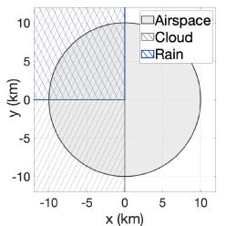

pie

| Category | Value (km) |
|---|---|
| Airspace | 10 |
| Cloud | -5 |
| Rain | 0 |

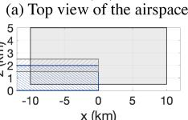  
(b) Side view of the airspace

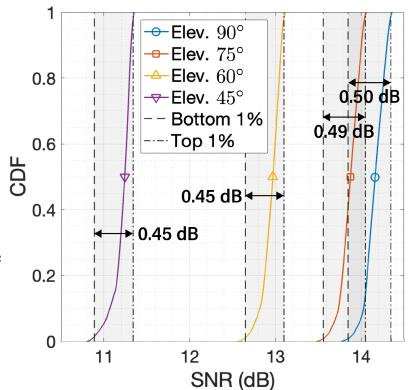

line

| SNR (dB) | CDF (Elev. 90°) | CDF (Elev. 75°) | CDF (Elev. 60°) | CDF (Elev. 45°) |
| -------- | --------------- | --------------- | --------------- | --------------- |
| 11       | ~0.5            | ~0.45           | ~0.45           | ~0.5            |
| 12       | ~0.8            | ~0.7            | ~0.7            | ~0.8            |
| 13       | ~0.9            | ~0.8            | ~0.8            | ~0.9            |
| 14       | ~1.0            | ~0.9            | ~0.9            | ~1.0            |

(c) CDF of satellite downlink SNR   
Fig. 2. The target airspace and simulated atmospheric condition (left), and the experimental CDF of satellite downlink SNR (right).

Various atmospheric effects, including air, fog, cloud, and rain, can deteriorate satellite channels. According to Recommendation ITU-R P.676 [45], the gaseous attenuation of the K-band signal is approximately 0.1 dB/km under standard pressure, temperature, and water vapor density of $7 . 5 ~ \mathrm { g } / \mathrm { m } ^ { 3 }$ . However, since air particles are significantly concentrated near the ground, this has little effect on the aircraft receiver [46]. Also, fog attenuation is negligible, as fog mostly occurs near the surface, and frequencies below 100 GHz experience very small attenuation due to small water droplets [47].

According to Recommendation ITU-R P.840 [47], cloud attenuation is modeled as follows:

$$
A _ {\mathrm{C}} = \frac {K _ {\mathrm{L}} L d _ {\mathrm{C}}}{\sin \phi_ {m} ^ {\mathrm{S}}} (\mathrm{dB}), \tag {20}
$$

where $K _ { \mathrm { L } }$ is the cloud liquid mass absorption coefficient, L is the cloud liquid water content, $d _ { \mathrm { C } }$ is the vertical extent of the cloud in km, and $\phi _ { m } ^ { \mathrm { S } }$ is the elevation angle of the satellite. The parameters can be set to $K _ { \mathrm { L } } = 0 . 2 ~ \mathrm { d B \cdot m ^ { 2 } / k g }$ for a temperature of 293 K and a carrier frequency of 20 GHz, and $L = 0 . 5 ~ \mathrm { g } / \mathrm { m } ^ { 3 }$ for typical cumulus clouds [47].

Measurements in [48] show that in rough precipitation situations, which account for 1 % of total raining time, rain attenuation may exceed 1 dB. A generalized K-band rain attenuation model is represented as follows [49]:

$$
A _ {\mathrm{R}} = K _ {\mathrm{R}} R ^ {\alpha} \quad (\mathrm{dB/km}), \tag {21}
$$

where $K _ { \mathrm { R } }$ and α are functions of frequency, and R is the rain rate in mm/h. Based on Recommendation ITU-R P.838 [50], these coefficients have values of $K _ { \mathrm { R } } = 0 . 0 9$ and $\alpha = 1 . 0 6$ for a 20 GHz frequency.

Fig. 2c illustrates the cumulative distribution function (CDF) of the signal-to-noise ratio (SNR) for uniformly distributed UAMs within the target airspace of our system model. The target airspace, where UAMs can be jointly scheduled by

TABLE I SATELLITE PARAMETERS 

<table><tr><td>Parameter</td><td>Value</td></tr><tr><td>Carrier frequency of the satellite (c/λs)</td><td>20 GHz</td></tr><tr><td>Signal bandwidth</td><td>20 MHz</td></tr><tr><td>LEO satellite altitude</td><td>600 km</td></tr><tr><td>Minimum round trip delay</td><td>4.0 ms</td></tr><tr><td>Satellite transmit power (per spot beam)</td><td>10 W</td></tr><tr><td>Diameter of the satellite antenna (a)</td><td>0.5 m</td></tr><tr><td>Satellite antenna efficiency (η)</td><td>0.5</td></tr><tr><td>Maximum satellite antenna gain (G0)</td><td>37.39 dBi</td></tr><tr><td>Receiver antenna gain (GR)</td><td>20 dBi</td></tr><tr><td>Other power losses (LS)</td><td>10 dB</td></tr><tr><td>Temperature</td><td>293 K</td></tr><tr><td>Cloud liquid mass absorption (KL)</td><td>0.2 dB·m2/kg</td></tr><tr><td>Liquid water content (L)</td><td>0.5 g/m3</td></tr><tr><td>Cloud height (dC)</td><td>1 km</td></tr><tr><td>Cloud base altitude</td><td>1.5 km</td></tr><tr><td>Rain attenuation coefficients (KR, α)</td><td>0.09, 1.06</td></tr><tr><td>Rainfall rate (R)</td><td>1 mm/h</td></tr></table>

K GSs and one satellite through the UAM network controller, is assumed to be a cylindrical space with a radius of 10 km and a height of 4.5 km, as depicted in Fig. 2a and Fig. 2b. The maximum altitude of 5 km is selected based on Class E airspace of the United States [51]. Four satellite locations are considered: [0, 0, 600], [161, 0, 600], [346, 0, 600], and [600, 0, 600] km, corresponding to elevation angles of $9 0 °$ , 75◦, 60◦, and 45◦, respectively. Additional parameter values are listed in Table I. The results in Fig. 2c show that the difference between the highest and lowest power gains is less than 0.5 dB. While SNR can reach up to 14 dB, achieving performance near the Shannon capacity is challenging due to significant Doppler shifts, difficulties in initial access caused by propagation delay, and the need to allocate time-frequency resources among multiple satellite users.3

Our analysis shows that even in harsh weather conditions, atmospheric effects and beam patterns have minimal impact on satellite channel gains for UAMs in our target airspace. Therefore, selecting certain UAMs as satellite users based solely on satellite downlink performance offers little advantage unless there is a dedicated satellite spot beam for the UAM network. We argue that selecting satellite users should instead aim to maximize overall system performance, with a focus on the primary users, which are the GS users.

# III. PROBLEM FORMULATION

Considering the high mobility of UAMs and their frequent crossing into different service regions, it is impractical to depend solely on instantaneous channel snapshots. Hence, we focus on the time interval [0, T ]. Accordingly, time-varying notations such as $g _ { m } ^ { ( k ) } ( t ) , \mathbf { h } _ { k , m } ( t ) , { \mathbf v } _ { k , m } ( t ) , \bar { b } _ { m , n } ^ { ( k ) } ( t ) , p _ { m } ^ { ( k ) } ( t )$ $\gamma _ { m } ( t )$ , and $C _ { m } ( t )$ , are introduced. For instance, the beamforming vector $\mathbf { v } _ { k , m } ( t )$ adjusts in response to the dynamic positions of UAMs, enabling beam tracking. In our problem

3When satellite users share the time-frequency resources for their private data transmission, their respective data rates decrease proportionally to the number of users. However, satellites are advantageous for broadcasting common critical control information to UAMs due to their extensive coverage [15]. As a result, essential control information can be reliably delivered via satellite, with a typical round trip delay of 4 ms for LEO satellites.

formulation, we assume that link associations are fixed during this interval, while the beamforming vectors and power allocations are updated frequently.

As discussed in Section II-D, we assume marginal differences in downlink performance among all UAMs when scheduled to the satellite. Satellite users are considered secondary due to higher latency, lower total rate, and no significant differences in expected downlink performance. Therefore, our emphasis is on maximizing the sum rate of GS-serviced users. Utilizing the parameters and constraints outlined in Section II, we formulate the sum rate maximization problem as follows:

(P1) :

$$
\max _ {\substack {\mathbf {M} _ {\mathrm{SAT}} \\ \left\{p _ {m} ^ {(k)} (t) \mid \forall k, \forall m \in \mathbf {M} _ {\mathrm{GS}}, t \in [ 0, T ] \right\}}} \sum_ {m \in \mathbf {M} _ {\mathrm{GS}}} \int_ {0} ^ {T} C _ {m} (t) d t \tag{22a}
$$

$\mathrm { s . t . \ { M _ { G S } } = M - M _ { S A T } }$ (22b)

$$
\mathbf {M} _ {\mathrm{SAT}} \subset \mathbf {M}, | \mathbf {M} _ {\mathrm{SAT}} | = M _ {\mathrm{SAT}} \tag {22c}
$$

$$
\sum_ {m \in \mathbf {M} _ {\mathrm{GS}}} p _ {m} ^ {(k)} (t) \leq P _ {\mathrm{T}},   \forall k,   t \in [ 0, T ] \tag {22d}
$$

$$
p _ {m} ^ {(k)} (t) \geq 0, \forall k, \forall m \in \mathbf {M} _ {\mathrm{GS}}, t \in [ 0, T ] \tag {22e}
$$

$$
\left\| \left[ \int_ {0} ^ {T} p _ {m _ {1}} ^ {(k)} (t) d t, \dots , \int_ {0} ^ {T} p _ {m _ {M _ {\mathrm{GS}}}} ^ {(k)} (t) d t \right] \right\| _ {0} \leq N,
$$

$$
\left\{m _ {1}, \dots , m _ {M _ {\mathrm{GS}}} \right\} = \mathbf {M} _ {\mathrm{GS}}, \forall k, t \in [ 0, T ] (2 2 \mathrm{f})
$$

$$
\left\| \left[ \int_ {0} ^ {T} p _ {m} ^ {(1)} (t) d t, \dots , \int_ {0} ^ {T} p _ {m} ^ {(K)} (t) d t \right] \right\| _ {0} = 1,
$$

$$
\forall m \in \mathbf {M} _ {\mathrm{GS}}, t \in [ 0, T ] \tag {22g}
$$

$$
\phi_ {m} ^ {(k)} <   \phi_ {\mathrm{LoS}} \Rightarrow p _ {m} ^ {(k)} (t) = 0,
$$

$$
\forall k, \forall m \in \mathbf {M} _ {\mathrm{GS}}, t \in [ 0, T ] \tag {22h}
$$

$$
\gamma_ {m} (t) \geq \gamma_ {\min}, \forall m \in \mathbf {M} _ {\mathrm{GS}}, t \in [ 0, T ] \tag {22i}
$$

The objective function (22a) aims to maximize the total rate of GS-serviced UAMs within the time frame $t \in [ 0 , T ]$ . The variables to be optimized include the index set of satellite users (through satellite user selection) and the power allocation of the GSs (via GS user selection and power allocation). Constraint (22b) specifies that GS users are the UAMs remaining after satellite user removal, while constraint (22c) sets the number of satellite users to $M _ { \mathrm { S A T } }$ . Constraint (22d) limits the total power output of each GS, and constraint (22e) ensures that power allocations are non-negative. Constraint (22f) allows each GS to service up to N UAMs throughout the entire time frame, and constraint (22g) ensures that each UAM is serviced by only one GS. According to constraint (22h), a zenith angle smaller than the threshold $\phi _ { \mathrm { L o S } }$ is necessary for scheduling. The inequality (22i) imposes a QoS constraint, setting a minimum SINR threshold for all GS-serviced UAMs.

Since (P1) is highly non-convex, we propose an efficient solution with manageable computational complexity. Initially, using channel prediction based on location and velocity information, we develop mobility-aware link scheduling algorithms to tackle the integer subproblems of (P1). During the scheduling process, we first determine the elements of $\mathbf { M } _ { \mathrm { S A T } }$ under constraints (22b) and (22c). Then, we establish GS-UAM associations under constraints (22f), (22g), and (22h). Based on the scheduling decision, we iteratively solve the non-convex nonlinear power allocation problem using instantaneous channel knowledge, unlike scheduling algorithms that rely solely on channel prediction.

# IV. MOBILITY-AWARE LINK SCHEDULING

In this section, we present our proposed scheduling algorithms, which consider the mobility of UAMs. Due to the unpredictability of the future small-scale fading channels and the impracticality of an exhaustive search for optimal scheduling alongside power allocation, we develop heuristic algorithms. The proposed algorithms result in a suboptimal link association within a polynomial time.

# A. Satellite User Selection

Initially, all UAMs are considered GS users. During the satellite user selection process, we designate MSAT UAMs as satellite users to minimize co-channel interference among the remaining GS users. The interference assessment utilizes the undesired beamforming gain, $b _ { m , n } ^ { ( k ) } = b _ { n , m } ^ { ( k ) }$ (k) , for m $\neq n .$ . In the processn, the network controller first computes $b _ { m , n } ^ { ( k ) }$ for all possible combinations of $( m , n , k )$ . If either the mth or n-th UAM is serviced by the k-th GS, the value of $b _ { m , n } ^ { ( k ) }$ becomes crucial. Additionally, future link associations and power allocation strategies should be considered during this phase. Thus, we formulate the subproblem of selecting satellite users as follows:

$$
\text {(SP1)}: \min _ {\mathbf {M} _ {\mathrm{SAT}}} \max _ {m \neq n \in \mathbf {M} _ {\mathrm{GS}}} \min _ {k \in \{1, \dots , K \}} \max _ {t \in [ 0, T ]} | b _ {m, n} ^ {(k)} (t) | \tag {23a}
$$

$$
\mathrm{s.t.} \mathbf {M} _ {\mathrm{GS}} = \mathbf {M} - \mathbf {M} _ {\mathrm{SAT}} \tag {23b}
$$

$$
\mathbf {M} _ {\mathrm{SAT}} \subset \mathbf {M}, | \mathbf {M} _ {\mathrm{SAT}} | = M _ {\mathrm{SAT}} \tag {23c}
$$

The objective function (23a) is formulated as a min-max problem.4 Specifically, by removing $M _ { \mathrm { S A T } }$ users from the total of M users, we aim to minimize the maximum interference gain between any two GS users, assuming interference-minimizing GS association for each pair and considering only the highest interference level during $t \in [ 0 , T ]$ . Constraint (23b) and (23c) are the same as (22b) and (22c) of (P1), respectively. These constraints specify the number of satellite and GS users, and that they are exclusive sets.

We first assess the maximum interference gain over time, $\mathrm { m a x } _ { t \in [ 0 , T ] } | b _ { m , n } ^ { ( k ) } ( t ) |$ , for all possible combinations of $( m , n , k )$ . As there is no closed-form expression for this highly non-convex function, we propose two methods for deriving a suboptimal solution: an analytical closed-form solution using polynomial approximations, and a time sampling-based numerical method. Before advancing to the first method, we derive Lemma 1 and Lemma 2 to approximate $| b _ { m , n } ^ { ( k ) } ( t ) |$ with $B _ { m , n } ^ { ( k ) } ( t )$ , approximating the main lobe of the original beam pattern.

4To accurately account for interference power, the objective function should be set as the product of $| b _ { m , n } ^ { ( k ) } ( t ) |$ and the FSPL. However, focusing on the signal-to-interference ratio, we chose to omit the FSPL, which affects both the desired and the interference signals. Instead, we set $| b _ { m , n } ^ { ( \acute { k } ) } ( t ) |$ as the objective, corresponding to the ratio of the two signal strengths. This approach prevents the undesirable assignment of users proximal to the GSs as satellite users.

Lemma 1: For $| x - y | < \frac { 2 } { L } , \ : \left| \mathbf { a } _ { L } ( x ) ^ { H } \mathbf { a } _ { L } ( y ) \right|$ is approximated as

$$
\left| \mathbf {a} _ {L} (x) ^ {H} \mathbf {a} _ {L} (y) \right| \approx L - \frac {\pi^ {2} L (L ^ {2} - 1)}{2 4} (x - y) ^ {2}. \tag {24}
$$

Proof: See Appendix A.

Lemma 2: When $\Vert \dot { \mathbf { u } } _ { m } \Vert T \ \ll \ \Vert \mathbf { d } _ { m } ^ { ( k ) } ( 0 ) \Vert$ , cos $\alpha _ { m } ^ { ( k ) } ( t ) ~ -$ cos $\alpha _ { n } ^ { ( k ) } ( t )$ and cos $\beta _ { m } ^ { ( k ) } ( t ) - \cos \beta _ { n } ^ { ( k ) } ( t )$ are approximated as follows:

$$
\cos \alpha_ {m} ^ {(k)} (t) - \cos \alpha_ {n} ^ {(k)} (t) \approx \sigma_ {m, n} ^ {\mathbf {x} (k)} + \nu_ {m, n} ^ {\mathbf {x} (k)} t,
$$

$$
\cos \beta_ {m} ^ {(k)} (t) - \cos \beta_ {n} ^ {(k)} (t) \approx \sigma_ {m, n} ^ {\mathbf {y} (k)} + \nu_ {m, n} ^ {\mathbf {y} (k)} t, \tag {25}
$$

with coefficients $\sigma _ { m , n } ^ { \mathbf { x } ( k ) } , \sigma _ { m , n } ^ { \mathbf { y } ( k ) } , \nu _ { m , n } ^ { \mathbf { x } ( k ) }$ , and $\nu _ { m , n } ^ { \mathbf { y } ( k ) }$ defined as (26) and (27), shown at the bottom of the next page.

Proof: See Appendix B.

By substituting (24) and (25) into (13), we obtain a second-order Taylor approximation of $| b _ { m , n } ^ { ( k ) } ( t ) |$ within the main lobe region, specifically for | cos√ $\alpha _ { m } ^ { ( k ) } - \cos \alpha _ { n } ^ { ( k ) } | \ \leq$ cos αn $\begin{array} { r } { \frac { 2 \sqrt { 6 } } { \pi \sqrt { P ^ { 2 } - 1 } } \mathrm { ~ a n d ~ } \breve { | } \cos \beta _ { m } ^ { ( \boldsymbol { k } ) } - \cos \bar { \beta } _ { n } ^ { ( \boldsymbol { k } ) } | \leq \frac { 2 \sqrt { 6 } } { \pi \sqrt { Q ^ { 2 } - 1 } } \colon } \end{array}$ 1 and | cos β(k)m − cos β(k)n |

$$
B _ {m, n} ^ {(k)} (t) \approx \sqrt {P Q} \left\{1 - P _ {0} \left(\sigma_ {m, n} ^ {\mathbf {x} (k)} + \nu_ {m, n} ^ {\mathbf {x} (k)} t\right) ^ {2} \right.
$$

$$
\left. - Q _ {0} \left(\sigma_ {m, n} ^ {\mathbf {y} (k)} + \nu_ {m, n} ^ {\mathbf {y} (k)} t\right) ^ {2} \right\}, \tag {28}
$$

where $\begin{array} { l l l } { P _ { 0 } } & { = } & { \pi ^ { 2 } ( P ^ { 2 } { - } 1 ) / 2 4 } \end{array}$ and $\begin{array} { l l l } { { Q _ { 0 } } } & { { = } } & { { \pi ^ { 2 } ( Q ^ { 2 } { - } 1 ) / 2 4 } } \end{array}$ . When $P _ { 0 } = Q _ { 0 }$ , the term $\bigl ( \sigma _ { m , n } ^ { \mathbf { x } ( k ) } + \nu _ { m , n } ^ { \mathbf { x } ( k ) } t \bigr ) ^ { 2 } + \bigl ( \sigma _ { m , n } ^ { \mathbf { y } ( k ) } +$ +σy(k)m,n ${ \nu _ { m , n } ^ { \mathbf { y } ( k ) } } t \mathbf { ) } ^ { 2 }$ serves as an approximated squared distance between $( \cos \alpha _ { m } ^ { ( k ) }$ , cos β(k)m ) and $\bar { ( \cos \alpha _ { n } ^ { ( k ) } , \cos \beta _ { n } ^ { ( k ) } ) }$ . Therefore, even for larger $| \cos \alpha _ { m } ^ { ( k ) } - \cos \alpha _ { n } ^ { ( k ) } | \mathrm { o r } | \cos \beta _ { m } ^ { ( k ) } - \cos \beta _ { n } ^ { ( k ) } |$ cos αn , minimizing $B _ { m , n } ^ { ( k ) }$ offers advantages by reducing expected interference gain and the likelihood of entering the main lobe region due to UAM mobjective function with $B _ { m , n } ^ { ( k ) }$ ents. As a result, we replace the, approximating the main lobe of lobe regions. This leads to the subproblem (SP2) as follows:

$$
\text {(SP2)}: \min _ {\mathbf {M} _ {\mathrm{SAT}}} \max _ {m \neq n \in \mathbf {M} _ {\mathrm{GS}}} \min _ {k \in \{1, \dots , K \}} \max _ {t \in [ 0, T ]} B _ {m, n} ^ {(k)} (t) \tag {29a}
$$

$$
\mathrm{s.t.} \mathbf {M} _ {\mathrm{GS}} = \mathbf {M} - \mathbf {M} _ {\mathrm{SAT}} \tag {29b}
$$

$$
\mathbf {M} _ {\mathrm{SAT}} \subset \mathbf {M}, | \mathbf {M} _ {\mathrm{SAT}} | = M _ {\mathrm{SAT}} \tag {29c}
$$

1) Analytical Method for Finding $\mathrm { m a x } _ { t \in [ 0 , T ] } B _ { m , n } ^ { ( k ) } ( t ) .$ : In this method, we address (SP2) instead of (SP1), which allows the derivation of a closed-form expression for $\mathrm { m a x } _ { t \in [ 0 , T ] } B _ { m , n } ^ { ( k ) } ( t )$ across all combinations of $( m , n , k )$ . From $d B _ { m , n } ^ { ( k ) } ( t ) \dot { / } d t = 0$ , we obtain the maximizer $t ~ = ~ \tau _ { m , n } ^ { ( k ) }$ as follows:

$$
\tau_ {m, n} ^ {(k)} = - \frac {P _ {0} \sigma_ {m , n} ^ {\mathbf {x} (k)} \nu_ {m , n} ^ {\mathbf {x} (k)} + Q _ {0} \sigma_ {m , n} ^ {\mathbf {y} (k)} \nu_ {m , n} ^ {\mathbf {y} (k)}}{P _ {0} \nu_ {m , n} ^ {\mathbf {x} (k) ^ {2}} + Q _ {0} \nu_ {m , n} ^ {\mathbf {y} (k) ^ {2}}}. \tag {30}
$$

Upon determining $\tau _ { m , n } ^ { ( k ) }$ , we calculate:

$$
\max _ {t \in [ 0, T ]} B _ {m, n} ^ {(k)} (t) = \left\{ \begin{array}{l l} B _ {m, n} ^ {(k)} (0), & \tau_ {m, n} ^ {(k)} <   0 \\ B _ {m, n} ^ {(k)} (\tau_ {m, n} ^ {(k)}), & 0 \leq \tau_ {m, n} ^ {(k)} \leq T \\ B _ {m, n} ^ {(k)} (T), & \tau_ {m, n} ^ {(k)} > T \end{array} \right. \tag {31}
$$

Substituting (31) into (29a) leaves us with an integer problem regarding m, n, and k. Before proceeding further, we construct the matrices $\mathbf { A } _ { k }$ as

$$
[ \mathbf {A} _ {k} ] _ {i, j} = \max _ {t \in [ 0, T ]} B _ {i, j} ^ {(k)} (t), \quad \forall (i, j, k). \tag {32}
$$

2) Numerical Method for Finding the Approximation of $\begin{array} { r } { \operatorname* { m a x } _ { t \in [ 0 , T ] } | b _ { m , n } ^ { ( k ) } ( t ) | ; } \end{array}$ In contrast to the analytical method which yields a closed-form expression for $\mathrm { m a x } _ { t \in [ 0 , T ] } | b _ { m , n } ^ { ( k ) } ( t ) |$ , this numerical method addresses (SP1) directly. By sampling $| b _ { m , n } ^ { ( k ) } ( t ) |$ at intervals of every $1 / D$ second, an approximate value is obtained by evaluating all sampled interference gains:

$$
\max _ {t \in [ 0, T ]} | b _ {m, n} ^ {(k)} (t) | \approx \max _ {t ^ {\prime} \in \{0, \frac {1}{D}, \frac {2}{D}, \dots , T \}} | b _ {m, n} ^ {(k)} (t ^ {\prime}) |, \tag {33}
$$

where $D \gg 1$ and $D \in \mathbb { Z } .$ The remainder of (SP1) aligns with the integer problem of (SP2). Thus, in this context, we construct $\mathbf { A } _ { k }$ as

$$
\left[ \mathbf {A} _ {k} \right] _ {i, j} = \max _ {t ^ {\prime} \in \{0, \frac {1}{D}, \frac {2}{D}, \dots , T \}} \left| b _ {i, j} ^ {(k)} (t ^ {\prime}) \right|, \quad \forall (i, j, k). \tag {34}
$$

3) Subsequent Satellite User Selection Using $\mathbf { A } _ { k } \mathbf { \cdot }$ Following the implementation of the aforementioned methods, we encounter the integer problem:

$$
\text {(SP3)}: \min _ {\mathbf {M} _ {\mathrm{SAT}}} \quad \max _ {m \neq n \in \mathbf {M} _ {\mathrm{GS}}} \min _ {k \in \{1, \dots , K \}} [ \mathbf {A} _ {k} ] _ {i, j} \tag {35a}
$$

$$
\mathrm{s.t.} \mathbf {M} _ {\mathrm{GS}} = \mathbf {M} - \mathbf {M} _ {\mathrm{SAT}} \tag {35b}
$$

$$
\mathbf {M} _ {\mathrm{SAT}} \subset \mathbf {M}, | \mathbf {M} _ {\mathrm{SAT}} | = M _ {\mathrm{SAT}} \tag {35c}
$$

We simplify min $\mathbf { \partial } _ { \cdot } k { \in } \{ 1 , \cdots , K \} \big [ \mathbf { A } _ { k } \big ] _ { i , j }$ by constructing $\mathbf { A } _ { \mathrm { m i n } }$ as follows:

$$
[ \mathbf {A} _ {\min} ] _ {i, j} = \min _ {k} [ \mathbf {A} _ {k} ] _ {i, j}, \quad \forall (i, j), \tag {36}
$$

with $[ { \bf A } _ { \mathrm { m i n } } ] _ { i , j } ~ = ~ a _ { i j }$ . It is important to note that $\begin{array} { r l } { a _ { i j } } & { { } = } \end{array}$ $a _ { j i }$ in both analytical and numerical methods, allowing the development of the undirected weighted graph $G _ { 1 } = ( V _ { 1 } , E _ { 1 } )$ with $\mathbf { A } _ { \mathrm { m i n } }$ as the adjacency matrix. Through Algorithm 1, we solve (SP3), thus obtaining the set of satellite user indices, $\mathbf { M } _ { \mathrm { S A T } }$ .

# B. GS User Association

In this subsection, we detail the approach for associating GS users with the most suitable GS, taking into account constraints (22f), (22g), and (22h). Identifying the optimal link association is challenging without prior knowledge of post-power allocation performance for all possible associations. Therefore, by converting the link association problem into the equivalent MCMF problem, we propose an algorithm to efficiently determine the suboptimal link association between GS users and GSs. It is worth noting that even when the total number of GS users is less than KN, the proposed algorithms can be implemented without any conflicts. However, for the conciseness of the indexing rules for UAMs and GSs, we consider the case of $M _ { \mathrm { G S } } = K N$ , in this section.

Algorithm 1 Greedy Algorithm for Satellite User Selection   
1: Initialize $M_{GS} = M$ .
2: Generate the vertex set $V_{1}$ , where each vertex $v \in V_{1}$ corresponds to an element in $M_{GS}$ .
3: Generate an undirected weighted graph $G_{1} = (V_{1}, E_{1})$ using $A_{min}$ as the adjacency matrix.
4: Let $a_{i,j}$ be the $(i,j)$ -th entry of $A_{min}$ .
5: repeat
6: $(i,j) \leftarrow \arg\max_{i<j} a_{ij}$ .
7: if $\max_{t \neq j} a_{it} > \max_{t \neq i} a_{jt}$ then
8: Remove node i and the corresponding element from $M_{GS}$ .
9: else
10: Remove node j and the corresponding element from $M_{GS}$ .
11: end if
12: until $|V_{1}| == M_{GS}$ 13: $M_{SAT} = M - M_{GS}$ .

The assessment of each link between the m-th UAM and the k-th GS is quantified by a score, formulated as

$$
c _ {m} ^ {(k)} = \log \left(1 + \frac {\int_ {0} ^ {T} g _ {m} ^ {(k)} \left| b _ {m , m} ^ {(k)} \right| ^ {2} d t}{\sum_ {n \neq m , n \in \mathbf {M} _ {\mathrm{GS}}} \int_ {0} ^ {T} g _ {n} ^ {(k)} \left| b _ {n , m} ^ {(k)} \right| ^ {2} d t + \epsilon}\right), \tag {37}
$$

where ϵ is an arbitrarily small number introduced for numerical stability. The numerator, $\begin{array} { r } { \int _ { 0 } ^ { T } g _ { m } ^ { ( k ) } | b _ { m , m } ^ { ( k ) } | ^ { 2 } d t \quad \quad } \end{array}$ , represents the desired signal power for transmissions from the k-th GS to the m-th UAM. The main component of the denominator, Pn̸=m, n∈MGS R T0 g(k)n | $\begin{array} { r } { \sum _ { n \neq m , n \in { \bf M } _ { \mathrm { G S } } } \int _ { 0 } ^ { T } g _ { n } ^ { ( k ) } | b _ { n , m } ^ { ( k ) } | ^ { 2 } d t . } \end{array}$ | , aggregates the interference power received at all unintended UAMs when the k-th GS transmits to the m-th UAM. Hence, $c _ { m } ^ { ( k ) }$ effectively linearizes the benefit of associating the m-th UAM with the k-th GS in terms of sum rate, particularly as the number of GSs and UAMs increases and their geometric relationships become more intricate. Pre-calculating $c _ { m } ^ { ( k ) }$ for every $m \in \mathbf { M } _ { \mathrm { G S } }$ and $k$ is essential for scheduling. Similar to the satellite user selection process, we propose two methods to approximate $c _ { m } ^ { ( k ) }$ : an analytical closed-form solution using polynomial approximations, and a time sampling-based numerical method.

$$
\sigma_ {m, n} ^ {\mathbf {x} (k)} = \frac {\mathbf {d} _ {m} ^ {(k)} (0) ^ {\mathrm{T}} \mathbf {x} ^ {(k)}}{\| \mathbf {d} _ {m} ^ {(k)} (0) \|} - \frac {\mathbf {d} _ {n} ^ {(k)} (0) ^ {\mathrm{T}} \mathbf {x} ^ {(k)}}{\| \mathbf {d} _ {n} ^ {(k)} (0) \|}, \quad \sigma_ {m, n} ^ {\mathbf {y} (k)} = \frac {\mathbf {d} _ {m} ^ {(k)} (0) ^ {\mathrm{T}} \mathbf {y} ^ {(k)}}{\| \mathbf {d} _ {m} ^ {(k)} (0) \|} - \frac {\mathbf {d} _ {n} ^ {(k)} (0) ^ {\mathrm{T}} \mathbf {y} ^ {(k)}}{\| \mathbf {d} _ {n} ^ {(k)} (0) \|} \tag {26}
$$

$$
\nu_ {m, n} ^ {\mathbf {x} (k)} = \frac {\mathbf {x} ^ {(k) ^ {\mathrm{T}}} \big (\mathbf {d} _ {m} ^ {(k)} (0) \dot {\mathbf {u}} _ {m} ^ {\mathrm{T}} \dot {\mathbf {u}} _ {m} - \dot {\mathbf {u}} _ {m} \dot {\mathbf {u}} _ {m} ^ {\mathrm{T}} \mathbf {d} _ {m} ^ {(k)} (0) \big)}{\| \mathbf {d} _ {m} ^ {(k)} (0) \| ^ {3}} - \frac {\mathbf {x} ^ {(k) ^ {\mathrm{T}}} \big (\mathbf {d} _ {n} ^ {(k)} (0) \dot {\mathbf {u}} _ {n} ^ {\mathrm{T}} \dot {\mathbf {u}} _ {n} - \dot {\mathbf {u}} _ {n} \dot {\mathbf {u}} _ {n} ^ {\mathrm{T}} \mathbf {d} _ {n} ^ {(k)} (0) \big)}{\| \mathbf {d} _ {n} ^ {(k)} (0) \| ^ {3}},
$$

$$
\nu_ {m, n} ^ {\mathbf {y} (k)} = \frac {\mathbf {y} ^ {(k) ^ {\mathrm{T}}} \left(\mathbf {d} _ {m} ^ {(k)} (0) \dot {\mathbf {u}} _ {m} ^ {\mathrm{T}} \dot {\mathbf {u}} _ {m} - \dot {\mathbf {u}} _ {m} \dot {\mathbf {u}} _ {m} ^ {\mathrm{T}} \mathbf {d} _ {m} ^ {(k)} (0)\right)}{\| \mathbf {d} _ {m} ^ {(k)} (0) \| ^ {3}} - \frac {\mathbf {y} ^ {(k) ^ {\mathrm{T}}} \left(\mathbf {d} _ {n} ^ {(k)} (0) \dot {\mathbf {u}} _ {n} ^ {\mathrm{T}} \dot {\mathbf {u}} _ {n} - \dot {\mathbf {u}} _ {n} \dot {\mathbf {u}} _ {n} ^ {\mathrm{T}} \mathbf {d} _ {n} ^ {(k)} (0)\right)}{\| \mathbf {d} _ {n} ^ {(k)} (0) \| ^ {3}} \tag {27}
$$

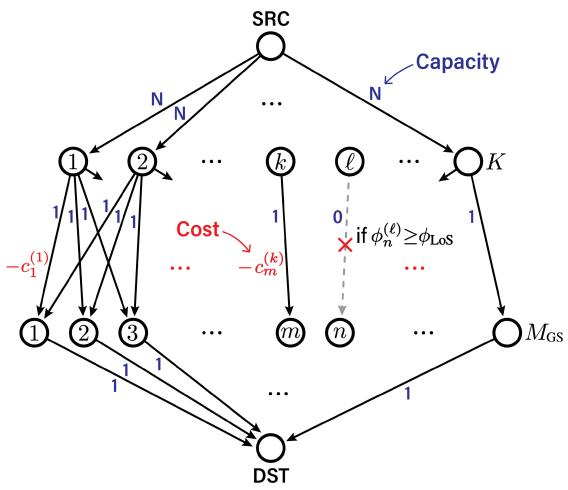

flowchart

```mermaid
graph TD
    SRC -->|N| 1
    SRC -->|N| 2
    SRC -->|N| K
    1 -->|1| 3
    1 -->|-c₁⁽¹⁾| 1
    2 -->|1| 3
    2 -->|1| 2
    2 -->|1| 1
    3 -->|1| 2
    3 -->|1| 3
    3 -->|1| 1
    4 -->|...| m
    4 -->|0 if φₙ⁽ˡ⁾≥φLoS| n
    5 -->|...| m
    5 -->|...| n
    6 -->|...| DST
    7 -->|...| DST
    8 -->|...| DST
    9 -->|...| DST
    10 -->|1| DST
    DST -->|1| 1
    DST -->|1| 2
    DST -->|1| 3
    DST -->|1| 4
    DST -->|1| 5
    DST -->|1| 6
    DST -->|1| 7
    DST -->|1| 8
    DST -->|1| 9
    DST -->|1| 10
    DST -->|1| 11
    DST -->|1| 12
    DST -->|1| 13
    DST -->|1| 14
    DST -->|1| 15
    DST -->|1| 16
    DST -->|1| 17
    DST -->|1| 18
    DST -->|1| 19
    DST -->|1| 20
    DST -->|1| 21
    DST -->|1| 22
    DST -->|1| 23
    DST -->|1| 24
    DST -->|1| 25
    DST -->|1| 26
    DST -->|1| 27
    DST -->|1| 28
    DST -->|1| 29
    DST -->|1| 30
    DST -->|1| 31
    DST -->|1| 32
    DST -->|1| 33
    DST -->|1| 34
    DST -->|1| 35
    DST -->|1| 36
    DST -->|1| 37
    DST -->|1| 38
    DST -->|1| 39
    DST -->|1| 40
    DST -->|1| 41
    DST -->|1| 42
    DST -->|1| 43
    DST -->|1| 44
    DST -->|1| 45
    DST -->|1| 46
    DST -->|1| 47
    DST -->|1| 48
    DST -->|1| 49
    DST -->|1| 50
    DST -->|1| 51
    DST -->|1| 52
    DST -->|1| 53
    DST -->|1| 54
    DST -->|1| 55
    DST -->|1| 56
    DST -->|1| 57
    DST -->|1| 58
    DST -->|1| 59
    DST -->|1| 60
    DST -->|1| 61
    DST -->|1| 62
    DST -->|1| 63
    DST -->|1| 64
    DST -->|1| 65
    DST -->|1| 66
    DST -->|1| 67
    DST -->|1| 68
    DST -->|1| 69
    DST -->|1| 70
    DST -->|1| 71
    DST -->|1| 72
    DST -->|1| 73
    DST -->|1| 74
    DST -->|1| 75
    DST -->|1| 76
    DST -->|1| 77
    DST -->|1| 78
    DST -->|1| 79
    DST -->|1| 80
    DST -->|1| 81
    DST -->|1| 82
    DST -->|1| 83
    DST -->|1| 84
    DST -->|1| 85
    DST -->|1| 86
    DST -->|1| 87
    DST -->|1| 88
    DST -->|1| 89
    DST -->|1| 90
```

Fig. 3. Graph representation $G _ { 2 } = ( V _ { 2 } , E _ { 2 } )$ for the GS link association problem. $\mathrm { S R C }$ and DST denote the source and destination nodes of the flow graph, respectively.

1) Analytical Method for $C a l c u l a t i n g \ c _ { m } ^ { ( k ) }$ (k) : In this method, we first define main lobe of $| b _ { m , n } ^ { ( k ) } |$ $\vec { B _ { m , n } ^ { ( k ) } } ~ = ~ \operatorname* { m a x } \{ B _ { m , n } ^ { ( k ) } , 0 \}$ ,n m,n  and setting the side lobe regions to zero. = , approximating the From $B _ { m , n } ^ { ( k ) } ( t ) ~ = ~ 0 .$ , we obtain $t = \check { \tau } _ { m , n } ^ { ( k ) } , \hat { \tau } _ { m , n } ^ { ( \overline { { k } } ) }$ , and their closed-form expressions are derived in (38), as shown at the bottom of the page.

The condition $\overline { { t } } \in [ \check { \tau } _ { m , n } ^ { ( k ) } , \hat { \tau } _ { m , n } ^ { ( k ) } ]$ indicates that both UAMs are within each other’s main lobe interference region from the perspective of the k-th GS. By utilizing the property of $B _ { m , n } ^ { ( k ) ^ { \ast } } ( t ) \stackrel { \cdot } { = } B _ { n , m } ^ { ( k ) } ( t )$ , we reformulate (37) by

$$
c _ {m} ^ {(k)} = \log \left(1 + \frac {\int_ {0} ^ {T} g _ {m} ^ {(k)} \mathcal {B} _ {m , m} ^ {(k)} {} ^ {2} d t}{\sum_ {n \neq m , n \in \mathbf {M} _ {\mathrm{GS}}} \int_ {0} ^ {T} g _ {n} ^ {(k)} \mathcal {B} _ {m , n} ^ {(k)} {} ^ {2} d t + \epsilon}\right). \tag {39}
$$

Here, $B _ { m , n } ^ { ( k ) }$ is expressed using τˇ(k)m,n an $\check { \tau } _ { m , n } ^ { ( k ) }$ d $\hat { \tau } _ { m , n } ^ { ( k ) }$

$$
\mathcal {B} _ {m, n} ^ {(k)} (t) = \left\{ \begin{array}{l l} 0, & t <   \check {\tau} _ {m, n} ^ {(k)} \\ B _ {m, n} ^ {(k)} (t), & \check {\tau} _ {m, n} ^ {(k)} \leq t \leq \hat {\tau} _ {m, n} ^ {(k)} \\ 0, & t > \hat {\tau} _ {m, n} ^ {(k)} \end{array} \right. \tag {40}
$$

For $\| \omega _ { m } \| T \ll \| \mathbf { d } _ { m } ^ { ( k ) } ( 0 ) \| , g _ { m } ^ { ( k ) }$ can be approximated using a first-order Taylor approximation:

$$
g _ {m} ^ {(k)} \approx \sigma_ {m} ^ {\mathbf {g} (k)} + \nu_ {m} ^ {\mathbf {g} (k)} t, \tag {41}
$$

with coefficients $\sigma _ { m } ^ { \mathbf { g } ( k ) } ~ = ~ g _ { m } ^ { ( k ) } ( 0 )$ σm and $\nu _ { m } ^ { \mathbf { g } ( k ) } \ = \ g _ { m } ^ { ( k ) } ( 0 ) ^ { \prime }$ expressed as

$$
\sigma_ {m} ^ {\mathbf {g} (k)} = \frac {\lambda^ {2}}{1 6 \pi^ {2}} \frac {1}{\| \mathbf {d} _ {m} ^ {(k)} (0) \| ^ {2}}, \nu_ {m} ^ {\mathbf {g} (k)} = \frac {\lambda^ {2}}{1 6 \pi^ {2}} \frac {\dot {\mathbf {u}} _ {m} ^ {\mathrm{T}} \mathbf {d} _ {m} ^ {(k)} (0)}{\| \mathbf {d} _ {m} ^ {(k)} (0) \| ^ {4}}. \tag {42}
$$

Utilizing (40), (41), and $B _ { m , m } ^ { ( k ) } ( t ) ^ { 2 } \ = \ P Q$ , we derive a closed-form approximation for ${ c } _ { m } ^ { ( k ) }$ , as stated in the following theorem:

Theorem 1: By substituting $\sigma _ { m , n } ^ { \mathbf { x } ( k ) } , ~ \nu _ { m , n } ^ { \mathbf { x } ( k ) } , ~ \sigma _ { m , n } ^ { \mathbf { y } ( k ) } , ~ \nu _ { m , n } ^ { \mathbf { y } ( k ) }$ νm,n , σm,n , νm,n , $\boldsymbol { \sigma _ { n } ^ { \mathbf { g } ( k ) } }$ σn , and ν g(k)n , ， $\nu _ { n } ^ { \mathbf { g } ( k ) }$ defined in (26), (27), and (42), with the

Algorithm 2 User Association via MCMF Problem   
1: Define $G_{2} = (V_{2}, E_{2})$ as a directed graph.
2: Assign $R(i, j)$ as the capacity and $c(i, j)$ as the cost of the edge $(i, j)$ .
3: Denote $F(i, j)$ as the flow from node i to node j.
4: $V_{2} = \{SRC, g_{1}, \cdots, g_{K}, u_{1}, \cdots, u_{M_{GS}}, DST\}$ 5: for $k = 1, \cdots, K$ do
6: $(SRC, g_{k}) \in E_{2}$ , $R(SRC, g_{k}) = N$ , $c(SRC, g_{k}) = 0$ .
7:    for $m \in M_{GS}$ do
8:    if $\phi_{m}^{(k)} < \phi_{LoS}$ then
9: $(g_{k}, u_{m}) \in E_{2}$ .
10: $R(g_{k}, u_{m}) = 1$ , $c(g_{k}, u_{m}) = -c_{m}^{(k)}$ .
11:    end if
12:    end for
13: end for
14: $\forall m \in M_{GS}$ , $(u_{m}, DST) \in E_{2}$ , $R(u_{m}, DST) = 1$ , $c(u_{m}, DST) = 0$ .
15: The MCMF problem from SRC to DST for determining the optimal flow $F^{opt}$ can be solved using linear programming within polynomial time [52], [53].
16: for $k = 1, \cdots, K$ do
17: $i \leftarrow 1$ .
18:    for $m \in \{m | F^{\text{opt}}(g_{k}, u_{m}) = 1\}$ do
19:    Update the index of the m-th UAM to $(k - 1)N + i$ .
20: $i \leftarrow i + 1$ .
21:    end for
22: end for
23: Update $M_{SAT} \leftarrow \{M_{GS} + 1, \cdots, M\}$ .

simplified notation, $\sigma _ { \mathbf { x } , n } , \nu _ { \mathbf { x } , n } , \sigma _ { \mathbf { y } , n } , \nu _ { \mathbf { y } , n } , \sigma _ { n } ^ { \mathbf { g } }$ , and $\nu _ { n } ^ { \mathbf { g } } ,$ , respectively, an approximation of $c _ { m } ^ { ( k ) }$ is expressed as (43), shown at the bottom of the next page, where the coefficients $k _ { 0 } , k _ { 1 } , k _ { 2 }$ , $k _ { 3 }$ , and $k _ { 4 }$ are determined by (44), as shown at the bottom of the next page.

Proof: See Appendix C.

2) Numerical Method for Calculating $c _ { m } ^ { ( k ) }$ c(k)m : In this numerical method, we approximate integrals by sampling in the time domain, as follows:

$$
\begin{array}{l} c _ {m} ^ {(k)} \\ = \log \left(1 + \frac {\sum_ {\delta = 0} ^ {D T} g _ {m} ^ {(k)} (\frac {\delta}{D}) | b _ {m , m} ^ {(k)} (\frac {\delta}{D}) | ^ {2}}{\sum_ {n \neq m , n \in \mathbf {M} _ {\mathrm{GS}}} \sum_ {\delta = 0} ^ {D T} g _ {n} ^ {(k)} (\frac {\delta}{D}) | b _ {n , m} ^ {(k)} (\frac {\delta}{D}) | ^ {2} + \epsilon}\right), \tag {45} \\ \end{array}
$$

where $D \gg 1$ and $D \in \mathbb { Z } .$

3) Subsequent GS User Association Using $c _ { m } ^ { ( k ) } .$ c(k)m Since c(k)m : $c _ { m } ^ { ( k ) }$ offers a linear assessment of links, our goal is to maximize the total score of the scheduled links. We utilize a graph theoretical approach, constructing a directed graph $G _ { 2 } \ =$ $( V _ { 2 } , E _ { 2 } )$ as depicted in Fig. 3. The matching problem between UAMs and GSs, where each node is constrained by a fixed number of available links, can be efficiently solved using the minimum-cost maximum-flow (MCMF) algorithm, such as Orlin’s algorithm [52] or the push-relabel algorithm [53]. The graph generation and MCMF solution procedures are detailed in Algorithm 2.

$$
\hat {\tau} _ {m, n} ^ {(k)}, \check {\tau} _ {m, n} ^ {(k)} = \frac {P _ {0} \sigma_ {m , n} ^ {\mathbf {x} (k)} \nu_ {m , n} ^ {\mathbf {x} (k)} + Q _ {0} \sigma_ {m , n} ^ {\mathbf {y} (k)} \nu_ {m , n} ^ {\mathbf {y} (k)} \pm \sqrt {P _ {0} \nu_ {m , n} ^ {\mathbf {x} (k) ^ {2}} + Q _ {0} \nu_ {m , n} ^ {\mathbf {y} (k) ^ {2}} - P _ {0} Q _ {0} (\sigma_ {m , n} ^ {\mathbf {y} (k)} \nu_ {m , n} ^ {\mathbf {x} (k)} - \sigma_ {m , n} ^ {\mathbf {x} (k)} \nu_ {m , n} ^ {\mathbf {y} (k)}) ^ {2}}}{P _ {0} \nu_ {m , n} ^ {\mathbf {x} (k) ^ {2}} + Q _ {0} \nu_ {m , n} ^ {\mathbf {y} (k) ^ {2}}} \tag {38}
$$

Following the scheduling algorithm, user indices are updated to $\begin{array} { r l r } { { \bf M } _ { \mathrm { G S } } } & { { } = } & { \left\{ 1 , \cdots , M _ { \mathrm { G S } } \right\} } \end{array}$ and $\begin{array} { r l } { \mathbf { M } _ { \mathrm { S A T } } } & { { } = } \end{array}$ $\{ M _ { \mathrm { G S } } + 1 , \cdots , M \}$ , as specified at the conclusion of Algorithm 2. Specifically, UAMs are sequentially grouped by their associated GS, followed by satellite-assigned UAMs, ensuring that $p _ { m } ^ { ( k ) } \ = \ 0$ for all m and k satisfying $k \neq$ $\textstyle { \left[ { \frac { m - 1 } { N } } \right] { \dot { + } } 1 }$ . This reordering allows the baseband received signal for the m-th UAM to be reformulated as follows:

$$
\begin{array}{l} r _ {m} = \sqrt {g _ {m} ^ {(k)}} b _ {m, m} ^ {(k)} h _ {m} ^ {(k)} \sqrt {p _ {m} ^ {(k)}} s _ {m} \\ +\sum_{\substack{q = (k - 1)N + 1\\ q\neq m}}^{kN}\sqrt{g_{m}^{(k)}} b_{m,q}^{(k)}h_{m}^{(k)}\sqrt{p_{q}^{(k)}} s_{q} \\ + \sum_ {\ell \neq k} ^ {K} \sum_ {q = (\ell - 1) N + 1} ^ {\ell N} \sqrt {g _ {m} ^ {(\ell)}} b _ {m, q} ^ {(\ell)} h _ {m} ^ {(\ell)} \sqrt {p _ {q} ^ {(\ell)}} s _ {q} + z _ {m}, \tag {46} \\ \end{array}
$$

where $\begin{array} { l } { k \ = \ \left[ { \frac { m - 1 } { N } } \right] + 1 } \end{array}$ , ensuring that the m-th UAM is associated with the k-th GS. The corresponding SINR is then expressed as

$$
\gamma_ {m} = \frac {g _ {m} ^ {(k)} \left| h _ {m} ^ {(k)} \right| ^ {2} \left| b _ {m , m} ^ {(k)} \right| ^ {2} p _ {m} ^ {(k)}}{\sum_ {\ell = 1} ^ {K} \sum_ {q \neq m} ^ {M _ {\mathrm{GS}}} g _ {m} ^ {(\ell)} \left| h _ {m} ^ {(\ell)} \right| ^ {2} \left| b _ {m , q} ^ {(\ell)} \right| ^ {2} p _ {q} ^ {(\ell)} + \sigma_ {\mathfrak {n}} ^ {2}}, \tag {47}
$$

where $\begin{array} { r } { k = [ \frac { m - 1 } { N } ] + 1 } \end{array}$ .

# V. POWER ALLOCATION FOR GROUND STATIONS

This section presents a power allocation strategy for GSs aimed at maximizing the sum rate, based on the link scheduling decisions detailed in Section IV. We assume that the network controller or GS frequently solves the power allocation problem and updates GS operations accordingly. Therefore, unlike link scheduling, this phase utilizes instantaneous channel gains. With GS-to-UAM links established, each UAM estimates its downlink channel gain and provides feedback to the network controller. We define a new matrix $\textbf { W } \in$ $\mathbb { R } ^ { M _ { \mathrm { G S } } \times M _ { \mathrm { G S } } }$ , comprising instantaneous downlink channels:

$$
\begin{array}{l} [ \mathbf {W} ] _ {m, q} = w _ {m q} \\ = g _ {m} ^ {\left([ (q - 1) / N ] + 1\right)} \left| h _ {m} ^ {\left([ (q - 1) / N ] + 1\right)} \right| ^ {2} \left| b _ {m, q} ^ {\left([ (q - 1) / N ] + 1\right)} \right| ^ {2}, \tag {48} \\ \end{array}
$$

for $\forall m , q \in \{ 1 , \cdot \cdot \cdot , M _ { \mathrm { G S } } \}$ . We introduce the power allocation vector to be optimized as

$$
\boldsymbol {\rho} = \left[ \rho_ {1}, \dots , \rho_ {M _ {\mathrm{GS}}} \right] ^ {\mathrm{T}}, \tag {49}
$$

where $\rho _ { q } = p _ { q } ^ { ( [ ( q - 1 ) / N ] + 1 ) }$ p([(q−1)/N]+1)q . Correspondingly, the SINR of the m-th UAM is reformulated as

$$
\gamma_ {m} = \frac {w _ {m m} \rho_ {m}}{\sum_ {q \neq m} ^ {M _ {\mathrm{GS}}} w _ {m q} \rho_ {q} + \sigma_ {\mathrm{n}} ^ {2}}. \tag {50}
$$

Since constraints (22b), (22c), (22f), (22g), and (22h) are already addressed in the link scheduling phase, we simplify (P1) into the following problem:

$$
\text {(P2)}: \min _ {\rho} - \sum_ {m = 1} ^ {M _ {\mathrm{GS}}} C _ {m} \tag {51a}
$$

$$
\text { s.t. } \sum_ {q = (k - 1) N + 1} ^ {k N} \rho_ {q} \leq P _ {\mathrm{T}}, \quad \forall k \tag {51b}
$$

$$
\rho_ {m} \geq 0, \quad \forall m \tag {51c}
$$

$$
\gamma_ {m} \geq \gamma_ {\min}, \quad \forall m \tag {51d}
$$

While constraints (51b), (51c), and (51d) are convex, the objective function (51a) is non-convex. To solve this non-convex problem, we utilize the SCA method, which approximates the original problem into a convex form at each iteration [29]. The approximation of $- C _ { m }$ for the t-th SCA iteration is detailed in the following lemma, employing Taylor approximation and logarithmic approximation [54].

Lemma 3: The function $- C _ { m }$ can be approximated as:

$$
- C _ {m} ^ {(t + 1)} = - \theta_ {m} ^ {(t)} \log (w _ {m m} \rho_ {m}) + \frac {\theta_ {m} ^ {(t)}}{\mu_ {m} ^ {(t)}} \sum_ {q \neq m} ^ {M _ {\mathrm{GS}}} w _ {m q} \rho_ {q} - \zeta_ {m} ^ {(t)}, \tag {52}
$$

where parameters $\theta _ { m } ^ { ( t ) } , \mu _ { m } ^ { ( t ) }$ , and $\zeta _ { m } ^ { ( t ) }$ are calculated based on the previous iteration results:

$$
\theta_ {m} ^ {(t)} = \frac {w _ {m m} \rho_ {m} ^ {(t)}}{\sum_ {q = 1} ^ {M _ {\mathrm{GS}}} w _ {m q} \rho_ {q} ^ {(t)} + \sigma_ {\mathrm{n}} ^ {2}}, \tag {53}
$$

$$
c _ {m} ^ {(k)} \approx \log \left(1 + \frac {\left[ \sigma_ {m} ^ {\mathbf {g} (k)} t + \frac {\nu_ {m} ^ {\mathbf {g} (k)}}{2} t ^ {2} \right] _ {0} ^ {T}}{\sum_ {n \neq m} ^ {M _ {\mathrm{GS}}} \left[ k _ {0} \sigma_ {n} ^ {\mathbf {g}} + \frac {k _ {1} \sigma_ {n} ^ {\mathbf {g}} + k _ {0} \nu_ {n} ^ {\mathbf {g}}}{2} t + \frac {k _ {2} \sigma_ {n} ^ {\mathbf {g}} + k _ {1} \nu_ {n} ^ {\mathbf {g}}}{3} t ^ {2} + \frac {k _ {3} \sigma_ {n} ^ {\mathbf {g}} + k _ {2} \nu_ {n} ^ {\mathbf {g}}}{4} t ^ {3} + \frac {k _ {4} \sigma_ {n} ^ {\mathbf {g}} + k _ {3} \nu_ {n} ^ {\mathbf {g}}}{5} t ^ {4} + \frac {k _ {4} \nu_ {n} ^ {\mathbf {g}}}{6} t ^ {5} \right] _ {\max (\tilde {\tau} _ {m, n} ^ {(k)}, 0)} ^ {\min (\tilde {\tau} _ {m, n} ^ {(k)}, T)} + \frac {\epsilon}{P Q}}\right) \tag {43}
$$

$$
k _ {0} = (P _ {0} \nu_ {\mathbf {x}, n} ^ {2} + Q _ {0} \nu_ {\mathbf {y}, n} ^ {2}) ^ {2} \tag {44a}
$$

$$
k _ {1} = 4 \left(P _ {0} \nu_ {\mathbf {x}, n} ^ {2} + Q _ {0} \nu_ {\mathbf {y}, n} ^ {2}\right) \left(P _ {0} \sigma_ {\mathbf {x}, n} \nu_ {\mathbf {x}, n} + Q _ {0} \sigma_ {\mathbf {y}, n} \nu_ {\mathbf {y}, n}\right) \tag {44b}
$$

$$
k _ {2} = 2 (P _ {0} \nu_ {\mathbf {x}, n} ^ {2} + Q _ {0} \nu_ {\mathbf {y}, n} ^ {2}) (1 - P _ {0} \sigma_ {\mathbf {x}, n} ^ {2} - Q _ {0} \sigma_ {\mathbf {y}, n} ^ {2}) + 4 (P _ {0} \sigma_ {\mathbf {x}, n} \nu_ {\mathbf {x}, n} + Q _ {0} \sigma_ {\mathbf {y}, n} \nu_ {\mathbf {y}, n}) \tag {44c}
$$

$$
k _ {3} = - 4 \left(P _ {0} \sigma_ {\mathbf {x}, n} \nu_ {\mathbf {x}, n} + Q _ {0} \sigma_ {\mathbf {y}, n} \nu_ {\mathbf {y}, n}\right) \left(1 - P _ {0} \sigma_ {\mathbf {x}, n} ^ {2} - Q _ {0} \sigma_ {\mathbf {y}, n} ^ {2}\right) \tag {44d}
$$

$$
k _ {4} = \left(1 - P _ {0} \sigma_ {\mathbf {x}, n} ^ {2} - Q _ {0} \sigma_ {\mathbf {y}, n} ^ {2}\right) ^ {2} \tag {44e}
$$

TABLE II SIMULATION PARAMETERS 

<table><tr><td>Parameter</td><td>Value</td></tr><tr><td>Number of UAMs (M)</td><td>50</td></tr><tr><td>Number of GSs (K)</td><td>7</td></tr><tr><td>Number of users per GS (N)</td><td>6</td></tr><tr><td>Number of satellite users ( $M_{SAT}$ )</td><td>8</td></tr><tr><td>Size of GS antenna array (P, Q)</td><td>12, 12</td></tr><tr><td>Carrier wavelength (λ)</td><td>0.083 m</td></tr><tr><td>GS transmit power ( $P_T$ )</td><td>100 mW</td></tr><tr><td>QoS threshold ( $γ_{min}$ )</td><td>1 bps/Hz</td></tr><tr><td>Rician K factor ( $K_R$ )</td><td>100</td></tr><tr><td>Time of interest (T)</td><td>5 s</td></tr><tr><td>Distance between adjacent GSs</td><td>2.236 km</td></tr><tr><td>Maximum and minimum altitude of UAM</td><td>5, 0.5 km</td></tr><tr><td>Maximum and minimum speed of UAM</td><td>50, 10 m/s</td></tr></table>

$$
\mu_ {m} ^ {(t)} = \sum_ {q \neq m} ^ {M _ {\mathrm{GS}}} w _ {m q} \rho_ {q} ^ {(t)} + \sigma_ {\mathrm{n}} ^ {2}, \tag {54}
$$

$$
\begin{array}{l} \zeta_ {m} ^ {(t)} = - \theta_ {m} ^ {(t)} \log (w _ {m m} \rho_ {m} ^ {(t)}) + \log \left(1 + \frac {w _ {m m} \rho_ {m} ^ {(t)}}{\mu_ {m} ^ {(t)}}\right) \\ + \frac {\theta_ {m} ^ {(t)}}{\mu_ {m} ^ {(t)}} \sum_ {q \neq m} ^ {M _ {\mathrm{GS}}} w _ {m q} \rho_ {q} ^ {(t)}. \tag {55} \\ \end{array}
$$

The approximation (52) ensures a convex upper bound of the original function, $- C _ { m } ^ { ( t + 1 ) } { \ge } - C _ { m }$ , which is tight for $\rho = \rho ^ { ( t ) }$ .

Proof: See $\mathrm { A } _ { \mathrm { J } }$ ppendix D.

Using Lemma 3, we define the convex problem for the t-th iteration of the SCA. By introducing $e ^ { { \hat { \rho } } m } = \rho _ { m }$ , we arrive at the formulation of the following problem:

$$
\text {(P3)}: \min _ {\hat {\rho}} \sum_ {m = 1} ^ {M _ {\mathrm{GS}}} - C _ {m} ^ {(t + 1)} \tag {56a}
$$

$$
\text { s.t. } \sum_ {q = (k - 1) N + 1} ^ {k N} e ^ {\hat {\rho} _ {q}} \leq P _ {\mathrm{T}}, \quad \forall k \tag {56b}
$$

$$
\gamma_ {m} \geq \gamma_ {\min}, \quad \forall m \tag {56c}
$$

Problem (P3) is a convex problem with inequality constraints. The Lagrangian function is formulated as

$$
\begin{array}{l} \mathcal {L} (\rho , \lambda , \eta) \\ = - \theta_ {m} ^ {(t)} \log (w _ {m m} e ^ {\hat {\rho} _ {m}}) + \frac {\theta_ {m} ^ {(t)}}{\mu_ {m} ^ {(t)}} \sum_ {q \neq m} ^ {M _ {\mathrm{GS}}} w _ {m q} e ^ {\hat {\rho} _ {q}} - \zeta_ {m} ^ {(t)} \\ - \sum_ {k = 1} ^ {K} \lambda_ {k} \left(P _ {\mathrm{T}} - \sum_ {q = (k - 1) N + 1} ^ {k N} e ^ {\hat {\rho} _ {q}}\right) \\ - \sum_ {m = 1} ^ {M _ {\mathrm{GS}}} \eta_ {m} \left\{w _ {m m} e ^ {\hat {\rho} _ {m}} - \gamma_ {\min} \left(\sum_ {q \neq m} w _ {m q} e ^ {\hat {\rho} _ {q}} + \sigma_ {\mathfrak {n}} ^ {2}\right) \right\}, \tag {57} \\ \end{array}
$$

where $\lambda _ { k }$ and $\eta _ { m }$ for ∀k, ∀m $\mathbf { \tau } \in \mathbf { M } _ { \mathrm { G S } }$ are the Karush-Kuhn-Tucker (KKT) multipliers for constraints (56b) and (56c), respectively. The sets of the KKT multipliers are denoted by $\pmb { \lambda } = \{ \lambda _ { 1 } , \cdots , \lambda _ { K } \}$ and $\eta = \{ \eta _ { 1 } , \cdot \cdot \cdot , \eta _ { M _ { \mathrm { G S } } } \}$ . The stationary

Algorithm 3 Iterative Algorithm for GS Power Allocation   
1: Initialize t = 0 and $\rho_{m}^{(1)} = 1/N$ , $\forall m$ .
2: repeat
3: $t \leftarrow t + 1$ .
4: $\forall m$ , update $\theta_{m}^{(t)}$ , $\mu_{m}^{(t)}$ , and $\zeta_{m}^{(t)}$ using (53), (54), and (55), respectively.
5: Initialize $i \leftarrow 0$ , $\lambda_{k}[0] > 0$ , and $\eta_{m}[0] > 0$ , $\forall m, k$ .
6: repeat
7: $\forall m$ , update $\rho_{m}[i + 1]$ using (62).
8: $\forall m$ , update $\lambda_{m}[i + 1]$ using (63).
9: $\forall m$ , update $\eta_{m}[i + 1]$ using (64).
10: $i \leftarrow i + 1$ .
11: until $\lambda_{k}$ and $\eta_{m}$ converge
12: $\rho_{m}^{(t+1)} \leftarrow \rho_{m}[i]$ .
13: until $\rho$ converges

condition ∂L = 0 is derived as $\begin{array} { r } { \frac { \partial \mathcal { L } } { \partial \hat { \rho } _ { n } } = 0 } \end{array}$ ∂ρˆn

$$
\begin{array}{l} \rho_ {n} = e ^ {\hat {\rho} _ {n}} \\ = \theta_ {n} ^ {(t)} \left(\sum_ {r \neq n} ^ {M _ {\mathrm{GS}}} \frac {\theta_ {r} ^ {(t)}}{\mu_ {r} ^ {(t)}} w _ {r n} - \lambda_ {\ell} + \eta_ {n} w _ {n n} - \gamma_ {\min} \sum_ {r \neq n} ^ {M _ {\mathrm{GS}}} \eta_ {r} w _ {r n}\right) ^ {- 1}, \tag {58} \\ \end{array}
$$

for ∀n, where $\textstyle \ell = { \bigl [ } { \frac { n - 1 } { N } } { \bigr ] } + 1$ . The dual feasibility condition is

$$
\lambda_ {k}, \eta_ {m} \geq 0, \quad \forall k, m. \tag {59}
$$

The complementary slackness condition is expressed as

$$
\lambda_ {k} \left(P _ {\mathrm{T}} - \sum_ {q = (k - 1) N + 1} ^ {k N} e ^ {\hat {\rho} _ {q}}\right) = 0, \forall k, \tag {60}
$$

$$
\eta_ {m} \left\{\gamma_ {\min} \left(\sum_ {q \neq m} ^ {M _ {\mathrm{GS}}} w _ {m q} e ^ {\hat {\rho} _ {q}} + \sigma_ {\mathrm{n}} ^ {2}\right) - w _ {m m} e ^ {\hat {\rho} _ {m}} \right\} = 0, \forall m. \tag {61}
$$

Since $\mathcal { L } ( \rho , \lambda , \eta )$ is non-differentiable with respect to λ and η, a subgradient method is utilized [29]. Algorithm 3 details the SCA and subgradient methods, leading to the convergence of $\rho ,$ the power allocation vector. In (63) and (64), as shown at the bottom of the next page, the parameter $\delta _ { \mathrm { s } }$ denotes the learning rate.

In case where Algorithm 3 fails to meet the QoS constraint, resulting in no feasible solutions, there are two approaches to achieve feasibility. The conventional method involves reducing $\gamma _ { \mathrm { m i n } }$ and implementing Algorithm 3 again. Alternatively, thanks to the presence of satellite service, one can reduce the number of ground users by one, i.e., $M _ { \mathrm { G S } }  M _ { \mathrm { G S } } { - 1 }$ , and then re-implement Algorithms 1, 2, and 3. This iterative method finds the minimum required number of satellite-serviced UAMs to meet the QoS constraint, offering stability and robustness to the overall cooperative ground-satellite scheduling algorithms.

# VI. NUMERICAL RESULTS

The simulation parameters are listed in Table II. We consider seven GSs, with six located at the vertices of a hexagon and one at the center. UAMs are randomly generated within a cylindrical space of 3 km radius and 4.5 km height. Since

TABLE III COMPUTATIONAL COMPLEXITY FOR PARAMETER CALCULATION 

<table><tr><td>Methods</td><td>Sat. user selection $\mathbf{A}_k, \forall k$ </td><td>GS association $c_m^{(k)}, \forall m, k$ </td></tr><tr><td>Analytical</td><td> $\mathcal{O}(M^2K \cdot \mathcal{C}_{\text{SAT}})$ </td><td> $\mathcal{O}(M_{\text{GS}}^2 K \cdot \mathcal{C}_{\text{GS}})$ </td></tr><tr><td>Numerical</td><td> $\mathcal{O}(M^2 K \cdot DT(P+Q))$ </td><td> $\mathcal{O}(M_{\text{GS}}^2 K \cdot DT(P+Q))$ </td></tr></table>

UAMs predominantly move in the horizontal direction, the parameters are calibrated to reflect this directional asymmetry. As shown by the SNR analysis in Fig. 2, all satellite users demonstrate similar expected capacity performance and are considered secondary users. Since the overall system performance significantly depends on the performance of the GS user links, we present capacity results exclusively for GS users to focus on evaluating the effectiveness of the proposed algorithms.

# A. Evaluation of the Proposed Scheduling Algorithms

Table III presents the computational complexities of the analytical and numerical methods for satellite user selection and GS user association. Polynomial approximations in the analytical method allow for closed-form expressions of $\mathbf { A } _ { k }$ and $\dot { c } _ { m } ^ { ( k ) }$ , thereby reducing computational complexity. However, this method involves calculations for approximations, with their computational complexities denoted as $\mathcal { C } _ { \mathrm { S A T } }$ and $\mathcal { C } _ { \mathrm { G S } }$ . The results indicate a minimal performance gap between the analytical and numerical methods, allowing for method selection based on specific system requirements and computational resources.

We evaluate the proposed satellite user selection and GS user scheduling algorithms (Algorithm 1 and Algorithm 2, respectively) against other scheduling strategies. Fig. 4 displays the experimental CDF of the average rate of GS users, averaged over all $M _ { \mathrm { G S } }$ GS users and time duration, for a single realization of UAM locations and velocities. The ‘fully random’ scheduling method involves random selection of satellite and GS users. The ‘random GS association’ method applies Algorithm 1 for determining satellite users while randomizing the GS link associations. The ‘distance-based’ scheduling method associates each GS with the nearest N UAMs, assigning remaining UAMs, typically at higher altitudes, as satellite users. Both the ‘distance-based’ method and the proposed method, being idempotent for a given set of UAM locations and velocities, appear as vertical lines on the plot.

Further comparisons between the ‘distance-based’ method and our proposed methods are conducted under varying UAM locations and velocities. As illustrated in Fig. 5, we introduce two additional variants for comparison: ‘distance/GS’ and ‘distance/SAT’. The ‘distance/GS’ method selects satellite users via the proposed algorithm, while associating GS links based on proximity between GSs and UAMs. Conversely, ‘distance/SAT’ selects the $M _ { \mathrm { S A T } }$ highest-altitude users as satellite users, with GS link association performed through the proposed algorithm. Fig. 5 demonstrates that the proposed methods significantly surpass the baseline methods in terms of average rate performance when integrated with our power allocation strategy. This is a notable result, as it highlights the

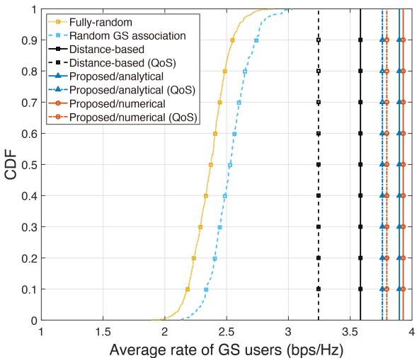

line

| Average rate of GS users (bps/Hz) | Fully-random | Random GS association | Distance-based | Distance-based (QoS) | Proposed/analytical | Proposed/analytical (QoS) | Proposed/numerical | Proposed/numerical (QoS) |
| --------------------------------- | ------------ | --------------------- | -------------- | -------------------- | ------------------- | ------------------------- | ------------------ | ------------------------ |
| 2.0                               | 0.0          | 0.0                   | 0.0            | 0.0                  | 0.0                 | 0.0                       | 0.0                | 0.0                      |
| 2.5                               | 0.9          | 0.8                   | 0.7            | 0.6                  | 0.7                 | 0.6                       | 0.6                | 0.5                      |
| 3.0                               | 1.0          | 1.0                   | 1.0            | 1.0                  | 1.0                 | 1.0                       | 1.0                | 1.0                      |
| 3.5                               | 1.0          | 1.0                   | 1.0            | 1.0                  | 1.0                 | 1.0                       | 1.0                | 1.0                      |
| 4.0                               | 1.0          | 1.0                   | 1.0            | 1.0                  | 1.0                 | 1.0                       | 1.0                | 1.0                      |

Fig. 4. CDF of the average rate for various scheduling algorithms under a single realization of UAM locations and velocities.

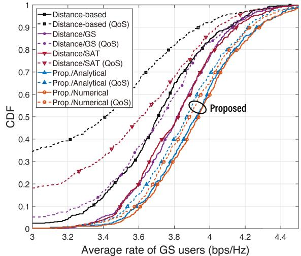

line

| Average rate of GS users (bps/Hz) | Distance-based | Distance-based (QoS) | Distance/GS | Distance/GS (QoS) | Distance/SAT | Distance/SAT (QoS) | Prop./Analytical | Prop./Analytical (QoS) | Prop./Numerical | Prop./Numerical (QoS) |
| --------------------------------- | -------------- | -------------------- | ----------- | ----------------- | ------------ | ------------------ | ---------------- | --------------------- | ---------------- | --------------------- |
| 3.0                               | 0.0            | 0.0                  | 0.0         | 0.0               | 0.0          | 0.0                | 0.0              | 0.0                   | 0.0              | 0.0                   |
| 3.2                               | 0.0            | 0.0                  | 0.0         | 0.0               | 0.0          | 0.0                | 0.0              | 0.0                   | 0.0              | 0.0                   |
| 3.4                               | 0.1            | 0.1                  | 0.1         | 0.1               | 0.1          | 0.1                | 0.1              | 0.1                   | 0.1              | 0.1                   |
| 3.6                               | 0.3            | 0.3                  | 0.3         | 0.3               | 0.3          | 0.3                | 0.3              | 0.3                   | 0.3              | 0.3                   |
| 3.8                               | 0.5            | 0.5                  | 0.5         | 0.5               | 0.5          | 0.5                | 0.5              | 0.5                   | 0.5              | 0.5                   |
| 4.0                               | 0.7            | 0.7                  | 0.7         | 0.7               | 0.7          | 0.7                | 0.7              | 0.7                   | 0.7              | 0.7                   |
| 4.2                               | 0.9            | 0.9                  | 0.9         | 0.9               | 0.9          | 0.9                | 0.9              | 0.9                   | 0.9              | 0.9                   |
| 4.4                               | 1.0            | 1.0                  | 1.0         | 1.0               | 1.0          | 1.0                | 1.0              | 1.0                   | 1.0              | 1.0                   |
The Proposed method is marked as a circle near the center of the plot, positioned slightly above the other points on the curve.

Fig. 5. CDF of the average rate for ‘distance-based’, ‘distance/GS’, ‘distance/SAT’, and the proposed scheduling algorithms.

$$
\rho_ {n} [ i + 1 ] = e ^ {\hat {\rho} _ {n} [ i + 1 ]} = \left[ \theta_ {n} ^ {(t)} \left(\sum_ {r \neq n} ^ {M _ {\mathrm{GS}}} \frac {\theta_ {r} ^ {(t)}}{\mu_ {r} ^ {(t)}} w _ {r n} - \lambda_ {\ell} [ i ] + \eta_ {n} [ i ] w _ {n n} - \gamma_ {\min} \sum_ {r \neq n} ^ {M _ {\mathrm{GS}}} \eta_ {r} [ i ] w _ {r n}\right) ^ {- 1} \right] ^ {+} \tag {62}
$$

$$
\lambda_ {\ell} [ i + 1 ] = \left[ \lambda_ {\ell} [ i ] - \delta_ {s} \left(P _ {T} - \sum_ {q = (k - 1) N + 1} ^ {k N} e ^ {\hat {\rho} _ {q} [ i + 1 ]}\right) \right] ^ {+} \tag {63}
$$

$$
\eta_ {m} [ i + 1 ] = \left[ \eta_ {m} [ i ] - \delta_ {\mathrm{s}} \left\{w _ {m m} e ^ {\hat {\rho} _ {m} [ i + 1 ]} - \gamma_ {\min} \left(\sum_ {q \neq m} ^ {M _ {\mathrm{GS}}} w _ {m q} e ^ {\hat {\rho} _ {q} [ i + 1 ]} + \sigma_ {\mathrm{n}} ^ {2}\right) \right\} \right] ^ {+} \tag {64}
$$

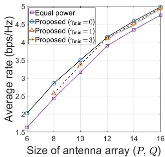

line

| Size of antenna array (P, Q) | Equal power | Proposed (γmin = 0) | Proposed (γmin = 1) | Proposed (γmin = 3) |
| ---------------------------- | ----------- | ------------------- | ------------------- | ------------------- |
| 6                            | 1.5         | 2.0                 | 2.0                 | 2.0                 |
| 8                            | 2.5         | 3.0                 | 2.7                 | 2.7                 |
| 10                           | 3.2         | 3.5                 | 3.4                 | 3.4                 |
| 12                           | 4.0         | 4.2                 | 4.1                 | 4.1                 |
| 14                           | 4.5         | 4.6                 | 4.5                 | 4.5                 |
| 16                           | 4.8         | 4.9                 | 4.9                 | 4.9                 |

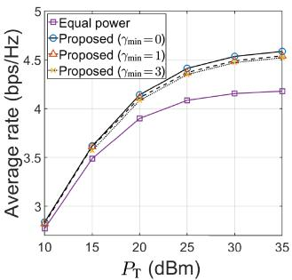

line

| PT (dBm) | Equal power | Proposed (γmin = 0) | Proposed (γmin = 1) | Proposed (γmin = 3) |
| -------- | ----------- | ------------------- | ------------------- | ------------------- |
| 10       | 2.8         | 2.8                 | 2.8                 | 2.8                 |
| 15       | 3.5         | 3.6                 | 3.6                 | 3.6                 |
| 20       | 3.9         | 4.2                 | 4.2                 | 4.2                 |
| 25       | 4.1         | 4.4                 | 4.4                 | 4.4                 |
| 30       | 4.2         | 4.5                 | 4.5                 | 4.5                 |
| 35       | 4.2         | 4.6                 | 4.6                 | 4.6                 |

Fig. 6. Average rate of GS users with (a) varying antenna array sizes, and (b) different GS transmission power constraints.   
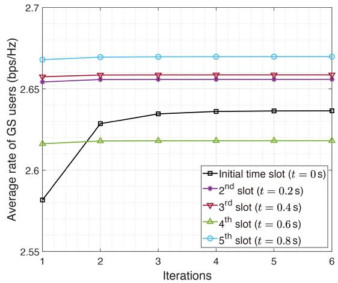

line

| Iterations | Initial time slot (t = 0 s) | 2nd slot (t = 0.2 s) | 3rd slot (t = 0.4 s) | 4th slot (t = 0.6 s) | 5th slot (t = 0.8 s) |
| ---------- | --------------------------- | -------------------- | -------------------- | -------------------- | -------------------- |
| 1          | 2.58                        | 2.66                 | 2.66                 | 2.62                 | 2.67                 |
| 2          | 2.63                        | 2.66                 | 2.66                 | 2.62                 | 2.67                 |
| 3          | 2.64                        | 2.66                 | 2.66                 | 2.62                 | 2.67                 |
| 4          | 2.64                        | 2.66                 | 2.66                 | 2.62                 | 2.67                 |
| 5          | 2.64                        | 2.66                 | 2.66                 | 2.62                 | 2.67                 |
| 6          | 2.64                        | 2.66                 | 2.66                 | 2.62                 | 2.67                 |

Fig. 7. Convergence of the proposed power allocation algorithm.

end-to-end performance of our scheduling method, even prior to the optimization of power allocation. Furthermore, whereas distance-based scheduling methods often fail to meet the QoS constraint of $\gamma _ { \mathrm { m i n } } ~ = ~ 1$ , our proposed methods consistently outperform it, even under this constraint. The gap between the performance of the ‘distance/GS’ and ‘distance/SAT’ methods becomes larger under the QoS constraint, emphasizing the significant role of our satellite user selection in mitigating severe interferences. The numerical method, which does not account for side lobe interference, offers slightly lower rates compared to the analytical method.

# B. Evaluation of the Proposed Power Allocation Algorithm

We compare our proposed power allocation method with an equal power allocation strategy under identical scheduling conditions, specifically using the proposed scheduling algorithms. The QoS constraints of $\gamma _ { \mathrm { m i n } } = 1$ and $\gamma _ { \mathrm { m i n } } = 3$ ensure minimum achievable rates of 1 and 2 bps/Hz for GS users, respectively. In Fig. 6a, we compare the average rates of two differerent power allocation schemes across various antenna array sizes. In scenarios with smaller antenna arrays, the performance gap between the proposed method and equal power allocation becomes more pronounced, due to lower beamforming gain and wider beamwidth, causing more interference. Although larger array sizes lead to improved rate performance, the precision and response time of beam-tracking become increasingly critical. Fig.6b illustrates the results under different GS power constraints, highlighting the significant advantages of the proposed power allocation algorithm, especially in high power regimes. Our method consistently demonstrates superior performance compared to alternatives, even when subjected to QoS constraints.

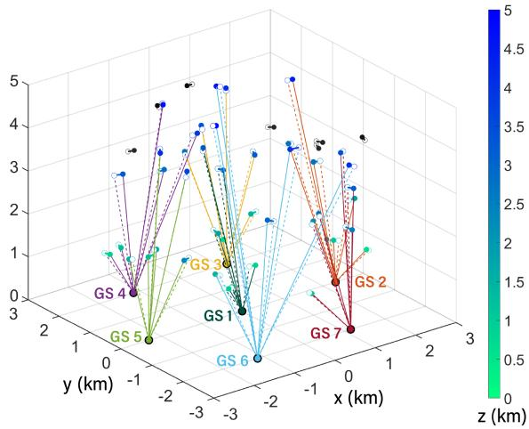  
Fig. 8. Results of the mobility-aware scheduling. Grayscale and colored dots represent satellite and GS users, respectively.

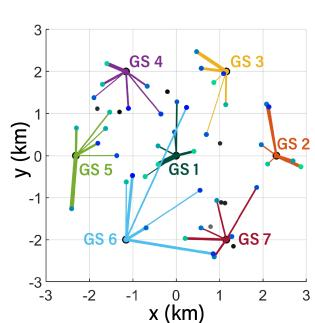  
(a)t=0

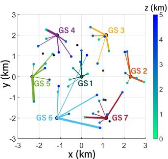  
(b) $t = T$   
Fig. 9. Top view of the GSs, UAMs, and their associated links. Line thickness indicates the power allocated to links at (a) t = 0 and (b) $t = T$ .

Given the gradual changes in UAM locations and the LoS-dominant channels, the channel gains W exhibit strong correlations between adjacent time slots. Therefore, the outcomes from the previous time slot serve as effective initial points for power allocation in subsequent slots, reducing the number of iterations required for convergence. The average user rates after each iteration are shown in Fig. 7. In the initial time slot, we initialize all elements of ρ equally, which results in a significant difference between the objective value after the first iteration and the final convergence point. However, from the second time slot onward, we initialize the parameters using the optimization results from the preceding slot, leading to much faster convergence.

# C. End-to-End Simulation Results

We present example results from the end-to-end implementation of the proposed algorithms. In Fig. 8, the link associations between the GSs and UAMs are visualized. Satellite users are represented by grayscale dots, while GS users are shown as colored dots, with the darkness of the dot indicating the altitude of the UAM. Mobility is depicted using filled dots for the initial state at $t = 0$ and hollow dots for the final state at $t = T$ . The colored lines illustrate the GS link associations. In Fig. 9, we illustrate the power allocation results corresponding to the scheduling decision shown in

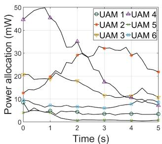

line

| Time (s) | UAM 1 | UAM 2 | UAM 3 | UAM 4 | UAM 5 | UAM 6 |
| -------- | ----- | ----- | ----- | ----- | ----- | ----- |
| 0        | 10    | 12    | 8     | 15    | 18    | 20    |
| 1        | 12    | 15    | 7     | 18    | 20    | 22    |
| 2        | 15    | 20    | 6     | 25    | 25    | 28    |
| 3        | 18    | 25    | 5     | 30    | 30    | 32    |
| 4        | 20    | 28    | 4     | 32    | 32    | 35    |
| 5        | 22    | 30    | 3     | 35    | 35    | 38    |

(a) GS 1

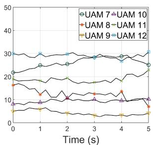

line

| Time (s) | UAM 7 | UAM 10 | UAM 8 | UAM 11 | UAM 9 | UAM 12 |
| -------- | ----- | ------ | ----- | ------ | ----- | ------ |
| 0        | 22    | 18     | 16    | 14     | 8     | 6      |
| 1        | 25    | 20     | 18    | 16     | 9     | 7      |
| 2        | 27    | 22     | 20    | 18     | 10    | 8      |
| 3        | 28    | 24     | 22    | 20     | 11    | 9      |
| 4        | 29    | 26     | 24    | 22     | 12    | 10     |
| 5        | 30    | 28     | 26    | 24     | 13    | 11     |

(b) GS 2   
Fig. 10. Time-varying power allocation for each downlink beam at (a) GS 1 and (b) GS 2.

Fig. 8, specifically for the instances at $t = 0$ and $t = T$ . The GS transmissions in Fig. 9 are directed towards UAMs, passing through zones of other GSs, to minimize interference. Fig. 10 details the dynamic power allocation for GS 1 and GS 2, under a QoS constraint of $\gamma _ { \mathrm { m i n } } = 1$ . The power allocation adapts over time in response to random channel fading and UAM mobility. We observe that the convergence point of the power allocation shows significant time correlation, validating the effectiveness of our initialization method.

# VII. CONCLUSION

In this paper, we developed a comprehensive downlink service strategy for UAM within the context of a 6G space-air-ground integrated network, addressing satellite user selection, GS link association, and GS power allocation. Considering the highly non-convex nature of the sum rate maximization problem, we divided the problem into two key components: scheduling, incorporating integer subproblems, and power allocation, involving nonlinear programming. Our user scheduling strategy takes into account the time-varying locations and interference gains of multiple UAMs, thereby enhancing the robustness of our algorithms in a dynamic UAM network environment. Coupled with the subsequent power allocation algorithm, our approach effectively mitigates co-channel interference. Numerical simulations demonstrate that our method surpasses traditional distance-based link association and equal power allocation schemes. In conclusion, this study establishes a basis for future UAM applications, a promising transportation system with intensive network demands.

# APPENDIX A

# PROOF OF LEMMA 1

By utilizing Taylor approximations, cos $\begin{array} { r l r } { \mathrm { \Sigma } _ { \mathrm { { \ell } } } ( k x ) } & { { } \approx } & { 1 \mathrm { \Sigma } - \mathrm { \Sigma } } \end{array}$ $\scriptstyle { \frac { 1 } { 2 } } k ^ { 2 } { \dot { x } } ^ { 2 }$ and $\begin{array} { r c l } { \dot { \sin ( k x ) } } & { \approx } & { \dot { \overline { { { \ t } } } } x \ - \ \frac { 1 } { 6 } k ^ { 3 } x ^ { 3 } } \end{array}$ , we approximate $\left\lceil \mathbf { a } _ { L } ( x ) ^ { H } \mathbf { a } _ { L } ( y ) \right\rceil$ as follows:

$$
\begin{array}{l} \left| \mathbf {a} _ {L} (x) ^ {H} \mathbf {a} _ {L} (y) \right| = \left| \sum_ {\ell = 0} ^ {L - 1} e ^ {- j \pi \ell (x - y)} \right| \\ = \left| \frac {1 - e ^ {- j \pi L (x - y)}}{- 1 + e ^ {- j \pi (x - y)}} \right| \\ = \left| \frac {1 - \cos (\pi L x) - j \sin (\pi L x)}{- 1 + \cos (\pi x) - j \sin (\pi x)} \right| \\ \approx \left| \frac {\frac {1}{2} \pi^ {2} L ^ {2} x ^ {2} - j (\pi L x - \frac {1}{6} \pi^ {3} L ^ {3} x ^ {3})}{- \frac {1}{2} \pi^ {2} x ^ {2} - j (\pi x - \frac {1}{6} \pi^ {3} x ^ {3})} \right|. \tag {65} \\ \end{array}
$$

Consequently, the final expression of (65) can be simplified to a squared polynomial. This simplification facilitates a second-order Taylor approximation, resulting in (24).

# APPENDIX B

# PROOF OF LEMMA 2

Starting from (6) and ${ \bf d } _ { m } ^ { ( k ) } ( t ) = { \bf d } _ { m } ^ { ( k ) } ( 0 ) + \dot { \bf u } _ { m } t$ , the following expressions are derived:

$$
\cos \alpha_ {m} ^ {(k)} (t) = \frac {\mathbf {x} ^ {(k) ^ {\mathrm{T}}} \left(\mathbf {d} _ {m} ^ {(k)} (0) + \dot {\mathbf {u}} _ {m} t\right)}{\sqrt {\| \mathbf {d} _ {m} ^ {(k)} (0) \| ^ {2} + 2 \dot {\mathbf {u}} _ {m} ^ {\mathrm{T}} \mathbf {d} _ {m} ^ {(k)} (0) t + \| \dot {\mathbf {u}} _ {m} \| ^ {2} t ^ {2}}}, \tag {66}
$$

$$
\left. \frac {d \cos \alpha_ {m} ^ {(k)} (t)}{d t} \right| _ {t = 0} = \frac {\mathbf {x} ^ {(t) ^ {\mathrm{T}}} \left(\mathbf {d} _ {m} ^ {(k)} (0) \dot {\mathbf {u}} _ {m} ^ {\mathrm{T}} \dot {\mathbf {u}} _ {m} - \dot {\mathbf {u}} _ {m} \dot {\mathbf {u}} _ {m} ^ {\mathrm{T}} \mathbf {d} _ {m} ^ {(k)} (0)\right)}{\| \mathbf {d} _ {m} ^ {(k)} (0) \| ^ {3}}. \tag {67}
$$

Applying a first-order Taylor approximation at $\begin{array} { r l r } { t } & { { } = } & { 0 . } \end{array}$ , we express cos $\alpha _ { m } ^ { ( k ) } ( t ) = \mathrm { c o s } \alpha _ { m } ^ { ( k ) } \tilde { ( 0 ) } + \mathrm { c o s } \alpha _ { m } ^ { ( k ) } ( 0 ) ^ { \prime } t$ α(k)m (0)′t. Extendm  m ing this approximation method to cos $\alpha _ { n } ^ { ( k ) } ( t )$ , cos $\beta _ { m } ^ { ( k ) } ( t )$ , and cos $\beta _ { n } ^ { ( k ) } ( t )$ using the same process, we achieve the approximation presented in (25).

# APPENDIX C

# PROOF OF THEOREM 1

Given $g _ { m } ^ { ( k ) } \approx \sigma _ { m } ^ { \mathbf { g } ( k ) } + \nu _ { m } ^ { \mathbf { g } ( k ) } t$ gm σm and ${ B _ { m , m } ^ { ( k ) } } ^ { 2 } = P Q$ , we deduce

$$
\int_ {0} ^ {T} g _ {m} ^ {(k)} \mathcal {B} _ {m, m} ^ {(k) 2} d t \approx P Q \left[ \sigma_ {m} ^ {\mathbf {g} (k)} t + \frac {\nu_ {m} ^ {\mathbf {g} (k)}}{2} t ^ {2} \right] _ {0} ^ {T}. \tag {68}
$$

From (28), we derive

$$
\mathcal {B} _ {m, n} ^ {(k) 2} \approx \left\{ \begin{array}{l l} 0, & t <   \check {\tau} _ {m, n} ^ {(k)} \\ P Q \left\{1 - P _ {0} (\sigma_ {m, n} ^ {\mathbf {x} (k)} + \nu_ {m, n} ^ {\mathbf {x} (k)}) ^ {2} \right. \\ \left. - Q _ {0} (\sigma_ {m, n} ^ {\mathbf {y} (k)} + \nu_ {m, n} ^ {\mathbf {y} (k)}) ^ {2} \right\} ^ {2}, & \check {\tau} _ {m, n} ^ {(k)} \leq t \leq \hat {\tau} _ {m, n} ^ {(k)} \\ 0, & t > \hat {\tau} _ {m, n} ^ {(k)} \end{array} \right. \tag {69}
$$

Applying the approximation $g _ { n } ^ { ( k ) } \approx \sigma _ { n } ^ { \mathbf { g } ( k ) } + \nu _ { n } ^ { \mathbf { g } ( k ) } t$ ≈ σ n + νn leads us to

$$
\begin{array}{l} \int_ {0} ^ {T} g _ {n} ^ {(k)} \mathcal {B} _ {m, n} ^ {(k) 2} d t \\ \approx P Q \left[ k _ {0} \sigma_ {n} ^ {\mathbf {g} (k)} + \frac {k _ {1} \sigma_ {n} ^ {\mathbf {g} (k)} + k _ {0} \nu_ {n} ^ {\mathbf {g} (k)}}{2} t \right. \\ + \frac {k _ {2} \sigma_ {n} ^ {\mathbf {g} (k)} + k _ {1} \nu_ {n} ^ {\mathbf {g} (k)}}{3} t ^ {2} + \frac {k _ {3} \sigma_ {n} ^ {\mathbf {g} (k)} + k _ {2} \nu_ {n} ^ {\mathbf {g} (k)}}{4} t ^ {3} \\ \left. + \frac {k _ {4} \sigma_ {n} ^ {\mathbf {g} (k)} + k _ {3} \nu_ {n} ^ {\mathbf {g} (k)}}{5} t ^ {4} + \frac {k _ {4} \nu_ {n} ^ {\mathbf {g} (k)}}{6} t ^ {5} \right] _ {\max (\check {\tau} _ {m, n} ^ {(k)}, 0)} ^ {\min (\check {\tau} _ {m, n} ^ {(k)}, T)}, \tag {70} \\ \end{array}
$$

with constants $k _ { 0 } , k _ { 1 } , k _ { 2 } , k _ { 3 }$ , and $k _ { 4 }$ defined in (44a)-(44e). Substituting (68) and (70) into (37) results in the derived approximation for $c _ { m } ^ { ( k ) }$ , as presented in (43).

# APPENDIX D

# PROOF OF LEMMA 3

Logarithmic approximation, as discussed in [29], is formulated by

$$
\log (1 + x) \geq \alpha \log (x) + \beta , \tag {71}
$$

where parameters α and β are defined as α = x01+x0 $\beta$ $\begin{array} { r } { \alpha = \frac { x _ { 0 } } { 1 + x _ { 0 } } } \end{array}$ and $\beta =$ $\begin{array} { r } { 1 + x _ { 0 } - \frac { x _ { 0 } } { 1 + x _ { 0 } } } \end{array}$ 1 + x0 − 01+x log x0. This approximation is tight for $x = x _ { 0 }$ . Initially, let θ(t)m , µ(t)m $\theta _ { m } ^ { ( t ) } , \ \mu _ { m } ^ { ( t ) }$ , and $\zeta _ { m } ^ { ( t ) }$ ζm according to equations (53), (54), and (55). Furthermore, we introduce $\kappa _ { m } ^ { ( t ) }$ , specified by

$$
\kappa_ {m} ^ {(t)} = (1 - \alpha_ {m} ^ {(t)}) \log \left(1 + \frac {w _ {m m} \rho_ {m} ^ {(t)}}{\mu_ {m} ^ {(t)}}\right). \tag {72}
$$

Using the logarithmic approximation, a lower bound for the capacity is obtained:

$$
\begin{array}{l} \log \left(1 + \frac {w _ {m m} \rho_ {m}}{\sum_ {q \neq m} ^ {M _ {\mathrm{GS}}} w _ {m q} \rho_ {q} + \sigma_ {\mathrm{n}} ^ {2}}\right) \\ \geq \theta_ {m} ^ {(t)} \log \left(\frac {w _ {m m} \rho_ {m}}{\sum_ {q \neq m} ^ {M _ {\mathrm{GS}}} w _ {m q} \rho_ {q} + \sigma_ {\mathfrak {n}} ^ {2}}\right) + \kappa_ {m} ^ {(t)} \\ = \theta_ {m} ^ {(t)} \left\{\log \left(w _ {m m} \rho_ {m}\right) - \log \left(\sum_ {q \neq m} ^ {M _ {\mathrm{GS}}} w _ {m q} \rho_ {q} + \sigma_ {\mathrm{n}} ^ {2}\right) \right\} + \kappa_ {m} ^ {(t)}, \tag {73} \\ \end{array}
$$

cave, the term which is tight for $\begin{array} { r } { - \log ( \sum _ { q \neq m } ^ { M _ { \mathrm { G S } } } { w _ { m q } \rho _ { q } } + \sigma _ { \mathrm { n } } ^ { 2 } ) } \end{array}$ $\rho \mathbf { \Lambda } = \mathbf { \Lambda } \rho ^ { ( t ) }$ . While log $\left( w _ { m m } \rho _ { m } \right)$ mm m is non-concave. is con-$\rho \mathbf { \Lambda } = \mathbf { \Lambda } \rho ^ { ( t ) }$ blish a concave lower bound for, represented by $\begin{array} { r } { - \log ( \dot { \sum _ { q \neq m } ^ { M _ { \mathrm { G S } } } \dot { w } } _ { m q } \rho _ { q } + \sigma _ { \mathrm { n } } ^ { 2 } ) } \end{array}$

$$
\begin{array}{l} - \log \left(\sum_ {q \neq m} ^ {M _ {\mathrm{GS}}} w _ {m q} \rho_ {q} + \sigma_ {\mathfrak {n}} ^ {2}\right) \\ \geq - \log (\mu_ {m} ^ {(t)}) - \frac {1}{\mu_ {m} ^ {(t)}} \sum_ {q \neq m} ^ {M _ {\mathrm{GS}}} w _ {m q} (\rho_ {q} - \rho_ {q} ^ {(t)}). \tag {74} \\ \end{array}
$$

Substituting (74) into (73) yields the concave lower bound:

$$
\begin{array}{l} \log \left(1 + \frac {w _ {m m} \rho_ {m}}{\sum_ {q \neq m} ^ {M _ {\mathrm{GS}}} w _ {m q} \rho_ {q} + \sigma_ {\mathfrak {n}} ^ {2}}\right) \\ \geq \theta_ {m} ^ {(t)} \log (w _ {m m} \rho_ {m}) - \frac {\theta_ {m} ^ {(t)}}{\mu_ {m} ^ {(t)}} \sum_ {q \neq m} ^ {M _ {\mathrm{GS}}} w _ {m q} \rho_ {q} + \zeta_ {m} ^ {(t)}, \tag {75} \\ \end{array}
$$

which is tight for $\rho = \rho ^ { ( t ) }$ . By utilizing this approximation, we obtain (52).

# REFERENCES

[1] R. Shrestha, R. Bajracharya, and S. Kim, “6G enabled unmanned aerial vehicle traffic management: A perspective,” IEEE Access, vol. 9, pp. 91119–91136, 2021.   
[2] V. Bulusu, E. B. Onat, R. Sengupta, P. Yedavalli, and J. Macfarlane, “A traffic demand analysis method for urban air mobility,” IEEE Trans. Intell. Transp. Syst., vol. 22, no. 9, pp. 6039–6047, Sep. 2021.   
[3] R. Han, H. Li, R. Apaza, E. Knoblock, and M. Gasper, “Deep reinforcement learning assisted spectrum management in cellular based urban air mobility,” IEEE Wireless Commun., vol. 29, no. 6, pp. 14–21, Dec. 2022.

[4] H.-J. Moon et al., “Pointing-and-acquisition for optical wireless in 6G: From algorithms to performance evaluation,” IEEE Commun. Mag., vol. 62, no. 3, pp. 32–38, Mar. 2024.   
[5] S. Zhang, Y. Zeng, and R. Zhang, “Cellular-enabled UAV communication: A connectivity-constrained trajectory optimization perspective,” IEEE Trans. Commun., vol. 67, no. 3, pp. 2580–2604, Mar. 2019.   
[6] S. Zhang and R. Zhang, “Trajectory design for cellular-connected UAV under outage duration constraint,” in Proc. IEEE Int. Conf. Commun. (ICC), May 2019, pp. 1–6.   
[7] R. Han, H. Li, E. J. Knoblock, M. R. Gasper, and R. D. Apaza, “Dynamic spectrum sharing in cellular based urban air mobility via deep reinforcement learning,” in Proc. IEEE Global Commun. Conf. (GLOBECOM), Dec. 2022, pp. 1332–1337.   
[8] R. Han, H. Li, E. J. Knoblock, M. R. Gasper, and R. D. Apaza, “Joint velocity and spectrum optimization in urban air transportation system via multi-agent deep reinforcement learning,” IEEE Trans. Veh. Technol., vol. 72, no. 8, pp. 9770–9782, Aug. 2023.   
[9] H.-B. Jeon et al., “Free-space optical communications for 6G wireless networks: Challenges, opportunities, and prototype validation,” IEEE Commun. Mag., vol. 61, no. 4, pp. 116–121, Apr. 2023.   
[10] H.-J. Moon, C.-B. Chae, K.-K. Wong, and M.-S. Alouini, “A generalized pointing error model for FSO links with fixed-wing UAVs for 6G: Analysis and trajectory optimization,” 2024, arXiv:2406.05444.   
[11] Y. Zeng, J. Lyu, and R. Zhang, “Cellular-connected UAV: Potential, challenges, and promising technologies,” IEEE Wireless Commun., vol. 26, no. 1, pp. 120–127, Feb. 2019.   
[12] A. Garcia-Rodriguez, G. Geraci, D. Lopez-Perez, L. G. Giordano, M. Ding, and E. Bjornson, “The essential guide to realizing 5G-connected UAVs with massive MIMO,” IEEE Commun. Mag., vol. 57, no. 12, pp. 84–90, Dec. 2019.   
[13] Y. Huang, Q. Wu, R. Lu, X. Peng, and R. Zhang, “Massive MIMO for cellular-connected UAV: Challenges and promising solutions,” IEEE Commun. Mag., vol. 59, no. 2, pp. 84–90, Feb. 2021.   
[14] H. C. Nguyen, R. Amorim, J. Wigard, I. Z. Kovács, T. B. Sørensen, and P. E. Mogensen, “How to ensure reliable connectivity for aerial vehicles over cellular networks,” IEEE Access, vol. 6, pp. 12304–12317, 2018.   
[15] N. Hosseini, H. Jamal, J. Haque, T. Magesacher, and D. W. Matolak, “UAV command and control, navigation and surveillance: A review of potential 5G and satellite systems,” in Proc. IEEE Aerosp. Conf., Mar. 2019, pp. 1–10.   
[16] D. López-Pérez et al., “On the downlink performance of UAV communications in dense cellular networks,” in Proc. IEEE Global Commun. Conf. (GLOBECOM), Dec. 2018, pp. 1–7.   
[17] G. Geraci, A. Garcia-Rodriguez, L. G. Giordano, D. Lopez-Perez, and E. Bjoernson, “Supporting UAV cellular communications through massive MIMO,” in Proc. IEEE Int. Conf. Commun. Workshops (ICC Workshops), May 2018, pp. 1–6.   
[18] M. M. Azari, F. Rosas, and S. Pollin, “Reshaping cellular networks for the sky: Major factors and feasibility,” in Proc. IEEE Int. Conf. Commun. (ICC), May 2018, pp. 1–7.   
[19] M. M. Azari, F. Rosas, and S. Pollin, “Cellular connectivity for UAVs: Network modeling, performance analysis, and design guidelines,” IEEE Trans. Wireless Commun., vol. 18, no. 7, pp. 3366–3381, Jul. 2019.   
[20] Z. Wang and J. Zheng, “Performance analysis of location-based base station cooperation for cellular-connected UAV networks,” IEEE Trans. Veh. Technol., vol. 72, no. 11, pp. 14787–14800, Nov. 2023.   
[21] S. Zhang and R. Zhang, “Radio map-based 3D path planning for cellular-connected UAV,” IEEE Trans. Wireless Commun., vol. 20, no. 3, pp. 1975–1989, Mar. 2021.   
[22] L. Zhou, X. Chen, M. Hong, S. Jin, and Q. Shi, “Efficient resource allocation for multi-UAV communication against adjacent and cochannel interference,” IEEE Trans. Veh. Technol., vol. 70, no. 10, pp. 10222–10235, Oct. 2021.   
[23] C. Pan, J. Yi, C. Yin, J. Yu, and X. Li, “Joint 3D UAV placement and resource allocation in software-defined cellular networks with wireless backhaul,” IEEE Access, vol. 7, pp. 104279–104293, 2019.   
[24] Y. Li and A. H. Aghvami, “Radio resource management for cellularconnected UAV: A learning approach,” IEEE Trans. Commun., vol. 71, no. 5, pp. 2784–2800, May 2023.   
[25] J. Lyu and R. Zhang, “Network-connected UAV: 3-D system modeling and coverage performance analysis,” IEEE Internet Things J., vol. 6, no. 4, pp. 7048–7060, Aug. 2019.

[26] W. Mei and R. Zhang, “Cooperative downlink interference transmission and cancellation for cellular-connected UAV: A divide-and-conquer approach,” IEEE Trans. Commun., vol. 68, no. 2, pp. 1297–1311, Feb. 2020.   
[27] Y. Huang, Q. Wu, T. Wang, G. Zhou, and R. Zhang, “3D beam tracking for cellular-connected UAV,” IEEE Wireless Commun. Lett., vol. 9, no. 5, pp. 736–740, May 2020.   
[28] W. Miao, C. Luo, G. Min, and Z. Zhao, “Lightweight 3-D beamforming design in 5G UAV broadcasting communications,” IEEE Trans. Broadcast., vol. 66, no. 2, pp. 515–524, Jun. 2020.   
[29] X. Zhu, C. Jiang, L. Kuang, N. Ge, and J. Lu, “Non-orthogonal multiple access based integrated terrestrial-satellite networks,” IEEE J. Sel. Areas Commun., vol. 35, no. 10, pp. 2253–2267, Oct. 2017.   
[30] S. Gong et al., “Toward optimized network capacity in emerging integrated terrestrial-satellite networks,” IEEE Trans. Aerosp. Electron. Syst., vol. 56, no. 1, pp. 263–275, Feb. 2020.   
[31] A. Alsharoa and M.-S. Alouini, “Improvement of the global connectivity using integrated satellite-airborne-terrestrial networks with resource optimization,” IEEE Trans. Wireless Commun., vol. 19, no. 8, pp. 5088–5100, Aug. 2020.   
[32] D. Peng, A. Bandi, Y. Li, S. Chatzinotas, and B. Ottersten, “Hybrid beamforming, user scheduling, and resource allocation for integrated terrestrial-satellite communication,” IEEE Trans. Veh. Technol., vol. 70, no. 9, pp. 8868–8882, Sep. 2021.   
[33] S. Liu, H. Dahrouj, and M.-S. Alouini, “Joint user association and beamforming in integrated satellite-HAPS-ground networks,” IEEE Trans. Veh. Technol., vol. 73, no. 4, pp. 5162–5178, Apr. 2024.   
[34] Y. Zhang, H. Zhang, H. Zhou, K. Long, and G. K. Karagiannidis, “Resource allocation in terrestrial-satellite-based next generation multiple access networks with interference cooperation,” IEEE J. Sel. Areas Commun., vol. 40, no. 4, pp. 1210–1221, Apr. 2022.   
[35] M. Zhang, H. Lu, and P. Hong, “Cooperative robust video multicast in integrated terrestrial-satellite networks,” IEEE Trans. Wireless Commun., vol. 21, no. 10, pp. 8276–8291, Oct. 2022.   
[36] R. Liu, K. Guo, K. An, Y. Huang, F. Zhou, and S. Zhu, “Resource allocation for cognitive satellite-HAP-terrestrial networks with nonorthogonal multiple access,” IEEE Trans. Veh. Technol., vol. 72, no. 7, pp. 9659–9663, Jul. 2023.   
[37] D. Han, W. Liao, H. Peng, H. Wu, W. Wu, and X. Shen, “Joint cache placement and cooperative multicast beamforming in integrated satellite-terrestrial networks,” IEEE Trans. Veh. Technol., vol. 71, no. 3, pp. 3131–3143, Mar. 2022.   
[38] Z. Jia, M. Sheng, J. Li, D. Zhou, and Z. Han, “Joint HAP access and LEO satellite backhaul in 6G: Matching game-based approaches,” IEEE J. Sel. Areas Commun., vol. 39, no. 4, pp. 1147–1159, Apr. 2021.   
[39] L. Zhu, L. Bai, L. Zhou, and J. Choi, “Efficient user scheduling for uplink hybrid satellite-terrestrial communication,” IEEE Trans. Wireless Commun., vol. 22, no. 3, pp. 1885–1899, Mar. 2023.   
[40] H. Dong, C. Hua, L. Liu, W. Xu, S. Guo, and R. Tafazolli, “Joint beamformer design and user scheduling for integrated terrestrialsatellite networks,” IEEE Trans. Wireless Commun., vol. 22, no. 10, pp. 6398–6414, Oct. 2023.   
[41] I. Ahmed et al., “A survey on hybrid beamforming techniques in 5G: Architecture and system model perspectives,” IEEE Commun. Surveys Tuts., vol. 20, no. 4, pp. 3060–3097, 4th Quart., 2018.   
[42] C. Ding, J. Wang, H. Zhang, M. Lin, and G. Y. Li, “Joint optimization of transmission and computation resources for satellite and high altitude platform assisted edge computing,” IEEE Trans. Wireless Commun., vol. 21, no. 2, pp. 1362–1377, Feb. 2022.   
[43] C. Caini, G. E. Corazza, G. Falciasecca, M. Ruggieri, and F. Vatalaro, “A spectrum- and power-efficient EHF mobile satellite system to be integrated with terrestrial cellular systems,” IEEE J. Sel. Areas Commun., vol. 10, no. 8, pp. 1315–1325, Oct. 1992.   
[44] P. Gu, R. Li, C. Hua, and R. Tafazolli, “Dynamic cooperative spectrum sharing in a multi-beam LEO-GEO co-existing satellite system,” IEEE Trans. Wireless Commun., vol. 21, no. 2, pp. 1170–1182, Feb. 2022.   
[45] Attenuation by Atmospheric Gases and Related Effects, Recommendation, document ITU-R P.676-13, Aug. 2022.   
[46] L. J. Ippolito Jr., Satellite Communications Systems Engineering. Washington, DC, USA: Wiley, 2008.   
[47] Attenuation Due to Clouds and Fog, Recommendation, document ITU-R P.840-9, Aug. 2023.   
[48] K. Karimi, V. Aalo, and H. Helmken, “A study of satellite channel utilization in the presence of rain attenuation in Florida,” in Proc. SOUTHEASTCON, Apr. 1994, pp. 196–200.

[49] R. Olsen, D. Rogers, and D. Hodge, “The aRb relation in the calculation of rain attenuation,” IEEE Trans. Antennas Propag., vol. AP-26, no. 2, pp. 318–329, Mar. 1978.   
[50] Specific Attenuation Model for Rain for Use in Prediction Methods, Recommendation, document ITU-R P.838-3, Mar. 2005.   
[51] A. Bauranov and J. Rakas, “Designing airspace for urban air mobility: A review of concepts and approaches,” Prog. Aerosp. Sci., vol. 125, Aug. 2021, Art. no. 100726.   
[52] J. B. Orlin, “A faster strongly polynomial minimum cost flow algorithm,” Oper. Res., vol. 41, no. 2, pp. 338–350, Apr. 1993.   
[53] R. K. Ahuja, M. Kodialam, A. K. Mishra, and J. B. Orlin, “Computational investigations of maximum flow algorithms,” Eur. J. Oper. Res., vol. 97, no. 3, pp. 509–542, Mar. 1997.   
[54] J. Papandriopoulos and J. S. Evans, “SCALE: A low-complexity distributed protocol for spectrum balancing in multiuser DSL networks,” IEEE Trans. Inf. Theory, vol. 55, no. 8, pp. 3711–3724, Aug. 2009.

natural_image

Portrait of a young man wearing a gray hoodie (no text or symbols visible)

Hyung-Joo Moon (Graduate Student Member, IEEE) received the B.S. degree from the School of Integrated Technology, Yonsei University, South Korea, in 2019, where he is currently pursuing the Ph.D. degree. His research interests include performance analysis and system optimization for emerging technologies in 6G non-terrestrial networks (NTN).

natural_image

Portrait of a man wearing glasses and a suit (no text or symbols visible)

Chan-Byoung Chae (Fellow, IEEE) received the Ph.D. degree in electrical and computer engineering from The University of Texas at Austin (UT), USA in 2008.

He was a member of the Wireless Networking and Communications Group (WNCG), UT. Prior to joining UT, he was a Research Engineer with the Telecommunications Research and Development Center, Samsung Electronics, Suwon, South Korea, from 2001 to 2005. He is currently an Underwood Distinguished Professor and Lee Youn Jae Fellow

with the School of Integrated Technology, Yonsei University, South Korea. Before joining Yonsei University, he was with Bell Labs, Alcatel-Lucent, Murray Hill, NJ, USA, from 2009 to 2011, as a member of Technical Staff; and Harvard University, Cambridge, MA, USA, from 2008 to 2009, as a Post-Doctoral Research Fellow.

Dr. Chae is an Elected Member of the National Academy of Engineering of Korea. He was a recipient/co-recipient of the Ministry of Education Award in 2024, the KICS Haedong Scholar Award in 2023, the CES Innovation Award in 2023, the IEEE ICC Best Demo Award in 2022, the IEEE WCNC Best Demo Award in 2020, the Best Young Engineer Award from the National Academy of Engineering of Korea (NAEK) in 2019, the IEEE DySPAN Best Demo Award in 2018, the IEEE/KICS Journal of Communications and Networks Best Paper Award in 2018, the IEEE INFOCOM Best Demo Award in 2015, the IEIE/IEEE Joint Award for Young IT Engineer of the Year in 2014, the KICS Haedong Young Scholar Award in 2013, the IEEE Signal Processing Magazine Best Paper Award in 2013, the IEEE ComSoc AP Outstanding Young Researcher Award in 2012, and the IEEE VTS Dan. E. Noble Fellowship Award in 2008. He has held several editorial positions, including the Editor-in-Chief of IEEE TRANSACTIONS ON MOLECULAR, BIOLOGICAL, AND MULTI-SCALE COMMUNICATIONS; a Senior Editor of IEEE WIRELESS COMMUNICATIONS LETTERS; and an Editor of IEEE Communications Magazine, IEEE TRANSACTIONS ON WIRELESS COMMU-NICATIONS, and IEEE WIRELESS COMMUNICATIONS LETTERS. He was an IEEE ComSoc Distinguished Lecturer from 2020 to 2023. He is an IEEE VTS Distinguished Lecturer from 2024 to 2025.