# Cooperative HAP-UAV Optimization for IoRT Data Collection: A Green Transmission Strategy for Maximizing Energy Efficiency

Yanbo Fan , Graduate Student Member, IEEE, Yuanguo Bi , Member, IEEE, Xingyu Ji , Graduate Student Member, IEEE, Dusit Niyato , Fellow, IEEE, Enchao Zhang , Graduate Student Member, IEEE, Liang Zhao , Senior Member, IEEE, and Qiang He , Associate Member, IEEE

Abstract—Supported by space-air-ground integrated networks (SAGIN), Internet of Remote Things (IoRT) is regarded as a cornerstone for realizing global connectivity in 6G networks. The integration of high-altitude platforms (HAPs) and uncrewed aerial vehicles (UAVs), offering both wide coverage and agile data access, becomes a promising paradigm for IoRT data collection. However, sustaining reliable and efficient transmission is challenged by the mobility and constrained onboard energy of HAPs and UAVs, as well as atmospheric fading effects. To address these issues, we propose a green and efficient HAP-UAV collaborative design for IoRT data collection, which jointly considers both transmission performance and energy consumption. Firstly, we introduce a novel metric, Overall Energy Efficiency (OEE), to quantify the balance between cooperative transmission performance and the total energy cost under dynamic trajectory planning. Secondly, we formulate a joint optimization problem that simultaneously optimizes UAV/HAP trajectories, UAV power control, HAP selection, and bandwidth allocation. Thirdly, to address the formulated non-convex fractional problem, we develop an energy efficiency maximization strategy based on the successive convex approximation technique. Extensive simulation results demonstrate that the proposed strategy achieves significant gains in OEE, achieving superior trade-offs between energy consumption and transmission performance in HAP-UAV-assisted IoRT networks.

Index Terms—Internet of Remote Things (IoRT), space-airground integrated networks (SAGIN), joint trajectory planning, energy-efficient optimization, green communications.

## I. INTRODUCTION

MPOWERED by space–air–ground integrated networks expected to be deployed in infrastructure-deficient regions to facilitate global 6G connectivity [1], [2], [3]. According to global market forecasts, the IoRT market is projected to reach 5 billion <sup>\$</sup>by 2032 [4], driven by applications such as disaster warning [5], smart agriculture [6], and environmental monitoring [7]. However, despite the rapid development of IoRT, efficient wide-area data collection remains challenging due to the high cost and environmental limitations associated with terrestrial infrastructure [2], [8].

Cooperative transmission between low-altitude uncrewed aerial vehicles (UAVs) and high-altitude platforms (HAPs) provides an efficient solution for IoRT data collection [9], [10]. Specifically, low-cost UAVs utilize their high maneuverability to approach IoRT nodes and collect data efficiently [11]. The shorter transmission distance between UAVs and IoRT nodes allows efficient data transfer with low power consumption. Data-driven HAPs, typically implemented as airships or highaltitude UAVs [12], aggregate data collected from UAVs for processing and storage [13]. The low ambient temperatures at high altitudes allow HAPs to reduce the cooling energy required by terrestrial data centers [14], thereby enhancing overall system efficiency.

Despite the advantages of UAVs and HAPs in IoRT data collection, their collaboration still faces challenges. Firstly, due to the limited energy reserves of UAVs and HAPs [1], [13], [14], [15], improving transmission performance without accounting for energy consumption is impractical. Although HAPs can be recharged via solar panels [16], [17], their energy harvesting efficiency is influenced by diurnal cycles and seasonal variations.<sup>1</sup> Secondly, the high mobility of UAVs and HAPs leads to unstable transmission. How to cooperatively optimize their trajectories to ensure transmission stability while efficiently utilizing limited energy remains a significant challenge. Thirdly, variable meteorological conditions significantly affect transmission performance [10], making stable communication under all-weather conditions a major challenge.

TABLE I

COMPARISON OF ENERGY-EFFICIENT STRATEGIES FOR HAP-UAV COLLABORATION

Strategies / References Key Features / Settings Limitations Energy Optimization for UAV/HAP Energy consumption optimization under Limited transmission performance; Transmission [22], [27], [28], [31] transmission performance constraints unsuitable for delay-sensitive applications. Energy-Aware UAV/HAP Transmission Transmission performance optimization Inefficient energy management; infeasible Strategies [1], [13], [14], [17], [26], [32], [33] under energy constraints under strict energy constraints. Enhancing UAV Energy Efficiency in Optimize UAV energy and transmission Unsuitable for practical IoRT environment; HAP-UAV Collaboration [15], [25], [34] performance under a fixed HAP location poor HAP energy management. Overall Energy Efficiency Optimization Preset trajectories; neglecting the Restricted transmission performance; fail to for HAP-UAV Collaboration [29], [30], [35 propulsion energy consumption. system-level energy management.

## A. Literature Review

To balance energy consumption and cooperative transmission performance in HAP-UAV collaboration, it is crucial to implement efficient energy management and collaborative transmission strategies. For low-altitude UAVs, the energy consumption is primarily allocated to propulsion (60%–80%) and transmit power (20%–30%) [19], [20]. Given the dominance of propulsion energy consumption, reducing UAV propulsion energy is key to improving transmission efficiency. For example, [21] formulates a multi-objective optimization problem to balance UAV propulsion energy consumption and service quality. In [22], authors minimize propulsion energy consumption by jointly optimizing UAV’s trajectory and transmission strategy in a patrol inspection scenario. In addition, various studies have shown that improving the propulsion efficiency of UAVs enables energyefficient operations while maintaining reliable transmission performance [20], [21], [22], [23], [24], [25]. To enhance the energy efficiency of HAP transmissions, several critical operational aspects of both the HAPs and the transmitting devices must be optimized [13], [14], [26], [27], [28], [29], [30], [31]. In [26], an optimization framework is proposed to maximize the system throughput of HAP transmissions. Under the fixed trajectories of HAPs and UAVs, [28], [29], [30], [31] enhance transmission energy efficiency in HAP-UAV collaboration. In [28], resource allocation for both UAVs and HAPs is optimized to minimize system energy consumption. An optimization strategy is proposed in [29] to maximize the energy efficiency of both HAPs and UAVs by concurrently optimizing spectrum allocation and transmit power.

Existing energy-efficient strategies for HAP-UAV collaboration in IoRT data collection primarily focus on optimizing either transmission performance [1], [13], [14], [17], [26], [32], [33] or energy consumption [22], [27], [28], [31], as summarized in Table I. However, optimizing only one aspect is insufficient due to the inherent trade-off between transmission performance and energy consumption, which must be jointly considered to achieve optimal energy efficiency. A common limitation of existing studies is the assumption that HAPs remain stationary during cooperative transmission [1], [13], [15], [17], [25], [28], [32], [33], [34], [35]. This assumption restricts adaptability, as HAPs in practical IoRT environments typically follow dynamic trajectories to accommodate evolving coverage and communication demands [12]. Although several studies predefine the trajectories of UAVs and HAPs to facilitate coordination [29], [30], [31], they do not explicitly optimize these trajectories for energy efficiency or cooperative transmission performance, thereby failing to exploit the full potential of mobility. Moreover, existing studies often overlook some critical real-world factors, including meteorological fading—which affects all-weather transmission reliability—and the considerable propulsion energy consumption of HAPs [14], [17], [26], [28], [29], [30], [31]. These limitations collectively prevent existing approaches from achieving a well-balanced trade-off between energy consumption and transmission performance, thereby highlighting the need for a more comprehensive optimization design that accounts for HAP mobility, atmospheric fading, and propulsion energy in HAP-UAV collaboration for IoRT data collection.

## B. Contributions

Motivated by the aforementioned challenges and opportunities, this paper investigates efficient cooperative transmission between UAVs and HAPs for IoRT data collection. To quantify the balance between cooperative transmission performance and the total energy consumption, we define the overall energy efficiency (OEE) as the ratio of the total amount of successfully uploaded data to the total energy consumption of both UAVs and HAPs. Unlike most existing studies, we take into account the propulsion energy of both UAVs and HAPs as part of the total energy consumption, providing a more comprehensive and realistic evaluation of system-level energy efficiency. Furthermore, the proposed design explicitly accounts for meteorological fading in HAP–UAV links to ensure reliable transmission under all-weather conditions. To maximize OEE, we jointly optimize the operations of UAVs and HAPs to strike an optimal balance between energy consumption and transmission performance. Specifically, we formulate an OEE maximization problem under collaborative transmission and mobility constraints, where the flight velocities and trajectories of UAVs and HAPs, the transmit power and HAP selection of UAVs, and the bandwidth allocation for IoRT nodes are jointly optimized. To the best of our knowledge, this is the first study to jointly optimize the trajectories of multiple HAPs and UAVs, as well as cooperative transmission and energy consumption, to enhance the overall efficiency of IoRT data collection. The contributions can be summarized as follows.

1) Energy-Efficient Cooperative Transmission Design: We propose an energy-efficient transmission design for HAP-UAV collaboration in IoRT data collection. This design innovatively considers both cooperative transmission performance and the energy consumption of UAVs and HAPs under dynamic trajectory planning and all-weather conditions.

2) Overall Optimization for Cooperative Transmission: To enhance energy efficiency in HAP-UAV collaboration, we formulate an overall optimization for cooperative transmission. The objective is to maximize the OEE by jointly optimizing the flight velocities and trajectories of UAVs and HAPs, along with the transmit power, HAP selection, and bandwidth allocation of the UAVs.

3) Energy Efficiency Maximization (ECO) Strategy: The formulated problem is a mixed-integer nonlinear program (MINLP), which includes both a fractional objective and integer constraints. To tackle this challenging problem, we propose the ECO strategy, which transforms the fractional objective and addresses non-convexity using the successive convex approximation (SCA) technique.

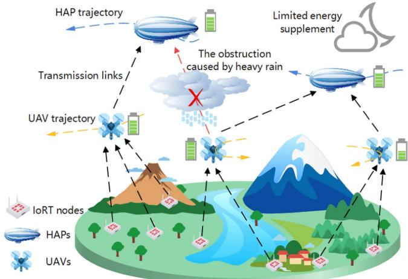  
Fig. 1. HAP-UAV collaboration in IoRT data collection.

4) Outstanding Algorithmic Performance Evaluation: The convergence and computational complexity of the proposed algorithm are analyzed, and simulation results validate its superiority. The proposed strategy achieves significant gains in OEE, achieving a better trade-off between energy consumption and cooperative transmission performance in HAP–UAV collaboration for IoRT data collection.

The remainder of this paper is organized as follows. Section II presents the energy-efficient transmission design and system model. Section III defines and reformulates the OEE maximization problem. In Section IV, the proposed ECO strategy is detailed to obtain a high-quality solution. Section V provides the simulation results and performance analysis. Finally, Section VI concludes the paper.

## II. ENERGY-EFFICIENT COOPERATIVE TRANSMISSION DESIGNAND SYSTEM MODEL

As illustrated in Fig. 1, we propose an energy-efficient transmission design for HAP-UAV collaboration in IoRT data collection. We assume that M data-driven HAPs and K rotary-wing UAVs collaboratively collect data from Q IoRT nodes. Due to limited energy resources and unfavorable channel conditions [14], [26], the proposed design employs UAVs as relays between IoRT nodes and HAPs rather than direct transmission. Based on meteorological conditions, UAVs select the most suitable HAP as their transmission target. Specifically, M HAPs and K UAVs can be indexed via $m \in \mathcal { M } \overset { \triangle } { = } \{ 1 , \dots , M \}$ and $k \in \mathcal { K } \triangleq \{ 1 , \dots , K \}$ , respectively. Furthermore, K UAVs col-<sup>= 1</sup>lect data from IoRT nodes which randomly distributed in remote areas. In the coverage of the k-th UAV, the number of IoRT nodes can be recorded as $\begin{array} { r } { \bar { L } _ { k } , \mathrm { i . e . , } \sum _ { k = 1 } ^ { K } L _ { k } = Q } \end{array}$ , and $L _ { k }$ IoRT nodes can be indexed by $l _ { k } \in \mathcal { L } _ { k } \overset { \triangle } { = } \left\{ 1 , \dots , L _ { k } \right\}$

<sup>= 1</sup>To describe the locations of IoRT nodes, UAVs, and HAPs, a three-dimensional Cartesian coordinate system is established without loss of generality. For tractability, the total transmission duration T is divided into N equal time slots of length $\delta ,$ $\mathfrak { i } . \mathrm { e } . , T = N \delta$ , where each time slot is indexed by $n \in \mathcal N ^ { \frac { \Delta } { = } }$ $\{ 1 , \ldots , N \}$ <sup>=</sup>. Although IoRT nodes are typically stationary to <sup>1</sup>ensure long endurance, certain nodes may be mounted on mobile platforms $( \mathrm { e . g . }$ , vehicles, agricultural machinery). Hence, the model also accounts for dynamic IoRT node positions. In the k-th region, the coordinate of the $l _ { k }$ -th IoRT node at time slot n is denoted by ${ \mathbf o } _ { l _ { k } } [ n ] \in \mathbb { R } ^ { 3 }$ . At time slot $n ,$ the <sup>k[ ]</sup>coordinates of the k-th UAV and m-th HAP can be denoted as ${ \bf q } _ { k } [ n ] \in \mathbb { R } ^ { 3 }$ and ${ \mathbf s } _ { m } [ n ] \in \mathbb { R } ^ { 3 }$ , respectively. We assume that <sup>[ ] [ ]</sup>HAPs and UAVs operate at fixed altitudes of $H _ { U A V }$ and $H _ { H A P } ,$ respectively. Let $\mathbf { v } _ { U A V } ^ { k } [ n ] = [ v _ { U A V } ^ { k , h o r i } [ n ] , v _ { U A V } ^ { k , v e r t } [ n ] ] ^ { T }$ and $\mathbf { v } _ { H A P } ^ { m } [ n ] = [ v _ { H A P } ^ { m , h o r i } [ n ] , v _ { H A P } ^ { m , v e r t } [ n ] ] ^ { T }$ represent the flight <sup>[ ] = [ [ ] [ ]]</sup>velocities of the k-th UAV and the m-th HAP at time slot $n ,$ respectively. The constraints on the maximum horizontal flight velocities for UAVs and HAPs can be expressed as

TABLE II LIST OF KEY NOTATIONS
<table><tr><td>Notation</td><td>Description</td></tr><tr><td>M/K</td><td>Set of HAPs/UAVs</td></tr><tr><td> $Q / M / K$ </td><td>Number of IoRT nodes/HAPs/UAVs</td></tr><tr><td> $L _ { k }$ </td><td>Number of IoRT nodes at the region k</td></tr><tr><td> $\mathcal { L } _ { k }$   $T$ </td><td>Set of IoRT nodes at the region k</td></tr><tr><td></td><td>Total transmission duration</td></tr><tr><td> $\mathbf { o } _ { l _ { k } } [ n ]$ </td><td>Coordinates of the IoRT node  $l _ { k }$ </td></tr><tr><td> ${ \bf q } _ { k } [ n ]$ </td><td>Coordinates of the k-th UAV</td></tr><tr><td> ${ \mathbf s } _ { m } \vert n \vert$ </td><td>Coordinates of the m-th HAP</td></tr><tr><td> $d _ { m i n }$ </td><td>Minimum UAV safety distance</td></tr><tr><td> $H _ { U A V } / H _ { H A P }$ </td><td>Flight altitude of UAVs/HAPs</td></tr><tr><td> $v _ { m a x } ^ { h o r i } / \dot { v } _ { m a x } ^ { h o r i }$ </td><td>Maximum horizontal velocities of UAVs/HAPs</td></tr><tr><td> $\mathcal { P } _ { L o s } ^ { k , l _ { k } } [ n ] / \mathcal { P } _ { N L o s } ^ { k , l _ { k } } [ n ]$ </td><td>LoS/NLoS probability between the</td></tr><tr><td> $\alpha _ { l _ { k } } [ n ]$ </td><td>k-th UAV and the IoRT node lk Bandwidth fraction of the IoRT node  $l _ { k }$ </td></tr><tr><td> $W / B$ </td><td>Channel bandwidth between</td></tr><tr><td></td><td>UAVs and IoRT nodes/HAPs</td></tr><tr><td> $\phi _ { k } ^ { m } [ n ]$ </td><td>HAP selection of the k-th UAV</td></tr><tr><td> $e _ { k } ^ { m }$ </td><td>Range estimation error between the k-th UAV and m-th HAP</td></tr><tr><td> $g _ { k } ^ { m } [ n ]$ </td><td>Fading coefficient between</td></tr><tr><td> $\vartheta _ { k } ^ { m } [ n ]$ </td><td>the k-th UAV and the m-th HAP Effective transmission ratio between</td></tr><tr><td></td><td>the k-th UAV and the m-th HAP</td></tr><tr><td> $p _ { k } [ n ]$ </td><td>Transmit power of the k-th UAV</td></tr><tr><td> $p _ { l _ { k } } [ n ]$ </td><td>Transmit power of the IoRT node  $l _ { k }$  Minimum allowable</td></tr><tr><td> $\breve { R }$ </td><td>throughput of the links</td></tr><tr><td> $C _ { D } / C _ { D 0 }$ </td><td>Drag coefficient of HAPs/UAVs</td></tr><tr><td> $v _ { w i n d }$ </td><td>Wind speed at HAP altitude</td></tr><tr><td> $\psi / \ \psi _ { 0 }$ </td><td>Air density at HAPs/UAVs altitude</td></tr></table>

$$
0 \leq v _ { U A V } ^ { k , h o r i } [ n ] \leq v _ { \operatorname* { m a x } } ^ { h o r i } ,\tag{1}
$$

$$
0 \leq v _ { H A P } ^ { m , h o r i } [ n ] \leq \dot { v } _ { \operatorname* { m a x } } ^ { h o r i } ,\tag{2}
$$

where $v _ { U A V } ^ { k , h o r i } [ n ]$ and $v _ { H A P } ^ { m , h o r i } [ n ]$ denote the horizontal flight <sup>[ ]</sup>velocities of the k-th $\mathrm { U A } \bar { \mathsf { V } }$ <sup>[ ]</sup> and the m-th HAP at time slot n, respectively, and $v _ { \mathrm { m a x } } ^ { h o r i }$ and $\dot { v } _ { \mathrm { m a x } } ^ { h o r i }$ represent their maximum hor-<sup>max ˙max</sup>izontal velocities. For clarity, the key notations are summarized in Table II.

## A. Cooperative Transmission Model

We divide the cooperative transmission process from IoRT nodes to the HAP into two parts, i.e., IoRT nodes-to-UAVs and UAVs-to-HAPs. The transmission models for these two parts are provided as follows.

1) Transmission for IoRT nodes-to-UAVs: We assume that K regions are sufficiently dispersed, ensuring that the UAVs do not interfere with each other during transmission. Thus, we can use the k-th region as an example to model the transmission performance of IoRT nodes-to-UAVs for simplified expression.

To accurately characterize the UAV–ground communication, we model the channel by incorporating both LoS and NLoS links, as in [21]. Accordingly, the channel power gain from the $l _ { k }$ -th IoRT node to the k-th UAV is modeled as

$$
h _ { l _ { k } } [ n ] = \tilde { \mathcal { P } } _ { N L o s } ^ { k , l _ { k } } [ n ] \rho _ { 0 } \left. \mathbf { q } _ { k } [ n ] - \mathbf { o } _ { l _ { k } } [ n ] \right. ^ { - 2 } .\tag{3}
$$

In (3), $\begin{array} { r } { \tilde { \mathcal { P } } _ { N L o s } ^ { k , l _ { k } } [ n ] = \mathcal { P } _ { L o s } ^ { k , l _ { k } } [ n ] + \pi \mathcal { P } _ { N L o s } ^ { k , l _ { k } } [ n ] } \end{array}$ represents a regularized LoS probability that integrates both LoS and NLoS effects through the attenuation factor π, where $\mathcal { P } _ { L o s } ^ { k , l _ { k } } [ n ]$ and $\mathcal { P } _ { N L o s } ^ { k , l _ { k } } [ n ]$ <sup>[ ] [ ]</sup>denote the LoS and NLoS probabilities, respectively. Moreover, $\rho _ { 0 }$ is the path loss of the reference distance [20]. To mitigate <sup>0</sup>co-channel interference and enhance transmission efficiency, frequency division multiple access (FDMA) with dynamic bandwidth allocation is a commonly used technique between UAVs and IoRT nodes [36], [37]. Let $\alpha _ { l _ { k } }$ n represent the bandwidth fraction allocated to the $l _ { k }$ <sup>k[ ]</sup>-th IoRT nodes at time slot n. During the transmission from $L _ { k }$ IoRT nodes to the k-th UAV, the total bandwidth allocation must not exceed the available bandwidth, leading to the constraint

$$
\sum _ { l _ { k } = 1 } ^ { L _ { k } } \alpha _ { l _ { k } } [ n ] \leq 1 , \alpha _ { l _ { k } } [ n ] \geq 0 , \ \forall k , l _ { k } , n .\tag{4}
$$

Accordingly, when the IoRT nodes in the k-th region transmit data to the corresponding UAV, the achievable rate for the $l _ { k } { \mathrm { - t h } }$ IoRT node at time slot n, considering the bandwidth W , can be expressed as [36], [37]

$$
\begin{array} { l } { { R _ { l _ { k } } [ n ] = \alpha _ { l _ { k } } [ n ] W l o g _ { 2 } \left( 1 + \frac { p _ { l _ { k } } [ n ] h _ { l _ { k } } [ n ] } { \alpha _ { l _ { k } } [ n ] W \sigma ^ { 2 } } \right) } } \\ { { = \alpha _ { l _ { k } } [ n ] W l o g _ { 2 } \left( 1 + \frac { p _ { l _ { k } } [ n ] \beta } { \alpha _ { l _ { k } } [ n ] W \left. \left. \mathbf { q } _ { k } [ n ] - \mathbf { o } _ { l _ { k } } [ n ] \right. \right. ^ { 2 } } \right) , \forall k , l _ { k } , n , } } \end{array}\tag{5}
$$

where $\sigma ^ { 2 }$ is the additive white Gaussian noise (AWGN) at UAVs, $\textstyle { \beta = { \frac { \rho _ { 0 } } { \sigma ^ { 2 } } } }$ denotes the reference signal-to-noise ratio (SNR), and $p _ { l _ { k } } [ n ]$ presents the transmit power of the $l _ { k } { \cdot } \mathrm { t h }$ IoRT node. As a result, in the k-th region, the achievable rate of uplink transmission from $L _ { k }$ IoRT nodes to the corresponding UAV at time slot n can be aggregated into

$$
R _ { I o R T - U A V } ^ { k } \left( \mathbf { q } _ { k } [ n ] , \pmb { \alpha } _ { k } [ n ] \right) = \sum _ { l _ { k } = 1 } ^ { L _ { k } } R _ { l _ { k } } [ n ] ,\tag{6}
$$

where ${ \pmb { \alpha } } _ { k } [ n ] = [ \alpha _ { 1 } [ n ] , \dots , \alpha _ { L _ { k } } [ n ] ] ^ { T }$ includes the bandwidth <sup>[ ] = [ 1[ ] k[ ]]</sup>allocation assigned by the k-th UAV to the $L _ { k }$ IoRT nodes in the region. Equation (6) demonstrates that the uplink transmission performance of the IoRT nodes in the k-th region is strongly related to the trajectory and bandwidth allocation of the k-th UAV. In summary, during the transmission duration T , the total quantity of data uploaded by Q IoRT nodes to K UAVs can be written as

$$
R _ { I o R T - U A V } ^ { t o t a l } = \sum _ { n = 1 } ^ { N } \sum _ { k = 1 } ^ { K } \sum _ { l _ { k } = 1 } ^ { L _ { k } } R _ { l _ { k } } [ n ] .\tag{7}
$$

2) Transmission for UAVs-to-HAPs: According to the proposed design, UAVs are able to select the optimal HAP under varying meteorological conditions, thereby ensuring all-weather transmission. Thus, we introduce the notation $\phi _ { k } ^ { m } [ n ]$ to denote <sup>[ ]</sup>whether the k-th UAV selects the m-th HAP for data upload at time slot $n . \phi _ { k } ^ { m } [ n ]$ is a binary value, where $\phi _ { k } ^ { m } [ n ] = 1$ indicates <sup>[ ] [ ] = 1</sup>that the k-th UAV selects the m-th HAP as the transmission target. Otherwise, $\phi _ { k } ^ { m } [ n ] = 0$ . Based on the realistic scenarios <sup>[ ] = 0</sup>and existing research [12], [17], we assume that each UAV can select only one HAP as its transmission target within a single time slot. Thus, the HAP selection constraint for UAVs is given by

$$
\sum _ { m = 1 } ^ { M } \phi _ { k } ^ { m } [ n ] \leq 1 , \ \phi _ { k } ^ { m } [ n ] = \{ 0 , 1 \} , \ \forall k , m , n .\tag{8}
$$

To avoid the multipath interference, orthogonal frequency division multiplexing (OFDM) technology is employed [2], ensuring that UAVs utilize distinct sub-channels simultaneously. Furthermore, to account for the impact of positioning errors on the UAV–HAP communication [38], [39], the estimated distance based on time-difference-of-arrival (TDoA) measurements can be modeled as $\| \mathbf { q } _ { k } [ n ] - \mathbf { s } _ { m } \| = \| { \bar { \mathbf { q } } } _ { k } [ n ] - \mathbf { s } _ { m } \| + e _ { k } ^ { m }$ where $\| \bar { \mathbf q } _ { k } [ n ] - \mathbf s _ { m } \|$ denotes the true range between the k-th UAV and m-th HAP, and $e _ { k } ^ { m } \sim \mathcal N ( 0 , c ^ { 2 } \bar { d } _ { k . m } ^ { 2 } B ^ { - 2 } \bar { p } _ { k } ^ { - 1 } )$ repre-<sup>(0 ¯ )</sup>sents the range estimation error [40]. Here, c denotes the speed of light, B is the bandwidth, and $d _ { k , m }$ and $\bar { p } _ { k }$ denote the average <sup>¯</sup>propagation distance and transmit power of the k-th UAV, respectively. Combining the fading coefficients, the channel power gain of uplink transmission between the k-th UAV and the m-th HAP at time slot n can be denoted as

$$
\begin{array} { r } { \mathbb { E } \left[ h _ { k } ^ { m } [ n ] \right] = \rho _ { 0 } g _ { k } ^ { m } [ n ] \left. \mathbf { q } _ { k } [ n ] - \mathbf { s } _ { m } \right. ^ { - 2 } . } \end{array}\tag{9}
$$

In formula $( 9 ) , g _ { k } ^ { m } [ n ]$ is the instantaneous fading coefficient between the k-th UAV and the m-th HAP at time slot $n ,$ which characterizes the propagation conditions under different meteorological environments. To more accurately capture the cooperative communication characteristics between UAVs and HAPs, the achievable rate between the k-th UAV and the m-th HAP, considering the cooperative control communication overhead, is expressed as [37]

$$
R _ { k } ^ { m } [ n ] = \phi _ { k } ^ { m } [ n ] \vartheta _ { k } ^ { m } [ n ] B l o g _ { 2 } \left( 1 + \frac { p _ { k } [ n ] g _ { k } ^ { m } [ n ] \beta _ { 0 } } { \| \mathbf { q } _ { k } [ n ] - \mathbf { s } _ { m } [ n ] \| ^ { 2 } } \right) ,\tag{10}
$$

where $\textstyle \beta _ { 0 } = { \frac { \rho _ { 0 } } { B \sigma ^ { 2 } } }$ , and $p _ { k } [ n ]$ presents the transmit power of <sup>0 = [ ]</sup>the k-th UAV at time slot n. Furthermore, $\vartheta _ { k } ^ { m } [ n ] = 1 - \varrho _ { 0 } -$ $\varrho _ { 1 } \sum _ { j \neq k } \phi _ { j } ^ { m } [ n ]$ <sup>[ ] = 1 0</sup>indicates the ratio of effective transmission after <sup>1 = [ ]</sup>accounting for cooperative control overhead, where $\varrho _ { 0 }$ and $\varrho _ { 1 }$ <sup>0 1</sup>are the base and incremental overhead coefficients, respectively.

Furthermore, due to regulatory and energy consumption considerations, UAV transmit power must adhere to the maximum and the maximum average transmit power $( p _ { \operatorname* { m a x } } / \overline { { p } } _ { \operatorname* { m a x } } )$ constraints:

$$
0 \leq p _ { k } [ n ] \leq p _ { \mathrm { m a x } } , \forall k , n ,\tag{11}
$$

$$
\sum _ { n = 1 } ^ { N } p _ { k } [ n ] \leq \overline { { p } } _ { \operatorname* { m a x } } N , \forall k .\tag{12}
$$

As a result, for the k-th UAV, the achievable rate of uplink transmission at time slot n can be expressed as

$$
R _ { U A V - H A P } ^ { k } \left( \mathbf { q } _ { k } [ n ] , \mathbf { s } _ { m } [ n ] , p _ { k } [ n ] , \phi _ { k } [ n ] \right) = \sum _ { m = 1 } ^ { M } R _ { k } ^ { m } [ n ] ,\tag{13}
$$

where $\phi _ { k } [ n ] = [ \phi _ { k } ^ { 1 } [ n ] , \dots , \phi _ { k } ^ { M } [ n ] ] ^ { T }$ denotes the HAP selection <sup>[ ] = [ [ ] [ ]]</sup>of the k-th UAV at time slot n. From equation (13), it can be shown that the uplink transmission performance of the k-th UAV is jointly related to its trajectory, transmit power, HAP selection, and the HAPs’ trajectories. In conclusion, during the transmission duration T , the total quantity of data uploaded by all UAVs to HAPs can be aggregated as

$$
R _ { U A V - H A P } ^ { t o t a l } = \sum _ { n = 1 } ^ { N } \sum _ { k = 1 } ^ { K } \sum _ { m = 1 } ^ { M } R _ { k } ^ { m } [ n ] .\tag{14}
$$

## B. Energy Consumption Model

The energy consumption of HAPs is primarily attributed to two factors: the propulsion system and payload [18]. The propulsion system provides the necessary power to maneuver HAPs. The HAP payload’s energy consumption covers the energy required for its basic functions, including communication, control, and storage. In this work, we focus solely on the propulsion system’s impact on the $\mathrm { H A P } ^ { \prime } \mathrm { s }$ energy consumption, as its payload energy usage is negligible in comparison. The energy consumption of HAP’s propulsion system can be expressed as [14], [41]

$$
P _ { H A P } [ n ] = v _ { w i n d } ^ { 3 } \psi v _ { H A P } [ n ] ^ { 2 / 3 } C _ { D } ,\tag{15}
$$

where $v _ { w i n d }$ is the wind speed at the HAP operation, ψ denotes the air density at the HAP’s operating altitude. Furthermore, $C _ { D }$ presents the HAP drag coefficient which can be expressed as [41]

$$
C _ { D } = \frac { N _ { C } \left( 0 . 1 7 2 r ^ { \frac { 1 } { 3 } } + 0 . 2 5 2 r ^ { - 1 . 2 } + 1 . 0 3 2 r ^ { - 2 . 7 } \right) } { R _ { e } ^ { \frac { 1 } { 6 } } } ,\tag{16}
$$

where $\begin{array} { r } { r = \frac { L _ { H A P } } { W _ { H A P } } } \end{array}$ represents the aspect ratio of the HAP, and $L _ { H A P }$ and $\bar { W _ { H A P } }$ denote the length and width of HAP, respectively. When given air dynamic viscosity κ, $R _ { e }$ represents the Reynolds number which can be calculated by

$$
R _ { e } = v _ { w i n d } \psi W _ { H A P } \kappa ^ { - 1 } .\tag{17}
$$

The energy consumption of rotary-wing UAVs primarily comprises two components: transmit power consumption and propulsion energy consumption [19]. We consider the impact of both components simultaneously on the overall energy consumption of UAVs. The propulsion energy consumption of UAVs can be divided into three components: horizontal maneuvering-induced power, vertical maneuvering power, and blade drag power. Accordingly, at time slot n, the energy consumption of the UAV’s propulsion can be expressed as [20], [23]

$$
\begin{array}{c} \begin{array} { c } { { P _ { U A V } ^ { p r o p } \left[ n \right] = \displaystyle \frac { \theta _ { 1 } } { \sqrt { v _ { U A V } ^ { h o r i } \left[ n \right] ^ { 2 } + \sqrt { v _ { U A V } ^ { h o r i } \left[ n \right] ^ { 4 } + 4 C _ { h } ^ { 4 } } } } + } } \\  { \underbrace { H o r i z o n t a l m a n e u v e r i n g - i n d u c e d p o w e r } _ { H o r i z o n t a l \underbrace { F _ { g } } _ { \left[ \begin{array} { l } { n } \\ { E } \end{array} \right] { } _ { \left[ \begin{array} { l } { n } \end{array} \right] { } _ { \left[ \begin{array} { l } { n } \end{array} \right] { } _ { \left[ \begin{array} { l } { n } \end{array} \right] { } _ { \left[ \begin{array} { l } { n } \end{array} \right] { } _ { \left[ \begin{array} { l } { n } \end{array} \right] { } _ { \left[ \begin{array} { l } { n } \end{array} \right] { } _ { \left[ \begin{array} { l } { n } \end{array} \right] } } \\ { H _ { U r a p } \left[ n \right] ^ { 4 } + 4 C _ { h } ^ { 4 } } } \end{array} } } } } } } } \end{array}\tag{18}
$$

where $v _ { U A V } ^ { h o r i } [ n ]$ and $v _ { U A V } ^ { v e r t } [ n ]$ denote the UAVs’ horizontal and vertical velocities during flight at time slot n. Next, $\begin{array} { r } { \theta _ { 1 } = \frac { F _ { g } ^ { 2 } } { \sqrt { 2 } \psi _ { 0 } \tilde { \bf \Delta } \tilde { A } } } \end{array}$ where $F _ { g }$ represents the gravity of the UAV, $\psi _ { 0 }$ <sup>2 ˜</sup>is the air density at the UAV’s operating altitude, and A denotes the rotor disc area. In addition, the constant $\begin{array} { r } { C _ { h } = \sqrt { \frac { F _ { g } } { 2 \psi _ { 0 } A } } } \end{array}$ quantifies the power required for UAV hovering. $C _ { D 0 }$ <sup>2</sup>indicates the drag factor profile, <sup>0</sup>which varies according to the rotor blade shape of the UAV. Note that when the total transmission duration T is discretized into sufficiently small time slots, the UAVs and HAPs can be regarded as operating under quasi-steady flight conditions within each time slot,<sup>2</sup> where variations in velocity and acceleration are negligible, similar to the setting in [21], [23]. Furthermore, the $\mathrm { U A V ^ { \prime } s }$ transmit power consumption at time slot n can be represented as

$$
P _ { U A V } ^ { t r a n s } [ n ] = p [ n ] \delta ,\tag{19}
$$

where $p [ n ]$ is the transmit power of a UAV and δ denotes the unit time slot length. Next, the total energy consumption of the UAV at time slot n can be aggregated into

$$
P _ { U A V } [ n ] = P _ { U A V } ^ { t r a n s } [ n ] + P _ { U A V } ^ { p r o p } [ n ] .\tag{20}
$$

As a result, during the task duration, the total energy consumption by K UAVs and M HAPs can be expressed as

$$
P _ { s u m } = \sum _ { n = 1 } ^ { N } \left( \sum _ { k = 1 } ^ { K } P _ { U A V } ^ { k } [ n ] + \sum _ { m = 1 } ^ { M } P _ { H A P } ^ { m } [ n ] \right) ,\tag{21}
$$

where $P _ { U A V } ^ { k } [ n ] = P _ { U A V } ^ { k , t r a n s } [ n ] + P _ { U A V } ^ { k , p r o p } [ n ]$ and $P _ { H A P } ^ { m } [ n ]$ represent the instantaneous energy consumption at time slot n for the k-th UAV and the m-th HAP, respectively.

## III. PROBLEM DEFINITION AND REFORMULATION

This section first introduces the presented OEE to quantify the trade-off between cooperative transmission performance and energy consumption. We formulate and reformulate the OEE maximization problem to improve its tractability.

## A. Problem Definition

According to existing research on optimizing transmission energy efficiency [15], [29], [30], [34], we define the OEE as the ratio of the total amount of uploaded data to the total energy consumption. It can be expressed as

$$
O E E = \frac { \operatorname* { m i n } \left\{ R _ { U A V - H A P } ^ { t o t a l } , R _ { I o R T - U A V } ^ { t o t a l } \right\} } { P _ { s u m } } ,\tag{22}
$$

where $\{ R _ { U A V - H A P } ^ { t o t a l } , R _ { I o R T - U A V } ^ { t o t a l } \}$ represents the total amount of data that can be uploaded from IoRT nodes to $\mathrm { H A P s . } ^ { 3 }$ Equation (22) indicates an inverse proportional relationship between transmission performance and energy consumption. To maximize OEE, it is crucial for these two antagonistic subitems to reach an optimal equilibrium. The OEE optimization problem can be defined as

$$
( \mathrm { P 1 } ) : \operatorname* { m a x } _ { \substack { \nu _ { U A V } , \nu _ { H A P } , \mathcal { Q } , } } O E E\tag{23a}
$$

$$
\mathrm { s . t . ~ } 0 \leq v _ { U A V } ^ { k , h o r i } [ n ] \leq v _ { \operatorname* { m a x } } ^ { h o r i } , \forall k , n ,\tag{23b}
$$

$$
0 \leq v _ { H A P } ^ { m , h o r i } [ n ] \leq \dot { v } _ { \operatorname* { m a x } } ^ { h o r i } , \forall m , n ,\tag{23c}
$$

$$
\sum _ { n = 1 } ^ { \tilde { N } } \sum _ { m = 1 } ^ { M } R _ { k } ^ { m } [ n ] \leq \sum _ { n = 1 } ^ { \tilde { N } } \sum _ { l _ { k } = 1 } ^ { L _ { k } } R _ { l _ { k } } [ n ] , \ \forall \tilde { N } \in \mathcal { N } ,\tag{23d}
$$

$$
\sum _ { l _ { k } = 1 } ^ { L _ { k } } \alpha _ { l _ { k } } [ n ] \leq 1 , \ \alpha _ { l _ { k } } [ n ] \geq 0 , \ \forall k , l _ { k } , n ,\tag{23e}
$$

$$
\sum _ { m = 1 } ^ { M } \phi _ { k } ^ { m } [ n ] \leq 1 , \ \phi _ { k } ^ { m } [ n ] = \{ 0 , 1 \} , \ \forall k , m , n ,\tag{23f}
$$

$$
0 \leq p _ { k } [ n ] \leq p _ { \mathrm { m a x } } , \forall k , n ,\tag{23g}
$$

$$
\sum _ { n = 1 } ^ { N } p _ { k } [ n ] \leq \overline { { p } } _ { \mathrm { m a x } } N , \forall k ,\tag{23h}
$$

$$
\mathbf { q } _ { k } [ 0 ] = \mathbf { q } _ { k } ^ { i n i } , \mathbf { q } _ { k } [ N ] = \mathbf { q } _ { k } ^ { e n d } , \forall k ,\tag{23i}
$$

$$
\mathbf { s } _ { m } [ 0 ] = \mathbf { s } _ { m } ^ { i n i } , \ \mathbf { s } _ { m } [ N ] = \mathbf { s } _ { m } ^ { e n d } , \ \forall m ,\tag{23j}
$$

$$
\left\| \mathbf { q } _ { j } [ n ] - \mathbf { q } _ { k } [ n ] \right\| \geq d _ { \operatorname* { m i n } } , \ j , k \in K , j \neq k ,\tag{23k}
$$

$$
R _ { k } ^ { m } [ n ] \delta \ge \phi _ { k } ^ { m } [ n ] \check { R } , \ R _ { l _ { k } } [ n ] \delta \ge \check { R } , \ \forall k , l _ { k } , n ,\tag{23l}
$$

where $\mathcal { V } _ { U A V } = \{ \mathbf { v } _ { U A V } ^ { k } [ n ] \} , \quad \mathcal { V } _ { H A P } = \{ \mathbf { v } _ { H A P } ^ { m } [ n ] \} ,$ $\mathcal { Q } =$ $\{ \mathbf { q } _ { k } [ n ] \} , \mathcal { P } = \{ p _ { k } [ n ] \} , \quad \tilde { S } = \{ \mathbf { s } _ { m } [ n ] \} , \quad \tilde { \phi } = \{ \tilde { \phi _ { k } } [ \tilde { n } ] \}$ <sup>=</sup>and $\pmb { \alpha } = \{ \pmb { \alpha } _ { k } [ n ] \}$ <sup>[ ] = [ ] = [ ]</sup>. In P1, (23b) and (23c) represent the maximum <sup>= [ ]</sup>horizontal flight velocity limits for UAVs and HAPs, respectively. Furthermore, (23d) depicts the information-causality constraint during the transmission process at the UAVs [37]. It ensures sequential data transmission, requiring the k-th UAV to forward only received information, as shown in Fig. 2. (23e) specifies the maximum bandwidth allocation for $L _ { k }$ users served by the k -th UAV. Next, (23f) requires each UAV to select only one HAP as its transmission target within a time slot, (23g) and (23f) limit the UAVs’ transmit power. Additionally, (23i) and (23j) specify the initial and final positions of UAVs/HAPs. Constraint (23k) guarantees a minimum safe distance between $\mathrm { U A V s . ^ { 4 } }$ Finally, the link stability constraint (23l) ensures a minimum throughput $\breve { R }$ for all communication links, effectively preventing link disconnections across the network.

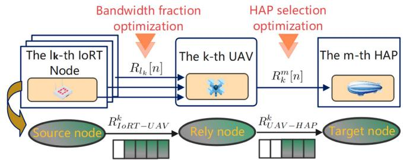  
Fig. 2. Multi-hop cooperative transmission between HAPs and UAVs in IoRT data collection.

Solving P1 is a challenging task due to the following reasons. Firstly, P1 constitutes a joint optimization problem involving two mutually constrained sub-objectives and a diverse set of optimization variables. Second, the 0-1 binary variable $\phi$ , the non-convex constraints (23d), and the fractional form of the objective function make P1 a typical MINLP problem that is challenging to solve directly. Furthermore, there is coupling between optimization variables, such as the velocities and trajectories of UAVs and HAPs. This further makes P1 difficult to solve.

## B. Problem Reformulation

To transform P1 into a more tractable form, we combine the objective function’s numerator with constraint (23d). The reformulated objective function can be expressed as

$$
\operatorname* { m a x } { \frac { \sum _ { n = 1 } ^ { N } \sum _ { k = 1 } ^ { K } \sum _ { m = 1 } ^ { M } R _ { k } ^ { m } [ n ] } { \sum _ { n = 1 } ^ { N } \left( \sum _ { k = 1 } ^ { K } P _ { U A V } ^ { k } [ n ] + \sum _ { m = 1 } ^ { M } P _ { H A P } ^ { m } [ n ] \right) } } .\tag{24}
$$

For the numerator of (24), $\begin{array} { r } { \sum _ { n = 1 } ^ { N } \sum _ { k = 1 } ^ { K } \sum _ { m = 1 } ^ { M } R _ { k } ^ { m } } \end{array}$ n can be easily derived from $\{ R _ { U A V - H A P } ^ { t o t a l } , R _ { I o R T - U A V } ^ { t o t a l } \}$ and constraint (23d) at ${ \check { N } } = N$

<sup>=</sup>Next, the path discretization method is employed to address the coupling challenges between velocities and trajectories [20]. At each time slot, the velocities and trajectories can be approximated as constant values when the unit time slot duration δ is sufficiently small. Then, the relationship between the flight velocities and trajectories of the k-th UAV and the m-th HAP can be expressed as

$$
( \mathbf { q } _ { k } [ n ] ) _ { 1 : 2 } = ( \mathbf { q } _ { k } [ n - 1 ] ) _ { 1 : 2 } \pm v _ { U A V } ^ { k , h o r i } [ n ] \delta , \ \forall k , n ,\tag{25}
$$

$$
( \mathbf { s } _ { m } [ n ] ) _ { 1 : 2 } = ( \mathbf { s } _ { m } [ n - 1 ] ) _ { 1 : 2 } \pm v _ { H A P } ^ { m , h o r i } [ n ] \delta , \forall m , n .\tag{26}
$$

Accordingly, the propulsion energy consumption of the k-th UAV at time slot n can be approximated using trajectory variables q. It can be expressed as

$$
\begin{array} { l } { { \displaystyle \tilde { P } _ { U A V } ^ { k , p r o p } \left[ n \right] = \frac { \theta _ { 1 } } { \sqrt { d _ { k , n } ^ { 2 } \delta ^ { - 2 } + \sqrt { d _ { k , n } ^ { 4 } \delta ^ { - 4 } + 4 C _ { h } ^ { 4 } } } } } } \\ { { \displaystyle ~ + \left\| \left( { \bf q } _ { k } [ n ] \right) _ { 3 } - \left( { \bf q } _ { k } [ n - 1 ] \right) _ { 3 } \right\| F _ { g } \delta ^ { - 1 } + 0 . 1 2 5 C _ { D 0 } \psi _ { 0 } A d _ { k , n } ^ { 3 } \delta ^ { - 3 } } , }  \end{array}\tag{27}
$$

where $d _ { k , n } = \left\| ( \mathbf { q } _ { k } [ n ] ) _ { 1 : 2 } - ( \mathbf { q } _ { k } [ n - 1 ] ) _ { 1 : 2 } \right\|$ . Next, the energy <sup>= ( [ ])1:2 ( [ 1])1:2</sup>consumption of the m-th HAP’s propulsion system at time slot n can be reformulated as

$$
\tilde { P } _ { H A P } ^ { m } [ n ] = v _ { w i n d } ^ { 3 } \psi d _ { m , n } ^ { 2 / 3 } \delta ^ { - 2 / 3 } C _ { D } ,\tag{28}
$$

where $d _ { m , n } = \left\| ( \mathbf { s } _ { m } [ n ] ) _ { 1 : 2 } - ( \mathbf { s } _ { m } [ n - 1 ] ) _ { 1 : 2 } \right\|$ . Then, the con-<sup>= ( [ ])1:2 ( [ 1])1:2</sup>straints (23b) and (23c) can be re-expressed as

$$
\left\| { \left( \mathbf { q } _ { k } \left[ n \right] \right) _ { 1 : 2 } - \left( \mathbf { q } _ { k } \left[ n - 1 \right] \right) _ { 1 : 2 } } \right\| \le d _ { U A V } ^ { \operatorname* { m a x } } = v _ { \operatorname* { m a x } } ^ { h o r i } \delta ,\tag{29}
$$

$$
\left\| { { \left( { { \bf { s } } _ { m } } \left[ n \right] \right) } _ { 1 : 2 } } - { \left( { { \bf { s } } _ { m } } \left[ n - 1 \right] \right) } _ { 1 : 2 } \right\| \le d _ { H A P } ^ { \operatorname* { m a x } } = \dot { v } _ { \operatorname* { m a x } } ^ { h o r i } \delta ,\tag{30}
$$

where $d _ { U A V } ^ { \operatorname* { m a x } }$ and $d _ { H A P } ^ { \operatorname* { m a x } }$ denote the maximum horizontal flight distances of UAVs and HAPs within a single unit time slot. As a result, P1 can be reformulated as

(<sup>P2</sup>) :

$$
\operatorname* { m a x } _ { \stackrel { \mathcal { Q } , \mathcal { P } , \mathcal { S } , } { \mathcal { D } , \alpha } } \frac { \sum _ { n = 1 } ^ { N } \sum _ { k = 1 } ^ { K } \sum _ { m = 1 } ^ { M } R _ { k } ^ { m } [ n ] } { \sum _ { n = 1 } ^ { N } \left( \sum _ { k = 1 } ^ { K } \tilde { P } _ { U A V } ^ { k } [ n ] + \sum _ { m = 1 } ^ { M } \tilde { P } _ { H A P } ^ { m } [ n ] \right) }\tag{31a}
$$

$$
\mathrm { s . t . } \ \| \big ( \mathbf { q } _ { k } \left[ n \right] \big ) _ { 1 : 2 } - \big ( \mathbf { q } _ { k } \left[ n - 1 \right] \big ) _ { 1 : 2 } \| \leq d _ { U A V } ^ { \operatorname* { m a x } } , \ \forall k ,\tag{31b}
$$

$$
\begin{array} { r } { \left\| \big ( \mathbf { s } _ { m } \left[ n \right] \big ) _ { 1 : 2 } - \big ( \mathbf { s } _ { m } \left[ n - 1 \right] \big ) _ { 1 : 2 } \right\| \leq d _ { H A P } ^ { \operatorname* { m a x } } , \forall m , } \end{array}\tag{31c}
$$

$$
\sum _ { n = 1 } ^ { \tilde { N } } \sum _ { m = 1 } ^ { M } R _ { k } ^ { m } [ n ] \leq \sum _ { n = 1 } ^ { \tilde { N } } \sum _ { l _ { k } = 1 } ^ { L _ { k } } R _ { l _ { k } } [ n ] , \ \forall \tilde { N } \in \mathcal { N } ,\tag{31d}
$$

$$
\sum _ { l _ { k } = 1 } ^ { L _ { k } } \alpha _ { l _ { k } } [ n ] \leq 1 , \ \alpha _ { l _ { k } } [ n ] \geq 0 , \ \forall k , l _ { k } , n ,\tag{31e}
$$

$$
\sum _ { m = 1 } ^ { M } \phi _ { k } ^ { m } [ n ] \leq 1 , \ \phi _ { k } ^ { m } [ n ] = \{ 0 , 1 \} , \ \forall k , m , n ,\tag{31f}
$$

$$
0 \leq p _ { k } [ n ] \leq p _ { \mathrm { m a x } } , \forall k , n ,\tag{31g}
$$

$$
\sum _ { n = 1 } ^ { N } p _ { k } [ n ] \leq \overline { { p } } _ { \operatorname* { m a x } } N , \forall k ,\tag{31h}
$$

$$
\mathbf { q } _ { k } [ 0 ] = \mathbf { q } _ { k } ^ { i n i } , \mathbf { q } _ { k } [ N ] = \mathbf { q } _ { k } ^ { e n d } , \forall k ,\tag{31i}
$$

$$
\mathbf { s } _ { m } [ 0 ] = \mathbf { s } _ { m } ^ { i n i } , \ \mathbf { s } _ { m } [ N ] = \mathbf { s } _ { m } ^ { e n d } , \ \forall m ,\tag{31j}
$$

$$
\left\| \mathbf { q } _ { j } [ n ] - \mathbf { q } _ { k } [ n ] \right\| \geq d _ { \operatorname* { m i n } } , \ j , k \in \mathcal { K } , j \neq k ,\tag{31k}
$$

$$
R _ { k } ^ { m } [ n ] \delta \ge \phi _ { k } ^ { m } [ n ] \check { R } , R _ { l _ { k } } [ n ] \delta \ge \check { R } , \forall k , l _ { k } , n ,\tag{31l}
$$

$$
\mathrm { w h e r e } ~ \tilde { P } _ { U A V } ^ { k } [ n ] = P _ { U A V } ^ { k , t r a n s } [ n ] + \tilde { P } _ { U A V } ^ { k , p r o p } [ n ] .
$$

<sup>[ ] = [ ] + [ ]</sup>In P2, the original maximum horizontal flight velocity constraints (23b) and (23c) are substituted by (31b) and (31c). After the aforementioned substitutions, the reformulated optimization problem reduces the optimization variables $\gamma _ { U A V }$ and $\nu _ { H A P }$ in comparison to P1. The coupling between the velocity and trajectory variables is effectively resolved. Consequently, P2 becomes a joint optimization problem with respect to the variables Q, P, S, φ, and $_ { \alpha }$ . However, with the inclusion of a fractional form objective function, the nonconvex constraint (31d), and the 0-1 binary variable φ, P2 still remains an MINLP problem, which is inherently challenging to solve.

## IV. ALTERNATING OPTIMIZATION-BASED SOLUTION

This section presents the ECO strategy to address the formulated MINLP problem. In the proposed strategy, after applying path discretization, the Dinkelbach’s algorithm is used to convert the fractional problem into a linear optimization form. To tackle the joint optimization challenge, the problem is decomposed into five sub-problems. Following the block coordinate descent (BCD) method [10], each variable is optimized sequentially while keeping the others fixed. The diagram of the proposed strategy is shown in Fig. 3.

  
Path disctrtization method

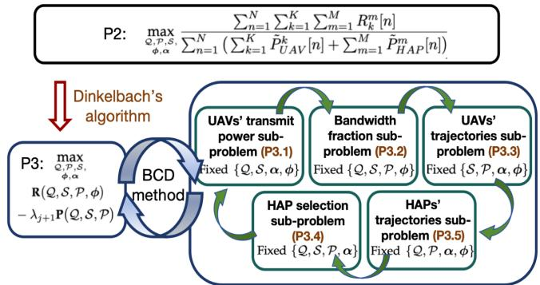  
Fig. 3. The diagram of the ECO strategy.

## A. Transformation of Fractional Programming Via the Dinkelbach’s Algorithm

To handle the fractional structure of the objective function (31a), which may lead to multiple local optima [22], we employ Dinkelbach’s algorithm—an iterative method specifically designed for solving fractional programming problems [20], [42]. The Dinkelbach’s algorithm equivalently transforms the fractional programming $f ( x ) / y ( x )$ into a sequence of <sup>m</sup>linear sub-problems $f ( x ) - \lambda y ( x )$ , where λ is a dy-<sup>max ( ) ( )</sup>namic parameter. The transformation error is negligible, and the solution accuracy can be improved by adjusting the termination tolerance [43]. Specifically, let $\boldsymbol { x } _ { j } ^ { * }$ represent the solution to problem $f ( x ) - \lambda _ { j } y ( x )$ in the j-th iteration. <sup>max ( ) ( )</sup>In the (j+1)-th iteration, the dynamic parameter is updated as $\lambda _ { j + 1 } = f ( x _ { j } ^ { * } ) / y ( x _ { j } ^ { * } )$ . Then, the solution $x _ { j + 1 } ^ { * }$ can be obtained by solving problem $f ( x ) - \lambda _ { j + 1 } y ( x )$ <sup>1</sup>. Finally, the optimal solution $x ^ { * }$ <sup>max ( ) +1 ( )</sup>of the original fractional programming max $f ( x ) / y ( x )$ can be obtained through iterative solving until convergence.

Following the Dinkelbach’s algorithm, we firstly define functions R and P for clarity, as shown below,

$$
\mathbf { R } \left( \mathcal { Q } , \mathcal { S } , \mathcal { P } , \phi \right) \triangleq \sum _ { n = 1 } ^ { N } \sum _ { k = 1 } ^ { K } \sum _ { m = 1 } ^ { M } R _ { k } ^ { m } [ n ] ,\tag{32}
$$

$$
\mathbf { P } \left( \mathcal { Q } , \mathcal { S } , \mathcal { P } \right) \triangleq \sum _ { n = 1 } ^ { N } \left( \sum _ { k = 1 } ^ { K } \tilde { P } _ { U A V } ^ { k } [ n ] + \sum _ { m = 1 } ^ { M } \tilde { P } _ { H A P } ^ { m } [ n ] \right) .\tag{33}
$$

Accordingly, in the (j+1)-th iteration, the problem P2 can be transformed into a quasi-linear form, denoted as

$$
\mathbf { ( P 3 ) } : \operatorname* { m a x } _  \mathbf { \mathcal { Q } } , \mathcal { P } , \mathcal { S } , \mathbf { \mathcal { S } } , \mathbf { \mathcal { S } } , \mathbf { \mathcal { P } } , \phi ) - \lambda _ { j + 1 } \mathbf { P } ( \mathcal { Q } , \mathcal { S } , \mathcal { P } )\tag{34a}
$$

$$
{ \mathrm { s . t . } } \qquad ( 3 1 { \mathrm { b } } ) - ( 3 1 1 ) ,\tag{34b}
$$

where $\lambda _ { j + 1 } = \mathbf { R } ( \mathcal { Q } _ { j } ^ { * } , \mathcal { S } _ { j } ^ { * } , \mathcal { P } _ { j } ^ { * } , \phi _ { j } ^ { * } ) / \mathbf { P } ( \mathcal { Q } _ { j } ^ { * } , \mathcal { S } _ { j } ^ { * } , \mathcal { P } _ { j } ^ { * } )$ is calculated <sup>+1 = ( ) ( )</sup>from the solution of P3 in the j-th iteration. Consequently, P2 is converted into P3, expressed as a joint quasi-linear programming problem.

## B. BCD-Based Joint Optimization

During the Dinkelbach’s algorithm iteration, directly solving P3 is still challenging due to its complexity with multiple variables. Thus, we utilize the BCD method to decompose P3 into several sub-problems. For each sub-problem, we optimize only one variable while keeping the others fixed.

1) Optimization of ${ \bar { U } } A { \bar { V } } s ^ { \mathbf { \theta } }$ Transmit Power: With the trajectories of the UAVs and HAPs, the bandwidth allocation of IoRT nodes, and the HAP selection fixed, we focus on optimizing the UAVs’ transmit power ${ \mathcal P } .$ Thus, with $\{ \mathcal { Q } , \mathcal { S } , \alpha , \phi \}$ fixed, P3 can be reformulated as the transmit power optimization sub-problem, and we have

$$
\begin{array} { r l r } {  { ( \mathrm { P 3 . 1 } ) : \operatorname* { m a x } _ { \mathcal { P } } \sum _ { n = 1 } ^ { N } \sum _ { k = 1 } ^ { K } \sum _ { m = 1 } ^ { M } R _ { k } ^ { m } [ n ] } } \\ & { } & { - \lambda _ { j } \sum _ { n = 1 } ^ { N } ( \sum _ { k = 1 } ^ { K } \tilde { P } _ { U A V } ^ { k } [ n ] + \sum _ { m = 1 } ^ { M } \tilde { P } _ { H A P } ^ { m } [ n ] ) } \end{array}\tag{35a}
$$

$$
\mathrm { s . t . } \sum _ { n = 1 } ^ { \tilde { N } } \sum _ { m = 1 } ^ { M } R _ { k } ^ { m } [ n ] \leq \sum _ { n = 1 } ^ { \tilde { N } } \sum _ { l _ { k } = 1 } ^ { L _ { k } } R _ { l _ { k } } [ n ] , \ \forall \tilde { N } \in \mathcal { N } ,\tag{35b}
$$

$$
0 \leq p _ { k } [ n ] \leq p _ { \mathrm { m a x } } , \forall k , n ,\tag{35c}
$$

$$
\sum _ { n = 1 } ^ { N } p _ { k } [ n ] \leq \overline { { p } } _ { \mathrm { m a x } } N , \forall k ,\tag{35d}
$$

$$
R _ { k } ^ { m } [ n ] \delta \geq \phi _ { k } ^ { m } [ n ] \check { R } , \ R _ { l _ { k } } [ n ] \delta \geq \check { R } , \ \forall k , l _ { k } , n ,\tag{35e}
$$

where $\lambda _ { j } = \mathbf { R } ( \mathcal { Q } _ { j - 1 } ^ { * } , \mathcal { S } _ { j - 1 } ^ { * } , \mathcal { P } _ { j - 1 } ^ { * } , \phi _ { j - 1 } ^ { * } ) / \mathbf { P } ( \mathcal { Q } _ { j - 1 } ^ { * } , \mathcal { S } _ { j - 1 } ^ { * } , \mathcal { P } _ { j - 1 } ^ { * } )$ <sup>= ( 1 1 1 1) ( 1</sup>is a constant which calculated by the solution of P3 in the $( j - \mathrm { i } ) \substack { - \mathrm { t h } }$ iteration. To analyze the convexity of problem P3.1, we present the following theorem.

Theorem 1: In P3.1, $R _ { k } ^ { m } [ n ]$ is a concave function with respect <sup>[ ]</sup>to the k-th UAV’s transmit power $p _ { k } [ n ]$

Proof: We can prove that $R _ { k } ^ { m } [ n ]$ <sup>[ ]</sup>is a concave function with respect to $p _ { k } [ n ]$ by evaluating its second derivative. Firstly, $R _ { k } ^ { \bar { m } } [ n ]$ <sup>[ ]</sup>can be regarded as a function of the variable $p _ { k } [ n ]$ as

$$
R _ { k } ^ { m } [ n ] \stackrel { \triangle } { = } f ( p _ { k } [ n ] ) = \log _ { 2 } \left( 1 + \frac { p _ { k } [ n ] e } { d ^ { 2 } } \right) ,\tag{36}
$$

where $d = \| \mathbf q _ { k } [ n ] - \mathbf s _ { m } [ n ] \|$ and $e = g _ { \boldsymbol { k } } ^ { m } [ n ] \beta _ { 0 }$ are both con-<sup>= [</sup>stants with given ${ \bf q } _ { k } [ n ]$ <sup>[ ]</sup>and ${ \bf s } _ { m } [ n ]$ <sup>= [ ] 0</sup>. To simplify the calculation, we use the logarithmic transformation formula $\begin{array} { r } { \log _ { 2 } ( x ) = \frac { \ln ( x ) } { \ln ( 2 ) } } \end{array}$ to reformulate $f ( p _ { k } [ n ] )$ as

$$
f ( p _ { k } [ n ] ) = \frac { 1 } { \ln ( 2 ) } \ln \left( 1 + \frac { p _ { k } [ n ] e } { d ^ { 2 } } \right) ,\tag{37}
$$

where $\frac { 1 } { \ln ( 2 ) }$ is a constant and does not impact the determina-<sup>ln(2)</sup>tion of concavity. By calculating the second-order derivative of

$f ( p _ { k } [ n ] )$ , we can obtain

$$
f ^ { \prime \prime } ( p _ { k } [ n ] ) = { \frac { d } { d p _ { k } [ n ] } } \left( { \frac { e } { d ^ { 2 } + p _ { k } [ n ] e } } \right) = - { \frac { e ^ { 2 } } { ( d ^ { 2 } + p _ { k } [ n ] e ) ^ { 2 } } } \leq 0 .\tag{38}
$$

According to $f ^ { \prime \prime } ( p _ { k } [ n ] ) \leq 0 .$ , we can obtain $f ( p _ { k } [ n ] )$ is a con-<sup>( [ ]) 0</sup>cave function with respect to $p _ { k } [ n ]$ <sup>( [ ])</sup>. As a result, the original function $R _ { k } ^ { m } [ n ]$ <sup>[ ]</sup>is a concave function of $p _ { k } [ n ]$ -

<sup>[ ] [ ]</sup>Based on Theorem 1, all parts of P3.1, except (35b), can be formulated as a standard convex problem. For clearer presentation, (35b) can be expanded to

$$
\begin{array} { r l r } {  { \sum _ { n = 1 } ^ { \tilde { N } } \sum _ { m = 1 } ^ { M } \phi _ { k } ^ { m } [ n ] \vartheta _ { k } ^ { m } [ n ] B l o g _ { 2 } ( 1 + \frac { p _ { k } [ n ] g _ { k } ^ { m } [ n ] \beta _ { 0 } } { \| \mathbf { q } _ { k } [ n ] - \mathbf { s } _ { m } [ n ] \| ^ { 2 } } ) } \quad } & { } & \\ & { } & { \leq \sum _ { n = 1 } ^ { \tilde { N } } R c [ n ] , } \end{array}\tag{39}
$$

for $\forall { \check { N } } \in { \mathcal { N } } .$ , where $\begin{array} { r } { R c [ n ] = \sum _ { l _ { k } = 1 } ^ { L _ { k } } R _ { l _ { k } } [ n ] } \end{array}$ are constants with $\{ \mathcal { Q } , \alpha \}$ <sup>k=1</sup>fixed. Based on Theorem 1, the left-hand side (LHS) of the inequality in (39) is a concave function of $p _ { k } [ n ]$ . However, <sup>[ ]</sup>(39) is not a convex constraint for P3.1, as the concave function on the LHS of the inequality renders the feasible region of P3.1 a non-convex set. To address this issue, we introduce the slack variables $\mathcal { R } = \{ R s _ { k } [ n ] \}$ }. Then, P3.1 can be reformulated as

P3.1.1

$$
\operatorname* { m a x } _ { \mathcal { P } , \mathcal { R } } \sum _ { n = 1 } ^ { N } \sum _ { k = 1 } ^ { K } R s _ { k } [ n ] - \lambda _ { j } \sum _ { n = 1 } ^ { N } \left( \sum _ { k = 1 } ^ { K } p _ { k } [ n ] \delta + P c [ n ] \right)\tag{40a}
$$

$$
\begin{array} { r } { \mathrm { s . t . } \ R s _ { k } [ n ] \leq \displaystyle \sum _ { m = 1 } ^ { M } \phi _ { k } ^ { m } [ n ] \vartheta _ { k } ^ { m } [ n ] B l o g _ { 2 } \qquad } \\ { \qquad \forall \left( 1 + \displaystyle \frac { p _ { k } [ n ] g _ { k } ^ { m } [ n ] \beta _ { 0 } } { \| \mathbf { q } _ { k } [ n ] - \mathbf { s } _ { m } [ n ] \| ^ { 2 } } \right) , } \\ { \qquad \forall k , n \in \tilde { N } , } \end{array}\tag{40b}
$$

$$
\sum _ { n = 1 } ^ { \check { N } } R s _ { k } [ n ] \leq \sum _ { n = 1 } ^ { \check { N } } R c [ n ] , \forall \check { N } \in \mathcal { N } ,\tag{40c}
$$

(35c), (35d), (35e)

(40d)

where $\begin{array} { r } { P c [ n ] = \sum _ { k = 1 } ^ { K } \tilde { P } _ { U A V } ^ { k , p r o p } [ n ] + \sum _ { m = 1 } ^ { M } \tilde { P } _ { H A P } ^ { m } [ n ] } \end{array}$ are con-<sup>[ ] = =1 [ ] + =1 [ ]</sup>stants when the trajectories of UAVs and HAPs are fixed. Notably, in (40b), we employ an inequality sign rather than an equality sign. This substitution is motivated by the fact that inequality constraints offer greater flexibility in locating optimal solutions within the feasible domain than equality constraints [20]. Problem P3.1.1 aims to maximize a linear function with respect to R and P, subject to a set of convex constraints. Thus, it is a standard convex optimization problem that can be directly solved using common solution techniques, such as the gradient descent method [43].

2) Optimization of Bandwidth Fraction: With the trajectories of the UAVs and HAPs, the $\mathrm { U A V s } '$ transmit power, and the HAP selection fixed, we focus on optimizing the bandwidth allocation of IoRT nodes, i.e., α. Thus, with $\{ \bar { \mathcal { Q } } , \mathcal { S } , \mathcal { P } , \phi \}$ fixed, P3 can be reformulated as the bandwidth fraction optimization

sub-problem as

$$
\begin{array} { c l } { { \displaystyle ( { \mathrm { P } } 3 . 2 ) : \operatorname* { m a x } _ { \alpha } \sum _ { n = 1 } ^ { N } \sum _ { k = 1 } ^ { K } \sum _ { m = 1 } ^ { M } R _ { k } ^ { m } [ n ] } } \\ { { - \lambda _ { j } \displaystyle \sum _ { n = 1 } ^ { N } \left( \sum _ { k = 1 } ^ { K } \tilde { P } _ { U A V } ^ { k } [ n ] + \sum _ { m = 1 } ^ { M } \tilde { P } _ { H A P } ^ { m } [ n ] \right) } } \end{array}\tag{41a}
$$

$$
\mathrm { s . t . } \sum _ { n = 1 } ^ { \tilde { N } } \sum _ { m = 1 } ^ { M } R _ { k } ^ { m } [ n ] \leq \sum _ { n = 1 } ^ { \tilde { N } } \sum _ { l _ { k } = 1 } ^ { L _ { k } } R _ { l _ { k } } [ n ] , \ \forall \tilde { N } \in \mathcal { N } ,\tag{41b}
$$

$$
\sum _ { l _ { k } = 1 } ^ { L _ { k } } \alpha _ { l _ { k } } [ n ] \leq 1 , \ \alpha _ { l _ { k } } [ n ] \geq 0 , \ \forall k , l _ { k } , n ,\tag{41c}
$$

$$
R _ { k } ^ { m } [ n ] \delta \geq \phi _ { k } ^ { m } [ n ] \check { R } , \ R _ { l _ { k } } [ n ] \delta \geq \check { R } , \ \forall k , l _ { k } , n ,\tag{41d}
$$

where (41a) is a linear function of $R _ { k } ^ { m } [ n ] , ~ \tilde { P } _ { U A V } ^ { k } [ n ]$ , and $\tilde { P } _ { H A P } ^ { m } [ n ]$ . Furthermore, $R _ { k } ^ { m } [ n ] , \tilde { P } _ { U A V } ^ { k } [ n ]$ , and $\tilde { P } _ { H A P } ^ { m } [ n ]$ are all <sup>[ ]</sup>constants for the given fixed $\{ \dot { \mathcal { Q } } , \check { S } , \check { \mathcal { P } } , \check { \phi } \}$

To maximize the value of the objective function in P3, it is essential to maximize $\mathbf { R } ( \mathcal { Q } , \mathcal { S } , \mathcal { P } , \boldsymbol { \phi } )$ as much as possible while minimizing $\mathbf { P } ( \mathcal { Q } , S , \mathcal { P } )$ <sup>( )</sup>, as shown in (34a). According to (31d), the UAVs’ uplink rate $\begin{array} { r } { \sum _ { n = 1 } ^ { \tilde { N } } \sum _ { m = 1 } ^ { M } R _ { k } ^ { m } [ n ] } \end{array}$ , constrained by <sup>=1 =1 [ ]</sup>the information-causality condition, must not exceed the IoRT nodes’ uplink rate $\begin{array} { r } { \sum _ { n = 1 } ^ { \tilde { N } } \sum _ { l _ { k } = 1 } ^ { L _ { k } } R _ { l _ { k } } [ n ] } \end{array}$ . When combining $\check { N } =$ $N$ and ${ \cal R } _ { k } ^ { m } [ 0 ] = { \cal R } _ { l _ { k } } [ N ] = 0$ , we have $\begin{array} { r } { \sum _ { n = 1 } ^ { N } \sum _ { m = 1 } ^ { M } R _ { k } ^ { m } [ n ] \leq } \end{array}$ $\begin{array} { r } { \sum _ { n = 1 } ^ { N } \sum _ { l _ { k } = 1 } ^ { L _ { k } } R _ { l _ { k } } [ n ] , } \end{array}$ . In other words, the total uplink achiev-<sup>=1 k=1 k [ ]</sup>able rate of the IoRT nodes in the k-th region sets an upper bound on the total uplink achievable rate of the k-th UAV. To maximize $\mathbf { R } ( \mathcal { Q } , \mathcal { S } , \mathcal { P } , \phi )$ and optimize the objective function, it is necessary to maximize $\begin{array} { r } { \sum _ { n = 1 } ^ { N } \sum _ { k = 1 } ^ { K } \dot { \sum } _ { l _ { k } = 1 } ^ { L _ { k } } R _ { l _ { k } } [ n ] } \end{array}$ <sup>=1 =1 k=1 k [ ]</sup>to its fullest extent, thereby raising the upper bound on $\begin{array} { r } { \sum _ { n = 1 } ^ { N } \sum _ { k = 1 } ^ { K } \sum _ { m = 1 } ^ { M } R _ { k } ^ { m } [ n ] } \end{array}$ . Consequently, to maximize the ob-<sup>=1 =1 =1 [ ]</sup>jective function value of P3, we transform P3.2 into P3.2.1 as

$$
( \mathrm { P 3 . 2 . 1 } ) : \operatorname* { m a x } _ { \alpha } \sum _ { n = 1 } ^ { N } \sum _ { k = 1 } ^ { K } \sum _ { l _ { k } = 1 } ^ { L _ { k } } { R _ { l _ { k } } [ n ] }\tag{42a}
$$

$$
{ \mathrm { s . t . ~ } } ( 4 1 \mathbf { b } ) , ( 4 1 \mathbf { c } ) , ( 4 1 \mathbf { d } ) .\tag{42b}
$$

In (42a), it is easy to prove that $R _ { l _ { k } } [ n ] = \alpha _ { l _ { k } } [ n ] W l o g _ { 2 } ( 1 +$ $\frac { p _ { l _ { k } } [ n ] \beta } { \alpha _ { l _ { k } } [ n ] W \lVert \mathbf { q } _ { k } [ n ] - \mathbf { o } _ { l _ { k } } [ n ] \rVert ^ { 2 } } \Big )$ is strictly concave with respect to $\alpha _ { l _ { k } } [ n ]$ <sup>lk [ ] k[ ] lk [ ]</sup>as shown in [37]. With the convex constraints (41b), (41c), and (41d), P3.2.1 is a standard convex programming which can be easily find the optimal solution. By optimally solving P3.2.1, we can determine the optimal bandwidth fraction $\alpha ^ { * }$ under fixed $\{ \mathcal { Q } , \mathcal { S } , \mathcal { P } , \phi \}$

3) Optimization of UAVs’ Trajectories: With the trajectories of the ${ \mathrm { H A P s } } ,$ the UAVs’ transmit power, the bandwidth fraction of IoRT nodes, and the HAP selection fixed, we focus on optimizing the $\mathrm { U A V s } '$ trajectories Q. Thus, with $\{ \mathcal { S } , \mathcal { P } , \alpha , \phi \}$ fixed, P3 can be reformulated as the UAVs’ trajectories optimization sub-problem, and we have

$$
: \operatorname* { m a x } _ { \mathcal { Q } } \sum _ { n = 1 } ^ { N } \sum _ { k = 1 } ^ { K } \sum _ { m = 1 } ^ { M } R _ { k } ^ { m } [ n ]\tag{P3.3}
$$

$$
- \lambda _ { j } \sum _ { n = 1 } ^ { N } \left( \sum _ { k = 1 } ^ { K } \tilde { P } _ { U A V } ^ { k } [ n ] + \sum _ { m = 1 } ^ { M } \tilde { P } _ { H A P } ^ { m } [ n ] \right)\tag{43a}
$$

$$
\mathrm { s . t . } \left\| \left( \mathbf { q } _ { k } \left[ n \right] \right) _ { 1 : 2 } - ( \mathbf { q } _ { k } \left[ n - 1 \right] ) _ { 1 : 2 } \right\| \leq d _ { U A V } ^ { \operatorname* { m a x } } , \forall k ,\tag{43b}
$$

$$
\sum _ { n = 1 } ^ { \tilde { N } } \sum _ { m = 1 } ^ { M } R _ { k } ^ { m } [ n ] \leq \sum _ { n = 1 } ^ { \tilde { N } } \sum _ { l _ { k } = 1 } ^ { L _ { k } } R _ { l _ { k } } [ n ] , \ \forall \tilde { N } \in \mathcal { N } ,\tag{43c}
$$

$$
\mathbf { q } _ { k } [ 0 ] = \mathbf { q } _ { k } ^ { i n i } , \mathbf { q } _ { k } [ N ] = \mathbf { q } _ { k } ^ { e n d } , \forall k ,\tag{43d}
$$

$$
\left\| \mathbf { q } _ { j } [ n ] - \mathbf { q } _ { k } [ n ] \right\| \geq d _ { \operatorname* { m i n } } , \ j , k \in \mathcal { K } , j \neq k ,\tag{43e}
$$

$$
R _ { k } ^ { m } [ n ] \delta \ge \phi _ { k } ^ { m } [ n ] \check { R } , R _ { l _ { k } } [ n ] \delta \ge \check { R } , \forall k , l _ { k } , n ,\tag{43f}
$$

where $\tilde { P } _ { U A V } ^ { k } [ n ] = P _ { U A V } ^ { k , t r a n s } [ n ] + \tilde { P } _ { U A V } ^ { k , p r o p } [ n ]$ . The objective <sup>[ ] = [ ] +</sup>function (43a) can be re-expressed as

$$
\operatorname* { m a x } _ { \mathcal { Q } } \sum _ { n = 1 } ^ { N } \sum _ { k = 1 } ^ { K } \sum _ { m = 1 } ^ { M } \phi _ { k } ^ { m } [ n ] \vartheta _ { k } ^ { m } [ n ] B l o g _ { 2 } \bigg ( 1 + \frac { p _ { k } [ n ] g _ { k } ^ { m } [ n ] \beta _ { 0 } } { \left\| \mathbf { q } _ { k } [ n ] - \mathbf { s } _ { m } [ n ] \right\| ^ { 2 } } \bigg )
$$

$$
- \lambda _ { j } \sum _ { n = 1 } ^ { N } \sum _ { k = 1 } ^ { K } \left( \frac { \theta _ { 1 } } { \sqrt { d _ { k , n } ^ { 2 } \delta ^ { - 2 } + \sqrt { d _ { k , n } ^ { 4 } \delta ^ { - 4 } + 4 C _ { h } ^ { 4 } } } } + D _ { c } d _ { k , n } ^ { 3 } \delta ^ { - 3 } \right)
$$

$$
- \lambda _ { j } \sum _ { n = 1 } ^ { N } \left( \sum _ { k = 1 } ^ { K } P _ { U A V } ^ { k , t r a n s } \left[ n \right] + \sum _ { m = 1 } ^ { M } \tilde { P } _ { H A P } ^ { m } [ n ] \right) ,\tag{44}
$$

where $D _ { c } = 0 . 1 2 5 C _ { D 0 } \psi _ { 0 } A$ is a constant. Unfortunately, the <sup>= 0 125 0 0</sup>first two components in (44) are both non-concave for Q. To transform (44) into a convex optimization objective, we employ the SCA technique, which iteratively approximates the original non-convex problem by constructing a sequence of convex approximation problems [20], [23].

In the first component, $\begin{array} { r } { l o g _ { 2 } ( 1 + \frac { p _ { k } [ n ] g _ { k } ^ { m } [ n ] \beta _ { 0 } } { \| \mathbf { q } _ { k } [ n ] - \mathbf { s } _ { m } [ n ] \| ^ { 2 } } ) } \end{array}$ is convex with respect to $\| \mathbf { q } _ { k } [ n ] - \mathbf { s } _ { m } [ n ] \| ^ { 2 }$ . However, maximizing a con-<sup>[ ] [ ]</sup>vex function is hardly solved because the local optima cannot guarantee its global optimality [43]. Based on the SCA technique, we can utilize the first-order Taylor expansion<sup>5</sup> to a convex function at any chosen local point, resulting in an approximation that provides the lower bound for the original function. Defining the local points $\mathcal { Q } ^ { ( r ) } = \{ \mathbf { q } _ { k } ^ { ( r ) } [ n ] \}$ at the $r \mathrm { - }$ th iteration, we can apply the first-order Taylor expansion to $\begin{array} { r } { l o g _ { 2 } ( 1 + \frac { p _ { k } [ n ] g _ { k } ^ { m } [ n ] \beta _ { 0 } ^ { - } } { \| \mathbf { q } _ { k } [ n ] - \mathbf { s } _ { m } [ n ] \| ^ { 2 } } ) } \end{array}$ for any given $\boldsymbol { \mathcal { Q } } ^ { ( r ) }$ , yielding its lower bound at $\| \mathbf { q } _ { k } ^ { ( \bar { r } ) } [ n ] - \mathbf { s } _ { m } [ n ] \| ^ { 2 }$ , and we have

$$
\begin{array} { r l r } & { } & { \log _ { 2 } \bigg ( 1 + \frac { p _ { k } \left[ n \right] g _ { k } ^ { m } \left[ n \right] \beta _ { 0 } } { \left\| \mathbf { q } _ { k } \left[ n \right] - \mathbf { s } _ { m } \left[ n \right] \right\| ^ { 2 } } \bigg ) \geq \log _ { 2 } \bigg ( 1 + \frac { p _ { k } \left[ n \right] g _ { k } ^ { m } \left[ n \right] \beta _ { 0 } } { \left\| \mathbf { q } _ { k } ^ { ( r ) } \left[ n \right] - \mathbf { s } _ { m } \left[ n \right] \right\| ^ { 2 } } \bigg ) } \\ & { } & { - \eta _ { k } ^ { m } \left[ n \right] \Big ( \left\| \mathbf { q } _ { k } \left[ n \right] - \mathbf { s } _ { m } \left[ n \right] \right\| ^ { 2 } - \left\| \mathbf { q } _ { k } ^ { ( r ) } \left[ n \right] - \mathbf { s } _ { m } \left[ n \right] \right\| ^ { 2 } \Big ) , ( 4 5 ) } \end{array}
$$

$$
\begin{array} { r l } & { \mathrm { w h e r e ~ } \eta _ { k } ^ { m } [ n ] = \frac { \log _ { 2 } ( e ) p _ { k } [ n ] g _ { k } ^ { m } [ n ] \beta _ { 0 } \left\| \mathbf { q } _ { k } ^ { ( r ) } [ n ] - \mathbf { s } _ { m } [ n ] \right\| ^ { - 4 } } { 1 + p _ { k } [ n ] g _ { k } ^ { m } [ n ] \beta _ { 0 } \left\| \mathbf { q } _ { k } ^ { ( r ) } [ n ] - \mathbf { s } _ { m } [ n ] \right\| ^ { - 2 } } . \mathrm { W e ~ h a v e ~ } } \\ & { R _ { k } ^ { m } [ n ] \geq \phi _ { k } ^ { m } [ n ] \vartheta _ { k } ^ { m } [ n ] B \left( l o g _ { 2 } \left( 1 + \frac { p _ { k } [ n ] g _ { k } ^ { m } [ n ] \beta _ { 0 } } { \left\| \mathbf { q } _ { k } ^ { ( r ) } [ n ] - \mathbf { s } _ { m } [ n ] \right\| ^ { 2 } } \right) \right. } \\ & { \left. - \eta _ { k } ^ { m } [ n ] \Big ( \left\| \mathbf { q } _ { k } [ n ] - \mathbf { s } _ { m } [ n ] \right\| ^ { 2 } - \left\| \mathbf { q } _ { k } ^ { ( r ) } [ n ] - \mathbf { s } _ { m } [ n ] \right\| ^ { 2 } \Big ) \right) = \tilde { R } _ { k } ^ { m } [ n ] } \end{array}\tag{46}
$$

In (46), $\check { R } _ { k } ^ { m } [ n ]$ is a concave function of $\mathcal { Q } .$ After replacing $\begin{array} { r } { \phi _ { k } ^ { m } [ n ] \vartheta _ { k } ^ { m } [ n ] B \bar { l } o g _ { 2 } ( 1 + \frac { p _ { k } [ n ] g _ { k } ^ { m } [ n ] \beta _ { 0 } } { \| \mathbf { q } _ { k } ^ { ( r ) } [ n ] - \mathbf { s } _ { m } [ n ] \| ^ { 2 } } ) } \end{array}$ with $\check { R } _ { k } ^ { m } [ n ]$ , the first <sup>k [ ] m[ ]</sup>component of the objective function (44) transforms into a standard form of convex optimization.

The second term’s negative correlation with the maximiza  
tion objective necessitates its convexity for solvability. In the   
second term, $D _ { c } d _ { k , n } ^ { 3 } \delta ^ { - 3 }$ is convex with respect to $d _ { k , n }$ and   
remains convex concerning the optimization variable $\mathcal { Q } . ^ { 6 }$ How  
ever, θ is non-convex about optimization $\sqrt { d _ { k , n } ^ { 2 } \delta ^ { - 2 } + \sqrt { d _ { k , n } ^ { 4 } \delta ^ { - 4 } + 4 C _ { h } ^ { 4 } } }$

<sup>k,n k,n h</sup>variable Q. For the convenience of calculation, we introduce the relaxation variable $\mathcal { U } = \{ u _ { k } [ n ] \}$ as

$$
u _ { k } [ n ] = \sqrt { d _ { k , n } ^ { 2 } \delta ^ { - 2 } + \sqrt { d _ { k , n } ^ { 4 } \delta ^ { - 4 } + 4 C _ { h } ^ { 4 } } } , \ \forall k , n .\tag{47}
$$

To intuitively demonstrate the function’s convexity, we remove the roots in (47) via transformations, and we have

$$
u _ { k } ^ { 2 } [ n ] = 2 d _ { k , n } ^ { 2 } \delta ^ { - 2 } + 4 C _ { h } ^ { 4 } u _ { k } ^ { - 2 } [ n ] , \forall k , n .\tag{48}
$$

By reformulating the first two components of the objective function, (44) can be re-expressed as

$$
\begin{array} { c } { { \displaystyle \operatorname* { m a x } _ { Q , U } \sum _ { n = 1 } ^ { N } \sum _ { k = 1 } ^ { K } \sum _ { m = 1 } ^ { M } \check { h } _ { k } ^ { m } [ n ] - \lambda _ { j } \sum _ { n = 1 } ^ { N } \sum _ { k = 1 } ^ { K } \left( \frac { \theta _ { 1 } } { u _ { k } [ n ] } + D _ { c } d _ { k , n } ^ { 3 } \delta ^ { - 3 } \right) } } \\ { { - \lambda _ { j } \displaystyle \sum _ { n = 1 } ^ { N } \left( \sum _ { k = 1 } ^ { K } P _ { U A V } ^ { k , t r a n s } [ n ] + \sum _ { m = 1 } ^ { M } \tilde { P } _ { H A P } ^ { m } [ n ] \right) . \qquad ( 4 9 ) } } \end{array}
$$

Furthermore, the introduction of the relaxation variable U necessitates an additional constraint as

$$
u _ { k } ^ { 2 } [ n ] \leq 2 d _ { k , n } ^ { 2 } \delta ^ { - 2 } + 4 C _ { h } ^ { 4 } u _ { k } ^ { - 2 } [ n ] , \forall k , n .\tag{50}
$$

We use an inequality sign in (50) to simplify the solution process, as the same as the operation in (40b). However, due to the convexity of inequality’s right-hand side (RHS), (50) and (43c) are non-convex constraints for P3.3.1.<sup>7</sup>

For the RHS of the inequality in (50), $2 d _ { k , n } ^ { 2 } \delta ^ { - 2 } =$ $2 \big \| ( \mathbf { q } _ { k } [ n ] ) _ { 1 : 2 } - ( \mathbf { q } _ { k } [ n - 1 ] ) _ { 1 : 2 } \big \| ^ { 2 } \delta ^ { - 2 }$ and $4 C _ { h } ^ { 4 } u _ { k } ^ { - 2 } [ n ]$ are convex with respect to $\left\| ( \mathbf { q } _ { k } [ n ] ) _ { 1 : 2 } - ( \mathbf { q } _ { k } [ n - 1 ] ) _ { 1 : 2 } \right\|$ and $u _ { k } [ n ]$ <sup>( [ ])1:2 ( [ 1])1:2 [ ]</sup>respectively. Similarly, based on the SCA technique, the lower bound of the inequality’s RHS can be obtained through the first-order Taylor expansion. Then, we have

$$
\begin{array} { r l } & { 2 \big \| \left( \mathbf { q } _ { k } \left[ n \right] \right) _ { 1 : 2 } - \left( \mathbf { q } _ { k } \left[ n - 1 \right] \right) _ { 1 : 2 } \big \| ^ { 2 } \delta ^ { - 2 } + 4 C _ { h } ^ { 4 } u _ { k } ^ { - 2 } [ n ] } \\ & { \geq 4 \left( \left( \mathbf { q } _ { k } ^ { ( r ) } \left[ n \right] \right) _ { 1 : 2 } - \left( \mathbf { q } _ { k } ^ { ( r ) } \left[ n - 1 \right] \right) _ { 1 : 2 } \right) ^ { T } \left( \left( \mathbf { q } _ { k } \left[ n \right] \right) _ { 1 : 2 } \right. } \end{array}
$$

<sup>6</sup>For $x > 0 ,$ the function $f ( x ) = x ^ { 3 }$ is convex due to its second derivative being greater than zero, i.e., $f ^ { \prime \prime } ( x ) = 6 x > 0$

$$
\begin{array} { r l } & { - ( \mathbf { q } _ { k } [ n - 1 ] ) _ { 1 : 2 } ) \delta ^ { - 2 } -  ( \mathbf { q } _ { k } ^ { ( r ) } [ n ] ) _ { 1 : 2 } - ( \mathbf { q } _ { k } ^ { ( r ) } [ n - 1 ] ) _ { 1 : 2 }  ^ { 2 } } \\ & { + \ : 4 C _ { h } ^ { 4 } u _ { k } ^ { ( r ) - 2 } [ n ] - 8 C _ { h } ^ { 4 } u _ { k } ^ { ( r ) - 3 } [ n ] ( u _ { k } [ n ] - u _ { k } ^ { ( r ) } [ n ] ) = \hat { u } _ { k } ^ { 2 } [ n ] , } \end{array}\tag{51}
$$

In $( 5 1 ) , \hat { u } _ { k } ^ { 2 } [ n ]$ exhibits linearity with respect to $\mathcal { Q }$ for any specified local points $\boldsymbol { \mathcal { Q } } ^ { ( r ) }$ and $u _ { k } ^ { ( r ) } [ n ]$ . For the RHS of the inequality in (43c), $\begin{array} { r } { R _ { l _ { k } } [ n ] = \alpha _ { l _ { k } } [ n ] W l o g _ { 2 } ( 1 + \frac { p _ { l _ { k } } [ n ] \beta } { \alpha _ { l _ { k } } [ n ] W \parallel \mathbf { q } _ { k } [ n ] - \mathbf { o } _ { l _ { k } } [ n ] \parallel ^ { 2 } } ) } \end{array}$ is a convex function with respect to the $\lVert \mathbf { q } _ { k } [ n ] - \mathbf { o } _ { l _ { k } } [ n ] \rVert ^ { 2 }$ . To <sup>[ ] k[ ]</sup>make the RHS of the inequality concave or linear, we can use the first-order Taylor expansion to $R _ { l _ { k } } [ n ]$ for any given local points $\boldsymbol { \mathcal { Q } } ^ { ( r ) }$ . Then, the lower bound of $R _ { l _ { k } } [ n ]$ can be obtained at $\big \| \mathbf { q } _ { k } ^ { ( r ) } [ n ] - \mathbf { o } _ { l _ { k } } [ n ] \big \| ^ { 2 }$ , and we have

$$
\begin{array} { r l } & { { { R } _ { l _ { k } } } [ n ] = { { \alpha } _ { l _ { k } } } [ n ] W l o { { g } _ { 2 } } \left( 1 + \frac { { { p } _ { l _ { k } } } [ n ] \beta } { { { \alpha } _ { l _ { k } } } [ n ] W \left| \mathbf { q } _ { k } [ n ] - \mathbf { 0 } _ { l _ { k } } [ n ] \right| ^ { 2 } } \right) } \\ & { \ge { { \alpha } _ { l _ { k } } } [ n ] W \left( l o { { g } _ { 2 } } \left( 1 + \frac { { { p } _ { l _ { k } } } [ n ] \beta } { { { \alpha } _ { l _ { k } } } [ n ] W \left| \mathbf { q } _ { k } ^ { ( r ) } [ n ] - \mathbf { 0 } _ { l _ { k } } [ n ] \right| ^ { 2 } } \right) \right. } \\ & { \left. - { { \varsigma } _ { k } } [ n ] \Big ( \left\| \mathbf { q } _ { k } [ n ] - \mathbf { 0 } _ { l _ { k } } [ n ] \right\| ^ { 2 } - \left\| \mathbf { q } _ { k } ^ { ( r ) } [ n ] - \mathbf { 0 } _ { l _ { k } } [ n ] \right\| ^ { 2 } \Big ) \right) = { { { \breve { R } } } _ { l _ { k } } } [ n ] , } \end{array}\tag{52}
$$

where $\begin{array} { r } { \varsigma _ { k } [ n ] = \frac { \log _ { 2 } ( e ) p _ { l _ { k } } [ n ] \beta W \left| \left| \mathbf { q } _ { k } ^ { ( r ) } [ n ] - \mathbf { o } _ { l _ { k } } [ n ] \right| \right| ^ { - 4 } } { 1 + p _ { l _ { k } } [ n ] \beta \alpha _ { l _ { k } } ^ { - 1 } [ n ] \left| \left| \mathbf { q } _ { k } ^ { ( r ) } [ n ] - \mathbf { o } _ { l _ { k } } [ n ] \right| \right| ^ { - 2 } } } \end{array}$ , and $\check { R } _ { l _ { k } } [ n ]$ is <sup>k</sup>a concave function of Q.

For the non-convex constraint (43e), we square both sides for convenience, and we have $\left\| \mathbf { q } _ { j } [ n ] - \mathbf { q } _ { k } [ n ] \right\| ^ { 2 } \geq d _ { \operatorname* { m i n } } ^ { 2 }$ . Although $\left\| \mathbf { q } _ { j } [ n ] - \mathbf { q } _ { k } [ n ] \right\| ^ { 2 }$ is convex, the feasible set defined by <sup>[ ] [ ]</sup>the inequality is non-convex. A convex lower bound can be obtained via first-order Taylor expansion at the points $\mathbf { q } _ { j } ^ { ( r ) } [ n ]$ and $\mathbf { q } _ { k } ^ { ( r ) } [ n ] \mathrm { ~ a s ~ } \left\| \mathbf { q } _ { j } [ n ] - \mathbf { q } _ { k } [ n ] \right\| ^ { 2 } \geq - \big \| \mathbf { q } _ { j } ^ { ( r ) } [ n ] - \mathbf { q } _ { k } ^ { ( r ) } [ n ] \big \| ^ { 2 } +$ $2 ( \mathbf { q } _ { j } ^ { ( r ) } [ n ] - \mathbf { q } _ { k } ^ { ( r ) } [ n ] ) ^ { T } ( \mathbf { q } _ { j } [ n ] - \mathbf { q } _ { k } [ n ] )$ . As a result, P3.3 can be <sup>2( [ ]</sup>reformulated as

P3.3.1

$$
\operatorname* { m a x } _ { \mathcal { Q } , \mathcal { U } } \sum _ { n = 1 } ^ { N } \sum _ { k = 1 } ^ { K } \sum _ { m = 1 } ^ { M } \check { R } _ { k } ^ { m } [ n ] - \lambda _ { j } \sum _ { n = 1 } ^ { N } \sum _ { k = 1 } ^ { K } \left( \frac { \theta _ { 1 } } { u _ { k } [ n ] } + D _ { c } d _ { k , n } ^ { 3 } \delta ^ { - 3 } \right)
$$

$$
- \lambda _ { j } \sum _ { n = 1 } ^ { N } \left( \sum _ { k = 1 } ^ { K } P _ { U A V } ^ { k , t r a n s } \left[ n \right] + \sum _ { m = 1 } ^ { M } \tilde { P } _ { H A P } ^ { m } [ n ] \right)\tag{53a}
$$

$$
\mathrm { s . t . } u _ { \boldsymbol { k } } ^ { 2 } [ n ] \leq \hat { u } _ { \boldsymbol { k } } ^ { 2 } [ n ] , \forall \boldsymbol { k } , n ,\tag{53b}
$$

$$
\sum _ { n = 1 } ^ { \tilde { N } } \sum _ { m = 1 } ^ { M } R _ { k } ^ { m } [ n ] \leq \sum _ { n = 1 } ^ { \tilde { N } } \sum _ { l _ { k } = 1 } ^ { L _ { k } } { \check { R } } _ { l _ { k } } [ n ] , \ \forall \check { N } \in \mathcal { N } ,\tag{53c}
$$

$$
d _ { \operatorname* { m i n } } \leq 2 \left( \mathbf { q } _ { j } ^ { \left( r \right) } \left[ n \right] - \mathbf { q } _ { k } ^ { \left( r \right) } \left[ n \right] \right) ^ { T } \left( \mathbf { q } _ { j } \left[ n \right] - \mathbf { q } _ { k } \left[ n \right] \right)
$$

$$
- \big \| \mathbf { q } _ { j } ^ { ( r ) } [ n ] - \mathbf { q } _ { k } ^ { ( r ) } [ n ] \big \| ^ { 2 } , ~ j , k \in \mathcal { K } , j \neq k ,\tag{53d}
$$

$$
\check { R } _ { k } ^ { m } [ n ] \delta \geq \phi _ { k } ^ { m } [ n ] \check { R } , \check { R } _ { l _ { k } } [ n ] \delta \geq \check { R } , \forall k , l _ { k } , n ,\tag{53e}
$$

(43b), (43d).

(53f)

In P3.3.1, the objective function (53a) aims to maximize a concave function with respect to the optimization variables {Q, U}. Moreover, constraint (43f) is reconstructed as (53e) using the derived $\check { R } _ { k } ^ { m } [ n ]$ and $\check { R } _ { l _ { k } } [ n ]$ to ensure the convexity <sup>[ ] k[ ]</sup>of the feasible set. Since all constraints in P3.3.1 are convex, it adheres to convex optimization principles and can be efficiently solved using standard solvers such as Gurobi.

Algorithm 1: HAP selection optimization.   
1: Input: Initialize Lagrangian multipliers $\varpi ^ { ( 0 ) } , \tau ^ { ( 0 ) }$ , step   
size $\iota _ { 1 } , \iota _ { 2 } ,$ , and iteration index $r = 0$   
<sup>1 2 = 0</sup>2: Output: the optimal HAP selection $\phi ^ { * }$   
3: repeat   
4: Obtain the HAP selection $\phi ^ { ( r + 1 ) }$ using (58);   
5: Update the multipliers $\overrightharpoon { \infty } ^ { ( r + 1 ) }$ and $\tau ^ { ( \stackrel {  } { r } + 1 ) }$ using   
(59);   
6: Update $r = r + 1 ;$   
<sup>= + 1</sup>7: until reduced objective value of the dual problem (57) is   
below a given threshold .

4) Optimization of HAP Selection: With the trajectories of the UAVs and $\mathrm { H A P s } ,$ the UAVs’ transmit power, and the bandwidth fraction of IoRT nodes fixed, we focus on optimizing the HAP selection, $\mathrm { i . e . , } \phi .$ Thus, with {Q, S, P, α} fixed, the optimization sub-problem for HAP selection can be formulated as

$$
\begin{array} { r l r } {  { ( \mathrm { P 3 . 4 } ) : \operatorname* { m a x } _ { \phi } \sum _ { n = 1 } ^ { N } \sum _ { k = 1 } ^ { K } \sum _ { m = 1 } ^ { M } R _ { k } ^ { m } [ n ] } } \\ & { } & { - \lambda _ { j } \sum _ { n = 1 } ^ { N } ( \sum _ { k = 1 } ^ { K } \tilde { P } _ { U A V } ^ { k } [ n ] + \sum _ { m = 1 } ^ { M } \tilde { P } _ { H A P } ^ { m } [ n ] ) } \end{array}\tag{54a}
$$

$$
\mathrm { s . t . } \sum _ { n = 1 } ^ { \tilde { N } } \sum _ { m = 1 } ^ { M } R _ { k } ^ { m } [ n ] \leq \sum _ { n = 1 } ^ { \tilde { N } } \sum _ { l _ { k } = 1 } ^ { L _ { k } } R _ { l _ { k } } [ n ] , \ \forall \tilde { N } \in \mathcal { N } ,\tag{54b}
$$

$$
\sum _ { m = 1 } ^ { M } \phi _ { k } ^ { m } [ n ] \leq 1 , \ \phi _ { k } ^ { m } [ n ] = \{ 0 , 1 \} , \ \forall k , m , n ,\tag{54c}
$$

$$
R _ { k } ^ { m } [ n ] \delta \geq \phi _ { k } ^ { m } [ n ] \breve { R } , \forall k , l _ { k } , n ,\tag{54d}
$$

where $\begin{array} { r } { R _ { k } ^ { m } [ n ] = \phi _ { k } ^ { m } [ n ] \vartheta _ { k } ^ { m } [ n ] B l o g _ { 2 } ( 1 + \frac { p _ { k } [ n ] g _ { k } ^ { m } [ n ] \beta _ { 0 } } { \| \mathbf { q } _ { k } [ n ] - \mathbf { s } _ { m } [ n ] \| ^ { 2 } } ) } \end{array}$ . How-<sup>k[ ] m[ ]</sup>ever, P3.4 is challenging to solve due to the combinatorial complexity and non-convexity introduced by the binary variable $\phi .$ For ease of handling, we relax the binary variables $\phi _ { k } ^ { m } [ n ]$ into continuous variables $0 \leq \phi _ { k } ^ { m } [ n ] \leq 1$ . Correspondingly, the constraints (54c) can be relaxed to

$$
\sum _ { m = 1 } ^ { M } \phi _ { k } ^ { m } [ n ] \leq 1 , \ 0 \leq \phi _ { k } ^ { m } [ n ] \leq 1 , \ \forall k , m , n .\tag{55}
$$

After relaxing the binary variables, the objective function (54a) and the constraints (54b), (54d), and (55) together ensure the convexity of P3.4. To get the optimal HAP selection, we employ the Lagrangian dual decomposition method to solve P3.4 [43]. Specifically, we define the Lagrangian function as

$$
L \left( \phi , \varpi , \tau , \xi \right) = - \lambda _ { j } \sum _ { n } { \left( \sum _ { k } { \tilde { P } _ { U A V } ^ { k } [ n ] } + \sum _ { m } { \tilde { P } _ { H A P } ^ { m } [ n ] } \right) }
$$

$$
\begin{array} { r l r } {  { + \sum _ { n = 1 } ^ { N } \sum _ { k = 1 } ^ { N } \widetilde { \mu } _ { k } ^ { n } [ \gamma _ { n } ^ { n } | \lambda | B o t _ { 2 } \bigg ( 1 + \frac { p _ { k } [ n ] g _ { \ell } ^ { n } [ n ] \widetilde { \mu } _ { 0 } ^ { 2 } } { \| \mathbf { d } _ { k } [ n ] - \mathbf { s } _ { m } [ n ] \| ^ { 2 } } \bigg ) } } \\ & { } & { + \sum _ { n = 1 } ^ { N } \sum _ { k = 1 } ^ { N } \mathbb { w } _ { k } [ n ] ( \sum _ { s = 1 } ^ { N } \sum _ { k } n _ { \lambda } [ n ]  } \\ & { } & {  - \sum _ { n = 1 } ^ { N } \sum _ { m } ^ { \widetilde { \mu } _ { n } ^ { n } [ n ] \widetilde { \nu } _ { n } ^ { n } [ n ] \widetilde { \mu } _ { 0 } \widetilde { s } _ { 2 } } ( 1 + \frac { p _ { k } [ n ] g _ { \ell } ^ { n } [ n ] \widetilde { \mu } _ { 0 } ^ { 2 } [ n ] \widetilde { \mu } _ { 0 } } { \| \mathbf { d } _ { k } [ n ] - \mathbf { s } _ { m } [ n ] \| ^ { 2 } } ) ) } \\ & { } & { + \sum _ { n , k = 1 } ^ { N } \mathbb { w } _ { k } [ n ] ( 1 - \sum _ { m } ^ { \widetilde { \mu } _ { n } ^ { n } [ n ] } [ n ] ) } \\ & { } & { + \sum _ { n , k = 1 } ^ { N } \xi _ { \widetilde { n } } ^ { \widetilde { \mu } _ { n } ^ { n } [ n ] } ( R _ { s } ^ { n } [ n ] \widetilde { \mu } _ { 0 } ^ { 2 } - \phi _ { \widetilde { n } } ^ { \widetilde { \mu } _ { n } ^ { n } [ n ] \widetilde { \mu } _ { 0 } ^ { 2 } } [ k ] ) , \qquad ( s \in \widetilde { \mathbb { Z } } ) } \end{array}
$$

where $\varpi = \{ \varpi _ { k } [ n ] \} , \tau = \{ \tau _ { k } [ n ] \}$ , and $\pmb { \xi } = \{ \xi _ { k } ^ { m } [ n ] \}$ are non-<sup>= [ ] = [ ] = [ ]</sup>negative Lagrangian multipliers. Then, the Lagrangian dual problem can be defined as

$$
\operatorname* { m i n } _ { \varpi , \tau , \xi 0 \le \phi _ { k } ^ { m } \left[ n \right] \le 1 } L \left( \phi , \varpi , \tau , \xi \right) \quad \mathrm { s . t . } \varpi , \tau , \xi \ge 0 .\tag{57}
$$

With the convexity of P3.4, the optimal HAP selection $\phi ^ { * }$ can be given by $\begin{array} { r } { \phi ^ { * } = 0 \mathrm { , \ddot { i } f ~ } \frac { \partial L } { \partial \phi } < 0 \mathrm { , o r \ ' } \overset { \cdot } { \phi ^ { * } } \in ( 0 , 1 ) \mathrm { , i f ~ } \frac { \partial L } { \partial \phi } = 0 \mathrm { , o r \it } \phi ^ { * } = } \end{array}$ $\begin{array} { r } { 1 , \mathrm { i f } \ \frac { \partial L } { \partial \phi } > 0 } \end{array}$ , where $\frac { \partial \dot { L } } { \partial \phi }$ is the partial derivative of $L ( \phi , \varpi , \tau , \xi )$ with respect to $\phi .$ However, $\begin{array} { r } { \frac { \partial L } { \partial \phi } \leq 0 } \end{array}$ does not hold for all m and k. UAVs always select at least one HAP, and having $\phi > 0$ <sup>0</sup>Combining with (55), we can obtain the k-th UAV’s optimal HAP selection $\phi _ { k } ^ { m ^ { * } } [ n ]$ as

$$
\phi _ { k } ^ { m ^ { * } } [ n ] = 1 \mathrm {  ~ \ w i t h ~ } m ^ { * } = \operatorname * { m a x } _ { m } \frac { \partial L } { \partial \phi _ { k } ^ { m } [ n ] } .\tag{58}
$$

To avoid the non-differentiability in the Lagrangian dual problem (57), the sub-gradient method is adopted to update the multipliers [43], as shown in (59).

$$
\begin{array} { r l r } & { \mathcal { D } _ { k } ^ { ( k + 1 ) } [ \Phi ] = [ \nabla _ { k } ^ { ( k ) } [ \Phi _ { 1 } ^ { ( k ) } - \delta _ { 1 } ^ { ( k ) } , \frac { \partial L } { \partial x _ { k } } ] ] ^ { + 1 } } \\ & { = } & { [ \mathrm { s u b j e } _ { 1 } ^ { ( k ) } [ \mathrm { a l } - \delta _ { 1 } ^ { ( k ) } ( \displaystyle \sum _ { s = 1 } ^ { K } \frac { L _ { s } } { \delta _ { 1 } ( s ) - 1 } \frac { \partial L _ { s } } { \partial x _ { k } ( s ) } ) - \displaystyle \sum _ { s = 1 } ^ { K } \frac { L _ { s } ^ { ( k ) } } { \delta _ { 1 } ( s ) - 1 } [ \mathrm { b i } ] ] ^ { + 1 } } \\ & { } & { \mathcal { D } _ { k } ^ { ( k ) } = [ \mathrm { s u b j e } _ { 1 } ^ { ( k ) } [ \mathrm { b i } ] - [ \mathrm { s u b j e } _ { 1 } ^ { ( k ) } [ \mathrm { b i } ] - \delta _ { 2 } ^ { ( k ) } ( \mathrm { b i } ) ] ^ { + 1 } } \\ & { } & { = [ \mathrm { s u b j e } _ { 1 } ^ { ( k ) } [ \mathrm { b i } ] - \delta _ { 2 } ^ { ( k ) } ( 1 - \displaystyle \sum _ { s = 1 } ^ { K } \frac { L _ { s } ^ { ( k ) } } { \delta _ { 1 } ( s ) - 1 } ) ] ^ { + 1 } } \\ & { } & { \mathrm { e x i s h } [ \mathrm { b i } ^ { ( k ) } - [ \mathrm { e x i s h } ^ { ( k ) } ( \mathrm { b i } ^ { ( k ) } - \delta _ { 2 } ^ { ( k ) } ( \mathrm { b i } ^ { ( k ) } ) ] ] ^ { + 1 } } \\ & { } &  = [ \mathrm { s u b j e } _ { 1 } ^ { ( k ) } [ \mathrm { b i } ] - [ \mathrm { e x i s h } ^ { ( k ) } ( \mathrm { b i } ^ { ( k ) } - \delta _  \end{array}
$$

In (59), $\iota _ { 1 } ^ { ( r ) } , \iota _ { 2 } ^ { ( r ) }$ , and $\boldsymbol { \iota } _ { 3 } ^ { ( r ) }$ denote the step sizes at iteration <sup>1 2 3</sup>r. The HAP selection optimization process is summarized in Algorithm 1, and its convergence is guaranteed if the step size ι

satisfies the following conditions.

$$
\sum _ { r = 1 } ^ { \infty } \iota ^ { ( r ) } = \infty , \quad \operatorname* { l i m } _ { r \to \infty } \iota ^ { ( r ) } = 0 .\tag{60}
$$

As a result, we can obtain the optimal HAP selection from the above analysis.<sup>8</sup> [43], [44].

5) Optimization of HAPs’ Trajectories: With the trajectories of the UAVs, the UAVs’ transmit power, the bandwidth fraction of IoRT nodes, the HAP selection fixed, we focus on optimizing the HAPs’ trajectories $\mathrm { i . e . , } \ S$ . We first introduce the relaxation variable $\mathcal { D } \bar { { \mathbf { \rho } } } = \{ d _ { m } [ n ] = \| ( \mathbf { s } _ { m } [ n ] ) _ { 1 : 2 } - ( \mathbf { s } _ { m } [ n - 1 ]$ $\mathrm { 1 ] ) _ { 1 : 2 } } \| | n \in [ 1 , . . . , N ] \}$ <sup>=</sup>and $d _ { m } [ 0 ] = 0 .$ <sup>( [ ])</sup>. With $\{ \mathcal { Q } , \mathcal { P } , \dot { \alpha } , \phi \}$ <sup>1])1:2 [1 ] [0] = 0</sup>fixed, the optimization sub-problem for HAP selection can be expressed as

$$
\begin{array} { r l r } {  { ( \mathrm { P } 3 . 5 ) : \operatorname* { m a x } _ { \mathcal { S } , \mathcal { D } } \sum _ { n = 1 } ^ { N } \sum _ { k = 1 } ^ { K } \sum _ { m = 1 } ^ { M } R _ { k } ^ { m } [ n ] - \lambda _ { j } \sum _ { n = 1 } ^ { N } \sum _ { k = 1 } ^ { K } \tilde { P } _ { U A V } ^ { k } [ n ] } } \\ & { } & { \ - \lambda _ { j } \sum _ { n = 1 } ^ { N } \sum _ { m = 1 } ^ { M } v _ { w i n d } ^ { 3 } \psi d _ { m } ^ { 2 / 3 } [ n ] \delta ^ { - 2 / 3 } C _ { D } \quad \quad ( 6 } \end{array}\tag{1a}
$$

$$
\mathrm { s . t . } \ \| \big ( \mathbf { s } _ { m } [ n ] \big ) _ { 1 : 2 } - \big ( \mathbf { s } _ { m } [ n - 1 ] \big ) _ { 1 : 2 } \| \leq d _ { H A P } ^ { \operatorname* { m a x } } , \ \forall m ,\tag{61b}
$$

$$
d _ { m } ^ { 2 } [ n ] \leq \left. \left( \mathbf { s } _ { m } \left[ n \right] \right) _ { 1 : 2 } - \left( \mathbf { s } _ { m } \left[ n - 1 \right] \right) _ { 1 : 2 } \right. ^ { 2 } ,\tag{61c}
$$

$$
\sum _ { n = 1 } ^ { \tilde { N } } \sum _ { m = 1 } ^ { M } R _ { k } ^ { m } [ n ] \leq \sum _ { n = 1 } ^ { \tilde { N } } \sum _ { l _ { k } = 1 } ^ { L _ { k } } R _ { l _ { k } } [ n ] , \ \forall \tilde { N } \in \mathcal { N } ,\tag{61d}
$$

$$
\mathbf { s } _ { m } [ 0 ] = \mathbf { s } _ { m } ^ { i n i } , \ \mathbf { s } _ { m } [ N ] = \mathbf { s } _ { m } ^ { e n d } , \ \forall m ,\tag{61e}
$$

$$
R _ { k } ^ { m } [ n ] \delta \ge \phi _ { k } ^ { m } [ n ] \check { R } , R _ { l _ { k } } [ n ] \delta \ge \check { R } , \forall k , l _ { k } , n ,\tag{61f}
$$

where $\tilde { P } _ { U A V } ^ { k } [ n ]$ and $R _ { l _ { k } } [ n ]$ are both constants with fixed $\{ \mathcal { Q } , \mathcal { P } , \alpha , \dot { \phi } \}$ <sup>[ ] k [ ]</sup>. To simplify the solving complexity, (61c) employs a quadratic inequality to maintain feasibility. We analyze the convexity of P3.5 and address it as outlined below.

In (61a), sub-term $\begin{array} { r } { R _ { k } ^ { m } [ n ] = l o g _ { 2 } ( 1 + \frac { p _ { k } [ n ] g _ { k } ^ { m } [ n ] \beta _ { 0 } } { \| \mathbf { q } _ { k } [ n ] - \mathbf { s } _ { m } [ n ] \| ^ { 2 } } ) } \end{array}$ is a convex function with respect to $\| \mathbf { q } _ { k } [ n ] - \mathbf { s } _ { m } [ n ] \| ^ { 2 }$ , accord-<sup>[ ] [ ]</sup>ing to the analysis in the Section IV-B3. And sub-term $\begin{array} { r } { - \lambda _ { j } \sum _ { n = 1 } ^ { N } \sum _ { m = 1 } ^ { M } v _ { w i n d } ^ { 3 } \psi d _ { m } ^ { 2 / 3 } [ n ] \delta ^ { - 2 / 3 } C _ { D } } \end{array}$ is convex with respect to $\mathcal { D } . ^ { 9 }$ <sup>=1</sup>However, their convexity violates the principle of maximizing concave or linear functions, thereby complicating the solution of P3.5. To ensure the concavity or linearity of (61a), we first apply the first-order Taylor expansion of $\dot { R } _ { k } ^ { m } [ n ]$ for given local points $S ^ { ( r ) } = \{ \mathbf { s } _ { m } ^ { ( r ) } [ n ] \}$ , yielding the lower bound of $R _ { k } ^ { m } [ n ] \mathrm { a t } | | { \bf q } _ { k } [ n ] - { \bf s } _ { m } [ \tilde { n _ { \parallel } } | | ^ { 2 } \mathrm { a s }$

$$
R _ { k } ^ { m } [ n ] \geq \phi _ { k } ^ { m } [ n ] \vartheta _ { k } ^ { m } [ n ] B \left( l o g _ { 2 } \left( 1 + \frac { p _ { k } [ n ] g _ { k } ^ { m } [ n ] \beta _ { 0 } } { \left. \mathbf { q } _ { k } [ n ] - \mathbf { s } _ { m } ^ { ( r ) } [ n ] \right. ^ { 2 } } \right) \right.
$$

$$
- \left. \varepsilon _ { k } ^ { m } [ n ] \left( \left\| \mathbf { q } _ { k } [ n ] - \mathbf { s } _ { m } [ n ] \right\| ^ { 2 } - \left\| \mathbf { q } _ { k } [ n ] - \mathbf { s } _ { m } ^ { ( r ) } [ n ] \right\| ^ { 2 } \right) \right) = \check { R } ^ { \prime } _ { k } ^ { m } [ n ] .\tag{62}
$$

where $\begin{array} { r } { \varepsilon _ { k } ^ { m } [ n ] = \frac { \log _ { 2 } ( e ) p _ { k } [ n ] g _ { k } ^ { m } [ n ] \beta _ { 0 } \left\| \mathbf { q } _ { k } [ n ] - \mathbf { s } _ { m } ^ { ( r ) } [ n ] \right\| ^ { - 4 } } { 1 + p _ { k } [ n ] g _ { k } ^ { m } [ n ] \beta _ { 0 } \left\| \mathbf { q } _ { k } [ n ] - \mathbf { s } _ { m } ^ { ( r ) } [ n ] \right\| ^ { - 2 } } } \end{array}$ is a constant, and $\check { R } _ { k } ^ { \prime ^ { m } } [ n ]$ is concave with respect to S. Then, we apply the first-order Taylor expansion of $- d _ { m } ^ { 2 / 3 } [ n ]$ for given local points $\mathcal { D } ^ { ( r ) } = \{ d _ { m } ^ { ( r ) } [ n ] \}$ , and the lower bound is

$$
\begin{array} { l } { { - d _ { m } ^ { 2 / 3 } [ n ] \ge - d _ { m } ^ { ( r ) 2 / 3 } [ n ] - } } \\ { { \phantom { - } \frac { 2 } { 3 } d _ { m } ^ { ( r ) - 1 / 3 } [ n ] \left( d _ { m } [ n ] - d _ { m } ^ { ( r ) } [ n ] \right) = - \bar { d _ { m } ^ { \top / 3 } } [ n ] , } } \end{array}\tag{63}
$$

where $d _ { m } ^ { 2 / 3 } [ n ]$ is concave with respect to $\mathcal { D } .$ In (61c), the RHS of <sup>[ ]</sup>inequality sign is convex with respect to P3.5. This results in the feasible region of P3.5 being non-convex. Similarly, we use the first-order Taylor expansion of $\left| \left| ( \mathbf { s } _ { m } [ n ] ) _ { 1 : 2 } - ( \mathbf { s } _ { m } [ n - 1 ] ) _ { 1 : 2 } \right| \right| ^ { 2 }$ at $\boldsymbol { S } ^ { ( r ) }$ to derive its lower bound as

$$
\left\| \left( \mathbf { s } _ { m } \left[ n \right] \right) _ { 1 : 2 } - \left( \mathbf { s } _ { m } \left[ n - 1 \right] \right) _ { 1 : 2 } \right\| ^ { 2 } \geq - \left\| \left( \mathbf { s } _ { m } ^ { ( r ) } \left[ n \right] \right) _ { 1 : 2 } \right\|
$$

$$
- ( \mathbf { s } _ { m } ^ { ( r ) } [ n - 1 ] ) _ { 1 : 2 }  ^ { 2 } + 2 ( ( \mathbf { s } _ { m } ^ { ( r ) } [ n ] ) _ { 1 : 2 } 
$$

$$
- ( \mathbf { s } _ { m } ^ { ( r ) } [ n - 1 ] ) _ { 1 : 2 } ) ^ { T } ( ( \mathbf { s } _ { m } [ n ] ) _ { 1 : 2 } - ( \mathbf { s } _ { m } [ n - 1 ] ) _ { 1 : 2 } ) .\tag{64}
$$

After the above discussion, P3.5 can be reformulated as

$$
( \boldsymbol { \mathrm { P 3 . 5 . 1 } } ) : \operatorname* { m a x } _ { \mathcal { S , D } } \sum _ { n = 1 } ^ { N } \sum _ { k = 1 } ^ { K } \sum _ { m = 1 } ^ { M } \check { R } _ { \ k } ^ { \prime } \boldsymbol { \mathrm { m } } _ { } [ n ] - \lambda _ { j } \sum _ { n = 1 } ^ { N } \sum _ { k = 1 } ^ { K } \tilde { P } _ { U A V } ^ { k } [ n ]
$$

$$
- \lambda _ { j } \sum _ { n = 1 } ^ { N } \sum _ { m = 1 } ^ { M } v _ { w i n d } ^ { 3 } \psi d _ { m } ^ { \breve { 2 } / 3 } [ n ] \delta ^ { - 2 / 3 } C _ { D }\tag{65a}
$$

$$
\mathrm { s . t . } d _ { m } ^ { 2 } [ n ] \leq - \bigl \| \left( \mathbf { s } _ { m } ^ { ( r ) } \left[ n \right] \right) _ { 1 : 2 } - \left( \mathbf { s } _ { m } ^ { ( r ) } \left[ n - 1 \right] \right) _ { 1 : 2 } \bigr \| ^ { 2 }
$$

$$
+ 2 \left( \left( \mathbf { s } _ { m } ^ { ( r ) } \left[ n \right] \right) _ { 1 : 2 } - \left( \mathbf { s } _ { m } ^ { ( r ) } \left[ n - 1 \right] \right) _ { 1 : 2 } \right) ^ { T }
$$

$$
\left( \left( \mathbf { s } _ { m } \left[ n \right] \right) _ { 1 : 2 } - \left( \mathbf { s } _ { m } \left[ n - 1 \right] \right) _ { 1 : 2 } \right) ,\tag{65b}
$$

$$
\check { R } ^ { \prime } { } _ { k } ^ { m } [ n ] \delta \geq \phi _ { k } ^ { m } [ n ] \check { R } , R _ { l _ { k } } [ n ] \delta \geq \check { R } , \forall k , l _ { k } , n ,\tag{65c}
$$

$$
( 6 1 \mathrm { b } ) , ( 6 1 \mathrm { d } ) , ( 6 1 \mathrm { e } ) .\tag{65d}
$$

For P3.5.1, the objective is to maximize a jointly concave function of $\{ { \cal { S } } , { \cal { D } } \}$ , as indicated in (65a). Constraint (65b) presents convexity, since the LHS of the inequality is convex with respect to D and the RHS is affine in $\boldsymbol { \mathcal { S } }$ . Constraint (61f) is reconstructed as (65c) using the derived $\check { R } _ { k } ^ { \prime ^ { m } } [ n ]$ to ensure the <sup>[ ]</sup>convexity of the feasible set. Furthermore, all other constraints are convex. Therefore, P3.5.1 constitutes a standard convex optimization problem that is easy to solve.

## C. Overall Algorithm

The proposed strategy is summarized as Algorithm 2. In line 1, the algorithm initializes the solution and the dynamic parameter $\lambda _ { 0 } .$ . To address P3 reformulated by the Dinkelbach’s algorithm, <sup>0</sup>the variables are alternately optimized using the BCD method, as detailed in lines 4–11. In line 12, the dynamic parameter $\lambda _ { j + 1 }$ is updated based on the optimal solution of P3 in the j-th <sup>+1</sup>iteration. The optimal solution is achieved upon the convergence of Algorithm 2.

```latex
Algorithm 2: ECO strategy for HAP-UAV collaboration.
1: Initialization: solution $\overline { { \{ \mathcal { Q } _ { 0 } ^ { ( 0 ) } , \mathcal { S } _ { 0 } ^ { ( 0 ) } , \mathcal { P } _ { 0 } ^ { ( 0 ) } , \phi _ { 0 } ^ { ( 0 ) } , \alpha _ { 0 } ^ { ( 0 ) } \} } }$
and parameter $\lambda _ { 0 }$ . Let $j = 0 .$
2: repeat
3: Let $r = 0$
<sup>=</sup>4: repeat
5: With $\{ \mathcal { Q } _ { j } ^ { ( r ) } , \mathcal { S } _ { j } ^ { ( r ) } , \alpha _ { j } ^ { ( r ) } , \phi _ { j } ^ { ( r ) } \}$ , solve P3.1.1 and
update the optimal $\mathrm { U A V s } ^ { \prime }$ transmit power ${ \mathcal { P } } ^ { * }$ to
$\mathcal { P } _ { j } ^ { ( r + 1 ) }$
6: With $\{ \mathcal { Q } _ { j } ^ { ( r ) } , \mathcal { S } _ { j } ^ { ( r ) } , \mathcal { P } _ { j } ^ { ( r + 1 ) } , \phi _ { j } ^ { ( r ) } \}$ , solve P3.2.1 and
update the optimal bandwidth fraction $\ b { \alpha } ^ { * }$ to
$\bar { \alpha _ { j } ^ { ( r + 1 ) } }$
7: With $\{ \boldsymbol { S } _ { j } ^ { ( r ) } , \mathcal { P } _ { j } ^ { ( r + 1 ) } , \boldsymbol { \alpha } _ { j } ^ { ( r + 1 ) } , \boldsymbol { \phi } _ { j } ^ { ( r ) } \}$ , solve P3.3.1
and update the optimal UAVs’ trajectories $\mathcal { Q } ^ { * }$ to
$\mathcal { Q } _ { j } ^ { ( r + \bar { 1 } ) }$
8: With $\{ \mathcal { Q } _ { j } ^ { ( r + 1 ) } , \mathcal { S } _ { j } ^ { ( r ) } , \mathcal { P } _ { j } ^ { ( r + 1 ) } , \alpha _ { j } ^ { ( r + 1 ) } \}$ , solve P3.4
and update the optimal HAP selection $\phi ^ { * }$ to
$\phi _ { j } ^ { ( r + \bar { 1 } ) }$
9: With $\{ \mathcal { Q } _ { j } ^ { ( r + 1 ) } , \mathcal { P } _ { j } ^ { ( r + 1 ) } , \pmb { \alpha } _ { j } ^ { ( r + 1 ) } , \phi _ { j } ^ { ( r + 1 ) } \}$ , solve
P3.5.1 and update the optimal HAPs’ trajectories
$S ^ { * }$ to $S _ { j } ^ { ( r + 1 ) }$
10: Update $r = r + 1$
<sup>= + 1</sup>11: until the increase in the objective value of P3 falls
below threshold $\epsilon .$
12: Update $\lambda _ { j + 1 }$ based on $\{ \mathcal { Q } _ { j } ^ { * } , S _ { j } ^ { * } , \mathcal { P } _ { j } ^ { * } , \phi _ { j } ^ { * } , \alpha _ { j } ^ { * } \}$ , and
$\{ \mathcal { Q } _ { j + 1 } ^ { ( 0 ) } , \mathcal { S } _ { j + 1 } ^ { ( 0 ) } , \mathcal { P } _ { j + 1 } ^ { ( 0 ) } , \phi _ { j + 1 } ^ { ( 0 ) } , \alpha _ { j + 1 } ^ { ( \bar { 0 } ) } \} {  } \{ \mathcal { Q } _ { j } ^ { * } , \mathcal { S } _ { j } ^ { * } , \mathcal { P } _ { j } ^ { * }$
$\phi _ { j } ^ { * } , \alpha _ { j } ^ { * } \}$
13: Update $j = j + 1$
<sup>= + 1</sup>14: until the Dinkelbach’s algorithm arrive the
convergence.
```

The convergence of Algorithm 2 is associated with its two nested loops: the inner loop in lines 4-11 and the outer loop in lines 2-14. Let $\mathbf { x } _ { j } ^ { ( r ) } = \{ \hat { { \mathcal { Q } } } _ { j } ^ { ( r ) } , { \mathcal { P } } _ { j } ^ { ( r ) } , { \mathcal { S } } _ { j } ^ { ( r ) } , \alpha _ { j } ^ { ( r ) } , \phi _ { j } ^ { ( r ) } \}$ denote <sup>=</sup>the solution in the r-th iteration of the inner loop and the j-th iteration of the outer loop. In the inner loop, the objective value of P3 follows

$$
O B J _ { P 3 } \left\{ \mathbf { x } _ { j } ^ { ( r ) } \right\} \leq O B J _ { P 3 } \left\{ \mathbf { x } _ { j } ^ { ( r + 1 ) } \right\} .\tag{66}
$$

The inequality (66) holds because the sub-problems P3.1.1, P3.2.1, P3.3.1, P3.4, and P3.5.1 are solved optimally, ensuring monotonicity of the objective function under the BCD method [20]. This monotonicity guarantees the convergence of the inner loop to an optimal solution. For the convergence of the Dinkelbach-type algorithm, if the transformed sub-problems are optimally solvable, it ensures the monotonicity of the objective value during iteration [42], [43]. Since the sub-problems of P3 can be optimally solved in the inner loop, the outer loop is guaranteed to converge, ensuring the overall algorithm’s convergence.

Similarly, the computational complexity of Algorithm 2 is determined by its inner and outer loops. The inner loop solves sub-problems P3.1.1, P3.2.1, P3.3.1, and P3.5.1, which involve KN, QN, KN, and MN variables, respectively. Using the interior-point method [43] to solve these sub-problems yields complexities of $\mathcal { O } ( ( K N ) ^ { 3 } l o g \epsilon ^ { - 1 } )$ $\mathcal { O } ( ( Q N ) ^ { 3 } l o g \epsilon ^ { - 1 } )$ $\mathsf { \bar { O } } ( ( K N ) ^ { 3 } l \mathsf { \bar { o } } g \epsilon ^ { - 1 } )$ , and $\mathcal { O } ( ( M N ) ) ^ { 3 } l o g \epsilon ^ { - 1 } )$ <sup>(( ) )</sup>, respectively. The <sup>(( ) ) (( )) )</sup>complexity of Algorithm 1 for solving P3.4 is $\mathcal { O } ( I _ { 1 } K N )$ , where $I _ { 1 }$ <sup>( 1 )</sup>is the iterations number of Algorithm 1. In the outer loop, <sup>1</sup>the Dinkelbach’s algorithm has been demonstrated to exhibit a super-linear convergence rate, typically achieving convergence within a few iterations [42]. Let $I _ { 2 }$ denote the iterations num-<sup>2</sup>ber of the outer loop. Then, the computational complexity of Algorithm 2 can be expressed as $\mathcal { O } ( \dot { I _ { 2 } } ( ( 2 ( K N ) ^ { 3 } + \mathsf { \bar { ( } } Q N ) ^ { 3 } +$ $( \bar { M } \bar { N } ) ^ { 3 } ) l o g { \epsilon } ^ { - 1 } + I _ { 1 } \bar { K } \bar { N } ) )$ <sup>( 2((2( ) + ( ) +</sup>. The polynomial complexity sug-<sup>( ) ) + 1 ))</sup>gests that the proposed strategy is computationally efficient and practically applicable.

TABLE III PRIMARY SIMULATION PARAMETER SETTINGS
<table><tr><td rowspan=1 colspan=1>Parameter</td><td rowspan=1 colspan=1>Value</td><td rowspan=1 colspan=1>Parameter</td><td rowspan=1 colspan=1>Value</td></tr><tr><td rowspan=1 colspan=1> $\overline { { H _ { U A V } / H _ { H A P } } }$ </td><td rowspan=1 colspan=1>0.3/8km</td><td rowspan=1 colspan=1> $\underline { { p _ { m a x } / \overline { { p } } _ { m a x } } }$ </td><td rowspan=1 colspan=1>30/20W</td></tr><tr><td rowspan=1 colspan=1> ${ \underline { { \psi / \ \psi _ { 0 } } } }$ </td><td rowspan=1 colspan=1> $\overline { { 0 . 5 3 / 1 . 2 3 \mathrm { k g / m ^ { 3 } } } }$ </td><td rowspan=1 colspan=1> $\underline { { \pi } }$ </td><td rowspan=1 colspan=1>0.5</td></tr><tr><td rowspan=1 colspan=1> $\underline { { v _ { w i n d } } }$ </td><td rowspan=1 colspan=1>20m/s</td><td rowspan=1 colspan=1> $\overline { { C _ { D } / C _ { D 0 } } }$ </td><td rowspan=1 colspan=1>0.05/0.08</td></tr><tr><td rowspan=1 colspan=1> $\overline { { \mathcal { P } _ { L o s } ^ { k , l _ { k } } / \mathcal { P } _ { N L o s } ^ { k , l _ { k } } } }$ </td><td rowspan=1 colspan=1>0.95/0.05</td><td rowspan=1 colspan=1> $A$ </td><td rowspan=1 colspan=1> $\overline { { 0 . 1 5 \mathrm { m } ^ { 2 } } }$ </td></tr><tr><td rowspan=1 colspan=1> $\overline { W }$ </td><td rowspan=1 colspan=1>1MHz</td><td rowspan=1 colspan=1> $\overline { { { \underline { { L _ { H A P } } } } / W _ { H A P } } }$ </td><td rowspan=1 colspan=1>220/54m</td></tr><tr><td rowspan=1 colspan=1>κ</td><td rowspan=1 colspan=1>1.37.10 $^ { - 5 } \mathrm { s } / \mathrm { m } ^ { 2 }$ </td><td rowspan=1 colspan=1> $\overline { { v _ { m a x } ^ { h o r i } / { \dot { v } } _ { m a x } ^ { h o r i } } }$ </td><td rowspan=1 colspan=1> $4 0 / 2 0 \mathrm { m } / \mathrm { s }$ </td></tr><tr><td rowspan=1 colspan=1> $\underline { { \rho _ { 0 } } }$ </td><td rowspan=1 colspan=1>-50dB</td><td rowspan=1 colspan=1> $\overline { { \delta } }$ </td><td rowspan=1 colspan=1>1s</td></tr><tr><td rowspan=1 colspan=1> $\overline { { B } }$ </td><td rowspan=1 colspan=1>10MHzs</td><td rowspan=1 colspan=1> $\epsilon$ </td><td rowspan=1 colspan=1>0.001</td></tr><tr><td rowspan=1 colspan=1> $\overline { { \varrho _ { 0 } / \varrho _ { 1 } } }$ </td><td rowspan=1 colspan=1>0.1/0.05</td><td rowspan=1 colspan=1> $\overline { { F _ { g } } }$ </td><td rowspan=1 colspan=1>40N</td></tr><tr><td rowspan=1 colspan=1> $\underline { { d _ { m i n } } }$ </td><td rowspan=1 colspan=1>30m</td><td rowspan=1 colspan=1> $\breve { R }$ </td><td rowspan=1 colspan=1>0.1Mbits</td></tr></table>

## V. SIMULATION AND ANALYSIS

This section presents the simulation setup and benchmark method and examines the key factors that enable the proposed strategy to improve energy efficiency. The optimization algorithms are implemented in Python 3.7 with Gurobi 9.1.2 and executed on a Windows 11 workstation equipped with an Intel i9 CPU and an RTX 4090Ti GPU.

## A. Simulation Setup and Comparative Methods

We first consider a fixed IoRT node data collection scenario to provide a controlled and analytically tractable environment, enabling a clear evaluation of the proposed ECO strategy for HAP–UAV collaboration. Specifically, $Q = 1 0$ IoRT nodes are <sup>= 10</sup>fixed at random locations within a 10 km × 10 km area and partitioned into $K = 3$ disjoint regions based on their positions. <sup>= 3</sup>Each IoRT node operates with a constant transmit power of 40 W. In the k-th region, the k-th UAV assists $L _ { k }$ IoRT nodes in transmitting to data center-enabled HAPs, with $L _ { 1 } = 4 , L _ { 2 } = 3$ and $L _ { 3 } = 3$ <sup>1 =</sup>. The total transmission duration is set to $T = 5 0 \mathrm { s }$ <sup>3 = 3</sup>Furthermore, we assume that $M = 2 \operatorname { H A P s }$ can simultaneously <sup>= 2</sup>cover this region and receive data from the UAVs in all areas. Based on meteorological conditions, the fading coefficients $g _ { k } ^ { m } [ n ]$ between the k-th UAV and m-th HAP are randomly set to <sup>[ ]</sup>1.2 (thin rain), 3.6 (moderate clouds), and 6.3 (heavy rain) [32], [45]. Moreover, the range estimation error is fixed at $e _ { k } ^ { m } \approx$ m <sup>1</sup>to more intuitively reveal the cooperative trajectory behavior between UAVs and HAPs. The other main simulation setups are shown in Table III.

Next, we establish the initial method as both the benchmark and the Algorithm 2’s initialization. To improve energy efficiency, the initial method defines the trajectories of HAPs and UAVs, moving from their initial to final positions at a constant speed, following a straight path over the entire task duration. The flight speeds of the UAVs and HAPs are set as follows: $v _ { U A V } ^ { 1 , h o r i } [ n ] = v _ { U A V } ^ { 2 , h o r i } [ n ] = 2 5 \mathrm { m } / \mathrm { s } , v _ { U A V } ^ { 3 , h o r i } [ n ] = 3 0 \mathrm { m } / \mathrm { s } ,$ and $v _ { H A P } ^ { 1 , h o r i } [ n ] = v _ { H A P } ^ { 2 , h o r i } [ n ] = 1 0$ m/s. The k-th UAV maintain <sup>[ ] = [ ] = 10</sup>a fixed bandwidth allocation for IoRT nodes within the k-th region, i,e, $\alpha _ { l _ { k } } [ n ] = 1 / L _ { k }$ . After collecting data from IoRT <sup>k[ ] = 1</sup>nodes, the k-th UAV selects the nearest HAP as its transmission target while maintaining a fixed transmit power of $p _ { k } [ n ] =$ <sup>[ ] =</sup>W. Fig. 4 illustrates the trajectories of UAVs and HAPs <sup>20</sup>under the initial method. During transmission, UAV1 selects the nearest HAP1 as its transmission target, while UAV2 and UAV3 transmit data to HAP2. The initial method also reflects existing energy optimization solutions in SAGIN [22], [30], [31], [35], [46].

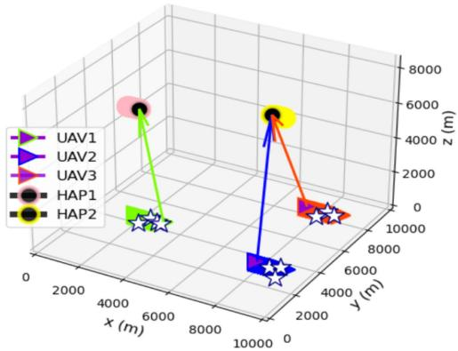  
Fig. 4. Trajectories of UAVs and HAPs under the initial method; the initial positions of the HAPs are (3000, 2000, 8000)m and (8500, 4000, 8000)m; the initial positions of the UAVs are (2000, 4000, 300)m, (8000, 4000, 300)m, (8500, 4000, 300)m, respectively; the IoRT nodes denoted by .

In addition, three advanced benchmark methods are considered to highlight the transmission efficiency gains of the proposed strategy: 1) Pre-determined method; Under fixed bandwidth allocation, UAVs collect data from IoRT nodes while following optimized trajectories and transmit to the nearest HAP. The HAPs follow the same trajectories as in the initial method. 2) SUTSAE [34]; This method focuses on optimizing UAV trajectories and transmit power to improve transmission efficiency between UAVs and a fixed-location HAP. 3) OHTUP [35]; Without considering the mobility of sending nodes, this method focuses on optimizing HAP locations and the transmit power of sending nodes to enhance uplink transmission energy efficiency in SAGIN. To align with our simulation scenario, we apply this method to UAVs and select the optimal HAP as their transmission target.

## B. Performance Analysis

Fig. 5 illustrates the trajectories of UAVs and HAPs, as well as the HAP selection decisions in the final time slot under the proposed strategy. Unlike the initial method, where UAVs select the nearest HAP, UAV3 chooses the farther HAP1 as the transmission target. By solving the HAP selection sub-problem P3.4, this selection balances transmission distance and meteorologyinduced fading. To better illustrate joint trajectory optimization, Fig. 6 depicts the 2D trajectories of UAVs and HAPs under the proposed strategy. Compared with the initial trajectories, UAVs and HAPs move closer in the X–Y plane. The reduced transmission distance enhances $R _ { k } ^ { m } [ n ]$ and $R _ { U A V - H A P } ^ { t o t a l }$ , thereby <sup>[ ]</sup>improving OEE. At the same time, each UAV does not move too far away from IoRT nodes to ensure the amount of data collected, as shown in the zoom map in Fig. 6. The UAVs have balanced the positions of IoRT nodes and HAPs to maximize $R _ { k } ^ { m } [ n ]$ while <sup>[ ]</sup>ensuring compliance with the information-causality constraint, i.e., (23d).

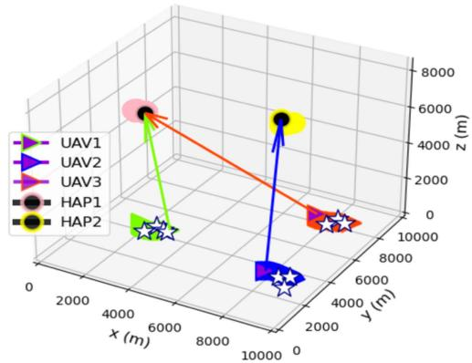  
Fig. 5. Trajectories under the proposed strategy.

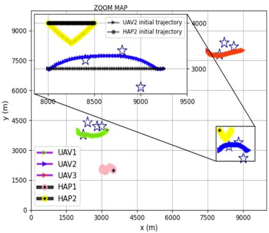  
Fig. 6. 2D trajectories under the proposed strategy.

Fig. 7 presents the flight speeds of UAVs and HAPs under the proposed strategy, along with the corresponding power consumption at different speeds. As shown in Fig. 7(a) and (b), UAVs and HAPs maintain higher speeds than their initial values—approximately 20 m/s and 30 m/s, respectively— allowing them to reach favorable transmission positions more quickly and improve energy efficiency. In Fig. 7(b), UAV3 slightly decelerates as it approaches its final position, allowing longer transmission time to nearby IoRT nodes under improved channel conditions. In Fig. 7(c), both UAVs and HAPs consume less power per unit distance when flying at higher speeds. Compared to the initially lower speeds, the higher flight speeds of UAVs and HAPs under the proposed strategy lead to reduced total energy consumption, i.e., $P _ { s u m }$ . Lower $P _ { s u m }$ leads to higher OEE, as shown in formula (22). Furthermore, extending the time spent at better transmission positions also allows UAVs and HAPs to upload more data, which leads to improved OEE.

Fig. 8 presents the UAVs’ transmit power under different methods. Compared to the initial method in which UAVs maintain a fixed transmit power of 20 W, the proposed strategy allows UAVs to dynamically adjust their transmit power. Under favorable channel conditions, UAVs operate at maximum transmit power to enhance uploaded data. Otherwise, they reduce power output to save energy while strictly adhering to the informationcausality constraint. It is important to note that OEE comprises

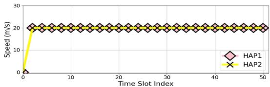

(a) HAP speed during the task  
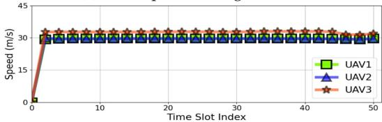

(b) UAV speed during the task  
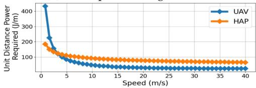  
(c) Unit Distance Power Required vs. Speed.

Fig. 7. The speeds and power consumption levels.  
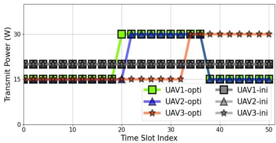  
Fig. 8. Transmit power of the UAVs.

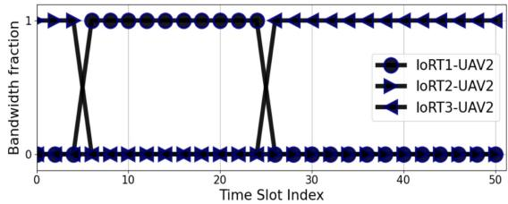  
Fig. 9. UAV2’s bandwidth allocation for IoRT nodes.

$R _ { U A V - H A P } ^ { t o t a l }$ and $P _ { s u m } ,$ which are inversely proportional, as shown in formula (22). However, while increasing transmit power enhances $R _ { U A V - H A P } ^ { t o t a l } ,$ it also leads to an increase in $P _ { s u m }$ . The proposed strategy optimizes UAV transmit power by balancing the trade-off between $R _ { U A V - H A P } ^ { t o t a l }$ and $P _ { s u m }$

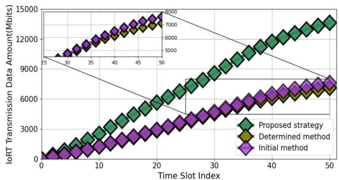

Figs. 9 and 10 respectively compare the bandwidth allocation and the total amount of transmission data for IoRT nodes (i.e., $R _ { I o R T - U A V } ^ { t o t a l } )$ under different methods. By combining Figs. 6 and 9, it can be observed that UAV2 dynamically adjusts its bandwidth fraction based on the positions of IoRT nodes. By solving sub-problem P3.2, the proposed strategy dynamically allocates bandwidth among IoRT nodes, assigning more bandwidth to nodes with favorable channel conditions. This increases their instantaneous spectral efficiency under the same transmit power, thereby enhancing the overall IoRT nodes-to-UAVs transmission performance. According to Fig. 10, UAVs collect significantly more data from IoRT nodes under the proposed strategy, whereas the Pre-determined method results in noticeably lower data collection compared with the initial approach. This is because the optimized trajectory brings them closer to the HAP, improving $\mathsf { \bar { \Pi } } R _ { U A V - H A P } ^ { t o t a l }$ but increasing the distance from IoRT nodes. The extended transmission distance reduces $R _ { I o R T - U A V } ^ { t o t a l }$ , as reflected in Equations (5) and (6). It is worth noting that under FDMA, the total amount of IoRT–UAV transmission $R _ { I o R T - U A V } ^ { t o t a l }$ grows logarithmically with the number of IoRT nodes due to bandwidth partitioning. The end-to-end throughput is limited by the bottleneck hop, meaning that the total uploaded data increases only when the UAV–HAP link can support the additional load.

Fig. 10. IoRT nodes-to-UAV transmission performance.  
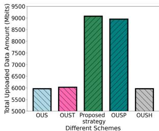

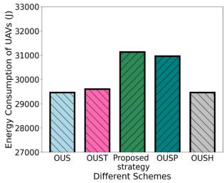  
(b) UAV energy consumption.

(a) Total upload data amount  
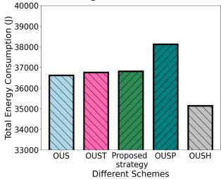  
(c) Total energy consumption.

(d) UAV energy efficiency.  
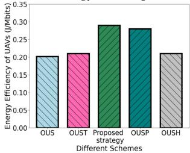  
Fig. 11. Transmission efficiency performance comparison.

To identify the key factors influencing performance improvement, Fig. 11 presents the impacts of different optimization variables on system performance. Building upon the initial method, we define OUS as optimizing HAP selection only, OUST as optimizing both HAP selection and UAVs’ trajectories, OUSP as optimizing HAP selection and UAVs’ transmit power, and OUSH as optimizing HAP selection and HAPs’ trajectories. From Fig. 11(a), the proposed strategy and the OUSP method significantly increases the total uploaded data. However, as shown in Fig. 11(b), UAV energy consumption also rises due to the increased transmit power. Next, the OUSH method enables UAVs to maintain a low initial transmit power while optimizing HAP trajectories, significantly reducing HAP energy consumption. Consequently, the total energy consumption under the

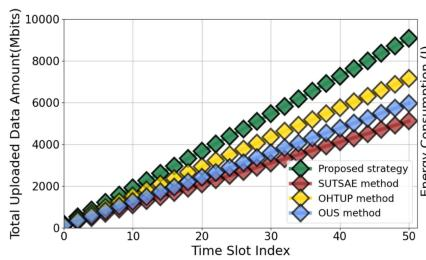  
(a) Total upload data amount.

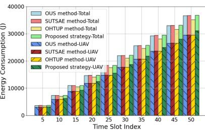  
(b) Total energy consumption.

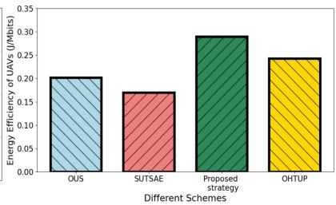  
(c) UAV energy efficiency.

Fig. 12. Comparison of transmission efficiency performance with advanced methods.  
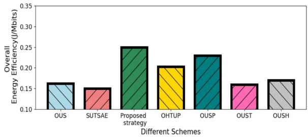  
Fig. 13. Overall energy efficiency under different methods.

OUSH method is lowest, as shown in Fig. 11(c). In Fig. 11(d), the proposed strategy jointly optimizes UAV energy consumption and transmission performance, thereby achieving optimal UAV energy efficiency.

Fig. 12 compares the transmission efficiency of the proposed strategy with advanced comparative methods. In Fig. 12(a), the SUTSAE method yields the lowest total uploaded data among all methods because it does not optimize HAP selection. In contrast, the proposed strategy consistently achieves the highest total upload data amount throughout the task duration. It connects UAVs to the HAP with the best transmission link quality and jointly optimizes UAV and HAP trajectories along with transmit power to enhance cooperative transmission performance. Fig. 12(b) presents the energy consumption under different methods. Under the OUS, SUTSAE, and OHTUP methods, UAVs have similar energy consumption levels. However, the proposed strategy significantly increases UAVs’ transmit power, resulting in higher UAV energy consumption. Nevertheless, by solving sub-problem P3.5, the proposed strategy enables HAPs to operate at an energy-efficient flight speed, substantially reducing their energy consumption. Consequently, the total energy consumption remains comparable to that of other methods. According to Fig. 12(c), the proposed strategy achieves the highest UAV energy efficiency by optimizing cooperative transmission performance while maintaining comparable energy consumption. Fig. 13 illustrates the OEE achieved under different methods. By simultaneously improving transmission efficiency and maintaining controlled energy consumption, the proposed strategy outperforms other methods in improving OEE.

To validate the effectiveness of the proposed ECO strategy for mobile IoRT data collection, we further consider a scenario with mobile IoRT nodes (e.g., vehicles or agricultural machinery) under the same simulation settings. These nodes move at a constant speed of 1 m/s, emulating a dynamic data collection scenario. Under the stochastic-process-based meteorological fading scenario (modeled as a time-varying log-normal shadowing process with fading coefficients randomly varying between 1.2 and 6.3), a UAV collects data from IoRT nodes and selects its optimal target from the two available HAPs. Fig. 14(a) illustrates the trajectories of the UAV, HAPs, and IoRT nodes over a transmission duration of T  s. Compared with the <sup>= 100</sup>straight initial trajectories, the HAPs and UAV dynamically and collaboratively adjust their paths to accommodate the IoRT nodes’ motion and the time-varying transmission fading. Moreover, the proposed strategy enables UAVs to dynamically adjust their transmit power and bandwidth allocation while coordinating their trajectories with the HAPs, achieving an optimal balance between cooperative transmission performance and energy consumption. Finally, in Fig. 14(b), the proposed strategy achieves the highest OEE among all methods, further confirming its energy efficiency for UAV–HAP collaboration under both fixed and mobile IoRT data collection scenarios.

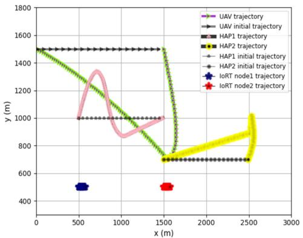

(a) 2D trajectories under the mobile IoRT node scenario.  
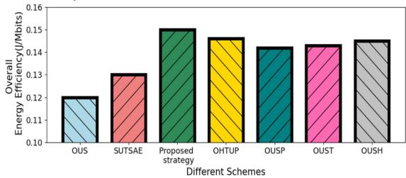  
(b) Overall energy efficiency under different methods.  
Fig. 14. Node trajectories and overall energy efficiency under the mobile IoRT node scenario.

## VI. CONCLUSION AND FUTURE WORK

This paper has addressed the problem of energy-efficient optimization in HAP-UAV collaboration for IoRT data collection. The proposed design takes into account both the cooperative transmission performance and the overall energy consumption of UAVs and HAPs, incorporating dynamic trajectory planning. To effectively quantify the trade-off between transmission performance and energy consumption, the metric of OEE has been introduced and integrated into the proposed design. Additionally, the proposed ECO strategy maximizes OEE by jointly optimizing UAV/HAP trajectories, UAV power control, HAP selection, and bandwidth allocation. The simulation results confirm the effectiveness of the proposed strategy. In the future, building on this study, we will explore energy-efficient strategies for HAP-UAV collaboration in scenarios that are sensitive to security and computational demands.

## REFERENCES

[1] S. Li, Z. Yu, and L. Chen, “Joint resource allocation and UAV trajectory design for data collection in air-ground integrated IoRT sensors network with clustered NOMA,” IEEE Sensors J., vol. 24, no. 22, pp. 38540–38550, Nov. 2024.

[2] Y. Xiao et al., “Space-air-ground integrated wireless networks for 6G: Basics, key technologies, and future trends,” IEEE J. Sel. Areas Commun., vol. 42, no. 12, pp. 3327–3354, Dec. 2024.

[3] Z. Jia et al., “NFV-enabled service recovery in space–air–ground integrated networks: A matching game-based approach,” IEEE Trans. Netw. Sci. Eng., vol. 12, no. 3, pp. 1732–1744, May–Jun. 2025.

[4] “Environmental sensor market size,” 2023. [Online]. Available: https:// www.gminsights.com/industry-analysis/environmental-sensor-market

[5] I. Ahmed, M. Ahmad, G. Jeon, and A. Chehri, “An Internet of Things and AI-powered framework for long-term flood risk evaluation,” IEEE Internet Things J., vol. 11, no. 3, pp. 3812–3819, Feb. 2024.

[6] N. Lin et al., “Energy-efficiency optimization in RIS-assisted AAV communications based on deep reinforcement learning,” IEEE Internet Things J., vol. 12, no. 8, pp. 11036–11048, Apr. 2025.

[7] Y. Wang et al., “A novel spatial prediction method integrating exploratory spatial data analysis into random forest for large scale daily air temperature mapping,” IEEE Trans. Geosci. Remote Sens., vol. 63, 2025, Art. no. 3000318.

[8] Z. Xiao et al., “Leo satellite access network (LEO-SAN) toward 6G: Challenges and approaches,” IEEE Wireless Commun., vol. 31, no. 2, pp. 89–96, Apr. 2024.

[9] Z. Jia et al., “Distributionally robust optimization for aerial multi-access edge computing via cooperation of UAVs and HAPs,” IEEE Trans. Mobile Comput., vol. 24, no. 10, pp. 10853–10867, Oct. 2025.

[10] Y. Fan et al., “GATO: Global transmission optimization for SAGIN-Assisted IoRT data collection,” IEEE Trans. Mobile Comput., vol. 24, no. 12, pp. 12867–12884, Dec. 2025.

[11] F. Sun, Z. Na, and J. Pei, “A hybrid multitask learning approach for efficient UAV signal identification,” IEEE Sensors J., vol. 25, no. 17, pp. 33064–33073, Sep. 2025.

[12] O. Abbasi, A. Yadav, H. Yanikomeroglu, N.-D. Dào, G. Senarath, and P. Zhu, “HAPS for 6G networks: Potential use cases, open challenges, and possible solutions,” IEEE Wireless Commun., vol. 31, no. 3, pp. 324–331, Jun. 2024.

[13] W. Wu, W. Feng, Y. Fang, Z. Lin, and X. Lu, “Multi-HAP-assisted computation offloading in space-air-ground-sea integrated network,” IEEE Internet Things J., vol. 12, no. 12, pp. 21806–21818, Jun. 2025.

[14] W. Abderrahim, O. Amin, and B. Shihada, “Data center-enabled high altitude platforms: A green computing alternative,” IEEE Trans. Mobile Comput., vol. 23, no. 5, pp. 6149–6162, May 2024.

[15] Y. Liau, Y. Hong, and J. Sheu, “Laser-powered UAV trajectory and charging optimization for sustainable data-gathering in the Internet of Things,” IEEE Trans. Mobile Comput., vol. 24, no. 5, pp. 4278–4295, May 2024.

[16] S. Javed, M.-S. Alouini, and Z. Ding, “An interdisciplinary approach to optimal communication and flight operation of high-altitude longendurance platforms,” IEEE Trans. Aerosp. Electron. Syst., vol. 59, no. 6, pp. 8327–8341, Dec. 2023.

[17] A. Nabi and S. Moh, “Joint offloading decision, user association, and resource allocation in hierarchical aerial computing: Collaboration of UAVs and hap,” IEEE Trans. Mobile Comput.,vol. 24, no. 8, pp. 7267–7282, Aug. 2025.

[18] W. Abderrahim, O. Amin, and B. Shihada, “How to leverage high altitude platforms in green computing?,” IEEE Commun. Mag., vol. 61, no. 7, pp. 134–140, Jul. 2023.

[19] K. Meng et al., “UAV-enabled integrated sensing and communication: Opportunities and challenges,” IEEE Wireless Commun., vol. 31, no. 2, pp. 97–104, Apr. 2024.

[20] N. Lin, Y. Fan, L. Zhao, X. Li, and M. Guizani, “GREEN: A global energy efficiency maximization strategy for multi-UAV enabled communication systems,” IEEE Trans. Mobile Comput., vol. 22, no. 12, pp. 7104–7120, Dec. 2023.

[21] Z. Jia et al., “Dynamic trajectory optimization and power control for hierarchical UAV swarms in 6G aerial access network,” IEEE Trans. Wireless Commun., vol. 25, pp. 3349–3362, 2026.

[22] D. Yang, J. Wang, F. Wu, L. Xiao, Y. Xu, and T. Zhang, “Energy efficient transmission strategy for mobile edge computing network in UAV-based patrol inspection system,” IEEE Trans. Mobile Comput., vol. 23, no. 5, pp. 5984–5998, May 2024.

[23] N. Lin, C. Peng, A. Hawbani, C. Yu, Y. Fan, and L. Zhao, “Energy efficient AAV-assisted bidirectional relaying system for multi-pair user devices,” IEEE Trans. Mobile Comput., vol. 24, no. 6, pp. 5061–5077, Jun. 2025.

[24] C. Zhan, H. Hu, Z. Liu, J. Wang, and R. Fan, “Interference-aware online optimization for cellular-connected multiple UAV networks with energy constraints,” IEEE Trans. Mobile Comput., vol. 23, no. 12, pp. 13804–13820, Dec. 2024.

[25] Z. Liu, J. Zhang, Y. Zeng, and B. Ai, “Energy-efficient multi-agent reinforcement learning for UAV trajectory optimization in cell-free massive MIMO networks,” IEEE Trans. Wireless Commun., vol. 24, no. 7, pp. 5917–5930, Jul. 2025.

[26] S. Javed and M. Alouini, “System design and parameter optimization for remote coverage from NOMA-based high-altitude platform stations (HAPS),” IEEE Trans. Wireless Commun., vol. 24, no. 2, pp. 1387–1400, Feb. 2025.

[27] X. Liu, A. Chen, K. Zheng, K. Chi, B. Yang, and T. Taleb, “Distributed computation offloading for energy provision minimization in WP-MEC networks with multiple HAPs,” IEEE Trans. Mobile Comput., vol. 24, no. 4, pp. 2673–2689, Apr. 2025.

[28] Q. Liu, S. Wang, Z. Qi, Z. Si, and Q. Liu, “Energy-efficient joint computation offloading and resource allocation optimization in UAV/HAP-assisted AIoT networks,” IEEE Trans. Green Commun. Netw., vol. 9, no. 4, pp. 1936–1950, Dec. 2025.

[29] T. Huang, J. Liu, Z. Chang, Y. Wei, X. Zhao, and Y.-C. Liang, “Energy efficient spectrum sharing and resource allocation for 6G air-ground integrated networks,” IEEE Trans. Netw. Service Manag., vol. 22, no. 4, pp. 3150–3161, Aug. 2025.

[30] Y. Chen, K. Li, Y. Wu, J. Huang, and L. Zhao, “Energy efficient task offloading and resource allocation in air-ground integrated MEC systems: A distributed online approach,” IEEE Trans. Mobile Comput., vol. 23, no. 8, pp. 8129–8142, Aug. 2024.

[31] Q. Chen, W. Meng, T. Quek, and S. Chen, “Multi-tier hybrid offloading for computation-aware IoT applications in civil aircraft-augmented SAGIN,” IEEE J. Sel. Areas Commun., vol. 41, no. 2, pp. 399–417, Feb. 2023.

[32] T. Nguyen, H. Le, and A. Pham, “On the design of RIS–UAV relay-assisted hybrid FSO/RF satellite–aerial–ground integrated network,” IEEE Trans. Aerosp. Electron. Syst., vol. 59, no. 2, pp. 757–771, Apr. 2023.

[33] Z. Jia, M. Sheng, J. Li, D. Zhou, and Z. Han, “Joint HAP access and LEO satellite backhaul in 6G: Matching game-based approaches,” IEEE J. Sel. Areas Commun., vol. 39, no. 4, pp. 1147–1159, Apr. 2021.

[34] P. Qin et al., “Joint trajectory plan and resource allocation for UAV-enabled C-NOMA in air-ground integrated 6G heterogeneous network,” IEEE Trans. Netw. Sci. Eng., vol. 10, no. 6, pp. 3421–3434, Nov./Dec. 2023.

[35] X. Yu, X. Zhang, Y. Rui, K. Wang, X. Dang, and M. Guizani, “Joint resource allocations for energy consumption optimization in HAPs-aided MEC-NOMA systems,” IEEE J. Sel. Areas Commun., vol. 42, no. 12, pp. 3632–3646, Dec. 2024.

[36] M. Dai, Y. Wu, L. Qian, Z. Su, B. Lin, and N. Chen, “UAV-assisted multi-access computation offloading via hybrid NOMA and FDMA in marine networks,” IEEE Trans. Netw. Sci. Eng., vol. 10, no. 1, pp. 113–127, Jan./Feb. 2023.

[37] T. Ma et al., “UAV-LEO integrated backbone: A ubiquitous data collection approach for B5G Internet of Remote Things Networks,” IEEE J. Sel. Areas Commun., vol. 39, no. 11, pp. 3491–3505, Nov. 2021.

[38] Y. Li, X. Wang, Z. Zheng, J. Guo, and Z. Fei, “Joint trajectory and transmit power design for cellular-connected UAVs via differentiable channel knowledge map,” IEEE Trans. Veh. Technol., vol. 74, no. 10, pp. 15772–1588, Oct. 2025.

[39] Y. Fan et al., “A novel DT-domain MRC-based method for joint OTFS channel estimation and signal detection,” IEEE Wireless Commun. Lett., vol. 15, pp. 675–679, 2026.

[40] Z. Wang, R. Liu, Q. Liu, L. Han, and J. S. Thompson, “Feasibility study of UAV-assisted anti-jamming positioning,” IEEE Trans. Veh. Technol., vol. 70, no. 8, pp. 7718–7733, Aug. 2021.

[41] K. Sun, J. Li, H. Liang, and M. Zhu, “Simulation of a hybrid energy system for stratospheric airships,” IEEE Trans. Aerosp. Electron. Syst., vol. 56, no. 6, pp. 4426–4436, Dec. 2020.

[42] S. Sharma, S. Ghosh, M. Bhatnagar, and B. Panigrahi, “Power efficient handoff management in hybrid V2X communication: Game-theoretic approach to resource allocation with load reduction,” IEEE Trans. Mobile Comput., vol. 23, no. 12, pp. 14638–14655, Dec. 2024.

[43] S. Boyd, L. Vandenberghe, and L. Faybusovich, “Convex optimization,” IEEE Trans. Autom. Control, vol. 51, no. 11, pp. 1859–1859, Nov. 2006, doi: 10.1109/TAC.2006.884922.

[44] S. Sun, Q. Diao, D. Xu, P. Bourigault, and D. Mandic, “Convex quaternion optimization for signal processing: Theory and applications,” IEEE Trans. Signal Process., vol. 71, pp. 4106–4115, 2023.

[45] D. Wang, M. Wu, Z. Wei, K. Yu, L. Min, and S. Mumtaz, “Uplink secrecy performance of RIS-based RF/FSO three-dimension heterogeneous networks,” IEEE Trans. Wireless Commun., vol. 23, no. 3, pp. 1798–1809, Mar. 2024.

[46] S. E. Turk, E. S. Ahrazoglu, E. Erdogan, and I. Altunbas, “Design of energy efficient multi-HAPS assisted hybrid RF/FSO satellite communication systems with optimal placement,” IEEE Trans. Green Commun. Netw., vol. 9, no. 3, pp. 910–922, Sep. 2025.


Yanbo Fan (Graduate Student Member, IEEE) received the MS degree in computer science from Shenyang Aerospace University, China, in 2023. He is currently working toward the PhD degree in computer science and technology with Northeastern University, China. His research interests include convex and nonconvex optimization, wireless power transfer, and air-space-ground integrated communications. He is a reviewer of IEEE Network Magazine, IEEE Transactions on Mobile Computing, and IEEE Internet of Things Journal.


Yuanguo Bi (Member, IEEE) received the PhD degree in computer science and technology from Northeastern University, Shenyang, China, in 2010. He was a visiting PhD student with BroadBand Communications Research lab, Department of Electrical and Computer Engineering, University of Waterloo, Waterloo, ON, Canada, from 2007 to 2009. He is currently a Professor with the School of Computer Science and Engineering, Northeastern University, China. He has authored or coauthored more than 80 journal and conference papers including high quality

journal papers such as IEEE Journal on Selected Areas in Communications, IEEE Transactions on Wireless Communications, IEEE Transactions on Intelligent Transportation Systems, IEEE Transactions on Vehicular Technology, IEEE Internet of Things Journal, IEEE Communications Magazine, IEEE Wireless Communications, IEEE Network, and mainstream conferences such as IEEE Global Communications Conference and IEEE International Conference on Communications. His research interests include medium access control, QoS routing, multihop broadcast, mobility management in vehicular networks, service deployment, service migration, task offloading in mobile edge computing, federated and distributed machine learning, software-defined networking, and space-air-ground integrated networks. He was an editor/guest editor for IEEE Communications Magazine, IEEE Wireless Communications, and IEEE Network. He was also a TPC co-chair for IEEE/CIC ICCC 2023, a general co-chair for IEEE ICCSN 2023, and a Publication co-chair for IEEE MSN 2018.


Xingyu Ji (Graduate Student Member, IEEE) received the BS degree in computer science and technology from Northeast Petroleum University, Daqing, China, in 2024. She is currently working toward the master’s degree in computer science and technology with Northeastern University, China. Her research focuses on multi-agent reinforcement learning.


Dusit Niyato (Fellow, IEEE) received the PhD degree in electrical and computer engineering from the University of Manitoba, Winnipeg, MB, Canada, in 2008. He is currently a professor with the School of Computing and Data Science, Nanyang Technological University, Singapore. He has authored or coauthored more than 400 technical articles in the area of wireless and mobile computing. He was the recipient of the the Best Young Researcher Award of the IEEE Communications Society Asia Pacifica and the 2011 IEEE Communications Society Fred W. Ellersick

Prize Paper Award. He is a senior editor of IEEE Wireless Communication Letters, an area editor of IEEE Transactions on wireless Communications and IEEE Communications Surveys and Tutorials, an editor of IEEE Transactions on Communications, and an associate editor for IEEE Transactions on Mobile Computing. He was a distinguished lecturer of the IEEE Communications Society from 2016 to 2017. He was named a highly cited Researcher in computer science.


Enchao Zhang (Graduate Student Member, IEEE) is currently working toward the PhD degree with the Graduate School of Informatics and Engineering, The University of Electro-Communications, Tokyo, Japan. He is a reviewer of eight journals including IEEE Transactions on Mobile Computing, IEEE Transactions on Multimedia, IEEE Transactions on Green Communications and Networking, IEEE Internet of Things Journal, IEEE Open Journal of Vehicular Technology, IEEE Open Journal of the Computer Society, Network Magazine, and Ad Hoc Networks.

His research interests include mobile computing, edge AI, and quantum computing. He was a TPC member for CyberSciTech in 2024 and 2025. He was the recipient of Best Paper Award from IEEE EUC 2022.


Liang Zhao (Senior Member, IEEE) received the PhD degree from the School of Computing, Edinburgh Napier University, in 2011. He was an associate senior researcher with Hitachi Research and Development Corporation, China, from 2012 to 2014. He was also a visiting professor with the University of Electro-Communications, Japan. He is currently a professor with Shenyang Aerospace University, China. He has authored or coauthored more than 150 articles. His research interests include ITS, VANET, WMN, and SDN. He was the chair of several inter-

national conferences and workshops including 2022 IEEE BigDataSE (Steering co-chair), 2021 IEEE TrustCom (Program co-chair), 2019 IEEE IUCC (Program co-chair), and 2018-2022 NGDN workshop (founder). He is an associate editor for Frontiers in Communications and Networking and Journal of Circuits, Systems and Computers. He is/has been a guest editor of IEEE Transactions on Network Science and Engineering and Springer Journal of Computing. He was a JSPS invitational Fellow in 2023. He was listed as Top 2% of scientists in the world by Standford University in 2022 and 2023.


Qiang He (Associate Member, IEEE) received the PhD degree in computer application technology from Northeastern University, Shenyang, China, in 2020. He was with the School of Computer Science and Technology, Nanyang Technical University, Singapore, as a visiting PhD researcher, from 2018 to 2019. He is currently a professor with the School of Computer Science and Engineering, Northeastern University, China. He has authored or coauthored more than 70 journal articles and conference papers including IEEE Transactions on Knowledge and Data

Engineering, IEEE Transactions on Neural Networks and Learning Systems, IEEE Transactions on Cybernetics, IEEE Transactions on Cloud Computing, IEEE Transactions on Computational Social Systems, and IEEE Transactions on Cognitive and Developmental Systems. His research interests include machine learning, social network analytic, data mining, health care, and infectious diseases informatics.