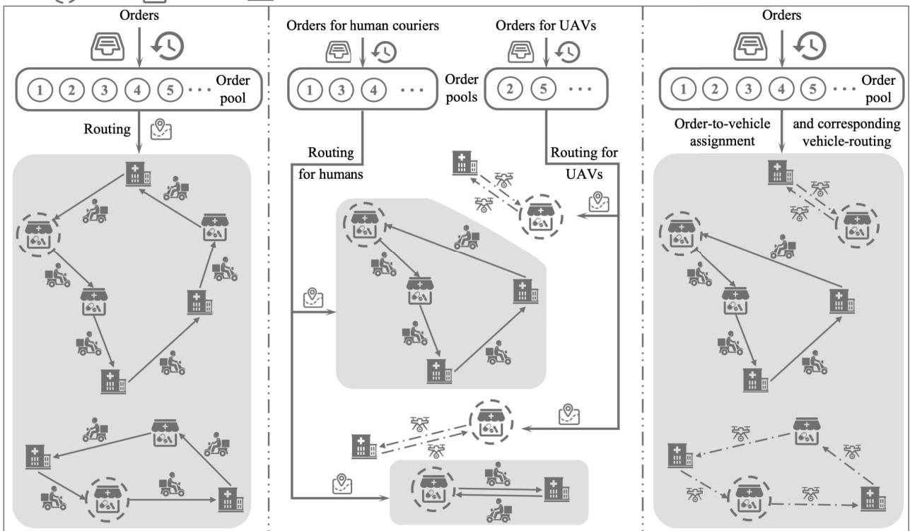
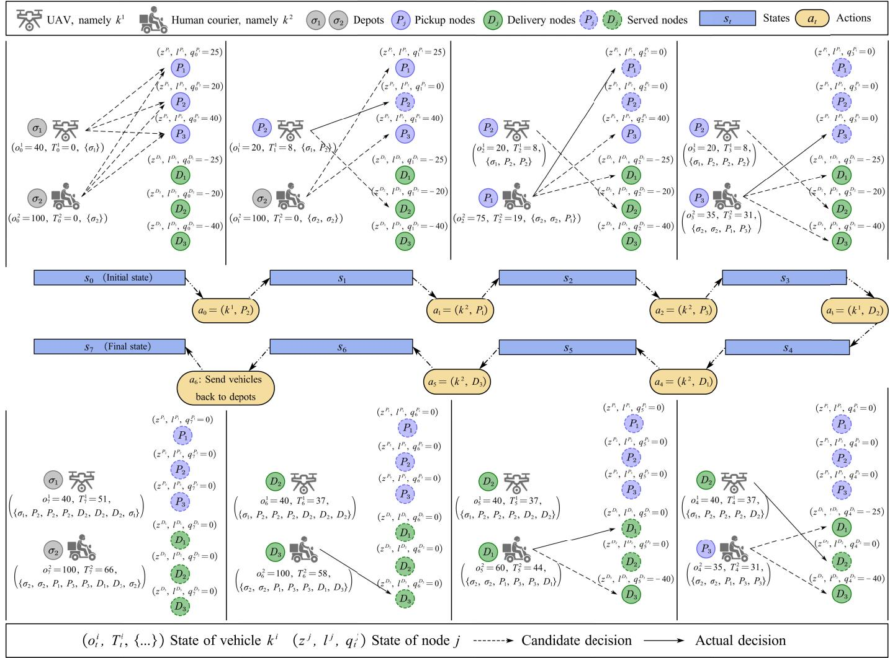
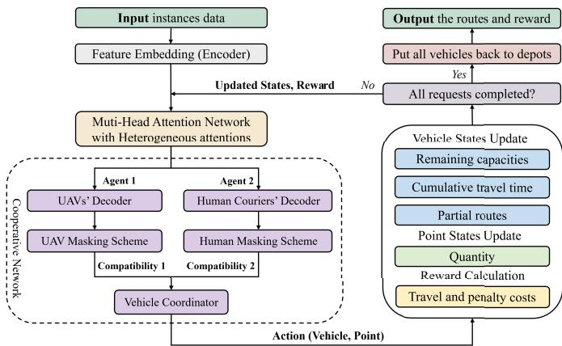
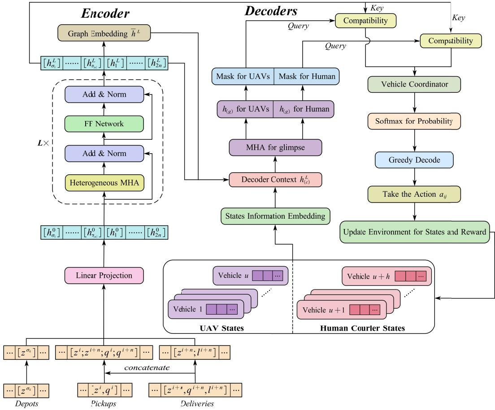
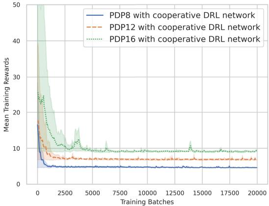
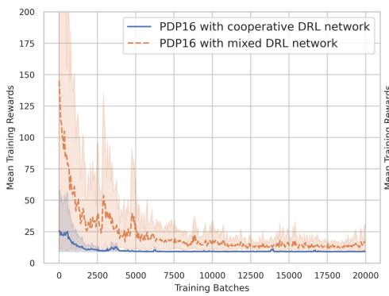
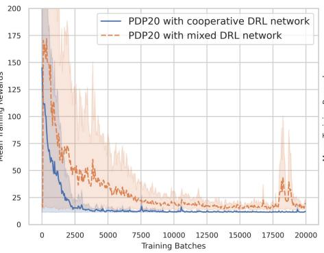
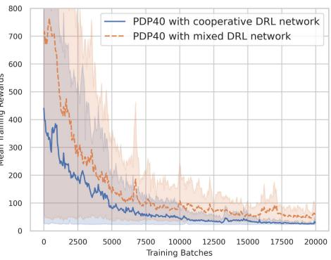
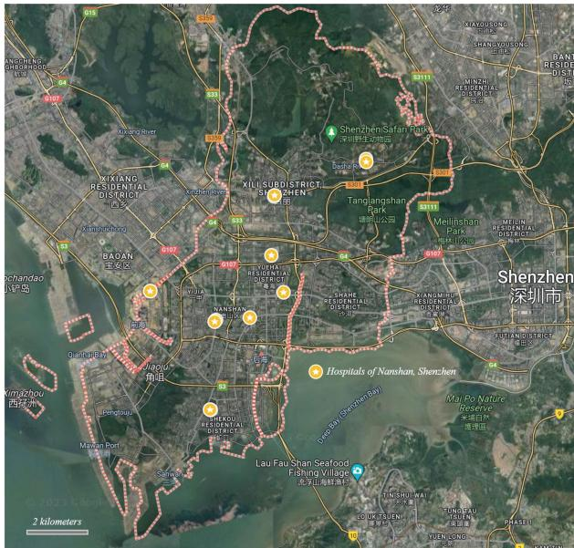

# Cooperative Learning-Based Joint UAV and Human Courier Scheduling for Emergency Medical Delivery Service

Jiawei Chen , Pengfu Wan , and Gangyan Xu , Member, IEEE

Abstract— Emergency medical delivery plays a crucial role in ensuring timely treatment for patients under the promising trend of medical resource sharing. However, traditional human courier based delivery modes face many problems, such as high costs, slow speeds, and uncertain arrival times due to traffic conditions. To address these issues, this paper proposes leveraging heterogeneous Unmanned Aerial Vehicles (UAVs) and human couriers for emergency medical delivery, and develops a Cooperative Deep Reinforcement Learning (DRL) based method for real-time joint scheduling. The problem is modelled as a multi-depot capacitated pickup and delivery problem with soft deadlines. A DRL-based method is proposed with two types of agent networks for UAVs and human couriers, respectively, which could capture their distinct features and delivery strategies. In addition, a cooperative network is introduced to coordinate their operations. Extensive computational experiments and a real-life case study are conducted that verifies the superiority of our methods over several benchmark algorithms in different scenarios, and demonstrates its feasibility and performance in practical scenarios.

Index Terms— Unmanned aerial vehicle, cooperative delivery, emergency medical delivery service, deep reinforcement learning, heterogeneous vehicles.

## I. INTRODUCTION

inspires the healthcare system to share medical resources (e.g., equipment, medicines, and blood) among hospitals and pharmacies to improve its operation efficiency and lower the cost [1]. It is estimated that 42% of medical resources stored in hospitals stay idle for over half of their life cycles [2]. At the same time, delays in surgical procedures or prescription issuance frequently happen due to the shortage of resources, as some low-usage or unconventional medications may not be adequately stocked in every hospital [3], [4]. The sharing of medical resources could well address these issues, which could help hospitals to decrease redundant purchases of resources, enable them to access resources efficiently when needed, and improve the resilience of the entire healthcare system to cope with disruptions or demand surges [5].

The efficacy of medical resource sharing is contingent upon multifaceted support, including regulatory frameworks, financial mechanisms, operational protocols, and technological infrastructures. Paramount to these is the daily operational efficiency of medical delivery services within the sharing ecosystem. Our investigation of a leading Chinese pharmaceutical conglomerate reveals that shared medical resources delivery is demand-driven, often in response to urgent hospital requests in a few hours. To address these urgent demands, a workforce of human couriers is stationed near hospitals and pharmacies, ready to transport medical parcels to designated departments upon request [6]. Similar to food delivery [7], manual delivery is capable of handling large volumes and long-distance deliveries, and offers adaptability in unforeseen circumstances [8]. However, its performance is usually hindered by slow speed, high cost, and uncertain delivery time caused by traffic [9], making it challenging to meet the time-sensitive and highly dynamic requests, and may further affect the quality of medical services. Thus, there is an imperative to develop a robust and swift emergency medical delivery solution that bolsters the sharing of medical resources effectively.

In recent years, UAVs (Unmanned Aerial Vehicles, or drones) have become a promising technology, enhancing flexibility and efficiency in transportation and logistics while reducing operational costs [10], [11]. In healthcare systems, given their flexible routes, fast delivery speed, and economic viability [12], UAVs have been successfully deployed in the distribution of blood [13], organs [14], and Automated External Defibrillators (AEDs) [15]. However, due to the limited capacities, vulnerability to weather conditions, and special technical requirements of cargo boxes [16], UAVs cannot carry large quantities of items or handle long-distance deliveries. Although there have been successful cases of large-size UAVs delivering vaccines in remote areas like Vanuatu [17], their potential threats to buildings and pedestrians in densely populated urban areas remain a contentious issue [18], and further limit its wide adoption.

To leverage the advantages of both UAVs and human couriers for efficient emergency medical delivery service, this paper proposes to adopt a cooperative delivery mode. In recent years, many studies have explored the synergy between UAVs and (unmanned) ground vehicles for logistics systems with different modes, such as parallel working mode, ground vehicle supported UAV mode, and ground vehicle-UAV flying sidekick mode [10], [19]. There are also some pilot works in cooperative UAV and human courier delivery [20], [21]. It is proved that such collaboration is effective in improving delivery efficiency and could cope well with dynamics and uncertainties [22]. However, cooperative delivery using both human couriers and UAVs is still understudied in emergency medical delivery service, which has several unique features that make the joint scheduling of UAVs and human couriers complex and challenging.

Firstly, the heterogeneous operation modes and technical characteristics of UAVs and human couriers, e.g., capacities, speeds, unit costs, delivery strategies, etc., make it difficult to design the cooperation mechanism and scheduling method. For instance, with relatively large capacities, human couriers can pick up multiple orders for consolidation and then deliver them to different points along the routes, while UAVs generally need to complete the pickup and delivery of the current order before serving the next one since their cargo box may be specially designed for different resources and with limited capacities. In view of such differences, it is non-trivial to consider whether an order should be assigned specifically to a human courier or UAV. Besides, the problem should jointly optimize the routes of human couriers and UAVs while conducting the order assignment, which complicates the scheduling method design for such a cooperative delivery problem.

Secondly, as a special variant of the Pickup and Delivery Problem (PDP) [23], the routing of UAVs and human couriers in emergency medical delivery is complex in nature. In this work, UAVs and human couriers can depart from any point in the delivery network, which is a typical Multi-depot Capacitated PDP. Making the problem more complex, the points in the network can be both the pickup point and the delivery point, as hospitals may request typical medical resources from pharmacies and other hospitals while sharing their own redundant ones with other hospitals simultaneously. Meanwhile, emergency medical delivery orders usually have dedicated relatively short deadlines to meet the varied demands of emergency treatments. Different from traditional city logistics where any violations to given time windows may lead to failed delivery [24], the delivery of emergency medical resources should continue even if it has already missed the deadline to mitigate the impact on timely medical treatment, but with a heavy penalty on delayed delivery. With these considerations, as well as the joint decision with order-to-vehicle assignment, the cooperative routing of UAVs and human couriers is very complex and difficult to solve.

Thirdly, considering the time-sensitive nature of emergency medical delivery and the large number of on-demand orders, it is challenging to make efficient decisions for timely delivery. Many exact methods and heuristic-based methods were proposed for various PDP variants and proved to be effective in small to medium cases [25], [26]. However, in typical emergency medical delivery scenarios that involve large amounts of parallel delivery orders, these methods may suffer from long computing time that cannot fulfill the requirements of efficient decision-making. Despite there are successful cases in addressing relevant Vehicle Routing Problems (VRPs) in (near) real-time using neural network-assisted heuristics [27] or Reinforcement Learning (RL) based methods [28], [29], they are difficult to generalize for the emergency medical delivery, where many complex relationships should be captured for routing decisions, e.g., dependent pickup and delivery points, multiple depots and vehicles, the routing policies for heterogeneous fleets, etc. Therefore, it is still a challenge to realize efficient decision-making in emergency medical delivery given a number of orders within a short period.

Taking the above challenges into consideration, this paper aims to propose a Cooperative Deep Reinforcement Learning (DRL) based method for joint UAV and human courier scheduling in emergency medical delivery services. The main contributions of this paper are as follows:

The cooperative delivery mode of UAV and human courier is developed for emergency medical delivery service, and its joint order-to-vehicle assignment and vehicle routing decision model is built as a Multi-depot Capacitated Pickup and Delivery Problem with Soft Deadlines (MCPDPSD) with heterogeneous vehicles.

• The MCPDPSD is formulated as a Markov Decision Process (MDP) model, then a DRL-based solution method is developed to realize real-time decision-making for the joint scheduling of UAVs and human couriers.

• A Cooperative DRL network is proposed, whose encoderdecoder structure can handle the unique features of MCPDPSD and learn the routing policies for UAVs and human couriers, considering their cooperative deliveries and different characteristics.

The proposed method is demonstrated superior to various exact, heuristic, and learning-based methods through extensive experiments, and proved to have good generalization ability to cope with scenario changes. Besides, an experimental case study using real-world data is conducted, which demonstrates the effectiveness of the proposed method in real-life cases.

The rest of this paper is organized as follows. The related work is summarized in Section II. Section III introduces the MCPDPSD model for emergency medical delivery service. The design of a Cooperative DRL-based network is described in Section IV, and Section V presents computational experiments and a real-life case study conducted in Shenzhen, China. Section VI raises the conclusions of this paper and suggests future research directions.

## II. RELATED WORK

The relevant literature is reviewed from two streams: UAVbased medical delivery services, and the Pickup and Delivery Problem.

## A. UAV-Based Medical Delivery Services

With the technological advancement of UAVs in recent years and their exceptional advantages like the ability to undertake high-risk tasks and lower operational costs, UAVs have been widely adopted in various fields [12]. For instance, equipped with cameras and sensors, UAVs have been effectively adopted for locating missing individuals and surveying disaster zones, offering real-time imagery and data to support search and rescue operations [11], [30]. Meituan also started the trial run of UAVs for on-demand food delivery in Shenzhen in 2023 [31]. In healthcare systems, studies like [15] demonstrated promising performance of adopting UAV for Automated External Defibrillator (AED) delivery. In some remote mountainous areas, there have been attempts to use UAVs for vaccine delivery [17], as well as drug and test kits for patients with chronic diseases [32]. Research also shows that the estimated cost savings in transportation of using UAVs exceed its fixed investment on relevant infrastructures compared to ground vehicles [33], indicating a great potential for adopting UAVs in many areas.

Although UAV has many advantages, its wide adoption is limited by the physical size, payload capacity, and battery, which makes it hard to complete many delivery tasks in a single trip, requiring multiple trips between the depot or charging station and the target locations [34]. To address such issues, many works focus on collaborative systems of UAVs with other transport vehicles, especially with trucks and human couriers [20]. For example, Truck-and-Drone collaboration mode has been widely studied in last-mile delivery [19], parcel delivery in remote or isolated areas [17], and relief delivery after disasters [10]. In healthcare systems, there are also some works on using this mode for vaccine delivery, where trucks are mainly for long-haul transportation to supply hubs while drones are used for last-mile delivery [35]. In urban lastmile delivery, [21] proposed a co-sourcing mechanism of joint drone and human courier delivery to cope with the rising labor cost and deterioration in traffic congestion while ensuring service quality. However, since medical resource sharing is still in its infancy stage, rare works have been conducted focusing on the emergency medical delivery service, leaving many issues open to be addressed.

## B. Pickup and Delivery Problem

Pickup and Delivery Problem (PDP) has been studied for several decades, with many variants developed considering different practical scenarios, including PDP with Time Windows (PDPTW) [36], PDP with Deadlines (PDPD) [37], etc. Meanwhile, many PDPs consider different real-life requirements, e.g., vehicle capacity, whether goods should be loaded and unloaded in a last-in-first-out (LIFO) order, and whether vehicles depart from multiple depots [38].

Focusing on different variants of PDP, many successful solution methods have been developed. For exact solution methods, branch-and-cut algorithms are frequently adopted for PDPTW [39]. Heuristic-based methods are commonly used when dealing with more complex PDPs. For instance, Wang et al. [40] designed a hybrid Genetic Algorithm with Tabu Search (GA-TS) to optimize the multi-depot PDP, and Fu et al. [41] proposed a two-phase greedy heuristic algorithm for the PDP with synchronized en-route transfers.

In recent developments, given the superiority of learningbased methods in addressing combinatorial optimization problems, many attempts have been made to solve VRPs [28], [29], [42] and PDPs [43], [44], [45]. However, there are still limited studies that apply RL to solve coordinated routing problems or consider the heterogeneous relationship between different fleets, especially in PDP scenarios, which have strict requirements on the relationship between paired pickup and delivery locations. Some successful works, such as the one conducted by [43], have designed a heterogeneous attention mechanism for PDP with a single vehicle. Meanwhile, the time window constraints were considered in some works [45]. However, factors like multiple vehicles, fleet cooperation, and multiple depots are still not well considered.

In this regard, there is still much room to improve the algorithm efficiency for emergency medical delivery services, which involves complex factors and large-scale PDPs. Moreover, introducing cooperation between heterogeneous fleets will bring greater difficulties to the design of solution methods, which is rarely considered in existing studies.

## III. EMERGENCY MEDICAL DELIVERY SERVICE

This part will first introduce the problem of emergency medical delivery service and the joint delivery mode with both UAVs and human couriers, and then its mathematical model of joint UAV and human courier scheduling will be presented.

## A. Problem Description

On daily operations, hospitals may generate many urgent medical delivery requests (orders) for medical devices and medicines stemming from surgeries, replenishment of stocks, special treatment of patients, etc. Each order specifies a pharmacy or hospital (supply point) for medical resource pickup and a corresponding delivery location (demand point) associated with an expected deadline, which is always very short from several minutes to a few hours. Due to their potential impact on the timely treatment of patients, there will be a certain penalty for late deliveries. Therefore, after receiving the order, the pharmacy (or hospital) will prepare the medical resources and request emergency delivery service immediately.

In current practices, there is a fleet of human couriers standing by the supply points so that they can conduct the delivery tasks in a timely manner, as shown in the left part of Figure 1. However, such human courier-only mode suffers from high labor costs and its performance is frequently affected by the uncertainties of traffic conditions. In recent years, there has been an emerging trend of using UAVs for instant delivery. Taking the food delivery in Shenzhen provided by Meituan as an example, customers can pre-select the vehicle type (i.e., UAV or human courier) when placing the order, and then the routing of UAVs and human couriers are made separately based on the orders assigned to them. In emergency medical delivery, this separate delivery mode can be depicted in the middle part of Figure 1. To further improve the delivery efficiency, this work proposes a joint delivery mode, as presented in the right part of Figure 1.

DepotsPharmacyHospita Human courier $\$ 8$ UAV-→Routes of UAV→ Routes of human courie

  
Fig. 1. Emergency Medical Delivery Service. (left: human-only mode; middle: separated orders placement and delivery mode; right: joint UAV-human mode)

In this mode, all the orders are placed without pre-specifying the type of vehicles to be used. Thus, decisions should include assigning orders to UAVs or human couriers, and determining the routes of these vehicles for completing the assigned orders.

Theoretically, the solution space of the separate delivery mode is a subset of the joint delivery mode, as the former already pre-classifies orders, which is usually subjective and excludes a subset of situations. Consequently, the theoretical optimal solution of the joint delivery mode will not be inferior to that of the separate delivery mode.

During the delivery process, each vehicle needs to meet the capacity limits when visiting every point and all routes should satisfy that the pickup point visited must precede the paired delivery point. Furthermore, the heterogeneity of the delivery strategies between two fleets is also reflected in Figure 1. Due to their large capacities and flexibility of manual operations, human couriers can carry multiple orders at the same time, while UAVs follow a one-order-at-a-time pattern.

## B. Mathematical Modeling

According to the above analysis, the problem of emergency medical delivery service can be modeled as a Multi-depot Capacitated Pickup and Delivery Problem with Soft Deadlines (MCPDPSD) with heterogeneous vehicles. The notations adopted are listed in Table I.

For a given period, assuming that there are n requests in set R. Each request $r _ { i } \in \mathcal { R }$ specifies a pickup point $i \in \mathcal { P }$ a corresponding delivery point $( i ~ + ~ n ) ~ \in ~ { \mathcal { D } }$ , the volume (qi ) of medical resource to be delivered, and a designated latest delivery time (deadline) $l _ { i + n }$ . The vehicles from UAVs set U and human couriers set H jointly take these requests, where a trip of vehicle $k ~ \in ~ \mathcal { K }$ starts from its prescribed depot $\sigma _ { k } \in \Theta = \{ \sigma _ { 1 } , \sigma _ { 2 } , . . . , \sigma _ { u + h } \}$ and ends at depot $\varphi _ { k } \in$ $\Psi = \{ \varphi _ { 1 } , \varphi _ { 2 } , \ldots , \varphi _ { u + h } \}$ . Notably, vehicles should return to the depots they depart from, i.e., $\sigma _ { k } = \varphi _ { k }$ . Here, the set of all points V in the model is represented as $\mathcal { V } = \mathcal { P } \cup \mathcal { D } \cup \Theta \cup \Psi$ which number is much larger than actual locations as some places (e.g., hospitals) can serve as both pickup point and delivery point of many requests simultaneously in practice. Besides, the travel time is dependent on the distance between points by arc set A and the speeds of vehicles, and a fixed (un)loading time $\theta _ { i }$ will be spent at point i .

With the above analysis, the model of the joint scheduling of UAVs and human couriers for emergency medical delivery is developed, as presented below:

$$
\operatorname* { m i n } \quad \sum _ { k \in \mathcal K } \sum _ { ( i , j ) \in \mathcal A } w ^ { k } d _ { i j } x _ { i j } ^ { k } + \sum _ { i \in \mathcal D } \xi _ { i } e _ { i }\tag{1}
$$

$$
s . t . ~ \sum _ { k \in \mathcal { K } } \sum _ { j \in \mathcal { V } } x _ { i j } ^ { k } = 1 ~ \forall i \in \mathcal { P }\tag{2}
$$

$$
\sum _ { \boldsymbol { x } _ { i j } } ~ x _ { i j } ^ { \boldsymbol { k } } - \sum _ { \boldsymbol { x } , \boldsymbol { \cdot } \boldsymbol { \cdot } \boldsymbol { \cdot } \boldsymbol { \cdot } \boldsymbol { \cdot } \boldsymbol { \cdot } \boldsymbol { \cdot } } ~ x _ { j , i + n } ^ { \boldsymbol { k } } = 0 ~ \forall i \in \mathcal { P } , ~ \boldsymbol { k } \in \mathcal { K }\tag{3}
$$

$$
j \in \mathcal { V } \backslash \{ i \} \qquad j \in \mathcal { V } \backslash \{ i + n \}
$$

$$
\sum _ { j \in \mathcal { P } \cup \{ \varphi _ { k } \} } x _ { \sigma _ { k } , j } ^ { k } = 1 \ \forall k \in \mathcal { K }\tag{4}
$$

$$
\sum _ { i \in { \mathcal { D } } \cup \{ \sigma _ { k } \} } x _ { i , \varphi _ { k } } ^ { k } = 1 ~ \forall k \in { \mathcal { K } }\tag{5}
$$

$$
\sum _ { i \in \mathcal { V } \backslash \{ j \} } x _ { i j } ^ { k } - \sum _ { i \in \mathcal { V } \backslash \{ j \} } x _ { j i } ^ { k } = 0 \ \forall j \in \mathcal { P } \cup \mathcal { D } , \ k \in \mathcal { K }\tag{6}
$$

$$
\sum _ { k \in \mathcal { K } } x _ { \sigma _ { k } , i } ^ { k } \leq 1 \ \forall i \in \mathcal { V } , \ \sigma _ { k } \in \Theta\tag{7}
$$

TABLE I  
NOTATION TABLE
<table><tr><td>Sets</td><td>Description</td></tr><tr><td>R</td><td>set of requests (orders)</td></tr><tr><td>P</td><td>set of pickup points,  $\mathcal { P } = \{ 1 , . . . , n \}$ </td></tr><tr><td>D</td><td>set of delivery points,  $\mathcal { D } = \mathsf { \bar { \{ } n + 1 , . . . , 2 n \} }$ </td></tr><tr><td>U</td><td>set of  $\mathrm { U A V s } ,$  with number  $| \mathcal { U } | = u$ </td></tr><tr><td>H</td><td>set of human couriers, with number  $| { \mathcal { H } } | = h$ </td></tr><tr><td>K</td><td>set of all vehicles,  $k \in \mathcal { K } = \mathcal { U } \cup \mathcal { H }$ </td></tr><tr><td>Θ</td><td>start points of vehicles,  $\sigma _ { k } \in \Theta = \{ \sigma _ { 1 } , . . . , \sigma _ { u + h } \}$ </td></tr><tr><td>Ψ</td><td>end points of vehicles,  $\varphi _ { k } \in \Psi = \{ \varphi _ { 1 } , . . . , \varphi _ { u + h } \}$ </td></tr><tr><td> $\nu$ </td><td>set of all points,  $\mathcal { V } = \mathcal { \dot { P } } \cup \mathcal { D } \cup \Theta \cup \bar { \Psi }$ </td></tr><tr><td> $\mathcal { A }$ </td><td>set of all arcs,  $\mathcal { A } = \{ ( i , j ) \mid i , j \in \mathcal { V } \}$ </td></tr><tr><td>Parameters</td><td>Description</td></tr><tr><td> $n$ </td><td>number of requests, and pickup/delivery points</td></tr><tr><td> $\sigma _ { k }$ </td><td>the start point (depot) of vehicle  $k , \forall k \in \mathcal { K }$ </td></tr><tr><td> $\varphi _ { k }$ </td><td>the end point (depot) of vehicle  $k , \forall k \in \mathcal { K }$ </td></tr><tr><td> $d _ { i j }$ </td><td>the route distance between points i and j</td></tr><tr><td> $t _ { : : } ^ { k }$   $\mathbf { \omega } ^ { \iota } _ { i j }$ </td><td>the travel time of vehicle k from point  $\textit { i } _ { } \mathrm { t o } \textit { j }$ </td></tr><tr><td> $a _ { i } ^ { \kappa }$ </td><td>the arrival time at point i of vehicle k</td></tr><tr><td> $b _ { i } ^ { \dot { k } }$ </td><td>the departure time at point i of vehicle k</td></tr><tr><td> $\boldsymbol { \theta } _ { i } ^ { \mathrm { ' } }$ </td><td>service time at point ¿  $, \forall i \in \nu$ </td></tr><tr><td> $l _ { i }$ </td><td>latest receipt time (deadline) of point  $i , \forall i \in \mathcal { D }$ </td></tr><tr><td> $e _ { i }$ </td><td>the delayed time for delivery point,  $\forall i \in \mathcal { D }$ </td></tr><tr><td> $\xi _ { i }$ </td><td>penalty coefficient for delayed time,  $\forall i \in \mathcal { D }$ </td></tr><tr><td> $q _ { i }$ </td><td>demand/supply quantity at point i</td></tr><tr><td> $w ^ { k }$ </td><td>cost per distance unit of vehicle k</td></tr><tr><td> $f ^ { k }$ </td><td>travel speed of the vehicle k</td></tr><tr><td> $Q _ { i } ^ { k }$ </td><td>cumulative load of vehicle k after serving point i</td></tr><tr><td> $C ^ { \ddot { k } }$ </td><td>nominal capacity of vehicle k</td></tr><tr><td> $M _ { 1 } , M _ { 2 }$ </td><td>two constant big numbers</td></tr><tr><td>Decision Variables</td><td>Description</td></tr><tr><td></td><td></td></tr><tr><td> $x _ { i j } ^ { k }$ </td><td>1 if vehicle k traverses arc  $( i , j )$  and 0 otherwise</td></tr></table>

$$
\sum x _ { i , j } ^ { k } = 0 \ \forall j \in \mathcal { V } , \ k \in \mathcal { K }\tag{8}
$$

$$
\sum _ { j \in \mathcal { V } } \sum _ { \varphi _ { k } \in \Psi } x _ { \varphi _ { k } , j } ^ { k } = 0 \ \forall k \in \mathcal { K }\tag{9}
$$

$$
a _ { i } ^ { k } \leq a _ { i + n } ^ { k } \forall i \in \mathcal { P } , k \in \mathcal { K }\tag{10}
$$

$$
a _ { j } ^ { k } + \left( 1 - x _ { i j } ^ { k } \right) M _ { 1 } \geq a _ { i } ^ { k } + \theta _ { i } + t _ { i j } ^ { k } \ \forall ( i , j ) \in \mathcal { A } , k \in \mathcal { K }\tag{11}
$$

$$
Q _ { j } ^ { k } + \left( 1 - x _ { i j } ^ { k } \right) M _ { 2 } \geq Q _ { i } ^ { k } + q _ { j } \forall ( i , j ) \in \mathcal { A } , k \in \mathcal { K }\tag{12}
$$

$$
\mathcal { Q } _ { i } ^ { k } \leq C ^ { k } \ \forall i \in \mathcal { V } , \ k \in \mathcal { K }
$$

$$
\sum _ { \sigma _ { k } \in \Theta } Q _ { \sigma _ { k } } ^ { k } = \sum _ { \varphi _ { k } \in \Psi } Q _ { \varphi _ { k } } ^ { k } = 0 \ \forall k \in \mathcal { K }\tag{13}
$$

(14)

$$
\sum _ { \sigma _ { k } \in \Theta } a _ { \sigma _ { k } } ^ { k } = 0 \forall k \in \mathcal { K }\tag{15}
$$

$$
\sum _ { j \in \mathcal { P } \setminus \{ i \} } x _ { i j } ^ { k } = 0 \forall i \in \mathcal { P } , k \in \mathcal { U }\tag{16}
$$

$$
\sum _ { j \in \mathcal { D } \backslash \{ i \} } x _ { i j } ^ { k } = 0 \forall i \in \mathcal { D } , k \in \mathcal { U }\tag{17}
$$

$$
\sum x _ { i , j } ^ { k } = 1 \ \forall i \in { \mathcal { D } } , \ k \in { \mathcal { U } }\tag{18}
$$

$$
e _ { i } \geq a _ { i } ^ { k } - l _ { i } \forall i \in \mathcal { D } , k \in \mathcal { K }
$$

$$
e _ { i } \geq 0 \forall i \in \mathcal { D }\tag{19}
$$

$$
x _ { i j } ^ { k } \in \{ 0 , 1 \} \forall ( i , j ) \in \mathcal { A } , k \in \mathcal { K }\tag{20}
$$

(21)

The objective of the joint scheduling is to minimize the operation costs, including both the transportation cost and the penalties of late delivery, as presented in formula (1).

Constraints (2) and (3) ensure that each pair of pickup and delivery points is performed once by the same vehicle. For each vehicle, the route begins and ends at its assigned depot, which is guaranteed in (4) and (5). Constraint (6) ensures the flow balance of each point and the continuity of the route. The distinctiveness of depots is reflected in constraints (7) and (8).

Constraint (9) is to prevent multiple trips. There are two aspects worth mentioning. One is that the requests in emergency medical delivery services are typically generated irregularly, making it unnecessary to plan for multiple requests over a long period. Therefore, there is no need to consider complex multi-trip scenarios. The other is that if a multitrip mode is utilized, the empty return journey to the depots after the final delivery will incur additional costs, rendering it uneconomical for optimization. The precedence constraint (10) is to ensure the delivery should be after the corresponding pickup action. Constraints (11) and (12) represent the cumulative nature and consistency of time and load if the point i is visited before $j ,$ which can also prevent looped subtours. The big M method is adopted here to linearize the original inequalities. In addition, the travel time $t _ { i j } ^ { k }$ is calculated by $\begin{array} { r } { t _ { i j } ^ { k } = \frac { d _ { i j } } { f ^ { k } } } \end{array}$ , where $f ^ { k }$ represents the speed of vehicle k. Notably, $f ^ { k }$ is different between the two types of vehicles.

The cumulative load of the vehicles should be below their capacities, as presented in (13). Constraints (14) and (15) specify the unloaded state and the departure time of the vehicles when starting from and returning to the depots. The heterogeneity of the delivery strategy is reflected from (16) to (18), which guarantees that UAV should complete the current request before commencing the next one. Constraints (19) and (20) are about the soft deadlines, which introduce the variable ei to represent the violation of deadlines. Constraint (21) defines the binary decision variables.

## IV. COOPERATIVE DRL-BASED METHOD

Considering the highly dynamic scenarios, uncertain requests, and large-scale problem sizes, it isn’t easy to solve the model discussed above in near real-time using traditional exact solutions or heuristics-based methods. Therefore, this section proposed a Cooperative DRL-based method, which can efficiently extract and process complex scenario information, cope with the heterogeneity of fleets, facilitate their cooperation, and learn effective policies for joint UAV and human courier scheduling. In practice, this DRL model will be pre-trained to obtain an effective policy, which will then be adopted in practical scenarios for efficient decisions.

## A. Problem Reformulation

To facilitate the adoption of the DRL-based method, the model presented in Section III-B is reformulated as a Markov Decision Process (MDP) first. Here, the MDP model for the joint UAV and human courier scheduling is defined by a tuple $\mathcal { M } = \{ S , A , \mathcal { T } , r \}$ . The additional notations adopted are explained in Table II. In the following, its state space $S ,$ action space $A ,$ , state transition function $\tau ,$ , and reward function r will be further discussed in detail.

TABLE II  
NOTATION TABLE FOR MDP REFORMULATION
<table><tr><td>Notations</td><td>Descriptions</td></tr><tr><td> $S$ </td><td>a finite set of states</td></tr><tr><td> $A$ </td><td>a finite set of actions</td></tr><tr><td> $\tau$ </td><td>the state transition function</td></tr><tr><td> $\mathbf { \nabla } _ { \mathbf { \mathbf { r } } _ { t } }$ </td><td>the incremental reward at step t</td></tr><tr><td> $R$ </td><td>the total reward of a complete episode</td></tr><tr><td> $K _ { t }$ </td><td>set of all vehicles state, sorted from UAVs to human couriers</td></tr><tr><td> $o _ { t } ^ { i }$ </td><td>the available capacity of vehicle ki at step t</td></tr><tr><td> $T _ { t } ^ { i }$ </td><td>the cumulative travel time of vehicle  $k ^ { i }$  until step t</td></tr><tr><td> ${ \ddot { G } } _ { t } ^ { i }$ </td><td>the current route of vehicle  $k ^ { i }$  until step t</td></tr><tr><td> $\check { X _ { t } }$ </td><td>state set of all points</td></tr><tr><td> $z ^ { j }$ </td><td>a 2-dimensional vector representing the coordinates of point j</td></tr><tr><td> $l ^ { j }$ </td><td>the expected deadline of each order (request)</td></tr><tr><td> $q _ { t } ^ { j }$ </td><td>a scalar representing the quantity of point j at step t</td></tr></table>

1) State: The state at time t is denoted as $s _ { t } ~ \in ~ S$ , which contains the current state of both vehicles and points, as $s _ { t } =$ $( K _ { t } , X _ { t } )$

Here, $K _ { t } = \{ k _ { t } ^ { 1 } , \ldots , k _ { t } ^ { u } , k _ { t } ^ { u + 1 } , \ldots , k _ { t } ^ { u + h } \}$ represents the set of vehicle states at time t. The vehicle index for UAVs is from $i \in \mathsf { a } u ,$ , while that for human couriers is from $u \ +$ 1 to $u + h$ . Specifically, $k _ { t } ^ { i } \ = \ ( o _ { t } ^ { i } , T _ { t } ^ { i } , G _ { t } ^ { i } ) \ \in \ K _ { t }$ consists of the state of vehicle $k ^ { i }$ , including its remaining capacity $o _ { t } ^ { i } ,$ the cumulative travel time $T _ { t } ^ { i }$ , and the current route information till time $t ,$ denoted as $G _ { t } ^ { i } \ = \ \{ g _ { 0 } ^ { i } , g _ { 1 } ^ { i } , . . . , g _ { t } ^ { i } \}$ Here, element $g _ { \textit { j } } ^ { i } \in \textit { G } _ { t } ^ { i }$ refers to the point visited at time $j$ by this vehicle $k ^ { i } .$ . The initial states of vehicles can be represented as $K _ { 0 } ~ = ~ \{ ( C ^ { 1 } , 0 , \{ \sigma _ { 1 } \} ) , ~ . ~ . . , ~ ( C ^ { u } , 0 , \{ \sigma _ { u } \} )$ $( C ^ { u + 1 } , 0 , \{ \sigma _ { u + 1 } \} ) , \dots , ( C ^ { u + h } , 0 , \{ \sigma _ { u + h } \} ) \}$

Let $X _ { t }$ denote the state set of the points at time $t . ~ x _ { t } ^ { j } =$ $( z ^ { j } , l ^ { j } , q _ { t } ^ { j } ) \ \in \ X _ { t }$ contains the location information $z ^ { j }$ , the deadline $l ^ { j } .$ , and quantity $q _ { t } ^ { j }$ of medical resources to be delivered at point $j$ at time t . Note that $q _ { t } ^ { j } = q _ { j }$ (mentioned in Table I) if the point j has not been visited before step $t + 1$ and $q _ { t } ^ { j } = 0$ once it is visited. Besides, the point $j \in \mathcal { P }$ has a positive quantity (supply), and the point $j \in \mathcal { D }$ has a negative quantity (demand) initially.

2) Action: The action at time t is represented as $\begin{array} { r l } { a _ { t } } & { { } = } \end{array}$ $( k _ { t } ^ { i } , x _ { t } ^ { j } ) \in A$ , which contains two sub-actions. One is selecting a vehicle, either a UAV or human courier, denoted as $k ^ { i }$ . The other is selecting a point to visit simultaneously, denoted as $x ^ { j }$ Importantly, only one vehicle is selected at each time, and it will visit the designated point $x ^ { j }$ . As UAVs and human couriers have distinct delivery modes and different features, these two types of vehicles’ actions will have different strategies.

3) State Transition Function: The state transition function represents the probability of the state transitioning from $s _ { t }$ to $s _ { t + 1 }$ given action $a _ { t }$ . For this case, a deterministic state transition rule is adopted, such that $p ( s _ { t + 1 } | s _ { t } , a _ { t } ) = 1$ . After executing the action $a _ { t } = ( k _ { t } ^ { i } , x _ { t } ^ { j } )$ , the state of the vehicles $K _ { t }$ is updated to $K _ { t + 1 }$ according to the following rules:

$$
o _ { t + 1 } ^ { c } = \left\{ { \begin{array} { l l } { o _ { t } ^ { c } - q _ { t } ^ { j } , } & { { \mathrm { i f ~ } } c = i } \\ { o _ { t } ^ { c } , } & { { \mathrm { o t h e r w i s e } } } \end{array} } \right.\tag{22}
$$

(23)

$$
\begin{array} { r l } & { T _ { t + 1 } ^ { c } = \left\{ \begin{array} { l l } { T _ { t } ^ { c } + \theta _ { g _ { t } ^ { c } } + t _ { g _ { t } ^ { c } , x ^ { j } } ^ { c } , } & { \mathrm { i f ~ } c = i } \\ { T _ { t } ^ { c } , } & { \mathrm { o t h e r w i s e } } \end{array} \right. } \\ & { G _ { t + 1 } ^ { c } = \left\{ \begin{array} { l l } { [ G _ { t } ^ { c } , x ^ { j } ] , } & { \mathrm { i f ~ } c = i } \\ { \left[ G _ { t } ^ { c } , g _ { t } ^ { c } \right] , } & { \mathrm { o t h e r w i s e } } \end{array} \right. } \end{array}\tag{24}
$$

The formula (22) signifies that if vehicle $k ^ { c }$ is chosen and assigned to visit point $x ^ { j }$ based on action $a _ { t }$ , its remaining capacity will be updated at step t +1; otherwise, it will remain unchanged from the previous step. The formula (23) refers to the calculation for the cumulative travel time, where $t _ { g _ { t } ^ { i } , x ^ { j } } ^ { c }$ represents the travel time from the last point $g _ { t } ^ { c }$ to point $x ^ { j }$ with vehicle $k ^ { c } .$ . In addition, the service time $\theta _ { g _ { t } ^ { c } }$ is a small positive number for point $g _ { t } ^ { c }$ if $g _ { t } ^ { c } \in \mathcal { P } \cup \mathcal { D }$ , and 0 otherwise. The formula (24) shows the update of the partial route of the vehicle. As mentioned before, the quantity (including the demand or the supply) of $x ^ { p }$ will be set as 0 after being visited, i.e., $q _ { t + 1 } ^ { p } = 0 ,$ , if $p = j$

4) Reward: In accordance with objective (1), the incremental reward $r _ { t }$ at each step is the aggregate of travel costs and penalties incurred by the action. The reward R is therefore calculated as the sum of $r _ { t }$ over all steps and vehicles, $\mathrm { i . e . , }$ $\begin{array} { r } { R = \sum _ { c = 1 } ^ { u + h } \sum _ { t = 0 } ^ { T } r _ { t } } \end{array}$ . As previously assumed, at step $t + 1$ vehicle $k ^ { c }$ is selected to visit point $x ^ { j }$ provided that its last visited point at step t is $g _ { t } ^ { c }$ . Then the incremental reward $r _ { t + 1 }$ is expressed as a $u + h$ dimensional vector as (25):

$$
\begin{array} { r l } & { r _ { t + 1 } } \\ & { \ = \Delta _ { r } \left( s _ { t + 1 } , a _ { t + 1 } \right) } \\ & { \ = \Delta _ { r } \left( \left( K _ { t + 1 } , X _ { t + 1 } \right) , ( k _ { t + 1 } ^ { c } , x _ { t + 1 } ^ { j } ) \right) } \\ & { \ = \{ 0 , \dots , 0 , w ^ { c } \cdot d _ { g _ { t } ^ { c } , x ^ { j } } + \xi _ { j } \cdot \operatorname* { m a x } \{ ( T _ { t + 1 } ^ { c } - l ^ { j } ) , 0 \} , 0 , \dots , 0 \} } \end{array}\tag{25}
$$

where the total number of vehicles is $u + h ,$ , and $\xi _ { j }$ denotes penalties per unit of exceeding the deadline $l ^ { j }$ of each order (request) as previously stated.

An illustration example with two vehicles and eight points is given in Figure 2 to show the dynamic decision process and state transition process of the MCPDPSD problem.

## B. Framework of Cooperative DRL

With the MDP model for joint scheduling of UAVs and human couriers, a Cooperative DRL-based method is proposed, and its framework is shown in Figure 3. It consists of the information encoder, two types of decoder networks for training the strategies for UAVs and human couriers respectively, and a vehicle coordinator network to facilitate their cooperation. Specifically, UAVs and human couriers are considered two types of agents, which can better utilize their own characteristics and speed up the training process. Meanwhile, the final output is determined by the vehicle coordinator who, through a trainable neural network, learns how to coordinate the allocation of requests to UAVs or human couriers and avoids conflicts between them. The specific actions of the vehicle coordinator include the joint selection of vehicles and points to be visited in the form of probabilistic strategies. In each episode, the environment is updated after obtaining the action from the vehicle coordinator and then gives its feedback on states and rewards until all requests are completed and vehicles are back to their depots.

  
Fig. 2. An example illustration for the MDP with two vehicles (one UAV and one human courier) and eight points (three pairs of pickup and delivery, and two depots). Take the action $a _ { 0 } = ( k ^ { 1 } , P _ { 2 } )$ as an example, it means choosing the vehicle $k ^ { 1 }$ (the UAV here) to visit point $P _ { 2 } .$ After this action, the states of the vehicles (including the remaining capacity $o _ { t } ^ { i } ,$ , the cumulative travel time $T _ { t } ^ { i }$ , and its current route information with the form of $\{ \ldots \} )$ and the point states are updated, and the state of the environment transits from s to $s _ { 1 } .$ . Consistent with the content of the paper, the notations $( z ^ { j } , l ^ { j } , q _ { t } ^ { j } )$ denote the coordinate, deadline, and quantity of point j . The quantities of the served points will be set as zeros.

  
Fig. 3. Framework of Cooperative DRL.

The DRL-based approach focuses on learning a stochastic policy πθ (at |st ) with trainable parameters θ . Starting from the initial state $s _ { 0 }$ which is an initial empty solution, the policy $\pi _ { \theta }$ can direct the vehicles to visit the points sequentially, $\mathrm { i . e . , }$ to construct the solution until the terminate state $s _ { T }$ is achieved. The terminate state here means that all requests are served by the heterogeneous fleet of vehicles, and then all vehicles return to their depots at the final step of their routes. Given an example of MCPDPSD, the solution is represented as a series of tuples $a _ { t } = ( k _ { t } ^ { i } , x _ { t } ^ { j } )$ in the sequence $\tau = \{ a _ { 0 } , a _ { 1 } , \ldots , a _ { t } , \ldots , a _ { T - 1 } \}$ , where T is the length of a complete episode that may vary from different solutions, and τ is generated under the stochastic policy $\pi _ { \theta } .$ . To enhance readability, the representation of state $s _ { t }$ is omitted in the sequence. Combined with the depots of each vehicle, and the selection of vehicle and point by each action, the final route sequence $G _ { T } ^ { i }$ of each vehicle $k ^ { i }$ will be translated.

Therefore, the policy for generating a complete solution sequence τ can be factorized as equation (26), where the deterministic transition rule is adopted, i.e., $p \left( s _ { t + 1 } | s _ { t } , a _ { t } \right) = 1$

  
Fig. 4. Cooperative Network. (left: encoder; right: decoders).

$$
\begin{array} { l } { \displaystyle \pi _ { \theta } \left( \tau | s \right) = \prod _ { t = 0 } ^ { T - 1 } \pi _ { \theta } \left( a _ { t } | s _ { t } \right) p \left( s _ { t + 1 } | s _ { t } , a _ { t } \right) } \\ { \displaystyle = \prod _ { t = 0 } ^ { T - 1 } \pi _ { \theta } \left( a _ { t } | s _ { t } \right) = \prod _ { t = 0 } ^ { T - 1 } \pi _ { \theta } \left( ( k _ { t } ^ { i } , x _ { t } ^ { j } ) | s _ { t } \right) } \end{array}\tag{26}
$$

Denote R(τ ) as the cumulative reward in (25) during an episode τ under the learnable policy $\pi _ { \theta }$ , the objective of the DRL-based network is to optimize the parameter θ which can minimize the total costs $\mathcal { I } \left( \pi _ { \theta } \right)$ for the medical delivery service in equation (27):

$$
\mathcal { I } \left( \pi _ { \theta } \right) = \mathbb { E } _ { \tau \sim \pi _ { \theta } } \left[ R ( \tau ) \right]\tag{27}
$$

## C. Cooperative Network

The detailed design of the cooperative network is presented in Figure 4, which is an attention-based encoder-decoder structure for heterogeneous vehicles. The raw instance data are put into the feature embedding encoder, which is shown in the left part of this figure. The middle of the figure contains the decoding process for UAVs and human couriers, which share the same node and graph embeddings and context, while different masking schemes and calculations are adopted for compatibility. Finally, the output for action choosing probability is fed back to the environment to update multi-vehicle information, which is shown in the right part of this figure.

1) Encoder: In this MCPDPSD, the encoder acts as a feature extractor, which extracts useful feature information from the instances, e.g., the information of depots, pickup points, delivery points, and vehicle attributes. Note that |K| denotes the number of all vehicles. In general, the encoder mainly includes two parts: node embedding and graph embedding.

a) Node embedding: In this work, there are multiple depots for both UAVs and human couriers, thus each depot should be encoded to be linked with different vehicles. Besides, for the pickup and delivery points of the request, the pairwise relationship, along with the quantity and deadline associated with the request should be embedded. The strengthened representations are then computed through a linear projection into the $d _ { h }$ -dimensional initial embedding $h _ { i } ^ { 0 . }$

$$
\begin{array} { r } { h _ { i } ^ { 0 } = \left\{ \begin{array} { l l } { W _ { k } ^ { 0 } z ^ { i } + b _ { k } ^ { 0 } , } & { \forall i \in \Theta } \\ { W _ { p } ^ { 0 } [ z ^ { i } ; z ^ { i + n } ; q ^ { i } ; q ^ { i + n } ] + b _ { p } ^ { 0 } , } & { \forall i \in \mathcal { P } } \\ { W _ { d } ^ { 0 } [ z ^ { i } ; l ^ { i } ] + b _ { d } ^ { 0 } , } & { \forall i \in \mathcal { D } } \end{array} \right. } \end{array}\tag{28}
$$

where $\Theta , \mathcal { P } ,$ , and $\mathcal { D }$ are the sets of depots, pickup points, and delivery points. $z ^ { i } , q ^ { i }$ , and $l ^ { i }$ represent the 2-D coordinates, the quantity of the point, and the deadline for receipt, respectively. [·] is the notation for concatenation.

These initial embeddings are then processed through L attention layers, whose structure is similar to the attentionbased encoder in [46]. At the same time, the relationships among different nodes should be well considered. More specifically, each layer consists of an MHA (multi-head attention), an FFN (feed-forward network), a skip-connection sublayer, and a BN (batch normalization).

Specifically, the MHA contains heterogeneous attentions where the complex relations between pickup and delivery points should be treated differently. In addition to the original self-attention in formulas (29) and (30), six types of attentions for the point set are added, which is similar to [43], to better enhance the pairing features:

$$
Q _ { i } , K _ { i } , V _ { i } = W ^ { Q } h _ { i } ^ { l - 1 } , W ^ { K } h _ { i } ^ { l - 1 } , W ^ { V } h _ { i } ^ { l - 1 } , \forall i \in \mathcal { V }\tag{29}
$$

$$
a _ { i j } ^ { o } = \mathrm { s o f t m a x } ( \frac { Q _ { i } ^ { T } K _ { j } } { \sqrt { d _ { k } } } ) , \ \forall i , j \in \mathcal { V }\tag{30}
$$

Take one pickup point for instance, the attentions consider its relations with its pairing delivery point, arbitrary pickup points, and arbitrary delivery points, which can be symbolically represented as pd, $p \mathcal { P }$ , and $p D _ { i }$ , respectively. In the same vein, the core attentions from each delivery point to its pairing pickup point, arbitrary pickup points, and arbitrary delivery points can be symbolically represented as $d p , d { \mathcal { P } }$ , and $d \mathcal { D }$ respectively.

Consequently, there are six heterogeneous attentions $\mho =$ $\{ p d , d p , p \mathcal { P } , p \mathcal { D } , d \mathcal { P } , d \mathcal { D } \}$ apart from the original one, and each type of attention $\zeta \in \mho$ has its trainable weight matrices, $\mathrm { i . e . , ~ } W ^ { Q _ { \zeta } }$ for queries, $W ^ { K _ { \zeta } }$ for keys, and $W ^ { \bar { V _ { \zeta } } }$ for values. To simplify the training process, parameters $W ^ { K _ { \zeta } }$ and $W ^ { V _ { \zeta } }$ can be shared as the same by these attentions. Accordingly, for point i , its query $Q _ { i } ,$ key $K _ { i }$ , and value $V _ { i }$ are computed as $\bar { Q } _ { i } ^ { \zeta } = W ^ { Q _ { \zeta } } h _ { i } ^ { - } , \ \bar { K } _ { i } ^ { \zeta } = W ^ { \bar { K } _ { \zeta } } h _ { i } , \ V _ { i } ^ { \zeta } = W ^ { V _ { \zeta } } h _ { i } , \ \forall \zeta \in \bar { \zeta } .$

Let $d _ { k }$ denote the dimension of the key. The compatibilities are then calculated as (31), where the depots and the points that are not included in each type of attention relationship $\zeta \in \mathcal { \mathrm { U } }$ are restricted by −∞:

$$
c _ { i j } ^ { \xi } = \left\{ \begin{array} { l l } { \displaystyle \frac { { \mathcal { Q } } _ { i } ^ { \zeta ^ { T } } K _ { j } ^ { \xi } } { \sqrt { d _ { k } } } , } & { \mathrm { i f ~ } ( i , j ) \in \zeta } \\ { - \infty , } & { \mathrm { o t h e r w i s e } } \end{array} \right.\tag{31}
$$

The attention weights $a _ { i j } ^ { \zeta }$ are obtained by applying the softmax function to compatibilities, i.e., $a _ { i j } ^ { \zeta } = \mathrm { s o f t m a x } ( c _ { i j } ^ { \zeta } ) , \forall \zeta \in$ ℧. These heterogeneous $a _ { i j } ^ { \zeta }$ along with the original attention $a _ { i j } ^ { o }$ are used to calculate the sum of the value information received by each head $h _ { i } ^ { ( m ) }$

$$
h _ { i } ^ { ( m ) } = a _ { i j } ^ { o } V _ { j } + \sum _ { \zeta \in \mathcal { V } } \sum _ { j \in \mathcal { V } } a _ { i j } ^ { \zeta } v _ { j } ^ { \zeta }\tag{32}
$$

where m is the index of the M attention heads. The final MHA value for point i is represented in (33) with trainable weight matrix $W ^ { \bar { O } }$

$$
\mathbf { M H A } _ { i } ( h ) = \mathbf { C o n c a t } ( h _ { i } ^ { ( 1 ) } , \dots , h _ { i } ^ { ( M ) } ) W ^ { O }\tag{33}
$$

Subsequently, the final node embedding $h _ { i } ^ { \ell }$ in the ℓ-th layer are obtained by follows:

$$
\begin{array} { r l } & { \hat { h _ { i } ^ { \ell } } = \mathrm { \mathbf { B } } \mathrm { \mathbf { N } } ^ { \ell } ( h _ { i } ^ { \ell - 1 } + \mathrm { \mathbf { M } } \mathrm { H } \mathrm { A } _ { i } ^ { \ell } ( h ^ { \ell - 1 } ) ) , \quad \forall \ell \in \{ 1 , \dots , L \} } \\ & { h _ { i } ^ { \ell } = \mathrm { \mathbf { B } } \mathrm { \mathbf { N } } ^ { \ell } ( \hat { h _ { i } ^ { \ell } } + \mathrm { \mathbf { F } } \mathrm { F } ^ { \ell } ( \hat { h _ { i } ^ { \ell } } ) ) , \quad \forall \ell \in \{ 1 , \dots , L \} } \end{array}\tag{34}
$$

b) Graph embedding: The output of the final layer $h _ { i } ^ { L }$ is used to compute a graph embedding:

$$
\overline { { h } } ^ { L } = \frac { 1 } { | \mathcal { V } | } \sum _ { i \in \mathcal { V } } h _ { i } ^ { L }\tag{35}
$$

where |V| refers to the number of all points including the pickups, deliveries, and depots. Notably, the decoder will receive both the graph embedding $\overline { { h } } ^ { L }$ and the final layer node embedding $h _ { i } ^ { L }$ as the input.

2) Decoder: The selection of the nodes by the vehicles depends on decoders. In general, the decoder consists of two attention layers: an MHA layer and a single-head attention layer following it to obtain the logits score. Since UAVs and human couriers have different delivery strategies, each one has a different decoding mechanism. In the following, the masking scheme, decoder context, and decoding method will be further discussed to show the mechanism of the decoders.

a) Masking scheme: The masking scheme can guarantee that the routes of vehicles satisfy constraints like precedence and capacity limits. In the beginning, once all vehicles have left their depots, all points in the delivery set are masked. The agent (vehicle) is only allowed to visit the corresponding point $( i + n ) \in \mathcal { D }$ when $i \in \mathcal { P }$ is already visited, and the visited points including the depots will be masked. As different types of vehicles have different delivery strategies, a UAV should go straight to the corresponding delivery point after visiting the pickup point, which means all the other pickup points are masked for this UAV. In comparison, human couriers can combine the orders, which means under the same circumstances, the other pickup points are available for the human couriers.

At the same time, the point i is only available for vehicle j when the remaining capacity of this vehicle can accommodate $q _ { i }$ . When all requested tasks are completed, the depots will be unmasked to let the vehicles return to them. At the same time, only the points that are checked with feasibility can be unmasked for vehicles to choose from.

b) Decoder context: For each vehicle, the context embedding at time t consists of five parts, i.e., the graph embedding from the encoder $\overline { { h } } ^ { L }$ , the depot embedding of the vehicle $h _ { g _ { 0 } } ^ { L }$ , the previously visited node embedding $h _ { g _ { t - 1 } } ^ { L } ,$ the remaining capacity $o _ { t }$ , and the difference between the deadlines of the in-transit requests taken by the vehicle and the vehicle’s cumulative travel time $\breve { T } _ { t } ,$ and this $( 3 \cdot d _ { h } + 2 )$ dimensional vector $h _ { ( c ) } ^ { L }$ is represented as:

$$
h _ { ( c ) } ^ { L } = \left[ \overline { { h } } ^ { L } , h _ { g _ { 0 } } ^ { L } , h _ { g _ { t - 1 } } ^ { L } , o _ { t } , \breve { T } _ { t } \right]\tag{36}
$$

The glimpse $h _ { ( g ) }$ is computed using a MHA network, i.e., $h _ { ( g ) } = \mathbf { M H A } \left( W _ { ( g ) } ^ { \mathscr { Q } } h _ { ( c ) } ^ { L } , W _ { ( g ) } ^ { K } h ^ { L } , W _ { ( g ) } ^ { V } h ^ { L } \right)$

Afterwards, the query $q _ { ( c ) } = W ^ { Q } h _ { ( g ) }$ and key $k _ { i } = W ^ { K } h _ { i } ^ { L }$ are used to calculate the compatibility for all nodes with a single-head attention:

$$
\begin{array} { r } { \boldsymbol u _ { ( c ) i } ^ { t } = \left\{ \begin{array} { l l } { \boldsymbol D \cdot \operatorname { t a n h } \left( \frac { q _ { ( c ) } ^ { T } k _ { i } } { \sqrt { d _ { k } } } \right) , } & { \mathrm { i f ~ n o d e ~ } i \mathrm { ~ i s ~ n o t ~ m a s k e d } } \\ { - \infty , } & { \mathrm { o t h e r w i s e } } \end{array} \right. } \end{array}\tag{37}
$$

where D is a hyperparameter for clipping the logits with a tanh function [47]. The masking scheme for node i is as previously described.

c) Decoding method: Although information such as the node embedding is shared between the two types of vehicles (UAVs and human couriers), they are separated into two types of decoders in the decoding process due to their heterogeneity in various aspects. The query value is annotated with a superscript j to indicate the different vehicles, and based on (37), the attention weight between vehicle j and node i is calculated separately (the time step t is omitted for readability):

$$
\begin{array} { r l } & { u _ { ( c ) i } ^ { j } } \\ & { = \left\{ \begin{array} { l l } { D \cdot \operatorname { t a n h } \left( \frac { q _ { ( c ) } ^ { j } K _ { i } } { \sqrt { d _ { k } } } \right) , } & { \mathrm { i f ~ } i \mathrm { ~ i s ~ a v a l i a b l e ~ f o r ~ } j \in \mathcal { U } } \\ { - \infty , } & { \operatorname { o t h e r w i s e } , \mathrm { ~ i . e . , ~ m a x k i n g ~ s c h e n e } } \end{array} \right. } \\ & { u _ { ( c ) i } ^ { j } } \\ & { = \left\{ \begin{array} { l l } { D \cdot \operatorname { t a n h } \left( \frac { q _ { ( c ) } ^ { j } K _ { i } } { \sqrt { d _ { k } } } \right) , } & { \mathrm { i f ~ } i \mathrm { ~ i s ~ a v a l i a b l e ~ f o r ~ } j \in \mathcal { H } } \\ { - \infty , } & { \operatorname { o t h e r w i s e } , \mathrm { ~ i . e . , ~ m a x k i n g ~ s c h e n e } } \end{array} \right. } \end{array}\tag{39}
$$

These two types of compatibilities are then sent to a Fully Connected (FC) layer in the vehicle coordinator, which could further coordinate and optimize the allocation of vehicles and points, and avoid problems such as point selection conflicts.

As discussed, the action $a _ { t } = ( k _ { t } ^ { J } , x _ { t } ^ { i } ) \in A$ can be interpreted as $a _ { i j }$ , which means choosing vehicle $j \in \mathcal K$ to visit point $i \in \mathcal V$ . The probability of taking this action is calculated through the softmax function:

$$
p \left( a _ { i j } \right) = \mathrm { s o f t m a x } \left( u _ { \left( c \right) i } ^ { j } \right)\tag{40}
$$

## D. Training Algorithm

The final action is output through the sampling decoding based on the probability in (40). The action is then put into the environment for updated information. After all the requests are completed, the vehicles are back to their depots, and the complete process of this policy network is recorded in an episode. During the extensive training batches, the REINFORCE with Exponential Baseline [46], a Monte Carlo policy gradient method, is adopted to optimize the parameter θ in (27) as follows:

$$
\nabla _ { \theta } \mathcal { I } \left( \pi _ { \theta } \right) = \mathbb { E } _ { \tau \sim \pi _ { \theta } } \left[ \sum _ { t = 0 } ^ { \mathrm { T } - 1 } ( R ( \tau ) - b ( s _ { t } ) ) \nabla _ { \theta } \log \pi _ { \theta } \left( a _ { t } | s _ { t } \right) \right]\tag{41}
$$

where R(τ ) is the cumulative reward of a complete episode τ , and b(st ) denotes the exponential moving average baseline with decay factor $\beta .$ . Here, b(s ) is a state-related and actionfree function that reduces the variance in the training process. For each batch of iterations, $b ( s _ { t } )$ will be updated based on $\beta .$ The training process of the proposed method is presented in

Algorithm 1. The training is conducted in a batched manner here, and these parameters are denoted using a subscript b like $\tau _ { b } .$ It is worth noting that in the actual inferences, the greedy decoding strategy is employed to determine the actions.

In Algorithm 1, θ is the parameter of the policy, which guides the DRL network, particularly the actions selection of the decoders. Line 7 corresponds to the encoding process, aligning with the encoder network in Figure 4 and Eqs. (28)-(35). Line 8 denotes the decoding process, corresponding to the decoder in Figure 4 and Eqs. (36)-(40). During each epoch of this algorithm, the policy network adjusts θ based on the baseline to enhance its performance.

Algorithm 1 Training Algorithm of Cooperative DRL-  
Based Method   
Input: Number of epochs E, batch size B, number of   
batches per epoch I , decay factor γ   
Output: The trained parameters θ   
1 Initialize the encoder and decoder networks;   
2 for each epoch do   
3 for each batch do   
4 Randomly generate B problem instances;   
5 for $b = 1 , 2 , \dots , B$ do   
6 while requests are not completed do   
7 Encoding: Compute the embeddings of   
the instance features according to Eqs.   
(28)-(35);   
8 Decoding: Generate the solutions as $\tau _ { b }$   
according to Eqs. (36)-(40);   
9 Choose the actions according to the   
current policy $a _ { t } ^ { b } \sim \pi _ { \theta } \left( \cdot \mid s _ { t } ^ { \bar { b } } \right)$   
10 Get the reward $\dot { \boldsymbol { r } } _ { t } ^ { b }$ and update the next   
state;   
11 end   
12 Sent all vehicles back to their depots;   
13 Record the actions, states and calculate the   
reward $\begin{array} { r } { R ( \tau _ { b } ) = \sum _ { t = 0 } ^ { T } r _ { t } ^ { b } ; } \end{array}$   
14 end   
15 if baseline $b ( s )$ is None then   
16 $\begin{array} { r } { b ( s ) \gets \frac { 1 } { B } \sum _ { b = 1 } ^ { B } R ( \tau _ { b } ) ; } \end{array}$   
17 else   
18 $\begin{array} { r } { b ( s )  \gamma \cdot b ( s ) + ( 1 - \gamma ) \frac { 1 } { B } \sum _ { b = 1 } ^ { B } R ( \tau _ { b } ) ; } \end{array}$   
19 end   
20 Update the parameters using $\nabla _ { \theta } \mathcal { I } \left( \pi _ { \theta } \right) \gets$   
$\begin{array} { r } { \frac { 1 } { B } \sum _ { b = 1 } ^ { B } \left( R ( \tau _ { b } ) - b ( s ) \right) \nabla _ { \theta } } \end{array}$ log πθ (τb);   
21 end   
22 end

## V. EXPERIMENT

In this section, both computational experiments and case studies are presented. The computational experiments validate the generality of the proposed method across various scenarios and scales, while case studies demonstrate the feasibility of the method in practical applications and validate its effectiveness in real-world scenarios. The implementation of all experiments is performed using Pytorch on a Dell Precision Tower 7920 server with an NVIDIA TITAN RTX GPU.

## A. Experiment Settings

The experiment data are generated randomly regarding our real-life case investigations about the emergency medical delivery service in two major cities of China, i.e., Guangzhou and Hangzhou. The instances of requests are generated randomly with the normalized coordinates (including the defined pickup and delivery points), the contents (quantity) of the requests, and the expected delivery time (deadline) of the requests. Specifically, the coordinates of all points are uniformly distributed in the range of $[ 0 , 1 ] \times [ 0 , 1 ]$ . The quantity of each request is created at random within the range [20, 40], while the deadline is generated within the range [20, 180] minutes from its issuing time. The service time of each pickup/delivery point is set to be 5 minutes. Apart from that, the penalty coefficient for violating the unit deadline is set to $\xi _ { i } = 2 0 , \forall i \in \mathcal { D }$

The heterogeneity between UAVs and human couriers is primarily reflected in terms of capacity limits, speeds, unit costs, and delivery strategies. Specifically, the capacities of UAVs and human couriers are set at 40 and 100, respectively, with corresponding speeds of 0.2 and 0.1. Furthermore, the unit costs for UAVs and human couriers are 1 and 10, respectively. Consistent with the aforementioned description, UAVs follow a sequential delivery strategy, handling one request after another, while human couriers are capable of combining numerous requests to deliver. In addition, the number of depots is the same as the vehicles, and these depots share the same coordinates as a part of the pickup set.

## B. Benchmark Methods

In order to demonstrate the superiority of the proposed methods to existing widely adopted and state-of-the-art ones, including exact solution methods, heuristic-based methods, and learning-based methods, the following seven methods are adopted as the benchmark methods for comparison.

• CPLEX: We utilized CPLEX (version 22.1.0), a renowned optimizer, to find the exact solution for the MCPDPSD model detailed in Section III. Given the time-sensitive nature of medical decision-making, the solution time is capped at 1200 seconds (20 minutes).

• Google OR-Tools [48]: This popular open-source optimization tool is widely used for VRPs. To adapt it for integer parameters and to reduce data error, we scaled up the coordinate range and vehicle speeds by 100. The solution times for each round are fixed at 1000.

• Greedy-based Algorithm: Drawing on the iterated greedy algorithm by [49], this method creates priority lists for pickup and delivery points and assigns available vehicles based on urgency. The process repeats until all tasks are assigned to vehicles.

• Tabu Search: An iterative algorithm that uses a memory mechanism to avoid revisiting solutions [50]. Here, Tabu Search employs a unique move operator, which selects and moves vertices in pairs to fulfill the pairwise and precedence connections between pickup and delivery points. The search time is limited to 300 seconds.

TABLE III  
HYPERPARAMETER TABLE
<table><tr><td>Hyperparameters</td><td>Value</td></tr><tr><td>Dimension of input embedding</td><td>128</td></tr><tr><td>Dimension of hidden embedding</td><td>128</td></tr><tr><td>Number of attention layers</td><td>3</td></tr><tr><td>Number of heads in MHA</td><td>8</td></tr><tr><td>Number of batches</td><td>20000</td></tr><tr><td>Batch size</td><td>256 or 512</td></tr><tr><td>Learning rate</td><td>10-5</td></tr><tr><td>Clipping rate</td><td>10</td></tr><tr><td>Validation instance size</td><td>10000</td></tr><tr><td>Decay factor of baseline</td><td>0.8</td></tr></table>

• Attention Model (AM) [46]: AM, a DRL-based policy network effective for single-vehicle TSP and CVRP, has been widely adopted in many studies. We adapted it for multiple vehicles by integrating a round-robin vehicle selection strategy in the decoding process.

• Pointer Network (PtrN): Originally for TSP, PtrN was adapted for DRL by [47] and later for complex VRPs. We used the state-of-the-art PtrN from [51] which can address the CVRP with multiple heterogeneous vehicles, and extended this method to our MCPDPSD problem.

• Mixed-DRL Network: Another comparative DRL approach is based on [43], which can solve the singlevehicle PDP problem using the attention mechanism. We extended it to a multi-vehicle framework with ideas similar to our proposed cooperative DRL network but took the two fleets as a mixed one.

The hyperparameters used in the proposed DRL-based method are presented in Table III. Notably, the batch size can be adjusted according to different instance scales, e.g., 64 when dealing with large-scale instances.

## C. Computational Results

The effectiveness of the method is evaluated in a number of scenarios involving varying requests and vehicle numbers. The acronym for the instance name, such as H2U3-PDP20, indicates that there are 2 human couriers and 3 UAVs taking on the task of satisfying 20 pickup and delivery points. The instance size represents the complexity and the scale of graph nodes. With regard to the training for four learning-based methods, all instances are generated on the fly with random seeds, and use the same validation sets of data generated from a certain seed. Each instance contains 20 test sets, and these data are processed to adapt all eight methods to ensure consistency. The experimental results are given as follows.

1) Performance in Different Scenarios: Table IV shows the performance of the proposed Cooperative DRL-based method and seven benchmark methods in different scenarios. Among these methods, the CPLEX solver is adopted to get the exact optimal solutions for each instance, giving the benchmark for all other methods. From the results, the proposed Cooperative DRL-based method is better than the Greedy algorithm, AM, PtrN, and Mixed-DRL methods in all scenarios. Specifically, in small-scale scenarios, our proposed method delivers nearoptimal solutions, as indicated by the rapid convergence of training curves in Figure 5.

TABLE IV  
COMPARISON RESULTS IN DIFFERENT SCENARIOS
<table><tr><td>Instance</td><td>Instance</td><td colspan="2">CPLEX</td><td colspan="2">OR-Tools</td><td>Tabu Search</td><td colspan="2">Greedy Algorithm</td><td colspan="2">AM</td><td colspan="2">PtrN</td><td colspan="2">Mixed-DRL</td><td colspan="2">Cooperative-DRL Value</td></tr><tr><td>Name</td><td>Size</td><td>Value</td><td>Time(s)</td><td>Value</td><td>Time(s)</td><td>Value (/300s)</td><td>Value</td><td>Time(s)</td><td>Value</td><td>Time(s)</td><td>Value</td><td>Time(s)</td><td>Value</td><td>Time(s)</td><td></td><td>Time(s)</td></tr><tr><td>H1U2-PDP8</td><td>24</td><td>3.59▲</td><td>0.23</td><td>3.81</td><td>1.45</td><td>3.66</td><td>18.93</td><td>4.16e-3</td><td>8.82</td><td>8.71e-4</td><td>12.37</td><td>5.59e-4</td><td>4.41</td><td>1.13e-3</td><td>4.21</td><td>7.02e-4</td></tr><tr><td>H1U2-PDP12</td><td>36</td><td>5.66▲</td><td>2.78</td><td>5.81</td><td>3.16</td><td>6.52</td><td>38.44</td><td>5.60e-3</td><td>17.15</td><td>6.59e-4</td><td>28.80</td><td>5.58e-4</td><td>6.69</td><td>1.07e-3</td><td></td><td>9.53e-4</td></tr><tr><td>H1U2-PDP16</td><td>48</td><td>8.08A</td><td>65.3</td><td>10.57</td><td>8.49</td><td>8.21</td><td>102.14</td><td>8.10e-3</td><td>56.30</td><td>8.92e-4</td><td>97.51</td><td>8.93e-4</td><td>11.52</td><td>7.30e-4</td><td>6.55 8.62</td><td>9.98e-4</td></tr><tr><td>H1U2-PDP20</td><td>60</td><td>10.14▲</td><td>610.1</td><td>15.48</td><td>18.30</td><td>11.11</td><td>234.63</td><td>9.91e-3</td><td>109.29</td><td>9.44e-4</td><td>200.19</td><td>8.92e-4</td><td>16.68</td><td>1.10e-3</td><td>11.16</td><td>7.71e-4</td></tr><tr><td>H2U3-PDP40</td><td>200</td><td>180.87</td><td>1200</td><td>55.36</td><td>235.08</td><td>51.89</td><td>547.16</td><td>4.25e-2</td><td>371.65</td><td>9.75e-4</td><td>868.73</td><td>9.29e-4</td><td>64.79</td><td>9.06e-3</td><td>37.11▲</td><td>9.42e-3</td></tr><tr><td>H2U3-PDP80</td><td>400</td><td></td><td></td><td>370.91</td><td>537.75</td><td>566.89</td><td>5045.92</td><td>1.34e-1</td><td>2851.99</td><td>1.06e-3</td><td>4941.71</td><td>1.05e-3</td><td>557.04</td><td>8.19e-4</td><td>312.23A</td><td>1.00e-3</td></tr><tr><td>H4U5-PDP120</td><td>1080</td><td></td><td></td><td>406.17</td><td>776.17</td><td></td><td>4736.29</td><td>4.80e-1</td><td>3119.24</td><td>1.19e-3</td><td></td><td>1.14e-3</td><td>464.94</td><td>1.17e-3</td><td>284.17▲</td><td>8.48e-4</td></tr><tr><td>H4U5-PDP160</td><td>1440</td><td></td><td></td><td>3320.10</td><td>1259.33</td><td>411.79 4889.07</td><td>14634.60</td><td>8.06e-1</td><td>7460.77</td><td>1.31e-3</td><td>5770.91 11699.62</td><td>1.25e-3</td><td>2785.22</td><td>1.51e-3</td><td>1262.59▲</td><td>9.99e-4</td></tr><tr><td>H6U7-PDP200</td><td>2600</td><td></td><td></td><td>3613.64</td><td>1467.12</td><td>4077.15</td><td>10622.65</td><td>2.61</td><td>8134.39</td><td>1.10e-3</td><td>13954.63</td><td>1.36e-3</td><td>2392.00</td><td>1.90e-3</td><td>971.69▲</td><td>1.14e-3</td></tr><tr><td>H6U7-PDP240</td><td>3120</td><td></td><td></td><td>8283.62</td><td>1532.18</td><td>9822.90</td><td>22009.55</td><td>2.65</td><td>12764.63</td><td>1.48e-3</td><td>22689.22</td><td>1.48e-3</td><td>4932.12</td><td>4.58e-3</td><td>2636.86▲</td><td>1.47e-3</td></tr><tr><td></td><td></td><td></td><td></td><td></td><td></td><td></td><td></td><td></td><td></td><td></td><td></td><td></td><td></td><td></td><td></td><td></td></tr></table>

Note. ▲: the best result. : the second best result.

  
Fig. 5. Training curves of cooperative DRL network on small-scale problems.

Two of the heuristic-based methods, OR-Tools, and Tabu Search, show decreasing performance within reasonable computation time in scenarios before PDP80. Their performances become worse than the proposed Cooperative DRL-based method as the problem size increases, especially in the last three types of instances. It is notable that the OR-Tools takes more than 1200 seconds (20 minutes) to solve the instances larger than PDP120, which is usually inappropriate in emergency medical delivery. Similarly, when the instance size is increased to 200 (H2U3-PDP40) and above, the CPLEX solver has difficulty obtaining an optimal solution within the time limit of 1200 seconds, and only a feasible solution of 180.87 is obtained in PDP40. In contrast, the learning-based methods, especially the Cooperative DRL-based method, can obtain efficient solutions in a very short time, which is very conducive to the real-time delivery decisions of fleets.

2) Convergence Speed: Figure 6 shows the convergence curves of the mixed-DRL and cooperative DRL methods under the same settings, i.e., PDP16, PDP20, and PDP40. Combining Table IV, it can be found that compared with the mixed-DRL method, the cooperative DRL model has less volatility, converges faster, and can converge to a better objective value.

3) Generalization Ability: In the practice of emergency medical delivery service, the generalization ability of the solution method is crucial, as it is impossible to accurately predict real-life scenarios and make pre-training. Using H4U5- PDP160 models pre-trained by four learning-based methods, their generalization capabilities are tested under different instances. As shown in Table V, the scenarios vary from PDP130 to PDP190, under the same settings of fleet. The experiments of each row are calculated by the average costs of 20 random instances. From this table, it can be seen that all the learning-based methods have good generalization abilities, with the proposed Cooperative DRL method having the most outstanding performance. This reflects not only the superiority of its solution quality but also its computational speed. As the scale of scenarios increases, its advantage becomes more and more obvious compared to heuristic-based approaches.

## D. Case Study

To further evaluate the feasibility of our proposed method in real-life scenarios, a case study is conducted in the setting of Nanshan District in Shenzhen, China. The map of the Nanshan is shown in Figure 7, with 12 hospitals marked as yellowand-white stars on it, which will be the requests’ delivery locations in this study. It is worth noting that some hospitals (or hospital departments) are very close, so the star icons are somewhat overlapping. The number of pharmacies (i.e., the pickup locations in this case) in this district is too large to be drawn on the map. Therefore, some tiny pharmacies were filtered out and the remaining number of pharmacies was 60. The information on these hospitals and pharmacies was obtained from the LBS open platform of Amap [52]. With the open API of Amap, we obtained the specific longitudes and latitudes of these hospitals and pharmacies. Besides, through its route-planning by riding function, the actual lengths and travel time of riding routes between locations were obtained, which take into account bridges, one-way lines, roadblocks, and so on. In the experiments, the actual distances obtained from Amap were used to calculate the route distance of human courier delivery, while the linear distance between two points on the sphere calculated from latitudes and longitudes was used in the route distance of UAV delivery.

The data was obtained on weekday afternoons with typical weather in October 2023. By analyzing these original travel distances and times, it can be calculated that the riding speeds among different travel routes are all around 0.25 (km/min), which is adopted as the speed of human couriers in this study. In comparison, the speed of UAVs is set to 0.9 (km/min) according to the delivery cases in literature [53], with the consideration of the time to lift off and landing of UAVs, as well as the restriction zones in urban area. The unit travel costs are set as 0.2 (CNY/km) for UAVs, and 1.6 (CNY/km) for human couriers. The expected deadlines for each order are randomly generated in the range [20,120] minutes, along with a 5-minute service duration for each pickup/delivery point. The penalty coefficient in this case study is set as 10 per minute.

  
Fig. 6. Convergence speed of two DRL-based methods.

TABLE V  
COMPARISON RESULTS FOR PRE-TRAINED H4U5-PDP160 COOPERATIVE DRL MODEL
<table><tr><td rowspan="2">Instance Name</td><td rowspan="2">Instance Size</td><td colspan="2">Cooperative PDP160</td><td colspan="2">OR-Tools</td><td>Tabu Search</td><td colspan="2">Greedy Algorithm</td><td colspan="2">AM PDP160</td><td colspan="2">PtrN PDP160</td><td colspan="2">Mixed-DRL PDP160</td></tr><tr><td>Value</td><td>Time(s)</td><td>Value</td><td>Time(s)</td><td>Value (/300s)</td><td>Value</td><td>Time(s)</td><td>Value</td><td>Time(s)</td><td>Value</td><td>Time(s)</td><td>Value</td><td>Time(s)</td></tr><tr><td>PDP130</td><td>1170</td><td>526.26▲</td><td>8.75e-4</td><td>757.17</td><td>1090.76</td><td>789.23</td><td>6203.07</td><td>0.58</td><td>3908.29</td><td>1.44e-3</td><td>7170.78</td><td>1.19e-3</td><td>1016.70</td><td>1.38e-3</td></tr><tr><td>PDP140</td><td>1260</td><td>681.71▲</td><td>9.44e-4</td><td>1120.18</td><td>1357.18</td><td>1049.56</td><td>8392.76</td><td>0.64</td><td>5102.30</td><td>1.31e-3</td><td>8389.95</td><td>1.12e-3</td><td>1333.18</td><td>1.33e-3</td></tr><tr><td>PDP150</td><td>1350</td><td>1092.28▲</td><td>9.77e-4</td><td>2521.91</td><td>3160.67</td><td>2623.50</td><td>11044.54</td><td>0.74</td><td>6605.52</td><td>1.28e-3</td><td>10021.38</td><td>1.17e-3</td><td>2239.45</td><td>1.36e-3</td></tr><tr><td>PDP160</td><td>1440</td><td>1262.60▲</td><td>1.00e-3</td><td>3320.10</td><td>1259.33</td><td>4889.07</td><td>14634.60</td><td>0.82</td><td>7460.77</td><td>1.31e-3</td><td>11699.62</td><td>1.25e-3</td><td>2785.22</td><td>1.52e-3</td></tr><tr><td>PDP170</td><td>1530</td><td>2691.61A</td><td>1.02e-3</td><td>7784.11</td><td>2913.11</td><td>8942.82</td><td>19719.01</td><td>0.91</td><td>9788.56</td><td>1.33e-3</td><td>13659.57</td><td>1.22e-3</td><td>3712.12</td><td>9.44e-3</td></tr><tr><td>PDP180</td><td>1620</td><td>4387.04▲</td><td>1.06e-3</td><td>11423.01</td><td>1557.81</td><td>12452.08</td><td>22606.18</td><td>1.56</td><td>11546.75</td><td>1.42e-3</td><td>15706.68</td><td>1.27e-3</td><td>5939.42</td><td>1.65e-3</td></tr><tr><td>PDP190</td><td>1710</td><td>9950.45▲</td><td>1.08e-3</td><td>15193.13</td><td>3384.77</td><td>16814.91</td><td>29185.66</td><td>1.15</td><td>14007.42</td><td>1.56e-3</td><td>18223.78</td><td>1.25e-3</td><td>12087.18</td><td>1.34e-3</td></tr></table>

Note. ▲: the best result. : the second best result.

  
Fig. 7. The case region with hospitals marked on it.

The results of this case study are shown in Table VI. In these instances, two human couriers and three UAVs randomly depart from five pharmacies to get orders from hospitals and deliver them accordingly. The table summarized the average results of 20 instances in each scenario. The results demonstrated the effectiveness and applicability of the proposed cooperative DRL method in real-life cases, and showed its superiority to heuristics and three DRL-based methods. It is worth noting that the CPLEX solver is unable to find feasible and optimal solutions within the time limit of 3600 seconds (1 hour). Although the distribution of locations is irregular, our Cooperative DRL-based method still performs well, with reduced traveling distance and costs, decreased overtime of delayed deliveries, and improved medical service quality.

## E. Discussions and Managerial Implications

The results of computational experiments and a real-life case study in this work provide several key insights into solving joint UAV and human courier scheduling problems for cooperative emergency medical delivery services.

Firstly, the proposed Cooperative DRL method was shown to generate high-quality solutions more efficiently compared to seven benchmark methods, even for large-scale problems with up to 3000 nodes. This efficient decision-making capability is particularly important for time-sensitive medical delivery. Secondly, designing separate decoder networks for UAVs and human couriers, along with a vehicle coordinator, allowed the proposed method to better leverage the distinct characteristics of each vehicle type. This led to improved solutions over approaches that treat the heterogeneous fleets as homogeneous. Thirdly, the pre-trained cooperative DRL network demonstrated strong generalization ability when tested on instances of varying sizes, indicating its potential for adapting to dynamic real-world operations with negligible computation time.

Additionally, the case study provided useful implications for fleet managers and hospitals. For companies managing emergency delivery fleets, applying the Cooperative DRLbased method could realize significant operational efficiencies through optimized routing and allow for expanded service coverage using existing resources in the future. Hospitals may benefit from improved responsiveness of supplies and fewer late delivery penalties. The insights suggest opportunities for cooperative delivery networks jointly utilizing UAVs and human couriers between suppliers and medical facilities. This has the potential to enhance treatment quality, patient satisfaction, and organizational partnerships. As unmanned technologies continue advancing, business models may increasingly integrate UAV and human resources for synergistic operations, especially in densely populated urban areas.

TABLE VI  
COMPARISON RESULTS OF REAL-LIFE CASES IN NANSHAN DISTRICT
<table><tr><td rowspan="2">Instance Name</td><td>Instance</td><td>CPLEX</td><td colspan="2">OR-Tools</td><td>Tabu Search</td><td colspan="2">Greedy Algorithm</td><td colspan="2">AM</td><td colspan="2">PtrN</td><td colspan="2">Mixed-DRL</td><td colspan="2">Cooperative-DRL</td></tr><tr><td>Size</td><td>Value (/3600s)</td><td>Value</td><td>Time(s)</td><td>Value (/300s)</td><td>Value</td><td>Time(s)</td><td>Value</td><td>Time(s)</td><td>Value</td><td>Time(s)</td><td>Value</td><td>Time(s)</td><td>Value</td><td>Time(s)</td></tr><tr><td>H2U3-PDP40</td><td>200</td><td></td><td>312.36</td><td>310.28</td><td>493.69</td><td>1237.27</td><td>3.98e-2</td><td>696.97</td><td>7.73e-4</td><td>1359.25</td><td>7.91e-4</td><td>513.71</td><td>1.88e-3</td><td>268.01▲</td><td>1.05e-3</td></tr><tr><td>H2U3-PDP60</td><td>300</td><td></td><td>1594.59</td><td>846.43</td><td>2517.42</td><td>3896.36</td><td>9.09e-2</td><td>3647.13</td><td>9.01e-4</td><td>3911.47</td><td>8.99e-4</td><td>1208.44</td><td>1.69e-3</td><td>990.44▲</td><td>1.43e-3</td></tr><tr><td>H2U3-PDP80</td><td>400</td><td></td><td>5957.45</td><td>2800.01</td><td>6333.68</td><td>8809.16</td><td>1.30e-1</td><td>6823.27</td><td>9.22e-4</td><td>9275.36</td><td>9.57e-4</td><td>3495.01</td><td>1.65e-3</td><td>2337.66▲</td><td>1.36e-3</td></tr></table>

Note. ▲: the best result. : the second best result.

## VI. CONCLUSION

By analyzing the specific features of emergency medical delivery service, this paper proposes a Cooperative DRLbased method for real-time joint scheduling of UAVs and human couriers. The corresponding MCPDPSD problem is formulated as a MDP model. Based on this, a cooperative network is proposed, which takes the two heterogeneous fleets as separate agents to better exploit their distinct characteristics and adds a vehicle coordinator to further facilitate the cooperation. Besides, the specially designed attentionbased encoder-decoder network can well handle the complex constraints and information of such MCPDPSD problems, and extend the decision-making from single-vehicle to multiple vehicles. Extensive computational experiments demonstrate the effectiveness of the proposed method in generating highquality solutions and improving computational efficiency on instances of varying scales, compared to seven heuristic and learning-based benchmarks. The Cooperative DRL-based method also exhibits strong generalization capability when adapting to new scenarios. Apart from that, a real-life case study is conducted that further validates the feasibility of the proposed method in real-world cases. Overall, the study sheds light on utilizing DRL-based algorithms to enhance the efficiency of responsive delivery services and provide valuable insights for pharmaceutical and medical equipment suppliers, as well as urban hospitals at all levels.

This work can be extended from the following directions. Firstly, it is possible to explore the integration of dynamic and uncertain factors, such as transportation and different cooperation modes between vehicle types, to extend this approach to a broader range of applications. Secondly, future work can explore real-time adaptations and uncertainty handling for strengthened real-world applicability, with fully dynamic dispatching and routing capabilities. Thirdly, efforts can also be made on the joint deployment of UAVs and human couriers to further improve its efficiency.

## REFERENCES

[1] A. Tandon, “Cohealo! Sharing economy determinants in healthcare industry,” SSRN, 2017, doi: 10.2139/ssrn.3677462.

[2] H. Xue and R. Zhang, “Quantitative research on the satisfaction of shared medical equipment under sharing economy,” Adv. Econ. Manage. Res., vol. 3, no. 1, p. 126, Jan. 2023.

[3] P. Kelle, J. Woosley, and H. Schneider, “Pharmaceutical supply chain specifics and inventory solutions for a hospital case,” Oper. Res. Health Care, vol. 1, nos. 2–3, pp. 54–63, Jun. 2012.

[4] B. Balkhi, A. Alshahrani, and A. Khan, “Just-in-time approach in healthcare inventory management: Does it really work?” Saudi Pharmaceutical J., vol. 30, no. 12, pp. 1830–1835, Dec. 2022.

[5] Cohealo. (2019). White Paper: The Ultimate Guide to Sharing Medical Equipment Within a Hospital or Health System. [Online]. Available: https://cohealo.com/wp-content/uploads/2019/01/How-to-Share-Medical-Equipment-20181126.pdf

[6] H. Li et al., “The establishment and practice of pharmacy care service based on internet social media: Telemedicine in response to the COVID-19 pandemic,” Frontiers Pharmacol., vol. 12, Oct. 2021, Art. no. 707442.

[7] M. W. Ulmer, B. W. Thomas, A. M. Campbell, and N. Woyak, “The restaurant meal delivery problem: Dynamic pickup and delivery with deadlines and random ready times,” Transp. Sci., vol. 55, no. 1, pp. 75–100, Jan. 2021.

[8] O. Bates et al., “Transforming last-mile logistics: Opportunities for more sustainable deliveries,” in Proc. CHI Conf. Hum. Factors Comput. Syst., Apr. 2018, pp. 1–14.

[9] Z. Pei, X. Dai, Y. Yuan, R. Du, and C. Liu, “Managing price and fleet size for courier service with shared drones,” Omega, vol. 104, Oct. 2021, Art. no. 102482.

[10] Y. Long, G. Xu, J. Zhao, B. Xie, and M. Fang, “Dynamic truck–UAV collaboration and integrated route planning for resilient urban emergency response,” IEEE Trans. Eng. Manag., vol. 71, pp. 9826–9838, 2024.

[11] P. Wan, G. Xu, J. Chen, and Y. Zhou, “Deep reinforcement learning enabled multi-UAV scheduling for disaster data collection with timevarying value,” IEEE Trans. Intell. Transp. Syst., vol. 25, no. 7, pp. 6691–6702, Jul. 2024.

[12] M. Balasingam, “Drones in medicine–The rise of the machines,” Int. J. Clin. Pract., vol. 71, no. 9, Sep. 2017, Art. no. e12989.

[13] E. Ackerman and M. Koziol, “The blood is here: Zipline’s medical delivery drones are changing the game in Rwanda,” IEEE Spectr., vol. 56, no. 5, pp. 24–31, May 2019.

[14] M. Francisco, “Organ delivery by 1,000 drones,” Nature Biotechnol., vol. 34, no. 7, p. 684, Jul. 2016.

[15] M. I. Mermiri, G. A. Mavrovounis, and I. N. Pantazopoulos, “Drones for automated external defibrillator delivery: Where do we stand?” J. Emergency Med., vol. 59, no. 5, pp. 660–667, Nov. 2020.

[16] J.-P. Yaacoub, H. Noura, O. Salman, and A. Chehab, “Security analysis of drones systems: Attacks, limitations, and recommendations,” Internet Things, vol. 11, Sep. 2020, Art. no. 100218.

[17] D. Pan, “Optimizing vaccine supply chains with drones in less-developed regions: Multimodal vaccine distribution in Vanuatu,” Ph.D. thesis, Bus. Admin., Univ. Missouri, St. Louis, MO, USA, 2021.

[18] J. Woo, J. Whittington, and R. Arkin, “Urban robotics: Achieving autonomy in design and regulation of robots and cities,” Conn. L. Rev., vol. 52, p. 319, Mar. 2020.

[19] M. Ostermeier, A. Heimfarth, and A. Hübner, “The multi-vehicle truckand-robot routing problem for last-mile delivery,” Eur. J. Oper. Res., vol. 310, no. 2, pp. 680–697, Oct. 2023.

[20] J. Chen, P. Wan, G. Xu, and S. Shao, “Collaborative medical delivery service with UAVs and human couriers,” in Proc. IEEE Int. Conf. Ind. Eng. Eng. Manage. (IEEM), Dec. 2023, pp. 1340–1345.

[21] Z. Pei, Y. Liu, X. Dai, Y. Yuan, and C. Liu, “When drone delivery meets human courier: A co-sourcing perspective,” Transp. Res. C, Emerg. Technol., vol. 156, Nov. 2023, Art. no. 104333.

[22] P. Kitjacharoenchai, B.-C. Min, and S. Lee, “Two Echelon vehicle routing problem with drones in last mile delivery,” Int. J. Prod. Econ., vol. 225, Jul. 2020, Art. no. 107598.

[23] M. W. P. Savelsbergh and M. Sol, “The general pickup and delivery problem,” Transp. Sci., vol. 29, no. 1, pp. 17–29, 1995.

[24] S. Shao, G. Xu, M. Li, and G. Q. Huang, “Synchronizing e-commerce city logistics with sliding time windows,” Transp. Res. E, Logistics Transp. Rev., vol. 123, pp. 17–28, Mar. 2019.

[25] D. Goeke, “Granular Tabu search for the pickup and delivery problem with time windows and electric vehicles,” Eur. J. Oper. Res., vol. 278, no. 3, pp. 821–836, Nov. 2019.

[26] D. Männel and A. Bortfeldt, “A hybrid algorithm for the vehicle routing problem with pickup and delivery and three-dimensional loading constraints,” Eur. J. Oper. Res., vol. 254, no. 3, pp. 840–858, Nov. 2016.

[27] J. Kallestad, R. Hasibi, A. Hemmati, and K. Sörensen, “A general deep reinforcement learning hyperheuristic framework for solving combinatorial optimization problems,” Eur. J. Oper. Res., vol. 309, no. 1, pp. 446–468, 2023.

[28] L. Xin, W. Song, Z. Cao, and J. Zhang, “Multi-decoder attention model with embedding glimpse for solving vehicle routing problems,” in Proc. 35th AAAI Conf. Artif. Intell., 2021, pp. 12042–12049.

[29] Y. Xu, M. Fang, L. Chen, G. Xu, Y. Du, and C. Zhang, “Reinforcement learning with multiple relational attention for solving vehicle routing problems,” IEEE Trans. Cybern., vol. 52, no. 10, pp. 11107–11120, Oct. 2022.

[30] C. Van Tilburg, “First report of using portable unmanned aircraft systems (Drones) for search and rescue,” Wilderness Environ. Med., vol. 28, no. 2, pp. 116–118, Jun. 2017.

[31] S. Huang, “The technical principle and application case analysis of logistics UAV,” Highlights Sci., Eng. Technol., vol. 72, pp. 474–479, Dec. 2023.

[32] S. J. Kim, G. J. Lim, J. Cho, and M. J. Côté, “Drone-aided healthcare services for patients with chronic diseases in rural areas,” J. Intell. Robot. Syst., vol. 88, pp. 163–180, Oct. 2017.

[33] L. A. Haidari et al., “The economic and operational value of using drones to transport vaccines,” Vaccine, vol. 34, no. 34, pp. 4062–4067, Jul. 2016.

[34] P. Tokekar, J. V. Hook, D. Mulla, and V. Isler, “Sensor planning for a symbiotic UAV and UGV system for precision agriculture,” IEEE Trans. Robot., vol. 32, no. 6, pp. 1498–1511, Dec. 2016.

[35] S. D. Eksioglu, R. A. Proano, M. Kolter, and S. N. Pinkley, “Designing drone delivery networks for vaccine supply chain: A case study of Niger,” IISE Trans. Healthcare Syst. Eng., vol. 14, no. 3, pp. 193–213, Jul. 2024.

[36] M. Mahmoudi and X. Zhou, “Finding optimal solutions for vehicle routing problem with pickup and delivery services with time windows: A dynamic programming approach based on state–space–time network representations,” Transp. Res. B, Methodol., vol. 89, pp. 19–42, Jul. 2016.

[37] A. M. Campbell and B. W. Thomas, “Probabilistic traveling salesman problem with deadlines,” Transp. Sci., vol. 42, no. 1, pp. 1–21, Feb. 2008.

[38] S. Irnich, “A multi-depot pickup and delivery problem with a single hub and heterogeneous vehicles,” Eur. J. Oper. Res., vol. 122, no. 2, pp. 310–328, Apr. 2000.

[39] Q. Lu and M. Dessouky, “An exact algorithm for the multiple vehicle pickup and delivery problem,” Transp. Sci., vol. 38, no. 4, pp. 503–514, Nov. 2004.

[40] Y. Wang, Q. Li, X. Guan, J. Fan, M. Xu, and H. Wang, “Collaborative multi-depot pickup and delivery vehicle routing problem with split loads and time windows,” Knowl.-Based Syst., vol. 231, Nov. 2021, Art. no. 107412.

[41] Z. Fu and J. Y. J. Chow, “The pickup and delivery problem with synchronized en-route transfers for microtransit planning,” Transp. Res. E, Logistics Transp. Rev., vol. 157, Jan. 2022, Art. no. 102562.

[42] J. Li et al., “Deep reinforcement learning for solving the heterogeneous capacitated vehicle routing problem,” IEEE Trans. Cybern., vol. 52, no. 12, pp. 13572–13585, Dec. 2022.

[43] J. Li, L. Xin, Z. Cao, A. Lim, W. Song, and J. Zhang, “Heterogeneous attentions for solving pickup and delivery problem via deep reinforcement learning,” IEEE Trans. Intell. Transp. Syst., vol. 23, no. 3, pp. 2306–2315, Mar. 2022.

[44] Z. Zong, M. Zheng, Y. Li, and D. Jin, “MAPDP: Cooperative multiagent reinforcement learning to solve pickup and delivery problems,” in Proc. AAAI Conf. Artif. Intell., vol. 36, Jun. 2022, pp. 9980–9988.

[45] K. Zhang, X. Lin, and M. Li, “Transformer-based reinforcement learning for pickup and delivery problems with late penalties,” IEEE Trans. Intell. Transp. Syst., vol. 23, no. 12, pp. 24649–24661, Aug. 2022.

[46] W. Kool, H. Van Hoof, and M. Welling, “Attention, learn to solve routing problems!” in Proc. Int. Conf. Learn. Represent., New Orleans, LA, USA, Dec. 2019, pp. 1–25.

[47] I. Bello, H. Pham, Q. V. Le, M. Norouzi, and S. Bengio, “Neural combinatorial optimization with reinforcement learning,” 2016, arXiv:1611.09940.

[48] L. Perron and V. Furnon, “OR-tools,” 2023. [Online]. Available: https://developers.google.com/optimization/routing/

[49] J. Zheng, L. Wang, L. Wang, S. Wang, J.-F. Chen, and X. Wang, “Solving stochastic online food delivery problem via iterated greedy algorithm with decomposition-based strategy,” IEEE Trans. Syst., Man, Cybern., Syst., vol. 53, no. 2, pp. 957–969, Feb. 2023.

[50] M. Chaieb and D. Ben Sassi, “Measuring and evaluating the home health care scheduling problem with simultaneous pick-up and delivery with time window using a Tabu search metaheuristic solution,” Appl. Soft Comput., vol. 113, Dec. 2021, Art. no. 107957.

[51] Q. Liu, C. Liu, S. Niu, C. Long, J. Zhang, and M. Xu, “2D-Ptr: 2D array pointer network for solving the heterogeneous capacitated vehicle routing problem,” in Proc. 23rd Int. Conf. Auto. Agents Multiagent Syst., Richland, SC, USA, 2024, pp. 1238–1246.

[52] S. Gong, Y. Gao, F. Zhang, L. Mu, C. Kang, and Y. Liu, “Evaluating healthcare resource inequality in Beijing, China based on an improved spatial accessibility measurement,” Trans. GIS, vol. 25, no. 3, pp. 1504–1521, Jun. 2021.

[53] J. Escribano Macias, P. Angeloudis, and W. Ochieng, “Optimal hub selection for rapid medical deliveries using unmanned aerial vehicles,” Transp. Res. C, Emerg. Technol., vol. 110, pp. 56–80, Jan. 2020.

Jiawei Chen received the B.S. degree in automation from Harbin Institute of Technology, Shenzhen, China, in 2022. She is currently pursuing the Ph.D. degree with the Department of Aeronautical and Aviation Engineering, The Hong Kong Polytechnic University, Hong Kong.

Her research interests include data-driven optimization and control, intelligent transportation systems, and reinforcement learning.

Pengfu Wan received the B.S. degree in industry engineering from Nanjing University, Nanjing, China, in 2021, and the M.Sc. degree in engineering enterprise management from The Hong Kong University of Science and Technology, Hong Kong, in 2022. He is currently pursuing the Ph.D. degree with the Department of Aeronautical and Aviation Engineering, The Hong Kong Polytechnic University, Hong Kong.

His research interests include data-driven optimization, reinforcement learning, and emergency management.

Gangyan Xu (Member, IEEE) received the B.S. degree in automation and the M.E. degree in systems engineering from the Huazhong University of Science and Technology, Wuhan, China, in 2009 and 2012, respectively, and the Ph.D. degree in systems engineering from The University of Hong Kong, Hong Kong, in 2016.

He is currently an Assistant Professor with The Hong Kong Polytechnic University, Hong Kong. Prior to that, he was an Assistant Professor with Harbin Institute of Technology, Shenzhen, China; a

Research Fellow with Nanyang Technological University, Singapore; and a Research Assistant with the City University of Hong Kong, Hong Kong. His research interests include data-driven optimization, intelligent transportation systems, dynamic and cooperative decision-making, and emergency management.

Dr. Xu is an Editorial Broad Member of Advanced Engineering Informatics and a Special Corresponding Expert of Frontiers of Engineering Management.