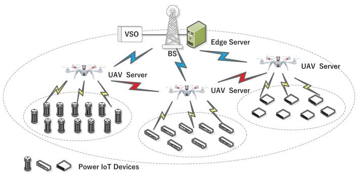
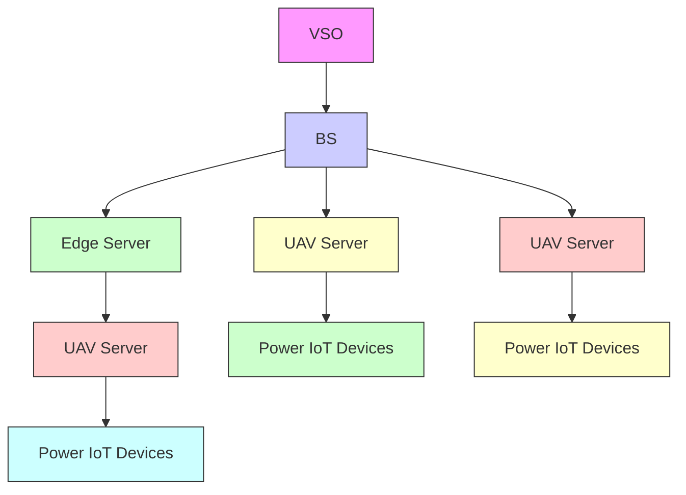
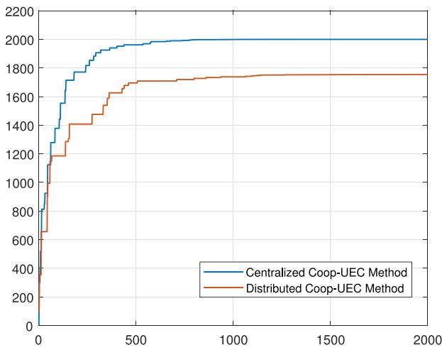
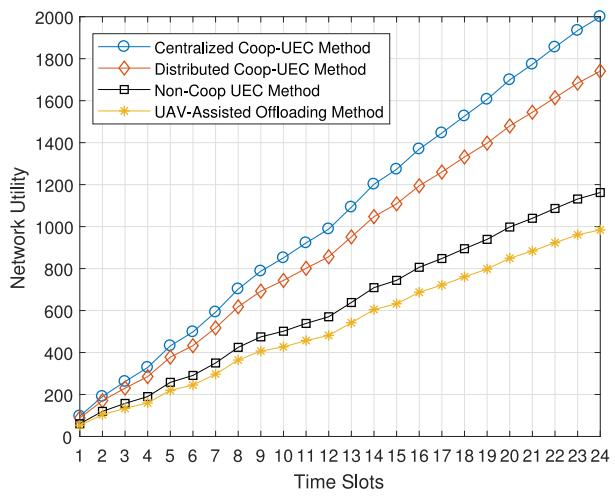
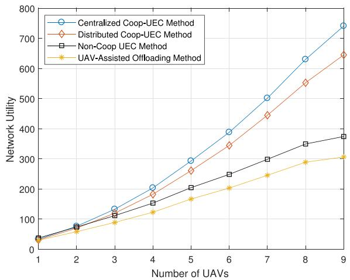
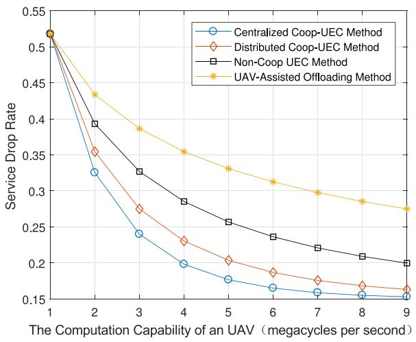
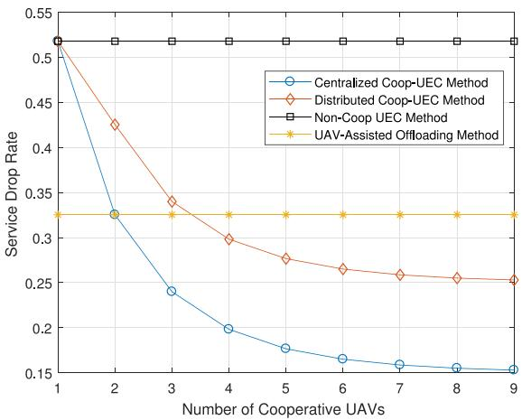
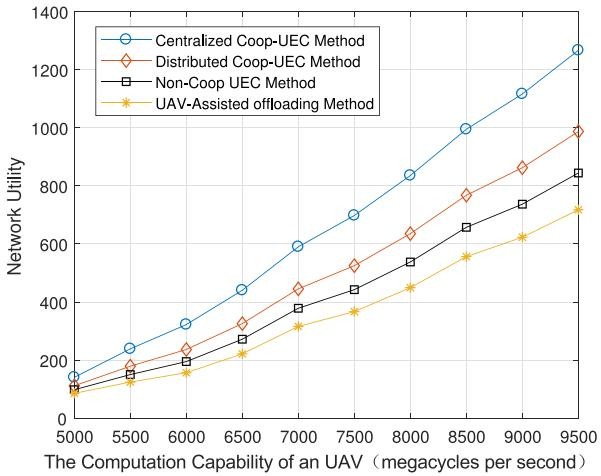

# Cooperative Offloading and Resource Management for UAV-Enabled Mobile Edge Computing in Power IoT System

Yi Liu , Shengli Xie , Fellow, IEEE, and Yan Zhang , Fellow, IEEE

Abstract—The lack of the computation services in remote areas motivates power Internet of Things (IoT) to apply unmanned aerial vehicle (UAV)-enabled mobile edge computing (MEC) technology. However, the computation services will be significantly affected by the UAVs’ capacities, and distinct power IoT applications. In this paper, we firstly propose a cooperative UAV-enabled MEC network structure in which the UAVs are able to help other UAVs to execute the computation tasks. Then, a cooperative computation offloading scheme is presented while considering the interference mitigation from UAVs to devices. To maximize the long-term utility of the proposed UAV-enabled MEC network, an optimization problem is formulated to obtain the optimal computation offloading decisions, and resource management policies. Considering the random devices’ demands and time-varying communication channels, the problem is further formulated as a semi-Markov process, and the deep reinforcement learning based algorithms are proposed in both of the centralized and distributed UAV-enabled MEC networks. Finally, we evaluate the performance of the proposed DRL-based schemes in the UAV-enabled MEC framework by giving numerical results.

Index Terms—UAV-enabled mobile edge computing, cooperative offloading, resource management, deep reinforcement learning.

NOMENCLATURE 

<table><tr><td>K</td><td>Number of the UAVs in an UEC network.</td></tr><tr><td> $N_{k}$ </td><td>Number of the devices in the  $k$ th small-cell.</td></tr><tr><td> $r_{n_{k},k}$ </td><td>Data rate between device  $n_{k}$  and the  $k$ th UAV.</td></tr><tr><td> $r_{k,j}$ </td><td>Data rate between the  $k$ th UAV and the  $j$ th UAV.</td></tr><tr><td> $r_{k,BS}$ </td><td>Data rate between the  $k$ th UAV and BS.</td></tr><tr><td> $\mathcal{S}$ </td><td>State space of the channel data rate.</td></tr></table>

Manuscript received January 5, 2020; revised May 25, 2020 and August 3, 2020; accepted August 7, 2020. Date of publication August 17, 2020; date of current version October 22, 2020. This work was supported in part by the programs of NSFC under Grants 61801133, 61773126, 61727810, and 61701125, and in part by the European Unions Horizon 2020 Research and Innovation Programme under the Marie Skodowska-Curie Grant Agreement 824019. The review of this article was coordinated by Prof. Vito Cerone. (Corresponding author: Yi Liu.)

Yi Liu is with the School of Automation, Guangdong University of Technology, Guangzhou 510006, China, and also with the Guangdong Province Key Lab of IoT Information Technology, Guangzhou 510006, China (e-mail: yi.liu@gdut.edu.cn).

Shengli Xie is with the Guangdong-HongKong-Macao Joint Laboratory for Smart Discrete Manufacturing, Guangzhou 510006, China, and also with the Key Laboratory of Intelligent Detection, and the Internet of Things in Manufacturing, Ministry of Education, Guangzhou 510006, China (e-mail: shlxie@gdut.edu.cn).

Yan Zhang is with the University of Oslo, Blindern, 0315 Oslo, Norway (e-mail: yanzhang@ieee.org).

Digital Object Identifier 10.1109/TVT.2020.3016840

$\mathbf { p } _ { g , h } ( t )$   
$p _ { n _ { k } , k }$   
$p _ { k , j }$   
$p _ { k , B S }$   
dnk $d _ { n _ { k } }$   
$\mathbf { P } _ { n _ { k } } ( t )$   
$\alpha _ { k } ^ { l c }$   
$\alpha _ { k } ^ { c p } , \alpha _ { k } ^ { B S }$ k k   
$\eta _ { k } ^ { l c }$   
$\eta _ { k } ^ { c p } , \eta _ { k } ^ { B S }$ k   
$\tau _ { n _ { k } , k } ( t )$   
$\tau _ { l , k } ( t )$   
$\tau _ { k , B S } ( t )$   
$\beta _ { k } ( t )$   
Dk,max $\mathcal { D } _ { k , \mathrm { m a x } }$   
Ck,max $\mathcal { C } _ { k , \mathrm { m a x } }$   
$f _ { n _ { k } , k } ( t )$   
$f _ { k , j } ( t )$   
$f _ { k , B S } ( t )$   
$U _ { k } ^ { c o m } ( t )$   
$U _ { k } ^ { \bar { c } m p } ( t )$   
$U _ { k } ( t )$   
${ \bf s } _ { k } ( t )$   
${ \bf a } _ { k } ( t )$   
$o ( t )$   
γ   
$\theta , \theta ^ { \prime }$   
$\mathcal { L } ( \boldsymbol { \theta } )$   
Transition probability of the data rate from one state $ { \boldsymbol { S } } _ { g }$ to another state $S _ { h }$ .   
Transition probability of the data rate between device $n _ { k }$ and the kth UAV.   
Transition probability of the data rate between the kth UAV and the jth UAV.   
Transition probability of the data rate between the kth UAV and BS.   
The size of the computation demands from device $n _ { k } .$ .   
The demand transition probability matrix for the nkth device.   
Unit prices of charging the devices and UAVs for offloading.   
Unit prices of the communication services provided by the cooperative UAVs and BS.   
Unit prices of charging the devices and UAVs for local computation service.   
Unit prices of the computation services provided by the cooperative UAVs and BS.   
Offloading durations from device $n _ { k }$ to UAV k at time slot t.   
Offloading durations from the kth UAV to the jth UAV at time slot t.   
Offloading durations from the kth UAV to the BS at time slot t.   
Collaborative factor.   
Communication capacity of UAV k.   
Computation capacity of UAV k.   
Computation rates of UAV k for local device $n _ { k }$ at time slot t.   
Computation rates of UAV j for UAV k at time slot t.   
Computation rates of BS for UAV k at time slot t.   
Communication utility of UAV k at time slot t.   
Computation utility of UAV k at time slot t.   
Total utility of UAV k at time slot t.   
State vector of the kth small-cell at time slot t.   
Action vector of the kth small-cell at time slot t.   
Observations of system state at time slot t.   
Discount factor.   
Weights of the main neural network and the target network, respectively.   
Loss function.

$\mathcal { L } _ { e n } , \mathcal { L } _ { r e w }$ Encoding loss, reward prediction loss.

$\mathcal { L } _ { \mathrm { s l o w } } , \mathcal { L } _ { d i v }$ Slow loss, diversity loss.

$\omega _ { k , j }$ Weights of the Q-value from UAV j to UAV k.

# I. INTRODUCTION

W ITH the booming of the energy Internet and the smartgrid, the power Internet of Things (IoT) system at- grid,the power Internet of Things (IoT） system attracts numerous academic and industrial interests with highly scalable infrastructure for a mass of electrical applications in distinct domains [1]–[4]. The main advantage of the power IoT system is the high integration of sensing, communication and computation technologies with physical power resources for improving the utilization efficiency of the power system. In power IoT system, the sensing devices are used to collect all aspects of the power system status. Then, the advanced communication and computation technologies, such as massive MIMO, cognitive radio, remote cloud service, etc., are employed to obtain efficient connection and computation services [5]–[7]. However, the existing power IoT system still faces the challenges of long-distance communication links, rigid server deployment, dynamic electricity consumption behaviors, etc., which may degrade the performance and stability of the power IoT system. Mobile Edge Computing (MEC) is deemed to be a new computation architectural to provide the computation services at the edge of the network, which is suitable for power IoT system that needs on-demand and flexible information collection and task execution [8]–[10].

The MEC-based IoT network enables devices to offload all/part of the computation tasks to the MEC servers that locate at the edge of network. The benefit of employing MEC in power IoT is to speed up the processing of the tasks and save energy for low-battery devices [11]–[13]. Tremendous number of researchers are devoted to design the optimal offloading strategies and resource allocation schemes for MEC-based IoT system under different performance requirements [14]–[17]. Considering the long-time energy efficiency, an efficient edge computing infrastructure is proposed for IoT system in [14]. Due to the stochastic task arrivals, wireless channels and congested air interface, authors in [15] generate asymptotically optimal schedules tolerant to out-of-date network knowledge, thereby relieving stringent requirements on feedbacks. The optimal schedule and energy efficient resource allocation policies for MEC-based IoT are proposed in [16] and [17], respectively. However, for the power IoT scenario, the existing MEC techniques are difficult to satisfy the computation service requirements from sparsely distributed power facilities and devices.

The unmanned aerial vehicles (UAVs) equipped with the computing resources can help improve the computing efficiency of the power IoT system due to their mobility, easy to deploy and operability [18]–[22]. Now, the researchers pay attentions to the UAV-enabled MEC network in which the UAVs can be acted as a mobile computation server or a computation offloading router. Authors in [18] propose a wireless powered UAV-enabled MEC system that the computation rate maximization problem is addressed under both partial and binary computation offloading modes. To minimize the average weighted user energy consumption, a Lyapunov based method is proposed by considering the randomness of the ground user computation tasks in [19]. In [20], multiple UAVs are arranged to collaboratively collect the perceptual data of the same sensing task and transmit the collected data to the BS separately. Meanwhile, the UAVs’ detection completion time is minimized. Some novel application scenarios and methods are introduced for UAV network [21]–[23]. The UAV-enabled MEC network in which the UAV servers are powered by microwave power stration is introduced in [21]. In [23], the MEC-driven UAV’s computation services routine is specially designed for wind farm detection scenarios. The reinforcement learning is used for long-term resource provision in UAV network to deal with dynamic demands of the resources and stringent QoS requirements [22]. However, due to the limited computation capacity, the performance of the UAV-enabled MEC network are quite limited when a single UAV is used as a computation server without any help [24], [25].

The main objective of this paper is to design a cooperative UAV-enabled edge computing (UEC) network, in which the devices on the ground has separable computing tasks, part of which can be offloaded to the UAVs or edge server, and the remaining part is calculated by themselves. Meanwhile, each UAV hovers at a certain area (named small-cell), not only provides computation services for local devices but also offers the computation services to neighboring UAVs. Then, we propose a collaborative computation offloading scheme for UAVs to accurately matching the services requirements of the ground power devices. Since the computation services from UAVs or edge server are profit incentive, we aim at maximizing the total network utility of the collaborative UEC network by jointly optimizing the cooperative offloading decisions and computation resources allocation.

In the proposed problem, the cooperative offloading and resource allocation process is influenced by the randomness of devices’ demands and time-varying communication channels. Hence, we formulate the problem as a semi-Markov decision process and propose the deep reinforcement learning (DRL) based algorithms to determine the optimal policies of cooperative offloading and resource allocation in both centralized and distributed UEC frameworks. In centralized UEC framework, a two-phase DRL-based offloading algorithm was proposed, which integrates the state representation learning to regularize the state representation. In distributed UEC framework, a distributed DRL-based algorithm was proposed based on a cooperative deep Q-network by using the Q-value transfer mechanism.

The main contributions of this paper can be summarized as follows:

1) We propose a cooperative UEC network infrastructure for power IoT system in which the UAVs can provide computation services for local devices as well as the neighboring UAVs.

2) We propose a collaborative computation offloading scheme for the proposed UEC network while considering the limited computation capabilities of UAVs. Then, we formulate the optimization problems to maximize the total utility of the UAVs in both of the centralized and distributed UEC networks.

flowchart

Fig. 1. System model of Vehicle-Assisted MEC Network.

3) In view of the random devices’ requests and time-varying communication channels, we reformulate the proposed problem as a semi-Markov decision process and propose the state representation learning based DRL algorithm and the Q-value transfer based DRL algorithm for the centralized and distributed UEC framework, respectively.

The remainder of this paper is organized as follows. In Section I, the system model of the collaborative UEC network is introduced. The cooperative computation offloading scheme with centralized DRL is described in Section II. The distributed UEC framework is presented in Section III. Section IV shows the numerical results of the proposed methods. Finally, the paper is concluded in Section V.

# II. SYSTEM MODEL

# A. Cooperative UEC Network Infrastructure

We consider a cooperative UEC network which includes three layers: system layer, UAV layer and device layer, as shown in Fig. 1. In system layer, there is a base station (BS) which connects to an edge server. A virtual system operator (VSO), which is established logically for a UEC network, is responsible for collecting the network information (e.g. the channel state information, demands, computation capacities of UAVs and devices, etc.,) and allocating communication/computation resources for UAVs and devices. Moreover, the VSO can coordinate the cooperative operations among UAVs. In UAV layer, each UAV with computing processing unit and communication antenna hovers upon a certain area, named small-cell, to provide communication and computation services for the devices on the ground. We consider that different UAVs have different computation and communication capacities. In device layer, the computation demands from different devices are distinct, and each device is able to offload the computing task to UAV with equipped wireless antenna. We assume that the number of the UAVs in an UEC network is K and the set of the UAVs is denoted as $\mathcal { K } = \{ 1 , . . . , K \}$ . The set of devices in the kth =UAV’s small-cell is denoted as $\mathcal { N } _ { k } = \{ 1 , . . . , N _ { k } \}$ , where $N _ { k }$ is =the number of the devices in the kth small-cell.

In the proposed system model, each UAV gathers devices’ offloading requests from its covered small-cell and reports such information to VSO at the beginning of each time slot. Then, according to the amount of the offloading task from device, the VSO should make decision of the computation policies. If the computation task can be executed by UAV itself, the VSO will ask UAV to calculate the computation task. If not, the UAV will be required to send the computation task to the neighboring UAVs or edge server for computation. After the computation is finished, the UAV should pay for the computation services provided by the cooperative UAVs or the edge server as occupying some of the communication and computation resources.

# B. Communication Model

In system model, we assume that the wireless communication channels between device and UAV, UAV and UAV, UAV and base station (BS) are time-varying channels which are modeled as finite state Markov channels (FSMC) [26], [27]. Generally, the received signal noise ratio (SNR) is used to reveal the quality of a channel in the FSMC model. In our model, the data rate of the channel, related to the SNR and the bandwidth of the channel, is directly used to describe the channel quality based on the Shannon theory. The data rate between device $n _ { k }$ and the kth UAV, between UAV k and UAV j, between UAV k and the BS are denoted as $r _ { n _ { k } , k } , r _ { k , j }$ and $r _ { k , B S }$ , respectively.

We set H-element state space of the channel data rate as $\boldsymbol { S } = \{ S _ { 1 } , S _ { 2 } , \ldots , S _ { H } \}$ , in which each discrete level corresponds =to a value range of data rate, e.g., state $S _ { 1 }$ , if $r _ { 0 } \leq r < r _ { 1 }$ , state $S _ { H }$ , if $r _ { H - 1 } \leq r < r _ { H }$ . The channel state realization of $r _ { n _ { k } , k } , r _ { k , j }$ and $r _ { k , B S }$ at time slot t can be denoted as $\mathbb { r } _ { n _ { k } , k } ( t )$ , $\mathbb { r } _ { k , j } ( t )$ and $\mathbb { r } _ { k , B S } ( t )$ , respectively, where $t \in \{ 0 , 1 , 2 \cdots , T \}$ . ( ) ( )We set T time slots of the communication period, which starts when devices issues computation requests and terminates when all the computation results are obtained. Then, the data rate $\mathbf { r } _ { k } ( t ) = [ \mathbb { r } _ { n _ { k } , k } ( t ) , \mathbb { r } _ { k , j } ( t ) , \mathbb { r } _ { k , B S } ( t ) ]$ jumps from one state $ { \boldsymbol { S } } _ { g }$ ( ) = [ ( )to another state $S _ { h }$ ( ) ( )]with the transition probability ${ \bf p } _ { g , h } ( t ) =$ $[ p _ { n _ { k } , k } ( t ) , p _ { k , j } ( t ) , p _ { k , B S } ( t ) ]$ ( ) =at time slot t. More specifically, the [ ( ) ( ) ( )]data rate transition probability matrices for the channels between device $n _ { k }$ and UAV $k ,$ UAV k and UAV j, UAV k and BS can be denoted as

$$
\mathbf {P} _ {n _ {k}, k} (t) = [ p _ {n _ {k}, k} (t) ] _ {H \times H},
$$

$$
\mathbf {P} _ {k, j} (t) = [ p _ {k, j} (t) ] _ {H \times H},
$$

$$
\mathbf {P} _ {k, B S} (t) = [ p _ {k, B S} (t) ] _ {H \times H}, \tag {1}
$$

where $p _ { n _ { k } , k } ( t ) = P r ( \mathbb { r } _ { n _ { k } , k } ( t + 1 ) = \mathcal { S } _ { h } | \mathbb { r } _ { n _ { k } , k } ( t ) = \mathcal { S } _ { g } )$ , $p _ { k , j } ( t ) = P r ( \mathbb { r } _ { k , j } ( t + 1 ) = S _ { h } | \mathbb { r } _ { k , j } ( t ) = S _ { g } )$ and $p _ { k , B S } ( t ) =$ $P r ( \mathbb { r } _ { k , B S } ( t + 1 ) = S _ { h } | \mathbb { r } _ { k , B S } ( t ) = S _ { g } )$ .

# C. Computation Demands Model

In our model, the devices in each small-cell may generate random computation tasks at each time slot. Since different devices have distinct service requests, we don’t know exactly the computation demands of each device at the next time slot. Then, the demand profile of the $n _ { k }$ th device served by the kth UAV can be modeled as a random variable $d _ { n _ { k } }$ , Here, $d _ { n _ { k } }$ denotes the size of the computation demands from device $n _ { k } . d _ { n _ { k } }$ is then divided into discrete levels denoted by $\mathcal { D } = \{ \mathcal { D } _ { 0 } , \mathcal { D } _ { 1 } , \hdots , \mathcal { D } _ { V } \}$ , where $V$ =is the number of demand profile states. The demand profile realization of $d _ { n _ { k } }$ at time slot t can be denoted as $\mathrm { d } _ { n _ { k } } ( t )$ , where $t \in \{ 0 , 1 , 2 \cdot \cdot \cdot , T \}$ . The demands $\mathbb { d } _ { n _ { k } } ( t )$ ( )jumps from one state $\mathcal { D } _ { g }$ to another state $\mathcal { D } _ { m }$ ( )with the transition probability $p _ { g , m } ^ { \mathcal { D } } ( t )$ at ( )time slot t. Therefore, the demand transition probability matrix for the $n _ { k }$ th device can be denoted as

$$
\mathbf {P} _ {n _ {k}} ^ {\mathcal {D}} (t) = [ p _ {g, m} ^ {\mathcal {D}} (t) ] _ {V \times V}, \tag {2}
$$

$\begin{array} { r } { \mathrm { w h e r e } p _ { g , m } ^ { \mathcal { D } } ( t ) = P r ( \mathbb { d } _ { n _ { k } } ( t + 1 ) = \mathcal { D } _ { m } | \mathbb { d } _ { n _ { k } } ( t ) = \mathcal { D } _ { g } ) . } \end{array}$

# D. Network Utility Model

The network utility of the proposed collaborative UEC network consists of two parts: the communication utility and the computation utility.

Firstly, we derive the communication utility of the kth UAV which charges device $n _ { k }$ or other UAVs for offloading computation tasks at the unit price $\alpha _ { k } ^ { l c }$ per Mbits. Meanwhile, the unit prices of the communication services provided by the cooperative UAVs and BS are denoted as $\alpha _ { k } ^ { c p }$ and αBk $\alpha _ { k } ^ { B \bar { S } }$ per Mbits, respectively. Let $\tau _ { n _ { k } , k } ( t ) , \tau _ { l , k } ( t )$ and $\tau _ { k , B S } ( t )$ denote the ( )offloading durations from device $n _ { k }$ ( ) ( )to UAV k, from UAV l to UAV k and from UAV k to BS at time slot t, respectively. We can obtain the communication utility of UAV k in the kth small-cell at time slot t as

$$
\begin{array}{l} U _ {k} ^ {c o m} (t) = \alpha_ {k} ^ {l c} \sum_ {n _ {k} \in \mathcal {N} _ {k}} \tau_ {n _ {k}, k} (t) r _ {n _ {k}} (t) \\ + \beta_ {k} (t) \alpha_ {k} ^ {l c} \sum_ {l \in \mathcal {K}, l \neq k} \tau_ {l, k} (t) r _ {l, k} (t) - (1 - \beta_ {k} (t)) \\ \times \left[ \alpha_ {k} ^ {c p} \sum_ {j \in \mathcal {K}, j \neq k} \tau_ {k, j} (t) r _ {k, j} (t) + \alpha_ {k} ^ {B S} \tau_ {k} ^ {B S} (t) r _ {k, B S} (t) \right], \tag {3} \\ \end{array}
$$

where $\beta _ { k } ( t )$ denotes the collaborative factor and $\beta _ { k } ( t ) \in \{ 0 , 1 \}$ in which $\beta _ { k } ( t ) = 0$ ( ) means the UAV k asks offloading help ( ) =from neighboring UAVs and BS, $\beta _ { k } ( t ) = 1$ means the UAV k ( ) =can provide computation services for its neighboring UAVs. To consider the communication capacity limitation of UAV k, we have the following inequations

$$
\begin{array}{l} \sum_ {n _ {k} \in \mathcal {N} _ {k}} d _ {n _ {k}} (t) \leq \sum_ {n _ {k} \in \mathcal {N} _ {k}} \tau_ {n _ {k}, k} (t) r _ {n _ {k}, k} (t) \\ + \sum_ {j \in \mathcal {K}, j \neq k} \tau_ {k, j} (t) r _ {k, j} (t) + \tau_ {k, B S} (t) r _ {k, B S} (t), (4) \\ \sum_ {n _ {k} \in \mathcal {N} _ {k}} \tau_ {n _ {k}, k} (t) r _ {n _ {k}, k} (t) + \sum_ {l \in \mathcal {K}, l \neq k} \tau_ {l, k} (t) r _ {l, k} (t) \leq \mathcal {D} _ {k, \max}, (5) \\ \end{array}
$$

where (4) ensures that the computation demands from all devices in the kth small-cell can be successfully offloaded. (5) ensures that the offloading demands from local devices and neighboring UAVs will not exceed the communication capacity of UAV k, which denoted as $\mathcal { D } _ { k , \mathrm { m a x } }$ .

Next, we consider the computation utility for providing computation services to the kth small-cell. Let $f _ { n _ { k } , k } ( t ) , f _ { k , j } ( t )$ and $f _ { k , B S } ( t )$ ( ) ( )denote the computation rates, which can be measured by bits computed per second, of local UAV, cooperative UAVs and BS allocated to the kth small-cell at time slot t, respectively. The local UAV will charge users for executing the computation task at the unit prices, denoted as $\eta _ { k } ^ { l c }$ per Mbits. Meanwhile, the unit price of consuming the computation resources from the cooperative UAVs and BS are denoted as $\eta _ { k } ^ { l c }$ c and ηBSk $\eta _ { k } ^ { B S }$ per Mbits, respectively. Then, we have the computation utility as

$$
\begin{array}{l} U _ {k} ^ {c m p} (t) = \eta_ {k} ^ {l c} \sum_ {n _ {k} \in \mathcal {N} _ {k}} \tau_ {n _ {k}, k} (t) f _ {n _ {k}} (t) \\ + \beta (t) \eta_ {k} ^ {c p} \sum_ {l \in \mathcal {K}, l \neq k} \tau_ {l, k} (t) f _ {l, k} (t) - (1 - \beta (t)) \\ \times \left[ \eta_ {k} ^ {c p} \sum_ {j \in \mathcal {K}, j \neq k} \tau_ {k, j} (t) f _ {k, j} (t) + \eta_ {k} ^ {B S} \tau_ {k, B S} (t) f _ {k, B S} (t) \right]. \tag {6} \\ \end{array}
$$

To guarantee all offloaded computation tasks are executed during $\tau _ { k } ,$ we have the following equation

$$
\begin{array}{l} \sum_ {n _ {k} \in \mathcal {N} _ {k}} d _ {n _ {k}} (t) \leq \sum_ {n _ {k} \in \mathcal {N} _ {k}} \tau_ {n _ {k}, k} (t) f _ {n _ {k}} (t) \\ + \sum_ {j \in \mathcal {K}, j \neq k} \tau_ {k, j} (t) f _ {k, j} (t) + \tau_ {k, B S} (t) f _ {k, B S} (t), (7) \\ \times \sum_ {n _ {k} \in \mathcal {N} _ {k}} \tau_ {n _ {k}, k} (t) f _ {n _ {k}, k} (t) \\ + \sum_ {l \in \mathcal {K}, l \neq k} \tau_ {l, k} (t) f _ {l, k} (t) \leq \mathcal {C} _ {k, \max}, (8) \\ \end{array}
$$

where (7) guarantees that the computation demands from all devices in the kth small-cell can be successfully executed. (8) guarantees that the executed computation tasks from local devices and neighboring UAVs will not exceed the computation capacity of UAV k, which denoted as $\mathcal { C } _ { k , \mathrm { m a x } }$ . Therefore, the total utility of the UAV k at time slot t can be obtained as

$$
U _ {k} (t) = U _ {k} ^ {\text { com }} (t) + U _ {k} ^ {\text { cmp }} (t). \tag {9}
$$

# III. COOPERATIVE UAV EDGE COMPUTING WITHCENTRALIZED DRL

# A. Problem Formulation

The main goal of this paper is to maximize the utility of the proposed collaborative UEC network by deciding optimal offloading and resource allocation policies. Then, we have the optimization problem as follows

$$
\begin{array}{l} \text {(P1)} \quad \max _ {\beta_ {k} (t), \mathbf {f} _ {k} (t), \Phi_ {k} (t)} \lim _ {T \to \infty} \frac {1}{T} \sum_ {t = 1} ^ {T} \left[ \sum_ {k = 1} ^ {K} U _ {k} (t) \right] \\ \text { s.t. } \quad C 1: \sum_ {n _ {k} \in \mathcal {N} _ {k}} \tau_ {n _ {k}, k} (t) + \sum_ {j \in \mathcal {K}, j \neq k} \tau_ {k, j} (t) + \tau_ {k} ^ {B S} (t) \leq \tau , \\ C 2: \quad (4), (5), (7), (8), \forall t, \\ \end{array}
$$

where C1 guarantees the sum of offloading durations from different cases is not exceeding the total communication duration of the UAV. Problem (P1) can be solved to find the optimal collaborative factor βk t , computation rates ${ \bf f } _ { k } ( t ) =$ $\{ \bar { f } _ { n _ { k } , k } ( t ) , f _ { l , k } ( t ) , f _ { k , j } ( t ) , f _ { k } ^ { B S } ( \dot { t } ) \}$ ( ) =and offloading durations $\Phi _ { k } ( t ) = \{ \tau _ { n _ { k } , k } ( t ) , \tau _ { l , k } ( t ) , \tau _ { k , j } ( t ) , \tau _ { k } ^ { B S } ( t ) \}$ . In our model, the Φ ( ) = ( )devices’ demands $d _ { n _ { k } } ( t )$ ) ( ) ( )and the communication channel rates $\mathbf { r } _ { k } ( t )$ ( )are dynamically changing over time. Hence, the VSO ( )should collect large amount of system states, and make the decision on offloading operation and resources allocation for each UAV in the complex UEC network environment. It is very challenging to solve this complicated task by maximizing the long-term accumulated utilities. To solve this problem, we develop a centralized two-phase DRL framework which is based on a state representation learning method.

# B. Centralized DRL Framework

In the centralized DRL framework, we identify three critical factors: state space, action space and reward function.

1) State Space: The states of the demands $d _ { n _ { k } } ( t ) , k \in$ $\{ 1 , \ldots , K \}$ , the channel communication rates $\mathbf { r } _ { k } ( t )$ ( )are determined by the realization of the states $\mathbb { d } _ { n _ { k } } ( t )$ and $\mathbb { r } _ { k } ( t )$ . We can present the state vector as

$$
\begin{array}{l} \mathbf {s} _ {k} (t) = \left[ \mathbb {d} _ {1} (t), \mathbb {d} _ {2} (t), \dots , \mathbb {d} _ {N _ {k}} (t), \right. \\ \mathbb {r} _ {1, k} (t), \mathbb {r} _ {2, k} (t), \dots , \mathbb {r} _ {N _ {k}, k} (t) \\ \left. \mathbb {r} _ {k, 1} (t), \mathbb {r} _ {k, 2} (t), \dots , \mathbb {r} _ {k, K} (t), \mathbb {r} _ {k} ^ {B S} (t) \right]. \tag {10} \\ \end{array}
$$

2) Action Space: The agent should decide the collaborative factor which affects the computation strategies for UAVs and devices. Also, the offloading durations and computation rates allocation in local UAV computation, UAV cooperative computation and edge server computation at time slot t should be determined, respectively. Hence, we can describe the current action vector ${ \bf a } _ { k } ( t )$ as follows

$$
\begin{array}{l} \mathbf {a} _ {k} (t) = \left[ \beta_ {k} (t), f _ {1, k} (t), f _ {2, k} (t), \dots , f _ {N _ {k}, k} (t) \right. \\ f _ {1, k} (t), f _ {2, k} (t), \dots , f _ {K, k} (t), \\ f _ {k, 1} (t), f _ {k, 2} (t), \dots , f _ {k, K} (t), f _ {k} ^ {B S} (t) \\ \tau_ {1, k} (t), \tau_ {2, k} (t), \dots , \tau_ {N _ {k}, k} (t) \\ \tau_ {1, k} (t), \tau_ {2, k} (t), \dots , \tau_ {K, k} (t) \\ \tau_ {k, 1} (t), \tau_ {k, 2} (t), \dots , \tau_ {k, K} (t), \tau_ {k} ^ {B S} (t) ]. \tag {11} \\ \end{array}
$$

3) Reward Function: We use the objective function of problem (P1), which represent the UEC network utility, as the reward function. The reward gain is decided by the agent actions. The immediate network reward is the network utility from a certain UAV k at time slot $t ,$ i.e., $U _ { k } ( t )$ in (9). The agent obtains $U _ { k } ( t )$ in state ${ \bf s } _ { k } ( t )$ when action ${ \bf a } _ { k } ( t )$ ( )is performed at time slot t. To ( ) ( )maximize the long-term collaborative UEC network utility, we give the cumulative network utility as

$$
U = \max E [ \sum_ {t = 0} ^ {T - 1} \sum_ {k = 1} ^ {K} U _ {k} (t) ]. \tag {12}
$$

4) Markovian Decision Problem Formulation: The proposed UAV-enabled computing offloading process can be approximated as a Markovian decision process. In a Markovian decision problem, the system state at stage t is denoted as ${ \bf s } ( t ) = $ $[ { \bf s } _ { 1 } ( t ) , \ldots , { \bf s } _ { K } ( t ) ]$ , and the action can be denoted as ${ \bf a } ( t ) =$

$[ { \bf a } _ { 1 } ( t ) , \ldots , { \bf a } _ { K } ( t ) ]$ , which can be obtained from $A _ { \mathrm { s } }$ of admissible [ ( ) ( )]actions. When the action $\mathbf { a } ( t ) \in A _ { \mathbf { s } }$ is executed, we can use $Q ( \mathbf { s } ( t ) , \mathbf { a } ( t ) )$ to denote the $Q$ )value of state s and action a pair. ( ( ) ( ))The updating rule of the Q-value is given by [29]

$$
\begin{array}{l} Q (\mathbf {s} (t), \mathbf {a} (t)) = Q (\mathbf {s} (t), \mathbf {a} (t)) + \alpha [ U (\mathbf {s} (t), \mathbf {a} (t)) \\ + \gamma \max _ {\mathbf {a} ^ {\prime}} Q (\mathbf {s} (t + 1), \mathbf {a} ^ {\prime}) - Q (\mathbf {s} (t), \mathbf {a} (t)) ], \tag {13} \\ \end{array}
$$

where $\alpha \in [ 0 , 1 ]$ is the learning rate which equals to 0 means [ ]that the Q-value is never updated. α equals to a high value, e.g., 1, means that learning can occur quickly. $\gamma \in [ 0 , 1 ]$ is the [ ]discount factor which models the fact that future rewards are worth less than immediate rewards. In this paper, we consider the case where $\alpha = 1$ , then the Q-value updates as

$$
Q (\mathbf {s} (t), \mathbf {a} (t)) = U (\mathbf {s} (t), \mathbf {a} (t)) + \gamma \max _ {\mathbf {a} ^ {\prime}} Q (\mathbf {s} (t + 1), \mathbf {a} ^ {\prime}). \tag {14}
$$

While tabular Q-learning works well for the problems with small-scale state and action space, it has difficulties in solving the proposed Markovian decision problem with continuous large-scale state and action space. DRL method builds a mapping from the state vector to the $Q -$ -value for each possible action by a deep neural network, instead of estimating the Q-value of each state-action pair separately. Moreover, deep neural network can extract features from high-dimensional raw data automatically without prior knowledge and it is effective for large-scale state space problems. We adopts a two-phase DRL based offloading algorithm in which the training phase at VSO uses a Deep Double Q-learning with state representation learning and the execution phase at UAV executes the optimal resource allocation policies according to the trained parameters.

# C. Two-Phase DRL-Based Offloading Algorithm

1) DRL With Representation Learning: In the proposed DRL-based method, the VSO, as an agent, detects the state of the UEC system s t from observations o t . Based on these ( )observations, the VSO sends an action $a ( t )$ ( )to the system and trigger a new state $s ( t + 1 )$ ( ). Since the observations in power IoT environment tend to be high dimensional, noisy and redundant, a mapping from the these observations to a low dimensional, concise representation $s ( o ( t ) )$ should be carefully determined. In [33], multi-layer deep convolutional networks is used to replace ordinary neural networks to extract high-level features from raw input data. Two neural networks are employed in DRL method. One is the main neural network which is used to represent $Q$ function, denoted as $Q ( \mathbf { s } ( o ( t ) ) , \mathbf { a } ( t ) ; \theta )$ , where ( ( ( )) ( ); )θ stands for the weights of the main neural network. Another is the target neural network, which generates the target $Q \cdot$ -value $y ( m ) ^ { \prime }$ as

$$
y ^ {\prime} (m) = U _ {m} + \gamma \max _ {\mathbf {a} ^ {\prime}} Q (\mathbf {s} ^ {\prime} (o (m + 1)), \mathbf {a} ^ {\prime}; \theta^ {\prime}), \tag {15}
$$

where $\theta ^ { \prime }$ is the parameter of the target network. For the sake of training stabilization, $\theta ^ { \prime }$ has fixed value during the calculation of $y ^ { \prime } ( m )$ and is updated after some training steps. Then, we train the ( )deep Q-function according to the target Q-value by minimizing the loss function $\mathcal { L } ( \boldsymbol { \theta } )$ , which is given by

$$
\mathcal {L} (\theta) = \frac {1}{M} \sum_ {m} \left[ y ^ {\prime} (m) - Q (\mathbf {s} (o (t)), \mathbf {a} (t); \theta) \right] ^ {2}. \tag {16}
$$

Note that the weight of target neural network $\theta ^ { \prime }$ is updated using lately weight θ. To further integrate the state representation learning in the proposed DRL framework, we consider to add more objectives in (16) to shape the state representation. In this paper, to fit the proposed collaborative UEC model, the added objectives, state representation learning loss terms, consists of encoding loss $\mathcal { L } _ { e n } ,$ , reward prediction loss $\mathcal { L } _ { r e w } .$ , slow loss $\mathcal { L } _ { \mathrm { s l o w } }$ and diversity loss $\mathcal { L } _ { d i v } .$ , which can be described as follows [31]

$$
\mathcal {L} _ {e n} = \left\| \hat {o} [ s (o (t)) ] - o (t) \right\| ^ {2},
$$

where $\hat { o } [ s ( o ( t ) ) ]$ is the reconstruction of $o ( t )$ made by a decoding layer in the target network based on the state representation.

$$
\mathcal {L} _ {r e w} = \left[ \hat {U} (s (o (t)), a _ {t}, s (o (t + 1))) - U (t + 1) \right] ^ {2},
$$

where $\hat { U } ( s ( o ( t ) ) , a _ { t } , s ( o ( t + 1 ) ) )$ is the network reward predic-( ( ( )) ( ( + )))tion based on the state representation and action. Moreover, to ensure the representation states are not changing quickly over short periods of time, we have

$$
\mathcal {L} _ {\text { slow }} = \left\| s (o (t + 1)) - s (o (t)) \right\| ^ {2}.
$$

However, to avoid that a state representation does not change at all, an loss term to encourage the diversity between nonconsecutive states $o _ { x }$ and $o _ { y }$ is given as

$$
\mathcal {L} _ {d i v} = e ^ {- \| s (o _ {x}) - s (o _ {y}) \| ^ {2}}.
$$

Therefore, we rewrote the loss function, denoted as Loss θ

$$
\begin{array}{l} L o s s (\theta) = \mathcal {L} (\theta) + \mathcal {P} (\mathcal {P} _ {1} \mathcal {L} _ {e n} + \mathcal {P} _ {2} \mathcal {L} _ {r e w} \\ \left. + \mathcal {P} _ {3} \mathcal {L} _ {\text { slow }} + \mathcal {P} _ {4} \mathcal {L} _ {\text { div }}\right), \tag {17} \\ \end{array}
$$

where $\mathcal { P } _ { 1 } , \ldots , \mathcal { P } _ { 4 }$ are scaling constants for the individual state representation learning loss terms and $\mathcal { P }$ is an overall scaling term that trades off the original loss objective with the added loss objectives.

2) Training-Phase Algorithm at VSO: In the training phase, as shown in Algorithm 1, the VSO obtain the observation o of environment and process the observation to state $s ( o )$ . Mean-( )while the parameters of both main neural network and target neural network are initiated. Then, in each episode, the DRL agent initiate the observation of the UEC network state $\mathbf { s } ( o ( 1 ) )$ . ( ( ))After that, considering the balance between exploration of environment and exploitation of the knowledge accumulated through such exploration, the 	-greedy is utilized to select the execution action a t . With 	 probability, an action from the action set is randomly selected. Otherwise, the action is chosen with the highest estimated Q value which is derived from the main neural network with the input of state-action pair $( \mathbf { s } ( o ( t ) ) , \mathbf { a } ( t ) )$ .

As obtaining the reward value $U ( t )$ ( ( ( ))and next state $\mathbf { s } ( o ( t + 1 ) )$ ( ) ( ( + ))from the UAV edge computing network, the state transition $( \mathbf { s } ( o ( t ) ) , \mathbf { a } ( t ) , U ( t ) , \mathbf { s } ( o ( t + 1 ) ) )$ will be stored into the experience memory . To get rid of the divergence or oscillation Γdue to the strong correlations between consecutive transitions in Q-function approximation, the DRL agent randomly samples mini-batch data $( \mathbf { s } ( o ( m ) ) , \mathbf { a } ( m ) , U ( m ) , \mathbf { s } ( o ( m + 1 ) ) )$ from the experience memory to train the parameters of the main neural network. After calculating the target Q-value $y ( m ) ^ { \prime }$ , the DRL ( )agent updates parameters θ of the main neural network by using stochastic gradient descent method on the loss function $L o s s ( \theta )$ .

Algorithm 1: Training Stage Algorithm at VSO.   
Initialization:
1: Initialize the evaluation network with random parameters $\theta$ ;
2: Initialize the target network with $\theta' = \theta$ ;
3: Observe the state $o_t$ and preprocess to $s(o(t))$ ;
4: Initialize the parameters $\epsilon, M$ 5: For each episode
6: Obtain the original observation $o(1)$ , and pre-process $o(1)$ as the state $s(o(1))$ ;
7: For each step t
8: Input $s(o(t))$ to the evaluation network and output the Q-values of actions;
9: With probability $\epsilon$ select random action $\mathbf{a}(t)$ ;
10: Otherwise $\mathbf{a}(t) = \arg\max_{\mathbf{a}} Q(\mathbf{s}(o(t)), \mathbf{a}(t); \theta)$ ;
1: Execute action $\mathbf{a}(t)$ in the UAV edge computing network, achieve the reward $U(t)$ and observation $o(t + 1)$ ;
2: Process $o(t + 1)$ to the next state $s(o(t + 1))$ ;
3: Store the experience $(\mathbf{s}(o(t)), \mathbf{a}(t), U(t), \mathbf{s}(o(t + 1)))$ into the experience memory $\Gamma$ ;
4: Sample a mini-batch of M samples $(\mathbf{s}(o(m)), \mathbf{a}(m), U(m), \mathbf{s}(o(m + 1)))$ from the experience memory;
5: Calculate the target Q-value $y'(m)$ from the target neural network as $y'(m) = U(m) + \gamma\max_{\mathbf{a}'} Q(\mathbf{s}(o(m + 1)), \mathbf{a}'; \theta')$ 6: Update the weight of the main neural network $\theta$ by minimizing (17);
7: Perform a gradient descent step on Loss( $\theta$ ) in (17) with respect to the parameter $\theta$ and update $\theta'$ by using lately weight $\theta$ .
8: End For
9: End For

( )3) Execution-Phase Algorithm at UAVs: In the execution phase, the UAVs operate the actual execution algorithm as shown in Algorithm 2. In this phase, the kth UAV achieves its action directly from ${ \bf s } ( o _ { k } ( t ) )$ , i.e., a $Q ( \mathbf { s } ( o _ { k } ( t ) ) , \mathbf { a } ( t ) ; \theta )$ for ( ( )) arg max ( ( ( )) ( ); )each state and updates its offloading strategies and computation capacities accordingly. Then, each UAV sends its selected action and its state transition vector ${ \bf s } ( o _ { k } ( t + 1 ) )$ to the VSO.

# IV. DISTRIBUTED UAV EDGE COMPUTING

In the previous section, the proposed network utility maximization problem (P1) is solved by the VSO in a centralized framework. In such case, the VSO needs to collect the state information of all devices and UAVs in the entire network. However, the VSO may fail to communicate with devices/UAVs and provide computation services due to communication failure in practical power IoT environment, e.g. the remote power inspection field. Hence, we propose a distributed collaborative UEC method in which UAVs perceive environment and make cooperative offloading decisions by themselves. Then, we formulated the network utility maximization problem at the level of the UAV without the VSO control. A distributed DRL-based algorithm is proposed to solve the proposed problem by exchanging the state information with neighboring UAVs.

Algorithm 2: Execution Stage Algorithm at Each UAV.   
1: Obtain the original observation $o_{k}(t)$ , and pre-process $o_{k}(t)$ as the state $s(o_{k}(t))$ ;
2: For each episode
3: For each step t
4: Select $\mathbf{a}_{k}(t)=\arg\max_{\mathbf{a}}Q(\mathbf{s}(o_{k}(t)),\mathbf{a}(t);\theta)$ ;
5: Execute action $\mathbf{a}_{k}(t)$ in the UAV edge computing network, achieve the reward $U_{k}(t)$ and observation $o_{k}(t+1)$ ;
6: Process $o_{k}(t+1)$ to the next state $\mathbf{s}(o_{k}(t+1))$ ;
7: Update the state $\mathbf{s}(o_{k}(t+1))$ to the VSO.
8: End For
9: End For

# A. Cooperative UAV Offloading Without VSO

For UAV k, the optimal offloading decision can be determined by solving the following local optimization problem:

$$
\text {(P2)} \quad \max _ {\beta_ {k} (t), \mathbf {f} _ {k} (t), \Phi_ {k} (t)} \lim _ {T \to \infty} \frac {1}{T} \sum_ {t = 1} ^ {T} U _ {k} (t)
$$

$\mathrm { s . t . } \qquad ( C 1 ) , ( C 2 ) , \forall t .$ (18)

The proposed local optimization problem is still a non-convex optimization problem without knowing dynamic system parameters, e.g., the wireless channel conditions, devices’ demands, etc. Similar to the centralized case, we also can reformulate the local problem as a semi-Markov process. The definition of state space ${ \bf s } _ { k } ( t )$ and action space ${ \bf a } _ { k } ( t )$ can be obtained from (10) and (11), respectively. The reward function $\bar { U } _ { k }$ is given by

$$
\bar {U} _ {k} = \max E \left[ \sum_ {t = 0} ^ {T - 1} U _ {k} (t) \right]. \tag {19}
$$

Then, we try to solve the problem by develop a distributed DRL-based method. In this method, each UAV is modeled as an agent to run the DRL-based algorithm by interacting the UEC system at discrete time slots t. To ensure the $\mathrm { U A V s } ^ { \prime }$ cooperation, each UAV should take into account the influence of the latest actions of neighboring UAVs. Hence, the updating rule of $Q -$ values at each UAV not only depends on its own Q-value, but also depends on the transferred Q-value from its neighboring UAVs. After receiving the Q-values from the neighboring UAVs, the Q-values for each UAV can be updated as

$$
\begin{array}{l} Q (\mathbf {s} _ {k} (t), \mathbf {a} _ {k} (t)) = U _ {k} (t) + \gamma \max _ {\mathbf {a} _ {k} ^ {\prime}} Q (\mathbf {s} _ {k} (t + 1), \mathbf {a} _ {k} ^ {\prime}; \theta_ {k} ^ {\prime}) \\ + \sum_ {j \in \mathcal {K}} \omega_ {k, j} Q (\mathbf {s} _ {j} (t - 1), \mathbf {a} _ {j} (t - 1); \theta_ {j}), \tag {20} \\ \end{array}
$$

where $\theta _ { k }$ and $\theta _ { k } ^ { \prime }$ are the parameters of main neural network and target network respectively. $\omega _ { k , j }$ is the weights of the Q-value from UAV j. The values of the weights depend on the effect of the neighbor UAV j on the local UAV k, such as the mutual distance, energy level, etc.

In the proposed distributed UEC model, the separate main neural network is employed by each UAV to estimate the Qvalue for its actions under the observed state. Still, to alleviated the learning policy oscillation, a target neural network is used by a UAV to estimate the target Q-values $y _ { k } ( m )$ , where $y _ { k } ( m ) = U _ { m } + \gamma \operatorname* { m a x } _ { \mathbf { a } _ { k } ^ { \prime } } Q ( \mathbf { s } ^ { \prime } ( m + 1 ) , \mathbf { a } _ { k } ^ { \prime } ; \theta _ { k } ^ { \prime } )$ . Since the distributed UAV edge computing network needs multiple UAVs cooperatively perceive the environment and provide computation services, the optimal Q-values of the neighboring UAVs at the latest time step is transferred to the loss function for policy learning. The loss function for each UAV is defined as

$$
\begin{array}{l} L o s s _ {k} (\theta) = \sum_ {m = 1} ^ {M} \left\{U _ {k} (m) + \gamma \left[ \max _ {\mathbf {a} _ {k} ^ {\prime}} Q \left(\mathbf {s} ^ {\prime} (m + 1), \mathbf {a} _ {k} ^ {\prime}; \theta_ {k} ^ {\prime}\right) \right. \right. \\ \left. + \sum_ {j \in \mathcal {K}} \omega_ {k, j} Q (\mathbf {s} _ {j} (m - 1), \mathbf {a} _ {j} (m - 1); \theta_ {j}) \right] \\ \left. - Q \left(\mathbf {s} _ {k} (m), \mathbf {a} _ {k} (m); \theta_ {k}\right) \right\} ^ {2}, \tag {21} \\ \end{array}
$$

where M is the batch size.

# B. Distributed DRL-Based Algorithm

In this subsection, we propose a distributed DLR-based algorithm for solving the problem (P2), as shown in Algorithm 3. At each time slot, the agent (UAV) k perceive the system state ${ \bf s } _ { k } ( t )$ based on the observation. Considering the limited ( )computation capacities, we don’t use the state representation learning at UAVs. Then, the agent sends an action ${ \bf a } _ { k } ( t )$ to the system and obtains a reward $U _ { k } ( t )$ ( ). As a consequence of the ( )action, the system state transitions into a new state $\mathbf { s } _ { k } ( t + 1 )$ . Experience tuples $( { \bf s } _ { k } ( t ) , { \bf a } _ { k } ( t ) , U _ { k } ( t ) , { \bf s } _ { k } ( t + 1 ) )$ ( + )are saved in ( ( ) ( ) ( ) ( + ))an experience replay buffer  from which mini-batches are Γsampled randomly during DRL process. Considering the limited storage of ${ \mathrm { U A V s } } ,$ when the experience buffer is full, the earliest experience will be discarded and the latest experience will be stored. To train the main neural network more effectively, the parameter $\theta _ { k }$ of the main neural network in UAV k is updated by using stochastic gradient descent method on the loss function $L o s s _ { k } ( \theta )$ . The target neural network parameter $\theta _ { k } ^ { \prime }$ is copied from $\theta _ { k }$ ( )every G time steps.

For training agent k cooperatively, the optimal Q-value of neighboring agents at the latest time step will be transferred to the loss function of agent k. Hence, after agent k samples from , it is necessary to sample the corresponding experiences from the experience replay buffers of neighboring agents. In addition, a decreasing 	-greedy strategy is still utilized, to balance the exploration and exploitation, for action selection. When the main neural network in the UAV can approximate the action value function sufficiently, the optimal control is achieved by selecting the maximum value of the output in the current state.

Algorithm 3: Distributed DRL-Based Algorithm For Each UAV. 

<table><tr><td colspan="2">Initialization:</td></tr><tr><td>1:</td><td>Initialize the evaluation network at UAV k with random parameters θk;</td></tr><tr><td>2:</td><td>Initialize the target network at UAV k with θ′k = θk;</td></tr><tr><td>3:</td><td>Observe the state o(k(t) and preprocess to sk(t);</td></tr><tr><td>4:</td><td>Initialize the parameters ε, M, G</td></tr><tr><td>5:</td><td>For each episode</td></tr><tr><td>6:</td><td>Obtain the original observation o(k(1), and pre-process o(k(1) as the state sk(1) ;</td></tr><tr><td>7:</td><td>For each step t</td></tr><tr><td>8:</td><td>Input sk(t) to the evaluation network and output the Q-values of actions;</td></tr><tr><td>9:</td><td>With probability ε select random action ak(t);</td></tr><tr><td>10:</td><td>Otherwise ak(t) = arg maxaQ(sk(t), ak(t); θk);</td></tr><tr><td>11:</td><td>Execute action ak(t) in the UAV edge computing network, achieve the reward Uk(t) and broadcasts its selected action ak(t) to other neighbor UAVs.</td></tr><tr><td>12:</td><td>Obtain the observation ok(t+1) and process it to the next state sk(t+1);</td></tr><tr><td>13:</td><td>Store the experience (sk(t), ak(t), Uk(t), sk(t+1)) into the experience memory Γ;</td></tr><tr><td>14:</td><td>Sample a mini-batch of M samples (sk(m), ak(m), Uk(m), sk(m+1)) from the experience memory D;</td></tr><tr><td>15:</td><td>Calculate the target Q-value y(m) from the target neural network as y′k(m) = Uk(m) + γ maxakQ(sk(m+1), ak&#x27;; θ′k)</td></tr><tr><td>16:</td><td>Update the weight of the main neural network θ by minimizing Lossk(θ) (21);</td></tr><tr><td>17:</td><td>Perform a gradient descent step on Lossk(θ) with respect to the parameter θk and update θ′k by using lately weight θk every G steps.</td></tr><tr><td>18:</td><td>End For</td></tr><tr><td>19:</td><td>End For</td></tr></table>

# V. NUMERICAL RESULTS

To illustrate the performance of the proposed methods, we consider a 10 × 10 km2 area which includes 10 randomly deployed small-cells, each of which is severed by a UAV. In each small-cell, there are 100-500 devices generate computation task at each time slot. Other evaluation parameters are listed in Table I. For the DRL method, we set the capacity of experience memory 500, and the mini batch size M 32. The reward Γ =discount 	 0.5.

line

| Step | Centralized Coop-UEC Method | Distributed Coop-UEC Method |
| ---- | --------------------------- | ---------------------------- |
| 0    | 0                           | 0                            |
| 100  | 800                         | 600                          |
| 200  | 1400                        | 1200                         |
| 300  | 1800                        | 1400                         |
| 400  | 1900                        | 1600                         |
| 500  | 2000                        | 1700                         |
| 600  | 2000                        | 1750                         |
| 700  | 2000                        | 1750                         |
| 800  | 2000                        | 1750                         |
| 900  | 2000                        | 1750                         |
| 1000 | 2000                        | 1750                         |
| 1100 | 2000                        | 1750                         |
| 1200 | 2000                        | 1750                         |
| 1300 | 2000                        | 1750                         |
| 1400 | 2000                        | 1750                         |
| 1500 | 2000                        | 1750                         |
| 1600 | 2000                        | 1750                         |
| 1700 | 2000                        | 1750                         |
| 1800 | 2000                        | 1750                         |
| 1900 | 2000                        | 1750                         |
| 2000 | 2000                        | 1750                         |

Fig. 2. Convergence of the proposed centralized Coop-UEC method and distributed Coop-UEC method.

The performance of the proposed centralized cooperative UEC (coop-UEC) method and distributed coop-UEC method are compared with some popular UAV based edge computing methods [18]–[20]. We named the methods proposed in [18] and [19] as non-cooperative UEC method in which the UAVs execute the computation tasks by themselves without any help. The methods proposed in [20] is named as UAV-assisted offloading method in which the UAVs directly relay the computation tasks to the edge server without providing computation services.

Fig. 2 shows the convergence performance of the proposed centralized coop-UEC method and distributed coop-UEC method. We can obverse that the network utility increases as the number of the episodes increases until it attains a relatively stable value in both of the centralized coop-UEC method and distributed coop-UEC method. It is shown that the proposed methods are convergent. We can also observe that the centralized coop-UEC method can achieve more network utility than that of the distributed coop-UEC method, which will be explained in the next subsection.

# A. Network Utility Comparison

The network utility comparison of the proposed centralized coop-UEC method, distributed coop-UEC method, the non-cooperative UEC method and the UAV-assisted offloading method is shown in Fig. 3. From the figure, it can be observed that the cumulated network utility of four methods increase with the increase of time slots. Particularly, the centralized coop-UEC method achieves the highest utility among all the methods. This is because the DRL-based method perceives the system state of the entire UEC network and operate the optimal computation offloading and resource allocation policies at each time slot. By contrast, the distributed method only uses partial system information to make the offloading and resource allocation decisions. The non-cooperative method and UAV-assisted methods only use local UAV or edge server as the computation server which cannot reach the optimal utility without the cooperation of other UAVs.

TABLE I THE SIMULATION PARAMETERS 

<table><tr><td> $\alpha_{k}^{lc}$ </td><td>1 units/Mbits</td><td>The unit charging-price for devices connect to local UAV.</td></tr><tr><td> $\alpha_{k}^{cp}$ </td><td>2 units/Mbits</td><td>The unit paid-price for cooperative communication with UAVs.</td></tr><tr><td> $\alpha_{k}^{BS}$ </td><td>2 units/Mbits</td><td>The unit paid-price for communication with BS.</td></tr><tr><td> $\eta_{k}^{lc}$ </td><td>1 units/Mbits</td><td>The unit charging-price for local UAV computing task for devices.</td></tr><tr><td> $\eta_{k}^{cp}$ </td><td>2 units/Mbits</td><td>The unit paid-price for computation by cooperative UAVs.</td></tr><tr><td> $\eta_{k}^{BS}$ </td><td>2 units/Mbits</td><td>The unit paid-price for computation by BS.</td></tr><tr><td> $r_{n_{k}}, r_{l,k}, r_{k}^{BS}$ </td><td>[1, 3, 5, 7] bps</td><td>The data rate of the channels in UEC network</td></tr><tr><td> $d_{n_{k}}$ </td><td>[2, 4, 6, 8] Mbits</td><td>The data size of the computation demand  $d_{n_{k}}$ </td></tr><tr><td> $\mathcal{D}_{k,\max}$ </td><td>10 Mbits</td><td>The maximum communication capacity of a UAV during a time slot</td></tr><tr><td> $\mathcal{C}_{k,\max}$ </td><td>10 Mbits</td><td>The maximum computation capacity of a UAV during a time slot</td></tr></table>

line

| Time Slots | Centralized Coop-UEC Method | Distributed Coop-UEC Method | Non-Coop UEC Method | UAV-Assisted Offloading Method |
| ---------- | --------------------------- | ---------------------------- | ------------------- | ------------------------------ |
| 1          | 100                         | 80                           | 60                  | 50                             |
| 2          | 150                         | 130                          | 90                  | 70                             |
| 3          | 200                         | 180                          | 120                 | 90                             |
| 4          | 250                         | 230                          | 150                 | 110                            |
| 5          | 300                         | 280                          | 180                 | 130                            |
| 6          | 350                         | 330                          | 210                 | 150                            |
| 7          | 400                         | 380                          | 240                 | 170                            |
| 8          | 450                         | 430                          | 270                 | 190                            |
| 9          | 500                         | 480                          | 300                 | 210                            |
| 10         | 550                         | 530                          | 330                 | 230                            |
| 11         | 600                         | 580                          | 360                 | 250                            |
| 12         | 650                         | 630                          | 390                 | 270                            |
| 13         | 700                         | 680                          | 420                 | 290                            |
| 14         | 750                         | 730                          | 450                 | 310                            |
| 15         | 800                         | 780                          | 480                 | 330                            |
| 16         | 850                         | 830                          | 510                 | 350                            |
| 17         | 900                         | 880                          | 540                 | 370                            |
| 18         | 950                         | 930                          | 570                 | 390                            |
| 19         | 1000                        | 980                          | 600                 | 410                            |
| 20         | 1050                        | 1030                         | 630                 | 430                            |
| 21         | 1100                        | 1080                         | 660                 | 450                            |
| 22         | 1150                        | 1130                         | 690                 | 470                            |
| 23         | 1200                        | 1180                         | 720                 | 490                            |
| 24         | 1250                        | 1230                         | 750                 | 510                            |

Fig. 3. Network utility comparison of the UEC network.

line

| Number of UAVs | Centralized Coop-UEC Method | Distributed Coop-UEC Method | Non-Coop UEC Method | UAV-Assisted Offloading Method |
| -------------- | --------------------------- | --------------------------- | ------------------- | ------------------------------ |
| 1              | 40                          | 40                          | 40                  | 40                             |
| 2              | 80                          | 80                          | 80                  | 60                             |
| 3              | 140                         | 120                         | 120                 | 90                             |
| 4              | 210                         | 180                         | 150                 | 120                            |
| 5              | 300                         | 270                         | 210                 | 170                            |
| 6              | 400                         | 350                         | 250                 | 210                            |
| 7              | 510                         | 450                         | 300                 | 250                            |
| 8              | 630                         | 560                         | 350                 | 290                            |
| 9              | 750                         | 650                         | 380                 | 310                            |

Fig. 4. Network utility comparison in terms of the number of UAVs in UEC network.

In Fig. 4, we also compare the network utility in terms of the number of UAVs in UEC network. We can see that the network utility of the proposed two methods, the non-cooperative method and UAV-assisted offloading method increase with the increase of the number of UAVs. The reason is that when more and more UAV is participating for the computation and offloading, the network operator is capable of obtaining more computation resources for devices. Still, we can observe that the proposed

line

| The Computation Capability of an UAV (megacycles per second) | Centralized Coop-UEC Method | Distributed Coop-UEC Method | Non-Coop UEC Method | UAV-Assisted Offloading Method |
| --- | --- | --- | --- | --- |
| 1 | 0.52 | 0.52 | 0.52 | 0.52 |
| 2 | 0.33 | 0.36 | 0.39 | 0.44 |
| 3 | 0.24 | 0.28 | 0.33 | 0.39 |
| 4 | 0.20 | 0.23 | 0.29 | 0.36 |
| 5 | 0.18 | 0.21 | 0.26 | 0.34 |
| 6 | 0.17 | 0.19 | 0.24 | 0.32 |
| 7 | 0.16 | 0.18 | 0.22 | 0.30 |
| 8 | 0.16 | 0.17 | 0.21 | 0.29 |
| 9 | 0.16 | 0.16 | 0.20 | 0.28 |

Fig. 5. Network utility comparison in terms of different computation offloading charging price.

centralized coop-UEC method can achieve the highest network utility among other methods. That is, the centralized method always makes the choices of cooperative offloading and resource allocation strategies by knowing whole system states. The distributed coop-UEC method, thanks to the proposed cooperation strategy, can achieve more utility than that of the non-cooperative UEC and UAV-assisted offloading methods but less than that of the centralized coop-UEC method. For the non-cooperative UEC and UAV-assisted offloading method, the incremental utility is only from the local services of the UAVs. More UAVs means more small-cells should be served and more network utility will be obtained.

Fig. 5 shows the effects of the computation capability of a UAV. The network utility of all methods increases with the increase of the computation capability of the UAV. This is because higher computation capability will increase the number of served devices in each small-cell and result in the network utility increment. Similar to the above analysis, the network utility achieved by the proposed cooperative methods with optimal offloading and resource allocation strategies are higher than that in the non-cooperative UEC and UAV-assisted offloading methods. Note that the network utility of the non-cooperative UEC is higher than that of the UAV-assisted offloading method. This reveals that the usage of the UAV as the computation server excels the method that offload the task directly to the edge server.

line

| Number of Cooperative UAVs | Centralized Coop-UEC Method | Distributed Coop-UEC Method | Non-Coop UEC Method | UAV-Assisted Offloading Method |
| -------------------------- | --------------------------- | ---------------------------- | ------------------- | ------------------------------ |
| 1                          | 0.52                        | 0.52                         | 0.52                | 0.33                           |
| 2                          | 0.33                        | 0.43                         | 0.52                | 0.33                           |
| 3                          | 0.24                        | 0.34                         | 0.52                | 0.33                           |
| 4                          | 0.20                        | 0.30                         | 0.52                | 0.33                           |
| 5                          | 0.18                        | 0.28                         | 0.52                | 0.33                           |
| 6                          | 0.17                        | 0.27                         | 0.52                | 0.33                           |
| 7                          | 0.16                        | 0.26                         | 0.52                | 0.33                           |
| 8                          | 0.16                        | 0.26                         | 0.52                | 0.33                           |
| 9                          | 0.15                        | 0.25                         | 0.52                | 0.33                           |

Fig. 6. Service drop rate in terms of the number of UAVs.

# B. Service Drop Rate Comparison

In this subsection, we define the service drop rate as the ratio of the served demands to the total demands generated at a time slot. Fig. 6 shows the comparison of the service drop rate among the proposed centralized coop-UEC method, distributed coop-UEC method, the non-cooperative UEC method and the UAV-assisted offloading method. For non-cooperative UEC method, the service drop rate has a constant value with the increase of the number of UAVs. That is, this method only uses local UAV for task computation without cooperation and thus the unchanging drop rate at each time slot. Similar constant results can be seen in the UAV-assisted offloading method. In such method, the UAVs send the computation tasks to the edge server for execution. The drop rate of this method is lower than that of the non-cooperative method and proposed two UEC methods (when the number of UAVs is small). This is because the edge server has higher computation capability than that of a UAV which leads to lower service drop rate.

Another observation is that the service drop rate of the proposed cooperative-UEC methods decrease with the increasing number of UAVs. This is because the increment of UAVs implies more UAVs can join the cooperative offloading process, which will satisfy more service demands and cause lower service drop rate. Moreover, the centralized cooperative-UEC method has lower drop rate than that of the distributed cooperative-UEC method. That is, the centralized cooperative-UEC method uses DRL-based algorithm to find optimal offloading policies by knowing whole system states.

Fig. 7 shows the service drop rate in terms of the computation capability of a UAV. It can be seen that service drop rate of the four methods decreases as the computation capability of a UAV increases. It is reasonable that higher UAV computation capability can serve more devices demands which will lead to lower service drop rate. Still, we can see that the centralized and distributed coop-UEC methods achieves lower drop rate than that of the non-cooperative UEC and UAV-assisted offloading methods. That is the optimal cooperative policies of the offloading employed by the coop-UEC methods can increase the services opportunities for the devices. We also can see that the UAV-assisted offloading method has the highest service drop rate among all the methods. This is because this method only use UAV to transfer the computation tasks to the edge server, which may cause higher service drop rate due to the transferring delay.

line

| The Computation Capability of an UAV (megacycles per second) | Centralized Coop-UEC Method | Distributed Coop-UEC Method | Non-Coop UEC Method | UAV-Assisted offloading Method |
| --- | --- | --- | --- | --- |
| 5000 | 150 | 120 | 100 | 80 |
| 5500 | 250 | 200 | 150 | 120 |
| 6000 | 350 | 250 | 200 | 150 |
| 6500 | 450 | 350 | 250 | 200 |
| 7000 | 600 | 450 | 350 | 300 |
| 7500 | 700 | 550 | 450 | 350 |
| 8000 | 850 | 650 | 550 | 450 |
| 8500 | 1000 | 750 | 650 | 550 |
| 9000 | 1150 | 850 | 750 | 650 |
| 9500 | 1300 | 1000 | 850 | 750 |

Fig. 7. Service drop rate in terms of the computation capability of a UAV.

# VI. CONCLUSION

In this paper, we proposed a collaborative UAV-enabled edge computing network for the power IoT system in which the UAVs, acted as one type of the edge computing servers, not only provide computation services for local devices but also provide computation services for the neighboring small-cells. Considering the practical power IoT environment (stochastic channel conditions and demand profiles, etc.,), the computation offloading and resource allocation problems were carefully addressed in both of the centralized and distributed frameworks. A two-phase DRL-based offloading algorithm was proposed for centralized problem by using representation learning. With the help of Q-value transferring method, a distributed DRL-based algorithm was proposed without sending all information to the central operator. We obtained the results which showed that the proposed method and related solutions can achieve better performance than that of the non-cooperative UAV edge computing methods.

# REFERENCES

[1] W. Zhong, K. Xie, Y. Liu, C. Yang, and S. Xie, “Topology-aware vehicleto-grid energy trading for active distribution systems” IEEE Trans. Smart Grid, vol. 10, no. 2, pp. 2137–2147, Mar. 2019.   
[2] S. Andreev et al., “Understanding the IoT connectivity landscape: A contemporary M2M radio technology roadmap” IEEE Commun. Mag., vol. 53, no. 9, pp. 32–40, Sep. 2015.   
[3] L. Jiang, S. Xie, S. Maharjan, and Y. Zhang, “Blockchain empowered wireless power transfer for green and secure internet of things” IEEE Netw., vol. 33, no. 6, pp. 164–171, Nov. 2019.   
[4] A.V. Dastjerdi and R. Buyya, Internet of Things: Principles and Paradigms. Morgan Kaufmann, Cambridge, MA, USA, 2016.   
[5] Y. Liu, C. Yuen, X. Cao, N. U. Hassan, and J. Chen, “Design of a scalable hybrid MAC protocol for heterogeneous M2M networks” IEEE Internet Things J., vol. 1, no. 1, pp. 99–111, Feb. 2014.   
[6] L. Jiang, S. Xie, S. Maharjan, and Y. Zhang, “Joint transaction relaying and block verification optimization for blockchain empowered D2D communication” IEEE Trans. Veh. Technol., vol. 69, no. 1, pp. 828–841, Jan. 2020.   
[7] W. Zhong, K. Xie, Y. Liu, C. Yang, S. Xie, and Y. Zhang, “Online control and near-optimal algorithm for distributed energy storage sharing in smart grid” IEEE Trans. Smart Grid, vol. 11, no. 3, pp. 2552–2562, May 2020.

[8] T. K. Rodrigues, K. Suto, H. Nishiyama, J. Liu, and N. Kato, “Machine learning meets computation and communication control in evolving edge and cloud: Challenges and future perspective” IEEE Commun. Surveys Tut., vol. 22, no. 1, pp. 38–67, 2020.   
[9] F. Tang, Y. Kawamoto, N. Kato, and J. Liu, “Future intelligent and secure vehicular network toward 6G: Machine-learning approaches” Proc. IEEE, vol. 108, no. 2, pp. 292–307, Feb. 2020.   
[10] T. K. Rodrigues, K. Suto, and N. Kato, “Edge cloud server deployment with transmission power control through machine learning for 6G internet of things,” IEEE Trans. Emerg. Topics Comput., to be published, doi: 10.1109/TETC.2019.2963091.   
[11] L. Cui et al., “Joint optimization of energy consumption and latency in mobile edge computing for internet of things” IEEE Internet Things J., vol. 6, no. 3, pp. 4791–4803, Jun. 2019.   
[12] H. Li, K. Ota, and M. Dong, “Learning iot in edge: Deep learning for the internet of things with edge computing” IEEE Netw., vol. 32, no. 1, pp. 96–101, Jan. 2018.   
[13] H. Guo, J. Liu, J. Zhang, W. Sun, and N. Kato, “Mobile-edge computation offloading for ultradense IoT networks” IEEE Internet Things J., vol. 5, no. 6, pp. 4977–4988, Dec. 2018.   
[14] Y. Liu, C. Yang, L. Jiang, S. Xie, and Y. Zhang, “Intelligent edge computing for IoT-based energy management in smart cities” IEEE Netw., vol. 33, no. 2, pp. 111–117, Mar. 2019.   
[15] C. You, K. Huang, H. Chae, and B.-H. Kim, “Energy-efficient resource allocation for mobile-edge computation offloading” IEEE Trans. Wireless Commun., vol. 16, no. 3, pp. 1397–1411, Mar. 2017.   
[16] X. Lyn, “Optimal schedule of mobile edge computing for internet of things using partial information” IEEE J. Sel. Areas Commun., vol. 35, no. 11, pp. 2606–2615, Mar. 2017.   
[17] Y. Liu, H. Yu, S. Xie, and Y. Zhang, “Deep reinforcement learning for offloading and resource allocation in vehicle edge computing and networks” IEEE Trans. Veh. Technol., vol. 68, no. 11, pp. 11 158–11 168, Nov. 2019.   
[18] F. Zhou, Y. Wu, R. Q. Hu, and Y. Qian, “Computation rate maximization in UAV-enabled wireless-powered mobile-edge computing systems” IEEE J. Sel. Areas Commun., vol. 36, no. 9, pp. 1927–1941, Sep. 2018.   
[19] J. Zhang et al., “Stochastic computation offloading and trajectory scheduling for UAV-assisted mobile edge computing,” IEEE Internet Things J., vol. 6, no. 2, pp. 3688–3699, Apr. 2019.   
[20] S. Zhang, H. Zhang, B. Di, and L. Song, “Cellular cooperative unmanned aerial vehicle networks with sense-and-send protocol” IEEE Internet Things J., vol. 6, no. 2, pp. 1754–1767, Apr. 2019.   
[21] Y. Liu, M. Qiu, J. Hu, and H. Yu, “Incentive UAV-enabled mobile edge computing based on microwave power transmission” IEEE Access, vol. 8, pp. 28 584–28 593, 2020.   
[22] U. Challita, W. Saad, and C. Bettstetter, “Interference management for cellular-connected UAVs: A deep reinforcement learning approach” IEEE Trans. Wireless Commun., vol. 18, no. 4, pp. 2125–2140, Apr. 2019.   
[23] P. Cao, Y. Liu, C. Yang, S. Xie, and K. Xie, “MEC-driven UAV-enabled routine inspection scheme in wind farm under wind influence” IEEE Access, vol. 7, pp. 179 252–179 265, 2019.   
[24] F. Tang, Z. M. Fadlullah, B. Mao, N. Kato, F. Ono, and R. Miura, “On a novel adaptive UAV-mounted cloudlet-aided recommendation system for LBSNs” IEEE Trans. Emerg. Topics Comput., vol. 7, no. 4, pp. 565–577, Oct. 2019.   
[25] F. Tang, Z. M. Fadlullah, N. Kato, F. Ono, and R. Miura, “AC-POCA: Anticoordination game based partially overlapping channels assignment in combined UAV and D2D-based networks” IEEE Trans. Veh. Technol., vol. 67, no. 2, pp. 1672–1683, Feb. 2018.   
[26] Y. Wei, “Distributed optimal relay selection in wireless cooperative networks with finite-state markov channels” IEEE Trans. Veh. Technol., vol. 59, no. 5, pp. 2149–2158, Jun. 2010.   
[27] H. Wang, F. R. Yu, L. Zhu, T. Tang, and B. Ning, “Finite-state markov modeling for wireless channels in tunnel communication-based train control systems” IEEE Trans. Intell. Transp. Syst., vol. 15, no. 3, pp. 1083–1090, Jun. 2014.   
[28] W. Zhong, K. Xie, Y. Liu, C. Yang, and S. Xie, “Auction mechanisms for energy trading in multi-energy systems,” IEEE Trans. Ind. Inform., vol. 14, no. 4, pp. 1511–1521, Apr. 2018.   
[29] V. Mnih et al. “Human-level control through deep reinforcement learning” Nature, vol. 518, no. 7540, pp. 529–533, Feb. 2015.   
[30] H. Li, T. Wei, A. Ren, Q. Zhu, and Y. Wang, “Deep reinforcement learning: Framework, applications, and embedded implementations: Invited paper” in Proc. IEEE/ACM Int. Conf. Computer-Aided Des., Nov. 2017, pp. 847–854.

[31] T. D. Nruin, “Integrating state representation learning into deep reinforcement learning” IEEE Robot. Autom. Lett., vol. 3, no. 3, pp. 1394–1401, Jul. 2018.   
[32] Y. Xu, “Cost-efficient negotiation over multiple resources with reinforcement learning” in Proc. 25th Int. Symp. Qual. Service, 2017.   
[33] L. Jiang, “Self-paced curriculum learning” in Proc. 29th AAAI Conf. Artif. Intell., 2015, pp. 2694–2700.

natural_image

Portrait photo of a man in a dark jacket (no text or symbols visible)

Yi Liu received the Ph.D. degree from the South China University of Technology (SCUT), Guangzhou, China, in 2011. After that, he joined the Singapore University of Technology and Design (SUTD) as a Postdoctoral. In 2014, he worked with the Institute of Intelligent Information Processing at Guangdong University of Technology (GDUT), where he is now a Full Professor. His research interests include wireless communication networks, cooperative communications, smart grid and intelligent edge computing.

natural_image

Portrait of an older man wearing a plaid shirt (no text or symbols visible)

Shengli Xie (Fellow, IEEE) received the M.S. degree in mathematics from Central China Normal University, Wuhan, China, in 1992, and the Ph.D. degree in automatic control from the South China University of Technology, Guangzhou, China, in 1997. He was a Vice Dean with the School of Electronics and Information Engineering, South China University of Technology, China, from 2006 to 2010. Currently, he is the Director of both the Institute of Intelligent Information Processing (LI2P) and Guangdong Key Laboratory of Information Technology for the Inter-

net of Things, and also a Professor with the School of Automation, Guangdong University of Technology, Guangzhou, China. He has authored or co-authored four monographs and more than 100 scientific papers published in journals and conference proceedings, and was granted more than 30 patents. His research interests broadly include statistical signal processing and wireless communications, with an emphasis on blind signal processing and Internet of things.

natural_image

Portrait of a man wearing glasses and a suit (no visible text or symbols)

Yan Zhang (Fellow, IEEE) received the Ph.D. degree from the School of Electrical and Electronics Engineering, Nanyang Technological University, Singapore. He is currently a Full Professor with the Department of Informatics, University of Oslo, Oslo, Norway. His research interests include nextgeneration wireless networks leading to 5G beyond/6G, green and secure cyber-physical systems (e.g., smart grid and transport). Dr. Zhang is an Editor (or Area Editor, Associate Editor) for several IEEE publications, including IEEE Communications Mag-

azine, IEEE NETWORK MAGAZINE, IEEE TRANSACTIONS ON NETWORK SCI-ENCE AND ENGINEERING, IEEE TRANSACTIONS ON VEHICULAR TECHNOLOGY, IEEE TRANSACTIONS ON INDUSTRIAL INFORMATICS, IEEE TRANSACTIONS ON GREEN COMMUNICATIONS AND NETWORKING, IEEE COMMUNICATIONS SUR-VEY AND TUTORIALS, IEEE INTERNET OF THINGS JOURNAL, IEEE SYSTEMS JOURNAL, IEEE VEHICULAR TECHNOLOGY MAGAZINE, and IEEE BLOCKCHAIN TECHNICAL BRIEFS. He is a Symposium/Track Chair in a number of conferences, including IEEE ICC 2021, IEEE Globecom 2017, IEEE PIMRC 2016, IEEE SmartGridComm 2015. He is an IEEE Vehicular Technology Society Distinguished Lecturer during 2016–2020 and he is named as CCF 2019 Distinguished Speaker. He is the Chair of IEEE Communications Society Technical Committee on Green Communications and Computing (TCGCC). He is an Elected Member of CCF Technical Committee of Blockchain. In both 2019 and 2018, Prof. Zhang was a recipient of the global “Highly Cited Researcher” Award (Web of Science top 1% most cited worldwide). He is a Fellow of IIET, Elected Member of Academia Europaea (MAE), and Elected Member of Norwegian Academy of Technological Sciences (NTVA).