# Cooperative Pursuit-Evasion With Low Altitude Wireless Network: A Hierarchical Reinforcement Learning Approach

Zhengzhi Yang , Yuanhao Cui , Member, IEEE, Wenbo Du , Member, IEEE, Fanbiao Li , Senior Member, IEEE, and Yumeng Li , Member, IEEE

Abstract—As an emerging countermeasure, cooperative interception by multiple UAVs offers an effective solution to neutralize rogue drones and safeguard low-altitude airspace operations. Effective coordination among counter-UAVs in encircling intruding drones remains challenging. This paper proposes a Hierarchical Cooperative Deep Reinforcement Learning (HCDRL) algorithm to enhance cooperation and efficiency among UAVs pursuing agile targets. The proposed approach decomposes the multi-agent pursuit-evasion scenario into multiple subtasks using a two-layer hierarchical decision-making framework. Specifically, the upperlayer network acts as a meta-strategy, dynamically assessing pursuit scenarios and assigning optimal subtasks. Meanwhile, the lower-layer policy networks of individual agents determine maneuver actions based on local observations and assigned subtasks. Simulation results demonstrate that the proposed algorithm significantly improves multi-agent cooperative encirclement performance, achieving an 11.18% higher success rate and a 9.94% reduction in completion time compared to state-of-the-art methods.

Index Terms—Pursuit-evasion game (PEG), cooperative encirclement, multi-agent reinforcement learning (MARL).

## I. INTRODUCTION

W ITH the opening of urban low-altitude airspace andthe rapid development of the low-altitude economy, UAVs are playing an increasingly important role in various urban scenarios, including aerial transportation, logistics delivery, security patrol, and emergency communications [1], [2], [3], [4], [5], [6]. As UAV traffic density continues to rise in urban airspace, Low-Altitude Wireless Networks (LAWN) have emerged as a foundational infrastructure to support large-scale UAV deployments [7], [8], [9], [10], [11], [12]. They enable collaborative perception and control, and play a critical role in ensuring fine-grained monitoring and safe, orderly airspace management. However, the low-altitude operating environment is also facing growing security challenges. Unauthorized or malicious UAVs may intrude into regulated airspace, disrupting normal operations and posing threats to personnel and critical infrastructure.

To mitigate the threats posed by rogue UAVs, a variety of countermeasures have been proposed in recent years, including radio frequency jamming, GNSS spoofing, and high-energy physical interception [13], [14]. Nevertheless, these methods often suffer from limited adaptability and high collateral damage, especially in urban environments with dense infrastructure and human activity. In contrast, physically capturing rogue UAVs using counter-UAVs equipped with net-launching devices has emerged as a promising alternative. The counter-UAVs form cooperative formations around the intruding UAV, dynamically constraining its maneuvering space. This creates favorable conditions for safe capture while minimizing harm to bystanders, infrastructure, and other legitimate UAVs.

Despite its advantages, cooperative net-based interception remains a highly challenging task. Rogue UAVs often exhibit superior maneuverability, uncertain motion trajectories, and evasive capabilities. This constitutes a typical multi-vs-one pursuitevasion scenario but is significantly more complex than classic setups. Since the evader’s strategy is unknown and may dynamically respond to the pursuers’ behavior, cooperative strategies can become ineffective, resulting in mission failure. Therefore, counter-UAVs must be capable of rapidly and flexibly adapting their cooperative strategies to compensate for their maneuvering disadvantages and efficiently encircle the target.

Most existing reinforcement learning-based approaches for multi-agent encirclement treat the pursuit process as a monolithic task, directly learning policies over the entire interaction [15], [16], [17], [18], [19], [20], [21]. However, this often overlooks the typical behavioral patterns and stage characteristics of the interception process. The joint state of multiple agents changes rapidly during pursuit, and learning a unified strategy for the entire pursuit process often results in poor convergence performance and insufficient flexibility. Some studies have attempted to decompose the task into three sequential stages: tracking, enclosing, and capturing [22], [23], [24], aiming to improve policy learning efficiency and interpretability. The pursuers progressively update their policy networks, learning corresponding cooperative strategies at each stage. By continuously updating policies for completing the tasks of each phase, they ultimately achieve successful capture. While such stagewise approaches have shown potential, current designs remain coarse-grained and overlook critical intermediate behaviors in the encirclement process. Moreover, the predefined execution order of subtasks limits the agents’ ability to dynamically adapt to evolving pursuit situations.

In this paper, we refine the phase design of the encirclement task by introducing two additional stages, namely expand and enclose, which enable the pursuers to dynamically adjust their formation according to dynamic capture requirements. This refinement facilitates more flexible strategy learning for cooperative encirclement. Moreover, we design a hierarchical cooperative deep reinforcement learning algorithm. It first selects pursuit subtasks based on the joint state information of the pursuers. Then, based on the selected subtask, it generates maneuver actions for encirclement using local observations. By continuously learning to evaluate and select subtasks that maximize the expected return, and guiding the agents to learn the cooperative strategies for the corresponding subtask, the pursuers gradually improve their decision-making capabilities and ultimately achieve successful capture. Compared with state-ofthe-art algorithms, the proposed approach improves the success rate of encirclement by 11.18% and reduces the required time by 9.94%.

The main contributions of this paper are as follows:

1. A hierarchical cooperative deep reinforcement learning approach is proposed to address the complexity of multi-agent encirclement decision-making. It adopts a two-layer decisionmaking network structure. The upper layer network functions as the pursuit meta-strategy and dynamically selects the optimal subtasks. The lower layer network determines the pursuing actions based on the selected subtask and local observations. By continuously assigning subtasks at the upper layer and incrementally completing them at the lower layer, the proposed framework promotes the convergence of policy during learning and improves the success rate of encirclement strategies.

2. To address the limitations of coarse-grained task decomposition in existing encirclement strategies, we propose a refined task decomposition framework, in which two additional behavioral modes, expand and enclose, are integrated to capture intermediate cooperative patterns and meet dynamic formation requirements. The reward function is accordingly adapted to reflect different formation structures and agent motion states across task phases. These enhancements enable the pursuers to flexibly adjust their coordination behaviors and improve the overall adaptability of the encirclement strategy.

3. The upper reward for the hierarchical decision-making networks is computed by averaging the rewards of lower-level agents and applying an exponential decay based on the duration of the selected subtask. The decayed reward promotes synchronous learning between the upper and lower networks during training, enabling the agents to simultaneously learn strategies for subtask selection and maneuver decision-making.

The remainder of this paper is organized as follows: Section II describes the game scenario and reviews the relevant literature. Section III introduces the system model and formulates the cooperative pursuit problem. Section IV defines the hierarchical cooperative reinforcement learning framework and details the algorithmic model. Section V presents simulation results from evaluation experiments, highlighting the algorithm’s effectiveness. Finally, Section VI concludes the paper.

## II. RELATED WORK

## A. Low-Altitude Wireless Networks

Low-altitude Wireless Networks (LAWN) refer to distributed wireless communication systems operating within the airspace at altitudes below approximately 3,000 meters. Initially conceptualized to bridge the coverage gap between terrestrial and satellite networks, LAWN has evolved as a fundamental enabler both aerial and ground nodes, including UAVs, balloon-based stations, terrestrial base stations, and so on. By forming dynamic and mobile topologies, these heterogeneous nodes collaboratively enable real time communication, navigation, and sensing services essential for supporting low-altitude operations [25], [26].

LAWN provides essential communication support for multi-UAV operations in low-altitude environments. Its selforganizing and adaptive network topology enables UAVs and ground nodes to maintain stable links despite rapid movement and dynamic formations, ensuring continuous coordination within the swarm [27]. Robust wireless link management, including low-altitude channel adaptation and interference mitigation, allows the network to handle complex propagation environments and sustain reliable data exchange [26]. Moreover, distributed multi-hop communication extends the effective range of UAV groups, allowing nodes to relay information collaboratively without relying on fixed infrastructure [25]. The integration of advanced cellular technologies, such as 5 G and emerging 6 G networks, further enhances LAWN’s ability to deliver the low latency, high throughput links needed for real time cooperative tasks [28].

Specifically, in cooperative UAV encirclement tasks, LAWN enables real time exchange of state information and target detection among agents. This is essential for maintaining coordinated actions during dynamic target encirclement. Moreover, cooperative pursuit can actively suppress unauthorized UAV threats in the low-altitude airspace, thereby protect the operation of the airspace and LAWN.

## B. Pursuit-Evasion Game

Multi-UAV encirclement can be modeled as cooperative pursuit-evasion games (PEGs). As illustrated in Fig. 1, a typical scenario consists of multiple UAV pursuers and a more fleeter evader, with obstacles distributed in the airspace. The pursuers aim to cooperatively encircle the evader within a limited time, restricting its movement space, while the evader attempts to escape through maneuvering. Isaacs initially formulated this process as a differential game, establishing the state evolution equations for both sides and deriving optimal control strategies [29]. Subsequent studies extended this framework to scenarios involving multiple pursuers and asymmetric capabilities between the pursuers and evaders [30], [31], [32], [33].

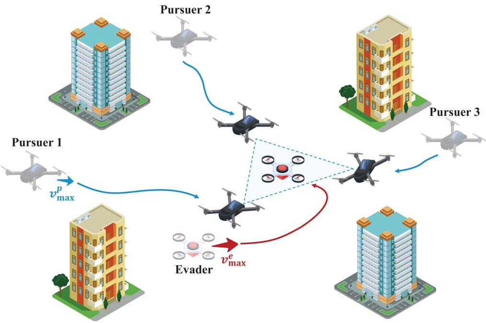  
Fig. 1. Schematic of a Pursuit-Evasion Scenario: Multiple pursuer UAVs collaborate to encircle and capture an evader in urban low-altitude airspace.

In low-altitude airspace, the presence of dense urban buildings and other aerial vehicles introduces additional complexity, as UAVs must avoid both static obstacles and dynamic air traffic. Oyler et al. incorporated obstacle avoidance into the PEG framework, further enhancing the modeling of multi-agent cooperative pursuit [34]. Given the complexity of agent behavior during pursuit, constructing a fully detailed and precise model is challenging and may face computational difficulty. Therefore, some studies adopt a task decomposition approach to model the pursuit-evasion game. For example, Chen et al. decomposed the behavioral patterns into distinct states such as Besieging and Capturing. Later works further refined this task decomposition paradigm [23], [24].

However, most existing decomposition frameworks assume a fixed execution sequence among tasks, neglecting the need for dynamic adjustment of formation in response to the evader’s maneuvers. In this work, the pursuit task decomposition is enhanced by introducing two new subtasks, Expand and Enclose, which enable more flexible formation reconfiguration. Additionally, the Capture state is refined to maintain the encirclement of the target and support net capturing.

## C. Deep Reinforcement Learning Methods

Due to the ability of DRL methods to effectively manage high-dimensional state and action spaces, as well as their strong decision-making capabilities with no need for precise models or prior knowledge, many researchers have employed them to solve multi-agent cooperative pursuit strategies [35], [36], [37], [38], [39], [40].

Gupta et al. introduced a parameter-sharing mechanism in deep reinforcement learning for multi-agent systems, enabling efficient cooperative pursuit in environments with sparse obstacles [35]. Qi et al. enhanced pursuit decision-making by incorporating a self-play mechanism [36]. Their work further considered dynamic constraints, improving the pursuers’ capabilities in both target capture and obstacle avoidance. Singh et al. applied the Multi-Agent Deep Deterministic Policy Gradient (MADDPG) algorithm to train pursuer agents [37]. By employing centralized training and distributed execution, they strengthened the cooperation among pursuer strategies, resulting in improved success rates in pursuit tasks. Wang et al. regarded the successful encirclement of the evader as the task success criterion and designed a communication policy network on top of the agents’ control policy network to share critical information, thereby enhancing the agents’ cooperative encirclement performance [38]. However, due to the strict success conditions of the encirclement task, the exploration space for learning joint strategies becomes extremely large. As a result, their method was only validated in a small-scale simulation environment of 5 × 5 meters, limiting its applicability to large-scale scenarios. Zhang et al. proposed an effective strategy for UAV pursuit-evasion games in urban environments with obstacles, using a multi-agent coronal bidirectionally coordinated policy network [39]. Liu et al. integrated self-attention mechanisms into the critic network and applied value decomposition to address the credit assignment problem among agents. They further introduced sample-efficient learning methods to improve learning effectiveness [40].

However, these methods primarily focus on minimizing the distance between pursuers and the evader during training, assuming that getting closer to the evader would lead to a successful capture. These approaches face significant challenges when addressing formation coordination and collaborative encirclement. The large joint state-action space of multiple agents leads to slow convergence and makes it difficult for pursuers to learn effective encirclement strategies.

TABLE I  
COMPARISON OF RELATED METHODS IN COOPERATIVE PURSUIT TASKS
<table><tr><td></td><td colspan="3">Task</td><td colspan="2">Continuous Space</td><td></td><td colspan="3">Policy Learning</td></tr><tr><td>Reference</td><td>Subtasks</td><td>Execution Order Adjustment</td><td>Success Criterion</td><td>Observation</td><td>Action</td><td>Obstacle</td><td>Curriculum Learning</td><td>Parameter Sharing</td><td>Pursuit Evaluation</td></tr><tr><td>[35]</td><td>一</td><td>一</td><td>Distance</td><td>√</td><td>√</td><td>√</td><td>x</td><td>√</td><td>x</td></tr><tr><td>[36]</td><td>一</td><td>一</td><td>Distance</td><td>√</td><td>x</td><td>√</td><td>x</td><td>一</td><td>x</td></tr><tr><td>[37]</td><td>一</td><td></td><td>Distance</td><td>√</td><td>√</td><td>x</td><td>x</td><td>x</td><td>x</td></tr><tr><td>[38]</td><td>一</td><td>一</td><td>Encirclement</td><td>√</td><td>√</td><td>x</td><td>x</td><td>√</td><td>x</td></tr><tr><td>[39]</td><td>一</td><td>一</td><td>Distance</td><td>√</td><td>√</td><td>√</td><td>x</td><td>√</td><td>x</td></tr><tr><td>[40]</td><td></td><td>一</td><td>Distance</td><td>√</td><td>x</td><td>√</td><td>x</td><td>√</td><td>x</td></tr><tr><td>[22]</td><td>3 (2|N| Options)</td><td>√</td><td>Encirclement</td><td>x</td><td>x</td><td>√</td><td>x</td><td>x</td><td>√</td></tr><tr><td>[23]</td><td>3</td><td>x</td><td>Distance</td><td>√</td><td>√</td><td>√</td><td>√</td><td>x</td><td>x</td></tr><tr><td>[24]</td><td>3</td><td>x</td><td>Encirclement</td><td>√</td><td>√</td><td>√</td><td>√</td><td>x</td><td>x</td></tr><tr><td>Proposed</td><td>5</td><td>√</td><td>Encirclement</td><td>√</td><td>√</td><td>√</td><td>x</td><td>x</td><td>√</td></tr></table>

Definitions: Distance denotes that capture is considered successful when the distance between any pursuer and the evader is smaller than a given threshold Encirclement denotes that capture is successful when multiple pursuers are positioned such that the evader is enclosed within their formation, with no feasible escape path.

Some works addressed this by decomposing the pursuit task and applying curriculum learning [23], [24]. By sequentially learning policies for different behavioral patterns, these approaches eventually enable the agents to learn cooperative encirclement strategies. It’s worth noting that although this task decomposition improves training efficiency, the learning process typically follows a fixed order and lacks flexibility, potentially leading to the forgetting decision-making knowledge of early stages. The comparative summary of the related works is presented in Table I.

To address these limitations, this paper proposes the HCDRL algorithm, comprising a two-layer decision-making framework. The upper-layer network evaluates the pursuit situation based on the global state and dynamically selects the optimal subtask. Each lower-layer agent generates specific actions based on local observations and the assigned subtask. By jointly training the meta-strategy and maneuvering policies, the proposed approach enhances the success rate of cooperative encirclement missions.

## III. SYSTEM MODEL AND PROBLEM FORMULATION

Let’s consider a typical pursuit-evasion scenario in the urban low-altitude airspace domain , where a set of pursuing UAVs N collaborates to intercept an evasive UAV e exhibiting superior maneuverability. There are multiple buildings randomly distributed within the environment, forming a set of obstacles denoted as B. Each building $b \in B$ is characterized by its location $[ x _ { b } , y _ { b } ]$ and side length $l _ { b }$

[ ]For the sake of simplicity, it is assumed that all UAVs, including both pursuers and the evader, operate at a uniform altitude, thereby confining their movement to a two-dimensional plane. All pursuing UAVs are assumed to have identical hardware configurations and share the same kinematic model, where their accelerations are determined by control actions along the x and y axes. For a pursuer agent denoted as i, its size is denoted by $r _ { \mathrm { u a v } } ^ { p } .$ , the position at time t is given by ${ \bf p } _ { i } ( t ) = [ x _ { i } ( t ) , y _ { i } ( t ) ]$ the velocity ${ \pmb v } _ { i } ( t ) = [ v _ { i } ^ { x } ( t ) , v _ { i } ^ { y } ( t ) ]$ , and the acceleration $\mathbf { } a _ { i } ( t ) =$ $[ a _ { i } ^ { x } ( t ) , a _ { i } ^ { y } ( t ) ]$ . Here, $a _ { i } ^ { x } ( t )$ and $a _ { i } ^ { y } ( t )$ represent the i’th pursuer’s acceleration on the x and y axes, respectively. The dynamics are thus described by the equations:

$$
\ddot { x } _ { i } ( t ) = \dot { v } _ { i } ^ { x } ( t ) = a _ { i } ^ { x } ( t ) ,\tag{1}
$$

$$
\ddot { y } _ { i } ( t ) = \dot { v } _ { i } ^ { y } ( t ) = a _ { i } ^ { y } ( t ) ,\tag{2}
$$

subject to:

$$
\| \pmb { v } _ { i } ( t ) \| _ { 2 } \leq v _ { \operatorname* { m a x } } ^ { p } ,\tag{3}
$$

$$
\| \mathbf { \boldsymbol { a } } _ { i } ( t ) \| _ { 2 } \leq a _ { \operatorname* { m a x } } ^ { p } .\tag{4}
$$

where $a _ { \mathrm { m a x } } ^ { p }$ is the pursuers’ maximum acceleration, $v _ { \mathrm { m a x } } ^ { p }$ is the pursuers’ maximum speed.

For the evader, its position at time t is represented by $p _ { e } ( t ) =$ $[ x _ { e } ( t ) , y _ { e } ( t ) ]$ , and its size by $r _ { \mathrm { u a v } } ^ { e } .$ ( ) =. The evader follows a similar kinematic model as the pursuers. However, its hardware is assumed to be more advanced, with higher dynamic performance. Its maximum acceleration $a _ { \mathrm { m a x } } ^ { e }$ and maximum velocity $v _ { \mathrm { m a x } } ^ { e }$ are not less than those of the pursuers, i.e., $a _ { \mathrm { m a x } } ^ { e } \geq a _ { \mathrm { m a x } } ^ { p }$ and $v _ { \mathrm { m a x } } ^ { e } \geq v _ { \mathrm { m a x } } ^ { p }$ . This reflects the evader’s superior maneuverability compared to the pursuing UAVs.

The objective of the pursuers is to cooperatively encircle and restrict the movement of the evader, which possesses superior maneuverability, while avoiding collisions with obstacles and other UAVs. The criterion for successful encirclement is defined as follows:

$$
d _ { i e } ( t ) = \| \pmb { p } _ { i } ( t ) - \pmb { p } _ { e } ( t ) \| _ { 2 } \leq d _ { \mathrm { c a p t u r e } }\tag{5}
$$

$$
\operatorname* { m a x } \left\{ \left| \langle p _ { e , i } , p _ { e , i + 1 } \rangle - \frac { 2 \pi } { \left| N _ { c } \right| } \right| \right\} < \epsilon _ { \theta } , \forall i \in N _ { c }\tag{6}
$$

where $d _ { i e } ( t ) = \| \pmb { p } _ { i } ( t ) - \pmb { p } _ { e } ( t ) \| _ { 2 }$ is the distance between i and the evader at t, with $d _ { \mathrm { c a p t u r e } }$ as the maximum allowable capture distance. $k _ { i }$ denotes index of i’s nearest counter-clockwise neighbor in the encirclement. $\langle { \pmb p } _ { e , i } , { \pmb p } _ { e , i + 1 } \rangle$ is the angle between pursuer i and its clockwise neighbor relative to the evader, constrained by $\epsilon _ { \theta } . \ N _ { c } \subseteq N$ represents the pursuers involved in the final capture. (5) ensures pursuers are positioned on the encirclement boundary at a distance $d _ { \mathrm { c a p t u r e } }$ from the evader. (6) enforces the uniform distribution of pursuers around the encirclement, preventing large gaps that could enable the evader to escape.

The pursuit task is constrained by a maximum time limit T . If the conditions in (5) and (6) are satisfied at time $\tau \left( 0 < \tau \leq \right.$ $T ) .$ , the encirclement is deemed successful. The objective of the pursuit-evasion problem is to optimize the strategies of both the pursuers and the evader. For the pursuers, the goal is to minimize $\tau ,$ while the evader aims to maximize τ , representing successful evasion. The objective functions for the pursuers $( J _ { p } )$ and the evader $( J _ { e } )$ are defined as follows:

$$
J _ { p } = \operatorname* { m i n } { \tau }\tag{7}
$$

$$
J _ { e } = \operatorname* { m a x } \tau\tag{8}
$$

The joint strategy adopted by the pursuers is denoted by $\Pi _ { p } ,$ while the strategy of the evader is represented as $\Pi _ { e }$ . The pursuitevasion problem can be formulated as follows:

$$
\operatorname* { m i n } _ { \Pi _ { p } } \mathrm { m a x } _ { \Pi _ { e } } \tau\tag{9}
$$

subject to:

$$
| | p _ { i } ( t ) - p _ { b } | | _ { 2 } > R _ { \mathrm { b u i l d i n g } } , \qquad \forall i \in N , \forall b \in B
$$

$$
| | p _ { i } ( t ) - p _ { j } | | _ { 2 } > R _ { \mathrm { U A V } } , \qquad \forall i , j \in N , i \ne j\tag{10}
$$

$$
\lvert | \pmb { v } _ { i } ( t ) \rvert | _ { 2 } \leq v _ { \mathrm { m a x } } ^ { p } ,\tag{11}
$$

$$
\forall i \in N\tag{12}
$$

$$
| | \pmb { v } _ { e } ( t ) | | _ { 2 } \le \tau _ { \mathrm { m a x } } ^ { e }\tag{13}
$$

$$
v _ { \mathrm { m a x } } ^ { p } \leq v _ { \mathrm { m a x } } ^ { e }\tag{14}
$$

$$
\begin{array} { r } { \lvert | \boldsymbol { a } _ { i } ( t ) \rvert | _ { 2 } \leq a _ { \mathrm { m a x } } ^ { p } , } \end{array}
$$

$$
\forall i \in N\tag{15}
$$

$$
| | \boldsymbol { a } _ { e } ( t ) | | _ { 2 } \leq a _ { \mathrm { m a x } } ^ { e }\tag{16}
$$

$$
a _ { \mathrm { m a x } } ^ { p } \leq a _ { \mathrm { m a x } } ^ { e }\tag{17}
$$

$$
0 < \tau \leq T\tag{18}
$$

where $R _ { \mathrm { b u i l d i n g } }$ and $R _ { \mathrm { U A V } }$ represent the safety distances between UAVs and buildings, and among UAVs, respectively. (10) and (11) ensure UAVs maintain safe distances to prevent collisions. (12), (13), and (14) constrain the velocities of pursuers and evaders to their respective maximum values, requiring the evader’s maximum speed to be at least equal to the pursuer’s. Similarly, (15), (16), (17) limit the accelerations. (18) ensures the encirclement task completes within the allowed time limit.

## IV. HIERARCHICAL COOPERATIVE DEEP REINFORCEMENTLEARNING STRUCTURE

To enhance joint strategy collaboration and convergence in multi-agent pursuit of evasive targets, a Hierarchical Cooperative Deep Reinforcement Learning (HCDRL) approach is proposed. It employs a dual-layer decision-making structure comprising a strategic upper layer and a tactical lower layer. The upper layer develops a cooperative meta-strategy by decomposing the pursuit task into subtasks and selecting suitable ones. The lower layer, emphasizing individual tactical maneuvers, utilizes a centralized training and decentralized execution paradigm, enabling effective cooperation without explicit centralized control. Each agent independently determines its actions based on the assigned subtask and its observations, earning corresponding rewards and improving policies. Reward functions are designed to align with subtask objectives, and agents receive both subtask-specific and general rewards during execution to update their policies.

## A. Observation and Action

In the decision-making process of pursuing UAVs, environmental information (such as buildings, other pursuing UAVs, and the evasive UAV) is vital for collision avoidance and autonomous decision-making. For pursuer i, its observation includes its internal state, such as position and velocity, along with the positions and sizes of buildings, and the positions and velocities of other UAVs and the evader. The local observation of pursuer i can thus be expressed as:

$$
\begin{array} { c } { { o _ { i } ( t ) = \left[ p _ { i } ( t ) , { \pmb v } _ { i } ( t ) , \{ { \pmb p } _ { B _ { j } } \} _ { j = 1 } ^ { | B | } , \right. } } \\ { { \left. \{ { \pmb p } _ { k } , { \pmb v } _ { k } \} _ { k \neq i } ^ { N } , { \pmb p } _ { e } ( t ) , { \pmb v } _ { e } ( t ) \right] } } \end{array}\tag{19}
$$

Based on the kinematic model mentioned earlier, the action of a pursuing UAV consists of a combination of accelerations in both the x and y directions, denoted as $a _ { i } ( t ) =$ $[ a _ { i } ^ { x } ( t ) , a _ { i } ^ { y } ( t ) ]$ , where both $a _ { i } ^ { x } ( t )$ and $a _ { i } ^ { y } ( t )$ are continuous variables. The joint action of all pursuers can be represented as $\mathbf { \boldsymbol { a } } ( t ) = [ a _ { 1 } ( t ) , \dots , a _ { | N | } ( t ) ]$

## B. Task Decomposition and Reward Design

Drawing inspiration from natural predatory behaviors, the pursuit task is divided into five phases: approach, expand, surround, enclose, and capture. The diagram and details of these subtasks are summarized in Table II. Reward functions and completion criteria are carefully designed to align with each subtask’s specific objectives, providing targeted rewards to facilitate learning collaborative strategies. The completion criteria also enable dynamic subtask selection based on the current environmental state, supporting adaptive and efficient pursuit strategies. Notably, while the process is structured into sequential subtasks, execution is not strictly linear.

The specific reward functions and completion criteria for the subtasks are as follows:

1) Approach: The reward function is defined as:

$$
\begin{array} { r } { r _ { \mathrm { a p p r o a c h } } ^ { i } ( t ) = - \alpha _ { \mathrm { a p p r o a c h } } ^ { 1 } \frac { \Vert \pmb { v } _ { i } ( t ) \Vert _ { 2 } } { v _ { \mathrm { m a x } } ^ { p } } \langle \pmb { v } _ { i } ( t ) , \pmb { p } _ { e i } ( t ) \rangle } \\ { - \alpha _ { \mathrm { a p p r o a c h } } ^ { 2 } \Vert \pmb { p } _ { e i } ( t ) \Vert _ { 2 } \qquad } \end{array}\tag{20}
$$

where $\pmb { p } _ { e i } ( t ) = \pmb { p } _ { e } ( t ) - \pmb { p } _ { i } ( t )$ , and $\alpha _ { \mathrm { a p p r o a c h } } ^ { 1 }$ and $\alpha _ { \mathrm { a p p r o a c h } } ^ { 2 }$ are weighting coefficients for the velocity and distance terms, respectively. The completion criteria is considered complete when all pursuers are within a threshold distance of the evader:

$$
\| \pmb { p } _ { e i } ( t ) \| _ { 2 } \le d _ { \mathrm { a p p r o a c h } } , \forall i \in N\tag{21}
$$

TABLE II  
DECOMPOSED SUBTASKS AND CORRESPONDING REWARD FUNCTION SETTINGS IN THE ENCIRCLEMENT PROCESS
<table><tr><td>Subtask</td><td>Schematic Diagram</td><td>Description</td><td>Reward Function</td><td>Completion Condition</td></tr><tr><td>Approach</td><td>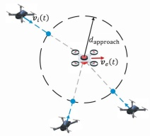</td><td>In this initial phase, the pursuers close the distance to the evader to within  $d _ { \mathrm { a p p r o a c h } } ,$  thereby perturbing its intended path. This prepares coordinated maneuvers in subsequent subtasks, serving as the engagement initializer. Timely execution prevents the evader from</td><td> $\operatorname { E q . } \ ( 2 0 )$ </td><td> $\operatorname { E q . } \ ( 2 1 )$ </td></tr><tr><td>Expand</td><td>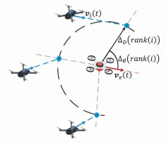</td><td>The formation expands laterally by reallocating agents to target bearings around the evader towards the flanks of the evader, increasing angular coverage and reducing viable escape routes. This constricts the evader&#x27;s space and guides it towards a controllable zone.</td><td>Eq. (22)</td><td>Eq. (23)</td></tr><tr><td>Surround</td><td>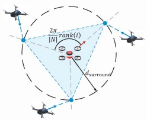</td><td>The pursuers maneuver into positions that form a closed perimeter around the evader, thereby blocking all potential escape paths. This establishes a closed encirclement critical for the subsequent phases.</td><td> $\operatorname { E q } . \ ( 2 4 )$ </td><td>Eqs. (25) and (26)</td></tr><tr><td>Enclose</td><td>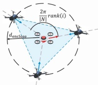</td><td>The encirclement is radially tightened by reducing the perimeter and gaps between pursuers, significantly limiting the evader&#x27;s movement while maintaining an angular-uniformity tolerance €θ. This prepares for the final capture.</td><td> $\operatorname { E q . } \ ( 2 7 )$ </td><td>Eqs. (25) and (28)</td></tr><tr><td>Capture</td><td>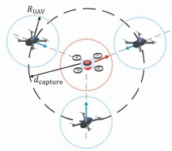</td><td>The pursuers maintain a tight encirclement while keeping a safe inter-UAV distance  $R _ { \mathrm { U A V } } .$  This allows dynamic adjustments to prevent escape, achieving  $\| p _ { i } - p _ { e } \| \leq ^ { \cdot } d _ { \mathrm { c a p t u r e } }$  for at least one i and ensuring a successful capture.</td><td> $\operatorname { E q } . \ ( 2 9 )$ </td><td>Eqs. (25) and (30)</td></tr></table>

2) Expand: The reward function is formulated as:

$$
\begin{array} { r l } { r _ { \mathrm { e x p a n d } } ^ { i } ( t ) = } & { - \alpha _ { \mathrm { e x p a n d } } ^ { 1 } | \langle { \pmb v } _ { e } ( t ) , { \pmb p } _ { e i } ( t ) \rangle - \Delta _ { \theta } \left( r a n k ( i ) \right) | } \\ & { - \alpha _ { \mathrm { e x p a n d } } ^ { 2 } | \| { \pmb p } _ { e i } ( t ) \| _ { 2 } - \Delta _ { D } \left( r a n k ( i ) \right) | } \\ & { - \alpha _ { \mathrm { e x p a n d } } ^ { 3 } \bigg \| { \pmb v } _ { i } ( t ) - \| { \pmb v } _ { i } ( t ) \| _ { 2 } \frac { { \pmb v } _ { e } ( t ) } { \| { \pmb v } _ { e } ( t ) \| _ { 2 } } \bigg \| _ { 2 } } \end{array}\tag{22}
$$

where $\alpha _ { \mathrm { e x p a n d } } ^ { 1 } , \alpha _ { \mathrm { e x p a n d } } ^ { 2 }$ , and $\alpha _ { \mathrm { e x p a n d } } ^ { 3 }$ are weighting coefficients. rank i denotes the ranking of pursuer i based on the angle between the pursuer and the target, ordered counterclockwise from the target’s velocity vector. $\Delta _ { \theta } ( k )$ and $\Delta _ { D } ( k )$ represent the desired angle and distance of the kth agent relative to the target, which can be adjusted to achieve various expansion formations. These terms evaluate whether the angle, distance, and velocity direction of pursuer i align with the desired criteria for the expanded formation. The expand subtask is complete when distance and angle errors from the desired formation fall below predefined thresholds:

$$
\begin{array} { r l r } & { } & { | \| \pmb { p } _ { e i } ( t ) \| _ { 2 } - \Delta _ { D } \left( r a n k ( i ) \right) | \le \epsilon _ { d } , \forall i \in N } \\ & { } & \\ & { } & { | \langle \pmb { v } _ { e } ( t ) , \pmb { p } _ { e i } ( t ) \rangle - \Delta _ { \theta } \left( r a n k ( i ) \right) | \le \epsilon _ { \theta } , \forall i \in N } \end{array}\tag{23}
$$

3) Surround: The reward function is as follows:

$$
\begin{array} { r l r } & { } & { r _ { \mathrm { s u r r o u n d } } ( t ) = - \alpha _ { \mathrm { s u r r o u n d } } ^ { 1 } \bigg | \frac { 2 \pi } { | N | } r a n k ( i ) - \langle \pmb { p } _ { e } ( t ) , \pmb { p } _ { i } ( t ) \rangle \bigg | } \\ & { } & { - \alpha _ { \mathrm { s u r r o u n d } } ^ { 2 } \bigg | \| \pmb { p } _ { i } ( t ) - \frac { \sum _ { j \in N } \pmb { p } _ { j } ( t ) } { | N | } \| _ { 2 } - \| \pmb { p } _ { e i } ( t ) \| _ { 2 } \bigg | } \end{array}\tag{24}
$$

where $\alpha _ { \mathrm { s u r r o u n d } } ^ { 1 }$ and $\alpha _ { \mathrm { s u r r o u n d } } ^ { 2 }$ are weighting coefficients balancing angular positioning and distance uniformity. The first term evaluates the angular position of pursuer i to ensure an even distribution around the target, while the second term promotes uniform distance between the pursuers and the target. The surround subtask is complete when the evasive UAV is enclosed within the polygon formed by the pursuers, and each pursuer maintains distance and angle errors relative to the target below a specified threshold:

$$
\begin{array} { r } { \displaystyle \bigoplus _ { i = 1 } ^ { n } \left[ \left( p _ { y } ^ { k _ { i } } > p _ { y } ^ { e } \right) \neq \left( p _ { y } ^ { k _ { i + 1 } } > p _ { y } ^ { e } \right) \land \left( p _ { x } ^ { k _ { i } } < x ^ { k _ { i } } \right) \right] = 1 , } \\ { \displaystyle x ^ { k _ { i } } = p _ { x } ^ { k _ { i } } + \frac { \left( p _ { y } ^ { e } - p _ { y } ^ { k _ { i } } \right) \times \left( p _ { x } ^ { k _ { i + 1 } } - p _ { x } ^ { k _ { i } } \right) } { p _ { y } ^ { k _ { i + 1 } } - p _ { y } ^ { k _ { i } } } } \end{array}\tag{25}
$$

$$
\left| \Delta _ { \theta } ( i ) - \frac { 2 \pi } { | N | } \right| < \epsilon _ { \theta } , \Delta _ { d } ( i ) < d _ { \mathrm { s u r r o u n d } } , \forall i \in P\tag{26}
$$

4) Enclose: The reward function for the enclose subtask is designed as:

$$
\begin{array} { r } { r _ { \mathrm { e n c l o s e } } ^ { i } ( t ) =  - \alpha _ { \mathrm { e n c l o s e } } ^ { 1 } | \frac { 2 \pi } { | N | } \mathrm { r a n k } ( i ) - \langle \pmb { p } _ { e } ( t ) , \pmb { p } _ { i } ( t ) \rangle | } \\ {  - \alpha _ { \mathrm { e n c l o s e } } ^ { 2 }  \pmb { p } _ { e i } \Vert _ { 2 } \qquad ( 2 7 } \end{array}
$$

where $\alpha _ { \mathrm { e n c l o s e } } ^ { 1 }$ and $\alpha _ { \mathrm { e n c l o s e } } ^ { 2 }$ are weighting coefficients prioritizing angular distribution and proximity to the target, respectively. The termination criterion for the enclose task is similar to (25), i.e.:

$$
\left| \Delta _ { \theta } ( i ) - \frac { 2 \pi } { | N | } \right| < \epsilon _ { \theta } , \Delta _ { d } ( i ) < d _ { \mathrm { e n c l o s e } } , \forall i \in P\tag{28}
$$

5) Capture: The reward function is as follows:

$$
\begin{array} { r l r } {  { { r } _ { \mathrm { c a p t u r e } } ^ { i } ( t ) = - \alpha _ { \mathrm { c a p t u r e } } ^ { 1 }  \| p _ { e i } ( t ) \| _ { 2 } - d _ { \mathrm { c a p t u r e } }  } } \\ & { } & { ~ - \ \alpha _ { \mathrm { c a p t u r e } } ^ { 2 }   p _ { N _ { \mathrm { r a n k } ( i ) } } , p _ { N _ { \mathrm { r a n k } ( i + 1 ) } }  - \frac { 2 \pi } {  N  } \mathrm { r a n k } ( i )  } \\ & { } & { ~ - \ \alpha _ { \mathrm { c a p t u r e } } ^ { 3 }   \pmb { v } _ { i } ( t ) - \frac { \pmb { v } _ { e } ( t ) } { \pmb { v } _ { e } ( t ) } \| \pmb { v } _ { i } ( t ) \| _ { 2 }   _ { 2 } \qquad ( \pmb { \mathrm { c a p t a n k } } ( i ) ) } \end{array}\tag{29}
$$

The termination criterion is:

$$
\left| \Delta _ { \theta } ( i ) - \frac { 2 \pi } { | N | } \right| < \epsilon _ { \theta } , \Delta _ { d } ( i ) < d _ { \mathrm { c a p t u r e } } , \forall i \in P\tag{30}
$$

In addition to subtask-specific rewards, pursuers receive general rewards during the pursuit task, including obstacle avoidance reward $r _ { \mathrm { a v o i d } } ^ { i }$ and conflict resolution reward $r _ { \mathrm { c o n f l i c t } } ^ { i } .$ as detailed below:

$$
r _ { \mathrm { a v o i d } } ^ { i } = \left\{ \begin{array} { l l } { - 1 , } & { \mathrm { i f } \exists b \in B \mathrm { ~ s . t . ~ } \| { \pmb p } _ { b i } \| _ { 2 } < R _ { \mathrm { b u i l d i n g } } } \\ { 0 , } & { \mathrm { o t h e r w i s e } } \end{array} \right.\tag{31}
$$

$$
r _ { \mathrm { c o n f i c t } } ^ { i } = \left\{ \begin{array} { l l } { - 1 , } & { \mathrm { i f } \exists j \in N \setminus \{ i \} \mathrm { s . t . } \| p _ { i j } \| _ { 2 } < R _ { \mathrm { U A V } } } \\ { 0 , } & { \mathrm { o t h e r w i s e } } \end{array} \right.\tag{32}
$$

Algorithm 1: HCDRL.   
1 Initialize:   
2 Upper layer network Q initialized with random   
weights $\theta ,$ and target network $\hat { Q }$ with $\theta ^ { - }  \theta ,$ , replay   
buffer $D ^ { u . } ;$ ; each agent l: critic $\dot { Q } ^ { l } ~ ( \theta ^ { Q ^ { l } } ) ,$ actor $\mu ^ { l }$   
$( \theta ^ { \mu } )$ , and target networks $Q ^ { l ^ { \prime } } , \bar { \mu } ^ { l ^ { \prime } }$ with $\theta ^ { Q ^ { l ^ { \prime } } }  \theta ^ { Q ^ { l } }$   
$\theta ^ { \mu ^ { l ^ { \prime } } }  \theta ^ { \mu ^ { l } }$ , buffer $D ^ { l } ;$   
3 for episode = 1 to M do   
4 Initialize subtask executing time counter $c _ { g } ;$   
5 for $t = 1$ to T do   
6 Observe state $s _ { t } ;$   
7 if $c _ { g } = = 0$ then   
8 Select gt with €-greedy;   
9 for each agent l do   
10 Select action $a _ { t } ^ { l } ;$   
11 Execute actions a, observe r and $s ^ { \prime } { \mathrm { ; } }$   
12 $c _ { g }  c _ { g } + 1 ;$   
13 Store transition $( s , a , r , s ^ { \prime } )$ in $D ^ { l } ;$   
14 if $t \% T _ { l e a r n } ^ { l } = = 0$ then   
15 for each agent l do   
16 Sample batches from $D ^ { l } ;$   
17 Compute target values $y ^ { l } ;$   
18 Update critic by minimizing loss $L ^ { l } ;$   
19 Update actor using sampled policy   
gradient;   
20 if $t \% T _ { u p d a t e } ^ { l } = = 0$ then   
21 for each agent l do   
22 Update target networks;   
23 Store transition $\left( \phi _ { t } , g _ { t } , r _ { t } ^ { u } , \phi _ { t + 1 } \right)$ in $D ^ { u } ;$   
24 Sample batches from $D ^ { u . }$   
25 Compute target values $y _ { j } ;$   
26 Update network parameters by minimizing loss;   
27 if $c _ { g } = = H$ or subtask $g _ { t }$ is achieved then   
28 $c _ { g } \gets 0 ;$   
29 $\textbf { i f } g _ { t }$ is capture then   
30 break;

The upper layer network’s reward is the average rewards obtained by all agents during a selected subtask, adjusted by a time decay factor as:

$$
r _ { \mathrm { u p p e r } } ( g ) = { \frac { e ^ { - \alpha _ { \mathrm { u p p e r } } ( T _ { n + 1 } - T _ { n } ) } } { | P | \times ( T _ { n + 1 } - T _ { n } ) } } \sum _ { i = 1 } ^ { | P | } \sum _ { t = T _ { n } } ^ { T _ { n + 1 } } r _ { i } ( t )\tag{33}
$$

where $r _ { i } ( t )$ is the total reward of agent i at time $t , T _ { n }$ and $T _ { n + 1 }$ are the start and completion times of subtask $^ { g , }$ and $\alpha _ { \mathrm { u p p e r } }$ is the decay coefficient. This reward captures collective efficiency and individual contributions, with the decay factor to incentivize faster subtask completion.

## C. Structure of HCDRL

The network structure of the HCDRL approach is illustrated in Fig. 2. The upper layer is the pursuit situation assessment network. It takes the observations of all agents $\phi _ { t }$ as input

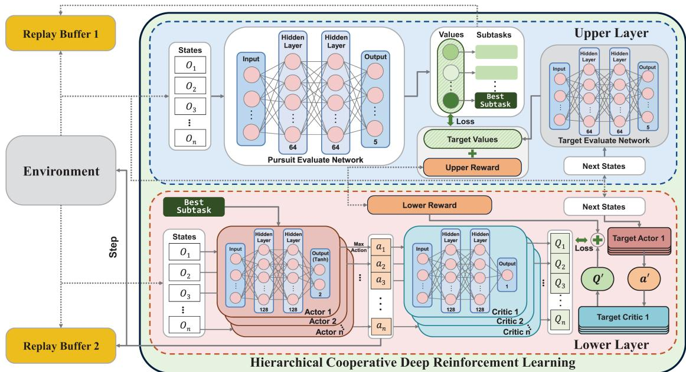  
Fig. 2. The network structure of the HCDRL approach.

to evaluate the values of subtasks, then dynamically assigns weights to the subtasks and selects the most suitable one as the current task:

$$
g _ { t } = \arg \operatorname* { m a x } _ { g } Q ( \phi _ { t } , g ; \theta )\tag{34}
$$

This allows the upper layer network to refine the selection of encirclement subtasks during the pursuit process, even if the subtask configuration is redundant or not optimal, resulting in a meta-strategy for coordinated encirclement.

During training, the upper layer network stores the transitions $\left( \phi _ { t } , g _ { t } , r _ { t } ^ { u } , \phi _ { t + 1 } \right)$ in an experience replay buffer $D ^ { u }$ . A batch ( )of these transitions is sampled from $D ^ { u }$ to update the network parameters. The target value is computed as:

$$
y ^ { u } = r ^ { u } + \gamma \operatorname* { m a x } _ { g ^ { \prime } } \hat { Q } ( \phi _ { t + 1 } , g ^ { \prime } ; \theta ^ { - } )\tag{35}
$$

where $\hat { Q }$ is the target network with parameters $\theta ^ { - }$ . The network parameters θ are updated by minimizing the loss function:

$$
L ^ { u } = \frac { 1 } { K } \sum _ { j = 1 } ^ { K } \left( y ^ { u } - Q ( \phi _ { j } , g _ { j } ; \theta ) \right) ^ { 2 }\tag{36}
$$

where K is the batch size, and $( \phi _ { j } , g _ { j } )$ are the sampled states and subtasks.

The lower layer network employs a CTDE framework, where each agent is equipped with individual actor and critic networks. The actor network $\mu ^ { l }$ generates maneuver actions based on local observation and the one-hot encoded representation of the selected subtask:

$$
a _ { t } ^ { l } = \mu ^ { l } ( s _ { t } ^ { l } , g _ { t } | \theta ^ { \mu ^ { l } } )\tag{37}
$$

The critic network takes all agents’ observations and actions as input, evaluating action values in the current state to guide actor network updates. This centralized training mechanism allows agents to optimize strategies considering others’ policies, enhancing cooperation. Target networks are employed to ensure stable policy convergence. Specifically, each agent samples experiences $( s , a , r , s ^ { \prime } )$ , and the target value y for the critic network is computed as:

$$
y ^ { l } = r ^ { l } + \gamma Q ^ { l ^ { \prime } } ( s ^ { \prime } , a ^ { \prime 1 } , \ldots , a ^ { \prime N } \mid \theta ^ { Q ^ { l ^ { \prime } } } )\tag{38}
$$

where $a ^ { \prime } l = \mu ^ { l ^ { \prime } } ( s ^ { \prime } l )$ is the action selected by the target actor network $\mu ^ { l ^ { \prime } }$ for the next state $s ^ { \prime l }$ . The critic network is then updated by minimizing the loss function:

$$
L ^ { l } = \frac { 1 } { K } \sum _ { k = 1 } ^ { K } \left( y ^ { l } - Q ^ { l } ( \pmb { s } , \pmb { a } \mid \theta ^ { Q ^ { l } } ) \right) ^ { 2 }\tag{39}
$$

The actor network is updated using the sampled policy gradient:

$$
\nabla _ { \theta ^ { \mu } } \boldsymbol { \mathrm { \Delta } J } \approx \frac { 1 } { K } \sum _ { k = 1 } ^ { K } \nabla _ { a ^ { l } } Q ^ { l } \big ( \boldsymbol { s } ^ { ( k ) } , \boldsymbol { a } ^ { ( k ) } \mid \theta ^ { Q ^ { l } } \big )\tag{40}
$$

which adjusts the actor parameters $\theta ^ { \mu ^ { l } }$ in the direction that maximizes the expected return.

The target networks are updated using soft updates:

$$
\theta ^ { Q ^ { l ^ { \prime } } }  \tau \theta ^ { Q ^ { l } } + ( 1 - \tau ) \theta ^ { Q ^ { l ^ { \prime } } } , \theta ^ { \mu ^ { l ^ { \prime } } }  \tau \theta ^ { \mu ^ { l } } + ( 1 - \tau ) \theta ^ { \mu ^ { l ^ { \prime } } }\tag{41}
$$

where τ is the update rate. This ensures that the target networks slowly track the learned networks, which stabilizes training.

In the execution phase, each agent independently makes decisions based on its own observations and the subtask provided by the upper layer network. The algorithm is summarized in Algorithm 1.

TABLE III  
TRAINING PARAMETERS USED FOR HCDRL ALGORITHM
<table><tr><td>Parameter</td><td>Value</td></tr><tr><td>Soft update parameter (τ)</td><td>0.02</td></tr><tr><td>Discount factor (γ)</td><td>0.95</td></tr><tr><td>Replay buffer capacity</td><td>106</td></tr><tr><td>Update frequency  $( T _ { \mathrm { u p d a t e } } ^ { l } )$ </td><td>100</td></tr><tr><td>Upper layer batch size</td><td>128</td></tr><tr><td>Lower layer batch size</td><td>1024</td></tr><tr><td>Learning rate (actor)</td><td>0.0001</td></tr><tr><td>Learning rate (critic)</td><td>0.0001</td></tr><tr><td>Training episodes</td><td>12,000</td></tr><tr><td>Max time steps per episode (T)</td><td>1000</td></tr></table>

## V. EXPERIMENTAL RESULTS AND ANALYSIS

## A. Parameters and Baselines

In the experiment, the aerial boundary is set to 100 m. Each pursuer UAV has a size $r _ { \mathrm { u a v } } ^ { p }$ of 0.4 m, a maximum speed $v _ { \mathrm { m a x } } ^ { p }$ of m/s, and a maximum acceleration $a _ { \mathrm { m a x } } ^ { p }$ of $\mathrm { 1 0 \mathrm { m / s } ^ { 2 } } .$ . The size 20of evading $\mathrm { U A V } r _ { \mathrm { u a v } } ^ { e }$ 10is 0.5 m, the default maximum speed $v _ { \mathrm { m a x } } ^ { e }$ is m/s, and maximum acceleration $a _ { \mathrm { m a x } } ^ { e }$ of $1 1 \mathrm { m / s ^ { 2 } }$ . The initial positions of the evader and pursuers are randomly generated. A safety distance maintained of UAVs from obstacles $R _ { \mathrm { b u i l d i n g } } =$ . m and other UAVs RUAV m. The distance thresholds for the subtasks of approach, expand, surround, enclose, and capture are respectively set at $d _ { \mathrm { a p p r o a c h } } = 2 5 \mathrm { m } , d _ { \mathrm { e x p a n d } } = 1 5 \mathrm { m }$ $d _ { \mathrm { s u r r o u n d } } = 1 2 \mathrm { m } , d _ { \mathrm { e n c l o s e } } = 8 \mathrm { m }$ , and ${ d _ { \mathrm { c a p t u r e } } = 4 \mathrm { m } }$ . The maximum duration for executing the cooperative pursuit task $T$ is 1000 time steps, with each time step in the simulation representing 0.1 s. After selecting a subtask, the maximum execution duration H is 45 time steps.

The set of training parameters are outlined in Table III, including the soft update parameter and the learning rates for both the actor and critic networks, and so on.

Three classic multi-agent reinforcement learning algorithms, namely, MADDPG, Multi-Agent Proximal Policy Optimization (MAPPO), and Multi-Agent Twin Delayed DDPG (MATD3), were selected as baselines for comparison. Additionally, three advanced algorithms, MAC3 [23], SA-MATD3 [40], and CEL-MADDPG [24], were included for a comprehensive evaluation. To ensure fairness, consistent training parameters were applied across all algorithms. The evader was trained using TD3 and then kept fixed during training and evaluation of all pursuer algorithms. All baselines are trained and evaluated against this identical evader distribution. Ablation experiments were also conducted to evaluate the effectiveness of the proposed approach.

## B. Performance Comparision

The normalized reward convergence curves for the upper and lower networks during training is shown in Fig. 3. The subplot depicts the rolling Pearson correlation between the rewards of the two networks, revealing a strong positive correlation throughout most of the training process. This indicates that the hierarchical networks adaptively synchronize during training, collectively improving decision-making as reflected by the simultaneous reward increases. The alignment in convergence trends highlights the efficiency of the HCDRL algorithm in orchestrating cohesive decision-making across network layers. This synergy between hierarchical levels enables a more integrated and effective strategy to achieving cooperative behaviors.

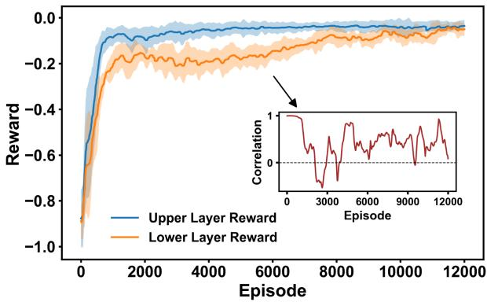  
Fig. 3. Convergence curves of the upper and lower networks in HCDRL.

Fig. 4 illustrates complete trajectories and zoomed-in details of pursuers and evader. Fig. 4(a)–(c) depict trajectories in three scenarios: (a) agents forming enclosures to capture the target, (b) pursuers leveraging obstacles for capture, and (c) pursuers driving the evader towards boundaries for capture. Fig. 4(d)–(f) provide close-ups of the capture processes, showing pursuers enclosing the evader and restricting its movement. In all these examples, the evader attempts to maneuver within a confined area but ultimately fails to break free. During the capture process, no conflicts occur between UAVs and buildings or among UAVs themselves. While trajectories may overlap, UAVs reach the same positions at different times with no collisions. These demonstrate that the pursuers have learned complex and flexible strategies, enabling them to coordinate effectively, utilize environmental features like buildings and boundaries, and execute cooperative pursuit tasks. This validates the proposed method’s ability to achieve complex cooperative behavior while ensuring safety and efficiency.

Several evaluation metrics are designed to assess the effectiveness of the proposed method:

1) CP(%): The percentage of successful capture episodes.

2) CT(s): The mean duration of successful pursuits.

3) AP: Average Collisions among Pursuers.

4) AB: Average Collisions with Buildings.

5) FR: The average final rewards after convergence.

6) RV: The variances of final rewards after convergence.

Note that rewards and variances are normalized based on the maximum and minimum values obtained during training. The metric values are averaged over 1200 validation episodes using trained models, as presented in Table IV. It can be seen that the proposed method outperforms all benchmarks in most metrics except Reward Variance, achieving a significantly higher capture success rate and lower average capture time. This demonstrates its ability to enhance pursuit efficiency, minimize collision risks, and ensure operational safety and effectiveness.

(a) Evader Enclosed by Pursuers  
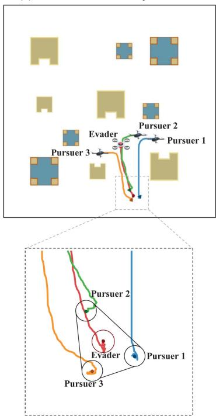

(b) Enclose Utilizing Building  
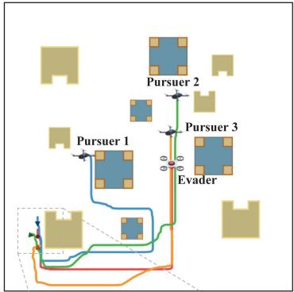

(c) Enclose Utilizing Boundary  
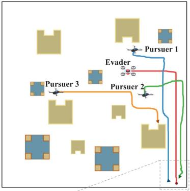

(d) Detail of Pursuers' Enclosure  
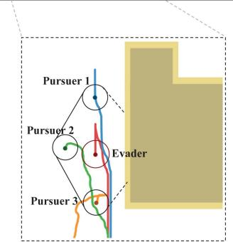  
(e) Detail of Capture using Building

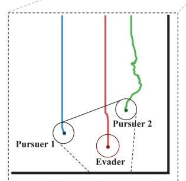  
(f) Detail of Capture using Boundary  
Fig. 4. Trajectory examples and detailed zoomed-in views of agents during cooperative pursuits.

TABLE IV  
PERFORMANCE METRICS COMPARISON
<table><tr><td></td><td>MADDPG</td><td>MAPPO</td><td>MATD3</td><td>MAC3</td><td>SA-MATD3</td><td>CEL-MADDPG</td><td>HCDRL</td></tr><tr><td>CP</td><td>52.07</td><td>50.82</td><td>65.52</td><td>77.91</td><td>70.71</td><td>74.14</td><td>89.08</td></tr><tr><td>CT</td><td>37.83</td><td>39.63</td><td>35.69</td><td>29.57</td><td>34.54</td><td>43.87</td><td>26.63</td></tr><tr><td>AP</td><td>0.2724</td><td>0.4278</td><td>0.2218</td><td>0.2341</td><td>0.2149</td><td>0.2126</td><td>0.0966</td></tr><tr><td>AB</td><td>0.2807</td><td>0.6043</td><td>0.2529</td><td>0.2166</td><td>0.1579</td><td>0.1721</td><td>0.1286</td></tr><tr><td>FR</td><td>-0.0772</td><td>-0.2041</td><td>-0.0683</td><td>-0.0659</td><td>-0.0673</td><td>-0.0636</td><td>-0.0509</td></tr><tr><td>RV</td><td>0.0479</td><td>0.1143</td><td>0.0579</td><td>0.0212</td><td>0.0301</td><td>0.1332</td><td>0.0298</td></tr></table>

The proposed method achieves the highest successful capture rate at 89.08%, significantly outperforming the success rates of classic deep reinforcement learning methods (MAPPO, MAD-DPG, and MATD3). The success rates of the three improved methods (MAC3, SA-MATD3, and CEL-MADDPG) exceed the classic approaches. However, none of these methods match the effectiveness of the proposed method. The average successful time taken by HCDRL also outperforms the others. This demonstrates the proposed method’s superior decision-making capability in facilitating successful captures within shorter durations.

Moreover, Table IV illustrates the average number of conflicts encountered between agents and with buildings for each algorithm in one episode during the evaluation process, respectively. HCDRL exhibits the lowest values for both conflict indicators, reflecting the safety of the strategies generated by the proposed algorithm. Conversely, the MAPPO algorithm shows the worst performance in terms of avoiding conflicts. This result underscores the effectiveness of the HCDRL algorithm in ensuring operational safety, significantly reducing the risk of collisions.

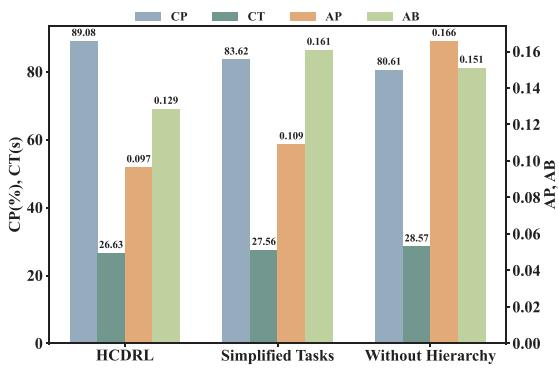  
Fig. 5. Comparison of main metrics between HCDRL and its variants.

To validate the effectiveness of the HCDRL components, two variants were introduced: 1) Simplified Tasks: the pursuit task was reduced to three stages, approach, surround, and capture, each with a corresponding reward function, and 2) Without Hierarchy: the upper layer was replaced with predetermined subtask selection rules. Ablation experiments were conducted to evaluate the impact of subtask decomposition and the upper layer network on the algorithm’s performance, with results presented in Fig. 5. For Simplified Tasks, key metrics such as capture success rate, average capture time, and the number of conflicts among pursuers showed significant deterioration, highlighting the effectiveness of the proposed subtask decomposition. For Without Hierarchy, metrics such as average capture time and conflict numbers also declined, with a particularly notable drop in the capture success rate. This demonstrates the upper layer network’s critical role in improving pursuit efficiency and effectiveness through adaptive and timely subtask selection, leading to better overall performance.

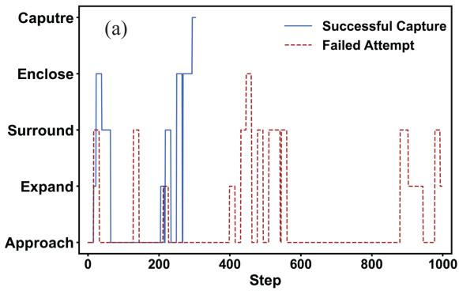

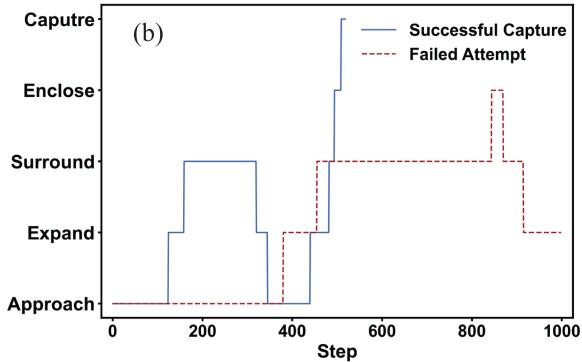  
Fig. 6. Execution of subtasks. (a) The HCDRL was adopted. (b) The upper layer network of the HCDRL was removed.

Subtask Transition Matrix (Row-max Normalized Colors)  
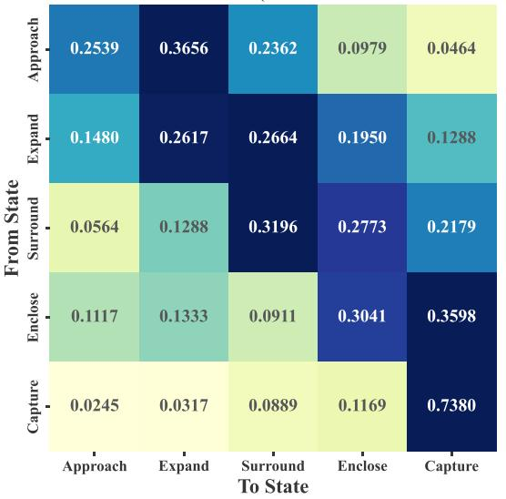  
Fig. 7. Empirical subtask transition matrix learned by the upper-layer policy.

To validate the strategy of the upper-layer network in dynamically adjusting tasks during the pursuit process, the subtask transition matrix is computed. The transition probabilities in Fig. 7 demonstrate that the learned subtask switching behavior follows a reasonable progression. Note that the colors are normalized by the maximum value within each row to highlight the dominant subtask transitions. Specifically, transitions are most frequent from Approach to Expand (0.3656) and to Surround (0.2362), which aligns with the expected maneuver sequence in encirclement. Similarly, once the system enters Capture, the probability of remaining in this state is dominant (0.7380), consistent with the terminal nature of this subtask. Intermediate states such as Surround and Enclose exhibit balanced outgoing probabilities, reflecting adaptive adjustments depending on spatial conditions. These patterns confirm that the upper-layer policy captures the logical structure of multi-stage pursuit, providing evidence of meaningful hierarchical learning.

TABLE V  
PROBABILITIES OF EXECUTING DIFFERENT SUBTASKS BY THE HCDRL ALGORITHM
<table><tr><td></td><td>Approach</td><td>Expand</td><td>Surround</td><td>Enclose</td><td>Capture</td></tr><tr><td>Successful Capture</td><td>0.5769</td><td>0.0667</td><td>0.1388</td><td>0.1854</td><td>0.0319</td></tr><tr><td>Failed Capture</td><td>0.8066</td><td>0.0458</td><td>0.1389</td><td>0.0085</td><td>0.0000</td></tr></table>

Furthermore, Table V shows the average frequency of subtasks chosen during successful and failed episodes using HC-DRL. The approach task dominates in duration for both scenarios, while the selection of other subtasks varies. Besides, Fig. 6(a) illustrates subtask selection during a successful and a failed capture round in validation. In the successful capture, the network consistently selects subtasks until the target is captured, ending the round. In the failed capture, the network also adjusts its subtask selection based on the evolving situation but fails to encircle the target. Fig. 6(b) compares subtask selection in successful and failed captures. It is evident that untimely subtask selection in failed cases results in longer capture times. These findings highlight the upper layer network’s effectiveness in HCDRL, enabling faster and more efficient pursuit through appropriate subtask selection. These results show the upper layer network’s ability to adaptively prioritize subtasks to improve the overall success rate of encirclement.

The impact of the maximum execution duration H on performance is further investigated. As shown in Fig. 8, CP first increases with H and peaks at H with a value of 89.08%, while CT remains close to its minimum (26.63 s at H versus the best case 26.21 s at H ). For larger H values, the performance of both CP and CT declines significantly, reflecting excessive commitment to outdated subtasks. Therefore, H offers the best balance between success rate and capture efficiency, and is adopted as the default setting.

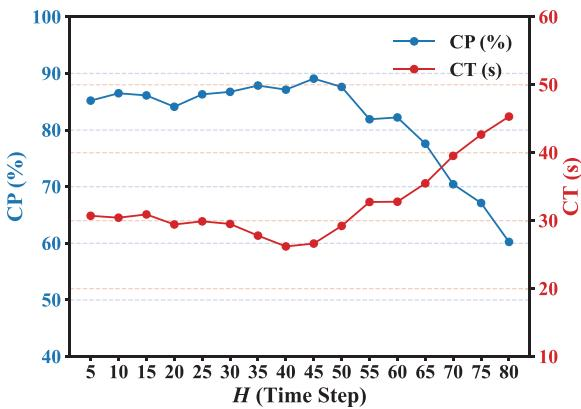  
Fig. 8. Impact of maximum execution duration H on capture performance.

TABLE VI  
PERFORMANCE METRICS AT DIFFERENT MAXIMUM SPEED RATIOS $( v _ { \operatorname* { m a x } } ^ { p } : v _ { \operatorname* { m a x } } ^ { e } )$
<table><tr><td></td><td>1:1.1</td><td>1:1.2</td><td>1:1.3</td><td>1:1.4</td><td>1:1.5</td></tr><tr><td>Capturing Probability (%)</td><td>89.08</td><td>85.08</td><td>82.36</td><td>82.18</td><td>78.30</td></tr><tr><td>Average Capture Time (s)</td><td>26.63</td><td>29.17</td><td>32.21</td><td>34.08</td><td>34.26</td></tr><tr><td>Average Collisions among Pursuers</td><td>0.0966</td><td>0.0975</td><td>0.1024</td><td>0.0977</td><td>0.1839</td></tr><tr><td>Average Collisions with Buildings</td><td>0.1286</td><td>0.1494</td><td>0.1769</td><td>0.2356</td><td>0.1609</td></tr></table>

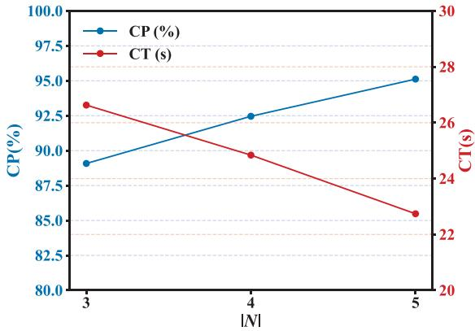  
Fig. 9. Pursuit performance versus the number of pursuers |N |.

Further adjustment of a key parameter, i.e., the maximum speed ratio of pursuers to evader, to observe the generality of the proposed algorithm when facing a faster evader. Table VI shows the results of pursuit for different speed ratios. The pursuers’ maximum speed was kept constant while the evader’s maximum speed was incrementally increased in different experimental setups. It is observed that even when the speed of the evader increases to 1.5 times that of the pursuers, a near 80% capture success rate is maintained, with only a slight overall increase in pursuit time and no significant worsening in the number of collisions.

To evaluate scalability with respect to team size, the number of pursuers $| N |$ is varied from 3 to 5. As shown in Fig. 9, the capture success rate steadily increases from 89.08% at $| N | = 3$ to 95.12% at $| N | = 5 . \ \mathrm { A t }$ the same time, the average capture time decreases from 26.63 s to 22.74 s. These results indicate that the proposed HCDRL framework effectively scales to larger pursuer teams, achieving higher efficiency.

Overall, the proposed method maintains strong decisionmaking ability to achieve cooperative pursuit of fleeter evader. The pursuit meta-strategy and maneuver strategies are trained through the hierarchical cooperative framework, which enhances cooperation and strategy convergence.

## VI. CONCLUSION

This study explored the coordinated encirclement strategy of a fleeter target by multiple UAVs in urban low-altitude airspace. To enhance the strategies effectiveness of pursuers, the complete encirclement behavior is decomposed into different phases, constructing a set of subtasks for the encirclement. A hierarchical cooperative deep reinforcement learning algorithm was further designed, which adopted a dual-layer framework for decisionmaking. The upper layer network acts as the meta-strategy, evaluating the encirclement situation to select the optimal subtask. The lower layer network determines the specific maneuver actions based on the chosen subtask and the agent’s own observation. The algorithm was validated in an urban airspace simulation environment, with multiple UAVs collaboratively encircling a rogue UAV. Simulation results indicate that, compared to state-of-art algorithms for the same problem, the proposed method significantly improves the success rate of encirclement against a fleeter target and reduces the time required for capture.

Compared to other advanced methods, the approach presented in this paper performs better. However, there are some limitations that need to be addressed in future work. In this study, ideal communication among agents is assumed, neglecting the communication constraints present in real-world pursuit scenarios. Future work will consider these practical challenges to refine the algorithm further.

## REFERENCES

[1] H. Menouar, I. Guvenc, K. Akkaya, A. S. Uluagac, A. Kadri, and A. Tuncer, “UAV-enabled intelligent transportation systems for the smart city: Applications and challenges,” IEEE Commun. Mag., vol. 55, no. 3, pp. 22–28, Mar. 2017.

[2] B. D. Song, K. Park, and J. Kim, “Persistent UAV delivery logistics: MILP formulation and efficient heuristic,” Comput. Ind. Eng., vol. 120, pp. 418–428, Jun. 2018.

[3] Z. Wang, L. Duan, and R. Zhang, “Adaptive deployment for UAV-aided communication networks,” IEEE Trans. Wireless Commun., vol. 18, no. 9, pp. 4531–4543, Sep. 2019.

[4] S. H. Alsamhi et al., “UAV computing-assisted search and rescue mission framework for disaster and harsh environment mitigation,” Drones, vol. 6, no. 7, Jul. 2022, Art. no. 154.

[5] Y. Li et al., “Urban air mobility: A review and challenges,” IEEE Intell. Transp. Syst. Mag., vol. 17, no. 3, pp. 67–87, May/Jun. 2025.

[6] D. Zhang et al., “Integrated sensing and communications over the years: An evolution perspective,” 2025, arXiv:2504.06830.

[7] J. Mu, R. Zhang, Y. Cui, N. Gao, and X. Jing, “UAV meets integrated sensing and communication: Challenges and future directions,” IEEE Commun. Mag., vol. 61, no. 5, pp. 62–67, May 2023.

[8] Y. Cui, W. Yuan, Z. Zhang, J. Mu, and X. Li, “On the physical layer of digital twin: An integrated sensing and communications perspective,” IEEE J. Sel. Areas Commun., vol. 41, no. 11, pp. 3474–3490, Nov. 2023.

[9] Y. Li, J. Li, C. Yu, and W. Du, “A hierarchical conflict resolution framework with graph transformer-based reinforcement learning for heterogeneous UAV networks,” IEEE Internet Things J., early access, 2025, doi: 10.1109/JIOT.2025.3605043.

[10] Y. Li, J. Li, J. Wang, X. Zhang, H. Ding, and W. Du, “Multi-scale graph enhanced reinforcement learning for conflict resolution in dense UAV networks,” IEEE Internet Things J., vol. 12, no. 21, pp. 44290–44303, Nov. 2025.

[11] W. Yuan et al., “From ground to sky: Architectures, applications, and challenges shaping low-altitude wireless networks,” 2025, arXiv:2506.12308.

[12] Y. Cui, X. Cao, G. Zhu, J. Nie, and J. Xu, “Edge perception: Intelligent wireless sensing at network edge,” IEEE Commun. Mag., vol. 63, no. 3, pp. 166–173, Mar. 2025.

[13] H. Kang, J. Joung, J. Kim, J. Kang, and Y. S. Cho, “Protect your sky: A survey of counter unmanned aerial vehicle systems,” IEEE Access, vol. 8, pp. 168671–168 710, 2020.

[14] C. Lyu and R. Zhan, “Global analysis of active defense technologies for unmanned aerial vehicle,” IEEE Aerosp. Electron. Syst. Mag., vol. 37, no. 1, pp. 6–31, Jan. 2022.

[15] Y. Cui, C. Zheng, J. Liu, H. Wang, R. Hu, and Z. Wang, “The research of aircraft pursuit-evasion game based on improved DQN,” in Proc. 3rd IEEE Int. Conf. Unmanned Syst., 2020, pp. 857–862.

[16] J. Moon, S. Papaioannou, C. Laoudias, P. Kolios, and S. Kim, “Deep reinforcement learning Multi-UAV trajectory control for target tracking,” IEEE Internet Things J., vol. 8, no. 20, pp. 15441–15455, Oct. 2021.

[17] Z. Fan, H. Yang, F. Liu, L. Liu, and Y. Han, “Reinforcement learning method for target hunting control of multi-robot systems with obstacles,” Int. J. Intell. Syst., vol. 37, no. 12, pp. 11275–11 298, 2022.

[18] Y. Wang, T. Zhu, and Y. Duan, “Cooperative encirclement strategy for multiple drones based on ATT-MADDPG,” in Proc. IEEE 6th Int. Conf. Electron. Inf. Commun. Technol., 2023, pp. 1035–1040.

[19] Y. Zhang and E. Zhao, “Design of MADDPG capture algorithm for multiple UAV cooperation,” in Proc. 2023 IEEE Int. Conf. Mechatron. Automat., 2023, pp. 2021–2026.

[20] F. Li, M. Yin, T. Wang, T. Huang, C. Yang, and W. Gui, “Distributed pursuit-evasion game of limited perception USV swarm based on multiagent proximal policy optimization,” IEEE Trans. Syst., Man, Cybern., Syst., vol. 54, no. 10, pp. 6435–6446, Oct. 2024.

[21] Z. Yang, W. Du, X. Zhang, J. Wang, and Y. Li, “A spatiotemporal graph reasoning approach for pursuit-evasion game with communication limits,” IEEE Trans. Veh. Technol., early access, pp. 1–16, 2025, doi: 10.1109/TVT.2025.3605736.

[22] J. Liu, S. Liu, H. Wu, and Y. Zhang, “A pursuit-evasion algorithm based on hierarchical reinforcement learning,” in Proc. 2009 Int. Conf. Measuring Technol. Mechatron. Automat., 2009, pp. 482–486.

[23] W. Du, T. Guo, J. Chen, B. Li, G. Zhu, and X. Cao, “Cooperative pursuit of unauthorized UAVs in urban airspace via multi-agent reinforcement learning,” Transp. Res. Part C Emerg. Technol., vol. 128, Jul. 2021, Art. no. 103122.

[24] B. Li, J. Wang, C. Song, Z. Yang, K. Wan, and Q. Zhang, “Multi-UAV roundup strategy method based on deep reinforcement learning CEL-MADDPG algorithm,” Expert Syst. Appl., vol. 245, Jul. 2024, Art. no. 123018.

[25] J. Qiu, D. Grace, G. Ding, M. D. Zakaria, and Q. Wu, “Air-ground heterogeneous networks for 5G and beyond via integrating high and low altitude platforms,” IEEE Wireless Commun., vol. 26, no. 6, pp. 140–148, Dec. 2019.

[26] H. A. H. Alobaidy, M. Jit Singh, M. Behjati, R. Nordin, and N. F. Abdullah, “Wireless transmissions, propagation and channel modelling for IoT technologies: Applications and challenges,” IEEE Access, vol. 10, pp. 24095–24131, 2022.

[27] N. S. Labib, M. R. Brust, G. Danoy, and P. Bouvry, “The rise of drones in Internet of Things: A survey on the evolution, prospects and challenges of unmanned aerial vehicles,” IEEE Access, vol. 9, pp. 115466–115487, 2021.

[28] F. Liu et al., “Integrated sensing and communications: Toward dualfunctional wireless networks for 6G and beyond,” IEEE J. Sel. Areas Commun., vol. 40, no. 6, pp. 1728–1767, Jun. 2022.

[29] R. Isaacs, Differential Games: A Mathematical Theory With Applications to Warfare and Pursuit, Control and Optimization, 1st ed. Hoboken, NJ, USA: Wiley, Jan. 1965.

[30] L. Meier, “A new technique for solving pursuit-evasion differential games,” IEEE Trans. Autom. Control, vol. 14, no. 4, pp. 352–359, Aug. 1969.

[31] S. A. Ganebny, S. S. Kumkov, S. Le Menec, and V. S. Patsko, “Numerical study of two-on-one pursuit-evasion game,” IFAC Proc., vol. 44, no. 1, pp. 9326–9333, Jan. 2011.

[32] M. Pachter, A. VonE. MollD. W. GarciaCasbeer, and D. Milutinovi´c, “Singular trajectories in the two pursuer one evader differential game,” in Proc. 2019 Int. Conf. Unmanned Aircr. Syst., Jun. 2019, pp. 1153–1160.

[33] Y. Xu, H. Yang, B. Jiang, and M. M. Polycarpou, “Multiplayer pursuitevasion differential games with malicious pursuers,” IEEE Trans. Autom. Control, vol. 67, no. 9, pp. 4939–4946, Sep. 2022.

[34] D. W. Oyler, P. T. Kabamba, and A. R. Girard, ”Pursuit–evasion games in the presence of obstacles,” Automatica J. IFAC, vol. 65, pp. 1–11, Mar. 2016.

[35] J. K. Gupta, M. Egorov, and M. Kochenderfer, “Cooperative multi-agent control using deep reinforcement learning,” in Proc. Auton. Agents Multi-Agent Syst., 2017, pp. 66–83.

[36] Q. Qi, X. Zhang, and X. Guo, “A deep reinforcement learning approach for the pursuit evasion game in the presence of obstacles,” in Proc. 2020 IEEE Int. Conf. Real-time Comput. Robot., 2020, pp. 68–73.

[37] G. Singh, D. M. Lofaro, and D. Sofge, “Pursuit-evasion with decentralized robotic swarm in continuous state space and action space via deep reinforcement learning,” in Proc. Int. Conf. Agents Artif. Intell., 2020, pp. 226–233.

[38] Y. Wang, L. Dong, and C. Sun, “Cooperative control for multi-player pursuit-evasion games with reinforcement learning,” Neurocomputing, vol. 412, pp. 101–114, Oct. 2020.

[39] R. Zhang, Q. Zong, X. Zhang, L. Dou, and B. Tian, “Game of drones: Multi-UAV pursuit-evasion game with online motion planning by deep reinforcement learning,” IEEE Trans. Neural Netw. Learn. Syst., vol. 34, no. 10, pp. 7900–7909, Oct. 2023.

[40] K. Liu, Y. Zhao, G. Wang, and B. Peng, “Self-attention-based multiagent continuous control method in cooperative environments,” Inf. Sci., vol. 585, pp. 454–470, Mar. 2022.

  
Zhengzhi Yang received the BS degree in electronic and information engineering from Beihang University, Beijing, China, in 2020. He is currently working toward the PhD degree in the School of Electronic and Information Engineering, Beihang University. His research interests include intelligent decisionmaking, swarm game theory, and their applications in low-altitude air traffic management and UAV swarm operations.

Yuanhao Cui (Member, IEEE) is currently an assistant professor with the School of Information Science and Engineering, Beijing University of Posts and Telecommunications, Beijing, China. Dr. Cui’s research interests lie in the general area of signal processing and wireless communications, and in particular in the area of Integrated Sensing and Communications (ISAC) and Low-Altitude Wireless Network (LAWN). He is the founding chair of the IEEE Com-Soc Special Interest Group on Low-Altitude Wireless Networks (LAWN-SIG), the founding secretary of the

IEEE ComSoc ISAC Emerging Technology Initiative (ISAC-ETI), and the founding secretary of the CCF Scientific Communication standing committee. He serves on the editorial board of IEEE Transactions on Mobile Computing, IEEE Vehicular Technology Magazine, IEEE Journal of Internet of Things, IEEE Journal of Biomedical and Health Informatics. He was a Symposium Co-Chair for IEEE GLOBECOM 2024, and was an Organizer/the Chair of several workshops and special sessions on ISAC in flagship IEEE and ACM conferences, including IEEE ICC, IEEE/CIC ICCC, IEEE SPAWC, IEEE VTC, IEEE WCNC, IEEE ICASSP, and ACM MobiCom. He is a member of the IMT-2030 (6G) ISAC Task Group. He was listed among the World’s Top 2% Scientists by Stanford University for citation impact from 2023 to 2024. He was a recipient of numerous Best Paper Awards, including the 2025 IEEE Communication Society and Information Theory Society Joint Paper Award, 2024 IEEE Communications Society Asia-Pacific Outstanding Paper Award, 2024 IEEE Globecom Best Paper Award, 2024 IEEE JC&S Symposium Best Paper Award, 2023 ACM MobiCom Best Paper Award in ISAC, and 2023 IEEE/CIC ICCC 2023 Best Paper Award.

  
Wenbo Du (Member, IEEE) received the BS and PhD degrees from the School of Computer Science and Technology, University of Science and Technology of China, Hefei, China, in 2005 and 2010, respectively. He is currently a professor with the School of Electronic and Information Engineering, Beihang University, Beijing, China. His current research interests include data science and intelligent transportation.

  
Yumeng Li (Member, IEEE) received the PhD degree from the School of Electronic and Information Engineering from Beihang University, Beijing, China. She is currently an associate professor with the School of Electronic and Information Engineering, Beihang University, Beijing. Her research interests include network science, uncrewed aerial vehicle conflict resolution, and swarm intelligence systems.

Fanbiao Li (Senior Member, IEEE) received the BS degree in applied mathematics from Mudanjiang Normal University, Mudanjiang, China, in 2008, the MS degree in operational research and cybernetics from Heilongjiang University, Harbin, China, in 2012, and the PhD degree in control theory and control engineering from the Harbin Institute of Technology, Harbin, in 2015. From December 2013 to April 2015, he was a Joint Training PhD Student with the School of Electrical and Electronic Engineering, University of Adelaide, Adelaide, SA, Australia, where he was a

Research Associate from April 2015 to February 2016. From July 2016 to June 2020, he was an associate professor with Central South University, Changsha, China. From April 2017 to March 2018, he was an Alexander von Humboldt research fellow with the University of Duisburg-Essen, Duisburg, Germany. He is currently a full professor with Central South University. His research interests include control and design of aircraft brake system, sliding mode control, and fault diagnosis and identification. Prof. Li currently serves as an Associate Editor for a number of journals, including IEEE Transactions on Fuzzy Systems, IEEE Transactions on Systems, Man and Cybernetics: Systems, IEEE/CAA Journal of Automatica Sinica, and Cognitive Computation.